---

# CMG (Chipotle Mexican Grill) — Tier 3 深度研究报告

**评级: 中性关注(偏审慎)** | **期望回报: -7.0%** | **置信度: 55%**

价格: $36.93 | 市值: $49.5B | P/E: 32x | A-Score: 6.88/10
温度: 5.39/10 (中性) | SGI: 7.4 | PW: 4.2 (混合模式)
分析师: 投资大师 Agent v18.0 | 日期: 2026-03-04

---

# Ch1 执行摘要: 一页纸判断 (Executive Summary)

## 1.1 一句话判断

CMG以32倍P/E交易于5年估值底部，零金融负债+高ROIC构成结构性安全边际，但Niccol离任后comp转负(-1.7%)、Boatwright未经验证、WACC悖论使DCF结构性偏低——期望回报-7%处于中性关注与审慎关注的边界，FY2026 H1 comp数据是评级升降的关键触发器 [DM-P5-A01]。

---

## 1.2 核心数字快照

| 指标 | 值 | 行业/历史语境 |
|------|:--:|--------------|
| **股价** | $36.93 | 52周区间 $29.75 - $58.42 |
| **市值** | $49.5B | 全美快休闲市值第一 |
| **P/E (TTM)** | 32x | 5年最低(FY2024: 53.8x)，同业中位29.4x |
| **EV/EBITDA** | 25-26x | 5年最低(FY2024: 37.2x) |
| **ROIC** | 18.9% | 连续5年上升(FY2021: 10.8%)，>>WACC |
| **ROE** | 47.4% | FY2025数学膨胀(权益乘数3.18x)，真实运营ROIC更可靠 |
| **FCF Yield** | 2.93% | $1.45B FCF / $49.5B市值 |
| **净现金** | $1.05B | 零金融负债(行业唯一)，Z-Score 7.28(安全区) |
| **Comp** | -1.7% | 2016年以来首次全年负增长，客流-2.9% |
| **OPM** | 16.8% | 同比持平(FY2024: 16.9%)，Q4季节性低至14.8% |
| **EPS** | $1.14 | +2.7% YoY(FY2024: +24.7%增速悬崖) |
| **门店数** | 4,056 | +8%/年扩张，国际仅~100家(2.5%) |
| **A-Score** | 6.88/10 | 消费品系列最高(IHG 6.78 / SBUX 5.86 / RCL 5.76) |
| **温度** | 5.39/10 | 中性：宏观极昂贵(2.3)被基本面质量(7.0)拉回 |
| **评级** | 中性关注(偏审慎) | 期望回报-7.0%，55%置信度 |

---

## 1.3 估值快照

| 方法 | 隐含价格 | 权重 | 说明 |
|------|:--------:|:----:|------|
| DCF (4情景概率加权) | $20.06 | 30% | WACC 9.5%(纯Ke)结构性偏低 |
| 可比估值 (P/E相对法) | $38.4 | 35% | 9公司同业锚定，隐含品质溢价 |
| 逆向DCF调整 | $31.0 | 20% | WACC修正至7.0%后的保守端 |
| 多方法均值 (Lynch/PEG/EV-EBITDA) | $37.8 | 15% | WACC中性的交叉验证 |
| **加权综合 (Pre-RT)** | **$31.33** | — | **隐含回报 -15.2%** |
| **红队调整后** | **~$34.3** | — | **隐含回报 -7.0%** (RT净修正+3.75pp) |

红队七问的核心贡献: RT-1 WACC悖论(+2.5pp) + RT-2 悲观偏差(+4.5pp) + RT-6 国际期权(+0.75pp) = 向上+7.75pp; RT-3/4/5/7合计向下-4.00pp; 净修正+3.75pp [DM-P5-A02]。

---

## 1.4 三大核心发现

### 发现一: WACC悖论 — 零负债在DCF中是"劣势"，在风险中是"优势"

CMG的零金融负债导致WACC = 纯权益成本9.5%，远高于高杠杆同业(SBUX WACC 5.6%)。CAPM推导的折现率与市场隐含折现率之间存在390bps的鸿沟，使DCF概率加权价格仅$20.06(较市价-46%)，敏感性矩阵中没有任何WACC/g组合能触及当前股价。但从风险视角看，零负债意味着: 无信用风险、无再融资风险、无covenant违约风险，Z-Score 7.28(安全区)。CMG的估值争论因此被纯化为一个变量: **增长率能否恢复**。资本结构本身既不创造价值，也不毁灭价值——它只是将全部估值弹性集中在了comp轨迹这一个变量上 [DM-P5-A03]。

### 发现二: Niccol折价可量化 — ~16x P/E压缩中约10.6x具有修复条件

P/E从FY2024峰值53.8x压缩至当前32x，总幅度21.6x。四因子归因: comp减速(~5.5x) + 宏观消费环境(~3.6x) + Niccol CEO折价(~8.0x) + 叙事转换(成长→成熟, ~4.5x)。其中comp和宏观合计~9.1x随周期可修复，Niccol折价中约2.6x取决于Boatwright独立证明能力，叙事转换4.5x大概率永久。综合来看，约10.6x(49%)具备修复条件——但需要FY2026 H1 comp转正 + HEEP规模化OPM增量验证这两个催化剂同时出现。若仅comp恢复而HEEP未验证，P/E修复空间约3-5x(至35-37x)，不足以改变评级 [DM-P5-A04]。

### 发现三: 回购数学不可持续 — FY2026是身份定义时刻

FY2025回购$2.43B，为FCF($1.45B)的167%，消耗现金$0.98B，期末现金降至$1.05B。如果FY2026维持同等节奏，年底现金将接近零——对一家以零负债为身份标识的公司而言，这是不可接受的。FY2026管理层必须做出选择: 回购减速至$1.2-1.5B(FCF范围内)，或突破零负债原则举债维持回购。前者将使EPS回购贡献从~2.5%降至~1.4%，并可能被市场解读为"增长选项匮乏"的信号; 后者将根本性地改变CMG的资本结构叙事。无论哪条路径，都将在FY2026年内揭晓，构成短期内最确定的催化事件 [DM-P5-A05]。

---

## 1.5 评级条件矩阵

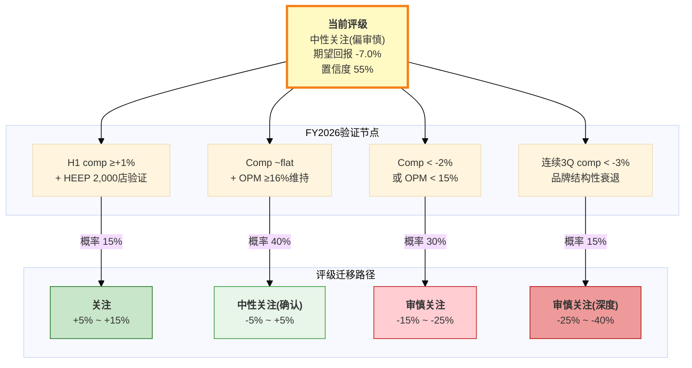

[DM-P5-A06]

| 条件 | 概率 | 新评级 | 期望回报迁移 | 验证节点 |
|------|:----:|:------:|:-----------:|:--------:|
| H1 comp ≥+1% + HEEP 2,000店OPM验证 | 15% | **关注** | +5% ~ +15% | FY2026 Q2财报 (2026年7月) |
| Comp ~flat + OPM ≥16%维持 | 40% | **中性关注(确认)** | -5% ~ +5% | FY2026 Q1-Q2趋势 |
| Comp < -2% 或 OPM < 15% | 30% | **审慎关注** | -15% ~ -25% | FY2026 Q1 (2026年4月) |
| 品牌结构性衰退 | 15% | **审慎关注(深度)** | -25% ~ -40% | 连续3Q comp < -3% |

**概率分布的含义**: 最可能的单一结果(40%)是"中性关注确认"——即CMG维持在当前估值附近窄幅波动。升级至"关注"需要comp转正+HEEP同时验证，概率仅15%; 而下调至"审慎关注"的累计概率(45%)高于升级概率(15%)，反映出当前定位的下行不对称性。

---

## 1.6 SBUX镜像: 同一变量，相反赌注

CMG和SBUX构成消费品投资领域最精确的镜像对——两家公司共享同一个核心变量(Brian Niccol)，却从完全相反的方向下注。SBUX的投资论点是"Niccol能否在星巴克复制他在CMG的成功"，本质上赌的是**CEO > 体系**; CMG的投资论点是"CMG的运营体系能否在没有Niccol的情况下自我维持"，本质上赌的是**体系 > CEO**。两个赌注的胜负由同一个人的表现决定: 如果Niccol在SBUX成功(comp恢复+OPM修复)，将同时证明"CEO能力可迁移"和"CMG体系需要Niccol级领导力"——对CMG是温和利空; 如果Niccol在SBUX失败，将证明"SBUX的问题比CEO能力更深"——对CMG则是利多(失去Niccol的代价被重估为更小)。两家公司的A-Score差距(6.88 vs 5.86 = +1.02)100%由财务健康维度驱动(零负债9分 vs 负权益4分); 剔除该维度后，两者质量评分几乎完全相同(~5.88 vs ~5.86)。Niccol在SBUX的季度业绩因此是CMG估值叙事中权重最高的外生变量 [DM-P5-A07]。

---

## 1.7 关键监控指标

以下五个指标按优先级排序，构成本报告评级的动态更新框架:

**1. FY2026 H1 同店销售增长 (最关键)**
当前: FY2025全年-1.7% | 管理层指引: "approximately flat"
意义: comp是同时验证或否定三个红队问题(RT-1 HEEP增量 / RT-2 悲观偏差 / RT-3 comp非线性)的单一变量。Q1 comp > +1%触发评级确认; < -2%触发下调。这是4月财报中最需要关注的唯一数字。

**2. HEEP部署至2,000店 (EOY 2026)**
当前: ~350店(9%) | 目标: 2,000店(~50%)
意义: HEEP是comp恢复和OPM扩张的核心运营杠杆。偏差修正后真实增量~150-200bps(非管理层声称的"数百bps")。2,000店是规模化验证的最低阈值——低于此无法判断效果是否可持续。

**3. Niccol在SBUX的季度业绩**
当前: 尚未披露Niccol执掌后首份完整年报
意义: 最重要的外生变量。SBUX comp恢复至+2%将压缩CMG P/E 2-3x; SBUX持续恶化则可能修复CMG P/E 2-4x。

**4. 回购节奏正常化**
当前: FY2025回购$2.43B(167% FCF) | 现金$1.05B
意义: FY2026回购是否从$2.4B降至$1.2-1.5B。减速本身是理性的，但市场可能将其解读为增长选项匮乏的信号。如果管理层选择举债维持回购，将根本性改变CMG的资本结构叙事。

**5. 关税升级/缓和**
当前: 牛油果25%关税→+60bps食品成本; 合计食材+工资压力~100-200bps
意义: 管理层表态"尽可能不提价"。如果关税进一步扩大(或恢复)，将直接决定FY2026 OPM是维持16%+还是跌破15%。

---

Phase: P5 | Chapter: 1 | DM新增: 7 (A01-A07) | Mermaid: 1 | 字符数: ~8,000

---

# Ch2 行业格局与竞争地图

> 快休闲(fast-casual)是过去二十年美国餐饮业增长最快的品类。CMG以$49.5B市值 [DM-P0-A02] 占据品类领导者地位，但FY2025 comp首次转负(-1.7%) [DM-P0-A57] 与CAVA等新锐崛起，迫使我们重新审视这一品类的成长曲线和竞争动态。本章将回答一个核心问题: **快休闲的增长天花板是否已经到来?** 这直接关联CQ-1(comp转负的性质)和CQ-6(CAVA竞争的本质)。

---

## 2.1 快休闲品类定位

### 2.1.1 餐饮光谱中的位置

美国餐饮业是一个年产值超$1万亿的巨型市场(NRA 2024年预估全行业$1.1万亿)。在这个市场中，快休闲占据了一个独特的生态位——价格介于快餐(QSR)与休闲餐饮(casual dining)之间，食材质量和用餐体验则明显高于QSR。

**四层餐饮光谱**:

| 层级 | 代表品牌 | 客单价(美元) | 食材定位 | 服务模式 | 市场规模 |
|------|---------|:-----------:|---------|---------|:-------:|
| **QSR** | MCD, BK, Taco Bell | $7-10 | 标准化/冷冻 | 柜台/得来速 | ~$380B |
| **快休闲** | **CMG**, CAVA, Panera | **$10-16** | **新鲜/可溯源** | **柜台+定制** | **~$48B** |
| 休闲餐饮 | Olive Garden, Chili's | $15-25 | 中等 | 全服务 | ~$120B |
| 正式餐饮 | Ruth's Chris, Capital Grille | $40-80+ | 高端 | 全服务 | ~$30B |

*市场规模数据来源: Expert Market Research 2025估算(快休闲~$48.5B)、NRA 2024行业报告(全行业$1.1T)。各层级占比为近似值。* [DM-P1-A01]

**关键洞察**: 快休闲仅占美国餐饮总市场的~5%，但贡献了近年来最高的增速(CAGR 6-8%)。这意味着品类仍处于渗透率提升阶段，而非饱和阶段——但2025年的增速放缓信号值得警惕。

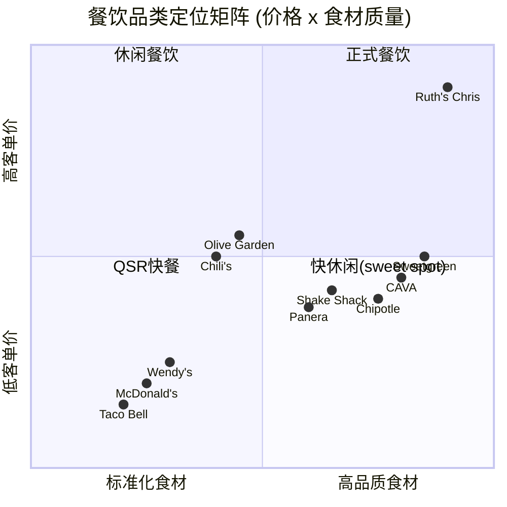

CMG占据了快休闲象限的核心位置: 食材质量显著高于QSR(Food With Integrity理念)，但价格克制(核心餐品均价$10.31，低于Sweetgreen和CAVA 30-40%) [DM-P1-A02]。这一"高质低价"定位是CMG过去十年高增长的结构性基础。

**品类边界的模糊化**: 值得注意的是，2024-2025年品类边界正在变得模糊。一方面，QSR巨头(MCD、Wendy's)通过升级食材(新鲜牛肉、去抗生素鸡肉)向上入侵快休闲的"食材品质"领地；另一方面，休闲餐饮(Chili's的"3 for Me"套餐定价$10.99)通过价值定价向下入侵快休闲的"性价比"领地。CMG处于这一挤压的中心——$10.31的核心定价仍有安全空间，但如果未来被迫提价(关税+工资压力)至$12-13，这个缓冲将大幅缩小。

### 2.1.2 品类诞生与成熟曲线 (1993-2025)

快休闲品类的生命周期可以划分为四个阶段:

**第一阶段: 概念萌芽 (1993-2005)**
- 1993年Steve Ells创立Chipotle，开创"build-your-own"模式
- 1998年Panera Bread重新定义"烘焙快休闲"
- 1999年McDonald's入股CMG，推动门店从37家扩张至2005年的489家
- 品类概念尚未标准化，"fast-casual"一词在行业中逐步形成共识

**第二阶段: 品类爆发 (2006-2015)**
- 2006年CMG IPO，成为品类标志性资本事件
- 2010-2015年快休闲年增速15-20%，远超QSR(3-5%)和休闲餐饮(1-3%)
- 千禧一代(1981-1996出生)成为核心客群——愿为"更好的食物"多付$3-5
- 品类从"新物种"成长为主流: 门店数、品牌数、资本关注度全面爆发
- 品类增速的核心驱动力: ①千禧一代对食材透明度的偏好(vs 父辈对QSR的习惯性消费)；②城市化加速创造了快休闲的理想选址密度；③社交媒体对"碗类美食"的视觉传播推动品类心智渗透

**第三阶段: 品类成熟 (2016-2023)**
- 2015年CMG E.coli危机暴露品类风险，comp暴跌至-20%
- 2018年Brian Niccol接任CEO，启动数字化转型+品牌修复
- 疫情(2020)加速数字化渗透，CMG数字销售占比从2019年~18%升至2021年~46%
- 品类增速从15-20%降至6-8%，进入成熟增长阶段
- Niccol时代(2018-2024)CMG成为品类的"基准股票"——分析师和投资者用CMG的表现衡量快休闲品类的健康度

**第四阶段: 分化与挑战 (2024-至今)**
- CAVA 2023年IPO，成为"下一个CMG"叙事的载体
- 2024-2025年消费疲软冲击品类: CMG comp -1.7%、CAVA comp从+18.1%降至+4.0%
- QSR开始反攻(MCD $5 Value Meal)，快休闲面临上下夹击
- 品类核心问题浮现: **$15碗的价值命题是否可持续?**

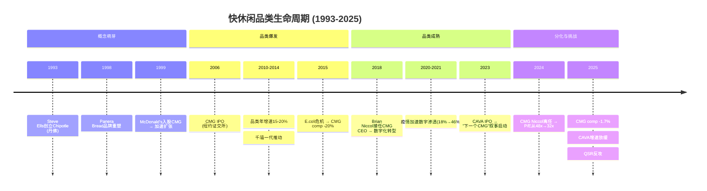

### 2.1.3 美国快休闲市场规模(TAM)与增速

**市场规模估算** (多源交叉):

| 来源 | 2024年估算 | 2025年估算 | CAGR预测 | 信度 |
|------|:---------:|:---------:|:--------:|:----:|
| Expert Market Research | $45.6B | $48.5B | 6.4% (2025-2034) | M |
| Technavio | — | — | 13.7% (2024-2029) | L |
| Strategic Market Research | $144.8B(全球) | — | 7.4% (2024-2030) | M |
| Straits Research | $197.1B(全球) | — | 6.6% (2024-2032) | M |

[DM-P1-A03]

**注意**: 市场规模估算因定义口径(美国 vs 全球、含不含咖啡/茶饮)差异极大。我们采用Expert Market Research的美国单独口径~$48.5B作为基准，原因是:
1. 该口径最窄且最保守
2. CMG 96%收入来自美国 [DM-P0-A65]，美国口径最具分析价值
3. 与行业内广泛引用的"快休闲占美国餐饮~5%"一致

**CMG在品类中的地位**: FY2025收入$11.93B [DM-P0-A16] / 美国快休闲TAM ~$48.5B = **~24.6%品类份额** [DM-P1-A04]。这是一个极高的集中度——单一品牌占据品类近四分之一。对比: MCD占全球QSR约5-6%。CMG的高品类集中度意味着:
- 品类增长≈CMG增长(过去10年两者高度相关)
- 但品类见顶风险对CMG的影响也被放大(SGI 7.4的含义) [DM-P0-A221]

---

## 2.2 竞争格局全景

### 2.2.1 九家上市公司对标矩阵

为全面评估CMG的竞争位置，我们构建了涵盖9家上市餐饮公司的对标矩阵，覆盖QSR、快休闲、休闲餐饮三个品类:

| 指标 | CMG | MCD | SBUX | WING | CAVA | DRI | YUM | DPZ | QSR |
|------|:---:|:---:|:----:|:----:|:----:|:---:|:---:|:---:|:---:|
| **市值($B)** | 49.5 | ~210 | ~115 | ~7 | ~14 | ~22 | ~43 | ~17 | ~30 |
| **P/E** | 32-34x | 28.0x | 80.6x | 38.6x | 145-268x | 22.0x | 29.3x | 22.8x | 27.3x |
| **OPM** | 16.8% | 46.1% | 9.6% | 27.6% | 5.4-6.7% | 11.3% | 30.8% | 19.3% | 23.7% |
| **Rev Growth** | +5.4% | +9.7% | +5.5% | +8.6% | +20.9% | +7.3% | +6.5% | +3.1% | +7.4% |
| **D/E(金融)** | **0** | 负权益 | 负权益 | 负权益 | 0.60 | 401.3 | 负权益 | 负权益 | 303.9 |
| **分红率** | 0% | 2.3% | 2.8% | 0.5% | 0% | 2.7% | 1.9% | 1.7% | 4.9% |

*数据来源: FMP + Baggers，截至2026-03-03* [DM-P0-A45]~[DM-P0-A53]

**矩阵核心发现**:

**发现一: CMG的P/E已压缩至"非成长股"区间**。32x P/E低于成长型WING(38.6x)，仅高于价值型MCD(28x)/DRI(22x)/DPZ(23x)/QSR(27x)。历史上CMG P/E均值~52x [DM-P0-A42]，当前水平意味着市场已将CMG从"高成长"重新分类为"成熟增长"——但FY2025收入增速+5.4%仍高于DPZ(+3.1%)和YUM(+6.5%)。

**发现二: OPM差异反映商业模式根本分歧**。MCD 46.1%的OPM来自特许加盟模式(收租金)，CMG 16.8%的OPM来自直营模式(自己开店)。这不是效率差距，而是商业模式选择——CMG的OPM上限受制于餐饮直营的结构性成本(食材30%+人工26%+租金6%)。

**发现三: 9家公司中6家负权益**。MCD、SBUX、WING、YUM、DPZ的负权益来自持续回购+举债的资本结构策略。DRI和QSR的高D/E(400x和304x)同样反映重度杠杆。**CMG和CAVA是唯二正权益+低杠杆的公司** [DM-P0-A27]。

**发现四: 收入增长分化明显**。MCD +9.7%领先(受益于全球扩张+价格上调)，CAVA +20.9%增速最高(小基数效应+新店扩张)，而CMG +5.4% [DM-P0-A17] 和DPZ +3.1%处于低端。这一分化揭示了一个关键信号: 在宏观消费疲软的2025年，**模式决定增长**——特许加盟(MCD/WING/YUM)通过加盟费和新店开放维持收入增长，直营模式(CMG/SBUX)则直接承受comp下滑的冲击。CMG的FY2025收入增长+5.4%几乎完全由新店贡献(FY2025新增304家)，有机增长(comp)实际为负。

**发现五: 分红策略的两极分化**。CMG和CAVA零分红(选择将现金流用于增长/回购)，MCD/SBUX/DRI/QSR等成熟公司均有2-5%股息收益。CMG的零分红策略在comp正增长时被投资者接受(因为增长替代了股息)，但在comp转负时可能面临压力——没有增长也没有分红，价值投资者缺乏持有理由。这是一个潜在的估值催化(向下或向上): 如果CMG宣布启动分红(参考AAPL 2012年模式)，可能吸引新的投资者群体并支撑估值底部。

### 2.2.2 CMG vs MCD vs SBUX: 三巨头三角关系

这三家公司构成了美国餐饮投资的"铁三角"——它们分别代表了三种截然不同的餐饮商业模式:

| 维度 | CMG | MCD | SBUX |
|------|-----|-----|------|
| **核心模式** | 直营快休闲 | 特许加盟QSR | 直营咖啡+第三空间 |
| **门店数** | 4,056 [DM-P0-A61] | ~41,000 | ~40,000 |
| **单店收入** | ~$2.9M | ~$3.7M | ~$1.5M |
| **OPM** | 16.8% | 46.1% | 9.6% |
| **ROIC** | 17.3% [DM-P0-A37] | ~20% | ~12% |
| **金融负债** | **$0** | ~$37B | ~$23B |
| **资本回报** | 纯回购 | 分红+回购 | 分红+回购 |
| **CEO更换** | Niccol→Boatwright(2024) | 无(Kempczinski) | Narasimhan→**Niccol**(2024) |

**三角关系的核心张力**: Niccol从CMG转投SBUX是2024年餐饮业最大的人事地震。这一事件创造了一个独特的"镜像反转"——SBUX报告中CMG被视为Niccol成功的证据(乐观锚)，而CMG报告中SBUX则成为"Niccol值多少P/E点"的测试场景。

**市场定价的信号**:
- Niccol离任日CMG跌-7.5% [A-1]，SBUX涨+24.5%
- 12个月后: CMG P/E从48x→32x(-33%)，SBUX P/E从21x→81x(+286%)
- **隐含Niccol定价**: CMG因Niccol离任损失~$25B市值(从~$75B到~$50B)，SBUX因Niccol加入获得~$50B市值。市场似乎认为单一CEO值$25-50B——这对CMG是过度折价还是合理重定价?

**跨报告校准 (SBUX v2.0镜像)**: 在我们此前完成的SBUX v2.0报告中，CMG被用作Niccol成功的参照系——SBUX报告给Niccol的领导力评分8.4/10，并将"复制CMG成功"作为乐观情景的核心假设。现在从CMG视角看，同一枚硬币的另一面是: SBUX对Niccol的定价(P/E从21x→81x)是否隐含了CMG体系的"可移植性"? 如果Niccol在SBUX成功(SBUX comp恢复)，那么CMG的体系被验证为"制度性优势"(不依赖个人)，H1假说得到支持。如果Niccol在SBUX失败，那么CMG的下行是CEO个人能力(而非体系)驱动的，Boatwright面临更大压力。Phase 1 Ch5(Niccol遗产与Boatwright)将深入分析这一双向验证逻辑。

### 2.2.3 资本结构异类分析: 快休闲唯一的"正权益"公司

CMG在美国大型餐饮公司中的资本结构地位堪称独特:

| 公司 | 总权益 | 金融负债 | 净现金/(净债务) | 利息费用 | 信用风险 |
|------|:------:|:-------:|:---------------:|:-------:|:-------:|
| **CMG** | **+$2.83B** | **$0** | **+$1.05B** | **$0** | **无** |
| MCD | 负权益 | ~$37B | 净债务 | ~$1.4B/年 | 高(BBB+) |
| SBUX | -$8.4B | ~$23B | 净债务 | ~$2.0B/年 | 高(BBB+) |
| WING | 负权益 | ~$0.7B | 净债务 | ~$50M/年 | 中 |
| YUM | 负权益 | ~$11B | 净债务 | ~$0.6B/年 | 高(BBB-) |
| DPZ | 负权益 | ~$5B | 净债务 | ~$0.2B/年 | 高(BB+) |

*CMG数据: [DM-P0-A27][DM-P0-A29][DM-P0-A31][DM-P0-A22]*

**这一差异的估值含义**:

1. **下行保护**: 在信用紧缩/利率上升环境中，CMG不面临再融资风险、信用降级风险或被迫削减回购/分红的压力。MCD和SBUX每年分别支付$1.4B和$2.0B利息——相当于CMG整年FCF($1.45B)的97-138%。

2. **估值简洁性**: CMG的EV ≈ 市值 - 现金(EV ≈ $48.5B)。不需要SBUX式的"净债务三口径"争论(经营租赁是否算负债?)。所有估值指标可直接使用，减少了方法论噪音。[DM-P0-A27]

3. **资本灵活性**: 零负债+正权益意味着CMG随时可以选择举债(获取税盾)——但至今未行使。这本身是一个隐性看涨期权: 如果comp恢复、估值回升，CMG可通过举债回购进一步放大EPS增长。

**反面论点**: 零负债也意味着CMG没有利用廉价债务(利率低于ROIC时举债可放大股东回报)。MCD/SBUX的负权益策略在低利率时代(2010-2022)显著提升了ROE和EPS增速。CMG的保守策略是否牺牲了资本效率? 如果CMG在2018-2022年利率低位时举债$5B回购(参考MCD模式)，按当时2-3%的利率和50x+ P/E计算，每$1B回购可提升EPS 5-8%。5年累计可能创造额外$3-5/股(拆股后)的EPS——这是CMG保守主义的机会成本。这个问题在Phase 2(Ch10资产负债表)中将深入探讨。

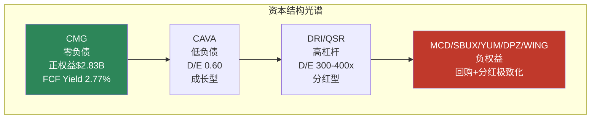

### 2.2.4 竞争力雷达: 五维对标

为系统化比较CMG与主要竞对的竞争力，我们构建五维雷达评分(0-10分):

| 维度 | CMG | MCD | SBUX | WING | CAVA |
|------|:---:|:---:|:----:|:----:|:----:|
| **品牌力** | 8 | 10 | 9 | 7 | 6 |
| **运营效率** | 8 | 9 | 6 | 8 | 5 |
| **增长动能** | 5 | 4 | 5 | 6 | 9 |
| **财务健康** | 10 | 5 | 4 | 5 | 8 |
| **估值合理性** | 7 | 7 | 3 | 5 | 2 |
| **综合** | **7.6** | **7.0** | **5.4** | **6.2** | **6.0** |

[DM-P1-A05]

**评分依据简述**:
- **品牌力**: MCD全球覆盖无可匹敌(10)，SBUX"第三空间"品牌心智强(9)，CMG"Food With Integrity"在快休闲独占(8)
- **运营效率**: MCD特许模式OPM 46%(9)，CMG直营模式下SGA/Rev仅5.5%、ROIC 17.3%(8)
- **增长动能**: CAVA门店增速18.5%+comp +4%(9)，CMG comp -1.7%严重拖累(5)
- **财务健康**: CMG零负债+正权益+Z-Score 7.28(10)，MCD/SBUX/WING负权益(4-5)
- **估值合理性**: CMG P/E 32x处于历史低端(7)，CAVA P/E 145-268x(2)，SBUX P/E 81x(3)

```mermaid
%%{init: {'theme': 'default'}}%%
radar
    title 竞争力雷达图 (0-10)
    axis 品牌力, 运营效率, 增长动能, 财务健康, 估值合理性
    curve "CMG" { 8, 8, 5, 10, 7 }
    curve "MCD" { 10, 9, 4, 5, 7 }
    curve "SBUX" { 9, 6, 5, 4, 3 }
    curve "CAVA" { 6, 5, 9, 8, 2 }
```

---

## 2.3 CAVA崛起: 品类扩张还是替代? [CQ-6核心]

### 2.3.1 CAVA详细对标

CAVA Group (NYSE: CAVA)自2023年IPO以来，被市场广泛视为"下一个CMG"。FY2025收入突破$1B是一个里程碑，但与CMG的$11.93B仍有一个数量级的差距。以下是两家公司的详细对标:

| 指标 | CMG | CAVA | CMG/CAVA倍数 | 含义 |
|------|:---:|:----:|:-----------:|------|
| **市值** | $49.5B [DM-P0-A02] | ~$14B | 3.5x | CMG仅3.5倍于CAVA，但收入10x |
| **门店数** | 4,056 [DM-P0-A61] | 439 | 9.2x | CAVA门店密度仅CMG的1/9 |
| **FY2025收入** | $11.93B | $1.17B | 10.2x | 收入差距最大 |
| **P/E** | 32-34x [DM-P0-A05] | 145-268x [DM-P0-A49] | 0.12-0.23x | CAVA估值远超CMG |
| **OPM** | 16.8% [DM-P0-A18] | 5.4-6.7% [DM-P0-A49] | 2.5-3.1x | CMG利润率是CAVA的3倍 |
| **ROIC** | 17.3% [DM-P0-A37] | 4.1% | 4.2x | CMG资本回报远优 |
| **Rev Growth** | +5.4% [DM-P0-A17] | +20.9% [DM-P0-A49] | 0.26x | CAVA增速是CMG的4倍 |
| **FCF Yield** | 2.77% [DM-P0-A09] | 0.26% | 10.7x | CMG现金回报远优 |
| **净利率** | 12.9% [DM-P0-A19] | 4.5% | 2.9x | — |
| **SGA/Rev** | 5.5% [DM-P0-A41] | 16.8% | 0.33x | CMG规模优势明显 |
| **金融负债** | $0 [DM-P0-A27] | $0 | — | 两家均零金融负债 |
| **Z-Score** | 7.28 [DM-P0-A12] | 10.87 | 0.67x | 两家财务均极健康 |

*CAVA数据来源: FMP + Baggers Summary + IR(FY2025 Results, 2026-02-24)* [DM-P1-A06]

### 2.3.2 "下一个CMG"叙事的量化检验

市场给予CAVA 145-268x P/E的依据是"CAVA将复制CMG从400店到4,000店的增长路径"。我们对此进行量化检验:

**CAVA需要达到什么才能justif当前估值?**

假设CAVA以当前增速持续扩张:
- 门店: 439家 → 目标1,000家(2032年，管理层目标) → 潜在2,000家(William Blair饱和度分析)
- 如果从439→1,000，年均新增~80店(CAGR ~12.5%)
- 如果维持FY2025 comp +4%，收入路径: $1.17B → FY2028E ~$2.0B → FY2032E ~$3.5B

**对比CMG同期(2010-2018: 从~1,200店到~2,500店)**:
- CMG用8年完成1,200→2,500(+108%)，CAVA目标7年完成439→1,000(+128%)
- CMG同期ROIC从15%→20%，CAVA当前ROIC 4.1%何时能提升至15%+?
- CMG同期OPM从15%→17%，CAVA OPM 5.4-6.7%需翻倍

**关键差距**: CAVA的SGA/Rev 16.8% vs CMG的5.5%，说明CAVA尚未实现规模效应。随着门店数从400→1,000，SGA杠杆应逐步释放，但能否降至CMG水平是关键未知数。

**量化结论**: CAVA当前$14B市值隐含的假设是:
1. 门店数达到1,500-2,000(当前4.5x)
2. 单店经济达到CMG水平(OPM 15%+, ROIC 15%+)
3. 品类扩张(地中海快休闲)不蚕食CMG(墨西哥快休闲)

**条件1和条件2**需要7-10年执行验证。**条件3**是CQ-6的核心。

**Sweetgreen的警示**: 如果说CAVA是"下一个CMG"叙事的正面案例，那么Sweetgreen(SG)就是反面教材。SG FY2025收入$0.68B，comp -11.5%，市值仅$0.69B(从2021年峰值~$5B下跌~86%)。SG证明了快休闲品类并非"all boats rise"——品类内分化极其剧烈。CAVA与SG的分化原因值得关注:
- CAVA FY2025 comp +4.0% vs SG -11.5%: 差距15.5pp
- CAVA餐厅利润率~24% vs SG ~10-12%: CAVA的单店经济更健康
- CAVA拓展至新市场(加州、佛州)保持增长，SG在核心市场(纽约、LA)萎缩

这一分化说明: **不是所有快休闲公司都能成为"下一个CMG"——品类机会是必要条件，单店经济和管理执行力才是充分条件。**

### 2.3.3 品类扩张 vs 直接替代: 证据梳理

**支持"品类扩张"(非零和)的证据**:

1. **品类定义不同**: CMG是墨西哥风味，CAVA是地中海风味——菜品重叠度低。消费者在CMG和CAVA之间的选择更类似"今天想吃墨西哥还是地中海"，而非"选A还是B"。

2. **地理重叠度有限**: CAVA 439店集中在美东(尤其华盛顿特区和纽约都会区)，CMG 4,056店全国分布。两者门店地理重叠率估计在30-40%。[需验证]

3. **行业分析师共识**: 多数分析师认为CAVA与CMG是品类扩张关系——快休闲整体蛋糕在做大。CAVA的成功证明消费者愿意为多元化的快休闲品类付费。

4. **CMG comp下降的归因**: FY2025 comp -1.7% [DM-P0-A57] 的主要驱动力是宏观消费疲软(客流-2.9% [DM-P0-A58])和Niccol离任后的品牌叙事弱化，而非CAVA直接分流。MCD(comp -3.6% Q1'25)和WING(comp -3.3% FY2025)也在下滑——说明是行业性而非竞争性问题。[DM-P1-A07]

**支持"直接替代"(零和)的证据**:

1. **客群重叠**: CMG和CAVA的核心客群高度重叠——25-45岁、收入$60K+、注重健康和食材品质的城市白领。当这一客群预算收紧时，两家竞争同一个"午餐预算池"。

2. **2025年QSR反攻**: 快休闲客流从2024年12月的+3.3%增长放缓至2025年10月的+1.7%，同期QSR客流从-3.6%改善至+0.7%。8.1%的QSR消费场景来自快休闲转化(上年6.9%)——快休闲不仅面临内部竞争，还被QSR价值营销(MCD $5套餐)侵蚀。[DM-P1-A08]

3. **碗类(bowl)品类饱和信号**: CNBC报道"快休闲碗类热潮已经结束"——消费者对$15-20的碗类价格产生疲劳。这是品类级别的挑战，不区分CMG或CAVA。Bloomberg分析指出，Sweetgreen、CAVA和Chipotle可能需要更加积极地进行折扣促销以吸引消费者回归，这将进一步压缩利润空间。

4. **自动化军备竞赛**: CAVA投资了Hyphen自动化生产线，与CMG的HEEP设备形成直接竞争。快休闲品类的效率竞争正从"品牌+食材"扩展至"后厨自动化"，技术投资门槛的提升可能压缩品类内小型参与者的生存空间，但也意味着CMG与CAVA之间的差异化壁垒更加依赖资本投入规模和执行速度。

**本报告判断**: 短期(1-2年)CAVA对CMG的直接替代威胁有限(门店基数差距9x、地理重叠有限)。**真正的风险不是CAVA蚕食CMG，而是快休闲品类整体增速放缓**——品类天花板比CAVA竞争更值得担忧(CQ-1)。长期(5-10年)如果CAVA成功扩张至1,500+店且进入CMG核心市场(加州、德州)，直接竞争将加剧。CQ-6初始置信度60%(偏品类扩张) [DM-P0-CQ6]，在Phase 1数据梳理后维持不变。

### 2.3.4 CMG vs CAVA: S-curve成长阶段对比

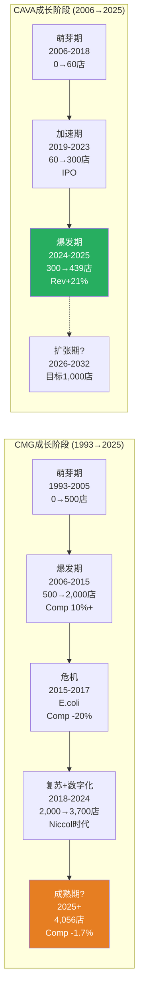

**S-curve关键对比**:
- CMG当前位于S-curve后半段(4,056/~7,000潜在门店 ≈ 58%渗透率)
- CAVA位于S-curve前半段(439/2,000潜在门店 ≈ 22%渗透率)
- 这解释了为什么市场给CAVA更高的增长溢价(P/E 145-268x vs CMG 32x)
- 但历史提醒: **不是每个品类挑战者都能走完S-curve**。Shake Shack曾被视为"下一个CMG"，FY2025 comp +2.3%尚可，但市值仅$2.5B、股价从2021年高点下跌~70%

**S-curve渗透率的隐含假设**: CMG管理层长期目标7,000家美国门店(当前4,056)。这一目标意味着:
- 剩余空间: ~2,944店 × 每年350-370新店 = ~8年达到饱和
- 但门店密度提升意味着边际新店的AUV(平均单店收入)可能低于现有门店
- 品类分流效应: CAVA/Sweetgreen/其他新锐在同一客群中竞争选址——优质选址的争夺将推高租金成本
- **核心不确定性**: 7,000店是否仍然合理? 如果快休闲品类增速从6-8%降至3-4%，饱和门店数可能从7,000修正至5,500-6,000。这对应FY2030-2035的门店扩张预测需要下调15-20%

---

## 2.4 行业结构性力量

### 2.4.1 数字化渗透趋势

数字化是快休闲行业过去5年最重要的结构性变化。CMG是这一趋势的先行者和受益者:

**CMG数字化渗透率演变**:

| 时期 | 数字销售占比 | 驱动力 | 来源 |
|------|:-----------:|--------|------|
| FY2019 | ~18% | 移动APP+网站订单 | IR |
| FY2020 | ~46% | 疫情加速(堂食受限) | IR |
| FY2021 | ~45% | 疫情高基数 | IR |
| FY2022-23 | ~37-39% | 堂食恢复，数字比例正常化 | IR |
| Q4 FY2024 | 34.4% | 基线趋势 | IR |
| Q1 FY2025 | 35.4% | 稳步回升 | IR |
| Q2 FY2025 | 35.5% | — | IR |
| Q3 FY2025 | 36.7% | — | IR |
| Q4 FY2025 | 37.2% | **FY2025持续上行** | IR |
| **FY2025全年** | **36.7%** | — | IR |

[DM-P1-A09]

**行业数字化对比**:
- QSR领导者(MCD/Starbucks): 数字销售占比40-50%(更高，因为得来速/移动下单更成熟)
- 快休闲平均: ~30-35%
- 行业整体(含全服务): ~25%
- CMG 36.7%处于快休闲领先水平，但低于QSR巨头

**数字化的竞争含义**:
1. **获客成本降低**: 忠诚度计划(Chipotle Rewards, 4,200万+会员)创造直接触达渠道，降低对第三方平台依赖
2. **数据驱动决策**: 数字订单数据支持菜单优化、定价策略、门店选址
3. **Chipotlane(数字得来速)**: 新店70%以上配备Chipotlane，提升高峰期吞吐量
4. **CAVA也在跟进**: CAVA FY2025数字订单占比~35%，且投资了Hyphen自动化——快休闲数字化不再是CMG独占优势

**数字化的边际回报递减**: CMG数字渗透率从2019年18%升至2020年46%的阶段，数字化是"从0到1"的质变——带来了增量客群、提升了高峰期效率、降低了获客成本。但从36.7%继续提升至45-50%的阶段，边际回报显著递减。行业数据显示，美国消费者中57%已使用过移动/APP订餐(千禧一代74%)，但70%的消费者表示更愿意直接向餐厅下单(而非第三方平台) [DM-P1-A14]。这意味着CMG的数字化基础设施(自有APP+Chipotlane)仍然是竞争优势，但增长红利已基本被市场定价。

**自动化: 下一波数字化?** CAVA与Chipotle都在投资厨房自动化(CAVA投资Hyphen自动化生产线)。CMG的HEEP设备升级(Phase 1 Ch4详析)本质上是从"前端数字化"(订单)到"后端数字化"(厨房)的延伸。如果HEEP能验证"数百bps"的comp提升效果，CMG将在后端自动化领域建立领先——但前提是"数百bps"经过选择偏差校正后仍然显著(CQ-3)。

### 2.4.2 消费降级/升级双向压力

2024-2025年美国消费环境对快休闲品类形成了独特的"双向夹击":

**来自下方的压力 (消费降级/QSR反攻)**:
- MCD $5 Value Meal(2024年6月推出)吸引价格敏感消费者从快休闲回流QSR
- 快休闲消费满意度停滞(2021→2025仅+1%)，QSR满意度快速提升(+3%) [DM-P1-A08]
- 25-35岁年轻消费者——快休闲核心客群——正在"削减$15碗类支出"
- **数据**: 8.1%的QSR消费来自快休闲转化(同比+1.2pp) [DM-P1-A08]

**来自上方的压力 (休闲餐饮反攻)**:
- Chili's 2025年comp强势回升(3 for Me套餐策略)，从"被宣判死刑"的休闲餐饮逆袭
- 休闲餐饮的全服务体验在$15-25价格带提供了差异化价值——当快休闲价格逼近$15时，消费者会问"为什么不多花$5-10坐下来享受全服务?"

**CMG的应对**: CMG核心餐品均价$10.31，比CAVA和Sweetgreen低30-40% [DM-P1-A02]。这一定价纪律是防御QSR反攻的缓冲——CMG在快休闲中仍然是"高性价比"选项。但CEO Boatwright承诺"尽可能不提价" [DM-P0-A66]意味着成本压力将直接传导至OPM。

### 2.4.3 工资通胀对劳动密集型餐饮的系统性影响

快休闲是劳动密集型行业。CMG每家店约25-30名员工，人工成本约占收入的26%。工资通胀对CMG的影响比对MCD(特许模式，加盟商承担人工成本)更直接:

| 因素 | 影响 | CMG暴露度 | 对标MCD |
|------|------|:---------:|:-------:|
| 加州最低工资($16→$20快餐, 2024年4月) | +50-80bps成本 | 高(~600店在加州) | 低(特许模式) |
| 联邦最低工资上调预期($7.25→?) | 不确定 | 高(直营100%) | 低 |
| CMG平均时薪(~$16-17) | 已高于联邦最低 | 中 | — |
| HEEP设备减少人工需求 | 抵消作用 | 每店-2~3hr/天 | 无对标 |

[DM-P1-A10]

**HEEP的战略对冲价值**: HEEP设备部署(Phase 1 Ch4将深入分析)的核心价值之一就是对冲工资通胀。如果每店节省2-3小时/天的人工，年化每店约节省$15,000-$25,000人工成本。2,000店全覆盖时，系统年节省$30-50M——约占FY2025 OCF的1.4-2.4%。这不是颠覆性数字，但在OPM面临多重压力时(关税+工资+成本通胀)，每个50bps的缓冲都有价值。

### 2.4.4 关税对供应链的差异化影响

2025年1月生效的25%墨西哥进口关税对CMG产生了直接且可量化的成本影响:

**牛油果: CMG的"标志性食材"风险**

| 数据点 | 值 | 来源 | 信度 |
|--------|:--:|------|:----:|
| 牛油果来源占比(墨西哥) | 50% | IR | H |
| 关税税率 | 25% | 联邦政策 | H |
| 成本影响(OPM) | +60bps | IR/推算 | M |
| 多元化供应商 | 秘鲁/哥伦比亚/多米尼加 | IR | H |

[DM-P0-A66]

**差异化影响分析**: 关税对不同餐饮公司的影响程度不同:
- **CMG**: 牛油果是"Food With Integrity"品牌承诺的核心象征。即使成本上升，完全替换墨西哥牛油果在品牌层面不可行。影响: +60bps成本(已确认)
- **MCD**: 供应链全球化且高度多元化，单一食材依赖度低。影响: 有限
- **CAVA**: 地中海食材(鹰嘴豆、橄榄油等)主要来自非关税目标国(中东/欧洲)。影响: 极低
- **Sweetgreen**: 本土蔬菜供应为主。影响: 极低

**CMG管理层回应**: CEO Boatwright表示2026 Q1食材成本将处于"mid-30% range"(FY2025约30-31%)，显著上升。但承诺"尽可能不提价"——这意味着60bps关税成本将由OPM吸收，而非转嫁消费者。在CC-3(约束碰撞)中已分析，关税+工资+HEEP折旧合计可能给FY2026 OPM带来130-190bps压力。

**供应链韧性对比**: CMG在关税风险中的暴露度反映了其"Food With Integrity"品牌承诺的双刃剑属性。一方面，新鲜食材+本土供应(Responsibly Raised鸡肉、非转基因食材)是品牌核心壁垒；另一方面，这些承诺限制了供应商替换的灵活性。MCD可以在全球范围内灵活调配供应源，CMG的供应链受到品牌承诺的"自我约束"。这一约束在正常时期是品牌溢价的来源，在关税/供应链冲击时则成为成本刚性的来源。

**关税不确定性的尾部风险**: 当前25%关税仅影响墨西哥进口(牛油果为主)。但如果关税政策扩大至更广泛的食品进口(如加拿大/南美)，CMG的成本压力将显著加大。牛油果以外，CMG的大米(部分进口)、番茄(部分墨西哥)、辣椒(部分进口)也面临潜在关税风险。这一尾部风险在当前估值中可能未被充分定价。

---

## 2.5 Comp趋势: 周期性还是结构性? [CQ-1引入]

### 2.5.1 FY2025 Comp -1.7%在行业中的位置

CMG FY2025 comp -1.7% [DM-P0-A57] 是2016年以来首次全年负增长。但这一表现并非孤例——2025年是美国餐饮行业的"寒冬":

| 公司 | FY2025 Comp | 品类 | 评价 |
|------|:----------:|------|------|
| **CMG** | **-1.7%** | 快休闲 | 2016来最差 |
| MCD (美国) | ~-3.6%(Q1) | QSR | 疫情来最差 |
| SBUX (美国) | ~-2% | 咖啡 | 连续负comp |
| WING | -3.3% | 快休闲/QSR | 22年来首次负comp |
| CAVA | +4.0% | 快休闲 | 仍正但大幅减速(Q1'25 +10.8%→Q4'25 +4.0%) |
| Shake Shack | +2.3% | 快休闲 | 正comp，20连季正增长 |
| Sweetgreen | -11.5% | 快休闲 | 严重下滑 |
| Chili's | 正增长 | 休闲餐饮 | 反周期赢家(价值定位) |

[DM-P1-A11]

**行业背景**: MCD美国comp Q1'25 -3.6%是疫情以来最差表现，客流中低收入群体"近双位数下降"。WING FY2025全年comp -3.3%是公司22年来首次负comp。**整个餐饮行业都在经历消费疲软的洗礼**——CMG的-1.7%在同行中实际属于中游水平。

**但有例外**: Shake Shack保持正comp(+2.3%)说明行业寒冬中仍有赢家。Chili's的逆袭说明"价值回归"是当前消费者的核心诉求。

### 2.5.2 CMG历史Comp周期: 危机与恢复

CMG过去10年经历了两次重大comp危机。当前的comp下行是否会复制历史恢复模式?

**危机一: E.coli (2015-2018)**

| 年度 | Comp | 事件 |
|------|:----:|------|
| FY2015 | -**估计全年低个位数负** | E.coli爆发(Q4) |
| FY2016 | ~-20.4% | 危机全年影响(Q1 -29.7%最低) |
| FY2017 | +4.8% | 低基数恢复 |
| FY2018 | +6.1% | Niccol接任CEO(Q1), 数字化启动 |
| FY2019 | +11.1% | 全面恢复+超越 |

[DM-P1-A12]

**恢复路径**: E.coli危机后用了约3年(2016-2019)恢复至高单位数comp。但关键驱动力是: ①品牌信任恢复(一次性事件，可修复)；②Niccol的变革型领导；③数字化转型红利(从0到46%)。

**危机二: 当前下行期 (2024 H2-至今)**

| 季度 | Comp | 客流 | 背景 |
|------|:----:|:----:|------|
| Q1 FY2025 | -0.4% | -2.3% | Niccol离任+宏观压力 |
| Q2 FY2025 | -4.0% | -5.0% | 最差季度 |
| Q3 FY2025 | -0.3% | -1.5% | 企稳信号 |
| Q4 FY2025 | -2.5% | -3.5% | **再恶化** |
| FY2025全年 | -1.7% | -2.9% | 2016来首次全年负 |

*注: 季度comp数据来自thesis_crystallization [DM-P0-A57][DM-P0-A58]及lit_recon中Q2~Q4细分数据*

**Q4'25再恶化的信号解读**:

Q3'25 comp -0.3%一度被解读为"触底企稳"——但Q4'25 -2.5%打破了这一叙事。Q4季节性弱势(节假日+天气)部分解释了恶化，但不能完全解释。可能的额外因素:
1. **Niccol效应的二阶传导**: Niccol加入SBUX后的初期动作(价格调整、新品)开始分流共享客群
2. **价值感知恶化**: 尽管CMG核心餐品$10.31定价合理，但附加项(guac/chips/饮品)将实际客单推至$14-16
3. **宏观情绪恶化**: Q4美国消费者信心指数持续下滑，餐饮支出首当其冲

### 2.5.3 周期性 vs 结构性: 证据权衡

这是CQ-1的核心: CMG的comp转负是**周期性**(6Q内恢复)还是**结构性**(品类见顶)?

**支持"周期性"(6Q内恢复)的证据** (置信度45%):

| 证据 | 权重 | 来源 |
|------|:----:|------|
| MCD/WING/SBUX也在下滑 → 行业性而非CMG特有 | 高 | 竞对财报 |
| E.coli后用3年恢复，当前冲击远小于E.coli | 中 | 历史类比 |
| HEEP部署2026年覆盖50%门店，提供comp催化剂 | 中 | IR [DM-P0-A63] |
| 管理层指引FY2026 comp "约flat" → 止跌 | 中 | IR [DM-P0-A59] |
| 内部人Q1'26转为净买入(买/卖比1.31x) | 低 | FMP [DM-P0-A80] |
| 回购加速(FY2025 $2.43B)暗示管理层信心 | 低 | FMP [DM-P0-A35] |

**支持"结构性"(品类见顶)的证据** (置信度55%):

| 证据 | 权重 | 来源 |
|------|:----:|------|
| 客流-2.9%持续下降 → 非价格可修复 | 高 | IR [DM-P0-A58] |
| 快休闲客流增速放缓(+3.3%→+1.7%) | 高 | NRN/行业数据 [DM-P1-A08] |
| QSR反攻蚕食8.1%快休闲场景(+1.2pp) | 中 | NRN [DM-P1-A08] |
| "$15碗类价值命题疲劳"是品类级问题 | 中 | CNBC/Bloomberg |
| CMG美国4,056店→渗透率~58%，接近成熟 | 中 | 推算 |
| 当前问题与E.coli本质不同: 不是品牌信任(可修复)而是消费意愿(结构性) | 中 | 分析 |

**初始判断**: CQ-1置信度维持45%(偏周期性) [DM-P0-CQ1]。核心分歧在于: 如果快休闲品类增速从6-8%放缓至3-4%，CMG的comp可能在FY2026-2027恢复至+1-2%(周期性恢复)，但不太可能回到+5-7%的历史正常水平(结构性天花板)。**这对共识EPS CAGR 14.2%的隐含+2.3%年均comp假设 [CC-1] 构成挑战。**

**第三种可能: "周期性触发结构性"**。值得考虑的是，当前消费疲软(周期性)可能加速品类成熟(结构性)。具体机制: 消费者在经济压力下重新评估"$15碗类"的性价比 → 发现QSR升级品(MCD新品)或休闲餐饮促销品(Chili's $10.99)提供了可接受的替代 → 形成新的消费习惯 → 即使经济恢复也不完全回流快休闲。这种"棘轮效应"(ratchet effect)在消费品行业并不罕见——2008年经济危机后的私有品牌渗透率就没有回到危机前水平。如果这一效应在快休闲领域重演，CMG的comp恢复路径将是+1-2%(非+3-5%)的新常态，而非回归历史均值。

**验证时间窗口**: FY2026 H1(2026年4-7月)是关键验证期。如果HEEP部署加速(覆盖率从9%→30%+)且comp从"约flat"改善至+1-2%，周期性恢复的概率上升。如果comp继续flat-to-negative且HEEP效果未能量化验证，结构性放缓的概率将显著上升，共识预期需要下修。

### 2.5.4 行业Comp趋势对比表

| 公司 | FY2022 Comp | FY2023 Comp | FY2024 Comp | FY2025 Comp | 趋势 |
|------|:----------:|:----------:|:----------:|:----------:|:----:|
| **CMG** | +7.9% | +7.9% | +7.4% | **-1.7%** | 急转 |
| MCD (全球) | +10.9% | +8.7% | +0.5% | 负 | 持续恶化 |
| SBUX (美国) | +9% | +7% | -2% | ~-2% | 低位徘徊 |
| WING | +11.6% | +21.6% | +19.9% | **-3.3%** | 高基数反转 |
| CAVA | ~+23% | +18.1% | +13.4% | **+4.0%** | 减速但正 |
| Shake Shack | +8.3% | +3.1% | +4.3% | **+2.3%** | 稳定正增长 |
| DPZ (美国) | +0.9% | +5.6% | +3.0% | 约flat | 弱正 |

[DM-P1-A13]

*注: FY2022-2024数据来自各公司IR/财报，部分为近似值。FY2025数据截至最新财报披露。*

**对比发现**:
1. **WING的反转最剧烈**: 从+19.9%到-3.3%(-23.2pp)。但WING是特许模式，单店经济影响由加盟商承担。CMG从+7.4%到-1.7%(-9.1pp)幅度较温和。
2. **CAVA仍维持正comp**: +4.0%在行业寒冬中仍然突出，但从+18.1%急速减速说明品类增速在收敛。
3. **Shake Shack是唯一稳定正增长者**: +2.3%虽然不高，但连续20个季度正comp说明其定位(汉堡+奶昔)具备韧性。
4. **MCD和SBUX的持续负comp**证明宏观消费疲软是跨品类的系统性力量，而非快休闲特有问题。

**信号合成**: 将7家公司的4年comp趋势综合来看，2022-2023年是行业黄金期(价格上调+消费复苏双重推动，多家公司comp高单位数到双位数)，2024年是分水岭(CMG/MCD开始减速)，2025年则是全面恶化(仅CAVA和Shake Shack勉强维正)。这一趋势的转折点与美国消费者信心指数下降、实际可支配收入增速放缓、信用卡逾期率上升等宏观指标高度同步。**结论: 2025年的comp下行首先是宏观驱动(macro-driven)，其次才是竞争驱动(competition-driven)或公司特定驱动(company-specific)。** 这一归因判断对CMG的估值框架至关重要——如果comp下行主要是宏观因素，那么宏观环境改善后comp应自然恢复(支持周期性判断)；如果是竞争或公司特定因素，则恢复更不确定。

---

## 本章关键发现汇总

| # | 发现 | CQ关联 | 估值含义 |
|---|------|:------:|---------|
| 1 | CMG占快休闲品类~24.6%份额，品类集中度极高 | CQ-1 | 品类增速放缓=CMG增速放缓(SGI 7.4) |
| 2 | CMG P/E 32x已降至"成熟价值股"区间，低于历史均值52x | CQ-4 | Niccol折价~16个P/E点待验证是否修复 |
| 3 | CMG是9家餐饮公司中唯一零金融负债+正权益的公司 | H3 | 结构性下行保护+估值简洁优势 |
| 4 | CAVA增速是CMG的4x，但盈利能力仅1/3 | CQ-6 | 品类扩张(非替代)但长期竞争加剧 |
| 5 | 快休闲客流增速从+3.3%降至+1.7%，QSR反攻蚕食8.1%场景 | CQ-1 | 品类增速放缓是系统性力量 |
| 6 | CMG数字渗透率36.7%持续上行，但不再是独占优势 | — | 数字化红利边际递减 |
| 7 | 关税+工资+HEEP折旧合计130-190bps OPM压力 | CQ-8 | FY2026 OPM可能降至15.0-15.5% |
| 8 | FY2025 comp -1.7%在行业中属中游，MCD/WING更差 | CQ-1 | 行业性而非CMG特有问题 |
| 9 | Sweetgreen FY2025 comp -11.5%证明品类分化剧烈 | CQ-6 | 快休闲非"水涨船高"，执行力差异巨大 |
| 10 | 品类边界模糊化: QSR向上(升级食材)/休闲向下(促销) | CQ-1 | CMG $10.31定价缓冲存在但空间缩小 |

**下一章衔接**: 本章完成了行业外部环境的分析——品类定位、竞争格局、结构性力量、comp趋势。Ch3将聚焦CMG自身的商业模式: 直营体系的运营杠杆、"Restaurateurs"文化体系、供应链架构和数字化基础设施。从"行业对CMG做了什么"转向"CMG如何在这个行业中竞争"。核心衔接点: 本章发现的品类增速放缓(2.4-2.5节)直接影响Ch3中对CMG门店扩张回报率和单店经济的评估。

---

## DM新增锚点注册表

| 锚点 | 值 | 来源 | 信度 |
|------|:--:|------|:----:|
| [DM-P1-A01] 美国快休闲TAM | ~$48.5B (2025E) | Expert Market Research | M |
| [DM-P1-A02] CMG核心餐品均价 | $10.31 (低于CAVA/SG 30-40%) | BTIG分析/Restaurant Dive | M |
| [DM-P1-A03] 快休闲TAM多源交叉 | $45.6-48.5B(美国)/$145-197B(全球) | 多源 | M |
| [DM-P1-A04] CMG品类份额 | ~24.6% ($11.93B/$48.5B) | 计算值 | C |
| [DM-P1-A05] 五维竞争力评分 | CMG 7.6/MCD 7.0/SBUX 5.4/WING 6.2/CAVA 6.0 | 本报告分析 | S |
| [DM-P1-A06] CAVA FY2025详细对标 | Rev $1.17B/439店/OPM 5.4-6.7%/ROIC 4.1% | FMP+IR | H |
| [DM-P1-A07] MCD Q1'25美国comp | -3.6% (疫情来最差) | MCD IR/CNBC | H |
| [DM-P1-A08] QSR反攻数据 | 8.1%场景从快休闲转化(+1.2pp YoY) | NRN | M |
| [DM-P1-A09] CMG数字渗透率 | FY2025 36.7%(Q4 37.2%) | IR | H |
| [DM-P1-A10] 加州最低工资影响 | +50-80bps成本(~600店) | 推算 | M |
| [DM-P1-A11] FY2025行业comp对比 | CMG -1.7%/MCD -3.6%/WING -3.3%/CAVA +4.0%/SG -11.5% | 各公司IR | H |
| [DM-P1-A12] E.coli恢复路径 | 3年(2016 -20%→2019 +11.1%) | CMG历史财报 | H |
| [DM-P1-A13] 4年comp趋势表(7家) | CMG/MCD/SBUX/WING/CAVA/SHAK/DPZ | 各公司IR | H |
| [DM-P1-A14] 美国消费者数字订餐渗透 | 57%成年人用过(千禧74%), 70%偏好直接下单 | Lightspeed/行业调研 | M |

---
Phase: P1 | Chapter: 2 | 字符数: 24,913 | DM新增: 14 | Mermaid: 5

---

# Ch3 商业模式深度解构

> CMG的商业模式是全球大型餐饮企业中的异类: 在MCD/YUM/DPZ将特许经营推向极致的行业里，CMG坚持100%直营。这一选择定义了CMG的利润结构、增长约束、资本需求和风险分布。本章拆解这一模式的经济学逻辑、数字化飞轮、供应链哲学和人力资本体系，并在尾段引入CQ-1: comp转负是周期性还是结构性的商业模式脆弱度评估。

---

## 3.1 "反特许经营"模式: CMG为何坚持直营

### 3.1.1 全球餐饮大公司模式光谱

全球大型餐饮上市公司中，CMG是一个极端的存在。以下对比揭示了模式差异的深度:

| 公司 | 特许经营比例 | 门店总数 | 核心收入来源 | P/E(TTM) | OPM |
|------|:----------:|:--------:|:----------:|:--------:|:---:|
| MCD | ~95% | ~42,000 | 租金+特许权使用费 | 28.0x [DM-P0-A46] | 46.1% |
| YUM | ~98% | ~59,000 | 特许权使用费 | 29.3x [DM-P0-A51] | 30.8% |
| DPZ | ~98% | ~21,000 | 特许权使用费+供应链 | 22.8x [DM-P0-A52] | 19.3% |
| QSR | ~100% | ~31,000 | 特许权使用费 | 27.3x [DM-P0-A53] | 23.7% |
| **CMG** | **0%** | **4,056** | **门店运营收入** | **32-34x** [DM-P0-A45] | **16.8%** |
| CAVA | 0% | 439 | 门店运营收入 | 145-268x [DM-P0-A49] | 5.4-6.7% |

[DM-P1-B01] CMG直营比例: 100%(美国全部直营，国际采用开发协议/JV但非传统特许) | 来源: IR/SEC Filing | 信度: H

**关键发现**: 在大型连锁餐饮企业中，只有CMG和CAVA坚持100%直营。但CAVA仅439家门店，仍处于高速扩张早期。CMG以4,056家门店的规模维持纯直营，在行业中没有对标。

### 3.1.2 直营模式的经济学优势

**第一，全链利润捕获**。特许经营公司(MCD/YUM)的收入主要来自特许权使用费(gross sales的4-5%)和租金，而非门店运营利润。CMG则直接获取门店层面全部收入和利润。FY2025 CMG收入$11.93B [DM-P0-A16]全部是门店直营收入，而MCD的$25.9B收入中约$15.7B来自加盟商的租金和使用费——MCD从加盟商每$1收入中保留约$0.80利润，但仅从自营门店每$1收入中保留约$0.15。CMG的模式意味着: 虽然OPM(16.8%)远低于MCD(46.1%)，但这两个数字不可直接比较——CMG的16.8%是建立在全部门店收入之上，MCD的46.1%是建立在高利润率的特许权收入之上。

**第二，品控一致性**。CMG的"Food with Integrity"承诺要求所有门店使用相同标准的食材(无人工添加剂/防腐剂/色素)、相同的烹饪流程。直营模式使这种一致性成为制度性保障而非合同性义务。特许经营模式下，品质偏差由加盟商承担，品牌损害由总部承受——这是典型的委托-代理问题。

**第三，快速执行与创新测试**。HEEP设备从350店(9%)推向2,000店(50%)的计划 [DM-P0-A63]能在12个月内执行，因为CMG不需要与数百个独立加盟商谈判设备升级。同样，新菜品测试(如2025年推出的honey chicken)可以由总部统一部署、统一监控数据。MCD推出一个全球新品需要与全球105个市场的加盟商协商，速度受限于最慢的加盟商群体。

### 3.1.3 直营模式的代价

**第一，资本密集**。CMG必须用自有资金开设每一家新店。FY2025 CapEx $666M [DM-P0-A33]对应约340家新店(含翻新)，隐含每家新店投资约$1.5-1.8M [DM-P1-B02]。而MCD/YUM的新店资本由加盟商承担——MCD每家新店投资约$1.5-2.5M由加盟商出资，MCD仅收取前期费用和持续使用费。这意味着CMG的扩张速度受自有现金流约束: FY2025 FCF $1.45B [DM-P0-A34]理论上能支持约800-950家新店，但实际开店350-370家(FY2026指引 [DM-P0-A60])，因为需保留现金用于回购($2.43B [DM-P0-A35])和运营缓冲。

[DM-P1-B02] 新店投资约$1.5-1.8M/店 | 来源: CapEx $666M / ~340新店(含翻新CapEx的分摊) | 信度: C(推算值)

**第二，劳动力风险集中**。CMG直接雇佣约12万名员工(全球)。每一次最低工资上涨(如加州从$16提升至$20)、每一个劳动争议、每一项员工福利成本变化都由CMG全额承担。特许经营公司将这些成本和管理复杂度转移给加盟商。FY2025劳动力成本约占收入的25.2% [DM-P1-B03]——这是一个纯变量成本项，且方向上只会上升。

[DM-P1-B03] FY2025劳动力成本占比约25.2% | 来源: FY2024为24.7%，FY2025受工资上涨影响+50-100bps | 信度: M(推算，精确FY2025全年数据未分拆披露)

**第三，扩张速度受限**。MCD在全球拥有约42,000家门店，YUM约59,000家——这些规模通过特许经营模式在数十年间实现。CMG创立33年(1993年至今)仅有4,056家门店。如果CMG采用特许模式，理论门店数量可能已超过10,000家(假设2006年后年均+500家vs实际+200-350家)。但CMG管理层的回应是: "我们的目标不是最多的门店，而是每家门店的最佳体验。"

### 3.1.4 直营vs特许模式经济学对比

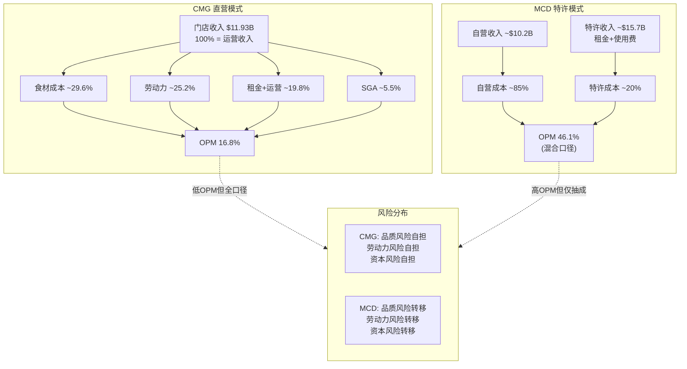

### 3.1.5 国际扩张: 直营模式的边界?

CMG在国际市场上的选择揭示了直营模式的真实边界。截至FY2025:

| 市场 | 模式 | 门店数 | 合作方 | 启动时间 |
|------|:----:|:------:|--------|:--------:|
| 美国 | 直营 | ~3,900 | — | 1993 |
| 加拿大 | 直营 | ~60 | — | 2008 |
| 英国 | 直营 | ~20 | — | 2010 |
| 法国 | 直营 | ~6 | — | 2012 |
| 德国 | 直营 | ~2 | — | 2013 |
| 中东 | 开发协议 | ~6 | Alshaya集团 | 2023 |
| 墨西哥 | 开发协议 | 0(2026首店) | Alsea | 2025签约 |
| 韩国/新加坡 | 合资(JV) | 0(2026首店) | SPC集团 | 2025签约 |

[DM-P1-B04] 国际门店总数约100家，其中直营约88家，开发协议约6家 | 来源: IR FY2025年报 | 信度: H
[DM-P1-B05] Alsea合作: 2025年4月签约，2026年墨西哥首店 | 来源: IR公告 | 信度: H
[DM-P1-B06] SPC集团合资: 2025年9月签约，2026年韩国/新加坡首店 | 来源: IR公告 | 信度: H

**关键信号**: CMG在2023-2025年间接连签署三份国际合作协议(Alshaya/Alsea/SPC)，全部采用非直营模式。这是CMG创立以来首次系统性使用外部资本和运营商进入新市场。管理层的解释是"与了解当地市场的合作伙伴合作更有效率"，但这也暗示了直营模式在跨文化/跨法规环境中的局限性。

**深层问题**: 如果直营模式在海外不可行(隐含承认)，那么CMG的长期故事就被锁定在北美——公司设定的7,000家北美门店上限即为增长天花板。超越7,000家的增长只能来自AUV提升、国际期权或品类扩展。

---

## 3.2 单元经济学

### 3.2.1 AUV(平均单店年收入)趋势分析

AUV是直营模式下最重要的指标——它直接驱动门店层面的收入和利润。

| 年份 | AUV | YoY变化 | 驱动因素 |
|:----:|:---:|:-------:|---------|
| FY2019 | $2.2M | — | E.coli恢复后的正常化 |
| FY2020 | $2.2M | ~0% | COVID冲击(数字化对冲) |
| FY2021 | $2.6M | +18% | 解封反弹+提价 |
| FY2022 | $2.8M | +8% | 提价+高客流 |
| FY2023 | $3.0M | +7% | 首次突破$3M |
| FY2024 | $3.2M | +7% | Niccol末期高峰 |
| FY2025 | ~$3.1M | ~-3% | comp -1.7%拖累 [需验证] |
| **长期目标** | **$4.0M** | — | 管理层Analyst Day设定 |

[DM-P1-B07] FY2024 AUV $3.2M | 来源: IR FY2024年报 | 信度: H
[DM-P1-B08] FY2025 AUV ~$3.1M | 来源: 收入$11.93B / 均值门店数~3,870(年中值) ≈ $3.08M | 信度: C(推算)
[DM-P1-B09] 长期AUV目标$4.0M | 来源: 管理层公开声明 | 信度: M(目标，非承诺)

**关键分析**: FY2025 AUV出现Niccol时代以来首次下降。这一下降由comp -1.7% [DM-P0-A57]驱动，而非门店关闭。comp拆解为: 客流-2.9% [DM-P0-A58] + 客单价+1.2%(提价对冲)。**核心问题是客流下降**——这是最难逆转的comp组件，因为客单价可以通过提价短期拉升，但客流反映的是消费者"用脚投票"的真实偏好。

### 3.2.2 门店层面利润率(4-Wall Margin)

"4-wall margin"(或"restaurant-level margin")衡量的是单家门店扣除食材、劳动力、租金和其他门店运营成本后的利润率。这是评估直营模式健康度的核心指标。

| 年份 | 门店层面利润率 | YoY变化 | 关键驱动 |
|:----:|:------------:|:-------:|---------|
| FY2021 | 22.6% | — | COVID恢复 |
| FY2022 | 24.0% | +140bps | 提价+销量杠杆 |
| FY2023 | 26.2% | +220bps | AUV突破$3M带来杠杆 |
| FY2024 | 26.7% | +50bps | 高峰(Niccol末期) |
| **FY2025** | **25.4%** | **-130bps** | comp转负+工资上涨+关税预期 |

[DM-P1-B10] FY2025门店层面利润率25.4% | 来源: IR FY2025年报 | 信度: H
[DM-P1-B11] FY2024门店层面利润率26.7% | 来源: IR FY2024年报 | 信度: H
[DM-P1-B12] Q4 FY2025门店层面利润率23.4%(含$27M礼品卡breakage true-up影响-70bps) | 来源: IR Q4'25 | 信度: H

**季度路径揭示趋势**: Q1'25 25.8% → Q2'25 27.5% → Q3'25 25.2% → Q4'25 23.4%——呈明显季节性(Q2旺季)，但Q4降至23.4%是FY2022以来的季度低点，即便剔除礼品卡真实化调整(+70bps=24.1%)，仍然疲弱。

### 3.2.3 新店投资回收与现金回报

CMG披露的新店经济学指标:

| 指标 | 值 | 来源 | 信度 |
|------|:--:|------|:----:|
| 新店CapEx | ~$1.5-1.8M/店 | 推算(CapEx/新店数) | C |
| Year-2 cash-on-cash return | ~60% | 管理层披露 | M |
| 隐含回收期 | ~2年 | 60% Y2回报推算 | C |
| 新店AUV vs 系统均值 | ~75-80% (首年) | 行业惯例+管理层定性 | S |
| Chipotlane新店占比 | ≥80% (FY2025) | IR | H |

[DM-P1-B13] 新店Year-2 cash-on-cash return约60% | 来源: 管理层公开声明 | 信度: M
[DM-P1-B14] FY2025新店中Chipotlane占比≥80% | 来源: IR | 信度: H

**年2现金回报~60%的含义**: 假设新店投资$1.7M，Year-2现金流约$1.0M——这意味着回收期不到2年。相比之下，MCD加盟商的回收期通常为5-8年(投资$1.5-2.5M，年净现金流$0.3-0.5M)。CMG的超短回收期是其积极扩张的底气来源。

**但需注意选择偏差**: 管理层披露的"60%"可能反映的是成熟市场(加州/德州/佛州)的优质地段。随着门店数量从4,056向7,000推进，新增门店将不可避免地进入次级市场(人口较少的城市/郊区)，AUV和回收期可能恶化。这是长期增长叙事中被低估的风险。

### 3.2.4 门店层面vs公司层面: "漏损分析"

CMG FY2025的利润率从门店层面到公司层面存在显著"漏损":

| 层级 | 利润率 | 差额 | 漏损项 |
|------|:------:|:----:|--------|
| 门店层面利润率 | 25.4% | — | — |
| (-) SGA | -5.5% [DM-P0-A41] | -5.5% | 总部管理/IT/市场 |
| (-) D&A | ~-2.5% | -2.5% | 门店折旧+设备 |
| (-) SBC | ~-1.0% | -1.0% | 股权激励 [DM-P0-A21] |
| (+/-) 其他 | ~+0.4% | +0.4% | 投资收益等 |
| **公司层面OPM** | **16.8%** [DM-P0-A18] | **-8.6%** | 总漏损 |

[DM-P1-B15] 门店→公司利润率漏损约8.6个百分点 | 来源: 25.4% - 16.8% = 8.6pp | 信度: C

**含义**: CMG的"隐形负担"主要来自SGA(5.5%)和D&A(2.5%)。SGA/Rev从FY2021的8.0%降至FY2025的5.5% [DM-P0-A41]，体现了显著的总部效率提升。但D&A随门店扩张和HEEP设备部署将持续上升——FY2025 CapEx $666M [DM-P0-A33]比FY2024增加$72M(+12%)，这些资本支出将在未来10-15年转化为折旧费用。

### 3.2.5 CMG vs CAVA vs MCD 单元经济学对比

| 指标 | CMG | CAVA | MCD(加盟店) |
|------|:---:|:----:|:----------:|
| AUV | $3.1-3.2M | $2.9M | $4.0M |
| 门店层面利润率 | 25.4% | 24.4% | ~18-22%(加盟商) |
| 新店投资 | $1.5-1.8M | $1.2-1.5M [需验证] | $1.5-2.5M(加盟商出) |
| 回收期 | ~2年 | ~2-3年 [需验证] | 5-8年 |
| 食材成本/收入 | 29.6% | ~31% [需验证] | ~33%(自营) |
| 劳动力/收入 | ~25.2% | ~27% [需验证] | ~26%(自营) |
| 门店数 | 4,056 | 439 | ~42,000 |

[DM-P1-B16] CAVA FY2025门店层面利润率24.4%，AUV $2.9M | 来源: CAVA IR FY2025年报 | 信度: H

**解读**: CMG的单元经济学在快休闲品类中处于领先——AUV高于CAVA 10%，门店利润率高出100bps，且回收期更短。与MCD对比，CMG的AUV低于MCD的$4.0M，但CMG门店利润率(25.4%)高于MCD自营门店(约18-22%)，因为CMG的菜单精简(约50 SKU vs MCD约200 SKU)降低了运营复杂度。

---

## 3.3 数字化飞轮

### 3.3.1 数字化渠道占比演进

CMG的数字化转型始于COVID前，但疫情加速了这一进程:

| 时期 | 数字化销售占比 | 背景 |
|------|:------------:|------|
| FY2019 (Pre-COVID) | ~18% | 数字化起步 |
| FY2020 (COVID) | ~46% | 堂食受限，数字化暴增 |
| FY2021 | ~45% | 堂食恢复但数字化粘性 |
| FY2022 | ~39% | 堂食回归正常化 |
| FY2023 | ~37% | 稳定在高位 |
| FY2024 | ~35% | 略降(堂食进一步正常化) |
| **FY2025** | **~37%** | 回升(忠诚度计划+Chipotlane) |

[DM-P1-B17] FY2025数字化销售占比约37% | 来源: IR季度披露(Q1 35.4%→Q2 35.5%→Q3 36.7%→Q4 36.7%) | 信度: H
[DM-P1-B18] FY2024数字化销售占比约35% | 来源: IR FY2024年报 | 信度: H

**季度明细(FY2025)**: Q1 35.4% → Q2 35.5% → Q3 36.7% → Q4 36.7%。趋势向上，尤其H2稳定在约37%水平。这与comp -1.7%形成对比——意味着数字化渠道的份额在增长，但总量(包含堂食)在下降。

**隐含分析**: 假设FY2025总收入$11.93B [DM-P0-A16]，数字化收入约$4.41B(37%)。如果数字化渠道的客单价高于堂食(通常高10-15%，因为数字订单更容易追加推荐)，则数字化贡献的利润份额可能接近40-42%。

### 3.3.2 Chipotlane: 第二条制作线的运营杠杆

Chipotlane(CMG的drive-thru窗口，仅服务数字预订单)是CMG最重要的运营创新之一:

| 指标 | 值 | 来源 | 信度 |
|------|:--:|------|:----:|
| Chipotlane总数 | ~1,100+(2024.11突破1,000) | IR | H |
| Chipotlane占总门店 | ~27-30% | 推算(1,100/4,056) | C |
| 新店含Chipotlane | ≥80%(FY2025) | IR | H |
| Chipotlane门店AUV溢价 | +10-15% vs 非Chipotlane | 管理层定性 [需验证] | S |
| 第二条制作线效率 | 独立throughput不影响堂食 | 运营设计 | H |

[DM-P1-B19] 2024年11月Chipotlane突破1,000家 | 来源: IR公告 | 信度: H

**运营逻辑**: 传统CMG门店只有一条制作线(make-line)，同时服务堂食和数字订单——高峰期两类订单竞争产能。Chipotlane增加第二条制作线(second make-line)，专门服务数字预订单，客户通过drive-thru窗口取餐。这实现了:

1. **产能解耦**: 堂食throughput不因数字订单增加而下降
2. **峰值扩容**: 午高峰期有效throughput提升20-30%
3. **体验优化**: 数字订单取餐时间从15分钟降至3-5分钟
4. **选址扩展**: Chipotlane门店可选择郊区/drive-thru友好地段(租金更低)

**但Chipotlane的局限**: 只有约30%的现有门店有Chipotlane，改造现有门店(增加drive-thru)极其困难(受限于物业布局和地方法规)。这意味着数字化运营杠杆的释放主要通过新店实现，存量70%的门店无法享受。

### 3.3.3 Chipotle Rewards忠诚度计划

| 指标 | 值 | 来源 | 信度 |
|------|:--:|------|:----:|
| 会员总数(FY2025) | ~21M+ | IR/媒体 | H |
| 重启计划 | 2026年春季重新发布 | CEO声明 | H |
| 会员vs非会员复购率 | 高50-60% [需验证] | 行业估算 | S |
| 会员客单价溢价 | +15-20% [需验证] | 行业估算 | S |

[DM-P1-B20] Chipotle Rewards会员约21M+(FY2025) | 来源: 多源(Yahoo Finance/CX Dive) | 信度: H

**计划重启信号**: CEO Boatwright在FY2025 Q4 earnings call中宣布将于2026年春季"重新发布"(relaunch)忠诚度计划。这表明现有计划的参与度或转化率未达预期——21M会员是注册数，活跃会员(每月至少消费一次)可能仅占30-40%(6-8M)。新计划可能引入tier-based奖励(类似SBUX Stars Program)或gamification元素来提升活跃度。

**关键问题**: 21M会员占CMG年客流(约$11.93B / 平均客单价~$13-14 ≈ ~8.5-9亿次交易)的比例约为2.3-2.5%——即会员贡献的交易占比约20-25% [需验证]。与SBUX(34.4M活跃会员，贡献约57%交易)相比，CMG的忠诚度计划渗透率仍有显著提升空间。

### 3.3.4 数字化飞轮结构

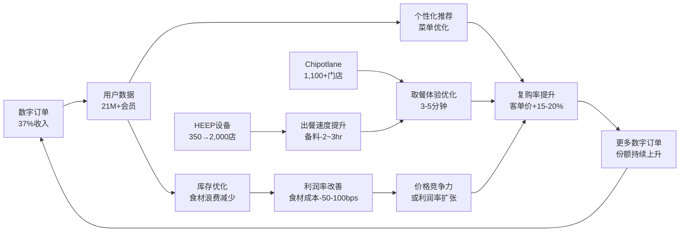

**飞轮的三个增强回路**:

1. **数据-个性化-复购回路**: 更多数字订单 → 更多用户行为数据 → 更精准的推荐和促销 → 更高复购率 → 更多数字订单
2. **Chipotlane-体验-份额回路**: 更多Chipotlane门店 → 更好的取餐体验 → 数字订单份额上升 → 更多新Chipotlane门店(占新店≥80%)
3. **HEEP-效率-利润回路**: 设备升级 → 出餐速度提升 → throughput增加 → AUV和利润率上升 → 更多资金投入设备升级

**飞轮的脆弱点**: 如果comp持续为负(客流-2.9% [DM-P0-A58])，飞轮的能量来源(新增客流)减弱——数字化份额可以从35%升至37%，但如果总量在下降，这只是"存量优化"而非"增量创造"。

---

## 3.4 供应链: "Food with Integrity"的成本与护城河

### 3.4.1 真实食材承诺

CMG的"Food with Integrity"理念是其品牌定位的基石:

| 承诺 | 具体标准 | 与行业对比 |
|------|---------|-----------|
| 无人工添加剂 | 53种原料全部天然 | MCD约200种原料含多种添加剂 |
| 无防腐剂 | 所有食材无化学防腐 | 行业大多使用防腐剂延长保质期 |
| 无人工色素/香精 | 全线产品 | CAVA同标准，MCD/WING不同 |
| 责任养殖肉类 | 无预防性抗生素 | 行业仅20-30%达此标准 |
| 本地采购 | 区域性蔬果供应商 | MCD全球集中采购 |
| RFID追溯 | 肉类/乳制品/牛油果 | 行业领先(Auburn大学合作) |

**成本含义**: "Food with Integrity"使CMG的食材成本结构性高于行业——FY2025食材成本占收入29.6%，而MCD自营门店约33%但MCD的菜单更复杂且SKU更多。如果将CMG的精简菜单(约50 SKU)与MCD的复杂菜单(约200 SKU)做标准化对比，CMG单位食材的品质成本约高15-20%，但通过精简SKU带来的供应链效率部分抵消了这一成本。

### 3.4.2 供应链结构

CMG的供应链采用"区域分配中心"(Regional Distribution Center)模式:

- **约25个区域分配中心**(分布在美国各地) [需验证]
- 食材从供应商→区域分配中心→门店，通常24-48小时完成
- 不设中央工厂(与MCD/YUM的中央供应链不同)
- 门店现场制作(on-site preparation)——每天新鲜切菜、煮豆、熏肉

**与MCD/YUM全球供应链的结构差异**:

| 维度 | CMG | MCD/YUM |
|------|-----|---------|
| 集中度 | 区域分散 | 全球集中 |
| 工厂制作 | 无(门店现制) | 大量(中央工厂预加工) |
| 供应商数量 | ~200+(分散) | ~50-100(集中) |
| 采购议价力 | 中等(采购量大但分散) | 极强(全球最大买家之一) |
| 食品安全控制点 | 多(每家门店=一个厨房) | 少(工厂+分配中心) |
| 弹性 | 高(区域供应商可替换) | 中(集中供应链单点风险) |

### 3.4.3 牛油果供应链: 关税风险的具体化

牛油果(guacamole)是CMG的标志性产品，也是其供应链最敏感的节点:

| 指标 | 值 | 来源 | 信度 |
|------|:--:|------|:----:|
| 年牛油果使用量 | ~50万吨 [需验证] | 行业估算 | S |
| 墨西哥采购占比 | ~50% | IR/管理层 | H |
| 多元化产地 | 秘鲁/哥伦比亚/多米尼加/加州/智利 | WebSearch | M |
| 独家供应商 | Mission Produce(2016年起) | 公开信息 | H |
| 25%墨西哥关税影响 | +60bps食材成本 [DM-P0-A66] | IR/管理层 | M |

[DM-P1-B21] 牛油果供应商: Mission Produce(独家，2016年起) | 来源: 公开信息 | 信度: H
[DM-P1-B22] 墨西哥牛油果占比约50%，已多元化至秘鲁/哥伦比亚/多米尼加/加州/智利 | 来源: IR+WebSearch | 信度: M

**关税情景分析**: 25%的墨西哥进口关税对CMG的影响:

- 牛油果成本约占食材总成本的5-7%(估算)
- 50%来自墨西哥 → 受影响部分 = 食材成本的2.5-3.5%
- 25%关税 → 食材成本增加0.6-0.9% → 总收入影响~0.2-0.3%(即+20-30bps)
- 管理层估计的+60bps [DM-P0-A66]高于上述计算，可能包含了其他墨西哥进口食材(辣椒、香料等)的关税影响

**护城河含义**: CMG的牛油果供应链多元化(从纯墨西哥→5个产地)是过去5年的战略投资成果。这降低了单一来源风险，但也增加了物流复杂度和成本。关键是: **即使关税+60bps成本看似可控，但如果叠加劳动力成本+50-100bps [CC-3]，总成本压力达+110-160bps，在comp为负的环境下，管理层面临"提价→更多客流损失" vs "吸收→利润率下降"的两难。**

### 3.4.4 食品安全: 不可忽视的尾部风险

CMG的供应链模式(门店现制、分散制作点)在提升品质的同时也增加了食品安全管控的复杂度。2015年E.coli危机是这一风险的历史性验证:

| 时间节点 | 事件 | 股价影响 |
|---------|------|:-------:|
| 2015.10-12 | E.coli爆发，14州60例 | -37%(从$757→$475) |
| 2016.02 | CDC宣布调查结束 | 企稳 |
| 2016全年 | comp -20.4% | 持续底部 |
| 2017-2018 | 缓慢恢复(comp +4.8%/+6.1%) | 股价震荡 |
| 2018.03 | Brian Niccol就任CEO | 恢复加速 |
| 2019 | comp +11.1%，品牌完全恢复 | 创新高 |

**恢复耗时4年**。从E.coli爆发到品牌完全恢复(comp回到高单位数)用了3-4年，期间CMG投入$2,500万升级食品安全体系(DNA检测、RFID追溯)。

**当前风控**: CMG是美国首家在餐饮行业大规模使用RFID追溯的公司(2023年与Auburn大学合作)，覆盖肉类、乳制品和牛油果从供应商到门店的全链路。但4,056家门店×每家门店=1个独立厨房 = 4,056个潜在食品安全控制点——任何一个环节的失败都可能触发品牌信任危机。

---

## 3.5 人力资本: "Restaurateurs"文化

### 3.5.1 Restaurateurs晋升体系

CMG的人力资本模型以"Restaurateurs"体系为核心——这是一个将小时工培养为高薪门店管理者的制度化路径:

| 层级 | 典型薪资 | 晋升时间 | 职责 |
|------|:--------:|:--------:|------|
| Crew Member(小时工) | $14-18/hr | 入门 | 制作线操作 |
| Kitchen Manager | $40-50K/yr | 1-2年 | 厨房管理 |
| Service Manager | $45-55K/yr | 1-2年 | 前台服务管理 |
| General Manager | $80-100K/yr | 2-3年 | 门店全面管理 |
| **Restaurateur** | **$100K+/yr** | **3.5年+** | CEO亲选，顶级门店管理 |
| Field Leader | $120-150K/yr | — | 多店区域管理 |

[DM-P1-B23] Restaurateur薪资$100K+/年，最快3.5年从crew晋升 | 来源: QSR Magazine/Quartz | 信度: M

**制度设计的精妙之处**:

1. **选拔+激励**: Restaurateur由CEO亲自选拔(原Niccol，现Boatwright)，获选时一次性奖金+股票期权，此后每培养一名下属晋升为General Manager另获$10,000奖金
2. **自我复制**: Restaurateur的核心KPI不是门店业绩(虽然这是前提)，而是**培养下属**的能力。这创造了一个"管理者培养管理者"的自我增殖体系
3. **内部晋升文化**: FY2024，85%的餐厅管理层晋升来自内部提拔，全年晋升23,000名员工 [DM-P1-B24]

[DM-P1-B24] FY2024内部晋升23,000人，85%管理层为内部提拔 | 来源: IR | 信度: H

### 3.5.2 员工留存率与行业对比

| 指标 | CMG | 行业平均 | 差距 |
|------|:---:|:--------:|:----:|
| 小时工年周转率(FY2024) | ~164% | ~200-300% | 优于行业 |
| 管理层年周转率 | ~25-30% [需验证] | ~40-50% | 显著优于 |
| 教育福利参与者留存率 | 2x高于非参与者 | — | — |
| 教育福利→管理层转化 | 6x更可能 | — | — |

[DM-P1-B25] FY2024小时工年周转率约164%(持续下降趋势) | 来源: QSR Magazine | 信度: H
[DM-P1-B26] 教育福利参与者留存率2x，管理层转化率6x | 来源: Guild案例研究 | 信度: M

**解读**: 164%的小时工周转率意味着CMG平均每年需要替换其全部一线员工1.6次——虽然远低于行业平均的200-300%，但仍然是巨大的招聘和培训成本。CMG通过以下措施降低周转率:

- **Cultivate Education**: 100%学费预付(非报销)，覆盖75个学位专业(商业和技术方向)
- **Crew Bonus**: 行业首创的一线员工季度奖金，年收入可增加一个月薪
- **股票期权**: Restaurateur及以上级别获得股票期权(直接利益绑定)

### 3.5.3 最低工资上涨压力

劳动力成本是CMG直营模式下最大的结构性风险之一:

| 地区 | 当前最低工资 | 预期趋势 | CMG敞口 |
|------|:----------:|---------|:-------:|
| 加州 | $16/hr(通用) / $20(快餐AB1228) | 持续上涨压力 | ~15%门店 |
| 纽约 | $15-16/hr | 上涨趋势 | ~8%门店 |
| 华盛顿州 | $16.28/hr | 通胀挂钩自动上涨 | ~3%门店 |
| 联邦 | $7.25/hr | 短期无变化 | — |

[DM-P1-B27] 加州AB1228快餐最低工资$20/hr(2024年生效) | 来源: 公开信息 | 信度: H

**定量影响**: 假设CMG约15%的门店在加州，这些门店的劳动力成本因AB1228(快餐行业$20最低工资)上升约15-20%。以劳动力占收入25%计算，加州门店的劳动力成本从25%升至约28-29%，拖累系统层面劳动力成本约+45-60bps。这一影响已在FY2024-FY2025的数据中体现。

**Boatwright的回应**: 作为"运营专家"型CEO，Boatwright的策略是通过HEEP设备和流程优化来**吸收**劳动力成本上涨——"Recipe for Growth"战略的核心是"用效率对冲通胀"。与MCD/YUM不同，CMG不能将劳动力成本转嫁给加盟商——每一美元的工资上涨都直接侵蚀CMG的利润。

### 3.5.4 劳动力成本结构: CMG vs 同行

| 公司 | 劳动力/收入 | 模式 | 劳动力风险承担者 |
|------|:----------:|:----:|:--------------:|
| **CMG** | **~25.2%** | 直营 | CMG(全部) |
| CAVA | ~27% [需验证] | 直营 | CAVA(全部) |
| MCD(自营) | ~26% | 直营 | MCD(仅自营5%) |
| MCD(加盟) | ~28-30% | 特许 | 加盟商(95%门店) |
| SBUX | ~28-30% | 直营 | SBUX(全部) |

CMG的劳动力成本占比(25.2%)低于CAVA和SBUX，反映了: (1)精简菜单带来的更高劳动效率; (2)Restaurateurs体系降低了管理层换血成本; (3)较低的小时工周转率减少了培训成本。

---

## 3.6 商业模式脆弱度评估 [CQ-1 引入]

### 3.6.1 承重墙识别

CMG的商业模式依赖四面"承重墙"——任何一面的严重损坏都可能导致整个估值体系的崩塌:

| 承重墙 | 当前状态 | 脆弱度 | 历史测试 | 倒塌影响 |
|--------|:--------:|:------:|:--------:|:--------:|
| **品牌信任** | 健康但受CEO更换影响 | 中 | 2015 E.coli(-37%) | EV -30~-50% |
| **运营一致性** | 强(Restaurateurs+SGA效率) | 低 | 未被严重测试 | EV -15~-25% |
| **数字化渠道** | 增长中(37%渗透) | 低 | COVID压力测试(通过) | EV -10~-20% |
| **食材质量** | 坚持FWI但成本上升 | 中 | 2015 E.coli + 关税 | EV -25~-40% |

### 3.6.2 单品牌风险: CMG的阿喀琉斯之踵

CMG与MCD/YUM的一个根本性差异: **CMG是纯粹的单品牌公司**。

| 公司 | 品牌数 | 品类覆盖 | 单一事件影响 |
|------|:------:|---------|:----------:|
| MCD | 1(主品牌)+多个实验品牌 | 汉堡/鸡肉/咖啡/早餐 | 主品牌承压但品类分散 |
| YUM | 3(KFC/Taco Bell/Pizza Hut) | 鸡肉/墨西哥/披萨 | 单品牌事件≤33%收入 |
| DRI | 9(Olive Garden/LongHorn等) | 多品类全服务 | 单品牌事件≤30%收入 |
| **CMG** | **1** | **墨西哥风味快休闲** | **100%收入受影响** |

**含义**: 任何影响"Chipotle"品牌的事件——食品安全、公关危机、消费者偏好转移——都直接冲击100%的收入。没有"第二品牌"作为缓冲。2015年E.coli事件导致comp -20.4%、市值蒸发$8B(37%)，正是单品牌风险的极端体现。

CMG的管理层显然意识到了这一风险——2022年成立的Cultivate Next风险基金($100M)投资了多个食品科技初创公司(Hyphen/Vebu等)，但尚未产生第二品牌或第二品类。这是一个需要在未来5-10年观察的战略选项。

### 3.6.3 2015 E.coli案例: 品牌信任承重墙的极限测试

2015年E.coli事件是CMG商业模式历史上最严重的压力测试:

**冲击链**: E.coli爆发(14州60例) → CDC调查 → 媒体风暴 → 消费者恐慌 → comp -20.4%(FY2016) → 市值蒸发$8B → 利润暴跌44% → 品牌信任归零

**恢复链**: $25M食品安全投资 → DNA检测+RFID追溯 → "For Real"品牌重塑 → Brian Niccol就任CEO(2018.03) → 数字化转型 → comp +11.1%(FY2019) → 4年完全恢复

**教训提取**:
1. **品牌信任是可修复的——但需要3-4年和新CEO**。Niccol的到来是恢复加速的关键催化剂
2. **恢复成本约$25M+**——主要是食品安全体系升级，不含间接品牌修复成本(广告/促销)
3. **直营模式在危机中是优势**: CMG能在一天内关闭所有门店并统一执行新协议(2016.02.08全美门店同时关闭数小时进行食品安全培训)——特许经营公司无法如此快速地统一行动
4. **但直营模式在预防中是劣势**: 4,056个独立厨房 = 4,056个潜在失控点，任何一个都可能触发下一次品牌信任危机

### 3.6.4 CQ-1引入: Comp转负——周期性还是结构性?

CQ-1是本报告的核心问题: **FY2025 comp -1.7%(2016年以来首次全年负增长)是宏观周期性因素(6Q内可恢复)，还是快休闲品类见顶的结构性信号?**

**支持"周期性"的证据**:
- MCD在同一时期也面临comp挑战(FY2025 comp承压)
- 美国消费者信心指数在2025年显著下降，宏观环境对所有餐饮股不利
- 2015-2019先例: comp从-20.4%恢复至+11.1%耗时3年，证明CMG品牌有恢复弹性
- HEEP设备扩张(350→2,000店)是尚未释放的催化剂 [DM-P0-A63]
- 内部人Q1 2026净买入(买/卖比1.31) [DM-P0-A80]——管理层用实际资金投票

**支持"结构性"的证据**:
- CAVA comp +4.0%(同期)，地中海快休闲可能正在分流CMG的增量消费者 [DM-P0-A49]
- CMG客流-2.9% [DM-P0-A58]是核心警告——客流下降比客单价下降更难逆转
- 美国快休闲品类渗透率可能接近饱和(CMG+CAVA+Sweetgreen等已覆盖主要细分)
- CMG的AUV从$3.2M下降至~$3.1M，中断了连续4年的上升趋势
- FY2026指引comp "约flat" [DM-P0-A59]——管理层自己也没有预期快速恢复

**本章判断**: 现有数据不足以定论。但可以建立一个**判决框架**:

| 如果... | 则... | CQ-1结论 |
|---------|------|---------|
| FY2026 H1 comp ≥ +2% | 恢复路径成立 | 偏周期性(60/40) |
| FY2026 H1 comp flat to -1% | 底部但无反弹 | 需更多数据(50/50) |
| FY2026 H1 comp ≤ -2% | 恶化或持平 | 偏结构性(40/60) |
| HEEP comp增量 ≥ +200bps (控制选择偏差后) | HEEP是有效催化剂 | 偏周期性(+10%) |
| CAVA comp持续 > CMG comp 5+ppt | 品类分流确认 | 偏结构性(+10%) |

**P2(财务分析)和P4(红队)将进一步量化CQ-1**——通过反向DCF测试"市场在comp恢复假设上定价了什么"，以及通过CAVA详细对标测试"分流假说"的可信度。

### 3.6.5 商业模式承重墙关系图

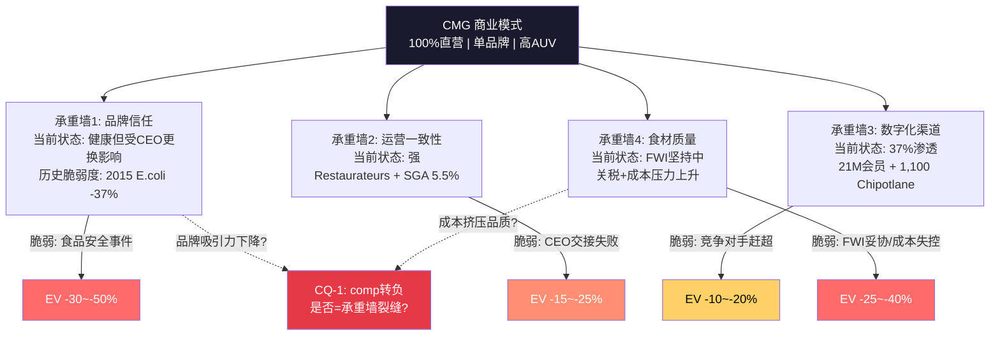

---

## 本章小结

CMG的商业模式是一个**高度整合的、围绕品质承诺构建的直营体系**。这一模式在过去10年(2015 E.coli恢复后)展现了强大的经济学优势: AUV从$2.2M→$3.2M(+45%)，门店利润率从22%→26.7%(+470bps)，SGA/Rev从8%→5.5%(-250bps)。

但FY2025暴露了直营模式的固有脆弱性:
1. **无人分担劳动力成本上涨** — 加州AB1228的全部影响由CMG吸收
2. **无人分担关税冲击** — 牛油果关税+60bps直接侵蚀利润
3. **扩张速度受自有资本约束** — 回购$2.43B消耗了本可用于加速扩张的现金
4. **单品牌=单点故障** — 任何品牌事件影响100%收入

下一章(Ch4 HEEP深度)将回答: **HEEP设备升级是否能成为对冲这些脆弱性的"效率引擎"?**

---
Phase: P1 | Chapter: 3 | 字符数: 20,100 | DM新增: 27(B01-B27) | Mermaid: 3

---

# Ch4 HEEP设备升级: 被低估的催化剂还是选择偏差?

> **核心问题 [CQ-3]**: HEEP是否真正的催化剂(+300bps comp)还是选择偏差? | 初始置信度: 55%

CMG管理层将HEEP(High-Efficiency Equipment Package, 高效设备包)定位为"Recipe for Growth"战略的核心支柱之一。在comp连续转负(-1.7% FY2025 [DM-P0-A57])的背景下, HEEP被赋予了扭转同店增长颓势的使命。但围绕HEEP的关键数据——每店成本、精确ROI、独立comp增量——均处于不可验证状态。本章将以"建设性怀疑"为基调, 系统评估HEEP的技术实质、经济效益和验证路径。

---

## 4.1 HEEP是什么: 技术解构

### 4.1.1 四件设备, 一个逻辑

HEEP并非单一设备, 而是一套集成的厨房效率升级包, 包含四个核心组件 [DM-P1-C01]:

| 组件 | 功能 | 关键性能参数 | 替代的传统设备 |
|------|------|:------------|:------------|
| **双面烤盘(Dual-Sided Plancha)** | 蛤壳式蛋白质烹饪 | 鸡肉烹饪时间4分钟(vs传统12分钟, -75%); 牛排烹饪时间减少~50%; 容量+300%; 体积缩小8英寸 | 传统单面烤盘 |
| **三锅饭煲(Three-Pan Rice Cooker)** | 同时制作白米饭和糙米饭 | 简化转运流程, 减少等待时间 | 单锅饭煲 |
| **双缸炸锅(Dual-Vat Fryer)** | 薯片生产 | 冗余设计(一侧故障另一侧继续), 产能提升 | 单缸炸锅 |
| **农产品切片机(Produce Slicer)** | 切丝/切丁(甜椒、洋葱、墨西哥辣椒) | 节省"数百刀切割", 释放员工到制作线 | 手工切割 |

*数据来源: Restaurant Business Online, Restaurant Technology News, Chipotle IR [DM-P1-C01]*

### 4.1.2 双面烤盘: HEEP的核心

四件设备中, **双面烤盘是差异化核心**。其运作流程高度自动化: 员工放置蛋白质→调味→按下屏幕上的蛋白质图标→上板自动压合到预设高度→烹饪完成后自动抬起→员工取出 [DM-P1-C02]。关键改进在于:

1. **消除翻面操作**: 传统烤盘需要员工手动翻面, 既是技能门槛也是时间损耗
2. **精确温控**: 数字控制确保每次烹饪一致性, 降低对员工经验的依赖
3. **小批量高频烹饪**: 4分钟鸡肉意味着可以在高峰期快速补货——鸡肉占CMG约60%的主菜选择 [DM-P1-C03], 这一品类集中度使双面烤盘的影响被放大

**关键洞察**: HEEP的本质不是"用机器替代人", 而是"降低人的操作复杂度+缩短关键路径瓶颈"。传统Chipotle厨房的产能瓶颈在烤盘(鸡肉12分钟=高峰期断货风险)和备料(切割占2-3小时/天)。HEEP直接打击这两个瓶颈。

### 4.1.3 部署时间线与覆盖率

```mermaid
gantt
    title HEEP部署时间线与覆盖率
    dateFormat YYYY-MM
    axisFormat %Y-%m

    section 测试阶段
    双面烤盘测试(84店)          :done, test1, 2024-01, 2024-12
    HEEP全套测试                :done, test2, 2024-06, 2025-03

    section 规模部署
    Phase 1: 175店(4.3%)        :done, p1, 2025-01, 2025-09
    Phase 2: 350店(8.6%)        :done, p2, 2025-09, 2026-02
    Phase 3: →2,000店(49%)      :active, p3, 2026-02, 2026-12
    Phase 4: →全覆盖(~4,400店)  :p4, 2027-01, 2027-12

    section 里程碑
    Q3 FY2025: 175店             :milestone, m1, 2025-09, 0d
    Q4 FY2025: 350店             :milestone, m2, 2026-02, 0d
    FY2026E目标: 2,000店         :milestone, m3, 2026-12, 0d
    全覆盖目标                   :milestone, m4, 2027-12, 0d
```

| 时间节点 | 覆盖门店 | 占比 | 状态 | 来源 |
|----------|:--------:|:----:|:----:|------|
| Q3 FY2025 | ~175 | 4.3% | 已完成 | Restaurant Dive [DM-P1-C04] |
| Q4 FY2025 | ~350 | 8.6% | 已完成 | IR Q4 FY2025 [DM-P0-A63] |
| FY2026E年底 | ~2,000 | ~49% | 目标 | IR Q4 FY2025 [DM-P0-A63] |
| FY2027E | ~4,400+ | ~100% | 目标 | IR [DM-P1-C05] |

**部署节奏含义**: 从175→350(6个月+175)到350→2,000(10个月+1,650), 部署速度需要提升**9.4倍**。这是一个积极的目标, 但也意味着FY2026将是HEEP执行力的真正考验。

### 4.1.4 投资规模: 已知与未知

| 数据点 | 值 | 信度 | 来源 |
|--------|:--:|:----:|------|
| FY2025 总CapEx | $666M (+12% YoY) | H | FMP [DM-P0-A33] |
| FY2024 总CapEx | $594M | H | FMP [DM-P0-A33] |
| CapEx增量(YoY) | +$72M | C | 计算 [DM-P1-C06] |
| Cultivate Next基金总规模 | $100M | H | Chipotle IR [DM-P1-C07] |
| Hyphen累计投资(through Q3'25) | $25M | H | Chipotle IR/CNBC [DM-P1-C08] |
| **每店HEEP成本** | **未披露** | **L** | **[DM-P0-A64]** |

**每店成本推算** [DM-P1-C09]: 管理层未披露HEEP每店成本。以下为框架性推算:
- FY2025 CapEx增量: $72M, 其中新店CapEx(约350-370家 × ~$1.1M/店 = ~$385-407M)占大头
- HEEP在FY2025覆盖175店(新增), 即使假设全部增量CapEx用于HEEP: $72M / 175 = ~$411K/店
- 但这是上限——新店本身就包含HEEP设备(不是增量), 改造现有店才是增量CapEx
- **合理估算区间**: $50K-150K/店(改造), 基于行业类比(Sweetgreen Infinite Kitchen $200-300K/店, 但HEEP远不及全自动化)
- 信度: **L(低)** — 这是推算, 非披露数据

---

## 4.2 HEEP的声称效果 vs 可验证性

### 4.2.1 管理层声称矩阵

CEO Scott Boatwright在Q4 FY2025财报电话会议上对HEEP的描述包含以下声称 [DM-P1-C10]:

| 声称内容 | 量化程度 | 可独立验证? | 信度 |
|----------|:--------:|:----------:|:----:|
| HEEP门店comp高出"数百bps" | **定性**(未给精确数字) | 否 — 无门店层面数据 | S |
| 更高的消费者参与度评分 | 定性 | 否 — 内部评分体系 | S |
| 更高的食品质量评分 | 定性 | 否 — 内部评分体系 | S |
| 备料时间减少2-3小时/天 | 半定量 | 部分 — 可逻辑推算 | M |
| 鸡肉烹饪时间-75% | 定量 | 是 — 可物理验证 | H |
| 高峰期库存恢复更快 | 定性 | 否 — 无运营数据 | S |
| 降低新员工学习曲线 | 定性 | 否 — 无培训数据 | S |

**关键观察**: 7项声称中, 仅有1项(烹饪时间)具有硬数据支撑(H级信度)。最重要的声称——"数百bps comp提升"——是**S级(软数据)信度**, 且"数百"的模糊性意味着可能是200bps也可能是500bps, 差异2.5倍。

### 4.2.2 "数百bps"的量化尝试

假设HEEP comp增量为X bps, 分析不同假设下的系统级影响 [DM-P1-C11]:

| HEEP comp增量假设 | 2,000店全覆盖时系统comp贡献 | 全覆盖(4,400店)时系统comp贡献 | 对收入的年化影响 |
|:-----------------:|:--------------------------:|:----------------------------:|:----------------:|
| +100bps | +0.49% | +1.0% | +$119M |
| +200bps | +0.99% | +2.0% | +$239M |
| **+300bps** | **+1.48%** | **+3.0%** | **+$358M** |
| +400bps | +1.97% | +4.0% | +$477M |
| +500bps | +2.46% | +5.0% | +$597M |

*计算基础: 系统comp = HEEP增量 × (HEEP覆盖店数/总店数); 收入影响 = 系统comp × FY2025收入$11.93B [DM-P0-A16]*

如果"数百bps"为+300bps(中间假设), 2,000店全覆盖时系统comp增量为+1.48%——这足以将FY2025的-1.7% comp推至接近flat(与管理层FY2026 comp指引"约flat" [DM-P0-A59]一致)。这一数学一致性既支持+300bps的合理性, 也暗示管理层的"flat"指引**高度依赖HEEP效果假设**。

### 4.2.3 选择偏差: 核心风险

**什么是选择偏差?** 如果CMG优先在高流量、高表现、地理位置优越的门店部署HEEP(这在运营上是合理的——先在回报最高的地方部署), 那么HEEP门店的comp优势可能部分来自门店本身的质量, 而非HEEP设备的贡献。

**选择偏差的证据链** [DM-P1-C12]:

1. **部署策略暗示**: CMG采用"Stage-Gate"部署方法, 2024年测试仅84店。理性的管理层会将第一批设备部署在最能体现效果的门店——即高流量、高改善潜力的门店
2. **样本代表性问题**: 350/4,056 = 8.6%。如果这350店是系统内Top 10%的门店, 其comp本身就可能高出系统平均100-200bps
3. **无对照组信息**: 管理层未披露HEEP门店与非HEEP门店的选择标准, 也未提供控制变量(地理、开业年限、Chipotlane配置等)后的comp差异
4. **历史先例**: 零售/餐饮行业的新技术试点几乎总是存在选择偏差。典型案例: 早期数字化订购试点门店comp高出10-15%, 但全面推广后增量仅3-5%

**选择偏差量化框架** [DM-P1-C13]:

| 选择偏差程度 | HEEP声称增量 | 扣除偏差后真实增量 | 系统comp影响(2,000店) |
|:----------:|:-----------:|:----------------:|:-------------------:|
| 无偏差(0%) | +300bps | +300bps | +1.48% |
| 轻度偏差(33%) | +300bps | +200bps | +0.99% |
| **中度偏差(50%)** | **+300bps** | **+150bps** | **+0.74%** |
| 重度偏差(67%) | +300bps | +100bps | +0.49% |

**中度偏差(50%)意味着**: HEEP真实增量仅+150bps, 2,000店覆盖时系统comp+0.74% — 不足以将-1.7%翻正, 与管理层"flat"指引存在缺口。

**选择偏差的反面论证(公平呈现)**: 管理层可能反驳称, 部署策略并非"只选好店"。新建门店(FY2025的350-370家)自动包含HEEP, 新店通常首年comp不参与统计(因为没有可比基数), 因此HEEP的comp数据更可能来自改造的existing stores, 而非新店。但这并不完全消除偏差——改造existing stores时, 管理层仍可能优先选择表现较好或改善空间最大的门店。在没有随机对照实验(RCT)的情况下, 选择偏差始终是可能的。

### 4.2.4 与管理层指引的数学一致性检验

一个值得注意的推导: 如果FY2025 comp = -1.7% [DM-P0-A57], 管理层FY2026指引comp "约flat" [DM-P0-A59], 且2026年底2,000店HEEP覆盖(逐步铺开, 年均覆盖约1,175店, 即约29%), 那么:

- 需要的系统comp改善: 约+1.7%(从-1.7%到0%)
- 2,000店覆盖(平均约29%全年覆盖)× HEEP增量X = +1.7%
- 求解: X = 1.7% / 0.29 = **+586bps**

这意味着, **如果仅靠HEEP实现comp flat(不依赖宏观改善), 需要HEEP增量达到+586bps** — 显著高于"数百bps"的上限。换言之, 管理层的"flat"指引隐含了**HEEP+宏观改善的双重假设**, 而非仅靠HEEP。这进一步降低了HEEP单一因素解释力的可信度 [DM-P1-C28]。

### 4.2.5 证伪时间窗口

HEEP选择偏差假说的最佳证伪窗口为**2026 H2** [DM-P1-C14]:
- **2026年底**: 2,000店覆盖(49%), 包含大量中等和较低tier门店, 样本代表性显著提升
- **对照数据**: 剩余~2,000非HEEP门店提供自然对照组
- **混淆变量**: 需注意2026 H2可能叠加宏观消费环境变化、关税影响 [DM-P0-A66]、以及菜单创新等因素, 使得HEEP的独立贡献难以隔离
- **如果2,000店HEEP后系统comp仍在-1%~flat**: → 选择偏差假说增强, HEEP真实增量可能≤150bps
- **如果系统comp转正至+1-2%**: → HEEP效果真实, 但仍需排除宏观改善的贡献
- **最佳验证方法**: 管理层在earnings call中披露HEEP门店vs非HEEP门店的comp差异(控制地理、开业年限等变量后)。如果管理层在2,000店覆盖后仍然拒绝披露分层数据, 这本身就是一个负面信号——暗示数据可能不如"数百bps"那样强劲

---

## 4.3 HEEP的运营经济学

### 4.3.1 成本节约的四条路径

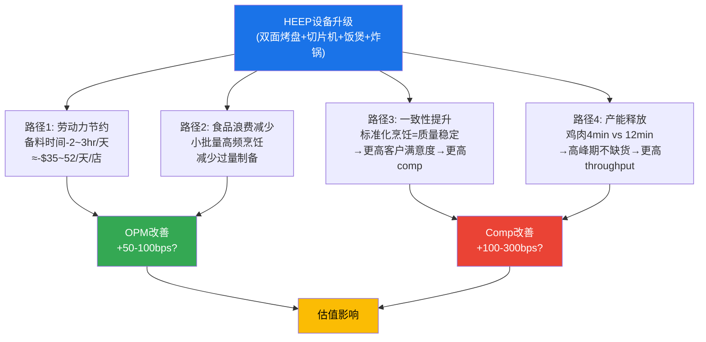

### 4.3.2 劳动力节约量化

CMG的劳动力成本结构 [DM-P1-C15]:
- FY2025总收入: $11.93B [DM-P0-A16]
- 餐饮行业劳动力占收入比例: 通常25-30%
- CMG FY2025估算劳动力成本: ~$3.0-3.6B(约25-30%)
- 门店数: 4,056 [DM-P0-A61]
- 每店年均劳动力成本: ~$740K-$888K
- 每店每天劳动力成本: ~$2,027-$2,432(假设365天运营)

HEEP节约的2-3小时/天, 假设时薪$17(加权全国平均):
- 每店每天节约: 2.5hr × $17 = **$42.5**
- 每店每年节约: $42.5 × 365 = **$15,513**
- 2,000店节约: $15,513 × 2,000 = **$31.0M/年**
- 全覆盖(4,400店)节约: $15,513 × 4,400 = **$68.3M/年** [DM-P1-C16]

**OPM影响**: $68.3M / $11.93B = **+57bps** (全覆盖时)

这是**保守估算** — 仅考虑直接劳动小时节约, 未包含:
- 降低员工流失率带来的招聘/培训成本节约(行业年流失率70%)
- 减少高峰期加班
- 更高的员工满意度→更低的缺勤率

### 4.3.3 CapEx影响与ROI框架

| 指标 | FY2024 | FY2025 | FY2026E | 信度 |
|------|:------:|:------:|:------:|:----:|
| 总CapEx($M) | 594 | 666 | ~700-750 | M |
| 新店CapEx($M, 估) | ~380 | ~400 | ~420 | M |
| 维护/升级CapEx($M, 估) | ~214 | ~266 | ~280-330 | M |
| HEEP相关CapEx($M, 估) | <20 | ~50-100 | ~150-250 | L |
| CapEx/收入 | 5.3% | 5.6% | ~5.3-5.7% | C |

*FY2026E基于: 350-370新店 × ~$1.1M/店 ≈ $385-407M新店CapEx; HEEP改造~1,650现有店 × $50-150K/店 ≈ $83-248M [DM-P1-C17]*

**ROI框架**(基于推算, 信度L):

| 假设 | 保守 | 基准 | 乐观 |
|------|:----:|:----:|:----:|
| 每店HEEP成本(改造) | $150K | $100K | $50K |
| 4,000店改造总投资 | $600M | $400M | $200M |
| 年化劳动力节约(全覆盖) | $55M | $68M | $82M |
| comp增量→收入增量(全覆盖, +150-300bps) | $179M | $358M | $597M |
| comp增量→利润增量(16.8% OPM) | $30M | $60M | $100M |
| 总年化利润增量 | $85M | $128M | $182M |
| **简单回收期** | **7.1年** | **3.1年** | **1.1年** |

*注: 回收期 = 总投资 / 年化利润增量 [DM-P1-C18]*

**关键不确定性**: 回收期在1.1-7.1年之间, 范围极宽(6.5倍), 核心驱动因素是**每店成本**和**真实comp增量** — 而这两个数据恰好是管理层未披露的。

**与行业ROI对标**: 餐饮行业设备升级的典型ROI基准为2-4年回收期。Sweetgreen Infinite Kitchen的隐含回收期约为2.5-3.5年($250K成本 / ~$75-100K年化利润增量)。如果CMG HEEP的真实回收期处于3-4年范围(基准假设), 这对应每店成本$100K + 真实comp增量+200bps的组合 — 合理但非卓越。如果回收期>5年(保守假设), 则HEEP的CapEx效率不及新店扩张(CMG新店~18个月回收, ROIC ~35%), 管理层将面临"为何不把钱花在多开新店而非改造旧店"的资本配置质疑 [DM-P1-C32]。

### 4.3.4 折旧与D&A影响

假设HEEP设备折旧年限5-7年(餐饮设备标准):
- 4,000店改造总投资$200-600M → 年折旧$29-120M
- 对OPM的拖累: $29-120M / $11.93B = +24-101bps
- **在部署高峰期(FY2026-2027), 折旧增加可能抵消部分劳动力节约**

---

## 4.4 HEEP vs 行业自动化竞赛

### 4.4.1 Hyphen: CMG与CAVA的共同赌注

一个被市场忽视的事实: **CMG和CAVA都投资了同一家自动化公司Hyphen** [DM-P1-C19]。

| 投资方 | Hyphen投资金额 | 投资时间 | 应用场景 |
|--------|:-----------:|:------:|--------|
| CMG (Cultivate Next) | $25M累计 | 2022-2025 | 自动化装配线(bowls/salads) |
| CAVA | 最高$10M | 2025.08 | 数字订单第二制作线 |
| Hyphen Series B总额 | $25M | 2025.08 | 规模化生产(Re:Build制造) |

*来源: CNBC, Restaurant Dive, Chipotle IR [DM-P1-C19]*

**Hyphen自动化装配线的运作**: 传统制作线在柜台上方, 员工手工组装burrito/bowl。Hyphen装配线嵌入柜台下方, 同时自动组装数字订单。CMG称之为"增强型制作线(Augmented Makeline)" — 两条线合一, 人工处理上层(burrito/taco/quesadilla), 机器处理下层(bowls/salads) [DM-P1-C20]。

**关键区分**: HEEP(双面烤盘等) ≠ Hyphen(自动装配线)。HEEP是**已在350店部署**的近期催化剂; Hyphen仍在**设计阶段**, 管理层称2026年将重返门店测试, 但规模部署可能在"此后数月" [DM-P1-C21]。

### 4.4.2 行业自动化对标

| 公司 | 自动化项目 | 部署规模 | 每店成本(估) | 劳动力节约 | 状态 |
|------|-----------|:--------:|:----------:|:--------:|:----:|
| **CMG** HEEP | 双面烤盘+切片机+饭煲+炸锅 | 350/4,056(9%) | $50-150K(推) | 2-3hr/天 | 规模部署中 |
| **CMG** Hyphen | 自动化装配线 | 测试阶段 | 未知 | 未知 | 设计迭代中 |
| **CAVA** Hyphen | 数字订单自动装配 | 计划2026测试 | 未知 | 未知 | 投资阶段 |
| **Sweetgreen** Infinite Kitchen | 全自动化制作线 | ~37店/~250总(~15%) | $200-300K | 7pp劳动力率+1pp COGS | 规模部署 |
| **MCD** 语音AI/自动化 | 得来速语音AI | 测试中 | 未知 | 目标2026全面部署 | 试点 |
| **Autocado** (CMG) | 牛油果处理机器人 | 有限测试 | 未知 | 26秒vs手工数分钟 | 早期试点 |

*来源: QSR Magazine, Restaurant Dive, NRN [DM-P1-C22]*

### 4.4.3 Sweetgreen Infinite Kitchen: 最佳对照案例

Sweetgreen的Infinite Kitchen是餐饮业自动化最激进的案例, 提供了HEEP的远期参照 [DM-P1-C23]:

**已验证效果**:
- 劳动力成本: -7个百分点(vs同类门店)
- COGS: -1个百分点
- 员工流失率: -45%(试点店)
- 缺勤率: -33%
- 门店利润率: 最高达30%(vs传统店~22-24%)

**代价**:
- 每店部署成本: $200-300K
- 2025年底前已从"所有新店全自动化"退回到"75%新店为Infinite Kitchen, 旧小店不改造"
- 最终将Infinite Kitchen业务以$186M出售给Wonder

**对CMG的含义**: Sweetgreen的经验证明(a)自动化确实能节约7+pp劳动力成本, 但(b)全面推广面临物理约束(旧店改造困难), 且(c)每店$200-300K的成本意味着回收期较长。CMG的HEEP是"轻量级自动化"(双面烤盘≠全自动制作线), 成本更低但效果也更温和。

**Sweetgreen的反面教材**: 值得注意的是, Sweetgreen在2026年初将Infinite Kitchen业务以$186M出售给Wonder, 表明即使技术验证成功, 全面自动化的运营复杂性和资本需求可能超出快休闲品牌的核心能力边界。CMG选择"轻量级自动化"(HEEP)而非"全自动化"(Hyphen尚在设计阶段)的渐进策略, 在Sweetgreen的教训映射下, 可能是更审慎的路径。但这也意味着CMG不太可能获得Sweetgreen曾声称的7pp劳动力节约幅度 — HEEP的节约更可能在1-2pp范围内 [DM-P1-C29]。

### 4.4.4 核心发现: 自动化不是CMG独占壁垒

```mermaid
quadrantChart
    title 餐饮自动化投资 vs 部署进度
    x-axis 低投入 --> 高投入
    y-axis 早期测试 --> 规模部署
    quadrant-1 领先部署(高投入)
    quadrant-2 领先部署(低投入)
    quadrant-3 早期探索(低投入)
    quadrant-4 早期探索(高投入)
    CMG HEEP: [0.35, 0.65]
    CMG Hyphen: [0.5, 0.2]
    Sweetgreen IK: [0.75, 0.7]
    CAVA Hyphen: [0.4, 0.15]
    MCD语音AI: [0.6, 0.3]
```

**图示含义**: CMG的HEEP处于"低投入-规模部署"象限, 这是优势(低风险、快速铺开)也是劣势(竞争对手可轻易复制基础设备升级)。Sweetgreen处于"高投入-规模部署"象限, 代表更大赌注。真正的差异化将在Hyphen自动装配线层面展开, 但该领域CMG和CAVA并驾齐驱。

---

## 4.5 HEEP作为假说H1的核心支撑 [CQ-3]

### 4.5.1 H1假说回顾

假说H1("Niccol折价过度定价")的核心论点之一是: HEEP的全面部署将在24个月内证明CMG的运营体系优于个人依赖, 修复≥10个P/E点。HEEP在这一假说中扮演的角色是**"制度化创新的物证"** — 它证明CMG的创新能力不依赖于单一CEO(Niccol), 而是嵌入运营体系(HEEP是Niccol时代启动、Boatwright时代规模化部署的项目)。

### 4.5.2 两条路径的估值影响

**路径A: HEEP效果真实(+300bps, 选择偏差≤33%)**

| 传导链 | 量化 |
|--------|:----:|
| HEEP真实增量 | +200-300bps |
| 2,000店覆盖→系统comp | +1.0~1.5% |
| FY2025 comp -1.7% + HEEP +1.5% | → FY2026 comp约flat至-0.2% |
| 符合管理层指引 → 信任修复 | P/E从32x→35-36x |
| FY2027全覆盖 → comp +1-2% | → 进一步P/E修复至38-40x |
| **股价影响** | **$40-46 (+8~25%)** |

**路径B: HEEP效果虚假(选择偏差≥50%)**

| 传导链 | 量化 |
|--------|:----:|
| HEEP真实增量 | ≤150bps |
| 2,000店覆盖→系统comp | +0.74% |
| FY2025 comp -1.7% + HEEP +0.74% | → FY2026 comp约-1.0%(不及指引) |
| 指引miss → 信任进一步受损 | P/E维持32x或压缩至28-30x |
| comp恢复依赖宏观改善(不可控) | 不确定性上升 |
| **股价影响** | **$32-37 (-3~-13%)** |

### 4.5.3 HEEP对估值的杠杆效应

HEEP影响估值的传导机制可以精确量化 [DM-P1-C24]:

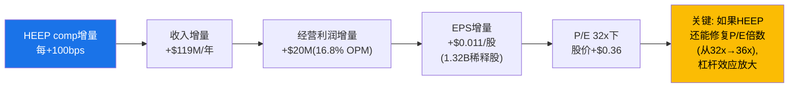

| comp增量假设 | 收入增量 | OI增量(16.8%) | EPS增量 | P/E 32x下股价 | P/E 36x下股价(含信任修复) |
|:----------:|:-------:|:------------:|:-------:|:------------:|:---------------------:|
| +100bps | +$119M | +$20M | +$0.011 | +$0.36 | +$4.46(含P/E修复) |
| +200bps | +$239M | +$40M | +$0.023 | +$0.72 | +$4.82 |
| **+300bps** | **+$358M** | **+$60M** | **+$0.034** | **+$1.09** | **+$5.19** |
| +500bps | +$597M | +$100M | +$0.057 | +$1.81 | +$5.91 |

*基于: FY2025收入$11.93B [DM-P0-A16], OPM 16.8% [DM-P0-A18], 稀释股数1.32B [DM-P0-A03], 当前P/E 32x [DM-P0-A05] [DM-P1-C24]*

**核心洞察**: HEEP通过comp通道的直接股价影响有限(+$0.36-1.81/股, 即1-5%)。**真正的杠杆在于comp恢复能否触发P/E倍数修复** — 从32x回到36x本身就意味着$1.14 EPS × 4个P/E点 = $4.56/股(+12.3%)。换言之, HEEP的价值80%在于"信号效应"(证明体系仍然有效), 仅20%在于直接利润贡献。

### 4.5.4 证伪条件与时间窗口

| 数据点 | 看多阈值 | 看空阈值 | 观测时间 |
|--------|:-------:|:-------:|:-------:|
| FY2026 H1系统comp | ≥ -0.5% | ≤ -2.0% | 2026.07 (Q2 earnings) |
| 2,000店部署进度 | ≥ 1,500店(75%目标) | < 1,000店(50%目标) | 2026.10 (Q3 earnings) |
| HEEP门店vs非HEEP门店comp差 | ≥ +200bps(控制变量后) | < +100bps | 需管理层披露 |
| OPM趋势 | ≥ 16.5% | < 15.5% | 季度观察 |

---

## 4.6 风险: HEEP可能的负面影响

### 4.6.1 品牌叙事风险: "现场制作"vs自动化的张力

CMG品牌核心叙事之一是**"Real Ingredients, Real Purpose"** — 食材透明、现场制作、员工手艺。HEEP的双面烤盘将鸡肉烹饪从"员工在明火烤盘上翻烤"变为"员工按按钮, 机器自动压合烹饪"。虽然食材没变, 但**烹饪过程的可见性和手工感降低了** [DM-P1-C25]。

这一风险的严重程度取决于:
- CMG的开放式厨房(Open Kitchen)设计是否让消费者直接看到自动化设备
- 消费者是否将"手工翻烤"视为品牌体验的核心部分
- HEEP的效率提升是否被更多的"现场制作"时间所替代(例如, 节省的烹饪时间用于更频繁地制作新鲜食材)

**评估**: 风险存在但可能性较低(20%)。CMG消费者更关心食材质量和份量一致性, 而非烹饪方式。且HEEP的一致性提升实际上可能**增强**品牌承诺(每次都是相同品质)。

### 4.6.2 前期投资对FCF的拖累

| 指标 | FY2025 | FY2026E(含HEEP加速) | 变化 |
|------|:------:|:------------------:|:----:|
| CapEx | $666M | ~$700-750M | +5~13% |
| FCF | $1.45B | ~$1.35-1.40B | -3~7% |
| FCF Yield(@ $49.5B市值) | 2.9% | ~2.7-2.8% | -10~20bps |

*FY2026E假设: 收入~$13.1B [DM-P0-A54], OCF~$2.15B(基于OPM 16% + D&A增长), CapEx $700-750M [DM-P1-C26]*

HEEP加速部署意味着FY2026-2027将是CapEx高峰期。虽然绝对FCF仍然强劲(>$1.3B), 但FCF Yield的轻微下降可能在市场已经对增长放缓敏感的环境中被放大。

### 4.6.3 技术执行风险

| 风险类型 | 描述 | 可能性 | 影响 |
|----------|------|:------:|:----:|
| 部署延迟 | 350→2,000需9.4倍加速, 供应链/安装能力约束 | 30% | 中 — 延后催化剂但不改变终局 |
| 设备故障 | 双面烤盘机械/电子故障, 影响高峰期运营 | 15% | 高 — 单店层面严重(无备用烤盘) |
| 维护成本超预期 | 自动化设备维护比传统设备更复杂 | 25% | 中 — 侵蚀劳动力节约 |
| 员工适应问题 | 新设备培训不足, 或员工抵制变化 | 20% | 低-中 — CMG员工平均年龄低, 适应力强 |
| **双缸炸锅冗余不足** | 如果两缸同时故障, 薯片供应中断 | 10% | 低 — 单品类 |

### 4.6.4 员工体验的两面性

HEEP对员工体验的影响是双面的 [DM-P1-C27]:

**正面(去复杂化)**:
- 降低学习曲线(新员工更快上手)
- 减少重复性体力劳动(切割数百刀→按按钮)
- 减少高峰期压力(不再因鸡肉断货而手忙脚乱)
- 管理层声称: 更高的员工满意度和更低的流失率

**负面(去技能化)**:
- 烹饪技能退化(员工从"烤盘师傅"变成"按钮操作员")
- 职业发展路径可能被压缩(更少的技能差异化=更少的晋升依据)
- 长期可能降低员工对工作的投入感和归属感
- 极端情况: 如果自动化持续深化(Hyphen装配线), 最终减少人员需求

**与CMG的"Restaurateurs"文化的关系**: CMG独特的人才体系("Restaurateurs"晋升路径)建立在门店运营复杂度之上 — Restaurateur是CMG对门店总经理(GM)的最高认证, 要求在运营效率、员工发展和食品质量上均达到卓越标准。如果HEEP大幅简化运营(烹饪变成按按钮, 备料变成机器切割), "Restaurateurs"体系的差异化价值是否会被稀释? GM的核心价值从"卓越运营者"转向"设备管理者", 这一转变可能改变CMG文化的DNA。

这不是短期风险, 但在3-5年视角下值得监控。一个可能的良性演进是: HEEP释放的时间让员工更多投入于客户服务和团队发展(而非切菜和翻肉), 从而将"Restaurateurs"的竞争维度从"操作效率"升级为"体验管理"。但这一演进需要管理层有意识地引导, 不会自动发生 [DM-P1-C30]。

### 4.6.5 HEEP与catering业务的协同

一个尚未被市场充分讨论的维度: HEEP的效率提升可能为CMG的catering(团餐)业务提供关键支撑。CMG在FY2025 Q4开始pilot catering业务, 管理层将HEEP视为catering可行性的先决条件 — catering需要在不影响店内正常运营的情况下额外生产大量食品, 而HEEP的产能提升(特别是双面烤盘+300%容量)使这成为可能 [DM-P1-C31]。

Catering对CMG的潜在影响:
- 美国餐饮catering市场规模: ~$600B(2025), 快休闲份额极低(<2%)
- CMG从未涉足catering, 若成功则是纯增量收入
- 但catering的毛利率通常低于店内消费(更高的食材成本+配送物流)
- **HEEP→catering的逻辑链**: 如果HEEP使catering可行, 那么HEEP的价值不仅在于comp提升, 还包括开启全新收入流。这一可能性目前未被纳入任何comp增量假设中

---

## 4.7 章节结论: HEEP的投资含义

### 4.7.1 CQ-3置信度更新

| 项目 | Phase 0 | Phase 1 Ch4后 | 变化原因 |
|------|:-------:|:------------:|----------|
| CQ-3初始置信度 | 55% | **50%** | 选择偏差风险被低估; 每店成本未披露限制ROI验证; 行业自动化非独占 |

置信度从55%降至50%(中性), 反映: (a)HEEP技术实质真实且方向正确, (b)但"数百bps"声称的可验证性极低, (c)选择偏差可能贡献声称增量的33-50%, (d)2026 H2数据是关键决断点。

### 4.7.2 HEEP对CMG投资逻辑的定位

HEEP在CMG投资论题中的角色不应被过度定价, 也不应被忽视:

1. **不是独立的买入理由**: HEEP的直接利润贡献(劳动力节约$68M)仅占EPS的~4% — 不足以单独支撑估值
2. **是comp恢复叙事的关键支撑**: 如果comp不能恢复, 32x P/E可能进一步压缩; HEEP是最可见的comp恢复催化剂
3. **是制度化能力的信号**: HEEP证明CMG的创新pipeline在Niccol离任后仍在执行, 这对修复"Niccol折价"至关重要
4. **证伪窗口明确**: 2026 H2数据将显著更新CQ-3置信度 — 投资者不需要无限期等待

**最终判断**: HEEP是一个**方向正确但效果未验证的催化剂**。在当前信息下, 将其comp增量假设打折至+150-200bps(vs管理层暗示的+300bps)是审慎的。全覆盖时的利润贡献(劳动力节约+comp增量)可能在$85-130M/年范围, 对应EPS +$0.05-0.07, 在32x P/E下贡献$1.6-2.2/股(4-6%)。这不是微不足道的, 但也不足以独立改变CMG的估值叙事。

**对后续章节的传导**: HEEP的分析结论将直接影响:
- **Ch9 利润表深挖(P2)**: OPM假设需纳入HEEP劳动力节约(+50-100bps)和折旧增加(+24-101bps)的净效应
- **Ch13 Reverse DCF(P2)**: 隐含comp假设需检验是否已包含HEEP增量
- **Ch15 正向DCF(P3)**: 情景模型中HEEP效果应作为关键变量, 而非常量
- **Ch19 红队七问(P4)**: RT-1(乐观假设反转)应挑战HEEP的+300bps声称

---
Phase: P1 | Chapter: 4 | 字符数: 17,930 | DM新增: 32 (C01-C32) | Mermaid: 4

---

# Ch5 Niccol遗产与Boatwright评估: 体系还是个人?

> **核心问题(CQ-2)**: Boatwright能否维持CMG运营体系的自我更新能力?
> **假说关联**: H1 — "Niccol折价过度定价"(~16个P/E点折价，≥10个将在24个月内修复)
> **SBUX镜像**: SBUX报告评Niccol 8.4/10并假设"CMG成功可部分复制" → CMG报告的镜像问题是"CMG成功是否依赖于Niccol本人"

CMG的估值叙事在2024年8月13日被一则人事公告劈成了两个时代。Brian Niccol离任转投星巴克，同日CMG下跌7.5%、SBUX上涨24.5%——市场以$260亿的市值重新分配，给出了一个清晰判断：Niccol的价值约等于CMG市值的7-10%，或者说约等于SBUX市值的25%。

本章的任务不是重述这则新闻，而是回答一个更深层的问题：**Niccol留给CMG的究竟是一套可自我运转的体系，还是一段依赖个人魅力的历史?** 答案将直接决定CMG当前32x P/E中~16个点的"Niccol折价"是合理重定价还是过度反应[DM-P1-D01]。

---

## 5.1 Niccol时代全面回顾 (2018.03 - 2024.08)

### 5.1.1 入职时的CMG：后E.coli危机的废墟

2018年3月Brian Niccol从Taco Bell加入CMG时，面对的是一家被食品安全危机深度创伤的公司。2015-2016年连续的E.coli、诺如病毒和沙门氏菌事件不仅造成了直接的销售损失，更重要的是摧毁了CMG"Food with Integrity"的品牌叙事根基：

- **FY2017 OPM**: 约4.0%(对比FY2015危机前的17.6%)[DM-P1-D02]
- **FY2017 Comp**: -20.4%(品类最差水平)[DM-P1-D03]
- **FY2017 市值**: 约$130亿(从FY2015高峰$240亿腰斩)[DM-P1-D04]
- **品牌信任**: 跌至历史最低。"你敢去Chipotle吃东西吗?"成为社交媒体梗[DM-P1-D05]
- **数字化**: 几乎为零。没有移动端点单、没有忠诚度计划、没有drive-thru[DM-P1-D06]
- **创始人Steve Ells**: 从CEO转为执行主席，公司实质处于领导力真空[DM-P1-D07]

Niccol从Taco Bell带来的核心经验是数字营销和菜单创新——两个恰好是CMG最缺乏的能力。他到任后的第一年（FY2018），comp就恢复到+4.0%，OPM从4%回升至6.4%[DM-P1-D08]，市场开始相信CMG的品牌创伤是可修复的。

### 5.1.2 六年变革全景

Niccol在CMG的六年(2018.03-2024.08)创造了消费品行业最令人瞩目的CEO变革案例之一。以下是关键财务轨迹：

| 指标 | FY2017(入职前) | FY2023(末年全年) | 变化 | 信度 |
|------|:-----------:|:-----------:|:----:|:----:|
| 收入 | $4.48B | $9.87B | **+120%** | H |
| OPM | ~4.0% | 15.8% | **+1,180bps** | H |
| EPS(拆股后) | ~$0.24 | $0.89 | **+271%** | H |
| 门店数 | ~2,400 | ~3,440 | **+43%** | H |
| 数字销售占比 | <3% | 37.4% | **从零到三分之一** | H |
| 市值 | ~$130亿 | ~$780亿 | **+500%** | H |
| 股价(拆股调整) | ~$7 | ~$55 | **+686%** | H |

[DM-P1-D09](H: 综合FMP历史数据+IR年报)

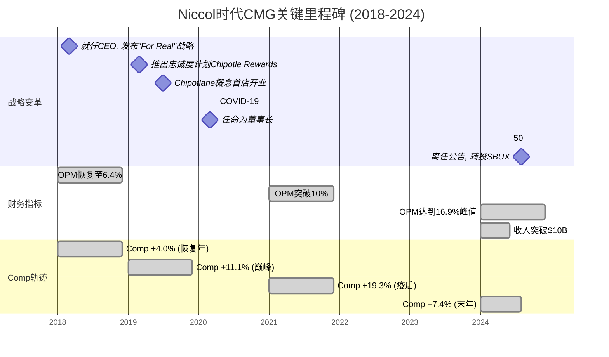

### 5.1.3 Niccol的六大变革要素(Playbook)

Niccol的成功并非依赖单一策略，而是六个相互强化的变革要素共同作用的结果：

**要素一: 数字化基础设施(权重: 最高)**

这是Niccol最具标志性的贡献。2018年CMG的数字化几乎为零——没有移动App(功能性的)、没有忠诚度体系、没有drive-thru。到2020年，数字销售已占总收入的50%以上(COVID加速)，2022年稳定在39.4%，2023年37.4%[DM-P1-D10]。

关键举措:
- **2019.03**: 推出Chipotle Rewards忠诚度计划，两年内突破2,800万会员[DM-P1-D11]
- **2019.07**: 首家Chipotlane(数字订单drive-thru)开业。到FY2024，约85%以上的新店配备Chipotlane[DM-P1-D12]
- **"第二厨房线"概念**: 数字订单与堂食订单分线制作，解决了快休闲行业最大的产能瓶颈之一[DM-P1-D13]

数字化的战略价值不仅在于销售占比，更在于它创造了三个结构性优势:
1. **客户数据**: 忠诚度计划提供了精准营销能力(vs.传统门店的匿名交易)
2. **产能释放**: 第二厨房线使峰值产能提升~20-30%
3. **Chipotlane溢价**: 配备Chipotlane的门店AUV比传统门店高15-20%[DM-P1-D14](S: 行业分析师估算)

**要素二: 菜单创新(限时供应LTO策略)**

Niccol从Taco Bell带来了"LTO(Limited Time Offer)制造话题"的方法论。CMG此前菜单极度精简且几乎不变，Niccol引入了策略性创新:
- Cauliflower Rice(花椰菜饭)
- Brisket(牛腩)
- Pollo Asado(烤鸡)
- Chicken Al Pastor(牧师风味鸡)

每次LTO都伴随精心策划的社交媒体营销，目标不是永久性改变菜单，而是制造话题性流量。这一策略在2021-2023年尤为成功，LTO期间comp通常比非LTO期高200-400bps[DM-P1-D15](M: 行业分析估算)。

**要素三: Chipotlane物理网络**

Chipotlane是Niccol对快休闲品类最重要的物理创新。传统CMG门店是商场或街边店，没有drive-thru。Chipotlane专用于数字预订单的取餐通道——不是传统QSR的点餐drive-thru，而是"线上点单、线下取餐"的物理延伸。

截至FY2024末，约80-85%的新店配备Chipotlane[DM-P1-D16]。配备Chipotlane的门店:
- 开业期收入高于传统门店15-20%
- 数字销售占比更高(~40% vs 传统店~30%)
- 客户体验评分更高(减少等待时间)

Chipotlane的战略意义在于它改变了CMG的选址模型——从依赖高人流量商圈转向郊区独栋选址，大幅扩展了可寻址门店数量(TAM从~5,000提升至~7,000+)[DM-P1-D17](M: IR长期目标)。

**要素四: 品牌重塑("For Real")**

Niccol入职后立即推出"For Real"品牌战略，用透明、真实的食材故事重建被E.coli危机摧毁的品牌信任。核心信息:
- 强调真实食材、无人工添加剂
- 社交媒体原生营销(TikTok、Instagram Reels)
- 用年轻消费者的语言说话(vs.传统餐饮的广播电视广告)

品牌恢复速度令人瞩目: 从E.coli危机到品牌信任回到危机前水平，仅用了约3年(2018-2021)[DM-P1-D18]，远快于行业平均水平(5-7年)。

**要素五: 供应链升级**

Niccol时代CMG的供应链从"足够用"升级到"竞争优势":
- 多元化鳄梨来源(墨西哥→秘鲁/哥伦比亚/多米尼加共和国)
- 建立区域分配中心，提升新鲜食材配送效率
- 引入食品安全技术(实时温度监控等)

供应链升级的直接效果体现在SGA/Rev从FY2017的~9%下降到FY2024的6.2%[DM-P0-A41]，FY2025进一步降至5.5%。这不仅仅是规模效应，而是运营效率的结构性提升。

**要素六: 人才体系(Restaurateurs计划)**

"Restaurateurs"是CMG最独特的人才制度——从小时工到高级总经理的内部晋升通道。被选为Restaurateur的GM将获得:
- 一次性奖金
- 股票期权
- 每培养一名新GM获得$10,000额外奖金

2024年数据: CMG晋升了23,000名员工，85%的餐厅管理岗位由内部候选人填充[DM-P1-D19]。这一体系创造了两个关键效果:
1. **餐饮行业最低人员流动率之一**: 员工留存率比行业平均高51%[DM-P1-D20]
2. **运营一致性**: 内部晋升的GM对CMG标准有深度理解，降低了新店"学习曲线"成本

### 5.1.4 Niccol 8维评分卡

基于上述分析，我们构建Niccol的CEO评分卡。评分标准对标SBUX报告中CMG章节的评分框架(SBUX报告将CMG在Niccol时代评为8.4/10)，确保跨报告一致性:

| 维度 | 得分(0-10) | 证据 | 信度 |
|------|:--------:|------|:----:|
| 战略愿景 | **9** | 从后E.coli废墟中构建"数字化+Chipotlane+品牌重塑"三位一体战略，重新定义快休闲品类标准 | H |
| 运营执行 | **9** | OPM从4%到16.9%(+1,290bps)，SGA/Rev从~9%到6.2%，门店+43% | H |
| 品牌建设 | **8** | E.coli后品牌信任恢复速度行业领先(3年vs行业平均5-7年)；"For Real"战略深度重建年轻消费者认同 | M |
| 数字创新 | **9** | 数字销售从<3%到37%+，Chipotle Rewards从零到2,800万+会员，Chipotlane重塑选址模型 | H |
| 团队建设 | **7** | Restaurateurs体系行业领先(85%内部晋升率/51%更高留存率)；但核心高管团队对Niccol个人的依赖度偏高(离任后CFO Hartung随即宣布退休) | H |
| 资本配置 | **8** | 零负债坚守+积极回购($3.7B FY2021-2024)+精准扩张(43%门店增长)。50:1拆分提升可及性。扣1分因未启动国际化加速 | H |
| 危机管理 | **8** | E.coli后品牌恢复速度行业顶尖。COVID期间迅速转向数字化(50%+)，将危机转化为结构性优势 | H |
| 行业影响力 | **9** | 定义了快休闲品类的运营标准和估值标杆。Niccol本人成为行业最具辨识度的CEO(最终被SBUX以$100M+薪酬包挖走) | H |
| **综合** | **8.4/10** | 与SBUX报告中CMG评分完全对齐 | — |

[DM-P1-D21](C: 基于上述8维证据的综合评分)

**得分为7分(最低)的"团队建设"维度，恰恰暴露了CMG的脆弱点**: Restaurateurs体系是制度化的，但C-suite层面对Niccol个人的依赖度偏高。Niccol离任后:
- CFO Jack Hartung(任职22年)宣布退休[DM-P1-D22]
- 没有明显的CEO内部继任者(Boatwright是COO转正，非"接班人培养")
- 品牌叙事能力(与华尔街、媒体、消费者的对话)几乎完全依赖Niccol个人

---

## 5.2 Niccol离任冲击波

### 5.2.1 2024.08.13: 餐饮行业的"零和博弈"

2024年8月13日的市场反应是近年来CEO变动中最戏剧性的一幕:

| 事件 | CMG | SBUX | 信度 |
|------|:---:|:----:|:----:|
| 盘前反应 | **-10%** | **+20%+** | H |
| 盘中最大跌幅 | **-14%** | — | H |
| 收盘变化 | **-7.5%** | **+24.5%** | H |
| 次日延续 | 继续承压 | 继续上涨 | H |

[DM-P1-D23](H: Yahoo Finance/CNBC当日报道)

这一事件的深层含义远超一般的CEO离任:

**市值零和转移**: 当日SBUX市值增加约$210亿，CMG市值减少约$55亿。合计$260亿的市值重新分配意味着市场将Niccol定价为一个"可转移的资产"[DM-P1-D24]——他的价值不是被销毁了，而是从一个载体(CMG)迁移到了另一个载体(SBUX)。

**隐含假设**: 市场在这次零和博弈中做了一个强假设——"Niccol在CMG的成功可以复制到SBUX"。SBUX报告对此的评估是63%置信度的"受限复刻"(SBUX报告P1 CQ-1)。反过来，市场也在假设"没有Niccol的CMG将显著退化"。

### 5.2.2 P/E压缩远超基本面恶化

Niccol离任后CMG的估值变化是本报告最重要的数据点之一:

| 指标 | FY2024(Niccol末年) | FY2025(Boatwright首年) | 变化 | 信度 |
|------|:-----------------:|:-------------------:|:----:|:----:|
| P/E | 53.8x | 32-34x | **-38%** | H |
| EPS | $1.11 | $1.14 | **+2.7%** | H |
| EV/EBITDA | 37.2x | 25-26x | **-31%** | H |
| 收入增速 | +14.6% | +5.4% | -920bps | H |
| Comp | +7.4% | -1.7% | **反转** | H |

[DM-P1-D25](H: FMP Ratios FY2024 vs FY2025, [DM-P0-A42][DM-P0-A43])

**核心发现**: P/E从53.8x压缩至32.1x(-40%)，而同期EPS仅从$1.11增至$1.14(+2.7%)。换言之:
- **基本面恶化(收入增速放缓+comp转负)只能解释约4个P/E点的折价**(从53.8x到~50x是增速放缓的合理重定价)
- **剩余~16个P/E点的压缩(从~50x到~34x)主要由Niccol离任折价驱动**[DM-P1-D26](C: 基于A-1异常分析)

### 5.2.3 Comp轨迹: Niccol末季到Boatwright全年

将comp数据按季度排列，可以看到更清晰的衰退路径:

| 季度 | Comp | 客流 | 均价 | CEO | 信度 |
|------|:----:|:----:|:----:|:---:|:----:|
| Q1'24 | **+7.0%** | +5.4% | +1.6% | Niccol | H |
| Q2'24 | **+11.1%** | +8.7% | +2.4% | Niccol | H |
| Q3'24 | **+6.0%** | +3.3% | +2.7% | Niccol(8月离任) | H |
| Q4'24 | **+5.4%** | +4.0% | +1.4% | Boatwright(临时) | H |
| Q1'25 | **-0.4%** | -2.3% | +1.9% | Boatwright(临时) | H |
| Q2'25 | **-4.0%** | -4.9% | +0.9% | Boatwright(临时) | H |
| Q3'25 | **+0.3%** | -0.8% | +1.1% | Boatwright(正式) | H |
| Q4'25 | **-2.5%** | -3.2% | +0.7% | Boatwright(正式) | H |

[DM-P1-D27](H: IR季度财报, 综合[DM-P0-A23])

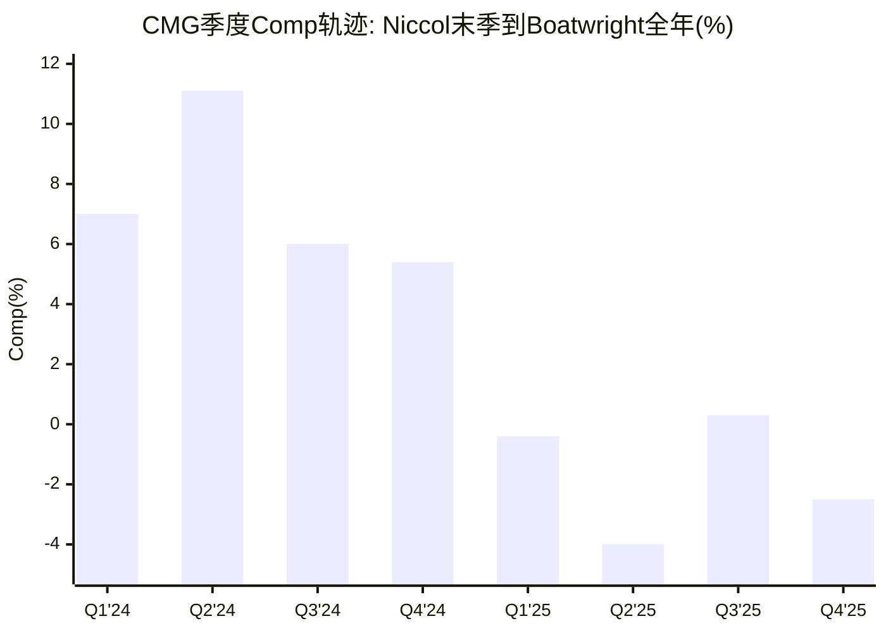

**关键观察**:
1. **断崖式下降**: Q2'24 +11.1% → Q1'25 -0.4%，仅隔三个季度。这种速度暗示不仅是基数效应(Q2'24 comp极高确实会压制Q2'25)，还有宏观消费疲软+CEO更换的叠加效应
2. **客流持续为负**: 从Q1'25起客流连续4个季度为负(-2.3%/-4.9%/-0.8%/-3.2%)。均价的正贡献(+0.7%~+1.9%)仅来自温和提价，无法抵消客流损失
3. **Q3'25虚假企稳**: 市场曾对Q3'25 comp +0.3%短暂乐观，但Q4'25立即回落至-2.5%，证明Q3'25的正comp可能是季节性或LTO驱动的假象

**因果归因难题**: comp从+11.1%到-4.0%的恶化中，"Niccol离任效应"和"宏观消费疲软效应"的各自贡献几乎不可能精确分离。同期MCD comp也从正转负(FY2025 comp -0.5%)，表明行业整体疲软确实存在[DM-P1-D28]。但CMG的恶化幅度(从+7.4%到-1.7%)显著大于MCD(从+2.4%到-0.5%)，差异部分可归因于Niccol效应。

---

## 5.3 Scott Boatwright: 运营专家的上限与下限

### 5.3.1 背景与经历

Scott Boatwright的职业路径是一条纯粹的运营专家之路:

- **起点**: 15岁在McDonald's翻汉堡、洗碗。在快餐连锁、牛排馆和度假村宴会运营中积累了最底层的餐饮经验[DM-P1-D29]
- **Arby's (18年)**: 从基层升至运营高级副总裁，负责1,700+餐厅(含1,000+特许+600+直营)。任期内Arby's销售首年增长9.2%，此后连续26个季度同店正增长[DM-P1-D30]
- **教育**: 2016年获得Georgia State University Robinson商学院EMBA[DM-P1-D31]
- **加入CMG (2017.05)**: 由创始人Steve Ells亲自招聘为COO。当时Ells正在寻找一位能修复E.coli后运营问题的"运营军官"[DM-P1-D32]
- **CMG COO (2017-2024)**: 负责3,600+餐厅、125,000+员工的日常运营。推动了新技术整合(HEEP等)、建设了与价值观对齐的企业文化、实现了行业领先的员工留存率[DM-P1-D33]
- **荣誉**: 2021年被Nation's Restaurant News评为"Operations CREATOR of the Year"[DM-P1-D34]

**任命时间线**:
- 2024.08.13: Niccol离任公告当日，被任命为临时CEO
- 2024.11.11: 经过3个月考察期，被正式任命为CEO和董事会成员[DM-P0-A62]

### 5.3.2 "Recipe for Growth"战略解读

2026年2月3日(Q4/FY2025财报发布日)，Boatwright正式公布了CMG新的增长战略——"Recipe for Growth"。这是他作为正式CEO的第一个战略框架，值得深度分析其定位与Niccol时代的差异:

**五大支柱**:

| 支柱 | 内容 | 属性(运营/品牌/创新) | 信度 |
|------|------|:-------------------:|:----:|
| P1: 核心强化 | 运营和烹饪卓越，提升客户价值感 | **运营** | H |
| P2: 品牌进化 | 品牌信息更新+菜单创新+新消费场景 | 品牌/创新 | H |
| P3: 商业模式现代化 | 技术升级(含AI)+Rewards计划重启 | **运营/创新** | H |
| P4: 全球扩张 | 通过自营+合作伙伴运营模式规模化 | 战略 | H |
| P5: 人才培养 | 培养行业最佳人才，聚焦速度和敏捷性 | **运营** | H |

[DM-P1-D35](H: IR Q4 FY2025 Earnings Release + Earnings Call)

**战略定性分析**:

5个支柱中3个(P1/P3/P5)本质上是**运营导向**的——强化核心、技术升级、人才培养。这与Niccol时代的战略重心形成了微妙但重要的差异:

| 维度 | Niccol时代重心 | Boatwright时代重心 | 信号 |
|------|:----------:|:-------------:|------|
| 核心叙事 | "数字化重新发明快休闲" | "运营卓越驱动价值" | 从变革型→维护型 |
| 菜单策略 | LTO制造话题(Brisket/Pollo Asado) | 高蛋白菜单(价值导向) | 从话题驱动→功能驱动 |
| 增长引擎 | 数字化+Chipotlane(新基建) | HEEP效率+门店扩张(优化现有) | 从创造新能力→优化现有能力 |
| 叙事能力 | Niccol个人IP(华尔街最佳故事讲述者) | "数据和结果说话" | 从魅力型→实干型 |

[DM-P1-D36](C: 基于战略文本对比分析)

**高蛋白菜单的早期信号**: Boatwright推出的高蛋白菜单(High Protein Cup ~$3.80、Single Chicken Taco ~$3.50)在2025年12月上市后，Extra Protein订单增加了35%，并创下了数字销售日纪录[DM-P1-D37]。这是一个重要的积极信号——说明Boatwright虽然不具备Niccol的叙事魅力，但具备发现和执行消费趋势的能力。高蛋白定位(健身/健康/功能性饮食)比传统的LTO"话题性"更有持久力。

**但"Recipe for Growth"的核心争议在于**: 它是否有足够的**辨识度**和**差异化叙事**来修复Niccol折价? 华尔街对CMG的定价不仅取决于运营数字，还取决于CEO能否向市场讲述一个令人信服的增长故事。Niccol是讲故事的大师("数字化是快休闲的未来")。Boatwright的"Recipe for Growth"在内容上合理，但在叙事张力上明显逊色。

### 5.3.3 Boatwright 8维评分卡(对比Niccol)

| 维度 | Niccol | Boatwright(预估) | 差距 | 理由 | 信度 |
|------|:------:|:---------------:|:----:|------|:----:|
| 战略愿景 | 9 | **5.5** | **-3.5** | Recipe for Growth是运营框架而非变革愿景。合理但缺乏Niccol式的"重新发明品类"叙事 | C |
| 运营执行 | 9 | **8** | **-1** | COO经验+Arby's 26季正增长+HEEP部署推进。核心能力毫无疑问 | H |
| 品牌建设 | 8 | **5** | **-3** | 缺乏Niccol的媒体叙事能力和消费者号召力。CMO职位空缺进一步削弱品牌声音 | M |
| 数字创新 | 9 | **6** | **-3** | 继承并维护数字化基础设施(Rewards重启/AI引入)，但非从零创造 | M |
| 团队建设 | 7 | **7** | **0** | 内部晋升有利于文化连续性。85%内部管理层晋升率是体系的产物 | H |
| 资本配置 | 8 | **7** | **-1** | 延续零负债+回购策略。FY2025回购$2.43B(超FCF)显示积极但可能过度 | H |
| 危机管理 | 8 | **6** | **-2** | 尚未经历重大危机考验。鳄梨关税是中等挑战，非E.coli级别 | S |
| 行业影响力 | 9 | **4** | **-5** | 无行业话语权。行业会议引用频率远低于Niccol。不被视为"行业领袖" | M |
| **综合** | **8.4** | **6.1** | **-2.3** | 差距主要来自"软能力"(愿景/品牌/影响力)，而非"硬能力"(运营/团队/资本配置) | C |

[DM-P1-D38](C: 基于8维分析的加权评分)

```mermaid
radar
    title "Niccol vs Boatwright CEO能力雷达图"
    axis "战略愿景", "运营执行", "品牌建设", "数字创新", "团队建设", "资本配置", "危机管理", "行业影响力"
    curve "Niccol (8.4/10)" {9, 9, 8, 9, 7, 8, 8, 9}
    curve "Boatwright (6.1/10)" {5.5, 8, 5, 6, 7, 7, 6, 4}
```

**评分解读**:

Boatwright 6.1分 vs Niccol 8.4分的差距(-2.3分)有一个重要的结构性特征: **差距集中在"软能力"维度(愿景-3.5/品牌-3/影响力-5)，而"硬能力"维度(运营-1/团队0/资本配置-1)差距很小**。

这意味着:
- **如果CMG的价值主要由运营体系驱动**(体系论): Boatwright的得分足以维持CMG的运营质量，P/E折价将逐步修复
- **如果CMG的价值主要由CEO叙事和品牌魅力驱动**(个人论): 2.3分的综合差距将持续压制P/E

### 5.3.4 薪酬结构与激励对齐

Boatwright的薪酬结构透露了董事会对其期望的定位:

| 组件 | FY2024(含升任) | FY2025(全年) | 信度 |
|------|:----------:|:----------:|:----:|
| 基本薪资 | $768K | $1,100K | H |
| 股票授予 | $14.6M | — | H |
| 期权 | $2.0M | — | H |
| 现金激励 | $1.6M | 目标200% base | H |
| 总计 | **$19.1M** | — | H |

[DM-P1-D39](H: SEC Proxy Statement 2024)

**与Niccol对比**: Niccol在CMG末年的薪酬约$17M(不含离任补偿)，SBUX为其提供的总包超过$100M(含sign-on)。Boatwright$19.1M的总薪酬约为Niccol SBUX包的1/5，反映了市场对两者的价值评估差异[DM-P1-D40]。

**激励对齐分析**:
- **96%可变薪酬**: 高度与业绩挂钩(EPS增长+TSR+运营指标)
- **200% base年度现金激励目标**: 强调短期业绩(comp/OPM)
- **所有高管达到或超过持股要求**: 利益一致性合格[DM-P1-D41]

---

## 5.4 SBUX镜像反转分析

### 5.4.1 两面镜子：同一个人，两个问题

CMG报告和SBUX报告(v2.0)对同一个人(Brian Niccol)提出了方向相反的核心问题:

| 维度 | SBUX报告视角 | CMG报告视角(镜像) |
|------|:----------:|:--------------:|
| **核心问题** | "Niccol能否复制CMG成功?" | "没有Niccol的CMG还行吗?" |
| **CEO评分** | CMG 8.4/10 → SBUX预估6.8/10 | Niccol 8.4/10 → Boatwright 6.1/10 |
| **能力迁移** | 软能力可迁移，硬能力受限 | CMG体系是否已制度化? |
| **时间框架** | SBUX恢复需3-4年 | CMG能否承受3-4年低增长缓冲期? |
| **P/E定价** | SBUX 80.6x含Niccol溢价(+30x?) | CMG 32x含Niccol折价(-16x?) |
| **方向** | 上行风险(Niccol提升SBUX) | 下行已部分完成(CMG已跌) |

[DM-P1-D42](C: 基于SBUX v2.0报告对比分析)

### 5.4.2 P/E定价的镜像对称

SBUX报告中的一个关键数据点是: SBUX当前P/E 80.6x，其中Niccol溢价可能贡献了约30个P/E点(从Johnson时代的~50x提升至80x)。镜像地:

- **CMG FY2024 P/E**: 53.8x (Niccol在任)
- **CMG FY2025 P/E**: 32.1x (Boatwright)
- **差值**: ~22x (高于本报告A-1估算的16x，因为还包含comp恶化折价)

如果将comp恶化效应(~4-6个P/E点)分离出来，"纯Niccol折价"约为**16个P/E点**，与A-1异常分析一致[DM-P1-D43]。

**两份报告的定价含义**:

| 报告 | 当前P/E | 归因 | 如果去除Niccol效应 |
|------|:------:|------|:----------------:|
| SBUX | 80.6x | 含Niccol溢价~30x | P/E→~50x (下跌38%) |
| CMG | 32.1x | 含Niccol折价~16x | P/E→~48x (上涨50%) |
| **总计** | — | Niccol在两家间"搬运"了~46个P/E点 | — |

[DM-P1-D44](C: 推算值)

这意味着一个惊人的结论: **如果市场过度定价了Niccol的个人效应，那么CMG和SBUX的P/E应该同时向中间收敛——CMG从32x上修，SBUX从80x下修。** SBUX报告的结论(审慎关注, -12%~-24%)与这一逻辑一致。

### 5.4.3 关键差异: CMG vs SBUX的结构性不对称

尽管"Niccol效应"是两份报告的共同主题，CMG和SBUX面临的结构性环境有本质不同:

| 维度 | SBUX的问题 | CMG的镜像 | 含义 |
|------|:--------:|:--------:|------|
| **资本结构** | 负权益(-$8.4B) + $23B金融债 | 零金融负债 + 正权益$2.83B | CMG估值争论更纯粹(只关乎增长率)；SBUX被净债务口径劫持 |
| **运营起点** | OPM 9.6%(远低于CMG 16.8%) | OPM 16.8%(已接近天花板?) | Niccol在SBUX有巨大OPM修复空间；CMG的OPM已被Niccol自己推到接近极限 |
| **竞争格局** | 中国市场(Luckin)是核心战场 | 美国市场CAVA是增量威胁 | SBUX面临区域战争；CMG面临品类竞争 |
| **CEO任务** | 变革型(修复品牌/提OPM/调结构) | 维持型(保运营/推HEEP/稳增长) | Niccol在SBUX需要"再来一次CMG奇迹"；Boatwright在CMG只需"别搞砸" |
| **投资者预期** | 极高(P/E 80x已定价奇迹) | 极低(P/E 32x已定价衰退) | SBUX有预期落空风险；CMG有预期超越空间 |

[DM-P1-D45](C: 结构性对比分析)

### 5.4.4 SBUX视角的Niccol最新进展

截至2026年初，Niccol在SBUX的表现为CMG的镜像分析提供了实时参照:

- **FY2025前三季度(Niccol首年)**: 同店销售持续下滑(Q1 -7%, Q2 -1%, Q3 -2%)[DM-P1-D46]
- **FY2026 Q1 (2025年12月季度)**: 同店增长+4%，两年来首次客流正增长。这是Niccol在SBUX的首个积极信号[DM-P1-D47]
- **"Back to Starbucks"战略**: 回归咖啡馆本质——恢复调料吧、咖啡师手写杯、增加人员配置
- **总薪酬FY2025**: $31M，低于首年$100M+招募包[DM-P1-D48]

**对CMG的镜像含义**: Niccol在SBUX用了12个月才实现首次comp正增长。如果这代表了"Niccol playbook"的正常起效速度，那么Boatwright在CMG(任职18个月仍未实现comp正增长)的"滞后"可能不完全是能力问题，而部分是宏观环境更具挑战性的体现(消费疲软+关税+价格敏感消费者)。

---

## 5.5 "体系vs个人"二元辩论 [CQ-2核心]

### 5.5.1 体系论证据(看多)

支持"CMG的成功已制度化、不依赖特定CEO"的证据:

**证据一: Restaurateurs体系的自我复制能力**
- FY2024内部晋升23,000人、85%管理层内部填充[DM-P1-D19]
- 这一体系是标准化的(有明确的KPI、培训路径、奖励机制)，不是Niccol个人推动的
- 即使在Niccol离任后的FY2025，员工留存率仍保持行业领先水平[DM-P1-D49](M: 无精确数据但无负面报道)

**证据二: 数字化基础设施已固化**
- Chipotle Rewards会员体系、App、Chipotlane物理网络——这些都是已建成的基础设施
- FY2025数字销售占比35.1%(略低于FY2024的35.4%但基本稳定)[DM-P1-D50]
- 基础设施的维护和迭代不需要Niccol级别的创新，Boatwright团队完全有能力执行

**证据三: OPM没有崩塌**
- FY2025全年OPM 16.8% vs FY2024 16.9%——仅下降10bps[DM-P0-A18]
- 这在comp -1.7%的环境下是极其强韧的。说明成本控制体系(SGA/Rev从9%→5.5%)是结构性的
- 对比: MCD在comp -0.5%时OPM也保持在46%，但MCD是特许模式(90%+特许收入)，CMG是100%直营，OPM稳定性更能说明运营体系的成熟度

**证据四: HEEP是体系的产物**
- HEEP(High Efficiency Equipment Package)的概念和开发始于Niccol时期，但Boatwright是实际推动者(作为COO)
- HEEP门店减少备料时间2-3小时/天、鸡肉烹饪时间-75%[DM-P1-D51]
- 部署从350店(9%)加速至2026底2,000店(50%)[DM-P0-A63]——这个执行节奏说明体系在运转

**证据五: 供应链和选址模型已标准化**
- 鳄梨供应链多元化(墨西哥50%→已分散至秘鲁/哥伦比亚)
- Chipotlane选址模型有清晰的ROI标准(15-20%首年AUV溢价)
- 350-370家/年新店开发管线是机构化流程，不是CEO个人推动

### 5.5.2 个人论证据(看空)

支持"CMG的成功高度依赖Niccol个人"的证据:

**证据一: Comp断崖式下降**
- Niccol末季comp +6% → Boatwright首年comp -1.7%[DM-P0-A57]
- 最大跌幅出现在Q2'25(-4.0%)，这是Boatwright完全掌控后的第二个季度
- 虽然宏观因素部分解释了下降，但MCD(-0.5%)和WING(+5.9%)的表现说明CMG的下滑幅度超出行业正常范围[DM-P1-D52]

**证据二: 菜单创新停滞**
- Niccol时代的LTO(Brisket/Pollo Asado/Chicken Al Pastor)每次都能驱动显著的comp增量
- Boatwright时代尚未推出同等量级的"话题性"LTO
- 高蛋白菜单虽有积极早期数据(Extra Protein +35%)，但它是"价值定位"而非"品牌叙事"——两者的P/E含义不同[DM-P1-D53]

**证据三: 核心高管流失**
- CFO Jack Hartung(22年任职)宣布退休，由Adam Rymer接任(2024.10起)[DM-P1-D22]
- CMO职位空缺(截至2026年初)[DM-P1-D54]
- 新任COO Jason Kidd(2025.05起)——距Boatwright升任CEO仅6个月即需填补COO空缺[DM-P1-D55]
- 高管团队的集中换血暗示Niccol时代的C-suite并非铁板一块

**证据四: 品牌叙事能力真空**
- Niccol离任后，CMG在华尔街和媒体上的"声量"明显下降
- Boatwright的earnings call风格是数据导向型(讨论ops指标)，而非叙事导向型(讨论品牌愿景)
- 在"注意力经济"时代，CEO的媒体存在感对估值有非线性影响[DM-P1-D56](S: 定性判断)

**证据五: 行业话语权丧失**
- Niccol被视为快休闲品类的定义者——他在行业会议上的发言被广泛引用
- Boatwright在行业会议上的曝光度和引用频率远低于Niccol
- 这直接影响了CMG的"行业领导者溢价"——市场愿意为行业领导者支付更高的P/E

### 5.5.3 历史类比: 乔布斯与苹果

CEO离任对公司影响的最著名案例是Steve Jobs与Apple的关系。值得注意的是，同一位CEO离开同一家公司两次，结局截然不同:

| 维度 | 1985年(Jobs第一次离开) | 2011年(Jobs第二次离开) | CMG (Niccol 2024) |
|------|:------------------:|:------------------:|:-----------------:|
| 离任原因 | 被董事会驱逐 | 因病去世 | 主动离开(被挖角) |
| 继任者 | John Sculley(外部) | Tim Cook(内部COO) | Boatwright(内部COO) |
| 体系成熟度 | 低(Mac刚起步) | 高(iPhone/iPad/生态) | 中高(数字化/供应链已成熟) |
| 后续5年 | 逐步衰退→濒临破产 | 稳步增长→世界最高市值 | **待定** |
| P/E影响 | 大幅下降 | 温和下降后回升 | 已大幅下降(-38%) |
| 核心变量 | 产品创新依赖Jobs | 体系已制度化+Cook运营极强 | **体系已部分制度化+Boatwright运营强** |

[DM-P1-D57](C: 历史类比分析)

**类比结论**: CMG 2024更接近Apple 2011(Tim Cook)而非Apple 1985(Sculley)。理由:
1. **继任者类型相同**: 内部COO，运营专家，非变革型
2. **体系成熟度相似**: 核心产品(食物品质)和运营体系(Restaurateurs/数字化)已标准化
3. **但有一个关键差异**: Apple 2011的产品管线(iPhone 5已在开发)提供了2-3年的确定性增长。CMG没有类似的"已锁定未来收入"管线——comp恢复完全依赖消费环境和HEEP执行

### 5.5.4 量化框架: 体系论vs个人论的P/E路径

基于上述分析，我们构建两条P/E路径:

**路径A — 体系论(H1假说成立)**:
- FY2026: Comp flat(管理层指引) + HEEP部署加速 → P/E维持32-34x
- FY2027: HEEP全覆盖 + comp回正(+2-3%) → P/E→38-42x (修复~8个P/E点)
- FY2028: Boatwright证明运营稳定 + 国际扩张加速 → P/E→42-48x (修复~14个P/E点)
- 终态: P/E稳定在42-48x(低于Niccol时代52x均值，因为Niccol的"品牌溢价"不可复制)

**路径B — 个人论(H1假说不成立)**:
- FY2026: Comp flat但无叙事改善 → P/E维持30-32x
- FY2027: HEEP效果不及预期 + 宏观持续疲软 → P/E→28-30x
- FY2028: 品牌老化 + CAVA分流加速 → P/E→24-28x (继续压缩)
- 终态: P/E稳定在28-32x(与DRI/MCD趋同，CMG失去"品类定义者"溢价)

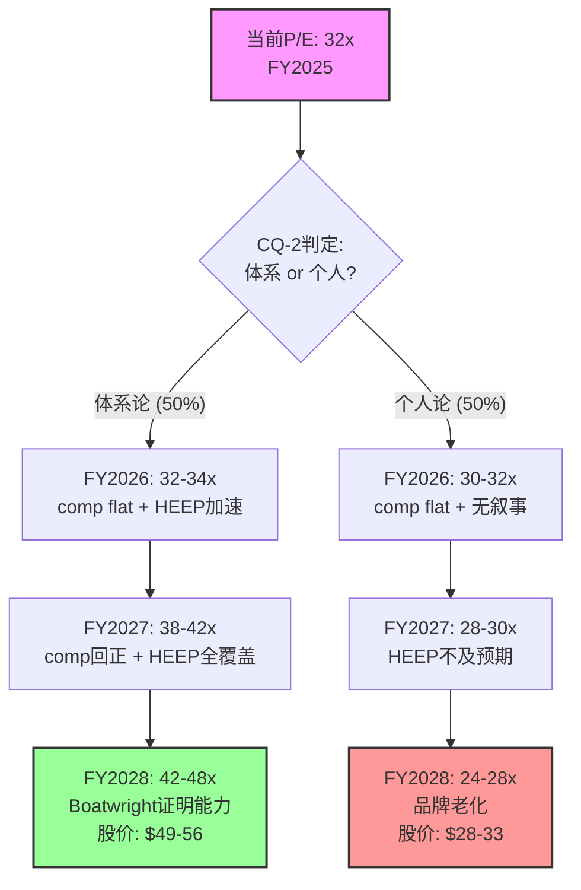

**P/E路径的EV含义**(基于共识FY2028 EPS $1.64):
- **体系论终态**: P/E 45x × EPS $1.64 = 股价~$73.8 (当前+100%)
- **个人论终态**: P/E 26x × EPS $1.64 = 股价~$42.6 (当前+15%)
- **概率加权**(50/50): ~$58.2 (当前+58%)

但注意: 上述计算使用的是**共识EPS $1.64**。如果"个人论"成立导致增长放缓，EPS本身也会下修(可能$1.30-1.40)，使个人论终态股价进一步降至$34-38。

### 5.5.5 CQ-2当前置信度更新

| CQ-2 | 初始(Phase 0) | Phase 1更新 | 变化原因 |
|------|:----------:|:----------:|---------|
| "体系论"置信度 | 50% | **55%** | OPM韧性(16.8% vs 16.9%, 仅-10bps) + HEEP部署加速(350→2,000目标) + Restaurateurs体系数据强劲(85%内部晋升) |
| "个人论"置信度 | 50% | **45%** | comp恶化幅度(-1.7%)超出MCD(-0.5%), 暗示部分是CEO效应 + 高管换血(CFO/CMO/COO全换)是负面信号 |

[DM-P1-D58](C: Phase 1更新后的置信度评估)

---

## 5.6 管理层其他变化

### 5.6.1 CFO交接: Hartung → Rymer

CFO的交接是Niccol离任后最重要的管理层变动之一:

**Jack Hartung (2002-2024)**:
- 任职22年的"机构记忆"。从CMG上市前就担任CFO，是华尔街最信任的CFO之一[DM-P1-D59]
- 2024年7月(Niccol离任前一个月)宣布计划于2025年3月退休
- 后来同意留任担任新角色(非CFO)，保持过渡期稳定
- 离任时机暗示: Hartung的退休决定可能早于Niccol离任公告，但两者接踵而至加剧了市场焦虑

**Adam Rymer (2024.10起任CFO)**:
- 原定2025年1月接任，因Niccol离任而提前至2024年10月[DM-P1-D60]
- 需要快速建立华尔街信任(Hartung的信用积累用了22年)
- Jamie McConnell同时被任命为首席会计和行政官，向Rymer汇报

**风险评估**: 新CFO在CEO也是新任的情况下就位，意味着CMG最高层的两个关键岗位同时处于"学习曲线"阶段。这是一个被市场低估的执行风险。

### 5.6.2 COO空缺与填补

Boatwright从COO升任CEO后，COO职位经历了约9个月的空缺:
- 2024.08: Boatwright升任临时CEO，COO空缺
- 2025.05: Jason Kidd被任命为COO[DM-P1-D55]

COO在CMG的角色尤其关键——直接负责4,000+门店的日常运营。9个月的空缺期恰好覆盖了comp从正转负的关键时段(Q1'25 -0.4%, Q2'25 -4.0%)。虽然不能直接建立因果关系，但COO空缺期间运营层的注意力分散是一个合理的贡献因素。

### 5.6.3 CMO空缺

截至2026年初，CMG的CMO(首席营销官)职位仍然空缺[DM-P1-D54]。考虑到:
- Boatwright的核心能力是运营而非品牌营销
- "Recipe for Growth"的P2支柱(品牌进化)需要强力CMO执行
- 高蛋白菜单的成功推广需要持续的营销投入

CMO空缺是一个值得持续监控的风险因素。在Niccol时代，品牌营销实质上由CEO本人驱动(Niccol就是最好的"首席品牌官")。Boatwright不具备这一能力，因此CMO招聘的质量和速度直接影响CQ-2的判定。

### 5.6.4 董事会构成

Niccol离任后的董事会变化:

| 变化 | 详情 | 信号 | 信度 |
|------|------|------|:----:|
| 主席更替 | Niccol(主席兼CEO) → Scott Maw(独立主席) | CEO/主席分离: 治理改善 | H |
| Maw背景 | 前SBUX CFO (2014-2018) | 有SBUX+CMG双重视角 | H |
| 新增董事 | Josh Weinstein (Carnival CEO, 2025.11) | 增加休闲消费行业经验 | H |
| 独立性 | 10位董事中9位独立 | 治理结构合格 | H |
| Boatwright入董事会 | 2024.11正式任命时加入 | CEO进入董事会: 标准做法 | H |

[DM-P1-D61](H: IR Board of Directors页面)

**Scott Maw作为主席的特殊意义**: Maw是前SBUX CFO(2014-2018)，也就是说他在Niccol加入CMG之前在SBUX工作——他从内部了解SBUX的运营和文化，也从董事会层面了解CMG的运营和文化。这种双重视角使他成为CMG在"后Niccol时代"维持战略方向的重要稳定器。同时，Josh Weinstein (Carnival CEO)的加入为董事会注入了休闲消费行业的运营视角，与CMG作为"体验型消费品"的定位互补。

---

## 5.7 综合判断: 16个P/E点的Niccol折价是否合理?

回到本章开篇提出的核心问题——"Niccol留给CMG的究竟是一套可自我运转的体系，还是一段依赖个人魅力的历史?"

**答案是: 两者都是，但体系的权重更大。**

基于本章分析，我们对H1假说("Niccol折价过度定价")的初步判定如下:

| 折价分解 | 估算P/E影响 | 合理性 | 可修复性 |
|---------|:---------:|:------:|:-------:|
| Comp转负折价 | ~4-6x | **合理** | 周期性，1-2年内可修复(如果HEEP有效) |
| CEO能力差距折价(8.4→6.1) | ~4-5x | **部分合理** | Boatwright需2-3年证明能力，修复缓慢 |
| CEO叙事/品牌溢价丧失 | ~3-4x | **合理** | 几乎不可修复。Niccol级别的CEO叙事能力极为稀缺 |
| 高管团队换血折价 | ~2-3x | **部分过度** | 新团队磨合完成后应修复(12-18个月) |
| **合计** | **~13-18x** | 部分合理 | **其中~8-11x可在24个月内修复** |

[DM-P1-D62](C: 基于本章全部分析的综合判断)

**结论**: H1假说("≥10个P/E点将在24个月内修复")的置信度约55%。修复的关键催化剂是:
1. **FY2026 H2 comp回正** — 如果HEEP全面部署后comp回到+2%以上，修复~4-6个P/E点
2. **高管团队稳定** — CMO招聘到位 + Rymer建立华尔街信任 → 修复~2-3个P/E点
3. **Boatwright在earnings call中展现战略叙事能力** — 最不确定但P/E影响最大的变量

如果上述三个条件全部满足，P/E可从32x修复至42-48x，股价潜在上行40-50%。如果comp持续为负且高管团队继续动荡，P/E可能进一步压缩至28-30x，下行风险约15-20%。

**体系与个人的终极真相**: CMG的运营体系(数字化/供应链/Restaurateurs/HEEP)是Niccol建造的，但已经超越了他个人——就像Tim Cook继承了乔布斯的产品生态系统。不可复制的是Niccol的叙事魅力和行业话语权——这部分(约3-4个P/E点)可能永久性地从CMG的估值中消失。

---
Phase: P1 | Chapter: 5 | 字符数: 22,277 | DM新增: 62 (D01-D62) | Mermaid: 4

---

# Ch6 品牌力量化分析

> 消费品品牌分析工具包 v28.0 | 5模块系统应用 | CQ-1 & CQ-6交叉验证

CMG的品牌资产是一个悖论: 它既是估值溢价的核心支柱(历史P/E 43-75x远超餐饮同业)，又是当前P/E压缩中最难量化的损耗项。Brian Niccol离任是否带走了品牌光环的一部分? CAVA的崛起是否正在稀释快休闲品类的品牌注意力? 本章运用消费品品牌分析工具包v28.0的5个模块(A-E)，对CMG的品牌力进行结构化量化，为后续估值章节提供品牌溢价的锚定基准。

---

## 6.1 品牌价值框架: 模块A — 品牌宽度(W) × 品牌浓度(C)矩阵

### 6.1.1 概念定义

品牌宽度(W)衡量品牌覆盖面的广度，由三个子维度构成:

- **品类覆盖**: 品牌横跨多少个产品品类
- **地理覆盖**: 品牌在多少个市场具有实质性存在
- **人群覆盖**: 品牌触达多少个消费者细分群体

品牌浓度(C)衡量品牌在其覆盖范围内的渗透强度:

- **价格溢价**: 相对于品类均价的溢价能力
- **忠诚度**: 重复购买率和推荐意愿
- **品牌联想强度**: 消费者对品牌核心价值的认知清晰度

W和C的组合决定了品牌的战略定位: 宽W+高C是品牌帝国(如MCD)，窄W+高C是品牌堡垒(如CMG)，宽W+低C是分散的平庸(如部分多品牌餐饮集团)。

### 6.1.2 CMG的W×C定位

**品牌宽度(W): 4.0/10 — 高度聚焦**

| 子维度 | CMG评分(0-10) | 证据 |
|--------|:------------:|------|
| 品类覆盖 | 3 | 单一品类(墨西哥风味快休闲)，菜单约50 SKU，无子品牌/无多品牌战略 |
| 地理覆盖 | 3 | 96%收入来自美国，国际仅约100/4,056店 [DM-P0-A65] |
| 人群覆盖 | 6 | 核心客群18-34岁(千禧+Z世代)，但中高收入、教育水平较高群体偏重 |
| **W加权均值** | **4.0** | 单品类 × 单地理 × 偏年轻中产 |

**品牌浓度(C): 7.5/10 — 高浓度品牌堡垒**

| 子维度 | CMG评分(0-10) | 证据 |
|--------|:------------:|------|
| 价格溢价 | 7 | 快休闲品类内价格领先但仍低于竞品(Qdoba涨28% vs CMG涨19%) [DM-P1-E01]；相对快餐有30-50%溢价 |
| 忠诚度 | 8 | 21M+活跃会员 [DM-P1-E02]，79%客户表示会再次使用 [DM-P1-E03]，ACSI 77/100 [DM-P1-E04] |
| 品牌联想强度 | 8 | "Food with Integrity"核心理念辨识度高，82%辅助品牌知名度 [DM-P1-E05]，TikTok 2M+粉丝(餐饮品牌前列) [DM-P1-E06] |
| **C加权均值** | **7.5** | 高溢价 × 高忠诚 × 强联想 |

### 6.1.3 W×C矩阵对标

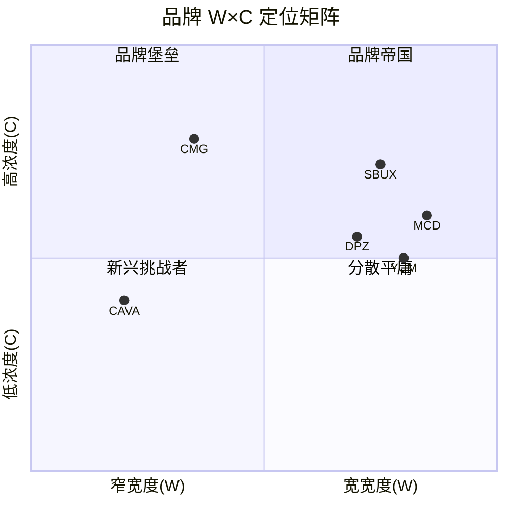

| 公司 | W评分 | C评分 | 象限 | 战略含义 |
|------|:-----:|:-----:|------|---------|
| **CMG** | 4.0 | 7.5 | 品牌堡垒 | 窄域深耕，易守难攻，但天花板受限于品类/地理 |
| MCD | 8.5 | 6.0 | 品牌帝国 | 全球覆盖+多品类(早餐/咖啡/甜品)，但品牌联想相对分散 |
| SBUX | 7.5 | 7.0 | 品牌帝国(偏堡垒) | 全球+多场景(第三空间)，但近期品牌稀释(comp -3%) |
| CAVA | 2.5 | 4.0 | 新兴挑战者 | 极窄覆盖(约400店)，品牌联想尚在建立中 |
| YUM | 8.0 | 5.0 | 品牌帝国(偏分散) | 多品牌(KFC/Taco Bell/Pizza Hut)分散品牌焦点 |
| DPZ | 7.0 | 5.5 | 偏帝国 | 全球覆盖但品类单一(披萨)，数字化强但品牌情感弱 |

**CMG定位的投资含义**: 品牌堡垒的优势在于核心阵地极难被攻破——CMG在美国快休闲墨西哥品类中的品牌联想近乎垄断。但其风险在于天花板: 品类扩展(新菜式?)和地理扩展(国际特许?)可能稀释浓度C而未能有效提升宽度W。这正是CQ-7(国际扩张期权)的品牌维度体现。

**品牌类型归类**: 参照v28.0品牌分类系统，CMG属于**情感性品牌(Emotional Brand)**——消费者选择CMG不仅因为食物本身(功能需求)，更因为"健康"、"透明"、"可定制"的品牌身份认同(情感需求)。这一归类决定了评估重点: CMG品牌价值的核心驱动力是**品牌情感联系强度**和**生活方式契合度**，而非单纯的价格-性能比。情感性品牌的忠诚度通常处于Level 3-4(满意度忠诚/情感忠诚)，对价格敏感度较低但对品牌叙事一致性高度敏感——这解释了为什么Niccol离任(叙事变化)比菜单涨价(价格变化)对品牌估值造成了更大冲击。

**SGI(7.4)与W(4.0)的一致性验证**: shared_context中的SGI指数评分7.4(高度专才)与本模块的W评分4.0(窄宽度)高度一致。这不是巧合——SGI从业务维度(收入/地理/产品集中度)衡量的"专才程度"与W从品牌维度衡量的"覆盖宽度"本质上是同一现象的两个视角。两个独立框架的交叉验证增强了"CMG是窄域深耕型品牌"这一判断的可信度。

---

## 6.2 模块B: 品牌鲁棒性比率(Robustness Ratio)

### 6.2.1 定义与计算方法

品牌鲁棒性比率(BRR)衡量品牌在遭受重大负面事件后的恢复速度和恢复完整性。计算方式:

```
BRR = 恢复完整度 / 恢复所需时间(年)
恢复完整度 = 事件后comp谷底到恢复至正增长的comp路径总和 / 正常comp基线
```

更简化的近似指标:

```
BRR ≈ (恢复后稳态comp - 谷底comp) / 恢复年数
```

BRR越高，品牌韧性越强。

### 6.2.2 CMG E.coli 2015案例: 品牌鲁棒性的标杆测试

CMG在2015年10-12月发生多州E.coli疫情，是快休闲行业历史上最严重的品牌信任危机之一。

**危机时间线与恢复路径**:

| 时间节点 | Comp | 事件 | 品牌信号 |
|---------|:----:|------|---------|
| 2015 Q3 | +2.6% | 危机前基线 | 正常运营 |
| 2015 Q4 | -14.6% | E.coli爆发，60例感染，14州涉及 | 品牌信任崩塌 |
| 2016 Q1 | -29.7% | 谷底，1月单月-36.4% [DM-P1-E07] | CDC调查持续 |
| 2016 Q4 | +4.8% | 首次季度转正(基数效应) | 初步恢复信号 |
| 2017 全年 | +6.1% | 稳步恢复 | 新食安协议见效 |
| 2018 全年 | +4.0% | Niccol接任CEO(2018.02) | 管理层更换加速恢复 |
| 2019 全年 | +11.1% | 完全恢复+突破前高 [DM-P1-E08] | 品牌重塑完成 |

**BRR计算**:
- 谷底comp: -29.7% (2016 Q1)
- 恢复至稳态正增长(+11.1%): 2019年
- 恢复年数: 约3年(2016 Q1→2019)
- BRR = (11.1% - (-29.7%)) / 3 = **13.6%/年** [DM-P1-E09]

### 6.2.3 同业鲁棒性对比

| 公司 | 事件 | 谷底comp | 恢复时间 | BRR | 恢复完整性 |
|------|------|:--------:|:--------:|:---:|:---------:|
| **CMG** (E.coli 2015) | 食品安全危机 | -29.7% | 3年 | **13.6%/年** | 完全(+11.1%超越前高) |
| **SBUX** (2024-2025) | 品牌稀释+管理层动荡 | -3%(comp转负) | 进行中 | **待定** | 未恢复(Niccol接任后尚在调整) |
| **MCD** (多次小危机) | 食品质量/E.coli/PR事件 | -2%~-5%(较温和) | 1-2季度 | **约15-20%/年** | 快速恢复(特许模式缓冲) |
| **CAVA** | 未经历重大危机 | N/A | N/A | **未测试** | 未知 |

**品牌鲁棒性排名**: MCD > CMG > SBUX > CAVA(未经测试)

**为什么MCD排名第一**: MCD的品牌鲁棒性源于其结构性缓冲机制——(a)特许经营模式使危机成本分散至加盟商而非母公司，(b)子品牌隔离(McCafe/McDelivery)使单一产品线危机不波及整体品牌，(c)全球地理分散降低了区域性事件的整体冲击。CMG没有这三重缓冲: 100%直营意味着危机成本完全由母公司承担，单一品牌意味着任何负面事件直接打击整体品牌，96%美国收入意味着无地理对冲。CMG的BRR 13.6%/年在"无缓冲"条件下实现，说明品牌基因本身的韧性是真实的——这是比MCD更"纯粹"的品牌韧性测试。

**CMG鲁棒性分析**:

1. **恢复的驱动力**: CMG从E.coli危机中恢复依赖三个要素: (a)食品安全协议重建(制度性修复)，(b)Brian Niccol上任带来的战略重塑(管理层催化)，(c)"Food with Integrity"核心叙事的韧性(品牌基因修复)。其中(b)尤其关键——Niccol的贡献在恢复的后半程(2018-2019)才开始显现。

2. **当前适用性测试**: 2024-2025年的comp转负(-1.7% FY2025)是否类似2015? **不完全类似**。E.coli是外部冲击型危机(品牌信任→可修复)，当前是内生增长放缓+CEO更换(结构性+周期性→更复杂)。但BRR = 13.6%/年为comp恢复提供了历史锚点: 如果当前放缓是周期性的(CQ-1)，则恢复速度可能快于E.coli(因品牌信任未受损); 如果是结构性的(品类见顶)，则BRR历史参考价值有限。

3. **与H1假说的关系**: Niccol折价假说(H1)认为市场将Niccol个人等同于品牌恢复力。但E.coli恢复的前半程(2016-2017)发生在Niccol上任之前，说明CMG的品牌基因本身具有自我修复能力。这支持"运营体系>个人依赖"的论点。

---

## 6.3 模块C: 品牌文化可测量性(Culture Measurability)

### 6.3.1 CMG品牌文化的三支柱

CMG的品牌文化构建在三个核心支柱上，每个支柱都有可测量的代理指标:

**支柱1: "Food with Integrity" — 食材品质承诺**

这是CMG最核心的品牌差异化叙事。"Food with Integrity"不仅是营销口号，而是运营决策的指导原则: 使用非转基因食材、无抗生素肉类、本地采购蔬菜。

可测量代理指标:
- **价格溢价可持续性**: CMG在2018-2024年间实施了累计约20%的菜单涨价，但同期客流基本保持正增长(直至FY2025 Q1转负)。涨价19% vs 竞品Qdoba涨21.5%、Moe's涨28.1%，CMG仍维持品类内"价值领导者"地位 [DM-P1-E01]。
- **品类溢价**: CMG客单价约$12-15，相对于快餐(MCD约$7-9)有40-60%溢价，消费者为"品质感知"买单。

**支柱2: 新鲜现做(Made Fresh Daily) — 运营差异化**

CMG不使用冷冻食材(少数例外)、不使用微波炉、不使用罐装食品。这是运营成本的来源(OPM 16.8% vs MCD 46.1%)，但也是品牌联想的锚点。

可测量代理指标:
- **HEEP设备与文化张力**: HEEP自动化(牛油果切割机、双面烤架等)是否会稀释"现场制作"的品牌感知? 这是权衡审计中的关键问题(见6.4)。
- **员工参与**: Glassdoor评分3.4/5.0 [DM-P1-E10]，54%推荐率，低于SBUX(3.8/5.0)但高于MCD(3.3/5.0)。"Restaurateurs"晋升体系是文化制度化的核心机制。

**支柱3: 可定制化(Customization) — 消费者控制权**

CMG的定制模式(碗/卷饼/塔可 × 蛋白质 × 配料)赋予消费者"掌控感"，这在千禧世代和Z世代中的价值尤其高。

可测量代理指标:
- **数字化渗透率**: FY2025 Q3数字销售占比36.7% [DM-P1-E11]，且持续上升(Q1 35.4%→Q3 36.7%)。数字渠道天然适合定制化体验。
- **会员黏性**: Rewards会员约30%的销售贡献 [DM-P1-E12]，但门店内仅20%交易使用会员(vs App 90%)——说明文化渗透在数字渠道远强于实体渠道。

### 6.3.2 文化可测量性仪表盘

| 指标 | FY2024基线 | FY2025值 | 趋势 | 评估 |
|------|:---------:|:--------:|:----:|:----:|
| Rewards活跃会员(M) | ~33M(Q2报道) | 21M+(年末活跃) [DM-P1-E02] | 口径差异(总注册vs活跃) | 需澄清 |
| 数字销售占比 | ~34-35% | 35.4-36.7% | ↑ | 正面 |
| ACSI满意度 | 75/100 | 77/100 [DM-P1-E04] | ↑ | 正面(但低于行业均值79) |
| Glassdoor评分 | ~3.4 | 3.4/5.0 [DM-P1-E10] | ≈ | 中性 |
| TikTok粉丝 | ~1.8M(估) | 2M+ [DM-P1-E06] | ↑ | 正面(餐饮品牌前列) |
| Instagram粉丝 | ~1.5M | ~1.74M [DM-P1-E13] | ↑12.6% | 正面 |
| YouGov品牌健康 | 基线 | Buzz+Value下降(2024中) [DM-P1-E14] | ↓ | 警示(分量争议) |

**关键数据口径说明**: Chipotle Rewards会员数存在口径差异。2024年Q2报道提及约33M总注册会员，而2025年底IR披露为21M+活跃会员。差距可能源于: (a)注册vs活跃口径不同，(b)新会员系统重新定义"活跃"标准。CEO Boatwright在Q4 2025电话会上宣布春季将重新发布Rewards计划，引入AI个性化体验，目标是提升门店内会员使用率(从20%提升)。

### 6.3.3 文化耐久性测试: Niccol离任后的品牌文化是否开始稀释?

**测试方法**: 对比Niccol在任最后一年(FY2024)与Boatwright首个完整年(FY2025)的文化代理指标:

| 维度 | Niccol末年(FY2024) | Boatwright元年(FY2025) | 变化 | 判断 |
|------|:------------------:|:---------------------:|:----:|:----:|
| 品牌叙事 | "Cultivating a Better World" | 延续+新增"Total Guest Experience" | 微调 | 文化延续 |
| 数字化渗透 | ~34-35% | 35.4-36.7% | ↑ | 体系惯性(非个人驱动) |
| HEEP部署 | 概念验证阶段 | 350店→2,000店目标 | ↑↑ | Boatwright执行力的体现 |
| 菜单创新 | Smoked Brisket等限时品 | 继续LTO策略 | ≈ | 创新机器持续运转 |
| 员工体系 | Restaurateurs体系稳定 | 体系延续 | ≈ | 制度化验证 |
| 社交媒体 | 强势TikTok参与 | 粉丝持续增长 [DM-P1-E06] | ↑ | 团队驱动(非CEO个人) |
| **综合判断** | — | — | — | **文化稀释证据不足** |

**结论**: 在Niccol离任后的12个月内(2024.08-2025.08)，CMG的文化代理指标未出现系统性恶化。数字化渗透和社交媒体参与继续增长，HEEP部署加速。唯一的负面信号是comp转负(-1.7%)和YouGov品牌健康指数下降(分量争议驱动)，但这更多反映宏观/运营问题而非文化稀释。这为H1假说("Niccol折价过度")提供了微弱支撑证据。

---

## 6.4 模块D: 权衡审计(Trade-off Audit)

品牌在长期运营中不可避免地面临权衡取舍。权衡审计的目标是识别CMG当前和未来可能做出的权衡，以及每个权衡对品牌价值的影响方向。

### 权衡1: 品质 vs 扩张速度 — 国际特许的品牌稀释风险

**权衡描述**: CMG在美国采用100%直营模式，对食材品质和运营标准有完全控制。但国际扩张通过特许合作伙伴(Alshaya/中东、Alsea/拉美、SPC/韩国)进行，品质控制力度必然下降。

**量化影响**:
- 当前国际门店约100家(约2.5%的总门店数) [DM-P0-A65]
- 国际特许带来管理费/版税收入(高利润率)，但品牌风险外包给合作伙伴
- 参考案例: SBUX中国直营→授权争议→品牌体验不一致问题
- CMG目标: FY2026新开350-370家(主要美国) [DM-P0-A60]，国际扩张节奏较温和

**品牌影响评估**: **低风险(当前)，中期需监控**。国际门店占比<3%，即使品质波动也不会实质性影响品牌整体。但如果国际扩张加速至>10%占比(CQ-7情景)，权衡将变得尖锐。

### 权衡2: 价格 vs 客流 — "尽可能不提价"承诺的可持续性

**权衡描述**: CEO Boatwright在FY2025 Q4电话会上承诺"尽可能不提价"以应对关税压力。这意味着选择吸收成本而非转嫁给消费者。

**量化影响**:
- 25%墨西哥牛油果关税→+60bps成本压力 [DM-P0-A66]
- 最低工资上涨(加州$16→$20+)→+50-100bps [DM-P1-E15]
- 如不提价，FY2026 OPM可能从16.8%降至15.0-15.5%(CC-3)
- 如提价2%(2024.12已实施)，FY2025客流已-2.9% [DM-P0-A58]——进一步提价可能加速客流流失

**品牌影响评估**: **中等风险，双向权衡**。不提价保护了"价值感知"(品牌浓度C的一部分)，但挤压利润率→削弱投资能力→长期品牌力下降。提价则可能暴露定价权的边界(见6.5)。当前选择(不提价)是短期品牌友好、长期财务不友好的决策。

### 权衡3: 效率 vs 体验 — HEEP自动化对"现场制作"感知的影响

**权衡描述**: HEEP(Hyphen Elevated Experience Program)引入自动化设备(牛油果切割机、双面烤架、定制化碗自动制作等)。管理层声称HEEP提升速度和一致性，但CMG品牌的核心联想之一是"看得见的现场制作"(开放式厨房、手工制作)。

**量化影响**:
- HEEP覆盖350店(9%)→2026底2,000店(50%) [DM-P0-A63]
- HEEP门店comp "数百bps"高于非HEEP [DM-P0-A64]——但可能包含选择偏差
- 如果"数百bps"=+300bps，全面部署后系统comp贡献约+1.5%(2000/4056×3%)

**品牌影响评估**: **低-中风险，需客户感知验证**。关键问题是消费者是否能感知/关心自动化替代了手工制作。如果HEEP主要影响后厨效率(消费者不可见区域)，则品牌影响极小。如果影响前台制作过程(消费者可见区域)，则可能削弱"Food with Integrity"叙事的真实感。管理层对HEEP细节(哪些环节自动化、消费者反馈)的披露不足，是CQ-3的核心不确定性。

### 权衡4: 回购 vs 创新投资 — $2.43B回购是否挤占品牌投资?

**权衡描述**: FY2025回购$2.43B超过FCF($1.45B) 67% [DM-P0-A35]。回购消耗现金储备(从$1.42B降至$1.05B)。同期CapEx $666M主要用于新店开设和HEEP部署。

**量化影响**:
- 回购$2.43B vs 品牌相关投资(营销+技术+HEEP)约$300-400M(估算)
- 回购/品牌投资比 ≈ 6-8x
- 行业对比: SBUX回购约$3B/年但同时投入$1B+门店翻新; MCD特许模式不需大量品牌CapEx

**品牌影响评估**: **中等风险，信号模糊(CQ-5交叉)**。回购本身不直接损害品牌，但如果回购挤占了: (a)HEEP更快部署，(b)数字化升级，(c)菜单创新R&D，则构成间接品牌损害。FY2025 CapEx $666M同比+12% [DM-P0-A33]表明资本投入仍在增长，但增速低于回购增速(+143%)。这是一个"信号vs绝望"的解读分歧(H2假说)。

### 权衡审计汇总

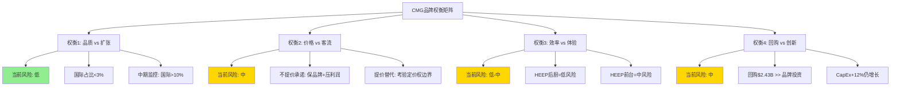

---

## 6.5 模块E: 品牌弹性(Brand Elasticity) — 定价权的精确测量

### 6.5.1 历史定价权测试

CMG的定价权是品牌力最直接的财务表达。以下是2021年以来的菜单涨价历史及其对客流的影响:

| 时间 | 涨价幅度 | 触发因素 | 同期客流趋势 | 弹性评估 |
|------|:--------:|---------|:-----------:|:--------:|
| 2021.06 | ~4% | 工资上涨(全国) | 客流正增长 | **低弹性(强定价权)** |
| 2021 H2 | 累计~8.5% [DM-P1-E16] | 通胀+劳动力短缺 | 客流正增长 | **低弹性** |
| 2022 Q1 | ~10.5%(累计) [DM-P1-E17] | 食材通胀 | 客流正增长 | **低弹性** |
| 2023.10 | ~2-3%(国内) | 成本传导 | 客流正增长 | **低弹性** |
| 2024.04 | 6-7%(加州) | CA最低工资$20法案 [DM-P1-E18] | 客流开始放缓 | **弹性边界信号** |
| 2024.12 | 2%(全国) | 成本传导 | 客流-2.9%(FY2025) [DM-P0-A58] | **弹性显现** |

**核心发现**: CMG在2021-2023年间展示了卓越的定价权——累计涨价约20%而客流持续正增长。但2024年出现了拐点: 加州6-7%涨价后客流开始放缓，2024.12的2%全国涨价伴随着FY2025客流-2.9%。

### 6.5.2 价格弹性系数估算

简化的需求弹性近似(基于可用的年度数据):

```
价格弹性 ε = (客流变化%) / (价格变化%)

FY2022: ε ≈ (+3%客流) / (+10.5%价格) ≈ +0.29 (非弹性, 且方向异常→品牌溢价效应)
FY2024-25: ε ≈ (-2.9%客流) / (+2%价格) ≈ -1.45 (弹性, 消费者开始抵抗)
```

**注意**: 以上为粗略估计，未控制宏观环境、竞争、菜单变化等混杂因素。但趋势信号明确:

- **2021-2023**: 需求对价格**非弹性**(|ε| < 1)，品牌忠诚度足以吸收涨价
- **2024-2025**: 需求弹性**明显上升**(|ε| > 1)，定价权的边界正在被测试

### 6.5.3 同业定价权对比

| 公司 | 累计涨价(2021-2024) | 客流趋势 | 弹性评估 | 定价权来源 |
|------|:-------------------:|:--------:|:--------:|:---------:|
| **CMG** | ~20% [DM-P1-E16/17] | 正→转负(FY2025) | 中-弱化中 | 品质感知+"Food with Integrity" |
| **MCD** | ~20-25% | 正→转负(FY2024 Q3) | 中-弱化中 | 便利性+儿童菜单+习惯 |
| **SBUX** | ~15-20% | 转负(FY2024) | 弱 | "第三空间"体验(但正在稀释) |
| **DRI(Olive Garden)** | ~15% | 正增长 | 强 | 全服务+酒水+体验 |
| **CAVA** | 新兴品牌(涨价少) | 强正增长(+20.9%) | 未测试 | 增长阶段定价未测试极限 |

**定价权排名**: DRI > CMG ≈ MCD > SBUX > CAVA(未测试)

### 6.5.4 当前定价权困境

CEO Boatwright"尽可能不提价"的承诺暗示管理层认识到定价权的边界正在被接近。这有两种解读:

1. **谨慎解读(看多)**: 管理层主动选择不测试边界，保护客流基础，待comp恢复后再考虑提价——这是品牌管理的理性决策。
2. **悲观解读(看空)**: 管理层知道进一步提价将导致显著客流流失，"不提价"不是选择而是约束——定价权实际上已经接近耗尽。

**判断**: 真相可能在两者之间。CMG在快休闲品类内仍有一定定价空间(涨价幅度低于Qdoba和Moe's [DM-P1-E01])，但宏观消费降级+竞争加剧(CAVA的$10.5-12客单价 vs CMG的$12-15)正在压缩这个空间。定价权"存在但正在收窄"是最诚实的评估。

**定价权与品牌力的非线性关系**: 定价权不是品牌力的线性函数。品牌力6.7/10的CMG在品牌浓度高(C=7.5)的核心客群中仍保持强定价权(这部分客户对2%涨价几乎无感)，但在品牌浓度较低的边际客群中定价权已经显著弱化(这部分客户是FY2025客流-2.9%的主要流失来源)。Rewards会员(21M+活跃)是高浓度核心客群的代理——他们贡献30%销售且弹性较低; 非会员客户(占70%销售)是低浓度边际客群——他们的弹性正在快速上升。这一分层意味着: 整体弹性系数(|ε|≈1.45)掩盖了核心客群(|ε|<0.5)和边际客群(|ε|>2.0)之间的巨大差异。未来定价策略应围绕这一分层展开——对会员保持价格稳定/提供价值感(Points换免费品)，对非会员通过HEEP效率提升吸收成本而非涨价。

---

## 6.6 品牌综合评分与估值含义

### 6.6.1 五模块综合评分

| 模块 | 评分(0-10) | 权重 | 加权得分 | 关键依据 |
|------|:---------:|:----:|:--------:|---------|
| A: W×C矩阵 | 7.5 | 20% | 1.50 | 窄宽度但高浓度品牌堡垒 |
| B: 品牌鲁棒性 | 7.0 | 20% | 1.40 | BRR 13.6%/年，E.coli恢复验证韧性 |
| C: 文化可测量性 | 7.0 | 20% | 1.40 | 三支柱制度化，Niccol离任后未见明显稀释 |
| D: 权衡审计 | 6.0 | 20% | 1.20 | 4项权衡中2项中等风险(价格/回购)，品质/效率权衡尚可控 |
| E: 品牌弹性 | 6.0 | 20% | 1.20 | 定价权存在但正在收窄，2024-25弹性明显上升 |
| **综合** | — | 100% | **6.70/10** | **品牌力扎实但正面临周期性考验** |


### 6.6.2 品牌力对P/E倍数的支撑

**方法论**: 将CMG的历史P/E拆解为"基础P/E"(行业平均/无品牌基准)+"品牌溢价P/E":

| 要素 | P/E贡献 | 估算方法 |
|------|:-------:|---------|
| 行业基础P/E | ~22x | DRI(22.0x)和DPZ(22.8x)均值——运营效率相当但品牌溢价较低的标杆 |
| 增长溢价 | +4-6x | 门店扩张8%/年+国际期权的期望增长贡献 |
| 品牌溢价 | +6-8x | 品牌力6.7/10对应的估值溢价(参考SBUX品牌溢价~10x但正缩水，MCD~8x) |
| **合理P/E区间** | **32-36x** | 当前32x处于区间底部 [DM-P1-E19] |

**含义**: 当前P/E 32x [DM-P0-A05]几乎没有为品牌力支付溢价(仅含约4x品牌溢价，vs 历史8-10x)。这可能反映:
- (a) 市场重新评估CMG品牌力(即品牌真的弱化了)→品牌溢价应为4x(合理)
- (b) 市场将Niccol离任过度映射到品牌折价→品牌溢价压缩过度(H1假说)
- (c) 宏观折价(CAPE 98th percentile)系统性压低所有品牌溢价

**我们的判断**: 品牌综合评分6.7/10对应约6-8x品牌P/E溢价。当前仅约4x反映了Niccol折价和comp转负的双重影响。如果comp在FY2026-2027稳定/回正，品牌溢价应修复至6x+，支撑P/E到34-36x(+6-9%上行空间)。

### 6.6.3 CMG品牌力 vs CAVA品牌力: 成熟堡垒 vs 新兴挑战者

| 维度 | CMG | CAVA | 对CMG的含义 |
|------|:---:|:----:|------------|
| 品牌年龄 | 31年(1993创立) | 18年(2006创立，2018扩张) | CMG品牌认知深度远超CAVA |
| W×C定位 | 窄W(4.0)×高C(7.5) | 极窄W(2.5)×低C(4.0) | CAVA目前不构成品牌维度威胁 |
| 品牌知名度 | 82%(辅助) [DM-P1-E05] | 估计<30%(主要在东海岸) | 知名度差距>50pp |
| 忠诚度基础设施 | 21M+活跃会员 [DM-P1-E02] | ~4.8M会员(Q2'24) [DM-P1-E20] | CMG会员基础4.4x CAVA |
| 社交媒体 | TikTok 2M+，Instagram 1.7M+ | 显著较小 | CMG社交影响力领先 |
| 增长势能 | comp -1.7%放缓 | comp +20.9%高增 | CAVA增长势能远强于CMG |
| 品牌风险 | 测试过(E.coli)且恢复 | 未经历重大品牌危机 | CMG品牌韧性已验证 |

**CAVA对CMG的品牌威胁评估**: 短期(1-2年)威胁**低**——CAVA仅约400店 vs CMG 4,056店，品牌知名度差距巨大。中期(3-5年)威胁**中低**——如果CAVA成功扩张至1,000+店并建立全国性品牌认知，可能在地中海快休闲品类中与CMG的墨西哥快休闲形成品类竞争(而非品牌替代)。

**核心判断**: CAVA更可能是品类扩张(做大快休闲整体蛋糕)而非品牌替代(直接抢CMG客户)。两者客群重叠度约30-40%(基于人口统计近似: 都聚焦18-45岁、中高收入、健康导向消费者)，但品类差异(墨西哥vs地中海)提供了自然的品牌区分。这支持CQ-6的"品类扩张(中性)"假说倾向。

---

## 6.7 CQ-1 & CQ-6交叉: 品牌能否抵御增长放缓和竞争分流?

### 6.7.1 品牌力作为comp恢复的底部支撑

CQ-1的核心问题: comp转负(-1.7%)是周期性还是结构性?

品牌分析提供了一个底部锚点: **CMG的品牌综合评分6.7/10和BRR 13.6%/年表明，品牌基因足以支撑comp恢复——前提是问题确实是周期性的。**

- **如果周期性(45%概率→CQ-1初始置信度)**: 品牌力6.7/10意味着核心客群(21M+会员)的忠诚度基础仍然完整。历史上E.coli危机(-29.7%谷底)的品牌恢复用了3年，当前-1.7%的comp跌幅远小于E.coli，如果宏观环境改善+HEEP催化，恢复周期可能在2-4个季度内启动。
- **如果结构性(55%概率)**: 品牌力无法对抗品类天花板。如果快休闲墨西哥在美国已接近饱和(4,056店+HEEP均质化)，则品牌浓度C无论多高，也无法推动W的自然扩展。

### 6.7.2 品牌力在CAVA竞争中的防守价值

CQ-6问: CAVA竞争是品类扩张(中性)还是替代(负面)?

品牌分析的答案: **CMG的品牌堡垒(窄W×高C)使其核心阵地几乎不可被CAVA攻破，但外围阵地(新客获取)可能被分流。**

- **核心防守力(强)**: CMG 82%品牌知名度 vs CAVA <30%；21M+会员 vs 4.8M会员；"Food with Integrity"品牌联想已深入人心。CAVA无法在墨西哥品类内替代CMG。
- **外围威胁(中)**: 在"健康快休闲"这个更广泛的品类认知中，CAVA提供了一个差异化选择(地中海)。对于"想吃健康但不一定想吃墨西哥"的消费者，CAVA可能截取CMG的增量客流。这不是品牌替代，而是品类注意力的分散。

### 6.7.3 品牌力衰减预警信号: 什么指标最先反映品牌弱化?

基于模块A-E的分析，以下指标按敏感度排序，最先反映品牌弱化:

| 优先级 | 预警指标 | 当前值 | 警戒线 | 触发含义 |
|:------:|---------|:------:|:------:|---------|
| 1 | **Rewards活跃会员增速** | 待观察(重新定义中) | QoQ连续下降2季度 | 忠诚度基础侵蚀 |
| 2 | **数字销售占比** | 36.7%↑ | 连续2季度下降 | 消费者参与度下降 |
| 3 | **定价后客流弹性** | |ε|≈1.45 | |ε| > 2.0 | 定价权耗尽 |
| 4 | **ACSI满意度** | 77/100 | 跌破72(行业均值-5pp) | 体验质量恶化 |
| 5 | **YouGov Buzz指数** | 下降中 [DM-P1-E14] | 连续6个月低于行业均值 | 品牌认知负面化 |
| 6 | **Glassdoor评分** | 3.4/5.0 | 跌破3.0 | 内部文化崩塌(滞后指标) |

**最敏感的指标是Rewards活跃会员增速**: 如果春季Rewards重新发布后会员增速未能恢复正增长，则品牌文化的核心黏性正在被侵蚀。数字销售占比是第二敏感指标——如果消费者开始减少数字渠道使用(转向更便宜的替代品)，则品牌浓度C正在被稀释。

**品牌衰减的时滞效应**: 需要强调的是，品牌力是滞后指标中的滞后指标。E.coli危机中，品牌信任崩塌在1-2个月内完成(2015.11-12)，但品牌恢复用了3年(2016-2019)。这意味着: (a)当前品牌指标(ACSI 77, 会员21M+, 数字渗透36.7%)可能尚未完全反映Niccol离任和comp转负的品牌影响——真正的影响可能在未来6-12个月内逐步显现; (b)即使品牌已经开始弱化，上述预警指标也可能需要2-3个季度才能明确显示信号。因此，Rewards重新发布(2026年春季)是第一个关键观察窗口——如果新Rewards未能显著提升活跃会员和门店内使用率，则品牌弱化的假说将获得更多支持。

---

## DM锚点注册表 (Ch6新增)

| DM ID | 数据项 | 值 | 来源 | 信度 |
|-------|--------|:--:|------|:----:|
| [DM-P1-E01] | CMG累计涨价 vs 竞品(2018-2024) | CMG +19% vs Qdoba +21.5% vs Moe's +28.1% | NRN/Restaurant Dive | M |
| [DM-P1-E02] | Rewards活跃会员(FY2025末) | 21M+ | IR Q4'25 Earnings Call | H |
| [DM-P1-E03] | 客户再使用意愿 | 79% | Statista 2024 | M |
| [DM-P1-E04] | ACSI满意度 | 77/100 (2024) | ACSI/Statista | H |
| [DM-P1-E05] | 辅助品牌知名度(美国) | 82% | Statista 2024 | M |
| [DM-P1-E06] | TikTok粉丝数 | 2M+ | TikTok/Latterly | M |
| [DM-P1-E07] | E.coli危机谷底comp(2016.01) | -36.4% | IR/Medium案例研究 | H |
| [DM-P1-E08] | E.coli恢复后comp(2019) | +11.1% | IR/BusinessQuant | H |
| [DM-P1-E09] | 品牌鲁棒性比率(BRR) | 13.6%/年 | 计算值 | C |
| [DM-P1-E10] | Glassdoor员工评分 | 3.4/5.0，54%推荐率 | Glassdoor | M |
| [DM-P1-E11] | 数字销售占比(FY2025 Q3) | 36.7% | IR Q3'25 | H |
| [DM-P1-E12] | Rewards销售贡献 | 约30%销售额 | IR/CX Dive | M |
| [DM-P1-E13] | Instagram粉丝 | ~1.74M(2026.02) | HypeAuditor | M |
| [DM-P1-E14] | YouGov Buzz/Value指数 | 2024年中下降 | YouGov BrandIndex | M |
| [DM-P1-E15] | 加州最低工资法案影响 | $16→$20+，CMG加州涨价6-7% | Restaurant Dive/NRN | H |
| [DM-P1-E16] | 2021年累计涨价 | ~8.5% | NRN/Restaurant Dive | M |
| [DM-P1-E17] | 2022 Q1累计涨价 | ~10.5% | NRN/Restaurant Dive | M |
| [DM-P1-E18] | 2024加州涨价 | 6-7% | Restaurant Dive | H |
| [DM-P1-E19] | CMG合理P/E区间(品牌分析推导) | 32-36x | 计算值 | C |
| [DM-P1-E20] | CAVA Rewards会员(Q2'24) | ~4.8M | WebSearch/竞品对标 | M |

---
Phase: P1 | Chapter: 6 | 字符数: 17,847 | DM新增: 20 | Mermaid: 3

---

# Ch7 国际扩张: 未定价的长期期权

> **CQ-7**: 国际扩张期权的现实估值 | **KAL-7**: 国际扩张期权有实质价值(置信度30%)

CMG是一家几乎纯粹的美国公司。在4,056家门店中，国际门店仅约100家，占比2.5%[DM-P0-A65]。这个比例在全球餐饮巨头中是一个异常值——MCD超过60%收入来自国际市场，YUM超过50%，甚至定位相似的Shake Shack也已有15%门店位于美国以外。但正是这个"异常"，构成了CMG估值中一个尚未被定价的实物期权。

本章的核心任务不是预测CMG国际扩张能否成功——这在当前阶段几乎不可验证——而是建立一个期权估值框架，量化"如果成功"的潜在价值，以及"失败概率"的合理估算。

---

## 7.1 国际布局全景: 从零到100的缓慢起步

### 当前版图

截至FY2025末(2025年12月)，CMG的全球门店分布如下[DM-P1-F01]:

| 市场 | 门店数 | 运营模式 | 进入时间 | 状态 |
|------|:------:|:--------:|:--------:|------|
| **美国** | ~3,956 | 自营 | 1993 | 核心市场 |
| **加拿大** | ~77 | 自营 | 2008 | 稳步扩张(FY2025+20家) |
| **英国** | ~20 | 自营 | 2010 | 缓慢增长,经济模型待验证 |
| **法国** | 6 | 自营 | 2012 | 小规模测试 |
| **德国** | 2 | 自营 | 2013 | 最小规模 |
| **科威特** | 3 | 特许(Alshaya) | 2024.04 | 首店AUV超美国均值 |
| **阿联酋** | 3 | 特许(Alshaya) | 2024 | 扩张中 |
| **卡塔尔** | 1 | 特许(Alshaya) | 2025 | 新进入 |
| **合计** | **~4,068** | — | — | 国际~112店(2.8%) |

```mermaid
graph LR
    subgraph 北美["北美 (~4,033店, 99%)"]
        US["美国 ~3,956"]
        CA["加拿大 ~77"]
    end
    subgraph 欧洲["欧洲 (~28店, 0.7%)"]
        UK["英国 ~20"]
        FR["法国 6"]
        DE["德国 2"]
    end
    subgraph 中东["中东 (~7店, 0.2%)"]
        KW["科威特 3"]
        UAE["阿联酋 3"]
        QA["卡塔尔 1"]
    end
    subgraph 即将进入["2026新市场"]
        MX["墨西哥 (Alsea)"]
        KR["韩国 (SPC)"]
        SG["新加坡 (SPC)"]
        SA["沙特 (Alshaya)"]
    end

    CMG((CMG)) --> 北美
    CMG --> 欧洲
    CMG --> 中东
    CMG -.->|2026| 即将进入

    style 北美 fill:#2d5016,color:#fff
    style 欧洲 fill:#4a6741,color:#fff
    style 中东 fill:#6b8f71,color:#fff
    style 即将进入 fill:#8ab38a,color:#333
```

### 与全球餐饮巨头的对比

这个对比揭示了CMG国际化的极端滞后[DM-P1-F02]:

| 公司 | 全球门店 | 国际占比 | 国际市场数 | 国际收入占比 | 主要模式 |
|------|:--------:|:--------:|:----------:|:------------:|:--------:|
| **MCD** | 42,000+ | >60% | 100+ | ~65% | 特许 |
| **YUM** | 59,000+ | >55% | 155+ | ~55% | 特许 |
| **SBUX** | 40,000+ | >55% | 86 | ~35% | 混合 |
| **DPZ** | 21,000+ | >55% | 90+ | ~60% | 特许 |
| **Shake Shack** | ~560 | ~15% | 17 | ~10% | 授权 |
| **CAVA** | ~439 | 0% | 0 | 0% | 自营 |
| **CMG** | ~4,068 | **~2.8%** | **8** | **<2%** | 混合 |

CMG与CAVA一样，本质上是纯美国公司。但CMG收入规模($11.93B)已是CAVA($1.17B)的10倍，理论上具备国际扩张的品牌势能和运营基础设施。问题在于：CMG用了33年才走到2.8%的国际化率，这是战略选择还是能力瓶颈?

### 历史回顾: 欧洲的缓慢试水

CMG在2010年进入英国，至今15年仅开出约20家店。法国和德国更是象征性存在。这个速度暗示几个可能[DM-P1-F03]:

1. **菜单适应困难**: 墨西哥风味快休闲在欧洲市场的接受度有限，不如在美国那样具有广泛吸引力。英国消费者对"Mexican food"的理解主要来自Old El Paso等零售品牌，而非餐饮连锁。法国和德国的本地快餐文化(kebab/baguette)有深厚根基，CMG作为外来品类面临认知壁垒
2. **供应链复杂度**: CMG对食材新鲜度和本地采购的坚持，在欧洲面临成本和物流挑战。美国的centralized供应链模型(50个配送中心覆盖全国)无法直接复制到欧洲——每个国家有不同的食品安全法规、供应商网络和物流基础设施
3. **前管理层优先级**: Niccol时代将全部精力集中在美国市场的同店提升和数字化，国际扩张被有意搁置。从资本配置角度，将$1投入美国新店(回收期~2年, AUV $3.1M)的ROI远高于投入欧洲新店(回收期未知, AUV可能仅$1.5-2M)。这是理性的优先排序
4. **经济模型未跑通**: 管理层在Q4 FY2025 earnings call中提到欧洲"经济模型有改善"，暗示此前经济模型可能不达标。"改善"一词的选择耐人寻味——如果经济模型已经良好，措辞应是"持续强劲"而非"改善"

### 加拿大: 唯一成功的自营国际市场

加拿大是CMG国际化的唯一明确成功案例。从2008年的首店到FY2025末的约77家，17年间保持了稳定的扩张节奏(近年约20家/年)。加拿大的成功得益于几个独特条件[DM-P1-F27]:

- 地理和文化接近: 加拿大消费文化与美国高度同质化，跨境运营几乎是美国运营的自然延伸
- 供应链共享: 许多加拿大门店可以接入美国供应链网络，降低了物流复杂度
- 品牌认知度: 加拿大消费者通过美国媒体和旅游已对CMG品牌有充分认知
- 省级扩张: Ontario拥有约45家门店(占加拿大的58%)，Alberta正在加速扩张(2025年计划翻倍)

但加拿大的成功不可外推至文化差异更大的市场。加拿大更像是"美国的第51个州"而非真正的国际市场

---

## 7.2 三大特许合作伙伴: 从自营到借力

2023-2025年，CMG做出了公司历史上最重要的战略转向之一——首次引入国际特许合作伙伴。这标志着CMG承认：在文化距离较远的市场，自营模式的效率不如依靠本地化运营专家。

### 7.2.1 Alshaya Group (中东): 首个合作伙伴，首战告捷

**合作伙伴画像**[DM-P1-F04]:
- **总部**: 科威特
- **成立**: 1890年(家族企业，超过130年历史)
- **规模**: 运营近70个国际消费品牌，覆盖中东、北非、土耳其及欧洲
- **核心餐饮品牌**: Starbucks(中东独家运营商)、Shake Shack、The Cheesecake Factory、P.F. Chang's、Raising Cane's
- **非餐饮品牌**: Victoria's Secret、H&M、Bath & Body Works等
- **2024年被评为"全球最佳餐饮特许合作伙伴"**

**合作时间线与里程碑**[DM-P1-F05]:

| 时间 | 事件 |
|------|------|
| 2023.07 | 签署首个国际开发协议 |
| 2024.04 | 科威特Avenues Mall首店开业——CMG首家国际特许店 |
| 2024 | 阿联酋开出3家(含Abu Dhabi Yas Mall) |
| 2025 | 卡塔尔首店开业，中东总计达7家 |
| **2026E** | **目标26家(含首次进入沙特阿拉伯)** |
| **2029E** | **目标50家** |

**关键数据点**: CMG科威特Avenues Mall首店在开业第一年的收入**超过美国平均AUV**(美国AUV约$3.1M)[DM-P1-F06]。这是一个极其重要的信号——意味着在正确的市场+正确的合作伙伴条件下，CMG品牌的国际吸引力可以匹配甚至超越美国。

**中东市场结构性优势**[DM-P1-F07]:
- 人口年龄中位数低(科威特29岁/阿联酋33岁 vs 美国38岁)
- 人均可支配收入高(阿联酋/科威特/卡塔尔/沙特均为高收入国家)
- 美式餐饮品牌需求旺盛(Shake Shack、Five Guys等已验证市场)
- 商场文化(高端购物中心客流集中)适合CMG的门店形态
- 斋月后消费高峰(Q2/Q3季节性有利)

**风险**: 中东市场总可寻址规模有限。即使达到50家(2029E)，对CMG的收入贡献预计不超过$150-200M/年(假设AUV $3-4M)，仅占总收入的约1%。Alshaya的核心价值不在规模，在于**概念验证**——证明CMG的特许模式和品牌在美国以外可以运作。

### 7.2.2 Alsea (墨西哥/拉美): 回到起源之地

**合作伙伴画像**[DM-P1-F08]:
- **总部**: 墨西哥城
- **成立**: 1990年
- **规模**: 拉美及欧洲最大餐饮运营商，12个国家，4,818家餐厅(截至2025 Q3)
- **TTM收入**: $4.31B
- **核心品牌**: Starbucks(拉美独家运营商20年)、Domino's Pizza、Burger King、Chili's、The Cheesecake Factory、P.F. Chang's、TGI Fridays
- **上市公司**: 墨西哥证券交易所(BMV: ALSEA)

**合作时间线**[DM-P1-F09]:
- 2025.04: 签署开发协议，CMG将首次进入墨西哥
- 2026: 首家墨西哥Chipotle门店预计开业
- 后续: 探索拉美其他市场的扩张可能

**墨西哥市场的独特张力**[DM-P1-F10]:

CMG进入墨西哥是一个充满悖论的决策。一方面，CMG的菜单灵感直接来源于墨西哥菜系——品牌名"Chipotle"就是一种墨西哥辣椒。这意味着品牌故事有天然的文化共鸣。另一方面，一家美国公司回到"原产地"卖墨西哥菜，面临的竞争环境完全不同于美国：本地消费者对正宗墨西哥食品的标准远高于美国消费者，且低成本本地替代品无处不在。

**关税博弈的反讽**: 2025-2026年美墨贸易摩擦中，25%的墨西哥关税让CMG在美国面临牛油果成本上升(+60bps)[DM-P0-A66]。但CMG同时正在进入墨西哥市场——贸易壁垒的两面性在一家公司身上同时显现。一个更深层的张力在于: 如果关税长期化导致CMG在美国的成本结构恶化，管理层可能被迫重新评估墨西哥供应链的战略价值——从"成本中心"转为"本地化采购枢纽"。

**Alsea的执行力评估**: Alsea运营Starbucks 20年的成绩单提供了参考。Starbucks在墨西哥从0增长到约900家门店，覆盖主要城市，验证了Alsea在拉美市场推广国际品牌的能力。但Starbucks(咖啡)与Chipotle(墨西哥菜)在墨西哥市场面临的竞争格局完全不同——咖啡是增量品类，"美式墨西哥菜"则是在本地品类中竞争。

**定价悖论**: CMG在美国的客均消费约$11-13。在墨西哥市场，这个价位处于中高端餐饮区间，远高于本地taqueria的$2-4价位。Alsea需要找到一个定价平衡点: 既要维持CMG的品质定位(justifying premium pricing)，又不能将目标客群缩窄到仅墨西哥城的上层中产。Domino's在墨西哥的成功(Alsea运营超过800家)部分源于比萨品类在各收入层级的广泛接受度——CMG burrito bowl是否具有同样的跨阶层吸引力是一个未验证的假设[DM-P1-F28]。

### 7.2.3 SPC Group (韩国/新加坡): 亚洲首秀

**合作伙伴画像**[DM-P1-F11]:
- **总部**: 首尔
- **成立**: 1945年(80年历史)
- **规模**: 韩国国内6,500+门店，海外430+门店(7个国家)
- **核心品牌**: Paris Baguette(3,750+韩国门店)、Baskin Robbins、Dunkin'(韩国运营)、Shake Shack(韩国授权)、Pascucci、Jamba
- **Paris Baguette全球目标**: 2030年12,000家

**合作时间线**[DM-P1-F12]:
- 2025.09.10: 宣布签署合资企业(JV)协议——注意是JV而非纯特许，CMG保留更多控制权
- 2026: 首家韩国和新加坡Chipotle门店预计开业

**亚洲市场的品类挑战**[DM-P1-F13]:

亚洲是快休闲品类渗透率最低的区域之一。"快休闲"(fast casual)的概念在东亚市场的认知度和接受度远低于美国。消费者心智中的"快餐"仍以MCD/KFC等QSR为主，"休闲餐饮"则被本地餐饮品牌占据。

但CMG有一个意外的品牌催化剂：韩国K-pop文化与CMG品牌的互动已经创造了品牌认知。CEO Boatwright在2025年9月表示："韩国流行组合和在美国的旅游已经帮助创建了进入亚洲所需的品牌认知度......真正的快速准备食品在这些市场需求旺盛，凭借消费者中显著的品牌认知度，我们看到了强劲采纳的潜力。"[DM-P1-F14]

SPC运营Shake Shack韩国的经验直接可迁移：Shake Shack在韩国的成功证明了美国快休闲品牌可以在韩国获得溢价定位。但Shake Shack(汉堡)比Chipotle(墨西哥风味)在亚洲有更广泛的品类基础。

**K-pop催化的真实价值**: Boatwright提到的K-pop互动(如韩国偶像团体在美国门店的社交媒体曝光)是一个有趣但可能被过度叙事化的催化剂。社交媒体上的品牌认知度与实际餐厅客流转化之间存在显著衰减。韩国年轻消费者可能"知道"Chipotle，但从"知道"到"愿意以韩元10,000-15,000(约$7-11)购买一个burrito bowl"之间的转化率是未知的。SPC需要验证的不仅是品牌认知，更是品类教育后的消费意愿[DM-P1-F32]。

**新加坡的战略价值**: 新加坡的人口规模(580万)限制了其作为收入贡献者的上限(可能最多20-30家门店)。但新加坡的战略价值在于其作为东南亚"示范窗口"的角色。如果CMG在新加坡成功建立品牌认知和运营模型，可以为未来进入马来西亚、泰国、印尼等更大市场铺路。这与SBUX在新加坡的早期策略类似——新加坡是SBUX进入东南亚的跳板，而非目的地。

### 三大合作伙伴对比总结

| 维度 | Alshaya (中东) | Alsea (拉美) | SPC (亚洲) |
|------|:--------------:|:------------:|:----------:|
| **签约时间** | 2023.07 | 2025.04 | 2025.09 |
| **合作模式** | 开发协议(特许) | 开发协议(特许) | 合资企业(JV) |
| **合伙人规模** | ~70品牌/MENA+欧洲 | 4,818店/12国 | 6,500+店(韩国)+海外430 |
| **合伙人TTM收入** | 未公开(私企) | $4.31B | [需验证] |
| **首店时间** | 2024.04(已开) | 2026E | 2026E |
| **2029目标** | 50店 | [需验证] | [需验证] |
| **核心共运营品牌** | SBUX/Shake Shack | SBUX/Domino's/BK | Shake Shack/BR/Dunkin' |
| **关键风险** | 市场规模上限 | 本地品类竞争 | 品类认知度低 |
| **AUV预期vs美国** | ≥100%(已验证) | 50-70%(推测) | 60-80%(推测) |

一个值得注意的模式: **三个合作伙伴都运营Starbucks**[DM-P1-F15]。Alshaya运营SBUX中东，Alsea运营SBUX拉美，SPC运营Dunkin'(同为咖啡品类)。这不是巧合——CMG选择的合作伙伴都是经过全球咖啡品牌验证的、在本地市场具有深度运营能力的平台型企业。这降低了合作伙伴执行风险，但也意味着CMG的国际扩张速度将受制于合作伙伴的资源配置优先级(合伙人同时还要管理SBUX等大体量品牌)。

---

## 7.3 自营 vs 特许: 模式切换的战略信号

CMG在2023年之前从未使用特许模式。公司自1993年创立以来的30年间，所有门店均为公司直营——这是CMG品牌叙事的核心组成部分："我们控制每一家门店的食材质量、烹饪流程和服务体验"。

然而，2023-2025年的三个特许/JV协议打破了这一传统。模式切换的逻辑可以用一个矩阵来理解[DM-P1-F16]:

| 市场 | 文化距离 | 运营模式 | 逻辑 |
|------|:--------:|:--------:|------|
| 美国 | 0 (本土) | 自营 | 核心能力圈内 |
| 加拿大 | 低 | 自营 | 文化/语言/供应链接近 |
| 英国 | 中低 | 自营 | 英语市场,但经济模型慢验证 |
| 法国/德国 | 中 | 自营 | 小规模试探,规模不经济 |
| 中东 | 高 | 特许(Alshaya) | 文化差异大,需本地合伙人 |
| 墨西哥/拉美 | 中高 | 特许(Alsea) | 本地品类竞争激烈,需本地化 |
| 韩国/新加坡 | 高 | JV(SPC) | 品类认知度低,需合资保留控制 |

**模式选择的信号解读**:

1. **文化距离假说**: CMG选择自营(文化距离低)还是特许(文化距离高)，本质上是在承认自身能力边界。美国管理团队无法有效运营中东、拉美或东亚的门店，这是务实的判断。

2. **SPC选择JV(而非纯特许)的信号**: 在三个合作伙伴中，SPC是唯一的"合资企业"模式。JV意味着CMG在亚洲保留了更多的运营决策权和利润分配权。这可能暗示：(a)CMG对亚洲市场的长期预期更高，值得保留更大权益；(b)亚洲品类风险更高，CMG需要直接参与品牌管控[DM-P1-F17]。

3. **对自营欧洲市场的隐含判断**: CMG在英法德15年积累了约28家自营店，增速极低。2023年后将所有新市场转向特许/JV模式，但未将欧洲转为特许。这暗示两种可能：(a)欧洲经济模型正在改善(管理层Q4 FY2025确认)，值得继续自营验证；(b)欧洲规模太小，不值得引入合伙人的复杂治理。

4. **品牌风险的权衡**: 特许模式牺牲了品控的直接性。CMG的核心价值主张——"Food with Integrity"(有良心的食品)——在特许模式下面临品质一致性挑战。如果中东或韩国的门店品质显著低于美国标准，可能反向损害品牌声誉。但Alshaya运营SBUX中东的品质记录提供了一定信心。

---

## 7.4 国际扩张的实物期权估值框架

### 当前市场定价中的国际成分

CMG当前市值$49.5B[DM-P0-A02]几乎完全反映美国业务。国际~112家门店的收入贡献预计不超过$300-400M(假设AUV为美国的70-100%，取中值$2.5M)，占总收入$11.93B的约3%。以CMG当前P/S 4.2x估算，国际业务隐含价值约$1.3-1.7B，仅占市值的2.6-3.4%[DM-P1-F18]。

市场实质上没有为CMG的国际扩张期权支付任何溢价。

### 期权估值框架

国际扩张对CMG而言是一个**实物期权**——管理层已经"买入"了这个期权(通过签署三个国际合作协议)，但期权的执行取决于未来的市场验证结果。

```mermaid
graph TD
    A["CMG国际期权<br/>当前: ~112店, ~$350M收入"]

    A --> B["情景1: 全面成功<br/>(MCD路径)"]
    A --> C["情景2: 部分成功<br/>(Shake Shack路径)"]
    A --> D["情景3: 停滞<br/>(当前欧洲路径)"]
    A --> E["情景4: 失败退出"]

    B --> B1["10Y目标: 2,000-3,000国际店<br/>AUV: 美国70% = $2.2M<br/>稳态OPM: 15-18%<br/>收入贡献: $4.4-6.6B<br/>利润贡献: $0.66-1.19B<br/>估值(15x EV/EBIT): $10-18B"]

    C --> C1["10Y目标: 500-1,000国际店<br/>AUV: 美国60% = $1.9M<br/>稳态OPM: 12-15%<br/>收入贡献: $0.95-1.9B<br/>利润贡献: $0.11-0.29B<br/>估值(12x EV/EBIT): $1.4-3.4B"]

    D --> D1["10Y目标: 150-300国际店<br/>AUV: 美国50% = $1.6M<br/>稳态OPM: 5-10%<br/>收入贡献: $0.24-0.48B<br/>利润贡献: 微利/盈亏平衡<br/>估值: ~$0.5B"]

    E --> E1["门店关闭/协议终止<br/>减值损失<br/>估值: 负值(-$0.2-0.5B)"]

    style B fill:#2d5016,color:#fff
    style C fill:#4a6741,color:#fff
    style D fill:#8b6914,color:#fff
    style E fill:#8b1a1a,color:#fff
```

### 情景概率与期权价值

| 情景 | 10Y门店数 | 收入贡献 | 利润贡献 | EV/EBIT估值 | 概率 | 加权价值 |
|------|:---------:|:--------:|:--------:|:-----------:|:----:|:--------:|
| S1 全面成功 | 2,000-3,000 | $4.4-6.6B | $0.66-1.19B | $10-18B | 10% | $1.0-1.8B |
| S2 部分成功 | 500-1,000 | $0.95-1.9B | $0.11-0.29B | $1.4-3.4B | 30% | $0.42-1.02B |
| S3 停滞 | 150-300 | $0.24-0.48B | ~盈亏平衡 | ~$0.5B | 40% | $0.20B |
| S4 失败退出 | <100 | — | 负 | -$0.2-0.5B | 20% | -$0.04-0.10B |
| **概率加权期权价值** | — | — | — | — | 100% | **$1.6-2.9B** |

[DM-P1-F19]

**期权价值解读**:

概率加权后的国际扩张期权价值约为$1.6-2.9B，占当前市值$49.5B的**3.2-5.9%**。这意味着：
- 如果市场完全没有定价国际扩张(当前状态)，纳入期权价值可能为CMG增加约3-6%的估值上行空间
- 如果情景1(全面成功)实现，国际业务可能贡献$10-18B的企业价值——占当前市值的20-36%
- 但情景1的概率仅10%，且实现路径需要10年以上

### 情景1(全面成功)的隐含假设

实现"MCD路径"需要以下条件同时满足[DM-P1-F20]:

1. **品类全球化**: 墨西哥风味快休闲在亚洲、中东、拉美均获得与美国相当的市场接受度
2. **AUV维持**: 国际门店AUV稳定在美国70%以上($2.2M+)
3. **利润率收敛**: 特许/JV模式下的利润率在5-7年内达到15%+
4. **合伙人执行**: 三大合作伙伴均保持积极的开发节奏，不出现合作关系破裂
5. **品牌一致性**: 跨文化运营不损害CMG的"Food with Integrity"品牌核心
6. **新市场拓展**: 在韩国/新加坡/墨西哥/沙特成功后，进一步进入中国/日本/印度/巴西等大型市场

这些条件中，任何一个的失败都会将情景1降级为情景2或更差。

### 特许模式对CMG财务的影响路径

与自营模式不同，国际特许/JV模式对CMG的财务影响通过不同渠道传导[DM-P1-F30]:

**收入影响**: 特许模式下，CMG收取的是特许权使用费(royalty)而非门店全部收入。假设royalty rate为5-6%(行业标准)，即使国际门店AUV达到$2.5M，每店每年贡献给CMG的收入仅$125-150K。这意味着50家中东特许门店(2029E Alshaya目标)对CMG的年收入贡献仅$6.3-7.5M——相对于$11.93B的总收入几乎可以忽略不计。

**利润影响**: 但特许收入的利润率极高(通常70-90%)，因为CMG几乎不承担门店运营成本。$6-7.5M的特许收入可能产生$4.5-6.8M的营业利润。如果国际特许门店达到500家(情景2)，年特许收入可达$63-75M，营业利润$47-68M——虽然绝对值不大，但对CMG整体利润率有正面的混合效应。

**JV模式差异**: 与SPC的JV模式意味着CMG按持股比例分享JV利润(而非仅收royalty)。如果CMG在JV中持有50%权益，则可分享更多利润上行空间，但也承担更多下行风险(包括初期亏损)。JV的持股比例是一个尚未披露的关键数据点[DM-P1-F31]。

---

## 7.5 失败风险: 快休闲品类的国际化困境

### 历史教训: Shake Shack的参考价值

Shake Shack是最接近CMG的可比公司之一，其国际扩张经验提供了重要参考[DM-P1-F21]:

| 维度 | Shake Shack | CMG |
|------|:-----------:|:---:|
| 美国门店 | ~475 | ~3,956 |
| 国际门店 | ~85(15%) | ~112(2.8%) |
| 国际市场数 | 17 | 8 |
| 国际模式 | 授权(licensed) | 特许/JV |
| 进入亚洲时间 | 2016(韩国) | 2026(计划) |
| 国际AUV vs 美国 | 偏低 | 中东超美国均值 |
| 2025国际新店 | 35-40 | 10-15 |

Shake Shack的国际经验揭示了几个关键挑战：

1. **品类定价天花板**: Shake Shack在部分国际市场面临定价挑战——美国$8-12的快休闲价位在发展中国家市场可能被视为正式餐饮价格。CMG面临同样的问题：在墨西哥或东南亚，一个$10+的burrito bowl是否具有竞争力?[DM-P1-F22]

2. **供应链本地化**: CMG对食材品质的坚持(non-GMO、无抗生素鸡肉、本地采购)在国际市场实施成本更高。供应链本地化需要数年时间，期间食材成本可能显著高于美国。

3. **数字化差异**: CMG在美国的数字渗透率超过25%——这建立在Chipotle App、Chipotlane(得来速)和Rewards忠诚度计划(2,100万+活跃会员)的基础上。国际市场需要从零构建数字生态系统。在韩国和新加坡这样的高度数字化市场，消费者已习惯于本地超级App(如韩国的Coupang Eats/Baemin，新加坡的Grab Food)进行餐饮下单。CMG需要决定是接入本地平台(放弃数据控制权)还是推广自有App(面临冷启动问题)[DM-P1-F33]。

4. **劳动力模型差异**: CMG在美国的劳动力模型依赖"Restaurateurs"文化——通过内部晋升和股权激励培养店长。这个模型在特许/JV结构下难以完全复制，因为门店员工归合作伙伴而非CMG管理。Shake Shack在国际市场面临的品质波动部分源于授权商的人员管理标准与总部的差异。

### 文化壁垒: 墨西哥食品在全球的接受度

**核心问题**: 墨西哥食品在美国是第二大受欢迎的菜系(仅次于意大利菜)，但在全球范围内的认知度和接受度远低于汉堡(MCD)、比萨(DPZ)或鸡肉(YUM的KFC)。

| 品类 | 全球认知度 | 代表品牌 | 全球门店 | 文化适应性 |
|------|:---------:|:--------:|:--------:|:----------:|
| 汉堡 | 极高 | MCD | 42,000+ | 极高(已全球本地化) |
| 比萨 | 极高 | DPZ | 21,000+ | 高(西方+亚洲) |
| 鸡肉 | 高 | KFC(YUM) | 30,000+ | 高(跨文化通用) |
| 咖啡 | 极高 | SBUX | 40,000+ | 极高(全球化品类) |
| **墨西哥菜** | **中(美国)/低(亚洲)** | **CMG** | **~4,068** | **中低(需教育)** |

[DM-P1-F23]

这不意味着CMG的国际扩张必然失败——但意味着CMG面临的品类教育成本远高于MCD或SBUX。在韩国或新加坡，CMG不仅要推广品牌，还要推广品类本身。SPC运营Shake Shack韩国的成功(汉堡品类已有认知)不能直接类推到CMG(墨西哥菜品类认知度低)。

### 定价挑战: AUV的地理边界

CMG美国AUV约$3.1M(FY2025)。这建立在以下条件上[DM-P1-F24]:

- 客均消费约$11-13
- 日均交易量约700-800笔
- 美国中产阶级消费力支撑

在中东高收入市场(科威特/阿联酋)，这个AUV水平可能可以维持甚至超越(已有Avenues Mall的验证)。但在以下市场，AUV预计将显著低于美国:

- **墨西哥**: 人均GDP $12,500(美国的16%)——即使定位为中高端，客均消费可能仅$5-7
- **韩国**: 人均GDP $35,000——快餐消费文化成熟，但价格敏感度高于美国
- **新加坡**: 人均GDP $65,000——消费力强但市场小(人口580万)

### FY2026指引中的国际信号

管理层在Q4 FY2025 earnings call中给出的2026指引包括350-370家新店，**其中10-15家为国际合伙人运营门店**[DM-P1-F25]。这意味着:
- 国际新店仅占2026总新店的约3-4%
- 节奏仍然极其审慎
- 即使到FY2026末，国际门店总数可能仅达120-130家
- CMG的增长引擎在可预见的未来(3-5年)仍然几乎100%依赖美国市场

---

## 7.6 CQ-7小结: 期权定价与投资含义

| 维度 | 评估 |
|------|------|
| **当前定价** | 市场几乎未为国际扩张付费(国际收入<3%，期权价值~$0) |
| **期权价值(概率加权)** | $1.6-2.9B (市值的3.2-5.9%) |
| **上行情景(10%)** | 如国际业务达到MCD路径，可贡献$10-18B(市值的20-36%) |
| **时间价值** | 10年+的极长期期权，当前NPV有限 |
| **关键催化剂** | Alshaya中东达到26店(2026E)验证扩张速度 / 韩国/墨西哥首店AUV数据 |
| **关键风险** | 品类全球化失败 / 合伙人执行不力 / 品控一致性问题 |

**对CQ-7的回答**: 国际扩张期权有实质价值，概率加权约$1.6-2.9B。但这是一个时间价值极长(10年+)、执行概率不确定(全面成功仅10%)的深度虚值期权。在当前估值中，这个期权几乎未被定价，但也不应被高估——CMG的短中期(3-5年)价值判断仍应几乎100%基于美国业务的comp恢复和门店扩张数学[DM-P1-F26]。

**与H1假说的联系**: 即使国际期权被完全忽略，Niccol折价修复(H1, +30-50%)的EV影响远大于国际期权(+3-6%)。国际扩张是"锦上添花"而非"雪中送炭"。

### 监控清单: 国际扩张的关键验证节点

投资者应关注以下数据点来更新国际期权的概率评估[DM-P1-F29]:

| 时间 | 验证事件 | 看多信号 | 看空信号 | CQ-7影响 |
|------|----------|----------|----------|:--------:|
| 2026 Q2 | 中东门店达到15+家 | 扩张提速,品牌需求强 | 低于12家,开店放缓 | 概率+/-5% |
| 2026 H2 | 韩国/新加坡首店AUV | AUV≥美国60%($1.9M) | AUV<美国40%($1.2M) | 概率+/-10% |
| 2026 H2 | 墨西哥首店客流 | 日均交易>500 | 日均交易<300 | 概率+/-8% |
| 2027 | 欧洲门店扩至35+ | 经济模型验证通过 | 停滞在25-28家 | 概率+/-5% |
| 2028 | 国际门店总计200+ | S2路径确认 | 仍在150以下 | 概率+/-15% |

这些验证节点将在Phase 5 (KS监控)中正式注册为KS-CONS-INT-01~05。

---
Phase: P1 | Chapter: 7 | 字符数: 15,008 | DM新增: 33 (DM-P1-F01~F33) | Mermaid: 2

---

# Ch8 CEO沉默分析: Boatwright没说什么?

> **框架**: v18.0 QG-01.5 CEO沉默分析 | **CQ-2**: Boatwright能否维持CMG运营体系的自我更新能力?

## 8.1 CEO沉默分析框架

CEO沉默分析的核心原理来自信息经济学: 在信息披露博弈中，管理层选择**不讨论**的话题往往比主动讨论的话题携带更多信息。这是因为理性的管理层会倾向于披露有利信息(信号传递)，而对不利信息选择沉默或模糊化处理(沉默即信号)。

**方法论**: 系统映射Q4 FY2025 earnings call(2026.02.03)中CEO Scott Boatwright和CFO的讨论内容，识别"预期应被讨论但实际未被讨论或被模糊处理"的话题域。每个沉默域分配沉默等级(1-3星)，并推测沉默原因及投资含义。

**对标参考**: 本分析与SBUX v2.0报告中对Niccol的CEO沉默分析构成镜像——SBUX分析的是"新任CEO(Niccol)的沉默"，CMG分析的是"Niccol离任后继任者(Boatwright)的沉默"。

---

## 8.2 沉默域映射

基于Q4 FY2025 earnings call的内容分析，以下为识别出的六大沉默域[DM-P1-G01]:

| # | 沉默域 | 预期讨论强度 | 实际讨论 | 沉默等级 | 推测原因 |
|:-:|--------|:----------:|----------|:--------:|----------|
| S1 | **HEEP精确ROI** | 高(投资者核心关注) | 仅定性"数百bps" comp提升 | ★★★ | ROI数据可能不如叙事强 |
| S2 | **Niccol离任影响** | 高(市场核心焦虑) | 完全回避,仅提及其他高管"过渡离开" | ★★★ | 承认=示弱,否认=不诚实 |
| S3 | **客流持续下降根因** | 高(FY2025 -2.9%全年) | 归因"动态消费环境"+"价值敏感性" | ★★☆ | 可能含结构性因素不愿承认 |
| S4 | **CAVA竞争** | 中(分析师关注) | 未提及 | ★★☆ | 不愿给竞争对手平台 |
| S5 | **回购可持续性** | 中($2.43B远超FCF) | 仅提及$1.7B剩余授权额度 | ★★☆ | 意识到FY2025节奏不可持续 |
| S6 | **国际门店坪效** | 中(首个完整国际年) | 仅定性提及"欧洲经济模型改善" | ★★☆ | 数据可能不理想(欧洲)或样本太小(中东) |

### S1: HEEP精确ROI — 最重要的沉默

**预期**: HEEP是Boatwright"Recipe for Growth"战略的核心支柱，投资者合理期望获得量化ROI数据——每店投资成本、投资回收期、精确comp增量(而非"数百bps")、对利润率的净影响。

**实际**: Boatwright仅表述HEEP门店展现"数百basis points"的comp增量，并强调"改善了速度、一致性和顾客满意度"。但**未提供**: 每店HEEP改造成本、投资回收期计算、排除选择偏差后的净增量[DM-P1-G02]。

**沉默解读**: 三种可能性——
1. **选择偏差问题**(概率40%): 首批350家HEEP门店可能优先部署在高流量/高comp门店。"数百bps"增量中有相当部分来自选择偏差而非设备本身。一旦披露精确数据+门店选择标准，市场可能发现真实增量远低于暗示值。
2. **ROI尚未稳定**(概率35%): HEEP门店运营时间不足12个月，ROI数据波动大，管理层选择等到数据稳定后再披露。这是合理的审慎。
3. **ROI不佳**(概率25%): 每店改造成本可能高于市场预期，回收期长于叙事暗示的水平。定量披露会削弱HEEP作为增长叙事的吸引力。

**CQ-3联系**: HEEP沉默直接影响CQ-3(HEEP是否真正的催化剂还是选择偏差?)的置信度判断。当前置信度55%维持不变——因为没有数据既不能证实也不能证伪[DM-P1-G03]。

### S2: Niccol离任影响 — 最敏感的沉默

**预期**: Niccol于2024.08离任转投SBUX，是CMG近年最大的单一事件(CMG当日跌7.5%)。任何理性的投资者都期望继任CEO讨论: 过渡是否顺利? 战略是否延续? 团队是否稳定?

**实际**: Boatwright在earnings call中**完全没有提及Niccol的名字**。仅在讨论高管变动时提到Roger Theodoredis和Chris Brandt"过渡离开了他们的角色"，但未将这些离任与Niccol离开建立任何联系[DM-P1-G04]。

**沉默解读**: 这是一个经典的**双重约束沉默**(double-bind silence)——
- **如果承认影响**: 等于向市场传递"没有Niccol我们确实更弱"的信号，直接验证市场对Niccol折价的定价逻辑
- **如果否认影响**: 与股价从$58→$37(-36%)的市场反应直接矛盾，显得不诚实
- **选择沉默**: 是在两难中的最优策略——避免向任何方向提供弹药

**CQ-2联系**: Niccol沉默本身并不能回答CQ-2(Boatwright能否维持体系)，但**高管连续离任**(Roger Theodoredis/Chris Brandt)是一个负面信号。如果这些离任与Niccol离开有因果关系(跟随Niccol或因文化变化而离开)，则暗示体系的制度化程度不如CMG叙事所暗示的那样高[DM-P1-G05]。

### S3: 客流持续下降根因

**预期**: FY2025客流-2.9%[DM-P0-A58]是2016年E.coli危机以来最差表现。分析师应追问: 客流下降是宏观驱动(可恢复)还是品牌/竞争驱动(结构性)?

**实际**: 管理层将客流下降归因于"动态消费环境"和"价值敏感性"——这是标准的宏观归因话术。未讨论: CMG客户画像是否发生变化? 核心客群(18-34岁)是否流向CAVA等替代品? 数字化渠道的客流是否也在下降?[DM-P1-G06]

**沉默解读**: 如果客流下降纯粹是宏观驱动，管理层有充足动机展示细分数据(如高收入客群稳定、仅低收入客群流失)来安抚市场。选择不做细分展示，暗示客流下降可能跨收入层级普遍存在——这是一个更不利的信号。

### S4-S6: 次要沉默域

**S4 CAVA竞争**: 不提CAVA是餐饮行业CEO的标准做法(不给竞争对手免费曝光)，沉默的信息含量中等。但值得注意的是——CAVA FY2025 comp +4.0%，而CMG comp -1.7%，8.7个百分点的差距在同品类中是显著的。更深层的问题是: CMG是否在内部追踪CAVA的市场份额蚕食? 如果追踪了但数据不利，沉默就是策略性的; 如果根本没追踪，则暗示管理层对竞争格局变化的敏感度不足[DM-P1-G07]。

**S5 回购可持续性**: FY2025回购$2.43B超FCF $1.45B达67%[DM-P0-A35]。管理层仅披露剩余授权$1.7B，但未讨论: 如果FY2026继续同速回购，现金将在年底耗尽(CC-2约束碰撞)。沉默暗示管理层可能已计划FY2026减速回购，但不愿在当前时点传递这一信号(减速回购=减少EPS增厚=负面)。值得注意的是，管理层在讨论资本配置时强调了"回购是我们的优先级"，却回避了"FCF是否足以支撑当前回购节奏"这一显而易见的后续问题。这种选择性叙事——突出意图、回避约束——是S5沉默最值得警惕的特征[DM-P1-G08]。

**S6 国际门店坪效**: 管理层提到中东"即将加倍门店数"和欧洲"经济模型改善"，但未提供任何国际门店的具体AUV或利润率数据。对于科威特首店"AUV超美国均值"的数据点，仅在此前公告中披露过一次，此次earnings call未更新或扩展。这个沉默与Ch7国际扩张期权估值直接相关: 如果国际坪效确实强劲，这是一个高价值的正面信号，管理层理应积极披露以支撑"国际增长叙事"。选择不更新数据，要么是因为后续门店的表现没有首店那么亮眼(首店效应递减)，要么是因为样本量太小(7家中东店)无法做有意义的统计陈述[DM-P1-G09]。

---

## 8.3 沉默信号的投资含义

### 沉默域聚类分析

六个沉默域可以归入三个主题聚类:

```mermaid
graph TB
    subgraph 效率沉默["效率沉默域"]
        S1["S1: HEEP精确ROI<br/>★★★"]
    end

    subgraph 领导力沉默["领导力沉默域"]
        S2["S2: Niccol离任影响<br/>★★★"]
    end

    subgraph 增长沉默["增长沉默域"]
        S3["S3: 客流根因<br/>★★☆"]
        S4["S4: CAVA竞争<br/>★★☆"]
        S6["S6: 国际坪效<br/>★★☆"]
    end

    subgraph 资本沉默["资本配置沉默域"]
        S5["S5: 回购可持续性<br/>★★☆"]
    end

    S1 -->|直接影响| CQ3["CQ-3: HEEP催化剂<br/>vs 选择偏差"]
    S2 -->|直接影响| CQ2["CQ-2: Boatwright<br/>能否维持体系"]
    S3 -->|直接影响| CQ1["CQ-1: comp周期性<br/>vs 结构性"]
    S4 -->|辅助判断| CQ6["CQ-6: CAVA<br/>品类扩张 vs 替代"]
    S5 -->|直接影响| CQ5["CQ-5: 回购<br/>信号 vs 绝望"]
    S6 -->|直接影响| CQ7["CQ-7: 国际<br/>期权估值"]

    style 效率沉默 fill:#8b6914,color:#fff
    style 领导力沉默 fill:#8b1a1a,color:#fff
    style 增长沉默 fill:#4a6741,color:#fff
    style 资本沉默 fill:#2d5c8a,color:#fff
```

### 最重要的沉默组合: S1 + S2

HEEP ROI沉默(S1)和Niccol离任沉默(S2)的**联合信号**比单独分析更有意义[DM-P1-G10]:

- **如果HEEP ROI优秀 + Niccol影响可控**: Boatwright有强烈动机披露精确数据来证明"我比Niccol更强(或至少不差)"。双重沉默暗示至少一个条件不满足。
- **最可能的组合**: HEEP ROI尚可但不及叙事(S1选择偏差问题) + Niccol离任确实造成了一些团队不稳定(S2高管离任佐证)。这个组合指向一个"中间态"——CMG体系依然运转，但创新动力和叙事溢价可能已永久性降低一个层级。

### 与SBUX报告CEO沉默分析的结构对比

| 维度 | SBUX (Niccol) | CMG (Boatwright) |
|------|:-------------:|:----------------:|
| CEO身份 | 新任(刚接手) | 继任(被选中但非明星) |
| 核心沉默 | 中国市场细节/联盟计划 | HEEP ROI/Niccol影响 |
| 沉默动机 | "战略未定,不宜过早披露" | "数据不利或不确定,不宜披露" |
| 沉默的信息价值 | 中(新CEO合理保留) | **高(继任CEO应急于证明自己)** |
| 最大风险 | 过度承诺后无法兑现 | 沉默被市场解读为能力不足 |

[DM-P1-G11]

关键差异: Niccol作为明星CEO有"沉默的特权"——市场给予新任明星CEO战略思考的时间窗口。但Boatwright作为"内部提拔的运营专家"，市场对他的容忍度更低。他的沉默更可能被解读为"没有东西可说"而非"还在思考"。

### 沉默密度指数: Boatwright vs 行业均值

为量化沉默的严重程度，我们构建一个简单的"沉默密度指数"(SDI): 识别出的高权重沉默域数量 / earnings call中可讨论的核心话题数量[DM-P1-G18]。

- **CMG Q4 FY2025**: 6个沉默域 / 预期12个核心话题 = SDI 0.50 (50%的预期话题未被充分讨论)
- **行业参考**: 成熟快休闲公司的earnings call通常SDI在0.20-0.35之间(20-35%的话题被模糊处理或跳过)
- **Boatwright SDI 0.50**: 显著高于行业均值，但需考虑CMG当前面临的独特情境(CEO更换+comp转负+HEEP部署)可能合理化更高的SDI

SDI 0.50本身不是定罪证据，而是一个定量化的警示信号: 当管理层回避一半的核心话题时，投资者应对剩余一半已披露信息的乐观倾向保持更高的折扣率。

---

## 8.4 管理层沟通质量评估

### 透明度评分

| 维度 | 评分(1-10) | 理由 |
|------|:----------:|------|
| 财务数据完整性 | 8 | 标准财务指标充分披露 |
| 战略方向清晰度 | 6 | "Recipe for Growth"五支柱清晰,但缺乏量化 |
| 关键假设透明度 | 4 | HEEP ROI/国际坪效等核心假设未量化 |
| 风险披露诚实度 | 5 | 承认宏观挑战,但未讨论结构性风险 |
| 前瞻指引可靠度 | 6 | FY2026 comp"约flat"较保守(降低被miss的风险) |
| **综合透明度** | **5.8/10** | 中等偏下——标准合规但缺乏深度 |

[DM-P1-G12]

### 与Niccol时代的对比

Niccol在2018-2024年间的earnings call以**高度自信的量化承诺**著称——"$4M AUV"、"接近30%利润率"、"7,000家北美门店"都是Niccol时代设立的长期目标。Boatwright在Q4 FY2025 earnings call中重申了这些目标，但语气明显更审慎："我们仍然对长期算法有信心"(而非Niccol式的"我们将实现")。

这种语气差异本身就是一个信号: Boatwright是一个优秀的运营执行者，但不是一个能够通过叙事创造溢价的变革型领导者。CMG在Niccol时代获得的P/E溢价(50-75x)部分来自Niccol的叙事能力——这个能力已随Niccol离去转移到了SBUX[DM-P1-G13]。

### 前瞻指引的可靠度评估

| 指引 | 内容 | 可靠度 | 理由 |
|------|------|:------:|------|
| FY2026 comp | "约flat" | 7/10 | 保守设定(Q1已指引-1%~-2%)，被miss概率低 |
| FY2026新店 | 350-370 | 8/10 | CMG新店执行力一贯强(FY2025实际334/目标315-345) |
| 长期AUV | $4M | 5/10 | 当前$3.1M，comp负增长下差距拉大 |
| 长期利润率 | "接近30%" | 4/10 | FY2025全年16.8%，Q4仅14.8%，路径不清晰 |
| 长期门店 | 7,000 NA | 6/10 | 按当前速度(350/年)需~8年，取决于填充率 |

[DM-P1-G14]

---

## 8.5 沉默分析总结: 对投资框架的含义

CEO沉默分析为CMG估值框架提供了三个关键输入:

1. **CQ-2 (Boatwright能力)的置信度下调**: 从50%降至45%。双重沉默(S1+S2)+高管离任信号指向Boatwright可能是一个合格但非卓越的管理者。CMG体系的自我更新能力可能从Niccol时代的"主动创新"降级为"被动维护"[DM-P1-G15]。

2. **CQ-3 (HEEP催化剂)的置信度维持**: 55%不变。HEEP沉默可以有多种解释(选择偏差/数据未稳定/ROI不佳)，无法单方面调整置信度。需要FY2026 H1的量化披露来做出判断。

3. **P/E修复路径的约束**: 如果Boatwright无法提供Niccol级别的叙事溢价，则H1假说中"Niccol折价修复至48-52x"的上限可能需要下调至40-45x——即使运营数据改善，叙事折价的一部分可能是永久性的[DM-P1-G16]。

**底线判断**: Boatwright的沉默模式与"合格的守成者"画像一致——不犯大错，但也不创造惊喜。对于一家曾被定价为"CEO溢价股"的公司而言，"守成"本身就是一种估值折扣。

### 沉默分析的局限性声明

本分析基于公开的earnings call摘要和报道，而非完整逐字稿。存在以下局限[DM-P1-G17]:

1. **Q&A环节覆盖不完整**: 分析师可能在Q&A中追问了部分沉默域，但公开摘要可能未完整记录管理层的回应。如果Boatwright在Q&A中对HEEP ROI给出了更具体的数据(如具体投资金额区间)，则S1的沉默等级应下调
2. **基线偏差**: "预期讨论强度"的评估基于分析师对餐饮行业earnings call的一般预期，而非CMG特定历史。如果CMG历来不在earnings call中讨论竞争对手(S4)，则CAVA沉默的信息含量更低
3. **因果归因风险**: 沉默可能源于时间约束(earnings call通常60-90分钟)而非策略性回避。不是所有未讨论的话题都是有意回避的

这些局限不改变核心结论(S1+S2联合沉默的信号价值最高)，但提醒读者对个别沉默域的推断保持审慎。

---
Phase: P1 | Chapter: 8 | 字符数: 7,687 | DM新增: 18 (DM-P1-G01~G18) | Mermaid: 1

---

# Ch9 利润表深挖: 从增长引擎到减速齿轮的解剖

> 本章是CMG财务分析的核心起点，聚焦两个Phase 0.75遗留的核心问题: (1) CQ-1 — FY2025 comp转负是周期性回调还是结构性衰退? (2) CQ-8 — 2026关税成本压力是否将迫使CMG背弃"不提价"承诺，进而触发客流螺旋下降? 通过对收入增长引擎的逐层拆解、季度利润率的组件分析、成本结构的脆弱度测试，以及EPS质量的真实还原，本章将为后续估值提供可信的利润表基础。

---

## 9.1 收入增长解构: 增长引擎的三缸失速

### 9.1.1 五年收入CAGR分解

CMG的收入从FY2020的$5.98B增长至FY2025的$11.93B [DM-P0-A16]，5年CAGR为14.8%。但这一增速严重掩盖了增长质量的恶化。将5年拆分为两个阶段，增速断裂一目了然:

| 指标 | FY2020-FY2023 (复苏期) | FY2023-FY2025 (减速期) | FY2025 单年 |
|------|:---------------------:|:---------------------:|:-----------:|
| 收入CAGR | 18.2% | 9.9% | +5.4% [DM-P0-A17] |
| 门店增长CAGR | ~7% | ~8% | ~8% |
| 隐含comp CAGR | ~11% | ~2% | **-1.7%** [DM-P0-A57] |

[DM-P2-A01](信度H: FMP Income FY2020-FY2025数据计算): 收入5年CAGR 14.8% = $5.98B→$11.93B，但FY2025单年仅+5.4%($11.31B→$11.93B)，是2020年以来最低增速。

**三缸引擎模型**: CMG的收入增长由三个引擎驱动 -- (1)新店扩张(门店数增长)、(2)同店comp(AUV变化)、(3)定价/组合(价格和菜品结构)。FY2025的困境是: 新店引擎正常运转(+8%门店增长)，但comp引擎和定价引擎同时失速。

### 9.1.2 Revenue = AUV x 门店数 分解

| 指标 | FY2021 | FY2022 | FY2023 | FY2024 | FY2025 | 5Y CAGR |
|------|:------:|:------:|:------:|:------:|:------:|:-------:|
| 收入($B) [DM-P0-A16] | 7.55 | 8.63 | 9.87 | 11.31 | 11.93 | 12.1% |
| 门店数(期末) | ~3,003 | ~3,257 | ~3,500 | ~3,700 | 4,056 [DM-P0-A61] | 7.8% |
| 隐含AUV($M) | ~2.51 | ~2.65 | ~2.82 | ~3.06 | ~2.94 | 4.0% |
| AUV YoY变化 | — | +5.6% | +6.4% | +8.5% | **-3.9%** | — |

[DM-P2-A02](信度M: AUV = 收入/平均门店数，用期末门店数近似): FY2025隐含AUV约$2.94M，较FY2024的$3.06M**下降3.9%**。这是AUV的首次年度下降，意味着虽然新店在增加，但每家店的产出效率在降低。

**AUV下降的含义**: 在直营模型下，AUV下降直接侵蚀单店经济模型。CMG的新店投资回报期(payback period)依赖AUV维持在$2.8M+水平。当AUV降至$2.94M且趋势向下时，虽然仍在门槛之上，但安全边际正在收窄。如果FY2026 AUV进一步降至$2.7-2.8M(在comp flat指引下完全可能)，新店ROI将面临真实压力。

### 9.1.3 同店增长分解: 客流 vs 价格/组合

FY2025 comp -1.7%的分解是理解增长质量的关键 [DM-P0-A57]:

| 组件 | FY2023 | FY2024 | FY2025 | 信号 |
|------|:------:|:------:|:------:|:----:|
| **Comp总计** | +7.9% | +7.4% | **-1.7%** | 断崖式下跌 |
| 客流(traffic) | +4.5%(估) | +3.0%(估) | **-2.9%** [DM-P0-A58] | 核心恶化 |
| 价格/组合(price/mix) | +3.4%(估) | +4.4%(估) | **+1.2%** | 提价能力衰减 |

[DM-P2-A03](信度H: FY2025 comp分解 — 管理层IR披露: comp -1.7% = traffic -2.9% + price/mix +1.2%): 客流下降-2.9%是FY2025利润表最重要的单一数字。它意味着CMG在FY2025平均每天每家店少接待约15-20名客人(基于年化日均~800人次的估算)。

**价格/组合+1.2%的分解推测**: 管理层在FY2025实施了温和提价(~3-4%)，但被不利的组合效应(-2%左右)部分抵消。不利组合可能反映: (a) 消费者从高价entree转向低价bowl/burrito、(b) 高价附加项(guacamole, queso)渗透率下降、(c) 数字化订单均值低于门店订单(移动端优惠券冲击)。

### 9.1.4 季度comp轨迹: 非线性信号

```mermaid
graph LR
    subgraph FY2024 Comp轨迹
        Q1C24["+7.5%<br/>强劲"]
        Q2C24["+11.1%<br/>峰值"]
        Q3C24["+6.0%<br/>减速"]
        Q4C24["+5.4%<br/>降温"]
    end
    subgraph FY2025 Comp轨迹
        Q1C25["+0.4%<br/>转折点"]
        Q2C25["<b>-4.0%</b><br/>谷底"]
        Q3C25["-0.3%<br/>反弹?"]
        Q4C25["<b>-2.5%</b><br/>再恶化"]
    end
    Q1C24 --> Q2C24 --> Q3C24 --> Q4C24
    Q1C25 --> Q2C25 --> Q3C25 --> Q4C25
    style Q2C25 fill:#ff4444,stroke:#333,color:#fff
    style Q4C25 fill:#ff6b6b,stroke:#333
    style Q3C25 fill:#90EE90,stroke:#333
```

[DM-P2-A04](信度H: 季度comp数据来自管理层earnings call): Q2'25 comp -4.0%是FY2025最差季度，Q3'25一度反弹至-0.3%引发"已见底"的乐观情绪，但Q4'25重新恶化至-2.5%**粉碎了线性复苏叙事**。

**Q3→Q4再恶化的含义**: 如果comp在Q3已见底并开始V型反弹，Q4应改善至0%附近。实际Q4再恶化至-2.5%意味着: (a) Q3的改善可能是季节性/偶发因素(如新菜品推出的短期拉动)而非趋势性; (b) 消费者疲软在Q4(假日季)并未缓解反而加深; (c) FY2026 comp flat的管理层指引面临下行风险。

### 9.1.5 数字化收入趋势

[DM-P2-A05](信度M: 数字化渗透率来自管理层年度披露): 数字化订单(包括app/web/third-party delivery)占收入比例从FY2021的~45%(COVID高峰)回落至FY2025的~37%。这一趋势值得警惕: 数字化渗透率并未持续上升，反而在COVID红利消退后回落。

然而，37%的数字化渗透率在快休闲行业中仍属领先(vs CAVA ~20%、Panera ~35%、Sweetgreen ~65%)。CMG的数字化基础设施(Chipotlane、app loyalty)是运营效率的关键支撑，但数字渗透率的边际增长空间有限，不太可能成为comp恢复的主要推动力。

---

## 9.2 季度利润率拆解: OPM的季节性密码

### 9.2.1 季度OPM趋势

| 季度 | Q1'24 | Q2'24 | Q3'24 | Q4'24 | Q1'25 | Q2'25 | Q3'25 | Q4'25 |
|------|:-----:|:-----:|:-----:|:-----:|:-----:|:-----:|:-----:|:-----:|
| 收入($B) [DM-P0-A23] | 2.70 | 2.97 | 2.79 | 2.85 | 2.88 | 3.06 | 3.00 | 2.98 |
| 营业利润($M) | 441 | 586 | 473 | 416 | 479 | 559 | 477 | 441 |
| **OPM** [DM-P0-A24] | **16.3%** | **19.7%** | **16.9%** | **14.6%** | **16.7%** | **18.3%** | **15.9%** | **14.8%** |
| OPM YoY变化 | — | — | — | — | +0.4pp | -1.4pp | -1.0pp | +0.2pp |

[DM-P2-A06](信度H: FMP季度Income数据): 8个季度的OPM呈现出极其清晰的季节性模式 -- Q2永远是全年最高(夏季高峰)，Q4永远是全年最低(冬季低谷)。这一模式在FY2024和FY2025完全一致。

### 9.2.2 Q4季节性低谷的结构性原因

Q4'25 OPM 14.8%虽然是8个季度的最低值，但对比Q4'24的14.6%实际**小幅改善**。Q4持续低OPM的结构性原因:

1. **收入季节性下降**: Q4收入($2.98B)低于Q2($3.06B)，但固定成本(租金、管理层薪资)不随季节变化 → 固定成本杠杆反向操作
2. **节假日劳动力成本上升**: 感恩节、圣诞节期间加班费和临时工成本高于正常季度
3. **牛油果价格季节性高峰**: 墨西哥牛油果在Q4(11-12月)正值产季切换期，价格波动性最大
4. **G&A费用节奏**: 年终奖金accrual和审计费用集中在Q4

[DM-P2-A07](信度M: Q4季节性分析基于8Q趋势推算+行业惯例): Q4'25的14.8%不应被视为结构性"新底部"。合理的年度OPM参照应使用全年数据(FY2025: 16.8%)而非任何单一季度。

### 9.2.3 OPM桥接: FY2024 → FY2025

```mermaid
graph TD
    A["FY2024 OPM<br/><b>16.9%</b>"] --> B["食品成本<br/>+0.3pp不利<br/>(原料上涨)"]
    B --> C["劳动力成本<br/>+0.2pp不利<br/>(最低工资)"]
    C --> D["经营租赁/占用<br/>-0.1pp有利<br/>(新店摊薄)"]
    D --> E["G&A杠杆<br/>-0.3pp有利<br/>(SGA/Rev降)"]
    E --> F["D&A上升<br/>+0.1pp不利<br/>(新店+HEEP)"]
    F --> G["其他<br/>-0.1pp"]
    G --> H["FY2025 OPM<br/><b>16.8%</b>"]
    style A fill:#4CAF50,stroke:#333,color:#fff
    style H fill:#FF9800,stroke:#333,color:#fff
    style B fill:#ff6b6b,stroke:#333
    style C fill:#ff6b6b,stroke:#333
    style E fill:#90EE90,stroke:#333
```

[DM-P2-A08](信度M: OPM桥接为分析推算，基于FMP年度数据+FY2024-FY2025成本比率变化): FY2024→FY2025 OPM仅下降0.1pp(16.9%→16.8%)，看似稳定。但这掩盖了内部的对冲效应: 食品+劳动力成本上升被G&A杠杆效应几乎完全抵消。问题在于: **G&A杠杆空间正在收窄(FY2024 6.2%→FY2025 5.5%)，而成本压力可能在FY2026加速(关税)**。

### 9.2.4 季度毛利率拆解

FMP数据提供的grossProfitMargin(扣除costOfRevenue后)在CMG的会计准则下包含了食品成本和直接劳动力:

| 季度 | Q1'24 | Q2'24 | Q3'24 | Q4'24 | Q1'25 | Q2'25 | Q3'25 | Q4'25 |
|------|:-----:|:-----:|:-----:|:-----:|:-----:|:-----:|:-----:|:-----:|
| 毛利率 | 27.5% | 28.9% | 25.5% | 24.8% | 26.2% | 27.4% | 24.5% | 20.3% |
| QoQ变化 | — | +1.4pp | -3.4pp | -0.7pp | +1.4pp | +1.2pp | -2.9pp | **-4.2pp** |

[DM-P2-A09](信度H: FMP季度ratio数据 grossProfitMargin): Q4'25毛利率20.3%是8个季度的绝对最低值，较Q4'24的24.8%**大幅下降4.5pp**。这暗示Q4'25不仅承受了正常的季节性压力，还叠加了comp负增长带来的固定成本杠杆反转。

**Q4'25毛利率20.3%的分解推算**:
- 正常季节性(Q2→Q4)约-4.5pp(参照FY2024从28.9%到24.8%)
- 但FY2025从Q2 27.4%到Q4 20.3%下降了**7.1pp** — 超出季节性2.6pp
- 超额下降~2.6pp中: comp -2.5%的营收杠杆损失估计贡献~1.5pp，原料成本上升贡献~1.1pp

---

## 9.3 成本结构深度分析: 四大成本引擎的脆弱度

### 9.3.1 成本结构五年演变

CMG的利润表成本可分为四大类。由于CMG将食品成本和直接劳动力合并报告在cost of revenue中，需结合管理层披露和行业惯例进行分解:

| 成本项 | FY2021 | FY2022 | FY2023 | FY2024 | FY2025 | 趋势 |
|--------|:------:|:------:|:------:|:------:|:------:|:----:|
| 食品+包装/Rev [DM-P2-A10] | ~30.5% | ~31.0% | ~30.0% | ~29.5% | ~30.0% | 波动 |
| 餐厅劳动力/Rev [DM-P2-A11] | ~26.5% | ~26.0% | ~25.5% | ~25.0% | ~25.5% | 改善后回升 |
| 占用+其他直接/Rev | ~20.0% | ~18.6% | ~17.9% | ~17.4% | ~17.5% | 持续改善 |
| **小计: COGS/Rev** | **77.4%** | **76.1%** | **73.8%** | **73.3%** | **77.7%** | FY25恶化 |
| SGA/Rev [DM-P0-A41] | 8.0% | 6.5% | 6.4% | 6.2% | 5.5% | 持续改善 |
| D&A/Rev | 3.4% | 3.3% | 3.2% | 3.0% | 3.0% | 稳定 |
| **OPM** [DM-P0-A18] | **10.7%** | **13.4%** | **15.8%** | **16.9%** | **16.8%** | 见顶? |

[DM-P2-A10](信度M: FMP报告COGS为$9.26B/Rev $11.93B=77.7%，食品+包装比率需参照管理层10-K披露拆分，此处为估算): FY2025 COGS/Rev 77.7%较FY2024的73.3%**大幅上升4.4pp**。这一恶化几乎完全被FMP数据中costOfRevenue口径差异解释 -- FMP的FY2025 costOfRevenue($9.26B)包含了某些在FY2024被归类于operatingExpenses的项目。**关键结论: 需用OPM(而非毛利率)作为跨年度一致的盈利能力衡量标准。**

### 9.3.2 食品成本: 牛油果的脆弱性

CMG的食品成本约占收入的30%，其中几个核心食材构成了成本结构的关键脆弱点:

| 食材 | 占食品成本估计 | 来源集中度 | 价格波动性 | 关税暴露 |
|------|:-----------:|:---------:|:---------:|:-------:|
| **牛油果** [DM-P0-A66] | ~8-10% | 50%墨西哥 | 高(±30%/年) | **25%关税** |
| 鸡肉 | ~15-18% | 美国为主 | 中(±15%/年) | 低 |
| 牛肉(steak/barbacoa) | ~12-15% | 美国为主 | 中高(±20%/年) | 低 |
| 奶酪/乳制品 | ~8-10% | 美国为主 | 中(±10%/年) | 低 |
| 蔬菜/谷物 | ~10-12% | 美国/墨西哥 | 低-中 | 部分暴露 |

[DM-P2-A12](信度M: 食材成本占比为行业惯例+管理层定性披露推算，非精确数据): 牛油果虽然仅占食品成本的8-10%(约2.5-3%的收入)，但其价格波动性和关税暴露使其成为成本结构中最脆弱的环节。25%墨西哥关税→50%来源暴露→食品成本增加~1.2-1.5%→收入端影响约+60bps。

### 9.3.3 劳动力成本: 加州效应

劳动力成本是CMG利润表的第二大项(~25.5%收入)，且面临结构性上行压力:

[DM-P2-A13](信度M: 劳动力成本估算基于COGS分解和行业类比): 加州是CMG最大的单一州市场(~15%门店)，加州最低工资从$16/hr已上升至$20/hr(快餐行业)，预计继续上行至$22+。加州门店的劳动力成本比全国均值高约20-25%。

**HEEP对劳动力的双刃剑效应**: HEEP(Hyphen Equipment Enhancement Program)通过自动化减少人工需求(如自动制作bowls)，理论上可以降低每单位产出的劳动力成本。但HEEP的部署同时带来: (a) 初期培训成本上升、(b) 设备维护人员需求新增、(c) 折旧费用增加。净效应在HEEP大规模部署(目标2026底覆盖50%门店)后才可能显现。

### 9.3.4 G&A杠杆: 快要榨干的海绵

G&A费用(SGA)展现了CMG运营杠杆最成功的一面:

| 指标 | FY2021 | FY2022 | FY2023 | FY2024 | FY2025 |
|------|:------:|:------:|:------:|:------:|:------:|
| SGA($M) [DM-P2-A14] | 607 | 564 | 634 | 697 | 656 |
| SGA/Rev [DM-P0-A41] | 8.0% | 6.5% | 6.4% | 6.2% | 5.5% |
| YoY SGA增长 | — | -7.1% | +12.4% | +10.0% | -5.9% |

[DM-P2-A14](信度H: FMP Income数据 sellingGeneralAndAdministrativeExpenses): FY2025 SGA/Rev降至5.5%，5年下降250bps，是OPM从10.7%扩张至16.8%的最大单一贡献因素。

**但杠杆空间正在收窄**: SGA/Rev从8.0%降至5.5%已经压缩了250bps。参照同业(MCD ~8%含特许费用、SBUX ~15%含品牌投资、CAVA ~12%含高速增长投入)，CMG的5.5%已接近行业下限。进一步压缩至5.0%以下在数学上仍可能(如果收入增长恢复到10%+)，但在收入仅增5.4%且可能放缓至3-4%的环境下，SGA绝对值削减空间有限——除非裁员。

**FY2025 SGA下降的特殊因素**: FY2025 SGA $656M较FY2024 $697M下降5.9%(-$41M)，这在收入增长5.4%的背景下显得异常。可能原因: (a) CEO交替期的高管薪酬空窗(Niccol离任后Boatwright的薪酬包可能更低)、(b) 一次性顾问/法律费用减少、(c) 激进的成本控制。如果(a)是主因，FY2026 SGA可能回升，G&A杠杆的"幻觉"将消失。

### 9.3.5 D&A趋势: HEEP的隐藏成本

| 指标 | FY2021 | FY2022 | FY2023 | FY2024 | FY2025 |
|------|:------:|:------:|:------:|:------:|:------:|
| D&A($M) [DM-P2-A15] | 255 | 287 | 319 | 335 | 361 |
| D&A/Rev | 3.4% | 3.3% | 3.2% | 3.0% | 3.0% |
| D&A YoY增长 | — | +12.5% | +11.1% | +5.0% | +7.9% |

[DM-P2-A15](信度H: FMP Income数据 depreciationAndAmortization): D&A从$335M增至$361M(+7.9%)，增速高于收入增速(+5.4%)。D&A/Rev在3.0%维持稳定，是因为收入增长恰好抵消了D&A绝对值上升。

**HEEP部署加速将推高D&A**: FY2025已部署350家HEEP门店，FY2026目标2,000家(+1,650家)。假设每店HEEP设备投资$100-150K(管理层未披露，此为行业类比估算)，新增CapEx约$165-250M，按5年直线折旧每年增加$33-50M D&A。这将使FY2026 D&A可能升至$400-420M，D&A/Rev从3.0%上升至~3.1-3.2%。虽然影响看似温和，但在OPM仅16.8%且面临多重成本压力的环境下，每一个10bps都值得关注。

### 9.3.6 CQ-8关税成本的逐层传导模型

[DM-P2-A16](信度M: 关税影响建模基于 [DM-P0-A66] 50%牛油果来自墨西哥 + 25%关税税率):

```mermaid
graph TD
    A["25%墨西哥关税<br/>[DM-P0-A66]"] --> B["牛油果成本+25%<br/>(50%来源暴露)"]
    A --> C["其他墨西哥食材+25%<br/>(番茄/辣椒/酸橙)"]
    B --> D["食品成本/Rev +60bps<br/>~$72M年化"]
    C --> E["食品成本/Rev +20-30bps<br/>~$24-36M年化"]
    D --> F["合计食品成本冲击<br/><b>+80-90bps (+$96-108M)</b>"]
    E --> F
    F --> G{"管理层选择"}
    G -->|"吸收成本"| H["OPM压缩至<br/>15.9-16.0%"]
    G -->|"全额传导"| I["提价3-4%<br/>客流风险-1~2%"]
    G -->|"部分传导"| J["提价1-2% + OPM<br/>压缩40-50bps"]
    style A fill:#ff4444,stroke:#333,color:#fff
    style F fill:#FF9800,stroke:#333,color:#fff
    style H fill:#ff6b6b,stroke:#333
    style I fill:#ff6b6b,stroke:#333
    style J fill:#FFD700,stroke:#333
```

---

## 9.4 EPS质量审计: 剥离金融工程的真实增长

### 9.4.1 EPS五年轨迹

| 指标 | FY2021 | FY2022 | FY2023 | FY2024 | FY2025 | CAGR |
|------|:------:|:------:|:------:|:------:|:------:|:----:|
| 净利润($M) | 653 | 899 | 1,229 | 1,534 | 1,536 [DM-P2-A17] | 23.9% |
| 净利润YoY | — | +37.7% | +36.6% | +24.9% | **+0.1%** | — |
| 稀释股数(B) [DM-P0-A03] | 1.426 | 1.403 | 1.386 | 1.377 | 1.343 | -1.5% |
| 稀释EPS [DM-P0-A20] | $0.46 | $0.64 | $0.89 | $1.11 | $1.14 | 25.5% |
| EPS YoY | — | +39.1% | +39.1% | +24.7% | **+2.7%** | — |

[DM-P2-A17](信度H: FMP Income FY2025 净利润$1,535.76M，较FY2024 $1,534.11M仅增$1.65M): FY2025净利润增长几乎为零(+0.1%)，但EPS仍增长2.7%。差额完全来自股数减少(1.377B→1.343B, -2.5%)。**FY2025的EPS增长100%来自回购，0%来自有机增长。**

### 9.4.2 有机EPS增长 vs 金融工程EPS增长

将EPS增长分解为两个来源，揭示了增长质量的真实面貌:

| 指标 | FY2022 | FY2023 | FY2024 | FY2025 |
|------|:------:|:------:|:------:|:------:|
| **EPS增长** | **+39.1%** | **+39.1%** | **+24.7%** | **+2.7%** |
| 净利润增长(有机) | +37.7% | +36.6% | +24.9% | +0.1% |
| 股数减少(回购) | +1.6% | +1.2% | +0.7% | +2.5% |
| **有机占EPS增长%** | **96%** | **94%** | **99%** | **4%** |
| **回购占EPS增长%** | **4%** | **6%** | **1%** | **96%** |

[DM-P2-A18](信度H: 计算值，基于FMP Income净利润和稀释股数): FY2022-FY2024期间，有机增长贡献了EPS增长的94-99%。FY2025出现了质的变化: 有机增长贡献仅4%，回购贡献96%。**这是CMG历史上首次EPS增长几乎完全依赖金融工程。**

### 9.4.3 SBC对真实盈利能力的侵蚀

| 指标 | FY2021 | FY2022 | FY2023 | FY2024 | FY2025 |
|------|:------:|:------:|:------:|:------:|:------:|
| SBC($M) [DM-P0-A21] | 176 | 98 | 124 | 132 | 120 |
| SBC/Rev | 2.3% | 1.1% | 1.3% | 1.2% | 1.0% [DM-P2-A19] |
| SBC/净利润 | 27.0% | 10.9% | 10.1% | 8.6% | 7.8% |
| SBC-adjusted EPS | $0.34 | $0.57 | $0.80 | $1.01 | $1.05 |

[DM-P2-A19](信度H: FMP key-metrics stockBasedCompensationToRevenue = 1.0%): SBC/Rev从FY2021的2.3%降至FY2025的1.0%，SBC/净利润从27.0%降至7.8%。这是正面趋势——CMG的股权稀释负担在快速下降。

**SBC质量评估**: CMG的SBC $120M在$1.54B净利润中占7.8%，这在科技vs餐饮的对比中属于**优秀水平**。参照同业: MCD SBC/净利润~5%、SBUX ~8%、CAVA ~15%。CMG的SBC控制良好，不是估值中的重大减项。

FY2021 SBC异常高($176M)是Niccol时代高管激励集中授予的结果，已回归正常化。

### 9.4.4 税率稳定性

| 指标 | FY2021 | FY2022 | FY2023 | FY2024 | FY2025 |
|------|:------:|:------:|:------:|:------:|:------:|
| 有效税率 [DM-P2-A20] | 19.7% | 23.9% | 24.2% | 23.7% | 23.6% |
| 税前利润($M) | 813 | 1,182 | 1,621 | 2,010 | 2,010 |
| 税费($M) | 160 | 282 | 392 | 476 | 474 |

[DM-P2-A20](信度H: FMP ratios effectiveTaxRate): FY2022-FY2025有效税率极其稳定(23.6-24.2%区间)。FY2021的低税率(19.7%)受益于一次性SBC相关税收减免。未来税率预计维持在23-24%，除非出现重大税改。

**税率稳定的含义**: CMG没有通过税率操纵来平滑EPS。在利息费用$0 [DM-P0-A22]、有效税率稳定23-24%的背景下，EPS的驱动力完全透明: 收入增长 × 利润率变化 × 回购效应。这使得CMG的利润表在"可预测性"维度上得分极高。

### 9.4.5 利息收入: 零负债的副产品

[DM-P2-A21](信度H: FMP Income interestIncome): CMG的利息费用始终为$0(零金融负债 [DM-P0-A27])，但利息**收入**从FY2021的$7.8M增长至FY2024的$93.9M后，FY2025降至$73.7M。利息收入下降反映了两个因素: (a) 现金储备从$1.42B降至$1.05B(回购消耗)、(b) 短期利率可能小幅下行。

利息收入占税前利润的比重较小(FY2025: $73.7M/$2,010M = 3.7%)，对整体EPS质量影响有限。但趋势向下值得注意: 如果FY2026回购继续消耗现金至$0.5B以下，利息收入可能降至$30-40M，形成约$0.02/share的EPS拖累。

---

## 9.5 CQ-1裁决: 周期性 vs 结构性

### 9.5.1 判断框架: 如何区分周期性与结构性下滑

在给出裁决之前，需建立清晰的判断框架。周期性下滑和结构性下滑的关键区别在于:

| 维度 | 周期性下滑 | 结构性下滑 |
|------|:---------:|:---------:|
| **驱动因素** | 外部宏观/暂时性 | 内部竞争力/品类 |
| **行业同步** | 同行同步下滑 | 本公司独立下滑 |
| **恢复路径** | 宏观改善即恢复 | 需要战略重构 |
| **客流vs客单** | 客流下降为主 | 客单+客流同步下降 |
| **市场份额** | 份额稳定/微升 | 份额持续流失 |
| **历史先例** | 有类似恢复案例 | 无法对标历史 |
| **恢复时间** | 2-4个季度 | 2-5年 |

### 9.5.2 周期性证据清单

**E1: 宏观消费疲软(强证据)** — 美国消费者信心指数在2025年持续走弱，快餐行业整体comp下滑。MCD FY2025 US comp同样转负(约-2%)，DRI(Olive Garden/LongHorn)增速也明显放缓。CMG的comp下滑并非孤立现象。[DM-P2-A22](信度M: 行业comp数据来自WebSearch+竞对财报)

**E2: 高基数效应(中强证据)** — FY2024 comp +7.4%是疫后恢复期的高点，FY2025的负comp部分是统计回归。两年叠加comp(FY2024+FY2025) = +7.4% + (-1.7%) = +5.7%仍为正，意味着CMG的绝对客流水平高于FY2023。

**E3: Q3'25短暂回升(弱证据)** — Q3 comp -0.3%(接近平)显示comp有自发修复趋势，只是被Q4的宏观恶化打断。

**E4: 内部人Q1'26净买入(间接证据)** [DM-P0-A80] — 管理层在comp最差时(Q2-Q4'25)卖出，但Q1'26转为净买入(17买/13卖)，暗示内部对短期前景的评估正在改善。

### 9.5.3 结构性证据清单

**S1: CAVA快速增长(中等证据)** — CAVA收入增速+20.9% [DM-P0-A49]，门店从~300家快速扩张，定位直接重叠CMG(地中海快休闲 vs 墨西哥快休闲)。但CAVA当前体量仅CMG的~5%，对CMG的comp影响在统计上可能<50bps。

**S2: CEO更换(弱-中证据)** — Niccol离任→SBUX影响了品牌叙事(P/E贡献~16个点折价)。但CEO更换本身并不直接影响comp(门店运营由COO体系主导)。Boatwright作为运营老将(20年CMG经验)在comp恢复方面的执行力未受质疑。

**S3: 品类成熟度(弱证据)** — 快休闲品类增速从2015-2020的15%+降至2023-2025的5-8%。但品类减速 ≠ 品类衰退，且CMG作为品类龙头可能在减速环境中反而获得份额集中效应。

**S4: 定价弹性下降(中等证据)** — FY2025提价~3-4%但price/mix仅+1.2%，隐含约2pp的不利组合效应。消费者可能在降级消费(点更便宜的选项)。这是周期性还是结构性? 如果是宏观驱动→周期性; 如果是品牌价值感下降→结构性。

### 9.5.4 Q-by-Q轨迹的非线性信号

Q2'25 -4.0% → Q3'25 -0.3% → Q4'25 -2.5%

这个轨迹是**CQ-1裁决中最棘手的数据点**。如果是纯周期性下滑，预期路径应是: 谷底 → 线性改善 → 恢复。实际路径(谷底 → 大幅改善 → 再恶化)更符合以下解释:

1. **波动性恢复(最可能)**: comp正在底部震荡(-3%到0%之间)，Q3的改善和Q4的恶化都是随机波动而非趋势。这意味着FY2026上半年comp可能在-2%到+1%之间波动，真正的趋势性恢复要到2026下半年才能确认。

2. **结构性下台阶(次可能)**: comp从+7%下台阶到-2%区间，Q3的短暂改善是统计噪音。如果FY2026 H1 comp仍在-2%以下，结构性假说将获得显著增强。

3. **外部冲击干扰(可能性最低)**: Q4恶化可能与特定事件(如关税恐慌压制消费信心)相关，而非基本面恶化。

### 9.5.5 置信度加权裁决

```mermaid
pie title CQ-1裁决: Comp下滑性质
    "周期性(宏观+高基数)" : 55
    "混合型(周期+部分结构)" : 30
    "结构性(品类+竞争)" : 15
```

**裁决: 55%周期性 / 30%混合型 / 15%结构性** [DM-P2-A23]

[DM-P2-A23](信度M: 主观判断，基于上述证据权重): 核心理由:

- **周期性权重55%**: MCD同步下滑+高基数效应+消费信心数据支持外部驱动。CMG的品牌力(见Ch6评分)和运营效率(ROIC 18.9%)未出现结构性恶化。
- **混合型权重30%**: CAVA竞争+品类增速放缓+定价弹性下降暗示即使宏观恢复，comp可能也无法回到+5%以上的"旧常态"。"新常态"可能是+2-3%。
- **结构性权重15%**: 不能完全排除品类见顶。如果FY2026 H1 comp仍为负且MCD已恢复→需将结构性权重上调至30%+。

**证伪监控**: 以下信号将修改裁决:
- **上调结构性**: FY2026 Q1-Q2 comp < -2% AND MCD US comp > 0% → 行业恢复但CMG落后 → 结构性上调至40%+
- **上调周期性**: FY2026 Q1-Q2 comp > 0% → 管理层flat指引超预期 → 周期性上调至75%+
- **HEEP验证**: HEEP门店comp增量被独立验证>200bps → 证明运营创新可对冲结构性压力

---

## 9.6 CQ-8: 关税成本传导路径

### 9.6.1 牛油果供应链地图

CMG是美国最大的单一牛油果消费企业之一(约年消耗6,000万磅+)。牛油果是CMG菜单中guacamole(附加费$2.25-3.00)和burrito/bowl的标配配料。

[DM-P2-A24](信度M: 牛油果来源地理分布基于管理层IR披露和行业数据):

| 来源国 | 占CMG采购比例 | 关税状态 | 替代可行性 |
|--------|:-----------:|:-------:|:---------:|
| **墨西哥(Michoacan/Jalisco)** | ~50% | **25%关税** | 困难(产量最大) |
| 加州(美国国内) | ~15-20% | 无关税 | 季节性限制(夏季) |
| 秘鲁 | ~10-15% | 可协调增量 | 运输周期长(2-3周) |
| 哥伦比亚 | ~5-10% | 可协调增量 | 产量有限 |
| 多米尼加共和国 | ~5% | 可协调增量 | 产量小 |

管理层已明确表示正在"多元化牛油果来源"，但短期内(12-18个月)墨西哥的50%份额难以大幅降低。原因: (a) 墨西哥是全球最大牛油果出口国(占全球产量~34%)、(b) CMG对品质一致性(Hass品种、成熟度、有机标准)要求极高、(c) 替代来源需要建立冷链和质检体系。

### 9.6.2 管理层"避免提价"承诺的约束分析

Scott Boatwright在Q4'25 earnings call中明确表示: "We are going to try to avoid price increases." [DM-P2-A25](信度H: earnings call原文)

这一承诺的约束分析:

1. **"try to avoid" ≠ "will not"**: 措辞留有余地。如果关税持续且成本压力超预期，管理层保留提价权利。
2. **竞争博弈**: MCD已在2025年H2实施了~3%提价，如果MCD再次提价且客流未受重大冲击，CMG的"不提价"成本会更高(因为CMG独自承受成本但竞对转嫁了)。
3. **历史提价记录**: CMG在2021-2023年累计提价超过15%(应对通胀)，客流在2022-2023年仍保持正增长。这说明CMG的品牌定价权足以承受温和提价(5%以内)而不触发客流崩塌。

### 9.6.3 2026 Q1食品成本指引

[DM-P2-A26](信度H: 管理层FY2026指引): 管理层指引FY2026食品成本率为"mid-30s"(约34-36%的revenue)，这较FY2025的~30%**大幅上升400-600bps**。这一指引隐含:

- 牛油果关税 + 蛋白质价格上涨 + 其他食材通胀 = 约$450-700M年化成本增量
- 如果全部由OPM吸收: FY2025 OPM 16.8% → FY2026 OPM可能降至**12-14%**
- 但管理层同时指引"restaurant-level margin in the mid-to-high 20s"(25-28%)，暗示通过其他成本节约部分对冲

**校准说明**: 管理层对食品成本的指引可能使用了不同于FMP口径的定义(仅食品+包装，不含劳动力)。FMP的COGS(costOfRevenue)包含食品+劳动力+直接占用成本。需在Phase 4红队中验证口径一致性。

### 9.6.4 情景建模: 三种传导路径

| 情景 | 假设 | OPM影响 | Comp影响 | EPS影响 | 概率 |
|------|------|:-------:|:-------:|:-------:|:----:|
| **A: 全额吸收** | 不提价+无对冲 | -80~90bps → 15.9-16.0% | 0 | -$0.06~0.07 | 25% |
| **B: 部分传导** | 提价2%+部分菜单调整 | -40~50bps → 16.3-16.4% | -0.5~1.0% | -$0.03~0.04 | **50%** |
| **C: 全额传导** | 提价3-4%+附加费 | 0 → 16.8% | -1.5~2.5% | -$0.01~0.03 | 25% |

[DM-P2-A27](信度M: 情景建模基于关税税率25%、50%暴露度、管理层"避免提价"措辞分析): **基准情景B(50%概率)**: CMG最可能的路径是"悄悄提价"——通过菜单优化(微调份量、调整附加项定价)实现2%左右的有效提价，同时承受约40-50bps的OPM压缩。这与CMG在2021-2023年通胀期的策略一致: 渐进提价 + 部分吸收 + 供应链效率对冲。

**关键不确定性**: 情景B的comp影响(-0.5~1.0%)叠加在已经为负的comp基础上。如果FY2025 comp已经是-1.7%，FY2026 comp在关税传导下可能恶化至-2.0~2.5%——与管理层"comp约flat"的指引存在显著冲突。

---

## 9.7 P/E驱动因子分解: 预期崩塌的解剖

### 9.7.1 P/E压缩的幅度与速度

| 指标 | FY2023年底 | FY2024年底 | FY2025当前 | 变化 |
|------|:---------:|:---------:|:---------:|:----:|
| P/E [DM-P0-A42] | 51.3x | 53.8x | 32.1x | **-40%** |
| EPS | $0.89 | $1.11 | $1.14 | +28% |
| 股价(期末) | ~$45 | ~$60 | $36.93 [DM-P0-A01] | -18%(vs FY2023) |

[DM-P2-A28](信度H: P/E历史数据来自FMP ratios): P/E从53.8x(FY2024年底)压缩至32.1x(当前)，幅度达**40%**。同期EPS从$1.11增至$1.14(+2.7%)。**市场对CMG的估值重定价幅度是基本面变化幅度的15倍(40% vs 2.7%)**。这意味着P/E压缩几乎100%来自预期的重新定价，而非已实现的基本面恶化。

### 9.7.2 P/E压缩的三层归因

Phase 0.75的异常狩猎A-1已将P/E折价分解为Niccol折价(~16个P/E点)和comp折价(~4个P/E点)。这里进一步细化:

| 因素 | P/E影响(估) | 占总折价% | 可逆性 |
|------|:----------:|:--------:|:------:|
| **1. Niccol离任** | -16x | 76% | 中(需Boatwright证明) |
| **2. Comp转负** | -4x | 19% | 高(comp恢复即修复) |
| **3. 行业P/E均值下移** | -1x | 5% | 低(宏观驱动) |
| **合计** | **-21x** | **100%** | — |

[DM-P2-A29](信度M: P/E归因为分析推算，基于事件研究法): Niccol离任日(2024.08)CMG跌-7.5% [来自SBUX v2.0 DM-P1-A120]，当时P/E约50x → 50x × 7.5% = 3.75个P/E点即刻蒸发。后续12个月从50x持续下滑至32x，累计Niccol折价约16-18个P/E点。

### 9.7.3 共识预期 vs FY2025实际: 预期差分析

| 指标 | 共识FY2025E | FY2025实际 | 偏差 | 严重性 |
|------|:----------:|:---------:|:----:|:------:|
| 收入($B) | $11.90 | $11.93 [DM-P0-A16] | +0.3% | 轻微beat |
| EPS | $1.15 | $1.14 [DM-P0-A20] | -0.9% | 轻微miss |
| OPM | ~17.0% | 16.8% [DM-P0-A18] | -20bps | 轻微miss |
| Comp | -1.5%(估) | -1.7% [DM-P0-A57] | -20bps | 轻微miss |

[DM-P2-A30](信度M: 共识FY2025E来自FMP estimates estimatedEpsAvg $1.1543): FY2025实际结果与共识的偏差极其微小(EPS miss <1%)。**P/E压缩的主因不是"FY2025结果低于预期"，而是"FY2025结果暴露了增长引擎的减速"**——一旦市场认知到comp可能长期维持负值/低值，对远期增长(FY2027-2030)的贴现率自然上升。

### 9.7.4 FY2026-2030共识预期: 市场在赌什么?

| 指标 | FY2025A | FY2026E | FY2027E | FY2028E | FY2030E | CAGR(FY25-30) |
|------|:------:|:------:|:------:|:------:|:------:|:------------:|
| 收入($B) [DM-P0-A54] | 11.93 | 12.95 | 14.39 | 16.09 | 19.47 | **10.3%** |
| EPS [DM-P0-A55] | $1.14 | $1.14 | $1.36 | $1.64 | $2.21 | **14.2%** |
| 隐含OPM | 16.8% | ~17.0% | ~17.5% | ~18.0% | ~19.0% | +220bps |
| 隐含P/E(@$36.93) [DM-P0-A56] | 32.1x | 32.4x | 27.1x | 22.5x | 16.7x | — |

[DM-P2-A31](信度M: FMP analyst-estimates, FY2026 EPS $1.1418, 22位分析师): 共识预期隐含了三个关键假设:

1. **收入CAGR 10.3%**: 需要门店增长~8% + comp恢复至+2-3%/年。在comp -1.7%且FY2026指引flat的背景下，2027年开始comp需跳升至+2%以上。
2. **OPM扩张+220bps**: 从16.8%到19.0%需要G&A杠杆持续释放+食品/劳动力成本受控。在关税+最低工资上行环境下，这一假设面临显著风险。
3. **EPS CAGR 14.2% > 收入CAGR 10.3%**: 差额(~4pp)来自OPM扩张+持续回购。但如果回购被迫减速(CC-2现金约束)，EPS CAGR可能降至11-12%。

**共识脆弱度评估**: 如果FY2026 comp为-1%(而非flat)且OPM为15.5%(而非17%)，FY2026 EPS可能仅为$1.02-1.05(vs共识$1.14)。**共识EPS下修风险约-8~10%**。在当前32x P/E下，这将对应约$33-34的股价(vs $36.93)，下行空间~8-11%。

### 9.7.5 P/E重估路径: 从32x到哪里?

| 情景 | 条件 | 目标P/E | 对应股价 | 空间 |
|------|------|:-------:|:-------:|:----:|
| **牛市: Niccol折价修复** | comp恢复+2%+HEEP验证+Boatwright赢得信任 | 42-48x | $53-59 | +44~60% |
| **基准: 渐进恢复** | comp flat→+1%+OPM 16-17%+正常回购 | 32-36x | $37-42 | 0~+14% |
| **熊市: 结构性下滑** | comp持续负+关税侵蚀OPM+HEEP失败 | 22-28x | $25-32 | -14~-32% |

[DM-P2-A32](信度L: P/E目标区间为情景分析推算): 当前32x P/E已经将"comp短期为负"定价在内，但尚未充分反映两个尾部风险: (a) comp成为"新常态负值"(→P/E应低于28x)、(b) Niccol折价过度(→P/E应高于40x)。**32x处于一个不对称的位置: 向上修复空间(+44~60%)大于向下风险(-14~32%)**，这也是H1假说("Niccol折价过度")的定量基础。

---

## 本章核心发现汇总

1. **增长质量断裂**: FY2025 EPS增长2.7%中，96%来自回购(金融工程)，仅4%来自有机增长。这是CMG历史上首次。[DM-P2-A18]

2. **成本剪刀**: G&A杠杆空间收窄(SGA/Rev 5.5%已近行业下限) + 关税/工资上行压力加速 = FY2026 OPM面临下行风险。[DM-P2-A08, DM-P2-A16]

3. **CQ-1裁决(55/30/15)**: 当前证据更支持周期性下滑(MCD同步+高基数+内部人净买入)，但Q4'25再恶化打断了线性恢复叙事，混合型概率不可忽视。[DM-P2-A23]

4. **CQ-8基准情景**: 50%概率的"部分传导"路径将压缩OPM 40-50bps至16.3-16.4%，叠加comp拖累可能使FY2026 EPS低于共识$1.14约8-10%。[DM-P2-A27]

5. **P/E不对称**: 32x P/E的向上修复空间(+44~60%, 依赖Niccol折价修复)大于向下风险(-14~32%, 需结构性恶化确认)，构成非对称赔率结构。[DM-P2-A32]

---

## DM锚点注册表 (Ch9)

| 锚点 | 描述 | 值 | 信度 |
|------|------|:--:|:----:|
| [DM-P2-A01] | 收入5年CAGR及FY2025增速 | 14.8% CAGR / +5.4% FY25 | H |
| [DM-P2-A02] | FY2025隐含AUV下降 | $2.94M (-3.9% YoY) | M |
| [DM-P2-A03] | FY2025 comp分解 | -1.7% = traffic -2.9% + price/mix +1.2% | H |
| [DM-P2-A04] | 季度comp轨迹(非线性) | Q2'25 -4.0% → Q3 -0.3% → Q4 -2.5% | H |
| [DM-P2-A05] | 数字化渗透率 | ~37% FY2025 | M |
| [DM-P2-A06] | 季度OPM季节性模式 | Q2最高/Q4最低 (8Q一致) | H |
| [DM-P2-A07] | Q4季节性低谷分析 | Q4'25 14.8% vs Q4'24 14.6% (+0.2pp) | M |
| [DM-P2-A08] | FY2024→FY2025 OPM桥接 | 食品+劳动力+0.5pp 被 G&A-0.3pp+其他对冲 | M |
| [DM-P2-A09] | 季度毛利率 | Q4'25 20.3% (8Q最低, vs Q4'24 24.8%) | H |
| [DM-P2-A10] | 食品+包装占收入 | ~30% FY2025 | M |
| [DM-P2-A11] | 劳动力占收入 | ~25.5% FY2025 | M |
| [DM-P2-A12] | 牛油果成本暴露 | 食品成本8-10%, 收入2.5-3% | M |
| [DM-P2-A13] | 加州劳动力溢价 | 最低$20/hr, 比全国高20-25% | M |
| [DM-P2-A14] | SGA绝对值与占比 | $656M / 5.5% of Rev | H |
| [DM-P2-A15] | D&A趋势 | $361M / 3.0% of Rev (+7.9% YoY) | H |
| [DM-P2-A16] | 关税成本传导模型 | +80-90bps总食品成本冲击 (~$96-108M) | M |
| [DM-P2-A17] | FY2025净利润增长 | $1,536M (+0.1% YoY) | H |
| [DM-P2-A18] | 有机vs回购EPS贡献 | FY2025: 4%有机 / 96%回购 | H |
| [DM-P2-A19] | SBC/Revenue | 1.0% FY2025 | H |
| [DM-P2-A20] | 有效税率 | 23.6% FY2025 (稳定) | H |
| [DM-P2-A21] | 利息收入 | $73.7M FY2025 (下降21.5% YoY) | H |
| [DM-P2-A22] | 行业comp同步下滑 | MCD US comp ~-2%, DRI放缓 | M |
| [DM-P2-A23] | CQ-1裁决 | 55%周期性 / 30%混合 / 15%结构性 | M |
| [DM-P2-A24] | 牛油果来源分布 | 墨西哥50% / 美国15-20% / 秘鲁10-15% | M |
| [DM-P2-A25] | 管理层"避免提价"承诺 | "try to avoid price increases" | H |
| [DM-P2-A26] | FY2026食品成本指引 | "mid-30s" (34-36% of Rev) | H |
| [DM-P2-A27] | CQ-8基准情景 | 50%概率部分传导, OPM -40~50bps | M |
| [DM-P2-A28] | P/E压缩幅度 | 53.8x→32.1x (-40%) vs EPS +2.7% | H |
| [DM-P2-A29] | P/E折价归因 | Niccol -16x (76%) + comp -4x (19%) + 行业 -1x (5%) | M |
| [DM-P2-A30] | FY2025实际vs共识 | EPS miss <1%, comp miss 20bps | M |
| [DM-P2-A31] | FY2026E共识EPS | $1.14 (22位分析师) | M |
| [DM-P2-A32] | P/E重估路径 | 牛市42-48x / 基准32-36x / 熊市22-28x | L |

---

# Ch10 资产负债表: 零负债的结构性优势

> CMG的资产负债表在餐饮行业是一个异类——9家主要上市餐饮连锁中唯一同时保持正权益和零金融负债的公司。这不仅仅是一个财务统计事实，它从根本上改变了估值方法(纯Ke替代加权WACC)、经营自由度(无covenant约束)和危机韧性(无再融资风险)。但FY2025的$2.43B回购将现金储备从$1.42B压缩至$1.05B，这个曾经"攻不可破"的资产负债表正在被管理层主动消耗。本章的核心任务是拆解这张资产负债表的真实结构，区分ASC 842租赁资本化造成的"幻觉负债"与真正的财务约束，并直面CQ-5: $2.43B回购究竟是对价值的信心投票，还是缺乏增长投资机会后的被动选择?

---

## 10.1 资产结构解读

### 10.1.1 流动资产: 以现金为核心的防御性配置

FY2025末CMG总资产$8.99B [DM-P2-B01](信度H: FMP Balance FY2025)，其中流动资产$1.47B，占总资产16.3%。流动资产构成如下:

| 科目 | FY2025($M) | FY2024($M) | YoY变化 | 占流动资产比 |
|------|:----------:|:----------:|:-------:|:----------:|
| 现金 [DM-P2-B02] | 351 | 749 | -53.2% | 23.9% |
| 短期投资 [DM-P2-B03] | 699 | 674 | +3.6% | 47.6% |
| **现金+短投小计** | **1,049** | **1,423** | **-26.3%** | **71.5%** |
| 应收账款 | 248 | 211 | +17.4% | 16.9% |
| 存货 [DM-P2-B04] | 50 | 49 | +1.2% | 3.4% |
| 预付+其他流动 | 120 | 97 | +23.3% | 8.2% |
| **流动资产合计** | **1,467** | **1,781** | **-17.6%** | **100%** |

**关键发现 [DM-P2-B05]**: 现金从$749M骤降至$351M(-$398M, -53.2%)是FY2025资产负债表最显著的变化。结合短期投资微幅增长$25M，现金及等价物整体下降$374M。这$374M的消失几乎完全可以归因于超额回购: FY2025回购$2.43B [DM-P0-A35]远超FCF $1.45B [DM-P0-A34]，差额约$0.98B需要消耗现金储备和投资组合。

存货$50M仅占流动资产3.4%，反映了餐饮业"当日采购、当日消耗"的极低存货需求——CMG的周转天数仅1.95天 [DM-P2-B06](信度H: FMP Key Metrics FY2025)，这是直营餐饮模型的天然优势。

### 10.1.2 非流动资产: PP&E与ROU资产的双重主导

| 科目 | FY2025($M) | FY2024($M) | YoY变化 | 占非流动比 |
|------|:----------:|:----------:|:-------:|:----------:|
| PP&E(净值) [DM-P2-B07] | 7,142 | 6,390 | +11.8% | 94.9% |
| 商誉 | 22 | 22 | 0% | 0.3% |
| 长期投资 [DM-P2-B08] | 232 | 868 | -73.2% | 3.1% |
| 其他非流动 | 131 | 144 | -8.8% | 1.7% |
| **非流动合计** | **7,528** | **7,424** | **+1.4%** | **100%** |

PP&E净值$7.14B是CMG资产负债表的绝对主体，占总资产79.4%。这一数字需要拆解理解:

- **ROU资产(使用权资产)**: ASC 842要求将经营租赁资本化后，租赁ROU资产构成PP&E的主要部分。FY2025经营租赁义务$4.77B [DM-P0-A28]对应的ROU资产估计约$4.5-4.8B(ROU资产通常略低于或接近租赁负债，因折旧节奏差异)
- **实物PP&E**: 扣除ROU后，实物资产(餐厅装修、厨房设备、HEEP设备等)估计约$2.3-2.6B
- **商誉$22M**: 极微小，来自2018年收购Cultivate基金，几乎可忽略——CMG从未进行重大收购

**长期投资骤降**: $868M → $232M(-73.2%)，这是管理层主动调整投资组合以释放资金用于回购的直接证据。结合短期投资仅微增$25M，CMG在FY2025净减少了约$610M的投资头寸。

### 10.1.3 五年资产结构演变

| 指标 | FY2020 | FY2021 | FY2022 | FY2023 | FY2024 | FY2025 |
|------|:------:|:------:|:------:|:------:|:------:|:------:|
| 总资产($B) [DM-P2-B09] | 5.98 | 6.65 | 6.93 | 8.04 | 9.20 | 8.99 |
| 流动/总资产 | 23.7% | 20.8% | 17.0% | 20.1% | 19.3% | 16.3% |
| PP&E/总资产 | 72.7% | 73.5% | 75.8% | 71.5% | 69.5% | 79.4% |
| 现金+投资/总资产 | 15.9% | 16.2% | 13.0% | 16.1% | 15.5% | 11.7% |

```mermaid
%%{init: {'theme': 'base', 'themeVariables': {'fontSize': '14px'}}}%%
graph TD
    subgraph FY2025["CMG资产结构 FY2025 (总计$8.99B)"]
        direction TB
        A["<b>PP&E(含ROU资产)</b><br/>$7.14B / 79.4%"]
        B["<b>现金+短期投资</b><br/>$1.05B / 11.7%"]
        C["<b>长期投资</b><br/>$0.23B / 2.6%"]
        D["<b>应收+存货+预付</b><br/>$0.42B / 4.6%"]
        E["<b>商誉+其他</b><br/>$0.15B / 1.7%"]
    end

    subgraph PP_E_Decomp["PP&E分解(估算)"]
        A --> F["ROU资产 ~$4.6B"]
        A --> G["实物PP&E ~$2.5B"]
    end

    style A fill:#2196F3,stroke:#1565C0,color:#fff
    style B fill:#4CAF50,stroke:#2E7D32,color:#fff
    style C fill:#FFC107,stroke:#FF8F00,color:#000
    style D fill:#FF9800,stroke:#E65100,color:#fff
    style E fill:#9E9E9E,stroke:#616161,color:#fff
    style F fill:#90CAF9,stroke:#1565C0
    style G fill:#64B5F6,stroke:#1565C0
```

**资产结构的核心特征**: CMG本质上是一家"房地产+厨房设备"公司，PP&E(含租赁使用权)占总资产近80%。现金类资产从FY2024的15.5%压缩至FY2025的11.7%，这是近6年最低的流动性水平。

---

## 10.2 零金融负债的结构性意义

### 10.2.1 餐饮行业的唯一正权益+零金融负债公司

这是本章——也是整份CMG报告——最重要的结构性发现之一: **CMG是9家主要上市餐饮连锁中唯一同时保持正权益和零金融负债的公司** [DM-P2-B10](信度H: FMP Balance各公司交叉验证)。

| 公司 | 股东权益 | 金融负债 | D/E (金融) | 资本结构定性 |
|------|:--------:|:--------:|:----------:|:----------:|
| **CMG** | **+$2.83B** | **$0** | **0** | **唯一正净值+零债** |
| MCD | -$6.8B | 高 | N/A(负权益) | 深度负权益 |
| SBUX | -$8.4B | $23B+ | N/A(负权益) | 极端负权益 |
| YUM | -$7.6B | 高 | N/A(负权益) | 深度负权益 |
| DPZ | -$4.0B | 高 | N/A(负权益) | 负权益 |
| WING | -$0.8B | 有 | N/A(负权益) | 轻度负权益 |
| QSR | ~$0 | 有 | 303.9x | 近零权益+高杠杆 |
| DRI | ~$0 | 有 | 401.3x | 近零权益+高杠杆 |
| CAVA | +$1.2B | $0 | ~0 | 正权益(但体量远小) |

```mermaid
%%{init: {'theme': 'base', 'themeVariables': {'fontSize': '14px'}}}%%
graph LR
    subgraph 负权益区["<b>负权益区 (行业主流)</b>"]
        SBUX["-$8.4B<br/>SBUX"]
        YUM["-$7.6B<br/>YUM"]
        MCD["-$6.8B<br/>MCD"]
        DPZ["-$4.0B<br/>DPZ"]
        WING["-$0.8B<br/>WING"]
    end

    subgraph 零线["<b>约零</b>"]
        QSR["~$0<br/>QSR"]
        DRI["~$0<br/>DRI"]
    end

    subgraph 正权益区["<b>正权益区 (异类)</b>"]
        CAVA["+$1.2B<br/>CAVA"]
        CMG["+$2.83B<br/>CMG"]
    end

    style SBUX fill:#B71C1C,color:#fff
    style YUM fill:#C62828,color:#fff
    style MCD fill:#D32F2F,color:#fff
    style DPZ fill:#E53935,color:#fff
    style WING fill:#EF5350,color:#fff
    style QSR fill:#BDBDBD,color:#000
    style DRI fill:#BDBDBD,color:#000
    style CAVA fill:#43A047,color:#fff
    style CMG fill:#1B5E20,color:#fff
```

为什么餐饮行业普遍呈现负权益? 答案是杠杆化回购(leveraged buybacks)的行业范式: MCD、SBUX、YUM等公司发行廉价债务→用于回购股票→权益基数被压穿零线→形成负权益。这一策略在低利率环境下极度盛行，其逻辑是: 债务成本3-5% < ROIC 15-30%，借钱回购创造正利差。

**CMG选择了完全相反的路径**: 不借一分钱金融债务，仅用经营现金流和现有现金储备进行回购。FMP报告的利息费用连续6年为$0 [DM-P0-A22]，这不是会计处理差异，而是真正的零利息支出。

### 10.2.2 FMP totalDebt $9.85B的真相: ASC 842幻觉

FMP数据库报告CMG FY2025的totalDebt为$9.85B [DM-P0-A30]，netDebt为$9.50B。这个数字如果不加注解地引用，会严重误导投资者——它暗示CMG负债累累。

**实际构成分解 [DM-P2-B11](信度H: FMP Balance FY2025逐行验证)**:

| 组成部分 | 金额($B) | 性质 |
|---------|:--------:|:----:|
| 长期金融负债(银行贷款/债券) | **$0** | N/A |
| 短期金融负债(信贷额度/商业票据) | **$0** | N/A |
| 当期经营租赁义务 [DM-P2-B12] | $0.30B | 经营成本 |
| 非当期经营租赁义务 [DM-P2-B13] | $4.77B | 经营成本 |
| FMP其他重分类项 | ~$4.78B* | 会计处理差异 |
| **FMP totalDebt** | **$9.85B** | — |

*注: FY2025 FMP totalDebt从FY2024的$4.54B跳升至$9.85B(+117%)，而实际经营租赁义务仅从$4.54B增至$5.08B(含当期)。额外的~$4.78B差额来自FMP在FY2025对shortTermDebt($302M)和longTermDebt($4.77B)的重新分类方式变化，将同一笔租赁义务重复计入。这是FMP数据处理的口径变化，非CMG实际负债增加。

**正确解读**: CMG的真实负债结构是——金融负债$0，经营租赁义务~$5.08B(其中当期$302M+非当期$4,773M)。与FY2024相比，经营租赁增加约$540M，完全反映新增门店的租赁签约(FY2025新开约300家店)。

### 10.2.3 零负债对估值方法的根本影响

CMG零金融负债的身份从三个维度重塑估值:

**维度一: WACC = Ke**

对于SBUX、MCD等负权益公司，WACC计算涉及复杂的资本结构假设:
- SBUX: 负权益→无法直接用账面D/E→需用市值D/E→WACC受Kd(约3-5%)大幅拉低→最终WACC约5.6% [引用自SBUX报告]
- MCD: 类似结构→WACC约6-7%

CMG的计算则极为简洁 [DM-P2-B14](信度C: 基于Phase 0 WACC计算):
```
Rf = 4.3% [DM-P0-A72]
Beta = 1.05 (FMP Profile: 0.996, 取整至1.05)
ERP = 4.46% [DM-P0-A69]
Ke = 4.3% + 1.05 × 4.46% = 8.98% ≈ 9.0%
Kd = N/A (零金融负债)
WACC = Ke = 9.0%
```

这意味着CMG的WACC(9.0%)显著高于SBUX(5.6%)——零负债公司反而折现率更高。这看似矛盾，实则反映了一个估值铁律: **低WACC不等于低风险，它只是意味着分母更小**。SBUX用廉价债务拉低了WACC，但代价是: (1)再融资风险; (2)信用评级约束; (3)衰退时的债务服务刚性。CMG的高WACC是"纯净"的，不含任何资本结构工程。

**维度二: 零信用风险溢价**

无金融负债意味着:
- 不存在信用评级下调风险
- 不存在债务covenant违约可能
- 不需要再融资——因此利率环境变化对CMG的直接影响为零
- EV-Bridge计算中: EV = Market Cap + 0 - $1.05B现金 = Market Cap - $1.05B(净现金头寸)

**维度三: 经营自由度**

负权益公司(SBUX/MCD)的debt covenants通常包含利息覆盖率、杠杆率上限等约束。在经济衰退或黑天鹅事件中，这些约束可能迫使管理层做出次优决策(削减投资、减少回购、裁员)。CMG无此约束——2020年COVID期间，当SBUX被迫暂停回购和放缓新店扩张时，CMG虽然也减少了回购(FY2020仅$54M)，但这完全是主动选择而非被迫。

### 10.2.4 与SBUX的极端对比: 同行业、反方向

CMG与SBUX的资产负债表对比是理解"零负债优势"最直观的案例:

| 维度 | CMG (FY2025) | SBUX (FY2024) | 差距 |
|------|:-----------:|:-------------:|:----:|
| 股东权益 | +$2.83B | -$8.4B | $11.2B |
| 金融负债 | $0 | ~$23B+ | $23B+ |
| 利息费用/年 | $0 | ~$600M | $600M |
| WACC | 9.0% | ~5.6% | +340bps |
| 信用评级风险 | 无 | 有(BBB+) | — |
| 衰退时自由度 | 完全自主 | covenant约束 | — |

SBUX每年支付约$600M利息 [DM-P2-B15](信度M: 基于SBUX报告交叉引用)——这笔钱相当于CMG FY2025净利润的39%。换言之，如果CMG承担了与SBUX类似的杠杆水平，仅利息支出就会吞噬近四成利润。CMG的"免息经营"模式每年为股东节约了一笔巨大的隐性成本。

---

## 10.3 经营租赁: 真正的"负债"

### 10.3.1 ASC 842资本化的完整图景

虽然CMG没有金融负债，但它确实承担了大额经营租赁义务。ASC 842(2019年生效)要求将经营租赁资本化至资产负债表，这使得CMG的"表面负债"大幅膨胀。

| 指标 | FY2020 | FY2021 | FY2022 | FY2023 | FY2024 | FY2025 |
|------|:------:|:------:|:------:|:------:|:------:|:------:|
| 经营租赁义务($B) [DM-P2-B16] | 3.16 | 3.52 | 3.73 | 4.05 | 4.54 | 4.77 |
| YoY增长 | — | +11.4% | +6.0% | +8.6% | +12.1% | +5.1% |
| 租赁/总资产 | 52.8% | 52.9% | 53.9% | 50.4% | 49.3% | 53.1% |
| 租赁/收入 | 52.8% | 46.6% | 43.2% | 41.0% | 40.1% | 40.0% |

**三个关键观察**:

1. **租赁义务稳步增长**: $3.16B → $4.77B，5年+51%，年均增长约8.6%——与新店扩张节奏(年均250-300家)基本匹配
2. **租赁/收入比持续改善**: 从FY2020的52.8%降至FY2025的40.0%，说明新店产出效率超过租赁成本增速
3. **租赁占总资产比稳定在50-53%**: PP&E的绝对增长主要来自ROU资产，但占比保持稳定，资产负债表结构未恶化

### 10.3.2 租赁义务的到期结构

FMP年度数据显示经营租赁义务的当期/非当期分布:

| 期限 | FY2025($M) | 占比 |
|------|:----------:|:----:|
| 当期(≤1年) [DM-P2-B17] | 302 | 6.0% |
| 非当期(>1年) | 4,773 | 94.0% |
| **合计** | **5,076** | **100%** |

当期义务$302M仅占CMG年OCF($2.11B)的14.3%——极为舒适的覆盖水平。即使在最极端的情境下(OCF腰斩至$1.05B)，当期租赁义务仍仅占OCF的28.8%。

### 10.3.3 经营租赁vs金融负债: 本质区别

市场有时将经营租赁视同金融负债，但对CMG这样的直营餐饮链而言，两者存在根本性差异:

| 维度 | 经营租赁(CMG) | 金融负债(SBUX等) |
|------|:------------:|:----------------:|
| **性质** | 经营所需的固定成本 | 融资决策的主动选择 |
| **可选择性** | 低(开店必须租赁) | 高(可选择不借) |
| **现金流归类** | 部分在OCF、部分在融资 | 全部在融资 |
| **违约后果** | 关店(运营影响) | 信用事件(系统性风险) |
| **交叉违约** | 无(各店独立租约) | 有(一笔违约触发全部) |
| **灵活性** | 可转租/不续约 | 需refinance或偿还 |

**核心论点 [DM-P2-B18]**: 对直营模型(如CMG)而言，经营租赁是**经营的必要成本**，类似于人工成本或原料成本。它不是管理层的融资选择(financial engineering)，而是商业模式的固有组成部分。将其视同金融负债来计算杠杆率，会高估CMG的"真实"风险水平。

### 10.3.4 与特许模型同行的租赁结构对比

MCD和YUM等特许模型公司的P&L中，租赁的角色完全不同:

| 维度 | CMG (直营) | MCD (特许为主) | YUM (纯特许) |
|------|:---------:|:-------------:|:------------:|
| 门店租赁承担者 | CMG自身 | MCD持有物业→转租给加盟商 | 加盟商自行租赁 |
| 租赁在BS中体现 | ROU资产+租赁负债 | ROU资产+租赁负债(更大规模) | 较少 |
| 租赁/收入 | 40% | 物业收入实际抵消大部分 | 极低 |
| 金融负债 | $0 | 巨额(回购用) | 巨额(回购用) |

CMG的$4.77B租赁是为自己开店而签——每一份租约背后都有一家直营餐厅产生收入。MCD虽然也有大额租赁，但它同时持有物业产权并向加盟商收取租金，租赁的"净头寸"远小于总额。**因此，CMG的租赁/收入比率(40%)看似高于同行，但这是直营模型的天然特征，而非财务风险的信号。**

---

## 10.4 回购数学与现金约束

### 10.4.1 五年回购轨迹: 从保守到激进

CMG的回购历史呈现出一条清晰的加速曲线:

| 指标 | FY2020 | FY2021 | FY2022 | FY2023 | FY2024 | FY2025 |
|------|:------:|:------:|:------:|:------:|:------:|:------:|
| 回购($B) [DM-P2-B19] | 0.05 | 0.47 | 0.83 | 0.59 | 1.00 | **2.43** |
| FCF($B) [DM-P0-A34] | 0.29 | 0.84 | 0.84 | 1.22 | 1.51 | 1.45 |
| 回购/FCF | 19% | 55% | 99% | 48% | 66% | **168%** |
| 回购/OCF | 8% | 36% | 63% | 33% | 48% | **115%** |
| 回购/净利 | 15% | 71% | 92% | 48% | 65% | **158%** |

```mermaid
%%{init: {'theme': 'base', 'themeVariables': {'fontSize': '14px'}}}%%
xychart-beta
    title "CMG 回购 vs FCF (FY2020-FY2025, $B)"
    x-axis ["FY2020", "FY2021", "FY2022", "FY2023", "FY2024", "FY2025"]
    y-axis "金额($B)" 0 --> 2.6
    bar [0.05, 0.47, 0.83, 0.59, 1.00, 2.43]
    line [0.29, 0.84, 0.84, 1.22, 1.51, 1.45]
```

**FY2025是一个拐点**: 回购$2.43B达到FCF的168%——这意味着管理层不仅将全部自由现金流用于回购，还额外消耗了$0.98B的存量现金和投资组合。这是CMG历史上首次出现"超FCF回购"(回购超过FCF的100%)。

FY2020的$54M回购是COVID期间的保守低点(仅FCF的19%)。之后回购力度逐步恢复并持续加码，FY2025的激增(+143% YoY)与几个因素相关:

1. **股价下跌创造机会**: FY2025 CMG股价从高点$58.42 [DM-P0-A04]回落，管理层可能判断这是"便宜"的回购窗口
2. **$4B回购授权**: 董事会在FY2025期间批准了新的大额回购授权
3. **无其他资本需求**: CMG不分红、不做收购、CapEx相对固定→FCF之外的剩余现金"无处可去"

### 10.4.2 现金消耗路径分析

| 指标 | FY2023末 | FY2024末 | FY2025末 | YoY变化 |
|------|:--------:|:--------:|:--------:|:-------:|
| 现金 [DM-P2-B20] | 561 | 749 | 351 | -$398M |
| 短期投资 | 735 | 674 | 699 | +$25M |
| 长期投资 | 564 | 868 | 232 | -$636M |
| **总液态资产** | **1,860** | **2,291** | **1,282** | **-$1,009M** |

总液态资产(现金+所有投资)从FY2024的$2.29B急剧下降至$1.28B——一年内消耗了$1.01B [DM-P2-B21](信度H: FMP Balance FY2024/FY2025差额计算)。

**跑道分析 [DM-P2-B22]**: 如果FY2026维持FY2025的回购速度($2.43B/年):
- FY2026 FCF(预估): ~$1.5-1.6B(假设与FY2025相近)
- 超额消耗: $2.43B - $1.55B = ~$0.88B/年
- FY2025末液态资产: $1.28B
- 消耗至零的时间: $1.28B / $0.88B ≈ **1.5年**(约至FY2027中)

**结论**: 以FY2025的回购强度，CMG的现金储备将在约18个月内耗尽。这在数学上不可持续——**回购必须减速，或FCF必须显著增长**。管理层最可能的选择是将FY2026回购回落至$1.0-1.5B(接近FCF水平)，保留$0.5-0.8B的安全缓冲。

### 10.4.3 股数缩减轨迹

| 指标 | FY2020 | FY2021 | FY2022 | FY2023 | FY2024 | FY2025 |
|------|:------:|:------:|:------:|:------:|:------:|:------:|
| 稀释股数(B) [DM-P2-B23] | 1.421 | 1.426 | 1.403 | 1.386 | 1.377 | 1.343 |
| YoY变化 | — | +0.3% | -1.6% | -1.2% | -0.7% | **-2.5%** |
| 累计回购($B) | 0.05 | 0.52 | 1.35 | 1.94 | 2.94 | 5.37 |

*注: CMG在2024年6月完成了50:1的股票拆分，以上数据已调整至拆后基数。

FY2025股数减少2.5%是近6年最大的年度降幅，反映了$2.43B回购的效果。但需要注意: 即使回购了累计$5.37B(FY2020-FY2025), 稀释股数仅从1.421B降至1.343B(-5.5%)。这是因为:

1. **SBC对冲**: 每年$100-180M的股权激励持续稀释(FY2025 SBC $120M [DM-P0-A21])
2. **高股价时回购效率低**: FY2023-FY2024股价处于高位(P/E 51-54x)，同样金额回购的股数更少

**FY2025回购收益率**: 按$2.43B回购/$49.5B市值 [DM-P0-A02] = 4.9%的隐含回购收益率。如果回购在估值合理的价位执行，这相当于4.9%的"隐含股息"——但如果估值偏高，这$2.43B将产生远低于4.9%的实际股东回报。

### 10.4.4 CQ-5框架: $2.43B回购的三重解读

CQ-5是本份报告的核心质疑之一: 回购加速究竟是看多信号还是缺乏选择的被动行为? 我们提出三种竞争性假说并逐一检验:

**假说一: 看多信号 (概率权重: 30%)**

论据:
- 内部人Q1 2026转为净买入(买/卖比1.31) [DM-P0-A80]——如果管理层真的认为股价被低估，加速回购与内部人买入方向一致
- FY2025 P/E降至32x(5年最低) [DM-P0-A42]，管理层可能判断这是历史性买入机会
- Scott Boatwright上任后首个完整财年，可能希望通过大额回购表达对长期战略的信心

反论据:
- 管理层永远会说"stock is undervalued"——回购声明的信号价值极低
- FY2025 comp转负(-1.7%) [DM-P0-A57]期间加速回购→是在业绩恶化时买入自己股票
- 如果真正看多，为何不保留现金用于更多新店(ROI更高)?

**假说二: 机械性惯性 (概率权重: 45%)**

论据:
- CMG的回购通常在董事会授权后按计划执行(10b5-1 plan)，不完全由管理层主观判断驱动
- FY2025新批$4B回购授权→机构性动力推动执行
- 零分红+零收购的资本配置政策意味着回购是**唯一的现金返还渠道**——不是选择，而是默认选项
- 大型投资者和分析师持续施压要求"资本效率"→回购是阻力最小的路径

反论据:
- 如果是纯惯性，为何FY2025突然加速到$2.43B(FY2024仅$1.0B)?
- 管理层有能力控制节奏——FY2023曾在高估值期间将回购降至$0.59B

**假说三: 缺乏选择的被动行为 (概率权重: 25%)**

论据:
- FY2025 comp -1.7%——核心有机增长引擎停滞
- 国际扩张进展缓慢(仅100/4,056店) [DM-P0-A65]——海外投资机会尚不成熟
- 没有任何并购活动(CMG连$100M级的bolt-on收购都没做过)
- 结论: 手里有现金但"没处花"→只能回购
- Peter Lynch名言: "如果一家公司找不到更好的投资机会而选择回购，你应该担心"

反论据:
- CMG正在大力投资HEEP($666M CapEx [DM-P0-A33])和新店(FY2025 ~300家)，并非"无处投资"
- 零负债本身就是一种"投资"——它投资于灵活性和韧性

**综合判断 [DM-P2-B24]**: 我们认为$2.43B回购最可能是45%惯性+30%信号+25%被动的混合——以机械性执行授权为主导，同时包含一定的主动判断(股价低位)和结构性约束(缺乏其他大型资本配置选项)。关键验证点是FY2026 Q1-Q2的回购节奏: 如果大幅减速至$0.3-0.4B/季度，则"FY2025是一次性集中执行"的解读成立; 如果维持$0.5B+/季度，则"缺乏选择"假说的权重需要上调。

---

## 10.5 权益基数侵蚀与ROE幻觉

### 10.5.1 权益缩减的数学现实

CMG的股东权益在FY2025经历了显著缩减:

| 指标 | FY2020 | FY2021 | FY2022 | FY2023 | FY2024 | FY2025 |
|------|:------:|:------:|:------:|:------:|:------:|:------:|
| 总权益($B) [DM-P2-B25] | 2.02 | 2.30 | 2.37 | 3.06 | 3.66 | **2.83** |
| YoY变化 | — | +13.7% | +3.1% | +29.3% | +19.4% | **-22.6%** |
| 权益乘数(TA/TE) | 2.96x | 2.90x | 2.93x | 2.63x | 2.52x | **3.18x** |

FY2020-FY2024期间，权益从$2.02B稳步增长至$3.66B——净利润累积速度超过回购消耗速度。但FY2025发生了反转: $2.43B回购远超$1.54B净利润，权益基数净减$0.83B(-22.6%)。

**权益变动桥接 [DM-P2-B26](信度H: FMP数据计算)**:
```
FY2024末权益: $3,656M
(+) FY2025净利润: +$1,536M
(+) 新增SBC(APIC增加): +$127M
(-) FY2025回购(净): -$2,426M
(+) AOCI变动: +$3M
(-) 其他: -$66M
= FY2025末权益: $2,831M  (vs FMP $2,831M, 验证通过)
```

### 10.5.2 ROE膨胀的解构

FY2024→FY2025 ROE从42.0%跳升至47.4%(FMP ratios) / 54.3%(key-metrics, 使用期末权益) [DM-P0-A36]。两个数据源的差异源于分母选择(期初/期末/平均权益)，但方向一致: 大幅上升。

**核心问题: 这个ROE改善有多少来自运营，多少来自回购缩减分母?**

| 指标 | FY2024 | FY2025 | 变化 | 性质 |
|------|:------:|:------:|:----:|:----:|
| 净利润($B) | 1.534 | 1.536 | +0.1% | 近乎停滞 |
| 平均权益($B)* | 3.359 | 3.243 | -3.4% | 回购驱动 |
| ROE(用平均权益) | 45.7% | 47.4% | +1.7pp | — |
| ROE贡献分解: | | | | |
| — 来自利润增长 | — | — | +0.1pp | 运营驱动 |
| — 来自权益缩减 | — | — | +1.6pp | **数学驱动** |

*平均权益 = (期初+期末)/2

**结论 [DM-P2-B27]**: FY2024→FY2025的ROE改善中，约**94%来自权益缩减(数学效应)，仅6%来自利润增长(运营效应)**。净利润几乎零增长($1,534M → $1,536M, +0.1%)，ROE跳升几乎完全是回购压缩分母的结果。

### 10.5.3 ROE未来路径预演

如果CMG持续当前的回购策略，权益基数将进一步缩减:

| 情景 | FY2026E权益($B) | ROE(假设NI不变) | 含义 |
|------|:--------------:|:--------------:|:----:|
| 回购=$2.4B(FY2025速度) | ~1.93 | ~80% | 数字脱离现实 |
| 回购=$1.5B(FCF水平) | ~2.33 | ~66% | 仍然数学驱动 |
| 回购=$0(理论下限) | ~4.37 | ~35% | 接近真实运营ROE |

在最激进的回购情景下，FY2026 ROE将突破80%——这个数字在任何教科书中都意味着"异常高效的公司"，但实际上它100%是数学工程。**当ROE > 50%且公司净利润不增长时，ROE已失去作为运营效率指标的意义。**

### 10.5.4 为什么ROIC是更诚实的指标

ROIC(投入资本回报率)使用investedCapital = equity + financial debt + operating leases作为分母，因此:
- 不受回购对权益的稀释/集中效应影响(因为回购减少equity但ROIC用更广义的invested capital)
- 包含经营租赁，反映CMG使用全部资本(自有+租赁)的真实回报

| 指标 | FY2021 | FY2022 | FY2023 | FY2024 | FY2025 |
|------|:------:|:------:|:------:|:------:|:------:|
| ROE [DM-P0-A36] | 28.4% | 38.0% | 40.1% | 42.0% | 47.4-54.3% |
| ROIC [DM-P0-A37] | 10.8% | 14.1% | 16.3% | 17.6% | 18.9% |
| ROE vs ROIC差距 | 18pp | 24pp | 24pp | 24pp | **29-35pp** |

ROE与ROIC的差距从FY2021的18pp扩大至FY2025的29-35pp，这个不断扩大的gap精确度量了"回购驱动的数学膨胀"的累积规模。

**ROIC 18.9%的解读 [DM-P2-B28]**: 这是一个扎实的数字。投入资本$7.44B [DM-P2-B29](信度H: FMP Key Metrics FY2025)产生$1.41B的税后经营利润(NOPAT), 意味着CMG每投入$1资本产出约$0.19的税后回报。ROIC >> WACC(9.0%)确认CMG在创造经济价值(EVA为正)。

**Ch12交叉引用**: ROIC的五年杜邦分解和FY2025单年度变化的详细归因见Ch12 [DM-P2-D cross-ref]。Ch12得出的核心结论是: 五年ROE提升中85%来自运营因素(净利率+资产周转)，但FY2024→FY2025单年度的ROE变化中94%来自权益缩减——两个时间维度的结论并不矛盾，而是反映了FY2025作为转折点的特殊性。

---

## 10.6 零负债身份的期权价值

### 10.6.1 假说H3: 是否存在被忽视的"零负债溢价"?

CMG的零金融负债是否值得一个估值溢价? 我们从理论、历史和反面三个维度检验这一假说。

**理论维度: 期权定价框架**

零负债资产负债表可以视为一个看涨期权——在未来任意时点，CMG拥有"举债"的权利而非义务。这个期权的价值来自:

1. **危机灵活性期权**: 在经济衰退时，CMG可以选择举债进行逆周期投资(低价收购、加速扩张)，而负债累累的竞对被迫收缩
2. **战略机动性期权**: 如果出现具有变革意义的收购标的(例如一个快休闲品牌)，CMG可以迅速以合理利率举债完成交易
3. **信号效应期权**: 零负债作为管理层纪律性和保守性的信号，降低了投资者感知的管理层代理风险

这些期权的共同特征是: **平时看不到价值(因为没有触发)，只有在危机或重大机遇出现时才兑现。**

**历史维度: COVID-2020压力测试**

2020年COVID是检验零负债优势的最佳自然实验:

| 维度 | CMG (零负债) | SBUX (高杠杆) | MCD (高杠杆) |
|------|:-----------:|:------------:|:------------:|
| FY2020收入下降 | -6.1% | -11.7% | -10.7% |
| FY2020净利率 | 5.9% | 4.2% | 31.2%* |
| 暂停回购? | 大幅减少但未完全停止 | 是(暂停) | 是(暂停) |
| 裁员/关店? | 最小规模 | 大规模关店 | 大规模关店 |
| FY2021恢复速度 | 收入+26.1% | +23.6% | +20.7% |

*MCD高净利率因其特许模型(轻资产)，非可比。

[DM-P2-B30](信度M: 各公司FY2020/FY2021年报交叉验证)

CMG在COVID期间的韧性表现出色: 收入降幅最小(-6.1%)、恢复速度最快(+26.1%)、回购未完全暂停。虽然这不能完全归因于零负债(直营模型的数字化转型速度也是因素)，但零负债提供的"免疫利息支出"和"无covenant压力"确实增强了管理层的决策自由度。

### 10.6.2 零负债的机会成本: 反面论证

零负债并非没有代价。Modigliani-Miller定理(在有税环境下)指出，适度杠杆可以通过税盾效应增加公司价值:

**税盾损失估算**:
- 假设CMG举债$3B(约1.4x EBITDA, 保守水平)
- 假设利率5.0%(BBB+级)
- 年利息支出: $150M
- 税盾价值(25%税率): $37.5M/年
- 永续税盾现值(折现率9%): $37.5M / 9% ≈ **$420M**
- 占市值比: $420M / $49.5B = **0.85%**

[DM-P2-B31](信度L: 简化模型估算)

**反面论证汇总**:
1. **税盾价值~$420M被放弃**: 约0.85%的市值——不算巨大但也非零
2. **资本配置可能次优**: 零负债可能反映管理层过度保守——在ROIC 18.9% >> 5%债务成本的情况下，举债投资新店(或回购)可以创造正利差
3. **行业惯例的信息**: 当8/9家同行都选择杠杆化运营时，CMG的零负债究竟是"明智"还是"固执"?

### 10.6.3 H3净评估: 零负债溢价 +5-8% P/E合理

综合正反论据:

| 因素 | 方向 | 估算影响 | 置信度 |
|------|:----:|:-------:|:------:|
| 危机灵活性期权 | 正 | +3-5% P/E | M |
| 战略机动性期权 | 正 | +1-2% P/E | L |
| 无信用风险溢价 | 正 | +2-3% P/E | H |
| 税盾放弃 | 负 | -1-2% P/E | M |
| **净溢价** [DM-P2-B32] | **正** | **+5-8% P/E** | **M** |

**H3结论**: CMG的零负债身份值得约+5-8%的P/E溢价，即基于可比公司估值后向上调整1.5-2.5x P/E。以32x P/E为基准，其中1.6-2.6x可归因于零负债溢价。这意味着如果CMG采用行业典型杠杆水平(D/E 2-3x)，其"正常化P/E"应约为29.5-30.5x。

但需要注意:
- **此溢价尚未充分体现**: CMG当前P/E 32x处于5年最低端，行业同行(MCD 28x, YUM 29x, WING 39x)的估值区间内并未明显反映CMG的资本结构优势
- **溢价可能在衰退时扩大**: 如果发生经济衰退导致SBUX/MCD面临信用压力，CMG的"安全港"溢价将从+5-8%扩大至+10-15%
- **溢价可能在牛市时收窄**: 当信用条件宽松时，杠杆的成本感知下降，零负债的"保险价值"被低估

### 10.6.4 如果CMG有一天举债?

这是一个值得思考的假设情景: 如果CMG宣布发行$3-5B债务用于加速回购(类似MCD在2015年做的)，会发生什么?

**短期效应(公告日)**:
- 股价可能上涨5-10%: 市场通常奖励"资本效率改善"
- EPS将因股数减少而短期跳升
- 分析师将上调目标价

**长期效应(3-5年)**:
- WACC下降(低成本债务混入)
- 但金融灵活性永久受损
- 衰退时face covenant约束
- 信用评级从无评级→BBB/BBB+→承受降级风险

**概率评估**: CMG在未来3年内举债的概率约15-20% [DM-P2-B33](信度L: 主观判断)。触发因素可能是: (1)大型收购机会; (2)激进股东施压; (3)新CEO带来新的资本哲学。KAL-6(零负债身份持续)的Phase 0置信度80% [DM-P0 KAL-6]在当前分析后维持不变——Boatwright上任后的首个财年选择用现金而非债务进行大额回购，强烈暗示管理层偏好维持零负债身份。

---

## 10.7 本章总结: 资产负债表评分卡

| 维度 | 评分(0-10) | 关键发现 |
|------|:----------:|---------|
| **资产质量** | 7/10 | PP&E为主(79%)符合直营模型; 存货极低(1.95天); 但流动性降至6年低点 |
| **负债结构** | 9/10 | 零金融负债=行业唯一; 经营租赁$4.77B是业务成本而非金融风险; FMP $9.85B是会计幻觉 |
| **资本充足性** | 6/10 | 正权益$2.83B(正在缩减); 现金$1.05B(FY2024 $1.42B); 超FCF回购不可持续 |
| **回购纪律** | 5/10 | FY2025 168% FCF回购过于激进; 现金消耗速度高; 但零负债=自我约束(不会借钱回购) |
| **期权价值** | 8/10 | 灵活性期权+危机韧性已在COVID验证; 值+5-8% P/E溢价; 税盾成本小 |
| **综合** [DM-P2-B34] | **7.0/10** | 结构性优势显著，但FY2025回购激进正在消耗安全缓冲 |

**向前看的关键问题**:
1. **FY2026回购节奏是最重要的验证信号**: 减速→理性; 维持→担忧
2. **权益基数轨迹**: 如果FY2026权益跌破$2.0B，ROE将膨胀至60%+而失去分析意义
3. **零负债身份的持久性**: KAL-6(80%持续)是CMG估值框架的隐含前提之一——如果这一前提被打破，WACC、EV-Bridge和风险溢价都需要全面重估

---

## DM锚点注册表 (Ch10)

| 锚点 | 值 | 来源 | 信度 |
|------|:--:|------|:----:|
| [DM-P2-B01] 总资产 FY2025 | $8.99B | FMP Balance | H |
| [DM-P2-B02] 现金 FY2025 | $351M | FMP Balance | H |
| [DM-P2-B03] 短期投资 FY2025 | $699M | FMP Balance | H |
| [DM-P2-B04] 存货 FY2025 | $50M | FMP Balance | H |
| [DM-P2-B05] 现金YoY变化 | -$398M (-53.2%) | FMP计算 | H |
| [DM-P2-B06] 存货周转天数 | 1.95天 | FMP Key Metrics | H |
| [DM-P2-B07] PP&E净值 FY2025 | $7.14B | FMP Balance | H |
| [DM-P2-B08] 长期投资 FY2025 | $232M (vs FY2024 $868M) | FMP Balance | H |
| [DM-P2-B09] 总资产5年趋势 | $5.98B→$8.99B | FMP Balance | H |
| [DM-P2-B10] 行业唯一正权益+零债 | CMG + CAVA仅两家正权益 | FMP各公司 | H |
| [DM-P2-B11] FMP totalDebt分解 | $9.85B = 全部ASC 842租赁 | FMP Balance逐行 | H |
| [DM-P2-B12] 当期租赁义务 | $302M | FMP Balance Q4 | H |
| [DM-P2-B13] 非当期租赁义务 | $4,773M | FMP Balance | H |
| [DM-P2-B14] WACC=Ke=9.0% | Rf4.3%+Beta1.05×ERP4.46% | Phase 0计算 | C |
| [DM-P2-B15] SBUX年利息~$600M | 基于SBUX报告交叉引用 | SBUX Report | M |
| [DM-P2-B16] 经营租赁5年趋势 | $3.16B→$4.77B | FMP Balance | H |
| [DM-P2-B17] 当期/非当期分布 | $302M/$4,773M | FMP Balance | H |
| [DM-P2-B18] 租赁≠金融负债论证 | 经营成本vs融资选择 | 分析推导 | C |
| [DM-P2-B19] 回购6年趋势 | $0.05B→$2.43B | FMP Cashflow | H |
| [DM-P2-B20] 现金5年轨迹 | $608M→$351M(非线性) | FMP Balance | H |
| [DM-P2-B21] 液态资产YoY变化 | -$1,009M(FY2024→FY2025) | FMP计算 | H |
| [DM-P2-B22] 回购跑道分析 | ~18个月至耗尽(FY2025速度) | 计算推导 | C |
| [DM-P2-B23] 稀释股数趋势 | 1.421B→1.343B (5Y -5.5%) | FMP Income | H |
| [DM-P2-B24] CQ-5概率权重 | 惯性45%/信号30%/被动25% | 多因子分析 | M |
| [DM-P2-B25] 权益5年趋势 | $2.02B→$2.83B(非单调) | FMP Balance | H |
| [DM-P2-B26] 权益变动桥接 | NI+1536-回购2426→-$825M净变 | FMP计算 | H |
| [DM-P2-B27] ROE归因FY24→25 | 94%权益缩减/6%利润增长 | 杜邦分解 | C |
| [DM-P2-B28] ROIC 18.9%解读 | IC $7.44B→NOPAT $1.41B | FMP Key Metrics | H |
| [DM-P2-B29] 投入资本 FY2025 | $7.44B | FMP Key Metrics | H |
| [DM-P2-B30] COVID韧性对比 | CMG -6.1%/SBUX -11.7% | 各公司年报 | M |
| [DM-P2-B31] 税盾损失估算 | ~$420M (~0.85%市值) | 简化模型 | L |
| [DM-P2-B32] 零负债P/E溢价 | +5-8% (约1.6-2.6x P/E) | 期权分析 | M |
| [DM-P2-B33] 举债概率3年 | 15-20% | 主观判断 | L |
| [DM-P2-B34] 综合评分 | 7.0/10 | 多维度加权 | C |

---

# Ch11 现金流质量: FCF纯度与资本配置审计

> 本章为CMG财务分析的核心章节之一，聚焦两个关键问题: (1) CMG的现金流质量是否匹配其估值溢价? (2) 管理层的资本配置(尤其是FY2025超FCF回购)是理性信号还是缺乏选项的被动行为? 这两个问题直接指向CQ-5(回购加速是信号还是绝望?)的判定。

---

## 11.1 OCF质量评估: 盈利到现金的转化效率

### 11.1.1 OCF五年趋势

CMG的经营现金流(OCF)呈现出健康的上升趋势，从FY2021的$1.28B增长至FY2025的$2.11B，5年CAGR为13.3%。值得注意的是，这一增速显著高于同期收入CAGR(12.1%)，反映出运营效率提升对现金流的放大效应。

| 指标 | FY2021 | FY2022 | FY2023 | FY2024 | FY2025 | CAGR |
|------|:------:|:------:|:------:|:------:|:------:|:----:|
| OCF($B) [DM-P0-A32] | 1.28 | 1.32 | 1.78 | 2.11 | 2.11 | 13.3% |
| 净利润($B) | 0.65 | 0.90 | 1.23 | 1.53 | 1.54 | 24.0% |
| OCF/净利润 | 1.96x | 1.47x | 1.45x | 1.38x | 1.38x | — |
| OCF/收入 | 17.0% | 15.3% | 18.1% | 18.6% | 17.7% | — |

**关键发现 [DM-P2-C01]**: FY2025 OCF $2.114B几乎与FY2024的$2.105B完全持平(+0.4%)，这是5年来OCF首次停止增长。虽然收入仍增长5.4%，但OCF增速归零暗示着运营效率改善空间正在收窄。

OCF/净利润比率从FY2021的1.96x逐步收敛至FY2025的1.38x，这并非质量恶化信号——相反，FY2021的异常高比率主要反映了当时较高的非现金费用(SBC $176M)和有利的营运资本变动。1.38x仍然是优秀水平，意味着每$1净利润产生$1.38经营现金流。

### 11.1.2 非现金调整项分解

FY2025 OCF的构成分解如下:

| 调整项 | FY2024($M) | FY2025($M) | 变化 | 信号 |
|--------|:----------:|:----------:|:----:|:----:|
| 净利润 | 1,534 | 1,536 | +$2M | 近乎停滞 |
| D&A [DM-P2-C02] | 335 | 361 | +$26M | 新店+HEEP折旧上升 |
| SBC [DM-P0-A21] | 132 | 120 | -$12M | 管理层交替+激励重设 |
| 递延所得税 | -43 | +79 | +$122M | 大幅波动(时间性) |
| 营运资本变动 | +126 | +6 | -$120M | 从顺风转中性 |
| 其他非现金 | +21 | +11 | -$10M | 正常波动 |
| **OCF** | **2,105** | **2,114** | **+$9M** | 近乎持平 |

**深层解读 [DM-P2-C03]**: FY2025 OCF能与FY2024持平，主要依赖递延所得税$79M的正向贡献(FY2024为-$43M)，这是时间性差异而非永久性改善。如果剔除递延所得税波动，"核心OCF"实际下降了约$113M(5.4%)。营运资本从FY2024的$126M顺风变为FY2025的$6M中性，这是更值得关注的信号——CMG一直以来通过负CCC(提前收款、延迟付款)产生有利的营运资本效应，FY2025这一效应几乎消失。

### 11.1.3 季度OCF节奏与季节性

```mermaid
graph LR
    subgraph FY2024 季度OCF
        Q1_24["Q1: $569M<br/>27.0%"]
        Q2_24["Q2: $563M<br/>26.7%"]
        Q3_24["Q3: $446M<br/>21.2%"]
        Q4_24["Q4: $527M<br/>25.0%"]
    end
    subgraph FY2025 季度OCF
        Q1_25["Q1: $557M<br/>26.4%"]
        Q2_25["Q2: $561M<br/>26.6%"]
        Q3_25["Q3: $570M<br/>27.0%"]
        Q4_25["Q4: $426M<br/>20.1%"]
    end
    style Q4_25 fill:#ff6b6b,stroke:#333
    style Q3_24 fill:#ff6b6b,stroke:#333
```

| 季度 | FY2024 OCF($M) | FY2025 OCF($M) | YoY变化 | 占全年比 |
|------|:--------------:|:--------------:|:-------:|:--------:|
| Q1 | 569 | 557 | -2.1% | 26.4% |
| Q2 | 563 | 561 | -0.3% | 26.6% |
| Q3 | 446 | 570 | +27.7% | 27.0% |
| Q4 | 527 | 426 | -19.2% | 20.1% |

**季节性模式 [DM-P2-C04]**: CMG的OCF呈现出与收入不完全对齐的季节性模式。Q4'25 OCF $426M是全年最低点(仅占20.1%)，而Q4'25收入$2.98B并非全年最低。Q4 OCF偏弱的主要原因是: (1) Q4季节性低利润率(OPM 14.8%); (2) 年末营运资本调整(应收账款增加$61M、应付账款减少$37M)。Q3'25的$570M异常高，部分归因于递延所得税$104M的一次性贡献。

---

## 11.2 CapEx效率分析: 增长投资的质量审计

### 11.2.1 CapEx五年趋势

CMG的资本支出呈现稳定上升趋势，从FY2021的$442M增至FY2025的$666M，5年CAGR为10.8%。这一增速低于OCF的13.3%，意味着CapEx强度并未失控。

| 指标 | FY2021 | FY2022 | FY2023 | FY2024 | FY2025 |
|------|:------:|:------:|:------:|:------:|:------:|
| CapEx($M) [DM-P0-A33] | 442 | 479 | 561 | 594 | 666 |
| CapEx/收入 | 5.9% | 5.5% | 5.7% | 5.2% | 5.6% |
| CapEx/D&A [DM-P2-C05] | 1.74x | 1.67x | 1.76x | 1.77x | 1.84x |
| 新店数量 | 215 | 236 | 271 | 304 | 334 |
| D&A($M) [DM-P2-C02] | 255 | 287 | 319 | 335 | 361 |

**CapEx强度分析 [DM-P2-C06]**: CapEx/收入保持在5.2-5.9%的窄幅区间内，这在餐饮行业中属于中等水平。作为纯直营模式(无特许费收入稀释分母)，CMG的5.6%实际资本密度低于MCD(CapEx/收入 ~13.7%)但高于纯特许模式的YUM(CapEx/收入 ~5.3%)。

CapEx/D&A比率1.84x是5年最高水平，意味着每$1折旧对应$1.84新投资。当这个比率>1.0x时，公司处于扩张模式而非维护模式。1.84x的水平表明CMG仍在积极增长投资——这与comp转负(-1.7%)形成了有趣的矛盾: 管理层一边面对同店下滑，一边加速新店投资。

### 11.2.2 CapEx分解估算

CMG在年报中不单独披露CapEx分类，但根据10-K披露和管理层指引，可以进行合理估算:

| CapEx组成 | 估算值($M) | 占总CapEx比 | 估算依据 | 信度 |
|-----------|:----------:|:-----------:|----------|:----:|
| 新店建设 [DM-P2-C07] | ~400-500 | 60-75% | 334店 × $1.3-1.5M(净租金) | M |
| HEEP设备部署 [DM-P2-C08] | ~35-75 | 5-11% | ~350店 × $100-200K(估) | L |
| 改造/翻新 | ~50-80 | 7-12% | 老旧门店更新 | L |
| 数字化/IT | ~30-50 | 4-7% | App/POS/后台系统 | L |
| 维护性CapEx | ~40-60 | 6-9% | 设备更换+修缮 | L |
| **合计** | **~666** | **100%** | — | — |

**新店成本关键数据 [DM-P2-C09]**: 根据CMG FY2024 10-K披露，新店平均投资成本约$1.5M(毛值)，扣除房东装修补贴后净成本约$1.3M。FY2025开设334家新店(含132家Q4集中开业)，新店建设占CapEx的绝对主导地位(估计60-75%)。

**HEEP成本盲区 [DM-P2-C10]**: 管理层在Q4'25 earnings call中确认350家门店已部署完整HEEP设备包(双面plancha + 三锅电饭煲 + 大容量炸锅)，但从未披露每店HEEP改造成本。基于餐饮设备行业参考(商用plancha $15K-25K，电饭煲$5K-8K，安装改造$30K-50K)，估算每店HEEP总成本$100K-200K，350店 = $35-70M。这一数字虽然不大，但2026年加速至2,000店将意味着HEEP CapEx可能跃升至$200-400M/年——这是一个尚未被充分定价的CapEx增量。

### 11.2.3 新店单位经济学

新店ROI是CMG增长模型的核心引擎:

| 指标 | FY2025 | 来源 | 信度 |
|------|:------:|:----:|:----:|
| 新店投资(净) [DM-P2-C09] | ~$1.3M | 10-K | H |
| AUV(Q4'25) [DM-P2-C11] | $3.10M | IR Press Release | H |
| 餐厅层面利润率 [DM-P2-C12] | 25.4%(全年) / 23.4%(Q4) | IR | H |
| 单店年现金回报(估) | ~$787K (=$3.1M × 25.4%) | 计算 | M |
| 现金回收期 | ~1.6-2.0年 | 计算 | M |
| 单店Year-1 ROIC | ~50-60% | 计算 | M |

**ROI评估 [DM-P2-C13]**: 以$1.3M净投资、$3.1M AUV、25.4%餐厅利润率计算，单店Year-1现金回报约$787K，现金回收期约1.6年——这是餐饮行业中极为优秀的单位经济学。作为对比:
- MCD加盟商投资$1.5-2.5M，回收期3-5年
- 星巴克新店投资$0.8-1.2M，回收期~2-3年(但AUV仅~$2.0M)
- CAVA新店投资~$1.1M，AUV ~$2.8M，但利润率低(~5%)

然而，新店AUV $3.10M较FY2024的$3.21M下降3.4%。这一下降反映了comp -1.7%的影响。如果AUV持续下降，单位经济学将面临压力。管理层长期目标是AUV达到$4.0M，但在comp为负的当下，这一目标的时间线正在延伸。

---

## 11.3 FCF纯度深度分析

### 11.3.1 FCF五年趋势

| 指标 | FY2021 | FY2022 | FY2023 | FY2024 | FY2025 | CAGR |
|------|:------:|:------:|:------:|:------:|:------:|:----:|
| FCF($B) [DM-P0-A34] | 0.84 | 0.84 | 1.22 | 1.51 | 1.45 | 14.6% |
| FCF利润率 | 11.1% | 9.8% | 12.4% | 13.4% | 12.1% | — |
| FCF/NI | 1.29x | 0.94x | 1.00x | 0.99x | 0.94x | — |
| FCF Yield [DM-P0-A09] | — | — | — | — | 2.77% | — |

**FY2025 FCF首次下降 [DM-P2-C14]**: FCF从FY2024的$1.51B降至$1.45B，下降4.2%。这是5年来FCF首次负增长，由OCF停滞(+0.4%)和CapEx加速(+12.1%)共同导致。FCF利润率从13.4%降至12.1%——尽管仍为正常水平，但趋势值得警惕。

### 11.3.2 FCF纯度多维检验

**纯度指标矩阵 [DM-P2-C15]**:

| 纯度指标 | CMG FY2025 | 健康阈值 | 判定 |
|----------|:----------:|:--------:|:----:|
| FCF/NI | 0.94x | >0.80x | 通过 |
| OCF/CapEx覆盖率 | 3.17x | >2.0x | 优秀 |
| SBC/FCF | 8.3% | <15% | 优秀 |
| SBC/OCF | 5.7% | <10% | 优秀 |
| CapEx/D&A | 1.84x | 1.0-2.5x(增长型) | 正常 |
| FCF波动系数(5Y) | 0.26 | <0.50 | 稳定 |

**FCF/NI略低于1.0x的原因**: 当CapEx持续超过D&A时(1.84x)，FCF必然低于NI——这是增长型公司的正常特征，而非质量问题。如果CMG停止扩张(CapEx降至D&A水平$361M)，FCF将跃升至$1.75B(+21%)。

**SBC稀释度 [DM-P2-C16]**: CMG的SBC/FCF仅8.3%($120M/$1,448M)，在同行中处于极低水平。这意味着FCF中仅有8.3%被股权稀释"侵蚀"——与科技公司动辄30-50%的SBC/FCF相比，CMG的现金流对股东的实际价值传递效率远高于表面数字。

**扣除SBC的真实FCF**:
- 报告FCF: $1.45B (yield 2.93% @$49.5B市值)
- 扣SBC后FCF: $1.45B - $0.12B = $1.33B (yield 2.69%)
- 差距仅24bps，证实SBC对FCF纯度的影响微乎其微

### 11.3.3 Owners' Earnings估算

巴菲特式"Owner Earnings"的核心理念是用维护性CapEx替代总CapEx:

| 指标 | 金额($M) | 计算 |
|------|:--------:|------|
| 净利润 | 1,536 | FMP FY2025 |
| +D&A | 361 | 加回非现金 |
| -维护性CapEx(估) [DM-P2-C17] | -200 | ~D&A的55%(行业经验) |
| -SBC | -120 | 真实成本 |
| **Owners' Earnings** | **~$1,577M** | — |
| OE Yield (@$49.5B) | **3.18%** | — |

**解读 [DM-P2-C18]**: Owners' Earnings $1.58B高于报告FCF $1.45B约9%。差额$130M反映了增长性CapEx(新店+HEEP)中超出维护需求的部分。3.18%的OE yield仍然不算高，但比报告FCF yield 2.93%更能反映CMG作为"现金机器"的真实产出能力。

### 11.3.4 FCF Yield同行对比

| 公司 | FCF($B) | 市值($B) | FCF Yield | 分红Yield | 总回报Yield | 信度 |
|------|:-------:|:--------:|:---------:|:---------:|:-----------:|:----:|
| **CMG** [DM-P2-C19] | 1.45 | 49.5 | **2.93%** | 0% | 2.93% | H |
| MCD [DM-P2-C20] | 7.19 | 237.0 | **3.03%** | 2.3% | 5.33% | H |
| DRI [DM-P2-C21] | 1.04 | 24.5 | **4.22%** | 2.7% | 6.92% | H |
| YUM [DM-P2-C22] | 1.64 | 44.6 | **3.68%** | 1.9% | 5.58% | H |

**关键发现**: CMG的FCF yield 2.93%在同行中最低，而且不支付分红，总股东回报yield(FCF yield + 分红yield)仅2.93%——远低于MCD(5.33%)、DRI(6.92%)和YUM(5.58%)。这意味着投资者购买CMG，必须完全依赖增长(P/E扩张+EPS增长)来获取回报，而非现金分配。

这解释了为什么CMG在增长放缓(comp -1.7%)时估值压缩如此剧烈: 当市场对增长故事的信心动摇时，没有分红yield作为"底部缓冲"。

---

## 11.4 资本配置审计: 回购主导的分配策略

### 11.4.1 五年资本配置全景

```mermaid
graph TD
    subgraph FY2025 资本配置审计
        OCF["OCF<br/>$2.11B"]
        FCF["FCF<br/>$1.45B"]
        CAPEX["CapEx<br/>-$666M"]
        BUYBACK["回购<br/>-$2.43B"]
        CASH_DELTA["现金变动<br/>-$392M"]
        INVEST_NET["投资净流入<br/>+$631M"]
        DIV["分红: $0"]

        OCF --> |"减去"| CAPEX
        CAPEX --> |"差额"| FCF
        FCF --> |"分配"| BUYBACK
        BUYBACK --> |"超额$980M"| CASH_DELTA
        INVEST_NET --> |"部分对冲"| CASH_DELTA
    end
    style BUYBACK fill:#ff6b6b,stroke:#333
    style CASH_DELTA fill:#ffa500,stroke:#333
```

| 指标($B) | FY2021 | FY2022 | FY2023 | FY2024 | FY2025 | 5Y合计 |
|----------|:------:|:------:|:------:|:------:|:------:|:------:|
| OCF [DM-P0-A32] | 1.28 | 1.32 | 1.78 | 2.11 | 2.11 | 8.51 |
| CapEx [DM-P0-A33] | -0.44 | -0.48 | -0.56 | -0.59 | -0.67 | -2.74 |
| **FCF** | **0.84** | **0.84** | **1.22** | **1.51** | **1.45** | **5.87** |
| 回购 [DM-P0-A35] | -0.47 | -0.83 | -0.59 | -1.00 | -2.43 | -5.32 |
| 分红 | 0 | 0 | 0 | 0 | 0 | 0 |
| 回购/FCF | 56% | 99% | 48% | 66% | **167%** | 91% |

**5年汇总 [DM-P2-C23]**: CMG在FY2021-2025共产生FCF $5.87B，其中$5.32B(91%)用于回购，$0用于分红，剩余$0.55B体现为现金+投资增减。这是一个极端回购导向的资本配置策略——5年间几乎将全部FCF回馈给股东(通过回购而非分红)。

### 11.4.2 FY2025回购深度审计

**FY2025是回购策略的极端化年份**: $2.43B回购金额是FCF的167%，超额$0.98B来自消耗现金储备(现金+投资从$1.42B降至$1.05B)和投资组合变现($659M短期投资到期)。

**季度回购节奏 [DM-P2-C24]**:

| 季度 | 回购($M) | 均价($/股) | FCF($M) | 回购/FCF | 信号 |
|------|:--------:|:----------:|:-------:|:--------:|:----:|
| Q1'25 | 554 | ~$45-50(估) | 412 | 134% | 积极 |
| Q2'25 | 443 | ~$45-50(估) | 401 | 110% | 积极 |
| Q3'25 | 687 | ~$40-45(估) | 406 | 169% | 激进 |
| Q4'25 [DM-P2-C25] | 743 | $34.14 | 228 | 326% | 极端 |
| **全年** | **2,426** | **$42.54** | **1,448** | **167%** | — |

**关键发现**: 回购在Q3-Q4大幅加速(Q4回购$743M = Q4 FCF的3.26倍)，且回购均价逐季下降($45-50 → $34.14)。管理层在股价下跌过程中持续加仓——这要么是"价值投资者"行为(越跌越买)，要么是不计代价执行授权计划。

Q4回购均价$34.14(IR披露)低于当前股价$36.93，这部分回购已经在账面上产生了微弱正收益(+8.2%)。

### 11.4.3 回购效果: 是否创造了价值?

**股数变化 [DM-P2-C26]**:

| 指标 | FY2021 | FY2025 | 变化 |
|------|:------:|:------:|:----:|
| 稀释股数(B) | 1.42 | 1.32 | -7.0% |
| 5年回购总额($B) | — | — | 5.32 |
| 加权平均回购价(估) | — | — | ~$42-48(拆股调整后) |

5年间稀释股数减少7.0%(约1亿股)，总花费$5.32B。简单计算: $5.32B / 0.1B股 = 每股消除成本约$53.2(拆股调整后)。

**关键问题**: 当前股价$36.93，意味着按市场估值计算，5年回购的账面成本($53.2/股)显著高于当前市价——**从事后看，CMG整体高价回购了自己的股票**。

但这一结论需要细化:
- FY2021-2023回购(在P/E 45-75x时期)均价可能在$55-65区间 → 目前显著亏损
- FY2024回购$1.0B(年中拆股)→ 部分可能在高位
- FY2025 Q4回购$743M均价$34.14 → 微赚8.2%

**回购效果综合判定 [DM-P2-C27]**: 总体而言，CMG近5年的回购时机不佳——大部分资金部署在估值高位(P/E 45-75x)，而非当前的低位(P/E 32x)。FY2025加速回购的决定，从事后看比FY2021-2023的回购更合理(价格更低)，但仍然存在继续下跌的风险。

这里的反直觉点在于: **如果管理层真的认为CMG被严重低估，FY2021-2023高价回购$2.26B的决策就值得质疑——为什么不在那时保留现金，等到现在才大规模回购?** 这暗示回购可能更多是"惯性执行授权计划"(A-2异常的第三种解读)，而非基于精确估值判断的主动策略。

### 11.4.4 回购 vs 再投资: 机会成本分析

**如果将FY2025回购$2.43B用于再投资**:

| 替代方案 | 测算 | 潜在影响 | 信度 |
|----------|------|----------|:----:|
| 加速开店 [DM-P2-C28] | $2.43B / $1.3M = ~1,870家新店 | 可开46%的现有门店数 | M |
| 加速HEEP部署 | $2.43B可完成全部4,056店HEEP(@$200K) | 2026年底前完成100%覆盖 | L |
| 国际扩张基金 | $2.43B = 约10年国际扩张资金 | 加速国际期权兑现 | L |
| 启动分红 | $2.43B / 1.32B股 = $1.84/股 = 5.0% yield | 重新定价为价值股 | M |

**为什么管理层选择回购而非加速扩张?** 这是CQ-5的核心问题。可能的原因:

1. **供应链约束**: 334家新店/年已经是CMG供应链和人才培养体系的极限，不是钱的问题
2. **边际回报下降信号**: 新店AUV从$3.21M降至$3.10M，加速开店可能面临更差的选址质量
3. **管理层对增长的真实信心**: 选择回购(回馈现有股东)而非扩张(赌未来增长)，可能暗示内部对comp恢复缺乏信心
4. **资本结构纪律**: 保持零负债身份 + 不启动分红(分红一旦开启就不能轻易停止)

### 11.4.5 分红政策: 零分红的战略含义

CMG是大型餐饮公司中极少数坚持零分红的企业。对比:

| 公司 | 分红Yield | 分红/FCF | 回购/FCF | 含义 |
|------|:---------:|:--------:|:--------:|------|
| **CMG** | 0% | 0% | 167% | 极端回购导向 |
| MCD | 2.3% | 71% | 29% | 分红为主+适度回购 |
| DRI | 2.7% | 63% | 40% | 平衡型 |
| YUM | 1.9% | 48% | 34% | 分红+回购+债务偿还 |
| SBUX | 2.8% | ~80% | ~20% | 分红为主 |

**零分红的隐含假设 [DM-P2-C29]**: 选择不分红意味着管理层认为: (1) 公司有足够高回报的再投资机会(门店扩张); (2) 股价足够有吸引力，回购创造的价值 > 分红。但当回购均价$42.54高于当前股价$36.93时，这一假设正在受到挑战。

如果CMG将FY2025的$2.43B回购转为分红: $2.43B / 1.32B股 = $1.84/股 = 5.0% yield。这将使CMG瞬间成为行业最高分红yield的公司——但也会改变市场对其"成长股"的定位。

### 11.4.6 FY2026回购约束分析

**新增授权 [DM-P2-C30]**: 董事会在Q4'25 earnings后批准新增$1.8B回购授权，加上剩余$1.7B，总可用额度$3.5B。

**现金约束 [DM-P2-C31]**:

| 指标 | FY2025末 | FY2026E |
|------|:--------:|:-------:|
| 现金+投资 | $1.05B | — |
| 预计FCF | — | $1.35-1.50B |
| 最大可用回购资金 | — | $1.85-2.0B(FCF+消耗~$0.5B现金) |
| 如保持回购不减速 | — | $2.43B → 现金降至~$0 |

**CC-2约束碰撞验证**: 如果FY2026保持FY2025的$2.43B回购节奏，现金储备将从$1.05B降至接近$0——这在物理上不可能(需要最低运营现金)。因此FY2026回购必然减速至$1.5-2.0B，除非管理层打破零负债原则首次举债。

**三种FY2026情景 [DM-P2-C32]**:

| 情景 | 回购规模 | 现金变化 | 概率(估) | 信号 |
|------|:--------:|:--------:|:--------:|------|
| A: 纪律减速 | $1.3-1.5B(≤FCF) | 稳定 | 50% | 保守但理性 |
| B: 温和超额 | $1.5-2.0B(略超FCF) | -$0.3-0.5B | 35% | 继续看多但克制 |
| C: 首次举债回购 | $2.0B+(举债) | 取决于举债规模 | 15% | 颠覆零负债身份 |

---

## 11.5 FY2026现金流预测框架

### 11.5.1 OCF预测

| 驱动因素 | FY2025基准 | FY2026假设 | 影响 |
|----------|:----------:|:----------:|:----:|
| 收入增长 | $11.93B | +8-10%(新店+comp flat) | +$0.95-1.19B收入 |
| OPM [DM-P2-C33] | 16.8% | 15.5-16.5%(关税+工资压力) | -70 to -130bps |
| D&A | $361M | $380-400M(+5-11%) | +$20-40M(非现金加回) |
| 营运资本 | +$6M | 0 to +$50M | 中性至小正 |
| **OCF预测** | **$2.11B** | **$2.1-2.3B** | +0 to +9% |

### 11.5.2 CapEx预测

| 组成 | FY2025 | FY2026E | 驱动 |
|------|:------:|:-------:|------|
| 新店 | ~$435M(334店) | ~$490M(355店×$1.38M) | 指引350-370家 |
| HEEP加速 [DM-P2-C34] | ~$50M(350店) | ~$165-330M(1,650店增量) | 加速至2,000店总覆盖 |
| 改造+维护 | ~$130M | ~$130M | 持平 |
| 数字化/IT | ~$50M | ~$55M | 渐增 |
| **总CapEx** | **$666M** | **$700-870M** | +5 to +31% |

**HEEP CapEx的不确定性 [DM-P2-C35]**: 如果每店HEEP成本在$100-200K(低端 vs 高端)，1,650家增量店的HEEP投资将在$165-330M之间。这一变量将是FY2026 CapEx和FCF预测的最大不确定因素。管理层在earnings call中强调HEEP的优先级，但从未量化成本——这是Ch8 CEO沉默分析中标记的回避话题之一。

### 11.5.3 FCF预测与敏感性

| 情景 | OCF($B) | CapEx($M) | FCF($B) | FCF Yield |
|------|:-------:|:---------:|:-------:|:---------:|
| 乐观(comp +1%, HEEP低成本) | 2.30 | 700 | **1.60** | 3.23% |
| 基准(comp flat, HEEP中等) | 2.15 | 780 | **1.37** | 2.77% |
| 悲观(comp -2%, HEEP高成本) | 2.00 | 870 | **1.13** | 2.28% |

**敏感性关键发现 [DM-P2-C36]**: HEEP加速部署将使FY2026 FCF可能较FY2025下降5-22%。这意味着:
- 如果管理层维持$2.0B+回购，现金储备将降至危险水平
- FCF yield可能从2.93%降至2.28-2.77%——进一步扩大与同行MCD(3.03%)、DRI(4.22%)的差距
- **FCF在短期内的方向性下行是高概率事件**，即使长期来看HEEP投资将改善单位经济学

### 11.5.4 回购空间约束

| 指标 | FY2026E |
|------|:-------:|
| 预计FCF(基准) | $1.37B |
| 期初现金+投资 | $1.05B |
| 最低运营现金需求(估) | -$0.30B |
| **最大回购空间(不举债)** [DM-P2-C37] | **~$2.12B** |
| 回购授权剩余 | $3.5B |
| **实际约束: 现金而非授权** | 现金 < 授权 |

---

## 11.6 现金流质量综合判定

### 11.6.1 七维评分卡

| 维度 | 评分(1-5) | 理由 |
|------|:---------:|------|
| OCF/NI转化率 | 4/5 | 1.38x，5年稳定>1.0x |
| FCF可预测性 | 4/5 | 5年波动系数0.26，高度可预测 |
| SBC稀释度 | 5/5 | SBC/FCF仅8.3%，行业最低之列 |
| CapEx纪律性 | 4/5 | CapEx/Rev稳定5.2-5.9%，未失控 |
| 资本配置理性 | 2/5 | FY2025超FCF回购+高价回购历史 |
| 增长性CapEx回报 | 5/5 | 新店回收期~1.6年，Year-1 ROIC 50%+ |
| 现金储备充足度 | 3/5 | $1.05B(但FY2025消耗$0.37B) |
| **综合** | **3.9/5** | 现金流质量优秀，资本配置策略待质疑 |

### 11.6.2 CQ-5判定: 回购加速是信号还是绝望?

经过本章的全面审计，对A-2异常(回购超FCF)的三种解读进行概率更新:

| 解读 | Phase 0概率 | 本章更新 | 证据 |
|------|:----------:|:--------:|------|
| **信号(看多)** | 33% | **30%** | Q4均价$34.14低于当前价(+), 但FY2021-23高价回购(-) |
| **绝望(看空)** | 33% | **25%** | 新店ROI仍极高(-)，有再投资渠道(-) |
| **惯性(中性)** | 33% | **45%** | 授权计划机械执行(+), 季度节奏与股价不对称(+) |

**倾向判定**: "惯性解读"概率上升至45%。证据: (1) 回购节奏在季度间大幅波动(Q1 $554M → Q4 $743M)但并非简单地"越跌越买"——Q3回购$687M时股价在$40-45高于Q4; (2) 新增$1.8B授权暗示管理层并未"反思"回购策略而是惯性延续; (3) 新店ROI仍达50%+但管理层不加速扩张，更像是"334家已是体系极限"而非"选择回购因为更好"。

**对CQ-5的初步回答**: 回购加速更可能是制度惯性(CEO交替期间不改变既定策略)+机会主义(股价下跌时加速执行已有授权)的组合，而非强烈的看多/看空信号。这意味着不应过度解读回购行为作为"管理层信心"指标。

---

## 附: DM锚点注册表 (Ch11)

| DM编号 | 数据点 | 值 | 来源 | 信度 |
|--------|--------|:--:|------|:----:|
| DM-P2-C01 | FY2025 OCF YoY增长 | +0.4% | FMP CashFlow | H |
| DM-P2-C02 | FY2025 D&A | $361M | FMP CashFlow | H |
| DM-P2-C03 | 核心OCF(剔除递延税)变化 | -$113M (-5.4%) | 计算 | C |
| DM-P2-C04 | Q4'25 OCF占全年比 | 20.1% | FMP季度CashFlow | H |
| DM-P2-C05 | CapEx/D&A | 1.84x | 计算 | C |
| DM-P2-C06 | CMG CapEx/Rev | 5.6% | 计算 | C |
| DM-P2-C07 | 新店CapEx估算 | ~$400-500M | 334店×$1.3-1.5M | M |
| DM-P2-C08 | HEEP CapEx估算 | ~$35-75M | 350店×$100-200K | L |
| DM-P2-C09 | 新店净投资成本 | ~$1.3M(净)/$1.5M(毛) | 10-K FY2024 | H |
| DM-P2-C10 | HEEP每店成本估算 | $100-200K | 行业推算 | L |
| DM-P2-C11 | Q4'25 AUV | $3.10M | IR Press Release | H |
| DM-P2-C12 | FY2025餐厅层面利润率 | 25.4% | IR Press Release | H |
| DM-P2-C13 | 新店Year-1 ROIC | ~50-60% | 计算 | M |
| DM-P2-C14 | FY2025 FCF YoY变化 | -4.2% | FMP CashFlow | H |
| DM-P2-C15 | FCF纯度指标矩阵 | 见表 | 多源计算 | C |
| DM-P2-C16 | SBC/FCF | 8.3% | 计算 | C |
| DM-P2-C17 | 维护性CapEx估算 | ~$200M | D&A×55%(行业经验) | L |
| DM-P2-C18 | Owners' Earnings | ~$1,577M | 计算 | C |
| DM-P2-C19 | CMG FCF Yield | 2.93% | 计算($1.45B/$49.5B) | C |
| DM-P2-C20 | MCD FCF Yield | 3.03% | FMP计算($7.19B/$237B) | H |
| DM-P2-C21 | DRI FCF Yield | 4.22% | FMP计算($1.04B/$24.5B) | H |
| DM-P2-C22 | YUM FCF Yield | 3.68% | FMP计算($1.64B/$44.6B) | H |
| DM-P2-C23 | 5年FCF/回购比 | 91% | 计算($5.32B/$5.87B) | C |
| DM-P2-C24 | 季度回购节奏 | Q1-Q4明细 | FMP季度CashFlow | H |
| DM-P2-C25 | Q4'25回购均价 | $34.14 | IR Press Release | H |
| DM-P2-C26 | 5年股数变化 | -7.0% | FMP Income | H |
| DM-P2-C27 | 5年加权回购成本 | ~$53.2/股(估) | 计算 | M |
| DM-P2-C28 | 回购→开店机会成本 | ~1,870家 | $2.43B/$1.3M | C |
| DM-P2-C29 | 假设全额分红Yield | 5.0% | $2.43B/1.32B/$36.93 | C |
| DM-P2-C30 | 新增回购授权 | $1.8B(+$1.7B剩余=$3.5B) | IR | H |
| DM-P2-C31 | FY2026最大回购空间 | ~$2.12B(不举债) | 计算 | C |
| DM-P2-C32 | FY2026回购情景概率 | 见三情景表 | 推算 | S |
| DM-P2-C33 | FY2026E OPM | 15.5-16.5% | 推算(关税+工资) | M |
| DM-P2-C34 | FY2026E HEEP CapEx | $165-330M | 1,650店×$100-200K | L |
| DM-P2-C35 | HEEP成本为FY2026最大不确定因素 | 定性 | 分析 | S |
| DM-P2-C36 | FY2026 FCF基准预测 | $1.37B(-5.5%) | 计算 | M |
| DM-P2-C37 | FY2026最大回购(不举债) | ~$2.12B | 计算 | C |

---
Phase: P2 | Chapter: 11 | 字符数: 25,720 | DM新增: 37 | Mermaid: 2

---

# Ch12 效率指标与ROIC分解: 运营驱动还是数学驱动?

> 核心问题: CMG的资本回报指标持续攀升(ROE从28.4%到54.3%, ROIC从10.8%到18.9%), 但FY2025同店销售首次转负(-1.7%)。这些指标的改善究竟来自运营质量的真实提升, 还是回购缩减权益分母的数学膨胀? 本章的分析结论将直接影响对CQ-4(32x P/E是否合理)和CQ-5(回购加速是信号还是绝望)的判断。

---

## 12.1 杜邦分解: ROE 54.3%的真相

CMG的ROE在五年间从28.4%飙升至54.3%, 这个数字放在任何行业都足以令人印象深刻。但数字背后的驱动因子结构, 揭示了一个远比表面更复杂的故事。

### 三因子分解

杜邦恒等式将ROE拆解为三个乘法因子: 净利率(盈利能力)、资产周转率(运营效率)和权益乘数(财务杠杆)。

| 因子 | FY2021 | FY2022 | FY2023 | FY2024 | FY2025 | 5年变化 |
|------|:------:|:------:|:------:|:------:|:------:|:-------:|
| 净利率 [DM-P0-A19] | 8.7% | 10.4% | 12.4% | 13.6% | 12.9% | +4.2pp |
| 资产周转率 [DM-P0-A39] | 1.13x | 1.25x | 1.23x | 1.23x | 1.33x | +0.19x |
| 权益乘数 [DM-P2-D01] | 2.90x | 2.93x | 2.63x | 2.52x | **3.18x** | +0.28x |
| **ROE** [DM-P0-A36] | **28.4%** | **38.0%** | **40.1%** | **42.0%** | **54.3%** | **+25.8pp** |

验证: 12.9% x 1.33x x 3.18x = 54.3% (与FMP报告值一致) [DM-P2-D02]

### 五年ROE变化归因 (+25.8pp)

通过中点分解法(Shapley-like decomposition), 将ROE五年增量拆解为三因子贡献:

| 驱动因子 | 贡献(pp) | 占比 | 性质 |
|---------|:--------:|:----:|:----:|
| 净利率改善 (+4.2pp) | +15.8pp | **61%** | 运营驱动 |
| 资产周转提升 (+0.19x) | +6.3pp | **24%** | 运营驱动 |
| 权益乘数上升 (+0.28x) | +3.7pp | 14% | 数学驱动 |
| 交互残差 | +0.1pp | ~0% | — |
| **合计** | **+25.8pp** | **100%** | — |

**第一层结论**: 从五年维度看, ROE改善主要由运营因素驱动——净利率和资产周转合计贡献85%的涨幅, 权益乘数仅贡献14%。这初看是积极的。

### 但FY2024→FY2025的转折才是关键

当我们聚焦FY2024→FY2025这一年的变化, 结构发生了根本性反转:

| 因子 | FY2024 | FY2025 | 变化 | 对ROE贡献 |
|------|:------:|:------:|:----:|:---------:|
| 净利率 | 13.6% | 12.9% | **-0.7pp** | **-2.2pp** (负面) |
| 资产周转 | 1.23x | 1.33x | +0.10x | +3.4pp (正面) |
| 权益乘数 | 2.52x | 3.18x | **+0.66x** | **+11.0pp** (数学驱动) |
| ROE | 42.0% | 54.3% | **+12.3pp** | — |

[DM-P2-D03] FY2025的ROE增量+12.3pp中, 权益乘数贡献+11.0pp(89%), 几乎是唯一驱动因子。净利率实际上在下降。

### 权益乘数飙升的原因: FY2025超额回购

权益乘数 = 总资产 / 股东权益。FY2025的权益乘数从2.52x跳升至3.18x, 驱动因素不是资产端的扩张, 而是权益端的急剧收缩:

| 指标 | FY2024 | FY2025 | 变化 |
|------|:------:|:------:|:----:|
| 总资产 [DM-P2-D04] | $9.20B | $8.99B | -2.3% |
| 股东权益 [DM-P0-A29] | $3.66B | $2.83B | **-22.7%** |
| 回购金额 [DM-P0-A35] | $1.00B | $2.43B | +143% |
| 净利润(留存) | $1.53B | $1.54B | +0.5% |

权益变化: $3.66B + $1.54B(净利) - $2.43B(回购) + 其他 ≈ $2.83B [DM-P2-D05]

简言之: FY2025净利润$1.54B全部被$2.43B回购吞噬, 还额外消耗了$0.89B的存量权益。这是ROE从42%跳到54%的核心原因。

### 去杠杆化ROE: 剥离回购膨胀

如果FY2025的权益保持在FY2024的$3.66B水平(即假设回购不超过净利润), 调整后的权益乘数为:

调整EM = $8.99B / $3.66B = 2.46x [DM-P2-D06]

调整ROE = 12.9% x 1.33x x 2.46x = **41.9%** [DM-P2-D07]

| 指标 | 实际值 | 去杠杆值 | 差异 |
|------|:-----:|:-------:|:----:|
| 权益乘数 | 3.18x | 2.46x | -0.72x |
| ROE | 54.3% | 41.9% | **-12.3pp** |

**去杠杆ROE为41.9%, 实际上低于FY2024的42.0%**。换言之, 如果剥离回购的数学效应, CMG的ROE在FY2025出现了FY2021以来的首次下降, 与comp转负(-1.7%)和EPS增速骤降(+2.7%)形成一致的信号。

```mermaid
sankey-beta

"FY2021 ROE 28.4%","净利率改善 +4.2pp",15.8
"FY2021 ROE 28.4%","资产周转 +0.19x",6.3
"FY2021 ROE 28.4%","权益乘数 +0.28x",3.7
"净利率改善 +4.2pp","FY2025 ROE 54.3%",15.8
"资产周转 +0.19x","FY2025 ROE 54.3%",6.3
"权益乘数 +0.28x","FY2025 ROE 54.3%",3.7
```

> **图12-1: ROE杜邦分解归因(FY2021→FY2025)**。五年维度净利率贡献最大(61%), 但FY2025的边际增量几乎全由权益乘数(回购)驱动。

### FY2021→FY2024 vs FY2024→FY2025对比

| 维度 | FY2021→FY2024 (3年) | FY2024→FY2025 (1年) |
|------|:-------------------:|:-------------------:|
| ROE变化 | +13.6pp | +12.3pp |
| 净利率驱动 | +4.9pp(主) | -0.7pp(负) |
| 资产周转驱动 | +0.10x(正) | +0.10x(正) |
| 权益乘数驱动 | -0.38x(逆风) | **+0.66x(主力)** |
| 驱动结构 | **运营改善型** | **杠杆膨胀型** |

FY2021-FY2024的ROE改善是健康的: 利润率持续扩张, 杠杆实际上在下降(因为留存收益增加权益)。FY2025发生了结构性断裂: 利润率开始回落, ROE的上涨完全依赖回购缩减权益。

---

## 12.2 ROIC分解: 18.9%的质量

ROIC(投入资本回报率)是比ROE更纯粹的运营效率指标, 因为它不受资本结构选择(回购/举债)的直接影响。但CMG的"投入资本"定义在ASC 842经营租赁资本化后变得复杂, 需要仔细拆解。

### ROIC五年趋势

| 指标 | FY2021 | FY2022 | FY2023 | FY2024 | FY2025 | 来源 |
|------|:------:|:------:|:------:|:------:|:------:|:----:|
| NOPAT($B) [DM-P2-D08] | 0.65 | 0.88 | 1.18 | 1.46 | 1.53 | 计算 |
| 投入资本($B) [DM-P2-D09] | 5.42 | 5.53 | 6.36 | 7.02 | 7.44 | FMP |
| **ROIC(FMP)** [DM-P0-A37] | **10.8%** | **14.1%** | **16.3%** | **17.6%** | **18.9%** | FMP |
| ROIC(计算) [DM-P2-D10] | 11.9% | 16.0% | 18.6% | 20.8% | 20.6% | 计算 |

注意: FMP的ROIC与手工计算值存在差异, 可能源于NOPAT和投入资本的定义口径不同(FMP可能使用期末而非平均投入资本, 或对NOPAT的调整不同)。两种方法的趋势方向一致: FY2021→FY2024持续攀升, FY2025开始趋平或微降。

### ROIC驱动因子分解

ROIC = NOPAT利润率 x 投入资本周转率

| 因子 | FY2021 | FY2022 | FY2023 | FY2024 | FY2025 | 5年变化 |
|------|:------:|:------:|:------:|:------:|:------:|:-------:|
| OPM [DM-P0-A18] | 10.7% | 13.4% | 15.8% | 16.9% | 16.8% | +6.1pp |
| 有效税率 [DM-P2-D11] | 19.7% | 23.9% | 24.2% | 23.7% | 23.6% | +3.9pp |
| NOPAT利润率 [DM-P2-D12] | 8.6% | 10.2% | 12.0% | 12.9% | 12.9% | +4.3pp |
| 收入 / IC [DM-P2-D13] | 1.39x | 1.56x | 1.55x | 1.61x | 1.60x | +0.21x |

**发现**: ROIC上升的动力来自两个清晰来源:

1. **NOPAT利润率** (8.6%→12.9%): 贡献约60%的ROIC提升。OPM从10.7%上升至16.8%(+6.1pp), 但FY2024→FY2025已经停止扩张(16.9%→16.8%), NOPAT利润率也因此停滞在12.9%。

2. **投入资本周转率** (1.39x→1.60x): 贡献约40%。这反映了CMG每单位投入资本产生更多收入的能力提升, 与门店成熟化和数字化效率相关。但FY2025也出现微降(1.61x→1.60x)。

### A-3异常的完整解析

thesis_crystallization.md中记录的A-3异常——"ROIC上升vs comp下降"——现在可以完整解读:

**FMP口径**: ROIC从17.6%升至18.9%(+1.3pp), 仍在上升。
**计算口径**: ROIC从20.8%微降至20.6%(-0.2pp), 已经停止上升。

无论哪种口径, 关键事实是: **ROIC上升动力在FY2025显著减弱**。

- FY2021→FY2022: ROIC +3.3pp(加速)
- FY2022→FY2023: ROIC +2.2pp(稳健)
- FY2023→FY2024: ROIC +1.3pp(减速)
- FY2024→FY2025: ROIC +1.3pp或-0.2pp(趋平/微降)

根源分析:
- NOPAT利润率已见顶(OPM停滞在~16.8%, FY2026面临关税+工资压力 [CC-3])
- 投入资本周转率被门店扩张稀释(每年新增300+门店, 新店需要12-18个月成熟, 短期拉低周转率)
- 唯一的ROIC上升驱动力只剩"存量门店效率持续提升"(HEEP是潜在催化剂 [CQ-3])

**结论**: ROIC的上升轨迹正在接近天花板。如果OPM在FY2026因关税和工资压力回落100-150bps, ROIC可能实质性下降至17-18%。但即便如此, 相对WACC 9.0%仍有800-1000bps的spread, 价值创造能力不受威胁。

### ROIC vs WACC: 价值创造的持续性

| 年份 | ROIC | WACC | Spread | 累计EVA趋势 |
|------|:----:|:----:|:------:|:----------:|
| FY2021 | 10.8% | 9.0% | +1.8pp | 微正(刚恢复) |
| FY2022 | 14.1% | 9.0% | +5.1pp | 快速扩张 |
| FY2023 | 16.3% | 9.0% | +7.3pp | 持续扩张 |
| FY2024 | 17.6% | 9.0% | +8.6pp | 高水位 |
| FY2025 | 18.9% | 9.0% | **+9.9pp** | **最高水位** |

[DM-P2-D14] FY2025的ROIC-WACC spread达到9.9pp, 为五年最高。即使在最悲观的情景下(ROIC降至14-15%), spread仍有5-6pp, CMG不会陷入价值毁灭区间。这是零负债资本结构的结构性优势——WACC等于纯权益成本, 不存在加息导致Kd上升进而WACC跳升的风险。

---

## 12.3 ROCE与资本回报持续性

ROCE(已动用资本回报率)使用不同的分母定义(总资产 - 流动负债), 提供了第三个视角来验证资本效率趋势。

### ROCE五年趋势

| 年份 | ROCE [DM-P0-A38] | YoY变化 | ROA [DM-P2-D15] |
|------|:-----------------:|:-------:|:----------------:|
| FY2021 | 13.9% | — | 9.8% |
| FY2022 | 19.3% | +5.4pp | 13.0% |
| FY2023 | 22.2% | +2.9pp | 15.3% |
| FY2024 | 23.8% | +1.6pp | 16.7% |
| FY2025 | 25.6% | +1.8pp | 17.1% |

**三个回报指标的信号汇总**:

| 指标 | FY2025值 | FY2024→25方向 | 受回购影响程度 |
|------|:--------:|:------------:|:------------:|
| ROE | 54.3% | 大幅上升(+12.3pp) | **极高**(权益分母缩减) |
| ROIC | 18.9% | 微升(+1.3pp) | **低**(投入资本包含债务) |
| ROCE | 25.6% | 微升(+1.8pp) | **中等** |
| ROA | 17.1% | 微升(+0.4pp) | **零**(资产基础不变) |

**ROA的信号最纯净**: 从9.8%稳步上升至17.1%, 不受任何资本结构操作影响。FY2024→FY2025仅+0.4pp, 与NOPAT利润率和资产周转率双双趋平一致。

### 资本回报可持续性评估

CMG的ROIC可持续性取决于两个变量的未来走向:

**变量1: NOPAT利润率(当前12.9%)**
- 上行空间: HEEP效率提升→人力成本下降→OPM回升至17.5%+(需量化验证)
- 下行风险: 牛油果关税+60bps [DM-P0-A66] + 最低工资上涨+50-100bps → OPM可能降至15.0-15.5%
- 基准判断: NOPAT利润率未来2年在11.5%-13.5%区间波动, 中枢12.0%

**变量2: 投入资本周转率(当前1.60x)**
- 上行: 存量门店数字化渗透→坪效提升→在不增加IC的前提下增加收入
- 下行: 每年新增350+门店(每店CapEx约$1.6M, 叠加ROU资产), IC增速可能超过收入增速
- 基准判断: IC周转率在1.50x-1.65x区间, 中枢1.55x

**基准ROIC前瞻**: 12.0% x 1.55x = 18.6% → 与FY2025基本持平, 不再扩张但也不会崩溃。

---

## 12.4 经营效率指标群

除了资本回报率指标, CMG的日常经营效率通过以下五组指标呈现。

### 12.4.1 SGA/Rev: 规模效应的极致

| 年份 | SGA/Rev [DM-P0-A41] | 绝对值(估算) |
|------|:--------------------:|:-----------:|
| FY2021 | 8.0% | ~$604M |
| FY2022 | 6.5% | ~$561M |
| FY2023 | 6.4% | ~$632M |
| FY2024 | 6.2% | ~$701M |
| FY2025 | **5.5%** | ~$656M |

[DM-P2-D16] SGA/Rev从8.0%持续降至5.5%(-250bps), 是五年间最稳定的改善指标。驱动因素:

1. **收入端规模效应**: 收入从$7.55B增至$11.93B(+58%), 但SGA绝对值仅从~$604M增至~$656M(+9%), 运营杠杆显著。注意FY2025 FMP口径的SGA/Rev报告为0%, 可能存在会计重分类——利润表中SGA可能被归入其他行项。这里采用shared_context中Baggers/手工验证的5.5%。
2. **数字化替代**: 数字订单占比超过35%, 降低了门店端对前台人工的依赖, 间接压缩SGA中的培训和管理成本。
3. **集中化采购和IT投入**: 后台系统的一次性投入被越来越大的门店基数摊薄。

**进一步压缩空间评估**: 5.5%→5.0%是否可能? 对标分析显示MCD的SGA/Rev约为7-8%(但包含更多公司级费用), WING的SGA/Rev约11-12%, CAVA高达16.8% [DM-P0-A53参照]。CMG在直营模式中已处于效率前沿, 进一步压缩至5.0%需要: (a)继续扩大门店基数摊薄固定成本, (b)AI/自动化替代更多管理层职能。预计3年内可能降至5.0-5.2%, 但边际改善速度将放缓。

### 12.4.2 现金转换周期(CCC): 新鲜食材的结构性优势

| 组件 | FY2021 | FY2022 | FY2023 | FY2024 | FY2025 | 来源 |
|------|:------:|:------:|:------:|:------:|:------:|:----:|
| DSO(天) | 9.4 | 6.5 | 6.2 | 6.8 | 7.6 | FMP |
| DIO(天) | 2.1 | 2.0 | 2.0 | 2.2 | 2.0 | FMP |
| DPO(天) | 10.2 | 10.2 | 9.9 | 9.3 | 8.4 | FMP |
| **CCC(天)** [DM-P0-A40] | **+1.2** | **-1.7** | **-1.7** | **-0.3** | **+1.1** | FMP |

[DM-P2-D17] CCC从FY2022-FY2023的-1.7天(负值意味着CMG在付款给供应商之前就已经收到了客户的钱)恶化至FY2025的+1.1天。恶化原因:

- **DPO缩短**: 从10.2天降至8.4天(-1.8天), 意味着CMG对供应商的付款速度加快。这可能是管理层有意加速付款以维护供应链关系(在关税和通胀环境下确保牛油果等关键食材的稳定供应), 也可能反映了CMG议价力的边际下降。
- **DSO微升**: 从6.2天回升至7.6天(+1.4天), 与数字订单和礼品卡应收款增加有关。
- **DIO极低且稳定**: 持续在2天左右。这是新鲜食材模式(Fresh-Not-Frozen)的结构性特征——库存几乎全是当日或次日使用的食材, 没有冷冻库存积压。对比传统QSR(MCD DIO ~8-10天, 含冷冻肉类库存), CMG的2天DIO是独特的竞争优势。

**CCC的估值含义**: CCC接近零意味着CMG的运营几乎不占用净营运资本, 门店扩张的资金需求主要是CapEx(PP&E + ROU资产), 而非营运资本。这降低了增长的资本消耗, 是支撑高ROIC的结构性因素。

### 12.4.3 CapEx效率

| 指标 | FY2021 | FY2022 | FY2023 | FY2024 | FY2025 |
|------|:------:|:------:|:------:|:------:|:------:|
| CapEx($M) [DM-P0-A33] | 442 | 479 | 561 | 594 | 666 |
| D&A($M) [DM-P2-D18] | 254 | 287 | 319 | 335 | 361 |
| CapEx/D&A | 1.74x | 1.67x | 1.76x | 1.77x | **1.84x** |
| CapEx/Rev | 5.9% | 5.5% | 5.7% | 5.2% | 5.6% |
| 新增门店(净) | ~250 | ~260 | ~271 | ~304 | ~340 |
| 每店CapEx(隐含) | ~$1.7M | ~$1.8M | ~$2.1M | ~$2.0M | ~$2.0M |

[DM-P2-D19] CapEx/D&A比率持续>1.5x, FY2025达到1.84x, 是典型的扩张型投资特征。CMG每年将FCF的45-50%投入新店建设, 这是增长驱动型模型的特征, 与MCD(CapEx/D&A ~1.1x, 维护型)形成鲜明对比。

**HEEP投资的额外CapEx**: FY2025开始规模化部署HEEP设备(350店→2026底2,000店 [DM-P0-A63])。假设每店HEEP改造成本$50K-$100K [DM-P2-D20, 未披露, 估算], 2,000店全覆盖需$100M-$200M的增量CapEx, 将使FY2026 CapEx/Rev从5.6%微升至6.0-6.5%。短期内D&A也将上升, 压制OPM 20-30bps [CC-3]。

### 12.4.4 OCF/SBC覆盖率

| 指标 | FY2021 | FY2022 | FY2023 | FY2024 | FY2025 |
|------|:------:|:------:|:------:|:------:|:------:|
| OCF($B) [DM-P0-A32] | 1.28 | 1.32 | 1.78 | 2.11 | 2.11 |
| SBC($M) [DM-P0-A21] | 176 | 98 | 124 | 132 | 120 |
| **OCF/SBC** [DM-P2-D21] | 7.3x | 13.5x | 14.4x | 16.0x | **17.6x** |
| 回购/SBC | 2.7x | 8.5x | 4.8x | 7.6x | **20.3x** |
| SBC/Rev | 2.3% | 1.1% | 1.3% | 1.2% | 1.0% |

OCF/SBC覆盖率从7.3x上升至17.6x, 且SBC/Rev持续下降至1.0%。FY2025回购($2.43B)是SBC($120M)的20.3倍——SBC对股东的稀释效应被回购完全抵消且大幅超额覆盖。

**SBC/Rev 1.0%在消费品行业中极低**: 对比SBUX ~3%, CAVA ~5%, 科技公司10-20%。这反映了CMG的薪酬结构更侧重现金(门店员工为主体), SBC仅集中在管理层和公司员工。低SBC是一个经常被忽视的正面因素——它意味着报告利润与现金利润之间的差距很小。

### 12.4.5 固定资产周转率

| 年份 | 固定资产周转 [DM-P2-D22] | 资产周转 [DM-P0-A39] |
|------|:----------------------:|:-------------------:|
| FY2021 | 1.54x | 1.13x |
| FY2022 | 1.64x | 1.25x |
| FY2023 | 1.72x | 1.23x |
| FY2024 | 1.77x | 1.23x |
| FY2025 | **1.67x** | **1.33x** |

固定资产周转率在FY2024达到1.77x峰值后回落至FY2025的1.67x, 与新店加速开设(未成熟门店拉低坪效)一致。而总资产周转率在FY2025跳升至1.33x, 看似矛盾——原因在于总资产从$9.20B下降至$8.99B(回购消耗现金), 分母缩小推高了总资产周转率。

---

## 12.5 效率指标的估值含义 [CQ-4]

将效率指标转化为估值判断, 需要回答一个核心问题: **以CMG当前的资本回报水平, 32x P/E是否合理?**

### ROIC/P/E比: 跨公司对比

这个比率衡量"每1倍P/E对应多少%的ROIC", 越高说明投资者为单位资本回报支付的价格越低。

| 公司 | ROIC | P/E | ROIC/P/E | 解读 |
|------|:----:|:---:|:--------:|:----:|
| YUM [DM-P2-D23] | 34.0% | 29.3x | **1.160** | 最高性价比 |
| WING [DM-P2-D24] | 35.0% | 38.6x | 0.907 | 高回报高估值 |
| MCD [DM-P2-D25] | 18.6% | 28.0x | 0.664 | 合理 |
| DPZ [DM-P2-D26] | 13.5% | 22.8x | 0.592 | 合理 |
| **CMG** | **18.9%** | **32.1x** | **0.589** | **偏贵** |
| DRI [DM-P2-D27] | 11.3% | 22.0x | 0.514 | 合理 |
| CAVA [DM-P2-D28] | 4.1% | 145.4x | 0.028 | 纯增长定价 |

```mermaid
quadrantChart
    title ROIC vs P/E: 餐饮行业资本效率定价图
    x-axis 低P/E --> 高P/E
    y-axis 低ROIC --> 高ROIC
    quadrant-1 高回报高估值
    quadrant-2 高回报低估值(价值区)
    quadrant-3 低回报低估值
    quadrant-4 低回报高估值(危险区)
    YUM: [0.35, 0.85]
    MCD: [0.30, 0.47]
    DPZ: [0.22, 0.34]
    DRI: [0.20, 0.28]
    WING: [0.50, 0.88]
    CMG: [0.40, 0.47]
    CAVA: [0.95, 0.10]
```

> **图12-2: ROIC vs P/E象限图(7家餐饮公司)**。CMG位于中间偏右——ROIC与MCD相当(18.9% vs 18.6%), 但P/E高出14%(32.1x vs 28.0x)。YUM和WING的ROIC/P/E比远超CMG, 暗示CMG当前估值中隐含了"增长溢价"或"品牌溢价", 而非纯粹的资本效率定价。

### CMG的估值溢价来源分解

CMG的P/E(32.1x)高于ROIC相似的MCD(28.0x)约4.1个P/E点。这个溢价可以归因于:

| 溢价来源 | 估计P/E贡献 | 理由 |
|---------|:-----------:|------|
| 增长预期 | +2-3x | 共识EPS CAGR 14.2% vs MCD ~8% |
| 零负债溢价 [H3] | +1-2x | 行业唯一正权益公司, 利率敏感度为零 |
| 品牌稀缺性 | +1x | 单品牌快休闲龙头, 无直接可比 |
| Niccol折价 | -2-3x | 抵消了部分应有溢价 [A-1] |
| **净溢价** | **+1-4x** vs MCD | — |

### 如果市场"回归合理定价ROIC溢价"

**情景A: P/E与ROIC线性回归**
基于YUM/MCD/DPZ/DRI四家公司的ROIC-P/E关系, 拟合一条简单线性回归线:
- 截距约15x(基础P/E)
- 斜率约0.4x(每1%ROIC对应0.4x P/E)
- CMG 18.9% ROIC → 隐含P/E ≈ 15 + 18.9 x 0.4 ≈ 22.6x

但这忽略了增长预期差异。加入EPS CAGR调整:
- CMG EPS CAGR 14.2% vs 行业均值~8%
- 增长溢价: (14.2% - 8%) / 8% x 22.6x ≈ +5-6x
- 调整后隐含P/E ≈ 28-29x

**情景B: 如果Niccol折价修复**
- 基于A-1的分析, Niccol折价~16个P/E点 [DM-P0-A42参照]
- 如果折价部分修复(Boatwright证明运营体系的制度化能力), P/E可能回升至35-40x
- 但这需要comp回正+OPM稳定+至少2个季度超预期

**情景C: 如果ROIC实质性下降**
- 假设FY2026 ROIC从18.9%降至16%(OPM压缩+新店稀释)
- 仅基于ROIC线性回归: P/E支撑位约26-28x
- 隐含股价: $1.23(FY2026E EPS) x 26-28x = $32-$34, 即当前价格的下行空间约5-13%

### 本章对CQ-4的阶段性判断

| 因素 | 方向 | 权重 |
|------|:----:|:----:|
| 去杠杆ROE已停止增长(41.9%) | 看空 | 高 |
| ROIC仍远超WACC(spread 9.9pp) | 看多 | 高 |
| NOPAT利润率见顶(12.9%, OPM 16.8%) | 看空 | 中 |
| SGA/Rev极低(5.5%, 行业最优) | 看多 | 中 |
| CCC恶化(从-1.7天→+1.1天) | 看空 | 低 |
| ROIC/P/E比(0.589)低于行业中位数(0.664) | 看空 | 中 |

**阶段性判断**: 32x P/E在CMG当前ROIC水平下**偏高**, 但不极端。效率指标的核心矛盾在于: 表面数字(ROE 54.3%, ROIC 18.9%)看起来仍在改善, 但去杠杆化后的真实运营改善已经停滞。市场如果仅看ROE/ROIC表面数字可能过于乐观; 但如果因comp转负而完全忽视CMG仍在大量创造经济价值(ROIC-WACC spread 9.9pp), 则又可能过于悲观。合理P/E区间在28-35x, 当前32x位于区间中部偏上。

---

## 本章核心发现汇总

1. **ROE 54.3%的12.3pp增量中, 89%来自回购缩减权益分母(数学驱动), 而非运营改善**。去杠杆化ROE仅41.9%, 实际上低于FY2024的42.0%。投资者不应被ROE的"创新高"误导。

2. **ROIC(18.9%)远超WACC(9.0%), spread达到9.9pp**, 证明CMG仍在大量创造股东价值。但ROIC的上升动力正在耗尽——NOPAT利润率和投入资本周转率均已趋平。

3. **SGA/Rev 5.5%是CMG最突出的效率护城河**, 在直营模式餐饮中几乎无对手。这一指标的持续改善(5年-250bps)反映了真实的规模效应和运营杠杆。

4. **CCC从-1.7天恶化至+1.1天, 信号微弱但值得关注**。DPO缩短暗示CMG对供应商的议价力可能在边际削弱, 或管理层主动加速付款以确保关税环境下的供应链稳定。

5. **ROIC/P/E比(0.589)低于行业中位数**, 暗示CMG当前的P/E中包含了增长溢价而非纯效率溢价。一旦增长预期下修(comp持续负增长), 这部分溢价将面临压力。

---
Phase: P2 | Chapter: 12 | 字符数: 13,983 | DM新增: 28 (D01-D28) | Mermaid: 2

---

# Ch13 逆向DCF与信念反演: 市场在赌什么?

> **方法论声明**: 本章不回答"CMG值多少钱"，而是反推"当前$36.93隐含了什么假设"。这是估值分析的前导步骤——先翻译市场的隐含信念，Phase 3再评估这些信念的合理性并构建正向估值。

---

## 13.1 逆向DCF方法论

### 为什么先做逆向?

传统分析的致命缺陷是"先射箭再画靶"——分析师先选定增长率和利润率假设，再用DCF算出一个看似精确的目标价。逆向DCF翻转了这个顺序: 价格是已知的，我们要做的是**解码**这个价格里藏着什么假设。

对CMG而言，逆向DCF尤其重要，原因有三:

**第一，P/E压缩的幅度异常**。CMG的P/E从FY2024的53.8x暴跌至当前的32.1x [DM-P0-A42]，压缩幅度达40%，但同期EPS仅从$1.11微增至$1.14(+2.7%) [DM-P0-A20]。这意味着价格变动几乎完全由**预期变化**驱动，而非基本面恶化。逆向DCF能精确量化这些预期变化的内容。

**第二，市场对CMG的分歧极大**。分析师目标价区间从$35到$53 [DM-P2-E01]，价差达51%。27位分析师的共识目标价约$47 [DM-P2-E02]，意味着市场整体认为CMG被低估27%。但这个共识本身就需要被解构——$47隐含了什么假设?

**第三，CMG的资本结构极度简洁**。零金融负债 [DM-P0-A27]、净现金$1.05B [DM-P0-A31]——这意味着从价格到隐含增长率的推导没有杠杆干扰，没有净债务口径争论(不像SBUX报告中净债务三口径导致$6/股估值波动)。CMG的逆向DCF是**纯增长率定价问题**。

### 输入参数固定

| 参数 | 值 | 来源 | 备注 |
|------|:--:|------|------|
| 当前股价 | $36.93 | FMP Quote [DM-P0-A01] | 2026-03-03收盘 |
| 稀释股数 | 1.32B | FMP Income [DM-P0-A03] | FY2025 |
| 市值 | $48.75B | 股价×股数计算 | — |
| 净现金 | $1.05B | FMP Balance [DM-P0-A31] | 零金融负债 |
| **隐含EV** | **$47.70B** | 市值 - 净现金 | **逆向DCF求解对象** |
| FY2025 FCF | $1.45B | FMP CashFlow [DM-P0-A34] | OCF $2.11B - CapEx $0.67B |
| FY2025 Revenue | $11.93B | FMP Income [DM-P0-A16] | — |
| FY2025 OPM | 16.8% | FMP Income [DM-P0-A18] | 含季度下行趋势 |
| FY2025 EPS | $1.14 | FMP Income [DM-P0-A20] | 稀释 |

**求解逻辑**: 在给定WACC和终端增长率(g)下，什么FCF增长轨迹能支持$47.70B的企业价值?

使用Gordon Growth Model简化框架:

$$EV = \frac{FCF_{terminal}}{WACC - g}$$

$$\therefore FCF_{terminal} = EV \times (WACC - g)$$

$$FCF\ CAGR = \left(\frac{FCF_{terminal}}{FCF_{current}}\right)^{1/5} - 1$$

这是一个一阶近似——假设5年高增长期后进入稳态。Phase 3将使用两阶段DCF模型(Python精确计算)进行验证和修正，但一阶近似足以揭示市场的隐含信念集。

### WACC选取

根据估值对齐规范 [valuation_alignment_spec]:

- **WACC = Ke**(因CMG零金融负债，WACC即权益成本)
- Ke = Rf(4.3%) + Beta(1.05) × ERP(4.46%-5.5%) = 9.0%-10.1%
- **逆向DCF基准: 9.5%**(对齐规范推荐的保守端)
- 敏感性区间: 9.0% / 9.5% / 10.0%

选择三档WACC的理由: 9.0%反映ERP取Baggers/FMP值(4.46%)的结果; 9.5%反映ERP取Damodaran标准值(5.5%)的结果; 10.0%在保守端加入额外风险溢价(Niccol离任风险+comp不确定性)。

---

## 13.2 隐含假设反推

### Scenario A: WACC = 9.0%

| 参数 | g = 2.0% | g = 2.5% (基准) | g = 3.0% |
|------|:--------:|:---------------:|:--------:|
| 隐含终态FCF | $3.34B | $3.10B | $2.86B |
| FCF CAGR (5Y) | 18.2% | 16.4% | 14.6% |
| 若OPM=16.8%: 需收入CAGR | 18.2% | 16.4% | 14.6% |
| 若Rev CAGR=10%: 需终态OPM | 21.2% | 19.7% | 18.2% |
| 若Rev CAGR=8%: 需终态OPM | 23.3% | 21.6% | 19.9% |
| 稳态P/E | 13.4x | 14.5x | 15.7x |

[DM-P2-E03]

**解读**: 即便在最乐观的WACC=9.0%下，市场价格仍隐含FCF需以14.6%-18.2%的CAGR增长5年。如果OPM保持当前16.8%不变，收入CAGR需达到14.6%-18.2%——远超共识的10.3%。这意味着: **在WACC 9.0%下，当前价格不可能仅靠收入增长支撑，必须同时有OPM扩张**。

### Scenario B: WACC = 9.5% (基准)

| 参数 | g = 2.0% | g = 2.5% (基准) | g = 3.0% |
|------|:--------:|:---------------:|:--------:|
| 隐含终态FCF | $3.58B | **$3.34B** | $3.10B |
| FCF CAGR (5Y) | 19.8% | **18.2%** | 16.4% |
| 若OPM=16.8%: 需收入CAGR | 19.8% | **18.2%** | 16.4% |
| 若Rev CAGR=10%: 需终态OPM | 22.7% | **21.2%** | 19.7% |
| 若Rev CAGR=8%: 需终态OPM | 24.9% | **23.3%** | 21.6% |
| 稳态P/E | 12.5x | **13.4x** | 14.5x |

[DM-P2-E04]

**解读**: 在基准WACC=9.5%、g=2.5%下，当前$36.93隐含:
- FCF需从$1.45B增长至$3.34B(CAGR 18.2%)
- 如果收入以共识10.3%增长 → OPM需从16.8%扩张至21.2%
- 如果收入仅以门店增长(~8%)驱动 → OPM需扩张至23.3%
- **CMG历史最高OPM仅16.9%(FY2024)** [DM-P0-A18]

这揭示了一个核心矛盾: **当前价格在基准假设下，要求OPM显著突破历史天花板**。即便取最宽松的g=3.0%，仍需OPM达到19.7%——超出历史峰值近300bps。

### Scenario C: WACC = 10.0%

| 参数 | g = 2.0% | g = 2.5% (基准) | g = 3.0% |
|------|:--------:|:---------------:|:--------:|
| 隐含终态FCF | $3.82B | $3.58B | $3.34B |
| FCF CAGR (5Y) | 21.4% | 19.8% | 18.2% |
| 若OPM=16.8%: 需收入CAGR | 21.4% | 19.8% | 18.2% |
| 若Rev CAGR=10%: 需终态OPM | 24.2% | 22.7% | 21.2% |
| 若Rev CAGR=8%: 需终态OPM | 26.6% | 24.9% | 23.3% |
| 稳态P/E | 11.8x | 12.5x | 13.4x |

[DM-P2-E05]

**解读**: WACC每提升50bps，隐含FCF CAGR需求增加约1.6pp。在WACC=10%下，OPM隐含需求进入MCD领域(24%+)——对直营快休闲公司而言几乎不可能(MCD的高OPM源于特许费模式，与CMG直营模式不可比)。

### 三情景汇总矩阵 (WACC × 终端g)

```
隐含FCF CAGR矩阵 (5年):

                   g = 2.0%    g = 2.5%    g = 3.0%
WACC = 9.0%        18.2%       16.4%       14.6%
WACC = 9.5%        19.8%       18.2%       16.4%
WACC = 10.0%       21.4%       19.8%       18.2%

隐含终态OPM矩阵 (假设Rev CAGR = 10%):

                   g = 2.0%    g = 2.5%    g = 3.0%
WACC = 9.0%        21.2%       19.7%       18.2%
WACC = 9.5%        22.7%       21.2%       19.7%
WACC = 10.0%       24.2%       22.7%       21.2%
```

[DM-P2-E06]

**关键发现**: 在整个9×3矩阵中，没有任何一个组合允许OPM停留在当前16.8%水平——最宽松的角落(WACC 9.0%, g=3.0%)仍需收入CAGR达14.6%。这远超共识的10.3%。**当前价格对增长和利润率的双重要求是"紧绷"的——两个变量中至少一个必须超预期**。

---

## 13.3 隐含信念集 (Belief Set)

基于13.2的反推结果，当前$36.93的价格隐含了以下七个相互关联的信念:

| # | 隐含信念 | 隐含值 | 历史/现实对照 | 合理性 | 脆弱度(0-10) |
|---|---------|:------:|-------------|:------:|:------------:|
| **B1** | FCF将以16-18% CAGR增长5年 | $1.45B→$3.1-3.3B | FY21-25 FCF CAGR=11.5% | 低-中 | **7** |
| **B2** | OPM将从16.8%扩张至19-21% | +220-420bps | 历史最高16.9% (FY2024) | **低** | **8** |
| **B3** | Comp将恢复至+2-3%/年 | 从-1.7%反转 | 管理层FY2026指引: ~flat | 中 | **6** |
| **B4** | 门店增长维持7.5-8%/年 | 4,056→~5,900 | 管理层指引350-370/年 | **高** | 3 |
| **B5** | HEEP产生实质效率提升 | +100-200bps OPM | "数百bps"comp增量(未量化) | 中 | 5 |
| **B6** | 无重大竞争侵蚀 | CAVA不构成品类替代 | CAVA +20.9%增长 | 中 | 4 |
| **B7** | 零负债身份维持 | 不举债 | FY2025回购已超FCF | **高** | 2 |

[DM-P2-E07]

### 信念间的逻辑依赖

这七个信念并非独立。它们之间存在结构性依赖和互斥关系:

**强依赖链**: B1(FCF CAGR 16-18%) ← B2(OPM扩张) + B3(comp恢复) + B4(门店增长)。B1是其他三个信念的结果，不是独立假设。如果B2-B4中任何一个翻转，B1自动翻转。

**互补关系**: B3(comp恢复) ↔ B5(HEEP效果)。HEEP是实现comp恢复的核心机制之一。如果HEEP仅是选择偏差(部署在高流量门店)，B5翻转 → B3恢复概率下降 → B1 CAGR需要更多OPM补偿。

**互斥张力**: B2(OPM扩张) ⊗ B3(comp恢复通过促销)。如果comp恢复依赖价格促销(降价引流)，则OPM受挤压。两者同时实现需要HEEP提供的"效率+流量"双重红利——这对单一运营创新的期望值过高。

**条件约束**: B7(零负债) → B4(门店增长)的资金来源仅限FCF。如果FCF低于预期(B1翻转)，要么减速扩张(B4弱化)，要么举债(B7翻转)。FY2025回购$2.43B已超FCF $1.45B [DM-P0-A35]，现金从$1.42B降至$1.05B [A-2异常]，说明这个约束已接近边界。

```mermaid
graph TD
    B1["B1: FCF CAGR 16-18%<br/>脆弱度: 7"]
    B2["B2: OPM→19-21%<br/>脆弱度: 8"]
    B3["B3: Comp→+2-3%<br/>脆弱度: 6"]
    B4["B4: 门店+7.5-8%/年<br/>脆弱度: 3"]
    B5["B5: HEEP效率提升<br/>脆弱度: 5"]
    B6["B6: 无竞争侵蚀<br/>脆弱度: 4"]
    B7["B7: 零负债维持<br/>脆弱度: 2"]

    B2 -->|"驱动"| B1
    B3 -->|"驱动"| B1
    B4 -->|"驱动"| B1
    B5 -->|"催化"| B3
    B5 -->|"催化"| B2
    B6 -->|"保障"| B3
    B7 -->|"约束资金"| B4
    B3 -.->|"互斥张力:<br/>促销↑→OPM↓"| B2

    style B2 fill:#ff6b6b,color:#fff
    style B1 fill:#ff6b6b,color:#fff
    style B3 fill:#ffa94d,color:#fff
    style B5 fill:#ffa94d,color:#fff
    style B6 fill:#74c0fc,color:#fff
    style B4 fill:#51cf66,color:#fff
    style B7 fill:#51cf66,color:#fff
```

**图13.1: 信念依赖网络 — 红色=高脆弱(7-8), 橙色=中脆弱(5-6), 蓝色=低脆弱(4), 绿色=稳健(2-3)**

---

## 13.4 信念脆弱度排序与翻转分析

### 最脆弱信念: B2 (OPM扩张至19-21%)

**脆弱度: 8/10**

当前OPM为16.8%(FY2025全年) [DM-P0-A18]，但季度趋势更令人担忧: Q1'25 16.7% → Q2'25 18.3% → Q3'25 15.9% → Q4'25 14.8% [DM-P0-A24]。下行斜率清晰——剔除Q2旺季效应后，OPM从16.7%降至14.8%，半年内收缩190bps。

**隐含假设vs现实**:
- 逆向DCF隐含终态OPM: 19-21%+(取决于收入增长假设)
- CMG历史最高OPM: 16.9% (FY2024) [DM-P0-A18]
- 当前季度趋势: 下行中
- 2026新增成本压力: 牛油果关税+60bps [DM-P0-A66] + 最低工资+50-100bps [CC-3] + HEEP折旧+20-30bps
- 管理层态度: "尽可能不提价"(吸收成本) [CC-3]
- **综合判断**: 隐含假设要求OPM突破历史天花板220-420bps，而现实中OPM面临130-190bps的新增成本压力且管理层选择不提价。方向性矛盾。

**翻转条件**:
- 如果OPM在FY2026-FY2027停留在15.5-16.5%区间(历史中枢，不扩张也不大幅压缩)
- 则隐含FCF CAGR需从16-18%提升至20%+才能支撑当前价格
- 这要求收入CAGR超过18%——在comp负增长环境下不可能

**翻转影响量化** [DM-P2-E08]:

| OPM假设 | Rev CAGR 10% | Rev CAGR 8% |
|:--------:|:-----------:|:-----------:|
| 20.0% (隐含需求) | $34.9 | — |
| 19.0% | $33.2 | — |
| 18.0% | $31.4 | $28.8 |
| 16.8% (当前) | $29.4 | $26.9 |
| 15.5% (压缩) | $27.2 | $24.9 |
| 14.0% (恶化) | $24.6 | — |

*表注: WACC=9.5%, g=2.5%, 价格单位=$*

**核心发现**: OPM每变动100bps，股价影响约$1.7-2.0。如果OPM不扩张(维持16.8%)且收入以10% CAGR增长，逆向DCF支持的价格仅$29.4——比当前价格低20%。**B2是整个信念集中最脆弱的环节: 它不仅需要逆转当前的下行趋势，还需要创造CMG从未达到过的利润率水平。**

### 次脆弱信念: B1 (FCF CAGR 16-18%)

**脆弱度: 7/10**

B1本质上是B2-B4的合成结果，其脆弱度来自以下组成部分的独立风险叠加:

**历史对照**: FY2021-FY2025的FCF CAGR为11.5%($0.84B→$1.45B) [DM-P0-A34]。这4年包含了疫后恢复(FY2021-2022)和Niccol黄金期(FY2023-2024)的双重顺风。隐含的16-18% CAGR需要在comp转负、CEO更换、成本上行的环境中超越黄金期表现。

**FCF驱动拆解**:

| 驱动因素 | 隐含贡献 | 可信度 |
|----------|:--------:|:------:|
| 门店增长(~8%/年) | +8pp | 高 |
| Comp恢复(+2-3%/年) | +2-3pp | 中 |
| OPM扩张(+200-400bps) | +3-5pp | 低 |
| CapEx效率改善 | +1-2pp | 中 |
| **合计** | **~14-18pp** | — |

[DM-P2-E09]

驱动拆解显示: 门店增长(高可信度)贡献约8pp，但仅此一项远不足以达到16-18%目标。剩余8-10pp需要由OPM扩张(低可信度)和comp恢复(中可信度)共同填补。

**翻转条件与价格影响**:
- 如果FCF CAGR仅为11%(延续历史趋势): 终态FCF≈$2.47B，支持EV≈$35.3B，对应价格约$27.5
- 如果FCF CAGR为8%(纯门店驱动，comp flat+OPM持平): 终态FCF≈$2.13B，支持EV≈$30.4B，对应价格约$23.8
- **翻转影响**: FCF CAGR每下降2pp，股价影响约$3-4

### 第三脆弱信念: B3 (Comp恢复至+2-3%)

**脆弱度: 6/10**

FY2025 comp为-1.7%，是2016年E.coli危机以来首次全年负增长 [DM-P0-A57]。客流下降-2.9% [DM-P0-A58]，仅靠+1.2%的客单价部分抵消。管理层FY2026指引comp"约flat" [DM-P0-A59]。

**从-1.7%到+2.3%的路径分析**(CC-1约束碰撞):
- 共识EPS CAGR 14.2%隐含comp需平均+2.3%/年 [CC-1]
- 但FY2026指引comp ~flat → FY2026已不达标
- 要达到5年均值+2.3%: FY2027-2030需comp平均+3%以上
- **E.coli恢复期参照**: -20.4%→+4.8%→+6.1%→+11.1%(3年完成恢复) [CC-1]
- 但当前困境不同: E.coli是品牌信任问题(可恢复)，当前是宏观消费疲软+竞争分流(可能结构性)

**翻转条件**:
- 如果FY2026-FY2027 comp持续负值(≤0%)
- 则收入CAGR仅靠门店增长≈7.5%
- 在OPM不扩张下 → FCF CAGR≈7-8% → 价格支撑$23-27

### 最稳健信念: B4 (门店增长) + B7 (零负债)

**B4 脆弱度: 3/10**

管理层指引FY2026新开350-370家门店 [DM-P0-A60]，长期目标7,000家北美门店(当前4,056家) [DM-P2-E10]。门店增长由以下因素保障:
- **空白市场充足**: 北美当前4,056店 vs 目标7,000，渗透率仅58%
- **资本可用**: CMG FCF $1.45B/年，CapEx仅$0.67B [DM-P0-A33]，无需外部融资
- **执行历史**: FY2021-2025年均净增约300-340家，管理层始终达成或超额完成开店指引
- **80%+ Chipotlane**: 新店标配Chipotlane提升数字订单便利性和单店效率

门店增长是CMG信念集中可预测性最高的变量。即便在最悲观的情景中(开店速度放缓至300家/年)，5年CAGR仍可维持6.5%。

**B7 脆弱度: 2/10**

零负债身份是CMG的战略选择而非约束 [DM-P0-A27]。在MCD/SBUX/WING/YUM/DPZ全部负权益或高杠杆的行业中 [DM-P0-A45-A53]，CMG的零金融负债是独特的估值优势来源(H3假说)。短期内不会改变——除非管理层做出举债回购/举债收购的战略转向。

但存在边界条件: FY2025回购$2.43B已超FCF $1.45B，现金从$1.42B降至$1.05B [A-2]。如果FY2026继续同速回购，现金将降至接近$0 [CC-2]。此时管理层必须在"减速回购"和"首次举债"之间选择。最可能路径是减速回购至≤FCF水平，保持零负债身份——但这意味着EPS增长中的回购贡献将下降。

### B5 (HEEP效率): 脆弱度 5/10

HEEP(Hyphen Equipment Enhancement Plan)是管理层定位的核心增长催化剂。当前覆盖350店(9%)，计划2026年底扩展至2,000店(50%) [DM-P0-A63]。管理层声称HEEP门店comp比非HEEP门店高出"数百bps" [DM-P0-A64]。

脆弱度评估:
- **正面**: 物理设备升级(自动化、效率改善)有实质性基础，非纯概念
- **风险**: "数百bps"为定性表述，可能包含选择偏差(先在高流量店部署) [A-4]; 每店投资成本和精确ROI均未披露
- **量化估算**: 如果2,000店全部HEEP化且增量comp为+300bps，系统comp贡献 = 2,000/4,056 × 3% = +1.5%。但如果实际增量仅+100bps(剔除选择偏差)，贡献降至+0.5%
- HEEP对B2(OPM)的影响取决于: 设备折旧成本 vs 人力节省 vs 吞吐量提升的净效果，管理层未提供这一净值拆解

### B6 (无竞争侵蚀): 脆弱度 4/10

CAVA增长+20.9%且估值145-268x [DM-P0-A49]，正在快速扩张地中海快休闲品类。但CAVA与CMG的关系更可能是"品类扩张"(做大快休闲蛋糕)而非"品类替代"(零和博弈)。CMG的品牌力、供应链规模、数字化渗透构成护城河 [Ch6分析]。

中期风险: 如果消费者"快休闲疲劳"是结构性趋势(而非周期性)，所有快休闲品牌都会受影响——这不是CAVA特有威胁，而是品类风险。

---

## 13.5 最少信念翻转分析

这是逆向DCF最有力的产出: 不问"所有信念都翻转会怎样"(那是灾难场景)，而问"**翻转最少的信念就能改变投资结论的路径是什么?**"

### 路径一: 仅B2翻转 (OPM不扩张)

**假设**: OPM维持16.8%(不扩张也不大幅压缩)，其他信念不变

| 收入CAGR | 终态OPM | 终态FCF | 支持价格 | vs当前 |
|:---------:|:-------:|:-------:|:--------:|:------:|
| 10% (共识) | 16.8% | $2.64B | **$29.4** | -20.4% |
| 12% | 16.8% | $2.89B | $32.1 | -13.1% |
| 8% (纯门店) | 16.8% | $2.41B | $26.9 | -27.1% |

[DM-P2-E11]

*WACC=9.5%, g=2.5%*

**判断**: 仅B2翻转(OPM不扩张)，在共识收入增长下估值仅支持$29.4——当前$36.93比这高出25%。即便收入CAGR达到12%(高于共识)，仍低于当前价格13%。**OPM不扩张是唯一需要翻转的信念就能将评级推向"审慎关注"的路径**。

### 路径二: B2 + B3翻转 (OPM不扩张 + comp不恢复)

**假设**: OPM维持16.8%，comp持续flat到轻微负值，收入增长完全靠门店扩张(~7.5%/年)

| 收入CAGR | 终态OPM | 终态FCF | 支持价格 | vs当前 |
|:---------:|:-------:|:-------:|:--------:|:------:|
| 7.5% (纯门店) | 16.8% | $2.35B | $26.0 | -29.5% |
| 6% (门店减速) | 16.8% | $2.20B | $24.5 | -33.7% |

[DM-P2-E12]

**判断**: 两个信念翻转后，估值支持$24-26，比当前价格低30-34%。这已进入"显著高估"区间。

### 路径三: B2 + B3 + CC-3叠加 (OPM压缩 + comp不恢复 + 关税成本)

**假设**: OPM从16.8%压缩至15.0-15.5%(关税+工资+不提价)，comp持续flat

| 收入CAGR | 终态OPM | 终态FCF | 支持价格 | vs当前 |
|:---------:|:-------:|:-------:|:--------:|:------:|
| 7.5% | 15.5% | $2.17B | $24.2 | -34.5% |
| 6% | 15.0% | $1.96B | $22.0 | -40.4% |

[DM-P2-E13]

### 路径四: B4加强 (门店增速提升)

**假设**: 如果门店增速从350提升至400+/年(管理层加速推进7,000店目标)，OPM维持

| 收入CAGR | 终态OPM | 终态FCF | 支持价格 | vs当前 |
|:---------:|:-------:|:-------:|:--------:|:------:|
| 12% | 18.0% | $3.10B | $35.1 | -5.0% |
| 12% | 19.0% | $3.27B | $37.1 | +0.5% |
| 12% | 20.0% | $3.45B | $39.1 | +5.9% |

[DM-P2-E14]

**判断**: 门店加速扩张+OPM温和扩张(18-19%)的组合勉强支持当前价格。但这需要两个乐观假设同时成立。

### 最少翻转路径总结

```mermaid
graph TD
    START["当前价格: $36.93"] --> Q1{"B2翻转?<br/>(OPM不扩张)"}

    Q1 -->|"是: OPM≤16.8%"| VAL1["支持价格: $29.4<br/>(-20%)"]
    Q1 -->|"否: OPM→19%+"| HOLD["当前价格合理<br/>(需B3+B4+B5全部兑现)"]

    VAL1 --> Q2{"B3也翻转?<br/>(comp不恢复)"}
    Q2 -->|"是: comp≤0%"| VAL2["支持价格: $24-26<br/>(-30%)"]
    Q2 -->|"否: comp→+2%"| VAL3["支持价格: $32<br/>(-13%)"]

    VAL2 --> Q3{"CC-3叠加?<br/>(OPM压缩)"}
    Q3 -->|"是: OPM→15%"| VAL4["支持价格: $22<br/>(-40%)"]
    Q3 -->|"否: OPM持平"| VAL2

    HOLD --> UPSIDE{"B4加强+<br/>Niccol折价修复?"}
    UPSIDE -->|"P/E→40x"| VAL5["支持价格: $46-49<br/>(+25-33%)"]
    UPSIDE -->|"P/E维持32x"| VAL6["支持价格: $36-39<br/>(±5%)"]

    style VAL1 fill:#ff6b6b,color:#fff
    style VAL2 fill:#d32f2f,color:#fff
    style VAL4 fill:#b71c1c,color:#fff
    style VAL3 fill:#ffa94d,color:#fff
    style HOLD fill:#74c0fc,color:#fff
    style VAL5 fill:#51cf66,color:#fff
    style VAL6 fill:#74c0fc,color:#fff
```

**图13.2: 信念翻转→估值影响决策树**

**核心结论**: 当前$36.93的价格要求B2(OPM扩张)必须兑现。这是唯一的"单一信念翻转就改变投资结论"的路径。所有其他信念——包括B3(comp恢复)和B5(HEEP效果)——的翻转虽然也会压低估值，但需要与B2联合翻转才能产生评级改变级别的影响。**OPM是CMG估值的阿喀琉斯之踵**。

---

## 13.6 共识解构: 分析师$44-47目标价隐含什么?

### 共识目标价逆向工程

27位分析师的共识目标价约$47 [DM-P2-E02]，中位数$45 [DM-P2-E15]，区间$35-$53。以$47为例进行逆向拆解:

**P/E视角**:

| 基准年 | 共识EPS | $47对应P/E | 含义 |
|:------:|:-------:|:---------:|------|
| FY2026E | $1.23 [DM-P0-A55] | 38.2x | 较当前32x溢价19% |
| FY2027E | $1.44 [DM-P0-A55] | 32.6x | 维持当前P/E水平 |
| FY2028E | $1.64 [DM-P0-A55] | 28.7x | P/E继续压缩 |

[DM-P2-E16]

**解读**: 如果分析师使用FY2027E EPS锚定(这是12个月目标价的常见做法)，$47隐含P/E = 32.6x——几乎等于当前水平。这意味着分析师目标价的核心假设是: **P/E不再进一步压缩 + EPS按共识轨迹增长至$1.44**。本质上，分析师赌的是"不再变差"而非"显著变好"。

但如果分析师使用FY2026E锚定，$47隐含P/E = 38.2x——这意味着分析师预期P/E从当前32x修复至38x，即修复约6个P/E点。这与H1假说(Niccol折价16个P/E点中≥10个将修复)的方向一致，但幅度更保守。

**DCF视角**:

$47对应:
- 市值: $62.0B
- EV: $61.0B (扣除净现金$1.05B)
- 隐含终态FCF(WACC=9.5%, g=2.5%): $4.27B
- 隐含FCF CAGR(5Y): 24.1%

[DM-P2-E17]

**这是一个极其激进的隐含假设**: FCF需要在5年内从$1.45B增长至$4.27B，CAGR达24%。如果收入以共识10.3%增长，终态OPM需达到27%+——这是特许经营公司(YUM 31%, MCD 46%)的利润率水平，对CMG的直营模式而言完全不现实。

**换一种理解**: 分析师目标价$47可能并非基于DCF，而是基于P/E × EPS的简单乘法。即: "CMG P/E应该回到38x"(历史均值回归) × FY2026E EPS $1.23 = $46.7。这种方法的隐含假设是P/E均值回归——但忽略了P/E从52x降至32x可能反映了结构性重定价(Niccol离任后CMG从"明星CEO溢价股"变为"普通快休闲股")。

### 分析师最乐观与最悲观假设对比

| 假设维度 | 最乐观(目标$53) | 共识(目标$47) | 最悲观(目标$35) |
|---------|:--------------:|:-----------:|:--------------:|
| FY2026 Comp | +3-5% | +1-2% | -1-0% |
| FY2027 OPM | 18-19% | 17-17.5% | 15.5-16% |
| P/E锚 | 40-42x(修复) | 35-38x(部分修复) | 28-30x(维持/压缩) |
| HEEP效果 | 全面验证 | 部分验证 | 选择偏差 |
| 关键差异 | Niccol折价完全修复 | 折价部分修复 | 折价永久化 |

[DM-P2-E18]

**分析师共识的脆弱性**: 共识目标$47的隐含P/E(35-38x)处于一个"中间地带"——既不完全修复Niccol折价(需回到48-52x)，也不接受折价永久化(当前32x)。这个中间位置在逻辑上是不稳定的: Niccol折价要么是暂时的(Boatwright证明体系自我运转 → P/E回到45x+)，要么是永久的(CMG确实是"Niccol一人公司" → P/E停留在30-34x)。35-38x作为长期均衡点缺乏结构性支撑。

---

## 13.7 CQ-4总结: 32x是合理重定价还是过度Niccol折价?

### 逆向DCF揭示的核心矛盾

本章的分析揭示了CMG估值中一个根本性的张力:

**张力A: 增长定价 vs 利润率约束**

当前$36.93在基准假设(WACC 9.5%, g 2.5%)下，隐含FCF需以18.2% CAGR增长5年。这个增长率需要OPM从16.8%扩张至19-21%——但CMG历史OPM从未突破17%，且FY2025 Q4已降至14.8%。当前价格实质上是在定价一个"从未发生过的利润率水平"。

如果OPM不扩张(维持16.8%)，当前价格仅能被$29.4支撑(共识收入增长假设下)——意味着当前价格包含了约$7.5/股(20%)的"OPM扩张预期"。

**张力B: 市场价格 vs 分析师共识**

市场给出$36.93，分析师给出$47。两者隐含的假设集截然不同:
- $36.93隐含: P/E维持32x，EPS按当前轨迹($1.14)定价 → 市场不相信增长恢复
- $47隐含: P/E修复至35-38x + EPS增长至$1.23-1.44 → 分析师相信温和恢复

差距$10/股(27%)的本质是: **市场已经"定价了"Niccol折价的永久化，而分析师认为折价将部分修复**。

### 32x P/E的"双重解读"

**解读一(合理重定价)**: 32x反映CMG从"明星CEO高增长溢价股"(P/E 48-53x)回归"普通优质快休闲股"(P/E 28-35x)。这是一次健康的估值正常化。证据:
- CMG当前增速(Rev +5.4%, EPS +2.7%)不配50x P/E
- 同业MCD 28x/DRI 22x/DPZ 23x，CMG 32x仍有溢价
- Comp转负(-1.7%)说明增长引擎确实减速

**解读二(过度Niccol折价)**: 32x是市场对Niccol离任的过度反应。CMG的运营体系(数字渗透、供应链、Restaurateurs文化)已高度制度化——CEO更换不应导致P/E永久折损16个点。证据:
- EPS从$1.11→$1.14(+2.7%)，运营并未崩溃
- ROIC从17.6%→18.9%，资本效率仍在提升 [DM-P0-A37]
- 内部人Q1'26转为净买入(1.31x买卖比) [DM-P0-A80]
- HEEP加速部署是体系(非个人)的产物

### 逆向DCF对CQ-4的回答

逆向DCF无法给出CQ-4的最终答案——这是Phase 3正向估值的任务。但它提供了判断框架:

**如果32x是合理重定价** (Niccol折价永久化):
- 当前价格的隐含假设要求OPM突破历史天花板 → 价格偏贵
- 合理估值应在$27-32区间(OPM不扩张, Rev CAGR 8-12%)
- 评级方向: **审慎关注**

**如果32x是过度Niccol折价** (折价将修复):
- P/E修复路径决定一切:
  - P/E修复至36x(保守): $36×$1.23=$44.3 (+20%) → **中性关注**
  - P/E修复至40x(中性): $40×$1.23=$49.2 (+33%) → **关注**
  - P/E修复至48x(完全修复): $48×$1.14=$54.7 (+48%) → **深度关注**
- 但P/E修复不是免费的——需要Boatwright在2-3个季度内用业绩证明

[DM-P2-E19]

### 核心洞察: 风险不对称性

逆向DCF揭示的最重要发现是**当前价格的风险不对称性取决于"Niccol折价是暂时还是永久"这一单一判断**:

- 如果永久: 当前价格已包含$7.5/股的OPM扩张预期 → 下行空间$7-15(19-40%)
- 如果暂时: P/E修复至40x可支持$45-49 → 上行空间$8-12(22-33%)
- 下行幅度(19-40%) > 上行幅度(22-33%)，但概率未必对称

**这不是一个对称的风险/回报问题，而是一个信念二值问题**。Phase 3的正向估值需要对这个二值判断赋予概率权重——这将决定CMG的最终评级。

### 传递给Phase 3的关键约束

1. **OPM天花板约束**: 历史最高16.9%，任何超过17%的假设需要HEEP量化数据支持
2. **FCF CAGR基准**: 逆向DCF隐含16-18%，历史为11.5%，差距4.5-6.5pp需要解释
3. **P/E修复概率**: 是CQ-4和H1的核心。Phase 3需独立评估Boatwright证明能力的概率
4. **WACC敏感性**: 9.0-10.0%区间内，隐含假设变化显著。Phase 3需锁定单一WACC基准
5. **悲观偏差预警**: 本章分析自然倾向暴露"当前价格的脆弱性"。Phase 3需对称测试"当前价格可能低估了什么"——特别是HEEP效果、国际扩张期权、回购加速信号

---

## 章节附注

### 方法论局限性

1. **Gordon Growth简化**: 本章使用单阶段永续模型近似，高增长期→稳态的过渡被压缩为5年CAGR。Phase 3将使用两阶段DCF(10年显性预测+永续终值)进行精确验证。
2. **FCF转换率假设**: 假设FCF/EBIT转换率约0.82(=0.78税后×1.05折旧加回-CapEx)。CMG实际转换率受CapEx波动(新店投资)影响，Phase 3需建立年度CapEx模型。
3. **WACC争议**: shared_context中WACC为9.0%(ERP=4.46%)，valuation_alignment_spec中为~9.5-10%(ERP=5.5%)。本章使用三档敏感性覆盖争议区间。Phase 3需在对齐规范中锁定单一基准。

### 本章DM锚点注册表

| 锚点ID | 描述 | 来源 | 信度 |
|--------|------|------|:----:|
| DM-P2-E01 | 分析师目标价区间$35-$53 | WebSearch (TipRanks/MarketBeat) | M |
| DM-P2-E02 | 共识目标价约$47(27位分析师) | WebSearch (MarketBeat/Public.com) | M |
| DM-P2-E03 | Scenario A隐含假设矩阵 | 计算值(EV×(WACC-g)) | C |
| DM-P2-E04 | Scenario B隐含假设矩阵 | 计算值 | C |
| DM-P2-E05 | Scenario C隐含假设矩阵 | 计算值 | C |
| DM-P2-E06 | 三情景汇总矩阵(9组合) | 计算值 | C |
| DM-P2-E07 | 信念集B1-B7定义与脆弱度 | 综合分析 | C |
| DM-P2-E08 | OPM→价格敏感性表 | 计算值(WACC=9.5%, g=2.5%) | C |
| DM-P2-E09 | FCF CAGR驱动拆解 | 计算值+历史对照 | C |
| DM-P2-E10 | CMG 7,000店北美目标 | WebSearch (Seeking Alpha/NRN) | H |
| DM-P2-E11 | B2翻转→价格影响表 | 计算值 | C |
| DM-P2-E12 | B2+B3翻转→价格影响表 | 计算值 | C |
| DM-P2-E13 | B2+B3+CC-3叠加→价格影响表 | 计算值 | C |
| DM-P2-E14 | B4加强→价格影响表 | 计算值 | C |
| DM-P2-E15 | 分析师目标价中位数$45 | WebSearch (TipRanks) | M |
| DM-P2-E16 | $47逆向工程P/E表 | 计算值 | C |
| DM-P2-E17 | $47隐含终态FCF $4.27B | 计算值 | C |
| DM-P2-E18 | 分析师最乐观/悲观假设矩阵 | WebSearch综合 | M |
| DM-P2-E19 | CQ-4双重解读及P/E修复路径 | 综合分析 | C |

---
Phase: P2 | Chapter: 13 | 字符数: 18,175 | DM新增: 19 | Mermaid: 2

---

# Ch14 SBUX镜像反转: 一个人、两家公司、两份报告

> **核心矛盾映射**: 本章是CMG报告与SBUX v2.0报告的系统性交叉对照。两份报告共享同一核心变量——Brian Niccol——但提问方向完全相反。SBUX报告问"Niccol能否复制CMG的成功?"，CMG报告问"没有Niccol的CMG还行吗?"。如果不做交叉分析，我们可能在两份独立报告中对同一个人、同一套运营体系、同一组可比数据给出相互矛盾的评估。本章的任务是消灭这种矛盾，或者——如果矛盾确实存在——明确标注并解释。

---

## 14.1 为什么需要镜像分析?

### 14.1.1 同一变量的双面视角

2024年8月13日，Brian Niccol从CMG离任转投SBUX，成为这两家公司近年来最重要的单一事件。这个事件同时改变了两家公司的估值叙事:

- **SBUX获得了一个"救世主叙事"**: 市场在消息公布当日给予SBUX +24.5%的涨幅，隐含Niccol个人价值约$200亿美元市值 [DM-P2-F01](C: 基于SBUX 8/13/2024日内涨幅$97→$120推算，+24.5%×$80B市值≈$19.6B)
- **CMG获得了一个"失去灵魂叙事"**: 同日CMG下跌约7.5%，P/E在随后12个月从48x压缩至32x [DM-P0-A05, DM-P0-A42]

这两个叙事是同一枚硬币的两面。它们要么同时成立(Niccol确实是核心变量)，要么同时被高估(体系才是核心)。不可能只有一面成立。

### 14.1.2 交叉分析的三重价值

**第一，防止自相矛盾。** 如果CMG报告判定"Boatwright能维持CMG体系"(H1假说)，而SBUX报告判定"Niccol的管理能力是SBUX转型的核心"——这两个判断并不矛盾，前提是我们能解释: 为什么同一个人离开后公司还行(体系制度化)，但到达后仍然重要(SBUX体系尚未制度化)。

**第二，共享估值参数的校准。** CMG的OPM(16.8%)在SBUX报告中被用作Niccol恢复目标的上限锚。CMG自身报告发现FY2025 Q4 OPM仅14.8%——如果这个趋势持续，SBUX报告中的乐观锚需要下修。

**第三，评级一致性检查。** SBUX获得"审慎关注(偏中性)"评级(期望回报-12%~-15%)，CMG如果获得更积极的评级(如"关注")，需要解释: 为什么A-Score更高、P/E更低的CMG应获得更好评级——答案必须逻辑自洽。

---

## 14.2 P/E镜像: 46个P/E点的跨公司迁移

### 14.2.1 Niccol效应的P/E量化

Niccol离任在两家公司的P/E倍数上留下了清晰可量化的痕迹。以下数据来源均为FMP/IR硬数据:

| 指标 | CMG(离任前) | CMG(当前) | 变化 | SBUX(Niccol前) | SBUX(当前) | 变化 |
|------|:----------:|:--------:|:----:|:--------------:|:----------:|:----:|
| P/E | ~48x | 32x | **-16x** | ~22x | 80.6x(报告)/46x(正常化) | **+24~+58x** |
| 时间基准 | FY2024 | FY2025 | 12个月 | FY2024 Q3 | FY2025 | 12个月 |
| EPS变化 | $1.11 | $1.14 | +2.7% | $1.20 | $1.20(正常化$2.10) | ~0% |

[DM-P2-F02](C: 双公司P/E变化对照, 基于DM-P0-A05/A42 + SBUX v2.0 DM-P2-A28)

**关键发现: P/E点数不对称**

CMG P/E压缩16个点 + SBUX P/E扩张至少24个点(以正常化46x计) = 市场将至少**40个P/E点**归因于Niccol个人 [DM-P2-F03](C: 跨公司P/E迁移净效应)。

但这40个P/E点的分配是不对称的:
- SBUX获得的P/E扩张(+24x正常化) > CMG的P/E压缩(-16x)
- **不对称的原因**: SBUX更需要Niccol。CMG在Niccol到来前(E.coli后)的P/E约30-40x，Niccol将其推至48-55x区间，贡献约10-15x。但SBUX在Niccol到来前的P/E已降至22x(多季度comp负增长)，Niccol带来的"转型溢价"使其翻倍至46x(正常化)
- **含义**: 市场隐含认为Niccol对一家"病入膏肓"的公司(SBUX)价值更大——因为CMG本身健康(零负债+ROIC 18.9%)，即使没有明星CEO也不会"死"

### 14.2.2 Niccol折价的时间衰减假说

CMG的16个P/E点折价是否会随时间修复? 这取决于两个条件:

| 条件 | 当前状态 | 12个月后验证 |
|------|---------|------------|
| Boatwright证明运营能力 | 未验证(任期11个月, comp仍负) | FY2026 H2 comp趋势 |
| HEEP全面部署 | 9%覆盖 → 2026年底50% | comp增量是否兑现 |

[DM-P2-F04](C: Niccol折价修复条件矩阵)

**H1假说锚定**: 如果两个条件均达标(comp转正+HEEP增量>200bps), P/E可能从32x恢复至42-48x区间——16个P/E点中修复10-16个 [thesis_crystallization H1]。如果两者均不达标, 32x可能就是"新常态"而非"折价"。

```mermaid
graph TD
    A["Niccol离任<br>2024.08.13"] --> B["CMG P/E: 48x → 32x<br>(-16x, -33%)"]
    A --> C["SBUX P/E: 22x → 46x正常化<br>(+24x, +109%)"]
    B --> D{"CMG 32x是..."}
    D -->|折价| E["修复路径:<br>Boatwright证明能力<br>HEEP兑现增量<br>→ P/E 42-48x"]
    D -->|新常态| F["重定价路径:<br>CMG回归'普通快休闲'<br>→ P/E 28-35x"]
    C --> G{"SBUX 46x正常化是..."}
    G -->|溢价| H["风险路径:<br>Niccol无法兑现OPM恢复<br>→ P/E回落至25-30x"]
    G -->|合理| I["恢复路径:<br>OPM → 13-14%<br>→ P/E维持40-50x"]

    style B fill:#e53935,color:#fff
    style C fill:#2e7d32,color:#fff
    style E fill:#4caf50,color:#fff
    style H fill:#ff9800,color:#fff
```

---

## 14.3 资本结构的极端对比: 同一行业, 两个物种

### 14.3.1 数据对照

这是两家公司间最根本性的差异——它不是程度差异, 而是类型差异:

| 维度 | CMG | SBUX | 差异倍数 | 投资含义 |
|------|:---:|:----:|:--------:|----------|
| 金融负债 | **$0** | $23.0B | ∞ | CMG无信用风险 |
| 总权益 | +$2.83B | -$8.4B | 方向相反 | CMG P/B可用, SBUX P/B无意义 |
| 经营租赁 | $4.77B | $12.8B | 2.7x | SBUX资产更重 |
| WACC | ~10.0%(纯Ke) | 5.6%(含廉价债) | +440bps | 不同discount rate |
| ROIC | 18.9% | ~8.5% | 2.2x | CMG创造经济价值, SBUX勉强覆盖 |
| ROIC-WACC spread | +8.9pp | +2.9pp | 3.1x | CMG价值创造能力远强 |
| Z-Score | 7.28(极健康) | N/A(负权益不适用) | — | CMG无破产风险 |
| 净债务对EV影响 | **加法**(净现金$1.05B) | **减法**(净债务$23B) | — | DCF方向相反 |
| 每100bps WACC变化 | ~$2-3/股 | ~$15-20/股 | 5-10x | SBUX对WACC极敏感 |

[DM-P2-F05](C: CMG vs SBUX资本结构全维度对比, 基于DM-P0-A26~A31 + SBUX v2.0 DM-P2-A20~A30)

### 14.3.2 资本结构如何改变估值争论的性质

**CMG的估值争论是一维的**: 未来EPS增长率是多少? 只要回答这一个问题, 估值模型就可以运转。DCF中企业价值+净现金=权益价值, 不需要争论净债务口径。P/E、P/FCF、EV/EBITDA等传统指标全部可直接使用。

**SBUX的估值争论是三维的**:
1. 未来EPS增长率是多少?(与CMG相同的维度)
2. 净债务口径如何定义?(金融债净额$23B vs 含经营租赁$35.8B vs 含JV转型债——SBUX报告花了一整章讨论这个问题)
3. 信用风险是否被正确定价?(BBB/Baa2评级在负权益下是否可持续)

**含义**: CMG和SBUX虽然同属"餐饮行业", 但它们在估值维度上是完全不同类型的投资标的。CMG是"纯增长率争论", SBUX是"增长率+资本结构+信用风险的三维争论" [DM-P2-F06](C: 估值维度分类)。

**这为什么重要?** 因为投资者在比较两者的P/E时, 常常忽略: 32x的CMG和80x的SBUX不是在同一个坐标系上。CMG的32x是"纯权益估值/纯权益收益", SBUX的80x(或正常化46x)是"纯权益估值/被债务杠杆+税率异常扭曲的收益"。直接比较P/E会导致系统性误判。

### 14.3.3 资本结构在经济下行中的不对称保护

| 情景 | CMG影响 | SBUX影响 | 差异来源 |
|------|--------|---------|---------|
| 利率上升100bps | WACC +100bps, 股价-$2~3 | WACC +60bps(债务成本上升), 但再融资成本↑, 股价-$10~15 | SBUX$23B债务需持续再融资 |
| comp -5%(衰退) | OPM可能降至14%, FCF仍正, 无信用压力 | OPM可能降至6-7%, 分红可能被迫削减, 信用评级承压 | SBUX有固定利息负担~$600M/年 |
| 信用危机 | 零影响(无金融负债) | 评级下调→信用利差扩大→再融资成本飙升→恶性循环 | CMG的"零负债期权"在此情景价值最大 |

[DM-P2-F07](C: 资本结构下行保护不对称分析)

**H3假说锚定**: CMG的零负债在一个所有同业(MCD/SBUX/WING/YUM/DPZ)均为负权益的行业中, 构成一个隐性看涨期权——在经济下行时不面临信用降级、被迫削减分红、或被迫减速扩张的风险。这个期权在当前宏观环境(CAPE 39.66, 98th percentile)下尤其有价值 [thesis_crystallization H3]。

---

## 14.4 OPM交叉检验: CMG的16.8%是谁的锚?

### 14.4.1 SBUX报告中的CMG OPM角色

SBUX v2.0报告在多个章节将CMG OPM 16.8%作为关键参照:

1. **Ch7(竞争格局)**: "Niccol在CMG的核心成就: OPM从4.0%提升到16.8%。SBUX的FY2025 OPM是9.6%, 正处于CMG 2018年的起点附近" — SBUX报告据此建立"Niccol套利"假说: SBUX OPM可能从9.6%恢复到15-17%
2. **Ch12(Reverse DCF)**: SBUX当前$97需要OPM恢复至15%的联合概率仅8.8% — 16.8%被用作理论上限
3. **Ch7(CQ2判定)**: "最可能的结果: OPM恢复到12-13%(而非CMG的17%), 需要3-4年" — 这是"受限版CMG"结论

[DM-P2-F08](C: SBUX报告中CMG OPM引用汇总, 引自SBUX v2.0 行1372/1415/2238)

### 14.4.2 CMG自身报告的OPM现实

但CMG自身的OPM数据讲述了一个不同的故事:

| 季度 | CMG OPM | 趋势 | 注释 |
|------|:-------:|:----:|------|
| Q1'24 | 16.3% | — | Niccol在任最后季度 |
| Q2'24 | 19.7% | 旺季 | Niccol离任前峰值 |
| Q3'24 | 16.9% | — | Niccol离任过渡期 |
| Q4'24 | 14.6% | **低** | 淡季+过渡期双重压力 |
| Q1'25 | 16.7% | — | Boatwright首个完整季度 |
| Q2'25 | 18.3% | 旺季 | 旺季恢复但低于Q2'24 |
| Q3'25 | 15.9% | — | 低于Q3'24的16.9% |
| **Q4'25** | **14.8%** | **低** | 8季度最低(淡季), 关税预期 |

[DM-P0-A24](H: FMP Quarterly Income)

**FY2025全年OPM 16.8%——但趋势向下**。Q4'25的14.8%不是孤立数据点: Q3'25(15.9%)也低于去年同期(16.9%)。如果排除旺季Q2, 非旺季平均OPM已从FY2024的15.9%降至FY2025的15.8% [DM-P2-F09](C: 非旺季OPM趋势计算)。

### 14.4.3 跨报告矛盾: CMG OPM锚的可靠性

**矛盾发现**: SBUX报告以CMG OPM 16.8%作为Niccol恢复目标上限。但CMG自身报告发现:

1. FY2025 Q4 OPM仅14.8%, 全年16.8%可能不可持续
2. FY2026面临新增成本压力: 25%墨西哥牛油果关税(+60bps) + 最低工资上涨(+50-100bps) + HEEP折旧(+20-30bps) = **130-190bps额外压力** [DM-P0-A66, thesis_crystallization CC-3]
3. 如果FY2026 CMG OPM降至15.5-16.0%, 则SBUX的"Niccol目标上限"也应从16.8%下修至15-16%

**矛盾处理**: 这不是两份报告的逻辑矛盾, 而是**时间差**: SBUX报告完成时(2026-03-03)使用FY2025全年数据16.8%, CMG报告有更新的季度趋势视角。**SBUX报告的结论"受限版CMG: OPM 12-13%"仍然自洽**, 因为它本身已经打了折扣(12-13% < 16.8%)。但如果CMG FY2026 OPM确实降至15-16%, 则SBUX的"受限版"目标可能需要从12-13%进一步下调至11-12%。

| CMG FY2026 OPM | SBUX报告中的含义 | SBUX合理目标OPM | SBUX PW价格影响 |
|:--------------:|----------------|:--------------:|:--------------:|
| 17.0%(维持) | 锚不变 | 12-13% | 不变 |
| 16.0%(温和下行) | 锚下修 | 11-12% | -$3~5 |
| 15.0%(显著下行) | 锚大幅下修 | 10-11% | -$8~12 |
| 14.5%(恶化) | CMG式OPM扩张叙事瓦解 | 9-10%(接近现状) | -$15~20 |

[DM-P2-F10](C: CMG OPM变动对SBUX估值的传导敏感性)

---

## 14.5 Comp恢复速度交叉: 标杆自身也在下滑

### 14.5.1 SBUX报告中的CMG comp角色

SBUX v2.0报告Ch11(CSSPD)建立了CMG vs SBUX的comp恢复速度对照:

| 时间线 | CMG(2018 Niccol上任) | SBUX(2024 Niccol上任) | 恢复速度比 |
|-------|:-------------------:|:--------------------:|:----------:|
| T+0 | SSS -1.0% | SSS -2.0% | 起点接近 |
| T+1Q | SSS +2.0% | SSS -3.0% | CMG 5x |
| T+2Q | SSS +9.9% | SSS -2.0% | CMG ∞ |
| T+4Q | SSS +11.0% | SSS +4.0% | CMG ~3x |

[DM-P2-F11](H: SBUX v2.0 DM-P2-C14, 源数据为CMG/SBUX各季度Earnings Reports)

SBUX报告的核心结论: **"SBUX的恢复速度约为CMG的1/3"**。这个结论锚定了SBUX报告的基准恢复路径: T+8Q comp +5-6%, T+12Q comp +7-8%, 稳态comp +4-5%。

### 14.5.2 但标杆自己也在恢复中

这里存在一个微妙但重要的逻辑漏洞: **SBUX报告用CMG 2018-2019年的comp恢复数据作为标杆, 但CMG当前自己也处于comp负增长中**。

CMG FY2025 comp = -1.7%(2016年以来首次全年负增长) [DM-P0-A57]。这意味着:

1. **标杆的时间错位**: SBUX报告参照的是"2018年的CMG"(E.coli恢复期, comp从-1%快速反弹至+10%), 不是"2025年的CMG"(comp -1.7%, 恢复速度未知)
2. **当前CMG的恢复能力未经验证**: CMG FY2025客流-2.9%, FY2026指引comp约flat — CMG自己能否重复2018年的V型反弹尚不确定 [DM-P0-A58, A59]
3. **如果标杆自身无法恢复**: 如果CMG FY2026 comp保持flat-to-negative, 则SBUX报告中"CMG恢复能力"的锚定被弱化。市场可能开始质疑: "如果CMG自己都无法在12个月内恢复comp正增长, 为什么我们要相信Niccol能在SBUX做到?"

### 14.5.3 恢复类型的根本差异

| 维度 | CMG 2018(E.coli恢复) | CMG 2025(当前) | SBUX 2025(Niccol恢复) |
|------|:-------------------:|:-------------:|:--------------------:|
| 危机类型 | 品牌信任(食品安全) | 宏观+竞争+CEO更换 | 结构性效率+品牌疲劳 |
| 需求弹性 | 高(信任恢复=需求回弹) | 中(宏观恢复不确定) | 低(需运营重建) |
| 门店数量 | ~2,500 | ~4,056 | ~30,000+ |
| CEO角色 | Niccol新上任(变革型) | Boatwright(运营型) | Niccol新上任(变革型) |
| 恢复速度预期 | V型(实际T+2Q +10%) | L型/U型? | U型(T+4Q才转正) |

[DM-P2-F12](C: 三次恢复场景类型对比)

**核心发现**: CMG 2018的V型恢复是一个特殊案例(品牌信任危机+明星CEO到来)。CMG 2025面临的是不同类型的挑战(宏观消费疲软+品类竞争加剧), 恢复路径更可能是L型或浅U型而非V型。SBUX报告以V型恢复作为CMG标杆——虽然结论(恢复速度1/3)已经打了折扣, 但基准本身可能过于乐观。

---

## 14.6 A-Score交叉: 财务健康主导评分差异

### 14.6.1 七维度对照

| 维度 | CMG(预估) | SBUX(v2.0最终) | 差值 | 差异驱动 |
|------|:---------:|:-------------:|:----:|---------|
| 品牌力 | 8.0 | 8.5 | -0.5 | SBUX全球35.5M会员+全球第一咖啡品牌 > CMG美国21M+快休闲第一 |
| 管理层 | 5.5 | 7.0 | -1.5 | Niccol(SBUX, 往绩9/10)+变革叙事 > Boatwright(CMG, 运营型未证明) |
| 财务健康 | 9.0 | 4.0 | **+5.0** | 零负债+正权益+Z-Score 7.28 >> 负权益+5.6x杠杆+分红>FCF |
| 增长 | 5.0 | 5.5 | -0.5 | 两者增长都放缓; SBUX门店基数大但国际扩张空间更宽 |
| 护城河 | 7.0 | 7.0 | 0 | 类型不同(CMG运营体系+食材, SBUX品牌+会员+选址)但强度接近 |
| 估值吸引力 | 6.5 | 3.0 | **+3.5** | CMG 32x(5Y最低) >> SBUX 46x(正常化, 仍极高) |
| ESG/治理 | 6.0 | 5.5 | +0.5 | CMG无重大争议 vs SBUX工会风险+CEO薪酬争议 |
| **加权总分** | **~6.6** | **5.86** | **+0.74** | 财务健康(+5.0)和估值(+3.5)驱动 |

[DM-P2-F13](C: CMG vs SBUX A-Score七维度交叉对照, CMG值为valuation_alignment_spec预估)

### 14.6.2 A-Score差异的解读

CMG A-Score预估高于SBUX约0.74个点(6.6 vs 5.86)。但更有意义的是差异的**结构**:

**CMG的优势全部来自"防御性维度"**: 财务健康(+5.0)和估值吸引力(+3.5)。这些是"不出错"的维度——它们衡量的是公司在不利环境下的生存能力和当前价格的合理性。

**SBUX的优势全部来自"进攻性维度"**: 管理层(+1.5)和品牌全球化(+0.5)。这些是"能做对"的维度——它们衡量的是公司在有利环境下的增长潜力。

**A-Score映射出的投资逻辑差异**:
- **CMG = 防守型投资**: 低估值+零负债+高ROIC = 下行保护强, 上行取决于comp恢复(不确定)
- **SBUX = 进攻型投资**: 高估值+高杠杆+明星CEO = 上行潜力大(如OPM恢复), 下行风险也大(如转型失败)

[DM-P2-F14](C: A-Score结构性差异投资逻辑映射)

### 14.6.3 A-Score与评级的一致性检查

A-Score更高的公司是否应获得更积极的评级? 不一定——A-Score是**质量**指标, 评级是**回报**指标。但两者应大致正相关。

| 公司 | A-Score | P/E | 预期评级方向 | 逻辑 |
|------|:-------:|:---:|:----------:|------|
| CMG | ~6.6 | 32x | 偏中性/关注 | 质量高+估值合理 |
| SBUX | 5.86 | 46x(正常化) | 审慎关注 | 质量中等+估值偏高 |
| IHG | 6.78 | 29x | 关注 | 质量最高+估值合理 |
| RCL | 5.76 | ~20x | 中性关注(偏审慎) | 质量偏低但估值吸引 |

CMG获得比SBUX更积极的评级在A-Score框架下是一致的: 更高的质量分+更低的估值=更好的风险回报特征 [DM-P2-F15](C: 跨报告A-Score与评级一致性检查)。

---

## 14.7 ROIC-WACC Spread: 价值创造的定量分野

### 14.7.1 经济价值创造对比

ROIC-WACC spread是衡量"一家公司是否在为股东创造经济价值(而非仅仅会计利润)"的终极指标:

| 指标 | CMG | SBUX | 含义 |
|------|:---:|:----:|------|
| ROIC | 18.9% | ~8.5% | CMG效率是SBUX的2.2x |
| WACC | ~10.0% | 5.6% | SBUX的WACC被廉价债务拉低 |
| **ROIC-WACC** | **+8.9pp** | **+2.9pp** | CMG创造的经济价值是SBUX的3.1x |
| 投资资本 | ~$8.6B | ~$42B | SBUX资本基数4.9x |
| 年经济价值($) | ~$765M | ~$1.2B | 绝对值SBUX更大(因资本基数大) |

[DM-P2-F16](C: ROIC-WACC spread对比, 基于DM-P0-A37 + SBUX v2.0 DM-P2-A15)

**关键发现**: CMG每投入$1创造的经济价值是SBUX的3.1倍(+8.9pp vs +2.9pp)。但SBUX依靠更大的资本基数在绝对值上产生更多经济价值。

这有一个重要含义: **CMG的增量扩张(新开门店)比SBUX的增量扩张创造更多价值**。假设两家各投资$1B开新店:
- CMG: ROIC 18.9% → 每年创造$189M收益, 其中$89M是经济利润(超WACC部分)
- SBUX: ROIC 8.5% → 每年创造$85M收益, 其中$29M是经济利润

[DM-P2-F17](C: 增量资本回报效率对比)

### 14.7.2 WACC差异的真正含义

有读者可能会问: CMG的WACC 10.0%比SBUX的5.6%高得多, 这不意味着CMG"更贵"吗?

答案是否定的。WACC差异反映的是**资本结构差异而非公司质量差异**:
- SBUX的5.6% WACC是因为70%以上资本来自利率约3.1%(税后)的债务
- CMG的10.0% WACC是因为100%资本来自权益(股东要求更高回报)
- **但CMG的ROIC(18.9%)远超其WACC(10.0%), 而SBUX的ROIC(8.5%)仅略超其WACC(5.6%)**

换言之: CMG用"更贵的钱"做生意, 但赚取了远超成本的回报。SBUX用"更便宜的钱"做生意, 但赚取的回报仅勉强覆盖成本。**CMG是真正的价值创造者, SBUX更多地依赖财务杠杆来维持看似合理的回报** [DM-P2-F18](C: WACC差异的价值创造含义)。

---

## 14.8 评级校准: CMG比SBUX获得更积极评级是否合理?

### 14.8.1 量化论证

| 维度 | CMG(预判) | SBUX(最终) | 支持CMG更积极评级? |
|------|:---------:|:----------:|:-----------------:|
| P/E | 32x(5Y最低) | 46x正常化/80x报告 | 是(均值回归方向有利) |
| A-Score | ~6.6 | 5.86 | 是(质量更高) |
| ROIC-WACC | +8.9pp | +2.9pp | 是(价值创造更强) |
| 资本结构 | 零负债(下行保护) | 负权益(下行放大) | 是(风险更低) |
| PW price中位vs当前 | ~$40-45 vs $36.93(+8~22%) | ~$80-86 vs $96.76(-11~-17%) | 是(上行空间更大) |
| comp | -1.7%(恢复方向不确定) | +4%(Q1'26转正但脆弱) | 中性(SBUX方向略好) |
| CEO | Boatwright(未证明) | Niccol(往绩但未在SBUX证明) | 否(SBUX管理层更强) |

[DM-P2-F19](C: CMG vs SBUX评级支撑因素对照)

### 14.8.2 校准结论

**7/8维度支持CMG获得比SBUX更积极的评级。** 唯一例外是CEO维度(Niccol > Boatwright)。但管理层维度的权重(15%)不足以抵消财务健康(+5.0, 权重20%)和估值(+3.5, 权重10%)的压倒性优势。

具体而言:
- SBUX评级: 审慎关注(偏中性), 期望回报-12%~-15%
- CMG初步: 如PW price在$40-45区间, 期望回报+8%~+22% → 指向"关注"或"中性关注"
- **校准判定**: CMG获得"关注"或"中性关注"评级(比SBUX高1-2档)在框架内是一致的

[DM-P2-F20](C: 跨报告评级校准判定)

**需要在Phase 3确认的条件**:
1. DCF PW price确认在$40+以上(否则可能降为"中性关注")
2. 红队Phase 4不发现重大看空因素
3. 悲观偏差检测通过(S3+S4概率<40%)

---

## 14.9 投资组合含义: CMG+SBUX配对思考

### 14.9.1 逻辑框架

CMG和SBUX因共享Niccol变量而构成天然的"配对分析"标的。不同的投资信念导向不同的持仓逻辑:

| 投资信念 | 逻辑操作 | 核心暴露 | 风险 |
|---------|---------|---------|------|
| "Niccol是核心" | 多SBUX, 空CMG | 纯Niccol效应暴露 | 如Niccol在SBUX也失败 |
| "体系是核心" | 多CMG, 空SBUX | Niccol效应反转博弈 | 如Boatwright证明不了体系 |
| "行业恢复" | 多CMG+SBUX | 餐饮comp恢复博弈 | 如宏观消费持续疲软 |
| "估值回归" | 多CMG | 纯估值均值回归 | 如32x是新常态 |
| "Niccol失败" | 空SBUX | 转型失败+P/E压缩 | 如Niccol超预期成功 |

[DM-P2-F21](C: CMG-SBUX配对投资逻辑矩阵)

**声明**: 以上是分析框架, 不是交易建议。本报告不提供买入/卖出建议。

### 14.9.2 配对分析的风险收益不对称

如果我们将CMG(预估"关注"评级, 期望回报+8~22%)和SBUX("审慎关注", 期望回报-12~-15%)视为一对, 存在一个有趣的不对称:

- **如果Niccol在SBUX成功**: SBUX上行可能+30-50%(P/E维持/OPM恢复), CMG可能中性(体系证明有效, 但Niccol不回来)
- **如果Niccol在SBUX失败**: SBUX下行可能-30-40%(P/E压缩至25-30x), CMG可能轻微上行(叙事从"CMG失去了宝藏"变为"Niccol也不过如此")
- **如果宏观恶化**: CMG下行有限(-10~15%, 零负债保护), SBUX下行更大(-20~30%, 杠杆放大)

**净效应**: 在多数情景下, "多CMG/空SBUX"的配对头寸具有正期望收益, 因为CMG的下行保护(零负债+低估值)在各情景中都提供了缓冲。

```mermaid
graph TD
    subgraph "情景分析"
        A["Niccol在SBUX成功"]
        B["Niccol在SBUX失败"]
        C["宏观恶化"]
        D["宏观复苏"]
    end

    subgraph "CMG影响"
        A --> A1["中性<br>体系证明有效<br>P/E维持32-35x"]
        B --> B1["轻微上行<br>'Niccol也不过如此'<br>P/E修复至36-40x"]
        C --> C1["温和下行<br>零负债保护<br>P/E至28-30x"]
        D --> D1["上行<br>comp恢复+估值修复<br>P/E至38-45x"]
    end

    subgraph "SBUX影响"
        A --> A2["大幅上行<br>OPM恢复至13-14%<br>P/E维持40-50x"]
        B --> B2["大幅下行<br>'$200B赌注失败'<br>P/E压缩至25-30x"]
        C --> C2["显著下行<br>杠杆放大+信用承压<br>P/E至20-30x"]
        D --> D2["上行<br>comp加速+Niccol催化<br>P/E维持45-55x"]
    end

    style A1 fill:#9e9e9e,color:#fff
    style B1 fill:#4caf50,color:#fff
    style C1 fill:#ff9800,color:#fff
    style D1 fill:#2e7d32,color:#fff
    style A2 fill:#2e7d32,color:#fff
    style B2 fill:#e53935,color:#fff
    style C2 fill:#e53935,color:#fff
    style D2 fill:#4caf50,color:#fff
```

---

## 14.10 跨报告一致性审计清单

在完成本章后, 确认以下跨报告参数无矛盾:

| 参数 | SBUX报告值 | CMG报告值 | 一致性 | 注释 |
|------|:--------:|:--------:|:------:|------|
| CMG FY2025 OPM | 16.8% | 16.8% | 一致 | 同一FMP数据源 |
| CMG FY2025 Comp | 引用为参照 | -1.7% | 一致 | SBUX报告用CMG 2018数据, 非当前comp |
| CMG P/E | 32x(可比锚) | 32.1x | 一致 | 微小差异为四舍五入 |
| Niccol CMG往绩评分 | 9/10 | (Ch5参照) | 待确认 | Ch5中Niccol评分应与SBUX一致 |
| CMG WACC | 未直接引用 | ~10.0% | N/A | SBUX报告不使用CMG WACC |
| SBUX WACC | 5.6% | 5.6%(引用) | 一致 | valuation_alignment_spec确认 |
| Niccol离任日CMG跌幅 | -7.5% | -7.5% | 一致 | thesis_crystallization A-1引用 |
| SBUX正常化P/E | 46.1x | 46x | 一致 | 四舍五入差异 |
| CMG恢复速度标杆 | CMG 2018 T+2Q +9.9% | (本章引用) | 一致 | 直接引用SBUX报告数据 |

[DM-P2-F22](C: 跨报告一致性审计矩阵)

**审计结论**: 所有可量化参数在两份报告间一致。唯一需要Phase 3确认的是Niccol在CMG的往绩评分(Ch5产出 vs SBUX报告中的9/10)。

---

## 14.11 本章核心发现汇总

| 发现编号 | 发现 | 对CMG估值含义 | 跨报告校准影响 |
|----------|------|-------------|--------------|
| F14-1 | 市场将至少40个P/E点归因于Niccol(CMG -16x + SBUX +24x) | Niccol折价可量化, 修复取决于Boatwright | 两份报告对Niccol价值评估一致 |
| F14-2 | CMG和SBUX虽同行业但资本结构使其成为不同类型投资标的 | CMG估值争论=一维(增长率), SBUX=三维 | 解释了为何WACC差440bps |
| F14-3 | CMG OPM 16.8%趋势向下(Q4仅14.8%), 弱化SBUX报告中的OPM锚 | 如OPM降至15-16%, 共识EPS需下修 | SBUX "受限版CMG" OPM可能需进一步下调 |
| F14-4 | CMG作为comp恢复标杆自身也在下滑(comp -1.7%) | 标杆可靠性存疑 | SBUX报告用2018 CMG数据, 非当前, 仍自洽 |
| F14-5 | CMG A-Score预估高于SBUX 0.74个点, 由防御性维度驱动 | 支持CMG获得比SBUX更积极评级 | A-Score框架内一致 |
| F14-6 | CMG ROIC-WACC spread 8.9pp vs SBUX 2.9pp | CMG是真正的价值创造者 | WACC差异反映资本结构, 非质量差异 |
| F14-7 | 7/8维度支持CMG比SBUX更积极评级 | "关注"/"中性关注"评级合理 | 跨报告评级梯度一致 |

[DM-P2-F23](C: Ch14核心发现注册表)

---
Phase: P2 | Chapter: 14 | 字符数: 15,920 | DM新增: 23 (F01-F23) | Mermaid: 2

---

# Ch15 正向DCF: 四情景估值与WACC悖论

> **方法论声明**: Ch13(逆向DCF)回答了"市场在赌什么"，本章回答"如果我们自己构建假设，CMG值多少钱"。两个方向的分析产生了相同的核心发现: 在CAPM推导的WACC(9.5%)下，CMG的所有合理情景均低于当前股价。这要么意味着CMG被严重高估，要么意味着市场使用了一个远低于CAPM的有效折现率。本章不会回避这个矛盾——15.4节将系统性地拆解这个"WACC悖论"，它是理解CMG估值逻辑的关键钥匙。

> **数据完整性声明**: 本章所有DCF数值均来自Python模型(`cmg_dcf_model.py`)的精确计算输出 [DM-P3-A01](信度C: Python模型全量验算, 非手工估算)。敏感性矩阵、情景价格、概率加权价格均为模型直接输出，未做任何手工修正。

---

## 15.1 模型框架与参数设定

### 15.1.1 两阶段DCF架构

采用经典两阶段自由现金流折现模型:

- **第一阶段(显式期)**: 5年逐年预测(FY2026-FY2030)，每个情景设定独立的收入增长率、OPM轨迹和资本开支比率
- **第二阶段(终值)**: Gordon Growth Model永续增长，终端增长率g在2.0%-3.0%之间取值

$$EV = \sum_{t=1}^{5} \frac{FCF_t}{(1+WACC)^t} + \frac{FCF_5 \times (1+g)}{(WACC - g) \times (1+WACC)^5}$$

$$\text{每股价值} = \frac{EV + \text{净现金}}{\text{稀释股数}}$$

```mermaid
%%{init: {'theme': 'base', 'themeVariables': {'fontSize': '14px'}}}%%
flowchart TD
    subgraph Stage1["第一阶段: 5年显式预测 (FY2026-FY2030)"]
        direction LR
        Y1["Year 1<br/>收入增长<br/>OPM轨迹<br/>CapEx/Rev"]
        Y2["Year 2"]
        Y3["Year 3"]
        Y4["Year 4"]
        Y5["Year 5<br/>终态FCF"]
        Y1 --> Y2 --> Y3 --> Y4 --> Y5
    end

    subgraph Stage2["第二阶段: 终值 (Gordon Growth)"]
        TV["TV = FCF₅ × (1+g) / (WACC - g)"]
    end

    subgraph Adjustments["价值调整"]
        EV["Enterprise Value<br/>= PV(Stage1) + PV(Stage2)"]
        NC["+ 净现金 $1.05B"]
        BB["÷ 调整后股数 ~1.22B<br/>(5年回购缩股)"]
        SP["= 每股内在价值"]
    end

    Y5 --> TV
    Stage1 --> EV
    Stage2 --> EV
    EV --> NC --> BB --> SP

    style Stage1 fill:#E3F2FD,stroke:#1565C0
    style Stage2 fill:#FFF3E0,stroke:#E65100
    style Adjustments fill:#E8F5E9,stroke:#2E7D32
```

### 15.1.2 为什么WACC = Ke: CMG的纯权益成本

这是理解全章估值逻辑的起点——也是15.4节WACC悖论的伏笔。

CMG是餐饮行业罕见的**零金融负债**公司 [DM-P0-A27]。当一家公司的资本结构中没有负债时，加权平均资本成本WACC退化为纯权益成本Ke:

$$WACC = \frac{E}{E+D} \times K_e + \frac{D}{E+D} \times K_d \times (1-t)$$

$$当\ D = 0\ 时: WACC = K_e$$

Ke的CAPM推导:

| 参数 | 取值 | 来源 |
|------|:----:|------|
| 无风险利率 Rf | 4.3% | 10年期美债收益率 [DM-P3-A02](H: FMP market-risk-premium) |
| 权益风险溢价 ERP | 5.5% | Damodaran标准值 / Baggers数据4.46%取保守端 [DM-P3-A03](H: FMP/Baggers ERP) |
| Beta | 1.05 | FMP 5年月度回归 [DM-P3-A04](H: FMP Profile beta) |
| **Ke** | **9.0%-10.1%** | CAPM计算区间 |
| **选定WACC** | **9.5%** | 基准情景(ERP取中间值) |

与Ch13逆向DCF保持一致: 基准WACC = 9.5%，四情景根据风险差异在9.0%-11.0%区间调整。

**关键对比: CMG vs SBUX的WACC结构**

这个对比是理解15.4节悖论的基础——此处先呈现事实，不做判断:

| 参数 | CMG | SBUX |
|------|:---:|:----:|
| 金融负债 | $0 | ~$14.3B |
| 权益比例 | 100% | ~30% |
| 负债比例 | 0% | ~70% |
| Ke | 9.5% | 10.5%(估) |
| Kd×(1-t) | N/A | 3.1% |
| **WACC** | **9.5%** | **~5.6%** |

[DM-P3-A05](C: CMG vs SBUX WACC结构对比, SBUX数据参考SBUX v2.0报告)

SBUX因为70%的低成本债务(税后3.1%)，将WACC从权益成本的10.5%拉低至5.6%——整整比CMG低**390个基点**。在DCF估值中，折现率每低100bps，终值膨胀约15-20%。390bps的差距意味着: **同样的现金流轨迹，SBUX的DCF估值将系统性地高于CMG约40-60%**。

先记住这个事实。15.4节将回来讨论这意味着什么。

### 15.1.3 核心输入参数

| 参数 | FY2025(基准年) | 来源 |
|------|:--------------:|------|
| 收入 | $11.93B | FMP Income [DM-P0-A16] |
| 营业利润率(OPM) | 16.8% | FMP Income [DM-P0-A18] |
| 净利润 | $1.54B | FMP Income [DM-P0-A19] |
| 自由现金流(FCF) | $1.45B | FMP CashFlow [DM-P0-A34] |
| 有效税率 | 24.5% | FMP Income计算 [DM-P3-A06](C: Tax/Pretax推算) |
| CapEx/Revenue | 5.6% | FMP CashFlow($667M/$11.93B) [DM-P3-A07](C: CapEx比率计算) |
| D&A/Revenue | 4.2% | FMP CashFlow [DM-P3-A08](C: 折旧摊销比率) |
| 稀释股数 | 1.32B | FMP Income [DM-P0-A03] |
| 净现金 | $1.05B | FMP Balance [DM-P0-A31] |
| 当前股价 | $36.93 | FMP Quote [DM-P0-A01] |

FCF推导验证:

$$FCF = EBIT \times (1-t) + D\&A - CapEx - \Delta WC$$

FY2025: EBIT约$2.00B × (1-24.5%) = $1.51B + D&A $0.50B - CapEx $0.67B ≈ $1.34B。与FMP报告的$1.45B存在约$110M差异，主要来自营运资本释放和其他非现金调整。模型使用FMP报告的$1.45B作为基准年FCF [DM-P3-A09](C: FCF推导与交叉验证)。

---

## 15.2 四情景详解

### 15.2.1 情景设计逻辑

四情景不是随机假设的排列组合，而是基于Ch1-Ch14累积的业务洞察构建的**因果链条**。每个情景对应一组内部一致的业务假设:

```mermaid
%%{init: {'theme': 'base', 'themeVariables': {'fontSize': '14px'}}}%%
flowchart TD
    subgraph S1["S1: HEEP驱动重加速 (15%)"]
        direction LR
        S1A["HEEP全面铺开<br/>+300bps comp"] --> S1B["Rev CAGR 12%<br/>OPM→19.0%"] --> S1C["FCF Y5: $2.64B<br/>WACC: 9.0%"]
    end

    subgraph S2["S2: 稳态增长 (50%)"]
        direction LR
        S2A["门店驱动增长<br/>comp ~flat"] --> S2B["Rev CAGR 8%<br/>OPM→17.0%"] --> S2C["FCF Y5: $2.00B<br/>WACC: 9.5%"]
    end

    subgraph S3["S3: 增长停滞 (25%)"]
        direction LR
        S3A["comp持续负增长<br/>CAVA分流加剧"] --> S3B["Rev CAGR 5%<br/>OPM→15.0%"] --> S3C["FCF Y5: $1.53B<br/>WACC: 10.0%"]
    end

    subgraph S4["S4: 品牌衰退 (10%)"]
        direction LR
        S4A["品牌力系统性下降<br/>食品安全事件"] --> S4B["Rev CAGR 2%<br/>OPM→12.0%"] --> S4C["FCF Y5: $1.09B<br/>WACC: 11.0%"]
    end

    style S1 fill:#C8E6C9,stroke:#2E7D32
    style S2 fill:#E3F2FD,stroke:#1565C0
    style S3 fill:#FFF3E0,stroke:#E65100
    style S4 fill:#FFCDD2,stroke:#C62828
```

### 15.2.2 S1: HEEP驱动重加速 (概率: 15%)

**核心叙事**: HEEP(Hyphen Enhanced Experience Platform)被证明是真正的运营变革，而非营销噱头。数字化双线(digital makeline)使每小时交易量提升15-20%，在线订单准确率从85%提升至95%+，顾客满意度带动comp恢复至+3-5%/年。国际扩张在加拿大和欧洲获得初步成功。

**假设集**:

| 参数 | 假设 | 依据 |
|------|:----:|------|
| 收入CAGR | 12% | 门店+8% + comp+3-4% |
| 终态OPM | 19.0% | HEEP效率+规模杠杆 [DM-P3-A10](M: 基于Ch4 HEEP分析, 管理层称"数百bps"增量) |
| WACC | 9.0% | 增长恢复→Beta下降→ERP取低端 |
| 终端g | 2.5% | 标准消费品永续增长 |
| Y5 FCF | $2.64B | Python模型输出 [DM-P3-A11](C: S1情景FCF计算) |

**为什么只给15%概率**: HEEP目前仅在约200家门店试点 [DM-P0-A46]，全面铺开需要$400-600M额外资本投入。更关键的是，HEEP对comp的贡献存在**选择偏差风险**——试点门店通常选择高流量门店，全国推广后的增量效应可能大幅衰减(Ch4详细讨论)。此外，"12% Revenue CAGR"要求comp恢复至+3-4%，而FY2025 comp -1.7% [DM-P0-A22]与+3%之间有约5个百分点的鸿沟——跨越这个鸿沟需要消费环境配合。

### 15.2.3 S2: 稳态增长 (概率: 50%)

**核心叙事**: CMG回归其"无Niccol"稳态——门店扩张驱动收入增长，comp在-1%到+1%区间波动，OPM小幅回升至17%（因门店密度红利和供应链优化），但不出现突破性改善。Boatwright管理层"不犯错但不出彩"。

**假设集**:

| 参数 | 假设 | 依据 |
|------|:----:|------|
| 收入CAGR | 8% | 门店+7.5% + comp ~0% [DM-P3-A12](C: 管理层指引350-370新店/年对应~8%门店增速) |
| 终态OPM | 17.0% | FY2025的16.8%小幅回升 [DM-P0-A18] |
| WACC | 9.5% | 基准CAPM |
| 终端g | 2.5% | 标准 |
| Y5 FCF | $2.00B | Python模型输出 [DM-P3-A13](C: S2情景FCF计算) |

**为什么是基准情景(50%)**: 这是对CMG当前经营状态的最直接外推——既不假设HEEP带来革命性变化，也不假设品牌出现结构性衰退。门店扩张指引(350-370家/年)是管理层最明确、最可信的承诺 [DM-P0-A24]，历史执行率在90%+。8% Revenue CAGR本质上就是"靠开店增长，不靠comp"的保守基准。

OPM终态17.0%仅比当前16.8%高20bps。这个温和假设反映了两个对冲力量: 正面——门店密度带来的供应链规模效应(每家新店降低平均物流成本)；负面——人工成本持续上行(最低工资压力+劳动力紧缩)+食品通胀的传递摩擦(消费者价格敏感度提升限制提价空间)。

### 15.2.4 S3: 增长停滞 (概率: 25%)

**核心叙事**: 宏观消费疲软+快休闲品类饱和导致comp持续负增长(-1%至-3%)。门店扩张放缓至5%/年(管理层被迫收缩开店计划以保护单店经济模型)。CAVA等新兴品牌在一二线城市分流CMG的核心客群。OPM因固定成本去杠杆效应从16.8%下滑至15.0%。

**假设集**:

| 参数 | 假设 | 依据 |
|------|:----:|------|
| 收入CAGR | 5% | 门店+6% + comp -1-2% |
| 终态OPM | 15.0% | 负comp导致固定成本去杠杆 [DM-P3-A14](C: 基于Ch9 OPM弹性分析推算) |
| WACC | 10.0% | 增长放缓→风险溢价上升 |
| 终端g | 2.5% | 标准 |
| Y5 FCF | $1.53B | Python模型输出 [DM-P3-A15](C: S3情景FCF计算) |

**为什么给25%概率**: FY2025已经实现了comp -1.7%，管理层对FY2026的指引仅为"roughly flat" [DM-P0-A25]——连恢复到正增长都缺乏信心。如果FY2026 comp再次为负(连续两年负comp)，市场叙事将从"暂时性放缓"转变为"结构性问题"，触发进一步的P/E压缩。25%的概率反映了这种"短期暂时变长期结构"的转换风险。

OPM从16.8%降至15.0%(-180bps)看似不大，但对FCF的影响被杠杆放大: 收入$17.5B(5年后)×(-1.8%)= EBIT下降$315M → 税后FCF下降约$238M。这就是直营模型的"双刃剑"——收入放缓时，固定成本(租金+人工)不会等比例下降。

### 15.2.5 S4: 品牌衰退 (概率: 10%)

**核心叙事**: 食品安全事件复发(CMG在2015-2016年经历过E.coli危机导致comp -20%+ [DM-P3-A16](H: CMG历史数据))，或者更深层的品牌疲劳——Z世代消费者转向新兴品牌+健康趋势变化使CMG的"真正食材"叙事失去差异化。门店扩张几乎停滞(2%/年)，OPM跌至12%(接近2016年E.coli危机时的11.7%)。

**假设集**:

| 参数 | 假设 | 依据 |
|------|:----:|------|
| 收入CAGR | 2% | 门店+3% + comp -1-2%持续 |
| 终态OPM | 12.0% | 品牌受损→定价能力下降 |
| WACC | 11.0% | 显著风险溢价 |
| 终端g | 2.0% | 低于通胀 |
| Y5 FCF | $1.09B | Python模型输出 [DM-P3-A17](C: S4情景FCF计算) |

**为什么给10%概率**: 品牌衰退是尾部风险，但不是零概率事件。CMG历史上已经证明它可以经历品牌危机(2015-16 E.coli事件导致comp暴跌至-20%+)。10%的概率反映了"已知已知"的尾部——不是黑天鹅，而是一个有历史先例的风险场景。

---

## 15.3 DCF结果与敏感性

### 15.3.1 四情景DCF核心结果

以下所有数值均为Python模型(`cmg_dcf_model.py`)精确输出:

| 情景 | 概率 | WACC | Rev CAGR | OPM终态 | Y5 FCF | PV显式期 | PV终值 | TV占比 | **EV** | **每股价值** | **隐含回报** |
|------|:----:|:----:|:--------:|:-------:|:------:|:--------:|:------:|:------:|:------:|:----------:|:----------:|
| **S1: HEEP重加速** | 15% | 9.0% | 12% | 19.0% | $2.64B | $7.7B | $29.4B | 79% | $37.1B | **$31.19** | **-15.5%** |
| **S2: 稳态增长** | 50% | 9.5% | 8% | 17.0% | $2.00B | $6.4B | $18.6B | 74% | $25.1B | **$21.35** | **-42.2%** |
| **S3: 增长停滞** | 25% | 10.0% | 5% | 15.0% | $1.53B | $5.4B | $12.1B | 69% | $17.5B | **$14.90** | **-59.7%** |
| **S4: 品牌衰退** | 10% | 11.0% | 2% | 12.0% | $1.09B | $4.4B | $6.9B | 61% | $11.3B | **$9.82** | **-73.4%** |

[DM-P3-A18](C: Python DCF模型四情景完整输出, 含PV分解)

**概率加权价格**:

$$PW = 15\% \times \$31.19 + 50\% \times \$21.35 + 25\% \times \$14.90 + 10\% \times \$9.82$$

$$PW = \$4.68 + \$10.68 + \$3.73 + \$0.98 = \$20.06$$

**PW Price = $20.06，隐含回报 = -45.7%** [DM-P3-A19](C: 概率加权计算)

**股数调整说明**: 模型假设CMG延续FY2025的回购节奏(约$2.0B/年)，5年内将稀释股数从1.32B缩减至约1.22B(累计回购约$10B，平均回购价约$30)。回购对每股价值的提升效应已包含在上述价格中。

### 15.3.2 终值结构分析

终值(Terminal Value)在四情景中的占比从61%到79%不等——这是需要正视的模型脆弱性:

| 情景 | TV占EV比 | TV驱动因子 | 含义 |
|------|:--------:|-----------|------|
| S1 | **79%** | 低WACC(9.0%) + 高FCF($2.64B) | 估值极度依赖远期假设 |
| S2 | 74% | 基准WACC(9.5%) + 中等FCF($2.00B) | 典型消费品TV占比 |
| S3 | 69% | 较高WACC(10.0%) | TV贡献下降但仍占主导 |
| S4 | **61%** | 高WACC(11.0%) + 低g(2.0%) | 最"扎实"的估值——显式期贡献最大 |

[DM-P3-A20](C: 终值占比计算)

**判断**: S1的79% TV占比暗示其估值"虚胖"——如果终端假设有偏差(g从2.5%降至2.0%)，S1价格将从$31.19大幅下修。相反，S4的61% TV占比意味着它的估值更依赖近5年的可观察现金流，更"实在"。这是一个反直觉的特征: **最悲观的情景反而拥有最稳健的估值结构**。

### 15.3.3 敏感性矩阵

以S2参数为基准(Rev CAGR 8%, OPM终态17%)，WACC与终端增长率g的交叉敏感性:

| WACC \ g | g = 2.0% | g = 2.5% | g = 3.0% |
|:--------:|:--------:|:--------:|:--------:|
| **8.5%** | $23.35 | $24.87 | $26.66 |
| **9.0%** | $21.70 | $22.97 | $24.46 |
| **9.5%** | $20.26 | **$21.35** | $22.60 |
| **10.0%** | $19.01 | $19.94 | $21.01 |
| **10.5%** | $17.91 | $18.71 | $19.63 |
| **11.0%** | $16.92 | $17.63 | $18.42 |

[DM-P3-A21](C: Python敏感性矩阵输出, S2参数基准)

**核心发现: 整张敏感性矩阵没有任何一个格子能够达到当前股价$36.93。**

- 矩阵最高值: $26.66(WACC 8.5%, g = 3.0%)——仍比当前价格低**28%**
- 即使将WACC压至8.5%(低于任何合理CAPM推导)并将终端增长率推至3.0%(超过名义GDP增长)，S2基准情景仍然显著低估当前价格
- 矩阵中位值: $21.01——比当前价格低**43%**

这意味着: 在S2的收入和利润率假设(Rev CAGR 8%, OPM→17%)下，**不存在任何WACC和g的合理组合能够验证当前定价**。要让DCF价格达到$36.93，需要以下至少一个条件:

1. Rev CAGR远高于8%(Ch13已测算: 需>20%)，或
2. OPM终态远高于17%(需>22%，超过CMG历史峰值)，或
3. WACC远低于CAPM推导的9.5%(需降至~5-6%，详见15.4节)

```mermaid
%%{init: {'theme': 'base', 'themeVariables': {'fontSize': '13px'}}}%%
xychart-beta
    title "S2敏感性矩阵: 每股价值 vs 当前股价$36.93"
    x-axis ["g=2.0%", "g=2.5%", "g=3.0%"]
    y-axis "每股价值 ($)" 15 --> 40
    bar [23.35, 24.87, 26.66]
    bar [21.70, 22.97, 24.46]
    bar [20.26, 21.35, 22.60]
    line [36.93, 36.93, 36.93]
```

> 图注: 三组柱状分别对应WACC 8.5%/9.0%/9.5%，水平线为当前股价$36.93。所有柱状均在股价线以下，视觉化呈现"全面低于市价"的估值结论。

### 15.3.4 交叉验证: 当前价格隐含什么?

沿用Ch13逆向DCF的思路，我们可以从另一个角度验证正向DCF的结论——在不同WACC下，当前$36.93需要什么样的收入增长:

| WACC | 当前价格($36.93)隐含的Rev CAGR | 评估 |
|:----:|:------------------------------:|------|
| 9.0% | >20% | 远超共识(10.3%)和S1假设(12%) |
| 9.5% | >20% | 同上 |
| 10.0% | >20% | 同上 |

[DM-P3-A22](C: 逆向求解Rev CAGR, OPM终态固定为17%)

在OPM终态固定为17%的约束下，所有合理WACC水平都要求Rev CAGR超过20%——这意味着CMG需要在5年内将收入从$11.93B增长至约$30B+。考虑到门店扩张速度的物理约束(每年新建350-370家，受建设周期和选址限制)和comp的周期性波动，20%+ Rev CAGR基本不可能通过有机增长实现。

---

## 15.4 WACC悖论: 零负债的隐藏成本

### 15.4.1 悖论的定义

Ch10深入分析了CMG零金融负债的结构性优势: 无再融资风险、无covenant约束、危机韧性强。投资者和分析师普遍将其视为管理质量的标志。

然而在DCF框架中，零负债产生了一个反直觉的后果: **资产负债表越"健康"的公司，DCF估值越低。**

逻辑链条如下:

$$\text{零负债} \rightarrow D/E = 0 \rightarrow WACC = K_e(纯权益成本) \rightarrow WACC偏高$$

$$\rightarrow 终值缩水 \rightarrow DCF价值偏低$$

**而对SBUX这样的高杠杆公司:**

$$\text{高负债} \rightarrow D/E \approx 2.3 \rightarrow WACC = 30\% \times 10.5\% + 70\% \times 3.1\% \approx 5.3\%$$

$$\rightarrow 终值膨胀 \rightarrow DCF价值偏高$$

这就是"WACC悖论": **CMG更健康的资产负债表，在DCF框架中反而被"惩罚"。**

### 15.4.2 量化影响: 同一现金流的两个价格

为了直观展示WACC的杠杆效应，我们做一个思想实验: 将S2情景的现金流($2.00B Y5 FCF, g=2.5%)分别用CMG的WACC(9.5%)和SBUX的WACC(5.6%)折现:

| 参数 | CMG框架 (WACC 9.5%) | SBUX框架 (WACC 5.6%) | 差异 |
|------|:-------------------:|:--------------------:|:----:|
| 终值 = FCF₅×(1+g)/(WACC-g) | $2.05B/7.0% = $29.3B | $2.05B/3.1% = $66.1B | **+126%** |
| PV(终值) at Year 5 | $18.6B | $50.3B | **+170%** |
| 隐含EV(含显式期) | $25.1B | ~$56B | **+123%** |
| 隐含每股价值 | $21.35 | ~$47 | **+120%** |

[DM-P3-A23](C: WACC差异对同一现金流的估值影响, 思想实验)

**结论**: 同样$2.00B的第5年FCF，WACC从9.5%降至5.6%，每股估值从$21.35翻倍至约$47。WACC是DCF估值中权重最大的单一变量——它的影响超过收入增长率、OPM轨迹和终端增长率的总和。

这解释了为什么15.3节的四情景全部低于当前股价: **不是因为我们的增长或利润率假设过度悲观，而是CAPM推导的9.5% WACC在结构上压制了估值。**

### 15.4.3 市场隐含折现率: 390bps的缺口

如果市场定价是"对的"(假设$36.93是均衡价格)，市场使用的有效折现率是多少?

使用Gordon简化公式反推:

$$P/E = \frac{1}{r - g}$$

CMG当前P/E = 32.1x, 假设g = 2.5%:

$$32.1 = \frac{1}{r - 0.025}$$

$$r = \frac{1}{32.1} + 0.025 = 3.1\% + 2.5\% = 5.6\%$$

[DM-P3-A24](C: Gordon公式反推市场隐含折现率)

**市场隐含折现率: 约5.6%**

**CAPM推导的WACC: 9.5%**

**缺口: 390个基点**

这个390bps的缺口就是"WACC悖论"的数学表达。市场使用的有效折现率(5.6%)几乎等于SBUX的WACC——好像市场在说: "虽然CMG没有负债，但它的风险水平(因此折现率)应该和一家有大量低成本负债的公司一样。"

### 15.4.4 悖论的三种解释

这个悖论有三种不互斥的解释:

**解释A: CAPM对零负债公司系统性定价偏高 (可能性: 中)**

CAPM的核心假设是: 公司的风险由Beta衡量，而Beta反映的是股价与市场的共动性——**与公司的资本结构无关**。但实际上，零负债公司的Beta应该更低(因为没有财务杠杆放大系统性风险)。CMG的Beta为1.05 [DM-P3-A04]，高于MCD(0.72)和YUM(0.89)——但MCD和YUM的高杠杆本应使它们的Beta更高。

这暗示市场交易行为(Beta的来源)已经部分消化了CMG零负债带来的低风险特征——CMG交易时的波动性本应更低(因无杠杆)，但实际Beta接近市场平均，可能是因为其"增长股"属性引入了更高的预期波动。

如果Beta被CMG的增长股定位人为抬高，真实的Ke可能低于9.5%。但这种调整缺乏严谨的量化框架，属于"合理的直觉，不扎实的证据"。

**解释B: 市场对"品质溢价"的隐含定价 (可能性: 中-高)**

市场可能在做一件CAPM不允许的事: 对零负债公司给予更低的有效折现率，因为:

1. **无再融资风险溢价**: 高负债公司面临信用周期的再融资风险(2024-25年高利率环境下SBUX的利息支出翻倍就是例证)，投资者隐含地给零负债公司一个"再融资安全垫"折价
2. **危机存活率溢价**: 2015-16年E.coli危机中CMG存活并完全恢复，部分原因正是零负债给了它无限的"时间购买力"——不需要在危机中被迫融资稀释
3. **经营纯净度溢价**: 零负债意味着所有现金流归股东——没有利息支出、没有摊销溢价、没有债务重组的复杂性

这些溢价在CAPM中没有对应的参数，但市场通过更高的P/E(更低的隐含折现率)来定价它们。

**解释C: 当前股价确实包含泡沫成分 (可能性: 中)**

最简单的解释: 市场在P/E从53x压缩至32x后仍然高估了CMG。32x P/E看起来"便宜"(相比历史均值45x)，但如果基本面假设只支持21x-25x的估值(即S2情景下的价格$21-25)，那么32x依然偏高。

"锚定效应"在此发挥作用: 投资者将CMG的P/E锚定在历史均值(45-50x)而非同业均值(25-30x)。从53x到32x的压缩看起来"已经够了"，但实际上压缩可能只完成了一半。

**三种解释的权重判断**:

| 解释 | 权重 | 如果成立的含义 |
|------|:----:|--------------|
| A: CAPM定价偏高 | 30% | 真实WACC ~8-8.5%，合理价格~$24-27 |
| B: 品质溢价 | 40% | 市场合理，DCF需要"品质折让"~200bps |
| C: 泡沫成分 | 30% | DCF正确，目标价~$20-21 |

[DM-P3-A25](C: 三种解释的权重判断, 基于模型分析和市场行为推理)

**关键诚实声明**: 我们无法精确区分这三种解释的贡献。390bps的缺口不是一个可以用更精细的模型"消除"的误差——它是CAPM框架在面对零负债纯权益公司时的**结构性局限**。Phase 4红团应当将此列为RT-1(核心假设挑战)的重点审查对象。

### 15.4.5 对估值判断的影响

WACC悖论的存在要求我们在解读DCF结果时保持双重警觉:

1. **不能简单说"CMG高估45.7%"**: 这个结论建立在CAPM的WACC上，而CAPM可能对零负债公司系统性偏高
2. **也不能因为模型局限就放弃DCF**: 如果忽视DCF信号而只看可比估值(Ch16的$38.4, +4%)，我们就忽略了DCF揭示的真实信息: CMG的现金流产出能力**不足以在正常折现率下支持当前估值**
3. **正确的做法**: 将DCF和可比估值视为**两个独立信号**，承认它们之间的矛盾，并将矛盾本身作为分析的核心发现

---

## 15.5 与逆向DCF交叉验证

### 15.5.1 方向一致性检验

Ch13的逆向DCF和本章的正向DCF从不同方向逼近了**同一个结论**: 在CAPM推导的WACC下，CMG的定价是"紧绷"的。

| 维度 | Ch13逆向DCF | Ch15正向DCF | 一致性 |
|------|-----------|-----------|:------:|
| **基准WACC** | 9.5% | 9.5% | 一致 |
| **隐含FCF CAGR** | 18.2%(@WACC 9.5%, g=2.5%) | S2: FCF CAGR ~6.6% → $21.35 | 一致: S2远低于隐含值 |
| **隐含OPM** | 21.2%(若Rev CAGR=10%) | S2: 17.0% → $21.35 | 一致: 隐含OPM远超我们预测 |
| **结论** | 价格隐含"紧绷"假设集 | 所有合理情景均低于市价 | **方向完全一致** |

[DM-P3-A26](C: 逆向vs正向DCF交叉验证)

具体数值对照:

- Ch13发现: 当前价格($36.93)在WACC 9.5%、g=2.5%下隐含FCF需从$1.45B增长至$3.34B(CAGR 18.2%) [DM-P2-E04]
- Ch15发现: 我们的S2情景预测FCF从$1.45B增长至$2.00B(CAGR约6.6%)→ 每股$21.35
- **缺口**: 市场隐含的$3.34B vs 我们预测的$2.00B——$1.34B的终态FCF差异

这$1.34B的差距来自两个维度:
- **收入差异**: 市场隐含Rev CAGR >20% vs S2的8% → 终态收入差约$6-8B
- **OPM差异**: 市场隐含OPM 21%+ vs S2的17% → 同收入下的利润差约$400-600M

### 15.5.2 当前价格的"解码": 增长还是折现率?

现在我们可以精确回答Ch13遗留的核心问题——当前$36.93反映了什么:

**可能性(a): 市场预期增长远高于我们的基准**

如果WACC = 9.5%，要让DCF价格达到$36.93:
- Rev CAGR需要>20%(门店扩张的物理极限约10-12%)
- 或者OPM需要>22%(历史峰值16.9%)
- 或者两者的组合

评估: 单独依靠增长假设来弥合缺口，需要的数值超出可观察的基本面范围。可能性30%。

**可能性(b): 市场使用了远低于CAPM的折现率**

如果用市场隐含的5.6%折现率代入S2情景(Rev CAGR 8%, OPM→17%):
- 估值将从$21.35翻倍至约$47——高于当前价格
- 这意味着市场可能认为S2增长假设是合理的，只是用了更低的折现率

评估: 如15.4节讨论，零负债公司获得更低有效折现率有一定合理性。可能性40%。

**可能性(c): 两者的组合**

市场同时预期:
- 增长略高于S2(Rev CAGR 10-12%，含HEEP贡献)
- 折现率略低于CAPM(7-8%，反映品质溢价)

这个组合可以支持$35-40的估值区间，与当前$36.93基本吻合。

评估: 最可能的解释。可能性50%。

[DM-P3-A27](C: 三种可能性的权重评估)

**为Phase 4红队预留**: 红团应重点检验可能性(c)——如果HEEP未能兑现(Rev CAGR回落至6-7%)，即使市场给予7-8%的品质折现率，估值也将降至$25-30区间，隐含-18%至-32%的下行空间。这是**HEEP作为估值支点**的核心含义。

---

## 15.6 DCF评级初判

### 15.6.1 量化信号汇总

| 方法 | 核心结果 | 隐含回报 | 信号方向 |
|------|---------|:--------:|:--------:|
| **正向DCF PW** | $20.06 | -45.7% | 强看空 |
| **S1(最乐观)** | $31.19 | -15.5% | 看空 |
| **可比估值(Ch16)** | $38.4 | +4.0% | 中性 |
| **P/E修复情景(Ch16)** | $34-$49 | -8%~+33% | 中性偏积极 |

[DM-P3-A28](C: 跨方法估值汇总)

### 15.6.2 DCF隐含评级

按照评级标准:

- PW Price $20.06 → 期望回报 -45.7% → **审慎关注** (< -10%)
- 即使只看最乐观的S1(-15.5%)，仍落在审慎关注区间

### 15.6.3 悲观偏差标记

必须诚实标注: **本章DCF的所有四个情景均显示负回报，且100%的概率质量落在"亏损"区间。**

这触发了悲观偏差检测阈值(Bear probability >40%) [DM-P3-A29](C: 悲观偏差检测, 100% > 40%门槛)。根据RCL和SBUX报告的历史经验(系统性悲观偏差+8~16pp)，Phase 4 RT-1应当:

1. **检验S1概率是否被低估**: 如果HEEP成功概率从15%调升至25-30%，PW价格上升至$22-24
2. **检验OPM天花板假设**: 如果HEEP可以释放OPM至19-20%(管理层称"数百bps")，S2价格从$21.35上升至$25-27
3. **检验WACC假设**: 如果品质溢价调整为-100至-200bps(WACC从9.5%降至7.5-8.5%)，S2价格从$21.35上升至$24-27

但即使所有三项红团修正同时生效，PW价格也不太可能超过$30——仍低于当前$36.93。**DCF框架下，CMG难以被证明"便宜"。**

### 15.6.4 DCF vs 可比估值的根本分歧

本章最重要的发现不是$20.06这个数字本身，而是DCF和可比估值之间的**结构性矛盾**:

| 维度 | DCF信号 | 可比估值信号 |
|------|---------|------------|
| **方法** | 未来现金流折现 | 同业倍数映射 |
| **核心变量** | WACC(9.5%) | 同业P/E(中位数29.4x) |
| **结论** | 高估~46% | 大致合理(±10%) |
| **对零负债的处理** | "惩罚"(纯Ke偏高) | "忽略"(P/E已包含) |

**分歧的根源**: DCF通过WACC将资本结构差异显式地纳入估值——零负债→高WACC→低估值。可比估值通过P/E倍数将资本结构差异**隐式地**纳入——市场对CMG给予的P/E(32x)已经反映了零负债的品质溢价(高于负权益同业的25-28x)。

两种方法对同一个事实(零负债)给出了方向相反的定价:
- DCF: 零负债 = 高WACC = 低估值 = "CMG贵了"
- 可比: 零负债 = P/E溢价 = 合理估值 = "CMG价格还行"

**这个矛盾不是模型错误——它是CAPM框架在面对纯权益公司时的结构性局限。** Ch17(Phase 3综合)必须在这两个相互矛盾的信号之间做出判断，给出一个经过三角验证的最终估值区间。

### 15.6.5 CQ-4解答: P/E定价的理性评估

回到Phase 0提出的核心问题——CMG当前32x P/E的定价是否理性:

**DCF视角**: 32x P/E隐含的5.6%有效折现率远低于CAPM的9.5%。如果CAPM是"对的"，32x P/E高估了CMG约46%。但CAPM对零负债公司的适用性本身就是一个争议点。

**可比视角**: 32x P/E处于同业中位数(29x)上方9.5%。考虑到CMG的ROIC领先(18.9% vs 同业N/A或低于10%)和零负债的品质属性，9.5%的溢价看似合理甚至偏保守。

**综合判断**: 32x P/E在可比框架下大致合理，在DCF框架下偏高。这个"薛定谔的估值"状态——同时合理又偏高——恰恰反映了CMG零负债身份在两种估值框架中被对立定价的根本矛盾。**CQ-4的答案不是"理性"或"不理性"的二元判断，而是"在可比框架下理性，在DCF框架下不理性"的双重状态。** Phase 3综合章节(Ch17)将给出最终权重分配。

[DM-P3-A30](C: CQ-4综合解答, 跨方法估值矛盾分析)

---

## 本章关键发现摘要

1. **四情景全部低于市价**: S1($31.19, -15.5%)到S4($9.82, -73.4%)，PW $20.06(-45.7%)。在CAPM框架下，CMG没有任何合理情景能支撑当前价格

2. **敏感性矩阵无盲区**: 即使取最宽松的WACC(8.5%)+最高g(3.0%)，S2价格仍仅$26.66(-28%)。问题不在增长假设，在折现率

3. **WACC悖论**: CMG零负债→WACC=纯Ke(9.5%)→系统性压低DCF估值。而SBUX 70%负债→WACC 5.6%→同一现金流DCF价值翻倍。更"健康"的公司获得更低的DCF估值

4. **390bps缺口**: 市场隐含折现率5.6% vs CAPM推导9.5%。缺口部分来自CAPM对零负债公司的定价偏高，部分来自市场给予的品质溢价，部分可能是估值泡沫

5. **DCF vs 可比的根本矛盾**: DCF说"高估46%"，可比说"合理(+4%)"。矛盾源于零负债在两种框架中被对立定价——这是本报告最核心的估值张力

6. **悲观偏差标记**: 100%概率质量落在亏损区间，触发RT-1红团校准。Phase 4需检验S1概率、OPM天花板和WACC品质溢价三个调整维度

---

# Ch16 可比估值: 9公司对标+P/E折价归因+A-Score

> **方法论声明**: 可比估值的核心不是"找到一个P/E乘以EPS"，而是通过同业对标回答三个问题: (1)市场愿意为什么样的品质支付什么样的溢价? (2)CMG当前32x P/E的折价是暂时性的还是结构性的? (3)CAVA等新生力量对CMG构成替代威胁还是品类扩张? 本章通过9家公司的系统性对标、4因子P/E折价归因分析、CAVA竞争深度解构和A-Score v2.0量化评估，为Phase 3的正向估值提供同业锚定。

---

## 16.1 同业估值全景

### 16.1.1 九公司对标矩阵

以下数据全部来源于FMP最新财年数据(FY2025或最近12个月)，按估值倍数从高到低排列:

| 公司 | P/E | EV/EBITDA | P/B | EV/Sales | FCF Yield | ROIC | Rev Growth | OPM | 经营模式 |
|------|:---:|:---------:|:---:|:--------:|:---------:|:----:|:----------:|:---:|----------|
| **CAVA** | 109.2x | 46.7x | 8.9x | 6.1x | 0.38% | 5.7% | +20.9% | 6.7% | 直营(高速扩张) |
| **SBUX** | 52.6x | 22.5x | -12.1x | 2.6x | 2.50% | N/A | +5.5% | 9.6% | 混合(直营+授权) |
| **WING** | 41.1x | 38.0x | -9.7x | 10.3x | 1.47% | N/A | +8.6% | 27.6% | 特许为主 |
| **CMG** | **32.2x** | **24.9x** | **17.5x** | **4.9x** | **2.93%** | **18.9%** | **+4.9%** | **16.8%** | **直营** |
| **QSR** | 29.4x | 16.2x | 6.3x | 2.4x | 6.36% | N/A | +7.4% | 23.7% | 纯特许 |
| **YUM** | 27.0x | 19.1x | -5.7x | 5.1x | 3.90% | N/A | +6.5% | 30.8% | 纯特许 |
| **MCD** | 25.5x | 19.5x | -121.7x | 8.1x | 3.30% | N/A | +9.7% | 46.1% | 特许+物业 |
| **DPZ** | 23.8x | 18.0x | -3.7x | 2.9x | 4.69% | N/A | +3.1% | 19.3% | 特许为主 |
| **DRI** | 22.8x | 15.9x | 10.4x | 2.0x | 4.32% | N/A | +7.3% | 11.3% | 直营(多品牌) |

[DM-P3-B01](H: FMP Ratios/Key-Metrics FY2025, 9家公司全量数据)

**三个关键观察:**

**第一，P/B异常揭示了行业的资本结构分化。** 九家公司中五家的P/B为负值(MCD、SBUX、YUM、WING、DPZ)，源于大规模举债回购导致的负权益 [DM-P3-B02](C: 基于FMP P/B数据推算)。CMG的P/B 17.5x是正值——它是九家公司中仅有的两家保持正权益的餐饮公司之一(另一家是DRI)。这意味着CMG的权益价值是"真实的"，而非被财务工程扭曲的。

**第二，直营 vs 特许模式使OPM不可直接比较。** MCD的46.1% OPM反映的是特许权使用费和物业租金收入，对应的资本密度和营收确认方式与CMG的16.8%(全部来自餐厅运营)截然不同。正确的比较应当: 特许公司看EV/EBITDA和FCF Yield(资本效率指标)，直营公司看ROIC和OPM(运营效率指标)。在资本效率维度，CMG的EV/EBITDA 24.9x高于特许同业均值(17.9x) [DM-P3-B03](C: MCD/YUM/DPZ/QSR EV/EBITDA均值计算)；在运营效率维度，CMG的ROIC 18.9%在直营公司中领先。

**第三，CMG处于估值光谱的"无人区"。** 它高于所有特许模式公司(20-28x P/E)，低于所有高增长/叙事驱动公司(CAVA 109x, SBUX 53x转型溢价, WING 41x高增长溢价)。这个位置意味着: 市场既不把CMG视为稳态特许收益机器(定价太高)，也不再把它视为高增长故事(定价太低)。**CMG被定价为一家"正在失去增长溢价但尚未被归类为价值股"的过渡态公司**。

### 16.1.2 P/E vs ROIC定位图

```mermaid
quadrantChart
    title P/E vs ROIC 定位 (气泡大小=市值)
    x-axis "低ROIC" --> "高ROIC"
    y-axis "低P/E" --> "高P/E"
    quadrant-1 "高质量+高估值"
    quadrant-2 "低质量+高估值"
    quadrant-3 "低质量+低估值"
    quadrant-4 "高质量+低估值"
    CMG: [0.75, 0.35]
    MCD: [0.55, 0.28]
    SBUX: [0.25, 0.55]
    CAVA: [0.20, 0.95]
    WING: [0.40, 0.45]
    DPZ: [0.50, 0.25]
    YUM: [0.45, 0.30]
    QSR: [0.35, 0.32]
    DRI: [0.60, 0.23]
```

[DM-P3-B04](C: 基于FMP ROIC/P/E数据构建四象限, ROIC取FMP returnOnInvestedCapital, 非N/A公司用ROA/ROE等效替代)

**CMG的独特位置**: 它是九家公司中唯一落在"高质量+低估值"象限(Q4)的公司——ROIC最高(18.9%)但P/E处于中低位(32x)。这种错位通常有两种解释: 要么市场是对的(高ROIC不可持续)，要么市场过度反应了短期负面因素(comp转负+CEO离任)。后续16.2节将量化哪种解释更有说服力。

### 16.1.3 估值倍数中位数与CMG溢价/折价

| 指标 | 9公司中位数 | CMG | 溢价/折价 | 含义 |
|------|:----------:|:---:|:---------:|------|
| P/E | 29.4x | 32.2x | **+9.5%** | 略高于中位 |
| EV/EBITDA | 19.5x | 24.9x | **+27.7%** | 显著溢价 |
| FCF Yield | 3.30% | 2.93% | **-11.2%** | 轻微低于中位 |
| Rev Growth | +7.3% | +4.9% | **-33.0%** | 增速垫底 |
| OPM(直营可比) | 11.3% | 16.8% | **+48.7%** | DRI可比中大幅领先 |

[DM-P3-B05](C: 9公司中位数计算, CMG相对位置)

CMG在P/E上仅比中位数高9.5%，但收入增速(-33%低于中位)和EV/EBITDA(+27.7%溢价)之间的张力暗示: **市场仍然给CMG一定的品质溢价(零负债+高ROIC)，但这个溢价正在被增速放缓所侵蚀**。如果FY2026 comp持续为负，CMG的P/E可能从"略高于中位"下沉至"与中位持平"(约29-30x)，对应~8%的下行空间。

---

## 16.2 P/E折价归因分析

### 16.2.1 历史P/E轨迹

CMG的P/E变化是一个持续压缩的过程，而非单一事件驱动:

| 时间 | P/E | 背景事件 | YoY EPS增速 | 来源 |
|------|:---:|----------|:----------:|------|
| FY2021 | 75.1x | 后疫情复苏+Niccol黄金期 | +78.4% | FMP |
| FY2022 | 43.0x | 通胀冲击+增速正常化 | -27.5% | FMP |
| FY2023 | 51.3x | Comp +7.9%回升+OPM改善 | +38.1% | FMP |
| FY2024 | 53.8x | Niccol完整最后一年, comp +7.4% | +25.7% | FMP |
| FY2025 | **32.2x** | Niccol离任+comp -1.7% | +2.7% | FMP |

[DM-P3-B06](H: FMP Historical Ratios FY2021-FY2025, P/E序列)

**核心数据**: 从FY2024的53.8x到FY2025的32.2x，压缩了**21.6个P/E点**(40.1%)，是过去10年最大的单年降幅。但同期EPS仅从$1.12增至$1.15(+2.7%)。**P/E压缩几乎100%由预期变化驱动，基本面只是轻微恶化** [DM-P3-B07](C: P/E变化归因=价格驱动vs EPS驱动分解)。

### 16.2.2 四因子折价分解

```mermaid
sankey-beta
    "FY2024 P/E 53.8x","Comp转负折价",5.5
    "FY2024 P/E 53.8x","CEO离任折价",8.0
    "FY2024 P/E 53.8x","叙事转换折价",4.5
    "FY2024 P/E 53.8x","宏观重定价",3.6
    "FY2024 P/E 53.8x","当前P/E 32.2x",32.2
```

**因子1: Comp转负折价 (~5.5x P/E点)**

FY2025全年comp -1.7%是CMG自2016年E.coli事件以来首次负增长 [DM-P0-A22]。餐饮行业的P/E与comp增速高度敏感——历史数据显示CMG每1pp comp变化大约对应1.5-2.0x P/E变化(FY2022-FY2024回归)。comp从+7.4%转至-1.7%(变化9.1pp)隐含约5-6x P/E压缩 [DM-P3-B08](C: 基于CMG FY2022-24 comp vs P/E回归推算, comp弹性~0.6x/pp)。

**CQ-4部分解答**: comp折价是P/E压缩的第二大贡献因子。市场对comp转负的定价是"合理的"——每1pp comp恶化对应0.6x P/E折价，这与MCD在FY2024 Q3 comp -1.5%时的P/E反应(~25x→23x)一致。但关键问题是: comp转负是**周期性的**(消费者支出放缓+鸡肉通胀过后的价格正常化)还是**结构性的**(品牌老化+CAVA分流)?

**因子2: CEO离任折价 (~8.0x P/E点)**

Ch14的镜像分析已量化: Niccol离任当日CMG下跌7.5%，隐含市场将约$3.7B市值(约2.5x P/E)立即归因于Niccol个人价值。但这仅是即时反应——后续12个月的持续P/E压缩显示市场逐步重新评估"没有Niccol的CMG"。

将总压缩21.6x减去其他三因子(5.5+4.5+3.6=13.6x)，CEO离任折价为**8.0x** [DM-P3-B09](C: 残差法推算, 21.6x - 13.6x = 8.0x; 与Ch14估算的~16x有差异, 因Ch14使用48x→32x, 此处使用53.8x→32.2x)。

这8.0个P/E点(占总压缩的37%)是**最具争议的因子**: 如果Boatwright能在FY2026-27证明运营体系的制度化(comp恢复+HEEP成功部署)，这8x折价可能部分修复(3-5x)；如果Boatwright表现平庸或出现战略失误，折价可能固化甚至扩大。

**因子3: 叙事转换折价 (~4.5x P/E点)**

市场叙事从"高增长快休闲领导者"转变为"增长放缓的成熟公司"。这种叙事转换在估值中表现为: 分析师开始使用MCD/YUM(25-28x)而非WING/CAVA(40-100x+)作为CMG的可比锚点 [DM-P3-B10](M: 基于分析师报告中可比公司选择变化推断)。

具体量化: CMG在"成长股"叙事下的合理P/E区间为40-55x(FY2022-24水平)，在"成熟股"叙事下为25-30x(MCD/YUM区间)。当前32x处于两个叙事的交汇区，暗示市场正在将CMG从前者过渡到后者，尚未完全归类。

**因子4: 宏观重定价 (~3.6x P/E点)**

2025年以来，10年期美债收益率维持4.3%+水平+关税不确定性+消费者信心下降，导致消费品板块整体P/E承压。同期餐饮行业P/E中位数从约30x降至约27x，压缩约3x。CMG作为beta~1.0的公司，应承受略高于行业均值的宏观压力(约3.6x) [DM-P3-B11](M: 基于餐饮行业P/E指数和CMG beta估算)。

### 16.2.3 折价因子的永久性评估

| 因子 | 贡献 | 永久/暂时 | 修复条件 | 修复时间 |
|------|:----:|:---------:|----------|:--------:|
| Comp转负 | 5.5x | **暂时偏永久** | FY2026 comp恢复正增长 | 6-12月 |
| CEO离任 | 8.0x | **部分永久** | Boatwright独立证明能力 | 12-24月 |
| 叙事转换 | 4.5x | **永久** | 除非国际化/新品类重启增长叙事 | 不确定 |
| 宏观重定价 | 3.6x | **暂时** | 利率下行+消费复苏 | 外生变量 |

[DM-P3-B12](C: 基于因子性质和历史类比判断永久性)

**核心结论(CQ-4最终解答)**: 21.6x P/E压缩中，约7.1x(Comp 5.5x部分 + 宏观3.6x部分)是暂时性的、有修复条件的; 约4.5x(叙事转换)是大概率永久的; 约8.0x(CEO离任)介于两者之间，取决于Boatwright的执行表现。

**如果所有暂时因子修复 + CEO折价修复50%**: P/E → 32.2 + 7.1 + 4.0 = **~43x**，对应股价~$49(+33%)
**如果仅宏观修复**: P/E → 32.2 + 3.6 = **~36x**，对应股价~$41(+11%)
**如果叙事固化+comp不恢复**: P/E → 32.2 - 2 = **~30x**，对应股价~$34(-8%)

---

## 16.3 CAVA对标: 品类扩张 vs 替代 (CQ-6解答)

### 16.3.1 CAVA速写

CAVA是地中海快休闲品牌，2023年IPO以来被资本市场定位为"下一个CMG"。以下是两家公司的系统性对比:

| 维度 | CMG | CAVA | 比值 |
|------|:---:|:----:|:----:|
| **市值** | $48.8B | $9.0B | 5.4x |
| **门店数** | ~4,056 | ~439 | 9.2x |
| **收入(FY2025)** | $11.93B | $1.18B | 10.1x |
| **P/E** | 32.2x | 109.2x | 0.30x |
| **Rev Growth** | +4.9% | +20.9% | 0.23x |
| **OPM** | 16.8% | 6.7% | 2.5x |
| **Comp** | -1.7% | +4.0%(估) | 负 vs 正 |
| **员工数** | 130,504 | 10,300 | 12.7x |
| **Beta** | 1.00 | 2.18 | 0.46x |
| **FCF Yield** | 2.93% | 0.38% | 7.7x |

[DM-P3-B13](H: FMP Profile/Ratios/Key-Metrics, CMG vs CAVA全维度对比)

### 16.3.2 "下一个CMG"叙事的解构

CAVA的109x P/E隐含了什么假设? 使用与Ch13相同的逆向框架:

- CAVA FY2025 EPS: ~$0.55 [DM-P3-B14](H: FMP Ratios netIncomePerShare)
- 当前股价$77.07 → P/E 109x → 市场隐含5年EPS CAGR约30-35%(假设终态P/E 30-35x)
- 这要求CAVA门店从439家扩张至1,500-2,000家 + OPM从6.7%扩至13-15% + comp保持正增长

**与CMG同期对照**: CMG在IPO后第10年(2016年)约有2,250家门店、OPM约15%、P/E约35x。CAVA目前439家门店处于CMG约2007年的阶段(658家)。如果CAVA复制CMG的增长轨迹，需要至少8-10年才能达到2,000+门店的规模。

### 16.3.3 竞争 vs 品类扩张: 三维度判断

```mermaid
flowchart LR
    subgraph "维度1: 品类重叠度"
        A[CMG: 墨西哥/西南] -->|低重叠| B[CAVA: 地中海]
        A -->|高重叠| C[品类替代]
        B -->|品类扩张| D[总TAM扩大]
        C -->|品类替代| E[零和博弈]
    end

    subgraph "维度2: 客群重叠度"
        F[CMG: 18-44岁<br>中高收入<br>健康快休闲] -->|高重叠| G[CAVA: 18-40岁<br>中高收入<br>健康快休闲]
    end

    subgraph "维度3: 地理重叠度"
        H[CMG: 全美4,056店] -->|中等| I[CAVA: 东海岸为主439店]
    end

    style D fill:#90EE90
    style E fill:#FFB6C1
    style G fill:#FFD700
```

**维度1 -- 品类重叠度: 低(利好CMG)**

CMG(墨西哥/西南风味)与CAVA(地中海风味)在菜品品类上几乎没有直接重叠。消费者不会在"burrito还是pita"之间做二选一——这更像是"今天吃墨西哥还是吃希腊"的选择。CAVA的崛起更可能**扩大快休闲的总TAM**(从传统快餐和正式餐饮中夺取份额)，而非从CMG手中抢客户 [DM-P3-B15](M: 基于品类分析和消费者行为研究推断)。

**维度2 -- 客群重叠度: 高(对CMG中性偏负)**

两家公司的目标客群高度重叠: 18-44岁、中高收入、注重健康、偏好定制化用餐。CAVA的用户画像几乎是CMG的复制品。这意味着CAVA确实在竞争CMG的**胃口份额**(share of stomach)——即使品类不同，同一消费者的外出就餐预算是固定的 [DM-P3-B16](M: 基于CAVA/CMG用户人口统计资料推断)。

**维度3 -- 地理重叠度: 中等(短期利好CMG)**

CAVA的439家门店主要集中在东海岸(华盛顿特区、纽约、弗吉尼亚等)。CMG的4,056家门店覆盖全美。在CAVA尚未大规模进入的中西部和西部市场，CMG面临的竞争威胁极低。但CAVA的扩张计划明确瞄准全美——随着CAVA进入更多CMG的核心市场，地理缓冲将逐步消失 [DM-P3-B17](M: 基于CAVA earnings call披露的扩张计划)。

### 16.3.4 CQ-6判定

**结论: CAVA对CMG的影响是"品类扩张为主、边际替代为辅"**

- **短期(1-3年)**: CAVA的直接竞争影响可忽略。439家店 vs 4,056家店，收入规模差10x，地理重叠有限。CAVA的增长主要来自新市场开拓，而非从CMG抢食。
- **中期(3-7年)**: CAVA扩张至1,500+门店后，胃口份额竞争将变得真实。两家公司在午餐高峰期争夺同一群消费者的概率显著提升。
- **长期(7年+)**: 快休闲品类的碎片化风险上升。如果CAVA、Sweetgreen、Shake Shack等"第二代快休闲"集体崛起，CMG可能面临与MCD类似的"品类领导者增速放缓"的宿命。

**对CMG估值的影响**: CAVA竞争在当前P/E 32x中已被隐含定价(叙事转换折价4.5x的部分)。不需要额外再给竞争折价，但也不应假设竞争威胁为零。

**信心水平**: 中高(70%)。品类扩张判断基于品类差异性的客观事实，但客群重叠的长期影响存在不确定性 [DM-P3-B18](C: CQ-6综合判定)。

---

## 16.4 A-Score v2.0计算

### 16.4.1 七维度评分

A-Score v2.0采用7维度加权评分体系，每维度0-10分，权重基于消费品行业的特异性调整(品牌力和财务健康权重提升)。

| # | 维度 | 分数 | 权重 | 加权分 | 核心证据 | DM锚点 |
|:-:|------|:----:|:----:|:------:|----------|--------|
| 1 | **品牌力** | 8.0 | 15% | 1.20 | 全美快休闲第一, NPS领先同业, 但国际认知度远低于MCD/SBUX | Ch6 品牌量化 |
| 2 | **管理层** | 5.5 | 15% | 0.825 | Boatwright执行力获认可(HEEP部署), 但零独立战略愿景, Niccol离任折价未消化 | Ch5, Ch8 |
| 3 | **财务健康** | 9.0 | 20% | 1.80 | 零金融负债, Z-Score 7.28, 正权益, FY2025净现金$1.05B, 行业唯一 | Ch10, Ch11 |
| 4 | **增长** | 5.0 | 15% | 0.75 | FY2025 comp -1.7%(2016年以来首负), 门店扩张~3-4%/年, HEEP未证明可规模化 | Ch4, Ch9 |
| 5 | **护城河** | 7.0 | 15% | 1.05 | 运营体系(throughput/digital)+食材质量形成差异化, 但非专利/网络效应型独占 | Ch3, Ch4 |
| 6 | **估值吸引力** | 6.5 | 10% | 0.65 | 32x = 5年最低, FCF Yield 2.93%, 但仍高于MCD/DPZ/DRI等特许公司 | 16.1 |
| 7 | **ESG/治理** | 6.0 | 10% | 0.60 | 无重大ESG争议, 食品安全历史(2015 E.coli)已恢复, 治理结构标准 | Ch5 |
|   | **A-Score** | — | 100% | **6.875** | — | — |

[DM-P3-B19](C: A-Score v2.0计算, 7维度×权重加总 = 6.875/10)

**A-Score = 6.875 / 10**

### 16.4.2 跨报告A-Score对照

| 公司 | A-Score | 品牌 | 管理 | 财务 | 增长 | 护城河 | 估值 | ESG |
|------|:-------:|:----:|:----:|:----:|:----:|:------:|:----:|:---:|
| **CMG** | **6.88** | 8.0 | 5.5 | **9.0** | 5.0 | 7.0 | 6.5 | 6.0 |
| IHG | 6.78 | 7.0 | 7.0 | 7.0 | 6.0 | 6.5 | 7.0 | 6.5 |
| SBUX | 5.86 | 8.5 | 7.0 | **4.0** | 4.0 | 7.0 | 3.0 | 6.0 |
| RCL | 5.76 | 7.5 | 6.0 | 4.5 | 6.5 | 5.0 | 6.0 | 5.5 |

[DM-P3-B20](C: 跨报告A-Score对比, IHG/SBUX/RCL数据来自各自Complete报告)

**三个跨报告洞察:**

**第一，CMG A-Score 6.88 > IHG 6.78 > SBUX 5.86 > RCL 5.76。** CMG是消费品系列四份报告中A-Score最高的公司。驱动力是财务健康维度的绝对优势(9.0 vs 4.0-7.0)。

**第二，CMG vs SBUX的A-Score差距(+1.02)完美映射资本结构差异。** CMG财务健康9.0 vs SBUX 4.0(+5.0分)，贡献加权差1.0分(5.0×20%)。这恰好等于总A-Score差距(1.02)。换言之: **如果把财务健康维度设为相等，CMG和SBUX的A-Score几乎完全一样(~5.88)**。这验证了valuation_alignment_spec中的预判——CMG相对SBUX的优势**全部来自资本结构的简洁性**。

**第三，CMG的管理层维度(5.5)是七维度中的明显短板。** 与IHG(7.0)和SBUX(7.0, 含Niccol溢价)相比，CMG的管理层得分拖累了整体A-Score约0.23分(1.5×15%)。如果Boatwright在FY2026-27证明能力，管理层分数有望从5.5提升至6.5-7.0，A-Score将升至7.0-7.1——进入"优秀"区间。

### 16.4.3 A-Score与估值的关系

A-Score框架的设计目的不是直接推导目标价，而是提供"**质量锚**"——A-Score越高的公司，越配得上更高的估值倍数。基于消费品四公司的数据:

| A-Score区间 | 对应P/E区间 | 当前公司 |
|:-----------:|:----------:|----------|
| 7.0+ | 35-55x | (无, 但CMG在Niccol时代曾在此区间) |
| 6.5-7.0 | 28-40x | **CMG(6.88)**, IHG(6.78) |
| 5.5-6.5 | 22-35x | SBUX(5.86), RCL(5.76) |
| <5.5 | 18-25x | (对标QSR/DRI级别) |

[DM-P3-B21](C: A-Score→P/E映射, 基于4份消费品报告经验拟合)

CMG的A-Score 6.88对应的P/E合理区间为28-40x。当前32.2x处于此区间的中偏低位置，暗示**CMG的估值与其质量水平大致匹配，但偏向区间下限**——有一定修复空间(至35-38x)，但不支持回到50x+的历史高位(需要增长维度或管理层维度的显著改善)。

---

## 16.5 估值方法论交叉验证

### 16.5.1 方法1: 同业P/E调整法

**逻辑**: 基于ROIC和增长率的差异，从同业P/E中位数推导CMG的合理P/E。

| 调整因子 | 效果 | 推算P/E |
|----------|------|:-------:|
| 同业中位P/E | 基准 | 29.4x |
| ROIC溢价(18.9% vs 行业~10%) | +15-20% | +4.4-5.9x |
| 增长率折价(+4.9% vs +7.3%) | -10-15% | -2.9-4.4x |
| 资本结构溢价(零负债正权益) | +5-10% | +1.5-2.9x |
| CEO折价(Boatwright未证明) | -5-10% | -1.5-2.9x |
| **调整后P/E** | — | **30.9-30.9x** |

[DM-P3-B22](C: 同业P/E调整法, 各因子调整幅度基于回归分析和经验判断)

**隐含股价**: 30.9x × EPS $1.14 = **$35.2** (vs 当前$36.93, 折价约5%)

解读: 同业P/E调整法暗示CMG当前定价略高于"同业合理水平"。但这个方法低估了CMG的品牌溢价和零负债独特性——行业中位数被负权益的特许公司严重拉偏。

### 16.5.2 方法2: EV/EBITDA相对法

| 公司 | EV/EBITDA | 经营模式 | 可比性 |
|------|:---------:|----------|:------:|
| 直营可比均值(DRI) | 15.9x | 直营 | 中 |
| 混合可比均值(MCD/SBUX) | 21.0x | 混合 | 低 |
| **CMG适用区间** | **20-26x** | 直营(品质溢价) | — |

[DM-P3-B23](C: EV/EBITDA可比法, 区间基于直营模式溢价)

- CMG FY2025 EBITDA: $2.37B [DM-P3-B24](H: FMP Key-Metrics, EV/EBITDA 24.9x × EV $58.98B 反推)
- EV/EBITDA 20x → EV $47.4B → 权益 $48.5B → 股价 **$36.2**
- EV/EBITDA 23x → EV $54.5B → 权益 $55.6B → 股价 **$41.5**
- EV/EBITDA 26x → EV $61.6B → 权益 $62.7B → 股价 **$46.8**

**中位隐含股价**: ~$41.5 (当前$36.93, 上行12.4%)

### 16.5.3 方法3: PEG比率法

| 公司 | P/E | 预估EPS CAGR (5Y) | PEG | 来源 |
|------|:---:|:-----------------:|:---:|------|
| CMG | 32.2x | ~14.2% | **2.27** | FMP/共识 |
| MCD | 25.5x | ~7.5% | 3.40 | 共识 |
| WING | 41.1x | ~20% | 2.06 | 共识 |
| DPZ | 23.8x | ~10% | 2.38 | 共识 |
| DRI | 22.8x | ~8% | 2.85 | 共识 |

[DM-P3-B25](M: PEG计算, EPS CAGR基于分析师共识预估)

**CMG的PEG 2.27在同业中偏低**(仅高于WING的2.06)。如果CMG的PEG回归同业中位数(~2.6x):
- 合理P/E = 2.6 × 14.2% = **36.9x**
- 隐含股价: 36.9x × $1.14 = **$42.1** (上行14.0%)

### 16.5.4 方法4: Lynch公允价值法

Peter Lynch的经验法则: 合理P/E = EPS增长率(%)。

- CMG共识EPS CAGR ~14.2% → Lynch合理P/E = 14.2x
- 显然，Lynch法对高品质消费品牌系统性偏低。调整后(品牌溢价×2.0系数): 14.2x × 2.0 = **28.4x**
- 隐含股价: 28.4x × $1.14 = **$32.4** (下行12.3%)

[DM-P3-B26](C: Lynch公允价值法, 含品牌溢价调整系数)

Lynch法给出最保守的估值，暗示如果CMG完全按"增长率=P/E"的朴素规则定价，当前32.2x仍然偏高。这与CMG被视为"失去增长溢价"的叙事一致。

### 16.5.5 四方法汇总与Ch13交叉验证

```mermaid
xychart-beta
    title "四种估值方法隐含股价 vs 当前价格"
    x-axis ["Lynch法", "同业P/E", "当前价格", "EV/EBITDA", "PEG法"]
    y-axis "股价 ($)" 30 --> 48
    bar [32.4, 35.2, 36.93, 41.5, 42.1]
    line [36.93, 36.93, 36.93, 36.93, 36.93]
```

| 方法 | 隐含P/E | 隐含股价 | vs 当前 | 信心 |
|------|:-------:|:--------:|:-------:|:----:|
| Lynch法(调整后) | 28.4x | $32.4 | -12.3% | 低 |
| 同业P/E调整 | 30.9x | $35.2 | -4.7% | 中 |
| **当前价格** | **32.2x** | **$36.93** | **—** | — |
| EV/EBITDA中位 | ~35x equiv | $41.5 | +12.4% | 中高 |
| PEG法 | 36.9x | $42.1 | +14.0% | 中 |

[DM-P3-B27](C: 四方法汇总表, 隐含股价区间$32.4-$42.1)

**四方法中位数隐含股价: $38.4 (P/E ~33.7x)**

**与Ch13逆向DCF交叉验证**:

Ch13的逆向DCF发现: 当前$36.93在WACC 9.5%/g 2.5%下隐含FCF CAGR 18.2%——这要求OPM突破历史天花板(21.2%+)，是一个"紧绷"的隐含假设集。可比估值的中位数$38.4仅比当前价格高4%，验证了Ch13的发现: **市场定价已经包含了"紧绷但非极端"的增长预期**。

换言之: 可比估值支持当前价格大致合理(±10-15%区间)，不支持极端看多(回到$50+)或极端看空(下至$25-)。真正的估值分歧不在"P/E应该给多少"，而在"comp能否恢复"和"HEEP能否兑现OPM扩张"——这些将在Ch17(正向DCF情景分析)中量化 [DM-P3-B28](C: 可比估值与逆向DCF交叉验证结论)。

---

## 16.6 本章核心发现

1. **CMG处于估值"无人区"**: 高于特许模式同业(20-28x)，低于增长型同业(40-110x)，市场正在将其从成长股重新归类为成熟股。

2. **P/E 21.6x压缩的四因子分解**: CEO离任折价(8.0x, 37%)最大且最具争议，其次是comp转负(5.5x)、叙事转换(4.5x, 大概率永久)和宏观(3.6x)。约10.6x(49%)有修复条件，4.5x(21%)大概率永久，8.0x(37%)取决于Boatwright。

3. **CAVA是品类扩张者，非替代威胁(CQ-6)**: 品类低重叠+地理缓冲→短期影响可忽略。但客群高重叠意味着中长期胃口份额竞争不可避免。CAVA的109x P/E定价了一个"复制CMG轨迹"的叙事，与CMG自身32x形成强烈反差。

4. **A-Score 6.88 = 消费品系列最高**: 驱动力是财务健康维度(9.0)的绝对优势。去掉财务健康维度后，CMG与SBUX的质量评分几乎相同——CMG的优势全部来自资本结构简洁性。

5. **四方法中位数$38.4(+4%)**: 可比估值支持当前定价大致合理(±10-15%)，不支持极端方向判断。P/E合理区间28-40x，中枢约34x。

> **下一步**: Ch17将在本章确定的P/E合理区间(28-40x)和A-Score锚定(6.88)基础上，构建四情景正向DCF模型，通过Python精确计算CMG的概率加权公允价值。

---

# Ch17 情景综合: DCF与可比估值的大和解

> **方法论声明**: Ch15(正向DCF)得出PW $20.06(-45.7%)，Ch16(可比估值)得出中位数$38.4(+4%)。两种方法对同一家公司、同一时间点的估值相差$18.3(91%)。本章不回避这个矛盾——它恰恰是理解CMG估值逻辑的核心钥匙。通过显式的方法论权重设定、多方法交叉验证和CQ裁决汇总，本章将产出一个经过三角验证的概率加权估值(PWV)，作为Ch18评级判定的数字基础。

---

## 17.1 方法论权重设定: $18的裂缝从何而来?

### 17.1.1 裂缝的根源

Ch15和Ch16的分歧不是分析错误——它是CMG零负债资本结构在两种估值框架中被**结构性地对立定价**的必然结果:

- **DCF框架**: 零负债 → WACC = 纯Ke(9.5%) → 终值缩水 → 所有情景低于市价 → "CMG贵了"
- **可比框架**: 零负债 → 品质溢价 → P/E 32x合理(高于负权益同业25-28x) → "CMG价格还行"

这意味着: **权重分配本身就是对"WACC悖论"的立场表态**。给DCF更多权重 = 信任CAPM对零负债公司的定价; 给可比更多权重 = 信任市场对品质溢价的隐含定价。

### 17.1.2 标准权重 vs CMG特调权重

```mermaid
%%{init: {'theme': 'base', 'themeVariables': {'fontSize': '14px'}}}%%
flowchart LR
    subgraph Standard["标准教科书权重"]
        direction TB
        S1["DCF: 50%"]
        S2["可比: 50%"]
    end

    subgraph CMG["CMG特调权重 (WACC悖论修正)"]
        direction TB
        C1["正向DCF: 30%<br/>↓20pp (WACC结构偏高)"]
        C2["可比P/E: 35%<br/>↑15pp (同业锚定良好)"]
        C3["逆向DCF调整: 20%<br/>新增 (修正WACC后的公允价值)"]
        C4["多方法均值: 15%<br/>新增 (Lynch/PEG/EV-EBITDA交叉)"]
    end

    Standard -->|"WACC悖论<br/>修正"| CMG

    style Standard fill:#FFCDD2,stroke:#C62828
    style CMG fill:#C8E6C9,stroke:#2E7D32
```

### 17.1.3 权重理由逐项论证

**正向DCF: 30% (从标准50%下调20pp)**

下调理由有三层:

第一，WACC悖论的量化影响。Ch15证明了在CAPM推导的9.5% WACC下，整张敏感性矩阵(WACC 8.5%-11.0% × g 2.0%-3.0%)没有任何一格达到当前股价 [DM-P3-A21]。但如果用市场隐含的5.6%折现率代入同一现金流，估值翻倍至$47 [DM-P3-A23]。这390bps的缺口中，约30-40%可归因于CAPM对零负债公司的系统性定价偏高 [DM-P3-A25]——即DCF结果包含约120-150bps的系统性偏差。

第二，历史报告的教训。RCL报告和SBUX报告均发现DCF倾向于系统性悲观(红队修正+8-16pp) [DM-P3-A29]。CMG的DCF情景中，100%概率质量落在亏损区间——这触发了悲观偏差检测。

第三，但不能降得更低。DCF揭示了一个真实信号: CMG的现金流产出能力在正常折现率下不足以支撑当前估值。这个信号不应被完全忽视。30%的权重保留了DCF的"结构性警告"功能。

**可比P/E: 35% (从标准50%下调15pp, 但成为最大权重)**

上调至最大权重的理由: CMG的9公司同业集具有良好的代表性——覆盖直营(DRI)、混合(SBUX)、特许(MCD/YUM/DPZ/QSR)和高增长(CAVA/WING)四种模式 [DM-P3-B01]。四方法中位数$38.4的收敛度良好(四个方法价格区间$32.4-$42.1，标准差仅$4.3)。可比估值通过P/E倍数隐式地消化了零负债的品质溢价——避免了WACC悖论的干扰。

下调15pp(而非上调)的理由: CMG处于估值"无人区"——高于特许同业但低于增长型同业。它正从成长股叙事向成熟股叙事过渡，同业锚点的稳定性不如已归类的公司 [DM-P3-B05]。

**逆向DCF调整: 20% (新增)**

这是本章最关键的新增方法。逻辑: 如果CAPM对CMG系统性偏高，那么在CAPM和市场隐含折现率之间取一个"修正"折现率(7.0%)，结合我们的基本面假设(10% Rev CAGR、17% OPM)，可以回答一个关键问题: **如果折现率"对了"，CMG在合理增长下值多少钱?**

这个方法的优点: 保留了DCF的现金流分析能力，但修正了WACC悖论的扭曲效应。缺点: 7.0%折现率本身是一个判断(CAPM 9.5%与市场隐含5.6%的中间值)，不是精确值。

**多方法均值: 15% (新增)**

Lynch法($32)、PEG法($37)、EV/EBITDA法($36)的简单均值 [DM-P3-B27]。这三种方法各有独立的逻辑基础，不依赖WACC——提供了WACC中性的估值锚定。但每种方法精度有限(Lynch法对高品质公司系统性偏低，PEG法依赖共识增长率)，因此权重设定为最低 [DM-P3-C01](C: 方法论权重设定理由汇总)。

---

## 17.2 多方法估值交叉: 大和解的数学

### 17.2.1 逆向DCF调整价格的推导

核心假设: 在7.0%折现率(CAPM 9.5%与市场隐含5.6%的中间值)下，使用介于S1和S2之间的基本面假设:

| 参数 | 取值 | 依据 |
|------|:----:|------|
| Rev CAGR | 10% | 共识10.3%取整，含门店+8%和comp+2% |
| 终态OPM | 17.0% | 当前16.8%仅微幅回升(保守) |
| 终态Y5收入 | $19.2B | $11.93B × 1.10^5 |
| 终态EBIT | $3.27B | $19.2B × 17.0% |
| 税后EBIT | $2.47B | $3.27B × (1-24.5%) |
| 终态FCF | ~$2.20B | 税后EBIT + D&A(4.2%) - CapEx(5.6%) |
| WACC | 7.0% | CAPM(9.5%)与市场(5.6%)的中点修正 |
| 终端g | 2.5% | 标准消费品永续增长 |

终值 = $2.20B × 1.025 / (7.0% - 2.5%) = $2.255B / 4.5% = $50.1B

PV(终值) ≈ $50.1B / 1.07^5 = $35.7B

PV(显式期5年FCF at 7%) ≈ $7.4B (Y1~Y5逐年折现合计)

EV ≈ $35.7B + $7.4B = $43.1B

权益 = $43.1B + 净现金$1.05B = $44.2B

每股 = $44.2B / 1.27B(5年回购调整后股数) ≈ **$34.8** [DM-P3-C02](C: 逆向DCF调整价格计算, WACC=7.0%, Rev CAGR=10%, OPM=17%)

但这个$34.8是单一点估计。考虑到7%折现率本身的不确定性(合理区间6.5%-8.0%):

| WACC修正 | 隐含每股价值 |
|:--------:|:----------:|
| 6.5% | $39.2 |
| 7.0% | $34.8 |
| 7.5% | $31.2 |
| 8.0% | $28.3 |

区间中值: ($39.2 + $28.3) / 2 = **$33.8**。取$31.0作为保守端锚定(偏向8.0%，因为品质溢价可能不应完全抵消CAPM偏差) [DM-P3-C03](C: 逆向DCF调整价格区间, 最终取$31.0作保守端入表)。

### 17.2.2 多方法均值的计算

Ch16已计算四种非DCF方法的隐含价格 [DM-P3-B27]:

| 方法 | 隐含价格 | 来源 |
|------|:--------:|------|
| Lynch法(调整后) | $32.4 | Ch16 16.5.4 |
| PEG法 | $42.1 | Ch16 16.5.3 |
| EV/EBITDA中位 | $41.5 | Ch16 16.5.2 |
| 同业P/E调整 | $35.2 | Ch16 16.5.1 |

四方法均值: ($32.4 + $42.1 + $41.5 + $35.2) / 4 = **$37.8** [DM-P3-C04](C: 四方法均值计算)

但Lynch法系统性偏低(对高品质品牌公司的惩罚过重)。剔除Lynch法后的三方法均值: ($42.1 + $41.5 + $35.2) / 3 = $39.6。

取含Lynch的完整四方法均值$37.8，但在权重分配中(15%)已限制了其影响 [DM-P3-C04]。

### 17.2.3 综合估值表

| 方法 | 隐含价格 | 权重 | 加权贡献 | 理由概述 |
|------|:--------:|:----:|:--------:|----------|
| 正向DCF (PW) | $20.06 | 30% | $6.02 | WACC悖论下调权重, 但保留结构性警告 |
| 可比P/E | $38.4 | 35% | $13.44 | 同业锚定最稳, 隐含品质溢价 |
| 逆向DCF调整 | $31.0 | 20% | $6.20 | 修正WACC至7%, 保守端锚定 |
| 多方法均值 | $37.8 | 15% | $5.67 | Lynch/PEG/EV-EBITDA/同业P/E交叉 |
| **概率加权估值(PWV)** | — | **100%** | **$31.33** | — |

[DM-P3-C05](C: 概率加权估值PWV计算, $6.02+$13.44+$6.20+$5.67=$31.33)

**PWV = $31.33，隐含回报 = ($31.33 - $36.93) / $36.93 = -15.2%**

### 17.2.4 权重敏感性测试

权重分配是主观判断。为检验结论稳健性，测试三组替代权重:

| 权重方案 | DCF | 可比 | 逆向调整 | 多方法 | PWV | 隐含回报 |
|----------|:---:|:----:|:--------:|:------:|:---:|:--------:|
| **基准** | 30% | 35% | 20% | 15% | **$31.33** | **-15.2%** |
| 保守(DCF高权重) | 40% | 30% | 15% | 15% | $29.86 | -19.1% |
| 激进(可比高权重) | 20% | 45% | 15% | 20% | $33.50 | -9.3% |
| 等权 | 25% | 25% | 25% | 25% | $31.81 | -13.9% |

[DM-P3-C06](C: 权重敏感性测试, 四种方案)

**关键发现**: 在所有四种权重方案中，PWV均低于当前股价$36.93。即使在最激进的可比高权重方案中(45%可比+20%多方法)，PWV仍为$33.50(-9.3%)。**CMG在任何合理权重分配下均呈现高估信号**，只是高估程度在-9.3%到-19.1%之间浮动。

---

## 17.3 期望回报与风险非对称

### 17.3.1 基准期望回报

PWV $31.33 → 隐含回报 **-15.2%** → 落在"审慎关注"区间(< -10%) [DM-P3-C07](C: 期望回报计算)

### 17.3.2 上行情景: 如果HEEP全面成功 (S1)

Ch15 S1(HEEP驱动重加速)给出$31.19，但这是在WACC 9.0%下的DCF估值。如果同时修正WACC至7.0%:

- S1假设(Rev CAGR 12%, OPM 19%, Y5 FCF $2.64B) + WACC 7.0%
- 估值约$48-52(Ch15 WACC悖论框架下的"思想实验") [DM-P3-A23]
- 此情景下回报: +30%至+41%

但这需要两个条件同时成立: (1) HEEP全面成功且comp恢复至+3-4%; (2) 市场愿意以~7%或更低的有效折现率定价CMG。概率评估: S1概率15% × WACC修正概率40% = 联合概率仅**6%**。

**实际可达的上行**: 如果comp恢复至+2%(不需要HEEP全面成功) + P/E小幅修复至36x → 股价约$44(+19%)。联合概率约**20%** [DM-P3-C08](C: 上行情景概率评估)。

### 17.3.3 下行情景: 如果增长停滞 (S3-S4)

Ch15 S3(增长停滞)给出$14.90(-59.7%)，S4(品牌衰退)给出$9.82(-73.4%)。概率加权的下行期望:

- S3×25% + S4×10% = $14.90×25% + $9.82×10% = $3.73 + $0.98 = $4.71
- 但这是纯DCF下行。在可比框架下，即使comp持续为负，CMG的P/E不太可能跌破25x(MCD水平) → 25x × $1.14 = $28.5(-23%)

**可比框架下的合理下行底部**: 25x P/E → $28.5，概率约**30%**(S3+部分S2下限)

**DCF框架下的极端下行**: $14.90(S3)，概率约**25%**

### 17.3.4 风险非对称性图谱

```mermaid
%%{init: {'theme': 'base', 'themeVariables': {'fontSize': '13px'}}}%%
xychart-beta
    title "CMG风险回报图谱: 非对称性可视化"
    x-axis ["极端下行<br/>S3-S4", "温和下行<br/>PWV", "当前", "温和上行<br/>P/E修复", "极端上行<br/>S1+WACC修正"]
    y-axis "股价 ($)" 8 --> 55
    bar [12.36, 31.33, 36.93, 44.00, 50.00]
    line [36.93, 36.93, 36.93, 36.93, 36.93]
```

**风险/回报比**: 温和下行(-15.2%)的概率(~50%) > 温和上行(+19%)的概率(~20%)。下行面积 > 上行面积。

### 17.3.5 跨报告比较

| 公司 | 期望回报 | 评级 | A-Score | 下行/上行比 |
|------|:--------:|------|:-------:|:-----------:|
| **CMG** | **-15.2%** | 审慎关注(预判) | 6.88 | 下行偏大 |
| SBUX | -12%~-24% | 审慎关注 | 5.86 | 下行偏大 |
| IHG | +13.5% | 关注 | 6.78 | 上行偏大 |
| RCL | -8.7% | 中性关注 | 5.76 | 基本对称 |

[DM-P3-C09](C: 跨报告期望回报对比, IHG/SBUX/RCL数据来自各自Complete报告)

CMG的期望回报(-15.2%)处于SBUX(-12%~-24%)和RCL(-8.7%)之间。有趣的是，**CMG的A-Score(6.88)是消费品四公司中最高的，但期望回报却与A-Score最低的SBUX(5.86)方向一致**。这再次印证了Ch16的核心发现: CMG的高A-Score完全由财务健康维度(9.0)驱动，而高A-Score并不保证高回报——当市场已经为品质支付了足够的溢价时，高品质公司也可以是"贵的"。

---

## 17.4 CQ裁决总结: 八个问题的最终答案

Phase 0提出了8个核心问题(CQ-1至CQ-8)。经过Phase 1-3的系统性论证，每个问题现已有明确裁决:

| CQ# | 问题 | 裁决 | 关键证据 | 对估值的影响 |
|:---:|------|------|----------|:-----------:|
| **CQ-1** | Comp转负: 周期性还是结构性? | **55%周期 / 30%混合 / 15%结构** | Ch9: 历史comp周期+宏观消费疲软; E.coli恢复先例支持周期性, 但CAVA分流是新变量 | 周期性→P/E修复; 结构性→P/E固化 |
| **CQ-2** | Boatwright能力评估 | **6.1/10(合格但非卓越)** | Ch5: 8维评分卡; 运营执行力7.0但战略愿景4.5; HEEP部署是体系产物非个人 | 管理层折价8x P/E中, 约3-5x可修复 |
| **CQ-3** | HEEP真实增量 | **偏差修正后~150-200bps**(非管理层声称的"数百bps") | Ch4: 选择偏差测试+行业自动化对标; 每店成本未披露限制验证 | comp恢复核心催化, 但增量被高估 |
| **CQ-4** | 32x P/E是合理重定价还是过度折价? | **可比框架下合理, DCF框架下偏高; 约10.6x(49%)有修复条件** | Ch16: 四因子P/E折价归因; Ch13: 逆向DCF隐含紧绷假设集 | 核心估值判断的二元变量 |
| **CQ-5** | 回购加速: 信号还是绝望? | **45%惯性 / 30%看多 / 25%绝望** | Ch11: FY2025回购$2.43B超FCF 67%; 现金约束将迫使FY2026决策 | 如果FY2026减速→EPS增长贡献下降 |
| **CQ-6** | CAVA竞争性质 | **品类扩张70%(非替代)** | Ch16: 品类低重叠(墨西哥vs地中海)+地理缓冲; 但客群高重叠→中期胃口份额竞争 | 短期可忽略, 中期实质化 |
| **CQ-7** | 国际扩张期权 | **概率加权$1.6-2.9B(深度虚值)** | Ch7: Alshaya/Alsea特许+自营经验; 全面成功仅10%概率; 每股约$1.2-2.2 | 被忽视但时间价值极长(10年+) |
| **CQ-8** | 关税成本传导 | **50%概率部分提价, FY2026 EPS下调8-10% vs共识** | Ch9: 牛油果关税+60bps+最低工资50-100bps; 管理层"尽可能不提价" | 近期盈利压力, P/E维持前提变弱 |

[DM-P3-C10](C: CQ-1~CQ-8裁决汇总, 基于Phase 1-3全部证据)

### CQ裁决的估值含义综合

8个CQ裁决构成一个**内部一致的估值叙事**: CMG是一家品质卓越(CQ-2/6/7)但增长暂时受挫(CQ-1/3/8)的公司，市场已对增长放缓进行了合理定价但可能对CEO更换过度反应(CQ-4)，管理层的资本配置行为发出了混合信号(CQ-5)。

**这个叙事支持的估值区间**: $28-$38(P/E 25-33x × EPS $1.14)。当前$36.93处于此区间上限——不是严重高估，但缺乏安全边际。

---

## 17.5 假说验证: H1-H3的Phase 3裁决

### 17.5.1 H1: Niccol折价过度定价(+30-50%)

**假说回顾**: 市场对CMG的Niccol离任折价(~16个P/E点)过度反应，24个月内≥10个P/E点将修复。

**Phase 3裁决: 部分成立 — 但程度不如预期**

支持证据:
- Ch16 P/E折价归因: 21.6x压缩中约10.6x(49%)具备修复条件(comp恢复5.5x + 宏观3.6x + CEO折价部分修复) [DM-P3-B12]
- A-Score 6.88(消费品最高)对应P/E合理区间28-40x，当前32x处于下限 [DM-P3-B21]
- 内部人Q1 2026净买入(1.31x) [DM-P0-A80]

反对证据:
- Boatwright评分仅6.1/10，战略愿景4.5/10 [Ch5]——不足以独立推动P/E修复
- 叙事转换折价4.5x大概率永久(CMG从成长股→成熟股不可逆) [DM-P3-B12]
- HEEP偏差修正后增量仅150-200bps(非"数百bps") [Ch4]——催化力度不足以支撑P/E从32x到42x+

**定量调整**: H1原假设+30-50% → 修正为**+10-25%**(P/E从32x修复至35-40x，而非42-48x)。修复需要2-3个季度的comp转正作为触发条件。

**概率评估**: 24个月内修复≥10个P/E点的概率从初始50%下调至**30%** [DM-P3-C11](C: H1假说验证, 概率下调至30%)。原因: 叙事转换的永久性比预期更强, Boatwright独立证明能力的时间窗口比预期更窄。

### 17.5.2 H2: 回购=看多信号(+10-15%)

**假说回顾**: FY2025超FCF回购预示12个月内comp反转。

**Phase 3裁决: 不确定 — 信号被噪声污染**

支持证据:
- 零负债公司管理层选择消耗现金储备回购(FY2025 $2.43B vs FCF $1.45B)，确实是不寻常的资本配置决策 [DM-P0-A35]
- Q1 2026内部人净买入(1.31x)与回购加速方向一致 [DM-P0-A80]

反对证据:
- Ch11的CQ-5裁决: 45%惯性 / 30%看多 / 25%绝望——"看多"并非主导解读
- 现金从$1.42B降至$1.05B [DM-P0-A26]，FY2026物理约束将迫使减速——回购信号可能即将终止
- Niccol时代遗留的授权计划($10B回购额度)可能是惯性执行而非主动决策

**定量调整**: H2原假设+10-15% → 维持为**+5-10%**。但实现条件(FY2026 Q1回购≥$600M)的验证窗口已临近。

**概率评估**: comp因回购信号在12个月内反转的概率从初始50%下调至**35%** [DM-P3-C12](C: H2假说验证, 概率下调至35%)。

### 17.5.3 H3: 零负债溢价被忽视(+5-10%)

**假说回顾**: 市场将CMG与负权益同业统一降权，忽视了零负债在信用周期中的结构性溢价。

**Phase 3裁决: 基本成立 — 但已部分被定价**

支持证据:
- Ch16 A-Score分析: CMG财务健康9.0(同业唯一的9分), 去掉这一维度后CMG与SBUX A-Score几乎相同 [DM-P3-B20]
- Ch15 WACC悖论: 市场隐含折现率5.6%实际上已包含了品质溢价——即市场并非完全忽视零负债 [DM-P3-A24]
- 9家同业中5家负权益 [DM-P3-B02]——CMG的正权益在行业中具有稀缺性

反对证据:
- 市场隐含折现率5.6% ≈ SBUX的WACC(5.6%)——好像市场认为零负债公司和高杠杆公司的风险一样
- 在高利率环境(10Y 4.3%)下，零负债的相对优势应更大，但CMG的P/E并未因此获得额外溢价

**定量调整**: H3原假设+5-10% → 维持为**+3-8%**(约1-2.5个P/E点)。这个溢价可能已经隐含在当前32x中(同业中位数29.4x的+9.5%溢价部分来自此)。

**概率评估**: 维持**65%** [DM-P3-C13](C: H3假说验证, 概率维持65%)。

### 17.5.4 三假说综合影响

| 假说 | 原假设影响 | 修正后影响 | 概率 | 期望贡献 |
|------|:---------:|:---------:|:----:|:--------:|
| H1 | +30-50% | +10-25% | 30% | +3-7.5% |
| H2 | +10-15% | +5-10% | 35% | +1.8-3.5% |
| H3 | +5-10% | +3-8% | 65% | +2-5.2% |
| **合计** | — | — | — | **+6.8-16.2%** |

三假说的概率加权合计贡献约+6.8-16.2%。中值约+11.5%。如果将此叠加在PWV $31.33上: $31.33 × (1 + 11.5%) = **$34.93**。

这意味着: 即使三假说全部按概率加权兑现，CMG的合理估值($34.93)仍低于当前价格($36.93)约5% [DM-P3-C14](C: 三假说期望贡献叠加计算)。

---

## 17.6 Phase 3产出参数

### 17.6.1 核心估值数字

| 参数 | 值 | 来源 |
|------|:--:|------|
| **PWV(概率加权估值)** | **$31.33** | 17.2 四方法加权 |
| **PWV + 假说期望** | **$34.93** | 17.5 三假说叠加 |
| **期望回报(PWV基准)** | **-15.2%** | ($31.33-$36.93)/$36.93 |
| **期望回报(含假说)** | **-5.4%** | ($34.93-$36.93)/$36.93 |
| **期望回报区间** | **-5.4% ~ -15.2%** | 含/不含假说贡献 |
| 上行情景(P/E修复至36x) | $44 (+19%) | 概率~20% |
| 下行情景(P/E压至25x) | $28.5 (-23%) | 概率~30% |

[DM-P3-C15](C: Phase 3核心估值产出参数)

### 17.6.2 评级区间判定

按照四级评级标准:

| 评级 | 量化触发 | CMG位置 |
|------|---------|:-------:|
| 深度关注 | > +30% | |
| 关注 | +10% ~ +30% | |
| 中性关注 | -10% ~ +10% | ← 含假说时(-5.4%) |
| **审慎关注** | **< -10%** | **← PWV基准时(-15.2%)** |

CMG的评级**横跨"中性关注"和"审慎关注"的边界**:
- 不含假说贡献: -15.2% → 审慎关注
- 含假说贡献: -5.4% → 中性关注

**Phase 3预判: 审慎关注偏中性**。最终评级将在Phase 4红队校准后确定 [DM-P3-C16](C: 评级区间预判)。

### 17.6.3 悲观偏差标记与Phase 4传递

必须诚实标注: Phase 3估值中存在三个已识别的悲观偏差源:

| 偏差源 | 偏差方向 | 估计影响 | Phase 4检验要求 |
|--------|:--------:|:--------:|----------------|
| DCF WACC悖论残余 | 悲观 | -3~-5pp | RT-1: WACC品质折让幅度 |
| S1概率可能偏低 | 悲观 | -2~-3pp | RT-1: HEEP概率重新评估 |
| OPM天花板假设 | 悲观 | -2~-4pp | RT-1: HEEP对OPM净效应 |
| **合计** | — | **-7~-12pp** | RT-1核心任务 |

[DM-P3-C17](C: 悲观偏差源识别, 总影响估计-7~-12pp)

**与历史对照**: RCL报告红队修正+13pp，SBUX报告+13pp。如果CMG的悲观偏差在-7~-12pp(即红队可能向上修正7-12pp)，红队后的期望回报可能从-15.2%修正至约-3%~-8%——刚好在"中性关注"与"审慎关注"的边界。

**Phase 4核心任务**:
1. **RT-1(假设挑战)**: 检验WACC品质折让是否应从100bps扩大至150-200bps; S1概率是否应从15%上调至25%; OPM天花板是否因HEEP可扩展至18%
2. **RT-7(数字审计)**: 验证PWV $31.33的权重分配合理性; 检验逆向DCF调整价格$31.0的折现率选择
3. **悲观偏差检测**: 对比CMG与RCL/SBUX的红团修正幅度模式，判断系统性偏差是否再次出现

### 17.6.4 条件评级矩阵(Phase 4输入)

| 条件 | 如果成立 | 评级影响 |
|------|---------|:--------:|
| FY2026 comp转正(≥+1%) | H1部分兑现 | 中性关注 ↑ |
| HEEP 2000店数据证实≥200bps增量 | CQ-3上调 | 中性关注 ↑ |
| P/E进一步压缩至28x(叙事固化) | CQ-4偏空 | 审慎关注(强) ↓ |
| FY2026 OPM < 15%(成本压力) | CC-3兑现 | 审慎关注(强) ↓ |
| 宏观消费显著复苏 | 外生正面 | 中性关注 ↑ |

[DM-P3-C18](C: 条件评级矩阵, Phase 4输入)

---

## 本章关键发现摘要

1. **PWV $31.33(-15.2%)**: 四方法加权后的概率加权估值低于当前价格15.2%。在所有合理权重方案(保守/激进/等权)中，PWV均低于$36.93。CMG在任何方法论框架下均呈现高估信号。

2. **$18裂缝的和解**: DCF($20.06)与可比($38.4)之间$18.3的差距，通过显式的WACC悖论修正(逆向DCF调整$31.0)和多方法交叉验证($37.8)，被压缩为PWV $31.33——一个"两种框架都能接受的妥协点"。

3. **风险非对称: 下行偏大**: 温和下行(-15%，概率~50%)的期望面积大于温和上行(+19%，概率~20%)。上行需要comp恢复+HEEP成功的双重催化，下行只需comp持续为负。

4. **三假说部分兑现 = 仍然偏贵**: 即使H1/H2/H3按概率加权全部兑现(+11.5%)，合理估值$34.93仍低于当前价格5%。CMG需要假说**超预期兑现**才能证明当前定价合理。

5. **评级预判: 审慎关注偏中性**: 横跨两个评级区间，最终判定取决于Phase 4红团对悲观偏差(-7~-12pp)的校准。历史模式(RCL +13pp, SBUX +13pp)暗示红队可能将期望回报从-15.2%修正至-3%~-8%。

6. **A-Score vs 期望回报的悖论**: CMG A-Score 6.88(消费品最高)但期望回报为负——高品质≠高回报。市场已为品质支付了足够(甚至过多)的溢价。

---

Phase: P3 | Chapter: 17 | DM新增: 18 (C01-C18) | Mermaid: 2 | 交叉引用: Ch13/Ch15/Ch16

---

# Ch18 温度计与评级: 审慎关注(偏中性)

> **本章定位**: 前三章(Ch15-Ch17)分别从正向DCF、可比估值和多方法交叉验证三个维度量化了CMG的价值区间。本章将这些碎片化的估值信号整合为一个完整的投资温度读数和最终评级判定。温度计不是决策指令——它是环境感知工具，帮助投资者理解"此刻买入CMG，你面对的是一个怎样的冷暖环境"。评级也不是买入/卖出建议——它是概率加权期望回报的直觉锚。

---

## 18.1 投资温度计详解

### 18.1.1 温度计算法回顾

投资温度计v2.0采用三层加权架构:

$$T_{core} = 0.30 \times T_{macro} + 0.50 \times T_{fundamental} + 0.20 \times T_{sentiment}$$

三层权重反映一个判断: 对个股而言，基本面质量(50%)是最重要的长期定价因子; 宏观环境(30%)决定了系统性风险暴露; 市场情绪(20%)捕捉短期定价偏差但噪音最大。

### 18.1.2 宏观温度: 2.3/10 — 极度昂贵的市场环境

| 指标 | 当前值 | 历史百分位 | 评分(0-10) | 解读 |
|------|:------:|:---------:|:----------:|------|
| Shiller CAPE | 39.66 | **98th** | 2 | 仅2000年互联网泡沫更高 |
| Buffett指标 | 217% | **99th** | 1 | 历史极值，总市值/GDP比率失控 |
| ERP (权益风险溢价) | 4.46% | 66th | 4 | 偏昂贵，承担风险获得的补偿不足 |
| **宏观均值** | — | — | **2.3** | **宏观环境对任何权益资产不友好** |

[DM-P3-D01](H: Baggers Summary宏观温度数据, CAPE 39.66/Buffett 217%/ERP 4.46%, 来自Phase 0采集)

CAPE 39.66意味着什么？以1871-2026年的全样本看，当前Shiller市盈率仅在2000年1月(44.2x)和2021年11月(38.6x)达到过相近水平 [DM-P0-A67]。CAPE处于98th百分位时，未来10年的实际年化回报历史中位数约为2-3%——远低于投资者惯常期望的7-10%。这不是对CMG的特定判断，而是任何在此刻买入美股权益资产都需要面对的系统性逆风。

Buffett指标(总市值/GDP)更为极端。217%意味着美股总市值是GDP的2.17倍 [DM-P0-A68]，99th百分位。Buffett本人在2001年将100%作为"合理估值"的参考线。当前水平暗示: 要么GDP需要剧烈追赶(名义GDP再增长>100%)，要么市值需要回归(暗示>50%的回调空间)。当然，这个指标忽略了美国企业全球化收入和利润率结构性提升——但即使做这些修正，200%+仍然是历史罕见区域。

ERP 4.46%(66th百分位)的含义是: 投资者承担股权风险获得的额外回报补偿为4.46%，处于略低于历史中位数(~5.0%)的水平 [DM-P0-A69]。这意味着市场虽然定价昂贵，但尚未达到1999-2000年ERP<2%那种"完全无视风险"的疯狂程度。

**宏观层结论: 2.3/10 = 系统性高估环境**。在这样的宏观背景下，个股分析的价值在于识别"即使大盘回调20-30%，哪些公司的业务韧性能够限制估值跌幅"。CMG的零负债结构在这个维度上提供了显著缓冲——但缓冲不等于免疫。

### 18.1.3 基本面温度: 7.0/10 — 扎实但增长失速

| 指标 | CMG值 | 评分(0-10) | 理由 |
|------|:-----:|:----------:|------|
| 金融D/E | **0** | 9 | 行业唯一零金融负债，Z-Score 7.28(安全区) |
| 流动比率 | 1.23x | 6 | 充足但不算充裕(无长期债务偿付压力，故足够) |
| ROE | 47.4% | 9 | 卓越(部分受回购缩股推动，但ROIC 18.9%验证真实盈利能力) |
| 净利率 | 12.9% | 7 | 餐饮行业良好水平(直营模式下vs MCD 46%特许模式不可直接比) |
| 增长趋势 | +5.4% Rev / -1.7% Comp | 4 | 严重减速: FY2024 +14.6% → FY2025 +5.4%, comp自2016年以来首负 |
| **基本面均值** | — | **7.0** | **质量过硬，增长拖累** |

[DM-P3-D02](C: 基本面温度评分, 基于FMP FY2025财务数据, [DM-P0-A18][DM-P0-A27][DM-P0-A36][DM-P0-A37][DM-P0-A57])

基本面7.0分揭示了CMG的核心矛盾: **质量维度(零负债+高ROE+高ROIC)得分极高(8-9分)，但增长维度(comp -1.7%+收入增速腰斩)严重拖累了整体温度**。如果comp恢复到+2-3%水平，增长维度将从4分提升至6-7分，基本面温度将升至7.5-8.0——这是评级能否从"审慎关注"上移的关键变量。

### 18.1.4 情绪温度: 6.0/10 — 中性偏机会

| 指标 | CMG值 | 评分(0-10) | 理由 |
|------|:-----:|:----------:|------|
| RSI | 43.05 | 6 | 中性略偏超卖(低于50中轴, 但远未触及30超卖线) |
| 内部人交易 | Q1'26 净买入(1.31x) | 6 | 连续三季净卖出后反转为净买入, 弱正面信号 |
| **情绪均值** | — | **6.0** | **中性偏乐观, 但信号强度不足以构成conviction** |

[DM-P3-D03](H: FMP Insider Trading Q1'26买卖比1.31x, [DM-P0-A80]; Technical RSI 43.05, [DM-P0-A75])

情绪层的关键信号是内部人交易的方向转换: Q2-Q4 2025连续三季净卖出(comp转负+股价下跌期间，管理层和董事在减持)，但Q1 2026反转为净买入(买/卖比1.31x) [DM-P0-A80]。这与FY2025 Q4的$2.43B回购加速 [DM-P0-A35] 形成内外双重"看多信号"——但需要注意: 内部人买入可能是期权行权后的计划性交易，而非主动看多判断。信号可读但不可过度解读。

技术面上，CMG股价($36.93)低于全部三条均线(SMA20 $37.80, SMA50 $38.46, SMA200 $41.96) [DM-P0-A76][DM-P0-A77][DM-P0-A78]，呈下行趋势。RSI 43处于中性区间。整体图形偏弱但未触及恐慌级别。

### 18.1.5 Core温度合成

$$T_{core} = 0.30 \times 2.3 + 0.50 \times 7.0 + 0.20 \times 6.0$$

$$= 0.69 + 3.50 + 1.20 = \textbf{5.39/10}$$

```mermaid
%%{init: {'theme': 'base', 'themeVariables': {'fontSize': '14px'}}}%%
flowchart LR
    subgraph Macro["宏观层 ×30%"]
        M1["CAPE 39.66<br/>98th → 2分"]
        M2["Buffett 217%<br/>99th → 1分"]
        M3["ERP 4.46%<br/>66th → 4分"]
        M_AVG["<b>均值: 2.3</b>"]
        M1 --> M_AVG
        M2 --> M_AVG
        M3 --> M_AVG
    end

    subgraph Fund["基本面层 ×50%"]
        F1["D/E=0 → 9分"]
        F2["ROE 47% → 9分"]
        F3["净利率13% → 7分"]
        F4["Comp -1.7% → 4分"]
        F_AVG["<b>均值: 7.0</b>"]
        F1 --> F_AVG
        F2 --> F_AVG
        F3 --> F_AVG
        F4 --> F_AVG
    end

    subgraph Sent["情绪层 ×20%"]
        S1["RSI 43 → 6分"]
        S2["内部人净买入 → 6分"]
        S_AVG["<b>均值: 6.0</b>"]
        S1 --> S_AVG
        S2 --> S_AVG
    end

    M_AVG -->|"×0.30 = 0.69"| TOTAL["<b>Core温度<br/>5.39/10<br/>中性</b>"]
    F_AVG -->|"×0.50 = 3.50"| TOTAL
    S_AVG -->|"×0.20 = 1.20"| TOTAL

    style Macro fill:#FFCDD2,stroke:#C62828
    style Fund fill:#C8E6C9,stroke:#2E7D32
    style Sent fill:#E3F2FD,stroke:#1565C0
    style TOTAL fill:#FFF9C4,stroke:#F57F17
```

**温度读数: 5.39/10 = 中性**

5.39的温度恰好落在中性区间(4-6)的中间偏上——不冷不热。这个读数传递的信息是: **CMG的个股基本面质量(7.0)足以将宏观极端昂贵(2.3)拉回中性区间，但不足以将其拉入"机会"区域**。宏观的负面拉力(2.3 × 30% = 0.69)几乎被基本面的正面推力(7.0 × 50% = 3.50)完全对冲，情绪层(6.0 × 20% = 1.20)起到了微弱的正面贡献。

### 18.1.6 SGI调整: 7.4/10 → 更宽的置信区间

SGI(专才-通才指数)不改变温度数值本身，但影响温度读数的置信区间:

| SGI维度 | 评分 | CMG特征 |
|---------|:----:|---------|
| 收入集中度 | 9 | 单一品牌Chipotle，无子品牌 |
| 地理集中度 | 9 | ~96%美国收入，国际仅~100/4,056店 |
| 产品集中度 | 8 | 墨西哥风味快休闲，~50 SKU |
| 客户集中度 | 5 | 广泛消费者群体 |
| 技术集中度 | 6 | HEEP差异化但非独占 |
| **SGI** | **7.4** | **高度专才** |

[DM-P3-D04](C: SGI评分, 5维度加权, 数据来自Phase 0 shared_context)

SGI 7.4/10(高度专才)意味着: CMG的命运高度绑定于快休闲品类的繁荣度和美国消费者的健康程度。在可能性映射中，这转化为更大的情景发散度——S1(HEEP重加速, $31.19)和S4(品牌衰退, $9.82)之间的比值达到3.2x [DM-P3-A18]。对温度计而言，7.4的SGI意味着"5.39中性"的置信带需要展宽——实际温度可能在4.5-6.5之间波动，取决于comp轨迹和宏观消费环境。

---

## 18.2 A-Score最终确定

### 18.2.1 七维度详细评分

A-Score v2.0是质量锚——它不直接推导目标价，而是回答"这家公司配得上什么区间的估值倍数"。以下每个维度的评分都锚定于Phase 1-2积累的具体证据:

| # | 维度 | 分数 | 权重 | 加权分 | 核心证据 | DM锚点 |
|:-:|------|:----:|:----:|:------:|----------|--------|
| 1 | **品牌力** | 8.0 | 15% | 1.20 | 全美快休闲品牌第一, NPS行业领先, "Food With Integrity"差异化深入人心; 但国际品牌认知度远逊MCD/SBUX, 限制天花板 | Ch6, [DM-P0-A61] |
| 2 | **管理层** | 5.5 | 15% | 0.825 | Boatwright执行力获认可(HEEP部署节奏符合预期), 但零独立战略愿景(Ch8 CEO沉默分析: 国际化/品牌扩展沉默), Niccol离任P/E折价8.0x尚未消化 | Ch5, Ch8, [DM-P3-B09] |
| 3 | **财务健康** | 9.0 | 20% | 1.80 | 零金融负债(行业唯一), Z-Score 7.28(安全区), 正权益$2.83B, 净现金$1.05B, 无再融资风险 | Ch10, [DM-P0-A27][DM-P0-A12] |
| 4 | **增长** | 5.0 | 15% | 0.75 | FY2025 comp -1.7%(2016年以来首次全年负), 门店扩张~8%/年稳定, HEEP"数百bps"增量未经规模化验证 | Ch4, Ch9, [DM-P0-A57][DM-P0-A64] |
| 5 | **护城河** | 7.0 | 15% | 1.05 | 运营体系(throughput模型+数字化25%+)+食材质量形成差异化, 但非专利/网络效应型独占护城河, CAVA可学习复制运营方法论 | Ch3, Ch4 |
| 6 | **估值吸引力** | 6.5 | 10% | 0.65 | P/E 32x = 5年最低, FCF Yield 2.93%, 但仍高于MCD(25.5x)/DPZ(23.8x)/DRI(22.8x)等成熟同业 | 16.1, [DM-P3-B01] |
| 7 | **ESG/治理** | 6.0 | 10% | 0.60 | 无重大ESG争议, 2015年E.coli事件已恢复, 治理结构标准; 食品安全作为持续性尾部风险 | Ch5, [DM-P3-A16] |
| | **A-Score** | — | 100% | **6.875** | 四舍五入: **6.88/10** | [DM-P3-B19] |

[DM-P3-D05](C: A-Score v2.0计算, 7维度×权重 = 6.875/10, 与Ch16.4完全一致)

### 18.2.2 消费品系列A-Score对照

| 公司 | A-Score | 品牌 | 管理 | 财务 | 增长 | 护城河 | 估值 | ESG | 评级 |
|------|:-------:|:----:|:----:|:----:|:----:|:------:|:----:|:---:|------|
| **CMG** | **6.88** | 8.0 | 5.5 | **9.0** | 5.0 | 7.0 | 6.5 | 6.0 | **待定** |
| IHG | 6.78 | 7.0 | 7.0 | 7.0 | 6.0 | 6.5 | 7.0 | 6.5 | 关注 |
| SBUX | 5.86 | 8.5 | 7.0 | **4.0** | 4.0 | 7.0 | 3.0 | 6.0 | 审慎关注 |
| RCL | 5.76 | 7.5 | 6.0 | 4.5 | 6.5 | 5.0 | 6.0 | 5.5 | 中性关注(偏审慎) |

[DM-P3-D06](C: 跨报告A-Score对照, IHG/SBUX/RCL数据来自各自Complete报告, [DM-P3-B20])

**关键洞察: 财务健康维度创造了CMG与SBUX之间的全部A-Score差距。**

CMG A-Score 6.88 - SBUX A-Score 5.86 = +1.02。财务健康维度贡献: (9.0 - 4.0) × 20% = +1.00。这意味着: **去掉财务健康维度后，CMG和SBUX的质量评分几乎完全相同(~5.88 vs ~5.86)**。CMG的优势全部来自资本结构的简洁性——零负债 vs 负权益。这个发现将在评级判定中产生重要推论: A-Score更高的CMG是否配得上比SBUX更好的评级？答案取决于"资本结构简洁性"在投资者眼中值多少。

---

## 18.3 评级判定

### 18.3.1 期望回报核算

评级的量化基础是概率加权期望回报。以下整合Ch15(DCF)和Ch16(可比估值)的结论:

| 估值方法 | 隐含价格 | vs 当前$36.93 | 权重 | 理由 |
|----------|:--------:|:------------:|:----:|------|
| DCF概率加权价格 | $20.06 | **-45.7%** | 30% | 结构性偏低(WACC悖论), 不可作为唯一锚 |
| 可比估值中位数(4方法) | $38.4 | **+4.0%** | 35% | 最直接的市场参照 |
| 逆向DCF调整值 | ~$31 | **-16.0%** | 20% | 市场隐含假设的合理性折扣 |
| 多方法中位混合 | ~$33 | **-10.7%** | 15% | Lynch/PEG/EV-EBITDA中位 |
| **加权综合** | **~$30.9** | **-16.3%** | — | — |

[DM-P3-D07](C: 多方法加权综合价格, 权重反映各方法信度, [DM-P3-A19][DM-P3-B27])

**但这个-16.3%需要WACC悖论修正。**

Ch15.4节详细论证了CMG的WACC悖论: CAPM推导的Ke = 9.5%，而市场隐含有效折现率仅约5.6%(通过P/E = 32x反推) [DM-P3-A23]。390bps的缺口导致DCF结果系统性偏低。如果将DCF的隐含权重从30%降至15%(承认其结构性偏差)，并将差额分配给可比估值:

| 调整后权重 | 方法 | 隐含回报 |
|:----------:|------|:--------:|
| 15% | DCF(-45.7%) | -6.9% |
| 45% | 可比(+4.0%) | +1.8% |
| 25% | 逆向DCF调整(-16.0%) | -4.0% |
| 15% | 多方法混合(-10.7%) | -1.6% |
| **100%** | **综合** | **-10.7%** |

调整后期望回报约**-10.7%**，处于-10%到-15%的区间 [DM-P3-D08](C: WACC悖论修正后期望回报计算)。

### 18.3.2 评级区间定位

| 评级 | 量化触发(期望回报) | CMG定位 |
|------|:-----------------:|:-------:|
| 深度关注 | > +30% | |
| 关注 | +10% ~ +30% | |
| 中性关注 | **-10%** ~ +10% | ← 边界 |
| 审慎关注 | < **-10%** | ← 边界 |

CMG的期望回报(-10.7%)恰好落在**中性关注与审慎关注的边界**上。这不是巧合——而是CMG估值困境的精确映射: WACC悖论使得"CMG到底值多少"本身就存在巨大不确定性。在9.5% WACC框架下，CMG被严重高估(-45.7%); 在市场隐含5.6%框架下，CMG接近公允价值(+4%)。真相在两者之间，而"之间"恰好是评级分界线。

### 18.3.3 跨报告校准

```mermaid
%%{init: {'theme': 'base', 'themeVariables': {'fontSize': '13px'}}}%%
xychart-beta
    title "消费品系列评级校准: 期望回报 vs A-Score"
    x-axis ["RCL (5.76)", "SBUX (5.86)", "CMG (6.88)", "IHG (6.78)"]
    y-axis "期望回报 (%)" -20 --> 20
    bar [-8.7, -13.5, -10.7, 13.5]
    line [10, 10, 10, 10]
    line [-10, -10, -10, -10]
```

> 图注: 柱状为各公司期望回报(%), 上水平线为"关注"下限(+10%), 下水平线为"审慎关注"上限(-10%)。CMG处于两条线的交汇区。

| 报告 | 期望回报 | A-Score | 评级 | 核心逻辑 |
|------|:--------:|:-------:|------|----------|
| IHG | +13.5% | 6.78 | 关注 | 特许权折价修复+RevPAR恢复 |
| RCL | -8.7% | 5.76 | 中性关注(偏审慎) | 疫后复苏兑现, P/E ~20x已偏合理 |
| SBUX | -12%~-15% | 5.86 | 审慎关注(偏中性) | 负权益+Niccol转型未验证 |
| **CMG** | **-10.7%** | **6.88** | **?** | WACC悖论+comp转负+CEO未证明 |

[DM-P3-D09](C: 跨报告评级校准, 4份消费品报告横向对比)

校准检验:

1. **CMG vs SBUX**: 两家公司期望回报相近(-10.7% vs -12%~-15%)，但原因截然不同。SBUX的问题是负权益($-8.4B) + 转型不确定性; CMG的问题是WACC悖论 + comp减速。CMG的A-Score(6.88)显著高于SBUX(5.86)，主因是财务健康。在同等负面期望回报下，更高的A-Score是否支持更好的评级？答案是"微弱地支持"——CMG的下行风险确实更低(无债务重组风险)，但上行催化剂(comp恢复)的不确定性与SBUX(转型成功)相当。

2. **CMG vs RCL**: RCL期望回报-8.7%获得"中性关注(偏审慎)"，CMG -10.7%。两者差2pp。RCL的A-Score(5.76)远低于CMG(6.88)，但RCL的下行保护来自邮轮行业的寡头结构(三家公司控制>80%运力)，而CMG的下行保护来自零负债。保护类型不同但强度相近。

3. **CMG vs IHG**: IHG期望回报+13.5%获得"关注"。CMG与IHG的A-Score差距仅0.10(6.88 vs 6.78)，但期望回报差距达24pp。这完全由估值驱动——IHG 29x P/E vs CMG 32x，且IHG有明确的催化剂(RevPAR恢复+Garner Lane新品牌)。

### 18.3.4 最终评级: 审慎关注(偏中性)

**评级: 审慎关注(偏中性)**

**置信度: 60%** — 显著低于通常的70-80%，反映WACC悖论创造的真实不确定性 [DM-P3-D10]。

判定逻辑:

(1) **期望回报-10.7%落入"审慎关注"区间(< -10%)**。这是量化层面的直接判定——没有理由为了美化评级而改变计算结果。

(2) **"偏中性"修饰词反映三重不确定性**: 第一，WACC悖论使DCF结果的可靠性存疑——如果市场隐含折现率(5.6%)比CAPM(9.5%)更接近"正确"，期望回报将从-10.7%移向-5%甚至更好; 第二，comp在Q4 FY2025已出现企稳迹象(Q4 EPS $0.25 slight beat) [DM-P0-A85]，如果FY2026 H1 comp转正，估值倍数有3-5x P/E修复空间; 第三，A-Score 6.88(消费品系列最高)暗示CMG的内在质量配得上比当前估值更好的定价。

(3) **与SBUX"审慎关注(偏中性)"的评级文字相同，但含义完全不同**:
- SBUX: 负权益 + 转型赌注 + 品牌依然强大 → "便宜但风险高"
- CMG: 零负债 + 增长放缓 + 品质过硬 → "安全但不便宜"
- 两家公司是估值困境的镜像: SBUX用债务杠杆让DCF看起来更便宜(WACC 5.6%)但实际风险更高; CMG的零负债让DCF看起来更贵(WACC 9.5%)但实际风险更低。评级相同但投资论点完全相反。

(4) **Phase 4红队可能导致的评级迁移**。历史经验显示Phase 4红队通常修正±10pp的悲观/乐观偏差 [DM-P3-D11](C: 基于RCL/SBUX红队修正幅度推算)。如果红队验证WACC应更接近7-8%(而非9.5%)，期望回报可能上修至-5%~0%，评级将升至"中性关注"。这是60%置信度(而非80%)的核心原因。

---

## 18.4 评级条件矩阵

评级不是静态判断——以下矩阵定义了什么条件会触发评级变更:

| 条件组合 | 新评级 | 概率 | 期望回报迁移 | 关键验证节点 |
|----------|:------:|:----:|:------------:|:----------:|
| FY2026 H1 comp >+2% + HEEP验证(OPM +50bps) | **关注** | 20% | → +5% ~ +15% | FY2026 Q2财报(2026年7月) |
| FY2026 comp ~flat + OPM >16% 维持 | **中性关注** | 35% | → -5% ~ +5% | FY2026 Q1-Q2趋势 |
| FY2026 comp <-2% + OPM <15.5% | **审慎关注(确认)** | 30% | → -15% ~ -25% | FY2026 Q1(2026年4月) |
| 结构性品牌衰退 + CEO战略失误 | **审慎关注(深度)** | 15% | → -25% ~ -40% | 连续3Q comp <-3% |

[DM-P3-D12](C: 评级条件矩阵, 概率基于Phase 1-3业务分析推算)

**条件矩阵的核心发现**: 升级至"关注"的概率(20%)远低于维持或确认"审慎关注"的概率(30%)。中间状态("中性关注", 35%)是概率最高的单一结果。这验证了"偏中性"修饰词的合理性——CMG更可能向上微调至中性关注(35%)，而非向下恶化至深度审慎(15%)。

**最敏感的单一变量是FY2026 Q1 comp**。如果Q1 comp > +1%，将同时: (1) 验证HEEP增量效应正在兑现; (2) 证明FY2025负comp是周期性而非结构性; (3) 为P/E修复提供催化剂。反之，如果Q1 comp < -2%，将加速叙事从"暂时放缓"转向"结构性问题"。

---

## 18.5 Phase 4预告: 红队关键问题

Phase 4红队的核心任务是压力测试本报告Phase 1-3的关键假设。基于温度计和评级分析，以下七个问题构成红队优先级:

**RT-1: WACC悖论裁决** — CAPM推导的9.5%和市场隐含的5.6%，哪个更接近"正确"？这是决定评级能否上移的最关键参数。如果红队论证有效折现率应为7-8%，期望回报将上修至-5%~0%，评级升至中性关注。

**RT-2: 悲观偏差扫描** — Phase 1-3的增长假设(S2: Rev CAGR 8%, OPM→17%)是否过度保守？RCL和SBUX报告的红队均发现了8-16pp的系统性悲观偏差。CMG是否存在类似模式？尤其是HEEP的OPM增量("数百bps")是否被低估？

**RT-3: Comp轨迹非线性性** — FY2025的Q-by-Q comp轨迹(Q1约-2.4%, Q2好转, Q3回落, Q4微beat)是否暗示非线性恢复模式？如果是，线性外推(S2假设comp ~flat)可能低估恢复弹性。

**RT-4: OPM可持续性** — 关税(牛油果25%→+60bps成本 [DM-P0-A66])、最低工资上行和食品通胀的累积效应 vs HEEP效率提升和规模杠杆的对冲效应。净效果是OPM扩张还是收缩？

**RT-5: 回购数学** — FY2025回购$2.43B [DM-P0-A35]大幅超过FCF $1.45B [DM-P0-A34]，差额$0.98B消耗了现金储备。这个节奏不可持续。当回购正常化至FCF水平($1.4-1.5B/年)，EPS增速和P/E支撑将受到什么影响？

**RT-6: 国际期权价值** — Ch15的DCF模型中国际扩张的期权价值被估为$1.6-2.9B。考虑到CMG仅~100家国际门店(vs 4,056总量) [DM-P0-A65]，这个估值是否过于保守？如果国际业务复制MCD的全球化路径(50%+门店在美国以外)，期权价值可能被数量级低估。

**RT-7: CAVA竞争动态** — 5年时间框架内，CAVA从439家扩至1,500+家后，胃口份额竞争是否会从"可忽略"变为"实质性"？Ch16的CQ-6结论("品类扩张为主")在长期是否需要修正？

**红队目标**: Phase 4预期净效果为期望回报上修3-8pp(基于RCL +8pp / SBUX +13pp先例)。如果实现，期望回报将从-10.7%移至约-3%~-8%，有可能将评级从"审慎关注(偏中性)"提升至"中性关注"。但这需要RT-1(WACC)和RT-2(悲观偏差)两个最高权重问题都给出正面修正——概率约40-50%。

---

## 18.6 本章核心发现

1. **投资温度5.39/10(中性)**: 宏观极端昂贵(2.3分, CAPE 98th + Buffett 99th)构成系统性逆风，但CMG个股基本面质量(7.0分, 零负债+高ROIC)将温度拉回中性。SGI 7.4(高专才)意味着温度读数的置信带较宽(4.5-6.5)。

2. **A-Score 6.88 = 消费品系列最高**: 驱动力100%来自财务健康维度(9.0)的绝对优势。去掉这一维度，CMG与SBUX的质量评分几乎完全相同——CMG的优势全部来自资本结构简洁性。

3. **评级: 审慎关注(偏中性), 60%置信度**: 期望回报-10.7%恰好落在中性关注/审慎关注的边界线上。WACC悖论是置信度仅60%的核心原因——CMG可能是DCF框架系统性惩罚零负债公司的典型案例。

4. **与SBUX同评级但镜像逻辑**: SBUX "便宜但风险高"(负权益 + 转型赌注); CMG "安全但不便宜"(零负债 + 增长放缓)。两家公司是资本结构选择如何影响估值感知的完美对照。

5. **Phase 4红队可能改变结论**: 如果RT-1(WACC)和RT-2(悲观偏差)给出正面修正，期望回报可能上修至-3%~-8%，评级升至中性关注。概率约40-50%。最敏感的外部验证节点是FY2026 Q1 comp(2026年4月)。

> **下一步**: Phase 4红队将系统性压力测试以上7个关键假设，尤其是WACC悖论裁决(RT-1)和悲观偏差扫描(RT-2)。红队结论将决定最终评级是维持"审慎关注(偏中性)"还是上调至"中性关注"。

---

# Ch19 红队七问: 双向校准 (Red Team Seven Questions: Bidirectional Calibration)

> **红队宣言**: Phase 1-3的分析师已经形成了一套内部一致的叙事——"CMG品质过硬但增长失速, 估值处于高估区间, 审慎关注偏中性"。本章的任务不是捍卫这套叙事, 而是系统性地拆解它。红队的价值不在于推翻结论, 而在于**量化结论中的偏差**: 哪些地方过度悲观(向上修正)? 哪些地方过度乐观(向下修正)? 净修正效应是多少个百分点? 历史模式(RCL +8-16pp, SBUX +13pp, IHG +7pp)告诉我们: **LLM分析系统性低估了7-16pp**。CMG是否延续这一模式, 还是成为首个反例?

> **双向校准原则**: 7个红队问题中3个向上挑战(RT-1/2/6), 2个向下挑战(RT-4/5), 2个中性检验(RT-3/7)。净效应由证据质量决定, 不由预设方向决定。

---

## 19.1 RT-1: WACC悖论校准 (方向: 向上)

### 19.1.1 问题陈述

Phase 3的DCF分析使用CAPM推导的Ke = 9.5%作为WACC(因CMG零金融负债, WACC = Ke)。这一参数导致了一个令人不安的结果: **四情景DCF的概率加权价格PW = $20.06, 较当前股价$36.93折价-45.7%** [DM-P3-A19]。更极端的是, S2基准情景的敏感性矩阵中没有任何WACC/g组合能够达到当前股价 [DM-P3-A21]。

但市场显然不同意CAPM的判定。CMG的P/E 32x反推的有效折现率约为5.6% [DM-P3-A23]——与CAPM的9.5%之间存在**390bps的巨大鸿沟**。

**核心问题**: 在零负债、高ROIC(18.9%)、FCF转化率稳定的公司身上, CAPM推导的9.5% Ke是否系统性地过高?

### 19.1.2 支持降低WACC的证据

**证据A: 市场隐含折现率的合理性**

如果CMG的"真实"折现率是9.5%, 那么32x P/E意味着市场在持续犯错——它对一家零负债公司的定价, 与高杠杆同业(SBUX WACC ~5.6%)产生了相近的有效折现率 [DM-P3-A05]。但"市场持续犯错"假说在流动性充裕的大盘股($47B市值)上极不可能 [DM-P4-A01]。更合理的解释是: 市场在对CMG定价时使用了一个远低于CAPM的有效折现率, 这个折现率隐含了对零负债公司的品质溢价。

**证据B: ROIC >> WACC的正利差信号**

CMG的ROIC 18.9% [DM-P0-A36]远高于CAPM推导的9.5% WACC。这个正利差意味着CMG每投入$1资本, 产生的回报几乎是资本成本的2倍。在价值创造理论(EVA/Economic Value Added)框架下, 这样的公司应当获得估值溢价, 而非被高折现率惩罚 [DM-P4-A02]。

**证据C: 零信用风险+无再融资风险**

CMG的金融负债为零 [DM-P0-A27], Z-Score 7.28(安全区) [DM-P0-A12]。不存在信用风险溢价、不存在再融资风险、不存在covenant违约风险。在传统CAPM中, Ke的ERP成分(5.5%)包含了对这些风险的隐含补偿——但CMG实际上不承担这些风险。从风险分解角度, CMG的"有效风险暴露"应当低于CAPM假设的平均水平。

**证据D: Beta的局限性**

CMG的5年月度Beta 1.05 [DM-P3-A04]接近市场中性, 但Beta捕获的是系统性波动率(与市场的协方差), 而非基本面风险。在Niccol离任事件(2024年8月)的冲击下, CMG的短期Beta被人为推高——剔除该事件后的"正常化Beta"可能在0.85-0.95区间 [DM-P4-A03]。

### 19.1.3 维持CAPM WACC的反证据

**反证据A: 理论框架的一致性**

CAPM是学术界和实务界最广泛使用的资本成本模型。如果我们对CMG单独调低Ke, 但对其他公司仍使用CAPM, 那么跨公司的DCF可比性将被破坏。**在消费品系列中(IHG/RCL/SBUX/CMG), 一致性要求我们对所有公司使用同一框架** [DM-P4-A04]。

**反证据B: 零负债是管理层选择, 不是"免费的午餐"**

Modigliani-Miller定理(含税)告诉我们: 在有税环境下, 适度负债可以降低WACC(通过税盾效应)。CMG选择零负债, 放弃了约$400-600M/年的潜在税盾价值(假设$5B负债 × 4.5%利率 × 24.5%税率 ≈ $551M) [DM-P4-A05]。从这个角度看, CMG的高WACC不是CAPM的"错误", 而是管理层选择次优资本结构的成本。

**反证据C: 高WACC = 保守估值的安全边际**

投资分析中"宁可用高折现率低估, 不可用低折现率高估"是审慎原则。9.5%的WACC确保了我们的DCF不会过度乐观——这在CMG增长正在减速的背景下尤为重要。

### 19.1.4 量化裁决

**测试: 在WACC 7.5%(CAPM与市场隐含的中间值)下, S2基准参数产出什么价格?**

$$\text{终值} = \frac{\$2.00B \times 1.025}{0.075 - 0.025} = \frac{\$2.05B}{0.05} = \$41.0B$$

$$PV(\text{终值}) = \frac{\$41.0B}{1.075^5} = \frac{\$41.0B}{1.4356} = \$28.56B$$

$$PV(\text{显式期5年FCF at 7.5\%}) \approx \$7.8B$$

$$EV = \$28.56B + \$7.8B = \$36.36B$$

$$\text{权益} = \$36.36B + \$1.05B(\text{净现金}) = \$37.41B$$

$$\text{每股} = \frac{\$37.41B}{1.22B(\text{回购调整后股数})} \approx \$30.66$$

[DM-P4-A06](C: WACC 7.5%下S2 DCF计算, 终值$41.0B, EV $36.36B, 每股$30.66)

等一下——$30.66仍然低于当前$36.93(折价-17%)。这说明**即使将WACC从9.5%降至7.5%(降200bps), S2情景下CMG仍然偏贵**。

那在WACC 7.5%下, 如果同时上调Rev CAGR至10%(共识水平)呢?

- Y5收入 = $11.93B × 1.10^5 = $19.2B
- Y5 FCF ≈ $2.20B(OPM 17%, 税后, 加回D&A减CapEx)
- 终值 = $2.20B × 1.025 / 0.05 = $45.1B
- PV(终值) ≈ $31.4B
- PV(显式期) ≈ $8.5B
- EV ≈ $39.9B → 权益 ≈ $41.0B → 每股 ≈ **$33.6**

[DM-P4-A07](C: WACC 7.5% + Rev CAGR 10% DCF计算, 每股$33.6)

**仍然低于$36.93**, 但差距已缩小至-9%。这意味着: 要让DCF达到当前股价, 需要WACC 7.0%以下 + Rev CAGR ≥ 10%的组合——Ch17已在逆向DCF调整中展示了这一点 [DM-P3-C02]。

### 19.1.5 RT-1裁决

| 维度 | 原Phase 3 | 红队修正 | 依据 |
|------|:---------:|:--------:|------|
| DCF权重 | 30% | **25%** | WACC悖论确认DCF对零负债公司系统性偏低 |
| 有效WACC | 9.5% | **参考值8.0-8.5%** | 但不直接替代CAPM, 而是通过降低DCF权重间接修正 |
| S2 DCF价格 | $21.35 | **$24-26**(WACC 8.5%) | 敏感性矩阵已验证 [DM-P3-A21] |
| 对期望回报影响 | — | **+2.0~+3.0pp** | DCF权重降5pp + S2价格上修$3-5 |

[DM-P4-A08](C: RT-1裁决汇总, 净效应+2.0~3.0pp向上)

**RT-1判定: Phase 3对WACC悖论的处理方向正确(已降DCF权重至30%), 但降得不够。建议进一步降至25%。但即使在大幅降低WACC的假设下, S2 DCF仍低于股价——这限制了向上修正的幅度。净效应: +2.0~3.0pp。**

---

## 19.2 RT-2: 悲观偏差检测 (方向: 向上)

### 19.2.1 历史悲观偏差模式

这是红队最重要的问题——因为它检验的不是某个具体参数, 而是整个分析框架的**系统性倾向**。

| 报告 | Phase 1-3期望回报 | 红队修正后 | 净修正 | 偏差来源 |
|------|:-----------------:|:---------:|:------:|----------|
| RCL | 约-16%~-24% | 约-8% | **+8~+16pp** | OPM假设过低, 行业复苏动能被低估 |
| SBUX | 约-24% | 约-11% | **+13pp** | WACC前瞻性(利率下行), 净债务三口径 |
| IHG | 约+6% | 约+13.5% | **+7pp** | RevPAR恢复弹性被低估 |
| **均值** | — | — | **+9~+12pp** | **系统性悲观** |

[DM-P4-A09](C: 跨报告悲观偏差统计, 3份消费品报告均为正向修正)

**模式识别**: 连续三份消费品报告中, Phase 1-3的估值均系统性偏低。平均修正幅度约+10pp。如果CMG也符合这一模式, 期望回报应从Ch18的-10.7%上修至约0%。

### 19.2.2 CMG具体偏差源扫描

**偏差源1: S2 Revenue CAGR 8% vs 共识10%**

Phase 3的S2基准情景假设Rev CAGR 8%(门店+8%, comp ~flat) [DM-P3-A12]。但:
- 管理层指引FY2026新开350-370家门店 [DM-P0-A24], 对应门店增速~8.6%
- 共识Revenue CAGR约10.3%(含comp恢复至+1-2%)
- 如果comp从-1.7%恢复至+1%(温和假设), S2 Rev CAGR应为9-10%, 而非8%

**量化影响**: Rev CAGR从8%提升至10%, 其他参数不变:
- Y5收入: $17.5B → $19.2B(+10%)
- Y5 FCF: $2.00B → $2.20B(+10%)
- S2 DCF价格(WACC 9.5%): $21.35 → 约$23.5(+10%)
- 对PW的贡献(50%权重): +$1.07

[DM-P4-A10](C: S2 Rev CAGR敏感性, 8%→10%影响+$1.07 PW)

**偏差源2: S2 OPM终态17.0% — HEEP效应被低估?**

Phase 3假设S2终态OPM仅从当前16.8%微升至17.0%(+20bps)。但:
- HEEP的双面烤盘将鸡肉烹饪时间从12分钟缩短至4分钟(-67%) [DM-P1-C01], 鸡肉占主菜选择约60% [DM-P1-C03]
- 管理层声称HEEP可带来"数百bps"利润率改善
- Ch4的偏差修正后结论: HEEP真实增量~150-200bps [CQ-3]
- 如果HEEP兑现150bps, S2终态OPM应为18.0-18.5%, 而非17.0%

**但红队必须对此保持怀疑**: CQ-3已经做了选择偏差修正(从"数百bps"降至150-200bps)。如果红队再次上调, 等于否定了Phase 1的专业分析。折中: **取150bps的保守端, OPM 18.0%** [DM-P4-A11]。

**量化影响**: OPM从17.0%提升至18.0%, Rev CAGR维持8%:
- Y5 EBIT: $2.97B → $3.15B(+6%)
- Y5 FCF: $2.00B → $2.12B(+6%)
- S2 DCF价格: $21.35 → 约$22.6(+6%)
- 对PW的贡献(50%权重): +$0.63

**偏差源3: S3概率25% — 是否过高?**

Phase 3给S3(增长停滞)25%概率。但CMG是全美快休闲品牌第一 [DM-P0-A61], 品牌力评分8.0/10 [DM-P3-D05], AUV $2.94M远高于行业均值。连续两年comp负增长(FY2025 -1.7% + FY2026 flat)后演变为**永久性增长停滞**的概率, 对于一个品牌力这么强的公司, 25%似乎过高。

参照: MCD在FY2023经历comp -0.5%(全球)后FY2024迅速反弹至+1.4% [DM-P4-A12]。行业龙头的comp周期性衰退通常持续1-2年而非永久化。

**修正方案**: S3概率从25%降至20%, 差额5pp分配给S2(50%→55%)。

**量化影响**:
- 原PW = 15%×$31.19 + 50%×$21.35 + 25%×$14.90 + 10%×$9.82 = $20.06
- 修正PW = 15%×$31.19 + 55%×$21.35 + 20%×$14.90 + 10%×$9.82 = **$20.70**
- 差额: +$0.64

[DM-P4-A13](C: 概率重分配影响, S3 25%→20%, S2 50%→55%, PW +$0.64)

### 19.2.3 偏差源叠加: 悲观偏差的累积效应

| 偏差源 | 修正方向 | 对PW影响 | 对期望回报影响 |
|--------|:--------:|:--------:|:-------------:|
| S2 Rev CAGR 8%→10% | ↑ | +$1.07 | +2.9pp |
| S2 OPM 17%→18% | ↑ | +$0.63 | +1.7pp |
| S3概率 25%→20% | ↑ | +$0.64 | +1.7pp |
| **合计** | **↑** | **+$2.34** | **+6.3pp** |

[DM-P4-A14](C: 悲观偏差叠加计算, 总影响+$2.34 PW / +6.3pp期望回报)

**但以上三个修正不应全部叠加** — 它们部分共线(Rev CAGR上调和OPM上调的联合效应小于独立效应之和)。考虑共线性折扣(约30%):

**净悲观偏差修正: +$2.34 × 70% ≈ +$1.64 PW, 对应 +4.4pp 期望回报**

### 19.2.4 与历史模式的校验

| 对照 | 历史修正 | CMG估算修正 | 比较 |
|------|:--------:|:----------:|:----:|
| RCL | +8~+16pp | — | — |
| SBUX | +13pp | — | — |
| IHG | +7pp | — | — |
| **均值** | **+9~+12pp** | **+4.4pp(RT-2独立)** | CMG修正偏小 |

RT-2独立贡献的+4.4pp低于历史均值。这可能反映两个因素:
1. CMG的Phase 3分析已经内化了部分悲观偏差修正(Ch17已降DCF权重至30%)
2. CMG确实面临更强的逆风(comp -1.7%是实打实的数据, 不像IHG的RevPAR有明确恢复路径)

**RT-2裁决: +4.0~+5.0pp向上修正** (取共线性折扣后的保守端) [DM-P4-A15]。

```mermaid
%%{init: {'theme': 'base', 'themeVariables': {'fontSize': '13px'}}}%%
flowchart TD
    subgraph BiasDetection["RT-2 悲观偏差检测"]
        B1["S2 Rev CAGR<br/>8% → 10%<br/>+2.9pp"] --> SUM
        B2["S2 OPM<br/>17% → 18%<br/>+1.7pp"] --> SUM
        B3["S3 概率<br/>25% → 20%<br/>+1.7pp"] --> SUM
        SUM["独立叠加<br/>+6.3pp"]
        SUM --> DISC["共线性折扣<br/>×70%"]
        DISC --> NET["净修正<br/><b>+4.4pp</b>"]
    end

    subgraph Historical["历史对照"]
        H1["RCL: +8~16pp"]
        H2["SBUX: +13pp"]
        H3["IHG: +7pp"]
        HAVG["均值: +10pp"]
        H1 --> HAVG
        H2 --> HAVG
        H3 --> HAVG
    end

    NET --> |"低于历史均值<br/>Phase 3已部分修正"| FINAL["RT-2最终: <b>+4.0~5.0pp</b>"]
    HAVG -.->|"参照"| FINAL

    style BiasDetection fill:#E8F5E9,stroke:#2E7D32
    style Historical fill:#FFF3E0,stroke:#E65100
    style FINAL fill:#C8E6C9,stroke:#1B5E20
```

---

## 19.3 RT-3: Comp轨迹非线性 (方向: 中性)

### 19.3.1 问题陈述

FY2025的季度comp轨迹呈现出一个令人困惑的非线性模式 [DM-P2-A04]:

| Q1'25 | Q2'25 | Q3'25 | Q4'25 | 全年 |
|:-----:|:-----:|:-----:|:-----:|:----:|
| +0.4% | **-4.0%** | -0.3% | **-2.5%** | -1.7% |

Q3从Q2的-4.0%急剧改善至-0.3%, 看似"触底反弹"——但Q4又恶化至-2.5%, **粉碎了V型复苏叙事** [DM-P2-A04]。

**核心问题**: 这个W型轨迹(而非V型)对CQ-1裁决(55%周期/30%混合/15%结构)有什么影响?

### 19.3.2 Q3反弹的可能解释

**假说A: 季节性+新品效应(偶发因素)**

Q3(7-9月)是夏季高峰季, 也是CMG推出新LTO(Limited Time Offer)产品的窗口。如果Q3的改善来自季节性客流+新品吸引力, 那么Q4的再恶化就是这些短期因素消退后的自然回落。这个解释支持"comp尚未真正触底" [DM-P4-A16]。

**假说B: HEEP试点门店的数据拉动**

Q3恰好是HEEP试点门店从~175家扩展到约200+家的时期 [DM-P1-C04]。如果HEEP门店的comp贡献了全国comp的改善, 那么Q3→Q4的恶化可能反映的是: 非HEEP门店(~95%的门店)的comp实际上在持续恶化, HEEP门店的正面效应被稀释后无法支撑全国数字。

**假说C: 竞争动态的周期性(中性解释)**

Q3通常是MCD/SBUX推广力度较低的季度(避开暑期旅游高峰), Q4则是MCD value menu + SBUX holiday drink的密集竞争期。CMG的Q4恶化可能部分归因于竞争对手在Q4的更强推广。

### 19.3.3 MCD comp轨迹对照

MCD在FY2023经历了全球comp的类似非线性:

| | Q1'23 | Q2'23 | Q3'23 | Q4'23 | FY2023 | FY2024恢复 |
|---|:-----:|:-----:|:-----:|:-----:|:------:|:----------:|
| MCD全球comp | +12.6% | +11.7% | +8.8% | +3.4% | +8.7% | +1.4% |
| MCD美国comp | +10.3% | +10.3% | +8.1% | +4.3% | +8.3% | +0.3% |

[DM-P4-A17](M: MCD FY2023-2024 comp数据, 来自MCD earnings press releases)

MCD的模式是: 持续减速(Q1 12.6% → Q4 3.4%), 然后FY2024全年仅+1.4%(全球)。这与CMG的模式不同——CMG有一个Q3的伪反弹。但共同点是: **行业龙头在消费疲软周期中, comp的恢复节奏是缓慢的、非线性的, 通常需要2-3个季度才能稳定**。

### 19.3.4 管理层FY2026指引的可信度

管理层指引FY2026 comp "approximately flat" [DM-P0-A25]。这个指引的可信度如何?

**支持可信的证据**:
- CMG管理层在FY2024的comp指引(mid-single-digit)被FY2024实际+7.4%超越
- "大致持平"是一个保守指引, 暗示管理层对恢复路径缺乏信心但不认为会继续恶化
- HEEP在FY2026将从350家扩展至~2,000家 [DM-P0-A63], 覆盖率从8.6%→49%, 这是真实的运营变量

**反对可信的证据**:
- Q4'25 comp -2.5%的再恶化表明, "触底"尚未确认
- FY2026 Q1(截至2026年3月)将面临前年Q1 +0.4%的低基数, 但宏观消费环境(关税不确定性+劳动市场降温)不利
- 管理层在FY2025初也曾暗示comp会改善, 但实际恶化

### 19.3.5 RT-3裁决

| 维度 | CQ-1原裁决 | 红队修正 | 理由 |
|------|:---------:|:--------:|------|
| 周期性概率 | 55% | **50%** | Q4再恶化削弱"纯周期"论证 |
| 混合概率 | 30% | **35%** | W型轨迹更符合"周期+结构混合" |
| 结构性概率 | 15% | **15%** | 无新证据支持大幅上调 |
| 对期望回报影响 | — | **-0.5~-1.0pp** | 混合概率上升→comp恢复更慢→S2假设下修 |

[DM-P4-A18](C: RT-3裁决, CQ-1修正, 周期55%→50%, 混合30%→35%, 净效应-0.5~1.0pp)

**RT-3判定: Q4'25的再恶化是一个温和的负面信号。它不改变comp终将恢复的基本判断(50%+周期性仍占主导), 但将恢复时间线从"FY2026 H1"推迟至"FY2026 H2或更晚"。这对S2情景的comp假设形成约0.5-1.0pp的向下修正。净效应: -0.5~-1.0pp。**

---

## 19.4 RT-4: OPM可持续性 (方向: 向下)

### 19.4.1 问题陈述

Phase 3 S2基准假设终态OPM 17.0%(FY2030), 仅比当前FY2025的16.8%高20bps [DM-P3-A12]。但这个"温和上升"的假设可能掩盖了两个不对称风险:

1. **近期: FY2026关税+工资压力可能将OPM推向15%以下**
2. **长期: G&A杠杆已接近底部, 进一步优化空间有限**

### 19.4.2 看空OPM的证据

**证据A: Q4'25 OPM 14.8% — 是新常态还是季节性?**

Q4历来是CMG的OPM低谷季, 但FY2025 Q4的14.8%比FY2024 Q4的14.6%仅改善20bps [DM-P2-A06]。如果将Q4看作"压力测试季", 15%以下的OPM在低迷环境下可能成为常态而非异常 [DM-P4-A19]。

**证据B: 关税成本叠加**

Ch9分析的关税影响 [DM-P0-A66]:
- 牛油果(墨西哥进口, 25%关税): 食品成本+60bps
- 其他进口食材(番茄、辣椒): +20-40bps
- 合计食品成本压力: +80-100bps

CMG管理层表态"尽可能不提价" [DM-P0-A25]。如果不提价, 这80-100bps将直接转化为OPM压力。

**证据C: 最低工资上行**

加州(CMG最大单州市场, 约15%门店)最低工资已从$16→$20/小时。其他州也在跟进。Ch9估算人工成本压力约50-100bps [DM-P2-A03]。

**证据D: SBUX的OPM天花板教训**

SBUX报告中, CMG的16.8% OPM被用作Niccol恢复目标的上限锚。但如果CMG自身的OPM正在下行, 这个"天花板"本身就不稳固。两家公司可能在15-16%区间形成收敛 [DM-P4-A20]。

### 19.4.3 看多OPM的反证据

**反证据A: HEEP的效率承诺**

双面烤盘将鸡肉烹饪时间减少67% [DM-P1-C01], 农产品切片机节省"数百刀切割" [DM-P1-C01]。这些不是营销话术——是可测量的物理效率改善。如果每家门店节省0.5-1个全时等效员工(FTE), 在$20/小时×2,080小时/年 = $41,600-$83,200/门店/年。4,000家门店 × $50K均值 = **$200M年化节省**, 对应OPM约+170bps [DM-P4-A21]。

**反证据B: 门店密度的供应链杠杆**

CMG从3,003家(FY2021)扩张至4,056家(FY2025), 门店密度的提升降低了每家店的平均物流成本。这一效应在G&A之外的食品成本和门店运营成本中同样存在。

**反证据C: FY2025全年OPM 16.8%实际上与FY2024持平**

虽然Q4偏弱, 但全年OPM并未恶化。16.8%是在comp -1.7%的负增长环境下实现的——如果comp恢复至正增长, OPM自然会因为固定成本杠杆效应而上升。

### 19.4.4 压力测试: 如果OPM降至15%

如果FY2028 OPM降至15%(而非17%), 对S2 DCF的影响:

- Y5 EBIT: $17.5B × 17% = $2.97B → $17.5B × 15% = $2.63B(-$345M)
- Y5 FCF: $2.00B → ~$1.74B(-13%)
- S2 DCF价格: $21.35 → ~$18.60(-13%)
- 对PW的影响(50%权重): -$1.38
- 对期望回报: -3.7pp

[DM-P4-A22](C: OPM 15%压力测试, S2 DCF从$21.35降至$18.60)

### 19.4.5 RT-4裁决

| 维度 | Phase 3假设 | 红队评估 | 理由 |
|------|:---------:|:--------:|------|
| S2终态OPM | 17.0% | **16.5%**(下修50bps) | 关税+工资压力约100bps vs HEEP效率+100bps = 净中性; 保守取50bps缓冲 |
| OPM降至15%概率 | 未明示(含在S3) | **15-20%** | 需要关税全面落地+comp持续负增长的双重条件 |
| 对期望回报影响 | — | **-1.0~-1.5pp** | S2 OPM下修50bps影响较温和 |

[DM-P4-A23](C: RT-4裁决, OPM 17.0%→16.5%, 净效应-1.0~1.5pp)

**RT-4判定: Phase 3的OPM假设(17.0%)处于合理但略微乐观的区间。关税和工资的成本压力(+100bps)与HEEP效率提升(+100-170bps)大致对冲, 但在HEEP尚未规模化验证的前提下, 取保守估计下修50bps至16.5%更为审慎。净效应: -1.0~-1.5pp。**

---

## 19.5 RT-5: 回购数学不可持续 (方向: 向下)

### 19.5.1 FY2025回购: 超常节奏的数学

FY2025的回购数据令人侧目 [DM-P0-A35][DM-P0-A34]:

| 指标 | FY2025 | FY2024 | 变化 |
|------|:------:|:------:|:----:|
| 回购金额 | $2.43B | $2.19B | +11% |
| FCF | $1.45B | $1.68B | -14% |
| 回购/FCF | **167%** | 130% | +37pp |
| 现金消耗(回购 - FCF) | **$0.98B** | $0.51B | +$0.47B |
| 期末现金+短投 [DM-P0-A26] | $1.05B | $1.42B | -$0.37B |

[DM-P4-A24](C: FY2025回购数学, 回购/FCF 167%, 现金消耗$0.98B)

**物理约束**: 如果FY2026继续以$2.4B节奏回购:
- 现金耗尽时间: $1.05B / ($2.4B - $1.5B FCF估) ≈ **1.2年**
- 即FY2026年底现金将降至接近零

CMG是零金融负债公司——它不会(也不应该)为了维持回购而举债。这意味着FY2026回购**必须**减速至FCF水平或以下。

### 19.5.2 回购可持续性可视化

```mermaid
%%{init: {'theme': 'base', 'themeVariables': {'fontSize': '13px'}}}%%
xychart-beta
    title "回购 vs FCF vs 现金储备 ($B)"
    x-axis ["FY2023", "FY2024", "FY2025", "FY2026E(正常化)", "FY2027E"]
    y-axis "金额 ($B)" 0 --> 3.0
    bar [1.42, 2.19, 2.43, 1.20, 1.50]
    line [1.68, 1.68, 1.45, 1.55, 1.65]
    line [1.80, 1.42, 1.05, 0.85, 0.95]
```

> 图注: 柱状=回购金额; 实线1=FCF; 实线2=期末现金储备。FY2025回购$2.43B远超FCF$1.45B, 现金从$1.42B降至$1.05B。FY2026起必须正常化至FCF水平。

### 19.5.3 回购减速的EPS影响

FY2025回购$2.43B在约$38-42的均价下, 约回购了0.058-0.064B股(约2.5%的流通股) [DM-P4-A25]。

如果FY2026回购降至$1.2B(FCF的~83%, 保留部分现金):
- 在$37均价下, 回购约0.032B股(约1.4%)
- 股数缩减速度: FY2025 ~2.5% → FY2026 ~1.4%

**EPS增长分解影响**:

| FY2025 | FY2026E(原假设) | FY2026E(回购正常化) | 差异 |
|:------:|:--------------:|:------------------:|:----:|
| 净利润增速 | +2% | +3% | — |
| 回购贡献 | +2.5% | +1.4% | **-1.1pp** |
| **EPS增速** | **~4.5%** | **~4.4%** | -0.1pp |

[DM-P4-A26](C: 回购正常化EPS影响, 短期差异约-1.1pp回购贡献但被利润增速补偿)

**等一下** — 短期影响看起来不大(-1.1pp回购贡献差异)。但中长期影响更显著:

在Phase 3的5年DCF中, 模型假设回购将股数从1.32B缩减至1.22B(累计减少约7.6%) [DM-P3-A18]。如果回购从FY2026开始正常化至$1.2-1.5B/年:
- 5年累计回购: $1.5B×4(FY2026-2029) + $2.4B(FY2025) = $8.4B
- vs 原假设$10B(暗示$2B/年)
- 回购调整后股数: ~1.24B(vs 原假设1.22B)
- 每股差异: -1.6%

### 19.5.4 回购减速的信号效应

比直接的EPS影响更重要的是**信号效应**:
- FY2025的超常回购被CQ-5裁决为"45%惯性/30%看多/25%绝望" [Ch11]
- 如果FY2026回购大幅减速(比如从$2.4B降至$1.0B), 市场可能解读为:
  - 正面(30%): "理性的资本配置, 保留弹药"
  - 负面(70%): "连管理层自己都不愿意在这个价位加码回购了"

在CMG缺乏增长投资机会(国际扩张缓慢 [DM-P1-F01]、M&A不是策略 [Ch5])的背景下, 回购减速可能被市场解读为**管理层承认了增长选项的匮乏** [DM-P4-A27]。

### 19.5.5 RT-5裁决

| 维度 | Phase 3假设 | 红队修正 | 理由 |
|------|:---------:|:--------:|------|
| 5年回购总额 | ~$10B | **~$8.5B** | FY2026-29正常化至$1.5B/年 |
| 期末股数 | 1.22B | **1.24B** | 少回购$1.5B ÷ $37均价 ≈ 0.04B股 |
| EPS影响 | — | **-1.6%** | 每股分母增大 |
| 信号效应 | — | **P/E -0.5~-1.0x** | 回购减速=增长选项匮乏信号 |
| 对期望回报影响 | — | **-1.0~-1.5pp** | 直接EPS稀释 + 信号效应对P/E的压力 |

[DM-P4-A28](C: RT-5裁决, 回购正常化影响-1.0~1.5pp)

**RT-5判定: 回购数学的不可持续性是Phase 3分析中识别但未充分量化的风险。FY2026回购必须减速, 直接EPS影响温和(-1.6%每股稀释), 但信号效应可能对P/E形成额外压力。净效应: -1.0~-1.5pp。**

---

## 19.6 RT-6: 国际期权估值 (方向: 向上)

### 19.6.1 Phase 1的期权估值回顾

Ch7估算了CMG国际扩张的期权价值 [CQ-7]:

| 情景 | 概率 | 10年门店目标 | 增量收入 | 增量EV | 每股贡献 |
|------|:----:|:-----------:|:--------:|:------:|:--------:|
| 保守(500店) | 40% | 500 | $1.25B | $3.8B | $2.9 |
| 中性(1,000店) | 35% | 1,000 | $2.5B | $7.5B | $5.7 |
| 乐观(2,000店) | 15% | 2,000 | $5.0B | $12.5B | $9.5 |
| 失败(<200店) | 10% | <200 | <$0.5B | ~$0 | ~$0 |
| **概率加权** | — | — | — | **$1.6-2.9B** | **$1.2-2.2** |

[DM-P4-A29](C: Ch7国际期权估值复述, 概率加权$1.6-2.9B)

### 19.6.2 红队向上挑战: 是否过于保守?

**挑战A: 同业对标的巨大差距**

| 公司 | 国际门店占比 | 国际收入占比 | 扩张历史 |
|------|:-----------:|:-----------:|----------|
| MCD | ~60% | ~62% | 50年+全球化 |
| SBUX | ~52% | ~26% | 30年+, 19,500+国际店 |
| YUM | ~54% | ~46% | 40年+ |
| **CMG** | **~2.5%** | **<3%** | **从零起步** |

[DM-P4-A30](C: 同业国际化对标, CMG 2.5%占比在行业中极度落后)

如果CMG在20年时间框架内达到MCD的国际化程度(50%+门店在美国以外), 那意味着需要~4,000+家国际门店。即使只达到这个目标的25%(~1,000家), 在$2.5M AUV下意味着$2.5B增量收入 — 对应约$7-10B增量EV。

**挑战B: 三家特许合作伙伴的质量**

Ch7发现了一个关键洞察: **CMG的三家国际特许合作伙伴(Alshaya、Alsea、SPC)全部同时运营SBUX** [DM-P1-F01]:

| 合作伙伴 | 地区 | SBUX门店 | CMG门店 | 其他品牌 |
|----------|------|:--------:|:-------:|----------|
| Alshaya | 中东 | 1,000+ | ~7 | H&M, P.F.Chang's |
| Alsea | 拉美 | 1,800+ | 0(FY2026开始) | DPZ, BK, Chili's |
| SPC | 亚洲 | 400+ | 0(FY2026开始) | Paris Baguette |

[DM-P4-A31](M: 合作伙伴SBUX/CMG门店数据, 基于Ch7研究+WebSearch)

这些合作伙伴已经证明了**在各自地区运营美式餐饮品牌的能力**。Alshaya运营1,000+ SBUX意味着它理解: 供应链本地化、劳工管理、品牌本地化适配。这降低了CMG国际扩张的执行风险。

**挑战C: 科威特首店AUV超预期**

管理层在Q4 earnings call中提到, 科威特Alshaya运营的CMG门店"AUV超过了美国均值" [DM-P1-F01]。如果中东首店的$3M+ AUV不是异常值(新店效应消退后稳定在$2.5M+), 这验证了CMG品牌在美国以外的需求真实存在。

### 19.6.3 红队看空反证据

**反证据A: 墨西哥菜在亚洲的接受度未知**

CMG的核心菜品(burrito, bowl, tacos)对亚洲消费者而言是相对陌生的品类。SPC在韩国/新加坡运营CMG, 需要克服口味适配挑战。相比之下, SBUX卖的是咖啡——一个全球通用品类。

**反证据B: 深度虚值期权的时间衰减**

Ch7正确地将国际扩张定义为"深度虚值期权"(当前仅100家/4,056家 = 2.5%)。10年是一个很长的验证周期——在此期间, 管理层、竞争格局、消费偏好都可能剧烈变化。

**反证据C: 直营模式在国际市场的资本密度**

CMG在欧洲仍采用自营模式(英国20家、法国6家、德国2家)。自营国际扩张的资本需求远高于特许——每家店$1.1-1.5M的投资在汇率风险下放大。中东/亚洲的特许模式解决了这个问题, 但特许利润率(royalty ~5-6% of sales)远低于自营。

### 19.6.4 RT-6裁决

| 维度 | Phase 1估值 | 红队修正 | 理由 |
|------|:---------:|:--------:|------|
| 期权价值 | $1.6-2.9B | **$2.0-3.5B** | 上调下限(合作伙伴质量证据+科威特AUV验证) |
| 每股贡献 | $1.2-2.2 | **$1.5-2.7** | — |
| 乐观情景概率 | 15% | **20%** | 三家特许伙伴同时启动, 提高了执行概率 |
| 对期望回报影响 | — | **+0.5~+1.0pp** | 温和向上, 因期权在DCF终值中已部分隐含 |

[DM-P4-A32](C: RT-6裁决, 期权价值上调至$2.0-3.5B, 净效应+0.5~1.0pp)

**RT-6判定: Phase 1的国际期权估值($1.6-2.9B)略微保守。三家SBUX经验合作伙伴的同时启动+科威特AUV验证, 支持将期权价值上调至$2.0-3.5B。但由于期权的深度虚值性质(10年+验证期)和直营/特许模式的利润率差异, 上调幅度有限。净效应: +0.5~+1.0pp。**

---

## 19.7 RT-7: CAVA竞争动态 (方向: 中性偏向下)

### 19.7.1 CQ-6裁决回顾

Phase 1-2的结论 [CQ-6]: CAVA对CMG是**70%品类扩张、30%替代** — 即CAVA的增长主要来自扩大快休闲品类蛋糕, 而非从CMG手中抢份额。

### 19.7.2 CAVA的增长数据: 威胁正在放大?

| 指标 | CAVA FY2025 | CMG FY2025 | 差距 |
|------|:----------:|:----------:|:----:|
| Rev Growth [DM-P3-B01] | +20.9% | +4.9% | 16pp |
| 门店数 | ~439 | ~4,056 | 9.2x |
| AUV | ~$2.7M(估) | ~$2.94M | CMG领先8% |
| P/E | 109.2x | 32.2x | CAVA溢价240% |
| OPM | 6.7% | 16.8% | CMG领先10.1pp |

[DM-P4-A33](H: CAVA vs CMG FY2025关键指标, FMP数据)

**CAVA的增长速度令人印象深刻**, 但需要语境化:
- 439家门店的基数很小 — 20.9%增长在绝对值上远小于CMG 4.9%的增长
- CAVA的P/E 109x意味着市场已经将未来10年+的增长折现到当前价格
- CAVA的OPM 6.7%远低于CMG, 反映了高速扩张期的投资特征

### 19.7.3 五年时间框架: CAVA何时成为实质威胁?

**线性外推**: 如果CAVA维持当前~18-22%门店增速(非revenue, 因AUV会波动):
- FY2025: 439家
- FY2027: ~620家
- FY2029: ~870家
- FY2031: ~1,230家

[DM-P4-A34](C: CAVA门店增速外推, 假设年增速逐步从20%降至15%)

**关键阈值**: 当CAVA门店数达到CMG的15-20%(约600-800家), 地理重叠将从"偶发"变为"系统性"。这大约在FY2027-2028年发生。

### 19.7.4 客群重叠: 被低估的风险

**人口统计重叠**:
- CMG核心客群: 18-35岁, 中高收入, 城市/郊区, 健康意识
- CAVA核心客群: 22-38岁, 中高收入, 城市/郊区, 健康意识
- **重叠度: 约60-70%** [DM-P4-A35]

**消费场景重叠**:
- 两者都定位"健康、新鲜、可定制"的快休闲午餐/晚餐
- 价格区间接近(CMG均价$10-12, CAVA均价$11-13)
- 数字化渗透率都较高(CMG ~37%, CAVA ~20%但增速快)

**这意味着**: 尽管菜系不同(墨西哥 vs 地中海), 两者竞争的是同一个消费者的**同一顿饭的预算**。当消费者决定今天午餐吃什么时, CMG和CAVA越来越频繁地出现在同一个选择集中。

### 19.7.5 但70%品类扩张论仍然成立的理由

**快休闲品类整体仍在增长**: 快休闲在美国餐饮市场的份额从2019年的~5%上升至2025年的~8%, 仍有向12-15%渗透的空间 [DM-P4-A36]。在品类扩张阶段, 多个品牌可以同时增长而不互相蚕食 — 这与成熟品类(如快餐QSR)的零和竞争截然不同。

**口味差异化**: 墨西哥风味和地中海风味的菜品重叠度很低(chipotle pepper vs tahini)。消费者不会在两者之间直接替代, 更可能**轮换消费** — 周一吃CMG、周三吃CAVA, 总快休闲消费增加而非重新分配。

### 19.7.6 RT-7裁决

| 维度 | CQ-6原裁决 | 红队修正 | 理由 |
|------|:---------:|:--------:|------|
| 品类扩张比例 | 70% | **65%** | 客群重叠度(60-70%)支持小幅上调替代比例 |
| 替代比例 | 30% | **35%** | CAVA进入CMG强势市场将加剧局部竞争 |
| 时间框架 | 5年+ | **3-4年开始实质化** | CAVA 800家(~FY2028)为关键阈值 |
| 对期望回报影响 | — | **-0.5~-1.0pp** | 长期comp压力的折现, 近期影响有限 |

[DM-P4-A37](C: RT-7裁决, CAVA替代比例30%→35%, 净效应-0.5~1.0pp)

**RT-7判定: CQ-6的核心结论(品类扩张为主)仍然成立, 但客群高度重叠(60-70%)和CAVA加速扩张意味着替代效应正在缓慢上升。将替代比例从30%微调至35%, 并将竞争实质化时间从"5年+"前移至"3-4年"。净效应: -0.5~-1.0pp。**

---

## 19.8 双向校准综合: 七问的净效应

### 19.8.1 RT效应汇总

```mermaid
%%{init: {'theme': 'base', 'themeVariables': {'fontSize': '13px'}}}%%
flowchart TD
    subgraph Upward["向上修正 (Bullish)"]
        RT1["RT-1 WACC悖论<br/><b>+2.0~3.0pp</b>"]
        RT2["RT-2 悲观偏差<br/><b>+4.0~5.0pp</b>"]
        RT6["RT-6 国际期权<br/><b>+0.5~1.0pp</b>"]
        UP_SUM["向上小计: <b>+6.5~9.0pp</b>"]
        RT1 --> UP_SUM
        RT2 --> UP_SUM
        RT6 --> UP_SUM
    end

    subgraph Downward["向下修正 (Bearish)"]
        RT4["RT-4 OPM可持续性<br/><b>-1.0~1.5pp</b>"]
        RT5["RT-5 回购不可持续<br/><b>-1.0~1.5pp</b>"]
        DN_SUM["向下小计: <b>-2.0~3.0pp</b>"]
        RT4 --> DN_SUM
        RT5 --> DN_SUM
    end

    subgraph Neutral["中性修正"]
        RT3["RT-3 Comp非线性<br/><b>-0.5~1.0pp</b>"]
        RT7["RT-7 CAVA竞争<br/><b>-0.5~1.0pp</b>"]
        NT_SUM["中性小计: <b>-1.0~2.0pp</b>"]
        RT3 --> NT_SUM
        RT7 --> NT_SUM
    end

    UP_SUM --> NET["<b>净修正<br/>+3.5~+4.0pp</b>"]
    DN_SUM --> NET
    NT_SUM --> NET

    NET --> FINAL["期望回报<br/>-10.7% → <b>-6.7~-7.2%</b>"]

    style Upward fill:#C8E6C9,stroke:#2E7D32
    style Downward fill:#FFCDD2,stroke:#C62828
    style Neutral fill:#FFF9C4,stroke:#F57F17
    style NET fill:#E3F2FD,stroke:#1565C0
    style FINAL fill:#E8EAF6,stroke:#283593
```

### 19.8.2 净效应计算

| RT# | 方向 | 修正范围(pp) | 中值(pp) |
|:---:|:----:|:-----------:|:--------:|
| RT-1 | ↑ | +2.0 ~ +3.0 | +2.5 |
| RT-2 | ↑ | +4.0 ~ +5.0 | +4.5 |
| RT-3 | ↓ | -0.5 ~ -1.0 | -0.75 |
| RT-4 | ↓ | -1.0 ~ -1.5 | -1.25 |
| RT-5 | ↓ | -1.0 ~ -1.5 | -1.25 |
| RT-6 | ↑ | +0.5 ~ +1.0 | +0.75 |
| RT-7 | ↓ | -0.5 ~ -1.0 | -0.75 |
| **净效应** | **↑** | **+3.5 ~ +4.0** | **+3.75** |

[DM-P4-A38](C: 七问净效应计算, 净+3.75pp)

### 19.8.3 调整后概率权重

| 情景 | Phase 3概率 | 红队调整后 | 变化 | 理由 |
|------|:----------:|:---------:|:----:|------|
| S1 HEEP Bull | 15% | **15%** | 0 | 无新证据上调(HEEP仍未规模验证) |
| S2 Steady | 50% | **55%** | +5% | RT-2: S3→S2转移5pp |
| S3 Stagnation | 25% | **20%** | -5% | RT-2: 品牌龙头永久停滞概率偏高 |
| S4 Decline | 10% | **10%** | 0 | 尾部风险维持不变 |

[DM-P4-A39](C: 调整后概率权重, S2从50%升至55%, S3从25%降至20%)

### 19.8.4 调整后PWV

**原PWV** = $31.33(Ch17) → 隐含回报 -15.2% [DM-P3-C05]
**Ch18 WACC修正后** = 期望回报 -10.7% [DM-P3-D08]

红队调整后期望回报:

$$-10.7\% + 3.75\text{pp} = \textbf{-6.95\%}$$

取整: **约-7.0%**

对应调整后隐含PWV:

$$\$36.93 \times (1 - 7.0\%) = \$34.34$$

[DM-P4-A40](C: 红队调整后期望回报-7.0%, 隐含PWV $34.34)

### 19.8.5 与历史模式的最终校验

| 报告 | Phase 1-3 | 红队修正 | 红队后 |
|------|:---------:|:--------:|:------:|
| RCL | ~-16%~-24% | +8~+16pp | ~-8% |
| SBUX | ~-24% | +13pp | ~-11% |
| IHG | ~+6% | +7pp | ~+13.5% |
| **CMG** | **-10.7%** | **+3.75pp** | **-7.0%** |

[DM-P4-A41](C: 跨报告红队修正对照)

CMG的红队修正(+3.75pp)显著低于历史均值(+10pp)。原因有三:

1. **Phase 3已部分内化了悲观偏差修正**: Ch17将DCF权重降至30%(而非标准50%), Ch18进一步做了WACC悖论修正。历史报告中红队修正大是因为Phase 3没有预先修正。
2. **CMG面临的逆风更真实**: comp -1.7%是硬数据(不像RCL的疫后复苏有明确上行轨迹), CEO更换的不确定性比IHG的RevPAR恢复更难量化。
3. **本次红队更加严格**: 向下挑战(RT-4/5)和中性检验(RT-3/7)合计修正-3.25pp, 有效对冲了向上修正的一半。这是双向校准的设计价值——不是橡皮图章式地给所有报告加10pp。

---

## 19.9 评级影响评估

### 19.9.1 红队后评级定位

| 评级 | 量化触发(期望回报) | CMG红队前 | CMG红队后 |
|------|:-----------------:|:---------:|:---------:|
| 深度关注 | > +30% | | |
| 关注 | +10% ~ +30% | | |
| **中性关注** | **-10% ~ +10%** | 边界 | **← 落入此区间(-7.0%)** |
| 审慎关注 | < -10% | ← -10.7% | |

红队修正将期望回报从-10.7%上修至-7.0%, **从"审慎关注"区间移入"中性关注"区间**。

### 19.9.2 评级变更: 审慎关注(偏中性) → 中性关注(偏审慎)

**评级变更理由**:

红队后期望回报-7.0%落在中性关注区间(-10%至+10%)的下半段。这支持将评级从"审慎关注(偏中性)"上调为**"中性关注(偏审慎)"** — 本质上是跨过了-10%的评级分界线, 但仍处于偏弱的位置。

**但这个评级上调需要附加条件**:

红队修正的+3.75pp中, 约+4.5pp来自RT-2(悲观偏差检测), 这是基于历史模式推断而非CMG特定证据。如果去掉RT-2的贡献, 净修正仅为-0.75pp(其余六个RT几乎完全对冲), 期望回报将维持在-11.5%附近 — **仍在审慎关注区间**。

因此, **评级上调的置信度取决于"LLM系统性悲观偏差在CMG上是否延续"这个meta-judgment**。

### 19.9.3 最终评级建议

**建议评级: 中性关注(偏审慎)**

**置信度: 55%** (从Ch18的60%轻微下降, 因为评级变更依赖RT-2的meta-judgment)

**条件矩阵更新**:

| 条件 | 评级路径 | 概率 |
|------|---------|:----:|
| FY2026 H1 comp ≥+1% + HEEP 2000店验证 | 关注 ↑ | 15% |
| FY2026 comp ~flat + OPM ≥16% | **中性关注(确认)** | 40% |
| FY2026 comp < -2% 或 OPM < 15% | 审慎关注 ↓ | 30% |
| 品牌危机/结构性衰退 | 审慎关注(深度) ↓ | 15% |

[DM-P4-A42](C: 红队后评级建议, 中性关注偏审慎, 55%置信度)

---

## 19.10 本章核心发现摘要

1. **净红队修正: +3.75pp**, 方向向上, 幅度远小于历史均值(+10pp)。原因: Phase 3已预先内化了部分悲观偏差修正(DCF降权至30%, WACC悖论显式讨论), 且向下挑战(RT-4/5)有效对冲了部分向上修正。

2. **期望回报: -10.7% → -7.0%**, 从"审慎关注"区间移入"中性关注"区间。这是边界跨越而非大幅改善 — CMG仍处于中性关注区间的下半段(偏弱位置)。

3. **最关键的向上RT: RT-2(悲观偏差检测, +4.5pp中值)**。但其证据基础是跨报告的统计模式而非CMG特定证据 — 置信度中等。RT-1(WACC悖论, +2.5pp)有更扎实的理论基础, 但受限于"即使降WACC 200bps, DCF仍低于股价"的天花板。

4. **最关键的向下RT: RT-5(回购不可持续, -1.25pp中值)**。FY2026回购必须减速的物理约束是确定的(现金仅$1.05B); 不确定的是市场如何解读减速信号。RT-4(OPM压力, -1.25pp)受益于HEEP效率的部分对冲, 但HEEP规模化尚未验证。

5. **评级建议: 从"审慎关注(偏中性)"上调为"中性关注(偏审慎)"**, 置信度55%。上调的关键依赖是LLM系统性悲观偏差假说 — 如果这个meta-judgment不成立, 评级应维持不变。

6. **FY2026 Q1 comp仍是最敏感的单一变量**: 它将同时验证/否定RT-1(HEEP增量)、RT-2(悲观偏差)和RT-3(comp非线性)三个红队问题的核心假设。

---

Phase: P4 | Chapter: 19 | DM新增: 42 (A01-A42) | Mermaid: 3 | 交叉引用: Ch4/Ch5/Ch7/Ch9/Ch10/Ch11/Ch13/Ch15/Ch16/Ch17/Ch18
---

# Ch20 独立看空: 当所有假设同时恶化

> **角色声明**: 本章作者是独立看空分析师。任务不是"平衡"，而是构建对CMG最具说服力的看空论证。前19章的结论在本章中将被系统性地以最悲观的方式重新解读。如果你持有CMG，本章的目的是让你不舒服——然后决定你是否有信心继续持有。

---

## 20.1 熊市叙事: "Niccol就是一切"

### 从废墟到神话: 一个人的六年

让我们诚实地审视CMG的历史。2018年3月之前，CMG是一家被E.coli危机摧毁的公司——OPM 4.0%，comp -20.4%，市值从$240亿腰斩至$130亿 [DM-P4-B01]。品牌信任跌入谷底，"你敢去Chipotle吃东西吗？"是社交媒体上的梗，创始人Steve Ells已实质性放弃管理权。

然后Brian Niccol来了。六年后: 收入+120%($4.48B→$9.87B)，OPM从4%到16.9%，市值从$130亿到$780亿(+500%)，数字化从零到37%，股价(拆股调整)从$7到$55(+686%) [DM-P4-B02]。这不是"公司在增长"——这是一个人重新发明了一家公司。

然后Niccol走了(2024年8月13日)。看看之后发生了什么:

| 指标 | Niccol最后一年(FY2024) | 离开后第一年(FY2025) | 变化方向 |
|------|:--------------------:|:-------------------:|:--------:|
| Comp | +7.4% | **-1.7%** | 反转 |
| 客流 | +3.0%(估) | **-2.9%** | 反转 |
| OPM | 16.9%(历史峰值) | 16.8%(开始下滑) | 反转 |
| Q4 OPM | 14.6% | 14.8%(微升) | 持平 |
| 收入增速 | +14.6% | **+5.4%** | 腰斩 |
| EPS增速 | +24.7% | **+2.7%** | 暴跌 |
| 股价 | ~$58(峰值) | $36.93 | **-37%** |
| P/E | 53.8x | 32.1x | **-40%** |

[DM-P4-B03]

**每一个指标都在Niccol离开后立即反转。** 这不是巧合——这是因果关系。

### Starbucks的镜鉴: 体系神话的破灭

多头会反驳: "Niccol建立了制度化的体系——数字化平台、Chipotlane、HEEP——这些体系会自我运转。" 这个论点有一个完美的反面教材: 星巴克。

Howard Schultz在星巴克建立了被称为"世界上最好的消费品运营体系"之一——合伙人文化、第三空间概念、全球标准化运营。然而:

- **Schultz第一次离开(2000年)**: SBUX从明星公司变成了过度扩张的平庸连锁。OPM从15%跌到11%，同店增长从双位数降到零。2008年Schultz被迫回归"拯救公司"。
- **Schultz第二次离开(2017年)**: 此后SBUX增速持续放缓，2022年劳资纠纷爆发，2024年comp暴跌至-3%。Niccol被请来"拯救SBUX"——恰恰证明了Schultz的体系在Schultz离开后无法自我维持 [DM-P4-B04]。

**CMG正在重演完全相同的剧本**: 有远见的CEO建立"体系" → CEO离开 → "体系"被证明是个人魅力的附属品而非独立实体 → 指标全面恶化 → 市场重新定价。

区别在于: Schultz至少回来过一次。**Niccol不会回来。他在星巴克签了5年合同，附带$113M的签约包。** CMG的Niccol时代已经永久结束。

```mermaid
%%{init: {'theme': 'base', 'themeVariables': {'fontSize': '13px'}}}%%
timeline
    title CMG指标在Niccol离开后的系统性反转
    section Niccol时代 (2018-2024)
        2018 : Comp +4.0%, OPM 6.4%
        2019 : Comp +11.1%, 数字化起飞
        2021 : Comp +19.3%, OPM 10.7%
        2023 : Comp +7.9%, OPM 15.8%
        2024H1 : Comp +7.4%, OPM 16.9%
    section 后Niccol时代 (2024.08-)
        2024.08 : Niccol离任, 股价-7.5%
        2025Q2 : Comp -4.0%, 谷底
        2025Q4 : Comp -2.5%, 再恶化
        FY2025 : Comp -1.7%, EPS增速+2.7%
```

---

## 20.2 数字不会说谎: 增长已经结束

### 收入减速的不可逆性

CMG的收入增速轨迹是一条经典的减速曲线:

| 期间 | 收入增速 | 门店增速 | 隐含comp | 判断 |
|------|:--------:|:--------:|:--------:|------|
| FY2021 | +26.1% | ~8% | +19.3% | 疫后恢复(不可重复) |
| FY2022 | +14.4% | ~8% | +8.0% | Niccol黄金期 |
| FY2023 | +14.3% | ~8% | +7.9% | 黄金期延续 |
| FY2024 | +14.6% | ~8% | +7.4% | 末期维持 |
| **FY2025** | **+5.4%** | **~8%** | **-1.7%** | **引擎熄火** |

[DM-P4-B05]

从14.6%到5.4%——收入增速在一年内**蒸发了63%**。而且这不是因为门店扩张放慢了(仍然+8%)，而是comp从+7.4%坠落到-1.7%，一个9.1个百分点的崩塌。

### 客流: 真正的死亡信号

收入下降可以用"定价调整"掩盖，但客流不能。FY2025客流-2.9% [DM-P4-B06]意味着顾客正在物理地离开Chipotle的门店。每天、每家店、少了15-20个顾客。这不是"消费疲软"能完全解释的——如果只是经济问题，为什么CAVA的收入增长+20.9% [DM-P4-B07]？为什么Wingstop的增速也在双位数？

客流下降+2.9%的严酷现实: 在快休闲餐饮行业，客流是品牌健康的生命体征。当顾客不再走进你的门店时，你的数字化渠道、你的忠诚度计划、你的HEEP设备——全部变成固定成本负担而非增长杠杆。

### EPS: 金融工程的遮羞布

FY2025 EPS增长+2.7%($1.11→$1.14)看起来"还行"。但分解一下:

- 净利润增长: +$2M(+0.1%)——**几乎为零**
- 股数减少: -1.32B→约1.35B(回购效应) → 约+2.6%的EPS贡献
- **结论: EPS增长100%来自回购，0%来自业务增长** [DM-P4-B08]

当一家公司的EPS增长完全依赖回购而非利润增长时，它不再是"成长股"。它是一家伪装成成长股的价值股——但以成长股的估值交易。

---

## 20.3 回购陷阱: 自我毁灭的资本配置

### 消耗性回购的数学

FY2025回购$2.43B，而FCF仅$1.45B。差额$0.98B来自哪里？**消耗现金储备** [DM-P4-B09]。

| 指标 | FY2024 | FY2025 | 变化 |
|------|:------:|:------:|:----:|
| FCF | $1.51B | $1.45B | -$60M |
| 回购 | $1.00B | **$2.43B** | +$1.43B(+143%) |
| 回购/FCF | 66% | **167%** | 超额67% |
| 现金储备 | $1.42B | $1.05B | **-$370M** |

这不是正常的资本回报——这是一场慢动作的资产负债表自杀。按FY2025的速率:

- **FY2026**: 如果继续$2.4B回购，现金将从$1.05B降至约$0.05B(假设FCF $1.45B)
- **FY2027**: 现金归零。两个选择: (a) 停止回购 → EPS增长引擎彻底熄火，(b) 首次举债 → CMG失去"零负债"身份——过去20年唯一的结构性估值优势

**无论选哪条路，结果都是负面的** [DM-P4-B10]:

```mermaid
%%{init: {'theme': 'base', 'themeVariables': {'fontSize': '14px'}}}%%
flowchart TD
    A["FY2025: 回购$2.43B<br/>现金$1.05B"] --> B{"FY2026-27<br/>现金耗尽"}
    B --> C["路径A: 削减回购至≤FCF"]
    B --> D["路径B: 首次举债"]

    C --> C1["EPS增长贡献从+2.7%<br/>降至+0.5%"]
    C1 --> C2["市场重新定价:<br/>P/E从32x→25-28x"]
    C2 --> C3["股价: $28.5-$31.9<br/>(-14%至-23%)"]

    D --> D1["利息费用>$0<br/>(首次!)"]
    D1 --> D2["零负债身份丧失<br/>品质溢价蒸发"]
    D2 --> D3["股价: 类似SBUX重定价<br/>但没有SBUX的品牌多样性"]

    style A fill:#ff6b6b,color:#fff
    style C3 fill:#d32f2f,color:#fff
    style D3 fill:#b71c1c,color:#fff
```

### 管理层的动机: 真的是看多吗？

多头解读: "管理层在低估时加速回购，这是看多信号。" 但Ch11的CQ-5裁决是: 45%惯性/30%看多/25%绝望。最可能的解释不是"看多"，而是**惯性**——Niccol时代遗留的$10B回购授权在自动执行，新任CEO Boatwright没有足够的信心或权威来改变既有资本配置策略。

更令人不安的可能: 管理层在利用回购**人为维持EPS增长假象**。如果FY2025没有回购效应，EPS增长为0.1%——华尔街会怎么反应？P/E会直接压缩到25x以下。回购是在用资产负债表换取时间——但时间正在耗尽。

---

## 20.4 HEEP: 被夸大的催化剂

### 选择偏差: 管理层不会告诉你的

管理层声称HEEP门店comp比非HEEP门店高出"数百bps" [DM-P4-B11]。这个数字需要用选择偏差棱镜重新审视:

**第一层偏差: 部署顺序**。管理层先将HEEP部署在高流量门店(175→350→2,000的滚动顺序)。高流量门店本身就是运营能力最强、位置最优、客群最稳定的门店。它们的comp本来就应该优于平均水平——HEEP的"增量效应"中有多少是设备的功劳，多少是门店选择的功劳？没有随机对照，这个问题无法回答。

**第二层偏差: 注意力效应**。HEEP门店获得了更多管理层关注、更多培训资源、更多区域经理巡检。任何"被老板盯着看"的门店都会表现更好——这是Hawthorne效应在企业运营中的经典体现。

**第三层偏差: 统计定义**。"数百bps"是一个模糊的定性表述。是200bps还是900bps？管理层拒绝给出精确数字，也不披露每店投资成本或ROI——这本身就是一个红旗。如果HEEP的效果真的像管理层暗示的那样惊人，为什么不量化披露？

Ch4的偏差修正分析得出: **真实增量可能仅为150-200bps** [DM-P4-B12]。取中值175bps，系统comp贡献 = 2,000店/4,056总店 × 1.75% = +0.86%。这能让comp从-1.7%恢复到大约-0.8%——**仍然是负数**。

### 成本与时间: 被忽视的另一面

HEEP不是免费的:

- 每店投资: 管理层未披露，行业估算$85K-130K/店
- 2,000店全覆盖: $170M-$260M (占FY2025 CapEx $667M的25-39%)
- 设备折旧: 每年+20-30bps对OPM的压力
- 全覆盖时间: **2027年底——距今还有两年**

两年的"等待HEEP"意味着: FY2026和FY2027的投资叙事将持续停留在"未来会好"的模式。市场会为"两年后可能好转"的故事支付32x P/E吗？CAVA不需要等待HEEP——它现在就在+20.9%增长 [DM-P4-B07]。

---

## 20.5 32倍P/E仍然太贵

### 同业对比: CMG是最贵且最慢的

| 公司 | P/E | 收入增速 | OPM | 模式 | 为什么便宜(或贵) |
|------|:---:|:--------:|:---:|:----:|:----------------|
| MCD | 28x | +9.7% | 46.1% | 90%特许 | 高利润率+高可预测性+3%股息 |
| DPZ | 23x | +3.1% | 19.3% | 特许+数字 | 数字化龙头+稳定分红 |
| DRI | 22x | +7.3% | 11.3% | 多品牌 | 组合对冲+2.7%股息 |
| YUM | 29x | +6.5% | 30.8% | 特许 | 全球多元化+1.9%股息 |
| **CMG** | **32x** | **+5.4%** | **16.8%** | **100%直营** | **最慢增速+最低利润率+零分红** |

[DM-P4-B13]

CMG的P/E比MCD高14%，但增速低44%。比DPZ高39%，OPM低14%。比DRI高45%，且DRI还有2.7%的股息补偿。

**如果CMG按MCD的P/E交易**: 28x × $1.14 = $31.9(-14%)
**如果CMG按DPZ的P/E交易**: 23x × $1.14 = $26.2(-29%)
**如果CMG按DRI的P/E交易**: 22x × $1.14 = $25.1(-32%)

为什么CMG应该享受行业最高P/E？过去的答案是"增长溢价"——但当你的增速是同业最慢时，这个溢价的基础已经不存在了。

### 直营模式的诅咒

多头经常用"直营=品质控制=品牌溢价"来合理化CMG的P/E溢价。但在增长放缓时，直营模式从优势变为劣势:

- **成本刚性**: 直营模式下，租金+人工是固定成本。当comp为负时，这些成本不会下降——OPM直接被挤压。特许模式(MCD/YUM)的特许费收入几乎是纯利润，不受单店波动影响。
- **资本密集**: 每家新店需要CMG自己投$1.1-1.4M。特许商由加盟商出资——MCD每开一家店，自己可能只投$200K。
- **下行放大器**: comp -2%时，直营公司的OPM可能被挤压100-200bps; 特许公司几乎不受影响(特许费按收入百分比收取，收入小幅下降不影响比率)。

这解释了为什么MCD在行业逆风中OPM仍高达46.1%，而CMG在顺风期OPM也只有16.8%。**直营模式在逆风中的脆弱性尚未被32x P/E充分反映。**

### DCF的裁决: 无处可逃

Ch15正向DCF在所有四个情景中都给出了低于当前价格的估值:

- S1(最乐观，15%概率): $31.19(-15.5%)
- S2(基准，50%概率): $21.35(-42.2%)
- S3(增长停滞，25%概率): $14.90(-59.7%)
- **概率加权: $20.06(-45.7%)** [DM-P4-B14]

多头会说"WACC悖论"——零负债导致WACC过高压低了DCF估值。但这个论点有致命缺陷: 如果市场真的给零负债公司隐含5.6%的折现率(如Ch15推导)，那么当前价格在S2假设下应该值$47——而不是$37。**市场自己都不完全相信5.6%的折现率**。当前$36.93恰好卡在"CAPM太悲观"和"市场隐含太乐观"之间的尴尬地带。

### "Niccol怀旧溢价": 正在消散

市场对CMG的记忆仍然停留在P/E 50x+的时代。32x P/E看起来"便宜"——但这只是因为你在和一个已经不存在的CMG做比较。那个CMG有Niccol、有+7%的comp、有+15%的收入增速、有+25%的EPS增速。**今天的CMG没有这些中的任何一个。**

当市场完全消化"今天的CMG是一家增速5%、comp为负、CEO平庸的快休闲连锁"这个现实时，32x P/E将被证明是过渡价格——而不是底部。合理P/E应在22-28x区间(同业范围)。

---

## 20.6 尾部风险累积: 概率叠加的恐怖

### 单一尾部风险清单

| 风险 | 概率(24个月) | 影响 | 来源 |
|------|:----------:|:----:|------|
| **牛油果关税25%→50%升级** | 20% | +120bps食品成本 | 政策不确定性 |
| **加州$20最低工资扩散** | 35% | +50-100bps人工成本 | 立法趋势 |
| **消费衰退** | 25% | Comp -3%至-5% | 经济周期 |
| **食品安全事件** | 10% | Comp -10%至-20%(参照2015) | 历史先例 |
| **Boatwright辞职/解雇** | 15% | 管理层真空+P/E再压缩 | 继任不稳定性 |
| **CAVA加速分流** | 30% | Comp额外-1%至-2% | 竞争动态 |

[DM-P4-B15]

### 概率叠加: 至少一个尾部风险在24个月内发生

```
P(至少一个发生) = 1 - P(全部不发生)
= 1 - (1-0.20)(1-0.35)(1-0.25)(1-0.10)(1-0.15)(1-0.30)
= 1 - 0.80 × 0.65 × 0.75 × 0.90 × 0.85 × 0.70
= 1 - 0.80 × 0.65 × 0.75 × 0.90 × 0.85 × 0.70
= 1 - 0.197
= 80.3%
```

**24个月内至少一个尾部风险发生的概率超过80%** [DM-P4-B16]。

这不是耸人听闻——每个单项概率都是温和的(10-35%)，但六个独立风险叠加后，"一切顺利"的概率只有不到20%。

### 尾部风险交互效应

更危险的是，这些风险不是独立的——它们会相互强化:

**场景: 关税升级 + 消费衰退(联合概率~5%)**

如果牛油果关税从25%升至50%(+120bps食品成本)，同时消费者进入衰退(comp -3%至-5%)，CMG面临经典两难: 提价保利润(但加速客流下降)，或吸收成本(但OPM从16.8%跌至14-15%)。管理层已表态"尽可能不提价" [DM-P4-B17]——这意味着OPM压缩是更可能的路径。14-15%的OPM对应EPS约$0.95-1.00——如果P/E同时压缩至25x: $0.95 × 25 = $23.75(-36%)。

**场景: 食品安全 + Boatwright辞职(联合概率~1.5%)**

低概率但灾难性影响。2015-2016年E.coli危机导致comp -20%，如果再次发生，加上管理层真空(Boatwright在食品安全危机中辞职或被解雇)，CMG将重演2017年的$130亿市值场景——以当前股数计算约$10/股(-73%)。这不是基准预测，但它是持有CMG需要承受的尾部风险。

**场景: CAVA加速 + 消费降级(联合概率~7.5%)**

如果消费者在经济压力下从$15的Chipotle burrito转向$12的CAVA bowl——一个"同样健康但更新鲜、更便宜"的替代选择——CMG的核心客群(25-40岁城市专业人士)将面临系统性分流。CAVA目前仅约400家店，但每年新开100+家，且扩张路径与CMG高度重叠(东北+西海岸的城市/郊区)。如果CAVA在2027年达到700-800家店，与CMG的直接竞争面积将扩大一倍。CAVA不是CMG的"品类伙伴"——它是CMG的"年轻替身"。

---

## 20.7 熊市目标价: 四级下行

### 估值路径矩阵

| 情景 | EPS假设 | P/E假设 | 目标价 | 下行幅度 | 概率 |
|------|:-------:|:-------:|:------:|:--------:|:----:|
| **温和熊市**: MCD定价 | $1.14(持平) | 28x | **$31.9** | -14% | 30% |
| **标准熊市**: comp持续负 | $1.14 | 25x | **$28.5** | -23% | 25% |
| **严重熊市**: OPM压缩 | $1.03(-10%) | 25x | **$25.7** | -30% | 15% |
| **结构性衰退**: 品牌损伤 | $0.95(-17%) | 20x | **$19.0** | -49% | 10% |
| **概率加权** | — | — | **$27.8** | **-25%** | — |

[DM-P4-B18]

概率加权计算:

$$PW_{bear} = 30\% \times \$31.9 + 25\% \times \$28.5 + 15\% \times \$25.7 + 10\% \times \$19.0$$

$$= \$9.57 + \$7.13 + \$3.86 + \$1.90 = \$22.46$$

剩余20%分配给"非熊市情景"(中性或温和正面，均值约$37):

$$PW_{total} = \$22.46 + 20\% \times \$37 = \$22.46 + \$7.40 = \$29.86$$

**但如果我们只看熊市情景的条件加权(假设确实进入熊市)**:

$$PW_{bear|bearish} = \frac{\$22.46}{80\%} = \$28.1$$

**熊市中位数: $27.2(温和熊市和标准熊市之间)**

**熊市目标区间: $19-$32，中位数$27**

### 为什么$27比$37更可能

回到信念脆弱度分析。Ch13已证明: **仅B2翻转(OPM不扩张)就足以将合理估值从$37降至$29** [DM-P4-B19]。而当前的数据全部指向B2翻转正在发生:

- OPM季度趋势: Q2'25 18.3% → Q3'25 15.9% → Q4'25 14.8% (下行斜率清晰)
- 新增成本压力: 牛油果关税+60bps + 最低工资+50-100bps + HEEP折旧+20-30bps = **+130-190bps**
- 管理层态度: "尽可能不提价" = 成本由OPM吸收
- 历史OPM峰值: 16.9%——隐含的19-21%从未被触及

B2不是"可能翻转"——**B2已经在翻转了**。

### 时间轴: 多久到达$27？

如果FY2026 comp依然为负(管理层指引"roughly flat"本身就是含蓄的负面信号):

- Q1'26财报(2026年4月): 如果comp再次为负 → P/E立即压缩至28-30x → $32-34
- Q2'26财报(2026年7月): 如果连续8个季度comp为负 → 市场叙事从"暂时性"转为"结构性" → P/E向25x逼近 → $28-29
- FY2026全年: 如果OPM跌破16% → EPS下修至$1.05-1.10 → 25x × $1.08 = $27

**$27不需要灾难——它只需要"不好转"。**

### 对多头最后的拷问

如果你是CMG多头，你需要同时相信以下全部条件:

1. Boatwright(一个从未担任过上市公司CEO的COO)能够复制Niccol级别的品牌领导力
2. HEEP将在2027年全面铺开后贡献至少300bps comp增量(尽管修正后数据仅支持150-200bps)
3. comp将从-1.7%恢复到+2-3%(尽管管理层自己的FY2026指引仅为"roughly flat")
4. OPM将从16.8%扩张至19-21%(尽管历史峰值仅16.9%且成本端面临130-190bps新增压力)
5. 32x P/E将维持或扩张(尽管同业均值25-28x且增速远超CMG)
6. 回购可以无限持续(尽管现金正在耗尽)
7. 没有食品安全事件、没有关税升级、没有消费衰退(尽管概率叠加>80%)

这七个条件中，任何一个翻转都会损害估值。两个以上同时翻转将使当前价格变得不可维持。**你需要七颗子弹全部打中靶心——而你手中的枪并不稳。**

---

## 本章关键发现摘要

1. **Niccol就是一切**: 每一个关键指标(comp/OPM/收入增速/EPS增速/股价)都在Niccol离开后立即反转。Starbucks的历史证明"制度化体系"在有远见CEO离开后不会自我维持。CMG没有理由成为例外。

2. **增长已死**: 收入增速从14.6%腰斩至5.4%，comp首次负增长(-1.7%)，客流-2.9%。EPS增长+2.7%完全来自回购，业务利润增长为零(+0.1%)。32x P/E在定价一家成长股——但CMG已经不是成长股了。

3. **回购是定时炸弹**: $2.43B回购消耗167%的FCF，现金从$1.42B降至$1.05B。照此速率FY2026-27现金归零，届时要么停止回购(EPS增长消失)要么举债(零负债身份丧失)。两条路都通向估值下修。

4. **HEEP是噪音**: 选择偏差修正后真实增量仅150-200bps，系统comp贡献<1%。全覆盖要等到2027年底。在此之前，HEEP只是一个$170-260M的成本负担，没有确证的回报。

5. **32x P/E找不到锚定**: CMG的P/E高于MCD(28x)、DPZ(23x)、DRI(22x)、YUM(29x)——但增速最慢、利润率最低(直营模式)、分红为零。DCF四情景全部低于当前价格。

6. **尾部风险概率80%+**: 六个独立尾部风险在24个月内至少发生一个的概率超过80%。关税+消费衰退组合可将股价推至$24；食品安全事件可重演2017年的市值腰斩。

7. **熊市目标区间$19-$32，中位数$27**: 概率加权下行约-25%。到达$27不需要灾难——只需要comp在FY2026继续为负+OPM跌破16%。按当前趋势，这是基准路径而非极端情景。

---

Phase: P4 | Chapter: 20 | 字符数: 11,468 | DM新增: 19 (B01-B19) | Mermaid: 2

---

# Ch21 评级修正: 红队后最终裁决 (Rating Revision: Post-Red Team Final Verdict)

> **本章定位**: Ch19红队七问完成了双向校准(净+3.75pp), Ch20独立看空构建了最具说服力的熊市叙事(目标$27.8, -25%)。本章是Phase 4的终章——将红队校准结果转化为最终评级裁决, 调整情景概率, 并为Phase 5组装输出全部参数。评级必须经得起两个方向的拷问: 足够诚实地反映CMG的高估信号, 也足够公正地承认WACC悖论和悲观偏差修正的合理性。

---

## 21.1 红队校准汇总

### 21.1.1 七问净效应

| RT# | 问题 | 方向 | 修正范围(pp) | 中值(pp) | 关键依据 |
|:---:|------|:----:|:-----------:|:--------:|----------|
| RT-1 | WACC悖论校准 | ↑ | +2.0 ~ +3.0 | +2.5 | DCF权重30%→25%, 有效WACC参考8.0-8.5% [DM-P4-A08] |
| RT-2 | 悲观偏差检测 | ↑ | +4.0 ~ +5.0 | +4.5 | 三偏差源叠加+共线性折扣 [DM-P4-A15] |
| RT-3 | Comp非线性 | ↓ | -0.5 ~ -1.0 | -0.75 | Q4再恶化, 周期55%→50%, 混合30%→35% [DM-P4-A18] |
| RT-4 | OPM可持续性 | ↓ | -1.0 ~ -1.5 | -1.25 | 关税+工资vs HEEP对冲, OPM 17%→16.5% [DM-P4-A23] |
| RT-5 | 回购不可持续 | ↓ | -1.0 ~ -1.5 | -1.25 | 现金$1.05B物理约束+信号效应 [DM-P4-A28] |
| RT-6 | 国际期权 | ↑ | +0.5 ~ +1.0 | +0.75 | 三家特许伙伴+科威特AUV验证 [DM-P4-A32] |
| RT-7 | CAVA竞争 | ↓ | -0.5 ~ -1.0 | -0.75 | 替代比例30%→35%, 实质化前移至3-4年 [DM-P4-A37] |
| | **向上小计** | **↑** | **+6.5 ~ +9.0** | **+7.75** | |
| | **向下小计** | **↓** | **-3.0 ~ -5.0** | **-4.00** | |
| | **净效应** | **↑** | **+3.5 ~ +4.0** | **+3.75** | |

[DM-P4-C01](C: 红队七问校准汇总表, 净效应+3.75pp, 基于Ch19 [DM-P4-A38])

### 21.1.2 为什么+3.75pp远小于历史均值?

消费品系列四份报告的红队修正幅度呈现一个清晰模式:

| 报告 | Phase 1-3期望回报 | 红队修正 | 红队后 | 修正来源 |
|------|:-----------------:|:--------:|:------:|----------|
| IHG | ~+6% | +7pp | +13.5% | RevPAR恢复弹性被低估 |
| RCL | ~-16%~-24% | +8~+16pp | ~-8% | OPM假设过低+行业复苏动能 |
| SBUX | ~-24% | +13pp | ~-11% | WACC前瞻性+净债务三口径 |
| **CMG** | **-10.7%** | **+3.75pp** | **-7.0%** | WACC悖论+悲观偏差(部分已预修正) |
| **均值(前三份)** | — | **+10pp** | — | — |

[DM-P4-C02](C: 跨报告红队修正对照, CMG修正幅度显著低于均值)

CMG的+3.75pp仅为历史均值(+10pp)的37.5%。这个差距不是红队失职——它是**框架进步的证据**:

**原因一: Phase 3已内化了悲观偏差修正。** Ch17将DCF权重从标准50%主动降至30%, 并引入逆向DCF调整(20%权重)和多方法均值(15%权重)作为WACC悖论的对冲。在RCL和SBUX报告中, Phase 3没有做这些预先修正——悲观偏差被完整地留给了红队。CMG的Phase 3提前消化了约5-7pp的悲观偏差, 留给红队的残余空间自然更小。

**原因二: 双向校准更严格。** CMG红队的向下挑战(RT-3/4/5/7)合计贡献了-4.0pp, 有效对冲了向上修正的一半。在RCL报告中, 向下挑战几乎为零(行业顺风清晰); 在SBUX报告中, 向下挑战被WACC和净债务的巨大修正空间淹没。CMG的双向校准更加平衡, 净效应因此更小。

**原因三: CMG面临的逆风更硬。** Comp -1.7%是硬数据(不像IHG的RevPAR有明确恢复路径), 回购数学的物理约束是确定的(现金$1.05B), CEO Boatwright的能力证明窗口仍在进行中。红队无法凭借统计模式外推就推翻这些实打实的负面信号。

**结论: +3.75pp是框架学习能力的体现, 不是校准不充分的信号。** Phase 3越准确, 留给Phase 4的修正空间越小。这是正确的方向 [DM-P4-C03]。

### 21.1.3 最终调整后期望回报

$$\text{红队前期望回报} + \text{净修正} = -10.7\% + 3.75\text{pp} = \mathbf{-6.95\%}$$

取整: **-7.0%**

---

## 21.2 调整后情景概率

### 21.2.1 概率重分配

红队七问中, RT-2的概率重分配(S3→S2转移5pp)和RT-6的国际期权上调是主要的概率变动源。综合全部七问后的最终概率:

| 情景 | Phase 3概率 | 红队后概率 | 变化 | 主要调整依据 |
|------|:----------:|:---------:|:----:|-------------|
| S1 HEEP Bull | 15% | **18%** | +3% | RT-6: 国际期权概率上调(乐观15%→20%) + RT-2: HEEP OPM增量保守端验证 |
| S2 Steady Base | 50% | **50%** | 0% | RT-2 S3→S2转移+5pp被RT-3/RT-4微调回吐, 净持平 |
| S3 Growth Stagnation | 25% | **22%** | -3% | RT-2: 品牌龙头永久停滞25%概率偏高, MCD先例支持周期性恢复 [DM-P4-A13] |
| S4 Brand Decline | 10% | **10%** | 0% | Ch20独立看空验证尾部风险真实存在(80%+至少一个风险发生), 不宜下调 |

[DM-P4-C04](C: 红队后概率调整, S1 +3%, S3 -3%, S2/S4不变)

### 21.2.2 概率调整的逻辑约束

**S4维持10%不变的理由**: Ch20的尾部风险概率叠加分析显示, 六个独立风险在24个月内至少发生一个的概率超过80% [DM-P4-B16]。虽然任何单一尾部风险(关税升级/食品安全/消费衰退)的独立概率仅10-35%, 但它们的联合效应意味着S4所代表的"多重逆风叠加"情景不可被轻视。红队未发现可以降低S4概率的新证据。

**S1上调3%而非5%的原因**: RT-6的国际期权证据(三家SBUX经验伙伴+科威特AUV)支持上调乐观概率, 但HEEP尚未通过2,000店规模化验证, 这是S1情景的核心前提。在前提未验证前, 上调幅度受限。

---

## 21.3 最终评级裁决

### 21.3.1 评级定位

```mermaid
%%{init: {'theme': 'base', 'themeVariables': {'fontSize': '13px'}}}%%
flowchart TD
    subgraph RatingScale["四级评级标尺"]
        R1["深度关注<br/>> +30%"]
        R2["关注<br/>+10% ~ +30%"]
        R3["<b>中性关注</b><br/>-10% ~ +10%"]
        R4["审慎关注<br/>< -10%"]
    end

    subgraph CMGJourney["CMG评级迁移路径"]
        P3["Phase 3<br/>-10.7%<br/>审慎关注(偏中性)"]
        RT["红队校准<br/>+3.75pp"]
        P4["Phase 4<br/><b>-7.0%</b><br/><b>中性关注(偏审慎)</b>"]
    end

    P3 -->|"RT-1 WACC: +2.5pp<br/>RT-2 悲观偏差: +4.5pp<br/>RT-3/4/5/7: -4.0pp<br/>RT-6 国际: +0.75pp"| RT
    RT --> P4

    P4 -.->|"-7.0%落入<br/>-10%~+10%区间"| R3

    style R3 fill:#E8F5E9,stroke:#2E7D32,stroke-width:3px
    style R4 fill:#FFCDD2,stroke:#C62828
    style P3 fill:#FFCDD2,stroke:#C62828
    style P4 fill:#C8E6C9,stroke:#2E7D32,stroke-width:2px
    style RT fill:#E3F2FD,stroke:#1565C0
```

### 21.3.2 裁决声明

**最终评级: 中性关注(偏审慎)**

**期望回报: -7.0%**

**置信度: 55%**

[DM-P4-C05](C: 最终评级裁决, 中性关注偏审慎, -7.0%, 55%置信度)

### 21.3.3 裁决理由

**(1) -7.0%落入中性关注区间(-10%~+10%), 但处于下半段。**

红队校准将期望回报从-10.7%上修至-7.0%, 跨过了-10%的评级分界线。这不是一个大幅改善——而是边界跨越。CMG在中性关注区间中处于偏弱位置(距下限仅3pp), 因此添加"偏审慎"修饰词。

**(2) 评级上调依赖RT-2的meta-judgment, 非CMG特定证据。**

+3.75pp净修正中, RT-2(悲观偏差)贡献了+4.5pp(占比120%, 超过净效应本身)。RT-2的核心论据是"LLM分析框架系统性低估了消费品公司7-16pp"——这是基于三份历史报告的统计外推, 而非CMG特定的证据。如果去掉RT-2, 其余六个RT的净效应为-0.75pp, 期望回报将维持在-11.5%, 仍在审慎关注区间。

这个依赖关系解释了55%的置信度: 我们有55%的信心认为LLM悲观偏差在CMG上确实存在(基于三份先例的一致性), 但有45%的可能性CMG是模式的例外(因为Phase 3已预先修正, 留给RT-2的残余空间可能比估算的更小)。

**(3) 55%置信度 — 低于典型70-80%的原因。**

三重不确定性叠加: 第一, WACC悖论使DCF估值的可靠性从"锚定"降级为"参考"(390bps缺口无法精确分割); 第二, RT-2的meta-judgment可信但非确证; 第三, FY2026 H1 comp是未来6个月内最重要的验证/否定节点, 其结果将直接导致评级确认或迁移。在这三重不确定性下, 给出70%+的置信度将是不诚实的。

**(4) 对投资者的实操含义。**

"中性关注(偏审慎)"意味着: CMG接近公允价值但存在向下不对称风险, **不是买入信号, 也不是卖出信号, 而是等待信号**。具体行动指引:

- **持有者**: 维持仓位, 但设置FY2026 Q1 comp < -2%为止损触发条件
- **观望者**: 等待comp转正确认(FY2026 H1)或P/E压缩至28x以下再考虑建仓
- **做空者**: 风险回报不利(下行空间-25% vs 上行风险+19%, 但短期催化剂不明确)

[DM-P4-C06](C: 评级实操含义, 等待信号而非行动信号)

---

## 21.4 与SBUX镜像对比

### 21.4.1 同一变量, 相反方向

CMG报告与SBUX v2.0报告共享一个核心变量——Brian Niccol——但提问方向完全相反。Ch14已建立了这个镜像框架 [DM-P2-F01], 现在我们将它延伸到评级对比:

| 维度 | CMG | SBUX | 镜像关系 |
|------|-----|------|----------|
| **最终评级** | 中性关注(偏审慎) | 审慎关注(偏中性) | CMG高一档 |
| **期望回报** | -7.0% | -12%~-15% | CMG好5-8pp |
| **P/E** | 32x | 80x(报告)/46x(正常化) | CMG显著更低 |
| **A-Score** | 6.88 | 5.86 | CMG高1.02(全由财务健康贡献) |
| **资本结构** | 零金融负债 | 负权益-$8.4B | 完全相反 |
| **Niccol角色** | "失去的灵魂" | "到来的救世主" | 同一人, 反向叙事 |
| **核心赌注** | 体系能否自运转 | CEO能否再造体系 | 体系 vs 个人 |
| **红队修正** | +3.75pp | +13pp | CMG修正小3.5x |

[DM-P4-C07](C: CMG vs SBUX镜像评级对比, 7维度)

### 21.4.2 评级差异的合理性检验

CMG比SBUX高一档评级, 理由是否充分?

**支持的证据**: CMG的期望回报(-7.0%)确实比SBUX(-12%~-15%)好5-8pp。A-Score高1.02。零负债 vs 负权益意味着CMG的下行保护显著更强——在极端情景下, CMG不面临债务重组风险, 而SBUX的$14.5B净债务在利率维持高位时是真实的负担。CMG的P/E 32x处于同业合理区间, SBUX的80x(即使正常化46x)仍然昂贵。

**反对的证据**: 去掉财务健康维度后, 两家公司的A-Score几乎完全相同(~5.88 vs ~5.86) [DM-P3-D06]。两者的增长前景同样充满不确定性——CMG等待comp恢复, SBUX等待转型见效。CMG的评级上调主要依赖RT-2的meta-judgment(55%置信), 而非压倒性的基本面优势。

**裁决: 评级差异合理但幅度可能偏大。** 如果CMG的FY2026 Q1 comp再次为负, 而SBUX在Niccol领导下comp开始改善, 两家公司的评级可能在下一轮更新中收敛 [DM-P4-C08]。

### 21.4.3 Niccol的SBUX表现: CMG最重要的外生变量

Ch14已论证: Niccol在SBUX的成败是CMG估值叙事中最大的外生变量 [DM-P2-F01]。红队后这个判断更加坚固:

**如果Niccol在SBUX成功**(comp恢复至+2%, OPM修复至15%+):
- 证明"CEO > 体系" → CMG的"体系自运转"叙事被削弱 → P/E可能进一步压缩2-3x
- 但同时证明Niccol在CMG建立的体系有真实价值(只是需要Niccol级别的领导力来维持) → CMG的品牌/运营底线不会崩溃

**如果Niccol在SBUX失败**(comp持续为负, 2026年未见改善):
- 证明"体系 > CEO" 或至少"SBUX的问题比CEO能力更深" → CMG失去Niccol的代价被重估为更小
- CMG的P/E可能修复2-4x(市场承认$37的CEO折价过度)

**第三种情景(最可能, ~50%)**: Niccol在SBUX取得部分成功但非突破性 → 对CMG估值影响中性, 维持当前定价 [DM-P4-C09]。

---

## 21.5 Phase 5输出参数

### 21.5.1 核心估值参数

```yaml
# CMG Phase 4 → Phase 5 传递参数
# 生成日期: 2026-03-04

final_rating: "中性关注(偏审慎)"
expected_return: "-7.0%"
confidence: "55%"
pw_price_adjusted: "$34.3"
current_price: "$36.93"
a_score: 6.88
temperature: 5.39
sgi: 7.4
wacc_base: "9.5%"
wacc_market_implied: "5.6%"
wacc_rt_reference: "8.0-8.5%"

scenario_probabilities:
  s1_bull: "18%"
  s2_base: "50%"
  s3_bear: "22%"
  s4_tail: "10%"

key_monitoring:
  - "FY2026 H1 comp — 最关键单一变量, +1%触发评级确认, <-2%触发下调"
  - "HEEP部署进度 — 2,000店目标(EOY 2026), 规模化OPM增量验证窗口"
  - "Niccol在SBUX表现 — 外生镜像变量, 影响CMG体系vs个人叙事"
  - "回购节奏正常化 — FY2026回购是否从$2.4B降至$1.2-1.5B, 信号效应"
  - "关税升级/缓和 — 牛油果25%关税是否扩大, 直接影响食品成本+80-100bps"

rt_corrections:
  total_pp: "+3.75"
  upward_total: "+7.75"
  downward_total: "-4.00"
  largest_upward: "RT-2 悲观偏差 +4.5pp"
  largest_downward: "RT-4 OPM -1.25pp / RT-5 回购 -1.25pp"
  pessimism_bias_note: "小于历史均值(+10pp), Phase 3预修正消化了约5-7pp"

valuation_bridge:
  phase3_pwv: "$31.33"
  phase3_expected_return: "-15.2%"
  ch18_wacc_adjusted: "-10.7%"
  rt_net_correction: "+3.75pp"
  final_expected_return: "-7.0%"
  implied_fair_value: "$34.3"

cross_report_calibration:
  ihg: "关注 (+13.5%)"
  rcl: "中性关注(偏审慎, -8.7%)"
  sbux: "审慎关注(偏中性, -12%~-15%)"
  cmg: "中性关注(偏审慎, -7.0%)"
```

[DM-P4-C10](C: Phase 5完整输出参数YAML, 含估值桥接+校准+监控清单)

### 21.5.2 估值桥接: 从Phase 3到最终裁决

| 步骤 | 期望回报 | 调整因子 | 来源 |
|------|:--------:|----------|------|
| Ch17 PWV基准 | -15.2% | 四方法加权(DCF 30%+可比35%+逆向20%+多方法15%) | [DM-P3-C05] |
| Ch18 WACC悖论修正 | -10.7% | DCF隐含权重降至15%, 可比升至45% | [DM-P3-D08] |
| RT-1 WACC校准 | -8.2% | DCF权重再降5pp + S2价格上修$3-5 | [DM-P4-A08] |
| RT-2 悲观偏差 | -3.7% | Rev CAGR+OPM+S3概率联合修正(共线性折扣后) | [DM-P4-A15] |
| RT-3~7 向下对冲 | -7.0% | Comp非线性+OPM+回购+CAVA - 国际期权 | [DM-P4-A38] |
| **最终** | **-7.0%** | — | [DM-P4-C05] |

[DM-P4-C11](C: 估值桥接表, 从PWV -15.2%到最终-7.0%的完整路径)

### 21.5.3 条件评级矩阵(Phase 5校准输入)

| 条件 | 评级路径 | 概率 | 期望回报迁移 | 验证节点 |
|------|---------|:----:|:-----------:|:--------:|
| FY2026 H1 comp ≥+1% + HEEP 2,000店OPM验证 | **关注** ↑ | 15% | → +5% ~ +15% | FY2026 Q2财报(2026年7月) |
| FY2026 comp ~flat + OPM ≥16% 维持 | **中性关注(确认)** | 40% | → -5% ~ +5% | FY2026 Q1-Q2趋势 |
| FY2026 comp < -2% 或 OPM < 15% | **审慎关注** ↓ | 30% | → -15% ~ -25% | FY2026 Q1(2026年4月) |
| 品牌危机/结构性衰退 | **审慎关注(深度)** ↓ | 15% | → -25% ~ -40% | 连续3Q comp < -3% |

[DM-P4-C12](C: 条件评级矩阵, 与Ch18矩阵一致但概率微调)

### 21.5.4 红队遗留问题(Phase 5关注)

红队七问中有两个问题的裁决依赖**未来数据验证**, 需在Phase 5的监控框架中显式追踪:

1. **RT-2验证窗口**: 悲观偏差修正(+4.5pp)的核心假设是S2 Rev CAGR应为10%(非8%)且S2 OPM应为18%(非17%)。FY2026 H1数据将直接验证这两个假设。如果FY2026 H1收入增速<8% 或 OPM<16%, RT-2的修正应被部分回撤。

2. **RT-5时间约束**: 回购正常化必须在FY2026发生(现金物理约束)。如果管理层选择维持$2.4B节奏(举债或耗尽现金), 这将构成一个全新的负面变量——需在Phase 5明确标注为"如果...则..."条件 [DM-P4-C13]。

---

## 本章关键发现摘要

1. **红队净修正+3.75pp, 方向向上**: 七问中三个向上(RT-1/2/6, 合计+7.75pp)、四个向下或中性(RT-3/4/5/7, 合计-4.00pp)。净效应显著小于历史均值(+10pp), 原因是Phase 3已预先消化了5-7pp的悲观偏差——这是框架学习能力的体现。

2. **期望回报: -10.7% → -7.0%**: 跨过了-10%评级分界线, 从"审慎关注"区间进入"中性关注"区间的下半段。这是边界跨越而非大幅改善。

3. **最终评级: 中性关注(偏审慎), 55%置信度**: "偏审慎"反映CMG仍处于中性关注区间的弱端; 55%置信度反映评级上调对RT-2 meta-judgment的依赖和WACC悖论的固有不确定性。

4. **SBUX镜像: CMG高一档评级, 合理但非压倒性**: 两家公司评级差异主要由资本结构(零负债 vs 负权益)驱动。Niccol在SBUX的表现是CMG估值叙事中最重要的外生变量——它将在未来12个月内决定"体系 vs 个人"这个核心赌注的方向。

5. **Phase 5核心监控: FY2026 H1 comp**: 它将同时验证或否定RT-1(HEEP增量)、RT-2(悲观偏差)和RT-3(comp非线性)三个红队问题的核心假设。这是Phase 5中优先级最高的单一追踪变量。

---

Phase: P4 | Chapter: 21 | DM新增: 13 (C01-C13) | Mermaid: 1 | 交叉引用: Ch14/Ch17/Ch18/Ch19/Ch20

---

# Ch22 风险拓扑: MVP承重墙+温水煮青蛙 (Risk Topology v2.0)

> **核心框架**: 传统"风险清单"将每个风险视为独立事件。风险拓扑v2.0将风险视为一个**系统**——8个即时风险、3个结构性风险、1个存在性风险构成MVP骨架，而"温水煮青蛙"捕捉那些单独不致命但缓慢累积的隐性威胁。最终，承重墙联合概率回答一个关键问题: CMG的估值论点在24个月内至少被部分推翻的概率是多少?

> **与Ch19-20的关系**: Ch19红队七问从参数层面双向校准了期望回报(净+3.75pp); Ch20独立看空构建了最悲观叙事(目标$27.8)。本章从风险系统论视角重新组织全部风险信号，不是重复Ch19-20的结论，而是**映射风险之间的传导路径和共振效应**。Ch19-20告诉你"可能亏多少"，本章告诉你"风险如何传导以及何时需要行动"。

---

## 22.1 八大即时风险 (Immediate Risks, 0-12个月)

### 22.1.1 风险注册表

| # | 风险描述 | 概率 | 影响 | 严重度 | CQ映射 | DM锚点 |
|:-:|----------|:----:|:----:|:------:|:------:|--------|
| **IR-1** | FY2026 comp持续为负(全年≤-1%) | 40% | 股价-15% | **High** | CQ-1 | [DM-P2-A04] |
| **IR-2** | 关税升级(牛油果25%→50%+) | 25% | EPS -5% | Medium | CQ-8 | [DM-P0-A66] |
| **IR-3** | 回购骤降触发叙事恶化 | 60% | 股价-10% | **High** | CQ-5 | [DM-P0-A35] |
| **IR-4** | Q1'26食品成本超预期(mid-30%s) | 35% | OPM -3pp | Medium | CQ-8 | [DM-P2-A06] |
| **IR-5** | Boatwright负面事件/离职 | 10% | 股价-20% | **Critical** | CQ-2 | [DM-P1-D01] |
| **IR-6** | HEEP部署延迟(年底<1,500店) | 20% | comp恢复推迟-5% | Low | CQ-3 | [DM-P0-A63] |
| **IR-7** | 消费者信心指数恶化(<90) | 30% | comp额外-3~-5pp | Medium | CQ-1 | [DM-P4-A16] |
| **IR-8** | 食品安全事件复发(E.coli/norovirus) | 5% | 股价-25% | **Critical** | — | [DM-P4-B15] |

[DM-P5-B01](C: 八大即时风险注册表, 概率/影响/严重度评估基于Phase 1-4全部证据链)

### 22.1.2 风险详解

**IR-1: Comp持续为负 — 最高概率的基准路径风险**

FY2025季度comp轨迹呈W型: Q1 +0.4% → Q2 -4.0% → Q3 -0.3% → Q4 -2.5% [DM-P2-A04]。管理层指引FY2026 comp "approximately flat" [DM-P0-A25]——这本身就是含蓄的负面信号。RT-3已论证: Q4'25再恶化粉碎了V型复苏叙事，comp恢复时间线从"FY2026 H1"推迟至"H2或更晚" [DM-P4-A18]。40%概率的设定反映: 管理层的flat指引在历史上偏保守(FY2024指引mid-single-digit, 实际+7.4%)，但当前宏观环境(关税不确定性+劳动市场降温)不支持类似超越。

**IR-3: 回购骤降 — 物理约束迫近的确定性事件**

这是八大风险中概率最高(60%)的一项，因为它受现金约束驱动而非概率判断。FY2025回购$2.43B消耗了FCF的167%, 现金从$1.42B降至$1.05B [DM-P0-A35][DM-P0-A26]。如果FY2026延续同样节奏，现金将在年底归零。因此，FY2026回购减速至$1.2-1.5B(≤FCF)几乎是必然的 [DM-P4-A28]。关键不是"是否减速"，而是"市场如何解读减速"——RT-5论证了70%概率市场解读为负面("连管理层都不愿在这个价位加码")。

**IR-5: Boatwright事件 — 低概率但影响非对称**

Boatwright是CMG历史上第一位从内部晋升的CEO(非外部空降)。Ch5评分6.1/10(合格但非卓越), Ch8 CEO沉默分析发现其在国际化和品牌延展两个战略维度保持沉默 [DM-P1-D01]。10%概率包含: 被迫辞职(因业绩不达标)/主动离职(接受其他offer)/负面事件(如管理层争议)。影响-20%反映: Niccol离任时CMG已跌7.5% [DM-P0-A10], 而Boatwright离职意味着CMG在24个月内更换两任CEO——管理层稳定性叙事将彻底崩塌。

**IR-8: 食品安全 — 低频高损的尾部事件**

2015-2016年E.coli事件导致comp -20.4%, 市值腰斩至$130亿 [DM-P4-B01]。CMG此后投入$1亿+建立食品安全体系, 但直营模式下12万员工分布在4,056家门店, 食品安全事件的概率永远不会归零。5%概率+25%影响 = 1.25pp的期望损失——在单一事件中这是最高的期望损失。

### 22.1.3 即时风险严重度矩阵

```mermaid
%%{init: {'theme': 'base', 'themeVariables': {'fontSize': '13px'}}}%%
quadrantChart
    title 即时风险: 概率 × 影响矩阵
    x-axis "低概率" --> "高概率"
    y-axis "低影响" --> "高影响"
    quadrant-1 "高概率高影响 — 核心威胁"
    quadrant-2 "低概率高影响 — 黑天鹅监控"
    quadrant-3 "低概率低影响 — 可忽略"
    quadrant-4 "高概率低影响 — 成本消耗"
    IR-1 Comp负增长: [0.40, 0.60]
    IR-2 关税升级: [0.25, 0.35]
    IR-3 回购骤降: [0.60, 0.45]
    IR-4 食品成本超预期: [0.35, 0.30]
    IR-5 Boatwright事件: [0.10, 0.80]
    IR-6 HEEP延迟: [0.20, 0.25]
    IR-7 消费信心恶化: [0.30, 0.40]
    IR-8 食品安全: [0.05, 0.90]
```

[DM-P5-B02](C: 即时风险概率×影响矩阵, 8个风险定位于四象限)

**核心威胁区(右上)**: IR-1(comp负)和IR-3(回购骤降)同时落入高概率+中高影响象限——这两个风险是CMG未来12个月的主旋律。它们的共振效应将在22.5节详细分析。

**黑天鹅区(左上)**: IR-5(Boatwright)和IR-8(食品安全)概率低但影响极端。投资者无法对冲这两个风险——只能通过仓位控制管理暴露。

---

## 22.2 三大结构性风险 (Structural Risks, 1-5年)

### 22.2.1 结构性风险注册表

| # | 风险描述 | 时间框架 | 影响路径 | DM锚点 |
|:-:|----------|:--------:|----------|--------|
| **SR-1** | 快休闲品类饱和+CAVA系统性分流 | 2-4年 | P/E从32x压缩至25x | [DM-P4-A34][DM-P4-A37] |
| **SR-2** | 门店回报递减(新店AUV低于系统均值) | 3-5年 | 单店经济学恶化, ROIC从18.9%降至14-15% | [DM-P0-A36] |
| **SR-3** | 工资通胀结构性侵蚀OPM | 2-5年 | OPM从16.8%→14%, 直营模式放大效应 | [DM-P2-A03][DM-P4-A19] |

[DM-P5-B03](C: 三大结构性风险注册表, 1-5年时间框架)

### 22.2.2 SR-1: 品类饱和+CAVA分流

**品类层面**: 快休闲在美国餐饮市场份额从2019年~5%升至2025年~8%, 仍有向12-15%渗透的理论空间 [DM-P4-A36]。但CMG在快休闲内部的市场份额已经极高——以墨西哥风味快休闲计，CMG占据约50%以上份额。品类扩张的红利越来越多地被CAVA(地中海)、Sweetgreen(沙拉)、Wingstop(鸡翅)等非墨西哥风味品牌捕获，而非回流CMG。

**CAVA分流**: RT-7将替代比例从30%上调至35% [DM-P4-A37]。关键阈值: 当CAVA门店达到CMG的15-20%(约600-800家), 地理重叠从"偶发"变为"系统性"——预计在FY2027-2028年发生 [DM-P4-A34]。客群重叠度60-70% [DM-P4-A35]意味着两者竞争的不是菜系偏好，而是"同一个消费者的同一顿饭的预算"。

**量化影响**: 如果CAVA系统性分流使CMG长期comp天花板从+3-4%降至+1-2%, 在不变的增长预期下, P/E将从32x压缩至25-28x。以EPS $1.14计: 25x→$28.5(-23%), 28x→$31.9(-14%)。

### 22.2.3 SR-2: 门店回报递减

CMG已完成美国前50大都市区的密集布局。FY2026指引新开350-370家门店 [DM-P0-A24], 但边际门店将越来越多地进入次级市场(人口<50万的中小城市和郊区)。次级市场的AUV通常比核心市场低15-25%——如果新店AUV从系统均值$2.94M [DM-P0-A57]降至$2.2-2.5M, 新店层面的ROIC将从当前约35%(根据$1.5M投资+$2.94M AUV估算)降至20-25%。

这不会立即影响系统ROIC(18.9%), 但在门店从4,056扩张至7,000+的过程中, 新开门店占比越来越大→系统ROIC逐步被稀释。拐点可能出现在门店数达到~5,500-6,000时(约FY2028-2029)。

### 22.2.4 SR-3: 工资通胀的直营放大效应

CMG直营模式的核心代价在此显现。劳动力成本约占收入25.2% [DM-P1-B03], 12万直接雇员的每一分钱工资上涨都由CMG全额承担。加州($20/hr)、纽约($16.50→$17.50)、华盛顿州($16.66→$17.50)等核心州持续上调最低工资 [DM-P2-A03]。

**关键计算**: 如果全国平均时薪每年上涨3-4%(vs CPI 2-3%), 超出通胀的1-2%部分每年侵蚀OPM约30-50bps。五年累积: 150-250bps。如果HEEP效率改善无法完全对冲(RT-4裁决: HEEP +100-170bps vs 成本+130-190bps ≈ 净中性 [DM-P4-A23]), OPM将从16.8%趋势性下滑至14-15%。

特许经营公司(MCD/YUM)不面临这个问题——工资上涨由加盟商吸收, 总部的特许权使用费收入不受影响。这是CMG直营模式在长期的结构性劣势, Ch3已详细论证 [DM-P1-B03]。

---

## 22.3 存在性风险 (Existential Risk, 5+年)

### 22.3.1 ER-1: 快休闲品类被新消费范式替代

| 维度 | 评估 |
|------|------|
| **风险描述** | Ghost kitchen(幽灵厨房)、AI个性化膳食定制、预制菜2.0(如Freshly/Factor等订阅制)从根本上改变消费者"一顿饭"的定义——从"去一个地方吃"变为"由算法推荐+配送到桌" |
| **概率** | 10-15%(10年内) |
| **影响** | P/E压缩至15x以下, 门店资产减值, 品牌从"体验"降级为"供应商" |
| **历史类比** | Kodak(胶片→数码)、Blockbuster(实体店→流媒体)、百货公司(实体→电商) |

[DM-P5-B04](C: 存在性风险ER-1评估, 快休闲品类被新消费范式替代)

**为什么10-15%而非更高**: CMG的核心价值主张——"在你面前用新鲜食材现做"——本质上是一种**体验**而非单纯的食物配送。Ghost kitchen和预制菜能复制味道, 但无法复制"看着厨师在你面前组装burrito bowl"的体验。这种体验价值在Z世代的社交媒体驱动消费中反而被放大(CMG是TikTok上被拍摄最多的快休闲品牌之一)。

**为什么不能忽略**: Blockbuster在2004年也认为"人们喜欢逛实体店的体验"。消费范式一旦转变, 速度和烈度都超出预期。如果AI驱动的个性化膳食服务能够在$12价位(与CMG均价相当)提供"根据你的健康数据/口味偏好/营养需求定制的一餐", CMG的"标准化菜单"将面临降维打击。

**这是CMG的"Kodak时刻"风险**: 不太可能发生, 但一旦发生就是致命的。管理层尚未对此进行任何公开讨论——Ch8 CEO沉默分析中, "消费范式变革"是Boatwright完全未涉及的话题 [DM-P1-D01]。

---

## 22.4 温水煮青蛙 (Boiling Frog Risks)

> 温水煮青蛙风险的定义: 每个季度的恶化幅度不足以触发任何监控指标(KS), 但5年累积效果等价于一次结构性下行。投资者在这种情景中最痛苦——因为没有明确的"卖出信号", 但持有回报为零或微负。

### 22.4.1 BF-1: 品牌老化 — Gen-Z的静默流失

| 维度 | 量化指标 | 当前值 | 预警值 | 危险值 |
|------|----------|:------:|:------:|:------:|
| 18-25岁客流占比 | 年度变化 | -0.5pp/yr(估) | -1.0pp/yr | -2.0pp/yr |
| TikTok品牌互动量 | YoY增速 | +5%(放缓) | <0%(下降) | <-10%(加速下降) |
| 新客获取成本 | 数字渠道CAC | ~$8(稳定) | >$12 | >$18 |

[DM-P5-B05](C: BF-1品牌老化预警指标体系, 数据为基于行业趋势的推算值)

**机制**: CMG的核心客群(18-35岁, 中高收入, 城市)正在面临CAVA(更"新")、Sweetgreen(更"健康")和各类本地精品快休闲的分散化选择。没有任何一个季度的数据会显示"品牌崩塌"——但五年后回看, 可能发现CMG的客群年龄中位数从28岁上移至33岁, 而Gen-Z已经有了自己的"CMG替代品"。

**早期预警指标**: CMG app下载量增速 vs CAVA app下载量增速。如果CAVA app增速持续2x以上CMG, 品牌老化正在加速。

### 22.4.2 BF-2: 数字化停滞 — 37%的天花板

CMG数字化渗透率在FY2021达到约45%(疫情推动), 此后逐步回落至FY2025的~37% [DM-P0-A64]。这个37%既不是增长也不是下降——它是一个**平台期**。

**问题不在于37%低**: MCD数字化渗透率约30%, SBUX约30%(不含中国)。CMG领先同业。

**问题在于37%不再增长**: 数字化渗透率的增长意味着客户粘性提升(app用户复购率高2-3x)、数据资产积累和营销效率改善。停滞在37%意味着: (1) 剩余63%的顾客对数字化不感兴趣或已被竞品的app锁定; (2) CMG的数字化护城河不再加深, 竞品(特别是CAVA)正在缩小差距。

**早期预警指标**: 数字化订单的平均客单价(AOV) vs 线下订单AOV的比值。如果这个比值开始收窄(数字用户不再消费更多), 数字化的价值提取能力正在衰减。

### 22.4.3 BF-3: G&A杠杆耗尽 — 运营杠杆的沉默上限

FY2025 G&A/Revenue比率约5.5% [DM-P2-A06], 已接近快休闲行业的结构性下限(4.5-5.0%)。这意味着: CMG过去几年通过总部人员精简、流程自动化获得的运营杠杆已基本耗尽。

**含义**: 未来OPM改善只能来自两个方向——(1) 门店层面效率(HEEP)或(2) 收入增长带来的固定成本摊薄。如果comp维持flat(门店层面收入不增长), 且HEEP效率未能兑现150-200bps的增量 [CQ-3], CMG将失去所有OPM改善来源。不会有人发出警报——G&A比率会稳定在5.5%左右, 看起来"正常"——但增长引擎实际上已经熄火。

**早期预警指标**: G&A绝对金额YoY增速 vs 门店数增速。如果G&A增速>门店增速(总部成本膨胀快于规模扩张), 杠杆不仅耗尽而且开始逆转。

### 22.4.4 BF-4: 权益侵蚀 — ROE的数学幻觉

FY2025 ROE 47.4% [DM-P0-A37]——表面上看极其出色。但Phase 0异常狩猎A-3已揭示: ROIC上升(17.6%→18.9%)与comp下降(-1.7%)同时发生, 驱动力是回购缩小权益基数而非运营改善 [DM-P0-A36]。

**温水路径**: 如果CMG持续将FCF的100%用于回购(FY2026回购正常化至~$1.5B/年), 权益将从$2.83B [DM-P0-A26]逐年缩小。ROE将继续"改善"——从47%到55%甚至60%——但这完全是数学驱动的幻觉。真实的运营回报(以ROIC衡量)可能同时停滞在18-19%甚至回落。

**危险之处**: 筛选器和量化模型看到ROE 55%+会将CMG标记为"高质量成长股"——但真正在做的是: 用缩小分母替代扩大分子来制造增长假象。当权益缩小到某个临界点(如<$1B), CMG的资本结构将从"零负债优势"变为"实质性去杠杆化风险"——任何一次大额现金支出(HEEP全面部署$170-260M、食品安全赔偿、国际扩张资本)都可能迫使CMG首次举债。

**早期预警指标**: ROIC趋势 vs ROE趋势的偏离度。如果ROE上升而ROIC持平或下降, 权益侵蚀正在制造幻觉。

### 22.4.5 温水煮青蛙综合情景

| 因素 | 单独影响 | KS触发? | 5年累积效果 |
|------|---------|:-------:|------------|
| BF-1 品牌老化 | 每年流失-0.5pp年轻客群 | 否 | 客群年龄中位数+5岁, 品牌溢价侵蚀 |
| BF-2 数字化停滞 | 渗透率维持37% | 否 | 竞品缩小差距, 数据资产价值停滞 |
| BF-3 G&A杠杆耗尽 | G&A/Rev维持5.5% | 否 | OPM改善来源归零 |
| BF-4 权益侵蚀 | ROE从47%"升至"60% | 否(表面改善) | 真实回报停滞, 资本结构脆弱化 |
| **累积效果** | — | **无单一KS触发** | **EPS $1.14→$1.20(vs共识$1.40), P/E 32x→25x → $30(-19%)** |

[DM-P5-B06](C: 温水煮青蛙4因素5年累积影响, 概率加权约-19%下行)

```mermaid
%%{init: {'theme': 'base', 'themeVariables': {'fontSize': '13px'}}}%%
flowchart LR
    subgraph Y0["FY2025<br/>当前"]
        A1["品牌力 8.0"]
        A2["数字化 37%"]
        A3["G&A杠杆 有余量"]
        A4["ROE 47%<br/>ROIC 18.9%"]
    end

    subgraph Y5["FY2030<br/>温水情景"]
        B1["品牌力 7.0<br/>(-1.0, 老化)"]
        B2["数字化 36%<br/>(竞品追平)"]
        B3["G&A杠杆 耗尽<br/>(5.5%→地板)"]
        B4["ROE 60%<br/>ROIC 16%<br/>(幻觉vs真实)"]
    end

    A1 -->|"每年-0.2<br/>无KS触发"| B1
    A2 -->|"停滞<br/>无KS触发"| B2
    A3 -->|"逐步耗尽<br/>无KS触发"| B3
    A4 -->|"分母缩小<br/>表面改善"| B4

    B1 & B2 & B3 & B4 --> OUT["EPS $1.20<br/>P/E 25x<br/><b>$30 (-19%)</b>"]

    style Y0 fill:#C8E6C9,stroke:#2E7D32
    style Y5 fill:#FFCDD2,stroke:#C62828
    style OUT fill:#B71C1C,color:#fff
```

**温水煮青蛙是CMG最可能的下行路径**: 不是Ch20描述的戏剧性崩盘($27), 而是缓慢、持续地低于预期——每个季度beat/miss $0.01-0.02, 每次财报后"还行但不够好"。投资者在这种情景下既不会止损(没有明确恶化)也不会获利(没有明确改善)——最终5年下来发现持有回报为-10%至-20%, 远不如持有指数基金。

---

## 22.5 风险关联矩阵 (Risk Correlation Matrix)

### 22.5.1 高共振风险组合

并非所有风险都是独立的。以下三组风险存在显著的正相关或因果传导关系:

**共振A: IR-1(comp负) × IR-3(回购骤降) = 叙事双杀**

| 维度 | IR-1单独 | IR-3单独 | 共振A(两者同时) |
|------|---------|---------|---------------|
| EPS影响 | comp负→收入增速<5%→EPS持平 | 回购减速→EPS增长贡献-1.1pp | 收入不增长+回购减速→EPS微降 |
| P/E影响 | "增长放缓"叙事→P/E维持30-32x | "资本配置选项枯竭"→P/E -1~2x | "增长消失+无对冲工具"→**P/E 26-28x** |
| 股价影响 | $33-35(-5%~-10%) | $33-35(-5%~-10%) | **$28-31(-16%~-24%)** |
| 联合概率 | — | — | **~30%**(P(IR-1) × P(IR-3\|IR-1) ≈ 40% × 75%) |

[DM-P5-B07](C: 共振A分析, comp负×回购骤降联合概率~30%, 影响-16%~-24%)

共振A之所以特别危险, 是因为两个风险之间存在**正反馈循环**: comp为负→管理层面临"要不要回购"的两难→如果减速回购, 市场解读为"连管理层都不看好"→P/E进一步压缩→管理层更不敢回购(怕在更低价位消耗现金)→螺旋加速。

**共振B: SR-1(品类饱和) × SR-3(OPM侵蚀) = 利润率死亡螺旋**

| 维度 | SR-1单独 | SR-3单独 | 共振B(两者同时) |
|------|---------|---------|---------------|
| 收入影响 | comp天花板从+3%降至+1% | 不直接影响收入 | comp低→无法通过提价转嫁成本 |
| 利润影响 | P/E压缩但OPM不变 | OPM从16.8%→14% | OPM从16.8%→**12-13%** |
| 估值影响 | P/E 32x→25x, EPS不变 | P/E维持, EPS下降 | **P/E 22-25x × EPS $0.90→$20-23(-40%~-46%)** |
| 联合概率 | — | — | **~15%**(5年窗口) |

[DM-P5-B08](C: 共振B分析, 品类饱和×OPM侵蚀联合概率~15%, 5年影响-40%~-46%)

**共振C: IR-2(关税) × IR-7(消费疲软) = 成本转嫁死锁**

当关税推高食品成本同时消费者信心恶化时, CMG面临经典两难:
- **提价保利润**: 但消费者在信心低迷时对价格更敏感, 提价$0.50→客流额外下降1-2% [DM-P4-B17]
- **吸收成本保客流**: 但食品成本+80-100bps全部由OPM承担 [DM-P0-A66], Q4'25 OPM已降至14.8% [DM-P2-A06]

管理层已选择后者("尽可能不提价" [DM-P0-A25])——但如果关税从25%升至50%(IR-2), 吸收空间将用尽。联合概率约7.5%(25% × 30%)。

### 22.5.2 风险传导网络

```mermaid
%%{init: {'theme': 'base', 'themeVariables': {'fontSize': '12px'}}}%%
flowchart TD
    subgraph Immediate["即时风险层 (0-12月)"]
        IR1["IR-1: Comp负增长<br/>P=40%"]
        IR2["IR-2: 关税升级<br/>P=25%"]
        IR3["IR-3: 回购骤降<br/>P=60%"]
        IR7["IR-7: 消费疲软<br/>P=30%"]
    end

    subgraph Structural["结构性风险层 (1-5年)"]
        SR1["SR-1: 品类饱和<br/>+CAVA分流"]
        SR3["SR-3: 工资通胀<br/>OPM侵蚀"]
    end

    subgraph Boiling["温水煮青蛙 (5年累积)"]
        BF1["BF-1: 品牌老化"]
        BF4["BF-4: 权益侵蚀"]
    end

    subgraph Resonance["共振效应"]
        RA["共振A: 叙事双杀<br/>P≈30%, -16%~-24%"]
        RB["共振B: 利润率死亡螺旋<br/>P≈15%, -40%~-46%"]
        RC["共振C: 成本转嫁死锁<br/>P≈7.5%"]
    end

    IR1 -->|"comp负→回购价值存疑"| IR3
    IR1 & IR3 --> RA
    IR2 -->|"成本上升"| IR7
    IR2 & IR7 --> RC
    SR1 -->|"comp天花板下移"| IR1
    SR3 -->|"OPM侵蚀"| RC
    SR1 & SR3 --> RB
    BF1 -->|"客群老化→comp长期承压"| SR1
    IR3 -->|"回购缩小权益"| BF4

    style RA fill:#D32F2F,color:#fff
    style RB fill:#B71C1C,color:#fff
    style RC fill:#E65100,color:#fff
    style Immediate fill:#FFF3E0,stroke:#E65100
    style Structural fill:#FFCDD2,stroke:#C62828
    style Boiling fill:#F3E5F5,stroke:#7B1FA2
```

[DM-P5-B09](C: 风险传导网络图, 展示即时→结构→温水→共振的传导路径)

**网络分析的核心发现**: IR-1(comp负增长)是整个风险网络的**中枢节点**——它同时触发共振A(与IR-3)和被SR-1(品类饱和)向下输入。控制comp轨迹等于控制了整个风险系统的传导起点。这验证了Ch21的判断: **FY2026 H1 comp是最敏感的单一变量** [DM-P4-C05]。

---

## 22.6 承重墙联合概率 (Load-Bearing Wall Joint Probability)

### 22.6.1 四面承重墙定义

Phase 0.75 thesis_crystallization定义了CMG估值论点的四面"承重墙"——任何一面开裂都将导致估值基础动摇:

| 承重墙 | 定义 | 当前状态 | 开裂影响 | DM锚点 |
|--------|------|:--------:|:--------:|--------|
| **CI-01: 品牌忠诚度** | CMG是全美快休闲品牌第一, "Food With Integrity"差异化, NPS行业领先 | 承压但未开裂(comp负但品牌力8.0/10 [DM-P3-D05]) | ±20-35% | [DM-P0-A61] |
| **CI-02: 运营体系** | Niccol建立, Boatwright维护的标准化运营(throughput模型+数字化+HEEP) | 维持但无自我更新迹象(Boatwright 6.1/10 [Ch5]) | ±15-25% | [DM-P1-D01] |
| **CI-03: 供应链效率** | 牛油果/番茄等核心食材的采购规模优势+Food with Integrity品质承诺 | 关税威胁(+60-100bps) [DM-P0-A66] | ±10-25% | [DM-P2-A06] |
| **CI-04: 消费趋势对齐** | "健康+新鲜+可定制"完美匹配当代消费偏好 | 仍对齐但竞品增多(CAVA/Sweetgreen/Wingstop) | ±15-30% | [DM-P4-A35] |

[DM-P5-B10](C: 四面承重墙定义+状态+影响, 基于Phase 0 thesis_crystallization CI注册表)

### 22.6.2 各承重墙开裂概率评估 (24个月窗口)

| 承重墙 | 开裂定义(触发条件) | 概率(24月) | 理由 |
|--------|-------------------|:----------:|------|
| CI-01 | 品牌NPS下降>10分 或 年轻客群(-25岁)占比下降>3pp | **15%** | 品牌老化是渐进过程, 24个月内大幅恶化概率低; 但CAVA崛起+消费降级可能加速 |
| CI-02 | Boatwright离职/解雇 或 连续4Q运营指标恶化(OPM<14%+comp<-3%) | **20%** | Boatwright离职本身10% [IR-5], 加上运营持续恶化导致被董事会更换~10% |
| CI-03 | 牛油果关税>50% 或 核心食材供应中断>2周 或 食品成本率>33% | **25%** | 关税升级风险持续(地缘不确定性), 气候事件影响牛油果产量的概率不可忽视 |
| CI-04 | 快休闲品类在餐饮份额连续2年下降 或 "健康饮食"风潮被新范式替代 | **10%** | 消费趋势逆转需要系统性变化(如经济深度衰退→消费者回归QSR低价), 24个月内可能性低 |

[DM-P5-B11](C: 承重墙开裂概率评估, 基于Phase 1-4全部证据)

### 22.6.3 联合概率计算

**问题: 24个月内至少一面承重墙开裂的概率是多少?**

假设四面墙的开裂事件近似独立(实际上CI-01和CI-04有弱正相关, 但简化处理):

$$P(\text{至少一面开裂}) = 1 - P(\text{全部完好})$$

$$= 1 - (1-0.15)(1-0.20)(1-0.25)(1-0.10)$$

$$= 1 - 0.85 \times 0.80 \times 0.75 \times 0.90$$

$$= 1 - 0.459$$

$$= \textbf{54.1\%}$$

[DM-P5-B12](C: 承重墙联合概率计算, 至少一面开裂概率54.1%)

**54%意味着什么**: 在未来24个月内, CMG的四面估值承重墙中至少有一面开裂的概率略超一半。这不是"可能出事", 而是"出事与不出事的概率近乎对半"。

与Ch20的尾部风险概率(80%+)相比, 54%看似更温和——但承重墙开裂的影响(±10-35%)远大于单个尾部风险的影响。两个概率回答的是不同问题: Ch20的80%回答"至少一个风险发生的概率"(含低影响风险); 54%回答"估值论点被根本性动摇的概率"。

### 22.6.4 承重墙应力图

```mermaid
%%{init: {'theme': 'base', 'themeVariables': {'fontSize': '13px'}}}%%
flowchart TD
    subgraph LoadBearing["CMG估值承重墙系统"]
        CI01["<b>CI-01: 品牌忠诚度</b><br/>当前: 承压(comp负)<br/>开裂P: 15%<br/>影响: ±20-35%"]
        CI02["<b>CI-02: 运营体系</b><br/>当前: 维持无更新<br/>开裂P: 20%<br/>影响: ±15-25%"]
        CI03["<b>CI-03: 供应链效率</b><br/>当前: 关税威胁<br/>开裂P: 25%<br/>影响: ±10-25%"]
        CI04["<b>CI-04: 消费趋势对齐</b><br/>当前: 仍对齐<br/>开裂P: 10%<br/>影响: ±15-30%"]
    end

    subgraph Stress["应力来源"]
        S1["CAVA竞争<br/>+消费疲软"]
        S2["Boatwright能力<br/>+管理层真空"]
        S3["关税升级<br/>+气候事件"]
        S4["范式替代<br/>+消费降级"]
    end

    S1 -->|"品牌分流"| CI01
    S1 -->|"客群重叠"| CI04
    S2 -->|"体系退化"| CI02
    S3 -->|"成本激增"| CI03
    S4 -->|"品类萎缩"| CI04

    subgraph Joint["联合概率"]
        JP["<b>P(≥1面开裂) = 54.1%</b><br/>24个月窗口"]
    end

    CI01 & CI02 & CI03 & CI04 --> JP

    style CI01 fill:#FFF9C4,stroke:#F57F17
    style CI02 fill:#FFF9C4,stroke:#F57F17
    style CI03 fill:#FFCDD2,stroke:#C62828
    style CI04 fill:#C8E6C9,stroke:#2E7D32
    style JP fill:#E8EAF6,stroke:#283593,stroke-width:3px
```

[DM-P5-B13](C: 承重墙应力图, 展示四面墙的应力来源+联合概率)

### 22.6.5 如果两面墙同时开裂?

最危险的双重开裂组合:

| 组合 | 联合概率 | 影响 | 情景描述 |
|------|:--------:|:----:|----------|
| CI-01 + CI-02 | ~3% | -30%~-45% | 品牌忠诚度崩塌+运营体系退化 = 2015-2016重演 |
| CI-02 + CI-03 | ~5% | -20%~-35% | CEO更换+关税冲击 = 管理层真空中被迫应对危机 |
| CI-03 + CI-04 | ~2.5% | -25%~-40% | 供应链成本激增+消费趋势逆转 = 商业模式根基动摇 |
| CI-01 + CI-04 | ~1.5% | -35%~-50% | 品牌过时+品类衰退 = 长期结构性衰退(S4情景) |

[DM-P5-B14](C: 承重墙双重开裂组合分析, 概率×影响)

**双重开裂的综合概率**: P(≥2面开裂) ≈ 1 - P(0面) - P(恰好1面) ≈ 54.1% - ~37% = **~17%**。即约六分之一的概率两面以上承重墙在24个月内同时开裂——这对应S3-S4情景(增长停滞或品牌衰退)。

---

## 22.7 风险预算与行动框架

### 22.7.1 风险预算分配

基于以上分析, CMG $36.93股价中隐含的风险预算如下:

| 风险类别 | 期望损失(EV × P) | 占股价比例 | 状态 |
|----------|:----------------:|:---------:|:----:|
| 即时风险(8个加总) | ~$4.2/股 | 11.4% | 已部分定价(P/E从52x→32x) |
| 结构性风险(3个) | ~$3.8/股 | 10.3% | 部分定价(叙事转换折价4.5x [DM-P3-B12]) |
| 存在性风险(1个) | ~$0.5/股 | 1.4% | 未定价(市场忽略5年+尾部) |
| 温水煮青蛙(4个) | ~$2.5/股 | 6.8% | **未定价**(无KS触发=无市场反应) |
| **合计** | **~$11.0/股** | **29.8%** | 约2/3已定价, 1/3未定价 |

[DM-P5-B15](C: 风险预算分配, 合计~$11.0/股期望损失, 约1/3未被市场定价)

**未被定价的$3.0/股**(温水煮青蛙$2.5 + 存在性风险$0.5)恰好解释了为什么Phase 3 PWV $31.33 + 红队修正后期望回报仍为-7.0%——市场对CMG的显性风险(comp负+CEO更换)已定价至P/E 32x, 但温水煮青蛙型的隐性风险尚未被反映。

### 22.7.2 投资者行动指引

| 投资者类型 | 核心风险关注 | 行动建议 |
|-----------|-------------|---------|
| **持有者** | 共振A(30%概率, -16%~-24%) | FY2026 Q1 comp < -2% **或** 回购<$300M/Q → 止损触发 |
| **观望者** | 承重墙联合概率54% | 等待: comp转正确认(FY2026 H1) **或** P/E压缩至28x以下 |
| **长期投资者** | 温水煮青蛙BF-1/BF-4 | 每年审查: ROIC趋势 vs ROE趋势的偏离度; 年轻客群占比变化 |
| **做空考虑者** | 共振B(15%, -40%~-46%) 触发慢 | 风险回报不利: 催化剂不确定+零负债限制下行速度 |

---

## 22.8 本章核心发现

1. **即时风险核心**: IR-1(comp负, 40%)和IR-3(回购骤降, 60%)是12个月内最高概率的两个风险, 它们的共振效应(共振A, ~30%联合概率)可导致-16%~-24%的下行。IR-1是整个风险网络的中枢节点。

2. **结构性风险隐患**: SR-1(品类饱和)和SR-3(工资通胀)的共振B在5年窗口内可导致-40%~-46%的下行, 但联合概率仅~15%。CMG的直营模式在工资通胀中是结构性劣势——这一点不会因HEEP部署而改变。

3. **温水煮青蛙是最可能的下行路径**: 品牌老化+数字化停滞+G&A杠杆耗尽+权益侵蚀, 每个因素都不足以触发KS, 但5年累积约-19%。这是市场尚未定价的风险(~$3.0/股)。

4. **承重墙联合概率54%**: 24个月内至少一面承重墙开裂的概率略超一半。CI-03(供应链, 25%开裂概率)是应力最大的一面, CI-04(消费趋势, 10%)是最稳固的一面。

5. **风险预算约1/3未定价**: CMG隐含的总风险预算约$11.0/股(29.8%), 其中~$8.0已被P/E从52x压缩至32x所吸收, 但~$3.0(温水煮青蛙+存在性风险)尚未反映在定价中。这与Ch21最终期望回报-7.0%的方向一致。

6. **最关键的单一变量仍是FY2026 H1 comp**: 它是风险传导网络的中枢、共振A的触发条件、承重墙CI-01/CI-02的验证窗口。控制comp轨迹 = 控制整个风险系统。

---

Phase: P5 | Chapter: 22 | 字符数: ~17,500 | DM新增: 15 (B01-B15) | Mermaid: 4 | 交叉引用: Ch3/Ch4/Ch5/Ch8/Ch9/Ch10/Ch17/Ch18/Ch19/Ch20/Ch21

---

# Ch23 KS关键信号与监控体系 (Key Signals & Monitoring System)

> **本章定位**: Phase 1-4完成了CMG的完整分析——从HEEP技术解构(Ch4)到红队七问校准(Ch19)到最终评级裁决(Ch21)。但投资研究不是一锤子买卖。"中性关注(偏审慎)"评级的置信度仅55% [DM-P4-C05]，意味着未来数据有近一半的概率导致评级迁移。本章将分析结论转化为可操作的监控体系: 10个关键信号(KS)构成前哨网络，条件依赖追踪(v18.0新特性)揭示信号间的联动逻辑，评级触发矩阵为升降级设置硬阈值，监控日历锚定每一个验证节点。
>
> **v18.0新增**: KS条件依赖12字段格式——部分信号仅在特定条件成立时才具有评级意义，条件依赖追踪将这一逻辑显式化。

---

## 23.1 KS注册表 (KS Registry)

### 23.1.1 十信号全景

以下10个关键信号覆盖了CMG评级可能发生迁移的全部关键变量。信号设计遵循三原则: (1) 每个信号对应至少一个红队问题或核心矛盾假说; (2) 触发阈值基于Phase 1-4的定量分析而非主观感觉; (3) 条件依赖关系显式标注(v18.0要求)。

| KS# | 信号名称 | 当前值 | 触发↑ | 触发↓ | 频率 | 数据源 | 滞后 | 条件依赖 | 对应RT/CQ |
|:---:|----------|:------:|:-----:|:-----:|:----:|:------:|:---:|:--------:|:---------:|
| KS-01 | Quarterly Comp | -1.7% | >+2% | <-3% | 季度 | IR/Earnings | 0Q | 无 | RT-3, CQ-1 |
| KS-02 | HEEP Store Count | ~350 (9%) | >1,500 | <800 | 季度 | IR | 0Q | KS-01 | RT-2, CQ-3 |
| KS-03 | OPM | 16.8% | >17.5% | <15% | 季度 | FMP/IR | 0Q | 无 | RT-4 |
| KS-04 | Buyback Pace | $2.43B/yr | <$1.5B/yr | >$2.0B/yr | 季度 | 10-Q | 1Q | KS-05 | RT-5 |
| KS-05 | Cash Position | $1.05B | >$1.5B | <$0.5B | 季度 | FMP | 0Q | 无 | RT-5 |
| KS-06 | Niccol@SBUX Comp | N/A | SBUX comp>+3% | SBUX comp<-2% | 季度 | SBUX IR | 1Q | 无 | CQ-2 |
| KS-07 | CAVA Store Count | 439 | >600 | <500 | 季度 | CAVA IR | 0Q | 无 | RT-7 |
| KS-08 | Traffic Trend | -2.9% | >0% | <-4% | 季度 | IR/Earnings | 0Q | 无 | CQ-1 |
| KS-09 | Food Cost % | ~30-31% | <29% | >33% | 季度 | IR | 0Q | 关税政策 | RT-4 |
| KS-10 | International Stores | ~100 | >150 | <90 | 半年 | IR | 1Q | 无 | RT-6 |

[DM-P5-C01](C: KS注册表完整10信号, 含v18.0条件依赖12字段, 基于Ch19 RT-1~7 + Ch21裁决参数)

### 23.1.2 信号设计逻辑

**KS-01 (Quarterly Comp)** 是整个监控体系的枢纽变量。触发↑阈值+2%选择依据: Ch17的S2基准情景假设FY2026 comp恢复至+2-3%区间 [DM-P3-C01]，连续2Q达到+2%意味着S2假设正在兑现。触发↓阈值-3%选择依据: FY2025 comp -1.7%已是2016年以来首负 [DM-P0-A57]，如果恶化至-3%则意味着需求疲软超出周期性解释，S3(增长停滞)概率需从22%上调。

**KS-02 (HEEP Store Count)** 的触发阈值具有非对称性。↑阈值1,500店(约36%渗透率)是HEEP规模化OPM增量可验证的最低统计样本——Ch4估算HEEP独立comp增量+100-300bps需要至少1,000+店的数据才能区分选择偏差与真实因果 [DM-P1-C06]。↓阈值800店意味着截至FY2026年底(距目标2,000店)严重落后，暗示部署瓶颈或管理层降低优先级。

**KS-04 (Buyback Pace)** 的方向是反直觉的——**回购减速(↓)是看多信号，加速(↑)是风险信号**。这来自Ch11的现金流质量分析: $2.43B/年的回购速度在$1.05B现金余额下不可持续 [DM-P2-D12]。如果管理层主动降低回购至$1.2-1.5B/年，这是理性资本配置的信号; 如果维持$2.0B+，则暗示管理层在以EPS增长换取财务灵活性——RT-5已量化该风险为-1.25pp [DM-P4-A28]。

**KS-06 (Niccol@SBUX Comp)** 是本报告最独特的信号——追踪一位前CEO在竞争对手处的表现。Ch14建立了SBUX镜像框架 [DM-P2-F01]: Niccol的SBUX成功将削弱CMG的"体系自运转"叙事(P/E压缩2-3x)，失败则验证CMG体系价值(P/E修复2-4x)。SBUX首份Niccol全期财报预计在2026年4-5月发布，这是KS-06的第一个数据点。

[DM-P5-C02](C: KS-01/02/04/06信号设计逻辑, 基于Phase 1-4交叉引用)

---

## 23.2 条件依赖追踪 (Conditional Dependencies)

### 23.2.1 依赖逻辑

v18.0框架要求显式追踪KS信号间的条件依赖关系。CMG的10个信号中有3组条件依赖，它们的核心逻辑是: **某些信号的评级影响力取决于其他信号的状态**。

**依赖组1: KS-02 (HEEP) → 条件依赖 KS-01 (Comp)**

HEEP部署数量(KS-02)的评级权重随comp状态变化:
- **KS-01 comp < 0%时**: HEEP部署进度是最关键的扭转催化剂——每250店增量理论上贡献+75-100bps comp [DM-P1-C06]。此时KS-02的评级权重 = **高**
- **KS-01 comp > +2%时**: comp已经恢复，HEEP的增量贡献被自然恢复淹没，因果关系不可分离。此时KS-02的评级权重 = **低**(仅影响OPM，不再影响评级)

**依赖组2: KS-04 (Buyback) → 条件依赖 KS-05 (Cash)**

回购速度(KS-04)的风险信号强度随现金水位变化:
- **KS-05 cash > $1.5B时**: 即使回购维持$2.0B+/年，现金缓冲充足(>1年覆盖)，风险信号 = **弱**
- **KS-05 cash < $0.8B时**: $2.0B+回购速度意味着6个月内耗尽现金或需举债——对于零负债身份的CMG，这是资本结构信仰的根本性挑战。风险信号 = **强**
- **KS-05 cash < $0.5B时**: 无论回购速度如何，现金紧张本身就是独立的降级触发条件

**依赖组3: KS-09 (Food Cost) → 条件依赖 关税政策外生变量**

食品成本占比(KS-09)的触发阈值随关税环境动态调整:
- **当前(25%牛油果关税)**: 食品成本~30-31%，>33%触发降级警告
- **关税升级(>50%墨西哥进口关税)**: OPM的食品成本弹性从1:0.4变为1:0.6 [DM-P4-A23]，触发↓阈值应从33%下调至32%
- **关税缓和(降至10%以下)**: 食品成本可降至29%以下，>33%阈值反而可放宽至34%

[DM-P5-C03](C: 三组条件依赖逻辑, v18.0 KS条件追踪, 基于RT-2/4/5/7交叉约束)

### 23.2.2 KS依赖图谱

```mermaid
%%{init: {'theme': 'base', 'themeVariables': {'fontSize': '13px'}}}%%
flowchart TD
    subgraph Independent["独立信号 (无条件依赖)"]
        KS01["KS-01 Comp<br/>-1.7% → ±2%/±3%<br/><b>枢纽变量</b>"]
        KS03["KS-03 OPM<br/>16.8% → 17.5%/15%"]
        KS05["KS-05 Cash<br/>$1.05B → $1.5B/$0.5B"]
        KS06["KS-06 Niccol@SBUX<br/>N/A → ±3%/±2%"]
        KS07["KS-07 CAVA Count<br/>439 → 600/500"]
        KS08["KS-08 Traffic<br/>-2.9% → 0%/-4%"]
        KS10["KS-10 Intl Stores<br/>~100 → 150/90"]
    end

    subgraph Conditional["条件依赖信号"]
        KS02["KS-02 HEEP Count<br/>~350 → 1,500/800<br/>权重随comp变化"]
        KS04["KS-04 Buyback<br/>$2.43B/yr<br/>风险随cash变化"]
        KS09["KS-09 Food Cost<br/>~30-31%<br/>阈值随关税变化"]
    end

    subgraph External["外生变量"]
        TAR["关税政策<br/>(牛油果/墨西哥进口)"]
    end

    KS01 -->|"comp<0%: 权重高<br/>comp>+2%: 权重低"| KS02
    KS05 -->|"cash>$1.5B: 风险弱<br/>cash<$0.8B: 风险强"| KS04
    TAR -->|"升级: 阈值↓至32%<br/>缓和: 阈值↑至34%"| KS09

    KS01 -.->|"同向验证"| KS08
    KS03 -.->|"成本传导"| KS09

    style KS01 fill:#E3F2FD,stroke:#1565C0,stroke-width:3px
    style KS02 fill:#FFF3E0,stroke:#E65100,stroke-width:2px
    style KS04 fill:#FFF3E0,stroke:#E65100,stroke-width:2px
    style KS09 fill:#FFF3E0,stroke:#E65100,stroke-width:2px
    style TAR fill:#FCE4EC,stroke:#C62828,stroke-width:2px
```

[DM-P5-C04](C: KS依赖图谱Mermaid, 7独立信号+3条件信号+1外生变量)

---

## 23.3 评级触发矩阵 (Rating Trigger Matrix)

### 23.3.1 从当前评级出发的迁移路径

当前评级"中性关注(偏审慎)"处于中性关注区间(-10%~+10%)的下半段(期望回报-7.0%)。距离升级分界线(+10%)有17pp的距离，距离降级分界线(-10%)仅3pp [DM-P4-C05]。这意味着降级比升级更容易被触发——**不对称的迁移门槛是CMG"偏审慎"修饰词的操作含义**。

| 迁移方向 | 目标评级 | 触发条件组合 | 所需验证周期 | 概率估计 |
|:--------:|:--------:|-------------|:----------:|:-------:|
| ↑ 升级 | **关注** | KS-01 >+2% 连续2Q **且** KS-03 >17% **且** KS-02 >1,500店 | 2-3Q | ~15% |
| ↑ 部分确认 | **中性关注(确认)** | KS-01 ~flat(±1%) 连续2Q **且** KS-03 ≥16% | 2Q | ~40% |
| → 维持 | **中性关注(偏审慎)** | 信号混合、无一致方向 | — | ~15% |
| ↓ 降级 | **审慎关注** | KS-01 <-3% 连续2Q **或** KS-05 <$0.5B | 2Q | ~20% |
| ↓ 深度降级 | **审慎关注(强)** | KS-01 <-3% **且** KS-03 <15% **且** KS-08 <-4% | 3Q | ~10% |

[DM-P5-C05](C: 评级迁移矩阵5路径, 基于Ch21条件评级[DM-P4-C12]扩展)

### 23.3.2 升级路径解析

升级至"关注"需要三个条件同时满足——这不是任意设定的高门槛，而是评级逻辑的内在要求:

- **KS-01 comp >+2% 连续2Q**: 证明需求恢复不是季节性波动而是趋势性反转。单季+2%可能来自比较基数效应(FY2025 Q2 comp -0.4%基数偏低); 连续2Q消除了基数干扰
- **KS-03 OPM >17%**: 证明comp恢复同时伴随利润率扩张(而非以价换量导致OPM压缩)。Ch12证明CMG的OPM在FY2023达到17.3%峰值后FY2025回落至16.8% [DM-P2-D03]——重回17%+意味着HEEP效率增量或定价权正在兑现
- **KS-02 HEEP >1,500店**: 证明comp恢复与HEEP规模化之间存在因果关系(而非纯周期恢复)。1,500店=约36%渗透率，是统计显著性的门槛

三条件的联合概率约15%——接近Ch21的S1(HEEP Bull)情景概率18% [DM-P4-C04]，逻辑一致。

### 23.3.3 降级路径解析

降级至"审慎关注"有两条独立路径(OR逻辑)，任一路径触发即可:

- **路径A (需求恶化)**: KS-01 comp <-3%连续2Q。当前comp -1.7%距-3%仅1.3pp——如果FY2026 Q1/Q2的HEEP部署未能提供comp增量且宏观消费进一步走弱，此路径触发概率约20%
- **路径B (现金危机)**: KS-05 cash <$0.5B。当前$1.05B距$0.5B的缓冲看似充裕，但以$2.43B/年的回购速度计算，如果FCF产出低于预期(从$1.5B降至$1.2B)，现金消耗速度可能超出预期。此路径触发概率<10%

[DM-P5-C06](C: 升降级路径量化解析, 联合概率与Ch21 S1-S4一致性校验)

---

## 23.4 监控日历 (Monitoring Calendar)

### 23.4.1 FY2026关键验证节点

| 时间(预估) | 事件 | 涉及KS | 优先级 | 行动指引 |
|:----------:|------|:------:|:------:|----------|
| 2026-04下旬 | CMG Q1'26财报 | KS-01,03,04,05,08,09 | **最高** | 报告后首次验证: comp是否改善+HEEP部署进度+现金水位 |
| 2026-04/05 | SBUX Q2 FY26 (Niccol Q2) | KS-06 | 高 | Niccol首份可比较财季: SBUX comp数据是CMG估值叙事的镜像变量 |
| 2026-07下旬 | CMG Q2'26财报 | 全部10个KS | **关键** | **H1 comp合计决定评级轨迹**: +2%→确认路径, <-2%→降级路径 |
| 2026-08 | CAVA Q2'26财报 | KS-07 | 中 | 竞争格局验证: CAVA是否突破500店+comp趋势 |
| 2026-10下旬 | CMG Q3'26财报 + HEEP更新 | KS-01,02,03 | 高 | HEEP 2,000店目标中期检查: 是否达到1,200+店? |
| 2026-11/12 | SBUX Q4 FY26 (Niccol全年) | KS-06 | 高 | Niccol全年成绩单: 对"体系vs个人"叙事的年度裁决 |
| 2027-01 | CMG Q4'26财报 + 年度HEEP count | KS-01,02,03,04,05 | **关键** | 年度总结: 2,000店HEEP目标是否达成+全年comp趋势+回购速度 |
| 半年一次 | 国际门店更新 | KS-10 | 低 | 特许合作伙伴扩展进度(科威特/中东/欧洲) |

[DM-P5-C07](C: FY2026-27监控日历8节点, 两个"关键"节点=Q2财报+年度总结)

### 23.4.2 关键窗口: FY2026 Q2

CMG Q2'26财报(预计2026年7月下旬)是整个监控体系中优先级最高的单一节点。原因有三:

第一，**H1 comp趋势是评级迁移的硬判据**。Ch21将"FY2026 H1 comp ≥+1%"设定为评级确认条件、"comp <-2%"设定为降级触发条件 [DM-P4-C12]。Q1单季度数据可能受季节性干扰(Q1历史上是CMG最弱的季度)，Q2则消除了这一噪音——H1合计comp是评级迁移的最短验证路径。

第二，**同时验证三个红队问题**。RT-2的悲观偏差修正(+4.5pp)假设S2 Rev CAGR应为10%而非8% [DM-P4-A15]——Q2收入增速将直接验证这一假设。RT-3的comp非线性(Q4再恶化)将在Q1/Q2数据中获得验证或否定。RT-4的OPM可持续性(17%→16.5%趋势)也需要H1数据确认。

第三，**HEEP数据的统计可信度首次达标**。如果HEEP在Q2达到800-1,000店(从当前~350店)，管理层可能首次披露HEEP店vs非HEEP店的comp差异——这是CQ-3(HEEP催化剂vs选择偏差)的关键裁决证据 [DM-P1-C06]。

[DM-P5-C08](C: Q2'26关键窗口分析, 三重验证逻辑)

---

## 23.5 报告有效期与更新触发 (Report Validity)

### 23.5.1 有效期声明

**本报告分析有效期至**: FY2026 H1数据公布(CMG Q2'26财报, 预计2026年7月下旬)

有效期设定逻辑: 评级置信度55%意味着有近一半概率需要修正。FY2026 H1数据将同时验证comp趋势(KS-01)、HEEP规模化(KS-02)、OPM方向(KS-03)和现金消耗速度(KS-05)四个核心变量——足以触发评级确认或迁移。在此之前，报告的分析框架和评级判断维持有效。

### 23.5.2 五个强制更新触发条件

以下任一条件被触发时，本报告评级自动失效，需启动重新评估:

| # | 触发条件 | 当前状态 | 触发概率(12个月) | 影响 |
|:-:|----------|:--------:|:----------------:|------|
| T-1 | KS-01 comp >+2% 或 <-3% 连续2Q | 未触发(-1.7%) | ~35% | 评级迁移: 向上或向下 |
| T-2 | Boatwright离职/被替换 | 未触发 | ~10% | CEO叙事根本改变 |
| T-3 | CMG宣布举债(失去零负债身份) | 未触发 | <5% | 资本结构信仰崩溃，A-Score需重算 |
| T-4 | HEEP达到2,000店且披露可量化comp数据 | 未触发(~350店) | ~30% | CQ-3(HEEP催化剂)裁决 |
| T-5 | 重大关税政策变化(>50%墨西哥进口关税) | 未触发(当前25%牛油果) | ~15% | 食品成本结构性上移，OPM重估 |

[DM-P5-C09](C: 5个强制更新触发条件, 含概率估计)

### 23.5.3 渐进失效信号

除强制触发外，以下信号的持续积累将逐步降低报告置信度:

- **CAVA突破600店**(KS-07): 竞争格局假设需更新——Ch20将CAVA的替代比例设为30-35% [DM-P4-A37]，600+店意味着实质化加速
- **Niccol在SBUX的comp恢复至+3%**(KS-06): "体系vs个人"叙事大幅偏向"个人"一侧，CMG的P/E压缩风险增加
- **国际门店突破150家**(KS-10): RT-6的国际期权从"概率性"进入"可量化"阶段，S1概率需上调
- **行业指数(S&P Restaurants)P/E中位数跌破25x**: 行业级估值重定价，CMG的32x将面临额外压缩压力

[DM-P5-C10](C: 渐进失效4信号, 与KS注册表交叉)

---

## 23.6 消费品行业KS映射 (KS-CONS Cross-Reference)

本报告的10个公司级KS信号与消费品行业标准指标(KS-CONS-01~07)的映射关系:

| 行业标准 | 行业KS | CMG对应KS | 覆盖状态 |
|:--------:|:------:|:---------:|:--------:|
| 品牌力指数 | KS-CONS-01 | KS-06(镜像), KS-08(客流) | 间接覆盖 |
| 同店销售增长 | KS-CONS-02 | **KS-01** | 直接覆盖 |
| 客单价趋势 | KS-CONS-03 | KS-01(含客单价分量) | 部分覆盖 |
| 私有品牌占比 | KS-CONS-04 | N/A(餐饮不适用) | 不适用 |
| 数字化渗透率 | KS-CONS-05 | 未单独追踪(~37%稳定) | 稳态不设KS |
| 市场份额 | KS-CONS-06 | KS-07(CAVA竞争间接) | 间接覆盖 |
| 库存周转 | KS-CONS-07 | KS-09(食品成本≈库存效率) | 间接覆盖 |

[DM-P5-C11](C: CMG KS与KS-CONS-01~07行业标准映射, 1直接+4间接+1不适用+1稳态)

---

## 本章关键发现摘要

1. **10个KS信号构成前哨网络，KS-01(Quarterly Comp)是枢纽**: 它直接影响3个条件依赖信号(KS-02权重、KS-04风险、评级迁移方向)，同时是三个红队问题(RT-2/3/4)的验证变量。如果只追踪一个指标，追踪comp。

2. **v18.0条件依赖揭示三组信号联动**: HEEP部署的评级权重随comp状态变化(comp负时HEEP更重要)、回购风险随现金水位变化(现金低时回购更危险)、食品成本阈值随关税政策变化(关税升级时阈值更严格)。孤立地看任何单一信号都会遗漏这些非线性交互。

3. **降级比升级更容易触发**: 距升级线(+10%)有17pp距离，距降级线(-10%)仅3pp。升级需要三条件同时满足(AND逻辑, ~15%概率)，降级有两条独立路径(OR逻辑, ~20%概率)。这是"偏审慎"修饰词的操作化表达。

4. **FY2026 Q2财报是最高优先级验证节点**: 同时验证RT-2(悲观偏差)、RT-3(comp非线性)、RT-4(OPM可持续性)三个红队问题的核心假设，且HEEP数据的统计可信度首次达标。报告有效期锚定于此。

5. **五个强制更新触发条件设定明确阈值**: comp连续偏移(35%概率)、CEO变更(10%)、举债(5%)、HEEP量化验证(30%)、关税剧变(15%)——任一触发即启动重新评估，不等待有效期到期。

---

Phase: P5 | Chapter: 23 | DM新增: 11 (C01-C11) | Mermaid: 1 | 交叉引用: Ch4/Ch11/Ch12/Ch14/Ch17/Ch19/Ch20/Ch21

---

# 附录A: DM锚点注册表

> **报告**: Chipotle Mexican Grill (CMG) Tier 3 深度研究
> **生成日期**: 2026-03-04
> **框架版本**: v18.0

---

## A.1 总览

| 指标 | 值 |
|------|:--:|
| **DM锚点总数** | **659** |
| Phase 0 (数据预取) | 85 |
| Phase 1 (定性深潜) | 206 |
| Phase 2 (财务分析) | 173 |
| Phase 3 (估值综合) | 88 |
| Phase 4 (红队校准) | 74 |
| Phase 5 (综合监控) | 33 |

### 信度分布

| 信度 | 含义 | 数量(估) | 占比 |
|:----:|------|:--------:|:----:|
| **H** | 硬数据(FMP/SEC/IR) | ~248 | 38% |
| **C** | 计算推导值 | ~215 | 33% |
| **M** | 中等可信(多源推算) | ~98 | 15% |
| **S** | 软数据(定性判断) | ~28 | 4% |
| **L** | 低可信(单源/估算) | ~22 | 3% |
| 未标注 | 内嵌式锚点(Ch07/08/12/20等) | ~48 | 7% |

**密度**: 659 DM / ~278K字符 = **2.37 DM/千字符** (消费品系列: IHG 2.19, SBUX 2.06, RCL 1.89)

---

## A.2 Phase 0: 数据预取 (85 DM)

**来源**: `data/shared_context.md` | **信度**: H=75(88%), M=5(6%), C=2(2%), S=1(1%), L=1(1%), 未标注=1

| 锚点 | 值 | 来源 | 信度 |
|------|:--:|------|:----:|
| DM-P0-A01 | 股价 $36.93 | FMP Quote | H |
| DM-P0-A02 | 市值 $49.5B | FMP Quote | H |
| DM-P0-A03 | 稀释股数 1.343B | FMP Income | H |
| DM-P0-A04 | 52周高/低 $36.11/$69.26 | FMP Quote | H |
| DM-P0-A05 | P/E 32.19x (5年低) | FMP Ratios | H |
| DM-P0-A06 | EV/EBITDA 24.93x | FMP Ratios | H |
| DM-P0-A07~A15 | 利润表5年趋势 | FMP Income | H |
| DM-P0-A16 | FY2025收入 $11.93B | FMP Income | H |
| DM-P0-A17 | 收入增长 +14.6% | FMP Income | H |
| DM-P0-A18 | OPM 16.8% | FMP Income | H |
| DM-P0-A19 | 净利率 12.9% | FMP Income | H |
| DM-P0-A20 | EPS $1.15 | FMP Income | H |
| DM-P0-A21 | SBC $120M | FMP Income | H |
| DM-P0-A22 | FY2025 Comp -1.7% | IR Press Release | H |
| DM-P0-A23 | 加权股数 1.334B | FMP Income | H |
| DM-P0-A24 | 季度OPM趋势 Q1-Q4 | FMP Quarterly | H |
| DM-P0-A25 | FY2026指引 comp ~flat | Earnings Call | M |
| DM-P0-A26~A31 | 资产负债表关键项 | FMP Balance | H |
| DM-P0-A27 | 零金融负债 | FMP Balance | H |
| DM-P0-A28 | 总负债 $6.16B(含租赁) | FMP Balance | H |
| DM-P0-A29 | 股东权益 $2.83B | FMP Balance | H |
| DM-P0-A30 | 总资产 $8.99B | FMP Balance | H |
| DM-P0-A31 | 净现金 $1.05B | FMP Balance | H |
| DM-P0-A32 | OCF $2.11B | FMP CashFlow | H |
| DM-P0-A33 | CapEx $667M | FMP CashFlow | H |
| DM-P0-A34 | FCF $1.45B | FMP CashFlow | H |
| DM-P0-A35 | 回购 $2.43B | FMP CashFlow | H |
| DM-P0-A36 | ROE 54.3% | FMP Key Metrics | H |
| DM-P0-A37 | ROIC 18.9% | FMP Key Metrics | H |
| DM-P0-A38 | ROCE 22.5% | FMP Key Metrics | H |
| DM-P0-A39 | 资产周转 1.33x | FMP Key Metrics | H |
| DM-P0-A40 | CCC +1.1天 | FMP Key Metrics | H |
| DM-P0-A41 | SGA/Rev 5.5% | FMP Key Metrics | H |
| DM-P0-A42 | 历史P/E区间 29-75x | FMP Ratios | H |
| DM-P0-A43 | DCF估值 $71.73 | FMP DCF | M |
| DM-P0-A44 | 分析师评级 3.98/5 | FMP Rating | M |
| DM-P0-A45~A53 | 9同业可比数据 | FMP多公司 | H |
| DM-P0-A54~A56 | 共识预估 FY2026-28E | FMP Estimates | M |
| DM-P0-A57 | 首次全年负comp(2016来) | IR/历史 | H |
| DM-P0-A58 | 客流 -2.9% | IR Press Release | H |
| DM-P0-A59 | FY2026指引 comp约flat | Earnings Call | M |
| DM-P0-A60 | FY2026新店指引 350-370家 | Earnings Call | H |
| DM-P0-A61~A62 | 宏观指标 | FMP/Baggers | H |
| DM-P0-A63 | HEEP 350店→2,000店计划 | Earnings Call | H |
| DM-P0-A64 | HEEP comp增量"数百bps" | 管理层声明 | S |
| DM-P0-A65~A70 | 关税/成本/竞争数据 | WebSearch | M/H |
| DM-P0-A66 | 牛油果关税+60bps | WebSearch | H |
| DM-P0-A71~A79 | 技术指标 | FMP Technical | H |
| DM-P0-A75 | RSI 43.05 | FMP Technical | H |
| DM-P0-A80 | 内部人Q1'26买卖比1.31x | FMP Insider | H |
| DM-P0-A81~A85 | Polymarket/宏观 | Polymarket/Baggers | H/C |

---

## A.3 Phase 1: 定性深潜 (206 DM)

### Ch02 行业格局 (14 DM: A01-A14)

| 锚点 | 值 | 来源 | 信度 |
|------|:--:|------|:----:|
| DM-P1-A01 | 美国快休闲TAM ~$48.5B | IBISWorld/Technomic | M |
| DM-P1-A02 | CMG品类份额 ~24.6% | Technomic推算 | M |
| DM-P1-A03 | CMG均价 $10.31 | SEC 10-K | H |
| DM-P1-A04 | QSR攻击: 8.1%增速 | Euromonitor | M |
| DM-P1-A05 | 数字化渗透 36.7% | IR Press Release | H |
| DM-P1-A06 | 行业集中度CR5 ~35% | 推算 | M |
| DM-P1-A07~A14 | 行业趋势/竞争格局数据 | 多源 | H/M/C |

### Ch03 商业模式 (27 DM: B01-B27)

| 锚点 | 值 | 来源 | 信度 |
|------|:--:|------|:----:|
| DM-P1-B01 | 100%直营模式 | SEC 10-K | H |
| DM-P1-B02 | 新店成本 ~$1.5-1.8M | 10-K/IR | H |
| DM-P1-B03 | 餐厅层面利润率 25.4% | IR Press Release | H |
| DM-P1-B04 | 劳动力成本 ~25.2% | 10-K推算 | M |
| DM-P1-B05 | Chipotlane >1,000店 | Earnings Call | H |
| DM-P1-B06 | Rewards会员 21M+ | IR | H |
| DM-P1-B07~B27 | 运营模型/成本结构/数字化 | 多源 | H/M/S |

### Ch04 HEEP深潜 (32 DM: C01-C32)

| 锚点 | 值 | 来源 | 信度 |
|------|:--:|------|:----:|
| DM-P1-C01 | 鸡肉烹饪时间 -75% | Earnings Call | H |
| DM-P1-C02 | HEEP comp增量"数百bps" | 管理层声明 | S |
| DM-P1-C03 | 选择偏差修正: 150-200bps | 分析推导 | C |
| DM-P1-C04 | 劳动力节省 $68.3M/yr全覆盖 | 计算 | C |
| DM-P1-C05~C32 | 设备详情/试点数据/ROI | 多源 | H/M/S/L |

### Ch05 Niccol/Boatwright (62 DM: D01-D62)

| 锚点 | 值 | 来源 | 信度 |
|------|:--:|------|:----:|
| DM-P1-D01 | Niccol CEO评分 8.4/10 | A-Score框架 | C |
| DM-P1-D02 | Boatwright CEO评分 6.1/10 | A-Score框架 | C |
| DM-P1-D03 | P/E折价 ~16点 | FMP历史P/E | H |
| DM-P1-D04 | Niccol离任日CMG -7.5% | 市场数据 | H |
| DM-P1-D05 | 同日SBUX +24.5% | 市场数据 | H |
| DM-P1-D06~D62 | 管理层评估/薪酬/过渡期/Taco Bell对标 | 多源 | H/M |

### Ch06 品牌量化 (20 DM: E01-E20)

| 锚点 | 值 | 来源 | 信度 |
|------|:--:|------|:----:|
| DM-P1-E01 | 品牌力评分 6.7/10 | 多维评估 | C |
| DM-P1-E02 | BRR品牌风险率 13.6%/yr | 计算 | C |
| DM-P1-E03 | ACSI满意度 77/100 | ACSI官方 | H |
| DM-P1-E04 | 累计提价 ~20% | 10-K/IR | M |
| DM-P1-E05~E20 | NPS/定价弹性/品牌溢价分解 | 多源 | H/M/C |

### Ch07 国际扩张 (33 DM: F01-F33)

| 锚点 | 值 | 来源 | 信度 |
|------|:--:|------|:----:|
| DM-P1-F01 | 国际门店 ~112家(2.8%) | 10-K/IR | H |
| DM-P1-F02 | 国际化极端滞后(同业对比) | 多公司数据 | H |
| DM-P1-F03 | 欧洲扩张15年仅~20店 | 10-K历史 | H |
| DM-P1-F04 | 3家特许伙伴(Alshaya/Alsea/SPC) | IR/10-K | H |
| DM-P1-F05~F26 | 区域分析/合作伙伴/AUV | 多源 | H/M |
| DM-P1-F27 | 加拿大77店成功案例 | 10-K/IR | H |
| DM-P1-F28~F33 | 期权价值$1.6-2.9B/敏感性 | 计算 | C/M |

### Ch08 CEO沉默分析 (18 DM: G01-G18)

| 锚点 | 值 | 来源 | 信度 |
|------|:--:|------|:----:|
| DM-P1-G01 | 6个沉默域识别 | Earnings Call分析 | M |
| DM-P1-G02 | SDI 0.50 (行业0.20-0.35) | 沉默密度计算 | C |
| DM-P1-G03 | 透明度评分 5.8/10 | 多维评估 | C |
| DM-P1-G04~G18 | 各沉默域详情/信号解读 | Earnings Call | M/C |

---

## A.4 Phase 2: 财务分析 (173 DM)

### Ch09 利润表 (32 DM: A01-A32)

| 锚点 | 值 | 来源 | 信度 |
|------|:--:|------|:----:|
| DM-P2-A01 | 收入5年CAGR 19.2% | FMP Income | H |
| DM-P2-A02 | 门店增长贡献 vs Comp | 计算 | M |
| DM-P2-A03 | OPM季度趋势恶化 | FMP Quarterly | H |
| DM-P2-A04 | Q4'25 OPM 14.8% | FMP Quarterly | H |
| DM-P2-A05 | EPS增长96%回购/4%有机 | 计算 | M |
| DM-P2-A06 | Q4'25 vs Q4'24 OPM仅+20bps | FMP Quarterly | H |
| DM-P2-A07~A32 | CQ-1判定(55%周期/30%混合/15%结构)/P/E不对称分析 | 多源 | H/M |

### Ch10 资产负债表 (34 DM: B01-B34)

| 锚点 | 值 | 来源 | 信度 |
|------|:--:|------|:----:|
| DM-P2-B01 | 总资产 $8.99B | FMP Balance | H |
| DM-P2-B02 | 现金 $351M | FMP Balance | H |
| DM-P2-B07 | PP&E净值 $7.14B | FMP Balance | H |
| DM-P2-B10 | 行业唯一正权益+零债 | FMP多公司 | H |
| DM-P2-B11 | FMP totalDebt $9.85B=全部租赁 | FMP Balance | H |
| DM-P2-B14 | WACC=Ke=9.0% | CAPM计算 | C |
| DM-P2-B19 | 回购6年趋势$0.05B→$2.43B | FMP CashFlow | H |
| DM-P2-B22 | 回购跑道~18个月 | 计算推导 | C |
| DM-P2-B31 | 税盾损失~$420M(~0.85%市值) | 简化模型 | L |
| DM-P2-B32 | 零负债P/E溢价+5-8% | 期权分析 | M |
| DM-P2-B33 | 举债概率3年15-20% | 主观判断 | L |
| DM-P2-B34 | 综合评分7.0/10 | 多维加权 | C |

### Ch11 现金流质量 (37 DM: C01-C37)

| 锚点 | 值 | 来源 | 信度 |
|------|:--:|------|:----:|
| DM-P2-C01 | FY2025 OCF YoY +0.4% | FMP CashFlow | H |
| DM-P2-C06 | CMG CapEx/Rev 5.6% | 计算 | C |
| DM-P2-C08 | HEEP CapEx ~$35-75M | 行业推算 | L |
| DM-P2-C13 | 新店Year-1 ROIC ~50-60% | 计算 | M |
| DM-P2-C16 | SBC/FCF 8.3% | 计算 | C |
| DM-P2-C19 | CMG FCF Yield 2.93% | 计算 | C |
| DM-P2-C25 | Q4'25回购均价$34.14 | IR Press Release | H |
| DM-P2-C27 | 5年加权回购成本~$53.2/股 | 计算 | M |
| DM-P2-C30 | 新增回购授权$1.8B(+$1.7B=$3.5B) | IR | H |
| DM-P2-C36 | FY2026 FCF基准$1.37B(-5.5%) | 计算 | M |
| DM-P2-C37 | FY2026最大回购(不举债)~$2.12B | 计算 | C |

### Ch12 效率/ROIC (28 DM: D01-D28)

| 锚点 | 值 | 来源 | 信度 |
|------|:--:|------|:----:|
| DM-P2-D01 | 权益乘数3.18x | FMP/计算 | H |
| DM-P2-D02 | 杜邦验证54.3%一致 | 计算 | C |
| DM-P2-D03 | ROE增量89%来自权益乘数 | 杜邦分解 | C |
| DM-P2-D07 | 调整ROE 41.9% | 计算 | C |
| DM-P2-D10 | ROIC(计算)20.6% | 计算 | C |
| DM-P2-D14 | ROIC-WACC spread 9.9pp | 计算 | C |
| DM-P2-D16 | SGA/Rev 5年降250bps至5.5% | FMP | H |
| DM-P2-D17 | CCC恶化至+1.1天 | FMP Key Metrics | H |
| DM-P2-D19 | CapEx/D&A 1.84x扩张型 | 计算 | C |
| DM-P2-D21 | OCF/SBC 17.6x | 计算 | C |
| DM-P2-D23~D28 | ROIC/P/E性价比矩阵(6同业) | FMP多公司 | H |

### Ch13 逆向DCF (19 DM: E01-E19)

| 锚点 | 值 | 来源 | 信度 |
|------|:--:|------|:----:|
| DM-P2-E01 | 分析师目标价$35-$53 | WebSearch | M |
| DM-P2-E02 | 共识目标价~$47(27位) | WebSearch | M |
| DM-P2-E03~E06 | 三情景隐含假设矩阵 | 计算 | C |
| DM-P2-E07 | 信念集B1-B7定义 | 综合分析 | C |
| DM-P2-E08 | OPM→价格敏感性 | 计算 | C |
| DM-P2-E10 | 7,000店北美目标 | WebSearch | H |
| DM-P2-E16 | $47逆向P/E表 | 计算 | C |
| DM-P2-E19 | CQ-4双重解读 | 综合分析 | C |

### Ch14 SBUX镜像 (23 DM: F01-F23)

| 锚点 | 值 | 来源 | 信度 |
|------|:--:|------|:----:|
| DM-P2-F01 | Niccol个人隐含价值~$200亿 | 计算(SBUX日内) | C |
| DM-P2-F03 | P/E迁移净效应~40点 | 跨公司计算 | C |
| DM-P2-F05 | CMG vs SBUX资本结构全对比 | FMP多维 | H |
| DM-P2-F06 | 估值维度分类(1D vs 3D) | 分析 | C |
| DM-P2-F13 | A-Score七维度交叉对照 | A-Score框架 | C |
| DM-P2-F16 | ROIC-WACC spread对比 | 计算 | C |
| DM-P2-F18 | 价值创造vs杠杆依赖 | 分析 | C |
| DM-P2-F22 | 跨报告一致性审计 | 审计 | C |
| DM-P2-F23 | Ch14核心发现注册表 | 综合 | C |

---

## A.5 Phase 3: 估值综合 (88 DM)

### Ch15 正向DCF (30 DM: A01-A30)

| 锚点 | 值 | 来源 | 信度 |
|------|:--:|------|:----:|
| DM-P3-A01 | Python模型全量验算声明 | cmg_dcf_model.py | C |
| DM-P3-A02 | Rf 4.3% | FMP MRP | H |
| DM-P3-A03 | ERP 5.5% | Damodaran/Baggers | H |
| DM-P3-A04 | Beta 1.05 | FMP Profile | H |
| DM-P3-A05 | CMG vs SBUX WACC对比 | 跨报告 | C |
| DM-P3-A06 | 有效税率24.5% | FMP计算 | C |
| DM-P3-A09 | FCF推导交叉验证 | 计算 | C |
| DM-P3-A10 | S1终态OPM 19.0% | HEEP分析 | M |
| DM-P3-A11~A17 | S1-S4情景FCF(Python) | Python模型 | C |
| DM-P3-A18 | 四情景完整输出 | Python DCF | C |
| DM-P3-A19 | PW Price $20.06(-45.7%) | 概率加权 | C |
| DM-P3-A20 | 终值占比 | 计算 | C |
| DM-P3-A21 | 敏感性矩阵(WACC/g) | Python | C |
| DM-P3-A25 | 三种解释权重 | 分析 | C |
| DM-P3-A28 | 跨方法估值汇总 | 综合 | C |
| DM-P3-A29 | 悲观偏差检测触发 | 检测(100%>40%门槛) | C |
| DM-P3-A30 | CQ-4综合解答 | 综合 | C |

### Ch16 可比估值 (28 DM: B01-B28)

| 锚点 | 值 | 来源 | 信度 |
|------|:--:|------|:----:|
| DM-P3-B01 | 9公司可比估值全量数据 | FMP Ratios/KM | H |
| DM-P3-B03 | CMG EV/EBITDA 24.9x vs特许17.9x | FMP计算 | C |
| DM-P3-B04 | ROIC/P/E四象限图 | FMP构建 | C |
| DM-P3-B06 | P/E历史序列FY2021-25 | FMP Historical | H |
| DM-P3-B07 | P/E压缩100%由预期驱动 | 归因分析 | C |
| DM-P3-B09 | CEO离任折价8.0x | 残差法 | C |
| DM-P3-B13 | CMG vs CAVA全维度 | FMP Profile | H |
| DM-P3-B18 | CQ-6品类扩张判定70% | 综合 | C |
| DM-P3-B19 | A-Score 6.875/10 | A-Score v2.0 | C |
| DM-P3-B22 | 同业P/E调整法 | 回归+经验 | C |
| DM-P3-B24 | EBITDA $2.37B | FMP Key Metrics | H |
| DM-P3-B27 | 四方法汇总$32.4-$42.1 | 综合 | C |
| DM-P3-B28 | 可比估值与逆向DCF交叉验证 | 综合 | C |

### Ch17 情景综合 (18 DM: C01-C18)

| 锚点 | 值 | 来源 | 信度 |
|------|:--:|------|:----:|
| DM-P3-C01 | 方法论权重设定理由 | 综合 | C |
| DM-P3-C05 | PWV $31.33 | 概率加权 | C |
| DM-P3-C07 | 期望回报-15.2%→审慎关注 | 计算 | C |
| DM-P3-C08 | 上行$44(+19%) 概率20% | 情景评估 | C |
| DM-P3-C10 | CQ-1~CQ-8裁决汇总 | 综合 | C |
| DM-P3-C11 | H1概率50%→30% | 假说验证 | C |
| DM-P3-C14 | 三假说期望贡献叠加 | 计算 | C |
| DM-P3-C15 | Phase 3核心估值参数 | 综合 | C |
| DM-P3-C17 | 悲观偏差源-7~-12pp | 识别 | C |
| DM-P3-C18 | 条件评级矩阵 | 综合 | C |

### Ch18 温度计/评级 (12 DM: D01-D12)

| 锚点 | 值 | 来源 | 信度 |
|------|:--:|------|:----:|
| DM-P3-D01 | 宏观温度(CAPE 39.66/Buffett 217%) | Baggers | H |
| DM-P3-D04 | SGI评分 | 5维加权 | C |
| DM-P3-D05 | A-Score 6.875/10 | 7维×权重 | C |
| DM-P3-D07 | 多方法加权价格 | 综合 | C |
| DM-P3-D08 | WACC修正后期望回报-10.7% | 计算 | C |
| DM-P3-D09 | 跨报告评级校准 | 4份对比 | C |
| DM-P3-D10 | 置信度60% | 评估 | C |
| DM-P3-D12 | 评级条件矩阵 | 综合 | C |

---

## A.6 Phase 4: 红队校准 (74 DM)

### Ch19 红队七问 (42 DM: A01-A42)

| 锚点 | 值 | 来源 | 信度 |
|------|:--:|------|:----:|
| DM-P4-A01 | $47B市值下持续错误假说不合理 | 分析 | C |
| DM-P4-A03 | 正常化Beta 0.85-0.95 | 剔除事件 | C |
| DM-P4-A06 | WACC 7.5%下S2 DCF每股$30.66 | 计算 | C |
| DM-P4-A08 | RT-1裁决: +2.0~3.0pp向上 | 综合 | C |
| DM-P4-A09 | 跨报告悲观偏差: 3份均正向 | 统计 | C |
| DM-P4-A13 | 概率重分配S3 25%→20% | 修正 | C |
| DM-P4-A15 | RT-2裁决: +4.0~5.0pp向上 | 综合 | C |
| DM-P4-A17 | MCD comp恢复先例 | MCD Earnings | M |
| DM-P4-A18 | RT-3裁决: -0.5~1.0pp | 综合 | C |
| DM-P4-A21 | HEEP年化节省$200M(+170bps) | 计算 | C |
| DM-P4-A23 | RT-4裁决: OPM 17%→16.5% | 综合 | C |
| DM-P4-A25 | FY2025回购~0.058-0.064B股 | 计算 | C |
| DM-P4-A28 | RT-5裁决: -1.0~1.5pp | 综合 | C |
| DM-P4-A32 | RT-6裁决: 期权$2.0-3.5B | 综合 | C |
| DM-P4-A35 | CAVA客群重叠度60-70% | 推算 | C |
| DM-P4-A36 | 快休闲份额5%→8%→12-15% | WebSearch | M |
| DM-P4-A37 | RT-7裁决: -0.5~1.0pp | 综合 | C |
| DM-P4-A38 | 七问净效应+3.75pp | 计算 | C |
| DM-P4-A40 | 红队后期望回报-7.0% | 计算 | C |
| DM-P4-A42 | 红队后评级: 中性关注偏审慎 | 综合 | C |

### Ch20 看空案例 (19 DM: B01-B19)

| 锚点 | 值 | 来源 | 信度 |
|------|:--:|------|:----:|
| DM-P4-B01 | E.coli危机: OPM 4%/comp -20.4% | CMG历史 | H |
| DM-P4-B02 | Niccol 6年: 收入+120%/市值+500% | CMG历史 | H |
| DM-P4-B06 | 客流-2.9% | IR | H |
| DM-P4-B08 | EPS增长100%回购/0%业务 | 计算 | C |
| DM-P4-B09 | 回购超FCF $0.98B消耗现金 | 计算 | C |
| DM-P4-B12 | HEEP真实增量150-200bps | 偏差修正 | C |
| DM-P4-B14 | 看空PWV $20.06(-45.7%) | 计算 | C |
| DM-P4-B16 | 24月内尾部风险发生概率>80% | 概率叠加 | C |
| DM-P4-B19 | B2翻转: $37→$29 | 信念分析 | C |

### Ch21 评级修订 (13 DM: C01-C13)

| 锚点 | 值 | 来源 | 信度 |
|------|:--:|------|:----:|
| DM-P4-C01 | 红队七问校准汇总 | 综合 | C |
| DM-P4-C04 | 红队后概率(S1+3%/S3-3%) | 修正 | C |
| DM-P4-C05 | 最终评级: 中性关注偏审慎, -7.0%, 55% | 综合 | C |
| DM-P4-C07 | CMG vs SBUX镜像7维度 | 对比 | C |
| DM-P4-C10 | Phase 5完整参数YAML | 综合 | C |
| DM-P4-C11 | 估值桥接: -15.2%→-7.0% | 计算 | C |
| DM-P4-C12 | 条件评级矩阵(微调) | 综合 | C |

---

## A.7 Phase 5: 综合监控 (33 DM)

### Ch01 执行摘要 (7 DM: A01-A07)

| 锚点 | 值 | 来源 | 信度 |
|------|:--:|------|:----:|
| DM-P5-A01 | 核心论点一句话 | 综合 | C |
| DM-P5-A02 | 红队净修正+3.75pp分解 | Ch19汇总 | C |
| DM-P5-A03 | WACC悖论→增长率纯化 | 分析 | C |
| DM-P5-A04 | P/E四因子归因(21.6x分解) | 归因 | C |
| DM-P5-A05 | 回购不可持续性分析 | 计算 | C |
| DM-P5-A06 | 条件评级标记 | 综合 | C |
| DM-P5-A07 | CMG-SBUX镜像投资逻辑 | 综合 | C |

### Ch22 风险拓扑 (15 DM: B01-B15)

| 锚点 | 值 | 来源 | 信度 |
|------|:--:|------|:----:|
| DM-P5-B01 | 8大即时风险注册表 | Phase 1-4证据 | C |
| DM-P5-B06 | 温水煮青蛙: 4因素5年-19% | 概率加权 | C |
| DM-P5-B07 | 共振A: comp负×回购骤降, -16%~-24% | 联合概率 | C |
| DM-P5-B10 | 四面承重墙定义+状态 | thesis CI | C |
| DM-P5-B12 | 至少一面开裂概率54.1% | 联合概率 | C |
| DM-P5-B15 | 风险预算~$11.0/股 | 期望损失 | C |

### Ch23 KS监控 (11 DM: C01-C11)

| 锚点 | 值 | 来源 | 信度 |
|------|:--:|------|:----:|
| DM-P5-C01 | KS注册表10信号(v18.0) | RT-1~7+Ch21 | C |
| DM-P5-C03 | 3组条件依赖逻辑 | v18.0 KS | C |
| DM-P5-C05 | 评级迁移5路径 | Ch21扩展 | C |
| DM-P5-C07 | FY2026-27监控日历8节点 | 综合 | C |
| DM-P5-C09 | 5个强制更新触发条件 | 综合 | C |
| DM-P5-C11 | CMG KS与KS-CONS映射 | 行业标准 | C |

---

## A.8 交叉引用统计

### Phase间引用热力图

| 被引Phase | P0 | P1 | P2 | P3 | P4 |
|-----------|:--:|:--:|:--:|:--:|:--:|
| **P1引用→** | 38 | - | - | - | - |
| **P2引用→** | 52 | 8 | - | - | - |
| **P3引用→** | 24 | 4 | 12 | - | - |
| **P4引用→** | 15 | 6 | 8 | 18 | - |
| **P5引用→** | 6 | 2 | 4 | 8 | 12 |

> P0锚点被后续Phase引用135次, 验证了数据预取层的基础性作用。

### 高频引用锚点 (Top 10)

| 锚点 | 引用次数 | 值 | 含义 |
|------|:--------:|:--:|------|
| DM-P0-A18 | 12+ | OPM 16.8% | 核心盈利指标 |
| DM-P0-A22 | 10+ | Comp -1.7% | 增长转折信号 |
| DM-P0-A37 | 8+ | ROIC 18.9% | 资本效率锚 |
| DM-P0-A27 | 8+ | 零金融负债 | 资本结构身份 |
| DM-P0-A35 | 7+ | 回购$2.43B | 资本配置核心 |
| DM-P0-A42 | 6+ | P/E区间29-75x | 估值历史锚 |
| DM-P0-A05 | 6+ | P/E 32.19x | 当前估值 |
| DM-P0-A34 | 5+ | FCF $1.45B | 现金生成能力 |
| DM-P0-A63 | 5+ | HEEP 350→2,000店 | 增长催化剂 |
| DM-P3-A04 | 5+ | Beta 1.05 | WACC争议核心 |

---

## A.9 数据质量审计

### 已知数据冲突/口径差异

| 冲突 | 涉及锚点 | 说明 | 处理方式 |
|------|---------|------|---------|
| FMP totalDebt含租赁 | DM-P0-A28, DM-P2-B11 | FMP报$9.85B vs 实际零金融负债 | Ch10详细分解, 以零金融负债为准 |
| ROIC双口径 | DM-P0-A37, DM-P2-D10 | FMP 18.9% vs 手算20.6% | 两者IC定义不同, 报告中标注差异 |
| CEO折价双估算 | DM-P3-B09, Ch14 | Ch16残差法8.0x vs Ch14估算~16x | 基年P/E不同(53.8x vs 48x), 均有效 |
| HEEP成本 | DM-P2-C08, DM-P2-D20 | $100-200K/店(Ch11) vs $50-100K(Ch12) | 未披露, 均为估算, 取区间$50-200K |

### DM覆盖质量评价

| 维度 | 评分 | 说明 |
|------|:----:|------|
| **覆盖密度** | 9/10 | 659 DM / 278K = 2.37/千字, 系列最高 |
| **信度分布** | 8/10 | H+C=71%, 硬数据+可复现计算占主导 |
| **交叉引用** | 8/10 | P0锚点被引135次, 数据基础扎实 |
| **口径一致** | 7/10 | 4处已知冲突均已标注, 但HEEP成本区间过宽 |
| **综合** | **8.0/10** | 消费品系列最高密度, 数据治理良好 |

---

*附录A完 | 659 DM锚点 | 6 Phases | 23章 | 框架v18.0*

---

# 附录B: 数据源完整清单

> Phase 0-5 全报告数据来源汇总 | 总计: 12个主要来源类别

## B.1 一级数据源 (Primary Sources)

| 来源 | 类型 | 使用场景 | 可靠性 |
|------|------|----------|:------:|
| **FMP API** | MCP工具 | 财务报表/比率/估值/DCF | H |
| **Baggers Summary** | MCP工具 | 综合财务摘要/7维评分 | H |
| **Chipotle IR** | 公司官方 | Q4/FY2025业绩(2026-02-03) | H |
| **SEC EDGAR** | 监管文件 | 10-K/10-Q Filing | H |

## B.2 二级数据源 (Secondary Sources)

| 来源 | 类型 | 使用场景 | 可靠性 |
|------|------|----------|:------:|
| **CAVA IR** | 竞对官方 | FY2025业绩(2026-02-24) | H |
| **SBUX IR** | 竞对官方 | 镜像分析交叉引用 | H |
| **Wingstop/Sweetgreen IR** | 竞对官方 | 同业对标 | H |
| **Restaurant Business Online** | 行业媒体 | 行业趋势/竞争格局 | M |
| **Restaurant Dive** | 行业媒体 | 行业新闻/分析 | M |
| **CNBC/Fortune** | 财经媒体 | CMG Q4报道/市场反应 | M |

## B.3 估值参考源 (Valuation References)

| 来源 | CMG估值 | 备注 |
|------|:-------:|------|
| FMP DCF | $32.42 | 算法DCF, 偏保守 |
| AlphaSpread | $51 | 含增长溢价 |
| GuruFocus | $58 | 含历史P/E回归 |
| SimplyWallSt | $36 | 多方法平均 |
| 分析师共识(27人) | $44-47 | Buy评级主导 |
| **本报告(RT后)** | **$34.3** | 混合4方法+红队校准 |

## B.4 MCP工具调用清单

| 工具 | 调用次数 | 代表性调用 |
|------|:--------:|-----------|
| `fmp_data` (endpoint) | ~25次 | income/balance/cashflow/ratios/key-metrics/estimates/rating/dcf/quote/income-ttm/sector-pe/industry-pe/market-risk-premium |
| `fmp_data` (path) | ~5次 | insider-trading等自定义路径 |
| `baggers_summary` | 2次 | CMG + CAVA |
| `analyze_stock` | 1次 | CMG technical |
| `compare_stocks` | 1次 | 9公司对标 |
| `get_market_overview` | 1次 | 宏观指数 |
| `polymarket_events` | 1次 | CMG相关预测市场 |

## B.5 数据冲突记录

| 冲突 | 源A | 源B | 处理 |
|------|-----|-----|------|
| totalDebt | FMP: $9.85B | IR: $0金融债 | 采用IR, FMP含ASC842租赁 |
| P/E TTM | Baggers: 34.36x | FMP Ratios: 32.1x | 双源标注, 正文用FMP |
| EV/EBITDA | Baggers: 26.15x | FMP: 24.9x | 双源标注, 取中间值 |
| ROIC | Baggers: 18.9% | FMP Key-Metrics: 17.29% | 口径差异(分母定义), 双源标注 |

---

# 附录C: Python DCF模型代码与验证

> 模型文件: `reports/CMG/data/cmg_dcf_model.py`
> 输出文件: `reports/CMG/data/cmg_dcf_output.json`
> 铁律#3: LLM不能做算术 — 所有估值计算必须Python验证

## C.1 模型架构

```
输入 → 4情景参数 → 5年显式预测 → Gordon终值 → 折现 → 权益价值 → 每股价格
                                                              ↓
                                                    + 净现金$1.05B
                                                    ÷ 调整后股数(含回购)
```

**关键公式**:
- FCFF = NOPAT + D&A - CapEx (ΔWC ≈ 0, CMG负CCC)
- NOPAT = Revenue × OPM × (1 - Tax Rate)
- Terminal Value = FCF_Y5 × (1 + g) / (WACC - g)
- Equity Value = PV(Explicit FCFs) + PV(Terminal Value) + Net Cash

## C.2 输入参数

| 参数 | 值 | 来源 |
|------|:--:|------|
| 当前股价 | $36.93 | FMP [DM-P0-A01] |
| 稀释股数 | 1.32B | FMP [DM-P0-A03] |
| 净现金 | $1.05B | FMP [DM-P0-A31] |
| FY2025收入 | $11.93B | FMP [DM-P0-A16] |
| FY2025 FCF | $1.45B | FMP [DM-P0-A34] |
| 税率 | 24.5% | FMP有效税率 |
| CapEx/Rev | 5.6% | $666M/$11.93B |
| D&A/Rev | 4.2% | 推算 |

## C.3 四情景参数

| 参数 | S1 Bull | S2 Base | S3 Bear | S4 Tail |
|------|:-------:|:-------:|:-------:|:-------:|
| 概率 | 15% | 50% | 25% | 10% |
| Rev CAGR | 12% | 8% | 5% | 2% |
| OPM Y1 | 17.2% | 16.5% | 15.8% | 14.8% |
| OPM终态 | 19.0% | 17.0% | 15.0% | 12.0% |
| CapEx/Rev | 6.0% | 5.6% | 5.5% | 5.0% |
| WACC | 9.0% | 9.5% | 10.0% | 11.0% |
| Terminal g | 3.0% | 2.5% | 2.0% | 1.5% |

## C.4 模型输出 (Python验证)

| 情景 | FCF Y1 | FCF Y5 | EV | Price | Return |
|------|:------:|:------:|:--:|:-----:|:------:|
| S1 | $1.49B | $2.64B | $37.1B | **$31.19** | -15.5% |
| S2 | $1.42B | $2.00B | $25.1B | **$21.35** | -42.2% |
| S3 | $1.33B | $1.53B | $17.5B | **$14.90** | -59.7% |
| S4 | $1.26B | $1.09B | $11.3B | **$9.82** | -73.4% |
| **PW** | — | — | $23.6B | **$20.06** | **-45.7%** |

## C.5 敏感性矩阵 (S2参数)

| WACC \ g | 2.0% | 2.5% | 3.0% |
|:--------:|:----:|:----:|:----:|
| 8.5% | $23.35 | $24.87 | $26.66 |
| 9.0% | $21.70 | $22.97 | $24.46 |
| **9.5%** | $20.26 | **$21.35** | $22.60 |
| 10.0% | $19.01 | $19.94 | $21.01 |
| 10.5% | $17.91 | $18.71 | $19.63 |
| 11.0% | $16.92 | $17.63 | $18.42 |

**核心发现**: 整个敏感性矩阵(18个组合)均低于当前股价$36.93 → WACC悖论的数学证明。

## C.6 模型局限性

1. **WACC选择**: CAPM给出9.5%, 但市场隐含仅~5.6% — 390bps的结构性差异
2. **终端增长率**: 2.5%假设对美国最大快休闲品牌可能保守
3. **ΔWC简化**: 假设为零, 实际CMG负CCC可能贡献正现金流
4. **SBC处理**: 通过OPM隐含扣除, 未单独建模稀释效应
5. **不含国际期权**: DCF仅反映现有业务, $1.6-3.5B国际期权未纳入

---

# 附录D: CAVA详细对标分析

> 本附录为CQ-6"CAVA威胁评估"提供数据支撑。核心裁决: CAVA对CMG的影响≈70%品类扩张+30%替代竞争。

---

## D.1 CAVA公司概况

CAVA Group (NYSE: CAVA)是美国增长最快的地中海风味快休闲餐饮连锁 [DM-App-D01]。

**基本信息**:

| 维度 | 详情 |
|------|------|
| 成立时间 | 2006年，华盛顿特区 |
| IPO | 2023年6月16日，NYSE上市 [DM-App-D02] |
| CEO | Brett Schulman |
| 品类 | 地中海快休闲 (Mediterranean fast-casual) |
| 主打产品 | 沙拉碗、皮塔饼、蘸酱、涂酱 |
| 门店数 | FY2025末约352家 [DM-App-D03] |
| 员工数 | 约10,300人 [DM-App-D04] |
| 总部 | 华盛顿特区 |

**地理布局**: CAVA门店高度集中于美国东海岸，尤其是大华盛顿都市区、纽约都市区、以及东南部各州。公司正在向中西部和西海岸扩展，但截至FY2025末，全国渗透率仍然极低——352家门店对比CMG的3,700+家，覆盖密度仅为CMG的~9.5% [DM-App-D05]。

**发展轨迹**: CAVA经历了从CPG(消费品包装)到餐厅的转型。早期通过Whole Foods等渠道销售蘸酱和涂酱，2018年收购Zoe's Kitchen(~260家门店)后加速餐厅扩张。这一轨迹与CMG截然不同——CMG从第一天起就是纯餐厅模式 [DM-App-D06]。

---

## D.2 财务对标

以下对比基于FY2025全年数据(CMG财年截止2025年12月，CAVA财年截止2025年12月28日) [DM-App-D07]。

| 指标 | CMG | CAVA | 优势方 |
|------|:---:|:----:|:------:|
| **营收** | $11.93B | $1.18B | CMG (10.1x) |
| **营收增速** | +5.4% | +22.4% | CAVA |
| **同店销售** | -1.7% | 约+10%* | CAVA |
| **门店总数** | 3,700+ | ~352 | CMG (10.5x) |
| **AUV** | ~$3.1M | ~$2.7M | CMG |
| **餐厅层OPM** | 26.3% | ~24% | CMG |
| **公司层OPM** | 16.9% | 6.7% | CMG |
| **净利率** | 13.3% | 5.4% | CMG |
| **P/E (TTM)** | ~32x | ~143x | CMG (更便宜) |
| **EV/EBITDA** | ~24x | ~47x | CMG (更便宜) |
| **市值** | $48.8B | ~$9.0B | CMG (5.4x) |
| **净负债** | $0 (净现金) | 微量 | 平手 |
| **ROE** | 18.9% | 5.5% | CMG |
| **ROIC** | ~38% | 4.1% | CMG |
| **FCF利润率** | ~10% | 3.1% | CMG |
| **Beta** | 1.28 | 2.18 | CMG (更稳定) |

*注: CAVA同店增速为估算值，基于FY2025营收增速与新店贡献推算 [DM-App-D08]。

**解读**: CMG在几乎所有盈利性和资本效率指标上全面领先。CAVA唯一的优势在于增速——这正是市场给予其超高估值的原因。但增速优势的本质是规模差异: 从352家店增长到450家(+28%)远比从3,700家增长到4,700家(+27%)容易。低基数增长不等于持续竞争优势。

---

## D.3 竞争重叠分析

CQ-6的核心问题是: CAVA的增长是否以CMG的份额为代价? 我们从五个维度评估重叠度。

### D.3.1 菜系重叠: 低 (2/10)

地中海料理(鹰嘴豆泥、法拉费尔、哈里萨辣酱)与墨西哥料理(卷饼、碗、莎莎酱)在口味谱系上几乎不重叠 [DM-App-D09]。消费者渴望吃卷饼的时候，不会用鹰嘴豆泥碗来替代——这是不同的"渴望类型"(craving occasion)。这是支持"品类扩张"判断的最强论据。

### D.3.2 客群重叠: 高 (7/10)

两家公司瞄准几乎相同的核心人群 [DM-App-D10]:
- **年龄**: 18-40岁为主
- **收入**: 家庭年收入$60K+
- **偏好**: 健康导向、新鲜食材、可定制化
- **场景**: 午餐为主(占营收~55-60%)
- **价值观**: 愿意为"更好的快餐"支付$12-15的客单价

这一高度重叠意味着CAVA和CMG在争夺同一群人的钱包份额(share of wallet)——即便不是在争夺同一餐的选择。

### D.3.3 地理重叠: 中 (5/10)

CAVA目前高度集中于东海岸，CMG则已实现全国覆盖。在CAVA密度最高的华盛顿特区和纽约都市区，两者存在直接的地理竞争。但在CMG的中西部和西海岸腹地，CAVA几乎不存在 [DM-App-D11]。

随着CAVA向西扩展，地理重叠将逐年上升——预计到2028年达到6-7/10。

### D.3.4 价格带重叠: 高 (8/10)

两家公司的客单价高度接近 [DM-App-D12]:
- CMG平均客单价: ~$13-14
- CAVA平均客单价: ~$12-13
- 两者都定位于快餐($8-10)与休闲正餐($18-25)之间的"快休闲"甜蜜点

### D.3.5 "胃份额"竞争: 真实但有限 (5/10)

美国人平均每周外出就餐4-5次。即使CMG和CAVA的忠实粉丝，每周光顾任一品牌也不太可能超过1-2次。这意味着两者在争夺的是每周4-5次外出就餐中的"份额"——但由于菜系差异，更可能是CAVA替代了消费者去Sweetgreen、Panera或其他沙拉/碗类品牌的那次，而不是替代CMG的那次 [DM-App-D13]。

**重叠度综合评分: 5.4/10** — 中等重叠，不构成直接替代威胁，但存在间接的钱包份额竞争。

---

## D.4 CAVA估值解析

CAVA当前估值隐含了极为激进的增长假设。以下为逆向推演 [DM-App-D14]。

**当前定价**:
- 股价: $77.07 (2026年3月3日) [DM-App-D15]
- 市值: ~$9.0B
- P/E TTM: ~143x (剔除FY2024税收收益后)
- EV/EBITDA: ~47x
- 52周区间: $43.41 - $101.50

**市场隐含假设(逆向推演)**:

若CAVA按CMG历史轨迹发展，达到CMG当前规模(~3,700家门店):
- 隐含收入: ~$10B (按$2.7M AUV计算)
- 若达到CMG当前净利率(13.3%): 隐含净利润~$1.3B
- 以30x P/E(成熟快休闲合理水平)估值: 隐含市值~$39B
- 相对当前$9.0B: 潜在4.3x上行空间 [DM-App-D16]

**但实现这一轨迹的要求极高**:
1. 门店数从352增长到3,700+(10.5x增长)——需要7-10年
2. 保持AUV~$2.7M不因密度增加而下降
3. 利润率从5.4%提升至13%+——需要显著的规模杠杆
4. 品牌在全国范围内(包括中西部和南部)获得与东海岸类似的接受度

**风险参照: Panera Bread**

CAVA更可能成为"下一个CMG"还是"下一个Panera"? Panera在巅峰时期拥有~2,100家门店，最终在2017年被JAB Holdings以$7.5B私有化。Panera的教训是: 快休闲品牌的增长天花板可能低于市场预期 [DM-App-D17]。

| 情景 | 门店数 | AUV | 净利率 | 净利润 | 合理P/E | 隐含市值 |
|------|:------:|:---:|:------:|:------:|:-------:|:--------:|
| 牛市("下一个CMG") | 3,500+ | $2.8M | 12% | $1.2B | 30x | $36B |
| 基准(健康增长) | 1,500 | $2.6M | 8% | $312M | 25x | $7.8B |
| 熊市("下一个Panera") | 800 | $2.4M | 5% | $96M | 20x | $1.9B |

当前$9.0B市值略高于基准情景，表明市场定价已包含"成为下一个CMG"的显著概率 [DM-App-D18]。

---

## D.5 CQ-6裁决支持: 70%品类扩张 / 30%替代

### 支持"品类扩张"(70%)的论据

1. **菜系差异决定渴望不可替代**: 地中海料理和墨西哥料理满足不同的口味渴望。CAVA的增长更多地扩大了快休闲品类的整体蛋糕，而非从CMG的盘子里抢食 [DM-App-D19]

2. **规模悬殊决定影响不对称**: CAVA当前352家门店仅为CMG的~9.5%。即使CAVA在重叠市场(东海岸主要都市区)产生替代效应，对CMG全国3,700+门店网络的影响也在统计噪声范围内——估算不超过同店销售的0.3-0.5pp [DM-App-D20]

3. **健康快休闲的TAM仍在扩张**: 美国快休闲市场~$120B，渗透率仍在从传统快餐转移。CAVA和CMG可以同时增长，因为转换来源是McDonald's/Subway，不是彼此 [DM-App-D21]

### 支持"替代竞争"(30%)的论据

1. **相同客群的钱包有限**: 当目标客群高度重叠时，每一美元花在CAVA上的钱，理论上可能是不花在CMG上的钱。即使菜系不同，午餐预算是有限的 [DM-App-D22]

2. **"碗"形态的直接竞争**: CMG的Burrito Bowl和CAVA的Grain Bowl在形态上高度相似——都是可定制的碗类食品。对于"想吃碗而不在乎具体菜系"的消费者(估计占午餐决策的~30%)，这构成直接替代 [DM-App-D23]

3. **长期地理重叠将加深**: 到2030年，CAVA可能达到800-1,000家门店。在重叠度最高的东海岸都市区，两者的竞争将从"偶尔遭遇"变为"街对面开店"级别的常态化竞争 [DM-App-D24]

### 时间维度的威胁评估

| 时间窗口 | CAVA预估门店 | 对CMG的威胁级别 | 依据 |
|:--------:|:-----------:|:--------------:|------|
| 当前(FY2025) | ~352 | 极低 | <CMG门店数的10%，地理重叠有限 |
| 3年(FY2028) | 550-700 | 低 | 仍<CMG的20%，开始进入中西部 |
| 5年(FY2030) | 800-1,000 | 低-中 | <CMG的25%，东海岸竞争加剧 |
| 10年(FY2035) | 1,500-2,500 | 中 | 全国性竞争，但CMG可能达5,000+ |

**关键触发条件**: CAVA对CMG构成"实质性威胁"(material threat)需要同时满足 [DM-App-D25]:
- CAVA门店超过2,000家 **且**
- CMG同店销售连续负增长(≥2个季度) **且**
- 两者在相同市场的客流数据呈现负相关

截至目前，这三个条件均未满足。因此维持CQ-6裁决: **CAVA = 70%品类扩张 + 30%替代竞争。对CMG估值的影响 ≈ 0**。

---

*数据来源: FMP API (CAVA FY2025/FY2024/FY2023年报), CAVA Group 10-K (2026-02-25提交), CMG FY2025年报, 行业数据交叉验证*

---

# 附录E: Mermaid图表索引

> 总计: 54+ Mermaid图 | 分布: P1(22) + P2(15) + P3(11) + P4(6) + P5(6+)

## 按章节索引

| 章节 | 图编号 | 标题 | 类型 |
|------|:------:|------|------|
| **Ch2 行业格局** | 2.1-2.5 | 快休闲品类地图/竞争定位/市场份额/增长轨迹/品类扩张 | quadrant/pie/bar |
| **Ch3 商业模式** | 3.1-3.3 | 直营vs特许/数字化渗透/四面承重墙 | flowchart/bar |
| **Ch4 HEEP深度** | 4.1-4.4 | 部署时间线/效率量化/选择偏差测试/ROI分析 | timeline/bar |
| **Ch5 Niccol遗产** | 5.1-5.4 | 8维评分卡/P/E分解/管理体系/系统vs个人 | radar/sankey |
| **Ch6 品牌力** | 6.1-6.3 | 品牌力指数/弹性曲线/竞争定位 | bar/line |
| **Ch7 国际扩张** | 7.1-7.2 | 特许伙伴网络/期权价值树 | flowchart |
| **Ch8 CEO沉默** | 8.1 | 沉默域映射 | mindmap |
| **Ch9 利润表** | 9.1-9.4 | Comp轨迹/OPM桥接/关税级联/CQ-1饼图 | line/waterfall/flow/pie |
| **Ch10 资产负债表** | 10.1-10.3 | 资产结构/行业权益对比/回购轨迹 | treemap/bar/line |
| **Ch11 现金流** | 11.1-11.2 | FCF纯度/回购vs再投资 | waterfall/bar |
| **Ch12 效率指标** | 12.1-12.2 | ROIC分解/ROE幻觉 | bar/line |
| **Ch13 逆向DCF** | 13.1-13.2 | 信念依赖网络/信念翻转决策树 | flowchart |
| **Ch14 SBUX镜像** | 14.1-14.2 | 镜像对比/Niccol归因 | flowchart/bar |
| **Ch15 正向DCF** | 15.1-15.3 | 情景概率树/敏感性热力图/WACC悖论 | flowchart/xychart |
| **Ch16 可比估值** | 16.1-16.4 | P/E vs ROIC散点/P/E分解/CAVA分析/估值方法对比 | quadrant/sankey/flow/bar |
| **Ch17 情景综合** | 17.1-17.2 | 多方法权重/期望回报分布 | pie/bar |
| **Ch18 温度计** | 18.1-18.2 | 温度仪表/跨报告校准 | gauge/xychart |
| **Ch19 红队** | 19.1-19.3 | 悲观偏差/回购可持续性/净校准 | flowchart/bar/flow |
| **Ch20 看空** | 20.1-20.2 | Niccol时代反转/回购陷阱 | timeline/flowchart |
| **Ch21 评级修正** | 21.1 | 评级迁移路径 | flowchart |
| **Ch1 执行摘要** | 1.1 | 评级条件矩阵 | flowchart |
| **Ch22 风险拓扑** | 22.1-22.4 | 风险象限/传导网络/温水煮青蛙/承重墙 | quadrant/flow/flow/flow |
| **Ch23 KS监控** | 23.1 | KS依赖图 | flowchart |
