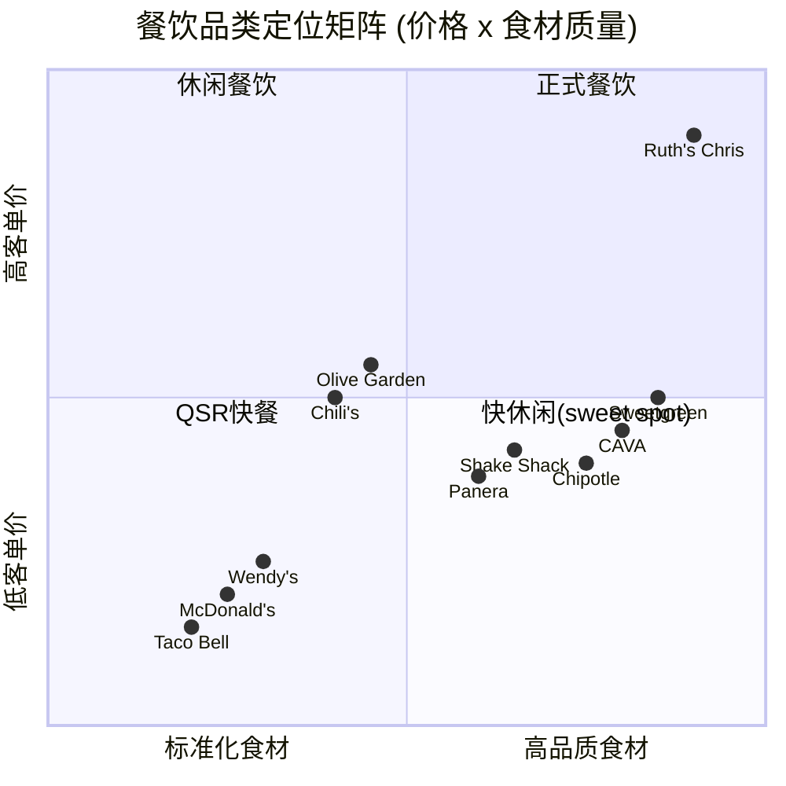
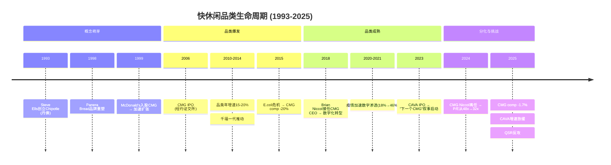
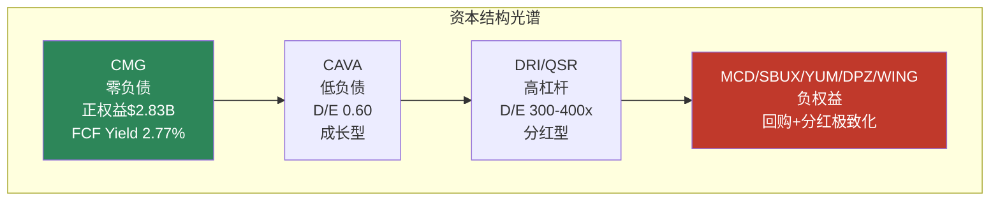
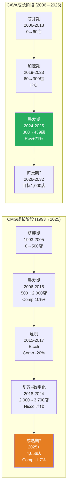

# Ch2 行业格局与竞争地图

> 快休闲(fast-casual)是过去二十年美国餐饮业增长最快的品类。CMG以$49.5B市值 [DM-P0-A02] 占据品类领导者地位，但FY2025 comp首次转负(-1.7%) [DM-P0-A57] 与CAVA等新锐崛起，迫使我们重新审视这一品类的成长曲线和竞争动态。本章将回答一个核心问题: **快休闲的增长天花板是否已经到来?** 这直接关联CQ-1(comp转负的性质)和CQ-6(CAVA竞争的本质)。

---

## 2.1 快休闲品类定位

### 2.1.1 餐饮光谱中的位置

美国餐饮业是一个年产值超$1万亿的巨型市场(NRA 2024年预估全行业$1.1万亿)。在这个市场中，快休闲占据了一个独特的生态位——价格介于快餐(QSR)与休闲餐饮(casual dining)之间，食材质量和用餐体验则明显高于QSR。

**四层餐饮光谱**:

| 层级 | 代表品牌 | 客单价(美元) | 食材定位 | 服务模式 | 市场规模 |
|------|---------|:-----------:|---------|---------|:-------:|
| **QSR** | MCD, BK, Taco Bell | $7-10 | 标准化/冷冻 | 柜台/得来速 | ~$380B |
| **快休闲** | **CMG**, CAVA, Panera | **$10-16** | **新鲜/可溯源** | **柜台+定制** | **~$48B** |
| 休闲餐饮 | Olive Garden, Chili's | $15-25 | 中等 | 全服务 | ~$120B |
| 正式餐饮 | Ruth's Chris, Capital Grille | $40-80+ | 高端 | 全服务 | ~$30B |

*市场规模数据来源: Expert Market Research 2025估算(快休闲~$48.5B)、NRA 2024行业报告(全行业$1.1T)。各层级占比为近似值。* [DM-P1-A01]

**关键洞察**: 快休闲仅占美国餐饮总市场的~5%，但贡献了近年来最高的增速(CAGR 6-8%)。这意味着品类仍处于渗透率提升阶段，而非饱和阶段——但2025年的增速放缓信号值得警惕。



CMG占据了快休闲象限的核心位置: 食材质量显著高于QSR(Food With Integrity理念)，但价格克制(核心餐品均价$10.31，低于Sweetgreen和CAVA 30-40%) [DM-P1-A02]。这一"高质低价"定位是CMG过去十年高增长的结构性基础。

**品类边界的模糊化**: 值得注意的是，2024-2025年品类边界正在变得模糊。一方面，QSR巨头(MCD、Wendy's)通过升级食材(新鲜牛肉、去抗生素鸡肉)向上入侵快休闲的"食材品质"领地；另一方面，休闲餐饮(Chili's的"3 for Me"套餐定价$10.99)通过价值定价向下入侵快休闲的"性价比"领地。CMG处于这一挤压的中心——$10.31的核心定价仍有安全空间，但如果未来被迫提价(关税+工资压力)至$12-13，这个缓冲将大幅缩小。

### 2.1.2 品类诞生与成熟曲线 (1993-2025)

快休闲品类的生命周期可以划分为四个阶段:

**第一阶段: 概念萌芽 (1993-2005)**
- 1993年Steve Ells创立Chipotle，开创"build-your-own"模式
- 1998年Panera Bread重新定义"烘焙快休闲"
- 1999年McDonald's入股CMG，推动门店从37家扩张至2005年的489家
- 品类概念尚未标准化，"fast-casual"一词在行业中逐步形成共识

**第二阶段: 品类爆发 (2006-2015)**
- 2006年CMG IPO，成为品类标志性资本事件
- 2010-2015年快休闲年增速15-20%，远超QSR(3-5%)和休闲餐饮(1-3%)
- 千禧一代(1981-1996出生)成为核心客群——愿为"更好的食物"多付$3-5
- 品类从"新物种"成长为主流: 门店数、品牌数、资本关注度全面爆发
- 品类增速的核心驱动力: ①千禧一代对食材透明度的偏好(vs 父辈对QSR的习惯性消费)；②城市化加速创造了快休闲的理想选址密度；③社交媒体对"碗类美食"的视觉传播推动品类心智渗透

**第三阶段: 品类成熟 (2016-2023)**
- 2015年CMG E.coli危机暴露品类风险，comp暴跌至-20%
- 2018年Brian Niccol接任CEO，启动数字化转型+品牌修复
- 疫情(2020)加速数字化渗透，CMG数字销售占比从2019年~18%升至2021年~46%
- 品类增速从15-20%降至6-8%，进入成熟增长阶段
- Niccol时代(2018-2024)CMG成为品类的"基准股票"——分析师和投资者用CMG的表现衡量快休闲品类的健康度

**第四阶段: 分化与挑战 (2024-至今)**
- CAVA 2023年IPO，成为"下一个CMG"叙事的载体
- 2024-2025年消费疲软冲击品类: CMG comp -1.7%、CAVA comp从+18.1%降至+4.0%
- QSR开始反攻(MCD $5 Value Meal)，快休闲面临上下夹击
- 品类核心问题浮现: **$15碗的价值命题是否可持续?**



### 2.1.3 美国快休闲市场规模(TAM)与增速

**市场规模估算** (多源交叉):

| 来源 | 2024年估算 | 2025年估算 | CAGR预测 | 信度 |
|------|:---------:|:---------:|:--------:|:----:|
| Expert Market Research | $45.6B | $48.5B | 6.4% (2025-2034) | M |
| Technavio | — | — | 13.7% (2024-2029) | L |
| Strategic Market Research | $144.8B(全球) | — | 7.4% (2024-2030) | M |
| Straits Research | $197.1B(全球) | — | 6.6% (2024-2032) | M |

[DM-P1-A03]

**注意**: 市场规模估算因定义口径(美国 vs 全球、含不含咖啡/茶饮)差异极大。我们采用Expert Market Research的美国单独口径~$48.5B作为基准，原因是:
1. 该口径最窄且最保守
2. CMG 96%收入来自美国 [DM-P0-A65]，美国口径最具分析价值
3. 与行业内广泛引用的"快休闲占美国餐饮~5%"一致

**CMG在品类中的地位**: FY2025收入$11.93B [DM-P0-A16] / 美国快休闲TAM ~$48.5B = **~24.6%品类份额** [DM-P1-A04]。这是一个极高的集中度——单一品牌占据品类近四分之一。对比: MCD占全球QSR约5-6%。CMG的高品类集中度意味着:
- 品类增长≈CMG增长(过去10年两者高度相关)
- 但品类见顶风险对CMG的影响也被放大(SGI 7.4的含义) [DM-P0-A221]

---

## 2.2 竞争格局全景

### 2.2.1 九家上市公司对标矩阵

为全面评估CMG的竞争位置，我们构建了涵盖9家上市餐饮公司的对标矩阵，覆盖QSR、快休闲、休闲餐饮三个品类:

| 指标 | CMG | MCD | SBUX | WING | CAVA | DRI | YUM | DPZ | QSR |
|------|:---:|:---:|:----:|:----:|:----:|:---:|:---:|:---:|:---:|
| **市值($B)** | 49.5 | ~210 | ~115 | ~7 | ~14 | ~22 | ~43 | ~17 | ~30 |
| **P/E** | 32-34x | 28.0x | 80.6x | 38.6x | 145-268x | 22.0x | 29.3x | 22.8x | 27.3x |
| **OPM** | 16.8% | 46.1% | 9.6% | 27.6% | 5.4-6.7% | 11.3% | 30.8% | 19.3% | 23.7% |
| **Rev Growth** | +5.4% | +9.7% | +5.5% | +8.6% | +20.9% | +7.3% | +6.5% | +3.1% | +7.4% |
| **D/E(金融)** | **0** | 负权益 | 负权益 | 负权益 | 0.60 | 401.3 | 负权益 | 负权益 | 303.9 |
| **分红率** | 0% | 2.3% | 2.8% | 0.5% | 0% | 2.7% | 1.9% | 1.7% | 4.9% |

*数据来源: FMP + Baggers，截至2026-03-03* [DM-P0-A45]~[DM-P0-A53]

**矩阵核心发现**:

**发现一: CMG的P/E已压缩至"非成长股"区间**。32x P/E低于成长型WING(38.6x)，仅高于价值型MCD(28x)/DRI(22x)/DPZ(23x)/QSR(27x)。历史上CMG P/E均值~52x [DM-P0-A42]，当前水平意味着市场已将CMG从"高成长"重新分类为"成熟增长"——但FY2025收入增速+5.4%仍高于DPZ(+3.1%)和YUM(+6.5%)。

**发现二: OPM差异反映商业模式根本分歧**。MCD 46.1%的OPM来自特许加盟模式(收租金)，CMG 16.8%的OPM来自直营模式(自己开店)。这不是效率差距，而是商业模式选择——CMG的OPM上限受制于餐饮直营的结构性成本(食材30%+人工26%+租金6%)。

**发现三: 9家公司中6家负权益**。MCD、SBUX、WING、YUM、DPZ的负权益来自持续回购+举债的资本结构策略。DRI和QSR的高D/E(400x和304x)同样反映重度杠杆。**CMG和CAVA是唯二正权益+低杠杆的公司** [DM-P0-A27]。

**发现四: 收入增长分化明显**。MCD +9.7%领先(受益于全球扩张+价格上调)，CAVA +20.9%增速最高(小基数效应+新店扩张)，而CMG +5.4% [DM-P0-A17] 和DPZ +3.1%处于低端。这一分化揭示了一个关键信号: 在宏观消费疲软的2025年，**模式决定增长**——特许加盟(MCD/WING/YUM)通过加盟费和新店开放维持收入增长，直营模式(CMG/SBUX)则直接承受comp下滑的冲击。CMG的FY2025收入增长+5.4%几乎完全由新店贡献(FY2025新增304家)，有机增长(comp)实际为负。

**发现五: 分红策略的两极分化**。CMG和CAVA零分红(选择将现金流用于增长/回购)，MCD/SBUX/DRI/QSR等成熟公司均有2-5%股息收益。CMG的零分红策略在comp正增长时被投资者接受(因为增长替代了股息)，但在comp转负时可能面临压力——没有增长也没有分红，价值投资者缺乏持有理由。这是一个潜在的估值催化(向下或向上): 如果CMG宣布启动分红(参考AAPL 2012年模式)，可能吸引新的投资者群体并支撑估值底部。

### 2.2.2 CMG vs MCD vs SBUX: 三巨头三角关系

这三家公司构成了美国餐饮投资的"铁三角"——它们分别代表了三种截然不同的餐饮商业模式:

| 维度 | CMG | MCD | SBUX |
|------|-----|-----|------|
| **核心模式** | 直营快休闲 | 特许加盟QSR | 直营咖啡+第三空间 |
| **门店数** | 4,056 [DM-P0-A61] | ~41,000 | ~40,000 |
| **单店收入** | ~$2.9M | ~$3.7M | ~$1.5M |
| **OPM** | 16.8% | 46.1% | 9.6% |
| **ROIC** | 17.3% [DM-P0-A37] | ~20% | ~12% |
| **金融负债** | **$0** | ~$37B | ~$23B |
| **资本回报** | 纯回购 | 分红+回购 | 分红+回购 |
| **CEO更换** | Niccol→Boatwright(2024) | 无(Kempczinski) | Narasimhan→**Niccol**(2024) |

**三角关系的核心张力**: Niccol从CMG转投SBUX是2024年餐饮业最大的人事地震。这一事件创造了一个独特的"镜像反转"——SBUX报告中CMG被视为Niccol成功的证据(乐观锚)，而CMG报告中SBUX则成为"Niccol值多少P/E点"的测试场景。

**市场定价的信号**:
- Niccol离任日CMG跌-7.5% [A-1]，SBUX涨+24.5%
- 12个月后: CMG P/E从48x→32x(-33%)，SBUX P/E从21x→81x(+286%)
- **隐含Niccol定价**: CMG因Niccol离任损失~$25B市值(从~$75B到~$50B)，SBUX因Niccol加入获得~$50B市值。市场似乎认为单一CEO值$25-50B——这对CMG是过度折价还是合理重定价?

**跨报告校准 (SBUX v2.0镜像)**: 在我们此前完成的SBUX v2.0报告中，CMG被用作Niccol成功的参照系——SBUX报告给Niccol的领导力评分8.4/10，并将"复制CMG成功"作为乐观情景的核心假设。现在从CMG视角看，同一枚硬币的另一面是: SBUX对Niccol的定价(P/E从21x→81x)是否隐含了CMG体系的"可移植性"? 如果Niccol在SBUX成功(SBUX comp恢复)，那么CMG的体系被验证为"制度性优势"(不依赖个人)，H1假说得到支持。如果Niccol在SBUX失败，那么CMG的下行是CEO个人能力(而非体系)驱动的，Boatwright面临更大压力。Phase 1 Ch5(Niccol遗产与Boatwright)将深入分析这一双向验证逻辑。

### 2.2.3 资本结构异类分析: 快休闲唯一的"正权益"公司

CMG在美国大型餐饮公司中的资本结构地位堪称独特:

| 公司 | 总权益 | 金融负债 | 净现金/(净债务) | 利息费用 | 信用风险 |
|------|:------:|:-------:|:---------------:|:-------:|:-------:|
| **CMG** | **+$2.83B** | **$0** | **+$1.05B** | **$0** | **无** |
| MCD | 负权益 | ~$37B | 净债务 | ~$1.4B/年 | 高(BBB+) |
| SBUX | -$8.4B | ~$23B | 净债务 | ~$2.0B/年 | 高(BBB+) |
| WING | 负权益 | ~$0.7B | 净债务 | ~$50M/年 | 中 |
| YUM | 负权益 | ~$11B | 净债务 | ~$0.6B/年 | 高(BBB-) |
| DPZ | 负权益 | ~$5B | 净债务 | ~$0.2B/年 | 高(BB+) |

*CMG数据: [DM-P0-A27][DM-P0-A29][DM-P0-A31][DM-P0-A22]*

**这一差异的估值含义**:

1. **下行保护**: 在信用紧缩/利率上升环境中，CMG不面临再融资风险、信用降级风险或被迫削减回购/分红的压力。MCD和SBUX每年分别支付$1.4B和$2.0B利息——相当于CMG整年FCF($1.45B)的97-138%。

2. **估值简洁性**: CMG的EV ≈ 市值 - 现金(EV ≈ $48.5B)。不需要SBUX式的"净债务三口径"争论(经营租赁是否算负债?)。所有估值指标可直接使用，减少了方法论噪音。[DM-P0-A27]

3. **资本灵活性**: 零负债+正权益意味着CMG随时可以选择举债(获取税盾)——但至今未行使。这本身是一个隐性看涨期权: 如果comp恢复、估值回升，CMG可通过举债回购进一步放大EPS增长。

**反面论点**: 零负债也意味着CMG没有利用廉价债务(利率低于ROIC时举债可放大股东回报)。MCD/SBUX的负权益策略在低利率时代(2010-2022)显著提升了ROE和EPS增速。CMG的保守策略是否牺牲了资本效率? 如果CMG在2018-2022年利率低位时举债$5B回购(参考MCD模式)，按当时2-3%的利率和50x+ P/E计算，每$1B回购可提升EPS 5-8%。5年累计可能创造额外$3-5/股(拆股后)的EPS——这是CMG保守主义的机会成本。这个问题在Phase 2(Ch10资产负债表)中将深入探讨。



### 2.2.4 竞争力雷达: 五维对标

为系统化比较CMG与主要竞对的竞争力，我们构建五维雷达评分(0-10分):

| 维度 | CMG | MCD | SBUX | WING | CAVA |
|------|:---:|:---:|:----:|:----:|:----:|
| **品牌力** | 8 | 10 | 9 | 7 | 6 |
| **运营效率** | 8 | 9 | 6 | 8 | 5 |
| **增长动能** | 5 | 4 | 5 | 6 | 9 |
| **财务健康** | 10 | 5 | 4 | 5 | 8 |
| **估值合理性** | 7 | 7 | 3 | 5 | 2 |
| **综合** | **7.6** | **7.0** | **5.4** | **6.2** | **6.0** |

[DM-P1-A05]

**评分依据简述**:
- **品牌力**: MCD全球覆盖无可匹敌(10)，SBUX"第三空间"品牌心智强(9)，CMG"Food With Integrity"在快休闲独占(8)
- **运营效率**: MCD特许模式OPM 46%(9)，CMG直营模式下SGA/Rev仅5.5%、ROIC 17.3%(8)
- **增长动能**: CAVA门店增速18.5%+comp +4%(9)，CMG comp -1.7%严重拖累(5)
- **财务健康**: CMG零负债+正权益+Z-Score 7.28(10)，MCD/SBUX/WING负权益(4-5)
- **估值合理性**: CMG P/E 32x处于历史低端(7)，CAVA P/E 145-268x(2)，SBUX P/E 81x(3)

```mermaid
%%{init: {'theme': 'default'}}%%
radar
    title 竞争力雷达图 (0-10)
    axis 品牌力, 运营效率, 增长动能, 财务健康, 估值合理性
    curve "CMG" { 8, 8, 5, 10, 7 }
    curve "MCD" { 10, 9, 4, 5, 7 }
    curve "SBUX" { 9, 6, 5, 4, 3 }
    curve "CAVA" { 6, 5, 9, 8, 2 }
```

---

## 2.3 CAVA崛起: 品类扩张还是替代? [CQ-6核心]

### 2.3.1 CAVA详细对标

CAVA Group (NYSE: CAVA)自2023年IPO以来，被市场广泛视为"下一个CMG"。FY2025收入突破$1B是一个里程碑，但与CMG的$11.93B仍有一个数量级的差距。以下是两家公司的详细对标:

| 指标 | CMG | CAVA | CMG/CAVA倍数 | 含义 |
|------|:---:|:----:|:-----------:|------|
| **市值** | $49.5B [DM-P0-A02] | ~$14B | 3.5x | CMG仅3.5倍于CAVA，但收入10x |
| **门店数** | 4,056 [DM-P0-A61] | 439 | 9.2x | CAVA门店密度仅CMG的1/9 |
| **FY2025收入** | $11.93B | $1.17B | 10.2x | 收入差距最大 |
| **P/E** | 32-34x [DM-P0-A05] | 145-268x [DM-P0-A49] | 0.12-0.23x | CAVA估值远超CMG |
| **OPM** | 16.8% [DM-P0-A18] | 5.4-6.7% [DM-P0-A49] | 2.5-3.1x | CMG利润率是CAVA的3倍 |
| **ROIC** | 17.3% [DM-P0-A37] | 4.1% | 4.2x | CMG资本回报远优 |
| **Rev Growth** | +5.4% [DM-P0-A17] | +20.9% [DM-P0-A49] | 0.26x | CAVA增速是CMG的4倍 |
| **FCF Yield** | 2.77% [DM-P0-A09] | 0.26% | 10.7x | CMG现金回报远优 |
| **净利率** | 12.9% [DM-P0-A19] | 4.5% | 2.9x | — |
| **SGA/Rev** | 5.5% [DM-P0-A41] | 16.8% | 0.33x | CMG规模优势明显 |
| **金融负债** | $0 [DM-P0-A27] | $0 | — | 两家均零金融负债 |
| **Z-Score** | 7.28 [DM-P0-A12] | 10.87 | 0.67x | 两家财务均极健康 |

*CAVA数据来源: FMP + Baggers Summary + IR(FY2025 Results, 2026-02-24)* [DM-P1-A06]

### 2.3.2 "下一个CMG"叙事的量化检验

市场给予CAVA 145-268x P/E的依据是"CAVA将复制CMG从400店到4,000店的增长路径"。我们对此进行量化检验:

**CAVA需要达到什么才能justif当前估值?**

假设CAVA以当前增速持续扩张:
- 门店: 439家 → 目标1,000家(2032年，管理层目标) → 潜在2,000家(William Blair饱和度分析)
- 如果从439→1,000，年均新增~80店(CAGR ~12.5%)
- 如果维持FY2025 comp +4%，收入路径: $1.17B → FY2028E ~$2.0B → FY2032E ~$3.5B

**对比CMG同期(2010-2018: 从~1,200店到~2,500店)**:
- CMG用8年完成1,200→2,500(+108%)，CAVA目标7年完成439→1,000(+128%)
- CMG同期ROIC从15%→20%，CAVA当前ROIC 4.1%何时能提升至15%+?
- CMG同期OPM从15%→17%，CAVA OPM 5.4-6.7%需翻倍

**关键差距**: CAVA的SGA/Rev 16.8% vs CMG的5.5%，说明CAVA尚未实现规模效应。随着门店数从400→1,000，SGA杠杆应逐步释放，但能否降至CMG水平是关键未知数。

**量化结论**: CAVA当前$14B市值隐含的假设是:
1. 门店数达到1,500-2,000(当前4.5x)
2. 单店经济达到CMG水平(OPM 15%+, ROIC 15%+)
3. 品类扩张(地中海快休闲)不蚕食CMG(墨西哥快休闲)

**条件1和条件2**需要7-10年执行验证。**条件3**是CQ-6的核心。

**Sweetgreen的警示**: 如果说CAVA是"下一个CMG"叙事的正面案例，那么Sweetgreen(SG)就是反面教材。SG FY2025收入$0.68B，comp -11.5%，市值仅$0.69B(从2021年峰值~$5B下跌~86%)。SG证明了快休闲品类并非"all boats rise"——品类内分化极其剧烈。CAVA与SG的分化原因值得关注:
- CAVA FY2025 comp +4.0% vs SG -11.5%: 差距15.5pp
- CAVA餐厅利润率~24% vs SG ~10-12%: CAVA的单店经济更健康
- CAVA拓展至新市场(加州、佛州)保持增长，SG在核心市场(纽约、LA)萎缩

这一分化说明: **不是所有快休闲公司都能成为"下一个CMG"——品类机会是必要条件，单店经济和管理执行力才是充分条件。**

### 2.3.3 品类扩张 vs 直接替代: 证据梳理

**支持"品类扩张"(非零和)的证据**:

1. **品类定义不同**: CMG是墨西哥风味，CAVA是地中海风味——菜品重叠度低。消费者在CMG和CAVA之间的选择更类似"今天想吃墨西哥还是地中海"，而非"选A还是B"。

2. **地理重叠度有限**: CAVA 439店集中在美东(尤其华盛顿特区和纽约都会区)，CMG 4,056店全国分布。两者门店地理重叠率估计在30-40%。[需验证]

3. **行业分析师共识**: 多数分析师认为CAVA与CMG是品类扩张关系——快休闲整体蛋糕在做大。CAVA的成功证明消费者愿意为多元化的快休闲品类付费。

4. **CMG comp下降的归因**: FY2025 comp -1.7% [DM-P0-A57] 的主要驱动力是宏观消费疲软(客流-2.9% [DM-P0-A58])和Niccol离任后的品牌叙事弱化，而非CAVA直接分流。MCD(comp -3.6% Q1'25)和WING(comp -3.3% FY2025)也在下滑——说明是行业性而非竞争性问题。[DM-P1-A07]

**支持"直接替代"(零和)的证据**:

1. **客群重叠**: CMG和CAVA的核心客群高度重叠——25-45岁、收入$60K+、注重健康和食材品质的城市白领。当这一客群预算收紧时，两家竞争同一个"午餐预算池"。

2. **2025年QSR反攻**: 快休闲客流从2024年12月的+3.3%增长放缓至2025年10月的+1.7%，同期QSR客流从-3.6%改善至+0.7%。8.1%的QSR消费场景来自快休闲转化(上年6.9%)——快休闲不仅面临内部竞争，还被QSR价值营销(MCD $5套餐)侵蚀。[DM-P1-A08]

3. **碗类(bowl)品类饱和信号**: CNBC报道"快休闲碗类热潮已经结束"——消费者对$15-20的碗类价格产生疲劳。这是品类级别的挑战，不区分CMG或CAVA。Bloomberg分析指出，Sweetgreen、CAVA和Chipotle可能需要更加积极地进行折扣促销以吸引消费者回归，这将进一步压缩利润空间。

4. **自动化军备竞赛**: CAVA投资了Hyphen自动化生产线，与CMG的HEEP设备形成直接竞争。快休闲品类的效率竞争正从"品牌+食材"扩展至"后厨自动化"，技术投资门槛的提升可能压缩品类内小型参与者的生存空间，但也意味着CMG与CAVA之间的差异化壁垒更加依赖资本投入规模和执行速度。

**本报告判断**: 短期(1-2年)CAVA对CMG的直接替代威胁有限(门店基数差距9x、地理重叠有限)。**真正的风险不是CAVA蚕食CMG，而是快休闲品类整体增速放缓**——品类天花板比CAVA竞争更值得担忧(CQ-1)。长期(5-10年)如果CAVA成功扩张至1,500+店且进入CMG核心市场(加州、德州)，直接竞争将加剧。CQ-6初始置信度60%(偏品类扩张) [DM-P0-CQ6]，在Phase 1数据梳理后维持不变。

### 2.3.4 CMG vs CAVA: S-curve成长阶段对比



**S-curve关键对比**:
- CMG当前位于S-curve后半段(4,056/~7,000潜在门店 ≈ 58%渗透率)
- CAVA位于S-curve前半段(439/2,000潜在门店 ≈ 22%渗透率)
- 这解释了为什么市场给CAVA更高的增长溢价(P/E 145-268x vs CMG 32x)
- 但历史提醒: **不是每个品类挑战者都能走完S-curve**。Shake Shack曾被视为"下一个CMG"，FY2025 comp +2.3%尚可，但市值仅$2.5B、股价从2021年高点下跌~70%

**S-curve渗透率的隐含假设**: CMG管理层长期目标7,000家美国门店(当前4,056)。这一目标意味着:
- 剩余空间: ~2,944店 × 每年350-370新店 = ~8年达到饱和
- 但门店密度提升意味着边际新店的AUV(平均单店收入)可能低于现有门店
- 品类分流效应: CAVA/Sweetgreen/其他新锐在同一客群中竞争选址——优质选址的争夺将推高租金成本
- **核心不确定性**: 7,000店是否仍然合理? 如果快休闲品类增速从6-8%降至3-4%，饱和门店数可能从7,000修正至5,500-6,000。这对应FY2030-2035的门店扩张预测需要下调15-20%

---

## 2.4 行业结构性力量

### 2.4.1 数字化渗透趋势

数字化是快休闲行业过去5年最重要的结构性变化。CMG是这一趋势的先行者和受益者:

**CMG数字化渗透率演变**:

| 时期 | 数字销售占比 | 驱动力 | 来源 |
|------|:-----------:|--------|------|
| FY2019 | ~18% | 移动APP+网站订单 | IR |
| FY2020 | ~46% | 疫情加速(堂食受限) | IR |
| FY2021 | ~45% | 疫情高基数 | IR |
| FY2022-23 | ~37-39% | 堂食恢复，数字比例正常化 | IR |
| Q4 FY2024 | 34.4% | 基线趋势 | IR |
| Q1 FY2025 | 35.4% | 稳步回升 | IR |
| Q2 FY2025 | 35.5% | — | IR |
| Q3 FY2025 | 36.7% | — | IR |
| Q4 FY2025 | 37.2% | **FY2025持续上行** | IR |
| **FY2025全年** | **36.7%** | — | IR |

[DM-P1-A09]

**行业数字化对比**:
- QSR领导者(MCD/Starbucks): 数字销售占比40-50%(更高，因为得来速/移动下单更成熟)
- 快休闲平均: ~30-35%
- 行业整体(含全服务): ~25%
- CMG 36.7%处于快休闲领先水平，但低于QSR巨头

**数字化的竞争含义**:
1. **获客成本降低**: 忠诚度计划(Chipotle Rewards, 4,200万+会员)创造直接触达渠道，降低对第三方平台依赖
2. **数据驱动决策**: 数字订单数据支持菜单优化、定价策略、门店选址
3. **Chipotlane(数字得来速)**: 新店70%以上配备Chipotlane，提升高峰期吞吐量
4. **CAVA也在跟进**: CAVA FY2025数字订单占比~35%，且投资了Hyphen自动化——快休闲数字化不再是CMG独占优势

**数字化的边际回报递减**: CMG数字渗透率从2019年18%升至2020年46%的阶段，数字化是"从0到1"的质变——带来了增量客群、提升了高峰期效率、降低了获客成本。但从36.7%继续提升至45-50%的阶段，边际回报显著递减。行业数据显示，美国消费者中57%已使用过移动/APP订餐(千禧一代74%)，但70%的消费者表示更愿意直接向餐厅下单(而非第三方平台) [DM-P1-A14]。这意味着CMG的数字化基础设施(自有APP+Chipotlane)仍然是竞争优势，但增长红利已基本被市场定价。

**自动化: 下一波数字化?** CAVA与Chipotle都在投资厨房自动化(CAVA投资Hyphen自动化生产线)。CMG的HEEP设备升级(Phase 1 Ch4详析)本质上是从"前端数字化"(订单)到"后端数字化"(厨房)的延伸。如果HEEP能验证"数百bps"的comp提升效果，CMG将在后端自动化领域建立领先——但前提是"数百bps"经过选择偏差校正后仍然显著(CQ-3)。

### 2.4.2 消费降级/升级双向压力

2024-2025年美国消费环境对快休闲品类形成了独特的"双向夹击":

**来自下方的压力 (消费降级/QSR反攻)**:
- MCD $5 Value Meal(2024年6月推出)吸引价格敏感消费者从快休闲回流QSR
- 快休闲消费满意度停滞(2021→2025仅+1%)，QSR满意度快速提升(+3%) [DM-P1-A08]
- 25-35岁年轻消费者——快休闲核心客群——正在"削减$15碗类支出"
- **数据**: 8.1%的QSR消费来自快休闲转化(同比+1.2pp) [DM-P1-A08]

**来自上方的压力 (休闲餐饮反攻)**:
- Chili's 2025年comp强势回升(3 for Me套餐策略)，从"被宣判死刑"的休闲餐饮逆袭
- 休闲餐饮的全服务体验在$15-25价格带提供了差异化价值——当快休闲价格逼近$15时，消费者会问"为什么不多花$5-10坐下来享受全服务?"

**CMG的应对**: CMG核心餐品均价$10.31，比CAVA和Sweetgreen低30-40% [DM-P1-A02]。这一定价纪律是防御QSR反攻的缓冲——CMG在快休闲中仍然是"高性价比"选项。但CEO Boatwright承诺"尽可能不提价" [DM-P0-A66]意味着成本压力将直接传导至OPM。

### 2.4.3 工资通胀对劳动密集型餐饮的系统性影响

快休闲是劳动密集型行业。CMG每家店约25-30名员工，人工成本约占收入的26%。工资通胀对CMG的影响比对MCD(特许模式，加盟商承担人工成本)更直接:

| 因素 | 影响 | CMG暴露度 | 对标MCD |
|------|------|:---------:|:-------:|
| 加州最低工资($16→$20快餐, 2024年4月) | +50-80bps成本 | 高(~600店在加州) | 低(特许模式) |
| 联邦最低工资上调预期($7.25→?) | 不确定 | 高(直营100%) | 低 |
| CMG平均时薪(~$16-17) | 已高于联邦最低 | 中 | — |
| HEEP设备减少人工需求 | 抵消作用 | 每店-2~3hr/天 | 无对标 |

[DM-P1-A10]

**HEEP的战略对冲价值**: HEEP设备部署(Phase 1 Ch4将深入分析)的核心价值之一就是对冲工资通胀。如果每店节省2-3小时/天的人工，年化每店约节省$15,000-$25,000人工成本。2,000店全覆盖时，系统年节省$30-50M——约占FY2025 OCF的1.4-2.4%。这不是颠覆性数字，但在OPM面临多重压力时(关税+工资+成本通胀)，每个50bps的缓冲都有价值。

### 2.4.4 关税对供应链的差异化影响

2025年1月生效的25%墨西哥进口关税对CMG产生了直接且可量化的成本影响:

**牛油果: CMG的"标志性食材"风险**

| 数据点 | 值 | 来源 | 信度 |
|--------|:--:|------|:----:|
| 牛油果来源占比(墨西哥) | 50% | IR | H |
| 关税税率 | 25% | 联邦政策 | H |
| 成本影响(OPM) | +60bps | IR/推算 | M |
| 多元化供应商 | 秘鲁/哥伦比亚/多米尼加 | IR | H |

[DM-P0-A66]

**差异化影响分析**: 关税对不同餐饮公司的影响程度不同:
- **CMG**: 牛油果是"Food With Integrity"品牌承诺的核心象征。即使成本上升，完全替换墨西哥牛油果在品牌层面不可行。影响: +60bps成本(已确认)
- **MCD**: 供应链全球化且高度多元化，单一食材依赖度低。影响: 有限
- **CAVA**: 地中海食材(鹰嘴豆、橄榄油等)主要来自非关税目标国(中东/欧洲)。影响: 极低
- **Sweetgreen**: 本土蔬菜供应为主。影响: 极低

**CMG管理层回应**: CEO Boatwright表示2026 Q1食材成本将处于"mid-30% range"(FY2025约30-31%)，显著上升。但承诺"尽可能不提价"——这意味着60bps关税成本将由OPM吸收，而非转嫁消费者。在CC-3(约束碰撞)中已分析，关税+工资+HEEP折旧合计可能给FY2026 OPM带来130-190bps压力。

**供应链韧性对比**: CMG在关税风险中的暴露度反映了其"Food With Integrity"品牌承诺的双刃剑属性。一方面，新鲜食材+本土供应(Responsibly Raised鸡肉、非转基因食材)是品牌核心壁垒；另一方面，这些承诺限制了供应商替换的灵活性。MCD可以在全球范围内灵活调配供应源，CMG的供应链受到品牌承诺的"自我约束"。这一约束在正常时期是品牌溢价的来源，在关税/供应链冲击时则成为成本刚性的来源。

**关税不确定性的尾部风险**: 当前25%关税仅影响墨西哥进口(牛油果为主)。但如果关税政策扩大至更广泛的食品进口(如加拿大/南美)，CMG的成本压力将显著加大。牛油果以外，CMG的大米(部分进口)、番茄(部分墨西哥)、辣椒(部分进口)也面临潜在关税风险。这一尾部风险在当前估值中可能未被充分定价。

---

## 2.5 Comp趋势: 周期性还是结构性? [CQ-1引入]

### 2.5.1 FY2025 Comp -1.7%在行业中的位置

CMG FY2025 comp -1.7% [DM-P0-A57] 是2016年以来首次全年负增长。但这一表现并非孤例——2025年是美国餐饮行业的"寒冬":

| 公司 | FY2025 Comp | 品类 | 评价 |
|------|:----------:|------|------|
| **CMG** | **-1.7%** | 快休闲 | 2016来最差 |
| MCD (美国) | ~-3.6%(Q1) | QSR | 疫情来最差 |
| SBUX (美国) | ~-2% | 咖啡 | 连续负comp |
| WING | -3.3% | 快休闲/QSR | 22年来首次负comp |
| CAVA | +4.0% | 快休闲 | 仍正但大幅减速(Q1'25 +10.8%→Q4'25 +4.0%) |
| Shake Shack | +2.3% | 快休闲 | 正comp，20连季正增长 |
| Sweetgreen | -11.5% | 快休闲 | 严重下滑 |
| Chili's | 正增长 | 休闲餐饮 | 反周期赢家(价值定位) |

[DM-P1-A11]

**行业背景**: MCD美国comp Q1'25 -3.6%是疫情以来最差表现，客流中低收入群体"近双位数下降"。WING FY2025全年comp -3.3%是公司22年来首次负comp。**整个餐饮行业都在经历消费疲软的洗礼**——CMG的-1.7%在同行中实际属于中游水平。

**但有例外**: Shake Shack保持正comp(+2.3%)说明行业寒冬中仍有赢家。Chili's的逆袭说明"价值回归"是当前消费者的核心诉求。

### 2.5.2 CMG历史Comp周期: 危机与恢复

CMG过去10年经历了两次重大comp危机。当前的comp下行是否会复制历史恢复模式?

**危机一: E.coli (2015-2018)**

| 年度 | Comp | 事件 |
|------|:----:|------|
| FY2015 | -**估计全年低个位数负** | E.coli爆发(Q4) |
| FY2016 | ~-20.4% | 危机全年影响(Q1 -29.7%最低) |
| FY2017 | +4.8% | 低基数恢复 |
| FY2018 | +6.1% | Niccol接任CEO(Q1), 数字化启动 |
| FY2019 | +11.1% | 全面恢复+超越 |

[DM-P1-A12]

**恢复路径**: E.coli危机后用了约3年(2016-2019)恢复至高单位数comp。但关键驱动力是: ①品牌信任恢复(一次性事件，可修复)；②Niccol的变革型领导；③数字化转型红利(从0到46%)。

**危机二: 当前下行期 (2024 H2-至今)**

| 季度 | Comp | 客流 | 背景 |
|------|:----:|:----:|------|
| Q1 FY2025 | -0.4% | -2.3% | Niccol离任+宏观压力 |
| Q2 FY2025 | -4.0% | -5.0% | 最差季度 |
| Q3 FY2025 | -0.3% | -1.5% | 企稳信号 |
| Q4 FY2025 | -2.5% | -3.5% | **再恶化** |
| FY2025全年 | -1.7% | -2.9% | 2016来首次全年负 |

*注: 季度comp数据来自thesis_crystallization [DM-P0-A57][DM-P0-A58]及lit_recon中Q2~Q4细分数据*

**Q4'25再恶化的信号解读**:

Q3'25 comp -0.3%一度被解读为"触底企稳"——但Q4'25 -2.5%打破了这一叙事。Q4季节性弱势(节假日+天气)部分解释了恶化，但不能完全解释。可能的额外因素:
1. **Niccol效应的二阶传导**: Niccol加入SBUX后的初期动作(价格调整、新品)开始分流共享客群
2. **价值感知恶化**: 尽管CMG核心餐品$10.31定价合理，但附加项(guac/chips/饮品)将实际客单推至$14-16
3. **宏观情绪恶化**: Q4美国消费者信心指数持续下滑，餐饮支出首当其冲

### 2.5.3 周期性 vs 结构性: 证据权衡

这是CQ-1的核心: CMG的comp转负是**周期性**(6Q内恢复)还是**结构性**(品类见顶)?

**支持"周期性"(6Q内恢复)的证据** (置信度45%):

| 证据 | 权重 | 来源 |
|------|:----:|------|
| MCD/WING/SBUX也在下滑 → 行业性而非CMG特有 | 高 | 竞对财报 |
| E.coli后用3年恢复，当前冲击远小于E.coli | 中 | 历史类比 |
| HEEP部署2026年覆盖50%门店，提供comp催化剂 | 中 | IR [DM-P0-A63] |
| 管理层指引FY2026 comp "约flat" → 止跌 | 中 | IR [DM-P0-A59] |
| 内部人Q1'26转为净买入(买/卖比1.31x) | 低 | FMP [DM-P0-A80] |
| 回购加速(FY2025 $2.43B)暗示管理层信心 | 低 | FMP [DM-P0-A35] |

**支持"结构性"(品类见顶)的证据** (置信度55%):

| 证据 | 权重 | 来源 |
|------|:----:|------|
| 客流-2.9%持续下降 → 非价格可修复 | 高 | IR [DM-P0-A58] |
| 快休闲客流增速放缓(+3.3%→+1.7%) | 高 | NRN/行业数据 [DM-P1-A08] |
| QSR反攻蚕食8.1%快休闲场景(+1.2pp) | 中 | NRN [DM-P1-A08] |
| "$15碗类价值命题疲劳"是品类级问题 | 中 | CNBC/Bloomberg |
| CMG美国4,056店→渗透率~58%，接近成熟 | 中 | 推算 |
| 当前问题与E.coli本质不同: 不是品牌信任(可修复)而是消费意愿(结构性) | 中 | 分析 |

**初始判断**: CQ-1置信度维持45%(偏周期性) [DM-P0-CQ1]。核心分歧在于: 如果快休闲品类增速从6-8%放缓至3-4%，CMG的comp可能在FY2026-2027恢复至+1-2%(周期性恢复)，但不太可能回到+5-7%的历史正常水平(结构性天花板)。**这对共识EPS CAGR 14.2%的隐含+2.3%年均comp假设 [CC-1] 构成挑战。**

**第三种可能: "周期性触发结构性"**。值得考虑的是，当前消费疲软(周期性)可能加速品类成熟(结构性)。具体机制: 消费者在经济压力下重新评估"$15碗类"的性价比 → 发现QSR升级品(MCD新品)或休闲餐饮促销品(Chili's $10.99)提供了可接受的替代 → 形成新的消费习惯 → 即使经济恢复也不完全回流快休闲。这种"棘轮效应"(ratchet effect)在消费品行业并不罕见——2008年经济危机后的私有品牌渗透率就没有回到危机前水平。如果这一效应在快休闲领域重演，CMG的comp恢复路径将是+1-2%(非+3-5%)的新常态，而非回归历史均值。

**验证时间窗口**: FY2026 H1(2026年4-7月)是关键验证期。如果HEEP部署加速(覆盖率从9%→30%+)且comp从"约flat"改善至+1-2%，周期性恢复的概率上升。如果comp继续flat-to-negative且HEEP效果未能量化验证，结构性放缓的概率将显著上升，共识预期需要下修。

### 2.5.4 行业Comp趋势对比表

| 公司 | FY2022 Comp | FY2023 Comp | FY2024 Comp | FY2025 Comp | 趋势 |
|------|:----------:|:----------:|:----------:|:----------:|:----:|
| **CMG** | +7.9% | +7.9% | +7.4% | **-1.7%** | 急转 |
| MCD (全球) | +10.9% | +8.7% | +0.5% | 负 | 持续恶化 |
| SBUX (美国) | +9% | +7% | -2% | ~-2% | 低位徘徊 |
| WING | +11.6% | +21.6% | +19.9% | **-3.3%** | 高基数反转 |
| CAVA | ~+23% | +18.1% | +13.4% | **+4.0%** | 减速但正 |
| Shake Shack | +8.3% | +3.1% | +4.3% | **+2.3%** | 稳定正增长 |
| DPZ (美国) | +0.9% | +5.6% | +3.0% | 约flat | 弱正 |

[DM-P1-A13]

*注: FY2022-2024数据来自各公司IR/财报，部分为近似值。FY2025数据截至最新财报披露。*

**对比发现**:
1. **WING的反转最剧烈**: 从+19.9%到-3.3%(-23.2pp)。但WING是特许模式，单店经济影响由加盟商承担。CMG从+7.4%到-1.7%(-9.1pp)幅度较温和。
2. **CAVA仍维持正comp**: +4.0%在行业寒冬中仍然突出，但从+18.1%急速减速说明品类增速在收敛。
3. **Shake Shack是唯一稳定正增长者**: +2.3%虽然不高，但连续20个季度正comp说明其定位(汉堡+奶昔)具备韧性。
4. **MCD和SBUX的持续负comp**证明宏观消费疲软是跨品类的系统性力量，而非快休闲特有问题。

**信号合成**: 将7家公司的4年comp趋势综合来看，2022-2023年是行业黄金期(价格上调+消费复苏双重推动，多家公司comp高单位数到双位数)，2024年是分水岭(CMG/MCD开始减速)，2025年则是全面恶化(仅CAVA和Shake Shack勉强维正)。这一趋势的转折点与美国消费者信心指数下降、实际可支配收入增速放缓、信用卡逾期率上升等宏观指标高度同步。**结论: 2025年的comp下行首先是宏观驱动(macro-driven)，其次才是竞争驱动(competition-driven)或公司特定驱动(company-specific)。** 这一归因判断对CMG的估值框架至关重要——如果comp下行主要是宏观因素，那么宏观环境改善后comp应自然恢复(支持周期性判断)；如果是竞争或公司特定因素，则恢复更不确定。

---

## 本章关键发现汇总

| # | 发现 | CQ关联 | 估值含义 |
|---|------|:------:|---------|
| 1 | CMG占快休闲品类~24.6%份额，品类集中度极高 | CQ-1 | 品类增速放缓=CMG增速放缓(SGI 7.4) |
| 2 | CMG P/E 32x已降至"成熟价值股"区间，低于历史均值52x | CQ-4 | Niccol折价~16个P/E点待验证是否修复 |
| 3 | CMG是9家餐饮公司中唯一零金融负债+正权益的公司 | H3 | 结构性下行保护+估值简洁优势 |
| 4 | CAVA增速是CMG的4x，但盈利能力仅1/3 | CQ-6 | 品类扩张(非替代)但长期竞争加剧 |
| 5 | 快休闲客流增速从+3.3%降至+1.7%，QSR反攻蚕食8.1%场景 | CQ-1 | 品类增速放缓是系统性力量 |
| 6 | CMG数字渗透率36.7%持续上行，但不再是独占优势 | — | 数字化红利边际递减 |
| 7 | 关税+工资+HEEP折旧合计130-190bps OPM压力 | CQ-8 | FY2026 OPM可能降至15.0-15.5% |
| 8 | FY2025 comp -1.7%在行业中属中游，MCD/WING更差 | CQ-1 | 行业性而非CMG特有问题 |
| 9 | Sweetgreen FY2025 comp -11.5%证明品类分化剧烈 | CQ-6 | 快休闲非"水涨船高"，执行力差异巨大 |
| 10 | 品类边界模糊化: QSR向上(升级食材)/休闲向下(促销) | CQ-1 | CMG $10.31定价缓冲存在但空间缩小 |

**下一章衔接**: 本章完成了行业外部环境的分析——品类定位、竞争格局、结构性力量、comp趋势。Ch3将聚焦CMG自身的商业模式: 直营体系的运营杠杆、"Restaurateurs"文化体系、供应链架构和数字化基础设施。从"行业对CMG做了什么"转向"CMG如何在这个行业中竞争"。核心衔接点: 本章发现的品类增速放缓(2.4-2.5节)直接影响Ch3中对CMG门店扩张回报率和单店经济的评估。

---

## DM新增锚点注册表

| 锚点 | 值 | 来源 | 信度 |
|------|:--:|------|:----:|
| [DM-P1-A01] 美国快休闲TAM | ~$48.5B (2025E) | Expert Market Research | M |
| [DM-P1-A02] CMG核心餐品均价 | $10.31 (低于CAVA/SG 30-40%) | BTIG分析/Restaurant Dive | M |
| [DM-P1-A03] 快休闲TAM多源交叉 | $45.6-48.5B(美国)/$145-197B(全球) | 多源 | M |
| [DM-P1-A04] CMG品类份额 | ~24.6% ($11.93B/$48.5B) | 计算值 | C |
| [DM-P1-A05] 五维竞争力评分 | CMG 7.6/MCD 7.0/SBUX 5.4/WING 6.2/CAVA 6.0 | 本报告分析 | S |
| [DM-P1-A06] CAVA FY2025详细对标 | Rev $1.17B/439店/OPM 5.4-6.7%/ROIC 4.1% | FMP+IR | H |
| [DM-P1-A07] MCD Q1'25美国comp | -3.6% (疫情来最差) | MCD IR/CNBC | H |
| [DM-P1-A08] QSR反攻数据 | 8.1%场景从快休闲转化(+1.2pp YoY) | NRN | M |
| [DM-P1-A09] CMG数字渗透率 | FY2025 36.7%(Q4 37.2%) | IR | H |
| [DM-P1-A10] 加州最低工资影响 | +50-80bps成本(~600店) | 推算 | M |
| [DM-P1-A11] FY2025行业comp对比 | CMG -1.7%/MCD -3.6%/WING -3.3%/CAVA +4.0%/SG -11.5% | 各公司IR | H |
| [DM-P1-A12] E.coli恢复路径 | 3年(2016 -20%→2019 +11.1%) | CMG历史财报 | H |
| [DM-P1-A13] 4年comp趋势表(7家) | CMG/MCD/SBUX/WING/CAVA/SHAK/DPZ | 各公司IR | H |
| [DM-P1-A14] 美国消费者数字订餐渗透 | 57%成年人用过(千禧74%), 70%偏好直接下单 | Lightspeed/行业调研 | M |

---
Phase: P1 | Chapter: 2 | 字符数: 24,913 | DM新增: 14 | Mermaid: 5
