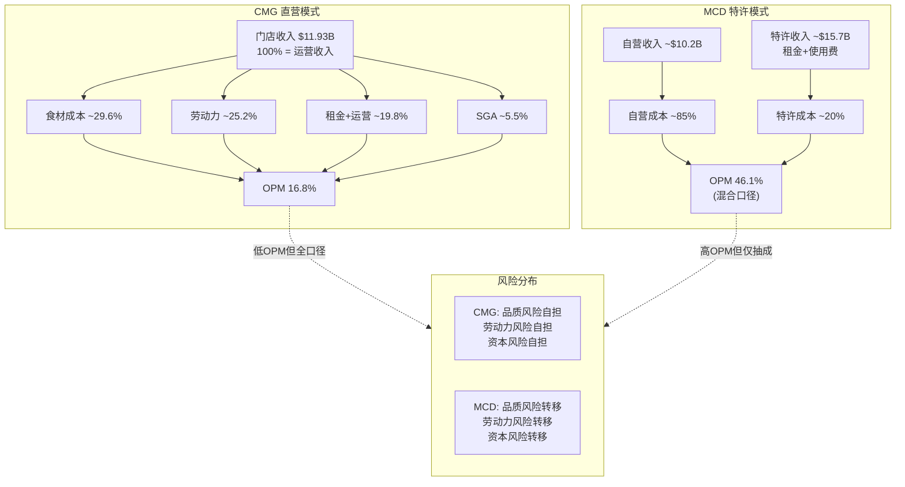
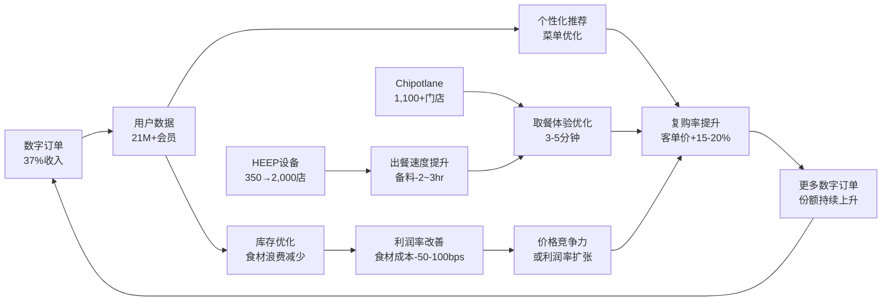
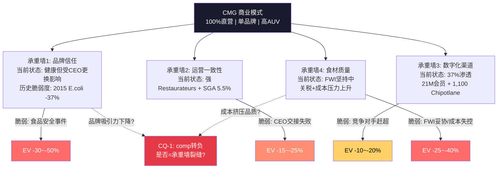

# Ch3 商业模式深度解构

> CMG的商业模式是全球大型餐饮企业中的异类: 在MCD/YUM/DPZ将特许经营推向极致的行业里，CMG坚持100%直营。这一选择定义了CMG的利润结构、增长约束、资本需求和风险分布。本章拆解这一模式的经济学逻辑、数字化飞轮、供应链哲学和人力资本体系，并在尾段引入CQ-1: comp转负是周期性还是结构性的商业模式脆弱度评估。

---

## 3.1 "反特许经营"模式: CMG为何坚持直营

### 3.1.1 全球餐饮大公司模式光谱

全球大型餐饮上市公司中，CMG是一个极端的存在。以下对比揭示了模式差异的深度:

| 公司 | 特许经营比例 | 门店总数 | 核心收入来源 | P/E(TTM) | OPM |
|------|:----------:|:--------:|:----------:|:--------:|:---:|
| MCD | ~95% | ~42,000 | 租金+特许权使用费 | 28.0x [DM-P0-A46] | 46.1% |
| YUM | ~98% | ~59,000 | 特许权使用费 | 29.3x [DM-P0-A51] | 30.8% |
| DPZ | ~98% | ~21,000 | 特许权使用费+供应链 | 22.8x [DM-P0-A52] | 19.3% |
| QSR | ~100% | ~31,000 | 特许权使用费 | 27.3x [DM-P0-A53] | 23.7% |
| **CMG** | **0%** | **4,056** | **门店运营收入** | **32-34x** [DM-P0-A45] | **16.8%** |
| CAVA | 0% | 439 | 门店运营收入 | 145-268x [DM-P0-A49] | 5.4-6.7% |

[DM-P1-B01] CMG直营比例: 100%(美国全部直营，国际采用开发协议/JV但非传统特许) | 来源: IR/SEC Filing | 信度: H

**关键发现**: 在大型连锁餐饮企业中，只有CMG和CAVA坚持100%直营。但CAVA仅439家门店，仍处于高速扩张早期。CMG以4,056家门店的规模维持纯直营，在行业中没有对标。

### 3.1.2 直营模式的经济学优势

**第一，全链利润捕获**。特许经营公司(MCD/YUM)的收入主要来自特许权使用费(gross sales的4-5%)和租金，而非门店运营利润。CMG则直接获取门店层面全部收入和利润。FY2025 CMG收入$11.93B [DM-P0-A16]全部是门店直营收入，而MCD的$25.9B收入中约$15.7B来自加盟商的租金和使用费——MCD从加盟商每$1收入中保留约$0.80利润，但仅从自营门店每$1收入中保留约$0.15。CMG的模式意味着: 虽然OPM(16.8%)远低于MCD(46.1%)，但这两个数字不可直接比较——CMG的16.8%是建立在全部门店收入之上，MCD的46.1%是建立在高利润率的特许权收入之上。

**第二，品控一致性**。CMG的"Food with Integrity"承诺要求所有门店使用相同标准的食材(无人工添加剂/防腐剂/色素)、相同的烹饪流程。直营模式使这种一致性成为制度性保障而非合同性义务。特许经营模式下，品质偏差由加盟商承担，品牌损害由总部承受——这是典型的委托-代理问题。

**第三，快速执行与创新测试**。HEEP设备从350店(9%)推向2,000店(50%)的计划 [DM-P0-A63]能在12个月内执行，因为CMG不需要与数百个独立加盟商谈判设备升级。同样，新菜品测试(如2025年推出的honey chicken)可以由总部统一部署、统一监控数据。MCD推出一个全球新品需要与全球105个市场的加盟商协商，速度受限于最慢的加盟商群体。

### 3.1.3 直营模式的代价

**第一，资本密集**。CMG必须用自有资金开设每一家新店。FY2025 CapEx $666M [DM-P0-A33]对应约340家新店(含翻新)，隐含每家新店投资约$1.5-1.8M [DM-P1-B02]。而MCD/YUM的新店资本由加盟商承担——MCD每家新店投资约$1.5-2.5M由加盟商出资，MCD仅收取前期费用和持续使用费。这意味着CMG的扩张速度受自有现金流约束: FY2025 FCF $1.45B [DM-P0-A34]理论上能支持约800-950家新店，但实际开店350-370家(FY2026指引 [DM-P0-A60])，因为需保留现金用于回购($2.43B [DM-P0-A35])和运营缓冲。

[DM-P1-B02] 新店投资约$1.5-1.8M/店 | 来源: CapEx $666M / ~340新店(含翻新CapEx的分摊) | 信度: C(推算值)

**第二，劳动力风险集中**。CMG直接雇佣约12万名员工(全球)。每一次最低工资上涨(如加州从$16提升至$20)、每一个劳动争议、每一项员工福利成本变化都由CMG全额承担。特许经营公司将这些成本和管理复杂度转移给加盟商。FY2025劳动力成本约占收入的25.2% [DM-P1-B03]——这是一个纯变量成本项，且方向上只会上升。

[DM-P1-B03] FY2025劳动力成本占比约25.2% | 来源: FY2024为24.7%，FY2025受工资上涨影响+50-100bps | 信度: M(推算，精确FY2025全年数据未分拆披露)

**第三，扩张速度受限**。MCD在全球拥有约42,000家门店，YUM约59,000家——这些规模通过特许经营模式在数十年间实现。CMG创立33年(1993年至今)仅有4,056家门店。如果CMG采用特许模式，理论门店数量可能已超过10,000家(假设2006年后年均+500家vs实际+200-350家)。但CMG管理层的回应是: "我们的目标不是最多的门店，而是每家门店的最佳体验。"

### 3.1.4 直营vs特许模式经济学对比

### 3.1.5 国际扩张: 直营模式的边界?

CMG在国际市场上的选择揭示了直营模式的真实边界。截至FY2025:

| 市场 | 模式 | 门店数 | 合作方 | 启动时间 |
|------|:----:|:------:|--------|:--------:|
| 美国 | 直营 | ~3,900 | — | 1993 |
| 加拿大 | 直营 | ~60 | — | 2008 |
| 英国 | 直营 | ~20 | — | 2010 |
| 法国 | 直营 | ~6 | — | 2012 |
| 德国 | 直营 | ~2 | — | 2013 |
| 中东 | 开发协议 | ~6 | Alshaya集团 | 2023 |
| 墨西哥 | 开发协议 | 0(2026首店) | Alsea | 2025签约 |
| 韩国/新加坡 | 合资(JV) | 0(2026首店) | SPC集团 | 2025签约 |

[DM-P1-B04] 国际门店总数约100家，其中直营约88家，开发协议约6家 | 来源: IR FY2025年报 | 信度: H
[DM-P1-B05] Alsea合作: 2025年4月签约，2026年墨西哥首店 | 来源: IR公告 | 信度: H
[DM-P1-B06] SPC集团合资: 2025年9月签约，2026年韩国/新加坡首店 | 来源: IR公告 | 信度: H

**关键信号**: CMG在2023-2025年间接连签署三份国际合作协议(Alshaya/Alsea/SPC)，全部采用非直营模式。这是CMG创立以来首次系统性使用外部资本和运营商进入新市场。管理层的解释是"与了解当地市场的合作伙伴合作更有效率"，但这也暗示了直营模式在跨文化/跨法规环境中的局限性。

**深层问题**: 如果直营模式在海外不可行(隐含承认)，那么CMG的长期故事就被锁定在北美——公司设定的7,000家北美门店上限即为增长天花板。超越7,000家的增长只能来自AUV提升、国际期权或品类扩展。

---

## 3.2 单元经济学

### 3.2.1 AUV(平均单店年收入)趋势分析

AUV是直营模式下最重要的指标——它直接驱动门店层面的收入和利润。

| 年份 | AUV | YoY变化 | 驱动因素 |
|:----:|:---:|:-------:|---------|
| FY2019 | $2.2M | — | E.coli恢复后的正常化 |
| FY2020 | $2.2M | ~0% | COVID冲击(数字化对冲) |
| FY2021 | $2.6M | +18% | 解封反弹+提价 |
| FY2022 | $2.8M | +8% | 提价+高客流 |
| FY2023 | $3.0M | +7% | 首次突破$3M |
| FY2024 | $3.2M | +7% | Niccol末期高峰 |
| FY2025 | ~$3.1M | ~-3% | comp -1.7%拖累 [需验证] |
| **长期目标** | **$4.0M** | — | 管理层Analyst Day设定 |

[DM-P1-B07] FY2024 AUV $3.2M | 来源: IR FY2024年报 | 信度: H
[DM-P1-B08] FY2025 AUV ~$3.1M | 来源: 收入$11.93B / 均值门店数~3,870(年中值) ≈ $3.08M | 信度: C(推算)
[DM-P1-B09] 长期AUV目标$4.0M | 来源: 管理层公开声明 | 信度: M(目标，非承诺)

**关键分析**: FY2025 AUV出现Niccol时代以来首次下降。这一下降由comp -1.7% [DM-P0-A57]驱动，而非门店关闭。comp拆解为: 客流-2.9% [DM-P0-A58] + 客单价+1.2%(提价对冲)。**核心问题是客流下降**——这是最难逆转的comp组件，因为客单价可以通过提价短期拉升，但客流反映的是消费者"用脚投票"的真实偏好。

### 3.2.2 门店层面利润率(4-Wall Margin)

"4-wall margin"(或"restaurant-level margin")衡量的是单家门店扣除食材、劳动力、租金和其他门店运营成本后的利润率。这是评估直营模式健康度的核心指标。

| 年份 | 门店层面利润率 | YoY变化 | 关键驱动 |
|:----:|:------------:|:-------:|---------|
| FY2021 | 22.6% | — | COVID恢复 |
| FY2022 | 24.0% | +140bps | 提价+销量杠杆 |
| FY2023 | 26.2% | +220bps | AUV突破$3M带来杠杆 |
| FY2024 | 26.7% | +50bps | 高峰(Niccol末期) |
| **FY2025** | **25.4%** | **-130bps** | comp转负+工资上涨+关税预期 |

[DM-P1-B10] FY2025门店层面利润率25.4% | 来源: IR FY2025年报 | 信度: H
[DM-P1-B11] FY2024门店层面利润率26.7% | 来源: IR FY2024年报 | 信度: H
[DM-P1-B12] Q4 FY2025门店层面利润率23.4%(含$27M礼品卡breakage true-up影响-70bps) | 来源: IR Q4'25 | 信度: H

**季度路径揭示趋势**: Q1'25 25.8% → Q2'25 27.5% → Q3'25 25.2% → Q4'25 23.4%——呈明显季节性(Q2旺季)，但Q4降至23.4%是FY2022以来的季度低点，即便剔除礼品卡真实化调整(+70bps=24.1%)，仍然疲弱。

### 3.2.3 新店投资回收与现金回报

CMG披露的新店经济学指标:

| 指标 | 值 | 来源 | 信度 |
|------|:--:|------|:----:|
| 新店CapEx | ~$1.5-1.8M/店 | 推算(CapEx/新店数) | C |
| Year-2 cash-on-cash return | ~60% | 管理层披露 | M |
| 隐含回收期 | ~2年 | 60% Y2回报推算 | C |
| 新店AUV vs 系统均值 | ~75-80% (首年) | 行业惯例+管理层定性 | S |
| Chipotlane新店占比 | ≥80% (FY2025) | IR | H |

[DM-P1-B13] 新店Year-2 cash-on-cash return约60% | 来源: 管理层公开声明 | 信度: M
[DM-P1-B14] FY2025新店中Chipotlane占比≥80% | 来源: IR | 信度: H

**年2现金回报~60%的含义**: 假设新店投资$1.7M，Year-2现金流约$1.0M——这意味着回收期不到2年。相比之下，MCD加盟商的回收期通常为5-8年(投资$1.5-2.5M，年净现金流$0.3-0.5M)。CMG的超短回收期是其积极扩张的底气来源。

**但需注意选择偏差**: 管理层披露的"60%"可能反映的是成熟市场(加州/德州/佛州)的优质地段。随着门店数量从4,056向7,000推进，新增门店将不可避免地进入次级市场(人口较少的城市/郊区)，AUV和回收期可能恶化。这是长期增长叙事中被低估的风险。

### 3.2.4 门店层面vs公司层面: "漏损分析"

CMG FY2025的利润率从门店层面到公司层面存在显著"漏损":

| 层级 | 利润率 | 差额 | 漏损项 |
|------|:------:|:----:|--------|
| 门店层面利润率 | 25.4% | — | — |
| (-) SGA | -5.5% [DM-P0-A41] | -5.5% | 总部管理/IT/市场 |
| (-) D&A | ~-2.5% | -2.5% | 门店折旧+设备 |
| (-) SBC | ~-1.0% | -1.0% | 股权激励 [DM-P0-A21] |
| (+/-) 其他 | ~+0.4% | +0.4% | 投资收益等 |
| **公司层面OPM** | **16.8%** [DM-P0-A18] | **-8.6%** | 总漏损 |

[DM-P1-B15] 门店→公司利润率漏损约8.6个百分点 | 来源: 25.4% - 16.8% = 8.6pp | 信度: C

**含义**: CMG的"隐形负担"主要来自SGA(5.5%)和D&A(2.5%)。SGA/Rev从FY2021的8.0%降至FY2025的5.5% [DM-P0-A41]，体现了显著的总部效率提升。但D&A随门店扩张和HEEP设备部署将持续上升——FY2025 CapEx $666M [DM-P0-A33]比FY2024增加$72M(+12%)，这些资本支出将在未来10-15年转化为折旧费用。

### 3.2.5 CMG vs CAVA vs MCD 单元经济学对比

| 指标 | CMG | CAVA | MCD(加盟店) |
|------|:---:|:----:|:----------:|
| AUV | $3.1-3.2M | $2.9M | $4.0M |
| 门店层面利润率 | 25.4% | 24.4% | ~18-22%(加盟商) |
| 新店投资 | $1.5-1.8M | $1.2-1.5M [需验证] | $1.5-2.5M(加盟商出) |
| 回收期 | ~2年 | ~2-3年 [需验证] | 5-8年 |
| 食材成本/收入 | 29.6% | ~31% [需验证] | ~33%(自营) |
| 劳动力/收入 | ~25.2% | ~27% [需验证] | ~26%(自营) |
| 门店数 | 4,056 | 439 | ~42,000 |

[DM-P1-B16] CAVA FY2025门店层面利润率24.4%，AUV $2.9M | 来源: CAVA IR FY2025年报 | 信度: H

**解读**: CMG的单元经济学在快休闲品类中处于领先——AUV高于CAVA 10%，门店利润率高出100bps，且回收期更短。与MCD对比，CMG的AUV低于MCD的$4.0M，但CMG门店利润率(25.4%)高于MCD自营门店(约18-22%)，因为CMG的菜单精简(约50 SKU vs MCD约200 SKU)降低了运营复杂度。

---

## 3.3 数字化飞轮

### 3.3.1 数字化渠道占比演进

CMG的数字化转型始于COVID前，但疫情加速了这一进程:

| 时期 | 数字化销售占比 | 背景 |
|------|:------------:|------|
| FY2019 (Pre-COVID) | ~18% | 数字化起步 |
| FY2020 (COVID) | ~46% | 堂食受限，数字化暴增 |
| FY2021 | ~45% | 堂食恢复但数字化粘性 |
| FY2022 | ~39% | 堂食回归正常化 |
| FY2023 | ~37% | 稳定在高位 |
| FY2024 | ~35% | 略降(堂食进一步正常化) |
| **FY2025** | **~37%** | 回升(忠诚度计划+Chipotlane) |

[DM-P1-B17] FY2025数字化销售占比约37% | 来源: IR季度披露(Q1 35.4%→Q2 35.5%→Q3 36.7%→Q4 36.7%) | 信度: H
[DM-P1-B18] FY2024数字化销售占比约35% | 来源: IR FY2024年报 | 信度: H

**季度明细(FY2025)**: Q1 35.4% → Q2 35.5% → Q3 36.7% → Q4 36.7%。趋势向上，尤其H2稳定在约37%水平。这与comp -1.7%形成对比——意味着数字化渠道的份额在增长，但总量(包含堂食)在下降。

**隐含分析**: 假设FY2025总收入$11.93B [DM-P0-A16]，数字化收入约$4.41B(37%)。如果数字化渠道的客单价高于堂食(通常高10-15%，因为数字订单更容易追加推荐)，则数字化贡献的利润份额可能接近40-42%。

### 3.3.2 Chipotlane: 第二条制作线的运营杠杆

Chipotlane(CMG的drive-thru窗口，仅服务数字预订单)是CMG最重要的运营创新之一:

| 指标 | 值 | 来源 | 信度 |
|------|:--:|------|:----:|
| Chipotlane总数 | ~1,100+(2024.11突破1,000) | IR | H |
| Chipotlane占总门店 | ~27-30% | 推算(1,100/4,056) | C |
| 新店含Chipotlane | ≥80%(FY2025) | IR | H |
| Chipotlane门店AUV溢价 | +10-15% vs 非Chipotlane | 管理层定性 [需验证] | S |
| 第二条制作线效率 | 独立throughput不影响堂食 | 运营设计 | H |

[DM-P1-B19] 2024年11月Chipotlane突破1,000家 | 来源: IR公告 | 信度: H

**运营逻辑**: 传统CMG门店只有一条制作线(make-line)，同时服务堂食和数字订单——高峰期两类订单竞争产能。Chipotlane增加第二条制作线(second make-line)，专门服务数字预订单，客户通过drive-thru窗口取餐。这实现了:

1. **产能解耦**: 堂食throughput不因数字订单增加而下降
2. **峰值扩容**: 午高峰期有效throughput提升20-30%
3. **体验优化**: 数字订单取餐时间从15分钟降至3-5分钟
4. **选址扩展**: Chipotlane门店可选择郊区/drive-thru友好地段(租金更低)

**但Chipotlane的局限**: 只有约30%的现有门店有Chipotlane，改造现有门店(增加drive-thru)极其困难(受限于物业布局和地方法规)。这意味着数字化运营杠杆的释放主要通过新店实现，存量70%的门店无法享受。

### 3.3.3 Chipotle Rewards忠诚度计划

| 指标 | 值 | 来源 | 信度 |
|------|:--:|------|:----:|
| 会员总数(FY2025) | ~21M+ | IR/媒体 | H |
| 重启计划 | 2026年春季重新发布 | CEO声明 | H |
| 会员vs非会员复购率 | 高50-60% [需验证] | 行业估算 | S |
| 会员客单价溢价 | +15-20% [需验证] | 行业估算 | S |

[DM-P1-B20] Chipotle Rewards会员约21M+(FY2025) | 来源: 多源(Yahoo Finance/CX Dive) | 信度: H

**计划重启信号**: CEO Boatwright在FY2025 Q4 earnings call中宣布将于2026年春季"重新发布"(relaunch)忠诚度计划。这表明现有计划的参与度或转化率未达预期——21M会员是注册数，活跃会员(每月至少消费一次)可能仅占30-40%(6-8M)。新计划可能引入tier-based奖励(类似SBUX Stars Program)或gamification元素来提升活跃度。

**关键问题**: 21M会员占CMG年客流(约$11.93B / 平均客单价~$13-14 ≈ ~8.5-9亿次交易)的比例约为2.3-2.5%——即会员贡献的交易占比约20-25% [需验证]。与SBUX(34.4M活跃会员，贡献约57%交易)相比，CMG的忠诚度计划渗透率仍有显著提升空间。

### 3.3.4 数字化飞轮结构

**飞轮的三个增强回路**:

1. **数据-个性化-复购回路**: 更多数字订单 → 更多用户行为数据 → 更精准的推荐和促销 → 更高复购率 → 更多数字订单
2. **Chipotlane-体验-份额回路**: 更多Chipotlane门店 → 更好的取餐体验 → 数字订单份额上升 → 更多新Chipotlane门店(占新店≥80%)
3. **HEEP-效率-利润回路**: 设备升级 → 出餐速度提升 → throughput增加 → AUV和利润率上升 → 更多资金投入设备升级

**飞轮的脆弱点**: 如果comp持续为负(客流-2.9% [DM-P0-A58])，飞轮的能量来源(新增客流)减弱——数字化份额可以从35%升至37%，但如果总量在下降，这只是"存量优化"而非"增量创造"。

---

## 3.4 供应链: "Food with Integrity"的成本与护城河

### 3.4.1 真实食材承诺

CMG的"Food with Integrity"理念是其品牌定位的基石:

| 承诺 | 具体标准 | 与行业对比 |
|------|---------|-----------|
| 无人工添加剂 | 53种原料全部天然 | MCD约200种原料含多种添加剂 |
| 无防腐剂 | 所有食材无化学防腐 | 行业大多使用防腐剂延长保质期 |
| 无人工色素/香精 | 全线产品 | CAVA同标准，MCD/WING不同 |
| 责任养殖肉类 | 无预防性抗生素 | 行业仅20-30%达此标准 |
| 本地采购 | 区域性蔬果供应商 | MCD全球集中采购 |
| RFID追溯 | 肉类/乳制品/牛油果 | 行业领先(Auburn大学合作) |

**成本含义**: "Food with Integrity"使CMG的食材成本结构性高于行业——FY2025食材成本占收入29.6%，而MCD自营门店约33%但MCD的菜单更复杂且SKU更多。如果将CMG的精简菜单(约50 SKU)与MCD的复杂菜单(约200 SKU)做标准化对比，CMG单位食材的品质成本约高15-20%，但通过精简SKU带来的供应链效率部分抵消了这一成本。

### 3.4.2 供应链结构

CMG的供应链采用"区域分配中心"(Regional Distribution Center)模式:

- **约25个区域分配中心**(分布在美国各地) [需验证]
- 食材从供应商→区域分配中心→门店，通常24-48小时完成
- 不设中央工厂(与MCD/YUM的中央供应链不同)
- 门店现场制作(on-site preparation)——每天新鲜切菜、煮豆、熏肉

**与MCD/YUM全球供应链的结构差异**:

| 维度 | CMG | MCD/YUM |
|------|-----|---------|
| 集中度 | 区域分散 | 全球集中 |
| 工厂制作 | 无(门店现制) | 大量(中央工厂预加工) |
| 供应商数量 | ~200+(分散) | ~50-100(集中) |
| 采购议价力 | 中等(采购量大但分散) | 极强(全球最大买家之一) |
| 食品安全控制点 | 多(每家门店=一个厨房) | 少(工厂+分配中心) |
| 弹性 | 高(区域供应商可替换) | 中(集中供应链单点风险) |

### 3.4.3 牛油果供应链: 关税风险的具体化

牛油果(guacamole)是CMG的标志性产品，也是其供应链最敏感的节点:

| 指标 | 值 | 来源 | 信度 |
|------|:--:|------|:----:|
| 年牛油果使用量 | ~50万吨 [需验证] | 行业估算 | S |
| 墨西哥采购占比 | ~50% | IR/管理层 | H |
| 多元化产地 | 秘鲁/哥伦比亚/多米尼加/加州/智利 | WebSearch | M |
| 独家供应商 | Mission Produce(2016年起) | 公开信息 | H |
| 25%墨西哥关税影响 | +60bps食材成本 [DM-P0-A66] | IR/管理层 | M |

[DM-P1-B21] 牛油果供应商: Mission Produce(独家，2016年起) | 来源: 公开信息 | 信度: H
[DM-P1-B22] 墨西哥牛油果占比约50%，已多元化至秘鲁/哥伦比亚/多米尼加/加州/智利 | 来源: IR+WebSearch | 信度: M

**关税情景分析**: 25%的墨西哥进口关税对CMG的影响:

- 牛油果成本约占食材总成本的5-7%(估算)
- 50%来自墨西哥 → 受影响部分 = 食材成本的2.5-3.5%
- 25%关税 → 食材成本增加0.6-0.9% → 总收入影响~0.2-0.3%(即+20-30bps)
- 管理层估计的+60bps [DM-P0-A66]高于上述计算，可能包含了其他墨西哥进口食材(辣椒、香料等)的关税影响

**护城河含义**: CMG的牛油果供应链多元化(从纯墨西哥→5个产地)是过去5年的战略投资成果。这降低了单一来源风险，但也增加了物流复杂度和成本。关键是: **即使关税+60bps成本看似可控，但如果叠加劳动力成本+50-100bps [CC-3]，总成本压力达+110-160bps，在comp为负的环境下，管理层面临"提价→更多客流损失" vs "吸收→利润率下降"的两难。**

### 3.4.4 食品安全: 不可忽视的尾部风险

CMG的供应链模式(门店现制、分散制作点)在提升品质的同时也增加了食品安全管控的复杂度。2015年E.coli危机是这一风险的历史性验证:

| 时间节点 | 事件 | 股价影响 |
|---------|------|:-------:|
| 2015.10-12 | E.coli爆发，14州60例 | -37%(从$757→$475) |
| 2016.02 | CDC宣布调查结束 | 企稳 |
| 2016全年 | comp -20.4% | 持续底部 |
| 2017-2018 | 缓慢恢复(comp +4.8%/+6.1%) | 股价震荡 |
| 2018.03 | Brian Niccol就任CEO | 恢复加速 |
| 2019 | comp +11.1%，品牌完全恢复 | 创新高 |

**恢复耗时4年**。从E.coli爆发到品牌完全恢复(comp回到高单位数)用了3-4年，期间CMG投入$2,500万升级食品安全体系(DNA检测、RFID追溯)。

**当前风控**: CMG是美国首家在餐饮行业大规模使用RFID追溯的公司(2023年与Auburn大学合作)，覆盖肉类、乳制品和牛油果从供应商到门店的全链路。但4,056家门店×每家门店=1个独立厨房 = 4,056个潜在食品安全控制点——任何一个环节的失败都可能触发品牌信任危机。

---

## 3.5 人力资本: "Restaurateurs"文化

### 3.5.1 Restaurateurs晋升体系

CMG的人力资本模型以"Restaurateurs"体系为核心——这是一个将小时工培养为高薪门店管理者的制度化路径:

| 层级 | 典型薪资 | 晋升时间 | 职责 |
|------|:--------:|:--------:|------|
| Crew Member(小时工) | $14-18/hr | 入门 | 制作线操作 |
| Kitchen Manager | $40-50K/yr | 1-2年 | 厨房管理 |
| Service Manager | $45-55K/yr | 1-2年 | 前台服务管理 |
| General Manager | $80-100K/yr | 2-3年 | 门店全面管理 |
| **Restaurateur** | **$100K+/yr** | **3.5年+** | CEO亲选，顶级门店管理 |
| Field Leader | $120-150K/yr | — | 多店区域管理 |

[DM-P1-B23] Restaurateur薪资$100K+/年，最快3.5年从crew晋升 | 来源: QSR Magazine/Quartz | 信度: M

**制度设计的精妙之处**:

1. **选拔+激励**: Restaurateur由CEO亲自选拔(原Niccol，现Boatwright)，获选时一次性奖金+股票期权，此后每培养一名下属晋升为General Manager另获$10,000奖金
2. **自我复制**: Restaurateur的核心KPI不是门店业绩(虽然这是前提)，而是**培养下属**的能力。这创造了一个"管理者培养管理者"的自我增殖体系
3. **内部晋升文化**: FY2024，85%的餐厅管理层晋升来自内部提拔，全年晋升23,000名员工 [DM-P1-B24]

[DM-P1-B24] FY2024内部晋升23,000人，85%管理层为内部提拔 | 来源: IR | 信度: H

### 3.5.2 员工留存率与行业对比

| 指标 | CMG | 行业平均 | 差距 |
|------|:---:|:--------:|:----:|
| 小时工年周转率(FY2024) | ~164% | ~200-300% | 优于行业 |
| 管理层年周转率 | ~25-30% [需验证] | ~40-50% | 显著优于 |
| 教育福利参与者留存率 | 2x高于非参与者 | — | — |
| 教育福利→管理层转化 | 6x更可能 | — | — |

[DM-P1-B25] FY2024小时工年周转率约164%(持续下降趋势) | 来源: QSR Magazine | 信度: H
[DM-P1-B26] 教育福利参与者留存率2x，管理层转化率6x | 来源: Guild案例研究 | 信度: M

**解读**: 164%的小时工周转率意味着CMG平均每年需要替换其全部一线员工1.6次——虽然远低于行业平均的200-300%，但仍然是巨大的招聘和培训成本。CMG通过以下措施降低周转率:

- **Cultivate Education**: 100%学费预付(非报销)，覆盖75个学位专业(商业和技术方向)
- **Crew Bonus**: 行业首创的一线员工季度奖金，年收入可增加一个月薪
- **股票期权**: Restaurateur及以上级别获得股票期权(直接利益绑定)

### 3.5.3 最低工资上涨压力

劳动力成本是CMG直营模式下最大的结构性风险之一:

| 地区 | 当前最低工资 | 预期趋势 | CMG敞口 |
|------|:----------:|---------|:-------:|
| 加州 | $16/hr(通用) / $20(快餐AB1228) | 持续上涨压力 | ~15%门店 |
| 纽约 | $15-16/hr | 上涨趋势 | ~8%门店 |
| 华盛顿州 | $16.28/hr | 通胀挂钩自动上涨 | ~3%门店 |
| 联邦 | $7.25/hr | 短期无变化 | — |

[DM-P1-B27] 加州AB1228快餐最低工资$20/hr(2024年生效) | 来源: 公开信息 | 信度: H

**定量影响**: 假设CMG约15%的门店在加州，这些门店的劳动力成本因AB1228(快餐行业$20最低工资)上升约15-20%。以劳动力占收入25%计算，加州门店的劳动力成本从25%升至约28-29%，拖累系统层面劳动力成本约+45-60bps。这一影响已在FY2024-FY2025的数据中体现。

**Boatwright的回应**: 作为"运营专家"型CEO，Boatwright的策略是通过HEEP设备和流程优化来**吸收**劳动力成本上涨——"Recipe for Growth"战略的核心是"用效率对冲通胀"。与MCD/YUM不同，CMG不能将劳动力成本转嫁给加盟商——每一美元的工资上涨都直接侵蚀CMG的利润。

### 3.5.4 劳动力成本结构: CMG vs 同行

| 公司 | 劳动力/收入 | 模式 | 劳动力风险承担者 |
|------|:----------:|:----:|:--------------:|
| **CMG** | **~25.2%** | 直营 | CMG(全部) |
| CAVA | ~27% [需验证] | 直营 | CAVA(全部) |
| MCD(自营) | ~26% | 直营 | MCD(仅自营5%) |
| MCD(加盟) | ~28-30% | 特许 | 加盟商(95%门店) |
| SBUX | ~28-30% | 直营 | SBUX(全部) |

CMG的劳动力成本占比(25.2%)低于CAVA和SBUX，反映了: (1)精简菜单带来的更高劳动效率; (2)Restaurateurs体系降低了管理层换血成本; (3)较低的小时工周转率减少了培训成本。

---

## 3.6 商业模式脆弱度评估 [CQ-1 引入]

### 3.6.1 承重墙识别

CMG的商业模式依赖四面"承重墙"——任何一面的严重损坏都可能导致整个估值体系的崩塌:

| 承重墙 | 当前状态 | 脆弱度 | 历史测试 | 倒塌影响 |
|--------|:--------:|:------:|:--------:|:--------:|
| **品牌信任** | 健康但受CEO更换影响 | 中 | 2015 E.coli(-37%) | EV -30~-50% |
| **运营一致性** | 强(Restaurateurs+SGA效率) | 低 | 未被严重测试 | EV -15~-25% |
| **数字化渠道** | 增长中(37%渗透) | 低 | COVID压力测试(通过) | EV -10~-20% |
| **食材质量** | 坚持FWI但成本上升 | 中 | 2015 E.coli + 关税 | EV -25~-40% |

### 3.6.2 单品牌风险: CMG的阿喀琉斯之踵

CMG与MCD/YUM的一个根本性差异: **CMG是纯粹的单品牌公司**。

| 公司 | 品牌数 | 品类覆盖 | 单一事件影响 |
|------|:------:|---------|:----------:|
| MCD | 1(主品牌)+多个实验品牌 | 汉堡/鸡肉/咖啡/早餐 | 主品牌承压但品类分散 |
| YUM | 3(KFC/Taco Bell/Pizza Hut) | 鸡肉/墨西哥/披萨 | 单品牌事件≤33%收入 |
| DRI | 9(Olive Garden/LongHorn等) | 多品类全服务 | 单品牌事件≤30%收入 |
| **CMG** | **1** | **墨西哥风味快休闲** | **100%收入受影响** |

**含义**: 任何影响"Chipotle"品牌的事件——食品安全、公关危机、消费者偏好转移——都直接冲击100%的收入。没有"第二品牌"作为缓冲。2015年E.coli事件导致comp -20.4%、市值蒸发$8B(37%)，正是单品牌风险的极端体现。

CMG的管理层显然意识到了这一风险——2022年成立的Cultivate Next风险基金($100M)投资了多个食品科技初创公司(Hyphen/Vebu等)，但尚未产生第二品牌或第二品类。这是一个需要在未来5-10年观察的战略选项。

### 3.6.3 2015 E.coli案例: 品牌信任承重墙的极限测试

2015年E.coli事件是CMG商业模式历史上最严重的压力测试:

**冲击链**: E.coli爆发(14州60例) → CDC调查 → 媒体风暴 → 消费者恐慌 → comp -20.4%(FY2016) → 市值蒸发$8B → 利润暴跌44% → 品牌信任归零

**恢复链**: $25M食品安全投资 → DNA检测+RFID追溯 → "For Real"品牌重塑 → Brian Niccol就任CEO(2018.03) → 数字化转型 → comp +11.1%(FY2019) → 4年完全恢复

**教训提取**:
1. **品牌信任是可修复的——但需要3-4年和新CEO**。Niccol的到来是恢复加速的关键催化剂
2. **恢复成本约$25M+**——主要是食品安全体系升级，不含间接品牌修复成本(广告/促销)
3. **直营模式在危机中是优势**: CMG能在一天内关闭所有门店并统一执行新协议(2016.02.08全美门店同时关闭数小时进行食品安全培训)——特许经营公司无法如此快速地统一行动
4. **但直营模式在预防中是劣势**: 4,056个独立厨房 = 4,056个潜在失控点，任何一个都可能触发下一次品牌信任危机

### 3.6.4 CQ-1引入: Comp转负——周期性还是结构性?

CQ-1是本报告的核心问题: **FY2025 comp -1.7%(2016年以来首次全年负增长)是宏观周期性因素(6Q内可恢复)，还是快休闲品类见顶的结构性信号?**

**支持"周期性"的证据**:
- MCD在同一时期也面临comp挑战(FY2025 comp承压)
- 美国消费者信心指数在2025年显著下降，宏观环境对所有餐饮股不利
- 2015-2019先例: comp从-20.4%恢复至+11.1%耗时3年，证明CMG品牌有恢复弹性
- HEEP设备扩张(350→2,000店)是尚未释放的催化剂 [DM-P0-A63]
- 内部人Q1 2026净买入(买/卖比1.31) [DM-P0-A80]——管理层用实际资金投票

**支持"结构性"的证据**:
- CAVA comp +4.0%(同期)，地中海快休闲可能正在分流CMG的增量消费者 [DM-P0-A49]
- CMG客流-2.9% [DM-P0-A58]是核心警告——客流下降比客单价下降更难逆转
- 美国快休闲品类渗透率可能接近饱和(CMG+CAVA+Sweetgreen等已覆盖主要细分)
- CMG的AUV从$3.2M下降至~$3.1M，中断了连续4年的上升趋势
- FY2026指引comp "约flat" [DM-P0-A59]——管理层自己也没有预期快速恢复

**本章判断**: 现有数据不足以定论。但可以建立一个**判决框架**:

| 如果... | 则... | CQ-1结论 |
|---------|------|---------|
| FY2026 H1 comp ≥ +2% | 恢复路径成立 | 偏周期性(60/40) |
| FY2026 H1 comp flat to -1% | 底部但无反弹 | 需更多数据(50/50) |
| FY2026 H1 comp ≤ -2% | 恶化或持平 | 偏结构性(40/60) |
| HEEP comp增量 ≥ +200bps (控制选择偏差后) | HEEP是有效催化剂 | 偏周期性(+10%) |
| CAVA comp持续 > CMG comp 5+ppt | 品类分流确认 | 偏结构性(+10%) |

**P2(财务分析)和P4(红队)将进一步量化CQ-1**——通过反向DCF测试"市场在comp恢复假设上定价了什么"，以及通过CAVA详细对标测试"分流假说"的可信度。

### 3.6.5 商业模式承重墙关系图

---

## 本章小结

CMG的商业模式是一个**高度整合的、围绕品质承诺构建的直营体系**。这一模式在过去10年(2015 E.coli恢复后)展现了强大的经济学优势: AUV从$2.2M→$3.2M(+45%)，门店利润率从22%→26.7%(+470bps)，SGA/Rev从8%→5.5%(-250bps)。

但FY2025暴露了直营模式的固有脆弱性:
1. **无人分担劳动力成本上涨** — 加州AB1228的全部影响由CMG吸收
2. **无人分担关税冲击** — 牛油果关税+60bps直接侵蚀利润
3. **扩张速度受自有资本约束** — 回购$2.43B消耗了本可用于加速扩张的现金
4. **单品牌=单点故障** — 任何品牌事件影响100%收入

下一章(Ch4 HEEP深度)将回答: **HEEP设备升级是否能成为对冲这些脆弱性的"效率引擎"?**

---
Phase: P1 | Chapter: 3 | 字符数: 20,100 | DM新增: 27(B01-B27) | Mermaid: 3
