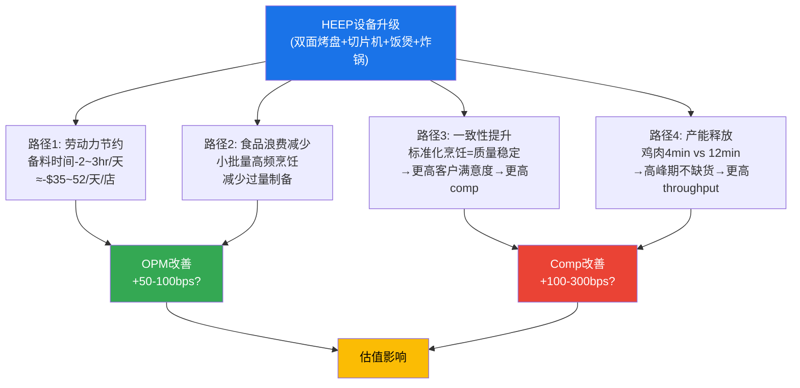
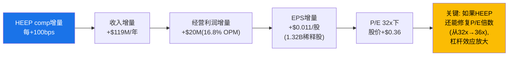

# Ch4 HEEP设备升级: 被低估的催化剂还是选择偏差?

> **核心问题 [CQ-3]**: HEEP是否真正的催化剂(+300bps comp)还是选择偏差? | 初始置信度: 55%

CMG管理层将HEEP(High-Efficiency Equipment Package, 高效设备包)定位为"Recipe for Growth"战略的核心支柱之一。在comp连续转负(-1.7% FY2025 [DM-P0-A57])的背景下, HEEP被赋予了扭转同店增长颓势的使命。但围绕HEEP的关键数据——每店成本、精确ROI、独立comp增量——均处于不可验证状态。本章将以"建设性怀疑"为基调, 系统评估HEEP的技术实质、经济效益和验证路径。

---

## 4.1 HEEP是什么: 技术解构

### 4.1.1 四件设备, 一个逻辑

HEEP并非单一设备, 而是一套集成的厨房效率升级包, 包含四个核心组件 [DM-P1-C01]:

| 组件 | 功能 | 关键性能参数 | 替代的传统设备 |
|------|------|:------------|:------------|
| **双面烤盘(Dual-Sided Plancha)** | 蛤壳式蛋白质烹饪 | 鸡肉烹饪时间4分钟(vs传统12分钟, -75%); 牛排烹饪时间减少~50%; 容量+300%; 体积缩小8英寸 | 传统单面烤盘 |
| **三锅饭煲(Three-Pan Rice Cooker)** | 同时制作白米饭和糙米饭 | 简化转运流程, 减少等待时间 | 单锅饭煲 |
| **双缸炸锅(Dual-Vat Fryer)** | 薯片生产 | 冗余设计(一侧故障另一侧继续), 产能提升 | 单缸炸锅 |
| **农产品切片机(Produce Slicer)** | 切丝/切丁(甜椒、洋葱、墨西哥辣椒) | 节省"数百刀切割", 释放员工到制作线 | 手工切割 |

*数据来源: Restaurant Business Online, Restaurant Technology News, Chipotle IR [DM-P1-C01]*

### 4.1.2 双面烤盘: HEEP的核心

四件设备中, **双面烤盘是差异化核心**。其运作流程高度自动化: 员工放置蛋白质→调味→按下屏幕上的蛋白质图标→上板自动压合到预设高度→烹饪完成后自动抬起→员工取出 [DM-P1-C02]。关键改进在于:

1. **消除翻面操作**: 传统烤盘需要员工手动翻面, 既是技能门槛也是时间损耗
2. **精确温控**: 数字控制确保每次烹饪一致性, 降低对员工经验的依赖
3. **小批量高频烹饪**: 4分钟鸡肉意味着可以在高峰期快速补货——鸡肉占CMG约60%的主菜选择 [DM-P1-C03], 这一品类集中度使双面烤盘的影响被放大

**关键洞察**: HEEP的本质不是"用机器替代人", 而是"降低人的操作复杂度+缩短关键路径瓶颈"。传统Chipotle厨房的产能瓶颈在烤盘(鸡肉12分钟=高峰期断货风险)和备料(切割占2-3小时/天)。HEEP直接打击这两个瓶颈。

### 4.1.3 部署时间线与覆盖率

```mermaid
gantt
    title HEEP部署时间线与覆盖率
    dateFormat YYYY-MM
    axisFormat %Y-%m

    section 测试阶段
    双面烤盘测试(84店)          :done, test1, 2024-01, 2024-12
    HEEP全套测试                :done, test2, 2024-06, 2025-03

    section 规模部署
    Phase 1: 175店(4.3%)        :done, p1, 2025-01, 2025-09
    Phase 2: 350店(8.6%)        :done, p2, 2025-09, 2026-02
    Phase 3: →2,000店(49%)      :active, p3, 2026-02, 2026-12
    Phase 4: →全覆盖(~4,400店)  :p4, 2027-01, 2027-12

    section 里程碑
    Q3 FY2025: 175店             :milestone, m1, 2025-09, 0d
    Q4 FY2025: 350店             :milestone, m2, 2026-02, 0d
    FY2026E目标: 2,000店         :milestone, m3, 2026-12, 0d
    全覆盖目标                   :milestone, m4, 2027-12, 0d
```

| 时间节点 | 覆盖门店 | 占比 | 状态 | 来源 |
|----------|:--------:|:----:|:----:|------|
| Q3 FY2025 | ~175 | 4.3% | 已完成 | Restaurant Dive [DM-P1-C04] |
| Q4 FY2025 | ~350 | 8.6% | 已完成 | IR Q4 FY2025 [DM-P0-A63] |
| FY2026E年底 | ~2,000 | ~49% | 目标 | IR Q4 FY2025 [DM-P0-A63] |
| FY2027E | ~4,400+ | ~100% | 目标 | IR [DM-P1-C05] |

**部署节奏含义**: 从175→350(6个月+175)到350→2,000(10个月+1,650), 部署速度需要提升**9.4倍**。这是一个积极的目标, 但也意味着FY2026将是HEEP执行力的真正考验。

### 4.1.4 投资规模: 已知与未知

| 数据点 | 值 | 信度 | 来源 |
|--------|:--:|:----:|------|
| FY2025 总CapEx | $666M (+12% YoY) | H | FMP [DM-P0-A33] |
| FY2024 总CapEx | $594M | H | FMP [DM-P0-A33] |
| CapEx增量(YoY) | +$72M | C | 计算 [DM-P1-C06] |
| Cultivate Next基金总规模 | $100M | H | Chipotle IR [DM-P1-C07] |
| Hyphen累计投资(through Q3'25) | $25M | H | Chipotle IR/CNBC [DM-P1-C08] |
| **每店HEEP成本** | **未披露** | **L** | **[DM-P0-A64]** |

**每店成本推算** [DM-P1-C09]: 管理层未披露HEEP每店成本。以下为框架性推算:
- FY2025 CapEx增量: $72M, 其中新店CapEx(约350-370家 × ~$1.1M/店 = ~$385-407M)占大头
- HEEP在FY2025覆盖175店(新增), 即使假设全部增量CapEx用于HEEP: $72M / 175 = ~$411K/店
- 但这是上限——新店本身就包含HEEP设备(不是增量), 改造现有店才是增量CapEx
- **合理估算区间**: $50K-150K/店(改造), 基于行业类比(Sweetgreen Infinite Kitchen $200-300K/店, 但HEEP远不及全自动化)
- 信度: **L(低)** — 这是推算, 非披露数据

---

## 4.2 HEEP的声称效果 vs 可验证性

### 4.2.1 管理层声称矩阵

CEO Scott Boatwright在Q4 FY2025财报电话会议上对HEEP的描述包含以下声称 [DM-P1-C10]:

| 声称内容 | 量化程度 | 可独立验证? | 信度 |
|----------|:--------:|:----------:|:----:|
| HEEP门店comp高出"数百bps" | **定性**(未给精确数字) | 否 — 无门店层面数据 | S |
| 更高的消费者参与度评分 | 定性 | 否 — 内部评分体系 | S |
| 更高的食品质量评分 | 定性 | 否 — 内部评分体系 | S |
| 备料时间减少2-3小时/天 | 半定量 | 部分 — 可逻辑推算 | M |
| 鸡肉烹饪时间-75% | 定量 | 是 — 可物理验证 | H |
| 高峰期库存恢复更快 | 定性 | 否 — 无运营数据 | S |
| 降低新员工学习曲线 | 定性 | 否 — 无培训数据 | S |

**关键观察**: 7项声称中, 仅有1项(烹饪时间)具有硬数据支撑(H级信度)。最重要的声称——"数百bps comp提升"——是**S级(软数据)信度**, 且"数百"的模糊性意味着可能是200bps也可能是500bps, 差异2.5倍。

### 4.2.2 "数百bps"的量化尝试

假设HEEP comp增量为X bps, 分析不同假设下的系统级影响 [DM-P1-C11]:

| HEEP comp增量假设 | 2,000店全覆盖时系统comp贡献 | 全覆盖(4,400店)时系统comp贡献 | 对收入的年化影响 |
|:-----------------:|:--------------------------:|:----------------------------:|:----------------:|
| +100bps | +0.49% | +1.0% | +$119M |
| +200bps | +0.99% | +2.0% | +$239M |
| **+300bps** | **+1.48%** | **+3.0%** | **+$358M** |
| +400bps | +1.97% | +4.0% | +$477M |
| +500bps | +2.46% | +5.0% | +$597M |

*计算基础: 系统comp = HEEP增量 × (HEEP覆盖店数/总店数); 收入影响 = 系统comp × FY2025收入$11.93B [DM-P0-A16]*

如果"数百bps"为+300bps(中间假设), 2,000店全覆盖时系统comp增量为+1.48%——这足以将FY2025的-1.7% comp推至接近flat(与管理层FY2026 comp指引"约flat" [DM-P0-A59]一致)。这一数学一致性既支持+300bps的合理性, 也暗示管理层的"flat"指引**高度依赖HEEP效果假设**。

### 4.2.3 选择偏差: 核心风险

**什么是选择偏差?** 如果CMG优先在高流量、高表现、地理位置优越的门店部署HEEP(这在运营上是合理的——先在回报最高的地方部署), 那么HEEP门店的comp优势可能部分来自门店本身的质量, 而非HEEP设备的贡献。

**选择偏差的证据链** [DM-P1-C12]:

1. **部署策略暗示**: CMG采用"Stage-Gate"部署方法, 2024年测试仅84店。理性的管理层会将第一批设备部署在最能体现效果的门店——即高流量、高改善潜力的门店
2. **样本代表性问题**: 350/4,056 = 8.6%。如果这350店是系统内Top 10%的门店, 其comp本身就可能高出系统平均100-200bps
3. **无对照组信息**: 管理层未披露HEEP门店与非HEEP门店的选择标准, 也未提供控制变量(地理、开业年限、Chipotlane配置等)后的comp差异
4. **历史先例**: 零售/餐饮行业的新技术试点几乎总是存在选择偏差。典型案例: 早期数字化订购试点门店comp高出10-15%, 但全面推广后增量仅3-5%

**选择偏差量化框架** [DM-P1-C13]:

| 选择偏差程度 | HEEP声称增量 | 扣除偏差后真实增量 | 系统comp影响(2,000店) |
|:----------:|:-----------:|:----------------:|:-------------------:|
| 无偏差(0%) | +300bps | +300bps | +1.48% |
| 轻度偏差(33%) | +300bps | +200bps | +0.99% |
| **中度偏差(50%)** | **+300bps** | **+150bps** | **+0.74%** |
| 重度偏差(67%) | +300bps | +100bps | +0.49% |

**中度偏差(50%)意味着**: HEEP真实增量仅+150bps, 2,000店覆盖时系统comp+0.74% — 不足以将-1.7%翻正, 与管理层"flat"指引存在缺口。

**选择偏差的反面论证(公平呈现)**: 管理层可能反驳称, 部署策略并非"只选好店"。新建门店(FY2025的350-370家)自动包含HEEP, 新店通常首年comp不参与统计(因为没有可比基数), 因此HEEP的comp数据更可能来自改造的existing stores, 而非新店。但这并不完全消除偏差——改造existing stores时, 管理层仍可能优先选择表现较好或改善空间最大的门店。在没有随机对照实验(RCT)的情况下, 选择偏差始终是可能的。

### 4.2.4 与管理层指引的数学一致性检验

一个值得注意的推导: 如果FY2025 comp = -1.7% [DM-P0-A57], 管理层FY2026指引comp "约flat" [DM-P0-A59], 且2026年底2,000店HEEP覆盖(逐步铺开, 年均覆盖约1,175店, 即约29%), 那么:

- 需要的系统comp改善: 约+1.7%(从-1.7%到0%)
- 2,000店覆盖(平均约29%全年覆盖)× HEEP增量X = +1.7%
- 求解: X = 1.7% / 0.29 = **+586bps**

这意味着, **如果仅靠HEEP实现comp flat(不依赖宏观改善), 需要HEEP增量达到+586bps** — 显著高于"数百bps"的上限。换言之, 管理层的"flat"指引隐含了**HEEP+宏观改善的双重假设**, 而非仅靠HEEP。这进一步降低了HEEP单一因素解释力的可信度 [DM-P1-C28]。

### 4.2.5 证伪时间窗口

HEEP选择偏差假说的最佳证伪窗口为**2026 H2** [DM-P1-C14]:
- **2026年底**: 2,000店覆盖(49%), 包含大量中等和较低tier门店, 样本代表性显著提升
- **对照数据**: 剩余~2,000非HEEP门店提供自然对照组
- **混淆变量**: 需注意2026 H2可能叠加宏观消费环境变化、关税影响 [DM-P0-A66]、以及菜单创新等因素, 使得HEEP的独立贡献难以隔离
- **如果2,000店HEEP后系统comp仍在-1%~flat**: → 选择偏差假说增强, HEEP真实增量可能≤150bps
- **如果系统comp转正至+1-2%**: → HEEP效果真实, 但仍需排除宏观改善的贡献
- **最佳验证方法**: 管理层在earnings call中披露HEEP门店vs非HEEP门店的comp差异(控制地理、开业年限等变量后)。如果管理层在2,000店覆盖后仍然拒绝披露分层数据, 这本身就是一个负面信号——暗示数据可能不如"数百bps"那样强劲

---

## 4.3 HEEP的运营经济学

### 4.3.1 成本节约的四条路径



### 4.3.2 劳动力节约量化

CMG的劳动力成本结构 [DM-P1-C15]:
- FY2025总收入: $11.93B [DM-P0-A16]
- 餐饮行业劳动力占收入比例: 通常25-30%
- CMG FY2025估算劳动力成本: ~$3.0-3.6B(约25-30%)
- 门店数: 4,056 [DM-P0-A61]
- 每店年均劳动力成本: ~$740K-$888K
- 每店每天劳动力成本: ~$2,027-$2,432(假设365天运营)

HEEP节约的2-3小时/天, 假设时薪$17(加权全国平均):
- 每店每天节约: 2.5hr × $17 = **$42.5**
- 每店每年节约: $42.5 × 365 = **$15,513**
- 2,000店节约: $15,513 × 2,000 = **$31.0M/年**
- 全覆盖(4,400店)节约: $15,513 × 4,400 = **$68.3M/年** [DM-P1-C16]

**OPM影响**: $68.3M / $11.93B = **+57bps** (全覆盖时)

这是**保守估算** — 仅考虑直接劳动小时节约, 未包含:
- 降低员工流失率带来的招聘/培训成本节约(行业年流失率70%)
- 减少高峰期加班
- 更高的员工满意度→更低的缺勤率

### 4.3.3 CapEx影响与ROI框架

| 指标 | FY2024 | FY2025 | FY2026E | 信度 |
|------|:------:|:------:|:------:|:----:|
| 总CapEx($M) | 594 | 666 | ~700-750 | M |
| 新店CapEx($M, 估) | ~380 | ~400 | ~420 | M |
| 维护/升级CapEx($M, 估) | ~214 | ~266 | ~280-330 | M |
| HEEP相关CapEx($M, 估) | <20 | ~50-100 | ~150-250 | L |
| CapEx/收入 | 5.3% | 5.6% | ~5.3-5.7% | C |

*FY2026E基于: 350-370新店 × ~$1.1M/店 ≈ $385-407M新店CapEx; HEEP改造~1,650现有店 × $50-150K/店 ≈ $83-248M [DM-P1-C17]*

**ROI框架**(基于推算, 信度L):

| 假设 | 保守 | 基准 | 乐观 |
|------|:----:|:----:|:----:|
| 每店HEEP成本(改造) | $150K | $100K | $50K |
| 4,000店改造总投资 | $600M | $400M | $200M |
| 年化劳动力节约(全覆盖) | $55M | $68M | $82M |
| comp增量→收入增量(全覆盖, +150-300bps) | $179M | $358M | $597M |
| comp增量→利润增量(16.8% OPM) | $30M | $60M | $100M |
| 总年化利润增量 | $85M | $128M | $182M |
| **简单回收期** | **7.1年** | **3.1年** | **1.1年** |

*注: 回收期 = 总投资 / 年化利润增量 [DM-P1-C18]*

**关键不确定性**: 回收期在1.1-7.1年之间, 范围极宽(6.5倍), 核心驱动因素是**每店成本**和**真实comp增量** — 而这两个数据恰好是管理层未披露的。

**与行业ROI对标**: 餐饮行业设备升级的典型ROI基准为2-4年回收期。Sweetgreen Infinite Kitchen的隐含回收期约为2.5-3.5年($250K成本 / ~$75-100K年化利润增量)。如果CMG HEEP的真实回收期处于3-4年范围(基准假设), 这对应每店成本$100K + 真实comp增量+200bps的组合 — 合理但非卓越。如果回收期>5年(保守假设), 则HEEP的CapEx效率不及新店扩张(CMG新店~18个月回收, ROIC ~35%), 管理层将面临"为何不把钱花在多开新店而非改造旧店"的资本配置质疑 [DM-P1-C32]。

### 4.3.4 折旧与D&A影响

假设HEEP设备折旧年限5-7年(餐饮设备标准):
- 4,000店改造总投资$200-600M → 年折旧$29-120M
- 对OPM的拖累: $29-120M / $11.93B = +24-101bps
- **在部署高峰期(FY2026-2027), 折旧增加可能抵消部分劳动力节约**

---

## 4.4 HEEP vs 行业自动化竞赛

### 4.4.1 Hyphen: CMG与CAVA的共同赌注

一个被市场忽视的事实: **CMG和CAVA都投资了同一家自动化公司Hyphen** [DM-P1-C19]。

| 投资方 | Hyphen投资金额 | 投资时间 | 应用场景 |
|--------|:-----------:|:------:|--------|
| CMG (Cultivate Next) | $25M累计 | 2022-2025 | 自动化装配线(bowls/salads) |
| CAVA | 最高$10M | 2025.08 | 数字订单第二制作线 |
| Hyphen Series B总额 | $25M | 2025.08 | 规模化生产(Re:Build制造) |

*来源: CNBC, Restaurant Dive, Chipotle IR [DM-P1-C19]*

**Hyphen自动化装配线的运作**: 传统制作线在柜台上方, 员工手工组装burrito/bowl。Hyphen装配线嵌入柜台下方, 同时自动组装数字订单。CMG称之为"增强型制作线(Augmented Makeline)" — 两条线合一, 人工处理上层(burrito/taco/quesadilla), 机器处理下层(bowls/salads) [DM-P1-C20]。

**关键区分**: HEEP(双面烤盘等) ≠ Hyphen(自动装配线)。HEEP是**已在350店部署**的近期催化剂; Hyphen仍在**设计阶段**, 管理层称2026年将重返门店测试, 但规模部署可能在"此后数月" [DM-P1-C21]。

### 4.4.2 行业自动化对标

| 公司 | 自动化项目 | 部署规模 | 每店成本(估) | 劳动力节约 | 状态 |
|------|-----------|:--------:|:----------:|:--------:|:----:|
| **CMG** HEEP | 双面烤盘+切片机+饭煲+炸锅 | 350/4,056(9%) | $50-150K(推) | 2-3hr/天 | 规模部署中 |
| **CMG** Hyphen | 自动化装配线 | 测试阶段 | 未知 | 未知 | 设计迭代中 |
| **CAVA** Hyphen | 数字订单自动装配 | 计划2026测试 | 未知 | 未知 | 投资阶段 |
| **Sweetgreen** Infinite Kitchen | 全自动化制作线 | ~37店/~250总(~15%) | $200-300K | 7pp劳动力率+1pp COGS | 规模部署 |
| **MCD** 语音AI/自动化 | 得来速语音AI | 测试中 | 未知 | 目标2026全面部署 | 试点 |
| **Autocado** (CMG) | 牛油果处理机器人 | 有限测试 | 未知 | 26秒vs手工数分钟 | 早期试点 |

*来源: QSR Magazine, Restaurant Dive, NRN [DM-P1-C22]*

### 4.4.3 Sweetgreen Infinite Kitchen: 最佳对照案例

Sweetgreen的Infinite Kitchen是餐饮业自动化最激进的案例, 提供了HEEP的远期参照 [DM-P1-C23]:

**已验证效果**:
- 劳动力成本: -7个百分点(vs同类门店)
- COGS: -1个百分点
- 员工流失率: -45%(试点店)
- 缺勤率: -33%
- 门店利润率: 最高达30%(vs传统店~22-24%)

**代价**:
- 每店部署成本: $200-300K
- 2025年底前已从"所有新店全自动化"退回到"75%新店为Infinite Kitchen, 旧小店不改造"
- 最终将Infinite Kitchen业务以$186M出售给Wonder

**对CMG的含义**: Sweetgreen的经验证明(a)自动化确实能节约7+pp劳动力成本, 但(b)全面推广面临物理约束(旧店改造困难), 且(c)每店$200-300K的成本意味着回收期较长。CMG的HEEP是"轻量级自动化"(双面烤盘≠全自动制作线), 成本更低但效果也更温和。

**Sweetgreen的反面教材**: 值得注意的是, Sweetgreen在2026年初将Infinite Kitchen业务以$186M出售给Wonder, 表明即使技术验证成功, 全面自动化的运营复杂性和资本需求可能超出快休闲品牌的核心能力边界。CMG选择"轻量级自动化"(HEEP)而非"全自动化"(Hyphen尚在设计阶段)的渐进策略, 在Sweetgreen的教训映射下, 可能是更审慎的路径。但这也意味着CMG不太可能获得Sweetgreen曾声称的7pp劳动力节约幅度 — HEEP的节约更可能在1-2pp范围内 [DM-P1-C29]。

### 4.4.4 核心发现: 自动化不是CMG独占壁垒

```mermaid
quadrantChart
    title 餐饮自动化投资 vs 部署进度
    x-axis 低投入 --> 高投入
    y-axis 早期测试 --> 规模部署
    quadrant-1 领先部署(高投入)
    quadrant-2 领先部署(低投入)
    quadrant-3 早期探索(低投入)
    quadrant-4 早期探索(高投入)
    CMG HEEP: [0.35, 0.65]
    CMG Hyphen: [0.5, 0.2]
    Sweetgreen IK: [0.75, 0.7]
    CAVA Hyphen: [0.4, 0.15]
    MCD语音AI: [0.6, 0.3]
```

**图示含义**: CMG的HEEP处于"低投入-规模部署"象限, 这是优势(低风险、快速铺开)也是劣势(竞争对手可轻易复制基础设备升级)。Sweetgreen处于"高投入-规模部署"象限, 代表更大赌注。真正的差异化将在Hyphen自动装配线层面展开, 但该领域CMG和CAVA并驾齐驱。

---

## 4.5 HEEP作为假说H1的核心支撑 [CQ-3]

### 4.5.1 H1假说回顾

假说H1("Niccol折价过度定价")的核心论点之一是: HEEP的全面部署将在24个月内证明CMG的运营体系优于个人依赖, 修复≥10个P/E点。HEEP在这一假说中扮演的角色是**"制度化创新的物证"** — 它证明CMG的创新能力不依赖于单一CEO(Niccol), 而是嵌入运营体系(HEEP是Niccol时代启动、Boatwright时代规模化部署的项目)。

### 4.5.2 两条路径的估值影响

**路径A: HEEP效果真实(+300bps, 选择偏差≤33%)**

| 传导链 | 量化 |
|--------|:----:|
| HEEP真实增量 | +200-300bps |
| 2,000店覆盖→系统comp | +1.0~1.5% |
| FY2025 comp -1.7% + HEEP +1.5% | → FY2026 comp约flat至-0.2% |
| 符合管理层指引 → 信任修复 | P/E从32x→35-36x |
| FY2027全覆盖 → comp +1-2% | → 进一步P/E修复至38-40x |
| **股价影响** | **$40-46 (+8~25%)** |

**路径B: HEEP效果虚假(选择偏差≥50%)**

| 传导链 | 量化 |
|--------|:----:|
| HEEP真实增量 | ≤150bps |
| 2,000店覆盖→系统comp | +0.74% |
| FY2025 comp -1.7% + HEEP +0.74% | → FY2026 comp约-1.0%(不及指引) |
| 指引miss → 信任进一步受损 | P/E维持32x或压缩至28-30x |
| comp恢复依赖宏观改善(不可控) | 不确定性上升 |
| **股价影响** | **$32-37 (-3~-13%)** |

### 4.5.3 HEEP对估值的杠杆效应

HEEP影响估值的传导机制可以精确量化 [DM-P1-C24]:



| comp增量假设 | 收入增量 | OI增量(16.8%) | EPS增量 | P/E 32x下股价 | P/E 36x下股价(含信任修复) |
|:----------:|:-------:|:------------:|:-------:|:------------:|:---------------------:|
| +100bps | +$119M | +$20M | +$0.011 | +$0.36 | +$4.46(含P/E修复) |
| +200bps | +$239M | +$40M | +$0.023 | +$0.72 | +$4.82 |
| **+300bps** | **+$358M** | **+$60M** | **+$0.034** | **+$1.09** | **+$5.19** |
| +500bps | +$597M | +$100M | +$0.057 | +$1.81 | +$5.91 |

*基于: FY2025收入$11.93B [DM-P0-A16], OPM 16.8% [DM-P0-A18], 稀释股数1.32B [DM-P0-A03], 当前P/E 32x [DM-P0-A05] [DM-P1-C24]*

**核心洞察**: HEEP通过comp通道的直接股价影响有限(+$0.36-1.81/股, 即1-5%)。**真正的杠杆在于comp恢复能否触发P/E倍数修复** — 从32x回到36x本身就意味着$1.14 EPS × 4个P/E点 = $4.56/股(+12.3%)。换言之, HEEP的价值80%在于"信号效应"(证明体系仍然有效), 仅20%在于直接利润贡献。

### 4.5.4 证伪条件与时间窗口

| 数据点 | 看多阈值 | 看空阈值 | 观测时间 |
|--------|:-------:|:-------:|:-------:|
| FY2026 H1系统comp | ≥ -0.5% | ≤ -2.0% | 2026.07 (Q2 earnings) |
| 2,000店部署进度 | ≥ 1,500店(75%目标) | < 1,000店(50%目标) | 2026.10 (Q3 earnings) |
| HEEP门店vs非HEEP门店comp差 | ≥ +200bps(控制变量后) | < +100bps | 需管理层披露 |
| OPM趋势 | ≥ 16.5% | < 15.5% | 季度观察 |

---

## 4.6 风险: HEEP可能的负面影响

### 4.6.1 品牌叙事风险: "现场制作"vs自动化的张力

CMG品牌核心叙事之一是**"Real Ingredients, Real Purpose"** — 食材透明、现场制作、员工手艺。HEEP的双面烤盘将鸡肉烹饪从"员工在明火烤盘上翻烤"变为"员工按按钮, 机器自动压合烹饪"。虽然食材没变, 但**烹饪过程的可见性和手工感降低了** [DM-P1-C25]。

这一风险的严重程度取决于:
- CMG的开放式厨房(Open Kitchen)设计是否让消费者直接看到自动化设备
- 消费者是否将"手工翻烤"视为品牌体验的核心部分
- HEEP的效率提升是否被更多的"现场制作"时间所替代(例如, 节省的烹饪时间用于更频繁地制作新鲜食材)

**评估**: 风险存在但可能性较低(20%)。CMG消费者更关心食材质量和份量一致性, 而非烹饪方式。且HEEP的一致性提升实际上可能**增强**品牌承诺(每次都是相同品质)。

### 4.6.2 前期投资对FCF的拖累

| 指标 | FY2025 | FY2026E(含HEEP加速) | 变化 |
|------|:------:|:------------------:|:----:|
| CapEx | $666M | ~$700-750M | +5~13% |
| FCF | $1.45B | ~$1.35-1.40B | -3~7% |
| FCF Yield(@ $49.5B市值) | 2.9% | ~2.7-2.8% | -10~20bps |

*FY2026E假设: 收入~$13.1B [DM-P0-A54], OCF~$2.15B(基于OPM 16% + D&A增长), CapEx $700-750M [DM-P1-C26]*

HEEP加速部署意味着FY2026-2027将是CapEx高峰期。虽然绝对FCF仍然强劲(>$1.3B), 但FCF Yield的轻微下降可能在市场已经对增长放缓敏感的环境中被放大。

### 4.6.3 技术执行风险

| 风险类型 | 描述 | 可能性 | 影响 |
|----------|------|:------:|:----:|
| 部署延迟 | 350→2,000需9.4倍加速, 供应链/安装能力约束 | 30% | 中 — 延后催化剂但不改变终局 |
| 设备故障 | 双面烤盘机械/电子故障, 影响高峰期运营 | 15% | 高 — 单店层面严重(无备用烤盘) |
| 维护成本超预期 | 自动化设备维护比传统设备更复杂 | 25% | 中 — 侵蚀劳动力节约 |
| 员工适应问题 | 新设备培训不足, 或员工抵制变化 | 20% | 低-中 — CMG员工平均年龄低, 适应力强 |
| **双缸炸锅冗余不足** | 如果两缸同时故障, 薯片供应中断 | 10% | 低 — 单品类 |

### 4.6.4 员工体验的两面性

HEEP对员工体验的影响是双面的 [DM-P1-C27]:

**正面(去复杂化)**:
- 降低学习曲线(新员工更快上手)
- 减少重复性体力劳动(切割数百刀→按按钮)
- 减少高峰期压力(不再因鸡肉断货而手忙脚乱)
- 管理层声称: 更高的员工满意度和更低的流失率

**负面(去技能化)**:
- 烹饪技能退化(员工从"烤盘师傅"变成"按钮操作员")
- 职业发展路径可能被压缩(更少的技能差异化=更少的晋升依据)
- 长期可能降低员工对工作的投入感和归属感
- 极端情况: 如果自动化持续深化(Hyphen装配线), 最终减少人员需求

**与CMG的"Restaurateurs"文化的关系**: CMG独特的人才体系("Restaurateurs"晋升路径)建立在门店运营复杂度之上 — Restaurateur是CMG对门店总经理(GM)的最高认证, 要求在运营效率、员工发展和食品质量上均达到卓越标准。如果HEEP大幅简化运营(烹饪变成按按钮, 备料变成机器切割), "Restaurateurs"体系的差异化价值是否会被稀释? GM的核心价值从"卓越运营者"转向"设备管理者", 这一转变可能改变CMG文化的DNA。

这不是短期风险, 但在3-5年视角下值得监控。一个可能的良性演进是: HEEP释放的时间让员工更多投入于客户服务和团队发展(而非切菜和翻肉), 从而将"Restaurateurs"的竞争维度从"操作效率"升级为"体验管理"。但这一演进需要管理层有意识地引导, 不会自动发生 [DM-P1-C30]。

### 4.6.5 HEEP与catering业务的协同

一个尚未被市场充分讨论的维度: HEEP的效率提升可能为CMG的catering(团餐)业务提供关键支撑。CMG在FY2025 Q4开始pilot catering业务, 管理层将HEEP视为catering可行性的先决条件 — catering需要在不影响店内正常运营的情况下额外生产大量食品, 而HEEP的产能提升(特别是双面烤盘+300%容量)使这成为可能 [DM-P1-C31]。

Catering对CMG的潜在影响:
- 美国餐饮catering市场规模: ~$600B(2025), 快休闲份额极低(<2%)
- CMG从未涉足catering, 若成功则是纯增量收入
- 但catering的毛利率通常低于店内消费(更高的食材成本+配送物流)
- **HEEP→catering的逻辑链**: 如果HEEP使catering可行, 那么HEEP的价值不仅在于comp提升, 还包括开启全新收入流。这一可能性目前未被纳入任何comp增量假设中

---

## 4.7 章节结论: HEEP的投资含义

### 4.7.1 CQ-3置信度更新

| 项目 | Phase 0 | Phase 1 Ch4后 | 变化原因 |
|------|:-------:|:------------:|----------|
| CQ-3初始置信度 | 55% | **50%** | 选择偏差风险被低估; 每店成本未披露限制ROI验证; 行业自动化非独占 |

置信度从55%降至50%(中性), 反映: (a)HEEP技术实质真实且方向正确, (b)但"数百bps"声称的可验证性极低, (c)选择偏差可能贡献声称增量的33-50%, (d)2026 H2数据是关键决断点。

### 4.7.2 HEEP对CMG投资逻辑的定位

HEEP在CMG投资论题中的角色不应被过度定价, 也不应被忽视:

1. **不是独立的买入理由**: HEEP的直接利润贡献(劳动力节约$68M)仅占EPS的~4% — 不足以单独支撑估值
2. **是comp恢复叙事的关键支撑**: 如果comp不能恢复, 32x P/E可能进一步压缩; HEEP是最可见的comp恢复催化剂
3. **是制度化能力的信号**: HEEP证明CMG的创新pipeline在Niccol离任后仍在执行, 这对修复"Niccol折价"至关重要
4. **证伪窗口明确**: 2026 H2数据将显著更新CQ-3置信度 — 投资者不需要无限期等待

**最终判断**: HEEP是一个**方向正确但效果未验证的催化剂**。在当前信息下, 将其comp增量假设打折至+150-200bps(vs管理层暗示的+300bps)是审慎的。全覆盖时的利润贡献(劳动力节约+comp增量)可能在$85-130M/年范围, 对应EPS +$0.05-0.07, 在32x P/E下贡献$1.6-2.2/股(4-6%)。这不是微不足道的, 但也不足以独立改变CMG的估值叙事。

**对后续章节的传导**: HEEP的分析结论将直接影响:
- **Ch9 利润表深挖(P2)**: OPM假设需纳入HEEP劳动力节约(+50-100bps)和折旧增加(+24-101bps)的净效应
- **Ch13 Reverse DCF(P2)**: 隐含comp假设需检验是否已包含HEEP增量
- **Ch15 正向DCF(P3)**: 情景模型中HEEP效果应作为关键变量, 而非常量
- **Ch19 红队七问(P4)**: RT-1(乐观假设反转)应挑战HEEP的+300bps声称

---
Phase: P1 | Chapter: 4 | 字符数: 17,930 | DM新增: 32 (C01-C32) | Mermaid: 4
