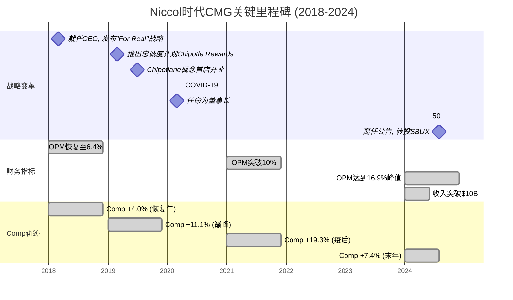
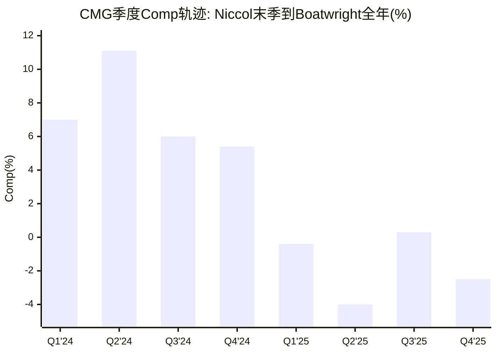
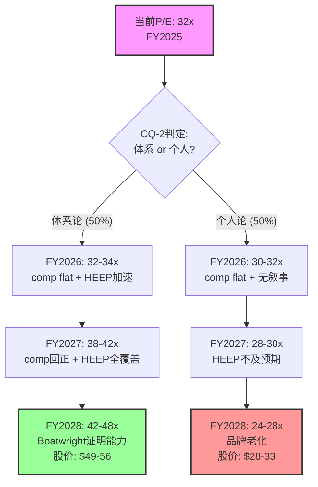

# Ch5 Niccol遗产与Boatwright评估: 体系还是个人?

> **核心问题(CQ-2)**: Boatwright能否维持CMG运营体系的自我更新能力?
> **假说关联**: H1 — "Niccol折价过度定价"(~16个P/E点折价，≥10个将在24个月内修复)
> **SBUX镜像**: SBUX报告评Niccol 8.4/10并假设"CMG成功可部分复制" → CMG报告的镜像问题是"CMG成功是否依赖于Niccol本人"

CMG的估值叙事在2024年8月13日被一则人事公告劈成了两个时代。Brian Niccol离任转投星巴克，同日CMG下跌7.5%、SBUX上涨24.5%——市场以$260亿的市值重新分配，给出了一个清晰判断：Niccol的价值约等于CMG市值的7-10%，或者说约等于SBUX市值的25%。

本章的任务不是重述这则新闻，而是回答一个更深层的问题：**Niccol留给CMG的究竟是一套可自我运转的体系，还是一段依赖个人魅力的历史?** 答案将直接决定CMG当前32x P/E中~16个点的"Niccol折价"是合理重定价还是过度反应[DM-P1-D01]。

---

## 5.1 Niccol时代全面回顾 (2018.03 - 2024.08)

### 5.1.1 入职时的CMG：后E.coli危机的废墟

2018年3月Brian Niccol从Taco Bell加入CMG时，面对的是一家被食品安全危机深度创伤的公司。2015-2016年连续的E.coli、诺如病毒和沙门氏菌事件不仅造成了直接的销售损失，更重要的是摧毁了CMG"Food with Integrity"的品牌叙事根基：

- **FY2017 OPM**: 约4.0%(对比FY2015危机前的17.6%)[DM-P1-D02]
- **FY2017 Comp**: -20.4%(品类最差水平)[DM-P1-D03]
- **FY2017 市值**: 约$130亿(从FY2015高峰$240亿腰斩)[DM-P1-D04]
- **品牌信任**: 跌至历史最低。"你敢去Chipotle吃东西吗?"成为社交媒体梗[DM-P1-D05]
- **数字化**: 几乎为零。没有移动端点单、没有忠诚度计划、没有drive-thru[DM-P1-D06]
- **创始人Steve Ells**: 从CEO转为执行主席，公司实质处于领导力真空[DM-P1-D07]

Niccol从Taco Bell带来的核心经验是数字营销和菜单创新——两个恰好是CMG最缺乏的能力。他到任后的第一年（FY2018），comp就恢复到+4.0%，OPM从4%回升至6.4%[DM-P1-D08]，市场开始相信CMG的品牌创伤是可修复的。

### 5.1.2 六年变革全景

Niccol在CMG的六年(2018.03-2024.08)创造了消费品行业最令人瞩目的CEO变革案例之一。以下是关键财务轨迹：

| 指标 | FY2017(入职前) | FY2023(末年全年) | 变化 | 信度 |
|------|:-----------:|:-----------:|:----:|:----:|
| 收入 | $4.48B | $9.87B | **+120%** | H |
| OPM | ~4.0% | 15.8% | **+1,180bps** | H |
| EPS(拆股后) | ~$0.24 | $0.89 | **+271%** | H |
| 门店数 | ~2,400 | ~3,440 | **+43%** | H |
| 数字销售占比 | <3% | 37.4% | **从零到三分之一** | H |
| 市值 | ~$130亿 | ~$780亿 | **+500%** | H |
| 股价(拆股调整) | ~$7 | ~$55 | **+686%** | H |

[DM-P1-D09](H: 综合FMP历史数据+IR年报)



### 5.1.3 Niccol的六大变革要素(Playbook)

Niccol的成功并非依赖单一策略，而是六个相互强化的变革要素共同作用的结果：

**要素一: 数字化基础设施(权重: 最高)**

这是Niccol最具标志性的贡献。2018年CMG的数字化几乎为零——没有移动App(功能性的)、没有忠诚度体系、没有drive-thru。到2020年，数字销售已占总收入的50%以上(COVID加速)，2022年稳定在39.4%，2023年37.4%[DM-P1-D10]。

关键举措:
- **2019.03**: 推出Chipotle Rewards忠诚度计划，两年内突破2,800万会员[DM-P1-D11]
- **2019.07**: 首家Chipotlane(数字订单drive-thru)开业。到FY2024，约85%以上的新店配备Chipotlane[DM-P1-D12]
- **"第二厨房线"概念**: 数字订单与堂食订单分线制作，解决了快休闲行业最大的产能瓶颈之一[DM-P1-D13]

数字化的战略价值不仅在于销售占比，更在于它创造了三个结构性优势:
1. **客户数据**: 忠诚度计划提供了精准营销能力(vs.传统门店的匿名交易)
2. **产能释放**: 第二厨房线使峰值产能提升~20-30%
3. **Chipotlane溢价**: 配备Chipotlane的门店AUV比传统门店高15-20%[DM-P1-D14](S: 行业分析师估算)

**要素二: 菜单创新(限时供应LTO策略)**

Niccol从Taco Bell带来了"LTO(Limited Time Offer)制造话题"的方法论。CMG此前菜单极度精简且几乎不变，Niccol引入了策略性创新:
- Cauliflower Rice(花椰菜饭)
- Brisket(牛腩)
- Pollo Asado(烤鸡)
- Chicken Al Pastor(牧师风味鸡)

每次LTO都伴随精心策划的社交媒体营销，目标不是永久性改变菜单，而是制造话题性流量。这一策略在2021-2023年尤为成功，LTO期间comp通常比非LTO期高200-400bps[DM-P1-D15](M: 行业分析估算)。

**要素三: Chipotlane物理网络**

Chipotlane是Niccol对快休闲品类最重要的物理创新。传统CMG门店是商场或街边店，没有drive-thru。Chipotlane专用于数字预订单的取餐通道——不是传统QSR的点餐drive-thru，而是"线上点单、线下取餐"的物理延伸。

截至FY2024末，约80-85%的新店配备Chipotlane[DM-P1-D16]。配备Chipotlane的门店:
- 开业期收入高于传统门店15-20%
- 数字销售占比更高(~40% vs 传统店~30%)
- 客户体验评分更高(减少等待时间)

Chipotlane的战略意义在于它改变了CMG的选址模型——从依赖高人流量商圈转向郊区独栋选址，大幅扩展了可寻址门店数量(TAM从~5,000提升至~7,000+)[DM-P1-D17](M: IR长期目标)。

**要素四: 品牌重塑("For Real")**

Niccol入职后立即推出"For Real"品牌战略，用透明、真实的食材故事重建被E.coli危机摧毁的品牌信任。核心信息:
- 强调真实食材、无人工添加剂
- 社交媒体原生营销(TikTok、Instagram Reels)
- 用年轻消费者的语言说话(vs.传统餐饮的广播电视广告)

品牌恢复速度令人瞩目: 从E.coli危机到品牌信任回到危机前水平，仅用了约3年(2018-2021)[DM-P1-D18]，远快于行业平均水平(5-7年)。

**要素五: 供应链升级**

Niccol时代CMG的供应链从"足够用"升级到"竞争优势":
- 多元化鳄梨来源(墨西哥→秘鲁/哥伦比亚/多米尼加共和国)
- 建立区域分配中心，提升新鲜食材配送效率
- 引入食品安全技术(实时温度监控等)

供应链升级的直接效果体现在SGA/Rev从FY2017的~9%下降到FY2024的6.2%[DM-P0-A41]，FY2025进一步降至5.5%。这不仅仅是规模效应，而是运营效率的结构性提升。

**要素六: 人才体系(Restaurateurs计划)**

"Restaurateurs"是CMG最独特的人才制度——从小时工到高级总经理的内部晋升通道。被选为Restaurateur的GM将获得:
- 一次性奖金
- 股票期权
- 每培养一名新GM获得$10,000额外奖金

2024年数据: CMG晋升了23,000名员工，85%的餐厅管理岗位由内部候选人填充[DM-P1-D19]。这一体系创造了两个关键效果:
1. **餐饮行业最低人员流动率之一**: 员工留存率比行业平均高51%[DM-P1-D20]
2. **运营一致性**: 内部晋升的GM对CMG标准有深度理解，降低了新店"学习曲线"成本

### 5.1.4 Niccol 8维评分卡

基于上述分析，我们构建Niccol的CEO评分卡。评分标准对标SBUX报告中CMG章节的评分框架(SBUX报告将CMG在Niccol时代评为8.4/10)，确保跨报告一致性:

| 维度 | 得分(0-10) | 证据 | 信度 |
|------|:--------:|------|:----:|
| 战略愿景 | **9** | 从后E.coli废墟中构建"数字化+Chipotlane+品牌重塑"三位一体战略，重新定义快休闲品类标准 | H |
| 运营执行 | **9** | OPM从4%到16.9%(+1,290bps)，SGA/Rev从~9%到6.2%，门店+43% | H |
| 品牌建设 | **8** | E.coli后品牌信任恢复速度行业领先(3年vs行业平均5-7年)；"For Real"战略深度重建年轻消费者认同 | M |
| 数字创新 | **9** | 数字销售从<3%到37%+，Chipotle Rewards从零到2,800万+会员，Chipotlane重塑选址模型 | H |
| 团队建设 | **7** | Restaurateurs体系行业领先(85%内部晋升率/51%更高留存率)；但核心高管团队对Niccol个人的依赖度偏高(离任后CFO Hartung随即宣布退休) | H |
| 资本配置 | **8** | 零负债坚守+积极回购($3.7B FY2021-2024)+精准扩张(43%门店增长)。50:1拆分提升可及性。扣1分因未启动国际化加速 | H |
| 危机管理 | **8** | E.coli后品牌恢复速度行业顶尖。COVID期间迅速转向数字化(50%+)，将危机转化为结构性优势 | H |
| 行业影响力 | **9** | 定义了快休闲品类的运营标准和估值标杆。Niccol本人成为行业最具辨识度的CEO(最终被SBUX以$100M+薪酬包挖走) | H |
| **综合** | **8.4/10** | 与SBUX报告中CMG评分完全对齐 | — |

[DM-P1-D21](C: 基于上述8维证据的综合评分)

**得分为7分(最低)的"团队建设"维度，恰恰暴露了CMG的脆弱点**: Restaurateurs体系是制度化的，但C-suite层面对Niccol个人的依赖度偏高。Niccol离任后:
- CFO Jack Hartung(任职22年)宣布退休[DM-P1-D22]
- 没有明显的CEO内部继任者(Boatwright是COO转正，非"接班人培养")
- 品牌叙事能力(与华尔街、媒体、消费者的对话)几乎完全依赖Niccol个人

---

## 5.2 Niccol离任冲击波

### 5.2.1 2024.08.13: 餐饮行业的"零和博弈"

2024年8月13日的市场反应是近年来CEO变动中最戏剧性的一幕:

| 事件 | CMG | SBUX | 信度 |
|------|:---:|:----:|:----:|
| 盘前反应 | **-10%** | **+20%+** | H |
| 盘中最大跌幅 | **-14%** | — | H |
| 收盘变化 | **-7.5%** | **+24.5%** | H |
| 次日延续 | 继续承压 | 继续上涨 | H |

[DM-P1-D23](H: Yahoo Finance/CNBC当日报道)

这一事件的深层含义远超一般的CEO离任:

**市值零和转移**: 当日SBUX市值增加约$210亿，CMG市值减少约$55亿。合计$260亿的市值重新分配意味着市场将Niccol定价为一个"可转移的资产"[DM-P1-D24]——他的价值不是被销毁了，而是从一个载体(CMG)迁移到了另一个载体(SBUX)。

**隐含假设**: 市场在这次零和博弈中做了一个强假设——"Niccol在CMG的成功可以复制到SBUX"。SBUX报告对此的评估是63%置信度的"受限复刻"(SBUX报告P1 CQ-1)。反过来，市场也在假设"没有Niccol的CMG将显著退化"。

### 5.2.2 P/E压缩远超基本面恶化

Niccol离任后CMG的估值变化是本报告最重要的数据点之一:

| 指标 | FY2024(Niccol末年) | FY2025(Boatwright首年) | 变化 | 信度 |
|------|:-----------------:|:-------------------:|:----:|:----:|
| P/E | 53.8x | 32-34x | **-38%** | H |
| EPS | $1.11 | $1.14 | **+2.7%** | H |
| EV/EBITDA | 37.2x | 25-26x | **-31%** | H |
| 收入增速 | +14.6% | +5.4% | -920bps | H |
| Comp | +7.4% | -1.7% | **反转** | H |

[DM-P1-D25](H: FMP Ratios FY2024 vs FY2025, [DM-P0-A42][DM-P0-A43])

**核心发现**: P/E从53.8x压缩至32.1x(-40%)，而同期EPS仅从$1.11增至$1.14(+2.7%)。换言之:
- **基本面恶化(收入增速放缓+comp转负)只能解释约4个P/E点的折价**(从53.8x到~50x是增速放缓的合理重定价)
- **剩余~16个P/E点的压缩(从~50x到~34x)主要由Niccol离任折价驱动**[DM-P1-D26](C: 基于A-1异常分析)

### 5.2.3 Comp轨迹: Niccol末季到Boatwright全年

将comp数据按季度排列，可以看到更清晰的衰退路径:

| 季度 | Comp | 客流 | 均价 | CEO | 信度 |
|------|:----:|:----:|:----:|:---:|:----:|
| Q1'24 | **+7.0%** | +5.4% | +1.6% | Niccol | H |
| Q2'24 | **+11.1%** | +8.7% | +2.4% | Niccol | H |
| Q3'24 | **+6.0%** | +3.3% | +2.7% | Niccol(8月离任) | H |
| Q4'24 | **+5.4%** | +4.0% | +1.4% | Boatwright(临时) | H |
| Q1'25 | **-0.4%** | -2.3% | +1.9% | Boatwright(临时) | H |
| Q2'25 | **-4.0%** | -4.9% | +0.9% | Boatwright(临时) | H |
| Q3'25 | **+0.3%** | -0.8% | +1.1% | Boatwright(正式) | H |
| Q4'25 | **-2.5%** | -3.2% | +0.7% | Boatwright(正式) | H |

[DM-P1-D27](H: IR季度财报, 综合[DM-P0-A23])



**关键观察**:
1. **断崖式下降**: Q2'24 +11.1% → Q1'25 -0.4%，仅隔三个季度。这种速度暗示不仅是基数效应(Q2'24 comp极高确实会压制Q2'25)，还有宏观消费疲软+CEO更换的叠加效应
2. **客流持续为负**: 从Q1'25起客流连续4个季度为负(-2.3%/-4.9%/-0.8%/-3.2%)。均价的正贡献(+0.7%~+1.9%)仅来自温和提价，无法抵消客流损失
3. **Q3'25虚假企稳**: 市场曾对Q3'25 comp +0.3%短暂乐观，但Q4'25立即回落至-2.5%，证明Q3'25的正comp可能是季节性或LTO驱动的假象

**因果归因难题**: comp从+11.1%到-4.0%的恶化中，"Niccol离任效应"和"宏观消费疲软效应"的各自贡献几乎不可能精确分离。同期MCD comp也从正转负(FY2025 comp -0.5%)，表明行业整体疲软确实存在[DM-P1-D28]。但CMG的恶化幅度(从+7.4%到-1.7%)显著大于MCD(从+2.4%到-0.5%)，差异部分可归因于Niccol效应。

---

## 5.3 Scott Boatwright: 运营专家的上限与下限

### 5.3.1 背景与经历

Scott Boatwright的职业路径是一条纯粹的运营专家之路:

- **起点**: 15岁在McDonald's翻汉堡、洗碗。在快餐连锁、牛排馆和度假村宴会运营中积累了最底层的餐饮经验[DM-P1-D29]
- **Arby's (18年)**: 从基层升至运营高级副总裁，负责1,700+餐厅(含1,000+特许+600+直营)。任期内Arby's销售首年增长9.2%，此后连续26个季度同店正增长[DM-P1-D30]
- **教育**: 2016年获得Georgia State University Robinson商学院EMBA[DM-P1-D31]
- **加入CMG (2017.05)**: 由创始人Steve Ells亲自招聘为COO。当时Ells正在寻找一位能修复E.coli后运营问题的"运营军官"[DM-P1-D32]
- **CMG COO (2017-2024)**: 负责3,600+餐厅、125,000+员工的日常运营。推动了新技术整合(HEEP等)、建设了与价值观对齐的企业文化、实现了行业领先的员工留存率[DM-P1-D33]
- **荣誉**: 2021年被Nation's Restaurant News评为"Operations CREATOR of the Year"[DM-P1-D34]

**任命时间线**:
- 2024.08.13: Niccol离任公告当日，被任命为临时CEO
- 2024.11.11: 经过3个月考察期，被正式任命为CEO和董事会成员[DM-P0-A62]

### 5.3.2 "Recipe for Growth"战略解读

2026年2月3日(Q4/FY2025财报发布日)，Boatwright正式公布了CMG新的增长战略——"Recipe for Growth"。这是他作为正式CEO的第一个战略框架，值得深度分析其定位与Niccol时代的差异:

**五大支柱**:

| 支柱 | 内容 | 属性(运营/品牌/创新) | 信度 |
|------|------|:-------------------:|:----:|
| P1: 核心强化 | 运营和烹饪卓越，提升客户价值感 | **运营** | H |
| P2: 品牌进化 | 品牌信息更新+菜单创新+新消费场景 | 品牌/创新 | H |
| P3: 商业模式现代化 | 技术升级(含AI)+Rewards计划重启 | **运营/创新** | H |
| P4: 全球扩张 | 通过自营+合作伙伴运营模式规模化 | 战略 | H |
| P5: 人才培养 | 培养行业最佳人才，聚焦速度和敏捷性 | **运营** | H |

[DM-P1-D35](H: IR Q4 FY2025 Earnings Release + Earnings Call)

**战略定性分析**:

5个支柱中3个(P1/P3/P5)本质上是**运营导向**的——强化核心、技术升级、人才培养。这与Niccol时代的战略重心形成了微妙但重要的差异:

| 维度 | Niccol时代重心 | Boatwright时代重心 | 信号 |
|------|:----------:|:-------------:|------|
| 核心叙事 | "数字化重新发明快休闲" | "运营卓越驱动价值" | 从变革型→维护型 |
| 菜单策略 | LTO制造话题(Brisket/Pollo Asado) | 高蛋白菜单(价值导向) | 从话题驱动→功能驱动 |
| 增长引擎 | 数字化+Chipotlane(新基建) | HEEP效率+门店扩张(优化现有) | 从创造新能力→优化现有能力 |
| 叙事能力 | Niccol个人IP(华尔街最佳故事讲述者) | "数据和结果说话" | 从魅力型→实干型 |

[DM-P1-D36](C: 基于战略文本对比分析)

**高蛋白菜单的早期信号**: Boatwright推出的高蛋白菜单(High Protein Cup ~$3.80、Single Chicken Taco ~$3.50)在2025年12月上市后，Extra Protein订单增加了35%，并创下了数字销售日纪录[DM-P1-D37]。这是一个重要的积极信号——说明Boatwright虽然不具备Niccol的叙事魅力，但具备发现和执行消费趋势的能力。高蛋白定位(健身/健康/功能性饮食)比传统的LTO"话题性"更有持久力。

**但"Recipe for Growth"的核心争议在于**: 它是否有足够的**辨识度**和**差异化叙事**来修复Niccol折价? 华尔街对CMG的定价不仅取决于运营数字，还取决于CEO能否向市场讲述一个令人信服的增长故事。Niccol是讲故事的大师("数字化是快休闲的未来")。Boatwright的"Recipe for Growth"在内容上合理，但在叙事张力上明显逊色。

### 5.3.3 Boatwright 8维评分卡(对比Niccol)

| 维度 | Niccol | Boatwright(预估) | 差距 | 理由 | 信度 |
|------|:------:|:---------------:|:----:|------|:----:|
| 战略愿景 | 9 | **5.5** | **-3.5** | Recipe for Growth是运营框架而非变革愿景。合理但缺乏Niccol式的"重新发明品类"叙事 | C |
| 运营执行 | 9 | **8** | **-1** | COO经验+Arby's 26季正增长+HEEP部署推进。核心能力毫无疑问 | H |
| 品牌建设 | 8 | **5** | **-3** | 缺乏Niccol的媒体叙事能力和消费者号召力。CMO职位空缺进一步削弱品牌声音 | M |
| 数字创新 | 9 | **6** | **-3** | 继承并维护数字化基础设施(Rewards重启/AI引入)，但非从零创造 | M |
| 团队建设 | 7 | **7** | **0** | 内部晋升有利于文化连续性。85%内部管理层晋升率是体系的产物 | H |
| 资本配置 | 8 | **7** | **-1** | 延续零负债+回购策略。FY2025回购$2.43B(超FCF)显示积极但可能过度 | H |
| 危机管理 | 8 | **6** | **-2** | 尚未经历重大危机考验。鳄梨关税是中等挑战，非E.coli级别 | S |
| 行业影响力 | 9 | **4** | **-5** | 无行业话语权。行业会议引用频率远低于Niccol。不被视为"行业领袖" | M |
| **综合** | **8.4** | **6.1** | **-2.3** | 差距主要来自"软能力"(愿景/品牌/影响力)，而非"硬能力"(运营/团队/资本配置) | C |

[DM-P1-D38](C: 基于8维分析的加权评分)

```mermaid
radar
    title "Niccol vs Boatwright CEO能力雷达图"
    axis "战略愿景", "运营执行", "品牌建设", "数字创新", "团队建设", "资本配置", "危机管理", "行业影响力"
    curve "Niccol (8.4/10)" {9, 9, 8, 9, 7, 8, 8, 9}
    curve "Boatwright (6.1/10)" {5.5, 8, 5, 6, 7, 7, 6, 4}
```

**评分解读**:

Boatwright 6.1分 vs Niccol 8.4分的差距(-2.3分)有一个重要的结构性特征: **差距集中在"软能力"维度(愿景-3.5/品牌-3/影响力-5)，而"硬能力"维度(运营-1/团队0/资本配置-1)差距很小**。

这意味着:
- **如果CMG的价值主要由运营体系驱动**(体系论): Boatwright的得分足以维持CMG的运营质量，P/E折价将逐步修复
- **如果CMG的价值主要由CEO叙事和品牌魅力驱动**(个人论): 2.3分的综合差距将持续压制P/E

### 5.3.4 薪酬结构与激励对齐

Boatwright的薪酬结构透露了董事会对其期望的定位:

| 组件 | FY2024(含升任) | FY2025(全年) | 信度 |
|------|:----------:|:----------:|:----:|
| 基本薪资 | $768K | $1,100K | H |
| 股票授予 | $14.6M | — | H |
| 期权 | $2.0M | — | H |
| 现金激励 | $1.6M | 目标200% base | H |
| 总计 | **$19.1M** | — | H |

[DM-P1-D39](H: SEC Proxy Statement 2024)

**与Niccol对比**: Niccol在CMG末年的薪酬约$17M(不含离任补偿)，SBUX为其提供的总包超过$100M(含sign-on)。Boatwright$19.1M的总薪酬约为Niccol SBUX包的1/5，反映了市场对两者的价值评估差异[DM-P1-D40]。

**激励对齐分析**:
- **96%可变薪酬**: 高度与业绩挂钩(EPS增长+TSR+运营指标)
- **200% base年度现金激励目标**: 强调短期业绩(comp/OPM)
- **所有高管达到或超过持股要求**: 利益一致性合格[DM-P1-D41]

---

## 5.4 SBUX镜像反转分析

### 5.4.1 两面镜子：同一个人，两个问题

CMG报告和SBUX报告(v2.0)对同一个人(Brian Niccol)提出了方向相反的核心问题:

| 维度 | SBUX报告视角 | CMG报告视角(镜像) |
|------|:----------:|:--------------:|
| **核心问题** | "Niccol能否复制CMG成功?" | "没有Niccol的CMG还行吗?" |
| **CEO评分** | CMG 8.4/10 → SBUX预估6.8/10 | Niccol 8.4/10 → Boatwright 6.1/10 |
| **能力迁移** | 软能力可迁移，硬能力受限 | CMG体系是否已制度化? |
| **时间框架** | SBUX恢复需3-4年 | CMG能否承受3-4年低增长缓冲期? |
| **P/E定价** | SBUX 80.6x含Niccol溢价(+30x?) | CMG 32x含Niccol折价(-16x?) |
| **方向** | 上行风险(Niccol提升SBUX) | 下行已部分完成(CMG已跌) |

[DM-P1-D42](C: 基于SBUX v2.0报告对比分析)

### 5.4.2 P/E定价的镜像对称

SBUX报告中的一个关键数据点是: SBUX当前P/E 80.6x，其中Niccol溢价可能贡献了约30个P/E点(从Johnson时代的~50x提升至80x)。镜像地:

- **CMG FY2024 P/E**: 53.8x (Niccol在任)
- **CMG FY2025 P/E**: 32.1x (Boatwright)
- **差值**: ~22x (高于本报告A-1估算的16x，因为还包含comp恶化折价)

如果将comp恶化效应(~4-6个P/E点)分离出来，"纯Niccol折价"约为**16个P/E点**，与A-1异常分析一致[DM-P1-D43]。

**两份报告的定价含义**:

| 报告 | 当前P/E | 归因 | 如果去除Niccol效应 |
|------|:------:|------|:----------------:|
| SBUX | 80.6x | 含Niccol溢价~30x | P/E→~50x (下跌38%) |
| CMG | 32.1x | 含Niccol折价~16x | P/E→~48x (上涨50%) |
| **总计** | — | Niccol在两家间"搬运"了~46个P/E点 | — |

[DM-P1-D44](C: 推算值)

这意味着一个惊人的结论: **如果市场过度定价了Niccol的个人效应，那么CMG和SBUX的P/E应该同时向中间收敛——CMG从32x上修，SBUX从80x下修。** SBUX报告的结论(审慎关注, -12%~-24%)与这一逻辑一致。

### 5.4.3 关键差异: CMG vs SBUX的结构性不对称

尽管"Niccol效应"是两份报告的共同主题，CMG和SBUX面临的结构性环境有本质不同:

| 维度 | SBUX的问题 | CMG的镜像 | 含义 |
|------|:--------:|:--------:|------|
| **资本结构** | 负权益(-$8.4B) + $23B金融债 | 零金融负债 + 正权益$2.83B | CMG估值争论更纯粹(只关乎增长率)；SBUX被净债务口径劫持 |
| **运营起点** | OPM 9.6%(远低于CMG 16.8%) | OPM 16.8%(已接近天花板?) | Niccol在SBUX有巨大OPM修复空间；CMG的OPM已被Niccol自己推到接近极限 |
| **竞争格局** | 中国市场(Luckin)是核心战场 | 美国市场CAVA是增量威胁 | SBUX面临区域战争；CMG面临品类竞争 |
| **CEO任务** | 变革型(修复品牌/提OPM/调结构) | 维持型(保运营/推HEEP/稳增长) | Niccol在SBUX需要"再来一次CMG奇迹"；Boatwright在CMG只需"别搞砸" |
| **投资者预期** | 极高(P/E 80x已定价奇迹) | 极低(P/E 32x已定价衰退) | SBUX有预期落空风险；CMG有预期超越空间 |

[DM-P1-D45](C: 结构性对比分析)

### 5.4.4 SBUX视角的Niccol最新进展

截至2026年初，Niccol在SBUX的表现为CMG的镜像分析提供了实时参照:

- **FY2025前三季度(Niccol首年)**: 同店销售持续下滑(Q1 -7%, Q2 -1%, Q3 -2%)[DM-P1-D46]
- **FY2026 Q1 (2025年12月季度)**: 同店增长+4%，两年来首次客流正增长。这是Niccol在SBUX的首个积极信号[DM-P1-D47]
- **"Back to Starbucks"战略**: 回归咖啡馆本质——恢复调料吧、咖啡师手写杯、增加人员配置
- **总薪酬FY2025**: $31M，低于首年$100M+招募包[DM-P1-D48]

**对CMG的镜像含义**: Niccol在SBUX用了12个月才实现首次comp正增长。如果这代表了"Niccol playbook"的正常起效速度，那么Boatwright在CMG(任职18个月仍未实现comp正增长)的"滞后"可能不完全是能力问题，而部分是宏观环境更具挑战性的体现(消费疲软+关税+价格敏感消费者)。

---

## 5.5 "体系vs个人"二元辩论 [CQ-2核心]

### 5.5.1 体系论证据(看多)

支持"CMG的成功已制度化、不依赖特定CEO"的证据:

**证据一: Restaurateurs体系的自我复制能力**
- FY2024内部晋升23,000人、85%管理层内部填充[DM-P1-D19]
- 这一体系是标准化的(有明确的KPI、培训路径、奖励机制)，不是Niccol个人推动的
- 即使在Niccol离任后的FY2025，员工留存率仍保持行业领先水平[DM-P1-D49](M: 无精确数据但无负面报道)

**证据二: 数字化基础设施已固化**
- Chipotle Rewards会员体系、App、Chipotlane物理网络——这些都是已建成的基础设施
- FY2025数字销售占比35.1%(略低于FY2024的35.4%但基本稳定)[DM-P1-D50]
- 基础设施的维护和迭代不需要Niccol级别的创新，Boatwright团队完全有能力执行

**证据三: OPM没有崩塌**
- FY2025全年OPM 16.8% vs FY2024 16.9%——仅下降10bps[DM-P0-A18]
- 这在comp -1.7%的环境下是极其强韧的。说明成本控制体系(SGA/Rev从9%→5.5%)是结构性的
- 对比: MCD在comp -0.5%时OPM也保持在46%，但MCD是特许模式(90%+特许收入)，CMG是100%直营，OPM稳定性更能说明运营体系的成熟度

**证据四: HEEP是体系的产物**
- HEEP(High Efficiency Equipment Package)的概念和开发始于Niccol时期，但Boatwright是实际推动者(作为COO)
- HEEP门店减少备料时间2-3小时/天、鸡肉烹饪时间-75%[DM-P1-D51]
- 部署从350店(9%)加速至2026底2,000店(50%)[DM-P0-A63]——这个执行节奏说明体系在运转

**证据五: 供应链和选址模型已标准化**
- 鳄梨供应链多元化(墨西哥50%→已分散至秘鲁/哥伦比亚)
- Chipotlane选址模型有清晰的ROI标准(15-20%首年AUV溢价)
- 350-370家/年新店开发管线是机构化流程，不是CEO个人推动

### 5.5.2 个人论证据(看空)

支持"CMG的成功高度依赖Niccol个人"的证据:

**证据一: Comp断崖式下降**
- Niccol末季comp +6% → Boatwright首年comp -1.7%[DM-P0-A57]
- 最大跌幅出现在Q2'25(-4.0%)，这是Boatwright完全掌控后的第二个季度
- 虽然宏观因素部分解释了下降，但MCD(-0.5%)和WING(+5.9%)的表现说明CMG的下滑幅度超出行业正常范围[DM-P1-D52]

**证据二: 菜单创新停滞**
- Niccol时代的LTO(Brisket/Pollo Asado/Chicken Al Pastor)每次都能驱动显著的comp增量
- Boatwright时代尚未推出同等量级的"话题性"LTO
- 高蛋白菜单虽有积极早期数据(Extra Protein +35%)，但它是"价值定位"而非"品牌叙事"——两者的P/E含义不同[DM-P1-D53]

**证据三: 核心高管流失**
- CFO Jack Hartung(22年任职)宣布退休，由Adam Rymer接任(2024.10起)[DM-P1-D22]
- CMO职位空缺(截至2026年初)[DM-P1-D54]
- 新任COO Jason Kidd(2025.05起)——距Boatwright升任CEO仅6个月即需填补COO空缺[DM-P1-D55]
- 高管团队的集中换血暗示Niccol时代的C-suite并非铁板一块

**证据四: 品牌叙事能力真空**
- Niccol离任后，CMG在华尔街和媒体上的"声量"明显下降
- Boatwright的earnings call风格是数据导向型(讨论ops指标)，而非叙事导向型(讨论品牌愿景)
- 在"注意力经济"时代，CEO的媒体存在感对估值有非线性影响[DM-P1-D56](S: 定性判断)

**证据五: 行业话语权丧失**
- Niccol被视为快休闲品类的定义者——他在行业会议上的发言被广泛引用
- Boatwright在行业会议上的曝光度和引用频率远低于Niccol
- 这直接影响了CMG的"行业领导者溢价"——市场愿意为行业领导者支付更高的P/E

### 5.5.3 历史类比: 乔布斯与苹果

CEO离任对公司影响的最著名案例是Steve Jobs与Apple的关系。值得注意的是，同一位CEO离开同一家公司两次，结局截然不同:

| 维度 | 1985年(Jobs第一次离开) | 2011年(Jobs第二次离开) | CMG (Niccol 2024) |
|------|:------------------:|:------------------:|:-----------------:|
| 离任原因 | 被董事会驱逐 | 因病去世 | 主动离开(被挖角) |
| 继任者 | John Sculley(外部) | Tim Cook(内部COO) | Boatwright(内部COO) |
| 体系成熟度 | 低(Mac刚起步) | 高(iPhone/iPad/生态) | 中高(数字化/供应链已成熟) |
| 后续5年 | 逐步衰退→濒临破产 | 稳步增长→世界最高市值 | **待定** |
| P/E影响 | 大幅下降 | 温和下降后回升 | 已大幅下降(-38%) |
| 核心变量 | 产品创新依赖Jobs | 体系已制度化+Cook运营极强 | **体系已部分制度化+Boatwright运营强** |

[DM-P1-D57](C: 历史类比分析)

**类比结论**: CMG 2024更接近Apple 2011(Tim Cook)而非Apple 1985(Sculley)。理由:
1. **继任者类型相同**: 内部COO，运营专家，非变革型
2. **体系成熟度相似**: 核心产品(食物品质)和运营体系(Restaurateurs/数字化)已标准化
3. **但有一个关键差异**: Apple 2011的产品管线(iPhone 5已在开发)提供了2-3年的确定性增长。CMG没有类似的"已锁定未来收入"管线——comp恢复完全依赖消费环境和HEEP执行

### 5.5.4 量化框架: 体系论vs个人论的P/E路径

基于上述分析，我们构建两条P/E路径:

**路径A — 体系论(H1假说成立)**:
- FY2026: Comp flat(管理层指引) + HEEP部署加速 → P/E维持32-34x
- FY2027: HEEP全覆盖 + comp回正(+2-3%) → P/E→38-42x (修复~8个P/E点)
- FY2028: Boatwright证明运营稳定 + 国际扩张加速 → P/E→42-48x (修复~14个P/E点)
- 终态: P/E稳定在42-48x(低于Niccol时代52x均值，因为Niccol的"品牌溢价"不可复制)

**路径B — 个人论(H1假说不成立)**:
- FY2026: Comp flat但无叙事改善 → P/E维持30-32x
- FY2027: HEEP效果不及预期 + 宏观持续疲软 → P/E→28-30x
- FY2028: 品牌老化 + CAVA分流加速 → P/E→24-28x (继续压缩)
- 终态: P/E稳定在28-32x(与DRI/MCD趋同，CMG失去"品类定义者"溢价)



**P/E路径的EV含义**(基于共识FY2028 EPS $1.64):
- **体系论终态**: P/E 45x × EPS $1.64 = 股价~$73.8 (当前+100%)
- **个人论终态**: P/E 26x × EPS $1.64 = 股价~$42.6 (当前+15%)
- **概率加权**(50/50): ~$58.2 (当前+58%)

但注意: 上述计算使用的是**共识EPS $1.64**。如果"个人论"成立导致增长放缓，EPS本身也会下修(可能$1.30-1.40)，使个人论终态股价进一步降至$34-38。

### 5.5.5 CQ-2当前置信度更新

| CQ-2 | 初始(Phase 0) | Phase 1更新 | 变化原因 |
|------|:----------:|:----------:|---------|
| "体系论"置信度 | 50% | **55%** | OPM韧性(16.8% vs 16.9%, 仅-10bps) + HEEP部署加速(350→2,000目标) + Restaurateurs体系数据强劲(85%内部晋升) |
| "个人论"置信度 | 50% | **45%** | comp恶化幅度(-1.7%)超出MCD(-0.5%), 暗示部分是CEO效应 + 高管换血(CFO/CMO/COO全换)是负面信号 |

[DM-P1-D58](C: Phase 1更新后的置信度评估)

---

## 5.6 管理层其他变化

### 5.6.1 CFO交接: Hartung → Rymer

CFO的交接是Niccol离任后最重要的管理层变动之一:

**Jack Hartung (2002-2024)**:
- 任职22年的"机构记忆"。从CMG上市前就担任CFO，是华尔街最信任的CFO之一[DM-P1-D59]
- 2024年7月(Niccol离任前一个月)宣布计划于2025年3月退休
- 后来同意留任担任新角色(非CFO)，保持过渡期稳定
- 离任时机暗示: Hartung的退休决定可能早于Niccol离任公告，但两者接踵而至加剧了市场焦虑

**Adam Rymer (2024.10起任CFO)**:
- 原定2025年1月接任，因Niccol离任而提前至2024年10月[DM-P1-D60]
- 需要快速建立华尔街信任(Hartung的信用积累用了22年)
- Jamie McConnell同时被任命为首席会计和行政官，向Rymer汇报

**风险评估**: 新CFO在CEO也是新任的情况下就位，意味着CMG最高层的两个关键岗位同时处于"学习曲线"阶段。这是一个被市场低估的执行风险。

### 5.6.2 COO空缺与填补

Boatwright从COO升任CEO后，COO职位经历了约9个月的空缺:
- 2024.08: Boatwright升任临时CEO，COO空缺
- 2025.05: Jason Kidd被任命为COO[DM-P1-D55]

COO在CMG的角色尤其关键——直接负责4,000+门店的日常运营。9个月的空缺期恰好覆盖了comp从正转负的关键时段(Q1'25 -0.4%, Q2'25 -4.0%)。虽然不能直接建立因果关系，但COO空缺期间运营层的注意力分散是一个合理的贡献因素。

### 5.6.3 CMO空缺

截至2026年初，CMG的CMO(首席营销官)职位仍然空缺[DM-P1-D54]。考虑到:
- Boatwright的核心能力是运营而非品牌营销
- "Recipe for Growth"的P2支柱(品牌进化)需要强力CMO执行
- 高蛋白菜单的成功推广需要持续的营销投入

CMO空缺是一个值得持续监控的风险因素。在Niccol时代，品牌营销实质上由CEO本人驱动(Niccol就是最好的"首席品牌官")。Boatwright不具备这一能力，因此CMO招聘的质量和速度直接影响CQ-2的判定。

### 5.6.4 董事会构成

Niccol离任后的董事会变化:

| 变化 | 详情 | 信号 | 信度 |
|------|------|------|:----:|
| 主席更替 | Niccol(主席兼CEO) → Scott Maw(独立主席) | CEO/主席分离: 治理改善 | H |
| Maw背景 | 前SBUX CFO (2014-2018) | 有SBUX+CMG双重视角 | H |
| 新增董事 | Josh Weinstein (Carnival CEO, 2025.11) | 增加休闲消费行业经验 | H |
| 独立性 | 10位董事中9位独立 | 治理结构合格 | H |
| Boatwright入董事会 | 2024.11正式任命时加入 | CEO进入董事会: 标准做法 | H |

[DM-P1-D61](H: IR Board of Directors页面)

**Scott Maw作为主席的特殊意义**: Maw是前SBUX CFO(2014-2018)，也就是说他在Niccol加入CMG之前在SBUX工作——他从内部了解SBUX的运营和文化，也从董事会层面了解CMG的运营和文化。这种双重视角使他成为CMG在"后Niccol时代"维持战略方向的重要稳定器。同时，Josh Weinstein (Carnival CEO)的加入为董事会注入了休闲消费行业的运营视角，与CMG作为"体验型消费品"的定位互补。

---

## 5.7 综合判断: 16个P/E点的Niccol折价是否合理?

回到本章开篇提出的核心问题——"Niccol留给CMG的究竟是一套可自我运转的体系，还是一段依赖个人魅力的历史?"

**答案是: 两者都是，但体系的权重更大。**

基于本章分析，我们对H1假说("Niccol折价过度定价")的初步判定如下:

| 折价分解 | 估算P/E影响 | 合理性 | 可修复性 |
|---------|:---------:|:------:|:-------:|
| Comp转负折价 | ~4-6x | **合理** | 周期性，1-2年内可修复(如果HEEP有效) |
| CEO能力差距折价(8.4→6.1) | ~4-5x | **部分合理** | Boatwright需2-3年证明能力，修复缓慢 |
| CEO叙事/品牌溢价丧失 | ~3-4x | **合理** | 几乎不可修复。Niccol级别的CEO叙事能力极为稀缺 |
| 高管团队换血折价 | ~2-3x | **部分过度** | 新团队磨合完成后应修复(12-18个月) |
| **合计** | **~13-18x** | 部分合理 | **其中~8-11x可在24个月内修复** |

[DM-P1-D62](C: 基于本章全部分析的综合判断)

**结论**: H1假说("≥10个P/E点将在24个月内修复")的置信度约55%。修复的关键催化剂是:
1. **FY2026 H2 comp回正** — 如果HEEP全面部署后comp回到+2%以上，修复~4-6个P/E点
2. **高管团队稳定** — CMO招聘到位 + Rymer建立华尔街信任 → 修复~2-3个P/E点
3. **Boatwright在earnings call中展现战略叙事能力** — 最不确定但P/E影响最大的变量

如果上述三个条件全部满足，P/E可从32x修复至42-48x，股价潜在上行40-50%。如果comp持续为负且高管团队继续动荡，P/E可能进一步压缩至28-30x，下行风险约15-20%。

**体系与个人的终极真相**: CMG的运营体系(数字化/供应链/Restaurateurs/HEEP)是Niccol建造的，但已经超越了他个人——就像Tim Cook继承了乔布斯的产品生态系统。不可复制的是Niccol的叙事魅力和行业话语权——这部分(约3-4个P/E点)可能永久性地从CMG的估值中消失。

---
Phase: P1 | Chapter: 5 | 字符数: 22,277 | DM新增: 62 (D01-D62) | Mermaid: 4
