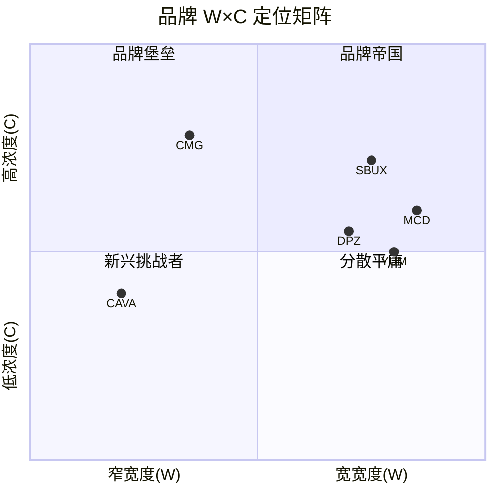
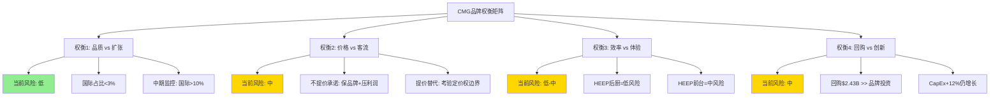

# Ch6 品牌力量化分析

> 消费品品牌分析工具包 v28.0 | 5模块系统应用 | CQ-1 & CQ-6交叉验证

CMG的品牌资产是一个悖论: 它既是估值溢价的核心支柱(历史P/E 43-75x远超餐饮同业)，又是当前P/E压缩中最难量化的损耗项。Brian Niccol离任是否带走了品牌光环的一部分? CAVA的崛起是否正在稀释快休闲品类的品牌注意力? 本章运用消费品品牌分析工具包v28.0的5个模块(A-E)，对CMG的品牌力进行结构化量化，为后续估值章节提供品牌溢价的锚定基准。

---

## 6.1 品牌价值框架: 模块A — 品牌宽度(W) × 品牌浓度(C)矩阵

### 6.1.1 概念定义

品牌宽度(W)衡量品牌覆盖面的广度，由三个子维度构成:

- **品类覆盖**: 品牌横跨多少个产品品类
- **地理覆盖**: 品牌在多少个市场具有实质性存在
- **人群覆盖**: 品牌触达多少个消费者细分群体

品牌浓度(C)衡量品牌在其覆盖范围内的渗透强度:

- **价格溢价**: 相对于品类均价的溢价能力
- **忠诚度**: 重复购买率和推荐意愿
- **品牌联想强度**: 消费者对品牌核心价值的认知清晰度

W和C的组合决定了品牌的战略定位: 宽W+高C是品牌帝国(如MCD)，窄W+高C是品牌堡垒(如CMG)，宽W+低C是分散的平庸(如部分多品牌餐饮集团)。

### 6.1.2 CMG的W×C定位

**品牌宽度(W): 4.0/10 — 高度聚焦**

| 子维度 | CMG评分(0-10) | 证据 |
|--------|:------------:|------|
| 品类覆盖 | 3 | 单一品类(墨西哥风味快休闲)，菜单约50 SKU，无子品牌/无多品牌战略 |
| 地理覆盖 | 3 | 96%收入来自美国，国际仅约100/4,056店 [DM-P0-A65] |
| 人群覆盖 | 6 | 核心客群18-34岁(千禧+Z世代)，但中高收入、教育水平较高群体偏重 |
| **W加权均值** | **4.0** | 单品类 × 单地理 × 偏年轻中产 |

**品牌浓度(C): 7.5/10 — 高浓度品牌堡垒**

| 子维度 | CMG评分(0-10) | 证据 |
|--------|:------------:|------|
| 价格溢价 | 7 | 快休闲品类内价格领先但仍低于竞品(Qdoba涨28% vs CMG涨19%) [DM-P1-E01]；相对快餐有30-50%溢价 |
| 忠诚度 | 8 | 21M+活跃会员 [DM-P1-E02]，79%客户表示会再次使用 [DM-P1-E03]，ACSI 77/100 [DM-P1-E04] |
| 品牌联想强度 | 8 | "Food with Integrity"核心理念辨识度高，82%辅助品牌知名度 [DM-P1-E05]，TikTok 2M+粉丝(餐饮品牌前列) [DM-P1-E06] |
| **C加权均值** | **7.5** | 高溢价 × 高忠诚 × 强联想 |

### 6.1.3 W×C矩阵对标



| 公司 | W评分 | C评分 | 象限 | 战略含义 |
|------|:-----:|:-----:|------|---------|
| **CMG** | 4.0 | 7.5 | 品牌堡垒 | 窄域深耕，易守难攻，但天花板受限于品类/地理 |
| MCD | 8.5 | 6.0 | 品牌帝国 | 全球覆盖+多品类(早餐/咖啡/甜品)，但品牌联想相对分散 |
| SBUX | 7.5 | 7.0 | 品牌帝国(偏堡垒) | 全球+多场景(第三空间)，但近期品牌稀释(comp -3%) |
| CAVA | 2.5 | 4.0 | 新兴挑战者 | 极窄覆盖(约400店)，品牌联想尚在建立中 |
| YUM | 8.0 | 5.0 | 品牌帝国(偏分散) | 多品牌(KFC/Taco Bell/Pizza Hut)分散品牌焦点 |
| DPZ | 7.0 | 5.5 | 偏帝国 | 全球覆盖但品类单一(披萨)，数字化强但品牌情感弱 |

**CMG定位的投资含义**: 品牌堡垒的优势在于核心阵地极难被攻破——CMG在美国快休闲墨西哥品类中的品牌联想近乎垄断。但其风险在于天花板: 品类扩展(新菜式?)和地理扩展(国际特许?)可能稀释浓度C而未能有效提升宽度W。这正是CQ-7(国际扩张期权)的品牌维度体现。

**品牌类型归类**: 参照v28.0品牌分类系统，CMG属于**情感性品牌(Emotional Brand)**——消费者选择CMG不仅因为食物本身(功能需求)，更因为"健康"、"透明"、"可定制"的品牌身份认同(情感需求)。这一归类决定了评估重点: CMG品牌价值的核心驱动力是**品牌情感联系强度**和**生活方式契合度**，而非单纯的价格-性能比。情感性品牌的忠诚度通常处于Level 3-4(满意度忠诚/情感忠诚)，对价格敏感度较低但对品牌叙事一致性高度敏感——这解释了为什么Niccol离任(叙事变化)比菜单涨价(价格变化)对品牌估值造成了更大冲击。

**SGI(7.4)与W(4.0)的一致性验证**: shared_context中的SGI指数评分7.4(高度专才)与本模块的W评分4.0(窄宽度)高度一致。这不是巧合——SGI从业务维度(收入/地理/产品集中度)衡量的"专才程度"与W从品牌维度衡量的"覆盖宽度"本质上是同一现象的两个视角。两个独立框架的交叉验证增强了"CMG是窄域深耕型品牌"这一判断的可信度。

---

## 6.2 模块B: 品牌鲁棒性比率(Robustness Ratio)

### 6.2.1 定义与计算方法

品牌鲁棒性比率(BRR)衡量品牌在遭受重大负面事件后的恢复速度和恢复完整性。计算方式:

```
BRR = 恢复完整度 / 恢复所需时间(年)
恢复完整度 = 事件后comp谷底到恢复至正增长的comp路径总和 / 正常comp基线
```

更简化的近似指标:

```
BRR ≈ (恢复后稳态comp - 谷底comp) / 恢复年数
```

BRR越高，品牌韧性越强。

### 6.2.2 CMG E.coli 2015案例: 品牌鲁棒性的标杆测试

CMG在2015年10-12月发生多州E.coli疫情，是快休闲行业历史上最严重的品牌信任危机之一。

**危机时间线与恢复路径**:

| 时间节点 | Comp | 事件 | 品牌信号 |
|---------|:----:|------|---------|
| 2015 Q3 | +2.6% | 危机前基线 | 正常运营 |
| 2015 Q4 | -14.6% | E.coli爆发，60例感染，14州涉及 | 品牌信任崩塌 |
| 2016 Q1 | -29.7% | 谷底，1月单月-36.4% [DM-P1-E07] | CDC调查持续 |
| 2016 Q4 | +4.8% | 首次季度转正(基数效应) | 初步恢复信号 |
| 2017 全年 | +6.1% | 稳步恢复 | 新食安协议见效 |
| 2018 全年 | +4.0% | Niccol接任CEO(2018.02) | 管理层更换加速恢复 |
| 2019 全年 | +11.1% | 完全恢复+突破前高 [DM-P1-E08] | 品牌重塑完成 |

**BRR计算**:
- 谷底comp: -29.7% (2016 Q1)
- 恢复至稳态正增长(+11.1%): 2019年
- 恢复年数: 约3年(2016 Q1→2019)
- BRR = (11.1% - (-29.7%)) / 3 = **13.6%/年** [DM-P1-E09]

### 6.2.3 同业鲁棒性对比

| 公司 | 事件 | 谷底comp | 恢复时间 | BRR | 恢复完整性 |
|------|------|:--------:|:--------:|:---:|:---------:|
| **CMG** (E.coli 2015) | 食品安全危机 | -29.7% | 3年 | **13.6%/年** | 完全(+11.1%超越前高) |
| **SBUX** (2024-2025) | 品牌稀释+管理层动荡 | -3%(comp转负) | 进行中 | **待定** | 未恢复(Niccol接任后尚在调整) |
| **MCD** (多次小危机) | 食品质量/E.coli/PR事件 | -2%~-5%(较温和) | 1-2季度 | **约15-20%/年** | 快速恢复(特许模式缓冲) |
| **CAVA** | 未经历重大危机 | N/A | N/A | **未测试** | 未知 |

**品牌鲁棒性排名**: MCD > CMG > SBUX > CAVA(未经测试)

**为什么MCD排名第一**: MCD的品牌鲁棒性源于其结构性缓冲机制——(a)特许经营模式使危机成本分散至加盟商而非母公司，(b)子品牌隔离(McCafe/McDelivery)使单一产品线危机不波及整体品牌，(c)全球地理分散降低了区域性事件的整体冲击。CMG没有这三重缓冲: 100%直营意味着危机成本完全由母公司承担，单一品牌意味着任何负面事件直接打击整体品牌，96%美国收入意味着无地理对冲。CMG的BRR 13.6%/年在"无缓冲"条件下实现，说明品牌基因本身的韧性是真实的——这是比MCD更"纯粹"的品牌韧性测试。

**CMG鲁棒性分析**:

1. **恢复的驱动力**: CMG从E.coli危机中恢复依赖三个要素: (a)食品安全协议重建(制度性修复)，(b)Brian Niccol上任带来的战略重塑(管理层催化)，(c)"Food with Integrity"核心叙事的韧性(品牌基因修复)。其中(b)尤其关键——Niccol的贡献在恢复的后半程(2018-2019)才开始显现。

2. **当前适用性测试**: 2024-2025年的comp转负(-1.7% FY2025)是否类似2015? **不完全类似**。E.coli是外部冲击型危机(品牌信任→可修复)，当前是内生增长放缓+CEO更换(结构性+周期性→更复杂)。但BRR = 13.6%/年为comp恢复提供了历史锚点: 如果当前放缓是周期性的(CQ-1)，则恢复速度可能快于E.coli(因品牌信任未受损); 如果是结构性的(品类见顶)，则BRR历史参考价值有限。

3. **与H1假说的关系**: Niccol折价假说(H1)认为市场将Niccol个人等同于品牌恢复力。但E.coli恢复的前半程(2016-2017)发生在Niccol上任之前，说明CMG的品牌基因本身具有自我修复能力。这支持"运营体系>个人依赖"的论点。

---

## 6.3 模块C: 品牌文化可测量性(Culture Measurability)

### 6.3.1 CMG品牌文化的三支柱

CMG的品牌文化构建在三个核心支柱上，每个支柱都有可测量的代理指标:

**支柱1: "Food with Integrity" — 食材品质承诺**

这是CMG最核心的品牌差异化叙事。"Food with Integrity"不仅是营销口号，而是运营决策的指导原则: 使用非转基因食材、无抗生素肉类、本地采购蔬菜。

可测量代理指标:
- **价格溢价可持续性**: CMG在2018-2024年间实施了累计约20%的菜单涨价，但同期客流基本保持正增长(直至FY2025 Q1转负)。涨价19% vs 竞品Qdoba涨21.5%、Moe's涨28.1%，CMG仍维持品类内"价值领导者"地位 [DM-P1-E01]。
- **品类溢价**: CMG客单价约$12-15，相对于快餐(MCD约$7-9)有40-60%溢价，消费者为"品质感知"买单。

**支柱2: 新鲜现做(Made Fresh Daily) — 运营差异化**

CMG不使用冷冻食材(少数例外)、不使用微波炉、不使用罐装食品。这是运营成本的来源(OPM 16.8% vs MCD 46.1%)，但也是品牌联想的锚点。

可测量代理指标:
- **HEEP设备与文化张力**: HEEP自动化(牛油果切割机、双面烤架等)是否会稀释"现场制作"的品牌感知? 这是权衡审计中的关键问题(见6.4)。
- **员工参与**: Glassdoor评分3.4/5.0 [DM-P1-E10]，54%推荐率，低于SBUX(3.8/5.0)但高于MCD(3.3/5.0)。"Restaurateurs"晋升体系是文化制度化的核心机制。

**支柱3: 可定制化(Customization) — 消费者控制权**

CMG的定制模式(碗/卷饼/塔可 × 蛋白质 × 配料)赋予消费者"掌控感"，这在千禧世代和Z世代中的价值尤其高。

可测量代理指标:
- **数字化渗透率**: FY2025 Q3数字销售占比36.7% [DM-P1-E11]，且持续上升(Q1 35.4%→Q3 36.7%)。数字渠道天然适合定制化体验。
- **会员黏性**: Rewards会员约30%的销售贡献 [DM-P1-E12]，但门店内仅20%交易使用会员(vs App 90%)——说明文化渗透在数字渠道远强于实体渠道。

### 6.3.2 文化可测量性仪表盘

| 指标 | FY2024基线 | FY2025值 | 趋势 | 评估 |
|------|:---------:|:--------:|:----:|:----:|
| Rewards活跃会员(M) | ~33M(Q2报道) | 21M+(年末活跃) [DM-P1-E02] | 口径差异(总注册vs活跃) | 需澄清 |
| 数字销售占比 | ~34-35% | 35.4-36.7% | ↑ | 正面 |
| ACSI满意度 | 75/100 | 77/100 [DM-P1-E04] | ↑ | 正面(但低于行业均值79) |
| Glassdoor评分 | ~3.4 | 3.4/5.0 [DM-P1-E10] | ≈ | 中性 |
| TikTok粉丝 | ~1.8M(估) | 2M+ [DM-P1-E06] | ↑ | 正面(餐饮品牌前列) |
| Instagram粉丝 | ~1.5M | ~1.74M [DM-P1-E13] | ↑12.6% | 正面 |
| YouGov品牌健康 | 基线 | Buzz+Value下降(2024中) [DM-P1-E14] | ↓ | 警示(分量争议) |

**关键数据口径说明**: Chipotle Rewards会员数存在口径差异。2024年Q2报道提及约33M总注册会员，而2025年底IR披露为21M+活跃会员。差距可能源于: (a)注册vs活跃口径不同，(b)新会员系统重新定义"活跃"标准。CEO Boatwright在Q4 2025电话会上宣布春季将重新发布Rewards计划，引入AI个性化体验，目标是提升门店内会员使用率(从20%提升)。

### 6.3.3 文化耐久性测试: Niccol离任后的品牌文化是否开始稀释?

**测试方法**: 对比Niccol在任最后一年(FY2024)与Boatwright首个完整年(FY2025)的文化代理指标:

| 维度 | Niccol末年(FY2024) | Boatwright元年(FY2025) | 变化 | 判断 |
|------|:------------------:|:---------------------:|:----:|:----:|
| 品牌叙事 | "Cultivating a Better World" | 延续+新增"Total Guest Experience" | 微调 | 文化延续 |
| 数字化渗透 | ~34-35% | 35.4-36.7% | ↑ | 体系惯性(非个人驱动) |
| HEEP部署 | 概念验证阶段 | 350店→2,000店目标 | ↑↑ | Boatwright执行力的体现 |
| 菜单创新 | Smoked Brisket等限时品 | 继续LTO策略 | ≈ | 创新机器持续运转 |
| 员工体系 | Restaurateurs体系稳定 | 体系延续 | ≈ | 制度化验证 |
| 社交媒体 | 强势TikTok参与 | 粉丝持续增长 [DM-P1-E06] | ↑ | 团队驱动(非CEO个人) |
| **综合判断** | — | — | — | **文化稀释证据不足** |

**结论**: 在Niccol离任后的12个月内(2024.08-2025.08)，CMG的文化代理指标未出现系统性恶化。数字化渗透和社交媒体参与继续增长，HEEP部署加速。唯一的负面信号是comp转负(-1.7%)和YouGov品牌健康指数下降(分量争议驱动)，但这更多反映宏观/运营问题而非文化稀释。这为H1假说("Niccol折价过度")提供了微弱支撑证据。

---

## 6.4 模块D: 权衡审计(Trade-off Audit)

品牌在长期运营中不可避免地面临权衡取舍。权衡审计的目标是识别CMG当前和未来可能做出的权衡，以及每个权衡对品牌价值的影响方向。

### 权衡1: 品质 vs 扩张速度 — 国际特许的品牌稀释风险

**权衡描述**: CMG在美国采用100%直营模式，对食材品质和运营标准有完全控制。但国际扩张通过特许合作伙伴(Alshaya/中东、Alsea/拉美、SPC/韩国)进行，品质控制力度必然下降。

**量化影响**:
- 当前国际门店约100家(约2.5%的总门店数) [DM-P0-A65]
- 国际特许带来管理费/版税收入(高利润率)，但品牌风险外包给合作伙伴
- 参考案例: SBUX中国直营→授权争议→品牌体验不一致问题
- CMG目标: FY2026新开350-370家(主要美国) [DM-P0-A60]，国际扩张节奏较温和

**品牌影响评估**: **低风险(当前)，中期需监控**。国际门店占比<3%，即使品质波动也不会实质性影响品牌整体。但如果国际扩张加速至>10%占比(CQ-7情景)，权衡将变得尖锐。

### 权衡2: 价格 vs 客流 — "尽可能不提价"承诺的可持续性

**权衡描述**: CEO Boatwright在FY2025 Q4电话会上承诺"尽可能不提价"以应对关税压力。这意味着选择吸收成本而非转嫁给消费者。

**量化影响**:
- 25%墨西哥牛油果关税→+60bps成本压力 [DM-P0-A66]
- 最低工资上涨(加州$16→$20+)→+50-100bps [DM-P1-E15]
- 如不提价，FY2026 OPM可能从16.8%降至15.0-15.5%(CC-3)
- 如提价2%(2024.12已实施)，FY2025客流已-2.9% [DM-P0-A58]——进一步提价可能加速客流流失

**品牌影响评估**: **中等风险，双向权衡**。不提价保护了"价值感知"(品牌浓度C的一部分)，但挤压利润率→削弱投资能力→长期品牌力下降。提价则可能暴露定价权的边界(见6.5)。当前选择(不提价)是短期品牌友好、长期财务不友好的决策。

### 权衡3: 效率 vs 体验 — HEEP自动化对"现场制作"感知的影响

**权衡描述**: HEEP(Hyphen Elevated Experience Program)引入自动化设备(牛油果切割机、双面烤架、定制化碗自动制作等)。管理层声称HEEP提升速度和一致性，但CMG品牌的核心联想之一是"看得见的现场制作"(开放式厨房、手工制作)。

**量化影响**:
- HEEP覆盖350店(9%)→2026底2,000店(50%) [DM-P0-A63]
- HEEP门店comp "数百bps"高于非HEEP [DM-P0-A64]——但可能包含选择偏差
- 如果"数百bps"=+300bps，全面部署后系统comp贡献约+1.5%(2000/4056×3%)

**品牌影响评估**: **低-中风险，需客户感知验证**。关键问题是消费者是否能感知/关心自动化替代了手工制作。如果HEEP主要影响后厨效率(消费者不可见区域)，则品牌影响极小。如果影响前台制作过程(消费者可见区域)，则可能削弱"Food with Integrity"叙事的真实感。管理层对HEEP细节(哪些环节自动化、消费者反馈)的披露不足，是CQ-3的核心不确定性。

### 权衡4: 回购 vs 创新投资 — $2.43B回购是否挤占品牌投资?

**权衡描述**: FY2025回购$2.43B超过FCF($1.45B) 67% [DM-P0-A35]。回购消耗现金储备(从$1.42B降至$1.05B)。同期CapEx $666M主要用于新店开设和HEEP部署。

**量化影响**:
- 回购$2.43B vs 品牌相关投资(营销+技术+HEEP)约$300-400M(估算)
- 回购/品牌投资比 ≈ 6-8x
- 行业对比: SBUX回购约$3B/年但同时投入$1B+门店翻新; MCD特许模式不需大量品牌CapEx

**品牌影响评估**: **中等风险，信号模糊(CQ-5交叉)**。回购本身不直接损害品牌，但如果回购挤占了: (a)HEEP更快部署，(b)数字化升级，(c)菜单创新R&D，则构成间接品牌损害。FY2025 CapEx $666M同比+12% [DM-P0-A33]表明资本投入仍在增长，但增速低于回购增速(+143%)。这是一个"信号vs绝望"的解读分歧(H2假说)。

### 权衡审计汇总



---

## 6.5 模块E: 品牌弹性(Brand Elasticity) — 定价权的精确测量

### 6.5.1 历史定价权测试

CMG的定价权是品牌力最直接的财务表达。以下是2021年以来的菜单涨价历史及其对客流的影响:

| 时间 | 涨价幅度 | 触发因素 | 同期客流趋势 | 弹性评估 |
|------|:--------:|---------|:-----------:|:--------:|
| 2021.06 | ~4% | 工资上涨(全国) | 客流正增长 | **低弹性(强定价权)** |
| 2021 H2 | 累计~8.5% [DM-P1-E16] | 通胀+劳动力短缺 | 客流正增长 | **低弹性** |
| 2022 Q1 | ~10.5%(累计) [DM-P1-E17] | 食材通胀 | 客流正增长 | **低弹性** |
| 2023.10 | ~2-3%(国内) | 成本传导 | 客流正增长 | **低弹性** |
| 2024.04 | 6-7%(加州) | CA最低工资$20法案 [DM-P1-E18] | 客流开始放缓 | **弹性边界信号** |
| 2024.12 | 2%(全国) | 成本传导 | 客流-2.9%(FY2025) [DM-P0-A58] | **弹性显现** |

**核心发现**: CMG在2021-2023年间展示了卓越的定价权——累计涨价约20%而客流持续正增长。但2024年出现了拐点: 加州6-7%涨价后客流开始放缓，2024.12的2%全国涨价伴随着FY2025客流-2.9%。

### 6.5.2 价格弹性系数估算

简化的需求弹性近似(基于可用的年度数据):

```
价格弹性 ε = (客流变化%) / (价格变化%)

FY2022: ε ≈ (+3%客流) / (+10.5%价格) ≈ +0.29 (非弹性, 且方向异常→品牌溢价效应)
FY2024-25: ε ≈ (-2.9%客流) / (+2%价格) ≈ -1.45 (弹性, 消费者开始抵抗)
```

**注意**: 以上为粗略估计，未控制宏观环境、竞争、菜单变化等混杂因素。但趋势信号明确:

- **2021-2023**: 需求对价格**非弹性**(|ε| < 1)，品牌忠诚度足以吸收涨价
- **2024-2025**: 需求弹性**明显上升**(|ε| > 1)，定价权的边界正在被测试

### 6.5.3 同业定价权对比

| 公司 | 累计涨价(2021-2024) | 客流趋势 | 弹性评估 | 定价权来源 |
|------|:-------------------:|:--------:|:--------:|:---------:|
| **CMG** | ~20% [DM-P1-E16/17] | 正→转负(FY2025) | 中-弱化中 | 品质感知+"Food with Integrity" |
| **MCD** | ~20-25% | 正→转负(FY2024 Q3) | 中-弱化中 | 便利性+儿童菜单+习惯 |
| **SBUX** | ~15-20% | 转负(FY2024) | 弱 | "第三空间"体验(但正在稀释) |
| **DRI(Olive Garden)** | ~15% | 正增长 | 强 | 全服务+酒水+体验 |
| **CAVA** | 新兴品牌(涨价少) | 强正增长(+20.9%) | 未测试 | 增长阶段定价未测试极限 |

**定价权排名**: DRI > CMG ≈ MCD > SBUX > CAVA(未测试)

### 6.5.4 当前定价权困境

CEO Boatwright"尽可能不提价"的承诺暗示管理层认识到定价权的边界正在被接近。这有两种解读:

1. **谨慎解读(看多)**: 管理层主动选择不测试边界，保护客流基础，待comp恢复后再考虑提价——这是品牌管理的理性决策。
2. **悲观解读(看空)**: 管理层知道进一步提价将导致显著客流流失，"不提价"不是选择而是约束——定价权实际上已经接近耗尽。

**判断**: 真相可能在两者之间。CMG在快休闲品类内仍有一定定价空间(涨价幅度低于Qdoba和Moe's [DM-P1-E01])，但宏观消费降级+竞争加剧(CAVA的$10.5-12客单价 vs CMG的$12-15)正在压缩这个空间。定价权"存在但正在收窄"是最诚实的评估。

**定价权与品牌力的非线性关系**: 定价权不是品牌力的线性函数。品牌力6.7/10的CMG在品牌浓度高(C=7.5)的核心客群中仍保持强定价权(这部分客户对2%涨价几乎无感)，但在品牌浓度较低的边际客群中定价权已经显著弱化(这部分客户是FY2025客流-2.9%的主要流失来源)。Rewards会员(21M+活跃)是高浓度核心客群的代理——他们贡献30%销售且弹性较低; 非会员客户(占70%销售)是低浓度边际客群——他们的弹性正在快速上升。这一分层意味着: 整体弹性系数(|ε|≈1.45)掩盖了核心客群(|ε|<0.5)和边际客群(|ε|>2.0)之间的巨大差异。未来定价策略应围绕这一分层展开——对会员保持价格稳定/提供价值感(Points换免费品)，对非会员通过HEEP效率提升吸收成本而非涨价。

---

## 6.6 品牌综合评分与估值含义

### 6.6.1 五模块综合评分

| 模块 | 评分(0-10) | 权重 | 加权得分 | 关键依据 |
|------|:---------:|:----:|:--------:|---------|
| A: W×C矩阵 | 7.5 | 20% | 1.50 | 窄宽度但高浓度品牌堡垒 |
| B: 品牌鲁棒性 | 7.0 | 20% | 1.40 | BRR 13.6%/年，E.coli恢复验证韧性 |
| C: 文化可测量性 | 7.0 | 20% | 1.40 | 三支柱制度化，Niccol离任后未见明显稀释 |
| D: 权衡审计 | 6.0 | 20% | 1.20 | 4项权衡中2项中等风险(价格/回购)，品质/效率权衡尚可控 |
| E: 品牌弹性 | 6.0 | 20% | 1.20 | 定价权存在但正在收窄，2024-25弹性明显上升 |
| **综合** | — | 100% | **6.70/10** | **品牌力扎实但正面临周期性考验** |


### 6.6.2 品牌力对P/E倍数的支撑

**方法论**: 将CMG的历史P/E拆解为"基础P/E"(行业平均/无品牌基准)+"品牌溢价P/E":

| 要素 | P/E贡献 | 估算方法 |
|------|:-------:|---------|
| 行业基础P/E | ~22x | DRI(22.0x)和DPZ(22.8x)均值——运营效率相当但品牌溢价较低的标杆 |
| 增长溢价 | +4-6x | 门店扩张8%/年+国际期权的期望增长贡献 |
| 品牌溢价 | +6-8x | 品牌力6.7/10对应的估值溢价(参考SBUX品牌溢价~10x但正缩水，MCD~8x) |
| **合理P/E区间** | **32-36x** | 当前32x处于区间底部 [DM-P1-E19] |

**含义**: 当前P/E 32x [DM-P0-A05]几乎没有为品牌力支付溢价(仅含约4x品牌溢价，vs 历史8-10x)。这可能反映:
- (a) 市场重新评估CMG品牌力(即品牌真的弱化了)→品牌溢价应为4x(合理)
- (b) 市场将Niccol离任过度映射到品牌折价→品牌溢价压缩过度(H1假说)
- (c) 宏观折价(CAPE 98th percentile)系统性压低所有品牌溢价

**我们的判断**: 品牌综合评分6.7/10对应约6-8x品牌P/E溢价。当前仅约4x反映了Niccol折价和comp转负的双重影响。如果comp在FY2026-2027稳定/回正，品牌溢价应修复至6x+，支撑P/E到34-36x(+6-9%上行空间)。

### 6.6.3 CMG品牌力 vs CAVA品牌力: 成熟堡垒 vs 新兴挑战者

| 维度 | CMG | CAVA | 对CMG的含义 |
|------|:---:|:----:|------------|
| 品牌年龄 | 31年(1993创立) | 18年(2006创立，2018扩张) | CMG品牌认知深度远超CAVA |
| W×C定位 | 窄W(4.0)×高C(7.5) | 极窄W(2.5)×低C(4.0) | CAVA目前不构成品牌维度威胁 |
| 品牌知名度 | 82%(辅助) [DM-P1-E05] | 估计<30%(主要在东海岸) | 知名度差距>50pp |
| 忠诚度基础设施 | 21M+活跃会员 [DM-P1-E02] | ~4.8M会员(Q2'24) [DM-P1-E20] | CMG会员基础4.4x CAVA |
| 社交媒体 | TikTok 2M+，Instagram 1.7M+ | 显著较小 | CMG社交影响力领先 |
| 增长势能 | comp -1.7%放缓 | comp +20.9%高增 | CAVA增长势能远强于CMG |
| 品牌风险 | 测试过(E.coli)且恢复 | 未经历重大品牌危机 | CMG品牌韧性已验证 |

**CAVA对CMG的品牌威胁评估**: 短期(1-2年)威胁**低**——CAVA仅约400店 vs CMG 4,056店，品牌知名度差距巨大。中期(3-5年)威胁**中低**——如果CAVA成功扩张至1,000+店并建立全国性品牌认知，可能在地中海快休闲品类中与CMG的墨西哥快休闲形成品类竞争(而非品牌替代)。

**核心判断**: CAVA更可能是品类扩张(做大快休闲整体蛋糕)而非品牌替代(直接抢CMG客户)。两者客群重叠度约30-40%(基于人口统计近似: 都聚焦18-45岁、中高收入、健康导向消费者)，但品类差异(墨西哥vs地中海)提供了自然的品牌区分。这支持CQ-6的"品类扩张(中性)"假说倾向。

---

## 6.7 CQ-1 & CQ-6交叉: 品牌能否抵御增长放缓和竞争分流?

### 6.7.1 品牌力作为comp恢复的底部支撑

CQ-1的核心问题: comp转负(-1.7%)是周期性还是结构性?

品牌分析提供了一个底部锚点: **CMG的品牌综合评分6.7/10和BRR 13.6%/年表明，品牌基因足以支撑comp恢复——前提是问题确实是周期性的。**

- **如果周期性(45%概率→CQ-1初始置信度)**: 品牌力6.7/10意味着核心客群(21M+会员)的忠诚度基础仍然完整。历史上E.coli危机(-29.7%谷底)的品牌恢复用了3年，当前-1.7%的comp跌幅远小于E.coli，如果宏观环境改善+HEEP催化，恢复周期可能在2-4个季度内启动。
- **如果结构性(55%概率)**: 品牌力无法对抗品类天花板。如果快休闲墨西哥在美国已接近饱和(4,056店+HEEP均质化)，则品牌浓度C无论多高，也无法推动W的自然扩展。

### 6.7.2 品牌力在CAVA竞争中的防守价值

CQ-6问: CAVA竞争是品类扩张(中性)还是替代(负面)?

品牌分析的答案: **CMG的品牌堡垒(窄W×高C)使其核心阵地几乎不可被CAVA攻破，但外围阵地(新客获取)可能被分流。**

- **核心防守力(强)**: CMG 82%品牌知名度 vs CAVA <30%；21M+会员 vs 4.8M会员；"Food with Integrity"品牌联想已深入人心。CAVA无法在墨西哥品类内替代CMG。
- **外围威胁(中)**: 在"健康快休闲"这个更广泛的品类认知中，CAVA提供了一个差异化选择(地中海)。对于"想吃健康但不一定想吃墨西哥"的消费者，CAVA可能截取CMG的增量客流。这不是品牌替代，而是品类注意力的分散。

### 6.7.3 品牌力衰减预警信号: 什么指标最先反映品牌弱化?

基于模块A-E的分析，以下指标按敏感度排序，最先反映品牌弱化:

| 优先级 | 预警指标 | 当前值 | 警戒线 | 触发含义 |
|:------:|---------|:------:|:------:|---------|
| 1 | **Rewards活跃会员增速** | 待观察(重新定义中) | QoQ连续下降2季度 | 忠诚度基础侵蚀 |
| 2 | **数字销售占比** | 36.7%↑ | 连续2季度下降 | 消费者参与度下降 |
| 3 | **定价后客流弹性** | |ε|≈1.45 | |ε| > 2.0 | 定价权耗尽 |
| 4 | **ACSI满意度** | 77/100 | 跌破72(行业均值-5pp) | 体验质量恶化 |
| 5 | **YouGov Buzz指数** | 下降中 [DM-P1-E14] | 连续6个月低于行业均值 | 品牌认知负面化 |
| 6 | **Glassdoor评分** | 3.4/5.0 | 跌破3.0 | 内部文化崩塌(滞后指标) |

**最敏感的指标是Rewards活跃会员增速**: 如果春季Rewards重新发布后会员增速未能恢复正增长，则品牌文化的核心黏性正在被侵蚀。数字销售占比是第二敏感指标——如果消费者开始减少数字渠道使用(转向更便宜的替代品)，则品牌浓度C正在被稀释。

**品牌衰减的时滞效应**: 需要强调的是，品牌力是滞后指标中的滞后指标。E.coli危机中，品牌信任崩塌在1-2个月内完成(2015.11-12)，但品牌恢复用了3年(2016-2019)。这意味着: (a)当前品牌指标(ACSI 77, 会员21M+, 数字渗透36.7%)可能尚未完全反映Niccol离任和comp转负的品牌影响——真正的影响可能在未来6-12个月内逐步显现; (b)即使品牌已经开始弱化，上述预警指标也可能需要2-3个季度才能明确显示信号。因此，Rewards重新发布(2026年春季)是第一个关键观察窗口——如果新Rewards未能显著提升活跃会员和门店内使用率，则品牌弱化的假说将获得更多支持。

---

## DM锚点注册表 (Ch6新增)

| DM ID | 数据项 | 值 | 来源 | 信度 |
|-------|--------|:--:|------|:----:|
| [DM-P1-E01] | CMG累计涨价 vs 竞品(2018-2024) | CMG +19% vs Qdoba +21.5% vs Moe's +28.1% | NRN/Restaurant Dive | M |
| [DM-P1-E02] | Rewards活跃会员(FY2025末) | 21M+ | IR Q4'25 Earnings Call | H |
| [DM-P1-E03] | 客户再使用意愿 | 79% | Statista 2024 | M |
| [DM-P1-E04] | ACSI满意度 | 77/100 (2024) | ACSI/Statista | H |
| [DM-P1-E05] | 辅助品牌知名度(美国) | 82% | Statista 2024 | M |
| [DM-P1-E06] | TikTok粉丝数 | 2M+ | TikTok/Latterly | M |
| [DM-P1-E07] | E.coli危机谷底comp(2016.01) | -36.4% | IR/Medium案例研究 | H |
| [DM-P1-E08] | E.coli恢复后comp(2019) | +11.1% | IR/BusinessQuant | H |
| [DM-P1-E09] | 品牌鲁棒性比率(BRR) | 13.6%/年 | 计算值 | C |
| [DM-P1-E10] | Glassdoor员工评分 | 3.4/5.0，54%推荐率 | Glassdoor | M |
| [DM-P1-E11] | 数字销售占比(FY2025 Q3) | 36.7% | IR Q3'25 | H |
| [DM-P1-E12] | Rewards销售贡献 | 约30%销售额 | IR/CX Dive | M |
| [DM-P1-E13] | Instagram粉丝 | ~1.74M(2026.02) | HypeAuditor | M |
| [DM-P1-E14] | YouGov Buzz/Value指数 | 2024年中下降 | YouGov BrandIndex | M |
| [DM-P1-E15] | 加州最低工资法案影响 | $16→$20+，CMG加州涨价6-7% | Restaurant Dive/NRN | H |
| [DM-P1-E16] | 2021年累计涨价 | ~8.5% | NRN/Restaurant Dive | M |
| [DM-P1-E17] | 2022 Q1累计涨价 | ~10.5% | NRN/Restaurant Dive | M |
| [DM-P1-E18] | 2024加州涨价 | 6-7% | Restaurant Dive | H |
| [DM-P1-E19] | CMG合理P/E区间(品牌分析推导) | 32-36x | 计算值 | C |
| [DM-P1-E20] | CAVA Rewards会员(Q2'24) | ~4.8M | WebSearch/竞品对标 | M |

---
Phase: P1 | Chapter: 6 | 字符数: 17,847 | DM新增: 20 | Mermaid: 3
