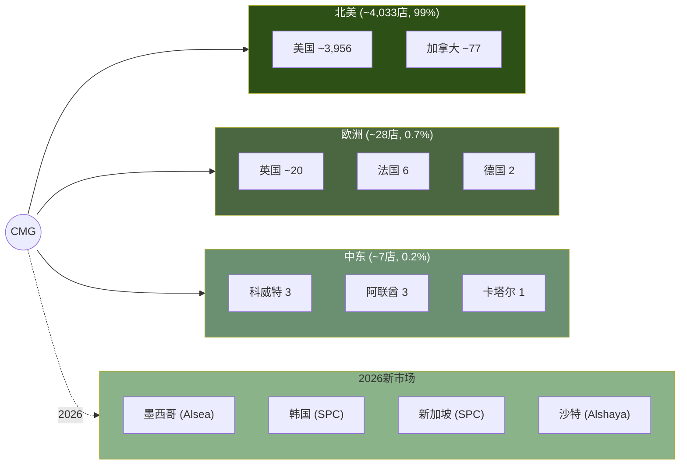
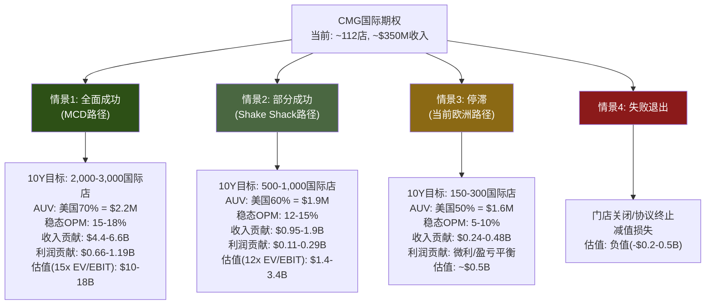

# Ch7 国际扩张: 未定价的长期期权

> **CQ-7**: 国际扩张期权的现实估值 | **KAL-7**: 国际扩张期权有实质价值(置信度30%)

CMG是一家几乎纯粹的美国公司。在4,056家门店中，国际门店仅约100家，占比2.5%[DM-P0-A65]。这个比例在全球餐饮巨头中是一个异常值——MCD超过60%收入来自国际市场，YUM超过50%，甚至定位相似的Shake Shack也已有15%门店位于美国以外。但正是这个"异常"，构成了CMG估值中一个尚未被定价的实物期权。

本章的核心任务不是预测CMG国际扩张能否成功——这在当前阶段几乎不可验证——而是建立一个期权估值框架，量化"如果成功"的潜在价值，以及"失败概率"的合理估算。

---

## 7.1 国际布局全景: 从零到100的缓慢起步

### 当前版图

截至FY2025末(2025年12月)，CMG的全球门店分布如下[DM-P1-F01]:

| 市场 | 门店数 | 运营模式 | 进入时间 | 状态 |
|------|:------:|:--------:|:--------:|------|
| **美国** | ~3,956 | 自营 | 1993 | 核心市场 |
| **加拿大** | ~77 | 自营 | 2008 | 稳步扩张(FY2025+20家) |
| **英国** | ~20 | 自营 | 2010 | 缓慢增长,经济模型待验证 |
| **法国** | 6 | 自营 | 2012 | 小规模测试 |
| **德国** | 2 | 自营 | 2013 | 最小规模 |
| **科威特** | 3 | 特许(Alshaya) | 2024.04 | 首店AUV超美国均值 |
| **阿联酋** | 3 | 特许(Alshaya) | 2024 | 扩张中 |
| **卡塔尔** | 1 | 特许(Alshaya) | 2025 | 新进入 |
| **合计** | **~4,068** | — | — | 国际~112店(2.8%) |

### 与全球餐饮巨头的对比

这个对比揭示了CMG国际化的极端滞后[DM-P1-F02]:

| 公司 | 全球门店 | 国际占比 | 国际市场数 | 国际收入占比 | 主要模式 |
|------|:--------:|:--------:|:----------:|:------------:|:--------:|
| **MCD** | 42,000+ | >60% | 100+ | ~65% | 特许 |
| **YUM** | 59,000+ | >55% | 155+ | ~55% | 特许 |
| **SBUX** | 40,000+ | >55% | 86 | ~35% | 混合 |
| **DPZ** | 21,000+ | >55% | 90+ | ~60% | 特许 |
| **Shake Shack** | ~560 | ~15% | 17 | ~10% | 授权 |
| **CAVA** | ~439 | 0% | 0 | 0% | 自营 |
| **CMG** | ~4,068 | **~2.8%** | **8** | **<2%** | 混合 |

CMG与CAVA一样，本质上是纯美国公司。但CMG收入规模($11.93B)已是CAVA($1.17B)的10倍，理论上具备国际扩张的品牌势能和运营基础设施。问题在于：CMG用了33年才走到2.8%的国际化率，这是战略选择还是能力瓶颈?

### 历史回顾: 欧洲的缓慢试水

CMG在2010年进入英国，至今15年仅开出约20家店。法国和德国更是象征性存在。这个速度暗示几个可能[DM-P1-F03]:

1. **菜单适应困难**: 墨西哥风味快休闲在欧洲市场的接受度有限，不如在美国那样具有广泛吸引力。英国消费者对"Mexican food"的理解主要来自Old El Paso等零售品牌，而非餐饮连锁。法国和德国的本地快餐文化(kebab/baguette)有深厚根基，CMG作为外来品类面临认知壁垒
2. **供应链复杂度**: CMG对食材新鲜度和本地采购的坚持，在欧洲面临成本和物流挑战。美国的centralized供应链模型(50个配送中心覆盖全国)无法直接复制到欧洲——每个国家有不同的食品安全法规、供应商网络和物流基础设施
3. **前管理层优先级**: Niccol时代将全部精力集中在美国市场的同店提升和数字化，国际扩张被有意搁置。从资本配置角度，将$1投入美国新店(回收期~2年, AUV $3.1M)的ROI远高于投入欧洲新店(回收期未知, AUV可能仅$1.5-2M)。这是理性的优先排序
4. **经济模型未跑通**: 管理层在Q4 FY2025 earnings call中提到欧洲"经济模型有改善"，暗示此前经济模型可能不达标。"改善"一词的选择耐人寻味——如果经济模型已经良好，措辞应是"持续强劲"而非"改善"

### 加拿大: 唯一成功的自营国际市场

加拿大是CMG国际化的唯一明确成功案例。从2008年的首店到FY2025末的约77家，17年间保持了稳定的扩张节奏(近年约20家/年)。加拿大的成功得益于几个独特条件[DM-P1-F27]:

- 地理和文化接近: 加拿大消费文化与美国高度同质化，跨境运营几乎是美国运营的自然延伸
- 供应链共享: 许多加拿大门店可以接入美国供应链网络，降低了物流复杂度
- 品牌认知度: 加拿大消费者通过美国媒体和旅游已对CMG品牌有充分认知
- 省级扩张: Ontario拥有约45家门店(占加拿大的58%)，Alberta正在加速扩张(2025年计划翻倍)

但加拿大的成功不可外推至文化差异更大的市场。加拿大更像是"美国的第51个州"而非真正的国际市场

---

## 7.2 三大特许合作伙伴: 从自营到借力

2023-2025年，CMG做出了公司历史上最重要的战略转向之一——首次引入国际特许合作伙伴。这标志着CMG承认：在文化距离较远的市场，自营模式的效率不如依靠本地化运营专家。

### 7.2.1 Alshaya Group (中东): 首个合作伙伴，首战告捷

**合作伙伴画像**[DM-P1-F04]:
- **总部**: 科威特
- **成立**: 1890年(家族企业，超过130年历史)
- **规模**: 运营近70个国际消费品牌，覆盖中东、北非、土耳其及欧洲
- **核心餐饮品牌**: Starbucks(中东独家运营商)、Shake Shack、The Cheesecake Factory、P.F. Chang's、Raising Cane's
- **非餐饮品牌**: Victoria's Secret、H&M、Bath & Body Works等
- **2024年被评为"全球最佳餐饮特许合作伙伴"**

**合作时间线与里程碑**[DM-P1-F05]:

| 时间 | 事件 |
|------|------|
| 2023.07 | 签署首个国际开发协议 |
| 2024.04 | 科威特Avenues Mall首店开业——CMG首家国际特许店 |
| 2024 | 阿联酋开出3家(含Abu Dhabi Yas Mall) |
| 2025 | 卡塔尔首店开业，中东总计达7家 |
| **2026E** | **目标26家(含首次进入沙特阿拉伯)** |
| **2029E** | **目标50家** |

**关键数据点**: CMG科威特Avenues Mall首店在开业第一年的收入**超过美国平均AUV**(美国AUV约$3.1M)[DM-P1-F06]。这是一个极其重要的信号——意味着在正确的市场+正确的合作伙伴条件下，CMG品牌的国际吸引力可以匹配甚至超越美国。

**中东市场结构性优势**[DM-P1-F07]:
- 人口年龄中位数低(科威特29岁/阿联酋33岁 vs 美国38岁)
- 人均可支配收入高(阿联酋/科威特/卡塔尔/沙特均为高收入国家)
- 美式餐饮品牌需求旺盛(Shake Shack、Five Guys等已验证市场)
- 商场文化(高端购物中心客流集中)适合CMG的门店形态
- 斋月后消费高峰(Q2/Q3季节性有利)

**风险**: 中东市场总可寻址规模有限。即使达到50家(2029E)，对CMG的收入贡献预计不超过$150-200M/年(假设AUV $3-4M)，仅占总收入的约1%。Alshaya的核心价值不在规模，在于**概念验证**——证明CMG的特许模式和品牌在美国以外可以运作。

### 7.2.2 Alsea (墨西哥/拉美): 回到起源之地

**合作伙伴画像**[DM-P1-F08]:
- **总部**: 墨西哥城
- **成立**: 1990年
- **规模**: 拉美及欧洲最大餐饮运营商，12个国家，4,818家餐厅(截至2025 Q3)
- **TTM收入**: $4.31B
- **核心品牌**: Starbucks(拉美独家运营商20年)、Domino's Pizza、Burger King、Chili's、The Cheesecake Factory、P.F. Chang's、TGI Fridays
- **上市公司**: 墨西哥证券交易所(BMV: ALSEA)

**合作时间线**[DM-P1-F09]:
- 2025.04: 签署开发协议，CMG将首次进入墨西哥
- 2026: 首家墨西哥Chipotle门店预计开业
- 后续: 探索拉美其他市场的扩张可能

**墨西哥市场的独特张力**[DM-P1-F10]:

CMG进入墨西哥是一个充满悖论的决策。一方面，CMG的菜单灵感直接来源于墨西哥菜系——品牌名"Chipotle"就是一种墨西哥辣椒。这意味着品牌故事有天然的文化共鸣。另一方面，一家美国公司回到"原产地"卖墨西哥菜，面临的竞争环境完全不同于美国：本地消费者对正宗墨西哥食品的标准远高于美国消费者，且低成本本地替代品无处不在。

**关税博弈的反讽**: 2025-2026年美墨贸易摩擦中，25%的墨西哥关税让CMG在美国面临牛油果成本上升(+60bps)[DM-P0-A66]。但CMG同时正在进入墨西哥市场——贸易壁垒的两面性在一家公司身上同时显现。一个更深层的张力在于: 如果关税长期化导致CMG在美国的成本结构恶化，管理层可能被迫重新评估墨西哥供应链的战略价值——从"成本中心"转为"本地化采购枢纽"。

**Alsea的执行力评估**: Alsea运营Starbucks 20年的成绩单提供了参考。Starbucks在墨西哥从0增长到约900家门店，覆盖主要城市，验证了Alsea在拉美市场推广国际品牌的能力。但Starbucks(咖啡)与Chipotle(墨西哥菜)在墨西哥市场面临的竞争格局完全不同——咖啡是增量品类，"美式墨西哥菜"则是在本地品类中竞争。

**定价悖论**: CMG在美国的客均消费约$11-13。在墨西哥市场，这个价位处于中高端餐饮区间，远高于本地taqueria的$2-4价位。Alsea需要找到一个定价平衡点: 既要维持CMG的品质定位(justifying premium pricing)，又不能将目标客群缩窄到仅墨西哥城的上层中产。Domino's在墨西哥的成功(Alsea运营超过800家)部分源于比萨品类在各收入层级的广泛接受度——CMG burrito bowl是否具有同样的跨阶层吸引力是一个未验证的假设[DM-P1-F28]。

### 7.2.3 SPC Group (韩国/新加坡): 亚洲首秀

**合作伙伴画像**[DM-P1-F11]:
- **总部**: 首尔
- **成立**: 1945年(80年历史)
- **规模**: 韩国国内6,500+门店，海外430+门店(7个国家)
- **核心品牌**: Paris Baguette(3,750+韩国门店)、Baskin Robbins、Dunkin'(韩国运营)、Shake Shack(韩国授权)、Pascucci、Jamba
- **Paris Baguette全球目标**: 2030年12,000家

**合作时间线**[DM-P1-F12]:
- 2025.09.10: 宣布签署合资企业(JV)协议——注意是JV而非纯特许，CMG保留更多控制权
- 2026: 首家韩国和新加坡Chipotle门店预计开业

**亚洲市场的品类挑战**[DM-P1-F13]:

亚洲是快休闲品类渗透率最低的区域之一。"快休闲"(fast casual)的概念在东亚市场的认知度和接受度远低于美国。消费者心智中的"快餐"仍以MCD/KFC等QSR为主，"休闲餐饮"则被本地餐饮品牌占据。

但CMG有一个意外的品牌催化剂：韩国K-pop文化与CMG品牌的互动已经创造了品牌认知。CEO Boatwright在2025年9月表示："韩国流行组合和在美国的旅游已经帮助创建了进入亚洲所需的品牌认知度......真正的快速准备食品在这些市场需求旺盛，凭借消费者中显著的品牌认知度，我们看到了强劲采纳的潜力。"[DM-P1-F14]

SPC运营Shake Shack韩国的经验直接可迁移：Shake Shack在韩国的成功证明了美国快休闲品牌可以在韩国获得溢价定位。但Shake Shack(汉堡)比Chipotle(墨西哥风味)在亚洲有更广泛的品类基础。

**K-pop催化的真实价值**: Boatwright提到的K-pop互动(如韩国偶像团体在美国门店的社交媒体曝光)是一个有趣但可能被过度叙事化的催化剂。社交媒体上的品牌认知度与实际餐厅客流转化之间存在显著衰减。韩国年轻消费者可能"知道"Chipotle，但从"知道"到"愿意以韩元10,000-15,000(约$7-11)购买一个burrito bowl"之间的转化率是未知的。SPC需要验证的不仅是品牌认知，更是品类教育后的消费意愿[DM-P1-F32]。

**新加坡的战略价值**: 新加坡的人口规模(580万)限制了其作为收入贡献者的上限(可能最多20-30家门店)。但新加坡的战略价值在于其作为东南亚"示范窗口"的角色。如果CMG在新加坡成功建立品牌认知和运营模型，可以为未来进入马来西亚、泰国、印尼等更大市场铺路。这与SBUX在新加坡的早期策略类似——新加坡是SBUX进入东南亚的跳板，而非目的地。

### 三大合作伙伴对比总结

| 维度 | Alshaya (中东) | Alsea (拉美) | SPC (亚洲) |
|------|:--------------:|:------------:|:----------:|
| **签约时间** | 2023.07 | 2025.04 | 2025.09 |
| **合作模式** | 开发协议(特许) | 开发协议(特许) | 合资企业(JV) |
| **合伙人规模** | ~70品牌/MENA+欧洲 | 4,818店/12国 | 6,500+店(韩国)+海外430 |
| **合伙人TTM收入** | 未公开(私企) | $4.31B | [需验证] |
| **首店时间** | 2024.04(已开) | 2026E | 2026E |
| **2029目标** | 50店 | [需验证] | [需验证] |
| **核心共运营品牌** | SBUX/Shake Shack | SBUX/Domino's/BK | Shake Shack/BR/Dunkin' |
| **关键风险** | 市场规模上限 | 本地品类竞争 | 品类认知度低 |
| **AUV预期vs美国** | ≥100%(已验证) | 50-70%(推测) | 60-80%(推测) |

一个值得注意的模式: **三个合作伙伴都运营Starbucks**[DM-P1-F15]。Alshaya运营SBUX中东，Alsea运营SBUX拉美，SPC运营Dunkin'(同为咖啡品类)。这不是巧合——CMG选择的合作伙伴都是经过全球咖啡品牌验证的、在本地市场具有深度运营能力的平台型企业。这降低了合作伙伴执行风险，但也意味着CMG的国际扩张速度将受制于合作伙伴的资源配置优先级(合伙人同时还要管理SBUX等大体量品牌)。

---

## 7.3 自营 vs 特许: 模式切换的战略信号

CMG在2023年之前从未使用特许模式。公司自1993年创立以来的30年间，所有门店均为公司直营——这是CMG品牌叙事的核心组成部分："我们控制每一家门店的食材质量、烹饪流程和服务体验"。

然而，2023-2025年的三个特许/JV协议打破了这一传统。模式切换的逻辑可以用一个矩阵来理解[DM-P1-F16]:

| 市场 | 文化距离 | 运营模式 | 逻辑 |
|------|:--------:|:--------:|------|
| 美国 | 0 (本土) | 自营 | 核心能力圈内 |
| 加拿大 | 低 | 自营 | 文化/语言/供应链接近 |
| 英国 | 中低 | 自营 | 英语市场,但经济模型慢验证 |
| 法国/德国 | 中 | 自营 | 小规模试探,规模不经济 |
| 中东 | 高 | 特许(Alshaya) | 文化差异大,需本地合伙人 |
| 墨西哥/拉美 | 中高 | 特许(Alsea) | 本地品类竞争激烈,需本地化 |
| 韩国/新加坡 | 高 | JV(SPC) | 品类认知度低,需合资保留控制 |

**模式选择的信号解读**:

1. **文化距离假说**: CMG选择自营(文化距离低)还是特许(文化距离高)，本质上是在承认自身能力边界。美国管理团队无法有效运营中东、拉美或东亚的门店，这是务实的判断。

2. **SPC选择JV(而非纯特许)的信号**: 在三个合作伙伴中，SPC是唯一的"合资企业"模式。JV意味着CMG在亚洲保留了更多的运营决策权和利润分配权。这可能暗示：(a)CMG对亚洲市场的长期预期更高，值得保留更大权益；(b)亚洲品类风险更高，CMG需要直接参与品牌管控[DM-P1-F17]。

3. **对自营欧洲市场的隐含判断**: CMG在英法德15年积累了约28家自营店，增速极低。2023年后将所有新市场转向特许/JV模式，但未将欧洲转为特许。这暗示两种可能：(a)欧洲经济模型正在改善(管理层Q4 FY2025确认)，值得继续自营验证；(b)欧洲规模太小，不值得引入合伙人的复杂治理。

4. **品牌风险的权衡**: 特许模式牺牲了品控的直接性。CMG的核心价值主张——"Food with Integrity"(有良心的食品)——在特许模式下面临品质一致性挑战。如果中东或韩国的门店品质显著低于美国标准，可能反向损害品牌声誉。但Alshaya运营SBUX中东的品质记录提供了一定信心。

---

## 7.4 国际扩张的实物期权估值框架

### 当前市场定价中的国际成分

CMG当前市值$49.5B[DM-P0-A02]几乎完全反映美国业务。国际~112家门店的收入贡献预计不超过$300-400M(假设AUV为美国的70-100%，取中值$2.5M)，占总收入$11.93B的约3%。以CMG当前P/S 4.2x估算，国际业务隐含价值约$1.3-1.7B，仅占市值的2.6-3.4%[DM-P1-F18]。

市场实质上没有为CMG的国际扩张期权支付任何溢价。

### 期权估值框架

国际扩张对CMG而言是一个**实物期权**——管理层已经"买入"了这个期权(通过签署三个国际合作协议)，但期权的执行取决于未来的市场验证结果。

### 情景概率与期权价值

| 情景 | 10Y门店数 | 收入贡献 | 利润贡献 | EV/EBIT估值 | 概率 | 加权价值 |
|------|:---------:|:--------:|:--------:|:-----------:|:----:|:--------:|
| S1 全面成功 | 2,000-3,000 | $4.4-6.6B | $0.66-1.19B | $10-18B | 10% | $1.0-1.8B |
| S2 部分成功 | 500-1,000 | $0.95-1.9B | $0.11-0.29B | $1.4-3.4B | 30% | $0.42-1.02B |
| S3 停滞 | 150-300 | $0.24-0.48B | ~盈亏平衡 | ~$0.5B | 40% | $0.20B |
| S4 失败退出 | <100 | — | 负 | -$0.2-0.5B | 20% | -$0.04-0.10B |
| **概率加权期权价值** | — | — | — | — | 100% | **$1.6-2.9B** |

[DM-P1-F19]

**期权价值解读**:

概率加权后的国际扩张期权价值约为$1.6-2.9B，占当前市值$49.5B的**3.2-5.9%**。这意味着：
- 如果市场完全没有定价国际扩张(当前状态)，纳入期权价值可能为CMG增加约3-6%的估值上行空间
- 如果情景1(全面成功)实现，国际业务可能贡献$10-18B的企业价值——占当前市值的20-36%
- 但情景1的概率仅10%，且实现路径需要10年以上

### 情景1(全面成功)的隐含假设

实现"MCD路径"需要以下条件同时满足[DM-P1-F20]:

1. **品类全球化**: 墨西哥风味快休闲在亚洲、中东、拉美均获得与美国相当的市场接受度
2. **AUV维持**: 国际门店AUV稳定在美国70%以上($2.2M+)
3. **利润率收敛**: 特许/JV模式下的利润率在5-7年内达到15%+
4. **合伙人执行**: 三大合作伙伴均保持积极的开发节奏，不出现合作关系破裂
5. **品牌一致性**: 跨文化运营不损害CMG的"Food with Integrity"品牌核心
6. **新市场拓展**: 在韩国/新加坡/墨西哥/沙特成功后，进一步进入中国/日本/印度/巴西等大型市场

这些条件中，任何一个的失败都会将情景1降级为情景2或更差。

### 特许模式对CMG财务的影响路径

与自营模式不同，国际特许/JV模式对CMG的财务影响通过不同渠道传导[DM-P1-F30]:

**收入影响**: 特许模式下，CMG收取的是特许权使用费(royalty)而非门店全部收入。假设royalty rate为5-6%(行业标准)，即使国际门店AUV达到$2.5M，每店每年贡献给CMG的收入仅$125-150K。这意味着50家中东特许门店(2029E Alshaya目标)对CMG的年收入贡献仅$6.3-7.5M——相对于$11.93B的总收入几乎可以忽略不计。

**利润影响**: 但特许收入的利润率极高(通常70-90%)，因为CMG几乎不承担门店运营成本。$6-7.5M的特许收入可能产生$4.5-6.8M的营业利润。如果国际特许门店达到500家(情景2)，年特许收入可达$63-75M，营业利润$47-68M——虽然绝对值不大，但对CMG整体利润率有正面的混合效应。

**JV模式差异**: 与SPC的JV模式意味着CMG按持股比例分享JV利润(而非仅收royalty)。如果CMG在JV中持有50%权益，则可分享更多利润上行空间，但也承担更多下行风险(包括初期亏损)。JV的持股比例是一个尚未披露的关键数据点[DM-P1-F31]。

---

## 7.5 失败风险: 快休闲品类的国际化困境

### 历史教训: Shake Shack的参考价值

Shake Shack是最接近CMG的可比公司之一，其国际扩张经验提供了重要参考[DM-P1-F21]:

| 维度 | Shake Shack | CMG |
|------|:-----------:|:---:|
| 美国门店 | ~475 | ~3,956 |
| 国际门店 | ~85(15%) | ~112(2.8%) |
| 国际市场数 | 17 | 8 |
| 国际模式 | 授权(licensed) | 特许/JV |
| 进入亚洲时间 | 2016(韩国) | 2026(计划) |
| 国际AUV vs 美国 | 偏低 | 中东超美国均值 |
| 2025国际新店 | 35-40 | 10-15 |

Shake Shack的国际经验揭示了几个关键挑战：

1. **品类定价天花板**: Shake Shack在部分国际市场面临定价挑战——美国$8-12的快休闲价位在发展中国家市场可能被视为正式餐饮价格。CMG面临同样的问题：在墨西哥或东南亚，一个$10+的burrito bowl是否具有竞争力?[DM-P1-F22]

2. **供应链本地化**: CMG对食材品质的坚持(non-GMO、无抗生素鸡肉、本地采购)在国际市场实施成本更高。供应链本地化需要数年时间，期间食材成本可能显著高于美国。

3. **数字化差异**: CMG在美国的数字渗透率超过25%——这建立在Chipotle App、Chipotlane(得来速)和Rewards忠诚度计划(2,100万+活跃会员)的基础上。国际市场需要从零构建数字生态系统。在韩国和新加坡这样的高度数字化市场，消费者已习惯于本地超级App(如韩国的Coupang Eats/Baemin，新加坡的Grab Food)进行餐饮下单。CMG需要决定是接入本地平台(放弃数据控制权)还是推广自有App(面临冷启动问题)[DM-P1-F33]。

4. **劳动力模型差异**: CMG在美国的劳动力模型依赖"Restaurateurs"文化——通过内部晋升和股权激励培养店长。这个模型在特许/JV结构下难以完全复制，因为门店员工归合作伙伴而非CMG管理。Shake Shack在国际市场面临的品质波动部分源于授权商的人员管理标准与总部的差异。

### 文化壁垒: 墨西哥食品在全球的接受度

**核心问题**: 墨西哥食品在美国是第二大受欢迎的菜系(仅次于意大利菜)，但在全球范围内的认知度和接受度远低于汉堡(MCD)、比萨(DPZ)或鸡肉(YUM的KFC)。

| 品类 | 全球认知度 | 代表品牌 | 全球门店 | 文化适应性 |
|------|:---------:|:--------:|:--------:|:----------:|
| 汉堡 | 极高 | MCD | 42,000+ | 极高(已全球本地化) |
| 比萨 | 极高 | DPZ | 21,000+ | 高(西方+亚洲) |
| 鸡肉 | 高 | KFC(YUM) | 30,000+ | 高(跨文化通用) |
| 咖啡 | 极高 | SBUX | 40,000+ | 极高(全球化品类) |
| **墨西哥菜** | **中(美国)/低(亚洲)** | **CMG** | **~4,068** | **中低(需教育)** |

[DM-P1-F23]

这不意味着CMG的国际扩张必然失败——但意味着CMG面临的品类教育成本远高于MCD或SBUX。在韩国或新加坡，CMG不仅要推广品牌，还要推广品类本身。SPC运营Shake Shack韩国的成功(汉堡品类已有认知)不能直接类推到CMG(墨西哥菜品类认知度低)。

### 定价挑战: AUV的地理边界

CMG美国AUV约$3.1M(FY2025)。这建立在以下条件上[DM-P1-F24]:

- 客均消费约$11-13
- 日均交易量约700-800笔
- 美国中产阶级消费力支撑

在中东高收入市场(科威特/阿联酋)，这个AUV水平可能可以维持甚至超越(已有Avenues Mall的验证)。但在以下市场，AUV预计将显著低于美国:

- **墨西哥**: 人均GDP $12,500(美国的16%)——即使定位为中高端，客均消费可能仅$5-7
- **韩国**: 人均GDP $35,000——快餐消费文化成熟，但价格敏感度高于美国
- **新加坡**: 人均GDP $65,000——消费力强但市场小(人口580万)

### FY2026指引中的国际信号

管理层在Q4 FY2025 earnings call中给出的2026指引包括350-370家新店，**其中10-15家为国际合伙人运营门店**[DM-P1-F25]。这意味着:
- 国际新店仅占2026总新店的约3-4%
- 节奏仍然极其审慎
- 即使到FY2026末，国际门店总数可能仅达120-130家
- CMG的增长引擎在可预见的未来(3-5年)仍然几乎100%依赖美国市场

---

## 7.6 CQ-7小结: 期权定价与投资含义

| 维度 | 评估 |
|------|------|
| **当前定价** | 市场几乎未为国际扩张付费(国际收入<3%，期权价值~$0) |
| **期权价值(概率加权)** | $1.6-2.9B (市值的3.2-5.9%) |
| **上行情景(10%)** | 如国际业务达到MCD路径，可贡献$10-18B(市值的20-36%) |
| **时间价值** | 10年+的极长期期权，当前NPV有限 |
| **关键催化剂** | Alshaya中东达到26店(2026E)验证扩张速度 / 韩国/墨西哥首店AUV数据 |
| **关键风险** | 品类全球化失败 / 合伙人执行不力 / 品控一致性问题 |

**对CQ-7的回答**: 国际扩张期权有实质价值，概率加权约$1.6-2.9B。但这是一个时间价值极长(10年+)、执行概率不确定(全面成功仅10%)的深度虚值期权。在当前估值中，这个期权几乎未被定价，但也不应被高估——CMG的短中期(3-5年)价值判断仍应几乎100%基于美国业务的comp恢复和门店扩张数学[DM-P1-F26]。

**与H1假说的联系**: 即使国际期权被完全忽略，Niccol折价修复(H1, +30-50%)的EV影响远大于国际期权(+3-6%)。国际扩张是"锦上添花"而非"雪中送炭"。

### 监控清单: 国际扩张的关键验证节点

投资者应关注以下数据点来更新国际期权的概率评估[DM-P1-F29]:

| 时间 | 验证事件 | 看多信号 | 看空信号 | CQ-7影响 |
|------|----------|----------|----------|:--------:|
| 2026 Q2 | 中东门店达到15+家 | 扩张提速,品牌需求强 | 低于12家,开店放缓 | 概率+/-5% |
| 2026 H2 | 韩国/新加坡首店AUV | AUV≥美国60%($1.9M) | AUV<美国40%($1.2M) | 概率+/-10% |
| 2026 H2 | 墨西哥首店客流 | 日均交易>500 | 日均交易<300 | 概率+/-8% |
| 2027 | 欧洲门店扩至35+ | 经济模型验证通过 | 停滞在25-28家 | 概率+/-5% |
| 2028 | 国际门店总计200+ | S2路径确认 | 仍在150以下 | 概率+/-15% |

这些验证节点将在Phase 5 (KS监控)中正式注册为KS-CONS-INT-01~05。

---
Phase: P1 | Chapter: 7 | 字符数: 15,008 | DM新增: 33 (DM-P1-F01~F33) | Mermaid: 2
