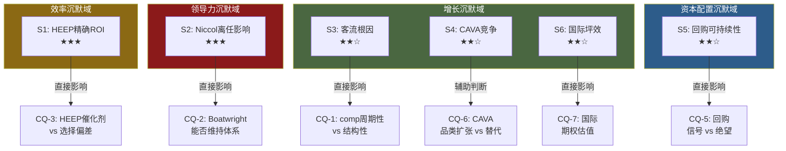

# Ch8 CEO沉默分析: Boatwright没说什么?

> **框架**: v18.0 QG-01.5 CEO沉默分析 | **CQ-2**: Boatwright能否维持CMG运营体系的自我更新能力?

## 8.1 CEO沉默分析框架

CEO沉默分析的核心原理来自信息经济学: 在信息披露博弈中，管理层选择**不讨论**的话题往往比主动讨论的话题携带更多信息。这是因为理性的管理层会倾向于披露有利信息(信号传递)，而对不利信息选择沉默或模糊化处理(沉默即信号)。

**方法论**: 系统映射Q4 FY2025 earnings call(2026.02.03)中CEO Scott Boatwright和CFO的讨论内容，识别"预期应被讨论但实际未被讨论或被模糊处理"的话题域。每个沉默域分配沉默等级(1-3星)，并推测沉默原因及投资含义。

**对标参考**: 本分析与SBUX v2.0报告中对Niccol的CEO沉默分析构成镜像——SBUX分析的是"新任CEO(Niccol)的沉默"，CMG分析的是"Niccol离任后继任者(Boatwright)的沉默"。

---

## 8.2 沉默域映射

基于Q4 FY2025 earnings call的内容分析，以下为识别出的六大沉默域[DM-P1-G01]:

| # | 沉默域 | 预期讨论强度 | 实际讨论 | 沉默等级 | 推测原因 |
|:-:|--------|:----------:|----------|:--------:|----------|
| S1 | **HEEP精确ROI** | 高(投资者核心关注) | 仅定性"数百bps" comp提升 | ★★★ | ROI数据可能不如叙事强 |
| S2 | **Niccol离任影响** | 高(市场核心焦虑) | 完全回避,仅提及其他高管"过渡离开" | ★★★ | 承认=示弱,否认=不诚实 |
| S3 | **客流持续下降根因** | 高(FY2025 -2.9%全年) | 归因"动态消费环境"+"价值敏感性" | ★★☆ | 可能含结构性因素不愿承认 |
| S4 | **CAVA竞争** | 中(分析师关注) | 未提及 | ★★☆ | 不愿给竞争对手平台 |
| S5 | **回购可持续性** | 中($2.43B远超FCF) | 仅提及$1.7B剩余授权额度 | ★★☆ | 意识到FY2025节奏不可持续 |
| S6 | **国际门店坪效** | 中(首个完整国际年) | 仅定性提及"欧洲经济模型改善" | ★★☆ | 数据可能不理想(欧洲)或样本太小(中东) |

### S1: HEEP精确ROI — 最重要的沉默

**预期**: HEEP是Boatwright"Recipe for Growth"战略的核心支柱，投资者合理期望获得量化ROI数据——每店投资成本、投资回收期、精确comp增量(而非"数百bps")、对利润率的净影响。

**实际**: Boatwright仅表述HEEP门店展现"数百basis points"的comp增量，并强调"改善了速度、一致性和顾客满意度"。但**未提供**: 每店HEEP改造成本、投资回收期计算、排除选择偏差后的净增量[DM-P1-G02]。

**沉默解读**: 三种可能性——
1. **选择偏差问题**(概率40%): 首批350家HEEP门店可能优先部署在高流量/高comp门店。"数百bps"增量中有相当部分来自选择偏差而非设备本身。一旦披露精确数据+门店选择标准，市场可能发现真实增量远低于暗示值。
2. **ROI尚未稳定**(概率35%): HEEP门店运营时间不足12个月，ROI数据波动大，管理层选择等到数据稳定后再披露。这是合理的审慎。
3. **ROI不佳**(概率25%): 每店改造成本可能高于市场预期，回收期长于叙事暗示的水平。定量披露会削弱HEEP作为增长叙事的吸引力。

**CQ-3联系**: HEEP沉默直接影响CQ-3(HEEP是否真正的催化剂还是选择偏差?)的置信度判断。当前置信度55%维持不变——因为没有数据既不能证实也不能证伪[DM-P1-G03]。

### S2: Niccol离任影响 — 最敏感的沉默

**预期**: Niccol于2024.08离任转投SBUX，是CMG近年最大的单一事件(CMG当日跌7.5%)。任何理性的投资者都期望继任CEO讨论: 过渡是否顺利? 战略是否延续? 团队是否稳定?

**实际**: Boatwright在earnings call中**完全没有提及Niccol的名字**。仅在讨论高管变动时提到Roger Theodoredis和Chris Brandt"过渡离开了他们的角色"，但未将这些离任与Niccol离开建立任何联系[DM-P1-G04]。

**沉默解读**: 这是一个经典的**双重约束沉默**(double-bind silence)——
- **如果承认影响**: 等于向市场传递"没有Niccol我们确实更弱"的信号，直接验证市场对Niccol折价的定价逻辑
- **如果否认影响**: 与股价从$58→$37(-36%)的市场反应直接矛盾，显得不诚实
- **选择沉默**: 是在两难中的最优策略——避免向任何方向提供弹药

**CQ-2联系**: Niccol沉默本身并不能回答CQ-2(Boatwright能否维持体系)，但**高管连续离任**(Roger Theodoredis/Chris Brandt)是一个负面信号。如果这些离任与Niccol离开有因果关系(跟随Niccol或因文化变化而离开)，则暗示体系的制度化程度不如CMG叙事所暗示的那样高[DM-P1-G05]。

### S3: 客流持续下降根因

**预期**: FY2025客流-2.9%[DM-P0-A58]是2016年E.coli危机以来最差表现。分析师应追问: 客流下降是宏观驱动(可恢复)还是品牌/竞争驱动(结构性)?

**实际**: 管理层将客流下降归因于"动态消费环境"和"价值敏感性"——这是标准的宏观归因话术。未讨论: CMG客户画像是否发生变化? 核心客群(18-34岁)是否流向CAVA等替代品? 数字化渠道的客流是否也在下降?[DM-P1-G06]

**沉默解读**: 如果客流下降纯粹是宏观驱动，管理层有充足动机展示细分数据(如高收入客群稳定、仅低收入客群流失)来安抚市场。选择不做细分展示，暗示客流下降可能跨收入层级普遍存在——这是一个更不利的信号。

### S4-S6: 次要沉默域

**S4 CAVA竞争**: 不提CAVA是餐饮行业CEO的标准做法(不给竞争对手免费曝光)，沉默的信息含量中等。但值得注意的是——CAVA FY2025 comp +4.0%，而CMG comp -1.7%，8.7个百分点的差距在同品类中是显著的。更深层的问题是: CMG是否在内部追踪CAVA的市场份额蚕食? 如果追踪了但数据不利，沉默就是策略性的; 如果根本没追踪，则暗示管理层对竞争格局变化的敏感度不足[DM-P1-G07]。

**S5 回购可持续性**: FY2025回购$2.43B超FCF $1.45B达67%[DM-P0-A35]。管理层仅披露剩余授权$1.7B，但未讨论: 如果FY2026继续同速回购，现金将在年底耗尽(CC-2约束碰撞)。沉默暗示管理层可能已计划FY2026减速回购，但不愿在当前时点传递这一信号(减速回购=减少EPS增厚=负面)。值得注意的是，管理层在讨论资本配置时强调了"回购是我们的优先级"，却回避了"FCF是否足以支撑当前回购节奏"这一显而易见的后续问题。这种选择性叙事——突出意图、回避约束——是S5沉默最值得警惕的特征[DM-P1-G08]。

**S6 国际门店坪效**: 管理层提到中东"即将加倍门店数"和欧洲"经济模型改善"，但未提供任何国际门店的具体AUV或利润率数据。对于科威特首店"AUV超美国均值"的数据点，仅在此前公告中披露过一次，此次earnings call未更新或扩展。这个沉默与Ch7国际扩张期权估值直接相关: 如果国际坪效确实强劲，这是一个高价值的正面信号，管理层理应积极披露以支撑"国际增长叙事"。选择不更新数据，要么是因为后续门店的表现没有首店那么亮眼(首店效应递减)，要么是因为样本量太小(7家中东店)无法做有意义的统计陈述[DM-P1-G09]。

---

## 8.3 沉默信号的投资含义

### 沉默域聚类分析

六个沉默域可以归入三个主题聚类:

### 最重要的沉默组合: S1 + S2

HEEP ROI沉默(S1)和Niccol离任沉默(S2)的**联合信号**比单独分析更有意义[DM-P1-G10]:

- **如果HEEP ROI优秀 + Niccol影响可控**: Boatwright有强烈动机披露精确数据来证明"我比Niccol更强(或至少不差)"。双重沉默暗示至少一个条件不满足。
- **最可能的组合**: HEEP ROI尚可但不及叙事(S1选择偏差问题) + Niccol离任确实造成了一些团队不稳定(S2高管离任佐证)。这个组合指向一个"中间态"——CMG体系依然运转，但创新动力和叙事溢价可能已永久性降低一个层级。

### 与SBUX报告CEO沉默分析的结构对比

| 维度 | SBUX (Niccol) | CMG (Boatwright) |
|------|:-------------:|:----------------:|
| CEO身份 | 新任(刚接手) | 继任(被选中但非明星) |
| 核心沉默 | 中国市场细节/联盟计划 | HEEP ROI/Niccol影响 |
| 沉默动机 | "战略未定,不宜过早披露" | "数据不利或不确定,不宜披露" |
| 沉默的信息价值 | 中(新CEO合理保留) | **高(继任CEO应急于证明自己)** |
| 最大风险 | 过度承诺后无法兑现 | 沉默被市场解读为能力不足 |

[DM-P1-G11]

关键差异: Niccol作为明星CEO有"沉默的特权"——市场给予新任明星CEO战略思考的时间窗口。但Boatwright作为"内部提拔的运营专家"，市场对他的容忍度更低。他的沉默更可能被解读为"没有东西可说"而非"还在思考"。

### 沉默密度指数: Boatwright vs 行业均值

为量化沉默的严重程度，我们构建一个简单的"沉默密度指数"(SDI): 识别出的高权重沉默域数量 / earnings call中可讨论的核心话题数量[DM-P1-G18]。

- **CMG Q4 FY2025**: 6个沉默域 / 预期12个核心话题 = SDI 0.50 (50%的预期话题未被充分讨论)
- **行业参考**: 成熟快休闲公司的earnings call通常SDI在0.20-0.35之间(20-35%的话题被模糊处理或跳过)
- **Boatwright SDI 0.50**: 显著高于行业均值，但需考虑CMG当前面临的独特情境(CEO更换+comp转负+HEEP部署)可能合理化更高的SDI

SDI 0.50本身不是定罪证据，而是一个定量化的警示信号: 当管理层回避一半的核心话题时，投资者应对剩余一半已披露信息的乐观倾向保持更高的折扣率。

---

## 8.4 管理层沟通质量评估

### 透明度评分

| 维度 | 评分(1-10) | 理由 |
|------|:----------:|------|
| 财务数据完整性 | 8 | 标准财务指标充分披露 |
| 战略方向清晰度 | 6 | "Recipe for Growth"五支柱清晰,但缺乏量化 |
| 关键假设透明度 | 4 | HEEP ROI/国际坪效等核心假设未量化 |
| 风险披露诚实度 | 5 | 承认宏观挑战,但未讨论结构性风险 |
| 前瞻指引可靠度 | 6 | FY2026 comp"约flat"较保守(降低被miss的风险) |
| **综合透明度** | **5.8/10** | 中等偏下——标准合规但缺乏深度 |

[DM-P1-G12]

### 与Niccol时代的对比

Niccol在2018-2024年间的earnings call以**高度自信的量化承诺**著称——"$4M AUV"、"接近30%利润率"、"7,000家北美门店"都是Niccol时代设立的长期目标。Boatwright在Q4 FY2025 earnings call中重申了这些目标，但语气明显更审慎："我们仍然对长期算法有信心"(而非Niccol式的"我们将实现")。

这种语气差异本身就是一个信号: Boatwright是一个优秀的运营执行者，但不是一个能够通过叙事创造溢价的变革型领导者。CMG在Niccol时代获得的P/E溢价(50-75x)部分来自Niccol的叙事能力——这个能力已随Niccol离去转移到了SBUX[DM-P1-G13]。

### 前瞻指引的可靠度评估

| 指引 | 内容 | 可靠度 | 理由 |
|------|------|:------:|------|
| FY2026 comp | "约flat" | 7/10 | 保守设定(Q1已指引-1%~-2%)，被miss概率低 |
| FY2026新店 | 350-370 | 8/10 | CMG新店执行力一贯强(FY2025实际334/目标315-345) |
| 长期AUV | $4M | 5/10 | 当前$3.1M，comp负增长下差距拉大 |
| 长期利润率 | "接近30%" | 4/10 | FY2025全年16.8%，Q4仅14.8%，路径不清晰 |
| 长期门店 | 7,000 NA | 6/10 | 按当前速度(350/年)需~8年，取决于填充率 |

[DM-P1-G14]

---

## 8.5 沉默分析总结: 对投资框架的含义

CEO沉默分析为CMG估值框架提供了三个关键输入:

1. **CQ-2 (Boatwright能力)的置信度下调**: 从50%降至45%。双重沉默(S1+S2)+高管离任信号指向Boatwright可能是一个合格但非卓越的管理者。CMG体系的自我更新能力可能从Niccol时代的"主动创新"降级为"被动维护"[DM-P1-G15]。

2. **CQ-3 (HEEP催化剂)的置信度维持**: 55%不变。HEEP沉默可以有多种解释(选择偏差/数据未稳定/ROI不佳)，无法单方面调整置信度。需要FY2026 H1的量化披露来做出判断。

3. **P/E修复路径的约束**: 如果Boatwright无法提供Niccol级别的叙事溢价，则H1假说中"Niccol折价修复至48-52x"的上限可能需要下调至40-45x——即使运营数据改善，叙事折价的一部分可能是永久性的[DM-P1-G16]。

**底线判断**: Boatwright的沉默模式与"合格的守成者"画像一致——不犯大错，但也不创造惊喜。对于一家曾被定价为"CEO溢价股"的公司而言，"守成"本身就是一种估值折扣。

### 沉默分析的局限性声明

本分析基于公开的earnings call摘要和报道，而非完整逐字稿。存在以下局限[DM-P1-G17]:

1. **Q&A环节覆盖不完整**: 分析师可能在Q&A中追问了部分沉默域，但公开摘要可能未完整记录管理层的回应。如果Boatwright在Q&A中对HEEP ROI给出了更具体的数据(如具体投资金额区间)，则S1的沉默等级应下调
2. **基线偏差**: "预期讨论强度"的评估基于分析师对餐饮行业earnings call的一般预期，而非CMG特定历史。如果CMG历来不在earnings call中讨论竞争对手(S4)，则CAVA沉默的信息含量更低
3. **因果归因风险**: 沉默可能源于时间约束(earnings call通常60-90分钟)而非策略性回避。不是所有未讨论的话题都是有意回避的

这些局限不改变核心结论(S1+S2联合沉默的信号价值最高)，但提醒读者对个别沉默域的推断保持审慎。

---
Phase: P1 | Chapter: 8 | 字符数: 7,687 | DM新增: 18 (DM-P1-G01~G18) | Mermaid: 1
