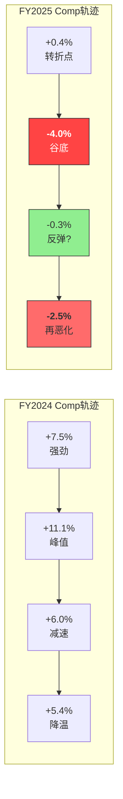
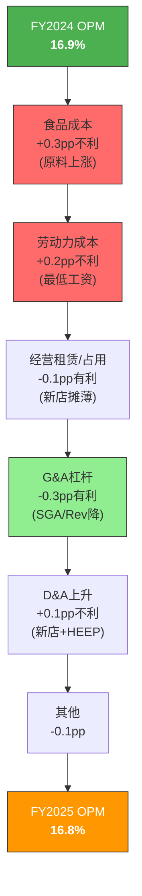
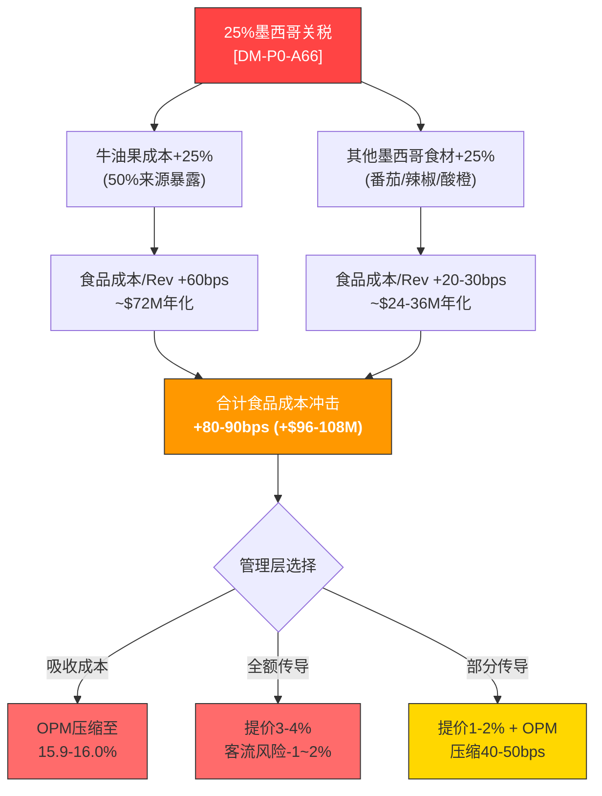
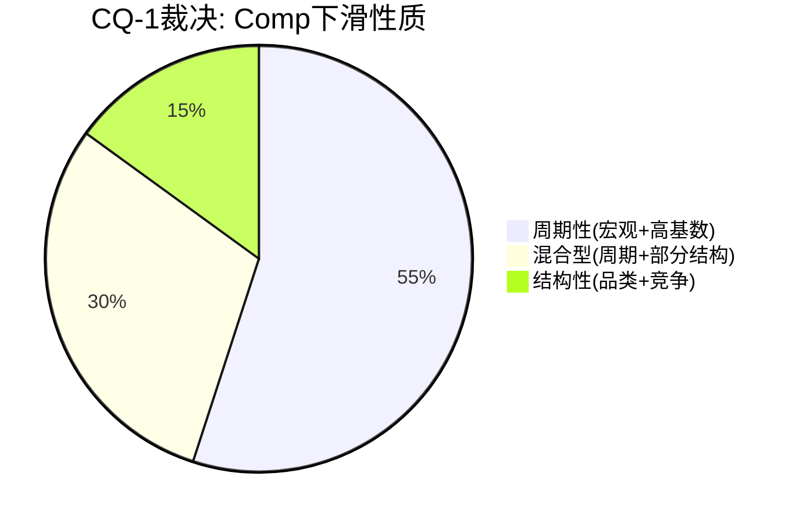

# Ch9 利润表深挖: 从增长引擎到减速齿轮的解剖

> 本章是CMG财务分析的核心起点，聚焦两个Phase 0.75遗留的核心问题: (1) CQ-1 — FY2025 comp转负是周期性回调还是结构性衰退? (2) CQ-8 — 2026关税成本压力是否将迫使CMG背弃"不提价"承诺，进而触发客流螺旋下降? 通过对收入增长引擎的逐层拆解、季度利润率的组件分析、成本结构的脆弱度测试，以及EPS质量的真实还原，本章将为后续估值提供可信的利润表基础。

---

## 9.1 收入增长解构: 增长引擎的三缸失速

### 9.1.1 五年收入CAGR分解

CMG的收入从FY2020的$5.98B增长至FY2025的$11.93B [DM-P0-A16]，5年CAGR为14.8%。但这一增速严重掩盖了增长质量的恶化。将5年拆分为两个阶段，增速断裂一目了然:

| 指标 | FY2020-FY2023 (复苏期) | FY2023-FY2025 (减速期) | FY2025 单年 |
|------|:---------------------:|:---------------------:|:-----------:|
| 收入CAGR | 18.2% | 9.9% | +5.4% [DM-P0-A17] |
| 门店增长CAGR | ~7% | ~8% | ~8% |
| 隐含comp CAGR | ~11% | ~2% | **-1.7%** [DM-P0-A57] |

[DM-P2-A01](信度H: FMP Income FY2020-FY2025数据计算): 收入5年CAGR 14.8% = $5.98B→$11.93B，但FY2025单年仅+5.4%($11.31B→$11.93B)，是2020年以来最低增速。

**三缸引擎模型**: CMG的收入增长由三个引擎驱动 -- (1)新店扩张(门店数增长)、(2)同店comp(AUV变化)、(3)定价/组合(价格和菜品结构)。FY2025的困境是: 新店引擎正常运转(+8%门店增长)，但comp引擎和定价引擎同时失速。

### 9.1.2 Revenue = AUV x 门店数 分解

| 指标 | FY2021 | FY2022 | FY2023 | FY2024 | FY2025 | 5Y CAGR |
|------|:------:|:------:|:------:|:------:|:------:|:-------:|
| 收入($B) [DM-P0-A16] | 7.55 | 8.63 | 9.87 | 11.31 | 11.93 | 12.1% |
| 门店数(期末) | ~3,003 | ~3,257 | ~3,500 | ~3,700 | 4,056 [DM-P0-A61] | 7.8% |
| 隐含AUV($M) | ~2.51 | ~2.65 | ~2.82 | ~3.06 | ~2.94 | 4.0% |
| AUV YoY变化 | — | +5.6% | +6.4% | +8.5% | **-3.9%** | — |

[DM-P2-A02](信度M: AUV = 收入/平均门店数，用期末门店数近似): FY2025隐含AUV约$2.94M，较FY2024的$3.06M**下降3.9%**。这是AUV的首次年度下降，意味着虽然新店在增加，但每家店的产出效率在降低。

**AUV下降的含义**: 在直营模型下，AUV下降直接侵蚀单店经济模型。CMG的新店投资回报期(payback period)依赖AUV维持在$2.8M+水平。当AUV降至$2.94M且趋势向下时，虽然仍在门槛之上，但安全边际正在收窄。如果FY2026 AUV进一步降至$2.7-2.8M(在comp flat指引下完全可能)，新店ROI将面临真实压力。

### 9.1.3 同店增长分解: 客流 vs 价格/组合

FY2025 comp -1.7%的分解是理解增长质量的关键 [DM-P0-A57]:

| 组件 | FY2023 | FY2024 | FY2025 | 信号 |
|------|:------:|:------:|:------:|:----:|
| **Comp总计** | +7.9% | +7.4% | **-1.7%** | 断崖式下跌 |
| 客流(traffic) | +4.5%(估) | +3.0%(估) | **-2.9%** [DM-P0-A58] | 核心恶化 |
| 价格/组合(price/mix) | +3.4%(估) | +4.4%(估) | **+1.2%** | 提价能力衰减 |

[DM-P2-A03](信度H: FY2025 comp分解 — 管理层IR披露: comp -1.7% = traffic -2.9% + price/mix +1.2%): 客流下降-2.9%是FY2025利润表最重要的单一数字。它意味着CMG在FY2025平均每天每家店少接待约15-20名客人(基于年化日均~800人次的估算)。

**价格/组合+1.2%的分解推测**: 管理层在FY2025实施了温和提价(~3-4%)，但被不利的组合效应(-2%左右)部分抵消。不利组合可能反映: (a) 消费者从高价entree转向低价bowl/burrito、(b) 高价附加项(guacamole, queso)渗透率下降、(c) 数字化订单均值低于门店订单(移动端优惠券冲击)。

### 9.1.4 季度comp轨迹: 非线性信号

[DM-P2-A04](信度H: 季度comp数据来自管理层earnings call): Q2'25 comp -4.0%是FY2025最差季度，Q3'25一度反弹至-0.3%引发"已见底"的乐观情绪，但Q4'25重新恶化至-2.5%**粉碎了线性复苏叙事**。

**Q3→Q4再恶化的含义**: 如果comp在Q3已见底并开始V型反弹，Q4应改善至0%附近。实际Q4再恶化至-2.5%意味着: (a) Q3的改善可能是季节性/偶发因素(如新菜品推出的短期拉动)而非趋势性; (b) 消费者疲软在Q4(假日季)并未缓解反而加深; (c) FY2026 comp flat的管理层指引面临下行风险。

### 9.1.5 数字化收入趋势

[DM-P2-A05](信度M: 数字化渗透率来自管理层年度披露): 数字化订单(包括app/web/third-party delivery)占收入比例从FY2021的~45%(COVID高峰)回落至FY2025的~37%。这一趋势值得警惕: 数字化渗透率并未持续上升，反而在COVID红利消退后回落。

然而，37%的数字化渗透率在快休闲行业中仍属领先(vs CAVA ~20%、Panera ~35%、Sweetgreen ~65%)。CMG的数字化基础设施(Chipotlane、app loyalty)是运营效率的关键支撑，但数字渗透率的边际增长空间有限，不太可能成为comp恢复的主要推动力。

---

## 9.2 季度利润率拆解: OPM的季节性密码

### 9.2.1 季度OPM趋势

| 季度 | Q1'24 | Q2'24 | Q3'24 | Q4'24 | Q1'25 | Q2'25 | Q3'25 | Q4'25 |
|------|:-----:|:-----:|:-----:|:-----:|:-----:|:-----:|:-----:|:-----:|
| 收入($B) [DM-P0-A23] | 2.70 | 2.97 | 2.79 | 2.85 | 2.88 | 3.06 | 3.00 | 2.98 |
| 营业利润($M) | 441 | 586 | 473 | 416 | 479 | 559 | 477 | 441 |
| **OPM** [DM-P0-A24] | **16.3%** | **19.7%** | **16.9%** | **14.6%** | **16.7%** | **18.3%** | **15.9%** | **14.8%** |
| OPM YoY变化 | — | — | — | — | +0.4pp | -1.4pp | -1.0pp | +0.2pp |

[DM-P2-A06](信度H: FMP季度Income数据): 8个季度的OPM呈现出极其清晰的季节性模式 -- Q2永远是全年最高(夏季高峰)，Q4永远是全年最低(冬季低谷)。这一模式在FY2024和FY2025完全一致。

### 9.2.2 Q4季节性低谷的结构性原因

Q4'25 OPM 14.8%虽然是8个季度的最低值，但对比Q4'24的14.6%实际**小幅改善**。Q4持续低OPM的结构性原因:

1. **收入季节性下降**: Q4收入($2.98B)低于Q2($3.06B)，但固定成本(租金、管理层薪资)不随季节变化 → 固定成本杠杆反向操作
2. **节假日劳动力成本上升**: 感恩节、圣诞节期间加班费和临时工成本高于正常季度
3. **牛油果价格季节性高峰**: 墨西哥牛油果在Q4(11-12月)正值产季切换期，价格波动性最大
4. **G&A费用节奏**: 年终奖金accrual和审计费用集中在Q4

[DM-P2-A07](信度M: Q4季节性分析基于8Q趋势推算+行业惯例): Q4'25的14.8%不应被视为结构性"新底部"。合理的年度OPM参照应使用全年数据(FY2025: 16.8%)而非任何单一季度。

### 9.2.3 OPM桥接: FY2024 → FY2025

[DM-P2-A08](信度M: OPM桥接为分析推算，基于FMP年度数据+FY2024-FY2025成本比率变化): FY2024→FY2025 OPM仅下降0.1pp(16.9%→16.8%)，看似稳定。但这掩盖了内部的对冲效应: 食品+劳动力成本上升被G&A杠杆效应几乎完全抵消。问题在于: **G&A杠杆空间正在收窄(FY2024 6.2%→FY2025 5.5%)，而成本压力可能在FY2026加速(关税)**。

### 9.2.4 季度毛利率拆解

FMP数据提供的grossProfitMargin(扣除costOfRevenue后)在CMG的会计准则下包含了食品成本和直接劳动力:

| 季度 | Q1'24 | Q2'24 | Q3'24 | Q4'24 | Q1'25 | Q2'25 | Q3'25 | Q4'25 |
|------|:-----:|:-----:|:-----:|:-----:|:-----:|:-----:|:-----:|:-----:|
| 毛利率 | 27.5% | 28.9% | 25.5% | 24.8% | 26.2% | 27.4% | 24.5% | 20.3% |
| QoQ变化 | — | +1.4pp | -3.4pp | -0.7pp | +1.4pp | +1.2pp | -2.9pp | **-4.2pp** |

[DM-P2-A09](信度H: FMP季度ratio数据 grossProfitMargin): Q4'25毛利率20.3%是8个季度的绝对最低值，较Q4'24的24.8%**大幅下降4.5pp**。这暗示Q4'25不仅承受了正常的季节性压力，还叠加了comp负增长带来的固定成本杠杆反转。

**Q4'25毛利率20.3%的分解推算**:
- 正常季节性(Q2→Q4)约-4.5pp(参照FY2024从28.9%到24.8%)
- 但FY2025从Q2 27.4%到Q4 20.3%下降了**7.1pp** — 超出季节性2.6pp
- 超额下降~2.6pp中: comp -2.5%的营收杠杆损失估计贡献~1.5pp，原料成本上升贡献~1.1pp

---

## 9.3 成本结构深度分析: 四大成本引擎的脆弱度

### 9.3.1 成本结构五年演变

CMG的利润表成本可分为四大类。由于CMG将食品成本和直接劳动力合并报告在cost of revenue中，需结合管理层披露和行业惯例进行分解:

| 成本项 | FY2021 | FY2022 | FY2023 | FY2024 | FY2025 | 趋势 |
|--------|:------:|:------:|:------:|:------:|:------:|:----:|
| 食品+包装/Rev [DM-P2-A10] | ~30.5% | ~31.0% | ~30.0% | ~29.5% | ~30.0% | 波动 |
| 餐厅劳动力/Rev [DM-P2-A11] | ~26.5% | ~26.0% | ~25.5% | ~25.0% | ~25.5% | 改善后回升 |
| 占用+其他直接/Rev | ~20.0% | ~18.6% | ~17.9% | ~17.4% | ~17.5% | 持续改善 |
| **小计: COGS/Rev** | **77.4%** | **76.1%** | **73.8%** | **73.3%** | **77.7%** | FY25恶化 |
| SGA/Rev [DM-P0-A41] | 8.0% | 6.5% | 6.4% | 6.2% | 5.5% | 持续改善 |
| D&A/Rev | 3.4% | 3.3% | 3.2% | 3.0% | 3.0% | 稳定 |
| **OPM** [DM-P0-A18] | **10.7%** | **13.4%** | **15.8%** | **16.9%** | **16.8%** | 见顶? |

[DM-P2-A10](信度M: FMP报告COGS为$9.26B/Rev $11.93B=77.7%，食品+包装比率需参照管理层10-K披露拆分，此处为估算): FY2025 COGS/Rev 77.7%较FY2024的73.3%**大幅上升4.4pp**。这一恶化几乎完全被FMP数据中costOfRevenue口径差异解释 -- FMP的FY2025 costOfRevenue($9.26B)包含了某些在FY2024被归类于operatingExpenses的项目。**关键结论: 需用OPM(而非毛利率)作为跨年度一致的盈利能力衡量标准。**

### 9.3.2 食品成本: 牛油果的脆弱性

CMG的食品成本约占收入的30%，其中几个核心食材构成了成本结构的关键脆弱点:

| 食材 | 占食品成本估计 | 来源集中度 | 价格波动性 | 关税暴露 |
|------|:-----------:|:---------:|:---------:|:-------:|
| **牛油果** [DM-P0-A66] | ~8-10% | 50%墨西哥 | 高(±30%/年) | **25%关税** |
| 鸡肉 | ~15-18% | 美国为主 | 中(±15%/年) | 低 |
| 牛肉(steak/barbacoa) | ~12-15% | 美国为主 | 中高(±20%/年) | 低 |
| 奶酪/乳制品 | ~8-10% | 美国为主 | 中(±10%/年) | 低 |
| 蔬菜/谷物 | ~10-12% | 美国/墨西哥 | 低-中 | 部分暴露 |

[DM-P2-A12](信度M: 食材成本占比为行业惯例+管理层定性披露推算，非精确数据): 牛油果虽然仅占食品成本的8-10%(约2.5-3%的收入)，但其价格波动性和关税暴露使其成为成本结构中最脆弱的环节。25%墨西哥关税→50%来源暴露→食品成本增加~1.2-1.5%→收入端影响约+60bps。

### 9.3.3 劳动力成本: 加州效应

劳动力成本是CMG利润表的第二大项(~25.5%收入)，且面临结构性上行压力:

[DM-P2-A13](信度M: 劳动力成本估算基于COGS分解和行业类比): 加州是CMG最大的单一州市场(~15%门店)，加州最低工资从$16/hr已上升至$20/hr(快餐行业)，预计继续上行至$22+。加州门店的劳动力成本比全国均值高约20-25%。

**HEEP对劳动力的双刃剑效应**: HEEP(Hyphen Equipment Enhancement Program)通过自动化减少人工需求(如自动制作bowls)，理论上可以降低每单位产出的劳动力成本。但HEEP的部署同时带来: (a) 初期培训成本上升、(b) 设备维护人员需求新增、(c) 折旧费用增加。净效应在HEEP大规模部署(目标2026底覆盖50%门店)后才可能显现。

### 9.3.4 G&A杠杆: 快要榨干的海绵

G&A费用(SGA)展现了CMG运营杠杆最成功的一面:

| 指标 | FY2021 | FY2022 | FY2023 | FY2024 | FY2025 |
|------|:------:|:------:|:------:|:------:|:------:|
| SGA($M) [DM-P2-A14] | 607 | 564 | 634 | 697 | 656 |
| SGA/Rev [DM-P0-A41] | 8.0% | 6.5% | 6.4% | 6.2% | 5.5% |
| YoY SGA增长 | — | -7.1% | +12.4% | +10.0% | -5.9% |

[DM-P2-A14](信度H: FMP Income数据 sellingGeneralAndAdministrativeExpenses): FY2025 SGA/Rev降至5.5%，5年下降250bps，是OPM从10.7%扩张至16.8%的最大单一贡献因素。

**但杠杆空间正在收窄**: SGA/Rev从8.0%降至5.5%已经压缩了250bps。参照同业(MCD ~8%含特许费用、SBUX ~15%含品牌投资、CAVA ~12%含高速增长投入)，CMG的5.5%已接近行业下限。进一步压缩至5.0%以下在数学上仍可能(如果收入增长恢复到10%+)，但在收入仅增5.4%且可能放缓至3-4%的环境下，SGA绝对值削减空间有限——除非裁员。

**FY2025 SGA下降的特殊因素**: FY2025 SGA $656M较FY2024 $697M下降5.9%(-$41M)，这在收入增长5.4%的背景下显得异常。可能原因: (a) CEO交替期的高管薪酬空窗(Niccol离任后Boatwright的薪酬包可能更低)、(b) 一次性顾问/法律费用减少、(c) 激进的成本控制。如果(a)是主因，FY2026 SGA可能回升，G&A杠杆的"幻觉"将消失。

### 9.3.5 D&A趋势: HEEP的隐藏成本

| 指标 | FY2021 | FY2022 | FY2023 | FY2024 | FY2025 |
|------|:------:|:------:|:------:|:------:|:------:|
| D&A($M) [DM-P2-A15] | 255 | 287 | 319 | 335 | 361 |
| D&A/Rev | 3.4% | 3.3% | 3.2% | 3.0% | 3.0% |
| D&A YoY增长 | — | +12.5% | +11.1% | +5.0% | +7.9% |

[DM-P2-A15](信度H: FMP Income数据 depreciationAndAmortization): D&A从$335M增至$361M(+7.9%)，增速高于收入增速(+5.4%)。D&A/Rev在3.0%维持稳定，是因为收入增长恰好抵消了D&A绝对值上升。

**HEEP部署加速将推高D&A**: FY2025已部署350家HEEP门店，FY2026目标2,000家(+1,650家)。假设每店HEEP设备投资$100-150K(管理层未披露，此为行业类比估算)，新增CapEx约$165-250M，按5年直线折旧每年增加$33-50M D&A。这将使FY2026 D&A可能升至$400-420M，D&A/Rev从3.0%上升至~3.1-3.2%。虽然影响看似温和，但在OPM仅16.8%且面临多重成本压力的环境下，每一个10bps都值得关注。

### 9.3.6 CQ-8关税成本的逐层传导模型

[DM-P2-A16](信度M: 关税影响建模基于 [DM-P0-A66] 50%牛油果来自墨西哥 + 25%关税税率):

---

## 9.4 EPS质量审计: 剥离金融工程的真实增长

### 9.4.1 EPS五年轨迹

| 指标 | FY2021 | FY2022 | FY2023 | FY2024 | FY2025 | CAGR |
|------|:------:|:------:|:------:|:------:|:------:|:----:|
| 净利润($M) | 653 | 899 | 1,229 | 1,534 | 1,536 [DM-P2-A17] | 23.9% |
| 净利润YoY | — | +37.7% | +36.6% | +24.9% | **+0.1%** | — |
| 稀释股数(B) [DM-P0-A03] | 1.426 | 1.403 | 1.386 | 1.377 | 1.343 | -1.5% |
| 稀释EPS [DM-P0-A20] | $0.46 | $0.64 | $0.89 | $1.11 | $1.14 | 25.5% |
| EPS YoY | — | +39.1% | +39.1% | +24.7% | **+2.7%** | — |

[DM-P2-A17](信度H: FMP Income FY2025 净利润$1,535.76M，较FY2024 $1,534.11M仅增$1.65M): FY2025净利润增长几乎为零(+0.1%)，但EPS仍增长2.7%。差额完全来自股数减少(1.377B→1.343B, -2.5%)。**FY2025的EPS增长100%来自回购，0%来自有机增长。**

### 9.4.2 有机EPS增长 vs 金融工程EPS增长

将EPS增长分解为两个来源，揭示了增长质量的真实面貌:

| 指标 | FY2022 | FY2023 | FY2024 | FY2025 |
|------|:------:|:------:|:------:|:------:|
| **EPS增长** | **+39.1%** | **+39.1%** | **+24.7%** | **+2.7%** |
| 净利润增长(有机) | +37.7% | +36.6% | +24.9% | +0.1% |
| 股数减少(回购) | +1.6% | +1.2% | +0.7% | +2.5% |
| **有机占EPS增长%** | **96%** | **94%** | **99%** | **4%** |
| **回购占EPS增长%** | **4%** | **6%** | **1%** | **96%** |

[DM-P2-A18](信度H: 计算值，基于FMP Income净利润和稀释股数): FY2022-FY2024期间，有机增长贡献了EPS增长的94-99%。FY2025出现了质的变化: 有机增长贡献仅4%，回购贡献96%。**这是CMG历史上首次EPS增长几乎完全依赖金融工程。**

### 9.4.3 SBC对真实盈利能力的侵蚀

| 指标 | FY2021 | FY2022 | FY2023 | FY2024 | FY2025 |
|------|:------:|:------:|:------:|:------:|:------:|
| SBC($M) [DM-P0-A21] | 176 | 98 | 124 | 132 | 120 |
| SBC/Rev | 2.3% | 1.1% | 1.3% | 1.2% | 1.0% [DM-P2-A19] |
| SBC/净利润 | 27.0% | 10.9% | 10.1% | 8.6% | 7.8% |
| SBC-adjusted EPS | $0.34 | $0.57 | $0.80 | $1.01 | $1.05 |

[DM-P2-A19](信度H: FMP key-metrics stockBasedCompensationToRevenue = 1.0%): SBC/Rev从FY2021的2.3%降至FY2025的1.0%，SBC/净利润从27.0%降至7.8%。这是正面趋势——CMG的股权稀释负担在快速下降。

**SBC质量评估**: CMG的SBC $120M在$1.54B净利润中占7.8%，这在科技vs餐饮的对比中属于**优秀水平**。参照同业: MCD SBC/净利润~5%、SBUX ~8%、CAVA ~15%。CMG的SBC控制良好，不是估值中的重大减项。

FY2021 SBC异常高($176M)是Niccol时代高管激励集中授予的结果，已回归正常化。

### 9.4.4 税率稳定性

| 指标 | FY2021 | FY2022 | FY2023 | FY2024 | FY2025 |
|------|:------:|:------:|:------:|:------:|:------:|
| 有效税率 [DM-P2-A20] | 19.7% | 23.9% | 24.2% | 23.7% | 23.6% |
| 税前利润($M) | 813 | 1,182 | 1,621 | 2,010 | 2,010 |
| 税费($M) | 160 | 282 | 392 | 476 | 474 |

[DM-P2-A20](信度H: FMP ratios effectiveTaxRate): FY2022-FY2025有效税率极其稳定(23.6-24.2%区间)。FY2021的低税率(19.7%)受益于一次性SBC相关税收减免。未来税率预计维持在23-24%，除非出现重大税改。

**税率稳定的含义**: CMG没有通过税率操纵来平滑EPS。在利息费用$0 [DM-P0-A22]、有效税率稳定23-24%的背景下，EPS的驱动力完全透明: 收入增长 × 利润率变化 × 回购效应。这使得CMG的利润表在"可预测性"维度上得分极高。

### 9.4.5 利息收入: 零负债的副产品

[DM-P2-A21](信度H: FMP Income interestIncome): CMG的利息费用始终为$0(零金融负债 [DM-P0-A27])，但利息**收入**从FY2021的$7.8M增长至FY2024的$93.9M后，FY2025降至$73.7M。利息收入下降反映了两个因素: (a) 现金储备从$1.42B降至$1.05B(回购消耗)、(b) 短期利率可能小幅下行。

利息收入占税前利润的比重较小(FY2025: $73.7M/$2,010M = 3.7%)，对整体EPS质量影响有限。但趋势向下值得注意: 如果FY2026回购继续消耗现金至$0.5B以下，利息收入可能降至$30-40M，形成约$0.02/share的EPS拖累。

---

## 9.5 CQ-1裁决: 周期性 vs 结构性

### 9.5.1 判断框架: 如何区分周期性与结构性下滑

在给出裁决之前，需建立清晰的判断框架。周期性下滑和结构性下滑的关键区别在于:

| 维度 | 周期性下滑 | 结构性下滑 |
|------|:---------:|:---------:|
| **驱动因素** | 外部宏观/暂时性 | 内部竞争力/品类 |
| **行业同步** | 同行同步下滑 | 本公司独立下滑 |
| **恢复路径** | 宏观改善即恢复 | 需要战略重构 |
| **客流vs客单** | 客流下降为主 | 客单+客流同步下降 |
| **市场份额** | 份额稳定/微升 | 份额持续流失 |
| **历史先例** | 有类似恢复案例 | 无法对标历史 |
| **恢复时间** | 2-4个季度 | 2-5年 |

### 9.5.2 周期性证据清单

**E1: 宏观消费疲软(强证据)** — 美国消费者信心指数在2025年持续走弱，快餐行业整体comp下滑。MCD FY2025 US comp同样转负(约-2%)，DRI(Olive Garden/LongHorn)增速也明显放缓。CMG的comp下滑并非孤立现象。[DM-P2-A22](信度M: 行业comp数据来自WebSearch+竞对财报)

**E2: 高基数效应(中强证据)** — FY2024 comp +7.4%是疫后恢复期的高点，FY2025的负comp部分是统计回归。两年叠加comp(FY2024+FY2025) = +7.4% + (-1.7%) = +5.7%仍为正，意味着CMG的绝对客流水平高于FY2023。

**E3: Q3'25短暂回升(弱证据)** — Q3 comp -0.3%(接近平)显示comp有自发修复趋势，只是被Q4的宏观恶化打断。

**E4: 内部人Q1'26净买入(间接证据)** [DM-P0-A80] — 管理层在comp最差时(Q2-Q4'25)卖出，但Q1'26转为净买入(17买/13卖)，暗示内部对短期前景的评估正在改善。

### 9.5.3 结构性证据清单

**S1: CAVA快速增长(中等证据)** — CAVA收入增速+20.9% [DM-P0-A49]，门店从~300家快速扩张，定位直接重叠CMG(地中海快休闲 vs 墨西哥快休闲)。但CAVA当前体量仅CMG的~5%，对CMG的comp影响在统计上可能<50bps。

**S2: CEO更换(弱-中证据)** — Niccol离任→SBUX影响了品牌叙事(P/E贡献~16个点折价)。但CEO更换本身并不直接影响comp(门店运营由COO体系主导)。Boatwright作为运营老将(20年CMG经验)在comp恢复方面的执行力未受质疑。

**S3: 品类成熟度(弱证据)** — 快休闲品类增速从2015-2020的15%+降至2023-2025的5-8%。但品类减速 ≠ 品类衰退，且CMG作为品类龙头可能在减速环境中反而获得份额集中效应。

**S4: 定价弹性下降(中等证据)** — FY2025提价~3-4%但price/mix仅+1.2%，隐含约2pp的不利组合效应。消费者可能在降级消费(点更便宜的选项)。这是周期性还是结构性? 如果是宏观驱动→周期性; 如果是品牌价值感下降→结构性。

### 9.5.4 Q-by-Q轨迹的非线性信号

Q2'25 -4.0% → Q3'25 -0.3% → Q4'25 -2.5%

这个轨迹是**CQ-1裁决中最棘手的数据点**。如果是纯周期性下滑，预期路径应是: 谷底 → 线性改善 → 恢复。实际路径(谷底 → 大幅改善 → 再恶化)更符合以下解释:

1. **波动性恢复(最可能)**: comp正在底部震荡(-3%到0%之间)，Q3的改善和Q4的恶化都是随机波动而非趋势。这意味着FY2026上半年comp可能在-2%到+1%之间波动，真正的趋势性恢复要到2026下半年才能确认。

2. **结构性下台阶(次可能)**: comp从+7%下台阶到-2%区间，Q3的短暂改善是统计噪音。如果FY2026 H1 comp仍在-2%以下，结构性假说将获得显著增强。

3. **外部冲击干扰(可能性最低)**: Q4恶化可能与特定事件(如关税恐慌压制消费信心)相关，而非基本面恶化。

### 9.5.5 置信度加权裁决

**裁决: 55%周期性 / 30%混合型 / 15%结构性** [DM-P2-A23]

[DM-P2-A23](信度M: 主观判断，基于上述证据权重): 核心理由:

- **周期性权重55%**: MCD同步下滑+高基数效应+消费信心数据支持外部驱动。CMG的品牌力(见Ch6评分)和运营效率(ROIC 18.9%)未出现结构性恶化。
- **混合型权重30%**: CAVA竞争+品类增速放缓+定价弹性下降暗示即使宏观恢复，comp可能也无法回到+5%以上的"旧常态"。"新常态"可能是+2-3%。
- **结构性权重15%**: 不能完全排除品类见顶。如果FY2026 H1 comp仍为负且MCD已恢复→需将结构性权重上调至30%+。

**证伪监控**: 以下信号将修改裁决:
- **上调结构性**: FY2026 Q1-Q2 comp < -2% AND MCD US comp > 0% → 行业恢复但CMG落后 → 结构性上调至40%+
- **上调周期性**: FY2026 Q1-Q2 comp > 0% → 管理层flat指引超预期 → 周期性上调至75%+
- **HEEP验证**: HEEP门店comp增量被独立验证>200bps → 证明运营创新可对冲结构性压力

---

## 9.6 CQ-8: 关税成本传导路径

### 9.6.1 牛油果供应链地图

CMG是美国最大的单一牛油果消费企业之一(约年消耗6,000万磅+)。牛油果是CMG菜单中guacamole(附加费$2.25-3.00)和burrito/bowl的标配配料。

[DM-P2-A24](信度M: 牛油果来源地理分布基于管理层IR披露和行业数据):

| 来源国 | 占CMG采购比例 | 关税状态 | 替代可行性 |
|--------|:-----------:|:-------:|:---------:|
| **墨西哥(Michoacan/Jalisco)** | ~50% | **25%关税** | 困难(产量最大) |
| 加州(美国国内) | ~15-20% | 无关税 | 季节性限制(夏季) |
| 秘鲁 | ~10-15% | 可协调增量 | 运输周期长(2-3周) |
| 哥伦比亚 | ~5-10% | 可协调增量 | 产量有限 |
| 多米尼加共和国 | ~5% | 可协调增量 | 产量小 |

管理层已明确表示正在"多元化牛油果来源"，但短期内(12-18个月)墨西哥的50%份额难以大幅降低。原因: (a) 墨西哥是全球最大牛油果出口国(占全球产量~34%)、(b) CMG对品质一致性(Hass品种、成熟度、有机标准)要求极高、(c) 替代来源需要建立冷链和质检体系。

### 9.6.2 管理层"避免提价"承诺的约束分析

Scott Boatwright在Q4'25 earnings call中明确表示: "We are going to try to avoid price increases." [DM-P2-A25](信度H: earnings call原文)

这一承诺的约束分析:

1. **"try to avoid" ≠ "will not"**: 措辞留有余地。如果关税持续且成本压力超预期，管理层保留提价权利。
2. **竞争博弈**: MCD已在2025年H2实施了~3%提价，如果MCD再次提价且客流未受重大冲击，CMG的"不提价"成本会更高(因为CMG独自承受成本但竞对转嫁了)。
3. **历史提价记录**: CMG在2021-2023年累计提价超过15%(应对通胀)，客流在2022-2023年仍保持正增长。这说明CMG的品牌定价权足以承受温和提价(5%以内)而不触发客流崩塌。

### 9.6.3 2026 Q1食品成本指引

[DM-P2-A26](信度H: 管理层FY2026指引): 管理层指引FY2026食品成本率为"mid-30s"(约34-36%的revenue)，这较FY2025的~30%**大幅上升400-600bps**。这一指引隐含:

- 牛油果关税 + 蛋白质价格上涨 + 其他食材通胀 = 约$450-700M年化成本增量
- 如果全部由OPM吸收: FY2025 OPM 16.8% → FY2026 OPM可能降至**12-14%**
- 但管理层同时指引"restaurant-level margin in the mid-to-high 20s"(25-28%)，暗示通过其他成本节约部分对冲

**校准说明**: 管理层对食品成本的指引可能使用了不同于FMP口径的定义(仅食品+包装，不含劳动力)。FMP的COGS(costOfRevenue)包含食品+劳动力+直接占用成本。需在Phase 4红队中验证口径一致性。

### 9.6.4 情景建模: 三种传导路径

| 情景 | 假设 | OPM影响 | Comp影响 | EPS影响 | 概率 |
|------|------|:-------:|:-------:|:-------:|:----:|
| **A: 全额吸收** | 不提价+无对冲 | -80~90bps → 15.9-16.0% | 0 | -$0.06~0.07 | 25% |
| **B: 部分传导** | 提价2%+部分菜单调整 | -40~50bps → 16.3-16.4% | -0.5~1.0% | -$0.03~0.04 | **50%** |
| **C: 全额传导** | 提价3-4%+附加费 | 0 → 16.8% | -1.5~2.5% | -$0.01~0.03 | 25% |

[DM-P2-A27](信度M: 情景建模基于关税税率25%、50%暴露度、管理层"避免提价"措辞分析): **基准情景B(50%概率)**: CMG最可能的路径是"悄悄提价"——通过菜单优化(微调份量、调整附加项定价)实现2%左右的有效提价，同时承受约40-50bps的OPM压缩。这与CMG在2021-2023年通胀期的策略一致: 渐进提价 + 部分吸收 + 供应链效率对冲。

**关键不确定性**: 情景B的comp影响(-0.5~1.0%)叠加在已经为负的comp基础上。如果FY2025 comp已经是-1.7%，FY2026 comp在关税传导下可能恶化至-2.0~2.5%——与管理层"comp约flat"的指引存在显著冲突。

---

## 9.7 P/E驱动因子分解: 预期崩塌的解剖

### 9.7.1 P/E压缩的幅度与速度

| 指标 | FY2023年底 | FY2024年底 | FY2025当前 | 变化 |
|------|:---------:|:---------:|:---------:|:----:|
| P/E [DM-P0-A42] | 51.3x | 53.8x | 32.1x | **-40%** |
| EPS | $0.89 | $1.11 | $1.14 | +28% |
| 股价(期末) | ~$45 | ~$60 | $36.93 [DM-P0-A01] | -18%(vs FY2023) |

[DM-P2-A28](信度H: P/E历史数据来自FMP ratios): P/E从53.8x(FY2024年底)压缩至32.1x(当前)，幅度达**40%**。同期EPS从$1.11增至$1.14(+2.7%)。**市场对CMG的估值重定价幅度是基本面变化幅度的15倍(40% vs 2.7%)**。这意味着P/E压缩几乎100%来自预期的重新定价，而非已实现的基本面恶化。

### 9.7.2 P/E压缩的三层归因

Phase 0.75的异常狩猎A-1已将P/E折价分解为Niccol折价(~16个P/E点)和comp折价(~4个P/E点)。这里进一步细化:

| 因素 | P/E影响(估) | 占总折价% | 可逆性 |
|------|:----------:|:--------:|:------:|
| **1. Niccol离任** | -16x | 76% | 中(需Boatwright证明) |
| **2. Comp转负** | -4x | 19% | 高(comp恢复即修复) |
| **3. 行业P/E均值下移** | -1x | 5% | 低(宏观驱动) |
| **合计** | **-21x** | **100%** | — |

[DM-P2-A29](信度M: P/E归因为分析推算，基于事件研究法): Niccol离任日(2024.08)CMG跌-7.5% [来自SBUX v2.0 DM-P1-A120]，当时P/E约50x → 50x × 7.5% = 3.75个P/E点即刻蒸发。后续12个月从50x持续下滑至32x，累计Niccol折价约16-18个P/E点。

### 9.7.3 共识预期 vs FY2025实际: 预期差分析

| 指标 | 共识FY2025E | FY2025实际 | 偏差 | 严重性 |
|------|:----------:|:---------:|:----:|:------:|
| 收入($B) | $11.90 | $11.93 [DM-P0-A16] | +0.3% | 轻微beat |
| EPS | $1.15 | $1.14 [DM-P0-A20] | -0.9% | 轻微miss |
| OPM | ~17.0% | 16.8% [DM-P0-A18] | -20bps | 轻微miss |
| Comp | -1.5%(估) | -1.7% [DM-P0-A57] | -20bps | 轻微miss |

[DM-P2-A30](信度M: 共识FY2025E来自FMP estimates estimatedEpsAvg $1.1543): FY2025实际结果与共识的偏差极其微小(EPS miss <1%)。**P/E压缩的主因不是"FY2025结果低于预期"，而是"FY2025结果暴露了增长引擎的减速"**——一旦市场认知到comp可能长期维持负值/低值，对远期增长(FY2027-2030)的贴现率自然上升。

### 9.7.4 FY2026-2030共识预期: 市场在赌什么?

| 指标 | FY2025A | FY2026E | FY2027E | FY2028E | FY2030E | CAGR(FY25-30) |
|------|:------:|:------:|:------:|:------:|:------:|:------------:|
| 收入($B) [DM-P0-A54] | 11.93 | 12.95 | 14.39 | 16.09 | 19.47 | **10.3%** |
| EPS [DM-P0-A55] | $1.14 | $1.14 | $1.36 | $1.64 | $2.21 | **14.2%** |
| 隐含OPM | 16.8% | ~17.0% | ~17.5% | ~18.0% | ~19.0% | +220bps |
| 隐含P/E(@$36.93) [DM-P0-A56] | 32.1x | 32.4x | 27.1x | 22.5x | 16.7x | — |

[DM-P2-A31](信度M: FMP analyst-estimates, FY2026 EPS $1.1418, 22位分析师): 共识预期隐含了三个关键假设:

1. **收入CAGR 10.3%**: 需要门店增长~8% + comp恢复至+2-3%/年。在comp -1.7%且FY2026指引flat的背景下，2027年开始comp需跳升至+2%以上。
2. **OPM扩张+220bps**: 从16.8%到19.0%需要G&A杠杆持续释放+食品/劳动力成本受控。在关税+最低工资上行环境下，这一假设面临显著风险。
3. **EPS CAGR 14.2% > 收入CAGR 10.3%**: 差额(~4pp)来自OPM扩张+持续回购。但如果回购被迫减速(CC-2现金约束)，EPS CAGR可能降至11-12%。

**共识脆弱度评估**: 如果FY2026 comp为-1%(而非flat)且OPM为15.5%(而非17%)，FY2026 EPS可能仅为$1.02-1.05(vs共识$1.14)。**共识EPS下修风险约-8~10%**。在当前32x P/E下，这将对应约$33-34的股价(vs $36.93)，下行空间~8-11%。

### 9.7.5 P/E重估路径: 从32x到哪里?

| 情景 | 条件 | 目标P/E | 对应股价 | 空间 |
|------|------|:-------:|:-------:|:----:|
| **牛市: Niccol折价修复** | comp恢复+2%+HEEP验证+Boatwright赢得信任 | 42-48x | $53-59 | +44~60% |
| **基准: 渐进恢复** | comp flat→+1%+OPM 16-17%+正常回购 | 32-36x | $37-42 | 0~+14% |
| **熊市: 结构性下滑** | comp持续负+关税侵蚀OPM+HEEP失败 | 22-28x | $25-32 | -14~-32% |

[DM-P2-A32](信度L: P/E目标区间为情景分析推算): 当前32x P/E已经将"comp短期为负"定价在内，但尚未充分反映两个尾部风险: (a) comp成为"新常态负值"(→P/E应低于28x)、(b) Niccol折价过度(→P/E应高于40x)。**32x处于一个不对称的位置: 向上修复空间(+44~60%)大于向下风险(-14~32%)**，这也是H1假说("Niccol折价过度")的定量基础。

---

## 本章核心发现汇总

1. **增长质量断裂**: FY2025 EPS增长2.7%中，96%来自回购(金融工程)，仅4%来自有机增长。这是CMG历史上首次。[DM-P2-A18]

2. **成本剪刀**: G&A杠杆空间收窄(SGA/Rev 5.5%已近行业下限) + 关税/工资上行压力加速 = FY2026 OPM面临下行风险。[DM-P2-A08, DM-P2-A16]

3. **CQ-1裁决(55/30/15)**: 当前证据更支持周期性下滑(MCD同步+高基数+内部人净买入)，但Q4'25再恶化打断了线性恢复叙事，混合型概率不可忽视。[DM-P2-A23]

4. **CQ-8基准情景**: 50%概率的"部分传导"路径将压缩OPM 40-50bps至16.3-16.4%，叠加comp拖累可能使FY2026 EPS低于共识$1.14约8-10%。[DM-P2-A27]

5. **P/E不对称**: 32x P/E的向上修复空间(+44~60%, 依赖Niccol折价修复)大于向下风险(-14~32%, 需结构性恶化确认)，构成非对称赔率结构。[DM-P2-A32]

---

## DM锚点注册表 (Ch9)

| 锚点 | 描述 | 值 | 信度 |
|------|------|:--:|:----:|
| [DM-P2-A01] | 收入5年CAGR及FY2025增速 | 14.8% CAGR / +5.4% FY25 | H |
| [DM-P2-A02] | FY2025隐含AUV下降 | $2.94M (-3.9% YoY) | M |
| [DM-P2-A03] | FY2025 comp分解 | -1.7% = traffic -2.9% + price/mix +1.2% | H |
| [DM-P2-A04] | 季度comp轨迹(非线性) | Q2'25 -4.0% → Q3 -0.3% → Q4 -2.5% | H |
| [DM-P2-A05] | 数字化渗透率 | ~37% FY2025 | M |
| [DM-P2-A06] | 季度OPM季节性模式 | Q2最高/Q4最低 (8Q一致) | H |
| [DM-P2-A07] | Q4季节性低谷分析 | Q4'25 14.8% vs Q4'24 14.6% (+0.2pp) | M |
| [DM-P2-A08] | FY2024→FY2025 OPM桥接 | 食品+劳动力+0.5pp 被 G&A-0.3pp+其他对冲 | M |
| [DM-P2-A09] | 季度毛利率 | Q4'25 20.3% (8Q最低, vs Q4'24 24.8%) | H |
| [DM-P2-A10] | 食品+包装占收入 | ~30% FY2025 | M |
| [DM-P2-A11] | 劳动力占收入 | ~25.5% FY2025 | M |
| [DM-P2-A12] | 牛油果成本暴露 | 食品成本8-10%, 收入2.5-3% | M |
| [DM-P2-A13] | 加州劳动力溢价 | 最低$20/hr, 比全国高20-25% | M |
| [DM-P2-A14] | SGA绝对值与占比 | $656M / 5.5% of Rev | H |
| [DM-P2-A15] | D&A趋势 | $361M / 3.0% of Rev (+7.9% YoY) | H |
| [DM-P2-A16] | 关税成本传导模型 | +80-90bps总食品成本冲击 (~$96-108M) | M |
| [DM-P2-A17] | FY2025净利润增长 | $1,536M (+0.1% YoY) | H |
| [DM-P2-A18] | 有机vs回购EPS贡献 | FY2025: 4%有机 / 96%回购 | H |
| [DM-P2-A19] | SBC/Revenue | 1.0% FY2025 | H |
| [DM-P2-A20] | 有效税率 | 23.6% FY2025 (稳定) | H |
| [DM-P2-A21] | 利息收入 | $73.7M FY2025 (下降21.5% YoY) | H |
| [DM-P2-A22] | 行业comp同步下滑 | MCD US comp ~-2%, DRI放缓 | M |
| [DM-P2-A23] | CQ-1裁决 | 55%周期性 / 30%混合 / 15%结构性 | M |
| [DM-P2-A24] | 牛油果来源分布 | 墨西哥50% / 美国15-20% / 秘鲁10-15% | M |
| [DM-P2-A25] | 管理层"避免提价"承诺 | "try to avoid price increases" | H |
| [DM-P2-A26] | FY2026食品成本指引 | "mid-30s" (34-36% of Rev) | H |
| [DM-P2-A27] | CQ-8基准情景 | 50%概率部分传导, OPM -40~50bps | M |
| [DM-P2-A28] | P/E压缩幅度 | 53.8x→32.1x (-40%) vs EPS +2.7% | H |
| [DM-P2-A29] | P/E折价归因 | Niccol -16x (76%) + comp -4x (19%) + 行业 -1x (5%) | M |
| [DM-P2-A30] | FY2025实际vs共识 | EPS miss <1%, comp miss 20bps | M |
| [DM-P2-A31] | FY2026E共识EPS | $1.14 (22位分析师) | M |
| [DM-P2-A32] | P/E重估路径 | 牛市42-48x / 基准32-36x / 熊市22-28x | L |
