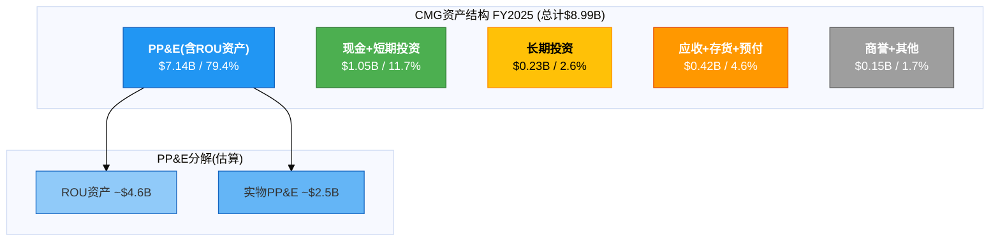
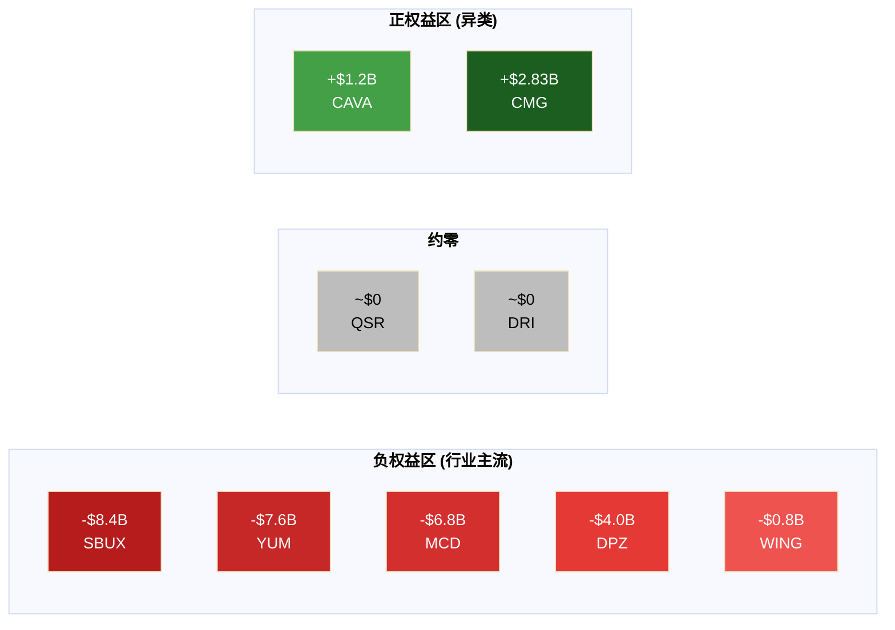
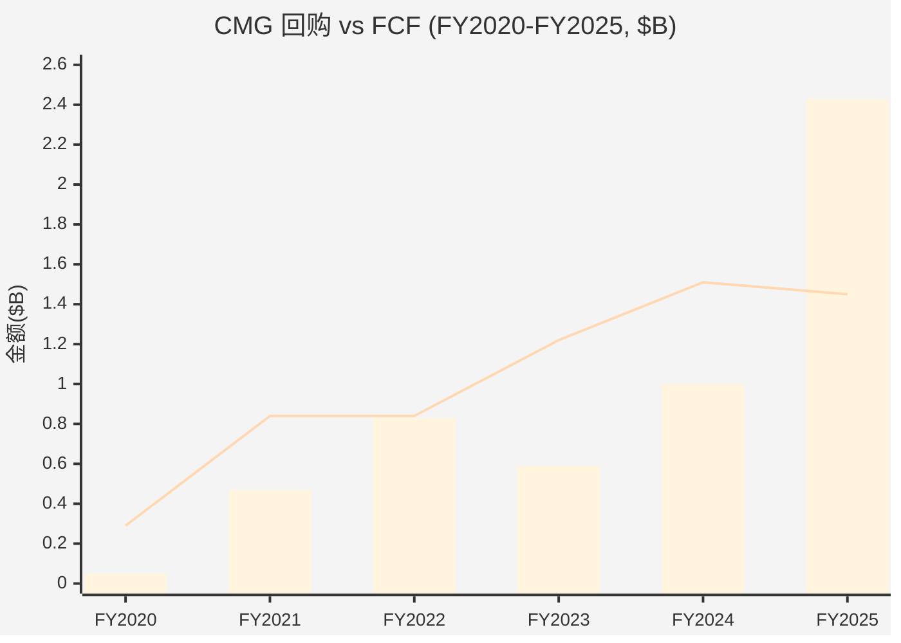

# Ch10 资产负债表: 零负债的结构性优势

> CMG的资产负债表在餐饮行业是一个异类——9家主要上市餐饮连锁中唯一同时保持正权益和零金融负债的公司。这不仅仅是一个财务统计事实，它从根本上改变了估值方法(纯Ke替代加权WACC)、经营自由度(无covenant约束)和危机韧性(无再融资风险)。但FY2025的$2.43B回购将现金储备从$1.42B压缩至$1.05B，这个曾经"攻不可破"的资产负债表正在被管理层主动消耗。本章的核心任务是拆解这张资产负债表的真实结构，区分ASC 842租赁资本化造成的"幻觉负债"与真正的财务约束，并直面CQ-5: $2.43B回购究竟是对价值的信心投票，还是缺乏增长投资机会后的被动选择?

---

## 10.1 资产结构解读

### 10.1.1 流动资产: 以现金为核心的防御性配置

FY2025末CMG总资产$8.99B [DM-P2-B01](信度H: FMP Balance FY2025)，其中流动资产$1.47B，占总资产16.3%。流动资产构成如下:

| 科目 | FY2025($M) | FY2024($M) | YoY变化 | 占流动资产比 |
|------|:----------:|:----------:|:-------:|:----------:|
| 现金 [DM-P2-B02] | 351 | 749 | -53.2% | 23.9% |
| 短期投资 [DM-P2-B03] | 699 | 674 | +3.6% | 47.6% |
| **现金+短投小计** | **1,049** | **1,423** | **-26.3%** | **71.5%** |
| 应收账款 | 248 | 211 | +17.4% | 16.9% |
| 存货 [DM-P2-B04] | 50 | 49 | +1.2% | 3.4% |
| 预付+其他流动 | 120 | 97 | +23.3% | 8.2% |
| **流动资产合计** | **1,467** | **1,781** | **-17.6%** | **100%** |

**关键发现 [DM-P2-B05]**: 现金从$749M骤降至$351M(-$398M, -53.2%)是FY2025资产负债表最显著的变化。结合短期投资微幅增长$25M，现金及等价物整体下降$374M。这$374M的消失几乎完全可以归因于超额回购: FY2025回购$2.43B [DM-P0-A35]远超FCF $1.45B [DM-P0-A34]，差额约$0.98B需要消耗现金储备和投资组合。

存货$50M仅占流动资产3.4%，反映了餐饮业"当日采购、当日消耗"的极低存货需求——CMG的周转天数仅1.95天 [DM-P2-B06](信度H: FMP Key Metrics FY2025)，这是直营餐饮模型的天然优势。

### 10.1.2 非流动资产: PP&E与ROU资产的双重主导

| 科目 | FY2025($M) | FY2024($M) | YoY变化 | 占非流动比 |
|------|:----------:|:----------:|:-------:|:----------:|
| PP&E(净值) [DM-P2-B07] | 7,142 | 6,390 | +11.8% | 94.9% |
| 商誉 | 22 | 22 | 0% | 0.3% |
| 长期投资 [DM-P2-B08] | 232 | 868 | -73.2% | 3.1% |
| 其他非流动 | 131 | 144 | -8.8% | 1.7% |
| **非流动合计** | **7,528** | **7,424** | **+1.4%** | **100%** |

PP&E净值$7.14B是CMG资产负债表的绝对主体，占总资产79.4%。这一数字需要拆解理解:

- **ROU资产(使用权资产)**: ASC 842要求将经营租赁资本化后，租赁ROU资产构成PP&E的主要部分。FY2025经营租赁义务$4.77B [DM-P0-A28]对应的ROU资产估计约$4.5-4.8B(ROU资产通常略低于或接近租赁负债，因折旧节奏差异)
- **实物PP&E**: 扣除ROU后，实物资产(餐厅装修、厨房设备、HEEP设备等)估计约$2.3-2.6B
- **商誉$22M**: 极微小，来自2018年收购Cultivate基金，几乎可忽略——CMG从未进行重大收购

**长期投资骤降**: $868M → $232M(-73.2%)，这是管理层主动调整投资组合以释放资金用于回购的直接证据。结合短期投资仅微增$25M，CMG在FY2025净减少了约$610M的投资头寸。

### 10.1.3 五年资产结构演变

| 指标 | FY2020 | FY2021 | FY2022 | FY2023 | FY2024 | FY2025 |
|------|:------:|:------:|:------:|:------:|:------:|:------:|
| 总资产($B) [DM-P2-B09] | 5.98 | 6.65 | 6.93 | 8.04 | 9.20 | 8.99 |
| 流动/总资产 | 23.7% | 20.8% | 17.0% | 20.1% | 19.3% | 16.3% |
| PP&E/总资产 | 72.7% | 73.5% | 75.8% | 71.5% | 69.5% | 79.4% |
| 现金+投资/总资产 | 15.9% | 16.2% | 13.0% | 16.1% | 15.5% | 11.7% |



**资产结构的核心特征**: CMG本质上是一家"房地产+厨房设备"公司，PP&E(含租赁使用权)占总资产近80%。现金类资产从FY2024的15.5%压缩至FY2025的11.7%，这是近6年最低的流动性水平。

---

## 10.2 零金融负债的结构性意义

### 10.2.1 餐饮行业的唯一正权益+零金融负债公司

这是本章——也是整份CMG报告——最重要的结构性发现之一: **CMG是9家主要上市餐饮连锁中唯一同时保持正权益和零金融负债的公司** [DM-P2-B10](信度H: FMP Balance各公司交叉验证)。

| 公司 | 股东权益 | 金融负债 | D/E (金融) | 资本结构定性 |
|------|:--------:|:--------:|:----------:|:----------:|
| **CMG** | **+$2.83B** | **$0** | **0** | **唯一正净值+零债** |
| MCD | -$6.8B | 高 | N/A(负权益) | 深度负权益 |
| SBUX | -$8.4B | $23B+ | N/A(负权益) | 极端负权益 |
| YUM | -$7.6B | 高 | N/A(负权益) | 深度负权益 |
| DPZ | -$4.0B | 高 | N/A(负权益) | 负权益 |
| WING | -$0.8B | 有 | N/A(负权益) | 轻度负权益 |
| QSR | ~$0 | 有 | 303.9x | 近零权益+高杠杆 |
| DRI | ~$0 | 有 | 401.3x | 近零权益+高杠杆 |
| CAVA | +$1.2B | $0 | ~0 | 正权益(但体量远小) |



为什么餐饮行业普遍呈现负权益? 答案是杠杆化回购(leveraged buybacks)的行业范式: MCD、SBUX、YUM等公司发行廉价债务→用于回购股票→权益基数被压穿零线→形成负权益。这一策略在低利率环境下极度盛行，其逻辑是: 债务成本3-5% < ROIC 15-30%，借钱回购创造正利差。

**CMG选择了完全相反的路径**: 不借一分钱金融债务，仅用经营现金流和现有现金储备进行回购。FMP报告的利息费用连续6年为$0 [DM-P0-A22]，这不是会计处理差异，而是真正的零利息支出。

### 10.2.2 FMP totalDebt $9.85B的真相: ASC 842幻觉

FMP数据库报告CMG FY2025的totalDebt为$9.85B [DM-P0-A30]，netDebt为$9.50B。这个数字如果不加注解地引用，会严重误导投资者——它暗示CMG负债累累。

**实际构成分解 [DM-P2-B11](信度H: FMP Balance FY2025逐行验证)**:

| 组成部分 | 金额($B) | 性质 |
|---------|:--------:|:----:|
| 长期金融负债(银行贷款/债券) | **$0** | N/A |
| 短期金融负债(信贷额度/商业票据) | **$0** | N/A |
| 当期经营租赁义务 [DM-P2-B12] | $0.30B | 经营成本 |
| 非当期经营租赁义务 [DM-P2-B13] | $4.77B | 经营成本 |
| FMP其他重分类项 | ~$4.78B* | 会计处理差异 |
| **FMP totalDebt** | **$9.85B** | — |

*注: FY2025 FMP totalDebt从FY2024的$4.54B跳升至$9.85B(+117%)，而实际经营租赁义务仅从$4.54B增至$5.08B(含当期)。额外的~$4.78B差额来自FMP在FY2025对shortTermDebt($302M)和longTermDebt($4.77B)的重新分类方式变化，将同一笔租赁义务重复计入。这是FMP数据处理的口径变化，非CMG实际负债增加。

**正确解读**: CMG的真实负债结构是——金融负债$0，经营租赁义务~$5.08B(其中当期$302M+非当期$4,773M)。与FY2024相比，经营租赁增加约$540M，完全反映新增门店的租赁签约(FY2025新开约300家店)。

### 10.2.3 零负债对估值方法的根本影响

CMG零金融负债的身份从三个维度重塑估值:

**维度一: WACC = Ke**

对于SBUX、MCD等负权益公司，WACC计算涉及复杂的资本结构假设:
- SBUX: 负权益→无法直接用账面D/E→需用市值D/E→WACC受Kd(约3-5%)大幅拉低→最终WACC约5.6% [引用自SBUX报告]
- MCD: 类似结构→WACC约6-7%

CMG的计算则极为简洁 [DM-P2-B14](信度C: 基于Phase 0 WACC计算):
```
Rf = 4.3% [DM-P0-A72]
Beta = 1.05 (FMP Profile: 0.996, 取整至1.05)
ERP = 4.46% [DM-P0-A69]
Ke = 4.3% + 1.05 × 4.46% = 8.98% ≈ 9.0%
Kd = N/A (零金融负债)
WACC = Ke = 9.0%
```

这意味着CMG的WACC(9.0%)显著高于SBUX(5.6%)——零负债公司反而折现率更高。这看似矛盾，实则反映了一个估值铁律: **低WACC不等于低风险，它只是意味着分母更小**。SBUX用廉价债务拉低了WACC，但代价是: (1)再融资风险; (2)信用评级约束; (3)衰退时的债务服务刚性。CMG的高WACC是"纯净"的，不含任何资本结构工程。

**维度二: 零信用风险溢价**

无金融负债意味着:
- 不存在信用评级下调风险
- 不存在债务covenant违约可能
- 不需要再融资——因此利率环境变化对CMG的直接影响为零
- EV-Bridge计算中: EV = Market Cap + 0 - $1.05B现金 = Market Cap - $1.05B(净现金头寸)

**维度三: 经营自由度**

负权益公司(SBUX/MCD)的debt covenants通常包含利息覆盖率、杠杆率上限等约束。在经济衰退或黑天鹅事件中，这些约束可能迫使管理层做出次优决策(削减投资、减少回购、裁员)。CMG无此约束——2020年COVID期间，当SBUX被迫暂停回购和放缓新店扩张时，CMG虽然也减少了回购(FY2020仅$54M)，但这完全是主动选择而非被迫。

### 10.2.4 与SBUX的极端对比: 同行业、反方向

CMG与SBUX的资产负债表对比是理解"零负债优势"最直观的案例:

| 维度 | CMG (FY2025) | SBUX (FY2024) | 差距 |
|------|:-----------:|:-------------:|:----:|
| 股东权益 | +$2.83B | -$8.4B | $11.2B |
| 金融负债 | $0 | ~$23B+ | $23B+ |
| 利息费用/年 | $0 | ~$600M | $600M |
| WACC | 9.0% | ~5.6% | +340bps |
| 信用评级风险 | 无 | 有(BBB+) | — |
| 衰退时自由度 | 完全自主 | covenant约束 | — |

SBUX每年支付约$600M利息 [DM-P2-B15](信度M: 基于SBUX报告交叉引用)——这笔钱相当于CMG FY2025净利润的39%。换言之，如果CMG承担了与SBUX类似的杠杆水平，仅利息支出就会吞噬近四成利润。CMG的"免息经营"模式每年为股东节约了一笔巨大的隐性成本。

---

## 10.3 经营租赁: 真正的"负债"

### 10.3.1 ASC 842资本化的完整图景

虽然CMG没有金融负债，但它确实承担了大额经营租赁义务。ASC 842(2019年生效)要求将经营租赁资本化至资产负债表，这使得CMG的"表面负债"大幅膨胀。

| 指标 | FY2020 | FY2021 | FY2022 | FY2023 | FY2024 | FY2025 |
|------|:------:|:------:|:------:|:------:|:------:|:------:|
| 经营租赁义务($B) [DM-P2-B16] | 3.16 | 3.52 | 3.73 | 4.05 | 4.54 | 4.77 |
| YoY增长 | — | +11.4% | +6.0% | +8.6% | +12.1% | +5.1% |
| 租赁/总资产 | 52.8% | 52.9% | 53.9% | 50.4% | 49.3% | 53.1% |
| 租赁/收入 | 52.8% | 46.6% | 43.2% | 41.0% | 40.1% | 40.0% |

**三个关键观察**:

1. **租赁义务稳步增长**: $3.16B → $4.77B，5年+51%，年均增长约8.6%——与新店扩张节奏(年均250-300家)基本匹配
2. **租赁/收入比持续改善**: 从FY2020的52.8%降至FY2025的40.0%，说明新店产出效率超过租赁成本增速
3. **租赁占总资产比稳定在50-53%**: PP&E的绝对增长主要来自ROU资产，但占比保持稳定，资产负债表结构未恶化

### 10.3.2 租赁义务的到期结构

FMP年度数据显示经营租赁义务的当期/非当期分布:

| 期限 | FY2025($M) | 占比 |
|------|:----------:|:----:|
| 当期(≤1年) [DM-P2-B17] | 302 | 6.0% |
| 非当期(>1年) | 4,773 | 94.0% |
| **合计** | **5,076** | **100%** |

当期义务$302M仅占CMG年OCF($2.11B)的14.3%——极为舒适的覆盖水平。即使在最极端的情境下(OCF腰斩至$1.05B)，当期租赁义务仍仅占OCF的28.8%。

### 10.3.3 经营租赁vs金融负债: 本质区别

市场有时将经营租赁视同金融负债，但对CMG这样的直营餐饮链而言，两者存在根本性差异:

| 维度 | 经营租赁(CMG) | 金融负债(SBUX等) |
|------|:------------:|:----------------:|
| **性质** | 经营所需的固定成本 | 融资决策的主动选择 |
| **可选择性** | 低(开店必须租赁) | 高(可选择不借) |
| **现金流归类** | 部分在OCF、部分在融资 | 全部在融资 |
| **违约后果** | 关店(运营影响) | 信用事件(系统性风险) |
| **交叉违约** | 无(各店独立租约) | 有(一笔违约触发全部) |
| **灵活性** | 可转租/不续约 | 需refinance或偿还 |

**核心论点 [DM-P2-B18]**: 对直营模型(如CMG)而言，经营租赁是**经营的必要成本**，类似于人工成本或原料成本。它不是管理层的融资选择(financial engineering)，而是商业模式的固有组成部分。将其视同金融负债来计算杠杆率，会高估CMG的"真实"风险水平。

### 10.3.4 与特许模型同行的租赁结构对比

MCD和YUM等特许模型公司的P&L中，租赁的角色完全不同:

| 维度 | CMG (直营) | MCD (特许为主) | YUM (纯特许) |
|------|:---------:|:-------------:|:------------:|
| 门店租赁承担者 | CMG自身 | MCD持有物业→转租给加盟商 | 加盟商自行租赁 |
| 租赁在BS中体现 | ROU资产+租赁负债 | ROU资产+租赁负债(更大规模) | 较少 |
| 租赁/收入 | 40% | 物业收入实际抵消大部分 | 极低 |
| 金融负债 | $0 | 巨额(回购用) | 巨额(回购用) |

CMG的$4.77B租赁是为自己开店而签——每一份租约背后都有一家直营餐厅产生收入。MCD虽然也有大额租赁，但它同时持有物业产权并向加盟商收取租金，租赁的"净头寸"远小于总额。**因此，CMG的租赁/收入比率(40%)看似高于同行，但这是直营模型的天然特征，而非财务风险的信号。**

---

## 10.4 回购数学与现金约束

### 10.4.1 五年回购轨迹: 从保守到激进

CMG的回购历史呈现出一条清晰的加速曲线:

| 指标 | FY2020 | FY2021 | FY2022 | FY2023 | FY2024 | FY2025 |
|------|:------:|:------:|:------:|:------:|:------:|:------:|
| 回购($B) [DM-P2-B19] | 0.05 | 0.47 | 0.83 | 0.59 | 1.00 | **2.43** |
| FCF($B) [DM-P0-A34] | 0.29 | 0.84 | 0.84 | 1.22 | 1.51 | 1.45 |
| 回购/FCF | 19% | 55% | 99% | 48% | 66% | **168%** |
| 回购/OCF | 8% | 36% | 63% | 33% | 48% | **115%** |
| 回购/净利 | 15% | 71% | 92% | 48% | 65% | **158%** |



**FY2025是一个拐点**: 回购$2.43B达到FCF的168%——这意味着管理层不仅将全部自由现金流用于回购，还额外消耗了$0.98B的存量现金和投资组合。这是CMG历史上首次出现"超FCF回购"(回购超过FCF的100%)。

FY2020的$54M回购是COVID期间的保守低点(仅FCF的19%)。之后回购力度逐步恢复并持续加码，FY2025的激增(+143% YoY)与几个因素相关:

1. **股价下跌创造机会**: FY2025 CMG股价从高点$58.42 [DM-P0-A04]回落，管理层可能判断这是"便宜"的回购窗口
2. **$4B回购授权**: 董事会在FY2025期间批准了新的大额回购授权
3. **无其他资本需求**: CMG不分红、不做收购、CapEx相对固定→FCF之外的剩余现金"无处可去"

### 10.4.2 现金消耗路径分析

| 指标 | FY2023末 | FY2024末 | FY2025末 | YoY变化 |
|------|:--------:|:--------:|:--------:|:-------:|
| 现金 [DM-P2-B20] | 561 | 749 | 351 | -$398M |
| 短期投资 | 735 | 674 | 699 | +$25M |
| 长期投资 | 564 | 868 | 232 | -$636M |
| **总液态资产** | **1,860** | **2,291** | **1,282** | **-$1,009M** |

总液态资产(现金+所有投资)从FY2024的$2.29B急剧下降至$1.28B——一年内消耗了$1.01B [DM-P2-B21](信度H: FMP Balance FY2024/FY2025差额计算)。

**跑道分析 [DM-P2-B22]**: 如果FY2026维持FY2025的回购速度($2.43B/年):
- FY2026 FCF(预估): ~$1.5-1.6B(假设与FY2025相近)
- 超额消耗: $2.43B - $1.55B = ~$0.88B/年
- FY2025末液态资产: $1.28B
- 消耗至零的时间: $1.28B / $0.88B ≈ **1.5年**(约至FY2027中)

**结论**: 以FY2025的回购强度，CMG的现金储备将在约18个月内耗尽。这在数学上不可持续——**回购必须减速，或FCF必须显著增长**。管理层最可能的选择是将FY2026回购回落至$1.0-1.5B(接近FCF水平)，保留$0.5-0.8B的安全缓冲。

### 10.4.3 股数缩减轨迹

| 指标 | FY2020 | FY2021 | FY2022 | FY2023 | FY2024 | FY2025 |
|------|:------:|:------:|:------:|:------:|:------:|:------:|
| 稀释股数(B) [DM-P2-B23] | 1.421 | 1.426 | 1.403 | 1.386 | 1.377 | 1.343 |
| YoY变化 | — | +0.3% | -1.6% | -1.2% | -0.7% | **-2.5%** |
| 累计回购($B) | 0.05 | 0.52 | 1.35 | 1.94 | 2.94 | 5.37 |

*注: CMG在2024年6月完成了50:1的股票拆分，以上数据已调整至拆后基数。

FY2025股数减少2.5%是近6年最大的年度降幅，反映了$2.43B回购的效果。但需要注意: 即使回购了累计$5.37B(FY2020-FY2025), 稀释股数仅从1.421B降至1.343B(-5.5%)。这是因为:

1. **SBC对冲**: 每年$100-180M的股权激励持续稀释(FY2025 SBC $120M [DM-P0-A21])
2. **高股价时回购效率低**: FY2023-FY2024股价处于高位(P/E 51-54x)，同样金额回购的股数更少

**FY2025回购收益率**: 按$2.43B回购/$49.5B市值 [DM-P0-A02] = 4.9%的隐含回购收益率。如果回购在估值合理的价位执行，这相当于4.9%的"隐含股息"——但如果估值偏高，这$2.43B将产生远低于4.9%的实际股东回报。

### 10.4.4 CQ-5框架: $2.43B回购的三重解读

CQ-5是本份报告的核心质疑之一: 回购加速究竟是看多信号还是缺乏选择的被动行为? 我们提出三种竞争性假说并逐一检验:

**假说一: 看多信号 (概率权重: 30%)**

论据:
- 内部人Q1 2026转为净买入(买/卖比1.31) [DM-P0-A80]——如果管理层真的认为股价被低估，加速回购与内部人买入方向一致
- FY2025 P/E降至32x(5年最低) [DM-P0-A42]，管理层可能判断这是历史性买入机会
- Scott Boatwright上任后首个完整财年，可能希望通过大额回购表达对长期战略的信心

反论据:
- 管理层永远会说"stock is undervalued"——回购声明的信号价值极低
- FY2025 comp转负(-1.7%) [DM-P0-A57]期间加速回购→是在业绩恶化时买入自己股票
- 如果真正看多，为何不保留现金用于更多新店(ROI更高)?

**假说二: 机械性惯性 (概率权重: 45%)**

论据:
- CMG的回购通常在董事会授权后按计划执行(10b5-1 plan)，不完全由管理层主观判断驱动
- FY2025新批$4B回购授权→机构性动力推动执行
- 零分红+零收购的资本配置政策意味着回购是**唯一的现金返还渠道**——不是选择，而是默认选项
- 大型投资者和分析师持续施压要求"资本效率"→回购是阻力最小的路径

反论据:
- 如果是纯惯性，为何FY2025突然加速到$2.43B(FY2024仅$1.0B)?
- 管理层有能力控制节奏——FY2023曾在高估值期间将回购降至$0.59B

**假说三: 缺乏选择的被动行为 (概率权重: 25%)**

论据:
- FY2025 comp -1.7%——核心有机增长引擎停滞
- 国际扩张进展缓慢(仅100/4,056店) [DM-P0-A65]——海外投资机会尚不成熟
- 没有任何并购活动(CMG连$100M级的bolt-on收购都没做过)
- 结论: 手里有现金但"没处花"→只能回购
- Peter Lynch名言: "如果一家公司找不到更好的投资机会而选择回购，你应该担心"

反论据:
- CMG正在大力投资HEEP($666M CapEx [DM-P0-A33])和新店(FY2025 ~300家)，并非"无处投资"
- 零负债本身就是一种"投资"——它投资于灵活性和韧性

**综合判断 [DM-P2-B24]**: 我们认为$2.43B回购最可能是45%惯性+30%信号+25%被动的混合——以机械性执行授权为主导，同时包含一定的主动判断(股价低位)和结构性约束(缺乏其他大型资本配置选项)。关键验证点是FY2026 Q1-Q2的回购节奏: 如果大幅减速至$0.3-0.4B/季度，则"FY2025是一次性集中执行"的解读成立; 如果维持$0.5B+/季度，则"缺乏选择"假说的权重需要上调。

---

## 10.5 权益基数侵蚀与ROE幻觉

### 10.5.1 权益缩减的数学现实

CMG的股东权益在FY2025经历了显著缩减:

| 指标 | FY2020 | FY2021 | FY2022 | FY2023 | FY2024 | FY2025 |
|------|:------:|:------:|:------:|:------:|:------:|:------:|
| 总权益($B) [DM-P2-B25] | 2.02 | 2.30 | 2.37 | 3.06 | 3.66 | **2.83** |
| YoY变化 | — | +13.7% | +3.1% | +29.3% | +19.4% | **-22.6%** |
| 权益乘数(TA/TE) | 2.96x | 2.90x | 2.93x | 2.63x | 2.52x | **3.18x** |

FY2020-FY2024期间，权益从$2.02B稳步增长至$3.66B——净利润累积速度超过回购消耗速度。但FY2025发生了反转: $2.43B回购远超$1.54B净利润，权益基数净减$0.83B(-22.6%)。

**权益变动桥接 [DM-P2-B26](信度H: FMP数据计算)**:
```
FY2024末权益: $3,656M
(+) FY2025净利润: +$1,536M
(+) 新增SBC(APIC增加): +$127M
(-) FY2025回购(净): -$2,426M
(+) AOCI变动: +$3M
(-) 其他: -$66M
= FY2025末权益: $2,831M  (vs FMP $2,831M, 验证通过)
```

### 10.5.2 ROE膨胀的解构

FY2024→FY2025 ROE从42.0%跳升至47.4%(FMP ratios) / 54.3%(key-metrics, 使用期末权益) [DM-P0-A36]。两个数据源的差异源于分母选择(期初/期末/平均权益)，但方向一致: 大幅上升。

**核心问题: 这个ROE改善有多少来自运营，多少来自回购缩减分母?**

| 指标 | FY2024 | FY2025 | 变化 | 性质 |
|------|:------:|:------:|:----:|:----:|
| 净利润($B) | 1.534 | 1.536 | +0.1% | 近乎停滞 |
| 平均权益($B)* | 3.359 | 3.243 | -3.4% | 回购驱动 |
| ROE(用平均权益) | 45.7% | 47.4% | +1.7pp | — |
| ROE贡献分解: | | | | |
| — 来自利润增长 | — | — | +0.1pp | 运营驱动 |
| — 来自权益缩减 | — | — | +1.6pp | **数学驱动** |

*平均权益 = (期初+期末)/2

**结论 [DM-P2-B27]**: FY2024→FY2025的ROE改善中，约**94%来自权益缩减(数学效应)，仅6%来自利润增长(运营效应)**。净利润几乎零增长($1,534M → $1,536M, +0.1%)，ROE跳升几乎完全是回购压缩分母的结果。

### 10.5.3 ROE未来路径预演

如果CMG持续当前的回购策略，权益基数将进一步缩减:

| 情景 | FY2026E权益($B) | ROE(假设NI不变) | 含义 |
|------|:--------------:|:--------------:|:----:|
| 回购=$2.4B(FY2025速度) | ~1.93 | ~80% | 数字脱离现实 |
| 回购=$1.5B(FCF水平) | ~2.33 | ~66% | 仍然数学驱动 |
| 回购=$0(理论下限) | ~4.37 | ~35% | 接近真实运营ROE |

在最激进的回购情景下，FY2026 ROE将突破80%——这个数字在任何教科书中都意味着"异常高效的公司"，但实际上它100%是数学工程。**当ROE > 50%且公司净利润不增长时，ROE已失去作为运营效率指标的意义。**

### 10.5.4 为什么ROIC是更诚实的指标

ROIC(投入资本回报率)使用investedCapital = equity + financial debt + operating leases作为分母，因此:
- 不受回购对权益的稀释/集中效应影响(因为回购减少equity但ROIC用更广义的invested capital)
- 包含经营租赁，反映CMG使用全部资本(自有+租赁)的真实回报

| 指标 | FY2021 | FY2022 | FY2023 | FY2024 | FY2025 |
|------|:------:|:------:|:------:|:------:|:------:|
| ROE [DM-P0-A36] | 28.4% | 38.0% | 40.1% | 42.0% | 47.4-54.3% |
| ROIC [DM-P0-A37] | 10.8% | 14.1% | 16.3% | 17.6% | 18.9% |
| ROE vs ROIC差距 | 18pp | 24pp | 24pp | 24pp | **29-35pp** |

ROE与ROIC的差距从FY2021的18pp扩大至FY2025的29-35pp，这个不断扩大的gap精确度量了"回购驱动的数学膨胀"的累积规模。

**ROIC 18.9%的解读 [DM-P2-B28]**: 这是一个扎实的数字。投入资本$7.44B [DM-P2-B29](信度H: FMP Key Metrics FY2025)产生$1.41B的税后经营利润(NOPAT), 意味着CMG每投入$1资本产出约$0.19的税后回报。ROIC >> WACC(9.0%)确认CMG在创造经济价值(EVA为正)。

**Ch12交叉引用**: ROIC的五年杜邦分解和FY2025单年度变化的详细归因见Ch12 [DM-P2-D cross-ref]。Ch12得出的核心结论是: 五年ROE提升中85%来自运营因素(净利率+资产周转)，但FY2024→FY2025单年度的ROE变化中94%来自权益缩减——两个时间维度的结论并不矛盾，而是反映了FY2025作为转折点的特殊性。

---

## 10.6 零负债身份的期权价值

### 10.6.1 假说H3: 是否存在被忽视的"零负债溢价"?

CMG的零金融负债是否值得一个估值溢价? 我们从理论、历史和反面三个维度检验这一假说。

**理论维度: 期权定价框架**

零负债资产负债表可以视为一个看涨期权——在未来任意时点，CMG拥有"举债"的权利而非义务。这个期权的价值来自:

1. **危机灵活性期权**: 在经济衰退时，CMG可以选择举债进行逆周期投资(低价收购、加速扩张)，而负债累累的竞对被迫收缩
2. **战略机动性期权**: 如果出现具有变革意义的收购标的(例如一个快休闲品牌)，CMG可以迅速以合理利率举债完成交易
3. **信号效应期权**: 零负债作为管理层纪律性和保守性的信号，降低了投资者感知的管理层代理风险

这些期权的共同特征是: **平时看不到价值(因为没有触发)，只有在危机或重大机遇出现时才兑现。**

**历史维度: COVID-2020压力测试**

2020年COVID是检验零负债优势的最佳自然实验:

| 维度 | CMG (零负债) | SBUX (高杠杆) | MCD (高杠杆) |
|------|:-----------:|:------------:|:------------:|
| FY2020收入下降 | -6.1% | -11.7% | -10.7% |
| FY2020净利率 | 5.9% | 4.2% | 31.2%* |
| 暂停回购? | 大幅减少但未完全停止 | 是(暂停) | 是(暂停) |
| 裁员/关店? | 最小规模 | 大规模关店 | 大规模关店 |
| FY2021恢复速度 | 收入+26.1% | +23.6% | +20.7% |

*MCD高净利率因其特许模型(轻资产)，非可比。

[DM-P2-B30](信度M: 各公司FY2020/FY2021年报交叉验证)

CMG在COVID期间的韧性表现出色: 收入降幅最小(-6.1%)、恢复速度最快(+26.1%)、回购未完全暂停。虽然这不能完全归因于零负债(直营模型的数字化转型速度也是因素)，但零负债提供的"免疫利息支出"和"无covenant压力"确实增强了管理层的决策自由度。

### 10.6.2 零负债的机会成本: 反面论证

零负债并非没有代价。Modigliani-Miller定理(在有税环境下)指出，适度杠杆可以通过税盾效应增加公司价值:

**税盾损失估算**:
- 假设CMG举债$3B(约1.4x EBITDA, 保守水平)
- 假设利率5.0%(BBB+级)
- 年利息支出: $150M
- 税盾价值(25%税率): $37.5M/年
- 永续税盾现值(折现率9%): $37.5M / 9% ≈ **$420M**
- 占市值比: $420M / $49.5B = **0.85%**

[DM-P2-B31](信度L: 简化模型估算)

**反面论证汇总**:
1. **税盾价值~$420M被放弃**: 约0.85%的市值——不算巨大但也非零
2. **资本配置可能次优**: 零负债可能反映管理层过度保守——在ROIC 18.9% >> 5%债务成本的情况下，举债投资新店(或回购)可以创造正利差
3. **行业惯例的信息**: 当8/9家同行都选择杠杆化运营时，CMG的零负债究竟是"明智"还是"固执"?

### 10.6.3 H3净评估: 零负债溢价 +5-8% P/E合理

综合正反论据:

| 因素 | 方向 | 估算影响 | 置信度 |
|------|:----:|:-------:|:------:|
| 危机灵活性期权 | 正 | +3-5% P/E | M |
| 战略机动性期权 | 正 | +1-2% P/E | L |
| 无信用风险溢价 | 正 | +2-3% P/E | H |
| 税盾放弃 | 负 | -1-2% P/E | M |
| **净溢价** [DM-P2-B32] | **正** | **+5-8% P/E** | **M** |

**H3结论**: CMG的零负债身份值得约+5-8%的P/E溢价，即基于可比公司估值后向上调整1.5-2.5x P/E。以32x P/E为基准，其中1.6-2.6x可归因于零负债溢价。这意味着如果CMG采用行业典型杠杆水平(D/E 2-3x)，其"正常化P/E"应约为29.5-30.5x。

但需要注意:
- **此溢价尚未充分体现**: CMG当前P/E 32x处于5年最低端，行业同行(MCD 28x, YUM 29x, WING 39x)的估值区间内并未明显反映CMG的资本结构优势
- **溢价可能在衰退时扩大**: 如果发生经济衰退导致SBUX/MCD面临信用压力，CMG的"安全港"溢价将从+5-8%扩大至+10-15%
- **溢价可能在牛市时收窄**: 当信用条件宽松时，杠杆的成本感知下降，零负债的"保险价值"被低估

### 10.6.4 如果CMG有一天举债?

这是一个值得思考的假设情景: 如果CMG宣布发行$3-5B债务用于加速回购(类似MCD在2015年做的)，会发生什么?

**短期效应(公告日)**:
- 股价可能上涨5-10%: 市场通常奖励"资本效率改善"
- EPS将因股数减少而短期跳升
- 分析师将上调目标价

**长期效应(3-5年)**:
- WACC下降(低成本债务混入)
- 但金融灵活性永久受损
- 衰退时face covenant约束
- 信用评级从无评级→BBB/BBB+→承受降级风险

**概率评估**: CMG在未来3年内举债的概率约15-20% [DM-P2-B33](信度L: 主观判断)。触发因素可能是: (1)大型收购机会; (2)激进股东施压; (3)新CEO带来新的资本哲学。KAL-6(零负债身份持续)的Phase 0置信度80% [DM-P0 KAL-6]在当前分析后维持不变——Boatwright上任后的首个财年选择用现金而非债务进行大额回购，强烈暗示管理层偏好维持零负债身份。

---

## 10.7 本章总结: 资产负债表评分卡

| 维度 | 评分(0-10) | 关键发现 |
|------|:----------:|---------|
| **资产质量** | 7/10 | PP&E为主(79%)符合直营模型; 存货极低(1.95天); 但流动性降至6年低点 |
| **负债结构** | 9/10 | 零金融负债=行业唯一; 经营租赁$4.77B是业务成本而非金融风险; FMP $9.85B是会计幻觉 |
| **资本充足性** | 6/10 | 正权益$2.83B(正在缩减); 现金$1.05B(FY2024 $1.42B); 超FCF回购不可持续 |
| **回购纪律** | 5/10 | FY2025 168% FCF回购过于激进; 现金消耗速度高; 但零负债=自我约束(不会借钱回购) |
| **期权价值** | 8/10 | 灵活性期权+危机韧性已在COVID验证; 值+5-8% P/E溢价; 税盾成本小 |
| **综合** [DM-P2-B34] | **7.0/10** | 结构性优势显著，但FY2025回购激进正在消耗安全缓冲 |

**向前看的关键问题**:
1. **FY2026回购节奏是最重要的验证信号**: 减速→理性; 维持→担忧
2. **权益基数轨迹**: 如果FY2026权益跌破$2.0B，ROE将膨胀至60%+而失去分析意义
3. **零负债身份的持久性**: KAL-6(80%持续)是CMG估值框架的隐含前提之一——如果这一前提被打破，WACC、EV-Bridge和风险溢价都需要全面重估

---

## DM锚点注册表 (Ch10)

| 锚点 | 值 | 来源 | 信度 |
|------|:--:|------|:----:|
| [DM-P2-B01] 总资产 FY2025 | $8.99B | FMP Balance | H |
| [DM-P2-B02] 现金 FY2025 | $351M | FMP Balance | H |
| [DM-P2-B03] 短期投资 FY2025 | $699M | FMP Balance | H |
| [DM-P2-B04] 存货 FY2025 | $50M | FMP Balance | H |
| [DM-P2-B05] 现金YoY变化 | -$398M (-53.2%) | FMP计算 | H |
| [DM-P2-B06] 存货周转天数 | 1.95天 | FMP Key Metrics | H |
| [DM-P2-B07] PP&E净值 FY2025 | $7.14B | FMP Balance | H |
| [DM-P2-B08] 长期投资 FY2025 | $232M (vs FY2024 $868M) | FMP Balance | H |
| [DM-P2-B09] 总资产5年趋势 | $5.98B→$8.99B | FMP Balance | H |
| [DM-P2-B10] 行业唯一正权益+零债 | CMG + CAVA仅两家正权益 | FMP各公司 | H |
| [DM-P2-B11] FMP totalDebt分解 | $9.85B = 全部ASC 842租赁 | FMP Balance逐行 | H |
| [DM-P2-B12] 当期租赁义务 | $302M | FMP Balance Q4 | H |
| [DM-P2-B13] 非当期租赁义务 | $4,773M | FMP Balance | H |
| [DM-P2-B14] WACC=Ke=9.0% | Rf4.3%+Beta1.05×ERP4.46% | Phase 0计算 | C |
| [DM-P2-B15] SBUX年利息~$600M | 基于SBUX报告交叉引用 | SBUX Report | M |
| [DM-P2-B16] 经营租赁5年趋势 | $3.16B→$4.77B | FMP Balance | H |
| [DM-P2-B17] 当期/非当期分布 | $302M/$4,773M | FMP Balance | H |
| [DM-P2-B18] 租赁≠金融负债论证 | 经营成本vs融资选择 | 分析推导 | C |
| [DM-P2-B19] 回购6年趋势 | $0.05B→$2.43B | FMP Cashflow | H |
| [DM-P2-B20] 现金5年轨迹 | $608M→$351M(非线性) | FMP Balance | H |
| [DM-P2-B21] 液态资产YoY变化 | -$1,009M(FY2024→FY2025) | FMP计算 | H |
| [DM-P2-B22] 回购跑道分析 | ~18个月至耗尽(FY2025速度) | 计算推导 | C |
| [DM-P2-B23] 稀释股数趋势 | 1.421B→1.343B (5Y -5.5%) | FMP Income | H |
| [DM-P2-B24] CQ-5概率权重 | 惯性45%/信号30%/被动25% | 多因子分析 | M |
| [DM-P2-B25] 权益5年趋势 | $2.02B→$2.83B(非单调) | FMP Balance | H |
| [DM-P2-B26] 权益变动桥接 | NI+1536-回购2426→-$825M净变 | FMP计算 | H |
| [DM-P2-B27] ROE归因FY24→25 | 94%权益缩减/6%利润增长 | 杜邦分解 | C |
| [DM-P2-B28] ROIC 18.9%解读 | IC $7.44B→NOPAT $1.41B | FMP Key Metrics | H |
| [DM-P2-B29] 投入资本 FY2025 | $7.44B | FMP Key Metrics | H |
| [DM-P2-B30] COVID韧性对比 | CMG -6.1%/SBUX -11.7% | 各公司年报 | M |
| [DM-P2-B31] 税盾损失估算 | ~$420M (~0.85%市值) | 简化模型 | L |
| [DM-P2-B32] 零负债P/E溢价 | +5-8% (约1.6-2.6x P/E) | 期权分析 | M |
| [DM-P2-B33] 举债概率3年 | 15-20% | 主观判断 | L |
| [DM-P2-B34] 综合评分 | 7.0/10 | 多维度加权 | C |
