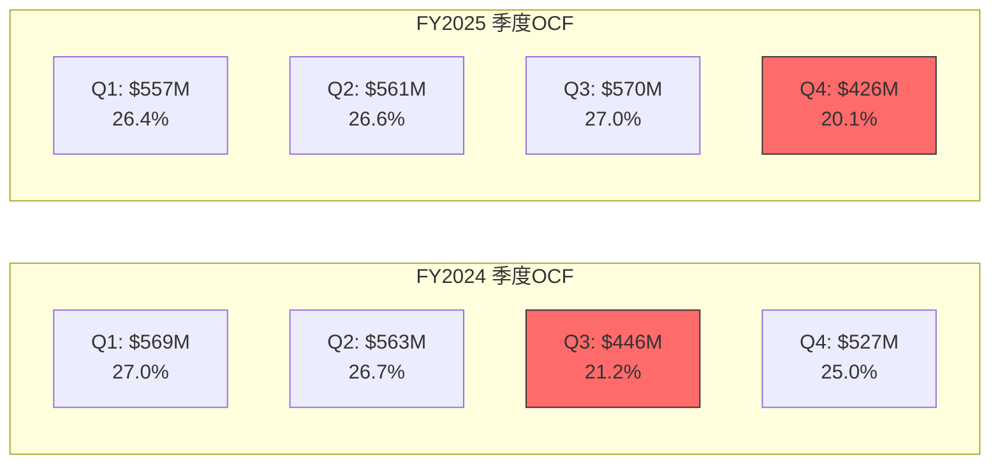
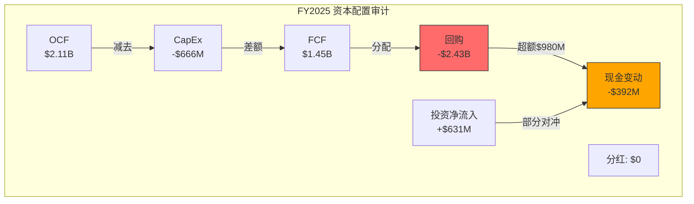

# Ch11 现金流质量: FCF纯度与资本配置审计

> 本章为CMG财务分析的核心章节之一，聚焦两个关键问题: (1) CMG的现金流质量是否匹配其估值溢价? (2) 管理层的资本配置(尤其是FY2025超FCF回购)是理性信号还是缺乏选项的被动行为? 这两个问题直接指向CQ-5(回购加速是信号还是绝望?)的判定。

---

## 11.1 OCF质量评估: 盈利到现金的转化效率

### 11.1.1 OCF五年趋势

CMG的经营现金流(OCF)呈现出健康的上升趋势，从FY2021的$1.28B增长至FY2025的$2.11B，5年CAGR为13.3%。值得注意的是，这一增速显著高于同期收入CAGR(12.1%)，反映出运营效率提升对现金流的放大效应。

| 指标 | FY2021 | FY2022 | FY2023 | FY2024 | FY2025 | CAGR |
|------|:------:|:------:|:------:|:------:|:------:|:----:|
| OCF($B) [DM-P0-A32] | 1.28 | 1.32 | 1.78 | 2.11 | 2.11 | 13.3% |
| 净利润($B) | 0.65 | 0.90 | 1.23 | 1.53 | 1.54 | 24.0% |
| OCF/净利润 | 1.96x | 1.47x | 1.45x | 1.38x | 1.38x | — |
| OCF/收入 | 17.0% | 15.3% | 18.1% | 18.6% | 17.7% | — |

**关键发现 [DM-P2-C01]**: FY2025 OCF $2.114B几乎与FY2024的$2.105B完全持平(+0.4%)，这是5年来OCF首次停止增长。虽然收入仍增长5.4%，但OCF增速归零暗示着运营效率改善空间正在收窄。

OCF/净利润比率从FY2021的1.96x逐步收敛至FY2025的1.38x，这并非质量恶化信号——相反，FY2021的异常高比率主要反映了当时较高的非现金费用(SBC $176M)和有利的营运资本变动。1.38x仍然是优秀水平，意味着每$1净利润产生$1.38经营现金流。

### 11.1.2 非现金调整项分解

FY2025 OCF的构成分解如下:

| 调整项 | FY2024($M) | FY2025($M) | 变化 | 信号 |
|--------|:----------:|:----------:|:----:|:----:|
| 净利润 | 1,534 | 1,536 | +$2M | 近乎停滞 |
| D&A [DM-P2-C02] | 335 | 361 | +$26M | 新店+HEEP折旧上升 |
| SBC [DM-P0-A21] | 132 | 120 | -$12M | 管理层交替+激励重设 |
| 递延所得税 | -43 | +79 | +$122M | 大幅波动(时间性) |
| 营运资本变动 | +126 | +6 | -$120M | 从顺风转中性 |
| 其他非现金 | +21 | +11 | -$10M | 正常波动 |
| **OCF** | **2,105** | **2,114** | **+$9M** | 近乎持平 |

**深层解读 [DM-P2-C03]**: FY2025 OCF能与FY2024持平，主要依赖递延所得税$79M的正向贡献(FY2024为-$43M)，这是时间性差异而非永久性改善。如果剔除递延所得税波动，"核心OCF"实际下降了约$113M(5.4%)。营运资本从FY2024的$126M顺风变为FY2025的$6M中性，这是更值得关注的信号——CMG一直以来通过负CCC(提前收款、延迟付款)产生有利的营运资本效应，FY2025这一效应几乎消失。

### 11.1.3 季度OCF节奏与季节性

| 季度 | FY2024 OCF($M) | FY2025 OCF($M) | YoY变化 | 占全年比 |
|------|:--------------:|:--------------:|:-------:|:--------:|
| Q1 | 569 | 557 | -2.1% | 26.4% |
| Q2 | 563 | 561 | -0.3% | 26.6% |
| Q3 | 446 | 570 | +27.7% | 27.0% |
| Q4 | 527 | 426 | -19.2% | 20.1% |

**季节性模式 [DM-P2-C04]**: CMG的OCF呈现出与收入不完全对齐的季节性模式。Q4'25 OCF $426M是全年最低点(仅占20.1%)，而Q4'25收入$2.98B并非全年最低。Q4 OCF偏弱的主要原因是: (1) Q4季节性低利润率(OPM 14.8%); (2) 年末营运资本调整(应收账款增加$61M、应付账款减少$37M)。Q3'25的$570M异常高，部分归因于递延所得税$104M的一次性贡献。

---

## 11.2 CapEx效率分析: 增长投资的质量审计

### 11.2.1 CapEx五年趋势

CMG的资本支出呈现稳定上升趋势，从FY2021的$442M增至FY2025的$666M，5年CAGR为10.8%。这一增速低于OCF的13.3%，意味着CapEx强度并未失控。

| 指标 | FY2021 | FY2022 | FY2023 | FY2024 | FY2025 |
|------|:------:|:------:|:------:|:------:|:------:|
| CapEx($M) [DM-P0-A33] | 442 | 479 | 561 | 594 | 666 |
| CapEx/收入 | 5.9% | 5.5% | 5.7% | 5.2% | 5.6% |
| CapEx/D&A [DM-P2-C05] | 1.74x | 1.67x | 1.76x | 1.77x | 1.84x |
| 新店数量 | 215 | 236 | 271 | 304 | 334 |
| D&A($M) [DM-P2-C02] | 255 | 287 | 319 | 335 | 361 |

**CapEx强度分析 [DM-P2-C06]**: CapEx/收入保持在5.2-5.9%的窄幅区间内，这在餐饮行业中属于中等水平。作为纯直营模式(无特许费收入稀释分母)，CMG的5.6%实际资本密度低于MCD(CapEx/收入 ~13.7%)但高于纯特许模式的YUM(CapEx/收入 ~5.3%)。

CapEx/D&A比率1.84x是5年最高水平，意味着每$1折旧对应$1.84新投资。当这个比率>1.0x时，公司处于扩张模式而非维护模式。1.84x的水平表明CMG仍在积极增长投资——这与comp转负(-1.7%)形成了有趣的矛盾: 管理层一边面对同店下滑，一边加速新店投资。

### 11.2.2 CapEx分解估算

CMG在年报中不单独披露CapEx分类，但根据10-K披露和管理层指引，可以进行合理估算:

| CapEx组成 | 估算值($M) | 占总CapEx比 | 估算依据 | 信度 |
|-----------|:----------:|:-----------:|----------|:----:|
| 新店建设 [DM-P2-C07] | ~400-500 | 60-75% | 334店 × $1.3-1.5M(净租金) | M |
| HEEP设备部署 [DM-P2-C08] | ~35-75 | 5-11% | ~350店 × $100-200K(估) | L |
| 改造/翻新 | ~50-80 | 7-12% | 老旧门店更新 | L |
| 数字化/IT | ~30-50 | 4-7% | App/POS/后台系统 | L |
| 维护性CapEx | ~40-60 | 6-9% | 设备更换+修缮 | L |
| **合计** | **~666** | **100%** | — | — |

**新店成本关键数据 [DM-P2-C09]**: 根据CMG FY2024 10-K披露，新店平均投资成本约$1.5M(毛值)，扣除房东装修补贴后净成本约$1.3M。FY2025开设334家新店(含132家Q4集中开业)，新店建设占CapEx的绝对主导地位(估计60-75%)。

**HEEP成本盲区 [DM-P2-C10]**: 管理层在Q4'25 earnings call中确认350家门店已部署完整HEEP设备包(双面plancha + 三锅电饭煲 + 大容量炸锅)，但从未披露每店HEEP改造成本。基于餐饮设备行业参考(商用plancha $15K-25K，电饭煲$5K-8K，安装改造$30K-50K)，估算每店HEEP总成本$100K-200K，350店 = $35-70M。这一数字虽然不大，但2026年加速至2,000店将意味着HEEP CapEx可能跃升至$200-400M/年——这是一个尚未被充分定价的CapEx增量。

### 11.2.3 新店单位经济学

新店ROI是CMG增长模型的核心引擎:

| 指标 | FY2025 | 来源 | 信度 |
|------|:------:|:----:|:----:|
| 新店投资(净) [DM-P2-C09] | ~$1.3M | 10-K | H |
| AUV(Q4'25) [DM-P2-C11] | $3.10M | IR Press Release | H |
| 餐厅层面利润率 [DM-P2-C12] | 25.4%(全年) / 23.4%(Q4) | IR | H |
| 单店年现金回报(估) | ~$787K (=$3.1M × 25.4%) | 计算 | M |
| 现金回收期 | ~1.6-2.0年 | 计算 | M |
| 单店Year-1 ROIC | ~50-60% | 计算 | M |

**ROI评估 [DM-P2-C13]**: 以$1.3M净投资、$3.1M AUV、25.4%餐厅利润率计算，单店Year-1现金回报约$787K，现金回收期约1.6年——这是餐饮行业中极为优秀的单位经济学。作为对比:
- MCD加盟商投资$1.5-2.5M，回收期3-5年
- 星巴克新店投资$0.8-1.2M，回收期~2-3年(但AUV仅~$2.0M)
- CAVA新店投资~$1.1M，AUV ~$2.8M，但利润率低(~5%)

然而，新店AUV $3.10M较FY2024的$3.21M下降3.4%。这一下降反映了comp -1.7%的影响。如果AUV持续下降，单位经济学将面临压力。管理层长期目标是AUV达到$4.0M，但在comp为负的当下，这一目标的时间线正在延伸。

---

## 11.3 FCF纯度深度分析

### 11.3.1 FCF五年趋势

| 指标 | FY2021 | FY2022 | FY2023 | FY2024 | FY2025 | CAGR |
|------|:------:|:------:|:------:|:------:|:------:|:----:|
| FCF($B) [DM-P0-A34] | 0.84 | 0.84 | 1.22 | 1.51 | 1.45 | 14.6% |
| FCF利润率 | 11.1% | 9.8% | 12.4% | 13.4% | 12.1% | — |
| FCF/NI | 1.29x | 0.94x | 1.00x | 0.99x | 0.94x | — |
| FCF Yield [DM-P0-A09] | — | — | — | — | 2.77% | — |

**FY2025 FCF首次下降 [DM-P2-C14]**: FCF从FY2024的$1.51B降至$1.45B，下降4.2%。这是5年来FCF首次负增长，由OCF停滞(+0.4%)和CapEx加速(+12.1%)共同导致。FCF利润率从13.4%降至12.1%——尽管仍为正常水平，但趋势值得警惕。

### 11.3.2 FCF纯度多维检验

**纯度指标矩阵 [DM-P2-C15]**:

| 纯度指标 | CMG FY2025 | 健康阈值 | 判定 |
|----------|:----------:|:--------:|:----:|
| FCF/NI | 0.94x | >0.80x | 通过 |
| OCF/CapEx覆盖率 | 3.17x | >2.0x | 优秀 |
| SBC/FCF | 8.3% | <15% | 优秀 |
| SBC/OCF | 5.7% | <10% | 优秀 |
| CapEx/D&A | 1.84x | 1.0-2.5x(增长型) | 正常 |
| FCF波动系数(5Y) | 0.26 | <0.50 | 稳定 |

**FCF/NI略低于1.0x的原因**: 当CapEx持续超过D&A时(1.84x)，FCF必然低于NI——这是增长型公司的正常特征，而非质量问题。如果CMG停止扩张(CapEx降至D&A水平$361M)，FCF将跃升至$1.75B(+21%)。

**SBC稀释度 [DM-P2-C16]**: CMG的SBC/FCF仅8.3%($120M/$1,448M)，在同行中处于极低水平。这意味着FCF中仅有8.3%被股权稀释"侵蚀"——与科技公司动辄30-50%的SBC/FCF相比，CMG的现金流对股东的实际价值传递效率远高于表面数字。

**扣除SBC的真实FCF**:
- 报告FCF: $1.45B (yield 2.93% @$49.5B市值)
- 扣SBC后FCF: $1.45B - $0.12B = $1.33B (yield 2.69%)
- 差距仅24bps，证实SBC对FCF纯度的影响微乎其微

### 11.3.3 Owners' Earnings估算

巴菲特式"Owner Earnings"的核心理念是用维护性CapEx替代总CapEx:

| 指标 | 金额($M) | 计算 |
|------|:--------:|------|
| 净利润 | 1,536 | FMP FY2025 |
| +D&A | 361 | 加回非现金 |
| -维护性CapEx(估) [DM-P2-C17] | -200 | ~D&A的55%(行业经验) |
| -SBC | -120 | 真实成本 |
| **Owners' Earnings** | **~$1,577M** | — |
| OE Yield (@$49.5B) | **3.18%** | — |

**解读 [DM-P2-C18]**: Owners' Earnings $1.58B高于报告FCF $1.45B约9%。差额$130M反映了增长性CapEx(新店+HEEP)中超出维护需求的部分。3.18%的OE yield仍然不算高，但比报告FCF yield 2.93%更能反映CMG作为"现金机器"的真实产出能力。

### 11.3.4 FCF Yield同行对比

| 公司 | FCF($B) | 市值($B) | FCF Yield | 分红Yield | 总回报Yield | 信度 |
|------|:-------:|:--------:|:---------:|:---------:|:-----------:|:----:|
| **CMG** [DM-P2-C19] | 1.45 | 49.5 | **2.93%** | 0% | 2.93% | H |
| MCD [DM-P2-C20] | 7.19 | 237.0 | **3.03%** | 2.3% | 5.33% | H |
| DRI [DM-P2-C21] | 1.04 | 24.5 | **4.22%** | 2.7% | 6.92% | H |
| YUM [DM-P2-C22] | 1.64 | 44.6 | **3.68%** | 1.9% | 5.58% | H |

**关键发现**: CMG的FCF yield 2.93%在同行中最低，而且不支付分红，总股东回报yield(FCF yield + 分红yield)仅2.93%——远低于MCD(5.33%)、DRI(6.92%)和YUM(5.58%)。这意味着投资者购买CMG，必须完全依赖增长(P/E扩张+EPS增长)来获取回报，而非现金分配。

这解释了为什么CMG在增长放缓(comp -1.7%)时估值压缩如此剧烈: 当市场对增长故事的信心动摇时，没有分红yield作为"底部缓冲"。

---

## 11.4 资本配置审计: 回购主导的分配策略

### 11.4.1 五年资本配置全景

| 指标($B) | FY2021 | FY2022 | FY2023 | FY2024 | FY2025 | 5Y合计 |
|----------|:------:|:------:|:------:|:------:|:------:|:------:|
| OCF [DM-P0-A32] | 1.28 | 1.32 | 1.78 | 2.11 | 2.11 | 8.51 |
| CapEx [DM-P0-A33] | -0.44 | -0.48 | -0.56 | -0.59 | -0.67 | -2.74 |
| **FCF** | **0.84** | **0.84** | **1.22** | **1.51** | **1.45** | **5.87** |
| 回购 [DM-P0-A35] | -0.47 | -0.83 | -0.59 | -1.00 | -2.43 | -5.32 |
| 分红 | 0 | 0 | 0 | 0 | 0 | 0 |
| 回购/FCF | 56% | 99% | 48% | 66% | **167%** | 91% |

**5年汇总 [DM-P2-C23]**: CMG在FY2021-2025共产生FCF $5.87B，其中$5.32B(91%)用于回购，$0用于分红，剩余$0.55B体现为现金+投资增减。这是一个极端回购导向的资本配置策略——5年间几乎将全部FCF回馈给股东(通过回购而非分红)。

### 11.4.2 FY2025回购深度审计

**FY2025是回购策略的极端化年份**: $2.43B回购金额是FCF的167%，超额$0.98B来自消耗现金储备(现金+投资从$1.42B降至$1.05B)和投资组合变现($659M短期投资到期)。

**季度回购节奏 [DM-P2-C24]**:

| 季度 | 回购($M) | 均价($/股) | FCF($M) | 回购/FCF | 信号 |
|------|:--------:|:----------:|:-------:|:--------:|:----:|
| Q1'25 | 554 | ~$45-50(估) | 412 | 134% | 积极 |
| Q2'25 | 443 | ~$45-50(估) | 401 | 110% | 积极 |
| Q3'25 | 687 | ~$40-45(估) | 406 | 169% | 激进 |
| Q4'25 [DM-P2-C25] | 743 | $34.14 | 228 | 326% | 极端 |
| **全年** | **2,426** | **$42.54** | **1,448** | **167%** | — |

**关键发现**: 回购在Q3-Q4大幅加速(Q4回购$743M = Q4 FCF的3.26倍)，且回购均价逐季下降($45-50 → $34.14)。管理层在股价下跌过程中持续加仓——这要么是"价值投资者"行为(越跌越买)，要么是不计代价执行授权计划。

Q4回购均价$34.14(IR披露)低于当前股价$36.93，这部分回购已经在账面上产生了微弱正收益(+8.2%)。

### 11.4.3 回购效果: 是否创造了价值?

**股数变化 [DM-P2-C26]**:

| 指标 | FY2021 | FY2025 | 变化 |
|------|:------:|:------:|:----:|
| 稀释股数(B) | 1.42 | 1.32 | -7.0% |
| 5年回购总额($B) | — | — | 5.32 |
| 加权平均回购价(估) | — | — | ~$42-48(拆股调整后) |

5年间稀释股数减少7.0%(约1亿股)，总花费$5.32B。简单计算: $5.32B / 0.1B股 = 每股消除成本约$53.2(拆股调整后)。

**关键问题**: 当前股价$36.93，意味着按市场估值计算，5年回购的账面成本($53.2/股)显著高于当前市价——**从事后看，CMG整体高价回购了自己的股票**。

但这一结论需要细化:
- FY2021-2023回购(在P/E 45-75x时期)均价可能在$55-65区间 → 目前显著亏损
- FY2024回购$1.0B(年中拆股)→ 部分可能在高位
- FY2025 Q4回购$743M均价$34.14 → 微赚8.2%

**回购效果综合判定 [DM-P2-C27]**: 总体而言，CMG近5年的回购时机不佳——大部分资金部署在估值高位(P/E 45-75x)，而非当前的低位(P/E 32x)。FY2025加速回购的决定，从事后看比FY2021-2023的回购更合理(价格更低)，但仍然存在继续下跌的风险。

这里的反直觉点在于: **如果管理层真的认为CMG被严重低估，FY2021-2023高价回购$2.26B的决策就值得质疑——为什么不在那时保留现金，等到现在才大规模回购?** 这暗示回购可能更多是"惯性执行授权计划"(A-2异常的第三种解读)，而非基于精确估值判断的主动策略。

### 11.4.4 回购 vs 再投资: 机会成本分析

**如果将FY2025回购$2.43B用于再投资**:

| 替代方案 | 测算 | 潜在影响 | 信度 |
|----------|------|----------|:----:|
| 加速开店 [DM-P2-C28] | $2.43B / $1.3M = ~1,870家新店 | 可开46%的现有门店数 | M |
| 加速HEEP部署 | $2.43B可完成全部4,056店HEEP(@$200K) | 2026年底前完成100%覆盖 | L |
| 国际扩张基金 | $2.43B = 约10年国际扩张资金 | 加速国际期权兑现 | L |
| 启动分红 | $2.43B / 1.32B股 = $1.84/股 = 5.0% yield | 重新定价为价值股 | M |

**为什么管理层选择回购而非加速扩张?** 这是CQ-5的核心问题。可能的原因:

1. **供应链约束**: 334家新店/年已经是CMG供应链和人才培养体系的极限，不是钱的问题
2. **边际回报下降信号**: 新店AUV从$3.21M降至$3.10M，加速开店可能面临更差的选址质量
3. **管理层对增长的真实信心**: 选择回购(回馈现有股东)而非扩张(赌未来增长)，可能暗示内部对comp恢复缺乏信心
4. **资本结构纪律**: 保持零负债身份 + 不启动分红(分红一旦开启就不能轻易停止)

### 11.4.5 分红政策: 零分红的战略含义

CMG是大型餐饮公司中极少数坚持零分红的企业。对比:

| 公司 | 分红Yield | 分红/FCF | 回购/FCF | 含义 |
|------|:---------:|:--------:|:--------:|------|
| **CMG** | 0% | 0% | 167% | 极端回购导向 |
| MCD | 2.3% | 71% | 29% | 分红为主+适度回购 |
| DRI | 2.7% | 63% | 40% | 平衡型 |
| YUM | 1.9% | 48% | 34% | 分红+回购+债务偿还 |
| SBUX | 2.8% | ~80% | ~20% | 分红为主 |

**零分红的隐含假设 [DM-P2-C29]**: 选择不分红意味着管理层认为: (1) 公司有足够高回报的再投资机会(门店扩张); (2) 股价足够有吸引力，回购创造的价值 > 分红。但当回购均价$42.54高于当前股价$36.93时，这一假设正在受到挑战。

如果CMG将FY2025的$2.43B回购转为分红: $2.43B / 1.32B股 = $1.84/股 = 5.0% yield。这将使CMG瞬间成为行业最高分红yield的公司——但也会改变市场对其"成长股"的定位。

### 11.4.6 FY2026回购约束分析

**新增授权 [DM-P2-C30]**: 董事会在Q4'25 earnings后批准新增$1.8B回购授权，加上剩余$1.7B，总可用额度$3.5B。

**现金约束 [DM-P2-C31]**:

| 指标 | FY2025末 | FY2026E |
|------|:--------:|:-------:|
| 现金+投资 | $1.05B | — |
| 预计FCF | — | $1.35-1.50B |
| 最大可用回购资金 | — | $1.85-2.0B(FCF+消耗~$0.5B现金) |
| 如保持回购不减速 | — | $2.43B → 现金降至~$0 |

**CC-2约束碰撞验证**: 如果FY2026保持FY2025的$2.43B回购节奏，现金储备将从$1.05B降至接近$0——这在物理上不可能(需要最低运营现金)。因此FY2026回购必然减速至$1.5-2.0B，除非管理层打破零负债原则首次举债。

**三种FY2026情景 [DM-P2-C32]**:

| 情景 | 回购规模 | 现金变化 | 概率(估) | 信号 |
|------|:--------:|:--------:|:--------:|------|
| A: 纪律减速 | $1.3-1.5B(≤FCF) | 稳定 | 50% | 保守但理性 |
| B: 温和超额 | $1.5-2.0B(略超FCF) | -$0.3-0.5B | 35% | 继续看多但克制 |
| C: 首次举债回购 | $2.0B+(举债) | 取决于举债规模 | 15% | 颠覆零负债身份 |

---

## 11.5 FY2026现金流预测框架

### 11.5.1 OCF预测

| 驱动因素 | FY2025基准 | FY2026假设 | 影响 |
|----------|:----------:|:----------:|:----:|
| 收入增长 | $11.93B | +8-10%(新店+comp flat) | +$0.95-1.19B收入 |
| OPM [DM-P2-C33] | 16.8% | 15.5-16.5%(关税+工资压力) | -70 to -130bps |
| D&A | $361M | $380-400M(+5-11%) | +$20-40M(非现金加回) |
| 营运资本 | +$6M | 0 to +$50M | 中性至小正 |
| **OCF预测** | **$2.11B** | **$2.1-2.3B** | +0 to +9% |

### 11.5.2 CapEx预测

| 组成 | FY2025 | FY2026E | 驱动 |
|------|:------:|:-------:|------|
| 新店 | ~$435M(334店) | ~$490M(355店×$1.38M) | 指引350-370家 |
| HEEP加速 [DM-P2-C34] | ~$50M(350店) | ~$165-330M(1,650店增量) | 加速至2,000店总覆盖 |
| 改造+维护 | ~$130M | ~$130M | 持平 |
| 数字化/IT | ~$50M | ~$55M | 渐增 |
| **总CapEx** | **$666M** | **$700-870M** | +5 to +31% |

**HEEP CapEx的不确定性 [DM-P2-C35]**: 如果每店HEEP成本在$100-200K(低端 vs 高端)，1,650家增量店的HEEP投资将在$165-330M之间。这一变量将是FY2026 CapEx和FCF预测的最大不确定因素。管理层在earnings call中强调HEEP的优先级，但从未量化成本——这是Ch8 CEO沉默分析中标记的回避话题之一。

### 11.5.3 FCF预测与敏感性

| 情景 | OCF($B) | CapEx($M) | FCF($B) | FCF Yield |
|------|:-------:|:---------:|:-------:|:---------:|
| 乐观(comp +1%, HEEP低成本) | 2.30 | 700 | **1.60** | 3.23% |
| 基准(comp flat, HEEP中等) | 2.15 | 780 | **1.37** | 2.77% |
| 悲观(comp -2%, HEEP高成本) | 2.00 | 870 | **1.13** | 2.28% |

**敏感性关键发现 [DM-P2-C36]**: HEEP加速部署将使FY2026 FCF可能较FY2025下降5-22%。这意味着:
- 如果管理层维持$2.0B+回购，现金储备将降至危险水平
- FCF yield可能从2.93%降至2.28-2.77%——进一步扩大与同行MCD(3.03%)、DRI(4.22%)的差距
- **FCF在短期内的方向性下行是高概率事件**，即使长期来看HEEP投资将改善单位经济学

### 11.5.4 回购空间约束

| 指标 | FY2026E |
|------|:-------:|
| 预计FCF(基准) | $1.37B |
| 期初现金+投资 | $1.05B |
| 最低运营现金需求(估) | -$0.30B |
| **最大回购空间(不举债)** [DM-P2-C37] | **~$2.12B** |
| 回购授权剩余 | $3.5B |
| **实际约束: 现金而非授权** | 现金 < 授权 |

---

## 11.6 现金流质量综合判定

### 11.6.1 七维评分卡

| 维度 | 评分(1-5) | 理由 |
|------|:---------:|------|
| OCF/NI转化率 | 4/5 | 1.38x，5年稳定>1.0x |
| FCF可预测性 | 4/5 | 5年波动系数0.26，高度可预测 |
| SBC稀释度 | 5/5 | SBC/FCF仅8.3%，行业最低之列 |
| CapEx纪律性 | 4/5 | CapEx/Rev稳定5.2-5.9%，未失控 |
| 资本配置理性 | 2/5 | FY2025超FCF回购+高价回购历史 |
| 增长性CapEx回报 | 5/5 | 新店回收期~1.6年，Year-1 ROIC 50%+ |
| 现金储备充足度 | 3/5 | $1.05B(但FY2025消耗$0.37B) |
| **综合** | **3.9/5** | 现金流质量优秀，资本配置策略待质疑 |

### 11.6.2 CQ-5判定: 回购加速是信号还是绝望?

经过本章的全面审计，对A-2异常(回购超FCF)的三种解读进行概率更新:

| 解读 | Phase 0概率 | 本章更新 | 证据 |
|------|:----------:|:--------:|------|
| **信号(看多)** | 33% | **30%** | Q4均价$34.14低于当前价(+), 但FY2021-23高价回购(-) |
| **绝望(看空)** | 33% | **25%** | 新店ROI仍极高(-)，有再投资渠道(-) |
| **惯性(中性)** | 33% | **45%** | 授权计划机械执行(+), 季度节奏与股价不对称(+) |

**倾向判定**: "惯性解读"概率上升至45%。证据: (1) 回购节奏在季度间大幅波动(Q1 $554M → Q4 $743M)但并非简单地"越跌越买"——Q3回购$687M时股价在$40-45高于Q4; (2) 新增$1.8B授权暗示管理层并未"反思"回购策略而是惯性延续; (3) 新店ROI仍达50%+但管理层不加速扩张，更像是"334家已是体系极限"而非"选择回购因为更好"。

**对CQ-5的初步回答**: 回购加速更可能是制度惯性(CEO交替期间不改变既定策略)+机会主义(股价下跌时加速执行已有授权)的组合，而非强烈的看多/看空信号。这意味着不应过度解读回购行为作为"管理层信心"指标。

---

## 附: DM锚点注册表 (Ch11)

| DM编号 | 数据点 | 值 | 来源 | 信度 |
|--------|--------|:--:|------|:----:|
| DM-P2-C01 | FY2025 OCF YoY增长 | +0.4% | FMP CashFlow | H |
| DM-P2-C02 | FY2025 D&A | $361M | FMP CashFlow | H |
| DM-P2-C03 | 核心OCF(剔除递延税)变化 | -$113M (-5.4%) | 计算 | C |
| DM-P2-C04 | Q4'25 OCF占全年比 | 20.1% | FMP季度CashFlow | H |
| DM-P2-C05 | CapEx/D&A | 1.84x | 计算 | C |
| DM-P2-C06 | CMG CapEx/Rev | 5.6% | 计算 | C |
| DM-P2-C07 | 新店CapEx估算 | ~$400-500M | 334店×$1.3-1.5M | M |
| DM-P2-C08 | HEEP CapEx估算 | ~$35-75M | 350店×$100-200K | L |
| DM-P2-C09 | 新店净投资成本 | ~$1.3M(净)/$1.5M(毛) | 10-K FY2024 | H |
| DM-P2-C10 | HEEP每店成本估算 | $100-200K | 行业推算 | L |
| DM-P2-C11 | Q4'25 AUV | $3.10M | IR Press Release | H |
| DM-P2-C12 | FY2025餐厅层面利润率 | 25.4% | IR Press Release | H |
| DM-P2-C13 | 新店Year-1 ROIC | ~50-60% | 计算 | M |
| DM-P2-C14 | FY2025 FCF YoY变化 | -4.2% | FMP CashFlow | H |
| DM-P2-C15 | FCF纯度指标矩阵 | 见表 | 多源计算 | C |
| DM-P2-C16 | SBC/FCF | 8.3% | 计算 | C |
| DM-P2-C17 | 维护性CapEx估算 | ~$200M | D&A×55%(行业经验) | L |
| DM-P2-C18 | Owners' Earnings | ~$1,577M | 计算 | C |
| DM-P2-C19 | CMG FCF Yield | 2.93% | 计算($1.45B/$49.5B) | C |
| DM-P2-C20 | MCD FCF Yield | 3.03% | FMP计算($7.19B/$237B) | H |
| DM-P2-C21 | DRI FCF Yield | 4.22% | FMP计算($1.04B/$24.5B) | H |
| DM-P2-C22 | YUM FCF Yield | 3.68% | FMP计算($1.64B/$44.6B) | H |
| DM-P2-C23 | 5年FCF/回购比 | 91% | 计算($5.32B/$5.87B) | C |
| DM-P2-C24 | 季度回购节奏 | Q1-Q4明细 | FMP季度CashFlow | H |
| DM-P2-C25 | Q4'25回购均价 | $34.14 | IR Press Release | H |
| DM-P2-C26 | 5年股数变化 | -7.0% | FMP Income | H |
| DM-P2-C27 | 5年加权回购成本 | ~$53.2/股(估) | 计算 | M |
| DM-P2-C28 | 回购→开店机会成本 | ~1,870家 | $2.43B/$1.3M | C |
| DM-P2-C29 | 假设全额分红Yield | 5.0% | $2.43B/1.32B/$36.93 | C |
| DM-P2-C30 | 新增回购授权 | $1.8B(+$1.7B剩余=$3.5B) | IR | H |
| DM-P2-C31 | FY2026最大回购空间 | ~$2.12B(不举债) | 计算 | C |
| DM-P2-C32 | FY2026回购情景概率 | 见三情景表 | 推算 | S |
| DM-P2-C33 | FY2026E OPM | 15.5-16.5% | 推算(关税+工资) | M |
| DM-P2-C34 | FY2026E HEEP CapEx | $165-330M | 1,650店×$100-200K | L |
| DM-P2-C35 | HEEP成本为FY2026最大不确定因素 | 定性 | 分析 | S |
| DM-P2-C36 | FY2026 FCF基准预测 | $1.37B(-5.5%) | 计算 | M |
| DM-P2-C37 | FY2026最大回购(不举债) | ~$2.12B | 计算 | C |

---
Phase: P2 | Chapter: 11 | 字符数: 25,720 | DM新增: 37 | Mermaid: 2
