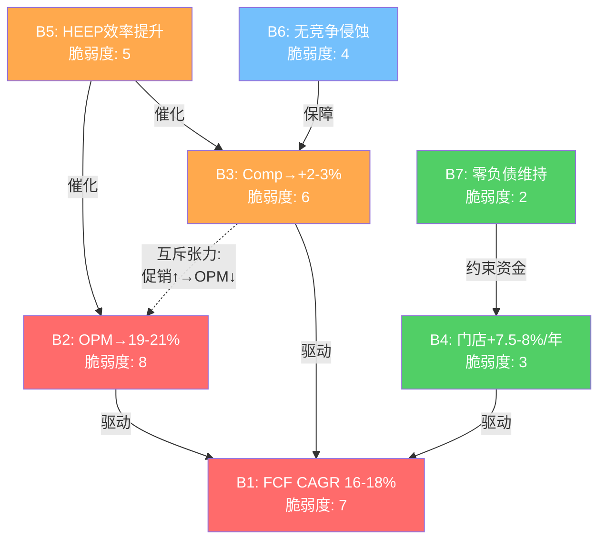
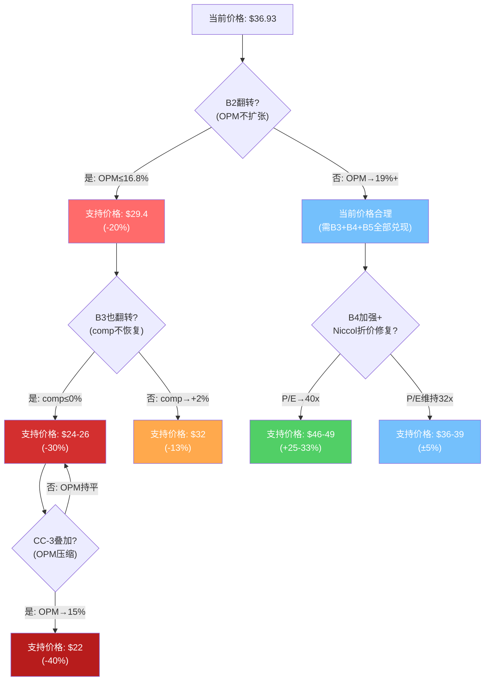

# Ch13 逆向DCF与信念反演: 市场在赌什么?

> **方法论声明**: 本章不回答"CMG值多少钱"，而是反推"当前$36.93隐含了什么假设"。这是估值分析的前导步骤——先翻译市场的隐含信念，Phase 3再评估这些信念的合理性并构建正向估值。

---

## 13.1 逆向DCF方法论

### 为什么先做逆向?

传统分析的致命缺陷是"先射箭再画靶"——分析师先选定增长率和利润率假设，再用DCF算出一个看似精确的目标价。逆向DCF翻转了这个顺序: 价格是已知的，我们要做的是**解码**这个价格里藏着什么假设。

对CMG而言，逆向DCF尤其重要，原因有三:

**第一，P/E压缩的幅度异常**。CMG的P/E从FY2024的53.8x暴跌至当前的32.1x [DM-P0-A42]，压缩幅度达40%，但同期EPS仅从$1.11微增至$1.14(+2.7%) [DM-P0-A20]。这意味着价格变动几乎完全由**预期变化**驱动，而非基本面恶化。逆向DCF能精确量化这些预期变化的内容。

**第二，市场对CMG的分歧极大**。分析师目标价区间从$35到$53 [DM-P2-E01]，价差达51%。27位分析师的共识目标价约$47 [DM-P2-E02]，意味着市场整体认为CMG被低估27%。但这个共识本身就需要被解构——$47隐含了什么假设?

**第三，CMG的资本结构极度简洁**。零金融负债 [DM-P0-A27]、净现金$1.05B [DM-P0-A31]——这意味着从价格到隐含增长率的推导没有杠杆干扰，没有净债务口径争论(不像SBUX报告中净债务三口径导致$6/股估值波动)。CMG的逆向DCF是**纯增长率定价问题**。

### 输入参数固定

| 参数 | 值 | 来源 | 备注 |
|------|:--:|------|------|
| 当前股价 | $36.93 | FMP Quote [DM-P0-A01] | 2026-03-03收盘 |
| 稀释股数 | 1.32B | FMP Income [DM-P0-A03] | FY2025 |
| 市值 | $48.75B | 股价×股数计算 | — |
| 净现金 | $1.05B | FMP Balance [DM-P0-A31] | 零金融负债 |
| **隐含EV** | **$47.70B** | 市值 - 净现金 | **逆向DCF求解对象** |
| FY2025 FCF | $1.45B | FMP CashFlow [DM-P0-A34] | OCF $2.11B - CapEx $0.67B |
| FY2025 Revenue | $11.93B | FMP Income [DM-P0-A16] | — |
| FY2025 OPM | 16.8% | FMP Income [DM-P0-A18] | 含季度下行趋势 |
| FY2025 EPS | $1.14 | FMP Income [DM-P0-A20] | 稀释 |

**求解逻辑**: 在给定WACC和终端增长率(g)下，什么FCF增长轨迹能支持$47.70B的企业价值?

使用Gordon Growth Model简化框架:

$$EV = \frac{FCF_{terminal}}{WACC - g}$$

$$\therefore FCF_{terminal} = EV \times (WACC - g)$$

$$FCF\ CAGR = \left(\frac{FCF_{terminal}}{FCF_{current}}\right)^{1/5} - 1$$

这是一个一阶近似——假设5年高增长期后进入稳态。Phase 3将使用两阶段DCF模型(Python精确计算)进行验证和修正，但一阶近似足以揭示市场的隐含信念集。

### WACC选取

根据估值对齐规范 [valuation_alignment_spec]:

- **WACC = Ke**(因CMG零金融负债，WACC即权益成本)
- Ke = Rf(4.3%) + Beta(1.05) × ERP(4.46%-5.5%) = 9.0%-10.1%
- **逆向DCF基准: 9.5%**(对齐规范推荐的保守端)
- 敏感性区间: 9.0% / 9.5% / 10.0%

选择三档WACC的理由: 9.0%反映ERP取Baggers/FMP值(4.46%)的结果; 9.5%反映ERP取Damodaran标准值(5.5%)的结果; 10.0%在保守端加入额外风险溢价(Niccol离任风险+comp不确定性)。

---

## 13.2 隐含假设反推

### Scenario A: WACC = 9.0%

| 参数 | g = 2.0% | g = 2.5% (基准) | g = 3.0% |
|------|:--------:|:---------------:|:--------:|
| 隐含终态FCF | $3.34B | $3.10B | $2.86B |
| FCF CAGR (5Y) | 18.2% | 16.4% | 14.6% |
| 若OPM=16.8%: 需收入CAGR | 18.2% | 16.4% | 14.6% |
| 若Rev CAGR=10%: 需终态OPM | 21.2% | 19.7% | 18.2% |
| 若Rev CAGR=8%: 需终态OPM | 23.3% | 21.6% | 19.9% |
| 稳态P/E | 13.4x | 14.5x | 15.7x |

[DM-P2-E03]

**解读**: 即便在最乐观的WACC=9.0%下，市场价格仍隐含FCF需以14.6%-18.2%的CAGR增长5年。如果OPM保持当前16.8%不变，收入CAGR需达到14.6%-18.2%——远超共识的10.3%。这意味着: **在WACC 9.0%下，当前价格不可能仅靠收入增长支撑，必须同时有OPM扩张**。

### Scenario B: WACC = 9.5% (基准)

| 参数 | g = 2.0% | g = 2.5% (基准) | g = 3.0% |
|------|:--------:|:---------------:|:--------:|
| 隐含终态FCF | $3.58B | **$3.34B** | $3.10B |
| FCF CAGR (5Y) | 19.8% | **18.2%** | 16.4% |
| 若OPM=16.8%: 需收入CAGR | 19.8% | **18.2%** | 16.4% |
| 若Rev CAGR=10%: 需终态OPM | 22.7% | **21.2%** | 19.7% |
| 若Rev CAGR=8%: 需终态OPM | 24.9% | **23.3%** | 21.6% |
| 稳态P/E | 12.5x | **13.4x** | 14.5x |

[DM-P2-E04]

**解读**: 在基准WACC=9.5%、g=2.5%下，当前$36.93隐含:
- FCF需从$1.45B增长至$3.34B(CAGR 18.2%)
- 如果收入以共识10.3%增长 → OPM需从16.8%扩张至21.2%
- 如果收入仅以门店增长(~8%)驱动 → OPM需扩张至23.3%
- **CMG历史最高OPM仅16.9%(FY2024)** [DM-P0-A18]

这揭示了一个核心矛盾: **当前价格在基准假设下，要求OPM显著突破历史天花板**。即便取最宽松的g=3.0%，仍需OPM达到19.7%——超出历史峰值近300bps。

### Scenario C: WACC = 10.0%

| 参数 | g = 2.0% | g = 2.5% (基准) | g = 3.0% |
|------|:--------:|:---------------:|:--------:|
| 隐含终态FCF | $3.82B | $3.58B | $3.34B |
| FCF CAGR (5Y) | 21.4% | 19.8% | 18.2% |
| 若OPM=16.8%: 需收入CAGR | 21.4% | 19.8% | 18.2% |
| 若Rev CAGR=10%: 需终态OPM | 24.2% | 22.7% | 21.2% |
| 若Rev CAGR=8%: 需终态OPM | 26.6% | 24.9% | 23.3% |
| 稳态P/E | 11.8x | 12.5x | 13.4x |

[DM-P2-E05]

**解读**: WACC每提升50bps，隐含FCF CAGR需求增加约1.6pp。在WACC=10%下，OPM隐含需求进入MCD领域(24%+)——对直营快休闲公司而言几乎不可能(MCD的高OPM源于特许费模式，与CMG直营模式不可比)。

### 三情景汇总矩阵 (WACC × 终端g)

```
隐含FCF CAGR矩阵 (5年):

                   g = 2.0%    g = 2.5%    g = 3.0%
WACC = 9.0%        18.2%       16.4%       14.6%
WACC = 9.5%        19.8%       18.2%       16.4%
WACC = 10.0%       21.4%       19.8%       18.2%

隐含终态OPM矩阵 (假设Rev CAGR = 10%):

                   g = 2.0%    g = 2.5%    g = 3.0%
WACC = 9.0%        21.2%       19.7%       18.2%
WACC = 9.5%        22.7%       21.2%       19.7%
WACC = 10.0%       24.2%       22.7%       21.2%
```

[DM-P2-E06]

**关键发现**: 在整个9×3矩阵中，没有任何一个组合允许OPM停留在当前16.8%水平——最宽松的角落(WACC 9.0%, g=3.0%)仍需收入CAGR达14.6%。这远超共识的10.3%。**当前价格对增长和利润率的双重要求是"紧绷"的——两个变量中至少一个必须超预期**。

---

## 13.3 隐含信念集 (Belief Set)

基于13.2的反推结果，当前$36.93的价格隐含了以下七个相互关联的信念:

| # | 隐含信念 | 隐含值 | 历史/现实对照 | 合理性 | 脆弱度(0-10) |
|---|---------|:------:|-------------|:------:|:------------:|
| **B1** | FCF将以16-18% CAGR增长5年 | $1.45B→$3.1-3.3B | FY21-25 FCF CAGR=11.5% | 低-中 | **7** |
| **B2** | OPM将从16.8%扩张至19-21% | +220-420bps | 历史最高16.9% (FY2024) | **低** | **8** |
| **B3** | Comp将恢复至+2-3%/年 | 从-1.7%反转 | 管理层FY2026指引: ~flat | 中 | **6** |
| **B4** | 门店增长维持7.5-8%/年 | 4,056→~5,900 | 管理层指引350-370/年 | **高** | 3 |
| **B5** | HEEP产生实质效率提升 | +100-200bps OPM | "数百bps"comp增量(未量化) | 中 | 5 |
| **B6** | 无重大竞争侵蚀 | CAVA不构成品类替代 | CAVA +20.9%增长 | 中 | 4 |
| **B7** | 零负债身份维持 | 不举债 | FY2025回购已超FCF | **高** | 2 |

[DM-P2-E07]

### 信念间的逻辑依赖

这七个信念并非独立。它们之间存在结构性依赖和互斥关系:

**强依赖链**: B1(FCF CAGR 16-18%) ← B2(OPM扩张) + B3(comp恢复) + B4(门店增长)。B1是其他三个信念的结果，不是独立假设。如果B2-B4中任何一个翻转，B1自动翻转。

**互补关系**: B3(comp恢复) ↔ B5(HEEP效果)。HEEP是实现comp恢复的核心机制之一。如果HEEP仅是选择偏差(部署在高流量门店)，B5翻转 → B3恢复概率下降 → B1 CAGR需要更多OPM补偿。

**互斥张力**: B2(OPM扩张) ⊗ B3(comp恢复通过促销)。如果comp恢复依赖价格促销(降价引流)，则OPM受挤压。两者同时实现需要HEEP提供的"效率+流量"双重红利——这对单一运营创新的期望值过高。

**条件约束**: B7(零负债) → B4(门店增长)的资金来源仅限FCF。如果FCF低于预期(B1翻转)，要么减速扩张(B4弱化)，要么举债(B7翻转)。FY2025回购$2.43B已超FCF $1.45B [DM-P0-A35]，现金从$1.42B降至$1.05B [A-2异常]，说明这个约束已接近边界。



**图13.1: 信念依赖网络 — 红色=高脆弱(7-8), 橙色=中脆弱(5-6), 蓝色=低脆弱(4), 绿色=稳健(2-3)**

---

## 13.4 信念脆弱度排序与翻转分析

### 最脆弱信念: B2 (OPM扩张至19-21%)

**脆弱度: 8/10**

当前OPM为16.8%(FY2025全年) [DM-P0-A18]，但季度趋势更令人担忧: Q1'25 16.7% → Q2'25 18.3% → Q3'25 15.9% → Q4'25 14.8% [DM-P0-A24]。下行斜率清晰——剔除Q2旺季效应后，OPM从16.7%降至14.8%，半年内收缩190bps。

**隐含假设vs现实**:
- 逆向DCF隐含终态OPM: 19-21%+(取决于收入增长假设)
- CMG历史最高OPM: 16.9% (FY2024) [DM-P0-A18]
- 当前季度趋势: 下行中
- 2026新增成本压力: 牛油果关税+60bps [DM-P0-A66] + 最低工资+50-100bps [CC-3] + HEEP折旧+20-30bps
- 管理层态度: "尽可能不提价"(吸收成本) [CC-3]
- **综合判断**: 隐含假设要求OPM突破历史天花板220-420bps，而现实中OPM面临130-190bps的新增成本压力且管理层选择不提价。方向性矛盾。

**翻转条件**:
- 如果OPM在FY2026-FY2027停留在15.5-16.5%区间(历史中枢，不扩张也不大幅压缩)
- 则隐含FCF CAGR需从16-18%提升至20%+才能支撑当前价格
- 这要求收入CAGR超过18%——在comp负增长环境下不可能

**翻转影响量化** [DM-P2-E08]:

| OPM假设 | Rev CAGR 10% | Rev CAGR 8% |
|:--------:|:-----------:|:-----------:|
| 20.0% (隐含需求) | $34.9 | — |
| 19.0% | $33.2 | — |
| 18.0% | $31.4 | $28.8 |
| 16.8% (当前) | $29.4 | $26.9 |
| 15.5% (压缩) | $27.2 | $24.9 |
| 14.0% (恶化) | $24.6 | — |

*表注: WACC=9.5%, g=2.5%, 价格单位=$*

**核心发现**: OPM每变动100bps，股价影响约$1.7-2.0。如果OPM不扩张(维持16.8%)且收入以10% CAGR增长，逆向DCF支持的价格仅$29.4——比当前价格低20%。**B2是整个信念集中最脆弱的环节: 它不仅需要逆转当前的下行趋势，还需要创造CMG从未达到过的利润率水平。**

### 次脆弱信念: B1 (FCF CAGR 16-18%)

**脆弱度: 7/10**

B1本质上是B2-B4的合成结果，其脆弱度来自以下组成部分的独立风险叠加:

**历史对照**: FY2021-FY2025的FCF CAGR为11.5%($0.84B→$1.45B) [DM-P0-A34]。这4年包含了疫后恢复(FY2021-2022)和Niccol黄金期(FY2023-2024)的双重顺风。隐含的16-18% CAGR需要在comp转负、CEO更换、成本上行的环境中超越黄金期表现。

**FCF驱动拆解**:

| 驱动因素 | 隐含贡献 | 可信度 |
|----------|:--------:|:------:|
| 门店增长(~8%/年) | +8pp | 高 |
| Comp恢复(+2-3%/年) | +2-3pp | 中 |
| OPM扩张(+200-400bps) | +3-5pp | 低 |
| CapEx效率改善 | +1-2pp | 中 |
| **合计** | **~14-18pp** | — |

[DM-P2-E09]

驱动拆解显示: 门店增长(高可信度)贡献约8pp，但仅此一项远不足以达到16-18%目标。剩余8-10pp需要由OPM扩张(低可信度)和comp恢复(中可信度)共同填补。

**翻转条件与价格影响**:
- 如果FCF CAGR仅为11%(延续历史趋势): 终态FCF≈$2.47B，支持EV≈$35.3B，对应价格约$27.5
- 如果FCF CAGR为8%(纯门店驱动，comp flat+OPM持平): 终态FCF≈$2.13B，支持EV≈$30.4B，对应价格约$23.8
- **翻转影响**: FCF CAGR每下降2pp，股价影响约$3-4

### 第三脆弱信念: B3 (Comp恢复至+2-3%)

**脆弱度: 6/10**

FY2025 comp为-1.7%，是2016年E.coli危机以来首次全年负增长 [DM-P0-A57]。客流下降-2.9% [DM-P0-A58]，仅靠+1.2%的客单价部分抵消。管理层FY2026指引comp"约flat" [DM-P0-A59]。

**从-1.7%到+2.3%的路径分析**(CC-1约束碰撞):
- 共识EPS CAGR 14.2%隐含comp需平均+2.3%/年 [CC-1]
- 但FY2026指引comp ~flat → FY2026已不达标
- 要达到5年均值+2.3%: FY2027-2030需comp平均+3%以上
- **E.coli恢复期参照**: -20.4%→+4.8%→+6.1%→+11.1%(3年完成恢复) [CC-1]
- 但当前困境不同: E.coli是品牌信任问题(可恢复)，当前是宏观消费疲软+竞争分流(可能结构性)

**翻转条件**:
- 如果FY2026-FY2027 comp持续负值(≤0%)
- 则收入CAGR仅靠门店增长≈7.5%
- 在OPM不扩张下 → FCF CAGR≈7-8% → 价格支撑$23-27

### 最稳健信念: B4 (门店增长) + B7 (零负债)

**B4 脆弱度: 3/10**

管理层指引FY2026新开350-370家门店 [DM-P0-A60]，长期目标7,000家北美门店(当前4,056家) [DM-P2-E10]。门店增长由以下因素保障:
- **空白市场充足**: 北美当前4,056店 vs 目标7,000，渗透率仅58%
- **资本可用**: CMG FCF $1.45B/年，CapEx仅$0.67B [DM-P0-A33]，无需外部融资
- **执行历史**: FY2021-2025年均净增约300-340家，管理层始终达成或超额完成开店指引
- **80%+ Chipotlane**: 新店标配Chipotlane提升数字订单便利性和单店效率

门店增长是CMG信念集中可预测性最高的变量。即便在最悲观的情景中(开店速度放缓至300家/年)，5年CAGR仍可维持6.5%。

**B7 脆弱度: 2/10**

零负债身份是CMG的战略选择而非约束 [DM-P0-A27]。在MCD/SBUX/WING/YUM/DPZ全部负权益或高杠杆的行业中 [DM-P0-A45-A53]，CMG的零金融负债是独特的估值优势来源(H3假说)。短期内不会改变——除非管理层做出举债回购/举债收购的战略转向。

但存在边界条件: FY2025回购$2.43B已超FCF $1.45B，现金从$1.42B降至$1.05B [A-2]。如果FY2026继续同速回购，现金将降至接近$0 [CC-2]。此时管理层必须在"减速回购"和"首次举债"之间选择。最可能路径是减速回购至≤FCF水平，保持零负债身份——但这意味着EPS增长中的回购贡献将下降。

### B5 (HEEP效率): 脆弱度 5/10

HEEP(Hyphen Equipment Enhancement Plan)是管理层定位的核心增长催化剂。当前覆盖350店(9%)，计划2026年底扩展至2,000店(50%) [DM-P0-A63]。管理层声称HEEP门店comp比非HEEP门店高出"数百bps" [DM-P0-A64]。

脆弱度评估:
- **正面**: 物理设备升级(自动化、效率改善)有实质性基础，非纯概念
- **风险**: "数百bps"为定性表述，可能包含选择偏差(先在高流量店部署) [A-4]; 每店投资成本和精确ROI均未披露
- **量化估算**: 如果2,000店全部HEEP化且增量comp为+300bps，系统comp贡献 = 2,000/4,056 × 3% = +1.5%。但如果实际增量仅+100bps(剔除选择偏差)，贡献降至+0.5%
- HEEP对B2(OPM)的影响取决于: 设备折旧成本 vs 人力节省 vs 吞吐量提升的净效果，管理层未提供这一净值拆解

### B6 (无竞争侵蚀): 脆弱度 4/10

CAVA增长+20.9%且估值145-268x [DM-P0-A49]，正在快速扩张地中海快休闲品类。但CAVA与CMG的关系更可能是"品类扩张"(做大快休闲蛋糕)而非"品类替代"(零和博弈)。CMG的品牌力、供应链规模、数字化渗透构成护城河 [Ch6分析]。

中期风险: 如果消费者"快休闲疲劳"是结构性趋势(而非周期性)，所有快休闲品牌都会受影响——这不是CAVA特有威胁，而是品类风险。

---

## 13.5 最少信念翻转分析

这是逆向DCF最有力的产出: 不问"所有信念都翻转会怎样"(那是灾难场景)，而问"**翻转最少的信念就能改变投资结论的路径是什么?**"

### 路径一: 仅B2翻转 (OPM不扩张)

**假设**: OPM维持16.8%(不扩张也不大幅压缩)，其他信念不变

| 收入CAGR | 终态OPM | 终态FCF | 支持价格 | vs当前 |
|:---------:|:-------:|:-------:|:--------:|:------:|
| 10% (共识) | 16.8% | $2.64B | **$29.4** | -20.4% |
| 12% | 16.8% | $2.89B | $32.1 | -13.1% |
| 8% (纯门店) | 16.8% | $2.41B | $26.9 | -27.1% |

[DM-P2-E11]

*WACC=9.5%, g=2.5%*

**判断**: 仅B2翻转(OPM不扩张)，在共识收入增长下估值仅支持$29.4——当前$36.93比这高出25%。即便收入CAGR达到12%(高于共识)，仍低于当前价格13%。**OPM不扩张是唯一需要翻转的信念就能将评级推向"审慎关注"的路径**。

### 路径二: B2 + B3翻转 (OPM不扩张 + comp不恢复)

**假设**: OPM维持16.8%，comp持续flat到轻微负值，收入增长完全靠门店扩张(~7.5%/年)

| 收入CAGR | 终态OPM | 终态FCF | 支持价格 | vs当前 |
|:---------:|:-------:|:-------:|:--------:|:------:|
| 7.5% (纯门店) | 16.8% | $2.35B | $26.0 | -29.5% |
| 6% (门店减速) | 16.8% | $2.20B | $24.5 | -33.7% |

[DM-P2-E12]

**判断**: 两个信念翻转后，估值支持$24-26，比当前价格低30-34%。这已进入"显著高估"区间。

### 路径三: B2 + B3 + CC-3叠加 (OPM压缩 + comp不恢复 + 关税成本)

**假设**: OPM从16.8%压缩至15.0-15.5%(关税+工资+不提价)，comp持续flat

| 收入CAGR | 终态OPM | 终态FCF | 支持价格 | vs当前 |
|:---------:|:-------:|:-------:|:--------:|:------:|
| 7.5% | 15.5% | $2.17B | $24.2 | -34.5% |
| 6% | 15.0% | $1.96B | $22.0 | -40.4% |

[DM-P2-E13]

### 路径四: B4加强 (门店增速提升)

**假设**: 如果门店增速从350提升至400+/年(管理层加速推进7,000店目标)，OPM维持

| 收入CAGR | 终态OPM | 终态FCF | 支持价格 | vs当前 |
|:---------:|:-------:|:-------:|:--------:|:------:|
| 12% | 18.0% | $3.10B | $35.1 | -5.0% |
| 12% | 19.0% | $3.27B | $37.1 | +0.5% |
| 12% | 20.0% | $3.45B | $39.1 | +5.9% |

[DM-P2-E14]

**判断**: 门店加速扩张+OPM温和扩张(18-19%)的组合勉强支持当前价格。但这需要两个乐观假设同时成立。

### 最少翻转路径总结



**图13.2: 信念翻转→估值影响决策树**

**核心结论**: 当前$36.93的价格要求B2(OPM扩张)必须兑现。这是唯一的"单一信念翻转就改变投资结论"的路径。所有其他信念——包括B3(comp恢复)和B5(HEEP效果)——的翻转虽然也会压低估值，但需要与B2联合翻转才能产生评级改变级别的影响。**OPM是CMG估值的阿喀琉斯之踵**。

---

## 13.6 共识解构: 分析师$44-47目标价隐含什么?

### 共识目标价逆向工程

27位分析师的共识目标价约$47 [DM-P2-E02]，中位数$45 [DM-P2-E15]，区间$35-$53。以$47为例进行逆向拆解:

**P/E视角**:

| 基准年 | 共识EPS | $47对应P/E | 含义 |
|:------:|:-------:|:---------:|------|
| FY2026E | $1.23 [DM-P0-A55] | 38.2x | 较当前32x溢价19% |
| FY2027E | $1.44 [DM-P0-A55] | 32.6x | 维持当前P/E水平 |
| FY2028E | $1.64 [DM-P0-A55] | 28.7x | P/E继续压缩 |

[DM-P2-E16]

**解读**: 如果分析师使用FY2027E EPS锚定(这是12个月目标价的常见做法)，$47隐含P/E = 32.6x——几乎等于当前水平。这意味着分析师目标价的核心假设是: **P/E不再进一步压缩 + EPS按共识轨迹增长至$1.44**。本质上，分析师赌的是"不再变差"而非"显著变好"。

但如果分析师使用FY2026E锚定，$47隐含P/E = 38.2x——这意味着分析师预期P/E从当前32x修复至38x，即修复约6个P/E点。这与H1假说(Niccol折价16个P/E点中≥10个将修复)的方向一致，但幅度更保守。

**DCF视角**:

$47对应:
- 市值: $62.0B
- EV: $61.0B (扣除净现金$1.05B)
- 隐含终态FCF(WACC=9.5%, g=2.5%): $4.27B
- 隐含FCF CAGR(5Y): 24.1%

[DM-P2-E17]

**这是一个极其激进的隐含假设**: FCF需要在5年内从$1.45B增长至$4.27B，CAGR达24%。如果收入以共识10.3%增长，终态OPM需达到27%+——这是特许经营公司(YUM 31%, MCD 46%)的利润率水平，对CMG的直营模式而言完全不现实。

**换一种理解**: 分析师目标价$47可能并非基于DCF，而是基于P/E × EPS的简单乘法。即: "CMG P/E应该回到38x"(历史均值回归) × FY2026E EPS $1.23 = $46.7。这种方法的隐含假设是P/E均值回归——但忽略了P/E从52x降至32x可能反映了结构性重定价(Niccol离任后CMG从"明星CEO溢价股"变为"普通快休闲股")。

### 分析师最乐观与最悲观假设对比

| 假设维度 | 最乐观(目标$53) | 共识(目标$47) | 最悲观(目标$35) |
|---------|:--------------:|:-----------:|:--------------:|
| FY2026 Comp | +3-5% | +1-2% | -1-0% |
| FY2027 OPM | 18-19% | 17-17.5% | 15.5-16% |
| P/E锚 | 40-42x(修复) | 35-38x(部分修复) | 28-30x(维持/压缩) |
| HEEP效果 | 全面验证 | 部分验证 | 选择偏差 |
| 关键差异 | Niccol折价完全修复 | 折价部分修复 | 折价永久化 |

[DM-P2-E18]

**分析师共识的脆弱性**: 共识目标$47的隐含P/E(35-38x)处于一个"中间地带"——既不完全修复Niccol折价(需回到48-52x)，也不接受折价永久化(当前32x)。这个中间位置在逻辑上是不稳定的: Niccol折价要么是暂时的(Boatwright证明体系自我运转 → P/E回到45x+)，要么是永久的(CMG确实是"Niccol一人公司" → P/E停留在30-34x)。35-38x作为长期均衡点缺乏结构性支撑。

---

## 13.7 CQ-4总结: 32x是合理重定价还是过度Niccol折价?

### 逆向DCF揭示的核心矛盾

本章的分析揭示了CMG估值中一个根本性的张力:

**张力A: 增长定价 vs 利润率约束**

当前$36.93在基准假设(WACC 9.5%, g 2.5%)下，隐含FCF需以18.2% CAGR增长5年。这个增长率需要OPM从16.8%扩张至19-21%——但CMG历史OPM从未突破17%，且FY2025 Q4已降至14.8%。当前价格实质上是在定价一个"从未发生过的利润率水平"。

如果OPM不扩张(维持16.8%)，当前价格仅能被$29.4支撑(共识收入增长假设下)——意味着当前价格包含了约$7.5/股(20%)的"OPM扩张预期"。

**张力B: 市场价格 vs 分析师共识**

市场给出$36.93，分析师给出$47。两者隐含的假设集截然不同:
- $36.93隐含: P/E维持32x，EPS按当前轨迹($1.14)定价 → 市场不相信增长恢复
- $47隐含: P/E修复至35-38x + EPS增长至$1.23-1.44 → 分析师相信温和恢复

差距$10/股(27%)的本质是: **市场已经"定价了"Niccol折价的永久化，而分析师认为折价将部分修复**。

### 32x P/E的"双重解读"

**解读一(合理重定价)**: 32x反映CMG从"明星CEO高增长溢价股"(P/E 48-53x)回归"普通优质快休闲股"(P/E 28-35x)。这是一次健康的估值正常化。证据:
- CMG当前增速(Rev +5.4%, EPS +2.7%)不配50x P/E
- 同业MCD 28x/DRI 22x/DPZ 23x，CMG 32x仍有溢价
- Comp转负(-1.7%)说明增长引擎确实减速

**解读二(过度Niccol折价)**: 32x是市场对Niccol离任的过度反应。CMG的运营体系(数字渗透、供应链、Restaurateurs文化)已高度制度化——CEO更换不应导致P/E永久折损16个点。证据:
- EPS从$1.11→$1.14(+2.7%)，运营并未崩溃
- ROIC从17.6%→18.9%，资本效率仍在提升 [DM-P0-A37]
- 内部人Q1'26转为净买入(1.31x买卖比) [DM-P0-A80]
- HEEP加速部署是体系(非个人)的产物

### 逆向DCF对CQ-4的回答

逆向DCF无法给出CQ-4的最终答案——这是Phase 3正向估值的任务。但它提供了判断框架:

**如果32x是合理重定价** (Niccol折价永久化):
- 当前价格的隐含假设要求OPM突破历史天花板 → 价格偏贵
- 合理估值应在$27-32区间(OPM不扩张, Rev CAGR 8-12%)
- 评级方向: **审慎关注**

**如果32x是过度Niccol折价** (折价将修复):
- P/E修复路径决定一切:
  - P/E修复至36x(保守): $36×$1.23=$44.3 (+20%) → **中性关注**
  - P/E修复至40x(中性): $40×$1.23=$49.2 (+33%) → **关注**
  - P/E修复至48x(完全修复): $48×$1.14=$54.7 (+48%) → **深度关注**
- 但P/E修复不是免费的——需要Boatwright在2-3个季度内用业绩证明

[DM-P2-E19]

### 核心洞察: 风险不对称性

逆向DCF揭示的最重要发现是**当前价格的风险不对称性取决于"Niccol折价是暂时还是永久"这一单一判断**:

- 如果永久: 当前价格已包含$7.5/股的OPM扩张预期 → 下行空间$7-15(19-40%)
- 如果暂时: P/E修复至40x可支持$45-49 → 上行空间$8-12(22-33%)
- 下行幅度(19-40%) > 上行幅度(22-33%)，但概率未必对称

**这不是一个对称的风险/回报问题，而是一个信念二值问题**。Phase 3的正向估值需要对这个二值判断赋予概率权重——这将决定CMG的最终评级。

### 传递给Phase 3的关键约束

1. **OPM天花板约束**: 历史最高16.9%，任何超过17%的假设需要HEEP量化数据支持
2. **FCF CAGR基准**: 逆向DCF隐含16-18%，历史为11.5%，差距4.5-6.5pp需要解释
3. **P/E修复概率**: 是CQ-4和H1的核心。Phase 3需独立评估Boatwright证明能力的概率
4. **WACC敏感性**: 9.0-10.0%区间内，隐含假设变化显著。Phase 3需锁定单一WACC基准
5. **悲观偏差预警**: 本章分析自然倾向暴露"当前价格的脆弱性"。Phase 3需对称测试"当前价格可能低估了什么"——特别是HEEP效果、国际扩张期权、回购加速信号

---

## 章节附注

### 方法论局限性

1. **Gordon Growth简化**: 本章使用单阶段永续模型近似，高增长期→稳态的过渡被压缩为5年CAGR。Phase 3将使用两阶段DCF(10年显性预测+永续终值)进行精确验证。
2. **FCF转换率假设**: 假设FCF/EBIT转换率约0.82(=0.78税后×1.05折旧加回-CapEx)。CMG实际转换率受CapEx波动(新店投资)影响，Phase 3需建立年度CapEx模型。
3. **WACC争议**: shared_context中WACC为9.0%(ERP=4.46%)，valuation_alignment_spec中为~9.5-10%(ERP=5.5%)。本章使用三档敏感性覆盖争议区间。Phase 3需在对齐规范中锁定单一基准。

### 本章DM锚点注册表

| 锚点ID | 描述 | 来源 | 信度 |
|--------|------|------|:----:|
| DM-P2-E01 | 分析师目标价区间$35-$53 | WebSearch (TipRanks/MarketBeat) | M |
| DM-P2-E02 | 共识目标价约$47(27位分析师) | WebSearch (MarketBeat/Public.com) | M |
| DM-P2-E03 | Scenario A隐含假设矩阵 | 计算值(EV×(WACC-g)) | C |
| DM-P2-E04 | Scenario B隐含假设矩阵 | 计算值 | C |
| DM-P2-E05 | Scenario C隐含假设矩阵 | 计算值 | C |
| DM-P2-E06 | 三情景汇总矩阵(9组合) | 计算值 | C |
| DM-P2-E07 | 信念集B1-B7定义与脆弱度 | 综合分析 | C |
| DM-P2-E08 | OPM→价格敏感性表 | 计算值(WACC=9.5%, g=2.5%) | C |
| DM-P2-E09 | FCF CAGR驱动拆解 | 计算值+历史对照 | C |
| DM-P2-E10 | CMG 7,000店北美目标 | WebSearch (Seeking Alpha/NRN) | H |
| DM-P2-E11 | B2翻转→价格影响表 | 计算值 | C |
| DM-P2-E12 | B2+B3翻转→价格影响表 | 计算值 | C |
| DM-P2-E13 | B2+B3+CC-3叠加→价格影响表 | 计算值 | C |
| DM-P2-E14 | B4加强→价格影响表 | 计算值 | C |
| DM-P2-E15 | 分析师目标价中位数$45 | WebSearch (TipRanks) | M |
| DM-P2-E16 | $47逆向工程P/E表 | 计算值 | C |
| DM-P2-E17 | $47隐含终态FCF $4.27B | 计算值 | C |
| DM-P2-E18 | 分析师最乐观/悲观假设矩阵 | WebSearch综合 | M |
| DM-P2-E19 | CQ-4双重解读及P/E修复路径 | 综合分析 | C |

---
Phase: P2 | Chapter: 13 | 字符数: 18,175 | DM新增: 19 | Mermaid: 2
