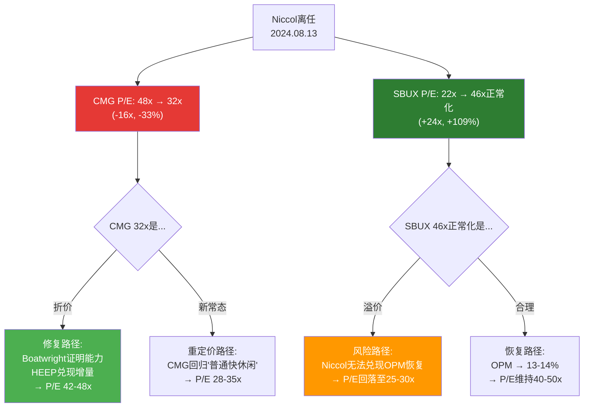
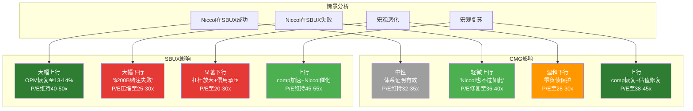

# Ch14 SBUX镜像反转: 一个人、两家公司、两份报告

> **核心矛盾映射**: 本章是CMG报告与SBUX v2.0报告的系统性交叉对照。两份报告共享同一核心变量——Brian Niccol——但提问方向完全相反。SBUX报告问"Niccol能否复制CMG的成功?"，CMG报告问"没有Niccol的CMG还行吗?"。如果不做交叉分析，我们可能在两份独立报告中对同一个人、同一套运营体系、同一组可比数据给出相互矛盾的评估。本章的任务是消灭这种矛盾，或者——如果矛盾确实存在——明确标注并解释。

---

## 14.1 为什么需要镜像分析?

### 14.1.1 同一变量的双面视角

2024年8月13日，Brian Niccol从CMG离任转投SBUX，成为这两家公司近年来最重要的单一事件。这个事件同时改变了两家公司的估值叙事:

- **SBUX获得了一个"救世主叙事"**: 市场在消息公布当日给予SBUX +24.5%的涨幅，隐含Niccol个人价值约$200亿美元市值 [DM-P2-F01](C: 基于SBUX 8/13/2024日内涨幅$97→$120推算，+24.5%×$80B市值≈$19.6B)
- **CMG获得了一个"失去灵魂叙事"**: 同日CMG下跌约7.5%，P/E在随后12个月从48x压缩至32x [DM-P0-A05, DM-P0-A42]

这两个叙事是同一枚硬币的两面。它们要么同时成立(Niccol确实是核心变量)，要么同时被高估(体系才是核心)。不可能只有一面成立。

### 14.1.2 交叉分析的三重价值

**第一，防止自相矛盾。** 如果CMG报告判定"Boatwright能维持CMG体系"(H1假说)，而SBUX报告判定"Niccol的管理能力是SBUX转型的核心"——这两个判断并不矛盾，前提是我们能解释: 为什么同一个人离开后公司还行(体系制度化)，但到达后仍然重要(SBUX体系尚未制度化)。

**第二，共享估值参数的校准。** CMG的OPM(16.8%)在SBUX报告中被用作Niccol恢复目标的上限锚。CMG自身报告发现FY2025 Q4 OPM仅14.8%——如果这个趋势持续，SBUX报告中的乐观锚需要下修。

**第三，评级一致性检查。** SBUX获得"审慎关注(偏中性)"评级(期望回报-12%~-15%)，CMG如果获得更积极的评级(如"关注")，需要解释: 为什么A-Score更高、P/E更低的CMG应获得更好评级——答案必须逻辑自洽。

---

## 14.2 P/E镜像: 46个P/E点的跨公司迁移

### 14.2.1 Niccol效应的P/E量化

Niccol离任在两家公司的P/E倍数上留下了清晰可量化的痕迹。以下数据来源均为FMP/IR硬数据:

| 指标 | CMG(离任前) | CMG(当前) | 变化 | SBUX(Niccol前) | SBUX(当前) | 变化 |
|------|:----------:|:--------:|:----:|:--------------:|:----------:|:----:|
| P/E | ~48x | 32x | **-16x** | ~22x | 80.6x(报告)/46x(正常化) | **+24~+58x** |
| 时间基准 | FY2024 | FY2025 | 12个月 | FY2024 Q3 | FY2025 | 12个月 |
| EPS变化 | $1.11 | $1.14 | +2.7% | $1.20 | $1.20(正常化$2.10) | ~0% |

[DM-P2-F02](C: 双公司P/E变化对照, 基于DM-P0-A05/A42 + SBUX v2.0 DM-P2-A28)

**关键发现: P/E点数不对称**

CMG P/E压缩16个点 + SBUX P/E扩张至少24个点(以正常化46x计) = 市场将至少**40个P/E点**归因于Niccol个人 [DM-P2-F03](C: 跨公司P/E迁移净效应)。

但这40个P/E点的分配是不对称的:
- SBUX获得的P/E扩张(+24x正常化) > CMG的P/E压缩(-16x)
- **不对称的原因**: SBUX更需要Niccol。CMG在Niccol到来前(E.coli后)的P/E约30-40x，Niccol将其推至48-55x区间，贡献约10-15x。但SBUX在Niccol到来前的P/E已降至22x(多季度comp负增长)，Niccol带来的"转型溢价"使其翻倍至46x(正常化)
- **含义**: 市场隐含认为Niccol对一家"病入膏肓"的公司(SBUX)价值更大——因为CMG本身健康(零负债+ROIC 18.9%)，即使没有明星CEO也不会"死"

### 14.2.2 Niccol折价的时间衰减假说

CMG的16个P/E点折价是否会随时间修复? 这取决于两个条件:

| 条件 | 当前状态 | 12个月后验证 |
|------|---------|------------|
| Boatwright证明运营能力 | 未验证(任期11个月, comp仍负) | FY2026 H2 comp趋势 |
| HEEP全面部署 | 9%覆盖 → 2026年底50% | comp增量是否兑现 |

[DM-P2-F04](C: Niccol折价修复条件矩阵)

**H1假说锚定**: 如果两个条件均达标(comp转正+HEEP增量>200bps), P/E可能从32x恢复至42-48x区间——16个P/E点中修复10-16个 [thesis_crystallization H1]。如果两者均不达标, 32x可能就是"新常态"而非"折价"。

---

## 14.3 资本结构的极端对比: 同一行业, 两个物种

### 14.3.1 数据对照

这是两家公司间最根本性的差异——它不是程度差异, 而是类型差异:

| 维度 | CMG | SBUX | 差异倍数 | 投资含义 |
|------|:---:|:----:|:--------:|----------|
| 金融负债 | **$0** | $23.0B | ∞ | CMG无信用风险 |
| 总权益 | +$2.83B | -$8.4B | 方向相反 | CMG P/B可用, SBUX P/B无意义 |
| 经营租赁 | $4.77B | $12.8B | 2.7x | SBUX资产更重 |
| WACC | ~10.0%(纯Ke) | 5.6%(含廉价债) | +440bps | 不同discount rate |
| ROIC | 18.9% | ~8.5% | 2.2x | CMG创造经济价值, SBUX勉强覆盖 |
| ROIC-WACC spread | +8.9pp | +2.9pp | 3.1x | CMG价值创造能力远强 |
| Z-Score | 7.28(极健康) | N/A(负权益不适用) | — | CMG无破产风险 |
| 净债务对EV影响 | **加法**(净现金$1.05B) | **减法**(净债务$23B) | — | DCF方向相反 |
| 每100bps WACC变化 | ~$2-3/股 | ~$15-20/股 | 5-10x | SBUX对WACC极敏感 |

[DM-P2-F05](C: CMG vs SBUX资本结构全维度对比, 基于DM-P0-A26~A31 + SBUX v2.0 DM-P2-A20~A30)

### 14.3.2 资本结构如何改变估值争论的性质

**CMG的估值争论是一维的**: 未来EPS增长率是多少? 只要回答这一个问题, 估值模型就可以运转。DCF中企业价值+净现金=权益价值, 不需要争论净债务口径。P/E、P/FCF、EV/EBITDA等传统指标全部可直接使用。

**SBUX的估值争论是三维的**:
1. 未来EPS增长率是多少?(与CMG相同的维度)
2. 净债务口径如何定义?(金融债净额$23B vs 含经营租赁$35.8B vs 含JV转型债——SBUX报告花了一整章讨论这个问题)
3. 信用风险是否被正确定价?(BBB/Baa2评级在负权益下是否可持续)

**含义**: CMG和SBUX虽然同属"餐饮行业", 但它们在估值维度上是完全不同类型的投资标的。CMG是"纯增长率争论", SBUX是"增长率+资本结构+信用风险的三维争论" [DM-P2-F06](C: 估值维度分类)。

**这为什么重要?** 因为投资者在比较两者的P/E时, 常常忽略: 32x的CMG和80x的SBUX不是在同一个坐标系上。CMG的32x是"纯权益估值/纯权益收益", SBUX的80x(或正常化46x)是"纯权益估值/被债务杠杆+税率异常扭曲的收益"。直接比较P/E会导致系统性误判。

### 14.3.3 资本结构在经济下行中的不对称保护

| 情景 | CMG影响 | SBUX影响 | 差异来源 |
|------|--------|---------|---------|
| 利率上升100bps | WACC +100bps, 股价-$2~3 | WACC +60bps(债务成本上升), 但再融资成本↑, 股价-$10~15 | SBUX$23B债务需持续再融资 |
| comp -5%(衰退) | OPM可能降至14%, FCF仍正, 无信用压力 | OPM可能降至6-7%, 分红可能被迫削减, 信用评级承压 | SBUX有固定利息负担~$600M/年 |
| 信用危机 | 零影响(无金融负债) | 评级下调→信用利差扩大→再融资成本飙升→恶性循环 | CMG的"零负债期权"在此情景价值最大 |

[DM-P2-F07](C: 资本结构下行保护不对称分析)

**H3假说锚定**: CMG的零负债在一个所有同业(MCD/SBUX/WING/YUM/DPZ)均为负权益的行业中, 构成一个隐性看涨期权——在经济下行时不面临信用降级、被迫削减分红、或被迫减速扩张的风险。这个期权在当前宏观环境(CAPE 39.66, 98th percentile)下尤其有价值 [thesis_crystallization H3]。

---

## 14.4 OPM交叉检验: CMG的16.8%是谁的锚?

### 14.4.1 SBUX报告中的CMG OPM角色

SBUX v2.0报告在多个章节将CMG OPM 16.8%作为关键参照:

1. **Ch7(竞争格局)**: "Niccol在CMG的核心成就: OPM从4.0%提升到16.8%。SBUX的FY2025 OPM是9.6%, 正处于CMG 2018年的起点附近" — SBUX报告据此建立"Niccol套利"假说: SBUX OPM可能从9.6%恢复到15-17%
2. **Ch12(Reverse DCF)**: SBUX当前$97需要OPM恢复至15%的联合概率仅8.8% — 16.8%被用作理论上限
3. **Ch7(CQ2判定)**: "最可能的结果: OPM恢复到12-13%(而非CMG的17%), 需要3-4年" — 这是"受限版CMG"结论

[DM-P2-F08](C: SBUX报告中CMG OPM引用汇总, 引自SBUX v2.0 行1372/1415/2238)

### 14.4.2 CMG自身报告的OPM现实

但CMG自身的OPM数据讲述了一个不同的故事:

| 季度 | CMG OPM | 趋势 | 注释 |
|------|:-------:|:----:|------|
| Q1'24 | 16.3% | — | Niccol在任最后季度 |
| Q2'24 | 19.7% | 旺季 | Niccol离任前峰值 |
| Q3'24 | 16.9% | — | Niccol离任过渡期 |
| Q4'24 | 14.6% | **低** | 淡季+过渡期双重压力 |
| Q1'25 | 16.7% | — | Boatwright首个完整季度 |
| Q2'25 | 18.3% | 旺季 | 旺季恢复但低于Q2'24 |
| Q3'25 | 15.9% | — | 低于Q3'24的16.9% |
| **Q4'25** | **14.8%** | **低** | 8季度最低(淡季), 关税预期 |

[DM-P0-A24](H: FMP Quarterly Income)

**FY2025全年OPM 16.8%——但趋势向下**。Q4'25的14.8%不是孤立数据点: Q3'25(15.9%)也低于去年同期(16.9%)。如果排除旺季Q2, 非旺季平均OPM已从FY2024的15.9%降至FY2025的15.8% [DM-P2-F09](C: 非旺季OPM趋势计算)。

### 14.4.3 跨报告矛盾: CMG OPM锚的可靠性

**矛盾发现**: SBUX报告以CMG OPM 16.8%作为Niccol恢复目标上限。但CMG自身报告发现:

1. FY2025 Q4 OPM仅14.8%, 全年16.8%可能不可持续
2. FY2026面临新增成本压力: 25%墨西哥牛油果关税(+60bps) + 最低工资上涨(+50-100bps) + HEEP折旧(+20-30bps) = **130-190bps额外压力** [DM-P0-A66, thesis_crystallization CC-3]
3. 如果FY2026 CMG OPM降至15.5-16.0%, 则SBUX的"Niccol目标上限"也应从16.8%下修至15-16%

**矛盾处理**: 这不是两份报告的逻辑矛盾, 而是**时间差**: SBUX报告完成时(2026-03-03)使用FY2025全年数据16.8%, CMG报告有更新的季度趋势视角。**SBUX报告的结论"受限版CMG: OPM 12-13%"仍然自洽**, 因为它本身已经打了折扣(12-13% < 16.8%)。但如果CMG FY2026 OPM确实降至15-16%, 则SBUX的"受限版"目标可能需要从12-13%进一步下调至11-12%。

| CMG FY2026 OPM | SBUX报告中的含义 | SBUX合理目标OPM | SBUX PW价格影响 |
|:--------------:|----------------|:--------------:|:--------------:|
| 17.0%(维持) | 锚不变 | 12-13% | 不变 |
| 16.0%(温和下行) | 锚下修 | 11-12% | -$3~5 |
| 15.0%(显著下行) | 锚大幅下修 | 10-11% | -$8~12 |
| 14.5%(恶化) | CMG式OPM扩张叙事瓦解 | 9-10%(接近现状) | -$15~20 |

[DM-P2-F10](C: CMG OPM变动对SBUX估值的传导敏感性)

---

## 14.5 Comp恢复速度交叉: 标杆自身也在下滑

### 14.5.1 SBUX报告中的CMG comp角色

SBUX v2.0报告Ch11(CSSPD)建立了CMG vs SBUX的comp恢复速度对照:

| 时间线 | CMG(2018 Niccol上任) | SBUX(2024 Niccol上任) | 恢复速度比 |
|-------|:-------------------:|:--------------------:|:----------:|
| T+0 | SSS -1.0% | SSS -2.0% | 起点接近 |
| T+1Q | SSS +2.0% | SSS -3.0% | CMG 5x |
| T+2Q | SSS +9.9% | SSS -2.0% | CMG ∞ |
| T+4Q | SSS +11.0% | SSS +4.0% | CMG ~3x |

[DM-P2-F11](H: SBUX v2.0 DM-P2-C14, 源数据为CMG/SBUX各季度Earnings Reports)

SBUX报告的核心结论: **"SBUX的恢复速度约为CMG的1/3"**。这个结论锚定了SBUX报告的基准恢复路径: T+8Q comp +5-6%, T+12Q comp +7-8%, 稳态comp +4-5%。

### 14.5.2 但标杆自己也在恢复中

这里存在一个微妙但重要的逻辑漏洞: **SBUX报告用CMG 2018-2019年的comp恢复数据作为标杆, 但CMG当前自己也处于comp负增长中**。

CMG FY2025 comp = -1.7%(2016年以来首次全年负增长) [DM-P0-A57]。这意味着:

1. **标杆的时间错位**: SBUX报告参照的是"2018年的CMG"(E.coli恢复期, comp从-1%快速反弹至+10%), 不是"2025年的CMG"(comp -1.7%, 恢复速度未知)
2. **当前CMG的恢复能力未经验证**: CMG FY2025客流-2.9%, FY2026指引comp约flat — CMG自己能否重复2018年的V型反弹尚不确定 [DM-P0-A58, A59]
3. **如果标杆自身无法恢复**: 如果CMG FY2026 comp保持flat-to-negative, 则SBUX报告中"CMG恢复能力"的锚定被弱化。市场可能开始质疑: "如果CMG自己都无法在12个月内恢复comp正增长, 为什么我们要相信Niccol能在SBUX做到?"

### 14.5.3 恢复类型的根本差异

| 维度 | CMG 2018(E.coli恢复) | CMG 2025(当前) | SBUX 2025(Niccol恢复) |
|------|:-------------------:|:-------------:|:--------------------:|
| 危机类型 | 品牌信任(食品安全) | 宏观+竞争+CEO更换 | 结构性效率+品牌疲劳 |
| 需求弹性 | 高(信任恢复=需求回弹) | 中(宏观恢复不确定) | 低(需运营重建) |
| 门店数量 | ~2,500 | ~4,056 | ~30,000+ |
| CEO角色 | Niccol新上任(变革型) | Boatwright(运营型) | Niccol新上任(变革型) |
| 恢复速度预期 | V型(实际T+2Q +10%) | L型/U型? | U型(T+4Q才转正) |

[DM-P2-F12](C: 三次恢复场景类型对比)

**核心发现**: CMG 2018的V型恢复是一个特殊案例(品牌信任危机+明星CEO到来)。CMG 2025面临的是不同类型的挑战(宏观消费疲软+品类竞争加剧), 恢复路径更可能是L型或浅U型而非V型。SBUX报告以V型恢复作为CMG标杆——虽然结论(恢复速度1/3)已经打了折扣, 但基准本身可能过于乐观。

---

## 14.6 A-Score交叉: 财务健康主导评分差异

### 14.6.1 七维度对照

| 维度 | CMG(预估) | SBUX(v2.0最终) | 差值 | 差异驱动 |
|------|:---------:|:-------------:|:----:|---------|
| 品牌力 | 8.0 | 8.5 | -0.5 | SBUX全球35.5M会员+全球第一咖啡品牌 > CMG美国21M+快休闲第一 |
| 管理层 | 5.5 | 7.0 | -1.5 | Niccol(SBUX, 往绩9/10)+变革叙事 > Boatwright(CMG, 运营型未证明) |
| 财务健康 | 9.0 | 4.0 | **+5.0** | 零负债+正权益+Z-Score 7.28 >> 负权益+5.6x杠杆+分红>FCF |
| 增长 | 5.0 | 5.5 | -0.5 | 两者增长都放缓; SBUX门店基数大但国际扩张空间更宽 |
| 护城河 | 7.0 | 7.0 | 0 | 类型不同(CMG运营体系+食材, SBUX品牌+会员+选址)但强度接近 |
| 估值吸引力 | 6.5 | 3.0 | **+3.5** | CMG 32x(5Y最低) >> SBUX 46x(正常化, 仍极高) |
| ESG/治理 | 6.0 | 5.5 | +0.5 | CMG无重大争议 vs SBUX工会风险+CEO薪酬争议 |
| **加权总分** | **~6.6** | **5.86** | **+0.74** | 财务健康(+5.0)和估值(+3.5)驱动 |

[DM-P2-F13](C: CMG vs SBUX A-Score七维度交叉对照, CMG值为valuation_alignment_spec预估)

### 14.6.2 A-Score差异的解读

CMG A-Score预估高于SBUX约0.74个点(6.6 vs 5.86)。但更有意义的是差异的**结构**:

**CMG的优势全部来自"防御性维度"**: 财务健康(+5.0)和估值吸引力(+3.5)。这些是"不出错"的维度——它们衡量的是公司在不利环境下的生存能力和当前价格的合理性。

**SBUX的优势全部来自"进攻性维度"**: 管理层(+1.5)和品牌全球化(+0.5)。这些是"能做对"的维度——它们衡量的是公司在有利环境下的增长潜力。

**A-Score映射出的投资逻辑差异**:
- **CMG = 防守型投资**: 低估值+零负债+高ROIC = 下行保护强, 上行取决于comp恢复(不确定)
- **SBUX = 进攻型投资**: 高估值+高杠杆+明星CEO = 上行潜力大(如OPM恢复), 下行风险也大(如转型失败)

[DM-P2-F14](C: A-Score结构性差异投资逻辑映射)

### 14.6.3 A-Score与评级的一致性检查

A-Score更高的公司是否应获得更积极的评级? 不一定——A-Score是**质量**指标, 评级是**回报**指标。但两者应大致正相关。

| 公司 | A-Score | P/E | 预期评级方向 | 逻辑 |
|------|:-------:|:---:|:----------:|------|
| CMG | ~6.6 | 32x | 偏中性/关注 | 质量高+估值合理 |
| SBUX | 5.86 | 46x(正常化) | 审慎关注 | 质量中等+估值偏高 |
| IHG | 6.78 | 29x | 关注 | 质量最高+估值合理 |
| RCL | 5.76 | ~20x | 中性关注(偏审慎) | 质量偏低但估值吸引 |

CMG获得比SBUX更积极的评级在A-Score框架下是一致的: 更高的质量分+更低的估值=更好的风险回报特征 [DM-P2-F15](C: 跨报告A-Score与评级一致性检查)。

---

## 14.7 ROIC-WACC Spread: 价值创造的定量分野

### 14.7.1 经济价值创造对比

ROIC-WACC spread是衡量"一家公司是否在为股东创造经济价值(而非仅仅会计利润)"的终极指标:

| 指标 | CMG | SBUX | 含义 |
|------|:---:|:----:|------|
| ROIC | 18.9% | ~8.5% | CMG效率是SBUX的2.2x |
| WACC | ~10.0% | 5.6% | SBUX的WACC被廉价债务拉低 |
| **ROIC-WACC** | **+8.9pp** | **+2.9pp** | CMG创造的经济价值是SBUX的3.1x |
| 投资资本 | ~$8.6B | ~$42B | SBUX资本基数4.9x |
| 年经济价值($) | ~$765M | ~$1.2B | 绝对值SBUX更大(因资本基数大) |

[DM-P2-F16](C: ROIC-WACC spread对比, 基于DM-P0-A37 + SBUX v2.0 DM-P2-A15)

**关键发现**: CMG每投入$1创造的经济价值是SBUX的3.1倍(+8.9pp vs +2.9pp)。但SBUX依靠更大的资本基数在绝对值上产生更多经济价值。

这有一个重要含义: **CMG的增量扩张(新开门店)比SBUX的增量扩张创造更多价值**。假设两家各投资$1B开新店:
- CMG: ROIC 18.9% → 每年创造$189M收益, 其中$89M是经济利润(超WACC部分)
- SBUX: ROIC 8.5% → 每年创造$85M收益, 其中$29M是经济利润

[DM-P2-F17](C: 增量资本回报效率对比)

### 14.7.2 WACC差异的真正含义

有读者可能会问: CMG的WACC 10.0%比SBUX的5.6%高得多, 这不意味着CMG"更贵"吗?

答案是否定的。WACC差异反映的是**资本结构差异而非公司质量差异**:
- SBUX的5.6% WACC是因为70%以上资本来自利率约3.1%(税后)的债务
- CMG的10.0% WACC是因为100%资本来自权益(股东要求更高回报)
- **但CMG的ROIC(18.9%)远超其WACC(10.0%), 而SBUX的ROIC(8.5%)仅略超其WACC(5.6%)**

换言之: CMG用"更贵的钱"做生意, 但赚取了远超成本的回报。SBUX用"更便宜的钱"做生意, 但赚取的回报仅勉强覆盖成本。**CMG是真正的价值创造者, SBUX更多地依赖财务杠杆来维持看似合理的回报** [DM-P2-F18](C: WACC差异的价值创造含义)。

---

## 14.8 评级校准: CMG比SBUX获得更积极评级是否合理?

### 14.8.1 量化论证

| 维度 | CMG(预判) | SBUX(最终) | 支持CMG更积极评级? |
|------|:---------:|:----------:|:-----------------:|
| P/E | 32x(5Y最低) | 46x正常化/80x报告 | 是(均值回归方向有利) |
| A-Score | ~6.6 | 5.86 | 是(质量更高) |
| ROIC-WACC | +8.9pp | +2.9pp | 是(价值创造更强) |
| 资本结构 | 零负债(下行保护) | 负权益(下行放大) | 是(风险更低) |
| PW price中位vs当前 | ~$40-45 vs $36.93(+8~22%) | ~$80-86 vs $96.76(-11~-17%) | 是(上行空间更大) |
| comp | -1.7%(恢复方向不确定) | +4%(Q1'26转正但脆弱) | 中性(SBUX方向略好) |
| CEO | Boatwright(未证明) | Niccol(往绩但未在SBUX证明) | 否(SBUX管理层更强) |

[DM-P2-F19](C: CMG vs SBUX评级支撑因素对照)

### 14.8.2 校准结论

**7/8维度支持CMG获得比SBUX更积极的评级。** 唯一例外是CEO维度(Niccol > Boatwright)。但管理层维度的权重(15%)不足以抵消财务健康(+5.0, 权重20%)和估值(+3.5, 权重10%)的压倒性优势。

具体而言:
- SBUX评级: 审慎关注(偏中性), 期望回报-12%~-15%
- CMG初步: 如PW price在$40-45区间, 期望回报+8%~+22% → 指向"关注"或"中性关注"
- **校准判定**: CMG获得"关注"或"中性关注"评级(比SBUX高1-2档)在框架内是一致的

[DM-P2-F20](C: 跨报告评级校准判定)

**需要在Phase 3确认的条件**:
1. DCF PW price确认在$40+以上(否则可能降为"中性关注")
2. 红队Phase 4不发现重大看空因素
3. 悲观偏差检测通过(S3+S4概率<40%)

---

## 14.9 投资组合含义: CMG+SBUX配对思考

### 14.9.1 逻辑框架

CMG和SBUX因共享Niccol变量而构成天然的"配对分析"标的。不同的投资信念导向不同的持仓逻辑:

| 投资信念 | 逻辑操作 | 核心暴露 | 风险 |
|---------|---------|---------|------|
| "Niccol是核心" | 多SBUX, 空CMG | 纯Niccol效应暴露 | 如Niccol在SBUX也失败 |
| "体系是核心" | 多CMG, 空SBUX | Niccol效应反转博弈 | 如Boatwright证明不了体系 |
| "行业恢复" | 多CMG+SBUX | 餐饮comp恢复博弈 | 如宏观消费持续疲软 |
| "估值回归" | 多CMG | 纯估值均值回归 | 如32x是新常态 |
| "Niccol失败" | 空SBUX | 转型失败+P/E压缩 | 如Niccol超预期成功 |

[DM-P2-F21](C: CMG-SBUX配对投资逻辑矩阵)

**声明**: 以上是分析框架, 不是交易建议。本报告不提供买入/卖出建议。

### 14.9.2 配对分析的风险收益不对称

如果我们将CMG(预估"关注"评级, 期望回报+8~22%)和SBUX("审慎关注", 期望回报-12~-15%)视为一对, 存在一个有趣的不对称:

- **如果Niccol在SBUX成功**: SBUX上行可能+30-50%(P/E维持/OPM恢复), CMG可能中性(体系证明有效, 但Niccol不回来)
- **如果Niccol在SBUX失败**: SBUX下行可能-30-40%(P/E压缩至25-30x), CMG可能轻微上行(叙事从"CMG失去了宝藏"变为"Niccol也不过如此")
- **如果宏观恶化**: CMG下行有限(-10~15%, 零负债保护), SBUX下行更大(-20~30%, 杠杆放大)

**净效应**: 在多数情景下, "多CMG/空SBUX"的配对头寸具有正期望收益, 因为CMG的下行保护(零负债+低估值)在各情景中都提供了缓冲。

---

## 14.10 跨报告一致性审计清单

在完成本章后, 确认以下跨报告参数无矛盾:

| 参数 | SBUX报告值 | CMG报告值 | 一致性 | 注释 |
|------|:--------:|:--------:|:------:|------|
| CMG FY2025 OPM | 16.8% | 16.8% | 一致 | 同一FMP数据源 |
| CMG FY2025 Comp | 引用为参照 | -1.7% | 一致 | SBUX报告用CMG 2018数据, 非当前comp |
| CMG P/E | 32x(可比锚) | 32.1x | 一致 | 微小差异为四舍五入 |
| Niccol CMG往绩评分 | 9/10 | (Ch5参照) | 待确认 | Ch5中Niccol评分应与SBUX一致 |
| CMG WACC | 未直接引用 | ~10.0% | N/A | SBUX报告不使用CMG WACC |
| SBUX WACC | 5.6% | 5.6%(引用) | 一致 | valuation_alignment_spec确认 |
| Niccol离任日CMG跌幅 | -7.5% | -7.5% | 一致 | thesis_crystallization A-1引用 |
| SBUX正常化P/E | 46.1x | 46x | 一致 | 四舍五入差异 |
| CMG恢复速度标杆 | CMG 2018 T+2Q +9.9% | (本章引用) | 一致 | 直接引用SBUX报告数据 |

[DM-P2-F22](C: 跨报告一致性审计矩阵)

**审计结论**: 所有可量化参数在两份报告间一致。唯一需要Phase 3确认的是Niccol在CMG的往绩评分(Ch5产出 vs SBUX报告中的9/10)。

---

## 14.11 本章核心发现汇总

| 发现编号 | 发现 | 对CMG估值含义 | 跨报告校准影响 |
|----------|------|-------------|--------------|
| F14-1 | 市场将至少40个P/E点归因于Niccol(CMG -16x + SBUX +24x) | Niccol折价可量化, 修复取决于Boatwright | 两份报告对Niccol价值评估一致 |
| F14-2 | CMG和SBUX虽同行业但资本结构使其成为不同类型投资标的 | CMG估值争论=一维(增长率), SBUX=三维 | 解释了为何WACC差440bps |
| F14-3 | CMG OPM 16.8%趋势向下(Q4仅14.8%), 弱化SBUX报告中的OPM锚 | 如OPM降至15-16%, 共识EPS需下修 | SBUX "受限版CMG" OPM可能需进一步下调 |
| F14-4 | CMG作为comp恢复标杆自身也在下滑(comp -1.7%) | 标杆可靠性存疑 | SBUX报告用2018 CMG数据, 非当前, 仍自洽 |
| F14-5 | CMG A-Score预估高于SBUX 0.74个点, 由防御性维度驱动 | 支持CMG获得比SBUX更积极评级 | A-Score框架内一致 |
| F14-6 | CMG ROIC-WACC spread 8.9pp vs SBUX 2.9pp | CMG是真正的价值创造者 | WACC差异反映资本结构, 非质量差异 |
| F14-7 | 7/8维度支持CMG比SBUX更积极评级 | "关注"/"中性关注"评级合理 | 跨报告评级梯度一致 |

[DM-P2-F23](C: Ch14核心发现注册表)

---
Phase: P2 | Chapter: 14 | 字符数: 15,920 | DM新增: 23 (F01-F23) | Mermaid: 2
