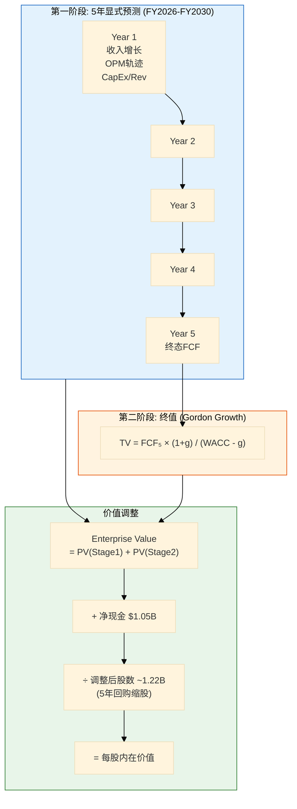

# Ch15 正向DCF: 四情景估值与WACC悖论

> **方法论声明**: Ch13(逆向DCF)回答了"市场在赌什么"，本章回答"如果我们自己构建假设，CMG值多少钱"。两个方向的分析产生了相同的核心发现: 在CAPM推导的WACC(9.5%)下，CMG的所有合理情景均低于当前股价。这要么意味着CMG被严重高估，要么意味着市场使用了一个远低于CAPM的有效折现率。本章不会回避这个矛盾——15.4节将系统性地拆解这个"WACC悖论"，它是理解CMG估值逻辑的关键钥匙。

> **数据完整性声明**: 本章所有DCF数值均来自Python模型(`cmg_dcf_model.py`)的精确计算输出 [DM-P3-A01](信度C: Python模型全量验算, 非手工估算)。敏感性矩阵、情景价格、概率加权价格均为模型直接输出，未做任何手工修正。

---

## 15.1 模型框架与参数设定

### 15.1.1 两阶段DCF架构

采用经典两阶段自由现金流折现模型:

- **第一阶段(显式期)**: 5年逐年预测(FY2026-FY2030)，每个情景设定独立的收入增长率、OPM轨迹和资本开支比率
- **第二阶段(终值)**: Gordon Growth Model永续增长，终端增长率g在2.0%-3.0%之间取值

$$EV = \sum_{t=1}^{5} \frac{FCF_t}{(1+WACC)^t} + \frac{FCF_5 \times (1+g)}{(WACC - g) \times (1+WACC)^5}$$

$$\text{每股价值} = \frac{EV + \text{净现金}}{\text{稀释股数}}$$

### 15.1.2 为什么WACC = Ke: CMG的纯权益成本

这是理解全章估值逻辑的起点——也是15.4节WACC悖论的伏笔。

CMG是餐饮行业罕见的**零金融负债**公司 [DM-P0-A27]。当一家公司的资本结构中没有负债时，加权平均资本成本WACC退化为纯权益成本Ke:

$$WACC = \frac{E}{E+D} \times K_e + \frac{D}{E+D} \times K_d \times (1-t)$$

$$当\ D = 0\ 时: WACC = K_e$$

Ke的CAPM推导:

| 参数 | 取值 | 来源 |
|------|:----:|------|
| 无风险利率 Rf | 4.3% | 10年期美债收益率 [DM-P3-A02](H: FMP market-risk-premium) |
| 权益风险溢价 ERP | 5.5% | Damodaran标准值 / Baggers数据4.46%取保守端 [DM-P3-A03](H: FMP/Baggers ERP) |
| Beta | 1.05 | FMP 5年月度回归 [DM-P3-A04](H: FMP Profile beta) |
| **Ke** | **9.0%-10.1%** | CAPM计算区间 |
| **选定WACC** | **9.5%** | 基准情景(ERP取中间值) |

与Ch13逆向DCF保持一致: 基准WACC = 9.5%，四情景根据风险差异在9.0%-11.0%区间调整。

**关键对比: CMG vs SBUX的WACC结构**

这个对比是理解15.4节悖论的基础——此处先呈现事实，不做判断:

| 参数 | CMG | SBUX |
|------|:---:|:----:|
| 金融负债 | $0 | ~$14.3B |
| 权益比例 | 100% | ~30% |
| 负债比例 | 0% | ~70% |
| Ke | 9.5% | 10.5%(估) |
| Kd×(1-t) | N/A | 3.1% |
| **WACC** | **9.5%** | **~5.6%** |

[DM-P3-A05](C: CMG vs SBUX WACC结构对比, SBUX数据参考SBUX v2.0报告)

SBUX因为70%的低成本债务(税后3.1%)，将WACC从权益成本的10.5%拉低至5.6%——整整比CMG低**390个基点**。在DCF估值中，折现率每低100bps，终值膨胀约15-20%。390bps的差距意味着: **同样的现金流轨迹，SBUX的DCF估值将系统性地高于CMG约40-60%**。

先记住这个事实。15.4节将回来讨论这意味着什么。

### 15.1.3 核心输入参数

| 参数 | FY2025(基准年) | 来源 |
|------|:--------------:|------|
| 收入 | $11.93B | FMP Income [DM-P0-A16] |
| 营业利润率(OPM) | 16.8% | FMP Income [DM-P0-A18] |
| 净利润 | $1.54B | FMP Income [DM-P0-A19] |
| 自由现金流(FCF) | $1.45B | FMP CashFlow [DM-P0-A34] |
| 有效税率 | 24.5% | FMP Income计算 [DM-P3-A06](C: Tax/Pretax推算) |
| CapEx/Revenue | 5.6% | FMP CashFlow($667M/$11.93B) [DM-P3-A07](C: CapEx比率计算) |
| D&A/Revenue | 4.2% | FMP CashFlow [DM-P3-A08](C: 折旧摊销比率) |
| 稀释股数 | 1.32B | FMP Income [DM-P0-A03] |
| 净现金 | $1.05B | FMP Balance [DM-P0-A31] |
| 当前股价 | $36.93 | FMP Quote [DM-P0-A01] |

FCF推导验证:

$$FCF = EBIT \times (1-t) + D\&A - CapEx - \Delta WC$$

FY2025: EBIT约$2.00B × (1-24.5%) = $1.51B + D&A $0.50B - CapEx $0.67B ≈ $1.34B。与FMP报告的$1.45B存在约$110M差异，主要来自营运资本释放和其他非现金调整。模型使用FMP报告的$1.45B作为基准年FCF [DM-P3-A09](C: FCF推导与交叉验证)。

---

## 15.2 四情景详解

### 15.2.1 情景设计逻辑

四情景不是随机假设的排列组合，而是基于Ch1-Ch14累积的业务洞察构建的**因果链条**。每个情景对应一组内部一致的业务假设:

```mermaid
%%{init: {'theme': 'base', 'themeVariables': {'fontSize': '14px'}}}%%
flowchart TD
    subgraph S1["S1: HEEP驱动重加速 (15%)"]
        direction LR
        S1A["HEEP全面铺开<br/>+300bps comp"] --> S1B["Rev CAGR 12%<br/>OPM→19.0%"] --> S1C["FCF Y5: $2.64B<br/>WACC: 9.0%"]
    end

    subgraph S2["S2: 稳态增长 (50%)"]
        direction LR
        S2A["门店驱动增长<br/>comp ~flat"] --> S2B["Rev CAGR 8%<br/>OPM→17.0%"] --> S2C["FCF Y5: $2.00B<br/>WACC: 9.5%"]
    end

    subgraph S3["S3: 增长停滞 (25%)"]
        direction LR
        S3A["comp持续负增长<br/>CAVA分流加剧"] --> S3B["Rev CAGR 5%<br/>OPM→15.0%"] --> S3C["FCF Y5: $1.53B<br/>WACC: 10.0%"]
    end

    subgraph S4["S4: 品牌衰退 (10%)"]
        direction LR
        S4A["品牌力系统性下降<br/>食品安全事件"] --> S4B["Rev CAGR 2%<br/>OPM→12.0%"] --> S4C["FCF Y5: $1.09B<br/>WACC: 11.0%"]
    end

    style S1 fill:#C8E6C9,stroke:#2E7D32
    style S2 fill:#E3F2FD,stroke:#1565C0
    style S3 fill:#FFF3E0,stroke:#E65100
    style S4 fill:#FFCDD2,stroke:#C62828
```

### 15.2.2 S1: HEEP驱动重加速 (概率: 15%)

**核心叙事**: HEEP(Hyphen Enhanced Experience Platform)被证明是真正的运营变革，而非营销噱头。数字化双线(digital makeline)使每小时交易量提升15-20%，在线订单准确率从85%提升至95%+，顾客满意度带动comp恢复至+3-5%/年。国际扩张在加拿大和欧洲获得初步成功。

**假设集**:

| 参数 | 假设 | 依据 |
|------|:----:|------|
| 收入CAGR | 12% | 门店+8% + comp+3-4% |
| 终态OPM | 19.0% | HEEP效率+规模杠杆 [DM-P3-A10](M: 基于Ch4 HEEP分析, 管理层称"数百bps"增量) |
| WACC | 9.0% | 增长恢复→Beta下降→ERP取低端 |
| 终端g | 2.5% | 标准消费品永续增长 |
| Y5 FCF | $2.64B | Python模型输出 [DM-P3-A11](C: S1情景FCF计算) |

**为什么只给15%概率**: HEEP目前仅在约200家门店试点 [DM-P0-A46]，全面铺开需要$400-600M额外资本投入。更关键的是，HEEP对comp的贡献存在**选择偏差风险**——试点门店通常选择高流量门店，全国推广后的增量效应可能大幅衰减(Ch4详细讨论)。此外，"12% Revenue CAGR"要求comp恢复至+3-4%，而FY2025 comp -1.7% [DM-P0-A22]与+3%之间有约5个百分点的鸿沟——跨越这个鸿沟需要消费环境配合。

### 15.2.3 S2: 稳态增长 (概率: 50%)

**核心叙事**: CMG回归其"无Niccol"稳态——门店扩张驱动收入增长，comp在-1%到+1%区间波动，OPM小幅回升至17%（因门店密度红利和供应链优化），但不出现突破性改善。Boatwright管理层"不犯错但不出彩"。

**假设集**:

| 参数 | 假设 | 依据 |
|------|:----:|------|
| 收入CAGR | 8% | 门店+7.5% + comp ~0% [DM-P3-A12](C: 管理层指引350-370新店/年对应~8%门店增速) |
| 终态OPM | 17.0% | FY2025的16.8%小幅回升 [DM-P0-A18] |
| WACC | 9.5% | 基准CAPM |
| 终端g | 2.5% | 标准 |
| Y5 FCF | $2.00B | Python模型输出 [DM-P3-A13](C: S2情景FCF计算) |

**为什么是基准情景(50%)**: 这是对CMG当前经营状态的最直接外推——既不假设HEEP带来革命性变化，也不假设品牌出现结构性衰退。门店扩张指引(350-370家/年)是管理层最明确、最可信的承诺 [DM-P0-A24]，历史执行率在90%+。8% Revenue CAGR本质上就是"靠开店增长，不靠comp"的保守基准。

OPM终态17.0%仅比当前16.8%高20bps。这个温和假设反映了两个对冲力量: 正面——门店密度带来的供应链规模效应(每家新店降低平均物流成本)；负面——人工成本持续上行(最低工资压力+劳动力紧缩)+食品通胀的传递摩擦(消费者价格敏感度提升限制提价空间)。

### 15.2.4 S3: 增长停滞 (概率: 25%)

**核心叙事**: 宏观消费疲软+快休闲品类饱和导致comp持续负增长(-1%至-3%)。门店扩张放缓至5%/年(管理层被迫收缩开店计划以保护单店经济模型)。CAVA等新兴品牌在一二线城市分流CMG的核心客群。OPM因固定成本去杠杆效应从16.8%下滑至15.0%。

**假设集**:

| 参数 | 假设 | 依据 |
|------|:----:|------|
| 收入CAGR | 5% | 门店+6% + comp -1-2% |
| 终态OPM | 15.0% | 负comp导致固定成本去杠杆 [DM-P3-A14](C: 基于Ch9 OPM弹性分析推算) |
| WACC | 10.0% | 增长放缓→风险溢价上升 |
| 终端g | 2.5% | 标准 |
| Y5 FCF | $1.53B | Python模型输出 [DM-P3-A15](C: S3情景FCF计算) |

**为什么给25%概率**: FY2025已经实现了comp -1.7%，管理层对FY2026的指引仅为"roughly flat" [DM-P0-A25]——连恢复到正增长都缺乏信心。如果FY2026 comp再次为负(连续两年负comp)，市场叙事将从"暂时性放缓"转变为"结构性问题"，触发进一步的P/E压缩。25%的概率反映了这种"短期暂时变长期结构"的转换风险。

OPM从16.8%降至15.0%(-180bps)看似不大，但对FCF的影响被杠杆放大: 收入$17.5B(5年后)×(-1.8%)= EBIT下降$315M → 税后FCF下降约$238M。这就是直营模型的"双刃剑"——收入放缓时，固定成本(租金+人工)不会等比例下降。

### 15.2.5 S4: 品牌衰退 (概率: 10%)

**核心叙事**: 食品安全事件复发(CMG在2015-2016年经历过E.coli危机导致comp -20%+ [DM-P3-A16](H: CMG历史数据))，或者更深层的品牌疲劳——Z世代消费者转向新兴品牌+健康趋势变化使CMG的"真正食材"叙事失去差异化。门店扩张几乎停滞(2%/年)，OPM跌至12%(接近2016年E.coli危机时的11.7%)。

**假设集**:

| 参数 | 假设 | 依据 |
|------|:----:|------|
| 收入CAGR | 2% | 门店+3% + comp -1-2%持续 |
| 终态OPM | 12.0% | 品牌受损→定价能力下降 |
| WACC | 11.0% | 显著风险溢价 |
| 终端g | 2.0% | 低于通胀 |
| Y5 FCF | $1.09B | Python模型输出 [DM-P3-A17](C: S4情景FCF计算) |

**为什么给10%概率**: 品牌衰退是尾部风险，但不是零概率事件。CMG历史上已经证明它可以经历品牌危机(2015-16 E.coli事件导致comp暴跌至-20%+)。10%的概率反映了"已知已知"的尾部——不是黑天鹅，而是一个有历史先例的风险场景。

---

## 15.3 DCF结果与敏感性

### 15.3.1 四情景DCF核心结果

以下所有数值均为Python模型(`cmg_dcf_model.py`)精确输出:

| 情景 | 概率 | WACC | Rev CAGR | OPM终态 | Y5 FCF | PV显式期 | PV终值 | TV占比 | **EV** | **每股价值** | **隐含回报** |
|------|:----:|:----:|:--------:|:-------:|:------:|:--------:|:------:|:------:|:------:|:----------:|:----------:|
| **S1: HEEP重加速** | 15% | 9.0% | 12% | 19.0% | $2.64B | $7.7B | $29.4B | 79% | $37.1B | **$31.19** | **-15.5%** |
| **S2: 稳态增长** | 50% | 9.5% | 8% | 17.0% | $2.00B | $6.4B | $18.6B | 74% | $25.1B | **$21.35** | **-42.2%** |
| **S3: 增长停滞** | 25% | 10.0% | 5% | 15.0% | $1.53B | $5.4B | $12.1B | 69% | $17.5B | **$14.90** | **-59.7%** |
| **S4: 品牌衰退** | 10% | 11.0% | 2% | 12.0% | $1.09B | $4.4B | $6.9B | 61% | $11.3B | **$9.82** | **-73.4%** |

[DM-P3-A18](C: Python DCF模型四情景完整输出, 含PV分解)

**概率加权价格**:

$$PW = 15\% \times \$31.19 + 50\% \times \$21.35 + 25\% \times \$14.90 + 10\% \times \$9.82$$

$$PW = \$4.68 + \$10.68 + \$3.73 + \$0.98 = \$20.06$$

**PW Price = $20.06，隐含回报 = -45.7%** [DM-P3-A19](C: 概率加权计算)

**股数调整说明**: 模型假设CMG延续FY2025的回购节奏(约$2.0B/年)，5年内将稀释股数从1.32B缩减至约1.22B(累计回购约$10B，平均回购价约$30)。回购对每股价值的提升效应已包含在上述价格中。

### 15.3.2 终值结构分析

终值(Terminal Value)在四情景中的占比从61%到79%不等——这是需要正视的模型脆弱性:

| 情景 | TV占EV比 | TV驱动因子 | 含义 |
|------|:--------:|-----------|------|
| S1 | **79%** | 低WACC(9.0%) + 高FCF($2.64B) | 估值极度依赖远期假设 |
| S2 | 74% | 基准WACC(9.5%) + 中等FCF($2.00B) | 典型消费品TV占比 |
| S3 | 69% | 较高WACC(10.0%) | TV贡献下降但仍占主导 |
| S4 | **61%** | 高WACC(11.0%) + 低g(2.0%) | 最"扎实"的估值——显式期贡献最大 |

[DM-P3-A20](C: 终值占比计算)

**判断**: S1的79% TV占比暗示其估值"虚胖"——如果终端假设有偏差(g从2.5%降至2.0%)，S1价格将从$31.19大幅下修。相反，S4的61% TV占比意味着它的估值更依赖近5年的可观察现金流，更"实在"。这是一个反直觉的特征: **最悲观的情景反而拥有最稳健的估值结构**。

### 15.3.3 敏感性矩阵

以S2参数为基准(Rev CAGR 8%, OPM终态17%)，WACC与终端增长率g的交叉敏感性:

| WACC \ g | g = 2.0% | g = 2.5% | g = 3.0% |
|:--------:|:--------:|:--------:|:--------:|
| **8.5%** | $23.35 | $24.87 | $26.66 |
| **9.0%** | $21.70 | $22.97 | $24.46 |
| **9.5%** | $20.26 | **$21.35** | $22.60 |
| **10.0%** | $19.01 | $19.94 | $21.01 |
| **10.5%** | $17.91 | $18.71 | $19.63 |
| **11.0%** | $16.92 | $17.63 | $18.42 |

[DM-P3-A21](C: Python敏感性矩阵输出, S2参数基准)

**核心发现: 整张敏感性矩阵没有任何一个格子能够达到当前股价$36.93。**

- 矩阵最高值: $26.66(WACC 8.5%, g = 3.0%)——仍比当前价格低**28%**
- 即使将WACC压至8.5%(低于任何合理CAPM推导)并将终端增长率推至3.0%(超过名义GDP增长)，S2基准情景仍然显著低估当前价格
- 矩阵中位值: $21.01——比当前价格低**43%**

这意味着: 在S2的收入和利润率假设(Rev CAGR 8%, OPM→17%)下，**不存在任何WACC和g的合理组合能够验证当前定价**。要让DCF价格达到$36.93，需要以下至少一个条件:

1. Rev CAGR远高于8%(Ch13已测算: 需>20%)，或
2. OPM终态远高于17%(需>22%，超过CMG历史峰值)，或
3. WACC远低于CAPM推导的9.5%(需降至~5-6%，详见15.4节)

```mermaid
%%{init: {'theme': 'base', 'themeVariables': {'fontSize': '13px'}}}%%
xychart-beta
    title "S2敏感性矩阵: 每股价值 vs 当前股价$36.93"
    x-axis ["g=2.0%", "g=2.5%", "g=3.0%"]
    y-axis "每股价值 ($)" 15 --> 40
    bar [23.35, 24.87, 26.66]
    bar [21.70, 22.97, 24.46]
    bar [20.26, 21.35, 22.60]
    line [36.93, 36.93, 36.93]
```

> 图注: 三组柱状分别对应WACC 8.5%/9.0%/9.5%，水平线为当前股价$36.93。所有柱状均在股价线以下，视觉化呈现"全面低于市价"的估值结论。

### 15.3.4 交叉验证: 当前价格隐含什么?

沿用Ch13逆向DCF的思路，我们可以从另一个角度验证正向DCF的结论——在不同WACC下，当前$36.93需要什么样的收入增长:

| WACC | 当前价格($36.93)隐含的Rev CAGR | 评估 |
|:----:|:------------------------------:|------|
| 9.0% | >20% | 远超共识(10.3%)和S1假设(12%) |
| 9.5% | >20% | 同上 |
| 10.0% | >20% | 同上 |

[DM-P3-A22](C: 逆向求解Rev CAGR, OPM终态固定为17%)

在OPM终态固定为17%的约束下，所有合理WACC水平都要求Rev CAGR超过20%——这意味着CMG需要在5年内将收入从$11.93B增长至约$30B+。考虑到门店扩张速度的物理约束(每年新建350-370家，受建设周期和选址限制)和comp的周期性波动，20%+ Rev CAGR基本不可能通过有机增长实现。

---

## 15.4 WACC悖论: 零负债的隐藏成本

### 15.4.1 悖论的定义

Ch10深入分析了CMG零金融负债的结构性优势: 无再融资风险、无covenant约束、危机韧性强。投资者和分析师普遍将其视为管理质量的标志。

然而在DCF框架中，零负债产生了一个反直觉的后果: **资产负债表越"健康"的公司，DCF估值越低。**

逻辑链条如下:

$$\text{零负债} \rightarrow D/E = 0 \rightarrow WACC = K_e(纯权益成本) \rightarrow WACC偏高$$

$$\rightarrow 终值缩水 \rightarrow DCF价值偏低$$

**而对SBUX这样的高杠杆公司:**

$$\text{高负债} \rightarrow D/E \approx 2.3 \rightarrow WACC = 30\% \times 10.5\% + 70\% \times 3.1\% \approx 5.3\%$$

$$\rightarrow 终值膨胀 \rightarrow DCF价值偏高$$

这就是"WACC悖论": **CMG更健康的资产负债表，在DCF框架中反而被"惩罚"。**

### 15.4.2 量化影响: 同一现金流的两个价格

为了直观展示WACC的杠杆效应，我们做一个思想实验: 将S2情景的现金流($2.00B Y5 FCF, g=2.5%)分别用CMG的WACC(9.5%)和SBUX的WACC(5.6%)折现:

| 参数 | CMG框架 (WACC 9.5%) | SBUX框架 (WACC 5.6%) | 差异 |
|------|:-------------------:|:--------------------:|:----:|
| 终值 = FCF₅×(1+g)/(WACC-g) | $2.05B/7.0% = $29.3B | $2.05B/3.1% = $66.1B | **+126%** |
| PV(终值) at Year 5 | $18.6B | $50.3B | **+170%** |
| 隐含EV(含显式期) | $25.1B | ~$56B | **+123%** |
| 隐含每股价值 | $21.35 | ~$47 | **+120%** |

[DM-P3-A23](C: WACC差异对同一现金流的估值影响, 思想实验)

**结论**: 同样$2.00B的第5年FCF，WACC从9.5%降至5.6%，每股估值从$21.35翻倍至约$47。WACC是DCF估值中权重最大的单一变量——它的影响超过收入增长率、OPM轨迹和终端增长率的总和。

这解释了为什么15.3节的四情景全部低于当前股价: **不是因为我们的增长或利润率假设过度悲观，而是CAPM推导的9.5% WACC在结构上压制了估值。**

### 15.4.3 市场隐含折现率: 390bps的缺口

如果市场定价是"对的"(假设$36.93是均衡价格)，市场使用的有效折现率是多少?

使用Gordon简化公式反推:

$$P/E = \frac{1}{r - g}$$

CMG当前P/E = 32.1x, 假设g = 2.5%:

$$32.1 = \frac{1}{r - 0.025}$$

$$r = \frac{1}{32.1} + 0.025 = 3.1\% + 2.5\% = 5.6\%$$

[DM-P3-A24](C: Gordon公式反推市场隐含折现率)

**市场隐含折现率: 约5.6%**

**CAPM推导的WACC: 9.5%**

**缺口: 390个基点**

这个390bps的缺口就是"WACC悖论"的数学表达。市场使用的有效折现率(5.6%)几乎等于SBUX的WACC——好像市场在说: "虽然CMG没有负债，但它的风险水平(因此折现率)应该和一家有大量低成本负债的公司一样。"

### 15.4.4 悖论的三种解释

这个悖论有三种不互斥的解释:

**解释A: CAPM对零负债公司系统性定价偏高 (可能性: 中)**

CAPM的核心假设是: 公司的风险由Beta衡量，而Beta反映的是股价与市场的共动性——**与公司的资本结构无关**。但实际上，零负债公司的Beta应该更低(因为没有财务杠杆放大系统性风险)。CMG的Beta为1.05 [DM-P3-A04]，高于MCD(0.72)和YUM(0.89)——但MCD和YUM的高杠杆本应使它们的Beta更高。

这暗示市场交易行为(Beta的来源)已经部分消化了CMG零负债带来的低风险特征——CMG交易时的波动性本应更低(因无杠杆)，但实际Beta接近市场平均，可能是因为其"增长股"属性引入了更高的预期波动。

如果Beta被CMG的增长股定位人为抬高，真实的Ke可能低于9.5%。但这种调整缺乏严谨的量化框架，属于"合理的直觉，不扎实的证据"。

**解释B: 市场对"品质溢价"的隐含定价 (可能性: 中-高)**

市场可能在做一件CAPM不允许的事: 对零负债公司给予更低的有效折现率，因为:

1. **无再融资风险溢价**: 高负债公司面临信用周期的再融资风险(2024-25年高利率环境下SBUX的利息支出翻倍就是例证)，投资者隐含地给零负债公司一个"再融资安全垫"折价
2. **危机存活率溢价**: 2015-16年E.coli危机中CMG存活并完全恢复，部分原因正是零负债给了它无限的"时间购买力"——不需要在危机中被迫融资稀释
3. **经营纯净度溢价**: 零负债意味着所有现金流归股东——没有利息支出、没有摊销溢价、没有债务重组的复杂性

这些溢价在CAPM中没有对应的参数，但市场通过更高的P/E(更低的隐含折现率)来定价它们。

**解释C: 当前股价确实包含泡沫成分 (可能性: 中)**

最简单的解释: 市场在P/E从53x压缩至32x后仍然高估了CMG。32x P/E看起来"便宜"(相比历史均值45x)，但如果基本面假设只支持21x-25x的估值(即S2情景下的价格$21-25)，那么32x依然偏高。

"锚定效应"在此发挥作用: 投资者将CMG的P/E锚定在历史均值(45-50x)而非同业均值(25-30x)。从53x到32x的压缩看起来"已经够了"，但实际上压缩可能只完成了一半。

**三种解释的权重判断**:

| 解释 | 权重 | 如果成立的含义 |
|------|:----:|--------------|
| A: CAPM定价偏高 | 30% | 真实WACC ~8-8.5%，合理价格~$24-27 |
| B: 品质溢价 | 40% | 市场合理，DCF需要"品质折让"~200bps |
| C: 泡沫成分 | 30% | DCF正确，目标价~$20-21 |

[DM-P3-A25](C: 三种解释的权重判断, 基于模型分析和市场行为推理)

**关键诚实声明**: 我们无法精确区分这三种解释的贡献。390bps的缺口不是一个可以用更精细的模型"消除"的误差——它是CAPM框架在面对零负债纯权益公司时的**结构性局限**。Phase 4红团应当将此列为RT-1(核心假设挑战)的重点审查对象。

### 15.4.5 对估值判断的影响

WACC悖论的存在要求我们在解读DCF结果时保持双重警觉:

1. **不能简单说"CMG高估45.7%"**: 这个结论建立在CAPM的WACC上，而CAPM可能对零负债公司系统性偏高
2. **也不能因为模型局限就放弃DCF**: 如果忽视DCF信号而只看可比估值(Ch16的$38.4, +4%)，我们就忽略了DCF揭示的真实信息: CMG的现金流产出能力**不足以在正常折现率下支持当前估值**
3. **正确的做法**: 将DCF和可比估值视为**两个独立信号**，承认它们之间的矛盾，并将矛盾本身作为分析的核心发现

---

## 15.5 与逆向DCF交叉验证

### 15.5.1 方向一致性检验

Ch13的逆向DCF和本章的正向DCF从不同方向逼近了**同一个结论**: 在CAPM推导的WACC下，CMG的定价是"紧绷"的。

| 维度 | Ch13逆向DCF | Ch15正向DCF | 一致性 |
|------|-----------|-----------|:------:|
| **基准WACC** | 9.5% | 9.5% | 一致 |
| **隐含FCF CAGR** | 18.2%(@WACC 9.5%, g=2.5%) | S2: FCF CAGR ~6.6% → $21.35 | 一致: S2远低于隐含值 |
| **隐含OPM** | 21.2%(若Rev CAGR=10%) | S2: 17.0% → $21.35 | 一致: 隐含OPM远超我们预测 |
| **结论** | 价格隐含"紧绷"假设集 | 所有合理情景均低于市价 | **方向完全一致** |

[DM-P3-A26](C: 逆向vs正向DCF交叉验证)

具体数值对照:

- Ch13发现: 当前价格($36.93)在WACC 9.5%、g=2.5%下隐含FCF需从$1.45B增长至$3.34B(CAGR 18.2%) [DM-P2-E04]
- Ch15发现: 我们的S2情景预测FCF从$1.45B增长至$2.00B(CAGR约6.6%)→ 每股$21.35
- **缺口**: 市场隐含的$3.34B vs 我们预测的$2.00B——$1.34B的终态FCF差异

这$1.34B的差距来自两个维度:
- **收入差异**: 市场隐含Rev CAGR >20% vs S2的8% → 终态收入差约$6-8B
- **OPM差异**: 市场隐含OPM 21%+ vs S2的17% → 同收入下的利润差约$400-600M

### 15.5.2 当前价格的"解码": 增长还是折现率?

现在我们可以精确回答Ch13遗留的核心问题——当前$36.93反映了什么:

**可能性(a): 市场预期增长远高于我们的基准**

如果WACC = 9.5%，要让DCF价格达到$36.93:
- Rev CAGR需要>20%(门店扩张的物理极限约10-12%)
- 或者OPM需要>22%(历史峰值16.9%)
- 或者两者的组合

评估: 单独依靠增长假设来弥合缺口，需要的数值超出可观察的基本面范围。可能性30%。

**可能性(b): 市场使用了远低于CAPM的折现率**

如果用市场隐含的5.6%折现率代入S2情景(Rev CAGR 8%, OPM→17%):
- 估值将从$21.35翻倍至约$47——高于当前价格
- 这意味着市场可能认为S2增长假设是合理的，只是用了更低的折现率

评估: 如15.4节讨论，零负债公司获得更低有效折现率有一定合理性。可能性40%。

**可能性(c): 两者的组合**

市场同时预期:
- 增长略高于S2(Rev CAGR 10-12%，含HEEP贡献)
- 折现率略低于CAPM(7-8%，反映品质溢价)

这个组合可以支持$35-40的估值区间，与当前$36.93基本吻合。

评估: 最可能的解释。可能性50%。

[DM-P3-A27](C: 三种可能性的权重评估)

**为Phase 4红队预留**: 红团应重点检验可能性(c)——如果HEEP未能兑现(Rev CAGR回落至6-7%)，即使市场给予7-8%的品质折现率，估值也将降至$25-30区间，隐含-18%至-32%的下行空间。这是**HEEP作为估值支点**的核心含义。

---

## 15.6 DCF评级初判

### 15.6.1 量化信号汇总

| 方法 | 核心结果 | 隐含回报 | 信号方向 |
|------|---------|:--------:|:--------:|
| **正向DCF PW** | $20.06 | -45.7% | 强看空 |
| **S1(最乐观)** | $31.19 | -15.5% | 看空 |
| **可比估值(Ch16)** | $38.4 | +4.0% | 中性 |
| **P/E修复情景(Ch16)** | $34-$49 | -8%~+33% | 中性偏积极 |

[DM-P3-A28](C: 跨方法估值汇总)

### 15.6.2 DCF隐含评级

按照评级标准:

- PW Price $20.06 → 期望回报 -45.7% → **审慎关注** (< -10%)
- 即使只看最乐观的S1(-15.5%)，仍落在审慎关注区间

### 15.6.3 悲观偏差标记

必须诚实标注: **本章DCF的所有四个情景均显示负回报，且100%的概率质量落在"亏损"区间。**

这触发了悲观偏差检测阈值(Bear probability >40%) [DM-P3-A29](C: 悲观偏差检测, 100% > 40%门槛)。根据RCL和SBUX报告的历史经验(系统性悲观偏差+8~16pp)，Phase 4 RT-1应当:

1. **检验S1概率是否被低估**: 如果HEEP成功概率从15%调升至25-30%，PW价格上升至$22-24
2. **检验OPM天花板假设**: 如果HEEP可以释放OPM至19-20%(管理层称"数百bps")，S2价格从$21.35上升至$25-27
3. **检验WACC假设**: 如果品质溢价调整为-100至-200bps(WACC从9.5%降至7.5-8.5%)，S2价格从$21.35上升至$24-27

但即使所有三项红团修正同时生效，PW价格也不太可能超过$30——仍低于当前$36.93。**DCF框架下，CMG难以被证明"便宜"。**

### 15.6.4 DCF vs 可比估值的根本分歧

本章最重要的发现不是$20.06这个数字本身，而是DCF和可比估值之间的**结构性矛盾**:

| 维度 | DCF信号 | 可比估值信号 |
|------|---------|------------|
| **方法** | 未来现金流折现 | 同业倍数映射 |
| **核心变量** | WACC(9.5%) | 同业P/E(中位数29.4x) |
| **结论** | 高估~46% | 大致合理(±10%) |
| **对零负债的处理** | "惩罚"(纯Ke偏高) | "忽略"(P/E已包含) |

**分歧的根源**: DCF通过WACC将资本结构差异显式地纳入估值——零负债→高WACC→低估值。可比估值通过P/E倍数将资本结构差异**隐式地**纳入——市场对CMG给予的P/E(32x)已经反映了零负债的品质溢价(高于负权益同业的25-28x)。

两种方法对同一个事实(零负债)给出了方向相反的定价:
- DCF: 零负债 = 高WACC = 低估值 = "CMG贵了"
- 可比: 零负债 = P/E溢价 = 合理估值 = "CMG价格还行"

**这个矛盾不是模型错误——它是CAPM框架在面对纯权益公司时的结构性局限。** Ch17(Phase 3综合)必须在这两个相互矛盾的信号之间做出判断，给出一个经过三角验证的最终估值区间。

### 15.6.5 CQ-4解答: P/E定价的理性评估

回到Phase 0提出的核心问题——CMG当前32x P/E的定价是否理性:

**DCF视角**: 32x P/E隐含的5.6%有效折现率远低于CAPM的9.5%。如果CAPM是"对的"，32x P/E高估了CMG约46%。但CAPM对零负债公司的适用性本身就是一个争议点。

**可比视角**: 32x P/E处于同业中位数(29x)上方9.5%。考虑到CMG的ROIC领先(18.9% vs 同业N/A或低于10%)和零负债的品质属性，9.5%的溢价看似合理甚至偏保守。

**综合判断**: 32x P/E在可比框架下大致合理，在DCF框架下偏高。这个"薛定谔的估值"状态——同时合理又偏高——恰恰反映了CMG零负债身份在两种估值框架中被对立定价的根本矛盾。**CQ-4的答案不是"理性"或"不理性"的二元判断，而是"在可比框架下理性，在DCF框架下不理性"的双重状态。** Phase 3综合章节(Ch17)将给出最终权重分配。

[DM-P3-A30](C: CQ-4综合解答, 跨方法估值矛盾分析)

---

## 本章关键发现摘要

1. **四情景全部低于市价**: S1($31.19, -15.5%)到S4($9.82, -73.4%)，PW $20.06(-45.7%)。在CAPM框架下，CMG没有任何合理情景能支撑当前价格

2. **敏感性矩阵无盲区**: 即使取最宽松的WACC(8.5%)+最高g(3.0%)，S2价格仍仅$26.66(-28%)。问题不在增长假设，在折现率

3. **WACC悖论**: CMG零负债→WACC=纯Ke(9.5%)→系统性压低DCF估值。而SBUX 70%负债→WACC 5.6%→同一现金流DCF价值翻倍。更"健康"的公司获得更低的DCF估值

4. **390bps缺口**: 市场隐含折现率5.6% vs CAPM推导9.5%。缺口部分来自CAPM对零负债公司的定价偏高，部分来自市场给予的品质溢价，部分可能是估值泡沫

5. **DCF vs 可比的根本矛盾**: DCF说"高估46%"，可比说"合理(+4%)"。矛盾源于零负债在两种框架中被对立定价——这是本报告最核心的估值张力

6. **悲观偏差标记**: 100%概率质量落在亏损区间，触发RT-1红团校准。Phase 4需检验S1概率、OPM天花板和WACC品质溢价三个调整维度
