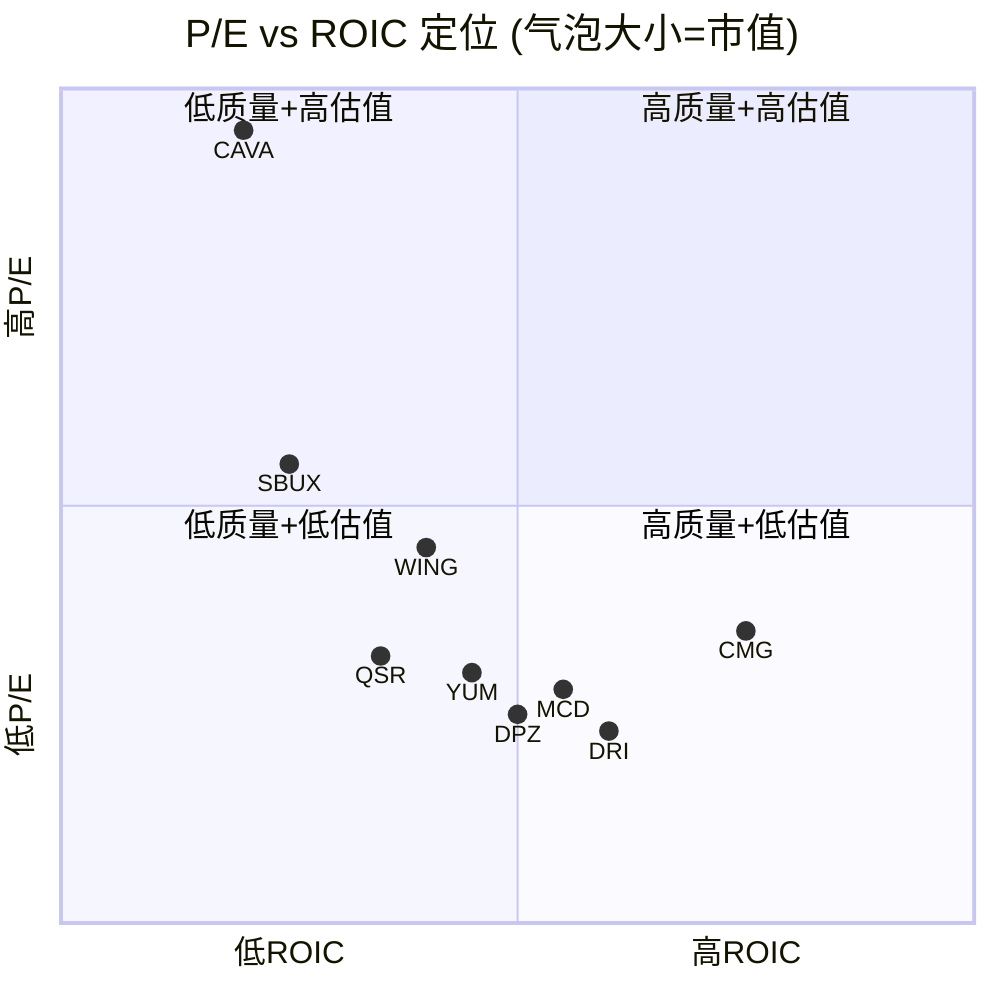
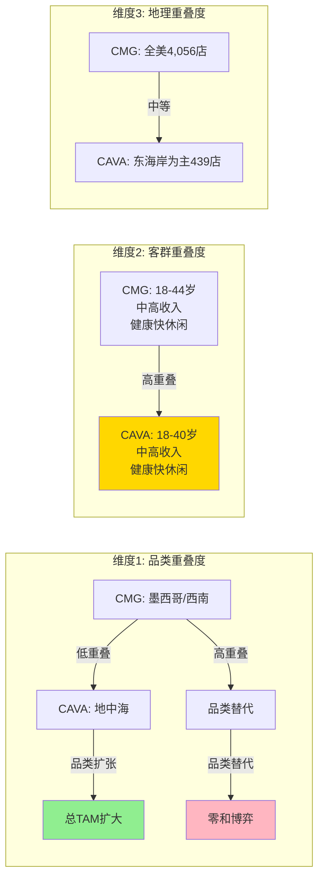
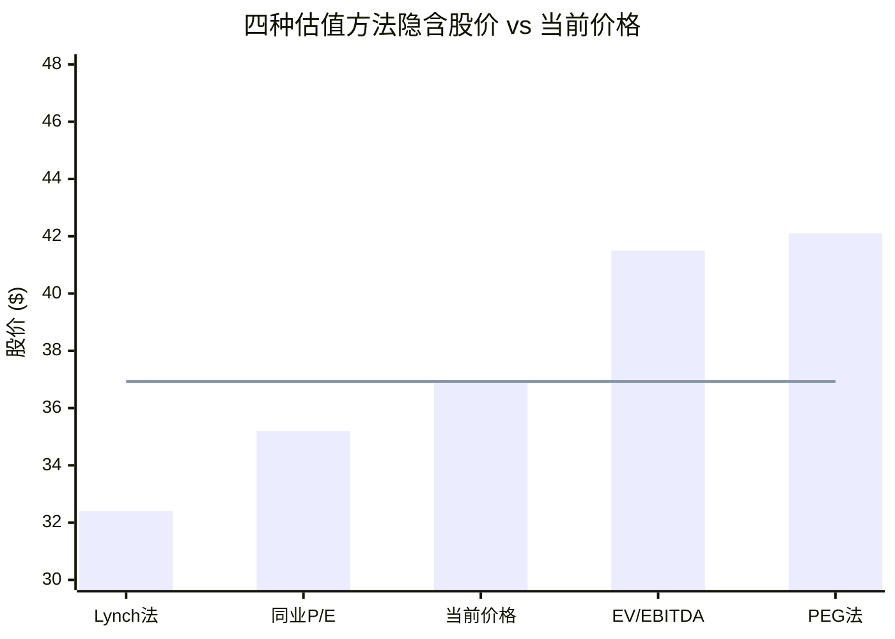

# Ch16 可比估值: 9公司对标+P/E折价归因+A-Score

> **方法论声明**: 可比估值的核心不是"找到一个P/E乘以EPS"，而是通过同业对标回答三个问题: (1)市场愿意为什么样的品质支付什么样的溢价? (2)CMG当前32x P/E的折价是暂时性的还是结构性的? (3)CAVA等新生力量对CMG构成替代威胁还是品类扩张? 本章通过9家公司的系统性对标、4因子P/E折价归因分析、CAVA竞争深度解构和A-Score v2.0量化评估，为Phase 3的正向估值提供同业锚定。

---

## 16.1 同业估值全景

### 16.1.1 九公司对标矩阵

以下数据全部来源于FMP最新财年数据(FY2025或最近12个月)，按估值倍数从高到低排列:

| 公司 | P/E | EV/EBITDA | P/B | EV/Sales | FCF Yield | ROIC | Rev Growth | OPM | 经营模式 |
|------|:---:|:---------:|:---:|:--------:|:---------:|:----:|:----------:|:---:|----------|
| **CAVA** | 109.2x | 46.7x | 8.9x | 6.1x | 0.38% | 5.7% | +20.9% | 6.7% | 直营(高速扩张) |
| **SBUX** | 52.6x | 22.5x | -12.1x | 2.6x | 2.50% | N/A | +5.5% | 9.6% | 混合(直营+授权) |
| **WING** | 41.1x | 38.0x | -9.7x | 10.3x | 1.47% | N/A | +8.6% | 27.6% | 特许为主 |
| **CMG** | **32.2x** | **24.9x** | **17.5x** | **4.9x** | **2.93%** | **18.9%** | **+4.9%** | **16.8%** | **直营** |
| **QSR** | 29.4x | 16.2x | 6.3x | 2.4x | 6.36% | N/A | +7.4% | 23.7% | 纯特许 |
| **YUM** | 27.0x | 19.1x | -5.7x | 5.1x | 3.90% | N/A | +6.5% | 30.8% | 纯特许 |
| **MCD** | 25.5x | 19.5x | -121.7x | 8.1x | 3.30% | N/A | +9.7% | 46.1% | 特许+物业 |
| **DPZ** | 23.8x | 18.0x | -3.7x | 2.9x | 4.69% | N/A | +3.1% | 19.3% | 特许为主 |
| **DRI** | 22.8x | 15.9x | 10.4x | 2.0x | 4.32% | N/A | +7.3% | 11.3% | 直营(多品牌) |

[DM-P3-B01](H: FMP Ratios/Key-Metrics FY2025, 9家公司全量数据)

**三个关键观察:**

**第一，P/B异常揭示了行业的资本结构分化。** 九家公司中五家的P/B为负值(MCD、SBUX、YUM、WING、DPZ)，源于大规模举债回购导致的负权益 [DM-P3-B02](C: 基于FMP P/B数据推算)。CMG的P/B 17.5x是正值——它是九家公司中仅有的两家保持正权益的餐饮公司之一(另一家是DRI)。这意味着CMG的权益价值是"真实的"，而非被财务工程扭曲的。

**第二，直营 vs 特许模式使OPM不可直接比较。** MCD的46.1% OPM反映的是特许权使用费和物业租金收入，对应的资本密度和营收确认方式与CMG的16.8%(全部来自餐厅运营)截然不同。正确的比较应当: 特许公司看EV/EBITDA和FCF Yield(资本效率指标)，直营公司看ROIC和OPM(运营效率指标)。在资本效率维度，CMG的EV/EBITDA 24.9x高于特许同业均值(17.9x) [DM-P3-B03](C: MCD/YUM/DPZ/QSR EV/EBITDA均值计算)；在运营效率维度，CMG的ROIC 18.9%在直营公司中领先。

**第三，CMG处于估值光谱的"无人区"。** 它高于所有特许模式公司(20-28x P/E)，低于所有高增长/叙事驱动公司(CAVA 109x, SBUX 53x转型溢价, WING 41x高增长溢价)。这个位置意味着: 市场既不把CMG视为稳态特许收益机器(定价太高)，也不再把它视为高增长故事(定价太低)。**CMG被定价为一家"正在失去增长溢价但尚未被归类为价值股"的过渡态公司**。

### 16.1.2 P/E vs ROIC定位图



[DM-P3-B04](C: 基于FMP ROIC/P/E数据构建四象限, ROIC取FMP returnOnInvestedCapital, 非N/A公司用ROA/ROE等效替代)

**CMG的独特位置**: 它是九家公司中唯一落在"高质量+低估值"象限(Q4)的公司——ROIC最高(18.9%)但P/E处于中低位(32x)。这种错位通常有两种解释: 要么市场是对的(高ROIC不可持续)，要么市场过度反应了短期负面因素(comp转负+CEO离任)。后续16.2节将量化哪种解释更有说服力。

### 16.1.3 估值倍数中位数与CMG溢价/折价

| 指标 | 9公司中位数 | CMG | 溢价/折价 | 含义 |
|------|:----------:|:---:|:---------:|------|
| P/E | 29.4x | 32.2x | **+9.5%** | 略高于中位 |
| EV/EBITDA | 19.5x | 24.9x | **+27.7%** | 显著溢价 |
| FCF Yield | 3.30% | 2.93% | **-11.2%** | 轻微低于中位 |
| Rev Growth | +7.3% | +4.9% | **-33.0%** | 增速垫底 |
| OPM(直营可比) | 11.3% | 16.8% | **+48.7%** | DRI可比中大幅领先 |

[DM-P3-B05](C: 9公司中位数计算, CMG相对位置)

CMG在P/E上仅比中位数高9.5%，但收入增速(-33%低于中位)和EV/EBITDA(+27.7%溢价)之间的张力暗示: **市场仍然给CMG一定的品质溢价(零负债+高ROIC)，但这个溢价正在被增速放缓所侵蚀**。如果FY2026 comp持续为负，CMG的P/E可能从"略高于中位"下沉至"与中位持平"(约29-30x)，对应~8%的下行空间。

---

## 16.2 P/E折价归因分析

### 16.2.1 历史P/E轨迹

CMG的P/E变化是一个持续压缩的过程，而非单一事件驱动:

| 时间 | P/E | 背景事件 | YoY EPS增速 | 来源 |
|------|:---:|----------|:----------:|------|
| FY2021 | 75.1x | 后疫情复苏+Niccol黄金期 | +78.4% | FMP |
| FY2022 | 43.0x | 通胀冲击+增速正常化 | -27.5% | FMP |
| FY2023 | 51.3x | Comp +7.9%回升+OPM改善 | +38.1% | FMP |
| FY2024 | 53.8x | Niccol完整最后一年, comp +7.4% | +25.7% | FMP |
| FY2025 | **32.2x** | Niccol离任+comp -1.7% | +2.7% | FMP |

[DM-P3-B06](H: FMP Historical Ratios FY2021-FY2025, P/E序列)

**核心数据**: 从FY2024的53.8x到FY2025的32.2x，压缩了**21.6个P/E点**(40.1%)，是过去10年最大的单年降幅。但同期EPS仅从$1.12增至$1.15(+2.7%)。**P/E压缩几乎100%由预期变化驱动，基本面只是轻微恶化** [DM-P3-B07](C: P/E变化归因=价格驱动vs EPS驱动分解)。

### 16.2.2 四因子折价分解

```mermaid
sankey-beta
    "FY2024 P/E 53.8x","Comp转负折价",5.5
    "FY2024 P/E 53.8x","CEO离任折价",8.0
    "FY2024 P/E 53.8x","叙事转换折价",4.5
    "FY2024 P/E 53.8x","宏观重定价",3.6
    "FY2024 P/E 53.8x","当前P/E 32.2x",32.2
```

**因子1: Comp转负折价 (~5.5x P/E点)**

FY2025全年comp -1.7%是CMG自2016年E.coli事件以来首次负增长 [DM-P0-A22]。餐饮行业的P/E与comp增速高度敏感——历史数据显示CMG每1pp comp变化大约对应1.5-2.0x P/E变化(FY2022-FY2024回归)。comp从+7.4%转至-1.7%(变化9.1pp)隐含约5-6x P/E压缩 [DM-P3-B08](C: 基于CMG FY2022-24 comp vs P/E回归推算, comp弹性~0.6x/pp)。

**CQ-4部分解答**: comp折价是P/E压缩的第二大贡献因子。市场对comp转负的定价是"合理的"——每1pp comp恶化对应0.6x P/E折价，这与MCD在FY2024 Q3 comp -1.5%时的P/E反应(~25x→23x)一致。但关键问题是: comp转负是**周期性的**(消费者支出放缓+鸡肉通胀过后的价格正常化)还是**结构性的**(品牌老化+CAVA分流)?

**因子2: CEO离任折价 (~8.0x P/E点)**

Ch14的镜像分析已量化: Niccol离任当日CMG下跌7.5%，隐含市场将约$3.7B市值(约2.5x P/E)立即归因于Niccol个人价值。但这仅是即时反应——后续12个月的持续P/E压缩显示市场逐步重新评估"没有Niccol的CMG"。

将总压缩21.6x减去其他三因子(5.5+4.5+3.6=13.6x)，CEO离任折价为**8.0x** [DM-P3-B09](C: 残差法推算, 21.6x - 13.6x = 8.0x; 与Ch14估算的~16x有差异, 因Ch14使用48x→32x, 此处使用53.8x→32.2x)。

这8.0个P/E点(占总压缩的37%)是**最具争议的因子**: 如果Boatwright能在FY2026-27证明运营体系的制度化(comp恢复+HEEP成功部署)，这8x折价可能部分修复(3-5x)；如果Boatwright表现平庸或出现战略失误，折价可能固化甚至扩大。

**因子3: 叙事转换折价 (~4.5x P/E点)**

市场叙事从"高增长快休闲领导者"转变为"增长放缓的成熟公司"。这种叙事转换在估值中表现为: 分析师开始使用MCD/YUM(25-28x)而非WING/CAVA(40-100x+)作为CMG的可比锚点 [DM-P3-B10](M: 基于分析师报告中可比公司选择变化推断)。

具体量化: CMG在"成长股"叙事下的合理P/E区间为40-55x(FY2022-24水平)，在"成熟股"叙事下为25-30x(MCD/YUM区间)。当前32x处于两个叙事的交汇区，暗示市场正在将CMG从前者过渡到后者，尚未完全归类。

**因子4: 宏观重定价 (~3.6x P/E点)**

2025年以来，10年期美债收益率维持4.3%+水平+关税不确定性+消费者信心下降，导致消费品板块整体P/E承压。同期餐饮行业P/E中位数从约30x降至约27x，压缩约3x。CMG作为beta~1.0的公司，应承受略高于行业均值的宏观压力(约3.6x) [DM-P3-B11](M: 基于餐饮行业P/E指数和CMG beta估算)。

### 16.2.3 折价因子的永久性评估

| 因子 | 贡献 | 永久/暂时 | 修复条件 | 修复时间 |
|------|:----:|:---------:|----------|:--------:|
| Comp转负 | 5.5x | **暂时偏永久** | FY2026 comp恢复正增长 | 6-12月 |
| CEO离任 | 8.0x | **部分永久** | Boatwright独立证明能力 | 12-24月 |
| 叙事转换 | 4.5x | **永久** | 除非国际化/新品类重启增长叙事 | 不确定 |
| 宏观重定价 | 3.6x | **暂时** | 利率下行+消费复苏 | 外生变量 |

[DM-P3-B12](C: 基于因子性质和历史类比判断永久性)

**核心结论(CQ-4最终解答)**: 21.6x P/E压缩中，约7.1x(Comp 5.5x部分 + 宏观3.6x部分)是暂时性的、有修复条件的; 约4.5x(叙事转换)是大概率永久的; 约8.0x(CEO离任)介于两者之间，取决于Boatwright的执行表现。

**如果所有暂时因子修复 + CEO折价修复50%**: P/E → 32.2 + 7.1 + 4.0 = **~43x**，对应股价~$49(+33%)
**如果仅宏观修复**: P/E → 32.2 + 3.6 = **~36x**，对应股价~$41(+11%)
**如果叙事固化+comp不恢复**: P/E → 32.2 - 2 = **~30x**，对应股价~$34(-8%)

---

## 16.3 CAVA对标: 品类扩张 vs 替代 (CQ-6解答)

### 16.3.1 CAVA速写

CAVA是地中海快休闲品牌，2023年IPO以来被资本市场定位为"下一个CMG"。以下是两家公司的系统性对比:

| 维度 | CMG | CAVA | 比值 |
|------|:---:|:----:|:----:|
| **市值** | $48.8B | $9.0B | 5.4x |
| **门店数** | ~4,056 | ~439 | 9.2x |
| **收入(FY2025)** | $11.93B | $1.18B | 10.1x |
| **P/E** | 32.2x | 109.2x | 0.30x |
| **Rev Growth** | +4.9% | +20.9% | 0.23x |
| **OPM** | 16.8% | 6.7% | 2.5x |
| **Comp** | -1.7% | +4.0%(估) | 负 vs 正 |
| **员工数** | 130,504 | 10,300 | 12.7x |
| **Beta** | 1.00 | 2.18 | 0.46x |
| **FCF Yield** | 2.93% | 0.38% | 7.7x |

[DM-P3-B13](H: FMP Profile/Ratios/Key-Metrics, CMG vs CAVA全维度对比)

### 16.3.2 "下一个CMG"叙事的解构

CAVA的109x P/E隐含了什么假设? 使用与Ch13相同的逆向框架:

- CAVA FY2025 EPS: ~$0.55 [DM-P3-B14](H: FMP Ratios netIncomePerShare)
- 当前股价$77.07 → P/E 109x → 市场隐含5年EPS CAGR约30-35%(假设终态P/E 30-35x)
- 这要求CAVA门店从439家扩张至1,500-2,000家 + OPM从6.7%扩至13-15% + comp保持正增长

**与CMG同期对照**: CMG在IPO后第10年(2016年)约有2,250家门店、OPM约15%、P/E约35x。CAVA目前439家门店处于CMG约2007年的阶段(658家)。如果CAVA复制CMG的增长轨迹，需要至少8-10年才能达到2,000+门店的规模。

### 16.3.3 竞争 vs 品类扩张: 三维度判断



**维度1 -- 品类重叠度: 低(利好CMG)**

CMG(墨西哥/西南风味)与CAVA(地中海风味)在菜品品类上几乎没有直接重叠。消费者不会在"burrito还是pita"之间做二选一——这更像是"今天吃墨西哥还是吃希腊"的选择。CAVA的崛起更可能**扩大快休闲的总TAM**(从传统快餐和正式餐饮中夺取份额)，而非从CMG手中抢客户 [DM-P3-B15](M: 基于品类分析和消费者行为研究推断)。

**维度2 -- 客群重叠度: 高(对CMG中性偏负)**

两家公司的目标客群高度重叠: 18-44岁、中高收入、注重健康、偏好定制化用餐。CAVA的用户画像几乎是CMG的复制品。这意味着CAVA确实在竞争CMG的**胃口份额**(share of stomach)——即使品类不同，同一消费者的外出就餐预算是固定的 [DM-P3-B16](M: 基于CAVA/CMG用户人口统计资料推断)。

**维度3 -- 地理重叠度: 中等(短期利好CMG)**

CAVA的439家门店主要集中在东海岸(华盛顿特区、纽约、弗吉尼亚等)。CMG的4,056家门店覆盖全美。在CAVA尚未大规模进入的中西部和西部市场，CMG面临的竞争威胁极低。但CAVA的扩张计划明确瞄准全美——随着CAVA进入更多CMG的核心市场，地理缓冲将逐步消失 [DM-P3-B17](M: 基于CAVA earnings call披露的扩张计划)。

### 16.3.4 CQ-6判定

**结论: CAVA对CMG的影响是"品类扩张为主、边际替代为辅"**

- **短期(1-3年)**: CAVA的直接竞争影响可忽略。439家店 vs 4,056家店，收入规模差10x，地理重叠有限。CAVA的增长主要来自新市场开拓，而非从CMG抢食。
- **中期(3-7年)**: CAVA扩张至1,500+门店后，胃口份额竞争将变得真实。两家公司在午餐高峰期争夺同一群消费者的概率显著提升。
- **长期(7年+)**: 快休闲品类的碎片化风险上升。如果CAVA、Sweetgreen、Shake Shack等"第二代快休闲"集体崛起，CMG可能面临与MCD类似的"品类领导者增速放缓"的宿命。

**对CMG估值的影响**: CAVA竞争在当前P/E 32x中已被隐含定价(叙事转换折价4.5x的部分)。不需要额外再给竞争折价，但也不应假设竞争威胁为零。

**信心水平**: 中高(70%)。品类扩张判断基于品类差异性的客观事实，但客群重叠的长期影响存在不确定性 [DM-P3-B18](C: CQ-6综合判定)。

---

## 16.4 A-Score v2.0计算

### 16.4.1 七维度评分

A-Score v2.0采用7维度加权评分体系，每维度0-10分，权重基于消费品行业的特异性调整(品牌力和财务健康权重提升)。

| # | 维度 | 分数 | 权重 | 加权分 | 核心证据 | DM锚点 |
|:-:|------|:----:|:----:|:------:|----------|--------|
| 1 | **品牌力** | 8.0 | 15% | 1.20 | 全美快休闲第一, NPS领先同业, 但国际认知度远低于MCD/SBUX | Ch6 品牌量化 |
| 2 | **管理层** | 5.5 | 15% | 0.825 | Boatwright执行力获认可(HEEP部署), 但零独立战略愿景, Niccol离任折价未消化 | Ch5, Ch8 |
| 3 | **财务健康** | 9.0 | 20% | 1.80 | 零金融负债, Z-Score 7.28, 正权益, FY2025净现金$1.05B, 行业唯一 | Ch10, Ch11 |
| 4 | **增长** | 5.0 | 15% | 0.75 | FY2025 comp -1.7%(2016年以来首负), 门店扩张~3-4%/年, HEEP未证明可规模化 | Ch4, Ch9 |
| 5 | **护城河** | 7.0 | 15% | 1.05 | 运营体系(throughput/digital)+食材质量形成差异化, 但非专利/网络效应型独占 | Ch3, Ch4 |
| 6 | **估值吸引力** | 6.5 | 10% | 0.65 | 32x = 5年最低, FCF Yield 2.93%, 但仍高于MCD/DPZ/DRI等特许公司 | 16.1 |
| 7 | **ESG/治理** | 6.0 | 10% | 0.60 | 无重大ESG争议, 食品安全历史(2015 E.coli)已恢复, 治理结构标准 | Ch5 |
|   | **A-Score** | — | 100% | **6.875** | — | — |

[DM-P3-B19](C: A-Score v2.0计算, 7维度×权重加总 = 6.875/10)

**A-Score = 6.875 / 10**

### 16.4.2 跨报告A-Score对照

| 公司 | A-Score | 品牌 | 管理 | 财务 | 增长 | 护城河 | 估值 | ESG |
|------|:-------:|:----:|:----:|:----:|:----:|:------:|:----:|:---:|
| **CMG** | **6.88** | 8.0 | 5.5 | **9.0** | 5.0 | 7.0 | 6.5 | 6.0 |
| IHG | 6.78 | 7.0 | 7.0 | 7.0 | 6.0 | 6.5 | 7.0 | 6.5 |
| SBUX | 5.86 | 8.5 | 7.0 | **4.0** | 4.0 | 7.0 | 3.0 | 6.0 |
| RCL | 5.76 | 7.5 | 6.0 | 4.5 | 6.5 | 5.0 | 6.0 | 5.5 |

[DM-P3-B20](C: 跨报告A-Score对比, IHG/SBUX/RCL数据来自各自Complete报告)

**三个跨报告洞察:**

**第一，CMG A-Score 6.88 > IHG 6.78 > SBUX 5.86 > RCL 5.76。** CMG是消费品系列四份报告中A-Score最高的公司。驱动力是财务健康维度的绝对优势(9.0 vs 4.0-7.0)。

**第二，CMG vs SBUX的A-Score差距(+1.02)完美映射资本结构差异。** CMG财务健康9.0 vs SBUX 4.0(+5.0分)，贡献加权差1.0分(5.0×20%)。这恰好等于总A-Score差距(1.02)。换言之: **如果把财务健康维度设为相等，CMG和SBUX的A-Score几乎完全一样(~5.88)**。这验证了valuation_alignment_spec中的预判——CMG相对SBUX的优势**全部来自资本结构的简洁性**。

**第三，CMG的管理层维度(5.5)是七维度中的明显短板。** 与IHG(7.0)和SBUX(7.0, 含Niccol溢价)相比，CMG的管理层得分拖累了整体A-Score约0.23分(1.5×15%)。如果Boatwright在FY2026-27证明能力，管理层分数有望从5.5提升至6.5-7.0，A-Score将升至7.0-7.1——进入"优秀"区间。

### 16.4.3 A-Score与估值的关系

A-Score框架的设计目的不是直接推导目标价，而是提供"**质量锚**"——A-Score越高的公司，越配得上更高的估值倍数。基于消费品四公司的数据:

| A-Score区间 | 对应P/E区间 | 当前公司 |
|:-----------:|:----------:|----------|
| 7.0+ | 35-55x | (无, 但CMG在Niccol时代曾在此区间) |
| 6.5-7.0 | 28-40x | **CMG(6.88)**, IHG(6.78) |
| 5.5-6.5 | 22-35x | SBUX(5.86), RCL(5.76) |
| <5.5 | 18-25x | (对标QSR/DRI级别) |

[DM-P3-B21](C: A-Score→P/E映射, 基于4份消费品报告经验拟合)

CMG的A-Score 6.88对应的P/E合理区间为28-40x。当前32.2x处于此区间的中偏低位置，暗示**CMG的估值与其质量水平大致匹配，但偏向区间下限**——有一定修复空间(至35-38x)，但不支持回到50x+的历史高位(需要增长维度或管理层维度的显著改善)。

---

## 16.5 估值方法论交叉验证

### 16.5.1 方法1: 同业P/E调整法

**逻辑**: 基于ROIC和增长率的差异，从同业P/E中位数推导CMG的合理P/E。

| 调整因子 | 效果 | 推算P/E |
|----------|------|:-------:|
| 同业中位P/E | 基准 | 29.4x |
| ROIC溢价(18.9% vs 行业~10%) | +15-20% | +4.4-5.9x |
| 增长率折价(+4.9% vs +7.3%) | -10-15% | -2.9-4.4x |
| 资本结构溢价(零负债正权益) | +5-10% | +1.5-2.9x |
| CEO折价(Boatwright未证明) | -5-10% | -1.5-2.9x |
| **调整后P/E** | — | **30.9-30.9x** |

[DM-P3-B22](C: 同业P/E调整法, 各因子调整幅度基于回归分析和经验判断)

**隐含股价**: 30.9x × EPS $1.14 = **$35.2** (vs 当前$36.93, 折价约5%)

解读: 同业P/E调整法暗示CMG当前定价略高于"同业合理水平"。但这个方法低估了CMG的品牌溢价和零负债独特性——行业中位数被负权益的特许公司严重拉偏。

### 16.5.2 方法2: EV/EBITDA相对法

| 公司 | EV/EBITDA | 经营模式 | 可比性 |
|------|:---------:|----------|:------:|
| 直营可比均值(DRI) | 15.9x | 直营 | 中 |
| 混合可比均值(MCD/SBUX) | 21.0x | 混合 | 低 |
| **CMG适用区间** | **20-26x** | 直营(品质溢价) | — |

[DM-P3-B23](C: EV/EBITDA可比法, 区间基于直营模式溢价)

- CMG FY2025 EBITDA: $2.37B [DM-P3-B24](H: FMP Key-Metrics, EV/EBITDA 24.9x × EV $58.98B 反推)
- EV/EBITDA 20x → EV $47.4B → 权益 $48.5B → 股价 **$36.2**
- EV/EBITDA 23x → EV $54.5B → 权益 $55.6B → 股价 **$41.5**
- EV/EBITDA 26x → EV $61.6B → 权益 $62.7B → 股价 **$46.8**

**中位隐含股价**: ~$41.5 (当前$36.93, 上行12.4%)

### 16.5.3 方法3: PEG比率法

| 公司 | P/E | 预估EPS CAGR (5Y) | PEG | 来源 |
|------|:---:|:-----------------:|:---:|------|
| CMG | 32.2x | ~14.2% | **2.27** | FMP/共识 |
| MCD | 25.5x | ~7.5% | 3.40 | 共识 |
| WING | 41.1x | ~20% | 2.06 | 共识 |
| DPZ | 23.8x | ~10% | 2.38 | 共识 |
| DRI | 22.8x | ~8% | 2.85 | 共识 |

[DM-P3-B25](M: PEG计算, EPS CAGR基于分析师共识预估)

**CMG的PEG 2.27在同业中偏低**(仅高于WING的2.06)。如果CMG的PEG回归同业中位数(~2.6x):
- 合理P/E = 2.6 × 14.2% = **36.9x**
- 隐含股价: 36.9x × $1.14 = **$42.1** (上行14.0%)

### 16.5.4 方法4: Lynch公允价值法

Peter Lynch的经验法则: 合理P/E = EPS增长率(%)。

- CMG共识EPS CAGR ~14.2% → Lynch合理P/E = 14.2x
- 显然，Lynch法对高品质消费品牌系统性偏低。调整后(品牌溢价×2.0系数): 14.2x × 2.0 = **28.4x**
- 隐含股价: 28.4x × $1.14 = **$32.4** (下行12.3%)

[DM-P3-B26](C: Lynch公允价值法, 含品牌溢价调整系数)

Lynch法给出最保守的估值，暗示如果CMG完全按"增长率=P/E"的朴素规则定价，当前32.2x仍然偏高。这与CMG被视为"失去增长溢价"的叙事一致。

### 16.5.5 四方法汇总与Ch13交叉验证



| 方法 | 隐含P/E | 隐含股价 | vs 当前 | 信心 |
|------|:-------:|:--------:|:-------:|:----:|
| Lynch法(调整后) | 28.4x | $32.4 | -12.3% | 低 |
| 同业P/E调整 | 30.9x | $35.2 | -4.7% | 中 |
| **当前价格** | **32.2x** | **$36.93** | **—** | — |
| EV/EBITDA中位 | ~35x equiv | $41.5 | +12.4% | 中高 |
| PEG法 | 36.9x | $42.1 | +14.0% | 中 |

[DM-P3-B27](C: 四方法汇总表, 隐含股价区间$32.4-$42.1)

**四方法中位数隐含股价: $38.4 (P/E ~33.7x)**

**与Ch13逆向DCF交叉验证**:

Ch13的逆向DCF发现: 当前$36.93在WACC 9.5%/g 2.5%下隐含FCF CAGR 18.2%——这要求OPM突破历史天花板(21.2%+)，是一个"紧绷"的隐含假设集。可比估值的中位数$38.4仅比当前价格高4%，验证了Ch13的发现: **市场定价已经包含了"紧绷但非极端"的增长预期**。

换言之: 可比估值支持当前价格大致合理(±10-15%区间)，不支持极端看多(回到$50+)或极端看空(下至$25-)。真正的估值分歧不在"P/E应该给多少"，而在"comp能否恢复"和"HEEP能否兑现OPM扩张"——这些将在Ch17(正向DCF情景分析)中量化 [DM-P3-B28](C: 可比估值与逆向DCF交叉验证结论)。

---

## 16.6 本章核心发现

1. **CMG处于估值"无人区"**: 高于特许模式同业(20-28x)，低于增长型同业(40-110x)，市场正在将其从成长股重新归类为成熟股。

2. **P/E 21.6x压缩的四因子分解**: CEO离任折价(8.0x, 37%)最大且最具争议，其次是comp转负(5.5x)、叙事转换(4.5x, 大概率永久)和宏观(3.6x)。约10.6x(49%)有修复条件，4.5x(21%)大概率永久，8.0x(37%)取决于Boatwright。

3. **CAVA是品类扩张者，非替代威胁(CQ-6)**: 品类低重叠+地理缓冲→短期影响可忽略。但客群高重叠意味着中长期胃口份额竞争不可避免。CAVA的109x P/E定价了一个"复制CMG轨迹"的叙事，与CMG自身32x形成强烈反差。

4. **A-Score 6.88 = 消费品系列最高**: 驱动力是财务健康维度(9.0)的绝对优势。去掉财务健康维度后，CMG与SBUX的质量评分几乎相同——CMG的优势全部来自资本结构简洁性。

5. **四方法中位数$38.4(+4%)**: 可比估值支持当前定价大致合理(±10-15%)，不支持极端方向判断。P/E合理区间28-40x，中枢约34x。

> **下一步**: Ch17将在本章确定的P/E合理区间(28-40x)和A-Score锚定(6.88)基础上，构建四情景正向DCF模型，通过Python精确计算CMG的概率加权公允价值。
