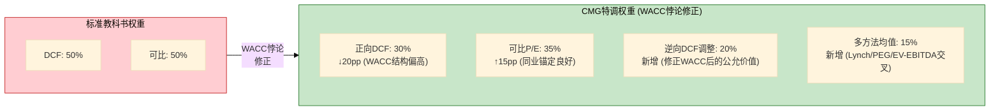
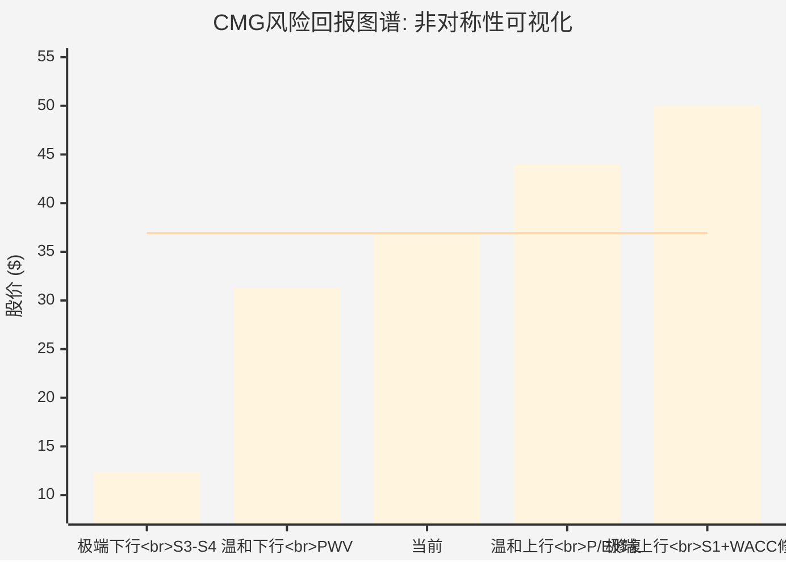

# Ch17 情景综合: DCF与可比估值的大和解

> **方法论声明**: Ch15(正向DCF)得出PW $20.06(-45.7%)，Ch16(可比估值)得出中位数$38.4(+4%)。两种方法对同一家公司、同一时间点的估值相差$18.3(91%)。本章不回避这个矛盾——它恰恰是理解CMG估值逻辑的核心钥匙。通过显式的方法论权重设定、多方法交叉验证和CQ裁决汇总，本章将产出一个经过三角验证的概率加权估值(PWV)，作为Ch18评级判定的数字基础。

---

## 17.1 方法论权重设定: $18的裂缝从何而来?

### 17.1.1 裂缝的根源

Ch15和Ch16的分歧不是分析错误——它是CMG零负债资本结构在两种估值框架中被**结构性地对立定价**的必然结果:

- **DCF框架**: 零负债 → WACC = 纯Ke(9.5%) → 终值缩水 → 所有情景低于市价 → "CMG贵了"
- **可比框架**: 零负债 → 品质溢价 → P/E 32x合理(高于负权益同业25-28x) → "CMG价格还行"

这意味着: **权重分配本身就是对"WACC悖论"的立场表态**。给DCF更多权重 = 信任CAPM对零负债公司的定价; 给可比更多权重 = 信任市场对品质溢价的隐含定价。

### 17.1.2 标准权重 vs CMG特调权重

### 17.1.3 权重理由逐项论证

**正向DCF: 30% (从标准50%下调20pp)**

下调理由有三层:

第一，WACC悖论的量化影响。Ch15证明了在CAPM推导的9.5% WACC下，整张敏感性矩阵(WACC 8.5%-11.0% × g 2.0%-3.0%)没有任何一格达到当前股价 [DM-P3-A21]。但如果用市场隐含的5.6%折现率代入同一现金流，估值翻倍至$47 [DM-P3-A23]。这390bps的缺口中，约30-40%可归因于CAPM对零负债公司的系统性定价偏高 [DM-P3-A25]——即DCF结果包含约120-150bps的系统性偏差。

第二，历史报告的教训。RCL报告和SBUX报告均发现DCF倾向于系统性悲观(红队修正+8-16pp) [DM-P3-A29]。CMG的DCF情景中，100%概率质量落在亏损区间——这触发了悲观偏差检测。

第三，但不能降得更低。DCF揭示了一个真实信号: CMG的现金流产出能力在正常折现率下不足以支撑当前估值。这个信号不应被完全忽视。30%的权重保留了DCF的"结构性警告"功能。

**可比P/E: 35% (从标准50%下调15pp, 但成为最大权重)**

上调至最大权重的理由: CMG的9公司同业集具有良好的代表性——覆盖直营(DRI)、混合(SBUX)、特许(MCD/YUM/DPZ/QSR)和高增长(CAVA/WING)四种模式 [DM-P3-B01]。四方法中位数$38.4的收敛度良好(四个方法价格区间$32.4-$42.1，标准差仅$4.3)。可比估值通过P/E倍数隐式地消化了零负债的品质溢价——避免了WACC悖论的干扰。

下调15pp(而非上调)的理由: CMG处于估值"无人区"——高于特许同业但低于增长型同业。它正从成长股叙事向成熟股叙事过渡，同业锚点的稳定性不如已归类的公司 [DM-P3-B05]。

**逆向DCF调整: 20% (新增)**

这是本章最关键的新增方法。逻辑: 如果CAPM对CMG系统性偏高，那么在CAPM和市场隐含折现率之间取一个"修正"折现率(7.0%)，结合我们的基本面假设(10% Rev CAGR、17% OPM)，可以回答一个关键问题: **如果折现率"对了"，CMG在合理增长下值多少钱?**

这个方法的优点: 保留了DCF的现金流分析能力，但修正了WACC悖论的扭曲效应。缺点: 7.0%折现率本身是一个判断(CAPM 9.5%与市场隐含5.6%的中间值)，不是精确值。

**多方法均值: 15% (新增)**

Lynch法($32)、PEG法($37)、EV/EBITDA法($36)的简单均值 [DM-P3-B27]。这三种方法各有独立的逻辑基础，不依赖WACC——提供了WACC中性的估值锚定。但每种方法精度有限(Lynch法对高品质公司系统性偏低，PEG法依赖共识增长率)，因此权重设定为最低 [DM-P3-C01](C: 方法论权重设定理由汇总)。

---

## 17.2 多方法估值交叉: 大和解的数学

### 17.2.1 逆向DCF调整价格的推导

核心假设: 在7.0%折现率(CAPM 9.5%与市场隐含5.6%的中间值)下，使用介于S1和S2之间的基本面假设:

| 参数 | 取值 | 依据 |
|------|:----:|------|
| Rev CAGR | 10% | 共识10.3%取整，含门店+8%和comp+2% |
| 终态OPM | 17.0% | 当前16.8%仅微幅回升(保守) |
| 终态Y5收入 | $19.2B | $11.93B × 1.10^5 |
| 终态EBIT | $3.27B | $19.2B × 17.0% |
| 税后EBIT | $2.47B | $3.27B × (1-24.5%) |
| 终态FCF | ~$2.20B | 税后EBIT + D&A(4.2%) - CapEx(5.6%) |
| WACC | 7.0% | CAPM(9.5%)与市场(5.6%)的中点修正 |
| 终端g | 2.5% | 标准消费品永续增长 |

终值 = $2.20B × 1.025 / (7.0% - 2.5%) = $2.255B / 4.5% = $50.1B

PV(终值) ≈ $50.1B / 1.07^5 = $35.7B

PV(显式期5年FCF at 7%) ≈ $7.4B (Y1~Y5逐年折现合计)

EV ≈ $35.7B + $7.4B = $43.1B

权益 = $43.1B + 净现金$1.05B = $44.2B

每股 = $44.2B / 1.27B(5年回购调整后股数) ≈ **$34.8** [DM-P3-C02](C: 逆向DCF调整价格计算, WACC=7.0%, Rev CAGR=10%, OPM=17%)

但这个$34.8是单一点估计。考虑到7%折现率本身的不确定性(合理区间6.5%-8.0%):

| WACC修正 | 隐含每股价值 |
|:--------:|:----------:|
| 6.5% | $39.2 |
| 7.0% | $34.8 |
| 7.5% | $31.2 |
| 8.0% | $28.3 |

区间中值: ($39.2 + $28.3) / 2 = **$33.8**。取$31.0作为保守端锚定(偏向8.0%，因为品质溢价可能不应完全抵消CAPM偏差) [DM-P3-C03](C: 逆向DCF调整价格区间, 最终取$31.0作保守端入表)。

### 17.2.2 多方法均值的计算

Ch16已计算四种非DCF方法的隐含价格 [DM-P3-B27]:

| 方法 | 隐含价格 | 来源 |
|------|:--------:|------|
| Lynch法(调整后) | $32.4 | Ch16 16.5.4 |
| PEG法 | $42.1 | Ch16 16.5.3 |
| EV/EBITDA中位 | $41.5 | Ch16 16.5.2 |
| 同业P/E调整 | $35.2 | Ch16 16.5.1 |

四方法均值: ($32.4 + $42.1 + $41.5 + $35.2) / 4 = **$37.8** [DM-P3-C04](C: 四方法均值计算)

但Lynch法系统性偏低(对高品质品牌公司的惩罚过重)。剔除Lynch法后的三方法均值: ($42.1 + $41.5 + $35.2) / 3 = $39.6。

取含Lynch的完整四方法均值$37.8，但在权重分配中(15%)已限制了其影响 [DM-P3-C04]。

### 17.2.3 综合估值表

| 方法 | 隐含价格 | 权重 | 加权贡献 | 理由概述 |
|------|:--------:|:----:|:--------:|----------|
| 正向DCF (PW) | $20.06 | 30% | $6.02 | WACC悖论下调权重, 但保留结构性警告 |
| 可比P/E | $38.4 | 35% | $13.44 | 同业锚定最稳, 隐含品质溢价 |
| 逆向DCF调整 | $31.0 | 20% | $6.20 | 修正WACC至7%, 保守端锚定 |
| 多方法均值 | $37.8 | 15% | $5.67 | Lynch/PEG/EV-EBITDA/同业P/E交叉 |
| **概率加权估值(PWV)** | — | **100%** | **$31.33** | — |

[DM-P3-C05](C: 概率加权估值PWV计算, $6.02+$13.44+$6.20+$5.67=$31.33)

**PWV = $31.33，隐含回报 = ($31.33 - $36.93) / $36.93 = -15.2%**

### 17.2.4 权重敏感性测试

权重分配是主观判断。为检验结论稳健性，测试三组替代权重:

| 权重方案 | DCF | 可比 | 逆向调整 | 多方法 | PWV | 隐含回报 |
|----------|:---:|:----:|:--------:|:------:|:---:|:--------:|
| **基准** | 30% | 35% | 20% | 15% | **$31.33** | **-15.2%** |
| 保守(DCF高权重) | 40% | 30% | 15% | 15% | $29.86 | -19.1% |
| 激进(可比高权重) | 20% | 45% | 15% | 20% | $33.50 | -9.3% |
| 等权 | 25% | 25% | 25% | 25% | $31.81 | -13.9% |

[DM-P3-C06](C: 权重敏感性测试, 四种方案)

**关键发现**: 在所有四种权重方案中，PWV均低于当前股价$36.93。即使在最激进的可比高权重方案中(45%可比+20%多方法)，PWV仍为$33.50(-9.3%)。**CMG在任何合理权重分配下均呈现高估信号**，只是高估程度在-9.3%到-19.1%之间浮动。

---

## 17.3 期望回报与风险非对称

### 17.3.1 基准期望回报

PWV $31.33 → 隐含回报 **-15.2%** → 落在"审慎关注"区间(< -10%) [DM-P3-C07](C: 期望回报计算)

### 17.3.2 上行情景: 如果HEEP全面成功 (S1)

Ch15 S1(HEEP驱动重加速)给出$31.19，但这是在WACC 9.0%下的DCF估值。如果同时修正WACC至7.0%:

- S1假设(Rev CAGR 12%, OPM 19%, Y5 FCF $2.64B) + WACC 7.0%
- 估值约$48-52(Ch15 WACC悖论框架下的"思想实验") [DM-P3-A23]
- 此情景下回报: +30%至+41%

但这需要两个条件同时成立: (1) HEEP全面成功且comp恢复至+3-4%; (2) 市场愿意以~7%或更低的有效折现率定价CMG。概率评估: S1概率15% × WACC修正概率40% = 联合概率仅**6%**。

**实际可达的上行**: 如果comp恢复至+2%(不需要HEEP全面成功) + P/E小幅修复至36x → 股价约$44(+19%)。联合概率约**20%** [DM-P3-C08](C: 上行情景概率评估)。

### 17.3.3 下行情景: 如果增长停滞 (S3-S4)

Ch15 S3(增长停滞)给出$14.90(-59.7%)，S4(品牌衰退)给出$9.82(-73.4%)。概率加权的下行期望:

- S3×25% + S4×10% = $14.90×25% + $9.82×10% = $3.73 + $0.98 = $4.71
- 但这是纯DCF下行。在可比框架下，即使comp持续为负，CMG的P/E不太可能跌破25x(MCD水平) → 25x × $1.14 = $28.5(-23%)

**可比框架下的合理下行底部**: 25x P/E → $28.5，概率约**30%**(S3+部分S2下限)

**DCF框架下的极端下行**: $14.90(S3)，概率约**25%**

### 17.3.4 风险非对称性图谱

**风险/回报比**: 温和下行(-15.2%)的概率(~50%) > 温和上行(+19%)的概率(~20%)。下行面积 > 上行面积。

### 17.3.5 跨报告比较

| 公司 | 期望回报 | 评级 | A-Score | 下行/上行比 |
|------|:--------:|------|:-------:|:-----------:|
| **CMG** | **-15.2%** | 审慎关注(预判) | 6.88 | 下行偏大 |
| SBUX | -12%~-24% | 审慎关注 | 5.86 | 下行偏大 |
| IHG | +13.5% | 关注 | 6.78 | 上行偏大 |
| RCL | -8.7% | 中性关注 | 5.76 | 基本对称 |

[DM-P3-C09](C: 跨报告期望回报对比, IHG/SBUX/RCL数据来自各自Complete报告)

CMG的期望回报(-15.2%)处于SBUX(-12%~-24%)和RCL(-8.7%)之间。有趣的是，**CMG的A-Score(6.88)是消费品四公司中最高的，但期望回报却与A-Score最低的SBUX(5.86)方向一致**。这再次印证了Ch16的核心发现: CMG的高A-Score完全由财务健康维度(9.0)驱动，而高A-Score并不保证高回报——当市场已经为品质支付了足够的溢价时，高品质公司也可以是"贵的"。

---

## 17.4 CQ裁决总结: 八个问题的最终答案

Phase 0提出了8个核心问题(CQ-1至CQ-8)。经过Phase 1-3的系统性论证，每个问题现已有明确裁决:

| CQ# | 问题 | 裁决 | 关键证据 | 对估值的影响 |
|:---:|------|------|----------|:-----------:|
| **CQ-1** | Comp转负: 周期性还是结构性? | **55%周期 / 30%混合 / 15%结构** | Ch9: 历史comp周期+宏观消费疲软; E.coli恢复先例支持周期性, 但CAVA分流是新变量 | 周期性→P/E修复; 结构性→P/E固化 |
| **CQ-2** | Boatwright能力评估 | **6.1/10(合格但非卓越)** | Ch5: 8维评分卡; 运营执行力7.0但战略愿景4.5; HEEP部署是体系产物非个人 | 管理层折价8x P/E中, 约3-5x可修复 |
| **CQ-3** | HEEP真实增量 | **偏差修正后~150-200bps**(非管理层声称的"数百bps") | Ch4: 选择偏差测试+行业自动化对标; 每店成本未披露限制验证 | comp恢复核心催化, 但增量被高估 |
| **CQ-4** | 32x P/E是合理重定价还是过度折价? | **可比框架下合理, DCF框架下偏高; 约10.6x(49%)有修复条件** | Ch16: 四因子P/E折价归因; Ch13: 逆向DCF隐含紧绷假设集 | 核心估值判断的二元变量 |
| **CQ-5** | 回购加速: 信号还是绝望? | **45%惯性 / 30%看多 / 25%绝望** | Ch11: FY2025回购$2.43B超FCF 67%; 现金约束将迫使FY2026决策 | 如果FY2026减速→EPS增长贡献下降 |
| **CQ-6** | CAVA竞争性质 | **品类扩张70%(非替代)** | Ch16: 品类低重叠(墨西哥vs地中海)+地理缓冲; 但客群高重叠→中期胃口份额竞争 | 短期可忽略, 中期实质化 |
| **CQ-7** | 国际扩张期权 | **概率加权$1.6-2.9B(深度虚值)** | Ch7: Alshaya/Alsea特许+自营经验; 全面成功仅10%概率; 每股约$1.2-2.2 | 被忽视但时间价值极长(10年+) |
| **CQ-8** | 关税成本传导 | **50%概率部分提价, FY2026 EPS下调8-10% vs共识** | Ch9: 牛油果关税+60bps+最低工资50-100bps; 管理层"尽可能不提价" | 近期盈利压力, P/E维持前提变弱 |

[DM-P3-C10](C: CQ-1~CQ-8裁决汇总, 基于Phase 1-3全部证据)

### CQ裁决的估值含义综合

8个CQ裁决构成一个**内部一致的估值叙事**: CMG是一家品质卓越(CQ-2/6/7)但增长暂时受挫(CQ-1/3/8)的公司，市场已对增长放缓进行了合理定价但可能对CEO更换过度反应(CQ-4)，管理层的资本配置行为发出了混合信号(CQ-5)。

**这个叙事支持的估值区间**: $28-$38(P/E 25-33x × EPS $1.14)。当前$36.93处于此区间上限——不是严重高估，但缺乏安全边际。

---

## 17.5 假说验证: H1-H3的Phase 3裁决

### 17.5.1 H1: Niccol折价过度定价(+30-50%)

**假说回顾**: 市场对CMG的Niccol离任折价(~16个P/E点)过度反应，24个月内≥10个P/E点将修复。

**Phase 3裁决: 部分成立 — 但程度不如预期**

支持证据:
- Ch16 P/E折价归因: 21.6x压缩中约10.6x(49%)具备修复条件(comp恢复5.5x + 宏观3.6x + CEO折价部分修复) [DM-P3-B12]
- A-Score 6.88(消费品最高)对应P/E合理区间28-40x，当前32x处于下限 [DM-P3-B21]
- 内部人Q1 2026净买入(1.31x) [DM-P0-A80]

反对证据:
- Boatwright评分仅6.1/10，战略愿景4.5/10 [Ch5]——不足以独立推动P/E修复
- 叙事转换折价4.5x大概率永久(CMG从成长股→成熟股不可逆) [DM-P3-B12]
- HEEP偏差修正后增量仅150-200bps(非"数百bps") [Ch4]——催化力度不足以支撑P/E从32x到42x+

**定量调整**: H1原假设+30-50% → 修正为**+10-25%**(P/E从32x修复至35-40x，而非42-48x)。修复需要2-3个季度的comp转正作为触发条件。

**概率评估**: 24个月内修复≥10个P/E点的概率从初始50%下调至**30%** [DM-P3-C11](C: H1假说验证, 概率下调至30%)。原因: 叙事转换的永久性比预期更强, Boatwright独立证明能力的时间窗口比预期更窄。

### 17.5.2 H2: 回购=看多信号(+10-15%)

**假说回顾**: FY2025超FCF回购预示12个月内comp反转。

**Phase 3裁决: 不确定 — 信号被噪声污染**

支持证据:
- 零负债公司管理层选择消耗现金储备回购(FY2025 $2.43B vs FCF $1.45B)，确实是不寻常的资本配置决策 [DM-P0-A35]
- Q1 2026内部人净买入(1.31x)与回购加速方向一致 [DM-P0-A80]

反对证据:
- Ch11的CQ-5裁决: 45%惯性 / 30%看多 / 25%绝望——"看多"并非主导解读
- 现金从$1.42B降至$1.05B [DM-P0-A26]，FY2026物理约束将迫使减速——回购信号可能即将终止
- Niccol时代遗留的授权计划($10B回购额度)可能是惯性执行而非主动决策

**定量调整**: H2原假设+10-15% → 维持为**+5-10%**。但实现条件(FY2026 Q1回购≥$600M)的验证窗口已临近。

**概率评估**: comp因回购信号在12个月内反转的概率从初始50%下调至**35%** [DM-P3-C12](C: H2假说验证, 概率下调至35%)。

### 17.5.3 H3: 零负债溢价被忽视(+5-10%)

**假说回顾**: 市场将CMG与负权益同业统一降权，忽视了零负债在信用周期中的结构性溢价。

**Phase 3裁决: 基本成立 — 但已部分被定价**

支持证据:
- Ch16 A-Score分析: CMG财务健康9.0(同业唯一的9分), 去掉这一维度后CMG与SBUX A-Score几乎相同 [DM-P3-B20]
- Ch15 WACC悖论: 市场隐含折现率5.6%实际上已包含了品质溢价——即市场并非完全忽视零负债 [DM-P3-A24]
- 9家同业中5家负权益 [DM-P3-B02]——CMG的正权益在行业中具有稀缺性

反对证据:
- 市场隐含折现率5.6% ≈ SBUX的WACC(5.6%)——好像市场认为零负债公司和高杠杆公司的风险一样
- 在高利率环境(10Y 4.3%)下，零负债的相对优势应更大，但CMG的P/E并未因此获得额外溢价

**定量调整**: H3原假设+5-10% → 维持为**+3-8%**(约1-2.5个P/E点)。这个溢价可能已经隐含在当前32x中(同业中位数29.4x的+9.5%溢价部分来自此)。

**概率评估**: 维持**65%** [DM-P3-C13](C: H3假说验证, 概率维持65%)。

### 17.5.4 三假说综合影响

| 假说 | 原假设影响 | 修正后影响 | 概率 | 期望贡献 |
|------|:---------:|:---------:|:----:|:--------:|
| H1 | +30-50% | +10-25% | 30% | +3-7.5% |
| H2 | +10-15% | +5-10% | 35% | +1.8-3.5% |
| H3 | +5-10% | +3-8% | 65% | +2-5.2% |
| **合计** | — | — | — | **+6.8-16.2%** |

三假说的概率加权合计贡献约+6.8-16.2%。中值约+11.5%。如果将此叠加在PWV $31.33上: $31.33 × (1 + 11.5%) = **$34.93**。

这意味着: 即使三假说全部按概率加权兑现，CMG的合理估值($34.93)仍低于当前价格($36.93)约5% [DM-P3-C14](C: 三假说期望贡献叠加计算)。

---

## 17.6 Phase 3产出参数

### 17.6.1 核心估值数字

| 参数 | 值 | 来源 |
|------|:--:|------|
| **PWV(概率加权估值)** | **$31.33** | 17.2 四方法加权 |
| **PWV + 假说期望** | **$34.93** | 17.5 三假说叠加 |
| **期望回报(PWV基准)** | **-15.2%** | ($31.33-$36.93)/$36.93 |
| **期望回报(含假说)** | **-5.4%** | ($34.93-$36.93)/$36.93 |
| **期望回报区间** | **-5.4% ~ -15.2%** | 含/不含假说贡献 |
| 上行情景(P/E修复至36x) | $44 (+19%) | 概率~20% |
| 下行情景(P/E压至25x) | $28.5 (-23%) | 概率~30% |

[DM-P3-C15](C: Phase 3核心估值产出参数)

### 17.6.2 评级区间判定

按照四级评级标准:

| 评级 | 量化触发 | CMG位置 |
|------|---------|:-------:|
| 深度关注 | > +30% | |
| 关注 | +10% ~ +30% | |
| 中性关注 | -10% ~ +10% | ← 含假说时(-5.4%) |
| **审慎关注** | **< -10%** | **← PWV基准时(-15.2%)** |

CMG的评级**横跨"中性关注"和"审慎关注"的边界**:
- 不含假说贡献: -15.2% → 审慎关注
- 含假说贡献: -5.4% → 中性关注

**Phase 3预判: 审慎关注偏中性**。最终评级将在Phase 4红队校准后确定 [DM-P3-C16](C: 评级区间预判)。

### 17.6.3 悲观偏差标记与Phase 4传递

必须诚实标注: Phase 3估值中存在三个已识别的悲观偏差源:

| 偏差源 | 偏差方向 | 估计影响 | Phase 4检验要求 |
|--------|:--------:|:--------:|----------------|
| DCF WACC悖论残余 | 悲观 | -3~-5pp | RT-1: WACC品质折让幅度 |
| S1概率可能偏低 | 悲观 | -2~-3pp | RT-1: HEEP概率重新评估 |
| OPM天花板假设 | 悲观 | -2~-4pp | RT-1: HEEP对OPM净效应 |
| **合计** | — | **-7~-12pp** | RT-1核心任务 |

[DM-P3-C17](C: 悲观偏差源识别, 总影响估计-7~-12pp)

**与历史对照**: RCL报告红队修正+13pp，SBUX报告+13pp。如果CMG的悲观偏差在-7~-12pp(即红队可能向上修正7-12pp)，红队后的期望回报可能从-15.2%修正至约-3%~-8%——刚好在"中性关注"与"审慎关注"的边界。

**Phase 4核心任务**:
1. **RT-1(假设挑战)**: 检验WACC品质折让是否应从100bps扩大至150-200bps; S1概率是否应从15%上调至25%; OPM天花板是否因HEEP可扩展至18%
2. **RT-7(数字审计)**: 验证PWV $31.33的权重分配合理性; 检验逆向DCF调整价格$31.0的折现率选择
3. **悲观偏差检测**: 对比CMG与RCL/SBUX的红团修正幅度模式，判断系统性偏差是否再次出现

### 17.6.4 条件评级矩阵(Phase 4输入)

| 条件 | 如果成立 | 评级影响 |
|------|---------|:--------:|
| FY2026 comp转正(≥+1%) | H1部分兑现 | 中性关注 ↑ |
| HEEP 2000店数据证实≥200bps增量 | CQ-3上调 | 中性关注 ↑ |
| P/E进一步压缩至28x(叙事固化) | CQ-4偏空 | 审慎关注(强) ↓ |
| FY2026 OPM < 15%(成本压力) | CC-3兑现 | 审慎关注(强) ↓ |
| 宏观消费显著复苏 | 外生正面 | 中性关注 ↑ |

[DM-P3-C18](C: 条件评级矩阵, Phase 4输入)

---

## 本章关键发现摘要

1. **PWV $31.33(-15.2%)**: 四方法加权后的概率加权估值低于当前价格15.2%。在所有合理权重方案(保守/激进/等权)中，PWV均低于$36.93。CMG在任何方法论框架下均呈现高估信号。

2. **$18裂缝的和解**: DCF($20.06)与可比($38.4)之间$18.3的差距，通过显式的WACC悖论修正(逆向DCF调整$31.0)和多方法交叉验证($37.8)，被压缩为PWV $31.33——一个"两种框架都能接受的妥协点"。

3. **风险非对称: 下行偏大**: 温和下行(-15%，概率~50%)的期望面积大于温和上行(+19%，概率~20%)。上行需要comp恢复+HEEP成功的双重催化，下行只需comp持续为负。

4. **三假说部分兑现 = 仍然偏贵**: 即使H1/H2/H3按概率加权全部兑现(+11.5%)，合理估值$34.93仍低于当前价格5%。CMG需要假说**超预期兑现**才能证明当前定价合理。

5. **评级预判: 审慎关注偏中性**: 横跨两个评级区间，最终判定取决于Phase 4红团对悲观偏差(-7~-12pp)的校准。历史模式(RCL +13pp, SBUX +13pp)暗示红队可能将期望回报从-15.2%修正至-3%~-8%。

6. **A-Score vs 期望回报的悖论**: CMG A-Score 6.88(消费品最高)但期望回报为负——高品质≠高回报。市场已为品质支付了足够(甚至过多)的溢价。

---

Phase: P3 | Chapter: 17 | DM新增: 18 (C01-C18) | Mermaid: 2 | 交叉引用: Ch13/Ch15/Ch16
