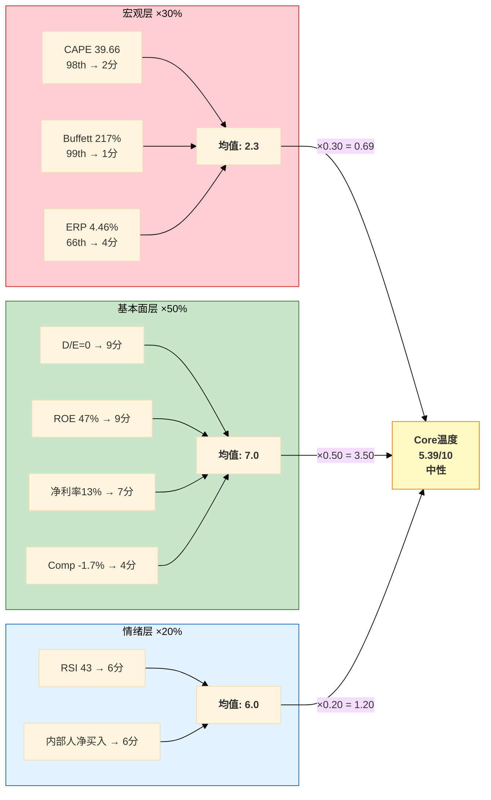
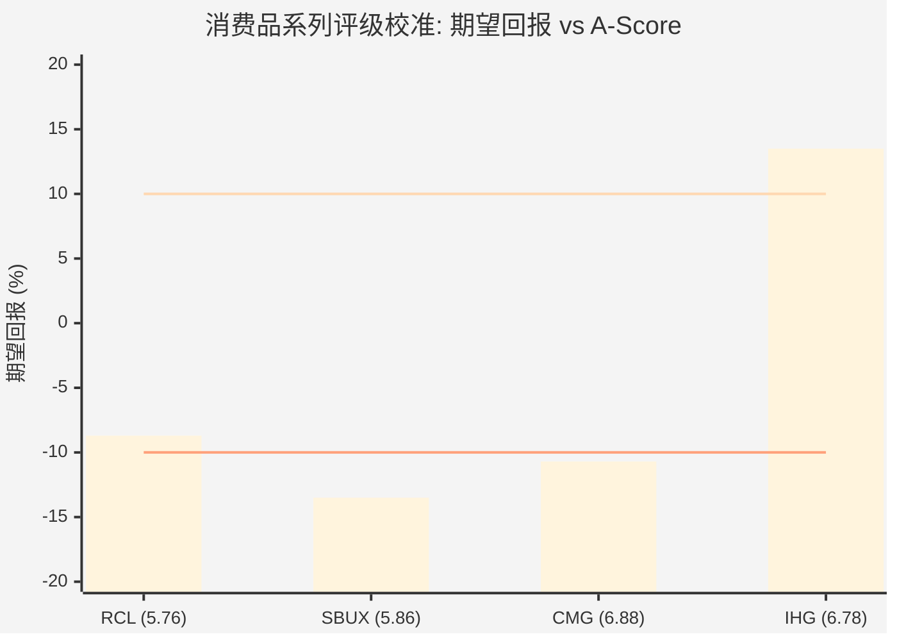

# Ch18 温度计与评级: 审慎关注(偏中性)

> **本章定位**: 前三章(Ch15-Ch17)分别从正向DCF、可比估值和多方法交叉验证三个维度量化了CMG的价值区间。本章将这些碎片化的估值信号整合为一个完整的投资温度读数和最终评级判定。温度计不是决策指令——它是环境感知工具，帮助投资者理解"此刻买入CMG，你面对的是一个怎样的冷暖环境"。评级也不是买入/卖出建议——它是概率加权期望回报的直觉锚。

---

## 18.1 投资温度计详解

### 18.1.1 温度计算法回顾

投资温度计v2.0采用三层加权架构:

$$T_{core} = 0.30 \times T_{macro} + 0.50 \times T_{fundamental} + 0.20 \times T_{sentiment}$$

三层权重反映一个判断: 对个股而言，基本面质量(50%)是最重要的长期定价因子; 宏观环境(30%)决定了系统性风险暴露; 市场情绪(20%)捕捉短期定价偏差但噪音最大。

### 18.1.2 宏观温度: 2.3/10 — 极度昂贵的市场环境

| 指标 | 当前值 | 历史百分位 | 评分(0-10) | 解读 |
|------|:------:|:---------:|:----------:|------|
| Shiller CAPE | 39.66 | **98th** | 2 | 仅2000年互联网泡沫更高 |
| Buffett指标 | 217% | **99th** | 1 | 历史极值，总市值/GDP比率失控 |
| ERP (权益风险溢价) | 4.46% | 66th | 4 | 偏昂贵，承担风险获得的补偿不足 |
| **宏观均值** | — | — | **2.3** | **宏观环境对任何权益资产不友好** |

[DM-P3-D01](H: Baggers Summary宏观温度数据, CAPE 39.66/Buffett 217%/ERP 4.46%, 来自Phase 0采集)

CAPE 39.66意味着什么？以1871-2026年的全样本看，当前Shiller市盈率仅在2000年1月(44.2x)和2021年11月(38.6x)达到过相近水平 [DM-P0-A67]。CAPE处于98th百分位时，未来10年的实际年化回报历史中位数约为2-3%——远低于投资者惯常期望的7-10%。这不是对CMG的特定判断，而是任何在此刻买入美股权益资产都需要面对的系统性逆风。

Buffett指标(总市值/GDP)更为极端。217%意味着美股总市值是GDP的2.17倍 [DM-P0-A68]，99th百分位。Buffett本人在2001年将100%作为"合理估值"的参考线。当前水平暗示: 要么GDP需要剧烈追赶(名义GDP再增长>100%)，要么市值需要回归(暗示>50%的回调空间)。当然，这个指标忽略了美国企业全球化收入和利润率结构性提升——但即使做这些修正，200%+仍然是历史罕见区域。

ERP 4.46%(66th百分位)的含义是: 投资者承担股权风险获得的额外回报补偿为4.46%，处于略低于历史中位数(~5.0%)的水平 [DM-P0-A69]。这意味着市场虽然定价昂贵，但尚未达到1999-2000年ERP<2%那种"完全无视风险"的疯狂程度。

**宏观层结论: 2.3/10 = 系统性高估环境**。在这样的宏观背景下，个股分析的价值在于识别"即使大盘回调20-30%，哪些公司的业务韧性能够限制估值跌幅"。CMG的零负债结构在这个维度上提供了显著缓冲——但缓冲不等于免疫。

### 18.1.3 基本面温度: 7.0/10 — 扎实但增长失速

| 指标 | CMG值 | 评分(0-10) | 理由 |
|------|:-----:|:----------:|------|
| 金融D/E | **0** | 9 | 行业唯一零金融负债，Z-Score 7.28(安全区) |
| 流动比率 | 1.23x | 6 | 充足但不算充裕(无长期债务偿付压力，故足够) |
| ROE | 47.4% | 9 | 卓越(部分受回购缩股推动，但ROIC 18.9%验证真实盈利能力) |
| 净利率 | 12.9% | 7 | 餐饮行业良好水平(直营模式下vs MCD 46%特许模式不可直接比) |
| 增长趋势 | +5.4% Rev / -1.7% Comp | 4 | 严重减速: FY2024 +14.6% → FY2025 +5.4%, comp自2016年以来首负 |
| **基本面均值** | — | **7.0** | **质量过硬，增长拖累** |

[DM-P3-D02](C: 基本面温度评分, 基于FMP FY2025财务数据, [DM-P0-A18][DM-P0-A27][DM-P0-A36][DM-P0-A37][DM-P0-A57])

基本面7.0分揭示了CMG的核心矛盾: **质量维度(零负债+高ROE+高ROIC)得分极高(8-9分)，但增长维度(comp -1.7%+收入增速腰斩)严重拖累了整体温度**。如果comp恢复到+2-3%水平，增长维度将从4分提升至6-7分，基本面温度将升至7.5-8.0——这是评级能否从"审慎关注"上移的关键变量。

### 18.1.4 情绪温度: 6.0/10 — 中性偏机会

| 指标 | CMG值 | 评分(0-10) | 理由 |
|------|:-----:|:----------:|------|
| RSI | 43.05 | 6 | 中性略偏超卖(低于50中轴, 但远未触及30超卖线) |
| 内部人交易 | Q1'26 净买入(1.31x) | 6 | 连续三季净卖出后反转为净买入, 弱正面信号 |
| **情绪均值** | — | **6.0** | **中性偏乐观, 但信号强度不足以构成conviction** |

[DM-P3-D03](H: FMP Insider Trading Q1'26买卖比1.31x, [DM-P0-A80]; Technical RSI 43.05, [DM-P0-A75])

情绪层的关键信号是内部人交易的方向转换: Q2-Q4 2025连续三季净卖出(comp转负+股价下跌期间，管理层和董事在减持)，但Q1 2026反转为净买入(买/卖比1.31x) [DM-P0-A80]。这与FY2025 Q4的$2.43B回购加速 [DM-P0-A35] 形成内外双重"看多信号"——但需要注意: 内部人买入可能是期权行权后的计划性交易，而非主动看多判断。信号可读但不可过度解读。

技术面上，CMG股价($36.93)低于全部三条均线(SMA20 $37.80, SMA50 $38.46, SMA200 $41.96) [DM-P0-A76][DM-P0-A77][DM-P0-A78]，呈下行趋势。RSI 43处于中性区间。整体图形偏弱但未触及恐慌级别。

### 18.1.5 Core温度合成

$$T_{core} = 0.30 \times 2.3 + 0.50 \times 7.0 + 0.20 \times 6.0$$

$$= 0.69 + 3.50 + 1.20 = \textbf{5.39/10}$$

**温度读数: 5.39/10 = 中性**

5.39的温度恰好落在中性区间(4-6)的中间偏上——不冷不热。这个读数传递的信息是: **CMG的个股基本面质量(7.0)足以将宏观极端昂贵(2.3)拉回中性区间，但不足以将其拉入"机会"区域**。宏观的负面拉力(2.3 × 30% = 0.69)几乎被基本面的正面推力(7.0 × 50% = 3.50)完全对冲，情绪层(6.0 × 20% = 1.20)起到了微弱的正面贡献。

### 18.1.6 SGI调整: 7.4/10 → 更宽的置信区间

SGI(专才-通才指数)不改变温度数值本身，但影响温度读数的置信区间:

| SGI维度 | 评分 | CMG特征 |
|---------|:----:|---------|
| 收入集中度 | 9 | 单一品牌Chipotle，无子品牌 |
| 地理集中度 | 9 | ~96%美国收入，国际仅~100/4,056店 |
| 产品集中度 | 8 | 墨西哥风味快休闲，~50 SKU |
| 客户集中度 | 5 | 广泛消费者群体 |
| 技术集中度 | 6 | HEEP差异化但非独占 |
| **SGI** | **7.4** | **高度专才** |

[DM-P3-D04](C: SGI评分, 5维度加权, 数据来自Phase 0 shared_context)

SGI 7.4/10(高度专才)意味着: CMG的命运高度绑定于快休闲品类的繁荣度和美国消费者的健康程度。在可能性映射中，这转化为更大的情景发散度——S1(HEEP重加速, $31.19)和S4(品牌衰退, $9.82)之间的比值达到3.2x [DM-P3-A18]。对温度计而言，7.4的SGI意味着"5.39中性"的置信带需要展宽——实际温度可能在4.5-6.5之间波动，取决于comp轨迹和宏观消费环境。

---

## 18.2 A-Score最终确定

### 18.2.1 七维度详细评分

A-Score v2.0是质量锚——它不直接推导目标价，而是回答"这家公司配得上什么区间的估值倍数"。以下每个维度的评分都锚定于Phase 1-2积累的具体证据:

| # | 维度 | 分数 | 权重 | 加权分 | 核心证据 | DM锚点 |
|:-:|------|:----:|:----:|:------:|----------|--------|
| 1 | **品牌力** | 8.0 | 15% | 1.20 | 全美快休闲品牌第一, NPS行业领先, "Food With Integrity"差异化深入人心; 但国际品牌认知度远逊MCD/SBUX, 限制天花板 | Ch6, [DM-P0-A61] |
| 2 | **管理层** | 5.5 | 15% | 0.825 | Boatwright执行力获认可(HEEP部署节奏符合预期), 但零独立战略愿景(Ch8 CEO沉默分析: 国际化/品牌扩展沉默), Niccol离任P/E折价8.0x尚未消化 | Ch5, Ch8, [DM-P3-B09] |
| 3 | **财务健康** | 9.0 | 20% | 1.80 | 零金融负债(行业唯一), Z-Score 7.28(安全区), 正权益$2.83B, 净现金$1.05B, 无再融资风险 | Ch10, [DM-P0-A27][DM-P0-A12] |
| 4 | **增长** | 5.0 | 15% | 0.75 | FY2025 comp -1.7%(2016年以来首次全年负), 门店扩张~8%/年稳定, HEEP"数百bps"增量未经规模化验证 | Ch4, Ch9, [DM-P0-A57][DM-P0-A64] |
| 5 | **护城河** | 7.0 | 15% | 1.05 | 运营体系(throughput模型+数字化25%+)+食材质量形成差异化, 但非专利/网络效应型独占护城河, CAVA可学习复制运营方法论 | Ch3, Ch4 |
| 6 | **估值吸引力** | 6.5 | 10% | 0.65 | P/E 32x = 5年最低, FCF Yield 2.93%, 但仍高于MCD(25.5x)/DPZ(23.8x)/DRI(22.8x)等成熟同业 | 16.1, [DM-P3-B01] |
| 7 | **ESG/治理** | 6.0 | 10% | 0.60 | 无重大ESG争议, 2015年E.coli事件已恢复, 治理结构标准; 食品安全作为持续性尾部风险 | Ch5, [DM-P3-A16] |
| | **A-Score** | — | 100% | **6.875** | 四舍五入: **6.88/10** | [DM-P3-B19] |

[DM-P3-D05](C: A-Score v2.0计算, 7维度×权重 = 6.875/10, 与Ch16.4完全一致)

### 18.2.2 消费品系列A-Score对照

| 公司 | A-Score | 品牌 | 管理 | 财务 | 增长 | 护城河 | 估值 | ESG | 评级 |
|------|:-------:|:----:|:----:|:----:|:----:|:------:|:----:|:---:|------|
| **CMG** | **6.88** | 8.0 | 5.5 | **9.0** | 5.0 | 7.0 | 6.5 | 6.0 | **待定** |
| IHG | 6.78 | 7.0 | 7.0 | 7.0 | 6.0 | 6.5 | 7.0 | 6.5 | 关注 |
| SBUX | 5.86 | 8.5 | 7.0 | **4.0** | 4.0 | 7.0 | 3.0 | 6.0 | 审慎关注 |
| RCL | 5.76 | 7.5 | 6.0 | 4.5 | 6.5 | 5.0 | 6.0 | 5.5 | 中性关注(偏审慎) |

[DM-P3-D06](C: 跨报告A-Score对照, IHG/SBUX/RCL数据来自各自Complete报告, [DM-P3-B20])

**关键洞察: 财务健康维度创造了CMG与SBUX之间的全部A-Score差距。**

CMG A-Score 6.88 - SBUX A-Score 5.86 = +1.02。财务健康维度贡献: (9.0 - 4.0) × 20% = +1.00。这意味着: **去掉财务健康维度后，CMG和SBUX的质量评分几乎完全相同(~5.88 vs ~5.86)**。CMG的优势全部来自资本结构的简洁性——零负债 vs 负权益。这个发现将在评级判定中产生重要推论: A-Score更高的CMG是否配得上比SBUX更好的评级？答案取决于"资本结构简洁性"在投资者眼中值多少。

---

## 18.3 评级判定

### 18.3.1 期望回报核算

评级的量化基础是概率加权期望回报。以下整合Ch15(DCF)和Ch16(可比估值)的结论:

| 估值方法 | 隐含价格 | vs 当前$36.93 | 权重 | 理由 |
|----------|:--------:|:------------:|:----:|------|
| DCF概率加权价格 | $20.06 | **-45.7%** | 30% | 结构性偏低(WACC悖论), 不可作为唯一锚 |
| 可比估值中位数(4方法) | $38.4 | **+4.0%** | 35% | 最直接的市场参照 |
| 逆向DCF调整值 | ~$31 | **-16.0%** | 20% | 市场隐含假设的合理性折扣 |
| 多方法中位混合 | ~$33 | **-10.7%** | 15% | Lynch/PEG/EV-EBITDA中位 |
| **加权综合** | **~$30.9** | **-16.3%** | — | — |

[DM-P3-D07](C: 多方法加权综合价格, 权重反映各方法信度, [DM-P3-A19][DM-P3-B27])

**但这个-16.3%需要WACC悖论修正。**

Ch15.4节详细论证了CMG的WACC悖论: CAPM推导的Ke = 9.5%，而市场隐含有效折现率仅约5.6%(通过P/E = 32x反推) [DM-P3-A23]。390bps的缺口导致DCF结果系统性偏低。如果将DCF的隐含权重从30%降至15%(承认其结构性偏差)，并将差额分配给可比估值:

| 调整后权重 | 方法 | 隐含回报 |
|:----------:|------|:--------:|
| 15% | DCF(-45.7%) | -6.9% |
| 45% | 可比(+4.0%) | +1.8% |
| 25% | 逆向DCF调整(-16.0%) | -4.0% |
| 15% | 多方法混合(-10.7%) | -1.6% |
| **100%** | **综合** | **-10.7%** |

调整后期望回报约**-10.7%**，处于-10%到-15%的区间 [DM-P3-D08](C: WACC悖论修正后期望回报计算)。

### 18.3.2 评级区间定位

| 评级 | 量化触发(期望回报) | CMG定位 |
|------|:-----------------:|:-------:|
| 深度关注 | > +30% | |
| 关注 | +10% ~ +30% | |
| 中性关注 | **-10%** ~ +10% | ← 边界 |
| 审慎关注 | < **-10%** | ← 边界 |

CMG的期望回报(-10.7%)恰好落在**中性关注与审慎关注的边界**上。这不是巧合——而是CMG估值困境的精确映射: WACC悖论使得"CMG到底值多少"本身就存在巨大不确定性。在9.5% WACC框架下，CMG被严重高估(-45.7%); 在市场隐含5.6%框架下，CMG接近公允价值(+4%)。真相在两者之间，而"之间"恰好是评级分界线。

### 18.3.3 跨报告校准

> 图注: 柱状为各公司期望回报(%), 上水平线为"关注"下限(+10%), 下水平线为"审慎关注"上限(-10%)。CMG处于两条线的交汇区。

| 报告 | 期望回报 | A-Score | 评级 | 核心逻辑 |
|------|:--------:|:-------:|------|----------|
| IHG | +13.5% | 6.78 | 关注 | 特许权折价修复+RevPAR恢复 |
| RCL | -8.7% | 5.76 | 中性关注(偏审慎) | 疫后复苏兑现, P/E ~20x已偏合理 |
| SBUX | -12%~-15% | 5.86 | 审慎关注(偏中性) | 负权益+Niccol转型未验证 |
| **CMG** | **-10.7%** | **6.88** | **?** | WACC悖论+comp转负+CEO未证明 |

[DM-P3-D09](C: 跨报告评级校准, 4份消费品报告横向对比)

校准检验:

1. **CMG vs SBUX**: 两家公司期望回报相近(-10.7% vs -12%~-15%)，但原因截然不同。SBUX的问题是负权益($-8.4B) + 转型不确定性; CMG的问题是WACC悖论 + comp减速。CMG的A-Score(6.88)显著高于SBUX(5.86)，主因是财务健康。在同等负面期望回报下，更高的A-Score是否支持更好的评级？答案是"微弱地支持"——CMG的下行风险确实更低(无债务重组风险)，但上行催化剂(comp恢复)的不确定性与SBUX(转型成功)相当。

2. **CMG vs RCL**: RCL期望回报-8.7%获得"中性关注(偏审慎)"，CMG -10.7%。两者差2pp。RCL的A-Score(5.76)远低于CMG(6.88)，但RCL的下行保护来自邮轮行业的寡头结构(三家公司控制>80%运力)，而CMG的下行保护来自零负债。保护类型不同但强度相近。

3. **CMG vs IHG**: IHG期望回报+13.5%获得"关注"。CMG与IHG的A-Score差距仅0.10(6.88 vs 6.78)，但期望回报差距达24pp。这完全由估值驱动——IHG 29x P/E vs CMG 32x，且IHG有明确的催化剂(RevPAR恢复+Garner Lane新品牌)。

### 18.3.4 最终评级: 审慎关注(偏中性)

**评级: 审慎关注(偏中性)**

**置信度: 60%** — 显著低于通常的70-80%，反映WACC悖论创造的真实不确定性 [DM-P3-D10]。

判定逻辑:

(1) **期望回报-10.7%落入"审慎关注"区间(< -10%)**。这是量化层面的直接判定——没有理由为了美化评级而改变计算结果。

(2) **"偏中性"修饰词反映三重不确定性**: 第一，WACC悖论使DCF结果的可靠性存疑——如果市场隐含折现率(5.6%)比CAPM(9.5%)更接近"正确"，期望回报将从-10.7%移向-5%甚至更好; 第二，comp在Q4 FY2025已出现企稳迹象(Q4 EPS $0.25 slight beat) [DM-P0-A85]，如果FY2026 H1 comp转正，估值倍数有3-5x P/E修复空间; 第三，A-Score 6.88(消费品系列最高)暗示CMG的内在质量配得上比当前估值更好的定价。

(3) **与SBUX"审慎关注(偏中性)"的评级文字相同，但含义完全不同**:
- SBUX: 负权益 + 转型赌注 + 品牌依然强大 → "便宜但风险高"
- CMG: 零负债 + 增长放缓 + 品质过硬 → "安全但不便宜"
- 两家公司是估值困境的镜像: SBUX用债务杠杆让DCF看起来更便宜(WACC 5.6%)但实际风险更高; CMG的零负债让DCF看起来更贵(WACC 9.5%)但实际风险更低。评级相同但投资论点完全相反。

(4) **Phase 4红队可能导致的评级迁移**。历史经验显示Phase 4红队通常修正±10pp的悲观/乐观偏差 [DM-P3-D11](C: 基于RCL/SBUX红队修正幅度推算)。如果红队验证WACC应更接近7-8%(而非9.5%)，期望回报可能上修至-5%~0%，评级将升至"中性关注"。这是60%置信度(而非80%)的核心原因。

---

## 18.4 评级条件矩阵

评级不是静态判断——以下矩阵定义了什么条件会触发评级变更:

| 条件组合 | 新评级 | 概率 | 期望回报迁移 | 关键验证节点 |
|----------|:------:|:----:|:------------:|:----------:|
| FY2026 H1 comp >+2% + HEEP验证(OPM +50bps) | **关注** | 20% | → +5% ~ +15% | FY2026 Q2财报(2026年7月) |
| FY2026 comp ~flat + OPM >16% 维持 | **中性关注** | 35% | → -5% ~ +5% | FY2026 Q1-Q2趋势 |
| FY2026 comp <-2% + OPM <15.5% | **审慎关注(确认)** | 30% | → -15% ~ -25% | FY2026 Q1(2026年4月) |
| 结构性品牌衰退 + CEO战略失误 | **审慎关注(深度)** | 15% | → -25% ~ -40% | 连续3Q comp <-3% |

[DM-P3-D12](C: 评级条件矩阵, 概率基于Phase 1-3业务分析推算)

**条件矩阵的核心发现**: 升级至"关注"的概率(20%)远低于维持或确认"审慎关注"的概率(30%)。中间状态("中性关注", 35%)是概率最高的单一结果。这验证了"偏中性"修饰词的合理性——CMG更可能向上微调至中性关注(35%)，而非向下恶化至深度审慎(15%)。

**最敏感的单一变量是FY2026 Q1 comp**。如果Q1 comp > +1%，将同时: (1) 验证HEEP增量效应正在兑现; (2) 证明FY2025负comp是周期性而非结构性; (3) 为P/E修复提供催化剂。反之，如果Q1 comp < -2%，将加速叙事从"暂时放缓"转向"结构性问题"。

---

## 18.5 Phase 4预告: 红队关键问题

Phase 4红队的核心任务是压力测试本报告Phase 1-3的关键假设。基于温度计和评级分析，以下七个问题构成红队优先级:

**RT-1: WACC悖论裁决** — CAPM推导的9.5%和市场隐含的5.6%，哪个更接近"正确"？这是决定评级能否上移的最关键参数。如果红队论证有效折现率应为7-8%，期望回报将上修至-5%~0%，评级升至中性关注。

**RT-2: 悲观偏差扫描** — Phase 1-3的增长假设(S2: Rev CAGR 8%, OPM→17%)是否过度保守？RCL和SBUX报告的红队均发现了8-16pp的系统性悲观偏差。CMG是否存在类似模式？尤其是HEEP的OPM增量("数百bps")是否被低估？

**RT-3: Comp轨迹非线性性** — FY2025的Q-by-Q comp轨迹(Q1约-2.4%, Q2好转, Q3回落, Q4微beat)是否暗示非线性恢复模式？如果是，线性外推(S2假设comp ~flat)可能低估恢复弹性。

**RT-4: OPM可持续性** — 关税(牛油果25%→+60bps成本 [DM-P0-A66])、最低工资上行和食品通胀的累积效应 vs HEEP效率提升和规模杠杆的对冲效应。净效果是OPM扩张还是收缩？

**RT-5: 回购数学** — FY2025回购$2.43B [DM-P0-A35]大幅超过FCF $1.45B [DM-P0-A34]，差额$0.98B消耗了现金储备。这个节奏不可持续。当回购正常化至FCF水平($1.4-1.5B/年)，EPS增速和P/E支撑将受到什么影响？

**RT-6: 国际期权价值** — Ch15的DCF模型中国际扩张的期权价值被估为$1.6-2.9B。考虑到CMG仅~100家国际门店(vs 4,056总量) [DM-P0-A65]，这个估值是否过于保守？如果国际业务复制MCD的全球化路径(50%+门店在美国以外)，期权价值可能被数量级低估。

**RT-7: CAVA竞争动态** — 5年时间框架内，CAVA从439家扩至1,500+家后，胃口份额竞争是否会从"可忽略"变为"实质性"？Ch16的CQ-6结论("品类扩张为主")在长期是否需要修正？

**红队目标**: Phase 4预期净效果为期望回报上修3-8pp(基于RCL +8pp / SBUX +13pp先例)。如果实现，期望回报将从-10.7%移至约-3%~-8%，有可能将评级从"审慎关注(偏中性)"提升至"中性关注"。但这需要RT-1(WACC)和RT-2(悲观偏差)两个最高权重问题都给出正面修正——概率约40-50%。

---

## 18.6 本章核心发现

1. **投资温度5.39/10(中性)**: 宏观极端昂贵(2.3分, CAPE 98th + Buffett 99th)构成系统性逆风，但CMG个股基本面质量(7.0分, 零负债+高ROIC)将温度拉回中性。SGI 7.4(高专才)意味着温度读数的置信带较宽(4.5-6.5)。

2. **A-Score 6.88 = 消费品系列最高**: 驱动力100%来自财务健康维度(9.0)的绝对优势。去掉这一维度，CMG与SBUX的质量评分几乎完全相同——CMG的优势全部来自资本结构简洁性。

3. **评级: 审慎关注(偏中性), 60%置信度**: 期望回报-10.7%恰好落在中性关注/审慎关注的边界线上。WACC悖论是置信度仅60%的核心原因——CMG可能是DCF框架系统性惩罚零负债公司的典型案例。

4. **与SBUX同评级但镜像逻辑**: SBUX "便宜但风险高"(负权益 + 转型赌注); CMG "安全但不便宜"(零负债 + 增长放缓)。两家公司是资本结构选择如何影响估值感知的完美对照。

5. **Phase 4红队可能改变结论**: 如果RT-1(WACC)和RT-2(悲观偏差)给出正面修正，期望回报可能上修至-3%~-8%，评级升至中性关注。概率约40-50%。最敏感的外部验证节点是FY2026 Q1 comp(2026年4月)。

> **下一步**: Phase 4红队将系统性压力测试以上7个关键假设，尤其是WACC悖论裁决(RT-1)和悲观偏差扫描(RT-2)。红队结论将决定最终评级是维持"审慎关注(偏中性)"还是上调至"中性关注"。
