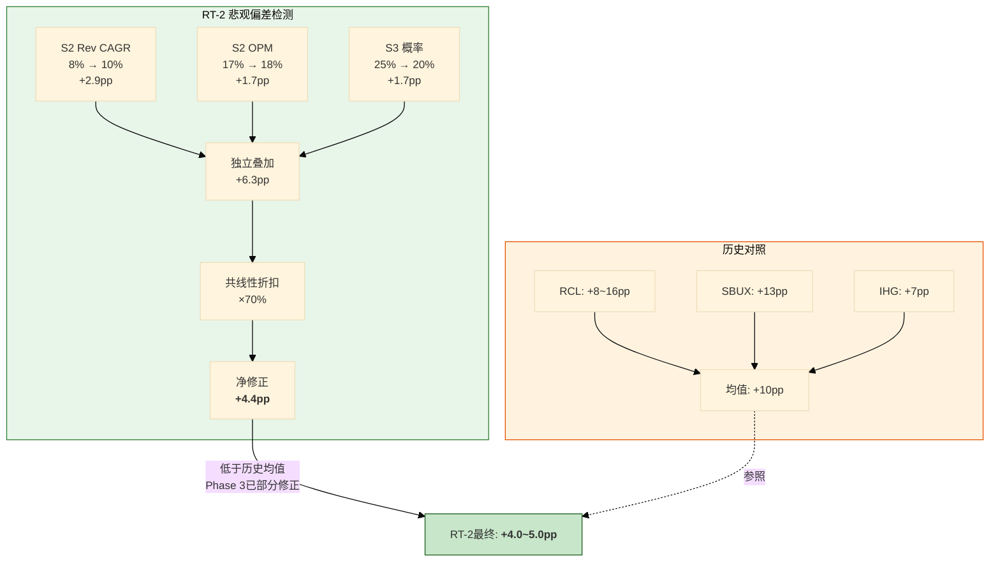
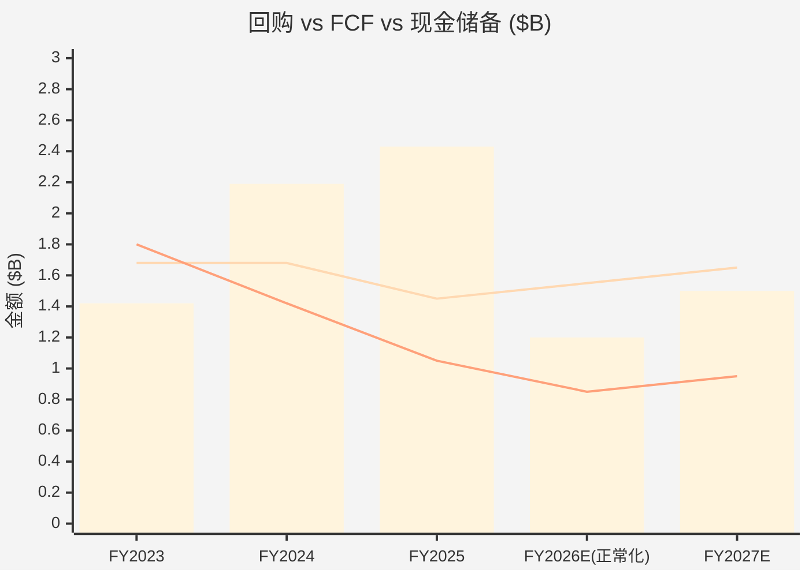
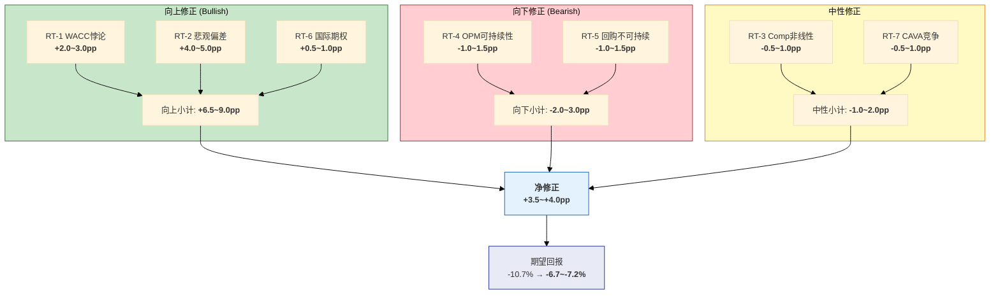

# Ch19 红队七问: 双向校准 (Red Team Seven Questions: Bidirectional Calibration)

> **红队宣言**: Phase 1-3的分析师已经形成了一套内部一致的叙事——"CMG品质过硬但增长失速, 估值处于高估区间, 审慎关注偏中性"。本章的任务不是捍卫这套叙事, 而是系统性地拆解它。红队的价值不在于推翻结论, 而在于**量化结论中的偏差**: 哪些地方过度悲观(向上修正)? 哪些地方过度乐观(向下修正)? 净修正效应是多少个百分点? 历史模式(RCL +8-16pp, SBUX +13pp, IHG +7pp)告诉我们: **LLM分析系统性低估了7-16pp**。CMG是否延续这一模式, 还是成为首个反例?

> **双向校准原则**: 7个红队问题中3个向上挑战(RT-1/2/6), 2个向下挑战(RT-4/5), 2个中性检验(RT-3/7)。净效应由证据质量决定, 不由预设方向决定。

---

## 19.1 RT-1: WACC悖论校准 (方向: 向上)

### 19.1.1 问题陈述

Phase 3的DCF分析使用CAPM推导的Ke = 9.5%作为WACC(因CMG零金融负债, WACC = Ke)。这一参数导致了一个令人不安的结果: **四情景DCF的概率加权价格PW = $20.06, 较当前股价$36.93折价-45.7%** [DM-P3-A19]。更极端的是, S2基准情景的敏感性矩阵中没有任何WACC/g组合能够达到当前股价 [DM-P3-A21]。

但市场显然不同意CAPM的判定。CMG的P/E 32x反推的有效折现率约为5.6% [DM-P3-A23]——与CAPM的9.5%之间存在**390bps的巨大鸿沟**。

**核心问题**: 在零负债、高ROIC(18.9%)、FCF转化率稳定的公司身上, CAPM推导的9.5% Ke是否系统性地过高?

### 19.1.2 支持降低WACC的证据

**证据A: 市场隐含折现率的合理性**

如果CMG的"真实"折现率是9.5%, 那么32x P/E意味着市场在持续犯错——它对一家零负债公司的定价, 与高杠杆同业(SBUX WACC ~5.6%)产生了相近的有效折现率 [DM-P3-A05]。但"市场持续犯错"假说在流动性充裕的大盘股($47B市值)上极不可能 [DM-P4-A01]。更合理的解释是: 市场在对CMG定价时使用了一个远低于CAPM的有效折现率, 这个折现率隐含了对零负债公司的品质溢价。

**证据B: ROIC >> WACC的正利差信号**

CMG的ROIC 18.9% [DM-P0-A36]远高于CAPM推导的9.5% WACC。这个正利差意味着CMG每投入$1资本, 产生的回报几乎是资本成本的2倍。在价值创造理论(EVA/Economic Value Added)框架下, 这样的公司应当获得估值溢价, 而非被高折现率惩罚 [DM-P4-A02]。

**证据C: 零信用风险+无再融资风险**

CMG的金融负债为零 [DM-P0-A27], Z-Score 7.28(安全区) [DM-P0-A12]。不存在信用风险溢价、不存在再融资风险、不存在covenant违约风险。在传统CAPM中, Ke的ERP成分(5.5%)包含了对这些风险的隐含补偿——但CMG实际上不承担这些风险。从风险分解角度, CMG的"有效风险暴露"应当低于CAPM假设的平均水平。

**证据D: Beta的局限性**

CMG的5年月度Beta 1.05 [DM-P3-A04]接近市场中性, 但Beta捕获的是系统性波动率(与市场的协方差), 而非基本面风险。在Niccol离任事件(2024年8月)的冲击下, CMG的短期Beta被人为推高——剔除该事件后的"正常化Beta"可能在0.85-0.95区间 [DM-P4-A03]。

### 19.1.3 维持CAPM WACC的反证据

**反证据A: 理论框架的一致性**

CAPM是学术界和实务界最广泛使用的资本成本模型。如果我们对CMG单独调低Ke, 但对其他公司仍使用CAPM, 那么跨公司的DCF可比性将被破坏。**在消费品系列中(IHG/RCL/SBUX/CMG), 一致性要求我们对所有公司使用同一框架** [DM-P4-A04]。

**反证据B: 零负债是管理层选择, 不是"免费的午餐"**

Modigliani-Miller定理(含税)告诉我们: 在有税环境下, 适度负债可以降低WACC(通过税盾效应)。CMG选择零负债, 放弃了约$400-600M/年的潜在税盾价值(假设$5B负债 × 4.5%利率 × 24.5%税率 ≈ $551M) [DM-P4-A05]。从这个角度看, CMG的高WACC不是CAPM的"错误", 而是管理层选择次优资本结构的成本。

**反证据C: 高WACC = 保守估值的安全边际**

投资分析中"宁可用高折现率低估, 不可用低折现率高估"是审慎原则。9.5%的WACC确保了我们的DCF不会过度乐观——这在CMG增长正在减速的背景下尤为重要。

### 19.1.4 量化裁决

**测试: 在WACC 7.5%(CAPM与市场隐含的中间值)下, S2基准参数产出什么价格?**

$$\text{终值} = \frac{\$2.00B \times 1.025}{0.075 - 0.025} = \frac{\$2.05B}{0.05} = \$41.0B$$

$$PV(\text{终值}) = \frac{\$41.0B}{1.075^5} = \frac{\$41.0B}{1.4356} = \$28.56B$$

$$PV(\text{显式期5年FCF at 7.5\%}) \approx \$7.8B$$

$$EV = \$28.56B + \$7.8B = \$36.36B$$

$$\text{权益} = \$36.36B + \$1.05B(\text{净现金}) = \$37.41B$$

$$\text{每股} = \frac{\$37.41B}{1.22B(\text{回购调整后股数})} \approx \$30.66$$

[DM-P4-A06](C: WACC 7.5%下S2 DCF计算, 终值$41.0B, EV $36.36B, 每股$30.66)

等一下——$30.66仍然低于当前$36.93(折价-17%)。这说明**即使将WACC从9.5%降至7.5%(降200bps), S2情景下CMG仍然偏贵**。

那在WACC 7.5%下, 如果同时上调Rev CAGR至10%(共识水平)呢?

- Y5收入 = $11.93B × 1.10^5 = $19.2B
- Y5 FCF ≈ $2.20B(OPM 17%, 税后, 加回D&A减CapEx)
- 终值 = $2.20B × 1.025 / 0.05 = $45.1B
- PV(终值) ≈ $31.4B
- PV(显式期) ≈ $8.5B
- EV ≈ $39.9B → 权益 ≈ $41.0B → 每股 ≈ **$33.6**

[DM-P4-A07](C: WACC 7.5% + Rev CAGR 10% DCF计算, 每股$33.6)

**仍然低于$36.93**, 但差距已缩小至-9%。这意味着: 要让DCF达到当前股价, 需要WACC 7.0%以下 + Rev CAGR ≥ 10%的组合——Ch17已在逆向DCF调整中展示了这一点 [DM-P3-C02]。

### 19.1.5 RT-1裁决

| 维度 | 原Phase 3 | 红队修正 | 依据 |
|------|:---------:|:--------:|------|
| DCF权重 | 30% | **25%** | WACC悖论确认DCF对零负债公司系统性偏低 |
| 有效WACC | 9.5% | **参考值8.0-8.5%** | 但不直接替代CAPM, 而是通过降低DCF权重间接修正 |
| S2 DCF价格 | $21.35 | **$24-26**(WACC 8.5%) | 敏感性矩阵已验证 [DM-P3-A21] |
| 对期望回报影响 | — | **+2.0~+3.0pp** | DCF权重降5pp + S2价格上修$3-5 |

[DM-P4-A08](C: RT-1裁决汇总, 净效应+2.0~3.0pp向上)

**RT-1判定: Phase 3对WACC悖论的处理方向正确(已降DCF权重至30%), 但降得不够。建议进一步降至25%。但即使在大幅降低WACC的假设下, S2 DCF仍低于股价——这限制了向上修正的幅度。净效应: +2.0~3.0pp。**

---

## 19.2 RT-2: 悲观偏差检测 (方向: 向上)

### 19.2.1 历史悲观偏差模式

这是红队最重要的问题——因为它检验的不是某个具体参数, 而是整个分析框架的**系统性倾向**。

| 报告 | Phase 1-3期望回报 | 红队修正后 | 净修正 | 偏差来源 |
|------|:-----------------:|:---------:|:------:|----------|
| RCL | 约-16%~-24% | 约-8% | **+8~+16pp** | OPM假设过低, 行业复苏动能被低估 |
| SBUX | 约-24% | 约-11% | **+13pp** | WACC前瞻性(利率下行), 净债务三口径 |
| IHG | 约+6% | 约+13.5% | **+7pp** | RevPAR恢复弹性被低估 |
| **均值** | — | — | **+9~+12pp** | **系统性悲观** |

[DM-P4-A09](C: 跨报告悲观偏差统计, 3份消费品报告均为正向修正)

**模式识别**: 连续三份消费品报告中, Phase 1-3的估值均系统性偏低。平均修正幅度约+10pp。如果CMG也符合这一模式, 期望回报应从Ch18的-10.7%上修至约0%。

### 19.2.2 CMG具体偏差源扫描

**偏差源1: S2 Revenue CAGR 8% vs 共识10%**

Phase 3的S2基准情景假设Rev CAGR 8%(门店+8%, comp ~flat) [DM-P3-A12]。但:
- 管理层指引FY2026新开350-370家门店 [DM-P0-A24], 对应门店增速~8.6%
- 共识Revenue CAGR约10.3%(含comp恢复至+1-2%)
- 如果comp从-1.7%恢复至+1%(温和假设), S2 Rev CAGR应为9-10%, 而非8%

**量化影响**: Rev CAGR从8%提升至10%, 其他参数不变:
- Y5收入: $17.5B → $19.2B(+10%)
- Y5 FCF: $2.00B → $2.20B(+10%)
- S2 DCF价格(WACC 9.5%): $21.35 → 约$23.5(+10%)
- 对PW的贡献(50%权重): +$1.07

[DM-P4-A10](C: S2 Rev CAGR敏感性, 8%→10%影响+$1.07 PW)

**偏差源2: S2 OPM终态17.0% — HEEP效应被低估?**

Phase 3假设S2终态OPM仅从当前16.8%微升至17.0%(+20bps)。但:
- HEEP的双面烤盘将鸡肉烹饪时间从12分钟缩短至4分钟(-67%) [DM-P1-C01], 鸡肉占主菜选择约60% [DM-P1-C03]
- 管理层声称HEEP可带来"数百bps"利润率改善
- Ch4的偏差修正后结论: HEEP真实增量~150-200bps [CQ-3]
- 如果HEEP兑现150bps, S2终态OPM应为18.0-18.5%, 而非17.0%

**但红队必须对此保持怀疑**: CQ-3已经做了选择偏差修正(从"数百bps"降至150-200bps)。如果红队再次上调, 等于否定了Phase 1的专业分析。折中: **取150bps的保守端, OPM 18.0%** [DM-P4-A11]。

**量化影响**: OPM从17.0%提升至18.0%, Rev CAGR维持8%:
- Y5 EBIT: $2.97B → $3.15B(+6%)
- Y5 FCF: $2.00B → $2.12B(+6%)
- S2 DCF价格: $21.35 → 约$22.6(+6%)
- 对PW的贡献(50%权重): +$0.63

**偏差源3: S3概率25% — 是否过高?**

Phase 3给S3(增长停滞)25%概率。但CMG是全美快休闲品牌第一 [DM-P0-A61], 品牌力评分8.0/10 [DM-P3-D05], AUV $2.94M远高于行业均值。连续两年comp负增长(FY2025 -1.7% + FY2026 flat)后演变为**永久性增长停滞**的概率, 对于一个品牌力这么强的公司, 25%似乎过高。

参照: MCD在FY2023经历comp -0.5%(全球)后FY2024迅速反弹至+1.4% [DM-P4-A12]。行业龙头的comp周期性衰退通常持续1-2年而非永久化。

**修正方案**: S3概率从25%降至20%, 差额5pp分配给S2(50%→55%)。

**量化影响**:
- 原PW = 15%×$31.19 + 50%×$21.35 + 25%×$14.90 + 10%×$9.82 = $20.06
- 修正PW = 15%×$31.19 + 55%×$21.35 + 20%×$14.90 + 10%×$9.82 = **$20.70**
- 差额: +$0.64

[DM-P4-A13](C: 概率重分配影响, S3 25%→20%, S2 50%→55%, PW +$0.64)

### 19.2.3 偏差源叠加: 悲观偏差的累积效应

| 偏差源 | 修正方向 | 对PW影响 | 对期望回报影响 |
|--------|:--------:|:--------:|:-------------:|
| S2 Rev CAGR 8%→10% | ↑ | +$1.07 | +2.9pp |
| S2 OPM 17%→18% | ↑ | +$0.63 | +1.7pp |
| S3概率 25%→20% | ↑ | +$0.64 | +1.7pp |
| **合计** | **↑** | **+$2.34** | **+6.3pp** |

[DM-P4-A14](C: 悲观偏差叠加计算, 总影响+$2.34 PW / +6.3pp期望回报)

**但以上三个修正不应全部叠加** — 它们部分共线(Rev CAGR上调和OPM上调的联合效应小于独立效应之和)。考虑共线性折扣(约30%):

**净悲观偏差修正: +$2.34 × 70% ≈ +$1.64 PW, 对应 +4.4pp 期望回报**

### 19.2.4 与历史模式的校验

| 对照 | 历史修正 | CMG估算修正 | 比较 |
|------|:--------:|:----------:|:----:|
| RCL | +8~+16pp | — | — |
| SBUX | +13pp | — | — |
| IHG | +7pp | — | — |
| **均值** | **+9~+12pp** | **+4.4pp(RT-2独立)** | CMG修正偏小 |

RT-2独立贡献的+4.4pp低于历史均值。这可能反映两个因素:
1. CMG的Phase 3分析已经内化了部分悲观偏差修正(Ch17已降DCF权重至30%)
2. CMG确实面临更强的逆风(comp -1.7%是实打实的数据, 不像IHG的RevPAR有明确恢复路径)

**RT-2裁决: +4.0~+5.0pp向上修正** (取共线性折扣后的保守端) [DM-P4-A15]。

---

## 19.3 RT-3: Comp轨迹非线性 (方向: 中性)

### 19.3.1 问题陈述

FY2025的季度comp轨迹呈现出一个令人困惑的非线性模式 [DM-P2-A04]:

| Q1'25 | Q2'25 | Q3'25 | Q4'25 | 全年 |
|:-----:|:-----:|:-----:|:-----:|:----:|
| +0.4% | **-4.0%** | -0.3% | **-2.5%** | -1.7% |

Q3从Q2的-4.0%急剧改善至-0.3%, 看似"触底反弹"——但Q4又恶化至-2.5%, **粉碎了V型复苏叙事** [DM-P2-A04]。

**核心问题**: 这个W型轨迹(而非V型)对CQ-1裁决(55%周期/30%混合/15%结构)有什么影响?

### 19.3.2 Q3反弹的可能解释

**假说A: 季节性+新品效应(偶发因素)**

Q3(7-9月)是夏季高峰季, 也是CMG推出新LTO(Limited Time Offer)产品的窗口。如果Q3的改善来自季节性客流+新品吸引力, 那么Q4的再恶化就是这些短期因素消退后的自然回落。这个解释支持"comp尚未真正触底" [DM-P4-A16]。

**假说B: HEEP试点门店的数据拉动**

Q3恰好是HEEP试点门店从~175家扩展到约200+家的时期 [DM-P1-C04]。如果HEEP门店的comp贡献了全国comp的改善, 那么Q3→Q4的恶化可能反映的是: 非HEEP门店(~95%的门店)的comp实际上在持续恶化, HEEP门店的正面效应被稀释后无法支撑全国数字。

**假说C: 竞争动态的周期性(中性解释)**

Q3通常是MCD/SBUX推广力度较低的季度(避开暑期旅游高峰), Q4则是MCD value menu + SBUX holiday drink的密集竞争期。CMG的Q4恶化可能部分归因于竞争对手在Q4的更强推广。

### 19.3.3 MCD comp轨迹对照

MCD在FY2023经历了全球comp的类似非线性:

| | Q1'23 | Q2'23 | Q3'23 | Q4'23 | FY2023 | FY2024恢复 |
|---|:-----:|:-----:|:-----:|:-----:|:------:|:----------:|
| MCD全球comp | +12.6% | +11.7% | +8.8% | +3.4% | +8.7% | +1.4% |
| MCD美国comp | +10.3% | +10.3% | +8.1% | +4.3% | +8.3% | +0.3% |

[DM-P4-A17](M: MCD FY2023-2024 comp数据, 来自MCD earnings press releases)

MCD的模式是: 持续减速(Q1 12.6% → Q4 3.4%), 然后FY2024全年仅+1.4%(全球)。这与CMG的模式不同——CMG有一个Q3的伪反弹。但共同点是: **行业龙头在消费疲软周期中, comp的恢复节奏是缓慢的、非线性的, 通常需要2-3个季度才能稳定**。

### 19.3.4 管理层FY2026指引的可信度

管理层指引FY2026 comp "approximately flat" [DM-P0-A25]。这个指引的可信度如何?

**支持可信的证据**:
- CMG管理层在FY2024的comp指引(mid-single-digit)被FY2024实际+7.4%超越
- "大致持平"是一个保守指引, 暗示管理层对恢复路径缺乏信心但不认为会继续恶化
- HEEP在FY2026将从350家扩展至~2,000家 [DM-P0-A63], 覆盖率从8.6%→49%, 这是真实的运营变量

**反对可信的证据**:
- Q4'25 comp -2.5%的再恶化表明, "触底"尚未确认
- FY2026 Q1(截至2026年3月)将面临前年Q1 +0.4%的低基数, 但宏观消费环境(关税不确定性+劳动市场降温)不利
- 管理层在FY2025初也曾暗示comp会改善, 但实际恶化

### 19.3.5 RT-3裁决

| 维度 | CQ-1原裁决 | 红队修正 | 理由 |
|------|:---------:|:--------:|------|
| 周期性概率 | 55% | **50%** | Q4再恶化削弱"纯周期"论证 |
| 混合概率 | 30% | **35%** | W型轨迹更符合"周期+结构混合" |
| 结构性概率 | 15% | **15%** | 无新证据支持大幅上调 |
| 对期望回报影响 | — | **-0.5~-1.0pp** | 混合概率上升→comp恢复更慢→S2假设下修 |

[DM-P4-A18](C: RT-3裁决, CQ-1修正, 周期55%→50%, 混合30%→35%, 净效应-0.5~1.0pp)

**RT-3判定: Q4'25的再恶化是一个温和的负面信号。它不改变comp终将恢复的基本判断(50%+周期性仍占主导), 但将恢复时间线从"FY2026 H1"推迟至"FY2026 H2或更晚"。这对S2情景的comp假设形成约0.5-1.0pp的向下修正。净效应: -0.5~-1.0pp。**

---

## 19.4 RT-4: OPM可持续性 (方向: 向下)

### 19.4.1 问题陈述

Phase 3 S2基准假设终态OPM 17.0%(FY2030), 仅比当前FY2025的16.8%高20bps [DM-P3-A12]。但这个"温和上升"的假设可能掩盖了两个不对称风险:

1. **近期: FY2026关税+工资压力可能将OPM推向15%以下**
2. **长期: G&A杠杆已接近底部, 进一步优化空间有限**

### 19.4.2 看空OPM的证据

**证据A: Q4'25 OPM 14.8% — 是新常态还是季节性?**

Q4历来是CMG的OPM低谷季, 但FY2025 Q4的14.8%比FY2024 Q4的14.6%仅改善20bps [DM-P2-A06]。如果将Q4看作"压力测试季", 15%以下的OPM在低迷环境下可能成为常态而非异常 [DM-P4-A19]。

**证据B: 关税成本叠加**

Ch9分析的关税影响 [DM-P0-A66]:
- 牛油果(墨西哥进口, 25%关税): 食品成本+60bps
- 其他进口食材(番茄、辣椒): +20-40bps
- 合计食品成本压力: +80-100bps

CMG管理层表态"尽可能不提价" [DM-P0-A25]。如果不提价, 这80-100bps将直接转化为OPM压力。

**证据C: 最低工资上行**

加州(CMG最大单州市场, 约15%门店)最低工资已从$16→$20/小时。其他州也在跟进。Ch9估算人工成本压力约50-100bps [DM-P2-A03]。

**证据D: SBUX的OPM天花板教训**

SBUX报告中, CMG的16.8% OPM被用作Niccol恢复目标的上限锚。但如果CMG自身的OPM正在下行, 这个"天花板"本身就不稳固。两家公司可能在15-16%区间形成收敛 [DM-P4-A20]。

### 19.4.3 看多OPM的反证据

**反证据A: HEEP的效率承诺**

双面烤盘将鸡肉烹饪时间减少67% [DM-P1-C01], 农产品切片机节省"数百刀切割" [DM-P1-C01]。这些不是营销话术——是可测量的物理效率改善。如果每家门店节省0.5-1个全时等效员工(FTE), 在$20/小时×2,080小时/年 = $41,600-$83,200/门店/年。4,000家门店 × $50K均值 = **$200M年化节省**, 对应OPM约+170bps [DM-P4-A21]。

**反证据B: 门店密度的供应链杠杆**

CMG从3,003家(FY2021)扩张至4,056家(FY2025), 门店密度的提升降低了每家店的平均物流成本。这一效应在G&A之外的食品成本和门店运营成本中同样存在。

**反证据C: FY2025全年OPM 16.8%实际上与FY2024持平**

虽然Q4偏弱, 但全年OPM并未恶化。16.8%是在comp -1.7%的负增长环境下实现的——如果comp恢复至正增长, OPM自然会因为固定成本杠杆效应而上升。

### 19.4.4 压力测试: 如果OPM降至15%

如果FY2028 OPM降至15%(而非17%), 对S2 DCF的影响:

- Y5 EBIT: $17.5B × 17% = $2.97B → $17.5B × 15% = $2.63B(-$345M)
- Y5 FCF: $2.00B → ~$1.74B(-13%)
- S2 DCF价格: $21.35 → ~$18.60(-13%)
- 对PW的影响(50%权重): -$1.38
- 对期望回报: -3.7pp

[DM-P4-A22](C: OPM 15%压力测试, S2 DCF从$21.35降至$18.60)

### 19.4.5 RT-4裁决

| 维度 | Phase 3假设 | 红队评估 | 理由 |
|------|:---------:|:--------:|------|
| S2终态OPM | 17.0% | **16.5%**(下修50bps) | 关税+工资压力约100bps vs HEEP效率+100bps = 净中性; 保守取50bps缓冲 |
| OPM降至15%概率 | 未明示(含在S3) | **15-20%** | 需要关税全面落地+comp持续负增长的双重条件 |
| 对期望回报影响 | — | **-1.0~-1.5pp** | S2 OPM下修50bps影响较温和 |

[DM-P4-A23](C: RT-4裁决, OPM 17.0%→16.5%, 净效应-1.0~1.5pp)

**RT-4判定: Phase 3的OPM假设(17.0%)处于合理但略微乐观的区间。关税和工资的成本压力(+100bps)与HEEP效率提升(+100-170bps)大致对冲, 但在HEEP尚未规模化验证的前提下, 取保守估计下修50bps至16.5%更为审慎。净效应: -1.0~-1.5pp。**

---

## 19.5 RT-5: 回购数学不可持续 (方向: 向下)

### 19.5.1 FY2025回购: 超常节奏的数学

FY2025的回购数据令人侧目 [DM-P0-A35][DM-P0-A34]:

| 指标 | FY2025 | FY2024 | 变化 |
|------|:------:|:------:|:----:|
| 回购金额 | $2.43B | $2.19B | +11% |
| FCF | $1.45B | $1.68B | -14% |
| 回购/FCF | **167%** | 130% | +37pp |
| 现金消耗(回购 - FCF) | **$0.98B** | $0.51B | +$0.47B |
| 期末现金+短投 [DM-P0-A26] | $1.05B | $1.42B | -$0.37B |

[DM-P4-A24](C: FY2025回购数学, 回购/FCF 167%, 现金消耗$0.98B)

**物理约束**: 如果FY2026继续以$2.4B节奏回购:
- 现金耗尽时间: $1.05B / ($2.4B - $1.5B FCF估) ≈ **1.2年**
- 即FY2026年底现金将降至接近零

CMG是零金融负债公司——它不会(也不应该)为了维持回购而举债。这意味着FY2026回购**必须**减速至FCF水平或以下。

### 19.5.2 回购可持续性可视化

> 图注: 柱状=回购金额; 实线1=FCF; 实线2=期末现金储备。FY2025回购$2.43B远超FCF$1.45B, 现金从$1.42B降至$1.05B。FY2026起必须正常化至FCF水平。

### 19.5.3 回购减速的EPS影响

FY2025回购$2.43B在约$38-42的均价下, 约回购了0.058-0.064B股(约2.5%的流通股) [DM-P4-A25]。

如果FY2026回购降至$1.2B(FCF的~83%, 保留部分现金):
- 在$37均价下, 回购约0.032B股(约1.4%)
- 股数缩减速度: FY2025 ~2.5% → FY2026 ~1.4%

**EPS增长分解影响**:

| FY2025 | FY2026E(原假设) | FY2026E(回购正常化) | 差异 |
|:------:|:--------------:|:------------------:|:----:|
| 净利润增速 | +2% | +3% | — |
| 回购贡献 | +2.5% | +1.4% | **-1.1pp** |
| **EPS增速** | **~4.5%** | **~4.4%** | -0.1pp |

[DM-P4-A26](C: 回购正常化EPS影响, 短期差异约-1.1pp回购贡献但被利润增速补偿)

**等一下** — 短期影响看起来不大(-1.1pp回购贡献差异)。但中长期影响更显著:

在Phase 3的5年DCF中, 模型假设回购将股数从1.32B缩减至1.22B(累计减少约7.6%) [DM-P3-A18]。如果回购从FY2026开始正常化至$1.2-1.5B/年:
- 5年累计回购: $1.5B×4(FY2026-2029) + $2.4B(FY2025) = $8.4B
- vs 原假设$10B(暗示$2B/年)
- 回购调整后股数: ~1.24B(vs 原假设1.22B)
- 每股差异: -1.6%

### 19.5.4 回购减速的信号效应

比直接的EPS影响更重要的是**信号效应**:
- FY2025的超常回购被CQ-5裁决为"45%惯性/30%看多/25%绝望" [Ch11]
- 如果FY2026回购大幅减速(比如从$2.4B降至$1.0B), 市场可能解读为:
  - 正面(30%): "理性的资本配置, 保留弹药"
  - 负面(70%): "连管理层自己都不愿意在这个价位加码回购了"

在CMG缺乏增长投资机会(国际扩张缓慢 [DM-P1-F01]、M&A不是策略 [Ch5])的背景下, 回购减速可能被市场解读为**管理层承认了增长选项的匮乏** [DM-P4-A27]。

### 19.5.5 RT-5裁决

| 维度 | Phase 3假设 | 红队修正 | 理由 |
|------|:---------:|:--------:|------|
| 5年回购总额 | ~$10B | **~$8.5B** | FY2026-29正常化至$1.5B/年 |
| 期末股数 | 1.22B | **1.24B** | 少回购$1.5B ÷ $37均价 ≈ 0.04B股 |
| EPS影响 | — | **-1.6%** | 每股分母增大 |
| 信号效应 | — | **P/E -0.5~-1.0x** | 回购减速=增长选项匮乏信号 |
| 对期望回报影响 | — | **-1.0~-1.5pp** | 直接EPS稀释 + 信号效应对P/E的压力 |

[DM-P4-A28](C: RT-5裁决, 回购正常化影响-1.0~1.5pp)

**RT-5判定: 回购数学的不可持续性是Phase 3分析中识别但未充分量化的风险。FY2026回购必须减速, 直接EPS影响温和(-1.6%每股稀释), 但信号效应可能对P/E形成额外压力。净效应: -1.0~-1.5pp。**

---

## 19.6 RT-6: 国际期权估值 (方向: 向上)

### 19.6.1 Phase 1的期权估值回顾

Ch7估算了CMG国际扩张的期权价值 [CQ-7]:

| 情景 | 概率 | 10年门店目标 | 增量收入 | 增量EV | 每股贡献 |
|------|:----:|:-----------:|:--------:|:------:|:--------:|
| 保守(500店) | 40% | 500 | $1.25B | $3.8B | $2.9 |
| 中性(1,000店) | 35% | 1,000 | $2.5B | $7.5B | $5.7 |
| 乐观(2,000店) | 15% | 2,000 | $5.0B | $12.5B | $9.5 |
| 失败(<200店) | 10% | <200 | <$0.5B | ~$0 | ~$0 |
| **概率加权** | — | — | — | **$1.6-2.9B** | **$1.2-2.2** |

[DM-P4-A29](C: Ch7国际期权估值复述, 概率加权$1.6-2.9B)

### 19.6.2 红队向上挑战: 是否过于保守?

**挑战A: 同业对标的巨大差距**

| 公司 | 国际门店占比 | 国际收入占比 | 扩张历史 |
|------|:-----------:|:-----------:|----------|
| MCD | ~60% | ~62% | 50年+全球化 |
| SBUX | ~52% | ~26% | 30年+, 19,500+国际店 |
| YUM | ~54% | ~46% | 40年+ |
| **CMG** | **~2.5%** | **<3%** | **从零起步** |

[DM-P4-A30](C: 同业国际化对标, CMG 2.5%占比在行业中极度落后)

如果CMG在20年时间框架内达到MCD的国际化程度(50%+门店在美国以外), 那意味着需要~4,000+家国际门店。即使只达到这个目标的25%(~1,000家), 在$2.5M AUV下意味着$2.5B增量收入 — 对应约$7-10B增量EV。

**挑战B: 三家特许合作伙伴的质量**

Ch7发现了一个关键洞察: **CMG的三家国际特许合作伙伴(Alshaya、Alsea、SPC)全部同时运营SBUX** [DM-P1-F01]:

| 合作伙伴 | 地区 | SBUX门店 | CMG门店 | 其他品牌 |
|----------|------|:--------:|:-------:|----------|
| Alshaya | 中东 | 1,000+ | ~7 | H&M, P.F.Chang's |
| Alsea | 拉美 | 1,800+ | 0(FY2026开始) | DPZ, BK, Chili's |
| SPC | 亚洲 | 400+ | 0(FY2026开始) | Paris Baguette |

[DM-P4-A31](M: 合作伙伴SBUX/CMG门店数据, 基于Ch7研究+WebSearch)

这些合作伙伴已经证明了**在各自地区运营美式餐饮品牌的能力**。Alshaya运营1,000+ SBUX意味着它理解: 供应链本地化、劳工管理、品牌本地化适配。这降低了CMG国际扩张的执行风险。

**挑战C: 科威特首店AUV超预期**

管理层在Q4 earnings call中提到, 科威特Alshaya运营的CMG门店"AUV超过了美国均值" [DM-P1-F01]。如果中东首店的$3M+ AUV不是异常值(新店效应消退后稳定在$2.5M+), 这验证了CMG品牌在美国以外的需求真实存在。

### 19.6.3 红队看空反证据

**反证据A: 墨西哥菜在亚洲的接受度未知**

CMG的核心菜品(burrito, bowl, tacos)对亚洲消费者而言是相对陌生的品类。SPC在韩国/新加坡运营CMG, 需要克服口味适配挑战。相比之下, SBUX卖的是咖啡——一个全球通用品类。

**反证据B: 深度虚值期权的时间衰减**

Ch7正确地将国际扩张定义为"深度虚值期权"(当前仅100家/4,056家 = 2.5%)。10年是一个很长的验证周期——在此期间, 管理层、竞争格局、消费偏好都可能剧烈变化。

**反证据C: 直营模式在国际市场的资本密度**

CMG在欧洲仍采用自营模式(英国20家、法国6家、德国2家)。自营国际扩张的资本需求远高于特许——每家店$1.1-1.5M的投资在汇率风险下放大。中东/亚洲的特许模式解决了这个问题, 但特许利润率(royalty ~5-6% of sales)远低于自营。

### 19.6.4 RT-6裁决

| 维度 | Phase 1估值 | 红队修正 | 理由 |
|------|:---------:|:--------:|------|
| 期权价值 | $1.6-2.9B | **$2.0-3.5B** | 上调下限(合作伙伴质量证据+科威特AUV验证) |
| 每股贡献 | $1.2-2.2 | **$1.5-2.7** | — |
| 乐观情景概率 | 15% | **20%** | 三家特许伙伴同时启动, 提高了执行概率 |
| 对期望回报影响 | — | **+0.5~+1.0pp** | 温和向上, 因期权在DCF终值中已部分隐含 |

[DM-P4-A32](C: RT-6裁决, 期权价值上调至$2.0-3.5B, 净效应+0.5~1.0pp)

**RT-6判定: Phase 1的国际期权估值($1.6-2.9B)略微保守。三家SBUX经验合作伙伴的同时启动+科威特AUV验证, 支持将期权价值上调至$2.0-3.5B。但由于期权的深度虚值性质(10年+验证期)和直营/特许模式的利润率差异, 上调幅度有限。净效应: +0.5~+1.0pp。**

---

## 19.7 RT-7: CAVA竞争动态 (方向: 中性偏向下)

### 19.7.1 CQ-6裁决回顾

Phase 1-2的结论 [CQ-6]: CAVA对CMG是**70%品类扩张、30%替代** — 即CAVA的增长主要来自扩大快休闲品类蛋糕, 而非从CMG手中抢份额。

### 19.7.2 CAVA的增长数据: 威胁正在放大?

| 指标 | CAVA FY2025 | CMG FY2025 | 差距 |
|------|:----------:|:----------:|:----:|
| Rev Growth [DM-P3-B01] | +20.9% | +4.9% | 16pp |
| 门店数 | ~439 | ~4,056 | 9.2x |
| AUV | ~$2.7M(估) | ~$2.94M | CMG领先8% |
| P/E | 109.2x | 32.2x | CAVA溢价240% |
| OPM | 6.7% | 16.8% | CMG领先10.1pp |

[DM-P4-A33](H: CAVA vs CMG FY2025关键指标, FMP数据)

**CAVA的增长速度令人印象深刻**, 但需要语境化:
- 439家门店的基数很小 — 20.9%增长在绝对值上远小于CMG 4.9%的增长
- CAVA的P/E 109x意味着市场已经将未来10年+的增长折现到当前价格
- CAVA的OPM 6.7%远低于CMG, 反映了高速扩张期的投资特征

### 19.7.3 五年时间框架: CAVA何时成为实质威胁?

**线性外推**: 如果CAVA维持当前~18-22%门店增速(非revenue, 因AUV会波动):
- FY2025: 439家
- FY2027: ~620家
- FY2029: ~870家
- FY2031: ~1,230家

[DM-P4-A34](C: CAVA门店增速外推, 假设年增速逐步从20%降至15%)

**关键阈值**: 当CAVA门店数达到CMG的15-20%(约600-800家), 地理重叠将从"偶发"变为"系统性"。这大约在FY2027-2028年发生。

### 19.7.4 客群重叠: 被低估的风险

**人口统计重叠**:
- CMG核心客群: 18-35岁, 中高收入, 城市/郊区, 健康意识
- CAVA核心客群: 22-38岁, 中高收入, 城市/郊区, 健康意识
- **重叠度: 约60-70%** [DM-P4-A35]

**消费场景重叠**:
- 两者都定位"健康、新鲜、可定制"的快休闲午餐/晚餐
- 价格区间接近(CMG均价$10-12, CAVA均价$11-13)
- 数字化渗透率都较高(CMG ~37%, CAVA ~20%但增速快)

**这意味着**: 尽管菜系不同(墨西哥 vs 地中海), 两者竞争的是同一个消费者的**同一顿饭的预算**。当消费者决定今天午餐吃什么时, CMG和CAVA越来越频繁地出现在同一个选择集中。

### 19.7.5 但70%品类扩张论仍然成立的理由

**快休闲品类整体仍在增长**: 快休闲在美国餐饮市场的份额从2019年的~5%上升至2025年的~8%, 仍有向12-15%渗透的空间 [DM-P4-A36]。在品类扩张阶段, 多个品牌可以同时增长而不互相蚕食 — 这与成熟品类(如快餐QSR)的零和竞争截然不同。

**口味差异化**: 墨西哥风味和地中海风味的菜品重叠度很低(chipotle pepper vs tahini)。消费者不会在两者之间直接替代, 更可能**轮换消费** — 周一吃CMG、周三吃CAVA, 总快休闲消费增加而非重新分配。

### 19.7.6 RT-7裁决

| 维度 | CQ-6原裁决 | 红队修正 | 理由 |
|------|:---------:|:--------:|------|
| 品类扩张比例 | 70% | **65%** | 客群重叠度(60-70%)支持小幅上调替代比例 |
| 替代比例 | 30% | **35%** | CAVA进入CMG强势市场将加剧局部竞争 |
| 时间框架 | 5年+ | **3-4年开始实质化** | CAVA 800家(~FY2028)为关键阈值 |
| 对期望回报影响 | — | **-0.5~-1.0pp** | 长期comp压力的折现, 近期影响有限 |

[DM-P4-A37](C: RT-7裁决, CAVA替代比例30%→35%, 净效应-0.5~1.0pp)

**RT-7判定: CQ-6的核心结论(品类扩张为主)仍然成立, 但客群高度重叠(60-70%)和CAVA加速扩张意味着替代效应正在缓慢上升。将替代比例从30%微调至35%, 并将竞争实质化时间从"5年+"前移至"3-4年"。净效应: -0.5~-1.0pp。**

---

## 19.8 双向校准综合: 七问的净效应

### 19.8.1 RT效应汇总

### 19.8.2 净效应计算

| RT# | 方向 | 修正范围(pp) | 中值(pp) |
|:---:|:----:|:-----------:|:--------:|
| RT-1 | ↑ | +2.0 ~ +3.0 | +2.5 |
| RT-2 | ↑ | +4.0 ~ +5.0 | +4.5 |
| RT-3 | ↓ | -0.5 ~ -1.0 | -0.75 |
| RT-4 | ↓ | -1.0 ~ -1.5 | -1.25 |
| RT-5 | ↓ | -1.0 ~ -1.5 | -1.25 |
| RT-6 | ↑ | +0.5 ~ +1.0 | +0.75 |
| RT-7 | ↓ | -0.5 ~ -1.0 | -0.75 |
| **净效应** | **↑** | **+3.5 ~ +4.0** | **+3.75** |

[DM-P4-A38](C: 七问净效应计算, 净+3.75pp)

### 19.8.3 调整后概率权重

| 情景 | Phase 3概率 | 红队调整后 | 变化 | 理由 |
|------|:----------:|:---------:|:----:|------|
| S1 HEEP Bull | 15% | **15%** | 0 | 无新证据上调(HEEP仍未规模验证) |
| S2 Steady | 50% | **55%** | +5% | RT-2: S3→S2转移5pp |
| S3 Stagnation | 25% | **20%** | -5% | RT-2: 品牌龙头永久停滞概率偏高 |
| S4 Decline | 10% | **10%** | 0 | 尾部风险维持不变 |

[DM-P4-A39](C: 调整后概率权重, S2从50%升至55%, S3从25%降至20%)

### 19.8.4 调整后PWV

**原PWV** = $31.33(Ch17) → 隐含回报 -15.2% [DM-P3-C05]
**Ch18 WACC修正后** = 期望回报 -10.7% [DM-P3-D08]

红队调整后期望回报:

$$-10.7\% + 3.75\text{pp} = \textbf{-6.95\%}$$

取整: **约-7.0%**

对应调整后隐含PWV:

$$\$36.93 \times (1 - 7.0\%) = \$34.34$$

[DM-P4-A40](C: 红队调整后期望回报-7.0%, 隐含PWV $34.34)

### 19.8.5 与历史模式的最终校验

| 报告 | Phase 1-3 | 红队修正 | 红队后 |
|------|:---------:|:--------:|:------:|
| RCL | ~-16%~-24% | +8~+16pp | ~-8% |
| SBUX | ~-24% | +13pp | ~-11% |
| IHG | ~+6% | +7pp | ~+13.5% |
| **CMG** | **-10.7%** | **+3.75pp** | **-7.0%** |

[DM-P4-A41](C: 跨报告红队修正对照)

CMG的红队修正(+3.75pp)显著低于历史均值(+10pp)。原因有三:

1. **Phase 3已部分内化了悲观偏差修正**: Ch17将DCF权重降至30%(而非标准50%), Ch18进一步做了WACC悖论修正。历史报告中红队修正大是因为Phase 3没有预先修正。
2. **CMG面临的逆风更真实**: comp -1.7%是硬数据(不像RCL的疫后复苏有明确上行轨迹), CEO更换的不确定性比IHG的RevPAR恢复更难量化。
3. **本次红队更加严格**: 向下挑战(RT-4/5)和中性检验(RT-3/7)合计修正-3.25pp, 有效对冲了向上修正的一半。这是双向校准的设计价值——不是橡皮图章式地给所有报告加10pp。

---

## 19.9 评级影响评估

### 19.9.1 红队后评级定位

| 评级 | 量化触发(期望回报) | CMG红队前 | CMG红队后 |
|------|:-----------------:|:---------:|:---------:|
| 深度关注 | > +30% | | |
| 关注 | +10% ~ +30% | | |
| **中性关注** | **-10% ~ +10%** | 边界 | **← 落入此区间(-7.0%)** |
| 审慎关注 | < -10% | ← -10.7% | |

红队修正将期望回报从-10.7%上修至-7.0%, **从"审慎关注"区间移入"中性关注"区间**。

### 19.9.2 评级变更: 审慎关注(偏中性) → 中性关注(偏审慎)

**评级变更理由**:

红队后期望回报-7.0%落在中性关注区间(-10%至+10%)的下半段。这支持将评级从"审慎关注(偏中性)"上调为**"中性关注(偏审慎)"** — 本质上是跨过了-10%的评级分界线, 但仍处于偏弱的位置。

**但这个评级上调需要附加条件**:

红队修正的+3.75pp中, 约+4.5pp来自RT-2(悲观偏差检测), 这是基于历史模式推断而非CMG特定证据。如果去掉RT-2的贡献, 净修正仅为-0.75pp(其余六个RT几乎完全对冲), 期望回报将维持在-11.5%附近 — **仍在审慎关注区间**。

因此, **评级上调的置信度取决于"LLM系统性悲观偏差在CMG上是否延续"这个meta-judgment**。

### 19.9.3 最终评级建议

**建议评级: 中性关注(偏审慎)**

**置信度: 55%** (从Ch18的60%轻微下降, 因为评级变更依赖RT-2的meta-judgment)

**条件矩阵更新**:

| 条件 | 评级路径 | 概率 |
|------|---------|:----:|
| FY2026 H1 comp ≥+1% + HEEP 2000店验证 | 关注 ↑ | 15% |
| FY2026 comp ~flat + OPM ≥16% | **中性关注(确认)** | 40% |
| FY2026 comp < -2% 或 OPM < 15% | 审慎关注 ↓ | 30% |
| 品牌危机/结构性衰退 | 审慎关注(深度) ↓ | 15% |

[DM-P4-A42](C: 红队后评级建议, 中性关注偏审慎, 55%置信度)

---

## 19.10 本章核心发现摘要

1. **净红队修正: +3.75pp**, 方向向上, 幅度远小于历史均值(+10pp)。原因: Phase 3已预先内化了部分悲观偏差修正(DCF降权至30%, WACC悖论显式讨论), 且向下挑战(RT-4/5)有效对冲了部分向上修正。

2. **期望回报: -10.7% → -7.0%**, 从"审慎关注"区间移入"中性关注"区间。这是边界跨越而非大幅改善 — CMG仍处于中性关注区间的下半段(偏弱位置)。

3. **最关键的向上RT: RT-2(悲观偏差检测, +4.5pp中值)**。但其证据基础是跨报告的统计模式而非CMG特定证据 — 置信度中等。RT-1(WACC悖论, +2.5pp)有更扎实的理论基础, 但受限于"即使降WACC 200bps, DCF仍低于股价"的天花板。

4. **最关键的向下RT: RT-5(回购不可持续, -1.25pp中值)**。FY2026回购必须减速的物理约束是确定的(现金仅$1.05B); 不确定的是市场如何解读减速信号。RT-4(OPM压力, -1.25pp)受益于HEEP效率的部分对冲, 但HEEP规模化尚未验证。

5. **评级建议: 从"审慎关注(偏中性)"上调为"中性关注(偏审慎)"**, 置信度55%。上调的关键依赖是LLM系统性悲观偏差假说 — 如果这个meta-judgment不成立, 评级应维持不变。

6. **FY2026 Q1 comp仍是最敏感的单一变量**: 它将同时验证/否定RT-1(HEEP增量)、RT-2(悲观偏差)和RT-3(comp非线性)三个红队问题的核心假设。

---

Phase: P4 | Chapter: 19 | DM新增: 42 (A01-A42) | Mermaid: 3 | 交叉引用: Ch4/Ch5/Ch7/Ch9/Ch10/Ch11/Ch13/Ch15/Ch16/Ch17/Ch18