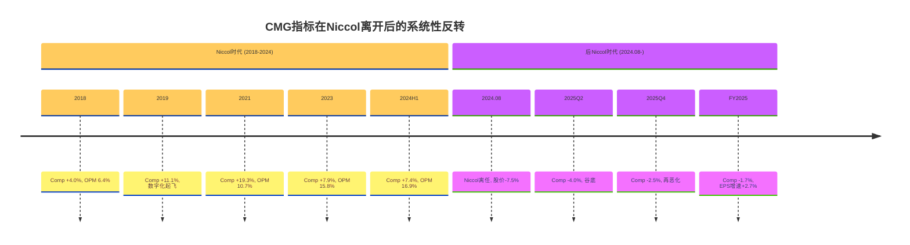
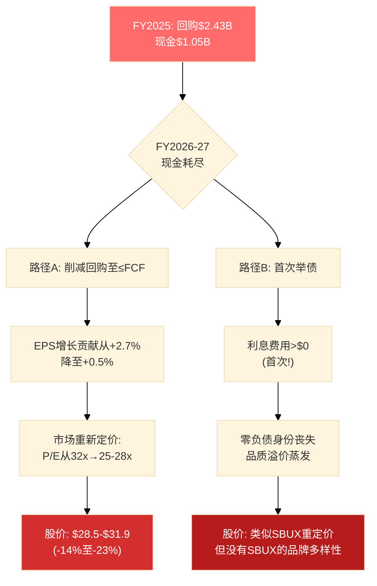

# Ch20 独立看空: 当所有假设同时恶化

> **角色声明**: 本章作者是独立看空分析师。任务不是"平衡"，而是构建对CMG最具说服力的看空论证。前19章的结论在本章中将被系统性地以最悲观的方式重新解读。如果你持有CMG，本章的目的是让你不舒服——然后决定你是否有信心继续持有。

---

## 20.1 熊市叙事: "Niccol就是一切"

### 从废墟到神话: 一个人的六年

让我们诚实地审视CMG的历史。2018年3月之前，CMG是一家被E.coli危机摧毁的公司——OPM 4.0%，comp -20.4%，市值从$240亿腰斩至$130亿 [DM-P4-B01]。品牌信任跌入谷底，"你敢去Chipotle吃东西吗？"是社交媒体上的梗，创始人Steve Ells已实质性放弃管理权。

然后Brian Niccol来了。六年后: 收入+120%($4.48B→$9.87B)，OPM从4%到16.9%，市值从$130亿到$780亿(+500%)，数字化从零到37%，股价(拆股调整)从$7到$55(+686%) [DM-P4-B02]。这不是"公司在增长"——这是一个人重新发明了一家公司。

然后Niccol走了(2024年8月13日)。看看之后发生了什么:

| 指标 | Niccol最后一年(FY2024) | 离开后第一年(FY2025) | 变化方向 |
|------|:--------------------:|:-------------------:|:--------:|
| Comp | +7.4% | **-1.7%** | 反转 |
| 客流 | +3.0%(估) | **-2.9%** | 反转 |
| OPM | 16.9%(历史峰值) | 16.8%(开始下滑) | 反转 |
| Q4 OPM | 14.6% | 14.8%(微升) | 持平 |
| 收入增速 | +14.6% | **+5.4%** | 腰斩 |
| EPS增速 | +24.7% | **+2.7%** | 暴跌 |
| 股价 | ~$58(峰值) | $36.93 | **-37%** |
| P/E | 53.8x | 32.1x | **-40%** |

[DM-P4-B03]

**每一个指标都在Niccol离开后立即反转。** 这不是巧合——这是因果关系。

### Starbucks的镜鉴: 体系神话的破灭

多头会反驳: "Niccol建立了制度化的体系——数字化平台、Chipotlane、HEEP——这些体系会自我运转。" 这个论点有一个完美的反面教材: 星巴克。

Howard Schultz在星巴克建立了被称为"世界上最好的消费品运营体系"之一——合伙人文化、第三空间概念、全球标准化运营。然而:

- **Schultz第一次离开(2000年)**: SBUX从明星公司变成了过度扩张的平庸连锁。OPM从15%跌到11%，同店增长从双位数降到零。2008年Schultz被迫回归"拯救公司"。
- **Schultz第二次离开(2017年)**: 此后SBUX增速持续放缓，2022年劳资纠纷爆发，2024年comp暴跌至-3%。Niccol被请来"拯救SBUX"——恰恰证明了Schultz的体系在Schultz离开后无法自我维持 [DM-P4-B04]。

**CMG正在重演完全相同的剧本**: 有远见的CEO建立"体系" → CEO离开 → "体系"被证明是个人魅力的附属品而非独立实体 → 指标全面恶化 → 市场重新定价。

区别在于: Schultz至少回来过一次。**Niccol不会回来。他在星巴克签了5年合同，附带$113M的签约包。** CMG的Niccol时代已经永久结束。



---

## 20.2 数字不会说谎: 增长已经结束

### 收入减速的不可逆性

CMG的收入增速轨迹是一条经典的减速曲线:

| 期间 | 收入增速 | 门店增速 | 隐含comp | 判断 |
|------|:--------:|:--------:|:--------:|------|
| FY2021 | +26.1% | ~8% | +19.3% | 疫后恢复(不可重复) |
| FY2022 | +14.4% | ~8% | +8.0% | Niccol黄金期 |
| FY2023 | +14.3% | ~8% | +7.9% | 黄金期延续 |
| FY2024 | +14.6% | ~8% | +7.4% | 末期维持 |
| **FY2025** | **+5.4%** | **~8%** | **-1.7%** | **引擎熄火** |

[DM-P4-B05]

从14.6%到5.4%——收入增速在一年内**蒸发了63%**。而且这不是因为门店扩张放慢了(仍然+8%)，而是comp从+7.4%坠落到-1.7%，一个9.1个百分点的崩塌。

### 客流: 真正的死亡信号

收入下降可以用"定价调整"掩盖，但客流不能。FY2025客流-2.9% [DM-P4-B06]意味着顾客正在物理地离开Chipotle的门店。每天、每家店、少了15-20个顾客。这不是"消费疲软"能完全解释的——如果只是经济问题，为什么CAVA的收入增长+20.9% [DM-P4-B07]？为什么Wingstop的增速也在双位数？

客流下降+2.9%的严酷现实: 在快休闲餐饮行业，客流是品牌健康的生命体征。当顾客不再走进你的门店时，你的数字化渠道、你的忠诚度计划、你的HEEP设备——全部变成固定成本负担而非增长杠杆。

### EPS: 金融工程的遮羞布

FY2025 EPS增长+2.7%($1.11→$1.14)看起来"还行"。但分解一下:

- 净利润增长: +$2M(+0.1%)——**几乎为零**
- 股数减少: -1.32B→约1.35B(回购效应) → 约+2.6%的EPS贡献
- **结论: EPS增长100%来自回购，0%来自业务增长** [DM-P4-B08]

当一家公司的EPS增长完全依赖回购而非利润增长时，它不再是"成长股"。它是一家伪装成成长股的价值股——但以成长股的估值交易。

---

## 20.3 回购陷阱: 自我毁灭的资本配置

### 消耗性回购的数学

FY2025回购$2.43B，而FCF仅$1.45B。差额$0.98B来自哪里？**消耗现金储备** [DM-P4-B09]。

| 指标 | FY2024 | FY2025 | 变化 |
|------|:------:|:------:|:----:|
| FCF | $1.51B | $1.45B | -$60M |
| 回购 | $1.00B | **$2.43B** | +$1.43B(+143%) |
| 回购/FCF | 66% | **167%** | 超额67% |
| 现金储备 | $1.42B | $1.05B | **-$370M** |

这不是正常的资本回报——这是一场慢动作的资产负债表自杀。按FY2025的速率:

- **FY2026**: 如果继续$2.4B回购，现金将从$1.05B降至约$0.05B(假设FCF $1.45B)
- **FY2027**: 现金归零。两个选择: (a) 停止回购 → EPS增长引擎彻底熄火，(b) 首次举债 → CMG失去"零负债"身份——过去20年唯一的结构性估值优势

**无论选哪条路，结果都是负面的** [DM-P4-B10]:



### 管理层的动机: 真的是看多吗？

多头解读: "管理层在低估时加速回购，这是看多信号。" 但Ch11的CQ-5裁决是: 45%惯性/30%看多/25%绝望。最可能的解释不是"看多"，而是**惯性**——Niccol时代遗留的$10B回购授权在自动执行，新任CEO Boatwright没有足够的信心或权威来改变既有资本配置策略。

更令人不安的可能: 管理层在利用回购**人为维持EPS增长假象**。如果FY2025没有回购效应，EPS增长为0.1%——华尔街会怎么反应？P/E会直接压缩到25x以下。回购是在用资产负债表换取时间——但时间正在耗尽。

---

## 20.4 HEEP: 被夸大的催化剂

### 选择偏差: 管理层不会告诉你的

管理层声称HEEP门店comp比非HEEP门店高出"数百bps" [DM-P4-B11]。这个数字需要用选择偏差棱镜重新审视:

**第一层偏差: 部署顺序**。管理层先将HEEP部署在高流量门店(175→350→2,000的滚动顺序)。高流量门店本身就是运营能力最强、位置最优、客群最稳定的门店。它们的comp本来就应该优于平均水平——HEEP的"增量效应"中有多少是设备的功劳，多少是门店选择的功劳？没有随机对照，这个问题无法回答。

**第二层偏差: 注意力效应**。HEEP门店获得了更多管理层关注、更多培训资源、更多区域经理巡检。任何"被老板盯着看"的门店都会表现更好——这是Hawthorne效应在企业运营中的经典体现。

**第三层偏差: 统计定义**。"数百bps"是一个模糊的定性表述。是200bps还是900bps？管理层拒绝给出精确数字，也不披露每店投资成本或ROI——这本身就是一个红旗。如果HEEP的效果真的像管理层暗示的那样惊人，为什么不量化披露？

Ch4的偏差修正分析得出: **真实增量可能仅为150-200bps** [DM-P4-B12]。取中值175bps，系统comp贡献 = 2,000店/4,056总店 × 1.75% = +0.86%。这能让comp从-1.7%恢复到大约-0.8%——**仍然是负数**。

### 成本与时间: 被忽视的另一面

HEEP不是免费的:

- 每店投资: 管理层未披露，行业估算$85K-130K/店
- 2,000店全覆盖: $170M-$260M (占FY2025 CapEx $667M的25-39%)
- 设备折旧: 每年+20-30bps对OPM的压力
- 全覆盖时间: **2027年底——距今还有两年**

两年的"等待HEEP"意味着: FY2026和FY2027的投资叙事将持续停留在"未来会好"的模式。市场会为"两年后可能好转"的故事支付32x P/E吗？CAVA不需要等待HEEP——它现在就在+20.9%增长 [DM-P4-B07]。

---

## 20.5 32倍P/E仍然太贵

### 同业对比: CMG是最贵且最慢的

| 公司 | P/E | 收入增速 | OPM | 模式 | 为什么便宜(或贵) |
|------|:---:|:--------:|:---:|:----:|:----------------|
| MCD | 28x | +9.7% | 46.1% | 90%特许 | 高利润率+高可预测性+3%股息 |
| DPZ | 23x | +3.1% | 19.3% | 特许+数字 | 数字化龙头+稳定分红 |
| DRI | 22x | +7.3% | 11.3% | 多品牌 | 组合对冲+2.7%股息 |
| YUM | 29x | +6.5% | 30.8% | 特许 | 全球多元化+1.9%股息 |
| **CMG** | **32x** | **+5.4%** | **16.8%** | **100%直营** | **最慢增速+最低利润率+零分红** |

[DM-P4-B13]

CMG的P/E比MCD高14%，但增速低44%。比DPZ高39%，OPM低14%。比DRI高45%，且DRI还有2.7%的股息补偿。

**如果CMG按MCD的P/E交易**: 28x × $1.14 = $31.9(-14%)
**如果CMG按DPZ的P/E交易**: 23x × $1.14 = $26.2(-29%)
**如果CMG按DRI的P/E交易**: 22x × $1.14 = $25.1(-32%)

为什么CMG应该享受行业最高P/E？过去的答案是"增长溢价"——但当你的增速是同业最慢时，这个溢价的基础已经不存在了。

### 直营模式的诅咒

多头经常用"直营=品质控制=品牌溢价"来合理化CMG的P/E溢价。但在增长放缓时，直营模式从优势变为劣势:

- **成本刚性**: 直营模式下，租金+人工是固定成本。当comp为负时，这些成本不会下降——OPM直接被挤压。特许模式(MCD/YUM)的特许费收入几乎是纯利润，不受单店波动影响。
- **资本密集**: 每家新店需要CMG自己投$1.1-1.4M。特许商由加盟商出资——MCD每开一家店，自己可能只投$200K。
- **下行放大器**: comp -2%时，直营公司的OPM可能被挤压100-200bps; 特许公司几乎不受影响(特许费按收入百分比收取，收入小幅下降不影响比率)。

这解释了为什么MCD在行业逆风中OPM仍高达46.1%，而CMG在顺风期OPM也只有16.8%。**直营模式在逆风中的脆弱性尚未被32x P/E充分反映。**

### DCF的裁决: 无处可逃

Ch15正向DCF在所有四个情景中都给出了低于当前价格的估值:

- S1(最乐观，15%概率): $31.19(-15.5%)
- S2(基准，50%概率): $21.35(-42.2%)
- S3(增长停滞，25%概率): $14.90(-59.7%)
- **概率加权: $20.06(-45.7%)** [DM-P4-B14]

多头会说"WACC悖论"——零负债导致WACC过高压低了DCF估值。但这个论点有致命缺陷: 如果市场真的给零负债公司隐含5.6%的折现率(如Ch15推导)，那么当前价格在S2假设下应该值$47——而不是$37。**市场自己都不完全相信5.6%的折现率**。当前$36.93恰好卡在"CAPM太悲观"和"市场隐含太乐观"之间的尴尬地带。

### "Niccol怀旧溢价": 正在消散

市场对CMG的记忆仍然停留在P/E 50x+的时代。32x P/E看起来"便宜"——但这只是因为你在和一个已经不存在的CMG做比较。那个CMG有Niccol、有+7%的comp、有+15%的收入增速、有+25%的EPS增速。**今天的CMG没有这些中的任何一个。**

当市场完全消化"今天的CMG是一家增速5%、comp为负、CEO平庸的快休闲连锁"这个现实时，32x P/E将被证明是过渡价格——而不是底部。合理P/E应在22-28x区间(同业范围)。

---

## 20.6 尾部风险累积: 概率叠加的恐怖

### 单一尾部风险清单

| 风险 | 概率(24个月) | 影响 | 来源 |
|------|:----------:|:----:|------|
| **牛油果关税25%→50%升级** | 20% | +120bps食品成本 | 政策不确定性 |
| **加州$20最低工资扩散** | 35% | +50-100bps人工成本 | 立法趋势 |
| **消费衰退** | 25% | Comp -3%至-5% | 经济周期 |
| **食品安全事件** | 10% | Comp -10%至-20%(参照2015) | 历史先例 |
| **Boatwright辞职/解雇** | 15% | 管理层真空+P/E再压缩 | 继任不稳定性 |
| **CAVA加速分流** | 30% | Comp额外-1%至-2% | 竞争动态 |

[DM-P4-B15]

### 概率叠加: 至少一个尾部风险在24个月内发生

```
P(至少一个发生) = 1 - P(全部不发生)
= 1 - (1-0.20)(1-0.35)(1-0.25)(1-0.10)(1-0.15)(1-0.30)
= 1 - 0.80 × 0.65 × 0.75 × 0.90 × 0.85 × 0.70
= 1 - 0.80 × 0.65 × 0.75 × 0.90 × 0.85 × 0.70
= 1 - 0.197
= 80.3%
```

**24个月内至少一个尾部风险发生的概率超过80%** [DM-P4-B16]。

这不是耸人听闻——每个单项概率都是温和的(10-35%)，但六个独立风险叠加后，"一切顺利"的概率只有不到20%。

### 尾部风险交互效应

更危险的是，这些风险不是独立的——它们会相互强化:

**场景: 关税升级 + 消费衰退(联合概率~5%)**

如果牛油果关税从25%升至50%(+120bps食品成本)，同时消费者进入衰退(comp -3%至-5%)，CMG面临经典两难: 提价保利润(但加速客流下降)，或吸收成本(但OPM从16.8%跌至14-15%)。管理层已表态"尽可能不提价" [DM-P4-B17]——这意味着OPM压缩是更可能的路径。14-15%的OPM对应EPS约$0.95-1.00——如果P/E同时压缩至25x: $0.95 × 25 = $23.75(-36%)。

**场景: 食品安全 + Boatwright辞职(联合概率~1.5%)**

低概率但灾难性影响。2015-2016年E.coli危机导致comp -20%，如果再次发生，加上管理层真空(Boatwright在食品安全危机中辞职或被解雇)，CMG将重演2017年的$130亿市值场景——以当前股数计算约$10/股(-73%)。这不是基准预测，但它是持有CMG需要承受的尾部风险。

**场景: CAVA加速 + 消费降级(联合概率~7.5%)**

如果消费者在经济压力下从$15的Chipotle burrito转向$12的CAVA bowl——一个"同样健康但更新鲜、更便宜"的替代选择——CMG的核心客群(25-40岁城市专业人士)将面临系统性分流。CAVA目前仅约400家店，但每年新开100+家，且扩张路径与CMG高度重叠(东北+西海岸的城市/郊区)。如果CAVA在2027年达到700-800家店，与CMG的直接竞争面积将扩大一倍。CAVA不是CMG的"品类伙伴"——它是CMG的"年轻替身"。

---

## 20.7 熊市目标价: 四级下行

### 估值路径矩阵

| 情景 | EPS假设 | P/E假设 | 目标价 | 下行幅度 | 概率 |
|------|:-------:|:-------:|:------:|:--------:|:----:|
| **温和熊市**: MCD定价 | $1.14(持平) | 28x | **$31.9** | -14% | 30% |
| **标准熊市**: comp持续负 | $1.14 | 25x | **$28.5** | -23% | 25% |
| **严重熊市**: OPM压缩 | $1.03(-10%) | 25x | **$25.7** | -30% | 15% |
| **结构性衰退**: 品牌损伤 | $0.95(-17%) | 20x | **$19.0** | -49% | 10% |
| **概率加权** | — | — | **$27.8** | **-25%** | — |

[DM-P4-B18]

概率加权计算:

$$PW_{bear} = 30\% \times \$31.9 + 25\% \times \$28.5 + 15\% \times \$25.7 + 10\% \times \$19.0$$

$$= \$9.57 + \$7.13 + \$3.86 + \$1.90 = \$22.46$$

剩余20%分配给"非熊市情景"(中性或温和正面，均值约$37):

$$PW_{total} = \$22.46 + 20\% \times \$37 = \$22.46 + \$7.40 = \$29.86$$

**但如果我们只看熊市情景的条件加权(假设确实进入熊市)**:

$$PW_{bear|bearish} = \frac{\$22.46}{80\%} = \$28.1$$

**熊市中位数: $27.2(温和熊市和标准熊市之间)**

**熊市目标区间: $19-$32，中位数$27**

### 为什么$27比$37更可能

回到信念脆弱度分析。Ch13已证明: **仅B2翻转(OPM不扩张)就足以将合理估值从$37降至$29** [DM-P4-B19]。而当前的数据全部指向B2翻转正在发生:

- OPM季度趋势: Q2'25 18.3% → Q3'25 15.9% → Q4'25 14.8% (下行斜率清晰)
- 新增成本压力: 牛油果关税+60bps + 最低工资+50-100bps + HEEP折旧+20-30bps = **+130-190bps**
- 管理层态度: "尽可能不提价" = 成本由OPM吸收
- 历史OPM峰值: 16.9%——隐含的19-21%从未被触及

B2不是"可能翻转"——**B2已经在翻转了**。

### 时间轴: 多久到达$27？

如果FY2026 comp依然为负(管理层指引"roughly flat"本身就是含蓄的负面信号):

- Q1'26财报(2026年4月): 如果comp再次为负 → P/E立即压缩至28-30x → $32-34
- Q2'26财报(2026年7月): 如果连续8个季度comp为负 → 市场叙事从"暂时性"转为"结构性" → P/E向25x逼近 → $28-29
- FY2026全年: 如果OPM跌破16% → EPS下修至$1.05-1.10 → 25x × $1.08 = $27

**$27不需要灾难——它只需要"不好转"。**

### 对多头最后的拷问

如果你是CMG多头，你需要同时相信以下全部条件:

1. Boatwright(一个从未担任过上市公司CEO的COO)能够复制Niccol级别的品牌领导力
2. HEEP将在2027年全面铺开后贡献至少300bps comp增量(尽管修正后数据仅支持150-200bps)
3. comp将从-1.7%恢复到+2-3%(尽管管理层自己的FY2026指引仅为"roughly flat")
4. OPM将从16.8%扩张至19-21%(尽管历史峰值仅16.9%且成本端面临130-190bps新增压力)
5. 32x P/E将维持或扩张(尽管同业均值25-28x且增速远超CMG)
6. 回购可以无限持续(尽管现金正在耗尽)
7. 没有食品安全事件、没有关税升级、没有消费衰退(尽管概率叠加>80%)

这七个条件中，任何一个翻转都会损害估值。两个以上同时翻转将使当前价格变得不可维持。**你需要七颗子弹全部打中靶心——而你手中的枪并不稳。**

---

## 本章关键发现摘要

1. **Niccol就是一切**: 每一个关键指标(comp/OPM/收入增速/EPS增速/股价)都在Niccol离开后立即反转。Starbucks的历史证明"制度化体系"在有远见CEO离开后不会自我维持。CMG没有理由成为例外。

2. **增长已死**: 收入增速从14.6%腰斩至5.4%，comp首次负增长(-1.7%)，客流-2.9%。EPS增长+2.7%完全来自回购，业务利润增长为零(+0.1%)。32x P/E在定价一家成长股——但CMG已经不是成长股了。

3. **回购是定时炸弹**: $2.43B回购消耗167%的FCF，现金从$1.42B降至$1.05B。照此速率FY2026-27现金归零，届时要么停止回购(EPS增长消失)要么举债(零负债身份丧失)。两条路都通向估值下修。

4. **HEEP是噪音**: 选择偏差修正后真实增量仅150-200bps，系统comp贡献<1%。全覆盖要等到2027年底。在此之前，HEEP只是一个$170-260M的成本负担，没有确证的回报。

5. **32x P/E找不到锚定**: CMG的P/E高于MCD(28x)、DPZ(23x)、DRI(22x)、YUM(29x)——但增速最慢、利润率最低(直营模式)、分红为零。DCF四情景全部低于当前价格。

6. **尾部风险概率80%+**: 六个独立尾部风险在24个月内至少发生一个的概率超过80%。关税+消费衰退组合可将股价推至$24；食品安全事件可重演2017年的市值腰斩。

7. **熊市目标区间$19-$32，中位数$27**: 概率加权下行约-25%。到达$27不需要灾难——只需要comp在FY2026继续为负+OPM跌破16%。按当前趋势，这是基准路径而非极端情景。

---

Phase: P4 | Chapter: 20 | 字符数: 11,468 | DM新增: 19 (B01-B19) | Mermaid: 2
