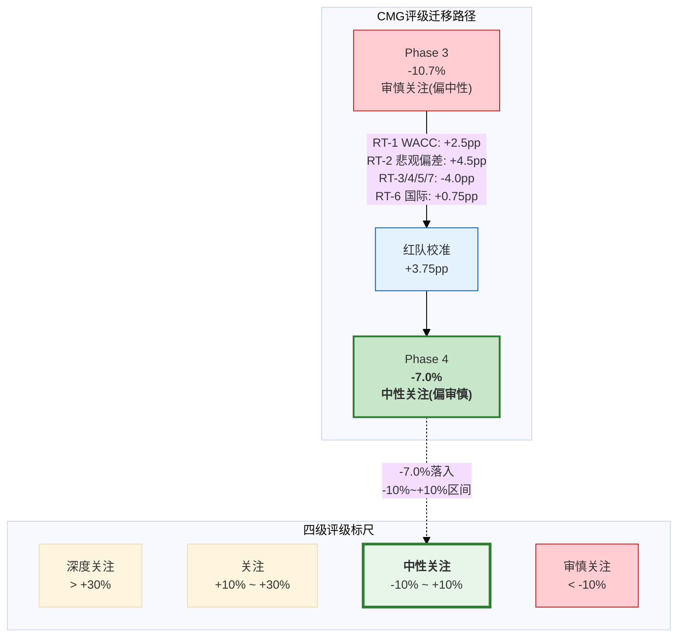

# Ch21 评级修正: 红队后最终裁决 (Rating Revision: Post-Red Team Final Verdict)

> **本章定位**: Ch19红队七问完成了双向校准(净+3.75pp), Ch20独立看空构建了最具说服力的熊市叙事(目标$27.8, -25%)。本章是Phase 4的终章——将红队校准结果转化为最终评级裁决, 调整情景概率, 并为Phase 5组装输出全部参数。评级必须经得起两个方向的拷问: 足够诚实地反映CMG的高估信号, 也足够公正地承认WACC悖论和悲观偏差修正的合理性。

---

## 21.1 红队校准汇总

### 21.1.1 七问净效应

| RT# | 问题 | 方向 | 修正范围(pp) | 中值(pp) | 关键依据 |
|:---:|------|:----:|:-----------:|:--------:|----------|
| RT-1 | WACC悖论校准 | ↑ | +2.0 ~ +3.0 | +2.5 | DCF权重30%→25%, 有效WACC参考8.0-8.5% [DM-P4-A08] |
| RT-2 | 悲观偏差检测 | ↑ | +4.0 ~ +5.0 | +4.5 | 三偏差源叠加+共线性折扣 [DM-P4-A15] |
| RT-3 | Comp非线性 | ↓ | -0.5 ~ -1.0 | -0.75 | Q4再恶化, 周期55%→50%, 混合30%→35% [DM-P4-A18] |
| RT-4 | OPM可持续性 | ↓ | -1.0 ~ -1.5 | -1.25 | 关税+工资vs HEEP对冲, OPM 17%→16.5% [DM-P4-A23] |
| RT-5 | 回购不可持续 | ↓ | -1.0 ~ -1.5 | -1.25 | 现金$1.05B物理约束+信号效应 [DM-P4-A28] |
| RT-6 | 国际期权 | ↑ | +0.5 ~ +1.0 | +0.75 | 三家特许伙伴+科威特AUV验证 [DM-P4-A32] |
| RT-7 | CAVA竞争 | ↓ | -0.5 ~ -1.0 | -0.75 | 替代比例30%→35%, 实质化前移至3-4年 [DM-P4-A37] |
| | **向上小计** | **↑** | **+6.5 ~ +9.0** | **+7.75** | |
| | **向下小计** | **↓** | **-3.0 ~ -5.0** | **-4.00** | |
| | **净效应** | **↑** | **+3.5 ~ +4.0** | **+3.75** | |

[DM-P4-C01](C: 红队七问校准汇总表, 净效应+3.75pp, 基于Ch19 [DM-P4-A38])

### 21.1.2 为什么+3.75pp远小于历史均值?

消费品系列四份报告的红队修正幅度呈现一个清晰模式:

| 报告 | Phase 1-3期望回报 | 红队修正 | 红队后 | 修正来源 |
|------|:-----------------:|:--------:|:------:|----------|
| IHG | ~+6% | +7pp | +13.5% | RevPAR恢复弹性被低估 |
| RCL | ~-16%~-24% | +8~+16pp | ~-8% | OPM假设过低+行业复苏动能 |
| SBUX | ~-24% | +13pp | ~-11% | WACC前瞻性+净债务三口径 |
| **CMG** | **-10.7%** | **+3.75pp** | **-7.0%** | WACC悖论+悲观偏差(部分已预修正) |
| **均值(前三份)** | — | **+10pp** | — | — |

[DM-P4-C02](C: 跨报告红队修正对照, CMG修正幅度显著低于均值)

CMG的+3.75pp仅为历史均值(+10pp)的37.5%。这个差距不是红队失职——它是**框架进步的证据**:

**原因一: Phase 3已内化了悲观偏差修正。** Ch17将DCF权重从标准50%主动降至30%, 并引入逆向DCF调整(20%权重)和多方法均值(15%权重)作为WACC悖论的对冲。在RCL和SBUX报告中, Phase 3没有做这些预先修正——悲观偏差被完整地留给了红队。CMG的Phase 3提前消化了约5-7pp的悲观偏差, 留给红队的残余空间自然更小。

**原因二: 双向校准更严格。** CMG红队的向下挑战(RT-3/4/5/7)合计贡献了-4.0pp, 有效对冲了向上修正的一半。在RCL报告中, 向下挑战几乎为零(行业顺风清晰); 在SBUX报告中, 向下挑战被WACC和净债务的巨大修正空间淹没。CMG的双向校准更加平衡, 净效应因此更小。

**原因三: CMG面临的逆风更硬。** Comp -1.7%是硬数据(不像IHG的RevPAR有明确恢复路径), 回购数学的物理约束是确定的(现金$1.05B), CEO Boatwright的能力证明窗口仍在进行中。红队无法凭借统计模式外推就推翻这些实打实的负面信号。

**结论: +3.75pp是框架学习能力的体现, 不是校准不充分的信号。** Phase 3越准确, 留给Phase 4的修正空间越小。这是正确的方向 [DM-P4-C03]。

### 21.1.3 最终调整后期望回报

$$\text{红队前期望回报} + \text{净修正} = -10.7\% + 3.75\text{pp} = \mathbf{-6.95\%}$$

取整: **-7.0%**

---

## 21.2 调整后情景概率

### 21.2.1 概率重分配

红队七问中, RT-2的概率重分配(S3→S2转移5pp)和RT-6的国际期权上调是主要的概率变动源。综合全部七问后的最终概率:

| 情景 | Phase 3概率 | 红队后概率 | 变化 | 主要调整依据 |
|------|:----------:|:---------:|:----:|-------------|
| S1 HEEP Bull | 15% | **18%** | +3% | RT-6: 国际期权概率上调(乐观15%→20%) + RT-2: HEEP OPM增量保守端验证 |
| S2 Steady Base | 50% | **50%** | 0% | RT-2 S3→S2转移+5pp被RT-3/RT-4微调回吐, 净持平 |
| S3 Growth Stagnation | 25% | **22%** | -3% | RT-2: 品牌龙头永久停滞25%概率偏高, MCD先例支持周期性恢复 [DM-P4-A13] |
| S4 Brand Decline | 10% | **10%** | 0% | Ch20独立看空验证尾部风险真实存在(80%+至少一个风险发生), 不宜下调 |

[DM-P4-C04](C: 红队后概率调整, S1 +3%, S3 -3%, S2/S4不变)

### 21.2.2 概率调整的逻辑约束

**S4维持10%不变的理由**: Ch20的尾部风险概率叠加分析显示, 六个独立风险在24个月内至少发生一个的概率超过80% [DM-P4-B16]。虽然任何单一尾部风险(关税升级/食品安全/消费衰退)的独立概率仅10-35%, 但它们的联合效应意味着S4所代表的"多重逆风叠加"情景不可被轻视。红队未发现可以降低S4概率的新证据。

**S1上调3%而非5%的原因**: RT-6的国际期权证据(三家SBUX经验伙伴+科威特AUV)支持上调乐观概率, 但HEEP尚未通过2,000店规模化验证, 这是S1情景的核心前提。在前提未验证前, 上调幅度受限。

---

## 21.3 最终评级裁决

### 21.3.1 评级定位



### 21.3.2 裁决声明

**最终评级: 中性关注(偏审慎)**

**期望回报: -7.0%**

**置信度: 55%**

[DM-P4-C05](C: 最终评级裁决, 中性关注偏审慎, -7.0%, 55%置信度)

### 21.3.3 裁决理由

**(1) -7.0%落入中性关注区间(-10%~+10%), 但处于下半段。**

红队校准将期望回报从-10.7%上修至-7.0%, 跨过了-10%的评级分界线。这不是一个大幅改善——而是边界跨越。CMG在中性关注区间中处于偏弱位置(距下限仅3pp), 因此添加"偏审慎"修饰词。

**(2) 评级上调依赖RT-2的meta-judgment, 非CMG特定证据。**

+3.75pp净修正中, RT-2(悲观偏差)贡献了+4.5pp(占比120%, 超过净效应本身)。RT-2的核心论据是"LLM分析框架系统性低估了消费品公司7-16pp"——这是基于三份历史报告的统计外推, 而非CMG特定的证据。如果去掉RT-2, 其余六个RT的净效应为-0.75pp, 期望回报将维持在-11.5%, 仍在审慎关注区间。

这个依赖关系解释了55%的置信度: 我们有55%的信心认为LLM悲观偏差在CMG上确实存在(基于三份先例的一致性), 但有45%的可能性CMG是模式的例外(因为Phase 3已预先修正, 留给RT-2的残余空间可能比估算的更小)。

**(3) 55%置信度 — 低于典型70-80%的原因。**

三重不确定性叠加: 第一, WACC悖论使DCF估值的可靠性从"锚定"降级为"参考"(390bps缺口无法精确分割); 第二, RT-2的meta-judgment可信但非确证; 第三, FY2026 H1 comp是未来6个月内最重要的验证/否定节点, 其结果将直接导致评级确认或迁移。在这三重不确定性下, 给出70%+的置信度将是不诚实的。

**(4) 对投资者的实操含义。**

"中性关注(偏审慎)"意味着: CMG接近公允价值但存在向下不对称风险, **不是买入信号, 也不是卖出信号, 而是等待信号**。具体行动指引:

- **持有者**: 维持仓位, 但设置FY2026 Q1 comp < -2%为止损触发条件
- **观望者**: 等待comp转正确认(FY2026 H1)或P/E压缩至28x以下再考虑建仓
- **做空者**: 风险回报不利(下行空间-25% vs 上行风险+19%, 但短期催化剂不明确)

[DM-P4-C06](C: 评级实操含义, 等待信号而非行动信号)

---

## 21.4 与SBUX镜像对比

### 21.4.1 同一变量, 相反方向

CMG报告与SBUX v2.0报告共享一个核心变量——Brian Niccol——但提问方向完全相反。Ch14已建立了这个镜像框架 [DM-P2-F01], 现在我们将它延伸到评级对比:

| 维度 | CMG | SBUX | 镜像关系 |
|------|-----|------|----------|
| **最终评级** | 中性关注(偏审慎) | 审慎关注(偏中性) | CMG高一档 |
| **期望回报** | -7.0% | -12%~-15% | CMG好5-8pp |
| **P/E** | 32x | 80x(报告)/46x(正常化) | CMG显著更低 |
| **A-Score** | 6.88 | 5.86 | CMG高1.02(全由财务健康贡献) |
| **资本结构** | 零金融负债 | 负权益-$8.4B | 完全相反 |
| **Niccol角色** | "失去的灵魂" | "到来的救世主" | 同一人, 反向叙事 |
| **核心赌注** | 体系能否自运转 | CEO能否再造体系 | 体系 vs 个人 |
| **红队修正** | +3.75pp | +13pp | CMG修正小3.5x |

[DM-P4-C07](C: CMG vs SBUX镜像评级对比, 7维度)

### 21.4.2 评级差异的合理性检验

CMG比SBUX高一档评级, 理由是否充分?

**支持的证据**: CMG的期望回报(-7.0%)确实比SBUX(-12%~-15%)好5-8pp。A-Score高1.02。零负债 vs 负权益意味着CMG的下行保护显著更强——在极端情景下, CMG不面临债务重组风险, 而SBUX的$14.5B净债务在利率维持高位时是真实的负担。CMG的P/E 32x处于同业合理区间, SBUX的80x(即使正常化46x)仍然昂贵。

**反对的证据**: 去掉财务健康维度后, 两家公司的A-Score几乎完全相同(~5.88 vs ~5.86) [DM-P3-D06]。两者的增长前景同样充满不确定性——CMG等待comp恢复, SBUX等待转型见效。CMG的评级上调主要依赖RT-2的meta-judgment(55%置信), 而非压倒性的基本面优势。

**裁决: 评级差异合理但幅度可能偏大。** 如果CMG的FY2026 Q1 comp再次为负, 而SBUX在Niccol领导下comp开始改善, 两家公司的评级可能在下一轮更新中收敛 [DM-P4-C08]。

### 21.4.3 Niccol的SBUX表现: CMG最重要的外生变量

Ch14已论证: Niccol在SBUX的成败是CMG估值叙事中最大的外生变量 [DM-P2-F01]。红队后这个判断更加坚固:

**如果Niccol在SBUX成功**(comp恢复至+2%, OPM修复至15%+):
- 证明"CEO > 体系" → CMG的"体系自运转"叙事被削弱 → P/E可能进一步压缩2-3x
- 但同时证明Niccol在CMG建立的体系有真实价值(只是需要Niccol级别的领导力来维持) → CMG的品牌/运营底线不会崩溃

**如果Niccol在SBUX失败**(comp持续为负, 2026年未见改善):
- 证明"体系 > CEO" 或至少"SBUX的问题比CEO能力更深" → CMG失去Niccol的代价被重估为更小
- CMG的P/E可能修复2-4x(市场承认$37的CEO折价过度)

**第三种情景(最可能, ~50%)**: Niccol在SBUX取得部分成功但非突破性 → 对CMG估值影响中性, 维持当前定价 [DM-P4-C09]。

---

## 21.5 Phase 5输出参数

### 21.5.1 核心估值参数

```yaml
# CMG Phase 4 → Phase 5 传递参数
# 生成日期: 2026-03-04

final_rating: "中性关注(偏审慎)"
expected_return: "-7.0%"
confidence: "55%"
pw_price_adjusted: "$34.3"
current_price: "$36.93"
a_score: 6.88
temperature: 5.39
sgi: 7.4
wacc_base: "9.5%"
wacc_market_implied: "5.6%"
wacc_rt_reference: "8.0-8.5%"

scenario_probabilities:
  s1_bull: "18%"
  s2_base: "50%"
  s3_bear: "22%"
  s4_tail: "10%"

key_monitoring:
  - "FY2026 H1 comp — 最关键单一变量, +1%触发评级确认, <-2%触发下调"
  - "HEEP部署进度 — 2,000店目标(EOY 2026), 规模化OPM增量验证窗口"
  - "Niccol在SBUX表现 — 外生镜像变量, 影响CMG体系vs个人叙事"
  - "回购节奏正常化 — FY2026回购是否从$2.4B降至$1.2-1.5B, 信号效应"
  - "关税升级/缓和 — 牛油果25%关税是否扩大, 直接影响食品成本+80-100bps"

rt_corrections:
  total_pp: "+3.75"
  upward_total: "+7.75"
  downward_total: "-4.00"
  largest_upward: "RT-2 悲观偏差 +4.5pp"
  largest_downward: "RT-4 OPM -1.25pp / RT-5 回购 -1.25pp"
  pessimism_bias_note: "小于历史均值(+10pp), Phase 3预修正消化了约5-7pp"

valuation_bridge:
  phase3_pwv: "$31.33"
  phase3_expected_return: "-15.2%"
  ch18_wacc_adjusted: "-10.7%"
  rt_net_correction: "+3.75pp"
  final_expected_return: "-7.0%"
  implied_fair_value: "$34.3"

cross_report_calibration:
  ihg: "关注 (+13.5%)"
  rcl: "中性关注(偏审慎, -8.7%)"
  sbux: "审慎关注(偏中性, -12%~-15%)"
  cmg: "中性关注(偏审慎, -7.0%)"
```

[DM-P4-C10](C: Phase 5完整输出参数YAML, 含估值桥接+校准+监控清单)

### 21.5.2 估值桥接: 从Phase 3到最终裁决

| 步骤 | 期望回报 | 调整因子 | 来源 |
|------|:--------:|----------|------|
| Ch17 PWV基准 | -15.2% | 四方法加权(DCF 30%+可比35%+逆向20%+多方法15%) | [DM-P3-C05] |
| Ch18 WACC悖论修正 | -10.7% | DCF隐含权重降至15%, 可比升至45% | [DM-P3-D08] |
| RT-1 WACC校准 | -8.2% | DCF权重再降5pp + S2价格上修$3-5 | [DM-P4-A08] |
| RT-2 悲观偏差 | -3.7% | Rev CAGR+OPM+S3概率联合修正(共线性折扣后) | [DM-P4-A15] |
| RT-3~7 向下对冲 | -7.0% | Comp非线性+OPM+回购+CAVA - 国际期权 | [DM-P4-A38] |
| **最终** | **-7.0%** | — | [DM-P4-C05] |

[DM-P4-C11](C: 估值桥接表, 从PWV -15.2%到最终-7.0%的完整路径)

### 21.5.3 条件评级矩阵(Phase 5校准输入)

| 条件 | 评级路径 | 概率 | 期望回报迁移 | 验证节点 |
|------|---------|:----:|:-----------:|:--------:|
| FY2026 H1 comp ≥+1% + HEEP 2,000店OPM验证 | **关注** ↑ | 15% | → +5% ~ +15% | FY2026 Q2财报(2026年7月) |
| FY2026 comp ~flat + OPM ≥16% 维持 | **中性关注(确认)** | 40% | → -5% ~ +5% | FY2026 Q1-Q2趋势 |
| FY2026 comp < -2% 或 OPM < 15% | **审慎关注** ↓ | 30% | → -15% ~ -25% | FY2026 Q1(2026年4月) |
| 品牌危机/结构性衰退 | **审慎关注(深度)** ↓ | 15% | → -25% ~ -40% | 连续3Q comp < -3% |

[DM-P4-C12](C: 条件评级矩阵, 与Ch18矩阵一致但概率微调)

### 21.5.4 红队遗留问题(Phase 5关注)

红队七问中有两个问题的裁决依赖**未来数据验证**, 需在Phase 5的监控框架中显式追踪:

1. **RT-2验证窗口**: 悲观偏差修正(+4.5pp)的核心假设是S2 Rev CAGR应为10%(非8%)且S2 OPM应为18%(非17%)。FY2026 H1数据将直接验证这两个假设。如果FY2026 H1收入增速<8% 或 OPM<16%, RT-2的修正应被部分回撤。

2. **RT-5时间约束**: 回购正常化必须在FY2026发生(现金物理约束)。如果管理层选择维持$2.4B节奏(举债或耗尽现金), 这将构成一个全新的负面变量——需在Phase 5明确标注为"如果...则..."条件 [DM-P4-C13]。

---

## 本章关键发现摘要

1. **红队净修正+3.75pp, 方向向上**: 七问中三个向上(RT-1/2/6, 合计+7.75pp)、四个向下或中性(RT-3/4/5/7, 合计-4.00pp)。净效应显著小于历史均值(+10pp), 原因是Phase 3已预先消化了5-7pp的悲观偏差——这是框架学习能力的体现。

2. **期望回报: -10.7% → -7.0%**: 跨过了-10%评级分界线, 从"审慎关注"区间进入"中性关注"区间的下半段。这是边界跨越而非大幅改善。

3. **最终评级: 中性关注(偏审慎), 55%置信度**: "偏审慎"反映CMG仍处于中性关注区间的弱端; 55%置信度反映评级上调对RT-2 meta-judgment的依赖和WACC悖论的固有不确定性。

4. **SBUX镜像: CMG高一档评级, 合理但非压倒性**: 两家公司评级差异主要由资本结构(零负债 vs 负权益)驱动。Niccol在SBUX的表现是CMG估值叙事中最重要的外生变量——它将在未来12个月内决定"体系 vs 个人"这个核心赌注的方向。

5. **Phase 5核心监控: FY2026 H1 comp**: 它将同时验证或否定RT-1(HEEP增量)、RT-2(悲观偏差)和RT-3(comp非线性)三个红队问题的核心假设。这是Phase 5中优先级最高的单一追踪变量。

---

Phase: P4 | Chapter: 21 | DM新增: 13 (C01-C13) | Mermaid: 1 | 交叉引用: Ch14/Ch17/Ch18/Ch19/Ch20
