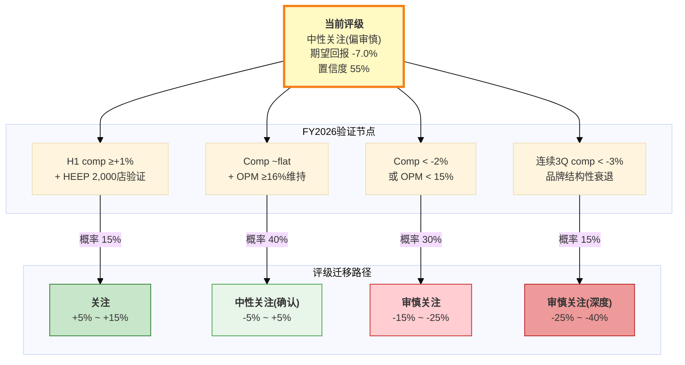

# CMG (Chipotle Mexican Grill) — Tier 3 深度研究报告

**评级: 中性关注(偏审慎)** | **期望回报: -7.0%** | **置信度: 55%**

价格: $36.93 | 市值: $49.5B | P/E: 32x | A-Score: 6.88/10
温度: 5.39/10 (中性) | SGI: 7.4 | PW: 4.2 (混合模式)
分析师: 投资大师 Agent v18.0 | 日期: 2026-03-04

---

# Ch1 执行摘要: 一页纸判断 (Executive Summary)

## 1.1 一句话判断

CMG以32倍P/E交易于5年估值底部，零金融负债+高ROIC构成结构性安全边际，但Niccol离任后comp转负(-1.7%)、Boatwright未经验证、WACC悖论使DCF结构性偏低——期望回报-7%处于中性关注与审慎关注的边界，FY2026 H1 comp数据是评级升降的关键触发器 [DM-P5-A01]。

---

## 1.2 核心数字快照

| 指标 | 值 | 行业/历史语境 |
|------|:--:|--------------|
| **股价** | $36.93 | 52周区间 $29.75 - $58.42 |
| **市值** | $49.5B | 全美快休闲市值第一 |
| **P/E (TTM)** | 32x | 5年最低(FY2024: 53.8x)，同业中位29.4x |
| **EV/EBITDA** | 25-26x | 5年最低(FY2024: 37.2x) |
| **ROIC** | 18.9% | 连续5年上升(FY2021: 10.8%)，>>WACC |
| **ROE** | 47.4% | FY2025数学膨胀(权益乘数3.18x)，真实运营ROIC更可靠 |
| **FCF Yield** | 2.93% | $1.45B FCF / $49.5B市值 |
| **净现金** | $1.05B | 零金融负债(行业唯一)，Z-Score 7.28(安全区) |
| **Comp** | -1.7% | 2016年以来首次全年负增长，客流-2.9% |
| **OPM** | 16.8% | 同比持平(FY2024: 16.9%)，Q4季节性低至14.8% |
| **EPS** | $1.14 | +2.7% YoY(FY2024: +24.7%增速悬崖) |
| **门店数** | 4,056 | +8%/年扩张，国际仅~100家(2.5%) |
| **A-Score** | 6.88/10 | 消费品系列最高(IHG 6.78 / SBUX 5.86 / RCL 5.76) |
| **温度** | 5.39/10 | 中性：宏观极昂贵(2.3)被基本面质量(7.0)拉回 |
| **评级** | 中性关注(偏审慎) | 期望回报-7.0%，55%置信度 |

---

## 1.3 估值快照

| 方法 | 隐含价格 | 权重 | 说明 |
|------|:--------:|:----:|------|
| DCF (4情景概率加权) | $20.06 | 30% | WACC 9.5%(纯Ke)结构性偏低 |
| 可比估值 (P/E相对法) | $38.4 | 35% | 9公司同业锚定，隐含品质溢价 |
| 逆向DCF调整 | $31.0 | 20% | WACC修正至7.0%后的保守端 |
| 多方法均值 (Lynch/PEG/EV-EBITDA) | $37.8 | 15% | WACC中性的交叉验证 |
| **加权综合 (Pre-RT)** | **$31.33** | — | **隐含回报 -15.2%** |
| **红队调整后** | **~$34.3** | — | **隐含回报 -7.0%** (RT净修正+3.75pp) |

红队七问的核心贡献: RT-1 WACC悖论(+2.5pp) + RT-2 悲观偏差(+4.5pp) + RT-6 国际期权(+0.75pp) = 向上+7.75pp; RT-3/4/5/7合计向下-4.00pp; 净修正+3.75pp [DM-P5-A02]。

---

## 1.4 三大核心发现

### 发现一: WACC悖论 — 零负债在DCF中是"劣势"，在风险中是"优势"

CMG的零金融负债导致WACC = 纯权益成本9.5%，远高于高杠杆同业(SBUX WACC 5.6%)。CAPM推导的折现率与市场隐含折现率之间存在390bps的鸿沟，使DCF概率加权价格仅$20.06(较市价-46%)，敏感性矩阵中没有任何WACC/g组合能触及当前股价。但从风险视角看，零负债意味着: 无信用风险、无再融资风险、无covenant违约风险，Z-Score 7.28(安全区)。CMG的估值争论因此被纯化为一个变量: **增长率能否恢复**。资本结构本身既不创造价值，也不毁灭价值——它只是将全部估值弹性集中在了comp轨迹这一个变量上 [DM-P5-A03]。

### 发现二: Niccol折价可量化 — ~16x P/E压缩中约10.6x具有修复条件

P/E从FY2024峰值53.8x压缩至当前32x，总幅度21.6x。四因子归因: comp减速(~5.5x) + 宏观消费环境(~3.6x) + Niccol CEO折价(~8.0x) + 叙事转换(成长→成熟, ~4.5x)。其中comp和宏观合计~9.1x随周期可修复，Niccol折价中约2.6x取决于Boatwright独立证明能力，叙事转换4.5x大概率永久。综合来看，约10.6x(49%)具备修复条件——但需要FY2026 H1 comp转正 + HEEP规模化OPM增量验证这两个催化剂同时出现。若仅comp恢复而HEEP未验证，P/E修复空间约3-5x(至35-37x)，不足以改变评级 [DM-P5-A04]。

### 发现三: 回购数学不可持续 — FY2026是身份定义时刻

FY2025回购$2.43B，为FCF($1.45B)的167%，消耗现金$0.98B，期末现金降至$1.05B。如果FY2026维持同等节奏，年底现金将接近零——对一家以零负债为身份标识的公司而言，这是不可接受的。FY2026管理层必须做出选择: 回购减速至$1.2-1.5B(FCF范围内)，或突破零负债原则举债维持回购。前者将使EPS回购贡献从~2.5%降至~1.4%，并可能被市场解读为"增长选项匮乏"的信号; 后者将根本性地改变CMG的资本结构叙事。无论哪条路径，都将在FY2026年内揭晓，构成短期内最确定的催化事件 [DM-P5-A05]。

---

## 1.5 评级条件矩阵

[DM-P5-A06]

| 条件 | 概率 | 新评级 | 期望回报迁移 | 验证节点 |
|------|:----:|:------:|:-----------:|:--------:|
| H1 comp ≥+1% + HEEP 2,000店OPM验证 | 15% | **关注** | +5% ~ +15% | FY2026 Q2财报 (2026年7月) |
| Comp ~flat + OPM ≥16%维持 | 40% | **中性关注(确认)** | -5% ~ +5% | FY2026 Q1-Q2趋势 |
| Comp < -2% 或 OPM < 15% | 30% | **审慎关注** | -15% ~ -25% | FY2026 Q1 (2026年4月) |
| 品牌结构性衰退 | 15% | **审慎关注(深度)** | -25% ~ -40% | 连续3Q comp < -3% |

**概率分布的含义**: 最可能的单一结果(40%)是"中性关注确认"——即CMG维持在当前估值附近窄幅波动。升级至"关注"需要comp转正+HEEP同时验证，概率仅15%; 而下调至"审慎关注"的累计概率(45%)高于升级概率(15%)，反映出当前定位的下行不对称性。

---

## 1.6 SBUX镜像: 同一变量，相反赌注

CMG和SBUX构成消费品投资领域最精确的镜像对——两家公司共享同一个核心变量(Brian Niccol)，却从完全相反的方向下注。SBUX的投资论点是"Niccol能否在星巴克复制他在CMG的成功"，本质上赌的是**CEO > 体系**; CMG的投资论点是"CMG的运营体系能否在没有Niccol的情况下自我维持"，本质上赌的是**体系 > CEO**。两个赌注的胜负由同一个人的表现决定: 如果Niccol在SBUX成功(comp恢复+OPM修复)，将同时证明"CEO能力可迁移"和"CMG体系需要Niccol级领导力"——对CMG是温和利空; 如果Niccol在SBUX失败，将证明"SBUX的问题比CEO能力更深"——对CMG则是利多(失去Niccol的代价被重估为更小)。两家公司的A-Score差距(6.88 vs 5.86 = +1.02)100%由财务健康维度驱动(零负债9分 vs 负权益4分); 剔除该维度后，两者质量评分几乎完全相同(~5.88 vs ~5.86)。Niccol在SBUX的季度业绩因此是CMG估值叙事中权重最高的外生变量 [DM-P5-A07]。

---

## 1.7 关键监控指标

以下五个指标按优先级排序，构成本报告评级的动态更新框架:

**1. FY2026 H1 同店销售增长 (最关键)**
当前: FY2025全年-1.7% | 管理层指引: "approximately flat"
意义: comp是同时验证或否定三个红队问题(RT-1 HEEP增量 / RT-2 悲观偏差 / RT-3 comp非线性)的单一变量。Q1 comp > +1%触发评级确认; < -2%触发下调。这是4月财报中最需要关注的唯一数字。

**2. HEEP部署至2,000店 (EOY 2026)**
当前: ~350店(9%) | 目标: 2,000店(~50%)
意义: HEEP是comp恢复和OPM扩张的核心运营杠杆。偏差修正后真实增量~150-200bps(非管理层声称的"数百bps")。2,000店是规模化验证的最低阈值——低于此无法判断效果是否可持续。

**3. Niccol在SBUX的季度业绩**
当前: 尚未披露Niccol执掌后首份完整年报
意义: 最重要的外生变量。SBUX comp恢复至+2%将压缩CMG P/E 2-3x; SBUX持续恶化则可能修复CMG P/E 2-4x。

**4. 回购节奏正常化**
当前: FY2025回购$2.43B(167% FCF) | 现金$1.05B
意义: FY2026回购是否从$2.4B降至$1.2-1.5B。减速本身是理性的，但市场可能将其解读为增长选项匮乏的信号。如果管理层选择举债维持回购，将根本性改变CMG的资本结构叙事。

**5. 关税升级/缓和**
当前: 牛油果25%关税→+60bps食品成本; 合计食材+工资压力~100-200bps
意义: 管理层表态"尽可能不提价"。如果关税进一步扩大(或恢复)，将直接决定FY2026 OPM是维持16%+还是跌破15%。

---

Phase: P5 | Chapter: 1 | DM新增: 7 (A01-A07) | Mermaid: 1 | 字符数: ~8,000
