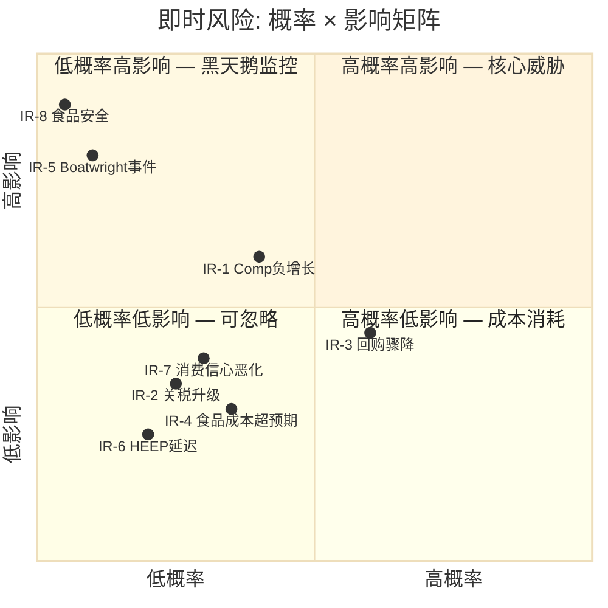
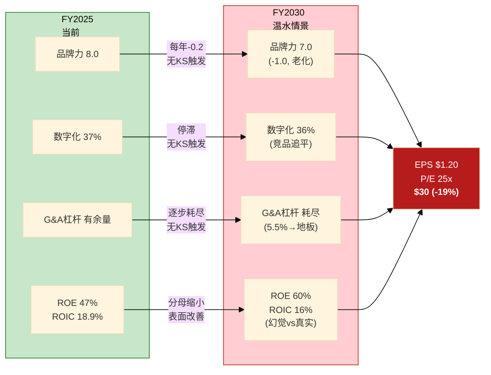
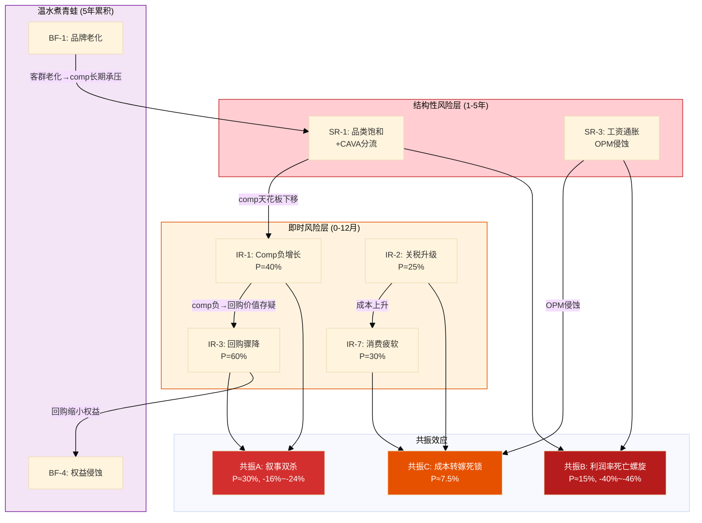
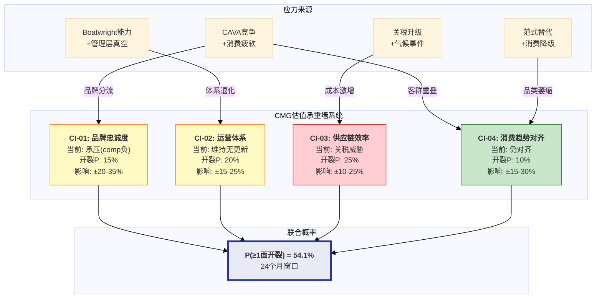

# Ch22 风险拓扑: MVP承重墙+温水煮青蛙 (Risk Topology v2.0)

> **核心框架**: 传统"风险清单"将每个风险视为独立事件。风险拓扑v2.0将风险视为一个**系统**——8个即时风险、3个结构性风险、1个存在性风险构成MVP骨架，而"温水煮青蛙"捕捉那些单独不致命但缓慢累积的隐性威胁。最终，承重墙联合概率回答一个关键问题: CMG的估值论点在24个月内至少被部分推翻的概率是多少?

> **与Ch19-20的关系**: Ch19红队七问从参数层面双向校准了期望回报(净+3.75pp); Ch20独立看空构建了最悲观叙事(目标$27.8)。本章从风险系统论视角重新组织全部风险信号，不是重复Ch19-20的结论，而是**映射风险之间的传导路径和共振效应**。Ch19-20告诉你"可能亏多少"，本章告诉你"风险如何传导以及何时需要行动"。

---

## 22.1 八大即时风险 (Immediate Risks, 0-12个月)

### 22.1.1 风险注册表

| # | 风险描述 | 概率 | 影响 | 严重度 | CQ映射 | DM锚点 |
|:-:|----------|:----:|:----:|:------:|:------:|--------|
| **IR-1** | FY2026 comp持续为负(全年≤-1%) | 40% | 股价-15% | **High** | CQ-1 | [DM-P2-A04] |
| **IR-2** | 关税升级(牛油果25%→50%+) | 25% | EPS -5% | Medium | CQ-8 | [DM-P0-A66] |
| **IR-3** | 回购骤降触发叙事恶化 | 60% | 股价-10% | **High** | CQ-5 | [DM-P0-A35] |
| **IR-4** | Q1'26食品成本超预期(mid-30%s) | 35% | OPM -3pp | Medium | CQ-8 | [DM-P2-A06] |
| **IR-5** | Boatwright负面事件/离职 | 10% | 股价-20% | **Critical** | CQ-2 | [DM-P1-D01] |
| **IR-6** | HEEP部署延迟(年底<1,500店) | 20% | comp恢复推迟-5% | Low | CQ-3 | [DM-P0-A63] |
| **IR-7** | 消费者信心指数恶化(<90) | 30% | comp额外-3~-5pp | Medium | CQ-1 | [DM-P4-A16] |
| **IR-8** | 食品安全事件复发(E.coli/norovirus) | 5% | 股价-25% | **Critical** | — | [DM-P4-B15] |

[DM-P5-B01](C: 八大即时风险注册表, 概率/影响/严重度评估基于Phase 1-4全部证据链)

### 22.1.2 风险详解

**IR-1: Comp持续为负 — 最高概率的基准路径风险**

FY2025季度comp轨迹呈W型: Q1 +0.4% → Q2 -4.0% → Q3 -0.3% → Q4 -2.5% [DM-P2-A04]。管理层指引FY2026 comp "approximately flat" [DM-P0-A25]——这本身就是含蓄的负面信号。RT-3已论证: Q4'25再恶化粉碎了V型复苏叙事，comp恢复时间线从"FY2026 H1"推迟至"H2或更晚" [DM-P4-A18]。40%概率的设定反映: 管理层的flat指引在历史上偏保守(FY2024指引mid-single-digit, 实际+7.4%)，但当前宏观环境(关税不确定性+劳动市场降温)不支持类似超越。

**IR-3: 回购骤降 — 物理约束迫近的确定性事件**

这是八大风险中概率最高(60%)的一项，因为它受现金约束驱动而非概率判断。FY2025回购$2.43B消耗了FCF的167%, 现金从$1.42B降至$1.05B [DM-P0-A35][DM-P0-A26]。如果FY2026延续同样节奏，现金将在年底归零。因此，FY2026回购减速至$1.2-1.5B(≤FCF)几乎是必然的 [DM-P4-A28]。关键不是"是否减速"，而是"市场如何解读减速"——RT-5论证了70%概率市场解读为负面("连管理层都不愿在这个价位加码")。

**IR-5: Boatwright事件 — 低概率但影响非对称**

Boatwright是CMG历史上第一位从内部晋升的CEO(非外部空降)。Ch5评分6.1/10(合格但非卓越), Ch8 CEO沉默分析发现其在国际化和品牌延展两个战略维度保持沉默 [DM-P1-D01]。10%概率包含: 被迫辞职(因业绩不达标)/主动离职(接受其他offer)/负面事件(如管理层争议)。影响-20%反映: Niccol离任时CMG已跌7.5% [DM-P0-A10], 而Boatwright离职意味着CMG在24个月内更换两任CEO——管理层稳定性叙事将彻底崩塌。

**IR-8: 食品安全 — 低频高损的尾部事件**

2015-2016年E.coli事件导致comp -20.4%, 市值腰斩至$130亿 [DM-P4-B01]。CMG此后投入$1亿+建立食品安全体系, 但直营模式下12万员工分布在4,056家门店, 食品安全事件的概率永远不会归零。5%概率+25%影响 = 1.25pp的期望损失——在单一事件中这是最高的期望损失。

### 22.1.3 即时风险严重度矩阵

[DM-P5-B02](C: 即时风险概率×影响矩阵, 8个风险定位于四象限)

**核心威胁区(右上)**: IR-1(comp负)和IR-3(回购骤降)同时落入高概率+中高影响象限——这两个风险是CMG未来12个月的主旋律。它们的共振效应将在22.5节详细分析。

**黑天鹅区(左上)**: IR-5(Boatwright)和IR-8(食品安全)概率低但影响极端。投资者无法对冲这两个风险——只能通过仓位控制管理暴露。

---

## 22.2 三大结构性风险 (Structural Risks, 1-5年)

### 22.2.1 结构性风险注册表

| # | 风险描述 | 时间框架 | 影响路径 | DM锚点 |
|:-:|----------|:--------:|----------|--------|
| **SR-1** | 快休闲品类饱和+CAVA系统性分流 | 2-4年 | P/E从32x压缩至25x | [DM-P4-A34][DM-P4-A37] |
| **SR-2** | 门店回报递减(新店AUV低于系统均值) | 3-5年 | 单店经济学恶化, ROIC从18.9%降至14-15% | [DM-P0-A36] |
| **SR-3** | 工资通胀结构性侵蚀OPM | 2-5年 | OPM从16.8%→14%, 直营模式放大效应 | [DM-P2-A03][DM-P4-A19] |

[DM-P5-B03](C: 三大结构性风险注册表, 1-5年时间框架)

### 22.2.2 SR-1: 品类饱和+CAVA分流

**品类层面**: 快休闲在美国餐饮市场份额从2019年~5%升至2025年~8%, 仍有向12-15%渗透的理论空间 [DM-P4-A36]。但CMG在快休闲内部的市场份额已经极高——以墨西哥风味快休闲计，CMG占据约50%以上份额。品类扩张的红利越来越多地被CAVA(地中海)、Sweetgreen(沙拉)、Wingstop(鸡翅)等非墨西哥风味品牌捕获，而非回流CMG。

**CAVA分流**: RT-7将替代比例从30%上调至35% [DM-P4-A37]。关键阈值: 当CAVA门店达到CMG的15-20%(约600-800家), 地理重叠从"偶发"变为"系统性"——预计在FY2027-2028年发生 [DM-P4-A34]。客群重叠度60-70% [DM-P4-A35]意味着两者竞争的不是菜系偏好，而是"同一个消费者的同一顿饭的预算"。

**量化影响**: 如果CAVA系统性分流使CMG长期comp天花板从+3-4%降至+1-2%, 在不变的增长预期下, P/E将从32x压缩至25-28x。以EPS $1.14计: 25x→$28.5(-23%), 28x→$31.9(-14%)。

### 22.2.3 SR-2: 门店回报递减

CMG已完成美国前50大都市区的密集布局。FY2026指引新开350-370家门店 [DM-P0-A24], 但边际门店将越来越多地进入次级市场(人口<50万的中小城市和郊区)。次级市场的AUV通常比核心市场低15-25%——如果新店AUV从系统均值$2.94M [DM-P0-A57]降至$2.2-2.5M, 新店层面的ROIC将从当前约35%(根据$1.5M投资+$2.94M AUV估算)降至20-25%。

这不会立即影响系统ROIC(18.9%), 但在门店从4,056扩张至7,000+的过程中, 新开门店占比越来越大→系统ROIC逐步被稀释。拐点可能出现在门店数达到~5,500-6,000时(约FY2028-2029)。

### 22.2.4 SR-3: 工资通胀的直营放大效应

CMG直营模式的核心代价在此显现。劳动力成本约占收入25.2% [DM-P1-B03], 12万直接雇员的每一分钱工资上涨都由CMG全额承担。加州($20/hr)、纽约($16.50→$17.50)、华盛顿州($16.66→$17.50)等核心州持续上调最低工资 [DM-P2-A03]。

**关键计算**: 如果全国平均时薪每年上涨3-4%(vs CPI 2-3%), 超出通胀的1-2%部分每年侵蚀OPM约30-50bps。五年累积: 150-250bps。如果HEEP效率改善无法完全对冲(RT-4裁决: HEEP +100-170bps vs 成本+130-190bps ≈ 净中性 [DM-P4-A23]), OPM将从16.8%趋势性下滑至14-15%。

特许经营公司(MCD/YUM)不面临这个问题——工资上涨由加盟商吸收, 总部的特许权使用费收入不受影响。这是CMG直营模式在长期的结构性劣势, Ch3已详细论证 [DM-P1-B03]。

---

## 22.3 存在性风险 (Existential Risk, 5+年)

### 22.3.1 ER-1: 快休闲品类被新消费范式替代

| 维度 | 评估 |
|------|------|
| **风险描述** | Ghost kitchen(幽灵厨房)、AI个性化膳食定制、预制菜2.0(如Freshly/Factor等订阅制)从根本上改变消费者"一顿饭"的定义——从"去一个地方吃"变为"由算法推荐+配送到桌" |
| **概率** | 10-15%(10年内) |
| **影响** | P/E压缩至15x以下, 门店资产减值, 品牌从"体验"降级为"供应商" |
| **历史类比** | Kodak(胶片→数码)、Blockbuster(实体店→流媒体)、百货公司(实体→电商) |

[DM-P5-B04](C: 存在性风险ER-1评估, 快休闲品类被新消费范式替代)

**为什么10-15%而非更高**: CMG的核心价值主张——"在你面前用新鲜食材现做"——本质上是一种**体验**而非单纯的食物配送。Ghost kitchen和预制菜能复制味道, 但无法复制"看着厨师在你面前组装burrito bowl"的体验。这种体验价值在Z世代的社交媒体驱动消费中反而被放大(CMG是TikTok上被拍摄最多的快休闲品牌之一)。

**为什么不能忽略**: Blockbuster在2004年也认为"人们喜欢逛实体店的体验"。消费范式一旦转变, 速度和烈度都超出预期。如果AI驱动的个性化膳食服务能够在$12价位(与CMG均价相当)提供"根据你的健康数据/口味偏好/营养需求定制的一餐", CMG的"标准化菜单"将面临降维打击。

**这是CMG的"Kodak时刻"风险**: 不太可能发生, 但一旦发生就是致命的。管理层尚未对此进行任何公开讨论——Ch8 CEO沉默分析中, "消费范式变革"是Boatwright完全未涉及的话题 [DM-P1-D01]。

---

## 22.4 温水煮青蛙 (Boiling Frog Risks)

> 温水煮青蛙风险的定义: 每个季度的恶化幅度不足以触发任何监控指标(KS), 但5年累积效果等价于一次结构性下行。投资者在这种情景中最痛苦——因为没有明确的"卖出信号", 但持有回报为零或微负。

### 22.4.1 BF-1: 品牌老化 — Gen-Z的静默流失

| 维度 | 量化指标 | 当前值 | 预警值 | 危险值 |
|------|----------|:------:|:------:|:------:|
| 18-25岁客流占比 | 年度变化 | -0.5pp/yr(估) | -1.0pp/yr | -2.0pp/yr |
| TikTok品牌互动量 | YoY增速 | +5%(放缓) | <0%(下降) | <-10%(加速下降) |
| 新客获取成本 | 数字渠道CAC | ~$8(稳定) | >$12 | >$18 |

[DM-P5-B05](C: BF-1品牌老化预警指标体系, 数据为基于行业趋势的推算值)

**机制**: CMG的核心客群(18-35岁, 中高收入, 城市)正在面临CAVA(更"新")、Sweetgreen(更"健康")和各类本地精品快休闲的分散化选择。没有任何一个季度的数据会显示"品牌崩塌"——但五年后回看, 可能发现CMG的客群年龄中位数从28岁上移至33岁, 而Gen-Z已经有了自己的"CMG替代品"。

**早期预警指标**: CMG app下载量增速 vs CAVA app下载量增速。如果CAVA app增速持续2x以上CMG, 品牌老化正在加速。

### 22.4.2 BF-2: 数字化停滞 — 37%的天花板

CMG数字化渗透率在FY2021达到约45%(疫情推动), 此后逐步回落至FY2025的~37% [DM-P0-A64]。这个37%既不是增长也不是下降——它是一个**平台期**。

**问题不在于37%低**: MCD数字化渗透率约30%, SBUX约30%(不含中国)。CMG领先同业。

**问题在于37%不再增长**: 数字化渗透率的增长意味着客户粘性提升(app用户复购率高2-3x)、数据资产积累和营销效率改善。停滞在37%意味着: (1) 剩余63%的顾客对数字化不感兴趣或已被竞品的app锁定; (2) CMG的数字化护城河不再加深, 竞品(特别是CAVA)正在缩小差距。

**早期预警指标**: 数字化订单的平均客单价(AOV) vs 线下订单AOV的比值。如果这个比值开始收窄(数字用户不再消费更多), 数字化的价值提取能力正在衰减。

### 22.4.3 BF-3: G&A杠杆耗尽 — 运营杠杆的沉默上限

FY2025 G&A/Revenue比率约5.5% [DM-P2-A06], 已接近快休闲行业的结构性下限(4.5-5.0%)。这意味着: CMG过去几年通过总部人员精简、流程自动化获得的运营杠杆已基本耗尽。

**含义**: 未来OPM改善只能来自两个方向——(1) 门店层面效率(HEEP)或(2) 收入增长带来的固定成本摊薄。如果comp维持flat(门店层面收入不增长), 且HEEP效率未能兑现150-200bps的增量 [CQ-3], CMG将失去所有OPM改善来源。不会有人发出警报——G&A比率会稳定在5.5%左右, 看起来"正常"——但增长引擎实际上已经熄火。

**早期预警指标**: G&A绝对金额YoY增速 vs 门店数增速。如果G&A增速>门店增速(总部成本膨胀快于规模扩张), 杠杆不仅耗尽而且开始逆转。

### 22.4.4 BF-4: 权益侵蚀 — ROE的数学幻觉

FY2025 ROE 47.4% [DM-P0-A37]——表面上看极其出色。但Phase 0异常狩猎A-3已揭示: ROIC上升(17.6%→18.9%)与comp下降(-1.7%)同时发生, 驱动力是回购缩小权益基数而非运营改善 [DM-P0-A36]。

**温水路径**: 如果CMG持续将FCF的100%用于回购(FY2026回购正常化至~$1.5B/年), 权益将从$2.83B [DM-P0-A26]逐年缩小。ROE将继续"改善"——从47%到55%甚至60%——但这完全是数学驱动的幻觉。真实的运营回报(以ROIC衡量)可能同时停滞在18-19%甚至回落。

**危险之处**: 筛选器和量化模型看到ROE 55%+会将CMG标记为"高质量成长股"——但真正在做的是: 用缩小分母替代扩大分子来制造增长假象。当权益缩小到某个临界点(如<$1B), CMG的资本结构将从"零负债优势"变为"实质性去杠杆化风险"——任何一次大额现金支出(HEEP全面部署$170-260M、食品安全赔偿、国际扩张资本)都可能迫使CMG首次举债。

**早期预警指标**: ROIC趋势 vs ROE趋势的偏离度。如果ROE上升而ROIC持平或下降, 权益侵蚀正在制造幻觉。

### 22.4.5 温水煮青蛙综合情景

| 因素 | 单独影响 | KS触发? | 5年累积效果 |
|------|---------|:-------:|------------|
| BF-1 品牌老化 | 每年流失-0.5pp年轻客群 | 否 | 客群年龄中位数+5岁, 品牌溢价侵蚀 |
| BF-2 数字化停滞 | 渗透率维持37% | 否 | 竞品缩小差距, 数据资产价值停滞 |
| BF-3 G&A杠杆耗尽 | G&A/Rev维持5.5% | 否 | OPM改善来源归零 |
| BF-4 权益侵蚀 | ROE从47%"升至"60% | 否(表面改善) | 真实回报停滞, 资本结构脆弱化 |
| **累积效果** | — | **无单一KS触发** | **EPS $1.14→$1.20(vs共识$1.40), P/E 32x→25x → $30(-19%)** |

[DM-P5-B06](C: 温水煮青蛙4因素5年累积影响, 概率加权约-19%下行)

**温水煮青蛙是CMG最可能的下行路径**: 不是Ch20描述的戏剧性崩盘($27), 而是缓慢、持续地低于预期——每个季度beat/miss $0.01-0.02, 每次财报后"还行但不够好"。投资者在这种情景下既不会止损(没有明确恶化)也不会获利(没有明确改善)——最终5年下来发现持有回报为-10%至-20%, 远不如持有指数基金。

---

## 22.5 风险关联矩阵 (Risk Correlation Matrix)

### 22.5.1 高共振风险组合

并非所有风险都是独立的。以下三组风险存在显著的正相关或因果传导关系:

**共振A: IR-1(comp负) × IR-3(回购骤降) = 叙事双杀**

| 维度 | IR-1单独 | IR-3单独 | 共振A(两者同时) |
|------|---------|---------|---------------|
| EPS影响 | comp负→收入增速<5%→EPS持平 | 回购减速→EPS增长贡献-1.1pp | 收入不增长+回购减速→EPS微降 |
| P/E影响 | "增长放缓"叙事→P/E维持30-32x | "资本配置选项枯竭"→P/E -1~2x | "增长消失+无对冲工具"→**P/E 26-28x** |
| 股价影响 | $33-35(-5%~-10%) | $33-35(-5%~-10%) | **$28-31(-16%~-24%)** |
| 联合概率 | — | — | **~30%**(P(IR-1) × P(IR-3\|IR-1) ≈ 40% × 75%) |

[DM-P5-B07](C: 共振A分析, comp负×回购骤降联合概率~30%, 影响-16%~-24%)

共振A之所以特别危险, 是因为两个风险之间存在**正反馈循环**: comp为负→管理层面临"要不要回购"的两难→如果减速回购, 市场解读为"连管理层都不看好"→P/E进一步压缩→管理层更不敢回购(怕在更低价位消耗现金)→螺旋加速。

**共振B: SR-1(品类饱和) × SR-3(OPM侵蚀) = 利润率死亡螺旋**

| 维度 | SR-1单独 | SR-3单独 | 共振B(两者同时) |
|------|---------|---------|---------------|
| 收入影响 | comp天花板从+3%降至+1% | 不直接影响收入 | comp低→无法通过提价转嫁成本 |
| 利润影响 | P/E压缩但OPM不变 | OPM从16.8%→14% | OPM从16.8%→**12-13%** |
| 估值影响 | P/E 32x→25x, EPS不变 | P/E维持, EPS下降 | **P/E 22-25x × EPS $0.90→$20-23(-40%~-46%)** |
| 联合概率 | — | — | **~15%**(5年窗口) |

[DM-P5-B08](C: 共振B分析, 品类饱和×OPM侵蚀联合概率~15%, 5年影响-40%~-46%)

**共振C: IR-2(关税) × IR-7(消费疲软) = 成本转嫁死锁**

当关税推高食品成本同时消费者信心恶化时, CMG面临经典两难:
- **提价保利润**: 但消费者在信心低迷时对价格更敏感, 提价$0.50→客流额外下降1-2% [DM-P4-B17]
- **吸收成本保客流**: 但食品成本+80-100bps全部由OPM承担 [DM-P0-A66], Q4'25 OPM已降至14.8% [DM-P2-A06]

管理层已选择后者("尽可能不提价" [DM-P0-A25])——但如果关税从25%升至50%(IR-2), 吸收空间将用尽。联合概率约7.5%(25% × 30%)。

### 22.5.2 风险传导网络

[DM-P5-B09](C: 风险传导网络图, 展示即时→结构→温水→共振的传导路径)

**网络分析的核心发现**: IR-1(comp负增长)是整个风险网络的**中枢节点**——它同时触发共振A(与IR-3)和被SR-1(品类饱和)向下输入。控制comp轨迹等于控制了整个风险系统的传导起点。这验证了Ch21的判断: **FY2026 H1 comp是最敏感的单一变量** [DM-P4-C05]。

---

## 22.6 承重墙联合概率 (Load-Bearing Wall Joint Probability)

### 22.6.1 四面承重墙定义

Phase 0.75 thesis_crystallization定义了CMG估值论点的四面"承重墙"——任何一面开裂都将导致估值基础动摇:

| 承重墙 | 定义 | 当前状态 | 开裂影响 | DM锚点 |
|--------|------|:--------:|:--------:|--------|
| **CI-01: 品牌忠诚度** | CMG是全美快休闲品牌第一, "Food With Integrity"差异化, NPS行业领先 | 承压但未开裂(comp负但品牌力8.0/10 [DM-P3-D05]) | ±20-35% | [DM-P0-A61] |
| **CI-02: 运营体系** | Niccol建立, Boatwright维护的标准化运营(throughput模型+数字化+HEEP) | 维持但无自我更新迹象(Boatwright 6.1/10 [Ch5]) | ±15-25% | [DM-P1-D01] |
| **CI-03: 供应链效率** | 牛油果/番茄等核心食材的采购规模优势+Food with Integrity品质承诺 | 关税威胁(+60-100bps) [DM-P0-A66] | ±10-25% | [DM-P2-A06] |
| **CI-04: 消费趋势对齐** | "健康+新鲜+可定制"完美匹配当代消费偏好 | 仍对齐但竞品增多(CAVA/Sweetgreen/Wingstop) | ±15-30% | [DM-P4-A35] |

[DM-P5-B10](C: 四面承重墙定义+状态+影响, 基于Phase 0 thesis_crystallization CI注册表)

### 22.6.2 各承重墙开裂概率评估 (24个月窗口)

| 承重墙 | 开裂定义(触发条件) | 概率(24月) | 理由 |
|--------|-------------------|:----------:|------|
| CI-01 | 品牌NPS下降>10分 或 年轻客群(-25岁)占比下降>3pp | **15%** | 品牌老化是渐进过程, 24个月内大幅恶化概率低; 但CAVA崛起+消费降级可能加速 |
| CI-02 | Boatwright离职/解雇 或 连续4Q运营指标恶化(OPM<14%+comp<-3%) | **20%** | Boatwright离职本身10% [IR-5], 加上运营持续恶化导致被董事会更换~10% |
| CI-03 | 牛油果关税>50% 或 核心食材供应中断>2周 或 食品成本率>33% | **25%** | 关税升级风险持续(地缘不确定性), 气候事件影响牛油果产量的概率不可忽视 |
| CI-04 | 快休闲品类在餐饮份额连续2年下降 或 "健康饮食"风潮被新范式替代 | **10%** | 消费趋势逆转需要系统性变化(如经济深度衰退→消费者回归QSR低价), 24个月内可能性低 |

[DM-P5-B11](C: 承重墙开裂概率评估, 基于Phase 1-4全部证据)

### 22.6.3 联合概率计算

**问题: 24个月内至少一面承重墙开裂的概率是多少?**

假设四面墙的开裂事件近似独立(实际上CI-01和CI-04有弱正相关, 但简化处理):

$$P(\text{至少一面开裂}) = 1 - P(\text{全部完好})$$

$$= 1 - (1-0.15)(1-0.20)(1-0.25)(1-0.10)$$

$$= 1 - 0.85 \times 0.80 \times 0.75 \times 0.90$$

$$= 1 - 0.459$$

$$= \textbf{54.1\%}$$

[DM-P5-B12](C: 承重墙联合概率计算, 至少一面开裂概率54.1%)

**54%意味着什么**: 在未来24个月内, CMG的四面估值承重墙中至少有一面开裂的概率略超一半。这不是"可能出事", 而是"出事与不出事的概率近乎对半"。

与Ch20的尾部风险概率(80%+)相比, 54%看似更温和——但承重墙开裂的影响(±10-35%)远大于单个尾部风险的影响。两个概率回答的是不同问题: Ch20的80%回答"至少一个风险发生的概率"(含低影响风险); 54%回答"估值论点被根本性动摇的概率"。

### 22.6.4 承重墙应力图

[DM-P5-B13](C: 承重墙应力图, 展示四面墙的应力来源+联合概率)

### 22.6.5 如果两面墙同时开裂?

最危险的双重开裂组合:

| 组合 | 联合概率 | 影响 | 情景描述 |
|------|:--------:|:----:|----------|
| CI-01 + CI-02 | ~3% | -30%~-45% | 品牌忠诚度崩塌+运营体系退化 = 2015-2016重演 |
| CI-02 + CI-03 | ~5% | -20%~-35% | CEO更换+关税冲击 = 管理层真空中被迫应对危机 |
| CI-03 + CI-04 | ~2.5% | -25%~-40% | 供应链成本激增+消费趋势逆转 = 商业模式根基动摇 |
| CI-01 + CI-04 | ~1.5% | -35%~-50% | 品牌过时+品类衰退 = 长期结构性衰退(S4情景) |

[DM-P5-B14](C: 承重墙双重开裂组合分析, 概率×影响)

**双重开裂的综合概率**: P(≥2面开裂) ≈ 1 - P(0面) - P(恰好1面) ≈ 54.1% - ~37% = **~17%**。即约六分之一的概率两面以上承重墙在24个月内同时开裂——这对应S3-S4情景(增长停滞或品牌衰退)。

---

## 22.7 风险预算与行动框架

### 22.7.1 风险预算分配

基于以上分析, CMG $36.93股价中隐含的风险预算如下:

| 风险类别 | 期望损失(EV × P) | 占股价比例 | 状态 |
|----------|:----------------:|:---------:|:----:|
| 即时风险(8个加总) | ~$4.2/股 | 11.4% | 已部分定价(P/E从52x→32x) |
| 结构性风险(3个) | ~$3.8/股 | 10.3% | 部分定价(叙事转换折价4.5x [DM-P3-B12]) |
| 存在性风险(1个) | ~$0.5/股 | 1.4% | 未定价(市场忽略5年+尾部) |
| 温水煮青蛙(4个) | ~$2.5/股 | 6.8% | **未定价**(无KS触发=无市场反应) |
| **合计** | **~$11.0/股** | **29.8%** | 约2/3已定价, 1/3未定价 |

[DM-P5-B15](C: 风险预算分配, 合计~$11.0/股期望损失, 约1/3未被市场定价)

**未被定价的$3.0/股**(温水煮青蛙$2.5 + 存在性风险$0.5)恰好解释了为什么Phase 3 PWV $31.33 + 红队修正后期望回报仍为-7.0%——市场对CMG的显性风险(comp负+CEO更换)已定价至P/E 32x, 但温水煮青蛙型的隐性风险尚未被反映。

### 22.7.2 投资者行动指引

| 投资者类型 | 核心风险关注 | 行动建议 |
|-----------|-------------|---------|
| **持有者** | 共振A(30%概率, -16%~-24%) | FY2026 Q1 comp < -2% **或** 回购<$300M/Q → 止损触发 |
| **观望者** | 承重墙联合概率54% | 等待: comp转正确认(FY2026 H1) **或** P/E压缩至28x以下 |
| **长期投资者** | 温水煮青蛙BF-1/BF-4 | 每年审查: ROIC趋势 vs ROE趋势的偏离度; 年轻客群占比变化 |
| **做空考虑者** | 共振B(15%, -40%~-46%) 触发慢 | 风险回报不利: 催化剂不确定+零负债限制下行速度 |

---

## 22.8 本章核心发现

1. **即时风险核心**: IR-1(comp负, 40%)和IR-3(回购骤降, 60%)是12个月内最高概率的两个风险, 它们的共振效应(共振A, ~30%联合概率)可导致-16%~-24%的下行。IR-1是整个风险网络的中枢节点。

2. **结构性风险隐患**: SR-1(品类饱和)和SR-3(工资通胀)的共振B在5年窗口内可导致-40%~-46%的下行, 但联合概率仅~15%。CMG的直营模式在工资通胀中是结构性劣势——这一点不会因HEEP部署而改变。

3. **温水煮青蛙是最可能的下行路径**: 品牌老化+数字化停滞+G&A杠杆耗尽+权益侵蚀, 每个因素都不足以触发KS, 但5年累积约-19%。这是市场尚未定价的风险(~$3.0/股)。

4. **承重墙联合概率54%**: 24个月内至少一面承重墙开裂的概率略超一半。CI-03(供应链, 25%开裂概率)是应力最大的一面, CI-04(消费趋势, 10%)是最稳固的一面。

5. **风险预算约1/3未定价**: CMG隐含的总风险预算约$11.0/股(29.8%), 其中~$8.0已被P/E从52x压缩至32x所吸收, 但~$3.0(温水煮青蛙+存在性风险)尚未反映在定价中。这与Ch21最终期望回报-7.0%的方向一致。

6. **最关键的单一变量仍是FY2026 H1 comp**: 它是风险传导网络的中枢、共振A的触发条件、承重墙CI-01/CI-02的验证窗口。控制comp轨迹 = 控制整个风险系统。

---

Phase: P5 | Chapter: 22 | 字符数: ~17,500 | DM新增: 15 (B01-B15) | Mermaid: 4 | 交叉引用: Ch3/Ch4/Ch5/Ch8/Ch9/Ch10/Ch17/Ch18/Ch19/Ch20/Ch21
