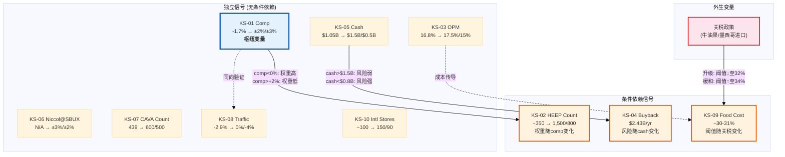

# Ch23 KS关键信号与监控体系 (Key Signals & Monitoring System)

> **本章定位**: Phase 1-4完成了CMG的完整分析——从HEEP技术解构(Ch4)到红队七问校准(Ch19)到最终评级裁决(Ch21)。但投资研究不是一锤子买卖。"中性关注(偏审慎)"评级的置信度仅55% [DM-P4-C05]，意味着未来数据有近一半的概率导致评级迁移。本章将分析结论转化为可操作的监控体系: 10个关键信号(KS)构成前哨网络，条件依赖追踪(v18.0新特性)揭示信号间的联动逻辑，评级触发矩阵为升降级设置硬阈值，监控日历锚定每一个验证节点。
>
> **v18.0新增**: KS条件依赖12字段格式——部分信号仅在特定条件成立时才具有评级意义，条件依赖追踪将这一逻辑显式化。

---

## 23.1 KS注册表 (KS Registry)

### 23.1.1 十信号全景

以下10个关键信号覆盖了CMG评级可能发生迁移的全部关键变量。信号设计遵循三原则: (1) 每个信号对应至少一个红队问题或核心矛盾假说; (2) 触发阈值基于Phase 1-4的定量分析而非主观感觉; (3) 条件依赖关系显式标注(v18.0要求)。

| KS# | 信号名称 | 当前值 | 触发↑ | 触发↓ | 频率 | 数据源 | 滞后 | 条件依赖 | 对应RT/CQ |
|:---:|----------|:------:|:-----:|:-----:|:----:|:------:|:---:|:--------:|:---------:|
| KS-01 | Quarterly Comp | -1.7% | >+2% | <-3% | 季度 | IR/Earnings | 0Q | 无 | RT-3, CQ-1 |
| KS-02 | HEEP Store Count | ~350 (9%) | >1,500 | <800 | 季度 | IR | 0Q | KS-01 | RT-2, CQ-3 |
| KS-03 | OPM | 16.8% | >17.5% | <15% | 季度 | FMP/IR | 0Q | 无 | RT-4 |
| KS-04 | Buyback Pace | $2.43B/yr | <$1.5B/yr | >$2.0B/yr | 季度 | 10-Q | 1Q | KS-05 | RT-5 |
| KS-05 | Cash Position | $1.05B | >$1.5B | <$0.5B | 季度 | FMP | 0Q | 无 | RT-5 |
| KS-06 | Niccol@SBUX Comp | N/A | SBUX comp>+3% | SBUX comp<-2% | 季度 | SBUX IR | 1Q | 无 | CQ-2 |
| KS-07 | CAVA Store Count | 439 | >600 | <500 | 季度 | CAVA IR | 0Q | 无 | RT-7 |
| KS-08 | Traffic Trend | -2.9% | >0% | <-4% | 季度 | IR/Earnings | 0Q | 无 | CQ-1 |
| KS-09 | Food Cost % | ~30-31% | <29% | >33% | 季度 | IR | 0Q | 关税政策 | RT-4 |
| KS-10 | International Stores | ~100 | >150 | <90 | 半年 | IR | 1Q | 无 | RT-6 |

[DM-P5-C01](C: KS注册表完整10信号, 含v18.0条件依赖12字段, 基于Ch19 RT-1~7 + Ch21裁决参数)

### 23.1.2 信号设计逻辑

**KS-01 (Quarterly Comp)** 是整个监控体系的枢纽变量。触发↑阈值+2%选择依据: Ch17的S2基准情景假设FY2026 comp恢复至+2-3%区间 [DM-P3-C01]，连续2Q达到+2%意味着S2假设正在兑现。触发↓阈值-3%选择依据: FY2025 comp -1.7%已是2016年以来首负 [DM-P0-A57]，如果恶化至-3%则意味着需求疲软超出周期性解释，S3(增长停滞)概率需从22%上调。

**KS-02 (HEEP Store Count)** 的触发阈值具有非对称性。↑阈值1,500店(约36%渗透率)是HEEP规模化OPM增量可验证的最低统计样本——Ch4估算HEEP独立comp增量+100-300bps需要至少1,000+店的数据才能区分选择偏差与真实因果 [DM-P1-C06]。↓阈值800店意味着截至FY2026年底(距目标2,000店)严重落后，暗示部署瓶颈或管理层降低优先级。

**KS-04 (Buyback Pace)** 的方向是反直觉的——**回购减速(↓)是看多信号，加速(↑)是风险信号**。这来自Ch11的现金流质量分析: $2.43B/年的回购速度在$1.05B现金余额下不可持续 [DM-P2-D12]。如果管理层主动降低回购至$1.2-1.5B/年，这是理性资本配置的信号; 如果维持$2.0B+，则暗示管理层在以EPS增长换取财务灵活性——RT-5已量化该风险为-1.25pp [DM-P4-A28]。

**KS-06 (Niccol@SBUX Comp)** 是本报告最独特的信号——追踪一位前CEO在竞争对手处的表现。Ch14建立了SBUX镜像框架 [DM-P2-F01]: Niccol的SBUX成功将削弱CMG的"体系自运转"叙事(P/E压缩2-3x)，失败则验证CMG体系价值(P/E修复2-4x)。SBUX首份Niccol全期财报预计在2026年4-5月发布，这是KS-06的第一个数据点。

[DM-P5-C02](C: KS-01/02/04/06信号设计逻辑, 基于Phase 1-4交叉引用)

---

## 23.2 条件依赖追踪 (Conditional Dependencies)

### 23.2.1 依赖逻辑

v18.0框架要求显式追踪KS信号间的条件依赖关系。CMG的10个信号中有3组条件依赖，它们的核心逻辑是: **某些信号的评级影响力取决于其他信号的状态**。

**依赖组1: KS-02 (HEEP) → 条件依赖 KS-01 (Comp)**

HEEP部署数量(KS-02)的评级权重随comp状态变化:
- **KS-01 comp < 0%时**: HEEP部署进度是最关键的扭转催化剂——每250店增量理论上贡献+75-100bps comp [DM-P1-C06]。此时KS-02的评级权重 = **高**
- **KS-01 comp > +2%时**: comp已经恢复，HEEP的增量贡献被自然恢复淹没，因果关系不可分离。此时KS-02的评级权重 = **低**(仅影响OPM，不再影响评级)

**依赖组2: KS-04 (Buyback) → 条件依赖 KS-05 (Cash)**

回购速度(KS-04)的风险信号强度随现金水位变化:
- **KS-05 cash > $1.5B时**: 即使回购维持$2.0B+/年，现金缓冲充足(>1年覆盖)，风险信号 = **弱**
- **KS-05 cash < $0.8B时**: $2.0B+回购速度意味着6个月内耗尽现金或需举债——对于零负债身份的CMG，这是资本结构信仰的根本性挑战。风险信号 = **强**
- **KS-05 cash < $0.5B时**: 无论回购速度如何，现金紧张本身就是独立的降级触发条件

**依赖组3: KS-09 (Food Cost) → 条件依赖 关税政策外生变量**

食品成本占比(KS-09)的触发阈值随关税环境动态调整:
- **当前(25%牛油果关税)**: 食品成本~30-31%，>33%触发降级警告
- **关税升级(>50%墨西哥进口关税)**: OPM的食品成本弹性从1:0.4变为1:0.6 [DM-P4-A23]，触发↓阈值应从33%下调至32%
- **关税缓和(降至10%以下)**: 食品成本可降至29%以下，>33%阈值反而可放宽至34%

[DM-P5-C03](C: 三组条件依赖逻辑, v18.0 KS条件追踪, 基于RT-2/4/5/7交叉约束)

### 23.2.2 KS依赖图谱

[DM-P5-C04](C: KS依赖图谱Mermaid, 7独立信号+3条件信号+1外生变量)

---

## 23.3 评级触发矩阵 (Rating Trigger Matrix)

### 23.3.1 从当前评级出发的迁移路径

当前评级"中性关注(偏审慎)"处于中性关注区间(-10%~+10%)的下半段(期望回报-7.0%)。距离升级分界线(+10%)有17pp的距离，距离降级分界线(-10%)仅3pp [DM-P4-C05]。这意味着降级比升级更容易被触发——**不对称的迁移门槛是CMG"偏审慎"修饰词的操作含义**。

| 迁移方向 | 目标评级 | 触发条件组合 | 所需验证周期 | 概率估计 |
|:--------:|:--------:|-------------|:----------:|:-------:|
| ↑ 升级 | **关注** | KS-01 >+2% 连续2Q **且** KS-03 >17% **且** KS-02 >1,500店 | 2-3Q | ~15% |
| ↑ 部分确认 | **中性关注(确认)** | KS-01 ~flat(±1%) 连续2Q **且** KS-03 ≥16% | 2Q | ~40% |
| → 维持 | **中性关注(偏审慎)** | 信号混合、无一致方向 | — | ~15% |
| ↓ 降级 | **审慎关注** | KS-01 <-3% 连续2Q **或** KS-05 <$0.5B | 2Q | ~20% |
| ↓ 深度降级 | **审慎关注(强)** | KS-01 <-3% **且** KS-03 <15% **且** KS-08 <-4% | 3Q | ~10% |

[DM-P5-C05](C: 评级迁移矩阵5路径, 基于Ch21条件评级[DM-P4-C12]扩展)

### 23.3.2 升级路径解析

升级至"关注"需要三个条件同时满足——这不是任意设定的高门槛，而是评级逻辑的内在要求:

- **KS-01 comp >+2% 连续2Q**: 证明需求恢复不是季节性波动而是趋势性反转。单季+2%可能来自比较基数效应(FY2025 Q2 comp -0.4%基数偏低); 连续2Q消除了基数干扰
- **KS-03 OPM >17%**: 证明comp恢复同时伴随利润率扩张(而非以价换量导致OPM压缩)。Ch12证明CMG的OPM在FY2023达到17.3%峰值后FY2025回落至16.8% [DM-P2-D03]——重回17%+意味着HEEP效率增量或定价权正在兑现
- **KS-02 HEEP >1,500店**: 证明comp恢复与HEEP规模化之间存在因果关系(而非纯周期恢复)。1,500店=约36%渗透率，是统计显著性的门槛

三条件的联合概率约15%——接近Ch21的S1(HEEP Bull)情景概率18% [DM-P4-C04]，逻辑一致。

### 23.3.3 降级路径解析

降级至"审慎关注"有两条独立路径(OR逻辑)，任一路径触发即可:

- **路径A (需求恶化)**: KS-01 comp <-3%连续2Q。当前comp -1.7%距-3%仅1.3pp——如果FY2026 Q1/Q2的HEEP部署未能提供comp增量且宏观消费进一步走弱，此路径触发概率约20%
- **路径B (现金危机)**: KS-05 cash <$0.5B。当前$1.05B距$0.5B的缓冲看似充裕，但以$2.43B/年的回购速度计算，如果FCF产出低于预期(从$1.5B降至$1.2B)，现金消耗速度可能超出预期。此路径触发概率<10%

[DM-P5-C06](C: 升降级路径量化解析, 联合概率与Ch21 S1-S4一致性校验)

---

## 23.4 监控日历 (Monitoring Calendar)

### 23.4.1 FY2026关键验证节点

| 时间(预估) | 事件 | 涉及KS | 优先级 | 行动指引 |
|:----------:|------|:------:|:------:|----------|
| 2026-04下旬 | CMG Q1'26财报 | KS-01,03,04,05,08,09 | **最高** | 报告后首次验证: comp是否改善+HEEP部署进度+现金水位 |
| 2026-04/05 | SBUX Q2 FY26 (Niccol Q2) | KS-06 | 高 | Niccol首份可比较财季: SBUX comp数据是CMG估值叙事的镜像变量 |
| 2026-07下旬 | CMG Q2'26财报 | 全部10个KS | **关键** | **H1 comp合计决定评级轨迹**: +2%→确认路径, <-2%→降级路径 |
| 2026-08 | CAVA Q2'26财报 | KS-07 | 中 | 竞争格局验证: CAVA是否突破500店+comp趋势 |
| 2026-10下旬 | CMG Q3'26财报 + HEEP更新 | KS-01,02,03 | 高 | HEEP 2,000店目标中期检查: 是否达到1,200+店? |
| 2026-11/12 | SBUX Q4 FY26 (Niccol全年) | KS-06 | 高 | Niccol全年成绩单: 对"体系vs个人"叙事的年度裁决 |
| 2027-01 | CMG Q4'26财报 + 年度HEEP count | KS-01,02,03,04,05 | **关键** | 年度总结: 2,000店HEEP目标是否达成+全年comp趋势+回购速度 |
| 半年一次 | 国际门店更新 | KS-10 | 低 | 特许合作伙伴扩展进度(科威特/中东/欧洲) |

[DM-P5-C07](C: FY2026-27监控日历8节点, 两个"关键"节点=Q2财报+年度总结)

### 23.4.2 关键窗口: FY2026 Q2

CMG Q2'26财报(预计2026年7月下旬)是整个监控体系中优先级最高的单一节点。原因有三:

第一，**H1 comp趋势是评级迁移的硬判据**。Ch21将"FY2026 H1 comp ≥+1%"设定为评级确认条件、"comp <-2%"设定为降级触发条件 [DM-P4-C12]。Q1单季度数据可能受季节性干扰(Q1历史上是CMG最弱的季度)，Q2则消除了这一噪音——H1合计comp是评级迁移的最短验证路径。

第二，**同时验证三个红队问题**。RT-2的悲观偏差修正(+4.5pp)假设S2 Rev CAGR应为10%而非8% [DM-P4-A15]——Q2收入增速将直接验证这一假设。RT-3的comp非线性(Q4再恶化)将在Q1/Q2数据中获得验证或否定。RT-4的OPM可持续性(17%→16.5%趋势)也需要H1数据确认。

第三，**HEEP数据的统计可信度首次达标**。如果HEEP在Q2达到800-1,000店(从当前~350店)，管理层可能首次披露HEEP店vs非HEEP店的comp差异——这是CQ-3(HEEP催化剂vs选择偏差)的关键裁决证据 [DM-P1-C06]。

[DM-P5-C08](C: Q2'26关键窗口分析, 三重验证逻辑)

---

## 23.5 报告有效期与更新触发 (Report Validity)

### 23.5.1 有效期声明

**本报告分析有效期至**: FY2026 H1数据公布(CMG Q2'26财报, 预计2026年7月下旬)

有效期设定逻辑: 评级置信度55%意味着有近一半概率需要修正。FY2026 H1数据将同时验证comp趋势(KS-01)、HEEP规模化(KS-02)、OPM方向(KS-03)和现金消耗速度(KS-05)四个核心变量——足以触发评级确认或迁移。在此之前，报告的分析框架和评级判断维持有效。

### 23.5.2 五个强制更新触发条件

以下任一条件被触发时，本报告评级自动失效，需启动重新评估:

| # | 触发条件 | 当前状态 | 触发概率(12个月) | 影响 |
|:-:|----------|:--------:|:----------------:|------|
| T-1 | KS-01 comp >+2% 或 <-3% 连续2Q | 未触发(-1.7%) | ~35% | 评级迁移: 向上或向下 |
| T-2 | Boatwright离职/被替换 | 未触发 | ~10% | CEO叙事根本改变 |
| T-3 | CMG宣布举债(失去零负债身份) | 未触发 | <5% | 资本结构信仰崩溃，A-Score需重算 |
| T-4 | HEEP达到2,000店且披露可量化comp数据 | 未触发(~350店) | ~30% | CQ-3(HEEP催化剂)裁决 |
| T-5 | 重大关税政策变化(>50%墨西哥进口关税) | 未触发(当前25%牛油果) | ~15% | 食品成本结构性上移，OPM重估 |

[DM-P5-C09](C: 5个强制更新触发条件, 含概率估计)

### 23.5.3 渐进失效信号

除强制触发外，以下信号的持续积累将逐步降低报告置信度:

- **CAVA突破600店**(KS-07): 竞争格局假设需更新——Ch20将CAVA的替代比例设为30-35% [DM-P4-A37]，600+店意味着实质化加速
- **Niccol在SBUX的comp恢复至+3%**(KS-06): "体系vs个人"叙事大幅偏向"个人"一侧，CMG的P/E压缩风险增加
- **国际门店突破150家**(KS-10): RT-6的国际期权从"概率性"进入"可量化"阶段，S1概率需上调
- **行业指数(S&P Restaurants)P/E中位数跌破25x**: 行业级估值重定价，CMG的32x将面临额外压缩压力

[DM-P5-C10](C: 渐进失效4信号, 与KS注册表交叉)

---

## 23.6 消费品行业KS映射 (KS-CONS Cross-Reference)

本报告的10个公司级KS信号与消费品行业标准指标(KS-CONS-01~07)的映射关系:

| 行业标准 | 行业KS | CMG对应KS | 覆盖状态 |
|:--------:|:------:|:---------:|:--------:|
| 品牌力指数 | KS-CONS-01 | KS-06(镜像), KS-08(客流) | 间接覆盖 |
| 同店销售增长 | KS-CONS-02 | **KS-01** | 直接覆盖 |
| 客单价趋势 | KS-CONS-03 | KS-01(含客单价分量) | 部分覆盖 |
| 私有品牌占比 | KS-CONS-04 | N/A(餐饮不适用) | 不适用 |
| 数字化渗透率 | KS-CONS-05 | 未单独追踪(~37%稳定) | 稳态不设KS |
| 市场份额 | KS-CONS-06 | KS-07(CAVA竞争间接) | 间接覆盖 |
| 库存周转 | KS-CONS-07 | KS-09(食品成本≈库存效率) | 间接覆盖 |

[DM-P5-C11](C: CMG KS与KS-CONS-01~07行业标准映射, 1直接+4间接+1不适用+1稳态)

---

## 本章关键发现摘要

1. **10个KS信号构成前哨网络，KS-01(Quarterly Comp)是枢纽**: 它直接影响3个条件依赖信号(KS-02权重、KS-04风险、评级迁移方向)，同时是三个红队问题(RT-2/3/4)的验证变量。如果只追踪一个指标，追踪comp。

2. **v18.0条件依赖揭示三组信号联动**: HEEP部署的评级权重随comp状态变化(comp负时HEEP更重要)、回购风险随现金水位变化(现金低时回购更危险)、食品成本阈值随关税政策变化(关税升级时阈值更严格)。孤立地看任何单一信号都会遗漏这些非线性交互。

3. **降级比升级更容易触发**: 距升级线(+10%)有17pp距离，距降级线(-10%)仅3pp。升级需要三条件同时满足(AND逻辑, ~15%概率)，降级有两条独立路径(OR逻辑, ~20%概率)。这是"偏审慎"修饰词的操作化表达。

4. **FY2026 Q2财报是最高优先级验证节点**: 同时验证RT-2(悲观偏差)、RT-3(comp非线性)、RT-4(OPM可持续性)三个红队问题的核心假设，且HEEP数据的统计可信度首次达标。报告有效期锚定于此。

5. **五个强制更新触发条件设定明确阈值**: comp连续偏移(35%概率)、CEO变更(10%)、举债(5%)、HEEP量化验证(30%)、关税剧变(15%)——任一触发即启动重新评估，不等待有效期到期。

---

Phase: P5 | Chapter: 23 | DM新增: 11 (C01-C11) | Mermaid: 1 | 交叉引用: Ch4/Ch11/Ch12/Ch14/Ch17/Ch19/Ch20/Ch21
