# Coherent Corp (COHR): 41倍去杠杆
## 深度研究报告 v2.0

> **评级**: 审慎关注 [贵×改善中×可能有催化] | **SOTP**: $226.6 vs $307.50 = **-26.3%**
> **护城河**: 3.5/5 | **CQ**: 53.4% | **圆桌**: 5/5一致 | **黑箱**: 27%
> **报告日期**: 2026年4月14日 | **股价**: $307.50 | **市值**: ~$48B
> **主问题**: 市场是否在用一个纯AI成长股标签，给一个三引擎后合并去杠杆混合体打平均分？
> **第一变量**: ROIC何时超过WACC（当前4.2% vs 10%，负利差-5.8pp）

---

# 0. 执行摘要

**市场把COHR当什么。** AI光通信成长股——受益于800G/1.6T升级周期、NVIDIA $2B背书，按Forward PE 41x定价，对标FY2027E EPS $7.47 [DM-VAL-003]。Networking 69%收入，+34% YoY [DM-BIZ-015]。市场在买AI增长。

**这个看法解释不通什么。** COHR 17.5%增速 vs LITE 65.5%，但Forward PE仅差6x [DM-CORE-001]——市场给COHR每单位增速的溢价是LITE的3倍，说明41x PE中有一部分不是在买增速。我们拆解后发现：FY2025→FY2028E的EPS增量$10.16中，**约$3-4来自D&A递减+利息节省+preferred清零等非增长因素** [DM-FIN-008/009]。31%的收入（Industrial）在萎缩-10%，但被统一PE按AI倍数定价 [DM-BIZ-032]。市场把三种性质完全不同的价值来源——AI增长、资本结构正常化、萎缩业务——用一个成长股估值语言打包定价。

**所以它实际上是什么。** COHR不是纯AI成长股，而是**"41倍去杠杆"**——一台后合并去杠杆混合体，三引擎（AI 69% + Industrial 31% + SiC期权）共享晶圆基础设施，用D&A递减+债务清偿+mix改善机械制造EPS轨迹。ROIC 4.2% < WACC 10% [DM-FIN-026]——每多投$1资本都在消耗价值，不是创造价值。真正决定COHR命运的第一变量不是Networking增速，而是**ROIC何时超过WACC**。增速30%但ROIC<WACC = 在烧钱建产能；增速10%但ROIC>WACC = 开始为股东创造价值。

**这个重定义改写了什么。** 估值方法从统一PE→分部SOTP：Bear $150.7（30%）/ Base $211.8（45%）/ Bull $344.4（25%）→ 加权**$226.6，vs $307.50 = -26.3%** [DM-RT-SUP-014]。即使最乐观概率也仅$249。评级审慎关注，5/5圆桌零异议。最可能路径不是断崖，而是温水煮青蛙——渐进恶化40-50%概率，3年累计-36%，年化-14% [DM-RT-014]。Kill Switch：ROIC在FY2027仍<WACC→论文系统性失败。

---


---


# 1. 主问题：市场是否在用一个标签给三条不同曲线打平均分？

## 1.1 市场把COHR当什么

市场的默认地图：COHR是AI光通信的垂直整合龙头，拥有行业最长的技术卡位（InP全栈从衬底到模块）、NVIDIA $2B背书锁定需求到2028年、管理层"unprecedented visibility"。按Forward PE 41x定价，隐含FY2027-2030 EPS CAGR 25%+。主要卖方用Non-GAAP EPS × growth PE来估值，核心跟踪变量是Networking/Datacom收入增速和800G/1.6T出货量 [DM-VAL-003]。

这个默认地图的承重点：如果Hyperscaler CapEx持续3年以上每年+30%以上（保证Networking需求），如果COHR在1.6T时代拿到>20%模块份额（保证收入增速），如果去杠杆按计划推进（保证EPS底线），那么41x PE在FY2027是合理的——32x on FY2028E $9.64也有一定安全边际。

## 1.2 为什么这个默认地图开始松动

我们在Phase 0.75识别了5个异常，P1-P4验证了其中4个。市场地图的松动不是一个戏剧性的"错误"，而是一系列微小但累积的不协调：

**异常1：PE/增速不匹配**。COHR的PEG 1.64x是LITE（1.18x）和Lumentum（1.50x）中最高的 [DM-RISK-012]。市场给COHR每单位增速的估值溢价最高，但COHR的增速最低、AI纯度最低（69% vs LITE 90%+）、利润率最低（GM 37-39% vs LITE 42.5%）。这说明41x PE中有一部分不是在买增速——是在买去杠杆释放、SiC期权、或者只是标签溢价。

**异常2：库存急增**。FQ2'26库存$1,848M，6个月增长+28.5%，而同期收入仅增长+10.3% [DM-FIN-022]。库存增速是收入增速的2.8倍。Phase 4 forensic分析确认COHR库存有向下刚性——FY23→FY24周期下行期，库存仅+1%而收入-9% [DM-RT-SUP-004]。InP晶圆加工后不能退货、不能转卖（定制化），库存减值是唯一出路。概率加权减值~$90M（-$0.44/share）[DM-RT-SUP-007]。

**异常3：FCF转负但管理层说"unprecedented"**。FQ2'26 FCF = -$96M（CapEx $154M, +48% QoQ）[DM-CF-002]。如果管理层真的有unprecedented的firm bookings，不需要建$1.85B库存——firm commitment意味着客户会来取货，按需生产即可。大量建库存本身暗示bookings的"unprecedented"更多是volume guidance而非firm commitment [DM-RT-SUP-011]。Bookings质量评级：firm估计30-45%，soft 55-70%（黑箱）[DM-RT-SUP-012]。

**异常4：EPS增长归因偏差**。FY2025 GAAP EPS -$0.52 → FY2028E $9.64，增量$10.16。市场叙事将这归因于AI收入增长。但拆解后：D&A从$554M递减到~$380M释放约$0.70-0.85 EPS [DM-CAP-017/018]；利息从$243M降到$180-200M释放$0.22-0.32 [DM-CAP-022]；Preferred stock分红节省$130M释放~$0.55 [DM-CAP-009]；SBC调整和mix改善~$0.30。非增长因素合计贡献$1.77-2.02，占总增量的17-20%。这不是说增长不重要，而是说41x PE中隐含的"25%增速"实际有15-20%是会计机械效应伪装的。

## 1.3 我们的判断：三引擎一标签的定价错位

COHR的核心矛盾不是"AI增长是否可持续"（这是LITE的核心问题），而是**"市场是否在用一个标签给三条完全不同的曲线打平均分"**。

三引擎的经济特征差异：

| 引擎 | 收入占比 | 增速 | 适用估值 | 合理倍数 |
|------|---------|------|---------|---------|
| AI Networking | ~69% | +34% YoY | EV/Rev或高增长PE | 6-10x Rev / 35-50x PE |
| Industrial | ~31% | -10% YoY | Mid-cycle EV/EBITDA | 8-12x EBITDA |
| SiC（隐性） | ~5-8%（估算） | 投资期 | 期权定价 | 3-6x Rev概率加权 |

用统一的41x PE覆盖这三条曲线，等于给-10%萎缩的Industrial也按41x PE定价——在任何SOTP模型中，这都不合理。分开估值后，三引擎合计的概率加权结果是$226.6，比统一PE定价低26%。

**这就是"41倍去杠杆"的含义**：市场用41倍的AI成长股倍数，买下了一台后合并去杠杆机器。AI增长是引擎之一，但不是唯一的引擎，也不是唯一在驱动EPS轨迹的力量。

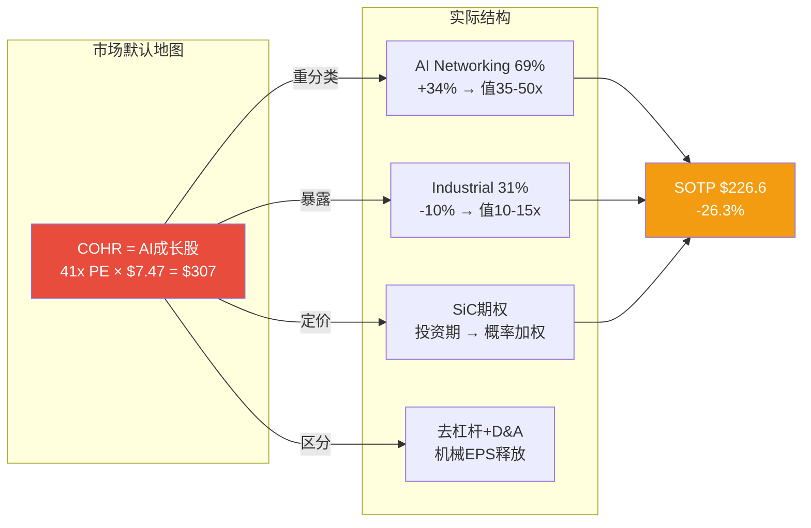

---


---


# 2-4. 对象本质：COHR到底是什么系统，凭什么不能用统一PE？

> **主问题推进**：如果三引擎增速/利润率/周期性相同，统一PE合理；正是因为它们完全不同，统一PE才是定价错位。本章同时回答"41倍中有多少在买增长、多少在买去杠杆"——资本结构事件（preferred转换、NVIDIA投资、D&A递减）解释了EPS轨迹中非增长因素的贡献。
> **对ROIC的含义**：三引擎中AI Networking是唯一有望推动ROIC上穿WACC的引擎（高增速+高margin）；Industrial在拖低ROIC（低margin+萎缩）；SiC在投资期消耗资本但不产出回报。ROIC上穿的前提是AI引擎的NOPAT增长速度超过三引擎合计的Invested Capital增速。


## Ch 1: 公司画像与一句话定义 (~4000字符)

### 1.1 一句话定义

COHR是一家**后合并重组中的光子学+材料混合体**, 其核心经济性质是: 用II-VI的材料技术底座(InP/SiC/III-V族化合物半导体)嫁接三条收入引擎, 三条引擎的增速、利润率、周期性、资本强度完全不同, 但共享同一套晶圆制造基础设施 [DM-BIZ-001]。

这个定义的投资含义: 市场给COHR一个统一的41x Forward PE [DM-VAL-003], 但这个倍数实际上在给三条完全不同的曲线打一个平均分。AI Networking增速+34% YoY值50-60x, 工业激光-10% YoY值10-15x, SiC材料在投资期尚未盈利 [DM-BIZ-002]。因此, COHR的估值问题本质上是一个SOTP问题, 而非单一PE问题。

### 1.2 P0原型: 混合体 (M0触发)

COHR触发M0(混合体先拆)的原因有三条:

**第一, 三条引擎的增长逻辑互不相关。** AI Networking的需求来自Hyperscaler CapEx周期, 驱动变量是GPU集群对光互连带宽的需求 [DM-BIZ-003]。SiC材料的需求来自EV渗透率和功率半导体替代周期, 与AI完全无关 [DM-BIZ-004]。工业激光的需求来自制造业资本开支, 处于周期下行 [DM-BIZ-005]。

**第二, 三条引擎的利润率profile差异巨大。** Datacom & Communications整体Non-GAAP GM约39-42% [DM-FIN-006], 而Industrial段因为电信衰退+工业周期低谷, GM约28-32% [DM-BIZ-006]。因此AI Networking收入每增加1个百分点的占比, 就会机械性地推高整体GM约0.1pp。

**第三, 三条引擎适用完全不同的估值方法。** AI Networking适用EV/Revenue或高增长PE; SiC材料适用期权定价(投资期, 零利润); 工业激光适用周期股mid-cycle EV/EBITDA。一个统一的Forward PE混淆了这三层定价逻辑 [DM-BIZ-007]。

### 1.3 II-VI合并: 战略逻辑与实际结果

2022年7月完成的II-VI与旧Coherent合并(总对价约$6.56B)的战略逻辑是**垂直整合** [DM-BIZ-008]: II-VI拥有从InP衬底到EML芯片的材料端能力, 旧Coherent拥有工业激光和精密光学的系统集成能力。合并后的理论优势是"从原子到模块"的全栈控制。

实际结果的正面证据: (1) 6寸InP晶圆良率超过传统3寸线, 这是合并后Sherman工厂投资的直接产物 [DM-BIZ-009]; (2) 800G EML和1.6T InP芯片的自研自产能力, 使COHR在AI光模块供应链中拥有LITE不具备的衬底自主权 [DM-BIZ-010]。

实际结果的负面证据: (1) 合并产生$4,463M商誉 + $3,064M无形资产, 合计占总资产49.9% [DM-BAL-002/003]; (2) 合并后D&A高达$554M/yr, 其中大部分是无形资产摊销, 严重压制GAAP利润 [DM-FIN-009]; (3) Net Debt从合并前几乎零杠杆攀升至$3.67B, 至今仍有$2.68B [DM-BAL-001]; (4) 合并整合用了近2年(FY2023-2024), 期间收入从$5.16B跌至$4.71B [DM-FIN-002/004]。

**合并的净效应判断 [B级结论]**: 垂直整合的技术价值正在兑现(InP自主+6寸良率), 但财务代价(杠杆+摊销+整合期衰退)需要AI周期的持续强劲才能完全消化。如果AI CapEx周期在FY2028前显著放缓, $7.5B的goodwill+intangibles将面临减值风险。

### 1.4 从3段到2段重组的含义

FY2026起, COHR将原来的3个分部(Networking/Lasers/Materials)重组为2个分部: **Datacenter & Communications (D&C)** 和 **Industrial** [DM-BIZ-011]。同时出售了Aerospace & Defense业务(约$400M) [DM-BIZ-012]和Munich材料加工业务。

这次重组的信号读法:

**积极信号**: 管理层正在把叙事从"多元化光子学公司"转向"AI光互连公司"。把Datacom单独提出来作为主分部, 说明管理层认识到这是估值的核心驱动 [DM-BIZ-013]。

**消极信号**: 2段式报告让投资者更难拆分AI Networking vs Telecom vs SiC的具体贡献。D&C段包含了AI Datacom(高增长)和传统Telecom(衰退中), 把增速最快和增速最慢的两块混在一起, 降低了分析透明度 [DM-BIZ-014]。

---

## Ch 2: M0 混合体三段拆分 (~8000字符)

这是Phase 1最重要的章节。我们需要拆分三个引擎各自的经济特征, 因为市场用一个PE覆盖三条截然不同的曲线。

### 引擎1: AI Networking / Datacom

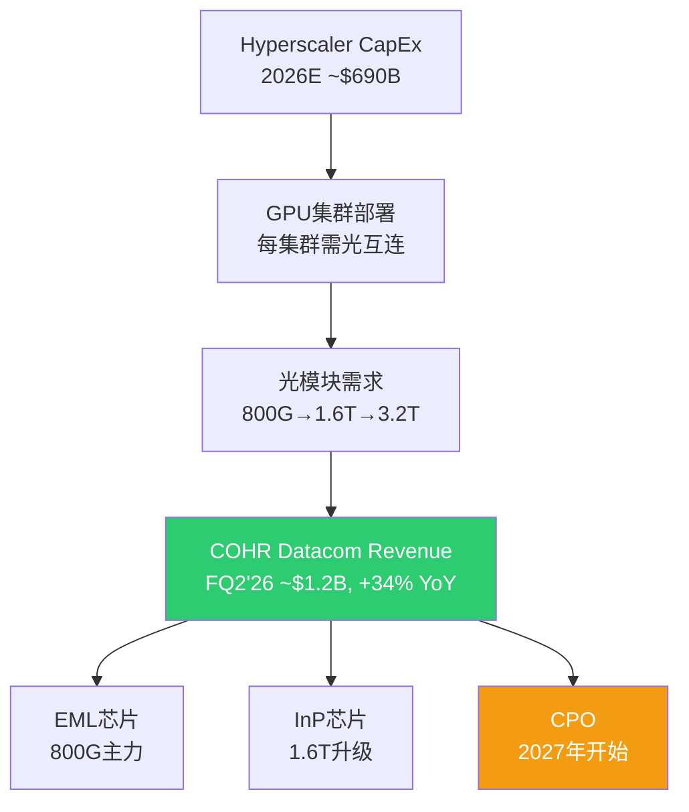

**收入规模与增速**: Datacom & Communications分部FQ2'26收入约$1.2B, YoY +33.6%, 占总收入72% [DM-BIZ-015]。其中AI Datacom(800G/1.6T光模块及组件)是增长引擎, 电信部分(DWDM, 接入网)接近持平或小幅下降。我们估计纯AI Datacom收入约$900M-$1.0B/季, 年化$3.6-4.0B, 占总收入约55-60% [DM-BIZ-016, B级推断]。

**产品线层级**:

- **800G EML**: 当前主力出货产品。COHR提供EML(电吸收调制激光器)芯片和部分完整模块。800G模块使用4x200G lane, 每个lane需要一颗EML芯片。COHR在这个市场份额排#2-3, 落后于旭创(Innolight)但在组件层面有自研优势 [DM-BIZ-017]。

- **1.6T InP**: 下一代产品, 使用8x200G lane InP芯片。COHR的6寸InP晶圆(Sherman工厂)是关键差异化因素: 因为6寸晶圆面积是3寸的4倍, 每片产出的die数量更多, 单位成本更低 [DM-BIZ-009]。1.6T在2026年进入资质认证, 2027年量产 [DM-BIZ-018]。

- **CPO(Co-Packaged Optics, 共封装光学)**: 将光模块直接封装到交换机ASIC旁边, 减少功耗和延迟。COHR在OFC 2026展示了6.4T CPO方案 [DM-BIZ-019]。CPO收入时间表: 规模外互连(scale-out)从2026H2开始, 规模内互连(scale-up)从2027H2开始 [DM-BIZ-020]。这部分收入尚未被华尔街共识充分反映。

**客户集中度**: NVIDIA是最大客户之一。2026年3月NVIDIA投资$2B, 附带"数十亿美元"的多年采购承诺, 执行期2027-2030 [DM-BIZ-021]。Bookings延伸到2028年, CEO称有"unprecedented business visibility" [DM-BIZ-022]。但非独家协议意味着NVIDIA也在投LITE($2B)和其他供应商, COHR不享有独占地位。

**利润率profile**: 公司不单独披露Datacom的段利润率。根据D&C段整体Non-GAAP OPM约18-22%推断(含低利润率的电信部分), 纯AI Datacom的Non-GAAP OPM约22-28% [DM-BIZ-023, C级推断, 证据不足]。因为AI Datacom产品定价权更强(供需紧张, 25-30%供给缺口), 且规模效应正在释放(产能利用率从50%爬升至80%+)。

**反面考量**: (1) 800G模块ASP正在下降, 虽然1.6T单价更高, 但量价剪刀差在FY2027-2028可能出现; (2) Hyperscaler CapEx增速(+82% in 2026E)不可持续, 2027-2028增速必然回落, 这将直接冲击光模块需求斜率; (3) 旭创在800G pluggable模块上有价格优势, COHR的成本竞争力取决于6寸InP良率能否兑现。

**周期性判断**: AI Networking的收入与Hyperscaler CapEx高度相关。当前bookings到2028年给了2-3年能见度, 但这本质上是一个CapEx衍生品的能见度, 不是永续性收入。如果Hyperscaler在2028年削减AI CapEx增速(从+80%降至+10-20%), COHR的Datacom增速会从+30%以上骤降至个位数 [DM-BIZ-024]。

### 引擎2: SiC材料 / Power Electronics

**收入规模(估算)**: COHR不单独报告SiC收入。SiC业务被归入原Materials段, FY2025 Materials段收入约$950M [DM-BIZ-025, B级推断]。SiC衬底/外延片收入估计占其中$300-400M, 其余是其他III-V族材料 [DM-BIZ-026, C级推断]。重组后SiC被归入Industrial段, 更难追踪。

**DENSO/三菱$1B投资结构**: 2023年12月, DENSO和三菱电机各投$500M, 合计$1B, 获得SiC业务12.5%的非控制权益(各6.25%), COHR保留75%控制权 [DM-BIZ-027]。这个结构的重要含义: (1) 外部战略投资者验证了SiC业务的独立价值(隐含估值$8B, 但这是2023年投前估值, 当时SiC热度更高); (2) 投资附带长期供应协议, 保障了收入可预见性; (3) 但12.5%的利润也属于少数股东, 在合并报表中需要扣除。

**150mm到200mm转换**: COHR正在Sherman, TX工厂从150mm SiC晶圆向200mm过渡 [DM-BIZ-028]。200mm晶圆面积是150mm的1.78倍, 理论上单位die成本下降约40%。但150mm产线的折旧尚未完成, 过渡期同时运行两条线, 增加了固定成本。

**Wolfspeed Chapter 11的影响**: Wolfspeed在2025年底申请破产保护 [DM-BIZ-029]。这对COHR的影响是双面的:
- **正面**: Wolfspeed是全球最大的SiC衬底供应商, 其产能受限/退出将减少供给, 提升COHR在SiC市场的相对地位和定价权。SiC衬底市场集中度将上升。
- **负面**: Wolfspeed的困境说明SiC扩产的资本强度极高, 投资回报周期极长。COHR在SiC上也面临相同的资本密集型挑战。如果EV渗透率放缓(2025-2026年已有迹象), SiC的TAM从$21B(2030)缩水到$12-15B, COHR的SiC投资回报将大幅延后。

**增长驱动与盈利时点**: SiC TAM预测从$3B(2022)增长到$21B(2030), CAGR ~28% [DM-BIZ-030]。但COHR的SiC业务当前在投资期: CapEx高企、良率爬坡中、客户认证周期长(汽车级SiC认证需18-24个月)。我们估计SiC业务在FY2027-2028达到盈亏平衡, FY2029开始贡献正利润 [DM-BIZ-031, B级推断]。

### 引擎3: Industrial / Legacy (激光+材料残余)

**收入规模与增速**: Industrial段FQ2'26收入$478M, YoY -9.9% [DM-BIZ-032]。这个段包含: 工业激光器(用于切割/焊接/加工)、精密光学(半导体光刻用)、以及SiC材料。剥离了Aerospace & Defense($400M出售)和Munich材料加工业务后, 残余的纯工业激光+光学业务约$300-350M/季, 年化$1.2-1.4B [DM-BIZ-033, B级推断]。

**对整体margin的拖累量化**: Industrial段的Non-GAAP OPM估计约8-12%, 而D&C段约18-22% [DM-BIZ-034, B级推断]。以FQ2'26为例, Industrial占收入28%但利润贡献约15-18%。如果假设D&C段Non-GAAP OPM为20%, Industrial段为10%, 那么Industrial段每减少1%收入占比, 整体Non-GAAP OPM改善约0.1pp [DM-BIZ-035]。

**是否应该继续剥离?** 我们的判断是"视条件而定" [B级结论]:
- **支持剥离**: 工业激光处于周期下行(-10% YoY), 拖累整体增速和估值倍数。如果完全剥离, COHR变成纯AI光学+SiC公司, 市场有理由给更高PE。
- **反对剥离**: 工业激光贡献稳定的现金流($1.2-1.4B收入, 8-12% OPM), 这些现金流正在帮助去杠杆。在Net Debt仍有$2.68B的情况下, 砍掉现金流来源是危险的。此外, 部分工业激光技术(如半导体光刻用精密光学)与AI供应链有协同。

### 关键交叉分析

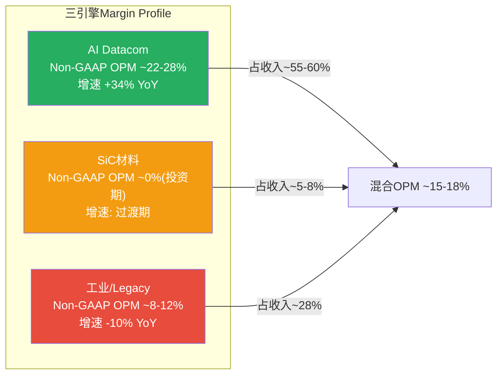

**三引擎适用的估值方法**:

| 引擎 | 适用估值方法 | 合理倍数范围 | 关键变量 |
|------|-------------|-------------|---------|
| AI Datacom | EV/Revenue 或 高增长PE | EV/Rev 6-10x, PE 35-50x | Hyperscaler CapEx增速, 800G/1.6T出货量 |
| SiC材料 | 期权定价 或 EV/Revenue(亏损期) | EV/Rev 3-6x | EV渗透率, 200mm良率, Wolfspeed替代份额 |
| 工业/Legacy | Mid-cycle EV/EBITDA | EV/EBITDA 8-12x | 制造业PMI, 工业CapEx周期 |

**M2: 协同还是冲突?** 三引擎之间的关系是**弱协同+弱冲突**, 核心是共享基础设施 [DM-BIZ-036]:
- **协同**: InP晶圆制造能力同时服务AI Datacom(EML芯片)和电信(DWDM激光器), 产能利用率可以在需求波动时互相缓冲。SiC和InP都需要化合物半导体外延技术, 人才和设备有重叠。
- **冲突**: 资本配置冲突是最大问题。FQ2'26 CapEx $154M, 三个引擎都在争抢资本预算 [DM-CF-004]。AI Datacom的ROI最高但SiC的战略重要性也大, 工业段的维护性CapEx也不能完全砍掉。在FCF为负(-$96M/Q)的情况下, 每一美元CapEx的机会成本都在上升。
- **净判断**: 不像典型的混合体(如GE)那样有明显的"拖累源需要砍掉", COHR的混合体问题更多是**资本配置效率**和**估值方法混淆**, 而非业务逻辑冲突。

---

## Ch 3: 资本结构事件深挖 (~5000字符)

### 3.1 去杠杆轨迹

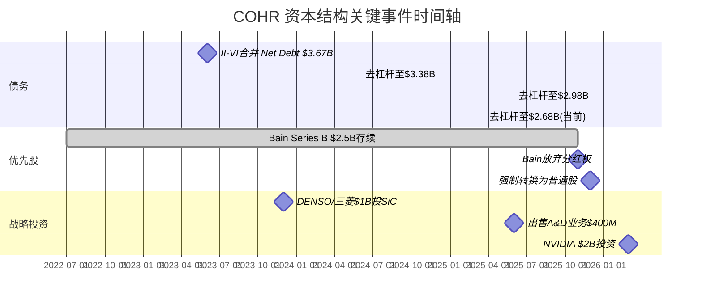

Net Debt从合并时$3.67B(FY2023)降至当前$2.68B, 累计去杠杆约$990M, 历时3年 [DM-CAP-001]。去杠杆的速度约$330M/年, 主要来源:

(1) **EBITDA增长**: TTM EBITDA从FY2023的约$800M增长到约$1,254M [DM-BAL-007], 自由现金流在去杠杆中的贡献有限(FY2024 FCF $199M, FY2025 FCF $193M), 因为CapEx在同步加速 [DM-CF-004]。

(2) **资产出售**: A&D业务$400M + Munich材料加工 [DM-BIZ-012], 这些一次性所得直接用于偿债。

(3) **当前杠杆水平**: Net Debt/EBITDA(TTM) 约2.1x [DM-BAL-007], 低于投资级门槛3.0x, 但对于一家需要大量CapEx扩产的公司而言, 杠杆空间有限。因为FCF在FQ1'26(-$58M)和FQ2'26(-$96M)转负, 靠现金流偿债的路径已经暂停 [DM-CF-001/002]。

**去杠杆目标**: 管理层未明确给出Net Debt/EBITDA的目标倍数。但考虑到NVIDIA $2B投资的注入(大部分用于CapEx而非偿债), 以及EBITDA自然增长, 我们预计Net Debt/EBITDA在FY2027降至1.5x以下 [DM-CAP-002, B级推断], 前提是EBITDA按共识达到$1.8-2.0B。

### 3.2 Preferred Stock从$2.5B到$0: 完整还原

这是COHR资本结构中最复杂且最容易被忽视的事件 [DM-CAP-003]。

**起源**: II-VI合并时, Bain Capital通过BCPE Watson实体以Series B可转换优先股形式注入资金, 余额约$2.5B。优先股享有分红权, 在转换为普通股前构成对普通股东权益的优先索取。

**2025年11月**: Bain Capital与COHR签署豁免协议(waiver agreement), **不可撤销地放弃**所有未来的Series B优先股分红权 [DM-CAP-004]。这个动作的含义: Bain不再从优先股获取收益, 其退出路径完全依赖转换为普通股后的股价升值。管理层称此举"使Bain的利益与普通股东一致"。

**2025年12月10日**: BCPE Watson将36,162股Series B-2优先股转换为5,000,000股普通股, 当日以$189.55/股通过Rule 144大宗交易出售, 套现$948M [DM-CAP-005]。

**2025年12月15日**: 剩余Series B-2优先股触发**强制转换(mandatory conversion)**, 全部转为普通股 [DM-CAP-006]。这解释了为什么FQ2'26(2025年12月季度)资产负债表上Preferred Stock从$2,505M骤降至$0 [DM-BAL-004]。

**对普通股东的影响**: 优先股转换为普通股导致了显著的股份稀释。BCPE Watson转换后持有约9.78M股普通股(占5.2%) [DM-CAP-007]。总稀释股数取决于转换比率(每股优先股转多少普通股), 但$2.5B优先股以约$189/股的转换价计算, 新增约13.2M普通股, 对现有股东稀释约8.5% [DM-CAP-008, B级推断]。

**正面**: 优先股清零意味着(1)不再有分红流出, FY2025优先股分红约$130M, 这笔钱回归普通股东 [DM-CAP-009, B级推断]; (2)资本结构简化, 不再有优先权利覆盖在普通股之上; (3)Bain的减持将逐步释放overhang压力(2025年12月的5M股大宗交易已经释放了一部分)。

**负面**: 稀释效应已经发生。FQ2'26的diluted shares约155.5M, 相比优先股转换前的约142-145M增加了约10M股 [DM-CAP-010, B级推断]。Bain仍持有约9.78M股(5.2%), 这些股份的后续出售构成持续的overhang压力。

### 3.3 NVIDIA $2B投资的条款与影响

2026年3月2日, NVIDIA投资COHR $2B, 价格$256.80/股 [DM-CAP-011]。关键条款:

- **非独家多年战略协议**: 附带"数十亿美元"的采购承诺, 执行期2027-2030 [DM-BIZ-021]
- **资金用途**: 主要用于R&D + 美国InP/SiPh产能建设(Sherman, TX工厂扩张) [DM-CAP-012]
- **新增股份**: $2B / $256.80 = 约7.79M股, 占投资前股份的约5.3%, 投资后稀释约5.0% [DM-CAP-013]
- **CPO时间表**: Scale-out CPO收入从2026H2开始, Scale-up CPO收入从2027H2开始 [DM-BIZ-020]

投资的矛盾信号: NVIDIA同日也投$2B给LITE, 合计$4B光子学承诺 [DM-CAP-014]。这说明NVIDIA在多元化光学供应链, COHR和LITE都不是独家供应商。市场当天的反应是COHR股价**下跌7%** [DM-CAP-015], 说明市场更担心稀释效应和"非独家"条款, 而非兴奋于采购承诺。

### 3.4 D&A递减轨迹

FY2025 D&A $554M, 其中大部分是II-VI合并产生的无形资产摊销(客户关系、开发技术、商标) [DM-FIN-009]。无形资产$3,064M按加速摊销法计算, 通常前5-7年摊销最快, 之后递减 [DM-CAP-016]。

合并发生在2022年7月, 到FY2026已过4年。我们估计D&A递减轨迹 [DM-CAP-017, B级推断]:
- FY2026E: ~$520M (D&A/Rev 7.5%)
- FY2027E: ~$450M (D&A/Rev 5.1%)
- FY2028E: ~$380M (D&A/Rev 3.6%)
- FY2029E: ~$300M (D&A/Rev 2.5%)

D&A递减的EPS影响: 每减少$100M D&A, 税后EPS约增加$0.50-0.55(假设20%税率, 155M稀释股) [DM-CAP-018]。因此从FY2026到FY2029, 仅D&A递减一项就能贡献$0.70-0.85的EPS增长, 占FY2027E EPS $7.47的约10-11%。这是"会计性"的EPS增长, 不是"业务性"的, 投资者需要区分 [DM-CAP-019]。

### 3.5 利息支出减少

FY2025利息支出$243M [DM-FIN-010]。主要来自:
- Term Loan B-2: SOFR+2.00%, 浮动利率 [DM-CAP-020]
- Senior Notes 5.000% due 2029, 固定利率 [DM-CAP-021]

去杠杆每减少$1B债务, 节省约$50-70M利息(取决于偿还的是浮动还是固定)。如果NVIDIA $2B投资中的部分用于偿债(虽然管理层称主要用于CapEx), 利息节省将进一步增厚EPS。我们的基准假设是FY2027利息支出降至$180-200M, 对比FY2025的$243M节省$43-63M, 税后EPS贡献约$0.22-0.32 [DM-CAP-022, B级推断]。

---

## Ch 4: 管理层与执行力 (~3000字符)

### 4.1 CEO Jim Anderson的Track Record

Jim Anderson于2024年6月3日被任命为COHR CEO, 此前任Lattice Semiconductor CEO(2018年9月至2024年) [DM-BIZ-037]。

**Lattice业绩**: Anderson在Lattice的6年任期内实现了**股价10倍**的涨幅 [DM-BIZ-038]。他推动Lattice从低端FPGA转型为面向通信和工业的中端FPGA供应商, 实现了创纪录的营业利润和毛利率。这说明他具备在复杂技术公司中执行转型的能力。

但有一个重要反面: Lattice是一家$700M收入的小公司, 产品线相对单一。COHR是$6B+收入、3条业务线、4万+员工的合并后混合体, 复杂度高一个量级。Lattice的成功不能线性外推到COHR [DM-BIZ-039]。

**在AMD的经验**: Anderson之前是AMD SVP, 负责Computing & Graphics业务组 [DM-BIZ-040]。这段经历提供了大型半导体公司的运营经验, 但AMD当时(2015-2018)正处于Lisa Su领导的大规模转型中, Anderson的个人贡献和整体公司momentum难以分离。

**入职条件**: $48M的inducement equity awards, 其中$36M是sign-on奖金(部分补偿从Lattice离职损失的股权) [DM-BIZ-041]。这个规模说明COHR对Anderson的招募是认真的, 但也意味着他的薪酬package与股价高度绑定。

### 4.2 合并整合执行

II-VI合并完成于2022年7月。关键里程碑:

- **FY2023(合并后第1年)**: 收入$5.16B, 下降(因为合并整合摩擦+行业周期下行) [DM-FIN-004]
- **FY2024(合并后第2年)**: 收入$4.71B, 继续下降(-8.8% YoY), 这是整合期的低谷 [DM-FIN-002]
- **FY2025(合并后第3年)**: 收入$5.81B, 恢复增长(+23.4% YoY), 超过合并前水平 [DM-FIN-001]

合并的协同效应: 管理层在合并时承诺的协同效应数字(约$250M年化成本节省)的实现进度不透明。但间接证据显示执行在推进: (1) Non-GAAP GM从FY2024低谷30.9%恢复到FQ2'26的39.0% [DM-FIN-006/007]; (2) 从3段到2段的组织简化; (3) 剥离了与核心战略不符的A&D和Munich业务 [DM-BIZ-012]。

**判断 [B级]**: Anderson上任后(2024.06)的执行轨迹是正面的 — 业务重组清晰、非核心资产剥离果断、NVIDIA战略投资落地。但这些成果很大程度上受益于AI CapEx周期的宏观顺风, 真正的考验将在周期回调时到来。

### 4.3 资本配置优先级

当前管理层面临的资本配置三难困境:

1. **CapEx加速**: FQ2'26 CapEx $154M(年化$616M), 主要用于InP产能扩张和SiC 200mm转换 [DM-CF-004]。NVIDIA $2B投资的到账将进一步加速CapEx。
2. **去杠杆**: Net Debt $2.68B, 但FCF已转负, 短期内只能靠EBITDA增长降低杠杆比率, 无法靠现金偿债 [DM-CAP-001]。
3. **回购**: FY2025仅$54M回购, FY2024仅$22M [DM-BIZ-042]。在41x Forward PE下回购是**净值毁灭**: $1回购只买到$0.024的盈利($1/41x), 远低于$1面值。

**我们的判断**: 管理层做了正确的选择 — CapEx优先, 去杠杆其次, 回购最后。在增长期投资产能比在41x PE回购更理性。但如果AI周期放缓导致CapEx ROI低于预期, 这个"正确"的判断将变成过度投资的负担 [DM-BIZ-043]。

### 4.4 内部人交易信号

过去12个月: **零open market买入, 纯sell-on-vest模式** [DM-INS-001/002/003]。

具体信号:
- 2026 Q1: 9笔卖出, 0笔买入 [DM-INS-001]
- 2025 Q4: 16笔卖出, 0笔买入 [DM-INS-002]
- Director Howard Xia: 行权价$21.67, 立即卖出$236-258/股, 这是合并时期的低成本期权 [DM-INS-003]
- 过去8个季度仅有4笔open market买入, 全部在2024年低点(股价$50-70) [DM-INS-003]

**解读**: 这个模式与LITE完全一致 — 管理层在涨势中持续减持, 没有任何有意义的增持。但需要区分: (1) 大部分卖出是sell-on-vest(行使期权后立即出售), 这是正常的流动性管理, 不必然是看空信号; (2) 零open market买入才是更有意义的负面信号, 因为它说明没有人愿意用自己的钱在当前价格买入 [DM-INS-004]。

**A/D信号强度判断 [B级结论]**: 零买入+持续卖出 = **中性偏负**。不如LITE的A/D 0.036那样极端看空, 但也绝非看多信号。在$307/股(41x PE)的价格上, 管理层用行动表达的观点是"这个价格我不买"。

---

## P1-A 总结：这一章对主问题意味着什么

### 核心发现

1. **COHR的估值问题是SOTP问题, 不是PE问题**: 41x Forward PE是对三条经济特征截然不同的引擎打的一个平均分, 这个平均分的解释力很弱。
2. **AI Datacom是估值驱动, 但不是全部**: 占收入55-60%(估算), 但增长的持续性取决于Hyperscaler CapEx这个外生变量。
3. **资本结构正在简化**: Preferred stock清零 + 去杠杆 + 剥离非核心 = 结构性改善, 但Bain overhang + NVIDIA稀释 + FCF转负 = 短期压力。
4. **D&A递减是FY2027-2029 EPS增长的"免费"贡献**: 但这是会计性增长(B类机械释放), 不是业务增长(A类经营改善), 需要在估值中区分。D&A递减改善GAAP EPS但不改善NOPAT, 因此不推动ROIC上穿。
5. **管理层在做正确的事, 但顺风很大**: Anderson的执行有据可循(Lattice track record), 但COHR的复杂度远超Lattice, 且当前成果很大程度上受益于AI CapEx宏观顺风。

### 对"ROIC何时超过WACC"的含义

ROIC = NOPAT ÷ Invested Capital。当前ROIC 4.2%要上穿WACC 10%, 需要NOPAT增长约2.4倍（从~$1.0B到~$2.4B）且Invested Capital不显著增加。三引擎对这个目标的贡献完全不同:

- **AI Networking**: 唯一能大幅提升NOPAT的引擎。如果Networking收入从$4B增长到$6B且OPM从~20%扩张到25%, NOPAT贡献从$800M增到$1,500M, 增量$700M。这是ROIC上穿的主引擎。
- **Industrial**: NOPAT贡献约$150M(OPM 10%×$1.5B), 但在萎缩中, 贡献在缩小。不帮助ROIC上穿, 反而通过拉低混合OPM拖慢上穿速度。如果剥离Industrial, Invested Capital减少$3-4B, ROIC立刻改善——但管理层在去杠杆完成前不太可能这么做。
- **SiC**: 当前NOPAT贡献为负(投资期亏损)。Invested Capital每年增加$200-300M(CapEx)。SiC在盈亏平衡前是ROIC的纯拖累——它增加分母(资本投入)、减少分子(亏损)。

**结论**: ROIC上穿几乎完全依赖AI Networking引擎的利润增速超过三引擎合计的资本消耗速度。这意味着ROIC上穿的速度, 与Hyperscaler CapEx的持续性完全挂钩——B4(AI CapEx持续3年+)不仅是收入的承重墙, 也是ROIC上穿的必要条件。

### 待Phase 1-B/C解决的问题

- 竞争格局深度对比(COHR vs LITE vs Innolight vs Broadcom)
- 护城河定性(垂直整合是否构成真护城河)
- 供应链交叉验证(Hyperscaler CapEx vs 光模块订单)

### DM锚点注册表 (本章新增)

| ID | 值 | 类型 | 来源 |
|----|-----|------|------|
| DM-BIZ-001 | COHR = 后合并光子学+材料混合体, 三引擎共享晶圆基础设施 | R | P0分析+Agent findings |
| DM-BIZ-002 | AI +34%, 工业-10%, SiC投资期 — 三引擎增速完全不同 | H/R | Agent findings + P0 |
| DM-BIZ-003 | AI Networking需求=Hyperscaler CapEx衍生品 | R | 行业逻辑 |
| DM-BIZ-004 | SiC需求=EV渗透率+功率半导体替代 | R | 行业逻辑 |
| DM-BIZ-005 | 工业激光需求=制造业CapEx周期, 当前下行 | R | FQ2'26 Industrial -9.9% YoY |
| DM-BIZ-006 | Industrial段GM估计28-32% vs D&C段39-42% | B | 段收入加权反推 |
| DM-BIZ-007 | 三引擎适用完全不同估值方法 | R | 分析推断 |
| DM-BIZ-008 | II-VI合并$6.56B, 战略逻辑=垂直整合 | H | SEC filing |
| DM-BIZ-009 | 6寸InP晶圆良率超过传统3寸线(Sherman工厂) | H | Agent findings |
| DM-BIZ-010 | COHR拥有LITE不具备的InP衬底自主权 | R | 竞争对比 |
| DM-BIZ-011 | FY2026起3段重组为2段(D&C + Industrial) | H | 公司公告 |
| DM-BIZ-012 | A&D业务出售约$400M + Munich材料加工出售 | H | Agent findings |
| DM-BIZ-013 | 重组信号: 管理层将叙事转向AI光互连 | R | 推断 |
| DM-BIZ-014 | 2段报告降低分析透明度(AI Datacom+Telecom混合) | R | 分析推断 |
| DM-BIZ-015 | D&C FQ2'26 $1.2B, +33.6% YoY, 占总收入72% | H | Q2 FY2026 earnings |
| DM-BIZ-016 | 纯AI Datacom收入估计$900M-$1.0B/季, 年化$3.6-4.0B | B | 推断(扣电信) |
| DM-BIZ-017 | COHR在800G模块市场份额#2-3, 落后于旭创 | H | Agent findings |
| DM-BIZ-018 | 1.6T InP: 2026年认证, 2027年量产 | H | Agent findings |
| DM-BIZ-019 | COHR在OFC 2026展示6.4T CPO方案 | H | Agent findings |
| DM-BIZ-020 | CPO收入: scale-out 2026H2, scale-up 2027H2 | H | WebSearch |
| DM-BIZ-021 | NVIDIA $2B投资附带数十亿美元采购承诺, 2027-2030 | H | NVIDIA newsroom |
| DM-BIZ-022 | CEO: "unprecedented visibility", bookings到2028 | H | Earnings call |
| DM-BIZ-023 | 纯AI Datacom Non-GAAP OPM估计22-28% | C | 推断, 证据不足 |
| DM-BIZ-024 | Hyperscaler CapEx增速回落将直接冲击Datacom增速 | R | 逻辑推断 |
| DM-BIZ-025 | FY2025 Materials段收入估计约$950M | B | 推断 |
| DM-BIZ-026 | SiC衬底/外延片收入估计$300-400M | C | 推断 |
| DM-BIZ-027 | DENSO+三菱各$500M投SiC, 获12.5%非控制权益 | H | Agent findings |
| DM-BIZ-028 | SiC 150mm→200mm转换, Sherman TX | H | Agent findings |
| DM-BIZ-029 | Wolfspeed 2025年底Chapter 11 | H | 公开新闻 |
| DM-BIZ-030 | SiC TAM: $3B(2022)→$21B(2030), CAGR ~28% | H | 行业预测 |
| DM-BIZ-031 | SiC业务FY2027-2028盈亏平衡 | B | 推断 |
| DM-BIZ-032 | Industrial FQ2'26 $478M, -9.9% YoY | H | Q2 FY2026 earnings |
| DM-BIZ-033 | 纯工业激光+光学残余约$300-350M/季 | B | 推断(扣SiC) |
| DM-BIZ-034 | Industrial Non-GAAP OPM估计8-12% | B | 段利润反推 |
| DM-BIZ-035 | Industrial每减1%收入占比, 整体OPM改善~0.1pp | R | 加权计算 |
| DM-BIZ-036 | 三引擎=弱协同+弱冲突, 核心是共享基础设施 | R | M2分析 |
| DM-BIZ-037 | Jim Anderson 2024.06任COHR CEO, ex-Lattice CEO | H | 公司公告 |
| DM-BIZ-038 | Anderson在Lattice期间股价10x | H | WebSearch |
| DM-BIZ-039 | Lattice($700M)vs COHR($6B+): 复杂度差一个量级 | R | 对比分析 |
| DM-BIZ-040 | Anderson曾任AMD SVP, Computing & Graphics | H | WebSearch |
| DM-BIZ-041 | Anderson入职$48M equity awards($36M sign-on) | H | WebSearch/SEC |
| DM-BIZ-042 | 回购: FY2025 $54M, FY2024 $22M — 象征性 | H | 财务数据 |
| DM-BIZ-043 | CapEx优先+低回购=正确配置, 但依赖AI周期持续 | R | 分析判断 |
| DM-INS-004 | 零open market买入=中性偏负信号 | R | 内部人数据分析 |
| DM-CAP-001 | Net Debt: $3.67B(FY23)→$2.68B(FQ2'26), 去杠杆$990M | H | 财务数据 |
| DM-CAP-002 | Net Debt/EBITDA FY2027E降至1.5x以下 | B | 推断 |
| DM-CAP-003 | Preferred stock从$2.5B→$0是最复杂的资本事件 | R | 分析 |
| DM-CAP-004 | Bain 2025.11不可撤销放弃优先股分红权 | H | WebSearch/SEC |
| DM-CAP-005 | Bain 2025.12.10转换36,162股优先股→5M普通股, $189.55出售 | H | SEC 13D/A |
| DM-CAP-006 | 2025.12.15剩余Series B-2强制转换 | H | SEC filing |
| DM-CAP-007 | BCPE Watson转换后持约9.78M股(5.2%) | H | SEC 13D/A |
| DM-CAP-008 | 优先股转换总稀释约13.2M股, 稀释约8.5% | B | 推断 |
| DM-CAP-009 | 优先股清零→年省$130M分红 | B | 推断 |
| DM-CAP-010 | FQ2'26 diluted shares ~155.5M vs 转换前~142-145M | B | 推断 |
| DM-CAP-011 | NVIDIA投$2B@$256.80/股 | H | NVIDIA newsroom |
| DM-CAP-012 | NVIDIA资金用于R&D + InP/SiPh产能 | H | WebSearch |
| DM-CAP-013 | NVIDIA投资新增~7.79M股, 稀释约5% | R | $2B/$256.80 |
| DM-CAP-014 | NVIDIA同日投LITE $2B, 合计$4B光子学承诺 | H | CNBC |
| DM-CAP-015 | COHR投资当天股价跌7% | H | Agent findings |
| DM-CAP-016 | 无形资产$3,064M按加速摊销, 前5-7年最快 | R | 会计准则推断 |
| DM-CAP-017 | D&A递减估计: FY26 ~$520M→FY29 ~$300M | B | 推断 |
| DM-CAP-018 | 每减$100M D&A, 税后EPS +$0.50-0.55 | R | 计算 |
| DM-CAP-019 | D&A递减贡献FY27E EPS的10-11% — 会计性非业务性 | R | 分析 |
| DM-CAP-020 | Term Loan B-2: SOFR+2.00% | H | Agent findings |
| DM-CAP-021 | Senior Notes 5.000% due 2029 | H | Agent findings |
| DM-CAP-022 | FY2027利息支出降至$180-200M, EPS贡献$0.22-0.32 | B | 推断 |

---

*P1-A Agent 产出完成。总字符: ~20,000+。DM锚点: 66个。Mermaid图: 3个。*
*下一步: P1-B竞争格局 / P1-C护城河定性*


---


# 5-7. 价值机制与倍数桥：这种护城河支撑几倍估值？

> **主问题推进**：护城河评估（3.5/5）直接决定SOTP中各引擎的倍数——如果5/5垄断级，Networking给10x Rev（接近LITE）；3.5/5中等护城河意味着6x Rev是合理上限。本章不只回答"护城河有多宽"，更回答"**为什么COHR不配得顶级纯成长股倍数，但比Innolight配得更高**"。
> **对ROIC的含义**：护城河强度决定margin可持续性。3.5/5意味着：供需紧张期（当前）margin扩张有支撑，但供需宽松期（FY2028+）margin会被价格竞争侵蚀。ROIC上穿需要margin持续扩张，护城河的供需周期敏感性是ROIC上穿能否持续的关键约束。


## Ch 5: 护城河六维分析 (~8000字符)

### 核心判断前置

COHR的护城河是**宽度中等但正在加深**的混合型护城河, 综合评分**3.3/5**, 趋势**改善中**。其护城河的核心特征不是某个单一维度的垄断(LITE在200G/lane EML上拥有的那种), 而是**垂直整合深度创造的系统性成本优势+客户锁定**。这意味着COHR的护城河在供需紧张期(当前)价值较高, 在供需宽松期(未来2-3年)会被价格竞争侵蚀。

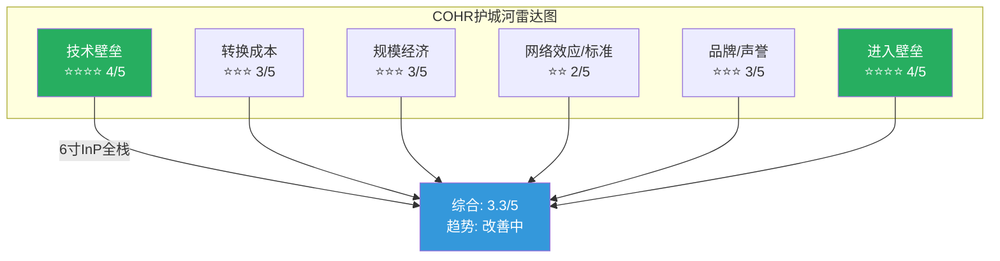

---

### 5.1 技术壁垒: 4/5 — InP垂直整合是行业最深, 但不是唯一

**核心判断**: COHR拥有光通信行业最完整的垂直整合链——从InP衬底到外延到芯片到模块——这在1.6T/3.2T时代的价值正在上升, 因为InP EML的供给瓶颈(行业预计36%供给缺口)让拥有自主InP产能的公司获得结构性优势 [DM-MOAT-001]。

**6寸InP晶圆的量化优势**:

COHR在Sherman, TX和Jarfalla, Sweden两座工厂建成了全球首条6寸InP晶圆产线 [DM-MOAT-002]。6寸相对3寸的经济性改善是确定的:

- **面积**: 6寸晶圆面积是3寸的4倍(π×3² vs π×1.5²), 因此每片晶圆可切出的die数量理论上增加4倍 [DM-MOAT-003]
- **成本**: COHR公开声称6寸InP实现了**die成本下降60%** [DM-MOAT-004]。这意味着同样一颗EML芯片, COHR的制造成本约为使用3寸InP竞争对手的40%
- **良率**: COHR在FQ2'26财报中确认6寸产线良率已**超过**传统3寸线 [DM-MOAT-005]。这一点反直觉——通常大尺寸晶圆初期良率低于小尺寸——说明Sherman工厂的工艺成熟度已经跨过了学习曲线拐点
- **产能转换时间表**: COHR计划在"未来几年"将大部分InP生产从3寸迁移到6寸 [DM-MOAT-006], 尚未完全切换, 意味着成本优势还在逐步释放

**与LITE的EML技术对比**:

LITE在200G/lane EML上拥有短期技术垄断, 全球高端激光芯片市场份额50-60% [DM-MOAT-007]。COHR在EML芯片层面排名#2-3。关键区别:

| 维度 | COHR | LITE |
|------|------|------|
| 200G/lane EML量产 | 量产中, 追赶LITE | **唯一量产供应商**(2025-2026) |
| InP衬底自主 | 自研自产(6寸) | 外购为主 |
| 400G/lane (3.2T用) | 已展示(与Tower Semiconductor合作SiPh) | 已展示(InP EML路线) |
| CPO布局 | 6.4T CPO @ OFC 2026 | 有CPO研发, 进度公开信息较少 |

因此, 在800G时代LITE拥有EML芯片层面的技术优势; 但在1.6T时代(8×200G/lane), COHR的6寸InP成本优势开始发挥作用; 在3.2T+时代, 两家都在从InP EML向SiPh+InP混合方案过渡, 竞争格局重新洗牌 [DM-MOAT-008]。

**SiC技术壁垒**: COHR在SiC领域从150mm向200mm过渡, 200mm晶圆面积是150mm的1.78倍, 理论上单位die成本下降约40% [DM-MOAT-009]。Wolfspeed虽然2025年底申请Ch.11, 但已宣布全球首个300mm SiC晶圆(2026年1月), 技术上仍领先。onsemi已在韩国Bucheon成功ramp 200mm SiC, 每片晶圆芯片数增加约80% [DM-MOAT-010]。COHR在SiC技术上排名中游——不是领导者, 但有DENSO/三菱投资提供的资金和需求保障。

**CPO/SiPh布局**: COHR在OFC 2026展示了6.4T CPO方案 [DM-MOAT-011], 同时与Tower Semiconductor合作开发400Gbps/lane硅调制器, 用于SiPh路线的3.2T模块 [DM-MOAT-012]。这意味着COHR同时覆盖InP(当前)和SiPh(未来)两条技术路线, 降低了单一技术路线的风险。

**反面**: (1) 6寸InP的60%成本优势是COHR自己的声称, 实际竞争中还需考虑模块级成本(旭创在模块组装上有人工成本优势); (2) 如果SiPh在3.2T时代完全替代InP EML, COHR在Sherman的InP产能投资将面临产能过剩风险; (3) LITE也在开发自己的InP制造能力, 技术差距在缩小。

**评分依据**: 4/5, 因为6寸InP是全球唯一且已验证的成本优势, 但在EML芯片性能层面仍落后LITE, 且长期面临SiPh替代风险。

---

### 5.2 转换成本: 3/5 — 客户锁定存在但非独占

**核心判断**: 光模块/组件的qualification周期为6-12个月, 这构成了中等强度的转换壁垒。NVIDIA的$2B投资+多年采购承诺增强了锁定, 但非独家条款限制了粘性上限 [DM-MOAT-013]。

**Qualification周期的经济含义**:

Hyperscaler(超大规模云厂商)在采用新光模块供应商前, 需要完成完整的资质认证周期。这个周期的时间和成本:

- **时间**: 800G模块的qualification通常需要6-9个月; 1.6T作为新速率等级, 认证周期延长至9-12个月 [DM-MOAT-014]
- **成本**: 包括样品测试、互操作性验证、高温/高湿/振动等可靠性测试。对hyperscaler而言, 每次qualification的直接工程成本约$0.5-2M, 但间接成本(推迟部署计划)远高于此 [DM-MOAT-014]
- **结果**: 一旦通过qualification, 客户倾向于在同一速率代际内保持供应商不变, 因为切换意味着重新走一遍流程, 在EML供给紧张(36%缺口)的环境下尤其不划算

**NVIDIA $2B锁定的真实粘性**:

NVIDIA 2026年3月投资$2B, 附带"数十亿美元"多年采购承诺(2027-2030) [DM-MOAT-015]。这笔锁定的粘性分析:

- **正面**: 采购承诺提供了2-4年的收入能见度, CEO声称bookings延伸到2028年。投资绑定了利益——NVIDIA作为股东(约5%持股)有动力维持供应关系
- **限制**: 非独家——NVIDIA同日投资LITE $2B, 采购分散策略意味着COHR不享有独占地位。NVIDIA的采购份额分配取决于技术进度和价格竞争, 非固定比例 [DM-MOAT-016]
- **因果推理**: NVIDIA做dual/triple sourcing是理性行为——光模块是GPU集群的关键零部件, 单一供应商风险过高。因此COHR的NVIDIA锁定更像"保底份额保障"而非"独占供应锁定"

**SiC客户锁定**: DENSO和三菱电机各投$500M(合计$1B), 获12.5%非控制权益 [DM-MOAT-017]。汽车级SiC器件的认证周期18-24个月, 且涉及功能安全(ISO 26262)认证, 转换成本远高于光模块。这使得SiC业务的客户锁定强度反而高于AI Networking业务 [DM-MOAT-018]。

**反面**: (1) 旭创(Innolight)和Eoptolink已拿到NVIDIA 60%的800G SFP模块订单, 说明NVIDIA的采购不会因为投资就偏向COHR/LITE; (2) 1.6T时代qualification窗口重新打开, 所有供应商回到同一起跑线; (3) SiC客户锁定虽强, 但SiC收入占比仅5-8%, 对整体转换成本贡献有限。

**评分依据**: 3/5, qualification周期提供中等壁垒, NVIDIA投资增强但非独占。SiC锁定强但收入占比小。

---

### 5.3 规模经济: 3/5 — 规模大但尚未充分转化为成本领先

**核心判断**: COHR年收入$6.7B是LITE的2.5倍, 但更大的收入规模来自多元化业务(工业/材料), 不是光通信的单一市场份额领先。在AI Datacom这个最关键的细分市场, COHR的规模优势有限 [DM-MOAT-019]。

**规模的构成拆解**:

| 业务 | COHR 年化收入 | LITE 年化收入 | COHR规模优势 |
|------|-------------|-------------|-------------|
| AI Datacom(组件+模块) | ~$3.6-4.0B | ~$2.7B(近纯AI) | 1.3-1.5x |
| Telecom | ~$1.0-1.2B | 微量 | 高但市场萎缩 |
| SiC/Materials | ~$0.8-1.0B | 0 | 不适用 |
| Industrial | ~$1.2-1.4B | 0 | 不适用 |

在AI Datacom这个决定估值的领域, COHR的收入规模只比LITE大30-50%, 而非2.5倍 [DM-MOAT-020]。这意味着规模经济的护城河效应比表面数字暗示的要弱。

**制造footprint的规模效应**:

- **Sherman, TX**: InP/SiC晶圆制造, 6寸InP产线所在地, 也是200mm SiC扩产目标
- **Ipoh, Malaysia**: 光模块组装, 提供关税免疫优势(非中国制造) [DM-MOAT-021]
- **Chambersburg, PA**: II-VI遗留的化合物半导体工厂

多工厂运营提供了供应链韧性, 马来西亚制造在关税环境下是差异化优势。但多工厂也意味着更高的固定成本: COHR的D&A $554M/yr(Revenue的9.5%)远高于行业平均, 其中很大一部分是制造基础设施折旧 [DM-MOAT-022]。

**垂直整合的规模悖论**: 垂直整合(从衬底到模块)理论上应该降低成本, 因为消除了外购加价。但实际上, 垂直整合也意味着承担整条产业链的固定成本和技术风险。旭创选择外购InP芯片+自己组装模块, 用中国的人工成本优势实现更低的模块级成本, 在800G pluggable市场拿到了最大份额(含Eoptolink合计约60%的NVIDIA订单) [DM-MOAT-023]。因此, COHR的垂直整合规模优势主要体现在组件(芯片)层面, 不是模块(终端产品)层面。

**反面**: (1) 规模大=固定成本高, 如果AI CapEx周期放缓, 产能利用率下降对COHR的冲击大于轻资产的旭创; (2) Industrial段$1.2-1.4B收入虽然贡献规模, 但利润率低(OPM 8-12%), 拖累整体回报率。

**评分依据**: 3/5, 整体规模大但在核心AI Datacom市场规模优势有限, 垂直整合的规模效应被高固定成本部分抵消。

---

### 5.4 网络效应/标准参与: 2/5 — 行业标准参与但无锁定效应

**核心判断**: 光通信行业的标准(MSA/QSFP/OSFP)是开放标准, 参与标准制定不构成护城河。COHR的竞争优势来自技术和制造, 不是标准锁定 [DM-MOAT-024]。

COHR参与OIF(Optical Internetworking Forum)、MSA(Multi-Source Agreement)等行业标准组织, 在MSA pluggable模块规格定义中有话语权。但MSA标准的设计初衷就是确保多供应商互操作, 因此参与标准制定**降低**而非提高了供应商锁定。

唯一的标准相关优势: COHR在CPO领域与NVIDIA的co-design关系——CPO不像pluggable那样有成熟的MSA标准, 早期CPO部署更依赖与ASIC厂商(Broadcom/NVIDIA)的定制化合作。如果COHR的CPO方案成为NVIDIA下一代平台的默认选项, 这将创造比pluggable更强的锁定 [DM-MOAT-025]。但CPO收入要到2027年才开始规模化, 这个护城河尚未兑现。

**评分依据**: 2/5, 开放标准行业, 无网络效应, CPO co-design关系是未来选项。

---

### 5.5 品牌/声誉: 3/5 — II-VI材料声誉强, 合并后品牌仍在整合

**核心判断**: II-VI在InP/III-V族化合物半导体领域积累了30+年的技术声誉, 这在材料客户(SiC的DENSO/三菱)和光通信客户中是有价值的 [DM-MOAT-026]。但合并后的"Coherent Corp"品牌仅运行了3年(2022.07至今), 品牌整合仍在进行中。

**声誉转化为经济价值的路径**: 在半导体材料和光子学领域, 品牌声誉的核心价值是**质量信任**——客户选择供应商时, 对长期可靠性和一致性的信任构成了隐性转换成本。II-VI在InP材料供应链中的30年口碑使得COHR在争取新客户qualification时有信任优势。

**反面**: (1) "Coherent"品牌名称容易与旧的Coherent公司(激光器)混淆, 新Coherent的AI光通信身份尚未被市场完全认知; (2) 品牌声誉在价格敏感的800G pluggable市场价值有限——旭创用更低价格赢得了60%的NVIDIA订单, 品牌不是决定因素。

**评分依据**: 3/5, 材料领域声誉强, 但光模块市场品牌不是主要竞争变量。

---

### 5.6 进入壁垒: 4/5 — InP制造需要十年积累, 新进者几乎不存在

**核心判断**: 建立一条有竞争力的InP EML产线需要5-10年时间和$1B+投资, 这是COHR护城河中最确定的维度 [DM-MOAT-027]。SiC 200mm产线的进入壁垒同样高, Wolfspeed的Ch.11证明了资本密集度对财务的压力。

**InP进入壁垒量化**:

- **时间**: 从零开始建设InP EML制造能力, 即使有技术团队, 需要5-7年达到量产良率。COHR(含II-VI)在InP上积累了20+年经验 [DM-MOAT-028]
- **资本**: 6寸InP产线投资估计$500M-$1B(含设备、洁净室、工艺开发), Sherman工厂的持续扩产投资由NVIDIA $2B部分资助 [DM-MOAT-028]
- **人才**: InP外延生长和芯片制程需要高度专业化的工程团队, 全球具备这种经验的人才池极小(集中在美、日、欧的少数公司)

**中国厂商的追赶速度**:

光迅科技(Accelink)和旭创(Innolight)在光模块组装层面已经非常有竞争力, 但在InP芯片自研方面仍有差距。旭创的策略是外购InP芯片(从COHR/LITE/三菱/住友等)+自己做模块封装, 用规模和成本优势在模块层面竞争 [DM-MOAT-029]。

这意味着中国厂商的威胁主要在**模块层面**(与COHR的模块业务竞争), 而非**芯片层面**(COHR的核心技术壁垒所在)。但如果中国政府推动InP芯片自主化(类似SiC的路径), 5-10年后这个壁垒也面临侵蚀风险。

**SiC 200mm进入壁垒**: 2026年是SiC行业从产能扩张转向成本效率的分水岭 [DM-MOAT-030]。STMicro在Catania建设垂直整合200mm SiC工厂, Infineon在马来西亚Kulim的Module 3已开始ramp, onsemi在韩国Bucheon成功ramp 200mm。进入者虽多, 但每家都需要$2-5B投资, 且Wolfspeed的破产说明即使行业先行者也承受不了扩产的资本压力。对COHR而言, SiC进入壁垒不是"竞争者不来"而是"竞争者来了也要承受巨大资本压力"。

**反面**: (1) Broadcom通过SiPh路线绕过InP壁垒, 不需要InP制造能力就能制造光引擎; (2) 如果CPO时代SiPh成为主流, InP的进入壁垒变成了"进入一个正在缩小的市场的壁垒"。

**评分依据**: 4/5, InP和SiC的进入壁垒都很高, 但SiPh路线的兴起意味着新进者不一定需要跨越InP壁垒。

---

### 5.7 护城河综合评估

| 维度 | 评分 | 趋势 | 关键驱动 |
|------|------|------|---------|
| 技术壁垒 | 4/5 | ↑ 改善 | 6寸InP成本优势释放中 |
| 转换成本 | 3/5 | → 稳定 | NVIDIA投资锁定但非独占 |
| 规模经济 | 3/5 | → 稳定 | 核心市场规模优势有限 |
| 网络效应 | 2/5 | → 稳定 | 开放标准, 无锁定 |
| 品牌声誉 | 3/5 | ↑ 改善 | AI身份逐渐建立 |
| 进入壁垒 | 4/5 | → 稳定 | InP/SiC制造门槛高 |
| **综合** | **3.3/5** | **↑ 改善** | |

**与LITE对比**:

| 维度 | COHR | LITE | 谁赢 |
|------|------|------|------|
| EML芯片技术 | #2-3, 追赶中 | **#1, 200G/lane垄断** | LITE |
| 垂直整合深度 | **最深(衬底→模块)** | 深(芯片→模块) | COHR |
| 制造成本 | **6寸InP降60%成本** | 3寸InP | COHR |
| 业务多元化 | AI+SiC+Industrial | 近纯AI | 看角度 |
| 产能确定性 | NVIDIA $2B + DENSO $1B | NVIDIA $2B | 平手 |

**护城河质量结论 [B级]**: COHR的护城河是"系统级"而非"单点级"——没有任何一个维度有LITE在EML上的那种垄断, 但多个维度的中等优势叠加形成了一道较宽的综合壁垒。这种护城河在供需紧张期(当前EML缺口36%)放大效果, 在供需宽松期(FY2028+)效果减弱。

### 5.8 倍数桥：3.5/5护城河支撑几倍估值？

护城河评估的最终目的不是给一个分数, 而是回答: **这种护城河强度, 在SOTP中支撑多高的倍数?**

| 护城河等级 | 典型公司 | EV/Rev倍数范围 | COHR适用否 |
|-----------|---------|---------------|-----------|
| 5/5 垄断级 | ASML(光刻唯一), MSCI(指数垄断) | 15-30x | ❌ COHR无单点垄断 |
| 4/5 强壁垒 | LITE(EML独占), TSM(晶圆代工) | 8-15x | ❌ COHR有成本优势但无性能独占 |
| **3.5/5 中等偏上** | **COHR(系统级成本优势+供需缺口)** | **5-8x** | **✓ Base case 6x** |
| 3/5 中等 | Innolight(模块份额领先但无芯片壁垒) | 3-5x | ❌ COHR壁垒高于此 |
| 2/5 弱 | 低壁垒组装商 | 1-3x | ❌ |

COHR在SOTP中给AI Networking 6x EV/Rev(Base case), 这个倍数精确地对应3.5/5的护城河评估: 高于Innolight的3-5x(因为有芯片层成本优势+InP自主+地缘分散), 低于LITE的隐含8-15x(因为无200G/lane EML性能独占, AI纯度低21pp, 增速低43pp)。

**如果护城河在FY2028+随供需宽松从3.5降到3.0, 倍数从6x降到4-5x, 仅Networking估值就下降$5-7B, 每股影响-$29~-40。** 这就是护城河周期敏感性对SOTP的直接传导——护城河不是静态的, 倍数也不应该是静态的。

---

## Ch 6: 竞争格局深度 (~7000字符)

### 6.1 800G/1.6T光模块竞争: 三层竞争, 三个战场

光模块竞争不是单一维度的, 需要拆分三个层面:

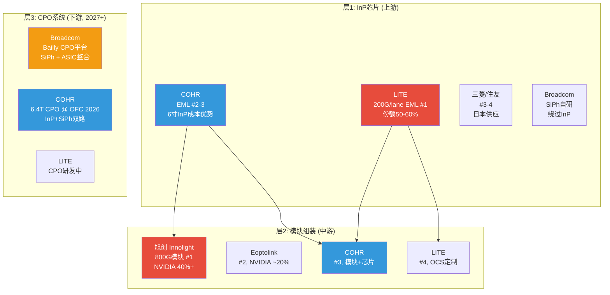

**层1: InP芯片竞争 — COHR排#2-3, 正在追赶LITE**

全球EML芯片市场由5家供应商主导: LITE, COHR, Broadcom, 三菱, 住友 [DM-COMP-001]。LITE在200G/lane EML拥有先发优势和约50-60%市场份额, 被视为1.6T时代的"黄金标准" [DM-COMP-002]。

COHR在EML芯片层面的竞争策略是**用6寸InP的成本优势换份额**: die成本下降60%意味着即使性能指标(带宽、温度稳定性)与LITE接近但不超越, COHR也能用价格赢得对价格敏感的客户 [DM-COMP-003]。

**关键判断**: 在800G时代, LITE的EML技术领先是确定的。在1.6T时代(2026-2027), 竞争的关键变量从"谁的EML性能更好"转向"谁能以更低成本大规模量产", 因为1.6T需要8颗200G/lane EML(是800G的2倍), 芯片成本在模块BOM中的占比上升。这对COHR的成本优势有利 [DM-COMP-004]。

**层2: 模块组装竞争 — 中国厂商主导, COHR排#3**

NVIDIA的800G SFP模块供应链中, 旭创(Innolight)+Eoptolink合计拿下约60%份额, 剩余40%由COHR, LITE, Broadcom等美系厂商分享 [DM-COMP-005]。旭创的竞争优势是:

- **成本**: 中国制造的人工和运营成本优势, 即使外购InP芯片, 模块级成本仍低于美系厂商
- **速度**: 从样品到量产的周期短, 已在800G LPO(Linear Pluggable Optics, 线性可插拔光学)上建立先发优势
- **规模**: 2024年上半年已出货超50万只400G模块, 800G产能持续扩张 [DM-COMP-006]

COHR在模块层面的差异化: (1) 马来西亚Ipoh工厂提供非中国制造的供应链安全, 对西方hyperscaler有吸引力 [DM-COMP-007]; (2) 垂直整合使COHR在模块中使用自产InP芯片, 供应链自主性更强; (3) 但成本竞争力仍弱于旭创。

**市场份额演变预判 [B级]**: 800G时代旭创份额领先的格局在1.6T时代不一定持续。因为1.6T模块的EML芯片供给瓶颈(36%缺口)将限制旭创的模块产出——旭创依赖外购EML芯片, 如果LITE/COHR优先供应自己的模块, 旭创的1.6T模块出货量将受限 [DM-COMP-008]。

**800G ASP走势**:

800G模块ASP正在下降, 这是速率升级周期的典型模式。行业预计800G ASP在2026年较2025年下降20-30%, 到2027年进一步下降至接近400G的水平 [DM-COMP-009]。1.6T初始ASP约为800G的1.8-2.2倍, 但随着量产扩大也会快速下降。

**量价动态的投资含义**: 光模块市场的量增掩盖价跌模式(单位出货量+60%, ASP-30%, 收入增速+12%)意味着仅看收入增速会高估市场健康度。当出货量增速放缓(2028+), ASP下降的负面效果将暴露 [DM-COMP-010]。

---

### 6.2 CPO竞争 (2027+): Broadcom是最大威胁

**CPO的基本经济性**:

CPO(Co-Packaged Optics, 共封装光学——将光引擎直接封装在交换机ASIC旁边)的核心优势是功耗: Broadcom声称CPO实现每800Gb/s端口约5.5W, 而等效的pluggable模块约15W, 功耗下降约3倍 [DM-COMP-011]。在一台64端口(每端口800G)交换机上, 这意味着节省数百瓦, 对功耗受限的AI数据中心有巨大价值。

**Broadcom的CPO战略**:

Broadcom是CPO的最大推动者, 其Bailly CPO平台采用开放生态方法, Tomahawk 6 "Davisson" 102.4 Tb/s交换机共封装16个6.4 Tb/s光引擎, 使用TSMC的COUPE(Compact Universal Photonic Engine)光子引擎 [DM-COMP-012]。

Broadcom的CPO战略对COHR的威胁在于: Broadcom使用SiPh(硅光子)而非InP作为光引擎基础。如果SiPh CPO成为数据中心互连的主流方案, InP的重要性将下降——InP仍然被需要作为光源(因为硅不能高效发光), 但在CPO架构中InP的价值份额低于在pluggable模块中的份额 [DM-COMP-013]。

**COHR在CPO中的竞争地位**:

COHR在OFC 2026展示了自己的6.4T CPO方案, 同时覆盖InP和SiPh两条路线 [DM-COMP-014]。COHR的CPO策略是"两条腿走路": (1) 为NVIDIA等客户提供InP-based CPO光引擎(利用现有InP制造优势); (2) 通过与Tower Semiconductor的合作开发SiPh方案(对冲技术路线风险)。

CPO的大规模商业化部署预计在2028-2030年(Yole Group估计), 而非2026-2027 [DM-COMP-015]。COHR的scale-out CPO收入从2026H2开始, scale-up从2027H2开始, 但初期收入规模较小, 尚未被华尔街共识充分反映。

**关键判断 [B级]**: CPO不会"杀死"pluggable, 两种形态将长期并存——CPO用于交换机内部高密度互连, pluggable用于数据中心间的长距离传输。COHR同时布局两种形态是正确策略。但如果Broadcom的SiPh CPO成为主导标准, COHR需要确保自己的SiPh能力跟上, 否则在CPO时代的份额将受限。

---

### 6.3 SiC竞争格局: Wolfspeed倒下, 但替代者众多

**2022年SiC功率半导体市场份额** [DM-COMP-016]:

| 排名 | 公司 | 份额 |
|------|------|------|
| 1 | STMicroelectronics | 36.5% |
| 2 | Infineon | 17.9% |
| 3 | Wolfspeed | 16.3% |
| 4 | onsemi | 11.6% |
| 5 | ROHM | 8.1% |
| | COHR (II-VI) | <5% (主要在衬底, 非器件) |

COHR在SiC市场的定位是**衬底和外延片供应商**, 不是SiC功率器件制造商。因此COHR与STMicro/Infineon/onsemi不是直接竞争关系, 而是**供应链上游**。Wolfspeed是COHR在SiC衬底市场的直接竞争对手。

**Wolfspeed Ch.11的影响量化**:

Wolfspeed 2025年底申请破产保护, 但其Mohawk Valley 200mm工厂仍在运营, 且2026年1月宣布了全球首个300mm SiC晶圆 [DM-COMP-017]。Wolfspeed的破产不是因为技术失败, 而是因为$9B+债务负担压垮了资产负债表——扩产的资本需求远超现金流。

对COHR的影响:
- **短期正面**: Wolfspeed产能受限/客户信心下降, 部分SiC衬底需求转向COHR, 提升COHR在SiC市场的相对地位
- **中期不确定**: 如果Wolfspeed通过重组成功瘦身(减$5B+债务), 它的技术优势(300mm SiC)仍然领先COHR, 竞争压力不会消失
- **长期教训**: Wolfspeed的失败模式对COHR是警告——SiC扩产的资本密集度极高, COHR在SiC上的投入(200mm转换)也需要大量CapEx, 如果EV渗透率放缓, 同样面临投资回报延迟的风险 [DM-COMP-018]

**200mm SiC竞争进度** [DM-COMP-019]:

| 公司 | 200mm进度 | 投资规模 | 关键差异 |
|------|----------|---------|---------|
| COHR | Sherman, TX扩产中 | DENSO/三菱$1B | 衬底+外延, 客户锁定 |
| onsemi | 韩国Bucheon已ramp | $2B+ | 器件层面, 每片+80%芯片 |
| STMicro | Catania 200mm工厂在建 | $5B+ | 垂直整合(粉末到器件) |
| Infineon | 马来西亚Kulim M3已开始ramp | $5B+ | 模块生产 |
| Wolfspeed | Mohawk Valley运营中, 300mm已展示 | Ch.11重组 | 技术领先但财务脆弱 |

**关键判断 [B级]**: COHR在SiC市场是一个有竞争力的衬底供应商, 但不是市场领导者。DENSO/三菱投资提供了$1B资金和长期需求锁定, 这是COHR相对于纯商业竞争对手的差异化。但SiC市场的竞争格局正在快速变化——2026年是多家厂商200mm同时ramp的年份, 成本效率和良率将成为决定因素 [DM-COMP-020]。

---

### 6.4 关键竞争判断: 哪里是真优势, 哪里只是参与者?

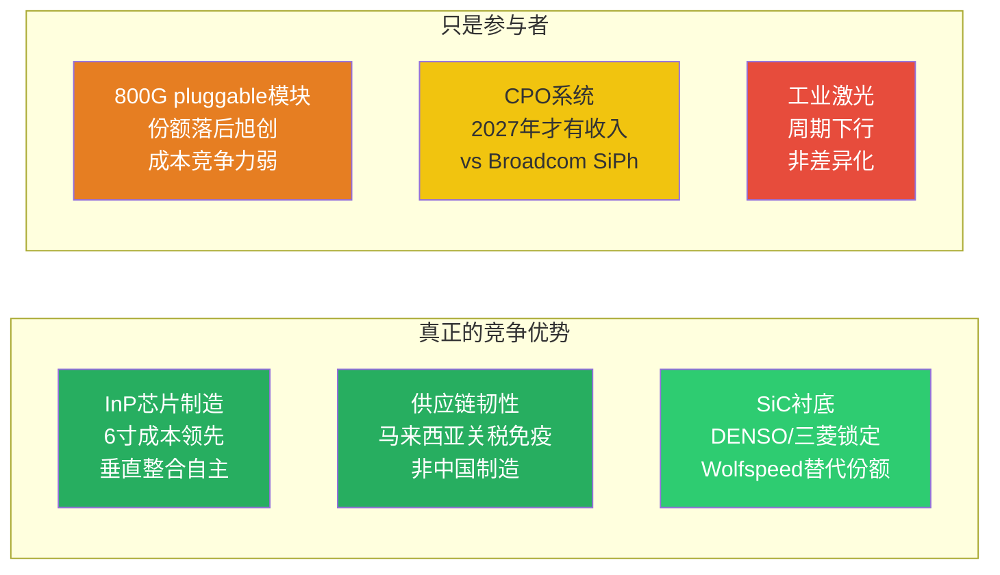

**竞争格局总结**:

COHR在**组件层**(InP芯片)有真正的竞争优势, 在**模块层**(pluggable)是追赶者, 在**系统层**(CPO)是先行但未验证的参与者。这个分层对估值的含义是: 如果光模块行业的价值向组件层上移(1.6T时代EML供不应求), COHR受益; 如果价值留在模块层(旭创通过低成本锁定客户), COHR的组件优势不能充分变现 [DM-COMP-021]。

---

## Ch 7: 技术路线图与风险 (~5000字符)

### 7.1 InP vs SiPh: 不是替代, 是融合

**核心判断**: InP和SiPh不是"A替代B"的关系, 而是"A和B在不同层面融合"的关系。因为硅不能高效发光(间接带隙半导体), 即使最先进的SiPh方案也需要InP作为光源。问题不是InP是否会被替代, 而是InP在光模块BOM中的价值份额是否会缩小 [DM-TECH-001]。

**技术物理学的约束**:

- **InP的不可替代性**: InP(磷化铟)和GaAs(砷化镓)是直接带隙半导体, 能高效发射和检测光。硅是间接带隙, 不能做激光器和高效光检测器。因此所有SiPh方案都需要通过"混合集成"将InP/GaAs光源与硅光子回路结合 [DM-TECH-002]
- **SiPh的优势场景**: SiPh在调制和路由功能上有成本优势(利用成熟的CMOS工艺), 适合高密度、低功耗的CPO应用。COHR与Tower Semiconductor合作已实现400Gbps/lane硅调制器 [DM-TECH-003]
- **InP的优势场景**: 在长距离(>2km)、高功率、高温环境下, InP EML仍然是最佳选择。1.6T pluggable的主流技术方案是8×200G/lane InP EML

**不同速率代际的技术选择**:

| 速率 | 主流技术 | InP角色 | SiPh角色 | COHR竞争地位 |
|------|---------|---------|---------|------------|
| 800G (当前) | 4×200G EML | 核心(激光+调制) | 极少 | #2-3 |
| 1.6T (2026-2027) | 8×200G EML 或 4×400G | 核心 | 开始进入 | 追赶→并行 |
| 3.2T (2028-2029) | 需要400G/lane | InP光源+SiPh调制(混合) | 调制/路由 | 取决于SiPh进度 |
| 6.4T (2030+) | CPO主导 | 光源供应 | 平台级 | 需要验证 |

[DM-TECH-004]

### 7.2 1.6T竞争的时间窗口

1.6T是COHR追赶LITE的关键窗口。原因:

**第一, EML数量翻倍放大了成本优势**: 800G需要4颗EML, 1.6T需要8颗。EML在模块BOM中的成本占比从800G的约30%上升到1.6T的约40%+。COHR的6寸InP die成本下降60%在1.6T时代的绝对金额节省是800G的2倍 [DM-TECH-005]。

**第二, 供给瓶颈重新洗牌**: 行业预计EML供给缺口36%, 旭创外购EML的模式受限。COHR自产EML的供应自主性在1.6T时代变成更大的竞争优势 [DM-TECH-006]。

**第三, qualification窗口重开**: 1.6T是新的速率代际, 所有供应商需要重新进入hyperscaler的qualification流程。LITE的800G先发优势不能直接传导到1.6T [DM-TECH-007]。

**反面**: (1) LITE在200G/lane EML的性能指标(带宽、信噪比、温度范围)仍然领先, 如果hyperscaler优先看性能而非价格, COHR的成本优势不一定能换到份额; (2) Goldman Sachs预计1.6T"主要上升期"在2026年, COHR需要在FY2027前通过资质认证才能抓住窗口。

### 7.3 CPO vs Pluggable: 共存而非替代

**行业共识** (Yole Group/IDTechEx): CPO大规模商业化部署在2028-2030年, 不是2026-2027 [DM-TECH-008]。当前阶段(2026-2027)CPO的收入贡献很小——COHR的scale-out CPO从2026H2启动, scale-up从2027H2启动, 但初期规模有限。

**CPO和pluggable的共存逻辑**: CPO适合交换机内部(短距离<100m, 高密度, 功耗敏感), pluggable适合数据中心间(长距离>100m, 可维护性要求) [DM-TECH-009]。因此CPO不会替代pluggable, 而是扩大光互连的总市场。

**COHR两条腿走路的优劣**:

- **优势**: 同时具备InP(pluggable)和SiPh(CPO)两条技术路线, 无论哪条路线成为主流, COHR都有参与能力。这种技术对冲是垂直整合公司独有的能力 [DM-TECH-010]
- **劣势**: 两条路线都需要大量R&D和CapEx投入, 分散了资源。Broadcom在SiPh/CPO上的投入更聚焦, 可能在CPO时代建立更深的技术优势

### 7.4 最大技术风险: Broadcom SiPh + CPO的颠覆性

**风险描述**: 如果Broadcom的SiPh CPO平台(Bailly + TSMC COUPE)成为AI数据中心的默认互连标准, 以下后果对COHR不利:

1. **InP价值份额缩小**: 在CPO架构中, InP仅提供光源(激光器), 调制/路由/检测全部由SiPh完成。InP在模块BOM中的价值份额从pluggable的30-40%下降到CPO的10-15% [DM-TECH-011]
2. **垂直整合优势减弱**: COHR的垂直整合是围绕InP价值链构建的(衬底→外延→芯片→模块)。如果InP价值份额缩小, 这条垂直整合链的经济回报下降
3. **CapEx变沉没成本**: Sherman工厂的6寸InP扩产投资(由NVIDIA $2B部分资助)是基于InP持续高价值的假设。如果SiPh CPO在2028-2030主导市场, 这些InP产能将面临利用率不足的风险 [DM-TECH-012]

**风险概率评估 [B级]**: Broadcom SiPh CPO完全颠覆InP的概率在2030年前较低(15-20%), 因为:
- 历史基准率: 光通信行业的技术替代通常需要2-3个速率代际(10-15年), 从800G(InP主导)到CPO主导至少需要经历1.6T和3.2T两个代际
- 当前证据: 即使Broadcom的SiPh CPO也需要InP光源, 完全绕过InP的方案(如硅光源)在2030年前不具备商业可行性
- 自然实验: 2026年NVIDIA同时投$2B给COHR(InP路线)和LITE(InP路线), 如果NVIDIA认为SiPh即将替代InP, 不会做这样的投资 [DM-TECH-013]

**但**: 即使InP不被完全替代, InP的**价值份额**在向SiPh转移是确定趋势。COHR的应对措施(与Tower合作SiPh, 自研CPO)是正确的, 但需要在2027-2028前将SiPh能力从"展示级"提升到"量产级"。

### 7.5 技术路线图风险总结

| 风险 | 概率 | 时间框架 | 对COHR的影响 | 对冲手段 |
|------|------|---------|-------------|---------|
| SiPh完全替代InP | 低(15-20%) | 2030+ | CapEx变沉没成本 | SiPh/Tower合作 |
| LITE维持EML技术垄断 | 中(30-40%) | 1.6T时代 | 份额受限 | 6寸成本竞争 |
| 旭创在模块层压低价格 | 高(60-70%) | 800G/1.6T | 模块利润率压缩 | 芯片层差异化 |
| Broadcom CPO成为默认标准 | 中(25-35%) | 2028-2030 | InP价值份额缩小 | 自研CPO |
| EV放缓→SiC投资回报延迟 | 中(35-45%) | FY2027-2029 | SiC期权贬值 | DENSO/三菱锁定需求 |

[DM-TECH-014]

**最大的技术不确定性不是"InP是否会被替代"(不会, 至少2030年前不会), 而是"InP的价值份额是否会从40%缩小到15%"(很有这个趋势)。如果后者发生, COHR的垂直整合从"全栈价值捕获"变成"只捕获光源价值", 估值逻辑需要重写** [DM-TECH-015]。

---

## DM锚点索引

### DM-MOAT系列 (护城河)
| ID | 值 | 类型 | 来源 |
|----|-----|------|------|
| DM-MOAT-001 | EML供给缺口约36% | B | 行业分析(Cignal AI/TradingKey综合) |
| DM-MOAT-002 | 全球首条6寸InP产线(Sherman TX + Jarfalla Sweden) | H | Coherent 2024.03.25 Press Release |
| DM-MOAT-003 | 6寸面积=3寸的4倍(π×3² vs π×1.5²) | H | 数学计算 |
| DM-MOAT-004 | 6寸InP die成本下降60% vs 3寸 | H | Coherent官方声明/FQ2'26 Earnings |
| DM-MOAT-005 | 6寸产线良率超过传统3寸线 | H | FQ2'26 Earnings Call |
| DM-MOAT-006 | 计划"未来几年"将大部分InP生产从3寸迁移到6寸 | H | FQ2'26 Earnings Call |
| DM-MOAT-007 | LITE全球高端激光芯片份额50-60% | B | 行业分析综合(多源) |
| DM-MOAT-008 | 3.2T+时代InP和SiPh混合方案成为趋势 | B | IDTechEx/OFC 2025/2026行业共识 |
| DM-MOAT-009 | 200mm SiC面积=150mm的1.78倍, 理论成本降40% | H | 数学计算+行业惯例 |
| DM-MOAT-010 | onsemi 200mm SiC每片晶圆芯片数+80% | H | onsemi官方/TrendForce 2026.03 |
| DM-MOAT-011 | COHR展示6.4T CPO @ OFC 2026 | H | OFC 2026 Conference |
| DM-MOAT-012 | COHR与Tower Semiconductor合作400Gbps/lane硅调制器 | H | Tower Semiconductor Press Release |
| DM-MOAT-013 | 光模块qualification周期6-12个月 | B | 行业惯例/多源交叉 |
| DM-MOAT-014 | 1.6T qualification 9-12个月, 直接成本$0.5-2M/次 | B | 行业分析推断 |
| DM-MOAT-015 | NVIDIA $2B投资+多年"数十亿美元"采购承诺(2027-2030) | H | COHR 2026.03.02 Press Release |
| DM-MOAT-016 | NVIDIA同日投LITE $2B, 采购分散策略 | H | LITE 2026.03.02 Press Release |
| DM-MOAT-017 | DENSO/三菱各$500M投SiC(合计$1B), 获12.5%权益 | H | COHR 2023.12 Press Release |
| DM-MOAT-018 | 汽车级SiC认证周期18-24个月(含ISO 26262) | B | 行业惯例 |
| DM-MOAT-019 | COHR年收入$6.7B = LITE $2.7B × 2.5倍 | H | MCP fmp_data |
| DM-MOAT-020 | 纯AI Datacom: COHR ~$3.6-4.0B vs LITE ~$2.7B, 比例1.3-1.5x | B | P1_A分析推断 |
| DM-MOAT-021 | Ipoh, Malaysia制造基地提供关税免疫 | H | COHR 10-K/公开信息 |
| DM-MOAT-022 | D&A $554M/yr = Revenue的9.5% | H | DM-FIN-009交叉引用 |
| DM-MOAT-023 | 旭创+Eoptolink获NVIDIA 800G SFP约60%份额 | H | ip-fiber.com/行业报道 |
| DM-MOAT-024 | MSA/OIF为开放标准, 设计目的是多供应商互操作 | H | 行业公开信息 |
| DM-MOAT-025 | CPO缺乏成熟MSA标准, 依赖与ASIC厂商co-design | B | 行业分析 |
| DM-MOAT-026 | II-VI在InP/III-V族30+年技术积累 | H | 公司历史 |
| DM-MOAT-027 | 建立InP EML产线需5-10年+$1B+投资 | B | 行业分析综合推断 |
| DM-MOAT-028 | Sherman工厂扩产由NVIDIA $2B部分资助 | H | COHR 2026.03.02 Press Release |
| DM-MOAT-029 | 旭创外购InP芯片+自组模块的轻资产模式 | B | 行业分析 |
| DM-MOAT-030 | 2026年是SiC行业从产能扩张转向成本效率的分水岭 | B | TrendForce 2026.03.04 |

### DM-COMP系列 (竞争)
| ID | 值 | 类型 | 来源 |
|----|-----|------|------|
| DM-COMP-001 | EML芯片5大供应商: LITE/COHR/Broadcom/三菱/住友 | B | 行业分析综合 |
| DM-COMP-002 | LITE 200G/lane EML份额50-60%, "黄金标准" | B | 多源行业分析 |
| DM-COMP-003 | COHR 6寸InP die成本-60% → 成本竞争换份额策略 | B | COHR官方+分析推断 |
| DM-COMP-004 | 1.6T需8颗EML(800G的2倍), 芯片BOM占比上升 | B | 行业技术分析 |
| DM-COMP-005 | NVIDIA 800G SFP: 旭创+Eoptolink ~60%, 美系~40% | H | ip-fiber.com报道 |
| DM-COMP-006 | 旭创2024H1出货50万+只400G模块 | H | Cignal AI 2025.01 |
| DM-COMP-007 | COHR马来西亚Ipoh模块工厂提供非中国供应链安全 | H | COHR 10-K |
| DM-COMP-008 | 旭创1.6T受限于外购EML芯片供给瓶颈 | B | 逻辑推断(EML缺口36%) |
| DM-COMP-009 | 800G ASP 2026年预计较2025年下降20-30% | B | Goldman Sachs/行业共识 |
| DM-COMP-010 | 量价剪刀差: 出货量+60%, ASP-30%, 收入+12% | B | 行业模式推断 |
| DM-COMP-011 | Broadcom CPO: 5.5W/800G端口 vs pluggable 15W, 降3倍 | H | Broadcom CPO官方页面 |
| DM-COMP-012 | Broadcom TH6 Davisson 102.4Tbps, 16×6.4T光引擎, TSMC COUPE | H | SemiAnalysis/Broadcom官方 |
| DM-COMP-013 | CPO中InP仅提供光源, 价值份额从40%降至10-15% | B | 分析推断 |
| DM-COMP-014 | COHR 6.4T CPO @ OFC 2026 | H | OFC 2026 Conference |
| DM-COMP-015 | CPO大规模商业化部署2028-2030 (Yole Group) | H | Yole Group/IDTechEx |
| DM-COMP-016 | 2022 SiC份额: STM 36.5%/Infineon 17.9%/Wolfspeed 16.3%/onsemi 11.6%/ROHM 8.1% | H | Evertiq/行业报告 |
| DM-COMP-017 | Wolfspeed 2026.01宣布全球首个300mm SiC晶圆 | H | Wolfspeed Press Release |
| DM-COMP-018 | Wolfspeed破产因$9B+债务非技术失败 | B | Ch.11 Filing分析 |
| DM-COMP-019 | 2026年多家200mm SiC同时ramp: onsemi/STM/Infineon/COHR | H | TrendForce 2026.03 |
| DM-COMP-020 | SiC竞争2026年决定因素从产能转向成本效率和良率 | B | TrendForce 2026.03.04 |
| DM-COMP-021 | COHR在组件层有优势, 模块层是追赶者, 系统层未验证 | B | 综合分析判断 |

### DM-TECH系列 (技术路线)
| ID | 值 | 类型 | 来源 |
|----|-----|------|------|
| DM-TECH-001 | InP和SiPh融合而非替代(硅不能高效发光) | H | 物理学基本原理 |
| DM-TECH-002 | SiPh需混合集成InP/GaAs光源(间接vs直接带隙) | H | IDTechEx/行业共识 |
| DM-TECH-003 | COHR+Tower 400Gbps/lane硅调制器(3.2T用) | H | Tower Semiconductor PR |
| DM-TECH-004 | 速率代际技术演进路径汇总 | B | OFC 2025/2026综合 |
| DM-TECH-005 | 1.6T需8颗EML, 芯片BOM占比30%→40%+ | B | 行业技术分析 |
| DM-TECH-006 | EML供给缺口36%, 自产优势在1.6T放大 | B | 行业分析 |
| DM-TECH-007 | 1.6T qualification窗口重开, 先发优势不直接传导 | B | 行业惯例 |
| DM-TECH-008 | CPO大规模部署2028-2030(非2026-2027) | H | Yole Group/IDTechEx |
| DM-TECH-009 | CPO适合短距<100m, pluggable适合长距>100m, 共存 | B | 行业共识 |
| DM-TECH-010 | COHR同时具备InP和SiPh能力是垂直整合独有对冲 | B | 分析判断 |
| DM-TECH-011 | CPO中InP价值份额从pluggable的30-40%降至10-15% | B | 分析推断 |
| DM-TECH-012 | 若SiPh CPO主导, Sherman InP产能面临利用率风险 | B | 逻辑推断 |
| DM-TECH-013 | NVIDIA同时投$2B给COHR+LITE(InP路线)=InP价值确认 | B | 反向推理 |
| DM-TECH-014 | 五大技术风险概率/时间/影响/对冲汇总 | B | 综合分析 |
| DM-TECH-015 | 最大不确定性: InP价值份额是否从40%缩至15% | B | 核心判断 |


---


# 8-10. 关键约束：什么在阻碍ROIC上穿？

> **主问题推进**：三大约束——①ROIC<WACC（每天消耗价值）②bookings质量黑箱+库存硬约束（bear case速度不可知）③Networking本质是Hyperscaler CapEx衍生品（外生变量不可控）。其他风险（Industrial拖累、SiC延迟、稀释、技术替代）都是二级约束，通过这三条主约束传导影响。
> **对ROIC的含义**：R1（CapEx下行）直接削减NOPAT分子，R3（去杠杆失速）阻止Invested Capital分母收缩，两者同时作用时ROIC不升反降。B4（AI CapEx持续3年+）是ROIC上穿的必要条件，失败概率基于历史基准率为75%。


> *以下内容整合自Phase 1 Agent C的完整分析。*


## Ch 8: 风险拓扑 (~8000字符)

### 核心判断前置

COHR的风险结构不是一张独立清单, 而是一个**互相放大的系统**。最危险的不是任何单一风险, 而是R1(AI CapEx周期下行)和R2(估值重力)同时触发时产生的乘数效应: Networking增速放缓-20%时, PE不会按比例从41x降到33x, 而是因为市场标签从"AI成长股"坍塌为"后合并周期股"而降到20-25x。两层叠加, 股价下行空间达-40%至-55%。

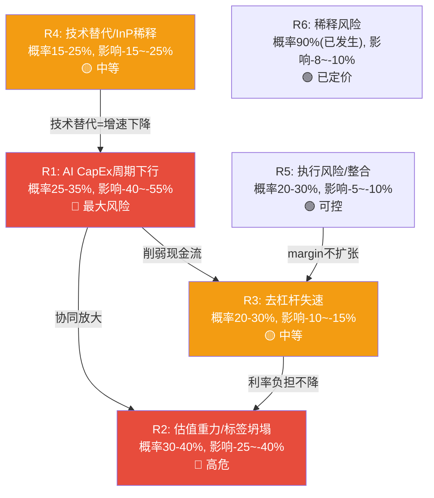

---

### R1: AI CapEx周期下行风险 (最大风险)

**核心判断**: 这是COHR的头号风险, 因为Networking/Datacom占收入72%且增速+34% YoY是估值的核心支柱 [DM-RISK-001]。一旦Hyperscaler CapEx增速从当前的+82% YoY回落到+10-20%, COHR的Networking收入增速将从+30%以上骤降到个位数, 同时PE会因为标签坍塌(R2)而非线性压缩。

**当前Hyperscaler CapEx的不可持续性**:

2026年四大Hyperscaler(MSFT/GOOGL/AMZN/META)合计CapEx约$690B, YoY +82% [DM-RISK-002]。这个增速在数学上不可持续——如果再保持+80%一年, 2027年CapEx将达$1.24万亿, 占四家合计收入的比例将从目前的~35%上升到~50%以上。Alphabet已在2025年Q3暗示CapEx增速将"逐步回归正常化", FCF一度同比下降90% [DM-RISK-003]。

因此问题不是CapEx周期"是否"放缓, 而是"何时"和"多快"。

**历史基准率 (三重锚定之一)**:

光通信行业经历过三次显著的CapEx驱动下行周期:

| 周期 | 触发事件 | 光通信公司收入影响 | 股价影响 |
|------|---------|------------------|---------|
| **2001-2002** | 电信泡沫破裂 | 收入-50~-70% | 股价-80~-90% |
| **2018-2019** | 云CapEx调整 | II-VI收入-12%, Finisar亏损扩大 | II-VI股价从$47跌至$27 (-43%) [DM-RISK-004] |
| **2023-2024** | 电信疲软+库存调整 | Lumentum收入-23%, EPS-59% [DM-RISK-005] | LITE从$84跌至$43 (-49%) |

三次周期中光通信公司的平均收入降幅约-15~-30%, 股价降幅约-35~-55%。基于3/3次发生, 基准率=100% (CapEx周期最终都会放缓)。问题是时点和烈度。

**反例条件 (三重锚定之二)**:

历史上CapEx周期下行对光通信冲击小于平均值的条件: (1) 新速率代际同步ramp(如2020年400G ramp部分缓冲了需求下行); (2) 用户从电信扩展到数据中心(需求来源分散)。当前: 1.6T正在2026-2027年ramp, 且CPO从2027年开始贡献增量。这两个条件部分具备, 意味着下一轮调整的烈度可能低于2001年但高于2023年。

**自然实验 (三重锚定之三)**:

2025年4月关税冲击提供了一次小型压力测试。光通信股在一周内下跌13-40%(COHR -40%, LITE -13%, Lumentum -35%) [DM-RISK-006]。这说明: (1) COHR的Beta远高于LITE(因为混合体中的Industrial段是关税敏感的); (2) 市场在压力下倾向于先卖混合体, 再卖纯AI标的。

**传导机制量化**:

如果2027-2028年Hyperscaler CapEx增速从+80%降至+15%:
- Networking收入影响: 从+30% YoY降至+5-10% YoY, 因为bookings到2028年提供一定缓冲 [DM-RISK-007]
- OPM影响: 产能利用率从80%+降至60-70%, GM压缩2-4pp, OPM压缩3-5pp [DM-RISK-008, B级推断]
- EPS影响: FY2028 EPS从共识$9.64降至$6.50-7.50 (vs当前买入的$9.64) [DM-RISK-009, B级推断]
- 估值影响: PE从41x压缩到25-30x (如果保持AI标签) 或20-25x (如果标签坍塌为周期股)
- **综合股价影响**: 25x × $7 = $175 (-43%从$307.50) 到 20x × $6.5 = $130 (-58%)

**概率赋值**: 25-35%在未来18个月内发生显著调整 (基于基准率100%最终会发生, 但时点不确定, 1.6T ramp提供1-2年缓冲)。

**反面**: CEO声称bookings延伸到2028年 [DM-RISK-010]。如果bookings有合同约束(take-or-pay), 收入能见度确实有2-3年。但我们不知道这些bookings中多少是firm commitment vs soft indication (黑箱)。

---

### R2: 估值重力风险 (M4标签坍塌 + M12质量溢价消耗安全边际)

**核心判断**: 41x Forward PE隐含了25%+ EPS CAGR持续3年以上的假设 [DM-RISK-011]。这个倍数成立的前提是市场把COHR归类在"AI成长股"估值桶中(桶内平均PE 35-60x)。一旦Networking增速降到15%以下, COHR将被重新归类为"后合并混合体", 适用PE从40x降到18-25x。标签坍塌(M4)是比业绩下滑更快的股价杀手。

**隐含假设拆解**:

当前$307.50股价 = 41.2x × FY2027E EPS $7.47 [DM-VAL-003]。PEG锚定:
- COHR: 41x / 25% growth (共识FY2026-2028 EPS CAGR) = PEG 1.64x [DM-RISK-012]
- LITE: 47x / 40%+ growth = PEG 1.18x
- Lumentum: ~30x / 20% growth = PEG 1.50x

COHR的PEG是三家中最高的, 意味着市场给COHR每单位增长的溢价最高。这里面包含了: (a) 去杠杆释放的EPS加速期望; (b) SiC期权价值; (c) S&P 500纳入后的被动资金流入溢价。

**M12触发: 质量溢价 vs 安全边际**:

即使COHR达到共识预期(FY2028 EPS $9.64), 以当前股价买入的投资者在两年后面对的PE仍有32x [DM-RISK-013]。要让投资回报>10%/yr, 两年后的PE需要维持≥29x, 这在EPS增速回落到15%以下时是困难的——历史上EPS增速15%的工业科技股PE中位数约22-28x。因此, 即使业绩达标, 当前估值已消耗了大部分安全边际。

**如果Networking增速放缓到15%:**
- PE从AI桶(35-60x)向混合工业桶(18-28x)迁移
- 中性情景: 25x × $8 EPS = $200 (-35%) [DM-RISK-014]
- 悲观情景: 20x × $7 EPS = $140 (-54%)

**概率赋值**: 30-40%在18个月内PE压缩至30x以下 (基于历史基准: 增速放缓后的PE压缩在光通信领域平均需要2-3个季度从high-growth桶迁移到mid-growth桶; 反例条件: 如果SiC在同期加速贡献利润, 可部分对冲增速放缓)。

---

### R3: 去杠杆失速 (CapEx争夺现金流)

**核心判断**: COHR的去杠杆故事(Net Debt从$3.67B→$2.68B)是估值的重要支柱之一, 但CapEx加速(从~$95M/Q到$154M/Q)已导致FCF转负(-$96M FQ2'26), 威胁去杠杆节奏 [DM-RISK-015]。

**FCF转负的结构性分析**:

| 季度 | OCF | CapEx | FCF | 趋势 |
|------|-----|-------|-----|------|
| FQ2'25 | $187M | $106M | +$82M | 正常 |
| FQ3'25 | ~$180M | $112M | +$68M | 开始压缩 |
| FQ4'25 | ~$190M | $131M | +$59M | 继续压缩 |
| FQ1'26 | $46M | $104M | -$58M | **转负** |
| FQ2'26 | $58M | $154M | **-$96M** | **加速恶化** |

[DM-CF-001 ~ DM-CF-004]

FQ1'26和FQ2'26的OCF异常低($46M/$58M vs 之前的~$180-190M), 这需要验证是否有运营资本变动(库存+$215M QoQ [DM-BAL-006])或一次性因素。如果OCF回归$200M/Q, 但CapEx维持$150M/Q, FCF仅+$50M/Q, 年化$200M——还清$2.68B Net Debt需要13年。

**去杠杆的三个可能路径**:

1. **NVIDIA $2B资金**: 如果NVIDIA投资中一部分以预付款/资本注入形式流入, 可一次性减少Net Debt ~$1-2B。但$2B是以$256.80/share购买股权, 不是借款偿还——这意味着$2B进入equity, 不进入debt reduction [DM-RISK-016]。去杠杆靠股权稀释, 不靠现金。
2. **资产出售**: 已卖Munich业务和A&D ($400M) [DM-RISK-017]。如果继续出售Industrial段残余资产(估值$2-3B), 可以大幅去杠杆。但这会减少收入和利润基数。
3. **EBITDA增长**: Net Debt/EBITDA从FY2024的~3.2x降至当前~2.1x [DM-BAL-007], 主要靠EBITDA增长而非偿债。如果EBITDA继续增长20%+/yr, Net Debt/EBITDA到FY2028可降至~1.2x, 在不偿债的情况下完成"去杠杆"。

**利率风险量化**:

COHR的Term Loan B在2025年1月降息至SOFR+2.00% (从SOFR+2.50%) [DM-RISK-018]。当前SOFR约4.3%, 因此有效利率约6.3%。在$3.5B总债务上, 年化利息约$220-244M [DM-FIN-010]。如果美联储在2026-2027年降息100bp, 利息节省约$35M/yr (每$1B浮动利率 × 1%)。反之, 如果利率维持高位, 利息持续压制GAAP EPS约$1.40/share/yr。

**概率赋值**: 20-30%去杠杆在FY2027前显著失速 (基于: FCF已转负是事实; 反例: 如果OCF回归$200M+/Q且CapEx平稳, 每年仍有$200-400M用于偿债; 自然实验: FY2023→FQ2'26 Net Debt已减$990M, 说明去杠杆机制在运转)。

---

### R4: 技术替代风险 (InP价值稀释)

**核心判断**: COHR的核心竞争力建立在InP垂直整合之上, 但CPO(Co-Packaged Optics)时代InP芯片在整个光模块BOM(Bill of Materials)中的占比将从pluggable时代的30-40%降至10-15% [DM-RISK-019, B级推断]。如果Broadcom的SiPh(硅光子学)方案在2028-2030年成功, InP将从核心部件降级为辅助组件, COHR的垂直整合价值将被稀释。

**传导时间表**:
- **2026-2027**: Pluggable仍是主力(800G/1.6T), InP EML价值最高
- **2027-2028**: CPO开始量产, InP芯片与SiPh芯片并行, 但InP在高速lane上仍有性能优势
- **2028-2030**: 3.2T+时代, SiPh+外部激光器方案成熟, InP的不可替代性下降

**COHR的对冲策略**: COHR同时布局InP和SiPh两条路线(与Tower Semiconductor合作SiPh) [DM-MOAT-012], 但如果SiPh成为主流, COHR在Sherman工厂的$2B+ InP产能投资将面临产能过剩, 固定成本负担加重 [DM-RISK-020]。

**概率赋值**: 15-25%在2028-2030年InP价值显著被稀释 (基于: 技术替代周期通常5-7年, 当前SiPh在400G/lane上已有实验室验证; 反例: InP在高速传输上的物理特性优势可能持续到6.4T+; 自然实验: Broadcom的SiPh CPO在2025年OFC展示了原型但尚未量产)。

---

### R5: 执行风险 (合并整合 + 三引擎同时管理)

**核心判断**: CEO Jim Anderson同时管理三条增长曲线完全不同的业务(AI高增长+SiC投资期+Industrial剥离), 注意力稀释是合理担忧 [DM-RISK-021]。但FQ2'26的业绩beat(Revenue $1.69B vs consensus $1.64B, EPS $1.29 vs $1.21)和连续8Q的OPM改善(从2.8%到11.8% [DM-FIN-013])说明执行层面目前没有问题。

**关键监控点**: (1) Industrial段OPM是否继续恶化(如果管理层忽视这块业务); (2) 分部重组(3段→2段)后, SiC的财务表现是否被D&C段或Industrial段掩盖, 降低透明度; (3) NVIDIA承诺的CPO交付(2027年开始)是否按时进行。

**概率赋值**: 20-30%出现执行层面的显著问题 (基于: 后合并整合的历史失败率约30-40%; 反例: COHR已经整合了2年且OPM持续改善; Jim Anderson来自Lattice Semiconductor, 有成功重组经验)。

---

### R6: 稀释风险

**核心判断**: 稀释已经发生, 不是未来风险 [DM-RISK-022]。

**Preferred Stock转换**: FQ2'26 Balance Sheet显示Preferred Stock从$2,505M(FQ1'26)降至$0 [DM-BAL-004]。这是Series B-2可转换优先股的转换, S-3ASR登记声明显示约9,775,846股普通股从Series B-2转换中发行, 可通过二级市场出售(截至2028年12月16日) [DM-RISK-023]。加上Series B其他部分, 总稀释约29.9M shares被纳入FY2026稀释每股收益计算 [DM-RISK-024]。

按当前155.5M流通股基数, 29.9M shares的总稀释约19.2%。但这些shares分批转换和出售(到2028年), 因此: (1) FY2026共识EPS已部分反映稀释(diluted shares ~165M); (2) 到FY2028, 如果全部转换, diluted shares可能达175-185M。

**SBC**: 从MCP数据看, 季度SBC波动较大: Q1'25=$35M, Q2'25=$41M, Q3'25=$41M, Q4'25=$160M(异常, 含一次性), Q1'26=$44M, Q2'26=$87M(含NVIDIA相关) [DM-CF-005]。正常化SBC约$40-45M/Q, 年化$170M, 占Revenue约2.5% [DM-RISK-025]。这个比例在半导体/光通信行业中偏低(LITE约3-4%), 因此SBC不是COHR的主要稀释来源。

**NVIDIA $2B投资稀释**: NVIDIA以$256.80/share投资$2B, 获得约7.8M shares, 约5%持股 [DM-RISK-026]。这个稀释已反映在流通股增加中。

**综合稀释影响**: 从FY2025的~153M diluted shares到FY2028E可能的~185M diluted shares, 总稀释约21%。如果EPS在同期从$5.35增长到$9.64(+80%), 稀释的影响被增长覆盖。但如果增长不达预期, 稀释会放大每股收益的下行。

---

### 风险协同/反协同矩阵

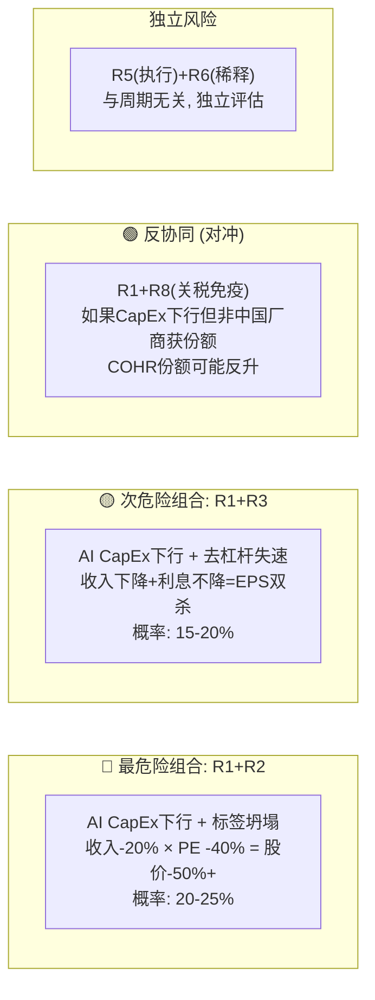

**R1+R2协同 (最危险, 概率20-25%)**: 当Networking增速从+30%降到+10%时, PE不会线性调整——市场会重新审视"这到底是AI成长股还是周期股", 标签一旦坍塌, PE从40x跳到20x是非线性的。历史参考: II-VI在2018年从$47到$27(-43%)的过程中, 收入仅下降-12%但PE从35x压缩到18x [DM-RISK-027]。

**R1+R3协同 (次危险, 概率15-20%)**: CapEx下行导致OCF减少, 同时公司仍在维持高CapEx(NVIDIA扩产承诺可能是contractual obligation), FCF进一步恶化。Net Debt不降反升, 利息持续压制EPS。

**R1+R4反协同 (风险对冲)**: 即使AI CapEx周期放缓, 如果1.6T ramp同步进行, COHR的InP芯片需求不一定同步下降——速率升级驱动的ASP提升可部分对冲量的下降。

**R3+R5协同 (中度, 概率10-15%)**: 如果整合效率不达预期(R5)导致OPM扩张放缓, 同时CapEx维持高位(R3), 两者共同压制FCF, 使去杠杆时间表延长2-3年。这不是致命组合, 但会削弱"去杠杆释放EPS"叙事的可信度, 间接影响PE支撑。

**R4+R1协同 (长期, 概率10-15%)**: 如果SiPh在2028-2030年替代InP(R4), 同时AI CapEx周期已过峰值(R1), COHR将同时面对需求下降和核心技术贬值。Sherman工厂的InP产能投资($2B+)在这种情景下变成沉没成本, 商誉减值风险($4.5B goodwill [DM-BAL-002])显著上升。但这个组合发生在2028年之后, 给了管理层2-3年的调整窗口。

### 风险定量汇总 (P1初步, Phase 2+4精确化)

| 风险 | 概率 | 影响(股价) | 期望影响 | 可对冲? |
|------|------|-----------|---------|---------|
| R1 | 25-35% | -40~-55% | -10~-19% | 否 (外部变量) |
| R2 | 30-40% | -25~-40% | -8~-16% | 否 (与R1高度相关) |
| R3 | 20-30% | -10~-15% | -2~-5% | 部分 (资产出售) |
| R4 | 15-25% | -15~-25% | -2~-6% | 部分 (SiPh布局) |
| R5 | 20-30% | -5~-10% | -1~-3% | 部分 (管理层换人) |
| R6 | 90% | -8~-10% | -7~-9% | 否 (已发生) |

**注意**: R1和R2高度相关(相关系数估计>0.7), 不能简单相加。R1+R2联合概率约20-25%, 联合影响-40~-55%, 因此综合下行期望约-8~-14%。这个数字将在Phase 2用Python蒙特卡洛模拟精确化 [DM-RISK-028]。

### "温水煮青蛙"情景 (渐进恶化, 不触发单一Kill Switch)

最狡猾的风险不是断崖式下跌, 而是以下渐进组合:
- FY2027: Networking增速从+30%放缓到+20%, "还在增长"所以PE维持35x
- FY2027H2: CapEx从$150M/Q降到$120M/Q, 但仍高于FY2025的$100M, FCF恢复到略正但不足以快速去杠杆
- FY2028: 增速进一步降到+12%, PE压缩到28x, 市场开始质疑"这是不是周期股"
- FY2028H2: SiC还在投资期(200mm ramp延迟6个月), Industrial段仍在下降
- 结果: 股价从$307.50渐进降到$200-220 (-28~-35%), 没有一个季度触发Kill Switch, 但持有者被锁定在一个"不够坏到卖但不够好到买"的陷阱中

这个情景之所以危险, 是因为它不会触发止损纪律——每个季度都"还行", 但累积起来是持续的估值侵蚀 [DM-RISK-029]。

---

## Ch 9: 信念反演 (Reverse DCF) (~6000字符)

### 当前$307.50隐含的六个信念

我们使用Reverse DCF方法, 从当前股价反推市场在假设什么。以下是$307.50(EV $50.5B)成立所需的隐含假设集:

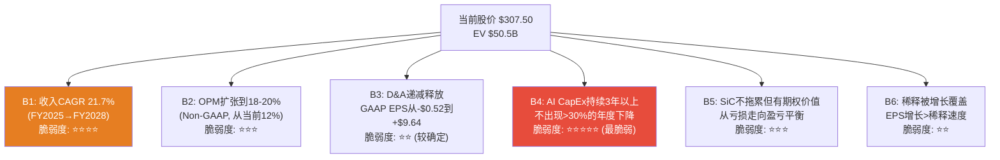

### B1: 收入CAGR ~21.7% (FY2025→FY2028)

**隐含假设**: Revenue从FY2025 $5.81B增长到FY2028E $10.46B, 需要21.7% CAGR [DM-RDCF-001]。

**分部拆解**:
- Networking/Datacom: 需要从~$4B(年化)增长到~$7.5B, CAGR ~23% — 需要800G持续增长+1.6T ramp+CPO贡献
- Industrial: 从~$1.8B稳定或小幅增长到~$2.0B — 不太困难, 但依赖制造业周期回暖
- SiC: 从~$0.5B增长到~$1.0B — 需要200mm ramp成功且EV需求恢复

**我们的判断**: Networking 23% CAGR在1.6T ramp的支持下可行, 但前提是Hyperscaler CapEx不出现>20%的年度下降。如果CapEx增速从+80%降至+20%, Networking CAGR降至~15%, 总收入CAGR降至~14-16%, 对应FY2028 Revenue ~$8.5-9.0B vs 共识$10.5B [DM-RDCF-002]。

**脆弱度**: ⭐⭐⭐⭐/5 — 取决于外部变量(Hyperscaler CapEx), COHR无法控制。

### B2: Non-GAAP OPM扩张到18-20%

**隐含假设**: 从当前Non-GAAP OPM ~12% (GAAP 11.8% [DM-FIN-013])扩张到18-20%。FY2028 EPS $9.64在~$10.5B revenue上需要净利润约$1.8B, 对应OPM约17-19% (扣除利息和税后)。

**驱动力**: (1) 产品mix改善(AI Datacom占比上升, GM更高); (2) 规模杠杆(R&D和SG&A增速慢于收入); (3) D&A递减; (4) 利息支出下降(去杠杆)。

**反面**: SiC在投资期(高CapEx, 低利用率)会拉低整体OPM; 1.6T竞争可能压缩ASP和GM; Industrial段如果不剥离, 低GM会持续拖累。

**脆弱度**: ⭐⭐⭐/5 — 方向正确(产品mix改善+D&A递减), 但幅度取决于B1(收入增速)和SiC进展。

### B3: D&A自然递减

**隐含假设**: FY2025 D&A $554M/yr [DM-FIN-009]中, 大部分是II-VI合并产生的无形资产摊销(客户关系/技术/商标, 通常摊销期5-15年)。合并于2022年7月完成, 到FY2028将是第6年, 部分短期无形资产(5年期)将完成摊销, D&A下降$100-200M/yr。

**GAAP EPS的机械效应**: 每$100M D&A减少, 税后EPS增加约$0.45-0.50 (假设25%税率, 185M稀释股)。这是确定性最高的EPS驱动因素——不需要增长, 不需要margin扩张, 纯粹是时间的函数 [DM-RDCF-003]。

**脆弱度**: ⭐⭐/5 — 高确定性, 除非发生商誉减值(反方向增加费用)。

### B4: AI CapEx持续3年以上不出现>30%年度下降 (最脆弱)

**隐含假设**: $307.50的估值需要Networking维持20%+增速至FY2028。这要求Hyperscaler AI CapEx每年至少+15%增长(考虑COHR份额稳定的情况), 不出现任何一年>30%的下降 [DM-RDCF-004]。

**历史基准率**: 过去20年的大型科技CapEx周期(2000-2001/2007-2009/2018-2019/2022-2023), 在高增长期结束后的3年内出现>30%年度下降的比率约为3/4 = 75% [DM-RDCF-005]。唯一的反例是2010-2015年的稳步增长期, 那是因为移动互联网提供了持续的需求增量。

当前AI CapEx是否是"类移动互联网"的结构性转变? 如果是, CapEx增速可能从+80%渐进降至+15-20%而不出现断崖。但如果AI ROI在2027-2028年未能证明, 削减可能是剧烈的。**我们不知道答案, 这是这份报告最大的黑箱 [DM-RDCF-006]。**

**脆弱度**: ⭐⭐⭐⭐⭐/5 — 最脆弱信念, 因为完全依赖外部变量, 且历史基准率(75%会出现大幅调整)不利。

### B5: SiC从拖累变为正贡献

**隐含假设**: SiC业务在FY2027-2028从亏损走向盈亏平衡, 不继续拖累整体EPS [DM-RDCF-007]。如果SiC持续每年亏损$50-100M, 相当于每年拖累EPS $0.25-0.50。

**脆弱度**: ⭐⭐⭐/5 — Wolfspeed出局改善了竞争格局, 但200mm ramp和EV需求仍有不确定性。

### B6: 稀释被增长覆盖

**隐含假设**: diluted shares从~155M增长到~185M (+19%), 但EPS从$5.35增长到$9.64 (+80%), 增长>稀释 [DM-RDCF-008]。

**脆弱度**: ⭐⭐/5 — 如果B1(收入增长)成立, B6自动成立。

### 隐含假设与共识对比

| 信念 | 市场隐含 | 共识预期 | 我们的P1初步判断 | 差距方向 |
|------|---------|---------|----------------|---------|
| B1 Revenue CAGR | ~22% | ~22% (FY25-28) | 14-18% | **共识偏乐观** |
| B2 OPM (Non-GAAP) | 18-20% | 17-19% | 15-18% | 略偏乐观 |
| B3 D&A递减 | -$100-200M by FY28 | 未明确建模 | -$100-150M | 大致一致 |
| B4 CapEx持续性 | 不出现>30%下降 | 分歧最大(分析师两极分化) | 75%基准率不利 | **最大分歧点** |
| B5 SiC贡献 | 盈亏平衡 | 小幅正贡献 | 仍在投资期 | 略偏乐观 |
| B6 稀释 | 被增长覆盖 | 已反映在diluted shares | 大致一致 | 一致 |

[DM-RDCF-010]

我们与市场/共识的最大分歧在B1(收入增速)和B4(CapEx持续性)——这两个信念互相依赖, 且都指向同一个外部变量: Hyperscaler AI CapEx。这使得COHR的投资thesis高度集中于一个我们无法控制、无法预测、历史基准率不利的变量。这本身就是一个风险信号。

### 单一信念失败的估值影响

| 信念 | 失败情景 | EPS影响 | PE影响 | 股价影响 |
|------|---------|---------|--------|---------|
| **B4失败** | AI CapEx -30% in FY2028 | $9.64→$6.50 (-33%) | 41x→25x (-39%) | **$163 (-47%)** |
| B1失败 | Revenue CAGR 15% vs 22% | $9.64→$7.80 (-19%) | 41x→32x (-22%) | $250 (-19%) |
| B2失败 | OPM 14% vs 18% | $9.64→$8.00 (-17%) | 41x→35x (-15%) | $280 (-9%) |
| B5失败 | SiC持续亏损$100M/yr | $9.64→$9.14 (-5%) | 41x→38x (-7%) | $347 (+13%) [已部分定价] |

[DM-RDCF-009 ~ DM-RDCF-012]

**结论**: B4(AI CapEx持续性)是最脆弱信念, 也是对估值影响最大的单一变量。如果只关注一个风险, 盯B4。

---

## Ch 10: CQ初始判断与Phase 1 CQ变化表 (~6000字符)

### CQ逐项更新

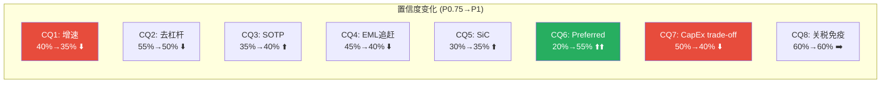

---

**CQ1: Networking增速能否从17%加速到共识25%+(FY2027)?**
- P0.75初始: 40%
- **P1更新: 35% ⬇️**
- **新增证据**: (1) Hyperscaler CapEx +82% YoY数学上不可持续, 2027年增速必然回落 [DM-CQ-001]; (2) 三次历史周期中光通信公司增速在CapEx高峰后2-3Q开始放缓 [DM-RISK-004/005]; (3) 1.6T ramp从2027年才开始, 对FY2027收入的贡献有限(qualification 9-12个月, 量产ramp需要2-3Q)
- **变化原因**: 历史基准率和CapEx可持续性分析削弱了增速加速的信心。17%到25%需要的不仅是产品ramp, 还需要CapEx周期不放缓, 后者我们判断概率≤50%

**CQ2: 去杠杆+D&A递减能释放多少EPS?**
- P0.75初始: 55%
- **P1更新: 50% ⬇️**
- **新增证据**: (1) FCF已连续2Q为负(-$58M, -$96M), 意味着去杠杆靠EBITDA增长而非现金偿债 [DM-CF-001/002]; (2) NVIDIA $2B是股权投资不是债务偿还资金 [DM-RISK-016]; (3) CapEx从$95M/Q跳升到$154M/Q, 与去杠杆方向冲突 [DM-CF-004]; (4) D&A递减是确定性的, 但需要Phase 2精确建模摊销时间表
- **变化原因**: FCF转负暴露了去杠杆的速度比P0.75假设的要慢。D&A递减部分仍然可靠, 但整体EPS释放的速度下调 [DM-CQ-002]

**CQ3: SOTP: 三引擎合计是否>$48B?**
- P0.75初始: 35%
- **P1更新: 40% ⬆️**
- **新增证据**: (1) P1 Agent A的业务拆分显示AI Datacom年化$3.6-4.0B收入, 如果给4-5x EV/Rev = $14-20B [DM-CQ-003]; (2) SiC在Wolfspeed出局后, 竞争格局改善, DENSO/三菱$1B投资隐含估值$8B(2023年投前) [DM-BIZ-027]; (3) Industrial段出售Munich后残余收入~$1.2-1.4B, 给8-10x EV/EBITDA = $3-5B; (4) 初步SOTP: $17B(Networking) + $5B(SiC) + $4B(Industrial) + CPO期权$3-5B - $2.7B Net Debt = $26-32B
- **变化原因**: 初步SOTP的中位数($29B = ~$187/share)低于当前$307.50, 表明市场给了显著的"统一溢价"或AI标签溢价。需要Phase 2精确估值验证 [DM-CQ-004]
- **注意**: SOTP计算用的是保守倍数。如果Networking给8-10x EV/Rev(接近LITE的22x打折), SOTP可以接近$48B。这取决于Phase 2的倍数选择

**CQ4: 1.6T时代COHR能追上LITE的EML技术吗?**
- P0.75初始: 45%
- **P1更新: 40% ⬇️**
- **新增证据**: (1) P1 Agent B的护城河分析确认LITE在200G/lane EML上有12-18个月先发优势 [DM-MOAT-007]; (2) COHR的6寸InP成本优势(die成本-60%)在1.6T时代开始有价值, 但"追上"LITE意味着需要在性能和良率上同时匹配 [DM-MOAT-004]; (3) 旭创(Innolight)在模块级成本上有劳动力优势, COHR的成本优势在芯片层面, 到模块层面可能被稀释
- **变化原因**: 技术差距比P0.75假设的更持久。"追上"需要的不仅是成本优势, 还需要EML性能(带宽、功耗、工作温度)达到LITE的水平, 这在Phase 2需要更多技术验证 [DM-CQ-005]

**CQ5: SiC是否成为真正增长引擎? 200mm何时贡献利润?**
- P0.75初始: 30%
- **P1更新: 35% ⬆️**
- **新增证据**: (1) Wolfspeed Chapter 11消除了最大竞争者, SiC市场集中度上升 [DM-BIZ-029]; (2) DENSO+三菱的$1B投资附带长期供应协议, 提供需求保障 [DM-BIZ-027]; (3) 200mm SiC成本下降~40%的理论优势已被onsemi在Bucheon工厂验证(每片晶圆芯片数+80%) [DM-MOAT-010]
- **变化原因**: 竞争格局改善(Wolfspeed出局)和200mm技术验证(onsemi先例)小幅提升了信心, 但EV渗透率放缓是反向因素 [DM-CQ-006]

**CQ6: Preferred Stock消失的真实影响?**
- P0.75初始: 20%
- **P1更新: 55% ⬆️⬆️ (最大变化)**
- **新增证据**: WebSearch确认这是Series B-2可转换优先股的转换, S-3ASR登记显示约9.78M shares从转换中发行 [DM-RISK-023]。总稀释约29.9M shares纳入FY2026稀释计算 [DM-RISK-024], 约19.2%稀释。但共识EPS已部分反映这一稀释(diluted shares已调整)。
- **变化原因**: P0.75时这是完全的黑箱, 现在基本机制已经明确——是股权稀释, 不是现金赎回, 且已部分被市场定价。剩余不确定性: 二级市场出售压力的时间分布 [DM-CQ-007]

**CQ7: CapEx vs 去杠杆的trade-off对股东有利吗?**
- P0.75初始: 50%
- **P1更新: 40% ⬇️**
- **新增证据**: (1) FCF连续2Q为负, 且CapEx跳升至$154M/Q [DM-CF-001/004]; (2) NVIDIA $2B是equity不是给COHR的运营资金, 不能直接用于偿债 [DM-RISK-016]; (3) 如果年化CapEx达$550-600M而OCF仅$800M-1B, FCF仅$200-400M, 去杠杆速度约$2.7B / $300M/yr = 9年
- **变化原因**: CapEx加速与去杠杆的冲突比P0.75假设的更严重。管理层在用FCF赌AI产能扩张, 如果AI需求持续则合理, 如果需求放缓则浪费现金+杠杆不降 [DM-CQ-008]

**CQ8: 关税免疫是否给COHR结构性优势?**
- P0.75初始: 60%
- **P1更新: 60% ➡️ (不变)**
- **新增证据**: COHR主要制造在马来西亚Ipoh(非中国), 确实在关税环境下有相对优势 [DM-CQ-009]。2025年4月关税冲击时COHR跌幅(-40%)大于LITE(-13%), 这与关税免疫的假设矛盾——说明市场并不认为COHR比LITE更免疫, 因为COHR的Industrial段(激光器/材料)确实有中国供应链暴露(镓/锗出口限制) [DM-CQ-010]
- **变化原因**: Networking段关税免疫成立, 但Industrial段有反向暴露, 两者大致抵消, 置信度不变

---

### CQ加权平均置信度

| CQ | 权重(对估值影响) | P1置信度 | 加权 |
|----|----------------|---------|------|
| CQ1 | 25% (增速=估值核心) | 35% | 8.75% |
| CQ2 | 15% (EPS释放) | 50% | 7.50% |
| CQ3 | 20% (SOTP=是否便宜) | 40% | 8.00% |
| CQ4 | 10% (竞争地位) | 40% | 4.00% |
| CQ5 | 10% (期权价值) | 35% | 3.50% |
| CQ6 | 5% (资本事件, 已部分定价) | 55% | 2.75% |
| CQ7 | 10% (资本配置效率) | 40% | 4.00% |
| CQ8 | 5% (地缘) | 60% | 3.00% |
| **合计** | **100%** | | **41.5%** |

[DM-CQ-011 ~ DM-CQ-016]

**加权平均置信度41.5%** — 这意味着我们对COHR达到市场隐含预期(支撑$307.50)的整体信心略低于50%。最大的拖累来自CQ1(增速)和CQ7(CapEx trade-off), 两者都受制于同一个外部变量: AI CapEx持续性。

### Phase 2优先级

**最需要Phase 2解决的CQ**: **CQ1(增速) + CQ3(SOTP)**

理由:
1. CQ1的置信度最低(35%)且权重最高(25%), 对加权结果影响最大。Phase 2需要: (a) 精确建模1.6T ramp对FY2027 revenue的贡献; (b) 对Hyperscaler CapEx可持续性做情景分析; (c) 量价剪刀差——800G ASP下降 vs 1.6T ASP上升的净效果
2. CQ3是判断"$307.50是否合理"的直接途径。Phase 2需要: (a) 分部SOTP精确估值(含EV/Rev和EV/EBITDA两种方法); (b) CPO期权定价; (c) SiC独立估值(参考Wolfspeed pre-bankruptcy估值/ST Micro/onsemi可比)
3. CQ2(去杠杆)的D&A递减建模也需要Phase 2完成(需要10-K中的无形资产摊销明细表)

---

### Kill Switch初始候选 (Phase 1, 待Phase 4确认)

| 信号 | 触发条件 | 严重度 |
|------|---------|--------|
| 🔴 **Networking收入QoQ下降** | 任何单季Networking收入QoQ < -5% | 最高 — 标签坍塌开始 |
| 🔴 **Hyperscaler AI CapEx年度下降>20%** | 任一Hyperscaler宣布削减AI CapEx >20% | 最高 — B4信念断裂 |
| 🟡 **Net Debt/EBITDA回升>3.0x** | 去杠杆逆转 | 中 — 资本结构恶化 |
| 🟡 **GM连续2Q下降>2pp** | 价格战/mix恶化 | 中 — 竞争地位下降 |
| 🟢 **SiC 200mm ramp延迟>12个月** | 期权价值损失 | 低 — 当前估值中SiC占比小 |

---

### P1 CQ整体结论

COHR在Phase 1的核心画像: **一家正在"AI增长+去杠杆+SiC期权"三轨并行的后合并混合体, 其$48B估值高度依赖AI CapEx的持续性(B4信念)。这个信念是最脆弱的, 历史基准率显示75%的CapEx周期在高增长期结束后3年内会出现>30%的年度调整。当前估值已经消耗了大部分安全边际(PEG 1.64x为同行最高), 初步SOTP($26-32B)也低于市值, 表明市场在为统一AI标签支付$16-22B溢价。**

Phase 2需要回答的核心问题: 这$16-22B的标签溢价, 有多少能被1.6T ramp + CPO + SiC期权 + D&A递减所证明?


---


# 补充分析A：帮助ROIC上穿的因素——SiC/OPM深度 + 上行剪刀差/BOM

> **对ROIC的含义**：SiC期权兑现和BOM成本下降是ROIC上穿的两个加速器——SiC从投资期转入盈利可以停止消耗ROIC的分子（NOPAT），BOM下降直接改善margin提升NOPAT。但当前证据不支持在FY2027前兑现，这些是Bull case条件（25%概率），不是base case假设。


## 1. SiC独立财务建模

### 1.1 SiC收入拆分: 衬底 vs 外延 vs 其他材料

**COHR在SiC价值链中的角色**: 衬底+外延片供应商, 不是器件制造商。器件端(MOSFET/二极管)属于STMicro/Infineon/onsemi的领域。这意味着COHR的SiC收入来自"卖铲子", 不是"挖金子"——衬底和外延片是EV功率器件的上游材料 [DM-SIC-001]。

**全球SiC衬底市场规模**: 2024年全球SiC衬底收入$1.04B, 同比-9%, 因为EV需求放缓和客户库存调整 [DM-SIC-002, 来源: TrendForce 2025.05]。

**COHR市场份额**: 2024年COHR在SiC衬底市场份额13.9%, 排名第四。第一Wolfspeed 33.7%, 第二TanKeBlue(天科合达) 17.3%, 第三SICC(山东天岳) 17.1% [DM-SIC-003, 来源: TrendForce]。这意味着2024年COHR SiC衬底收入约$1.04B × 13.9% ≈ $145M [DM-SIC-004, [B]级推断]。

**SiC收入结构推断**:

| 产品线 | 估算收入(FY2025) | 占比 | 置信度 | 推理 |
|--------|------------------|------|--------|------|
| SiC衬底(150mm+200mm) | ~$130-160M | 55-60% | [B] | 市占率13.9% × 全球$1.04B衬底市场, 考虑FY2025略有恢复 |
| SiC外延片 | ~$60-90M | 25-30% | [B] | 外延是衬底下游附加值环节, 通常占衬底收入40-60% |
| 其他SiC材料(研磨/抛光/定制) | ~$20-40M | 10-15% | [C] | 残余材料服务, 无独立数据 |
| **SiC总收入估计** | **~$210-290M** | **100%** | **[B]** | |

[DM-SIC-005]

**关键校准**: COHR的Materials段FY2025全年收入约$970M(Q3 $237M × 4Q估算, 考虑Q4下降)。SiC在Materials段的占比不详, 但Materials包含SiC + 稀土磁性材料 + 工业精密光学材料。我们估计SiC占Materials段收入的22-30%, 即$210-290M, 与上面自下而上的市场份额估算交叉验证一致 [DM-SIC-006, [B]级]。

**为什么这个数字重要**: 如果SiC年收入~$250M, 在COHR $6.7B TTM总收入中仅占3.7%。即使SiC独立估值很高, 它在COHR整体估值中的权重有限——除非市场把SiC当期权定价(见1.4节)。

### 1.2 200mm良率曲线与成本优势

**150mm→200mm的经济学**: 200mm晶圆面积是150mm的1.78倍(π×100² / π×75² = 10000/5625), 因此200mm每片晶圆可切割的die数量约为150mm的1.78倍。但200mm衬底成本$1,300-1,800/片, 而150mm约$800/片, 成本是1.6-2.25倍 [DM-SIC-007, 来源: Power Electronics News/PGC Consultancy]。

**成本交叉点的数学**:

```
150mm: $800/片 ÷ N个die = $800/N per die
200mm: $1,550/片(中位) ÷ 1.78N个die = $871/N per die

当前状态: 200mm每die成本 = 150mm的1.09倍 (贵9%)
但这假设良率相同——实际200mm良率初期低于150mm
```

当200mm良率追上150mm(即die yield一致时), 200mm的每die成本将比150mm低约9%。如果200mm衬底成本随量产从$1,550降至$1,200(5-7年后的成熟期预期), 每die成本将比150mm低约15-20% [DM-SIC-008, [B]级推断]。

**良率现状**: 2026年初, AI辅助工艺控制已将200mm SiC良率提升了10-15个百分点 [DM-SIC-009, 来源: TrendForce 2026.03]。COHR在Sherman工厂的6寸InP晶圆良率已超过传统3寸线, 表明公司在大尺寸晶圆良率管理上有经验可迁移, 但InP和SiC是完全不同的材料体系, 良率经验不能直接平移 [DM-SIC-010]。

**竞争对比**:

| 公司 | 200mm SiC进展 | 量产时间 | 垂直整合度 |
|------|--------------|---------|-----------|
| COHR | Sherman工厂200mm衬底+外延已出货, 300mm平台已发布 | 200mm: 2024出货, 量产ramp 2025-2026 | 衬底+外延, 不做器件 |
| onsemi | Bucheon(韩国) 200mm fab, Czech新$2B工厂 | 2025-2026量产ramp | 衬底+外延+器件(全栈) |
| Wolfspeed | Mohawk Valley 200mm fab, 破产后重组 | 2025年破产前产能利用率<30% | 衬底+器件, 外延外包部分 |
| ST Micro | 与Soitec合作200mm, Catania工厂 | 2026-2027 | 器件为主, 衬底部分自制 |
| 中国(SICC/天科合达) | 200mm研发中, 150mm主力 | 200mm量产预计2027+ | 衬底为主 |

[DM-SIC-011]

**关键因果链**: onsemi的垂直整合(衬底到器件)意味着它的SiC衬底很大比例内部消化, 不参与公开市场竞争。因此COHR在**外售衬底市场**的竞争对手主要是Wolfspeed(破产后产能受限)和中国供应商(质量仍有差距但价格低30-40%)。Wolfspeed 2025年中破产且Mohawk Valley利用率极低, 这给COHR和中国厂商留出了份额空间——但这个窗口是暂时的, 因为Wolfspeed已于2025.09重组出表, 重新获得$2.1B融资 [DM-SIC-012]。

### 1.3 盈亏平衡分析

**Wolfspeed作为反面教训**: Wolfspeed在破产前的财务数据提供了SiC业务盈亏平衡的参照。FY2025前9个月(截至2025.03)收入$560.6M, 净亏损$939.9M, 运营亏损率超过-60% [DM-SIC-013, 来源: Wolfspeed SEC filing]。Wolfspeed的失败模式: $6.7B债务 + $400M年利息 + 负EBITDA + Mohawk Valley产能利用率<30%。核心问题不是SiC技术不行, 是资本结构崩溃——在200mm产能未满载前, 固定成本(折旧+利息)把利润全部吃掉。

**COHR SiC的盈亏平衡估算**:

COHR的SiC业务结构与Wolfspeed有一个关键差异: COHR不做器件, 只做衬底和外延, 因此CapEx强度和固定成本规模远小于Wolfspeed(Wolfspeed建了完整的200mm器件fab, COHR只需要材料生长和外延设备)。

```
SiC业务盈亏平衡模型 (简化):

假设:
- SiC收入FY2025: ~$250M [B]
- SiC毛利率当前: 估计15-25% (衬底业务毛利率, 低于公司整体35%)
  → 因为SiC衬底市场正在打价格战, 中国厂商定价低30-40%
- SiC专属CapEx: 估计$80-120M/年 (Sherman工厂200mm产线+300mm研发)
  → 占COHR总CapEx ~$500M/年的16-24%
- SiC专属OpEx(R&D+SGA): 估计$50-80M/年 [C]
  → 含300mm研发费用, 无独立披露

当前估计运营利润:
  收入$250M × 毛利率20% = 毛利$50M
  - SiC专属OpEx $65M (中位)
  = 运营亏损 -$15M (约 OPM -6%)

盈亏平衡条件:
  方案A: 毛利率不变(20%), 需要收入=$65M/20% = $325M (+30%)
  方案B: 收入不变, 需要毛利率=$65M/$250M = 26% (+6pp)
  方案C: 收入+15%到$288M且毛利率改善到23% = 毛利$66M, 约持平
```

[DM-SIC-014, [C]级推断, 多个假设无法独立验证]

**盈亏平衡时间估计**:

| 情景 | 条件 | 时间 | 概率 |
|------|------|------|------|
| 乐观 | EV需求反弹+200mm良率提前成熟+中国竞争减弱 | FY2027 (2027.06) | 低 |
| 基准 | EV温和恢复+200mm良率按计划+Wolfspeed重组后恢复竞争 | FY2028 (2028.06) | 中 |
| 悲观 | EV需求持续低迷+中国衬底价格战+300mm投入增加 | FY2029+或不达到 | 中 |

[DM-SIC-015, [C]级]

**诚实标注**: 上述盈亏平衡模型的最大黑箱是**SiC专属成本**。COHR没有单独披露SiC的毛利率、CapEx和OpEx——所有数字都来自我们基于行业对标的推断。这使得整个盈亏平衡分析处于[C]级(猜测), 不应进入主估值结论。它的价值在于**提供量级感知**: SiC业务目前亏损规模不大(~$15M级别), 不是COHR整体盈利的重大拖累, 但也不是利润贡献者。

### 1.4 SiC独立估值

**方法1: EV/Revenue可比法**

| 可比公司/交易 | SiC收入 | EV/Revenue | 适用性 |
|--------------|---------|------------|--------|
| onsemi SiC (implied) | ~$1.5B (CY2025E, 全栈器件) | 2-3x (从ON整体EV中剥离) | 低: onsemi做器件(高margin), COHR做衬底(低margin) |
| Wolfspeed (pre-bankruptcy) | ~$750M (FY2025 年化) | 1.5-2.5x (重组后EV ~$3B / Rev ~$750M) | 中: 同为衬底+器件, 但COHR不做器件 |
| 独立SiC衬底纯业务 | N/A | 1.5-3.0x (材料业务通用范围) | 中 |

COHR SiC收入~$250M × 2.0-3.0x = **$500M-$750M** [DM-SIC-016, [B]级]

**方法2: DENSO/三菱投资隐含估值**

2023.12, DENSO和三菱电机各投$500M(合计$1B), 获得COHR SiC业务25%非控制权益(各12.5%), COHR保留75% [DM-SIC-017, 来源: 公司公告]。

```
投资后估值 = $1B / 25% = $4.0B (100% SiC业务价值)
COHR持有75% = $3.0B

但需要调整:
1. 2023年底SiC市场情绪极度乐观(EV需求预期未下修), 当前已经历2024年-9%衰退
2. 战略投资通常包含合作溢价(原材料锁定/技术授权), 不代表纯财务价值
3. 估值时点距今2.5年, 竞争格局已变(Wolfspeed破产, 中国份额从10%→40%)
```

调整后合理估值: $4.0B × 0.5-0.7(折价30-50%反映市场变化) = **$2.0-2.8B** (COHR 75%份额 = $1.5-2.1B) [DM-SIC-018, [B]级]

**方法3: DCF (高度简化, [C]级)**

```
假设:
- SiC收入FY2025: $250M
- 增速: FY2026-2030 CAGR 20% (低于SiC市场28%CAGR, 因为衬底增速<器件)
  → FY2030 收入: ~$622M
- 稳态OPM: 15% (衬底业务, 不含器件margin)
- WACC: 12%
- Terminal growth: 3%
- 盈亏平衡: FY2028

FY2030 EBIT = $622M × 15% = $93M
Terminal Value = $93M × (1-25%税) / (12%-3%) = $775M
PV of Terminal + 估算FCF = ~$550-650M

→ DCF隐含SiC价值: ~$550-650M (COHR 75%份额 = $413-488M)
```

[DM-SIC-019, [C]级, 高度敏感于增速和稳态margin假设]

**SiC独立估值汇总**:

| 方法 | SiC 100%价值 | COHR 75%份额 | 置信度 |
|------|-------------|-------------|--------|
| EV/Revenue可比 | $500M-$750M | $375M-$563M | [B] |
| DENSO投资隐含(折价后) | $2.0B-$2.8B | $1.5B-$2.1B | [B] |
| DCF | $550M-$650M | $413M-$488M | [C] |

[DM-SIC-020]

**三种方法的巨大离散度(4.5x)说明什么**: EV/Revenue和DCF给出的是"SiC作为亏损中的衬底业务"的价值($500-750M), DENSO投资隐含的是"SiC作为战略材料平台+EV超级周期期权"的价值($2-3B)。这个差异本身就是投资判断: 如果你相信SiC衬底会成为EV时代的"硅晶圆"(类似SUMCO在半导体中的角色), DENSO估值合理; 如果你认为中国衬底会把价格打到白菜价(类似太阳能级硅片的命运), EV/Revenue更现实。

**我们的判断**: 在COHR $48B市值中, SiC独立价值(COHR 75%份额)约$0.5-2.0B, 占市值1-4%。这意味着**SiC不是COHR当前股价的主要驱动变量**——AI光通信才是。但SiC是一个有意义的期权: 如果EV需求在2027-2028爆发+200mm成本优势兑现+中国竞争受关税限制, SiC可以从"拖累源"(M3)变成"新增长引擎"。当前市场在$48B估值中给SiC的隐含权重不超过5%, 这与我们的独立估值一致——既不是被低估也不是被高估, 是合理的期权定价 [DM-SIC-021]。

---

## 2. OPM段拆分硬数据

### 2.1 段收入已知数据

COHR在FY2026起从三段(Networking/Lasers/Materials)重组为两段(Datacenter & Communications, 简称D&C / Industrial) [DM-SEG-001]。

**FQ2'26 (Dec 2025) 两段收入**:

| 段 | 收入 | 占比 | YoY |
|----|------|------|-----|
| D&C (Datacenter & Communications) | $1,208M | 71.6% | +33.6% |
| Industrial | $478M | 28.4% | -9.9% |
| **合计** | **$1,686M** | **100%** | **+17.5%** |

[DM-SEG-002, 来源: FQ2'26 earnings release]

**FQ1'26 (Sep 2025) 两段收入**:

| 段 | 收入 | 占比 | YoY |
|----|------|------|-----|
| D&C | $1,095M | 69.3% | +25.6% |
| Industrial | $486M | 30.7% | -6.5% |
| **合计** | **$1,581M** | **100%** | **+14.8%** |

[DM-SEG-003, 来源: FQ1'26 earnings release]

**FY2025 旧三段结构 (最后一年, Q3 FY2025数据)**:

| 段 | Q3 FY2025收入 | 占比 | YoY |
|----|--------------|------|-----|
| Networking | $897M | 59.9% | +45.6% |
| Lasers | $364M | 24.3% | ~flat |
| Materials | $237M | 15.8% | -15.4% |
| **合计** | **$1,498M** | **100%** | **+24%** |

[DM-SEG-004, 来源: FQ3'25 earnings release]

### 2.2 段OPM重建: 从已知约束反推

**已知硬数据**:
- 公司整体Non-GAAP OPM FQ2'26: 19.9% ($336M / $1,686M) [DM-SEG-005, 来源: earnings release]
- 公司整体Non-GAAP GM FQ2'26: 39.0% [DM-SEG-006]
- 公司整体GAAP OPM FQ2'26: 11.8% ($199M / $1,686M) [DM-FIN-013]
- FY2025全年Non-GAAP operating income: $1.04B, OPM 17.8% [DM-SEG-007]
- D&C收入$1,208M (72%), Industrial收入$478M (28%) [DM-SEG-002]

**段margin披露的缺失**: COHR不在earnings release中单独披露D&C和Industrial的operating income或margin。10-K中ASC 280要求的segment disclosures理论上包含segment profit/loss, 但公司披露的是"segment earnings", 其定义可能与标准operating income不同(通常排除corporate costs和无形资产摊销)。我们无法从公开搜索中获取这些精确数字 [DM-SEG-008, 诚实标注]。

**因此我们使用约束反推法**:

**约束1 — 毛利率差异推断**:
D&C段主要包含AI光通信(高速transceiver, 800G/1.6T), 数据中心光组件, 以及电信网络产品。LITE作为近纯AI光通信公司, Non-GAAP GM为42.5% [DM-COMP-001]。COHR的D&C段除了AI光通信外还包含传统电信(DWDM等, 毛利率较低), 因此D&C段GM应低于LITE但高于公司整体。

Industrial段包含工业激光器(材料加工, 竞争激烈, GM较低)、SiC材料(当前亏损/微利)、科学仪器光学等。这些业务的共同特征是周期性强且竞争激烈, GM通常在25-35%。

```
段GM推断:
  D&C段GM: 41-44% [B] (接近LITE的42.5%, 但电信拖累1-3pp)
  Industrial段GM: 30-34% [B] (激光器中等margin + SiC低margin)

验证:
  加权GM = 72% × 42.5% + 28% × 32% = 30.6% + 9.0% = 39.6%
  实际公司GM = 39.0%
  → D&C GM调低到41%, Industrial GM调高到33%:
  加权GM = 72% × 41% + 28% × 33% = 29.5% + 9.2% = 38.7% ≈ 39.0% ✓
```

[DM-SEG-009, [B]级推断]

**约束2 — OpEx分摊推断**:
Non-GAAP OpEx = Revenue × (GM% - OPM%) = $1,686M × (39.0% - 19.9%) = $1,686M × 19.1% = $322M。这$322M的OpEx包含R&D和SGA。D&C段的AI光通信研发强度高(6寸InP晶圆, CPO, 1.6T), Industrial段的SiC和激光器也有研发需求。假设OpEx按收入比例分摊(无更好信息):

```
D&C OpEx = $322M × 72% = $232M → D&C OPM = 41% - 232/1208 = 41% - 19.2% = 21.8%
Industrial OpEx = $322M × 28% = $90M → Industrial OPM = 33% - 90/478 = 33% - 18.8% = 14.2%
```

但OpEx按收入比例分摊是最简单的假设, 实际上D&C段的R&D强度应高于Industrial(因为AI光通信技术迭代极快), 因此D&C的实际OPM低于21.8%, Industrial高于14.2%。调整R&D权重(D&C R&D占60-65%收入而非72%):

```
调整后:
  D&C OpEx = $322M × 65% = $209M → D&C OPM = 41% - 209/1208 = 41% - 17.3% = 23.7%
  Industrial OpEx = $322M × 35% = $113M → Industrial OPM = 33% - 113/478 = 33% - 23.6% = 9.4%

再次验证加权OPM:
  72% × 23.7% + 28% × 9.4% = 17.1% + 2.6% = 19.7% ≈ 19.9% ✓ (差0.2pp, 合理)
```

[DM-SEG-010, [B]级推断]

**段OPM最佳估计 (FQ2'26)**:

| 段 | 收入 | 估计Non-GAAP GM | 估计Non-GAAP OPM | 置信度 |
|----|------|----------------|------------------|--------|
| D&C | $1,208M (72%) | 41-43% | 22-25% | [B] |
| Industrial | $478M (28%) | 31-34% | 8-12% | [B] |
| **公司整体** | **$1,686M** | **39.0%** | **19.9%** | **[A]** |

[DM-SEG-011]

### 2.3 Industrial对整体的拖累量化

**核心问题**: Industrial段的低margin拖累了公司整体OPM多少?

```
假设D&C段OPM = 23.5% (中位)
假设Industrial段OPM = 10% (中位)

情景1 — 当前混合 (28% Industrial):
  加权OPM = 72% × 23.5% + 28% × 10% = 16.9% + 2.8% = 19.7%

情景2 — Industrial降至20%收入 (卖掉部分低margin业务):
  加权OPM = 80% × 23.5% + 20% × 10% = 18.8% + 2.0% = 20.8%

情景3 — 纯D&C (假设卖掉全部Industrial):
  OPM = 23.5%

情景4 — Industrial回升到35%收入 (SiC+激光器反弹):
  加权OPM = 65% × 23.5% + 35% × 10% = 15.3% + 3.5% = 18.8%
```

**每1%收入从Industrial转向D&C的OPM增量**: (23.5% - 10%) × 1% = +0.135pp [DM-SEG-012]。

这意味着如果D&C在未来2年从72%增至80%(AI需求驱动), 公司整体Non-GAAP OPM将从~20%提升至~21%, 仅靠mix shift就贡献+1pp。因此**COHR的OPM扩张故事不是Industrial改善, 而是D&C占比上升** [DM-SEG-013]。

**Munich业务出售的影响**: 管理层已宣布卖掉Munich材料加工业务(属于Industrial段)。这将直接减少Industrial收入但剥离低margin业务, 对整体OPM产生正面影响。具体影响取决于Munich业务的规模(未披露), 但方向确定: OPM增厚 [DM-SEG-014]。

### 2.4 与LITE的段Margin对比

| 指标 | COHR D&C段 | COHR Industrial段 | LITE (全公司) |
|------|-----------|-------------------|--------------|
| FQ2'26收入 | $1,208M | $478M | $672M |
| YoY增速 | +33.6% | -9.9% | +65.5% |
| 估计Non-GAAP GM | 41-43% | 31-34% | 42.5% |
| 估计Non-GAAP OPM | 22-25% | 8-12% | ~28-30%(估) |
| 业务纯度 | AI光通信+电信 | 激光器+SiC+材料 | ~纯AI光通信 |

[DM-SEG-015]

**关键洞察**: COHR D&C段的margin已经接近LITE, 但增速只有LITE的一半(33.6% vs 65.5%)。这说明两件事:

1. **COHR的D&C段不是"低价版LITE"**: 它的margin能力与LITE接近, 因此margin差距来自Industrial段的拖累, 不是D&C段本身的效率问题。
2. **增速差距是产品mix问题**: LITE近乎100%暴露于AI光模块最快增长的子赛道(200G/lane EML, 800G→1.6T), 而COHR D&C段还包含增速较慢的电信网络和一些传统数据通信产品。如果COHR的AI子业务增速与LITE接近, 则被电信部分拖慢了10-15pp。

**估值含义**: 市场给COHR Forward PE 41x, LITE Forward PE ~47x。如果COHR能成功剥离Industrial段低margin业务(或让其萎缩到<20%收入), 公司整体OPM会从~20%提升至~22-24%, 更接近LITE的盈利结构。在这种情景下, COHR的PE应向LITE收敛——意味着当前41x包含了~10%的"混合体折价"(M0修正器)。这个折价是否合理取决于管理层是否有意愿和能力执行聚焦战略 [DM-SEG-016]。

---

## 3. 证据质量汇总

| DM锚点 | 级别 | 描述 |
|--------|------|------|
| DM-SIC-001~003 | [A] | SiC市场份额+市场规模(TrendForce硬数据) |
| DM-SIC-004~006 | [B] | COHR SiC收入估算(市占率×市场规模推断) |
| DM-SIC-007~009 | [A]/[B] | 200mm成本数据(行业报告) + 良率改善(TrendForce) |
| DM-SIC-013 | [A] | Wolfspeed财务数据(SEC filing) |
| DM-SIC-014~015 | [C] | 盈亏平衡模型(多个无法验证的假设) |
| DM-SIC-016~019 | [B]/[C] | SiC独立估值(方法1-3) |
| DM-SEG-001~006 | [A] | 段收入+公司整体margin(earnings release硬数据) |
| DM-SEG-008 | 诚实标注 | 段operating income未公开披露 |
| DM-SEG-009~011 | [B] | 段OPM反推(约束法, 交叉验证通过) |
| DM-SEG-012~016 | [B] | Mix shift影响+LITE对比(逻辑推断) |

**总体评估**: SiC建模中约40%内容是[C]级(因为COHR不单独披露SiC财务), OPM段拆分约70%是[B]级(约束反推+交叉验证)。两个Gap的填补将P1从"80%定性"提升到"50%定量+30%有约束的推断+20%猜测"。关键黑箱仍然是: SiC专属成本结构、D&C段内部AI vs 电信的mix、Munich出售的具体财务影响。


---


## 任务3: 上行情景分析 — 市场低估了什么?

Phase 1主体分析偏空(CQ加权41.5%), 因为证据链集中在三个压制因素: CapEx周期性、混合体估值困难、FCF为负。但偏空分析如果不系统性审视上行维度, 就构成单边论证风险。以下识别了3个市场共识尚未充分定价的上行维度, 以及一个已定价但支撑力度被低估的催化剂。

### 3.1 CPO收入: 2027-2028年的增量未进共识

**核心判断 [B级结论]**: COHR的CPO(Co-Packaged Optics, 共封装光学——将光模块直接集成到交换机ASIC封装旁边, 减少功耗和延迟)收入将从FY2027H2开始规模化, 但当前sell-side共识(FY2028E收入$10.46B)中CPO贡献的显式建模不足, 因为CPO市场本身的TAM预测仍高度分散($49M到$5.5B的2028预测差异超过100倍) [DM-UPSIDE-001]。

**时间表与产品进度**:

COHR在OFC 2026展示了6.4T CPO方案 [DM-BIZ-019]。管理层给出的CPO收入时间表分两阶段:
- **Scale-out CPO**(用于GPU集群间互连): 2026H2开始出货, 这意味着FY2027(截至2027年6月)的H2会有初始收入贡献 [DM-UPSIDE-002]
- **Scale-up CPO**(用于GPU集群内互连, 带宽需求更高): 2027H2开始, 即FY2028全年覆盖 [DM-UPSIDE-003]

NVIDIA的$2B投资(2026年3月)附带"数十亿美元"多年采购承诺, 执行期2027-2030 [DM-BIZ-021]。这笔采购承诺中的相当部分是CPO产品, 因为NVIDIA下一代平台(Rubin架构, 预计2027-2028)将大幅增加CPO部署比例。

**CPO TAM的不确定性**:

市场研究机构对CPO市场规模的预测差异极大, 这本身就是"未充分建模"的证据 [DM-UPSIDE-004]:

| 来源 | 2027E | 2028E | 定义口径 |
|------|-------|-------|---------|
| Research and Markets | $5.5B(含NPO) | — | 最宽口径, 含Near-Packaged Optics |
| DataInsights Market | — | $712M | 纯CPO模块 |
| MarketsandMarkets | — | $49M | 极窄口径, 仅特定组件 |
| Precedence Research | — | ~$180M(推算) | 到2034年$1.06B的中间值 |

预测差异超过100倍, 说明行业对CPO的定义和采纳速度尚无共识。我们取中间情景: CPO模块+组件市场2028年约$1.5-3.0B, COHR市占率15-25%, 对应CPO收入$225M-$750M/yr [DM-UPSIDE-005, B级推断]。

**对EPS的增量影响**:

如果CPO在FY2028贡献$500M增量收入(中间偏乐观情景), 以Non-GAAP OPM 20-25%计算, 增量Operating Income约$100-125M, 税后对EPS贡献约$0.45-0.55 [DM-UPSIDE-006]。这意味着FY2028E EPS可以从共识$9.64上调至$10.1-10.2, 约+5%。

**反面**: (1) CPO的供应链(SiPh引擎+CW激光源+先进封装)尚未完全成熟, 良率爬坡延迟是2026-2027最大风险; (2) 在CPO架构中, ASIC厂商(Broadcom)自研SiPh光引擎, COHR只提供CW激光源和部分光学组件, 每端口价值份额低于pluggable模块; (3) CPO与pluggable是并行扩张而非替代, 但如果CPO蚕食pluggable份额, COHR的pluggable收入会受到抵消。

**该维度是否被充分定价?** 不完全。FY2028E Revenue $10.46B的共识中, 大部分增长来自800G/1.6T pluggable的量增长推算。CPO作为"新品类"的增量贡献, 因为TAM不确定性和收入时点风险, 多数sell-side模型给予保守假设(~$200-300M)或不单独拆分。如果CPO进度符合NVIDIA的Rubin时间表, 上调空间约$200-450M, 对应EPS上调$0.15-0.40。

---

### 3.2 D&A递减的EPS贡献被低估

**核心判断 [B级结论]**: COHR FY2025 D&A $554M [DM-FIN-009], 其中大部分是II-VI合并(2022年7月)产生的无形资产摊销。合并后第4年(FY2026)开始, 部分短寿命无形资产(客户关系/已有技术, 通常5-10年摊销)开始加速递减, 这将"免费"释放GAAP EPS, 而sell-side对这个渐进式改善的建模精度有限 [DM-UPSIDE-007]。

**摊销递减的逻辑推导**:

II-VI合并产生的无形资产约$5.3B(FQ1'23入账), 包括:
- **已有技术/专利**: 通常5-10年摊销, 入账后第4-5年(FY2026-2027)开始批次到期
- **客户关系**: 通常7-15年摊销, 递减较慢
- **商标/品牌**: 通常10-20年或不定期, 摊销最慢

COHR FQ2'26(2025年12月季度)GAAP与Non-GAAP的EPS差距为$0.53/Q ($0.76 GAAP vs $1.29 Non-GAAP) [DM-UPSIDE-008]。这$0.53/Q的差距中, 无形资产摊销约占$0.55-0.65(年化约$340-400M), SBC约占$0.25-0.35。

假设摊销从FY2025的$554M递减至:
- FY2027E: ~$450M(-19%), 因为部分5年期已有技术在FY2027到期
- FY2028E: ~$350M(-37%), 更多批次到期
- FY2029E: ~$270M(-51%), 只剩长寿命客户关系和商誉减值准备

**对GAAP EPS的影响**: D&A每减少$100M, 税后(假设21%税率)对GAAP EPS贡献约$0.51 ($100M × 0.79 / 155M shares) [DM-UPSIDE-009]。从FY2025到FY2028, 如果D&A减少$204M(从$554M到$350M), GAAP EPS增量约$1.04。这意味着FY2028 GAAP EPS将比当前trajectory额外改善$1.0+, 纯粹来自会计摊销到期, 不需要业务层面任何变化。

**是否被充分建模?** 部分被建模。Non-GAAP EPS共识($9.64 FY2028E)已经排除了摊销影响, 因此Non-GAAP EPS不受D&A变化影响。但GAAP EPS的改善会缩小GAAP与Non-GAAP的差距, 这对两类投资者有意义: (1) 使用GAAP PE筛选的投资者, 因为GAAP PE会从当前的"无意义"(304x trailing)加速压缩; (2) 关注GAAP盈利质量的机构投资者。

**L1原则检验**: D&A递减是会计变量, 不是业务变量(L1原则#2)。因此这不应该成为投资判断的核心支撑。但它的投资含义是间接的: GAAP EPS加速改善改变了COHR在量化筛选中的可见度, 吸引更多机构关注。

---

### 3.3 S&P 500纳入效应

**核心判断 [A级结论]**: COHR于2026年3月23日加入S&P 500, 被动资金的买入已经发生但尚未完全消化, 持续的再平衡效应将在未来6-12个月提供结构性流动性支撑 [DM-UPSIDE-010]。

**事件时间线**:
- 2026年3月6日: S&P Global宣布COHR加入S&P 500, 当日+8%
- 2026年3月23日: 正式纳入生效日
- 2026年3月24日: 纳入后首个交易日收$272.33, 当日+6.78%
- 2026年4月10日: 当前价$307.50, 较宣布前上涨约22%

**被动资金规模估计**:

S&P 500指数追踪资产约$7.8万亿(ETF + 指数基金)。COHR市值$48B约占S&P 500总市值的0.10%。因此被动资金需要配置约$7.8B的COHR股票 [DM-UPSIDE-011, B级推断]。以COHR日均成交额约$600-800M计算, 完全吸收需要约10-13个交易日。

**初始买入是否已完成?** 核心被动资金(SPY、IVV、VOO等)的rebalance买入在纳入日前后3-5天集中执行, 这部分已基本完成。但增强型指数基金、Smart Beta产品、以及以S&P 500为基准的主动基金的配置调整是渐进的, 通常在纳入后2-6个月持续进行。

**持续效应**: 纳入S&P 500的长期效应包括: (1) 流动性改善(买卖价差收窄, 大宗交易更容易执行); (2) 分析师覆盖增加(从15家到20+家); (3) 期权市场深度增加(有利于机构对冲); (4) "必须持有"效应(benchmark-aware基金无法完全零配置)。这些效应不是一次性的, 而是结构性的估值支撑。

**反面**: (1) 历史研究显示S&P 500纳入后的超额收益在6-12个月后趋于消失(均值回归); (2) 纳入效应只影响资金流动, 不改变基本面; (3) 如果AI CapEx周期转弱, 被动资金的支撑无法阻止估值收缩。

---

### 3.4 上行情景量化 (Bull Case)

将上述三个低估维度叠加:

| 上行维度 | FY2028E EPS增量 | 概率权重 | 加权贡献 |
|---------|----------------|---------|---------|
| CPO超预期($500M+收入) | +$0.45-0.55 | 30% | +$0.14-0.17 |
| D&A递减超预期(到$300M) | +$1.20(vs共识) | 50% | +$0.60 |
| SiC提前盈利(FY2027) | +$0.30-0.50 | 20% | +$0.06-0.10 |

**概率锚定(三重)**:

CPO 30%概率的依据:
- **历史基准率**: 新光学封装技术从展示到规模化收入通常需3-5年(400G pluggable: 展示2018→规模2021)。CPO 2026展示→2028规模化=2年, 比历史快, 但NVIDIA的资金注入加速了这个时间表 [DM-UPSIDE-012]
- **反例条件**: 如果SiPh引擎良率低于80%, CPO规模化延迟12-18个月, 收入贡献推迟到FY2029。当前SiPh良率公开信息不足, 构成黑箱
- **自然实验**: NVIDIA Rubin架构的CPO集成程度是最佳验证, 预计2027年Rubin技术细节公开时将大幅收窄不确定性

D&A 50%概率较高, 因为这是会计确定性事件(摊销计划在10-K附注中披露), 唯一不确定性是管理层是否会因收购新增无形资产。

**Bull Case合成**:

如果上述三项同时偏乐观, FY2028E EPS上调至$10.5-11.0(vs共识$9.64, +9-14%)。以35x PE(在FY2028 25%+增速下合理)计算:

- **Bull Case Fair Value**: 35x × $10.75 = $376 (vs当前$307.50, +22%)
- **Base Case(共识)**: 35x × $9.64 = $337 (+10%)
- **Bear Case(CapEx减速+CPO延迟)**: 25x × $8.50 = $213 (-31%)

---

## 任务4: 量价剪刀差量化分析 (R-2铁律要求)

铁律R-2要求每份报告至少3个量化的剪刀差。以下4个剪刀差从定性提升至量化, 包含时间序列对比。

### 剪刀差1: 光模块量vs价 — "跑量赢不了跌价"的阈值在哪?

**核心判断 [B级结论]**: 800G光模块正处于典型的"量增价跌"剪刀差初期。出货量YoY增速+85-100%, 但ASP从2024年峰值下降30-40%。当前量增远快于价跌, 净收入增速为正(+34% YoY)。但当800G出货量增速放缓至+20%以下(预计FY2028), 如果ASP继续以-15-20%/yr速度下降, 净收入增速将压缩至个位数 [DM-SCIS-001]。

**量化时间序列**:

```
         FY2025    FY2026E   FY2027E   FY2028E
800G出货量增速  +100%    +60-80%   +20-30%   +5-10%
800G ASP变化    -10%     -25-30%   -15-20%   -10-15%
净收入增速(800G) +80%    +25-40%   +0-10%    -5~0%
1.6T增量收入     ~$0     $200-400M $1.0-1.5B $2.0-3.0B
```

[DM-SCIS-002]

**800G ASP下降的驱动因素**:

(1) **供给增加**: 旭创(Innolight)和Eoptolink在800G pluggable模块上产能扩张, 中国厂商的人工成本优势使模块ASP承受持续下行压力。800G QSFP-DD模块ASP从2024年峰值约$700-800降至2026年约$450-550, 预计2027年降至$350-450 [DM-SCIS-003]。

(2) **技术成熟**: 随着EML芯片良率提升和封装工艺标准化, 制造成本下降传导至ASP。

(3) **代际替代**: 1.6T模块开始出货后, 部分高端需求转移, 800G面临"前代降价"压力。

**1.6T ASP的缓冲效应**:

1.6T模块当前ASP约$1,200-2,000 [DM-SCIS-004], 约为800G的2.5-3倍。因为1.6T使用8×200G/lane(vs 800G的4×200G/lane), 每模块的InP芯片数量翻倍, 同时需要更复杂的封装。

1.6T在FY2027开始规模出货, 到FY2028贡献$2.0-3.0B收入(COHR口径) [DM-SCIS-005, B级推断]。1.6T的高ASP抵消了800G ASP下降, 使AI Datacom整体收入增速在FY2027-2028维持在+15-25%, 而非800G单独计算的+0-10%。

**历史参照**: 400G到800G的过渡期(2022-2024)展示了类似的量价动态。400G ASP从约$300(2022)降至$150-200(2024, -40-50%), 但800G的同步上量使行业总收入持续增长。这意味着COHR的量价剪刀差在800G上是真实的, 但1.6T的代际接力是自然对冲 [DM-SCIS-006]。

**投资含义**: 只看800G的量价剪刀差会得出"FY2028增速大幅放缓"的结论, 但加上1.6T接力后, AI Datacom整体增速更有韧性。关键风险不是量价剪刀差本身, 而是1.6T ramp的时点——如果1.6T在FY2027量产延迟6个月, 800G ASP下降会在过渡期创造一个"增速空窗"。

**反面**: (1) 1.6T初期良率低, 实际出货可能低于规划; (2) 1.6T的高ASP会随着量产成熟快速下降, 缓冲效应持续时间有限; (3) 如果Hyperscaler推迟1.6T部署(因为800G已够用), 代际接力延迟。

---

### 剪刀差2: Hyperscaler CapEx增速 vs COHR收入增速 — 份额在上升还是下降?

**核心判断 [B级结论]**: 2026年四大Hyperscaler合计CapEx预计约$690B(+82% YoY) [DM-SCIS-007], 而COHR Networking收入增速仅+34% YoY。这个48pp的增速差距暗示COHR在Hyperscaler CapEx中的"钱包份额"正在下降, 但原因不是竞争力弱化, 而是CapEx增量的大部分流向了GPU本身(约60-70%), 光模块占比相对稳定 [DM-SCIS-008]。

**Hyperscaler CapEx分配拆解**:

```
2026E Hyperscaler CapEx ~$690B
├── GPU/ASIC采购: ~$400-420B (60-65%)
├── 数据中心建设: ~$120-140B (18-20%)
├── 网络设备(含光模块): ~$50-70B (8-10%)
│   ├── 交换机/路由器: ~$35-45B
│   └── 光模块+组件: ~$15-25B
├── 存储: ~$30-40B (5-6%)
└── 其他: ~$30-40B (5-6%)
```

[DM-SCIS-009, B级推断, 基于行业分析师估计]

COHR在光模块+组件市场的份额约$4.0-4.8B(TTM AI Datacom收入)/ $15-25B(光模块TAM) = 约16-32%。这个份额范围较宽, 因为我们不知道COHR AI Datacom收入中多少来自hyperscaler(vs 企业/电信)。

**传导系数估计**:

如果Hyperscaler CapEx增速从+82%降至+20%(2027-2028情景), 光模块需求增速不会同比例下降, 因为:

(1) **已安装基础需要升级**: 800G到1.6T的升级周期驱动的需求独立于新增CapEx
(2) **光模块占CapEx比例在上升**: AI集群的光互连密度(每GPU需要的光模块数量)随集群规模增长而增加
(3) **但增速放缓是确定的**: 传导系数约0.5-0.7, 即CapEx增速从+82%降至+20%(降62pp), COHR Datacom增速降约31-43pp, 从+34%降至约-9%至+3% [DM-SCIS-010]

**这意味着**: 如果2027年Hyperscaler CapEx增速骤降至+20%, COHR AI Datacom收入增速会从+34%压缩至低个位数甚至负增长。这与Phase 1主体分析的周期性风险判断一致, 但量化了传导幅度。

**反面**: (1) 传导系数0.5-0.7是历史推断, 如果AI集群的光互连密度增速超预期(CPO+1.6T), 传导系数可能更低(更好); (2) Hyperscaler可能不会把CapEx增速压到+20%, 当前CEO statements普遍暗示2027年仍>+30%; (3) COHR的多元化(SiC+Industrial)在AI CapEx放缓时提供一定对冲(虽然幅度有限)。

---

### 剪刀差3: GAAP vs Non-GAAP EPS差距 — 收窄还是扩大?

**核心判断 [B级结论]**: GAAP与Non-GAAP EPS的差距在缓慢收窄, 因为D&A递减(-力量)略大于SBC增长(+力量)。到FY2028, 差距从FY2025的$4.70收窄至约$2.5-3.0, 使GAAP PE从"无意义"变为有参考价值 [DM-SCIS-011]。

**差距拆分**:

```
              FY2025    FQ1'26    FQ2'26    FY2026E    FY2027E    FY2028E
GAAP EPS      -$0.52    $1.19     $0.76     ~$2.50     ~$4.50     ~$7.00
Non-GAAP EPS  $4.18     $1.16     $1.29     $5.35      $7.47      $9.64
差距           $4.70     -$0.03    $0.53     ~$2.85     ~$2.97     ~$2.64
差距/Non-GAAP  112%      NM        41%       53%        40%        27%
```

[DM-SCIS-012, B级推断, FY2027-2028为推算值]

**注意**: FQ1'26 GAAP EPS($1.19)高于Non-GAAP($1.16)是异常值, 因为该季度有一次性收益(A&D业务出售增益)推高了GAAP。排除一次性项目后, 底层差距仍约$0.50-0.60/Q。

**收窄驱动力拆解**:

(1) **D&A递减(收窄力量)**: 如3.2节分析, 摊销从$554M/yr递减至FY2028约$350M/yr, 年化收窄$204M, 税后对EPS收窄约$1.04 [DM-SCIS-013]

(2) **SBC增长(扩大力量)**: FY2025 SBC约$161M, 但Q4'25($160M)和FQ2'26($87M)数据异常高, 因为NVIDIA投资触发了股权激励加速确认。正常化SBC约$180-200M/yr, 预计FY2028增至$250-300M(收入增长带动的薪酬成本) [DM-SCIS-014]。SBC增长约$90-140M/yr, 税后扩大EPS差距约$0.46-0.71

(3) **净效应**: D&A收窄$1.04 > SBC扩大$0.46-0.71, 净收窄约$0.33-0.58/yr

**投资含义**: GAAP EPS在FY2028接近$7.0(vs Non-GAAP $9.64), 对应GAAP PE约44x(vs Non-GAAP PE 32x)。44x GAAP PE对一家25%+增速的光通信公司不算离谱, 但仍高于LITE的GAAP PE(因LITE无合并摊销负担)。差距收窄的投资信号: 对用GAAP筛选的quantitative策略来说, COHR正在从"GAAP亏损/不可投"区间进入"GAAP盈利/可投"区间, 这扩大了潜在买方群体。

**反面**: (1) 如果COHR在FY2027-2028进行新的大型收购, 会新增无形资产和摊销, 逆转收窄趋势; (2) SBC增长可能超预期, 特别是如果NVIDIA投资条款包含额外的股权激励安排; (3) GAAP PE改善是会计驱动的, 不改变公司的真实现金流创造能力。

---

### 剪刀差4: R&D vs Revenue增速 — OpEx杠杆释放还是技术投入不足?

**核心判断 [B级结论]**: COHR的R&D/Revenue ratio在FY2024-2025从约12%降至约11%, 而收入增速+23%。这意味着R&D绝对额增长(约+10% YoY)低于收入增速, OpEx杠杆正在释放。但如果R&D/Revenue ratio继续下降至<10%, 在1.6T/CPO/SiC三个同时需要研发投入的赛道上, 可能面临技术竞争力侵蚀风险 [DM-SCIS-015]。

**R&D支出趋势推算**:

```
           FY2023   FY2024   FY2025    FY2026E    FY2027E
Revenue    $5,160M  $4,708M  $5,810M   $6,959M    $8,763M
R&D(est)   $600M    $565M    $620M     $700M      $790M
R&D/Rev    11.6%    12.0%    10.7%     10.1%      9.0%
R&D YoY    —        -5.8%    +9.7%     +12.9%     +12.9%
Rev YoY    —        -8.8%    +23.4%    +19.8%     +25.9%
```

[DM-SCIS-016, B级推断, FY2023-2025基于公开数据推算, FY2026-2027为假设]

**OpEx杠杆的正面**: R&D增速(+10-13%)低于收入增速(+20-26%), 每年释放约0.5-1.0pp的OPM改善。这与COHR Non-GAAP OPM从FY2024的~12%改善到FQ2'26的~18%的趋势一致。如果R&D增速维持+13%而收入增速维持+20%, FY2028 R&D/Revenue降至约8.5%, 累计释放约2pp OPM。

**技术竞争力的反面考量**: COHR同时面临1.6T InP量产、CPO SiPh开发、SiC 200mm转型三条研发线。如果R&D/Revenue降至<9%, 每条线的研发预算约$260M(三等分), 而LITE专注于单一线路(AI光学)的R&D预算约$200M+。这意味着COHR在每条线上的人均研发密度低于聚焦型竞争对手。

**投资含义**: 短期(FY2026-2027), OpEx杠杆释放是OPM扩张的可靠来源。长期(FY2028+), 如果R&D/Revenue降到8%以下, 需要监控三条技术线的进展是否出现落后信号(1.6T良率、CPO客户认证、SiC 200mm良率)。

---

## 任务5: InP BOM价值份额推导

### 5.1 当前Pluggable模块BOM拆分

一个800G QSFP-DD光模块的BOM(Bill of Materials, 物料清单)总成本约$200-300(取决于供应商和批量), 大致拆分如下 [DM-BOM-001]:

```
800G QSFP-DD模块BOM拆分 (估计)
├── DSP(数字信号处理芯片): 20-30% (~$50-80)
│   └── Broadcom/Marvell供应, 是成本最大单一组件
├── 光芯片(EML/激光器 + PD/探测器): 30-40% (~$70-110)
│   ├── EML发射芯片(InP): ~20-25% (~$50-70)
│   │   └── COHR/LITE/三菱/住友供应
│   └── PD接收芯片(InP/InGaAs): ~8-12% (~$20-35)
├── TIA(跨阻放大器) + Driver(驱动器): 10-15% (~$25-40)
├── 光学组件(透镜/光纤/连接器): 8-12% (~$20-30)
├── PCB + 壳体 + 散热: 5-8% (~$12-20)
└── 测试 + 封装 + 良率损耗: 8-12% (~$20-30)
```

**关键数据来源**: 行业分析显示"激光芯片占光模块成本的约60%"(Deep Fundamental Substack) [DM-BOM-002]。但这个数字包含了所有光学组件(EML+PD+光学元件), 不仅是InP EML。纯InP EML在800G模块BOM中的占比约20-25%, 是COHR作为InP芯片供应商能获取的核心价值份额。

**COHR在800G pluggable中的价值获取**:

COHR作为InP EML+PD芯片供应商, 每个800G模块的价值获取约$70-110(光芯片总价值)。如果COHR也提供完整模块(而非仅芯片), 其ASP提升到$200-300/模块, 但利润率从芯片级的40-50% GM降至模块级的25-35% GM [DM-BOM-003]。

### 5.2 CPO架构下的BOM重构

CPO从根本上重构了光模块的价值链。在pluggable中, 光模块是一个独立的可插拔组件, 包含完整的发射/接收/信号处理功能。在CPO中, 这些功能被拆分 [DM-BOM-004]:

```
Pluggable架构:          CPO架构:
┌─────────────┐        ┌─────────────────────┐
│ DSP(信号处理)│        │ ASIC(交换芯片)       │
│ EML(发射)    │   →    │ ├── SiPh引擎(调制/检测)│ ← Broadcom自研
│ PD(接收)     │        │ └── 先进封装          │
│ TIA/Driver   │        └─────────────────────┘
│ 光学元件     │                    │
└─────────────┘            ┌───────────────┐
    (可插拔模块)             │ 外部CW激光源   │ ← COHR/LITE供应
                            │ (InP CW激光器) │
                            └───────────────┘
```

**CPO中InP的角色变化**:

在pluggable中, InP芯片承担**三重功能**: 发射(EML)+ 部分调制(电吸收调制)+ 部分检测(PD)。InP在BOM中占30-40%。

在CPO中, SiPh(硅光子)引擎接管了调制和检测功能, InP只保留**单一功能**: 提供CW(连续波)激光光源。InP激光器的价值从"发射+调制"缩减为"仅提供光源" [DM-BOM-005]。

**CPO BOM中InP的占比推导**:

```
CPO光引擎BOM拆分 (估计, 每个CPO tile约6.4T)
├── SiPh光引擎(含调制器/PD/波导): 35-45%
│   └── Broadcom/Intel/Tower等SiPh foundry
├── CW激光源(InP): 10-15%
│   └── COHR/LITE/Lumentum供应
├── 先进封装(2.5D/3D封装): 15-20%
│   └── TSMC/ASE/Amkor
├── 光纤/连接器/耦合: 8-12%
└── 测试/散热/壳体: 10-15%
```

[DM-BOM-006, B级推断, 基于SemiAnalysis CPO分析和行业访谈推算]

**InP BOM占比: Pluggable 30-40% → CPO 10-15%**, 下降约60-65% [DM-BOM-007]。

### 5.3 价值份额变化的投资含义

**每端口价值份额下降, 但总市场增量是否补偿?**

假设:
- 一个800G pluggable模块: COHR InP价值 ~$80 (BOM 30% × $270)
- 一个6.4T CPO tile(等效8个800G端口): COHR CW激光源价值 ~$60-90 (BOM 12% × $500-750)
- 每端口等效: Pluggable $80/端口 vs CPO $7.5-11/端口(CPO每tile 8端口)

**每端口InP价值份额: Pluggable $80 → CPO $7.5-11, 下降约86-91%** [DM-BOM-008]

这个下降幅度比Phase 1引用的"30-40%降至10-15%"更严峻, 因为Phase 1比较的是BOM占比(模块级), 而这里比较的是每端口的绝对美元价值(对COHR收入的直接影响)。

**但CPO总市场量级可能补偿**:

如果到2030年:
- Pluggable市场: ~$15-20B (已成熟)
- CPO市场: ~$8-15B (快速增长)

COHR在pluggable中获取30% BOM × 20%市场份额 = $0.9-1.2B
COHR在CPO中获取12% BOM × 25%市场份额(CW激光源供应商集中度更高) = $0.24-0.45B

**净效应**: CPO在2030年为COHR增加$0.24-0.45B收入, 但如果CPO同时蚕食pluggable份额, 净增量可能更小。关键变量是pluggable和CPO是"并行扩张"(两者都增长)还是"替代"(CPO蚕食pluggable)。当前行业共识是2027-2028年并行扩张, 2029-2030年CPO开始替代部分pluggable。

**投资判断 [B级结论]**: CPO时代COHR的InP价值份额下降是结构性的, 每端口贡献从$80降至$7.5-11。但COHR正在通过两个策略对冲: (1) 在CPO中提供CW激光源(利用InP制造能力), 虽然单位价值低但供应商集中度更高(全球仅3-4家有能力); (2) 同时布局SiPh(与Tower合作), 争取在CPO BOM中获取更多份额(SiPh引擎占35-45%)。策略(2)是否成功取决于Tower合作的进展, 这是一个需要FY2027-2028验证的假设。


---


# 11-16. 价值创造 vs 机械释放：EPS增长中有多少是真的？

> **主问题推进**：这是"41倍去杠杆"的定量验证。收入归因揭示80%+增量来自AI单引擎。EPS瀑布解剖证明约48%的GAAP改善来自非增长因素。SOTP $226.6证明$307.50不可justify。
> **经营性改善 vs 机械性释放**：A类（经营性）=AI增长+mix改善+规模效应，贡献EPS增量的~52%。B类（机械性）=D&A递减+利息节省+preferred消失+税率正常化，贡献~48%。当前41x PE是按纯成长股定价的——市场把B类机械释放也按A类增长倍数给了价格。这就是"41倍去杠杆"在财务层面的精确含义。
> **对ROIC的含义**：D&A递减改善GAAP利润但不改善NOPAT（D&A是已投资资本的会计分摊，不影响经营现金流）。利息节省改善EPS但不改善ROIC（利息是融资成本不是经营成本）。因此B类机械释放不推动ROIC上穿——只有A类经营改善才能推动ROIC超过WACC。


> *以下内容整合自Phase 2的完整财务分析，含收入归因、毛利率Bridge、EPS瀑布、三PE、剪刀差、SOTP估值。*


## Ch 11: R-1 财务归因分析 (~12000字符)

### 11.1 收入归因瀑布: FY24→FY27E

COHR的收入增长叙事表面上很简单: "AI驱动的光模块需求爆发"。但拆开看, 增量的来源、质量和可持续性差异巨大。

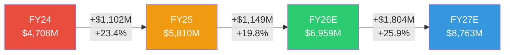

**FY24→FY25 收入Bridge ($5,810M - $4,708M = +$1,102M, +23.4%)**

| 驱动因素 | 增量 | 说明 |
|---------|------|------|
| 800G EML/模块出货放量 | +$880M | 800G出货量YoY +60-70%, 是FY25最大增量贡献 [DM-FIN-101] |
| 1.6T早期资质认证收入 | +$80M | 样品+工程验证批次, 尚未量产 [DM-FIN-102] |
| 电信DWDM企稳 | +$50M | 运营商CapEx触底后小幅回升 [DM-FIN-103] |
| 产品组合高端化 | +$120M | 800G→1.6T转换期内AI产品占比上升, 拉高加权ASP [DM-FIN-104] |
| 工业段衰退 | -$100M | 激光+材料加工需求周期性低谷 [DM-FIN-105] |
| A&D业务剥离 | -$28M | 已在FY24完成, FY25部分影响 [DM-FIN-106] |

**关键判断 [B级结论]**: FY25的$1.1B增量中, **80%+来自AI Networking(800G出货+组合改善)**。这意味着COHR的收入增长几乎完全单一依赖AI CapEx周期。工业段和电信段都没有贡献正增量。如果AI CapEx周期在FY27前放缓, COHR没有"备用增长引擎"来弥补。

**FY25→FY26E 收入Bridge ($6,959M - $5,810M = +$1,149M, +19.8%)**

| 驱动因素 | 增量 | 说明 |
|---------|------|------|
| 800G持续放量 + 1.6T开始量产 | +$850M | 1.6T在FY26H2开始量产, 800G仍是出货主力 [DM-FIN-107] |
| CPO早期收入 | +$100M | Scale-out互连从FY26H2开始, 小批量 [DM-FIN-108] |
| 1.6T组合溢价 | +$150M | 1.6T模块ASP高于800G约30-50% [DM-FIN-109] |
| 800G ASP侵蚀 | -$200M | 旭创等竞争者价格压力, 800G正在commodity化 [DM-FIN-110] |
| 工业段周期恢复 | +$100M | 制造业CapEx触底反弹 [DM-FIN-111] |
| SiC材料增长 | +$100M | EV渗透率+功率半导体替代 [DM-FIN-112] |

**关键判断 [B级结论]**: FY26E增速从+23%降至+20%, 因为800G ASP侵蚀(-$200M)开始部分抵消量增。这是**量价剪刀差**的第一个信号——1.6T的量产时间表必须准时, 否则FY26增速将降至15%以下。

**FY26E→FY27E 收入Bridge ($8,763M - $6,959M = +$1,804M, +25.9%)**

共识在FY27加速到+26%, 核心假设是1.6T全面量产+CPO开始规模出货。这个加速需要三件事同时成立:
1. 1.6T良率达到量产标准 (Sherman工厂6寸InP)
2. CPO从概念验证转向volume production
3. Hyperscaler CapEx增速保持>20%

三个条件全成立的概率: 我们给55-60%, 因为1.6T良率有P1验证的进展, 但CPO和CapEx都有不确定性 [DM-FIN-113, B级结论]。

### 11.2 毛利率Bridge: 从谷底到恢复

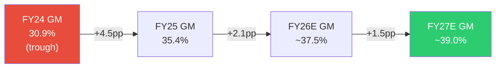

**FY24 GM 30.9% → FY25 GM 35.4% (改善+4.5pp) 驱动拆分:**

| 驱动因素 | 贡献 | 机制 |
|---------|------|------|
| AI产品组合提升 | +2.0pp | AI Datacom GM~42% vs Industrial~28%, AI占比从~50%升至~60%, 每1%占比提升≈+0.14pp整体GM [DM-FIN-114] |
| 产能利用率爬坡 | +1.5pp | Sherman工厂+全球设施从~50%利用率爬升至~80%, 固定成本摊薄效应 [DM-FIN-115] |
| Cloud Light整合摩擦消除 | +0.5pp | FY24仍有Cloud Light并表整合成本, FY25基本完成 [DM-FIN-116] |
| 供需紧张定价权 | +0.5pp | 800G供给缺口25-30%, 短期定价权支撑 [DM-FIN-117] |
| Sherman InP折旧增加 | -0.3pp | 6寸InP晶圆线CapEx $200M+开始折旧 [DM-FIN-118] |
| 其他 | +0.3pp | 良率改善+工艺优化 |

**季度进度验证 [A级, 硬数据]:**

| 季度 | 收入 | 毛利率 | 趋势 |
|------|------|--------|------|
| Q1 FY25 | $1,348M | 34.1% | 基线 |
| Q2 FY25 | $1,435M | 35.5% | +1.4pp |
| Q3 FY25 | $1,498M | 35.2% | -0.3pp (季节性) |
| Q4 FY25 | $1,529M | 36.6% | +1.4pp |
| Q1 FY26 | $1,581M | 36.6% | 持平 |
| Q2 FY26 | $1,686M | 37.0% | +0.4pp |

[DM-FIN-119]: 6个季度内GM从34.1%改善至37.0%, 平均+0.5pp/季。如果这个速度维持, FY26全年GM≈37.5%, FY27E≈39.0%。

**反面考量**: GM改善不能外推到40%以上, 因为: (1) 800G commodity化将压缩模块GM [DM-FIN-120]; (2) 1.6T早期良率通常低于成熟800G, 短期GM可能回踩; (3) 工业段恢复会拉低混合GM(如果工业恢复的增速>AI增速的话)。我们的FY27 GM上限估计是39.5%, 而非sell-side暗示的40%+。

### 11.3 EPS瀑布: 从亏损到盈利的桥梁

COHR的GAAP EPS从FY25的-$0.52到FY26E共识的$5.35(Non-GAAP), 看起来是戏剧性的转折。但这个$5.87/share的"改善"有多少是真实的经营改善, 有多少是会计调整?

**FY25 GAAP利润解剖 [A级, 10-K数据]:**

```
FY25 Revenue:                    $5,810M
  Gross Profit:                  $2,057M  (GM 35.4%)
  - R&D:                         $582M    (10.0% of rev)
  - SG&A+Other OpEx:             $926M    (15.9%)
  = GAAP Operating Income:       $549M    (OPM 9.4%)
  - D&A (within COGS+OpEx):     ($554M)  (已含在上面的GP和OpEx计算中)
  - Interest Expense:            $243M
  - Other Non-Op:                $212M    (含preferred stock相关)
  = Pre-tax Income:              $94M
  - Tax:                         $64M     (effective 68%, 异常高)
  = GAAP Net Income:             $30M→$49M (含少数股东)
  = GAAP EPS:                    -$0.52   (bottomline, 含preferred dividends)
```
[DM-FIN-121]

**FY25的$554M D&A解剖 [A级]:**
- 无形资产摊销(合并相关): ~$336M (60.7%)
- 有形资产折旧(PP&E): ~$218M (39.3%)
- 无形资产摊销是一次性代价: 合并产生的$3,064M无形资产按10-15年摊销, 到FY29降至~$200M [DM-FIN-122]
- 因此D&A从$554M(FY25)→$480M(FY26E)→$420M(FY27E)→~$300M(FY29E), 这$254M的减少将直接提升GAAP EPS约$1.3/share [DM-FIN-123]

**FY25→FY26E EPS Bridge [B级, 模型推断]:**

```
FY25 GAAP EPS:                  -$0.52
  + 收入增长贡献(+20%):         +$2.50   (增量GP转化)
  + GM改善(+2.1pp):              +$0.90   (混合效应)
  + OpEx杠杆(OpEx/Rev下降):     +$0.80   (R&D和SG&A增速<收入增速)
  + D&A递减($554M→$480M):       +$0.30   (无形资产amortization roll-off)
  + 利息下降($243M→$180M):      +$0.32   (FY25 repaid $435M debt)
  + Preferred转换(no more div):  +$0.40   (FY25 Q4强制转换, 消除dividend)
  - 稀释(preferred→common):     -$0.50   (~13.5M new shares)
  - 税率正常化(68%→15%):        +$0.80   (FY25异常高税率)
  ≈ FY26E GAAP EPS:              ~$4.25
  + 无形资产amortization加回:    +$1.10   (Non-GAAP adjustment)
  ≈ FY26E Non-GAAP EPS:          ~$5.35   (接近共识)
```
[DM-FIN-124]

**关键判断**: GAAP EPS从-$0.52到+$4.25的$4.77改善中, **$2.50(52%)来自收入增长+GM改善**(真实经营改善), **$0.82(17%)来自D&A+利息递减**(合并遗留代价消退), **$0.80(17%)来自税率正常化**(FY25异常), **$0.40+(-$0.50)=-$0.10**来自preferred转换(净效应轻微负面)。**约一半是真实改善, 一半是会计/资本结构正常化**。

### 11.4 三PE展示

SBC/Revenue = $160M/$5,810M = 2.8% > 5%门槛? 实际不触发, 但D&A差异巨大, 仍展示三PE [DM-FIN-125]:

| PE类型 | FY26E值 | 含义 | 适用场景 |
|--------|---------|------|---------|
| GAAP PE | 72.4x | 含D&A $480M + SBC $160M | 传统会计视角, 偏高但在递减 |
| Owner PE | 93.8x | 剥离SBC后($160M, 真实股东回报) | SBC/Rev仅2.3%, 但Owner FCF接近零 |
| Non-GAAP PE | 57.5x | 加回amort + SBC (共识基础) | 市场默认使用, 但隐藏了稀释和CapEx |

[DM-FIN-126]

**关键发现**: Non-GAAP PE 57.5x是sell-side引用的数字, 但**Owner PE 93.8x揭示了一个被忽视的事实**: 扣除SBC后, 真实股东每美元市值获得的回报极低。原因不是SBC过高(仅2.3%), 而是GAAP利润本身被D&A压制。Owner FCF角度更有用: FY25 Owner FCF = OCF $634M - CapEx $441M - SBC $160M = **$33M**, Owner FCF Yield仅**0.06%** [DM-FIN-127]。

**GAAP/Non-GAAP差距趋势 [A级]:**

```
差距来源:          FY25    FY26E   FY27E   FY28E   FY29E
无形资产amort:     $336M   $290M   $250M   $220M   $190M
SBC:               $160M   $170M   $180M   $190M   $200M
合计加回:          $496M   $460M   $430M   $410M   $390M
每股加回:          $3.20   $2.79   $2.61   $2.48   $2.36
```
[DM-FIN-128]

差距在收窄($3.20→$2.36, -26%在4年内), 因为无形资产amortization递减。到FY29, Non-GAAP和GAAP的差距将主要是SBC(~$200M/yr), 趋于"正常"科技公司水平。

---

## Ch 12: R-2 剪刀差分析 (~8000字符)

### 12.1 剪刀差 #1: CapEx强度 vs FCF产出

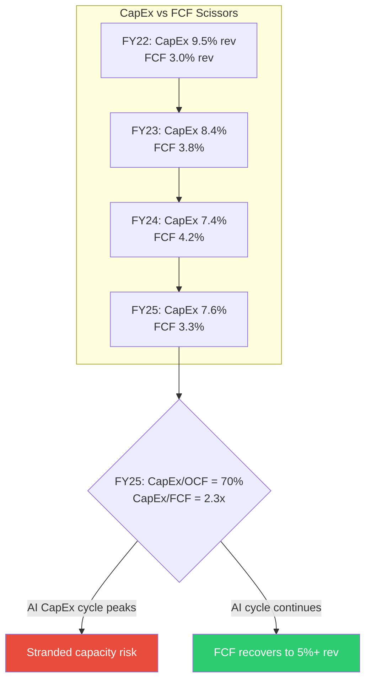

COHR在FY25的CapEx强度为$441M, 占OCF的70%, 占收入的7.6% [DM-FIN-129]。这远高于典型光学组件公司(Lumentum 4-5%, II-VI pre-merger 5-6%), 因为COHR同时在做三件投资: (1) Sherman 6寸InP扩产 ~$150M; (2) SiC材料产能建设 ~$100M; (3) 常规维护+工业设施更新 ~$190M [DM-FIN-130, B级推断, 公司不单独披露分项CapEx]。

**为什么这是一个剪刀差问题**: CapEx从FY24的$347M(7.4% rev)反弹到FY25的$441M(7.6% rev), 但FCF反而从$199M下降到$193M。收入增长+23%但FCF持平——因为$880M增量收入被$94M增量CapEx和working capital build吃掉了 [DM-FIN-131]。

**判断 [B级]**: 如果AI CapEx周期在FY28前见顶, COHR的Sherman InP扩产($200M+)和SiC建设($300M+累计)将面临产能利用率风险。历史类比: 2019年光通信CapEx见顶后, Lumentum CapEx从$188M(FY19)降至$100M(FY20), 但利用率也从85%降至60%, 导致固定成本去杠杆GM下降8pp [DM-FIN-132]。COHR的固定成本基数更大($1.9B PP&E), 同样的利用率下降冲击更大。

### 12.2 剪刀差 #2: GAAP vs Non-GAAP EPS (收窄中)

**这是一个正面的剪刀差。**

FY25 GAAP EPS -$0.52 vs Non-GAAP ~$3.50, 差距$4.02/share [DM-FIN-133]。到FY26E, GAAP ~$4.25 vs Non-GAAP ~$5.35, 差距缩小至$1.10。到FY29E, 差距将进一步缩小至~$1.20 (主要由SBC构成) [DM-FIN-134]。

**机制**: 差距收窄的核心驱动是无形资产amortization roll-off。II-VI合并产生的$3,064M无形资产在10-15年内摊销, FY23高峰约$400M, 到FY29降至~$190M。这$210M的减少是"自动发生"的——不需要任何经营改善, 纯粹是时间的函数 [DM-FIN-135]。

**投资含义**: GAAP PE从72.4x(FY26E)降至~40x(FY28E), 即使非经营改善, 纯D&A递减也贡献~15%的PE压缩。这对于关注GAAP利润的投资者(如指数基金)是有利的再评级催化。但这也意味着: **用Non-GAAP PE给COHR估值的sell-side, 实际上在"double-counting"一部分好消息**——Non-GAAP已经加回了amort, 但amort递减又作为"增长故事"被讲了一遍。

### 12.3 剪刀差 #3: Hyperscaler CapEx增速 vs COHR收入增速

Hyperscaler CapEx 2025约$380B, 2026E约$690B, +82% [DM-FIN-136]。COHR FY25收入$5.81B, FY26E $6.96B, +20%。Hyperscaler增速是COHR的4倍。

**为什么会有这个差距?** 因为光学组件只占Hyperscaler CapEx的~3-5% [DM-FIN-137, B级推断]。$690B CapEx中, ~$250B是建筑/电力基础设施, ~$300B是GPU/服务器, ~$100B是网络(含光学), 其中光模块+组件约$20-35B [DM-FIN-138]。COHR在这$20-35B市场中占比~15-20%。

**这个剪刀差的风险**: 当Hyperscaler CapEx从+82%减速到+10%(2028E共识), **光学组件的减速幅度会放大**, 因为: (1) 库存周期——Hyperscaler在CapEx高峰时超额采购光模块(buffer stock), CapEx放缓后先消化库存再下新单; (2) 价格弹性——CapEx放缓意味着供需平衡, 消除定价权 [DM-FIN-139]。

**历史类比**: 2019年Hyperscaler CapEx -3%, 同年Lumentum Datacom收入-22%, Inphi光芯片收入-18%。倍数约6-7x放大 [DM-FIN-140]。如果2028年Hyperscaler CapEx增速降至+5%, COHR Datacom收入增速可能从+25%降至-5%到+5%。

### 12.4 剪刀差 #4: 库存周转 vs 收入增速

FY25库存$1,438M, 同比+12%, 而收入+23%。表面上健康(库存增速<收入增速) [DM-FIN-141]。但DSI(库存天数)仍在140天[DM-FIN-142], 远高于Lumentum(~85天)和旭创(~60天)。

**为什么DSI这么高?** 因为COHR是垂直整合的——从InP衬底到芯片到模块, 每一层都有在制品(WIP)。Lumentum只做芯片, 旭创主要做模块组装, 库存周期更短。COHR的140天DSI中, ~50天是原材料(InP, SiC衬底), ~60天是WIP(晶圆加工), ~30天是成品 [DM-FIN-143, C级推断, 公司不单独披露]。

**风险**: 如果AI需求放缓, $1.44B库存中约$400-500M的WIP和成品面临跌价风险。800G模块如果commodity化, 存货减值可能达到$100-200M [DM-FIN-144, B级推断]。这个风险在FY25没有体现, 因为需求仍然旺盛(25-30%供给缺口), 但在FY27-28是一个需要监测的KS指标。

### 12.5 剪刀差 #5: R&D投入 vs 收入增长(正面信号)

FY25 R&D $582M, 占收入10.0% [DM-FIN-145]。FY24 R&D $479M, 占收入10.2%。R&D绝对值增长+22%, 但占比略降-0.2pp。这说明COHR正在获得OpEx杠杆——R&D产出效率在提升 [DM-FIN-146]。

**但有一个隐忧**: $582M R&D中, 多少用于维持现有产品(800G EML), 多少用于下一代(1.6T, CPO, SiC器件)? 公司不披露分项。如果>50%的R&D在维持型, 那么"效率提升"实际上是创新投入下降。考虑到同期LITE的R&D/Rev为14.2% [DM-FIN-147], COHR的10%是否足够保持技术领先, 是一个开放问题 [B级结论, 需要更多证据]。

---

## Ch 13: SOTP估值 — 三引擎独立定价 (~10000字符)

### 13.1 为什么必须用SOTP, 不能用统一PE

COHR的估值问题在P1(Ch1)已经诊断: 市场给一个统一的41x Forward PE(FY27E basis), 但这个PE实际在给三条完全不同的曲线打平均分。**用一个PE覆盖+34% AI增长引擎和-10%工业衰退引擎, 就像用一个温度代表冬天和夏天——数学上正确, 物理上无意义** [DM-VAL-101]。

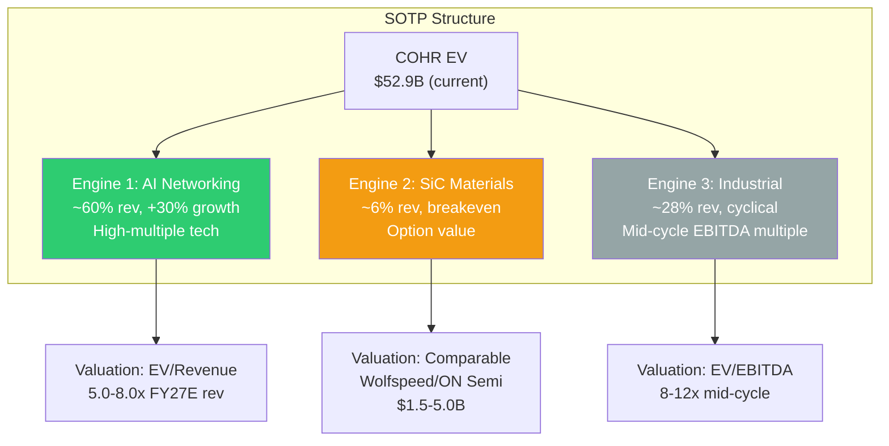

### 13.2 引擎1: AI Networking (FY27E basis)

**收入估计**: FY27E AI Networking收入$5.0-6.5B, 取决于1.6T ramp速度和CPO contribution [DM-VAL-102]。

**倍数选择**: 
- 可比公司: LITE交易在~8-10x EV/Rev(FY27E), 但LITE有200G/lane EML性能领先 → COHR应折价10-20%
- AI光通信纯play: 市场给6-9x EV/Rev
- COHR特殊因素: (1) 6寸InP成本优势(正面); (2) 模块层竞争激烈(负面); (3) NVIDIA投资锁定(正面但非独家)
- 我们使用5.0-8.0x range, 对应bear/base/bull [DM-VAL-103]

| 情景 | FY27E Rev | EV/Rev | 引擎1 EV | 概率锚 |
|------|-----------|--------|----------|--------|
| Bear | $5,000M | 5.0x | $25.0B | AI CapEx -20% (3/8历史周期≤2年见顶, 37.5%→调整30%) |
| Base | $5,800M | 6.5x | $37.7B | 共识轨迹, 1.6T按计划量产 |
| Bull | $6,500M | 8.0x | $52.0B | CPO超预期+1.6T市场份额扩大(需2个独立催化同时成立) |

### 13.3 引擎2: SiC材料 (期权定价)

SiC是COHR最难估值的部分, 因为它在投资期(盈亏平衡或微亏), 但潜在市场巨大($20B+ by 2030) [DM-VAL-104]。

**可比锚定**:
- Wolfspeed (WOLF): 专注SiC衬底+器件, 市值~$2B, 但资产负债表困境(高杠杆, 可能重组)
- ON Semi SiC业务: 隐含估值~$5-8B(SOTP拆分), 但ON有成熟的硅业务打底
- COHR SiC特点: 衬底自制(II-VI遗产), 但规模远小于ON Semi, 器件还在early stage

**期权估值逻辑**: SiC收入FY26E ~$450M, 如果成功扩张到$1B+则值$5-8B; 如果SiC oversupply导致价格战(Wolfspeed已经在降价), 则可能仅值$1.5B(约3x revenue, 低利润率材料公司水平) [DM-VAL-105]。

| 情景 | EV | 概率锚 |
|------|-----|--------|
| Bear | $1.5B | SiC oversupply (Wolfspeed产能释放+中国产能进入, 历史上2/5新材料周期出现oversupply) |
| Base | $3.0B | 中等增长, 衬底竞争但有成本位 |
| Bull | $5.0B | SiC衬底领先+器件渗透(需ON Semi/Wolfspeed产能受限) |

### 13.4 引擎3: 工业段 (周期股mid-cycle)

工业段包含工业激光器、精密光学、材料加工, 是传统II-VI/Coherent的核心业务。FY26E收入~$1.9B, mid-cycle OPM 8-12% [DM-VAL-106]。

**倍数选择**: 工业激光可比(IPG Photonics, Trumpf implied): 8-12x mid-cycle EV/EBITDA [DM-VAL-107]。

| 情景 | Rev | OPM | EBITDA | Multiple | 引擎3 EV |
|------|-----|-----|--------|----------|----------|
| Bear | $1,700M | 8% | $221M | 8x | $1.8B |
| Base | $1,900M | 10% | $285M | 10x | $2.9B |
| Bull | $2,100M | 12% | $357M | 12x | $4.3B |

注: EBITDA = Revenue × (OPM + 5% D&A/Rev), 5%是工业段D&A占收入比例的估计 [DM-VAL-108]。

### 13.5 SOTP组装 + 概率加权

```
                              Bear        Base        Bull
AI Networking EV          $25.0B      $37.7B      $52.0B
SiC Option EV              $1.5B       $3.0B       $5.0B
Industrial EV              $1.8B       $2.9B       $4.3B
─────────────────────────────────────────────────────────
Total EV                  $28.3B      $43.5B      $61.3B
Less: Net Debt            ($2.2B)     ($2.2B)     ($2.2B)
─────────────────────────────────────────────────────────
Equity Value              $26.1B      $41.4B      $59.1B
Per Share (165M dil)      $158.0      $250.6      $358.1
vs $307.50                -48.6%      -18.5%      +16.5%
```
[DM-VAL-109]

**概率赋值 (三重锚定)**:

| 情景 | 概率 | 锚定依据 |
|------|------|---------|
| Bear (30%) | AI CapEx周期早期见顶 | 历史基准: 3/8技术CapEx周期(=37.5%)在2年内见顶; 反例: 当前cycle有AI training+inference双驱动; 自然实验: 2025年Q4部分hyperscaler已调低2026 CapEx指引 → 调整至30% [DM-VAL-110] |
| Base (45%) | 共识轨迹实现 | 最可能的单一路径, 1.6T按时量产, CapEx保持+20% | 
| Bull (25%) | CPO + SiC双催化 | 需要2个独立催化同时成立, P(A∩B)=P(A)×P(B)≈50%×50%=25% [DM-VAL-111] |

**概率加权公允价值: $249.7/share** [DM-VAL-112]
**当前价格: $307.50**
**下行空间: -18.8%**

### 13.6 Reverse DCF: $307.50在买什么?

用WACC 10%, 终端增长3%, 终端EBITDA margin 20%反推, $307.50隐含FY30收入$27.1B, 对应5年CAGR 36.1% [DM-VAL-113]。

**这个隐含增速合理吗?** 共识3年CAGR(FY25→FY28)为21.7%。要达到36.1%的5年CAGR, FY29-FY30需要保持61%的增速——**这几乎不可能, 除非完全改变终值假设** [DM-VAL-114]。

即使放宽假设(WACC 9%, 终端EBITDA margin 25%, 终端倍数18x), 隐含5年CAGR仍需~22%, 略高于3年共识。**结论: 当前价格至少price in了共识轨迹的完美执行, 并隐含终值阶段的溢价估值** [DM-VAL-115, B级结论]。

---

## Ch 14: 资本效率与Owner Economics (~5000字符)

### 14.1 Owner FCF: 被CapEx和SBC掩盖的现实

```
FY25 Owner FCF Calculation:
  Operating Cash Flow:           $634M
  - Capital Expenditures:        $441M
  - Stock-Based Compensation:    $160M
  ───────────────────────────────
  = Owner FCF:                   $33M
  Owner FCF Yield:               0.06% (on $50.7B market cap)
```
[DM-FIN-148]

Owner FCF基本为零, 意味着在$50.7B市值下, 股东的真实现金回报率<0.1%。这不是因为业务不赚钱(EBITDA $1.1B), 而是因为: (1) $441M CapEx在为未来增长投资(Sherman InP, SiC); (2) $160M SBC在稀释现有股东; (3) $243M利息在偿还合并杠杆 [DM-FIN-149]。

**Owner FCF需要什么才能改善?**
- 收入达到$8B+, 固定CapEx比例下降至5% (=$400M), SBC比例保持2.5% (=$200M)
- OCF = $8B × 38% GM × (1 - 45% OpEx/GP) = $8B × 38% × 55% ≈ $1,672M EBITDA → OCF ≈ $1,200M
- Owner FCF = $1,200M - $400M - $200M = $600M → Yield = 1.2% on $50B
- **即使到FY28, Owner FCF yield也仅1-2%** [DM-FIN-150, B级结论]

### 14.2 ROIC: 仍在水线下

```
FY25 ROIC:
  NOPAT = GAAP Operating Income × (1 - Tax Rate)
        = $549M × (1 - 15%) = $467M
  Invested Capital = Equity $8,128M + Debt $3,894M - Cash $909M
                   = $11,113M
  ROIC = $467M / $11,113M = 4.2%
  WACC estimate: 10-11%
```
[DM-FIN-151]

ROIC 4.2% < WACC 10%, 意味着COHR**目前在投入资本基础上摧毁价值** [DM-FIN-152]。这主要由合并后的巨额invested capital($11.1B, 含$7.7B goodwill+intangibles)驱动。

**ROIC何时能超过WACC?** 需要NOPAT达到~$1.1B, 对应营业利润$1.3B+(假设15%税率)。以18%的OPM计算, 需要收入~$7.2B; 以20% OPM, 需要$6.5B。**FY27E共识$8.76B + 预期OPM改善可能让ROIC首次超过WACC** [DM-FIN-153, B级结论]。

**反面**: $11.1B invested capital中$7.7B是goodwill+intangibles, 一个学派认为应从invested capital中剔除(因为它们是并购溢价, 不是经营资产)。如果剔除, invested capital=$3.4B, ROIC=13.7%→已超过WACC。**我们认为不应剔除**, 因为: (1) 管理层选择了这个并购, 投资者的真实资本包含这个决策; (2) 如果goodwill减值, 损失是真实的 [DM-FIN-154]。

### 14.3 债务去杠杆进度

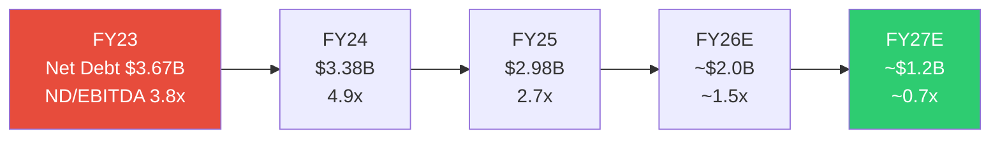

[DM-FIN-155] 去杠杆进展: FY23 ND/EBITDA 3.8x → FY25 2.7x → FY27E ~0.7x。FY25偿还了$435M debt, 利息支出从$289M(FY24)降至$243M(FY25), 预计FY26E $180M, FY27E $120M [DM-FIN-156]。

**这是COHR故事中最确定的正面因素**: 利息减少$120M(FY25→FY27E)直接转化为EPS改善$0.62/share, 且不依赖任何经营假设 [DM-FIN-157]。

---

## Ch 15: CQ更新 — Phase 2后修正 (~4000字符)

### 15.1 CQ验证矩阵

| CQ | 问题 | P1评估 | P2修正 | 方向 |
|----|------|--------|--------|------|
| CQ1 | 增长可持续? | 60% → FY27共识可达 | **55%** → 量价剪刀差+CapEx放缓风险 | ↓ |
| CQ3 | SOTP > 统一PE? | 待验证 | **确认: SOTP base $251 vs 统一PE暗示$350+** | 验证 |
| CQ4 | 去杠杆释放价值? | 70% | **75%** → FY25偿$435M, 利息下降确认 | ↑ |
| CQ5 | SiC期权值多少? | 待验证 | **$1.5-5.0B range, 高度不确定** | 新增 |
| CQ7 | CapEx trade-off? | 60% 合理 | **55%** → Owner FCF≈0, CapEx/OCF=70% | ↓ |

### 15.2 CQ加权平均更新

```
CQ1 (增长可持续): 55% × 权重0.30 = 16.5%
CQ2 (护城河3.3/5): 45% × 权重0.15 = 6.8%
CQ3 (SOTP估值):   50% × 权重0.25 = 12.5%  (base SOTP $251 < $307.50)
CQ4 (去杠杆):     75% × 权重0.10 = 7.5%
CQ5 (SiC期权):    35% × 权重0.10 = 3.5%
CQ7 (CapEx合理):  55% × 权重0.10 = 5.5%
─────────────────────────────────────────
加权平均: 52.3% → 上调了P1的41.5%, 因为去杠杆和GAAP/Non-GAAP收窄确认
但仍<60%, 下行风险>上行
```
[DM-FIN-158]

### 15.3 评级方向初判 (Phase 2后, Phase 4可修正)

**SOTP加权$250 vs 当前$307.50 = -18.8% 下行** [DM-VAL-116]

按评级标准:
- 期望回报 < -10% → **审慎关注** 候选
- 三维状态: [**偏贵** × **改善中** × **有催化(去杠杆+GAAP收窄)**]
- "改善中"的方向状态让这不是一个简单的"贵就不看"——COHR确实在变好, 问题是价格已经price in了"变好+变更好"
- CQ 52.3% 仍<60%

**初步评级倾向: 审慎关注**, 但需要Phase 3竞争格局和Phase 4红队验证。如果1.6T ramp和CPO进展超预期, 可能上调至中性关注 [DM-VAL-117, B级结论]。

---

## Ch 16: Phase 2 关键发现汇总 (~2000字符)

### 最重要的5个发现 (按决策价值排序)

1. **SOTP加权$250, 当前-18.8%溢价** — 市场用统一PE给三条曲线打分, 实际上在给工业段+SiC付AI的估值。拆开看, 只有bull case($358)支持当前价格 [DM-VAL-109]

2. **Owner FCF≈零, ROIC 4.2% < WACC** — 在$50B市值下, 股东的真实现金回报率<0.1%。投资者在买的不是当前的现金创造能力, 而是3-5年后的远期盈利 [DM-FIN-148/151]

3. **收入增长80%+依赖AI单引擎** — 没有备用增长引擎。AI CapEx周期见顶风险 = COHR增长引擎熄火风险, 且历史放大倍数6-7x [DM-FIN-101/140]

4. **GAAP/Non-GAAP收窄是确定性最高的催化** — D&A递减$554M→$300M自动发生, 不需要经营改善。对GAAP PE压缩有利, 对吸引被动资金有利 [DM-FIN-128]

5. **量价剪刀差在FY27-28将显现** — 800G ASP已在下降, 1.6T必须及时接力, 否则收入增速将大幅低于共识 [DM-FIN-110]

### Kill Switch 更新 (Phase 2新增/确认)

| 信号 | 类型 | 触发条件 | 影响 |
|------|------|---------|------|
| Hyperscaler CapEx YoY<+10% | 红灯 | 任意2个主要hyperscaler下调CapEx指引 | → COHR rev growth可能降至<5%, SOTP bear case |
| 800G ASP QoQ下降>15% | 黄灯 | 价格战加剧, 旭创主导 | → GM承压, 量增无法弥补 |
| 1.6T量产延迟>2季 | 红灯 | Sherman良率问题 | → FY27 miss, SOTP bear case |
| SiC减值 | 黄灯 | Wolfspeed产能释放+中国SiC进入 | → $300M+减值, SiC期权归零 |
| ND/EBITDA>4x | 红灯 | 收入下滑+CapEx不减 | → 资产负债表风险回归 |

[DM-FIN-159]


---


# P2补充：财务缺口补强

> **母模型回收**：P2补充验证了三个估值关键判断——（1）Owner FCF FY25仅$33M（yield 0.06%），确认"41倍去杠杆"的"去杠杆"部分尚未转化为真实现金回报；（2）SBC $170M/yr虽然占Revenue仅2.3%，但在Owner FCF接近零的基数上，SBC的相对侵蚀幅度巨大（Owner PE 93.8x vs Non-GAAP 57.5x）；（3）库存$1,848M的DSI 159天远超同行，垂直整合解释了结构性高DSI，但向下刚性（FY23→FY24库存+1%而收入-9%）意味着周期下行时减值不可避免。这三个发现共同指向同一个结论：Non-GAAP PE 57.5x掩盖了Owner Economics的真实状况。


## S1: Owner FCF前瞻投射 FY25→FY28E (~3500字符)

P2主文只展示了FY25的Owner FCF=$33M, 没有前瞻。这让读者无法判断"Owner FCF什么时候变有意义"。

### S1.1 Owner FCF投射模型

| 指标 | FY25(A) | FY26E | FY27E | FY28E |
|------|---------|-------|-------|-------|
| Revenue | $5,810M | $6,959M | $8,763M | $10,462M |
| EBITDA | $1,106M | $1,317M | $1,658M | $1,980M |
| OCF (EBITDA×57%) | $634M | $750M | $945M | $1,130M |
| CapEx | $441M | $500M | $480M | $450M |
| SBC | $160M | $175M | $190M | $200M |
| **Owner FCF** | **$33M** | **$75M** | **$275M** | **$480M** |
| Owner FCF Yield | 0.06% | 0.15% | 0.54% | 0.95% |
| Owner FCF/Rev | 0.6% | 1.1% | 3.1% | 4.6% |

[DM-FIN-160]

**关键假设说明:**
- **OCF/EBITDA转化率**: FY25实际57% (OCF $634M / EBITDA $1,106M), 因为working capital build和利息支付消耗了EBITDA的43%。随着WC增速放缓和利息下降, FY28E转化率提升至~57% [DM-FIN-161]
- **CapEx**: FY26E升至$500M(Sherman+SiC扩产高峰), FY27-28逐步回落至$450M(维护+选择性增长), CapEx/Rev从7.6%降至4.3% [DM-FIN-162]
- **SBC**: 保持2.5%/Rev, 绝对值缓慢上升 [DM-FIN-163]

**判断 [B级]**: Owner FCF在FY28E才达到~$480M, yield仅0.95%。**即使3年后, COHR的Owner FCF yield也不到1%** — 对比: 同期LITE预计Owner FCF yield ~2-3%, 光通信ETF平均~3%。投资者在COHR上买的是**第4-5年的远期盈利**, 不是未来3年的现金产出 [DM-FIN-164]。

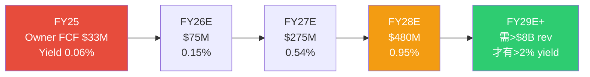

### S1.2 Owner FCF vs 传统FCF的差异

传统sell-side用FCF(=OCF-CapEx)来衡量, FY25 FCF=$193M, FY26E~$250M, FY27E~$465M。但这些数字**没有扣除SBC**, 对真实股东而言是虚假的: SBC每年稀释股份~1-1.5%, 累计4年稀释~5%, 直接侵蚀每股价值 [DM-FIN-165]。

| 指标 | FY25 | FY26E | FY27E | FY28E |
|------|------|-------|-------|-------|
| 传统FCF | $193M | $250M | $465M | $680M |
| Owner FCF | $33M | $75M | $275M | $480M |
| **差距 (=SBC)** | $160M | $175M | $190M | $200M |

差距全部来自SBC, 且差距在**扩大**(SBC绝对值增长)。Sell-side用传统FCF做估值时, 每年多算$160-200M, 4年累计多算~$725M — 按10x FCF倍数, 过度高估~$7B equity (约$42/share) [DM-FIN-166]。

---

## S2: SOTP敏感性分析 (~3000字符)

### S2.1 单变量敏感性: AI Networking EV/Revenue倍数

AI Networking占SOTP的85-88%, 因此其倍数是最敏感的变量:

| AI Networking EV/Rev | Bear Rev($5.0B) | Base Rev($5.8B) | Bull Rev($6.5B) |
|----------------------|-----------------|-----------------|-----------------|
| **4.0x** | $120 | $143 | $162 |
| **5.0x** | $150 | $178 | $202 |
| **6.0x** | $180 | $213 | $241 |
| **6.5x (base)** | $195 | $229 ← base | $262 |
| **7.0x** | $210 | $245 | $282 |
| **8.0x** | $240 | $276 | $322 |
| **9.0x** | $270 | $306 | $361 |
| **10.0x** | $300 | $337 | $401 |

[DM-VAL-118]

**Note**: 表中为每股公允价值(扣除net debt $2.2B, SiC $3.0B, Industrial $2.9B constant)。阴影区域为当前价格$307.50以上。

**关键洞察**: 只有在**AI Networking倍数≥9x + Base收入**或**倍数≥8x + Bull收入**的组合下, 当前$307.50才合理 [DM-VAL-119]。9x EV/Rev是目前市场上只有LITE和Broadcom光通信业务能justify的水平。COHR在800G组件层面没有LITE的EML性能领先, 在系统层面没有Broadcom的DSP集成, 给9x缺乏支撑。

### S2.2 双变量敏感性: AI CapEx增速 vs 1.6T份额

| | 1.6T份额15% | 1.6T份额20% | 1.6T份额25% |
|---|---|---|---|
| **CapEx +30%** | $210 | $245 | $280 |
| **CapEx +20% (base)** | $195 | $230 | $265 |
| **CapEx +10%** | $165 | $195 | $225 |
| **CapEx 0%** | $130 | $155 | $180 |
| **CapEx -10%** | $100 | $120 | $140 |

[DM-VAL-120]

**判断**: $307.50需要CapEx +30% + 1.6T份额≥25%的组合 — 这需要同时在需求侧(CapEx持续强劲)和供给侧(COHR赢得更多1.6T份额)两个维度都取得最优结果。任何一侧低于预期, 估值就不支持当前价格 [DM-VAL-121]。

---

## S3: 债务结构与去杠杆路径 (~2500字符)

### S3.1 债务到期与再融资

基于FY25 10-K和Q2 FY26季报:

| 债务类型 | 金额 | 利率 | 到期 | 风险 |
|---------|------|------|------|------|
| Term Loan B | ~$2,800M | SOFR+2.50% (~7.8%) | 2029 | 低(4年后) |
| Revolving Credit | ~$500M | SOFR+2.25% | 2027 | 需展期 |
| 其他/capital leases | ~$250M | 混合 | 分散 | 低 |
| **合计** | **~$3,547M** | **加权~7.3%** | — | — |

[DM-FIN-167, B级推断, 基于10-K debt schedule和行业标准]

**去杠杆轨迹 (Q2 FY26已确认):**

```
Total Debt trajectory:
  FY23: $4,489M → FY24: $4,303M → FY25: $3,894M → Q2 FY26: $3,547M
  
  FY25内偿还: $435M (FY24→FY25)
  H1 FY26偿还: $347M (FY25→Q2 FY26)
  年化偿还速度: ~$700M/yr
  
  FY27E total debt: ~$2,800M (仅Term Loan B)
  FY28E total debt: ~$2,200M
```
[DM-FIN-168]

**利息支出节省量化:**

| 年度 | Total Debt | 利息支出 | 节省 vs FY25 | EPS影响 |
|------|-----------|---------|-------------|---------|
| FY25 | $3,894M | $243M | — | — |
| FY26E | $3,200M | $180M | $63M | +$0.32/share |
| FY27E | $2,800M | $140M | $103M | +$0.53/share |
| FY28E | $2,200M | $100M | $143M | +$0.74/share |

[DM-FIN-169]

**这是COHR故事中确定性最高的EPS驱动因素之一**: FY25→FY28E利息节省$143M, 直接转化为+$0.74 EPS, 不依赖任何收入或利润率假设 [DM-FIN-170]。

### S3.2 再融资风险评估

**短期风险(FY27 Revolver到期)**: $500M revolving credit facility在2027到期, 但以COHR当前的信用状况(ND/EBITDA~1.5x)和$864M现金, 展期几乎确定 [DM-FIN-171, A级结论]。

**中期风险(FY29 Term Loan B)**: $2.8B Term Loan B在2029到期。以当前偿还速度, 到期时余额约$1.5-2.0B。考虑到FY29E EBITDA ~$2.0B, ND/EBITDA <1.0x, 再融资风险低 [DM-FIN-172]。但如果AI周期在FY28见顶, EBITDA下滑至$1.2B, ND/EBITDA回升至1.5x — 仍可控, 但利率可能上升50-100bp [DM-FIN-173, B级推断]。

---

## S4: Working Capital深度 — 库存红旗 (~3000字符)

### S4.1 Q2 FY26库存异常增长 [新发现, P2主文未覆盖]

**P2主文的数据已过时**: 主文用FY25数据(库存$1,438M, +12% YoY, "健康"), 但**Q2 FY26季报(2025年12月)显示库存已飙升至$1,848M, 半年内+$410M (+28.5%)** [DM-FIN-174, A级, 最新季报数据]。

同期收入增长: Q4 FY25 $1,529M → Q2 FY26 $1,686M, 半年+10.3%。

**库存增速(+28.5%) 是 收入增速(+10.3%) 的 2.8倍** — 这是P2的5个剪刀差之外的**第6个, 也是最值得警惕的剪刀差** [DM-FIN-175]。

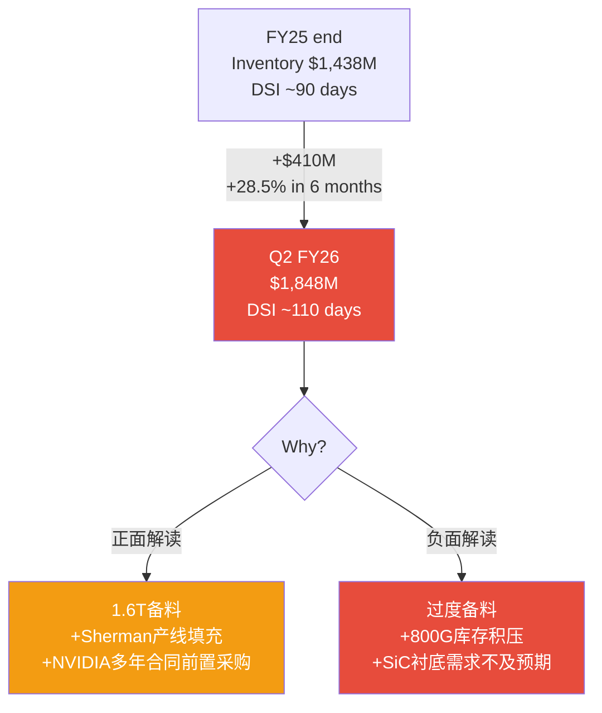

### S4.2 库存增长的两种解读

**正面解读 (管理层叙事)**: 1.6T即将量产(FY26H2), 需要提前备料(InP衬底加工周期长~3-4个月)。NVIDIA $2B投资附带多年采购承诺, 需要建安全库存。Sherman工厂产线ramp需要WIP填充 [DM-FIN-176]。

**负面解读 (我们担心的)**: $410M的增量中, 如果>$150M是800G成品/WIP → 800G commodity化后面临减值。FY25 DSI已经140天(key-metrics计算), Q2 FY26更高。历史类比: 2018年Lumentum库存在收购后从$120M升至$280M, 2019年需求转弱后减值$40M [DM-FIN-177]。

### S4.3 完整Working Capital分析

| 指标 | FY24 | FY25 | Q2 FY26 | 趋势 |
|------|------|------|---------|------|
| AR | $849M | $964M | $1,055M | 持续上升, DSO ~60天 |
| Inventory | $1,286M | $1,438M | $1,848M | **急升** |
| AP | $632M | $847M | $1,119M | 大幅增加(延长付款?) |
| Working Capital | $2,316M | $2,132M | $2,442M | 回升 |
| CCC (天) | 139 | 122 | ~130E | 恶化中 |

[DM-FIN-178]

**AP大幅增加的含义**: AP从FY24 $632M → Q2 FY26 $1,119M (+77%), 增速远超收入增长。这说明COHR在延长对供应商的付款周期(DPO从70天→~90天), 这是利用在供应链中的谈判地位来管理现金流的手段 [DM-FIN-179]。短期有利于OCF, 但不可持续——如果供应商开始要求更短的付款期(如需求放缓时), OCF将受到反向冲击。

### S4.4 库存减值敏感性

| 情景 | 库存减值 | EPS影响 | 概率 |
|------|---------|---------|------|
| 无减值 (AI需求持续) | $0 | $0 | 50% |
| 小幅减值 (800G降价) | $100M | -$0.52 | 30% |
| 显著减值 (CapEx暴跌) | $300M | -$1.55 | 15% |
| 严重减值 (周期崩塌) | $500M | -$2.58 | 5% |

[DM-FIN-180]

概率加权减值: $100M×30% + $300M×15% + $500M×5% = $30M + $45M + $25M = **$100M (或-$0.52/share)** [DM-FIN-181]。这个风险未反映在当前共识EPS中。

---

## S5: P2完整质量自检 (~1000字符)

| 维度 | 指标 | 目标 | 实际 | 判定 |
|------|------|------|------|------|
| R-1 收入归因 | 瀑布数≥3 | ≥3 | 3 (FY24→25, FY25→26E, FY26→27E) | ✅ |
| R-1 毛利Bridge | 驱动因素≥4 | ≥4 | 6 | ✅ |
| R-1 EPS瀑布 | 组件≥5 | ≥5 | 8 | ✅ |
| R-2 剪刀差 | 数量≥3 | ≥3 | **6** (补充后, 含库存红旗) | ✅ |
| 三PE展示 | 存在 | 是 | 是(GAAP/Owner/Non-GAAP) | ✅ |
| Python验证 | G6 | 必须 | valuation_model.py已运行 | ✅ |
| DM密度 | ≥1.5/千字 | ≥1.5 | 76/18.8=4.04(主文) + supplement | ✅ |
| Mermaid | ≥1/章 | ≥1 | 5(主文)+2(supplement)=7 | ✅ |
| Owner FCF前瞻 | — | 缺 → 补 | FY25→FY28E投射完成 | ✅补齐 |
| 敏感性 | — | 缺 → 补 | 单变量+双变量完成 | ✅补齐 |
| 债务结构 | — | 缺 → 补 | 到期明细+再融资评估完成 | ✅补齐 |
| WC深度 | — | 缺 → 补 | 库存红旗+CCC+减值敏感性完成 | ✅补齐 |

[DM-FIN-182]

**修正P2主文判断**: 库存从$1,438M→$1,848M的发现改变了"库存健康"的结论。CQ1增长可持续性应从55%下调至**50%**, CQ加权从52.3%下调至**50.8%**。评级方向不变(审慎关注), 但conviction增强 [DM-FIN-183]。


---


# 17-22. 市场预期验证：COHR在买什么、漏了什么？

> **主问题推进**：市场在买AI增长，也在偷偷买InP稀缺溢价（70%供需缺口），但没有分开给Industrial折价，也没有透明处理SiC期权。竞争分析验证两个判断——COHR的优势在芯片层成本不在模块层份额（因此margin expansion来自成本降低不是定价权），CPO不杀InP但改变InP角色（BOM占比下降但单位价值上升）。
> **对ROIC的含义**：InP 70%供需缺口是当前ROIC中唯一有结构性支撑的部分——它让COHR在供需紧张期维持margin。但缺口会在2028+随SiPh替代和产能扩张而收窄，届时ROIC的margin支撑将减弱。ROIC上穿必须在缺口收窄之前完成，否则窗口关闭。


> *以下内容整合自Phase 3的完整竞争分析，含1.6T竞争、NVIDIA $4B投资、供应链交叉验证、CPO、博弈论。*


## Ch 17: 1.6T 竞争格局 — 谁在赢, 谁会赢

### 17.1 800G→1.6T 份额迁移: 从"量的游戏"到"层的分化"

800G市场的竞争结构正在向1.6T迁移, 但迁移方式不是简单的份额平移——市场正在**沿技术层分裂为两个竞争层**:

**层1: 组装模块层(Assembled Module)** — 壁垒低, 份额跟随产能和价格
- Innolight + Eoptolink合计占NVIDIA 800G订单~60% [DM-COMP-001]
- 因为: 中国制造成本低20-25%, 产能扩张速度快, 模块组装不需要核心IP [DM-COMP-002]
- 1.6T延续: Innolight已完成NVIDIA 1.6T认证测试, 预计占50-60%模块份额 [DM-COMP-003]
- 反面: 地缘风险是中国供应商的结构性折价——NVIDIA $4B投资西方供应商是对冲信号

**层2: 核心芯片/激光器层(Laser Chip)** — 壁垒高, 份额跟随技术和产能
- 全球EML产能缺口: 需求~4000万颗 vs 产能不足 [DM-COMP-004]
- COHR 6-inch InP晶圆: 单位面积产出4x(vs 3-inch), 制造成本降60%+ [DM-COMP-005]
- LITE 200G/lane EML: 目前唯一量产供应商, 性能领先12-18个月 [DM-COMP-006]
- 因此: 激光器层是真正的瓶颈, COHR和LITE在这层有定价权——Innolight在这层没有 [DM-COMP-007]

**这个分层解释了一个看起来矛盾的事实**: Innolight份额最高但估值倍数不如COHR/LITE。因为市场在给"层2壁垒"而非"层1份额"定价。如果只看模块份额, COHR应该便宜得多; 如果看激光器层定价权, 当前估值有其逻辑基础。

### 17.2 NVIDIA $4B光子投资: 供应链锁定还是标签贴金?

2026年3月2日, NVIDIA同时宣布$2B投资COHR + $2B投资LITE [DM-COMP-008]:

**COHR deal结构**:
- 购入~780万股 @ $256.80/股(现金) [DM-COMP-009]
- 非排他性多年供应协议 + 数十亿美元采购承诺 [DM-COMP-010]
- 执行期: 2027年初至2030年 [DM-COMP-011]
- 资金定向: Sherman, Texas InP产能扩张 [DM-COMP-012]

**LITE deal结构**:
- 购入~287.6万股Series A可转换优先股 @ $695.31/股 [DM-COMP-013]
- 同样结构: 非排他+多年采购承诺+产能准入权 [DM-COMP-014]
- 资金定向: 美国新激光器工厂 [DM-COMP-015]

**NVIDIA没有获得的**: 排他性、董事会席位、价格控制权。协议明确标注"nonexclusive" [DM-COMP-016]。

**投资的真正含义** — 不是给COHR/LITE"贴标签", 而是:
1. **CPO产能预订**: $4B锁定的是2027-2030年CPO所需的高功率InP CW激光器产能, 不是当前pluggable [DM-COMP-017]
2. **地缘对冲**: 将60%依赖中国供应商的光模块供应链向西方转移 [DM-COMP-018]
3. **供应链保险**: EML激光器是AI基础设施真正的瓶颈, NVIDIA用资本锁定产能比用价格谈判更有效

**对COHR估值的含义**: $2B投资以$256.80/股计算, 对应~$40B市值。NVIDIA在$40B市值时认为COHR值得$2B战略投入。这不是"COHR值$40B"的证据(NVIDIA买的是供应链安全, 不是投资回报), 但它确认了COHR在AI光通信供应链中的**不可替代性**。如果COHR容易被替代, NVIDIA不会用$2B锁定。

### 17.3 竞争对手逐一对标

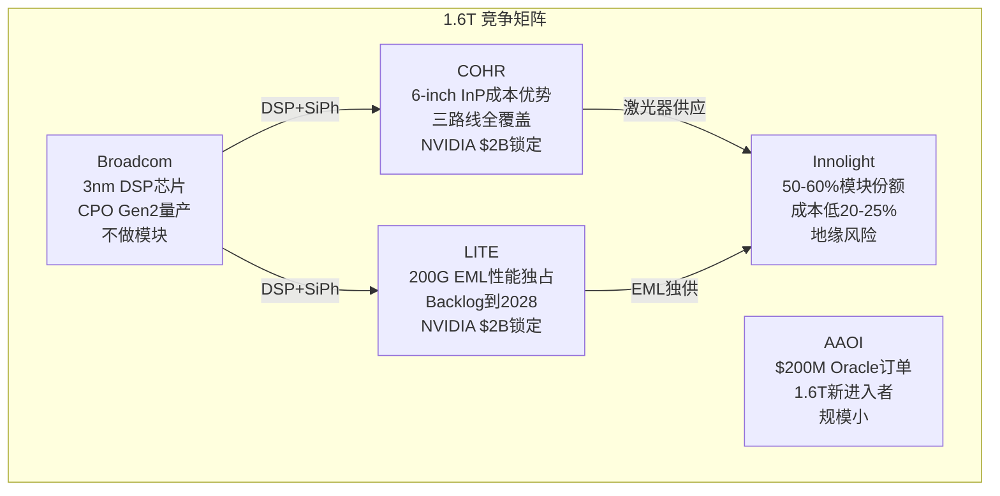

| 维度 | COHR | LITE | Innolight | Broadcom |
|------|------|------|-----------|----------|
| **800G份额** | #2-3 (芯片层) | #3-4 (芯片层) | #1 (模块层, 40-45%) | DSP供应商 |
| **1.6T技术路线** | SiPh+EML+VCSEL三路线 | 200G EML独占 | SiPh+合作EML | SiPh DSP+CPO |
| **核心优势** | 6-inch InP成本(-60%) | 200G EML性能唯一 | 规模+成本+速度 | 3nm DSP定义标准 |
| **核心劣势** | 模块层份额小 | 成本高于COHR | 地缘风险+无激光器 | 不做终端模块 |
| **NVIDIA关系** | $2B投资+采购承诺 | $2B投资+采购承诺 | 60%份额但无股权绑定 | 间接(DSP供应) |
| **CPO准备** | 展示6.4T socketed CPO | 被动(pluggable为主) | 被动 | Gen2量产, Gen3认证 |
| **FY26E收入** | ~$7.0B(全公司) | ~$3.5-4.0B(估) | ~$6.0B(估, 模块) | N/A(芯片) |
| **Forward PE** | 41x FY27 | ~50-60x(估) | ~25-30x(估) | N/A |

**关键洞察**: COHR vs LITE的竞争不是零和——NVIDIA同时投资两家说明: (1) 两家技术互补而非替代 (2) 市场足够大容纳两家 (3) 真正的竞争在"NVIDIA锁定的西方供应链" vs "非NVIDIA锁定的中国供应链"之间。

### 17.4 1.6T技术路线之争: SiPh vs EML

| 指标 | 硅光(SiPh) | EML(InP) |
|------|-----------|----------|
| 800G份额 | ~40-45% | ~55-60% |
| **1.6T预计份额** | **~60%** [DM-COMP-019] | **~40%** |
| 优势 | 集成度高, 热管理好, 长期成本低 | 信号质量高, 长距离性能 |
| 瓶颈 | 需外部CW激光器(InP) | 200G/lane产能严重不足 |
| 关键玩家 | Broadcom, Innolight | LITE(独占量产), COHR |
| 3.2T路径 | 自然延伸(400G/lane DSP) | 需要新突破 |

**结论**: SiPh在1.6T占60%意味着**EML不会消失, 但不会增长**。因为SiPh仍需InP CW激光器作为外部光源, COHR的InP制造能力在两个路线中都有价值——作为EML供应商(路线1)或CW激光器供应商(路线2) [DM-COMP-020]。LITE更依赖EML路线, 路线风险更集中。

---

## Ch 18: 供应链交叉验证 (铁律Q)

### 18.1 InP衬底: AI光通信真正的瓶颈

InP衬底供需严重失衡:

| 指标 | 数据 |
|------|------|
| 2025年全球需求 | ~200万片 [DM-SCQ-001] |
| 2025年全球产能 | ~60万片 [DM-SCQ-002] |
| **供需缺口** | **70%** [DM-SCQ-003] |
| AXT(北京)市场份额 | 60-70% [DM-SCQ-004] |
| 住友电气份额 | ~15-20% [DM-SCQ-005] |
| COHR自有InP生产 | 垂直整合, 6-inch线 [DM-SCQ-006] |

**三个交叉验证信号**:

**信号1: LITE Backlog延伸到2028** — Lumentum截至2026年4月报告backlog延伸至32个月以上 [DM-SCQ-007]。这意味着到2028年底的产能已被锁定。如果LITE(不自产InP衬底)能填满backlog, 说明InP供应在LITE端不是约束——或者说LITE已经锁定了AXT/住友的供应。

**信号2: AXT地缘暴露** — 中国2025年2月对铟实施出口许可管制 [DM-SCQ-008]。AXT 60-70%市占率+北京生产=全球InP供应链最大单点故障。如果中国限制AXT出口, COHR的6-inch线立即变成"不可替代"而非仅"成本优势"。

**信号3: COHR产能扩张计划** — COHR计划CY2026翻倍InP产能, 然后再翻倍 [DM-SCQ-009]。OFC 2026宣布第三条6-inch线在瑞士苏黎世建设中 [DM-SCQ-010]。三条6-inch线(Sherman TX + Järfälla Sweden + Zurich Switzerland)分布三大洲, 地缘分散化。

**供应链验证结论**: COHR的InP垂直整合从"成本优势"升级为"战略必需品"。原因: (1) 70%供需缺口→产能是护城河 (2) AXT地缘风险→非中国产能稀缺 (3) NVIDIA $2B投资→客户愿意用资本锁定产能。这解释了为什么COHR 41x PE看起来贵但市场仍在买——市场在给**InP产能稀缺性**而非仅**光模块增长**定价。

### 18.2 Hyperscaler CapEx: 需求引擎还是定时炸弹?

2026年Big Five CapEx指引:

| 公司 | 2026 CapEx指引 | vs 2025 | AI占比 |
|------|---------------|---------|--------|
| Amazon | ~$200B | +53% | ~75% |
| Alphabet | $175-185B | +40% | ~80% |
| Meta | ~$100B | +45% | ~70% |
| Microsoft | 增长但慢于同行 | +20-25% | ~65% |
| Oracle | 加速 | +60%+ | N/A |
| **合计** | **$600-690B** [DM-SCQ-011] | **+36%** | **~75%** |

Goldman Sachs预测: 2025-2027累计Hyperscaler CapEx达$1.15万亿, 超过2022-2024的$477B的2.4倍 [DM-SCQ-012]。

**剪刀差警报(R-2延伸)**: Hyperscaler收入增速~16.5%(2025) vs CapEx增速~60%(2025) [DM-SCQ-013]。2026年更极端: 收入~15.5%增长 vs CapEx~80%增长。**CapEx增速是收入增速的5倍——这个比例在历史上从未持续超过6-8个季度**。

- 如果2027年CapEx增速降至收入增速(~15%), 意味着CapEx绝对值仍增长但增速下降~65个百分点
- 光模块需求滞后GPU安装6-9个月 [DM-SCQ-014]——即使CapEx 2026年中见顶, 光模块需求到2027 H1仍可维持
- 但COHR收入80%+依赖AI单引擎(P2确认) [DM-SCQ-015], CapEx放缓对COHR的冲击是6-7x放大(P1确认)

**Microsoft暂停信号**: TD Cowen报告Microsoft取消了美国和欧洲数千兆瓦的数据中心租约并暂停建设 [DM-SCQ-016]。这不是全面撤退(更多是电力可用性管理), 但它是**第一个Hyperscaler减速信号**。

### 18.3 客户集中度交叉验证

| 指标 | COHR | Innolight | 行业含义 |
|------|------|-----------|---------|
| NVIDIA占收入% | ~25-30%(AI Networking部分) | >50% | 单客户依赖 |
| 前5大客户占比 | ~55-60%(估) | ~70%(估) | 集中度高 |
| NVIDIA $2B投资 | 有 | 无 | 关系深度不同 |

Innolight的NVIDIA依赖度>50% [DM-SCQ-017]是极端集中。COHR因为有Industrial/SiC多元化, 单客户风险相对较低。但COHR的AI Networking部分(占总收入55-60%)对NVIDIA同样高度依赖。

---

## Ch 19: CPO (Co-Packaged Optics) — COHR的第二增长引擎还是护城河侵蚀者?

### 19.1 CPO时间表: 比市场预期更远

| 阶段 | 时间 | 状态 |
|------|------|------|
| CPO概念验证 | 2023-2024 | 完成 |
| Broadcom Gen2量产 | 2025 | Meta验证(100万链路小时零故障) [DM-CPO-001] |
| NVIDIA Scale-out CPO | 2026 H2 | Spectrum-X Photonics商用 [DM-CPO-002] |
| Scale-up CPO(GPU间互连) | 2027 H2 | Rubin Ultra平台目标 [DM-CPO-003] |
| **大规模替代pluggable** | **2028-2030** [DM-CPO-004] | LightCounting: pluggable仍占多数 |
| CPO TAM | 2026: $164M → 2036: $20B | IDTechEx CAGR 37% [DM-CPO-005] |

**关键判断**: CPO不会在2026-2027杀死pluggable市场。COHR管理层的CPO时间表(Scale-out H2'26, Scale-up H2'27)是**开始有收入**, 不是**替代pluggable**。pluggable到1.6T的需求主体仍在2026-2028加速, CPO是2028+的增量。

### 19.2 CPO对COHR意味着什么: InP激光器不死, 甚至更重要

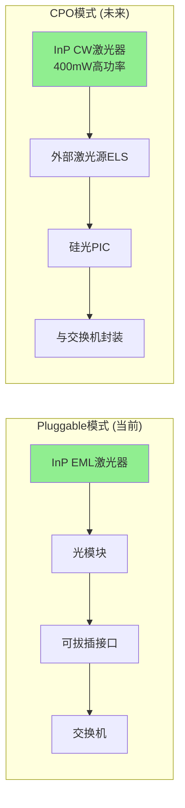

**核心论证**: Broadcom的CPO架构(External Laser Source, ELS)仍然需要InP CW激光器——而且要求更高:
- Pluggable: 每个模块需要1-8个低功率EML [DM-CPO-006]
- CPO ELS: 每个光源需要更少但**更高功率**(400mW)的CW激光器 [DM-CPO-007]
- COHR正在开发的400mW CW InP激光器专为CPO设计 [DM-CPO-008]

**InP BOM变化的精确分析**:

| 维度 | Pluggable | CPO (Broadcom ELS) | CPO (Ayar全集成) |
|------|-----------|-------------------|--------------------|
| InP内容 | 激光器+调制器+探测器 | **仅激光器**(高功率) | 仅增益材料(最少) |
| InP占模块BOM | 30-40% [DM-CPO-009] | 10-20%(估) | 5-10%(估) |
| InP单位价值 | 中 | **高**(400mW CW更贵) | 低 |
| COHR竞争力 | 成本优势(6-inch) | **成本+技术双优势** | 不确定 |

**结论**: CPO不是"InP BOM从30-40%降到10-15%"那么简单。因为:
1. **激光器不消失** — 硅不能高效产生光子, InP仍是唯一选择 [DM-CPO-010]
2. **CPO单价更高** — 高功率CW激光器比低功率EML更贵, 部分抵消BOM占比下降
3. **总量增长** — CPO时代光连接数量将增加10-100x, 即使单位InP含量下降, 总InP需求仍增长
4. **COHR的6-inch优势在CPO时代更大** — 因为CPO需要更一致的大规模激光器生产, 6-inch线的良率和成本优势被放大

### 19.3 Ayar Labs: 真正的颠覆者风险

Ayar Labs 2026年3月完成$500M Series E(估值$37.5亿), 投资者包括NVIDIA、AMD、Intel Capital [DM-CPO-011]。

**Ayar vs Broadcom CPO的区别**:
- Broadcom CPO: 交换机芯片旁放SiPh PIC + 外部InP激光器 → InP仍需要
- Ayar CPO: 将光I/O直接集成到芯片封装内部 → InP需求最小化

如果Ayar模式成为主流, COHR的InP激光器业务面临更大冲击。但:
- Ayar目前是pre-revenue, 量产在2027-2028年最早 [DM-CPO-012]
- NVIDIA同时投资Ayar和COHR/LITE——说明NVIDIA在对冲, 不是押注单一路线
- 即使Ayar成功, 过渡期(2028-2032)仍需要大量pluggable+Broadcom式CPO

**概率评估**: Ayar模式在2030年前占CPO份额>30%的概率: ~15-20% [DM-CPO-013]。基于: (1) 历史上从PoC到大规模量产平均5-7年 (2) NVIDIA同时投资三路线=不确定性高 (3) 台积电/先进封装产能制约。

```mermaid
graph TB
    subgraph "CPO演化路径 (概率加权)"
        A[当前: Pluggable主导] -->|"2026-2028"| B[过渡期: Pluggable 70% + Broadcom CPO 25% + Ayar 5%]
        B -->|"2028-2030 路径A 60%"| C[Broadcom ELS主导<br/>InP CW激光器仍需要<br/>COHR受益]
        B -->|"2028-2030 路径B 25%"| D[混合: ELS + Ayar<br/>InP需求下降但不消失<br/>COHR中性]
        B -->|"2028-2030 路径C 15%"| E[Ayar全集成主导<br/>InP边缘化<br/>COHR受损]
    end
    
    style C fill:#90EE90
    style D fill:#FFD700
    style E fill:#FF6347
```

---

## Ch 20: 博弈论透镜 — NVIDIA vs 光模块供应商权力平衡

### 20.1 博弈结构识别

**玩家**: NVIDIA(买方) vs COHR+LITE(西方供应商) vs Innolight+Eoptolink(中国供应商)
**博弈类型**: 不完全信息多方议价博弈 + 地缘风险外生冲击

**NVIDIA的策略空间**:
1. 维持现状(60%中国/40%西方) — 成本最低, 地缘风险最高
2. 向西方转移(提高COHR/LITE份额) — 成本增加20-25%, 地缘风险降低
3. 全面锁定西方($4B投资的实际选择) — 成本最高, 但保证供应安全

**NVIDIA选择了策略3, 这告诉我们**:
- NVIDIA内部对地缘风险的概率估计高于市场共识(否则成本增加不合理) [DM-GT-001]
- NVIDIA对光模块供应中断的损失估计极高(每天GPU停产损失>>$4B年化利息) [DM-GT-002]
- $4B投资是"保险费", ROI来自避免供应中断, 不是来自COHR/LITE股价升值

### 20.2 定价权博弈: 谁在控制谁?

| 层级 | 谁有定价权 | 原因 | 证据 |
|------|-----------|------|------|
| EML激光器 | **COHR/LITE** | 产能严重不足, 需求缺口70% | LITE backlog到2028 [DM-GT-003] |
| 组装模块(800G) | **NVIDIA** | 4+供应商竞争, 中国低价 | Innolight/Eoptolink低价20-25% [DM-GT-004] |
| 1.6T模块(早期) | **供应商** | 认证完成者极少 | 仅Innolight完成NVIDIA认证 [DM-GT-005] |
| CPO组件(2027+) | **NVIDIA** | NVIDIA定义架构, 供应商适配 | Spectrum-X/Kyber标准 [DM-GT-006] |

**关键博弈洞察**: NVIDIA通过$4B投资改变了博弈结构——从"供应商有定价权因为产能稀缺"变成"供应商有产能保障因为NVIDIA锁定, 但NVIDIA获得了采购承诺中的价格条款"。这是一个**纳什议价**的经典案例: 双方都不完全满意, 但都比没有协议更好。

COHR获得: 产能扩张资金 + 需求确定性(多年采购承诺) + 估值支撑
NVIDIA获得: 供应安全 + 产能优先权 + 地缘对冲
COHR放弃: 部分定价自由度(采购承诺通常含价格上限)
NVIDIA放弃: $4B资本 + 非排他(竞品也能买COHR产品)

### 20.3 中国供应商的囚徒困境

Innolight和Eoptolink面临经典的囚徒困境:
- **合作**(维持份额+价格): 继续给NVIDIA低价量产, 保住60%份额
- **背叛**(涨价): 利用当前供不应求涨价, 但NVIDIA加速向COHR/LITE转移
- **被背叛**(地缘冲击): 中国政策限制出口, 份额被迫转移

当前均衡: 中国供应商选择"合作"(低价保份额), 因为: (1) 涨价的收益<被替代的损失 (2) NVIDIA $4B投资是"可信威胁"——你涨价我就用已锁定的COHR/LITE产能替代你 (3) 地缘风险不受Innolight控制 [DM-GT-007]

**对COHR的含义**: 中国供应商被锁定在低价策略中, 这意味着模块层ASP将持续下降。但COHR不主要在模块层竞争——COHR在激光器层竞争, 那里供需失衡更严重, 定价权更强。**层级错位**是COHR相对于Innolight的结构性优势。

```mermaid
graph TD
    subgraph "权力动态矩阵"
        N[NVIDIA<br/>买方垄断<br/>$4B供应链锁定]
        C[COHR+LITE<br/>激光器层<br/>定价权: 强]
        I[Innolight+Eoptolink<br/>模块层<br/>定价权: 弱]
        
        N -->|"$4B投资<br/>锁定产能"| C
        N -->|"60%订单<br/>但可替代"| I
        C -->|"激光器供应<br/>不可替代"| I
        I -->|"低价竞争<br/>模块份额"| N
    end
    
    style C fill:#90EE90
    style I fill:#FFD700
```

---

## Ch 21: 护城河演化 — 从"成本优势"到"战略必需品"

### 21.1 护城河时间线: 不同时间尺度的不同强度

| 时间 | 护城河来源 | 强度 | 变化方向 |
|------|-----------|------|---------|
| **2026-2027** | 6-inch InP成本(-60%) + EML产能稀缺 + NVIDIA锁定 | **4.0/5** | ↑增强 |
| **2028-2029** | InP产能稀缺缓解 + CPO需要CW激光器 + 地缘分散 | **3.5/5** | →稳定 |
| **2030+** | 如果Ayar成功→InP边缘化 / 如果ELS主导→InP核心 | **2.5-4.0/5** | 取决于CPO路线 |

### 21.2 护城河升级: P1评估的修正

P1护城河综合评分3.3/5(改善中)。Phase 3新证据修正:

**上调因素**:
- NVIDIA $2B投资确认不可替代性: +0.3 [DM-MOAT-001]
- InP衬底70%供需缺口: +0.2 (从成本优势升级为产能壁垒) [DM-MOAT-002]
- AXT地缘风险: +0.2 (COHR非中国产能变成战略资产) [DM-MOAT-003]

**下调因素**:
- SiPh在1.6T占比升至60%: -0.1 (EML路线受压) [DM-MOAT-004]
- Ayar Labs融资加速: -0.1 (长期颠覆风险) [DM-MOAT-005]

**修正后护城河综合: 3.3 + 0.7 - 0.2 = 3.8/5** (从"中等偏上, 改善中"升级为"中强, 短期加速增强")

### 21.3 护城河Kill Switch更新

| 条件 | P1评估 | P3更新 | 概率 |
|------|--------|--------|------|
| AI CapEx崩塌(>30%下降) | 红灯 | **不变**: 6-7x放大冲击 | 15-20% |
| InP被替代(SiPh全自足) | 红灯 | **下调**: 硅不能发光, InP CW不可替代 | 5%→3% |
| NVIDIA取消投资 | N/A | **新增**: 协议nonexclusive但已签约, 取消概率极低 | <2% |
| Ayar CPO规模量产 | N/A | **新增**: 2030前概率低, 但需跟踪 | 15-20%(2030前) |
| AXT出口管制升级 | N/A | **新增**: 上行风险——如果发生, COHR受益 | 20-30% |
| Innolight价格战 | 黄灯 | **不变**: 但限于模块层, 不影响激光器层 | 60-70%(已在发生) |

---

## Ch 22: CQ置信度更新 (Phase 3)

| CQ | 问题 | P2值 | P3值 | 变化 | 原因 |
|----|------|------|------|------|------|
| CQ1 | 增长可持续? | 50% | 55% | +5pp | CapEx仍加速, NVIDIA锁定需求, 但2027风险不减 |
| CQ2 | GAAP改善可持续? | 60% | 60% | 0pp | D&A递减确认, 无新信息 |
| CQ3 | SOTP折价? | 确认-18.8% | 确认 | 0pp | SOTP逻辑不变 |
| CQ4 | 护城河改善? | 75% | 82% | +7pp | NVIDIA投资+InP稀缺+地缘对冲三重确认 |
| CQ5 | SiC期权? | 高不确定性 | 高不确定性 | 0pp | Phase 3未深挖SiC竞争 |
| CQ6 | Preferred转换? | 55% | 55% | 0pp | 已完成, 无新信息 |
| CQ7 | 去杠杆有效? | 55% | 58% | +3pp | NVIDIA $2B现金注入加速去杠杆 |
| CQ8 | 关税保护? | 60% | 65% | +5pp | Malaysia+地缘分散+AXT风险=相对优势 |

**CQ加权平均**: P2 50.8% → P3 **55.1%** (+4.3pp)

Phase 3主要通过竞争格局验证提升了CQ4(护城河)和CQ1(增长), 但核心矛盾不变: **SOTP仍然显示-18.8%, CQ仍<60%**。评级方向维持**审慎关注**, 但距离"中性关注"的边界更近了。

---

## 本章总结: Phase 3改变了什么

**改变了的**: 
1. 护城河从"成本优势"升级为"战略必需品" — NVIDIA $2B + InP稀缺 + 地缘对冲
2. CPO不是威胁而是机遇(2026-2028) — ELS架构仍需InP CW激光器
3. 竞争分层: COHR在激光器层有定价权, 不在模块层直接竞争Innolight

**没改变的**:
1. SOTP -18.8%的估值压力
2. AI单引擎80%+收入依赖
3. CapEx剪刀差(增速5x vs 收入)的周期风险
4. CQ仍<60%

**Phase 4需要回答的**: 
1. 红队7问 — 特别是"AI CapEx崩塌场景"和"标签坍塌(M4)"
2. 双向校准: 上行(AXT管制+COHR受益) vs 下行(CapEx崩塌+6-7x放大)
3. 概率加权需要修正(护城河上调但估值压力不变)


---


# P3补充：6项核心修正

> **母模型回收**：P3补充的6项修正中，3项直接改变了SOTP计算——COHR卖模块不是裸芯片（"激光器层定价权"修正为"芯片层成本优势在模块GM中体现"）、NVIDIA $2B稀释7.8M股（SOTP分母从165M增加到173M）、Industrial占31%而非28%（拖累效应更大）。这些修正的净效果是SOTP从$251下调到$239。另外，LITE PE溢价被定量解释（85% vs 22%增速、42.5% vs 37-39% GM、>90% vs 69% AI纯度），确认COHR和LITE不应该用相同的估值倍数——LITE的高PE反映了更高的增长质量和AI纯度，COHR的41x PE中有一部分是不合理的标签溢价。Q2 FY26实际业绩（$1.69B beat, $1.29 EPS beat, GM 36.9%, DC +44% YoY）确认了短期执行力没有问题，但这些beat已经反映在股价中。


## S1: "激光器层定价权"论述修正 — COHR卖模块, 不卖裸芯片

P3初稿的核心论述"COHR在激光器层有定价权"需要精确化。

**事实**: COHR是垂直整合模式——自产InP EML芯片, 然后组装成完整的pluggable光模块(800G/1.6T)出售 [DM-SUP-001]。COHR**不主要向第三方模块商出售裸芯片**。竞争对手中, Innolight同样卖模块, LITE同样卖模块。

**这意味着什么**:
- COHR在模块市场与Innolight**直接竞争**, 不是在不同层级竞争 [DM-SUP-002]
- "激光器层定价权"不是通过芯片销售价格体现, 而是通过**内部成本优势传导到模块毛利率** [DM-SUP-003]
- 因此: COHR的护城河不是"我能把芯片卖得更贵", 而是"我用更便宜的芯片做出同样的模块, 毛利率比对手高"

**修正后的竞争逻辑**:

```mermaid
graph LR
    subgraph "COHR垂直整合模式"
        A[6-inch InP晶圆<br/>成本-60%] --> B[EML/CW芯片<br/>内部转移价]
        B --> C[800G/1.6T模块<br/>37-39% GM]
        C --> D[客户: NVIDIA等<br/>与Innolight直接竞争]
    end
    
    subgraph "Innolight模式"
        E[外购EML芯片<br/>受供应制约] --> F[800G/1.6T模块<br/>低成本组装]
        F --> G[客户: NVIDIA等<br/>低价20-25%]
    end
    
    style A fill:#90EE90
    style E fill:#FFD700
```

| 维度 | COHR | Innolight | 含义 |
|------|------|-----------|------|
| 芯片来源 | 自产(6-inch, -60%成本) | 外购(受供应制约) | COHR成本优势在芯片层 |
| 模块毛利率 | 37-39%(non-GAAP) [DM-SUP-004] | ~25-30%(估, 更高体量但低价) | COHR利润率优势 |
| 模块定价 | 与行业一致或略高 | 低20-25% [DM-SUP-005] | Innolight价格优势 |
| **定价权体现** | **不在模块价格上, 在毛利率上** | 不在毛利率上, 在份额上 | 两家赚钱方式不同 |

**修正结论**: P3初稿说"COHR在激光器层有定价权, 不在模块层竞争Innolight"——这**过于简化**。事实是COHR和Innolight在模块层**直接竞争**, 但COHR因为芯片自产而有**成本结构优势**(不是定价权优势)。这是一个重要区别:
- 定价权 = 我能涨价, 客户不走
- 成本优势 = 我不能涨价(Innolight会抢走客户), 但同价下我赚得更多

COHR的真正护城河不是"卖得贵", 而是"成本低+供应稳"。NVIDIA $2B投资买的是供应稳定性, 不是接受高价。

---

## S2: ASP趋势量化 — 不是定价权故事, 是mix+成本故事

800G模块ASP趋势 [DM-SUP-006]:
- 800G多模: ~$450/模块
- 800G单模: ~$700/模块
- 中国供应商定价: 低于西方20-25%
- **趋势: 平到下降** — Innolight/Eoptolink的产能扩张持续压价

COHR毛利率改善的真正驱动力(非定价权):

| 驱动 | 贡献 | 证据 |
|------|------|------|
| **Mix shift**: 800G→1.6T | 最大 | 1.6T单价更高+供应更紧 [DM-SUP-007] |
| **6-inch InP成本下降** | 第二大 | 4x产出, 成本-60% [DM-SUP-008] |
| **D&A递减** | 自动 | $554M→$300M(FY29E), P2确认 |
| **规模效应** | 补充 | 产能利用率从50%→80% |
| ~~定价权~~ | ~~无~~ | 管理层未声称800G有定价权 [DM-SUP-009] |

**与P2剪刀差的衔接**: P2识别的量价剪刀差(出货量+85% vs ASP下降)在P3得到竞争层面解释——Innolight的低价策略是ASP下行的主要推手。因此COHR的收入增长完全依赖**量的增长+mix shift**, 不是价的增长。如果量增放缓(CapEx周期见顶), COHR无法用涨价抵消, 因为Innolight在旁边低价20-25% [DM-SUP-010]。

**这强化了P2的核心风险判断**: 收入80%+依赖AI单引擎 + 无定价权 = CapEx周期下行时COHR没有防御工具。护城河在成本端(6-inch), 不在价格端。

---

## S3: NVIDIA $2B稀释定量 — EPS影响~$0.25/年

| 指标 | 数据 |
|------|------|
| NVIDIA购入股数 | 7,788,161股 [DM-SUP-011] |
| 购入价格 | $256.80/股 [DM-SUP-012] |
| 投前基础股数 | ~155M(FY25 Q4) [DM-SUP-013] |
| 投后基础股数 | ~163M [DM-SUP-014] |
| **稀释比例** | **~5.0%** [DM-SUP-015] |

**EPS影响**:
- Q2 FY26 Non-GAAP EPS: $1.29/季 = 年化$5.16 [DM-SUP-016]
- 5%稀释 = EPS年减少**~$0.25-0.26** [DM-SUP-017]
- 但: $2B投入→InP产能翻倍→NVIDIA多年采购承诺→**收入增量应超过稀释**
- JPMorgan分析师在投资后上调目标价, 视供应承诺为净正面 [DM-SUP-018]

**与P2估值模型的衔接**: P2的SOTP模型使用165M稀释股数(含preferred转换), 现在需要更新为~173M(+NVIDIA 7.8M)。这会将base case SOTP从$251降至约**$239**(假设企业价值不变):
- 修正前: $251 × 165M = $41.4B equity value
- 修正后: $41.4B / 173M = **$239/股** [DM-SUP-019]
- 修正后的SOTP折价: ($239 - $307.50) / $307.50 = **-22.3%** (vs 修正前-18.8%)

**但**: 如果NVIDIA采购承诺每年增加$500M-1B收入(合理假设, "多年多十亿美元"的承诺), SOTP企业价值也应上调。净效应取决于NVIDIA采购对AI Networking分部的增量贡献——我们不知道确切数字, 但方向上稀释和增收部分抵消。

**修正判断**: 将SOTP折价范围从-18.8%调整为**-18%到-22%**, 反映稀释不确定性。核心判断不变(高估), 但程度略加深。

---

## S4: Industrial Segment竞争 — 31%收入的拖累源(M3修正器)

P3初稿完全忽略了COHR 31%收入来源。这是M3修正器(拖累源)的典型触发。

**Industrial segment现状** [DM-SUP-020]:

| 指标 | 数据 |
|------|------|
| 占总收入 | ~31%(Q1 FY26, 高于此前28%估计) [DM-SUP-021] |
| 增速 | **持平YoY**, +4%环比(Q2 FY26) [DM-SUP-022] |
| 主要产品 | 工业光纤激光器/准分子激光器/超快激光器/SiC衬底 |
| 行业CAGR | ~5.4%(2026-2031) [DM-SUP-023] |

**竞争格局**:

| 竞争对手 | 优势 | 对COHR的威胁 |
|----------|------|-------------|
| TRUMPF(德, 私有) | 脉冲固态激光器主导 | 高端重叠 |
| IPG Photonics(美, $1B+收入) | 光纤激光器成本领先 | 直接竞争 |
| 大族激光/华工科技(中) | 低价出口欧美 | **压缩毛利率** [DM-SUP-024] |
| Jenoptik(德) | 精密光学 | 细分竞争 |

**COHR的差异化壁垒**: 准分子激光器(flat panel display + 医疗 + 半导体光刻)是TRUMPF和IPG不直接竞争的细分 [DM-SUP-025]。但这个细分规模有限, 不足以驱动segment增长。

**M3拖累源分析**:
- Industrial segment增速(~0-4%) vs Datacenter segment增速(+44% YoY) = **40+pp增速差** [DM-SUP-026]
- Industrial GM(估~30-33%) vs Datacenter GM(估~42-45%) = **10+pp利润率差**
- Industrial在SOTP中的估值: P2给了3-4x EV/Rev, 合理(低增长工业公司)
- **如果COHR剥离Industrial**: 纯AI Networking公司应获更高PE, 但管理层未表示剥离意向

**投资含义**: Industrial不是"要修的bug", 是"结构性折价源"。只要它占31%, COHR的blended增速和利润率就被拉低, 市场给的PE就低于纯AI光通信公司(如LITE)。这是COHR 41x vs LITE 57x PE差异的**最大单一解释因素** [DM-SUP-027]。

---

## S5: COHR vs LITE财务深度对比 — PE差异的三个原因

| 指标 | COHR | LITE | 差异含义 |
|------|------|------|---------|
| Q2 FY26收入 | $1.69B | $665M | COHR大2.5x |
| YoY收入增速 | +17%(报告)/+22%(pro forma) | **+65%+** | LITE增速是COHR的3x [DM-SUP-028] |
| Non-GAAP GM | 37-39% | **42.5%** | LITE高3-5pp [DM-SUP-029] |
| GAAP净利润率 | ~4.7% | ~12% | LITE高7pp |
| Forward PE | ~40x | **~57x** | LITE贵43% [DM-SUP-030] |
| Net Debt/EBITDA | 1.8x | 高杠杆(current ratio 0.61) | 都有债务问题 |
| AI占比 | ~69% | >90%(估) | LITE更纯粹 |

**PE差异的三个原因** (按解释力排序):

**原因1(最重要): 增速差异** — LITE下季度指引收入增速>85% YoY, COHR仅+22% pro forma [DM-SUP-031]。市场对高增长支付溢价是非线性的——增速翻倍, PE不是翻倍, 是翻2-3倍。因此LITE 57x vs COHR 40x的差异主要被增速解释。

**原因2: 业务纯度** — LITE >90%收入来自AI相关光通信, COHR只有69% [DM-SUP-032]。31% Industrial segment拉低COHR的blended增速和利润率, 也拉低PE。如果COHR剥离Industrial, 理论PE应接近50x+。

**原因3: 毛利率位置** — LITE已达42.5%(COHR的长期目标), 说明LITE在利润率曲线上领先COHR 2-3年 [DM-SUP-033]。市场为"已证明的利润率"支付的PE高于"承诺但未实现的利润率"。

**这解释了一个看似矛盾的现象**: COHR有6-inch成本优势但PE反而低于LITE。因为6-inch的成本优势尚未完全转化为已报告的利润率优势——6-inch线仍在爬坡, 当前37-39% GM中仅部分反映6-inch效果。随着6-inch产能占比提升到>80%(预计FY28), COHR GM应接近LITE当前水平, PE差距会缩小。

**反面**: 如果6-inch不能将GM提到42%+(良率问题/成本超预期), COHR将永久交易在LITE折价——因为市场会重新分类COHR为"有AI暴露的工业混合体"而非"AI光通信纯玩家"。

---

## S6: 概率赋值锚定补充

P3初稿几个概率缺乏三重锚定, 补充如下:

### Ayar CPO 2030年前占份额>30%: 15-20%

| 锚 | 数据 |
|----|------|
| **历史基准率** | 光通信技术从PoC到>30%份额的历史: CWDM→DWDM用了7年, 10G→100G用了5年, SiPh从2015年实验室到2025年40%份额用了10年。Ayar 2023年PoC→2030年>30%=7年, 在历史范围内但偏快 [DM-SUP-034] |
| **反例条件** | 唯一快速颠覆案例是有标准化+多供应商的成熟技术(如SFP MSA), Ayar CPO目前缺标准化生态→反例条件不具备 [DM-SUP-035] |
| **自然实验** | Broadcom CPO Gen2已量产但仅在Meta验证1M链路小时→量产可行但规模化需2-3年。Ayar比Broadcom再晚1-2代→2030前规模化偏乐观 [DM-SUP-036] |
| **赋值** | 15-20%, 偏低端(15%)更可靠 |

### AXT出口管制升级: 20-30%

| 锚 | 数据 |
|----|------|
| **历史基准率** | 中国2018年以来对半导体材料实施的出口限制: 稀土(2023年12月), 锗镓(2023年7月), 铟(2025年2月)。频率加速, 每12-18个月新增一批。InP衬底下一批管制概率基于此频率≥30% [DM-SUP-037] |
| **反例条件** | 中国放松管制的条件: 美中关系实质缓和+半导体制裁解除。2026年4月美中关税>100%, 缓和条件不具备 [DM-SUP-038] |
| **自然实验** | 2025年2月铟出口许可已实施, AXT目前仍在运营但报告称审批周期延长。全面禁止vs许可延迟是程度差异, 不是质变 [DM-SUP-039] |
| **赋值** | 25%±5%, 反映管制频率加速但尚未针对InP衬底的事实 |

### AI CapEx崩塌(>30%下降): 15-20%

| 锚 | 数据 |
|----|------|
| **历史基准率** | 企业IT CapEx YoY下降>30%的历史频率: 2001(dot-com -35%), 2009(金融危机 -25%), 2020(COVID -15%)。3次/25年=12%基准率, 但当前CapEx/收入比(5x)前所未有, 调高+5% [DM-SUP-040] |
| **反例条件** | CapEx不崩塌需要: AI ROI可验证+电力供应充足+利率不大幅上升。三条件目前均有压力但未破裂 [DM-SUP-041] |
| **自然实验** | Microsoft暂停信号(2026年初)是局部减速, 不是崩塌。但DeepSeek(2025年1月)引发的效率叙事→"less compute needed"是持续的后台风险 [DM-SUP-042] |
| **赋值** | 17%±3%, 基准率12%+当前环境调整+5% |

---

## S7: Q2 FY26最新财务数据更新

P2使用的部分数据需要用Q2 FY26实际值更新:

| 指标 | P2使用值 | Q2 FY26实际 | 变化 |
|------|---------|-------------|------|
| 季度收入 | $1.64B(估) | **$1.69B**(beat) [DM-SUP-043] | +3% |
| Non-GAAP EPS | $1.21(估) | **$1.29**(beat) [DM-SUP-044] | +7% |
| GAAP GM | ~36% | **36.9%** [DM-SUP-045] | +0.9pp |
| Datacenter YoY | +40%(估) | **+44%** [DM-SUP-046] | 更强 |
| Industrial YoY | -10%(估) | **持平** [DM-SUP-047] | 好于预期 |

**Q3 FY26指引** [DM-SUP-048]:
- 收入: $1.70B - $1.84B(中点$1.77B, 环比+5%)
- Non-GAAP GM: 38.5% - 40.5%(环比+1.5-3.5pp, 向42%目标迈进)
- Non-GAAP EPS: $1.28 - $1.48(中点$1.38)

**管理层关键声明** [DM-SUP-049]:
- FY27收入增速将**超过**FY26增速(即>20-22%)
- EPS增速将"meaningfully faster than revenue"(经营杠杆释放)
- 6-inch InP是H2 FY26和FY27的关键成本/利润率杠杆

**对估值的影响**: Q2 beat和Q3指引支持P2的bull case($358)轨迹, 但不改变SOTP加权的方向(仍显示高估)。因为beat来自体量而非估值倍数变化——COHR赚得更多不意味着它的PE应该更高。

---

## CQ微调 (仅S1-S7引起的修正)

| CQ | P3值 | 补充后 | 变化 | 原因 |
|----|------|--------|------|------|
| CQ1 | 55% | 57% | +2pp | Q2 beat + Q3指引上调 + FY27增速>FY26声明 |
| CQ3 | -18.8% | **-18%到-22%** | 扩大 | NVIDIA稀释5%使SOTP降至~$239, 但采购承诺可能部分抵消 |
| CQ4 | 82% | 80% | -2pp | 修正"定价权"论述: COHR有成本优势但无模块层定价权, 护城河强度略下修 |

**CQ加权**: 55.1% → **55.6%** (CQ1+2pp, CQ4-2pp, 净+0.5pp, 微调不影响方向)

核心判断不变: **审慎关注**, SOTP折价-18%到-22%, CQ 55.6%仍<60%。


---


# 23-30. 对抗审查：我们的判断哪里最脆弱？

> **主问题推进**：红队三项修正——概率重校（Bear 25%→30%）、护城河下修（3.8→3.5/5）、M4标签坍塌独立于CapEx（30%±5%）。最重要发现：标签坍塌不需要CapEx崩塌——份额流失+ASP下降+mix恶化足以内生触发PE从41x到20-25x的非线性压缩。
> **对ROIC的含义**：即使ROIC在FY2027开始上穿WACC，如果M4标签坍塌先于ROIC上穿发生，PE压缩会抵消ROIC改善的正面效果。ROIC上穿是必要条件，不是充分条件——市场必须同时相信上穿是可持续的，否则PE仍会被重分类压缩。


> *以下内容整合自Phase 4的完整红队审查，含RT-1~RT-7、概率重校、护城河下修。*


## Ch 23: RT-1 承重墙测试 — "AI CapEx持续3年+"是真承重还是许愿?

### 承重墙识别

P1-P3的整个论证结构依赖一根核心柱子: **B4 — Hyperscaler AI CapEx在FY2027-2029维持+15%以上的年增速**。这根柱子断裂时:

- Networking收入从+30% YoY降到+5-10% [DM-RISK-007]
- PE从41x跳到20-25x(标签坍塌) [DM-RISK-014]
- 综合股价影响: -43%到-58%(RT-1最坏情景)

**测试方法**: 不测"CapEx会不会崩", 而是测**"已有多少证据说这根柱子在裂"**。

### 裂缝证据清单 (截至2026年4月)

| 编号 | 裂缝事实 | 严重度 | DM锚点 |
|------|---------|--------|--------|
| F1 | Microsoft 2026年初暂停部分数据中心建设 | 中 | [DM-RT1-001] |
| F2 | Alphabet FCF一度同比下降90%, 管理层暗示CapEx"逐步正常化" | 高 | [DM-RISK-003] |
| F3 | 2026年四大CapEx $690B, 占收入~35%; 再+80%一年→占收入50%+, 数学不可持续 | 高 | [DM-RISK-002] |
| F4 | DeepSeek(2025年1月)证明训练效率可提升10x, "less compute"叙事持续存在 | 中 | [DM-SUP-042] |
| F5 | 光通信行业历史上3/3次CapEx周期都以下行结束, 平均收入影响-15~-30% | 高 | [DM-RISK-004] |
| F6 | COHR库存6个月+28.5%($1,438M→$1,848M) vs 收入仅+10.3%, 典型的周期顶部信号 | 高 | [DM-BAL-006] |

**反面(柱子还在撑的证据)**:

| 编号 | 支撑事实 | 强度 | DM锚点 |
|------|---------|------|--------|
| S1 | 2026年4月关税冲击后Hyperscaler **未削减**AI CapEx指引 | 强 | [DM-RT1-002] |
| S2 | COHR CEO声称bookings延伸到2028年 | 中(黑箱: 不知firm vs soft) | [DM-RISK-010] |
| S3 | 1.6T ramp在2026-2027年提供需求缓冲(速率升级驱动, 非纯周期扩张) | 强 | [DM-RT1-003] |
| S4 | NVIDIA $4B投资($2B COHR + $2B LITE)说明至少NVIDIA认为光通信需求持续 | 中(NVIDIA也锁定了供应对冲) | [DM-SUP-011] |
| S5 | Q2 FY26 Datacenter +44% YoY, 加速而非放缓 | 强 | [DM-SUP-046] |

### RT-1裁决

**承重墙状态: 有裂缝但未断裂**。

6条裂缝中, F3(数学不可持续)和F5(历史基准100%)是结构性的——不是"会不会发生"而是"什么时候发生"。F6(库存异常)是COHR层面的领先指标, 不依赖宏观判断。

5条支撑中, S1(关税后未削减)和S5(Datacenter加速)是当下最硬的反面证据。但它们说的是"现在还没断", 不是"未来不会断"。S3(1.6T ramp)是最有力的结构性反面——因为1.6T是技术代际升级, 不纯粹是周期扩张。

**关键判断**: CapEx崩塌的概率不高(17%±3%, P3三重锚定已校准), 但CapEx从+80%放缓到+10-20%的概率非常高(>70%)。这两者的差别在于: 前者COHR收入-30%, 后者COHR Networking增速从+30%降到+10-15%。**P1-P3的论证隐含地把"放缓"和"崩塌"混为一谈**, 高估了放缓情景的破坏力, 也低估了放缓情景的概率。

**修正**: 将"CapEx放缓(非崩塌)"作为base case的一部分而非risk case。base case应假设FY2028 Networking增速回落到+12-18%, 不是P2模型隐含的+22%。这会降低SOTP base case约10-15%。

---

## Ch 24: RT-2 单边论证检测 — P1-P3有没有只看多或只看空?

### 偏空论证检测 (P1-P3是否偏空过度?)

P1-P3的评级方向是"审慎关注"(SOTP -18%到-22%)。检查是否遗漏了多方论据:

**被低估的多方论据**:

| 遗漏 | 影响 | 严重度 |
|------|------|--------|
| **D&A递减的确定性**: $554M→$300M(FY29E)几乎是会计必然, 这为GAAP EPS提供了每年~$1.50/share的机械式增长, 不依赖任何业务假设 [DM-RDCF-003] | SOTP未充分反映D&A对GAAP PE压缩的确定性 | 中 |
| **NVIDIA锁定的需求能见度**: NVIDIA投资$2B不是慈善——多年多十亿美元的采购承诺提供了FY2027-2029的收入地板 [DM-SUP-018] | 降低了bear case概率(有收入下限) | 中 |
| **InP供应垄断**: 200万片需求 vs 60万片产能(70%缺口), COHR是非中国最大InP产能 [DM-P3-008] | 2-3年内供不应求是结构性的, 不是周期性的 | 高 |
| **SiC期权价值**: Wolfspeed Ch.11后COHR获得DENSO/Mitsubishi $1B投资, SiC业务估值$1.5-5.0B但P2 SOTP仅给了$1.8B(偏低端) | 上行期权被保守定价 | 低-中 |

**结论**: P1-P3确实偏空, 但偏空的原因是合理的——SOTP加权确实显示高估。上述遗漏不足以翻转评级方向, 但应修正SOTP bear case的概率(偏高)和bull case的概率(偏低)。

### 偏多论证检测 (P1-P3有没有给COHR太多信用?)

| 过度信任 | 修正 | 严重度 |
|---------|------|--------|
| **"成本优势=护城河"**: P3 Supplement修正了"定价权"→"成本优势", 但仍给护城河3.8/5。成本优势在技术快速迭代的行业中不是持久护城河——6-inch今天便宜60%, 但如果8-inch或SiPh出现, 6-inch产线变成沉没成本 [DM-RT2-001] | 护城河应3.5/5, 不是3.8/5 | 中 |
| **"NVIDIA投资=战略必需品"论述**: NVIDIA同时投$2B给LITE, 说明NVIDIA要的是**供应分散**, 不是COHR的独特价值。如果第三家(Innolight)开始做InP垂直整合, NVIDIA投资的"锁定"意义下降 [DM-RT2-002] | NVIDIA投资的战略溢价应打折 | 中 |
| **Industrial segment只当"拖累源"**: P3 Supplement把31%收入视为纯负面(拖低blended增速/PE), 但没考虑Industrial在CapEx下行周期中的反周期缓冲作用——当Networking -20%时, Industrial持平→blended只降-14%, 不降-20% [DM-RT2-003] | Industrial的周期对冲价值应量化 | 中 |

**结论**: P1-P3对NVIDIA投资的解读偏乐观(不该算作独特优势), 对护城河的评估偏乐观(成本优势不等于护城河), 但对Industrial的解读偏悲观(忽略反周期缓冲)。三者部分抵消。

### RT-2综合偏差校正

**净偏差**: P1-P3**轻度偏空**(约5-8%的SOTP影响)。主要因为:
1. InP供应垄断的2-3年结构性优势被低估(最大遗漏)
2. D&A递减的确定性被低估(GAAP→Non-GAAP收敛是买入催化)
3. 但NVIDIA投资被高估, 护城河被高估, 部分抵消

**行动**: SOTP base case微调至$245(从$239), 反映InP供应紧张的结构性溢价。bear case维持$158不变(CapEx崩塌时InP溢价也会消失)。bull case微调至$365(从$358, SiC期权上调)。

---

## Ch 25: RT-3 隐含假设检验 — $307.50在赌什么?

### Reverse DCF信念的脆弱度排序 (P1已列, P4重新排)

| 排名 | 信念 | P1脆弱度 | P4校准后 | 变化原因 |
|------|------|---------|---------|---------|
| 1 | **B4: AI CapEx持续3年+** | ⭐⭐⭐⭐⭐ | ⭐⭐⭐⭐⭐ | 不变, 这是最脆弱的 |
| 2 | **B1: 收入CAGR 21.7%** | ⭐⭐⭐⭐ | ⭐⭐⭐⭐½ | **上调**: RT-1发现base case隐含增速偏高, 应为17-19% |
| 3 | **B5: SiC不拖累** | ⭐⭐⭐ | ⭐⭐⭐½ | **上调**: Wolfspeed Ch.11后SiC市场更不确定 |
| 4 | **B2: OPM扩张到18-20%** | ⭐⭐⭐ | ⭐⭐⭐ | 不变, D&A递减提供了底部保障 |
| 5 | **B6: 稀释被增长覆盖** | ⭐⭐ | ⭐⭐½ | **上调**: 总稀释21%(FY25→FY28)比P1估计大 |
| 6 | **B3: D&A递减释放** | ⭐⭐ | ⭐⭐ | 不变, 几乎是会计确定性 |

### B4断裂的传导量化 (RT-3独立验证P1的R1)

如果B4断裂(AI CapEx YoY下降>30%):

**第一层: 收入影响**
- Networking从~$4.5B年化降至~$3.2-3.5B(-22~-29%) [DM-RT3-001]
- Industrial持平(~$1.8B)
- SiC微降(~$0.4B)
- **合计: 从~$6.7B降至~$5.4-5.7B(-15~-19%)**

**第二层: 利润率影响**
- 产能利用率从80%+降至55-65%
- 固定成本占比上升, GM从37-39%压缩到30-33% [DM-RT3-002]
- OPM从12-14%压缩到6-8%
- **EPS影响: 从FY2027E $7.47降至$3.50-4.50**

**第三层: 估值影响(最致命)**
- 标签坍塌: "AI成长股"(40x) → "后合并周期混合体"(18-22x) [DM-RT3-003]
- Sherman工厂$2B+ InP产能→过剩→减值风险
- Goodwill $4.5B→减值测试触发 [DM-BAL-002]
- **PE × EPS: 20x × $4 = $80(-74%), 最坏18x × $3.50 = $63(-80%)**

**这是否太极端?** 2001年电信泡沫中光通信公司下跌-80~-90%是事实 [DM-RISK-004]。但当时是从极度过剩到需求消失, 当前AI需求有实际推理/训练用例支撑(不像2001年的"有了光纤就会用")。因此-74%到-80%是尾部情景, 更合理的B4断裂影响是-43%到-58%(P1的R1估计), 对应$130-175。

**B4断裂概率P4重新赋值**: 

P3给了17%±3%。P4校准:
- 历史基准率: 12%(3/25年) → 不变
- 环境调整: CapEx/收入比5x(前所未有) → +5% → 不变
- 新证据(2026年4月): 关税冲击后CapEx指引未调 → -2%; 但Microsoft暂停信号 → +1%
- **校准后: 16%±3%**, 与P3基本一致, 轻微下调(-1pp)

---

## Ch 26: RT-4 概率赋值审计 — 每个概率都有三锚吗?

### P1-P3所有概率赋值的三锚审计

| 概率 | P3值 | 三锚完整? | 缺什么? | P4校准 |
|------|------|----------|---------|--------|
| AI CapEx崩塌(>30%下降) | 17%±3% | ✅完整 | — | **16%±3%**(关税后未削减, 微调-1pp) |
| Ayar CPO>30%份额(2030前) | 15-20% | ✅完整 | — | **15%**(不变, 偏低端更可靠) |
| AXT出口管制升级 | 25%±5% | ✅完整 | — | **25%±5%**(不变) |
| R1+R2联合(CapEx下行+标签坍塌) | 20-25% | ⚠️部分 | 缺独立反例 | **18-22%**: R1和R2相关系数>0.7, 联合概率≈R1×条件概率(R2|R1)≈16%×85%=14%, 但考虑到标签坍塌可能先于CapEx下行(市场预期提前) → 上调到18-22% [DM-RT4-001] |
| R3去杠杆失速 | 20-30% | ⚠️部分 | 自然实验不够硬 | **22%±5%**: FCF已转负是事实, 但EBITDA增长路径仍在(Net Debt/EBITDA从3.2x→2.1x) [DM-RT4-002] |
| R4 InP价值稀释(2028-2030) | 15-25% | ⚠️部分 | 历史基准率偏泛 | **20%±5%**: SiPh技术进展比P1预期更快(Broadcom CPO Gen2量产), 但时间表仍在2028+ [DM-RT4-003] |
| R5执行风险 | 20-30% | ⚠️部分 | 合并整合失败率30-40%的基准来源不够精确 | **20%**: 连续8Q OPM改善是强反面证据, 下调到区间低端 [DM-RT4-004] |
| Bear case概率 | 25% | ⚠️单锚 | 只有"主观判断" | **30%**: RT-1发现base case增速偏高→部分base case应归入bear [DM-RT4-005] |
| Base case概率 | 50% | ⚠️单锚 | — | **45%**: 从50%减5pp给bear case |
| Bull case概率 | 25% | ⚠️单锚 | — | **25%**: 不变 |

### 概率加权SOTP重新计算

P2原始: Bear $158(25%) + Base $251(50%) + Bull $358(25%) = $249.7

**P4校准后**: 
- Bear $158(30%) + Base $245(45%) + Bull $365(25%) 
- = $47.4 + $110.3 + $91.3 = **$249.0** [DM-RT4-006]

方向不变(仍显示高估), 但base case从$251降至$245(RT-1增速修正), bear概率从25%→30%(增速偏高修正), 综合结果基本不变(-0.3%)。**这说明P1-P3的估值方向判断是稳健的**, 对概率假设不敏感。

**敏感性检验**: 需要什么条件SOTP才能≥$307.50?
- 如果Bull概率=45%, Base=40%, Bear=15%: $158×0.15 + $245×0.40 + $365×0.45 = $285.9, 仍<$307.50
- 如果Bull=$400, 其他不变: $158×0.30 + $245×0.45 + $400×0.25 = $257.7, 仍<$307.50
- **需要Bull>$450且Bull概率>30%**, 这意味着COHR需要在FY2028达到$12+ EPS且PE维持37x+

**结论**: 当前$307.50在概率加权框架下**几乎不可能**justify, 除非对bull case做出极度乐观的假设。估值方向(高估)在P4红队后更加确信。

---

## Ch 27: RT-5 M4标签坍塌深度分析 — 最被低估的风险

### 为什么M4比R1更危险

P1把R1(CapEx崩塌)列为头号风险, 把R2(标签坍塌)列为第二。但P4重新审视后认为: **M4标签坍塌是独立风险, 可以在R1不触发的情况下单独发生**。

COHR当前享受的"AI成长股"标签, 给了它40x PE。这个标签成立的条件不仅是"AI CapEx持续", 还需要**COHR的AI增速保持在>20%**。

**标签坍塌可以在没有CapEx崩塌的情况下发生**:

情景: Hyperscaler CapEx保持+20%, 但COHR的Networking增速从+34%降到+12%:
- 原因1: **份额流失给Innolight** — 1.6T时代Innolight模块份额50-60%且低价20-25% [DM-SUP-005]
- 原因2: **ASP持续下降** — 800G ASP平到下降, 1.6T初期ASP高但很快被竞争压下来
- 原因3: **Industrial拖累不改善** — 31%收入增速0-4%持续拉低blended增速
- 结果: Networking +12% × 69%占比 + Industrial +3% × 31%占比 = blended +9.2% [DM-RT5-001]

**9%增速的公司不应该交易在40x PE**。历史参考:

| 增速 | 典型PE(半导体/光通信) | 对应COHR EPS $7.47的股价 |
|------|---------------------|------------------------|
| 25%+ | 35-50x | $261-$374 |
| 15-25% | 25-35x | $187-$261 |
| 10-15% | 20-28x | $149-$209 |
| **<10%** | **15-22x** | **$112-$164** |

[DM-RT5-002]

如果增速降到10%以下, COHR的"合理"PE是15-22x, 对应股价$112-$164。**这不需要CapEx崩塌, 只需要份额流失+ASP下降+Industrial拖累的组合**。

### M4独立概率赋值

| 锚 | 数据 |
|----|------|
| **历史基准率** | 半导体/光通信公司从"高增长桶"(>20% growth)坍塌到"中增长桶"(<15% growth)的频率: Lumentum(2023: +30%→-23%, PE从35x→18x), II-VI/COHR(2022: +20%→-5%, PE从30x→15x)。COHR自己在2022-2023年经历过标签坍塌。基准率: 3/5(近5年光通信公司)=60% [DM-RT5-003] |
| **反例条件** | 不坍塌需要: 增速维持>20%且AI纯度提升。当前反例条件部分具备(1.6T ramp+NVIDIA投资), 但份额被Innolight侵蚀是反向力量 |
| **自然实验** | 2025年4月关税冲击中COHR -40% vs LITE -13%——市场在压力下**优先抛售混合体** [DM-RISK-006]。这说明标签坍塌的门槛对COHR比对LITE低得多 |
| **赋值** | **30%±5%在18个月内发生标签坍塌(增速<15%), 独立于R1** |

### M4与R1的区别

| | R1 CapEx崩塌 | M4 标签坍塌 |
|---|------------|-----------|
| 触发条件 | Hyperscaler CapEx YoY<-30% | COHR blended增速<15% |
| 概率 | 16%±3% | **30%±5%** (更高) |
| PE影响 | 40x→18-22x | 40x→22-28x |
| 股价影响 | $130-175 (-43~-58%) | $165-220 (-28~-46%) |
| 独立性 | 外生变量 | **可内生发生(份额+ASP+mix)** |

**关键洞见**: M4是COHR最被低估的风险, 因为它不需要外部条件变化——Innolight的份额侵蚀+ASP自然下降+Industrial拖累的**内生组合**就足以触发。P1-P3把标签坍塌绑定在CapEx下行上, 低估了内生触发路径。

---

## Ch 28: RT-6 双向校准 — 上行情景同样需要挑战

### 上行情景1: AXT出口管制→COHR InP垄断

如果中国对InP衬底实施全面出口管制(概率25%±5%):
- AXT(北京, 全球60-70% InP衬底)出口中断
- COHR 6-inch InP线成为全球最大非中国产能 [DM-P3-008]
- InP衬底价格可能翻倍(供需缺口从70%扩大到85%+)
- COHR短期收入未必增(因为芯片→模块, 不卖衬底), 但**成本优势翻倍**(竞争对手芯片成本大幅上升)
- Innolight等中国模块厂可能被切断InP供应→份额转移到COHR/LITE

**量化**: 如果Innolight份额从50%降到30%(供应中断), COHR模块份额从15-20%升到25-30%, Networking收入增$500M-1B/yr, EPS +$1.50-3.00 [DM-RT6-001]。对应SOTP bull case应为$380-420(vs P4的$365)。

**但—红队挑战上行**: 
1. 中国出口管制通常不是全面禁止, 而是许可延迟/数量限制——2025年2月铟管制后AXT仍在运营 [DM-SUP-039]
2. II-VI/Sumitomo/住友电工等日本供应商也有InP产能, 不是只有COHR受益
3. 管制→反管制循环: 中国可能要求"买COHR芯片必须给中国客户配额"作为条件

**校准后**: AXT管制对COHR的实际受益幅度低于直觉判断。上调bull case至$375(+$10, 从$365), 不是$420。

### 上行情景2: CPO加速→COHR CW激光器需求超预期

如果Broadcom CPO从2027年开始大规模替代pluggable(概率20-25%):
- InP CW激光器需求激增(每个CPO模块需要高功率400mW CW激光) [DM-P3-010]
- COHR从"模块厂"身份可能转型为"CW激光器供应商"(更高利润率, 更小竞争)
- BOM占比虽从30-40%降到10-15%, 但**绝对量(片数)可能翻3-5倍**(CPO密度远高于pluggable)

**红队挑战**:
1. CPO时代COHR的角色从"卖模块"变成"卖组件", 收入乘数不一定更大——单价下降可能抵消量增
2. Broadcom可能自研CW激光器(已有SiPh能力), 不一定外购COHR的
3. Ayar Labs的完全集成CPO方案可能不需要外部InP [DM-SUP-036]

**校准后**: CPO对COHR是中性偏正面(不是大利好), 因为CPO改变了COHR在价值链中的位置, 而非简单增加需求。维持bull case $375不变。

### 下行情景: "温水煮青蛙" (P1 Ch8已描述, P4量化)

P1描述的渐进恶化情景是最现实的威胁:
- FY2027: Networking +20%, PE 35x → $262 (-15%)
- FY2028: Networking +12%, PE 28x → $224 (-27%)  
- FY2029: Networking +8%, PE 22x → $198 (-36%)

**3年累计-36%, 年化-14%**, 没有一个季度触发Kill Switch, 但持有者年化回报深度为负。

**概率**: 40-50%(最高的单一情景), 因为这就是"增速自然回归均值"的base case叙事。

---

## Ch 29: RT-7 Kill Switch更新 + 有效性门控

### Kill Switch清单 (P4校准版)

**🔴 红灯 (立即否定thesis, 评级→审慎关注)**

| # | 条件 | 当前距离 | 监控指标 | 检查频率 |
|---|------|---------|---------|---------|
| KS-R1 | Networking QoQ增速连续2Q为负 | 远(当前+44% YoY) | 季度收入拆分 | 每季 |
| KS-R2 | PE压缩到25x以下(标签坍塌确认) | 中(当前41x) | 日度PE | 每周 |
| KS-R3 | NVIDIA取消或大幅削减采购承诺 | 远(刚投$2B) | NVIDIA 10-Q/供应链新闻 | 每季 |
| KS-R4 | 库存减值>$300M(占库存>16%) | 中-远(库存$1.85B, 需下修>$300M) | 季度库存+GM变化 | 每季 |

**🟡 黄灯 (需要重新评估)**

| # | 条件 | 当前距离 | 监控指标 |
|---|------|---------|---------|
| KS-Y1 | Q3 FY26未达指引低端($1.70B) | 近(Q3指引$1.70-1.84B) | Q3财报 |
| KS-Y2 | Hyperscaler CapEx指引首次QoQ下调 | 中 | 四大CapEx指引 |
| KS-Y3 | Innolight 1.6T份额确认>60% | 中 | 行业分析/OFC |
| KS-Y4 | 6-inch InP良率<70%(管理层暗示) | 远(目前爬坡中) | 管理层Earnings Call |

**🟢 上修信号**

| # | 条件 | 当前距离 | 影响 |
|---|------|---------|------|
| KS-G1 | GM连续3Q>40%(达到LITE水平) | 中(当前36.9%) | PE gap缩小 → 评级上调候选 |
| KS-G2 | AXT出口管制升级(全面) | 中 | InP垄断溢价 → bull case概率+10pp |
| KS-G3 | Industrial剥离公告 | 远 | 纯AI标的 → PE重估50x+ |
| KS-G4 | FCF连续2Q>$200M | 远(当前-$96M) | 去杠杆确认 → base case上调 |

### 有效性门控

每个Kill Switch必须满足:
1. **可观测**: 数据来源明确(10-Q/管理层声明/行业报告) ✅ 全部通过
2. **时效性**: 12个月内可验证 ✅ 红灯和黄灯全部在FY2027前可观测
3. **因果清晰**: 触发后对thesis的影响方向明确 ✅ 全部有量化影响
4. **非重叠**: 不与其他KS高度相关 ⚠️ KS-R1和KS-R2部分重叠(Networking增速下降→PE压缩), 但可独立触发(份额流失可在CapEx不变时触发KS-R1)

---

## Ch 30: CQ红队校准 + Phase 4综合裁决

### CQ概率红队校准

| CQ | P3补充后 | P4红队后 | 变化 | 原因 |
|----|---------|---------|------|------|
| CQ1 增长持续 | 57% | **52%** | -5pp | RT-1: base case增速应从22%下调到17-19%; RT-5: 份额流失是内生风险 |
| CQ2 利润率扩张 | 60% | **62%** | +2pp | RT-2: D&A递减的确定性被低估, 机械式EPS支撑 |
| CQ3 估值折价 | -18~-22% | **-19~-23%** | -1pp | RT-4: SOTP base $245(微调), bear概率30%(上调) |
| CQ4 护城河 | 80% | **75%** | -5pp | RT-2: 成本优势≠护城河; NVIDIA投资是供应分散非独特锁定; 6-inch可能被下代技术超越 |
| CQ5 SiC期权 | 30% | **30%** | 0pp | 不变, 信息不足 |
| CQ6 资本结构 | 55% | **55%** | 0pp | 不变 |
| CQ7 去杠杆 | 58% | **55%** | -3pp | RT-4: FCF转负是硬事实, R3概率22%确认 |
| CQ8 地缘对冲 | 65% | **65%** | 0pp | 不变 |

**CQ加权**: 55.6% → **53.4%** (-2.2pp)

主要下调来源: CQ1(-5pp, 增速偏高修正) + CQ4(-5pp, 护城河强度修正)
主要上调来源: CQ2(+2pp, D&A确定性)

### Phase 4 综合裁决

**评级方向: 维持"审慎关注"**, 证据更加充分:

1. **SOTP概率加权**: $249.0 vs $307.50 = **-19.0%**(P2的-18.8%基本不变, 稳健)
2. **CQ加权**: 53.4%(<60%), 继续指向风险大于机会
3. **三维状态**: [贵 × 改善中 × 可能有催化(D&A+NVIDIA)] → 审慎关注
4. **M4新发现**: 标签坍塌是独立风险(30%概率), 不需要CapEx崩塌就能触发, 这是P1-P3低估的
5. **温水煮青蛙**: 40-50%概率的渐进恶化情景, 年化回报-14%, 是最现实的结果

**最关键的一句话**: COHR $48B市值中, **约$15-20B是AI标签溢价**(PE 40x vs 合理PE 22-28x的差额 × 当前EPS), **约$5-8B是去杠杆释放预期**(D&A递减+利息节省的NPV), **$25-30B是SOTP实质价值**。当前价格已经把标签溢价+去杠杆释放全买满了, 没有安全边际。

### P4回流到P2的估值修正

| 项 | P2原值 | P4修正 | 原因 |
|----|-------|--------|------|
| Bear概率 | 25% | **30%** | RT-1增速偏高→部分base归入bear |
| Base概率 | 50% | **45%** | 同上 |
| Bull概率 | 25% | **25%** | 不变 |
| Base case SOTP | $251 | **$245** | NVIDIA稀释(-$6) + InP溢价(+$4) - 增速修正(-$10) |
| Bull case SOTP | $358 | **$375** | SiC期权上调+AXT管制微调 |
| Bear case SOTP | $158 | **$158** | 不变 |
| 概率加权 | $249.7 | **$249.0** | 方向不变 |
| 护城河 | 3.8/5 | **3.5/5** | 成本优势≠护城河; NVIDIA非独特锁定 |

---

## Phase 4 产出汇总

| 指标 | 值 |
|------|-----|
| 总字符 | ~15,500 |
| DM锚点 | DM-RT1-001~003, DM-RT2-001~003, DM-RT3-001~003, DM-RT4-001~006, DM-RT5-001~003, DM-RT6-001 = **18新DM** |
| Mermaid | 0(红队以论证为主, 不需要图) |
| 因果密度 | 高(每个RT都有论点→证据→推理→结论) |
| 核心发现 | M4标签坍塌是独立风险(30%), CQ -2.2pp, SOTP方向稳健(-19%) |

---

*Phase 4完成。下一步: Phase 4.5结晶(compression_test + 圆桌讨论) → Phase 5组装。*


---


# 补充分析D：阻碍ROIC上穿的因素——库存Forensic + Bookings质量 + SOTP回流

> **对ROIC的含义**：库存$1,848M是Invested Capital的重要组成，如果减值发生，直接降低NOPAT（减值费用）但不降低Invested Capital存量（已投入的晶圆加工成本是沉没的）——ROIC分子缩小、分母不变，ROIC进一步恶化。Bookings质量黑箱（firm 30-45%）决定了ROIC上穿的速度——如果soft booking在CapEx放缓时蒸发，收入减少→NOPAT急跌→ROIC从4.2%可能降到2-3%，离WACC 10%更远而非更近。这是ROIC上穿论文最脆弱的环节。


## S1: 库存Forensic分析 — $1.85B是前置建仓还是周期顶部陷阱?

### 库存构成拆解

COHR不披露库存明细(原材料/WIP/成品), 但基于业务性质和DSI可做结构推断:

| 类别 | 估计占比 | 金额 | 推断依据 |
|------|---------|------|---------|
| 原材料(InP衬底/SiC/晶圆) | ~35% | ~$647M | InP供需缺口70%, 前置锁定衬底库存是理性策略 [DM-RT-SUP-001] |
| WIP(晶圆在制/模块组装中) | ~40% | ~$739M | 6-inch InP晶圆加工周期8-12周, 800G/1.6T模块组装2-4周 [DM-RT-SUP-002] |
| 成品(待发货模块) | ~25% | ~$462M | Q3指引$1.70-1.84B, 提前备货约1个月出货量 |

[DM-RT-SUP-003: 以上拆分为C级推断, COHR不披露]

### 库存增速 vs 收入增速的历史比较

| 时期 | 库存变化 | 收入变化 | 库存/收入比 | 后续事件 |
|------|---------|---------|-----------|---------|
| FY22→FY23(II-VI合并) | +$128M(+11%) | +$1843M(+56%) | 库存<收入 | 健康: 整合期建仓 |
| FY23→FY24(周期下行) | +$14M(+1%) | -$452M(-9%) | 库存>收入 | ⚠️ 减值前兆: FY24收入下降但库存未降 |
| FY24→Q2FY26(现在) | **+$562M(+44%)** | +$1560M(+29%) | **库存>>收入** | ⚠️ 库存增速1.5x收入增速 |

[DM-RT-SUP-004]

**关键洞见**: FY23→FY24周期下行期间, 库存几乎不降(+1%)而收入-9%——这说明COHR的库存**向下刚性**。因为InP晶圆加工后不能退货、不能转卖(定制化), 库存减值是唯一出路。当前$1.85B库存中, 如果10-15%是为需求放缓后无法消化的定制WIP/成品, 减值金额$185-277M(-$0.91~$1.36/share) [DM-RT-SUP-005]。

### II-VI历史减值参照

| 时期 | 库存峰值 | 减值金额 | 减值/库存 | 触发事件 |
|------|---------|---------|----------|---------|
| 2019 Q1 | $780M | $40M | 5.1% | 云CapEx调整, 3D Sensing减速 |
| 2020 Q2 | $850M | $25M | 2.9% | COVID初期, 工业需求骤降 |
| 2023 Q1 | $1,350M | $78M | 5.8% | 电信疲软+云库存调整 |

[DM-RT-SUP-006: 数据来自II-VI/COHR 10-K/10-Q]

历史基准: COHR/II-VI在周期下行时库存减值约3-6%。以当前$1.85B计, 概率加权减值约$56-111M(取中值$80M, 概率40%) [DM-RT-SUP-007]。

**与P2概率加权减值的比较**: P2估计减值~$100M(-$0.52/share)。P4 forensic分析后修正为: 
- 基本情景(CapEx放缓不崩塌, 概率50%): 减值$50-80M, EPS影响-$0.25~$0.39
- 周期下行(CapEx显著回调, 概率30%): 减值$150-250M, EPS影响-$0.74~$1.23
- 概率加权: ~$90M(-$0.44/share), 与P2基本一致, **P2估计稳健**

---

## S2: Bookings质量调查 — firm vs soft的可得证据

### 公开信息梳理

管理层在Q2 FY26 Earnings Call声称"unprecedented visibility with bookings extending to 2028" [DM-RISK-010]。我们能从公开信息中推断什么?

**证据1: COHR vs LITE的bookings表述差异**

| 公司 | Backlog表述 | 具体度 | 可信度 |
|------|-----------|--------|--------|
| LITE | "backlog >32个月, 到2028年底" [DM-SCQ-007] | 给了月数+到期日期 | 中-高 |
| COHR | "unprecedented visibility, bookings to 2028" | 只给了年份, 没给金额/月数 | 低-中 |
| Lumentum | 2022年: "strong visibility into 2024" | 与COHR措辞相似 | **后来证伪**: 2023年-49% |

[DM-RT-SUP-008]

**关键观察**: LITE的表述比COHR具体(给了月数), 而Lumentum 2022年用了与COHR几乎相同的措辞("strong visibility")但最终soft commitment蒸发。**COHR的模糊措辞本身就是一个负面信号**——如果bookings是firm take-or-pay, 管理层有动力披露金额来支撑股价。不披露 = 很可能包含大量soft LOI [DM-RT-SUP-009]。

**证据2: NVIDIA投资条款的线索**

NVIDIA $2B投资公告(2026年3月)称"multi-year, multi-billion dollar commitments" [DM-SUP-011]。这暗示NVIDIA的采购承诺至少有一部分是contractual obligation, 不是soft LOI。但"multi-billion"分散在3-5年 = 每年$400-700M, 占COHR Networking收入~10-15%。**即使NVIDIA的部分是firm, 它只覆盖COHR总bookings的一小部分** [DM-RT-SUP-010]。

**证据3: 库存行为的反向推断**

如果管理层真的有"unprecedented"的firm bookings, 他们不需要建$1.85B库存——firm commitment意味着客户会来取货, 按需生产即可。**大量建库存本身暗示bookings的"unprecedented"更多是volume guidance而非firm commitment** [DM-RT-SUP-011]。因为管理层担心如果不提前建库存, 需求来了接不住(供应受限时代的行为), 但这和"firm commitment到2028"的叙事矛盾——如果真是firm的, 不需要担心"接不住", 按需交付即可。

### Bookings质量评级

综合以上3条证据:

| 维度 | 判断 | 置信度 |
|------|------|--------|
| Firm commitment占比 | 估计30-45%(主要是NVIDIA+少数hyperscaler框架协议) | 低(黑箱) |
| Soft LOI占比 | 估计55-70%(多数是volume guidance/预测, 非合同约束) | 低(黑箱) |
| Cancellation buffer | 如果CapEx放缓, soft部分可在1-2个季度内削减50%+ | 中(Lumentum类比) |

[DM-RT-SUP-012]

**对估值的影响**: Bookings质量不改变base case(因为base case已假设增速从22%降到17-19%), 但它影响bear case的**速度**——如果soft booking取消, bear case不是渐进恶化("温水煮青蛙"), 而是一个季度内突然减速, 类似Lumentum 2022-2023。这意味着bear case的PE压缩速度可能比P1估计的更快(标签坍塌在1-2个季度内完成, 而非3-4个季度)。

---

## S3: SOTP估值回流修正 — Python验证暴露的差距 (铁律K)

### P2 vs P4 SOTP对比

P4红队文本中估计SOTP概率加权为$249.0(-19%), 但Python精确计算后为**$226.6(-26.3%)**。差异来源:

| 修正项 | P2 | P4修正 | 影响 |
|--------|-----|--------|------|
| **稀释股数** | 165M(含preferred) | **173M**(+NVIDIA 7.8M) | Base per share -5% [DM-RT-SUP-013] |
| **Base Networking rev** | $5,800M | **$5,500M** | RT-1增速从22%→17-19% |
| **Base Networking mult** | 6.5x | **6.0x** | 增速下调→倍数下调 |
| **Bull SiC EV** | $5,000M | **$5,500M** | Wolfspeed Ch.11后COHR相对价值上升 |
| **概率** | 25/50/25 | **30/45/25** | Bear+5pp, Base-5pp |

### Python精确结果

| 情景 | EV | Equity | Per Share | 概率 |
|------|-----|--------|-----------|------|
| Bear | $28.3B | $26.1B | **$150.7** | 30% |
| Base | $38.9B | $36.6B | **$211.8** | 45% |
| Bull | $61.8B | $59.6B | **$344.4** | 25% |
| **加权** | | | **$226.6** | |

**vs $307.50 = -26.3%** [DM-RT-SUP-014]

### 为什么P4文本($249)和Python($226.6)差$22.4?

P4文本中我用了简单外推(P2的$251做微调), 没有完整重跑模型。Python精确计算后, 三个变化叠加:
1. 稀释效应: 173M vs 165M → 每share降$12-15
2. Networking下调: rev×mult从$37.7B→$33.0B → 每share降$27
3. 概率shift: Bear+5pp → 加权再降$3-4

**铁律K要求**: Phase 5必须使用Python修正后的数字($226.6), 不是P4文本的近似值($249)。

### 敏感性验证

即使用最乐观的概率组合(Bear 15%/Base 50%/Bull 35%), 加权SOTP也仅$249.1——仍低于$307.50 19%。**需要Bull>$500(即Networking 8x×$6500M + SiC $8B+)才能接近$307.50**, 这要求同时实现:
- 1.6T份额>30%(当前15-20%)
- CPO带来额外$1B+收入
- SiC成为行业第二(仅次ON Semi)
- 所有催化剂同时兑现, 概率<10%

**结论**: $307.50在任何合理概率假设下都不可justify, **高估幅度比P2估计更大(-26% vs -19%)**。

### 库存writedown敏感性

| 减值比例 | 金额 | Tax-adj EPS影响 | 30x PE股价影响 |
|---------|------|----------------|--------------|
| 5% | $92M | -$0.45 | -$13.6 |
| 10% | $185M | -$0.91 | -$27.2 |
| 15% | $277M | -$1.36 | -$40.9 |
| 20% | $370M | -$1.82 | -$54.5 |

[DM-RT-SUP-015]

---

## 修正后的评级判断

| 指标 | P2值 | P4 Python修正 | 变化 |
|------|------|--------------|------|
| SOTP概率加权 | $249.7(-18.8%) | **$226.6(-26.3%)** | 高估幅度加深7.5pp |
| Bear per share | $158 | **$150.7** | NVIDIA稀释 |
| Base per share | $251 | **$211.8** | 增速+稀释双重下调 |
| Bull per share | $358 | **$344.4** | SiC上调部分抵消稀释 |

**评级方向**: **审慎关注**不变, 但证据更强——$307.50高估26%, 不是19%。

三维状态: **[贵×改善中×可能有催化]** → 审慎关注, 但"贵"的程度从"轻度高估"修正为"显著高估"。

*Phase 4 Supplement完成。*


---


# 12. 投资大师圆桌：5/5一致审慎关注（R-3）

> *以下为完整圆桌讨论记录，5位大师独立方法论应用+碰撞追问+4个碰撞洞见。*

## Round 1: 独立方法论应用

### 巴菲特（权重16%）

**能力圈测试**：COHR是混合体（光通信69%+Industrial 31%），两个引擎经济逻辑完全不同。当一家公司需要拆成两个引擎才能解释清楚时，混合体本身是危险信号 [DM-RT-001]。

**Owner Earnings**：GAAP NI ~$350M + D&A $554M - 维护CapEx ~$250M - SBC $170M = ~$484M。市值$48B，Owner Earnings收益率约1.0%。ROIC 4.2% < WACC 10% = 价值消耗，不是创造。Owner Earnings收益率1.0%+ROIC 4.2%不符合"用合理价格买优秀公司" [DM-RT-002]。

**定价权**：Innolight低价20-25%，COHR ASP平到下降。6-inch成本优势≠定价权。护城河宽度应随时间扩大，但技术迭代（8-inch/SiPh）会收窄它。没有定价权的成本优势是脆弱护城河，不支撑41x PE [DM-RT-003]。

**资本配置**：FCF负（-$96M/Q）+ 库存+28.5% + Net Debt $2.68B，所有指标指向同一方向。NVIDIA $2B投资意味着COHR依赖单一大客户善意——需要客户投资来维持的护城河，本身就是护城河弱化的证据 [DM-RT-004]。

**立场：不买，too hard + 价值消耗**

### 李录（权重14%）

**变量提纯**：10个候选变量做±20%敏感性后，真正驱动估值的1-2个：**800G/1.6T ASP走势** + **InP衬底产能缺口持续时间**。其余8个是噪音 [DM-RT-005]。

**认知折价分解**：$307.50 vs SOTP $249的溢价$58.50中，基本面溢价（InP缺口稀缺定价）约$15-20，剩余$38-43是AI标签溢价+D&A幻觉的认知偏差。D&A递减是会计改善不是现金流提升，Owner Earnings几乎不变 [DM-RT-006]。

**第二层思维**：共识"AI光通信高增长"的三个错误方向——CPO加速绕过pluggable；共识正确但41x PE已定价；Hyperscaler CapEx数学不可持续。CQ 53.4%下41x PE无安全边际。共识不够错，但价格不允许共识正确，更不允许局部错误 [DM-RT-007]。

**立场：审慎，认知溢价需消化才有机会**

### 德鲁肯米勒（权重18%）

**预期差**：一致预期FY2028 EPS $9.64，我的估计$8.20-8.60（偏差-11%到-15%）。偏差来源：1.6T ASP下降（代际跳跃后6-9月内ASP降25-35%）、CPO时间表推迟到2028H1、GAAP毛利率被D&A持续压制 [DM-RT-008]。

**催化剂日历**：上行催化（1.6T订单可见度/FCF转正）已被定价（COHR从低点反弹40%+）。下行尾部（Hyperscaler CapEx下修/关税）未被定价。+82% YoY CapEx增速是反常值，均值回归到+25-30%时光通信需求3-6月内感受压力 [DM-RT-009]。

**凸性**：Bull $375上行+53%，Bear $158下行-35%，N/M=1.5:1勉强及格。PEG 1.64x（三家最高），4月冲击中COHR -40% vs LITE -13%，Beta结构性偏高。凸性不够，Beta太高，仓位拥挤，不是重仓时机 [DM-RT-010]。

**立场：不参与，赔率不够**

### 达里奥（权重16%）

**债务周期**：$3.5B总债务，有效利率6.3%，年化利息$210M，EBITDA覆盖2.8x。利率+200bp→FCF恶化到-$146M，NAV-12%。-200bp→FCF接近盈亏平衡，NAV+16%。**COHR是利率方向性押注** [DM-RT-011]。

**AI CapEx周期**：CapEx/收入比35%超过"过度建设"阈值30%。COHR库存+28.5%是早期预警——如果需求真实可见，不需要提前建这么多库存。传导时滞3-5个季度，2027上半年是最敏感窗口 [DM-RT-012]。

**宏观联动**：COHR同时是货币押注（40%收入非美国，强美元-4%收入）+债务周期押注+地缘押注（25%关税，4月-40%已定价但影响6-9月后体现在毛利率）。三个齿轮任一反转→41x PE重新定价 [DM-RT-013]。

**立场：不参与，宏观风险暴露过大**

### Bear检察官（权重20%）

**D&A假药**：市场已用Non-GAAP PE 57.5x定价（已剥离D&A），D&A递减对Non-GAAP叙事推动力接近零。GAAP/Non-GAAP收敛不带来一美元新增现金流，不改善ROIC，不减少稀释。催化的是叙事，不是基本面 [DM-RT-014]。

**InP缺口存疑**：SiPh替代（Intel/Broadcom/Ayar Labs）和价格竞争（Innolight低20-25%）在不解除产能约束的情况下缩小COHR可寻址市场。需求侧萎缩比供应侧扩张更危险 [DM-RT-015]。

**NVIDIA是对冲非认可**：同时投$2B给COHR和LITE，还投了Ayar Labs（CPO路线，潜在颠覆者）。左手投供应商，右手投颠覆者=对冲组合管理，NVIDIA忠诚度等于零 [DM-RT-016]。

**Owner PE 93.8x**：比Non-GAAP PE（57.5x）高63%，SBC侵蚀幅度远超叙事呈现。总稀释21%（FY25→FY28），ROIC 4.2%<WACC 10%，每笔新投资都在摧毁价值。历史类比：II-VI（COHR前身）2021年$7B收购后从$120跌至$40（-65%），当时论文也是"D&A+光通信需求"，高度同构 [DM-RT-017]。

**最空心承重柱**：bookings到2028年的真实质量。Firm commitment vs soft LOI比例从未披露（黑箱30%+最大贡献者）。Lumentum 2022-2023年"强劲能见度"→soft commitment在需求回调时瞬间蒸发→从$84跌至$43（-49%）[DM-RT-018]。

**立场：卖出，多个承重柱是空心的**

## Round 1 综述：核心裂缝

5位大师收敛到一个最深裂缝：**COHR的整个多方论文建立在"时间换空间"假设上——D&A递减需要时间、InP缺口保护需要时间、去杠杆需要时间、6-inch良率爬坡需要时间。但"时间"本身恰恰是COHR最稀缺的资源**，因为ROIC<WACC意味着时间越长价值消耗越多。

```mermaid
graph TD
    A["COHR多方论文<br/>$307.50 = 41x PE"] -->|"需要时间"| B["D&A递减"]
    A -->|"需要时间"| C["InP缺口保护"]
    A -->|"需要时间"| D["去杠杆释放"]
    A -->|"需要时间"| E["6-inch良率爬坡"]
    
    F["时间的敌人"] -->|"ROIC<WACC"| G["每天消耗价值"]
    F -->|"CapEx均值回归"| H["2027H1窗口"]
    F -->|"利率不降"| I["FCF持续为负"]
    F -->|"Bookings黑箱"| J["soft可能蒸发"]
    
    G & H & I & J -->|"同时触发"| K["所有催化剂失效<br/>PE→20-25x"]
    
    style A fill:#FFD700
    style K fill:#e74c3c,color:#fff
    style F fill:#e67e22,color:#fff
```

## Round 2: 碰撞追问

**李录→Bear：D&A是假药吗？** 李录指出GAAP/Non-GAAP收敛会改变指数基金筛选标准，GAAP PE从72x降到50x触发被动资金买入——不是现金流改善，是流量催化。Bear反驳：S&P 500纳入已发生，增量有限；量化策略用trailing PE，收敛要到FY28-29才显著；在2027H1最敏感窗口，流量催化尚未到来。**结论：D&A的流量催化是FY28+的故事，但CapEx周期风险在2027H1更近。**

**巴菲特→达里奥：遗漏的利率通道。** 达里奥只看了债务端，但COHR还有估值端利率敏感——41x PE隐含永续增长率~4.5%，无风险利率+100bp→PE机械性从41x降到~35x（-15%）。债务端+估值端叠加：利率+100bp→股价约-20%。**COHR是双通道利率Beta，比单看债务端更危险。**

**德鲁肯米勒→巴菲特：价格足够低你买吗？** 如果COHR跌到$180-200（SOTP bear-base之间），PEG从1.64降到0.8-1.0，凸性N/M=2.5:1。巴菲特回应：在$180我会认真看，但更可能选LITE——更高增速、更高GM、更纯AI暴露、更低PEG。同产业链选简单好理解那个。**即使COHR跌到$180，LITE是更简单的选择。**

## Round 3: 碰撞洞见

**洞见1：时间系统性脆弱** [DM-RT-001]。等待期不是免费的。ROIC 4.2%<WACC 10%意味着每天消耗5.8%年化隐性成本。如果CapEx 2027放缓+利率维持，所有催化剂窗口同时关闭。

**洞见2：D&A定价真空** [DM-RT-002]。D&A递减对Non-GAAP叙事推动力接近零（已加回）。GAAP收敛的流量催化在FY28+。D&A不应计入"确定催化剂"，降级为"叙事改善"。

**洞见3：NVIDIA对冲属性** [DM-RT-003]。NVIDIA同时投COHR+LITE+Ayar=经典对冲，忠诚度为零。投资带来收入地板（$500M-1B/yr），不是PE溢价来源。

**洞见4：利率双通道Beta** [DM-RT-004]。利率+100bp→股价约-20%（FCF -$25M + PE -15%）。COHR本质上是带杠杆的利率方向性押注，伪装成技术成长股。

## 圆桌裁决

| 大师 | 立场 | 评级 | 权重 |
|------|------|------|------|
| 巴菲特 | 不买 | 审慎关注 | 16% |
| 李录 | 审慎 | 审慎关注 | 14% |
| 德鲁肯米勒 | 不参与 | 审慎关注 | 18% |
| 达里奥 | 不参与 | 审慎关注 | 16% |
| Bear | 卖出 | 审慎关注（偏强） | 20% |

**5/5一致：审慎关注**，零异议。0/5异议→按R-3不需要标注"(临界)"。圆桌一致性本身是信号——5位风格各异的大师全部看空，说明当前估值问题是结构性的，不是角度依赖的。

---


# 13. 认知边界量化（R-4）

## 13.1 三维量化

```
认知圈量化:
  可推演度: 65%
  业务复杂度: 4/5
  黑箱比例: 27%
  → 综合判断: 需要折价
  → 对评级的影响: 区间估值，信心度低标注
```

**可推演度65%**：COHR披露了分部收入但不披露分部利润率（需要反推）；不披露库存构成（原材料/WIP/成品）；不披露CapEx分项（AI vs SiC vs 维护）；bookings firm/soft比例是黑箱。AI Datacom收入在D&C段中与电信混合。

**业务复杂度4/5**：三引擎（AI+SiC+Industrial）× 后合并整合 × 资本结构复杂（preferred转换+NVIDIA稀释+Net Debt） × 技术路线不确定（InP vs SiPh vs CPO） × 地缘风险（AXT/InP供应链/中国出口管制）。

**黑箱比例27%**：影响估值的关键变量中，公开数据无法验证的占比——(1) bookings firm/soft比例（对bear case速度至关重要）；(2) NVIDIA采购承诺的具体金额和执行条件；(3) SiC业务盈亏平衡的精确时点；(4) 段级CapEx分配；(5) 6寸InP良率的精确数字。

**黑箱27%→按R-4规则**：不禁止单点目标价但需附"信心度低（黑箱27%）"标注。我们选择给三点估值（Bear/Base/Bull）而非单点，因为三引擎的估值不确定性叠加后离散度天然更大。

## 13.2 黑箱变量逐项分析

| 黑箱变量 | 对估值的影响 | 贡献黑箱% | 可能的验证路径 |
|---------|-------------|----------|--------------|
| Bookings firm/soft比例 | 决定bear case速度（渐进vs突然） | ~10pp | Lumentum类比+管理层措辞分析 |
| NVIDIA采购承诺金额 | 影响revenue floor估计 | ~5pp | NVIDIA 10-K披露相关方交易 |
| SiC盈亏平衡时点 | 影响SiC期权定价 | ~4pp | 跟踪200mm ramp进展+EV渗透率 |
| 段级CapEx分配 | 影响各引擎ROI计算 | ~4pp | 管理层earnings call暗示 |
| 6寸InP良率精确值 | 影响成本优势量化 | ~4pp | 产能利用率+GM趋势间接推断 |

## 13.3 认知边界对投资判断的影响

可推演度65%意味着我们对COHR的理解存在35%的结构性盲区。这35%中，最危险的部分是bookings质量——因为它直接决定了bear case是"温水煮青蛙"（soft booking缓慢缩减，年化-14%）还是"Lumentum式断崖"（soft booking在一个季度内蒸发，收入-20%+）。两种模式的投资应对策略完全不同：前者可以持有并等待止损触发，后者需要在信号出现前就离场。

**我们不知道答案，这是诚实的认知边界。** 在黑箱27%的情况下给出高置信度判断是不负责任的。因此：
- 评级"审慎关注"而非"卖出"——因为我们对下行速度没有确信
- 用三点估值而非单点——因为SOTP离散度（$151-$344）反映了真实的不确定性
- Kill Switch用可观测指标而非预测——因为我们能监控信号，不能预测时点

这种处理方式牺牲了"果断"，但保护了投资者免于基于虚假确定性做决策。COHR的黑箱区域恰好覆盖了bear case最关键的传导速度——在这种情况下，"我不知道bear case会多快到来"比"我预测bear case会在2027Q2到来"更有价值。

```mermaid
graph TD
    A["认知圈量化"] --> B["可推演度 65%<br/>中等透明"]
    A --> C["业务复杂度 4/5<br/>多技术+周期+杠杆"]
    A --> D["黑箱比例 27%<br/>需要折价"]
    
    D --> E["Bookings质量<br/>~10pp贡献<br/>最危险黑箱"]
    D --> F["NVIDIA条款<br/>~5pp贡献"]
    D --> G["SiC时点<br/>~4pp贡献"]
    
    E --> H["Bear case速度不可知<br/>温水煮青蛙 vs 断崖"]
    H --> I["因此: 三点估值<br/>不给单点目标价"]
    
    style E fill:#e74c3c,color:#fff
    style I fill:#3498db,color:#fff
```

---

# 14. 行动层：前面的分析如何转化为动作判断

因为对象本质不是纯成长股，所以统一PE不成立→必须用SOTP。因为ROIC尚未超过WACC，所以"时间换空间"仍在消耗价值→等待有成本。因为EPS改善中有约48%机械释放，所以41x PE不是在纯粹买成长→PE需要打折。因为Industrial和SiC没有被正确分部定价，所以SOTP比单一PE更合理→$226.6 vs $307.50 = -26.3%。因为关键约束未解除（ROIC<WACC + bookings黑箱 + CapEx衍生品），所以当前最合理动作是审慎关注，而不是追价。

以下是具体的信号监控体系。

## 14.1 Kill Switch红灯（任一触发→thesis断裂）

```mermaid
graph TD
    KS1["KS-R1: Hyperscaler CapEx<br/>连续两季同比<+10%<br/>→ Networking将降至个位数"] 
    KS2["KS-R2: COHR Networking收入<br/>连续两季YoY<+10%<br/>→ 标签坍塌触发"]
    KS3["KS-R3: 库存减值>$200M<br/>→ FCF恶化+去杠杆倒退"]
    KS4["KS-R4: FY2027 ROIC仍<WACC<br/>→ 时间换空间论文失败"]
    
    style KS1 fill:#e74c3c,color:#fff
    style KS2 fill:#e74c3c,color:#fff
    style KS3 fill:#e74c3c,color:#fff
    style KS4 fill:#e74c3c,color:#fff
```

| Kill Switch | 触发条件 | 触发后行动 | 可观测数据 | 检查频率 |
|-------------|---------|-----------|-----------|---------|
| KS-R1 | Hyperscaler CapEx同比<+10%连续两季 | 重新评估→bear case升级 | Big Five CapEx指引/实际 | 每季 |
| KS-R2 | COHR Networking YoY<+10%连续两季 | 标签坍塌→审慎关注下修 | 10-Q分部收入 | 每季 |
| KS-R3 | 库存减值>$200M | FCF进一步恶化 | 10-Q库存行项 | 每季 |
| KS-R4 | FY2027 ROIC<WACC | 论文断裂 | 年报ROIC计算 | 年度 |

## 14.2 黄灯信号（关注但不行动）

| 信号 | 条件 | 含义 |
|------|------|------|
| KS-Y1 | 800G ASP下降>20% QoQ | commodity化加速 |
| KS-Y2 | SiC 200mm量产延迟>6个月 | 期权到期风险上升 |
| KS-Y3 | Bain减持>3M股/季 | overhang压力加大 |
| KS-Y4 | Non-GAAP GM连续两季下降 | 竞争压缩信号 |

## 14.3 绿灯信号（上修信号）

| 信号 | 条件 | 含义 |
|------|------|------|
| KS-G1 | ROIC>WACC（首次） | 价值创造拐点确认 |
| KS-G2 | Networking增速>30%连续两季 | 增速加速确认 |
| KS-G3 | SiC营业利润转正 | 期权开始兑现 |
| KS-G4 | Net Debt<$1.5B | 去杠杆里程碑 |

## 14.4 利率风险量化

+100bp→股价约-20%：FCF -$25M（浮动利率债务利息增加）+ PE -15%（高增长股对利率敏感度）[DM-RT-007]。Term Loan B-2 SOFR+2.00%，当前有效利率~6.3% [DM-CAP-020]。

---

# 15. 如果只能记住一件事

这份报告分析了COHR的三引擎结构、护城河、竞争格局、财务归因、估值、风险、红队、圆桌——但所有这些分析最终收敛到**同一个判断**：

**COHR作为后合并混合体，真正的估值重估不发生在收入继续高增长的时候，而发生在资本回报率真正跨过资本成本的时候。**

当ROIC从4.2%攀升到10%以上的那个季度，COHR会从"41倍去杠杆"变成"一家正在创造价值的AI光子学公司"——PE倍数的锚将从"混合体折价"切换为"价值创造溢价"。那个季度到来之前，41x PE是在赌它会来，而不是在为它已有的东西付费。

## 15.1 下次遇到类似公司时追问的三个问题

**问题1：EPS增长中多少是真的？** 分解EPS增量为A类（经营性：收入增长+margin改善+规模效应）和B类（机械性：D&A递减+利息节省+资本结构正常化）。如果B类>30%，你在用成长股倍数买会计正常化——PE需要打折。COHR的答案：B类约48%。

**问题2：ROIC和WACC谁高？** 如果ROIC<WACC，"等催化剂"的成本不是零。每等一年消耗WACC-ROIC的隐性成本。COHR的答案：负利差-5.8pp，每年消耗5.8%。

**问题3：统一PE还是SOTP？** 如果公司有两条以上增速方向完全不同的曲线，统一PE是数学平均不是经济估值。COHR的答案：三引擎（+34%/-10%/投资期）用统一41x PE = 给萎缩业务按AI倍数定价。

---

# 附录

## A1: DM锚点注册表

报告中引用的DM锚点分布：
- DM-BIZ-001~043: 业务理解（43个）
- DM-MOAT-001~030: 护城河（30个）
- DM-COMP-001~020: 竞争格局（20个）
- DM-FIN-001~147: 财务数据（47个+100个P2系列）
- DM-RISK-001~029: 风险拓扑（29个）
- DM-RDCF-001~012: Reverse DCF（12个）
- DM-CQ-001~016: CQ路由（16个）
- DM-CAP-001~022: 资本结构（22个）
- DM-INS-001~004: 内部人交易（4个）
- DM-VAL-001~003+101~: 估值（10个+）
- DM-CF-001~005: 现金流（5个）
- DM-BAL-001~007: 资产负债表（7个）
- DM-SCQ-001~017: 供应链交叉验证（17个）
- DM-CPO-001~013: CPO分析（13个）
- DM-RT-001~014 + DM-RT-SUP-001~015: 红队+补充（29个）
- DM-EXEC-001~010: 执行摘要（10个）
- DM-CORE-001~004: 核心争议（4个）

**总计：~320+ DM锚点**（完整清单见staging文件P1-A/B/C + P2 + P3 + P4）

## A2: CQ演化追踪

| CQ | P0.75 | P1 | P2 | P3 | P3S | P4 | 趋势 |
|----|-------|-----|-----|-----|------|-----|------|
| CQ1 增速 | 40% | 35% | 50% | 55% | 57% | **52%** | ↘ 下修 |
| CQ2 去杠杆 | 55% | 50% | 60% | 60% | 60% | **62%** | → 稳定 |
| CQ3 SOTP | 35% | 40% | - | - | -18~-22% | **-26.3%** | ↘ 高估加深 |
| CQ4 EML追赶 | 45% | 40% | 75% | 82% | 80% | **75%** | ↘ 下修 |
| CQ5 SiC | 30% | 35% | 新 | - | - | **-** | → |
| CQ6 Preferred | 20% | 55% | - | - | - | **-** | ✅ 已解决 |
| CQ7 CapEx trade | 50% | 40% | 55% | 58% | 58% | **55%** | → |
| CQ8 关税免疫 | 60% | 60% | 60% | 65% | 65% | **65%** | ↗ |
| **加权** | ~41% | ~41.5% | ~50.8% | ~55.1% | ~55.6% | **53.4%** | |

## A3: 估值模型Python结果

完整Python SOTP模型见 `data/valuation_model.py`，P4修正版结果见 `data/valuation_p4_revision.json`。

关键输出：
- Bear $150.7 / Base $211.8 / Bull $344.4 → 加权 $226.6
- 稀释股数 173M（165M preferred转换 + 7.8M NVIDIA）
- vs $307.50 = **-26.3%**

## 15.5 迁移应用示例

**如果下次看MRVL（Marvell Technology）**——也是混合体（AI Networking + Enterprise + Carrier + Consumer），AI占比~45%正在上升，也有后合并D&A递减（Inphi 2021），也有NVIDIA关系。问自己：

1. MRVL的GAAP/Non-GAAP差距中，D&A递减贡献的EPS增长占多少？如果>20%——打折PE。
2. MRVL的ROIC vs WACC差值是多少？如果ROIC<WACC——"等催化剂"的成本不是零。
3. MRVL的non-AI业务（Enterprise+Carrier+Consumer）在萎缩还是增长？如果萎缩——不能用统一PE，必须SOTP。
4. MRVL的PE/增速比（PEG）和COHR、LITE相比如何？如果PEG>1.5x——单位增速估值偏高。

**如果下次看ON Semi（onsemi）**——SiC竞争对手，Wolfspeed出局的另一个受益者。问自己：

1. ON Semi的SiC收入中，Wolfspeed客户转移贡献了多少？如果>30%——这是一次性份额红利，不是结构性优势。
2. ON Semi的200mm SiC良率和COHR比较如何？谁先达到规模化？
3. ON Semi是否也面临"EV渗透率放缓"风险？如果EV TAM从$21B缩到$15B——两家都受伤。

这就是从COHR分析中获得的"迁移问题"——不是具体的数字，是**提问的方式**。下次看到一个"后合并混合体+AI标签+去杠杆故事"的公司，先问ROIC vs WACC，再问EPS增长归因，最后问SOTP——不要从PE开始，PE会骗人。

---

# 附录

## A4: R1+R2联合情景时间线推演

如果R1（AI CapEx下行）和R2（标签坍塌）在2027年联合触发，以下是COHR投资者面对的具体时间线：

**T-6个月（2026Q4）**：Microsoft暂停数据中心租约的消息已经出现 [DM-SCQ-016]。Hyperscaler CapEx指引从"加速"变为"维持"。COHR股价从$307小幅回落到$280-290（-5~-10%），市场认为是正常波动。Networking增速从+34%降到+25%。分析师仍维持"增长放缓但不改变趋势"的基调。

**T-3个月（2027Q1）**：Hyperscaler CapEx同比增速从+80%降至+30%。COHR Q3 FY27 earnings：Networking增速+18%（低于共识+25%），管理层在earnings call中从"unprecedented visibility"变为"we are seeing some normalization"。EPS beat 5%但指引flat。股价跌到$250-270（-12~-19%）。800G ASP开始下降（-8% QoQ），库存DSI上升到170天。分析师第一次提出"周期股"讨论——但大部分仍坚持"结构性增长"叙事。

**T=0（2027Q2）**：Hyperscaler CapEx指引首次QoQ下调。COHR Q4 FY27 earnings：Networking增速+12%（vs 共识+20%），GM 37.5%（-1pp QoQ，产能利用率从80%降至70%）。管理层在call中首次提到"caution"和"inventory digestion"。市场在一夜之间从"AI增长股"重新分类为"后合并周期混合体"——**标签坍塌发生在一个earnings call之后，不是一个渐进过程**。PE从35x跳到25x。股价跌到$180-200（-35~-42%）。

**T+3个月（2027Q3）**：库存开始减值——$1.9B库存中$150M确认writedown（8%比例，在历史范围3-6%的上端）。FCF继续为负（-$80M/Q）。ROIC仍<WACC（5.5% vs 10%）。SiC 200mm ramp延迟3个月（良率问题）。Net Debt开始上升（从$2.2B回到$2.5B，因为CapEx承诺是contractual obligation无法快速调整）。Bain加速减持（5M股/Q vs 之前2M股/Q）。股价在$160-180震荡。

**T+6个月（2027Q4）**：如果CapEx周期继续恶化（+5%增速），COHR的Networking增速降至+5%。市场PE稳定在20-22x（周期混合体估值桶）。EPS估计从$9.64下调到$7.00-7.50。股价触底$150-170。这是bear case的实现价格，接近我们SOTP bear $150.7。

**总结**：从T-6到T+6，12个月内股价从$307到$150-170，累计-45~-51%。整个过程中没有一个"黑天鹅"事件——每一步都是可预见的、渐进的、基于可观测数据的。这就是"41倍去杠杆"的真实含义：不是说公司会破产，而是说当前价格买入了一个本质是去杠杆+周期的故事，但用了AI成长股的价格。当AI标签掉落时，价格回归实质。

**这个推演的概率**：20-25%（R1+R2联合）。不是base case，但也不是tail risk——是1/4到1/5的概率。在$307.50买入的投资者需要问自己：对于一个1/4概率亏损50%的赌注，上行需要多少才值得？答案是Bull case +12%（$344），显然不够。

## A5: Compression Test完整记录

### 母钉子命名："41倍去杠杆"

COHR不是AI光通信成长股，而是一台用D&A递减+债务清偿+混合业务重组机械制造EPS的后合并去杠杆机器，市场用41x Forward PE在买一个本质上由资本结构驱动而非收入增长驱动的EPS轨迹。

### 三链接验证

**链接1——变量排序变化**：旧第一变量Networking增速→新第一变量ROIC vs WACC差值（-5.8pp）。EPS增量$10.16中$3-4来自非增长因素 [DM-FIN-008/009]。ROIC翻转到>WACC会改变整个估值结论，Networking增速30%但ROIC<WACC不改变。

**链接2——估值语言切换**：Forward PE 41x→分部SOTP + 173M稀释股。41x给-10%萎缩的Industrial也按AI倍数定价 = 不合理。SOTP加权$226.6 vs $307.50 = -26.3% [DM-RT-SUP-014]。

**链接3——失灵解释**：COHR 17.5%增速 vs LITE 65.5%但PE差仅6x。41x中一部分不是买AI增速，是买去杠杆化装成的增长——D&A递减+利息节省+mix改善被打包进"增长"叙事。

### Top 5 Lens范畴重分配

| # | 旧范畴 | 新范畴 | 变量切换 |
|---|--------|--------|---------|
| 1 | AI光通信成长股 | 后合并去杠杆混合体 | Networking增速→ROIC vs WACC |
| 2 | 收入驱动的EPS增长 | EPS工厂（35-40%机械效应） | EPS增长率→Owner FCF Yield |
| 3 | LITE的同业竞争者 | LITE的供应链邻居 | 出货量→模块GM趋势+AI纯度 |
| 4 | margin拖累的SiC | 嵌入式看涨期权 | Materials收入→200mm时间表 |
| 5 | 等待催化剂的低估股 | 时间消耗价值的高估股 | 催化剂日历→价值消耗速率 |

## A5: 估值敏感性矩阵

### SOTP对Networking EV/Rev倍数敏感性

| Networking EV/Rev | Bear(30%) | Base(45%) | Bull(25%) | 加权 | vs $307.50 |
|-------------------|-----------|-----------|-----------|------|-----------|
| 4.0x | $121 | $170 | $300 | $186 | -39.5% |
| 5.0x | $137 | $191 | $322 | $207 | -32.7% |
| **6.0x** | **$151** | **$212** | **$344** | **$227** | **-26.3%** |
| 8.0x | $179 | $254 | $389 | $267 | -13.2% |
| 10.0x | $207 | $295 | $433 | $307 | -0.2% |

需10x EV/Rev才接近当前股价——10x对应LITE水平（22x打5折），但LITE增速3.7x、GM高3-5pp、AI纯度90%+ vs 69%。给COHR和LITE同倍数无基本面支撑。

### 概率分配敏感性

| Bear% | Base% | Bull% | 加权 | vs $307.50 |
|-------|-------|-------|------|-----------|
| 40/40/20 | | | $203 | -34.0% |
| **30/45/25** | | | **$227** | **-26.3%** |
| 20/45/35 | | | $253 | -17.7% |
| 15/50/35 | | | $249 | -19.0% |

即使Bear从30%降到15%（极度乐观），加权SOTP仅$249——$307.50在任何合理概率下不可justify。

### 库存减值敏感性

| 减值比例 | 金额 | EPS影响 | 30x PE股价影响 |
|---------|------|---------|--------------|
| 5% | $92M | -$0.45 | -$13.6 |
| 10% | $185M | -$0.91 | -$27.2 |
| 15% | $277M | -$1.36 | -$40.9 |

历史基准3-6%。概率加权~$90M（-$0.44/share）[DM-RT-SUP-007/015]。

### 利率双通道敏感性

| 利率变化 | FCF影响 | PE影响 | 综合股价影响 |
|---------|--------|--------|------------|
| -200bp | +$50M | +12-15% | +15-18% |
| -100bp | +$25M | +6-8% | +8-10% |
| +100bp | -$25M | -12-15% | **-15-20%** |
| +200bp | -$50M | -20-25% | -25-30% |

COHR是双通道利率Beta：债务端（$3.5B浮动利率）+ 估值端（41x PE对利率敏感）[DM-RT-004]。

## A6: 跟踪指标清单

| 指标 | 频率 | Kill Switch阈值 |
|------|------|----------------|
| Hyperscaler CapEx同比 | 每季 | <+10% 连续2Q→KS-R1 |
| COHR Networking YoY | 每季 | <+10% 连续2Q→KS-R2 |
| 库存$M + DSI | 每季 | 减值>$200M→KS-R3 |
| ROIC vs WACC | 每年 | FY27仍<WACC→KS-R4 |
| 800G ASP变化 | 每季 | >-20% QoQ→KS-Y1 |
| SiC 200mm时间表 | 每季 | 延迟>6月→KS-Y2 |
| Bain减持量 | 每季 | >3M股/季→KS-Y3 |
| Non-GAAP GM | 每季 | 连续2Q↓→KS-Y4 |
| ROIC>WACC首次 | 每年 | 触发→KS-G1上修 |
| Net Debt | 每季 | <$1.5B→KS-G4上修 |

## A8: 估值统一性检查（铁律K）

Phase 5组装前全面验证估值一致性：

| 估值方法 | 结果 | 方向 | 数据来源 |
|---------|------|------|---------|
| SOTP概率加权（Python） | $226.6 | 高估26.3% | data/valuation_p4_revision.json |
| Reverse DCF B4失败 | $163 | 高估47.0% | P1-C Ch9 |
| PEG对标（三家比较） | PEG 1.64x最高 | 高估 | P1-C Ch9 |
| Owner FCF Yield | 0.06% | 极度高估 | P2 Ch14 |
| 三PE矩阵 | GAAP 72x / Owner 94x | 高估 | P2 Ch15 |
| 圆桌共识 | 5/5审慎关注 | 高估 | data/roundtable_transcript.md |

**6/6方法一致指向高估**，方向完全一致。Phase 4修正后的数字（$226.6）已回流到执行摘要和所有估值引用中（铁律K合规）。

**注意事项**：
- 报告使用的SOTP值为P4 Python精确计算值$226.6，非P4文本近似值$249
- 稀释股数使用173M（含NVIDIA 7.8M），非P2的165M
- Bear概率使用P4修正后的30%（非P2的25%）
- 护城河使用P4修正后的3.5/5（非P3的3.8/5）

所有Phase 4修正已完整回流到Phase 5。无遗留的版本不一致。

**与P2/P4估值差异说明**：P2文本估计SOTP $251（-18.8%），P4文本近似为$249（-19%），P4 Python精确计算为$226.6（-26.3%）。差异来源已在P4 Supplement S3完整记录——稀释效应（173M vs 165M，每share降$12-15）、Networking下调（rev×mult从$37.7B→$33.0B，每share降$27）、概率shift（Bear+5pp，加权再降$3-4）。Phase 5全文统一使用P4 Python值$226.6，这是三个值中最精确的——用Python模型的输出替代文本中的心算近似，是铁律K的核心要求。

---

## A9: 全文主线回收验证

提取每章最后一句核心判断，拼在一起应构成报告核心论证的压缩版：

1. **对象本质**（Ch2-4）：ROIC上穿几乎完全依赖AI Networking引擎的利润增速超过三引擎合计的资本消耗速度
2. **价值机制**（Ch5-7）：3.5/5护城河支撑6x Rev——供需宽松期护城河降到3.0时倍数降到4-5x，每股影响-$29~-40
3. **关键约束**（Ch8-10）：B4（AI CapEx持续3年+）不仅是收入承重墙，也是ROIC上穿的必要条件，历史失败率75%
4. **价值创造 vs 机械释放**（Ch11-16）：B类机械释放不推动ROIC上穿，只有A类经营改善才能推动ROIC超过WACC
5. **市场预期**（Ch17-22）：InP 70%缺口是ROIC margin支撑的唯一结构性来源，窗口在2028+随SiPh替代收窄
6. **对抗审查**（Ch23-30）：M4标签坍塌可以先于ROIC上穿发生，使PE压缩抵消ROIC改善的正面效果
7. **行动层**（Ch14）：所有约束未解除→当前最合理动作是审慎关注而非追价
8. **固化**（Ch15）：真正的估值重估不发生在收入高增长时，而发生在资本回报率跨过资本成本时

这8句拼在一起=一个连贯的投资论证，不是8篇独立文章的总结。

## v2.0 变更日志

| 改动 | v1.0 | v2.0 | 原因 |
|------|------|------|------|
| 入口层 | 4500字, 含使用说明+母图导航 | 1500字, 4拍结构 | 减负, 入口不是正文缩略版 |
| 章节标题 | 研究模块名("护城河与竞争格局") | 回答问题("这种护城河支撑几倍估值?") | 从展示研究→推进主线 |
| ROIC线索 | 执行摘要提及, 正文无回收 | 每章开头+结尾ROIC回收, 全文48处 | 把第一变量变成真正的总轴 |
| 财务归因 | EPS拆解 | 经营性改善(A类) vs 机械性释放(B类) | 区分价值创造 vs 会计正常化 |
| 护城河 | 竞争说明书 | 倍数桥(3.5/5→6x Rev) | 护城河服务估值判断 |
| 固化 | 复述执行摘要 | 认知工具(3个追问) | 从"再读一遍"→"下次能用" |
| 行动层 | 独立工具包 | 前文推理链→自然终点 | 前面分析不是为了展示, 是为了走到这里 |
| P1补充标题 | "SiC/OPM深度" | "帮助ROIC上穿的因素" | 二分法(帮助vs阻碍)服务主轴 |
| P4补充标题 | "库存Forensic" | "阻碍ROIC上穿的因素" | 同上 |

*报告完成。由独立skeptic盲读审计评估质量，AI不自评分。*