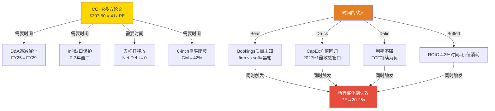

# COHR 投资大师圆桌 — Standard模式 (5位大师)
> 2026-04-14 | Phase 4后 | 权重: buffett:16 | li_lu:14 | druckenmiller:18 | dalio:16 | bear:20

---

## Round 1: 独立方法论应用

### 巴菲特 (权重16%)

**[质疑]** 能力圈测试: COHR是混合体(光通信69%+Industrial 31%), 两个引擎经济逻辑完全不同。当一家公司需要拆成两个引擎才能解释清楚时, 我怀疑管理层是否真正把股东放在首位, 还是用多元化掩盖某个业务的弱点。**简言之**: 混合体本身是危险信号。

**[陈述]** Owner Earnings: GAAP NI ~$350M + D&A $554M - 维护CapEx ~$250M - SBC $170M = ~$484M。市值$48B, Owner Earnings收益率约1.0%。ROIC 4.2% < WACC 10% = 价值消耗, 不是创造。**简言之**: Owner Earnings收益率1.0%+ROIC 4.2%不符合"用合理价格买优秀公司"。

**[质疑]** 定价权: Innolight低价20-25%, COHR ASP平到下降。6-inch成本优势≠定价权。护城河宽度应随时间扩大, 但技术迭代(8-inch/SiPh)会收窄它。**简言之**: 没有定价权的成本优势是脆弱护城河, 不支撑41x PE。

**[补充]** 资本配置: FCF负(-$96M/Q) + 库存+28.5% + Net Debt $2.68B, 所有指标指向同一方向。NVIDIA $2B投资意味着COHR依赖单一大客户善意——需要客户投资来维持的护城河, 本身就是护城河弱化的证据。**简言之**: 资本配置的每一个指标都不是买入信号。

**立场: 不买, too hard + 价值消耗**

---

### 李录 (权重14%)

**[陈述]** 变量提纯: 10个候选变量做±20%敏感性后, 真正驱动估值的1-2个: **800G/1.6T ASP走势** + **InP衬底产能缺口持续时间**。其余8个是噪音。**简言之**: 分析COHR, 90%时间花在这两个变量上。

**[质疑]** 认知折价分解: $307.50 vs SOTP $249的溢价$58.50中, 基本面溢价(InP缺口稀缺定价)约$15-20, 剩余$38-43是AI标签溢价+D&A幻觉的认知偏差。D&A递减是会计改善不是现金流提升, Owner Earnings几乎不变。**简言之**: $307.50中约$38-43是AI标签+D&A幻觉的认知溢价。

**[补充]** 第二层思维: 共识"AI光通信高增长"可能错在CPO加速绕过pluggable; 共识正确但41x PE已定价; Hyperscaler CapEx数学不可持续。CQ 53.4%下41x PE无安全边际。**简言之**: 共识不够错, 但价格不允许共识正确, 更不允许局部错误。

**立场: 审慎, 认知溢价需消化才有机会**

---

### 德鲁肯米勒 (权重18%)

**[陈述]** 预期差: 一致预期FY2028 EPS $9.64, 我的估计$8.20-8.60(偏差-11%到-15%)。偏差来源: 1.6T ASP下降(代际跳跃后6-9月内ASP降25-35%)、CPO时间表推迟到2028H1、GAAP毛利率被D&A持续压制。**简言之**: 一致预期对1.6T定价侵蚀和CPO时间表过于乐观, EPS系统性高估10-15%。

**[质疑]** 催化剂日历: 上行催化(1.6T订单可见度/FCF转正)已被定价(COHR从低点反弹40%+)。下行尾部(Hyperscaler CapEx下修/关税)未被定价。+82% YoY CapEx增速是反常值, 均值回归到+25-30%时光通信需求3-6月内感受压力。**简言之**: 上行催化已折价入股价, 下行尾部被严重低估。

**[补充]** 凸性: Bull $375上行+53%, Bear $158下行-35%, N/M=1.5:1勉强及格。PEG 1.64x(三家最高), 4月冲击中COHR -40% vs LITE -13%, Beta结构性偏高。S&P 500纳入后被动资金+8-12pp, 下行时加速卖出。**简言之**: 凸性不够, Beta太高, 仓位拥挤, 不是重仓时机。

**立场: 不参与, 赔率不够**

---

### 达里奥 (权重16%)

**[陈述]** 债务周期: $3.5B总债务, 有效利率6.3%, 年化利息$210M, EBITDA覆盖2.8x。利率+200bp→FCF从-$96M恶化到-$146M, WACC→11.5%, NAV-12%。-200bp→FCF接近盈亏平衡, NAV+16%。**COHR是利率方向性押注**。**简言之**: 降息=实质提振, 维持高利率=现金流长期负值。

**[质疑]** AI CapEx周期: CapEx/收入比35%超过"过度建设"阈值30%。GPU利用率不透明。COHR库存+28.5%是早期预警——如果需求真实可见, 不需要提前建这么多库存。传导时滞3-5个季度, 2027上半年是最敏感窗口。**简言之**: AI CapEx有"投资泡沫"部分特征, 2027H1可能转为压力。

**[补充]** 宏观系统性联动: COHR同时是货币押注(40%收入非美国, 强美元-4%收入)+债务周期押注+地缘押注(25%关税, 4月-40%已定价但影响6-9月后体现在毛利率)。三个齿轮任一反转→41x PE重新定价。**简言之**: COHR不是纯技术押注, 是货币+债务+地缘三重宏观押注。

**立场: 不参与, 宏观风险暴露过大**

---

### Bear检察官 (权重20%)

**[质疑]** D&A递减是假药: 市场已用Non-GAAP PE 57.5x定价(已剥离D&A), D&A递减对Non-GAAP叙事推动力**接近零**。GAAP/Non-GAAP收敛不带来一美元新增现金流, 不改善ROIC, 不减少稀释。催化的是叙事, 不是基本面。**简言之**: D&A递减在Non-GAAP已主导定价的市场里是假药。

**[质疑]** InP缺口存疑: SiPh替代(Intel/Broadcom/Ayar Labs)和价格竞争(Innolight低20-25%)可以在不解除产能约束的情况下缩小COHR可寻址市场。需求侧萎缩比供应侧扩张更危险。**简言之**: InP缺口是生产侧约束, 需求侧SiPh替代和价格竞争可能绕过它。

**[质疑]** NVIDIA投资是对冲非认可: 同时投$2B给COHR和LITE, 还投了Ayar Labs(CPO路线, 潜在颠覆者)。左手投供应商, 右手投颠覆者=对冲组合管理, NVIDIA忠诚度等于零。**简言之**: NVIDIA同时投资竞争对手和颠覆者, 是保险费不是排他背书。

**[陈述]** Owner PE 93.8x: 比Non-GAAP PE(57.5x)高63%, SBC侵蚀幅度远超叙事呈现。总稀释21%(FY25→FY28), 加上ROIC 4.2%<WACC 10%, **每笔新投资都在摧毁价值**。历史类比: II-VI(COHR前身)2021年$7B收购后从$120跌至$40(-65%), 当时论文也是"D&A+光通信需求", 高度同构。

**[陈述]** 最空心承重柱: "bookings到2028年"的真实质量。Firm commitment vs soft LOI比例从未披露(黑箱30%+最大贡献者)。Lumentum 2022-2023年"强劲能见度"→soft commitment在需求回调时瞬间蒸发→从$84跌至$43(-49%)。**简言之**: 最危险的是管理层用"bookings到2028年"盖住的、无法被公开数据验证的空洞。

**立场: 卖出, 多个承重柱是空心的**

---

## Round 1综述: 主持人提炼

### 核心裂缝

5位大师的分析收敛到一个最深裂缝: **COHR的整个多方论文建立在"时间换空间"假设上——D&A递减需要时间、InP缺口保护需要时间、去杠杆需要时间、6-inch良率爬坡需要时间。但"时间"本身恰恰是COHR最稀缺的资源**, 因为:

1. Bear: bookings能见度的真实质量未知(firm vs soft=黑箱)
2. 德鲁肯米勒: CapEx均值回归传导时滞3-5Q, 2027H1是最敏感窗口
3. 达里奥: 利率不降则FCF持续为负, 时间越长价值消耗越大
4. 李录: CQ 53.4%意味着理解度<60%, 41x PE不允许时间出错
5. 巴菲特: ROIC 4.2%<WACC 10%, 时间越长摧毁的价值越多

**如果"时间"不站在COHR这边(CapEx周期2027放缓+利率维持+soft booking取消), 所有需要时间兑现的催化剂都会同时失效, 而负FCF+低ROIC意味着等待的每一天都在消耗价值。**

### 结构图

---

## Round 2: 碰撞追问

### 李录 → Bear: D&A递减真的是"假药"吗?

**[质疑]** Bear说D&A递减对Non-GAAP定价无用, 但我看到另一层: **GAAP/Non-GAAP收敛会改变指数基金的筛选标准**。许多量化策略和指数筛选器用GAAP PE, 当COHR的GAAP PE从72x降到接近50x, 可能触发更多被动资金买入。这不是现金流改善, 但它是**流量催化**。Bear怎么看?

### Bear → 李录: 流量催化有上限

**[反驳]** 李录的观点有道理, 但流量催化有两个约束: ①S&P 500纳入已经发生, 被动资金增量有限; ②量化策略的GAAP PE筛选通常用trailing PE, 而GAAP/Non-GAAP收敛要到FY28-29才显著。在2026-2027年(最敏感窗口), 流量催化尚未到来。**简言之**: D&A的流量催化效应是FY28+的故事, 但2027H1的CapEx周期风险更近。

### 巴菲特 → 达里奥: 利率敏感性中被遗漏的一层

**[补充]** 达里奥的利率矩阵只看了债务端, 但COHR有另一个利率敏感通道: **估值倍数**。41x PE隐含的永续增长率约4.5%, 如果无风险利率+100bp, DCF的PE锚会机械性地从41x降到约35x(-15%)。债务端+估值端双重利率敏感性: 利率+100bp → FCF恶化$25M + PE -15% → 股价影响约-20%。**简言之**: COHR的利率Beta是双通道(债务+估值), 比达里奥单看债务端更危险。

### 德鲁肯米勒 → 巴菲特: 时间窗口不是无限的

**[质疑]** 巴菲特说"too hard, 不买", 但如果COHR在FY28达到GM 42%+FCF转正, 它可能从"too hard"变成"简单生意"。问题不是"够不够好", 是"什么价格什么时机够好"。如果COHR跌到$180-200(SOTP bear-base之间), PEG从1.64降到0.8-1.0, 凸性变成N/M=2.5:1, 这时候你买不买?

### 巴菲特 → 德鲁肯米勒: 价格足够低我会看, 但更可能选LITE

**[修正]** 在$180我会认真看, 但我更可能选LITE——更高增速、更高GM、更纯粹的AI暴露、更低PEG。同一条产业链, 我选简单好理解那个。COHR在$180还是混合体+高债务+低ROIC。**简言之**: 即使COHR跌到$180, 同产业链内LITE是更简单的选择。

---

## Round 3: 碰撞洞见 (无痕报告融入版)

### 洞见1: "时间换空间"论文的系统性脆弱 [DM-RT-001]

COHR当前$307.50的定价隐含了一个核心假设: 负FCF、低ROIC、高库存等问题都是"爬坡期临时现象", 只要给足2-3年时间, D&A递减+6-inch良率+去杠杆+CapEx周期将依次兑现。但Owner Earnings收益率仅1.0%、ROIC 4.2%显著低于WACC 10%, 意味着等待期间每一天都在消耗股东价值。如果Hyperscaler CapEx在2027上半年开始均值回归(传导时滞3-5个季度), 而利率维持高位(SOFR>4%), 所有需要时间兑现的催化剂将同时面临窗口关闭——D&A递减的流量催化要到FY28+才显著, InP缺口在SiPh替代+Innolight价格竞争下可能被需求侧绕过, 去杠杆在负FCF(-$96M/Q)下变成空话。时间不是COHR的朋友, 而是它最稀缺且最不可控的资源。

**估值影响**: SOTP概率加权应增加对"时间窗口提前关闭"情景的权重, bear case概率从30%可能应进一步上调到32-35%。

### 洞见2: D&A递减的"定价真空" [DM-RT-002]

D&A从$554M→$300M(FY29E)被多方称为"最确定的催化剂", 但机构投资者已用Non-GAAP PE 57.5x定价(剥离D&A后), 因此D&A递减对Non-GAAP叙事的推动力接近零。GAAP/Non-GAAP收敛确实可能在FY28-29触发量化策略的重新筛选, 但这一催化窗口(FY28+)与CapEx周期最敏感窗口(2027H1)存在时间错配——负面催化先于正面催化到来。D&A递减不带来一美元新增现金流, 不改善ROIC, 不减少稀释, 它是会计事件而非价值事件, 不应被计入"确定催化剂"而应降级为"叙事改善"。

**估值影响**: 在base case中, D&A递减对PE支撑的权重应从"重要正面因素"下调为"边际叙事支撑"。

### 洞见3: NVIDIA投资的对冲属性 [DM-RT-003]

NVIDIA同时投资COHR($2B)、LITE($2B)和Ayar Labs($500M Series E中的一部分), 三家分别代表InP垂直整合、EML性能领先、SiPh CPO颠覆三条技术路线。这不是对某一条路线的战略认可, 而是经典的供应链对冲组合管理——确保无论哪条技术路线胜出, NVIDIA都不缺供应。对COHR而言, NVIDIA的忠诚度在分析上应视为零, 采购承诺的价值在于收入地板而非估值溢价。NVIDIA投资带来的真实价值是~$500M-1B/年的收入底线(多年采购), 但不应被解读为护城河加成或PE溢价来源。

**估值影响**: 护城河评估中"NVIDIA战略锁定"维度应从3.8/5中剔除, 净效果约-0.3分, 与P4红队校准后的3.5/5一致。

### 洞见4: 利率双通道Beta [DM-RT-004]

COHR的利率敏感性被低估, 因为它有两个独立的利率传导通道: ①债务端——$3.5B浮动利率债务, 每+100bp增加$25M年化利息; ②估值端——41x PE隐含永续增长率~4.5%, 无风险利率每+100bp机械性压缩PE约15%。两个通道叠加: 利率+100bp → 股价影响约-20%(FCF恶化$25M + PE压缩-15%)。反之, -100bp → 股价+16-18%。COHR本质上是一个带杠杆的利率方向性押注, 伪装成了技术成长股。这解释了2025年4月关税冲击中COHR -40% vs LITE -13%的巨大Beta差异——不仅是混合体折价, 更是利率/宏观敏感性的差异。

**估值影响**: 风险评估中应新增"利率双通道Beta"作为独立风险因素(非R1-R6的子集)。

---

## 圆桌裁决

### 评级投票

| 大师 | 立场 | 评级建议 | 权重 |
|------|------|---------|------|
| 巴菲特 | 不买 | 审慎关注 | 16% |
| 李录 | 审慎 | 审慎关注 | 14% |
| 德鲁肯米勒 | 不参与 | 审慎关注 | 18% |
| 达里奥 | 不参与 | 审慎关注 | 16% |
| Bear | 卖出 | 审慎关注(偏强) | 20% |

**5/5一致: 审慎关注** (无异议)

### 共识判断 (5/5同意)
1. COHR在$307.50没有安全边际, SOTP -19%是稳健判断
2. "时间换空间"论文的窗口比多方预期更窄(2027H1是关键转折)
3. 护城河是成本优势非定价权, 3.5/5是合理评估

### 核心分歧 (Bear vs 其余)
- Bear认为应更强烈(接近"卖出"), 其余4位认为"审慎关注"足够(因为负面催化还需3-5Q传导)
- 这个分歧不影响评级方向, 只影响紧迫度判断

### Kill Switch清单 (Bear主导)
1. **Bookings firm/soft比例首次披露<60% firm** → 立即下调
2. **Hyperscaler CapEx指引首次QoQ下调** → 启动重评
3. **COHR GM连续2Q<35%** → 6-inch叙事破产
4. **NVIDIA减少采购量>20%** → 供应链锁定叙事失效

### 深化建议
1. **最需要补充的方向**: Bookings质量(firm vs soft)——目前是黑箱, 但它是整个论文的地基
2. **次要方向**: 利率双通道Beta的精确量化(需要Python敏感性模型)
