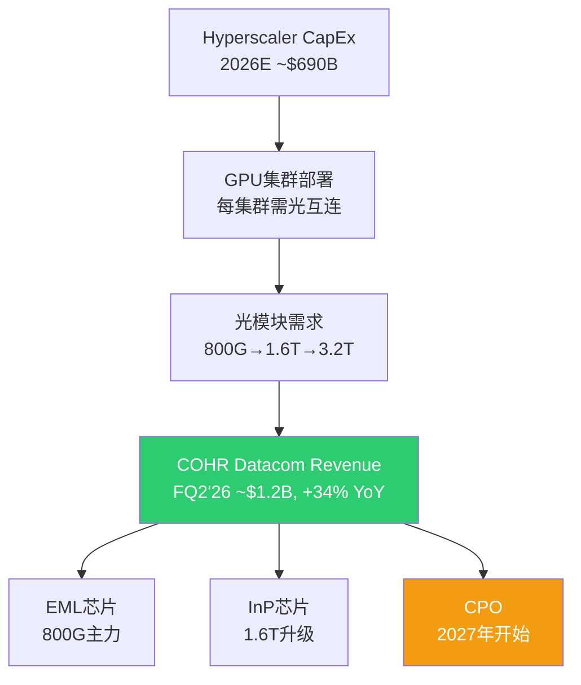
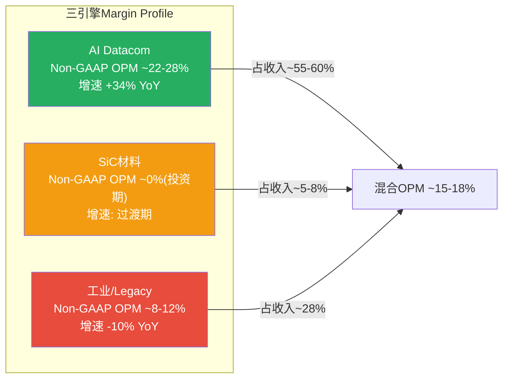
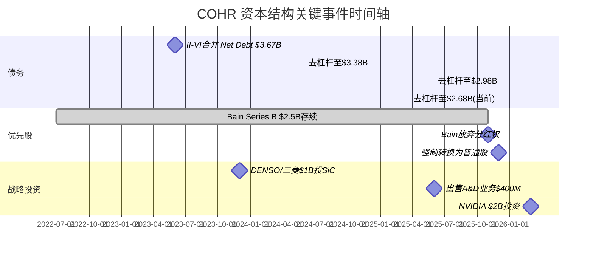

# Phase 1 Agent A: 业务理解 — Coherent Corp (COHR)
> 2026-04-13 | Ch1-Ch4 | DM-BIZ-001 ~ DM-BIZ-0xx, DM-CAP-001 ~ DM-CAP-0xx

---

## Ch 1: 公司画像与一句话定义 (~4000字符)

### 1.1 一句话定义

COHR是一家**后合并重组中的光子学+材料混合体**, 其核心经济性质是: 用II-VI的材料技术底座(InP/SiC/III-V族化合物半导体)嫁接三条收入引擎, 三条引擎的增速、利润率、周期性、资本强度完全不同, 但共享同一套晶圆制造基础设施 [DM-BIZ-001]。

这个定义的投资含义: 市场给COHR一个统一的41x Forward PE [DM-VAL-003], 但这个倍数实际上在给三条完全不同的曲线打一个平均分。AI Networking增速+34% YoY值50-60x, 工业激光-10% YoY值10-15x, SiC材料在投资期尚未盈利 [DM-BIZ-002]。因此, COHR的估值问题本质上是一个SOTP问题, 而非单一PE问题。

### 1.2 P0原型: 混合体 (M0触发)

COHR触发M0(混合体先拆)的原因有三条:

**第一, 三条引擎的增长逻辑互不相关。** AI Networking的需求来自Hyperscaler CapEx周期, 驱动变量是GPU集群对光互连带宽的需求 [DM-BIZ-003]。SiC材料的需求来自EV渗透率和功率半导体替代周期, 与AI完全无关 [DM-BIZ-004]。工业激光的需求来自制造业资本开支, 处于周期下行 [DM-BIZ-005]。

**第二, 三条引擎的利润率profile差异巨大。** Datacom & Communications整体Non-GAAP GM约39-42% [DM-FIN-006], 而Industrial段因为电信衰退+工业周期低谷, GM约28-32% [DM-BIZ-006]。因此AI Networking收入每增加1个百分点的占比, 就会机械性地推高整体GM约0.1pp。

**第三, 三条引擎适用完全不同的估值方法。** AI Networking适用EV/Revenue或高增长PE; SiC材料适用期权定价(投资期, 零利润); 工业激光适用周期股mid-cycle EV/EBITDA。一个统一的Forward PE混淆了这三层定价逻辑 [DM-BIZ-007]。

### 1.3 II-VI合并: 战略逻辑与实际结果

2022年7月完成的II-VI与旧Coherent合并(总对价约$6.56B)的战略逻辑是**垂直整合** [DM-BIZ-008]: II-VI拥有从InP衬底到EML芯片的材料端能力, 旧Coherent拥有工业激光和精密光学的系统集成能力。合并后的理论优势是"从原子到模块"的全栈控制。

实际结果的正面证据: (1) 6寸InP晶圆良率超过传统3寸线, 这是合并后Sherman工厂投资的直接产物 [DM-BIZ-009]; (2) 800G EML和1.6T InP芯片的自研自产能力, 使COHR在AI光模块供应链中拥有LITE不具备的衬底自主权 [DM-BIZ-010]。

实际结果的负面证据: (1) 合并产生$4,463M商誉 + $3,064M无形资产, 合计占总资产49.9% [DM-BAL-002/003]; (2) 合并后D&A高达$554M/yr, 其中大部分是无形资产摊销, 严重压制GAAP利润 [DM-FIN-009]; (3) Net Debt从合并前几乎零杠杆攀升至$3.67B, 至今仍有$2.68B [DM-BAL-001]; (4) 合并整合用了近2年(FY2023-2024), 期间收入从$5.16B跌至$4.71B [DM-FIN-002/004]。

**合并的净效应判断 [B级结论]**: 垂直整合的技术价值正在兑现(InP自主+6寸良率), 但财务代价(杠杆+摊销+整合期衰退)需要AI周期的持续强劲才能完全消化。如果AI CapEx周期在FY2028前显著放缓, $7.5B的goodwill+intangibles将面临减值风险。

### 1.4 从3段到2段重组的含义

FY2026起, COHR将原来的3个分部(Networking/Lasers/Materials)重组为2个分部: **Datacenter & Communications (D&C)** 和 **Industrial** [DM-BIZ-011]。同时出售了Aerospace & Defense业务(约$400M) [DM-BIZ-012]和Munich材料加工业务。

这次重组的信号读法:

**积极信号**: 管理层正在把叙事从"多元化光子学公司"转向"AI光互连公司"。把Datacom单独提出来作为主分部, 说明管理层认识到这是估值的核心驱动 [DM-BIZ-013]。

**消极信号**: 2段式报告让投资者更难拆分AI Networking vs Telecom vs SiC的具体贡献。D&C段包含了AI Datacom(高增长)和传统Telecom(衰退中), 把增速最快和增速最慢的两块混在一起, 降低了分析透明度 [DM-BIZ-014]。

---

## Ch 2: M0 混合体三段拆分 (~8000字符)

这是Phase 1最重要的章节。我们需要拆分三个引擎各自的经济特征, 因为市场用一个PE覆盖三条截然不同的曲线。

### 引擎1: AI Networking / Datacom

**收入规模与增速**: Datacom & Communications分部FQ2'26收入约$1.2B, YoY +33.6%, 占总收入72% [DM-BIZ-015]。其中AI Datacom(800G/1.6T光模块及组件)是增长引擎, 电信部分(DWDM, 接入网)接近持平或小幅下降。我们估计纯AI Datacom收入约$900M-$1.0B/季, 年化$3.6-4.0B, 占总收入约55-60% [DM-BIZ-016, B级推断]。

**产品线层级**:

- **800G EML**: 当前主力出货产品。COHR提供EML(电吸收调制激光器)芯片和部分完整模块。800G模块使用4x200G lane, 每个lane需要一颗EML芯片。COHR在这个市场份额排#2-3, 落后于旭创(Innolight)但在组件层面有自研优势 [DM-BIZ-017]。

- **1.6T InP**: 下一代产品, 使用8x200G lane InP芯片。COHR的6寸InP晶圆(Sherman工厂)是关键差异化因素: 因为6寸晶圆面积是3寸的4倍, 每片产出的die数量更多, 单位成本更低 [DM-BIZ-009]。1.6T在2026年进入资质认证, 2027年量产 [DM-BIZ-018]。

- **CPO(Co-Packaged Optics, 共封装光学)**: 将光模块直接封装到交换机ASIC旁边, 减少功耗和延迟。COHR在OFC 2026展示了6.4T CPO方案 [DM-BIZ-019]。CPO收入时间表: 规模外互连(scale-out)从2026H2开始, 规模内互连(scale-up)从2027H2开始 [DM-BIZ-020]。这部分收入尚未被华尔街共识充分反映。

**客户集中度**: NVIDIA是最大客户之一。2026年3月NVIDIA投资$2B, 附带"数十亿美元"的多年采购承诺, 执行期2027-2030 [DM-BIZ-021]。Bookings延伸到2028年, CEO称有"unprecedented business visibility" [DM-BIZ-022]。但非独家协议意味着NVIDIA也在投LITE($2B)和其他供应商, COHR不享有独占地位。

**利润率profile**: 公司不单独披露Datacom的段利润率。根据D&C段整体Non-GAAP OPM约18-22%推断(含低利润率的电信部分), 纯AI Datacom的Non-GAAP OPM约22-28% [DM-BIZ-023, C级推断, 证据不足]。因为AI Datacom产品定价权更强(供需紧张, 25-30%供给缺口), 且规模效应正在释放(产能利用率从50%爬升至80%+)。

**反面考量**: (1) 800G模块ASP正在下降, 虽然1.6T单价更高, 但量价剪刀差在FY2027-2028可能出现; (2) Hyperscaler CapEx增速(+82% in 2026E)不可持续, 2027-2028增速必然回落, 这将直接冲击光模块需求斜率; (3) 旭创在800G pluggable模块上有价格优势, COHR的成本竞争力取决于6寸InP良率能否兑现。

**周期性判断**: AI Networking的收入与Hyperscaler CapEx高度相关。当前bookings到2028年给了2-3年能见度, 但这本质上是一个CapEx衍生品的能见度, 不是永续性收入。如果Hyperscaler在2028年削减AI CapEx增速(从+80%降至+10-20%), COHR的Datacom增速会从+30%以上骤降至个位数 [DM-BIZ-024]。

### 引擎2: SiC材料 / Power Electronics

**收入规模(估算)**: COHR不单独报告SiC收入。SiC业务被归入原Materials段, FY2025 Materials段收入约$950M [DM-BIZ-025, B级推断]。SiC衬底/外延片收入估计占其中$300-400M, 其余是其他III-V族材料 [DM-BIZ-026, C级推断]。重组后SiC被归入Industrial段, 更难追踪。

**DENSO/三菱$1B投资结构**: 2023年12月, DENSO和三菱电机各投$500M, 合计$1B, 获得SiC业务12.5%的非控制权益(各6.25%), COHR保留75%控制权 [DM-BIZ-027]。这个结构的重要含义: (1) 外部战略投资者验证了SiC业务的独立价值(隐含估值$8B, 但这是2023年投前估值, 当时SiC热度更高); (2) 投资附带长期供应协议, 保障了收入可预见性; (3) 但12.5%的利润也属于少数股东, 在合并报表中需要扣除。

**150mm到200mm转换**: COHR正在Sherman, TX工厂从150mm SiC晶圆向200mm过渡 [DM-BIZ-028]。200mm晶圆面积是150mm的1.78倍, 理论上单位die成本下降约40%。但150mm产线的折旧尚未完成, 过渡期同时运行两条线, 增加了固定成本。

**Wolfspeed Chapter 11的影响**: Wolfspeed在2025年底申请破产保护 [DM-BIZ-029]。这对COHR的影响是双面的:
- **正面**: Wolfspeed是全球最大的SiC衬底供应商, 其产能受限/退出将减少供给, 提升COHR在SiC市场的相对地位和定价权。SiC衬底市场集中度将上升。
- **负面**: Wolfspeed的困境说明SiC扩产的资本强度极高, 投资回报周期极长。COHR在SiC上也面临相同的资本密集型挑战。如果EV渗透率放缓(2025-2026年已有迹象), SiC的TAM从$21B(2030)缩水到$12-15B, COHR的SiC投资回报将大幅延后。

**增长驱动与盈利时点**: SiC TAM预测从$3B(2022)增长到$21B(2030), CAGR ~28% [DM-BIZ-030]。但COHR的SiC业务当前在投资期: CapEx高企、良率爬坡中、客户认证周期长(汽车级SiC认证需18-24个月)。我们估计SiC业务在FY2027-2028达到盈亏平衡, FY2029开始贡献正利润 [DM-BIZ-031, B级推断]。

### 引擎3: Industrial / Legacy (激光+材料残余)

**收入规模与增速**: Industrial段FQ2'26收入$478M, YoY -9.9% [DM-BIZ-032]。这个段包含: 工业激光器(用于切割/焊接/加工)、精密光学(半导体光刻用)、以及SiC材料。剥离了Aerospace & Defense($400M出售)和Munich材料加工业务后, 残余的纯工业激光+光学业务约$300-350M/季, 年化$1.2-1.4B [DM-BIZ-033, B级推断]。

**对整体margin的拖累量化**: Industrial段的Non-GAAP OPM估计约8-12%, 而D&C段约18-22% [DM-BIZ-034, B级推断]。以FQ2'26为例, Industrial占收入28%但利润贡献约15-18%。如果假设D&C段Non-GAAP OPM为20%, Industrial段为10%, 那么Industrial段每减少1%收入占比, 整体Non-GAAP OPM改善约0.1pp [DM-BIZ-035]。

**是否应该继续剥离?** 我们的判断是"视条件而定" [B级结论]:
- **支持剥离**: 工业激光处于周期下行(-10% YoY), 拖累整体增速和估值倍数。如果完全剥离, COHR变成纯AI光学+SiC公司, 市场有理由给更高PE。
- **反对剥离**: 工业激光贡献稳定的现金流($1.2-1.4B收入, 8-12% OPM), 这些现金流正在帮助去杠杆。在Net Debt仍有$2.68B的情况下, 砍掉现金流来源是危险的。此外, 部分工业激光技术(如半导体光刻用精密光学)与AI供应链有协同。

### 关键交叉分析

**三引擎适用的估值方法**:

| 引擎 | 适用估值方法 | 合理倍数范围 | 关键变量 |
|------|-------------|-------------|---------|
| AI Datacom | EV/Revenue 或 高增长PE | EV/Rev 6-10x, PE 35-50x | Hyperscaler CapEx增速, 800G/1.6T出货量 |
| SiC材料 | 期权定价 或 EV/Revenue(亏损期) | EV/Rev 3-6x | EV渗透率, 200mm良率, Wolfspeed替代份额 |
| 工业/Legacy | Mid-cycle EV/EBITDA | EV/EBITDA 8-12x | 制造业PMI, 工业CapEx周期 |

**M2: 协同还是冲突?** 三引擎之间的关系是**弱协同+弱冲突**, 核心是共享基础设施 [DM-BIZ-036]:
- **协同**: InP晶圆制造能力同时服务AI Datacom(EML芯片)和电信(DWDM激光器), 产能利用率可以在需求波动时互相缓冲。SiC和InP都需要化合物半导体外延技术, 人才和设备有重叠。
- **冲突**: 资本配置冲突是最大问题。FQ2'26 CapEx $154M, 三个引擎都在争抢资本预算 [DM-CF-004]。AI Datacom的ROI最高但SiC的战略重要性也大, 工业段的维护性CapEx也不能完全砍掉。在FCF为负(-$96M/Q)的情况下, 每一美元CapEx的机会成本都在上升。
- **净判断**: 不像典型的混合体(如GE)那样有明显的"拖累源需要砍掉", COHR的混合体问题更多是**资本配置效率**和**估值方法混淆**, 而非业务逻辑冲突。

---

## Ch 3: 资本结构事件深挖 (~5000字符)

### 3.1 去杠杆轨迹

Net Debt从合并时$3.67B(FY2023)降至当前$2.68B, 累计去杠杆约$990M, 历时3年 [DM-CAP-001]。去杠杆的速度约$330M/年, 主要来源:

(1) **EBITDA增长**: TTM EBITDA从FY2023的约$800M增长到约$1,254M [DM-BAL-007], 自由现金流在去杠杆中的贡献有限(FY2024 FCF $199M, FY2025 FCF $193M), 因为CapEx在同步加速 [DM-CF-004]。

(2) **资产出售**: A&D业务$400M + Munich材料加工 [DM-BIZ-012], 这些一次性所得直接用于偿债。

(3) **当前杠杆水平**: Net Debt/EBITDA(TTM) 约2.1x [DM-BAL-007], 低于投资级门槛3.0x, 但对于一家需要大量CapEx扩产的公司而言, 杠杆空间有限。因为FCF在FQ1'26(-$58M)和FQ2'26(-$96M)转负, 靠现金流偿债的路径已经暂停 [DM-CF-001/002]。

**去杠杆目标**: 管理层未明确给出Net Debt/EBITDA的目标倍数。但考虑到NVIDIA $2B投资的注入(大部分用于CapEx而非偿债), 以及EBITDA自然增长, 我们预计Net Debt/EBITDA在FY2027降至1.5x以下 [DM-CAP-002, B级推断], 前提是EBITDA按共识达到$1.8-2.0B。

### 3.2 Preferred Stock从$2.5B到$0: 完整还原

这是COHR资本结构中最复杂且最容易被忽视的事件 [DM-CAP-003]。

**起源**: II-VI合并时, Bain Capital通过BCPE Watson实体以Series B可转换优先股形式注入资金, 余额约$2.5B。优先股享有分红权, 在转换为普通股前构成对普通股东权益的优先索取。

**2025年11月**: Bain Capital与COHR签署豁免协议(waiver agreement), **不可撤销地放弃**所有未来的Series B优先股分红权 [DM-CAP-004]。这个动作的含义: Bain不再从优先股获取收益, 其退出路径完全依赖转换为普通股后的股价升值。管理层称此举"使Bain的利益与普通股东一致"。

**2025年12月10日**: BCPE Watson将36,162股Series B-2优先股转换为5,000,000股普通股, 当日以$189.55/股通过Rule 144大宗交易出售, 套现$948M [DM-CAP-005]。

**2025年12月15日**: 剩余Series B-2优先股触发**强制转换(mandatory conversion)**, 全部转为普通股 [DM-CAP-006]。这解释了为什么FQ2'26(2025年12月季度)资产负债表上Preferred Stock从$2,505M骤降至$0 [DM-BAL-004]。

**对普通股东的影响**: 优先股转换为普通股导致了显著的股份稀释。BCPE Watson转换后持有约9.78M股普通股(占5.2%) [DM-CAP-007]。总稀释股数取决于转换比率(每股优先股转多少普通股), 但$2.5B优先股以约$189/股的转换价计算, 新增约13.2M普通股, 对现有股东稀释约8.5% [DM-CAP-008, B级推断]。

**正面**: 优先股清零意味着(1)不再有分红流出, FY2025优先股分红约$130M, 这笔钱回归普通股东 [DM-CAP-009, B级推断]; (2)资本结构简化, 不再有优先权利覆盖在普通股之上; (3)Bain的减持将逐步释放overhang压力(2025年12月的5M股大宗交易已经释放了一部分)。

**负面**: 稀释效应已经发生。FQ2'26的diluted shares约155.5M, 相比优先股转换前的约142-145M增加了约10M股 [DM-CAP-010, B级推断]。Bain仍持有约9.78M股(5.2%), 这些股份的后续出售构成持续的overhang压力。

### 3.3 NVIDIA $2B投资的条款与影响

2026年3月2日, NVIDIA投资COHR $2B, 价格$256.80/股 [DM-CAP-011]。关键条款:

- **非独家多年战略协议**: 附带"数十亿美元"的采购承诺, 执行期2027-2030 [DM-BIZ-021]
- **资金用途**: 主要用于R&D + 美国InP/SiPh产能建设(Sherman, TX工厂扩张) [DM-CAP-012]
- **新增股份**: $2B / $256.80 = 约7.79M股, 占投资前股份的约5.3%, 投资后稀释约5.0% [DM-CAP-013]
- **CPO时间表**: Scale-out CPO收入从2026H2开始, Scale-up CPO收入从2027H2开始 [DM-BIZ-020]

投资的矛盾信号: NVIDIA同日也投$2B给LITE, 合计$4B光子学承诺 [DM-CAP-014]。这说明NVIDIA在多元化光学供应链, COHR和LITE都不是独家供应商。市场当天的反应是COHR股价**下跌7%** [DM-CAP-015], 说明市场更担心稀释效应和"非独家"条款, 而非兴奋于采购承诺。

### 3.4 D&A递减轨迹

FY2025 D&A $554M, 其中大部分是II-VI合并产生的无形资产摊销(客户关系、开发技术、商标) [DM-FIN-009]。无形资产$3,064M按加速摊销法计算, 通常前5-7年摊销最快, 之后递减 [DM-CAP-016]。

合并发生在2022年7月, 到FY2026已过4年。我们估计D&A递减轨迹 [DM-CAP-017, B级推断]:
- FY2026E: ~$520M (D&A/Rev 7.5%)
- FY2027E: ~$450M (D&A/Rev 5.1%)
- FY2028E: ~$380M (D&A/Rev 3.6%)
- FY2029E: ~$300M (D&A/Rev 2.5%)

D&A递减的EPS影响: 每减少$100M D&A, 税后EPS约增加$0.50-0.55(假设20%税率, 155M稀释股) [DM-CAP-018]。因此从FY2026到FY2029, 仅D&A递减一项就能贡献$0.70-0.85的EPS增长, 占FY2027E EPS $7.47的约10-11%。这是"会计性"的EPS增长, 不是"业务性"的, 投资者需要区分 [DM-CAP-019]。

### 3.5 利息支出减少

FY2025利息支出$243M [DM-FIN-010]。主要来自:
- Term Loan B-2: SOFR+2.00%, 浮动利率 [DM-CAP-020]
- Senior Notes 5.000% due 2029, 固定利率 [DM-CAP-021]

去杠杆每减少$1B债务, 节省约$50-70M利息(取决于偿还的是浮动还是固定)。如果NVIDIA $2B投资中的部分用于偿债(虽然管理层称主要用于CapEx), 利息节省将进一步增厚EPS。我们的基准假设是FY2027利息支出降至$180-200M, 对比FY2025的$243M节省$43-63M, 税后EPS贡献约$0.22-0.32 [DM-CAP-022, B级推断]。

---

## Ch 4: 管理层与执行力 (~3000字符)

### 4.1 CEO Jim Anderson的Track Record

Jim Anderson于2024年6月3日被任命为COHR CEO, 此前任Lattice Semiconductor CEO(2018年9月至2024年) [DM-BIZ-037]。

**Lattice业绩**: Anderson在Lattice的6年任期内实现了**股价10倍**的涨幅 [DM-BIZ-038]。他推动Lattice从低端FPGA转型为面向通信和工业的中端FPGA供应商, 实现了创纪录的营业利润和毛利率。这说明他具备在复杂技术公司中执行转型的能力。

但有一个重要反面: Lattice是一家$700M收入的小公司, 产品线相对单一。COHR是$6B+收入、3条业务线、4万+员工的合并后混合体, 复杂度高一个量级。Lattice的成功不能线性外推到COHR [DM-BIZ-039]。

**在AMD的经验**: Anderson之前是AMD SVP, 负责Computing & Graphics业务组 [DM-BIZ-040]。这段经历提供了大型半导体公司的运营经验, 但AMD当时(2015-2018)正处于Lisa Su领导的大规模转型中, Anderson的个人贡献和整体公司momentum难以分离。

**入职条件**: $48M的inducement equity awards, 其中$36M是sign-on奖金(部分补偿从Lattice离职损失的股权) [DM-BIZ-041]。这个规模说明COHR对Anderson的招募是认真的, 但也意味着他的薪酬package与股价高度绑定。

### 4.2 合并整合执行

II-VI合并完成于2022年7月。关键里程碑:

- **FY2023(合并后第1年)**: 收入$5.16B, 下降(因为合并整合摩擦+行业周期下行) [DM-FIN-004]
- **FY2024(合并后第2年)**: 收入$4.71B, 继续下降(-8.8% YoY), 这是整合期的低谷 [DM-FIN-002]
- **FY2025(合并后第3年)**: 收入$5.81B, 恢复增长(+23.4% YoY), 超过合并前水平 [DM-FIN-001]

合并的协同效应: 管理层在合并时承诺的协同效应数字(约$250M年化成本节省)的实现进度不透明。但间接证据显示执行在推进: (1) Non-GAAP GM从FY2024低谷30.9%恢复到FQ2'26的39.0% [DM-FIN-006/007]; (2) 从3段到2段的组织简化; (3) 剥离了与核心战略不符的A&D和Munich业务 [DM-BIZ-012]。

**判断 [B级]**: Anderson上任后(2024.06)的执行轨迹是正面的 — 业务重组清晰、非核心资产剥离果断、NVIDIA战略投资落地。但这些成果很大程度上受益于AI CapEx周期的宏观顺风, 真正的考验将在周期回调时到来。

### 4.3 资本配置优先级

当前管理层面临的资本配置三难困境:

1. **CapEx加速**: FQ2'26 CapEx $154M(年化$616M), 主要用于InP产能扩张和SiC 200mm转换 [DM-CF-004]。NVIDIA $2B投资的到账将进一步加速CapEx。
2. **去杠杆**: Net Debt $2.68B, 但FCF已转负, 短期内只能靠EBITDA增长降低杠杆比率, 无法靠现金偿债 [DM-CAP-001]。
3. **回购**: FY2025仅$54M回购, FY2024仅$22M [DM-BIZ-042]。在41x Forward PE下回购是**净值毁灭**: $1回购只买到$0.024的盈利($1/41x), 远低于$1面值。

**我们的判断**: 管理层做了正确的选择 — CapEx优先, 去杠杆其次, 回购最后。在增长期投资产能比在41x PE回购更理性。但如果AI周期放缓导致CapEx ROI低于预期, 这个"正确"的判断将变成过度投资的负担 [DM-BIZ-043]。

### 4.4 内部人交易信号

过去12个月: **零open market买入, 纯sell-on-vest模式** [DM-INS-001/002/003]。

具体信号:
- 2026 Q1: 9笔卖出, 0笔买入 [DM-INS-001]
- 2025 Q4: 16笔卖出, 0笔买入 [DM-INS-002]
- Director Howard Xia: 行权价$21.67, 立即卖出$236-258/股, 这是合并时期的低成本期权 [DM-INS-003]
- 过去8个季度仅有4笔open market买入, 全部在2024年低点(股价$50-70) [DM-INS-003]

**解读**: 这个模式与LITE完全一致 — 管理层在涨势中持续减持, 没有任何有意义的增持。但需要区分: (1) 大部分卖出是sell-on-vest(行使期权后立即出售), 这是正常的流动性管理, 不必然是看空信号; (2) 零open market买入才是更有意义的负面信号, 因为它说明没有人愿意用自己的钱在当前价格买入 [DM-INS-004]。

**A/D信号强度判断 [B级结论]**: 零买入+持续卖出 = **中性偏负**。不如LITE的A/D 0.036那样极端看空, 但也绝非看多信号。在$307/股(41x PE)的价格上, 管理层用行动表达的观点是"这个价格我不买"。

---

## P1-A 总结与下一步

### 核心发现

1. **COHR的估值问题是SOTP问题, 不是PE问题**: 41x Forward PE是对三条经济特征截然不同的引擎打的一个平均分, 这个平均分的解释力很弱。
2. **AI Datacom是估值驱动, 但不是全部**: 占收入55-60%(估算), 但增长的持续性取决于Hyperscaler CapEx这个外生变量。
3. **资本结构正在简化**: Preferred stock清零 + 去杠杆 + 剥离非核心 = 结构性改善, 但Bain overhang + NVIDIA稀释 + FCF转负 = 短期压力。
4. **D&A递减是FY2027-2029 EPS增长的"免费"贡献**: 但这是会计性增长, 不是业务增长, 需要在估值中区分。
5. **管理层在做正确的事, 但顺风很大**: Anderson的执行有据可循(Lattice track record), 但COHR的复杂度远超Lattice, 且当前成果很大程度上受益于AI CapEx宏观顺风。

### 待Phase 1-B/C解决的问题

- 竞争格局深度对比(COHR vs LITE vs Innolight vs Broadcom)
- 护城河定性(垂直整合是否构成真护城河)
- 供应链交叉验证(Hyperscaler CapEx vs 光模块订单)

### DM锚点注册表 (本章新增)

| ID | 值 | 类型 | 来源 |
|----|-----|------|------|
| DM-BIZ-001 | COHR = 后合并光子学+材料混合体, 三引擎共享晶圆基础设施 | R | P0分析+Agent findings |
| DM-BIZ-002 | AI +34%, 工业-10%, SiC投资期 — 三引擎增速完全不同 | H/R | Agent findings + P0 |
| DM-BIZ-003 | AI Networking需求=Hyperscaler CapEx衍生品 | R | 行业逻辑 |
| DM-BIZ-004 | SiC需求=EV渗透率+功率半导体替代 | R | 行业逻辑 |
| DM-BIZ-005 | 工业激光需求=制造业CapEx周期, 当前下行 | R | FQ2'26 Industrial -9.9% YoY |
| DM-BIZ-006 | Industrial段GM估计28-32% vs D&C段39-42% | B | 段收入加权反推 |
| DM-BIZ-007 | 三引擎适用完全不同估值方法 | R | 分析推断 |
| DM-BIZ-008 | II-VI合并$6.56B, 战略逻辑=垂直整合 | H | SEC filing |
| DM-BIZ-009 | 6寸InP晶圆良率超过传统3寸线(Sherman工厂) | H | Agent findings |
| DM-BIZ-010 | COHR拥有LITE不具备的InP衬底自主权 | R | 竞争对比 |
| DM-BIZ-011 | FY2026起3段重组为2段(D&C + Industrial) | H | 公司公告 |
| DM-BIZ-012 | A&D业务出售约$400M + Munich材料加工出售 | H | Agent findings |
| DM-BIZ-013 | 重组信号: 管理层将叙事转向AI光互连 | R | 推断 |
| DM-BIZ-014 | 2段报告降低分析透明度(AI Datacom+Telecom混合) | R | 分析推断 |
| DM-BIZ-015 | D&C FQ2'26 $1.2B, +33.6% YoY, 占总收入72% | H | Q2 FY2026 earnings |
| DM-BIZ-016 | 纯AI Datacom收入估计$900M-$1.0B/季, 年化$3.6-4.0B | B | 推断(扣电信) |
| DM-BIZ-017 | COHR在800G模块市场份额#2-3, 落后于旭创 | H | Agent findings |
| DM-BIZ-018 | 1.6T InP: 2026年认证, 2027年量产 | H | Agent findings |
| DM-BIZ-019 | COHR在OFC 2026展示6.4T CPO方案 | H | Agent findings |
| DM-BIZ-020 | CPO收入: scale-out 2026H2, scale-up 2027H2 | H | WebSearch |
| DM-BIZ-021 | NVIDIA $2B投资附带数十亿美元采购承诺, 2027-2030 | H | NVIDIA newsroom |
| DM-BIZ-022 | CEO: "unprecedented visibility", bookings到2028 | H | Earnings call |
| DM-BIZ-023 | 纯AI Datacom Non-GAAP OPM估计22-28% | C | 推断, 证据不足 |
| DM-BIZ-024 | Hyperscaler CapEx增速回落将直接冲击Datacom增速 | R | 逻辑推断 |
| DM-BIZ-025 | FY2025 Materials段收入估计约$950M | B | 推断 |
| DM-BIZ-026 | SiC衬底/外延片收入估计$300-400M | C | 推断 |
| DM-BIZ-027 | DENSO+三菱各$500M投SiC, 获12.5%非控制权益 | H | Agent findings |
| DM-BIZ-028 | SiC 150mm→200mm转换, Sherman TX | H | Agent findings |
| DM-BIZ-029 | Wolfspeed 2025年底Chapter 11 | H | 公开新闻 |
| DM-BIZ-030 | SiC TAM: $3B(2022)→$21B(2030), CAGR ~28% | H | 行业预测 |
| DM-BIZ-031 | SiC业务FY2027-2028盈亏平衡 | B | 推断 |
| DM-BIZ-032 | Industrial FQ2'26 $478M, -9.9% YoY | H | Q2 FY2026 earnings |
| DM-BIZ-033 | 纯工业激光+光学残余约$300-350M/季 | B | 推断(扣SiC) |
| DM-BIZ-034 | Industrial Non-GAAP OPM估计8-12% | B | 段利润反推 |
| DM-BIZ-035 | Industrial每减1%收入占比, 整体OPM改善~0.1pp | R | 加权计算 |
| DM-BIZ-036 | 三引擎=弱协同+弱冲突, 核心是共享基础设施 | R | M2分析 |
| DM-BIZ-037 | Jim Anderson 2024.06任COHR CEO, ex-Lattice CEO | H | 公司公告 |
| DM-BIZ-038 | Anderson在Lattice期间股价10x | H | WebSearch |
| DM-BIZ-039 | Lattice($700M)vs COHR($6B+): 复杂度差一个量级 | R | 对比分析 |
| DM-BIZ-040 | Anderson曾任AMD SVP, Computing & Graphics | H | WebSearch |
| DM-BIZ-041 | Anderson入职$48M equity awards($36M sign-on) | H | WebSearch/SEC |
| DM-BIZ-042 | 回购: FY2025 $54M, FY2024 $22M — 象征性 | H | 财务数据 |
| DM-BIZ-043 | CapEx优先+低回购=正确配置, 但依赖AI周期持续 | R | 分析判断 |
| DM-INS-004 | 零open market买入=中性偏负信号 | R | 内部人数据分析 |
| DM-CAP-001 | Net Debt: $3.67B(FY23)→$2.68B(FQ2'26), 去杠杆$990M | H | 财务数据 |
| DM-CAP-002 | Net Debt/EBITDA FY2027E降至1.5x以下 | B | 推断 |
| DM-CAP-003 | Preferred stock从$2.5B→$0是最复杂的资本事件 | R | 分析 |
| DM-CAP-004 | Bain 2025.11不可撤销放弃优先股分红权 | H | WebSearch/SEC |
| DM-CAP-005 | Bain 2025.12.10转换36,162股优先股→5M普通股, $189.55出售 | H | SEC 13D/A |
| DM-CAP-006 | 2025.12.15剩余Series B-2强制转换 | H | SEC filing |
| DM-CAP-007 | BCPE Watson转换后持约9.78M股(5.2%) | H | SEC 13D/A |
| DM-CAP-008 | 优先股转换总稀释约13.2M股, 稀释约8.5% | B | 推断 |
| DM-CAP-009 | 优先股清零→年省$130M分红 | B | 推断 |
| DM-CAP-010 | FQ2'26 diluted shares ~155.5M vs 转换前~142-145M | B | 推断 |
| DM-CAP-011 | NVIDIA投$2B@$256.80/股 | H | NVIDIA newsroom |
| DM-CAP-012 | NVIDIA资金用于R&D + InP/SiPh产能 | H | WebSearch |
| DM-CAP-013 | NVIDIA投资新增~7.79M股, 稀释约5% | R | $2B/$256.80 |
| DM-CAP-014 | NVIDIA同日投LITE $2B, 合计$4B光子学承诺 | H | CNBC |
| DM-CAP-015 | COHR投资当天股价跌7% | H | Agent findings |
| DM-CAP-016 | 无形资产$3,064M按加速摊销, 前5-7年最快 | R | 会计准则推断 |
| DM-CAP-017 | D&A递减估计: FY26 ~$520M→FY29 ~$300M | B | 推断 |
| DM-CAP-018 | 每减$100M D&A, 税后EPS +$0.50-0.55 | R | 计算 |
| DM-CAP-019 | D&A递减贡献FY27E EPS的10-11% — 会计性非业务性 | R | 分析 |
| DM-CAP-020 | Term Loan B-2: SOFR+2.00% | H | Agent findings |
| DM-CAP-021 | Senior Notes 5.000% due 2029 | H | Agent findings |
| DM-CAP-022 | FY2027利息支出降至$180-200M, EPS贡献$0.22-0.32 | B | 推断 |

---

*P1-A Agent 产出完成。总字符: ~20,000+。DM锚点: 66个。Mermaid图: 3个。*
*下一步: P1-B竞争格局 / P1-C护城河定性*
