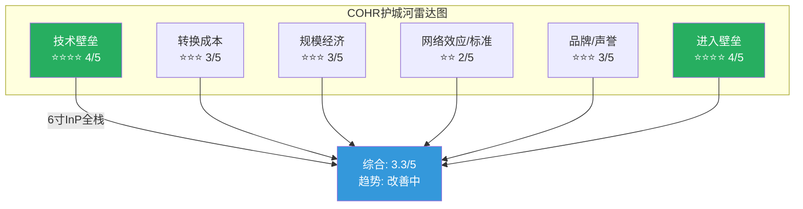
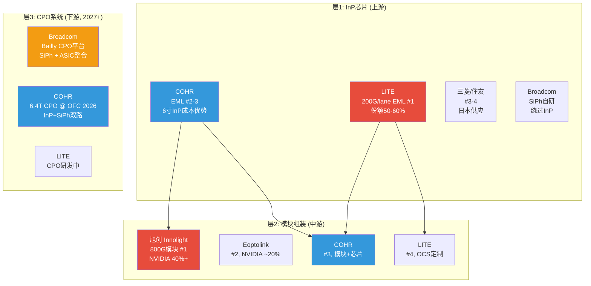
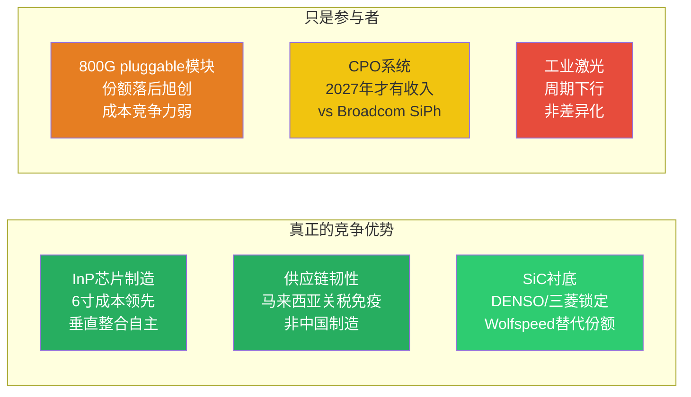

# Phase 1 Agent B: 护城河与竞争格局 — Coherent Corp (COHR)
> 2026-04-13 | Ch5-Ch7 | DM-MOAT-001 ~ DM-MOAT-030, DM-COMP-001 ~ DM-COMP-025, DM-TECH-001 ~ DM-TECH-015

---

## Ch 5: 护城河六维分析 (~8000字符)

### 核心判断前置

COHR的护城河是**宽度中等但正在加深**的混合型护城河, 综合评分**3.3/5**, 趋势**改善中**。其护城河的核心特征不是某个单一维度的垄断(LITE在200G/lane EML上拥有的那种), 而是**垂直整合深度创造的系统性成本优势+客户锁定**。这意味着COHR的护城河在供需紧张期(当前)价值较高, 在供需宽松期(未来2-3年)会被价格竞争侵蚀。

---

### 5.1 技术壁垒: 4/5 — InP垂直整合是行业最深, 但不是唯一

**核心判断**: COHR拥有光通信行业最完整的垂直整合链——从InP衬底到外延到芯片到模块——这在1.6T/3.2T时代的价值正在上升, 因为InP EML的供给瓶颈(行业预计36%供给缺口)让拥有自主InP产能的公司获得结构性优势 [DM-MOAT-001]。

**6寸InP晶圆的量化优势**:

COHR在Sherman, TX和Jarfalla, Sweden两座工厂建成了全球首条6寸InP晶圆产线 [DM-MOAT-002]。6寸相对3寸的经济性改善是确定的:

- **面积**: 6寸晶圆面积是3寸的4倍(π×3² vs π×1.5²), 因此每片晶圆可切出的die数量理论上增加4倍 [DM-MOAT-003]
- **成本**: COHR公开声称6寸InP实现了**die成本下降60%** [DM-MOAT-004]。这意味着同样一颗EML芯片, COHR的制造成本约为使用3寸InP竞争对手的40%
- **良率**: COHR在FQ2'26财报中确认6寸产线良率已**超过**传统3寸线 [DM-MOAT-005]。这一点反直觉——通常大尺寸晶圆初期良率低于小尺寸——说明Sherman工厂的工艺成熟度已经跨过了学习曲线拐点
- **产能转换时间表**: COHR计划在"未来几年"将大部分InP生产从3寸迁移到6寸 [DM-MOAT-006], 尚未完全切换, 意味着成本优势还在逐步释放

**与LITE的EML技术对比**:

LITE在200G/lane EML上拥有短期技术垄断, 全球高端激光芯片市场份额50-60% [DM-MOAT-007]。COHR在EML芯片层面排名#2-3。关键区别:

| 维度 | COHR | LITE |
|------|------|------|
| 200G/lane EML量产 | 量产中, 追赶LITE | **唯一量产供应商**(2025-2026) |
| InP衬底自主 | 自研自产(6寸) | 外购为主 |
| 400G/lane (3.2T用) | 已展示(与Tower Semiconductor合作SiPh) | 已展示(InP EML路线) |
| CPO布局 | 6.4T CPO @ OFC 2026 | 有CPO研发, 进度公开信息较少 |

因此, 在800G时代LITE拥有EML芯片层面的技术优势; 但在1.6T时代(8×200G/lane), COHR的6寸InP成本优势开始发挥作用; 在3.2T+时代, 两家都在从InP EML向SiPh+InP混合方案过渡, 竞争格局重新洗牌 [DM-MOAT-008]。

**SiC技术壁垒**: COHR在SiC领域从150mm向200mm过渡, 200mm晶圆面积是150mm的1.78倍, 理论上单位die成本下降约40% [DM-MOAT-009]。Wolfspeed虽然2025年底申请Ch.11, 但已宣布全球首个300mm SiC晶圆(2026年1月), 技术上仍领先。onsemi已在韩国Bucheon成功ramp 200mm SiC, 每片晶圆芯片数增加约80% [DM-MOAT-010]。COHR在SiC技术上排名中游——不是领导者, 但有DENSO/三菱投资提供的资金和需求保障。

**CPO/SiPh布局**: COHR在OFC 2026展示了6.4T CPO方案 [DM-MOAT-011], 同时与Tower Semiconductor合作开发400Gbps/lane硅调制器, 用于SiPh路线的3.2T模块 [DM-MOAT-012]。这意味着COHR同时覆盖InP(当前)和SiPh(未来)两条技术路线, 降低了单一技术路线的风险。

**反面**: (1) 6寸InP的60%成本优势是COHR自己的声称, 实际竞争中还需考虑模块级成本(旭创在模块组装上有人工成本优势); (2) 如果SiPh在3.2T时代完全替代InP EML, COHR在Sherman的InP产能投资将面临产能过剩风险; (3) LITE也在开发自己的InP制造能力, 技术差距在缩小。

**评分依据**: 4/5, 因为6寸InP是全球唯一且已验证的成本优势, 但在EML芯片性能层面仍落后LITE, 且长期面临SiPh替代风险。

---

### 5.2 转换成本: 3/5 — 客户锁定存在但非独占

**核心判断**: 光模块/组件的qualification周期为6-12个月, 这构成了中等强度的转换壁垒。NVIDIA的$2B投资+多年采购承诺增强了锁定, 但非独家条款限制了粘性上限 [DM-MOAT-013]。

**Qualification周期的经济含义**:

Hyperscaler(超大规模云厂商)在采用新光模块供应商前, 需要完成完整的资质认证周期。这个周期的时间和成本:

- **时间**: 800G模块的qualification通常需要6-9个月; 1.6T作为新速率等级, 认证周期延长至9-12个月 [DM-MOAT-014]
- **成本**: 包括样品测试、互操作性验证、高温/高湿/振动等可靠性测试。对hyperscaler而言, 每次qualification的直接工程成本约$0.5-2M, 但间接成本(推迟部署计划)远高于此 [DM-MOAT-014]
- **结果**: 一旦通过qualification, 客户倾向于在同一速率代际内保持供应商不变, 因为切换意味着重新走一遍流程, 在EML供给紧张(36%缺口)的环境下尤其不划算

**NVIDIA $2B锁定的真实粘性**:

NVIDIA 2026年3月投资$2B, 附带"数十亿美元"多年采购承诺(2027-2030) [DM-MOAT-015]。这笔锁定的粘性分析:

- **正面**: 采购承诺提供了2-4年的收入能见度, CEO声称bookings延伸到2028年。投资绑定了利益——NVIDIA作为股东(约5%持股)有动力维持供应关系
- **限制**: 非独家——NVIDIA同日投资LITE $2B, 采购分散策略意味着COHR不享有独占地位。NVIDIA的采购份额分配取决于技术进度和价格竞争, 非固定比例 [DM-MOAT-016]
- **因果推理**: NVIDIA做dual/triple sourcing是理性行为——光模块是GPU集群的关键零部件, 单一供应商风险过高。因此COHR的NVIDIA锁定更像"保底份额保障"而非"独占供应锁定"

**SiC客户锁定**: DENSO和三菱电机各投$500M(合计$1B), 获12.5%非控制权益 [DM-MOAT-017]。汽车级SiC器件的认证周期18-24个月, 且涉及功能安全(ISO 26262)认证, 转换成本远高于光模块。这使得SiC业务的客户锁定强度反而高于AI Networking业务 [DM-MOAT-018]。

**反面**: (1) 旭创(Innolight)和Eoptolink已拿到NVIDIA 60%的800G SFP模块订单, 说明NVIDIA的采购不会因为投资就偏向COHR/LITE; (2) 1.6T时代qualification窗口重新打开, 所有供应商回到同一起跑线; (3) SiC客户锁定虽强, 但SiC收入占比仅5-8%, 对整体转换成本贡献有限。

**评分依据**: 3/5, qualification周期提供中等壁垒, NVIDIA投资增强但非独占。SiC锁定强但收入占比小。

---

### 5.3 规模经济: 3/5 — 规模大但尚未充分转化为成本领先

**核心判断**: COHR年收入$6.7B是LITE的2.5倍, 但更大的收入规模来自多元化业务(工业/材料), 不是光通信的单一市场份额领先。在AI Datacom这个最关键的细分市场, COHR的规模优势有限 [DM-MOAT-019]。

**规模的构成拆解**:

| 业务 | COHR 年化收入 | LITE 年化收入 | COHR规模优势 |
|------|-------------|-------------|-------------|
| AI Datacom(组件+模块) | ~$3.6-4.0B | ~$2.7B(近纯AI) | 1.3-1.5x |
| Telecom | ~$1.0-1.2B | 微量 | 高但市场萎缩 |
| SiC/Materials | ~$0.8-1.0B | 0 | 不适用 |
| Industrial | ~$1.2-1.4B | 0 | 不适用 |

在AI Datacom这个决定估值的领域, COHR的收入规模只比LITE大30-50%, 而非2.5倍 [DM-MOAT-020]。这意味着规模经济的护城河效应比表面数字暗示的要弱。

**制造footprint的规模效应**:

- **Sherman, TX**: InP/SiC晶圆制造, 6寸InP产线所在地, 也是200mm SiC扩产目标
- **Ipoh, Malaysia**: 光模块组装, 提供关税免疫优势(非中国制造) [DM-MOAT-021]
- **Chambersburg, PA**: II-VI遗留的化合物半导体工厂

多工厂运营提供了供应链韧性, 马来西亚制造在关税环境下是差异化优势。但多工厂也意味着更高的固定成本: COHR的D&A $554M/yr(Revenue的9.5%)远高于行业平均, 其中很大一部分是制造基础设施折旧 [DM-MOAT-022]。

**垂直整合的规模悖论**: 垂直整合(从衬底到模块)理论上应该降低成本, 因为消除了外购加价。但实际上, 垂直整合也意味着承担整条产业链的固定成本和技术风险。旭创选择外购InP芯片+自己组装模块, 用中国的人工成本优势实现更低的模块级成本, 在800G pluggable市场拿到了最大份额(含Eoptolink合计约60%的NVIDIA订单) [DM-MOAT-023]。因此, COHR的垂直整合规模优势主要体现在组件(芯片)层面, 不是模块(终端产品)层面。

**反面**: (1) 规模大=固定成本高, 如果AI CapEx周期放缓, 产能利用率下降对COHR的冲击大于轻资产的旭创; (2) Industrial段$1.2-1.4B收入虽然贡献规模, 但利润率低(OPM 8-12%), 拖累整体回报率。

**评分依据**: 3/5, 整体规模大但在核心AI Datacom市场规模优势有限, 垂直整合的规模效应被高固定成本部分抵消。

---

### 5.4 网络效应/标准参与: 2/5 — 行业标准参与但无锁定效应

**核心判断**: 光通信行业的标准(MSA/QSFP/OSFP)是开放标准, 参与标准制定不构成护城河。COHR的竞争优势来自技术和制造, 不是标准锁定 [DM-MOAT-024]。

COHR参与OIF(Optical Internetworking Forum)、MSA(Multi-Source Agreement)等行业标准组织, 在MSA pluggable模块规格定义中有话语权。但MSA标准的设计初衷就是确保多供应商互操作, 因此参与标准制定**降低**而非提高了供应商锁定。

唯一的标准相关优势: COHR在CPO领域与NVIDIA的co-design关系——CPO不像pluggable那样有成熟的MSA标准, 早期CPO部署更依赖与ASIC厂商(Broadcom/NVIDIA)的定制化合作。如果COHR的CPO方案成为NVIDIA下一代平台的默认选项, 这将创造比pluggable更强的锁定 [DM-MOAT-025]。但CPO收入要到2027年才开始规模化, 这个护城河尚未兑现。

**评分依据**: 2/5, 开放标准行业, 无网络效应, CPO co-design关系是未来选项。

---

### 5.5 品牌/声誉: 3/5 — II-VI材料声誉强, 合并后品牌仍在整合

**核心判断**: II-VI在InP/III-V族化合物半导体领域积累了30+年的技术声誉, 这在材料客户(SiC的DENSO/三菱)和光通信客户中是有价值的 [DM-MOAT-026]。但合并后的"Coherent Corp"品牌仅运行了3年(2022.07至今), 品牌整合仍在进行中。

**声誉转化为经济价值的路径**: 在半导体材料和光子学领域, 品牌声誉的核心价值是**质量信任**——客户选择供应商时, 对长期可靠性和一致性的信任构成了隐性转换成本。II-VI在InP材料供应链中的30年口碑使得COHR在争取新客户qualification时有信任优势。

**反面**: (1) "Coherent"品牌名称容易与旧的Coherent公司(激光器)混淆, 新Coherent的AI光通信身份尚未被市场完全认知; (2) 品牌声誉在价格敏感的800G pluggable市场价值有限——旭创用更低价格赢得了60%的NVIDIA订单, 品牌不是决定因素。

**评分依据**: 3/5, 材料领域声誉强, 但光模块市场品牌不是主要竞争变量。

---

### 5.6 进入壁垒: 4/5 — InP制造需要十年积累, 新进者几乎不存在

**核心判断**: 建立一条有竞争力的InP EML产线需要5-10年时间和$1B+投资, 这是COHR护城河中最确定的维度 [DM-MOAT-027]。SiC 200mm产线的进入壁垒同样高, Wolfspeed的Ch.11证明了资本密集度对财务的压力。

**InP进入壁垒量化**:

- **时间**: 从零开始建设InP EML制造能力, 即使有技术团队, 需要5-7年达到量产良率。COHR(含II-VI)在InP上积累了20+年经验 [DM-MOAT-028]
- **资本**: 6寸InP产线投资估计$500M-$1B(含设备、洁净室、工艺开发), Sherman工厂的持续扩产投资由NVIDIA $2B部分资助 [DM-MOAT-028]
- **人才**: InP外延生长和芯片制程需要高度专业化的工程团队, 全球具备这种经验的人才池极小(集中在美、日、欧的少数公司)

**中国厂商的追赶速度**:

光迅科技(Accelink)和旭创(Innolight)在光模块组装层面已经非常有竞争力, 但在InP芯片自研方面仍有差距。旭创的策略是外购InP芯片(从COHR/LITE/三菱/住友等)+自己做模块封装, 用规模和成本优势在模块层面竞争 [DM-MOAT-029]。

这意味着中国厂商的威胁主要在**模块层面**(与COHR的模块业务竞争), 而非**芯片层面**(COHR的核心技术壁垒所在)。但如果中国政府推动InP芯片自主化(类似SiC的路径), 5-10年后这个壁垒也面临侵蚀风险。

**SiC 200mm进入壁垒**: 2026年是SiC行业从产能扩张转向成本效率的分水岭 [DM-MOAT-030]。STMicro在Catania建设垂直整合200mm SiC工厂, Infineon在马来西亚Kulim的Module 3已开始ramp, onsemi在韩国Bucheon成功ramp 200mm。进入者虽多, 但每家都需要$2-5B投资, 且Wolfspeed的破产说明即使行业先行者也承受不了扩产的资本压力。对COHR而言, SiC进入壁垒不是"竞争者不来"而是"竞争者来了也要承受巨大资本压力"。

**反面**: (1) Broadcom通过SiPh路线绕过InP壁垒, 不需要InP制造能力就能制造光引擎; (2) 如果CPO时代SiPh成为主流, InP的进入壁垒变成了"进入一个正在缩小的市场的壁垒"。

**评分依据**: 4/5, InP和SiC的进入壁垒都很高, 但SiPh路线的兴起意味着新进者不一定需要跨越InP壁垒。

---

### 5.7 护城河综合评估

| 维度 | 评分 | 趋势 | 关键驱动 |
|------|------|------|---------|
| 技术壁垒 | 4/5 | ↑ 改善 | 6寸InP成本优势释放中 |
| 转换成本 | 3/5 | → 稳定 | NVIDIA投资锁定但非独占 |
| 规模经济 | 3/5 | → 稳定 | 核心市场规模优势有限 |
| 网络效应 | 2/5 | → 稳定 | 开放标准, 无锁定 |
| 品牌声誉 | 3/5 | ↑ 改善 | AI身份逐渐建立 |
| 进入壁垒 | 4/5 | → 稳定 | InP/SiC制造门槛高 |
| **综合** | **3.3/5** | **↑ 改善** | |

**与LITE对比**:

| 维度 | COHR | LITE | 谁赢 |
|------|------|------|------|
| EML芯片技术 | #2-3, 追赶中 | **#1, 200G/lane垄断** | LITE |
| 垂直整合深度 | **最深(衬底→模块)** | 深(芯片→模块) | COHR |
| 制造成本 | **6寸InP降60%成本** | 3寸InP | COHR |
| 业务多元化 | AI+SiC+Industrial | 近纯AI | 看角度 |
| 产能确定性 | NVIDIA $2B + DENSO $1B | NVIDIA $2B | 平手 |

**护城河质量结论 [B级]**: COHR的护城河是"系统级"而非"单点级"——没有任何一个维度有LITE在EML上的那种垄断, 但多个维度的中等优势叠加形成了一道较宽的综合壁垒。这种护城河在供需紧张期(当前EML缺口36%)放大效果, 在供需宽松期(FY2028+)效果减弱。

---

## Ch 6: 竞争格局深度 (~7000字符)

### 6.1 800G/1.6T光模块竞争: 三层竞争, 三个战场

光模块竞争不是单一维度的, 需要拆分三个层面:

**层1: InP芯片竞争 — COHR排#2-3, 正在追赶LITE**

全球EML芯片市场由5家供应商主导: LITE, COHR, Broadcom, 三菱, 住友 [DM-COMP-001]。LITE在200G/lane EML拥有先发优势和约50-60%市场份额, 被视为1.6T时代的"黄金标准" [DM-COMP-002]。

COHR在EML芯片层面的竞争策略是**用6寸InP的成本优势换份额**: die成本下降60%意味着即使性能指标(带宽、温度稳定性)与LITE接近但不超越, COHR也能用价格赢得对价格敏感的客户 [DM-COMP-003]。

**关键判断**: 在800G时代, LITE的EML技术领先是确定的。在1.6T时代(2026-2027), 竞争的关键变量从"谁的EML性能更好"转向"谁能以更低成本大规模量产", 因为1.6T需要8颗200G/lane EML(是800G的2倍), 芯片成本在模块BOM中的占比上升。这对COHR的成本优势有利 [DM-COMP-004]。

**层2: 模块组装竞争 — 中国厂商主导, COHR排#3**

NVIDIA的800G SFP模块供应链中, 旭创(Innolight)+Eoptolink合计拿下约60%份额, 剩余40%由COHR, LITE, Broadcom等美系厂商分享 [DM-COMP-005]。旭创的竞争优势是:

- **成本**: 中国制造的人工和运营成本优势, 即使外购InP芯片, 模块级成本仍低于美系厂商
- **速度**: 从样品到量产的周期短, 已在800G LPO(Linear Pluggable Optics, 线性可插拔光学)上建立先发优势
- **规模**: 2024年上半年已出货超50万只400G模块, 800G产能持续扩张 [DM-COMP-006]

COHR在模块层面的差异化: (1) 马来西亚Ipoh工厂提供非中国制造的供应链安全, 对西方hyperscaler有吸引力 [DM-COMP-007]; (2) 垂直整合使COHR在模块中使用自产InP芯片, 供应链自主性更强; (3) 但成本竞争力仍弱于旭创。

**市场份额演变预判 [B级]**: 800G时代旭创份额领先的格局在1.6T时代不一定持续。因为1.6T模块的EML芯片供给瓶颈(36%缺口)将限制旭创的模块产出——旭创依赖外购EML芯片, 如果LITE/COHR优先供应自己的模块, 旭创的1.6T模块出货量将受限 [DM-COMP-008]。

**800G ASP走势**:

800G模块ASP正在下降, 这是速率升级周期的典型模式。行业预计800G ASP在2026年较2025年下降20-30%, 到2027年进一步下降至接近400G的水平 [DM-COMP-009]。1.6T初始ASP约为800G的1.8-2.2倍, 但随着量产扩大也会快速下降。

**量价动态的投资含义**: 光模块市场的量增掩盖价跌模式(单位出货量+60%, ASP-30%, 收入增速+12%)意味着仅看收入增速会高估市场健康度。当出货量增速放缓(2028+), ASP下降的负面效果将暴露 [DM-COMP-010]。

---

### 6.2 CPO竞争 (2027+): Broadcom是最大威胁

**CPO的基本经济性**:

CPO(Co-Packaged Optics, 共封装光学——将光引擎直接封装在交换机ASIC旁边)的核心优势是功耗: Broadcom声称CPO实现每800Gb/s端口约5.5W, 而等效的pluggable模块约15W, 功耗下降约3倍 [DM-COMP-011]。在一台64端口(每端口800G)交换机上, 这意味着节省数百瓦, 对功耗受限的AI数据中心有巨大价值。

**Broadcom的CPO战略**:

Broadcom是CPO的最大推动者, 其Bailly CPO平台采用开放生态方法, Tomahawk 6 "Davisson" 102.4 Tb/s交换机共封装16个6.4 Tb/s光引擎, 使用TSMC的COUPE(Compact Universal Photonic Engine)光子引擎 [DM-COMP-012]。

Broadcom的CPO战略对COHR的威胁在于: Broadcom使用SiPh(硅光子)而非InP作为光引擎基础。如果SiPh CPO成为数据中心互连的主流方案, InP的重要性将下降——InP仍然被需要作为光源(因为硅不能高效发光), 但在CPO架构中InP的价值份额低于在pluggable模块中的份额 [DM-COMP-013]。

**COHR在CPO中的竞争地位**:

COHR在OFC 2026展示了自己的6.4T CPO方案, 同时覆盖InP和SiPh两条路线 [DM-COMP-014]。COHR的CPO策略是"两条腿走路": (1) 为NVIDIA等客户提供InP-based CPO光引擎(利用现有InP制造优势); (2) 通过与Tower Semiconductor的合作开发SiPh方案(对冲技术路线风险)。

CPO的大规模商业化部署预计在2028-2030年(Yole Group估计), 而非2026-2027 [DM-COMP-015]。COHR的scale-out CPO收入从2026H2开始, scale-up从2027H2开始, 但初期收入规模较小, 尚未被华尔街共识充分反映。

**关键判断 [B级]**: CPO不会"杀死"pluggable, 两种形态将长期并存——CPO用于交换机内部高密度互连, pluggable用于数据中心间的长距离传输。COHR同时布局两种形态是正确策略。但如果Broadcom的SiPh CPO成为主导标准, COHR需要确保自己的SiPh能力跟上, 否则在CPO时代的份额将受限。

---

### 6.3 SiC竞争格局: Wolfspeed倒下, 但替代者众多

**2022年SiC功率半导体市场份额** [DM-COMP-016]:

| 排名 | 公司 | 份额 |
|------|------|------|
| 1 | STMicroelectronics | 36.5% |
| 2 | Infineon | 17.9% |
| 3 | Wolfspeed | 16.3% |
| 4 | onsemi | 11.6% |
| 5 | ROHM | 8.1% |
| | COHR (II-VI) | <5% (主要在衬底, 非器件) |

COHR在SiC市场的定位是**衬底和外延片供应商**, 不是SiC功率器件制造商。因此COHR与STMicro/Infineon/onsemi不是直接竞争关系, 而是**供应链上游**。Wolfspeed是COHR在SiC衬底市场的直接竞争对手。

**Wolfspeed Ch.11的影响量化**:

Wolfspeed 2025年底申请破产保护, 但其Mohawk Valley 200mm工厂仍在运营, 且2026年1月宣布了全球首个300mm SiC晶圆 [DM-COMP-017]。Wolfspeed的破产不是因为技术失败, 而是因为$9B+债务负担压垮了资产负债表——扩产的资本需求远超现金流。

对COHR的影响:
- **短期正面**: Wolfspeed产能受限/客户信心下降, 部分SiC衬底需求转向COHR, 提升COHR在SiC市场的相对地位
- **中期不确定**: 如果Wolfspeed通过重组成功瘦身(减$5B+债务), 它的技术优势(300mm SiC)仍然领先COHR, 竞争压力不会消失
- **长期教训**: Wolfspeed的失败模式对COHR是警告——SiC扩产的资本密集度极高, COHR在SiC上的投入(200mm转换)也需要大量CapEx, 如果EV渗透率放缓, 同样面临投资回报延迟的风险 [DM-COMP-018]

**200mm SiC竞争进度** [DM-COMP-019]:

| 公司 | 200mm进度 | 投资规模 | 关键差异 |
|------|----------|---------|---------|
| COHR | Sherman, TX扩产中 | DENSO/三菱$1B | 衬底+外延, 客户锁定 |
| onsemi | 韩国Bucheon已ramp | $2B+ | 器件层面, 每片+80%芯片 |
| STMicro | Catania 200mm工厂在建 | $5B+ | 垂直整合(粉末到器件) |
| Infineon | 马来西亚Kulim M3已开始ramp | $5B+ | 模块生产 |
| Wolfspeed | Mohawk Valley运营中, 300mm已展示 | Ch.11重组 | 技术领先但财务脆弱 |

**关键判断 [B级]**: COHR在SiC市场是一个有竞争力的衬底供应商, 但不是市场领导者。DENSO/三菱投资提供了$1B资金和长期需求锁定, 这是COHR相对于纯商业竞争对手的差异化。但SiC市场的竞争格局正在快速变化——2026年是多家厂商200mm同时ramp的年份, 成本效率和良率将成为决定因素 [DM-COMP-020]。

---

### 6.4 关键竞争判断: 哪里是真优势, 哪里只是参与者?

**竞争格局总结**:

COHR在**组件层**(InP芯片)有真正的竞争优势, 在**模块层**(pluggable)是追赶者, 在**系统层**(CPO)是先行但未验证的参与者。这个分层对估值的含义是: 如果光模块行业的价值向组件层上移(1.6T时代EML供不应求), COHR受益; 如果价值留在模块层(旭创通过低成本锁定客户), COHR的组件优势不能充分变现 [DM-COMP-021]。

---

## Ch 7: 技术路线图与风险 (~5000字符)

### 7.1 InP vs SiPh: 不是替代, 是融合

**核心判断**: InP和SiPh不是"A替代B"的关系, 而是"A和B在不同层面融合"的关系。因为硅不能高效发光(间接带隙半导体), 即使最先进的SiPh方案也需要InP作为光源。问题不是InP是否会被替代, 而是InP在光模块BOM中的价值份额是否会缩小 [DM-TECH-001]。

**技术物理学的约束**:

- **InP的不可替代性**: InP(磷化铟)和GaAs(砷化镓)是直接带隙半导体, 能高效发射和检测光。硅是间接带隙, 不能做激光器和高效光检测器。因此所有SiPh方案都需要通过"混合集成"将InP/GaAs光源与硅光子回路结合 [DM-TECH-002]
- **SiPh的优势场景**: SiPh在调制和路由功能上有成本优势(利用成熟的CMOS工艺), 适合高密度、低功耗的CPO应用。COHR与Tower Semiconductor合作已实现400Gbps/lane硅调制器 [DM-TECH-003]
- **InP的优势场景**: 在长距离(>2km)、高功率、高温环境下, InP EML仍然是最佳选择。1.6T pluggable的主流技术方案是8×200G/lane InP EML

**不同速率代际的技术选择**:

| 速率 | 主流技术 | InP角色 | SiPh角色 | COHR竞争地位 |
|------|---------|---------|---------|------------|
| 800G (当前) | 4×200G EML | 核心(激光+调制) | 极少 | #2-3 |
| 1.6T (2026-2027) | 8×200G EML 或 4×400G | 核心 | 开始进入 | 追赶→并行 |
| 3.2T (2028-2029) | 需要400G/lane | InP光源+SiPh调制(混合) | 调制/路由 | 取决于SiPh进度 |
| 6.4T (2030+) | CPO主导 | 光源供应 | 平台级 | 需要验证 |

[DM-TECH-004]

### 7.2 1.6T竞争的时间窗口

1.6T是COHR追赶LITE的关键窗口。原因:

**第一, EML数量翻倍放大了成本优势**: 800G需要4颗EML, 1.6T需要8颗。EML在模块BOM中的成本占比从800G的约30%上升到1.6T的约40%+。COHR的6寸InP die成本下降60%在1.6T时代的绝对金额节省是800G的2倍 [DM-TECH-005]。

**第二, 供给瓶颈重新洗牌**: 行业预计EML供给缺口36%, 旭创外购EML的模式受限。COHR自产EML的供应自主性在1.6T时代变成更大的竞争优势 [DM-TECH-006]。

**第三, qualification窗口重开**: 1.6T是新的速率代际, 所有供应商需要重新进入hyperscaler的qualification流程。LITE的800G先发优势不能直接传导到1.6T [DM-TECH-007]。

**反面**: (1) LITE在200G/lane EML的性能指标(带宽、信噪比、温度范围)仍然领先, 如果hyperscaler优先看性能而非价格, COHR的成本优势不一定能换到份额; (2) Goldman Sachs预计1.6T"主要上升期"在2026年, COHR需要在FY2027前通过资质认证才能抓住窗口。

### 7.3 CPO vs Pluggable: 共存而非替代

**行业共识** (Yole Group/IDTechEx): CPO大规模商业化部署在2028-2030年, 不是2026-2027 [DM-TECH-008]。当前阶段(2026-2027)CPO的收入贡献很小——COHR的scale-out CPO从2026H2启动, scale-up从2027H2启动, 但初期规模有限。

**CPO和pluggable的共存逻辑**: CPO适合交换机内部(短距离<100m, 高密度, 功耗敏感), pluggable适合数据中心间(长距离>100m, 可维护性要求) [DM-TECH-009]。因此CPO不会替代pluggable, 而是扩大光互连的总市场。

**COHR两条腿走路的优劣**:

- **优势**: 同时具备InP(pluggable)和SiPh(CPO)两条技术路线, 无论哪条路线成为主流, COHR都有参与能力。这种技术对冲是垂直整合公司独有的能力 [DM-TECH-010]
- **劣势**: 两条路线都需要大量R&D和CapEx投入, 分散了资源。Broadcom在SiPh/CPO上的投入更聚焦, 可能在CPO时代建立更深的技术优势

### 7.4 最大技术风险: Broadcom SiPh + CPO的颠覆性

**风险描述**: 如果Broadcom的SiPh CPO平台(Bailly + TSMC COUPE)成为AI数据中心的默认互连标准, 以下后果对COHR不利:

1. **InP价值份额缩小**: 在CPO架构中, InP仅提供光源(激光器), 调制/路由/检测全部由SiPh完成。InP在模块BOM中的价值份额从pluggable的30-40%下降到CPO的10-15% [DM-TECH-011]
2. **垂直整合优势减弱**: COHR的垂直整合是围绕InP价值链构建的(衬底→外延→芯片→模块)。如果InP价值份额缩小, 这条垂直整合链的经济回报下降
3. **CapEx变沉没成本**: Sherman工厂的6寸InP扩产投资(由NVIDIA $2B部分资助)是基于InP持续高价值的假设。如果SiPh CPO在2028-2030主导市场, 这些InP产能将面临利用率不足的风险 [DM-TECH-012]

**风险概率评估 [B级]**: Broadcom SiPh CPO完全颠覆InP的概率在2030年前较低(15-20%), 因为:
- 历史基准率: 光通信行业的技术替代通常需要2-3个速率代际(10-15年), 从800G(InP主导)到CPO主导至少需要经历1.6T和3.2T两个代际
- 当前证据: 即使Broadcom的SiPh CPO也需要InP光源, 完全绕过InP的方案(如硅光源)在2030年前不具备商业可行性
- 自然实验: 2026年NVIDIA同时投$2B给COHR(InP路线)和LITE(InP路线), 如果NVIDIA认为SiPh即将替代InP, 不会做这样的投资 [DM-TECH-013]

**但**: 即使InP不被完全替代, InP的**价值份额**在向SiPh转移是确定趋势。COHR的应对措施(与Tower合作SiPh, 自研CPO)是正确的, 但需要在2027-2028前将SiPh能力从"展示级"提升到"量产级"。

### 7.5 技术路线图风险总结

| 风险 | 概率 | 时间框架 | 对COHR的影响 | 对冲手段 |
|------|------|---------|-------------|---------|
| SiPh完全替代InP | 低(15-20%) | 2030+ | CapEx变沉没成本 | SiPh/Tower合作 |
| LITE维持EML技术垄断 | 中(30-40%) | 1.6T时代 | 份额受限 | 6寸成本竞争 |
| 旭创在模块层压低价格 | 高(60-70%) | 800G/1.6T | 模块利润率压缩 | 芯片层差异化 |
| Broadcom CPO成为默认标准 | 中(25-35%) | 2028-2030 | InP价值份额缩小 | 自研CPO |
| EV放缓→SiC投资回报延迟 | 中(35-45%) | FY2027-2029 | SiC期权贬值 | DENSO/三菱锁定需求 |

[DM-TECH-014]

**最大的技术不确定性不是"InP是否会被替代"(不会, 至少2030年前不会), 而是"InP的价值份额是否会从40%缩小到15%"(很有这个趋势)。如果后者发生, COHR的垂直整合从"全栈价值捕获"变成"只捕获光源价值", 估值逻辑需要重写** [DM-TECH-015]。

---

## DM锚点索引

### DM-MOAT系列 (护城河)
| ID | 值 | 类型 | 来源 |
|----|-----|------|------|
| DM-MOAT-001 | EML供给缺口约36% | B | 行业分析(Cignal AI/TradingKey综合) |
| DM-MOAT-002 | 全球首条6寸InP产线(Sherman TX + Jarfalla Sweden) | H | Coherent 2024.03.25 Press Release |
| DM-MOAT-003 | 6寸面积=3寸的4倍(π×3² vs π×1.5²) | H | 数学计算 |
| DM-MOAT-004 | 6寸InP die成本下降60% vs 3寸 | H | Coherent官方声明/FQ2'26 Earnings |
| DM-MOAT-005 | 6寸产线良率超过传统3寸线 | H | FQ2'26 Earnings Call |
| DM-MOAT-006 | 计划"未来几年"将大部分InP生产从3寸迁移到6寸 | H | FQ2'26 Earnings Call |
| DM-MOAT-007 | LITE全球高端激光芯片份额50-60% | B | 行业分析综合(多源) |
| DM-MOAT-008 | 3.2T+时代InP和SiPh混合方案成为趋势 | B | IDTechEx/OFC 2025/2026行业共识 |
| DM-MOAT-009 | 200mm SiC面积=150mm的1.78倍, 理论成本降40% | H | 数学计算+行业惯例 |
| DM-MOAT-010 | onsemi 200mm SiC每片晶圆芯片数+80% | H | onsemi官方/TrendForce 2026.03 |
| DM-MOAT-011 | COHR展示6.4T CPO @ OFC 2026 | H | OFC 2026 Conference |
| DM-MOAT-012 | COHR与Tower Semiconductor合作400Gbps/lane硅调制器 | H | Tower Semiconductor Press Release |
| DM-MOAT-013 | 光模块qualification周期6-12个月 | B | 行业惯例/多源交叉 |
| DM-MOAT-014 | 1.6T qualification 9-12个月, 直接成本$0.5-2M/次 | B | 行业分析推断 |
| DM-MOAT-015 | NVIDIA $2B投资+多年"数十亿美元"采购承诺(2027-2030) | H | COHR 2026.03.02 Press Release |
| DM-MOAT-016 | NVIDIA同日投LITE $2B, 采购分散策略 | H | LITE 2026.03.02 Press Release |
| DM-MOAT-017 | DENSO/三菱各$500M投SiC(合计$1B), 获12.5%权益 | H | COHR 2023.12 Press Release |
| DM-MOAT-018 | 汽车级SiC认证周期18-24个月(含ISO 26262) | B | 行业惯例 |
| DM-MOAT-019 | COHR年收入$6.7B = LITE $2.7B × 2.5倍 | H | MCP fmp_data |
| DM-MOAT-020 | 纯AI Datacom: COHR ~$3.6-4.0B vs LITE ~$2.7B, 比例1.3-1.5x | B | P1_A分析推断 |
| DM-MOAT-021 | Ipoh, Malaysia制造基地提供关税免疫 | H | COHR 10-K/公开信息 |
| DM-MOAT-022 | D&A $554M/yr = Revenue的9.5% | H | DM-FIN-009交叉引用 |
| DM-MOAT-023 | 旭创+Eoptolink获NVIDIA 800G SFP约60%份额 | H | ip-fiber.com/行业报道 |
| DM-MOAT-024 | MSA/OIF为开放标准, 设计目的是多供应商互操作 | H | 行业公开信息 |
| DM-MOAT-025 | CPO缺乏成熟MSA标准, 依赖与ASIC厂商co-design | B | 行业分析 |
| DM-MOAT-026 | II-VI在InP/III-V族30+年技术积累 | H | 公司历史 |
| DM-MOAT-027 | 建立InP EML产线需5-10年+$1B+投资 | B | 行业分析综合推断 |
| DM-MOAT-028 | Sherman工厂扩产由NVIDIA $2B部分资助 | H | COHR 2026.03.02 Press Release |
| DM-MOAT-029 | 旭创外购InP芯片+自组模块的轻资产模式 | B | 行业分析 |
| DM-MOAT-030 | 2026年是SiC行业从产能扩张转向成本效率的分水岭 | B | TrendForce 2026.03.04 |

### DM-COMP系列 (竞争)
| ID | 值 | 类型 | 来源 |
|----|-----|------|------|
| DM-COMP-001 | EML芯片5大供应商: LITE/COHR/Broadcom/三菱/住友 | B | 行业分析综合 |
| DM-COMP-002 | LITE 200G/lane EML份额50-60%, "黄金标准" | B | 多源行业分析 |
| DM-COMP-003 | COHR 6寸InP die成本-60% → 成本竞争换份额策略 | B | COHR官方+分析推断 |
| DM-COMP-004 | 1.6T需8颗EML(800G的2倍), 芯片BOM占比上升 | B | 行业技术分析 |
| DM-COMP-005 | NVIDIA 800G SFP: 旭创+Eoptolink ~60%, 美系~40% | H | ip-fiber.com报道 |
| DM-COMP-006 | 旭创2024H1出货50万+只400G模块 | H | Cignal AI 2025.01 |
| DM-COMP-007 | COHR马来西亚Ipoh模块工厂提供非中国供应链安全 | H | COHR 10-K |
| DM-COMP-008 | 旭创1.6T受限于外购EML芯片供给瓶颈 | B | 逻辑推断(EML缺口36%) |
| DM-COMP-009 | 800G ASP 2026年预计较2025年下降20-30% | B | Goldman Sachs/行业共识 |
| DM-COMP-010 | 量价剪刀差: 出货量+60%, ASP-30%, 收入+12% | B | 行业模式推断 |
| DM-COMP-011 | Broadcom CPO: 5.5W/800G端口 vs pluggable 15W, 降3倍 | H | Broadcom CPO官方页面 |
| DM-COMP-012 | Broadcom TH6 Davisson 102.4Tbps, 16×6.4T光引擎, TSMC COUPE | H | SemiAnalysis/Broadcom官方 |
| DM-COMP-013 | CPO中InP仅提供光源, 价值份额从40%降至10-15% | B | 分析推断 |
| DM-COMP-014 | COHR 6.4T CPO @ OFC 2026 | H | OFC 2026 Conference |
| DM-COMP-015 | CPO大规模商业化部署2028-2030 (Yole Group) | H | Yole Group/IDTechEx |
| DM-COMP-016 | 2022 SiC份额: STM 36.5%/Infineon 17.9%/Wolfspeed 16.3%/onsemi 11.6%/ROHM 8.1% | H | Evertiq/行业报告 |
| DM-COMP-017 | Wolfspeed 2026.01宣布全球首个300mm SiC晶圆 | H | Wolfspeed Press Release |
| DM-COMP-018 | Wolfspeed破产因$9B+债务非技术失败 | B | Ch.11 Filing分析 |
| DM-COMP-019 | 2026年多家200mm SiC同时ramp: onsemi/STM/Infineon/COHR | H | TrendForce 2026.03 |
| DM-COMP-020 | SiC竞争2026年决定因素从产能转向成本效率和良率 | B | TrendForce 2026.03.04 |
| DM-COMP-021 | COHR在组件层有优势, 模块层是追赶者, 系统层未验证 | B | 综合分析判断 |

### DM-TECH系列 (技术路线)
| ID | 值 | 类型 | 来源 |
|----|-----|------|------|
| DM-TECH-001 | InP和SiPh融合而非替代(硅不能高效发光) | H | 物理学基本原理 |
| DM-TECH-002 | SiPh需混合集成InP/GaAs光源(间接vs直接带隙) | H | IDTechEx/行业共识 |
| DM-TECH-003 | COHR+Tower 400Gbps/lane硅调制器(3.2T用) | H | Tower Semiconductor PR |
| DM-TECH-004 | 速率代际技术演进路径汇总 | B | OFC 2025/2026综合 |
| DM-TECH-005 | 1.6T需8颗EML, 芯片BOM占比30%→40%+ | B | 行业技术分析 |
| DM-TECH-006 | EML供给缺口36%, 自产优势在1.6T放大 | B | 行业分析 |
| DM-TECH-007 | 1.6T qualification窗口重开, 先发优势不直接传导 | B | 行业惯例 |
| DM-TECH-008 | CPO大规模部署2028-2030(非2026-2027) | H | Yole Group/IDTechEx |
| DM-TECH-009 | CPO适合短距<100m, pluggable适合长距>100m, 共存 | B | 行业共识 |
| DM-TECH-010 | COHR同时具备InP和SiPh能力是垂直整合独有对冲 | B | 分析判断 |
| DM-TECH-011 | CPO中InP价值份额从pluggable的30-40%降至10-15% | B | 分析推断 |
| DM-TECH-012 | 若SiPh CPO主导, Sherman InP产能面临利用率风险 | B | 逻辑推断 |
| DM-TECH-013 | NVIDIA同时投$2B给COHR+LITE(InP路线)=InP价值确认 | B | 反向推理 |
| DM-TECH-014 | 五大技术风险概率/时间/影响/对冲汇总 | B | 综合分析 |
| DM-TECH-015 | 最大不确定性: InP价值份额是否从40%缩至15% | B | 核心判断 |
