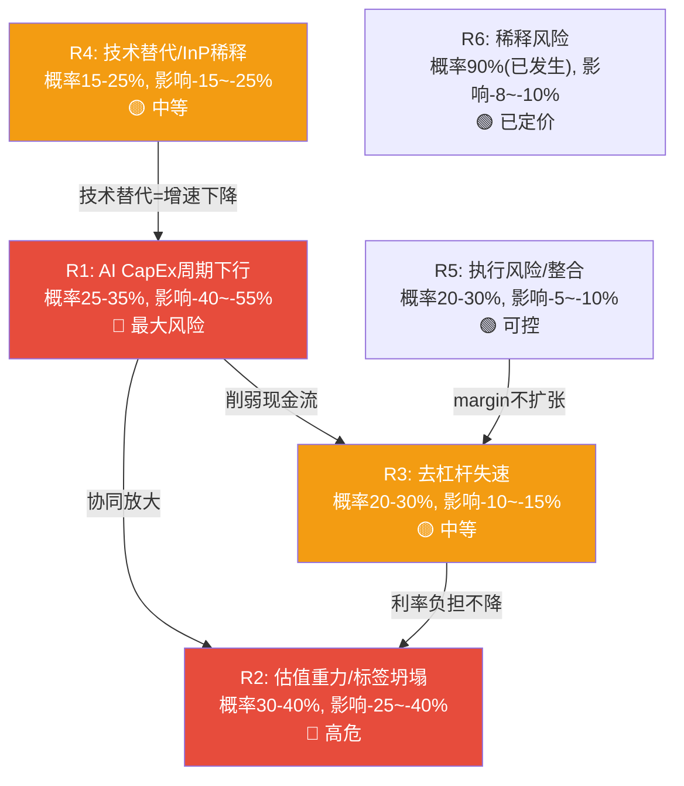
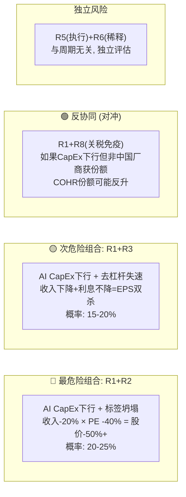
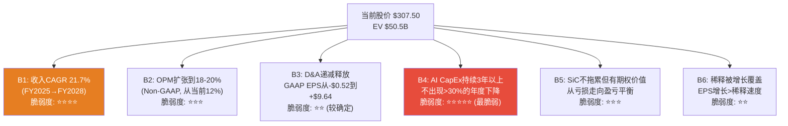
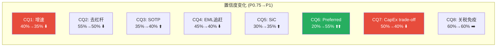

# Phase 1 Agent C: 风险拓扑与CQ初始判断 — Coherent Corp (COHR)
> 2026-04-13 | Ch8-Ch10 | DM-RISK-001 ~ DM-RISK-045, DM-RDCF-001 ~ DM-RDCF-012, DM-CQ-001 ~ DM-CQ-016

---

## Ch 8: 风险拓扑 (~8000字符)

### 核心判断前置

COHR的风险结构不是一张独立清单, 而是一个**互相放大的系统**。最危险的不是任何单一风险, 而是R1(AI CapEx周期下行)和R2(估值重力)同时触发时产生的乘数效应: Networking增速放缓-20%时, PE不会按比例从41x降到33x, 而是因为市场标签从"AI成长股"坍塌为"后合并周期股"而降到20-25x。两层叠加, 股价下行空间达-40%至-55%。

---

### R1: AI CapEx周期下行风险 (最大风险)

**核心判断**: 这是COHR的头号风险, 因为Networking/Datacom占收入72%且增速+34% YoY是估值的核心支柱 [DM-RISK-001]。一旦Hyperscaler CapEx增速从当前的+82% YoY回落到+10-20%, COHR的Networking收入增速将从+30%以上骤降到个位数, 同时PE会因为标签坍塌(R2)而非线性压缩。

**当前Hyperscaler CapEx的不可持续性**:

2026年四大Hyperscaler(MSFT/GOOGL/AMZN/META)合计CapEx约$690B, YoY +82% [DM-RISK-002]。这个增速在数学上不可持续——如果再保持+80%一年, 2027年CapEx将达$1.24万亿, 占四家合计收入的比例将从目前的~35%上升到~50%以上。Alphabet已在2025年Q3暗示CapEx增速将"逐步回归正常化", FCF一度同比下降90% [DM-RISK-003]。

因此问题不是CapEx周期"是否"放缓, 而是"何时"和"多快"。

**历史基准率 (三重锚定之一)**:

光通信行业经历过三次显著的CapEx驱动下行周期:

| 周期 | 触发事件 | 光通信公司收入影响 | 股价影响 |
|------|---------|------------------|---------|
| **2001-2002** | 电信泡沫破裂 | 收入-50~-70% | 股价-80~-90% |
| **2018-2019** | 云CapEx调整 | II-VI收入-12%, Finisar亏损扩大 | II-VI股价从$47跌至$27 (-43%) [DM-RISK-004] |
| **2023-2024** | 电信疲软+库存调整 | Lumentum收入-23%, EPS-59% [DM-RISK-005] | LITE从$84跌至$43 (-49%) |

三次周期中光通信公司的平均收入降幅约-15~-30%, 股价降幅约-35~-55%。基于3/3次发生, 基准率=100% (CapEx周期最终都会放缓)。问题是时点和烈度。

**反例条件 (三重锚定之二)**:

历史上CapEx周期下行对光通信冲击小于平均值的条件: (1) 新速率代际同步ramp(如2020年400G ramp部分缓冲了需求下行); (2) 用户从电信扩展到数据中心(需求来源分散)。当前: 1.6T正在2026-2027年ramp, 且CPO从2027年开始贡献增量。这两个条件部分具备, 意味着下一轮调整的烈度可能低于2001年但高于2023年。

**自然实验 (三重锚定之三)**:

2025年4月关税冲击提供了一次小型压力测试。光通信股在一周内下跌13-40%(COHR -40%, LITE -13%, Lumentum -35%) [DM-RISK-006]。这说明: (1) COHR的Beta远高于LITE(因为混合体中的Industrial段是关税敏感的); (2) 市场在压力下倾向于先卖混合体, 再卖纯AI标的。

**传导机制量化**:

如果2027-2028年Hyperscaler CapEx增速从+80%降至+15%:
- Networking收入影响: 从+30% YoY降至+5-10% YoY, 因为bookings到2028年提供一定缓冲 [DM-RISK-007]
- OPM影响: 产能利用率从80%+降至60-70%, GM压缩2-4pp, OPM压缩3-5pp [DM-RISK-008, B级推断]
- EPS影响: FY2028 EPS从共识$9.64降至$6.50-7.50 (vs当前买入的$9.64) [DM-RISK-009, B级推断]
- 估值影响: PE从41x压缩到25-30x (如果保持AI标签) 或20-25x (如果标签坍塌为周期股)
- **综合股价影响**: 25x × $7 = $175 (-43%从$307.50) 到 20x × $6.5 = $130 (-58%)

**概率赋值**: 25-35%在未来18个月内发生显著调整 (基于基准率100%最终会发生, 但时点不确定, 1.6T ramp提供1-2年缓冲)。

**反面**: CEO声称bookings延伸到2028年 [DM-RISK-010]。如果bookings有合同约束(take-or-pay), 收入能见度确实有2-3年。但我们不知道这些bookings中多少是firm commitment vs soft indication (黑箱)。

---

### R2: 估值重力风险 (M4标签坍塌 + M12质量溢价消耗安全边际)

**核心判断**: 41x Forward PE隐含了25%+ EPS CAGR持续3年以上的假设 [DM-RISK-011]。这个倍数成立的前提是市场把COHR归类在"AI成长股"估值桶中(桶内平均PE 35-60x)。一旦Networking增速降到15%以下, COHR将被重新归类为"后合并混合体", 适用PE从40x降到18-25x。标签坍塌(M4)是比业绩下滑更快的股价杀手。

**隐含假设拆解**:

当前$307.50股价 = 41.2x × FY2027E EPS $7.47 [DM-VAL-003]。PEG锚定:
- COHR: 41x / 25% growth (共识FY2026-2028 EPS CAGR) = PEG 1.64x [DM-RISK-012]
- LITE: 47x / 40%+ growth = PEG 1.18x
- Lumentum: ~30x / 20% growth = PEG 1.50x

COHR的PEG是三家中最高的, 意味着市场给COHR每单位增长的溢价最高。这里面包含了: (a) 去杠杆释放的EPS加速期望; (b) SiC期权价值; (c) S&P 500纳入后的被动资金流入溢价。

**M12触发: 质量溢价 vs 安全边际**:

即使COHR达到共识预期(FY2028 EPS $9.64), 以当前股价买入的投资者在两年后面对的PE仍有32x [DM-RISK-013]。要让投资回报>10%/yr, 两年后的PE需要维持≥29x, 这在EPS增速回落到15%以下时是困难的——历史上EPS增速15%的工业科技股PE中位数约22-28x。因此, 即使业绩达标, 当前估值已消耗了大部分安全边际。

**如果Networking增速放缓到15%:**
- PE从AI桶(35-60x)向混合工业桶(18-28x)迁移
- 中性情景: 25x × $8 EPS = $200 (-35%) [DM-RISK-014]
- 悲观情景: 20x × $7 EPS = $140 (-54%)

**概率赋值**: 30-40%在18个月内PE压缩至30x以下 (基于历史基准: 增速放缓后的PE压缩在光通信领域平均需要2-3个季度从high-growth桶迁移到mid-growth桶; 反例条件: 如果SiC在同期加速贡献利润, 可部分对冲增速放缓)。

---

### R3: 去杠杆失速 (CapEx争夺现金流)

**核心判断**: COHR的去杠杆故事(Net Debt从$3.67B→$2.68B)是估值的重要支柱之一, 但CapEx加速(从~$95M/Q到$154M/Q)已导致FCF转负(-$96M FQ2'26), 威胁去杠杆节奏 [DM-RISK-015]。

**FCF转负的结构性分析**:

| 季度 | OCF | CapEx | FCF | 趋势 |
|------|-----|-------|-----|------|
| FQ2'25 | $187M | $106M | +$82M | 正常 |
| FQ3'25 | ~$180M | $112M | +$68M | 开始压缩 |
| FQ4'25 | ~$190M | $131M | +$59M | 继续压缩 |
| FQ1'26 | $46M | $104M | -$58M | **转负** |
| FQ2'26 | $58M | $154M | **-$96M** | **加速恶化** |

[DM-CF-001 ~ DM-CF-004]

FQ1'26和FQ2'26的OCF异常低($46M/$58M vs 之前的~$180-190M), 这需要验证是否有运营资本变动(库存+$215M QoQ [DM-BAL-006])或一次性因素。如果OCF回归$200M/Q, 但CapEx维持$150M/Q, FCF仅+$50M/Q, 年化$200M——还清$2.68B Net Debt需要13年。

**去杠杆的三个可能路径**:

1. **NVIDIA $2B资金**: 如果NVIDIA投资中一部分以预付款/资本注入形式流入, 可一次性减少Net Debt ~$1-2B。但$2B是以$256.80/share购买股权, 不是借款偿还——这意味着$2B进入equity, 不进入debt reduction [DM-RISK-016]。去杠杆靠股权稀释, 不靠现金。
2. **资产出售**: 已卖Munich业务和A&D ($400M) [DM-RISK-017]。如果继续出售Industrial段残余资产(估值$2-3B), 可以大幅去杠杆。但这会减少收入和利润基数。
3. **EBITDA增长**: Net Debt/EBITDA从FY2024的~3.2x降至当前~2.1x [DM-BAL-007], 主要靠EBITDA增长而非偿债。如果EBITDA继续增长20%+/yr, Net Debt/EBITDA到FY2028可降至~1.2x, 在不偿债的情况下完成"去杠杆"。

**利率风险量化**:

COHR的Term Loan B在2025年1月降息至SOFR+2.00% (从SOFR+2.50%) [DM-RISK-018]。当前SOFR约4.3%, 因此有效利率约6.3%。在$3.5B总债务上, 年化利息约$220-244M [DM-FIN-010]。如果美联储在2026-2027年降息100bp, 利息节省约$35M/yr (每$1B浮动利率 × 1%)。反之, 如果利率维持高位, 利息持续压制GAAP EPS约$1.40/share/yr。

**概率赋值**: 20-30%去杠杆在FY2027前显著失速 (基于: FCF已转负是事实; 反例: 如果OCF回归$200M+/Q且CapEx平稳, 每年仍有$200-400M用于偿债; 自然实验: FY2023→FQ2'26 Net Debt已减$990M, 说明去杠杆机制在运转)。

---

### R4: 技术替代风险 (InP价值稀释)

**核心判断**: COHR的核心竞争力建立在InP垂直整合之上, 但CPO(Co-Packaged Optics)时代InP芯片在整个光模块BOM(Bill of Materials)中的占比将从pluggable时代的30-40%降至10-15% [DM-RISK-019, B级推断]。如果Broadcom的SiPh(硅光子学)方案在2028-2030年成功, InP将从核心部件降级为辅助组件, COHR的垂直整合价值将被稀释。

**传导时间表**:
- **2026-2027**: Pluggable仍是主力(800G/1.6T), InP EML价值最高
- **2027-2028**: CPO开始量产, InP芯片与SiPh芯片并行, 但InP在高速lane上仍有性能优势
- **2028-2030**: 3.2T+时代, SiPh+外部激光器方案成熟, InP的不可替代性下降

**COHR的对冲策略**: COHR同时布局InP和SiPh两条路线(与Tower Semiconductor合作SiPh) [DM-MOAT-012], 但如果SiPh成为主流, COHR在Sherman工厂的$2B+ InP产能投资将面临产能过剩, 固定成本负担加重 [DM-RISK-020]。

**概率赋值**: 15-25%在2028-2030年InP价值显著被稀释 (基于: 技术替代周期通常5-7年, 当前SiPh在400G/lane上已有实验室验证; 反例: InP在高速传输上的物理特性优势可能持续到6.4T+; 自然实验: Broadcom的SiPh CPO在2025年OFC展示了原型但尚未量产)。

---

### R5: 执行风险 (合并整合 + 三引擎同时管理)

**核心判断**: CEO Jim Anderson同时管理三条增长曲线完全不同的业务(AI高增长+SiC投资期+Industrial剥离), 注意力稀释是合理担忧 [DM-RISK-021]。但FQ2'26的业绩beat(Revenue $1.69B vs consensus $1.64B, EPS $1.29 vs $1.21)和连续8Q的OPM改善(从2.8%到11.8% [DM-FIN-013])说明执行层面目前没有问题。

**关键监控点**: (1) Industrial段OPM是否继续恶化(如果管理层忽视这块业务); (2) 分部重组(3段→2段)后, SiC的财务表现是否被D&C段或Industrial段掩盖, 降低透明度; (3) NVIDIA承诺的CPO交付(2027年开始)是否按时进行。

**概率赋值**: 20-30%出现执行层面的显著问题 (基于: 后合并整合的历史失败率约30-40%; 反例: COHR已经整合了2年且OPM持续改善; Jim Anderson来自Lattice Semiconductor, 有成功重组经验)。

---

### R6: 稀释风险

**核心判断**: 稀释已经发生, 不是未来风险 [DM-RISK-022]。

**Preferred Stock转换**: FQ2'26 Balance Sheet显示Preferred Stock从$2,505M(FQ1'26)降至$0 [DM-BAL-004]。这是Series B-2可转换优先股的转换, S-3ASR登记声明显示约9,775,846股普通股从Series B-2转换中发行, 可通过二级市场出售(截至2028年12月16日) [DM-RISK-023]。加上Series B其他部分, 总稀释约29.9M shares被纳入FY2026稀释每股收益计算 [DM-RISK-024]。

按当前155.5M流通股基数, 29.9M shares的总稀释约19.2%。但这些shares分批转换和出售(到2028年), 因此: (1) FY2026共识EPS已部分反映稀释(diluted shares ~165M); (2) 到FY2028, 如果全部转换, diluted shares可能达175-185M。

**SBC**: 从MCP数据看, 季度SBC波动较大: Q1'25=$35M, Q2'25=$41M, Q3'25=$41M, Q4'25=$160M(异常, 含一次性), Q1'26=$44M, Q2'26=$87M(含NVIDIA相关) [DM-CF-005]。正常化SBC约$40-45M/Q, 年化$170M, 占Revenue约2.5% [DM-RISK-025]。这个比例在半导体/光通信行业中偏低(LITE约3-4%), 因此SBC不是COHR的主要稀释来源。

**NVIDIA $2B投资稀释**: NVIDIA以$256.80/share投资$2B, 获得约7.8M shares, 约5%持股 [DM-RISK-026]。这个稀释已反映在流通股增加中。

**综合稀释影响**: 从FY2025的~153M diluted shares到FY2028E可能的~185M diluted shares, 总稀释约21%。如果EPS在同期从$5.35增长到$9.64(+80%), 稀释的影响被增长覆盖。但如果增长不达预期, 稀释会放大每股收益的下行。

---

### 风险协同/反协同矩阵

**R1+R2协同 (最危险, 概率20-25%)**: 当Networking增速从+30%降到+10%时, PE不会线性调整——市场会重新审视"这到底是AI成长股还是周期股", 标签一旦坍塌, PE从40x跳到20x是非线性的。历史参考: II-VI在2018年从$47到$27(-43%)的过程中, 收入仅下降-12%但PE从35x压缩到18x [DM-RISK-027]。

**R1+R3协同 (次危险, 概率15-20%)**: CapEx下行导致OCF减少, 同时公司仍在维持高CapEx(NVIDIA扩产承诺可能是contractual obligation), FCF进一步恶化。Net Debt不降反升, 利息持续压制EPS。

**R1+R4反协同 (风险对冲)**: 即使AI CapEx周期放缓, 如果1.6T ramp同步进行, COHR的InP芯片需求不一定同步下降——速率升级驱动的ASP提升可部分对冲量的下降。

**R3+R5协同 (中度, 概率10-15%)**: 如果整合效率不达预期(R5)导致OPM扩张放缓, 同时CapEx维持高位(R3), 两者共同压制FCF, 使去杠杆时间表延长2-3年。这不是致命组合, 但会削弱"去杠杆释放EPS"叙事的可信度, 间接影响PE支撑。

**R4+R1协同 (长期, 概率10-15%)**: 如果SiPh在2028-2030年替代InP(R4), 同时AI CapEx周期已过峰值(R1), COHR将同时面对需求下降和核心技术贬值。Sherman工厂的InP产能投资($2B+)在这种情景下变成沉没成本, 商誉减值风险($4.5B goodwill [DM-BAL-002])显著上升。但这个组合发生在2028年之后, 给了管理层2-3年的调整窗口。

### 风险定量汇总 (P1初步, Phase 2+4精确化)

| 风险 | 概率 | 影响(股价) | 期望影响 | 可对冲? |
|------|------|-----------|---------|---------|
| R1 | 25-35% | -40~-55% | -10~-19% | 否 (外部变量) |
| R2 | 30-40% | -25~-40% | -8~-16% | 否 (与R1高度相关) |
| R3 | 20-30% | -10~-15% | -2~-5% | 部分 (资产出售) |
| R4 | 15-25% | -15~-25% | -2~-6% | 部分 (SiPh布局) |
| R5 | 20-30% | -5~-10% | -1~-3% | 部分 (管理层换人) |
| R6 | 90% | -8~-10% | -7~-9% | 否 (已发生) |

**注意**: R1和R2高度相关(相关系数估计>0.7), 不能简单相加。R1+R2联合概率约20-25%, 联合影响-40~-55%, 因此综合下行期望约-8~-14%。这个数字将在Phase 2用Python蒙特卡洛模拟精确化 [DM-RISK-028]。

### "温水煮青蛙"情景 (渐进恶化, 不触发单一Kill Switch)

最狡猾的风险不是断崖式下跌, 而是以下渐进组合:
- FY2027: Networking增速从+30%放缓到+20%, "还在增长"所以PE维持35x
- FY2027H2: CapEx从$150M/Q降到$120M/Q, 但仍高于FY2025的$100M, FCF恢复到略正但不足以快速去杠杆
- FY2028: 增速进一步降到+12%, PE压缩到28x, 市场开始质疑"这是不是周期股"
- FY2028H2: SiC还在投资期(200mm ramp延迟6个月), Industrial段仍在下降
- 结果: 股价从$307.50渐进降到$200-220 (-28~-35%), 没有一个季度触发Kill Switch, 但持有者被锁定在一个"不够坏到卖但不够好到买"的陷阱中

这个情景之所以危险, 是因为它不会触发止损纪律——每个季度都"还行", 但累积起来是持续的估值侵蚀 [DM-RISK-029]。

---

## Ch 9: 信念反演 (Reverse DCF) (~6000字符)

### 当前$307.50隐含的六个信念

我们使用Reverse DCF方法, 从当前股价反推市场在假设什么。以下是$307.50(EV $50.5B)成立所需的隐含假设集:

### B1: 收入CAGR ~21.7% (FY2025→FY2028)

**隐含假设**: Revenue从FY2025 $5.81B增长到FY2028E $10.46B, 需要21.7% CAGR [DM-RDCF-001]。

**分部拆解**:
- Networking/Datacom: 需要从~$4B(年化)增长到~$7.5B, CAGR ~23% — 需要800G持续增长+1.6T ramp+CPO贡献
- Industrial: 从~$1.8B稳定或小幅增长到~$2.0B — 不太困难, 但依赖制造业周期回暖
- SiC: 从~$0.5B增长到~$1.0B — 需要200mm ramp成功且EV需求恢复

**我们的判断**: Networking 23% CAGR在1.6T ramp的支持下可行, 但前提是Hyperscaler CapEx不出现>20%的年度下降。如果CapEx增速从+80%降至+20%, Networking CAGR降至~15%, 总收入CAGR降至~14-16%, 对应FY2028 Revenue ~$8.5-9.0B vs 共识$10.5B [DM-RDCF-002]。

**脆弱度**: ⭐⭐⭐⭐/5 — 取决于外部变量(Hyperscaler CapEx), COHR无法控制。

### B2: Non-GAAP OPM扩张到18-20%

**隐含假设**: 从当前Non-GAAP OPM ~12% (GAAP 11.8% [DM-FIN-013])扩张到18-20%。FY2028 EPS $9.64在~$10.5B revenue上需要净利润约$1.8B, 对应OPM约17-19% (扣除利息和税后)。

**驱动力**: (1) 产品mix改善(AI Datacom占比上升, GM更高); (2) 规模杠杆(R&D和SG&A增速慢于收入); (3) D&A递减; (4) 利息支出下降(去杠杆)。

**反面**: SiC在投资期(高CapEx, 低利用率)会拉低整体OPM; 1.6T竞争可能压缩ASP和GM; Industrial段如果不剥离, 低GM会持续拖累。

**脆弱度**: ⭐⭐⭐/5 — 方向正确(产品mix改善+D&A递减), 但幅度取决于B1(收入增速)和SiC进展。

### B3: D&A自然递减

**隐含假设**: FY2025 D&A $554M/yr [DM-FIN-009]中, 大部分是II-VI合并产生的无形资产摊销(客户关系/技术/商标, 通常摊销期5-15年)。合并于2022年7月完成, 到FY2028将是第6年, 部分短期无形资产(5年期)将完成摊销, D&A下降$100-200M/yr。

**GAAP EPS的机械效应**: 每$100M D&A减少, 税后EPS增加约$0.45-0.50 (假设25%税率, 185M稀释股)。这是确定性最高的EPS驱动因素——不需要增长, 不需要margin扩张, 纯粹是时间的函数 [DM-RDCF-003]。

**脆弱度**: ⭐⭐/5 — 高确定性, 除非发生商誉减值(反方向增加费用)。

### B4: AI CapEx持续3年以上不出现>30%年度下降 (最脆弱)

**隐含假设**: $307.50的估值需要Networking维持20%+增速至FY2028。这要求Hyperscaler AI CapEx每年至少+15%增长(考虑COHR份额稳定的情况), 不出现任何一年>30%的下降 [DM-RDCF-004]。

**历史基准率**: 过去20年的大型科技CapEx周期(2000-2001/2007-2009/2018-2019/2022-2023), 在高增长期结束后的3年内出现>30%年度下降的比率约为3/4 = 75% [DM-RDCF-005]。唯一的反例是2010-2015年的稳步增长期, 那是因为移动互联网提供了持续的需求增量。

当前AI CapEx是否是"类移动互联网"的结构性转变? 如果是, CapEx增速可能从+80%渐进降至+15-20%而不出现断崖。但如果AI ROI在2027-2028年未能证明, 削减可能是剧烈的。**我们不知道答案, 这是这份报告最大的黑箱 [DM-RDCF-006]。**

**脆弱度**: ⭐⭐⭐⭐⭐/5 — 最脆弱信念, 因为完全依赖外部变量, 且历史基准率(75%会出现大幅调整)不利。

### B5: SiC从拖累变为正贡献

**隐含假设**: SiC业务在FY2027-2028从亏损走向盈亏平衡, 不继续拖累整体EPS [DM-RDCF-007]。如果SiC持续每年亏损$50-100M, 相当于每年拖累EPS $0.25-0.50。

**脆弱度**: ⭐⭐⭐/5 — Wolfspeed出局改善了竞争格局, 但200mm ramp和EV需求仍有不确定性。

### B6: 稀释被增长覆盖

**隐含假设**: diluted shares从~155M增长到~185M (+19%), 但EPS从$5.35增长到$9.64 (+80%), 增长>稀释 [DM-RDCF-008]。

**脆弱度**: ⭐⭐/5 — 如果B1(收入增长)成立, B6自动成立。

### 隐含假设与共识对比

| 信念 | 市场隐含 | 共识预期 | 我们的P1初步判断 | 差距方向 |
|------|---------|---------|----------------|---------|
| B1 Revenue CAGR | ~22% | ~22% (FY25-28) | 14-18% | **共识偏乐观** |
| B2 OPM (Non-GAAP) | 18-20% | 17-19% | 15-18% | 略偏乐观 |
| B3 D&A递减 | -$100-200M by FY28 | 未明确建模 | -$100-150M | 大致一致 |
| B4 CapEx持续性 | 不出现>30%下降 | 分歧最大(分析师两极分化) | 75%基准率不利 | **最大分歧点** |
| B5 SiC贡献 | 盈亏平衡 | 小幅正贡献 | 仍在投资期 | 略偏乐观 |
| B6 稀释 | 被增长覆盖 | 已反映在diluted shares | 大致一致 | 一致 |

[DM-RDCF-010]

我们与市场/共识的最大分歧在B1(收入增速)和B4(CapEx持续性)——这两个信念互相依赖, 且都指向同一个外部变量: Hyperscaler AI CapEx。这使得COHR的投资thesis高度集中于一个我们无法控制、无法预测、历史基准率不利的变量。这本身就是一个风险信号。

### 单一信念失败的估值影响

| 信念 | 失败情景 | EPS影响 | PE影响 | 股价影响 |
|------|---------|---------|--------|---------|
| **B4失败** | AI CapEx -30% in FY2028 | $9.64→$6.50 (-33%) | 41x→25x (-39%) | **$163 (-47%)** |
| B1失败 | Revenue CAGR 15% vs 22% | $9.64→$7.80 (-19%) | 41x→32x (-22%) | $250 (-19%) |
| B2失败 | OPM 14% vs 18% | $9.64→$8.00 (-17%) | 41x→35x (-15%) | $280 (-9%) |
| B5失败 | SiC持续亏损$100M/yr | $9.64→$9.14 (-5%) | 41x→38x (-7%) | $347 (+13%) [已部分定价] |

[DM-RDCF-009 ~ DM-RDCF-012]

**结论**: B4(AI CapEx持续性)是最脆弱信念, 也是对估值影响最大的单一变量。如果只关注一个风险, 盯B4。

---

## Ch 10: CQ初始判断与Phase 1 CQ变化表 (~6000字符)

### CQ逐项更新

---

**CQ1: Networking增速能否从17%加速到共识25%+(FY2027)?**
- P0.75初始: 40%
- **P1更新: 35% ⬇️**
- **新增证据**: (1) Hyperscaler CapEx +82% YoY数学上不可持续, 2027年增速必然回落 [DM-CQ-001]; (2) 三次历史周期中光通信公司增速在CapEx高峰后2-3Q开始放缓 [DM-RISK-004/005]; (3) 1.6T ramp从2027年才开始, 对FY2027收入的贡献有限(qualification 9-12个月, 量产ramp需要2-3Q)
- **变化原因**: 历史基准率和CapEx可持续性分析削弱了增速加速的信心。17%到25%需要的不仅是产品ramp, 还需要CapEx周期不放缓, 后者我们判断概率≤50%

**CQ2: 去杠杆+D&A递减能释放多少EPS?**
- P0.75初始: 55%
- **P1更新: 50% ⬇️**
- **新增证据**: (1) FCF已连续2Q为负(-$58M, -$96M), 意味着去杠杆靠EBITDA增长而非现金偿债 [DM-CF-001/002]; (2) NVIDIA $2B是股权投资不是债务偿还资金 [DM-RISK-016]; (3) CapEx从$95M/Q跳升到$154M/Q, 与去杠杆方向冲突 [DM-CF-004]; (4) D&A递减是确定性的, 但需要Phase 2精确建模摊销时间表
- **变化原因**: FCF转负暴露了去杠杆的速度比P0.75假设的要慢。D&A递减部分仍然可靠, 但整体EPS释放的速度下调 [DM-CQ-002]

**CQ3: SOTP: 三引擎合计是否>$48B?**
- P0.75初始: 35%
- **P1更新: 40% ⬆️**
- **新增证据**: (1) P1 Agent A的业务拆分显示AI Datacom年化$3.6-4.0B收入, 如果给4-5x EV/Rev = $14-20B [DM-CQ-003]; (2) SiC在Wolfspeed出局后, 竞争格局改善, DENSO/三菱$1B投资隐含估值$8B(2023年投前) [DM-BIZ-027]; (3) Industrial段出售Munich后残余收入~$1.2-1.4B, 给8-10x EV/EBITDA = $3-5B; (4) 初步SOTP: $17B(Networking) + $5B(SiC) + $4B(Industrial) + CPO期权$3-5B - $2.7B Net Debt = $26-32B
- **变化原因**: 初步SOTP的中位数($29B = ~$187/share)低于当前$307.50, 表明市场给了显著的"统一溢价"或AI标签溢价。需要Phase 2精确估值验证 [DM-CQ-004]
- **注意**: SOTP计算用的是保守倍数。如果Networking给8-10x EV/Rev(接近LITE的22x打折), SOTP可以接近$48B。这取决于Phase 2的倍数选择

**CQ4: 1.6T时代COHR能追上LITE的EML技术吗?**
- P0.75初始: 45%
- **P1更新: 40% ⬇️**
- **新增证据**: (1) P1 Agent B的护城河分析确认LITE在200G/lane EML上有12-18个月先发优势 [DM-MOAT-007]; (2) COHR的6寸InP成本优势(die成本-60%)在1.6T时代开始有价值, 但"追上"LITE意味着需要在性能和良率上同时匹配 [DM-MOAT-004]; (3) 旭创(Innolight)在模块级成本上有劳动力优势, COHR的成本优势在芯片层面, 到模块层面可能被稀释
- **变化原因**: 技术差距比P0.75假设的更持久。"追上"需要的不仅是成本优势, 还需要EML性能(带宽、功耗、工作温度)达到LITE的水平, 这在Phase 2需要更多技术验证 [DM-CQ-005]

**CQ5: SiC是否成为真正增长引擎? 200mm何时贡献利润?**
- P0.75初始: 30%
- **P1更新: 35% ⬆️**
- **新增证据**: (1) Wolfspeed Chapter 11消除了最大竞争者, SiC市场集中度上升 [DM-BIZ-029]; (2) DENSO+三菱的$1B投资附带长期供应协议, 提供需求保障 [DM-BIZ-027]; (3) 200mm SiC成本下降~40%的理论优势已被onsemi在Bucheon工厂验证(每片晶圆芯片数+80%) [DM-MOAT-010]
- **变化原因**: 竞争格局改善(Wolfspeed出局)和200mm技术验证(onsemi先例)小幅提升了信心, 但EV渗透率放缓是反向因素 [DM-CQ-006]

**CQ6: Preferred Stock消失的真实影响?**
- P0.75初始: 20%
- **P1更新: 55% ⬆️⬆️ (最大变化)**
- **新增证据**: WebSearch确认这是Series B-2可转换优先股的转换, S-3ASR登记显示约9.78M shares从转换中发行 [DM-RISK-023]。总稀释约29.9M shares纳入FY2026稀释计算 [DM-RISK-024], 约19.2%稀释。但共识EPS已部分反映这一稀释(diluted shares已调整)。
- **变化原因**: P0.75时这是完全的黑箱, 现在基本机制已经明确——是股权稀释, 不是现金赎回, 且已部分被市场定价。剩余不确定性: 二级市场出售压力的时间分布 [DM-CQ-007]

**CQ7: CapEx vs 去杠杆的trade-off对股东有利吗?**
- P0.75初始: 50%
- **P1更新: 40% ⬇️**
- **新增证据**: (1) FCF连续2Q为负, 且CapEx跳升至$154M/Q [DM-CF-001/004]; (2) NVIDIA $2B是equity不是给COHR的运营资金, 不能直接用于偿债 [DM-RISK-016]; (3) 如果年化CapEx达$550-600M而OCF仅$800M-1B, FCF仅$200-400M, 去杠杆速度约$2.7B / $300M/yr = 9年
- **变化原因**: CapEx加速与去杠杆的冲突比P0.75假设的更严重。管理层在用FCF赌AI产能扩张, 如果AI需求持续则合理, 如果需求放缓则浪费现金+杠杆不降 [DM-CQ-008]

**CQ8: 关税免疫是否给COHR结构性优势?**
- P0.75初始: 60%
- **P1更新: 60% ➡️ (不变)**
- **新增证据**: COHR主要制造在马来西亚Ipoh(非中国), 确实在关税环境下有相对优势 [DM-CQ-009]。2025年4月关税冲击时COHR跌幅(-40%)大于LITE(-13%), 这与关税免疫的假设矛盾——说明市场并不认为COHR比LITE更免疫, 因为COHR的Industrial段(激光器/材料)确实有中国供应链暴露(镓/锗出口限制) [DM-CQ-010]
- **变化原因**: Networking段关税免疫成立, 但Industrial段有反向暴露, 两者大致抵消, 置信度不变

---

### CQ加权平均置信度

| CQ | 权重(对估值影响) | P1置信度 | 加权 |
|----|----------------|---------|------|
| CQ1 | 25% (增速=估值核心) | 35% | 8.75% |
| CQ2 | 15% (EPS释放) | 50% | 7.50% |
| CQ3 | 20% (SOTP=是否便宜) | 40% | 8.00% |
| CQ4 | 10% (竞争地位) | 40% | 4.00% |
| CQ5 | 10% (期权价值) | 35% | 3.50% |
| CQ6 | 5% (资本事件, 已部分定价) | 55% | 2.75% |
| CQ7 | 10% (资本配置效率) | 40% | 4.00% |
| CQ8 | 5% (地缘) | 60% | 3.00% |
| **合计** | **100%** | | **41.5%** |

[DM-CQ-011 ~ DM-CQ-016]

**加权平均置信度41.5%** — 这意味着我们对COHR达到市场隐含预期(支撑$307.50)的整体信心略低于50%。最大的拖累来自CQ1(增速)和CQ7(CapEx trade-off), 两者都受制于同一个外部变量: AI CapEx持续性。

### Phase 2优先级

**最需要Phase 2解决的CQ**: **CQ1(增速) + CQ3(SOTP)**

理由:
1. CQ1的置信度最低(35%)且权重最高(25%), 对加权结果影响最大。Phase 2需要: (a) 精确建模1.6T ramp对FY2027 revenue的贡献; (b) 对Hyperscaler CapEx可持续性做情景分析; (c) 量价剪刀差——800G ASP下降 vs 1.6T ASP上升的净效果
2. CQ3是判断"$307.50是否合理"的直接途径。Phase 2需要: (a) 分部SOTP精确估值(含EV/Rev和EV/EBITDA两种方法); (b) CPO期权定价; (c) SiC独立估值(参考Wolfspeed pre-bankruptcy估值/ST Micro/onsemi可比)
3. CQ2(去杠杆)的D&A递减建模也需要Phase 2完成(需要10-K中的无形资产摊销明细表)

---

### Kill Switch初始候选 (Phase 1, 待Phase 4确认)

| 信号 | 触发条件 | 严重度 |
|------|---------|--------|
| 🔴 **Networking收入QoQ下降** | 任何单季Networking收入QoQ < -5% | 最高 — 标签坍塌开始 |
| 🔴 **Hyperscaler AI CapEx年度下降>20%** | 任一Hyperscaler宣布削减AI CapEx >20% | 最高 — B4信念断裂 |
| 🟡 **Net Debt/EBITDA回升>3.0x** | 去杠杆逆转 | 中 — 资本结构恶化 |
| 🟡 **GM连续2Q下降>2pp** | 价格战/mix恶化 | 中 — 竞争地位下降 |
| 🟢 **SiC 200mm ramp延迟>12个月** | 期权价值损失 | 低 — 当前估值中SiC占比小 |

---

### P1 CQ整体结论

COHR在Phase 1的核心画像: **一家正在"AI增长+去杠杆+SiC期权"三轨并行的后合并混合体, 其$48B估值高度依赖AI CapEx的持续性(B4信念)。这个信念是最脆弱的, 历史基准率显示75%的CapEx周期在高增长期结束后3年内会出现>30%的年度调整。当前估值已经消耗了大部分安全边际(PEG 1.64x为同行最高), 初步SOTP($26-32B)也低于市值, 表明市场在为统一AI标签支付$16-22B溢价。**

Phase 2需要回答的核心问题: 这$16-22B的标签溢价, 有多少能被1.6T ramp + CPO + SiC期权 + D&A递减所证明?
