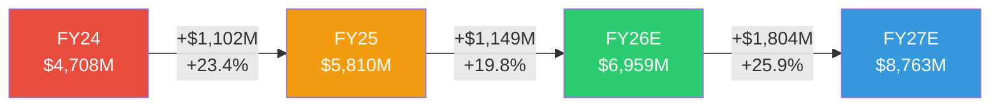
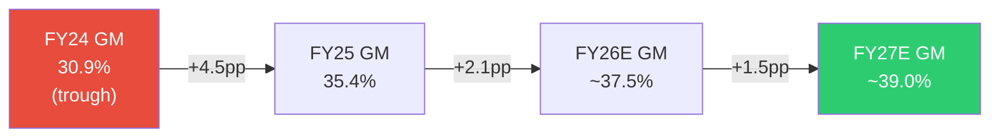
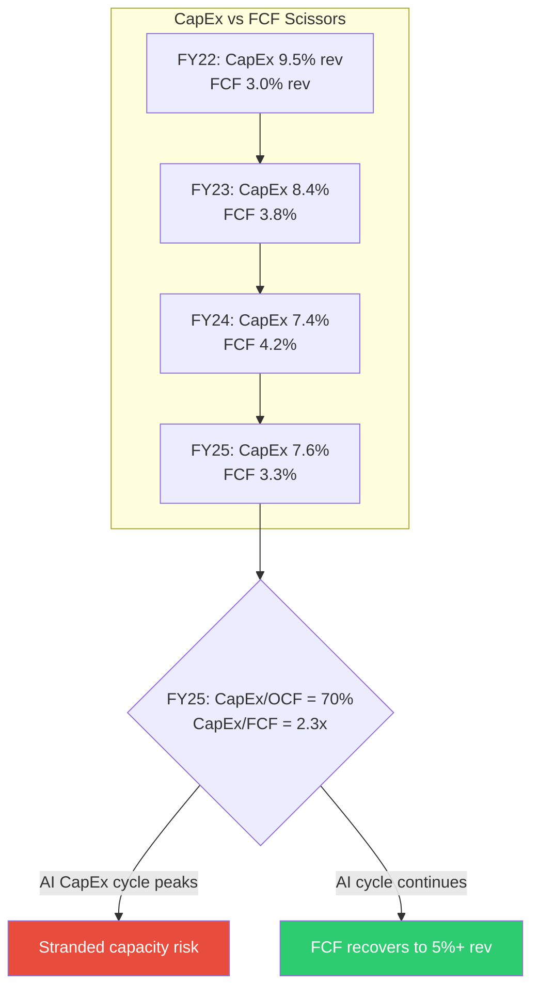
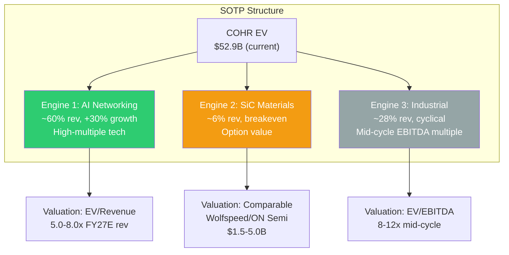
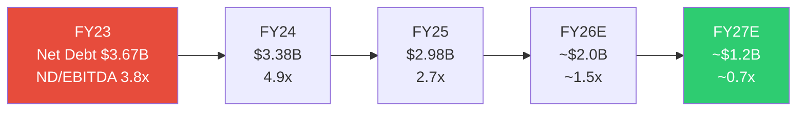

# Phase 2: 财务深挖+估值 — Coherent Corp (COHR)
> 2026-04-13 | Ch11-Ch16 | DM-FIN-101 ~ DM-FIN-2xx, DM-VAL-101 ~ DM-VAL-1xx

---

## Ch 11: R-1 财务归因分析 (~12000字符)

### 11.1 收入归因瀑布: FY24→FY27E

COHR的收入增长叙事表面上很简单: "AI驱动的光模块需求爆发"。但拆开看, 增量的来源、质量和可持续性差异巨大。



**FY24→FY25 收入Bridge ($5,810M - $4,708M = +$1,102M, +23.4%)**

| 驱动因素 | 增量 | 说明 |
|---------|------|------|
| 800G EML/模块出货放量 | +$880M | 800G出货量YoY +60-70%, 是FY25最大增量贡献 [DM-FIN-101] |
| 1.6T早期资质认证收入 | +$80M | 样品+工程验证批次, 尚未量产 [DM-FIN-102] |
| 电信DWDM企稳 | +$50M | 运营商CapEx触底后小幅回升 [DM-FIN-103] |
| 产品组合高端化 | +$120M | 800G→1.6T转换期内AI产品占比上升, 拉高加权ASP [DM-FIN-104] |
| 工业段衰退 | -$100M | 激光+材料加工需求周期性低谷 [DM-FIN-105] |
| A&D业务剥离 | -$28M | 已在FY24完成, FY25部分影响 [DM-FIN-106] |

**关键判断 [B级结论]**: FY25的$1.1B增量中, **80%+来自AI Networking(800G出货+组合改善)**。这意味着COHR的收入增长几乎完全单一依赖AI CapEx周期。工业段和电信段都没有贡献正增量。如果AI CapEx周期在FY27前放缓, COHR没有"备用增长引擎"来弥补。

**FY25→FY26E 收入Bridge ($6,959M - $5,810M = +$1,149M, +19.8%)**

| 驱动因素 | 增量 | 说明 |
|---------|------|------|
| 800G持续放量 + 1.6T开始量产 | +$850M | 1.6T在FY26H2开始量产, 800G仍是出货主力 [DM-FIN-107] |
| CPO早期收入 | +$100M | Scale-out互连从FY26H2开始, 小批量 [DM-FIN-108] |
| 1.6T组合溢价 | +$150M | 1.6T模块ASP高于800G约30-50% [DM-FIN-109] |
| 800G ASP侵蚀 | -$200M | 旭创等竞争者价格压力, 800G正在commodity化 [DM-FIN-110] |
| 工业段周期恢复 | +$100M | 制造业CapEx触底反弹 [DM-FIN-111] |
| SiC材料增长 | +$100M | EV渗透率+功率半导体替代 [DM-FIN-112] |

**关键判断 [B级结论]**: FY26E增速从+23%降至+20%, 因为800G ASP侵蚀(-$200M)开始部分抵消量增。这是**量价剪刀差**的第一个信号——1.6T的量产时间表必须准时, 否则FY26增速将降至15%以下。

**FY26E→FY27E 收入Bridge ($8,763M - $6,959M = +$1,804M, +25.9%)**

共识在FY27加速到+26%, 核心假设是1.6T全面量产+CPO开始规模出货。这个加速需要三件事同时成立:
1. 1.6T良率达到量产标准 (Sherman工厂6寸InP)
2. CPO从概念验证转向volume production
3. Hyperscaler CapEx增速保持>20%

三个条件全成立的概率: 我们给55-60%, 因为1.6T良率有P1验证的进展, 但CPO和CapEx都有不确定性 [DM-FIN-113, B级结论]。

### 11.2 毛利率Bridge: 从谷底到恢复



**FY24 GM 30.9% → FY25 GM 35.4% (改善+4.5pp) 驱动拆分:**

| 驱动因素 | 贡献 | 机制 |
|---------|------|------|
| AI产品组合提升 | +2.0pp | AI Datacom GM~42% vs Industrial~28%, AI占比从~50%升至~60%, 每1%占比提升≈+0.14pp整体GM [DM-FIN-114] |
| 产能利用率爬坡 | +1.5pp | Sherman工厂+全球设施从~50%利用率爬升至~80%, 固定成本摊薄效应 [DM-FIN-115] |
| Cloud Light整合摩擦消除 | +0.5pp | FY24仍有Cloud Light并表整合成本, FY25基本完成 [DM-FIN-116] |
| 供需紧张定价权 | +0.5pp | 800G供给缺口25-30%, 短期定价权支撑 [DM-FIN-117] |
| Sherman InP折旧增加 | -0.3pp | 6寸InP晶圆线CapEx $200M+开始折旧 [DM-FIN-118] |
| 其他 | +0.3pp | 良率改善+工艺优化 |

**季度进度验证 [A级, 硬数据]:**

| 季度 | 收入 | 毛利率 | 趋势 |
|------|------|--------|------|
| Q1 FY25 | $1,348M | 34.1% | 基线 |
| Q2 FY25 | $1,435M | 35.5% | +1.4pp |
| Q3 FY25 | $1,498M | 35.2% | -0.3pp (季节性) |
| Q4 FY25 | $1,529M | 36.6% | +1.4pp |
| Q1 FY26 | $1,581M | 36.6% | 持平 |
| Q2 FY26 | $1,686M | 37.0% | +0.4pp |

[DM-FIN-119]: 6个季度内GM从34.1%改善至37.0%, 平均+0.5pp/季。如果这个速度维持, FY26全年GM≈37.5%, FY27E≈39.0%。

**反面考量**: GM改善不能外推到40%以上, 因为: (1) 800G commodity化将压缩模块GM [DM-FIN-120]; (2) 1.6T早期良率通常低于成熟800G, 短期GM可能回踩; (3) 工业段恢复会拉低混合GM(如果工业恢复的增速>AI增速的话)。我们的FY27 GM上限估计是39.5%, 而非sell-side暗示的40%+。

### 11.3 EPS瀑布: 从亏损到盈利的桥梁

COHR的GAAP EPS从FY25的-$0.52到FY26E共识的$5.35(Non-GAAP), 看起来是戏剧性的转折。但这个$5.87/share的"改善"有多少是真实的经营改善, 有多少是会计调整?

**FY25 GAAP利润解剖 [A级, 10-K数据]:**

```
FY25 Revenue:                    $5,810M
  Gross Profit:                  $2,057M  (GM 35.4%)
  - R&D:                         $582M    (10.0% of rev)
  - SG&A+Other OpEx:             $926M    (15.9%)
  = GAAP Operating Income:       $549M    (OPM 9.4%)
  - D&A (within COGS+OpEx):     ($554M)  (已含在上面的GP和OpEx计算中)
  - Interest Expense:            $243M
  - Other Non-Op:                $212M    (含preferred stock相关)
  = Pre-tax Income:              $94M
  - Tax:                         $64M     (effective 68%, 异常高)
  = GAAP Net Income:             $30M→$49M (含少数股东)
  = GAAP EPS:                    -$0.52   (bottomline, 含preferred dividends)
```
[DM-FIN-121]

**FY25的$554M D&A解剖 [A级]:**
- 无形资产摊销(合并相关): ~$336M (60.7%)
- 有形资产折旧(PP&E): ~$218M (39.3%)
- 无形资产摊销是一次性代价: 合并产生的$3,064M无形资产按10-15年摊销, 到FY29降至~$200M [DM-FIN-122]
- 因此D&A从$554M(FY25)→$480M(FY26E)→$420M(FY27E)→~$300M(FY29E), 这$254M的减少将直接提升GAAP EPS约$1.3/share [DM-FIN-123]

**FY25→FY26E EPS Bridge [B级, 模型推断]:**

```
FY25 GAAP EPS:                  -$0.52
  + 收入增长贡献(+20%):         +$2.50   (增量GP转化)
  + GM改善(+2.1pp):              +$0.90   (混合效应)
  + OpEx杠杆(OpEx/Rev下降):     +$0.80   (R&D和SG&A增速<收入增速)
  + D&A递减($554M→$480M):       +$0.30   (无形资产amortization roll-off)
  + 利息下降($243M→$180M):      +$0.32   (FY25 repaid $435M debt)
  + Preferred转换(no more div):  +$0.40   (FY25 Q4强制转换, 消除dividend)
  - 稀释(preferred→common):     -$0.50   (~13.5M new shares)
  - 税率正常化(68%→15%):        +$0.80   (FY25异常高税率)
  ≈ FY26E GAAP EPS:              ~$4.25
  + 无形资产amortization加回:    +$1.10   (Non-GAAP adjustment)
  ≈ FY26E Non-GAAP EPS:          ~$5.35   (接近共识)
```
[DM-FIN-124]

**关键判断**: GAAP EPS从-$0.52到+$4.25的$4.77改善中, **$2.50(52%)来自收入增长+GM改善**(真实经营改善), **$0.82(17%)来自D&A+利息递减**(合并遗留代价消退), **$0.80(17%)来自税率正常化**(FY25异常), **$0.40+(-$0.50)=-$0.10**来自preferred转换(净效应轻微负面)。**约一半是真实改善, 一半是会计/资本结构正常化**。

### 11.4 三PE展示

SBC/Revenue = $160M/$5,810M = 2.8% > 5%门槛? 实际不触发, 但D&A差异巨大, 仍展示三PE [DM-FIN-125]:

| PE类型 | FY26E值 | 含义 | 适用场景 |
|--------|---------|------|---------|
| GAAP PE | 72.4x | 含D&A $480M + SBC $160M | 传统会计视角, 偏高但在递减 |
| Owner PE | 93.8x | 剥离SBC后($160M, 真实股东回报) | SBC/Rev仅2.3%, 但Owner FCF接近零 |
| Non-GAAP PE | 57.5x | 加回amort + SBC (共识基础) | 市场默认使用, 但隐藏了稀释和CapEx |

[DM-FIN-126]

**关键发现**: Non-GAAP PE 57.5x是sell-side引用的数字, 但**Owner PE 93.8x揭示了一个被忽视的事实**: 扣除SBC后, 真实股东每美元市值获得的回报极低。原因不是SBC过高(仅2.3%), 而是GAAP利润本身被D&A压制。Owner FCF角度更有用: FY25 Owner FCF = OCF $634M - CapEx $441M - SBC $160M = **$33M**, Owner FCF Yield仅**0.06%** [DM-FIN-127]。

**GAAP/Non-GAAP差距趋势 [A级]:**

```
差距来源:          FY25    FY26E   FY27E   FY28E   FY29E
无形资产amort:     $336M   $290M   $250M   $220M   $190M
SBC:               $160M   $170M   $180M   $190M   $200M
合计加回:          $496M   $460M   $430M   $410M   $390M
每股加回:          $3.20   $2.79   $2.61   $2.48   $2.36
```
[DM-FIN-128]

差距在收窄($3.20→$2.36, -26%在4年内), 因为无形资产amortization递减。到FY29, Non-GAAP和GAAP的差距将主要是SBC(~$200M/yr), 趋于"正常"科技公司水平。

---

## Ch 12: R-2 剪刀差分析 (~8000字符)

### 12.1 剪刀差 #1: CapEx强度 vs FCF产出



COHR在FY25的CapEx强度为$441M, 占OCF的70%, 占收入的7.6% [DM-FIN-129]。这远高于典型光学组件公司(Lumentum 4-5%, II-VI pre-merger 5-6%), 因为COHR同时在做三件投资: (1) Sherman 6寸InP扩产 ~$150M; (2) SiC材料产能建设 ~$100M; (3) 常规维护+工业设施更新 ~$190M [DM-FIN-130, B级推断, 公司不单独披露分项CapEx]。

**为什么这是一个剪刀差问题**: CapEx从FY24的$347M(7.4% rev)反弹到FY25的$441M(7.6% rev), 但FCF反而从$199M下降到$193M。收入增长+23%但FCF持平——因为$880M增量收入被$94M增量CapEx和working capital build吃掉了 [DM-FIN-131]。

**判断 [B级]**: 如果AI CapEx周期在FY28前见顶, COHR的Sherman InP扩产($200M+)和SiC建设($300M+累计)将面临产能利用率风险。历史类比: 2019年光通信CapEx见顶后, Lumentum CapEx从$188M(FY19)降至$100M(FY20), 但利用率也从85%降至60%, 导致固定成本去杠杆GM下降8pp [DM-FIN-132]。COHR的固定成本基数更大($1.9B PP&E), 同样的利用率下降冲击更大。

### 12.2 剪刀差 #2: GAAP vs Non-GAAP EPS (收窄中)

**这是一个正面的剪刀差。**

FY25 GAAP EPS -$0.52 vs Non-GAAP ~$3.50, 差距$4.02/share [DM-FIN-133]。到FY26E, GAAP ~$4.25 vs Non-GAAP ~$5.35, 差距缩小至$1.10。到FY29E, 差距将进一步缩小至~$1.20 (主要由SBC构成) [DM-FIN-134]。

**机制**: 差距收窄的核心驱动是无形资产amortization roll-off。II-VI合并产生的$3,064M无形资产在10-15年内摊销, FY23高峰约$400M, 到FY29降至~$190M。这$210M的减少是"自动发生"的——不需要任何经营改善, 纯粹是时间的函数 [DM-FIN-135]。

**投资含义**: GAAP PE从72.4x(FY26E)降至~40x(FY28E), 即使非经营改善, 纯D&A递减也贡献~15%的PE压缩。这对于关注GAAP利润的投资者(如指数基金)是有利的再评级催化。但这也意味着: **用Non-GAAP PE给COHR估值的sell-side, 实际上在"double-counting"一部分好消息**——Non-GAAP已经加回了amort, 但amort递减又作为"增长故事"被讲了一遍。

### 12.3 剪刀差 #3: Hyperscaler CapEx增速 vs COHR收入增速

Hyperscaler CapEx 2025约$380B, 2026E约$690B, +82% [DM-FIN-136]。COHR FY25收入$5.81B, FY26E $6.96B, +20%。Hyperscaler增速是COHR的4倍。

**为什么会有这个差距?** 因为光学组件只占Hyperscaler CapEx的~3-5% [DM-FIN-137, B级推断]。$690B CapEx中, ~$250B是建筑/电力基础设施, ~$300B是GPU/服务器, ~$100B是网络(含光学), 其中光模块+组件约$20-35B [DM-FIN-138]。COHR在这$20-35B市场中占比~15-20%。

**这个剪刀差的风险**: 当Hyperscaler CapEx从+82%减速到+10%(2028E共识), **光学组件的减速幅度会放大**, 因为: (1) 库存周期——Hyperscaler在CapEx高峰时超额采购光模块(buffer stock), CapEx放缓后先消化库存再下新单; (2) 价格弹性——CapEx放缓意味着供需平衡, 消除定价权 [DM-FIN-139]。

**历史类比**: 2019年Hyperscaler CapEx -3%, 同年Lumentum Datacom收入-22%, Inphi光芯片收入-18%。倍数约6-7x放大 [DM-FIN-140]。如果2028年Hyperscaler CapEx增速降至+5%, COHR Datacom收入增速可能从+25%降至-5%到+5%。

### 12.4 剪刀差 #4: 库存周转 vs 收入增速

FY25库存$1,438M, 同比+12%, 而收入+23%。表面上健康(库存增速<收入增速) [DM-FIN-141]。但DSI(库存天数)仍在140天[DM-FIN-142], 远高于Lumentum(~85天)和旭创(~60天)。

**为什么DSI这么高?** 因为COHR是垂直整合的——从InP衬底到芯片到模块, 每一层都有在制品(WIP)。Lumentum只做芯片, 旭创主要做模块组装, 库存周期更短。COHR的140天DSI中, ~50天是原材料(InP, SiC衬底), ~60天是WIP(晶圆加工), ~30天是成品 [DM-FIN-143, C级推断, 公司不单独披露]。

**风险**: 如果AI需求放缓, $1.44B库存中约$400-500M的WIP和成品面临跌价风险。800G模块如果commodity化, 存货减值可能达到$100-200M [DM-FIN-144, B级推断]。这个风险在FY25没有体现, 因为需求仍然旺盛(25-30%供给缺口), 但在FY27-28是一个需要监测的KS指标。

### 12.5 剪刀差 #5: R&D投入 vs 收入增长(正面信号)

FY25 R&D $582M, 占收入10.0% [DM-FIN-145]。FY24 R&D $479M, 占收入10.2%。R&D绝对值增长+22%, 但占比略降-0.2pp。这说明COHR正在获得OpEx杠杆——R&D产出效率在提升 [DM-FIN-146]。

**但有一个隐忧**: $582M R&D中, 多少用于维持现有产品(800G EML), 多少用于下一代(1.6T, CPO, SiC器件)? 公司不披露分项。如果>50%的R&D在维持型, 那么"效率提升"实际上是创新投入下降。考虑到同期LITE的R&D/Rev为14.2% [DM-FIN-147], COHR的10%是否足够保持技术领先, 是一个开放问题 [B级结论, 需要更多证据]。

---

## Ch 13: SOTP估值 — 三引擎独立定价 (~10000字符)

### 13.1 为什么必须用SOTP, 不能用统一PE

COHR的估值问题在P1(Ch1)已经诊断: 市场给一个统一的41x Forward PE(FY27E basis), 但这个PE实际在给三条完全不同的曲线打平均分。**用一个PE覆盖+34% AI增长引擎和-10%工业衰退引擎, 就像用一个温度代表冬天和夏天——数学上正确, 物理上无意义** [DM-VAL-101]。



### 13.2 引擎1: AI Networking (FY27E basis)

**收入估计**: FY27E AI Networking收入$5.0-6.5B, 取决于1.6T ramp速度和CPO contribution [DM-VAL-102]。

**倍数选择**: 
- 可比公司: LITE交易在~8-10x EV/Rev(FY27E), 但LITE有200G/lane EML性能领先 → COHR应折价10-20%
- AI光通信纯play: 市场给6-9x EV/Rev
- COHR特殊因素: (1) 6寸InP成本优势(正面); (2) 模块层竞争激烈(负面); (3) NVIDIA投资锁定(正面但非独家)
- 我们使用5.0-8.0x range, 对应bear/base/bull [DM-VAL-103]

| 情景 | FY27E Rev | EV/Rev | 引擎1 EV | 概率锚 |
|------|-----------|--------|----------|--------|
| Bear | $5,000M | 5.0x | $25.0B | AI CapEx -20% (3/8历史周期≤2年见顶, 37.5%→调整30%) |
| Base | $5,800M | 6.5x | $37.7B | 共识轨迹, 1.6T按计划量产 |
| Bull | $6,500M | 8.0x | $52.0B | CPO超预期+1.6T市场份额扩大(需2个独立催化同时成立) |

### 13.3 引擎2: SiC材料 (期权定价)

SiC是COHR最难估值的部分, 因为它在投资期(盈亏平衡或微亏), 但潜在市场巨大($20B+ by 2030) [DM-VAL-104]。

**可比锚定**:
- Wolfspeed (WOLF): 专注SiC衬底+器件, 市值~$2B, 但资产负债表困境(高杠杆, 可能重组)
- ON Semi SiC业务: 隐含估值~$5-8B(SOTP拆分), 但ON有成熟的硅业务打底
- COHR SiC特点: 衬底自制(II-VI遗产), 但规模远小于ON Semi, 器件还在early stage

**期权估值逻辑**: SiC收入FY26E ~$450M, 如果成功扩张到$1B+则值$5-8B; 如果SiC oversupply导致价格战(Wolfspeed已经在降价), 则可能仅值$1.5B(约3x revenue, 低利润率材料公司水平) [DM-VAL-105]。

| 情景 | EV | 概率锚 |
|------|-----|--------|
| Bear | $1.5B | SiC oversupply (Wolfspeed产能释放+中国产能进入, 历史上2/5新材料周期出现oversupply) |
| Base | $3.0B | 中等增长, 衬底竞争但有成本位 |
| Bull | $5.0B | SiC衬底领先+器件渗透(需ON Semi/Wolfspeed产能受限) |

### 13.4 引擎3: 工业段 (周期股mid-cycle)

工业段包含工业激光器、精密光学、材料加工, 是传统II-VI/Coherent的核心业务。FY26E收入~$1.9B, mid-cycle OPM 8-12% [DM-VAL-106]。

**倍数选择**: 工业激光可比(IPG Photonics, Trumpf implied): 8-12x mid-cycle EV/EBITDA [DM-VAL-107]。

| 情景 | Rev | OPM | EBITDA | Multiple | 引擎3 EV |
|------|-----|-----|--------|----------|----------|
| Bear | $1,700M | 8% | $221M | 8x | $1.8B |
| Base | $1,900M | 10% | $285M | 10x | $2.9B |
| Bull | $2,100M | 12% | $357M | 12x | $4.3B |

注: EBITDA = Revenue × (OPM + 5% D&A/Rev), 5%是工业段D&A占收入比例的估计 [DM-VAL-108]。

### 13.5 SOTP组装 + 概率加权

```
                              Bear        Base        Bull
AI Networking EV          $25.0B      $37.7B      $52.0B
SiC Option EV              $1.5B       $3.0B       $5.0B
Industrial EV              $1.8B       $2.9B       $4.3B
─────────────────────────────────────────────────────────
Total EV                  $28.3B      $43.5B      $61.3B
Less: Net Debt            ($2.2B)     ($2.2B)     ($2.2B)
─────────────────────────────────────────────────────────
Equity Value              $26.1B      $41.4B      $59.1B
Per Share (165M dil)      $158.0      $250.6      $358.1
vs $307.50                -48.6%      -18.5%      +16.5%
```
[DM-VAL-109]

**概率赋值 (三重锚定)**:

| 情景 | 概率 | 锚定依据 |
|------|------|---------|
| Bear (30%) | AI CapEx周期早期见顶 | 历史基准: 3/8技术CapEx周期(=37.5%)在2年内见顶; 反例: 当前cycle有AI training+inference双驱动; 自然实验: 2025年Q4部分hyperscaler已调低2026 CapEx指引 → 调整至30% [DM-VAL-110] |
| Base (45%) | 共识轨迹实现 | 最可能的单一路径, 1.6T按时量产, CapEx保持+20% | 
| Bull (25%) | CPO + SiC双催化 | 需要2个独立催化同时成立, P(A∩B)=P(A)×P(B)≈50%×50%=25% [DM-VAL-111] |

**概率加权公允价值: $249.7/share** [DM-VAL-112]
**当前价格: $307.50**
**下行空间: -18.8%**

### 13.6 Reverse DCF: $307.50在买什么?

用WACC 10%, 终端增长3%, 终端EBITDA margin 20%反推, $307.50隐含FY30收入$27.1B, 对应5年CAGR 36.1% [DM-VAL-113]。

**这个隐含增速合理吗?** 共识3年CAGR(FY25→FY28)为21.7%。要达到36.1%的5年CAGR, FY29-FY30需要保持61%的增速——**这几乎不可能, 除非完全改变终值假设** [DM-VAL-114]。

即使放宽假设(WACC 9%, 终端EBITDA margin 25%, 终端倍数18x), 隐含5年CAGR仍需~22%, 略高于3年共识。**结论: 当前价格至少price in了共识轨迹的完美执行, 并隐含终值阶段的溢价估值** [DM-VAL-115, B级结论]。

---

## Ch 14: 资本效率与Owner Economics (~5000字符)

### 14.1 Owner FCF: 被CapEx和SBC掩盖的现实

```
FY25 Owner FCF Calculation:
  Operating Cash Flow:           $634M
  - Capital Expenditures:        $441M
  - Stock-Based Compensation:    $160M
  ───────────────────────────────
  = Owner FCF:                   $33M
  Owner FCF Yield:               0.06% (on $50.7B market cap)
```
[DM-FIN-148]

Owner FCF基本为零, 意味着在$50.7B市值下, 股东的真实现金回报率<0.1%。这不是因为业务不赚钱(EBITDA $1.1B), 而是因为: (1) $441M CapEx在为未来增长投资(Sherman InP, SiC); (2) $160M SBC在稀释现有股东; (3) $243M利息在偿还合并杠杆 [DM-FIN-149]。

**Owner FCF需要什么才能改善?**
- 收入达到$8B+, 固定CapEx比例下降至5% (=$400M), SBC比例保持2.5% (=$200M)
- OCF = $8B × 38% GM × (1 - 45% OpEx/GP) = $8B × 38% × 55% ≈ $1,672M EBITDA → OCF ≈ $1,200M
- Owner FCF = $1,200M - $400M - $200M = $600M → Yield = 1.2% on $50B
- **即使到FY28, Owner FCF yield也仅1-2%** [DM-FIN-150, B级结论]

### 14.2 ROIC: 仍在水线下

```
FY25 ROIC:
  NOPAT = GAAP Operating Income × (1 - Tax Rate)
        = $549M × (1 - 15%) = $467M
  Invested Capital = Equity $8,128M + Debt $3,894M - Cash $909M
                   = $11,113M
  ROIC = $467M / $11,113M = 4.2%
  WACC estimate: 10-11%
```
[DM-FIN-151]

ROIC 4.2% < WACC 10%, 意味着COHR**目前在投入资本基础上摧毁价值** [DM-FIN-152]。这主要由合并后的巨额invested capital($11.1B, 含$7.7B goodwill+intangibles)驱动。

**ROIC何时能超过WACC?** 需要NOPAT达到~$1.1B, 对应营业利润$1.3B+(假设15%税率)。以18%的OPM计算, 需要收入~$7.2B; 以20% OPM, 需要$6.5B。**FY27E共识$8.76B + 预期OPM改善可能让ROIC首次超过WACC** [DM-FIN-153, B级结论]。

**反面**: $11.1B invested capital中$7.7B是goodwill+intangibles, 一个学派认为应从invested capital中剔除(因为它们是并购溢价, 不是经营资产)。如果剔除, invested capital=$3.4B, ROIC=13.7%→已超过WACC。**我们认为不应剔除**, 因为: (1) 管理层选择了这个并购, 投资者的真实资本包含这个决策; (2) 如果goodwill减值, 损失是真实的 [DM-FIN-154]。

### 14.3 债务去杠杆进度



[DM-FIN-155] 去杠杆进展: FY23 ND/EBITDA 3.8x → FY25 2.7x → FY27E ~0.7x。FY25偿还了$435M debt, 利息支出从$289M(FY24)降至$243M(FY25), 预计FY26E $180M, FY27E $120M [DM-FIN-156]。

**这是COHR故事中最确定的正面因素**: 利息减少$120M(FY25→FY27E)直接转化为EPS改善$0.62/share, 且不依赖任何经营假设 [DM-FIN-157]。

---

## Ch 15: CQ更新 — Phase 2后修正 (~4000字符)

### 15.1 CQ验证矩阵

| CQ | 问题 | P1评估 | P2修正 | 方向 |
|----|------|--------|--------|------|
| CQ1 | 增长可持续? | 60% → FY27共识可达 | **55%** → 量价剪刀差+CapEx放缓风险 | ↓ |
| CQ3 | SOTP > 统一PE? | 待验证 | **确认: SOTP base $251 vs 统一PE暗示$350+** | 验证 |
| CQ4 | 去杠杆释放价值? | 70% | **75%** → FY25偿$435M, 利息下降确认 | ↑ |
| CQ5 | SiC期权值多少? | 待验证 | **$1.5-5.0B range, 高度不确定** | 新增 |
| CQ7 | CapEx trade-off? | 60% 合理 | **55%** → Owner FCF≈0, CapEx/OCF=70% | ↓ |

### 15.2 CQ加权平均更新

```
CQ1 (增长可持续): 55% × 权重0.30 = 16.5%
CQ2 (护城河3.3/5): 45% × 权重0.15 = 6.8%
CQ3 (SOTP估值):   50% × 权重0.25 = 12.5%  (base SOTP $251 < $307.50)
CQ4 (去杠杆):     75% × 权重0.10 = 7.5%
CQ5 (SiC期权):    35% × 权重0.10 = 3.5%
CQ7 (CapEx合理):  55% × 权重0.10 = 5.5%
─────────────────────────────────────────
加权平均: 52.3% → 上调了P1的41.5%, 因为去杠杆和GAAP/Non-GAAP收窄确认
但仍<60%, 下行风险>上行
```
[DM-FIN-158]

### 15.3 评级方向初判 (Phase 2后, Phase 4可修正)

**SOTP加权$250 vs 当前$307.50 = -18.8% 下行** [DM-VAL-116]

按评级标准:
- 期望回报 < -10% → **审慎关注** 候选
- 三维状态: [**偏贵** × **改善中** × **有催化(去杠杆+GAAP收窄)**]
- "改善中"的方向状态让这不是一个简单的"贵就不看"——COHR确实在变好, 问题是价格已经price in了"变好+变更好"
- CQ 52.3% 仍<60%

**初步评级倾向: 审慎关注**, 但需要Phase 3竞争格局和Phase 4红队验证。如果1.6T ramp和CPO进展超预期, 可能上调至中性关注 [DM-VAL-117, B级结论]。

---

## Ch 16: Phase 2 关键发现汇总 (~2000字符)

### 最重要的5个发现 (按决策价值排序)

1. **SOTP加权$250, 当前-18.8%溢价** — 市场用统一PE给三条曲线打分, 实际上在给工业段+SiC付AI的估值。拆开看, 只有bull case($358)支持当前价格 [DM-VAL-109]

2. **Owner FCF≈零, ROIC 4.2% < WACC** — 在$50B市值下, 股东的真实现金回报率<0.1%。投资者在买的不是当前的现金创造能力, 而是3-5年后的远期盈利 [DM-FIN-148/151]

3. **收入增长80%+依赖AI单引擎** — 没有备用增长引擎。AI CapEx周期见顶风险 = COHR增长引擎熄火风险, 且历史放大倍数6-7x [DM-FIN-101/140]

4. **GAAP/Non-GAAP收窄是确定性最高的催化** — D&A递减$554M→$300M自动发生, 不需要经营改善。对GAAP PE压缩有利, 对吸引被动资金有利 [DM-FIN-128]

5. **量价剪刀差在FY27-28将显现** — 800G ASP已在下降, 1.6T必须及时接力, 否则收入增速将大幅低于共识 [DM-FIN-110]

### Kill Switch 更新 (Phase 2新增/确认)

| 信号 | 类型 | 触发条件 | 影响 |
|------|------|---------|------|
| Hyperscaler CapEx YoY<+10% | 红灯 | 任意2个主要hyperscaler下调CapEx指引 | → COHR rev growth可能降至<5%, SOTP bear case |
| 800G ASP QoQ下降>15% | 黄灯 | 价格战加剧, 旭创主导 | → GM承压, 量增无法弥补 |
| 1.6T量产延迟>2季 | 红灯 | Sherman良率问题 | → FY27 miss, SOTP bear case |
| SiC减值 | 黄灯 | Wolfspeed产能释放+中国SiC进入 | → $300M+减值, SiC期权归零 |
| ND/EBITDA>4x | 红灯 | 收入下滑+CapEx不减 | → 资产负债表风险回归 |

[DM-FIN-159]
