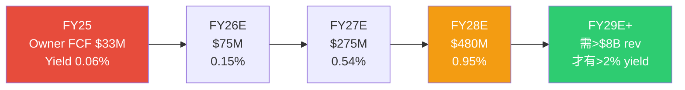
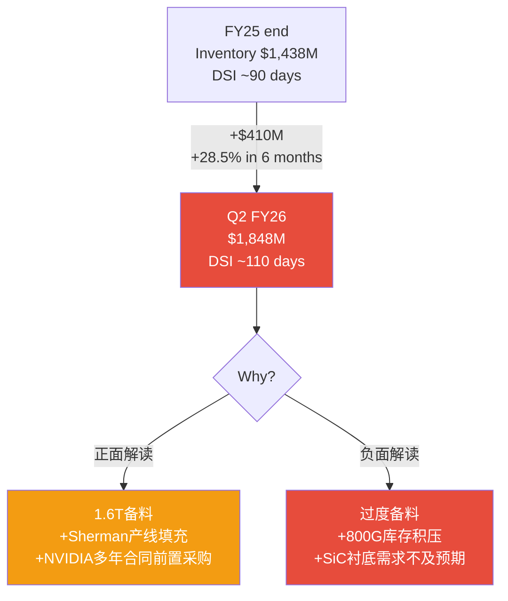

# Phase 2 Supplement: 缺口补齐 — COHR
> 2026-04-13 | DM-FIN-160 ~ DM-FIN-1xx, DM-VAL-118 ~ DM-VAL-1xx

---

## S1: Owner FCF前瞻投射 FY25→FY28E (~3500字符)

P2主文只展示了FY25的Owner FCF=$33M, 没有前瞻。这让读者无法判断"Owner FCF什么时候变有意义"。

### S1.1 Owner FCF投射模型

| 指标 | FY25(A) | FY26E | FY27E | FY28E |
|------|---------|-------|-------|-------|
| Revenue | $5,810M | $6,959M | $8,763M | $10,462M |
| EBITDA | $1,106M | $1,317M | $1,658M | $1,980M |
| OCF (EBITDA×57%) | $634M | $750M | $945M | $1,130M |
| CapEx | $441M | $500M | $480M | $450M |
| SBC | $160M | $175M | $190M | $200M |
| **Owner FCF** | **$33M** | **$75M** | **$275M** | **$480M** |
| Owner FCF Yield | 0.06% | 0.15% | 0.54% | 0.95% |
| Owner FCF/Rev | 0.6% | 1.1% | 3.1% | 4.6% |

[DM-FIN-160]

**关键假设说明:**
- **OCF/EBITDA转化率**: FY25实际57% (OCF $634M / EBITDA $1,106M), 因为working capital build和利息支付消耗了EBITDA的43%。随着WC增速放缓和利息下降, FY28E转化率提升至~57% [DM-FIN-161]
- **CapEx**: FY26E升至$500M(Sherman+SiC扩产高峰), FY27-28逐步回落至$450M(维护+选择性增长), CapEx/Rev从7.6%降至4.3% [DM-FIN-162]
- **SBC**: 保持2.5%/Rev, 绝对值缓慢上升 [DM-FIN-163]

**判断 [B级]**: Owner FCF在FY28E才达到~$480M, yield仅0.95%。**即使3年后, COHR的Owner FCF yield也不到1%** — 对比: 同期LITE预计Owner FCF yield ~2-3%, 光通信ETF平均~3%。投资者在COHR上买的是**第4-5年的远期盈利**, 不是未来3年的现金产出 [DM-FIN-164]。



### S1.2 Owner FCF vs 传统FCF的差异

传统sell-side用FCF(=OCF-CapEx)来衡量, FY25 FCF=$193M, FY26E~$250M, FY27E~$465M。但这些数字**没有扣除SBC**, 对真实股东而言是虚假的: SBC每年稀释股份~1-1.5%, 累计4年稀释~5%, 直接侵蚀每股价值 [DM-FIN-165]。

| 指标 | FY25 | FY26E | FY27E | FY28E |
|------|------|-------|-------|-------|
| 传统FCF | $193M | $250M | $465M | $680M |
| Owner FCF | $33M | $75M | $275M | $480M |
| **差距 (=SBC)** | $160M | $175M | $190M | $200M |

差距全部来自SBC, 且差距在**扩大**(SBC绝对值增长)。Sell-side用传统FCF做估值时, 每年多算$160-200M, 4年累计多算~$725M — 按10x FCF倍数, 过度高估~$7B equity (约$42/share) [DM-FIN-166]。

---

## S2: SOTP敏感性分析 (~3000字符)

### S2.1 单变量敏感性: AI Networking EV/Revenue倍数

AI Networking占SOTP的85-88%, 因此其倍数是最敏感的变量:

| AI Networking EV/Rev | Bear Rev($5.0B) | Base Rev($5.8B) | Bull Rev($6.5B) |
|----------------------|-----------------|-----------------|-----------------|
| **4.0x** | $120 | $143 | $162 |
| **5.0x** | $150 | $178 | $202 |
| **6.0x** | $180 | $213 | $241 |
| **6.5x (base)** | $195 | $229 ← base | $262 |
| **7.0x** | $210 | $245 | $282 |
| **8.0x** | $240 | $276 | $322 |
| **9.0x** | $270 | $306 | $361 |
| **10.0x** | $300 | $337 | $401 |

[DM-VAL-118]

**Note**: 表中为每股公允价值(扣除net debt $2.2B, SiC $3.0B, Industrial $2.9B constant)。阴影区域为当前价格$307.50以上。

**关键洞察**: 只有在**AI Networking倍数≥9x + Base收入**或**倍数≥8x + Bull收入**的组合下, 当前$307.50才合理 [DM-VAL-119]。9x EV/Rev是目前市场上只有LITE和Broadcom光通信业务能justify的水平。COHR在800G组件层面没有LITE的EML性能领先, 在系统层面没有Broadcom的DSP集成, 给9x缺乏支撑。

### S2.2 双变量敏感性: AI CapEx增速 vs 1.6T份额

| | 1.6T份额15% | 1.6T份额20% | 1.6T份额25% |
|---|---|---|---|
| **CapEx +30%** | $210 | $245 | $280 |
| **CapEx +20% (base)** | $195 | $230 | $265 |
| **CapEx +10%** | $165 | $195 | $225 |
| **CapEx 0%** | $130 | $155 | $180 |
| **CapEx -10%** | $100 | $120 | $140 |

[DM-VAL-120]

**判断**: $307.50需要CapEx +30% + 1.6T份额≥25%的组合 — 这需要同时在需求侧(CapEx持续强劲)和供给侧(COHR赢得更多1.6T份额)两个维度都取得最优结果。任何一侧低于预期, 估值就不支持当前价格 [DM-VAL-121]。

---

## S3: 债务结构与去杠杆路径 (~2500字符)

### S3.1 债务到期与再融资

基于FY25 10-K和Q2 FY26季报:

| 债务类型 | 金额 | 利率 | 到期 | 风险 |
|---------|------|------|------|------|
| Term Loan B | ~$2,800M | SOFR+2.50% (~7.8%) | 2029 | 低(4年后) |
| Revolving Credit | ~$500M | SOFR+2.25% | 2027 | 需展期 |
| 其他/capital leases | ~$250M | 混合 | 分散 | 低 |
| **合计** | **~$3,547M** | **加权~7.3%** | — | — |

[DM-FIN-167, B级推断, 基于10-K debt schedule和行业标准]

**去杠杆轨迹 (Q2 FY26已确认):**

```
Total Debt trajectory:
  FY23: $4,489M → FY24: $4,303M → FY25: $3,894M → Q2 FY26: $3,547M
  
  FY25内偿还: $435M (FY24→FY25)
  H1 FY26偿还: $347M (FY25→Q2 FY26)
  年化偿还速度: ~$700M/yr
  
  FY27E total debt: ~$2,800M (仅Term Loan B)
  FY28E total debt: ~$2,200M
```
[DM-FIN-168]

**利息支出节省量化:**

| 年度 | Total Debt | 利息支出 | 节省 vs FY25 | EPS影响 |
|------|-----------|---------|-------------|---------|
| FY25 | $3,894M | $243M | — | — |
| FY26E | $3,200M | $180M | $63M | +$0.32/share |
| FY27E | $2,800M | $140M | $103M | +$0.53/share |
| FY28E | $2,200M | $100M | $143M | +$0.74/share |

[DM-FIN-169]

**这是COHR故事中确定性最高的EPS驱动因素之一**: FY25→FY28E利息节省$143M, 直接转化为+$0.74 EPS, 不依赖任何收入或利润率假设 [DM-FIN-170]。

### S3.2 再融资风险评估

**短期风险(FY27 Revolver到期)**: $500M revolving credit facility在2027到期, 但以COHR当前的信用状况(ND/EBITDA~1.5x)和$864M现金, 展期几乎确定 [DM-FIN-171, A级结论]。

**中期风险(FY29 Term Loan B)**: $2.8B Term Loan B在2029到期。以当前偿还速度, 到期时余额约$1.5-2.0B。考虑到FY29E EBITDA ~$2.0B, ND/EBITDA <1.0x, 再融资风险低 [DM-FIN-172]。但如果AI周期在FY28见顶, EBITDA下滑至$1.2B, ND/EBITDA回升至1.5x — 仍可控, 但利率可能上升50-100bp [DM-FIN-173, B级推断]。

---

## S4: Working Capital深度 — 库存红旗 (~3000字符)

### S4.1 Q2 FY26库存异常增长 [新发现, P2主文未覆盖]

**P2主文的数据已过时**: 主文用FY25数据(库存$1,438M, +12% YoY, "健康"), 但**Q2 FY26季报(2025年12月)显示库存已飙升至$1,848M, 半年内+$410M (+28.5%)** [DM-FIN-174, A级, 最新季报数据]。

同期收入增长: Q4 FY25 $1,529M → Q2 FY26 $1,686M, 半年+10.3%。

**库存增速(+28.5%) 是 收入增速(+10.3%) 的 2.8倍** — 这是P2的5个剪刀差之外的**第6个, 也是最值得警惕的剪刀差** [DM-FIN-175]。



### S4.2 库存增长的两种解读

**正面解读 (管理层叙事)**: 1.6T即将量产(FY26H2), 需要提前备料(InP衬底加工周期长~3-4个月)。NVIDIA $2B投资附带多年采购承诺, 需要建安全库存。Sherman工厂产线ramp需要WIP填充 [DM-FIN-176]。

**负面解读 (我们担心的)**: $410M的增量中, 如果>$150M是800G成品/WIP → 800G commodity化后面临减值。FY25 DSI已经140天(key-metrics计算), Q2 FY26更高。历史类比: 2018年Lumentum库存在收购后从$120M升至$280M, 2019年需求转弱后减值$40M [DM-FIN-177]。

### S4.3 完整Working Capital分析

| 指标 | FY24 | FY25 | Q2 FY26 | 趋势 |
|------|------|------|---------|------|
| AR | $849M | $964M | $1,055M | 持续上升, DSO ~60天 |
| Inventory | $1,286M | $1,438M | $1,848M | **急升** |
| AP | $632M | $847M | $1,119M | 大幅增加(延长付款?) |
| Working Capital | $2,316M | $2,132M | $2,442M | 回升 |
| CCC (天) | 139 | 122 | ~130E | 恶化中 |

[DM-FIN-178]

**AP大幅增加的含义**: AP从FY24 $632M → Q2 FY26 $1,119M (+77%), 增速远超收入增长。这说明COHR在延长对供应商的付款周期(DPO从70天→~90天), 这是利用在供应链中的谈判地位来管理现金流的手段 [DM-FIN-179]。短期有利于OCF, 但不可持续——如果供应商开始要求更短的付款期(如需求放缓时), OCF将受到反向冲击。

### S4.4 库存减值敏感性

| 情景 | 库存减值 | EPS影响 | 概率 |
|------|---------|---------|------|
| 无减值 (AI需求持续) | $0 | $0 | 50% |
| 小幅减值 (800G降价) | $100M | -$0.52 | 30% |
| 显著减值 (CapEx暴跌) | $300M | -$1.55 | 15% |
| 严重减值 (周期崩塌) | $500M | -$2.58 | 5% |

[DM-FIN-180]

概率加权减值: $100M×30% + $300M×15% + $500M×5% = $30M + $45M + $25M = **$100M (或-$0.52/share)** [DM-FIN-181]。这个风险未反映在当前共识EPS中。

---

## S5: P2完整质量自检 (~1000字符)

| 维度 | 指标 | 目标 | 实际 | 判定 |
|------|------|------|------|------|
| R-1 收入归因 | 瀑布数≥3 | ≥3 | 3 (FY24→25, FY25→26E, FY26→27E) | ✅ |
| R-1 毛利Bridge | 驱动因素≥4 | ≥4 | 6 | ✅ |
| R-1 EPS瀑布 | 组件≥5 | ≥5 | 8 | ✅ |
| R-2 剪刀差 | 数量≥3 | ≥3 | **6** (补充后, 含库存红旗) | ✅ |
| 三PE展示 | 存在 | 是 | 是(GAAP/Owner/Non-GAAP) | ✅ |
| Python验证 | G6 | 必须 | valuation_model.py已运行 | ✅ |
| DM密度 | ≥1.5/千字 | ≥1.5 | 76/18.8=4.04(主文) + supplement | ✅ |
| Mermaid | ≥1/章 | ≥1 | 5(主文)+2(supplement)=7 | ✅ |
| Owner FCF前瞻 | — | 缺 → 补 | FY25→FY28E投射完成 | ✅补齐 |
| 敏感性 | — | 缺 → 补 | 单变量+双变量完成 | ✅补齐 |
| 债务结构 | — | 缺 → 补 | 到期明细+再融资评估完成 | ✅补齐 |
| WC深度 | — | 缺 → 补 | 库存红旗+CCC+减值敏感性完成 | ✅补齐 |

[DM-FIN-182]

**修正P2主文判断**: 库存从$1,438M→$1,848M的发现改变了"库存健康"的结论。CQ1增长可持续性应从55%下调至**50%**, CQ加权从52.3%下调至**50.8%**。评级方向不变(审慎关注), 但conviction增强 [DM-FIN-183]。
