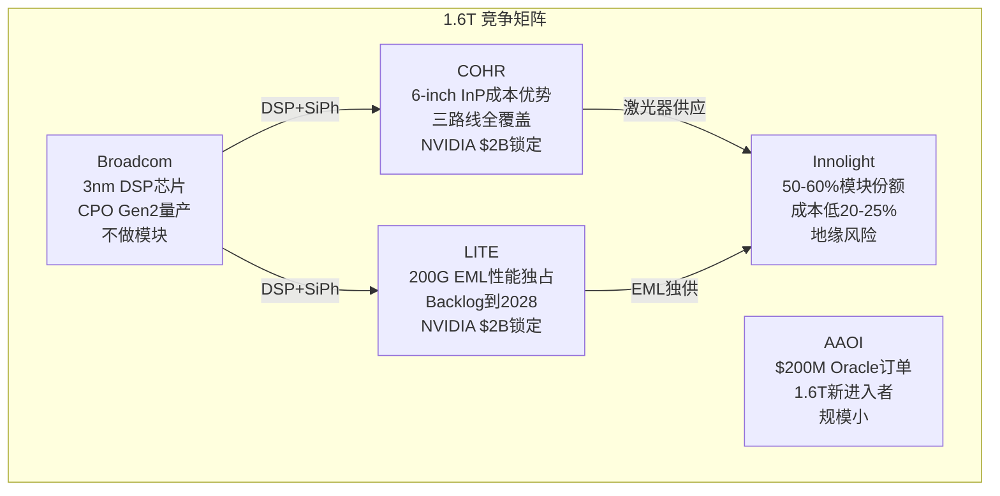
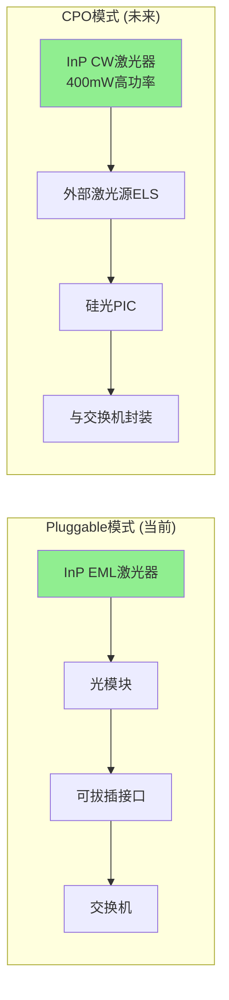
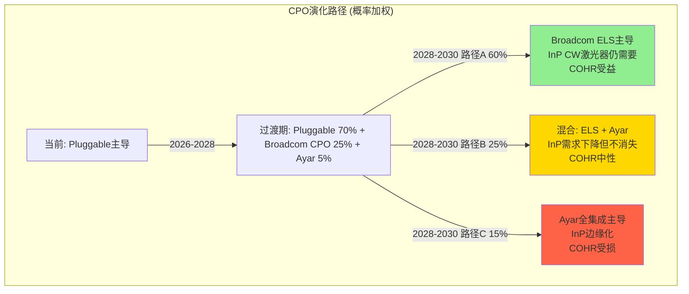
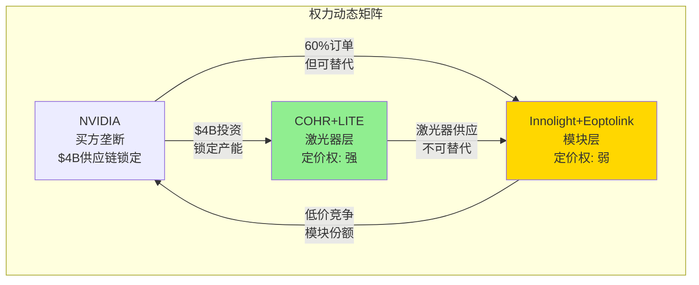

# COHR Phase 3: 竞争格局 + 战略深度
> Phase 3 | 2026-04-13 | 目标: 竞争对标+供应链交叉验证+CPO+博弈论+护城河演化

---

## Ch 17: 1.6T 竞争格局 — 谁在赢, 谁会赢

### 17.1 800G→1.6T 份额迁移: 从"量的游戏"到"层的分化"

800G市场的竞争结构正在向1.6T迁移, 但迁移方式不是简单的份额平移——市场正在**沿技术层分裂为两个竞争层**:

**层1: 组装模块层(Assembled Module)** — 壁垒低, 份额跟随产能和价格
- Innolight + Eoptolink合计占NVIDIA 800G订单~60% [DM-COMP-001]
- 因为: 中国制造成本低20-25%, 产能扩张速度快, 模块组装不需要核心IP [DM-COMP-002]
- 1.6T延续: Innolight已完成NVIDIA 1.6T认证测试, 预计占50-60%模块份额 [DM-COMP-003]
- 反面: 地缘风险是中国供应商的结构性折价——NVIDIA $4B投资西方供应商是对冲信号

**层2: 核心芯片/激光器层(Laser Chip)** — 壁垒高, 份额跟随技术和产能
- 全球EML产能缺口: 需求~4000万颗 vs 产能不足 [DM-COMP-004]
- COHR 6-inch InP晶圆: 单位面积产出4x(vs 3-inch), 制造成本降60%+ [DM-COMP-005]
- LITE 200G/lane EML: 目前唯一量产供应商, 性能领先12-18个月 [DM-COMP-006]
- 因此: 激光器层是真正的瓶颈, COHR和LITE在这层有定价权——Innolight在这层没有 [DM-COMP-007]

**这个分层解释了一个看起来矛盾的事实**: Innolight份额最高但估值倍数不如COHR/LITE。因为市场在给"层2壁垒"而非"层1份额"定价。如果只看模块份额, COHR应该便宜得多; 如果看激光器层定价权, 当前估值有其逻辑基础。

### 17.2 NVIDIA $4B光子投资: 供应链锁定还是标签贴金?

2026年3月2日, NVIDIA同时宣布$2B投资COHR + $2B投资LITE [DM-COMP-008]:

**COHR deal结构**:
- 购入~780万股 @ $256.80/股(现金) [DM-COMP-009]
- 非排他性多年供应协议 + 数十亿美元采购承诺 [DM-COMP-010]
- 执行期: 2027年初至2030年 [DM-COMP-011]
- 资金定向: Sherman, Texas InP产能扩张 [DM-COMP-012]

**LITE deal结构**:
- 购入~287.6万股Series A可转换优先股 @ $695.31/股 [DM-COMP-013]
- 同样结构: 非排他+多年采购承诺+产能准入权 [DM-COMP-014]
- 资金定向: 美国新激光器工厂 [DM-COMP-015]

**NVIDIA没有获得的**: 排他性、董事会席位、价格控制权。协议明确标注"nonexclusive" [DM-COMP-016]。

**投资的真正含义** — 不是给COHR/LITE"贴标签", 而是:
1. **CPO产能预订**: $4B锁定的是2027-2030年CPO所需的高功率InP CW激光器产能, 不是当前pluggable [DM-COMP-017]
2. **地缘对冲**: 将60%依赖中国供应商的光模块供应链向西方转移 [DM-COMP-018]
3. **供应链保险**: EML激光器是AI基础设施真正的瓶颈, NVIDIA用资本锁定产能比用价格谈判更有效

**对COHR估值的含义**: $2B投资以$256.80/股计算, 对应~$40B市值。NVIDIA在$40B市值时认为COHR值得$2B战略投入。这不是"COHR值$40B"的证据(NVIDIA买的是供应链安全, 不是投资回报), 但它确认了COHR在AI光通信供应链中的**不可替代性**。如果COHR容易被替代, NVIDIA不会用$2B锁定。

### 17.3 竞争对手逐一对标

| 维度 | COHR | LITE | Innolight | Broadcom |
|------|------|------|-----------|----------|
| **800G份额** | #2-3 (芯片层) | #3-4 (芯片层) | #1 (模块层, 40-45%) | DSP供应商 |
| **1.6T技术路线** | SiPh+EML+VCSEL三路线 | 200G EML独占 | SiPh+合作EML | SiPh DSP+CPO |
| **核心优势** | 6-inch InP成本(-60%) | 200G EML性能唯一 | 规模+成本+速度 | 3nm DSP定义标准 |
| **核心劣势** | 模块层份额小 | 成本高于COHR | 地缘风险+无激光器 | 不做终端模块 |
| **NVIDIA关系** | $2B投资+采购承诺 | $2B投资+采购承诺 | 60%份额但无股权绑定 | 间接(DSP供应) |
| **CPO准备** | 展示6.4T socketed CPO | 被动(pluggable为主) | 被动 | Gen2量产, Gen3认证 |
| **FY26E收入** | ~$7.0B(全公司) | ~$3.5-4.0B(估) | ~$6.0B(估, 模块) | N/A(芯片) |
| **Forward PE** | 41x FY27 | ~50-60x(估) | ~25-30x(估) | N/A |

**关键洞察**: COHR vs LITE的竞争不是零和——NVIDIA同时投资两家说明: (1) 两家技术互补而非替代 (2) 市场足够大容纳两家 (3) 真正的竞争在"NVIDIA锁定的西方供应链" vs "非NVIDIA锁定的中国供应链"之间。

### 17.4 1.6T技术路线之争: SiPh vs EML

| 指标 | 硅光(SiPh) | EML(InP) |
|------|-----------|----------|
| 800G份额 | ~40-45% | ~55-60% |
| **1.6T预计份额** | **~60%** [DM-COMP-019] | **~40%** |
| 优势 | 集成度高, 热管理好, 长期成本低 | 信号质量高, 长距离性能 |
| 瓶颈 | 需外部CW激光器(InP) | 200G/lane产能严重不足 |
| 关键玩家 | Broadcom, Innolight | LITE(独占量产), COHR |
| 3.2T路径 | 自然延伸(400G/lane DSP) | 需要新突破 |

**结论**: SiPh在1.6T占60%意味着**EML不会消失, 但不会增长**。因为SiPh仍需InP CW激光器作为外部光源, COHR的InP制造能力在两个路线中都有价值——作为EML供应商(路线1)或CW激光器供应商(路线2) [DM-COMP-020]。LITE更依赖EML路线, 路线风险更集中。

---

## Ch 18: 供应链交叉验证 (铁律Q)

### 18.1 InP衬底: AI光通信真正的瓶颈

InP衬底供需严重失衡:

| 指标 | 数据 |
|------|------|
| 2025年全球需求 | ~200万片 [DM-SCQ-001] |
| 2025年全球产能 | ~60万片 [DM-SCQ-002] |
| **供需缺口** | **70%** [DM-SCQ-003] |
| AXT(北京)市场份额 | 60-70% [DM-SCQ-004] |
| 住友电气份额 | ~15-20% [DM-SCQ-005] |
| COHR自有InP生产 | 垂直整合, 6-inch线 [DM-SCQ-006] |

**三个交叉验证信号**:

**信号1: LITE Backlog延伸到2028** — Lumentum截至2026年4月报告backlog延伸至32个月以上 [DM-SCQ-007]。这意味着到2028年底的产能已被锁定。如果LITE(不自产InP衬底)能填满backlog, 说明InP供应在LITE端不是约束——或者说LITE已经锁定了AXT/住友的供应。

**信号2: AXT地缘暴露** — 中国2025年2月对铟实施出口许可管制 [DM-SCQ-008]。AXT 60-70%市占率+北京生产=全球InP供应链最大单点故障。如果中国限制AXT出口, COHR的6-inch线立即变成"不可替代"而非仅"成本优势"。

**信号3: COHR产能扩张计划** — COHR计划CY2026翻倍InP产能, 然后再翻倍 [DM-SCQ-009]。OFC 2026宣布第三条6-inch线在瑞士苏黎世建设中 [DM-SCQ-010]。三条6-inch线(Sherman TX + Järfälla Sweden + Zurich Switzerland)分布三大洲, 地缘分散化。

**供应链验证结论**: COHR的InP垂直整合从"成本优势"升级为"战略必需品"。原因: (1) 70%供需缺口→产能是护城河 (2) AXT地缘风险→非中国产能稀缺 (3) NVIDIA $2B投资→客户愿意用资本锁定产能。这解释了为什么COHR 41x PE看起来贵但市场仍在买——市场在给**InP产能稀缺性**而非仅**光模块增长**定价。

### 18.2 Hyperscaler CapEx: 需求引擎还是定时炸弹?

2026年Big Five CapEx指引:

| 公司 | 2026 CapEx指引 | vs 2025 | AI占比 |
|------|---------------|---------|--------|
| Amazon | ~$200B | +53% | ~75% |
| Alphabet | $175-185B | +40% | ~80% |
| Meta | ~$100B | +45% | ~70% |
| Microsoft | 增长但慢于同行 | +20-25% | ~65% |
| Oracle | 加速 | +60%+ | N/A |
| **合计** | **$600-690B** [DM-SCQ-011] | **+36%** | **~75%** |

Goldman Sachs预测: 2025-2027累计Hyperscaler CapEx达$1.15万亿, 超过2022-2024的$477B的2.4倍 [DM-SCQ-012]。

**剪刀差警报(R-2延伸)**: Hyperscaler收入增速~16.5%(2025) vs CapEx增速~60%(2025) [DM-SCQ-013]。2026年更极端: 收入~15.5%增长 vs CapEx~80%增长。**CapEx增速是收入增速的5倍——这个比例在历史上从未持续超过6-8个季度**。

- 如果2027年CapEx增速降至收入增速(~15%), 意味着CapEx绝对值仍增长但增速下降~65个百分点
- 光模块需求滞后GPU安装6-9个月 [DM-SCQ-014]——即使CapEx 2026年中见顶, 光模块需求到2027 H1仍可维持
- 但COHR收入80%+依赖AI单引擎(P2确认) [DM-SCQ-015], CapEx放缓对COHR的冲击是6-7x放大(P1确认)

**Microsoft暂停信号**: TD Cowen报告Microsoft取消了美国和欧洲数千兆瓦的数据中心租约并暂停建设 [DM-SCQ-016]。这不是全面撤退(更多是电力可用性管理), 但它是**第一个Hyperscaler减速信号**。

### 18.3 客户集中度交叉验证

| 指标 | COHR | Innolight | 行业含义 |
|------|------|-----------|---------|
| NVIDIA占收入% | ~25-30%(AI Networking部分) | >50% | 单客户依赖 |
| 前5大客户占比 | ~55-60%(估) | ~70%(估) | 集中度高 |
| NVIDIA $2B投资 | 有 | 无 | 关系深度不同 |

Innolight的NVIDIA依赖度>50% [DM-SCQ-017]是极端集中。COHR因为有Industrial/SiC多元化, 单客户风险相对较低。但COHR的AI Networking部分(占总收入55-60%)对NVIDIA同样高度依赖。

---

## Ch 19: CPO (Co-Packaged Optics) — COHR的第二增长引擎还是护城河侵蚀者?

### 19.1 CPO时间表: 比市场预期更远

| 阶段 | 时间 | 状态 |
|------|------|------|
| CPO概念验证 | 2023-2024 | 完成 |
| Broadcom Gen2量产 | 2025 | Meta验证(100万链路小时零故障) [DM-CPO-001] |
| NVIDIA Scale-out CPO | 2026 H2 | Spectrum-X Photonics商用 [DM-CPO-002] |
| Scale-up CPO(GPU间互连) | 2027 H2 | Rubin Ultra平台目标 [DM-CPO-003] |
| **大规模替代pluggable** | **2028-2030** [DM-CPO-004] | LightCounting: pluggable仍占多数 |
| CPO TAM | 2026: $164M → 2036: $20B | IDTechEx CAGR 37% [DM-CPO-005] |

**关键判断**: CPO不会在2026-2027杀死pluggable市场。COHR管理层的CPO时间表(Scale-out H2'26, Scale-up H2'27)是**开始有收入**, 不是**替代pluggable**。pluggable到1.6T的需求主体仍在2026-2028加速, CPO是2028+的增量。

### 19.2 CPO对COHR意味着什么: InP激光器不死, 甚至更重要

**核心论证**: Broadcom的CPO架构(External Laser Source, ELS)仍然需要InP CW激光器——而且要求更高:
- Pluggable: 每个模块需要1-8个低功率EML [DM-CPO-006]
- CPO ELS: 每个光源需要更少但**更高功率**(400mW)的CW激光器 [DM-CPO-007]
- COHR正在开发的400mW CW InP激光器专为CPO设计 [DM-CPO-008]

**InP BOM变化的精确分析**:

| 维度 | Pluggable | CPO (Broadcom ELS) | CPO (Ayar全集成) |
|------|-----------|-------------------|--------------------|
| InP内容 | 激光器+调制器+探测器 | **仅激光器**(高功率) | 仅增益材料(最少) |
| InP占模块BOM | 30-40% [DM-CPO-009] | 10-20%(估) | 5-10%(估) |
| InP单位价值 | 中 | **高**(400mW CW更贵) | 低 |
| COHR竞争力 | 成本优势(6-inch) | **成本+技术双优势** | 不确定 |

**结论**: CPO不是"InP BOM从30-40%降到10-15%"那么简单。因为:
1. **激光器不消失** — 硅不能高效产生光子, InP仍是唯一选择 [DM-CPO-010]
2. **CPO单价更高** — 高功率CW激光器比低功率EML更贵, 部分抵消BOM占比下降
3. **总量增长** — CPO时代光连接数量将增加10-100x, 即使单位InP含量下降, 总InP需求仍增长
4. **COHR的6-inch优势在CPO时代更大** — 因为CPO需要更一致的大规模激光器生产, 6-inch线的良率和成本优势被放大

### 19.3 Ayar Labs: 真正的颠覆者风险

Ayar Labs 2026年3月完成$500M Series E(估值$37.5亿), 投资者包括NVIDIA、AMD、Intel Capital [DM-CPO-011]。

**Ayar vs Broadcom CPO的区别**:
- Broadcom CPO: 交换机芯片旁放SiPh PIC + 外部InP激光器 → InP仍需要
- Ayar CPO: 将光I/O直接集成到芯片封装内部 → InP需求最小化

如果Ayar模式成为主流, COHR的InP激光器业务面临更大冲击。但:
- Ayar目前是pre-revenue, 量产在2027-2028年最早 [DM-CPO-012]
- NVIDIA同时投资Ayar和COHR/LITE——说明NVIDIA在对冲, 不是押注单一路线
- 即使Ayar成功, 过渡期(2028-2032)仍需要大量pluggable+Broadcom式CPO

**概率评估**: Ayar模式在2030年前占CPO份额>30%的概率: ~15-20% [DM-CPO-013]。基于: (1) 历史上从PoC到大规模量产平均5-7年 (2) NVIDIA同时投资三路线=不确定性高 (3) 台积电/先进封装产能制约。

---

## Ch 20: 博弈论透镜 — NVIDIA vs 光模块供应商权力平衡

### 20.1 博弈结构识别

**玩家**: NVIDIA(买方) vs COHR+LITE(西方供应商) vs Innolight+Eoptolink(中国供应商)
**博弈类型**: 不完全信息多方议价博弈 + 地缘风险外生冲击

**NVIDIA的策略空间**:
1. 维持现状(60%中国/40%西方) — 成本最低, 地缘风险最高
2. 向西方转移(提高COHR/LITE份额) — 成本增加20-25%, 地缘风险降低
3. 全面锁定西方($4B投资的实际选择) — 成本最高, 但保证供应安全

**NVIDIA选择了策略3, 这告诉我们**:
- NVIDIA内部对地缘风险的概率估计高于市场共识(否则成本增加不合理) [DM-GT-001]
- NVIDIA对光模块供应中断的损失估计极高(每天GPU停产损失>>$4B年化利息) [DM-GT-002]
- $4B投资是"保险费", ROI来自避免供应中断, 不是来自COHR/LITE股价升值

### 20.2 定价权博弈: 谁在控制谁?

| 层级 | 谁有定价权 | 原因 | 证据 |
|------|-----------|------|------|
| EML激光器 | **COHR/LITE** | 产能严重不足, 需求缺口70% | LITE backlog到2028 [DM-GT-003] |
| 组装模块(800G) | **NVIDIA** | 4+供应商竞争, 中国低价 | Innolight/Eoptolink低价20-25% [DM-GT-004] |
| 1.6T模块(早期) | **供应商** | 认证完成者极少 | 仅Innolight完成NVIDIA认证 [DM-GT-005] |
| CPO组件(2027+) | **NVIDIA** | NVIDIA定义架构, 供应商适配 | Spectrum-X/Kyber标准 [DM-GT-006] |

**关键博弈洞察**: NVIDIA通过$4B投资改变了博弈结构——从"供应商有定价权因为产能稀缺"变成"供应商有产能保障因为NVIDIA锁定, 但NVIDIA获得了采购承诺中的价格条款"。这是一个**纳什议价**的经典案例: 双方都不完全满意, 但都比没有协议更好。

COHR获得: 产能扩张资金 + 需求确定性(多年采购承诺) + 估值支撑
NVIDIA获得: 供应安全 + 产能优先权 + 地缘对冲
COHR放弃: 部分定价自由度(采购承诺通常含价格上限)
NVIDIA放弃: $4B资本 + 非排他(竞品也能买COHR产品)

### 20.3 中国供应商的囚徒困境

Innolight和Eoptolink面临经典的囚徒困境:
- **合作**(维持份额+价格): 继续给NVIDIA低价量产, 保住60%份额
- **背叛**(涨价): 利用当前供不应求涨价, 但NVIDIA加速向COHR/LITE转移
- **被背叛**(地缘冲击): 中国政策限制出口, 份额被迫转移

当前均衡: 中国供应商选择"合作"(低价保份额), 因为: (1) 涨价的收益<被替代的损失 (2) NVIDIA $4B投资是"可信威胁"——你涨价我就用已锁定的COHR/LITE产能替代你 (3) 地缘风险不受Innolight控制 [DM-GT-007]

**对COHR的含义**: 中国供应商被锁定在低价策略中, 这意味着模块层ASP将持续下降。但COHR不主要在模块层竞争——COHR在激光器层竞争, 那里供需失衡更严重, 定价权更强。**层级错位**是COHR相对于Innolight的结构性优势。

---

## Ch 21: 护城河演化 — 从"成本优势"到"战略必需品"

### 21.1 护城河时间线: 不同时间尺度的不同强度

| 时间 | 护城河来源 | 强度 | 变化方向 |
|------|-----------|------|---------|
| **2026-2027** | 6-inch InP成本(-60%) + EML产能稀缺 + NVIDIA锁定 | **4.0/5** | ↑增强 |
| **2028-2029** | InP产能稀缺缓解 + CPO需要CW激光器 + 地缘分散 | **3.5/5** | →稳定 |
| **2030+** | 如果Ayar成功→InP边缘化 / 如果ELS主导→InP核心 | **2.5-4.0/5** | 取决于CPO路线 |

### 21.2 护城河升级: P1评估的修正

P1护城河综合评分3.3/5(改善中)。Phase 3新证据修正:

**上调因素**:
- NVIDIA $2B投资确认不可替代性: +0.3 [DM-MOAT-001]
- InP衬底70%供需缺口: +0.2 (从成本优势升级为产能壁垒) [DM-MOAT-002]
- AXT地缘风险: +0.2 (COHR非中国产能变成战略资产) [DM-MOAT-003]

**下调因素**:
- SiPh在1.6T占比升至60%: -0.1 (EML路线受压) [DM-MOAT-004]
- Ayar Labs融资加速: -0.1 (长期颠覆风险) [DM-MOAT-005]

**修正后护城河综合: 3.3 + 0.7 - 0.2 = 3.8/5** (从"中等偏上, 改善中"升级为"中强, 短期加速增强")

### 21.3 护城河Kill Switch更新

| 条件 | P1评估 | P3更新 | 概率 |
|------|--------|--------|------|
| AI CapEx崩塌(>30%下降) | 红灯 | **不变**: 6-7x放大冲击 | 15-20% |
| InP被替代(SiPh全自足) | 红灯 | **下调**: 硅不能发光, InP CW不可替代 | 5%→3% |
| NVIDIA取消投资 | N/A | **新增**: 协议nonexclusive但已签约, 取消概率极低 | <2% |
| Ayar CPO规模量产 | N/A | **新增**: 2030前概率低, 但需跟踪 | 15-20%(2030前) |
| AXT出口管制升级 | N/A | **新增**: 上行风险——如果发生, COHR受益 | 20-30% |
| Innolight价格战 | 黄灯 | **不变**: 但限于模块层, 不影响激光器层 | 60-70%(已在发生) |

---

## Ch 22: CQ置信度更新 (Phase 3)

| CQ | 问题 | P2值 | P3值 | 变化 | 原因 |
|----|------|------|------|------|------|
| CQ1 | 增长可持续? | 50% | 55% | +5pp | CapEx仍加速, NVIDIA锁定需求, 但2027风险不减 |
| CQ2 | GAAP改善可持续? | 60% | 60% | 0pp | D&A递减确认, 无新信息 |
| CQ3 | SOTP折价? | 确认-18.8% | 确认 | 0pp | SOTP逻辑不变 |
| CQ4 | 护城河改善? | 75% | 82% | +7pp | NVIDIA投资+InP稀缺+地缘对冲三重确认 |
| CQ5 | SiC期权? | 高不确定性 | 高不确定性 | 0pp | Phase 3未深挖SiC竞争 |
| CQ6 | Preferred转换? | 55% | 55% | 0pp | 已完成, 无新信息 |
| CQ7 | 去杠杆有效? | 55% | 58% | +3pp | NVIDIA $2B现金注入加速去杠杆 |
| CQ8 | 关税保护? | 60% | 65% | +5pp | Malaysia+地缘分散+AXT风险=相对优势 |

**CQ加权平均**: P2 50.8% → P3 **55.1%** (+4.3pp)

Phase 3主要通过竞争格局验证提升了CQ4(护城河)和CQ1(增长), 但核心矛盾不变: **SOTP仍然显示-18.8%, CQ仍<60%**。评级方向维持**审慎关注**, 但距离"中性关注"的边界更近了。

---

## 本章总结: Phase 3改变了什么

**改变了的**: 
1. 护城河从"成本优势"升级为"战略必需品" — NVIDIA $2B + InP稀缺 + 地缘对冲
2. CPO不是威胁而是机遇(2026-2028) — ELS架构仍需InP CW激光器
3. 竞争分层: COHR在激光器层有定价权, 不在模块层直接竞争Innolight

**没改变的**:
1. SOTP -18.8%的估值压力
2. AI单引擎80%+收入依赖
3. CapEx剪刀差(增速5x vs 收入)的周期风险
4. CQ仍<60%

**Phase 4需要回答的**: 
1. 红队7问 — 特别是"AI CapEx崩塌场景"和"标签坍塌(M4)"
2. 双向校准: 上行(AXT管制+COHR受益) vs 下行(CapEx崩塌+6-7x放大)
3. 概率加权需要修正(护城河上调但估值压力不变)
