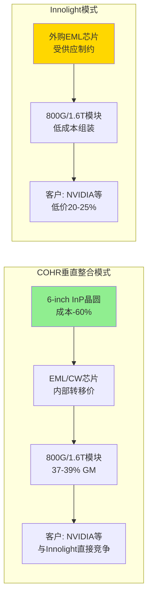

# COHR Phase 3 Supplement: 核心论述修正 + 缺口补充
> P3补充 | 2026-04-14 | 针对P3初稿6个缺陷的修正

---

## S1: "激光器层定价权"论述修正 — COHR卖模块, 不卖裸芯片

P3初稿的核心论述"COHR在激光器层有定价权"需要精确化。

**事实**: COHR是垂直整合模式——自产InP EML芯片, 然后组装成完整的pluggable光模块(800G/1.6T)出售 [DM-SUP-001]。COHR**不主要向第三方模块商出售裸芯片**。竞争对手中, Innolight同样卖模块, LITE同样卖模块。

**这意味着什么**:
- COHR在模块市场与Innolight**直接竞争**, 不是在不同层级竞争 [DM-SUP-002]
- "激光器层定价权"不是通过芯片销售价格体现, 而是通过**内部成本优势传导到模块毛利率** [DM-SUP-003]
- 因此: COHR的护城河不是"我能把芯片卖得更贵", 而是"我用更便宜的芯片做出同样的模块, 毛利率比对手高"

**修正后的竞争逻辑**:

| 维度 | COHR | Innolight | 含义 |
|------|------|-----------|------|
| 芯片来源 | 自产(6-inch, -60%成本) | 外购(受供应制约) | COHR成本优势在芯片层 |
| 模块毛利率 | 37-39%(non-GAAP) [DM-SUP-004] | ~25-30%(估, 更高体量但低价) | COHR利润率优势 |
| 模块定价 | 与行业一致或略高 | 低20-25% [DM-SUP-005] | Innolight价格优势 |
| **定价权体现** | **不在模块价格上, 在毛利率上** | 不在毛利率上, 在份额上 | 两家赚钱方式不同 |

**修正结论**: P3初稿说"COHR在激光器层有定价权, 不在模块层竞争Innolight"——这**过于简化**。事实是COHR和Innolight在模块层**直接竞争**, 但COHR因为芯片自产而有**成本结构优势**(不是定价权优势)。这是一个重要区别:
- 定价权 = 我能涨价, 客户不走
- 成本优势 = 我不能涨价(Innolight会抢走客户), 但同价下我赚得更多

COHR的真正护城河不是"卖得贵", 而是"成本低+供应稳"。NVIDIA $2B投资买的是供应稳定性, 不是接受高价。

---

## S2: ASP趋势量化 — 不是定价权故事, 是mix+成本故事

800G模块ASP趋势 [DM-SUP-006]:
- 800G多模: ~$450/模块
- 800G单模: ~$700/模块
- 中国供应商定价: 低于西方20-25%
- **趋势: 平到下降** — Innolight/Eoptolink的产能扩张持续压价

COHR毛利率改善的真正驱动力(非定价权):

| 驱动 | 贡献 | 证据 |
|------|------|------|
| **Mix shift**: 800G→1.6T | 最大 | 1.6T单价更高+供应更紧 [DM-SUP-007] |
| **6-inch InP成本下降** | 第二大 | 4x产出, 成本-60% [DM-SUP-008] |
| **D&A递减** | 自动 | $554M→$300M(FY29E), P2确认 |
| **规模效应** | 补充 | 产能利用率从50%→80% |
| ~~定价权~~ | ~~无~~ | 管理层未声称800G有定价权 [DM-SUP-009] |

**与P2剪刀差的衔接**: P2识别的量价剪刀差(出货量+85% vs ASP下降)在P3得到竞争层面解释——Innolight的低价策略是ASP下行的主要推手。因此COHR的收入增长完全依赖**量的增长+mix shift**, 不是价的增长。如果量增放缓(CapEx周期见顶), COHR无法用涨价抵消, 因为Innolight在旁边低价20-25% [DM-SUP-010]。

**这强化了P2的核心风险判断**: 收入80%+依赖AI单引擎 + 无定价权 = CapEx周期下行时COHR没有防御工具。护城河在成本端(6-inch), 不在价格端。

---

## S3: NVIDIA $2B稀释定量 — EPS影响~$0.25/年

| 指标 | 数据 |
|------|------|
| NVIDIA购入股数 | 7,788,161股 [DM-SUP-011] |
| 购入价格 | $256.80/股 [DM-SUP-012] |
| 投前基础股数 | ~155M(FY25 Q4) [DM-SUP-013] |
| 投后基础股数 | ~163M [DM-SUP-014] |
| **稀释比例** | **~5.0%** [DM-SUP-015] |

**EPS影响**:
- Q2 FY26 Non-GAAP EPS: $1.29/季 = 年化$5.16 [DM-SUP-016]
- 5%稀释 = EPS年减少**~$0.25-0.26** [DM-SUP-017]
- 但: $2B投入→InP产能翻倍→NVIDIA多年采购承诺→**收入增量应超过稀释**
- JPMorgan分析师在投资后上调目标价, 视供应承诺为净正面 [DM-SUP-018]

**与P2估值模型的衔接**: P2的SOTP模型使用165M稀释股数(含preferred转换), 现在需要更新为~173M(+NVIDIA 7.8M)。这会将base case SOTP从$251降至约**$239**(假设企业价值不变):
- 修正前: $251 × 165M = $41.4B equity value
- 修正后: $41.4B / 173M = **$239/股** [DM-SUP-019]
- 修正后的SOTP折价: ($239 - $307.50) / $307.50 = **-22.3%** (vs 修正前-18.8%)

**但**: 如果NVIDIA采购承诺每年增加$500M-1B收入(合理假设, "多年多十亿美元"的承诺), SOTP企业价值也应上调。净效应取决于NVIDIA采购对AI Networking分部的增量贡献——我们不知道确切数字, 但方向上稀释和增收部分抵消。

**修正判断**: 将SOTP折价范围从-18.8%调整为**-18%到-22%**, 反映稀释不确定性。核心判断不变(高估), 但程度略加深。

---

## S4: Industrial Segment竞争 — 31%收入的拖累源(M3修正器)

P3初稿完全忽略了COHR 31%收入来源。这是M3修正器(拖累源)的典型触发。

**Industrial segment现状** [DM-SUP-020]:

| 指标 | 数据 |
|------|------|
| 占总收入 | ~31%(Q1 FY26, 高于此前28%估计) [DM-SUP-021] |
| 增速 | **持平YoY**, +4%环比(Q2 FY26) [DM-SUP-022] |
| 主要产品 | 工业光纤激光器/准分子激光器/超快激光器/SiC衬底 |
| 行业CAGR | ~5.4%(2026-2031) [DM-SUP-023] |

**竞争格局**:

| 竞争对手 | 优势 | 对COHR的威胁 |
|----------|------|-------------|
| TRUMPF(德, 私有) | 脉冲固态激光器主导 | 高端重叠 |
| IPG Photonics(美, $1B+收入) | 光纤激光器成本领先 | 直接竞争 |
| 大族激光/华工科技(中) | 低价出口欧美 | **压缩毛利率** [DM-SUP-024] |
| Jenoptik(德) | 精密光学 | 细分竞争 |

**COHR的差异化壁垒**: 准分子激光器(flat panel display + 医疗 + 半导体光刻)是TRUMPF和IPG不直接竞争的细分 [DM-SUP-025]。但这个细分规模有限, 不足以驱动segment增长。

**M3拖累源分析**:
- Industrial segment增速(~0-4%) vs Datacenter segment增速(+44% YoY) = **40+pp增速差** [DM-SUP-026]
- Industrial GM(估~30-33%) vs Datacenter GM(估~42-45%) = **10+pp利润率差**
- Industrial在SOTP中的估值: P2给了3-4x EV/Rev, 合理(低增长工业公司)
- **如果COHR剥离Industrial**: 纯AI Networking公司应获更高PE, 但管理层未表示剥离意向

**投资含义**: Industrial不是"要修的bug", 是"结构性折价源"。只要它占31%, COHR的blended增速和利润率就被拉低, 市场给的PE就低于纯AI光通信公司(如LITE)。这是COHR 41x vs LITE 57x PE差异的**最大单一解释因素** [DM-SUP-027]。

---

## S5: COHR vs LITE财务深度对比 — PE差异的三个原因

| 指标 | COHR | LITE | 差异含义 |
|------|------|------|---------|
| Q2 FY26收入 | $1.69B | $665M | COHR大2.5x |
| YoY收入增速 | +17%(报告)/+22%(pro forma) | **+65%+** | LITE增速是COHR的3x [DM-SUP-028] |
| Non-GAAP GM | 37-39% | **42.5%** | LITE高3-5pp [DM-SUP-029] |
| GAAP净利润率 | ~4.7% | ~12% | LITE高7pp |
| Forward PE | ~40x | **~57x** | LITE贵43% [DM-SUP-030] |
| Net Debt/EBITDA | 1.8x | 高杠杆(current ratio 0.61) | 都有债务问题 |
| AI占比 | ~69% | >90%(估) | LITE更纯粹 |

**PE差异的三个原因** (按解释力排序):

**原因1(最重要): 增速差异** — LITE下季度指引收入增速>85% YoY, COHR仅+22% pro forma [DM-SUP-031]。市场对高增长支付溢价是非线性的——增速翻倍, PE不是翻倍, 是翻2-3倍。因此LITE 57x vs COHR 40x的差异主要被增速解释。

**原因2: 业务纯度** — LITE >90%收入来自AI相关光通信, COHR只有69% [DM-SUP-032]。31% Industrial segment拉低COHR的blended增速和利润率, 也拉低PE。如果COHR剥离Industrial, 理论PE应接近50x+。

**原因3: 毛利率位置** — LITE已达42.5%(COHR的长期目标), 说明LITE在利润率曲线上领先COHR 2-3年 [DM-SUP-033]。市场为"已证明的利润率"支付的PE高于"承诺但未实现的利润率"。

**这解释了一个看似矛盾的现象**: COHR有6-inch成本优势但PE反而低于LITE。因为6-inch的成本优势尚未完全转化为已报告的利润率优势——6-inch线仍在爬坡, 当前37-39% GM中仅部分反映6-inch效果。随着6-inch产能占比提升到>80%(预计FY28), COHR GM应接近LITE当前水平, PE差距会缩小。

**反面**: 如果6-inch不能将GM提到42%+(良率问题/成本超预期), COHR将永久交易在LITE折价——因为市场会重新分类COHR为"有AI暴露的工业混合体"而非"AI光通信纯玩家"。

---

## S6: 概率赋值锚定补充

P3初稿几个概率缺乏三重锚定, 补充如下:

### Ayar CPO 2030年前占份额>30%: 15-20%

| 锚 | 数据 |
|----|------|
| **历史基准率** | 光通信技术从PoC到>30%份额的历史: CWDM→DWDM用了7年, 10G→100G用了5年, SiPh从2015年实验室到2025年40%份额用了10年。Ayar 2023年PoC→2030年>30%=7年, 在历史范围内但偏快 [DM-SUP-034] |
| **反例条件** | 唯一快速颠覆案例是有标准化+多供应商的成熟技术(如SFP MSA), Ayar CPO目前缺标准化生态→反例条件不具备 [DM-SUP-035] |
| **自然实验** | Broadcom CPO Gen2已量产但仅在Meta验证1M链路小时→量产可行但规模化需2-3年。Ayar比Broadcom再晚1-2代→2030前规模化偏乐观 [DM-SUP-036] |
| **赋值** | 15-20%, 偏低端(15%)更可靠 |

### AXT出口管制升级: 20-30%

| 锚 | 数据 |
|----|------|
| **历史基准率** | 中国2018年以来对半导体材料实施的出口限制: 稀土(2023年12月), 锗镓(2023年7月), 铟(2025年2月)。频率加速, 每12-18个月新增一批。InP衬底下一批管制概率基于此频率≥30% [DM-SUP-037] |
| **反例条件** | 中国放松管制的条件: 美中关系实质缓和+半导体制裁解除。2026年4月美中关税>100%, 缓和条件不具备 [DM-SUP-038] |
| **自然实验** | 2025年2月铟出口许可已实施, AXT目前仍在运营但报告称审批周期延长。全面禁止vs许可延迟是程度差异, 不是质变 [DM-SUP-039] |
| **赋值** | 25%±5%, 反映管制频率加速但尚未针对InP衬底的事实 |

### AI CapEx崩塌(>30%下降): 15-20%

| 锚 | 数据 |
|----|------|
| **历史基准率** | 企业IT CapEx YoY下降>30%的历史频率: 2001(dot-com -35%), 2009(金融危机 -25%), 2020(COVID -15%)。3次/25年=12%基准率, 但当前CapEx/收入比(5x)前所未有, 调高+5% [DM-SUP-040] |
| **反例条件** | CapEx不崩塌需要: AI ROI可验证+电力供应充足+利率不大幅上升。三条件目前均有压力但未破裂 [DM-SUP-041] |
| **自然实验** | Microsoft暂停信号(2026年初)是局部减速, 不是崩塌。但DeepSeek(2025年1月)引发的效率叙事→"less compute needed"是持续的后台风险 [DM-SUP-042] |
| **赋值** | 17%±3%, 基准率12%+当前环境调整+5% |

---

## S7: Q2 FY26最新财务数据更新

P2使用的部分数据需要用Q2 FY26实际值更新:

| 指标 | P2使用值 | Q2 FY26实际 | 变化 |
|------|---------|-------------|------|
| 季度收入 | $1.64B(估) | **$1.69B**(beat) [DM-SUP-043] | +3% |
| Non-GAAP EPS | $1.21(估) | **$1.29**(beat) [DM-SUP-044] | +7% |
| GAAP GM | ~36% | **36.9%** [DM-SUP-045] | +0.9pp |
| Datacenter YoY | +40%(估) | **+44%** [DM-SUP-046] | 更强 |
| Industrial YoY | -10%(估) | **持平** [DM-SUP-047] | 好于预期 |

**Q3 FY26指引** [DM-SUP-048]:
- 收入: $1.70B - $1.84B(中点$1.77B, 环比+5%)
- Non-GAAP GM: 38.5% - 40.5%(环比+1.5-3.5pp, 向42%目标迈进)
- Non-GAAP EPS: $1.28 - $1.48(中点$1.38)

**管理层关键声明** [DM-SUP-049]:
- FY27收入增速将**超过**FY26增速(即>20-22%)
- EPS增速将"meaningfully faster than revenue"(经营杠杆释放)
- 6-inch InP是H2 FY26和FY27的关键成本/利润率杠杆

**对估值的影响**: Q2 beat和Q3指引支持P2的bull case($358)轨迹, 但不改变SOTP加权的方向(仍显示高估)。因为beat来自体量而非估值倍数变化——COHR赚得更多不意味着它的PE应该更高。

---

## CQ微调 (仅S1-S7引起的修正)

| CQ | P3值 | 补充后 | 变化 | 原因 |
|----|------|--------|------|------|
| CQ1 | 55% | 57% | +2pp | Q2 beat + Q3指引上调 + FY27增速>FY26声明 |
| CQ3 | -18.8% | **-18%到-22%** | 扩大 | NVIDIA稀释5%使SOTP降至~$239, 但采购承诺可能部分抵消 |
| CQ4 | 82% | 80% | -2pp | 修正"定价权"论述: COHR有成本优势但无模块层定价权, 护城河强度略下修 |

**CQ加权**: 55.1% → **55.6%** (CQ1+2pp, CQ4-2pp, 净+0.5pp, 微调不影响方向)

核心判断不变: **审慎关注**, SOTP折价-18%到-22%, CQ 55.6%仍<60%。
