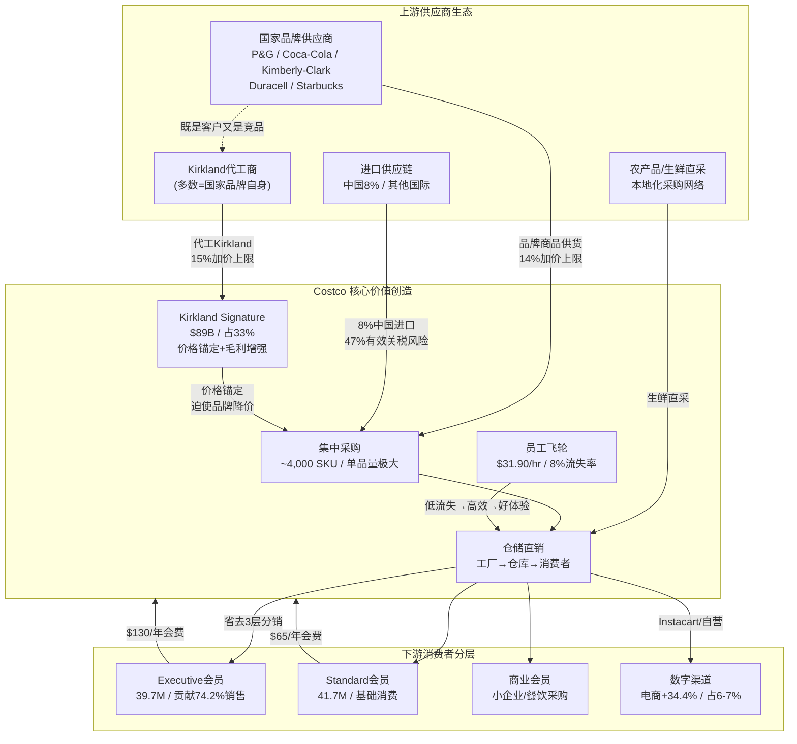

## 2. 产业链与生态映射

### 2.1 产业链全景图

---

### 2.2 上游供应商生态

#### 国家品牌的"囚徒困境"

Costco的~4,000个SKU策略(vs Walmart 100,000+)意味着每品类仅保留1-2个品牌 [硬数据: Costco FY25年报, DA-032]。被选中的供应商获得巨大走量——单一Costco SKU的采购量可达品牌商全渠道Top 10 [硬数据: In Practise, 2025]。但这种依赖是双刃剑:品牌商失去Costco货架的代价极大，因此在价格谈判中处于结构性劣势。

| 供应商策略 | 对Costco效果 | 品牌商困境 |
|-----------|-------------|-----------|
| 接受代工Kirkland | Costco获得更高毛利(15% vs 14%加价) | 自我蚕食品牌份额 |
| 拒绝代工 | Costco转找其他代工商 | 失去Costco走量 |
| 降价匹配Kirkland | Costco同步调低Kirkland价格 | 利润率螺旋下降 |
| 退出Costco渠道 | 几乎不会发生 | 放弃最大单一零售客户 |

[硬数据: CNN Business, 2022; Grocery Dive, 2025]

#### Kirkland代工商的双重身份(CQ5关联)

Kirkland $89B收入(占33%)的核心悖论:代工商往往就是Kirkland的直接竞品 [硬数据: CNBC, 2025-03-29, DA-030/031]。

| 品类 | Kirkland产品 | 代工商(=竞品品牌) | Kirkland vs 品牌价差 |
|------|-------------|-----------------|-------------------|
| 电池 | AA 48pk | **Duracell** | -69.5% |
| 纸尿裤 | Diapers 222片 | **Kimberly-Clark**(Huggies母公司) | -38% |
| 咖啡 | House Blend | **Starbucks**代工 | -30~40% |
| 宠物粮 | Nature's Domain | **Diamond Pet Foods** | -38% |
| 伏特加 | French Vodka | Gayant Distillery(法国) | -55% |

[硬数据: Eat This Not That 2025; ConsumerAffairs 2025; Food Republic 2025]

前CFO Richard Galanti公开承认品牌商"不高兴"，但将此定义为"健康的紧张关系(Healthy Tension)" [硬数据: CNN Business, 2022]。30年无核心供应商流失的记录表明:品牌商虽不满但无法离开，因为Costco的单品走量实在太大 [合理推断: 30年无流失记录+品牌商对Costco走量的依赖→"不高兴但不离开"是稳态均衡]。

**CQ5风险评估**: Kirkland渗透率以+50bps/年速度扩张 [硬数据: 分析师Joe Feldman估算]。若从33%升至38-40%，品牌商货架份额将被进一步压缩。但参照Aldi(自有品牌>90%)和Trader Joe's(>80%)，33%远未触及供应商忍耐极限 [主观判断: Aldi/TJ's先例表明自有品牌占比远高于33%仍可维持供应商合作]。

#### 进口供应链与关税暴露(CQ3关联)

Costco约8%商品从中国进口，面临47%有效关税率风险 [硬数据: Supply Chain Dive, 2025]。应对策略包括:Kirkland产品加速国内采购(健康美容/轮胎/床垫等品类)、SKU灵活切换降低关税冲击、管理层确认愿意吸收部分关税成本 [硬数据: Retail Dive, 2025; CFO Gary Millerchip确认]。

---

### 2.3 Costco核心价值创造机制

#### 仓储直销:省去3层分销

传统零售链路为"工厂→分销商→区域批发→零售门店→消费者"，Costco压缩为"工厂→Costco仓库→消费者"，直接省去2-3层中间环节 [合理推断: Costco商业模式分析+12.84%毛利率(远低于传统零售28%)佐证分销层级压缩]。

| 效率指标 | Costco | 行业平均 | 倍数 |
|---------|--------|---------|------|
| SKU数量 | ~4,000 | 30,000+(超市) | 1/7.5 |
| 每SKU采购量 | Walmart的~10倍 | 基准 | 10x |
| 采购员管SKU数 | <200/人 | 1,000-2,000/人 | 精细度5-10x |
| 每员工年产出 | >$800K | ~$350K | 2.3x |
| 毛利率上限 | 14%(品牌)/15%(KS) | 24-28% | 自我限制 |

[硬数据: In Practise 2025; MMCGInvest 2025; Costco FY25年报, DA-033/034]

#### Kirkland的价格锚定机制

Kirkland不仅是自有品牌——它是Costco对品牌商的系统性议价工具。当消费者面对Kirkland洗衣液($0.12/次)和Tide($0.24/次)时，无论选择哪个Costco都赢:选Kirkland→更高毛利;选Tide→品牌商已被迫降价供货 [合理推断: Kirkland价格锚定策略→品牌商即使0%份额流失也被迫让利→Costco双赢]。

#### 员工策略:隐性竞争壁垒

| 指标 | Costco | 零售行业 | Sam's Club |
|------|--------|---------|-----------|
| 平均时薪 | $31.90 | ~$17 | ~$17-19 |
| 流失率 | 8% | ~60% | ~40-50% |
| 5年留存率 | 94% | ~30% | 未披露 |
| Glassdoor评分 | 3.9/5.0 | — | — |

[硬数据: Fortune 2025; Retail Brew 2025; HBS研究; Glassdoor 2026-02]

高薪→低流失(8% vs 行业60%)→更熟练员工→更高生产力(收入/员工=Walmart 3倍)→更好客户体验→更高续费率。这是自我强化的正向飞轮，竞争对手无法通过简单"加薪"复制，因为需要整个低SKU/低加价/高走量商业模式的配合 [合理推断: HBS"Good Jobs Strategy"研究框架→单点模仿(仅加薪)不足以复制系统性优势]。

---

### 2.4 下游消费者分层

#### Executive vs Standard会员行为差异

| 指标 | Executive会员 | Standard会员 | 数据来源 |
|------|-------------|-------------|---------|
| 会员数 | 39.7M (47.7%) | 41.7M (52.3%) | [硬数据: Costco Q1 FY2026, DA-013] |
| 销售贡献 | **74.2%** | 25.8% | [硬数据: Yahoo Finance, 2025] |
| 年费 | $130 | $65 | [硬数据: Costco官网] |
| 每会员年消费(估) | ~$6,300 | ~$1,700 | [合理推断: 74.2%销售/47.7%会员 vs 25.8%/52.3%推算] |
| 续费率 | 更高(未单独披露) | 较低 | [合理推断: 2%返现锁定+高消费频次] |

Executive会员以不到半数的人数贡献了近3/4的销售——这批高ARPU用户是Costco盈利模型的基石。

#### 人口统计与消费心理

Costco核心客群为平均家庭收入$125K+的郊区中产家庭，71%的顾客来自年收入超$10万的家庭 [硬数据: Manufacturing.net, 2025]。每会员年消费~$3,374，远超Sam's Club(~$1,920)和BJ's(~$2,563) [合理推断: 总收入/会员数推算]。

**年轻化趋势**: 近半新注册会员年龄<40岁 [硬数据: Fox Business, 2025]。年轻会员被Kirkland品质+寻宝体验吸引，但其数字化消费习惯可能推动电商渠道占比从当前6-7%进一步上升(Q1 FY2026电商+20.5%，App流量+48%) [硬数据: DigitalCommerce360, Costco Q1 FY2026]。

---

### 2.5 国际产业链差异(CQ7关联)

#### 关键市场对比

| 市场 | 门店数 | 竞争格局 | 供应链特征 | SSS增速 |
|------|--------|---------|-----------|--------|
| 中国 | 7 | Sam's Club 48家(7:1劣势) | 本地化采购中，Tmall+自有App | 未单独披露 |
| 日本 | 37 | 唐吉诃德/业务超市竞争 | 高度本地化，600万会员 | 包含在国际+8.8% |
| 欧洲(法/西/英) | 37 | Aldi/Lidl主导折扣零售 | 2026.01 Instacart同日达上线法/西 | 包含在国际+8.8% |
| 韩国 | 20 | 高密度会员，消费者接受度高 | 成熟供应链 | 包含在国际+8.8% |

[硬数据: Costco Q1 FY2026 IR; YicaiGlobal 2025; PR Newswire 2026-01-30]

国际SSS +8.8%显著高于美国+5.9%(Q1 FY2026)，但剔除汇率后为+6.8%，约2ppt来自汇率顺风 [硬数据: Costco Q1 FY2026 IR]。国际业务收入占比27.6%($70.3B)，利润率通常低于北美(新市场投入+本地化成本) [合理推断: 新市场开店成本+品牌建立期费用→利润率短期低于成熟市场]。

**Kirkland国际化挑战**: Kirkland在美国渗透率33%，国际市场估计25-28% [合理推断: Costco管理层暗示国际Kirkland渗透率低于北美]。约70%的Kirkland产品已实现国内生产，但国际市场本地化采购仍在推进中——日本和中国的Kirkland产品需要符合本地口味和法规要求 [硬数据: The Takeout, 2026; Costco earnings call]。

**CQ7核心矛盾**: 中国市场潜力巨大(保守估计长期可容纳30-50家门店)，但Sam's Club以48:7的门店优势领先且仍在以~10家/年的速度扩张 [硬数据: Seeking Alpha 2025]。Costco需大幅加速开店(当前~2家/年)才能缩小差距。欧洲则是长期期权——法国Mulhouse新店选址法德瑞交界，可能是进入德国4.5亿人口大陆市场的前哨站 [主观判断: 地理位置推断+欧洲大陆市场规模]。

#### CQ6: 产业链环节的Sam's Club差异化

| 产业链环节 | Costco优势 | Sam's Club优势 |
|-----------|-----------|---------------|
| 上游采购 | 更低SKU→更大单品量→更强议价 | Walmart供应链协同→采购成本低 |
| 自有品牌 | Kirkland $89B/33%渗透率/品牌力更强 | Member's Mark 30%渗透率/增速快 |
| 门店体验 | 员工8%流失率→服务质量更高 | Scan & Go技术→更快结账 |
| 数字化 | 电商+20.5%但仅占6-7% | 全渠道更成熟/中国数字化领先 |
| 年费性价比 | $65/$130(更贵但ARPU更高) | $50/$110(更便宜/年轻用户增长63%) |

[硬数据: 各公司财报; 合理推断: 基于竞争数据综合对比]

---

### 2.6 产业链关键节点清单(QG-02)

| # | 节点 | 关键指标 | 风险等级 |
|---|------|---------|---------|
| 1 | 国家品牌供应商议价 | 14%加价上限/品类仅1-2品牌 | 低 |
| 2 | Kirkland代工网络 | $89B/30年无核心供应商流失 | 低-中 |
| 3 | 中国进口供应链 | 8%中国进口/47%有效关税 | 中-高 |
| 4 | 仓储直销模型 | 省去2-3层分销/12.84%毛利率 | 低 |
| 5 | SKU精简采购 | ~4,000 SKU/单品量10x对手 | 低 |
| 6 | Kirkland价格锚定 | 品牌商被迫降价供货 | 低 |
| 7 | 员工飞轮 | 8%流失率/$31.90时薪 | 中(薪酬差缩小) |
| 8 | Executive会员层 | 47.7%人数/74.2%销售 | 低 |
| 9 | 数字化渠道 | 电商+20.5%/仅占6-7% | 中(渗透率待提升) |
| 10 | 国际供应链本地化 | Kirkland 70%国内生产/国际25-28% | 中 |
| 11 | 中国市场渠道 | 7家 vs Sam's 48家 | 高(竞争劣势) |
| 12 | 欧洲Instacart合作 | 法/西同日达2026.01上线 | 低-中(早期) |

---

*免责声明: 本报告章节仅供投资研究参考，不构成任何买入、卖出或持有建议。所有数据标注来源与时间，投资者应自行验证并承担决策风险。*
