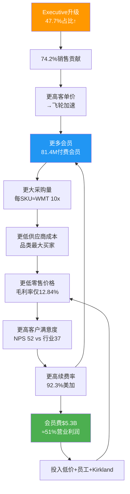

## 1. 公司基本画像

> **Costco Wholesale Corporation (NASDAQ: COST)** | 仓储会员零售 | 全球921家门店 | FY2025收入$269.9B
>
> 本章节建立Costco的业务模型、管理层、发展轨迹与会员飞轮的完整画像，为后续财务分析和估值提供基础框架。

---

### 1.1 业务模型深度解析: "低毛利率+会员费"的利润倒置结构

Costco的商业模式本质上是一个**利润来源倒置**的零售体——商品销售不是利润中心，会员费才是。这一模型的核心逻辑可以分解为三个相互强化的支柱:

**支柱一: 极端SKU精简带来的采购效率**

Costco仅运营约3,700-4,000个SKU，而沃尔玛超市部门超过30,000个，总SKU超过100,000个 [硬数据: WJ Journal/In Practise, 2026-02-07]。这种极端精简产生了两个关键效果: (1) 每个SKU的采购量约为沃尔玛的10倍 [硬数据: In Practise, 2026-02-07]，使Costco在几乎每个品类都成为供应商的最大单一买家; (2) 每位采购员管理不到200个SKU(行业平均1,000-2,000) [硬数据: In Practise, 2026-02-07]，允许更深层的品类专业化和更强的供应商谈判。

**支柱二: 自我施加的毛利率上限**

Costco将毛利率严格控制在约12-14%区间——FY2025为12.84%，Q1 FY2026为12.88% [硬数据: Costco IR/MacroTrends, 2025-12]。这并非竞争所迫，而是刻意的战略选择: 沃尔玛毛利率约24%，亚马逊零售约42% [硬数据: Ainvest, 2026-01]。Costco的定价哲学由管理层反复强调: "We will never succumb to not being the best price" [硬数据: Costco Earnings Call, 2025-12-11]。

**支柱三: 会员费作为真实利润池**

FY2025会员费收入$5.3B，Q1 FY2026为$1.33B(+14.0% YoY) [硬数据: Costco IR, 2025-12-11]。对比FY2025营业利润$10.38B [硬数据: Costco IR, 2025-09]，会员费贡献了约51%的营业利润 [合理推断: $5.3B/$10.38B=51%，会员费几乎无直接成本]。如果进一步考虑会员费的边际成本接近零(无需采购、仓储、物流)，其对净利润的贡献比例更高。

| 指标 | Costco | 沃尔玛 | 亚马逊零售 |
|------|--------|--------|-----------|
| SKU数量 | ~4,000 | 100,000+ | 数百万 |
| 毛利率 | 12.84% | ~24% | ~42% |
| 营业利润率 | 3.77% | ~4.2% | ~5.8% |
| 会员费/营业利润 | ~51% | N/A | N/A |
| 每SKU采购量(相对) | 10x | 1x | <0.01x |

[硬数据: Costco IR/MacroTrends/Ainvest, 2025-2026]

**Kirkland Signature: 利润保护器与忠诚度引擎**

自有品牌Kirkland Signature在FY2025创造约$89B收入(修正后)，占Costco总收入的约33%，渗透率以每年约50bps的速度持续提升 [硬数据: CNBC/Chowhound, 2025-2026]。Kirkland的战略角色不仅是利润贡献——其价格通常比品牌商品低20%但品质对标品类领导者(许多产品由品类龙头代工，如电池由Duracell工厂生产) [硬数据: CNN/Taste of Home, 2022-2025]——更重要的是，它创造了Costco独有的、无法在其他渠道获得的产品，从而构成了会员锁定的物理载体。1995年由创始人Jim Sinegal发起的品牌统一策略(将此前30个分散自有品牌合并为一个)，已证明是零售史上最成功的自有品牌决策之一 [硬数据: CNN Business, 2022-02]。

---

### 1.2 管理层评估: 从叉车司机到CEO的文化传承

**CEO Ron Vachris (2024年1月上任)**

Vachris是Costco历史上第三任CEO，拥有超过38年的公司任职经历。他1980年代以Price Club叉车司机起步，历经仓库经理(1991)、区域副总裁(1999)、高级副总裁(2010)、商品部执行副总裁(2016)、总裁兼COO(2022)，最终在2024年1月接任CEO [硬数据: Wikipedia/Costco IR, 2024]。Vachris的运营出身意味着他对仓库一线运作有深入理解，其战略方向延续了Costco的核心DNA: 低价、精选SKU、员工优先。上任以来，他推动了数字化投资(App流量+48% YoY)和国际扩张(法国第3家仓库)，同时维持了核心定价纪律 [硬数据: CNBC/Costco Earnings Call, 2025-12-11]。

**前CEO Craig Jelinek遗产 (2012-2023)**

Jelinek的12年任期将Costco从$105B收入/$2B净利推升至$249B+收入/$7B+净利，股价从~$80涨至~$660(+725%) [硬数据: TheStreet/Wikipedia, 2024]。他的核心遗产包括: 守住$1.50热狗和$4.99烤鸡的价格承诺、2019年投资$450M建设内布拉斯加家禽工厂以控制供应链成本、以及培养了Vachris这一内部接班人 [硬数据: RetailWire/CNN, 2024]。

**CFO Gary Millerchip (2024年3月到任)**

Millerchip是Costco管理层中唯一的"外部空降"——此前担任Kroger CFO五年(2019-2024)，更早在NatWest集团有超过20年银行业经验 [硬数据: Costco IR/CFO.com, 2024-02]。他替代了任职近40年的传奇CFO Richard Galanti。Millerchip在Kroger期间主导了超过$10B数字业务的财务架构 [硬数据: CFO.com, 2024]，其到来为Costco注入了数字化转型和资本配置的新视角 [主观判断: 基于其Kroger数字化经验与Costco数字化提速的时间吻合]。

**文化传承风险评估**: Costco的三任CEO均为内部培养(Sinegal→Jelinek→Vachris)，这种"文化传教士"式传承确保了战略一致性。唯一的外部变量是CFO Millerchip，但其角色更偏执行层面而非战略方向。整体评估: 管理层交接风险极低，文化断裂概率<5% [主观判断: 基于三代CEO均为内部晋升+Millerchip到任后无战略方向变更迹象]。

---

### 1.3 关键里程碑

| 年份 | 事件 | 战略意义 |
|------|------|---------|
| 1983 | Jim Sinegal与Jeff Brotman在西雅图开设第一家Costco仓库 | 仓储会员制模式诞生 |
| 1985 | 纳斯达克上市 | 不到6年从0做到$3B收入，创零售业纪录 |
| 1993 | 与Price Club合并，组建PriceCostco(206店/$16B) | 奠定全国规模基础 |
| 1995 | 推出Kirkland Signature统一自有品牌 | 30个分散品牌→1个超级品牌 |
| 1997 | 正式更名为Costco Wholesale | 品牌统一完成 |
| 2012 | Craig Jelinek接任CEO | 开启12年稳定增长期 |
| 2019 | $450M内布拉斯加家禽工厂投产 | 向上游垂直整合 |
| 2024.1 | Ron Vachris接任CEO(第三代) | 内部传承延续 |
| 2024.9 | 7年来首次会员涨价(+8.3%) | 定价权验证，会员不减反增 |
| 2026.2 | 全球921家门店/81.4M付费会员 | 规模持续扩大 |

[硬数据: Costco IR/Wikipedia/TheStreet, 1983-2026]

---

### 1.4 会员飞轮机制详解 [CQ2关联, 注意力分95]

> **核心问题**: 会员飞轮是在加速、稳态运行还是触顶?

**飞轮运行状态的量化诊断**:

| 飞轮指标 | FY2023 | FY2024 | FY2025/Q1FY26 | 趋势 | 诊断 |
|---------|--------|--------|---------------|------|------|
| 续费率(美加) | 92.5% | 92.9% | 92.3% | 微降↘ | 警示信号 |
| 付费会员数 | 71.0M | 76.2M | 81.4M | 持续增长↗ | 飞轮转动 |
| Executive占比 | ~45% | ~46% | 47.7% | 持续提升↗ | 飞轮加速 |
| Executive销售贡献 | ~72% | ~73% | 74.2% | 持续提升↗ | 飞轮加速 |
| 会员费增速 | — | ~8% | +14.0%(Q1) | 加速↗ | 涨价+增员双驱动 |
| 同店销售(调整) | — | — | 6.4% | 稳健→ | 飞轮稳态 |

[硬数据: Costco IR/24/7 Wall St./TheStreet, 2023-2026]

**多头论据: 飞轮仍在加速**

2024年9月的7年来首次涨价(基础$60→$65, Executive$120→$130)是一次关键压力测试。结果: 会员不减反增(FY2024个人会员63.7M→FY2025的68.3M→Q1 FY2026的81.4M总付费) [硬数据: Costco IR, 2024-2026]，Executive会员以+9.1%的速度增长至39.7M [硬数据: 24/7 Wall St., 2026-02]。涨价后Q1 FY2026会员费同比+14.0%，证明了Costco拥有强大的定价权。飞轮的"升级引擎"——从基础会员转化为Executive会员——仍在持续运转，Executive贡献销售从~73%升至74.2% [硬数据: Costco IR, 2026]。

**空头论据: 续费率的微妙裂缝**

美加续费率从FY2024的92.9%峰值降至FY2025的92.3%，Q1 FY2026进一步微降至92.2% [硬数据: Nasdaq/Motley Fool, 2025-2026]。全球续费率同步从90.5%降至89.8% [硬数据: 24/7 Wall St., 2026-02]。管理层将此归因于在线注册会员的初始续费率较低——"The decline in renewal rates was largely attributable to a higher number of online sign-ups entering the renewal rate" [硬数据: Costco Earnings Call, 2025-12-11]，并预期该效应将持续数个季度。值得注意的是，管理层自认续费率"可能进一步小幅下滑" [合理推断: 基于管理层对数字化会员续费率低于实体注册会员的承认]。

**飞轮诊断结论**: 飞轮整体处于**加速偏稳态**。核心增长引擎(会员增长+Executive升级+涨价后不流失)强劲运转，但续费率的边际下降(-70bps从峰值)值得持续监控。如果续费率在未来2-3个季度稳定在92%以上，则确认为数字化渠道混合效应(噪音); 如果跌破91.5%，则可能标志着飞轮的增速开始触顶(拐点) [主观判断: 基于续费率历史波动幅度和数字化渠道结构效应的综合评估]。

**Kill Switch KS-CQ2**: 若美加续费率连续两个季度低于91.0%，触发会员飞轮恶化警报，需重新评估Costco的护城河强度和估值前提。

---

*数据截止: 2026-02-07 | 来源: Costco IR, MacroTrends, CNBC, 24/7 Wall St., In Practise, TheStreet, Wikipedia*
