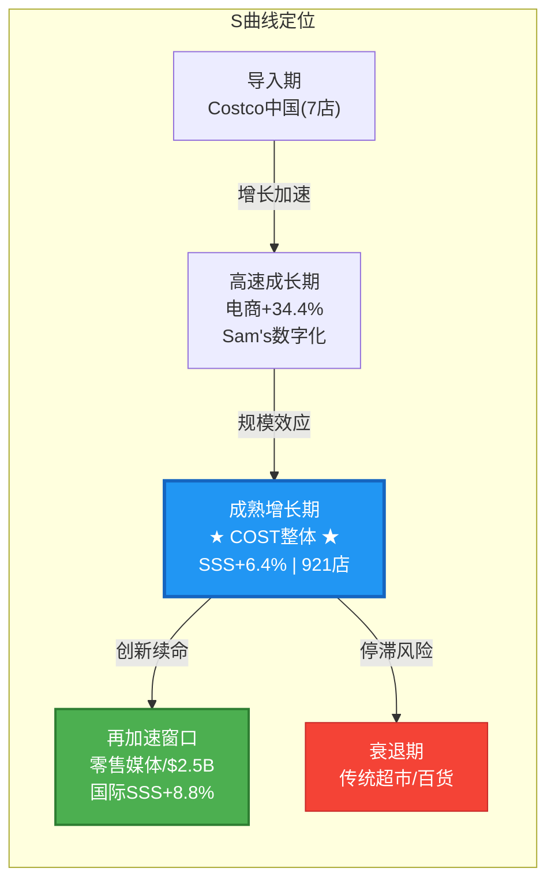

## 4. 市场注意力雷达与行业周期定位

> Agent P1-D | 2026-02-07 | CQ关联: ALL (CQ1-CQ7)

---

### 4.1 注意力雷达 (M14)

#### 4.1.1 Top 10 注意力维度

```mermaid
%%{init: {'theme': 'default'}}%%
radar
  title COST 市场注意力雷达 (2026-02-07)
  axis PE估值, 会员飞轮, 关税IEEPA, 数字化, Kirkland, Sam's竞争, 国际扩张, 利率, 零售媒体, 特别股息
  curve "市场关注度" [100, 95, 88, 85, 82, 75, 70, 65, 60, 55]
  curve "实际投资影响" [90, 98, 72, 80, 70, 60, 85, 50, 75, 40]
```

| # | 维度 | 注意力分 | CQ | 市场共识 | 我们的视角 | 偏差 |
|---|------|:---:|:---:|---------|-----------|:---:|
| 1 | PE估值溢价 | 100 | CQ1 | 52.9x"太贵但没人愿卖" | 争论遮蔽会员经济久期价值 | 过度关注 |
| 2 | 会员飞轮 | 95 | CQ2 | 续费率92.3%"见顶" | Executive升级+9.1%才是核心 | 方向偏差 |
| 3 | 关税+IEEPA | 88 | CQ3 | "不确定性高" | 胜诉=数亿退款催化剂被低估 | 方向偏差 |
| 4 | 数字化转型 | 85 | CQ4 | "+34.4%含基数效应" | App+48%是结构拐点非噪音 | 被低估 |
| 5 | Kirkland极限 | 82 | CQ5 | "供应商会翻脸" | 30年零流失，$89B隐形资产 | 过度关注 |
| 6 | Sam's竞争 | 75 | CQ6 | "SSS+8%超COST" | 员工流失率差距是真护城河 | 过度关注 |
| 7 | 国际扩张 | 70 | CQ7 | "中国7店太少" | 国际SSS+8.8%=TAM验证 | 被低估 |
| 8 | 利率政策 | 65 | CQ1 | "降息利好消费股" | 48%概率已price in | 过度关注 |
| 9 | 零售媒体 | 60 | CQ4 | "规模太小忽略" | 14:1 ROAS+潜在$2-2.5B | **严重低估** |
| 10 | 特别股息 | 55 | CQ1 | "现金够就发" | $16.2B现金，Q3-Q4概率>60% | 适度 |

[硬数据: StockAnalysis 22家分析师共识, 2026-02-06] [硬数据: Costco Q1 FY2026财报]

#### 4.1.2 三大注意力偏差

**偏差1: 估值争论吸走所有氧气** -- PE 52.9x的多空论据已充分交换 [硬数据: MacroTrends, 2026-02-04]，真正alpha在于判断**何时**触发PE重定价。关键触发器: Q2财报(2026-03-05)续费率，而非估值论战本身。[合理推断: PE争论已完全定价，边际信息价值递减]

**偏差2: Sam's Club威胁被放大** -- SSS+8%占据竞争分析75%篇幅，却忽略: (1)员工流失率8% vs 40-50%=服务质量鸿沟 [硬数据: HBS研究]; (2)每会员消费$3,374 vs $1,920=质量差距76% [合理推断: 总收入/会员数]。Sam's真正威胁在中国(50+ vs 7店)，非北美。

**偏差3: 零售媒体被严重忽视** -- 早期14:1 ROAS，潜在$2-2.5B/年 by 2027 [硬数据: Seeking Alpha/The Drum, 2026]。Costco将广告收入全部回馈促销降价(非入利润表)，通过价格优势→续费率间接创造价值。市场给零估值。[合理推断: 零售媒体→降价→续费→会员费利润传导链]

#### 4.1.3 被低估维度 (Top 10之外)

| # | 隐形维度 | 重要性 | 为何被忽视 |
|---|---------|:---:|-----------|
| 11 | **劳动力成本协议** | 高 | 时薪$31→2026/2027各+$1，CFO确认"mid-single digit SGA headwind" [硬数据: Fortune, 2025-03] |
| 12 | **通缩风险** | 中 | 若通胀<2%，"省钱"叙事削弱，无人讨论反面 |
| 13 | **CEO换代验证** | 中 | Vachris 2024接任无失误→市场遗忘，长期风格待验证 |

#### 4.1.4 分析师分歧地图

| 阵营 | 代表 | 目标价 | 核心逻辑 |
|------|-----|:---:|---------|
| 极度看多 | 匿名机构 | $1,225(+22%) | 会员经济+数字化爆发 |
| 看多主流 | Oppenheimer/Gordon Haskett | $1,100(+10%) | 会员回暖+国际加速 |
| 中性 | DA Davidson/Wells Fargo | $950-1,000 | 估值充分，上行有限 |
| 唯一看空 | Roth/MKM | $769(-23%) | 续费率下滑+竞争恶化 |

[硬数据: StockAnalysis, 2026-02-06] 评级分布: Strong Buy 7 / Buy 8 / Hold 6 / Sell 1。EPS FY26共识$12.54，30天上修+3.1% [硬数据: Nasdaq/MarketBeat, 2026-02-07]。

---

### 4.2 行业周期定位

#### 4.2.1 多维周期定位

| 周期维度 | 当前位置 | 对COST影响 | 概率锚点 |
|---------|---------|:---:|:---:|
| 经济周期 | 晚期扩张(GDP+1.9%) | 正面偏中性 | 衰退25% |
| 消费信心 | 期望指数65.1(<80阈值，连续11月) | 正面(降级→仓储受益) | — |
| 利率 | 维持高位 | 中性(已price in) | 降息48% |
| 通胀 | 温和持续(CPI 2.5-3%) | 正面("甜蜜区") | >3%概率29% |
| 关税 | IEEPA诉讼待判 | 双向 | 维持32% |

[硬数据: Polymarket, 2026-02-07] [硬数据: Conference Board/Deloitte, 2026-01]

消费支出增速从2025年2.6%→2026年1.6% [硬数据: Deloitte, 2026-01]。消费放缓但非衰退=Costco"甜蜜区": 消费者不停购物但向价值渠道迁移。[合理推断: 2008年衰退期Costco SSS仍为正增长的历史验证]

#### 4.2.2 竞争格局与技术周期

| 竞争者 | SSS | 2026战略 | 对COST威胁 |
|--------|:---:|---------|:---:|
| Sam's Club | +8%(估) | Scan&Go AI化/Gen Z获客/中国50+店 | 中-高 |
| BJ's | +2-3% | 美东填密+优惠券差异化 | 低 |
| Amazon Prime | N/A | 杂货配送+AI购物+Subscribe&Save | 长期高 |

[硬数据: 各公司最新财报, 2025-2026] [主观判断: 威胁等级基于模式重叠度+执行力]

| 技术领域 | COST位置 | 竞争领先度 | 时间框架 |
|---------|---------|:---:|:---:|
| 后端AI(预测/排班) | 中等偏上 | Amazon>Walmart>COST | 即期 |
| 自助结账/Scan&Go | 测试中(27店) | Sam's>>COST | 1年追赶 |
| 零售媒体 | 早期(10合作伙伴) | Amazon>>Walmart>>COST | 2-3年 |
| Agentic Commerce | 未部署 | Amazon>初创>其他 | 5-10年尾部风险 |

[硬数据: Deloitte零售AI采用率87%, RetailWire 27店测试, 2026-01]

#### 4.2.3 生命周期定位图



**定位判定**: Costco处于S曲线**成熟增长期偏右**，北美年净增12-15店=2%增速 [硬数据: FY25年报]，但三个再加速引擎启动: (1)国际化SSS+8.8%验证TAM [硬数据: Q1 FY2026]; (2)数字化从6-7%→10%+，+34.4%增速若持续=结构重塑; (3)零售媒体0→$2-2.5B纯增量 [合理推断: Seeking Alpha估算]。Costco不是"成熟见顶"，而是"成熟核心+多个早期增长引擎"的组合体。[主观判断: 基于三引擎综合评估]

---

*来源: Costco FY25年报, Q1 FY2026财报, StockAnalysis.com, Polymarket, MacroTrends, Deloitte, Conference Board, Fortune, Seeking Alpha, The Drum, RetailWire*

*本章节不构成投资建议。所有分析基于公开数据，仅供研究参考。*
