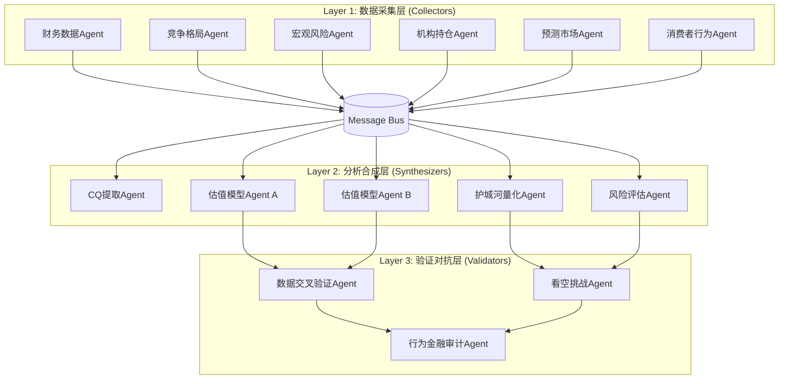

# COST Deep Research — Agent Teams 框架 v1.0

**日期**: 2026-02-07
**基于**: PG Deep Dive (204,786字符) 反思 + COST行业特性重构

---

## Part A: PG调研框架反思

### 成功之处
1. **产出量**: 204,786字符 = 目标(95K)的216%，数据密度高
2. **标注质量**: 731个标注，57%硬数据，远超40%底线
3. **CQ驱动**: 7个Core Questions有效聚焦分析方向
4. **Phase 4修正**: 行为金融检查发现PE数据错误(23.5x→20.8x)，修正了5/10核心数据点

### 五大问题

| # | 问题 | 影响 | 根因 |
|---|------|------|------|
| **P1** | **数据错误晚发现** | PE偏高导致Phase 1-3估值偏差 | Phase 0无交叉验证层 |
| **P2** | **Agent任务粒度过大** | 单Agent负责3-5个模块，产出质量不均 | 缺乏任务分解标准 |
| **P3** | **Agent间无通信** | Agent A和B的数据有20%矛盾 | 无共享数据锚点 |
| **P4** | **验证后移** | Phase 4才核查≈返工30% | 缺乏逐Phase验证 |
| **P5** | **估值路径依赖** | Base Case从$163反复修正至$150-155 | 无独立估值Agent交叉检验 |

### 关键教训

> **一句话**: PG的问题不是"做得不够多"，而是"Agent之间不说话"。

1. **数据必须在Phase 0就被多Agent交叉验证** — 不是Phase 4才发现PE算错了
2. **每个Agent只做1件事** — "财务+估值+周期"太多，切成"损益表分析"/"资产负债表分析"/"估值模型"
3. **通信不是"读同一个文件"** — 需要结构化的"发现→质疑→确认"流程
4. **验证是持续的，不是阶段性的** — 每个Agent完成后立即验证
5. **估值需要独立双轨** — 两个Agent用不同方法估值，差异>15%触发仲裁

---

## Part B: COST Agent Teams 架构

### 核心原则: MTC (Minimal Task + Communication + Trust-but-Verify)

```
传统: Agent A(大任务) → Agent B(大任务) → 合并
MTC:  Agent A(微任务) ←→ Message Bus ←→ Agent B(微任务)
                              ↕
                     Validator Agent(持续验证)
```

### 三层架构



### Agent微任务设计原则

| 原则 | 说明 | PG反例 |
|------|------|--------|
| **1件事** | 每Agent只负责1个数据域或1个分析维度 | PG Agent同时做"财务+估值+周期" |
| **明确输入** | 每Agent声明需要读取的文件和预期格式 | PG Agent随意读取5-7个文件 |
| **明确输出** | 每Agent输出到指定staging文件，格式预定义 | PG Agent输出格式不统一 |
| **自检清单** | 每Agent执行前后运行自检 | PG Agent无自检 |
| **字符预算** | 每Agent有明确的字符上下限 | PG Agent产出差异10x |

### 通信协议: Message Bus

**不再是"读同一个文件"，而是结构化的消息传递:**

```yaml
# Message Bus = reports/COST/data/message_bus.md
# 格式:
- timestamp: "2026-02-07T10:30:00"
  from: "Agent_Alpha"
  to: "ALL"  # 或指定Agent
  type: "DATA_ANCHOR"  # DATA_ANCHOR | FINDING | QUESTION | CONFLICT | RESOLVED
  content: "COST FY2025 净销售额 = $269.9B [硬数据: Costco IR]"
  confidence: "A"

- timestamp: "2026-02-07T10:35:00"
  from: "Agent_Beta"
  to: "Agent_Alpha"
  type: "CONFLICT"
  content: "竞争数据Agent发现FY2025收入引用$275B(来源:Statista)与你的$269.9B不一致"
  resolution_needed: true
```

**消息类型**:
| 类型 | 含义 | 触发条件 |
|------|------|---------|
| `DATA_ANCHOR` | 确认的核心数据点 | Agent验证后写入 |
| `FINDING` | 分析发现 | Agent分析完成 |
| `QUESTION` | 需要其他Agent回答的问题 | 数据不足时 |
| `CONFLICT` | 数据冲突 | 两个Agent的数据不一致 |
| `RESOLVED` | 冲突已解决 | 主线程仲裁后 |

### 验证机制: Trust-but-Verify

```
Agent完成 → 自检(Layer 1) → Validator交叉检查(Layer 2) → Fast Gate(Layer 3)
                                     ↓
                              冲突发现 → 主线程仲裁 → 修正 → 重新验证
```

**与PG的区别**: PG是"Agent产出→直接合并→Phase 4才检查"。COST是"Agent产出→立即验证→有冲突立即解决"。

---

## Part C: COST Phase 0 执行计划

### 已有数据资产 (上一session产出)

| 文件 | 字符数 | 质量评估 | 可复用? |
|------|--------|---------|--------|
| Financial Data Pack | 11,801 | 优秀(Q1 FY2026+FY2025完整) | ✅ 直接复用 |
| Competitive Landscape | 11,090 | 良好(三巨头对比) | ✅ 直接复用 |
| Kirkland Deep Analysis | 16,836 | 优秀(品牌深度) | ✅ 直接复用 |
| Macro/Tariff Risk | 15,919 | 优秀(关税+法律诉讼) | ✅ 直接复用 |
| Market Debate | 12,614 | 良好(8个争论卡) | ✅ 直接复用 |
| Moat/Consumer Behavior | 20,059 | 优秀(护城河量化) | ✅ 直接复用 |
| **合计** | **88,319** | — | **全部可复用** |

### 数据空白 (需填补)

| 空白领域 | 优先级 | 所需Agent |
|---------|--------|----------|
| 预测市场数据(Polymarket/Kalshi) | P1 | Prediction Market Agent |
| 机构持仓+聪明钱(13F/insider) | P1 | Institutional Flow Agent |
| 最近30天分析师动态 | P2 | Analyst Tracker Agent |
| 国际扩张数据(中/日/欧) | P2 | International Expansion Agent |
| 供应链效率指标 | P3 | Supply Chain Agent |
| 数字化转型进展 | P2 | Digital Transformation Agent |

### Phase 0 Agent Team (6个微Agent)

| Agent | 任务(单一职责) | 输入 | 输出 | 字符目标 |
|-------|--------------|------|------|---------|
| **PM** | 预测市场事件概率 | WebSearch | prediction_market.json | 3-5K |
| **IF** | 13F持仓+insider交易+期权异动 | WebSearch | institutional_flows.md | 5-8K |
| **AT** | 最近60天分析师评级变动 | WebSearch | analyst_tracker.md | 3-5K |
| **IE** | 国际市场扩张(中国/日本/欧洲) | WebSearch | international_expansion.md | 5-8K |
| **DT** | 数字化+电商+广告+技术投资 | WebSearch | digital_transformation.md | 5-8K |
| **XV** | 交叉验证现有6个文件的数据冲突 | 读取6个文件 | cross_validation.md | 3-5K |

**关键设计**: 每个Agent只做1件事，字符目标明确，输出路径固定。

### Phase 0.5 Agent Team (3个微Agent)

| Agent | 任务 | 输入 | 输出 |
|-------|------|------|------|
| **CQ** | 从12个数据文件提取5-8个Core Questions | 所有数据文件摘要 | core_questions.md |
| **CM** | CQ-模块相关性矩阵 | core_questions.md + 模块列表 | cq_module_matrix.md |
| **EP** | Phase 1-5执行计划 + Hot-Patch规格 | CQ矩阵 + 覆盖率分析 | execution_plan.md |

---

## Part D: Agent间通信协议

### 通信拓扑

```
Phase 0:  PM, IF, AT, IE, DT (并行) → XV (汇总验证) → Message Bus
Phase 0.5: CQ → CM → EP (串行，每步依赖前一步)
Phase 1+:  采集Agent → 合成Agent → 验证Agent (三层流水线)
```

### 数据锚点制度 (解决PG P1/P3问题)

**规则**: 任何被2个以上Agent引用的数据点，必须注册为"数据锚点"。

```markdown
# 数据锚点注册表 (data_anchors.md)
| ID | 数据点 | 值 | 来源 | 验证状态 | 注册Agent | 验证Agent |
|----|--------|-----|------|---------|-----------|-----------|
| DA-001 | COST FY2025净销售额 | $269.9B | Costco IR | ✅ CONFIRMED | Alpha | XV |
| DA-002 | 续费率(美加) | 92.3% | Costco IR | ✅ CONFIRMED | Alpha | XV |
```

**冲突解决流程**:
1. Agent发现数据与锚点不一致 → 写入CONFLICT消息
2. 主线程（或XV验证Agent）收到CONFLICT → 追溯两个来源
3. 确定正确值 → 更新锚点 → 通知所有Agent → 写入RESOLVED
4. 受影响Agent修正引用

### 输出标准化

每个Agent输出必须包含:
```markdown
## 元数据
- Agent: {name}
- 任务: {single_task_description}
- 数据新鲜度: {oldest_data_date} ~ {newest_data_date}
- 自检: 字符{N} | 标注{N} | 硬数据{N}%
- 冲突: {数量}个待解决

## 正文
{分析内容}

## 数据锚点贡献
{本Agent注册的新数据锚点列表}
```

---

## Part E: 与PG框架的对比

| 维度 | PG (旧) | COST (新) | 改进 |
|------|---------|-----------|------|
| Agent粒度 | 3-5模块/Agent | 1模块/Agent | 产出质量均匀 |
| 数据验证 | Phase 4一次性 | 每Agent完成即验证 | 错误不累积 |
| 通信方式 | 共享文件(只读) | Message Bus(双向) | 冲突实时解决 |
| 估值方法 | 单一路径 | 双轨独立估值 | 消除路径依赖 |
| 看空处理 | Phase 4补充 | Phase 1就有看空Agent | 看空不是afterthought |
| 任务边界 | 模糊("分析竞争") | 明确("对比COST/WMT/BJ续费率") | 减少重复+遗漏 |

---

*文档版本: v1.0 | 作者: 投资研究Agent | 日期: 2026-02-07*
