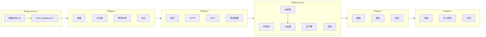

# COST Deep Research — Phase 1-5 执行计划
> 生成日期: 2026-02-07
> 框架: v21.0 + Agent Teams v1.0 (MTC架构)
> 字符总目标: ≥110,500 (85K × 消费品系数1.3)

---

## 执行总览

| Phase | 名称 | 字符目标 | 聚焦CQ | Agent数 | 估计会话 |
|-------|------|---------|--------|---------|---------|
| 0+0.5 | 数据+CQ | ✅ 已完成 | — | 7+1 | 本会话 |
| 1 | 定位与生态 | ≥20,000 | CQ2/5/6/7 | 4 | 1 |
| 2 | 财务与估值 | ≥25,000 | CQ1/3 | 4 | 1 |
| 3+3.5 | 战略+AI | ≥35,000 | CQ4/5/6 | 5 | 1 |
| 4 | 对抗审查 | ≥15,000 | ALL | 3 | 1 |
| 5 | 决策输出 | ≥15,000 | CQ1 | 3 | 1 |

---

## Phase 1: 定位与生态 (≥20,000字符)

### Agent Team设计 (4个微Agent)

| Agent | 单一任务 | 输入 | 字符目标 | CQ关联 |
|-------|---------|------|---------|--------|
| **P1-A** | 公司基本画像(业务模型+管理层+历史) | shared_context.md + Financial Pack | 5,000-7,000 | CQ2 |
| **P1-B** | 产业链上下游映射(供应商→COST→消费者) | shared_context.md + Competitive + Kirkland | 5,000-7,000 | CQ5/CQ7 |
| **P1-C** | 预测市场环境扫描(宏观+行业+公司事件) | shared_context.md + PM数据 + 宏观风险 | 4,000-5,000 | CQ3 |
| **P1-D** | M14注意力雷达呈现 + 行业周期定位 | shared_context.md + Market Debate + CQ文件 | 4,000-5,000 | ALL |

### 通信协议
- P1-A和P1-B可并行(无数据依赖)
- P1-C需要PM数据(已有)
- P1-D需要CQ文件(已有)
- 所有Agent引用data_anchors.md中的锚点

### 门控标准
- QG-01: 公司画像完整(业务模型+管理层+历史≥3,000字)
- QG-02: 产业链映射≥10个关键节点
- QG-03: 预测市场数据≥8个相关事件 + Top 10维度覆盖计划

---

## Phase 2: 财务与估值 (≥25,000字符)

### Agent Team设计 (4个微Agent)

| Agent | 单一任务 | 输入 | 字符目标 | CQ关联 |
|-------|---------|------|---------|--------|
| **P2-A** | 5年财务趋势+周期定位 | Financial Pack + Phase 1发现 | 6,000-8,000 | CQ1 |
| **P2-B** | SOTP分部估值(仓储零售+会员费+Kirkland+国际+电商) | Financial Pack + Kirkland + 国际数据 | 7,000-9,000 | CQ1/CQ7 |
| **P2-C** | DCF估值 + 可比公司估值 + 三情景矩阵 | Financial Pack + Analyst Tracker | 6,000-8,000 | CQ1 |
| **P2-D** | 资本配置分析 + HP-01特别股息 | Financial Pack + 股息数据 | 4,000-5,000 | CQ1 |

### 关键设计: 双轨独立估值 (解决PG P5问题)
- **P2-B (SOTP路径)**: 自底向上分部估值
- **P2-C (DCF路径)**: 自顶向下现金流估值
- **冲突处理**: 两个Agent的估值差异>15% → 主线程仲裁，不是简单取平均

### 门控标准
- QG-04: 周期定位有≥4个支撑信号
- QG-05: SOTP覆盖所有主要分部(占营收≥90%)
- QG-06: 三种估值方法交叉验证偏离度<20%

---

## Phase 3+3.5: 战略分析+AI评估 (≥25,000+10,000字符)

### Agent Team设计 (5个微Agent)

| Agent | 单一任务 | 输入 | 字符目标 | CQ关联 |
|-------|---------|------|---------|--------|
| **P3-A** | 护城河量化(品牌/规模/转换成本/成本优势) | Moat数据 + Kirkland + Phase 1-2 | 7,000-9,000 | CQ2/CQ5 |
| **P3-B** | 五引擎协同分析(周期+股权+聪明钱+信号+预测市场) | 全数据 + IF持仓 + PM数据 | 8,000-10,000 | CQ1/CQ3 |
| **P3-C** | 竞争分析+PPDA背离 | Competitive + Market Debate | 5,000-7,000 | CQ6 |
| **P3-D** | M13 AI冲击矩阵(分部级) | DT数据 + Phase 2 SOTP | 5,000-7,000 | CQ4 |
| **P3-E** | AI实施深度(L×S) + AI调整估值 | DT数据 + P3-D矩阵 | 5,000-7,000 | CQ4 |

### 通信协议
- P3-A/B/C可并行(独立数据域)
- P3-D需要Phase 2 SOTP(串行)
- P3-E需要P3-D结果(串行: P3-D → P3-E)

### 门控标准
- QG-07: 护城河量化(每种护城河有数据支撑)
- QG-08: 五引擎每引擎≥3,000字
- QG-09: PPDA≥3个背离 + PMSI构建
- QG-09.5: AI冲击矩阵覆盖≥90%营收分部

---

## Phase 4: 对抗审查 (≥15,000字符)

### Agent Team设计 (3个微Agent)

| Agent | 单一任务 | 输入 | 字符目标 | CQ关联 |
|-------|---------|------|---------|--------|
| **P4-A** | 行为金融偏差检查(4项) + 事实核查(≥10点) | 全部Phase 1-3报告 | 5,000-7,000 | ALL |
| **P4-B** | 看空等权重分析(≥8个Bear Case) + 反证挑战 | 全部Phase 1-3报告 + 看空方法论 | 6,000-8,000 | ALL |
| **P4-C** | Smart Money验证 + 维度回检 + So What抽查 | IF数据 + Phase 0.5 Top 10 + 全部Phase | 4,000-6,000 | ALL |

### 关键设计: 看空Agent先行 (解决PG P4问题)
- P4-B(看空)是最重要的Agent，必须独立运行，不受前序Phase看多偏见影响
- P4-B的prompt中明确: "你的任务是最大化看空论点的说服力，不是平衡"
- P4-A(偏差检查)检查Phase 1-3是否存在系统性偏见
- P4-C验证Smart Money是否与我们的结论一致

### 门控标准
- QG-10: 四项偏差检查全部完成+量化修正
- QG-11: 事实核查≥10点 + 反证≥3条 + Top 10回应率100%
- 看空相关内容≥总篇幅30%
- 标注密度≥8/万字符(Phase 4例外)

---

## Phase 5: 决策输出 (≥15,000字符)

### Agent Team设计 (3个微Agent)

| Agent | 单一任务 | 输入 | 字符目标 | CQ关联 |
|-------|---------|------|---------|--------|
| **P5-A** | 综合评分+评级+仓位建议 | Phase 4修正后数据 | 4,000-5,000 | CQ1 |
| **P5-B** | Kill Switch(≥15条) + 可验证预测(≥20个) | 全Phase总结 | 5,000-7,000 | ALL |
| **P5-C** | 投资日历+90天行动清单 | 催化剂数据 + 全Phase | 4,000-5,000 | ALL |

### 门控标准
- QG-12: Kill Switch≥15条(含≥2个AI相关) + 可验证预测≥20个 + 铁律十五条全满足

---

## Agent间通信总结

---

## 总Agent数量对比

| | PG(旧) | COST(新) | 改进 |
|--|--------|---------|------|
| Phase 0+0.5 | 7大Agent | 7微Agent | 任务更清晰 |
| Phase 1-5 | ~12大Agent | 19微Agent | 粒度更细 |
| 验证Agent | 0 | 1(XV) + 每Phase QG | 持续验证 |
| 看空Agent | Phase 4才有 | Phase 4独立 | 更早、更独立 |
| **总计** | ~19 | **27** | +42%但每个更小 |

---

*执行计划 v1.0 | Phase 1将在下一个会话启动*
