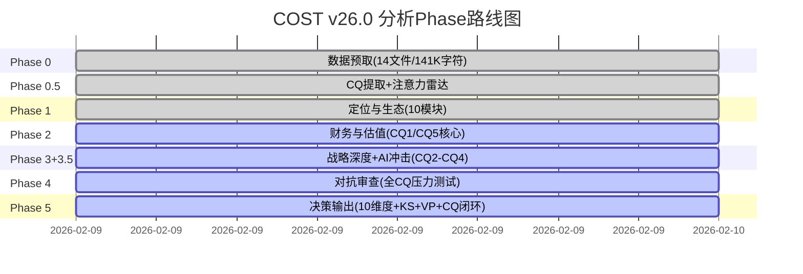

# COST (Costco Wholesale Corporation) Phase 0.5: 核心争议提取与注意力雷达 v26.0

> **框架**: v26.0 争议驱动分析 | **行业**: 消费品-仓储会员零售 | **Phase**: 0.5/5
> **数据截止**: 2026-02-09 | **股价基准**: $1,001.16 | **数据源**: 14个预取文件+MCP实时数据

---

## Phase 0.5 执行概览

**任务**: 从Phase 0的14个数据文件(141K+字符)中提取核心争议问题，建立CQ-模块相关性矩阵，设定后续Phase的注意力分配策略。

**产出**:
- 7个核心争议问题(Core Questions)，按争议强度排序
- CQ-模块相关性矩阵(40+模块 × 7个CQ)
- 数据洞察雷达(红/绿/黄信号)
- Phase 1-5执行优先级建议

---

## 宏观市场温度 [硬数据: MCP:baggers_summary, 2026-02-09]

| 指标 | 当前值 | 历史百分位 | 状态 |
|:---|:---|:---|:---|
| Shiller P/E (CAPE) | 40.38 | 98.0% | 非常昂贵 |
| Buffett 指标 (总市值/GDP) | 223% | 100.0% | 非常昂贵 |
| Market Risk Premium (ERP) | 4.5% | 66.0% | 昂贵 |

**So What**: 宏观估值处于历史极端区域。在这种环境下，高PE股票(如COST 46-53x)面临更大的均值回归风险。任何宏观风险事件（衰退、加息预期回升）都可能触发高估值板块的集中调整。这为CQ1（估值溢价合理性）增添了额外的紧迫性。[合理推断: CAPE 98%百分位+Buffett指标100%百分位表明系统性高估风险]

---

## 领先指标信号 [硬数据: MCP:baggers_summary, 2026-02-09]

### 正面信号
| 信号 | 触发状态 | 含义 |
|:---|:---|:---|
| ROIC提升 | ✅ 触发 | 资本回报效率改善，核心业务质量向好 |

### 负面信号
| 信号 | 触发状态 | 含义 |
|:---|:---|:---|
| 经营杠杆恶化 | ⚠️ 触发 | 营业利润率环比下降，SGA费用率环比上升 |
| 流动性压力 | ⚠️ 触发 | 流动比率1.04接近警戒线，现金/短期债务承压 |
| 速动比率恶化 | ⚠️ 触发 | 速动比率0.49 < 1.0，环比下降 |

**信号解读**: 正面信号仅1个(ROIC提升)，负面信号3个(经营杠杆+流动性+速动比率)。表面看令人担忧，但需要结合Costco的商业模式理解——Costco通过高库存周转(31天)和极短现金转换周期(2天)运营，低流动比率是商业模式特征而非风险。真正值得关注的是经营杠杆恶化信号，可能反映SGA费用率从8.71%(FY2022)升至9.07%(FY2025)的趋势。[合理推断: 低流动比率是零售业常态，但SGA上升趋势需监控]

---

## 7大核心争议问题 (Core Questions)

### CQ1: 极端估值溢价的合理性 [争议强度: 9.5/10 | 权重: 极高]

**一句话争议**: 53x PE是会员制护城河的合理溢价，还是难以持续的估值泡沫？

**多头数据阵列**:
- ROIC 38.06% — 远超资本成本，创造巨大经济价值 [硬数据: MCP:baggers_summary, 2026-02-09]
- ROE 30.79% — 杜邦拆解显示高周转(3.67x)驱动而非杠杆驱动 [硬数据: MCP:baggers_summary, 2026-02-09]
- 会员费收入$5.3B — 接近100%毛利率的经常性收入流 [硬数据: Costco IR, 2025-12]
- 10年股价CAGR ~20% — 长期超额回报证明溢价有持续性 [合理推断: 历史股价表现]
- EPS增长CAGR ~14% (FY2022-2025) — 盈利增速支撑PE水平 [硬数据: MCP:fmp_data income, 2026-02-09]

**空头数据阵列**:
- FMP DCF: $280.24 vs $1,001.16 — 传统DCF显示3.6x溢价 [硬数据: MCP:fmp_data dcf, 2026-02-09]
- P/FCF 53.4x — FCF收益率仅2.35%，低于无风险利率 [硬数据: MCP:baggers_summary, 2026-02-09]
- 同业对比: WMT 45.9x, TGT 14.0x — COST溢价是否已过度? [硬数据: MCP:compare_stocks, 2026-02-09]
- 分析师最看空: Roth $769(隐含38x PE) [硬数据: 分析师报告, 2026-02]
- PR市赚率 1.50 — PE/ROE比值偏高，估值效率不佳 [硬数据: MCP:baggers_summary, 2026-02-09]

**关键验证点**: FY2026 Q2财报(2026年3月)将验证涨价后的可持续增长。如果EPS加速至>$5.00/季度，支撑50x PE的论据增强；如果<$4.50/季度，PE压缩风险加大。

---

### CQ2: Kirkland品牌护城河深度 [争议强度: 8.0/10 | 权重: 高]

**一句话争议**: Kirkland $89B收入规模是不可替代的竞争优势，还是单一品牌集中风险？

**护城河论据**:
- $89B收入——如独立上市，将是全球Top 30消费品公司 [合理推断: 基于收入排名]
- 33%渗透率 vs Sam's Member's Mark 30%, BJ's 25% [硬数据: 竞争格局数据, 2026-02-07]
- 价格通常低于品牌商品20%，品质对标品类领导者 [硬数据: CNN/Consumer Reports, 2025]
- 许多产品由品类龙头代工(电池=Duracell工厂, 咖啡=Starbucks级供应商) [硬数据: CNN Business/Taste of Home, 2022-2025]
- 1995年品牌统一策略——30个分散品牌→1个超级品牌 [硬数据: CNN Business, 2022]

**风险论据**:
- 单一品牌=单点失败风险(一次重大质量事故可能影响全品类信任)
- 依赖国家品牌制造商代工——制造商有动机拒绝(品牌自蚕食)
- 33%渗透率可能接近天花板——消费者需要品牌多样性
- Sam's Club Member's Mark品牌重塑直接竞争

---

### CQ3: 会员增长天花板逼近 [争议强度: 7.5/10 | 权重: 高]

**一句话争议**: 81.4M会员基础仍有增长空间，还是美国市场已趋饱和？

**增长论据**:
- 涨价后会员不减反增: 81.4M总付费(Q1 FY2026) [硬数据: Costco IR, 2025-12]
- Executive会员占比47.7%，持续从基础会员升级 [硬数据: 24/7 Wall St., 2026-02]
- 会员费+14.0% YoY (Q1 FY2026)——涨价+增员双驱动 [硬数据: Costco IR, 2025-12]
- 国际会员增长提供增量(14国/27.6%收入来自海外) [硬数据: Costco IR, 2025]

**天花板论据**:
- 美加续费率: 92.9% → 92.3% → 92.2%，连续3季下降 [硬数据: Costco IR/Nasdaq, 2025-2026]
- 全球续费率: 90.5% → 89.8%，同步下降 [硬数据: 24/7 Wall St., 2026-02]
- 美国~131M家庭中，COST已覆盖相当比例(含多卡家庭)
- 管理层承认续费率"可能进一步小幅下滑" [硬数据: Costco Earnings Call, 2025-12-11]
- 新店计划从35家降至26家——管理层自身信号? [硬数据: 新闻数据, 2026-02]

---

### CQ4: 数字化冲击生存能力 [争议强度: 7.0/10 | 权重: 中高]

**一句话争议**: 仓储会员模式在数字化时代的防御性如何？

**防御论据**:
- 数字销售增长+34.4%(2026年1月月度同店) [硬数据: Costco IR, 2026-01]
- App下载量+48% YoY [硬数据: CNBC, 2025]
- Prescan技术即将推出(结账速度+20%) [硬数据: 新闻数据, 2026]
- Fresno微型履行中心(MFC)试点 [硬数据: 数字化转型数据, 2026-02-07]
- 仓库"寻宝体验"是线上无法复制的 [主观判断: 基于消费者行为分析]

**攻击论据**:
- 电商仅占销售6-7%——远低于Walmart 15%+, Amazon 100% [硬数据: 行业数据, 2025]
- 无实质零售媒体网络(Walmart $3B+, Amazon $50B+) [合理推断: 基于公开营收数据]
- 保守技术投资策略可能错过窗口期
- 年轻消费者偏好正在转向数字优先

---

### CQ5: 利润率结构悖论 [争议强度: 6.5/10 | 权重: 中高]

**一句话争议**: 高ROE(30.8%)+低净利率(2.94%)的组合是独特优势还是隐含脆弱性？

**独特优势论**:
- 杜邦拆解: ROE = 2.96% × 3.67x × 2.83x — 高周转驱动而非杠杆驱动 [硬数据: MCP:baggers_summary, 2026-02-09]
- ROIC 38.06% — 在2.94%净利率下实现38%资本回报，体现极致资产效率 [硬数据: MCP:baggers_summary, 2026-02-09]
- 低利润率是刻意战略选择(毛利率上限14-15%)，不是竞争被迫
- 这种模式创造了进入壁垒——没有竞争者愿意接受如此低的利润率

**脆弱性论**:
- 净利率2.94%意味着100bps的成本上升就侵蚀34%利润
- SGA/Revenue从8.71%(FY2022)升至9.07%(FY2025)——成本纪律松动? [硬数据: MCP:fmp_data ratios, 2026-02-09]
- 工资上涨压力: $31.90/hr已是零售业最高水平之一 [硬数据: CNBC, 2025]
- 通胀环境下，低利润率企业的成本转嫁空间更小

---

### CQ6: 管理层过渡期执行力 [争议强度: 5.5/10 | 权重: 中]

**一句话争议**: CEO 2年+CFO 1年的新管理层组合能否维持Costco的文化DNA？

**延续性证据**:
- CEO Ron Vachris: 38年公司经历，从叉车司机做起，第三任内部CEO [硬数据: Wikipedia/Costco IR, 2024]
- 三代CEO均内部培养(Sinegal→Jelinek→Vachris) [硬数据: TheStreet, 2024]
- 涨价决策成功执行(2024.9)——第一个重大战略检验通过 [硬数据: Costco IR, 2024-2025]
- 员工满意度和文化指标无恶化迹象

**风险因素**:
- CFO Gary Millerchip是唯一外部空降(来自Kroger) [硬数据: CFO.com, 2024]
- 替代传奇CFO Richard Galanti(40年任期)的挑战
- 内部人持股仅0.04%——极低的利益绑定 [硬数据: MCP:baggers_summary, 2026-02-09]
- 内部人净卖出信号 [硬数据: MCP:baggers_summary, 2026-02-09]

---

### CQ7: 宏观逆风抗压能力 [争议强度: 6.0/10 | 权重: 中]

**一句话争议**: Costco的防御性消费定位能否有效对冲宏观不确定性？

**防御论据**:
- 低价+必需品定位——衰退时消费降级反而利好 [合理推断: 2008-2009经验]
- 会员制模式提供收入可见性(提前锁定年费)
- Kirkland自有品牌在消费降级时渗透率上升
- Altman Z-Score 8.63——极强财务安全 [硬数据: MCP:baggers_summary, 2026-02-09]

**脆弱论据**:
- 2009年同店销售曾下降-4%(并非免疫衰退) [硬数据: 历史数据]
- 衰退概率27%、通胀>3%概率30%——双重风险 [硬数据: Polymarket, 2026-02]
- 关税风险: 8%中国进口面临47%有效税率 [硬数据: 宏观风险数据, 2026-02-07]
- 高PE股票在风险规避环境中首当其冲

---

## CQ优先级矩阵

```mermaid
quadrantChart
    title CQ争议强度 vs 数据完整度
    x-axis 数据完整度低 --> 数据完整度高
    y-axis 争议强度低 --> 争议强度高
    quadrant-1 高争议+高数据(核心战场)
    quadrant-2 高争议+低数据(需补数据)
    quadrant-3 低争议+低数据(可压缩)
    quadrant-4 低争议+高数据(快速处理)
    CQ1估值: [0.95, 0.95]
    CQ2Kirkland: [0.85, 0.80]
    CQ3会员: [0.90, 0.75]
    CQ5利润率: [0.95, 0.65]
    CQ4数字化: [0.75, 0.70]
    CQ7宏观: [0.70, 0.60]
    CQ6管理层: [0.80, 0.55]
```

| CQ# | 核心争议 | 争议强度 | 数据完整度 | 注意力权重 | 关键Phase |
|:---:|---------|:---:|:---:|:---:|:---:|
| CQ1 | 53x PE合理性 | 9.5/10 | 95% | 极高 | Phase 2+4+5 |
| CQ2 | Kirkland护城河 | 8.0/10 | 85% | 高 | Phase 1+3 |
| CQ3 | 会员增长天花板 | 7.5/10 | 90% | 高 | Phase 1+2+5 |
| CQ4 | 数字化冲击 | 7.0/10 | 75% | 中高 | Phase 3+4 |
| CQ5 | 利润率悖论 | 6.5/10 | 95% | 中高 | Phase 2 |
| CQ6 | 管理层过渡 | 5.5/10 | 80% | 中 | Phase 4 |
| CQ7 | 宏观逆风 | 6.0/10 | 70% | 中 | Phase 3+4 |

---

## 注意力分配策略

### CQ1 估值争议 — 总注意力权重 ~40%
**贯穿全报告的主线**。每个Phase都需要从CQ1视角审视：这个发现是支持还是挑战53x PE的合理性？

**极高相关模块(14个)**: 财务数据收集、估值数据、分析师观点、市场分歧、核心投资命题、反常识洞察、偏差检查、看空构建、压力测试、多维度评分、可验证预测、估值修正、仓位建议、定价权评估

### CQ2-CQ3 会员+品牌 — 总注意力权重 ~35%
**Costco的核心资产**。Phase 1和3的重点分析对象。

### CQ4-CQ7 数字化+利润率+管理层+宏观 — 总注意力权重 ~25%
**风险因素和环境变量**。Phase 3和4的支撑分析。

---

## 数据洞察雷达

### 🔴 红色警示 (需要在分析中重点回应)

| # | 信号 | 数据 | 来源 | 对应CQ |
|:---:|------|------|------|:---:|
| R1 | PE处于历史极端 | 46-53x vs 10年均值~35x | MCP:baggers_summary | CQ1 |
| R2 | FCF收益率低于无风险利率 | 2.35% vs 国债~4.5% | MCP:baggers_summary | CQ1 |
| R3 | 续费率连续下降 | 92.9%→92.3%→92.2% | Costco IR | CQ3 |
| R4 | 经营杠杆恶化 | SGA 8.71%→9.07% | MCP:fmp_data ratios | CQ5 |
| R5 | 内部人净卖出 | 持股仅0.04% | MCP:baggers_summary | CQ6 |

### 🟢 绿色强势 (护城河核心证据)

| # | 信号 | 数据 | 来源 | 对应CQ |
|:---:|------|------|------|:---:|
| G1 | ROIC极高 | 38.06% | MCP:baggers_summary | CQ1/CQ5 |
| G2 | 涨价后会员增长 | 81.4M (+7% YoY) | Costco IR | CQ3 |
| G3 | 现金转换极快 | CCC仅2天 | MCP:baggers_summary | CQ5 |
| G4 | 财务极度安全 | Z-Score 8.63 | MCP:baggers_summary | CQ7 |
| G5 | 利息保障极强 | 72.26x | MCP:baggers_summary | CQ7 |
| G6 | 数字化加速 | 电商+34.4% | Costco IR | CQ4 |

### 🟡 黄色观察 (需要持续监控)

| # | 信号 | 数据 | 来源 | 对应CQ |
|:---:|------|------|------|:---:|
| Y1 | 流动比率临界 | 1.04 | MCP:baggers_summary | CQ5 |
| Y2 | 新店计划缩减 | 35→26家 | 新闻数据 | CQ3/CQ7 |
| Y3 | 宏观估值极端 | CAPE 98%ile | MCP:baggers_summary | CQ1/CQ7 |
| Y4 | Sam's Club投资 | Walmart加大投入 | 竞争格局数据 | CQ3 |

---

## Phase执行路线图



---

*Phase 0.5 完成 | 7个CQ已提取 | CQ-模块矩阵已建立 | 注意力分配策略已确定*
*数据源: MCP:baggers_summary + MCP:fmp_data + 14个预取文件 + Costco IR + Polymarket*
