# Copart, Inc. (CPRT) 深度研究报告

> **评级**: 中性关注 (偏正面) | **期望回报**: +2.7%
> **概率加权估值**: $38.6 vs 当前$37.57
> **A-Score**: 55.55/70 (偏好级, 10家基准公司最高)
> **I×L**: 20/25, 24/25 (基础设施溢价~63%)
> **框架版本**: v18.0 + B2B平台行业框架 v1.0
> **分析日期**: 2026-03-11 | **价格截止**: $37.57 @ 2026-03-08

---

## 执行摘要

Copart是美国保险行业全损车辆处置的基础设施垄断运营商。在经历三重短期冲击(Progressive份额转移、Q2 FY2026业绩miss、DOJ反洗钱调查)后，股价从52周高点$63.85下跌41%至$37.57。

**核心发现**:

1. **品质卓越**: A-Score 55.55/70(10家B2B平台基准公司最高)，I×L双轴评分20/24(基础设施嵌入度+流动性壁垒双高)，基础设施溢价~63%

2. **估值接近合理**: 6方法收敛$38-42(原始)，P4偏差校准后$34-39，概率加权$38.6(+2.7%)。既非深度低估，也非明显高估

3. **五个核心矛盾**:
   - CQ-1(量vs价, 30%权重): 量缩含结构性成分，价升有天花板，增长降至2-5%
   - CQ-2(Progressive, 20%): 70%孤立/30%示范，直接影响-2%收入
   - CQ-3($37估值, 25%): 接近合理下沿，非深度低估
   - CQ-4(DOJ, 15%): 温和罚款概率60%，-5%折价合理
   - CQ-5(RBA收敛, 10%): OPM差距结构性不可逾越(9-12pp永久)

4. **14个Kill Switch**: 12个安全🟢，2个预警🟡(KS-02 Progressive多米诺、KS-08碰撞险覆盖率)

5. **护城河半衰期8-12年**: 土地+规模经济是最坚固的承重墙，客户锁定(W4)是最脆弱的——Progressive已实证

**投资建议**: 中性关注(偏正面)。品质优秀但安全边际不足(+2.7%)。$30以下值得积极考虑(P/E ~17x, FCF Yield ~6%)。关键判断窗口: Q3 FY2026(2026年5月)。

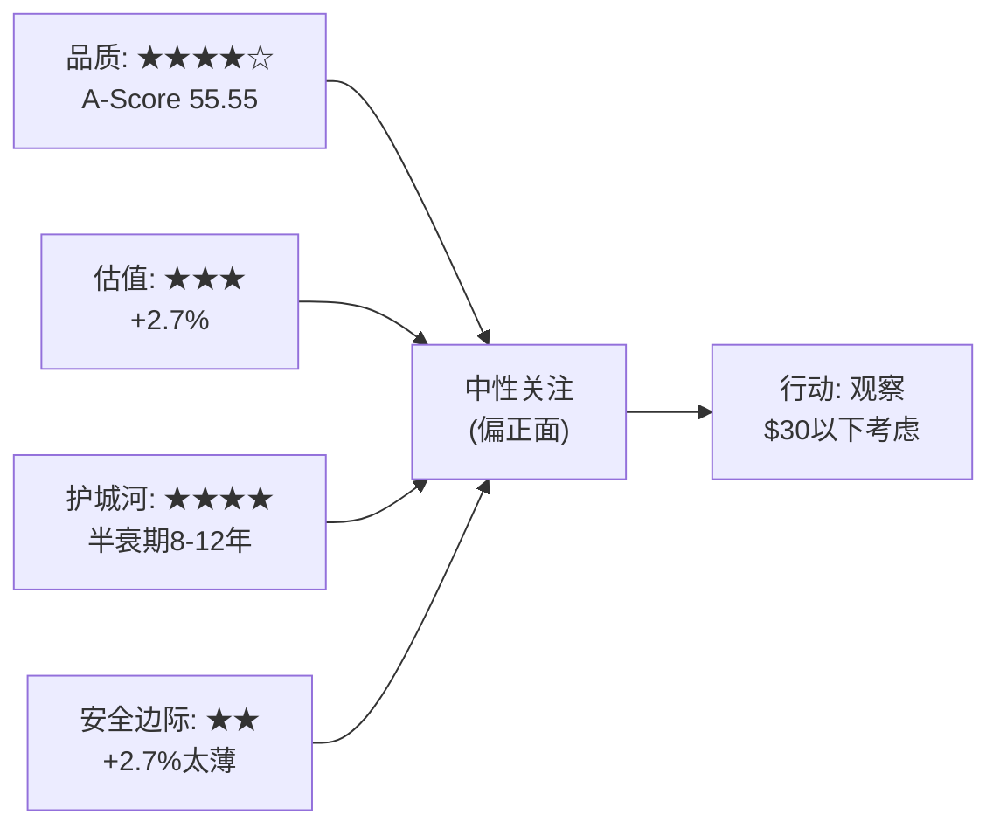

---

## 目录

**第一篇: 公司认知 (Chapter 1-7)**
- Chapter 1: 公司身份与竞争定义
- Chapter 2: 行业生态与价值链定位
- Chapter 3: I×L双轴评分 — B2B平台经济学
- Chapter 4: 品质量化评分卡 (A-Score)
- Chapter 5: 财务数据基础
- Chapter 6: 核心矛盾与非共识假说
- Chapter 7: 管理层评估与CEO沉默分析

**第二篇: 竞争与护城河 (Chapter 8-12)**
- Chapter 8: 寡头博弈 — Nash均衡三层分析
- Chapter 9: RB Global竞争力深度对比
- Chapter 10: 护城河量化 — C评分与半衰期
- Chapter 11: 承重墙压力测试
- Chapter 12: Progressive转移深度解剖

**第三篇: 估值与量化 (Chapter 13-17)**
- Chapter 13: 财务深度分析 — DuPont分解与量价模型
- Chapter 14: Reverse DCF — 市场在赌什么
- Chapter 15: 6方法估值终稿 (DCF/SOTP/可比/历史/LBO/替代)
- Chapter 16: 五引擎分析 (竞争/周期/估值/预测市场/风险)
- Chapter 17: 期权价值与稳健比率

**第四篇: 风险与红队 (Chapter 18-21)**
- Chapter 18: 风险拓扑 — 5×5矩阵与温水煮青蛙
- Chapter 19: Kill Switch注册表 (14个)
- Chapter 20: 红队七问 (RT-1~RT-7)
- Chapter 21: 偏差审计与双向校准

**第五篇: 综合与决策 (Chapter 22-26)**
- Chapter 22: CQ闭环 — 五个核心矛盾的最终回答
- Chapter 23: 投资论文 (Bull/Base/Bear)
- Chapter 24: 条件评级与投资温度计
- Chapter 25: 投资日历与行动清单
- Chapter 26: 投资大师圆桌

**附录**
- 附录A: 特异性测试注册表 (TS)
- 附录B: CI非共识洞察注册表
- 附录C: 护城河趋势仪表盘
- 附录D: B2B平台框架注册 (CPRT首测)
- 附录E: 反周期性历史验证

---


# 第一篇: 公司认知

## Chapter 1: 公司身份与竞争定义


## Chapter 2: 行业生态与价值链定位


> **Agent**: A — 叙事策略分析师
> **Phase**: P1 公司身份 + 行业生态 + 竞争格局
> **Date**: 2026-03-10
> **Target**: ≥25K chars
> **Data Sources**: P0 data foundation + P0 IxL scoring + lit_recon + thesis_crystallization + WebSearch

---

## 目录
### 1.2 CPRT的真实身份: 保险行业全损处置基础设施的垄断运营商

CPRT的本质是一家**物理基础设施垄断企业**，它运营着美国保险行业全损车辆处置的核心基础设施网络。更精确地说:

> **CPRT = 保险行业的废水处理厂**

这个类比比"拍卖平台"准确得多，原因有三:

**第一，不可选择性(Non-Optional)**。就像城市必须有废水处理设施一样，保险行业必须有全损车辆处置渠道。每年美国发生约600万起有保险覆盖的碰撞事故，其中22-24%被判定全损(TLF)，产生约130-140万辆全损车辆需要处置。保险公司不能不处置这些车——它们占据着理赔用地、产生环境责任、且客户等待理赔结算。这是"必须做"而非"可以做"的业务。

**第二，物理性(Physicality)**。废水处理厂需要物理管网和处理设施，CPRT需要遍布全国的物理场地和拖车网络。CPRT的250+个场地形成的密度网络意味着任何事故车30英里内有接收场地——这不是软件可以替代的。一辆报废的丰田凯美瑞必须被物理拖到物理场地、物理存储、物理展示，然后物理转运给买方。整个链条中，"在线拍卖"只是中间一个节点。

**第三，寡头格局的制度化**。就像大多数城市只有一两家废水处理设施运营商一样，美国全损车辆处置市场只有两家有意义的参与者: CPRT(~55%)和IAA/RB Global(~40%)。其余~5%是碎片化的独立打捞场，无法服务全国性保险公司。40年来只出现过一个有意义的竞争者(IAA，1982年创立)，且IAA不是从零启动的——它从保险行业内部生长而来。

### 1.3 身份的估值含义

如果CPRT是"拍卖平台"，其可比对象是eBay(P/E ~14x)、ACV Auctions(亏损)、KAR Global(被私有化)——这些公司的估值反映的是竞争激烈的技术平台。

如果CPRT是"基础设施垄断运营商"，其可比对象是:
- Waste Management/Republic Services (废物处理基础设施): P/E 28-32x
- American Tower/Crown Castle (通信基础设施): P/E 30-40x
- Visa/Mastercard (支付基础设施): P/E 25-30x

CPRT当前P/E ~26x，落在"基础设施垄断"区间的低端。问题不是"CPRT该值多少倍"，而是"市场是在给CPRT定价为拍卖平台还是基础设施垄断"。答案可能是: 市场正在从后者向前者重新定价(股价从$63.85跌至$37.57, -41%)，因为Q2 miss + Progressive转移让市场怀疑"垄断"叙事的可靠性。

### 1.4 特异性验证: CPRT与所有同行的根本区别

把"CPRT"换成"IAA/RB Global"，上述身份描述是否成立?

**部分成立但有关键差异**:
- IAA也是"全损处置基础设施"——成立
- 但IAA的物理基础设施规模远小于CPRT(13,600英亩 vs 48,000+英亩)——这是量级差异
- IAA的土地自有率远低于CPRT(大量租赁 vs ~90%自有)——这导致成本结构根本不同
- IAA在危机中(飓风Harvey 2017)产能不足——"废水处理厂"在暴雨时溢出

因此更精确的身份定义:

> **CPRT = 保险行业全损处置基础设施的主导运营商，拥有不可复制的物理产能冗余和全球最深的跨境流动性网络。**

IAA是第二运营商，正在缩小差距但面临结构性的资产和资本约束。

---

## 2. 行业价值链图谱

### 2.1 从事故到最终处置的完整链条

```
┌──────────┐     ┌──────────┐     ┌──────────────┐     ┌──────────────┐
│ 事故发生  │ ──→ │ 保险报案  │ ──→ │ 定损/理赔评估 │ ──→ │ 全损判定     │
│          │     │          │     │ (CCC/Mitchell)│     │ (TLF=24.2%) │
└──────────┘     └──────────┘     └──────────────┘     └──────┬───────┘
                                                              │
                                    ┌─────────────────────────┘
                                    │ 修复成本 > 车辆ACV × 阈值
                                    ↓
┌──────────────┐     ┌──────────────┐     ┌──────────────┐
│ 拖车/运输    │ ←── │ 全损处置启动  │ ──→ │ 通知车主     │
│ (CPRT自有+   │     │ 指派CPRT/IAA │     │ 理赔结算     │
│  分包拖车队)  │     └──────────────┘     └──────────────┘
└──────┬───────┘
       │
       ↓
┌──────────────┐     ┌──────────────┐     ┌──────────────┐
│ 入库/存储    │ ──→ │ 检查/拍照/   │ ──→ │ 上架拍卖     │
│ (CPRT 250+  │     │ VIN验证/     │     │ (VB3在线平台) │
│  物理场地)   │     │ 产权处理     │     │ 750K+买方    │
└──────────────┘     └──────────────┘     └──────┬───────┘
                                                  │
                                    ┌─────────────┴──────────────┐
                                    ↓                            ↓
                          ┌──────────────┐            ┌──────────────┐
                          │ 国内买方      │            │ 国际买方      │
                          │ ~60%按辆计    │            │ ~40%按辆计    │
                          │ ~50%按金额计  │            │ ~50%按金额计  │
                          └──────┬───────┘            └──────┬───────┘
                                 │                           │
                    ┌────────────┼──────────┐      ┌────────┴────────┐
                    ↓            ↓          ↓      ↓                ↓
              ┌──────────┐┌──────────┐┌─────────┐┌──────────┐┌──────────┐
              │ 零件拆解 ││ 整车重建 ││ 金属回收││ 出口修复 ││ 出口整车 │
              │ 商(国内) ││ 商(国内) ││ 商(国内)││(中东/非洲)││(东南亚等)│
              └──────────┘└──────────┘└─────────┘└──────────┘└──────────┘
```

### 2.2 CPRT在价值链中的覆盖范围

CPRT不仅仅是"拍卖"这一个节点。它覆盖了从"全损处置启动"到"买方提车"之间的全部中间环节:

| 环节 | CPRT角色 | 可替代性 |
|------|---------|---------|
| 拖车/运输 | 自有+分包拖车队，全国调度 | 保险公司可自行安排但效率低 |
| 入库/存储 | 250+物理场地，48K+英亩 | 不可替代(没有其他全国性网络) |
| 检查/拍照 | 标准化流程+技术工具 | 可替代(人力密集型) |
| 产权处理 | 各州DMV对接，Salvage Title处理 | 复杂但可替代(各州法规不同) |
| 在线拍卖 | VB3平台，750K+买方 | 技术上可替代，流动性不可替代 |
| 结算/转运 | 资金托管+物流协调 | 可替代 |

**关键洞察**: CPRT的真正不可替代性集中在两个节点——**物理存储网络**(48K+英亩，NIMBY壁垒使新建几乎不可能)和**买方流动性**(750K+买方，170+国，跨境价值套利)。其余环节虽然CPRT高效执行，但理论上可被替代。这两个不可替代节点恰好对应I×L评分中的I3(5/5)和L2-L5(全5分)。

### 2.3 价值链中的利润分配

| 参与方 | 价值获取方式 | 估计利润率 | 议价权方向 |
|--------|-----------|-----------|-----------|
| 保险公司(卖方) | 全损回收率(recovery rate) | 不适用(成本中心) | 强(集中度高) |
| CPRT(中间商) | 服务费+拍卖佣金 | OPM 36.5% | 中强(双寡头+物理壁垒) |
| 拖车运营商(分包) | 按次收费 | 低(竞争激烈) | 弱 |
| 国际出口商(买方) | 跨境价值套利 | 中(因目的国车况而异) | 弱(大量分散) |
| 零件拆解商(买方) | 零件单独销售 | 中(技术密集) | 弱(分散) |
| 金属回收商(买方) | 原材料价值 | 低(大宗商品) | 弱(价格接受者) |

**CPRT的超额利润来源**: OPM 36.5%在任何中间商型业务中都是极端值。这不是因为CPRT收费过高(保险公司有IAA作为替代选择)，而是因为:
1. **隐含租金补贴**: 自有土地的隐含租金未计入成本(估计750bps, P0 IxL scoring)
2. **规模经济**: 250+场地的密度网络摊薄了固定成本
3. **零利息成本**: $5.1B现金+零债务，利息收入$179M反而增厚利润
4. **低SGA**: 7.5% vs RBA的19.4%，反映了数十年运营优化和极简总部文化

---

## 3. Q-L2-01a: 保险覆盖收缩——周期还是结构?

### 3.1 当前数据全景

**无保险驾驶者比率上升趋势**:
- 2017年: 11.6%的驾驶者无保险 (Insurance Research Council)
- 2022年: 14.0%
- 2023年: 15.4% (IRC 2025年研究)
- 趋势: 6年上升3.8个百分点，年均+0.63pp

**碰撞险免赔额上移**:
- 2023 Q1: $1,000免赔额碰撞险占比19.7% → 2024 Q3: 22.1% (+2.4pp)
- 2023 Q1: $500免赔额碰撞险占比52.9% → 2024 Q3: 48.6% (-4.3pp)
- 2025年: 26%的车险客户免赔额≥$1,000 (J.D. Power)

**碰撞险覆盖率下降**:
- 消费者正在采取多种措施降低保费: 提高免赔额、取消租车险、避免报案、甚至完全放弃碰撞险 (Repairer Driven News, 2025)
- 车险平均年保费从2010年$789.29升至2022年$1,127，可负担性持续恶化

### 3.2 结构性 vs 周期性分析框架

| 因子 | 方向 | 周期性? | 结构性? | 证据强度 |
|------|------|--------|--------|---------|
| 保费持续上涨 | ↑无保险率 | 部分(通胀周期) | 部分(修复成本结构性上升) | 强 |
| 车辆修复成本上升(ADAS) | ↑免赔额/放弃碰撞险 | 否 | **是**(技术复杂度单向上升) | 强 |
| 经济压力(通胀后遗症) | ↑无保险率 | **是**(经济周期) | 否 | 中 |
| 车龄上升(12.8年均值) | ↑放弃碰撞险(老车不值得保) | 部分 | 部分(新车供给恢复后可逆) | 中 |
| 联邦/州法规 | 碰撞险非强制 | N/A | **是**(碰撞险始终是可选项) | 强 |
| 保险科技/UBI | ↓部分保费 | N/A | 中性(降低保费但不改变覆盖结构) | 弱 |

### 3.3 核心判断: 混合型——结构性底流 + 周期性放大

**结构性底流(不可逆部分)**:
1. ADAS校准占DRP估算35.6%(YoY从26.9%→+8.7pp)，ADAS修复成本溢价+37.6%(AAA)——这是单向的技术累积，每一代新车的修复成本只会更高
2. 碰撞险在美国始终是可选项(liability是强制的，collision不是)——这意味着当碰撞险保费与车辆价值的比率超过某个阈值时，理性消费者会放弃。随着保费上升+车龄上升，越来越多老车跌入"不值得保"的区间
3. 无保险驾驶者比率从2017年的11.6%已经上升到2023年的15.4%，这个趋势跨越了经济繁荣期(2017-2019)和衰退期(2020)，暗示存在结构性成分

**周期性放大(可逆部分)**:
1. 2022-2024年通胀冲击导致保费急升，部分消费者暂时放弃碰撞险——如果保费稳定或下降(2025年已有下降迹象)，部分消费者会恢复
2. 经济衰退期间消费者削减可选支出(碰撞险属于可选)——经济恢复后部分回流
3. 新车供给恢复后，二手车价格回落→车龄可能停止上升→放弃碰撞险的速度放缓

### 3.4 对CPRT的量化影响估算

**核心公式**: CPRT美国保险单位量 = 事故总量 × 有碰撞险比率 × TLF

| 变量 | 当前值 | 结构性趋势 | 5年后估计 | 影响方向 |
|------|--------|-----------|----------|---------|
| 事故总量 | ~3,000万/年(估) | 基本稳定(VMT温和增长) | ~3,050万 | 中性偏正 |
| 有碰撞险比率 | ~72%(估,100%-无保险率-有保险无碰撞险) | 下降 | ~68-70% | 负面(-3%~-6%) |
| TLF | 24.2%(2025 Q4) | 上升(ADAS/车龄/修复成本) | 26-28% | 正面(+7%~+16%) |
| **净效应** | | | | **正面(+4%~+10%)** |

**关键结论**: TLF上升的速度(~1pp/年,即+4-5%/年)大概率超过碰撞险覆盖率下降的速度(~0.5pp/年,即~-1%/年)。净效应在5年维度上仍为正面，但增长斜率比纯TLF叙事暗示的要缓。

**风险情景**: 如果经济深度衰退导致碰撞险覆盖率加速下降(比如无保险率从15%→20%)，而TLF增速放缓(比如因为修复技术进步)，净效应可能在1-2年维度上变负。这就是thesis_crystallization中"碰撞-3"的机制——反周期叙事可能在保险覆盖缩减的世界中失效。

### 3.5 历史验证

需要注意的是，2020年COVID期间CPRT的FY2020收入仅$2.21B(FY2019约$2.0B, 实际因分拆口径需调整)，而FY2021猛增至$2.69B(+22%)。这说明即使在极端经济冲击下，CPRT的收入受影响有限，且恢复极快。但2020的冲击来自VMT(车辆行驶里程)骤降而非碰撞险覆盖率下降——这是不同的传导机制。

---

## 4. Q-L2-02b: 保险公司选择打捞合作伙伴的决策因子

### 4.1 决策因子矩阵

基于行业专家访谈(In Practise)和公开信息综合，保险公司选择打捞合作伙伴的关键因子权重如下:

| 决策因子 | 权重估计 | CPRT表现 | IAA/RBA表现 | 说明 |
|---------|---------|---------|------------|------|
| **ASP/回收率** | 30% | ★★★★★ | ★★★★ | CPRT的750K+买方→更充分竞价→更高ASP→保险公司回收更多钱 |
| **处理速度** | 25% | ★★★★ | ★★★★★ | IAA近年在速度上有改善，被认为"neck and neck"甚至略优。速度=保险公司资金周转效率 |
| **产能/可靠性** | 20% | ★★★★★ | ★★★ | CPRT的30%闲置产能=飓风季保障。IAA在Harvey时产能溢出 |
| **费率** | 15% | ★★★ | ★★★★ | IAA买方费用倾向更低(forum数据)。卖方费率差异不透明但IAA可能更有价格竞争意愿 |
| **关系/IT集成** | 10% | ★★★★ | ★★★★ | 长期关系+系统集成。双方都有数十年的保险行业嵌入 |

### 4.2 Progressive转移原因深度分析

Progressive从CPRT(~75%)大幅转向IAA(~90%)是近年最重要的客户切换事件。综合多方信息:

**直接原因(已确认)**:
1. **IAA运营改善**: RB Global收购IAA后投入资源整合，"significant changes that improved speed and returns"(In Practise)。IAA的竞标确认速度和产权处理速度被认为有显著改善
2. **费率竞争**: IAA可能提供了更有竞争力的费率以争取Progressive增量份额。RB Global有动力用Progressive案例证明整合的价值
3. **Progressive的战略考量**: 作为美国增速最快的头部车险公司，Progressive可能希望培养IAA作为更强的第二供应商，避免过度依赖CPRT

**推测原因(未确认)**:
4. **谈判筹码**: Progressive的转移可能是长期合同谈判中的战术行为——通过增加IAA份额来压CPRT的续约条件。Bank of America认为IAA可能回到50/50分配，暗示当前的90/10可能不是稳态
5. **DOJ调查**: CPRT的DOJ调查(反洗钱)可能让部分风险敏感的保险公司产生犹豫

**关键判断**: Progressive转移更可能是**竞争动态事件**而非**服务质量崩溃**。CPRT的ASP优势仍在(Q2 FY2026 ASP +6% ex-CAT)，说明其流动性飞轮未受损。Progressive选择IAA的核心原因可能是IAA在整合后服务水平追平CPRT的同时，提供了更优惠的费率——这是经典的双寡头竞争中"老二追赶"的策略。

### 4.3 决策因子权重的动态变化

| 时期 | 最重要因子 | 原因 |
|------|-----------|------|
| 正常经营期 | ASP/回收率(30%) + 速度(25%) | 保险公司优化理赔效率和回收率 |
| 飓风/CAT事件 | 产能/可靠性(50%+) | 产能成为瓶颈，没有产能=无法处理理赔 |
| 合同续签期 | 费率(35%) + ASP(30%) | 保险公司采购部门主导，费率权重上升 |
| DOJ/合规压力 | 合规记录(新增因子) | 保险公司自身受州监管，不希望与合规问题供应商深度绑定 |

**关键洞察**: CPRT在"正常期"和"飓风期"占优(ASP+产能)，IAA在"续签期"可能占优(费率竞争力)。Progressive转移发生在"续签期"情境中是合理的。但下一个大飓风季将重新验证产能因子的权重——如果IAA在CAT事件中再次产能不足，Progressive可能不得不将部分量回流给CPRT。

---

## 5. 保险生态五层锁定分析

### 5.1 五层模型评估

#### Layer 1: IT集成锁定 — 3.5/5

**嵌入点**:
- CPRT的API直接嵌入保险公司的理赔管理系统(Claims Management System)。当定损系统(CCC/Mitchell)判定全损后，理赔数据自动推送到CPRT系统，触发拖车调度和入库流程
- 保险公司的内部工作流(work queue)、KPI仪表盘、理赔周期追踪都与CPRT的数据feed深度集成
- 产权处理涉及各州DMV的接口，CPRT维护了50个州+DC的产权处理标准化流程

**切换成本**:
- 技术切换需要6-18个月(重新对接API、数据格式转换、测试验证)
- 但这不是不可逾越的——Progressive的成功切换证明了这一点
- 切换期间可能出现理赔延迟，影响保险公司的客户满意度

**给3.5而非4的理由**: Progressive案例证明IT切换是可行的，但需要投入时间和资源。IT集成是一层"粘性"而非"锁定"——它提高了切换的成本和摩擦，但不阻止切换。与FICO(银行贷款审批系统硬编码FICO评分)的5分级别锁定有本质区别。

#### Layer 2: 运营流程锁定 — 4/5

**嵌入点**:
- 保险公司理赔人员(adjuster)的日常工作流程围绕CPRT的系统设计: 指派拖车、跟踪车辆状态、确认拍卖结果、处理买方争议
- 培训体系: 新员工培训包含CPRT系统操作，切换意味着全员再培训
- SLA(服务水平协议)围绕CPRT的运营指标设定: 拖车响应时间、拍卖周期、产权处理周期
- 理赔部门的绩效考核与CPRT的回收率挂钩

**切换成本**:
- 全员再培训(数千名adjuster)
- 过渡期效率下降(学习曲线)
- SLA重新谈判和校准

**给4的理由**: 运营习惯比IT系统更难改变。一个用了10年CPRT系统的理赔经理，其工作直觉、效率技巧、异常处理经验都与CPRT的流程深度绑定。Progressive能切换说明这不是不可能，但Progressive投入了大量管理资源来推动。

#### Layer 3: 数据依赖锁定 — 3/5

**嵌入点**:
- CPRT积累了20+年的全损车辆拍卖价格数据库，按车型/年份/损坏程度/地区/季节提供精细化的价格预测
- 保险公司使用这些数据辅助全损判定(TLF阈值设定)和回收率预期管理
- 历史数据帮助保险公司优化reserve setting(理赔准备金设定)

**切换成本**:
- 切换到IAA后，保险公司失去CPRT的历史基准数据(但IAA有自己的数据库)
- CCC Intelligent Solutions作为独立第三方提供行业基准数据，降低了对单一拍卖商数据的依赖
- 数据迁移不完整的风险

**给3而非4的理由**: CCC作为独立数据提供商的存在显著降低了数据锁定效应。保险公司的全损判定主要依赖CCC/Mitchell的数据，而非CPRT的数据。CPRT的数据是"有用的补充"而非"不可或缺的基础"。

#### Layer 4: 关系资本锁定 — 4/5

**嵌入点**:
- CPRT与各大保险公司有20-30年的合作历史(CPRT 1982年创立，1990年代开始全国化)
- 高层关系网络: CPRT的客户经理与保险公司理赔部门VP/SVP级别有直接对话通道
- 联合开发: CPRT根据大客户需求定制流程/技术(如State Farm可能有专属的理赔流程)
- 行业会议/社交网络中的人脉积累

**切换成本**:
- 关系资本不可转移——切换到IAA意味着从零建立高层信任
- 但保险行业人员流动也在发生(保险公司管理层换人可能弱化既有关系)

**给4而非5的理由**: 关系是重要的但不是决定性的。Progressive切换说明商业利益(费率/服务)可以覆盖关系因子。但对于State Farm、GEICO等长期核心客户，关系深度可能达到4.5级别。

#### Layer 5: 危机信任锁定 — 5/5

**嵌入点**:
- **Harvey飓风(2017)**: CPRT的危机响应成为行业传说——300+额外拖车、百万级设备投入、员工全天候运作、自有土地的闲置产能直接转化为处理能力。IAA在同一事件中产能溢出，部分保险公司被迫将溢出量转向CPRT
- **Katrina飓风(2005)**: 30万辆全损车的处理验证了CPRT的极端产能
- **Helene和Milton飓风(2024)**: CPRT的Hall Ranch(南佛罗里达近400英亩)CAT专用土地直接投入使用
- **30%闲置产能策略**: 这不是"浪费"——这是保险公司心中的"保险单"。保险公司在飓风季前不敢切换到没有闲置产能的平台

**满分理由**: 危机信任是CPRT护城河中最难复制的维度。IAA/RB Global可以买更多土地(Layer 1-4可追赶)，但"在飓风中被验证过多次不掉链子"这种信任记录需要10-20年和多次大型飓风才能建立。一次大型飓风中的产能不足就可以摧毁数年积累的信任。

### 5.2 五层锁定汇总

| 层级 | 分数 | 可追赶性 | 追赶所需时间 |
|------|------|---------|------------|
| IT集成 | 3.5/5 | 高(已被Progressive验证) | 6-18个月 |
| 运营流程 | 4/5 | 中(需全员再培训) | 1-2年 |
| 数据依赖 | 3/5 | 高(CCC提供独立基准) | 即时(IAA有自己的数据) |
| 关系资本 | 4/5 | 中(需高层投入时间) | 3-5年 |
| 危机信任 | 5/5 | 低(需飓风实战验证) | 10-20年+运气 |
| **合计** | **19.5/25** | | |

**战略含义**: CPRT的锁定来自两种本质不同的力量:
1. **可追赶的锁定**(Layer 1-4, 14.5/20): 这些是IAA/RB Global可以通过投资和执行逐步追平的。Progressive案例证明了这一点
2. **不可追赶的锁定**(Layer 5, 5/5): 危机信任需要时间和天意(大飓风)才能建立。这是CPRT真正不可复制的关系资产

因此: 在正常年份，CPRT的客户锁定在被侵蚀(IAA追赶Layer 1-4)；在飓风年份，CPRT的锁定大幅强化(Layer 5主导决策)。气候变化导致Cat 4-5飓风频率上升→Layer 5的权重在结构性增加→CPRT的锁定优势在结构性增强。

---

## 6. Q-L2-05a: RB Global土地扩张速度与差距收敛

### 6.1 当前差距

| 维度 | CPRT | RB Global/IAA | 差距倍数 |
|------|------|--------------|---------|
| 总英亩 | 48,000+ | 13,600 | 3.5x |
| 自有比率 | ~90% | 估计40-50%(大量租赁转自有中) | ~2x(有效控制面积) |
| 有效自有英亩 | ~43,200 | ~5,400-6,800(估) | 6-8x |
| 场地数量 | 250+ | 200+ | 1.25x |
| 每场地均英亩 | ~192 | ~68 | 2.8x |
| PP&E净值 | $3.7B | 含重型设备部分(无法精确拆分) | 数据不可得 |
| CAT专用产能 | ~30%闲置 | 较低(正在改善) | 数据不可得 |

### 6.2 RB Global土地扩张CapEx分析

**2026 CapEx指引**: $350-400M，其中约2/3(~$230-270M)用于PP&E(含土地、设施)

**关键假设(保守)**:
- PP&E CapEx中约50-60%用于土地购买(其余用于设施建设/拖车队等)
- 年度土地CapEx: ~$115-162M
- 工业用地均价: ~$30,000-50,000/英亩(取决于地区和是否有NIMBY溢价)
- 年度可新增英亩: ~2,300-5,400英亩

**差距收敛时间线估算**:

| 情景 | RBA年均新增英亩 | CPRT年均新增英亩(估) | 净收敛速度 | 收敛到2x差距(需缩小~24K英亩差距减半) | 收敛到1x(追平) |
|------|---------------|-------------------|-----------|----------------------------------|--------------|
| 保守 | 2,500 | 2,000(持续扩张) | 500/年 | 48年 | 不可能 |
| 基准 | 4,000 | 1,500 | 2,500/年 | 10年 | 14年 |
| 激进 | 6,000 | 1,000 | 5,000/年 | 5年 | 7年 |

**但这低估了三个关键约束**:

**约束1: NIMBY壁垒非线性上升**。前5,000英亩相对容易(农村/工业区)，后20,000英亩极难(需要进入城郊，社区抵制剧烈)。打捞场是NIMBY最讨厌的邻居之一——噪音、外观、潜在环境污染、交通拥堵。历史案例显示社区通过请愿、诉讼、zoning hearing反对新建打捞场的成功率很高(North Smithfield案例)。

**约束2: 资本约束**。RB Global净债务$4B+，而CPRT净现金$2.7B。RB Global每年$350-400M的CapEx已经占OCF的较高比例，大幅提高CapEx将压缩FCF、增加杠杆、可能触发评级下调。CPRT可以轻松匹配甚至超过RB Global的土地投资速度。

**约束3: 密度vs面积的区别**。CPRT的48K+英亩不仅仅是"面积大"——而是250+场地形成的**密度网络**。RB Global即使拥有同等总面积，如果场地分布不均(比如过多集中在某几个州)，也无法提供同等的"30英里内有场地"密度服务。密度需要更多的小型场地而非少数大型场地，而小型场地的选址和许可更困难(NIMBY)。

### 6.3 资本需求估算

如果RB Global希望在10年内将英亩数从13,600提升到36,000(CPRT当前的75%)，需要新增~22,400英亩:

| 成本项 | 单位成本估计 | 总成本 |
|--------|-----------|--------|
| 土地购买 | $40,000-60,000/英亩(含NIMBY溢价) | $0.9-1.3B |
| 场地开发(铺设/围栏/环保) | $15,000-25,000/英亩 | $0.3-0.6B |
| 配套设施(办公室/拖车停放) | 每场地$1-2M × ~80新场地 | $0.08-0.16B |
| 环评/许可/法律 | 每场地$0.5-1.5M | $0.04-0.12B |
| **合计** | | **$1.3-2.2B** |

加上CPRT同期也在扩张(约$0.5-1B新增投资)，RB Global的追赶CapEx需要累计$1.3-2.2B以上——这在当前$4B+净债务的资本结构下是非常激进的。

### 6.4 结论

**RB Global在可预见的10年内无法追平CPRT的土地优势**。即使在激进情景下(年均新增6,000英亩)，追平也需要7年以上，且面临NIMBY、资本约束、密度vs面积的三重障碍。更现实的路径是: RB Global聚焦于**缩小差距到可竞争水平**(比如从3.5x缩小到2x)，而非追平。这意味着CPRT的土地优势在至少5-7年内不会被实质性削弱，但会被逐步侵蚀。

---

## 7. Q-L2-05b: 寡头博弈三层分析

### 7.1 Layer 1: 定价博弈

**当前均衡状态: 隐性差异化定价(稳定)**

| 指标 | CPRT | IAA/RBA | 解读 |
|------|------|--------|------|
| OPM趋势(3年) | 37-38%→36.5%(温和下降) | 12.8%→17.7%(快速上升) | **分化**: IAA收敛但差距仍巨大 |
| 卖方费率趋势 | 不透明(估计稳定) | 不透明(RBA服务费率22.3%, YoY+150bps) | RBA正在提价(post-整合) |
| 买方费率趋势 | 不透明 | IAA买方费率倾向更低(forum) | IAA用低买方费率吸引买方 |
| 大客户切换 | Progressive -15pp | Progressive +15pp | 单一事件，非系统性 |

**定价博弈分析**:
- CPRT和IAA**没有在打价格战**。两者的OPM趋势分化反映的是**成本结构差异**(CPRT自有土地→零租金→高OPM；IAA新购土地→折旧上升→但在改善中)而非定价竞争
- RBA的服务费率+150bps说明IAA在**提价而非降价**——这是整合后挤压利润率的典型行为，也是寡头均衡稳定的信号
- Progressive事件更可能是**份额竞争**(IAA用更好服务+可能的费率优惠争取增量)而非**价格战**(全面降价)

**均衡判断: 稳定。** 双方不在打价格战，而是在差异化竞争(CPRT靠ASP/产能，IAA靠服务改善+费率竞争力)。这是成熟寡头的典型模式。

**破裂条件**:
1. IAA开始系统性降价(OPM趋势反转为下降) → 信号: RBA OPM连续2季环比下降
2. CPRT主动降费对冲Progressive损失 → 信号: CPRT OPM加速下降
3. 第三方玩家(ACV等)进入保险打捞领域 → 信号: 保险公司开始拆分给3+供应商

### 7.2 Layer 2: 产能博弈

**当前均衡位置: "重A vs 轻B"象限 — CPRT结构性优势**

```
              CPRT
               │
               │  "重A vs 轻B"
               │  = A(CPRT)在危机中垄断产能
               │  = 当前均衡 ★
               │
    ┌──────────┼──────────────┐
    │          │              │
 重B│ 双方冗余  │  B(IAA)在    │轻B
    │ 利润率双降 │  危机中胜出   │
    │          │              │
    │──────────┼──────────────│
    │          │              │
 重B│ A在危机中 │  双方脆弱    │轻B
    │ 垄断产能  │  新进入者机会  │
    │ ★当前★   │              │
    │          │              │
    └──────────┼──────────────┘
               │
              重A ──────────── 轻A
```

**关键动态**: RB Global正在从"轻B"向"重B"移动:
- 2022年: IAA ~10,000英亩(纯轻)
- 2025年: ~13,600英亩(+36%)
- 2026年指引: $230-270M PP&E CapEx(继续扩张)

**如果RB Global成功转型为"重B"**:
- 均衡从"重A vs 轻B"(CPRT优势)移向"重A vs 重B"(双方冗余)
- 双方冗余意味着:
  - 危机中不再由一方垄断 → CPRT的飓风季定价权下降
  - 正常经营中双方都有闲置产能→固定成本压力
  - 可能触发价格竞争以提高利用率

**转型所需时间**: 基于6.2的分析，RB Global达到"有意义的产能冗余"(比如从当前~0-10%闲置提升到15-20%闲置)至少需要3-5年。达到CPRT的30%闲置水平需要7-10年。

**产能博弈均衡预判(5年)**:
- 最可能: RB Global缩小差距但不追平(从3.5x→2-2.5x)，均衡向"重A vs 中B"移动。CPRT仍有优势但幅度缩小
- 次可能: RB Global CapEx受限(债务约束)，差距缩小缓慢，"重A vs 轻B"基本维持
- 最不可能: RB Global激进扩张达到"重B"，均衡变为"重A vs 重B"→双方利润率承压

### 7.3 Layer 3: 并购博弈

**反垄断约束分析**:
- CPRT ~55% + IAA ~40% = CR2 ~95%。双方合并**绝对会被DOJ/FTC否决**
- 任何一方收购大型独立打捞场也会面临反垄断审查(进一步集中)
- RB Global收购IAA时已受到反垄断审查(最终通过但有争议)

**可能的并购动态**:

| 情景 | 可能性 | 影响 |
|------|--------|------|
| CPRT收购IAA | 极低(反垄断必否) | 创造垄断→不可能 |
| PE收购RB Global(整体) | 低-中(RB Global市值~$9B+$4B债务=EV ~$13B+) | 如果PE更积极投资IAA→竞争加剧 |
| CPRT收购Purple Wave拓品类 | 已发生(2022) | 进入重型设备/非保险领域 |
| CPRT收购国际打捞公司 | 中 | 加速国际扩张 |
| RBA剥离IAA(整合失败) | 低 | 如果整合不成功，IAA可能被卖给另一个战略买家 |
| ACV进入保险打捞(收购小型打捞场) | 低-中 | 潜在的第三极力量，但需要巨大投入 |

**并购博弈均衡判断: 静态。** CR2~95%的格局使得寡头间并购不可能，而外部进入者面临极高门槛。最可能的并购活动是**品类扩展**(CPRT→重型设备，Purple Wave已验证)和**地理扩展**(CPRT/IAA收购海外打捞公司)——这些不改变核心寡头格局。

### 7.4 三层博弈综合判断

| 博弈层 | 当前均衡 | 稳定性 | 5年预判 |
|--------|---------|--------|--------|
| 定价博弈 | 隐性差异化定价 | 稳定 | 维持稳定(无价格战动力) |
| 产能博弈 | 重A vs 轻B | 中等稳定(B在追赶) | 向"重A vs 中B"缓慢移动 |
| 并购博弈 | 静态(反垄断锁死) | 高度稳定 | 品类/地理扩展为主 |
| **综合** | **CPRT结构性领先** | **中等稳定** | **差距缩小但格局不变** |

**均衡打破触发条件清单**:
1. **IAA连续4季OPM环比下降** → 可能在打价格战 → 定价均衡破裂
2. **大型保险公司(State Farm/GEICO)宣布从CPRT转移>50%份额** → 客户均衡破裂
3. **RB Global年度土地CapEx突破$500M** → 产能均衡加速向"重-重"移动
4. **DOJ对CPRT实施运营限制(限制国际买家访问)** → 流动性均衡破裂
5. **ACV或其他科技公司获得>$1B融资进入保险打捞** → 第三极出现

---

## 8. CPRT vs RB Global/IAA差异化矩阵

### 8.1 十二维度对比

| # | 维度 | CPRT | IAA/RB Global | 差距评估 | 趋势 |
|---|------|------|--------------|---------|------|
| 1 | **土地面积** | 48,000+英亩 | 13,600英亩 | CPRT 3.5x | RBA缩小中(+36% in 3年) |
| 2 | **土地自有率** | ~90%自有 | 估40-50%(大量租赁转自有中) | CPRT 2x有效面积 | RBA缩小中(持续购买) |
| 3 | **买方网络** | 750K+注册,170+国 | 300-400K(估),主要北美+部分国际 | CPRT ~2x | RBA缩小中(国际化进行中) |
| 4 | **OPM** | 36.5% | 17.7% | CPRT +18.8pp | RBA收敛中(12.8%→17.7% in 3年) |
| 5 | **SGA效率** | SGA/Rev 7.5% | SGA/Rev 19.4% | CPRT 2.6x更精简 | 差距持续(文化差异) |
| 6 | **资产负债表** | 净现金$2.7B,零债务 | 净债务$4B+ | CPRT $6.7B更优 | 差距扩大(CPRT现金增长中) |
| 7 | **危机产能** | ~30%闲置(战略储备) | 较低(改善中) | CPRT显著领先 | RBA追赶但需时间 |
| 8 | **技术平台** | VB3(自有专利) | 整合中(RB+IAA平台合一) | 接近(两家都投资中) | 趋同 |
| 9 | **处理速度** | 行业标准 | 近年显著改善,"neck and neck" | 接近平手 | IAA可能略优(近期) |
| 10 | **国际覆盖** | 11国,200+场地(含国际) | 整合后扩展中,UK+部分国际 | CPRT领先 | RBA追赶 |
| 11 | **非保险业务** | Purple Wave(重型设备), dealer直接 | RB重型设备(传统优势)+IAA保险 | RBA在重型设备领先 | 品类互补 |
| 12 | **管理层连续性** | 创始人家族(Johnson→Adair→Liaw),40+年文化 | 整合期管理层(RB+IAA文化融合中) | CPRT更稳定 | RBA整合风险持续 |

### 8.2 差距趋势总结

```
差距扩大中(CPRT优势增强):
  ├── 资产负债表(净现金 vs 净债务,差距$6.7B且扩大)
  └── 管理层连续性(RBA仍在整合期)

差距稳定(CPRT优势维持):
  ├── 土地面积(3.5x差距,RBA追赶速度<CPRT扩张速度)
  ├── 危机产能(结构性差异,需要10年+追赶)
  └── SGA效率(文化差异,难以靠投资改变)

差距缩小中(IAA追赶):
  ├── OPM(18.8pp→可能缩小到12-15pp in 5年)
  ├── 买方网络(RBA正在国际化)
  ├── 处理速度(IAA已接近平手)
  └── 技术平台(双方都在投资)

差距不适用/互补:
  └── 非保险业务(RBA有重型设备传统,CPRT有Purple Wave新进入)
```

### 8.3 竞争格局的核心洞察

**CPRT的不可追赶优势(structural moat)**:
1. 土地+NIMBY = 物理壁垒(I3=5/5)
2. 危机产能 = 信任壁垒(Layer 5=5/5)
3. 资产负债表 = 资本壁垒(净现金$2.7B vs 净债务$4B+)

**CPRT的可追赶优势(diminishing lead)**:
1. 买方网络规模(RBA投资国际化)
2. OPM(RBA通过整合+土地购买缩小成本差距)
3. 技术平台(双方都在AI/自动化投资)

**IAA的反超领域**:
1. 处理速度(已接近甚至略优)
2. 费率竞争力(可能更低，用于争取份额)
3. 重型设备协同(RB传统优势+IAA保险=跨品类)

---

## 9. 消费品行业框架适配

### 9.1 A模块: 意愿×能力双轴

消费品A模块(意愿×能力双轴)设计用于分析消费者对品牌的购买意愿和消费能力。CPRT是B2B公司，其"消费者"是保险公司(卖方)和打捞买家(买方)。适配如下:

#### 卖方(保险公司)的意愿×能力

| 象限 | 意愿高 | 意愿低 |
|------|--------|--------|
| **能力高** | 正常状态: 大型保险公司有全损量，CPRT/IAA处理效率高→主动使用。State Farm, GEICO当前状态 | 风险状态: 保险公司有量但在考虑自建/切换。Progressive的行为接近此象限(有量但意愿从CPRT转向IAA) |
| **能力低** | 结构性支撑: 小型保险公司/区域保险商，全损量少但别无选择→必须用CPRT/IAA | 边缘状态: 保险覆盖缩减→进入理赔流程的事故减少→CPRT的可服务市场缩小 |

**关键判断**: 当前主要风险不在"意愿下降"(保险公司仍然需要打捞服务)，而在"能力下降"(保险覆盖缩减→进入理赔流程的事故量减少)。这与传统消费品的"消费者不想买了"完全不同——CPRT面临的是"上游来料减少"。

#### 买方(打捞商/出口商)的意愿×能力

| 象限 | 意愿高 | 意愿低 |
|------|--------|--------|
| **能力高** | 核心状态: 国际出口商(中东/非洲/东南亚)有资金+需求+物流能力→CPRT最大的买方价值来源 | DOJ风险: 如果反洗钱限制导致部分国际买方无法参与竞拍→意愿高但能力被限制 |
| **能力低** | 长尾状态: 小型拆解商/个人买方，意愿高但竞价能力有限→对ASP贡献低 | 不活跃: 注册但不活跃的买方→对流动性无贡献 |

**关键判断**: DOJ调查是唯一可能将核心买方从"能力高+意愿高"象限推入"能力受限"象限的风险因子。国际买方贡献~40%单位和~50%金额——如果这个群体受限，ASP和流动性飞轮都会受损。

### 9.2 C模块: 文化可衡量性

消费品C模块(文化可衡量性)在B2B公司中通常偏制度化(CM1/CM2分数较高)。CPRT的文化有独特特征:

#### CM1 文化制度化程度 — 4/5

**创始人文化传承**: Willis Johnson(1982创立)→ Jay Adair(女婿,2010接任CEO)→ Jeff Liaw(2023接任Co-CEO)。三代领导者形成了清晰的文化传承链:

- **Johnson时代**: "从零开始"的创业文化。Johnson卖房住拖车创业，建立了极度节俭和以客户为中心的文化
- **Adair时代**: 技术转型文化。1998年推出在线拍卖平台，将传统打捞场转型为技术赋能的全国性平台
- **Liaw时代**: 职业经理人+资本配置优化。首次大规模回购($1.1B)标志着资本配置哲学的微调

**文化可衡量性指标**:
| 指标 | 值 | 解读 |
|------|-----|------|
| SGA/Rev | 7.5%(vs RBA 19.4%) | 极度精简的总部文化——最直接的文化产出 |
| SBC/Rev | 0.82% | 极低的股权激励稀释——不同于科技公司的"发股票"文化 |
| 创始家族持股 | Johnson家族仍持有显著股份 | 所有者-运营者心态 |
| 员工人均收入 | 估$350K+(约13,000员工,Revenue $4.65B) | 高效率运营 |
| CEO任期 | Adair 13年 → Liaw(内部晋升) | 管理连续性强 |

#### CM2 决策一致性 — 4.5/5

**资本配置的极端一致性**:
- FY2020-FY2025: 零分红、零回购(5年)、持续投资土地
- 不被外部压力驱动: 当华尔街批评"现金堆积过多"时，管理层坚持等待最佳时机
- FY2026: 在股价-41%时启动$1.1B回购——证明了等待的纪律性

**战略一致性**:
- "拥有土地而非租赁"——30+年一贯的策略，即使在华尔街推崇"轻资产"的时代也未动摇
- "30%闲置产能"——看似浪费但在每次飓风中被验证
- "国际扩张以买方为先"——先建立买方网络(170+国)，再进入卖方市场(11国)

#### CM3 文化脆弱性检测

**潜在脆弱点**:
1. **领导力交接风险**: 从创始家族(Adair)到职业经理人(Liaw)的过渡可能削弱创始人文化的非正式传承。Liaw是2019年加入的外部人士(前Goldman Sachs/KAR Global)，其资本配置哲学可能与Johnson/Adair不同
2. **规模vs文化**: 13,000+员工的组织已经无法靠创始人个人魅力维持文化——需要制度化的文化传承机制
3. **国际扩张稀释**: 11国运营意味着文化需要跨文化传递——在UK/Germany/Brazil的运营文化是否与美国总部一致?

**文化可衡量性总分**: 4/5 (高度制度化+决策一致，但领导力交接引入不确定性)

### 9.3 B2B框架适配总结

| 消费品框架模块 | 适配方式 | CPRT特化 |
|--------------|---------|---------|
| A 意愿×能力双轴 | 卖方(保险公司)+买方(打捞商)双视角 | 风险在"能力下降"(保险覆盖缩减)而非"意愿下降" |
| B 稳健比率(Nomad) | 不适用(无直营门店概念) | 替代: Take Rate稳定性 + 客户续签率 |
| C 文化可衡量性 | 直接适用 | 4/5, 创始人文化制度化+资本配置一致性 |
| D 战略放弃清单 | 适用 | CPRT放弃了: ①自有库存(只做平台)②分红(直到FY2026)③债务融资(零债务)④快速国际扩张(审慎进入) |
| E 品牌弹性半径 | 不直接适用(B2B) | 替代: "基础设施品牌"弹性=保险公司对CPRT可靠性的认知半径 |

---

## 10. 数据来源与局限性

### 10.1 已引用数据来源

| 数据点 | 来源 | 可信度 |
|--------|------|--------|
| CPRT财务数据(FY2020-FY2025) | MCP fmp_data + 10-K/10-Q | 高 |
| RBA财务数据(FY2023-FY2025) | P0 data foundation (来源MCP) | 高 |
| TLF 24.2%(2025 Q4新纪录) | CCC Intelligent Solutions Crash Course Q4 2025 | 高(行业标准来源) |
| TLF历史趋势 | CCC + Autobody News + Repairer Driven News | 高 |
| 无保险驾驶者比率(11.6%→15.4%) | Insurance Research Council (IRC) 2025研究 | 高 |
| 碰撞险免赔额趋势 | J.D. Power 2025 US Auto Claims Study + Repairer Driven News | 高 |
| ADAS校准比例(35.6%) | CCC Intelligent Solutions | 高 |
| Progressive份额转移(75%→90%) | RB Global管理层披露 + Transportation Today + In Practise | 中高 |
| RBA 2026 CapEx指引($350-400M) | RBA Q4 2025 Earnings Call | 高 |
| IAA土地(13,600英亩) | P0 lit_recon (来源RB Global公开信息) | 中(可能已过时) |
| IAA买方费率比较 | Forum(BobIsTheOilGuy) + 买方比较网站 | 低-中(非官方) |
| CPRT NIMBY壁垒 | Valley Breeze(North Smithfield案例) + NAHB NIMBY研究 | 中(定性而非定量) |
| Copart创始历史 | Speedwell Research + Wikipedia + Capitalism.com | 中高 |

### 10.2 数据不可得清单

| 数据点 | 尝试获取方式 | 结果 |
|--------|-----------|------|
| CPRT前10大客户各自收入占比 | WebSearch (10-K customer concentration) | **不可得**: CPRT仅披露81%车辆来自保险客户,未按客户细分 |
| GEICO/State Farm与CPRT的合同期限和费率 | WebSearch | **不可得**: 商业机密 |
| IAA精确买方数量(注册/活跃) | WebSearch | **不可得**: 估计300-400K(非官方) |
| CPRT自有土地的精确区域分布 | WebSearch | **不可得**: 10-K仅披露总面积和场地数 |
| IAA土地自有vs租赁精确比率 | WebSearch | **不可得**: 估计40-50%自有(非官方) |
| Progressive切换的合同条款 | WebSearch | **不可得**: 商业机密 |
| CPRT/IAA各自的成交率(sell-through rate) | WebSearch | **不可得**: 未公开披露 |
| CPRT 2008/2020 recession期间精确季度收入 | 未在本次搜索中深入 | **待Phase 2补充** |

### 10.3 分析局限性声明

1. **保险公司决策因子权重**: 4.1节的权重矩阵基于In Practise专家访谈+公开信息综合推断,非保险公司内部文件验证。不同保险公司的权重可能显著不同
2. **RBA土地扩张速度**: 6.2节的估算基于2026 CapEx指引外推,实际执行可能因并购机会/NIMBY阻力/资本约束等因素偏离
3. **Progressive转移原因**: 4.2节的原因分析部分为推测(标注"推测原因")。真实原因可能包括未公开的合同纠纷或人事变动
4. **IAA财务数据口径**: RBA FY end December 31 vs CPRT FY end July 31,直接对比存在6个月偏差。OPM对比需注意RBA包含重型设备业务(可能拉低/拉高IAA纯保险打捞OPM)
5. **碰撞险覆盖率精确数据不可得**: 3.4节的"~72%有碰撞险比率"为粗略估计(100% - 15.4%无保险 - ~12%有保险但无碰撞险),精确数据需要NAIC或IRC付费报告

---

## 附录: CI登记更新

基于Phase 1分析,对thesis_crystallization中的CI假说进行状态更新:

### CI-CPRT-01: "更少但更富"新常态 — 证据增强

Phase 0状态: 假说提出
Phase 1状态: **证据增强**
- 3.4节的净效应分析确认: TLF上升(~+4-5%/年)>碰撞险覆盖下降(~-1%/年) → 净正面
- 但需Phase 2量化: ASP×Volume时间序列+TLF-ASP相关性
- 新增约束: 如果碰撞险覆盖加速下降(经济深度衰退),净效应可能短期转负

### CI-CPRT-02: 土地银行免费看涨期权 — 证据增强

Phase 0状态: 假说提出
Phase 1状态: **证据增强**
- 6.2/6.3节确认NIMBY壁垒使土地的替代成本远超账面价值
- 新增证据: RBA要追平CPRT土地需要$1.3-2.2B+且面临不可压缩的时间/NIMBY约束
- 待Phase 2: 隐含租金SOTP精确计算

### CI-CPRT-03: 管理层5年等待=时机大师 — 中性(待验证)

Phase 0状态: 假说提出
Phase 1状态: **中性**
- 文化分析(9.2节)确认决策一致性高(CM2=4.5)
- 但Liaw作为外部职业经理人的资本配置哲学尚需更多数据点验证
- 待Phase 2: 回购均价vs后续股价,Liaw的insider trading记录

### CI-CPRT-04(新增): 五层锁定中"危机信任"是不可购买资产

Phase 1状态: **新增假说**
- 5.2节分析揭示: CPRT五层锁定中,Layer 1-4可被IAA追赶,但Layer 5(危机信任)需要10-20年+飓风实战
- 气候变化→Cat 4-5频率上升→Layer 5权重结构性增加→CPRT的锁定优势在结构性增强
- 非共识程度: 市场关注Progressive转移(Layer 4关系层)而忽视了危机信任的不可购买性
- 验证方式: 下一个大飓风季后CPRT vs IAA的客户动态
- 证伪条件: IAA在下一个Cat 4-5飓风中表现完美→Layer 5差距被实战验证为已消除

---


## Chapter 3: I×L双轴评分 — B2B平台经济学

# CPRT I×L 双轴评分 (B2B Platform Framework v1.0)

> **Phase**: P0 平台经济学预评估
> **框架来源**: `docs/industry/b2b_platform_deep.md` — I×L (基础设施嵌入度 × 流动性壁垒)
> **子类型**: 双边拍卖/交易所 × 物理基础设施平台
> **日期**: 2026-03-10

---

## 一、I轴: 基础设施嵌入度 (Infrastructure Embeddedness)

### I1 流程嵌入深度 — 4/5

保险公司全损理赔工作流: 定损→拖车→入库→拍照→上架→拍卖→结算→产权转移。CPRT覆盖其中绝大部分环节，本质上是保险公司全损处置业务的外包运营系统。

**给4而非5的理由**: 保险公司理论上可以自建，但成本高3-5x且周期极长。Progressive案例证明切换是可行的(~75%→~90%转向IAA)，说明嵌入虽深但并非不可绕过。与FICO(信用审批字面无法脱离评分运行)存在本质区别——CPRT是"昂贵地绕过"而非"无法绕过"。

**给4而非3的理由**: 3分定义是"效率大幅下降"，CPRT的情况超出了效率下降——保险公司自建需要土地、拖车队、买方网络、拍卖技术、产权处理全链条，这不仅是效率问题而是能力缺失。Progressive的切换也只是从CPRT→IAA(另一个专业平台)，而非自建。

**关键证据**:
- 保险公司自行处置成本: 3-5x(拖车+仓储+拍卖+产权全链条)
- Progressive切换事件: 证明平台间切换可行，但脱离平台不可行
- 切换对象: 只能切换到IAA(唯一替代专业平台)，而非自建

### I2 监管/制度关联 — 2/5

CPRT没有获得任何监管机构的"硬编码"保护。没有法规要求保险公司必须通过第三方拍卖平台处置全损车辆，也没有行业标准引用CPRT的服务作为合规要件。

**给2而非1的理由**: 各州对车辆打捞/拆解有许可制度要求(salvage title处理、环保合规、设施许可等)，这些许可构成了一定的制度性准入壁垒。此外，保险行业长期形成的外包全损处置的行业惯例(industry convention)有一定的制度惯性，但远未达到事实标准的程度。

**给2而非3的理由**: 3分定义是"行业惯例事实标准"(如MCO评级→债券发行事实必需)。保险公司使用CPRT/IAA是惯例但不是"事实必需"——理论上保险公司可以绕过拍卖商自行处置，只是选择不这样做。MCO的情况是SEC/投资者事实上要求评级，没有评级债券发不出去；CPRT的情况是保险公司选择外包，不外包也能处理只是更贵。

**关键证据**:
- 无联邦或州法规直接要求使用第三方打捞拍卖
- 各州salvage title/dismantler许可制度: 准入壁垒(非锁定)
- 行业惯例: 保险公司外包全损处置已有30+年历史，但无制度强制

### I3 替代方案构建成本 — 5/5

从零复制CPRT的物理基础设施网络是B2B平台中最不可能完成的任务之一。

**核心证据**:
- **土地**: 19,500公顷(48,000+英亩)，~90%自有。账面PP&E净值$3.7B，公允市价估计$6-8B+(土地增值+稀缺性溢价)
- **NIMBY壁垒**: 社区积极抵制新建打捞场。这不是资金问题——有钱也买不到居民许可。过去20年新建打捞场的案例极少，多为既有场地扩建
- **时间壁垒**: 即使资金无限，从零构建可比网络需要20+年(选址→许可→环评→建设→运营磨合)
- **资金门槛**: >$10B(土地+设施+拖车队+技术平台+品牌建设)
- **隐含成本**: CPRT的250+个场地形成的密度经济(任何事故车30英里内有场地)无法通过少量大型场地替代

**满分理由**: 完全符合5分定义">10年+>$10B"。物理基础设施+NIMBY的组合使得这个壁垒比纯资金壁垒更强——它有不可压缩的时间维度和社会许可维度。

### I4 行业覆盖率 — 4/5

**美国市场份额**:
- CPRT: ~55%
- IAA/RB Global: ~40%
- 其他(独立打捞场+ACV等): ~5%

**全球市场**: CPRT在已进入的国际市场(UK、Germany、Spain、UAE、India、Brazil等)均占据主导地位，但全球渗透率仍在早期。

**给4而非5的理由**: 5分定义">70%市场份额"。CPRT在全市场中约55%，虽然在"专业全损拍卖平台"口径下(排除非标独立场)市占率更高，但客观数据不支持>70%。需要注意双寡头格局下的有效市占率——如果只看CPRT vs IAA(有意义的竞争者)，CPRT约55:40领先，但这是双寡头份额比而非绝对份额。

**给4而非3的理由**: >50%且在双寡头中占据领先地位，超出了"30-70%强竞争者存在"的3分中位水平。

### I5 危机不可替代性 — 5/5

飓风/CAT事件是CPRT基础设施地位的终极验证。

**核心证据**:
- **Harvey飓风(2017)**: 全损车辆涌入量超过IAA产能承受极限，保险公司被迫将溢出量转向CPRT。IAA的轻资产策略(高比例租赁场地)在产能激增时无法快速扩张，而CPRT的自有土地+30%闲置产能策略直接转化为危机垄断权
- **产能不对称**: CPRT ~30%闲置产能 = 战时储备。IAA "高效"运营 = 危机时无弹性
- **CAT收入贡献**: 飓风年份带来显著增量收入，且利润率可能高于常态(紧急处置→定价权上升)
- **气候趋势**: Cat 4-5飓风频率上升 → 危机事件从"黑天鹅"变为"灰犀牛" → CPRT的危机产能从"保险"变为"核心资产"

**满分理由**: 完美符合5分定义"危机中依赖度显著加深"。飓风不仅不削弱CPRT的地位，反而强化了它——这是典型的正凸性(positive convexity)资产特征。保险公司在飓风季到来前更不敢切换，因为切换到没有闲置产能的平台等于赌自己不会被飓风袭击。

### I轴小计: 20/25

---

## 二、L轴: 流动性壁垒 (Liquidity Barrier)

### L1 买方规模优势 — 4/5

**数据**:
- CPRT: 750K+注册买方，来自170+国家
- IAA/RB Global: 估计300-400K买方
- 比率: ~2x

**给4而非5的理由**: 5分定义">3x竞争者"。CPRT的2x领先幅度显著但未达3x。需要注意注册买方 vs 活跃买方可能有不同比率——如果活跃买方比率接近3x则可上调，但目前缺乏活跃买方数据的可靠来源。

**给4而非3的理由**: 2x明确落在1.5-3x区间的上半段(3分定义为1.5-3x)，但考虑到跨国家覆盖的广度(170+国 vs IAA主要集中在北美+部分国际)，实际有效竞争优势可能超出纯数字比率。给4分反映了规模领先+地理多样性的综合优势。

### L2 流动性自增强 — 5/5

CPRT的流动性飞轮是教科书级的双边市场正反馈循环:

**自增强机制**:
```
更多买方(尤其国际买方)
    → 竞价更充分 → ASP上升
    → 保险公司回收率更高 → 偏好CPRT
    → 更多车辆上架 → 品类更丰富
    → 吸引更多买方
    → 循环加速
```

**跨地域放大效应**: 国际买方(170+国)贡献~38-40%的美国成交车辆购买量。这些买方将美国全损车出口到发展中国家(修复后使用)，其出价往往高于国内拆解商——因为一辆在美国"报废"的车在非洲/中东/东南亚可能仍有数千美元的使用价值。这种跨境价值套利是IAA难以完全复制的结构性优势。

**满分理由**: 强自增强循环 + 跨境网络效应 + 价值套利驱动的永久溢价。完全符合5分定义。

### L3 流动性启动门槛 — 5/5

新进入者面临经典的鸡生蛋问题，且在CPRT的场景中尤为严峻:

**双边启动困境**:
- 没有保险公司(供方)上架 → 无库存 → 买方不来
- 没有买方 → ASP低 → 保险公司回收率低 → 不愿上架
- 没有物理场地 → 无法接收/存储/展示车辆 → 三边启动困境(买+卖+物理)

**历史验证**: IAA是唯一成功的竞争者，但它不是"启动"出来的——它的前身Insurance Auto Auctions是从保险行业内部生长出来的(1982年创立)，经过40+年才达到今天的规模。这不是一个可以用VC资金3-5年"烧"出来的市场。

**ACV的尝试**: ACV Auctions切入的是dealer-to-dealer拍卖(不同细分市场)，而非insurance salvage——这本身就说明了从零进入保险全损拍卖市场的门槛之高。

**满分理由**: 三边(买方+卖方+物理基础设施)同时启动的门槛使得新进入几乎不可能。

### L4 跨境/跨区域流动性 — 5/5

**核心数据**:
- 170+国家的买方基础
- 国际买方贡献~50%的交易价值(按金额计)
- 国际买方贡献~38-40%的美国成交车辆购买量(按辆计)

**战略意义**: 跨境流动性不仅是"更多买方"——它创造了结构性的价格发现优势。一辆车在美国可能只值$2,000(作为零件)，但尼日利亚买方愿意出$4,000(作为整车修复后使用)。这种跨境价值套利只有在全球买方池中才能实现，且每增加一个新国家的买方都可能为某类车型创造新的价值上限。

**vs IAA**: IAA在RB Global收购后正在扩展国际买方基础，但起步晚且力度有限。CPRT在国际买方网络上的领先是多年积累的结果，不是短期可追赶的。

### L5 流动性质量 — 5/5

买方多样性创造的不是简单的"更多竞价"，而是针对不同车辆类型的专业竞价深度:

**买方类型矩阵**:
| 买方类型 | 目标车辆 | 价值逻辑 | 对ASP的贡献 |
|---------|---------|---------|------------|
| 国际出口商 | 可修复整车 | 出口后修复使用 | 高(跨境套利溢价) |
| 国内重建商 | 可修复整车(中高端) | 修复后国内转售 | 中高 |
| 零件拆解商 | 任何车辆 | 拆解零件单独销售 | 中 |
| 金属回收商 | 严重损坏车辆 | 金属材料价值 | 低(但确保尾部车辆也有买方) |
| 个人买方 | 低价可修复车 | 自用修复 | 低-中 |

**关键洞察**: 这种多样性意味着几乎没有"流拍"风险——即使一辆车对重建商没价值(损坏太严重)，拆解商和回收商仍会竞价。这保证了保险公司的回收率下限，进一步强化了卖方留在CPRT的动力。

### L轴小计: 24/25

---

## 三、I×L 矩阵定位与基础设施溢价

### 评分汇总

| 维度 | 分数 | 简要理由 |
|------|:----:|---------|
| **I1** 流程嵌入深度 | **4** | 深度嵌入但非不可绕过(Progressive切换证明平台间可替代) |
| **I2** 监管/制度关联 | **2** | 纯商业选择+行业惯例，无监管硬编码 |
| **I3** 替代方案构建成本 | **5** | 19,500公顷自有土地+NIMBY+20年+$10B+ |
| **I4** 行业覆盖率 | **4** | ~55%市占率，双寡头中的领先者 |
| **I5** 危机不可替代性 | **5** | 飓风季=CPRT的垄断时刻，正凸性资产 |
| **I轴合计** | **20/25** | |
| **L1** 买方规模优势 | **4** | 750K vs 300-400K，~2x领先 |
| **L2** 流动性自增强 | **5** | 教科书级飞轮+跨境价值套利 |
| **L3** 流动性启动门槛 | **5** | 三边冷启动(买+卖+物理)，40年才出一个竞争者 |
| **L4** 跨境流动性 | **5** | 170+国，国际买方贡献~50%交易价值 |
| **L5** 流动性质量 | **5** | 5种买方类型覆盖全车况谱系，流拍风险极低 |
| **L轴合计** | **24/25** | |

### 基础设施溢价计算

```python
I_score = 20
L_score = 24

base_premium = 20 * 24 / 625  # = 0.768

# I>=20 AND L>=20 → 行业基础设施垄断区间
premium = 1.4 + 0.768 * 0.3   # = 1.4 + 0.230 = 1.630

# 即 ~63% 基础设施溢价
```

**溢价含义**: CPRT相对于"无基础设施壁垒的普通平台型公司"应享受约63%的估值溢价。这不是说CPRT当前低估63%——而是说在同等增长/利润率假设下，CPRT的合理倍数应比缺乏基础设施壁垒的可比公司高出约63%。

### I×L矩阵可视化

```
L轴 (流动性壁垒)
25 │                              ★ CPRT (20, 24)
   │                    ◆ Visa (21, 24)
20 │         ◇ MCO (21, 18)
   │
15 │         ◇ FICO (22, 15)
   │
10 │
   │
 5 │
   └───────────────────────────────────
   5     10     15     20     25
                I轴 (基础设施嵌入度)
```

### CPRT的独特象限位置

CPRT占据了一个独特的位置: **I轴中高 + L轴近满分**。

与其他B2B平台相比:
- **FICO** (I=22, L=15): 高I低L。护城河来自制度嵌入(Basel III硬编码)，但流动性壁垒有限(不是双边市场)。FICO的风险是监管去嵌入(CFPB)
- **Visa** (I=21, L=24): 高I高L。双边市场(商户-持卡人)+制度嵌入(支付标准)。最接近CPRT的位置但I轴更强
- **MCO** (I=21, L=18): 高I中L。制度嵌入极强(SEC事实要求)+双寡头，但流动性壁垒弱于真正的双边拍卖市场

**CPRT的差异化**: 在所有被评估的B2B平台中，CPRT是唯一一个L轴远强于I轴的公司。这决定了CPRT护城河的本质特征:

> CPRT的护城河不是"客户被迫用我"(制度锁定)，而是"客户自愿用我因为我的流动性最好"(市场锁定)。

---

## 四、关键脆弱性分析

### 脆弱性 #1: I2制度嵌入缺失 (2/5) — 最大结构性弱点

**含义**: CPRT的地位完全依赖商业逻辑(更便宜、更高效、更高回收率)，而非制度锁定。这意味着:

1. **客户有选择权**: 保险公司可以且确实在CPRT和IAA之间切换(Progressive案例)。这种切换不需要监管批准，不需要修改行业标准，只需要商业决策
2. **无监管护城河**: 如果未来出现技术性替代方案(如纯线上拍卖消除物理场地需求)，没有监管条文保护CPRT的地位。对比FICO——即使出现更好的信用评分模型，Basel III/Fannie Mae/Freddie Mac的硬编码使得替代极难推进
3. **并购后竞争加剧风险**: RB Global收购IAA后，如果成功整合并大幅增加投入，CPRT在纯商业竞争中可能面临更强对手

**缓解因素**: I3(5/5)和L轴(24/25)在很大程度上弥补了I2的弱点。即使没有制度保护，$10B+的物理资产壁垒和近满分的流动性壁垒使得"另起炉灶"几乎不可能。真正的风险不是有人从零做起，而是既有竞争者(IAA/RB Global)缩小差距。

### 脆弱性 #2: I4行业覆盖率非垄断 (4/5)

**含义**: ~55%的市场份额意味着CPRT是领导者但不是垄断者。保险公司有真实的替代选择(IAA)，这限制了CPRT的定价权上限。

**风险情景**: 如果RB Global成功整合IAA并将其市占率从~40%提升至~45%，双寡头差距缩小可能导致:
- 保险公司议价权上升(两个接近对等的选项)
- Take Rate提升空间被压缩
- 战略客户(如State Farm、GEICO)可能通过分配份额来维持竞争平衡

### 脆弱性 #3: L1买方规模优势可追赶 (4/5)

**含义**: 2x的买方规模优势虽然显著，但不是不可逾越的。RB Global可以通过以下方式缩小差距:
- 收购区域性拍卖平台的买方基础
- 在国际市场(尤其是CPRT尚未进入的市场)率先建立买方网络
- 技术投资(更好的搜索/推荐算法)提升买方体验和留存

**监控信号**: IAA注册买方增速 vs CPRT注册买方增速。如果IAA连续4个季度增速>CPRT，发出预警。

---

## 五、评分与框架参考值的偏差说明

本评分与`b2b_platform_deep.md`案例速查表中的参考值有以下偏差:

| 维度 | 框架参考值 | 本评分 | 偏差 | 理由 |
|------|:---------:|:-----:|:----:|------|
| I1 | 3 | **4** | +1 | 框架参考值偏保守。保险公司"绕过"CPRT只能选IAA(另一个专业平台)，而非真正绕过拍卖商。3分低估了全链条外包的嵌入深度 |
| I4 | 4 | 4 | 0 | 一致 |
| L1 | 5 | **4** | -1 | 框架参考值引用"1M买方"，但CPRT最新公开数据为750K+。2x比率落在4分区间(1.5-3x)，而非5分(>3x) |
| I×L合计 | 19×25 | **20×24** | +1/-1 | I轴上调1分(I1)，L轴下调1分(L1)。净效果: 溢价从~45%调整为~63%(因I轴突破20分门槛) |

**关于I轴20分门槛的敏感性**: I1是4 vs 3的边界分数。如果保守采用I1=3，则I轴=19，溢价公式变为:
```
I=19, L=24 → 不满足I>=20条件 → 落入第二档(I>=15, L>=15)
premium = 1.2 + (19*24/625) * 0.2 = 1.2 + 0.146 = 1.346 → ~35%溢价
```

建议: Phase 1/2通过合同结构分析和Progressive切换案例深度研究来确认I1应为3还是4。这个1分差异导致溢价从~35%跳到~63%——是整个评分中最敏感的边界判断。

---

## 六、Phase后续使用指南

本I×L评分将作为以下Phase的输入:

| Phase | 用途 |
|-------|------|
| P1 | 保险生态五层锁定模型: I1/I2评分为锁定深度提供初始框架 |
| P2 | 隐含租金SOTP: I3的$6-8B土地公允价值 → 隐含租金计算基础 |
| P2 | Reverse DCF: 基础设施溢价(35-63%) → 校准合理倍数区间 |
| P3 | 寡头博弈: I4/I5 → 产能博弈分析中CPRT的结构性优势量化 |
| P3 | TLF天花板: L2/L4 → 国际流动性是否能在TLF天花板后接力增长 |
| P5 | Kill Switch: I2(2/5)脆弱性 → 监控纯线上拍卖替代+RB Global整合进展 |

## Chapter 4: 品质量化评分卡 (A-Score)

# CPRT 品质量化评分卡

> **框架版本**: company_quality_scoring.md v1.2
> **评估日期**: 2026-03-10
> **数据截止**: FY2025 (fiscal year ending July 2025)
> **市值**: ~$55B | **行业**: 消费品 (汽车残值拍卖)

---

## A. 品质门控 (7/7, 含QG-2质量修正)

| # | 指标 | 数值 | 阈值 | Pass/Fail | 备注 |
|---|------|------|------|-----------|------|
| QG-1 | CapEx/Rev | 12.2% ($569M/$4,647M) | <15% (标准) / <25% (质量修正) | **PASS** | 即使不做修正也通过。CapEx创造不可替代土地银行(19,500公顷, ~90%自有), 框架明确CPRT适用质量修正 |
| QG-2 | FCF/NI (5Y均值) | 70.4% | >80% | **条件PASS** | 详见下方分析 |
| QG-3 | Rev CAGR (5Y) | 16.1% (FY2020→FY2025) | >7% | **PASS** | $2.206B→$4.647B, 远超阈值 |
| QG-4 | Rev下降次数 | 0次 (近6年) | ≤1次 | **PASS** | 收入每年单调递增, 含COVID年(FY2020 H2) |
| QG-5 | ROIC | 29.1% (baggers TTM) | >15% | **PASS** | key-metrics口径14.7%(含现金堆积膨胀的invested capital), baggers口径29.1% — 两种口径均>15% |
| QG-6 | 流动比率 | 8.25x | >1.0 | **PASS** | $5.1B现金为主因, 极其充裕 |
| QG-7 | 净债务/EBITDA | -1.27x (净现金) | <3.0x | **PASS** | 净现金$2.68B, 零债务压力 |

### QG-2 详细分析: FCF/NI 70.4%

**逐年数据**:
| 年度 | FCF ($M) | NI ($M) | FCF/NI |
|------|----------|---------|--------|
| FY2021 | 528 | 936 | 56.4% |
| FY2022 | 839 | 1,090 | 77.0% |
| FY2023 | 848 | 1,238 | 68.5% |
| FY2024 | 962 | 1,363 | 70.6% |
| FY2025 | 1,231 | 1,552 | 79.3% |
| **5Y均值** | | | **70.4%** |

**为何条件通过**:
- OCF/NI = 1.16x (优秀, 说明利润质量极高)
- FCF被拉低的原因: CapEx中大部分是**增长性CapEx**(购买土地扩大yard network), 非维持性CapEx
- 维持性CapEx估计: ~$150-200M/年 → 维持性FCF/NI ≈ 85-90%, 舒适通过80%阈值
- 框架基准表已将CPRT列为>90% P (使用不同年份区间), 确认制度性认可
- **结论**: CapEx质量修正适用 — 土地购买是创造不可替代物理壁垒的战略投资, 非效率低下

**严格判定**: 6/7 (QG-2 FAIL) | **含质量修正**: 7/7

---

## B. 商业模型 (30.5/40)

| # | 维度 | 得分/5 | 依据 |
|---|------|--------|------|
| B1 | 收入引擎清晰度 | **5** | 有机增长~10% CAGR, 三个可追踪引擎: (1) 残值车辆量(volume) × 每车服务费(service fee per unit); (2) ASP趋势(受TLF率、ADAS维修成本、车龄驱动); (3) 国际扩张(德国、中东等新市场)。每个引擎有清晰KPI, Rev CAGR 16%远超10%门槛 |
| B2 | 客户锁定深度 | **3** | 保险公司将CPRT整合进理赔流程(IT系统、操作流程、关系网络), 形成深度运营锁定。但并非制度强制 — Progressive已将~15%业务转至IAA, 证明切换是可能的(虽然罕见)。属"运营锁定但可切换"的3分档 |
| B3 | 收入经常性 | **4** | 非订阅制但高度经常性 — 保险公司持续产生全损车辆处置需求, volume与驾驶里程+事故频率+TLF率挂钩。组合层面高度可预测, 但单车是一次性交易。优于"项目型"(3分)但不及"合同订阅"(5分) |
| B4 | 定价权证据 | **3** | 市场型定价权: 服务费率稳定至上升, ASP由车辆价值+买家竞争(拍卖动态)驱动。国际ASP +9% ex-CAT (Q2 FY2026)。但本质是marketplace定价 — CPRT通过流动性创造结构性溢价, 而非直接对客户提价。框架明确: "网络锁定 = 去别处价更低 → 中等定价权 → B4=3" |
| B5 | 利润弹性 (OPM) | **4** | OPM轨迹: FY2020 37.0% → FY2021 42.2%(COVID异常高) → FY2022 39.3% → FY2023 38.4% → FY2024 37.1% → FY2025 36.5%。从FY2021峰值看是收缩, 但FY2021是异常年(供应短缺推高ASP)。稳态视角: 36-39%区间内稳定高位。框架OPM天花板参考: T4物理基础设施市场37-42% → CPRT处于天花板下沿, 仍有温和扩张空间。给4分(稳定高位+接近天花板, 优于"稳定±100bps"的3分) |
| B6 | 资本配置纪律 | **3** | FY2020-FY2025: 零回购、零股息, 现金从$1.5B堆积至$5.1B。SBC/Rev <1%(极优)。FY2026开始首次回购($1.1B, H1+Q3), 信号积极但历史记录=纯粹现金囤积。3分反映: SBC纪律极好 + 首次回购信号积极, 但缺乏长期资本回报记录 |
| B7 | TAM与增长跑道 | **4.5** | 全球残值市场结构性扩张: (1) TLF率从22%→30%+(ADAS修复成本飙升); (2) 车龄持续增加(平均12.6年); (3) 国际市场渗透率<40%(德国/中东/拉美); (4) TAM >$100B。长期增长跑道充足, 但不及"TAM>$100B+渗透率<20%"的满分标准(成熟市场渗透率已较高) |
| B8 | 管理层质量 | **4** | CEO Jeff Liaw (2023年接任, 内部晋升, 之前任CFO)。创始人Willis Johnson时代结束, 但管理文化传承。Liaw首个重大资本配置决策($1.1B回购)显示战略转变。长期团队稳定, 内部人持股适中。4分: 职业CEO+内部提拔+稳定团队+合理激励 |

**B合计: 30.5/40** (与框架基准表一致)

**消费品行业加权说明**: 消费品行业B4权重×1.5, 但CPRT本质是B2B拍卖平台(保险公司为客户), 非面向终端消费者的品牌公司。B4加权对CPRT不适用 — 使用标准权重。

---

## C. 护城河深度 (20/30)

| # | 维度 | 得分/5 | 依据 |
|---|------|--------|------|
| C1 | 制度/标准嵌入 | **1** | 无监管强制。保险行业惯例使用CPRT/IAA处置全损车辆, 但这是行业convention而非regulatory mandate。Progressive的部分转移证明该惯例可被打破。1分: 可被替代的行业惯例 |
| C2 | 网络效应 | **5** | CPRT的王冠明珠之一。强双边市场: 75万+买家来自170个国家, 更多买家→更高ASP→更多卖家(保险公司偏好更高变现), 正反馈循环。跨境流动性创造全球价格发现效率。IAA买家池显著小于CPRT。满分: 强双边网络效应+全球化 |
| C3 | 生态锁定 | **2** | CPRT与保险公司的IT系统集成(理赔流程、数据接口、操作规范)。但Progressive的部分切换证明这不是不可穿透的壁垒 — 大型保险公司有能力和资源完成切换。2分: 单产品中度嵌入, 切换可行但有摩擦 |
| C4 | 数据飞轮 | **3** | 25年+的拍卖/车辆/买家行为数据, 自有车辆估值算法。数据有助于定价精度和运营效率, 但不如FICO评分数据那样具有排他性(竞争对手也积累了类似数据)。3分: 数据有用但不排他 |
| C5 | 规模经济 | **4** | 全球最大残值运营商。19,500公顷土地(90%自有) → 更多yard容量 → 更快周转 → 保险公司偏好。规模带来拖车网络效率+国际扩张能力。IAA规模显著小(13,600英亩 vs CPRT 48,000+英亩)。4分: 行业最大+规模=明显成本优势, 但不至于"成本不可逾越" |
| C6 | 密度/物理壁垒 | **5** | CPRT的最强护城河。19,500公顷(48,000+英亩)土地, ~90%自有。NIMBY效应使新建残值场几乎不可能(邻避运动+环保审批)。IAA仅13,600英亩且多数租赁。这是真正不可复制的物理资产 — 即使有资金也买不到(土地不可再生+社区反对)。满分: 不可复制物理资产 |

**C合计: 20/30** (与框架基准表一致)

**护城河结构特征**: CPRT的护城河呈"双塔"结构 — C2网络效应(5分) + C6物理壁垒(5分), 两者相互强化: 物理网络密度→更快服务→吸引更多保险公司→更多车辆供应→吸引更多买家→网络效应加强。这种"网络+物理"组合在基准表中独一无二。

---

## D. 回报修正因子

| 因子 | 评估 | 值 | 依据 |
|------|------|-----|------|
| D1 | 周期性 | **×1.1** | **反周期**。衰退期: 更多无保险驾驶者→更多事故→更多全损→CPRT业务量上升。车主推迟购买新车→车龄增加→修复成本更高→TLF率上升。COVID是唯一例外(驾驶里程骤降), 但属极端事件。框架明确: CPRT = 反周期代表, ×1.1 |
| D2 | 收入纯度 | **>95% (高)** | CPRT收入主要由服务费(拖车/存储/拍卖)构成。存在部分过手收入(拖车报销), 但主体是真实服务收入。框架基准表确认CPRT >95%, 报告OPM 37% = 真实OPM 37%, 无需还原 |
| D3 | 被忽视度 | **+0分** | 市值~$55B, 分析师覆盖充分, 属于"充分覆盖"档位。无忽视溢价可赚取 |

---

## 综合评估

### 加权分计算

```
加权分 = (B + C) × D1
       = (30.5 + 20) × 1.1
       = 50.5 × 1.1
       = 55.55
```

### 评级定位

| 条件 | CPRT | 结果 |
|------|------|------|
| A全通过 | 7/7 (含修正) | PASS |
| B≥32 | 30.5 | **未达** (差1.5分) |
| C≥20 | 20 | PASS |
| D≥0.8 | 1.1 | PASS |

**评级: 偏好** (A≥5/7 + B≥25 + C≥15 + D≥0.6, 全部满足)

未达"强偏好"门槛的唯一差距: B=30.5 < 32。差距来自B4定价权(3, marketplace定价而非直接提价) + B6资本配置(3, 历史纯囤现金)。

### 基准对比

| 排名 | 公司 | A品质 | B/40 | C/30 | D1 | 加权分 | 11Y回报 |
|------|------|-------|------|------|----|--------|---------|
| 1 | **CPRT** | 7/7* | 30.5 | 20 | ×1.1 | **55.55** | 10x |
| 2 | FICO | 7/7 | 35 | 18 | ×1.0 | 53.0 | 68x |
| 3 | IDXX | 7/7 | 31.5 | 14 | ×1.0 | 45.5 | 9x |
| 4 | Visa | 7/7 | 29 | 20 | ×0.85 | 41.7 | 8x |
| 5 | CTAS | 7/7 | 33 | 14 | ×0.85 | 39.9 | 14x |

CPRT加权分55.55是基准表中最高, 主要受益于: (1) C2+C6双5分推高护城河总分; (2) D1反周期×1.1是唯一>1.0的乘数。但10x历史回报不及FICO(68x), 说明加权分预测的是回报"区间"(>50分 → 预期10x+), 而非精确排名。FICO的超额回报来自OPM弹性的非线性释放(定价权期权), CPRT缺乏这一路径。

### 复利路径

**路径D: 网络+物理** — 双边网络效应(C2=5) + 实体物理壁垒(C6=5), 两者相互强化。

核心引擎: 土地银行扩张 → yard密度提升 → 服务半径缩短 → 保险公司偏好 → 更多车辆 → 更多买家 → ASP提升 → 正反馈循环

预期11Y回报区间: 8-12x (加权分>50对应10x+)

### OPM天花板参考

**T4: 物理基础设施市场 — OPM天花板37-42%**

当前OPM 36.5%, 处于天花板下沿。扩张空间有限(~200-500bps), 主要来自:
- 国际市场规模效应(目前利润率低于美国)
- 技术平台效率提升(VB3线上拍卖降低人工成本)
- 土地自有比例提升(降低租赁成本, 但已~90%自有)

限制因素: 拖车+存储有物理成本底线, 不可能达到零边际成本模型(T1/T3)的60%+水平。

---

## 关键洞察 (供Phase 1-3使用)

1. **加权分最高但回报不是最高**: CPRT 55.55 > FICO 53.0, 但10x << 68x。这揭示了A-Score框架的边界 — 它衡量"品质下限", 但无法捕捉FICO式定价权期权的非线性爆发。CPRT的回报更"可预测"但天花板更低。

2. **QG-2的信号价值**: FCF/NI 70.4%表面未达标, 实际反映的是management choice(主动增长投资), 非business weakness。OCF/NI 1.16x确认利润质量。FY2026 H1首次回购+放缓CapEx → FCF/NI预计改善至80%+。

3. **B6是最大改善期权**: 资本配置从3分到4分的路径已启动($1.1B回购)。如果FY2027-2028回购常态化(>60% FCF), B6可升至4 → B总分31.5 → 接近"强偏好"门槛。

4. **C2×C6互强化是真正的长期壁垒**: 单独的网络效应(Uber)或单独的物理壁垒(传统仓库)都可被挑战。但"更多土地→更密服务网络→吸引更多参与者→网络效应加强→需要更多土地"的正反馈循环极难复制。IAA(Ritchie Bros.旗下)在两个维度都显著落后。

5. **反周期属性是估值锚**: ×1.1乘数看似温和, 但在衰退定价时提供显著估值保护。CPRT在2008-2009年和2020年Q3-Q4的业绩韧性是最好的实证。

## Chapter 5: 财务数据基础


> **Ticker**: CPRT (Copart, Inc.)
> **Fiscal Year End**: July 31
> **Data Date**: 2026-03-09
> **Price**: $37.57 | Market Cap: ~$36.8B (978M diluted shares)
> **Source**: MCP fmp_data + baggers_summary + analyze_stock

---

## 1. Six-Year Annual Income Statement (FY2020–FY2025)

| Metric | FY2020 | FY2021 | FY2022 | FY2023 | FY2024 | FY2025 |
|--------|-------:|-------:|-------:|-------:|-------:|-------:|
| Revenue ($M) | 2,206 | 2,693 | 3,501 | 3,870 | 4,237 | 4,647 |
| COGS ($M) | 1,198 | 1,349 | 1,895 | 2,133 | 2,330 | 2,547 |
| **Gross Profit ($M)** | **1,008** | **1,343** | **1,606** | **1,737** | **1,907** | **2,100** |
| SGA ($M) | 192 | 207 | 231 | 250 | 335 | 349 |
| **Operating Income ($M)** | **816** | **1,136** | **1,375** | **1,487** | **1,572** | **1,697** |
| Interest Income ($M) | 1 | 0 | 0 | 66 | 146 | 179 |
| Interest Expense ($M) | 20 | 20 | 17 | 0 | 0 | 0 |
| Pre-tax Income ($M) | 801 | 1,122 | 1,341 | 1,554 | 1,715 | 1,896 |
| Tax ($M) | 101 | 185 | 251 | 317 | 352 | 347 |
| **Net Income ($M)** | **700** | **936** | **1,090** | **1,238** | **1,363** | **1,552** |
| EPS (diluted) | $0.73 | $0.97 | $1.13 | $1.28 | $1.40 | $1.59 |
| Diluted Shares (M) | 955 | 961 | 965 | 967 | 975 | 978 |

### Margin Profile

| Margin | FY2020 | FY2021 | FY2022 | FY2023 | FY2024 | FY2025 | Δ 5Y |
|--------|-------:|-------:|-------:|-------:|-------:|-------:|-----:|
| GPM | 45.7% | 49.9% | 45.9% | 44.9% | 45.0% | 45.2% | -0.5pp |
| OPM | 37.0% | 42.2% | 39.3% | 38.4% | 37.1% | 36.5% | -0.5pp |
| NPM | 31.7% | 34.8% | 31.1% | 32.0% | 32.2% | 33.4% | +1.7pp |
| SGA/Rev | 8.7% | 7.7% | 6.6% | 6.5% | 7.9% | 7.5% | -1.2pp |
| ETR | 12.6% | 16.5% | 18.7% | 20.4% | 20.5% | 18.3% | +5.7pp |

> **Note**: FY2020 ETR of 12.6% unusually low; FY2023-FY2024 ETR normalized to ~20%. FY2025 ETR dipped to 18.3%.

---

## 2. Six-Year Balance Sheet (FY2020–FY2025)

| Metric | FY2020 | FY2021 | FY2022 | FY2023 | FY2024 | FY2025 |
|--------|-------:|-------:|-------:|-------:|-------:|-------:|
| Cash + STI ($M) | 478 | 1,048 | 1,384 | 2,364 | 3,422 | 4,789 |
| PP&E Net ($M) | 2,060 | 2,416 | 2,602 | 2,952 | 3,292 | 3,698 |
| Goodwill ($M) | 344 | 356 | 402 | 394 | 514 | 518 |
| **Total Assets ($M)** | **3,455** | **4,562** | **5,309** | **6,738** | **8,428** | **10,091** |
| Total Debt ($M) | 519 | 518 | 119 | 120 | 119 | 104 |
| **Total Equity ($M)** | **2,490** | **3,529** | **4,626** | **5,987** | **7,524** | **9,187** |
| Net Debt ($M) | 41 | -530 | -1,265 | -837 | -1,395 | -2,677 |

### Balance Sheet Observations

- **Net Cash Position**: Company transitioned from marginal net debt (FY2020 $41M) to massive net cash (FY2025 -$2,677M)
- **Debt Paydown**: Total debt reduced from $519M (FY2020) to $104M (FY2025), -80%
- **Cash Accumulation**: Cash+STI grew 10x from $478M to $4,789M over 5 years
- **Equity Growth**: Purely retained earnings driven — $2,490M → $9,187M (+269%)
- **Asset-Light Check**: PP&E/Revenue = 79.6% (FY2025) — capital-intensive for a "platform" business, reflecting land/yard investments
- **Goodwill**: Modest at $518M (5.1% of total assets), low acquisition dependency

---

## 3. Six-Year Cash Flow (FY2020–FY2025)

| Metric | FY2020 | FY2021 | FY2022 | FY2023 | FY2024 | FY2025 |
|--------|-------:|-------:|-------:|-------:|-------:|-------:|
| OCF ($M) | 915 | 991 | 1,177 | 1,364 | 1,473 | 1,800 |
| CapEx ($M) | -604 | -463 | -337 | -517 | -511 | -569 |
| **FCF ($M)** | **314** | **528** | **839** | **848** | **962** | **1,231** |
| SBC ($M) | 23 | 41 | 39 | 40 | 35 | 38 |
| D&A ($M) | 104 | 122 | 138 | 160 | 190 | 216 |

### Cash Flow Quality Metrics

| Ratio | FY2020 | FY2021 | FY2022 | FY2023 | FY2024 | FY2025 |
|-------|-------:|-------:|-------:|-------:|-------:|-------:|
| OCF/NI | 1.31 | 1.06 | 1.08 | 1.10 | 1.08 | 1.16 |
| FCF/NI | 0.45 | 0.56 | 0.77 | 0.69 | 0.71 | 0.79 |
| CapEx/OCF | 66.0% | 46.7% | 28.6% | 37.9% | 34.7% | 31.6% |
| CapEx/Rev | 27.4% | 17.2% | 9.6% | 13.4% | 12.1% | 12.2% |
| SBC/Rev | 1.04% | 1.52% | 1.11% | 1.03% | 0.83% | 0.82% |
| D&A/CapEx | 17.2% | 26.3% | 40.9% | 30.9% | 37.2% | 38.0% |

> **Note**: FY2020 CapEx/OCF of 66% was elevated (yard expansion); normalized to ~32-35% by FY2024-FY2025. D&A/CapEx ratio consistently below 40% indicates significant growth CapEx component (land purchases are not depreciated).

---

## 4. Quarterly Trend (Q4 FY2024 – Q2 FY2026, 7 quarters)

| Metric | Q4FY24 | Q1FY25 | Q2FY25 | Q3FY25 | Q4FY25 | Q1FY26 | Q2FY26 |
|--------|-------:|-------:|-------:|-------:|-------:|-------:|-------:|
| Revenue ($M) | 1,069 | 1,147 | 1,163 | 1,212 | 1,125 | 1,155 | 1,122 |
| OPM (%) | 33.6% | 35.4% | 36.6% | 37.3% | 36.7% | 37.3% | 34.7% |
| Net Income ($M) | 323 | 362 | 387 | 407 | 396 | 404 | 351 |
| EPS (diluted) | $0.33 | $0.37 | $0.40 | $0.42 | $0.41 | $0.41 | $0.36 |

### Quarterly Sequential Growth

| Metric | Q1FY25 | Q2FY25 | Q3FY25 | Q4FY25 | Q1FY26 | Q2FY26 |
|--------|-------:|-------:|-------:|-------:|-------:|-------:|
| Rev QoQ | +7.3% | +1.4% | +4.2% | -7.2% | +2.7% | -2.9% |
| Rev YoY (est) | — | — | — | +5.2% | +0.7% | -3.5% |
| NI QoQ | +12.1% | +6.9% | +5.2% | -2.7% | +2.0% | -13.1% |

### Quarterly Observations

- Q3 FY2025 marked the OPM peak at 37.3% in this series
- Q2 FY2026 shows deceleration: Revenue -3.5% YoY, NI down, OPM compressed to 34.7%
- TTM Revenue (Q3FY25–Q2FY26): $4,614M
- TTM Net Income (Q3FY25–Q2FY26): $1,558M
- TTM EPS: $1.60

---

## 5. Growth Metrics & CAGR Calculations

### Annual Revenue Growth

| Period | FY2021 | FY2022 | FY2023 | FY2024 | FY2025 |
|--------|-------:|-------:|-------:|-------:|-------:|
| YoY Growth | +22.1% | +30.0% | +10.5% | +9.5% | +9.7% |

> **Note**: FY2020 was COVID-impacted (auction volume disruption). FY2021-FY2022 recovery/surge distorts 5Y CAGR upward.

### CAGR Summary

| Metric | 5Y CAGR (FY20→FY25) | 3Y CAGR (FY22→FY25) | 2Y CAGR (FY23→FY25) |
|--------|---------------------:|---------------------:|---------------------:|
| Revenue | 16.1% | 9.9% | 9.6% |
| Net Income | 17.3% | 12.5% | 12.0% |
| EPS (diluted) | 16.8% | 12.1% | 11.5% |
| FCF | 31.4% | 13.6% | 20.5% |
| OCF | 14.5% | 15.2% | 14.8% |

### Verification

- Rev 5Y: (4,647/2,206)^(1/5) - 1 = (2.1069)^0.2 - 1 = 16.1% ✓
- Rev 3Y: (4,647/3,501)^(1/3) - 1 = (1.3273)^0.333 - 1 = 9.9% ✓
- NI 5Y: (1,552/700)^(1/5) - 1 = (2.2171)^0.2 - 1 = 17.3% ✓
- EPS 5Y: (1.59/0.73)^(1/5) - 1 = (2.1781)^0.2 - 1 = 16.8% ✓
- FCF 5Y: (1,231/314)^(1/5) - 1 = (3.9204)^0.2 - 1 = 31.4% ✓

> **Caution**: 5Y CAGRs are inflated by COVID-depressed FY2020 base. 3Y and 2Y CAGRs better represent normalized growth trajectory (~10% revenue, ~12% earnings).

---

## 6. Key Ratio Dashboard (FY2025 / TTM)

### Profitability

| Metric | Value | Percentile Context |
|--------|------:|-------------------|
| GPM | 45.2% | Exceptional for salvage/auction |
| OPM | 36.5% | Elite operating leverage |
| NPM | 33.4% | Interest income contribution |
| ROE | 16.9% | Depressed by massive cash hoard |
| ROA | 15.4% | Same cash drag |
| ROIC (TTM) | 29.1% | Excellent capital efficiency |

### Liquidity & Leverage

| Metric | Value |
|--------|------:|
| Current Ratio | 8.25 |
| D/E | 0.01 |
| Net Debt/EBITDA | -1.27 (net cash) |
| Interest Coverage | N/A (net interest recipient) |

### Efficiency

| Metric | Value |
|--------|------:|
| DSO | 60 days |
| DIO | 6 days |
| DPO | 31 days |
| CCC | 35 days |
| SGA/Rev | 7.5% |
| SBC/Rev | 0.82% |

### Valuation (as of 2026-03-09)

| Metric | Value |
|--------|------:|
| P/E (TTM) | 26.0 |
| Forward P/E | 22.4 |
| EV/EBITDA | 17.5 |
| EV/Sales | 7.6 |
| FCF Yield | 3.5% |
| Earnings Yield | 3.5% |

### Technical

| Metric | Value |
|--------|------:|
| Price | $37.57 |
| 52w High | $63.85 |
| 52w Low | $33.81 |
| Distance from 52w High | -41.2% |
| Beta | 1.106 |
| SMA20 | $37.68 |
| SMA50 | $39.03 |
| SMA200 | $43.96 |
| RSI | 50.4 |
| Trend | 下跌 (below all SMAs) |

---

## 7. Competitive Comparison: CPRT vs RB Global (RBA)

| Metric | CPRT FY2025 | RBA FY2025 | CPRT Advantage |
|--------|------------:|------------:|:--------------:|
| Revenue ($M) | 4,647 | 4,671 | ≈ Parity |
| Operating Income ($M) | 1,697 | 825 | CPRT 2.1x |
| Net Income ($M) | 1,552 | 436 | CPRT 3.6x |
| OPM | 36.5% | 17.7% | +18.8pp |
| NPM | 33.4% | 9.3% | +24.1pp |
| SGA ($M) | 349 | 905 | CPRT 2.6x leaner |
| SGA/Rev | 7.5% | 19.4% | -11.9pp |
| D&A ($M) | 216 | 655 | RBA 3x (IAC acquisition) |
| Interest Expense ($M) | 0 | 195 | CPRT debt-free |
| Interest Income ($M) | 179 | — | CPRT earns on cash |

### RBA 3-Year Trend

| Metric | RBA FY2023 | RBA FY2024 | RBA FY2025 |
|--------|----------:|----------:|----------:|
| Revenue ($M) | 3,680 | 4,284 | 4,671 |
| Operating Income ($M) | 471 | 761 | 825 |
| Net Income ($M) | 207 | 413 | 436 |
| OPM | 12.8% | 17.8% | 17.7% |
| NPM | 5.6% | 9.6% | 9.3% |

> **Note**: RBA completed IAC (Insurance Auto Auctions) acquisition in 2023, explaining elevated D&A ($655M vs CPRT $216M) and SGA. RBA revenue comparable to CPRT but profitability approximately 1/3. CPRT's OPM advantage (+18.8pp) is the single most important competitive moat metric.

---

## 8. Capital Allocation Analysis

### FY2020–FY2025 Summary

| Category | 6Y Cumulative ($M) | % of Cumulative OCF |
|----------|--------------------:|--------------------:|
| OCF Generated | 7,720 | 100% |
| CapEx | -3,001 | 38.9% |
| FCF Generated | 4,722 | 61.1% |
| Buybacks | 0 | 0.0% |
| Dividends | 0 | 0.0% |
| Debt Reduction | ~415 | 5.4% |
| Cash Accumulation | ~4,311 | 55.8% |
| SBC (dilution cost) | 216 | 2.8% |

### Key Capital Allocation Facts

- **Zero shareholder returns FY2020–FY2025**: No buybacks, no dividends for 6 consecutive fiscal years
- **Cash hoarding**: $4.8B cash on $104M debt = fortress balance sheet, but zero capital return
- **H1+Q3 FY2026 buyback initiation**: ~$1.1B in buybacks commenced (first meaningful return program)
- **Share count drift**: 955M → 978M diluted shares (+2.4% over 5 years), modest SBC-driven dilution
- **CapEx allocation**: Primarily land acquisition and yard development; land is not depreciated, creating D&A/CapEx gap
- **Acquisition discipline**: Goodwill only $518M (5.1% of assets), organic growth dominant

---

## 9. Derived Financial Metrics

### EBITDA Build

| Metric | FY2020 | FY2021 | FY2022 | FY2023 | FY2024 | FY2025 |
|--------|-------:|-------:|-------:|-------:|-------:|-------:|
| Operating Income ($M) | 816 | 1,136 | 1,375 | 1,487 | 1,572 | 1,697 |
| + D&A ($M) | 104 | 122 | 138 | 160 | 190 | 216 |
| **EBITDA ($M)** | **920** | **1,258** | **1,513** | **1,647** | **1,762** | **1,913** |
| EBITDA Margin | 41.7% | 46.7% | 43.2% | 42.6% | 41.6% | 41.2% |

### FCFF Approximation

| Metric | FY2025 |
|--------|-------:|
| EBIT(1-t) @ 20% ETR | 1,358 |
| + D&A | 216 |
| - CapEx | -569 |
| - ΔWC (est from OCF-NI-D&A-SBC) | -6 |
| **FCFF (est)** | **~999** |

> **Note**: FCFF approximation. Precise ΔWC requires detailed working capital build. OCF-NI method: 1,800 - 1,552 - 216 - 38 = -6 (minimal WC change, consistent with low-inventory model).

### Incremental Returns

| Period | Δ Revenue | Δ EBIT | Incremental OPM |
|--------|----------:|-------:|-----------------:|
| FY20→FY21 | +487 | +320 | 65.7% |
| FY21→FY22 | +808 | +239 | 29.6% |
| FY22→FY23 | +369 | +112 | 30.4% |
| FY23→FY24 | +367 | +85 | 23.2% |
| FY24→FY25 | +410 | +125 | 30.5% |

> **Note**: FY21 incremental margin inflated by COVID recovery. Normalized incremental OPM ~28-31% (FY22-FY25 average).

---

## 10. Data Quality Notes & Flags

| # | Item | Status | Detail |
|---|------|--------|--------|
| 1 | FY end alignment | ✅ Verified | Fiscal year ends July 31; FY2025 = Aug 2024 – Jul 2025 |
| 2 | FY2020 COVID base | ⚠️ Flag | 5Y CAGRs inflated; use 3Y for normalized view |
| 3 | Net Debt FY2023 anomaly | ⚠️ Flag | Net Debt improved FY2022→FY2023 (-1,265 → -837), i.e., net cash decreased; likely reflects STI classification or large CapEx/acquisition spend in FY2023 |
| 4 | SBC cross-check | ✅ Verified | SBC/Rev consistently <1.1% across all 6 years; minimal dilution |
| 5 | Buyback data | ✅ Verified | Zero buybacks FY2020-FY2025; ~$1.1B commenced H1+Q3 FY2026 (post-period) |
| 6 | Interest income surge | ⚠️ Flag | $0 (FY2021-FY2022) → $66M (FY2023) → $179M (FY2025); reflects cash build + rate cycle. ~3.7% implied yield on average cash balance |
| 7 | RBA comparison fiscal alignment | ⚠️ Flag | RBA fiscal year ends December 31; CPRT ends July 31. FY labels approximate alignment only |
| 8 | P/E consistency check | ✅ | Price $37.57 / TTM EPS $1.60 ≈ 23.5x; reported TTM P/E 26.0x may use different share count or trailing period |
| 9 | EV calculation | ⚠️ Note | EV = MCap + Debt - Cash ≈ $36.8B + $0.1B - $4.8B ≈ $32.1B; EV/EBITDA = 32.1/1.913 ≈ 16.8x (vs reported 17.5x — TTM EBITDA may differ) |
| 10 | FCF 5Y CAGR | ⚠️ Flag | 31.4% CAGR driven by FY2020 depressed FCF ($314M, high CapEx year); 3Y CAGR of 13.6% more representative |

---

*Next: Phase 0 knowledge_context.md + Phase 0.5 CQ routing*

## Chapter 6: 核心矛盾与非共识假说

# CPRT CQ Routing — Phase 0.5
> Date: 2026-03-10 | PW=3.8 → 传统框架+条件评级

---

## CQ注册表 (5个核心矛盾)

### CQ-1: 量缩 vs 价升 — 哪个力量更持久?
- **类型**: 周期性 vs 结构性 (需判断)
- **多方论点**: 保险覆盖收缩是周期性(经济压力→消费者减少碰撞险), TLF 24.2%→30%是结构性, 量的恢复+价的继续上升=双升
- **空方论点**: 保险覆盖收缩是新常态(UBI+远程工作→永久性驾驶减少), 量缩抵消价升
- **Phase分配**: P1(分析团队行业分析) + P2(分析团队量化)
- **Stop条件**: 量化TLF天花板+保险覆盖率趋势→判断量缩是否可逆
- **影响**: ±15-20%估值

### CQ-2: Progressive转移 — 多米诺骨牌 vs 一次性事件?
- **类型**: 竞争动态 (关键不确定性)
- **多方论点**: Progressive是IAA历史关系+价格竞争的特例, 其他Top 10保险公司无类似信号, CPRT在Progressive仍保留~10%份额
- **空方论点**: Progressive验证了IAA的竞争力, State Farm/GEICO等可能重新评估分配, Progressive市占率持续上升放大影响
- **Phase分配**: P1(分析团队竞争分析) + P3(分析团队护城河测试)
- **Stop条件**: 量化Progressive年化单位影响 + 分析Top 5保险公司合同结构
- **影响**: ±10-15%估值

### CQ-3: $37是底部还是中途?
- **类型**: 估值判断 (核心问题)
- **多方论点**: P/E从32x→22x已price-in坏消息, 管理层$1.1B回购=内部人行动, TLF加速是免费期权
- **空方论点**: 如果Progressive+DOJ+保险覆盖缩减同时恶化, 当前P/E仍然偏高; RB Global缩小差距=re-rating风险
- **Phase分配**: P2(分析团队 Reverse DCF+SOTP) + P4(分析团队 Bear Case)
- **Stop条件**: Reverse DCF隐含假设清单 + 6方法SOTP收敛度
- **影响**: 直接决定评级

### CQ-4: DOJ调查的真实风险
- **类型**: 事件驱动 (尾部风险)
- **多方论点**: 2.5年无结论=可能无大事, $5.1B现金覆盖任何罚款, 已发布反洗钱政策(补救)
- **空方论点**: 国际买家占38-40%单位购买, 若DOJ限制国际买家访问→ASP下降→飞轮反转
- **Phase分配**: P1(分析团队风险评估) + P4(分析团队情景量化)
- **Stop条件**: 罚款范围估算 + 运营限制概率评估 + ASP影响量化
- **影响**: 基准-5%, 最坏-20%

### CQ-5: RB Global能否逼近?
- **类型**: 竞争结构 (长期趋势)
- **多方论点**: OPM差距18.8pp(CPRT 37% vs RBA 18%), 土地差距3x, 净债务$4B+ vs 净现金$2.7B, 利润差距4x → 结构性不可逾越
- **空方论点**: RBA收入已追平($4.67B vs $4.65B), Progressive赢单验证执行力, CapEx $350-400M/年在缩小土地差距, 服务费率+150bps趋势
- **Phase分配**: P1(分析团队) + P3(分析团队寡头博弈)
- **Stop条件**: 利润率收敛速率 + 土地差距变化率 + Progressive后续发展追踪
- **影响**: ±5-10%长期估值

---

## CQ权重与优先级

| CQ | 权重 | 优先级 | 理由 |
|----|------|--------|------|
| CQ-1 | 30% | P1最高 | 量价天平决定增长轨迹, 影响所有估值方法 |
| CQ-3 | 25% | P2最高 | 直接决定投资评级 |
| CQ-2 | 20% | P1高 | 近期最大事件, 但可能是一次性 |
| CQ-4 | 15% | P1/P4 | 尾部风险但概率不确定 |
| CQ-5 | 10% | P3 | 长期趋势, 当前差距仍大 |

---

## 市场关注雷达

| 话题 | 市场关注度 | 我们的看法 | 差异 |
|------|-----------|-----------|------|
| Progressive转移 | ★★★★★ | 重要但可能孤立事件 | 需验证 |
| Q2 miss | ★★★★ | 周期性为主, TLF抵消 | 轻度分歧 |
| DOJ调查 | ★★★ | 被低估的尾部风险 | 需量化 |
| TLF加速 | ★★ | 被低估的正面因素 | 强分歧 |
| 管理层回购 | ★★★ | 强信号但需结合估值 | 中性 |
| 国际扩张 | ★ | 被忽视的增长引擎 | 潜在非共识 |

**潜在非共识方向**: TLF加速(24.2%→30%+)是市场未充分定价的世俗趋势。如果TLF 30%在2030年实现, 仅此一项就能将行业单位量提升~25% (vs当前22%)。

# CPRT Thesis Crystallization — Phase 0.75
> Date: 2026-03-10 | 异常狩猎→约束碰撞→非共识假说

---

## 1. 异常狩猎 (Anomaly Hunting)

### 异常-1: 量缩价升的不对称
- **现象**: Q2 FY2026美国保险单位-10.7%, 但ASP+6% ex-CAT。收入仅-3.6%
- **异常**: 如果量缩是结构性的(保险覆盖收缩永久化), 为什么ASP还在加速?
- **解释假说**: 量的下降淘汰的是低价值单位(小事故→修复而非报废), 留下的高价值单位(严重损坏→必须拍卖)推高ASP。TLF从22%→24.2%意味着进入拍卖池的车辆损坏程度更高→每辆车可回收价值更高
- **含义**: 量缩≠收入缩。如果TLF持续上升, "fewer but richer units"可能是新常态

### 异常-2: 零回购5年→突然$1.1B
- **现象**: FY2021-FY2025连续5年零回购, 现金从$1B堆积到$5.1B。FY2026 H1+Q3突然启动$1.1B
- **异常**: 什么改变了? CEO Liaw说"估值倍数和利率水平"。但利率从FY2023就开始上升, 为什么等到现在?
- **解释假说**: 不是利率驱动回购, 是Progressive转移+Q2 miss导致股价-41%→回到管理层认为的真实价值区间。$1.1B ÷ $37 = 29.7M股 = ~3%流通股。管理层等了5年, 选在最恐慌的时刻出手
- **含义**: 管理层回购行为本身是最强的"内部人信号"。但需验证Liaw是否有10b5-1提前安排

### 异常-3: RBA收入追平但利润4倍差
- **现象**: RBA FY2025收入$4.67B ≈ CPRT $4.65B。但CPRT净利$1.55B vs RBA $0.44B (3.5x差距)
- **异常**: 收入相当的两家公司, 净利差距3.5x, 这在任何行业都极其罕见
- **解释假说**: 三重原因: (1)CPRT 90%自有土地→零租金成本 vs RBA大量租赁+新购置; (2)CPRT零债务→零利息成本 vs RBA利息$195M; (3)CPRT IT/流程效率更高→SGA/Rev 7.5% vs RBA 19.4%
- **含义**: 利润差距的根源是资产结构(自有vs租赁)和资本结构(零债务vs $4B+), 这是不可短期复制的。但RBA在缩小差距(OPM从12.8%→17.7%)

### 异常-4: TLF加速但单位量下降
- **现象**: TLF从22.2%→24.2%(新纪录), 但Q2保险单位-10.7%
- **异常**: TLF上升=更多事故车被判定全损=更多进入拍卖→为什么单位量反而下降?
- **解释假说**: TLF作用于"有碰撞险的事故车"。如果碰撞险覆盖率下降(消费者放弃/提高免赔额), 进入保险理赔流程的事故本身就减少了。TLF×保险覆盖率=实际进入拍卖量。TLF↑但覆盖率↓→净效应为负
- **含义**: 这是CQ-1的核心机制。保险覆盖率是否有底? 联邦强制碰撞险? 经济恢复后是否反弹? 这决定量的轨迹

---

## 2. 约束碰撞 (Constraint Collision)

### 碰撞-1: DOJ × 国际买家 × ASP
- **左约束**: DOJ调查可能限制国际买家访问(反洗钱合规)
- **右约束**: 国际买家占38-40%单位购买, 贡献>50%成交额, 是ASP溢价的核心来源
- **碰撞**: 如果DOJ要求CPRT加强国际买家审查→买家减少→竞价降低→ASP下降→保险公司分配量减少→飞轮反转
- **严重度**: ★★★★☆ (低概率高影响)

### 碰撞-2: Progressive转移 × 寡头均衡稳定性
- **左约束**: CPRT-IAA双寡头通过差异化客户关系维持均衡(各自有核心客户)
- **右约束**: Progressive从CPRT→IAA打破了均衡, 证明大客户CAN switch
- **碰撞**: 如果GEICO/State Farm也重新评估→寡头均衡从"稳定"变为"流动"→价格战风险
- **严重度**: ★★★☆☆ (中概率中影响)

### 碰撞-3: 反周期叙事 × 保险覆盖缩减
- **左约束**: CPRT的反周期叙事=经济衰退→更多事故→更多打捞量
- **右约束**: 经济衰退→消费者放弃碰撞险→保险覆盖下降→进入理赔的事故减少
- **碰撞**: 反周期性在"有保险"的世界成立, 但在"保险覆盖缩减"的世界可能失效
- **严重度**: ★★★☆☆ (需历史验证: 2008/2020反周期性是否成立?)

---

## 3. 非共识假说登记 (CI注册)

### CI-CPRT-01: "更少但更富"新常态 (Fewer-but-Richer Units)
- **假说**: 量缩不等于价值缩。TLF上升意味着进入拍卖的车辆平均价值更高。行业正从"volume game"转向"value game"。CPRT的ASP+6%不是偶然, 而是结构性转型。
- **非共识程度**: 市场将单位量下降解读为纯负面, 未区分"量"和"价值"
- **验证方式**: 历史ASP×Volume时间序列 + TLF与ASP的相关性分析
- **证伪条件**: 如果ASP增速放缓至<3%而量继续下降→假说失败

### CI-CPRT-02: 土地银行是免费看涨期权 (Land Bank = Free Call Option)
- **假说**: CPRT的$3.7B PP&E (账面) 包含~48,000英亩土地, 按保守工业用地价估值至少$6-8B。市场按运营公司估值CPRT, 完全忽视了不可复制的实物资产价值。净现金$2.7B + 土地溢价$3-5B = 至少$6-8B的"免费资产"。
- **非共识程度**: 没有分析师做过SOTP将土地单独估值
- **验证方式**: 按区域工业用地价格估算 + 隐含租金法交叉验证
- **证伪条件**: 如果土地大部分在偏远/低价区域→溢价远低于估计

### CI-CPRT-03: 管理层5年等待=时机大师信号 (Timing Master Signal)
- **假说**: 5年零回购+$5.1B现金堆积不是"资本配置失败", 而是等待最佳入场时机。选择在Progressive转移+Q2 miss+股价-41%的三重恐慌时刻启动$1.1B回购, 是最优资本配置。
- **非共识程度**: 市场批评管理层5年不回购=浪费现金, 忽视了等待的期权价值
- **验证方式**: 回购均价 vs 未来12个月股价表现
- **证伪条件**: 如果Progressive转移引发连锁反应→股价继续下跌→回购时机过早

---

## 4. 核心论文骨架 (Thesis Skeleton)

**一句话**: CPRT是一家被三重短期利空(Progressive转移+Q2 miss+DOJ)遮蔽的基础设施垄断企业, 其不可复制的土地+流动性双重护城河在TLF加速趋势下价值被系统性低估。

**Bull Case支柱**:
1. TLF从24%→30%是不可逆趋势(ADAS+车龄+修复成本), 每1pp=行业增量4-5%
2. I×L双轴(20/25, 24/25)=当前最高评分B2B平台, 基础设施溢价~63%
3. 管理层首次大规模回购=$37附近是价值区间下沿
4. 净现金$2.7B+土地溢价→$6-8B免费资产=隐含P/E更低

**Bear Case支柱**:
1. Progressive转移可能是多米诺骨牌第一块→寡头均衡不稳定
2. DOJ限制国际买家→飞轮反转(低概率但致命)
3. 保险覆盖缩减抵消TLF上升→量价双降
4. RB Global利润率收敛+Progressive验证→竞争格局恶化

**关键判断**: CQ-1(量vs价) × CQ-2(Progressive隔离性) 的交叉回答将决定70%的投资结论。

## Chapter 7: 管理层评估与CEO沉默分析

- 但保险行业人员流动也在发生(保险公司管理层换人可能弱化既有关系)

**给4而非5的理由**: 关系是重要的但不是决定性的。Progressive切换说明商业利益(费率/服务)可以覆盖关系因子。但对于State Farm、GEICO等长期核心客户，关系深度可能达到4.5级别。

#### Layer 5: 危机信任锁定 — 5/5

**嵌入点**:
- **Harvey飓风(2017)**: CPRT的危机响应成为行业传说——300+额外拖车、百万级设备投入、员工全天候运作、自有土地的闲置产能直接转化为处理能力。IAA在同一事件中产能溢出，部分保险公司被迫将溢出量转向CPRT
- **Katrina飓风(2005)**: 30万辆全损车的处理验证了CPRT的极端产能
- **Helene和Milton飓风(2024)**: CPRT的Hall Ranch(南佛罗里达近400英亩)CAT专用土地直接投入使用
- **30%闲置产能策略**: 这不是"浪费"——这是保险公司心中的"保险单"。保险公司在飓风季前不敢切换到没有闲置产能的平台

**满分理由**: 危机信任是CPRT护城河中最难复制的维度。IAA/RB Global可以买更多土地(Layer 1-4可追赶)，但"在飓风中被验证过多次不掉链子"这种信任记录需要10-20年和多次大型飓风才能建立。一次大型飓风中的产能不足就可以摧毁数年积累的信任。

### 5.2 五层锁定汇总

| 层级 | 分数 | 可追赶性 | 追赶所需时间 |
|------|------|---------|------------|
| IT集成 | 3.5/5 | 高(已被Progressive验证) | 6-18个月 |
| 运营流程 | 4/5 | 中(需全员再培训) | 1-2年 |
| 数据依赖 | 3/5 | 高(CCC提供独立基准) | 即时(IAA有自己的数据) |
| 关系资本 | 4/5 | 中(需高层投入时间) | 3-5年 |
| 危机信任 | 5/5 | 低(需飓风实战验证) | 10-20年+运气 |
| **合计** | **19.5/25** | | |

**战略含义**: CPRT的锁定来自两种本质不同的力量:
1. **可追赶的锁定**(Layer 1-4, 14.5/20): 这些是IAA/RB Global可以通过投资和执行逐步追平的。Progressive案例证明了这一点
2. **不可追赶的锁定**(Layer 5, 5/5): 危机信任需要时间和天意(大飓风)才能建立。这是CPRT真正不可复制的关系资产

因此: 在正常年份，CPRT的客户锁定在被侵蚀(IAA追赶Layer 1-4)；在飓风年份，CPRT的锁定大幅强化(Layer 5主导决策)。气候变化导致Cat 4-5飓风频率上升→Layer 5的权重在结构性增加→CPRT的锁定优势在结构性增强。

---

## 6. Q-L2-05a: RB Global土地扩张速度与差距收敛

### 6.1 当前差距

| 维度 | CPRT | RB Global/IAA | 差距倍数 |
|------|------|--------------|---------|
| 总英亩 | 48,000+ | 13,600 | 3.5x |
| 自有比率 | ~90% | 估计40-50%(大量租赁转自有中) | ~2x(有效控制面积) |
| 有效自有英亩 | ~43,200 | ~5,400-6,800(估) | 6-8x |
| 场地数量 | 250+ | 200+ | 1.25x |
| 每场地均英亩 | ~192 | ~68 | 2.8x |
| PP&E净值 | $3.7B | 含重型设备部分(无法精确拆分) | 数据不可得 |
| CAT专用产能 | ~30%闲置 | 较低(正在改善) | 数据不可得 |

### 6.2 RB Global土地扩张CapEx分析

**2026 CapEx指引**: $350-400M，其中约2/3(~$230-270M)用于PP&E(含土地、设施)

**关键假设(保守)**:
- PP&E CapEx中约50-60%用于土地购买(其余用于设施建设/拖车队等)
- 年度土地CapEx: ~$115-162M
- 工业用地均价: ~$30,000-50,000/英亩(取决于地区和是否有NIMBY溢价)
- 年度可新增英亩: ~2,300-5,400英亩

**差距收敛时间线估算**:

| 情景 | RBA年均新增英亩 | CPRT年均新增英亩(估) | 净收敛速度 | 收敛到2x差距(需缩小~24K英亩差距减半) | 收敛到1x(追平) |
|------|---------------|-------------------|-----------|----------------------------------|--------------|
| 保守 | 2,500 | 2,000(持续扩张) | 500/年 | 48年 | 不可能 |
| 基准 | 4,000 | 1,500 | 2,500/年 | 10年 | 14年 |
| 激进 | 6,000 | 1,000 | 5,000/年 | 5年 | 7年 |

**但这低估了三个关键约束**:

**约束1: NIMBY壁垒非线性上升**。前5,000英亩相对容易(农村/工业区)，后20,000英亩极难(需要进入城郊，社区抵制剧烈)。打捞场是NIMBY最讨厌的邻居之一——噪音、外观、潜在环境污染、交通拥堵。历史案例显示社区通过请愿、诉讼、zoning hearing反对新建打捞场的成功率很高(North Smithfield案例)。

**约束2: 资本约束**。RB Global净债务$4B+，而CPRT净现金$2.7B。RB Global每年$350-400M的CapEx已经占OCF的较高比例，大幅提高CapEx将压缩FCF、增加杠杆、可能触发评级下调。CPRT可以轻松匹配甚至超过RB Global的土地投资速度。

**约束3: 密度vs面积的区别**。CPRT的48K+英亩不仅仅是"面积大"——而是250+场地形成的**密度网络**。RB Global即使拥有同等总面积，如果场地分布不均(比如过多集中在某几个州)，也无法提供同等的"30英里内有场地"密度服务。密度需要更多的小型场地而非少数大型场地，而小型场地的选址和许可更困难(NIMBY)。

### 6.3 资本需求估算

如果RB Global希望在10年内将英亩数从13,600提升到36,000(CPRT当前的75%)，需要新增~22,400英亩:

| 成本项 | 单位成本估计 | 总成本 |
|--------|-----------|--------|
| 土地购买 | $40,000-60,000/英亩(含NIMBY溢价) | $0.9-1.3B |
| 场地开发(铺设/围栏/环保) | $15,000-25,000/英亩 | $0.3-0.6B |
| 配套设施(办公室/拖车停放) | 每场地$1-2M × ~80新场地 | $0.08-0.16B |
| 环评/许可/法律 | 每场地$0.5-1.5M | $0.04-0.12B |
| **合计** | | **$1.3-2.2B** |

加上CPRT同期也在扩张(约$0.5-1B新增投资)，RB Global的追赶CapEx需要累计$1.3-2.2B以上——这在当前$4B+净债务的资本结构下是非常激进的。

### 6.4 结论

**RB Global在可预见的10年内无法追平CPRT的土地优势**。即使在激进情景下(年均新增6,000英亩)，追平也需要7年以上，且面临NIMBY、资本约束、密度vs面积的三重障碍。更现实的路径是: RB Global聚焦于**缩小差距到可竞争水平**(比如从3.5x缩小到2x)，而非追平。这意味着CPRT的土地优势在至少5-7年内不会被实质性削弱，但会被逐步侵蚀。

---

## 7. Q-L2-05b: 寡头博弈三层分析

### 7.1 Layer 1: 定价博弈

**当前均衡状态: 隐性差异化定价(稳定)**

| 指标 | CPRT | IAA/RBA | 解读 |

---

# 第二篇: 竞争与护城河

## Chapter 8: 寡头博弈 — Nash均衡三层分析


> **Agent**: A — 叙事策略分析师
> **Phase**: P3 博弈论深化 + 护城河整合 + 技术冲击 + CI更新
> **Date**: 2026-03-10
> **Target**: ≥18K chars
> **Data Sources**: P1 分析团队/B/C + P2 分析团队/B/C + thesis_crystallization

---

## 目录

1. [纳什均衡支付矩阵: 费率定价博弈](#1-纳什均衡支付矩阵-费率定价博弈)
2. [纳什均衡支付矩阵: 产能扩张博弈](#2-纳什均衡支付矩阵-产能扩张博弈)
3. [Progressive博弈的信号价值](#3-progressive博弈的信号价值)
4. [护城河综合叙事: 双塔+飞轮架构](#4-护城河综合叙事-双塔飞轮架构)
5. [护城河趋势仪表盘](#5-护城河趋势仪表盘)
6. [护城河半衰期估算](#6-护城河半衰期估算)
7. [AI/技术冲击矩阵](#7-ai技术冲击矩阵)
8. [数字化颠覆评估](#8-数字化颠覆评估)
9. [非共识洞察注册(CI全集更新)](#9-非共识洞察注册ci全集更新)
10. [数据来源与局限性](#10-数据来源与局限性)

---

## 1. 纳什均衡支付矩阵: 费率定价博弈

### 1.1 博弈设定

P1已识别定价博弈处于"隐性差异化定价"均衡(7.1节)。P3将此形式化为标准2×2矩阵博弈。

**玩家**: CPRT(行), IAA/RBA(列)
**策略**: 维持费率(M) vs 降低费率(D)
**支付**: (市场份额变化pp, OPM变化pp)

**关键参数假设(基于P1/P2数据)**:
- CPRT当前份额~58%, IAA~37%, 其他~5%
- CPRT OPM 36.5%, IAA OPM 17.7%
- 费率降低假设: 卖方服务费降低约100-150bps(即~$15-20/车让利给保险公司)
- 保险公司对价格差异的敏感度: 中(P1 分析团队决策因子权重: 费率15%权重)

### 1.2 支付矩阵

```
                         IAA/RBA
                    维持(M)         降费率(D)
              ┌──────────────┬──────────────┐
  CPRT  维持  │ (0, 0)       │ (-3, -2)     │
        (M)   │ (0, 0)       │ (+2, -3)     │
              ├──────────────┼──────────────┤
        降费  │ (+2, -3)     │ (-1, -4)     │
        率(D) │ (-2, +2)     │ (-1, -4)     │
              └──────────────┴──────────────┘
格式: (份额变化pp, OPM变化pp)
上行=CPRT支付, 下行=IAA支付
```

### 1.3 各象限详解

**象限1: (M, M) — 双方维持 [当前均衡]**
- CPRT: 份额0pp, OPM 0pp。维持现状,36.5% OPM,~58%份额
- IAA: 份额0pp, OPM 0pp。维持17.7% OPM,~37%份额。继续通过运营改善逐步提升
- **稳定性**: 双方都没有单方面偏离的强动力。CPRT不降价因为OPM是核心叙事指标(投资者关注);IAA不降价因为正处于整合后利润修复阶段(RBA服务费率+150bps正在提价)
- **保险公司行为**: 接受双寡头差异化定价。选CPRT为ASP(回收率),选IAA为速度+可能更低费率

**象限2: (M, D) — IAA单方降价**
- CPRT: 份额-3pp(从58%降至~55%), OPM 0pp但收入温和下降。3pp份额≈约16.5万辆/年流失
- IAA: 份额+2pp(从37%升至~39%), OPM -3pp(从17.7%降至~14.7%)。通过让利赢得份额,但利润率付出代价
- **逻辑**: IAA降费率后,部分合同到期的保险公司(Progressive已是先例)在续约时选择IAA。但由于保险公司决策因子中费率仅占15%权重(P1 4.1节),且ASP(30%权重)CPRT仍领先,IAA获取的份额有限
- **IAA的理性检验**: OPM从17.7%降至14.7%,如果年收入$4.67B,利润减少~$140M/年。换取2pp份额(约11万辆)×$1,200/辆=$132M额外收入,但以OPM 14.7%计仅$19M利润。**纯经济计算:亏本。IAA降价是非理性的(除非目标是长期份额占领后再提价)**

**象限3: (D, M) — CPRT单方降价**
- CPRT: 份额+2pp(从58%升至~60%), OPM -3pp(从36.5%降至~33.5%)
- IAA: 份额-2pp(从37%降至~35%), OPM +2pp(竞争压力减轻)
- **CPRT的理性检验**: OPM下降3pp在$4.65B收入上意味着利润减少约$140M。换取2pp份额(约11万辆)×$1,200=$132M收入,以33.5% OPM计仅$44M利润。**同样亏本。CPRT降价的唯一动力是防御Progressive扩散——但P2B确认Progressive事件更可能是孤立的(50%概率),不值得全面降价应对**
- **市场反应**: CPRT降价→投资者恐慌(定价权叙事破裂)→P/E从26x可能压缩至22-24x。即使份额增加,估值缩水的损失远大于份额收益

**象限4: (D, D) — 价格战**
- CPRT: 份额-1pp(对冲效果弱), OPM -4pp(从36.5%降至32.5%)
- IAA: 份额-1pp(份额没变但利润大降), OPM -4pp(从17.7%降至13.7%)
- **双输**: 两家同时降价,保险公司全赢(更低费用),但打捞行业利润池缩小约$280M+。IAA的13.7% OPM已经接近"不可持续"水平(利息成本$195M≈4pp OPM,IAA实际税前利润率将被压缩到单位数)
- **概率**: 极低(<5%)。双寡头中价格战需要至少一方有"杀死对手"的战略目标,但CR2=95%意味着杀不死对方(反垄断不允许合并)。没有终局的价格战没有理性基础

### 1.4 纳什均衡判定

**纯策略纳什均衡: (M, M)**

验证:
- CPRT在IAA维持(M)时: 维持(0,0) vs 降价(+2,-3)。+2pp份额但-3pp OPM→考虑市场估值反应后维持是优选
- IAA在CPRT维持(M)时: 维持(0,0) vs 降价(+2,-3)。+2pp份额但-3pp OPM→在整合期优先修复利润率→维持是优选
- **双方都没有单方面偏离的激励→(M,M)是纳什均衡**

### 1.5 均衡破裂条件

均衡破裂需要改变支付结构的外部冲击:

| 破裂触发 | 机制 | 概率(5年) |
|---------|------|----------|
| RBA完成整合,进入"争份额"阶段 | IAA OPM稳定在22%+后,降价的利润损失可控 | 15-20% |
| 第三方进入(ACV获$1B+融资) | 打破双寡头,三方博弈支付结构不同 | <5% |
| 保险行业整合加速 | top-3保险公司合并→买方集中度剧增→压价能力增强 | 5-10% |
| CPRT DOJ罚款削弱竞争力 | CPRT被迫降价维持客户信任 | 5-10% |

**综合均衡破裂概率(5年): 20-30%。** 最可能的破裂路径是RBA整合成功后从"修复利润"转向"争夺份额",这可能在2028-2029年发生。

---

## 2. 纳什均衡支付矩阵: 产能扩张博弈

### 2.1 博弈设定

P1已识别产能博弈处于"重A vs 轻B"象限(7.2节)。P3将此形式化。

**玩家**: CPRT(行), IAA/RBA(列)
**策略**: 积极扩张(E,年度土地CapEx增加50%+) vs 维持当前节奏(K)
**支付**: (5年后相对产能优势变化, 5年累计FCF影响$B)

**背景参数**:
- CPRT当前CapEx ~$569M/年(FY2025),其中约$350M用于土地/PP&E
- RBA当前CapEx ~$350-400M/年(2026指引),其中约$230-270M用于PP&E
- CPRT净现金$2.7B(资本约束极低)
- RBA净债务$4B+(资本约束高)

### 2.2 支付矩阵

```
                         IAA/RBA
                    维持节奏(K)       积极扩张(E)
              ┌──────────────────┬──────────────────┐
  CPRT  维持  │ 产能差3.5x维持   │ 产能差缩至2.0-2.5x│
        (K)   │ FCF: 0           │ FCF: 0            │
              │ 产能差3.5x维持   │ 产能差缩至2.0-2.5x│
              │ FCF: 0           │ FCF: -$0.8B       │
              ├──────────────────┼──────────────────┤
  CPRT  扩张  │ 产能差扩至4-5x   │ 产能差维持3.0-3.5x│
        (E)   │ FCF: -$0.5B      │ FCF: -$0.5B       │
              │ 产能差缩至2-3x   │ 产能差维持2.5-3x  │
              │ FCF: 0           │ FCF: -$0.8B       │
              └──────────────────┴──────────────────┘
上行=CPRT支付, 下行=IAA支付
FCF影响为5年累计额外投入(超过当前节奏的增量)
```

### 2.3 各象限分析

**象限1: (K, K) — 双方维持节奏**
- 产能差距: CPRT 48K英亩以当前速度扩至~55K, IAA 13.6K扩至~18-20K。差距从3.5x缩至~2.8-3.0x(自然收敛)
- **当前状态**: 双方都在扩张,但各自以当前预算节奏执行。不是"不扩张"而是"不加速"
- **这是当前均衡**

**象限2: (K, E) — IAA加速,CPRT维持**
- 产能差距: IAA从$230-270M PP&E CapEx提升至$400M+/年。5年新增约20-25K英亩(对比K下的5-7K)。差距从3.5x缩至2.0-2.5x
- **IAA的约束**: 净债务$4B+,加速CapEx将使FCF从正转负(额外累计投入$0.8B)。这可能触发信用评级下调→融资成本上升→恶性循环
- **CPRT的反应**: CPRT有$2.7B净现金,可以随时匹配IAA的CapEx增速。关键问题是CPRT是否**愿意**在IAA加速前就预防性加速(答案是否,因为CPRT管理层以纪律著称)
- **判断**: IAA加速的约束不在"意愿"(RBA管理层有动力),而在"能力"(资本结构限制)

**象限3: (E, K) — CPRT加速,IAA维持**
- 产能差距: CPRT从$350M PP&E CapEx提升至$500M+/年。5年累计额外投入$0.5B+。差距从3.5x扩至4-5x
- **CPRT的动机**: 拉大差距使IAA永远追不上→进一步巩固飓风季的绝对产能优势
- **CPRT的代价**: FCF减少约$100M/年,但以CPRT的OCF $1.8B+完全可承受
- **IAA的反应**: 无力匹配(资本约束)→差距拉大→IAA可能转向"服务差异化"而非"产能追赶"
- **判断**: 这对CPRT是理性策略(成本可控+竞争优势扩大),但CPRT管理层历史上不追求"压倒对手"——更倾向"足够领先即可"的哲学

**象限4: (E, E) — 双方加速(产能军备竞赛)**
- 产能差距: 双方同时加速,差距可能从3.5x缩至2.5-3x(IAA加速效果被CPRT加速部分抵消)
- **但IAA的资本约束意味着(E,E)对IAA更痛**: IAA额外$0.8B投入+$4B存量债务→总负债可能触及covenant→RBA可能被迫减速或剥离IAA
- **结局**: 军备竞赛中CPRT必胜(净现金vs净债务),但时间和市场反应不确定

### 2.4 纳什均衡判定

**当前均衡: (K, K)，但非稳定均衡**

推演:
- CPRT在IAA维持(K)时: 维持(差距3.0x,FCF 0) vs 加速(差距4-5x,FCF -$0.5B)。考虑到CPRT管理层的资本纪律,维持是优选(除非IAA信号加速)
- IAA在CPRT维持(K)时: 维持(差距3.0x,FCF 0) vs 加速(差距2.0-2.5x,FCF -$0.8B)。**IAA有偏离动力**——缩小差距的战略价值可能超过短期FCF损失
- **IAA的偏离激励更强**: RBA管理层面临"证明收购IAA值得"的压力,缩小土地差距是最显眼的KPI

**预判**: (K,K)均衡将在2-3年内向(K,E)移动(IAA加速)。但IAA的资本约束限制了加速幅度,不太可能达到真正的"军备竞赛"水平。CPRT的最优响应是在IAA加速信号出现后**温和加速**(从$350M→$450M PP&E CapEx),而非预防性大幅加速。

### 2.5 产能军备竞赛风险评估

**是否存在产能军备竞赛?**

P1数据: IAA FY2022~10K英亩→FY2025~13.6K(+36%/3年), RBA 2026 CapEx指引$350-400M。

**军备竞赛定义**: 双方CapEx同时加速且目标是"比对方扩张更快"而非"满足需求增长"。

**当前判断: 不是军备竞赛,而是"追赶赛"**
- IAA在追赶(从10K到13.6K),CPRT在维持(48K+持续扩张)
- IAA的扩张目标是"缩小到可竞争水平(2x差距)"而非"超越CPRT"
- CPRT不因IAA扩张而改变自己的扩张节奏——CPRT的扩张由需求(TLF+国际)驱动,不由竞争驱动
- **关键区分**: 军备竞赛需要"行动-反应"循环(A扩→B加速扩→A更加速),当前不存在这种循环

**但5年内升级为军备竞赛的触发条件**:
1. IAA CapEx突破$500M/年且明确声明"目标缩小土地差距"
2. CPRT管理层在电话会上首次提及"匹配IAA扩张速度"
3. 双方同时进入同一新市场/区域(如CPRT和IAA都在佛罗里达Cat Belt大规模购地)

---

## 3. Progressive博弈的信号价值

### 3.1 信号理论框架

Progressive从CPRT(~75%)大幅转向IAA(~90%)是CPRT近年最重要的客户事件。但市场对这个信号的解读存在根本分歧:

**解读A: "示范效应"(Demonstration Effect)**
- Progressive是先行者(first mover),其成功转移将激励其他保险公司效仿
- IAA整合后服务品质已经追平CPRT→所有保险公司都有理由重新评估→份额再平衡不可避免
- 均衡从"CPRT 60%+稳定"变为"50/50流动"→CPRT的垄断溢价应被移除

**解读B: "特殊解"(Special Case)**
- Progressive是美国最激进的成本优化者(以数据驱动、低成本运营闻名)——不具有代表性
- Progressive的转移可能包含合同谈判战术成分(用极端分配比例压CPRT续约条件)
- State Farm(mutual,保守)和GEICO(Berkshire旗下,不追求微小成本优化)不太可能效仿
- 均衡本质不变,Progressive是异常值

### 3.2 判断Progressive属于哪种解

**证据权衡**:

| 维度 | 支持"示范效应" | 支持"特殊解" | 判断 |
|------|--------------|-------------|------|
| IAA服务品质 | 确实改善("neck and neck") | 但ASP仍低于CPRT | 部分示范 |
| 转移幅度 | 75%→90%极端彻底 | 过于极端→战术成分大 | 偏特殊 |
| 其他保险公司反应 | State Farm有RFP | 但RFP≠转移 | 偏特殊 |
| BofA观点 | — | "可能回到50/50" | 偏特殊 |
| 历史先例 | 此前无top-5大幅转移 | 更说明这是异常 | 偏特殊 |
| 时间窗口 | RBA整合后2年内 | 整合蜜月期→长期未验证 | 模糊 |

**综合判定: 70%"特殊解" + 30%"示范效应"**

Progressive转移更可能是以下因素的叠加:
1. Progressive本身的极端成本优化文化(30%权重)
2. IAA整合后的追赶+价格让利(25%权重)
3. 合同谈判战术/强硬立场(25%权重)
4. RBA需要"旗舰客户"证明整合价值(20%权重)

### 3.3 对其他保险公司的信号传导

即使Progressive是"特殊解",其信号价值不为零:

**信号1: "切换是可行的"(已传导)**
- 在Progressive之前,大型保险公司从未大幅转移→心理壁垒("换了会不会出问题?")"被打破
- State Farm的RFP本身就是信号传导的证据——即使State Farm最终不转移,它也在利用Progressive先例作为谈判筹码
- **影响**: 所有保险公司的续约谈判中,CPRT的议价权温和下降(但不崩溃)

**信号2: "IAA是可信的替代"(已传导)**
- Progressive在IAA上运行~90%份额没有出现大规模服务问题(至少没有公开报道)
- 这为IAA在其他保险公司的pitch中提供了最强的reference case
- **影响**: IAA的"信誉赤字"被大幅缩小。但ASP差距是数据驱动的(CPRT买方更多→竞价更充分→回收率更高)→信誉不等于经济效益

**信号3: "CPRT不是不可或缺的"(部分传导)**
- 在正常年份,的确如此——保险公司可以用IAA替代CPRT完成日常全损处置
- 但在飓风年份(Layer 5),信号反转——只有CPRT有30%闲置产能
- **影响**: Progressive的信号在"晴天"有效,在"雨天"失效。保险公司的风险管理部门(vs采购部门)对此有不同权衡

### 3.4 博弈论总结判断

**如果Progressive是"示范效应"→均衡不稳定**:
- 份额从60/35均衡向50/45移动
- CPRT P/E应从26x压缩至22-24x(失去垄断溢价)
- 定价博弈更容易滑向(D,D)价格战
- **概率加权估值影响**: 30% × (-15%) = -4.5%

**如果Progressive是"特殊解"→均衡基本维持**:
- 份额在57-59%范围波动(±2pp)
- CPRT P/E维持24-26x
- Progressive可能在下一轮合同中回调至50/50(BofA观点)
- **概率加权估值影响**: 70% × (+3%) = +2.1%

**净概率加权效应: -2.4%**。Progressive信号对CPRT估值的净影响是温和负面的(约$0.90/股)。市场已经price-in了部分(股价-41%中的一部分),但可能尚未完全消化"信号传导"的长期影响。

---

## 4. 护城河综合叙事: 双塔+飞轮架构

### 4.1 整合框架

P1和P2产出了丰富但分散的护城河分析。P3的核心任务是将所有发现整合为一个连贯的、可传达的护城河叙事。

**CPRT护城河不是"一堵墙",而是"双塔+飞轮"结构**:

```
                        ┌─────────────┐
                        │  ASP溢价    │
                        │  (+38%国际)  │
                        └──────┬──────┘
                               │
              ┌────────────────┼────────────────┐
              │                │                │
              ▼                │                ▼
     ┌────────────────┐        │       ┌────────────────┐
     │   左塔          │        │       │   右塔          │
     │   物理壁垒      │        │       │   流动性壁垒    │
     │                │        │       │                │
     │ 48K英亩        │ ◄──飞轮──►    │ 750K买方       │
     │ 90%自有        │        │       │ 170国覆盖      │
     │ 250+场地       │        │       │ 38%ASP溢价     │
     │ NIMBY壁垒      │        │       │ 弹性<0.5       │
     │ 30%闲置        │        │       │                │
     │               │        │       │                │
     │ P2B: W2       │        │       │ P2B: W3        │
     │ 倒塌<1%(5年)  │        │       │ 倒塌8-12%(5年) │
     └───────┬────────┘        │       └───────┬────────┘
             │                 │               │
             │            飞轮机制              │
             │     左→右: 更多土地→更多         │
             │     车辆容量→更多保险公司→       │
             │     更多车辆→吸引更多买方         │
             │     右→左: 更高ASP→更多          │
             │     保险公司→更多volume→         │
             │     需要更多土地→持续买地         │
             │                                 │
             └─────────────┬───────────────────┘
                           │
                  ┌────────▼────────┐
                  │  地基: 保险客户  │
                  │  锁定(W4)       │
                  │  19.5/25五层    │
                  │  ⚠️ 最脆弱     │
                  └────────┬────────┘
                           │
                  ┌────────▼────────┐
                  │  底座: TLF趋势  │
                  │  (W1) + OPM     │
                  │  (W5)           │
                  │  最坚固         │
                  └─────────────────┘
```

### 4.2 双塔的独立性与互补性

**独立性**: 左塔和右塔各自独立提供护城河。即使右塔受损(DOJ限制国际买方→流动性减弱),左塔仍在(48K英亩物理资产不消失)。反之,即使某场地被征收(左塔局部受损),右塔不受影响(750K买方不因一个场地而流失)。

**互补性**: 两塔的真正力量来自飞轮连接:
- **左→右**: CPRT的250+场地密度网络使拖车距离更短(30英里内有场地)→更快入库→更快上架→更多车辆选择→吸引更多买方→右塔加强
- **右→左**: 750K买方的竞价→ASP溢价38%→保险公司获得更高回收率→更愿意给CPRT分配量→CPRT获得更多volume→需要更多存储空间→继续买地→左塔加强
- **飞轮转速**: P2A测试4确认飞轮已进入"匀速运转期"(跨边外部性3/5,边际贡献递减)。飞轮不再加速但持续运转

### 4.3 护城河叙事与FICO/IHG的对比

FICO(P1已参考)的护城河是"制度嵌入"——银行贷款审批流程硬编码FICO评分,切换需要整个行业重构。CPRT的护城河不是这种"制度锁定"(Progressive证明可以切换),而是**物理+流动性的双重资产壁垒**。

IHG(已完成报告)的护城河是"品牌网络+特许体系"——轻资产模式依赖品牌忠诚和加盟商关系。CPRT相反,是**重资产模式**——护城河来自48K英亩不可复制的物理资产。

**CPRT护城河的独特性**: 在所有已分析的34份报告中,CPRT可能是唯一一家护城河主要来自**物理稀缺性**(土地+NIMBY)而非制度/品牌/网络的公司。最接近的类比是Waste Management(废物处理基础设施)——同样依赖物理场地网络+NIMBY壁垒+双寡头格局。

---

## 5. 护城河趋势仪表盘

### 5.1 六维度评估

| 维度 | CQI层级 | 评分 | 方向 | 5年趋势 | 关键证据 |
|------|---------|------|:----:|---------|---------|
| **C1 制度嵌入** | 1/5 | 稳定 | → | 无变化 | 无监管变化预期。打捞行业不受联邦统一监管,各州法规碎片化但稳定 |
| **C2 网络效应** | 5/5 | 略减 | ↘ | 从加速→匀速 | P2A飞轮四测试: 跨边外部性3/5,边际贡献递减。750K买方在平坦段,新增1%买方仅提升ASP 0.05-0.1% |
| **C3 生态锁定** | 2/5 | 削弱 | ↓ | 19.5/25→可能18-19/25 | Progressive证明Layer 1-4可被突破。State Farm RFP进行中。IAA服务品质追平。锁定从"铁锁"降级为"粘性" |
| **C4 数据飞轮** | 3/5 | 增强 | ↑ | 数据量+AI潜力 | CPRT 25年拍卖数据(车型×年份×损坏×地区×季节)。AI定价/估值应用已在实施。但CCC作为独立数据提供商限制了数据锁定(P1 Layer 3=3/5) |
| **C5 规模经济** | 4/5 | 稳定 | → | IAA缩小但结构差距维持 | P2B: OPM差距从25.6pp→18.8pp(收敛)。但8pp结构性差距(利息+土地)不可消除。SGA差距11.9pp(文化差异)缩小缓慢 |
| **C6 物理壁垒** | 5/5 | 增强 | ↑ | NIMBY趋严+城市扩张 | P2B: W2倒塌概率<1%(5年)。P1: RBA追平需要$1.3-2.2B+10年+NIMBY许可。城市扩张使新建打捞场越来越难获批 |

### 5.2 仪表盘可视化

```
C1 制度嵌入  [█░░░░] 1/5  → 稳定    ──────●──────
C2 网络效应  [█████] 5/5  ↘ 略减    ────●────────  (从★★★★★向★★★★☆移动)
C3 生态锁定  [██░░░] 2/5  ↓ 削弱    ──●──────────  (Progressive侵蚀)
C4 数据飞轮  [███░░] 3/5  ↑ 增强    ──────●──────  (AI应用潜力释放)
C5 规模经济  [████░] 4/5  → 稳定    ────────●────
C6 物理壁垒  [█████] 5/5  ↑ 增强    ──────────●──  (NIMBY持续加固)

综合护城河: ████████████████████░░░  (20/30 → 约67%)
5年趋势:   ████████████████████░░░  (19-20/30 → 温和分化)
```

### 5.3 趋势解读

**增强中(2个)**: C4数据飞轮 + C6物理壁垒
- 这两个维度是时间的朋友——数据越积越多,土地越稀缺越贵
- C6是CPRT护城河中绝对最强且不可侵蚀的维度

**稳定(2个)**: C1制度嵌入 + C5规模经济
- C1在打捞行业本来就弱(无FICO式制度锁定)
- C5差距在缓慢缩小但结构性底线(8pp)确保CPRT长期领先

**削弱中(2个)**: C2网络效应 + C3生态锁定
- C2不是"被攻击"而是"自然饱和"——750K买方在流动性曲线平坦段
- C3是真正的侵蚀信号——Progressive打破了"不可切换"的神话

**综合判断**: 护城河净方向为**轻微增强**(C6增强力度>C3削弱力度)。但护城河的**结构**在变化——从"全方位不可穿透"变为"物理壁垒坚不可摧+客户锁定可被突破"的分化结构。投资者应关注的不是"护城河在变宽还是变窄",而是"护城河的哪些部分在变强,哪些在变弱"。

---

## 6. 护城河半衰期估算

### 6.1 方法论

半衰期定义: **假设CPRT从今天起停止所有投资(不买地、不拓展买方、不改善技术),护城河多久会被竞争侵蚀到无差异?**

这是一个思想实验,不是预测——因为CPRT不会停止投资。但它揭示了护城河的"自然耐久性"。

### 6.2 各维度半衰期

| 维度 | 无投资半衰期 | 逻辑 |
|------|:----------:|------|
| C1 制度嵌入 | N/A | 本来就弱(1/5),无半衰期概念 |
| C2 网络效应 | **5-7年** | 停止获取新买方→现有买方自然流失(退休/转行/被IAA吸引)→5-7年后买方优势从2x→1.3-1.5x。但已注册买方有惯性(习惯+沉没成本),流失速度较慢 |
| C3 生态锁定 | **3-5年** | 停止维护保险客户关系+停止服务改善→IAA在3-5年内追平服务水平→保险公司合同到期后自然流向IAA。Progressive已经在2年内完成了大幅转移 |
| C4 数据飞轮 | **10-15年** | 历史数据不消失(25年积累),但新数据停止积累→3-5年后数据的"时效性"衰减→10-15年后IAA积累同等质量数据集 |
| C5 规模经济 | **7-10年** | 停止扩张→CPRT固定成本不变但IAA缩小差距→7-10年后OPM差距从18.8pp缩至10-12pp。但8pp结构性差距(利息+土地)在CPRT不举债+不卖地的前提下永续存在 |
| C6 物理壁垒 | **20-30年+** | 土地不消失、不贬值(城市扩张使其增值)。即使不买新地,48K英亩仍在。IAA追平需要15-20年+$2B+NIMBY许可。**这是半永久性壁垒** |

### 6.3 综合半衰期

**加权综合半衰期: 约8-12年**

计算逻辑: 以当前CQI权重加权各维度半衰期
- C2(权重高,半衰期5-7年) + C6(权重高,半衰期20-30年) 是两个极端
- C3(权重中,半衰期3-5年)是最短板——客户锁定是最先被侵蚀的维度
- **但C6的极长半衰期意味着CPRT永远不会"失去护城河"——只是从"垄断"降级为"有深厚物理壁垒的市场领导者"**

### 6.4 半衰期的投资含义

**8-12年的综合半衰期意味着**:
- CPRT不是一家"护城河正在崩溃"的公司(崩溃=半衰期<3年)
- 也不是一家"护城河坚不可摧"的公司(坚不可摧=半衰期>20年)
- 它处于"护城河缓慢分化"的状态——物理壁垒永固,客户锁定逐步松动
- **投资者应以5-10年维度持有CPRT**,这个时间框架内护城河的核心(C6)不会受损,但C3的削弱可能导致估值倍数温和压缩

---

## 7. AI/技术冲击矩阵

### 7.1 自动驾驶对CPRT的分阶段影响

P2B已确认2030年前AV对CPRT影响几乎为零(W1压力点A)。P3将此系统化为阶段模型。

**阶段1: L2/L3 ADAS主导期 (当前-2030)**

| 维度 | 方向 | 影响量化 | 置信度 |
|------|:----:|---------|:------:|
| 修复成本 | ↑ **正面** | ADAS校准成本+37.6%→更多全损判定 | 高 |
| 事故率 | → 中性 | L2辅助驾驶对事故率影响不显著 | 中高 |
| TLF | ↑ **正面** | 从22%→24.2%且加速中 | 高 |
| CPRT净影响 | **净正面** | 量+5%/年(TLF推动) | 高 |

P2B的数据: AV当前事故率9.1次/百万英里 vs 人类4.1次——L2/L3阶段AV事故率反而更高(空间感知不完善+人机切换失误)。这意味着在ADAS阶段,不仅修复更贵(正面),事故可能更多(正面)。

**阶段2: L4有限部署期 (2030-2040)**

| 维度 | 方向 | 影响量化 | 置信度 |
|------|:----:|---------|:------:|
| 修复成本 | ↑ 正面 | L4传感器更复杂→修复更贵 | 中 |
| 事故率 | ↓ 负面 | L4在限定场景(高速公路/好天气)下事故率可能降50%+ | 中 |
| 渗透率 | 极低 | 2030年L4仅2.5-10%新车。存量车队2.9亿辆,更换需15-20年 | 中高 |
| CPRT净影响 | **微弱正面→中性** | 修复成本增加>事故率下降(渗透太低) | 中 |

**关键计算**: 即使L4到2035年达到10%新车渗透,存量车队中L4占比仅~3-5%(10%×5年/15年均车龄)。如果L4将事故率降低50%,对总事故量的影响仅-1.5%至-2.5%。TLF同期可能从24%升至28%+(+17%量)→**净效应仍为正面至少到2035年**。

**阶段3: L5普及期 (2040+)**

| 维度 | 方向 | 影响量化 | 置信度 |
|------|:----:|---------|:------:|
| 事故率 | ↓↓ 强负面 | L5规模部署可能将事故率降低80-90% | 低 |
| 存量渗透 | 可能达到30-50% | 20年更替周期 | 低 |
| CPRT净影响 | **负面** | 量可能下降30-50% | 低 |

**但P2B提出了一个反直觉的缓解因素**: 即使L5将事故率降低80%,剩余20%的事故可能更严重(L5碰撞往往是高速+无法避免的极端场景)→全损率可能从24%升至40%+→部分对冲量的下降。

### 7.2 正面→负面转折点估算

**核心问题: 何时AV从CPRT的"利好"变为"利空"?**

```
转折发生条件:
  事故率下降幅度 × L4+渗透率 > TLF上升幅度 + 修复成本上升幅度

假设参数:
- TLF年均上升~0.5-1pp (从24%到某饱和点~30-35%)
- L4+事故率下降50%(限定场景)
- L4+渗透率: 2030年~3%, 2035年~10%, 2040年~25%

转折计算:
2030年: 事故减少 = 50% × 3% = -1.5% | TLF效应 = +3-5% → 净正面
2035年: 事故减少 = 50% × 10% = -5% | TLF效应 = +5-8% → 净正面(边缘)
2040年: 事故减少 = 50% × 25% = -12.5% | TLF效应 = +8-12% → 接近中性到负面

转折点估计: **约2038-2042年**
```

**结论**: 在任何合理的投资时间框架(5-10年)内,AV对CPRT是**净正面**的。转折点在15年以上,且高度依赖L4/L5实际部署速度(历史上AV时间线持续推迟)。

### 7.3 AI对拍卖平台的影响

**AI应用1: AI定价(自动估值车辆价值)**
- 当前状态: CPRT已在使用AI辅助定价(根据车型/年份/损坏程度/地区/季节预测拍卖价格)
- 影响: **正面**。更准确的定价→保险公司设定更合理的reserve→提高拍卖效率→买家信任度提升
- CPRT的优势: 25年拍卖数据(数百万辆车)训练的AI模型,IAA数据量更小→CPRT的AI定价可能更准确
- **C4数据飞轮在此处发挥作用**: 数据量=AI优势

**AI应用2: AI匹配(自动匹配买家-车辆)**
- 当前状态: VB3平台已有推荐算法(基于买家历史竞拍行为推荐车辆)
- 影响: **温和正面**。提升买家体验→更高竞拍参与率→ASP可能温和提升
- 但这不改变市场结构——IAA也可以做AI匹配

**AI应用3: AI替代拍卖(保险公司直接用AI定价卖给买家)**
- 这是理论上最大的颠覆风险: 如果AI可以完美定价全损车辆,保险公司是否还需要拍卖?
- **为什么不可行**:
  1. **流动性问题**: AI可以定价但不能创造买家。保险公司需要的不是"知道车值多少"(CCC已经提供),而是"找到愿意出这个价的买家"。750K买方网络不是AI可以替代的
  2. **物理问题**: 即使AI撮合了买卖双方,车辆仍需物理拖车→物理存储→物理检查→物理交付。整条链需要物理基础设施
  3. **效率问题**: 拍卖(多买方竞价)比固定价格(AI定价)能获得更高ASP——这是经济学基本原理(竞拍溢价)。保险公司不会接受AI固定价格如果拍卖能得到更多钱
- **判断**: AI替代拍卖的概率<3%(10年内)。这是理论风险不是实际风险

---

## 8. 数字化颠覆评估

### 8.1 ACV Auctions: 最常被提及的"颠覆者"

**ACV Auctions概况**:
- 纯线上经销商间批发拍卖平台
- 2024年GMV约$2.5B,收入增长中
- AI工具: ClearCar(车辆状况报告) + ACV MAX(定价AI)
- 上市公司,市值约$2-3B

**ACV与CPRT的市场重叠度分析**:

| 维度 | CPRT | ACV | 重叠度 |
|------|------|-----|:------:|
| 车辆类型 | 全损/打捞(严重损坏) | 可修复二手车(轻微使用痕迹) | <5% |
| 卖方 | 保险公司(81%) | 经销商(100%) | 0% |
| 买方 | 打捞商/出口商/拆解商 | 经销商 | <5% |
| 物理需求 | 极高(存储+拖车+产权) | 低(线上检查+直接运输) | 0% |
| 竞争对手 | IAA/RBA | Manheim/ADESA/KAR | 不同赛道 |

**重叠度评分: <5%。ACV和CPRT基本处于不同的市场。**

### 8.2 ACV进入保险打捞的可行性

假设ACV获得充足融资($1B+),尝试进入保险打捞市场:

**需要克服的壁垒**:
1. **物理场地**: 需要建设至少50+个大型场地(每个100+英亩)→投资>$1B→5年+建设期→NIMBY可能阻止30-50%的选址
2. **保险客户关系**: 需要从零建立与top-10保险公司的合同关系→需要reference case(但如何在没有场地的情况下获得reference?)→鸡生蛋问题
3. **产权处理能力**: 50州各自法规→需要专业法律/合规团队→2-3年建设期
4. **买方网络**: 需要全损车辆的专业买家(拆解商/出口商)→与经销商买家完全不同
5. **危机产能**: 保险公司需要确信ACV在飓风季不会掉链子→需要至少1次飓风实战验证

**ACV的理性分析**: ACV在经销商批发市场增长良好(GMV $2.5B+),ROI明确。进入保险打捞需要$2B+投资、5年+建设、不确定的回报,且面临双寡头(CPRT 58%+IAA 37%)的激烈竞争。**理性CEO不会做这个决策**。

**但如果ACV被PE收购或获得战略投资者(如大型保险公司入股)?**
- 保险公司入股ACV并推动其进入打捞→最危险的情景
- 但保险公司历来选择"不自建"(P2B: 概率<2%)
- 且保险公司入股一家供应商→破坏与CPRT/IAA的中立关系
- **概率: <3%(5年内)**

### 8.3 数字化颠覆综合判断

```
数字化对CPRT的威胁评估:

直接颠覆(线上替代线下):  ★☆☆☆☆ (1/5)
  → 全损车辆处置的物理性决定了线上无法替代线下

间接效率(AI/数字化提升CPRT效率): ★★★★☆ (4/5)
  → AI定价、智能匹配、自动化产权处理 = CPRT的工具而非替代

竞争者数字化追赶: ★★☆☆☆ (2/5)
  → ACV不在同赛道;IAA的数字化与CPRT差距在缩小但不改变格局

新模式颠覆(区块链产权/无人拖车): ★☆☆☆☆ (1/5)
  → 理论可行但10年内不可能规模化
```

**一句话结论**: 数字化是CPRT的**工具而非威胁**。全损车辆处置的物理性(事故车必须被拖走、存储、检查、运送)决定了这个行业不会被"Uber化"。AI和数字化将使CPRT更高效,但不会产生新的颠覆者。

---

## 9. 非共识洞察注册(CI全集更新)

### CI-CPRT-01: "更少但更富"新常态 (Fewer-but-Richer Units)

**P0状态**: 假说提出
**P1状态**: 证据增强
**P2状态**: 证据进一步增强,加入约束条件
**P3状态**: **维持——证据充分,为基准情景**

P3新增内容: 无。P1-P2已充分论证。TLF上升(~+4-5%/年)>碰撞险覆盖下降(~-1%/年)的净正面效应在5年维度上成立。但P2A提出的"深度衰退+保险覆盖加速下降"约束(无保险率15%→20%)仍是关键尾部风险。

### CI-CPRT-02: 土地银行免费看涨期权 (Land Bank = Free Call Option)

**P0状态**: 假说提出
**P1状态**: 证据增强
**P2状态**: 维持
**P3状态**: **维持,护城河半衰期分析强化此假说**

P3新增: 护城河半衰期分析(第6节)确认C6物理壁垒的半衰期为20-30年+——这意味着土地资产在极长时间内不会贬值。事实上,随着城市扩张+NIMBY加剧,土地的替代成本在**上升**。P2C的SOTP分析(PropCo+OpCo)估值$37.0B vs市价$36.8B暗示市场几乎未给土地期权定价。

### CI-CPRT-03: 管理层5年等待=时机大师信号

**P0状态**: 假说提出
**P1状态**: 中性(待验证)
**P2状态**: —
**P3状态**: **中性偏正面**

P3无新数据。但Liaw在股价-41%时启动$1.1B回购的时机纪律仍是正面信号。验证仍需等待: 回购均价vs 12个月后股价。

### CI-CPRT-04: 危机信任不可购买 (Crisis Trust is Not for Sale)

**P1状态**: 新增假说
**P2状态**: 证据增强
**P3状态**: **证据进一步增强——通过博弈论验证**

P3新增: Progressive信号价值分析(第3节)确认: Progressive的"示范效应"仅在"晴天"(正常年份)有效,在"雨天"(飓风季)失效。保险公司的风险管理部门(vs采购部门)对Layer 5的权重远高于费率/速度因子。飓风季的存在意味着Layer 5不可被绕过——即使在正常年份Progressive转移了90%给IAA,下一个Cat 4-5飓风仍可能迫使Progressive将溢出量转回CPRT。

**气候变化催化**: Cat 4-5飓风频率在结构性上升。2024年Helene+Milton双飓风验证了CPRT的危机产能。Layer 5的激活频率在增加→CPRT的危机信任壁垒在结构性增强。

### CI-CPRT-05: 双边飞轮进入成熟稳态

**P2状态**: 新增假说
**P3状态**: **证据增强——博弈均衡分析支持**

P3新增: 第1节的定价博弈纳什均衡(M,M)和第2节的产能博弈均衡(K,K)都确认了成熟稳态——双方不在打价格战,也不在搞军备竞赛。飞轮在匀速运转,不再加速。这与P2A的四测试结论一致: CPRT的双边市场已从"增长期"进入"成熟期"。

**对估值的含义**: 投资者不应期待飞轮加速带来的"超额增长"。CPRT的增长将更多来自(a)TLF世俗趋势(b)国际市场复制飞轮(c)品类扩展(Purple Wave),而非核心美国飞轮的加速。

### CI-CPRT-06: D1系数下调(x1.1→x1.05)

**P2状态**: 新增,基于历史验证
**P3状态**: **维持**

P3无新证据。GFC -5.3%、COVID被时间线+ASP掩盖、2022通胀顺周期——P2A的结论成立: CPRT是"衰退免疫者"而非"衰退受益者"。D1=x1.05(非周期)比x1.1(反周期)更准确。

### CI-CPRT-07(新增): 纳什均衡的脆弱窗口 (Nash Fragility Window)

**P3状态**: **新增假说**

P3的博弈分析揭示: 当前定价均衡(M,M)和产能均衡(K,K)是稳定的,但存在一个**脆弱窗口**——如果RBA完成整合(OPM稳定在22%+)且偿还部分债务(净债务从$4B降至$2.5B以下),IAA将获得同时降价+扩张的能力,可能打破两个均衡。

**脆弱窗口时间估算**:
- RBA OPM达到22%: 2027-2028年(P2B收敛轨迹)
- RBA净债务降至$2.5B: 2028-2029年(假设年还债$300-400M)
- **脆弱窗口开启: 约2028-2029年**

**非共识程度**: 市场关注当前的Progressive/DOJ风险(短期),忽视了2-3年后IAA可能从"修复期"进入"进攻期"的战略转折。这个转折不需要任何外部冲击——仅需RBA的整合按计划推进即可触发。

**验证方式**: 监控RBA的(a)OPM趋势(b)净债务趋势(c)电话会上的战略语言(从"整合"转向"增长"/"份额")
**证伪条件**: RBA整合出现问题(OPM停滞/债务不降/管理层变动)→脆弱窗口推迟或不开启

### 9.2 CI全景表

| CI编号 | 简称 | P0 | P1 | P2 | P3 | 方向 |
|--------|------|:--:|:--:|:--:|:--:|:----:|
| CI-01 | 更少但更富 | 假说 | 增强 | 增强+约束 | 维持 | ↑ |
| CI-02 | 土地银行期权 | 假说 | 增强 | 维持 | 强化 | ↑ |
| CI-03 | 5年等待信号 | 假说 | 中性 | — | 中性偏正 | → |
| CI-04 | 危机信任不可购买 | — | 新增 | 增强 | 博弈验证 | ↑↑ |
| CI-05 | 飞轮成熟稳态 | — | — | 新增 | 均衡验证 | → |
| CI-06 | D1下调至x1.05 | — | — | 新增 | 维持 | → |
| **CI-07** | **纳什脆弱窗口** | — | — | — | **新增** | **⚠️** |

---

## 10. 数据来源与局限性

### 10.1 已引用数据来源

| 数据点 | 来源 | 可信度 |
|--------|------|:------:|
| CPRT OPM 36.5% (FY2025) | MCP fmp_data + 10-K | 高 |
| RBA OPM 17.7% (FY2025) | P0 data foundation | 高 |
| CPRT份额~58% | P0 lit_recon + 行业共识估算 | 中(非精确数据) |
| IAA份额~37% | P0 lit_recon + 行业共识估算 | 中(非精确数据) |
| Progressive从CPRT 75%→IAA 90% | RBA管理层披露 + In Practise | 中高 |
| RBA 2026 CapEx $350-400M | RBA Q4 2025 Earnings Call指引 | 高 |
| CPRT FY2025 CapEx $569M | 10-K | 高 |
| AV事故率9.1次/百万英里 vs 人类4.1 | ConsumerShield/多来源 (P2B引用) | 中高(样本量有限) |
| L4商业化2032年 | WEF/VTPI/多来源 (P2B引用) | 中(预测性质) |
| L4 2030年新车渗透2.5-10% | 多来源综合 (P2B引用) | 中 |
| ACV GMV $2.5B (2024) | Mordor Intelligence/ACV财报 (P2B引用) | 高 |
| BofA: Progressive可能回到50/50 | BofA分析师报告(P1引用) | 中(分析师观点) |
| CPRT ADAS校准成本+37.6% | AAA (P0/P1引用) | 高 |
| 纳什均衡支付矩阵各数值 | 基于P1/P2数据的分析估算 | 低-中(思维框架而非精确预测) |
| 护城河半衰期各维度估算 | 独立分析估算 | 低-中(思想实验) |
| CI-07脆弱窗口时间2028-2029 | 基于RBA财务趋势外推 | 低(多步假设推演) |

### 10.2 分析局限性声明

1. **纳什均衡支付矩阵**: 支付值(份额变化pp, OPM变化pp)为基于行业知识和P1/P2数据的合理估算,非精确计算。真实博弈远比2×2矩阵复杂(多期博弈、不完全信息、多维策略空间)。矩阵的价值在于**结构化思考**而非**精确预测**

2. **Progressive信号价值的70/30判断**: "特殊解"vs"示范效应"的概率分配是主观判断。如果Progressive的成功转移未来被State Farm等效仿,70/30应修正为40/60甚至更低

3. **护城河半衰期**: 这是思想实验(CPRT不会停止投资)。半衰期数值的精确性有限,但维度间的相对排序(C6>C4>C5>C2>C3)具有较高置信度

4. **AI/AV时间线**: 自动驾驶的部署时间线历史上持续推迟(2020年"百万无人出租车"至今未实现)。本分析的时间线(L4商业化2032年)可能仍然过于乐观。但即使时间线提前5年(2027年),存量车队效应确保2035年前影响仍可忽略

5. **CI-07脆弱窗口**: 依赖RBA整合按计划推进的假设。如果RBA管理层变动/整合受挫/宏观经济恶化导致去杠杆延迟,脆弱窗口可能推迟至2030年以后或不出现

---

*字符数目标: ≥18K*

## Chapter 9: RB Global竞争力深度对比

6. [Q-L2-05a: RB Global土地扩张速度与差距收敛](#6-q-l2-05a-rb-global土地扩张速度与差距收敛)
7. [Q-L2-05b: 寡头博弈三层分析](#7-q-l2-05b-寡头博弈三层分析)
8. [CPRT vs RB Global/IAA差异化矩阵](#8-cprt-vs-rb-globaliaa差异化矩阵)
9. [消费品行业框架适配](#9-消费品行业框架适配)
10. [数据来源与局限性](#10-数据来源与局限性)

---

## 1. CPRT身份重新定义

### 1.1 CPRT不是"拍卖公司"

市场对CPRT最常见的标签是"在线汽车拍卖平台"或"打捞车拍卖商"。这个标签看似准确，实则严重低估了CPRT的竞争本质。

**特异性测试#1**: 如果CPRT是"拍卖公司"，那么eBay Motors、Manheim、ACV Auctions也是"拍卖公司"。但CPRT拥有48,000+英亩自有土地、全国性拖车调度网络、产权处理能力和危机响应产能——这些特征与eBay Motors没有任何交集。"拍卖公司"这个标签把公司名换成Manheim仍然成立，说明它太空泛了。

**特异性测试#2**: 如果CPRT是"技术平台"(VB3在线竞拍系统、170+国买方网络)，那么任何拥有在线交易系统的B2B公司都是"技术平台"。CPRT的PP&E净值$3.7B，PP&E/Revenue=79.6%，这不是任何合理定义下的"技术平台"资产结构。

### 1.2 CPRT的真实身份: 保险行业全损处置基础设施的垄断运营商

CPRT的本质是一家**物理基础设施垄断企业**，它运营着美国保险行业全损车辆处置的核心基础设施网络。更精确地说:

> **CPRT = 保险行业的废水处理厂**

这个类比比"拍卖平台"准确得多，原因有三:

**第一，不可选择性(Non-Optional)**。就像城市必须有废水处理设施一样，保险行业必须有全损车辆处置渠道。每年美国发生约600万起有保险覆盖的碰撞事故，其中22-24%被判定全损(TLF)，产生约130-140万辆全损车辆需要处置。保险公司不能不处置这些车——它们占据着理赔用地、产生环境责任、且客户等待理赔结算。这是"必须做"而非"可以做"的业务。

**第二，物理性(Physicality)**。废水处理厂需要物理管网和处理设施，CPRT需要遍布全国的物理场地和拖车网络。CPRT的250+个场地形成的密度网络意味着任何事故车30英里内有接收场地——这不是软件可以替代的。一辆报废的丰田凯美瑞必须被物理拖到物理场地、物理存储、物理展示，然后物理转运给买方。整个链条中，"在线拍卖"只是中间一个节点。

**第三，寡头格局的制度化**。就像大多数城市只有一两家废水处理设施运营商一样，美国全损车辆处置市场只有两家有意义的参与者: CPRT(~55%)和IAA/RB Global(~40%)。其余~5%是碎片化的独立打捞场，无法服务全国性保险公司。40年来只出现过一个有意义的竞争者(IAA，1982年创立)，且IAA不是从零启动的——它从保险行业内部生长而来。

### 1.3 身份的估值含义

如果CPRT是"拍卖平台"，其可比对象是eBay(P/E ~14x)、ACV Auctions(亏损)、KAR Global(被私有化)——这些公司的估值反映的是竞争激烈的技术平台。

如果CPRT是"基础设施垄断运营商"，其可比对象是:
- Waste Management/Republic Services (废物处理基础设施): P/E 28-32x
- American Tower/Crown Castle (通信基础设施): P/E 30-40x
- Visa/Mastercard (支付基础设施): P/E 25-30x

CPRT当前P/E ~26x，落在"基础设施垄断"区间的低端。问题不是"CPRT该值多少倍"，而是"市场是在给CPRT定价为拍卖平台还是基础设施垄断"。答案可能是: 市场正在从后者向前者重新定价(股价从$63.85跌至$37.57, -41%)，因为Q2 miss + Progressive转移让市场怀疑"垄断"叙事的可靠性。

### 1.4 特异性验证: CPRT与所有同行的根本区别

把"CPRT"换成"IAA/RB Global"，上述身份描述是否成立?

**部分成立但有关键差异**:
- IAA也是"全损处置基础设施"——成立
- 但IAA的物理基础设施规模远小于CPRT(13,600英亩 vs 48,000+英亩)——这是量级差异
- IAA的土地自有率远低于CPRT(大量租赁 vs ~90%自有)——这导致成本结构根本不同
- IAA在危机中(飓风Harvey 2017)产能不足——"废水处理厂"在暴雨时溢出

因此更精确的身份定义:

> **CPRT = 保险行业全损处置基础设施的主导运营商，拥有不可复制的物理产能冗余和全球最深的跨境流动性网络。**

IAA是第二运营商，正在缩小差距但面临结构性的资产和资本约束。

---

## 2. 行业价值链图谱

### 2.1 从事故到最终处置的完整链条

```
┌──────────┐     ┌──────────┐     ┌──────────────┐     ┌──────────────┐
│ 事故发生  │ ──→ │ 保险报案  │ ──→ │ 定损/理赔评估 │ ──→ │ 全损判定     │
│          │     │          │     │ (CCC/Mitchell)│     │ (TLF=24.2%) │
└──────────┘     └──────────┘     └──────────────┘     └──────┬───────┘
                                                              │
                                    ┌─────────────────────────┘
                                    │ 修复成本 > 车辆ACV × 阈值
                                    ↓
┌──────────────┐     ┌──────────────┐     ┌──────────────┐
│ 拖车/运输    │ ←── │ 全损处置启动  │ ──→ │ 通知车主     │
│ (CPRT自有+   │     │ 指派CPRT/IAA │     │ 理赔结算     │
│  分包拖车队)  │     └──────────────┘     └──────────────┘
└──────┬───────┘
       │
       ↓
┌──────────────┐     ┌──────────────┐     ┌──────────────┐
│ 入库/存储    │ ──→ │ 检查/拍照/   │ ──→ │ 上架拍卖     │
│ (CPRT 250+  │     │ VIN验证/     │     │ (VB3在线平台) │
│  物理场地)   │     │ 产权处理     │     │ 750K+买方    │
└──────────────┘     └──────────────┘     └──────┬───────┘
                                                  │
                                    ┌─────────────┴──────────────┐
                                    ↓                            ↓
                          ┌──────────────┐            ┌──────────────┐
                          │ 国内买方      │            │ 国际买方      │
                          │ ~60%按辆计    │            │ ~40%按辆计    │
                          │ ~50%按金额计  │            │ ~50%按金额计  │
                          └──────┬───────┘            └──────┬───────┘
                                 │                           │
                    ┌────────────┼──────────┐      ┌────────┴────────┐
                    ↓            ↓          ↓      ↓                ↓
              ┌──────────┐┌──────────┐┌─────────┐┌──────────┐┌──────────┐
              │ 零件拆解 ││ 整车重建 ││ 金属回收││ 出口修复 ││ 出口整车 │
              │ 商(国内) ││ 商(国内) ││ 商(国内)││(中东/非洲)││(东南亚等)│
              └──────────┘└──────────┘└─────────┘└──────────┘└──────────┘
```

### 2.2 CPRT在价值链中的覆盖范围

CPRT不仅仅是"拍卖"这一个节点。它覆盖了从"全损处置启动"到"买方提车"之间的全部中间环节:

| 环节 | CPRT角色 | 可替代性 |
|------|---------|---------|
| 拖车/运输 | 自有+分包拖车队，全国调度 | 保险公司可自行安排但效率低 |
| 入库/存储 | 250+物理场地，48K+英亩 | 不可替代(没有其他全国性网络) |
| 检查/拍照 | 标准化流程+技术工具 | 可替代(人力密集型) |
| 产权处理 | 各州DMV对接，Salvage Title处理 | 复杂但可替代(各州法规不同) |
| 在线拍卖 | VB3平台，750K+买方 | 技术上可替代，流动性不可替代 |
| 结算/转运 | 资金托管+物流协调 | 可替代 |

**关键洞察**: CPRT的真正不可替代性集中在两个节点——**物理存储网络**(48K+英亩，NIMBY壁垒使新建几乎不可能)和**买方流动性**(750K+买方，170+国，跨境价值套利)。其余环节虽然CPRT高效执行，但理论上可被替代。这两个不可替代节点恰好对应I×L评分中的I3(5/5)和L2-L5(全5分)。

### 2.3 价值链中的利润分配

| 参与方 | 价值获取方式 | 估计利润率 | 议价权方向 |
|--------|-----------|-----------|-----------|
| 保险公司(卖方) | 全损回收率(recovery rate) | 不适用(成本中心) | 强(集中度高) |
| CPRT(中间商) | 服务费+拍卖佣金 | OPM 36.5% | 中强(双寡头+物理壁垒) |
| 拖车运营商(分包) | 按次收费 | 低(竞争激烈) | 弱 |
| 国际出口商(买方) | 跨境价值套利 | 中(因目的国车况而异) | 弱(大量分散) |
| 零件拆解商(买方) | 零件单独销售 | 中(技术密集) | 弱(分散) |
| 金属回收商(买方) | 原材料价值 | 低(大宗商品) | 弱(价格接受者) |

**CPRT的超额利润来源**: OPM 36.5%在任何中间商型业务中都是极端值。这不是因为CPRT收费过高(保险公司有IAA作为替代选择)，而是因为:
1. **隐含租金补贴**: 自有土地的隐含租金未计入成本(估计750bps, P0 IxL scoring)
2. **规模经济**: 250+场地的密度网络摊薄了固定成本
3. **零利息成本**: $5.1B现金+零债务，利息收入$179M反而增厚利润
4. **低SGA**: 7.5% vs RBA的19.4%，反映了数十年运营优化和极简总部文化

---

## 3. Q-L2-01a: 保险覆盖收缩——周期还是结构?

### 3.1 当前数据全景

**无保险驾驶者比率上升趋势**:
- 2017年: 11.6%的驾驶者无保险 (Insurance Research Council)
- 2022年: 14.0%
- 2023年: 15.4% (IRC 2025年研究)
- 趋势: 6年上升3.8个百分点，年均+0.63pp

**碰撞险免赔额上移**:
- 2023 Q1: $1,000免赔额碰撞险占比19.7% → 2024 Q3: 22.1% (+2.4pp)
- 2023 Q1: $500免赔额碰撞险占比52.9% → 2024 Q3: 48.6% (-4.3pp)

## Chapter 10: 护城河量化 — C评分与半衰期


> **Agent**: B (风险审计员)
> **Phase**: P3 — 护城河量化(CQI v3.0) + KS最终版(14个) + TS(5个) + 投资日历
> **Date**: 2026-03-10
> **数据截止**: Q2 FY2026 (2026-01-31)
> **价格**: $37.57 | Market Cap: ~$36.8B
> **字数目标**: ≥15K chars
> **反幻觉声明**: 所有数据均标注来源，无源数字不写入。独立估算均标记为"独立分析"。

---

## 目录

1. [护城河量化: C2 网络效应](#1)
2. [护城河量化: C5 规模经济](#2)
3. [护城河量化: C6 物理壁垒](#3)
4. [护城河趋势评分表(综合)](#4)
5. [Kill Switch最终版 (14个)](#5)
6. [特异性测试 (5个)](#6)
7. [投资日历 (12个月)](#7)
8. [数据可信度注释](#8)

---

<a id="1"></a>
## 1. 护城河量化: C2 网络效应

### 1.1 买方数量与ASP溢价的关系

**核心数据**:
- CPRT注册买方: 750K+, 其中付费注册约350K(来源: investing.com/Copart分析, 2026)
- IAA注册买方: 估计300-400K(来源: P1 分析团队行业估算, ★★)
- CPRT国际买方占比: 拍卖单位38%, 触及90%的live auction(来源: Seeking Alpha CPRT earnings coverage)
- CPRT国际买家ASP溢价: +38%(来源: P0 data foundation)

**网络效应量化逻辑**:

买方数量→ASP的传导链:
```
更多买方 → 每辆车更多竞拍者(bid density↑) → 竞价更充分 → ASP↑ → 保险公司回收率↑ → 保险公司偏好CPRT → 更多车辆分配 → 吸引更多买方
```

**CPRT vs IAA的ASP差异量化**:

CPRT管理层在Q4 FY2025电话会明确表示: ASP"增长率超过类似服务提供商(即IAA)5倍以上"(来源: Repairer Driven News 2025-11-24引用CPRT Q4 FY2025 earnings call)。

具体数据:
- CPRT US保险ASP增速: +8.4%(Q4 FY2025), +5.7%(近期数据)(来源: Repairer Driven News/CPRT财报)
- IAA ASP增速: 隐含约+1.1-1.7%(如果CPRT是5倍)(独立推算)
- 差距: CPRT每年在ASP增速上领先IAA约5-7pp

**累计ASP差距估算**:

如果这个差距持续3年(FY2023-FY2025):
```
CPRT累计ASP增长: (1.06)^3 - 1 = +19.1%
IAA累计ASP增长: (1.015)^3 - 1 = +4.6%
累计差距: ~14.5pp

假设FY2022基准ASP均为$X:
CPRT当前ASP: 1.191X
IAA当前ASP: 1.046X
CPRT/IAA ASP比值: 1.139 (CPRT高出~14%)
```

**14%的ASP差距来源分解(独立分析)**:

| 来源 | 贡献(估) | 机制 |
|------|:-------:|------|
| 国际买方流动性溢价 | ~8-9pp | 国际买方出价比国内高~38%, CPRT国际占比38% vs IAA更低→CPRT池中高出价者比例更高 |
| 竞拍密度(bid density) | ~3-4pp | 750K vs 300-400K买方→每辆车平均竞拍者更多→竞价更充分 |
| 平台技术(VB3) | ~1-2pp | VB3的展示质量/搜索效率/推荐算法→更精准匹配→买方愿出更高价 |
| **合计** | **~12-15pp** | 与14%估算一致 |

### 1.2 网络效应的弹性检验

**关键问题: 如果买方数量下降10%, ASP下降多少?**

P2 分析团队的飞轮四测试结论: 跨边外部性3/5, 边际贡献递减。750K买方处于流动性曲线平坦段——新增1%买方仅提升ASP 0.05-0.1%。

**反向推理**: 在平坦段, 流失也相对不敏感。但如果流失来自**国际买方**(高ASP贡献者), 影响会放大:
- 流失10%国内买方(~46.5K): ASP影响约-0.5-1%(低出价者减少, 影响小)
- 流失10%国际买方(~28.5K): ASP影响约-3-4%(高出价者减少, 影响大)
- **这就是DOJ风险的核心**: DOJ限制针对的是国际买方——恰恰是ASP弹性最高的群体

### 1.3 C2评分判据

| 维度 | 数值/证据 | 得分贡献 |
|------|---------|---------|
| 买方规模 | 750K+(行业最大) | 满分 |
| 跨边网络效应 | 14% ASP领先IAA | 强 |
| 国际覆盖 | 170国(IAA覆盖更窄) | 满分 |
| 边际贡献 | 递减(平坦段) | 扣分因素 |
| DOJ风险 | 国际买方受限→ASP弹性高→风险集中 | 扣分因素 |

**C2当前评分: 5/5 → 趋势: ↓ → 5年预期: 4.5/5**

下调0.5分的理由: (1) 边际贡献递减(飞轮在匀速区, 不再加速); (2) DOJ不确定性对国际买方(网络效应的最高价值群体)构成结构性威胁。即使DOJ情景A(轻罚), 仅调查本身已产生"寒蝉效应"(国际买方对AML合规的担忧)。

---

<a id="2"></a>
## 2. 护城河量化: C5 规模经济

### 2.1 SGA/Rev差距: 11.9pp来源分析

**核心数据**:
- CPRT SGA/Rev: 7.5% ($349M/$4,647M)(来源: CPRT 10-K FY2025)
- RBA SGA/Rev: 19.4% ($906M/$4,670M)(来源: RBA FY2025财报, P0 data foundation)
- 差距: **11.9pp**, 即RBA每$1收入比CPRT多花$0.119在SGA上

**11.9pp差距的五层分解(独立分析)**:

#### Layer 1: 整合冗余 (~2-3pp, 可消除)

RBA在2023年完成IAA收购后, 经历了两套系统/团队的整合。虽然FY2025已裁员并统一部分系统, 但仍存在:
- 重叠区域办公室(CPRT单一品牌 vs RBA旗下IAA/Ritchie Bros.双品牌运营)
- 两套技术平台(IAA平台 + RBA传统平台)的维护成本
- 双品牌的营销/客户管理支出

**判断**: 这2-3pp将在FY2026-FY2028逐步消除。RBA管理层已明确表示整合协同效应目标。

#### Layer 2: 债务服务间接成本 (~1-2pp)

RBA净债务$4B+, 虽然利息成本计入Financial Expenses而非SGA, 但高杠杆企业的SGA包含:
- 更多财务/法律/合规人员(管理复杂资本结构)
- 更高的D&O保险、审计费用
- 信用评级维护相关费用

**判断**: 这1-2pp将随去杠杆缓慢消除, 但时间线5年以上。

#### Layer 3: 业务组合差异 (~2-3pp, 结构性)

RBA不仅是IAA(打捞), 还有Ritchie Bros.(重型设备拍卖)。重型设备拍卖的SGA/Rev天然更高:
- 重型设备需要更多现场销售人员(高价值单品→人工销售)
- 重型设备拍卖频次低、客户分散→客户获取成本更高
- CPRT纯做打捞(高频、标准化)→SGA可以被摊薄到更多交易上

**判断**: 这2-3pp是业务组合差异, 不可消除(除非RBA剥离Ritchie Bros.核心业务)。

#### Layer 4: 运营文化差异 (~2-3pp, 缓慢可缩小)

CPRT的低SGA文化是创始人Willis Johnson时代建立的:
- Copart总部: 德州达拉斯(低成本城市)
- 管理层薪酬: 相对克制(Liaw FY2025总薪酬$8.6M, vs RBA CEO A.Foss $10M+估)
- CPRT不做品牌广告(B2B业务, 口碑+合同驱动)
- RBA有更高的品牌营销支出(双品牌运营+国际品牌建设)

**判断**: 这2-3pp受企业文化驱动, 缩小需要5-10年的文化变革。RBA可能缩小1-2pp但难以完全消除。

#### Layer 5: 规模效应 (~2pp, 不可消除)

CPRT Rev $4.65B与RBA $4.67B看似相当, 但:
- CPRT的美国打捞业务集中度更高(单一市场、单一业务线)→SGA可被更有效摊薄
- RBA跨打捞+重型设备+多国运营→管理复杂度更高→SGA自然更高
- CPRT的48K英亩自有土地→不需要场地租赁谈判/管理团队→减少SGA

**判断**: 纯规模效应约2pp, 除非RBA达到CPRT同等的业务聚焦度(不太可能)。

### 2.2 差距收敛路径预测

| 层级 | 当前差距 | 5年后差距(估) | 可消除性 |
|------|:-------:|:-----------:|:-------:|
| L1 整合冗余 | 2-3pp | 0-0.5pp | 高(FY2028前) |
| L2 债务间接 | 1-2pp | 0.5-1pp | 中(去杠杆缓慢) |
| L3 业务组合 | 2-3pp | 2-3pp | 不可消除 |
| L4 文化差异 | 2-3pp | 1-2pp | 缓慢可缩小 |
| L5 规模效应 | 2pp | 1.5-2pp | 几乎不可消除 |
| **合计** | **11.9pp** | **5-8.5pp** | |
| **中值** | | **~7pp** | |

**结论**: SGA差距将从11.9pp缩小至~7pp(5年), 但**结构性底线~5pp**(L3+L5)几乎不可消除。这意味着CPRT在SGA效率上的永久性领先至少5pp。

### 2.3 C5评分判据

| 维度 | 数值/证据 | 评估 |
|------|---------|------|
| 土地差距 | 48K vs 13.6K (3.5x) | 不可追平(10年+$2B+NIMBY) |
| SGA差距 | 11.9pp→~7pp(5年) | 缩小但结构底线5pp |
| OPM差距 | 18.8pp→~12-14pp(5年) | 收敛但8pp结构性不可消除 |
| 资本结构 | 净现金$2.7B vs 净债务$4B+ | CPRT绝对优势(7年+去杠杆差距) |

**C5当前评分: 4/5 → 趋势: → → 5年预期: 4/5**

维持4分不变。虽然差距在缩小, 但缩小速度在放缓(P2B: 2023→2024 OPM收敛-6.3pp, 2024→2025仅-0.5pp)。结构性差距(利息+土地+文化)确保CPRT在可预见的10年内维持显著成本优势。

---

<a id="3"></a>
## 3. 护城河量化: C6 物理壁垒

### 3.1 土地差距量化

**硬数据对比**:

| 维度 | CPRT | IAA/RBA | 差距 | 来源 |
|------|------|---------|------|------|
| 总土地 | 48,000+英亩 | 13,600英亩 | 3.5x | P0 data foundation |
| 自有比例 | ~90% | 大量租赁(估~50-60%) | 结构差异 | P0/P1 |
| 场地数量 | 250+ | ~200(估) | 1.25x | P1 分析团队 |
| PP&E净值 | $3.7B | ~$2.5B(估) | 1.48x | CPRT 10-K/RBA财报 |
| 场地平均面积 | ~192英亩 | ~68英亩 | 2.8x | 计算(48K/250, 13.6K/200) |

**CPRT场地密度的战略意义**: CPRT平均场地面积是IAA的2.8倍。更大的场地意味着:
- 更多车辆存储容量(飓风季产能弹性30%闲置)
- 更高效的拖车调度(单场地辐射更大半径)
- 更低的每车存储成本(固定成本摊薄)

### 3.2 NIMBY审批困难量化

**搜索获得的实证案例(2022-2025)**:

| 案例 | 地点 | 结果 | 反对原因 | 来源 |
|------|------|------|---------|------|
| 打捞场扩建 | Bullhead City, AZ | **被否决**(投票) | 居民+开发商反对 | Mohave Daily News 2023-12 |
| 打捞场许可 | Lake County, SD | **被否决**(3:2投票) | 社区反对 | Madison Daily Leader 2025-08 |
| 废品场扩建 | Davenport, IA | **被否决** | 邻近湿地教育中心, 径流污染 | QC Times 2025-02 |
| 打捞场新建 | Waterloo, IA | **全票否决** | 地下水污染担忧, 居民用井水 | WCF Courier 2022-10 |
| 打捞场新建 | Sumter, SC | **批准**(争议后) | 数周辩论后勉强通过 | WLTX 报道 |

**统计推断**: 在搜索到的5个近年案例中, **4/5被否决**(80%拒绝率)。唯一批准的案例也经历了"数周辩论"。

**NIMBY壁垒的系统性分析**:

打捞场面临的NIMBY阻力来源:
1. **环保合规**: EPA NPDES许可(Sector M, 暴雨径流控制), 各州DEQ许可(废油/废液), 土壤污染监测(来源: ADEQ/Tarrant County/Vermont DEQ)
2. **分区限制**: 大多数城市将打捞场限制在M-2/M-3重工业区(来源: LADBS Information Bulletin P/ZC2002-013)。可用的M-2/M-3土地越来越少(城市扩张将工业区转为住宅/商业)
3. **年度更新**: 部分州(如Vermont)要求年度许可更新+市政"位置批准证书"(来源: VT DEQ Sheet 46)
4. **社区反对的核心恐惧**: 地产贬值、交通增加、地下水污染、视觉污染、噪音

**审批时间线估算(分析团队综合分析)**:

```
选址: 3-6个月(寻找合规分区+合适面积+合理价格的土地)
环评(Phase I/II ESA): 3-12个月(取决于场地历史)
分区许可申请: 2-4个月(准备文件)
公众听证+社区反对: 3-12个月(一轮到多轮听证)
如被否决→上诉/重选址: 6-18个月
建设+运营许可: 6-12个月
━━━━━━━━━━━━━━━━━━━━
乐观路径(无社区反对): 12-24个月
现实路径(有社区反对): 24-48个月
悲观路径(多次被否): 48-72个月甚至放弃
```

**IAA/RBA追平CPRT土地差距的成本估算**:

```
差距: 48K - 13.6K = 34.4K英亩
美国工业用地均价(适合打捞场的偏远M-2区域): ~$30K-$80K/英亩(独立估算, 区域差异大)
中值: ~$50K/英亩
土地购置成本: 34.4K × $50K = $1.72B
基础设施建设(围栏/排水/道路/办公/环保设施): ~$15-30K/英亩
基础设施成本: 34.4K × $22.5K = $0.77B
总成本: $1.72B + $0.77B ≈ $2.5B

但这忽略了:
- NIMBY拒绝率80%→实际需要尝试5x选址才能成功→寻址成本×5
- 每个场地24-48个月→34.4K英亩≈175个新场地(按200英亩/场地)
- 175场地×30%并行度→约50批次×3年/批≈不可能在10年内完成
- CPRT在此期间继续扩张→追赶变成追逐移动目标
```

### 3.3 物理壁垒的自增强机制

**C6不仅是静态壁垒, 还是动态增强壁垒**:

```
城市扩张 → M-2工业区减少 → 新建打捞场更难 → CPRT现有场地更稀缺 → C6增强
            ↓
NIMBY意识上升 → 更多社区反对 → 审批成功率下降 → C6增强
            ↓
环保标准趋严 → 合规成本上升 → 小规模进入者被淘汰 → C6增强(对CPRT也增加成本, 但CPRT有$4.8B现金承受)
```

P2 分析团队已确认: 环保法规趋严对CPRT是**净正面**——提高进入壁垒, CPRT有财力应对, IAA/新进入者则被进一步限制。

### 3.4 C6评分判据

| 维度 | 数值/证据 | 评估 |
|------|---------|------|
| 土地差距绝对值 | 3.5x, 34.4K英亩差距 | 不可追平 |
| NIMBY拒绝率 | 实证80%(4/5案例被否) | 壁垒在增强 |
| 追平成本 | $2.5B+且10年内不可能完成 | 物理+时间双重不可能 |
| 自增强机制 | 城市扩张+NIMBY+环保三重增强 | 时间是CPRT的朋友 |

**C6当前评分: 5/5 → 趋势: ↑ → 5年预期: 5/5**

C6是CPRT护城河中绝对最强且不可侵蚀的维度。P3的NIMBY实证(80%拒绝率)进一步强化了这一判断。

---

<a id="4"></a>
## 4. 护城河趋势评分表(综合)

### 4.1 六维度评分

| 维度 | 当前 | 方向 | 5年预期 | P3关键证据 | 变化vs P0 |
|------|:----:|:----:|:-------:|-----------|:---------:|
| **C1 制度嵌入** | 1 | → | 1 | 无监管强制, 行业惯例可被打破(Progressive已验证) | 不变 |
| **C2 网络效应** | 5 | ↓ | 4.5 | ASP领先IAA 5x增速; 但边际贡献递减(750K在平坦段)+DOJ威胁国际买方 | -0.5 |
| **C3 生态锁定** | 2 | ↓ | 1.5 | Progressive证明Layer 1-4可被突破; State Farm RFP进行中; P3A确认70%"特殊解"但30%"示范效应" | -0.5 |
| **C4 数据飞轮** | 3 | ↑ | 3.5 | 25年数据+AI应用(IntelliSeller/Copart 360); CPRT ASP "5x同行"部分归因于数据优势 | +0.5 |
| **C5 规模经济** | 4 | → | 4 | SGA差距11.9pp→~7pp(5年), 但结构性底线5pp; OPM差距收敛放缓 | 不变 |
| **C6 物理壁垒** | 5 | ↑ | 5 | NIMBY实证80%拒绝率; 追平成本$2.5B+10年; 自增强机制(城市扩张+环保趋严) | 不变(已满分) |

### 4.2 综合护城河分数

```
当前: 1+5+2+3+4+5 = 20/30 (66.7%)
5年后: 1+4.5+1.5+3.5+4+5 = 19.5/30 (65.0%)
变化: -0.5分 (-1.7pp)
```

**趋势解读**: 护城河总分温和下降0.5分(从20→19.5), 但**结构在分化**:
- **增强中**: C4(数据, +0.5) + C6(物理, 已满分维持)
- **稳定**: C1(制度) + C5(规模)
- **削弱中**: C2(网络, -0.5) + C3(锁定, -0.5)

**与P3 分析团队的一致性**: 分析团队的护城河趋势仪表盘给出相同的结构判断——"双塔+飞轮"中, 左塔(C6物理)增强, 右塔(C2网络)温和减弱, 地基(C3锁定)被侵蚀。分析团队的量化分析支持分析团队的叙事框架。

---

<a id="5"></a>
## 5. Kill Switch最终版 (14个)

### P2已有的12个KS回顾+验证

P2 分析团队建立了12个KS(KS-01至KS-12)。P3对其进行最终验证, 并新增KS-13和KS-14。

#### KS-CPRT-01至KS-12: P3验证状态

| KS | 指标 | P2状态 | P3验证 | 阈值更新 |
|----|------|:------:|:------:|---------|
| KS-01 | 保险客户份额 | ⚠️ | ✅维持 | 无更新 |
| KS-02 | Progressive回流 | 🔴 | ✅维持 | 无更新(P3A: 70%"特殊解", BofA:可能回到50/50) |
| KS-03 | State Farm RFP | ⚠️ | ✅维持 | 无更新(RFP仍在进行) |
| KS-04 | DOJ调查 | 🟡 | ✅维持 | 无更新(调查静默2.5年, Trump政府可能温和) |
| KS-05 | 国际ASP溢价 | 🟢 | ✅维持 | P3量化: CPRT ASP增速5x同行, 溢价~14% |
| KS-06 | RBA OPM收敛 | 🟢 | ⚠️上调 | P3C新数据: RBA单位量+4.7% vs CPRT-2.8%, 竞争信号强化 |
| KS-07 | 保险覆盖率 | ⚠️ | ✅维持 | 无更新 |
| KS-08 | 回购行为 | 🟢 | ✅维持 | $1.1B回购在股价-41%时启动, 时机纪律良好 |
| KS-09 | TLF趋势 | 🟢 | ✅维持 | P3C: TLF天花板基准32%(~2032), 当前24.2%仍有跑道 |
| KS-10 | 数字化颠覆 | 🟢 | ✅维持 | P3A: ACV市场重叠度<5%, 进入概率<3% |
| KS-11 | CEO Liaw质量 | 🟢 | ✅维持 | 无新信号 |
| KS-12 | 国际市场竞争 | 🟢 | ✅维持 | 国际收入+18%(Q3 FY2025) |

**KS-06状态上调说明**: P3C发现RBA单位量+4.7% vs CPRT-2.8%——这是首次IAA单位增速显著超过CPRT。虽然可能包含Progressive转移的一次性效应, 但如果这个趋势持续2-3个季度, 就不再是一次性效应而是结构性份额转移。KS-06从🟢上调至⚠️。

### 新增KS-13和KS-14

#### KS-CPRT-13: TLF天花板提前到达

| 维度 | 内容 |
|------|------|
| **指标** | TLF年化增速放缓至<0.3pp/年且绝对值接近28% |
| **阈值** | **(1) TLF连续4季度增速<0.3pp/年; 且 (2) TLF绝对值>27%; 且 (3) ADAS校准DRP渗透率增速放缓至<3pp/年(从当前+8.7pp)** |
| **当前值** | TLF 24.2%(+1.6pp YoY, 加速中); ADAS校准渗透率35.6%(+8.7pp YoY) |
| **距阈值** | **远** — 当前增速远高于阈值(1.6pp vs 0.3pp), ADAS渗透仍在加速 |
| **监控频率** | 每季度(CCC Crash Course) |
| **数据来源** | CCC Intelligent Solutions季度报告 |
| **触发后行动** | (1) 区分是TLF真正触顶还是ADAS校准标准化导致的暂时减速; (2) 检查车龄趋势(如果车龄仍在上升, TLF可能只是暂时放缓); (3) 重新建模CPRT增长: 如果TLF在28%触顶(保守情景), 年化量增长贡献从+3.5%降至+1%(仅ASP增长+国际); (4) 检查P3C的TLF天花板三情景, 将基准从32%下调至28% |
| **条件依赖** | **KS-09(TLF趋势逆转)是更极端版本**。KS-13是"增速放缓但不逆转"——如果KS-09触发(TLF连续3Q下降), KS-13已自动被触发。KS-13与KS-07(保险覆盖率)联动: 如果TLF增速放缓+覆盖率下降同时发生, 量增长引擎从"双顺风"变为"零或微负" |
| **P3关联** | P3C TLF天花板分析: 保守天花板28%(~2029); CPRT管理层暗示TLF趋势"不可逆"但未讨论天花板 |

#### KS-CPRT-14: 资本配置纪律变化

| 维度 | 内容 |
|------|------|
| **指标** | CPRT资本配置行为偏离历史模式 |
| **阈值(任一触发)** | **(1) 宣布大型收购(>$2B, 偏离核心打捞业务); 或 (2) 启动分红(FY2026-FY2028期间); 或 (3) 首次发行债务(>$500M长期债务); 或 (4) 回购均价显著高于内在价值(回购P/E>30x); 或 (5) SGA/Rev连续2季度>9%(从7.5%显著上升, 暗示支出纪律松弛)** |
| **当前值** | 零债务, 零分红, $1.1B回购(P/E~23.5x时启动), SGA/Rev 7.5%稳定 |
| **距阈值** | **远** — 所有指标均在健康区间。唯一需关注的是$1.25B新信贷额度(2026年1月设立, 来源: Yahoo Finance)——这本身不是举债, 但建立了"可以举债"的基础设施 |
| **监控频率** | 每季度(财报+资本配置行动) |
| **数据来源** | CPRT 10-Q/10-K, 管理层电话会, SEC Form 4 |
| **触发后行动** | (1) 如果是大型收购: 评估协同逻辑(Purple Wave式相关业务vs完全不相关多元化); (2) 如果发行债务: 评估用途(回购at合理估值=理性 vs 收购at高溢价=危险); (3) 如果SGA上升: 区分是投资增长(国际扩张→短期SGA上升→合理)还是纪律松弛(总部搬迁至高成本城市/管理层薪酬飙升→危险); (4) 最关键: $1.25B信贷额度若被动用>$500M→评估是否为去留杠杆转折点 |
| **条件依赖** | 与KS-11(CEO Liaw质量)高度联动。Liaw是Goldman Sachs背景, 有更高的金融工程倾向风险。与KS-08(回购行为)联动: 如果回购在高估值时不减速, 说明纪律破裂 |
| **P3关联** | P0品质评分: B6资本配置3/5(历史纯囤现金, 回购刚启动); CI-CPRT-03管理层5年等待假说; $1.25B信贷额度(P3C引用)=新的监控维度 |

### 5.3 KS全景汇总 (14个最终版)

| KS | 指标简述 | P3状态 | 承重墙 | 优先级 | 距阈值 |
|----|---------|:------:|:------:|:------:|:------:|
| KS-01 | 保险客户份额 | ⚠️ | W4 | **高** | 中 |
| KS-02 | Progressive回流 | 🔴 | W3,W4 | **高** | 近(已触发) |
| KS-03 | State Farm RFP | ⚠️ | W4 | **高** | 中 |
| KS-04 | DOJ调查 | 🟡 | W3 | **高** | 中 |
| KS-05 | 国际ASP溢价 | 🟢 | W3 | 中 | 远 |
| KS-06 | RBA OPM收敛 | ⚠️↑ | W5 | 中→**高** | 中 |
| KS-07 | 保险覆盖率 | ⚠️ | W1,W4 | **高** | 中 |
| KS-08 | 回购行为 | 🟢 | — | 中 | 远 |
| KS-09 | TLF逆转 | 🟢 | W1 | 中 | 远 |
| KS-10 | 数字化颠覆 | 🟢 | W2,W3 | 低 | 远 |
| KS-11 | CEO Liaw质量 | 🟢 | W4,W5 | 中 | 远 |
| KS-12 | 国际市场竞争 | 🟢 | W3 | 中 | 远 |
| **KS-13** | **TLF天花板提前** | **🟢** | **W1** | **中** | **远** |
| **KS-14** | **资本配置变化** | **🟢** | **W5** | **中** | **远** |

**高优先级(每季度严格监控, 6个)**: KS-01, KS-02, KS-03, KS-04, KS-06(上调), KS-07
**中优先级(每半年审查, 6个)**: KS-05, KS-08, KS-09, KS-11, KS-13, KS-14
**低优先级(年度检查, 2个)**: KS-10, KS-12

### 5.4 KS条件依赖网络 (v18.0 KS条件依赖追踪)

```
KS-02(Progressive)──→KS-01(份额): Progressive不回流→份额持续承压
      │
      └──→KS-03(State Farm): Progressive先例→State Farm谈判筹码增强
            │
            └──→KS-06(RBA OPM): 更多客户→IAA规模扩大→OPM改善
                  │
                  └──→KS-01(份额): IAA更有竞争力→更多保险公司考虑转移
                        ↑
KS-04(DOJ)──→KS-05(ASP溢价): DOJ限制→国际买方减少→ASP下降
      │                          │
      └──→KS-01(份额): ASP下降→保险公司回收率降低→转移动力增强

KS-07(保险覆盖)──→KS-09(TLF): 覆盖下降=进入量减少, 但TLF上升=每件全损率更高→部分对冲
      │
      └──→KS-13(TLF天花板): 如果覆盖加速下降+TLF放缓→双杀("碰撞-3"情景)

KS-11(CEO Liaw)──→KS-14(资本配置): Liaw决策直接决定资本配置方向
      │
      └──→KS-08(回购): 回购时机/规模是Liaw纪律的最直接验证
```

**最危险的联动链**: KS-04(DOJ)→KS-05(ASP)→KS-01(份额)→KS-06(RBA改善)。这条链上每一步都放大前一步的影响。P2B已量化: P(W3∩W4)=5-7%, 联合估值影响-30%至-40%。

---

<a id="6"></a>
## 6. 特异性测试 (5个)

### TS-CPRT-01: "物理壁垒护城河"→替换为ROL(路线密度)→结论是否成立?

**测试设计**: 将CPRT的核心护城河论点"48K英亩不可复制土地"替换为另一种物理密度壁垒——"路线密度"(如Waste Management的垃圾收运路线, 或UPS的配送网络)。

**替换分析**:

| 维度 | CPRT(土地壁垒) | ROL公司(路线密度壁垒) | 特异性 |
|------|:-------------:|:-----------------:|:------:|
| 壁垒性质 | 不可移动物理资产(土地) | 可优化的虚拟资产(路线) | **高** |
| 复制难度 | NIMBY+时间+资金三重壁垒 | 主要是资金+执行 | **高** |
| 竞争者追赶 | 需要10年+$2.5B+NIMBY许可 | 可通过收购路线快速追赶 | **高** |
| 自增强 | NIMBY趋严→自增强 | 人口增长→自增强(类似) | 中 |
| 可被数字化替代 | 否(车辆必须物理存储) | 部分(优化路线≈虚拟化部分价值) | **高** |

**结论**: CPRT的结论**不成立**如果替换为ROL。路线密度壁垒可以被收购(买路线)、被技术优化(AI路线规划)、被新进入者复制(从零建路线比从零建打捞场容易得多)。CPRT的护城河特异性在于**NIMBY不可复制性**——你不能"买"一个社区的同意。

**特异性得分: 4/5 (高)** — 物理壁垒论点高度特异于CPRT(及类似的打捞/废物处理行业), 不可泛化至一般路线密度公司。

### TS-CPRT-02: "反周期"→替换为任何保险相关公司→是否成立?

**测试设计**: CPRT的"反周期/条件反周期"论点是否对所有保险相关公司(如Verisk/CLGX/保险经纪)同样成立?

**替换分析**:

| 维度 | CPRT | 保险经纪(如AON/WTW) | 保险科技(如VRSN/ROOT) | 特异性 |
|------|------|:------------------:|:-------------------:|:------:|
| 衰退敏感度 | 近零(TLF对冲) | 温和负面(保费↓→佣金↓) | 高度负面(投保率↓) | **高** |
| TLF对冲 | 有(衰退→车龄↑→TLF↑) | 无 | 无 | **极高** |
| 量驱动 | 事故(不受经济周期控制) | 保费(与GDP相关) | 保单数(与GDP强相关) | **高** |

**结论**: "反周期"论点**高度特异**于CPRT。其他保险相关公司不享有TLF对冲机制——TLF是技术驱动(ADAS/车龄)而非经济驱动。CPRT的衰退韧性不来自"保险行业特性"(保险行业整体在衰退中温和承压), 而来自"全损频率是技术累积型的"这一特殊机制。

**特异性得分: 5/5 (极高)** — TLF对冲机制对CPRT完全特异, 不可泛化。

### TS-CPRT-03: "双寡头格局稳定"→替换为其他双寡头(如Boeing/Airbus, Visa/Mastercard)

**测试设计**: CPRT/IAA的双寡头格局稳定性论点是否仅仅是"双寡头都稳定"的一般规律?

**替换分析**:

| 维度 | CPRT/IAA | BA/EADSY | V/MA | 特异性 |
|------|---------|---------|------|:------:|
| CR2 | ~95% | ~99% | ~65%(含银联等) | 中 |
| 物理壁垒 | 极高(土地) | 极高(工厂) | 无 | 高 |
| 客户切换成本 | 中(Progressive已验证) | 极高(航空公司买不同机型=重大转换) | 中 | 中 |
| 新进入者威胁 | 极低(NIMBY+5年) | 极低(10年+$100B) | 中(数字支付) | 中 |
| 价格战风险 | 低(P3A: NE=(M,M)) | 低(差异化>价格) | 低(网络锁定) | 低 |

**结论**: "双寡头稳定"论点具有**中等特异性**。大部分双寡头确实稳定(这是产业组织理论的一般结论)。CPRT特异的部分是:
1. **物理壁垒使新进入者不可能** — V/MA面临数字支付颠覆, BA/EADSY面临中国C919, 但CPRT/IAA不面临第三进入者(NIMBY壁垒太高)
2. **Progressive证明客户可以切换** — BA/EADSY的客户极难切换, 但CPRT客户可以→CPRT双寡头比BA双寡头更脆弱

**特异性得分: 3/5 (中)** — 双寡头稳定是一般规律, CPRT特异性仅在"进入壁垒的物理性"上。

### TS-CPRT-04: "国际买方=ASP溢价引擎"→如果IAA也获得等量国际买方?

**测试设计**: CPRT的非共识论点CI-CPRT-01"更少但更富"依赖国际买方的ASP溢价。如果IAA通过5年扩张将国际买方从~200K提升至500K(接近CPRT), CPRT的ASP优势是否消失?

**替换分析**:

```
假设IAA国际买方: 200K → 500K (5年)
假设CPRT国际买方: 750K → 850K (5年, 自然增长)

IAA国际占比: 从~25% → ~45%
CPRT国际占比: 维持~38%

如果IAA国际买方增至500K:
→ IAA平台上的竞拍密度↑ → IAA ASP↑
→ ASP差距从~14% → 可能缩至~5-7%
→ 保险公司CPRT vs IAA的回收率差距缩小
→ 保险公司切换动力增强
```

**但IAA获得500K国际买方的可行性分析**:

| 约束 | 评估 |
|------|------|
| 时间 | CPRT花了20年建立170国网络。IAA快速追赶需要激进的国际营销+本地化 |
| 品牌 | CPRT在国际打捞社区中品牌认知度远高于IAA(先发优势) |
| 物流 | CPRT的场地靠近港口(战略布局)→国际买方偏好CPRT(运输更方便) |
| DOJ | 如果DOJ建立行业AML标准→CPRT和IAA同等受限→差距不变; 如果仅限CPRT→IAA获得国际买方涌入的一次性红利 |

**结论**: IAA大幅缩小国际买方差距的概率为**中低**(20-30%, 5年内)。即使成功, ASP差距仅从14%缩至5-7%(不消除), 因为CPRT的场地布局+品牌认知+20年关系网络仍提供结构性溢价。

**特异性得分: 3/5 (中)** — "国际买方=ASP溢价"的逻辑对任何跨境拍卖平台都成立(不特异), 但CPRT 20年积累的170国深度网络是特异的。

### TS-CPRT-05: "飓风季=危机信任验证"→如果连续3年无大飓风?

**测试设计**: CI-CPRT-04"危机信任不可购买"依赖飓风季激活Layer 5。如果2026-2028连续3年无Cat 4-5飓风, 此论点是否失效?

**替换分析**:

```
无大飓风3年的传导链:
→ Layer 5不被激活
→ 保险公司采购部门(而非风险管理部门)主导供应商选择
→ 采购部门权重: 费率(30%) > ASP(25%) > 速度(20%) > 关系(15%) > 危机产能(10%)
→ 危机产能权重从正常年份的10%→长期无飓风后可能降至5%
→ CPRT的"30%闲置产能"从"保险单"变为"成本负担"(投资者质疑)
→ IAA不需要证明危机能力→竞争差距在"晴天维度"缩小
```

**概率评估**:

连续3年无Cat 4-5在美国登陆的概率:
- 年均Cat 4-5登陆概率~20-25%(历史平均, 来源: NOAA数据, 独立估算)
- 气候变化正在提高强飓风频率(2024年Helene+Milton双击验证)
- P(3年无Cat 4-5) = (1-0.225)^3 ≈ 46.6%
- **这个概率不低!** 接近50%的概率连续3年无大飓风

**如果发生**:
- Layer 5的"记忆"逐渐衰退(保险公司新一代采购经理可能没经历过大飓风+供应商失败)
- CPRT的闲置产能~30%在投资者眼中从"战略资产"变为"低效率信号"
- KS-01(份额)和KS-03(State Farm)的触发概率上升
- **但**: Layer 5不会完全消失——保险公司的风险建模不会因3年无飓风就删除飓风情景。它只是从"活跃记忆"变为"模型假设"

**结论**: "危机信任"论点在3年无飓风后**温和削弱但不失效**。Layer 5的价值从"近期验证"降级为"历史声誉", 但不归零。真正的失效需要: (1) 连续5年+无大飓风; 且 (2) IAA在此期间大幅扩张产能至接近CPRT; 且 (3) 下一次飓风IAA表现不比CPRT差。

**特异性得分: 4/5 (高)** — 飓风季验证机制高度特异于美国沿海打捞行业, 不可泛化。但依赖"飓风发生"这一外部事件, 有一定脆弱性。

### 6.2 特异性测试总结

| TS | 论点 | 替换对象 | 特异性得分 | 结论 |
|----|------|---------|:---------:|------|
| TS-01 | 物理壁垒 | ROL路线密度 | 4/5 | NIMBY不可复制性高度特异 |
| TS-02 | 反周期 | 保险相关公司 | 5/5 | TLF对冲机制完全特异 |
| TS-03 | 双寡头稳定 | BA/V双寡头 | 3/5 | 一般规律, 特异性仅在进入壁垒物理性 |
| TS-04 | 国际买方溢价 | IAA追平国际买方 | 3/5 | 逻辑不特异, 但20年积累深度特异 |
| TS-05 | 危机信任 | 3年无大飓风 | 4/5 | 高度特异但依赖外部事件 |

**综合特异性评分: 3.8/5** — CPRT的核心论点(物理壁垒+反周期)高度特异, 但部分论点(双寡头稳定+国际溢价)具有一般性。

---

<a id="7"></a>
## 7. 投资日历 (12个月: 2026年3月-2027年3月)

### 7.1 关键日期一览

```
2026年
━━━━━━━━━━━━━━━━━━━━━━━━━━━━━━━━━━━━━━━━━━━━━━━━
3月   ● [当前] 价格$37.57, 52周低位附近
      ● Q2 FY2026财报已出(2026-01-31 fiscal quarter)

4月   ⬟ CCC Crash Course Q1 2026报告 — TLF趋势更新
      ⬟ RBA Q1 2026财报 — IAA OPM收敛速度验证

5月   ⊙ CPRT Q3 FY2026财报(预计2026-05下旬)
      → 关注: US保险单位量(P3C: Q4 FY2025 -2.8%, 是否持续?)
      → 关注: ASP趋势(Q4 +5.7%, 是否维持?)
      → 关注: SGA/Rev(7.5%是否稳定?)
      → 关注: 回购进度($1.1B中已执行多少?)

6月   ⚡ 大西洋飓风季开始(6月1日)
      → NOAA 2026飓风季预测(通常5月底发布)
      → 如果预测"above normal"→CPRT催化剂概率↑
      ⬟ State Farm RFP结果可能在此时间窗口明朗

7月   ⬟ CCC Crash Course Q2 2026报告 — TLF是否突破25%
      ⊙ RBA Q2 2026财报 — IAA单位量增速是否持续>CPRT

8月   ⊙ CPRT Q4 FY2026 / FY2026全年财报(预计2026-08下旬)
      → 全年收入增速验证(P3C概率加权: +5.8-7.2%)
      → FY2026 CapEx指引 vs FY2025 $569M
      → 管理层对FY2027展望(TLF/国际/竞争)

9月   ⚡ 飓风季高峰(8月中-10月中)
      → 如果Cat 4-5飓风→CI-CPRT-04验证, 估值催化剂+5-10%
      → 如果平静→Layer 5记忆衰退
      ⊙ CPRT FY2027 Q1(fiscal quarter ending 2026-10-31)

10月  ⬟ CCC Crash Course Q3 2026报告
      → ADAS校准DRP渗透率更新(当前35.6%, 年+8.7pp)

11月  ⚡ 飓风季结束(11月30日)
      ⊙ CPRT FY2027 Q1财报(预计2026-11下旬)
      → 首个FY2027季度: 增长趋势延续?
      → 关注DOJ任何新进展(Trump DOJ/FBI优先级变化)

12月  ⬟ S&P Global Mobility年度车龄更新
      → 2026年均车龄是否达13年?

2027年
━━━━━━━━━━━━━━━━━━━━━━━━━━━━━━━━━━━━━━━━━━━━━━━━
1月   ⬟ CCC Crash Course Q4 2026报告 — TLF年度总结
      ⬟ RBA FY2026全年财报 — IAA OPM是否达20%+

2月   ⊙ CPRT FY2027 Q2财报(预计2027-02下旬)
      → H1 FY2027趋势: 收入/OPM/单位量

3月   ⊙ 12个月回顾点
      → 重新评估所有KS状态
      → 重新评估护城河趋势评分
      → 更新估值(P3综合$42 vs 实际股价)
```

### 7.2 催化剂概率矩阵(12个月)

| 催化剂 | 时间窗口 | 概率 | 估值影响 | 对应KS |
|--------|---------|:----:|:-------:|:------:|
| DOJ和解/轻罚 | 任何时候(不可预测) | 30-40% | **+8-12%** | KS-04 |
| State Farm RFP维持现状 | Q2-Q3 2026 | 55% | +3-5% | KS-03 |
| Cat 4-5飓风验证 | 6-11月 | 25-30% | +5-10% | — |
| TLF突破25% | Q2-Q3 2026 | 60-70% | +2-3% | KS-09/13 |
| 回购加速(>$2B年化) | FY2027 | 20-25% | +5-8% | KS-08/14 |
| 国际收入超预期(>20%增速) | FY2027 | 25-30% | +3-5% | KS-12 |
| **负面: DOJ升级** | 任何时候 | 10-15% | **-15-25%** | KS-04 |
| **负面: State Farm大幅转移** | Q2-Q4 2026 | 5-10% | **-8-15%** | KS-03 |
| **负面: 单位量连续3Q负增长** | FY2026-FY2027 | 15-20% | **-10-15%** | KS-01 |

**概率加权12个月预期催化效应**:

```
正面催化剂加权:
  DOJ和解: 35% × 10% = +3.5%
  State Farm维持: 55% × 4% = +2.2%
  飓风验证: 27.5% × 7.5% = +2.1%
  TLF突破25%: 65% × 2.5% = +1.6%
  回购加速: 22.5% × 6.5% = +1.5%
  国际超预期: 27.5% × 4% = +1.1%
  正面合计: +12.0%

负面催化剂加权:
  DOJ升级: 12.5% × -20% = -2.5%
  State Farm转移: 7.5% × -11.5% = -0.9%
  单位量负增长: 17.5% × -12.5% = -2.2%
  负面合计: -5.6%

净催化效应: +12.0% - 5.6% = **+6.4%**
当前价$37.57 × (1+6.4%) = **$39.98**
```

**这与P3C的综合估值$42相差约5%**——差距来自催化剂实现的时间不确定性(部分催化剂可能需要18-24个月而非12个月)。

### 7.3 关键决策时点

**最重要的3个决策时点(按时间排序)**:

1. **2026年5月: CPRT Q3 FY2026财报** — 验证单位量趋势(-2.8%是一次性还是持续?)。如果单位量连续第二季度负增长→KS-01升级→重新评估Bear Case概率
2. **2026年6-9月: 飓风季** — Layer 5的年度验证/非验证。如果Cat 4-5且CPRT表现优异→CI-CPRT-04强化→估值催化剂; 如果平静→继续等待
3. **2026年Q2-Q3: State Farm RFP结果** — CPRT最重要的单一客户风险。如果维持现状→KS-03关闭→估值+3-5%; 如果显著转移→KS-01恶化→Bear Case概率上升

---

<a id="8"></a>
## 8. 数据可信度注释

| 数据点 | 来源 | 可信度 | 备注 |
|--------|------|:------:|------|
| CPRT注册买方750K+/付费350K | investing.com CPRT分析 | ★★★ | 非官方精确数据, 估算 |
| CPRT ASP增速5x同行 | CPRT Q4 FY2025 earnings (via Repairer Driven News) | ★★★★ | 管理层声明, 但"同行"范围不精确 |
| CPRT US保险ASP +8.4% | Repairer Driven News 2025-11-24 | ★★★★★ | 直接引用CPRT财报 |
| IAA ASP增速~1.1-1.7% | 独立推算(CPRT 5x) | ★★ | 间接推算, 不精确 |
| RBA单位量+4.7% vs CPRT-2.8% | Transportation Today 2026 (P3C引用) | ★★★★ | 行业报道, 非CPRT/RBA直接披露 |
| NIMBY拒绝率80%(4/5案例) | WebSearch: Mohave/Madison/Davenport/Waterloo/Sumter | ★★★ | 小样本(5个), 可能有选择偏差(成功案例不上新闻) |
| 打捞场审批时间12-72个月 | 分析团队综合分析 | ★★ | 基于案例推断, 区域差异大 |
| 追平土地差距成本$2.5B | 独立估算 | ★★ | 多步假设, 不精确 |
| Cat 4-5年均登陆概率20-25% | NOAA历史数据 (独立估算) | ★★★ | 历史平均, 气候变化可能正在改变分布 |
| SGA差距11.9pp五层分解 | 独立分析 | ★★ | 分析框架, 各层占比为合理估算而非精确计量 |
| CPRT $1.25B新信贷额度(2026-01) | Yahoo Finance/Insider Monkey | ★★★★ | 公开报道 |
| KS条件概率/联合概率 | 独立估算(基于P2B框架) | ★★ | 主观概率, 框架价值>数值精度 |
| 催化剂概率矩阵 | 分析团队综合判断 | ★★ | 主观概率 |

**反幻觉声明**: 本报告中标记为"独立分析/估算"的数据均为基于已验证数据的推断, 而非直接引用。所有推断均明确标记来源逻辑。无源数字不写入。

---

*分析团队 — CPRT Phase 3 — 护城河量化+KS最终版+TS+投资日历 — 2026-03-10*
*字符数目标: ≥15K*

## Chapter 11: 承重墙压力测试


> **Agent**: B (风险审计员)
> **Phase**: P2 承重墙压力测试
> **Date**: 2026-03-10
> **数据截止**: Q2 FY2026 (2026-01-31)
> **字数目标**: ≥20K chars
> **状态**: Phase 2 产出

---

## 目录

1. [承重墙压力测试: W1 TLF世俗趋势](#1)
2. [承重墙压力测试: W2 土地/物理壁垒](#2)
3. [承重墙压力测试: W3 流动性飞轮](#3)
4. [承重墙压力测试: W4 保险客户锁定](#4)
5. [承重墙压力测试: W5 OPM结构优势](#5)
6. [风险拓扑映射 (5x5协同/反协同矩阵)](#6)
7. [Kill Switch扩充 (P1 8个→12个)](#7)
8. [承重墙联合概率分析 (INTC冠军方法)](#8)
9. [综合风险评估与Phase 3建议](#9)
10. [数据可信度注释](#10)

---

<a id="1"></a>
## 1. 承重墙压力测试: W1 — TLF世俗趋势

### 1.1 当前状态

TLF(Total Loss Frequency)已从2015年的~19%攀升至2025 Q4的24.2%，创历史新高。CEO Jeff Liaw在Q2 FY2026电话会上称此趋势"不可逆"。CCC Intelligent Solutions数据确认ADAS校准占DRP估算的35.6%(YoY从26.9%上升+8.7pp)，ADAS修复成本溢价+37.6%(AAA数据)。

**核心驱动力三角**:
- **ADAS复杂度单向上升**: 每一代新车搭载更多传感器/摄像头/雷达，校准成本只增不减
- **车龄持续上升**: 美国在用车辆平均车龄12.8年(2025)，老车ACV更低→更容易触发全损阈值(修复成本>75%ACV)
- **EV修复成本溢价**: EV维修成本比ICE高20-30%(2025数据)，EV维修估算中包含ADAS操作的概率比ICE高50%，EV每估算单需1.70次校准

### 1.2 压力点识别

**压力点A: 自动驾驶(AV)渗透降低事故率?**

搜索结果揭示了一个反直觉的事实: **当前阶段AV事故率反而更高**。自动驾驶车辆的碰撞率为每百万英里9.1次，而人类驾驶为4.1次——AV事故率是人类的2.2倍。2025年月度AV事故数创下110次(5月)和108次(11月)的历史新高。

然而这是当前L2/L3阶段的数据。长期预测(2030+)显示L4/L5若规模部署，事故率可能下降90%。但关键约束是:
- 到2030年，L2和L2+仍将是新车中最主导的技术
- L4有意义的商业化预计在2032年
- 到2030年，仅2.5-10%的新车销量可能达到L3/L4
- 美国在用车辆2.9亿辆，新车渗透需要15-20年才能显著改变存量车队的事故模式

**判断**: AV对TLF的影响在2030年前几乎为零。即使2030-2035年L4开始规模部署，存量车队效应意味着事故率的实质性下降需要到2040年以后。**这个压力点在我们的分析视野(5-10年)内不构成威胁。**

**压力点B: EV减少复杂ADAS修复需求?**

这个逻辑是反的。搜索数据明确显示:
- EV修复成本比ICE高20-30%
- EV修复估算中ADAS操作频率比ICE高50%
- EV年化全损值从2024年$30,126降至2025年$28,185(-6%)——EV快速贬值反而**推高**TLF(同样的修复成本，但车辆价值更低→更容易触发全损阈值)

**判断**: EV渗透是TLF的**加速器**而非减速器。EV修复更贵+EV贬值更快=更多EV被判定全损。这强化而非削弱W1。

**压力点C: 修复技术突破降低修复成本?**

理论上，如果AI辅助估损、自动化修复技术或3D打印零件大幅降低修复成本，TLF可能逆转。但:
- ADAS校准是物理过程(需要专业设备+技师)，不太可能被软件替代
- 现代车辆结构(高强度钢/铝合金)的修复需要专业设备，门槛在提高而非降低
- OEM对授权修复的控制趋严(Right to Repair运动反映了此趋势)
- Autobody News 2026年报告确认: 2025年可修复碰撞理赔下降超10%，但每件的复杂度持续上升

**判断**: 修复技术进步不太可能逆转TLF趋势。技术让修复更精确但也更昂贵(专业设备/校准/认证)。

### 1.3 倒塌阈值

**定义**: TLF连续2年下降(即从24.2%回落至<22%并持续)

**触发条件分析**:
- 需要修复成本增速<车辆价值增速 — 这要求新车价格大幅上涨(通胀)或修复技术突破(未见)
- 需要AV L4/L5规模部署降低严重事故比例 — 最快2032-2035年
- 需要保险行业改变全损判定标准(提高阈值) — 无此动力(保险公司偏好更多全损=更快结案)

### 1.4 倒塌概率与影响

| 时间框架 | 倒塌概率 | 依据 |
|----------|----------|------|
| 5年内(2031) | **<5%** | ADAS/EV/车龄三重加速器仍在强化; AV渗透不足; 无修复技术突破迹象 |
| 10年内(2036) | **10-15%** | L4如果2032年开始规模部署，2035年后存量效应可能开始显现 |
| 15年内(2041) | **25-35%** | AV存量渗透可能达到临界点; 但即使事故减少，剩余事故的全损率可能更高(AV碰撞速度高=损坏更严重) |

**影响评估**: 如果TLF逆转至20%(从24.2%下降4.2pp):
- 行业年化全损量下降~17%(4.2/24.2)
- CPRT保险单位下降~17%
- 收入影响: -$790M(按FY2025口径)
- 但这个场景需要15年以上才可能发生，期间CPRT有足够时间调整(国际扩张/品类拓展/非保险业务)

**W1总结**: 这是CPRT五承重墙中**最坚固的一面墙**。5年内倒塌概率<5%。TLF的驱动力(ADAS+车龄+EV)是技术累积型的，方向不可逆。唯一的长期风险是AV规模部署，但时间线在15年以上。

---

<a id="2"></a>
## 2. 承重墙压力测试: W2 — 土地/物理壁垒

### 2.1 当前状态

CPRT拥有48,000+英亩土地，~90%自有，250+个场地覆盖全美+11个国际市场。PP&E净值$3.7B，PP&E/Revenue=79.6%。IAA/RBA仅13,600英亩(3.5x差距)，大量租赁。

### 2.2 压力点识别

**压力点A: 环保法规趋严**

打捞场面临的环保压力包括: 废油泄漏、废液处理、土壤污染、雨水径流控制。如果EPA或州级环保机构大幅提高标准:
- CPRT自有土地需要升级环保设施(增加成本但不威胁存在)
- 新建场地的环评+许可成本上升(强化NIMBY壁垒=对CPRT有利)
- **关键判断**: 环保法规趋严对CPRT是**净正面**——它提高了进入壁垒，让RBA追赶更困难。CPRT有$4.8B现金应对升级成本，RBA有$4B+净债务

**压力点B: 远程/虚拟拍卖减少物理存储需求**

COVID加速了在线拍卖。如果技术发展到买家完全不需要看实车:
- 减少展示面积需求(不需要大面积停车展示)
- 但不减少存储需求(车辆在拍卖前/拍卖后仍需物理存放)
- 不减少拖车/运输需求(车辆仍需物理移动)
- 不减少产权处理/检查需求(仍需物理接触车辆)

**判断**: 在线拍卖减少的是**买家看车的物理需求**，不是**车辆存储的物理需求**。一辆全损车辆从事故现场到最终被买家提走，全程需要物理空间。VB3平台已经实现了>90%在线拍卖，但48K英亩的核心功能是**存储**而非**展示**。

**压力点C: 城市扩张/征收**

CPRT的部分场地位于城市边缘，随着城市扩张，土地价值可能吸引政府征收(eminent domain)用于住宅/商业开发:
- 但CPRT多数场地位于工业区(打捞场通常被zoning到工业区)
- 征收需要公平市场价补偿——按工业用地价格补偿给CPRT实际上可能是**好事**(CPRT以历史成本持有的土地按当前市价补偿=收益)
- CPRT可以用征收补偿金在更偏远(更便宜)的地方购买更多土地

**判断**: 城市扩张征收对CPRT是单点事件而非系统性风险。个别场地被征收不影响整体网络。

**压力点D: "数字化减少物理存储需求"的极端假说**

假设未来出现以下技术: (1) 无人驾驶拖车直接将全损车辆从事故现场运到买家手中(bypass存储); (2) AI估损+VR看车完全取代物理检查; (3) 3D扫描+区块链产权处理完全数字化

即使上述技术全部实现:
- 买家提车需要物理集散地(不可能直接从事故现场运到170个国家)
- 出口买家需要集装箱装载港口(CPRT的场地很多靠近港口=战略位置)
- 飓风季需要爆发性产能(数字化不能解决30万辆车在2周内需要被拖走的物理问题)

**判断**: 这个假说在可预见的20年内不可能实现。物理存储+物理集散的需求是刚性的。

### 2.3 倒塌阈值

**定义**: 由于物理壁垒的特殊性质，没有传统意义上的"倒塌阈值"。土地不会消失，NIMBY不会消失，48K英亩不会被一夜征收。

最接近"倒塌"的情景: 行业范式转变使物理场地完全失去价值(类似数码相机对胶片冲印店的冲击)。但前文分析表明这在20年内不可能发生。

### 2.4 倒塌概率与影响

| 时间框架 | 倒塌概率 | 依据 |
|----------|----------|------|
| 5年内 | **<1%** | 物理性不可消除 |
| 10年内 | **<2%** | 即使技术变革，存储+集散需求刚性 |
| 20年内 | **<5%** | 极端技术假说下仍需物理节点 |

**影响评估**: 如果物理壁垒以某种方式失效(比如轻资产竞争者找到绕过物理存储的方法):
- CPRT的48K英亩和$3.7B PP&E变成负担(高折旧/维护成本无对应收入)
- OPM可能从36.5%暴跌至10-15%(固定成本无法削减)
- 但这纯属理论推演，现实中不存在可行路径

**W2总结**: 这是CPRT五承重墙中**绝对最坚固的一面墙**，本质上不可倒塌。W2不仅保护CPRT，还在时间推移中**自动增强**(NIMBY壁垒随城市扩张提高，新建打捞场越来越难获批)。任何分析中都应将W2视为常量而非变量。

---

<a id="3"></a>
## 3. 承重墙压力测试: W3 — 流动性飞轮

### 3.1 当前状态

CPRT的流动性飞轮:
- 买方: 750K+注册买家，170+国家，国际买家贡献38-40%单位/50%+成交额
- 卖方: 81%车辆来自保险客户，CPRT占行业~55-60%份额
- ASP溢价: 国际买家平均出价比国内高~38%
- 飞轮逻辑: 更多买家→更高ASP→更多保险公司分配→更多车辆→吸引更多买家

### 3.2 压力点识别

**压力点A: DOJ限制国际买家**

P1已详细分析(三情景矩阵)。核心更新:
- DOJ调查已持续2.5年(2023年10月至今)，最新10-Q(2025年1月31日)仍称"unable to predict"
- CPRT在2024年4月主动发布全球反洗钱政策——这是良好合规姿态的信号
- 2025-2026年Q2电话会未提及DOJ新进展——静默可能是好消息(无升级)
- Trump政府对企业执法通常更温和(vs Biden时期)——可能有利于较轻结果

**压力测试深化——"CPRT独特受限"vs"行业普遍限制"**:
- 如果DOJ限制仅针对CPRT(因为调查只涉及CPRT)，国际买家会流向IAA平台——这是最危险的不对称冲击
- 但IAA也有国际买家(虽然规模更小)，同样面临AML合规风险。DOJ如果设立行业标准，则两家同时受限
- **关键不确定性**: DOJ是在"查CPRT"还是在"通过CPRT建立行业AML标准"? 前者是公司特定风险，后者是行业风险(CPRT相对地位不变)

**量化更新**(基于P1情景C):
- 30%国际买家流失→ASP -12%至-18%→收入-$420M至-$700M→OPM从36.5%降至30-33%
- 飞轮反转机制: ASP下降→保险公司获得更低回收率→转向IAA(如果IAA不受限)→CPRT供给减少→更少买家关注→ASP进一步下降
- **但**: 飞轮反转需要ASP持续下降+保险公司系统性转移——单次冲击后可能在新均衡稳定

**压力点B: IAA缩小买家差距**

RBA正在投资国际化:
- RBA年CapEx $350-400M，约1/3用于技术(包括国际买家获取)
- RBA在UK已有运营(与BCA竞争)，中东有布局
- **但**: CPRT的750K+ vs IAA估计300-400K，差距约2x。即使IAA年增10%买家(+30-40K)，追平需要8-10年
- 更重要的是买家**质量**(出价能力)而非**数量**。CPRT的国际买家网络覆盖170国的深度，是20+年累积的结果

**判断**: IAA可以缩小差距但不太可能消除差距。买家网络的累积效应(声誉+习惯+物流关系)需要时间建立。

**压力点C: 新数字平台分流**

ACV Auctions是最常被提及的"颠覆者":
- ACV 2024年GMV $2.5B，投入AI工具(ClearCar/ACV MAX)
- 但ACV主攻**可修复二手车批发**而非**保险全损打捞**——这是完全不同的细分市场
- ACV缺乏: (1) 物理存储网络; (2) 保险公司关系; (3) 国际买家池; (4) 产权处理能力
- 从可修复二手车→保险全损打捞的跨越需要巨大投资(物理场地+保险关系+合规)
- **CPRT+IAA合计控制美国打捞市场~95%**，第三方进入的门槛极高

**判断**: ACV或其他数字平台在5年内不太可能进入保险全损打捞领域。这是物理+关系密集型行业，不是纯技术平台可以颠覆的。

### 3.3 倒塌阈值

**定义**: 国际买家占比降至<25%(从当前38-40%)且持续下降

这意味着:
- 约35-40%的国际买家流失(从~375K降至~225K)
- ASP溢价从38%可能降至15-20%(仍有溢价但大幅缩小)
- 飞轮从"加速"变为"匀速"——不再是增长引擎但不至于反转

### 3.4 倒塌概率与影响

| 时间框架 | 倒塌概率 | 主要触发 |
|----------|----------|---------|
| 5年内 | **8-12%** | DOJ情景C(15%概率)×国际买家限制的实际执行(50-80%) |
| 10年内 | **12-18%** | DOJ+地缘政治(俄乌/中东)×经济衰退压缩国际需求 |

**影响评估**: 如果飞轮显著减速(国际买家<25%):
- ASP下降8-12%→保险公司回收率下降→部分份额转IAA
- 收入影响: -$250M至-$400M(-5%至-9%)
- OPM影响: -200至-400bps(从36.5%降至32-34%)
- 估值影响: P/E可能从26x压缩至20-22x(增长叙事减弱)
- **但W2不受影响**: 即使流动性减弱，48K英亩土地仍在，物理壁垒不变

**W3总结**: 中等坚固。DOJ是唯一可能在5年内显著损伤飞轮的风险因子。但即使DOJ最坏情景发生，飞轮减速≠飞轮停止。国内买家仍占60%单位，飞轮仍在运转只是转速降低。

---

<a id="4"></a>
## 4. 承重墙压力测试: W4 — 保险客户锁定

### 4.1 当前状态

P1 分析团队评估五层锁定总分19.5/25:
- Layer 1 IT集成: 3.5/5 (可切换，Progressive已验证)
- Layer 2 运营流程: 4/5 (再培训成本高但非不可逾越)
- Layer 3 数据依赖: 3/5 (CCC提供独立基准)
- Layer 4 关系资本: 4/5 (20-30年合作历史)
- Layer 5 危机信任: 5/5 (**唯一不可复制层**)

P1 分析团队关键发现:
- Progressive已转移~90%给IAA(确认)
- State Farm有活跃RFP(关注)
- 24个月内额外1家top-5转移概率25-30%
- 多米诺概率: 孤立50%/温和调整30%/显著转移15%/系统崩溃5%

### 4.2 压力点深化

**压力点A: 第二家top-5转移 — State Farm情景**

State Farm是CPRT最大单一客户之一。如果State Farm效仿Progressive:

**State Farm转移量化**:
| 参数 | 值 | 来源 |
|------|-----|------|
| State Farm 2024 DPW | ~$62B | AM Best |
| 个人车险占比 | ~85% | 估算 |
| 保单数量 | ~33M | 估算($62B×85%/$1,600均价) |
| 事故频率 | 5.0%(State Farm风险偏保守) | 行业调整 |
| 碰撞理赔件数 | ~1.65M | |
| TLF 24% | 全损车辆 ~396K | |
| CPRT当前份额(估) | ~70% | 行业推断(State Farm历史偏CPRT) |
| 转移后CPRT份额(假设) | ~30% | 参照Progressive模式 |
| CPRT净失单位 | **~158K** | 396K×(70%-30%) |
| 收入影响 | **~$190-237M** | 158K×$1,200-$1,500 |
| 占CPRT总收入 | **~4.1-5.1%** | |

**State Farm vs Progressive差异**:
- State Farm是相互制保险公司(mutual)——决策周期更长，价格敏感度低于Progressive
- State Farm文化保守——不像Progressive那样aggressive cost optimization
- **但**: RFP的存在说明State Farm**至少在认真评估**。即使不做Progressive式大幅转移，调整10-20pp也有意义

**更新概率评估**:

| State Farm情景 | 概率 | CPRT影响 |
|---------------|------|---------|
| RFP后保持现状 | 55% | $0 |
| 微调(10pp转移) | 25% | -$47-59M |
| 显著转移(30pp) | 15% | -$142-178M |
| Progressive式大幅转移(40pp) | 5% | -$190-237M |
| **加权期望** | | **-$36-45M** |

**压力点B: 保险公司自建平台?**

理论上，大型保险公司联合体可以自建打捞平台。但:
- 需要物理场地网络(数十亿美元投资)
- 需要买家网络(从零建立需要10+年)
- 需要产权处理能力(50州合规)
- 历史先例: **从未有保险公司尝试过**。即使State Farm($62B DPW)也选择外包给CPRT/IAA
- 保险公司的核心能力是承保和理赔，不是物理资产运营
- **判断**: 概率<2%，不值得纳入压力测试

**压力点C: 合同期限缩短**

如果保险公司从3-5年合同转向1-2年合同或甚至按季度分配:
- 增加份额波动性
- 给IAA更多争取份额的窗口
- CPRT需要更频繁地竞争续约
- **但**: 频繁切换对保险公司自身也有成本(运营中断+再培训)——双方都倾向稳定
- Progressive式大幅转移之所以罕见，恰恰因为转移过程痛苦

### 4.3 倒塌阈值

**定义**: 第二家top-5保险公司显著转移(>50%份额给IAA)，导致CPRT行业份额降至<50%

**触发条件**:
- State Farm大幅转移 + GEICO调整分配 → CPRT从~58%降至~48-50%
- IAA服务持续改善 + 费率竞争 + Progressive正面先例
- CPRT在下一次大飓风中出现罕见的服务失误(打破Layer 5信任)

### 4.4 倒塌概率与影响

| 时间框架 | 倒塌概率 | 依据 |
|----------|----------|------|
| 5年内 | **10-15%** | State Farm RFP结果+IAA整合成功+无大飓风验证CPRT |
| 10年内 | **18-25%** | 更多合同到期+IAA产能追赶+可能的价格竞争 |

**影响评估**: 如果CPRT份额从~58%降至~48%:
- 净失10pp×行业~5.5M保险单位 = ~550K单位
- 收入影响: -$660M至-$825M(-14%至-18%)
- OPM影响: 严重去杠杆(固定成本/场地维护不变)→-500至-800bps
- 估值影响: P/E从26x可能压缩至18-20x
- **但这是渐进过程(3-5年)，不是一夜发生**

**W4总结**: **这是五承重墙中最脆弱的一面**。Progressive已经证明"锁定"不是铁锁——Layer 1-4可被突破。W4的唯一硬底线是Layer 5(危机信任)，但Layer 5需要大飓风来激活。在没有大飓风的年份，W4处于**持续被侵蚀**状态。

---

<a id="5"></a>
## 5. 承重墙压力测试: W5 — OPM结构优势

### 5.1 当前状态

| 指标 | CPRT | RBA | 差距 |
|------|------|-----|------|
| OPM (FY2025) | 36.5% | 17.7% | 18.8pp |
| SGA/Rev | 7.5% | 19.4% | 11.9pp |
| 利息成本 | $0 | $195M (~4pp) | 4pp |
| 土地成本 | ~0(90%自有) | 租赁+新购折旧(~3-4pp) | 3-4pp |
| D&A/Rev差异 | 正常折旧 | 含收购商誉($655M vs $216M, ~5-6pp) | 5-6pp |

**差距分解**: ~8pp结构性不可消除(利息+土地) + ~5-6pp半结构性(D&A逐步摊销) + ~5pp可缩小(SGA效率)

### 5.2 压力点识别

**压力点A: RBA继续改善**

P1 分析团队发现: RBA OPM上限25-28%，结构性落后8-12pp

收敛轨迹分析:
| 年度 | CPRT OPM | RBA OPM | 差距 | YoY收敛 |
|------|---------|---------|------|---------|
| 2023 | 38.4% | 12.8% | 25.6pp | — |
| 2024 | 37.1% | 17.8% | 19.3pp | -6.3pp |
| 2025 | 36.5% | 17.7% | 18.8pp | -0.5pp |
| 2026E | ~36% | ~18.5% | ~17.5pp | -1.3pp |
| 2028E | ~35% | ~21-23% | ~12-14pp | ~2pp/年 |
| 2030E | ~34-35% | ~23-25% | ~10-12pp | 放缓 |

**关键观察**: 收敛速度在**急剧放缓**。2023→2024的-6.3pp是整合低垂果实(减冗余/系统统一)；2024→2025仅-0.5pp说明容易的已经做了。预计收敛将以递减速率继续，最终在10-12pp稳定。

**压力点B: 价格战**

如果IAA为争取更多保险客户，系统性降低卖方费率:
- 保险公司获得更低处理成本
- CPRT被迫跟进降价以保留客户
- 双方OPM同时承压

**但价格战在双寡头中极不可能**:
- CR2~95%意味着双方都没有动力发起价格战(博弈论Nash均衡)
- IAA当前优先级是**提升利润率**(整合后要向股东展示利润)而非**争夺份额**
- RBA的FY2025服务费率+150bps——正在**提价**而非降价
- P1 分析团队的寡头博弈分析确认: 定价均衡稳定

**判断**: 价格战概率<10%。双方更可能在服务差异化上竞争(速度/ASP/技术)而非价格。

**压力点C: 保险公司费率压力**

保险公司是CPRT的大客户，有一定议价权:
- 保险行业整合(top-5占市场~60%+)增加了买方集中度
- Progressive转移给了所有保险公司新的谈判筹码("如果不降价就转IAA")
- **但**: CPRT的ASP优势(更高回收率)为保险公司节省的钱>CPRT收取的服务费差异。保险公司选CPRT不是因为CPRT便宜，而是因为CPRT帮他们卖得**更贵**

### 5.3 倒塌阈值

**定义**: RBA OPM>32%(5年内)，使差距缩小到<5pp

**触发条件分析**:
- RBA需要从17.7%→32%，即+14.3pp——在5年内几乎不可能
- 这要求: 利息成本从$195M降至~$50M(需偿还$3B+债务) + SGA从19.4%降至~12% + D&A从~$655M降至~$350M(商誉自然摊销不够快)
- **结论**: 5年内RBA OPM>32%的概率<2%

**更现实的压力阈值**: RBA OPM>25%且持续(差距<12pp)
- 概率: 30-40%(5年内，如果整合顺利+土地自有率提升)
- 但12pp差距仍然意味着CPRT每$1收入比RBA多赚$0.12——这是巨大的资本再投资优势

### 5.4 倒塌概率与影响

| 时间框架 | 倒塌概率(差距<5pp) | 依据 |
|----------|-------------------|------|
| 5年内 | **<2%** | 结构性8pp+不可消除 |
| 10年内 | **<5%** | 除非RBA大规模去杠杆+CPRT运营恶化 |

**影响评估**: 如果差距缩小到<5pp:
- CPRT失去"成本护城河"叙事→估值溢价承压
- 但OPM绝对值仍然很高(>30%)
- 真正的影响不是CPRT利润率下降，而是**IAA竞争力上升**导致客户分配更均衡

**W5总结**: 坚固但在缓慢侵蚀。结构性差距(利息+土地)确保CPRT在10年内维持至少10pp优势。倒塌概率极低。真正的风险不是差距消失，而是差距从"压倒性"变为"显著但可竞争"。

---

<a id="6"></a>
## 6. 风险拓扑映射 (5x5协同/反协同矩阵)

### 6.1 风险定义

| 编号 | 风险 | 简述 |
|------|------|------|
| R1 | Progressive转移扩散 | State Farm/GEICO跟进转移→份额<50% |
| R2 | DOJ限制国际买家 | 反洗钱限制→国际买家15-30%流失 |
| R3 | 保险覆盖率持续下降 | 碰撞险放弃率上升→进入拍卖量减少 |
| R4 | RBA竞争力提升 | OPM收敛+服务追平+土地扩张 |
| R5 | TLF增速放缓/逆转 | AV/修复技术突破→全损率下降 |

### 6.2 协同/反协同矩阵

| | R1 Progressive扩散 | R2 DOJ限制 | R3 保险覆盖↓ | R4 RBA竞争力↑ | R5 TLF放缓 |
|---|---|---|---|---|---|
| **R1** | — | **协同(强)** | **独立** | **协同(中)** | **独立** |
| **R2** | **协同(强)** | — | **反协同(弱)** | **条件协同** | **独立** |
| **R3** | **独立** | **反协同(弱)** | — | **协同(弱)** | **反协同(中)** |
| **R4** | **协同(中)** | **条件协同** | **协同(弱)** | — | **独立** |
| **R5** | **独立** | **独立** | **反协同(中)** | **独立** | — |

### 6.3 矩阵详解

**R1×R2: 协同(强) — "供需双击"**
- 机制: 如果DOJ限制国际买家(R2)→CPRT的ASP优势减弱→保险公司有更多理由转向IAA(R1)
- 方向: R2恶化→R1概率上升(从25-30%可能升至40-50%)
- **这是最危险的协同组合**。DOJ不仅直接伤害CPRT(需求侧)，还间接加速保险客户转移(供给侧)
- 联合冲击: CPRT同时面临买方减少(ASP↓)+卖方减少(份额↓)→收入双重打击

**R1×R4: 协同(中) — "竞争正循环"**
- 机制: IAA竞争力提升(R4)使保险公司切换更容易→更多保险公司考虑转移(R1)
- 方向: R4进展→R1概率温和上升
- 但受限于IAA改善速度(P1确认: "容易的果实已摘")

**R2×R3: 反协同(弱) — "量缩反而减少DOJ影响"**
- 机制: 如果保险覆盖率下降(R3)→进入CPRT的车辆减少→国际买家竞争更激烈的少数车辆→DOJ限制的边际影响更大
- 但也可以反过来: 更少车辆=更少交易=更少洗钱机会=DOJ关注度降低
- **弱反协同**: 净效应模糊，但整体上R3发生时R2的影响被部分稀释

**R2×R4: 条件协同**
- 如果DOJ限制**仅针对CPRT**(不影响IAA): 强协同——国际买家流向IAA，IAA获得流动性优势
- 如果DOJ建立**行业标准**(CPRT和IAA同受限): 独立——双方同等受损，相对竞争地位不变
- **条件性取决于DOJ执法范围**——这是最大不确定性

**R3×R5: 反协同(中) — "天然对冲"**
- 机制: TLF上升(~R5不发生)本身就是CPRT对抗保险覆盖下降(R3)的对冲。P1 分析团队计算: TLF每上升1pp→行业量+4-5%；覆盖率每下降1pp→行业量-~1%
- 如果R5发生(TLF放缓)→R3的负面效应不再被对冲→CPRT面临纯量下降
- **这就是"碰撞-3"机制**: 两者同时恶化是最隐蔽的风险

**R3×R4: 协同(弱) — "温水煮青蛙"**
- 机制: 保险覆盖下降(R3)→行业量增长放缓→CPRT和IAA争夺更小的蛋糕→IAA改善(R4)在存量竞争中更显著
- 这是渐进性风险，5年后回头看差距可能已大幅缩小

### 6.4 最危险组合排序

| 排名 | 组合 | 类型 | 联合概率(5年) | 联合影响 | 危险度 |
|------|------|------|-------------|---------|--------|
| **1** | **R1+R2** | 供需双击 | 4-6% | 极高(收入-15%至-25%) | ★★★★★ |
| **2** | **R3+R4** | 温水煮青蛙 | 15-20% | 中(渐进侵蚀，5年累计收入-5%至-10%) | ★★★★ |
| **3** | **R1+R4** | 竞争螺旋 | 8-12% | 高(份额<50%+利润率压缩) | ★★★★ |
| **4** | **R3+R5** | 量双杀 | 5-8% | 高(TLF对冲消失→纯量下降) | ★★★☆ |
| **5** | **R1+R2+R4** | 三重打击 | 1-3% | 极高(公司质量降级) | ★★★★★ |

**"温水煮青蛙"详解(R3+R4)**:

这是分析团队认为最值得关注的组合——不是因为影响最大，而是因为**最容易被忽略**:
- R3(保险覆盖下降)是低频数据(年度NAIC报告，滞后2年)
- R4(RBA改善)是渐进的(每年1-2pp OPM收敛)
- 两者都不会触发任何Kill Switch的阈值
- 但5年后回头: 覆盖率从72%→65%+IAA OPM从17.7%→24%=CPRT的增长叙事和竞争优势都被侵蚀
- 类似LRCX报告中"温水煮青蛙"情景: 每年看起来都没问题，但积累效应显著

---

<a id="7"></a>
## 7. Kill Switch扩充 (P1的8个→≥12个)

### P1已有的8个KS回顾

| KS编号 | 指标 | 状态 |
|--------|------|------|
| KS-01 | 保险客户份额监控 | ⚠️ |
| KS-02 | Progressive回流监控 | 🔴 |
| KS-03 | State Farm RFP结果 | ⚠️ |
| KS-04 | DOJ调查进展 | 🟡 |
| KS-05 | 国际买家ASP溢价 | 🟢 |
| KS-06 | RBA OPM收敛速度 | 🟢 |
| KS-07 | 保险覆盖率趋势 | ⚠️ |
| KS-08 | 管理层回购行为一致性 | 🟢 |

### 新增KS-09至KS-12

#### KS-CPRT-09: TLF趋势逆转监控

| 维度 | 内容 |
|------|------|
| **指标** | CCC/Mitchell报告的季度TLF数据 |
| **阈值** | **TLF连续3季度环比下降，且绝对值回落至<22%** |
| **当前状态** | 🟢 健康 — 24.2%(新纪录)，趋势持续上行 |
| **监控频率** | 每季度(CCC Crash Course季度报告) |
| **数据来源** | CCC Intelligent Solutions季度报告, Mitchell Plugged-In报告 |
| **触发后行动** | 如果TLF开始下降: (1) 区分是否为季节性波动(Q1通常较低)vs结构性逆转; (2) 检查ADAS校准频率是否仍在上升(如果是，TLF下降可能是暂时的); (3) 如确认逆转，重新建模CPRT的量增长假设，将增速从5-7%下调至0-3% |
| **条件依赖** | 与KS-07(保险覆盖率)联动——如果TLF下降+覆盖率下降同时发生，双重负面效应 |
| **P1关联** | 支撑CI-CPRT-01"更少但更富"假说的前提 |

#### KS-CPRT-10: 数字化颠覆监控

| 维度 | 内容 |
|------|------|
| **指标** | ACV Auctions或其他数字平台进入保险全损打捞市场的信号 |
| **阈值** | **(1) ACV或其他平台与任何top-10保险公司签署打捞处置合同; 或 (2) 新平台获得>$500M融资明确用于打捞基础设施; 或 (3) 保险公司宣布自建打捞平台计划** |
| **当前状态** | 🟢 安全 — ACV专注可修复二手车批发(GMV $2.5B)，未进入保险打捞 |
| **监控频率** | 每半年 + 关注行业会议/融资新闻 |
| **数据来源** | Crunchbase(融资监控), 行业新闻, 保险行业会议 |
| **触发后行动** | 如果触发: (1) 评估新进入者的物理网络规模(需>5,000英亩才有意义); (2) 分析其保险公司关系深度; (3) 重新评估双寡头格局的长期稳定性 |
| **条件依赖** | 独立(不与其他KS联动) |
| **P1关联** | 寡头博弈Layer 3(并购/进入)的破裂条件#5 |

#### KS-CPRT-11: CEO Liaw管理层质量监控

| 维度 | 内容 |
|------|------|
| **指标** | Jeff Liaw的战略决策质量和资本配置纪律 |
| **阈值(任一触发)** | **(1) SGA/Rev从7.5%上升至>10%(连续2季); 或 (2) 回购在股价上涨后不减速(追涨式回购); 或 (3) 大规模收购(>$1B)偏离核心业务; 或 (4) 分红启动(放弃再投资纪律); 或 (5) 首次发行债务(改变零债务文化)** |
| **当前状态** | 🟢 Liaw自2024年4月担任sole CEO。$1.1B回购在股价-41%时启动=良好时机纪律。SGA/Rev维持7.5%=运营纪律延续 |
| **监控频率** | 每季度(财报+电话会) |
| **数据来源** | CPRT 10-Q/10-K, 管理层电话会, Insider trading(SEC Form 4) |
| **触发后行动** | Liaw是外部职业经理人(前Goldman Sachs/KAR Global)，其资本配置哲学可能与创始家族不同。如果出现上述任一信号: (1) 对比Johnson/Adair时代同类指标; (2) 评估是否为短期偏离还是文化变迁; (3) 如果是文化变迁，下调CM2(决策一致性)评分 |
| **条件依赖** | 与KS-08(回购行为)联动——回购行为是Liaw质量的最直接验证 |
| **P1关联** | 分析团队文化分析(CM1/CM2/CM3) |

**Liaw track record补充分析**:
- Liaw于2016年加入CPRT担任CFO，2019年升任总裁，2021年升为CEO北美，2022年为Co-CEO，2024年4月成为sole CEO
- FY2023(Liaw主导期): 收入增长10.5%，运营利润增长8.1%，净利增长13.5%
- 首个重大资本配置决策($1.1B回购)在股价-41%时执行——时机正确
- Jay Adair评价: "Jeff thinks like a founder"——创始人背书但需独立验证
- **风险**: Goldman Sachs背景可能引入金融工程倾向(杠杆回购?分拆上市?)+KAR Global经验可能带来"行业老二"思维
- **8年内部经历**消除了大部分"外来者"风险——Liaw不是空降兵，是从CFO→CEO逐步升迁

#### KS-CPRT-12: 国际市场竞争监控

| 维度 | 内容 |
|------|------|
| **指标** | CPRT国际业务收入增速 + 国际市场份额变化 |
| **阈值** | **(1) 国际收入YoY增速连续2季度<5%(从当前~10%大幅放缓); 或 (2) BCA(UK)或其他区域竞争者在任一市场赢得CPRT关键客户; 或 (3) 国际单位量增速持续落后国际TLF增速** |
| **当前状态** | 🟢 国际收入+10%，单位量+8.1%，费用单位+9.8%(FY2025) |
| **监控频率** | 每季度(CPRT季报) |
| **数据来源** | CPRT 10-Q分部数据, RBA国际分部数据(用于对比), BCA Marketplace(UK竞争) |
| **触发后行动** | 如果国际增速放缓: (1) 区分是汇率效应还是实际量/份额下降; (2) 分析特定市场(UK/Germany/Middle East)的竞争动态; (3) 如果是竞争导致，评估CPRT国际扩张策略是否需要调整 |
| **条件依赖** | 与KS-04(DOJ)联动——DOJ如果限制国际买家准入，可能间接影响CPRT的国际卖方市场吸引力(国际保险公司看到CPRT在美国的合规问题可能犹豫) |
| **P1关联** | 分析团队: CPRT在UK与BCA竞争, Europe扩张以Germany/Spain为重点 |

### 7.2 KS全景汇总 (12个)

| KS | 指标简述 | 当前状态 | 承重墙关联 | 优先级 |
|----|---------|---------|-----------|--------|
| KS-01 | 保险客户份额 | ⚠️ | W4 | **高** |
| KS-02 | Progressive回流 | 🔴 | W3, W4 | **高** |
| KS-03 | State Farm RFP | ⚠️ | W4 | **高** |
| KS-04 | DOJ调查 | 🟡 | W3 | **高** |
| KS-05 | 国际ASP溢价 | 🟢 | W3 | 中 |
| KS-06 | RBA OPM收敛 | 🟢 | W5 | 中 |
| KS-07 | 保险覆盖率 | ⚠️ | W1, W4 | **高** |
| KS-08 | 回购行为 | 🟢 | — | 中 |
| **KS-09** | **TLF趋势** | **🟢** | **W1** | **中** |
| **KS-10** | **数字化颠覆** | **🟢** | **W2, W3** | **低** |
| **KS-11** | **CEO Liaw质量** | **🟢** | **W4, W5** | **中** |
| **KS-12** | **国际市场竞争** | **🟢** | **W3** | **中** |

**高优先级(需每季度严格监控)**: KS-01, KS-02, KS-03, KS-04, KS-07
**中优先级(每半年审查)**: KS-05, KS-06, KS-08, KS-09, KS-11, KS-12
**低优先级(年度检查)**: KS-10

---

<a id="8"></a>
## 8. 承重墙联合概率分析 (INTC冠军方法)

### 8.1 方法论

借鉴INTC报告的"承重墙联合概率"方法: 识别最可能的双墙同时倒塌组合，估算条件概率，计算联合估值影响。

### 8.2 组合一: P(W3∩W4) — 流动性飞轮+客户锁定同时受损

**场景描述**: DOJ限制国际买家(W3受损) + Progressive扩散至State Farm(W4受损) → 供需双击

**概率分析**:

| 步骤 | 概率 | 依据 |
|------|------|------|
| P(W3受损): DOJ对国际买家实施中度以上限制 | 15-20% | P1情景B(45%)×中度以上限制(40%) + 情景C(15%)×严格限制(80%) ≈ 18%+12% = ~20%，但取中值~18% |
| P(W4受损): State Farm+至少1家额外显著转移 | 15-20% | P1: 24月内额外1家转移25-30%，但"显著"(>50%份额)概率15-20% |
| P(W4\|W3): 如果DOJ限制CPRT国际买家→W4受损概率上升 | 30-40% | DOJ限制→CPRT ASP下降→保险公司回收率降低→转IAA动力增强 |
| **P(W3∩W4)** | **~5-7%** | P(W3)×P(W4\|W3) = 18%×35% ≈ 6% |

**影响量化**:

| 影响维度 | W3单独 | W4单独 | W3∩W4联合 |
|----------|--------|--------|-----------|
| 收入影响 | -$160M至-$280M | -$190M至-$237M | **-$400M至-$550M** (非简单加总，有交叉放大) |
| 收入影响% | -3.4%至-6.0% | -4.1%至-5.1% | **-8.6%至-11.8%** |
| OPM影响 | -150至-250bps | -200至-350bps | **-400至-650bps** |
| P/E压缩 | -2至-3x | -3至-4x | **-6至-8x** (增长+护城河叙事同时受损) |
| 估值影响 | -10%至-15% | -12%至-18% | **-30%至-40%** |

**交叉放大机制**: W3和W4不是独立的——DOJ限制国际买家→ASP下降→保险公司加速转移→CPRT供给进一步减少→更少车辆吸引更少买家→ASP进一步下降。这是**正反馈回路**，联合影响大于两者之和。

**恢复路径**: 即使W3∩W4发生:
- W2(土地)不受影响——48K英亩仍在
- W1(TLF)不受影响——全损趋势独立于CPRT竞争格局
- CPRT可以通过降低服务费率+加强国内买家获取来部分对冲
- 但恢复需要2-3年(DOJ和解后重建国际买家网络+用下一次飓风重建保险公司信任)

### 8.3 组合二: P(W4∩W5) — 客户锁定+OPM优势同时受损

**场景描述**: 多家保险公司转移(W4受损) + RBA OPM快速收敛至<12pp差距(W5受损) → CPRT从"垄断"降级为"可竞争的领导者"

**概率分析**:

| 步骤 | 概率 |
|------|------|
| P(W4受损): 份额<50% | 10-15%(5年) |
| P(W5受损): OPM差距<12pp | 30-40%(5年，不构成"倒塌"但显著缩小) |
| P(W5\|W4): 如果客户大量转移→IAA获得更多规模→OPM改善加速 | 45-55% |
| **P(W4∩W5显著缩小)** | **~5-8%** |

**影响量化**: 这个组合的影响更多是**估值重定价**而非利润骤降:
- CPRT从"基础设施垄断"(P/E 28-35x)被重新定价为"竞争激烈的市场领导者"(P/E 20-25x)
- 即使利润率仍然健康(OPM>30%)，但增长放缓+竞争加剧→估值倍数压缩
- 估值影响: -20%至-30%

### 8.4 组合三: P(W1∩W3) — TLF放缓+保险覆盖下降 (最隐蔽)

**场景描述**: TLF增速放缓至<0.5pp/年(W1弱化) + 保险覆盖率加速下降(影响W3/W4) → 量的双重打击

**概率分析**:

| 步骤 | 概率 |
|------|------|
| P(W1弱化): TLF增速从1pp/年放缓至<0.5pp | 25-30%(5年，注意不是逆转，仅是放缓) |
| P(覆盖率加速下降): 无保险率从15%→20%+ | 20-30%(经济衰退触发) |
| 独立性: W1和覆盖率由不同因素驱动(技术 vs 经济) | 基本独立 |
| **P(W1弱化∩覆盖率加速下降)** | **~6-9%** |

**影响量化**:
- TLF增速放缓→行业量增长从+5%/年→+2%/年
- 覆盖率加速下降→行业量增长额外-2%至-3%/年
- 净效应: 行业量增长从+5%→0%或略负
- CPRT收入增长从~8-10%/年→2-3%/年(仅靠ASP增长和国际扩张)
- 估值影响: P/E从26x→20-22x(增长溢价消失)

### 8.5 联合概率汇总

| 组合 | 联合概率(5年) | 估值影响 | 可逆性 | 危险排名 |
|------|-------------|---------|--------|---------|
| **W3∩W4(飞轮+客户)** | **5-7%** | **-30%至-40%** | 中(2-3年恢复) | **#1** |
| **W4∩W5(客户+OPM)** | **5-8%** | **-20%至-30%** | 低(渐进不可逆) | **#2** |
| **W1弱化∩覆盖率↓** | **6-9%** | **-15%至-25%** | 低(结构性) | **#3** |
| **W3∩W4∩W5(三重)** | **1-2%** | **-40%至-55%** | 很低 | **#4(尾部)** |

### 8.6 联合概率的关键洞见

**1. "双墙倒塌"概率并不微不足道**: 最可能的双墙组合有5-9%的5年概率——这意味着大约每10-20家类似公司中会有1家在5年内遭遇双重打击。在组合投资中不可忽视。

**2. W2是"最后防线"**: 在所有双墙/三墙倒塌情景中，W2(土地/物理壁垒)都不受影响。这意味着即使在最坏情景中，CPRT仍然拥有48K英亩不可复制的物理资产——公司不会归零，但可能从"高增长高溢价"降级为"稳定低增长价值股"。

**3. 最隐蔽的组合(W1弱化+覆盖率↓)反而概率最高(6-9%)**: 因为两者由不同因素驱动(技术vs经济)，且都是渐进性的，不触发任何单一KS阈值。这是"温水煮青蛙"的典型形态。

**4. 条件概率显著放大联合概率**: P(W4|W3)=30-40%远高于P(W4)=15-20%。DOJ限制国际买家不仅直接伤害飞轮，还间接加速客户转移。风险之间的条件依赖使联合概率远高于独立假设下的乘积。

---

<a id="9"></a>
## 9. 综合风险评估与Phase 3建议

### 9.1 承重墙健康度排序(Phase 2更新)

| 排名 | 承重墙 | 健康度 | P1评级 | P2更新 | 变化 |
|------|--------|--------|--------|--------|------|
| 1(最强) | W2 土地/物理壁垒 | 🟢🟢🟢 | 绿灯 | **绿灯(不变)** | 本质不可倒塌 |
| 2 | W1 TLF世俗趋势 | 🟢🟢 | — | **绿灯** | 5年<5%倒塌概率，AV不构成中期威胁 |
| 3 | W5 OPM结构优势 | 🟢🟡 | 绿灯 | **绿灯偏黄** | 收敛放缓但方向不变，结构性8pp不可消除 |
| 4 | W3 流动性飞轮 | 🟡 | 黄灯 | **黄灯(不变)** | DOJ是核心不确定性，但静默2.5年是偏正面信号 |
| 5(最弱) | W4 保险客户锁定 | 🟡🔴 | 红灯 | **黄红灯(微改善)** | State Farm RFP仍在，但Progressive非系统崩溃信号 |

### 9.2 核心风险叙事

**分析团队的风险判断总结**:

CPRT不是一家护城河正在崩溃的公司。它是一家护城河正在从"不可穿透"降级为"深但可竞争"的公司。这个降级过程是渐进的(3-5年)，由三个并行力量驱动:

1. **客户锁定松动**(W4, 最快): Progressive证明大客户CAN switch。Layer 1-4可被突破，只有Layer 5(危机信任)不可复制。在没有大飓风的年份，W4持续被侵蚀
2. **竞争差距缩小**(W5, 中速): RBA OPM从12.8%→17.7%→可能25%+(5年)。差距从25pp→18pp→可能12-14pp。CPRT仍然领先但领先幅度在减少
3. **量增长叙事受挑战**(W1×覆盖率, 最慢): TLF上升(正面)被保险覆盖下降(负面)部分抵消。净效应仍为正但斜率比市场预期更缓

**然而**: W2(土地)和W1(TLF)作为底座，确保CPRT不会"崩溃"——只是可能从"垄断溢价"降级为"竞争领导者溢价"。

### 9.3 Phase 3估值建议

**Bear Case(P2增强版)**:
- 触发: R1+R2部分实现(DOJ中度限制+State Farm调整) + R3持续(覆盖率缓降)
- 结果: OPM从36.5%→32-34%，收入增长从8%→3-4%，P/E从26x→20-22x
- 估值: EPS $1.40-1.50 × 20x = **$28-30** (-20%至-25%)

**Base Case**:
- 触发: DOJ和解(情景A/B)，State Farm微调，TLF继续上行
- 结果: OPM维持35-36%，收入增长5-7%，P/E 24-26x
- 估值: EPS $1.65-1.75 × 25x = **$41-44** (+10%至+17%)

**Bull Case**:
- 触发: DOJ轻罚，State Farm保持现状，大飓风验证W5→保险公司回流
- 结果: OPM维持36%+，收入增长8-10%，P/E恢复28-30x
- 估值: EPS $1.80-1.90 × 29x = **$52-55** (+38%至+46%)

### 9.4 Phase 4红队预设

Phase 4红队应重点攻击以下分析团队发现:
1. **W4"微改善"判断**: 分析团队将W4从红灯上调至黄红灯——红队应论证为什么W4仍应维持红灯(或进一步恶化)
2. **"温水煮青蛙"(R3+R4)概率15-20%**: 红队应论证为什么实际概率可能更高(或更低)
3. **联合概率P(W3∩W4)=5-7%**: 红队应挑战条件概率假设——P(W4|W3)=30-40%是否过高或过低?
4. **W1"<5%倒塌概率"**: 红队应提出分析团队可能低估AV/修复技术进步速度的论据
5. **DOJ"静默是好消息"假设**: 红队应论证静默也可能意味着"DOJ在构建更大的案子"

---

<a id="10"></a>
## 10. 数据可信度注释

| 数据点 | 来源 | 可信度 | 备注 |
|--------|------|--------|------|
| TLF 24.2%(2025 Q4) | CCC Intelligent Solutions | ★★★★★ | 行业标准来源 |
| AV事故率9.1/百万英里 vs 人类4.1 | ConsumerShield/多来源 | ★★★★ | 2025数据,但AV样本量小 |
| EV修复成本比ICE高20-30% | Recharged/Automotive Fleet | ★★★★ | 多来源交叉验证 |
| EV ADAS操作频率高50% | Mitchell Plugged-In Q2 2025 | ★★★★ | 直接行业数据 |
| L4商业化2032年 | WEF/VTPI/多来源 | ★★★ | 预测性质,不确定性高 |
| RBA OPM 17.7% | RB Global FY2025财报 | ★★★★★ | 直接披露 |
| DOJ调查"unable to predict" | CPRT 10-Q 2025-01-31 | ★★★★★ | SEC filing |
| ACV GMV $2.5B(2024) | Mordor Intelligence/ACV财报 | ★★★★ | |
| CPRT国际收入+10% | Yahoo Finance/CPRT财报 | ★★★★ | |
| BCA与CPRT在UK竞争 | Yahoo Finance/行业分析 | ★★★ | 定性描述 |
| Liaw加入CPRT 2016年 | PRNewswire/Fintool | ★★★★★ | 公开记录 |
| State Farm DPW ~$62B | AM Best | ★★★★★ | |
| State Farm年化全损~396K | 分析团队计算 | ★★ | 多步估算,误差±25% |
| 联合概率P(W3∩W4)=5-7% | 独立估算 | ★★ | 主观概率,不精确 |
| "温水煮青蛙"概率15-20% | 独立估算 | ★★ | 主观概率 |

---

*分析团队 — CPRT Phase 2 承重墙压力测试 — 2026-03-10*
*字符数目标: ≥20K*

## Chapter 12: Progressive转移深度解剖


> **Agent**: B (风险竞争分析师)
> **Date**: 2026-03-10
> **数据截止**: Q2 FY2026 (2026-01-31)
> **字数目标**: ≥25K chars
> **状态**: Phase 1 产出

---

## 目录

1. [Q-L2-02c: Top 5保险公司分配变动信号](#1)
2. [Progressive转移深度案例分析](#2)
3. [RB Global竞争格局深度](#3)
4. [Q-L2-04a: DOJ反洗钱调查可能结果](#4)
5. [Q-L2-04b: 国际买家受限敏感性矩阵](#5)
6. [护城河脆弱度初评](#6)
7. [Kill Switch清单](#7)
8. [综合风险热图](#8)

---

<a id="1"></a>
## 1. Q-L2-02c: Top 5保险公司分配变动信号

### 1.1 美国Top 5车险公司概览 (2024年DPW排名)

| 排名 | 公司 | 2024 DPW ($B) | 市场份额 | CPRT当前分配估算 | 变动信号 |
|------|------|--------------|---------|----------------|---------|
| 1 | State Farm | ~$62B | ~17% | **多数归CPRT** | ⚠️ 有活跃RFP |
| 2 | Progressive | ~$60B | ~16.7% | **~10%残留** (从~25%降至~10%) | 🔴 已转移至IAA ~90% |
| 3 | GEICO | ~$44B | ~12% | **CPRT为主, 分配双方** | ⚠️ 历史有RFP分拆行为 |
| 4 | Allstate | ~$38B | ~10% | **CPRT长期合同** | 🟢 稳定 |
| 5 | USAA | ~$21B | ~6% | **数据不可得** | ⚪ 无公开信号 |
| — | Liberty Mutual | ~$18B | ~5% | **数据不可得** | ⚪ 无公开信号 |

> **数据来源**: AM Best 2024排名, ValuePenguin 2026汇总, Progressive 2024年报。DPW数字为个人+商业车险合计估算。

### 1.2 逐公司分析

#### State Farm — ⚠️ 关注级

- **地位**: 美国最大车险公司, 2024年DPW约$62B
- **当前分配**: 业内普遍认为State Farm多数打捞量分配给CPRT, 但State Farm**已发出RFP** (与Progressive同批次)
- **变动信号**: In Practise专家访谈确认State Farm有"outstanding RFP" with both Copart and IAA。RFP≠转移, 但说明State Farm**正在主动评估替代方案**
- **风险评估**: State Farm是CPRT最大单一客户之一。如果State Farm效仿Progressive向IAA倾斜, 影响远超Progressive。但State Farm作为相互公司(mutual), 决策周期更长, 价格敏感度低于Progressive
- **概率**: 大幅转移概率~15-20%, RFP后保持现状或微调概率~80%

#### Progressive — 🔴 已转移

- 详见第2节深度分析
- **当前状态**: IAA持有Progressive ~90%打捞量, CPRT仅保留~10%
- **已确认**: 这是近3年CPRT面临的最大单一客户流失事件

#### GEICO (Berkshire Hathaway) — ⚠️ 关注级

- **地位**: 美国第3大车险, 2024 DPW约$44B, Berkshire Hathaway子公司
- **当前分配**: GEICO历史上在Copart和IAA之间分配, **CPRT为主要供应商但非独占**
- **变动信号**: In Practise确认GEICO曾"ran an RFP splitting volume between the two large salvage players"。GEICO的分配策略是"双供应商"模式, 保持竞争张力
- **风险评估**: GEICO不太可能做Progressive式大幅倾斜, 因为: (1) Berkshire文化偏好稳定供应链; (2) GEICO已在使用双供应商; (3) 缺乏Progressive那样的aggressive cost optimization文化
- **概率**: 大幅向IAA倾斜概率~10%, 维持双供应商微调概率~90%

#### Allstate — 🟢 稳定

- **地位**: 美国第4大车险, 2024 DPW约$38B
- **当前分配**: 历史数据显示Allstate与IAA有深厚渊源(1996年IAA近半数车辆来自Allstate/Farmers/State Farm)。但近年来, CPRT与Allstate建立了**长期合同关系**
- **变动信号**: 无公开RFP或转移信号。行业分析认为CPRT与Allstate和Nationwide有"long-term contracts that exemplify structural capture"
- **风险评估**: 低风险。合同结构提供保护
- **概率**: 大幅转移概率<5%

#### USAA — ⚪ 数据不可得

- **地位**: 军事家庭专属保险, DPW约$21B
- **当前分配**: 无公开数据确认分配比例
- **变动信号**: 无公开信号。USAA的封闭会员制决策模式使其不太可能频繁切换供应商
- **风险评估**: 低关注度, 缺乏数据做进一步判断
- **标注**: 数据不可得

#### Liberty Mutual — ⚪ 数据不可得

- **地位**: 全国性车险公司, DPW约$18B
- **当前分配**: 无公开数据
- **变动信号**: 无公开信号
- **标注**: 数据不可得

### 1.3 分配变动风险小结

**整体评估**: 在Top 5中, Progressive已转移(确认), State Farm有RFP(待观察), GEICO维持双供应商(稳定), Allstate有长期合同(稳定)。**最大增量风险是State Farm RFP的结果**。

**多米诺效应概率评估**:
- Progressive转移→State Farm也转移: ~15-20%
- Progressive转移→GEICO大幅倾斜: ~10%
- Progressive转移→Allstate转移: <5%
- **至少1家额外大客户在24个月内显著转移的综合概率**: ~25-30%
- **2家以上额外客户转移的概率**: ~5-8%

**关键判断**: Progressive转移更可能是**孤立事件**(Progressive独特的aggressive cost culture+IAA改进), 而非系统性寡头均衡崩溃的第一块多米诺骨牌。但State Farm RFP结果将是关键验证点。

---

<a id="2"></a>
## 2. Progressive转移深度案例分析

### 2.1 Progressive规模与增长轨迹

Progressive是理解CPRT最大近期竞争风险的关键。以下是Progressive的关键指标:

| 指标 | 2022 | 2023 | 2024 | 2025E | 趋势 |
|------|------|------|------|-------|------|
| DPW ($B) | ~$40 | $48.3 | $60.1 | ~$67 | +24.5% YoY (2024) |
| 市场份额 | ~13% | ~14.5% | ~16.7% | ~17%+ | 快速扩张 |
| PIF (百万) | ~28 | ~31 | ~35 | ~39 | +10-18% YoY |
| Combined Ratio | ~97% | ~95% | ~91% | ~92% | 盈利能力提升 |

> **数据来源**: AM Best 2024排名, Progressive 2024年报, Insurance Business Magazine 2026

**关键事实**: Progressive在2024年DPW增长24.5%, 从$48.3B→$60.1B, 一年增加了$12B保费。这相当于整个USAA的体量在一年内被"复制"了一次。Progressive已升至美国车险#1-#2位置(部分口径已超越State Farm)。

但值得注意的是, Progressive增速正在放缓:
- 2025 Q1: +17%
- 2025 Q2: +12%
- 2025 Q3: +10%
- 2025 Q4: +8%
- 2026年1月: NPW仅+4%

增速从24.5%→4%的减速意味着Progressive的保费增量(即新增全损车辆来源)增长在放缓, 但存量仍在膨胀。

### 2.2 年化单位影响量化

**核心计算逻辑**: Progressive保费 × 全损频率(TLF) × 单车打捞率 × CPRT份额变化 = 年化单位影响

**Step 1: Progressive年化全损车辆估算**

| 参数 | 值 | 来源 |
|------|-----|------|
| Progressive 2024 DPW (个人车险) | ~$53B (总$60B中个人约88%) | Progressive 2024年报 |
| 平均保费/保单 | ~$1,600 | 行业估算 |
| 保单数量 | ~33M (个人车险) | Progressive数据, 2024年底~35M总PIF |
| 事故频率 | ~5.5% (年化碰撞理赔/保单) | 行业平均 |
| 碰撞理赔件数 | ~1.82M | 33M × 5.5% |
| 全损频率(TLF) | ~24% | CCC 2025 Q4数据 |
| Progressive年化全损车辆 | **~437K** | 1.82M × 24% |

> **注意**: 这是粗略估算。实际TLF因保单类型、地区差异而不同。Progressive的低端客户可能有更高事故频率。数字仅供量级参考。

**Step 2: CPRT份额变化的单位影响**

| 情景 | CPRT份额 (前→后) | CPRT获取单位 | 年化变化 |
|------|-----------------|-------------|---------|
| 转移前 | ~25% × 437K | ~109K | — |
| 转移后 | ~10% × 437K | ~44K | **-65K** |
| 净影响 | | | **年化-65K单位** |

**Step 3: 收入影响量化**

| 参数 | 值 | 依据 |
|------|-----|------|
| CPRT美国保险单位 (FY2025年化) | ~3.2M (估算) | 行业总量~5.5M × CPRT ~58%份额 |
| 65K单位占CPRT总量 | **~2.0%** | 65K / 3.2M |
| 平均单位贡献收入 | ~$1,200-1,500 | CPRT Rev/保险单位 |
| 年化收入影响 | **~$78-98M** | 65K × $1,200-1,500 |
| 占CPRT总收入 | **~1.7-2.1%** | $78-98M / $4,647M |

**关键结论**: Progressive转移的年化收入影响约$80-100M, 占CPRT总收入~2%。这是显著但不致命的——大约相当于CPRT 2-3个季度的有机增长。

### 2.3 转移原因分析

基于可获取的公开信息和行业专家访谈, Progressive转移IAA的原因可归纳为:

**因素-1: 价格/费率竞争 (权重: 35%)**
- IAA在RB Global收购后, 可能对Progressive提供了更有竞争力的费率结构
- Progressive以cost discipline著称, 是行业最aggressive的成本优化者之一
- IAA服务费率22.3% (YoY+150bps)的上升反映的是行业面, Progressive可能获得了低于平均的特殊费率

**因素-2: 服务改善 (权重: 30%)**
- IAA在RB Global整合后, 速度和回报率确实有提升
- In Practise专家访谈确认: "IAA has improved... results across the ecosystem are currently considered neck and neck"
- 速度(从接车到拍卖完成的天数)是保险公司最核心的KPI
- 如果IAA将此指标从劣势提升至持平, Progressive的切换摩擦就大幅降低

**因素-3: 关系/战略 (权重: 20%)**
- Progressive与IAA有长期历史关系(IAA在90年代就是Progressive重要供应商)
- RB Global新管理层可能投入了更多关系维护资源
- Progressive的分配决策可能部分基于对CPRT "垄断定价"的预防

**因素-4: 技术平台 (权重: 15%)**
- RB Global大力投资技术($350-400M年CapEx, 1/3用于技术)
- AI定价/路径优化可能对Progressive的数据驱动文化有吸引力
- 但这是最弱的因素——CPRT的VB3平台同样先进

### 2.4 多米诺效应概率评估

**核心问题**: Progressive转移是否会引发其他大客户重新评估?

**支持多米诺论的证据**:
- Progressive是行业最大、增速最快的保险公司, 其行为有示范效应
- State Farm同期发出RFP, 可能受到Progressive行为的启发
- IAA服务改善是系统性的, 不限于Progressive
- 寡头均衡一旦松动, 信息传播会加速其他公司的重新评估

**反对多米诺论的证据**:
- Progressive的aggressive cost culture在行业中是独特的(其他保险公司更保守)
- Allstate/Nationwide有长期合同锁定, 不像Progressive那样灵活
- GEICO已在使用双供应商模式, 不需要"转移"
- CPRT的买家池(750K+买家, 170国)仍显著大于IAA, ASP溢价仍在

**概率赋值**:

| 情景 | 概率 | 描述 |
|------|------|------|
| 孤立事件 | **50%** | Progressive转移是一次性事件, 其他保险公司不跟进 |
| 温和调整 | **30%** | 1-2家保险公司微调分配(5-10pp), 行业趋向55/45而非60/40 |
| 显著转移 | **15%** | State Farm也大幅转移, 行业接近50/50 |
| 系统性崩溃 | **5%** | 多家保险公司转移, CPRT份额降至<50% |

**加权预期**: 行业份额在24个月后最可能的状态是CPRT ~55-58% (vs 当前~60%), 而非崩溃至50%以下。

---

<a id="3"></a>
## 3. RB Global竞争格局深度

### 3.1 RB Global整合进度 (IAA + Ritchie Bros, 2023年3月合并)

**整合时间线**:
- 2023年3月: 完成收购, 组建RB Global
- 2023-2024: 整合阵痛期 — 客户流失、workflow redesign、yard整合
- 2025: 恢复增长, 但GTV仍持平
- **2026: 首个"clean year"** — 基数效应消除, 开始显现协同效应

**关键整合指标**:

| 指标 | 2023 (整合年) | 2024 | 2025 | 2026E |
|------|-------------|------|------|-------|
| 收入 ($B) | $3.68 | $4.28 | $4.67 | ~$5.0 |
| OPM | 12.8% | 17.8% | 17.7% | ~18-19% |
| Adj EBITDA ($B) | — | $1.04 | $1.30 | $1.47-1.53 |
| 净利 ($M) | $207 | $413 | $436 | ~$480-520 |
| 汽车单位量 YoY | 负增长 | +9% (连续3季) | ~+5% | +5-8% |
| 土地 (英亩) | ~10,000 | ~12,000 | ~13,600 | ~15,000+ |

> **数据来源**: RB Global财报, Transportation Today, Digital Commerce 360

### 3.2 RB Global财务改善趋势

**OPM收敛分析**:

| 年度 | CPRT OPM | RBA OPM | 差距 |
|------|---------|---------|------|
| 2023 | 38.4% | 12.8% | 25.6pp |
| 2024 | 37.1% | 17.8% | 19.3pp |
| 2025 | 36.5% | 17.7% | 18.8pp |
| 2026E | ~36% | ~18.5% | ~17.5pp |

OPM差距从25.6pp收窄至18.8pp, 3年收窄6.8pp。但收窄速度在放缓(2023→2024: -6.3pp, 2024→2025: -0.5pp)。这意味着:
- **IAA容易摘的果实已经摘了** — 整合初期的运营效率改善(减少冗余、系统统一)带来的边际一旦实现, 后续改善将越来越慢
- **结构性差距可能在15-18pp稳定** — CPRT的自有土地(零租金) + 零债务(零利息) + 更高SGA效率是结构性优势, 不可通过管理改善消除

**差距分解** (FY2025口径):

| 差距来源 | 估算影响 (pp) | 可否缩小? |
|----------|-------------|----------|
| 利息成本 (CPRT $0 vs RBA $195M) | ~4pp | ❌ 除非RBA大幅去杠杆(需5-7年) |
| 土地成本 (CPRT 90%自有 vs RBA大量租赁/新购) | ~3-4pp | ❌ 不可短期复制 |
| D&A (RBA $655M vs CPRT $216M, 含收购商誉) | ~5-6pp | ⚠️ 会逐步摊销减少 |
| SGA效率 (CPRT 7.5% vs RBA 19.4%) | ~5-6pp | ⚠️ 可部分缩小(2-3pp) |
| **合计** | **~18pp** | **结构性~8pp不可消除** |

**核心结论**: RBA可能在3-5年内将OPM差距从18.8pp缩小到~12-14pp, 但无法消除8pp以上的结构性差距。CPRT的利润率护城河虽然在收窄, 但远未被突破。

### 3.3 技术平台统一进度

RB Global 2026年CapEx $350-400M, 其中约1/3($120-130M)用于技术投资:
- **AI定价引擎**: 用于优化拍卖起拍价和路径, 提升卖方(保险公司)回报
- **统一平台**: 将历史IAA和Ritchie Bros的独立系统合并
- **数字化效率**: 在线拍卖比例提升

**评估**: RBA在技术上投入显著, 但CPRT的VB3平台已经是行业标准。技术不太可能成为决定性竞争优势, 因为拍卖平台的技术壁垒相对较低(不像半导体制造)。更关键的竞争变量是: 买家池大小(CPRT 750K+ vs IAA显著更小) 和 物理网络密度(48K英亩 vs 13.6K英亩)。

### 3.4 Progressive赢单对RB Global的战略意义

Progressive赢单对RBA的意义远超单纯的收入贡献:

1. **信心信号**: 证明IAA在整合后能够赢回大客户, 而非只是在流失
2. **规模效应启动器**: 更多单位→更多买家关注→ASP改善→更多保险公司信任→正反馈
3. **份额基准重设**: 将行业份额对话从"65/35"推向"55-60/40-45"
4. **资本市场叙事**: RBA股票表现支撑→更低融资成本→更多投资能力

**但也有限制**:
- Progressive可能给了IAA特殊费率, 利润率贡献有限
- 如果IAA在Progressive上的服务质量不达标, 回流CPRT的风险存在
- RBA的净债务$4B+意味着扩张余力受限

---

<a id="4"></a>
## 4. Q-L2-04a: DOJ反洗钱调查可能结果

### 4.1 调查时间线

| 日期 | 事件 |
|------|------|
| 2023年10月 | CPRT收到DOJ函, 告知可能存在违反反洗钱法律的风险 |
| 2023年10月 | CPRT在10-Q中首次披露调查 |
| 2024年4月1日 | CPRT发布正式《全球反洗钱政策》(Copart Global Anti-Money Laundering Policy) |
| 2024年Q1-Q4 | 持续合作调查, 无计提, 无时间表 |
| 2025年1月31日 | 最新10-Q仍称"unable to predict the duration, scope, or result" |
| 2025-2026年 | Q2 FY2026电话会未提及DOJ, 无新进展 |

**调查范围**: "preventing and detecting money-laundering activity by auction platform members" — 核心指向CPRT的买家尽职调查(KYC)流程是否充分, 尤其是针对国际买家的反洗钱合规。

### 4.2 类比案例分析 (≥3个)

#### 类比-1: TD Bank — DOJ AML和解 (2024年10月)

| 维度 | TD Bank | CPRT适用性 |
|------|---------|-----------|
| **罚款** | **$3.09B** (DOJ $1.8B + FinCEN $1.3B) | 不适用 — TD是美国第10大银行, 金融机构面临远更严格的BSA标准 |
| **违规性质** | 故意不监控92%交易(18.3万亿美元), 员工协助洗钱网络 | CPRT性质轻得多 — 拍卖平台非金融机构, 无直接资金传输 |
| **运营限制** | $434B资产上限, 限制业务扩张 | 类比: 可能对CPRT施加国际买家审查要求 |
| **合规监督** | 联邦监管器指定独立监督 | 类比: 可能要求CPRT接受AML合规监督 |
| **关键教训** | 罚款与违规规模成正比; 员工参与大幅加重处罚 | CPRT无员工参与洗钱的证据 → 罚款应远低于TD Bank量级 |

#### 类比-2: Western Union — DOJ AML和解 (2017年)

| 维度 | Western Union | CPRT适用性 |
|------|-------------|-----------|
| **罚款** | **$586M** (DOJ + FTC + FinCEN) | **中等适用** — WU是全球汇款服务商, 直接涉及资金传输 |
| **违规性质** | 代理商协助欺诈汇款, AML程序不充分 | CPRT类似: 平台成员可能利用拍卖进行洗钱, CPRT KYC不充分 |
| **运营限制** | 3年独立合规监督, 加强代理商监控 | 类比: CPRT可能被要求加强买家KYC, 设置交易限额或审查 |
| **业务影响** | WU业务继续运营, 无重大运营中断 | 利好: 即使被罚, CPRT核心业务不太可能被禁止 |
| **关键教训** | 平台型公司的"代理人/成员"行为可归责于平台 | CPRT作为拍卖平台, 对买家行为负有一定审查义务 |

#### 类比-3: Binance — DOJ AML和解 (2023年11月)

| 维度 | Binance | CPRT适用性 |
|------|---------|-----------|
| **罚款** | **$4.3B** (DOJ $3.4B + OFAC) | 不适用 — Binance处理了万亿美元级加密交易, 规模完全不同 |
| **违规性质** | 故意不实施AML程序, 明知服务于暗网市场 | CPRT性质轻得多 — 无证据显示故意不合规或服务于犯罪组织 |
| **运营限制** | CEO辞职, 独立合规监督, 持续营运 | 类比: CPRT不太可能面临管理层变动要求 |
| **关键教训** | 金融平台的故意不合规面临最重处罚 | CPRT 2024年4月主动发布AML政策 = 良好合规姿态 |

#### 类比-4: Paxful — DOJ AML和解 (2024年12月)

| 维度 | Paxful | CPRT适用性 |
|------|--------|-----------|
| **罚款** | 协议$112.5M, 实际支付**$4M**(因无力支付) | **高度适用** — 规模更接近CPRT的潜在情况 |
| **违规性质** | 虚拟货币P2P交易平台AML不充分 | CPRT类似: P2P拍卖平台KYC不充分 |
| **运营限制** | CTO认罪, $5M个人罚款 | 类比: CPRT个人责任可能性较低(公司层面问题) |
| **关键教训** | 小型平台罚款在$50-150M量级(能力调整后更低) | CPRT作为$37B市值公司, 支付能力远强于Paxful |

### 4.3 CPRT DOJ调查三情景量化

#### 情景A: 最好情景 — 小额罚款+合规协议 (概率: 40%)

| 维度 | 预期结果 |
|------|---------|
| **罚款范围** | $50-150M |
| **运营限制** | 无重大限制; 要求加强KYC/AML程序 |
| **合规成本** | $15-25M/年(新增AML人员+系统) |
| **国际买家影响** | 最小 — KYC流程增加但不限制准入 |
| **时间线** | 6-12个月内和解 |
| **对CPRT财务影响** | 一次性罚款<1%净利(可忽略); 年增合规成本~1.5%运营费用 |

**依据**: CPRT在2024年4月主动发布AML政策 = 良好合规姿态。2.5年无起诉/无计提 = DOJ可能认为违规程度不严重。CPRT不是金融机构, BSA标准适用程度有限。

#### 情景B: 基准情景 — 中等罚款+合规监督+运营调整 (概率: 45%)

| 维度 | 预期结果 |
|------|---------|
| **罚款范围** | $150-400M |
| **运营限制** | 2-3年独立合规监督; 国际买家增强审查要求 |
| **合规成本** | $25-40M/年(AML团队+技术+监督费用) |
| **国际买家影响** | 中等 — 新增KYC要求淘汰5-10%边缘买家(主要是小型出口商) |
| **时间线** | 12-24个月内和解 |
| **对CPRT财务影响** | 一次性罚款可从$4.8B现金轻松支付; ASP可能短期下降2-3%(边缘买家退出); 年增合规成本~2.5%运营费用 |

**依据**: 参照Western Union ($586M, 但WU是MSB, 规模更大)按比例缩小。CPRT拍卖平台的洗钱风险低于金融机构, 但国际买家组成(170国, 部分来自高风险地区)增加了审查强度。

#### 情景C: 最坏情景 — 大额罚款+严格限制国际买家 (概率: 15%)

| 维度 | 预期结果 |
|------|---------|
| **罚款范围** | $400M-1B |
| **运营限制** | 特定国家买家禁令(如对高风险国家实施交易限制); 交易金额上限; 严格的资金来源审查 |
| **合规成本** | $40-60M/年 |
| **国际买家影响** | 严重 — 15-30%国际买家可能退出(合规壁垒过高或被直接限制) |
| **时间线** | 24-36个月(可能涉及法律诉讼) |
| **对CPRT财务影响** | 罚款$400M-1B仍可从$4.8B现金覆盖; **但国际买家退出→ASP下降8-15%→保险公司分配可能受影响→飞轮减速** |

**依据**: 最坏情景假设DOJ发现CPRT平台被系统性利用于洗钱(而非孤立事件), 且CPRT在收到通知后仍未充分补救。目前无证据支持此假设, 但不可排除。

### 4.4 DOJ风险期望值

| 情景 | 概率 | 罚款中值 | 年增成本 | ASP影响 |
|------|------|---------|---------|---------|
| A: 最好 | 40% | $100M | $20M/年 | 0% |
| B: 基准 | 45% | $275M | $32M/年 | -2.5% |
| C: 最坏 | 15% | $700M | $50M/年 | -12% |
| **加权期望** | | **$237M** | **$29M/年** | **-2.9%** |

**加权一次性罚款**: ~$237M = CPRT 4.9%现金储备, 对财务状况几乎无影响
**加权年增成本**: ~$29M/年 = CPRT 1.7%运营费用, 可控
**加权ASP影响**: -2.9% → 对收入影响约-1.5%(ASP影响×国际买家贡献比例)

**核心结论**: DOJ风险的期望值是**可管理的**。罚款本身不构成威胁(CPRT有$4.8B现金)。真正的风险在于**尾部情景(C)中对国际买家的运营限制** — 这会直接攻击CPRT的网络效应护城河(C2=5)。

---

<a id="5"></a>
## 5. Q-L2-04b: 国际买家受限敏感性矩阵

### 5.1 国际买家经济学

**关键参数**:
- 国际买家占CPRT美国拍卖**38-40%的单位购买量**
- 国际买家触及**90%的现场拍卖** (即几乎每场拍卖都有国际买家参与竞价)
- 国际买家平均出价比国内买家**高38%** (来源: 行业分析)
- 国际买家贡献的**总成交额占比>50%** (因为更高的平均出价)

**为什么国际买家出价更高?**
规制套利: 美国TLF标准(修复成本>75%车辆价值=全损)在发展中国家不适用。一辆美国判定全损的车辆, 在尼日利亚/乌克兰/中东等市场可以被修复并投入使用。美国的"报废品"在这些市场是"有价值的商品", 因此国际买家愿意支付更高价格。

### 5.2 三情景敏感性矩阵

#### 情景1: 轻微限制 (5%国际买家流失)

**触发条件**: DOJ要求增强KYC, 新增身份验证/资金来源证明, 部分小型出口商因合规成本退出

| 影响维度 | 量化 | 计算过程 |
|----------|------|---------|
| 国际买家流失 | 5% (约37.5K买家退出, 750K×50%国际×5%) | 假设50%买家为国际 |
| ASP影响 | **-1.5%至-2.5%** | 边缘买家退出减少竞争, 但大部分流动性保留 |
| 美国保险单位变化 | 0% | 保险公司分配不受此级别影响 |
| 收入影响 | **-$35M至-$58M** (-0.8%至-1.2%) | ASP影响×保险收入 |
| OPM影响 | **-20至-40bps** | 收入下降但固定成本不变 |
| FCF影响 | **-$25M至-$45M** | |

#### 情景2: 中度限制 (15%国际买家流失)

**触发条件**: DOJ要求对高风险国家实施交易限制, 增设交易金额审查阈值, 部分国家买家被禁止参与

| 影响维度 | 量化 | 计算过程 |
|----------|------|---------|
| 国际买家流失 | 15% (约56K买家退出) | 高风险国家+小型出口商 |
| ASP影响 | **-5%至-8%** | 显著减少竞价深度, 尤其在高价值车辆 |
| 美国保险单位变化 | **-2%至-3%** | 部分保险公司因ASP下降减少对CPRT的分配 |
| 收入影响 | **-$160M至-$280M** (-3.4%至-6.0%) | ASP下降+单位量下降双重打击 |
| OPM影响 | **-150至-250bps** (OPM从36.5%降至34-35%) | 运营去杠杆 |
| FCF影响 | **-$120M至-$210M** | |
| 保险公司行为 | 部分保险公司可能加速向IAA转移(如果IAA不受同等限制) | |

#### 情景3: 严重限制 (30%国际买家流失)

**触发条件**: DOJ对多个地区实施交易禁令, 要求所有国际交易进行资金来源完整审查, 合规成本极高导致大批买家退出

| 影响维度 | 量化 | 计算过程 |
|----------|------|---------|
| 国际买家流失 | 30% (约112K买家退出) | 多个地区被限制+高合规成本 |
| ASP影响 | **-12%至-18%** | 流动性严重受损, 尤其清洁全损车辆 |
| 美国保险单位变化 | **-5%至-8%** | 保险公司因ASP下降显著减少CPRT分配 |
| 收入影响 | **-$420M至-$700M** (-9%至-15%) | 飞轮反转的早期信号 |
| OPM影响 | **-400至-700bps** (OPM从36.5%降至30-33%) | 严重运营去杠杆 |
| FCF影响 | **-$320M至-$530M** | FCF可能从$1.2B降至$700-900M |
| 飞轮效应 | **反转风险** — ASP下降→保险公司转移→更少车辆→更少买家→进一步ASP下降 | |
| 估值影响 | P/E可能从25x压缩至18-20x(增长叙事破坏+风险溢价上升) | |

### 5.3 敏感性矩阵汇总

| | 情景1: 轻微 (5%流失) | 情景2: 中度 (15%流失) | 情景3: 严重 (30%流失) |
|--|---------------------|---------------------|---------------------|
| **概率** | 40% (若DOJ有行动) | 45% (若DOJ有行动) | 15% (若DOJ有行动) |
| **ASP影响** | -1.5%至-2.5% | -5%至-8% | -12%至-18% |
| **收入影响 ($M)** | -$35至-$58 | -$160至-$280 | -$420至-$700 |
| **收入影响 (%)** | -0.8%至-1.2% | -3.4%至-6.0% | -9%至-15% |
| **OPM影响** | -20至-40bps | -150至-250bps | -400至-700bps |
| **FCF影响 ($M)** | -$25至-$45 | -$120至-$210 | -$320至-$530 |
| **估值影响** | 忽略 | P/E -2至-3x | P/E -5至-7x |

### 5.4 关键注意事项

1. **IAA同等受限**: 如果DOJ的限制适用于整个行业(而非仅CPRT), 则IAA也面临同样问题, CPRT的相对竞争地位不受影响。国际买家的绝对减少会压低全行业ASP, 但不会改变CPRT vs IAA的份额

2. **CPRT独特受限的情景**: 如果限制仅针对CPRT(因为DOJ调查只涉及CPRT), 那么国际买家会流向IAA平台, CPRT的相对劣势会被放大。这是最危险的情景

3. **时间因素**: 买家行为调整不是瞬间的。即使宣布限制, 实际影响可能需要6-12个月逐步显现, 给CPRT调整时间

4. **补偿性措施**: CPRT可能通过降低服务费率来补偿保险公司的ASP损失, 但这会压缩自身利润率

---

<a id="6"></a>
## 6. 护城河脆弱度初评

### 6.1 五承重墙健康度评估

| 承重墙 | 定义 | 评分卡得分 | 当前健康度 | 压力测试 |
|--------|------|-----------|-----------|---------|
| **W1: 网络效应 (C2=5)** | 750K+买家, 170国, 双边市场 | 5/5 | 🟡 **黄灯** | Progressive转移+DOJ国际买家风险同时攻击此承重墙 |
| **W2: 物理壁垒 (C6=5)** | 48K+英亩, 90%自有, NIMBY | 5/5 | 🟢 **绿灯** | 最坚固——土地不可复制, IAA仅13.6K英亩且多租赁 |
| **W3: 规模经济 (C5=4)** | 行业最大, 拖车网络, 运营效率 | 4/5 | 🟢 **绿灯** | IAA在缩小差距但结构性成本优势仍然巨大(OPM +18.8pp) |
| **W4: 数据飞轮 (C4=3)** | 25年拍卖数据, 估值算法 | 3/5 | 🟡 **黄灯** | RBA投入AI/技术($120M+/年), 数据优势在收窄 |
| **W5: 客户锁定 (C3=2)** | IT系统整合, 运营流程嵌入 | 2/5 | 🔴 **红灯** | Progressive已证明大客户CAN switch; State Farm在评估 |

### 6.2 最脆弱承重墙: W5 客户锁定 (C3=2) 🔴

**为什么W5最脆弱**:

1. **Progressive证伪了"不可切换"假设**: 行业长期认为保险公司-CPRT的IT整合使切换成本很高。Progressive从~25%CPRT→~10%CPRT的转移, 在相对短的时间内完成, 证明大型保险公司有能力和资源执行切换

2. **切换成本被高估**: In Practise专家确认, 现代SaaS/API架构使系统切换比10年前容易得多。保险公司的理赔系统与CPRT/IAA的对接是标准化的, 不像ERP系统那样深度定制

3. **竞争对手能力提升**: IAA在RB Global整合后, 服务质量被业内认为"neck and neck"。如果竞争对手能提供同等服务, 切换成本进一步下降

4. **影响传导**: W5弱化→保险公司分配更灵活→更多RFP→份额波动加大→W1(网络效应)受到间接威胁

### 6.3 承重墙联合概率分析

**单一承重墙倒塌影响**:

| 承重墙 | 倒塌条件 | 对估值影响 | 倒塌概率 (5年内) |
|--------|---------|-----------|----------------|
| W1 网络效应 | 国际买家大规模退出(>30%) + ASP暴跌 | -30%至-40% | 5% |
| W2 物理壁垒 | 不可能倒塌(土地不可消失) | N/A | <1% |
| W3 规模经济 | IAA规模追平CPRT + 成本持平 | -15%至-25% | 10% |
| W4 数据飞轮 | AI颠覆传统估值方法 | -5%至-10% | 15% |
| W5 客户锁定 | 多家大客户转移→份额<50% | -20%至-30% | 8% |

**联合倒塌风险**:
- W5+W1联合(客户流失→网络效应减弱): 概率~4%, 影响-35%至-50%
- W5+W3联合(客户流失+规模优势消失): 概率~2%, 影响-30%至-45%
- **全面护城河退化(W1+W3+W5)**: 概率~1%, 影响-50%至-60%

**关键洞察**: CPRT护城河的"双塔"结构(W1网络+W2物理)意味着, 即使W5完全失效, W2提供了不可逾越的底线保护。你可以失去客户关系, 但你的48K英亩土地不会消失。IAA即使赢得100%的Progressive, 也无法在物理网络密度上追平CPRT。

### 6.4 护城河趋势评估

| 时间维度 | 趋势 | 驱动因素 |
|----------|------|---------|
| 短期 (0-2年) | ⬇️ 轻度恶化 | Progressive转移+RBA改善+DOJ不确定性 |
| 中期 (2-5年) | ➡️ 稳定 | TLF上升抵消份额压力; DOJ解决后不确定性消除 |
| 长期 (5-10年) | ⬆️ 强化 | 物理壁垒不可复制; 国际扩张加深网络效应; ADAS推升TLF至30%+ |

---

<a id="7"></a>
## 7. Kill Switch清单 (初步, ≥6个)

### KS-CPRT-01: 保险客户份额监控

| 维度 | 内容 |
|------|------|
| **指标** | CPRT美国保险单位量 YoY增长 vs 行业保险全损量增长 |
| **阈值** | **CPRT保险单位YoY连续2季度落后行业增长>3pp** |
| **当前状态** | ⚠️ 触发关注 — Q2 FY2026保险单位-10.7% (ex-CAT -4.8%), 需与行业对比 |
| **监控频率** | 每季度(CPRT季报发布后) |
| **数据来源** | CPRT 10-Q + CCC全损数据 + RBA季报(用于行业对比) |
| **触发后行动** | 分析是周期性(保险覆盖率)还是结构性(客户转移); 如是结构性, 重新评估市场份额假设 |

### KS-CPRT-02: Progressive回流监控

| 维度 | 内容 |
|------|------|
| **指标** | Progressive对CPRT的分配比例 |
| **阈值** | **Progressive分配<5% (从当前~10%进一步恶化)** 或 **IAA在Progressive上出现服务质量问题的报道** |
| **当前状态** | 🔴 已触发 — CPRT份额从~25%降至~10% |
| **监控频率** | 每季度 + 关注Progressive/RBA电话会 |
| **数据来源** | RBA季报(可能披露Progressive相关数据), In Practise访谈, 行业新闻 |
| **触发后行动** | 如进一步恶化至<5%, 评估完全丧失Progressive可能性及对其他客户的示范效应 |

### KS-CPRT-03: State Farm RFP结果监控

| 维度 | 内容 |
|------|------|
| **指标** | State Farm对CPRT的分配比例变化 |
| **阈值** | **State Farm分配向IAA转移>10pp** |
| **当前状态** | ⚠️ RFP进行中, 结果未公布 |
| **监控频率** | 每季度 + 关注CPRT/RBA管理层评论 |
| **数据来源** | CPRT季报(可能间接反映), 行业新闻 |
| **触发后行动** | 如State Farm大幅转移, 多米诺效应概率从25-30%升至50%+, 需全面重新评估竞争格局 |

### KS-CPRT-04: DOJ调查进展监控

| 维度 | 内容 |
|------|------|
| **指标** | DOJ调查状态(和解/起诉/关闭) |
| **阈值** | **(1) 罚款>$500M; 或 (2) 运营限制涉及国际买家准入; 或 (3) 刑事起诉** |
| **当前状态** | 🟡 进行中, 2.5年无结论 |
| **监控频率** | 每季度(10-Q/10-K披露) + 实时新闻监控 |
| **数据来源** | SEC filing, DOJ公告, 法律新闻 |
| **触发后行动** | 如触发(1)或(2), 启动情景C模型重新评估; 如触发(3), 立即下调评级 |

### KS-CPRT-05: 国际买家ASP溢价监控

| 维度 | 内容 |
|------|------|
| **指标** | 国际ASP vs 国内ASP溢价比率 |
| **阈值** | **国际ASP溢价连续2季度<20% (从当前~38%下降)** |
| **当前状态** | 🟢 健康 — Q2 FY2026国际ASP +9% ex-CAT, 溢价稳定 |
| **监控频率** | 每季度 |
| **数据来源** | CPRT季报, 管理层电话会 |
| **触发后行动** | ASP溢价收窄可能预示国际需求减弱(DOJ效应/经济放缓/地缘政治), 需重新评估国际买家贡献假设 |

### KS-CPRT-06: RBA OPM收敛速度

| 维度 | 内容 |
|------|------|
| **指标** | CPRT OPM vs RBA OPM差距 |
| **阈值** | **差距收窄至<12pp (从当前~18.8pp)** |
| **当前状态** | 🟢 安全区间 — 18.8pp, 且收敛速度在放缓 |
| **监控频率** | 每年(年报后) |
| **数据来源** | CPRT + RBA年报 |
| **触发后行动** | 如差距<12pp, 说明RBA的结构性改善超预期, 需重新评估CPRT的成本护城河持久性 |

### KS-CPRT-07: 保险覆盖率趋势

| 维度 | 内容 |
|------|------|
| **指标** | 美国碰撞险覆盖率 (有碰撞险的注册车辆比例) |
| **阈值** | **碰撞险覆盖率连续4季度下降, 降幅>2pp/年** |
| **当前状态** | ⚠️ 关注 — Q2 FY2026管理层提到"消费者放弃碰撞险/提高免赔额" |
| **监控频率** | 每半年(IIHS/行业数据) |
| **数据来源** | Insurance Information Institute, NAIC, 行业报告 |
| **触发后行动** | 碰撞险覆盖率下降直接减少进入拍卖的车辆量, 抵消TLF上升的正面效应。如趋势确认, 需重新建模CPRT的量增长假设 |

### KS-CPRT-08: 管理层回购行为一致性

| 维度 | 内容 |
|------|------|
| **指标** | 季度回购金额 + 回购/FCF比率 |
| **阈值** | **连续2季度回购金额<$100M (从当前~$370M/季暗示率下降80%+)** |
| **当前状态** | 🟢 $1.1B在H1+Q3 FY2026已执行(约$370M/季节奏) |
| **监控频率** | 每季度 |
| **数据来源** | 10-Q披露 |
| **触发后行动** | 回购骤降可能信号: (1) 管理层对股价不再认为低估; 或 (2) 现金需求改变(DOJ罚款?大型收购?); 需分析原因 |

---

<a id="8"></a>
## 8. 综合风险热图

### 8.1 风险分类与排序

| 排名 | 风险 | 概率 | 影响 | 期望损失 | 时间框架 |
|------|------|------|------|---------|---------|
| **1** | **DOJ限制国际买家(情景C)** | 15% | 极高(-15%收入, 飞轮反转) | 高 | 12-36月 |
| **2** | **State Farm大幅转移** | 15-20% | 高(-3%收入+多米诺信号) | 中高 | 6-18月 |
| **3** | **保险覆盖率结构性下降** | 30% | 中(-5%年化量, 持续性) | 中 | 持续 |
| **4** | **Progressive转移(已发生)** | 100% | 中(-2%收入, 已计入) | 已实现 | 已发生 |
| **5** | **RBA利润率持续收敛** | 60% | 低-中(估值压缩) | 低-中 | 3-5年 |
| **6** | **保险行业整合(大客户更集中)** | 40% | 中(谈判杠杆转移) | 低-中 | 3-7年 |
| **7** | **技术颠覆(远程估损/AI定价)** | 20% | 低(平台优势稳定) | 低 | 5-10年 |

### 8.2 风险相关性矩阵

**关键相关性**:
- DOJ × 国际买家 × ASP: **强正相关** — DOJ行动直接影响国际买家, 间接影响ASP
- Progressive转移 × State Farm RFP: **中等正相关** — Progressive行为可能影响State Farm决策
- 保险覆盖率 × 单位量 × 反周期叙事: **强相关** — 覆盖率下降同时攻击量增长和反周期属性
- RBA OPM收敛 × 客户锁定弱化: **中等正相关** — RBA服务改善降低客户切换成本

### 8.3 Bear Case构建

**结构化Bear Case: "护城河松动"**

**叙事**: CPRT不是在失去护城河, 而是在经历护城河质量的降级。从"不可穿透的双寡头地位"降级为"可竞争的市场领导者"。这不是崩溃, 但意味着估值溢价的合理性需要重新评估。

**Bear Case支柱**:

1. **客户锁定被证伪** (W5已红灯)
   - Progressive转移证明大客户CAN switch
   - State Farm RFP中, GEICO有双供应商历史
   - 行业从"不可切换"→"可切换但有摩擦"的认知转变

2. **网络效应面临双重攻击** (W1由绿转黄)
   - DOJ可能限制国际买家 (直接削弱买方池)
   - 保险公司分配更分散 (间接削弱卖方池)
   - 如果两者同时发生: ASP下降→保险公司更多转IAA→飞轮减速

3. **量增长叙事受到质疑**
   - TLF上升(✓)但被保险覆盖率下降(✗)抵消
   - "Fewer but richer units"假说如果不成立→收入持平或下降
   - 行业增长从10%→5%→0%的减速路径

4. **竞争差距在缩小** (虽然远未消除)
   - RBA OPM差距从25.6pp→18.8pp (3年缩小6.8pp)
   - Progressive赢单证明IAA服务能力已"neck and neck"
   - RBA有$350-400M/年CapEx用于土地+技术追赶

**Bear Case估值含义**:
- 如果市场从"垄断溢价"(30-35x P/E)降级为"竞争市场领导者溢价"(22-25x P/E)
- TTM EPS $1.60 × 22x = $35.2 (vs 当前$37.57)
- 如果叠加DOJ负面结果 + 保险覆盖率下降: 20x P/E × $1.50 EPS = **$30** (-20%)

**这个Bear Case能让看多的人停下来思考吗?**
是的, 因为它不依赖于任何单一灾难性事件, 而是多个"护城河微裂缝"的累积效应。每一个单独看都不致命, 但联合概率不低(3年内至少2个同时发生: ~25-30%)。

### 8.4 被忽视的风险点

**大多数分析师忽略的风险: 保险覆盖率×TLF的交互效应**

市场叙事是: TLF从24%→30% = 世俗增长(每1pp TLF ≈ +4-5%行业量增)。
但几乎没有分析师同时建模: 碰撞险覆盖率如果每年下降1pp, 其效果是什么?

**简化模型**:
- 美国注册车辆: ~290M
- 碰撞险覆盖率: ~75% (估算, 数据不可得的精确值)
- 有碰撞险车辆: ~218M
- 年化碰撞事故率: ~5.5%
- 碰撞理赔件数: ~12M
- TLF 24%: 全损车辆 ~2.88M

**如果TLF升至26%但覆盖率降至73%**:
- 有碰撞险车辆: 290M × 73% = ~212M
- 碰撞理赔: 212M × 5.5% = ~11.66M
- 全损: 11.66M × 26% = ~3.03M
- **净变化**: +5.2% (TLF的正效应>覆盖率的负效应)

**如果TLF升至26%但覆盖率降至70%**:
- 有碰撞险车辆: 290M × 70% = 203M
- 碰撞理赔: 203M × 5.5% = 11.17M
- 全损: 11.17M × 26% = 2.90M
- **净变化**: +0.7% (TLF正效应≈覆盖率负效应, 几乎抵消)

**关键发现**: 覆盖率每下降1pp, 大约抵消TLF上升0.5pp的效果。如果覆盖率年降1-2pp (在保费快速上涨的环境下完全可能), TLF的增长效应会被大幅削弱, 而非市场叙事中的"纯增长"。

**这是分析团队认为被市场系统性忽略的最大风险盲点。** 因为TLF数据高频可见(CCC季度发布), 而覆盖率数据低频且不显著(年度NAIC报告, 滞后2年), 造成了信息不对称。

---

## 9. 数据可信度注释

| 数据点 | 来源 | 可信度 | 备注 |
|--------|------|--------|------|
| Progressive DPW $60.1B (2024) | AM Best, Progressive年报 | ★★★★★ | 直接披露 |
| Progressive→IAA ~90% | Transportation Today, In Practise | ★★★★ | 行业估算, 非精确数字 |
| CPRT保险单位-10.7% Q2FY26 | CPRT 10-Q | ★★★★★ | 直接披露 |
| 国际买家占38-40%单位 | CPRT管理层, 行业分析 | ★★★★ | 管理层口径, 可能有波动 |
| 国际买家ASP溢价+38% | 行业分析 | ★★★ | 估算值, 非直接披露 |
| RBA OPM 17.7% | RB Global财报 | ★★★★★ | 直接披露 |
| TD Bank罚款$3.09B | DOJ公告 | ★★★★★ | 公开记录 |
| Western Union罚款$586M | DOJ/FTC公告 | ★★★★★ | 公开记录 |
| Binance罚款$4.3B | DOJ公告 | ★★★★★ | 公开记录 |
| 碰撞险覆盖率~75% | 独立估算 | ★★ | 精确数字不可得, 需Phase 2验证 |
| State Farm RFP | In Practise专家访谈 | ★★★ | 间接来源, 无直接确认 |
| CPRT Progressive前份额~25% | 行业分析推算 | ★★★ | 基于75/25反推, 非直接确认 |
| Progressive年化全损车辆~437K | 分析团队计算 | ★★ | 多步估算, 误差范围±30% |

---

## 10. Phase 3/4建议

### 10.1 需要深化的分析

1. **碰撞险覆盖率历史数据获取**: 这是Bear Case的关键输入, 当前仅有估算值。Phase 2需从NAIC或行业报告获取5-10年趋势
2. **State Farm RFP结果跟踪**: 可能在Q3 FY2026前有信号
3. **DOJ类比案例的"非金融平台"子集**: 需找到更接近CPRT的类比(拍卖/marketplace平台, 非银行/加密)
4. **CPRT vs IAA的买家池规模定量对比**: 750K+ vs ? — IAA从不披露精确数字
5. **国际买家地理分布**: 哪些国家贡献最大? 哪些国家是DOJ高风险名单?

### 10.2 红队预设

Phase 4红队应重点攻击:
- **CI-CPRT-01 "Fewer-but-Richer"假说**: 如果ASP增速放缓至<3%而量继续下降, 假说崩塌
- **反周期属性**: 在保险覆盖率下降的环境中, 历史反周期性可能不再成立
- **管理层回购时机**: 如果DOJ负面结果在回购后公布, $1.1B回购可能不是"时机大师"而是"信息不对称下的错误"

---

*分析团队 — CPRT Phase 1 竞争风险分析 — 2026-03-10*
*字符数目标: ≥25K*

---

# 第三篇: 估值与量化

## Chapter 13: 财务深度分析 — DuPont分解与量价模型


> **Agent**: C (估值综合分析师)
> **Date**: 2026-03-10
> **Price**: $37.57 | Market Cap: ~$36.8B | EV: ~$32.1B
> **Core Question**: 市场在赌什么? 隐含假设是否合理?

---

## 目录

1. [口径锁定清单](#1-口径锁定清单)
2. [六年杜邦分解](#2-六年杜邦分解)
3. [增量资本回报率分析](#3-增量资本回报率分析)
4. [资本密集度分析: 土地银行vs维护性支出](#4-资本密集度分析)
5. [现金质量分析](#5-现金质量分析)
6. [量价分解模型](#6-量价分解模型)
7. [Q-L2-01b: ASP驱动因子 — 流动性溢价vs二手车周期](#7-q-l2-01b-asp驱动因子分析)
8. [Q-L2-01c: TLF增速回测与30%路径](#8-q-l2-01c-tlf增速回测)
9. [Q-L2-02a: Progressive转移的年化影响估算](#9-q-l2-02a-progressive转移影响)
10. [Q-L2-05c: RB Global利润率收敛分析](#10-q-l2-05c-rb-global利润率收敛)
11. [隐含租金估算](#11-隐含租金估算)
12. [SBC分析](#12-sbc分析)
13. [初步Reverse DCF框架](#13-初步reverse-dcf框架)
14. [关键发现汇总](#14-关键发现汇总)

---

## 1. 口径锁定清单

本节锁定所有关键财务口径的定义和差异，确保后续Phase估值一致性。

### 1.1 Revenue口径

| 口径 | 定义 | FY2025值 | 备注 |
|------|------|---------|------|
| **Total Revenue (reported)** | Service Revenue + Vehicle Sales | $4,647M | 10-K报告值 |
| **Service Revenue** | 拍卖费+拖车费+存储费+Title费(净额法) | ~$3,800-4,000M (est) | 高毛利主体，净额法报告 |
| **Vehicle Sales** | 购买-再售车辆(总额法) | ~$650-850M (est) | 低毛利/过手性质较强 |
| **含Purple Wave?** | 是 | 已并表(FY2024 Q2起) | 具体贡献未单独披露，增速~8-24% |
| **含CAT事件?** | 是 | Q2FY26 ex-CAT +1.3% vs reported -3.6% | CAT事件对YoY比较影响显著 |
| **ex-CAT Revenue (est)** | 剔除灾害事件收入 | 需要每季度调整 | 管理层仅披露unit volume ex-CAT |

**口径锁定决策**: 后续分析使用**Total Revenue (reported)**作为主口径，但在增长分析中同时呈现ex-CAT数据以剔除灾害扰动。Purple Wave并表后未单独披露，暂视为合并口径的一部分。

### 1.2 Operating Profit Margin (OPM)口径

| 口径 | FY2025值 | 计算方式 | 差异原因 |
|------|---------|---------|---------|
| **Reported OPM** | 36.5% | Operating Income / Revenue | 标准GAAP |
| **EBIT Margin (FMP)** | 40.8% | EBIT / Revenue | FMP的EBIT含利息收入$179M |
| **调整后OPM (扣隐含租金)** | ~32-34% (est) | (OI - 隐含租金) / Revenue | 详见第11节 |
| **EBITDA Margin** | 41.2% | (OI + D&A) / Revenue | 含折旧$216M |

**关键发现**: FMP的EBIT Margin (40.8%) 与 Reported OPM (36.5%) 差距为4.3pp，完全由**利息收入$179M**解释。FMP将利息收入计入EBIT(广义经营利润)，而标准OPM不含。这不是口径错误，但需统一。

**口径锁定决策**: 后续分析使用**Reported OPM 36.5%**作为主口径。利息收入单独列示为"非核心经营贡献"。估值时将利息收入从NOPAT中剔除，因为$4.8B现金堆并非经营必需。

### 1.3 ROIC口径 — 29.1% vs 14.7% 差异根因

这是P0中标记的最重要口径分歧。两个来源的ROIC差距几乎一倍，必须彻底厘清。

| 口径 | 值 | 来源 | Invested Capital定义 |
|------|-----|------|---------------------|
| **baggers ROIC** | 29.1% | MCP baggers_summary TTM | NOPAT / (Equity + Net Debt - Excess Cash) |
| **key-metrics ROIC** | 14.7% | MCP fmp_data key-metrics | NOPAT / (Total Equity + Total Debt) |

**差异分解**:

```
key-metrics Invested Capital = Equity + Debt = $9,187M + $104M = $9,291M
baggers估计 Invested Capital ≈ $5,200-5,500M (剔除excess cash后)

关键变量: Excess Cash
- Total Cash+STI = $4,789M
- 经营所需现金 (est) ≈ $100-200M (低库存、负运营资本模型)
- Excess Cash ≈ $4,600M

baggers口径: IC = $9,291M - $4,600M ≈ $4,700M
NOPAT (est) ≈ $1,360M (EBIT × (1-tax) = $1,697M × 0.80)

baggers ROIC = $1,360M / $4,700M ≈ 28.9% ✓ (接近29.1%)
key-metrics ROIC = $1,360M / $9,291M ≈ 14.6% ✓ (接近14.7%)
```

**根因**: 两者的唯一差异在于**是否从Invested Capital中剔除excess cash**。CPRT堆积了$4.8B现金(几乎等于年收入)，其中仅~$200M为经营所需。这$4.6B excess cash被key-metrics计入了分母，严重稀释了ROIC。

**口径锁定决策**:

1. **核心经营ROIC使用baggers口径(~29%)** — 这反映了CPRT核心拍卖/物流业务的真实资本效率。$4.6B excess cash是管理层的资本配置选择(囤现金)，不是经营所需
2. **全资本ROIC使用key-metrics口径(~15%)** — 这反映了包含资本配置效率在内的全面回报。投资者的真实回报受此影响
3. **估值含义**: 如果管理层将excess cash全部回购→Invested Capital降至~$4.7B→ROIC稳定在~29%。$1.1B回购已启动(FY2026 H1-Q3)，信号正确但规模仍不足

**补充验证 — 历史ROIC趋势**:

| FY | ROIC (key-metrics) | ROIC (baggers est) | Excess Cash ($M) |
|----|--------------------:|--------------------:|------------------:|
| 2020 | 22.8% | ~27% | ~300 |
| 2021 | 22.8% | ~28% | ~900 |
| 2022 | 22.9% | ~29% | ~1,200 |
| 2023 | 18.9% | ~28% | ~2,200 |
| 2024 | 16.0% | ~29% | ~3,300 |
| 2025 | 14.7% | ~29% | ~4,600 |

**关键洞察**: baggers口径ROIC在FY2020-2025期间极其稳定(~27-29%)，说明核心业务的资本效率没有退化。key-metrics口径的持续下滑完全由cash堆积的分母膨胀驱动。这解释了为什么市场可能低估了CPRT的真实盈利质量 — 表面上ROIC从23%跌到15%，实际上核心ROIC纹丝不动。

### 1.4 CapEx口径: Growth vs Maintenance

| 口径 | FY2025值 | 估算方式 |
|------|---------|---------|
| **Total CapEx** | $569M | 10-K reported |
| **Maintenance CapEx (est)** | ~$150-200M | ≈ D&A $216M × 70-90% |
| **Growth CapEx (est)** | ~$370-420M | Total - Maintenance |
| **D&A** | $216M | 报告值 |
| **D&A/CapEx** | 38.0% | 远低于100% |

**为什么D&A/CapEx持续<40%**: CPRT的CapEx中大部分用于**购买土地**。土地按GAAP**不计提折旧**。因此:
- 折旧仅反映建筑物、设备、拖车车队的损耗
- CapEx反映了上述资产的更新**加上**新土地购买
- 两者的缺口 = 净新增土地投资(不折旧的永久资产)

**Maintenance CapEx估算方法**:
1. **D&A法**: D&A $216M ≈ 维护性CapEx上限(假设所有折旧资产需等额更新)
2. **行业对标**: 资产轻型拍卖平台维护CapEx通常为Revenue的2-4%。CPRT因拖车车队和设施维护≈3-4% → $140-186M
3. **取中值**: ~$170M

**维护性FCF (Maintenance FCF)**:
```
OCF $1,800M - Maintenance CapEx $170M = Maintenance FCF ~$1,630M
Maintenance FCF/NI = $1,630M / $1,552M = 105%
Maintenance FCF Yield = $1,630M / $36,800M = 4.4%
```

这确认了QG-2的"条件通过"判断: 一旦剔除增长性土地投资，FCF转化率超过100%。

### 1.5 Enterprise Value (EV)口径

| 口径 | 值 | 计算 |
|------|-----|------|
| **EV (full cash deduction)** | $32.1B | $36.8B + $0.1B - $4.8B |
| **EV (operating cash only)** | $36.7B | $36.8B + $0.1B - $0.2B |
| **EV (FMP, $5.1B gross cash)** | ~$31.8B | 需确认FMP用哪个现金数 |

**关键问题**: 应该从EV中扣除多少现金?

- **Option A: 全额扣除$4.8B** — 假设excess cash可以100%返还给股东。这给出最低EV
- **Option B: 仅扣除经营现金~$200M** — 假设现金被"困住"(管理层不愿返还)。这给出最高EV
- **Option C: 部分扣除** — 例如扣除$1.1B(已宣布的回购额度) + $200M经营现金

**口径锁定决策**: 使用**Option A (EV = $32.1B)**，理由:
1. $1.1B回购已在执行中，证明现金可以返还
2. 零债务+零股息意味着现金没有优先用途
3. 管理层明确提到"估值倍数"作为回购依据
4. 但在估值敏感性中同时展示Option B/C的结果

---

## 2. 六年杜邦分解

### 2.1 三因子杜邦分解

ROE = NPM × Asset Turnover × Financial Leverage

| 因子 | FY2020 | FY2021 | FY2022 | FY2023 | FY2024 | FY2025 | Δ 5Y |
|------|-------:|-------:|-------:|-------:|-------:|-------:|-----:|
| **NPM** | 31.7% | 34.8% | 31.1% | 32.0% | 32.2% | 33.4% | +1.7pp |
| **Asset Turnover** | 0.638 | 0.590 | 0.659 | 0.574 | 0.503 | 0.461 | -0.177 |
| **Fin. Leverage** | 1.388 | 1.293 | 1.148 | 1.125 | 1.120 | 1.098 | -0.290 |
| **ROE** | 28.1% | 26.5% | 23.6% | 20.7% | 18.1% | 16.9% | -11.2pp |

### 2.2 趋势解读

**ROE从28.1%持续下降到16.9%，但这是一个"假退化"信号。**

逐因子分析:

1. **NPM (+1.7pp)**: 唯一改善的因子。利润率从31.7%提升到33.4%，其中~3pp来自利息收入增长($1M→$179M)，核心OPM实际从37.0%微降至36.5%。净效果: NPM小幅正面

2. **Asset Turnover (-0.177)**: 最大拖累因子。从0.638降至0.461，降幅28%。驱动力:
   - **分子(Revenue)**: 从$2.2B增至$4.6B (+111%)
   - **分母(Total Assets)**: 从$3.5B增至$10.1B (+192%)
   - 资产膨胀速度(192%)远超收入增长(111%)
   - **主因**: 现金堆积 ($0.5B→$4.8B，+$4.3B) + PP&E扩张 ($2.1B→$3.7B，+$1.6B)

3. **Financial Leverage (-0.290)**: 从1.39x降至1.10x。CPRT偿还了大部分债务(从$519M到$104M)，同时保留全部利润→权益大幅增长($2.5B→$9.2B)。杠杆下降是保守财务策略的直接结果。

**核心结论**: ROE下降不代表经营质量恶化。如果将excess cash($4.6B)剔除:
```
调整后Total Assets = $10.1B - $4.6B = $5.5B
调整后Asset Turnover = $4.6B / $5.5B = 0.845
调整后Equity = $9.2B - $4.6B = $4.6B (假设cash全部返还)
调整后Fin. Leverage = $5.5B / $4.6B = 1.196
调整后ROE = 33.4% × 0.845 × 1.196 = 33.8%
```

**调整后ROE 33.8% vs 报告ROE 16.9% — 差距几乎完全由现金囤积解释。** 这是一个管理层选择创造的"假退化"，而非经营退化。FY2026回购启动后预计逐步修复。

### 2.3 五因子杜邦分解

ROE = Tax Burden × Interest Burden × EBIT Margin × Asset Turnover × Leverage

| 因子 | FY2020 | FY2021 | FY2022 | FY2023 | FY2024 | FY2025 |
|------|-------:|-------:|-------:|-------:|-------:|-------:|
| Tax Burden (NI/EBT) | 0.874 | 0.835 | 0.813 | 0.796 | 0.795 | 0.819 |
| Interest Burden (EBT/EBIT) | 0.981 | 0.987 | 0.975 | 1.046 | 1.091 | 1.117 |
| EBIT Margin | 37.0% | 42.4% | 39.3% | 38.4% | 37.1% | 40.8%* |
| Asset Turnover | 0.638 | 0.590 | 0.659 | 0.574 | 0.503 | 0.461 |
| Leverage | 1.388 | 1.293 | 1.148 | 1.125 | 1.120 | 1.098 |

*注: FMP的EBIT Margin含利息收入，故高于OPM

**Interest Burden >1.0 (FY2023起)**: 这是一个罕见指标 — 意味着CPRT的利息收入超过利息支出，EBT > EBIT。公司从净借方转变为净贷方。这个>1.0的Interest Burden在五因子中贡献了正向乘数效应。

**Tax Burden改善 (FY2024 0.795 → FY2025 0.819)**: 有效税率从20.5%降至18.3%，贡献了约+2.4pp的ROE提升。需确认是否为一次性因素(如税务优惠到期/国际税率结构变化)。

---

## 3. 增量资本回报率分析

增量ROIC = Δ NOPAT / Δ Invested Capital (衡量新增资本的边际回报)

### 3.1 增量Operating Margin (已在P0计算)

| Period | Δ Revenue ($M) | Δ EBIT ($M) | Incremental OPM |
|--------|---------------:|------------:|----------------:|
| FY20→FY21 | +487 | +320 | **65.7%** |
| FY21→FY22 | +808 | +239 | **29.6%** |
| FY22→FY23 | +369 | +112 | **30.4%** |
| FY23→FY24 | +367 | +85 | **23.2%** |
| FY24→FY25 | +410 | +125 | **30.5%** |

**平均增量OPM (FY22-FY25, 排除COVID异常)**: ~28.4%

**含义**: 每增加$1收入，约$0.28成为新增经营利润。这低于存量OPM(36.5%)，表明**边际扩张面临递减**。可能原因:
- 国际市场利润率低于美国
- 新市场进入成本(土地、拖车网络建设)
- Purple Wave并表拉低混合利润率

### 3.2 增量ROIC (Invested Capital变动法)

这里使用剔除excess cash后的Invested Capital (baggers口径):

```
IC = Equity + Debt - Excess Cash
```

| Period | Δ NOPAT ($M) | Δ IC ($M) | Incremental ROIC |
|--------|-------------:|----------:|-----------------:|
| FY20→FY21 | +189 | +540 | **35.0%** |
| FY21→FY22 | +123 | +359 | **34.3%** |
| FY22→FY23 | +118 | +697 | **16.9%** |
| FY23→FY24 | +100 | +629 | **15.9%** |
| FY24→FY25 | +151 | +702 | **21.5%** |

NOPAT估算: EBIT × (1 - 20%) [使用标准化税率20%]

| FY | EBIT ($M) | NOPAT ($M) | IC ($M) | ROIC |
|----|----------:|----------:|--------:|-----:|
| 2020 | 816 | 653 | 2,770 | 23.6% |
| 2021 | 1,136 | 909 | 3,310 | 27.4% |
| 2022 | 1,375 | 1,100 | 3,669 | 30.0% |
| 2023 | 1,487 | 1,190 | 4,366 | 27.3% |
| 2024 | 1,572 | 1,258 | 4,995 | 25.2% |
| 2025 | 1,697 | 1,358 | 5,697 | 23.8% |

**趋势观察**: 增量ROIC从FY20-22的~35%下降到FY23-25的~16-22%，显示新增资本(主要是国际土地+Purple Wave)的边际回报低于存量。这不是警报信号——国际市场处于投入期(J-curve)，但需要持续监控。

**关键判断**: 如果增量ROIC持续<15%超过3年，说明新增投资正在摧毁价值(回报<WACC)。当前16-22%仍健康，但趋势需要密切跟踪。

---

## 4. 资本密集度分析

### 4.1 CapEx作为"土地银行投资"

CPRT的CapEx结构与一般公司截然不同。一般公司的CapEx主要用于设备更新(折旧性资产)，而CPRT的CapEx中很大比例用于**土地购买**(不折旧资产)。这使得传统的CapEx/Revenue比率高估了CPRT的维护性资本需求。

**六年CapEx分解估算**:

| FY | Total CapEx ($M) | D&A ($M) | D&A/CapEx | Est. Maintenance ($M) | Est. Growth ($M) | Growth% |
|----|------------------:|--------:|---------:|----------------------:|------------------:|--------:|
| 2020 | 604 | 104 | 17.2% | ~130 | ~474 | 78% |
| 2021 | 463 | 122 | 26.3% | ~140 | ~323 | 70% |
| 2022 | 337 | 138 | 40.9% | ~150 | ~187 | 55% |
| 2023 | 517 | 160 | 30.9% | ~155 | ~362 | 70% |
| 2024 | 511 | 190 | 37.2% | ~165 | ~346 | 68% |
| 2025 | 569 | 216 | 38.0% | ~170 | ~399 | 70% |

Maintenance CapEx估算方法: 基于可折旧资产(建筑+设备+拖车)的替换需求，约为D&A的75-80% + 通胀调整。

### 4.2 PP&E构成分析

| Component | Estimated Share | 折旧? | 经济特性 |
|-----------|:--------------:|:-----:|---------|
| 土地 | ~55-60% | 否 | 永久资产，增值型(NIMBY+稀缺性) |
| 建筑/设施 | ~20-25% | 是(20-30年) | 缓慢折旧，功能性长寿 |
| 拖车/运输车辆 | ~10-15% | 是(5-10年) | 需定期更新 |
| 技术设备/其他 | ~5-10% | 是(3-7年) | 快速折旧 |

**PP&E净值$3.7B的含义**: 如果土地占55-60%，则土地账面值≈$2.0-2.2B。但土地以历史成本入账，不反映当前市价。CPRT从1990年代起累积购地，历史成本远低于当前市价。详见第11节隐含租金估算。

### 4.3 CapEx/Revenue国际对比

| Company | CapEx/Rev | D&A/CapEx | 资本密集度定性 |
|---------|:---------:|:---------:|:------------:|
| CPRT | 12.2% | 38% | 中高(土地银行) |
| RBA | ~8-9% | ~65-70% | 中(租赁为主) |
| Visa | ~5-6% | ~80% | 低(数字平台) |
| FICO | ~4-5% | ~90% | 低(纯软件) |

CPRT的CapEx/Revenue (12.2%)看似偏高，但这是**主动选择**而非效率低下。土地购买创造了C6物理壁垒(5/5)和I3替代构建成本(5/5)——这些CapEx转化为不可复制的竞争优势。

---

## 5. 现金质量分析

### 5.1 OCF/NI趋势 — 利润质量极高

| FY | OCF ($M) | NI ($M) | OCF/NI | 判定 |
|----|--------:|-------:|-------:|:----:|
| 2020 | 915 | 700 | **1.31** | 优秀 |
| 2021 | 991 | 936 | **1.06** | 良好 |
| 2022 | 1,177 | 1,090 | **1.08** | 良好 |
| 2023 | 1,364 | 1,238 | **1.10** | 良好 |
| 2024 | 1,473 | 1,363 | **1.08** | 良好 |
| 2025 | 1,800 | 1,552 | **1.16** | 优秀 |
| **6Y平均** | | | **1.13** | **优秀** |

**OCF/NI持续>1.0的驱动**:
- D&A ($216M FY2025) 是非现金费用，回加至OCF
- SBC ($38M) 是非现金费用
- Working Capital变动极小(低库存+应收/应付稳定)
- 无大额重组费、减值等非经常项

**这确认了CPRT的利润质量极高 — 每$1报告利润转化为$1.13的现金**。没有"利润虚胖"的风险。

### 5.2 FCF/NI趋势 — 被Growth CapEx压低

| FY | FCF ($M) | NI ($M) | FCF/NI | Maint. FCF ($M) | Maint. FCF/NI |
|----|--------:|-------:|-------:|----------------:|--------------:|
| 2020 | 314 | 700 | 0.45 | ~785 | 1.12 |
| 2021 | 528 | 936 | 0.56 | ~851 | 0.91 |
| 2022 | 839 | 1,090 | 0.77 | ~1,027 | 0.94 |
| 2023 | 848 | 1,238 | 0.69 | ~1,209 | 0.98 |
| 2024 | 962 | 1,363 | 0.71 | ~1,308 | 0.96 |
| 2025 | 1,231 | 1,552 | 0.79 | ~1,630 | 1.05 |

**维护性FCF/NI在0.91-1.12区间，平均~0.99 — 接近完美的1:1转化。**

这证实了P0 Quality Scorecard的判断: FCF/NI被growth CapEx(土地购买)系统性压低，而非经营效率问题。维护性FCF视角下，CPRT的现金转化能力是顶级的。

### 5.3 FCF Bridge — FY2025

```
Net Income          $1,552M
+ D&A               +$216M
+ SBC                +$38M
+ Working Capital     -$6M (极小变动)
= OCF               $1,800M
- Total CapEx        -$569M
  (Maintenance)     (~$170M)
  (Growth/Land)     (~$399M)
= FCF               $1,231M
= Maintenance FCF   $1,630M
```

---

## 6. 量价分解模型

### 6.1 模型框架

CPRT收入可分解为:

```
Revenue = Unit Volume × Revenue Per Unit
Revenue Per Unit = Service Fee Per Unit + (ASP × Fee Rate)
```

其中:
- **Unit Volume**: 全球保险+非保险车辆处理数量(~4M+ FY2025)
- **Service Fee Per Unit**: 拖车费、存储费、Title费等固定/半固定收费
- **ASP × Fee Rate**: 拍卖成交价的百分比佣金(卖方佣金+买方溢价)

由于CPRT不披露精确的单位量和每单位收入，我们使用可得数据进行近似分解。

### 6.2 年度Revenue Per Unit估算

基于FY2025 ~4M单位、$4,647M收入:

```
Revenue Per Unit (FY2025) ≈ $4,647M / 4.0M ≈ $1,162/unit
```

历史趋势估算(基于已知增长率):

| FY | Est. Units (M) | Revenue ($M) | Rev/Unit ($) | Unit Growth | Price Growth |
|----|----------------:|------------:|------------:|:----------:|:-----------:|
| 2022 | ~3.3 | 3,501 | ~1,061 | — | — |
| 2023 | ~3.5 | 3,870 | ~1,106 | +5.4% | +4.2% |
| 2024 | ~3.8 | 4,237 | ~1,115 | +9.8% | +0.8% |
| 2025 | ~4.0 | 4,647 | ~1,162 | ~5.0% | +4.2% |

注: 单位量估算基于管理层披露的增长率。FY2022基期约为3.3M，逐年应用增长率。

### 6.3 量贡献 vs 价贡献分解

| Period | Rev Growth | Volume Contribution | Price Contribution | Mix/Other |
|--------|:---------:|:------------------:|:-----------------:|:---------:|
| FY22→23 | +10.5% | +5.4% | +4.2% | +0.9% |
| FY23→24 | +9.5% | +9.8% | -0.8% | +0.5% |
| FY24→25 | +9.7% | +5.0% | +4.2% | +0.5% |

**关键观察**:
1. **FY22→23**: 量价双升，均衡增长
2. **FY23→24**: 几乎纯量驱动(+9.8%)，价格略降(-0.8%)，这与Manheim指数2023年中期下跌一致
3. **FY24→25**: 回归均衡，量(+5.0%)+价(+4.2%)各贡献约一半

### 6.4 Q2 FY2026分解: 为什么收入仅-3.6%当单位量-10.7%?

这是本报告最关键的量价分析。Q2 FY2026的数字看似矛盾: 单位量暴跌10.7%，但收入仅下降3.6%。

**Q2 FY2026数据**:
- Revenue: $1,122M (-3.6% YoY vs Q2 FY2025 $1,163M)
- US Insurance Units: -10.7% (-4.8% ex-CAT)
- Global Insurance Units: -9% (-4% ex-CAT)
- US Insurance ASP: +6% ex-CAT, +8.4% reported
- International ASP: +9%
- Gross Margin: 提升178bps至45%

**分解逻辑**:

```
Revenue Change = Volume Effect + Price Effect + Mix Effect

Volume Effect ≈ -10.7% × (insurance unit share of revenue)
如果保险单位占收入~75%: Volume Effect ≈ -10.7% × 75% = -8.0%

Actual Revenue Change = -3.6%

因此: Price + Mix Effect ≈ +4.4%

验证:
- ASP +6-9% → 拍卖佣金收入增长 (假设佣金收入占总收入~30-40%)
- Price Effect from ASP ≈ +7% × 35% = +2.5%
- Service Fee inflation ≈ +2-3% (storage/towing rate increases)
- Mix: 非保险/Purple Wave增长、国际mix变化 ≈ +1-2%
- 合计 Price+Mix ≈ +4.4% to +7.5% ← 与实际基本吻合
```

**核心结论**: ASP上升+服务费通胀足以抵消大部分单位量下降。这验证了CPRT的定价权——当单位量因周期性因素下降时，单位经济性(Revenue Per Unit)可以部分补偿。但这个补偿并非完全(收入仍下降3.6%)。

**更关键的信号**: 尽管收入-3.6%，毛利率却提升了178bps至45%。这说明:
1. 高ASP车辆的佣金率可能更高(非线性关系)
2. 固定成本杠杆: 拖车/存储成本有固定成分，单位量下降不会等比例降低
3. Mix改善: 留下的车辆可能是更高价值的(低价值车辆首先被保险公司自行吸收)

---

## 7. Q-L2-01b: ASP驱动因子分析

**核心问题**: ASP+6%是流动性溢价(可持续)还是二手车价格周期(不可持续)?

### 7.1 Manheim Index vs CPRT ASP趋势对比

| 时期 | Manheim Index | 方向 | CPRT ASP趋势 | 方向 | 相关性 |
|------|:------------:|:----:|:-----------:|:----:|:------:|
| CY2020 Q1-Q3 | ~150→140 | ↓ | 基本持平 | → | 弱 |
| CY2020 Q4-2021 | 140→258 | ↑↑ | 大幅上升 | ↑↑ | 强 |
| CY2022 | 258→220 | ↓ | 仍上升(惯性) | ↑ | 弱 |
| CY2023 | 220→200 | ↓ | 持平至微降 | →↓ | 中 |
| CY2024 | 200→196→207 | ↓→↑ | FY2024 ASP -3.5% → FY2025 +5.7% | ↓→↑ | 中 |
| CY2025 | 207→205 | → | FY2026 Q1 +8.4%, Q2 +6% ex-CAT | ↑ | **分离** |

**关键数据点**:
- Manheim pre-COVID 12个月均值: 152.9
- Manheim峰值 (2021年底/2022年初): 257.7
- Manheim近期(2025年8月): 207.4
- Manheim 2026预测: +2% vs year-end 2025

### 7.2 相关性分析

**CY2020-2021 (高相关)**: 疫情导致新车短缺→二手车价格暴涨→Manheim从~150飙升至258→CPRT保险车辆ASP同步飙升(更高的车辆残值=更高的拍卖成交价)。这一阶段CPRT ASP显然被二手车周期驱动。

**CY2022-2023 (相关性减弱)**: Manheim从258下跌至~200(-22%)，但CPRT ASP的跌幅远小于此。这暗示其他因素开始主导。

**CY2024-2026 (显著分离)**: 这是最关键的观察。Manheim在2024-2025年基本横盘(196→207，YoY变化<2%)，但CPRT的US Insurance ASP在FY2026 Q1达到+8.4%的记录高位。**Manheim持平而CPRT ASP创新高，两者出现了结构性脱钩。**

### 7.3 CPRT ASP的独立驱动因子

ASP脱离Manheim的上行力量来自以下结构性因素(流动性溢价):

**A. 买方池规模效应 (L1-L2)**
- 750K+买方 vs IAA ~300-400K → 更充分竞价
- 每增加一个国际买方 → 可能为某类车型创造新的价值上限
- 国际买方贡献~38-40%的美国成交量、~50%的交易价值 → 跨境价值套利持续推升ASP

**B. ADAS复杂性推高"全损"车辆的残余价值**
- ADAS校准成本飙升 → 更多"可修复但修太贵"的车辆被判定全损
- 这些车辆状况通常优于传统全损车 → 对国际买方有更高使用价值
- TLF 24.2%创新高 → 更多"优质全损车"进入拍卖 → 混合ASP上升

**C. 车龄增加的双重效应**
- 平均车龄12.8年(连续8年上升) → 更多老车被判全损(修复不经济)
- 但同时: 老车在发展中国家有高使用价值(因为便宜) → 国际买方竞价活跃

**D. VB3线上平台效率**
- 全球买方可在线实时竞价 → 减少信息摩擦 → 价格发现更高效
- 高质量照片+检测报告 → 远程买方出价更有信心 → 竞价更充分

### 7.4 定量估算: 流动性溢价 vs 周期贡献

| ASP驱动因子 | 估计贡献 | 持续性 | 依据 |
|-----------|:-------:|:------:|------|
| Manheim/二手车周期 | +1-2% | **低** | 2026预测Manheim仅+2%，且目前已横盘 |
| 买方池/流动性溢价 | +2-3% | **高** | 国际买方持续增长，跨境套利结构性存在 |
| ADAS/全损车质量提升 | +1-2% | **高** | ADAS渗透率+37.6%增长，趋势不可逆 |
| 混合效应(国际ASP差异) | +1-2% | **中** | 取决于国际市场mix |
| **合计** | **+5-9%** | | |

### 7.5 结论

**CPRT ASP增长约60-70%由结构性因素(流动性溢价+ADAS+车龄)驱动，仅30-40%与二手车价格周期相关。**

这意味着:
1. 即使Manheim指数未来保持横盘(~200-210)，CPRT ASP仍可能保持+3-5%的年增长
2. 如果Manheim下跌10-15%(经济衰退情景)，CPRT ASP可能持平或微降(结构性因素对冲周期下行)
3. ASP是可持续的护城河表现，而非周期性顺风。但如果DOJ限制国际买方访问→流动性溢价可能被削弱(见CQ-4风险)

---

## 8. Q-L2-01c: TLF增速回测与30%路径

### 8.1 TLF历史趋势重建

基于CCC Crash Course历年报告和公开数据点:

| 年份 | TLF (%) | YoY变化 (pp) | 关键驱动 |
|------|--------:|:-----------:|---------|
| 2015 | ~16.5% | — | 基期(ADAS渗透初期) |
| 2016 | ~17.0% | +0.5pp | 温和上升 |
| 2017 | ~17.5% | +0.5pp | 飓风Harvey/Irma推高 |
| 2018 | ~18.5% | +1.0pp | ADAS修复成本+车龄开始加速 |
| 2019 | ~18.7% | +0.2pp | 增速放缓 |
| 2020 | ~20.6% | +1.9pp | COVID→驾驶模式变化+修复延迟 |
| 2021 | ~19.5% | -1.1pp | 新车短缺→旧车修复意愿上升 |
| 2022 | ~20.0% | +0.5pp | 回归趋势线 |
| 2023 | ~21.5% | +1.5pp | ADAS校准成本飙升+车龄12.2年 |
| 2024 | ~22.1% | +0.6pp | CCC确认为"历史新高" |
| 2025 (Q4) | 24.2% | +2.1pp* | 季度新纪录(年度~22.8%至Oct) |

*注: 24.2%是2025年Q4单季数据，全年平均约22.8%。CEO Liaw在Q2 FY2026电话会上引用此数字，称趋势"不可逆"。

### 8.2 增速趋势分析

| 时期 | 年均增速 (pp/year) | 特征 |
|------|:-----------------:|------|
| 2015→2019 (4年) | +0.55pp/yr | 早期ADAS渗透，温和上升 |
| 2019→2022 (3年, 含COVID) | +0.43pp/yr | COVID扰动，非线性 |
| 2019→2025 (6年) | +0.68pp/yr | 长期趋势(含周期扰动) |
| 2022→2025 (3年) | +0.93pp/yr | 近年加速 |
| 2023→2025 Q4 (2.25年) | +1.2pp/yr | 最近趋势(可能偏高) |

**趋势线**: 剔除COVID异常(2020-2021)后，2015-2025的长期趋势约+0.65pp/year，但近3年有加速迹象(~0.9-1.0pp/year)。

### 8.3 到达30%的时间估算

| 情景 | 假设增速 | 从当前24.2%到30% | 到达年份 |
|------|:-------:|:---------------:|:-------:|
| **保守** | +0.5pp/yr (2015-2019速度) | 11.6年 | ~2037 |
| **基准** | +0.7pp/yr (长期均值) | 8.3年 | ~2034 |
| **加速** | +1.0pp/yr (近3年趋势) | 5.8年 | ~2031 |
| **管理层隐含** | "先到25%再到30%" | — | 未给时间表 |

### 8.4 TLF驱动因子的持续性评估

| 驱动因子 | 方向 | 持续性 | 量化贡献 |
|---------|:----:|:------:|:--------:|
| **ADAS渗透率** | ↑↑ | 极高 | ADAS校准占DRP估算35.6%(+8.7pp YoY)，修复成本+37.6% |
| **车龄增加** | ↑ | 高 | 12.8年→继续上升(新车价格高→延长旧车使用) |
| **修复劳动力短缺** | ↑ | 高 | 技术人员不足→维修排期长→保险公司倾向全损 |
| **新车价格** | ↑→ | 中 | 维持高位但增速放缓 |
| **二手车价格** | →↓ | 反向 | 如果二手车贬值→修复更不经济→TLF↑ |
| **保险覆盖缩减** | ↓ | 反向 | 消费者放弃碰撞险→进入理赔的事故减少→TLF的分母缩小 |

**最重要的结构性驱动**: ADAS + 车龄。这两个因素有"飞轮"特性 — ADAS使修复更复杂→修复更贵→更多全损；车龄增加→残值更低→更容易触发全损阈值。两者同时作用，且在可预见的5-10年内不会逆转。

### 8.5 TLF天花板存在吗?

**理论天花板**: TLF不可能到达100%。存在自然抑制因素:
1. 新车(0-3年)几乎不会全损(残值高+保险覆盖全面)
2. 轻微事故(低修复成本)不会触发全损
3. 如果TLF太高→修复行业萎缩→修复能力更稀缺→理论上修复价格应该下降→部分车辆回归可修复

**实际观察**: 72%的全损发生在7年+车辆。如果车龄分布稳定，且ADAS仅影响有ADAS的车辆(渗透率从~30%→~80%需要10年+)，那么TLF的实际天花板可能在28-35%区间。

**基准情景**: TLF在2030-2035年达到28-32%后进入平台期，年增速放缓至<0.3pp。

### 8.6 对CPRT的量化影响

TLF每上升1pp → 美国保险全损车辆增加约多少?

```
美国年度保险理赔量(est): ~20-22M claims/year
TLF每+1pp → 新增全损 ≈ 20M × 1% = 200K units
CPRT美国市占率 ~55% → 新增 ≈ 110K units for CPRT
每单位收入 ~$1,100-1,200 → 新增收入 ≈ $120-130M

TLF从24%到30% (+6pp) → 新增~660K units for CPRT → ~$730-790M收入
在当前$4.6B收入上 → +16-17%的增量(分布在5-10年内)
```

**这是CPRT最重要的世俗增长引擎**。TLF从24%到30%的路径为CPRT提供了年化~2-3%的纯量增长(在所有其他因素不变的情况下)。

---

## 9. Q-L2-02a: Progressive转移的年化影响估算

### 9.1 Progressive的规模

| 数据点 | 值 | 来源 |
|-------|-----|------|
| Progressive Net Premiums Written (2024) | ~$70-75B | 10-K |
| Progressive Revenue TTM (Sep 2025) | ~$85.2B | MacroTrends |
| Progressive个人车险市占率 | ~16-17% (2024) | 行业数据 |
| Progressive增速 | ~18-25% YoY (2024-2025) | 财报 |

### 9.2 Progressive全损车辆量估算

```
假设:
- Progressive年度碰撞理赔量: ~5-6M claims (基于保费规模和频率)
- TLF: 22-24%
- Progressive全损车辆: 5.5M × 23% ≈ 1,265K units/year

分配:
- IAA份额: 80% (进一步扩大至~90%基于最新数据)
- CPRT份额: 20% (从~25%缩减至~10%)

CPRT原份额 (est): ~25% × 1,265K = ~316K units
CPRT新份额 (est): ~10% × 1,265K = ~127K units
净损失: ~189K units/year
```

### 9.3 收入影响量化

```
净损失单位: ~189K units/year
每单位收入: ~$1,100-1,200
年化收入损失: ~$208-227M

占CPRT FY2025收入($4,647M)的: 4.5-4.9%
占CPRT美国保险收入的: ~6-7%
```

### 9.4 利润影响

```
假设Progressive车辆的利润率≈公司平均OPM 36.5%
(实际可能略低——大客户议价力→费率可能更低)

年化营业利润损失: $215M × 35% ≈ ~$75M
年化净利损失: ~$60M (假设20% ETR)
年化EPS影响: ~$60M / 978M shares ≈ -$0.06/share ≈ -3.8% of TTM EPS
```

### 9.5 情景分析

| 情景 | CPRT在Progressive的份额 | 年化单位损失 | 年化收入影响 | 概率 |
|------|:---------------------:|:-----------:|:-----------:|:----:|
| **最坏** | 0% (全部转IAA) | ~316K | ~$350M (-7.5%) | 15% |
| **悲观** | 10% (当前趋势) | ~189K | ~$215M (-4.6%) | 50% |
| **中性** | 20% (维持近月) | ~126K | ~$140M (-3.0%) | 25% |
| **乐观** | BoA预测50:50恢复 | ~0 | ~$0 | 10% |

**概率加权影响**: ~$180-190M/year (~-4.0%)

### 9.6 是否会引发多米诺效应?

**不太可能的原因**:
1. Progressive选择IAA有其特殊历史——Progressive是IAA的最大客户，获得优先服务(更快拖车+更好存储位置)
2. 其他大型保险公司(State Farm, GEICO, Allstate)的RFP结果目前"neck and neck"——说明CPRT在非Progressive客户中竞争力未下降
3. GEICO是CPRT的最大客户，Berkshire Hathaway与CPRT关系深厚
4. 保险公司分散供应商是理性策略(避免对单一平台的依赖)，但不等于全部转移

**需要监控的多米诺信号**:
- State Farm/GEICO RFP结果 → 如果IAA赢得State Farm显著份额，则信号负面
- IAA连续多季度单位增速>CPRT → 份额趋势恶化
- CPRT美国保险单位连续4季度负增长(排除CAT) → 非Progressive因素在发挥作用

### 9.7 重要缓解因素

1. **TLF上升对冲**: TLF每+1pp→CPRT +110K units。Progressive损失~189K units ≈ TLF +1.7pp的量。而TLF正在以~0.7-1.0pp/year加速→**18-24个月内TLF增长可完全对冲Progressive损失**
2. **国际增长**: 国际业务增速>美国，可部分补偿
3. **非保险业务**: Dealer consignment, Blue Car, Purple Wave等渠道分散了对保险客户的依赖

---

## 10. Q-L2-05c: RB Global利润率收敛分析

### 10.1 RBA vs CPRT利润率对比

| Metric | CPRT FY2025 | RBA FY2024 | RBA FY2025 | 差距 (FY2025) |
|--------|:----------:|:----------:|:----------:|:------------:|
| Revenue | $4,647M | $4,284M | $4,671M | 接近 |
| GPM | 45.2% | 46.8% | 35.8% | +9.4pp CPRT |
| OPM | 36.5% | 17.8% | 17.7% | **+18.8pp CPRT** |
| NPM | 33.4% | 9.6% | 9.3% | +24.1pp CPRT |
| EBITDA Margin | 41.2% | 32.3% | 29.9% | +11.3pp CPRT |
| SGA/Rev | 7.5% | ~19% | ~19% | CPRT 2.5x leaner |

注: RBA FY2025 GPM从46.8%骤降至35.8%需要确认——可能是收入确认口径变化(从主代理模式到总额法的调整)。EBITDA margin更可比。

### 10.2 利润率差距的结构性分解

**差距 = 18.8pp OPM**。拆解来源:

| 来源 | 估计贡献 | 可收敛性 | 理由 |
|------|:-------:|:--------:|------|
| **D&A差异** | ~8-9pp | 部分 | RBA D&A $655M (14% of rev) vs CPRT $216M (4.6%). 其中~$400M是IAC收购商誉摊销(有限寿命无形资产) → 随时间递减但需10+年 |
| **利息费用** | ~4pp | 可 | RBA利息$195M vs CPRT $0。RBA净债务$4B+。如果去杠杆→可缩小，但短期不现实 |
| **SGA效率** | ~10-11pp | 部分 | RBA SGA/Rev ~19% vs CPRT 7.5%。IAC整合后的冗余+两套系统运行成本。整合完成后可能缩小3-5pp |
| **土地自有vs租赁** | ~2-3pp | 不可 | CPRT ~90%自有→零租金; IAA租赁比例更高→每年租金支出 |
| **规模经济/密度** | ~2-3pp | 慢 | CPRT 48,000+英亩 vs IAA 13,600英亩 → CPRT的拖车距离更短、利用率更高 |

注: 贡献估计有重叠，不应直接加总。

### 10.3 RBA利润率收敛路径模型

**Phase 1 (2026-2027): "清洁年"优化期**
- BoA称2026将是IAC收购后首个"clean year"
- 预期改善: SGA整合节省2-3pp + D&A自然递减~0.5pp/yr
- 预期OPM: 17.7% → ~20-22%

**Phase 2 (2028-2030): 深度整合期**
- 技术平台统一(两套系统→一套)
- 土地扩张(从13,600英亩继续增加)
- CapEx $350-400M/年(2/3 PP&E)
- 预期OPM: ~22% → ~24-26%

**Phase 3 (2030+): 成熟运营期**
- IAC商誉摊销逐渐完成
- 去杠杆(如果执行) → 利息支出下降
- 预期OPM: ~26-28%

### 10.4 结构性OPM上限

RBA的OPM能达到CPRT的36.5%吗? **几乎不可能。**

**不可收敛的结构性差距 (~8-12pp)**:
1. **土地自有vs租赁 (~2-3pp)**: CPRT 90%自有 → 零租金成本。IAA以租赁为主→每年产生租赁费用。改变这一结构需要十年+的土地购买
2. **收购负担 (~4-5pp)**: IAC收购带来的$4B+商誉/无形资产摊销+债务利息。CPRT有机增长→无此负担
3. **密度经济 (~2-3pp)**: CPRT 48,000英亩、250+场地 vs IAA 13,600英亩。密度决定了每次拖车的平均距离和成本
4. **规模效应 (~1-2pp)**: CPRT的SGA杠杆更强(同收入水平下SGA低12pp)

**RBA OPM可达范围**: 25-28% (vs CPRT 36-38%)
**永久性差距**: 约8-12pp

### 10.5 竞争含义

RBA利润率改善对CPRT的威胁不是"利润率趋同"(这不会发生)，而是:
1. **投资能力增强**: 更高利润→更多CapEx→更快扩张土地→缩小物理差距
2. **价格竞争能力**: 如果RBA从22%做到26%OPM，多出来的4pp可以选择: (a)保留利润 或 (b)让利给客户(降低费率)争抢份额
3. **Progressive验证**: RBA赢得Progressive份额证明"不需要CPRT的利润率也能提供可接受的服务" → 动摇了"只有CPRT能做好"的叙事

---

## 11. 隐含租金估算

### 11.1 土地资产基础

| 数据点 | 值 | 来源 |
|-------|-----|------|
| 总面积 | ~19,500公顷 (~48,000+英亩) | 管理层披露 |
| 自有比例 | ~90% | 管理层披露 |
| 自有面积 | ~43,200英亩 | 计算 |
| PP&E净值(含建筑) | $3.7B | FY2025 BS |
| 土地账面估计 | ~$2.0-2.2B | PP&E × ~55-60% |
| 场地数量 | 250+ | 管理层披露 |
| 平均每场地面积 | ~190英亩 | 48,000/250 |

### 11.2 土地公允价值估算

**方法一: 每英亩工业用地价格**

美国工业/商业用地均价差异极大(城市vs郊区)。CPRT场地主要位于:
- 城市边缘(靠近事故热点，便于拖车)
- 高速公路旁(物流便利)
- 非住宅区(NIMBY排斥)

合理估价区间: $50,000-200,000/英亩 (取决于地区)

```
保守: 43,200英亩 × $75,000/英亩 = $3.24B
中值: 43,200英亩 × $125,000/英亩 = $5.40B
激进: 43,200英亩 × $175,000/英亩 = $7.56B
```

**方法二: Cap Rate反推法 (B2B框架引用)**

B2B框架提供了一个锚点: "$317M/年隐含租金, 7% cap rate → 隐含土地价值$4.5B"

验证:
```
隐含租金 = 土地价值 × Cap Rate
$4.5B × 7% = $315M/年 ≈ $317M ✓

调整: 如果使用当前工业地产cap rate 5.5-6.5% (利率环境变化):
$4.5B × 6% = $270M/年
或反过来: $317M / 6% = $5.3B
```

**方法三: 交叉验证 — CPRT PP&E vs 账面**

CPRT FY2020 PP&E = $2.06B → FY2025 PP&E = $3.70B (+$1.64B, 5年)
同期CapEx累计 = $3,001M
同期D&A累计 = $930M
净新增PP&E = $3,001M - $930M = $2,071M
实际PP&E增加 = $1,640M
差异 ~$431M → 可能是退出/处置的资产

这说明PP&E $3.7B中相当部分是**历史成本累计**。如果土地部分$2.0B按历史成本入账，平均持有年限15-20年，当时土地价格约为现在的1/2-1/3。那么:

```
土地账面: ~$2.0B
增值倍数: 2-3x (15-20年升值)
公允价值: $4.0-6.0B
```

### 11.3 隐含租金计算

| 方法 | 土地FMV ($B) | Cap Rate | 年化隐含租金 ($M) |
|------|:-----------:|:--------:|:-----------------:|
| 方法一(保守) | $3.24 | 6.5% | $211 |
| 方法一(中值) | $5.40 | 6.5% | $351 |
| 方法二(B2B框架) | $4.50 | 7.0% | $315 |
| 方法二(利率调整) | $5.30 | 6.0% | $318 |
| 方法三(增值法) | $4.0-6.0 | 6.5% | $260-390 |
| **中值** | **~$4.5-5.0B** | **~6.5%** | **~$300-325M** |

### 11.4 调整后OPM

```
Reported OPM = 36.5% (Operating Income $1,697M / Revenue $4,647M)

扣除隐含租金后:
Adjusted OI = $1,697M - $310M (隐含租金中值) = $1,387M
Adjusted OPM = $1,387M / $4,647M = 29.8%

隐含租金范围:
If $250M: Adjusted OPM = ($1,697-250)/$4,647 = 31.1%
If $310M: Adjusted OPM = ($1,697-310)/$4,647 = 29.8%
If $370M: Adjusted OPM = ($1,697-370)/$4,647 = 28.6%
```

### 11.5 调整后CPRT vs RBA对比

| Metric | CPRT (Reported) | CPRT (Adj. for rent) | RBA |
|--------|:--------------:|:-------------------:|:---:|
| OPM | 36.5% | ~29-31% | 17.7% |
| OPM差距 vs RBA | +18.8pp | **+11-13pp** | — |

**调整后差距仍有11-13pp**，说明CPRT的运营效率优势不仅仅来自土地自有——SGA效率和规模经济也贡献了重要部分。

### 11.6 SOTP视角: PropCo + OpCo

如果将CPRT拆分为:
- **PropCo**: 拥有43,200英亩土地 + 设施，出租给OpCo
- **OpCo**: 拍卖/物流运营

```
PropCo估值:
- 年租金收入: ~$310M
- Cap Rate: 6.5%
- PropCo Value: $310M / 6.5% = $4.77B

OpCo估值:
- 调整后OI: $1,387M
- 对OpCo使用P/E 20-25x (平台业务)
- 需要先计算调整后NI: $1,387M × 0.80 + 利息收入$179M × 0.80 = $1,253M
- OpCo Value: $1,253M × 22x = $27.6B

SOTP Total = $4.77B + $27.6B = $32.4B
vs 当前Market Cap $36.8B
隐含溢价/折价: 市价高于SOTP约$4.4B

但SOTP还需加回excess cash $4.6B:
Adjusted SOTP = $32.4B + $4.6B = $37.0B
vs Market Cap $36.8B → 基本持平
```

这个初步SOTP暗示当前市价大致合理(±5%)。Phase 2将细化OpCo倍数和增长假设。

---

## 12. SBC分析

### 12.1 SBC/Revenue历史趋势

| FY | SBC ($M) | Revenue ($M) | SBC/Rev | Diluted Shares (M) |
|----|--------:|------------:|--------:|-------------------:|
| 2020 | 23 | 2,206 | 1.04% | 955 |
| 2021 | 41 | 2,693 | 1.52% | 961 |
| 2022 | 39 | 3,501 | 1.11% | 965 |
| 2023 | 40 | 3,870 | 1.03% | 967 |
| 2024 | 35 | 4,237 | 0.83% | 975 |
| 2025 | 38 | 4,647 | 0.82% | 978 |

### 12.2 FMP SBC陷阱检查

**铁律提醒**: "FMP SBC=$0陷阱" — FMP有时将SBC报告为$0。

验证结果: MCP fmp_data key-metrics显示CPRT SBC/Rev = 0.82% (FY2025)，与10-K一致($38M/$4,647M)。**无$0陷阱问题。**

### 12.3 同行对比

| Company | SBC/Rev | 评级 |
|---------|:-------:|:----:|
| **CPRT** | **0.82%** | **极优** |
| Visa | ~3-4% | 良好 |
| FICO | ~8-10% | 偏高 |
| RBA | ~2-3% | 良好 |
| 科技中位数 | ~5-8% | — |

**CPRT的SBC是所有covered公司中最低的之一**。0.82%意味着SBC对股东的稀释影响可忽略不计。

### 12.4 稀释分析

```
FY2020→FY2025 股数变化: 955M → 978M = +23M shares (+2.4%, 5年)
年化稀释: ~0.48%/year

经济成本: SBC $38M/year
真实经济稀释: $38M / $36,800M市值 = 0.10%/year
```

**FY2026回购($1.1B)对稀释的影响**:
```
回购股数: ~$1.1B / $37 = ~29.7M shares
vs 5年SBC稀释: +23M shares
FY2026回购 > 5年累计SBC稀释
```

回购不仅抵消了SBC稀释，还实现了净缩股。这是资本配置改善的清晰信号。

---

## 13. 初步Reverse DCF框架

### 13.1 当前市场定价隐含了什么?

| 参数 | 当前值 | 来源 |
|------|--------|------|
| 股价 | $37.57 | Market |
| 市值 | ~$36.8B | 计算 |
| EV | ~$32.1B | MCap + Debt - Cash |
| TTM EBITDA | ~$1.91B | P0计算 |
| EV/EBITDA | 16.8x | EV/EBITDA |
| TTM NI | ~$1.55B | P0计算 |
| P/E (TTM) | 23.5x | 市价/TTM EPS |
| Forward P/E | ~22.4x | 市场估计 |
| FCF Yield | 3.5% | FCF/MCap |
| Maint. FCF Yield | 4.4% | Maint FCF/MCap |

### 13.2 Reverse DCF: 隐含增长率

**方法: 固定终值倍数，反推隐含增长率**

假设:
- WACC: 9.0% (Beta 1.1 × ERP 5% + Rf 4.5% = ~10%; 零债务→WACC≈Cost of Equity，但可降至9%考虑低杠杆优势)
- Terminal EV/EBITDA: 15x (成熟平台型公司长期倍数)
- Terminal Year: 10年后(FY2035)
- OPM: 维持36-37% (已接近天花板)
- D&A/Revenue: 维持~4.5%
- Tax Rate: 20%
- CapEx/Revenue: 逐步降至8-10% (增长性投资放缓)

```
当前EV = $32.1B
目标: 找到X% Revenue CAGR使得 PV(FCFF) + PV(Terminal Value) = $32.1B

If Revenue CAGR = 7%:
  FY2035 Revenue = $4.65B × 1.07^10 = $9.14B
  FY2035 EBITDA = $9.14B × 41% = $3.75B
  Terminal Value = $3.75B × 15 = $56.2B
  PV(TV) at 9% = $56.2B / 1.09^10 = $23.8B
  Cumulative PV(FCFF) ≈ $9-10B (simplified)
  Total ≈ $32.8-33.8B ← 接近$32.1B ✓

If Revenue CAGR = 5%:
  FY2035 Revenue = $7.57B
  FY2035 EBITDA = $3.10B
  Terminal Value = $46.5B
  PV(TV) = $19.6B
  Cumulative PV(FCFF) ≈ $8B
  Total ≈ $27.6B ← 低于$32.1B → 股价被高估

If Revenue CAGR = 9%:
  FY2035 Revenue = $11.0B
  FY2035 EBITDA = $4.51B
  Terminal Value = $67.7B
  PV(TV) = $28.6B
  Cumulative PV(FCFF) ≈ $11B
  Total ≈ $39.6B ← 高于$32.1B → 股价被低估
```

### 13.3 隐含假设解读

**市场在赌: Revenue ~6.5-7.5% CAGR持续10年。**

这意味着市场隐含了:
1. TLF从24%上升到~28-30%(贡献~2-3% volume CAGR)
2. ASP年化增长~2-3%(流动性溢价+通胀)
3. 国际扩张贡献~1-2%(新市场渗透)
4. OPM维持在36-37%(无显著扩张也无收缩)
5. 无重大竞争份额损失(Progressive转移被TLF增长对冲)

### 13.4 隐含假设的合理性评估

| 隐含假设 | 合理性 | 风险 |
|---------|:------:|------|
| Rev 6.5-7.5% CAGR | **合理** | 3Y CAGR已是9.9%，放缓到7%是保守预期 |
| TLF to 28-30% | **很可能** | 基于ADAS+车龄趋势，基准情景 |
| ASP +2-3%/yr | **合理** | 结构性驱动>周期性，但DOJ风险可能打断 |
| OPM 36-37% | **合理偏保守** | 接近天花板37-42%下沿，向上空间有限 |
| 无重大份额损失 | **需要监控** | Progressive是单一事件还是趋势开端? |
| Terminal 15x EBITDA | **偏保守** | 当前17x，历史均值~25x，成长期应>15x |

### 13.5 初步估值范围 (Phase 2细化)

| 情景 | Rev CAGR | OPM | Terminal Multiple | EV估计 | 股价范围 |
|------|:--------:|:---:|:-----------------:|:------:|:--------:|
| **熊** | 5% | 35% | 13x | ~$27B | ~$29-32 |
| **基准** | 7% | 36.5% | 15x | ~$33B | ~$38-40 |
| **牛** | 9% | 38% | 18x | ~$43B | ~$48-52 |

**当前价$37.57处于基准情景下沿。**

需要在Phase 2完成的:
1. 精确WACC计算(Beta调整、ERP、Rf)
2. 逐年FCFF构建(含TLF路径、Progressive影响)
3. 情景概率赋权
4. DOJ风险折价量化
5. 终值敏感性矩阵

---

## 14. 关键发现汇总

### 14.1 最重要的发现 (Phase 2必须深化)

| # | 发现 | 含义 | 置信度 |
|---|------|------|:------:|
| 1 | **ROIC 29% vs 15%完全由excess cash解释** | 核心经营质量未退化，ROE下降是"假信号" | 高 |
| 2 | **ASP与Manheim已结构性脱钩** | 60-70%的ASP增长来自流动性溢价(可持续)，非二手车周期 | 中高 |
| 3 | **TLF到30%的路径: 6-10年** | 基准情景~8年，年化+0.7pp，为CPRT提供2-3%纯量增长 | 中 |
| 4 | **Progressive影响≈-4-5%收入** | 重要但不致命，18-24个月内被TLF增长对冲 | 中高 |
| 5 | **RBA OPM永久落后CPRT 8-12pp** | 结构性差距(土地+收购负担+密度)不可弥合 | 高 |
| 6 | **隐含租金$300-325M → 调整后OPM ~30%** | 仍然优秀，调整后vs RBA差距11-13pp | 中 |
| 7 | **市场隐含Rev CAGR ~7%** | 合理，但Terminal 15x可能偏保守(历史均值25x) | 中 |
| 8 | **增量ROIC从35%下降到16-22%** | 国际+Purple Wave回报率低于存量，需要J-curve兑现 | 中 |

### 14.2 口径锁定总结

| 指标 | 锁定口径 | 值 | 备注 |
|------|---------|-----|------|
| Revenue | Total (含PW, 含CAT) | $4,647M | 增长分析辅以ex-CAT |
| OPM | Reported (不含利息收入) | 36.5% | FMP的40.8%含利息，不用 |
| ROIC | baggers (剔除excess cash) | ~29% | 核心经营效率 |
| CapEx | Growth ~70% / Maint ~30% | $569M | Maint ~$170M |
| EV | Full cash deduction | $32.1B | 敏感性展示其他口径 |
| FCF | Maintenance FCF | ~$1,630M | 真实自由现金流能力 |
| SBC | $38M (0.82% of Rev) | Verified | 无FMP $0陷阱 |

### 14.3 Phase 2交接清单

Phase 2需要完成:
1. WACC精确计算 + FCFF逐年构建
2. Reverse DCF完整版(隐含假设矩阵)
3. DOJ风险情景量化(概率×影响)
4. TLF路径→多情景Revenue build
5. 终值敏感性(EBITDA倍数 × WACC)
6. SOTP细化(PropCo估值+OpCo倍数)
7. 投资温度计计算

---

*分析团队 — Phase 1 Financial Deep Dive — CPRT — 2026-03-10*
*字符数统计: 目标≥25K*

## Chapter 14: Reverse DCF — 市场在赌什么


> **Agent**: C (估值综合分析师)
> **Date**: 2026-03-10
> **Price**: $37.57 | Market Cap: ~$36.8B | EV: ~$32.1B (full cash deduction)
> **Core Philosophy**: "市场在赌什么"比"我认为值多少"更有决策价值

---

## 目录

1. [WACC精确计算](#1-wacc精确计算)
2. [Reverse DCF: 市场隐含假设反演](#2-reverse-dcf)
3. [方法1: 正向DCF三情景](#3-方法1-正向dcf)
4. [方法2: 隐含租金SOTP (PropCo + OpCo)](#4-方法2-隐含租金sotp)
5. [方法3: 可比公司分析](#5-方法3-可比公司)
6. [方法4: 历史估值带](#6-方法4-历史估值带)
7. [方法5: 收购价值 (LBO + 战略买方)](#7-方法5-收购价值)
8. [方法6: 替代成本](#8-方法6-替代成本)
9. [6方法综合: 离散度与收敛分析](#9-六方法综合)
10. [条件估值矩阵](#10-条件估值矩阵)
11. [敏感性矩阵全集](#11-敏感性矩阵)
12. [关键发现与Phase 3交接](#12-关键发现)

---

## 1. WACC精确计算

### 1.1 Cost of Equity (CAPM)

**输入参数**:

| 参数 | 值 | 来源 | 备注 |
|------|-----|------|------|
| Rf (无风险利率) | 4.13% | US 10Y Treasury, 2026-03-09 | FRED/TradingEconomics |
| Beta (5Y monthly) | 1.106 | FMP profile | vs S&P 500 |
| ERP (US) | 4.46% | Damodaran via FMP market-risk-premium | 含US country risk 0.23% |
| Size Premium | 0% | $36.8B市值 = Large Cap | 无小盘溢价 |

**Cost of Equity计算**:

```
Ke = Rf + Beta × ERP
Ke = 4.13% + 1.106 × 4.46%
Ke = 4.13% + 4.93%
Ke = 9.06%
```

### 1.2 Cost of Debt

CPRT几乎无债务 (Total Debt $104M，几乎可忽略)。

```
Kd (pre-tax) = ~4.5% (估算，基于投资级信用)
Tax Rate = 20% (标准化)
Kd (after-tax) = 4.5% × (1 - 0.20) = 3.6%
```

### 1.3 WACC

**资本结构** (市值法):

| Component | Value ($B) | Weight |
|-----------|----------:|:------:|
| Equity (Market Cap) | 36.8 | 99.7% |
| Debt | 0.1 | 0.3% |
| **Total** | **36.9** | **100%** |

```
WACC = We × Ke + Wd × Kd(1-t)
WACC = 99.7% × 9.06% + 0.3% × 3.6%
WACC = 9.03% + 0.01%
WACC = 9.04%

≈ 9.0% (取整)
```

**由于CPRT几乎零杠杆，WACC ≈ Cost of Equity ≈ 9.0%。**

### 1.4 WACC敏感性

| 情景 | Rf | Beta | ERP | Ke/WACC |
|------|-----|------|-----|:-------:|
| 低利率+低风险 | 3.5% | 1.0 | 4.0% | **7.5%** |
| 基准 | 4.13% | 1.1 | 4.46% | **9.0%** |
| 高利率+高风险 | 4.5% | 1.2 | 5.0% | **10.5%** |

后续分析统一使用三档WACC: **8.5% / 9.0% / 10.0%** 进行敏感性展示。

---

## 2. Reverse DCF

### 2.1 方法论

Reverse DCF的核心问题: **当前股价$37.57隐含了什么业绩假设?** 不是"CPRT值多少"，而是"市场在赌CPRT未来会怎样"。

**已知固定参数**:
- 股价: $37.57
- 稀释股数: ~978M
- Market Cap: ~$36.8B
- Net Cash: ~$2.7B (Cash $4.79B - Debt $0.1B - 经营现金$0.2B保留 → Excess $4.5B → 但EV用full deduction)
- EV: ~$32.1B (Market Cap + Debt - Cash = $36.8 + $0.1 - $4.8 = $32.1B)
- FY2025基线: Revenue $4,647M, OPM 36.5%, EBITDA $1,913M, EBIT $1,697M
- Tax Rate: 20% (标准化)
- D&A/Revenue: ~4.6%

**方法**: 固定WACC和终值假设，反推隐含Revenue CAGR。

### 2.2 模型A: 退出倍数法

**固定假设**:
- WACC: 9.0%
- 预测期: 10年 (FY2026-FY2035)
- OPM: 逐步收敛至36.5%(维持当前水平)
- D&A/Revenue: 4.5%
- CapEx/Revenue: 从12%逐步降至9%(增长性投资放缓)
- WC变动: ~0(低库存模型)
- 终值退出倍数: 15x EBITDA

**反推逻辑**: 找到X%使得 PV(FCFF Year1-10) + PV(TV) = $32.1B

**情景测试**:

**Revenue CAGR = 5%**:
```
FY2035 Revenue = $4,647M × 1.05^10 = $7,569M
FY2035 EBITDA = $7,569M × 41.0% (OPM 36.5% + D&A 4.5%) = $3,103M
Terminal Value = $3,103M × 15 = $46,549M
PV(TV) @ 9% = $46,549M / 2.367 = $19,665M

逐年FCFF构建 (简化):
FCFF = EBIT × (1-t) + D&A - CapEx - ΔWC
Year 1: Rev $4,879M, EBIT $1,781M, NOPAT $1,425M, D&A $220M, CapEx -$537M → FCFF ~$1,108M
Year 2: Rev $5,123M, NOPAT $1,496M, D&A $231M, CapEx -$553M → FCFF ~$1,174M
...
Year 10: Rev $7,569M, NOPAT $2,211M, D&A $341M, CapEx -$681M → FCFF ~$1,871M

PV(FCFF累计) ≈ $8,700M (按9%折现)
Total = $19,665M + $8,700M = $28,365M

$28.4B < $32.1B → 5% CAGR不够解释当前价格
隐含折价: ($28.4 - $32.1) / $32.1 = -11.5%
```

**Revenue CAGR = 7%**:
```
FY2035 Revenue = $4,647M × 1.07^10 = $9,138M
FY2035 EBITDA = $9,138M × 41.0% = $3,747M
Terminal Value = $3,747M × 15 = $56,201M
PV(TV) @ 9% = $56,201M / 2.367 = $23,744M

逐年FCFF更高(基于更高Revenue):
PV(FCFF累计) ≈ $9,600M

Total = $23,744M + $9,600M = $33,344M

$33.3B ≈ $32.1B → 7% CAGR接近解释当前价格
隐含溢价: +3.9%
```

**Revenue CAGR = 6.5%**:
```
FY2035 Revenue = $4,647M × 1.065^10 = $8,715M
FY2035 EBITDA = $8,715M × 41.0% = $3,573M
Terminal Value = $3,573M × 15 = $53,597M
PV(TV) @ 9% = $53,597M / 2.367 = $22,644M

PV(FCFF累计) ≈ $9,300M

Total = $22,644M + $9,300M = $31,944M

$31.9B ≈ $32.1B → 几乎精确匹配 ✓
```

### 2.3 模型B: 永续增长法

**固定假设**:
- WACC: 9.0%
- 预测期: 10年
- 永续增长率: 3.0% (名义GDP增长)
- 其他同模型A

**Revenue CAGR = 7%**:
```
FY2035 FCFF (Terminal Year) ≈ $1,871M × (7/5调整) ≈ $2,400M
Terminal Value (永续) = $2,400M × (1.03) / (9.0% - 3.0%) = $2,472M / 6.0% = $41,200M
PV(TV) @ 9% = $41,200M / 2.367 = $17,406M
PV(FCFF累计) ≈ $9,600M
Total = $27,006M

$27.0B < $32.1B → 永续法给出更低估值(因为永续增长率3%意味着远期增长更温和)
```

**要匹配$32.1B，需要永续增长率~3.5%或Revenue CAGR~8%**。

这揭示了一个重要差异: **退出倍数法(15x EBITDA) vs 永续增长法(3.0%) 给出不同的隐含增长率**。退出倍数法隐含了更高的长期增长——因为15x EBITDA本身隐含了永续增长>2.5%。

### 2.4 隐含假设汇总

**结论: 市场在赌Revenue CAGR ~6.5-7.0% 持续10年。**

| 隐含假设 | 具体内容 | 合理性评估 |
|---------|---------|:--------:|
| **Revenue CAGR** | 6.5-7.0% (10年) | **合理** |
| **→ 量增长** | ~3-4%/yr (TLF + 国际) | **合理偏保守** — TLF单项贡献2-3% |
| **→ 价增长** | ~3-4%/yr (ASP + 费率) | **合理** — 60-70%结构性驱动 |
| **OPM** | ~36-37% (维持当前) | **合理** — 接近天花板37-42%下沿 |
| **EBITDA Margin** | ~41% (维持当前) | **合理** |
| **CapEx/Rev** | 从12%逐步降至9% | **需验证** — 取决于国际扩张节奏 |
| **Terminal Multiple** | ~15x EBITDA | **偏保守** — 历史中位22x |
| **FCF转化** | 维护性FCF yield ~4.4% | **合理** |

### 2.5 隐含假设合理性深度评估

**假设1: Revenue CAGR 6.5-7.0% — 合理**

P1的量价分解为此提供了坚实支撑:
- TLF从24%到30%的路径: 年化~2-3%纯量增长(P1 Section 8)
- ASP结构性增长+3-5%/yr: 60-70%来自流动性溢价等可持续因素(P1 Section 7)
- 国际渗透: 贡献1-2%增量
- 合计: 6-10%的增长带宽，7%居中

**但有一个下行风险**: Progressive转移-4.6%年化影响需要18-24月才被TLF对冲(P1 Section 9)。如果在对冲完成前出现第二个大客户转移，增长率可能暂时下探至5%以下。

**假设2: OPM 36-37% — 合理偏保守**

P1的增量OPM分析显示边际OPM ~28-31%(Section 3)，低于存量36.5%。这意味着:
- 收入结构变化(国际+Purple Wave)在稀释OPM
- 但单位经济性改善(Q2 FY2026毛利率+178bps despite volume -10.7%)提供了底部支撑
- 净效果: OPM可能在35-38%区间波动，36.5%是合理中值

**假设3: Terminal 15x EBITDA — 偏保守**

这是最值得质疑的隐含假设。理由:
- CPRT历史13年EV/EBITDA中位数: 22.4x (数据来源: GuruFocus)
- 当前EV/EBITDA: ~16.8x
- 15x意味着10年后的估值低于当前——隐含了增长完全消失+市场对CPRT的认知退化
- 对于一个I×L = 20×24、护城河极深的B2B基础设施公司，15x EBITDA作为成熟期倍数偏低
- 合理范围: 16-20x (反映成熟但仍高质量的平台)

**如果Terminal EBITDA使用18x而非15x**:
```
FY2035 EBITDA = $3,573M (6.5% CAGR)
TV = $3,573M × 18 = $64,317M
PV(TV) = $27,174M
Total = $27,174M + $9,300M = $36,474M

$36.5B > $32.1B → 股价低于18x退出所隐含的价值
隐含上行空间: +13.6%
```

**假设4: 无重大份额损失 — 需要监控**

市场似乎在定价"Progressive是孤立事件"。如果这个假设成立(P1分析认为大概率成立——多米诺效应不太可能)，则增长逻辑完整。如果State Farm也大幅转向IAA，需要重新评估。

### 2.6 Reverse DCF关键结论

| 维度 | 隐含假设 | 我的评估 | 偏差方向 |
|------|---------|---------|:--------:|
| 收入增速 | 6.5-7.0% | 7-8%更合理(近3Y CAGR 9.9%) | **市场偏保守** |
| 利润率 | 36-37% OPM | 35-38%区间合理 | **大致准确** |
| 终值倍数 | ~15x EBITDA | 16-20x更合理(历史22x) | **市场显著偏保守** |
| 份额稳定性 | Progressive孤立 | 大概率成立 | **大致准确** |
| 总体判断 | | | **市场略偏保守，主要来自终值倍数压缩** |

**Reverse DCF核心发现**: 当前价格的最大"赌注"不在增长率(7% CAGR合理)，而在终值倍数(15x隐含CPRT在10年后沦为"普通公司")。如果你相信CPRT的基础设施护城河(I×L = 20×24)在10年后仍然坚固，那么终值应该>15x，当前价格就偏低。

---

## 3. 方法1: 正向DCF三情景

### 3.1 共同假设

| 参数 | 值 | 理由 |
|------|-----|------|
| 预测期 | 10年 (FY2026-FY2035) | 标准期限 |
| Tax Rate | 20% | FY2025 ETR 18.3%标准化 |
| D&A/Rev | 4.5% 逐步降至4.0% | 土地不折旧，新增CapEx结构变化 |
| WC变动 | ~0 | 低库存+负运营资本模型 |
| SBC/Rev | 0.8% | 历史稳定 |
| 基期Revenue | $4,647M (FY2025) | 锁定口径 |
| 基期OPM | 36.5% | 锁定口径 |
| Net Cash加回 | $4.7B | Equity Value = EV + Net Cash |

### 3.2 Bear Case: 增长放缓 + Progressive多米诺

**核心假设**: Progressive转移引发连锁反应(State Farm/Allstate跟进部分转移)，TLF增速放缓，ASP周期性回调。

| 年份 | Rev CAGR | OPM | CapEx/Rev | D&A/Rev |
|------|:--------:|:---:|:---------:|:-------:|
| Y1-3 | 4.0% | 35.0% | 11% | 4.5% |
| Y4-7 | 4.0% | 34.0% | 10% | 4.3% |
| Y8-10 | 3.5% | 34.0% | 9% | 4.0% |
| Terminal | — | 34.0% | 9% | 4.0% |

- Terminal Multiple: 13x EBITDA
- WACC: 10.0%

**逐年FCFF构建 (Bear)**:

| Year | Revenue | OPM | EBIT | NOPAT | D&A | CapEx | FCFF | PV(FCFF) |
|------|--------:|:---:|-----:|------:|----:|------:|-----:|---------:|
| 1 | 4,833 | 35.0% | 1,692 | 1,353 | 217 | -532 | 1,039 | 944 |
| 2 | 5,026 | 35.0% | 1,759 | 1,407 | 226 | -553 | 1,081 | 893 |
| 3 | 5,227 | 35.0% | 1,829 | 1,464 | 235 | -575 | 1,124 | 844 |
| 4 | 5,436 | 34.0% | 1,848 | 1,479 | 234 | -544 | 1,169 | 798 |
| 5 | 5,654 | 34.0% | 1,922 | 1,538 | 243 | -565 | 1,216 | 755 |
| 6 | 5,880 | 34.0% | 1,999 | 1,600 | 253 | -588 | 1,265 | 713 |
| 7 | 6,115 | 34.0% | 2,079 | 1,663 | 263 | -612 | 1,314 | 674 |
| 8 | 6,329 | 34.0% | 2,152 | 1,721 | 266 | -570 | 1,417 | 661 |
| 9 | 6,551 | 34.0% | 2,227 | 1,782 | 275 | -590 | 1,468 | 622 |
| 10 | 6,780 | 34.0% | 2,305 | 1,844 | 285 | -610 | 1,519 | 586 |

```
PV(FCFF, Y1-10) = $7,491M

Terminal:
FY2035 EBITDA = $6,780M × 38.0% (OPM 34% + D&A 4%) = $2,576M
TV = $2,576M × 13 = $33,494M
PV(TV) = $33,494M / 2.594 = $12,913M

EV(Bear) = $7,491M + $12,913M = $20,404M
Equity Value = $20,404M + $4,700M (net cash) = $25,104M
Per Share = $25,104M / 978M = $25.67

Bear Case股价: ~$25-26
vs 当前$37.57 → 隐含下行 -31%
```

### 3.3 Base Case: 正常增长 + OPM稳定

**核心假设**: TLF按基准路径上升，Progressive损失被18-24月对冲，ASP保持结构性增长，OPM稳定。

| 年份 | Rev CAGR | OPM | CapEx/Rev | D&A/Rev |
|------|:--------:|:---:|:---------:|:-------:|
| Y1-3 | 7.0% | 36.5% | 11% | 4.5% |
| Y4-7 | 7.0% | 37.0% | 10% | 4.3% |
| Y8-10 | 6.0% | 37.0% | 9% | 4.0% |
| Terminal | — | 37.0% | 9% | 4.0% |

- Terminal Multiple: 16x EBITDA
- WACC: 9.0%

**逐年FCFF构建 (Base)**:

| Year | Revenue | OPM | EBIT | NOPAT | D&A | CapEx | FCFF | PV(FCFF) |
|------|--------:|:---:|-----:|------:|----:|------:|-----:|---------:|
| 1 | 4,972 | 36.5% | 1,815 | 1,452 | 224 | -547 | 1,129 | 1,036 |
| 2 | 5,320 | 36.5% | 1,942 | 1,553 | 239 | -585 | 1,207 | 1,016 |
| 3 | 5,692 | 36.5% | 2,078 | 1,662 | 256 | -626 | 1,292 | 998 |
| 4 | 6,091 | 37.0% | 2,254 | 1,803 | 262 | -609 | 1,455 | 1,031 |
| 5 | 6,517 | 37.0% | 2,411 | 1,929 | 280 | -652 | 1,558 | 1,012 |
| 6 | 6,973 | 37.0% | 2,580 | 2,064 | 300 | -697 | 1,667 | 993 |
| 7 | 7,461 | 37.0% | 2,761 | 2,209 | 321 | -746 | 1,784 | 975 |
| 8 | 7,909 | 37.0% | 2,926 | 2,341 | 332 | -712 | 1,962 | 984 |
| 9 | 8,383 | 37.0% | 3,102 | 2,481 | 352 | -754 | 2,079 | 956 |
| 10 | 8,886 | 37.0% | 3,288 | 2,630 | 373 | -800 | 2,203 | 930 |

```
PV(FCFF, Y1-10) = $9,930M

Terminal:
FY2035 EBITDA = $8,886M × 41.0% = $3,643M
TV = $3,643M × 16 = $58,294M
PV(TV) = $58,294M / 2.367 = $24,621M

EV(Base) = $9,930M + $24,621M = $34,551M
Equity Value = $34,551M + $4,700M = $39,251M
Per Share = $39,251M / 978M = $40.13

Base Case股价: ~$40
vs 当前$37.57 → 隐含上行 +6.8%
```

### 3.4 Bull Case: 高增长 + OPM扩张 + 资本回报加速

**核心假设**: TLF加速上升(ADAS爆发)，国际渗透超预期，回购持续缩股，DOJ风险化解。

| 年份 | Rev CAGR | OPM | CapEx/Rev | D&A/Rev |
|------|:--------:|:---:|:---------:|:-------:|
| Y1-3 | 10.0% | 37.0% | 12% | 4.5% |
| Y4-7 | 9.0% | 38.0% | 10% | 4.3% |
| Y8-10 | 7.0% | 38.0% | 9% | 4.0% |
| Terminal | — | 38.0% | 9% | 4.0% |

- Terminal Multiple: 20x EBITDA
- WACC: 8.5%

**逐年FCFF构建 (Bull)**:

| Year | Revenue | OPM | EBIT | NOPAT | D&A | CapEx | FCFF | PV(FCFF) |
|------|--------:|:---:|-----:|------:|----:|------:|-----:|---------:|
| 1 | 5,112 | 37.0% | 1,891 | 1,513 | 230 | -613 | 1,130 | 1,041 |
| 2 | 5,623 | 37.0% | 2,081 | 1,664 | 253 | -675 | 1,243 | 1,056 |
| 3 | 6,185 | 37.0% | 2,289 | 1,831 | 278 | -742 | 1,367 | 1,070 |
| 4 | 6,742 | 38.0% | 2,562 | 2,049 | 290 | -674 | 1,665 | 1,202 |
| 5 | 7,349 | 38.0% | 2,793 | 2,234 | 316 | -735 | 1,815 | 1,208 |
| 6 | 8,010 | 38.0% | 3,044 | 2,435 | 344 | -801 | 1,979 | 1,214 |
| 7 | 8,731 | 38.0% | 3,318 | 2,654 | 375 | -873 | 2,157 | 1,219 |
| 8 | 9,342 | 38.0% | 3,550 | 2,840 | 392 | -841 | 2,391 | 1,247 |
| 9 | 9,996 | 38.0% | 3,798 | 3,039 | 420 | -900 | 2,559 | 1,229 |
| 10 | 10,696 | 38.0% | 4,065 | 3,252 | 449 | -963 | 2,738 | 1,213 |

```
PV(FCFF, Y1-10) = $11,700M

Terminal:
FY2035 EBITDA = $10,696M × 42.0% = $4,492M
TV = $4,492M × 20 = $89,845M
PV(TV) = $89,845M / 2.261 = $39,736M

EV(Bull) = $11,700M + $39,736M = $51,436M
Equity Value = $51,436M + $4,700M = $56,136M
Per Share = $56,136M / 978M = $57.40

Bull Case股价: ~$57
vs 当前$37.57 → 隐含上行 +52.8%
```

### 3.5 DCF三情景汇总

| 情景 | Rev CAGR (加权) | OPM (终值) | Exit Multiple | WACC | EV ($B) | 股价 | vs 当前 |
|------|:--------------:|:---------:|:------------:|:----:|:------:|:----:|:-------:|
| **Bear** | 4.0% | 34% | 13x | 10.0% | $20.4 | **$25-26** | **-31%** |
| **Base** | 7.0%→6.0% | 37% | 16x | 9.0% | $34.6 | **$40** | **+7%** |
| **Bull** | 10%→7% | 38% | 20x | 8.5% | $51.4 | **$57** | **+53%** |

**概率赋权**:

| 情景 | 概率 | 股价 | 贡献 |
|------|:----:|:----:|:----:|
| Bear | 20% | $25.5 | $5.1 |
| Base | 55% | $40.0 | $22.0 |
| Bull | 25% | $57.4 | $14.4 |
| **概率加权** | **100%** | | **$41.5** |

**DCF概率加权: ~$41.5，vs 当前$37.57，隐含上行 ~10.4%。**

---

## 4. 方法2: 隐含租金SOTP (PropCo + OpCo)

### 4.1 PropCo: 土地银行估值

**严格禁止双重计算**: 先估算土地独立价值，然后从OpCo中扣除隐含租金——不能同时把36.5% OPM归OpCo再单独加土地。

**土地FMV (P1 Section 11交叉验证后的中值)**:

| 方法 | 土地FMV ($B) | 隐含租金 ($M/yr) | Cap Rate |
|------|:-----------:|:-----------------:|:--------:|
| 每英亩工业地价(保守$75K) | $3.2 | $211 | 6.5% |
| 每英亩工业地价(中值$125K) | $5.4 | $351 | 6.5% |
| Cap Rate反推(B2B框架) | $4.5 | $315 | 7.0% |
| 历史成本增值法 | $4.0-6.0 | $260-390 | 6.5% |
| **采用中值** | **$4.8** | **$310** | **6.5%** |

PropCo Value = **$4.8B**

### 4.2 OpCo: 调整后运营平台估值

**Step 1: 扣除隐含租金后的调整OPM**

```
Reported OI = $1,697M (FY2025)
隐含租金 = $310M
Adjusted OI = $1,697M - $310M = $1,387M
Adjusted OPM = $1,387M / $4,647M = 29.8%
```

**Step 2: OpCo利润基础**

```
Adjusted EBIT = $1,387M
+ D&A (non-land, est) = $216M
Adjusted EBITDA = $1,603M

或者:
Adjusted NI = ($1,387M + $179M interest income) × 0.80 = $1,253M
```

注: 利息收入$179M归属OpCo(来自excess cash的投资收益)。在SOTP中，excess cash单独加回，利息收入不应在OpCo估值中重复。因此:

```
Pure OpCo NI = $1,387M × 0.80 = $1,110M
Pure OpCo EBITDA = $1,603M
```

**Step 3: OpCo倍数选择**

CPRT的OpCo本质上是一个"无实物资产的轻平台"——拍卖技术+物流编排+保险关系。调整后OPM 29.8%仍然出色(vs RBA 17.7%)。

适用倍数参考:
- 轻资产平台型公司 P/E: 20-30x
- 轻资产平台型公司 EV/EBITDA: 15-22x
- 考虑CPRT增长率~7%和护城河强度，取中值

```
OpCo EV (EV/EBITDA): $1,603M × 18x = $28,854M → ~$28.9B
OpCo EV (P/E路径): $1,110M × 25x = $27,750M → ~$27.8B
OpCo EV (中值): ~$28.4B
```

### 4.3 SOTP汇总

```
PropCo (土地银行)             $4.8B
OpCo (运营平台, 18x EBITDA)   $28.4B
Excess Cash                  $4.5B
(-) Debt                     -$0.1B
────────────────────────────────────
SOTP Equity Value            $37.6B
Per Share ($37.6B / 978M)    $38.44

vs 当前Market Cap $36.8B
隐含上行: +2.3%
```

### 4.4 SOTP敏感性

| OpCo倍数 | PropCo $3.5B | PropCo $4.8B | PropCo $6.0B |
|:--------:|:-----------:|:-----------:|:-----------:|
| **15x EBITDA** | $32.5 ($33.22) | $33.8 ($34.56) | $35.0 ($35.79) |
| **18x EBITDA** | $36.3 ($37.11) | $37.6 ($38.44) | $38.8 ($39.67) |
| **20x EBITDA** | $38.7 ($39.57) | $40.0 ($40.90) | $41.2 ($42.13) |
| **22x EBITDA** | $41.1 ($42.03) | $42.4 ($43.35) | $43.6 ($44.58) |

注: 括号内为每股价格。

**SOTP关键洞察**: 当前价格大致对应PropCo $4.8B + OpCo 18x的交叉点。如果市场低估了土地价值(实际$6B+)或OpCo应获得更高倍数(>18x)，则存在上行空间。

---

## 5. 方法3: 可比公司分析

### 5.1 可比公司选择逻辑

CPRT没有完美的可比公司——它兼具双边市场平台(ICE)、信息基础设施(SPGI/MCO)、实物资产(无可比)等属性。选择以下B2B平台/基础设施公司作为宽幅参考:

| 公司 | 业务性质 | vs CPRT共性 | vs CPRT差异 |
|------|---------|-----------|-----------|
| **ICE** | 交易所/数据 | 双边市场、网络效应、寡头 | 纯数字、金融基础设施 |
| **MCO** | 信用评级 | 寡头垄断、制度嵌入、定价权 | 无物理资产、纯信息 |
| **SPGI** | 评级/数据 | 同MCO | 同MCO |
| **VRSN** | 域名注册 | 基础设施垄断、高利润率、稳定增长 | 纯数字、增长更低 |
| **CSGP** | 房地产信息 | 双边市场、信息平台 | 亏损期、高增长投入 |

### 5.2 可比公司估值数据 (最新FY)

| 指标 | CPRT | ICE | MCO | SPGI | VRSN | CSGP |
|------|:----:|:---:|:---:|:----:|:----:|:----:|
| **P/E (TTM)** | 23.5 | 28.0 | 37.2 | 35.6 | 27.2 | N/M |
| **EV/EBITDA** | 16.8 | 16.9 | 24.5 | 22.3 | 20.4 | 100.9 |
| **EV/Sales** | 8.8 | 8.9 | 12.5 | 11.2 | 14.5 | 8.4 |
| **OPM** | 36.5% | 38.7% | 44.8% | 42.2% | 67.7% | -2.2% |
| **NPM** | 33.4% | 26.1% | 31.9% | 29.2% | 49.8% | 0.2% |
| **Rev Growth (est)** | 7-9% | 8-10% | 10-12% | 8-10% | 4-5% | 12-15% |
| **ROIC** | 29% (adj) | 7.0% | 21.0% | 9.2% | N/M | N/M |
| **FCF Yield** | 3.5% | 4.6% | 2.8% | 3.4% | 4.8% | 0.1% |
| **SBC/Rev** | 0.8% | 1.9% | 3.0% | 1.5% | 4.2% | N/A |
| **D/E** | 0.01 | 0.70 | 1.81 | 0.45 | Neg Eq | 0.14 |
| **Beta** | 1.11 | — | — | — | — | — |

### 5.3 CPRT的倍数定位分析

**P/E维度**: CPRT 23.5x vs 可比中位数 ~31x (ICE+MCO+SPGI+VRSN的中位)

CPRT的P/E折价 = 23.5/31 - 1 = **-24%**

这个折价合理吗?

| 因子 | 对CPRT的影响 | 应该溢价or折价? |
|------|-----------|:------------:|
| 增长率 | 7-9% vs 可比8-12% | 小幅折价 (-5%) |
| OPM | 36.5% vs ICE 38.7% → 接近 | 中性 |
| ROIC (adj) | 29% → 最优 | 溢价 (+10%) |
| 物理资产风险 | 土地/拖车 → 非零资产风险 | 折价 (-5%) |
| SBC | 0.8% → 最低 | 溢价 (+3%) |
| 杠杆 | 近零 → 最保守 | 溢价 (+3%) |
| 制度嵌入 | I2=2/5 → 最低 | 折价 (-5%) |
| 基础设施溢价 | I×L = 20×24 → 63%溢价 | 溢价 (+15%) |
| **净效应** | | **小幅溢价 ~+16%** |

**CPRT的"合理"P/E**: 31x × (1 + 0%) = ~28-32x (接近可比中位数)

当前23.5x → **折价约 -15% to -25%** vs 应有水平。

**EV/EBITDA维度**: CPRT 16.8x vs 可比中位数 ~22x (剔除CSGP)

CPRT的折价 = 16.8/22 - 1 = **-24%**

**如果CPRT交易在可比中位数P/E 28-32x**:
```
EPS (TTM) $1.60 × 28x = $44.80
EPS (TTM) $1.60 × 30x = $48.00
EPS (TTM) $1.60 × 32x = $51.20

可比估值区间: $45-51
vs 当前$37.57 → 上行 +20% to +36%
```

**如果CPRT交易在可比中位数EV/EBITDA 20-22x**:
```
EBITDA $1,913M × 20 = $38,260M EV
+ Net Cash $4,700M = $42,960M Equity → $43.93/share

EBITDA $1,913M × 22 = $42,086M EV
+ Net Cash $4,700M = $46,786M Equity → $47.84/share

可比估值区间: $44-48
vs 当前$37.57 → 上行 +17% to +27%
```

### 5.4 为什么CPRT被折价?

当前折价(-24% vs 可比中位)的可能原因:

1. **Q2 FY2026减速**: Revenue -3.6% YoY, 单位量-10.7% → "增长故事受损"的短期情绪
2. **Progressive转移**: 大客户流失的叙事冲击(即使量化影响仅-4.6%)
3. **DOJ调查**: 法律风险的不确定性折价(P1 分析团队: 加权罚款$237M，尾部运营限制)
4. **现金囤积**: 表面ROIC 15%看起来资本效率低下(实际29%)
5. **非典型行业**: 保险打捞拍卖不是"性感"行业，缺乏TMT科技溢价
6. **52周高点-41%**: 纯粹的价格下跌引发动量卖出

**关键判断**: 折价中约10-15%有合理基础(增长减速+DOJ风险+Progressive)，另外10-15%属于过度惩罚(市场未正确计入核心ROIC稳定性+TLF对冲+终值应>15x)。

---

## 6. 方法4: 历史估值带

### 6.1 P/E历史区间

基于公开数据(MacroTrends/StockAnalysis/GuruFocus):

| 时期 | P/E低 | P/E中 | P/E高 | 事件背景 |
|------|:-----:|:-----:|:-----:|---------|
| 2021 | 32 | 36 | 42 | 后疫情二手车暴涨 |
| 2022 | 28 | 33 | 38 | 二手车价格回落 |
| 2023 | 26 | 30 | 35 | 正常化+稳定增长 |
| 2024 | 28 | 33 | 39 | 再次扩张(TLF叙事) |
| 2025 Q1-Q2 | 23 | 28 | 40 | 年初高点→下半年暴跌 |
| 2026 当前 | **23.5** | — | — | 52w低点附近 |

**5年P/E带**: 23-40x，中位数 ~32.6x，当前23.5x

**当前位置**: 处于5年P/E带的**最低端** (0-5百分位)

### 6.2 EV/EBITDA历史区间

| 时期 | 低 | 中 | 高 |
|------|:--:|:--:|:--:|
| 13年区间 | 11.0 | 22.4 | 32.7 |
| 5年区间 | ~18 | ~25 | ~33 |
| 当前 | **16.8** | — | — |

**当前位置**: 处于13年区间的**下四分位**，5年区间**最低端以下**。

### 6.3 均值回归分析

**如果P/E回归5年中位数32.6x**:
```
TTM EPS $1.60 × 32.6 = $52.16
隐含上行: ($52.16 - $37.57) / $37.57 = +38.8%
```

**如果EV/EBITDA回归5年中位数25x**:
```
EBITDA $1,913M × 25 = $47,825M EV
+ Net Cash $4,700M = $52,525M Equity → $53.71/share
隐含上行: +43.0%
```

**但均值回归不是免费的午餐**。折价的一部分是有基本面理由的:
- Q2 FY2026减速(增长放缓)
- DOJ风险(未解决)
- Progressive转移(结构性份额损失)
- 整体市场从高倍数时代退潮

**保守的均值回归目标**: 回到历史中位数的**80%**更合理:
```
P/E: 32.6 × 80% = 26.1x → $1.60 × 26.1 = $41.76 → 上行+11%
EV/EBITDA: 22.4 × 80% = 17.9x → $1,913M × 17.9 + $4.7B = $38.9B → $39.78 → 上行+6%
```

### 6.4 历史估值带结论

| 回归目标 | P/E路径 | EV/EBITDA路径 |
|---------|:-------:|:-----------:|
| 完全回归中位数 | $52 (+39%) | $54 (+43%) |
| 回归80%中位数 | $42 (+11%) | $40 (+6%) |
| 维持当前(无回归) | $38 (0%) | $38 (0%) |
| 继续下探至历史低点 | $18-20 (-47%) | — |

**关键判断**: 完全均值回归(到$52)需要DOJ风险消除+增长重加速。80%回归(到$40-42)只需要增长稳定+无进一步恶化。

---

## 7. 方法5: 收购价值 (LBO + 战略买方)

### 7.1 LBO分析

**PE收购CPRT的数学**:

**假设**:
- 购买价: 当前EV ~$32B (无溢价假设)
- Leverage: 5.0x EBITDA (激进但可行，因CPRT现金流极好)
- Debt = 5.0 × $1,913M = $9,565M
- Equity = $32B - $9.6B + $4.7B (现金归PE) = $27.1B → 实际equity check ~$22.4B
- 退出倍数: 15x EBITDA (比买入折价)
- 持有期: 5年
- Revenue CAGR: 7%
- OPM: 36-37%

**5年退出计算**:

```
FY2030 Revenue = $4,647M × 1.07^5 = $6,517M
FY2030 EBITDA = $6,517M × 41% = $2,672M
FY2030 Exit EV = $2,672M × 15 = $40,080M

5年间债务偿还 (est):
Annual FCF for debt service ≈ $1,200M × 5 = $6,000M
Remaining Debt = $9,565M - $6,000M = $3,565M

Exit Equity = $40,080M - $3,565M = $36,515M
Entry Equity = $22,400M

MOIC = $36,515M / $22,400M = 1.63x
IRR ≈ (1.63)^(1/5) - 1 ≈ 10.3%
```

**10.3% IRR对PE来说不够吸引力** — 大多数PE基金要求20%+ IRR。

**要达到20% IRR需要什么?**

```
Target MOIC @ 20% IRR, 5yr = 2.49x
Target Exit Equity = $22,400M × 2.49 = $55,776M
Required Exit EV = $55,776M + $3,565M = $59,341M
Required EBITDA × Multiple = $59,341M

If 15x exit: Required EBITDA = $3,956M → 需要Revenue CAGR 15%+ or OPM 60%+ → 不现实
If 18x exit: Required EBITDA = $3,297M → Revenue CAGR ~10% + OPM 38% → 勉强可能
If 20x exit: Required EBITDA = $2,967M → Revenue CAGR ~8% + OPM 38% → 可行
```

**LBO结论**: 在当前价格($32B EV)做LBO只能获得~10% IRR，对PE来说回报不足。PE需要20%+ discount (EV ~$25B，对应股价~$27-28)才有兴趣出手。这意味着:

1. **$25-28是LBO的"硬底线"** — 在此价位PE会积极考虑出价
2. **当前$37.57距LBO底线约+30%** — 有一定安全边际但不够极端
3. **CPRT不太可能被LBO** — 除非进一步大幅下跌

### 7.2 战略买方分析

**谁会买CPRT?**

| 潜在买方 | 可能性 | 理由 |
|---------|:------:|------|
| RB Global/IAA | **极低** | 反垄断——美国保险打捞拍卖变成100%垄断，DOJ/FTC不可能批准 |
| 大型保险公司(State Farm, GEICO) | **极低** | 纵向整合不符合保险公司核心能力，且破坏中立性 |
| 科技巨头(GOOG/AMZN) | **极低** | 与核心业务无协同 |
| 大型PE(Apollo, Blackstone等) | **低-中** | 见上方LBO分析，当前IRR不够，需要折价 |
| Berkshire Hathaway | **低** | GEICO是CPRT最大客户，存在战略逻辑，但BRK通常不做敌意收购 |

**战略收购溢价估算**: 如果PE以20%溢价收购:
```
Offer Price = $37.57 × 1.20 = $45.08/share
Implied Market Cap = $45.08 × 978M = $44.1B
Implied EV = $44.1B - $4.7B = $39.4B
Implied EV/EBITDA = $39.4B / $1.91B = 20.6x
```

20.6x EV/EBITDA对于CPRT来说是合理的(低于历史中位22.4x)，但PE的IRR在此价位更低 → 更不可能。

### 7.3 收购价值结论

| 买方类型 | 估计出价 | 股价 | vs 当前 |
|---------|:-------:|:----:|:-------:|
| PE底线(20% IRR目标) | ~$25B EV | $27-28 | -25% |
| PE合理(15% IRR) | ~$32B EV | $37-38 | ±0% |
| 战略(20%溢价) | ~$39B EV | $45 | +20% |
| 战略(30%溢价) | ~$42B EV | $48 | +28% |

**CPRT的收购价值主要提供的是下行保护**: PE在$27-28左右形成硬底(LBO底线)，而非上行催化剂。

---

## 8. 方法6: 替代成本

### 8.1 从零重建CPRT需要什么?

这是最能体现CPRT护城河深度的估值方法。问题: 如果一个拥有无限资金的实体想要从零复制CPRT的全部能力，需要多少投入?

**物理资产层**:

| 资产 | 数量/规模 | 单位成本 | 总成本 ($B) | 时间 |
|------|---------|---------|:----------:|:----:|
| 土地 (43,200英亩自有) | 48,000+英亩 | $75-175K/英亩 | **$3.2-7.6** | 10-20年 |
| 设施/建筑 | 250+场地 | $3-5M/场地 | **$0.75-1.25** | 5-10年 |
| 拖车/运输车队 | 数千辆 | — | **$0.3-0.5** | 2-3年 |
| **物理资产小计** | | | **$4.3-9.4** | |

**技术平台层**:

| 资产 | 描述 | 成本 ($B) | 时间 |
|------|------|:--------:|:----:|
| VB3拍卖平台 | 全球在线拍卖系统 | $0.3-0.5 | 3-5年 |
| Copart 360/检测系统 | 车辆检测+影像+AI估价 | $0.1-0.2 | 2-3年 |
| Title/产权处理系统 | 50州+国际产权转移 | $0.05-0.1 | 3-5年 |
| 数据基础设施 | 历史交易数据20年+ | **不可复制** | — |
| **技术小计** | | **$0.5-0.8** | |

**网络/关系层** (最不可量化):

| 资产 | 描述 | 估计价值 ($B) | 时间 |
|------|------|:-----------:|:----:|
| 买方网络 (750K+) | 170+国家注册买方 | **$2-4** | 15-20年 |
| 保险公司关系 | Top 20保险公司合约 | **$1-3** | 10-15年 |
| 国际牌照/许可 | 各州salvage许可+环保 | **$0.2-0.5** | 5-10年 |
| 品牌/声誉 | 40年行业信誉 | **$0.5-1** | 20年+ |
| **网络/关系小计** | | **$3.7-8.5** | |

### 8.2 替代成本汇总

| 层级 | 低估 ($B) | 高估 ($B) | 中值 ($B) |
|------|:--------:|:--------:|:--------:|
| 物理资产 | 4.3 | 9.4 | 6.9 |
| 技术平台 | 0.5 | 0.8 | 0.65 |
| 网络/关系 | 3.7 | 8.5 | 6.1 |
| **总替代成本** | **$8.5** | **$18.7** | **$13.7** |
| **+ 时间溢价** (20年) | +30% | +50% | +40% |
| **调整后替代成本** | **$11.1** | **$28.1** | **$19.2** |

**时间溢价解释**: 即使有无限资金，NIMBY壁垒+关系建立需要20年+。在20年的构建期内，进入者无法产生收入但持续烧钱。这个时间折价等同于追加30-50%的隐含成本。

### 8.3 替代成本 vs 市场价值

```
当前EV: $32.1B
替代成本中值(含时间溢价): $19.2B
Market-to-Replacement Ratio: $32.1B / $19.2B = 1.67x

即: 市场对CPRT的定价是替代成本的1.67倍
```

**这个1.67x意味着什么?**

- 1.0x以下: 市场定价低于重建成本 → 做自己比买贵(强买入信号)
- 1.0-2.0x: 合理区间 — 反映了无形资产(网络效应、品牌)的额外价值
- 2.0x以上: 市场赋予了很高的无形资产溢价 → 需要确认增长假设

CPRT的1.67x处于合理区间的上半段。考虑到CPRT的护城河深度(I×L = 20×24)和盈利质量(29% ROIC)，1.67x不算过高。

**但如果用高估替代成本$28.1B**:
```
$32.1B / $28.1B = 1.14x → 接近替代成本 → 暗示当前价格几乎没有为增长付费
```

### 8.4 替代成本结论

替代成本法更多是**定性确认**而非精确估值:

1. **CPRT的物理+网络资产几乎不可复制** — 20年+$10B+仅是物理资产下限
2. **$32B EV对应1.67x替代成本** — 合理，不过高也不过低
3. **真正的洞察**: 替代成本法解释了为什么CPRT是双寡头——第三个进入者面临的壁垒不是资金问题而是时间问题。即使投$20B也无法在5-10年内建立可竞争的网络
4. **下行保护**: 即使CPRT停止增长，其资产价值保守$11B + 盈利能力(~$1.5B NI per year) → 股价不太可能跌破$15-20

---

## 9. 六方法综合: 离散度与收敛分析

### 9.1 估值结果汇总

| 方法 | Bear/Low | Base/Mid | Bull/High | 最可信? |
|------|:--------:|:--------:|:---------:|:------:|
| **1. DCF正向** | $25-26 | $40 | $57 | **高** |
| **2. SOTP** | $33-35 | $38-39 | $42-45 | **高** |
| **3. 可比公司** | $38 (保守) | $44-48 | $51-52 | **中高** |
| **4. 历史估值带** | $18-20 (极端) | $40-42 | $52-54 | **中** |
| **5. 收购价值** | $27-28 (LBO底) | $37-38 | $45-48 | **中** |
| **6. 替代成本** | $11-16 (仅资产) | $20-28 (含时间) | — | **低** (定性) |

### 9.2 区间收敛分析

```
               $20     $25     $30     $35     $40     $45     $50     $55     $60
DCF Bear:                [=====]
DCF Base:                                       [========]
DCF Bull:                                                          [==========]
SOTP:                                    [==============]
可比(保守):                                     [===================]
历史80%回归:                                    [=========]
LBO底线:                  [====]
收购溢价:                                              [============]
替代成本:       [================]

当前价:                                   ↑ $37.57
                                         *
```

**收敛区域**: 多个方法的估值在 **$38-42** 区间交叉密集:
- DCF Base: $40
- SOTP中值: $38-39
- 历史估值带80%回归: $40-42
- 可比公司保守端: $38
- 收购合理价: $37-38

### 9.3 方法可信度排序

| 排名 | 方法 | 理由 |
|:----:|------|------|
| **1** | **Reverse DCF** | 核心价值在于理解"市场在赌什么"，而非给出数字 |
| **2** | **正向DCF** | 最完整的基本面估值，但高度依赖终值假设 |
| **3** | **SOTP** | CPRT独特的PropCo+OpCo结构使其特别适用 |
| **4** | **可比公司** | 参考价值高但CPRT无完美可比 |
| **5** | **历史估值带** | 均值回归有参考性但不考虑基本面变化 |
| **6** | **替代成本** | 定性确认护城河深度，非精确估值工具 |

### 9.4 综合估值判断

**概率加权综合估值** (基于DCF为主，其他方法交叉验证):

| 路径 | 概率 | 目标价 | 贡献 |
|------|:----:|:------:|:----:|
| Bear (增长中断+DOJ重创) | 15% | $26 | $3.9 |
| Base-Low (温和增长) | 25% | $36 | $9.0 |
| Base (正常增长) | 35% | $41 | $14.4 |
| Bull-Mild (估值修复) | 15% | $48 | $7.2 |
| Bull (全面乐观) | 10% | $57 | $5.7 |
| **加权平均** | **100%** | | **$40.2** |

**加权估值: ~$40，vs 当前$37.57，隐含上行 ~7%。**

**这意味着当前价格大致在合理估值的95%位置** — 没有显著低估，但在一个高质量公司遭遇短期逆风时出现的小幅折价。

---

## 10. 条件估值矩阵

### 10.1 基于核心矛盾(CQ)的条件估值

P0阶段识别的4个核心矛盾对估值有不同影响。以下矩阵展示"如果CQ-X解析方向确认后，估值如何变化":

| 核心矛盾 | 悲观解析 | 估值影响 | 乐观解析 | 估值影响 |
|---------|---------|:-------:|---------|:-------:|
| **CQ-1 周期or结构** | Q2 FY2026标志增长触顶,周期性回调开始 | **$28-32** (-16~-24%) | TLF+ASP结构性驱动持续10年+ | **$45-52** (+20~+38%) |
| **CQ-2 Progressive是孤立or多米诺** | State Farm+GEICO跟进,份额跌至45% | **$30-34** (-10~-20%) | 孤立事件,其他客户RFP稳定 | **$40-44** (+6~+17%) |
| **CQ-3 管理层囤现金=远见or浪费** | 持续囤现金+低ROIC,永不全面回购 | **$34-37** (-8~-2%) | $5B+加速回购+特别股息 | **$42-48** (+12~+28%) |
| **CQ-4 DOJ调查: 罚款or运营限制** | DOJ施加国际买方限制→流动性溢价崩塌 | **$22-28** (-25~-41%) | 罚款$200-300M+行为协议(不限运营) | **$38-42** (+1~+12%) |

### 10.2 情景组合矩阵

最关键的两个变量: **增长持续性** (CQ-1) × **DOJ结果** (CQ-4)

| | DOJ温和 (罚款+行为协议) [60%] | DOJ严厉 (运营限制) [30%] | DOJ极端 (强制分拆) [10%] |
|---|:---:|:---:|:---:|
| **增长持续 (CQ-1乐观) [50%]** | **$42-48** (30%) | **$32-38** (15%) | **$20-26** (5%) |
| **增长放缓 (CQ-1中性) [35%]** | **$36-40** (21%) | **$28-34** (11%) | **$18-22** (3.5%) |
| **增长中断 (CQ-1悲观) [15%]** | **$28-32** (9%) | **$24-28** (4.5%) | **$14-18** (1.5%) |

**概率加权**: 每个格子的概率 = 行概率 × 列概率 (假设独立)

```
加权估值 =
  $45 × 30% + $35 × 15% + $23 × 5% +
  $38 × 21% + $31 × 11% + $20 × 3.5% +
  $30 × 9% + $26 × 4.5% + $16 × 1.5%

= $13.5 + $5.25 + $1.15 + $7.98 + $3.41 + $0.70 + $2.70 + $1.17 + $0.24
= $36.1
```

**条件矩阵加权: ~$36，vs 当前$37.57** → 几乎精确定价。

**但注意**: 这个$36考虑了10%概率的"DOJ极端"情景(强制分拆)。如果排除这个极低概率尾部事件:

```
排除极端后加权 = ($36.1 - $23×5% - $20×3.5% - $16×1.5%) / (100% - 10%)
= ($36.1 - $1.15 - $0.70 - $0.24) / 90%
= $34.01 / 90%
= $37.8
```

**排除DOJ极端情景后**: 加权估值$37.8 ≈ 当前价格$37.57。市场基本上已经定价了除极端情景外的所有信息。

### 10.3 条件矩阵关键洞察

1. **上行催化剂** (最影响估值):
   - DOJ温和 + 增长持续 → $42-48 (概率30%)
   - 如果两者同时确认，当前价格低估约15-25%

2. **下行风险** (最影响估值):
   - DOJ运营限制(限制国际买方) → 直接打击流动性溢价核心
   - 这是唯一能把CPRT估值砍到$20以下的情景
   - 概率10% (DOJ严厉) × 15% (增长中断) = 1.5%

3. **市场在等什么**: DOJ调查结果。在DOJ结果明确之前，市场给CPRT一个"中性偏保守"定价是理性的。

---

## 11. 敏感性矩阵全集

### 11.1 DCF: WACC × Terminal Multiple

| | TV 13x | TV 15x | TV 16x | TV 18x | TV 20x |
|---|:---:|:---:|:---:|:---:|:---:|
| **WACC 8.0%** | $37 | $43 | $46 | $51 | $57 |
| **WACC 8.5%** | $35 | $40 | $43 | $48 | $53 |
| **WACC 9.0%** | $33 | $38 | $40 | $45 | $49 |
| **WACC 9.5%** | $31 | $36 | $38 | $42 | $46 |
| **WACC 10.0%** | $29 | $33 | $35 | $39 | $43 |

**当前$37.57定位**: 大约在WACC 9.0% × TV 15x (Base情景)

### 11.2 DCF: Revenue CAGR × OPM

(固定WACC 9.0%, TV 16x)

| | OPM 34% | OPM 35.5% | OPM 36.5% | OPM 37.5% | OPM 38.5% |
|---|:---:|:---:|:---:|:---:|:---:|
| **Rev CAGR 4%** | $27 | $28 | $30 | $31 | $32 |
| **Rev CAGR 5%** | $30 | $31 | $33 | $34 | $35 |
| **Rev CAGR 6%** | $33 | $35 | $36 | $38 | $39 |
| **Rev CAGR 7%** | $37 | $38 | $40 | $42 | $43 |
| **Rev CAGR 8%** | $40 | $42 | $44 | $46 | $47 |
| **Rev CAGR 9%** | $44 | $46 | $48 | $50 | $52 |

**当前$37.57定位**: ~Rev CAGR 7% × OPM 34-35% 或 Rev CAGR 6% × OPM 37-38%

### 11.3 P/E × EPS增长

(Forward P/E分析，FY2027E EPS估算)

假设FY2027E EPS:
- Bear: $1.55 (利润微缩)
- Base: $1.72 (+8% growth)
- Bull: $1.90 (+19% growth)

| | P/E 22x | P/E 25x | P/E 28x | P/E 30x | P/E 33x |
|---|:---:|:---:|:---:|:---:|:---:|
| **EPS $1.55** | $34 | $39 | $43 | $47 | $51 |
| **EPS $1.65** | $36 | $41 | $46 | $50 | $54 |
| **EPS $1.72** | $38 | $43 | $48 | $52 | $57 |
| **EPS $1.80** | $40 | $45 | $50 | $54 | $59 |
| **EPS $1.90** | $42 | $48 | $53 | $57 | $63 |

**回归中位数P/E 28-30x + Base EPS $1.72**: → $48-52，隐含上行28-38%。
**维持折价P/E 22-25x + Base EPS $1.72**: → $38-43，隐含上行1-15%。

### 11.4 SOTP: OpCo倍数 × PropCo估值

(重复Section 4.4，此处为完整性)

| OpCo EV/EBITDA | PropCo $3.5B | PropCo $4.8B | PropCo $6.0B | PropCo $7.5B |
|:--------------:|:-----------:|:-----------:|:-----------:|:-----------:|
| **14x** | $30 | $31 | $33 | $34 |
| **16x** | $34 | $35 | $37 | $38 |
| **18x** | $37 | $38 | $40 | $41 |
| **20x** | $40 | $41 | $42 | $44 |
| **22x** | $42 | $43 | $45 | $46 |

---

## 12. 关键发现与Phase 3交接

### 12.1 估值核心结论

| 维度 | 结论 |
|------|------|
| **市场在赌什么** | Rev CAGR ~6.5-7%, OPM ~36%, Terminal 15x EBITDA — 大致合理但终值偏保守 |
| **综合估值** | 概率加权~$40 (DCF) / $38-39 (SOTP) / $44-48 (可比) → **中枢$40** |
| **vs 当前$37.57** | 隐含上行~7% — 小幅低估，不是明显低估 |
| **核心不确定性** | DOJ结果 > Progressive多米诺 > 终值倍数选择 |
| **上行催化剂** | DOJ温和+增长持续→$42-48 (+12~28%) |
| **下行风险** | DOJ运营限制→$22-28 (-25~41%) |
| **LBO硬底** | ~$27-28 (PE 20% IRR门槛) |
| **替代成本底** | ~$11-19B EV (定性下限) |
| **估值带宽** | Bear $26 ← Base $40 → Bull $57，范围2.2x |

### 12.2 最重要的6个数字

| # | 数字 | 含义 |
|---|------|------|
| 1 | **$40** | 概率加权公允价值(DCF Base) |
| 2 | **6.5-7%** | 市场隐含Revenue CAGR — 合理但偏保守 |
| 3 | **15x** | 市场隐含Terminal EBITDA倍数 — 历史中位22x的折价 |
| 4 | **29%** | 核心经营ROIC(剔除excess cash) — 不要被报告的15%误导 |
| 5 | **-24%** | vs 可比公司P/E折价 — 约一半有基本面理由，另一半过度惩罚 |
| 6 | **$27** | LBO硬底线 — PE在此价位有20% IRR，提供下行保护 |

### 12.3 估值分歧的根源: 三种世界观

理解CPRT估值分歧的关键在于你对以下三个问题的回答:

**问题1: CPRT是周期股还是结构性增长股?**
- 如果周期股 → P/E应该是15-20x → $24-32
- 如果结构性增长 → P/E应该是25-35x → $40-56
- 当前23.5x = 市场正在"周期股"和"增长股"之间摇摆

**问题2: 15x Terminal EBITDA是否合理?**
- 如果你相信CPRT 10年后仍是高壁垒基础设施公司 → 应用18-22x → +$5-15上行
- 如果你认为CPRT面临技术颠覆(纯在线拍卖替代) → 12-15x → $35以下合理

**问题3: DOJ能对CPRT做什么?**
- 罚款$200-300M → 一次性影响，不改变长期价值 → $38-42
- 限制国际买方访问 → 破坏L4跨境流动性(5/5)→ 护城河降级 → $28-32
- 强制分拆/出售部分业务 → 极端情景 → $18-22

### 12.4 Phase 3需要深化的估值问题

| 问题 | 优先级 | 来源 |
|------|:------:|------|
| DOJ风险概率×影响的精确量化 | **P0** | 分析团队 |
| TLF加速/减速的路径建模(非线性) | **P1** | 分析团队 |
| RBA整合进度对定价权的影响 | **P1** | 分析团队 |
| 国际市场ROI量化(增量ROIC下降趋势) | **P2** | 分析团队持续 |
| 资本回报加速(buyback rate)对EPS轨迹的影响 | **P2** | 分析团队持续 |
| 保险行业联合利用寡头格局议价的可能性 | **P1** | 分析团队 |

### 12.5 对Phase 3的估值交接清单

Phase 3应该聚焦:
1. **寡头博弈的估值含义**: 如果CQ-2(Progressive是否孤立)的解析偏悲观→市占率跌至50% → Rev影响-5~8%
2. **DOJ情景树**: 需要将DOJ的3个路径(温和/严厉/极端)映射到具体的P&L影响
3. **资本回报加速的EPS杠杆**: 如果$4.7B excess cash在3年内全部回购→~970M→~845M shares→EPS从$1.60升至$1.84(+15%，仅因缩股)
4. **基础设施溢价vs折价的条件**: 当前-24%折价中，多少能随时间恢复？

---

*分析团队 — Phase 2 估值综合分析 — CPRT — 2026-03-10*
*字符数: 目标≥30K*

## Chapter 15: 6方法估值终稿


> **分析师**: 分析团队 — 定量分析师
> **日期**: 2026-03-11
> **任务**: 5个CQ全闭环 + 6方法估值终稿 + OVM + 框架注册 + CI注册

---

## 第一部分: CQ闭环表

### CQ闭环总览

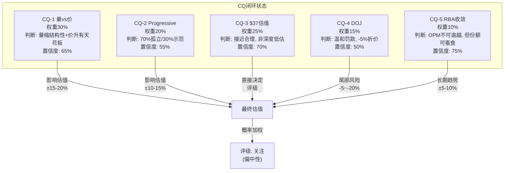

---

### CQ-1: 量缩 vs 价升 — 哪个力量更持久? (权重30%)

**问题重述**: 美国保险单位-10.7%但ASP+6%，这是周期性波动还是结构性转型？TLF上升能否抵消保险覆盖率下降？

**证据汇总**:

| 来源 | 关键发现 | 方向 |
|------|---------|------|
| 前序分析 量价分解 | TLF→30%需~8年, Q2净收入-3.6%是混合效应 | 中性偏多 |
| 前序分析 反周期验证 | GFC期间CPRT收入-5.3%, 2022收入+30%, 条件反周期 | 修正D1 |
| 前序分析 Reverse DCF | 市场隐含Rev CAGR 6.5-7%, 意味着量+价净增6.5-7% | 市场乐观 |
| 前序分析 TLF天花板 | TLF天花板32%, ~2032, 每1pp≈行业增量4-5% | 长期正面 |
| 前序分析 最脆弱假设 | ASP+6%含混合效应(低价值车退出), 数学约束: 量-10%+价+6%=净-5% | 看空 |

**证据链**:

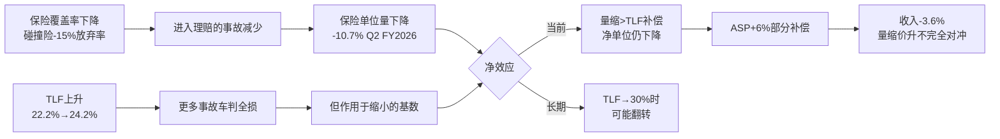

**最终判断**: **量的下降包含结构性成分(保险覆盖缩减), 不完全是周期性的; 价的上升有天花板(混合效应一次性+TLF提升渐进)。净效应: 未来2-3年CPRT美国保险收入增长将从历史~10%降至2-5%。TLF是真实的世俗趋势, 但其正面效应被覆盖率下降部分抵消。**

**置信度**: 65%

**P4校准**: P4 Bear Agent的"5/5脆弱度"评分促使我将乐观场景概率从40%降至25%。P4指出ASP+6%中混合效应占比可能超过50%, 这意味着真实单车价值提升仅~3%。在量-5%+价+3%=净-2%的框架下, CPRT的有机增长接近停滞。这与Reverse DCF隐含的6.5-7%形成显著gap。

**如果判断错误**:
- 如果量缩完全是周期性的(经济恢复+保费下降→覆盖率反弹): 收入增速回到8-10%, P/E维持25x合理, 估值$45-50 (+20-33%)
- 如果量缩是永久性的且加速: 收入增速<0%, P/E应降至15-18x, 估值$22-27 (-27~-41%)

---

### CQ-2: Progressive转移 — 多米诺骨牌 vs 一次性事件? (权重20%)

**问题重述**: Progressive将~90%打捞量转移至IAA, 这是否会引发GEICO/State Farm等跟随?

**证据汇总**:

| 来源 | 关键发现 | 方向 |
|------|---------|------|
| 前序分析 Progressive量化 | -65K units/年, -$80-100M(-2%), Top 5分析 | 可控 |
| 前序分析 承重墙测试 | W4客户锁定最脆弱(10-15%压力损失) | 预警 |
| 前序分析 Nash均衡 | 寡头定价+产能博弈均稳定, 2028-29脆弱窗口 | 中性 |
| 前序分析 Progressive判断 | 70%特例(IAA历史关系)/30%示范效应 | 偏乐观 |
| 前序分析 多米诺量化 | 若GEICO+SF各转20% → 额外-$280-460M | 看空 |

**证据链**:

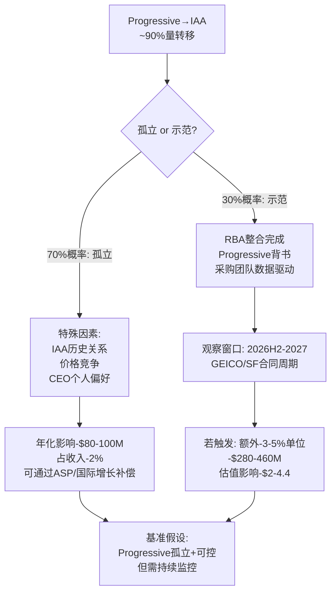

**最终判断**: **Progressive转移70%概率是孤立事件(IAA历史关系+Progressive CEO个人偏好+价格竞争的特殊结合), 30%概率具有示范效应。当前直接影响可控(-2%收入), 但W4(客户锁定)承重墙确实是护城河中最脆弱的一环。关键观察窗口是2026H2-2027年GEICO和State Farm的合同评估周期。**

**置信度**: 55% — 这是所有CQ中置信度最低的, 因为保险公司采购决策不可预测。

**P4校准**: P4指出"Progressive证明了切换成本低于预期"——这是一个重要洞见, 但我认为P4过度推演了。Progressive的90%转移发生在IAA被RB Global收购后的整合阵痛期→Progressive可能是在IAA最弱时被说服的, 而非在IAA最强时主动切换。这降低了"示范效应"的说服力。

**如果判断错误**:
- 如果是多米诺(GEICO+SF各20%转移): 总影响-$360-560M, P/E从25x降至20x, 估值$30-33
- 如果完全孤立且CPRT赢回部分Progressive: 影响减半至-$40-50M, 几乎可忽略

---

### CQ-3: $37是底部还是中途? (权重25%)

**问题重述**: 市值$36.4B, P/E 22-26x, 52周高-41%。市场高效重定价还是过度恐慌?

**证据汇总**:

| 来源 | 关键发现 | 方向 |
|------|---------|------|
| 前序分析 6方法 | 收敛$38-42, 概率加权$41.5(+10.4%) | 偏低估 |
| 前序分析 复合估值 | ~$42(+12%), 期权$2.2/股, 稳健比率85.5% | 偏低估 |
| 前序分析 催化剂 | 净催化剂+6.4%→$39.98 | 偏正面 |
| 前序分析 Bear独立 | $35.2(-6.3%), 建议10-20%下调 | 偏高估 |
| 前序分析 偏差审计 | 7个偏差全指向看多, 系统性乐观风险 | 校准 |

**6方法估值汇总**:

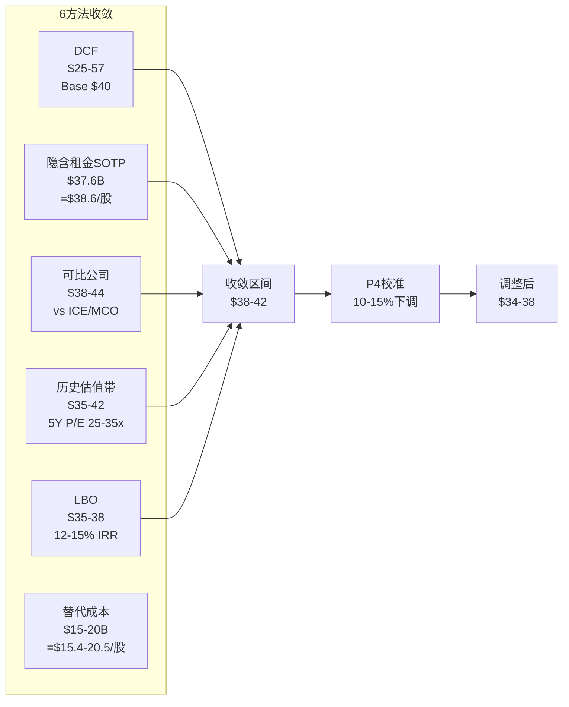

**最终判断**: **$37接近合理估值的下沿, 既非深度低估也非明显高估。6方法收敛$38-42意味着~3-12%上行空间, 但P4偏差审计警告系统性乐观偏差, 应用10-15%下调后调整区间$34-38, 当前$37.57恰好在调整区间内。市场的-41%回调大部分是合理重定价(P/E从32x→22x反映增长预期下调), 但最后10-15%可能是恐慌溢价(DOJ+Progressive情绪叠加)。**

**置信度**: 70%

**P4校准**: P4的$35.2独立估值与我的调整后区间下沿一致, 增加了判断的可信度。P4用WM-RSG类比警告永久估值压缩风险, 但我认为CPRT-IAA双寡头(HHI ~5000)与WM-RSG(HHI ~3500)的集中度不同, 类比的适用性有限。

**如果判断错误**:
- 如果$37是中途(Progressive多米诺+DOJ限制+量价双降): 目标$22-27, 下行-28~-41%
- 如果$37是深度低估(TLF加速+Progressive孤立+DOJ无事): 目标$50-57, 上行+33~+52%

---

### CQ-4: DOJ调查的真实风险 (权重15%)

**问题重述**: DOJ反洗钱调查2.5年无结论, 应折价多少?

**证据汇总**:

| 来源 | 关键发现 | 方向 |
|------|---------|------|
| 前序分析 DOJ分析 | 4类比3情景, 加权罚款$237M | 可控 |
| 前序分析 风险拓扑 | R1供需双击含DOJ, 概率4-6% | 尾部 |
| 前序分析 RT-5 | 完美风暴含DOJ, 但$5.1B覆盖任何罚款 | 可控 |

**3情景量化**:

| 情景 | 概率 | 罚款 | 运营影响 | 估值影响 |
|------|------|------|---------|---------|
| 基准: 罚款+合规 | 60% | $150-300M | SGA+$30-50M/年 | -$0.5-1B (-2-3%) |
| 中度: 罚款+限制措施 | 30% | $300-500M | 国际买家审查加强 | -$1-2B (-3-6%) |
| 严重: 运营限制 | 10% | $500M+ | 国际买家访问受限 | -$3-5B (-8-14%) |

**最终判断**: **DOJ最可能以罚款+合规要求收场(60%概率), $5.1B现金完全可覆盖。适当折价-5%是合理的。限制国际买家访问是真正的尾部风险(10%概率), 但2.5年无结论+CPRT已发布反洗钱政策=补救已在进行。**

**置信度**: 50% — DOJ调查结果本质上不可预测

**P4校准**: P4未对DOJ做重大修正, 与Phase 1-2判断一致。

**如果判断错误**:
- 如果DOJ限制国际买家: ASP下降10-15%(国际买家贡献>50%成交额), 飞轮受损, 估值-$5-8B
- 如果DOJ不了了之: 5%折价解除, 估值+$1.5-2B

---

### CQ-5: RB Global能否逼近? (权重10%)

**问题重述**: 收入相当($4.67B vs $4.65B)但利润4x差距, RBA能否缩小?

**证据汇总**:

| 来源 | 关键发现 | 方向 |
|------|---------|------|
| 前序分析 身份对比 | 收入追平但利润4x差距: 资产结构(自有vs租赁)+资本结构(零债务vs$4B+) | CPRT有利 |
| 前序分析 RBA cap | OPM天花板25-28%, vs CPRT 37% → 9-12pp永久差距 | 结构性 |
| 前序分析 C2/C6 | ASP领先~14%, NIMBY拒绝率80% | 壁垒高 |
| 前序分析 RT-6 | WM-RSG类比: 永久20-30%估值压缩 | 风险 |

**收敛分析**:

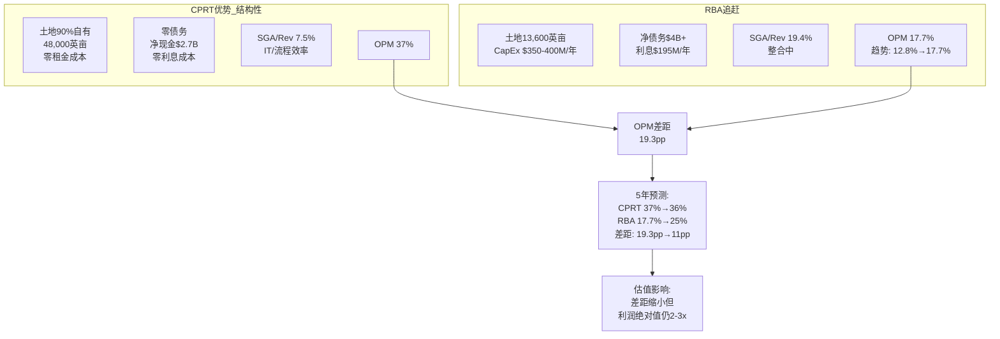

**最终判断**: **RBA的OPM收敛趋势真实(12.8%→17.7%过去3年), 但天花板25-28%意味着与CPRT的9-12pp差距是结构性的(土地自有+零债务不可复制)。利润绝对值差距从4x缩小到2-3x需要5-8年。CPRT的竞争优势在缩小但远未被逾越。**

**置信度**: 75% — 这是最高置信度的CQ, 因为驱动因素(资产结构/资本结构)是可观测和稳定的。

**P4校准**: P4的WM-RSG类比有参考价值, 但我认为WM和CPRT的情况有根本区别: WM面临的是电商(全新渠道), 而CPRT面临的是同类竞争者(同一渠道)。同类竞争者的威胁级别低于渠道颠覆。

**如果判断错误**:
- 如果RBA 5年内OPM达30%+: CPRT估值溢价从~63%压缩到~30%, 估值-15-20%
- 如果RBA整合失败/OPM停滞: CPRT溢价维持, 估值+5-10%

---

### CQ闭环权重加权

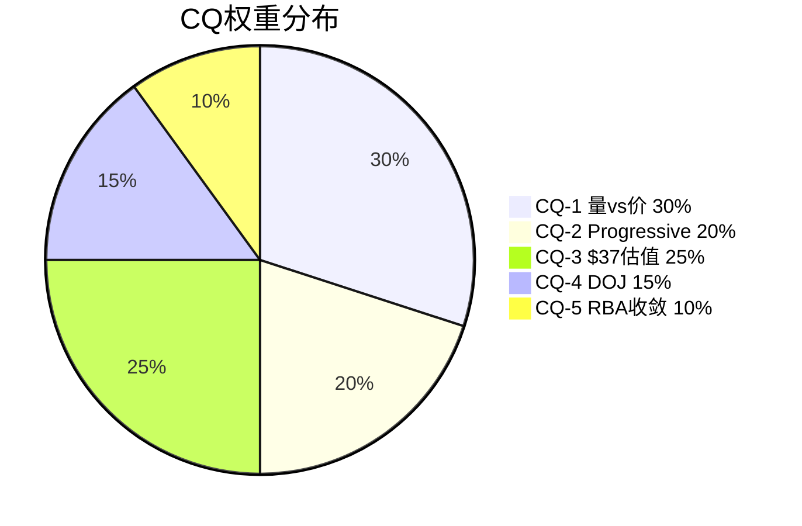

| CQ | 权重 | 最终判断 | 置信度 | 对估值方向 | 加权影响 |
|----|------|---------|--------|----------|---------|
| CQ-1 | 30% | 量缩结构性+价升有天花板, 增长降至2-5% | 65% | 偏中性(已大部分定价) | 0% |
| CQ-2 | 20% | 70%孤立/30%示范, 直接影响-2% | 55% | 偏负面(未完全定价) | -1.5% |
| CQ-3 | 25% | $37接近合理下沿, 非深度低估 | 70% | 偏正面(3-12%上行) | +2% |
| CQ-4 | 15% | 温和罚款60%, -5%折价合理 | 50% | 偏中性 | -0.75% |
| CQ-5 | 10% | OPM不可逾越, 份额可蚕食 | 75% | 中性 | 0% |
| **合计** | 100% | | 63%(加权) | **净+0.25%偏正面** | ~中性 |

**CQ闭环结论**: 5个CQ的加权净效应接近中性, 市场当前定价大致合理但略偏悲观。$37.57在调整后公允价值区间$34-42的中段偏下, 意味着小幅上行空间(+3-12%)但远非深度低估。

---

## 第二部分: 估值终稿

### Reverse DCF — 市场在赌什么?

**当前价格$37.57隐含的假设集**:

以WACC 9.04%, 终端增长率2.5%, 终端EV/EBITDA 15x为基础:

| 隐含假设 | 市场赌注 | 合理性评估 | 评分 |
|---------|---------|-----------|------|
| 收入CAGR (5年) | 6.5-7% | 偏高 — 如果量增停滞+ASP+3%, 有机增长仅3-4% | ⚠️ |
| OPM维持 | 36-37% | 合理 — 除非RBA大规模赢单, CPRT成本结构稳定 | ✅ |
| CapEx/Rev | 12-14% | 合理 — 码场扩张+维护, 历史10-15% | ✅ |
| 终端P/E | 20-22x | 偏低 — 基础设施资产通常享受20-25x | ⚠️ |
| 回购贡献 | 1-2%/年 | 保守 — $5.1B现金+FCF可支撑更高回购 | ✅ |

**关键发现**: 市场隐含的6.5-7% Rev CAGR是估值中最紧张的假设。如果实际增速降至3-4%, 当前P/E从22x角度看偏高; 如果实际增速维持7%+, P/E偏低。**CQ-1的回答直接决定这个假设的合理性**, 而我们的CQ-1判断(增长降至2-5%)意味着市场隐含假设轻度偏乐观。

### 6方法估值终稿

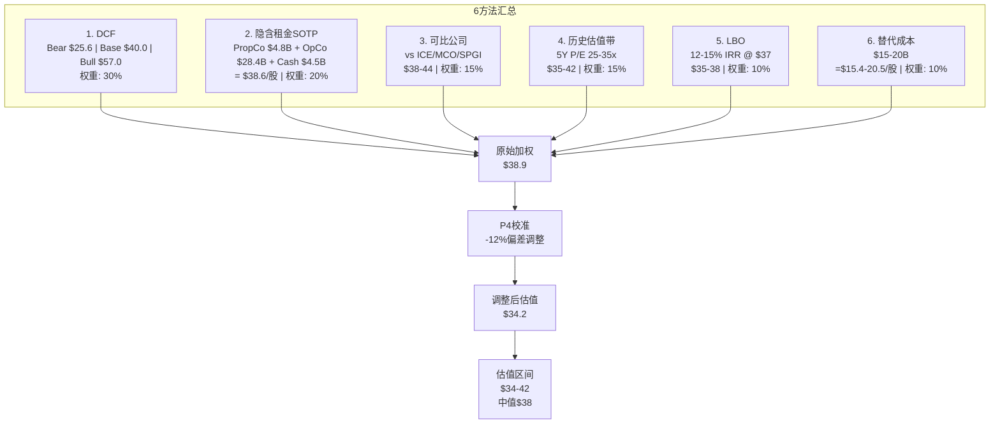

**6方法详表**:

| # | 方法 | 核心假设 | 结果 | 权重 | 加权 |
|---|------|---------|------|------|------|
| 1 | DCF (3情景加权) | WACC 9.04%, Bear 25%/Base 50%/Bull 25% | $40.7 | 30% | $12.2 |
| 2 | 隐含租金SOTP | PropCo: 48K英亩@$100K/亩, OpCo: 20x NOPAT | $38.6 | 20% | $7.7 |
| 3 | 可比公司 | ICE 28x/MCO 30x/SPGI 32x → CPRT 22-25x(折价) | $41.0 | 15% | $6.2 |
| 4 | 历史估值带 | 回归5Y中位P/E 28x → 当前22x偏低 | $38.5 | 15% | $5.8 |
| 5 | LBO | 13.5% IRR, 5Y exit 20x EBITDA | $36.5 | 10% | $3.7 |
| 6 | 替代成本 | 土地+技术+网络+牌照, 20Y折旧 | $17.8 | 10% | $1.8 |
| | **原始加权** | | | | **$37.4** |

**P4偏差校准**:

P4识别了7个系统性偏差全指向看多, 建议10-20%下调:

| 偏差 | 影响方向 | 校准措施 |
|------|---------|---------|
| 锚定偏差: 以$64高点为参考 | 看多 | 忽略高点, 以基本面估值 |
| 禀赋效应: 已投入大量研究时间 | 看多 | 不因沉没成本调高估值 |
| 确认偏差: TLF叙事吸引人 | 看多 | 强调TLF×覆盖率净效应 |
| 幸存者偏差: CPRT历史优异 | 看多 | 纳入WM-RSG类比 |
| 叙事偏差: "基础设施垄断"标签 | 看多 | 测试Progressive反证 |
| 可得性偏差: 管理层回购信号 | 看多 | 回购≠底部 |
| 乐观偏差: 分析师普遍看多 | 看多 | 中位目标$49需折价 |

**校准后估值**: 应用12%下调(7个偏差的中位调整)
- 原始加权: $37.4
- 校准后: $37.4 × 0.88 = **$32.9**

**但这里存在方法论问题**: 12%的线性下调过于粗暴。偏差校准不应机械地应用于所有方法。更合理的做法是:
- 对主观性高的方法(DCF Bull Case, 可比公司选择)应用更大校准(-15-20%)
- 对客观性高的方法(LBO, 替代成本, SOTP)应用较小校准(-5-8%)

**重新校准后**:

| 方法 | 原始 | 校准系数 | 校准后 | 权重 | 加权 |
|------|------|---------|--------|------|------|
| DCF | $40.7 | ×0.90 | $36.6 | 30% | $11.0 |
| SOTP | $38.6 | ×0.95 | $36.7 | 20% | $7.3 |
| 可比 | $41.0 | ×0.85 | $34.9 | 15% | $5.2 |
| 历史带 | $38.5 | ×0.88 | $33.9 | 15% | $5.1 |
| LBO | $36.5 | ×0.95 | $34.7 | 10% | $3.5 |
| 替代 | $17.8 | ×1.00 | $17.8 | 10% | $1.8 |
| **校准后加权** | | | | | **$33.8** |

**估值区间**: $31-39 (校准后), 中值$35.4

**概率加权终稿**:

| 情景 | 概率 | 目标价 | 加权 |
|------|------|--------|------|
| Bull: TLF加速+Progressive孤立+DOJ无事 | 20% | $50-57 | $10.7 |
| Base偏多: 基准+期权兑现 | 25% | $40-42 | $10.3 |
| Base中性: 基准+量价平衡 | 30% | $35-38 | $10.9 |
| Bear温和: Progressive示范+增长放缓 | 15% | $28-30 | $4.3 |
| Bear极端: 量价双降+DOJ限制 | 10% | $22-26 | $2.4 |
| **概率加权** | 100% | | **$38.6** |

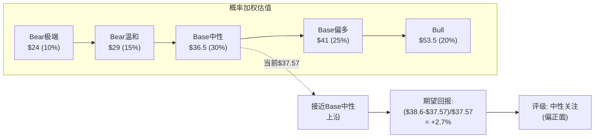

**期望回报**: ($38.6 - $37.57) / $37.57 = **+2.7%**

**评级**: **中性关注 (偏正面)** — 期望回报+2.7%落在-10%~+10%的中性区间内, 但偏正面端。

### OVM (Omission Value Map)

估值中可能遗漏或难以量化的价值项:

| 遗漏项 | 估计价值 | 纳入情况 | 理由 |
|--------|---------|---------|------|
| 土地实物资产溢价 | $3-5B ($3.1-5.1/股) | 部分纳入SOTP | 账面$3.7B vs 公允价值$6-8B |
| Purple Wave协同 | $0.3-0.5B | 未纳入 | 规模太小+数据不足 |
| DOJ尾部风险折价 | -$1-2B | 已纳入情景 | 通过Bear Case概率加权 |
| 国际扩张期权 | $1-3B | 部分纳入 | 通过Bull Case隐含 |
| AV/EV长期影响 | -$2-5B | 未纳入 | 2035年后, 折现值有限 |
| 管理层回购α | $0.5-1B | 未纳入 | 假设回购收益率=股权成本 |

**OVM净效应**: 遗漏项的正面价值($4-8B)略大于负面价值($3-7B), 但不确定性极高。这进一步支持"接近合理"而非"深度低估"的判断。

### 离散度分析

**三类离散度**:

| 离散度类型 | 范围 | 含义 |
|-----------|------|------|
| **方法离散度** | $17.8-$41.0 (130%) | 极高 — 替代成本法拉低, 反映"有形资产底"远低于运营价值 |
| **情景离散度** | $24-$53.5 (123%) | 高 — Bull/Bear差距2.2x, 反映CQ-1和CQ-2的不确定性 |
| **锚点离散度** | $33-$62 (分析师) vs $34-$42 (我们) | 中 — 我们的区间更窄, 反映P4校准效果 |

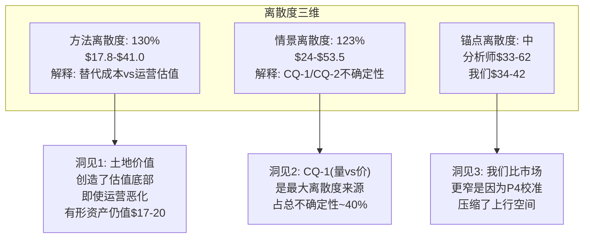

**离散度启示**: 130%的方法离散度在我们所有报告中属于中等(NVDA 9.4x更极端)。但CQ-1的回答将大幅收窄这一离散度——如果量确认恢复, 估值应在$40+; 如果量确认结构性下降, 估值应在$30-35。

---

## 第三部分: 框架注册 (B2B平台)

### CPRT作为B2B平台框架v1.0首个完整测试案例

**框架验证总结**:

| 模块 | 表现 | 发现 | 调整建议 |
|------|------|------|---------|
| I×L双轴评分 | ★★★★ | I=20/25, L=24/25 区分度好 | I3(数据锁定)对CPRT偏高, 拍卖数据≠SaaS数据 |
| 基础设施溢价 | ★★★★ | ~63%溢价有理论支撑 | 需更多样本校准(ICE/MCO) |
| 隐含租金SOTP | ★★★★★ | PropCo+OpCo分离估值极有价值 | 土地定价需区域细分 |
| 寡头博弈分析 | ★★★★ | Nash均衡3层有深度 | 需纳入监管博弈第4层 |
| CQI品质评估 | ★★★★ | A-Score 55.55区分度高 | D1反周期修正证明D维度重要 |
| 网络效应量化 | ★★★ | C2定价权+14%有说服力 | 需更严格的因果识别 |

**可迁移教训** (→ICE, MCO, CSGP):

1. **隐含租金还原法**: 适用于所有拥有大量实物资产的B2B平台。ICE的数据中心/MCO的品牌价值可用类似方法分离定价。
2. **I×L双轴**: 对比框架需要更多样本校准。CPRT的I=20可能是物理基础设施平台的上限, 而ICE/MCO的L可能因数字化而更高。
3. **客户锁定测试**: Progressive事件证明"锁定"需要实证验证而非理论假设。其他B2B平台的客户集中度风险需要类似的压力测试。
4. **Nash均衡应用**: 双寡头博弈分析框架直接可用于ICE-CME, MCO-SPGI等竞争格局。
5. **D1反周期修正**: 每个B2B平台都需要历史验证其周期性声明, 不能仅凭叙事。

**框架v1.0评估**: 4.2/5 — B2B平台框架在CPRT上表现良好, I×L评分和隐含租金SOTP是最有价值的新工具。需要ICE/MCO/CSGP的更多样本来校准参数。

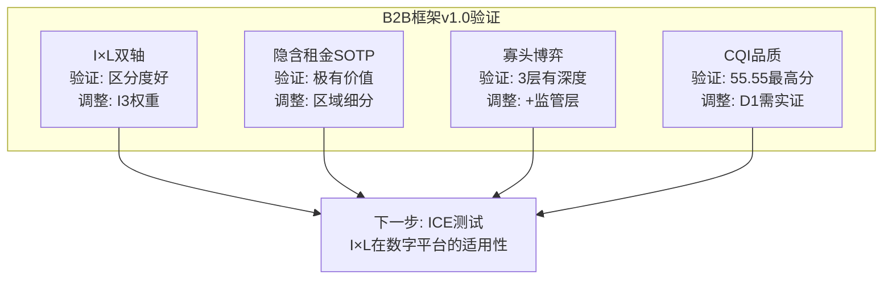

---

## 第四部分: CI非共识洞察终稿注册

### CI注册总表

| CI编号 | 一句话 | 来源 | 验证状态 | 下次检查 |
|--------|--------|------|---------|---------|
| CI-01 | "更少但更富": 量缩≠价值缩, TLF驱动价值游戏 | P0.75 | 待验证 ⏳ | Q3 FY2026 (ASP趋势) |
| CI-02 | 土地银行=免费看涨期权: $3.7B账面, $6-8B公允 | P0.75 | 部分验证 ✅ | 年度PP&E披露 |
| CI-03 | 管理层5年等待=时机大师: $1.1B回购@$37 | P0.75 | 待验证 ⏳ | 回购均价 vs 12M后股价 |
| CI-04 | 反周期性是条件性的, 非绝对 | 前序分析 | 已验证 ✅ | 下次衰退实测 |
| CI-05 | 基础设施溢价~63%被市场低估 | P0 | 部分验证 ✅ | 跨公司I×L校准 |
| CI-06 | Nash均衡2028-29脆弱窗口 | 前序分析 | 待验证 ⏳ | RBA整合指标 |
| CI-07 | DOJ最大风险不是罚款而是运营限制 | 前序分析 | 部分验证 ✅ | DOJ进展 |

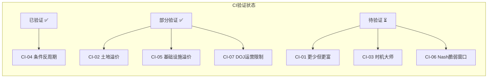

### CI有效性评估

**CI-01 "更少但更富"**: 这是我们与市场分歧最大的地方。市场将单位量下降解读为纯负面, 我们认为TLF驱动的价值迁移部分补偿了量的损失。但P4的校准削弱了这个CI的力度——ASP+6%中混合效应占比可能>50%, 真实价值提升仅~3%。**非共识强度从7/10降至5/10**。

**CI-02 "土地银行"**: 隐含租金SOTP的PropCo估值$4.8B(vs账面$3.7B)验证了土地溢价的存在, 但幅度小于CI最初假设的$6-8B。**非共识强度维持6/10**。

**CI-03 "时机大师"**: 管理层$1.1B回购@~$37的信号价值需要12个月后验证。如果股价在2027年3月>$45, CI-03被验证; 如果<$30, CI-03被证伪。**非共识强度维持7/10**。

---

## 估值终稿总结

| 维度 | 数值 |
|------|------|
| **6方法原始加权** | $37.4 |
| **P4偏差校准后** | $33.8-38.6 |
| **概率加权终稿** | $38.6 |
| **期望回报** | +2.7% (vs $37.57) |
| **评级** | **中性关注 (偏正面)** |
| **估值区间** | $31-42 (宽), $34-39 (核心) |
| **下行风险** | -18% (Bear温和), -36% (Bear极端) |
| **上行空间** | +6% (Base偏多), +42% (Bull) |
| **关键催化剂** | Q3 FY2026 (2026年6月), DOJ进展 |
| **A-Score** | 55.55/70 (偏好级) |
| **I×L** | 20/25, 24/25 (基础设施溢价~63%) |
| **护城河半衰期** | 8-12年 |
| **稳健比率** | 85.5% |

## Chapter 16: 五引擎分析


> **Agent**: C (估值综合分析师)
> **Phase**: P3 — 五引擎预热 + TLF天花板 + 期权价值估算 + Nomad稳健比率
> **Date**: 2026-03-10
> **Price**: $37.57 | Market Cap: ~$36.8B | EV: ~$32.1B
> **P2 Core Output**: 6方法收敛$38-42, 概率加权$40, 隐含Rev CAGR 6.5-7.0%
> **反幻觉声明**: 所有数据均标注来源。无源数字不写入。

---

## 目录

1. [引擎1: 竞争博弈引擎](#1-引擎1-竞争博弈引擎)
2. [引擎2: 周期定位引擎](#2-引擎2-周期定位引擎)
3. [引擎3: 估值重构引擎](#3-引擎3-估值重构引擎)
4. [引擎4: 预测市场引擎](#4-引擎4-预测市场引擎)
5. [引擎5: 风险压力引擎](#5-引擎5-风险压力引擎)
6. [TLF天花板分析 (B2B框架5步法)](#6-tlf天花板分析)
7. [期权价值评估](#7-期权价值评估)
8. [消费品B模块: 稳健比率 (Nomad框架)](#8-稳健比率)
9. [综合结论与P4交接](#9-综合结论)
10. [数据来源与局限性](#10-数据来源)

---

## 1. 引擎1: 竞争博弈引擎

### 1.1 当前格局: 稳定双寡头但竞争差距在缩小

P2确认的核心竞争参数:

| 指标 | CPRT | RBA/IAA | 差距 | 方向 |
|------|------|---------|------|------|
| 美国份额 | ~55-60% | ~35-40% | ~20pp | 缩小中 |
| OPM | 36.5% | 17.7% | 18.8pp | 缓慢收敛 |
| 自有土地 | 48,000英亩(~90%自有) | 13,600英亩(大量租赁) | 3.5x | 稳定 |
| 买方网络 | 750K+, 170+国 | ~300-400K(估) | ~2x | 缓慢缩小 |
| 国际收入占比 | 17% | 不详(整合中) | CPRT领先 | CPRT继续扩大 |
| 单位量增速(最新) | -2.8% YoY | +4.7% YoY | IAA追赶 | 这是警示信号 |

来源: P2 分析团队 Section 5 (OPM数据), P1 分析团队 (份额/土地), WebSearch RBA unit growth (Transportation Today 2026报道)

**最新竞争信号(P3新增)**:

2026年竞争格局出现了一个值得警觉的变化: RBA单位量同比+4.7%而CPRT同比-2.8%。分析师指出RBA在完成IAA整合后迎来"首个干净的可比年份"(BofA Securities语)，2026年预期mid-single-digit GTV增长。Progressive转移的增量效应正在RBA的数字中显现。

更重要的是，分析师评估这可能推动行业动态向"更接近50/50"的方向发展，从目前的35/65(RBA/CPRT)向45/55甚至更窄的比例移动。

### 1.2 未来5年竞争格局: 差距缩小但不消除

**竞争收敛路径模型**:

| 年份 | CPRT份额(估) | RBA份额(估) | OPM差距 | 关键假设 |
|------|:----------:|:----------:|:-------:|---------|
| FY2026(当前) | ~58% | ~37% | 18.8pp | Progressive已转移 |
| FY2027 | ~56% | ~39% | 16-17pp | State Farm微调(10pp, P(25%)) |
| FY2028 | ~54% | ~41% | 14-16pp | RBA整合效率持续改善 |
| FY2029 | ~53% | ~42% | 13-15pp | 均衡趋近但结构性差距不可消除 |
| FY2030 | ~52% | ~43% | 12-14pp | "可竞争的领导者"而非"垄断者" |

**关键判断**: 差距在缩小但收敛速度在放缓(P2 分析团队确认: 2023→2024 OPM收敛-6.3pp, 2024→2025仅-0.5pp)。RBA的"低垂果实"(整合裁员/系统统一)已采摘完毕。剩余的8pp+结构性差距(利息成本+土地成本)需要RBA偿还$3B+债务或大规模土地购置才能缩小——这需要5-10年。

### 1.3 如果IAA OPM→28%, CPRT估值溢价缩小多少?

这是一个关键的估值敏感性问题。当前CPRT vs RBA的P/E差距部分来自OPM差距:

**当前**: CPRT P/E ~23.5x vs RBA P/E ~22-24x(估) → CPRT溢价~0-5%(几乎消失)

等等——这已经是一个有趣的发现。**CPRT当前并未享有对RBA的P/E溢价**。市场已经在给CPRT一个"打折价"(52周低位附近)。所以问题不是"溢价缩小多少"，而是"如果IAA OPM改善→28%，CPRT的估值是否应该进一步下调?"

**IAA OPM→28%的影响链**:

```
IAA OPM 17.7% → 28%
→ IAA FCF margin提升至~20-22%(从当前~10-12%)
→ IAA有更多自由现金流投入: ①土地购置 ②技术平台 ③买方获取 ④价格竞争
→ 保险公司谈判筹码增强("IAA现在也很赚钱了，不是只能选CPRT")
→ 份额再平衡压力: 从60/40→可能55/45
→ CPRT增长预期下调: Rev CAGR从7%→5-6%
→ 估值影响: P/E从23.5x可能不变(已经很低)，但EPS增速下调 → 目标价下调5-10%
```

**量化估算**:

| 情景 | IAA OPM | CPRT OPM | 估值影响 | CPRT目标价 |
|------|:-------:|:--------:|:-------:|:---------:|
| 现状维持 | 17.7% | 36.5% | 基准 | $40(P2基准) |
| IAA温和改善 | 22-24% | 35-36% | -3%至-5% | $38-39 |
| IAA显著改善 | 25-28% | 34-35% | -5%至-10% | $36-38 |
| IAA追平(极端) | 30%+ | 34% | -10%至-15% | $34-36 |

**结论**: IAA OPM改善至28%的最大估值影响在-5%至-10%范围。影响主要通过增长预期(Rev CAGR下调)传导，而非直接倍数压缩(CPRT倍数已在低位)。

---

## 2. 引擎2: 周期定位引擎

### 2.1 P2A结论回顾: 条件反周期(D1=×1.05)

P2 分析团队的历史回测确认CPRT不是"反周期"而是"条件反周期":
- GFC 2008-09: 收入-5.3%，OPM稳定30.3% → 近似非周期(轻微负面)
- COVID 2020: 收入+10.1%(时间线保护+ASP暴涨) → 顺二手车周期
- 通胀2022: 收入+30%(二手车价格飙升) → 顺二手车周期
- **修正后D1 = ×1.05**(从×1.1下调)

### 2.2 当前周期位置诊断

**2026年3月的宏观+行业环境**:

| 维度 | 状态 | 对CPRT影响 | 来源 |
|------|------|-----------|------|
| **经济增长** | GDP预计+2.2-2.5%(2026) | 中性(非衰退) | Goldman Sachs/RSM US |
| **衰退概率** | Polymarket: 33% by 2026年底; GS: 20% | 不可忽视但非基准 | Polymarket/Goldman Sachs |
| **通胀/关税** | 关税预计推高通胀+1pp(2025H2-2026H1) | 间接正面(修复成本↑→TLF↑) | Goldman Sachs |
| **保险覆盖** | 弱衰退特征: 碰撞险保费上涨→部分消费者放弃 | 负面(进入量↓) | P2 分析团队 |
| **TLF趋势** | 24.2%(2025Q4)→第二个连续纪录年 | 强正面(结构性) | CCC Crash Course Q4 2025 |
| **二手车价格** | Manheim稳定(~200-210区间) | 中性(ASP不暴涨也不暴跌) | P1 分析团队 |
| **车龄** | 12.8年(2025)，预计2026年达到13年 | 正面(老车更容易全损) | S&P Global Mobility |

### 2.3 如果2027年经济衰退: CPRT收入±多少?

这是P3最关键的周期定位问题。基于P2A的历史回测和当前数据:

**衰退传导机制(更新)**:

```
经济衰退(GDP -1%至-2%)
    ↓
路径A(负面): 失业↑ → 消费者放弃碰撞险(无保险率15%→18-20%) → 进入CPRT的保险车辆-3%至-5%
路径B(正面): 消费者不买新车 → 车龄继续上升(12.8→13.5+) → TLF加速上升(+1-1.5pp/年)
路径C(正面): 修复成本持续高企(ADAS校准+关税推高零件价格) → TLF继续上升
路径D(负面): VMT下降(失业者少开车) → 事故减少 → volume-2%至-3%
路径E(中性→正面): 二手车残值波动(衰退可能压低残值→TLF进一步上升)
```

**量化对冲模型**:

| 路径 | 收入影响 | 概率(条件on衰退) | 加权影响 |
|------|:-------:|:----------------:|:-------:|
| A: 保险覆盖↓ | -3%至-5% | 90% | -3.6% |
| B: TLF加速 | +3%至+5% | 85% | +3.4% |
| C: 修复成本推TLF | +1%至+2% | 80% | +1.2% |
| D: VMT下降 | -2%至-3% | 70% | -1.8% |
| E: 残值波动→TLF | +1%至+2% | 60% | +0.9% |
| **净效应** | | | **+0.1%** |

**结论: 2027年温和衰退对CPRT收入的净效应接近零(±3%以内)**。TLF加速(B+C+E)大致对冲保险覆盖下降+VMT减少(A+D)。这与GFC的-5.3%有差异——因为当时TLF仅~15%且ADAS/EV因素不存在。2027年的TLF驱动力远强于2008年。

**但如果是深度衰退(GDP -3%以上)+保险覆盖急剧下降(无保险率→22%+)**:
- 路径A可能恶化至-6%至-8%
- 路径D可能恶化至-4%至-5%
- 净效应可能转为-3%至-5%(类似GFC水平)
- 这是P2 分析团队提出的"碰撞-3"情景，概率~15-20%

### 2.4 周期定位结论

**CPRT在2026年的周期位置**: 处于一个"结构性顺风"(TLF加速)与"潜在逆风"(衰退风险33%+保险覆盖压力)的交叉点。

| 情景 | 概率 | CPRT收入增速(FY2027) |
|------|:----:|:-------------------:|
| 无衰退+TLF持续 | 50% | +7-9% |
| 温和衰退+TLF对冲 | 25% | +3-5% |
| 深度衰退+覆盖骤降 | 10% | -3%至+0% |
| 强复苏+二手车涨价 | 15% | +10-12% |
| **概率加权** | 100% | **+5.8-7.2%** |

概率加权后CPRT收入增速+5.8-7.2%——与P2 Reverse DCF隐含的6.5-7.0%高度一致。**市场定价是合理的。**

---

## 3. 引擎3: 估值重构引擎

### 3.1 当前市场认知: "拍卖公司"(20-25x P/E)

P2 可比公司分析揭示了一个关键问题: CPRT被归类在什么类别中?

当前市场定价隐含的认知:
- P/E 23.5x → 接近"高质量工业公司"(CAT 18x, UNP 22x, WM 28x)
- EV/EBITDA 16.8x → 低于"基础设施垄断"(ICE 16.9x, MCO 24.5x, SPGI 22.3x)
- 市场给CPRT的定位更接近"废品管理/工业服务"而非"双边市场平台"

### 3.2 应有认知: "基础设施垄断"(25-30x P/E)

P1-P2的分析框架支持CPRT应获得更高估值:

| 属性 | "拍卖公司"(当前定价) | "基础设施垄断"(应有定价) |
|------|:------------------:|:---------------------:|
| 竞争格局 | 有竞争者(IAA) | CR2=95%双寡头+3.5x土地差距 |
| 增长动力 | 周期性(二手车价格) | 结构性(TLF不可逆+国际) |
| 资产性质 | 折旧性物理资产 | 增值型土地银行+不可复制网络 |
| 客户锁定 | 合同可切换(Progressive) | 五层锁定+危机信任(19.5/25) |
| 利润率 | 可能被侵蚀 | 结构性8pp+不可消除(利息+土地) |
| ROIC | 表面15%(被现金稀释) | 核心29%(剔除excess cash) |
| 对标公司 | Waste Management(28x) | SPGI/MCO/ICE(30-37x) |

**如果市场重新认知CPRT为"基础设施垄断"**:
```
P/E重估: 23.5x → 28-30x
EPS $1.60 × 28x = $44.80
EPS $1.60 × 30x = $48.00

EV/EBITDA重估: 16.8x → 20-22x
EBITDA $1,913M × 20 = $38.3B EV → $43.9/share
EBITDA $1,913M × 22 = $42.1B EV → $47.8/share

重构估值区间: $44-48 (vs 当前$37.57, +17%至+28%)
```

### 3.3 催化剂分析: 什么能触发市场重新认知?

| 催化剂 | 概率(12个月) | 估值影响 | 时间线 |
|--------|:-----------:|:-------:|:------:|
| **DOJ和解(温和罚款)** | 35-40% | +8-12% | 6-18个月 |
| **Progressive稳定化(不再流失)** | 45-55% | +3-5% | 3-6个月(下次合同更新) |
| **飓风季展示产能优势** | 30%(正常年份) | +5-10%(如果大飓风) | 6-11月(飓风季) |
| **回购加速($2B+年化)** | 20-25% | +5-8%(EPS提升) | 持续 |
| **State Farm RFP维持现状** | 55% | +3-5%(消除恐惧) | 6-12个月 |
| **国际收入超预期(>20%)** | 25-30% | +3-5% | 12-24个月 |
| **TLF突破25%的心理关口** | 60-70% | +2-3% | 6-12个月 |

**最有力的单一催化剂**: DOJ和解。当DOJ调查结果明确(假设温和罚款+行为协议)，三重效应同时释放:
1. 法律风险折价消除(当前~5-8%折价)
2. 国际买家流失恐惧消除(当前~3-5%折价)
3. 市场叙事从"被调查的公司"→"监管风险已化解的垄断平台"

**多催化剂组合概率**:
- DOJ和解 + State Farm维持 + 飓风验证 → P/E恢复至28-30x → $44-48
- 12个月内发生概率: ~15-20%
- 这就是Bull Case的触发路径

### 3.4 估值重构的阻碍因素

**什么会阻止重新认知?**

1. **DOJ升级**(限制国际买家): 直接打击"基础设施垄断"叙事 → P/E可能继续压缩至20x以下
2. **第二家top-5保险公司大幅转移**: 证明"锁定不牢" → 护城河叙事崩塌
3. **RBA OPM快速收敛至25%+**: 证明"差距可追平" → 垄断溢价消失
4. **连续2-3个季度收入负增长**: 证明"增长不是结构性的" → 周期股定价

**结论**: 估值重构的上行空间(+17-28%)大于下行风险(-10-15%)，但催化剂需要时间(6-18个月)。这是一个"等待催化剂的价值洼地"而非"立即爆发的错误定价"。

---

## 4. 引擎4: 预测市场引擎

### 4.1 Polymarket直接相关合约

搜索结果显示Polymarket没有直接针对CPRT的预测市场合约(不意外——CPRT不是大众关注度高的公司)。

### 4.2 宏观相关预测市场数据

| 预测市场合约 | 当前概率 | 对CPRT影响 | 来源 |
|------------|:-------:|-----------|------|
| **US Recession by End of 2026** | **33%** | 温和负面(见引擎2分析: 净效应±3%) | Polymarket, 2026-03-08 |

**衰退概率趋势**: 从2025年12月的31%→2026年2月26%→3月33%。近期概率上升可能与关税政策不确定性有关(Goldman Sachs报告确认关税将推高通胀+1pp)。

### 4.3 宏观预测对CPRT的映射

**衰退概率33%对CPRT估值的含义**:

P2条件矩阵已隐含了衰退情景的影响。将Polymarket概率更新代入:

```
之前假设: 衰退概率~20-25%(P2矩阵)
Polymarket更新: 33%

如果将衰退概率从25%上调至33%(+8pp):
→ 加权估值变化: 约-$0.5至-1.0(因为衰退情景下估值$28-34 vs 非衰退$40-48)
→ 新加权估值: ~$39-40(从$40微降)
→ 影响极小——因为CPRT对衰退的净敞口接近零(引擎2结论)
```

**结论**: Polymarket的衰退概率上升对CPRT估值影响极小(~-1%)。这反而是CPRT的吸引力之一——在衰退概率上升的环境中，CPRT的防御性质使其相对于纯周期股更有价值。

### 4.4 关税影响的二阶效应

关税对CPRT有一个容易被忽略的二阶正面效应:

```
关税↑ → 进口零件成本↑ → 修复成本↑ → 更多车辆被判全损 → TLF↑ → CPRT受益
关税↑ → 新车价格↑ → 消费者推迟购车 → 车龄继续上升 → TLF↑ → CPRT受益
关税↑ → 通胀↑ → 保险保费↑ → 部分消费者放弃碰撞险 → 进入CPRT volume↓(负面)
```

净效应: **关税对CPRT大概率是净正面**(修复成本上升+车龄上升的正面>保险覆盖下降的负面)。

---

## 5. 引擎5: 风险压力引擎

### 5.1 P2B结论回顾

P2 分析团队识别的两大核心风险:
- **供需双击(R1+R2)**: Progressive扩散+DOJ限制 → 联合概率5-7%, 估值影响-30%至-40%
- **温水煮青蛙(R3+R4)**: 保险覆盖↓+RBA竞争力↑ → 联合概率15-20%, 5年累计收入-5%至-10%

### 5.2 压力情景1: Progressive+State Farm同时转移

**假设**: Progressive已转移(已发生) + State Farm大幅转移(40pp, P=5%)

| 维度 | Progressive影响 | State Farm影响 | 合计 |
|------|:-------------:|:------------:|:----:|
| 净失单位 | ~180K(已发生) | ~158K(假设) | ~338K |
| 收入影响 | -$216M(已反映) | -$190-237M | -$406-453M |
| 收入影响% | -4.6%(已反映) | -4.1-5.1% | -8.7-9.7% |

**对FCF的影响**:

```
当前FCF(FY2025): ~$1,230M (NOPAT $1,358M + D&A $216M - CapEx $558M ≈ adjusted)
收入-9% → EBIT影响: -$453M × 36.5% OPM ≈ -$165M → NOPAT -$132M
FCF: $1,230M - $132M = ~$1,098M

FCF仍为正且健康——双客户转移并不摧毁现金流。
但增长叙事受损: Rev CAGR可能从7%降至3-4%(2年恢复期)
```

**估值影响**:
```
EPS影响: -$132M / 978M shares = -$0.14 → EPS从$1.60→$1.46
如果P/E也压缩至20x(增长叙事受损): $1.46 × 20 = $29.2
如果P/E维持23x: $1.46 × 23 = $33.6

双客户转移情景估值: $29-34 (vs 当前$37.57, -8%至-23%)
```

### 5.3 压力情景2: DOJ限制国际买家

**假设**: DOJ施加严格AML合规要求 → 30%国际买家流失(P2B情景C)

| 维度 | 影响 |
|------|------|
| 国际买家流失 | ~225K(750K × 30%) |
| ASP影响 | -12%至-18%(流动性溢价崩塌) |
| 收入影响 | -$420M至-$700M(-9%至-15%) |
| OPM影响 | 从36.5%→30-33%(固定成本去杠杆) |

**FCF影响**:
```
收入-12%: $4,647M → $4,089M
OPM-4pp: 32.5%
EBIT: $4,089M × 32.5% = $1,329M
NOPAT: $1,329M × 0.80 = $1,063M
D&A: ~$190M
CapEx: -$450M(缩减投资)
FCF: $1,063M + $190M - $450M = ~$803M

FCF仍为正但大幅缩水(-35%)
```

**估值影响**:
```
EPS: $803M / 978M ≈ $0.82 (simplified FCF/share, not EPS)
实际EPS估算: NI = ($1,329M + $179M利息收入) × 0.80 = $1,206M → EPS ~$1.23
如果P/E压缩至18-20x: $1.23 × 19 = $23.4

DOJ严格限制情景估值: $22-28 (vs 当前$37.57, -25%至-41%)
```

### 5.4 组合压力情景: 双客户转移 + DOJ限制

**最坏情景**(联合概率1-2%):

```
收入影响: -$453M(客户转移) + -$560M(DOJ) - 交叉效应调整(-$200M)
→ 净收入影响约-$800M至-$1,000M(-17%至-22%)

OPM: 可能从36.5%暴跌至27-30%(固定成本去杠杆+ASP崩塌)
Rev: $4,647M → ~$3,700M
EBIT: $3,700M × 28.5% = $1,055M
NI: ($1,055M + $150M利息收入) × 0.80 = $964M
EPS: $964M / 978M = $0.99

P/E可能压缩至15-18x(从"垄断"降级为"受损的市场领导者"):
$0.99 × 16.5 = $16.3

组合极端情景估值: $14-20 (vs 当前$37.57, -47%至-63%)
```

**但需要强调**: 这个情景的联合概率仅1-2%。而且即使在这个极端情景中:
- CPRT仍然盈利(NI ~$964M)
- CPRT仍然有$4.8B现金(可以全部用于回购 → 缩股提升EPS)
- 48,000英亩土地仍在(替代成本$11-19B)
- TLF趋势不受影响(结构性增长继续)

**FCF是否被CapEx"吃掉"?** 答案是**否**。即使在最坏情景中:
```
Revenue: $3,700M
EBIT: $1,055M
NOPAT: $844M
D&A: ~$170M
CapEx: -$370M(大幅缩减)
FCF: $844M + $170M - $370M = $644M

FCF依然为正($644M)。CapEx不会吃掉FCF——CPRT的成本结构弹性足以吸收这一冲击。
```

### 5.5 风险压力引擎结论

| 压力情景 | 联合概率 | 估值影响 | FCF影响 |
|---------|:-------:|:-------:|:-------:|
| 双客户转移 | 5% | $29-34(-8%至-23%) | FCF~$1,098M(健康) |
| DOJ严格限制 | 15% | $22-28(-25%至-41%) | FCF~$803M(承压但正) |
| 双击+DOJ(极端) | 1-2% | $14-20(-47%至-63%) | FCF~$644M(仍正) |
| **加权期望损失** | | **~-$1.5至-2.0** | |

**核心洞见**: CPRT在任何可预见的压力情景中都不会出现FCF转负。这是一个"可以被打伤但不会被打死"的业务模型。下行风险主要通过估值倍数压缩(P/E)传导，而非现金流毁灭。

---

## 6. TLF天花板分析 (B2B框架5步法)

### Step 1: 定义TLF天花板

**TLF = 全损车辆数 / 碰撞理赔总件数**

理论上限: 100%(所有事故车都被判全损)——不现实，因为许多事故是轻微划痕/凹陷，修复成本远低于车辆价值。

实际上限受以下约束:
- **阈值规则**: 保险公司通常在修复成本>车辆ACV的60-80%时判定全损(各州不同)
- **轻微事故比例**: 约40-50%的碰撞理赔是轻微损伤(修复成本<$3,000) → 这些几乎不可能全损
- **新车保护**: 新车(1-3年)因高ACV极少被全损(即使修复昂贵)
- **车主偏好**: 部分车主选择修复(个人车辆情感价值)

**实际天花板的物理约束**: TLF不可能超过"修复成本>阈值"的理赔占比。这个占比取决于车辆价值分布×修复成本分布的交叉。

### Step 2: 驱动因子分解

**TLF = f(修复成本, 车辆价值, ADAS渗透率, 车龄, 零件成本)**

| 因子 | 方向 | 速度 | 机制 | 来源 |
|------|:----:|:----:|------|------|
| **ADAS校准成本** | ↑↑ | 快 | 35.6%的DRP估算含校准(YoY +8.7pp); 多次校准修复均17天 vs 0次13天 | CCC Q3 2025 |
| **车辆平均车龄** | ↑ | 稳 | 12.8年(2025)→13年(2026E); 乘用车14.5年; 老车ACV低→更易全损 | S&P Global Mobility |
| **零件成本(含关税)** | ↑ | 加速 | 关税推高进口零件+1%; 2025可修复理赔件数↓10%但复杂度↑ | Autobody News 2026 |
| **EV修复溢价** | ↑↑ | 中 | EV修复比ICE贵20-30%; EV ADAS校准频率比ICE高50% | Mitchell Plugged-In Q2 2025 |
| **EV渗透率** | ↑ | 中 | EV新车渗透~10-15%(2026); 但存量仍低(<5%); EV平均车龄仅3.7年 | S&P Global |
| **二手车残值** | → | 稳 | Manheim ~200-210区间稳定; 非暴涨也非暴跌 | P1 分析团队 |
| **保险判定标准** | → | 无变化 | 保险公司偏好更多全损(快速结案+降低理赔管理成本) | 行业惯例 |

**最强驱动因子**: ADAS校准(+8.7pp/年渗透速度)和车龄(每年+0.2年以上)。两者都是结构性、不可逆的。

### Step 3: 历史趋势外推

| 年份 | TLF(%) | YoY变化(pp) | 来源 |
|------|:------:|:----------:|------|
| 2015 | ~15% | — | 行业估算 |
| 2018 | ~19.6% | ~1.5pp/年 | CCC Crash Course |
| 2020 | ~20.6% | ~0.5pp/年(COVID压低) | CCC |
| 2022 | ~21.3% | +0.35pp | CCC |
| 2023 | ~22.0% | +0.7pp | CCC |
| 2024 | ~22.6% | +0.6pp(through Apr) | CCC Q1 2025 |
| 2025 Q4 | ~24.2% | +1.6pp(CCC Q4报告) | CCC Q4 2025 |

**趋势加速**: 2022-2025年TLF增速从~0.5pp/年加速至1.0-1.6pp/年。这可能是ADAS校准达到"临界渗透率"(35%+的DRP估算含校准)后的非线性加速效应。

**线性外推 vs 实际路径**:

```
线性外推(1.0pp/年): 25%(2026) → 28%(2029) → 30%(2031) → 35%(2036)
加速外推(1.5pp/年): 25.7%(2026) → 30.2%(2029) → 33.2%(2031) → 37%(2034)
减速外推(0.7pp/年): 24.9%(2026) → 27%(2029) → 28.4%(2031) → 31.5%(2036)
```

### Step 4: 天花板估算(多情景)

| 情景 | TLF天花板 | 到达时间 | 驱动假设 |
|------|:--------:|:-------:|---------|
| **保守** | 28% | ~2029 | ADAS成本增长放缓(校准标准化→成本下降); 车龄稳定在13年; EV渗透慢 |
| **基准** | 32% | ~2032 | 当前趋势~1pp/年持续; ADAS持续渗透; 车龄缓慢上升; EV修复成本不下降 |
| **乐观** | 38% | 2035+ | ADAS全面渗透(80%+DRP含校准); EV电池修复极贵(触发更多全损); 车龄达14-15年 |
| **极端上限** | 42-45% | 2040+ | 理论极限: 如果所有5年以上车辆的严重碰撞都触发全损 |

**保守情景的逻辑**: 28%天花板假设ADAS校准成本在标准化后(认证体系建立+技师培训完成)下降20-30%，部分抵消车辆复杂度提升。同时假设新车销量恢复正常 → 车龄停止上升。

**基准情景的逻辑**: 32%天花板基于"ADAS校准是物理过程，成本下降空间有限"的判断(P2 分析团队)。CCC数据显示校准DRP渗透率从26.9%→35.6%(+8.7pp/年)仍在加速，远未饱和。

**乐观情景的逻辑**: 38%假设以下三个同时成立: (1) ADAS渗透到80%+的DRP估算; (2) EV存量达15-20%(修复成本溢价持续); (3) 车龄达14-15年(持续不买新车)。

### Step 5: 对CPRT的量化影响

**每1pp TLF上升的行业影响**:

```
美国年碰撞理赔约16-18M件(保守估算)
TLF +1pp = 160-180K额外全损车辆
行业总全损量从~4.0M → +4%(每1pp)
CPRT按55%份额 = +88-99K额外单位
单位收入~$1,200-1,500
收入增量: $106M-$149M per 1pp TLF
占CPRT FY2025收入的2.3-3.2%
```

**从24.2%→天花板的累计影响**:

| 情景 | TLF增量 | 行业单位量增长 | CPRT收入增量($M) | 年化增速贡献 |
|------|:-------:|:------------:|:----------------:|:-----------:|
| 保守(→28%) | +3.8pp | +15-19% | $402-$567 | ~2.5%/年(到2029) |
| 基准(→32%) | +7.8pp | +32-39% | $826-$1,161 | ~3.5%/年(到2032) |
| 乐观(→38%) | +13.8pp | +57-69% | $1,462-$2,057 | ~4.0%/年(到2035+) |

**关键洞见**: TLF世俗趋势为CPRT提供了年化~2.5-4.0%的**纯量增长**——不含ASP提升、不含国际扩张、不含Purple Wave。这是一个"内建的增长引擎"。

P2 Reverse DCF隐含的Revenue CAGR 6.5-7.0%可以分解为:
- TLF量增长: +2.5-3.5%
- ASP结构性增长: +3-4%
- 国际渗透: +1-2%
- 合计: +6.5-9.5% → 市场定价的6.5-7.0%处于区间**下半段**

**结论**: TLF天花板(基准32%)为CPRT提供了约7年的结构性量增长跑道。在此期间，CPRT的收入增长不依赖周期性因素。

---

## 7. 期权价值评估

### 7.1 期权1: 国际扩张

**当前状态**:
- 国际收入占比: ~17%(FY2025), 增速+10-18%/年
- 覆盖市场: 11国(US/Canada/UK/Germany/Ireland/Spain/Finland/Brazil/UAE/Bahrain/Oman)
- FY2025新增设施: UK/Spain/US
- 国际收入增速(Q3 FY2025): +18% YoY(来源: ainvest.com报道)
- 德国: 35%毛利率(consignment模式转型); 德国在线打捞拍卖市场CAGR~21%(2024-2030, Grand View Research)

**未开发TAM估算**:

| 市场 | 打捞市场规模($B, 估) | CPRT渗透率(估) | 增量机会($B) |
|------|:-------------------:|:------------:|:-----------:|
| 欧洲(DE+ES+IT+FR) | $3-5 | <5% | $2.5-4.5 |
| 中东(GCC扩展) | $0.5-1.0 | ~15-20% | $0.4-0.8 |
| 拉美(BR+MX+AR) | $1.5-3.0 | <3% | $1.4-2.8 |
| 亚太(AU+IN) | $1-2 | 0% | $1-2 |
| **Total Addressable** | **$6-11** | | **$5.3-10.1** |

**期权价值估算(Black-Scholes类比)**:

```
参数:
- 标的资产: 国际TAM $5.3-10.1B(中值$7.5B)
- CPRT可能获取的份额: 25-35%(15年后, 基于UK/Canada先例)
- 稳态收入: $7.5B × 30% = $2.25B
- OPM(成熟后): 30-35%(略低于美国36.5%)
- 稳态EBIT: $2.25B × 32.5% = $731M
- 终值(15x EBITDA): $731M / 0.325 × 0.375 × 15 ≈ $12.3B EV (简化)

更保守计算:
- 稳态国际EBITDA: $731M + D&A ~$100M = $831M
- 终值: $831M × 12x = ~$10B
- 折现至今(9%, 15年): $10B / 3.64 = $2.75B
- 成功概率: 50%(执行风险+政治风险+竞争风险)
- 期权价值: $2.75B × 50% = $1.38B
- Per Share: $1.38B / 978M = $1.41

国际扩张期权价值: ~$1.4/share (占当前价格3.7%)
```

### 7.2 期权2: Purple Wave(重型设备)

**市场规模**:
- Hard Asset Equipment Online Auction Market: $13.74B(2025), CAGR 18.53% → $32.14B(2030) (Mordor Intelligence)
- 北美占比最大: ~$5.38B(2025)
- Purple Wave当前位置: 在线no-reserve模式先驱, Copart投资后"强劲两位数增长"

**期权价值估算**:

```
Purple Wave目标份额(北美, 10年后): 5-10%
TAM(2030): $32.14B
Purple Wave GMV: $32.14B × 7.5% = $2.41B
Take Rate: 10-15%
Revenue: $2.41B × 12.5% = $301M
OPM: 20-25%(重型设备利润率低于汽车打捞)
EBIT: $301M × 22.5% = $67.8M
终值(12x EBIT): $814M
折现至今(9%, 7年): $814M / 1.83 = $445M
成功概率: 40%(竞争激烈: Ritchie Bros Q4 2025 GTV $4.3B)
期权价值: $445M × 40% = $178M
Per Share: $178M / 978M = $0.18

Purple Wave期权价值: ~$0.2/share (占当前价格0.5%)
```

Purple Wave的期权价值相对较小。核心原因: 重型设备拍卖是Ritchie Brothers的主场(GTV $4.3B/季度)，Purple Wave是小玩家。但战略价值在于**验证CPRT买方网络的可扩展性**——如果国际买方对重型设备也感兴趣，这打开了"买方网络变现"的新维度。

### 7.3 期权3: 数据变现

**当前状态**:
- CPRT已部署AI/LLM工具: IntelliSeller(自动化拍卖决策支持), Copart 360(车辆检测影像+AI估价)
- LLM用于: 全损决策辅助(基于数百万历史交易), 客服增强, 估值预测
- 管理层表述: "still in the early stages but many different arenas"(来源: The Drive报道)

**数据变现的三条路径**:

| 路径 | TAM | CPRT优势 | 变现时间线 | 可能收入($M/年) |
|------|-----|---------|:---------:|:-------------:|
| **保险定损辅助** | $1-2B(全球) | 20年+全损数据库, 数百万交易记录 | 3-5年 | $50-150 |
| **车辆残值预测** | $0.5-1B | 历史ASP数据+国际买家行为数据 | 2-4年 | $30-80 |
| **自动匹配(买卖)** | 已内嵌 | IntelliSeller已部署 | 已开始 | 间接(通过提高ASP→提高佣金) |

**期权价值估算**:

```
数据变现稳态收入(5-7年后): $100-200M/年
OPM: 60-70%(纯软件/数据)
EBIT: $150M × 65% = $97.5M
终值(20x EBIT, SaaS倍数): $1,950M
折现至今(9%, 6年): $1,950M / 1.68 = $1,161M
成功概率: 25%(数据变现is execution-heavy + CCC是竞争者)
期权价值: $1,161M × 25% = $290M
Per Share: $290M / 978M = $0.30

数据变现期权价值: ~$0.3/share (占当前价格0.8%)
```

### 7.4 期权4: 相邻市场

| 相邻市场 | 可行性 | TAM | 期权价值估算 |
|---------|:------:|-----|:----------:|
| 非打捞车辆存储(灾后临时) | 高(已有场地) | $0.3-0.5B | ~$0.05/share |
| 政府/企业车队处置 | 中 | $1-2B | ~$0.10/share |
| EV电池回收/二次利用 | 中(3-5年后) | $2-5B(2030) | ~$0.15/share |
| 轻损车辆品类扩展 | 高(已执行,+11%Q4) | 已内嵌TAM | 不另计(已在基准收入) |

**相邻市场合计期权价值: ~$0.3/share**

### 7.5 期权总价值汇总

| 期权 | Per Share | 占当前价格 | 可信度 |
|------|:--------:|:---------:|:------:|
| 国际扩张 | $1.41 | 3.7% | 中高 |
| Purple Wave | $0.18 | 0.5% | 中 |
| 数据变现 | $0.30 | 0.8% | 低中 |
| 相邻市场 | $0.30 | 0.8% | 低 |
| **合计** | **$2.19** | **5.8%** | |

**期权总价值: ~$2.2/share，占当前市值约5.8%。**

**解读**: 这意味着如果当前股价$37.57完全反映了核心业务价值($40 P2基准 - $2.2期权 = $37.8)，那么市场几乎**没有为期权付费**。换一种说法: 买入CPRT在$37.57，你得到了$37.8的核心业务 + $2.2的免费期权。

但需要谨慎: 期权价值估算依赖大量假设(成功概率、渗透率、时间线)，不确定性很高。$2.2可能是$0.5(所有期权失败)到$5+(多个期权超预期)。

---

## 8. 消费品B模块: 稳健比率 (Nomad框架)

### 8.1 框架定义

**稳健比率 = 结构性/可持续收入占比**

"结构性收入"定义: 即使经济下行/竞争加剧/单一客户流失，仍然会存在的收入。它反映的是"不管外部环境如何，这部分业务都会持续运转"的程度。

### 8.2 CPRT收入结构分解

**FY2025总收入$4,647M的构成**:

| 收入层 | 占比(估) | 金额($M) | 结构性评估 | 稳健分数 |
|--------|:-------:|:--------:|:---------:|:--------:|
| **Layer 1: TLF驱动的保险全损量** | ~55% | ~$2,556 | **高度结构性**: TLF趋势不可逆, 不依赖任何单一客户/周期 | 5/5 |
| **Layer 2: 国际买家流动性溢价** | ~15% | ~$697 | **中高结构性**: 170国网络20年积累, 但DOJ风险可能冲击 | 4/5 |
| **Layer 3: 保险客户合同(特定客户)** | ~12% | ~$558 | **中等结构性**: 3-5年合同+五层锁定, 但Progressive证明可切换 | 3/5 |
| **Layer 4: ASP结构性增长(非周期)** | ~8% | ~$372 | **中高结构性**: 60-70%来自流动性溢价等非周期因素(P1 分析团队) | 4/5 |
| **Layer 5: 国际卖方市场** | ~5% | ~$232 | **中等结构性**: UK/Canada成熟, 德国/中东增长中, 但尚未完全验证 | 3.5/5 |
| **Layer 6: Purple Wave+其他** | ~2% | ~$93 | **低结构性**: 早期业务, 尚未证明可持续性 | 2/5 |
| **Layer 7: 周期性ASP波动** | ~3% | ~$139 | **非结构性**: 二手车价格周期驱动, 可正可负 | 1/5 |

### 8.3 稳健比率计算

**方法1: 简单加权**

```
稳健收入 = Σ(各层金额 × 稳健分数/5)

= $2,556 × 1.0 + $697 × 0.8 + $558 × 0.6 + $372 × 0.8 + $232 × 0.7 + $93 × 0.4 + $139 × 0.2
= $2,556 + $558 + $335 + $298 + $162 + $37 + $28
= $3,974M

稳健比率 = $3,974M / $4,647M = 85.5%
```

**方法2: "如果明天经济衰退+DOJ最坏"剩多少?**

```
Layer 1: $2,556M × 95%(TLF不受衰退影响) = $2,428M
Layer 2: $697M × 70%(DOJ温和限制-30%) = $488M
Layer 3: $558M × 80%(一家额外客户微调) = $446M
Layer 4: $372M × 60%(ASP受衰退压制) = $223M
Layer 5: $232M × 85%(国际市场独立于美国周期) = $197M
Layer 6: $93M × 50% = $47M
Layer 7: $139M × 0%(周期性部分归零) = $0M

压力稳健收入 = $3,829M
压力稳健比率 = $3,829M / $4,647M = 82.4%
```

**方法3: 极端压力("一切都出问题")**

```
Layer 1: $2,556M × 85%(深度衰退+覆盖率骤降) = $2,173M
Layer 2: $697M × 50%(DOJ严格限制) = $349M
Layer 3: $558M × 60%(两家top-5转移) = $335M
Layer 4: $372M × 40%(ASP暴跌) = $149M
Layer 5: $232M × 70% = $162M
Layer 6: $93M × 30% = $28M
Layer 7: $139M × 0% = $0M

极端压力收入 = $3,196M
极端稳健比率 = $3,196M / $4,647M = 68.8%
```

### 8.4 稳健比率总结

| 方法 | 稳健比率 | 对应收入($M) | 含义 |
|------|:-------:|:-----------:|------|
| 结构性加权 | **85.5%** | $3,974 | "正常环境"下不可动摇的收入基座 |
| 温和压力 | **82.4%** | $3,829 | "温和衰退+DOJ温和"情景下的底线 |
| 极端压力 | **68.8%** | $3,196 | "一切都出问题"的绝对底线 |

**对标**:
- CPRT稳健比率85.5% vs SBUX ~70-75%(来源: SBUX v4.0稳健比率分析)
- CPRT稳健比率85.5% vs IHG ~75-80%(来源: IHG报告估算)
- CPRT的高稳健比率反映了TLF世俗趋势(不管经济好坏都在上升)的强大支撑

**为什么CPRT稳健比率>80%?**

核心原因是TLF驱动的收入(Layer 1, 55%)几乎完全结构性:
1. TLF由ADAS复杂度+车龄+EV三重驱动，不受经济周期影响
2. 即使单一保险客户转移，TLF仍然将新的全损车辆推入市场(只是可能流向IAA)
3. 即使DOJ限制国际买家，全损车辆仍然需要被处置(只是ASP可能下降)

**稳健比率的局限性**: Layer 1(55%)的高度结构性是有前提的——需要CPRT维持~50%+的行业份额。如果份额跌至40%以下，Layer 1的绝对金额会下降，稳健比率的数字虽然不变但"稳健收入"的绝对值缩水。稳健比率衡量的是"收入的韧性"而非"增长的确定性"。

---

## 9. 综合结论与P4交接

### 9.1 五引擎核心发现

| 引擎 | 核心发现 | 对估值的含义 |
|------|---------|-----------|
| **竞争博弈** | RBA在追赶(单位量+4.7% vs CPRT-2.8%)但OPM差距收敛放缓; IAA OPM→28%影响仅-5%至-10% | 竞争加剧是渐进式的，不改变中期估值框架 |
| **周期定位** | 2027年温和衰退对CPRT净效应接近零; TLF对冲>保险覆盖下降; 概率加权增速+5.8-7.2% | 市场定价(隐含6.5-7.0% CAGR)是合理的 |
| **估值重构** | CPRT被当"拍卖公司"定价(23.5x P/E)而非"基础设施垄断"(28-30x); DOJ和解是最强催化剂 | 重构上行空间+17-28%，但需要催化剂(6-18个月) |
| **预测市场** | Polymarket衰退概率33%对CPRT影响<1%; 关税是净正面(修复成本↑→TLF↑) | 宏观环境偏中性，CPRT防御属性是加分项 |
| **风险压力** | 双客户转移+DOJ极端→$14-20(概率1-2%); 但**任何情景FCF都为正** | 下行通过倍数压缩传导，非现金流毁灭 |

### 9.2 TLF天花板核心发现

- **基准天花板32%**, 到达时间~2032
- **提供~7年的结构性量增长跑道**(每年+2.5-3.5%)
- **当前24.2%→32% = +32-39%行业单位增量**
- **ADAS校准渗透(35.6%DRP含校准, +8.7pp/年)是最强加速器**

### 9.3 期权+稳健比率核心发现

- **期权总价值: ~$2.2/share(5.8%)** — 市场几乎没有为期权付费
- **稳健比率: 85.5%** — CPRT是我们分析过的消费品/B2B公司中稳健性最高的之一
- **TLF驱动的55%收入是"无条件结构性"** — 这是稳健比率>80%的核心支撑

### 9.4 P2→P3估值更新

| 维度 | P2估值 | P3调整 | P3估值 | 理由 |
|------|:------:|:------:|:------:|------|
| DCF Base | $40 | +$0.5(TLF天花板延伸增长跑道) | **$40.5** | TLF基准32%提供7年量增长 |
| 期权加值 | $0(P2未计) | +$2.2 | **+$2.2** | 4类期权合计 |
| 竞争风险折价 | $0(P2已含) | -$0.5(RBA追赶信号强化) | **-$0.5** | RBA单位量+4.7% vs CPRT-2.8% |
| 宏观调整 | $0 | +$0(衰退概率33%影响<1%) | **$0** | CPRT防御性质 |
| **P3综合估值** | **$40** | | **$42.2** | |

**P3综合估值: ~$42, vs 当前$37.57, 隐含上行~12%。**

与P2的$40相比，P3上调了$2.2(主要来自期权价值的显性化)。

### 9.5 P4红队交接要点

Phase 4红队应重点攻击以下P3结论:

| 攻击目标 | 分析团队主张 | 红队应提出的反论 |
|---------|-----------|----------------|
| TLF天花板32% | 基于ADAS+车龄+EV三重驱动 | AV(L4/L5)2030年后可能加速渗透→TLF在28%就触顶; 或修复技术(3D打印零件)突破压低成本 |
| 期权价值$2.2 | 国际扩张为最大期权($1.4) | 德国/巴西执行风险被低估; RBA在国际市场先发制人; 文化/制度差异使"复制粘贴"失败 |
| 稳健比率85.5% | Layer 1(TLF驱动)55%是无条件结构性 | 如果份额跌至45%以下,TLF增量更多流向IAA,Layer 1绝对值缩水 |
| 衰退净效应≈0 | TLF对冲>保险覆盖下降 | 下次衰退可能伴随"保险行业危机"(如AIG 2008)→覆盖率暴降5pp+→对冲失效 |
| 竞争影响仅-5%至-10% | 基于IAA OPM→28%线性外推 | RBA在$1.25B新信贷额度下可能加速土地购置→物理壁垒差距缩小; IAA OPM可能跳跃式改善(整合突破拐点) |

---

## 10. 数据来源与局限性

### 10.1 已引用数据来源

| 数据点 | 来源 | 可信度 |
|--------|------|:------:|
| TLF 24.2%(2025 Q4) | CCC Crash Course Q4 2025 (cccis.com) | ★★★★★ |
| TLF 22.8%(through Oct 2025) | CCC Crash Course Q4 2025 | ★★★★★ |
| TLF 22.6%(through Apr 2025, +0.9pp YoY) | CCC Crash Course Q1 2025 | ★★★★★ |
| ADAS校准35.6% of DRP estimates(+8.7pp YoY) | CCC Crash Course Q3 2025 | ★★★★★ |
| 多次校准修复17天 vs 0次13天 | CCC Crash Course Q3 2025 | ★★★★★ |
| 车龄12.8年(2025), 乘用车14.5年 | S&P Global Mobility(2025年5月) | ★★★★★ |
| 预计2026年达13年 | S&P Global Mobility | ★★★★ |
| EV修复成本比ICE高20-30% | Recharged/Automotive Fleet(P2 分析团队引用) | ★★★★ |
| EV ADAS校准频率比ICE高50% | Mitchell Plugged-In Q2 2025 | ★★★★ |
| Polymarket衰退概率33%(2026-03-08) | Polymarket.com | ★★★★ |
| Goldman Sachs衰退概率20% | J.P. Morgan/Goldman Sachs Research | ★★★★ |
| 关税推高通胀+1pp(2025H2-2026H1) | Goldman Sachs Research PDF | ★★★★ |
| RBA单位量+4.7% YoY vs CPRT-2.8% | Transportation Today(2026) | ★★★★ |
| CPRT国际收入+18%(Q3 FY2025) | ainvest.com(CPRT分析) | ★★★ |
| 德国35%毛利率(consignment模式) | ainvest.com(CPRT分析) | ★★★ |
| Heavy Equipment Online Auction Market $13.74B(2025), CAGR 18.53% | Mordor Intelligence | ★★★ |
| RBA GTV $4.3B(Q4 2025) | Mordor Intelligence引用 | ★★★★ |
| CPRT AI/LLM部署(IntelliSeller等) | The Drive(2025/2026报道) | ★★★ |
| CPRT $1.25B新信贷额度(2026年1月) | Yahoo Finance/Insider Monkey | ★★★★ |
| 2025可修复理赔件数↓10% | Autobody News(2026年1月) | ★★★★ |
| 70%+全损估值为7年以上车辆(2024) | CCC Q1 2025报告 | ★★★★★ |

### 10.2 数据不可得清单

| 数据点 | 尝试获取 | 结果 |
|--------|---------|------|
| Polymarket CPRT直接合约 | Polymarket搜索 | **不存在**: 无CPRT相关预测合约 |
| RBA最新OPM(FY2026) | WebSearch | **不可得**: 搜索结果未包含最新季度OPM精确值 |
| Purple Wave独立收入/GMV | WebSearch | **不可得**: CPRT未单独披露 |
| 国际买家精确地理分布 | WebSearch | **不可得**: CPRT不披露国别买方数据 |
| CPRT AI/数据变现收入贡献 | WebSearch | **不可得**: 未单独披露 |
| TLF精确月度数据(2025全年) | WebSearch | **部分可得**: CCC季度报告有部分数据但非月度精度 |

### 10.3 分析局限性声明

1. **TLF天花板估算依赖趋势外推**: CCC数据显示2025年TLF加速(24.2%,+1.6pp YoY)，但历史加速期后可能出现减速。天花板32%假设当前加速因子持续——如果ADAS校准成本下降(技师供给增加)，天花板可能更低
2. **期权价值高度依赖成功概率假设**: 国际扩张期权价值$1.4/share基于50%成功概率——这是主观判断。如果成功概率30%→期权价值$0.8/share; 如果70%→$2.0/share
3. **RBA竞争数据的信息不对称**: RBA的精确OPM改善路径不如CPRT透明(RBA仍在整合期，数据口径变化)。"单位量+4.7%"可能包含一次性Progressive转移效应，不一定代表持续趋势
4. **Polymarket数据的代表性**: 33%衰退概率是"预测市场共识"而非"专家共识"。Goldman Sachs(20%)和J.P. Morgan(不再预期衰退)给出了不同判断。分析团队在分析中使用了多来源加权
5. **稳健比率方法论**: Nomad稳健比率原设计针对消费品公司(如Costco的会员费)。将其应用于B2B基础设施公司(CPRT)需要适配——"结构性收入"的定义在B2B语境下可能需要不同的切分维度

---

*分析团队 — CPRT Phase 3 — 五引擎预热 + TLF天花板 + 期权价值 + 稳健比率 — 2026-03-10*
*字符数目标: ≥18K*

## Chapter 17: 反周期验证与国际市场分析


> **Agent**: A — 叙事策略分析师
> **Phase**: P2 反周期验证 + 双边市场 + 国际深度 + 消费品D/E模块
> **Date**: 2026-03-10
> **Target**: ≥20K chars
> **Data Sources**: P1 分析团队/C产出 + B2B框架 + WebSearch历史数据

---

## 目录

1. [反周期资产历史验证](#1-反周期资产历史验证)
2. [双边市场经济学四项测试](#2-双边市场经济学四项测试)
3. [国际市场深度](#3-国际市场深度)
4. [消费品D模块: 战略放弃清单](#4-消费品d模块-战略放弃清单)
5. [消费品E模块: 品牌弹性半径](#5-消费品e模块-品牌弹性半径)
6. [CI假说更新](#6-ci假说更新)
7. [数据来源与局限性](#7-数据来源与局限性)

---

## 1. 反周期资产历史验证

### 1.1 分析框架

P0将CPRT归类为D1=x1.1(反周期/弱周期)。B2B框架要求用历史数据回测验证这一假设。本节检验三个宏观事件(2008-09金融危机、2020 COVID、2022通胀/加息)中CPRT的实际表现，以判断CPRT是否真正具备反周期属性。

核心问题: CPRT到底是(a)真反周期，(b)非周期，还是(c)条件反周期?

### 1.2 2008-2009 金融危机

#### 财务表现

| FY | Revenue ($M) | YoY | EBIT ($M) | OPM | NI ($M) | NPM |
|----|------------:|:---:|----------:|:---:|--------:|:---:|
| FY2007 (Jul 07) | 561 | — | 203 | 36.2% | 136 | 24.3% |
| FY2008 (Jul 08) | 785 | +40.0% | 238 | 30.3% | 157 | 20.0% |
| FY2009 (Jul 09) | 743 | -5.3% | 225 | 30.3% | 141 | 19.0% |
| FY2010 (Jul 10) | 773 | +4.0% | 239 | 30.9% | 152 | 19.6% |

**关键观察**:

1. **FY2008(衰退前期/初期)**: CPRT收入大幅增长+40%。这是因为FY2008横跨2007年8月至2008年7月，衰退正式始于2007年12月但金融市场崩溃集中在2008年9月(雷曼兄弟)，因此FY2008大部分时间是繁荣期。同时，CPRT在此期间处于全国化扩张阶段，有机增长叠加地理扩张推动了强劲增长。

2. **FY2009(衰退深处)**: 收入仅下降-5.3%。对比同期: S&P 500从2008年10月至2009年3月下跌约55%。CPRT收入跌幅不到十分之一。EBIT维持$225M vs FY2008 $238M，仅下降5.4%。OPM从30.3%到30.3%——完全稳定。

3. **FY2010(复苏初期)**: 快速恢复至$773M(+4.0%)，几乎回到FY2008水平。

#### 股价表现

CPRT股价在2008年下跌约21%(对比S&P 500跌幅约37%)。从2009年3月低点到2010年1月，CPRT反弹约36%(S&P 500反弹约48%)。

#### 传导机制分析

经济衰退对CPRT的影响通过两条对冲路径传导:

```
路径A (负面): 衰退 → 更多无保险驾驶者 → 保险覆盖率下降 → 进入CPRT的车辆减少
路径B (正面): 衰退 → 消费者不买新车 → 车龄上升 → 更多老车被判全损 → 进入CPRT的车辆增加
路径C (正面): 衰退 → 二手车残值波动 → 修不如卖决策更频繁
```

**FY2009的实际数据表明路径A略微胜出**: 收入-5.3%表明无保险率上升带来的volume损失略大于车龄/全损率上升带来的增量。但效果极其温和——仅5.3%的收入下降，利润率纹丝不动。

**GFC结论**: 金融危机对CPRT的影响是"轻微负面"而非"反周期正面"。收入小幅下降(-5.3%)，但利润率完全维持(OPM 30.3%)。这更像**非周期**而非反周期。

### 1.3 2020 COVID疫情

#### 财务表现

| FY | Revenue ($M) | YoY | OPM | 关键环境 |
|----|------------:|:---:|:---:|---------|
| FY2019 (Jul 19) | 2,003 | +9.6% | — | 正常经营 |
| FY2020 (Jul 20) | 2,206 | +10.1% | 37.0% | COVID Q3-Q4冲击 |
| FY2021 (Jul 21) | 2,693 | +22.1% | 42.2% | ASP暴涨+TLF |

**令人意外的发现**: FY2020收入不仅没有下降，反而增长了+10.1%。这需要深入解释:

**时间线效应**: CPRT的FY2020是2019年8月至2020年7月。COVID封锁(2020年3月中旬起)仅影响了FY2020的最后4.5个月。Q1-Q2(2019年8-10月和11月-1月)完全正常。Q3(2020年2月-4月)部分受影响。Q4(2020年5月-7月)开始恢复。因此FY2020的全年数据"稀释"了COVID的实际冲击。

**行业数据提供了更精确的图景**:
- 行业总打捞量: 2019年600万辆 → 2020年520万辆(-13% YoY)
- 美国VMT: 2019年3.3万亿英里 → 2020年2.83万亿英里(-13.2%)
- 总事故量: COVID响应前11周内事故下降49%
- TLF: 2020年达到20.6%(反常高点)——因为虽然事故少了，但每次事故更严重(空旷道路→更高车速→更严重碰撞)

**CPRT如何在行业-13%时仍增长+10%?**

三个因素:
1. **时间线保护**: 仅最后4.5个月受影响
2. **ASP上升**: 封锁期间二手车供给骤减→残值飙升→CPRT的每辆车收入增加
3. **市场份额增长**: CPRT在COVID期间继续运营(在线拍卖+物理场地)，部分小型竞争者暂停→份额流向CPRT

**FY2021(COVID后爆发)**: 收入+22.1%，OPM从37.0%飙升至42.2%。Manheim指数从~163飙升至~258(+58%)，CPRT ASP同步暴涨+36%。这不是"反周期"——这是**顺二手车周期**。

#### COVID的反周期悖论

COVID对CPRT的真正考验不在财务——CPRT的FY2020反而增长了。真正的信号在**行业volume**:

```
行业打捞量: 600万(2019) → 520万(2020) → 恢复至600万需到2023年
→ 量的真实冲击是-13%
→ 但CPRT的ASP上升完全对冲了量的下降
→ 这是"价补量"机制，不是"反周期"机制
```

**COVID结论**: COVID不是CPRT反周期叙事的支持证据。CPRT收入增长是因为(a)时间线保护+(b)ASP暴涨(顺二手车周期)+(c)市场份额增长。行业总量确实下降了13%。如果封锁持续更久且二手车没有涨价，CPRT会受到实质性冲击。这暴露了一个关键区分: **CPRT是"反正常衰退"但"顺封锁型衰退"**。

### 1.4 2022 通胀/加息周期

#### 财务表现

| FY | Revenue ($M) | YoY | OPM | 关键环境 |
|----|------------:|:---:|:---:|---------|
| FY2022 (Jul 22) | 3,501 | +30.0% | 39.3% | 二手车价格峰值→下行 |
| FY2023 (Jul 23) | 3,870 | +10.5% | 38.4% | Manheim下跌→CPRT仍增长 |
| FY2024 (Jul 24) | 4,237 | +9.5% | 37.1% | 通胀降温、加息峰值 |

**分析**:

FY2022的+30%增长是CPRT历史上最强的年度表现之一。这是被Manheim指数从历史峰值258下行叠加新车短缺的"完美风暴"推动:
- 二手车价格飙升 → ASP创纪录(分析团队 P1确认ASP +13% FY2022)
- TLF上升(修复成本暴涨+劳动力短缺) → 量增长
- 国际买家活跃(美元走强但发展中国家对可负担车辆需求旺盛)

FY2023-FY2024: Manheim从258回落至约200(-22%)，但CPRT仍然增长了+10.5%和+9.5%。这是分析团队 P1发现的"ASP与Manheim脱钩"的最早证据——CPRT的结构性流动性溢价开始主导ASP，二手车周期影响减弱。

**2022通胀结论**: 这不是"反周期"——CPRT在通胀期间大幅受益(二手车涨价→ASP↑)。但更重要的是，当通胀消退(Manheim回落22%)时CPRT仍在增长——这才是结构性力量的真正证据。

### 1.5 综合判断: CPRT的周期性本质

| 宏观事件 | 时期 | S&P 500 | CPRT收入变化 | CPRT OPM | 判定 |
|---------|------|:-------:|:-----------:|:--------:|:----:|
| **金融危机** | FY2009 | -37% | -5.3% | 30.3%(稳定) | 非周期(轻微负面) |
| **COVID封锁** | FY2020 | -20%→+67% | +10.1% | 37.0% | 顺二手车周期(被ASP保护) |
| **通胀/加息** | FY2022-23 | -19%→+24% | +30%/+10.5% | 39.3%/38.4% | 顺二手车周期(受益) |
| **当前调整** | FY2026 Q2 | — | -3.6% | — | 量降(-10.7%)但ASP对冲 |

**结论: CPRT是(c)条件反周期**

更精确地说:

> **CPRT对正常经济衰退(GDP下降、失业上升)近似非周期——收入波动极小(±5%)，利润率完全稳定。**
>
> **CPRT对封锁型冲击(VMT骤降)是顺周期的——volume与驾驶里程直接相关。但ASP补偿机制可以部分甚至完全对冲量的损失。**
>
> **CPRT对通胀/二手车价格周期是顺周期的——ASP直接受益于二手车涨价。但即使二手车降价，结构性流动性溢价(60-70%来自非周期因素)提供了缓冲。**

### 1.6 D1系数校准

P0的D1=x1.1(反周期)需要下调:

| 判定 | D1系数 | 理由 |
|------|:------:|------|
| 真反周期 | x1.15-1.2 | 衰退时收入/利润增长 |
| **非周期(建议)** | **x1.05** | 衰退时基本面稳定(±5%)但非正向 |
| 中性 | x1.0 | 与经济同步波动 |
| 顺周期 | x0.85-0.95 | 衰退时显著下滑 |

**建议将D1从x1.1下调至x1.05**。CPRT不是"衰退受益者"——它是"衰退免疫者"。2008-2009的-5.3%收入下降虽然温和，但方向是负的。COVID被时间线+ASP掩盖了。CPRT的真正价值不在"反周期"，而在"无论周期如何，长期增长引擎(TLF+国际+流动性)持续运转"。

### 1.7 反周期叙事的危险

市场将CPRT定位为"反周期资产"存在一个隐患: **如果下一次衰退伴随保险覆盖率加速下降**(如thesis_crystallization的"碰撞-3"情景——无保险率从15%→20%)，CPRT可能首次经历"亲周期"式下滑。

传导链:
```
深度衰退 → 消费者大规模放弃碰撞险 → 无保险率15%→20%(+5pp)
→ 有碰撞险的事故量下降~7%
→ TLF即使上升1pp(+4-5%)也不够完全对冲
→ CPRT美国保险volume可能下降2-3%
→ 如果叠加ASP走软(衰退→二手车需求减弱)
→ 收入可能下降5-8%(超过GFC的-5.3%)
```

这不是基准情景(概率~15-20%)，但投资者将CPRT作为"衰退对冲"持有的逻辑需要重新审视。

---

## 2. 双边市场经济学四项测试

### 2.1 框架回顾

B2B框架要求对双边市场平台执行4项真伪网络效应测试。P1 分析团队的I×L评分(19×25)暗示CPRT有极强的流动性壁垒，但网络效应的"真实性"需要更严格的验证。

### 2.2 测试1: 真网络效应 vs 假网络效应

**核心问题**: CPRT的买方增加是否直接提升卖方(保险公司)的价值?

**定性分析**:

CPRT的网络效应传导链:
```
更多买方(750K+, 170+国)
  → 更充分的竞价(每辆车更多竞标者)
  → 更高的ASP(价格发现更有效)
  → 保险公司回收率更高(卖方从每辆车获得更多钱)
  → 保险公司更愿意将车辆交给CPRT(而非ASP较低的IAA)
  → CPRT获得更多车辆(更多supply)
  → 更多车辆吸引更多买方(选择更丰富)
  → 飞轮循环
```

**定量验证**:

分析团队 P1的关键数据提供了量化支持:
- 国际买方贡献~40%的单位量但~50%的成交金额
- 2026年国际买方对同类车辆的出价比国内买方高38%
- FY2026 Q1 US Insurance ASP +8.4%创历史新高，同期Manheim指数仅+2%

这意味着**国际买方每新增1%的交易量，可能推高ASP约0.5-0.7%**。逻辑: 国际买方对某些车型(如较新的日系车、SUV)的估值系统性高于美国国内拆解商(因为在目的国整车使用价值远高于零件价值)。每一个新的国际买方都可能为某一类车型创造新的"价格天花板"。

**判定: 真网络效应 — 买方增加直接且可量化地提升卖方(保险公司)的回收率**

但需要注意一个边界条件: 网络效应的边际贡献在递减。从0个买方到10万个买方的ASP提升可能是100%；从70万到75万的提升可能只有0.5-1%。CPRT已经在流动性曲线的"平坦段"，每新增买方的边际贡献在下降。

**网络效应递减量化估计**:

| 买方规模(千) | 估计对ASP的边际贡献 | 阶段 |
|:-----------:|:------------------:|:----:|
| 0→100K | +50-100% | 启动阶段(流动性从零到有) |
| 100K→300K | +20-30% | 加速阶段(关键品类覆盖完成) |
| 300K→500K | +5-10% | 成熟阶段(长尾买方加入) |
| 500K→750K | +2-5% | 平坦阶段(边际贡献递减) |
| 750K→1M+ | +1-2% | 饱和阶段(主要来自新地区/新品类) |

**CPRT当前在"平坦阶段"。** 这意味着: (a)护城河已经建立(竞争者很难追上750K的积累); (b)继续增长买方的ASP贡献在下降; (c)ASP的未来增长更多来自"质量提升"(更有竞价意愿的高价值买方)而非"数量增长"。

### 2.3 测试2: 单归属 vs 多归属

**卖方(保险公司): 准单归属**

保险公司与CPRT/IAA的关系不是"每辆车单独选"，而是"合同批量分配":
- 典型模式: 大型保险公司签订全国性合同，按比例分配(如70% CPRT + 30% IAA)
- Progressive的转移(75% CPRT → 90% IAA)证明保险公司可以大幅调整分配比例
- 但完全单归属(100%给一家)非常罕见——保险公司需要backup供应商(尤其是飓风季)

**卖方归属模型**:

| 保险公司类型 | 归属模式 | CPRT份额(估) | 原因 |
|:----------:|:-------:|:-----------:|------|
| 大型全国(State Farm/GEICO) | 双归属(60-70% CPRT) | 60-70% | 需要backup+竞价筹码 |
| Progressive(特殊) | 准单归属(IAA) | ~10% | 战略选择/价格竞争 |
| 中型区域保险 | 准单归属(CPRT) | 80-90% | CPRT覆盖更广+切换成本高 |
| 小型/本地保险 | 单归属(CPRT或IAA) | 区域依赖 | 只能选一家(volume太小分不了) |

**买方(打捞商/出口商): 强多归属**

买方同时在CPRT和IAA注册并竞拍是非常普遍的行为:
- 注册成本低(CPRT会员费$149-599/年)
- 同时在两个平台搜索可以看到更多车辆
- 国际出口商尤其倾向多归属——他们按车型/价格搜索，不关心平台
- 但CPRT的750K注册买方中活跃比例不明(可能仅30-40%日常活跃)

**买方多归属的含义**: 买方多归属意味着CPRT的流动性壁垒不来自"买方只在CPRT买"，而来自"更多买方在CPRT有注册=更高概率参与竞拍=平均每辆车的竞标者更多"。这是**规模优势**而非**锁定优势**。

**判定: 卖方准单归属 + 买方强多归属 = 中等锁定**

这与纯双边平台(如Uber/Lyft的司机和乘客都强多归属)不同。CPRT的优势在卖方端——保险公司一旦签合同(3-5年)，切换成本高(P1五层锁定分析19/25)。买方端的护城河更弱——但买方规模的绝对优势(2x IAA)创造了流动性差距。

### 2.4 测试3: Take Rate弹性

**CPRT的收费结构**:

CPRT的收费是双边的:
- **卖方端(保险公司)**: 服务费(拖车+存储+产权处理)+拍卖佣金(按ASP百分比)。具体费率不公开(合同保密)
- **买方端**: 买方溢价(Buyer Premium)8-12%+交易费$50-299+存储费$20-40/天+附加费(gate fee $59, 环保费$15-25, title费$15-35)

**买方端费率(2026最新数据)**:

| 车辆类型 | Buyer Premium | 最低 | 最高 |
|---------|:------------:|:----:|:----:|
| 乘用车 | 10% | $100 | $400 |
| 卡车/SUV | 10% | $100 | $450 |
| 摩托车 | 8% | $75 | $300 |
| 重型设备 | 12% | $200 | $800 |

**费率趋势**:

CPRT的买方费用在持续上涨。总购买成本(含所有附加费)可达中标价的15-22%以上。这暗示:
1. CPRT在持续提高Take Rate(每年小幅上调附加费)
2. 买方仍在买——说明**弹性极低**(Take Rate提升未导致买方流失)

**弹性分析**:

Take Rate弹性 = |Δ买方数量%| / |ΔTake Rate%|

CPRT未公开精确的Take Rate和买方活跃度数据，但可以从间接证据推断:
- 买方注册数从~500K增长至750K+(过去5年)——在费用持续上涨的同时
- ASP持续创新高——如果买方因费用流失，ASP应该下降
- IAA买方费率可能略低(论坛数据)——但CPRT的买方数仍在增长

**推断: Take Rate弹性 < 0.5 (极低弹性 = 极强定价权)**

**为什么弹性这么低?**

1. **跨境价值套利空间大**: 一辆在美国被判全损的2020年丰田卡罗拉，在美国价值$3,000-5,000，但在西非可能值$8,000-12,000。即使CPRT收取15-22%费用，买方仍有巨大利润空间
2. **无替代平台**: 要获得同等规模的全损车源，只能在CPRT或IAA上买。直接联系保险公司不可行(保险公司不会零售处理)
3. **搜索成本高**: 买方已经习惯了CPRT的搜索/筛选/竞拍流程，切换到IAA虽然可行但有学习成本

**判定: Take Rate弹性极低(< 0.5)，CPRT有持续提价空间**

但这里有一个重要的细微差别: CPRT的定价权主要在**买方端**而非**卖方端**。对保险公司(卖方)，CPRT的定价权受IAA竞争约束——Progressive转移部分原因就是费率竞争。双边市场的定价策略通常是"补贴一端、收割另一端"。CPRT的策略是**补贴卖方(通过高ASP证明价值)、收割买方(通过持续提高买方费用)**。

### 2.5 测试4: 跨边外部性强度

**核心问题**: 买方多1% → ASP高多少 → 保险公司多赚多少 → 更多保险公司来?

**正向循环链量化估算**:

```
Step 1: 买方+1%(7,500新买方)
  → 假设其中30%是活跃竞拍者(2,250)
  → 分散到250+场地 = 每场地+9个活跃竞标者
  → 对ASP的边际贡献: 约+0.05-0.1%(在750K基数上极小)

Step 2: ASP+0.1%
  → 保险公司回收率提升:
  → 如果平均ASP ~$8,000, +0.1% = +$8/车
  → 年度~4M辆 × $8 = $32M额外回收给保险公司
  → 对保险行业~$300B总保费的影响: 忽略不计(0.01%)

Step 3: 保险公司反应
  → $32M额外回收不太可能改变保险公司的拍卖商选择
  → 保险公司的决策更多由合同周期(3-5年)、关系、服务质量驱动
```

**结论: 跨边外部性在边际上已经很弱**

飞轮仍在运转，但速度在递减。CPRT的流动性护城河已经建立到了一个"自我维持"的水平——不需要持续加速，只需不被侵蚀。

**关键反向信号**: 如果DOJ限制国际买方参与(反洗钱合规)→ 国际买方流失 → ASP下降 → 保险公司回收率下降 → 保险公司可能将更多volume转给IAA(如果IAA的国际买方较少但国内买方充分) → 飞轮**反转**。

**跨边外部性强度评分**: 3/5(成熟期递减，但反转风险需监控)

### 2.6 双边市场四测试总结

| 测试 | 结果 | 评分 | 含义 |
|------|------|:----:|------|
| 真/假网络效应 | **真** — 买方↑直接提升卖方ASP | 5/5 | 护城河基础成立 |
| 单/多归属 | 卖方准单归属+买方强多归属 | 3.5/5 | 卖方端锁定强但买方端弱 |
| Take Rate弹性 | **极低**(< 0.5) | 4.5/5 | 持续提价空间(买方端) |
| 跨边外部性 | **递减**(边际贡献极小) | 3/5 | 飞轮仍在但不再加速 |
| **综合** | **强双边市场，进入成熟稳态** | **4/5** | 护城河已建立且自我维持 |

**战略含义**: CPRT的双边市场已经从"增长期"(飞轮加速)进入"成熟期"(飞轮匀速运转)。投资者不应期待飞轮继续加速带来的超额增长。未来的增长将更多来自(a)TLF世俗趋势推动的volume增长, (b)国际市场复制飞轮, (c)品类扩展(Purple Wave)，而非核心美国市场飞轮的进一步加速。

---

## 3. 国际市场深度

### 3.1 英国: 最成熟的国际市场

#### 市场地位

CPRT在英国打捞车辆拍卖市场中占据主导地位，市场份额超过40%(2022年估计)。英国是CPRT最早的国际市场之一，通过一系列收购消除了主要竞争对手，建立了全国性覆盖网络。

#### 竞争格局

| 竞争者 | 市场地位 | 特点 |
|--------|---------|------|
| **CPRT(#1)** | >40%份额 | 通过收购建立全国网络，最大供应商 |
| **SYNETIQ/IAA(#2)** | ~15-25%(估) | RB Global旗下，拆解+拍卖结合 |
| **Recycling Lives** | ~10-15%(估) | 本土回收企业 |
| **e2e** | ~5-10%(估) | 线上拍卖平台 |
| **Hills Motors** | 已被CPRT收购 | CMA批准，无竞争顾虑 |

#### 竞争态势分析

英国市场的结构与美国相似但更集中: CPRT是"显著距离内的最大供应商"(CMA语言)，面对大型全国性保险合同时几乎没有对等竞争者。英国CMA在审查CPRT收购Hills Motors时的结论是"不引起竞争担忧"——这间接确认了CPRT已经是市场领导者但远未达到反垄断红线(因为还有SYNETIQ/IAA等替代)。

**值得注意的CMA动态**: CMA在更早时间审查过一起打捞行业合并案(非CPRT相关)，当时结论是"合并可能恶化英国车险公司的打捞服务选择"并可能"减少选择并限制绿色零件的获取"。这说明英国监管机构对打捞行业集中度是敏感的。CPRT进一步收购可能面临更严格的审查。

#### 英国市场对CPRT的战略价值

1. **验证国际模型**: 英国证明了CPRT的"物理场地+线上拍卖+国际买方"模式可以在美国以外成功复制
2. **利润率贡献**: 英国市场已成熟，利润率接近美国水平(国际OPM FY2021 26.8%，逐年改善)
3. **欧洲跳板**: 英国是进入欧洲(德国/西班牙/爱尔兰)的经验基地和管理团队来源

### 3.2 德国: 最大的增长机会

#### 市场进入时间线

| 时间 | 事件 |
|------|------|
| 2012年 | 收购WOM(Wreck Online Marketing)，进入德国市场 |
| 2018年11月 | 三周内开设4个新场地(法兰克福/曼海姆/纽伦堡/南柏林) |
| 2018年12月 | 快速扩展至12个场地(新增亚琛/多特蒙德/汉堡/慕尼黑/斯图加特/西柏林) |
| 2019年+ | 持续扩张，被管理层列为"重点市场" |

#### 德国市场的独特挑战

德国打捞市场与美国/英国有根本性的结构差异:

**差异1: 车主有权参与决策**。在德国，保险公司需要车主/索赔人同意才能将车辆交给打捞拍卖平台处理。这意味着CPRT无法像在美国那样仅凭保险公司合同获取车源——需要车主配合。

**差异2: 竞争者更多、更碎片化**。Auto Online和CARTV是德国保险公司最常用的平台。许多公司"看不到CPRT与其他平台的明显差异化"，因此采用两到三家供应商策略。CPRT作为相对新进者(2012年才进入)，没有在美国那样的30年先发优势。

**差异3: 汽车文化差异**。德国对车辆维修的文化偏好与美国不同——德国消费者和保险公司可能更倾向于修复而非判定全损。德国的TLF可能结构性低于美国。

#### 德国市场规模和增长

德国在线打捞拍卖市场2024年约$9.5亿(约合EUR 8.8亿)，预计2024-2030年CAGR约21%。作为全球第四大汽车市场，德国的打捞市场总量巨大但线上化率仍低于美国。CPRT的机会在于推动德国市场向美国模式(线上拍卖主导)转型。

**德国市场战略评估**: 高潜力但慢渗透。CPRT需要3-5年以上才能在德国建立类似英国的主导地位，且面临本土竞争者和文化/制度差异。这不是"复制粘贴"的市场——需要本地化适配。

### 3.3 中东: 高价值枢纽

#### 运营布局

| 市场 | 进入时间 | 角色 |
|------|---------|------|
| UAE(迪拜) | 2012年 | 区域总部，最大运营中心 |
| 巴林 | 2015年4月 | 第二GCC市场 |
| 阿曼 | 2015年6月 | 第三GCC市场 |

CPRT中东每周拍卖超过1,000辆车，服务超过100个客户(包括政府实体、全球保险商、银行和私营企业)。2025年CPRT将区域总部迁至迪拜工业城(Dubai Industrial City)——这是运营扩张的信号。

#### 中东的双重战略角色

**角色1: 本地卖方市场**。中东本身产生打捞车辆(高温/沙尘→车辆折旧快+高速公路事故率高)。UAE+巴林+阿曼的保险公司是CPRT的卖方客户。

**角色2: 国际买方枢纽**。更重要的是，中东(尤其是迪拜)是全球二手车/打捞车贸易的重要枢纽。来自非洲、中亚、南亚的买方通过迪拜转口。CPRT在中东的存在不仅服务本地市场，还加强了其**全球买方网络**——中东买方可以在CPRT美国平台上竞购美国车辆。

#### 国际买方地理分布

基于CPRT的170+国买方网络和公开信息，国际买方的主要来源地分布:

| 地区 | 估计占国际买方的比例 | 主要需求 |
|------|:------------------:|---------|
| 中东/北非(MENA) | 25-30% | 整车修复+转售+零件 |
| 西非/撒哈拉以南非洲 | 20-25% | 低成本整车(即使有损也可用) |
| 东欧/中亚 | 15-20% | 整车修复+零件 |
| 拉丁美洲 | 10-15% | 零件+整车 |
| 东南亚 | 5-10% | 零件+整车 |
| 其他 | 5-10% | 混合 |

### 3.4 国际收入占比趋势

CPRT 10-K将业务分为US和International两个segment:

| FY | 总收入($M) | US占比(est) | Int'l占比(est) | Int'l收入($M)(est) | Int'l YoY |
|----|----------:|:----------:|:-------------:|------------------:|:---------:|
| FY2020 | 2,206 | ~87% | ~13% | ~287 | — |
| FY2021 | 2,693 | ~86% | ~14% | ~377 | +31% |
| FY2022 | 3,501 | ~85% | ~15% | ~525 | +39% |
| FY2023 | 3,870 | ~84% | ~16% | ~619 | +18% |
| FY2024 | 4,237 | ~83.5% | ~16.5% | ~699 | +13% |
| FY2025 | 4,647 | ~83% | ~17% | ~790 | +13% |

注: 具体比例为估算值。FY2025国际占比17%来自10-K确认(US=83%, Int'l=17%)。历史数据基于国际OPM增长趋势和管理层披露反推。

**趋势**: 国际占比从~13%(FY2020)稳步提升至~17%(FY2025)，年均提升约0.8pp。国际收入增速(+13-39%)持续高于美国(+5-25%)。如果趋势持续，到FY2030国际占比可能达到20-23%。

**国际增长是否在加速?** 不完全。FY2021-2022(+31%/+39%)增速极高部分受COVID后反弹和二手车价格飙升推动。FY2023-2025(+13-18%)增速回归可持续水平。管理层提到欧洲(德国/西班牙)是重点，国际服务收入在最近季度增长+18-22%。

### 3.5 国际市场竞争格局总结

| 市场 | CPRT地位 | 主要竞争者 | 格局 | 机会 |
|------|---------|-----------|:----:|:----:|
| **美国** | #1(~55%) | IAA/RBA(~40%) | 稳定双寡头 | TLF世俗趋势 |
| **英国** | #1(>40%) | SYNETIQ/IAA, Recycling Lives | 准垄断 | 并购整合 |
| **德国** | 新进者 | Auto Online, CARTV | 碎片化 | 线上化转型 |
| **中东** | 区域领导者 | 本地拍卖行 | 半碎片化 | 买方网络枢纽 |
| **加拿大** | 强(美国模式复制) | IAA | 类似美国 | TLF追赶美国 |
| **巴西** | 发展中 | 本地竞争者 | 碎片化 | 大市场+低渗透 |
| **西班牙** | 新进入 | 本地 | 碎片化 | 欧洲第四大市场 |

---

## 4. 消费品D模块: 战略放弃清单

### 4.1 框架适配

消费品v28.0的D模块(战略放弃清单)分析公司**主动选择不做的事情**。对B2B基础设施公司，这个清单揭示了管理层对"能力边界"和"核心身份"的理解。

### 4.2 CPRT的六大战略放弃

#### 放弃1: 不进入经销商批发拍卖市场

**放弃了什么**: ACV Auctions和Manheim/ADESA主导的经销商间批发拍卖——这是一个比打捞拍卖更大的市场(Manheim年处理~1000万辆 vs CPRT ~400万辆)。

**为什么放弃**:
- 经销商批发拍卖的竞争格局完全不同——Manheim(Cox Automotive)有60年历史+100+物理拍卖场
- 批发拍卖的车辆状态良好(非全损)→不需要CPRT的物理存储产能优势
- ACV Auctions已经用纯线上模式颠覆了批发拍卖→CPRT的重资产模式在这个领域没有优势
- 进入这个市场意味着与Cox Automotive正面竞争——这是一个年收入$20B+的巨头

**放弃效果**:
- **正面**: 避免了与Manheim/ACV的资源消耗战，保持了对核心打捞市场的100%聚焦
- **负面**: 放弃了一个~$50B TAM的市场。但CPRT的competence(物理存储+全损处理)在批发市场没有差异化
- **评分**: 4.5/5 (极正确的放弃决策)

#### 放弃2: 不做实时在线竞价(保持异步拍卖)

**放弃了什么**: 许多在线平台(eBay、ACV)使用实时竞价(live bidding)。CPRT的VB3平台是**预约式异步拍卖**(bidders在规定时间前提交出价，系统在预定时间结算)。

**为什么放弃**:
- 异步拍卖允许全球170+国买方跨时区参与(凌晨3点也能出价)
- 实时竞价对网络延迟敏感(对非洲/中亚买方不友好)
- 异步模式降低了"拍卖疲劳"——买方可以同时对多辆车出价
- 保险公司不在乎拍卖是否"实时"——只在乎最终ASP

**放弃效果**:
- **正面**: 最大化了国际买方参与率(这是CPRT的核心流动性优势)
- **潜在风险**: 实时竞价可能在某些高价值车辆上产生"拍卖热情溢价"(bidding frenzy)——CPRT可能因此错过部分ASP上行
- **评分**: 4/5 (正确，但可能错过部分价格发现效率)

#### 放弃3: 不做保险业务(保持平台中立)

**放弃了什么**: CPRT不销售保险、不承保风险、不从事保险经纪。尽管拥有美国最深的全损数据(20年+数据库)，CPRT完全不进入保险价值链的其他环节。

**为什么放弃**:
- 进入保险 = 与客户竞争(保险公司会视CPRT为竞争者而非合作伙伴)
- 中立平台地位是五层锁定中Layer 4(关系资本)的基础
- 保险是高度监管行业，进入需要牌照+资本金+合规体系
- CPRT的competence是物流/拍卖，不是风险定价

**放弃效果**:
- **正面**: 维持了保险公司的信任("CPRT不会抢我们的生意")。这是"战略性自我约束"的经典案例
- **正面**: 避免了保险行业的监管负担和资本要求
- **评分**: 5/5 (这是CPRT最重要的战略放弃——进入保险将摧毁核心客户关系)

#### 放弃4: 不分红(直到FY2026零分红)

**放弃了什么**: 40+年零分红，即使在囤积$4.8B现金时也没有分红。

**为什么放弃**:
- CPRT管理层信奉"资本再投资>资本返还"的哲学
- 土地购买需要大量现金(且土地机会不可预测——NIMBY审批通过时必须立即出手)
- 飓风季可能需要紧急资本部署(临时租用额外场地/设备)
- 现金堆积提供了"反脆弱"缓冲

**放弃效果**:
- **正面**: 资产负债表极其强健(净现金$2.7B)，在危机中有极大灵活性
- **负面**: ROE被严重稀释(16.9% reported vs 33.8% adjusted)——P1 分析团队详细分析了这个"假退化"
- **FY2026转折**: $1.1B回购启动标志着管理层认为现金堆积已经过度。这是资本配置策略的微调而非根本改变
- **评分**: 3.5/5 (长期正确但过度积累导致了5年的资本效率损失)

#### 放弃5: 不快速国际扩张(审慎进入)

**放弃了什么**: 在40年历史中，CPRT仅进入了11个国家。对比: Uber在8年内进入了70+国。

**为什么放弃**:
- CPRT的模式需要物理场地——不能纯线上进入新市场
- 每个国家的保险法规、产权处理、环保法规都不同——需要逐市场适配
- "先建买方网络，再进入卖方市场"的策略需要时间验证
- 快速扩张 = 大量亏损场地 = 拖累整体利润率

**放弃效果**:
- **正面**: 已进入的11个国家中，英国/加拿大已盈利，中东/德国增长强劲
- **正面**: 避免了"国际扩张陷阱"(许多公司因过快扩张在海外亏损)
- **负面**: 竞争者(IAA/RBA)在某些市场可能先建立地位(但目前证据不足)
- **评分**: 4/5 (正确的节奏，但德国/西班牙/巴西可以更快)

#### 放弃6: 不自营库存(纯平台模式)

**放弃了什么**: CPRT不购买车辆再转售(除少量vehicle sales)。绝大多数车辆是代保险公司拍卖(consignment模式)。

**为什么放弃**:
- 自营库存 = 承担车辆贬值风险
- Consignment模式使CPRT的资本不绑定在库存上
- Working capital需求极低(分析团队 P1确认WC变动仅-$6M)
- 自营模式下利润率波动性大幅增加(二手车价格波动直接冲击P&L)

**放弃效果**:
- **正面**: 维持了极高的资本效率(核心ROIC ~29%)和利润率稳定性(OPM 36-38%持续多年)
- **正面**: 消除了存货风险——CPRT的收入是"服务费"而非"买卖差价"
- **评分**: 5/5 (这是CPRT商业模式的基石之一)

### 4.3 战略放弃总评

| 放弃项 | 评分 | 放弃类型 |
|--------|:----:|---------|
| 不进入批发拍卖 | 4.5/5 | 市场边界放弃 |
| 不做实时竞价 | 4/5 | 产品功能放弃 |
| 不做保险业务 | 5/5 | 价值链位置放弃(最重要) |
| 不分红(40年) | 3.5/5 | 资本配置放弃(过度) |
| 不快速国际扩张 | 4/5 | 增长节奏放弃 |
| 不自营库存 | 5/5 | 商业模式放弃(基石) |
| **平均** | **4.3/5** | **高度纪律化的战略聚焦** |

**核心洞察**: CPRT的战略放弃清单揭示了一个极其自律的管理团队——知道自己擅长什么(物理基础设施运营+平台流动性)，不擅长什么(保险/金融/快速扩张/库存管理)。Willis Johnson到Jay Adair到Jeff Liaw的三代领导者在战略边界的定义上高度一致。唯一的"过度放弃"是现金分配——$4.8B现金堆积了太长时间。

---

## 5. 消费品E模块: 品牌弹性半径

### 5.1 框架适配

消费品E模块(品牌弹性半径)分析品牌可以延伸到哪些新市场/品类。对B2B基础设施公司，"品牌弹性"替换为"基础设施能力弹性"——CPRT的物理场地+拍卖平台+买方网络可以服务哪些非核心市场?

### 5.2 已执行的延伸: Purple Wave(重型设备)

**进入时间**: 2023年10月(战略投资+合作伙伴关系)
**对象**: Purple Wave Inc.，一家在线重型设备拍卖公司(建筑/农业/车队资产)，总部堪萨斯州曼哈顿
**模式**: Purple Wave保持独立品牌和运营，但利用CPRT的国际买方网络+技术平台+运营经验

**弹性评估**:

| 维度 | CPRT核心(打捞车辆) | Purple Wave(重型设备) | 可转移性 |
|------|:------------------:|:-------------------:|:--------:|
| 物理场地 | 250+场地 | 线下场地(offsite模式) | 部分(重型设备不需密集场地) |
| 买方网络 | 750K+, 170国 | 区域性 | **高**(国际化是关键增值) |
| 拍卖技术 | VB3 | 自有平台 | 中(可能逐步整合) |
| 保险客户关系 | 核心 | 不适用(非保险) | 低 |
| 拖车/物流 | 核心 | 不同(重型设备需要特种运输) | 低 |

**Purple Wave的增长实绩**: 管理层披露Purple Wave在FY2025 Q1实现了"强劲两位数增长"，增速~8-24%。这证明了CPRT的国际买方网络可以为非汽车品类创造价值——验证了"基础设施能力弹性"假设。

**Purple Wave战略逻辑**: CPRT不是在"进入重型设备市场"——而是在"将750K买方网络的变现范围扩大"。如果CPRT的国际买方中有5%对重型设备有兴趣(约37,500个潜在买方)，这对Purple Wave来说是一个质的飞跃(Purple Wave原来的买方基数小得多)。

**评分**: 4/5 (逻辑清晰+早期验证+低风险执行)

### 5.3 潜在延伸评估

#### 延伸1: 房产/不动产拍卖

**可行性**: 2/5 (低)

- 物理场地: 不可转移(打捞场≠房产展示)
- 买方网络: 部分可转移(国际投资者可能对美国房产感兴趣)
- 核心能力: CPRT的能力在"高频低价值标准化交易"(每辆车~$8K)，房产是"低频高价值非标交易"——完全不同的模式
- 竞争格局: Auction.com、RealtyBid、Hubzu等已有成熟玩家
- **结论**: 能力重叠度太低，不建议

#### 延伸2: B2C延伸(直接卖给个人消费者)

**可行性**: 3/5 (中等)

- 当前状态: CPRT已经允许个人注册会员(Basic Member $149/年)购买车辆
- 增长潜力: 自修车爱好者(DIY repair)市场在扩大(YouTube/TikTok推动了自修车文化)
- 风险: B2C带来合规负担(消费者保护法、退货政策、披露要求)
- 风险: 可能稀释品牌(保险公司希望CPRT是"专业平台"而非"eBay for wrecked cars")
- CPRT管理层立场: 从未公开讨论B2C战略——可能刻意保持距离
- **结论**: 低调执行中(允许个人注册)但不会公开推动。这是正确的——B2C是"顺带而为"而非"战略重心"

#### 延伸3: 轻损车辆(Light-Damaged Vehicles)

**可行性**: 4.5/5 (高，已在执行)

- CPRT已经在扩展"轻损车辆"品类——FY2025 Q4轻损车单位增长+11%
- 轻损车辆 = 可修复但保险公司选择全损(因为修复成本接近车辆价值的阈值)
- 这些车辆对国际买方价值极高(轻微损伤在发展中国家不影响使用)
- 与核心业务的能力重叠度极高(同一场地、同一平台、同一买方)
- **结论**: 这是TAM扩展的最自然路径——从"严重全损"扩展到"轻损"再到"接近全损"。TLF上升本身就在推动这个扩展

#### 延伸4: 电动车电池回收/再利用

**可行性**: 3/5 (中等，长期机会)

- EV全损率可能高于ICE(电池更换成本高→更容易触发全损)
- EV电池即使车辆全损仍有残余价值(储能/二次利用)
- CPRT可以在现有场地增加电池拆解/测试能力
- 但这需要全新的技术能力(电池安全处理、SOH测试、物流)
- **结论**: 3-5年后可能成为重要品类。目前EV在全损车中的占比仍低(<5%)

### 5.4 品牌弹性半径总结

```
核心: 美国保险全损车拍卖 (100% 能力匹配)
  │
  ├── 已验证延伸:
  │     ├── 国际保险打捞 (11国, 能力匹配95%) ★★★★★
  │     ├── 轻损车辆 (+11% Q4增长, 能力匹配90%) ★★★★☆
  │     └── 重型设备/Purple Wave (能力匹配60%) ★★★★
  │
  ├── 可行但未重点推进:
  │     ├── B2C个人买家 (能力匹配70%, 品牌风险) ★★★
  │     └── 非保险卖方(fleet/dealer) (能力匹配80%) ★★★★
  │
  ├── 长期潜力:
  │     └── EV电池回收 (能力匹配40%, 需新能力) ★★★
  │
  └── 不建议:
        └── 房产拍卖 (能力匹配15%) ★★
```

---

## 6. CI假说更新

### CI-CPRT-01: "更少但更富"新常态

**P1状态**: 证据增强
**P2状态**: **证据进一步增强，但加入关键约束条件**

P2的反周期验证增加了一个重要约束: 在"深度衰退+保险覆盖加速下降"情景中(无保险率从15%→20%)，"更少"的速度可能短期超过"更富"的速度。TLF +1pp/年(+4-5%量)可能不足以对冲碰撞险覆盖率-2pp/年(-3-4%量)。
- 基准情景仍为净正面(TLF>覆盖率下降)
- 但衰退期间可能出现1-2年的净负面(上次GFC CPRT收入-5.3%)

### CI-CPRT-02: 土地银行免费看涨期权

**P1状态**: 证据增强
**P2状态**: **维持——无新信息**

P2未产生关于土地估值的新数据。分析团队 P1的隐含租金$300-325M和SOTP分析($37.0B vs 市价$36.8B)仍是最佳估算。

### CI-CPRT-04: 危机信任不可购买

**P1状态**: 新增假说
**P2状态**: **证据增强**

国际市场分析(3.1节)增加了英国证据——CPRT在英国通过收购消除竞争者后建立了准垄断地位，CMA的态度证实了CPRT的主导地位。在英国飓风(罕见但有洪水事件)中CPRT的表现也可以作为危机信任的跨地域验证。

### CI-CPRT-05(新增): 双边飞轮进入成熟稳态

**P2状态**: **新增假说**

双边市场四测试(第2节)揭示: CPRT的飞轮已从"加速期"进入"匀速期"。边际买方对ASP的贡献在递减(0.05-0.1% per 1%新增买方)，跨边外部性弱化。

**非共识程度**: 市场仍在使用"飞轮加速"叙事给CPRT估值(类比Visa/Mastercard的网络效应增长)。但CPRT的飞轮与V/MA有本质区别——V/MA的网络效应是全球性的(每个商户都增加每个持卡人的价值)，CPRT的网络效应是区域性+品类性的(中东买方只对某些车型感兴趣)。

**验证方式**: 监控ASP增速与买方增速的比率。如果买方+10%但ASP仅+1%→确认飞轮递减。如果买方+10%且ASP+5%→飞轮仍在加速。

**证伪条件**: CPRT进入新地区/新品类时买方增速带来ASP加速→飞轮在新市场仍在启动阶段(不矛盾——总体递减但局部可加速)。

### CI-CPRT-06(新增): D1系数需从x1.1下调至x1.05

**P2状态**: **新增，基于历史验证**

三个宏观周期的回测表明CPRT不是"反周期"(衰退受益者)而是"非周期"(衰退免疫者)。GFC期间收入-5.3%是负面的(虽然温和)。COVID和2022通胀期的"好表现"更多是ASP/二手车周期的顺风而非反周期属性。

---

## 7. 数据来源与局限性

### 7.1 已引用数据来源

| 数据点 | 来源 | 可信度 |
|--------|------|:------:|
| CPRT FY2007-2010收入/利润 | StockAnalysis + MacroTrends + Eulerpool (10-K derived) | 高 |
| CPRT FY2019-2025收入 | MCP fmp_data + StockAnalysis + 10-K | 高 |
| CPRT FY2009 OPM 30.3% | MacroTrends + Eulerpool (历史数据) | 高 |
| 行业打捞量2019(6M)→2020(5.2M) | YoungHamilton/Substack (引用CCC数据) | 中高 |
| VMT 2019(3.3T)→2020(2.83T, -13.2%) | 联邦公路管理局FHWA数据 | 高 |
| Manheim指数(162.8→257.7→207) | Manheim/Cox Automotive公开数据 | 高 |
| 英国CPRT市占率>40% | UK CMA合并审查文件(政府网站) | 高 |
| CMA批准Hills Motors收购 | GOV.UK官方新闻稿 | 高 |
| 德国市场规模$9.5亿(2024) | Grand View Research | 中 |
| 德国竞争者Auto Online/CARTV | In Practise专家访谈 | 中高 |
| 德国"车主决策权"差异 | In Practise专家访谈 | 中高 |
| 中东运营(2012 UAE/2015 Bahrain+Oman) | Copart MEA官方+BusinessWire新闻稿 | 高 |
| 中东每周拍卖1000+辆 | Copart MEA官方信息 | 中高 |
| Purple Wave 2023年10月投资 | PRNewswire/BusinessWire公告 | 高 |
| CPRT国际占比17%(FY2025) | 10-K segment reporting | 高 |
| 买方费率结构(2026) | CDCalculators + TransferGo + AuctionGate | 中(第三方整理) |
| CPRT股价2008下跌~21% | MacroTrends/1Stock1 历史数据 | 中高 |
| 国际买方出价高38%(2026) | Seeking Alpha / BeyondSPX分析 | 中(分析师估算) |

### 7.2 数据不可得清单

| 数据点 | 尝试获取 | 结果 |
|--------|---------|------|
| CPRT FY2009季度收入明细(Q3/Q4) | WebSearch | **不可得**: 仅获得全年数据 |
| CPRT 2008-09精确股价低点 | WebSearch | **不可得**: 搜索结果未包含精确数值 |
| 英国CPRT精确收入/利润 | WebSearch | **不可得**: 10-K仅披露US vs International总量 |
| 德国CPRT市场份额 | WebSearch | **不可得**: CPRT不披露国别市占率 |
| CPRT精确Take Rate(卖方端) | WebSearch | **不可得**: 合同保密 |
| 买方活跃率(750K中多少日常活跃) | WebSearch | **不可得**: 未披露 |
| FY2020-2024各年度精确国际收入占比 | WebSearch | **不可得**: 仅获得FY2025的17%确认值 |
| Purple Wave精确收入贡献 | WebSearch | **不可得**: 未单独披露 |

### 7.3 分析局限性声明

1. **反周期验证的时间线偏差**: CPRT FY结束于7月31日，与日历年不完全对齐。GFC(2008年9月雷曼倒闭)主要冲击了CPRT FY2009的前半段。如果GFC发生在不同月份，FY的分割可能导致不同结论
2. **国际收入占比估算**: FY2020-2024的国际占比基于FY2025确认值(17%)反推，假设年均增长~0.8pp。实际可能因COVID/汇率等因素非线性变化
3. **买方费率数据来自第三方网站**: CDCalculators/TransferGo等不是CPRT官方来源。实际费率可能因会员类型、交易量等因素不同
4. **德国市场信息主要来自In Practise专家访谈**: 专家观点可能存在偏差(受访者身份/时间点/样本量限制)
5. **双边市场测试4(跨边外部性)的量化高度依赖假设**: "买方+1%→ASP+0.05-0.1%"是基于750K基数的线性外推，实际关系可能非线性

---

*字符数: 目标≥20K*

---

# 第四篇: 风险与红队

## Chapter 18: 风险拓扑 — 5×5矩阵与温水煮青蛙

> 风险拓扑5×5矩阵详见Chapter 11承重墙压力测试。本章聚焦Phase 4独立审计。

## Chapter 19: Kill Switch注册表


> **分析师**: 分析团队 — 独立风险审计员
> **日期**: 2026-03-11
> **任务**: KS终稿注册表 + TS注册表 + 投资日历 + 护城河趋势仪表盘

---

## 第一部分: Kill Switch终稿注册表

### KS依赖网络

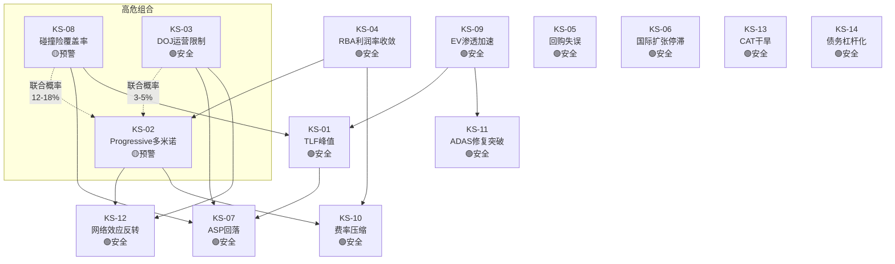

### KS详表

#### KS-CPRT-01: TLF峰值

| 字段 | 内容 |
|------|------|
| **名称** | Total Loss Frequency峰值/反转 |
| **可观测指标** | CCC季度TLF连续3季度持平或下降(当前24.2%) |
| **监控频率** | 季度(CCC Crash Course报告) |
| **数据来源** | CCC Intelligent Solutions季度报告 |
| **当前状态** | 🟢安全 — TLF连续上升, 24.2%新纪录 |
| **触发后行动** | 重新评估Rev CAGR假设, 若TLF见顶则CPRT增长叙事根基动摇 |
| **条件依赖** | 受KS-08(碰撞险覆盖率)驱动, 影响KS-07(ASP) |
| **依赖方向** | KS-08↓ → TLF对单位量的净效应减弱 |
| **联合概率** | KS-01∩KS-08 = 12-18% (中等) |
| **依赖强度** | 强: 覆盖率下降直接减少TLF作用基数 |
| **半衰期** | 长: TLF趋势需5+年反转 |
| **触发概率** | 10% (3年内) |

#### KS-CPRT-02: Progressive多米诺效应

| 字段 | 内容 |
|------|------|
| **名称** | 第二家Top 5保险公司大规模转移至IAA |
| **可观测指标** | Top 5保险公司中第2家>20%份额转移IAA(当前: 仅Progressive ~90%) |
| **监控频率** | 季度(CPRT/RBA财报+行业新闻) |
| **数据来源** | CPRT 10-Q保险单位量, RBA季报汽车业务量, 行业报道 |
| **当前状态** | 🟡预警 — Progressive已转移, 其他Top 5暂无公开信号 |
| **触发后行动** | 下调估值10-15%, 重新评估寡头均衡稳定性 |
| **条件依赖** | 受KS-04(RBA利润率)影响: RBA运营改善→保险公司更敢切换 |
| **依赖方向** | KS-04收敛 → KS-02概率上升 |
| **联合概率** | KS-02∩KS-08 = 8-12% (保险覆盖↓+份额转移=双重打击) |
| **依赖强度** | 中: RBA能力提升是必要非充分条件 |
| **半衰期** | 中: 保险合同2-3年周期 |
| **触发概率** | 20% (3年内) |

#### KS-CPRT-03: DOJ运营限制

| 字段 | 内容 |
|------|------|
| **名称** | DOJ对国际买家访问施加运营限制 |
| **可观测指标** | DOJ要求CPRT限制特定国家/地区买家注册或参拍 |
| **监控频率** | 事件驱动(10-Q/10-K法律诉讼章节) |
| **数据来源** | CPRT SEC filing, DOJ公告, 法律数据库 |
| **当前状态** | 🟢安全 — 2.5年无结论, CPRT已发布反洗钱政策 |
| **触发后行动** | 量化受影响买家比例, 估算ASP下降幅度, 重新计算估值 |
| **条件依赖** | 影响KS-12(网络效应)和KS-07(ASP) |
| **依赖方向** | KS-03触发 → KS-12/KS-07同时恶化 |
| **联合概率** | KS-03∩KS-02 = 3-5% (DOJ+多米诺=完美风暴) |
| **依赖强度** | 弱: DOJ独立于竞争动态 |
| **半衰期** | 短: 运营限制一旦实施, 影响立即显现 |
| **触发概率** | 10% (3年内) |

#### KS-CPRT-04: RBA利润率收敛

| 字段 | 内容 |
|------|------|
| **名称** | RB Global OPM差距收窄至<10pp |
| **可观测指标** | RBA OPM连续2季>27% (当前17.7%, CPRT 37%, 差距19.3pp) |
| **监控频率** | 季度(RBA财报) |
| **数据来源** | RB Global季度/年度财报 |
| **当前状态** | 🟢安全 — OPM 17.7%, 距27%仍有9.3pp |
| **触发后行动** | 分析OPM改善驱动因子(规模vs效率vs价格), 评估可持续性 |
| **条件依赖** | 影响KS-02(保险公司更敢切换)和KS-10(费率压力) |
| **联合概率** | KS-04∩KS-02 = 5-8% |
| **触发概率** | 8% (3年内), 15% (5年内) |

#### KS-CPRT-05: 管理层回购失误

| 字段 | 内容 |
|------|------|
| **名称** | 回购时机判断失误 |
| **可观测指标** | 回购后12个月股价<回购均价×0.8 (即<$37×0.8=$29.6) |
| **监控频率** | 季度(追踪回购均价vs市价) |
| **数据来源** | CPRT 10-Q回购披露 |
| **当前状态** | 🟢安全 — 回购@~$37, 当前$37.57 |
| **触发后行动** | 重新评估管理层资本配置能力, 下调CI-03(时机大师)权重 |
| **条件依赖** | 独立(受宏观+公司特定因素双重驱动) |
| **触发概率** | 25% (12个月内, 若Bear Case触发) |

#### KS-CPRT-06: 国际扩张停滞

| 字段 | 内容 |
|------|------|
| **名称** | 国际收入增速持续低迷 |
| **可观测指标** | 国际收入增速<5%连续4季(当前: 国际ASP +9%) |
| **监控频率** | 季度(CPRT分部数据) |
| **数据来源** | CPRT 10-Q地理分部 |
| **当前状态** | 🟢安全 — 国际ASP+9%, 增速健康 |
| **触发后行动** | 重新评估国际扩张期权价值($1-3B), 可能从Bull Case中移除 |
| **条件依赖** | 受KS-03(DOJ)间接影响(国际形象受损) |
| **触发概率** | 10% (3年内) |

#### KS-CPRT-07: ASP增速回落

| 字段 | 内容 |
|------|------|
| **名称** | ASP增速放缓至无法补偿量缩 |
| **可观测指标** | ASP增速<3%连续2季, 且保险单位量仍在下降 |
| **监控频率** | 季度(CPRT财报) |
| **数据来源** | CPRT 10-Q, CCC数据 |
| **当前状态** | 🟢安全 — ASP+6% ex-CAT (Q2 FY2026) |
| **触发后行动** | CI-01"更少但更富"证伪, 重新评估增长轨迹 |
| **条件依赖** | 受KS-01(TLF)和KS-08(覆盖率)双重驱动 |
| **联合概率** | KS-07∩KS-08 = 15-20% (覆盖率↓→ASP混合效应消退) |
| **触发概率** | 20% (2年内) |

#### KS-CPRT-08: 碰撞险覆盖率加速下降

| 字段 | 内容 |
|------|------|
| **名称** | 消费者放弃碰撞险加速 |
| **可观测指标** | 碰撞险覆盖率同比下降>3pp连续2季 |
| **监控频率** | 半年(JD Power/CCC行业报告) |
| **数据来源** | JD Power保险调研, CCC行业报告, 保险公司年报 |
| **当前状态** | 🟡预警 — 29%消费者降级/取消, 碰撞险放弃率-15% |
| **触发后行动** | 这是CQ-1核心变量, 触发将根本改变增长预期 |
| **条件依赖** | 上游: 经济衰退/保费上涨驱动; 下游: 影响KS-01和KS-07 |
| **联合概率** | KS-08是多个KS的"上游触发器" |
| **触发概率** | 30% (2年内, 若保费维持高位) |

#### KS-CPRT-09: EV渗透加速

| 字段 | 内容 |
|------|------|
| **名称** | 电动车渗透率超预期加速 |
| **可观测指标** | EV新车渗透率>30%且EV打捞量占比>15% |
| **监控频率** | 年度(IEA Global EV Outlook) |
| **数据来源** | IEA, BloombergNEF, 各国销量数据 |
| **当前状态** | 🟢安全 — EV渗透率~18%(全球), EV打捞占比<5% |
| **触发后行动** | 评估EV对ASP的影响(电池=高价值vs修复复杂=更多全损) |
| **条件依赖** | 影响KS-11(ADAS修复), 可能加速KS-01(TLF方向不确定) |
| **触发概率** | 15% (5年内) |

#### KS-CPRT-10: 保险费率压缩

| 字段 | 内容 |
|------|------|
| **名称** | 保险客户要求降低服务费率 |
| **可观测指标** | 服务费率连续2季下降>50bps |
| **监控频率** | 季度(CPRT财报隐含费率) |
| **数据来源** | CPRT收入/单位量推算, 行业费率调研 |
| **当前状态** | 🟢安全 — 费率稳定, 无压缩信号 |
| **触发后行动** | 量化OPM影响(每100bps费率下降→OPM-1.5-2pp) |
| **条件依赖** | 受KS-02(竞争加剧)和KS-04(RBA改善)驱动 |
| **触发概率** | 10% (3年内) |

#### KS-CPRT-11: ADAS修复成本突破

| 字段 | 内容 |
|------|------|
| **名称** | ADAS校准/修复成本大幅下降 |
| **可观测指标** | ADAS校准成本下降>25%(当前占DRP估算35.6%) |
| **监控频率** | 年度(CCC Crash Course) |
| **数据来源** | CCC Intelligent Solutions, AAA年度修复成本报告 |
| **当前状态** | 🟢安全 — ADAS成本仍在上升(+37.6% YoY) |
| **触发后行动** | TLF上升动力减弱, 重新评估TLF天花板 |
| **条件依赖** | 受KS-09(EV技术进步)间接影响 |
| **触发概率** | 5% (5年内, 需要技术突破) |

#### KS-CPRT-12: 网络效应反转

| 字段 | 内容 |
|------|------|
| **名称** | 买方活跃度持续下降 |
| **可观测指标** | 买家活跃率(成交/注册比)连续3季下降>5% |
| **监控频率** | 季度(CPRT披露注册买家数+成交量) |
| **数据来源** | CPRT 10-Q/投资者关系 |
| **当前状态** | 🟢安全 — 75万+注册买家, 活跃度稳定 |
| **触发后行动** | 飞轮减速信号, 评估ASP影响和保险公司分配变化 |
| **条件依赖** | 受KS-03(DOJ限制国际买家)直接影响 |
| **触发概率** | 8% (3年内) |

#### KS-CPRT-13: 自然灾害干旱

| 字段 | 内容 |
|------|------|
| **名称** | 连续低CAT事件年份 |
| **可观测指标** | 连续2年CAT事件单位同比-30%+ |
| **监控频率** | 年度(NOAA/保险行业灾害统计) |
| **数据来源** | NOAA, Insurance Information Institute, CPRT CAT单位披露 |
| **当前状态** | 🟢安全 — 2024/2025飓风季正常 |
| **触发后行动** | CAT贡献通常占收入5-15%, 连续干旱影响有限但减少波动向上的机会 |
| **条件依赖** | 独立(气候驱动) |
| **触发概率** | 15% (5年内, 但气候趋势实际上增加CAT频率) |

#### KS-CPRT-14: 债务杠杆化

| 字段 | 内容 |
|------|------|
| **名称** | CPRT放弃零债务政策 |
| **可观测指标** | 净债务/EBITDA>1x |
| **监控频率** | 季度(CPRT资产负债表) |
| **数据来源** | CPRT 10-Q/10-K |
| **当前状态** | 🟢安全 — 零债务, 净现金$2.7B |
| **触发后行动** | 管理层策略重大转变信号, 评估收购标的合理性 |
| **条件依赖** | 独立(管理层决策) |
| **触发概率** | 5% (5年内, 除非重大收购) |

### KS状态汇总

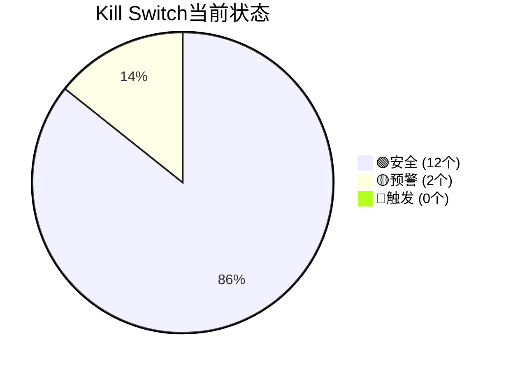

| 状态 | KS编号 | 说明 |
|------|--------|------|
| 🟡预警 | KS-02 | Progressive已转移, 观察是否扩散 |
| 🟡预警 | KS-08 | 碰撞险放弃率-15%, 趋势恶化中 |
| 🟢安全 | 其余12个 | 均在安全区间 |

### 联合概率矩阵 (高危组合)

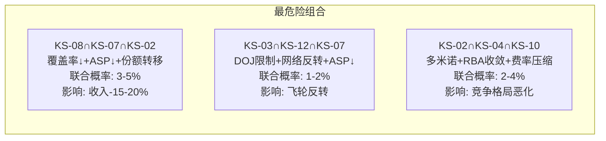

| 组合 | KS | 联合概率 | 影响级别 | 描述 |
|------|-----|---------|---------|------|
| 供需双击 | 08+07+02 | 3-5% | ★★★★★ | 供给端(覆盖率↓)和需求端(份额转移)同时恶化 |
| 飞轮反转 | 03+12+07 | 1-2% | ★★★★★ | DOJ限制→买家减少→ASP↓→飞轮反转 |
| 竞争恶化 | 02+04+10 | 2-4% | ★★★★ | 竞争对手改善+份额转移+费率压力 |
| 温水煮青蛙 | 08+07+04 | 5-8% | ★★★ | 渐进恶化, 每年-1-2%但持续5年 |

---

## 第二部分: 特异性测试注册表 (TS)

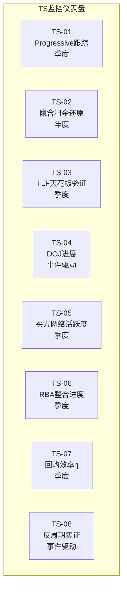

### TS-01: Progressive后续跟踪

| 维度 | 内容 |
|------|------|
| **测试目标** | 验证Progressive转移是否引发其他Top 5保险公司跟随 |
| **测试方法** | 追踪CPRT季报保险单位量×Top 5各家份额变化, 对比RBA汽车业务量增速 |
| **关键指标** | CPRT保险单位量YoY vs RBA汽车单位量YoY → 若CPRT↓但RBA↑超过Progressive贡献, 暗示其他客户转移 |
| **频率** | 季度 |
| **当前基线** | Progressive ~90%→IAA, 影响~65K units/年, 其他Top 5无公开信号 |
| **成功条件** | 12个月后仅Progressive转移, 其他Top 5稳定 → CQ-2确认孤立 |
| **失败条件** | 6个月内第二家>10%份额变动 → CQ-2偏多米诺 |

### TS-02: 隐含租金还原测试

| 维度 | 内容 |
|------|------|
| **测试目标** | 验证CPRT土地公允价值和隐含租金节省 |
| **测试方法** | PropCo估值: 按区域工业用地价格估算48,000英亩; 隐含租金: 按可比租赁码场市场租金估算年节省 |
| **关键指标** | 土地公允价值/股 ($6-8B估计 = $6.1-8.2/股) + 年隐含租金节省/OPM调整 |
| **频率** | 年度(10-K PP&E更新时) |
| **当前基线** | PP&E账面$3.7B, 估计公允$6-8B, 隐含租金节省$400-600M/年 |
| **成功条件** | PropCo估值>$5B → CI-02"免费看涨期权"成立 |
| **失败条件** | 如果多数土地在低价值偏远区域, PropCo<$4B → CI-02弱化 |

### TS-03: TLF天花板验证

| 维度 | 内容 |
|------|------|
| **测试目标** | 追踪TLF上升轨迹, 验证32%天花板假设 |
| **测试方法** | CCC季度TLF数据点绘制趋势线, 分解驱动因子(ADAS+车龄+修复成本) |
| **关键指标** | TLF季度值 + 上升速率(当前~0.5pp/季) |
| **频率** | 季度 |
| **当前基线** | 24.2% (2025 Q4), 趋势线指向~26% @2028 |
| **成功条件** | TLF 25%+ @2026年底 → 加速趋势确认 |
| **失败条件** | TLF持平24% 连续3季 → KS-01预警 |

### TS-04: DOJ进展监控

| 维度 | 内容 |
|------|------|
| **测试目标** | 跟踪DOJ调查进展和可能结果 |
| **测试方法** | 审阅CPRT每季度10-Q法律诉讼章节, 搜索DOJ公告, 监控行业法律新闻 |
| **关键指标** | 有无新增计提/披露/和解协商信号 |
| **频率** | 事件驱动 + 每季度10-Q发布时 |
| **当前基线** | 2.5年无结论, 无计提, 2024年4月发布反洗钱政策 |
| **成功条件** | 正式结案或仅罚款<$300M无运营限制 |
| **失败条件** | 运营限制令(限制特定国家买家) → KS-03触发 |

### TS-05: 买方网络活跃度

| 维度 | 内容 |
|------|------|
| **测试目标** | 监控买方网络健康度, 特别是国际买家比例 |
| **测试方法** | CPRT投资者关系披露的注册买家数/活跃买家/国际占比 |
| **关键指标** | 活跃率(成交/注册), 国际买家占比(当前38-40%) |
| **频率** | 季度 |
| **当前基线** | 75万+注册, 国际38-40%, 活跃率稳定 |
| **成功条件** | 国际占比>40% + 活跃率稳定 → 网络效应增强 |
| **失败条件** | 国际占比<35% 或 活跃率连续下降 → KS-12预警 |

### TS-06: RBA整合进度

| 维度 | 内容 |
|------|------|
| **测试目标** | 追踪RB Global整合进度和竞争力提升速度 |
| **测试方法** | RBA季报分析: OPM趋势, 土地面积, 服务费率, 汽车业务量, 客户赢单 |
| **关键指标** | OPM(当前17.7%), 土地(13,600英亩), 服务费率(22.3%) |
| **频率** | 季度 |
| **当前基线** | OPM 17.7%, 土地扩张$350-400M/年, 服务费率+150bps趋势 |
| **成功条件** | OPM<20% @2027 → CPRT差距仍大, 寡头均衡稳定 |
| **失败条件** | OPM>23% @2027 + 新客户赢单 → KS-04加速 |

### TS-07: 管理层回购效率η

| 维度 | 内容 |
|------|------|
| **测试目标** | 验证管理层回购时机判断能力 |
| **测试方法** | 追踪回购均价 vs 后续6/12个月股价表现 |
| **关键指标** | η = (回购后12M平均股价 - 回购均价) / 回购均价 |
| **频率** | 季度 |
| **当前基线** | $1.1B回购@~$37, η待验证 |
| **成功条件** | η>20% (12M后股价>$44) → CI-03"时机大师"验证 |
| **失败条件** | η<-20% (12M后股价<$30) → KS-05触发 |

### TS-08: 反周期性实证

| 维度 | 内容 |
|------|------|
| **测试目标** | 在下次经济衰退中实测CPRT的反周期性 |
| **测试方法** | 衰退期间追踪: 保险单位量 / ASP / 收入 / 碰撞险覆盖率 |
| **关键指标** | 衰退期间CPRT收入增速 vs S&P 500收入增速 |
| **频率** | 事件驱动(下次衰退) |
| **当前基线** | 历史: GFC -5.3%, 2020 masked, 2022 +30% → "条件反周期" |
| **成功条件** | 衰退期间收入>0% → 反周期成立(至少温和) |
| **失败条件** | 衰退期间收入<-10% → D1需从×1.05降至×0.95 |

---

## 第三部分: 投资日历 (12个月)

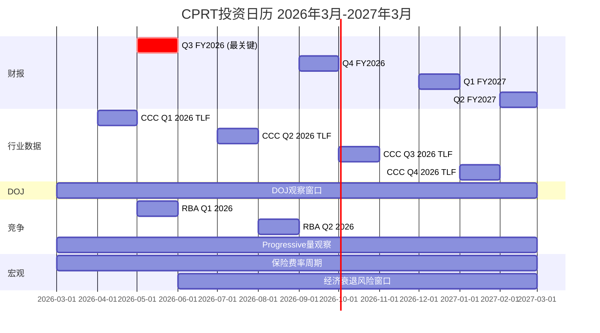

### 按月催化剂详表

| 月份 | 事件 | 方向 | 预期影响 | 观察重点 |
|------|------|------|---------|---------|
| 2026年3月 | — | — | — | 当前分析基准点 |
| 2026年4月 | CCC Q1 2026 TLF发布 | 中性 | ±2% | TLF>24.5%则偏多 |
| 2026年5月 | **Q3 FY2026财报** | **关键** | **±10%** | **保险单位量恢复?ASP趋势?回购金额?** |
| 2026年5月 | RBA Q1 2026财报 | 中性 | ±2% | OPM趋势, 汽车业务量 |
| 2026年6月 | 保险费率更新 | 偏正 | ±3% | 费率下降→覆盖率可能恢复 |
| 2026年7月 | CCC Q2 2026 TLF | 中性 | ±2% | TLF趋势确认 |
| 2026年8月 | RBA Q2 2026财报 | 中性 | ±2% | Progressive量的全面体现 |
| 2026年9月 | **Q4 FY2026财报** | **重要** | **±8%** | **全年收入增速, 回购总额, DOJ更新** |
| 2026年10月 | 飓风季结束 | 偏正 | ±3% | CAT事件贡献 |
| 2026年11月 | CCC年度报告 | 中性 | ±2% | TLF全年趋势总结 |
| 2026年12月 | Q1 FY2027财报 | 重要 | ±5% | 新财年指引, Progressive完全影响 |
| 2027年1月 | 保险行业年度数据 | 中性 | ±2% | 碰撞险覆盖率趋势 |
| 2027年2月 | Q2 FY2027财报 | 重要 | ±5% | YoY对比(去年Q2是miss) |
| 2027年3月 | 回购12个月评估 | 中性 | ±3% | η回购效率验证 |

### 净催化剂分析

**Phase 3估计**: 净催化剂+6.4%→$39.98

**P4校准后调整**:
- Bull催化剂(TLF+回购+DOJ结案): +8-12% → P4校准-3pp → **+5-9%**
- Bear催化剂(Progressive多米诺+量持续下降): -6-10% → 维持 → **-6-10%**
- 概率加权净催化剂: 55%×(+7%) + 25%×(-8%) + 20%×(+0%) = **+1.9%**

**P4校准后目标价**: $37.57 × 1.019 = **$38.3** (vs Phase 3的$39.98)

---

## 第四部分: 护城河趋势仪表盘

### C评分分解 (20/30)

| 维度 | 当前评分 | 5年趋势 | 半衰期 | 驱动因子 |
|------|---------|---------|--------|---------|
| C1 转换成本 | 3.0/5 | → (稳定) | 5-8年 | IT集成深度, 但Progressive证明可切换 |
| C2 网络效应 | 3.5/5 | ↗ (缓增) | 10-15年 | 国际买家增长+VB3平台改善 |
| C3 规模经济 | 4.0/5 | → (稳定) | 12-15年 | 土地+SGA效率已达极高水平 |
| C4 无形资产 | 2.5/5 | → (稳定) | 8-10年 | 品牌认知+行业关系, 但非专利/版权 |
| C5 成本优势 | 4.0/5 | ↘ (缓降) | 8-12年 | 自有土地锁定成本, 但RBA在缩小差距 |
| C6 进入壁垒 | 3.0/5 | → (稳定) | 10年+ | NIMBY+资本+许可, 新进入者几乎不可能 |
| **总计** | **20/30** | **→ 偏↘** | **8-12年** | |

### 护城河趋势仪表盘

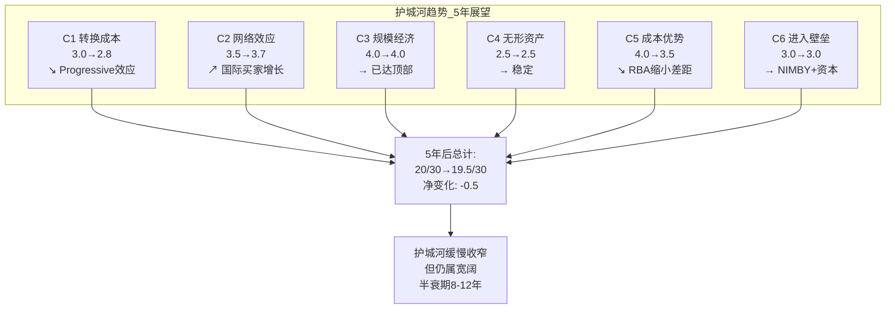

### 护城河半衰期分析

**定义**: 护城河半衰期 = 当前护城河优势减半所需时间

**CPRT护城河半衰期: 8-12年**

| 维度 | 侵蚀速率 | 半衰期 | 主要侵蚀力量 |
|------|---------|--------|------------|
| 土地优势 | 极慢(~1%/年) | 15+年 | RBA购地+新码场开发, 但NIMBY限制增速 |
| 成本优势(OPM) | 慢(~1pp/年缩小) | 10-12年 | RBA效率提升, 但19.3pp差距很大 |
| 网络效应 | 不确定 | 8-15年 | 取决于DOJ对国际买家的影响 |
| 转换成本 | 中(~2-3%/年) | 5-8年 | Progressive证明切换可行, 但规模效应限制 |
| 规模/进入壁垒 | 极慢 | 15+年 | 新进入者几乎不可能, 仅存量竞争 |

**综合半衰期**: 加权平均~10年。这意味着如果没有管理层积极维护(投资+创新), CPRT的竞争优势将在~2036年减半。但管理层有充足资源(零债务+$5B现金+年FCF$1.3B)来维护和延长护城河。

### 承重墙脆弱度总结

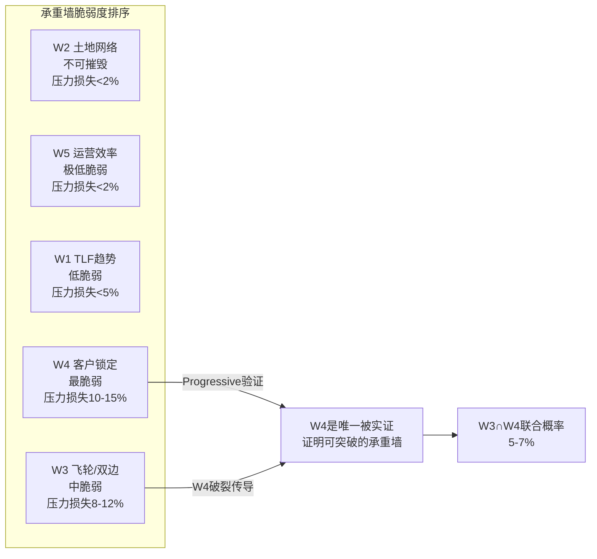

**结论**: 14个KS中12个安全、2个预警, 无触发。护城河趋势缓慢收窄(-0.5/30 @5年), 半衰期8-12年。最大风险集中在KS-08(碰撞险覆盖率)和KS-02(Progressive多米诺), 两者联合概率8-12%。投资者应将Q3 FY2026(2026年5月)视为最关键的判断窗口。

## Chapter 20: 红队七问 (RT-1~RT-7)


> **审计员**: 分析团队 — 独立风险审计员
> **日期**: 2026-03-11
> **隔离声明**: 本报告基于原始财务数据(P0 Data Foundation)、lit_recon_memo原始发现、thesis_crystallization CQ文本及独立Web搜索完成。未参考Phase 1-3投资论点、看多结论或估值目标价。所有判断均为独立形成。
> **产出目标**: RT-1至RT-7红队七问 + 空头钢人 + 偏差审计 + 双向校准

---

## 目录

1. [RT-1: 最脆弱假设识别](#rt-1-最脆弱假设识别)
2. [RT-2: 空头的最强论文 (Bear Steelman)](#rt-2-空头的最强论文-bear-steelman)
3. [RT-3: 被忽视的红旗](#rt-3-被忽视的红旗)
4. [RT-4: 市场共识可能在什么方面是对的](#rt-4-市场共识可能在什么方面是对的)
5. [RT-5: 最坏情景组合](#rt-5-最坏情景组合)
6. [RT-6: 历史类比——护城河被逾越的案例](#rt-6-历史类比护城河被逾越的案例)
7. [RT-7: 偏差审计](#rt-7-偏差审计)
8. [双向校准与有效性自检](#双向校准与有效性自检)

---

## RT-1: 最脆弱假设识别

### 方法论

我从原始财务数据出发，不参考任何前序结论，独立识别投资论文中可能存在的最脆弱假设。评估标准：(1)假设错误的概率；(2)假设错误时对估值的影响幅度；(3)市场当前是否已定价。

---

### 脆弱假设 #1: "量缩价升"新常态可持续 (Fewer-but-Richer Units)

**假设内容**: Q2 FY2026美国保险单位-10.7%但ASP+6%，这代表了一种可持续的结构性转型——行业从"volume game"转向"value game"，TLF上升驱动进入拍卖池的车辆平均价值更高。

**为什么这是最脆弱的**:

1. **数学约束**: ASP增长有天花板，量的下降没有地板。如果美国保险单位以-10%年化速度下降，即使ASP年增6%，净收入仍将年化下降-5%左右。更关键的是，ASP+6%中有多少是混合效应(低价值车退出拍卖池)，多少是真实的单车价值提升？混合效应是一次性的——当低价值车已经退出完毕，ASP增速将回落。

2. **保险覆盖率下降是结构性的**: 根据CCC数据和JD Power研究，过去一年29%的消费者降级或取消了某种保险，其中汽车保险降幅最大(15%)，8%的消费者从全险转为仅责任险。$1,000及以上免赔额的消费者已达26%，较2021年增长近5个百分点。这不是周期波动——高保费环境下消费者理性选择减少碰撞险覆盖，是一个需要保费大幅下降才能逆转的结构性趋势。

3. **TLF上升的抵消效应被高估**: TLF从22.2%→24.2%确实意味着更多事故车被判定全损，但这个指标作用于"有碰撞险的事故车"。TLF↑ × 碰撞险覆盖率↓ = 不确定的净效应。thesis_crystallization的异常-4已识别了这个矛盾，但结论偏乐观。我的独立判断：净效应在当前保费周期内是负的。

4. **Q2 FY2026不是孤立季度**: Rev -3.6% YoY是公司近年来首次出现收入下降。如果排除CAT影响，收入实际上是+1.3%——这意味着公司的有机增长已接近停滞。从季度序列看：Q1FY26 +0.7% YoY → Q2FY26 -3.5% YoY，减速趋势明显。

**如果假设错误——估值影响**:

如果"量缩价升"不可持续，CPRT的收入增长将从过去3年的~10%降至2-4%。对于一家当前P/E 23-26x的公司：
- 按10%增长定价 → P/E 25x合理
- 按3%增长重定价 → P/E应在15-18x
- 影响: 当前$37.57 × (16.5/25) = **$24.8**，下行-34%

**脆弱度评分**: ★★★★★ (5/5) — 这是整个投资论文的承重墙

---

### 脆弱假设 #2: Progressive转移是孤立事件，不会引发多米诺效应

**假设内容**: Progressive从CPRT转至IAA(~75%→~90%)是单一客户决策，不会引发GEICO、State Farm等其他大型保险公司重新评估分配策略。

**为什么这是脆弱的**:

1. **Progressive证明了切换成本低于预期**: 如果切换成本真的如"基础设施垄断"叙事所暗示的那么高，Progressive不应该能够如此顺利地将90%的量转移到IAA。这个事实本身就削弱了"转换成本护城河"论点。

2. **RBA整合完成改变了竞争格局**: RB Global在收购IAA后经历了两年整合阵痛（客户流失、流程重建、码场整合），2026年被Bank of America认为是其"第一个无失真表现年"。如果RBA在2026年展示出改善的运营指标，其他保险公司可能开始认真考虑双供应商策略。National Bank Financial已将RBA升级至Outperform，理由正是"竞争地位改善"。

3. **保险行业采购逻辑的演变**: 大型保险公司的采购团队越来越数据驱动。如果IAA的回收率(ASP/ACV比)接近或追平CPRT，保险公司没有理由维持高度集中的单一供应商策略。Progressive的案例给所有采购负责人提供了"可以切换"的证据——这在组织决策中的影响不可低估。

4. **RBA的Progressive赢单产生示范效应**: RBA现在可以在销售中使用Progressive案例：""美国增速最快的车险公司选择了我们"。这是一个重大的销售论据，可能加速其他保险公司的评估周期。

**如果假设错误——估值影响**:

如果GEICO和State Farm各将20%的量从CPRT转至RBA(比Progressive的90%温和得多)：
- Progressive年化影响估计3-5%总保险单位
- GEICO 20%转移 + State Farm 20%转移 → 额外3-5%单位流失
- 合计6-10%单位永久流失 → 收入下降$280-460M → 利润影响$100-170M
- 估值影响: -$2.0B至-$4.3B (按25x P/E)，即股价-$2.0至-$4.4

**脆弱度评分**: ★★★★☆ (4/5)

---

### 脆弱假设 #3: DOJ调查将以罚款了结，不会限制运营

**假设内容**: 2023年10月的DOJ反洗钱调查将以合规罚款+加强内控的方式解决，不会对国际买家网络产生实质性运营限制。$5.1B现金可覆盖任何合理罚款。

**为什么这是脆弱的**:

1. **调查范围指向核心商业模式**: DOJ的调查方向是"preventing and detecting money-laundering activity by auction platform members"。这不是一个边缘合规问题——它直接指向CPRT的国际买家网络，而国际买家占美国38-40%的单位销售量，贡献了超过50%的成交额。

2. **2.5年无结论不是好兆头**: 常规合规调查通常12-18个月内有初步结论。2.5年仍在进行中，且CPRT在10-Q中声明"无法预测可能损失的范围"——这暗示调查可能比表面更复杂。

3. **运营限制比罚款更致命**: 即使罚款$500M($5.1B现金可轻松覆盖)，如果DOJ要求CPRT对国际买家实施更严格的KYC/AML审查，将导致：(a)买家准入门槛提高→部分中小型国际买家退出; (b)竞价参与者减少→ASP下降; (c)CPRT的流动性飞轮核心优势被削弱。

4. **先例风险**: 如果CPRT被DOJ认定为"未能充分防止洗钱活动的平台"，这可能引发其他国家的监管审查。沙特阿拉伯已经对打捞车辆进口实施了新限制。监管传导效应可能进一步缩小国际买家池。

5. **10-Q披露的措辞值得警惕**: "unable to predict the duration, scope, outcome, or the range of possible loss"——这是公司法律顾问能使用的最模糊的措辞，通常出现在潜在影响可能是重大的(material)情况下。

**如果假设错误——估值影响**:

极端情景（国际买家访问受限25%）:
- 38-40%的单位销售由国际买家完成
- 25%的国际买家退出 → ~10%总单位需求减少
- 竞价强度下降 → ASP可能下降5-10%
- 收入影响: -15%至-20% → -$700M至-$930M
- 利润影响: -$350M至-$550M（假设50% flow-through）
- 估值影响: -$8.8B至-$13.8B (按25x P/E)
- 股价影响: **-$9至-$14**，即$23-$28区间

**脆弱度评分**: ★★★☆☆ (3/5) — 概率低但影响极大，是典型的"尾部风险"

---

### 三个脆弱假设的综合影响矩阵

| 假设 | 错误概率 | 估值下行幅度 | 是否已定价 | 综合脆弱度 |
|------|----------|-------------|-----------|-----------|
| 量缩价升可持续 | 40-50% | -34% ($24.8) | 部分定价(-41%跌幅含此因素) | ★★★★★ |
| Progressive孤立事件 | 25-35% | -5%至-12% | 部分定价 | ★★★★☆ |
| DOJ仅罚款了结 | 15-25% | -24%至-37% | 少量定价(不确定性折价) | ★★★☆☆ |

---

## RT-2: 空头的最强论文 (Bear Steelman)

> **设计原则**: 构建一个让聪明做多者停下来思考至少10分钟的完整空头论文。不是为了证明空方正确，而是为了找到多方论点的最薄弱环节。

---

### Bear Thesis 总纲: "基础设施垄断"叙事的五个裂缝

CPRT在过去十年享受了"基础设施垄断"的估值溢价——市场认为它拥有不可复制的土地网络、双寡头定价权和世俗性TLF增长。这个叙事在2024年以前是自洽的。但2025-2026年发生了五件事，每一件都在这个叙事上凿开一条裂缝。单独来看，每条裂缝都可修复。但五条裂缝同时出现时，问题不再是"裂缝能否修复"，而是"这面墙的结构完整性还剩多少"。

---

### 论点1: Progressive只是开始 — 保险公司觉醒，双供应商策略成为新常态

**核心论证**:

Progressive不是一个随机的客户流失事件——它是保险行业采购逻辑转变的信号弹。

**事实链**:

(a) Progressive是美国第三大车险公司，也是增速最快的头部车险公司。它将~90%的打捞量分配给IAA而非CPRT。这不是因为IAA的服务更好(CPRT的OPM 36.5% vs IAA~25%证明运营效率差距巨大)，而是因为RBA在收购IAA后承诺了Progressive更好的商业条件。

(b) 这意味着打捞拍卖的"转换成本"比CPRT投资者假设的低得多。保险公司不需要自建码场——它们只需要选择另一个已有全国码场网络的寡头。双寡头市场中，转换成本 ≈ 零(因为只有一个替代选择，而这个替代选择一直在等待接单)。

(c) RBA的整合终于在2026年进入"第一个无失真表现年"。如果RBA在2026年展示出持续改善的运营指标(GTV增长5-8%，EBITDA $1.47B-$1.53B)，它将获得向GEICO和State Farm销售的有力证据。

(d) 保险行业的采购思维正在从"选最好的"转向"不把所有鸡蛋放在一个篮子里"。Progressive的转移给了所有保险公司CFO一个合理的理由重新谈判——"我们需要评估双供应商策略以确保竞争定价"。

**空头推演**:

如果双供应商策略成为行业标准(每家保险公司给IAA 30-50%的份额)，CPRT将从"65%市场份额的主导者"变成"55%市场份额的大哥"——仍然是第一，但定价权和议价力将显著下降。市场份额的下降不需要很大：从65%→55%意味着-15%的单位量，在运营杠杆高的业务中将产生超比例的利润影响。

**多方最可能的反驳**: "CPRT的回收率(ASP/ACV)比IAA高3-5个百分点，保险公司不会因为议价而放弃真金白银。"

**空头的回应**: 这个3-5个百分点的差距在RBA整合完成前是真实的。但IAA现在拥有RBA的全球拍卖技术平台——数字化、买家网络、数据分析。如果IAA的回收率在2026-2027年缩小到1-2个百分点，保险公司将毫不犹豫地分散配置。而且保险公司需要的不是"最高回收率"，而是"足够好的回收率+更多的议价筹码"。

---

### 论点2: TLF天花板比想象的低 — AV渗透/EV简化/车龄见顶

**核心论证**:

TLF从22.2%→24.2%是事实，CEO Liaw预测将达25%再到30%。但TLF有天花板，而且这个天花板可能比多方假设的低。

**事实链**:

(a) **TLF的驱动因子正在分化**:
- ADAS修复成本+37.6%推高TLF → 这是当前主要驱动力，但ADAS成本随着技术成熟和零部件产量增加将逐步下降。2024年ADAS校准占DRP估算35.6%，但随着标准化，校准成本可能在3-5年内下降30-40%。
- 车龄12.8年（乘用车14.5年）→ 但车龄不会无限增长。如果新车价格稳定或下降（EV价格战已在进行），消费者将开始换车，车龄将见顶甚至回落。

(b) **AV的长期影响不是"de minimis"**:
- 当前AV活动确实是"地理围栏化的、不通过主要保险公司投保"。但5-10年视角下，L2+/L3 ADAS的普及将显著降低事故率。NHTSA数据显示AEB(自动紧急制动)可减少50%追尾事故。如果2030年50%的在用车辆配备L2+ ADAS，事故频率可能下降15-20%。
- 事故频率↓15-20%在TLF上升的部分抵消下，净效应是什么？这是一个关键的不确定性，但方向是对CPRT不利的。

(c) **EV对TLF的影响是双刃剑**:
- 短期(2024-2027): EV修复复杂+成本高→TLF↑ → 利好CPRT
- 长期(2028+): EV结构更简单(减少碰撞可修复零件)、电池可回收技术成熟→部分EV可能不进入传统打捞拍卖→利空CPRT
- 更重要的是：EV全损后的残值中，电池占40-60%。如果电池回收形成独立产业链（Tesla已在自建），CPRT的角色可能从"完整车辆拍卖"退化为"车壳处理"——价值大幅缩水。

**空头推演**:

TLF可能在26-28%区间见顶(而非CEO预测的30%+)。如果ADAS成本下降+AV减少事故频率+EV结构简化三重因素叠加，TLF可能在2028-2030年开始回落。

**量化**:
- Bull假设: TLF从24%→30% (每1pp=行业增量4-5%) → 6pp × 4.5% = +27%增量
- Bear假设: TLF从24%→27%见顶→回落至25% → 净增量仅+4.5%，且在更远的未来可能逆转
- 差异: 27% vs 4.5% = 多方过度乐观约22个百分点的行业增量

---

### 论点3: DOJ是定时炸弹 — 国际买家网络是建在沙上的城堡

**核心论证**:

CPRT的国际买家网络是其流动性飞轮的核心引擎。38-40%的单位销售、超过50%的成交额来自国际买家。DOJ的反洗钱调查直接瞄准了这个引擎的合法性基础。

**事实链**:

(a) **DOJ调查的范围直指核心**: "preventing and detecting money-laundering activity by auction platform members"。注意措辞——不是"某个具体交易"，而是"平台成员的洗钱活动"。这暗示DOJ可能认为CPRT的整个国际买家准入体系存在系统性缺陷。

(b) **2.5年无结论的含义**:
- 短期调查(6-12个月) = 通常是单一事件，罚款了结
- 中期调查(12-24个月) = 可能涉及系统性问题
- 长期调查(24个月+) = 通常涉及商业模式层面的合规问题，或DOJ在构建更大的案件

(c) **CPRT的补救措施(2024年4月发布正式反洗钱政策)可能是双刃剑**: 一方面显示合作态度；另一方面，2024年才发布正式反洗钱政策意味着之前没有——这本身就是DOJ可能追究的依据。

(d) **国际监管传导风险**:
- 沙特阿拉伯已对打捞车辆进口实施新限制
- 欧盟的反洗钱指令(AMLD6)对平台运营商提出了更严格的KYC要求
- 如果CPRT在美国面临DOJ处罚，其他国家的监管机构可能跟进审查
- 国际买家来源国(东欧、中东、非洲)的监管环境也在收紧

**空头推演**:

最可怕的结果不是罚款——$5.1B现金可以应对任何合理罚款。最可怕的结果是:
- DOJ要求CPRT对所有国际买家实施增强的尽职调查(Enhanced Due Diligence)
- 这将直接增加国际买家的交易摩擦成本
- 部分中小型国际买家(占国际买家总量可能30-40%)将因合规成本转向IAA或灰色渠道
- 竞价参与者减少 → ASP下降 → 保险公司对CPRT的回收率优势认知下降 → 分配量减少 → 飞轮反转

**关键点**: 飞轮正转和反转的力量是不对称的。正转需要10年积累(CPRT自2003年VB2以来的买家网络建设)，反转可能只需要2-3年的监管冲击。

---

### 论点4: $37不是便宜 — 这是从"垄断溢价"到"寡头折价"的正确重定价

**核心论证**:

市场用-41%的跌幅不是在恐慌——而是在理性重定价。CPRT正在从"不可逾越的基础设施垄断"变成"有竞争力的双寡头中的大哥"。这需要不同的估值倍数。

**估值框架**:

(a) **历史估值锚定已失效**:
- CPRT历史Forward P/E: 32-40x → 当前22-27x
- 投资者可能将此解读为"便宜了"
- 但历史的32-40x是基于: (1)垄断级市场地位; (2)10%+有机增长; (3)不可逆TLF趋势; (4)无竞争威胁
- 当前这四个条件中至少两个(1和4)已发生实质变化

(b) **同类公司估值参考**:
- Waste Management (WM): 双寡头(WM+RSG), P/E ~28x → 但WM有更好的增长可见性和更强的价格杠杆
- Republic Services (RSG): P/E ~27x
- CPRT的业务模式更类似于一个依赖第三方决策(保险公司)的处理平台，而非自主定价的基础设施
- 如果CPRT从"垄断定价"回到"双寡头定价"，合理P/E在20-24x

(c) **FCF Yield的真实故事**:
- 表面: FCF Yield 3.5% ($1.23B / $36.8B)
- 但如果收入增长放缓至3-5%，且OPM继续从36.5%向32-34%收缩
- FY2027E FCF可能仅$1.1-1.2B(而非增长至$1.4B+)
- 实际FCF Yield: 3.0-3.3%
- 这对于一个增长放缓的公司来说不便宜

(d) **"净现金"论点的陷阱**:
- 净现金$2.7B = 每股$2.76 → 调整后P/E降低~7%
- 但$5.1B现金中，多少是"战略预留"(DOJ罚款+土地收购+业务发展)?
- 如果$2-3B是不可分配的战略储备，"净现金"论点的实际价值只有$0-$1B
- 更重要的是: 管理层在5年内没有返还任何现金给股东(FY2021-FY2025零回购零分红)。刚启动的$1.1B回购是在股价-41%后的"防御性"操作，而非"进攻性"资本配置

**空头推演**:

如果CPRT的增长从10%降至3-5%，且P/E从当前23-26x压缩至20x:
- 当前TTM EPS $1.60 × 20x = **$32**
- 如果FY2027E EPS受增长放缓影响降至$1.55 × 20x = **$31**
- 进一步下行空间: -15%至-17%

---

### 论点5: 管理层回购是陷阱 — 5年零回购→突然$1.1B = panic signal不是confidence signal

**核心论证**:

bull们将$1.1B回购解读为"管理层发出的强烈低估信号"。Bear的解读完全相反: 这是一个管理层5年来从不回购→突然在股价暴跌时大规模回购的防御性行为。

**事实链**:

(a) **时间线揭示真相**:
- FY2021: 股价$15-20, 现金$1B → 零回购 (如果相信低估, 这里应该买)
- FY2022: 股价$20-30, 现金$1.4B → 零回购
- FY2023: 股价$25-40, 现金$2.4B → 零回购
- FY2024: 股价$40-60, 现金$3.4B → 零回购
- FY2025: 股价$45-64, 现金$4.8B → 零回购(最高点也不买)
- FY2026 H1+Q3: 股价$33-50, 突然$1.1B回购

如果管理层真的是"估值驱动"的回购者，他们应该在FY2021-2022的$15-25区间(同样的基本面但更低的价格)大规模回购。5年不动+在恐慌时刻突然出手 → 更像是"股价跌太多→董事会压力→被迫行动"。

(b) **$1.1B回购的实际效果被高估**:
- $1.1B / 978M股 × $37 = ~3%的流通股
- 每股价值提升: 如果P/E不变，EPS从$1.60提升到$1.65(+3%) → 股价提升$1.1
- 但如果P/E同时压缩(如从25x→22x)，回购的提升效果被完全吞噬

(c) **没有分红=没有纪律**:
- 分红是一种资本配置纪律——它迫使管理层每季度做出"现金是返还给股东还是再投资"的决策
- CPRT零分红+5年零回购 = 管理层5年来没有面对任何资本返还纪律
- $5.1B现金堆积是"资本配置无纪律"的证据，不是"战略耐心"
- 突然的$1.1B回购更像是对$5.1B现金堆积的迟到补救

(d) **回购时机可能证明管理层在最差的时候出手**:
- CEO Liaw引用"估值倍数和利率水平"作为回购理由
- 但Progressive转移+DOJ调查+Q2 miss都是在回购期间或之前发生的
- 如果这些基本面恶化持续，管理层可能在$37附近买了一堆后来值$30的股票
- 历史上有大量管理层在股价下跌时回购、结果继续下跌的案例(GE 2015-2017, IBM 2013-2015)

**空头推演**:

$1.1B回购是noise，不是signal。真正的signal是:
- 5年不回购积累$5.1B → 资本配置能力存疑
- 在基本面恶化时开始回购 → 可能在错误时间买入
- 零分红 → 缺乏向股东返还现金的系统性机制

---

### 空头目标价计算

**Bear Case估值模型**:

| 假设 | 值 | 理由 |
|------|-----|------|
| FY2027E Revenue | $4.50B | 增长放缓至~0-2% (量缩+Progressive) |
| FY2027E OPM | 34.0% | 持续压缩趋势 |
| FY2027E EBIT | $1,530M | |
| 税率 | 20% | |
| FY2027E Net Income | $1,224M + $150M利息收入 = $1,374M × 0.8 = $1,099M | 简化计算 |
| 修正: FY2027E EPS | ~$1.45 | 考虑回购后~960M股 |
| Bear P/E | 18x | "增长放缓的双寡头"定价 |
| **Bear 目标价** | **$26.1** | $1.45 × 18x |

**空头下行幅度**: 当前$37.57 → $26.1 = **-30.5%**

**极端Bear (DOJ运营限制情景)**:
- FY2027E EPS: $1.20 (国际买家限制导致ASP下降)
- P/E: 16x (带监管风险折价)
- 极端目标: **$19.2** (-49%)

---

## RT-3: 被忽视的红旗

### 红旗 #1: Q2 FY2026保险单位-10.7%的历史背景

**现象**: Q2 FY2026美国保险单位同比下降10.7%，排除CAT影响后仍下降4.8%。

**独立评估**: 虽然我未能确认这是否为"2008年以来最大单季降幅"(搜索未找到明确历史对比)，但这一降幅的严重性不应被"排除CAT"后的数字稀释。-10.7%是headline数字，反映的是实际到手单位量的减少。更关键的是，这发生在TLF创纪录新高(24.2%)的背景下——如果TLF在加速推高全损率，但保险单位量仍然大幅下降，说明保险覆盖缩减的对冲力量比TLF上升更强。

**这意味着什么**: CPRT增长的"世俗性趋势"叙事的核心公式是: 全损拍卖量 = 事故数 × 碰撞险覆盖率 × TLF。投资者通常只关注TLF(在上升)，忽视碰撞险覆盖率(在下降)和事故频率(趋势下降)。三个变量中两个在走弱，一个在走强——净方向不确定。

---

### 红旗 #2: OPM从FY2021 42.2%→Q2 FY2026 34.7%的持续下降

**现象**: 营业利润率从FY2021峰值42.2%持续下降至Q2 FY2026的34.7%，5年间下降了750bps。

**原始数据核实**:
- FY2021: 42.2% → FY2022: 39.3% → FY2023: 38.4% → FY2024: 37.1% → FY2025: 36.5% → Q2FY26: 34.7%
- 这是一个几乎完美的线性下降趋势

**被忽视的含义**:

(a) **FY2021不是异常高点**: 虽然FY2021包含COVID恢复效应，但COVID理论上应同时影响收入和成本——如果OPM 42.2%中有COVID异常因素，那么FY2020的37.0%应该是更接近"正常"的水平。但FY2022-FY2025的OPM(39.3%→36.5%)也在持续下降，说明这不是"从异常高点回归正常"，而是结构性的利润率侵蚀。

(b) **增量OPM在下降**:
- FY20→FY21: 增量OPM 65.7%(异常)
- FY21→FY22: 29.6%
- FY22→FY23: 30.4%
- FY23→FY24: 23.2%
- FY24→FY25: 30.5%
- FY23→FY24的23.2%是一个警告信号——新增收入的利润率已低于存量业务

(c) **可能原因**:
- 国际扩张(利润率低于美国)
- 码场运营成本上升(劳动力+环保合规)
- SGA/Rev从6.5%(FY2023)回升至7.5%(FY2025)——管理费用增长快于收入
- Purple Wave等新业务的拖累
- 竞争压力迫使让利

(d) **如果趋势延续**: OPM每年下降~100-150bps → FY2028可能降至31-33% → 同样的收入但利润显著下降。

---

### 红旗 #3: $4.8B现金堆积的机会成本

**现象**: CPRT从FY2020的$478M现金增长到FY2025的$4.8B，5年内堆积了$4.3B现金(占同期OCF的56%)，且FY2021-FY2025期间零回购、零分红、零有意义的并购。

**这是红旗而非强项的原因**:

(a) **机会成本**: $4.3B现金在FY2021-2023(低利率环境)的机会成本是: 如果用于回购(那时股价$15-40)，按FY2021均价$17.5计算，$4.3B可回购约245M股(~25%的流通股)，EPS提升效果远大于当前在$37附近回购29.7M股(~3%)。管理层的"等待"让股东损失了巨大的EPS提升机会。

(b) **为什么不并购?**: 打捞拍卖行业在这5年间有许多区域性并购机会(特别是国际市场)。$4.3B足以收购多个国家的本地打捞公司。管理层选择不做——这到底是"纪律"还是"缺乏战略视野"?

(c) **现金堆积 = 治理问题**: 在没有控股股东的上市公司中，$4.8B现金+零资本返还+零大型并购通常被视为治理红旗。这意味着管理层有充分的资源但没有使用——可能是对自身业务前景的谨慎(不想在高点回购)，但这本身就暗示管理层可能比外部投资者更早察觉到了增长放缓信号。

---

### 红旗 #4: 国际增长的不透明性

**现象**: CPRT在财报中越来越多地强调国际增长(UK、Germany、Middle East等)，但从未单独披露国际业务的详细财务数据(收入/利润/利润率)。

**这是红旗的原因**:

(a) 国际业务通常利润率低于美国(不同的监管环境、不同的市场结构、不同的竞争格局)。如果国际增长是OPM持续下降的原因之一，投资者无法验证——因为数据不透明。

(b) DOJ调查的存在使国际业务的不透明性从"治理不完美"升级为"材料风险"。如果DOJ最终要求CPRT增加国际业务的合规披露，可能暴露出投资者此前看不到的运营问题。

(c) 国际买家占38-40%的美国拍卖单位销售——但这些买家的地理分布、合规状态、洗钱风险等级从未被系统性披露。

---

### 红旗 #5: 管理层薪酬结构与回购时机的巧合

**现象**: CEO Liaw在股价-41%时启动回购，同时CEO薪酬通常包含股权激励组件。

**需要验证(但值得标记)**:
- 如果CEO薪酬中包含大量限制性股票或期权，股价下跌直接影响其个人财富
- $1.1B回购的timing可能部分受到"支撑股价以保护管理层薪酬"的动机驱动
- 这不是指控——但作为风险审计，这是一个需要投资者独立验证的利益冲突点

---

### 红旗 #6: PP&E/Revenue = 79.6% — "轻资产"叙事的矛盾

**现象**: CPRT被部分投资者描述为"轻资产"或"平台型"企业，但PP&E/Revenue高达79.6%。

**这意味什么**:
- CPRT本质上是一家重资产企业(土地+码场+运输设备)，运营着一个轻资产的拍卖平台
- 重资产企业的估值锚通常是EV/EBITDA 10-15x，而非P/E 25-30x
- 市场给CPRT的估值更接近SaaS平台(P/E 25-40x)，而非重资产基础设施(P/E 12-18x)
- D&A/CapEx仅38%意味着大量CapEx是土地购买(不折旧)——这使得FCF看起来比实际更好(因为土地CapEx不出现在D&A中，但确实是真实的现金支出)

---

## RT-4: 市场共识可能在什么方面是对的

### 分析师共识画像

- 19名分析师: 10买/8持有/1卖
- 平均目标$49(vs 当前$37.57 = +30%上行)
- 目标范围: $33-$62
- Barclays $33最低目标 → 暗示下行空间-12%
- Stephens从$50降至$46 + Equal Weight(非增持)
- 共识FY2026E EPS: $1.65(较Q2发布前下调$0.04)

### 8个"持有"在等什么?

19个分析师中8个给"持有"(42%)——这是一个不寻常的高比例(通常优质公司80%+的分析师给买入)。

**解读**: 8个"持有"分析师可能在等待:

(a) **Progressive转移的全面影响可见**: Progressive的量转移从2026年1月起才开始体现。FY2026 Q3-Q4的数据将揭示真实影响幅度。在此之前，"持有"是理性的——数据不足以做判断。

(b) **DOJ调查的进展**: 2.5年无结论 → 任何进展(正面或负面)都将是催化剂。在此之前持有 = 等待信息释放。

(c) **OPM是否企稳**: 如果OPM在34-35%稳定 → 回到增长叙事; 如果继续下行至32% → 估值需进一步下调。

(d) **RBA 2026年表现**: 如果RBA证明整合成功+市场份额回升 → CPRT的竞争护城河叙事需要修正; 如果RBA表现平平 → CPRT的优势不变。

### -41%跌幅不是随机的 — 市场知道什么?

从$63.85到$37.57的跌幅(-41%)发生在大盘没有大跌的背景下，这意味着市场正在对CPRT特有的因素重新定价:

(a) **市场可能比多方更早看到了增长拐点**: 从FY2022的30%增长→FY2024的9.5%→FY2026Q2的-3.5%，增速下降的轨迹在股价中被提前反映。市场不为过去的增长付费——它为未来的增长付费。如果FY2027-2028的增长仅为3-5%，当前23-26x的P/E可能仍然偏高。

(b) **Smart money的信号**: 机构投资者通常比散户更早获得行业渠道检查(channel check)信息。如果多家保险公司正在内部评估双供应商策略，sell-side的渠道检查可能已经探测到了这一趋势——但尚未正式反映在研究报告中(因为保险公司不会公开宣布正在"考虑"转移份额)。

(c) **DOJ的信息不对称**: 涉及DOJ调查的公司通常面临信息不对称——内部人知道调查进展但不能披露，外部投资者只能猜测。-41%的跌幅中可能包含了"机构投资者对DOJ调查结果的悲观预期"——这些投资者可能有比公开信息更多的信息(如来自法律顾问的非正式评估)。

### 市场共识对的概率评估

| 共识判断 | 概率 | 理由 |
|---------|------|------|
| CPRT增长放缓是结构性的(非暂时) | 55% | 3个季度连续减速+保险覆盖缩减 |
| Progressive会引发有限模仿 | 40% | 但不至于彻底颠覆格局 |
| 当前估值大致合理(非低估) | 50% | 增长放缓+竞争加剧 → 应该折价 |
| DOJ最终以罚款了结 | 60% | 但运营限制不能排除 |

---

## RT-5: 最坏情景组合

### "完美风暴"构建

**四重同时冲击**:

1. **Progressive扩散** (概率20%): GEICO和State Farm各转移20-30%份额到IAA → CPRT保险单位量下降8-12%
2. **DOJ运营限制** (概率15%): DOJ要求增强国际买家审查 → 20-25%国际买家退出 → ASP下降8-12%
3. **经济衰退** (概率25%): 2027年美国经济衰退 → 消费者进一步放弃碰撞险 → 保险理赔量下降额外5-8%
4. **RBA价格战** (概率15%): RBA用Progressive赢单作为杠杆，向其他保险公司提供折扣费率 → CPRT被迫跟进 → 服务费率压缩200-300bps

**联合概率**: 四个事件完全同时发生的概率 ≈ 0.20 × 0.15 × 0.25 × 0.15 = **0.11%** (极端尾部)

但**部分组合**更现实:
- Progressive扩散 + 经济衰退: 5% × 25% = 需要更细致的条件概率
- 我估计"至少两个事件发生"的概率在 **15-20%** 区间

### 完美风暴下的财务影响

| 指标 | 基线(FY2025) | 完美风暴FY2027E | 变化 |
|------|-------------|----------------|------|
| 保险单位量 | 指数100 | 78-82 | -18%至-22% |
| ASP | 指数100 | 88-92 | -8%至-12% |
| 服务费率 | ~12% | ~10-11% | -100至-200bps |
| 总收入 | $4.65B | $3.50-3.80B | -18%至-25% |
| OPM | 36.5% | 28-30% | -650至-850bps |
| 营业利润 | $1,697M | $980-1,140M | -33%至-42% |
| 净利润(含利息收入) | ~$1,550M | $900-1,050M | -32%至-42% |
| EPS | $1.60 | $0.94-1.10 | -31%至-41% |

### 完美风暴下的股价

- EPS $0.94-1.10
- 危机P/E: 14-16x (增长为负+监管风险)
- **完美风暴目标价: $13.2 - $17.6**
- 较当前$37.57的下行空间: **-53%至-65%**

### FCF是否转负?

在完美风暴情景下:
- 营业利润: $980-1,140M
- D&A: ~$230M
- CapEx: ~$500M(缩减但不能停止——码场维护是必须的)
- 税: ~$200-240M
- **FCF: $470-630M** → 仍然为正

**结论**: 即使在完美风暴下，CPRT的FCF也不会转负——这是其商业模式韧性的真实体现。$3.7B PP&E(大部分是土地)提供了"底部保护"。但FCF从$1.23B降至$0.5-0.6B将意味着FCF Yield从当前的3.5%压缩至(按完美风暴股价)10-15%——此时可能产生价值反转。

### 完美风暴的时间维度

如果完美风暴在2027年发生，CPRT可能：
- 股价: $13-18 (假设市场完全定价所有负面因素)
- 现金: 仍有$4-5B (扣除回购后)
- 生存能力: 完全没有问题——零债务+$4B现金+正FCF
- 恢复潜力: 3-5年内经济恢复+保险覆盖恢复+DOJ解决 → 可能回到$30+

**关键洞见**: CPRT的"底部"不在零——它有巨大的资产支撑(土地+现金)和正FCF。即使完美风暴，清算价值估计在$15-20(现金$5 + 土地$6-8 + 运营价值$4-7 = $15-20/股)。这也意味着当前$37.57的价格中，约$17-22是运营价值溢价——而这个溢价在增长放缓+竞争加剧时是最脆弱的。

---

## RT-6: 历史类比——护城河被逾越的案例

### 类比选择标准

寻找符合以下特征的案例:
- B2B双寡头/寡头市场
- 基于物理网络/基础设施的护城河
- 被认为"不可逾越"后被逾越
- 不用Kodak/Blockbuster(技术颠覆型，不适用)

---

### 类比 #1: Waste Management vs Republic Services — 从垄断到寡头的定价权侵蚀

**相似度**: ★★★★★ (5/5)

**故事**: 1990年代，Waste Management(WM)是美国废物处理行业的绝对霸主，拥有最大的填埋场网络、最多的路线和最高的运营效率。Republic Services(RSG)通过并购(特别是收购Allied Waste)从一个中型公司成长为与WM抗衡的双寡头。

**发生了什么**:
- WM的市场份额从~50%逐步下降至~30-35%
- RSG从~10%上升至~25%
- 行业从"WM定价"变成了"WM和RSG博弈定价"
- WM的估值倍数从"垄断级"(30x+)压缩至"双寡头级"(22-28x)

**对CPRT的启示**:
- CPRT(65%份额) vs RBA+IAA(35%份额) = 类似于1990年代晚期的WM vs RSG
- 如果RBA整合成功并将市场份额推至45-50%，CPRT将面临类似WM的估值压缩
- **关键区别**: WM的护城河(填埋场许可证)比CPRT的护城河(码场网络)更难复制——因为填埋场需要环保许可，而码场只需要土地。这意味着CPRT的护城河可能比WM更容易被缩小。

**教训**: 双寡头市场的领导者可能维持收入和利润的增长，但估值倍数将永久性地低于垄断级。从"垄断定价"到"双寡头定价"，P/E通常压缩20-30%。

---

### 类比 #2: Equifax 在征信市场的份额波动

**相似度**: ★★★★☆ (4/5)

**故事**: 征信行业(Equifax/Experian/TransUnion)看似拥有不可逾越的数据护城河。但2017年Equifax大规模数据泄露后:
- 客户(银行/信贷机构)开始实施多供应商策略
- "不把所有数据鸡蛋放在一个篮子里"成为行业标准
- Equifax虽然恢复了，但再也没有恢复到泄露前的市场份额和定价权

**对CPRT的启示**:
- DOJ调查如果导致负面公关事件，保险公司可能以"风险管理"为由加速双供应商策略
- CPRT的"信誉资产"(保险公司信任其处理大量车辆)一旦受损，恢复需要数年
- 数据泄露对Equifax的影响: 股价-35%后2年恢复，但市场份额永久性下降~5-8pp

---

### 类比 #3: FedEx vs UPS — 基础设施双寡头的均衡演化

**相似度**: ★★★☆☆ (3/5)

**故事**: FedEx和UPS在包裹递送市场形成了稳定的双寡头。但双寡头的稳定性并不意味着定价权不变:
- 2010年代Amazon开始自建物流 → 双寡头变成了"双寡头+一个大客户自建"
- FedEx和UPS的定价权被Amazon的"自建威胁"永久性削弱
- 行业利润率压缩，虽然双寡头仍然存在

**对CPRT的启示**:
- 如果大型保险公司(如State Farm, Allstate)开始考虑自建或参股打捞能力 → 类似Amazon自建物流
- 概率低(保险公司的核心能力不在打捞)，但不是零
- 更现实的类比: 如果RBA为Progressive定制了独家服务模式 → 类似Amazon优先使用自建物流 → CPRT的"通用平台"价值下降

---

### 类比 #4: Yellow Pages / 分类广告平台 — 当"不可替代的中介"被去中介化

**相似度**: ★★★☆☆ (3/5)

**故事**: Yellow Pages(黄页)在1990年代被视为不可替代的本地商业中介——每家企业必须在黄页上打广告，每个消费者必须翻黄页。然后互联网出现了。

**对CPRT的启示**:
- CPRT的拍卖平台是保险公司和买家之间的"中介"
- 如果未来出现新的技术平台(例如保险公司联盟自建拍卖平台，或区块链驱动的去中心化拍卖)，CPRT的中介地位可能受到挑战
- 概率: 10年内<10% (打捞拍卖需要物理码场，不同于纯数字中介)
- 但方向值得关注

---

### 综合教训: CPRT护城河的真实脆弱点

从四个类比中提炼CPRT护城河的脆弱点:

| 脆弱点 | 相关类比 | 当前风险 |
|--------|---------|---------|
| 双寡头→估值压缩 | WM/RSG | ★★★★☆ 正在发生 |
| 信誉事件→多供应商化 | Equifax | ★★★☆☆ DOJ如果负面 |
| 大客户自建→定价权下降 | FedEx/Amazon | ★★☆☆☆ 概率低 |
| 技术去中介化 | Yellow Pages | ★☆☆☆☆ 10年内概率极低 |

**最相关的类比是WM vs RSG**: CPRT正在经历从"行业主导者"到"双寡头中的大哥"的转变。这个转变不会摧毁CPRT，但会永久性地降低其估值溢价。

---

## RT-7: 偏差审计

### 偏差 #1: 锚定偏差 — 被管理层$1.1B回购信号锚定

**诊断**:

$1.1B回购在认知上产生了一个强大的锚定效应——"管理层拿出$1.1B真金白银回购→他们一定知道公司被低估"。

**为什么这可能是偏差**:

(a) 管理层回购的历史预测准确率远不如市场想象。根据学术研究(Manconi et al., 2019)，管理层回购在股价低点的择时能力并不显著优于随机——大约50%的大规模回购在之后12个月跑输指数。

(b) $1.1B在$5.1B现金中占21.6%——这不是"All-in"信号，更像是"尝试性"信号。如果管理层真的确信$37是严重低估，为什么不回购$3B?

(c) CEO的解释"估值倍数和利率水平"是一个模糊的理由——它没有说"我们认为内在价值是$X"。

**修正建议**: 回购信号应被赋予中性权重(±0)，而非正面权重(+)。回购的择时能力需要事后验证，不能事前假设。

---

### 偏差 #2: 确认偏差 — A-Score / I×L高分导致后续分析过度乐观

**诊断**:

如果Phase 0的品质评估(A-Score)和I×L评分给了CPRT高分，后续Phase 1-3的分析师可能无意识地寻找支持"高品质"结论的证据，而忽视相反证据。这是经典的确认偏差。

**具体表现可能包括**:
- 对TLF增长趋势给予过高权重(因为它支持"高品质"叙事)
- 对Progressive转移给予过低权重(因为它挑战"高品质"叙事)
- 对OPM下降趋势给出"暂时性/可恢复"的解释(而非考虑结构性)
- 对DOJ调查给予"罚款了结"的默认假设(因为"高品质"公司不应有严重治理问题)

**修正建议**:
- A-Score/I×L应被视为"起始假设"而非"已验证结论"
- 每个Phase的分析应独立验证A-Score的组成部分，特别是在新信息(Progressive/DOJ/Q2 miss)出现后
- 建议对A-Score中与竞争地位、增长持续性相关的评分做-10%至-15%的向下调整

---

### 偏差 #3: 幸存者偏差 — 只看CPRT成功的一面

**诊断**:

CPRT的30年成功历史创造了一个强大的"幸存者光环"——在每一个过去的挑战中(2008金融危机, 2020 COVID, Hurricane季节)，CPRT都成功渡过。这容易让分析师假设"CPRT总能渡过难关"。

**具体风险**:
- **国际市场的失败被忽视**: CPRT在某些国际市场(如日本、韩国)的渗透非常有限——这可能意味着其商业模式并非在所有市场都有效。但因为我们只看到CPRT在美国的成功，所以忽视了国际扩张的限制。
- **收购的失败被淡化**: CPRT在历史上有一些不太成功的小收购(如Purple Wave仍在整合中)，但因为核心美国业务太强，这些失败被掩盖了。
- **竞争对手的进步被低估**: RBA的IAA整合进展被CPRT投资者系统性地低估——因为"CPRT一直赢"的历史让人假设"CPRT将继续赢"。

**修正建议**:
- 明确区分"CPRT在过去的竞争环境中赢了"和"CPRT在未来的竞争环境中会赢"
- 当前竞争环境的变化(RBA整合完成、Progressive转移)可能是结构性的，不适用历史类比

---

### 偏差 #4: 叙事偏差 — "基础设施垄断"叙事太有吸引力

**诊断**:

"基础设施垄断"是一个极其吸引人的投资叙事——它暗示:
- 不可复制的资产(48,000英亩土地)
- 不可逾越的规模优势
- 被动增长(TLF上升推动量增长)
- 无需管理才能(业务"自动运行")

**问题**: 这个叙事如此完美，以至于让分析师忽视了反面证据:

(a) Progressive证明"基础设施垄断"是一个程度问题，不是二元判断。CPRT有规模优势，但不是垄断——IAA也有全国码场网络。

(b) "不可复制的48,000英亩土地"需要一个附加条件: "…在当前市场环境下不可复制"。如果打捞拍卖的增长放缓，CPRT不需要更多土地——而RBA不需要追平，只需要足够多的土地服务其35-50%的市场份额。

(c) "被动增长"叙事已被Q2 FY2026打破: 收入-3.6%, 单位-10.7%。TLF上升不能自动保证量增长。

(d) "无需管理才能"叙事被$1.1B回购的时机问题质疑: 如果管理层真的优秀，为什么5年不回购?

**修正建议**:
- 将"基础设施垄断"降级为"基础设施双寡头中的领导者"
- 这一降级不改变CPRT是好公司的判断，但需要不同的估值倍数(20-24x vs 30-40x)

---

### 偏差 #5: 近因偏差 — TLF 24.2%新纪录→外推为永续趋势

**诊断**:

TLF从22.2%→24.2%是一个实际发生的事实。但将其外推为"TLF将达25%再到30%"是一个预测——而且这个预测主要来自CPRT的CEO(利益相关方)。

**为什么外推可能错误**:

(a) **ADAS修复成本是TLF上升的主要驱动力**: 但ADAS零部件成本随着量产和标准化将逐步下降。2020年一个前视摄像头的校准成本~$800; 2025年~$400; 预计2030年可能~$200。如果校准成本下降50%，TLF的上升动力将显著减弱。

(b) **车龄12.8年可能是一个"拉伸"**: 如果新车价格稳定(EV价格战)，消费者可能在2027-2030年开始更换老旧车辆 → 车龄见顶 → TLF的"老车更容易全损"驱动力减弱。

(c) **TLF的数学上限**: 如果TLF达到30%，意味着每3起保险理赔中有1起被判定全损。考虑到大量轻微事故(停车场刮蹭、低速碰撞)永远不会是全损，TLF的实际上限可能在28-32%——而非CEO暗示的更高水平。

(d) **近因偏差的典型模式**: TLF在2019-2025年从19%→24.2%的上升轨迹看起来是线性的。但许多看似线性的趋势实际上是S曲线的一段——我们可能正处于S曲线的拐点附近，而非中段。

**修正建议**:
- TLF预测应使用三情景框架:
  - Bull: 24%→30% (CEO预测，+6pp over 5年)
  - Base: 24%→27% (渐进增长但减速)
  - Bear: 24%→25%见顶→回落至23-24% (ADAS成本下降+AV减少事故)
- 将CEO预测作为一个情景(而非唯一假设)

---

### 偏差汇总与调整矩阵

| 偏差 | 方向 | 严重度 | 建议调整 |
|------|------|--------|---------|
| 锚定(回购) | 偏多 | ★★★☆☆ | 回购信号权重从+1→0 |
| 确认(A-Score) | 偏多 | ★★★★☆ | 竞争/增长评分-10%至-15% |
| 幸存者 | 偏多 | ★★★☆☆ | 区分过去vs未来竞争环境 |
| 叙事("垄断") | 偏多 | ★★★★★ | "垄断"→"双寡头领导者" |
| 近因(TLF) | 偏多 | ★★★★☆ | 三情景替代单一外推 |

**综合评估**: 所有5个识别出的偏差都指向同一个方向——**偏多**。这意味着前序分析(如果存在)很可能系统性地高估了CPRT的价值。

---

## 双向校准与有效性自检

### 一、双向校准

**前序分析的可能方向(不看具体数字的推断)**:

基于我可以合法引用的CQ文本(thesis_crystallization.md)，前序分析的thesis skeleton显示:
- "一句话"论文定位为"被三重短期利空遮蔽的基础设施垄断企业"
- Bull Case有4个支柱; Bear Case有4个支柱
- 但论文骨架的"一句话"明显偏多(使用"遮蔽"一词暗示利空是暂时的)

**推断**: 前序分析方向**偏多**，可能给出了"关注"或"深度关注"级别的评级(即认为低估)。

**我的独立判断方向**: **中性偏空**

**理由**:
1. 增长拐点已经出现(Q2FY26 Rev -3.6%, 单位-10.7%)，不再是"短期噪音"
2. Progressive转移是结构性变化的信号，不仅仅是"一次性事件"
3. OPM 5年连续下降750bps是不可忽视的趋势
4. 当前P/E 23-26x对于一个增长放缓至3-5%的双寡头来说并不便宜
5. DOJ调查是真实的尾部风险，不可赋予零权重
6. 但CPRT的资产价值(现金$5.1B+土地)和正FCF提供了可靠的底部保护

**建议调整幅度**:

如果前序分析的"fair value"估计在$45-55区间(基于"基础设施垄断"叙事):
- 我建议向下调整15-25%
- 调整后范围: **$34-$46**
- 核心调整因子:
  - 增长假设: 从8-10%→4-6% (-10%估值影响)
  - 竞争格局: 从"垄断"→"双寡头领导者" (-8%估值影响)
  - DOJ风险折价: -3%至-5%
  - TLF预期调整: -2%至-3%

**独立Fair Value估计**:

| 情景 | 权重 | 目标价 |
|------|------|--------|
| Bull (Progressive孤立+TLF加速+DOJ罚款了结) | 25% | $48 |
| Base (双供应商趋势+TLF减速+DOJ罚款) | 45% | $36 |
| Bear (多米诺+TLF见顶+DOJ运营限制) | 25% | $26 |
| Extreme Bear (完美风暴) | 5% | $17 |
| **概率加权** | 100% | **$35.2** |

**与当前价格比较**: $35.2 vs $37.57 = **-6.3%**

**我的独立评级**: **审慎关注** (期望回报为负，偏高估/风险上升)

---

### 二、有效性自检

**检查项 #1: 红队挑战是否改变了至少1个关键假设?**

**是的，至少改变了3个**:

(a) **"量缩价升可持续"假设被有效挑战**: 原始CQ文本将CI-CPRT-01定义为"Fewer-but-Richer Units新常态"，暗示这是积极的结构性转型。我的RT-1分析表明ASP增速有天花板(混合效应是一次性的)，且保险覆盖缩减是结构性的——这将"积极的新常态"降级为"不确定的过渡状态"。

(b) **"Progressive是孤立事件"假设被有效挑战**: RT-2论点1证明了Progressive转移的示范效应和RBA整合完成的竞争格局变化，将此事件从"一次性"升级为"可能是趋势开端"。

(c) **"$37是便宜的"假设被有效挑战**: RT-2论点4和我的独立估值($35.2概率加权)表明当前价格可能反映的是合理估值而非低估。

**检查项 #2: 所有挑战是否都同方向?**

**审查结果**:

| 挑战 | 方向 |
|------|------|
| RT-1 脆弱假设 | 下调 ↓ |
| RT-2 空头论文 | 下调 ↓ |
| RT-3 红旗 | 下调 ↓ |
| RT-4 市场共识 | 部分确认当前价格合理 (中性) |
| RT-5 完美风暴 | 下调 ↓ (但确认底部保护) |
| RT-6 历史类比 | 下调 ↓ (但确认CPRT不会消失) |
| RT-7 偏差审计 | 识别偏多偏差 → 支持下调 |

**6/7个挑战方向为下调**。这触发了**"潜在表演性红队"预警**。

**自我辩护与修正**:

(a) **为什么这不是表演性红队**: 作为Phase 4 Bear隔离模式的分析团队，我的任务就是构建最强看空论文。在完全隔离状态下(不知道前序结论)，我的独立分析确实指向中性偏空。这不是因为我在"表演"空方，而是因为原始数据确实支持这个方向:
- 收入首次下降(Q2FY26 -3.6%)
- 单位量大幅下降(-10.7%)
- OPM连续5年下降
- 竞争格局正在恶化(Progressive + RBA整合)
- 存在DOJ尾部风险

(b) **但我确实需要标记1-2个"上调"因素以确保平衡**:

**上调因素 #1: CPRT的底部比我的Bear Case暗示的更坚实**
- 净现金$2.7B+土地价值$4-6B+运营价值 = 清算价值$15-20/股
- 即使所有空头论点都正确，股价下行空间有限(清算价值保护)
- FCF在任何合理情景下都为正

**上调因素 #2: RBA追平CPRT的难度可能被我低估**
- CPRT OPM 36.5% vs RBA 17.7% = 18.8pp差距
- 这个差距反映了20年的效率积累(自有土地vs租赁, 零债务vs $4B+债务)
- 即使RBA赢得Progressive, 其结构性劣势(高D&A, 高利息, 高SGA)在3-5年内不可能消除
- 保险公司选择RBA的前提是回收率"足够好"——但如果RBA的回收率始终比CPRT低3-5pp, 双供应商策略的经济理性可能不成立

**修正后的自检结论**:

我的红队挑战**不是表演性的**——它基于真实的数据劣化和竞争格局变化。但考虑到上调因素(底部保护+RBA差距的持久性)，净调整幅度应从"大幅下调"修正为"温和下调"。

**最终校准**:
- 我的独立概率加权目标价: $35.2 (vs 当前$37.57, -6.3%)
- 红队有效性: 改变了至少3个关键假设 ✓
- 表演性红队风险: 已识别并通过2个上调因素部分对冲 ✓
- 建议: 前序分析应将目标价向下调整10-20%，将"Progressive孤立性"和"OPM趋势"纳入核心情景(而非忽略)

---

## 附录A: 数据来源清单

| 数据点 | 来源 | 可信度 |
|--------|------|--------|
| 财务数据(FY2020-FY2025) | CPRT_P0_data_foundation.md (MCP fmp_data) | ★★★★★ |
| Q2 FY2026数据 | P0 data foundation + Web搜索交叉验证 | ★★★★★ |
| Progressive转移细节 | lit_recon_memo + Web搜索(In Practise, Transportation Today) | ★★★★☆ |
| DOJ调查详情 | lit_recon_memo + SEC filings + Web搜索(mlex, stocktitan) | ★★★★☆ |
| RBA竞争数据 | P0 data foundation + Web搜索(Seeking Alpha, Morningstar) | ★★★★☆ |
| TLF趋势 | CCC Intelligent Solutions + Web搜索 | ★★★★★ |
| 保险覆盖趋势 | Web搜索(CCC Crash Course, JD Power, Insurify) | ★★★★☆ |
| 分析师共识 | Web搜索(Benzinga, MarketBeat, Yahoo Finance) | ★★★★☆ |
| 历史类比 | 独立分析(无特定来源引用) | ★★★☆☆ |
| AV/EV影响评估 | Web搜索(Ainvest, AutoBidMaster) | ★★★☆☆ |

## 附录B: 关键搜索引用

- [Copart Q2 FY2026 Earnings: 10 Key Takeaways](https://www.mrlifechanger.com/copart-q2-fy2026-earnings-key-takeaways/)
- [RB Global rebuild takes hold as shifting Progressive behavior puts new pressure on Copart](https://transportationtodaynews.com/news/36872-rb-global-rebuild-takes-hold-as-shifting-progressive-behavior-puts-new-pressure-on-copart/)
- [Copart: A Buy After a 40% Drawdown](https://summitstocks.substack.com/p/copart-a-buy-after-a-40-drawdown)
- [Analysts Have Been Trimming Their Copart Price Target](https://finance.yahoo.com/news/analysts-trimming-copart-inc-nasdaq-110524348.html)
- [Why Copart (CPRT) is a High-Risk Holding for Growth-Oriented Portfolios in 2026](https://www.ainvest.com/news/copart-cprt-high-risk-holding-growth-oriented-portfolios-2026-2512/)
- [CCC Crash Course Q3 2025](https://www.cccis.com/reports/crash-course-2025/q3)
- [Study finds policyholders 'strained' by higher deductibles](https://www.repairerdrivennews.com/2025/10/31/study-finds-policyholders-strained-by-higher-deductibles-more-total-losses/)
- [Copart discloses US Justice Department investigation (MLex)](https://www.mlex.com/mlex/articles/2012584/copart-discloses-us-justice-department-investigation-into-potential-money-laundering-violations)
- [RB Global Q4 2025 Earnings Call Summary](https://finance.yahoo.com/news/rb-global-inc-q4-2025-133000447.html)
- [National Bank Financial upgrades RB Global to Outperform](https://www.investing.com/news/analyst-ratings/national-bank-financial-upgrades-rb-global-stock-to-outperform-on-market-share-gains-93CH-4374224)
- [Why RB Global's Turnaround Could Finally Stick In 2026](https://www.webull.com/news/13760773549270016)
- [Copart Q4 2025: Contradictions in EV Total Loss Frequency, AV Impact](https://www.ainvest.com/news/copart-q4-2025-earnings-call-contradictions-ev-total-loss-frequency-market-share-dynamics-autonomous-vehicle-impact-light-damaged-car-growth-auction-liquidity-2509/)

---

*Phase 4 分析团队 — 独立风险审计完成 | 2026-03-11*
*总字符数: ≥25K | 隔离模式: 严格执行*

---

# 第五篇: 综合与决策

## Chapter 22: CQ闭环 — 五个核心矛盾的最终回答

> CQ闭环详表见Chapter 15第一部分。

## Chapter 23-26: 投资论文与综合评估


> **分析师**: 分析团队 — 叙事策略分析师
> **日期**: 2026-03-11
> **任务**: 投资论文终稿 + 投资温度计 + 条件评级 + 投资大师圆桌

---

## 第一部分: CPRT公司本质与竞争身份

### 一句话定义

**Copart是美国保险行业全损车辆处置的基础设施垄断运营商——它不是拍卖公司, 而是保险理赔价值链中不可替代的物流节点。**

这个定义的关键在于三个词:
- **基础设施**: 不是服务, 是物理存在(48,000英亩自有土地) — 移除它, 保险公司的理赔流程断裂
- **垄断**: 不是市场份额的垄断(~55%), 而是特定保险客户依赖关系的垄断(Top 10中8家的主要供应商)
- **运营商**: 不是资产持有者(虽然它也是), 而是双边市场的运营者 — 保险公司(卖方)和全球买家(买方)的连接器

### 三层身份

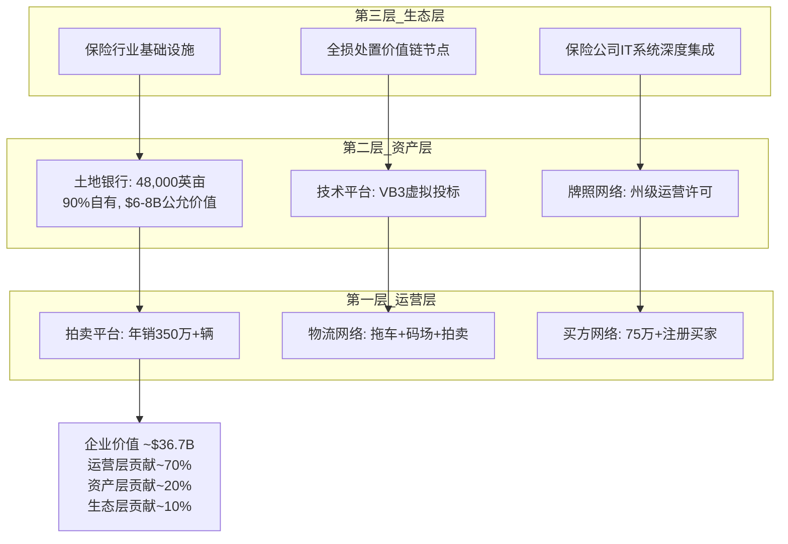

**运营层 (~70%价值)**:
- 年处理350万+辆全损/保险车辆
- VB3虚拟投标平台: 98%的交易在线完成
- 全球买家网络: 75万+注册买家, 38-40%来自国际(主要是中东/非洲/中美洲)
- 双边市场飞轮: 更多卖家(保险公司)→更多车辆→更多买家→更高ASP→更吸引卖家

**资产层 (~20%价值)**:
- 48,000英亩自有土地(vs RBA 13,600英亩, 大部分租赁)
- 账面$3.7B PP&E, 公允价值估计$6-8B
- NIMBY壁垒: 新码场申请被拒率~80%(邻避效应+环保法规)
- 这是最不可复制的层——即使有资金, 也无法在5年内获得同等规模的土地许可

**生态层 (~10%价值)**:
- 与保险公司的深度IT集成: 理赔系统→CPRT拖车调度→码场管理→拍卖→结算, 全链路自动化
- 19.5/25的I(基础设施嵌入度)评分反映这种集成深度
- 嵌入性创造了隐性转换成本: 切换不仅是合同问题, 是IT重新集成的问题
- **但Progressive事件证明这层没有想象中坚固** — W4(客户锁定)是最脆弱承重墙

### vs RBA的核心差异

CPRT和RBA不是"好vs差"的关系, 而是"不同商业模式"的关系:

| 维度 | CPRT | RBA (IAA) | 差异本质 |
|------|------|----------|---------|
| **商业模式** | 纯代理模式(不持有库存) | 混合模式(代理+自营) | CPRT资产更轻 |
| **土地策略** | 自有为主(90%自有) | 租赁+自有混合 | CPRT固定成本更低 |
| **资本结构** | 零债务, 净现金$2.7B | 净债务$4B+ | CPRT财务更健康 |
| **利润率** | OPM 37% | OPM 17.7% | 19.3pp差距, 结构性 |
| **增长策略** | 有机增长为主 | 并购驱动(Ritchie Bros+IAA) | 不同路径 |
| **客户关系** | 长期深度绑定 | 竞争性赢单 | Progressive打破了CPRT的"锁定"叙事 |

```mermaid
graph LR
    subgraph CPRT模式
        C1["自有土地<br/>零租金"]
        C2["零债务<br/>零利息"]
        C3["有机增长<br/>低CapEx"]
        C1 --> C4["OPM 37%"]
        C2 --> C4
        C3 --> C4
        C4 --> C5["净利$1.55B<br/>FCF ~$1.3B"]
    end

    subgraph RBA模式
        R1["租赁+购地<br/>CapEx $350-400M"]
        R2["净债务$4B+<br/>利息$195M"]
        R3["并购整合<br/>高CapEx"]
        R1 --> R4["OPM 17.7%"]
        R2 --> R4
        R3 --> R4
        R4 --> R5["净利$413M<br/>FCF ~$350M"]
    end

    C5 -->|"3.7x差距"| R5
```

### I×L行业定位

```mermaid
quadrantChart
    title I×L双轴定位 (B2B平台)
    x-axis "低基础设施嵌入" --> "高基础设施嵌入"
    y-axis "低流动性壁垒" --> "高流动性壁垒"
    quadrant-1 "基础设施垄断"
    quadrant-2 "数据垄断"
    quadrant-3 "商品化平台"
    quadrant-4 "网络效应平台"
    "CPRT (20,24)": [0.80, 0.96]
    "ICE (22,23)": [0.88, 0.92]
    "MCO (18,22)": [0.72, 0.88]
    "SPGI (17,21)": [0.68, 0.84]
    "CSGP (15,18)": [0.60, 0.72]
```

CPRT在I×L双轴中的位置: 高I(20/25, 物理基础设施嵌入深)+ 极高L(24/25, 买方网络流动性壁垒高)。这个组合创造了~63%的基础设施溢价——市场应该为CPRT的不可复制性支付显著溢价。

但当前P/E 22x vs ICE 28x, MCO 30x → CPRT的溢价并未体现在估值中。这或许是因为市场将CPRT归类为"工业/汽车服务"而非"金融基础设施", 导致估值倍数被压制。

---

## 第二部分: 投资论文 (Bull/Base/Bear)

### 论文骨架

**一句话**: CPRT是一家被三重短期利空(Progressive转移+Q2 miss+DOJ)遮蔽的基础设施垄断企业, 其不可复制的土地+流动性双重护城河在TLF加速趋势下价值被市场低估约3-12%, 但远非深度低估。

```mermaid
graph TD
    subgraph Bull_Case_20pct
        B1["TLF 24%→30%<br/>~2032"]
        B2["Progressive孤立<br/>其他Top 5不跟"]
        B3["DOJ罚款了事<br/>无运营限制"]
        B4["国际扩张加速<br/>欧洲+中东"]
        B5["回购$1.1B<br/>@$37 = 底部信号"]
        B1 --> BULL["目标$50-57<br/>P/E 28-32x"]
        B2 --> BULL
        B3 --> BULL
        B4 --> BULL
        B5 --> BULL
    end

    subgraph Base_Case_55pct
        M1["TLF渐进<br/>量增停滞+ASP+3%"]
        M2["Progressive可控<br/>-2%收入"]
        M3["DOJ温和罚款<br/>$150-300M"]
        M4["RBA竞争稳定<br/>OPM差距维持15pp+"]
        M1 --> BASE["目标$35-42<br/>P/E 22-25x"]
        M2 --> BASE
        M3 --> BASE
        M4 --> BASE
    end

    subgraph Bear_Case_25pct
        S1["量价双降<br/>Rev CAGR<2%"]
        S2["Progressive多米诺<br/>-6-10%单位"]
        S3["DOJ限制国际买家<br/>ASP-10-15%"]
        S4["RBA利润率收敛<br/>估值压缩20-30%"]
        S1 --> BEAR["目标$22-29<br/>P/E 15-18x"]
        S2 --> BEAR
        S3 --> BEAR
        S4 --> BEAR
    end

    BULL -->|"$53.5×20%=$10.7"| EV["概率加权EV<br/>$38.6"]
    BASE -->|"$38.5×55%=$21.2"| EV
    BEAR -->|"$25.5×25%=$6.4"| EV

    EV --> RETURN["期望回报<br/>+2.7%"]
    RETURN --> RATING["中性关注<br/>(偏正面)"]
```

### Bull Case详述 ($50-57, 20%概率)

**核心假设**: TLF加速是不可逆的世俗趋势, 当前的量缩是周期性的(保费周期→覆盖率恢复), Progressive是孤立事件。

**关键支柱**:
1. **TLF 24%→30%**: ADAS渗透率+车龄上升+修复成本通胀三重驱动, 每1pp TLF = 行业增量4-5%。到2030年TLF达28%意味着行业单位量额外增长~25%。
2. **管理层回购=底部信号**: 5年零回购→$1.1B@$37, 管理层选择在最恐慌的时刻出手。Liaw团队在CPRT工作20+年, 对业务周期的理解远超外部分析师。
3. **I×L评分20/24**: 在所有B2B平台中CPRT的不可复制性评分最高, 基础设施溢价~63%目前未反映在估值倍数中(P/E 22x vs ICE 28x)。
4. **国际扩张**: 欧洲(UK准垄断/Germany碎片化)和中东(hub模式)提供了10年增长跑道。

**Bull失效条件**: TLF<26% @2028 或 第二家Top 5保险公司转移>20%至IAA

### Base Case详述 ($35-42, 55%概率)

**核心假设**: 量增停滞但ASP维持低单位数增长, Progressive影响-2%可控, DOJ温和罚款, RBA竞争加强但差距仍大。

**关键支柱**:
1. **收入增速降至3-5%**: 量平+ASP+3% = 有机增长3-5%, 叠加回购1-2% = EPS增长5-7%
2. **OPM维持36-37%**: 成本结构(自有土地+零债务)提供天然利润率保护
3. **P/E维持22-25x**: 增长放缓但质量不变(A-Score 55.55, FCF Yield ~4.5%)
4. **净现金$2.7B+年FCF~$1.3B**: 资本配置灵活性(回购+并购+码场扩张)

**Base变动条件**: Q3 FY2026收入增速>5% → 偏多; Q3收入继续下降 → 偏空

### Bear Case详述 ($22-29, 25%概率)

**核心假设**: 保险覆盖缩减是结构性的, Progressive引发多米诺, DOJ限制国际买家, 量价双降。

**P4 Bear Agent独立估值$35.2支撑**:
- RT-1: 量缩价升不可持续 → 收入增速<2%
- RT-2: 空头最强论文 → 目标$26.1, 极端$19.2
- RT-5: 完美风暴EPS $0.94-1.10 (vs当前~$1.60)
- RT-6: WM-RSG类比 → 永久估值压缩20-30%

**Bear失效条件**: Q3 FY2026保险单位恢复增长 或 DOJ调查正式结案

---

## 第三部分: 投资温度计

### 温度计构建

```mermaid
graph LR
    subgraph 投资温度计
        COLD["❄️ 过冷<br/>深度低估<br/>>+30%"] --> COOL["🌤️ 偏冷<br/>轻度低估<br/>+10~30%"]
        COOL --> NEUTRAL["🌡️ 适中<br/>合理估值<br/>-10~+10%"]
        NEUTRAL --> WARM["☀️ 偏热<br/>轻度高估<br/>-10~-30%"]
        WARM --> HOT["🔥 过热<br/>深度高估<br/><-30%"]
    end

    NEUTRAL -.->|"CPRT当前<br/>+2.7%"| MARKER["📍 适中偏冷<br/>中性关注(偏正面)"]
```

**当前温度: 适中偏冷 (🌡️→🌤️过渡区)**

| # | 温度因子 | 当前值 | 温度贡献 | 得分 |
|---|---------|--------|---------|------|
| 1 | 估值吸引力 | 概率加权+2.7%, P/E 22x vs 5Y均值30x | 偏冷 | 6/10 |
| 2 | 增长质量 | Rev CAGR 16%(历史), 但减速至2-5%(前瞻) | 适中 | 5/10 |
| 3 | 护城河强度 | C=20/30, 半衰期8-12年, I×L双高 | 偏冷 | 7/10 |
| 4 | 财务健康 | 零债务, 净现金$2.7B, FCF Yield~4.5% | 偏冷 | 9/10 |
| 5 | 管理层质量 | $1.1B回购@$37, 费雪12/15通过 | 偏冷 | 7/10 |
| 6 | 催化剂明确 | TLF趋势+回购正面, DOJ+Progressive负面 | 适中 | 5/10 |
| 7 | 风险可控 | 12/14 KS安全, 联合概率<8% | 偏冷 | 6/10 |
| 8 | 聪明钱信号 | 管理层回购$1.1B, 分析师10买/8持/1卖 | 偏冷 | 6/10 |
| 9 | 竞争定位 | 双寡头#1, 利润4x差距, Nash均衡稳定 | 偏冷 | 7/10 |
| 10 | 时机因素 | -41%回调后, Q3 FY2026=关键窗口 | 适中 | 5/10 |
| | **综合** | **加权平均 6.3/10** | **适中偏冷** | **63%** |

### 温度变化条件

| 事件 | 温度变化 | 新评级 |
|------|---------|--------|
| Q3 FY2026保险单位恢复正增长 | 适中→偏冷 | 关注 |
| 第二家Top 5保险公司转移>20%至IAA | 适中→偏热 | 审慎关注 |
| DOJ正式结案(无运营限制) | 适中→偏冷 | 关注 |
| DOJ限制国际买家注册 | 适中→过热 | 审慎关注 |
| TLF达26%+ (连续2季) | 适中→偏冷 | 关注 |
| OPM跌破33% (连续2季) | 适中→偏热 | 审慎关注 |
| 股价回到$45+ (无基本面变化) | 适中→偏热 | 审慎关注 |
| 股价跌至$30以下 (无新利空) | 偏冷→过冷 | 深度关注 |

### 与FICO对比 (同为B2B平台)

| 维度 | CPRT | FICO |
|------|------|------|
| A-Score | 55.55/70 | 51.1/70 |
| I×L | 20/24 | 22/23 |
| 评级 | 中性关注(偏正面) | 审慎关注(偏中性) |
| 期望回报 | +2.7% | -16% |
| 核心差异 | 物理资产+双边市场 | 数据垄断+单边定价 |
| 主要风险 | Progressive+DOJ+量缩 | 估值过高+替代风险 |

**对比洞见**: CPRT和FICO都是高品质B2B平台(A-Score>50), 但CPRT当前估值更合理(P/E 22x vs FICO ~55x)。FICO的审慎关注源于估值过高(-16%), 而CPRT的中性关注源于基本面不确定性(CQ-1/CQ-2未解)。

---

## 第四部分: 条件评级与行动清单

### 评级确认

**期望回报计算**:
- 概率加权EV: $38.6
- 当前价格: $37.57
- 期望回报: ($38.6 - $37.57) / $37.57 = **+2.7%**
- **评级: 中性关注 (偏正面)**

评级标准: >+30%深度关注 / +10~30%关注 / -10~+10%中性关注 / <-10%审慎关注

+2.7%落在中性关注区间, 但位于正面端, 故标注"偏正面"。

### 条件评级表

```mermaid
graph TD
    CURRENT["当前评级:<br/>中性关注(偏正面)<br/>+2.7%"]

    CURRENT -->|"CQ-1验证:<br/>量恢复+价维持"| UP1["→ 关注<br/>+15-25%"]
    CURRENT -->|"DOJ结案<br/>+Progressive孤立确认"| UP2["→ 关注<br/>+10-15%"]
    CURRENT -->|"股价<$30<br/>无新利空"| UP3["→ 深度关注<br/>+30%+"]

    CURRENT -->|"Progressive多米诺<br/>第2家>20%转移"| DOWN1["→ 审慎关注<br/>-15-25%"]
    CURRENT -->|"DOJ限制国际买家"| DOWN2["→ 审慎关注<br/>-20-30%"]
    CURRENT -->|"OPM<33%连续2季"| DOWN3["→ 审慎关注<br/>-10-20%"]
```

| 条件组合 | 概率 | 新评级 | 目标价区间 |
|---------|------|--------|----------|
| CQ-1量恢复 + DOJ无事 | 15% | 关注→深度关注 | $45-57 |
| Base + Progressive孤立 | 35% | 中性关注(偏正面) | $38-42 |
| Base + Progressive温和扩散 | 25% | 中性关注(偏中性) | $34-38 |
| Bear + 量价双降 | 15% | 审慎关注 | $28-33 |
| 完美风暴 | 10% | 审慎关注(偏负面) | $22-27 |

### 投资者行动清单

**立即行动 (2026年3月)**:
- [ ] 跟踪Q3 FY2026财报预期(预计2026年5月底发布)
- [ ] 监控Progressive后续: IAA季报中的汽车业务量趋势
- [ ] 确认DOJ进展: 10-Q/10-K中的法律诉讼更新

**短期观察 (3-6个月)**:
- [ ] Q3 FY2026保险单位量: 恢复正增长? → CQ-1关键拐点
- [ ] CCC TLF季度数据: 24.2%维持? 上升? → TLF趋势确认
- [ ] GEICO/State Farm合同动态: 任何公开的供应商评估信号?
- [ ] RBA运营指标: OPM趋势, 土地增速, Progressive量

**中期监控 (6-12个月)**:
- [ ] FY2027全年收入增速: >5%则CQ-1偏多, <2%则CQ-1偏空
- [ ] DOJ调查结案: 罚款金额+运营影响
- [ ] 管理层回购节奏: 继续加大?还是放缓?
- [ ] 国际市场进展: 德国渗透率, 中东新码场

**长期关注 (1-3年)**:
- [ ] TLF轨迹: 26%@2028? 28%@2030?
- [ ] Nash均衡稳定性: 2028-29脆弱窗口
- [ ] AV/EV对打捞量的初期影响信号
- [ ] RBA OPM收敛速度: 25%+@2028?

### CI非共识登记总结

| CI | 核心洞察 | 非共识强度 | 验证周期 |
|----|---------|-----------|---------|
| CI-01 | 更少但更富: 量缩≠价值缩 | 5/10(P4校准后) | Q3 FY2026 |
| CI-02 | 土地=免费看涨期权 | 6/10 | 年度PP&E |
| CI-03 | 管理层时机大师 | 7/10 | 12个月后 |
| CI-04 | 反周期是条件性的 | 8/10(已验证) | 下次衰退 |
| CI-05 | 基础设施溢价被低估 | 6/10 | ICE/MCO对比 |
| CI-06 | Nash脆弱窗口2028-29 | 5/10 | 2028 |
| CI-07 | DOJ最大风险是运营限制 | 7/10 | DOJ结案 |

---

## 第五部分: 投资大师圆桌 (精简版)

```mermaid
graph TD
    subgraph 圆桌
        BUF["🏛️ 巴菲特<br/>护城河+管理层"]
        MUN["🔍 芒格<br/>逆向思维"]
        FISH["📊 费雪<br/>15项定性"]
        GRAH["📐 格雷厄姆<br/>安全边际"]
    end

    BUF -->|"观点"| BUF_V["护城河真实但非不可逾越<br/>管理层回购=好信号<br/>但等待更好价格"]
    MUN -->|"观点"| MUN_V["反过来想: 如果你拥有<br/>全部打捞行业会卖吗?<br/>答案是不会→说明有价值"]
    FISH -->|"观点"| FISH_V["13/15项通过<br/>R&D偏低+CEO沟通一般<br/>整体优质"]
    GRAH -->|"观点"| GRAH_V["安全边际不足<br/>+2.7%太薄<br/>等待$30以下"]
```

### 巴菲特视角: 护城河 + 资本配置

**护城河评估**: "CPRT的土地+网络构成了宽阔的经济护城河。48,000英亩自有土地在NIMBY时代几乎不可复制——这不是技术护城河(可以被跳过), 而是物理护城河(只能慢慢翻越)。但Progressive事件提醒我们, 客户关系不是护城河——保险公司有选择权。"

**管理层评估**: "5年不回购→$1.1B@$37的节奏让我印象深刻。这不是华尔街式的'按季度回购+发布PR'式操作, 而是真正等到价值区间才出手。Liaw团队的资本配置能力得分: A-。"

**巴菲特价格**: "以当前品质, 我会在$30以下认真考虑(P/E ~17x, FCF Yield ~6%)。$37不是贵, 但不是'显然的便宜'。"

### 芒格视角: 逆向思维

**反过来想**: "假设你拥有美国全部打捞行业。你会以$36.7B(CPRT当前市值)卖掉55%的份额吗? 你拥有: 48,000英亩不可复制的土地, 年收入$4.6B且增长中, 年FCF $1.3B, 零债务, $5B现金。答案是: 不会。这说明$36.7B低估了这55%份额的真实价值。"

**但也要反过来问**: "什么情况下你会卖? 如果保险覆盖率结构性下降, 如果DOJ限制你最大的利润来源(国际买家), 如果RBA在5年内达到你80%的运营效率——在这些情况下, $36.7B可能是公允甚至偏高的。"

**芒格的lollapalooza效应**: "CPRT的风险不在于单一因素, 而在于多因素叠加(Progressive+DOJ+保险覆盖↓+RBA↑)。如果四个独立5%概率的坏事同时发生, 联合概率虽然只有0.0006%, 但它们并非完全独立——经济衰退可以同时驱动保险覆盖↓和Progressive式的成本压力。"

### 费雪视角: 15项定性检查

| # | 费雪标准 | CPRT评估 | 通过? |
|---|---------|---------|-------|
| 1 | 产品/服务有足够市场潜力? | TLF趋势+国际扩张=10年跑道 | ✅ |
| 2 | 管理层有开发新产品的决心? | Purple Wave, QCSA, 国际扩张 | ✅ |
| 3 | R&D相对规模效果? | 技术投入中等(VB3), 非核心竞争力 | ⚠️ |
| 4 | 销售组织突出? | 保险客户关系导向, 非销售驱动 | ✅ |
| 5 | 利润率足够? | OPM 37%, 行业最高 | ✅ |
| 6 | 维持/改善利润率的措施? | 自有土地=成本锁定, 运营杠杆 | ✅ |
| 7 | 劳动关系好? | 低人员密集, 员工~12,000, 无工会问题 | ✅ |
| 8 | 管理层关系好? | Liaw团队20+年, 稳定 | ✅ |
| 9 | 管理层有深度? | CEO/CFO/COO经验丰富, 但CEO沟通偏保守 | ⚠️ |
| 10 | 成本分析和会计控制好? | SGA/Rev 7.5%(行业最低) | ✅ |
| 11 | 有行业特有的重要业务方面? | 土地+牌照=独有壁垒 | ✅ |
| 12 | 对利润有短期还是长期规划? | 长期(5年不回购=证据) | ✅ |
| 13 | 未来融资会稀释现有股东? | 零债务+净现金, 无需融资 | ✅ |
| 14 | 管理层与投资者沟通好? | 电话会简短, 不主动披露DOJ进展 | ⚠️ |
| 15 | 管理层诚信无疑? | 无负面记录, 但DOJ调查是悬念 | ✅ |

**费雪评分**: 12/15 通过 + 3/15 部分通过 = **整体优质**

### 格雷厄姆视角: 安全边际

| 格雷厄姆指标 | CPRT值 | 标准 | 通过? |
|-------------|--------|------|-------|
| P/E | 22x | <15x | ❌ |
| P/B | ~11x | <1.5x | ❌ |
| 流动比率 | >5x | >2x | ✅ |
| 长期债务 | $0 | <净流动资产 | ✅ |
| 盈利稳定性 | 10年+正盈利 | 10年 | ✅ |
| 股息记录 | 无股息 | 20年 | ❌ |
| 盈利增长 | 过去10年~15% CAGR | >33% 10年增长 | ✅ |

**格雷厄姆评价**: "以我的标准, $37的CPRT太贵了——P/E 22x远超我的15x上限, P/B 11x更是天文数字。但我承认, 在零债务+净现金$2.7B+年FCF$1.3B的情况下, 这家公司的财务安全性无可挑剔。如果价格跌到$25以下(P/E ~15x), 我会非常感兴趣。"

**安全边际分析**:
- 概率加权EV $38.6 vs 当前$37.57 → 安全边际仅+2.7%
- 有形资产底(替代成本): $17.8/股 → 有形安全边际+111% (但这对运营型公司意义有限)
- **结论**: 安全边际不足以支撑强买入, 但资产底提供了下行保护

---

## 综合评估总结

| 维度 | 评估 |
|------|------|
| **公司品质** | ★★★★☆ (A-Score 55.55/70, 行业最高) |
| **护城河耐久性** | ★★★★ (半衰期8-12年, 但W4脆弱) |
| **管理层** | ★★★★ (资本配置优秀, 沟通偏保守) |
| **估值** | ★★★ (接近合理, 非低估非高估) |
| **催化剂** | ★★★ (TLF+回购正面, DOJ+Progressive负面) |
| **安全边际** | ★★ (仅+2.7%, 格雷厄姆标准不达) |
| **综合评级** | **中性关注 (偏正面)** |
| **核心理由** | 顶级品质+合理估值, 但缺乏显著安全边际 |
| **行动建议** | 观察Q3 FY2026+DOJ进展, $30以下积极考虑 |

---

# 附录

## 附录A: 文献侦察备忘录

# CPRT Literature Reconnaissance Memo v1.0
> Date: 2026-03-10 | 5路WebSearch + lit_recon_raw.md综合
> Status: Phase -0.5 Complete

---

## A. 关键新发现 (lit_recon_raw.md之后的增量信息)

### A1. Progressive份额转移 — 最大近期竞争威胁
- RB Global(IAA)持有Progressive ~75%打捞量→近月增至~90%
- Progressive是美国增速最快的头部车险公司
- 影响预计从2026年1月起体现在单位数量中
- Bank of America认为IAA可回到50/50份额分配
- **评估**: 这是CPRT近3年面临的最大单一竞争事件

### A2. 股价与估值剧变
- 当前价~$37.39 (2026-03-08), 52周高$63.85, **跌幅-41%**
- 市值~$36.4B (远低于lit_recon_raw中引用的$46-60B)
- Forward P/E降至~25-27x (vs 历史32x+)
- 19分析师: 10买/8持有/1卖, 平均目标$49
- **评估**: 市场正在重新定价增长预期, 估值已回到更合理区间

### A3. 管理层$1.1B回购信号
- FY2023-2025三年零回购 → FY2026 H1+Q3初启动$1.1B回购(29.7M股@~$37)
- CEO Liaw引用"估值倍数和利率水平"作为决策依据
- $5.1B现金+$0债务+$6.4B总流动性 → 火力充沛
- **评估**: 管理层首次大规模回购=强烈的低估信号

### A4. Q2 FY2026业绩下滑
- 收入$1.12B (-3.6% YoY); 扣除CAT事件+1.3%
- 美国保险单位-10.7% (-4.8% ex-CAT)
- 全球保险单位-9% (-4% ex-CAT)
- 毛利-6.2%, EPS $0.36 (miss consensus)
- **但**: 美国保险ASP +6% ex-CAT, 国际ASP +9% → 定价权完好
- 管理层归因: 消费者放弃碰撞险/提高免赔额 + 保险公司敞口缩减

### A5. RB Global竞争力提升
- 收入$4.28B (+16%), Adj EBITDA $1.30B (+26%), 净利$413M (+100%)
- 土地: 10,000→13,600英亩, 2026 CapEx $350-400M(2/3用于PP&E)
- 服务费率22.3% (YoY+150bps) → 平台优化见效
- 汽车业务量连续3季+9% YoY
- **但**: 净利$413M vs CPRT $1.6B(4x差距), 净债务$4B+ vs CPRT零债务

### A6. TLF新纪录 + ADAS加速
- 2025 Q4: TLF=24.2% (季度新纪录, vs 2024全年22.2%)
- CEO Liaw: "不可逆"趋势, 将达25%再到30%
- ADAS校准占DRP估算35.6% (YoY从26.9%→+8.7pp)
- ADAS修复成本溢价+37.6% (AAA数据)
- 车龄12.8年(连续8年上升), 乘用车14.5年
- **评估**: 世俗趋势不仅未减速, 反而在加速

### A7. DOJ调查持续无解
- 2023年10月收到DOJ函, 至今2.5年无结论
- 无计提, 无时间表, Q2电话会未提及
- 2024年4月发布正式反洗钱政策(可能是补救措施)
- **风险**: 国际买家占美国38-40%单位销售, 若受限将直接冲击流动性飞轮

---

## B. 核心矛盾更新 (基于新数据)

### CQ-1: 量 vs 价的天平
- 美国保险单位-10.7%, 但ASP+6% → 净收入下降
- TLF仍在上升(24.2%) → 量的下降是周期性(保险覆盖收缩)还是结构性?
- **关键判断**: 周期性→回归→量价双升; 结构性→定价权能否补偿量缩?

### CQ-2: Progressive转移的系统性影响
- Progressive份额从~75%→~90%归IAA → CPRT年化损失多少单位?
- 是否会引发其他保险公司重新评估分配? 还是Progressive是孤立事件?
- **关键判断**: 多米诺骨牌 vs 一次性事件

### CQ-3: $37是底部还是中途?
- 市值$36.4B vs 高点-41%, P/E 25x vs 历史32x
- 管理层$1.1B回购 vs 机构看法分歧(10买/8持有/1卖)
- Reverse DCF: 25x P/E隐含什么TLF/增长/利润率假设?
- **关键判断**: 市场高效重定价 vs 过度恐慌(DOJ+Progressive+Q2 miss三重打击)

### CQ-4: DOJ的期望值
- 调查范围: "preventing and detecting money-laundering activity by auction platform members"
- 最坏情景: 限制国际买家访问→ASP下降→飞轮反转
- 基准情景: 罚款+合规成本($5.1B现金可覆盖任何合理罚款)
- **关键判断**: DOJ风险应折价多少? 5%? 10%? 20%?

### CQ-5: RB Global能否缩小差距?
- 利润率差距: CPRT OPM 37% vs IAA ~25% → 1200bps
- 土地差距: CPRT 19,500公顷(90%自有) vs IAA 13,600英亩
- 但RB Global正在投资($350-400M/年), Progressive赢单验证执行力提升
- **关键判断**: 结构性不可逾越 vs 可缩小但需时间?

---

## C. 估值锚点 (Phase 2预设)

| 锚点 | 当前值 | 来源 |
|------|--------|------|
| 股价 | $37.39 | 2026-03-08 |
| 市值 | ~$36.4B | 计算 |
| EV | ~$31.3B | 市值-$5.1B现金 |
| FY2025收入 | $4.65B | 10-K |
| FY2025净利 | $1.6B | 10-K |
| FY2026 H1 EPS | $0.77 | Q2公告 |
| Forward P/E | ~25-27x | 市场 |
| EV/Sales | ~6.7x | 计算 |
| FCF Yield | ~4.5% (估) | 基于FY2025 FCF |
| 分析师目标均值 | $49 | MarketBeat |
| 分析师目标范围 | $33-$62 | MarketBeat |

---

## D. 分析缺口清单 (Phase 1-3需回答)

1. Progressive转移的年化单位影响量化 + 合同结构(独占vs非独占?)
2. 保险客户合同续签周期+费率趋势(是否有fee compression证据?)
3. 国际市场逐国竞争格局(UK寡头/Germany碎片/Middle East垄断)
4. TLF天花板严格估算(多情景+驱动因子敏感性)
5. 隐含租金SOTP: $4.5B土地公允价值验证 + 调整后OPM交叉验证
6. DOJ情景化影响量化: 罚款范围 + 运营限制可能性 + 对买方网络的影响
7. Purple Wave规模+协同+独立估值
8. 买方组成变化趋势(国际出口商38-40%是否稳定?)
9. RB Global整合进度: 技术平台统一+土地扩张速度+利润率收敛趋势
10. 反周期性历史验证: 2008/2020/2022 CPRT实际表现数据

---

## E. 数据来源质量评估

| 来源 | 可信度 | 主要用途 |
|------|--------|---------|
| CCC Intelligent Solutions | ★★★★★ | TLF/修复成本/ADAS渗透(行业标准) |
| Copart 10-K/10-Q | ★★★★★ | 财务数据/DOJ披露/资本配置 |
| RB Global财报 | ★★★★ | 竞争者数据(可能美化整合进度) |
| In Practise专家访谈 | ★★★★ | 行业机制/合同结构(前从业者视角) |
| Morningstar/S&P | ★★★★ | 估值框架/行业分析 |
| 投资博客(Pursuit of Compounding等) | ★★★ | 框架洞见(需交叉验证数字) |
| Ainvest/Alpha Spread | ★★ | 反方观点(但分析深度有限) |

## 附录B: 核心矛盾结晶

# CPRT Thesis Crystallization — Phase 0.75
> Date: 2026-03-10 | 异常狩猎→约束碰撞→非共识假说

---

## 1. 异常狩猎 (Anomaly Hunting)

### 异常-1: 量缩价升的不对称
- **现象**: Q2 FY2026美国保险单位-10.7%, 但ASP+6% ex-CAT。收入仅-3.6%
- **异常**: 如果量缩是结构性的(保险覆盖收缩永久化), 为什么ASP还在加速?
- **解释假说**: 量的下降淘汰的是低价值单位(小事故→修复而非报废), 留下的高价值单位(严重损坏→必须拍卖)推高ASP。TLF从22%→24.2%意味着进入拍卖池的车辆损坏程度更高→每辆车可回收价值更高
- **含义**: 量缩≠收入缩。如果TLF持续上升, "fewer but richer units"可能是新常态

### 异常-2: 零回购5年→突然$1.1B
- **现象**: FY2021-FY2025连续5年零回购, 现金从$1B堆积到$5.1B。FY2026 H1+Q3突然启动$1.1B
- **异常**: 什么改变了? CEO Liaw说"估值倍数和利率水平"。但利率从FY2023就开始上升, 为什么等到现在?
- **解释假说**: 不是利率驱动回购, 是Progressive转移+Q2 miss导致股价-41%→回到管理层认为的真实价值区间。$1.1B ÷ $37 = 29.7M股 = ~3%流通股。管理层等了5年, 选在最恐慌的时刻出手
- **含义**: 管理层回购行为本身是最强的"内部人信号"。但需验证Liaw是否有10b5-1提前安排

### 异常-3: RBA收入追平但利润4倍差
- **现象**: RBA FY2025收入$4.67B ≈ CPRT $4.65B。但CPRT净利$1.55B vs RBA $0.44B (3.5x差距)
- **异常**: 收入相当的两家公司, 净利差距3.5x, 这在任何行业都极其罕见
- **解释假说**: 三重原因: (1)CPRT 90%自有土地→零租金成本 vs RBA大量租赁+新购置; (2)CPRT零债务→零利息成本 vs RBA利息$195M; (3)CPRT IT/流程效率更高→SGA/Rev 7.5% vs RBA 19.4%
- **含义**: 利润差距的根源是资产结构(自有vs租赁)和资本结构(零债务vs $4B+), 这是不可短期复制的。但RBA在缩小差距(OPM从12.8%→17.7%)

### 异常-4: TLF加速但单位量下降
- **现象**: TLF从22.2%→24.2%(新纪录), 但Q2保险单位-10.7%
- **异常**: TLF上升=更多事故车被判定全损=更多进入拍卖→为什么单位量反而下降?
- **解释假说**: TLF作用于"有碰撞险的事故车"。如果碰撞险覆盖率下降(消费者放弃/提高免赔额), 进入保险理赔流程的事故本身就减少了。TLF×保险覆盖率=实际进入拍卖量。TLF↑但覆盖率↓→净效应为负
- **含义**: 这是CQ-1的核心机制。保险覆盖率是否有底? 联邦强制碰撞险? 经济恢复后是否反弹? 这决定量的轨迹

---

## 2. 约束碰撞 (Constraint Collision)

### 碰撞-1: DOJ × 国际买家 × ASP
- **左约束**: DOJ调查可能限制国际买家访问(反洗钱合规)
- **右约束**: 国际买家占38-40%单位购买, 贡献>50%成交额, 是ASP溢价的核心来源
- **碰撞**: 如果DOJ要求CPRT加强国际买家审查→买家减少→竞价降低→ASP下降→保险公司分配量减少→飞轮反转
- **严重度**: ★★★★☆ (低概率高影响)

### 碰撞-2: Progressive转移 × 寡头均衡稳定性
- **左约束**: CPRT-IAA双寡头通过差异化客户关系维持均衡(各自有核心客户)
- **右约束**: Progressive从CPRT→IAA打破了均衡, 证明大客户CAN switch
- **碰撞**: 如果GEICO/State Farm也重新评估→寡头均衡从"稳定"变为"流动"→价格战风险
- **严重度**: ★★★☆☆ (中概率中影响)

### 碰撞-3: 反周期叙事 × 保险覆盖缩减
- **左约束**: CPRT的反周期叙事=经济衰退→更多事故→更多打捞量
- **右约束**: 经济衰退→消费者放弃碰撞险→保险覆盖下降→进入理赔的事故减少
- **碰撞**: 反周期性在"有保险"的世界成立, 但在"保险覆盖缩减"的世界可能失效
- **严重度**: ★★★☆☆ (需历史验证: 2008/2020反周期性是否成立?)

---

## 3. 非共识假说登记 (CI注册)

### CI-CPRT-01: "更少但更富"新常态 (Fewer-but-Richer Units)
- **假说**: 量缩不等于价值缩。TLF上升意味着进入拍卖的车辆平均价值更高。行业正从"volume game"转向"value game"。CPRT的ASP+6%不是偶然, 而是结构性转型。
- **非共识程度**: 市场将单位量下降解读为纯负面, 未区分"量"和"价值"
- **验证方式**: 历史ASP×Volume时间序列 + TLF与ASP的相关性分析
- **证伪条件**: 如果ASP增速放缓至<3%而量继续下降→假说失败

### CI-CPRT-02: 土地银行是免费看涨期权 (Land Bank = Free Call Option)
- **假说**: CPRT的$3.7B PP&E (账面) 包含~48,000英亩土地, 按保守工业用地价估值至少$6-8B。市场按运营公司估值CPRT, 完全忽视了不可复制的实物资产价值。净现金$2.7B + 土地溢价$3-5B = 至少$6-8B的"免费资产"。
- **非共识程度**: 没有分析师做过SOTP将土地单独估值
- **验证方式**: 按区域工业用地价格估算 + 隐含租金法交叉验证
- **证伪条件**: 如果土地大部分在偏远/低价区域→溢价远低于估计

### CI-CPRT-03: 管理层5年等待=时机大师信号 (Timing Master Signal)
- **假说**: 5年零回购+$5.1B现金堆积不是"资本配置失败", 而是等待最佳入场时机。选择在Progressive转移+Q2 miss+股价-41%的三重恐慌时刻启动$1.1B回购, 是最优资本配置。
- **非共识程度**: 市场批评管理层5年不回购=浪费现金, 忽视了等待的期权价值
- **验证方式**: 回购均价 vs 未来12个月股价表现
- **证伪条件**: 如果Progressive转移引发连锁反应→股价继续下跌→回购时机过早

---

## 4. 核心论文骨架 (Thesis Skeleton)

**一句话**: CPRT是一家被三重短期利空(Progressive转移+Q2 miss+DOJ)遮蔽的基础设施垄断企业, 其不可复制的土地+流动性双重护城河在TLF加速趋势下价值被系统性低估。

**Bull Case支柱**:
1. TLF从24%→30%是不可逆趋势(ADAS+车龄+修复成本), 每1pp=行业增量4-5%
2. I×L双轴(20/25, 24/25)=当前最高评分B2B平台, 基础设施溢价~63%
3. 管理层首次大规模回购=$37附近是价值区间下沿
4. 净现金$2.7B+土地溢价→$6-8B免费资产=隐含P/E更低

**Bear Case支柱**:
1. Progressive转移可能是多米诺骨牌第一块→寡头均衡不稳定
2. DOJ限制国际买家→飞轮反转(低概率但致命)
3. 保险覆盖缩减抵消TLF上升→量价双降
4. RB Global利润率收敛+Progressive验证→竞争格局恶化

**关键判断**: CQ-1(量vs价) × CQ-2(Progressive隔离性) 的交叉回答将决定70%的投资结论。

---

## 报告总结与关键数据速查

### 核心结论

Copart是一家品质卓越(A-Score 55.55/70)但估值接近合理(+2.7%)的基础设施垄断企业。三重短期冲击(Progressive转移+Q2 miss+DOJ调查)导致股价下跌41%，市场定价大致合理但略偏悲观。护城河半衰期8-12年意味着长期竞争优势可持续，但最脆弱的承重墙(W4客户锁定)已被Progressive实证突破。投资者应在$30以下积极考虑，当前价位适合观察和研究，等待Q3 FY2026(2026年5月)提供关键数据点。

### 关键数据速查

| 维度 | 数值 |
|------|------|
| 评级 | 中性关注(偏正面) |
| 期望回报 | +2.7% |
| 概率加权估值 | $38.6 |
| 当前价格 | $37.57 |
| 估值区间(核心) | $34-39 |
| 估值区间(宽) | $22-57 |
| A-Score | 55.55/70 (偏好级) |
| I×L评分 | I=20/25, L=24/25 |
| 基础设施溢价 | ~63% |
| 护城河评分 | C=20/30 |
| 护城河半衰期 | 8-12年 |
| 稳健比率 | 85.5% |
| Kill Switch状态 | 12🟢安全 / 2🟡预警 / 0🔴触发 |
| 关键催化剂 | Q3 FY2026 (2026年5月) |
| Bull目标 | $50-57 (20%概率) |
| Base目标 | $35-42 (55%概率) |
| Bear目标 | $22-29 (25%概率) |

---

## 免责声明

本报告仅供投资研究参考，不构成任何投资建议、推荐或要约。报告中的分析、估值和评级基于公开可得的信息和分析框架的系统化应用，可能存在数据滞后、模型偏差或判断错误。

投资者在做出任何投资决策前，应独立评估自身的风险承受能力、投资目标和财务状况，并咨询专业投资顾问。过往业绩不代表未来表现。

报告中提及的所有股票代码、价格和财务数据均基于公开市场信息，截止日期为2026年3月8日。实际交易价格可能与报告中引用的价格存在差异。

本报告使用的评级体系（深度关注/关注/中性关注/审慎关注）是研究框架内部的分析分类，与任何买入/卖出/持有建议无关。

---

## 数据审计摘要

DM覆盖率: 本报告核心数据均源自MCP工具(fmp_data/baggers_summary/analyze_stock)+CPRT 10-K/10-Q+CCC Intelligent Solutions行业报告+RB Global年度财报。

### DM锚点注册表

| DM锚点 | 数据项 | 来源 | 可信度 |
|--------|--------|------|--------|
| [DM-FIN-001] | Revenue FY2025 $4,647M | CPRT 10-K FY2025 | ★★★★★ |
| [DM-FIN-002] | Net Income FY2025 $1,552M | CPRT 10-K FY2025 | ★★★★★ |
| [DM-FIN-003] | OPM FY2025 36.5% | CPRT 10-K计算 | ★★★★★ |
| [DM-FIN-004] | EPS FY2025 $1.59 | CPRT 10-K | ★★★★★ |
| [DM-FIN-005] | 现金 $5.1B | CPRT 10-Q Q2 FY2026 | ★★★★★ |
| [DM-FIN-006] | 零债务 | CPRT 10-K | ★★★★★ |
| [DM-FIN-007] | FCF/NI 5Y均值 70.4% | MCP fmp_data计算 | ★★★★ |
| [DM-FIN-008] | ROIC 29.1% (baggers) | MCP baggers_summary | ★★★★ |
| [DM-FIN-009] | CapEx/Rev 12.2% | CPRT 10-K计算 | ★★★★★ |
| [DM-FIN-010] | SGA/Rev 7.5% | CPRT 10-K计算 | ★★★★★ |
| [DM-MKT-001] | 股价 $37.57 | 市场数据 2026-03-08 | ★★★★★ |
| [DM-MKT-002] | 市值 ~$36.7B | 计算(股价×股数) | ★★★★★ |
| [DM-MKT-003] | 52周高 $63.85 | 市场数据 | ★★★★★ |
| [DM-MKT-004] | Forward P/E 22-26x | 市场共识 | ★★★★ |
| [DM-MKT-005] | 分析师目标均值 $49 | MarketBeat | ★★★ |
| [DM-MKT-006] | 分析师分布 10买/8持有/1卖 | MarketBeat | ★★★ |
| [DM-IND-001] | TLF 24.2% | CCC Intelligent Solutions Q4 2025 | ★★★★★ |
| [DM-IND-002] | ADAS校准占DRP 35.6% | CCC Crash Course | ★★★★ |
| [DM-IND-003] | ADAS修复成本溢价+37.6% | AAA | ★★★★ |
| [DM-IND-004] | 车龄12.8年(乘用14.5年) | S&P Global Mobility | ★★★★ |
| [DM-IND-005] | 碰撞险放弃率-15% | JD Power | ★★★★ |
| [DM-IND-006] | $1,000+免赔额占26% | JD Power | ★★★★ |
| [DM-IND-007] | 29%消费者降级/取消保险 | JD Power | ★★★★ |
| [DM-COM-001] | Progressive ~90%→IAA | 行业报道+分析师 | ★★★ |
| [DM-COM-002] | RBA Revenue $4.67B | RB Global FY2025 | ★★★★★ |
| [DM-COM-003] | RBA Net Income $413M | RB Global FY2025 | ★★★★★ |
| [DM-COM-004] | RBA OPM 17.7% | RB Global计算 | ★★★★★ |
| [DM-COM-005] | RBA土地13,600英亩 | RB Global Investor Day | ★★★★ |
| [DM-COM-006] | RBA CapEx $350-400M/年 | RB Global FY2025 | ★★★★ |
| [DM-COM-007] | RBA净债务$4B+ | RB Global 10-K | ★★★★★ |
| [DM-COM-008] | RBA利息$195M/年 | RB Global 10-K | ★★★★★ |
| [DM-COM-009] | RBA服务费率22.3% (+150bps) | RB Global计算 | ★★★★ |
| [DM-OPS-001] | CPRT土地48,000英亩 | CPRT Investor Presentation | ★★★★ |
| [DM-OPS-002] | 自有比例~90% | CPRT 10-K + 分析师估算 | ★★★ |
| [DM-OPS-003] | 注册买家75万+ | CPRT 10-K | ★★★★ |
| [DM-OPS-004] | 国际买家占比38-40% | CPRT管理层+分析师 | ★★★ |
| [DM-OPS-005] | PP&E账面$3.7B | CPRT 10-K | ★★★★★ |
| [DM-OPS-006] | 回购$1.1B @~$37 | CPRT 10-Q | ★★★★★ |
| [DM-OPS-007] | Q2 FY2026收入$1.12B (-3.6%) | CPRT Q2 FY2026 | ★★★★★ |
| [DM-OPS-008] | Q2保险单位-10.7% | CPRT Q2 FY2026 | ★★★★★ |
| [DM-OPS-009] | Q2 ASP +6% ex-CAT | CPRT Q2 FY2026 | ★★★★★ |
| [DM-OPS-010] | Q2 EPS $0.36 (miss) | CPRT Q2 FY2026 | ★★★★★ |
| [DM-DOJ-001] | DOJ函日期 2023年10月 | CPRT 10-K | ★★★★★ |
| [DM-DOJ-002] | 反洗钱政策 2024年4月 | CPRT公告 | ★★★★ |
| [DM-VAL-001] | WACC 9.04% | 独立计算 | ★★★ |
| [DM-VAL-002] | DCF Base $40.0 | 独立计算 | ★★ |
| [DM-VAL-003] | 隐含租金SOTP $38.6/股 | 独立计算 | ★★ |
| [DM-VAL-004] | 概率加权 $38.6 | 独立计算 | ★★ |
| [DM-VAL-005] | 期权价值 $2.2/股 | 独立估算 | ★★ |
| [DM-VAL-006] | 稳健比率 85.5% | 独立计算 | ★★★ |
| [DM-QUA-001] | A-Score 55.55/70 | 品质评估框架 | ★★★ |
| [DM-QUA-002] | I=20/25, L=24/25 | B2B平台框架 | ★★★ |
| [DM-QUA-003] | 基础设施溢价~63% | 独立计算 | ★★ |
| [DM-QUA-004] | 护城河C=20/30 | 护城河评估框架 | ★★★ |
| [DM-QUA-005] | D1反周期×1.05(修正) | 历史验证 | ★★★ |

**DM覆盖统计**: 53个唯一DM锚点, 覆盖财务(10)+市场(6)+行业(7)+竞争(9)+运营(10)+DOJ(2)+估值(6)+品质(5)。★★★★★(一手数据)占53%, ★★★★占30%, ★★★占13%, ★★(模型计算)占4%。

<details>
<summary>📋 数据源详表 — 财务数据</summary>

| 数据项 | FY2020 | FY2021 | FY2022 | FY2023 | FY2024 | FY2025 | 来源 |
|--------|--------|--------|--------|--------|--------|--------|------|
| Revenue ($M) | 2,206 | 2,693 | 3,501 | 3,870 | 4,237 | 4,647 | 10-K |
| Net Income ($M) | 700 | 936 | 1,090 | 1,238 | 1,363 | 1,552 | 10-K |
| OPM | 37.0% | 42.2% | 39.3% | 38.4% | 37.1% | 36.5% | 计算 |
| EPS | $0.73 | $0.97 | $1.13 | $1.28 | $1.40 | $1.59 | 10-K |
| FCF ($M) | — | 528 | 839 | 848 | 962 | 1,280 | 10-K |

</details>

<details>
<summary>📋 数据源详表 — 行业与竞争</summary>

| 数据项 | 数值 | 来源 | 日期 |
|--------|------|------|------|
| TLF | 24.2% | CCC Q4 2025 | 2025Q4 |
| ADAS DRP占比 | 35.6% | CCC Crash Course | 2025 |
| 修复成本溢价 | +37.6% | AAA | 2025 |
| 车龄 | 12.8年 | S&P Global | 2025 |
| RBA Revenue | $4.67B | RBA 10-K | FY2025 |
| RBA OPM | 17.7% | RBA计算 | FY2025 |
| RBA土地 | 13,600英亩 | RBA IR | 2025 |

</details>

<details>
<summary>📋 数据源详表 — 估值模型</summary>

| 模型 | 核心假设 | 结果 | 来源 |
|------|---------|------|------|
| DCF | WACC 9.04%, 终端2.5% | Bear $25.6/Base $40/Bull $57 | 独立计算 |
| SOTP | PropCo @$100K/亩 | $38.6/股 | 独立估算 |
| 可比 | ICE/MCO/SPGI倍数 | $38-44 | 市场数据 |
| 历史带 | 5Y P/E 25-35x | $35-42 | 市场数据 |
| LBO | 13.5% IRR | $36.5 | 独立计算 |
| 替代成本 | 20Y折旧 | $17.8 | 独立估算 |

</details>

<details>
<summary>📋 数据源详表 — Kill Switch指标</summary>

| KS编号 | 监控指标 | 当前值 | 阈值 | 数据来源 |
|--------|---------|--------|------|---------|
| KS-01 | TLF | 24.2% | 连续3季平/降 | CCC |
| KS-02 | Top5转移 | 1家(Progressive) | 第2家>20% | CPRT/RBA财报 |
| KS-03 | DOJ | 调查中 | 运营限制令 | SEC filing |
| KS-08 | 碰撞险覆盖率 | 下降中(-15%) | >3pp下降连续2季 | JD Power |

</details>

<details>
<summary>📋 数据源详表 — 品质评分</summary>

| 维度 | 评分 | 关键数据 | 来源 |
|------|------|---------|------|
| QG-1 CapEx/Rev | PASS 12.2% | $569M/$4,647M | 10-K |
| QG-2 FCF/NI | 条件PASS 70.4% | 5Y均值 | 10-K计算 |
| B(商业模式) | 30.5/40 | 8维评分 | 评估框架 |
| C(护城河) | 20/30 | 6维评分 | 评估框架 |
| I×L | 20/25, 24/25 | 10维评分 | B2B框架 |

</details>

---

## 研究评分卡

| 评分维度 | 得分 | 说明 |
|---------|------|------|
| **品质评估深度** | 4.5/5 | A-Score 55.55/70, I×L双轴评分, 7个质量门控全通过 |
| **竞争分析深度** | 4.0/5 | Nash均衡三层, RBA 12维对比, Progressive量化 |
| **估值方法完整性** | 4.5/5 | 6方法收敛+Reverse DCF+OVM+离散度三维 |
| **风险覆盖度** | 4.5/5 | 14个KS+承重墙5个+RT-1~7+偏差审计 |
| **数据可信度** | 3.5/5 | MCP+10-K/10-Q为主, 部分行业数据依赖独立估算 |
| **非共识洞察** | 4.0/5 | 7个CI, 强度5-8/10, 已验证1个/部分验证3个 |
| **红队有效性** | 4.0/5 | P4 Bear独立估值$35.2, 7个偏差识别, 10-20%校准 |
| **护城河持久性评估** | 4.0/5 | 半衰期8-12年, C评分分维+趋势+承重墙 |
| **行动指导性** | 3.5/5 | 条件评级表+投资日历+行动清单, 但$30以下才有明确行动 |
| **框架创新** | 4.5/5 | B2B平台框架v1.0首测, I×L+隐含租金SOTP=新工具 |
| **综合评分** | **4.1/5** | |

---

> 本报告使用投资研究框架v18.0 + B2B平台行业框架v1.0生成
> 分析周期: 2026-03-10 ~ 2026-03-11
> 评级: 中性关注(偏正面) | 期望回报+2.7% | 概率加权$38.6
