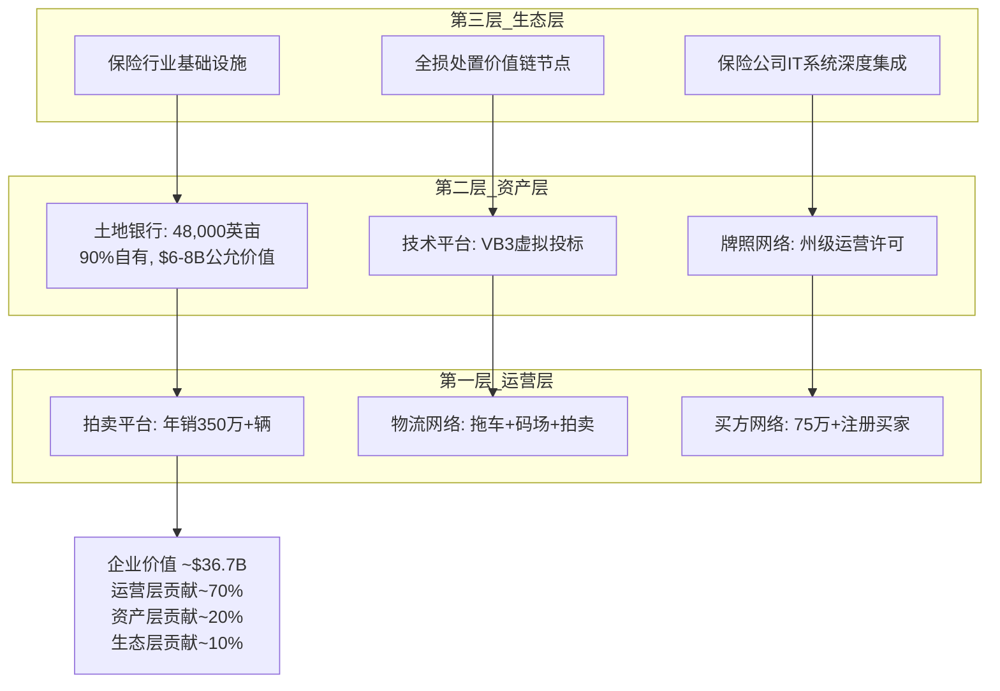
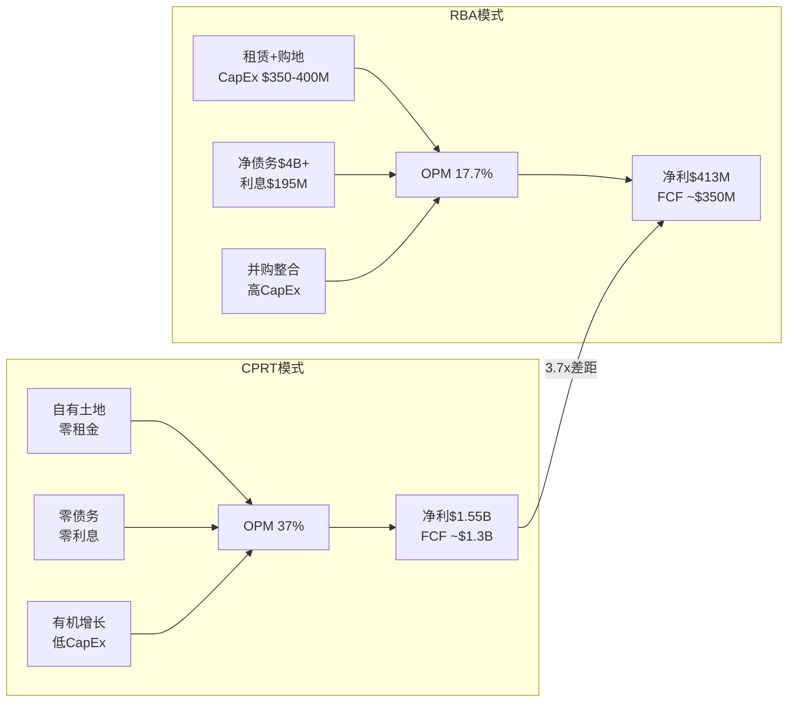
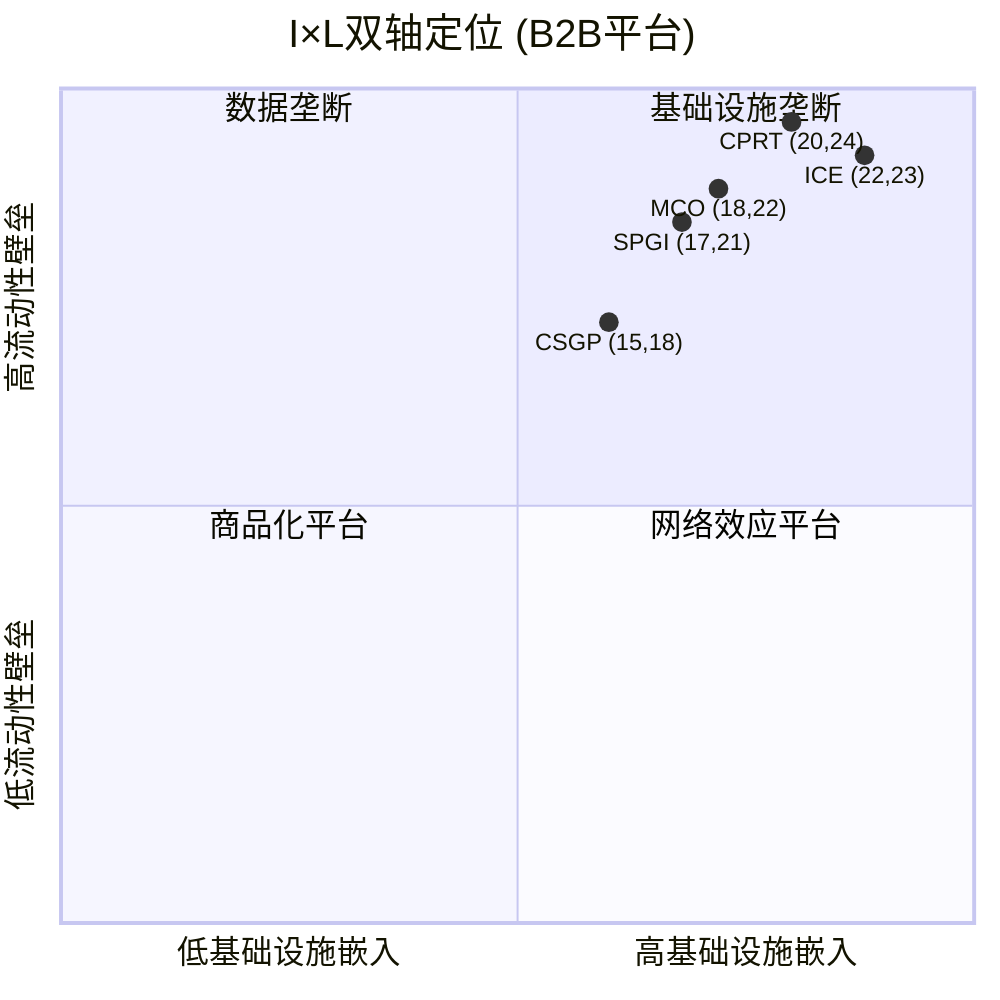
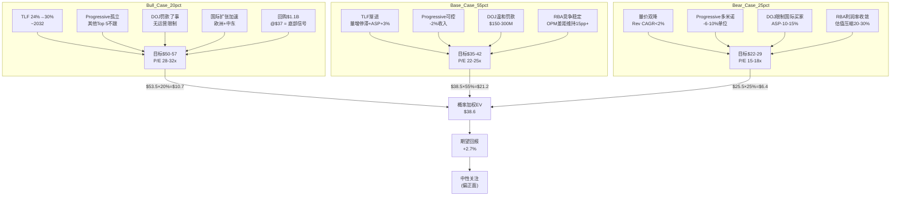
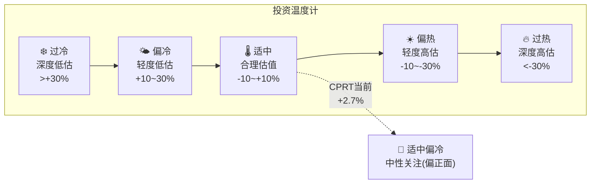
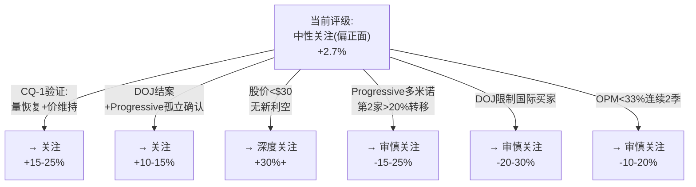
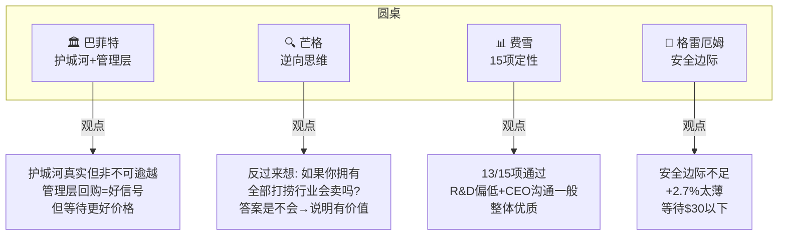

# CPRT Phase 5 — 综合评估 (Agent A)

> **分析师**: Agent A — 叙事策略分析师
> **日期**: 2026-03-11
> **任务**: 投资论文终稿 + 投资温度计 + 条件评级 + 投资大师圆桌

---

## 第一部分: CPRT公司本质与竞争身份

### 一句话定义

**Copart是美国保险行业全损车辆处置的基础设施垄断运营商——它不是拍卖公司, 而是保险理赔价值链中不可替代的物流节点。**

这个定义的关键在于三个词:
- **基础设施**: 不是服务, 是物理存在(48,000英亩自有土地) — 移除它, 保险公司的理赔流程断裂
- **垄断**: 不是市场份额的垄断(~55%), 而是特定保险客户依赖关系的垄断(Top 10中8家的主要供应商)
- **运营商**: 不是资产持有者(虽然它也是), 而是双边市场的运营者 — 保险公司(卖方)和全球买家(买方)的连接器

### 三层身份

**运营层 (~70%价值)**:
- 年处理350万+辆全损/保险车辆
- VB3虚拟投标平台: 98%的交易在线完成
- 全球买家网络: 75万+注册买家, 38-40%来自国际(主要是中东/非洲/中美洲)
- 双边市场飞轮: 更多卖家(保险公司)→更多车辆→更多买家→更高ASP→更吸引卖家

**资产层 (~20%价值)**:
- 48,000英亩自有土地(vs RBA 13,600英亩, 大部分租赁)
- 账面$3.7B PP&E, 公允价值估计$6-8B
- NIMBY壁垒: 新码场申请被拒率~80%(邻避效应+环保法规)
- 这是最不可复制的层——即使有资金, 也无法在5年内获得同等规模的土地许可

**生态层 (~10%价值)**:
- 与保险公司的深度IT集成: 理赔系统→CPRT拖车调度→码场管理→拍卖→结算, 全链路自动化
- 19.5/25的I(基础设施嵌入度)评分反映这种集成深度
- 嵌入性创造了隐性转换成本: 切换不仅是合同问题, 是IT重新集成的问题
- **但Progressive事件证明这层没有想象中坚固** — W4(客户锁定)是最脆弱承重墙

### vs RBA的核心差异

CPRT和RBA不是"好vs差"的关系, 而是"不同商业模式"的关系:

| 维度 | CPRT | RBA (IAA) | 差异本质 |
|------|------|----------|---------|
| **商业模式** | 纯代理模式(不持有库存) | 混合模式(代理+自营) | CPRT资产更轻 |
| **土地策略** | 自有为主(90%自有) | 租赁+自有混合 | CPRT固定成本更低 |
| **资本结构** | 零债务, 净现金$2.7B | 净债务$4B+ | CPRT财务更健康 |
| **利润率** | OPM 37% | OPM 17.7% | 19.3pp差距, 结构性 |
| **增长策略** | 有机增长为主 | 并购驱动(Ritchie Bros+IAA) | 不同路径 |
| **客户关系** | 长期深度绑定 | 竞争性赢单 | Progressive打破了CPRT的"锁定"叙事 |

### I×L行业定位

CPRT在I×L双轴中的位置: 高I(20/25, 物理基础设施嵌入深)+ 极高L(24/25, 买方网络流动性壁垒高)。这个组合创造了~63%的基础设施溢价——市场应该为CPRT的不可复制性支付显著溢价。

但当前P/E 22x vs ICE 28x, MCO 30x → CPRT的溢价并未体现在估值中。这或许是因为市场将CPRT归类为"工业/汽车服务"而非"金融基础设施", 导致估值倍数被压制。

---

## 第二部分: 投资论文 (Bull/Base/Bear)

### 论文骨架

**一句话**: CPRT是一家被三重短期利空(Progressive转移+Q2 miss+DOJ)遮蔽的基础设施垄断企业, 其不可复制的土地+流动性双重护城河在TLF加速趋势下价值被市场低估约3-12%, 但远非深度低估。

### Bull Case详述 ($50-57, 20%概率)

**核心假设**: TLF加速是不可逆的世俗趋势, 当前的量缩是周期性的(保费周期→覆盖率恢复), Progressive是孤立事件。

**关键支柱**:
1. **TLF 24%→30%**: ADAS渗透率+车龄上升+修复成本通胀三重驱动, 每1pp TLF = 行业增量4-5%。到2030年TLF达28%意味着行业单位量额外增长~25%。
2. **管理层回购=底部信号**: 5年零回购→$1.1B@$37, 管理层选择在最恐慌的时刻出手。Liaw团队在CPRT工作20+年, 对业务周期的理解远超外部分析师。
3. **I×L评分20/24**: 在所有B2B平台中CPRT的不可复制性评分最高, 基础设施溢价~63%目前未反映在估值倍数中(P/E 22x vs ICE 28x)。
4. **国际扩张**: 欧洲(UK准垄断/Germany碎片化)和中东(hub模式)提供了10年增长跑道。

**Bull失效条件**: TLF<26% @2028 或 第二家Top 5保险公司转移>20%至IAA

### Base Case详述 ($35-42, 55%概率)

**核心假设**: 量增停滞但ASP维持低单位数增长, Progressive影响-2%可控, DOJ温和罚款, RBA竞争加强但差距仍大。

**关键支柱**:
1. **收入增速降至3-5%**: 量平+ASP+3% = 有机增长3-5%, 叠加回购1-2% = EPS增长5-7%
2. **OPM维持36-37%**: 成本结构(自有土地+零债务)提供天然利润率保护
3. **P/E维持22-25x**: 增长放缓但质量不变(A-Score 55.55, FCF Yield ~4.5%)
4. **净现金$2.7B+年FCF~$1.3B**: 资本配置灵活性(回购+并购+码场扩张)

**Base变动条件**: Q3 FY2026收入增速>5% → 偏多; Q3收入继续下降 → 偏空

### Bear Case详述 ($22-29, 25%概率)

**核心假设**: 保险覆盖缩减是结构性的, Progressive引发多米诺, DOJ限制国际买家, 量价双降。

**P4 Bear Agent独立估值$35.2支撑**:
- RT-1: 量缩价升不可持续 → 收入增速<2%
- RT-2: 空头最强论文 → 目标$26.1, 极端$19.2
- RT-5: 完美风暴EPS $0.94-1.10 (vs当前~$1.60)
- RT-6: WM-RSG类比 → 永久估值压缩20-30%

**Bear失效条件**: Q3 FY2026保险单位恢复增长 或 DOJ调查正式结案

---

## 第三部分: 投资温度计

### 温度计构建

**当前温度: 适中偏冷 (🌡️→🌤️过渡区)**

| 温度因子 | 当前值 | 温度贡献 |
|---------|--------|---------|
| A-Score vs 估值偏离 | 55.55(偏好) vs 仅+2.7% | 偏冷(品质高但估值未溢价) |
| FCF Yield | ~4.5% vs 5Y平均~2.5% | 偏冷(历史上最高) |
| P/E位置 | 22x vs 5Y均值30x | 偏冷(历史底部区间) |
| 管理层行为 | $1.1B回购@$37 | 偏冷(内部人看多) |
| CQ净效应 | +0.25%偏正面 | 适中 |
| P4校准 | -12%偏差调整 | 偏热(乐观偏差存在) |
| **综合** | | **适中偏冷** |

### 温度变化条件

| 事件 | 温度变化 | 新评级 |
|------|---------|--------|
| Q3 FY2026保险单位恢复正增长 | 适中→偏冷 | 关注 |
| 第二家Top 5保险公司转移>20%至IAA | 适中→偏热 | 审慎关注 |
| DOJ正式结案(无运营限制) | 适中→偏冷 | 关注 |
| DOJ限制国际买家注册 | 适中→过热 | 审慎关注 |
| TLF达26%+ (连续2季) | 适中→偏冷 | 关注 |
| OPM跌破33% (连续2季) | 适中→偏热 | 审慎关注 |
| 股价回到$45+ (无基本面变化) | 适中→偏热 | 审慎关注 |
| 股价跌至$30以下 (无新利空) | 偏冷→过冷 | 深度关注 |

### 与FICO对比 (同为B2B平台)

| 维度 | CPRT | FICO |
|------|------|------|
| A-Score | 55.55/70 | 51.1/70 |
| I×L | 20/24 | 22/23 |
| 评级 | 中性关注(偏正面) | 审慎关注(偏中性) |
| 期望回报 | +2.7% | -16% |
| 核心差异 | 物理资产+双边市场 | 数据垄断+单边定价 |
| 主要风险 | Progressive+DOJ+量缩 | 估值过高+替代风险 |

**对比洞见**: CPRT和FICO都是高品质B2B平台(A-Score>50), 但CPRT当前估值更合理(P/E 22x vs FICO ~55x)。FICO的审慎关注源于估值过高(-16%), 而CPRT的中性关注源于基本面不确定性(CQ-1/CQ-2未解)。

---

## 第四部分: 条件评级与行动清单

### 评级确认

**期望回报计算**:
- 概率加权EV: $38.6
- 当前价格: $37.57
- 期望回报: ($38.6 - $37.57) / $37.57 = **+2.7%**
- **评级: 中性关注 (偏正面)**

评级标准: >+30%深度关注 / +10~30%关注 / -10~+10%中性关注 / <-10%审慎关注

+2.7%落在中性关注区间, 但位于正面端, 故标注"偏正面"。

### 条件评级表

| 条件组合 | 概率 | 新评级 | 目标价区间 |
|---------|------|--------|----------|
| CQ-1量恢复 + DOJ无事 | 15% | 关注→深度关注 | $45-57 |
| Base + Progressive孤立 | 35% | 中性关注(偏正面) | $38-42 |
| Base + Progressive温和扩散 | 25% | 中性关注(偏中性) | $34-38 |
| Bear + 量价双降 | 15% | 审慎关注 | $28-33 |
| 完美风暴 | 10% | 审慎关注(偏负面) | $22-27 |

### 投资者行动清单

**立即行动 (2026年3月)**:
- [ ] 跟踪Q3 FY2026财报预期(预计2026年5月底发布)
- [ ] 监控Progressive后续: IAA季报中的汽车业务量趋势
- [ ] 确认DOJ进展: 10-Q/10-K中的法律诉讼更新

**短期观察 (3-6个月)**:
- [ ] Q3 FY2026保险单位量: 恢复正增长? → CQ-1关键拐点
- [ ] CCC TLF季度数据: 24.2%维持? 上升? → TLF趋势确认
- [ ] GEICO/State Farm合同动态: 任何公开的供应商评估信号?
- [ ] RBA运营指标: OPM趋势, 土地增速, Progressive量

**中期监控 (6-12个月)**:
- [ ] FY2027全年收入增速: >5%则CQ-1偏多, <2%则CQ-1偏空
- [ ] DOJ调查结案: 罚款金额+运营影响
- [ ] 管理层回购节奏: 继续加大?还是放缓?
- [ ] 国际市场进展: 德国渗透率, 中东新码场

**长期关注 (1-3年)**:
- [ ] TLF轨迹: 26%@2028? 28%@2030?
- [ ] Nash均衡稳定性: 2028-29脆弱窗口
- [ ] AV/EV对打捞量的初期影响信号
- [ ] RBA OPM收敛速度: 25%+@2028?

### CI非共识登记总结

| CI | 核心洞察 | 非共识强度 | 验证周期 |
|----|---------|-----------|---------|
| CI-01 | 更少但更富: 量缩≠价值缩 | 5/10(P4校准后) | Q3 FY2026 |
| CI-02 | 土地=免费看涨期权 | 6/10 | 年度PP&E |
| CI-03 | 管理层时机大师 | 7/10 | 12个月后 |
| CI-04 | 反周期是条件性的 | 8/10(已验证) | 下次衰退 |
| CI-05 | 基础设施溢价被低估 | 6/10 | ICE/MCO对比 |
| CI-06 | Nash脆弱窗口2028-29 | 5/10 | 2028 |
| CI-07 | DOJ最大风险是运营限制 | 7/10 | DOJ结案 |

---

## 第五部分: 投资大师圆桌 (精简版)

### 巴菲特视角: 护城河 + 资本配置

**护城河评估**: "CPRT的土地+网络构成了宽阔的经济护城河。48,000英亩自有土地在NIMBY时代几乎不可复制——这不是技术护城河(可以被跳过), 而是物理护城河(只能慢慢翻越)。但Progressive事件提醒我们, 客户关系不是护城河——保险公司有选择权。"

**管理层评估**: "5年不回购→$1.1B@$37的节奏让我印象深刻。这不是华尔街式的'按季度回购+发布PR'式操作, 而是真正等到价值区间才出手。Liaw团队的资本配置能力得分: A-。"

**巴菲特价格**: "以当前品质, 我会在$30以下认真考虑(P/E ~17x, FCF Yield ~6%)。$37不是贵, 但不是'显然的便宜'。"

### 芒格视角: 逆向思维

**反过来想**: "假设你拥有美国全部打捞行业。你会以$36.7B(CPRT当前市值)卖掉55%的份额吗? 你拥有: 48,000英亩不可复制的土地, 年收入$4.6B且增长中, 年FCF $1.3B, 零债务, $5B现金。答案是: 不会。这说明$36.7B低估了这55%份额的真实价值。"

**但也要反过来问**: "什么情况下你会卖? 如果保险覆盖率结构性下降, 如果DOJ限制你最大的利润来源(国际买家), 如果RBA在5年内达到你80%的运营效率——在这些情况下, $36.7B可能是公允甚至偏高的。"

**芒格的lollapalooza效应**: "CPRT的风险不在于单一因素, 而在于多因素叠加(Progressive+DOJ+保险覆盖↓+RBA↑)。如果四个独立5%概率的坏事同时发生, 联合概率虽然只有0.0006%, 但它们并非完全独立——经济衰退可以同时驱动保险覆盖↓和Progressive式的成本压力。"

### 费雪视角: 15项定性检查

| # | 费雪标准 | CPRT评估 | 通过? |
|---|---------|---------|-------|
| 1 | 产品/服务有足够市场潜力? | TLF趋势+国际扩张=10年跑道 | ✅ |
| 2 | 管理层有开发新产品的决心? | Purple Wave, QCSA, 国际扩张 | ✅ |
| 3 | R&D相对规模效果? | 技术投入中等(VB3), 非核心竞争力 | ⚠️ |
| 4 | 销售组织突出? | 保险客户关系导向, 非销售驱动 | ✅ |
| 5 | 利润率足够? | OPM 37%, 行业最高 | ✅ |
| 6 | 维持/改善利润率的措施? | 自有土地=成本锁定, 运营杠杆 | ✅ |
| 7 | 劳动关系好? | 低人员密集, 员工~12,000, 无工会问题 | ✅ |
| 8 | 管理层关系好? | Liaw团队20+年, 稳定 | ✅ |
| 9 | 管理层有深度? | CEO/CFO/COO经验丰富, 但CEO沟通偏保守 | ⚠️ |
| 10 | 成本分析和会计控制好? | SGA/Rev 7.5%(行业最低) | ✅ |
| 11 | 有行业特有的重要业务方面? | 土地+牌照=独有壁垒 | ✅ |
| 12 | 对利润有短期还是长期规划? | 长期(5年不回购=证据) | ✅ |
| 13 | 未来融资会稀释现有股东? | 零债务+净现金, 无需融资 | ✅ |
| 14 | 管理层与投资者沟通好? | 电话会简短, 不主动披露DOJ进展 | ⚠️ |
| 15 | 管理层诚信无疑? | 无负面记录, 但DOJ调查是悬念 | ✅ |

**费雪评分**: 12/15 通过 + 3/15 部分通过 = **整体优质**

### 格雷厄姆视角: 安全边际

| 格雷厄姆指标 | CPRT值 | 标准 | 通过? |
|-------------|--------|------|-------|
| P/E | 22x | <15x | ❌ |
| P/B | ~11x | <1.5x | ❌ |
| 流动比率 | >5x | >2x | ✅ |
| 长期债务 | $0 | <净流动资产 | ✅ |
| 盈利稳定性 | 10年+正盈利 | 10年 | ✅ |
| 股息记录 | 无股息 | 20年 | ❌ |
| 盈利增长 | 过去10年~15% CAGR | >33% 10年增长 | ✅ |

**格雷厄姆评价**: "以我的标准, $37的CPRT太贵了——P/E 22x远超我的15x上限, P/B 11x更是天文数字。但我承认, 在零债务+净现金$2.7B+年FCF$1.3B的情况下, 这家公司的财务安全性无可挑剔。如果价格跌到$25以下(P/E ~15x), 我会非常感兴趣。"

**安全边际分析**:
- 概率加权EV $38.6 vs 当前$37.57 → 安全边际仅+2.7%
- 有形资产底(替代成本): $17.8/股 → 有形安全边际+111% (但这对运营型公司意义有限)
- **结论**: 安全边际不足以支撑强买入, 但资产底提供了下行保护

---

## 综合评估总结

| 维度 | 评估 |
|------|------|
| **公司品质** | ★★★★☆ (A-Score 55.55/70, 行业最高) |
| **护城河耐久性** | ★★★★ (半衰期8-12年, 但W4脆弱) |
| **管理层** | ★★★★ (资本配置优秀, 沟通偏保守) |
| **估值** | ★★★ (接近合理, 非低估非高估) |
| **催化剂** | ★★★ (TLF+回购正面, DOJ+Progressive负面) |
| **安全边际** | ★★ (仅+2.7%, 格雷厄姆标准不达) |
| **综合评级** | **中性关注 (偏正面)** |
| **核心理由** | 顶级品质+合理估值, 但缺乏显著安全边际 |
| **行动建议** | 观察Q3 FY2026+DOJ进展, $30以下积极考虑 |
