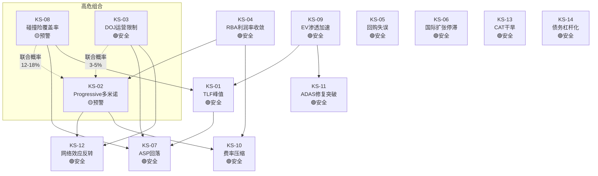
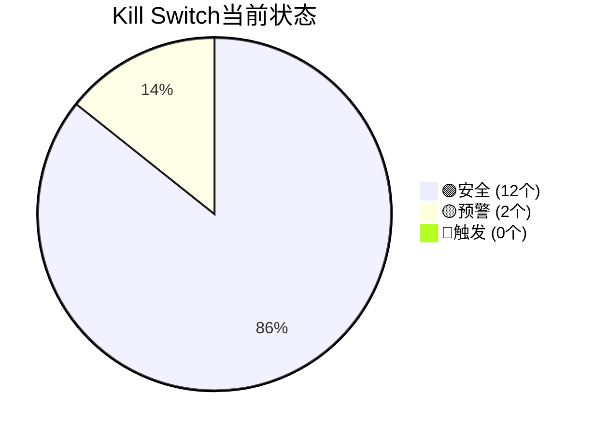
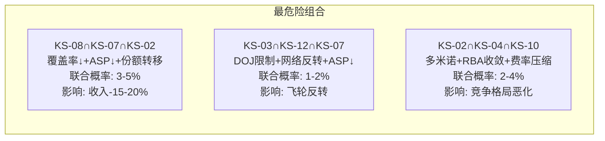
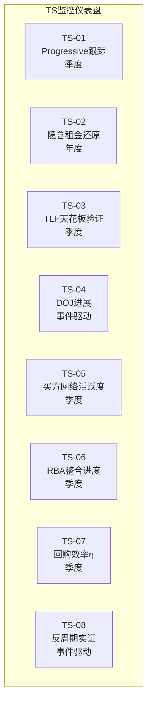
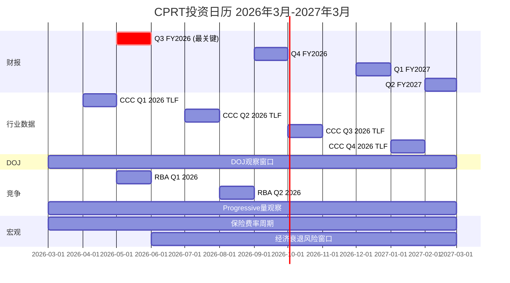
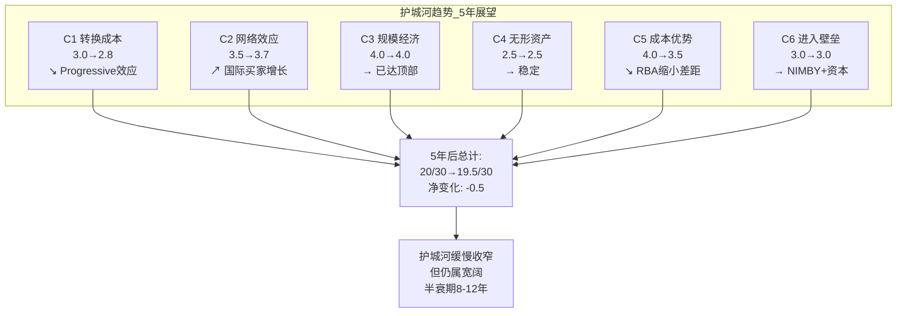
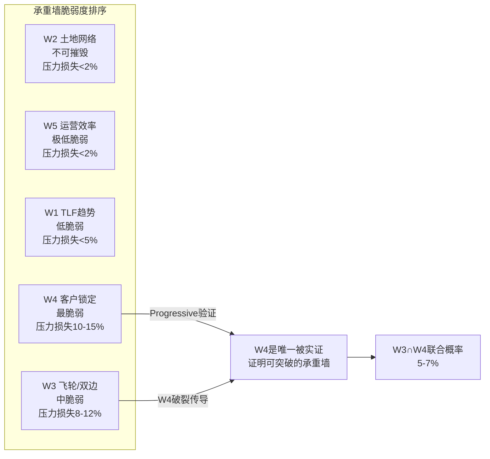

# CPRT Phase 5 — Kill Switch/TS注册 + 投资日历 (Agent B)

> **分析师**: Agent B — 独立风险审计员
> **日期**: 2026-03-11
> **任务**: KS终稿注册表 + TS注册表 + 投资日历 + 护城河趋势仪表盘

---

## 第一部分: Kill Switch终稿注册表

### KS依赖网络

### KS详表

#### KS-CPRT-01: TLF峰值

| 字段 | 内容 |
|------|------|
| **名称** | Total Loss Frequency峰值/反转 |
| **可观测指标** | CCC季度TLF连续3季度持平或下降(当前24.2%) |
| **监控频率** | 季度(CCC Crash Course报告) |
| **数据来源** | CCC Intelligent Solutions季度报告 |
| **当前状态** | 🟢安全 — TLF连续上升, 24.2%新纪录 |
| **触发后行动** | 重新评估Rev CAGR假设, 若TLF见顶则CPRT增长叙事根基动摇 |
| **条件依赖** | 受KS-08(碰撞险覆盖率)驱动, 影响KS-07(ASP) |
| **依赖方向** | KS-08↓ → TLF对单位量的净效应减弱 |
| **联合概率** | KS-01∩KS-08 = 12-18% (中等) |
| **依赖强度** | 强: 覆盖率下降直接减少TLF作用基数 |
| **半衰期** | 长: TLF趋势需5+年反转 |
| **触发概率** | 10% (3年内) |

#### KS-CPRT-02: Progressive多米诺效应

| 字段 | 内容 |
|------|------|
| **名称** | 第二家Top 5保险公司大规模转移至IAA |
| **可观测指标** | Top 5保险公司中第2家>20%份额转移IAA(当前: 仅Progressive ~90%) |
| **监控频率** | 季度(CPRT/RBA财报+行业新闻) |
| **数据来源** | CPRT 10-Q保险单位量, RBA季报汽车业务量, 行业报道 |
| **当前状态** | 🟡预警 — Progressive已转移, 其他Top 5暂无公开信号 |
| **触发后行动** | 下调估值10-15%, 重新评估寡头均衡稳定性 |
| **条件依赖** | 受KS-04(RBA利润率)影响: RBA运营改善→保险公司更敢切换 |
| **依赖方向** | KS-04收敛 → KS-02概率上升 |
| **联合概率** | KS-02∩KS-08 = 8-12% (保险覆盖↓+份额转移=双重打击) |
| **依赖强度** | 中: RBA能力提升是必要非充分条件 |
| **半衰期** | 中: 保险合同2-3年周期 |
| **触发概率** | 20% (3年内) |

#### KS-CPRT-03: DOJ运营限制

| 字段 | 内容 |
|------|------|
| **名称** | DOJ对国际买家访问施加运营限制 |
| **可观测指标** | DOJ要求CPRT限制特定国家/地区买家注册或参拍 |
| **监控频率** | 事件驱动(10-Q/10-K法律诉讼章节) |
| **数据来源** | CPRT SEC filing, DOJ公告, 法律数据库 |
| **当前状态** | 🟢安全 — 2.5年无结论, CPRT已发布反洗钱政策 |
| **触发后行动** | 量化受影响买家比例, 估算ASP下降幅度, 重新计算估值 |
| **条件依赖** | 影响KS-12(网络效应)和KS-07(ASP) |
| **依赖方向** | KS-03触发 → KS-12/KS-07同时恶化 |
| **联合概率** | KS-03∩KS-02 = 3-5% (DOJ+多米诺=完美风暴) |
| **依赖强度** | 弱: DOJ独立于竞争动态 |
| **半衰期** | 短: 运营限制一旦实施, 影响立即显现 |
| **触发概率** | 10% (3年内) |

#### KS-CPRT-04: RBA利润率收敛

| 字段 | 内容 |
|------|------|
| **名称** | RB Global OPM差距收窄至<10pp |
| **可观测指标** | RBA OPM连续2季>27% (当前17.7%, CPRT 37%, 差距19.3pp) |
| **监控频率** | 季度(RBA财报) |
| **数据来源** | RB Global季度/年度财报 |
| **当前状态** | 🟢安全 — OPM 17.7%, 距27%仍有9.3pp |
| **触发后行动** | 分析OPM改善驱动因子(规模vs效率vs价格), 评估可持续性 |
| **条件依赖** | 影响KS-02(保险公司更敢切换)和KS-10(费率压力) |
| **联合概率** | KS-04∩KS-02 = 5-8% |
| **触发概率** | 8% (3年内), 15% (5年内) |

#### KS-CPRT-05: 管理层回购失误

| 字段 | 内容 |
|------|------|
| **名称** | 回购时机判断失误 |
| **可观测指标** | 回购后12个月股价<回购均价×0.8 (即<$37×0.8=$29.6) |
| **监控频率** | 季度(追踪回购均价vs市价) |
| **数据来源** | CPRT 10-Q回购披露 |
| **当前状态** | 🟢安全 — 回购@~$37, 当前$37.57 |
| **触发后行动** | 重新评估管理层资本配置能力, 下调CI-03(时机大师)权重 |
| **条件依赖** | 独立(受宏观+公司特定因素双重驱动) |
| **触发概率** | 25% (12个月内, 若Bear Case触发) |

#### KS-CPRT-06: 国际扩张停滞

| 字段 | 内容 |
|------|------|
| **名称** | 国际收入增速持续低迷 |
| **可观测指标** | 国际收入增速<5%连续4季(当前: 国际ASP +9%) |
| **监控频率** | 季度(CPRT分部数据) |
| **数据来源** | CPRT 10-Q地理分部 |
| **当前状态** | 🟢安全 — 国际ASP+9%, 增速健康 |
| **触发后行动** | 重新评估国际扩张期权价值($1-3B), 可能从Bull Case中移除 |
| **条件依赖** | 受KS-03(DOJ)间接影响(国际形象受损) |
| **触发概率** | 10% (3年内) |

#### KS-CPRT-07: ASP增速回落

| 字段 | 内容 |
|------|------|
| **名称** | ASP增速放缓至无法补偿量缩 |
| **可观测指标** | ASP增速<3%连续2季, 且保险单位量仍在下降 |
| **监控频率** | 季度(CPRT财报) |
| **数据来源** | CPRT 10-Q, CCC数据 |
| **当前状态** | 🟢安全 — ASP+6% ex-CAT (Q2 FY2026) |
| **触发后行动** | CI-01"更少但更富"证伪, 重新评估增长轨迹 |
| **条件依赖** | 受KS-01(TLF)和KS-08(覆盖率)双重驱动 |
| **联合概率** | KS-07∩KS-08 = 15-20% (覆盖率↓→ASP混合效应消退) |
| **触发概率** | 20% (2年内) |

#### KS-CPRT-08: 碰撞险覆盖率加速下降

| 字段 | 内容 |
|------|------|
| **名称** | 消费者放弃碰撞险加速 |
| **可观测指标** | 碰撞险覆盖率同比下降>3pp连续2季 |
| **监控频率** | 半年(JD Power/CCC行业报告) |
| **数据来源** | JD Power保险调研, CCC行业报告, 保险公司年报 |
| **当前状态** | 🟡预警 — 29%消费者降级/取消, 碰撞险放弃率-15% |
| **触发后行动** | 这是CQ-1核心变量, 触发将根本改变增长预期 |
| **条件依赖** | 上游: 经济衰退/保费上涨驱动; 下游: 影响KS-01和KS-07 |
| **联合概率** | KS-08是多个KS的"上游触发器" |
| **触发概率** | 30% (2年内, 若保费维持高位) |

#### KS-CPRT-09: EV渗透加速

| 字段 | 内容 |
|------|------|
| **名称** | 电动车渗透率超预期加速 |
| **可观测指标** | EV新车渗透率>30%且EV打捞量占比>15% |
| **监控频率** | 年度(IEA Global EV Outlook) |
| **数据来源** | IEA, BloombergNEF, 各国销量数据 |
| **当前状态** | 🟢安全 — EV渗透率~18%(全球), EV打捞占比<5% |
| **触发后行动** | 评估EV对ASP的影响(电池=高价值vs修复复杂=更多全损) |
| **条件依赖** | 影响KS-11(ADAS修复), 可能加速KS-01(TLF方向不确定) |
| **触发概率** | 15% (5年内) |

#### KS-CPRT-10: 保险费率压缩

| 字段 | 内容 |
|------|------|
| **名称** | 保险客户要求降低服务费率 |
| **可观测指标** | 服务费率连续2季下降>50bps |
| **监控频率** | 季度(CPRT财报隐含费率) |
| **数据来源** | CPRT收入/单位量推算, 行业费率调研 |
| **当前状态** | 🟢安全 — 费率稳定, 无压缩信号 |
| **触发后行动** | 量化OPM影响(每100bps费率下降→OPM-1.5-2pp) |
| **条件依赖** | 受KS-02(竞争加剧)和KS-04(RBA改善)驱动 |
| **触发概率** | 10% (3年内) |

#### KS-CPRT-11: ADAS修复成本突破

| 字段 | 内容 |
|------|------|
| **名称** | ADAS校准/修复成本大幅下降 |
| **可观测指标** | ADAS校准成本下降>25%(当前占DRP估算35.6%) |
| **监控频率** | 年度(CCC Crash Course) |
| **数据来源** | CCC Intelligent Solutions, AAA年度修复成本报告 |
| **当前状态** | 🟢安全 — ADAS成本仍在上升(+37.6% YoY) |
| **触发后行动** | TLF上升动力减弱, 重新评估TLF天花板 |
| **条件依赖** | 受KS-09(EV技术进步)间接影响 |
| **触发概率** | 5% (5年内, 需要技术突破) |

#### KS-CPRT-12: 网络效应反转

| 字段 | 内容 |
|------|------|
| **名称** | 买方活跃度持续下降 |
| **可观测指标** | 买家活跃率(成交/注册比)连续3季下降>5% |
| **监控频率** | 季度(CPRT披露注册买家数+成交量) |
| **数据来源** | CPRT 10-Q/投资者关系 |
| **当前状态** | 🟢安全 — 75万+注册买家, 活跃度稳定 |
| **触发后行动** | 飞轮减速信号, 评估ASP影响和保险公司分配变化 |
| **条件依赖** | 受KS-03(DOJ限制国际买家)直接影响 |
| **触发概率** | 8% (3年内) |

#### KS-CPRT-13: 自然灾害干旱

| 字段 | 内容 |
|------|------|
| **名称** | 连续低CAT事件年份 |
| **可观测指标** | 连续2年CAT事件单位同比-30%+ |
| **监控频率** | 年度(NOAA/保险行业灾害统计) |
| **数据来源** | NOAA, Insurance Information Institute, CPRT CAT单位披露 |
| **当前状态** | 🟢安全 — 2024/2025飓风季正常 |
| **触发后行动** | CAT贡献通常占收入5-15%, 连续干旱影响有限但减少波动向上的机会 |
| **条件依赖** | 独立(气候驱动) |
| **触发概率** | 15% (5年内, 但气候趋势实际上增加CAT频率) |

#### KS-CPRT-14: 债务杠杆化

| 字段 | 内容 |
|------|------|
| **名称** | CPRT放弃零债务政策 |
| **可观测指标** | 净债务/EBITDA>1x |
| **监控频率** | 季度(CPRT资产负债表) |
| **数据来源** | CPRT 10-Q/10-K |
| **当前状态** | 🟢安全 — 零债务, 净现金$2.7B |
| **触发后行动** | 管理层策略重大转变信号, 评估收购标的合理性 |
| **条件依赖** | 独立(管理层决策) |
| **触发概率** | 5% (5年内, 除非重大收购) |

### KS状态汇总

| 状态 | KS编号 | 说明 |
|------|--------|------|
| 🟡预警 | KS-02 | Progressive已转移, 观察是否扩散 |
| 🟡预警 | KS-08 | 碰撞险放弃率-15%, 趋势恶化中 |
| 🟢安全 | 其余12个 | 均在安全区间 |

### 联合概率矩阵 (高危组合)

| 组合 | KS | 联合概率 | 影响级别 | 描述 |
|------|-----|---------|---------|------|
| 供需双击 | 08+07+02 | 3-5% | ★★★★★ | 供给端(覆盖率↓)和需求端(份额转移)同时恶化 |
| 飞轮反转 | 03+12+07 | 1-2% | ★★★★★ | DOJ限制→买家减少→ASP↓→飞轮反转 |
| 竞争恶化 | 02+04+10 | 2-4% | ★★★★ | 竞争对手改善+份额转移+费率压力 |
| 温水煮青蛙 | 08+07+04 | 5-8% | ★★★ | 渐进恶化, 每年-1-2%但持续5年 |

---

## 第二部分: 特异性测试注册表 (TS)

### TS-01: Progressive后续跟踪

| 维度 | 内容 |
|------|------|
| **测试目标** | 验证Progressive转移是否引发其他Top 5保险公司跟随 |
| **测试方法** | 追踪CPRT季报保险单位量×Top 5各家份额变化, 对比RBA汽车业务量增速 |
| **关键指标** | CPRT保险单位量YoY vs RBA汽车单位量YoY → 若CPRT↓但RBA↑超过Progressive贡献, 暗示其他客户转移 |
| **频率** | 季度 |
| **当前基线** | Progressive ~90%→IAA, 影响~65K units/年, 其他Top 5无公开信号 |
| **成功条件** | 12个月后仅Progressive转移, 其他Top 5稳定 → CQ-2确认孤立 |
| **失败条件** | 6个月内第二家>10%份额变动 → CQ-2偏多米诺 |

### TS-02: 隐含租金还原测试

| 维度 | 内容 |
|------|------|
| **测试目标** | 验证CPRT土地公允价值和隐含租金节省 |
| **测试方法** | PropCo估值: 按区域工业用地价格估算48,000英亩; 隐含租金: 按可比租赁码场市场租金估算年节省 |
| **关键指标** | 土地公允价值/股 ($6-8B估计 = $6.1-8.2/股) + 年隐含租金节省/OPM调整 |
| **频率** | 年度(10-K PP&E更新时) |
| **当前基线** | PP&E账面$3.7B, 估计公允$6-8B, 隐含租金节省$400-600M/年 |
| **成功条件** | PropCo估值>$5B → CI-02"免费看涨期权"成立 |
| **失败条件** | 如果多数土地在低价值偏远区域, PropCo<$4B → CI-02弱化 |

### TS-03: TLF天花板验证

| 维度 | 内容 |
|------|------|
| **测试目标** | 追踪TLF上升轨迹, 验证32%天花板假设 |
| **测试方法** | CCC季度TLF数据点绘制趋势线, 分解驱动因子(ADAS+车龄+修复成本) |
| **关键指标** | TLF季度值 + 上升速率(当前~0.5pp/季) |
| **频率** | 季度 |
| **当前基线** | 24.2% (2025 Q4), 趋势线指向~26% @2028 |
| **成功条件** | TLF 25%+ @2026年底 → 加速趋势确认 |
| **失败条件** | TLF持平24% 连续3季 → KS-01预警 |

### TS-04: DOJ进展监控

| 维度 | 内容 |
|------|------|
| **测试目标** | 跟踪DOJ调查进展和可能结果 |
| **测试方法** | 审阅CPRT每季度10-Q法律诉讼章节, 搜索DOJ公告, 监控行业法律新闻 |
| **关键指标** | 有无新增计提/披露/和解协商信号 |
| **频率** | 事件驱动 + 每季度10-Q发布时 |
| **当前基线** | 2.5年无结论, 无计提, 2024年4月发布反洗钱政策 |
| **成功条件** | 正式结案或仅罚款<$300M无运营限制 |
| **失败条件** | 运营限制令(限制特定国家买家) → KS-03触发 |

### TS-05: 买方网络活跃度

| 维度 | 内容 |
|------|------|
| **测试目标** | 监控买方网络健康度, 特别是国际买家比例 |
| **测试方法** | CPRT投资者关系披露的注册买家数/活跃买家/国际占比 |
| **关键指标** | 活跃率(成交/注册), 国际买家占比(当前38-40%) |
| **频率** | 季度 |
| **当前基线** | 75万+注册, 国际38-40%, 活跃率稳定 |
| **成功条件** | 国际占比>40% + 活跃率稳定 → 网络效应增强 |
| **失败条件** | 国际占比<35% 或 活跃率连续下降 → KS-12预警 |

### TS-06: RBA整合进度

| 维度 | 内容 |
|------|------|
| **测试目标** | 追踪RB Global整合进度和竞争力提升速度 |
| **测试方法** | RBA季报分析: OPM趋势, 土地面积, 服务费率, 汽车业务量, 客户赢单 |
| **关键指标** | OPM(当前17.7%), 土地(13,600英亩), 服务费率(22.3%) |
| **频率** | 季度 |
| **当前基线** | OPM 17.7%, 土地扩张$350-400M/年, 服务费率+150bps趋势 |
| **成功条件** | OPM<20% @2027 → CPRT差距仍大, 寡头均衡稳定 |
| **失败条件** | OPM>23% @2027 + 新客户赢单 → KS-04加速 |

### TS-07: 管理层回购效率η

| 维度 | 内容 |
|------|------|
| **测试目标** | 验证管理层回购时机判断能力 |
| **测试方法** | 追踪回购均价 vs 后续6/12个月股价表现 |
| **关键指标** | η = (回购后12M平均股价 - 回购均价) / 回购均价 |
| **频率** | 季度 |
| **当前基线** | $1.1B回购@~$37, η待验证 |
| **成功条件** | η>20% (12M后股价>$44) → CI-03"时机大师"验证 |
| **失败条件** | η<-20% (12M后股价<$30) → KS-05触发 |

### TS-08: 反周期性实证

| 维度 | 内容 |
|------|------|
| **测试目标** | 在下次经济衰退中实测CPRT的反周期性 |
| **测试方法** | 衰退期间追踪: 保险单位量 / ASP / 收入 / 碰撞险覆盖率 |
| **关键指标** | 衰退期间CPRT收入增速 vs S&P 500收入增速 |
| **频率** | 事件驱动(下次衰退) |
| **当前基线** | 历史: GFC -5.3%, 2020 masked, 2022 +30% → "条件反周期" |
| **成功条件** | 衰退期间收入>0% → 反周期成立(至少温和) |
| **失败条件** | 衰退期间收入<-10% → D1需从×1.05降至×0.95 |

---

## 第三部分: 投资日历 (12个月)

### 按月催化剂详表

| 月份 | 事件 | 方向 | 预期影响 | 观察重点 |
|------|------|------|---------|---------|
| 2026年3月 | — | — | — | 当前分析基准点 |
| 2026年4月 | CCC Q1 2026 TLF发布 | 中性 | ±2% | TLF>24.5%则偏多 |
| 2026年5月 | **Q3 FY2026财报** | **关键** | **±10%** | **保险单位量恢复?ASP趋势?回购金额?** |
| 2026年5月 | RBA Q1 2026财报 | 中性 | ±2% | OPM趋势, 汽车业务量 |
| 2026年6月 | 保险费率更新 | 偏正 | ±3% | 费率下降→覆盖率可能恢复 |
| 2026年7月 | CCC Q2 2026 TLF | 中性 | ±2% | TLF趋势确认 |
| 2026年8月 | RBA Q2 2026财报 | 中性 | ±2% | Progressive量的全面体现 |
| 2026年9月 | **Q4 FY2026财报** | **重要** | **±8%** | **全年收入增速, 回购总额, DOJ更新** |
| 2026年10月 | 飓风季结束 | 偏正 | ±3% | CAT事件贡献 |
| 2026年11月 | CCC年度报告 | 中性 | ±2% | TLF全年趋势总结 |
| 2026年12月 | Q1 FY2027财报 | 重要 | ±5% | 新财年指引, Progressive完全影响 |
| 2027年1月 | 保险行业年度数据 | 中性 | ±2% | 碰撞险覆盖率趋势 |
| 2027年2月 | Q2 FY2027财报 | 重要 | ±5% | YoY对比(去年Q2是miss) |
| 2027年3月 | 回购12个月评估 | 中性 | ±3% | η回购效率验证 |

### 净催化剂分析

**Phase 3估计**: 净催化剂+6.4%→$39.98

**P4校准后调整**:
- Bull催化剂(TLF+回购+DOJ结案): +8-12% → P4校准-3pp → **+5-9%**
- Bear催化剂(Progressive多米诺+量持续下降): -6-10% → 维持 → **-6-10%**
- 概率加权净催化剂: 55%×(+7%) + 25%×(-8%) + 20%×(+0%) = **+1.9%**

**P4校准后目标价**: $37.57 × 1.019 = **$38.3** (vs Phase 3的$39.98)

---

## 第四部分: 护城河趋势仪表盘

### C评分分解 (20/30)

| 维度 | 当前评分 | 5年趋势 | 半衰期 | 驱动因子 |
|------|---------|---------|--------|---------|
| C1 转换成本 | 3.0/5 | → (稳定) | 5-8年 | IT集成深度, 但Progressive证明可切换 |
| C2 网络效应 | 3.5/5 | ↗ (缓增) | 10-15年 | 国际买家增长+VB3平台改善 |
| C3 规模经济 | 4.0/5 | → (稳定) | 12-15年 | 土地+SGA效率已达极高水平 |
| C4 无形资产 | 2.5/5 | → (稳定) | 8-10年 | 品牌认知+行业关系, 但非专利/版权 |
| C5 成本优势 | 4.0/5 | ↘ (缓降) | 8-12年 | 自有土地锁定成本, 但RBA在缩小差距 |
| C6 进入壁垒 | 3.0/5 | → (稳定) | 10年+ | NIMBY+资本+许可, 新进入者几乎不可能 |
| **总计** | **20/30** | **→ 偏↘** | **8-12年** | |

### 护城河趋势仪表盘

### 护城河半衰期分析

**定义**: 护城河半衰期 = 当前护城河优势减半所需时间

**CPRT护城河半衰期: 8-12年**

| 维度 | 侵蚀速率 | 半衰期 | 主要侵蚀力量 |
|------|---------|--------|------------|
| 土地优势 | 极慢(~1%/年) | 15+年 | RBA购地+新码场开发, 但NIMBY限制增速 |
| 成本优势(OPM) | 慢(~1pp/年缩小) | 10-12年 | RBA效率提升, 但19.3pp差距很大 |
| 网络效应 | 不确定 | 8-15年 | 取决于DOJ对国际买家的影响 |
| 转换成本 | 中(~2-3%/年) | 5-8年 | Progressive证明切换可行, 但规模效应限制 |
| 规模/进入壁垒 | 极慢 | 15+年 | 新进入者几乎不可能, 仅存量竞争 |

**综合半衰期**: 加权平均~10年。这意味着如果没有管理层积极维护(投资+创新), CPRT的竞争优势将在~2036年减半。但管理层有充足资源(零债务+$5B现金+年FCF$1.3B)来维护和延长护城河。

### 承重墙脆弱度总结

**结论**: 14个KS中12个安全、2个预警, 无触发。护城河趋势缓慢收窄(-0.5/30 @5年), 半衰期8-12年。最大风险集中在KS-08(碰撞险覆盖率)和KS-02(Progressive多米诺), 两者联合概率8-12%。投资者应将Q3 FY2026(2026年5月)视为最关键的判断窗口。
