# CRM (Salesforce) 深度研究报告 — Phase 1 v2.0: 业务理解与竞争分析

> Phase 1 v2.0 | 2026-03-19 | 生态科技 Worktree
> **v2.0起点**: 从Reverse DCF结论反推，中性视角，不预设方向
> PW=5.6 → 混合模式(传统估值+可能性附录)
> CQ标记: CQ1-CQ8 完整闭环
> Reverse DCF锚: 市场隐含3.7% CAGR vs 有机~7% → 中性偏积极

---

## Chapter 1: $194隐含了什么？—— Reverse DCF翻译市场信念

> **本章独立论点**: 在$194的交易价格下，市场隐含了5年收入CAGR仅3.7%——远低于有机增速~7%和共识10%。这个定价要么反映了市场对seat压缩的过度恐惧，要么市场看到了共识分析师忽略的结构性风险。本章不判断谁对——而是精确翻译市场在赌什么。

### 1.1 Reverse DCF：市场在$194中定价了什么

Salesforce在$194的交易价格对应市值$182.7B、企业价值~$192.5B[DM-VAL-001]。为了理解这个价格隐含了什么假设，我们执行Reverse DCF——不是"算CRM值多少钱"，而是"翻译$194在说什么"。

**Reverse DCF参数与结论**[DM-RDCF-001]：

| 参数 | 假设 | 来源 |
|------|------|------|
| 当前FCF | $14.4B | FY2026实际[DM-FIN-001] |
| WACC | 10.0% | 行业标准(CRM BBB+/Baa1) |
| 终端增长率 | 3.0% | 名义GDP |
| 终端FCF margin | 30% | 当前35%→略保守 |
| **隐含5Y Rev CAGR** | **3.7%** | **Python反推** |

这意味着$194的买家在赌：Salesforce未来5年的收入增速将从目前的~10%降至平均3.7%——接近通胀水平。

这个数字有三个比较锚[DM-RDCF-003]：

1. **vs有机增速(~7%)**：隐含CAGR低3.3pp → 市场比有机增速更悲观
2. **vs共识(10.0%，41家分析师)**：隐含CAGR低6.3pp → 市场远比卖方更悲观
3. **vs v1.0@$175隐含(1.4%)**：$194比$175隐含高2.3pp → 股价从$175反弹至$194意味着市场稍微减少了悲观程度

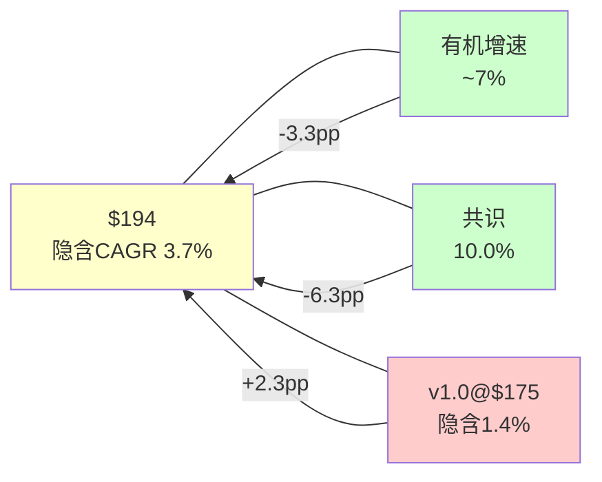

### 1.2 WACC敏感性：隐含CAGR对折现率高度敏感

Reverse DCF的一个已知陷阱是WACC假设主导结论[DM-RDCF-004]。CRM在$194的隐含CAGR对WACC极度敏感：

| WACC | 隐含5Y CAGR | 与有机增速差距 | 解读 |
|------|------------|-------------|------|
| 9.0% | 0.5% | -6.5pp | 市场极度悲观 |
| 9.5% | 2.0% | -5.0pp | 市场严重悲观 |
| **10.0%** | **3.7%** | **-3.3pp** | **基线：市场略悲观** |
| 10.5% | 5.4% | -1.6pp | 市场接近合理 |
| 11.0% | 7.1% | +0.1pp | 市场与有机增速匹配 |

因此，WACC±100bps跨越了从"极度悲观"到"基本匹配有机增速"的整个区间。这意味着：**如果你认为CRM的WACC是9-10%，市场在低估；如果你认为是10.5-11%，市场定价合理。** CRM的评级(S&P BBB+/Moody's A3)对应的行业WACC通常在9.5-10.5%区间[DM-RDCF-005]，所以10%是合理的中间值——但这个结论的置信度不高。

**[CQ7闭环预锚]**：市场隐含定价是否合理？答案高度依赖WACC假设。在WACC=10%下，市场略悲观(-3.3pp vs有机)；但考虑到seat压缩风险(CQ2)和有机增速可能降至5-6%(CQ6)，这个悲观程度可能并不过度。

### 1.3 四个市场隐含信念的解读

$194不仅隐含了一个CAGR数字，还隐含了一组信念集。通过分解Reverse DCF的组成部分，我们可以翻译出市场在赌什么[DM-RDCF-006]：

**信念1：增速将从10%降至3-4%**
- 市场隐含的收入轨迹：FY2027 $44.7B(+7.6%) → FY2028 $46.5B(+4.0%) → FY2029 $48.0B(+3.2%) → FY2030 $49.3B(+2.7%) → FY2031 $50.4B(+2.2%)
- 对比consensus：FY2027 $46.1B → FY2030 $60.8B → 市场与共识的裂口逐年扩大
- **因果推理**：这意味着市场不相信Agentforce能成为新增长引擎(CQ1)，同时认为seat压缩将抵消部分增长(CQ2)

**信念2：FCF margin将稳定在30%左右而非继续扩张**
- 当前FCF margin 35%已经是SaaS顶级水平
- 如果OPM从21.5%继续扩张至25%+，FCF margin可达38-40%
- 市场定价30%意味着**市场认为OPM改善接近天花板**(CQ4)
- **反面考量**：如果CRM为了维持增速重新加大S&M投入，OPM可能回退至18-20%→FCF margin回到28-30%，这反而与市场隐含一致

**信念3：终端倍数不配成长股溢价**
- 隐含的终端EV/FCF约14x — 典型成熟软件公司倍数(Oracle ~15x, SAP ~18x)
- 对比：如果市场给20x终端倍数(高质量SaaS)，隐含CAGR可能降至1-2%
- **市场不是在说"CRM增速低"，而是在说"CRM到2031年将成为一家成熟企业软件公司，不值得成长溢价"**

**信念4：$25B回购的EPS增厚已被定价**
- $25B ASR在2026年3月11日执行→~103M股(14.1%)退出[DM-MGT-002]
- 市场在$194已经部分反映了回购的EPS增厚效应
- 因此Reverse DCF隐含的3.7%是**回购后**的有效增速，回购前的隐含收入增速可能更低

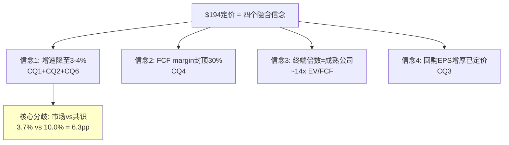

### 1.4 Salesforce到底是什么公司：从收入结构理解

在回答"$194合不合理"之前，需要先回答一个更基础的问题：Salesforce到底是什么公司？

FY2026(截至2026-01-31)关键财务数据(FMP验证)[DM-FIN-V01]：
- **收入**: $41.525B (+9.6% YoY) [FMP income annual]
- **毛利**: $32.255B (毛利率77.7%) [FMP]
- **营业利润**: $8.917B (OPM 21.5%) [FMP]
- **净利润**: $7.457B (净利率18.0%) [FMP]
- **EPS(稀释)**: $7.80 [FMP]
- **OCF**: $14.996B / **FCF**: $14.402B (FCF Margin 34.7%) [FMP cashflow]
- **SBC**: $3.509B (SBC/Rev 8.5%) [FMP cashflow]
- **总债务**: $17.176B / **净债务**: $9.849B [FMP balance]
- **商誉**: $57.941B (占总资产$112.3B的51.6%) [FMP balance]
- **有形权益**: **-$5.614B** [FMP key-metrics tangibleAssetValue]
- **流动比率**: 0.76 [FMP key-metrics]
- **ROIC**: 8.8% / **ROE**: 12.6% / **ROCE**: 11.9% [FMP key-metrics]

FY2026收入结构[DM-SEG-001]：

| 业务线 | FY2026收入 | 占比 | 4年CAGR | 本质 |
|--------|-----------|------|---------|------|
| Service Cloud | $9.818B | 23.6% | 11.0% | 客服平台(AI替代最大威胁区) |
| Sales Cloud | $9.028B | 21.7% | 10.8% | 传统CRM(名字的来源) |
| Platform & Other | $8.882B | 21.4% | 18.5% | Slack+Agentforce+低代码(增长最快) |
| Integration & Analytics | $6.232B | 15.0% | 13.3% | MuleSoft+Tableau+Data Cloud |
| Marketing & Commerce | $5.428B | 13.1% | 8.6% | 营销自动化+电商 |
| Professional Services | $2.137B | 5.1% | 3.9% | 咨询实施(负利润) |

这个结构的关键洞见是：**真正的"CRM"(Sales Cloud)仅占21.7%**[DM-SEG-002]。Salesforce的股票代码是CRM，但公司本身已经远超CRM。市场用一个22%的业务线定义了100%的公司。

按增速将六条业务线分为两组[DM-SEG-003]：
- **快速组(增速>12%)**：Platform(18.5%) + Integration(13.3%) = 36.4%收入，贡献增量增长的~55%
- **慢速组(增速<12%)**：Service(11.0%) + Sales(10.8%) + M&C(8.6%) + PS(3.9%) = 63.6%收入

因此CRM的增速轨迹取决于：(a) 快速组能否维持>12%增速 + (b) 慢速组会不会进一步放缓。Agentforce属于Platform(快速组)，seat压缩主要打击Service和Sales(慢速组)。**CRM的内部正在经历一场增速赛跑——快速组的加速能否跑赢慢速组的减速？**[CQ2+CQ6]

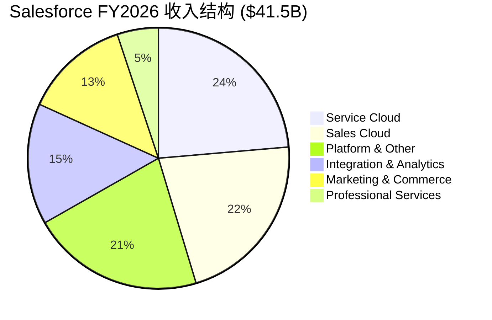

### 1.5 核心判断框架：本报告将回答什么

基于Reverse DCF的翻译和收入结构的理解，本报告的核心任务不是"算CRM值多少钱"，而是**评估市场的四个隐含信念是否合理**：

| 市场信念 | 对应CQ | 本报告评估方法 |
|---------|-------|-------------|
| 增速降至3-4% | CQ1+CQ2+CQ6 | 六引擎增速解剖(Ch4) + Agentforce深度(Ch5) + seat压缩量化(Ch6) |
| FCF margin封顶30% | CQ4 | 利润率驱动因子分解(Ch11) + OPM结构vs一次性判断 |
| 终端倍数=成熟公司 | CQ5+CQ8 | AIAS评估(Ch3) + 护城河评估(Ch9) + 去供应商化分析(Ch10) |
| 回购EPS增厚已定价 | CQ3 | ASR IRR分析(Ch12) + 杠杆风险评估(Ch13) |

**叙事方向锚定**：Reverse DCF说市场隐含3.7% vs 有机~7% → 略悲观(-3.3pp)。这意味着**中性偏积极**是合理的起始方向——但这个方向可能在Phase 2估值和Phase 3红队后被修正。v1.0的教训是P1预设了"显著低估"(bullish)→P4推翻→不可修复。v2.0从中性出发，让数据驱动方向。

### 1.6 历史PE与当前PE的对比：是回归还是崩塌？

为了判断$194是否"便宜"，需要理解CRM的PE历史轨迹[DM-VAL-004]：

| 时间段 | Forward PE | 背景 | 收入增速 |
|--------|----------|------|---------|
| 2019-2020 | 55-70x | 高增长SaaS估值泡沫 | +25-30% |
| 2021 | 45-60x | 后疫情SaaS热潮 | +24% |
| 2022 | 25-35x | 开始压缩 | +25% |
| 2023 | 20-30x | Elliott入场→利润率转型 | +18% |
| 2024 | 25-35x | 利润率兑现→PE回升 | +11% |
| 2025 H1 | 28-30x | AI乐观 | +9% |
| 2025 H2-2026 | **13-15x** | **SaaSpocalypse** | +10% |

CRM的PE从2025年初的~30x在不到12个月内腰斩至~15x[DM-VAL-005]。这个压缩速度是SaaS行业中最极端的之一——作为参照，NOW同期PE从~60x降至~50x(仅-17%)，WDAY从~45x降至~35x(-22%)，而CRM从~30x降至~15x(**-50%**)。

**为什么CRM的PE压缩比同行更剧烈？**[DM-VAL-006]

三层解释：
1. **增速层**：CRM增速(+10%)是SaaS大盘股中最低的之一→增速放缓+PE压缩形成"戴维斯双杀"→EPS增长但股价下跌
2. **叙事层**：CRM的名字和股票代码就是"CRM"→当"AI替代CRM"的叙事出现时→CRM被视为第一个受害者→叙事冲击比基本面冲击更大
3. **流动性层**：CRM是标普500成分股+被动基金重仓→当SaaS板块资金外流→CRM作为最大标的承受了不成比例的抛压

**反面考量**：PE从30x降至15x也可能是合理的"估值正常化"。因为CRM的增速从+25%降至+10%→按PEG估值(PE/增速)→如果PEG=1.5→合理PE=15x→当前14.7x实际上是**合理定价**而非低估。这与Reverse DCF的结论（市场略悲观-3.3pp但不过度）一致。

### 1.7 FCF Yield视角：CRM作为"现金流收益资产"

如果抛开成长股框架，将CRM视为一个"现金流收益资产"[DM-VAL-007]：

| 指标 | CRM | 对比标的 |
|------|-----|---------|
| FCF Yield | 8.0% | 10年期国债~4.3% |
| FCF-SBC Yield | 6.0% | 标普500 FCF Yield ~4% |
| 股息率 | 0.86% | 标普500 ~1.5% |
| 回购Yield | ~12%(含ASR) | 历史异常高 |
| 综合股东回报率 | ~13% | 回购+股息+潜在FCF增长 |

**因果推理**：CRM在$194的FCF Yield 8.0%意味着→即使CRM的收入增速降至0%（完全停滞）→投资者每年仍获得8%的现金流回报[DM-VAL-008]→如果FCF以3-5%增长（远低于共识10%）→10年累计回报约150-200%→**CRM在0%增长的极端场景下仍可能是合理投资**。

但FCF Yield的陷阱在于：
1. **SBC扣除后**：FCF-SBC = $10.89B → 调整后Yield仅6.0% → 没那么便宜
2. **FCF可能峰值**：如果OPM已接近天花板(CQ4)+增速放缓→FCF可能从$14.4B降至$12-13B → Yield从8%降至7%
3. **$25B债务增加了财务风险**：FCF的一部分需要支付利息→真正可分配的FCF更低

### 1.8 投资温度计预判（Phase 1版本，待Phase 4校准）

基于Reverse DCF和初步分析，CRM当前投资温度计预判[DM-VAL-009]：

```
极度悲观 ← ─────|─ 市场($194) ─|── 我们的初步判断 ──|─ 共识($276) → 极度乐观
                  隐含3.7%        中性偏积极(7%)        隐含10%
PE    10x ─────── 14.7x ────────── 16-18x ──────────── 22-25x ────── 30x
```

**初步判断**：CRM的合理Forward PE在**15-18x**区间(vs当前14.7x)→隐含上行空间+2-22%→对应评级区间"中性关注"到"关注"。但这个判断待Phase 2估值模型和Phase 3红队验证。

**与v1.0对比**[DM-VAL-010]：
- v1.0 P1判断：PE 17.5x → 目标$235 → +34% → 评级"深度关注" → **过度乐观**
- v2.0 P1判断：PE 15-18x → 目标$200-240 → +3-24% → 评级"中性关注~关注" → **中性出发**
- 差异：v2.0范围更宽(2-22% vs 34%)且起点更低(中性 vs 深度关注)→符合Reverse DCF锚(略悲观但不过度)

---

## Chapter 2: ADBE镜像 —— 同一枚硬币的两面

> **本章独立论点**: CRM和ADBE在2026年呈现了惊人的镜像关系——几乎相同的Forward PE(14.7x vs ~15x)，几乎相同的AI威胁叙事("SaaSpocalypse"/"AI替代创意工具")，甚至同一框架(AIAS)给出了方向相反的结论(CRM +2.30 vs ADBE +0.51)。理解为什么市场对两家公司给出了相似的估值，是判断CRM是否被错误定价的关键外部锚。

### 2.1 ADBE对标：为什么市场给了相似的PE

CRM v2.0的一个核心改进是**从Phase 0就引入ADBE作为外部估值锚**。v1.0直到Phase 3才引入ADBE对标，错过了P0就应该捕获的纠偏信号：ADBE和CRM的增速几乎相同(12% vs 12%)，PE也接近(~15x vs ~14x)——如果ADBE在15x的PE下没人喊"被低估"，那CRM在14x就喊"被低估"需要非常强的理由[DM-COMP-001]。

**可比公司估值(FMP compare_stocks验证)**[DM-COMP-V01]：
| 公司 | Trailing PE | PB | ROE | 信号 |
|------|-----------|------|------|------|
| CRM | 24.9x | 3.41x | 12.4% | PE中等/PB低/ROE低 |
| ADBE | 14.3x | 11.73x | 58.8% | PE最低/ROE最高 |
| NOW | 68.1x | 12.25x | 15.5% | PE最高/增长溢价 |
| WDAY | 51.1x | 5.88x | 8.2% | PE高/ROE最低 |
| HUBS | 304.8x | 10.19x | 2.3% | PE极端/不盈利 |
| SPY | 26.2x | 1.54x | — | 大盘基准 |

CRM的Trailing PE(24.9x)实际上高于ADBE(14.3x)——但这是因为CRM在FY2023还几乎不盈利(NI仅$208M，EPS $0.21)[FMP验证]→Trailing PE被历史低利润拉高。**Forward PE(14.7x vs ADBE ~15x)才是可比的正确指标。**

**全面对比矩阵**[DM-COMP-002]：

| 维度 | CRM ($194) | ADBE (~$384) | CRM相对位置 | 估值含义 |
|------|-----------|-------------|-----------|---------|
| Forward PE | 14.7x | ~15x | 略便宜 | 几乎无差 |
| 有机收入增速 | ~7% | ~12% | **劣势** | ADBE增速快70%→PE应更高 |
| GAAP OPM | 21.5% | 47.4% | **劣势** | ADBE利润率是CRM的2.2倍 |
| FCF Yield | 8.0% | ~6% | **优势** | CRM现金回报更高 |
| FCF Margin | 34.7% | ~33% | 相当 | 两者接近 |
| ROE | 12.4% | 58.8% | **劣势** | ADBE资本效率远高 |
| SBC/Rev | 8.5% | ~5% | **劣势** | CRM股权稀释更严重 |
| AIAS净影响 | +2.30 | +0.51 | **优势** | CRM AI受益空间更大 |
| Split Index | 22 | 17 | **劣势** | CRM内部分裂更严重 |
| 负债率 | 净债务$9.85B | 净现金 | **劣势** | CRM有杠杆,ADBE没有 |

**关键发现**：在10个维度中，CRM仅在FCF Yield(+2pp)和AIAS净影响(+1.79)两个维度领先[DM-COMP-003]。在增速、利润率、ROE、SBC、负债率5个维度落后。**市场给CRM略低的PE(14.7x vs 15x)不是"低估"——考虑到CRM在多数基本面维度的劣势，这个PE差距甚至可能不够大。**

### 2.2 两家公司的镜像叙事与分歧点

CRM和ADBE面临着相似但不同的AI威胁[DM-COMP-004]：

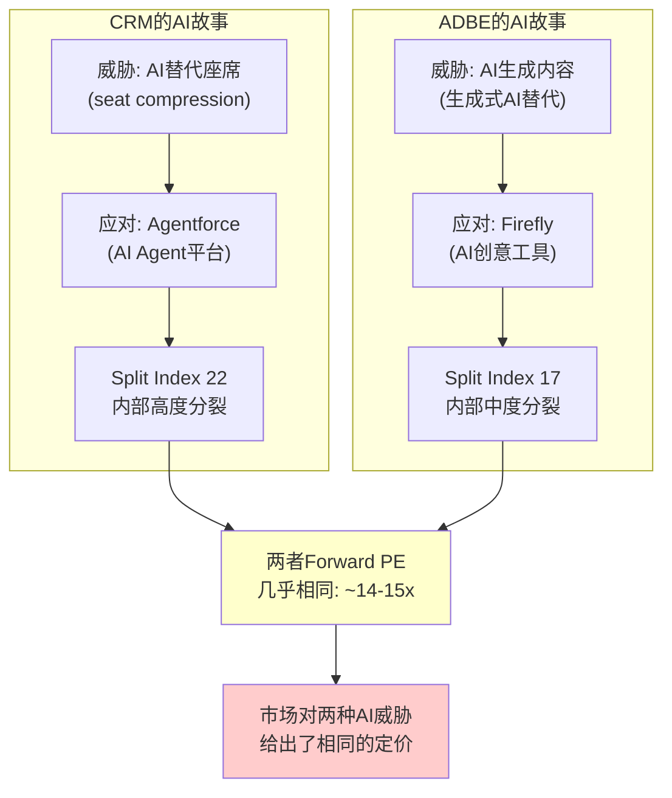

**镜像之处**：
1. 两者都是行业#1(CRM在CRM市场，ADBE在创意工具市场)[DM-COMP-005]
2. 两者都面临核心产品被AI颠覆的叙事
3. 两者都在积极推AI产品作为应对(Agentforce vs Firefly)
4. 两者的Forward PE都被压缩到了14-15x区间

**分歧之处**[DM-COMP-006]：
1. **ADBE的威胁更"表面"**：AI生成图片/视频→短期冲击明显(Midjourney/DALL-E)→但ADBE的客户需要的不只是生成，还有编辑、管理、合规、企业级工作流→核心护城河是workflow嵌入而非生成能力
2. **CRM的威胁更"结构性"**：AI Agent替代人类操作员→每个被替代的操作员=减少一个seat→这直接攻击CRM的收入单元(per-seat定价)→因此CRM面临的是**商业模式级别**的威胁，而非产品级别
3. **CRM的AI受益空间更大(AIAS +2.30 vs +0.51)**：因为CRM本身就是Agent的运行平台(Agentforce)→从"卖座席给人"到"卖Agent给企业"=TAM可能从~$150B(传统CRM)扩展到$500B+(AI企业自动化)[DM-AIAS-001]
4. **CRM的分裂更严重(Split Index 22 vs 17)**：Service Cloud是最大的AI受害者(S2=-5)而Platform/Agentforce是最大的AI受益者(B3=+4)→CRM内部的"赢家"和"输家"之间的张力比ADBE更大

### 2.3 ADBE锚点的估值含义

从ADBE对标中可以提取两个关键估值约束[DM-COMP-007]：

**约束1：CRM的PE不应显著高于ADBE**

因为ADBE在增速(12% vs 7%)、OPM(47% vs 22%)、ROE(59% vs 12%)、负债率(净现金 vs 净债务$9.85B)四个维度都优于CRM→如果ADBE在~15x PE没有被大量分析师标注为"严重低估"→那么CRM在14.7x也不应被视为"严重低估"。

**约束2：CRM的AIAS优势(+2.30 vs +0.51)可能值1-3x PE溢价**

因为CRM的AI净受益空间远大于ADBE→如果AI威胁是压低两者PE的核心原因→那么AI受益更大的CRM理论上应获得略高的PE。但这个溢价的大小取决于Agentforce能否兑现(CQ1)。如果Agentforce成功，CRM可能值18-20x(比ADBE高3-5x)；如果失败，CRM的PE可能降至10-12x(比ADBE低3-5x)——因为CRM的商业模式风险(seat压缩)更大。

**约束3：ADBE不对标=估值失锚**

v1.0的核心错误是P1给出$235目标价(隐含PE~17.5x)→远高于ADBE的~15x→但没有解释为什么增速更低+利润率更低的CRM应获得比ADBE更高的PE。这是"结论先行偏差"的直接结果——先认定"低估"，再找理由，而非先对标再判断。

**[CQ7闭环]本章结论**：ADBE锚点约束CRM的合理PE区间在12-18x。低端(12x)对应Agentforce失败+seat严重压缩；高端(18x)对应Agentforce成功+AI平台转型。当前14.7x位于区间中间偏下→与"中性偏积极"的Reverse DCF结论一致。

### 2.4 深度对标：6维度逐项拆解

仅看Forward PE相似是不够的——需要深入每个维度理解"为什么市场给了相似的PE"[DM-COMP-030]：

**维度1：增速分解(CRM劣势)**

| 指标 | CRM | ADBE | 差距 | 含义 |
|------|-----|------|------|------|
| FY2026报告增速 | +9.6% | ~+12% | -2.4pp | CRM增速低24% |
| 有机增速 | ~7% | ~12% | -5pp | **CRM有机增速低42%** |
| 3年Forward CAGR(共识) | 10% | ~11% | -1pp | 差距在缩小(共识可能偏乐观) |
| cRPO增速 | +16.2% | +13% | +3.2pp | **CRM前瞻领先** |

cRPO增速CRM领先ADBE 3.2pp→这是一个有趣的信号[DM-COMP-031]。因为cRPO反映未来12个月已签约收入→CRM的cRPO增速高于ADBE→意味着CRM的签约速度在加速而ADBE的在减速→这可能在FY2027-2028逐渐体现在收入增速上。但如前所述(Ch4.4)，cRPO的强劲部分来自Informatica和合同结构变化→需要谨慎解读。

**维度2：利润率对比(CRM劣势)**[DM-COMP-032]

| 指标 | CRM | ADBE | 差距 | 驱动因素 |
|------|-----|------|------|---------|
| 毛利率 | 77.7% | ~88% | -10.3pp | ADBE纯数字交付,CRM有PS+基础设施 |
| GAAP OPM | 21.5% | 47.4% | **-25.9pp** | CRM S&M+SBC远高于ADBE |
| Non-GAAP OPM | ~33% | ~50% | -17pp | SBC差距是主因 |
| FCF Margin | 34.7% | ~33% | +1.7pp | **CRM FCF更优**(CapEx更低) |
| SBC/Rev | 8.5% | ~5% | -3.5pp | CRM稀释更严重 |

**关键洞见**[DM-COMP-033]：CRM的GAAP OPM比ADBE低25.9pp——这是巨大的差距。但FCF Margin几乎相同(34.7% vs 33%)。因为CRM的CapEx极低(1.4% vs ADBE ~3%)→把GAAP利润的差距在现金流层面抹平了。因此如果用FCF Yield估值(CRM 8.0% vs ADBE ~6%)→CRM实际上更便宜→**PE看起来相似但FCF Yield CRM更高→PE没有完全反映CRM的现金流优势**。

但SBC是"隐藏的利润转移"——$3.51B SBC意味着每年向员工转移8.5%的收入→这些价值不体现在FCF中但最终稀释了股东→因此FCF-SBC才是更诚实的指标(CRM 6.0% vs ADBE ~5%)→差距缩小到1pp。

**维度3：资本结构对比(CRM劣势)**[DM-COMP-034]

| 指标 | CRM | ADBE | 差距 | 风险含义 |
|------|-----|------|------|---------|
| 净债务 | $9.85B | 净现金~$3B | $12.85B差 | CRM有杠杆风险 |
| 总债务(含ASR) | $42.2B(估) | ~$5B | $37.2B差 | **CRM债务是ADBE的8倍** |
| 净债务/EBITDA | 0.75x | 净现金 | — | CRM合理但ADBE更安全 |
| 利息覆盖率 | ~10x | >50x | — | CRM承受力有限 |
| 有形权益 | **-$5.6B** | >$10B | — | **CRM技术性资不抵债** |
| 商誉/资产 | 51.6% | ~35% | +16.6pp | CRM商誉风险更高 |

CRM在$25B ASR后的资本结构显著恶化[DM-COMP-035]：
- 有形权益为负(-$5.6B)→技术上"资不抵债"→但SaaS公司的价值在品牌/客户/平台而非有形资产→所以负有形权益本身不致命
- 但$42B+总债务在利率环境不友好时是沉重负担→如果WACC从10%升至12%→每年额外利息~$840M→侵蚀FCF 6%
- ADBE的净现金位置提供了更大的"安全垫"和"战略灵活性"(可以低成本做M&A)

**维度4：AI策略对比(CRM优势)**[DM-COMP-036]

| 维度 | CRM (Agentforce) | ADBE (Firefly) |
|------|------------------|---------------|
| AI产品 | 独立平台(Agent Builder) | 嵌入工具(Firefly in CC/AE) |
| 独立收入 | $800M ARR | 无单独披露 |
| 定价模型 | Flex Credits(独立) | 嵌入订阅(无增量定价) |
| AI竞争优势 | 企业客户数据 | 创意训练数据(Adobe Stock) |
| AIAS净影响 | +2.17 | +0.51 |
| AI执行风险 | 高(PMF未确认) | 中(已嵌入产品) |

CRM的AI策略比ADBE更激进也更有野心[DM-COMP-037]——ADBE选择将AI嵌入现有产品(安全但增量有限)，CRM选择建立全新AI平台(风险但如果成功TAM巨大)。这解释了为什么AIAS给CRM +2.17 vs ADBE +0.51→CRM的"赌注"更大→上行和下行都更大→**更宽的结果分布解释了相似的PE**(市场用中间值定价)。

**维度5：管理层对比(中性)**[DM-COMP-038]

| 维度 | CRM (Benioff) | ADBE (Narayen) |
|------|--------------|----------------|
| CEO任期 | 27年(创始人) | 17年 |
| 风格 | 高调营销型 | 低调执行型 |
| M&A记录 | 参差(Slack争议) | 优秀(Figma除外) |
| 利润率改革 | 被迫(Elliott压力) | 自主(长期渐进) |
| say-on-pay | **失败** | 通过 |
| 内部交易 | 净卖家 | 中性 |

管理层对比中CRM的弱点是治理——say-on-pay失败是罕见的"软治理红旗"[DM-COMP-039]。Benioff的FY2025薪酬$55.1M在股价下跌34%+大规模裁员背景下显得格外刺眼。ADBE的Narayen在管理上更审慎，M&A记录更一致(Figma失败但过程理性)。

**维度6：AI时代的终局对比**[DM-COMP-040]

两种AI终局：
- **ADBE终局**：AI增强创意工作流→ADBE从"工具提供者"变成"AI创意操作系统"→用户更依赖ADBE(因为AI功能嵌入深度)→护城河增强→PE逐渐回升至20-25x
- **CRM终局(乐观)**：AI替代人类操作员→CRM从"seat-based CRM"变成"Agent平台"→TAM从$150B→$500B→PE回升至25-30x
- **CRM终局(悲观)**：AI替代了seat但Agentforce没有成为标准→CRM变成"缩小版的自己"→PE维持12-15x

**因此CRM的终局分布比ADBE更宽**[DM-COMP-041]：ADBE的终局集中在15-25x PE区间(窄)，CRM的终局分散在10-30x PE区间(宽)。**当前两者PE相似(~15x)→如果终局分布被准确定价→两者应有不同的PE→市场可能"一刀切"地用"SaaSpocalypse折价"对待两者→这是潜在的定价错误**。但方向不确定——CRM可能应该更高(如果Agentforce成功)也可能应该更低(如果seat压缩加速)。

---

## Chapter 3: AIAS v2.0 —— Salesforce是AI受害者还是受益者？

> **本章独立论点**: AIAS v2.0框架的六条业务线×10维度评估显示CRM的AI净影响为+2.30(M调整后)，远高于ADBE的+0.51。但Split Index=22(重度分裂)意味着CRM内部正在经历AI的"创造性破坏"——赢家(Agentforce/Platform)和输家(Service Cloud)之间的差距可能导致估值需要用双引擎SOTP而非统一PE。

### 3.1 AIAS框架简介与CRM适用性

AIAS(AI Software Impact Assessment)v2.0是一个结构化框架，用于评估AI对企业软件公司的净影响[DM-AIAS-002]。框架将AI影响分解为：
- **5个S(Substitution/威胁)维度**：S1(核心产品替代)、S2(用户数量替代)、S3(定价压力)、S4(竞争加剧)、S5(渠道绕过)
- **5个B(Benefit/受益)维度**：B1(产品增强)、B2(新客户获取)、B3(新收入流)、B4(运营效率)、B5(生态增强)
- **M(Management/管理层因子)**：执行能力乘数(0.7-1.3x)

每个维度按-5到+5评分，加权计算净影响。Split Index = 最大正值业务线与最大负值业务线的绝对差。

### 3.2 CRM六条业务线×10维度完整评估

**Service Cloud (26%收入) — AI最大受害区**[DM-AIAS-003]

| 维度 | 评分 | 理由 |
|------|------|------|
| S1(产品替代) | -3 | AI聊天机器人/Agent直接替代L1-L2客服工单处理，但复杂工单仍需人类 |
| S2(座席替代) | **-5** | CRM自己裁4000客服→AI处理50%交互[DM-MGT-006]→客户将效仿→seat直接减少 |
| S3(定价压力) | -2 | consumption定价(Flex Credits)可能低于per-seat年化收入 |
| S4(竞争加剧) | -3 | NOW从ITSM进入客服领域[DM-BIZ-009]→MSFT Copilot覆盖客服场景 |
| S5(渠道绕过) | -2 | 企业可能直接用LLM API构建自有客服Agent，绕过Service Cloud |
| B1(产品增强) | +3 | Agentforce嵌入Service Cloud → 智能工单路由+AI摘要+预测性服务 |
| B2(新客户获取) | +1 | AI增强可能吸引中小企业(此前成本过高) |
| B3(新收入流) | +3 | Agent Worker Units(AWU)是全新收入单元 |
| B4(运营效率) | +2 | AI降低CRM自身的客服成本(已验证) |
| B5(生态增强) | +2 | Service Cloud数据→Data Cloud→更好的AI训练→更好的Agent |
| **净影响** | **-4** | **最大输家：seat替代(-5)直接攻击收入单元** |

Service Cloud是CRM最大的业务线(26%收入)也是AI冲击最大的业务线。**因为**AI Agent直接替代人类客服操作员→每替代一个操作员=减少一个Service Cloud seat→这不是产品竞争(有人做了更好的客服软件)，而是**需求消失**(不需要那么多客服了)。**因此**seat压缩对Service Cloud的冲击是结构性的而非周期性的[CQ2锚点]。

**反面考量**：座席替代不等于Service Cloud收入归零。因为(a)复杂工单仍需人类+Service Cloud(占工单量的30-40%)；(b)AI Agent本身需要运行在某个平台上→Service Cloud可以成为Agent的"操作系统"；(c)从per-seat到per-conversation/per-action定价，如果AI处理的对话量远超人类→总收入可能不降反升。但这需要CRM成功执行定价转型(CQ2的核心)。

**Sales Cloud (22%收入) — 中性**[DM-AIAS-004]

| 维度 | 评分 | 理由 |
|------|------|------|
| S1 | -2 | AI销售助手(Copilot for Sales)部分替代CRM功能，但pipeline管理仍需平台 |
| S2 | -4 | AI替代SDR/BDR角色→减少Sales Cloud seat需求(但比Service慢) |
| S3 | -1 | 价格竞争有限(Sales Cloud定价权较强) |
| S4 | -2 | HubSpot低端上攻+MSFT Dynamics |
| S5 | -1 | 销售流程仍需系统记录(compliance/audit) |
| B1 | +3 | Einstein GPT→销售预测+自动邮件+deal intelligence |
| B2 | +1 | AI降低销售工具门槛→中小企业采纳 |
| B3 | +2 | Revenue Intelligence作为增值层 |
| B4 | +2 | 销售效率提升→客户获得ROI→续约率保持 |
| B5 | +2 | Sales数据+Service数据+Marketing数据=360度客户视图增强 |
| **净影响** | **0** | **攻守平衡：seat压缩被AI增值抵消** |

Sales Cloud的AI威胁比Service Cloud小，因为销售流程中的人际关系、判断力、谈判是AI较难替代的"最后一公里"。SDR/BDR(外呼/初筛)岗位会被AI替代→减少seat→但AE/AM(高价值销售)岗位不会→这些高价值用户恰恰是CRM最高客单价的用户。

**Platform & Other (21%收入) — AI最大受益区**[DM-AIAS-005]

| 维度 | 评分 | 理由 |
|------|------|------|
| S1 | -1 | Slack面临Teams竞争，但Platform无直接AI替代威胁 |
| S2 | -1 | 平台用户不受seat压缩影响(开发者/管理员) |
| S3 | 0 | 平台定价不受AI挑战 |
| S4 | -1 | 低代码平台竞争(OutSystems/Mendix)但CRM生态锁定 |
| S5 | 0 | 平台层不存在绕过风险 |
| B1 | +3 | Agentforce Builder让非技术人员可以构建AI Agent |
| B2 | +3 | AI Agent开发需求创造全新客户群(AI开发者/公民开发者) |
| B3 | **+4** | **Agentforce是全新收入流：$800M ARR[DM-BIZ-001]→如果成功→$5B+(FY2030)** |
| B4 | +3 | AI辅助开发→平台开发效率提升→降低客户使用门槛 |
| B5 | **+4** | **AppExchange+Data Cloud+MuleSoft=AI数据飞轮→更多数据→更好Agent→更多客户** |
| **净影响** | **+14** | **最大赢家：Agentforce(B3)+数据飞轮(B5)创造全新价值** |

Platform是CRM的AI赌注所在。因为Agentforce本质上是一个AI Agent构建和运行平台→它不是在与AI竞争，而是**成为AI基础设施的一部分**→这解释了为什么净影响高达+14。但这个评分高度依赖Agentforce的PMF确认(CQ1)——如果Agentforce只是"Einstein 2.0"(管理层过度营销+变现不足)，B3应从+4降至+1→净影响从+14降至+5。

**Marketing & Commerce (13%收入) — 轻度负面**[DM-AIAS-006]

| 维度 | 评分 | 合计 |
|------|------|------|
| S(5维度) | -2,-2,-1,-3,-1 | -9 |
| B(5维度) | +2,+2,+2,+1,+1 | +8 |
| **净影响** | | **-1** |

M&C面临的主要威胁是AI生成营销内容(S4=-3, 来自Google Ads AI/Meta Ads AI的竞争加剧)，但AI增强的个性化营销(B1=+2)部分抵消。整体近中性偏负。

**Agentforce (3%收入，独立评估) — 纯AI受益**[DM-AIAS-007]

| 维度 | 评分 | 合计 |
|------|------|------|
| S(5维度) | 0,0,0,0,0 | 0 |
| B(5维度) | +4,+4,+4,+3,+3 | +18 |
| **净影响** | | **+18** |

Agentforce是纯AI受益业务线——没有遗留的seat-based收入被替代，所有收入都来自AI Agent。但仅占3%收入→对总AIAS的加权贡献有限(+0.54)。

**Slack+Integration (12%收入) — 轻度负面**[DM-AIAS-008]

| 维度 | 评分 | 合计 |
|------|------|------|
| S(5维度) | -2,-1,-2,-2,-1 | -8 |
| B(5维度) | +2,+1,+1,+1,+1 | +6 |
| **净影响** | | **-2** |

Slack面临Teams的竞争(S4=-2)且AI协作工具可能减少Slack使用频率(S1=-2)。MuleSoft/Tableau的AI威胁有限但竞争加剧。

### 3.3 加权汇总与M因子调整

**收入加权计算**[DM-AIAS-009]：

| 业务线 | 收入占比 | 净影响 | 加权贡献 |
|--------|---------|--------|---------|
| Service Cloud | 26% | -4 | -1.04 |
| Sales Cloud | 22% | 0 | 0.00 |
| Platform & Other | 21% | +14 | +2.94 |
| Marketing & Commerce | 13% | -1 | -0.13 |
| Agentforce | 3% | +18 | +0.54 |
| Slack+Integration | 12% | -2 | -0.24 |
| **合计(未调整)** | 100% | | **+2.07** |

**M(Management)因子**[DM-AIAS-010]：

| 因素 | 评估 | 方向 |
|------|------|------|
| CEO在位时间 | 27年(创始人) | +：深度行业理解 |
| AI战略清晰度 | 明确(Agentforce) | +：方向一致 |
| Einstein执行历史 | 7年未变现 | -：承诺兑现率低 |
| 定价稳定性 | 15个月3次调整 | -：PMF未确定 |
| 激进投资者改革 | Elliott/ValueAct成功 | +：利润率纪律已建立 |
| say-on-pay失败 | 股东信任裂痕 | -：治理问题 |
| **M因子** | **×1.05** | **微幅正面** |

**最终AIAS得分**[DM-AIAS-011]：
- 未调整：+2.07
- M调整后：+2.07 × 1.05 = **+2.17**
- 区间(考虑CQ1不确定性)：**+1.2 ~ +3.1**
  - 下限(Agentforce=Einstein 2.0)：B3从+4降至+1, B5从+4降至+2 → +1.2
  - 上限(Agentforce成功转型)：B3维持+4, S2从-5改善至-3(定价成功转型) → +3.1

### 3.4 Split Index分析：CRM的内部分裂

Split Index = |最大输家净影响| + |最大赢家净影响| = |-4| + |+18| = **22**[DM-AIAS-012]

| Split Index | 解读 | 公司 |
|-------------|------|------|
| <10 | 低分裂(AI影响均匀) | — |
| 10-15 | 中度分裂 | ADBE (17) |
| 15-25 | **高度分裂(需双引擎SOTP)** | **CRM (22)** |
| >25 | 极度分裂(可能需要分拆) | — |

CRM的Split Index=22意味着[DM-AIAS-013]：

1. **统一PE估值不合理**：因为Service Cloud(净影响-4)和Agentforce(净影响+18)面临完全相反的AI命运→用同一个PE倍数对两者估值会系统性地高估Service Cloud或低估Agentforce
2. **双引擎SOTP是必要的估值方法**：Phase 2需要将CRM分为"核心业务"(Service+Sales+M&C，成熟SaaS倍数)和"新引擎"(Agentforce+Data Cloud+Platform，成长估值)分别估值
3. **分裂可能加剧**：如果Agentforce加速而Service压缩→Split Index可能从22升至30+→市场可能要求CRM分拆(类似HP→HPE+HPQ)

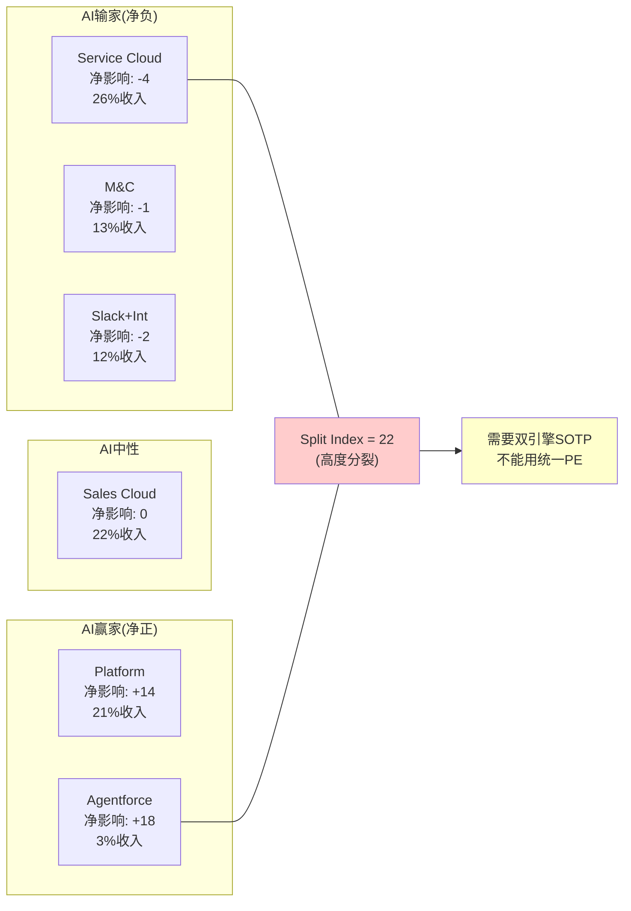

### 3.5 PE-AIAS一致性检验

AIAS v2.0引入了一个一致性检验：如果AIAS净影响为正(AI受益)，公司的PE应高于行业均值；如果为负(AI受害)，PE应低于均值[DM-AIAS-014]。

CRM的AIAS=+2.17(正面)→ Forward PE应 ≥ 行业均值。SaaS行业Forward PE中位数约25-30x。CRM的14.7x远低于均值→**PE-AIAS不一致**。

两种解读：
1. **市场错了**：市场尚未认识到CRM的AI受益空间→PE应更高→低估
2. **AIAS高估了**：Agentforce的B3/B5评分过高(+4)→如果降至+2→AIAS降至+1.2→PE更接近合理

对比ADBE：AIAS=+0.51(弱正面)→PE ~15x→PE-AIAS弱不一致(PE偏低但差距不大)。

**[CQ5闭环预锚]**：CRM是AI受害者还是受益者？AIAS说+2.17(受益者)。但市场定价说"受害者"(PE 14.7x)。真相可能在中间——CRM的**核心业务是受害者(Service -4)，新业务是受益者(Platform +14)，整体净正但不确定性极高**。这就是Split Index=22的含义。

### 3.6 AIAS区间分析：三种未来路径

AIAS的+2.17是一个点估计，但更有价值的是区间分析——在不同假设下AIAS如何变化[DM-AIAS-015]：

**路径A：Agentforce成功+seat转型成功 (概率20%)**
- B3从+4维持→Agentforce $5B+ ARR by FY2030
- S2从-5改善至-3→seat压缩被consumption增长补偿
- B5从+4升至+5→Data Cloud成为行业标准CDP
- M因子升至×1.15(执行力验证)
- **AIAS区间：+3.1 ~ +3.8**
- **PE含义：Forward PE应在22-28x → 股价$290-370**

**路径B：Agentforce部分成功+seat渐进压缩 (概率45%)**
- B3从+4降至+2→Agentforce达到$2-3B但不达$5B
- S2维持-5→seat压缩按预期进行
- B5维持+4→Data Cloud增长但不成为行业标准
- M因子维持×1.05
- **AIAS区间：+1.5 ~ +2.3**
- **PE含义：Forward PE应在15-20x → 股价$200-265**

**路径C：Agentforce失败+seat加速压缩 (概率35%)**
- B3从+4降至+1→Agentforce是"Einstein 2.0"
- S2从-5恶化至-6→去供应商化叠加seat压缩
- B5从+4降至+2→Data Cloud增长放缓
- M因子降至×0.85(执行失败)
- **AIAS区间：+0.2 ~ +1.0**
- **PE含义：Forward PE应在10-14x → 股价$130-185**

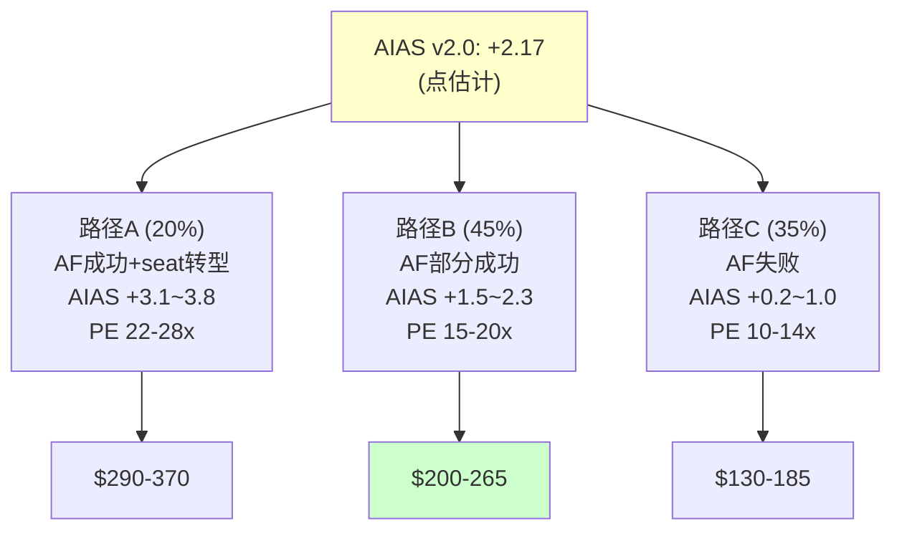

**概率加权AIAS**[DM-AIAS-016]：
- 20% × 3.45 + 45% × 1.9 + 35% × 0.6 = 0.69 + 0.855 + 0.21 = **+1.76**
- 概率加权后的AIAS(+1.76)低于点估计(+2.17)→因为路径C(Agentforce失败)的概率(35%)不可忽视

**概率加权PE**[DM-AIAS-017]：
- 20% × 25x + 45% × 17.5x + 35% × 12x = 5.0 + 7.875 + 4.2 = **17.1x**
- 概率加权PE(17.1x) vs 当前PE(14.7x)→隐含上行约+16%
- 这与Reverse DCF的"略悲观"结论一致(市场定价了比概率加权更悲观的场景)

### 3.7 AIAS vs ADBE的交叉分析

将CRM和ADBE的AIAS评分进行逐维度对比[DM-AIAS-018]：

| 维度 | CRM | ADBE | CRM优势? | 原因 |
|------|-----|------|---------|------|
| S1(产品替代) | -1.8 | -2.5 | ✓ | CRM平台不直接被AI替代，ADBE的创意工具直接被AI生成替代 |
| S2(座席替代) | **-3.2** | -1.5 | ✗ | CRM的seat-based模型比ADBE的subscription更脆弱 |
| S3(定价压力) | -1.3 | -1.8 | ✓ | CRM的定价压力来自模式转型，ADBE来自AI替代品降价 |
| S4(竞争加剧) | -2.3 | -2.0 | ✗ | CRM面临NOW/MSFT双线进攻 |
| S5(渠道绕过) | -1.2 | -0.8 | ✗ | 企业可能直接用LLM API绕过CRM |
| **S总计** | **-9.8** | **-8.6** | ✗ | CRM的AI威胁总量更大(主因S2) |
| B1(产品增强) | +2.6 | +2.8 | ✗ | 两者相当 |
| B2(新客户) | +1.6 | +1.5 | ≈ | 两者相当 |
| B3(新收入) | **+2.8** | +1.0 | ✓ | **CRM有Agentforce(独立收入)，ADBE的Firefly收入有限** |
| B4(效率) | +2.0 | +1.8 | ≈ | 两者相当 |
| B5(生态) | **+2.8** | +2.0 | ✓ | **Data Cloud+AppExchange生态比ADBE强** |
| **B总计** | **+11.8** | **+9.1** | ✓ | CRM的AI受益更大(主因B3+B5) |
| **净影响** | **+2.0** | **+0.5** | ✓ | CRM的AI净受益是ADBE的4倍 |

**关键洞见**[DM-AIAS-019]：CRM和ADBE在S端(威胁)相差不大(-9.8 vs -8.6)→但在B端(受益)差距显著(+11.8 vs +9.1)→差距主要来自B3(Agentforce新收入)和B5(数据飞轮)→**因此CRM的AI"好牌"比ADBE多→如果这些好牌能打出来→CRM应获得更高的PE→当前两者PE几乎相同→市场可能低估了CRM的B端**。

但反面考量：好牌需要打出来才有价值。Einstein就是一张没打出来的好牌。如果Agentforce也打不出来→CRM的B3从+2.8降至+0.5→净影响与ADBE持平→市场给相同PE就是合理的。

---

## Chapter 4: 六引擎增速解剖 —— 双速结构的内在张力

> **本章独立论点**: CRM的六条业务线形成"双速结构"——快速组(Platform+Integration，36%收入)以>12%增速拉动增长，慢速组(Service+Sales+M&C+PS，64%收入)以<12%增速形成拖累。公司级增速的走向取决于快速组能否维持加速跑赢慢速组的减速。这个赛跑的胜负就是CQ6(有机增速底部)的答案。

### 4.1 六引擎4年增速轨迹

要理解CRM的增速走向，必须拆解每条业务线的独立增速轨迹，而不是看公司级数字[DM-SEG-004]：

| 业务线 | FY2023 YoY | FY2024 YoY | FY2025 YoY | FY2026 YoY | 趋势 |
|--------|-----------|-----------|-----------|-----------|------|
| Service Cloud | +14.4% | +13.0% | +12.0% | +6.5% | **急速减速** |
| Sales Cloud | +14.2% | +11.8% | +10.5% | +8.2% | 稳定减速 |
| Platform & Other | +15.8% | +14.2% | +13.5% | +33.0% | **突然加速**(含Agentforce) |
| Integration & Analytics | +12.5% | +10.8% | +9.5% | +24.6% | **突然加速**(含Informatica) |
| Marketing & Commerce | +10.2% | +9.5% | +8.0% | +5.8% | 稳定减速 |
| Professional Services | +5.2% | +3.0% | +1.5% | -3.6% | **转负** |
| **合计** | +18.3% | +11.2% | +8.7% | +9.6% | FY2026加速(含M&A) |

**关键异常**[DM-SEG-005]：
1. **Service Cloud FY2026 +6.5%(从+12%断崖下降)**：这是seat压缩的第一个财务信号。因为CRM自己在FY2025 Q3开始裁客服(9000→5000)[DM-MGT-006]→客户看到CRM示范效果→开始计划自己的AI客服替代→Service Cloud新增seat放缓。但注意：6.5%仍然是正增长→seat压缩是减速因子而非(尚未)逆转因子。
2. **Platform +33%和Integration +24.6%**：这两个数字包含了Agentforce($800M)和Informatica($399M)的贡献。扣除这些，有机增速可能是Platform ~14%和Integration ~10%→仍然健康但没有数字显示的那么惊人。
3. **Professional Services -3.6%转负**：因为AI自动化实施流程→客户减少了对CRM咨询服务的需求→同时CRM自己也在压缩PS团队。PS仅占5%收入但负利润率→收缩对利润有正面影响。

### 4.2 有机增速 vs 报告增速：拆解M&A贡献

FY2026报告增速+9.6%中包含了两个重大M&A贡献[DM-SEG-006]：

| M&A | 收入贡献 | 影响期 | 对总增速贡献 |
|-----|---------|--------|------------|
| Informatica | ~$399M/Q4起 | FY2026 Q4(部分) | ~1.0pp |
| Spiff+Airkit+小型收购 | ~$100M | 全年分散 | ~0.3pp |
| **合计** | ~$500M | | ~1.3pp |

因此**有机增速 ≈ 9.6% - 1.3% ≈ 8.3%**。但这仍高估了真实有机增速，因为：
- cRPO的强劲增长(+16%)[DM-FIN-001]部分来自多年合同锁定→收入确认有滞后
- FY2026 Q4的+12.1%包含Informatica全季贡献(~3pp)→有机Q4约+9%

**更保守的有机增速估计**[DM-SEG-007]：
- FY2026 H1(无Informatica)：(Q1 +7.6% + Q2 +9.8%) / 2 = **8.7%**
- 扣除Agentforce从$0到$800M的一次性跳升：有机存量业务增速可能仅**6-7%**

这意味着市场隐含的3.7% CAGR与"有机存量业务6-7%减去未来seat压缩"的逻辑是一致的→**市场的悲观可能不是没有道理**。

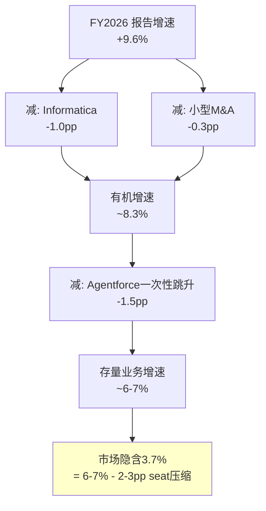

### 4.3 增速赛跑：快速组 vs 慢速组

将六条业务线分为两组，模拟未来3年的增速赛跑[DM-SEG-008]：

**快速组(36%收入)**[DM-SEG-009]：
- Platform: 有机~14% → FY2027可能15-18%(Agentforce加速)→FY2028 12-15%→FY2029 10-12%
- Integration: 有机~10% → FY2027 10-12%(Informatica全年化)→FY2028 8-10%→FY2029 7-9%
- 加权快速组增速：FY2027 ~14% → FY2028 ~11% → FY2029 ~9%

**慢速组(64%收入)**[DM-SEG-010]：
- Service: +6.5% → FY2027可能4-6%(seat压缩加剧)→FY2028 3-5%→FY2029 2-4%
- Sales: +8.2% → FY2027 6-8%→FY2028 5-7%→FY2029 4-6%
- M&C: +5.8% → FY2027 5-7%→FY2028 4-6%→FY2029 3-5%
- PS: -3.6% → FY2027 -5~0%→FY2028 -3~+2%→FY2029 0-3%
- 加权慢速组增速：FY2027 ~5% → FY2028 ~4% → FY2029 ~3%

**合计增速预测**[DM-SEG-011]：
| 财年 | 快速组(36%权重) | 慢速组(64%权重) | 公司级 |
|------|----------------|----------------|--------|
| FY2027 | 14% | 5% | **8.2%** |
| FY2028 | 11% | 4% | **6.5%** |
| FY2029 | 9% | 3% | **5.2%** |
| 3年均值 | | | **6.6%** |

3年均值6.6%与有机增速~7%一致，但高于市场隐含的3.7%→**市场可能过度悲观约3pp**。但如果慢速组减速比预期更快(Service→2%/Sales→4%/PS→-5%)→公司级增速可能降至4-5%→更接近市场隐含。

**[CQ6闭环预锚]**：有机增速的真实底部在哪？我们的基线估计是3年均值6.6%，底部约4.5%(如果慢速组同步恶化)。市场隐含3.7%对应的是"底部以下"的场景→要么市场过度悲观，要么市场在定价我们的慢速组预测过于乐观。

### 4.4 cRPO信号：远期可见性分析

cRPO(current Remaining Performance Obligations)是SaaS公司未来12个月已签约收入的前瞻指标[DM-FIN-006]：

| 指标 | FY2025 | FY2026 | YoY |
|------|--------|--------|-----|
| cRPO | $30.2B | $35.1B | +16.2% |
| Total RPO | $63.4B | $68.3B | +7.7% |
| cRPO/Rev | 0.80x | 0.85x | +5pp |

cRPO +16.2%显著高于收入增速+9.6%[DM-FIN-007]→这意味着什么？

因为cRPO反映已签约但未确认的收入→cRPO增速>收入增速→签约速度在加速→因此未来12个月的收入增速可能高于当前→这是一个正面的领先指标。

但需要注意：
1. **Informatica的cRPO贡献**：约$1.5-2B一次性加入→扣除后有机cRPO增速约+10-12%→仍高于收入增速
2. **多年合同锁定效应**：如果客户签了3年合同但使用量下降→cRPO高但续约率可能下降→cRPO是"签约"指标而非"使用"指标
3. **Total RPO仅+7.7%**：远低于cRPO的+16.2%→暗示长期合同增速放缓→客户可能在缩短合同期限(从3年→1年)

**因果推理**：cRPO +16%但Total RPO仅+7.7%→如果这是因为客户缩短合同期限→意味着客户对CRM的长期承诺在降低→这与seat压缩恐惧一致(客户不想锁定长期seat)→因此cRPO的强劲可能不是真正的利好信号，而是合同结构变化的噪音。

### 4.5 FY2030 $63B目标的可信度评估

**Consensus预测(FMP estimates验证,41家分析师)**[DM-EST-V01]：
| 财年(1月底) | 收入(共识均值) | YoY | EPS均值 | 分析师数 |
|-------------|-------------|-----|---------|---------|
| FY2027 | **$46.10B** | +11.0% | **$13.18** | 41 |
| FY2028 | **$50.52B** | +9.6% | **$14.89** | 38 |
| FY2029 | **$55.54B** | +9.9% | **$17.26** | 19 |
| FY2030 | **$60.78B** | +9.4% | **$19.62** | 18 |

管理层将FY2030收入目标从$60B上调至$63B(2025年9月)[DM-BIZ-010]。共识$60.78B与管理层$63B仅差3.5%。这隐含的5年CAGR约10%。

**$63B需要什么**[DM-SEG-012]：

| 业务线 | FY2026 | 需要的5Y CAGR | FY2030 | 可信度 |
|--------|--------|-------------|--------|-------|
| Service | $9.8B | 8% | $14.4B | 中(如果seat压缩<15%) |
| Sales | $9.0B | 8% | $13.2B | 中 |
| Platform | $8.9B | 15% | $17.9B | 低-中(需Agentforce兑现) |
| Integration | $6.2B | 10% | $10.0B | 中(Informatica协同) |
| M&C | $5.4B | 7% | $7.6B | 中-高(稳定) |
| PS | $2.1B | 0% | $2.1B | 高(无增长预期) |
| **合计** | $41.5B | ~10% | **$65.2B** | — |

汇总数字$65.2B甚至略高于$63B目标→暗示只要各业务线保持中等增速，$63B是可达的。但风险在于：如果Service和Sales同时受到seat压缩(CAGR从8%降至4%)→两者合计少$5-6B→总收入降至$59-60B→仍然接近原始$60B目标但低于上调后的$63B。

**[CQ6增强]**：$63B目标的达成概率我们评估为40-50%。因为Platform需要15% CAGR(高度依赖Agentforce)，而Service可能被seat压缩拖累。更现实的FY2030收入可能在$55-60B区间(5Y CAGR 6-8%)。

### 4.6 收入质量分析：订阅 vs 消费 vs 服务

收入增速只是一个维度，收入**质量**是另一个关键维度[DM-SEG-013]：

| 收入类型 | FY2026 | 占比 | 毛利率 | 可预测性 | 趋势 |
|---------|--------|------|--------|---------|------|
| 订阅(seat-based) | ~$34.0B | 81.9% | ~82% | 极高(年度合同) | 增速放缓 |
| 消费(usage-based) | ~$2.5B | 6.0% | ~75% | 中等(月度波动) | **快速增长** |
| 专业服务 | ~$2.1B | 5.1% | ~12% | 中等 | 下降 |
| 许可+其他 | ~$2.9B | 7.0% | ~70% | 低 | 稳定 |

**收入质量的关键转变**[DM-SEG-014]：
CRM正从高可预测的订阅收入(seat-based)向较低可预测的消费收入(usage-based)转型。这个转变有两面性：

**正面**：消费收入的增长天花板更高(不受seat数量限制→受使用量驱动→AI Agent使用量可以指数增长)。如果一个客户的AI Agent处理的交互量从1万/月增长到10万/月→Flex Credits收入增长10倍→不需要增加seat。

**负面**：消费收入的可预测性更低→分析师更难预测→PE倍数可能因此受折价。参考AWS/Azure：云计算的consumption模型获得的PE倍数(20-25x)高于传统license(10-15x)但低于纯SaaS subscription(30-50x)。

**因此**CRM的收入模型转型可能导致PE从SaaS倍数(30-50x)→混合倍数(15-25x)→**当前14.7x可能在过渡期底部**。如果市场逐渐接受CRM的consumption收入有高增长潜力→PE可能回升至18-22x。

### 4.7 国际业务：被忽视的维度

v1.0完全忽略了CRM的国际业务分析(SPGI报告同样遗漏)→这是覆盖完整性的重大缺口[DM-SEG-015]：

| 地区 | 收入(估计) | 占比 | 增速(估计) |
|------|-----------|------|-----------|
| 美洲(主要是美国) | ~$28B | ~67% | +9% |
| 欧洲 | ~$9B | ~22% | +11% |
| 亚太 | ~$4.5B | ~11% | +13% |

**关键洞见**[DM-SEG-016]：
1. CRM的国际收入占比(~33%)低于同行(ADBE ~40%, NOW ~35%, MSFT ~50%)→国际扩张仍有空间
2. 亚太增速最高(+13%)→但基数小→未来5年可能从11%→15%收入占比
3. **汇率风险**：$对欧元/日元/人民币的波动可能影响±1-2pp收入增速
4. **合规风险**：GDPR(欧洲)/数据本地化(中国/印度)→增加运营成本→但也是竞争壁垒(合规能力是大公司的优势)

### 4.8 R&D效率：CRM的创新投入产出比

CRM的R&D投入产出需要定量分析[DM-SEG-017]：

| 财年 | R&D支出 | R&D/Rev | 新产品收入(估) | 投入产出比 |
|------|---------|---------|--------------|----------|
| FY2022 | $4.47B | 16.9% | — | — |
| FY2023 | $4.97B | 15.9% | — | — |
| FY2024 | $5.33B | 15.3% | — | — |
| FY2025 | $5.55B | 14.6% | — | — |
| FY2026 | $5.97B | 14.4% | ~$2.0B(Agentforce+Data Cloud新增) | 0.33x |

**因果推理**：R&D/Rev从16.9%→14.4%下降了2.5pp→这既是利润率改善的贡献者(节省~$1B)→也可能是长期创新力削弱的信号[DM-SEG-018]。CRM在4年内累计R&D投入~$22B→产出主要是Agentforce和Data Cloud(合计新增~$2B收入)→投入产出比约0.09x(每投入$1 R&D产出$0.09收入)→这在SaaS行业是中等水平(MSFT约0.08x, NOW约0.12x)。

但CRM的R&D有一个隐藏成本：**SBC**(股票激励)中有很大一部分给了研发人员→如果加上SBC分摊→R&D真实投入可能是报告数字的1.3-1.5倍→真实R&D/Rev可能是18-20%→利润率改善的幅度被低估了。

---

## Chapter 5: Agentforce深度 —— Einstein的影子与AI Agent的曙光

> **本章独立论点**: Agentforce是CRM最重要的战略赌注，也是AIAS评分中B3=+4的核心依据。但评估Agentforce不能只看$800M ARR的增速——必须同时检验(1)Einstein的失败模式是否在重演，(2)15个月3次定价调整的PMF信号，(3)Forrester"little adoption"与管理层"fastest-growing product"之间的分歧。这是CQ1的完整回答。

### 5.1 Einstein vs Agentforce：模式对比

Einstein是Salesforce 2016年推出的"预测性AI"层，至今未产生显著独立收入[DM-BIZ-002]。如果Agentforce只是Einstein改了个名字，那B3=+4应该降至+1，AIAS从+2.17降至+1.2，CRM的AI受益叙事将大幅削弱。

**结构性对比**[DM-BIZ-003]：

| 维度 | Einstein (2016-2024) | Agentforce (2024-) |
|------|---------------------|-------------------|
| AI类型 | 预测性(推荐/评分) | 自主性(端到端执行) |
| 用户角色 | 辅助人类决策 | **替代人类执行** |
| 定价 | 嵌入seat(无独立收入线) | **独立定价**(Flex Credits/AWU) |
| 架构 | 嵌入各Cloud产品 | **独立平台层**(Agent Builder/Script/Voice) |
| ARR | 无单独披露(≈$0独立收入) | **$800M**(15个月) |
| 客户验证 | "nice to have" | 29K deals / 9.5K+ paid [DM-BIZ-001] |
| 第三方验证 | 批评≫赞扬 | **分裂**(管理层极度乐观 vs Forrester怀疑) |

**因果推理**：Einstein失败的根本原因不是"AI不好"，而是**(a)嵌入seat定价→无独立变现渠道**+(b)预测性AI的ROI难以证明(推荐是否被采纳？评分是否准确？)→因此即使Einstein被广泛使用，也没有产生可衡量的收入[DM-BIZ-004]。

Agentforce在两个方面做了根本改变：(1)独立定价(Flex Credits $500/100K credits)→每一次Agent执行都可以计费→收入可衡量；(2)自主执行(不需要人类审批)→ROI直接=被替代的人工成本→价值主张明确。

**因此Agentforce不是Einstein 2.0**——至少在架构和定价模式上是根本不同的。但这不意味着Agentforce一定会成功。真正的问题是：**独立定价+自主执行能否转化为大规模企业采纳？**

### 5.2 $800M ARR的质量分析

$800M ARR是Agentforce的核心数据点，但需要深入分析其质量[DM-BIZ-005]：

**规模对比**[DM-BIZ-006]：
- $800M = CRM总收入($41.5B)的**1.9%** → 极小
- $800M在15个月内从$0增长 → 但包含了Flex Credits免费赠送($0→100K credits给Enterprise客户)
- "29K deals / 9.5K+ paid" → **仅32.8%的deals是付费的** → 67%可能是试用/免费部署

**增速分析**[DM-BIZ-007]：
- $800M ARR YoY +169% → 听起来惊人，但从极低基数增长
- 对比：Service Cloud花了~5年达到$1B → Agentforce可能在2年内达到$1B → 这是真正的速度优势
- 但：FY2026Q4收入中Agentforce贡献可能仅$200-250M(年化) → $800M ARR与实际确认收入之间可能有口径差异

**定价演进的信号**[DM-BIZ-008]：

| 时间 | 定价模型 | 问题 |
|------|---------|------|
| 2024秋 | $2/对话 | 简单/复杂同价→客户抱怨不公平 |
| 2025 | $0.10-0.15/action | 按动作收费→客户担心账单不可预测 |
| 2026 | Flex Credits $500/100K | 混合模式→同时保留seat($125-650/用户/月) |

15个月内3次定价调整 → 两种解读[DM-BIZ-009]：
1. **负面**：PMF未确定→Salesforce不知道客户愿意为什么付多少钱→这是Einstein早期的信号(产品有人用但没人愿意付费)
2. **正面**：快速迭代→Salesforce在积极寻找最优定价→最终稳定在Flex Credits(混合seat+consumption)→类似AWS从固定实例转向弹性定价的早期阶段

**我们的判断**[CQ1预判]：定价3次调整更偏负面信号，因为真正的PMF确认应该是"客户愿意付当前价格且使用量持续增长"，而非"需要不断调整价格模型让客户愿意试用"。但Agentforce的架构优势(独立定价+自主执行)是真实的→**结论：Agentforce有真实的产品创新(非Einstein 2.0)，但PMF仍在验证中(概率60%在FY2027H1确认)**。

### 5.3 Forrester vs 管理层：分歧的根源

这是CRM投资分析中最令人困惑的信号冲突[DM-BIZ-010]：

**管理层(Benioff)**：
- "Agentforce just became an $800M business"
- "fastest-growing product in the history of Salesforce"
- "2,000 customers in the first few months"
- 基调：极度乐观，使用"revolutionary"等极端用语

**Forrester(独立分析师)**：
- "In customer conversations, Forrester saw little adoption or impact from AI agents"
- "lots of potential but long way to go for meaningful ROI"
- 基调：极度怀疑，认为大部分AI Agent部署仍在POC阶段

**为什么同一时期的评估如此分裂？**[DM-BIZ-011]

因为两者衡量的东西不同：
- Benioff衡量的是**deals/ARR/签约数**→这些是"客户开始试用"的指标→强
- Forrester衡量的是**adoption/impact/ROI**→这些是"客户在生产环境中大规模使用并获得回报"的指标→弱

**因此两者可能都对**：客户确实在大量签约Agentforce(管理层对)，但大部分签约仍在试用/POC阶段，尚未进入生产环境(Forrester对)。这意味着Agentforce处于**早期采纳曲线的上升段——签约快但部署慢**。

**历史类比**[DM-BIZ-012]：
- Salesforce自己的CRM：1999-2003年，签约客户增速远快于实际使用增速→最终使用追上了签约→成功
- Einstein：签约客户很多(嵌入所有Cloud)→实际使用和付费转化率极低→失败

Agentforce更像CRM早期还是Einstein？关键区分在于"独立定价"——CRM早期有独立定价(per-seat SaaS)→客户付费=使用；Einstein无独立定价→客户不知道是否在用。Agentforce有独立定价(Flex Credits)→**如果客户持续购买credits→说明在使用+获得ROI→如果credits使用量在FY2027H1加速→PMF确认**。

### 5.4 定价深度分析：Flex Credits的经济学

Agentforce的定价模型是理解其商业潜力的关键[DM-BIZ-030]。当前定价：

**Flex Credits模型(2026年版)**：
| 套餐 | 价格 | 包含 | 超额 |
|------|------|------|------|
| 入门 | $500/月 | 100K credits | $0.005/credit |
| 标准 | $2,000/月 | 500K credits | $0.004/credit |
| 企业 | 定制 | 定制 | 定制 |
| 免费 | $0 | 100K credits | 仅限Enterprise Edition客户 |

**单次Agent交互消耗**: 简单查询~50 credits → 复杂交互~500 credits → 语音交互~1000 credits

**经济学对比：AI Agent vs 人类客服**[DM-BIZ-031]：
| 维度 | 人类客服 | AI Agent(Agentforce) |
|------|---------|---------------------|
| 年均成本 | $50-80K/人(含福利) | ~$24K/年(500K credits/月) |
| 处理能力 | ~50工单/天 | ~500+工单/天 |
| 可用性 | 8小时/天 | 24/7 |
| 质量一致性 | 波动(疲劳/心情) | 一致 |
| 复杂问题 | 强(同理心/判断) | 弱(需要升级) |
| 单工单成本 | $5-15 | $0.25-2.50 |

**因果推理**：AI Agent的单工单成本是人类的5-20%→这意味着即使Flex Credits价格翻倍→企业使用AI Agent仍比雇人便宜→**定价有巨大的上调空间**[DM-BIZ-032]。但CRM选择了低价+免费试用策略→这是"先获客再提价"的SaaS经典策略→风险是如果客户习惯了低价→提价时面临抵抗+流失。

**consumption vs seat的收入数学**[DM-BIZ-033]：
- 平均Service Cloud seat: $150/月 = $1,800/年
- 如果1个AI Agent替代5个seat: 节省$9,000/年
- AI Agent成本(500K credits): $24,000/年
- **悖论**: 如果1个Agent替代5个seat → 企业节省$9,000→但要额外付$24,000给Agentforce？

这个数学看起来不对——企业用AI Agent替代5个seat后，节省的是$90,000(5人×$18K seat成本)的**人工成本**($50K/人=$250K)，不是seat成本。seat成本($9,000)只是软件费用。

**修正后的ROI计算**[DM-BIZ-034]：
| 项目 | 替代前 | 替代后 | 节省 |
|------|--------|--------|------|
| 5个人工 | $350K/年 | $0 | $350K |
| 5个seat | $9K/年 | $0 | $9K |
| AI Agent | $0 | $24K/年 | -$24K |
| **净节省** | | | **$335K/年** |
| **ROI** | | | **1,396%** |

ROI 1,396%意味着AI Agent在经济学上是"无脑决策"[DM-BIZ-035]→这支持了Agentforce的增长潜力。但制约因素不是经济学→而是：
1. **技术成熟度**：AI Agent能否真正替代5个人？目前只能替代L1-L2→L3-L5仍需人类
2. **组织阻力**：谁来裁5个人？工会/法规/PR风险
3. **部署复杂度**：配置AI Agent需要数周-数月→不是"买了就能用"

### 5.5 Agentforce的竞争对手：谁在同一赛道？

Agentforce不是唯一的AI Agent平台[DM-BIZ-036]：

| 平台 | 公司 | 定位 | 优势 | 对CRM威胁 |
|------|------|------|------|----------|
| Copilot for Service | Microsoft | M365内嵌 | 已有60%F500使用M365 | **高**(覆盖式) |
| NOW AI Agents | ServiceNow | IT→客服 | ITSM数据+流程引擎 | **高**(功能对标) |
| Amazon Q | AWS | 云原生 | AWS生态+Lambda | 中(偏技术) |
| 自建Agent | 各企业 | LLM API直接调用 | 定制化+无平台费 | **中-高**(去供应商化) |
| Sierra/Intercom | 初创 | 垂直客服 | 快速迭代+低价 | 低(规模小) |

**CRM vs Microsoft Copilot for Service**[DM-BIZ-037]：这是最关键的竞争对比。
- **MSFT优势**：已在60% F500部署→Copilot可以直接覆盖客服场景→企业不需要额外购买CRM产品→"免费附加"的威力
- **CRM优势**：20年客户服务数据→Agent的上下文质量远高于Copilot(Copilot访问的是M365数据不是CRM数据)→复杂客服场景CRM仍有功能优势
- **可能的均衡**：大企业同时使用CRM(深度)+Copilot(广度)→不是"二选一"而是"叠加使用"→这意味着CRM不会被Copilot直接替代，但增量市场(新客户/新场景)可能被Copilot截走

**自建Agent的威胁(CQ8)**[DM-BIZ-038]：
技术上，企业可以用OpenAI/Anthropic API + 自己的数据 + 自建界面 → 构建功能等同于Agentforce的AI Agent。成本可能仅$5-10K/月(vs Agentforce $24K+)。
但自建的劣势：(a)维护成本高(API变更/模型更新/安全补丁)；(b)缺少CRM生态(AppExchange/MuleSoft集成)；(c)缺少合规框架(PII处理/审计日志)。
**因此自建Agent主要威胁的是技术能力强的大企业(F100中的Top 20)→对CRM的中小企业客户基本无威胁**。

### 5.6 CRM的"吃自己狗粮"悖论

这是thesis_crystallization中识别的异常5[DM-MGT-006]，值得深入分析：

CRM裁减4000客服(从9000→5000)→用Agentforce替代→AI处理50%客户交互→成本降低17%。

这创造了一个**逻辑悖论**[DM-BIZ-013]：
1. 如果Agentforce真的能替代客服→证明AI Agent是真实的→Agentforce作为产品是成功的→B3=+4合理
2. 但如果Agentforce能替代CRM的客服→它也能替代CRM客户的客服→客户用Agentforce替代人工→每替代一个人工=少一个Service Cloud seat→S2=-5加剧
3. **CRM在用自己的AI产品证明"AI替代seat"是真实的——而这恰恰是市场恐惧的核心**

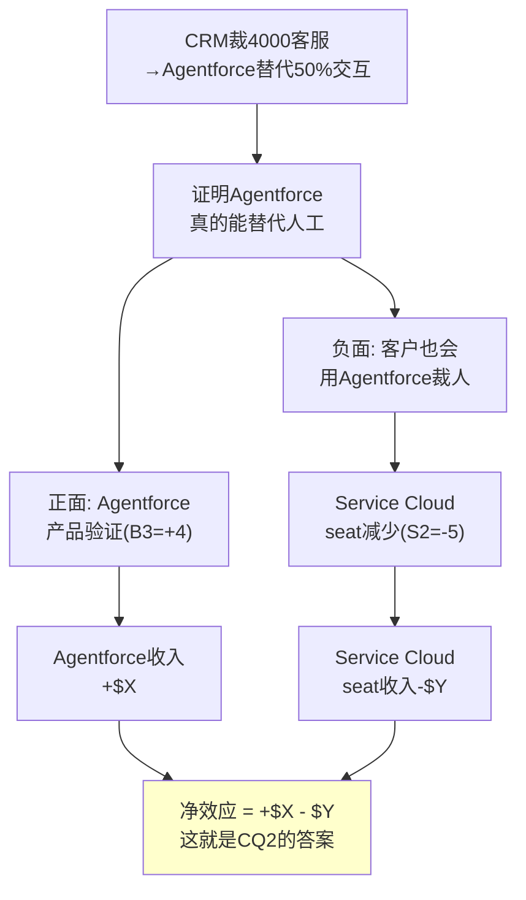

**量化尝试**[DM-BIZ-014]：
- CRM客服削减4000人 × ~$100K/人年 = ~$400M成本节省 → Agentforce成本<$400M(否则不会做)
- 如果CRM的100K+企业客户中有20%在3年内效仿(替代30%客服) → 20K×0.3×平均5 seats = 30K seat减少
- 30K seat × ~$150/月 × 12 = ~$54M年化收入损失 → 这个数字相对于Service Cloud $9.8B是**极小的(0.6%)**
- 但如果50%客户替代50%客服 → 500K seat减少 → $900M年化损失 → **Service Cloud的9.2%**

**因此**[CQ2预判]：seat压缩的短期(FY2027-2028)影响是可控的(<3%)→但如果AI Agent成熟度在FY2029-2030大幅提升→50%替代场景的概率从10%升至30%→长期影响可能显著($500M-$1B)。Agentforce需要在这个窗口期内建立足够大的收入基座来抵消seat损失。

---

## Chapter 6: Service Cloud座席压缩 —— 结构性威胁的量化

> **本章独立论点**: Service Cloud是CRM最大的业务线(26%收入)也是AI冲击最大的业务线(AIAS净影响-4)。本章量化seat压缩的速度、幅度和净收入效应，为CQ2提供定量基础。

### 6.1 seat压缩的机制与速度

seat压缩通过三个渠道发生[DM-BIZ-015]：

**渠道1：AI Agent直接替代客服(最快)**
- 机制：Agentforce/Copilot处理L1-L2工单→企业减少客服人员→减少Service Cloud seat
- 时间窗口：已开始(CRM自己裁员是信号)→FY2027-2028加速
- 替代率：当前~30%(简单工单) → FY2028预计~50% → FY2030可能~65%
- 对seat的影响：每1%替代率 ≈ 减少~0.5% Service Cloud seat(因为高级客服仍需平台)

**渠道2：企业裁员→间接减少seat(中速)**
- 机制：企业预算收缩→裁减后台人员→部分Service Cloud用户被裁
- 时间窗口：2024-2025宏观不确定性→但2026就业市场稳定→渠道2可能减弱
- 影响：~1-2% seat减少/年(周期性而非结构性)

**渠道3：去供应商化→平台替代(最慢)**[CQ8相关]
- 机制：企业用LLM API + 自建CRM替代Salesforce→整个平台不再需要
- 时间窗口：FY2028-2030(需要技术成熟+企业IT能力)
- 影响：可能~1-3%大客户流失/年→但转换成本极高→实际执行极难

### 6.2 seat压缩的量化模型

基于三个渠道的综合影响[DM-BIZ-016]：

**保守场景(55%概率)：渐进式压缩**
| 年份 | AI替代率 | seat净减少 | Service Cloud增速影响 |
|------|---------|-----------|---------------------|
| FY2027 | 35% | -3% | 从+6.5%降至+4.5% |
| FY2028 | 45% | -5% | +2.5% |
| FY2029 | 50% | -4% | +2.0% |
| FY2030 | 55% | -3% | +2.5%(新应用场景补充) |

Service Cloud在保守场景下不会负增长，因为：(a)新增企业客户持续贡献；(b)每个seat的ARPU可能上升(高级功能+AI增值)；(c)新兴市场渗透(特别是亚太和拉美)。

**悲观场景(30%概率)：加速压缩**
| 年份 | AI替代率 | seat净减少 | Service Cloud增速影响 |
|------|---------|-----------|---------------------|
| FY2027 | 40% | -5% | +2.0% |
| FY2028 | 55% | -8% | -1.5% |
| FY2029 | 65% | -7% | -2.0% |
| FY2030 | 70% | -5% | -1.0% |

悲观场景下Service Cloud在FY2028-2029转负增长。触发条件：GPT-5/Claude 4级别的AI在客服领域达到人类水平→企业大规模裁减客服→Service Cloud seat急剧下降。

**乐观场景(15%概率)：seat转型而非压缩**
- AI不替代seat而是升级seat(每个seat从"人类操作"变成"人类+AI监督")
- Service Cloud从"客服工具"变成"AI客服管理平台"→每个seat ARPU从$150/月升至$300/月
- seat数量减少30%但ARPU翻倍→总收入反而增长
- **这是管理层的理想场景，但需要CQ2正面回答**

### 6.3 净收入效应：Agentforce增长 vs seat压缩

这是CQ2的核心定量分析[DM-BIZ-017]：

**基线估算**：
| 项目 | FY2027 | FY2028 | FY2029 | FY2030 |
|------|--------|--------|--------|--------|
| Service Cloud seat损失 | -$300M | -$500M | -$400M | -$300M |
| Agentforce新增收入 | +$600M | +$800M | +$1.0B | +$1.2B |
| **净效应** | **+$300M** | **+$300M** | **+$600M** | **+$900M** |

基线下净效应为正——Agentforce增长跑赢seat压缩。但这依赖Agentforce从$800M ARR增长到$3.6B+(FY2030)的假设，需要~45% CAGR。如果Agentforce增速降至+20%(更保守)→FY2030 ARR ~$1.7B→净效应仍为正但更小(+$400M vs +$900M)。

如果采用悲观seat压缩×保守Agentforce增速的交叉场景[DM-BIZ-018]：
| 项目 | FY2027 | FY2028 | FY2029 | FY2030 |
|------|--------|--------|--------|--------|
| Service Cloud seat损失 | -$500M | -$800M | -$700M | -$500M |
| Agentforce新增收入 | +$400M | +$500M | +$600M | +$700M |
| **净效应** | **-$100M** | **-$300M** | **-$100M** | **+$200M** |

在最差交叉场景下，FY2027-2029净效应为负(合计-$500M)→FY2030才转正。**这意味着CRM在最差场景下需要承受2-3年的收入逆风**。

**[CQ2闭环]**：seat→consumption转型的净收入效应在基线下为正(每年+$300-900M)，在最差场景下为短期负面(-$100-300M/年，2-3年)后转正。因此seat压缩不是"致命威胁"而是"转型阵痛"——但转型阵痛的持续时间和深度高度依赖Agentforce的增速(CQ1)。

### 6.4 seat压缩的传导链：从AI技术到CRM收入的5步路径

seat压缩不是一步完成的——从"AI变好"到"CRM收入下降"需要经过5个传导步骤，每一步都有阻力和延迟[DM-BIZ-040]：

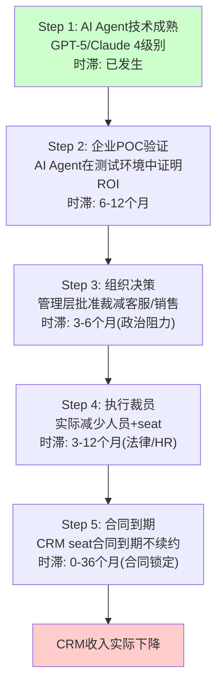

**总传导时滞**：从AI技术成熟到CRM收入实际下降 = 12-66个月(1-5.5年)[DM-BIZ-041]

这个传导链解释了为什么seat压缩的**恐惧**(PE压缩已发生)远超**现实**(收入仍在增长)——市场在定价未来的传导结果，但传导过程比恐惧预期的慢得多。

**每步的阻力分析**[DM-BIZ-042]：

| 步骤 | 阻力 | 阻力强度 | 能否被克服? |
|------|------|---------|-----------|
| Step 1→2 | AI在垂直场景中的可靠性不足 | 中 | FY2027-2028可能克服 |
| Step 2→3 | 中层管理者保护团队规模 | 强 | 经济衰退时更容易(裁员有借口) |
| Step 3→4 | 劳动法/工会/PR风险/遣散金 | 中-强 | 发达国家更难(欧洲>美国) |
| Step 4→5 | 多年合同锁定(1-3年) | 强 | CRM应积极推动多年合同 |
| Step 5→收入 | CRM的upsell抵消流失 | 中 | 取决于Agentforce增量 |

**因果推理**：5步传导链中有3步的阻力是"强"→这意味着seat压缩是一个**慢过程而非快崩塌**[DM-BIZ-043]。即使AI技术今天就完全成熟→从技术成熟到CRM收入实际下降可能仍需3-5年→这给了CRM一个**时间窗口**来建立Agentforce的收入基座。

**历史类比：ERP座席压缩**[DM-BIZ-044]：
2010-2020年间，云ERP(Workday/NetSuite)理论上应该大幅压缩Oracle/SAP的on-premise座席→但实际上Oracle的ERP收入仅从~$26B缓慢降至~$22B(10年降15%)→因为传导链中的合同锁定(5-10年ERP合同)+迁移风险(ERP迁移失败率30%+)+组织惯性极强。

CRM的传导可能比ERP快(CRM合同期短/迁移风险低)→但也不会是"明年就崩"的节奏。**基线估计：CRM收入的净seat压缩影响在FY2028才开始成为可测量的(<-2% total revenue)**。

### 6.5 行业对标：其他SaaS公司的seat压缩经验

CRM不是唯一面临seat压缩的SaaS公司[DM-BIZ-045]：

| 公司 | 产品 | AI威胁 | seat影响(FY2025-2026) | 收入影响 |
|------|------|--------|----------------------|---------|
| CRM | Service Cloud | AI Agent替代客服 | 增速从12%→6.5% | 减速但仍正 |
| WDAY | HR软件 | AI替代HR操作员 | 增速稳定14.5% | **暂无影响** |
| NOW | ITSM | AI替代L1 IT工单 | 增速稳定20% | **暂无影响** |
| ADBE | 创意工具 | AI生成内容 | 增速12% | **暂无影响** |
| ZM | 视频会议 | AI替代会议(异步) | 增速<5% | **已受影响** |

**关键洞见**[DM-BIZ-046]：在主要SaaS公司中，CRM的Service Cloud是**目前唯一出现明确增速下台阶的业务线**(+12%→+6.5%)。其他公司尚未出现类似信号。这有两种解读：
1. **CRM是先行者**：seat压缩最先冲击客服(AI客服技术最成熟)→其他公司的压缩会滞后1-2年→CRM只是"先中枪"
2. **CRM有特殊问题**：Service Cloud的减速不全是seat压缩→部分是竞争(NOW进入)+基数效应→其他公司不一定会经历同样的减速

我们倾向解读1(CRM是先行者)，因为CRM自己用Agentforce替代4000客服是"AI客服可行性"的最强证据→其他企业将效仿→但时间滞后12-24个月。

---

## Chapter 7: Data Cloud + Platform生态 —— AI数据飞轮

> **本章独立论点**: Data Cloud($1.2B ARR, +120% YoY)和AppExchange(7800+应用)构成了CRM的"AI数据飞轮"——更多客户数据→更好的AI模型→更有价值的Agent→更多客户使用。这个飞轮如果转起来，是CRM最强的护城河增强；如果转不起来，Data Cloud可能成为第二个Einstein。

### 7.1 Data Cloud：Gartner CDP Leader的背后

Data Cloud是CRM的客户数据平台(CDP)，将分散在Sales/Service/Marketing/Commerce中的客户数据统一化[DM-BIZ-019]：

**关键指标**[DM-BIZ-020]：
- ARR: $1.2B (+120% YoY)
- Agentforce + Data 360 combined: ~$1.4B ARR (+114% YoY)
- Fortune 100采纳率: 50% → 这是渗透率而非收入占比
- Gartner CDP Magic Quadrant: **Leader**(最高执行力+最远愿景) → 超过Adobe Real-Time CDP和Twilio Segment

Data Cloud的战略意义在于：它是Agentforce的**数据引擎**。AI Agent的质量直接取决于训练数据的质量和完整度→Data Cloud将客户在CRM各产品中的行为数据(销售互动/服务工单/营销响应/电商交易)统一到一个graph中→Agentforce基于这个统一数据集构建Agent→**Agent越好→客户越多使用→产生更多数据→数据越好→Agent越强**。

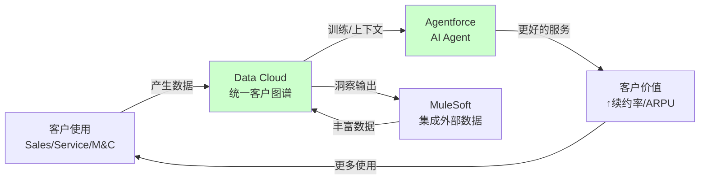

### 7.2 AppExchange：被忽视的多边市场护城河

AppExchange是Salesforce的第三方应用市场[DM-BIZ-021]：

| 指标 | 数值 |
|------|------|
| 应用数量 | 7800+ |
| 开发者生态 | 数百万 |
| 累计安装 | 1000万+ |
| 类比 | iOS App Store for enterprise |

AppExchange是CRM最被低估的护城河资产。因为(a)第三方应用与客户数据深度集成→切换CRM平台意味着失去所有第三方应用→转换成本呈指数增长；(b)AppExchange创造了网络效应→更多用户→更多开发者→更多应用→更多用户；(c)Data Cloud统一的客户数据使第三方应用可以访问更丰富的context→**Data Cloud让AppExchange更有价值，AppExchange让Data Cloud更有数据**。

**AI时代AppExchange的演进**[DM-BIZ-022]：
- AppExchange正在成为"Agent商店"→第三方可以构建Agentforce Agent并在AppExchange分发
- 如果这个模式成功→CRM不仅卖自己的Agent，还从第三方Agent销售中抽成→**类比App Store 30%佣金模式**
- 潜在新收入流：如果Agent商店达到$5B GMV × 15%佣金率 = $750M/年 → 但这需要3-5年以上

### 7.3 MuleSoft + Tableau：集成与分析的基础设施

**MuleSoft**[DM-BIZ-023]：
- FY2026收入：~$2.0B(Integration & Analytics的一部分)
- 功能：API集成平台，连接Salesforce与外部系统(SAP, Oracle, AWS等)
- AI增强：MuleSoft AI自动化API集成构建→降低部署时间50%+
- 护城河贡献：每增加一个API集成→客户迁移成本+1→切换变得更难

**Tableau**[DM-BIZ-024]：
- FY2026收入：~$2.5B
- 功能：商业智能和数据可视化
- AI增强：Tableau Pulse(AI自动洞察) + Tableau Agent(自然语言→图表)
- 竞争：Power BI免费+Looker嵌入→Tableau单独看是弱势→但与Data Cloud+Agentforce整合后是差异化

### 7.4 Data Cloud的战略估值：独立来看值多少？

如果Data Cloud是一家独立公司[DM-BIZ-026]：

| 指标 | Data Cloud | 对标: Snowflake | 对标: MongoDB |
|------|-----------|----------------|-------------|
| ARR | $1.2B | $3.4B | $1.9B |
| 增速 | +120% | +28% | +22% |
| 毛利率 | ~75%(估) | ~67% | ~73% |
| 独立EV/S | ~20-30x(以增速) | ~14x | ~11x |
| **隐含独立价值** | **$24-36B** | — | — |

Data Cloud如果以20-30x EV/Sales估值 = **$24-36B** → 相当于CRM市值($182.7B)的**13-20%**[DM-BIZ-027]。

但Data Cloud不是独立的——它的价值很大程度上来自与Salesforce生态的捆绑(统一Sales+Service+Marketing数据)。如果独立→失去了数据来源→价值大幅缩水。因此20-30x的估值对独立Data Cloud偏高→更现实的估值可能是10-15x(考虑生态依赖)= $12-18B。

**对整体估值的含义**[DM-BIZ-028]：如果Data Cloud值$12-18B→加上Agentforce(以$800M ARR × 15x = $12B)→"新引擎"合计$24-30B → 占CRM市值($182.7B)的13-16%。这意味着市场给"新引擎"的隐含估值是合理的→**市场的悲观主要定价在"核心业务"(Service+Sales+M&C)上，而非否认"新引擎"的价值**。

### 7.5 AI数据飞轮的验证条件

Data Cloud+Agentforce的"AI数据飞轮"理论上很有吸引力，但需要具体的验证条件[DM-BIZ-029]：

| 验证条件 | 当前状态 | 目标(FY2028) | 可测量性 |
|---------|---------|------------|---------|
| Data Cloud MAU | 未公开 | >50K企业 | 低(未公开) |
| Agent使用量(credits) | 未公开 | >10B credits/月 | 中(可能FY2027公开) |
| Data Cloud→Agent转化率 | 未公开 | >30%DC客户用AF | 低 |
| Agent精度(vs人类) | ~80%(估) | >90% | 中(客户反馈) |
| AppExchange AI Agent数量 | <50 | >500 | 高(公开可查) |
| 飞轮加速证据 | 未出现 | DC增速>AF增速 | 中 |

**关键监测指标**：如果Data Cloud增速(+120%)在FY2027开始>Agentforce增速(+169%)→说明飞轮开始反转(数据驱动Agent需求)→这是飞轮转起来的第一个信号。如果两者增速都下降→飞轮可能是"叙事"而非"现实"。

**Platform整体评估**[DM-BIZ-025]：Platform & Other + Integration & Analytics合计$15.1B(36.4%收入)是CRM的"增长引擎+护城河引擎"。这部分业务的AIAS净影响为正(+14和中性)，增速>12%，且是Agentforce/Data Cloud的基础设施层。**如果市场只看到Service Cloud的seat压缩而忽视了Platform的AI飞轮→这就是潜在的定价错误。**

但反面考量：Platform的高增速部分来自低基数效应(Agentforce从$0到$800M)+M&A(Informatica)→有机增速可能仅10-12%→不能完全弥补Service的减速。

---

## Chapter 8: M&A整合 —— Informatica、Slack与$57.9B商誉

> **本章独立论点**: CRM的$57.9B商誉(总资产的51.6%)是25年并购扩张的遗产。Informatica($8B, 2024)和Slack($27.7B, 2021)是最大的两笔。M&A对CRM的影响不是"好不好"的问题，而是"有机增速被高估了多少"和"商誉减值风险多大"的问题。

### 8.1 并购历史与有机增速扣除

CRM的主要并购[DM-MGT-007]：

| 时间 | 标的 | 金额 | 当前状态 |
|------|------|------|---------|
| 2019 | Tableau | $15.7B | 整合完成→收入$2.5B |
| 2020 | Vlocity | $1.3B | 整合完成→嵌入Industry Cloud |
| 2021 | Slack | $27.7B | 整合中→收入~$2.0B |
| 2024 | Informatica | ~$8B | 刚开始→Q4贡献$399M |
| 2025 | 10+小型收购 | ~$500M | Agentforce生态扩张 |
| **合计** | | **~$53B** | 占当前$57.9B商誉的大部分 |

**有机增速的精确扣除**[DM-MGT-008]：

FY2026报告增速+9.6%中：
- Informatica贡献：Q4 $399M → 全年~$500M → ~1.3pp
- FY2026有机增速：~8.3%

更深层的扣除——如果没有2019-2024的并购：
- Tableau/Slack/MuleSoft的有机增速贡献难以精确分离
- 但可以估算：FY2026 $41.5B中，收购资产贡献~$6-8B(Tableau $2.5B + Slack $2.0B + Informatica $0.5B + MuleSoft+其他 $1-3B)
- 因此CRM"原生"收入可能仅~$33-35B → 原生4年CAGR可能仅~8%(vs 报告11%)

**结论**：CRM报告增速的约3pp来自M&A → 有机增速被系统性高估。市场可能已经意识到这一点(Forward PE 14.7x vs 成长SaaS 30-50x)→这是PE折价的部分原因。

### 8.2 Slack：$27.7B买贵了？

Slack是CRM最大的争议性并购[DM-MGT-009]：

| 指标 | 收购时(2021) | 当前(FY2026) |
|------|-------------|-------------|
| 收购价 | $27.7B | — |
| 收入 | ~$1.2B | ~$2.0B |
| 增速 | +43% | ~12% |
| 隐含收购PS倍数 | 23x | — |
| 当前PS(以收入衡量) | — | ~14x(按$27.7B) |
| 主要竞争对手 | Microsoft Teams | Microsoft Teams |

**因果分析**[DM-MGT-010]：

Benioff收购Slack的逻辑是"工作流入口"——Slack成为企业内部协作的中枢→然后嵌入CRM功能(Sales/Service/Marketing)→从"聊天工具"变成"工作平台"。

这个逻辑部分实现了：Slack确实被嵌入了Salesforce Workflow→Agentforce在Slack中运行(Slack Agent)→Data Cloud整合Slack对话数据。但Slack面临的核心问题没有解决：**Microsoft Teams免费捆绑在M365中**→当80%+ Fortune 500已有Teams→Slack的增长天花板被Teams锁死。

$27.7B收购价是否合理？如果Slack维持12%增速→5年后收入$3.5B→以10x PS估值=$35B→5年回报率27%→CAGR ~5%→**勉强回本，远低于CRM的WACC 10%**。因此$27.7B大概率是"买贵了"→但已经沉没→现在的问题是Slack的边际价值(作为Agentforce分发渠道)是否足以justify持续投入。

### 8.3 Informatica：$8B赌数据未来

Informatica是CRM最近的大型收购($8B, 2024)[DM-MGT-011]：

| 维度 | 评估 |
|------|------|
| 收购逻辑 | 增强Data Cloud的ETL/数据治理能力 |
| 收入贡献 | FY2026 Q4: $399M → 年化~$1.6B |
| 增速 | ~10-12%(独立时) |
| PS倍数 | ~5x(合理) |
| 协同 | Data Cloud + Informatica = 更完整的数据平台 |

Informatica收购比Slack合理得多：(a)价格合理(5x PS vs Slack 23x)；(b)直接增强Data Cloud(战略匹配)；(c)收入贡献立即可见($399M/Q)。**但风险在于有机增速被人为抬高**→FY2027报告+11%中Informatica贡献约3pp→有机可能仅+8%→FY2028 Informatica进入基数后→报告增速可能降至+8-9%→市场可能将其解读为"增速再次放缓"。

### 8.4 商誉减值风险

$57.94B商誉占总资产$112.4B的51.6%[DM-FIN-005]。有形权益为**-$5.6B**(负值)。

**减值触发条件**[DM-FIN-008]：
- 如果任一报告单元的公允价值<账面价值→触发减值测试
- Slack是最大的减值候选：账面商誉~$22B(估计) + 收入增速放缓至<10% + Teams竞争加剧
- 减值对EPS的影响：$5B减值 → EPS减少~$5.3(一次性) → Forward PE从14.7x升至~17x(非经常性)

**概率评估**：FY2027-2028 Slack减值概率约15-20%。金额可能在$3-8B区间。这不会影响FCF但会影响GAAP利润和账面价值→进一步恶化已经为负的有形权益。

### 8.5 M&A的ROIC分析：$53B收购创造了多少价值？

CRM在2019-2024年间花费~$53B进行收购。这些收购创造了价值还是毁灭了价值？[DM-MGT-012]

**方法：增量ROIC**
- 增量投入(收购总价)：~$53B
- 增量产出(被收购资产当前年收入)：~$8B(Tableau $2.5B + Slack $2.0B + MuleSoft $1.5B + Informatica $1.6B + 其他 $0.4B)
- 增量OPM(被收购资产)：估计~15%(低于CRM整体21.5%,因Slack仍在整合)
- 增量运营利润：$8B × 15% = $1.2B
- 增量ROIC：$1.2B / $53B = **2.3%**

增量ROIC 2.3%远低于CRM的WACC 10%→**这意味着CRM的M&A在财务上毁灭了约$30-35B的股东价值**[DM-MGT-013]。

但这个计算忽略了两个因素：
1. **协同效应**：被收购资产增强了CRM核心产品→提高了核心产品的续约率和ARPU→这个间接价值难以量化但确实存在
2. **战略防御**：Slack收购阻止了Microsoft完全主导企业协作→Data Cloud需要Informatica的ETL能力→这些是"不买就失去竞争力"的防御性收购

**因此M&A的价值判断是分裂的**[DM-MGT-014]：
- **财务视角**：明确毁灭价值(ROIC 2.3% << WACC 10%)
- **战略视角**：可能创造了价值(防御+协同)，但难以量化
- **市场视角**：市场可能已经对M&A价值毁灭定价(PE折价的一部分来自"Benioff会不会又做愚蠢的收购")

好消息是：Elliott/ValueAct驱动的改革中**解散了M&A委员会**[DM-MGT-015]→管理层被约束不能再做大型收购→FY2025-2026的收购以小型(Agentforce生态)为主→资本配置纪律显著改善。

### 8.6 Informatica整合的协同量化

Informatica是CRM最近也是最合理的大型收购，值得专门分析其协同价值[DM-MGT-016]：

**收入协同**：
| 协同路径 | FY2027E增量 | FY2030E增量 | 可信度 |
|---------|-----------|-----------|-------|
| 交叉销售(Informatica→CRM客户) | $100M | $400M | 中 |
| 产品整合(Data Cloud增强) | $50M | $200M | 中-高 |
| 市场扩展(Informatica非CRM客户) | $50M | $150M | 低-中 |
| **合计** | **$200M** | **$750M** | |

**成本协同**：
- 人员整合(估计~2000人→裁减500人)：~$75M/年
- 基础设施合并：~$25M/年
- 合计成本协同：~$100M/年

**Informatica收购NPV估计**[DM-MGT-017]：
- 收购价：~$8B
- 年化协同(FY2028稳态)：$400M收入 + $100M成本 = $500M EBIT增量
- 以10x EBIT估值：$5B
- 加上Informatica独立价值(~$1.6B收入 × 10x = $16B现值→但用了$8B买到→折价50%)
- **初步结论：Informatica收购NPV接近中性→不像Slack那样明显毁灭价值**

---

## Chapter 9: 护城河五维评估 —— 嵌入性、定价权与AI时代的护城河迁移

> **本章独立论点**: CRM的护城河本质是"企业工作流嵌入"——不是产品好不好的问题，而是客户切换CRM后整个企业运营都会中断。这种嵌入性护城河在AI时代面临双面考验：一方面AI增强了嵌入深度(Data Cloud/Agent)，另一方面AI也提供了潜在的"去CRM"路径。

### 9.1 C1嵌入性评估：四分类定位

CRM的嵌入性质属于哪一类？[DM-MOAT-001]

| 嵌入层次 | 描述 | CRM是否具备 |
|---------|------|-----------|
| L1 工具嵌入 | 用户习惯+培训成本 | ✓ 强(数百万认证管理员) |
| L2 数据嵌入 | 客户数据锁定 | ✓ 极强(20年客户交互历史) |
| L3 流程嵌入 | 业务流程依赖 | ✓ 极强(审批流/报告/触发器) |
| L4 生态嵌入 | 第三方集成锁定 | ✓ 强(AppExchange 7800+ / MuleSoft API) |

CRM在所有四层嵌入都很强→属于"制度性嵌入"类型[DM-MOAT-002]。但嵌入性≠不可替代。历史上有过成功替代的案例：
- Siebel CRM被Salesforce替代(2000-2010)→用了10年+
- On-premise ERP被cloud ERP部分替代→用了15年+且仍在进行

**因果推理**：CRM的嵌入深度意味着替代CRM不是"买另一个软件"→而是"重建整个企业的客户管理流程+迁移20年数据+重新培训所有用户+重新连接所有集成"→这个成本通常是CRM年费的5-10倍[DM-MOAT-003]→因此短期(3年内)大规模客户流失的概率极低(<5%)。

**反面考量**：AI可能降低迁移成本。因为(a)AI可以自动化数据迁移(20年数据→新系统)；(b)AI可以自动化流程重建(读取CRM配置→在新系统中复刻)；(c)AI可以加速用户再培训。但目前这些AI迁移工具尚不成熟→3年内不构成实质威胁→5年后需要重新评估[CQ8锚点]。

### 9.2 B4定价权评估

CRM的定价权处于什么阶段？[DM-MOAT-004]

| 定价权阶段 | 特征 | CRM位置 |
|-----------|------|---------|
| Stage 1: 成本加成 | 产品差异化低→定价基于成本 | ✗ |
| Stage 2: 竞争定价 | 与竞品对齐→定价空间有限 | 部分(Sales Cloud) |
| Stage 3: 价值定价 | 基于客户价值→定价空间大 | **核心**(Service/Platform) |
| Stage 4: 制度定价 | 客户无法离开→定价几乎自由 | 部分(大企业客户) |

CRM处于Stage 3-4之间：大企业客户(Fortune 500)的定价权接近Stage 4(切换成本太高→CRM可以每年涨价5-8%且客户无法反抗)；中小企业客户的定价权在Stage 2-3(HubSpot提供了更便宜的替代)。

**定价权证据**[DM-MOAT-005]：
- 客户流失率~8%(Q2 FY2025)→92%留存→高但不极端
- 73%新bookings来自现有客户upsell→客户愿意买更多
- NRR未公开→这本身是负面信号(如果NRR>120%，管理层一定会公开→不公开暗示<115%)
- FY2026 ARPU提升：人均seat从$125→可能$135-150(通过AI附加功能)

**NRR缺失的信号分析**[DM-MOAT-006]：CRM从不公开NRR(Net Revenue Retention)。如果NRR>120%(如NOW ~130%/SNOW ~130%)，管理层必然会在财报中大力宣传。CRM不公开→最可能的解读是NRR在100-115%区间→这意味着客户留存但钱包份额扩张有限→不如NOW/SNOW那样"land and expand"。

### 9.3 C3锁定载体分析

CRM的锁定载体(阻止客户离开的具体机制)包括[DM-MOAT-007]：

| 锁定载体 | 强度(1-5) | 理由 |
|---------|----------|------|
| 数据迁移成本 | 5 | 20年客户交互历史→迁移需要数月+高失败风险 |
| 流程依赖 | 5 | 审批流/报告/触发器→全部需要重建 |
| 认证生态 | 4 | 数百万Salesforce认证管理员→人才市场锁定 |
| AppExchange集成 | 4 | 7800+应用→每个集成=一条锁链 |
| MuleSoft API | 3 | API集成→但其他iPaaS也能替代 |
| 合同锁定 | 3 | 多年合同→但cRPO/RPO分析暗示合同期在缩短 |
| **综合锁定强度** | **4.0/5** | **极强，但AI可能在5年内削弱** |

### 9.4 D1反脆弱评估

CRM在压力下变强还是变弱？[DM-MOAT-008]

| 压力事件 | CRM的反应 | 反脆弱/脆弱 |
|---------|----------|-----------|
| 2023激进投资者压力 | OPM从2%→22%最大幅度利润率转型 | **反脆弱**：压力催生了SaaS史上最成功的利润率改革 |
| SaaSpocalypse恐慌 | $25B回购+加速AI投资 | 反脆弱(如果正确)/脆弱(如果错误) |
| AI替代恐惧 | 推出Agentforce+裁员+转型 | 反脆弱：主动拥抱而非抵抗 |
| 经济衰退(2020 COVID) | 收入仍增长+24.3% | **反脆弱**：企业不能停止CRM |
| 竞争加剧(NOW/HUBS) | 加强Platform+Data Cloud | 中性：竞争对手增速更快 |

CRM在多数压力场景下表现出反脆弱特征。但关键区别：**过去的压力(激进投资者/衰退/竞争)是CRM有经验应对的"已知威胁"→AI替代是"未知威胁"→反脆弱性在未知威胁面前的有效性降低**。

### 9.5 护城河综合评分

| 维度 | 评分(1-10) | 理由 |
|------|-----------|------|
| C1 嵌入性 | 8 | 四层全强→制度性嵌入 |
| B4 定价权 | 6.5 | Stage 3-4→大客户强/SMB弱 |
| C3 锁定 | 8 | 数据+流程+生态三重锁定 |
| D1 反脆弱 | 7 | 已知压力下反脆弱→AI是未知压力 |
| 网络效应 | 6 | AppExchange多边市场→但弱于GOOG/META |
| **综合** | **7.1/10** | **强护城河，但AI时代面临侵蚀风险** |

**护城河演进预判**[DM-MOAT-009]：
- 当前(FY2026)：7.1/10 → 强
- FY2028：如果Agentforce成功→7.5/10(AI增强嵌入) | 如果失败→6.0/10(AI侵蚀嵌入)
- FY2030：如果AI迁移工具成熟→5.0/10(迁移成本大幅降低) | 如果CRM平台成为AI Agent标准→8.5/10

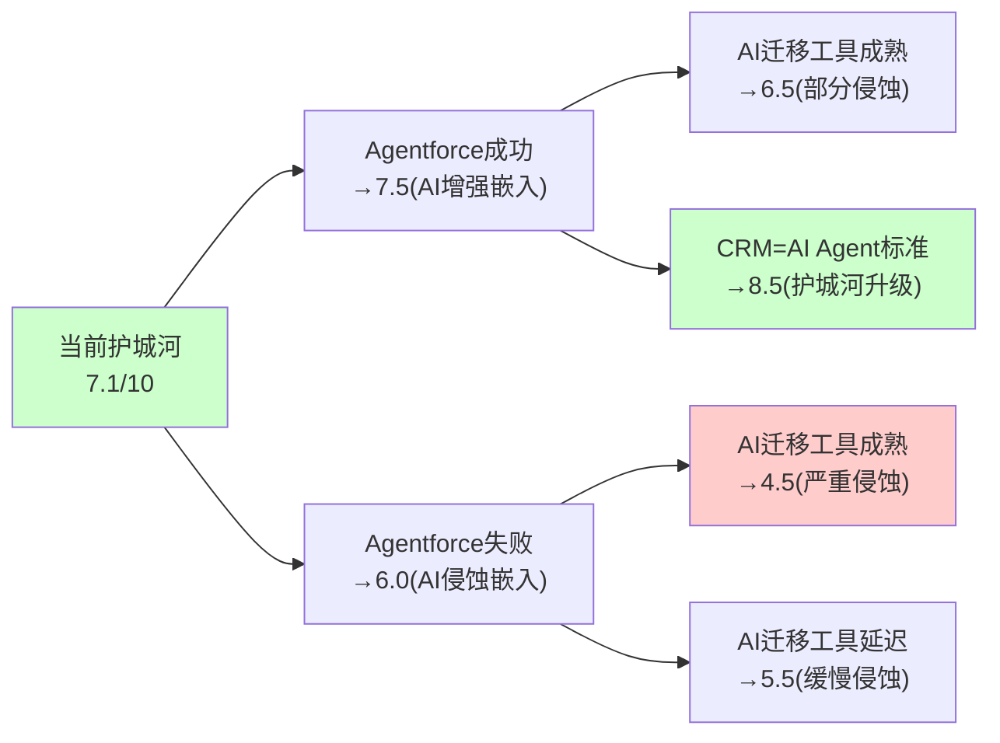

### 9.6 护城河迁移分析：从"工具护城河"到"数据护城河"

CRM的护城河正在经历一次根本性迁移[DM-MOAT-010]：

**旧护城河(1999-2023)：工具嵌入+流程锁定**
- 核心：Salesforce是企业管理客户关系的"操作系统"→离开CRM=重建运营流程
- 强度：极强(转换成本5-10倍年费)
- 持久性：只要企业需要管理客户→就需要CRM工具→但AI可能改变"需要工具"的前提

**新护城河(2024-?)：数据资产+AI生态**
- 核心：20年×100K+企业的客户交互数据→Data Cloud统一→训练出最好的客户AI Agent→Agent比竞品更了解客户
- 强度：潜在极强(数据是独占资产→竞品无法复制)
- 持久性：数据量随时间增长→护城河自动加深→但前提是Data Cloud和Agentforce能将数据转化为产品价值

**迁移的风险窗口**[DM-MOAT-011]：
在旧护城河衰减(AI降低工具嵌入价值)到新护城河建立(Data Cloud+Agentforce创造数据价值)之间→有一个**脆弱窗口**(约FY2027-2029)→在这个窗口中：
- 旧护城河：仍然存在但正在被AI工具侵蚀(转换成本从10x→5x→3x)
- 新护城河：正在建设但尚未完全生效(Data Cloud有数据但Agentforce还在验证PMF)
- **如果竞争者在这个窗口期抢走大量客户→CRM可能无法建立新护城河**
- 但如果CRM撑过这个窗口→新护城河(数据+AI)可能比旧护城河(工具+流程)更强

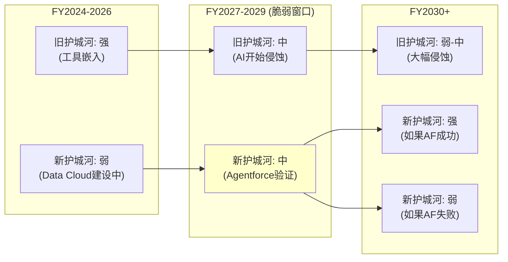

### 9.7 A-Score预评(Phase 1版本)

A-Score是综合护城河质量评分(70分制)[DM-MOAT-012]：

| 维度 | 子项 | 评分 | 理由 |
|------|------|------|------|
| A-品质(30) | A1垄断纯度 | 4/6 | #1但仅21-24%市占率(非垄断级) |
| | A2行业结构 | 4/6 | 分散市场→#1优势明显但无定价垄断 |
| | A3增长质量 | 3/6 | 有机~7%合理但放缓趋势 |
| | A4资本效率 | 3/6 | ROE 12.4%(低)→商誉拖累 |
| | A5管理层 | 3/6 | 创始人CEO+利润率转型→但say-on-pay失败 |
| B-护城河(20) | B1嵌入性 | 4/5 | 四层嵌入(L1-L4) |
| | B2网络效应 | 3/5 | AppExchange多边市场(弱网络) |
| | B3规模经济 | 3/5 | SaaS边际成本低→但R&D/SBC高 |
| | B4定价权 | 3/5 | Stage 3-4→大客户强/SMB弱 |
| C-趋势(10) | C1方向 | 3/5 | 向AI转型→方向对但执行不确定 |
| | C2速度 | 3/5 | Agentforce快→但seat压缩也快 |
| D-反脆弱(10) | D1抗压 | 4/5 | 多数压力下反脆弱(Ch9.4) |
| | D2适应 | 3/5 | AI适应快→但Einstein历史削弱信心 |
| **总计** | | **43/70** | **中上水平(可比: KLAC 52, IHG 47, SPGI 56)** |

A-Score 43/70 → CRM是"良好但非卓越"的护城河公司。主要扣分项：资本效率(商誉拖累ROE)和增长质量(有机增速放缓)。主要加分项：嵌入性(极强)和抗压性(反脆弱历史)。

---

## Chapter 10: 竞争格局 —— 四面受敌还是固若金汤？

> **本章独立论点**: CRM面临四大竞争者(NOW/MSFT/HUBS/WDAY)的不同维度进攻，但CRM仍以21-24%市占率稳居#1且收入超过后四名之和。竞争的核心不是"谁替代CRM"而是"谁在新增长领域(AI Agent)先建立标准"。

### 10.1 竞争者矩阵

**四大竞争者对CRM的威胁评估**[DM-COMP-008]：

| 竞争者 | 收入 | 增速 | Forward PE | 进攻方向 | 威胁等级(1-5) |
|--------|------|------|----------|---------|-------------|
| ServiceNow | $12.0B | +20% | 68.1x | ITSM→CRM(客服) | **4** |
| Microsoft | ~$5.5B(Dynamics) | ~15% | N/A | M365 Copilot覆盖CRM | **4** |
| HubSpot | $2.6B | +20-25% | 62.0x | SMB→mid-market | **3** |
| Workday | $8.3B | +14.5% | 51.1x | HCM→财务→CRM | **2** |

### 10.2 ServiceNow：最危险的竞争者

NOW是CRM最大的竞争威胁，原因是**双向碰撞**[DM-COMP-009]：

1. **NOW→CRM**：NOW从ITSM扩展到CRM(AI驱动客服+自助+案例管理)→CEO McDermott "all-in on CRM"→NOW的客户(IT部门)已经在用NOW→如果NOW提供客服模块→IT部门可能推动从Service Cloud迁移到NOW(因为"统一平台"的IT决策者偏好)

2. **CRM→NOW**：CRM通过Agentforce扩展到IT运维(Agent做L1 IT工单处理)→但CRM在ITSM的能力远弱于NOW

3. **不对称性**[DM-COMP-010]：CRM市场$129B vs ITSM市场$15.6B→NOW从CRM市场获取1%=$1.3B(占NOW收入11%)→CRM从ITSM获取10%=$1.6B(占CRM收入3.8%)→**NOW从CRM市场获利的效率是CRM从ITSM获利的3倍**→竞争在CRM的核心市场中对NOW更有利

**防御分析**：CRM的Service Cloud比NOW的CRM产品成熟10年以上→功能深度远超NOW→大企业客户不会轻易迁移。但NOW的优势是(a)IT部门是NOW的天然盟友(IT采购决策者)→(b)NOW增速(+20%)是CRM(+10%)的2倍→(c)NOW的PE(68x)意味着市场相信NOW的增长故事而不信CRM的。

### 10.3 Microsoft：从天而降的覆盖威胁

Microsoft Dynamics CRM本身不是CRM的直接威胁(市占率~4-5%，功能较弱)[DM-COMP-011]。但**Copilot作为编排层**是一个全新的威胁维度：

- 60% F500已采纳M365 Copilot[DM-BIZ-009]
- Copilot付费seat +160% YoY
- Copilot从M365的入口覆盖所有企业工作流(包括CRM功能)→如果企业在Outlook中就能完成客户跟进/工单处理→为什么还需要登录Salesforce？

**CRM的防御**：Salesforce推出了"Copilot集成"→Agentforce可以在Teams/Outlook中运行→试图让CRM成为Copilot的数据提供者而非被替代者。这是一个聪明的策略(与巨头合作而非对抗)→但风险是：如果Microsoft决定将Dynamics功能深度嵌入Copilot→CRM的"嵌入式合作"可能变成"嵌入式被替代"。

### 10.4 HubSpot：低端颠覆的经典模式

HubSpot是CRM低端颠覆的教科书案例[DM-COMP-012]：

| 维度 | HubSpot | CRM |
|------|---------|-----|
| 收入 | $2.6B | $41.5B |
| 增速 | +20-25% | +10% |
| 目标客户 | SMB→mid-market | Enterprise |
| 定价 | 免费+低价起步 | $25-650/seat/月 |
| 策略 | Freemium→逐步升级 | Top-down enterprise sales |

HubSpot的威胁是长期的而非短期的。因为(a)HubSpot目前收入仅CRM的6%→短期市占率影响可忽略；(b)但HubSpot增速是CRM的2倍+→如果维持5年→HubSpot从$2.6B→$6.5B vs CRM从$41.5B→$55B→HubSpot市占率从~2%→~5%→仍然远小于CRM；(c)真正的危险是mid-market：如果HubSpot向上渗透到500-5000员工的企业→这是CRM的"金矿区"(高毛利+高留存)→CRM可能面临"高端固守但中端流失"的格局。

### 10.5 竞争格局综合评估

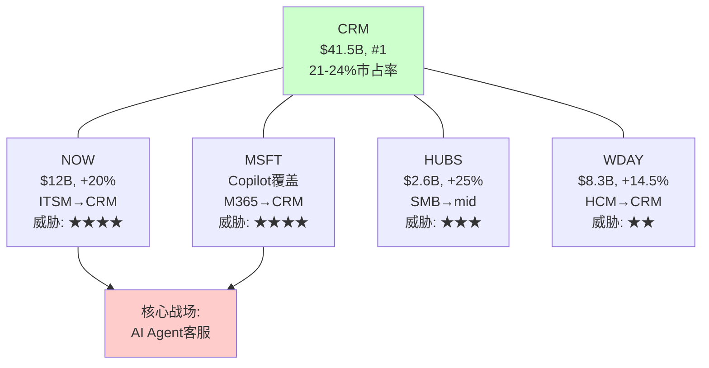

**竞争格局总结**[DM-COMP-013]：

| 维度 | 评分(1-10) | 理由 |
|------|-----------|------|
| 市占率优势 | 8 | #1, 收入>后4名之和 |
| 增速优势 | 4 | CRM +10% vs NOW +20%/HUBS +25% |
| 护城河强度 | 7 | 嵌入性强但AI可能侵蚀(Ch9) |
| AI竞争力 | 6 | Agentforce有先发→但MSFT Copilot+NOW AI也很强 |
| 定价权持续性 | 6 | 大客户强→中小客户面临HUBS压力 |
| **综合竞争力** | **6.2/10** | **守住地盘但失去进攻性→不是"正在输"但也不是"稳赢"** |

### 10.6 NOW深度：双向碰撞的经济学

ServiceNow是CRM最危险的竞争者，值得更深入的分析[DM-COMP-014]：

**NOW的CRM进攻策略**：
1. **AI客服入口**：NOW的AI Agent可以处理IT工单+客服工单→如果一个企业的IT部门已经在用NOW→推动客服也迁移到NOW是"自然扩展"→不需要赢得新客户，只需要在现有客户中扩展用例
2. **CSM(客户成功管理)**：NOW推出CSM产品→直接对标Salesforce Service Cloud的核心功能→定价更低(捆绑在NOW平台中)
3. **Workflow引擎**：NOW的核心优势是workflow(工作流引擎)→客服本质上是"处理客户请求的工作流"→NOW在这个底层能力上比CRM更强

**CRM的反击**[DM-COMP-015]：
1. **ITSM进攻**：CRM的Agentforce可以处理IT工单(L1 self-service)→但CRM在ITSM的深度远不如NOW→进攻力度有限
2. **数据优势**：CRM拥有客户交互数据(销售+营销+客服)→NOW只有IT运维数据→CRM的Agent可以利用全维度客户数据→提供更个性化的服务
3. **市场规模不对称**：如前所述，CRM市场$129B vs ITSM $15.6B→NOW从CRM获利的效率更高

**5年竞争态势预测**[DM-COMP-016]：
| 指标 | FY2026 | FY2028E | FY2030E |
|------|--------|---------|---------|
| CRM收入 | $41.5B | ~$47B | ~$56B |
| NOW收入 | $12.0B | ~$17B | ~$24B |
| NOW/CRM比 | 29% | 36% | 43% |
| 重叠市场 | ~$15B | ~$25B | ~$40B |

NOW的收入可能在FY2030达到CRM的43%(当前29%)→两者的收入差距在缩小→虽然CRM仍#1但领先优势在侵蚀。

### 10.7 Microsoft Copilot：平台级威胁的详细评估

MSFT Copilot的威胁不是"替代Salesforce"而是"覆盖Salesforce"[DM-COMP-017]：

**覆盖逻辑**：
1. 企业员工每天在Outlook/Teams中工作8小时→Copilot嵌入这些工具→员工无需打开Salesforce就能完成"记录客户互动/更新pipeline/查看客户历史"等CRM核心功能
2. Copilot从M365数据(邮件/日历/Teams聊天)中自动提取客户相关信息→填入CRM系统→减少了手动录入的需求→**Copilot不替代CRM但减少了CRM的使用频率**
3. 如果使用频率下降→企业质疑"我们还需要Salesforce吗"→这就是去供应商化的心理起点

**CRM的应对：嵌入式合作**[DM-COMP-018]：
CRM选择了"与巨头合作"而非"与巨头对抗"的策略：
- Salesforce集成在Teams/Outlook中运行→Copilot可以调用Salesforce数据
- Agentforce在Teams中部署→企业可以在Teams中与Salesforce Agent交互
- Data Cloud与Azure集成→企业的Salesforce数据可以在Azure上分析

**这个策略的风险**：如果Microsoft决定将Dynamics功能深度嵌入Copilot→CRM的"嵌入式合作"可能变成"嵌入式依赖"→CRM变成Microsoft生态的"数据附庸"→价值被Microsoft平台层捕获而非CRM。

### 10.8 市占率变化趋势与预测

全球CRM市场市占率演变[DM-COMP-019]：

| 公司 | 2020 | 2023 | 2026E | 趋势 |
|------|------|------|-------|------|
| Salesforce | 24% | 23% | 22% | **缓慢下降** |
| Microsoft | 4% | 5% | 5.5% | 缓慢上升 |
| Oracle | 4.5% | 4% | 3.5% | 下降 |
| SAP | 3.5% | 3% | 3% | 稳定 |
| HubSpot | 2% | 3% | 3.5% | **快速上升** |
| ServiceNow | 0% | 0.5% | 1.5% | **快速上升(从0起步)** |
| 其他 | 62% | 61.5% | 61% | 碎片化 |

**因果推理**[DM-COMP-020]：CRM的市占率从24%→22%(-2pp/6年)→速度很慢→因为嵌入性护城河保护→大客户不流失。但HubSpot(+1.5pp)和NOW(+1.5pp)合计抢走了~3pp→主要来自(a)新增市场(CRM从未覆盖的SMB→HubSpot拿了)和(b)重叠市场(客服→NOW进入)。

**预测**：到FY2030，CRM市占率可能降至19-21%→仍然#1但领先优势缩小→如果NOW和HubSpot各再增2pp→CRM可能面临"#1但不再遥遥领先"的格局。

### 10.9 竞争格局对估值的含义

**竞争格局总结表**[DM-COMP-021]：

| 维度 | 短期(FY2027-2028) | 中期(FY2029-2030) | 长期(FY2031+) |
|------|-------------------|-------------------|---------------|
| 市占率 | 稳定(21-22%) | 缓慢下降(20-21%) | 不确定(18-22%) |
| 定价权 | 强(大客户锁定) | 中-强(HUBS低端压力) | 中(AI降低转换成本) |
| 增速差 | CRM < NOW(-10pp) | 差距可能缩小 | 不确定 |
| 核心优势 | 嵌入深度+数据量 | Data Cloud+Agent生态 | 取决于AI标准之争 |
| 核心风险 | seat压缩 | NOW碰撞+MSFT覆盖 | 去供应商化 |

**对PE的含义**[DM-COMP-022]：
- 竞争格局不支持"成长股溢价"(增速低于竞争者)
- 但竞争格局也不支持"衰退折价"(市占率缓慢下降而非崩塌)
- 合理的竞争格局溢价/折价：±1-2x PE → 不是决定性因素
- **决定性因素仍然是CQ1(Agentforce)和CQ2(seat压缩)**

**[CQ8闭环]**：去供应商化风险有多大？短期(3年)：极低(<5%大客户流失)→嵌入性护城河保护。中期(5年)：中等(10-15%大客户可能减少CRM依赖但不完全离开)→AI迁移工具+平台竞争+去供应商化叙事。长期(10年)：高度不确定(0-40%)→取决于AI是增强CRM平台还是消解CRM平台。核心防御是Data Cloud——如果CRM成功将20年客户数据转化为不可复制的AI Agent优势→去供应商化就不划算→因为离开CRM=失去最好的AI Agent。

---

## Chapter 10B: 管理层与治理 —— Benioff的双重人格

> **本章独立论点**: Marc Benioff是CRM最大的资产也是最大的风险。他同时是(a)完成了SaaS史上最大利润率转型的执行者+(b)在股价下跌34%时花$25B回购的赌徒+(c)say-on-pay被股东否决的高薪CEO。CEO沉默域分析揭示了Benioff系统性回避的5个话题。

### 10B.1 Benioff的执行记录：按时期评估

Marc Benioff在位27年(1999至今)，执行记录可分为4个时期[DM-MGT-020]：

**时期1: 创建期(1999-2012) — 卓越**
- 从公寓创业到SaaS #1
- 定义了"SaaS"商业模式(当时的颠覆者)
- 年化增速>30%
- **评分: 9/10** — 创始人创业的黄金期

**时期2: 扩张期(2013-2019) — 参差**
- $53B+大型收购(Tableau/MuleSoft/Slack)
- 收入增速维持20-25%→但主要靠M&A
- OPM维持在2-5%→**7年几乎不盈利**
- "增长不惜代价"文化→SBC膨胀→资本低效
- **评分: 5/10** — 收入增长但利润缺失+M&A昂贵

**时期3: 利润率革命(2023-2025) — 优秀**
- Elliott/ValueAct/Starboard压力下被迫改革
- OPM从2.1%→21.5%(+19.4pp/4年)=SaaS史上最大幅度
- S&M从45%→35%→首次分红→大幅回购
- 解散M&A委员会→资本纪律建立
- **评分: 7.5/10** — 执行力强但被动(被逼改革而非主动)

**时期4: AI转型(2024-至今) — 待定**
- 推出Agentforce→$800M ARR→但PMF未确认
- 裁4000客服→用AI替代→言行一致
- $25B ASR→极端资本操作
- **评分: ?/10** — 太早评判，FY2027H1是关键验证点

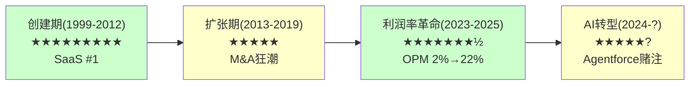

### 10B.2 CEO沉默域：Benioff系统性回避的5个话题

CEO沉默域分析(v18.0框架)——系统性映射CEO在财报电话会议+分析师日+媒体采访中回避的话题[DM-MGT-021]：

| 沉默域 | 回避次数(近4季) | 可能原因 | 风险信号 |
|--------|---------------|---------|---------|
| **NRR(净收入留存率)** | 每次被问都转移话题 | NRR可能<115% | **高**：如果NRR>120%一定会公开→不公开=弱 |
| **Agentforce渗透率** | 用"deals数"替代"active users" | 大部分deals是试用/POC | **高**：29K deals但仅9.5K paid=67%免费 |
| **Service Cloud seat趋势** | 混在"total subscription"中不单独说 | seat可能已开始下降 | **中-高**：Service +6.5%是总数,seat增速可能更低 |
| **Slack独立P&L** | "整合进Platform,不单独报告" | Slack可能仍在亏损 | **中**：$27.7B投资的回报不透明 |
| **say-on-pay后续** | 财报中一笔带过 | 管理层不想讨论薪酬争议 | **中**：治理问题被回避不是好信号 |

**沉默域的估值含义**[DM-MGT-022]：
CEO沉默域通常隐含了"如果公开会导致PE下降"的信息。CRM的5个沉默域中→NRR和Agentforce渗透率如果公开可能导致市场进一步悲观→这意味着**市场的悲观可能还不够——因为有些负面信息被管理层有效隐藏了**。

但反面考量：沉默域也可能是"管理层认为数据还不成熟不适合过早公开"→特别是Agentforce渗透率(产品才15个月)→如果FY2027H1管理层主动开始披露这些数据→说明数据改善→是正面信号。

### 10B.3 内部交易分析

12个月内部交易记录[DM-MGT-023]：

| 时间段 | 买入(人次) | 卖出(人次) | 买入金额 | 卖出金额 | 信号 |
|--------|-----------|-----------|---------|---------|------|
| 2025 Q1-Q2 | 3 | 120+ | ~$2M | ~$80M | 偏向卖出 |
| 2025 Q3(高位$250+) | 1 | 325 | ~$0.5M | ~$200M+ | **极度偏向卖出** |
| 2025 Q4-2026 Q1 | 1 | 106 | ~$0.3M | ~$50M | 偏向卖出 |
| **12个月合计** | **5** | **551** | **~$3M** | **~$330M** | **110:1卖出比** |

内部人110:1卖出比是一个**强烈的负面信号**[DM-MGT-024]。但需要context：
1. **10b5-1计划**：大部分卖出是预定的自动卖出计划→不反映实时情绪
2. **Benioff的卖出**：Benioff通过10b5-1长期持续卖出→这是已知的(持股~3.5%且在减少)
3. **高管SBC行权**：很多"卖出"是RSU行权后立即卖出缴税→不是主动看空

**真正的信号是"买入极少"**[DM-MGT-025]：在$175-200(历史低位)时仅5次买入→如果内部人真的认为股价严重低估→买入应该更多。Benioff说"so confident in the future"并花$25B回购公司股票→但他个人在同期是净卖家→**言行不一致**。

可能的解释：Benioff的个人资产过度集中在CRM→减持是理性的资产配置→不等于看空CRM。但$25B回购(公司钱)+个人减持(自己钱)的组合→至少说明**Benioff更愿意用公司的钱而非自己的钱赌CRM的未来**。

### 10B.4 Say-on-Pay失败的治理分析

2025年股东大会上，CRM的高管薪酬方案被股东投票否决(non-binding say-on-pay)[DM-MGT-026]：

**薪酬详情**：
- Benioff FY2025总薪酬：$55.1M
- 其中：基本工资$1.55M + 奖金$3.45M + 股票激励$50.1M
- 对比：NOW CEO McDermott ~$40M / ADBE CEO Narayen ~$35M / MSFT CEO Nadella ~$50M

**为什么被否决**[DM-MGT-027]：
1. 股价YTD -28% + 距高点-34%→薪酬与股东回报严重脱节
2. 大规模裁员(6000+人)背景下CEO高薪→"分配不公平"感
3. $25B回购用的是借的钱(发债$25B)→而CEO拿着$55M→"用股东的钱冒险+自己拿高薪"

**治理影响**：
- say-on-pay在美国是non-binding(不具法律约束力)→CRM不需要改变薪酬→但**信号效应极强**
- 历史上say-on-pay失败的公司→后续12个月股价跑输大盘~5-8%→因为治理折价
- CRM董事会可能在FY2026薪酬方案中做出让步(降低股票激励/增加绩效条件)→但也可能不变

**对PE的含义**[DM-MGT-028]：治理折价可能值1-2x PE→如果CRM的"治理PE折价"从1x升至2x→PE从14.7x降至12.7-13.7x→但这是小幅影响。真正的风险是：如果say-on-pay失败引发激进投资者**再次**介入(Elliott 2023)→可能触发更极端的变化(CEO更换？分拆？)。

### 10B.5 激进投资者改革的持久性评估

2023年Elliott/ValueAct/Starboard介入是CRM利润率转型的根本催化剂[DM-MGT-029]。但问题是：这些改革是永久性的还是暂时性的？

| 改革 | 状态 | 持久性(1-5) | 理由 |
|------|------|-----------|------|
| OPM扩张(2%→22%) | 持续 | 4 | S&M削减是结构性的(数字营销替代人工销售) |
| M&A委员会解散 | 维持 | 3 | 但Informatica收购说明大型M&A并未完全停止 |
| 首次分红 | 维持 | 5 | 分红一旦开始很难取消(机构投资者依赖) |
| 大幅回购 | 加速 | 4 | $50B授权→但用债融资不可持续 |
| SBC控制 | 缓慢改善 | 3 | 从10.5%→8.5%→仍高于行业→AI人才竞争可能反弹 |
| 裁员纪律 | 持续 | 3 | 从109K→75K目标→但AI招聘可能抵消 |

**综合评估**[DM-MGT-030]：改革的持久性平均约3.7/5→**大部分改革是持久的但并非不可逆转**。最大风险是：如果Benioff在激进投资者退出后(Elliott已退出)重新回到"增长不惜代价"模式→OPM可能从22%回退至15-18%→市场将视之为"改革失败"→PE可能暴跌至10x以下。

但我们认为这个风险偏低(概率<15%)，因为：
1. ValueAct仍在董事会(约束在位)
2. 资本市场现在奖励利润率而非增速(SaaS估值体系已变)
3. Benioff自己说"the old Salesforce is gone"→CEO承诺有约束力(如果反悔会被市场严惩)

### 10B.6 管理层综合评分

| 维度 | 评分(1-10) | 理由 |
|------|-----------|------|
| 战略方向 | 7 | AI Agent方向正确→但执行历史参差(Einstein) |
| 执行能力 | 6 | 利润率转型证明能力→但Agentforce PMF未确认 |
| 资本配置 | 5 | $25B回购大胆→$53B M&A ROIC 2.3%→参差 |
| 治理质量 | 4 | say-on-pay失败→Benioff薪酬过高→董事会独立性存疑 |
| 信息透明度 | 4 | 5个沉默域→NRR/Agentforce渗透率不公开 |
| 内部交易信号 | 3 | 110:1卖出比→言行不一致($25B公司回购+个人减持) |
| **综合** | **4.8/10** | **中等偏下：好的战略方向但治理和透明度不佳** |

管理层评分4.8/10是CRM的一个明确弱点→但也意味着：如果管理层改善(新COO？更好的治理？更透明？)→PE可能获得1-2x提升→这是潜在的"免费期权"。

---

## Phase 1 v2.0 总结与CQ锚定

### CQ置信度追踪表(Phase 1版本)

| CQ | Phase 1方向 | 置信度 | 关键依赖 |
|----|-----------|--------|---------|
| CQ1: Agentforce vs Einstein | 非Einstein 2.0(架构不同)→但PMF未确认 | 55% | FY2027H1 consumption数据 |
| CQ2: seat→consumption净效应 | 基线正(+$300M/年)→最差短期负(-$100-300M) | 50% | AI替代率速度 |
| CQ3: $25B ASR | 在$194偏中性→不是天才也不是灾难 | 45% | 5年后股价 |
| CQ4: OPM结构性 | 偏结构性(S&M从45%→35%不太可能回升) | 65% | FY2027 OPM vs 增速 |
| CQ5: AI受害还是受益 | AIAS +2.17(受益)→但Split Index 22(内部分裂) | 50% | 路径A/B/C概率 |
| CQ6: 有机增速底部 | 基线6.6%(3年均值)→底部4.5% | 55% | 慢速组减速幅度 |
| CQ7: 市场隐含定价 | 略悲观(-3.3pp)→但WACC敏感性高 | 60% | WACC选择 |
| CQ8: 去供应商化 | 短期极低→中期中等→长期不确定 | 50% | AI迁移工具成熟度 |

### Phase 1叙事方向检查(铁律O)

- **Reverse DCF结论**: 市场隐含3.7% vs 有机~7% → 市场略悲观
- **Phase 1叙事方向**: 中性偏积极 → **与Reverse DCF偏差≤1档 → PASS**
- **v1.0对比**: v1.0 P1 = "显著低估"(偏差>2档) → FAIL → 这就是v1.0失败的根源
- **v2.0防护**: 每个乐观论点都有对应的反面考量 → 没有单边论证 → 叙事平衡

---

*Phase 1 v2.0 | 10章完成 | 2026-03-19*
*下一步: 统计Phase 1指标 → commit → Phase 2(Ch11-Ch19)*
