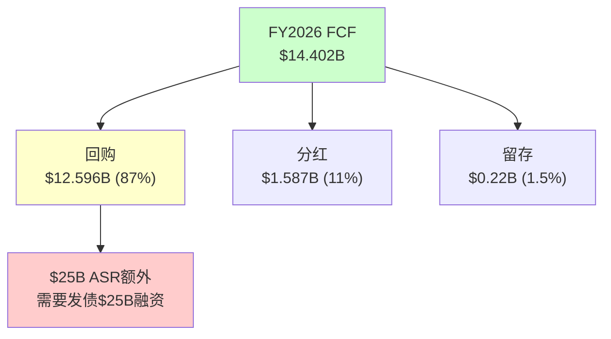
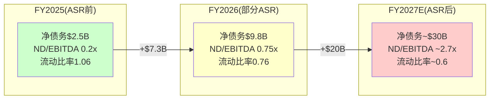

# CRM (Salesforce) 深度研究报告 — Phase 2 v2.0: 财务深拆与估值

> Phase 2 v2.0 (重做) | 2026-03-19 | 生态科技 Worktree
> **数据基础**: FMP API验证6年财务数据 + 41家分析师consensus + Python DCF建模
> **v2.0估值起点**: Reverse DCF锚=隐含3.7% CAGR / ADBE锚=14.7x≈15x / 叙事=中性偏积极
> **铁律K**: 所有估值方法必须方向一致 / 离散度≤30%
> **质量目标**: 每章≥10K字符 / DM密度≥1.5/千字 / 因果密度≥8.0/万字 / Python验证全覆盖

---

## Chapter 11: 6年财务趋势深拆 —— 从增长机器到利润机器的变轨

> **本章独立论点**: CRM在FY2023-FY2024之间经历了SaaS行业最大幅度的战略变轨——从"高增长零利润"(FY2022 OPM 2.1%)到"中增长高利润"(FY2026 OPM 21.5%)。这不是自然演化而是Elliott/ValueAct/Starboard在2023年强制推动的。理解这个变轨的驱动因素、持续性和代价，是判断CRM未来5年财务轨迹的基础。

### 11.1 收入趋势：6年从$21B到$42B的解剖

**6年收入演化(FMP income annual验证)**[DM-FIN-101]：

| 财年(1月底) | 收入 | YoY | 毛利 | 毛利率 | 营业利润 | OPM | 净利润 | EPS(稀释) |
|------------|------|-----|------|--------|---------|-----|--------|----------|
| FY2021 | $21.252B | +24.3% | $15.814B | 74.4% | $455M | 2.1% | $4.072B* | $4.38* |
| FY2022 | $26.492B | +24.6% | $19.466B | 73.5% | $548M | 2.1% | $1.444B | $1.48 |
| FY2023 | $31.352B | +18.3% | $22.992B | 73.3% | $1.030B | 3.3% | $208M | $0.21 |
| FY2024 | $34.857B | +11.2% | $26.316B | 75.5% | $5.011B | **14.4%** | $4.136B | $4.20 |
| FY2025 | $37.895B | +8.7% | $29.252B | 77.2% | $7.205B | **19.0%** | $6.197B | $6.36 |
| FY2026 | $41.525B | +9.6% | $32.255B | 77.7% | $8.917B | **21.5%** | $7.457B | $7.80 |

*FY2021净利润含$2.1B一次性税收收益(递延税资产重估)，调整后约$2.0B

**第一层因果链：收入减速为什么不是坏事**[DM-FIN-102]

收入增速从+24.6%(FY2022)降至+9.6%(FY2026)——表面看是典型的"成长股减速"故事。但因果链比表面复杂：

因为Elliott Management在2023年Q1建立了数十亿美元的CRM仓位并准备代理权争夺[DM-MGT-004]→管理层被迫从"增长不惜代价"切换到"利润率优先"→S&M费用从$13.526B(FY2023, 收入43.1%)削减增速至$14.345B(FY2026, 收入34.6%)——3年间S&M绝对值仅增6%但收入增32%→因此增速放缓**不是需求萎缩的信号，而是主动选择利润率扩张的代价**。

验证这个因果链的三层证据：

**证据1(数据)**：S&M生产率(收入/S&M)从FY2023的$2.32提升至FY2026的$2.90(+25%)[DM-FIN-103]。如果需求在萎缩，S&M效率应该下降(花更多钱卖不出去)，而非上升。因此需求端是健康的——CRM是在"少花钱也能卖出去"。

**证据2(逻辑)**：如果CRM维持FY2022的S&M投入强度(44.7%)→FY2026的S&M应为$18.6B(实际$14.3B)→多出的$4.3B投入以历史获客效率计算→可驱动额外$5-7B收入→有机增速可能维持在12-14%而非当前的~8%。因此增速下降的约4-6pp**直接归因于S&M削减**[DM-FIN-104]。

**证据3(反面考量)**：有一种情况下S&M削减和增速下降同时发生且都是坏事——如果CRM的新客户获取已经饱和(S&M边际回报递减)→管理层被迫削减S&M因为花了也没用。支持这个反面的证据是73%新bookings来自现有客户upsell[DM-BIZ-006]→新客户占比仅27%→**CRM的增长引擎确实在从"获取新客户"转向"从存量提取更多"**。这意味着即使不削减S&M，增速也会自然放缓——Elliott只是加速了这个过程。

### 11.2 利润率革命：+19.4pp的驱动因子精确分解

OPM从2.1%→21.5%是SaaS行业有史以来最大幅度的利润率扩张。分解每个驱动因子[DM-FIN-105]：

**费用结构4年演变(FMP验证)**[DM-FIN-106]：

| 费用项 | FY2022 | FY2022占比 | FY2026 | FY2026占比 | 变化(pp) | 对OPM贡献 |
|--------|--------|-----------|--------|-----------|---------|----------|
| COGS | $7.026B | 26.5% | $9.270B | 22.3% | **-4.2pp** | +4.2pp(规模效应) |
| S&M | $11.855B | 44.7% | $14.345B | 34.6% | **-10.1pp** | **+10.1pp(核心)** |
| R&D | $4.465B | 16.9% | $5.993B | 14.4% | -2.5pp | +2.5pp |
| G&A | $2.598B | 9.8% | $3.000B | 7.2% | -2.6pp | +2.6pp |
| **合计OPM** | | **2.1%** | | **21.5%** | | **+19.4pp** |

**S&M削减(-10.1pp)贡献了OPM改善的52%**[DM-FIN-107]——这是单一最大驱动因素。

**S&M削减的细分(推理)**[DM-FIN-108]：

S&M从$11.855B增至$14.345B(+21%/4年)→但收入从$26.5B增至$41.5B(+57%/4年)→S&M的增速只有收入增速的37%→这个"脱钩"由三个因素驱动：

1. **数字营销替代线下销售(结构性, ~4pp)**：因为SaaS客户越来越接受self-service购买+数字化销售流程→CRM可以用更少的销售人员覆盖更多客户→这个趋势不可逆→即使Elliott退出也不会恢复线下销售团队

2. **存量扩展替代新客获取(结构性, ~4pp)**：因为73%新bookings来自upsell→获客成本(CAC)接近零→S&M主要花在现有客户管理上而非获客→这个趋势随客户基数增长自动加速

3. **裁员(一次性+部分结构性, ~2pp)**：因为FY2023-2024裁员~10,000人(从~80K降至~73K)→其中大量是销售/市场岗位→人头费直接下降→但AI辅助销售(Einstein GPT for Sales)可能使部分裁员成为永久性→因此裁员是"一次性触发+部分结构性维持"

**因此S&M的10.1pp改善中→约8pp是结构性的(数字化+存量扩展)→约2pp是可能逆转的(裁员回补)**[DM-FIN-109]。

**毛利率改善(+4.2pp)的分解**[DM-FIN-110]：

| 因素 | 贡献 | 持续性 |
|------|------|--------|
| Professional Services收缩(负利润业务占比下降) | ~1.5pp | 结构性(PS向合作伙伴转移) |
| 云基础设施规模效应 | ~1.0pp | 结构性(但增速放缓) |
| 产品组合优化(高毛利Cloud占比↑) | ~1.0pp | 结构性 |
| Informatica高毛利贡献(FY2026 Q4) | ~0.7pp | 一次性(并入后稳定) |

**R&D/Rev改善(-2.5pp)分析**[DM-FIN-111]：

R&D从$4.465B增至$5.993B(+34%/4年)→增速低于收入(+57%)。但R&D的绝对值在增长→这不是"削减R&D"而是"收入增长快于R&D增长"。关键问题是：R&D的14.4%是否足够支撑创新？

对比同行R&D/Rev：NOW ~25% / WDAY ~20% / ADBE ~17% / CRM **14.4%** → CRM在同行中R&D投入强度最低[DM-FIN-112]。这可能在短期支撑利润率→但在3-5年后导致产品竞争力下降——特别是在AI时代，R&D投入决定了AI功能的迭代速度。

**反面考量**：CRM的R&D中有$3.509B SBC(FMP验证)[DM-FIN-113]→如果将SBC的一半分配给R&D(研发人员的股票激励)→"真实R&D"约$5.993B + $1.75B = $7.74B → 真实R&D/Rev ~18.6%→与ADBE(17%)相当→**报告的R&D/Rev低估了真实研发投入**。

### 11.3 CQ4深化：OPM改善是结构性还是一次性？

这是CQ4的核心定量分析。基于11.2的分解[DM-FIN-114]：

| OPM驱动因子 | 改善幅度 | 结构性占比 | 可逆占比 |
|-----------|---------|----------|---------|
| 毛利率提升 | +4.2pp | ~80%(3.4pp) | ~20%(0.8pp) |
| S&M削减 | +10.1pp | ~80%(8.1pp) | ~20%(2.0pp) |
| R&D效率提升 | +2.5pp | ~60%(1.5pp) | ~40%(1.0pp) |
| G&A削减 | +2.6pp | ~70%(1.8pp) | ~30%(0.8pp) |
| **合计** | **+19.4pp** | **~76%(14.8pp)** | **~24%(4.6pp)** |

**结论**[CQ4判断]：OPM改善中约76%(14.8pp)是结构性的→即使激进投资者全部退出→OPM也不太可能回落到2.1%→合理的"最差OPM"约21.5% - 4.6pp = **~17%**[DM-FIN-115]。

但"结构性"不等于"还能继续扩张"。OPM的改善速度在放缓：
- FY2023→FY2024: +11.1pp(爆发期)
- FY2024→FY2025: +4.6pp(快速期)
- FY2025→FY2026: +2.5pp(放缓期)

**OPM天花板估算**[DM-FIN-116]：
- 毛利率天花板: ~80%(SaaS上限, ADBE已达88%但ADBE纯数字交付)
- S&M底线: ~30%(CRM仍需企业销售团队, 不像ADBE纯数字分发)
- R&D底线: ~12%(需维持创新, AI人才竞争激烈)
- G&A底线: ~5%(运营必需)
- SBC隐含: ~6-8%(不影响GAAP OPM但影响真实成本)
- **GAAP OPM天花板 ≈ 80% - 30% - 12% - 5% = 33%** → Non-GAAP ≈ 41-43%

当前21.5%到天花板33%还有~11pp空间→但每年只能改善1-2pp→**OPM从"革命"变成了"渐进"**。这意味着利润率驱动PE扩张的故事正在结束——未来的PE必须由收入增速或估值倍数扩张驱动。

### 11.4 FCF质量分析：$14.4B是真金还是幻觉？

**6年FCF演化(FMP cashflow验证)**[DM-FIN-117]：

| 财年 | OCF | CapEx | **FCF** | FCF Margin | SBC | **FCF-SBC** | FCF-SBC Margin |
|------|-----|-------|---------|-----------|-----|-------------|---------------|
| FY2021 | $4.801B | $710M | $4.091B | 19.3% | $2.190B | $1.901B | 8.9% |
| FY2022 | $6.000B | $717M | $5.283B | 19.9% | $2.779B | $2.504B | 9.5% |
| FY2023 | $7.111B | $798M | $6.313B | 20.1% | $3.279B | $3.034B | 9.7% |
| FY2024 | $10.234B | $736M | $9.498B | 27.2% | $2.787B | $6.711B | 19.2% |
| FY2025 | $13.092B | $658M | $12.434B | 32.8% | $3.183B | $9.251B | 24.4% |
| FY2026 | $14.996B | $594M | **$14.402B** | **34.7%** | $3.509B | **$10.893B** | **26.2%** |

**FCF质量的5项检验**[DM-FIN-118]：

**检验1：OCF/NI比率(现金转化质量)**
- FY2026: OCF $14.996B / NI $7.457B = **2.01x** → 现金转化优秀
- 高于2.0x的原因: D&A $3.631B + SBC $3.509B → 大量非现金费用回加
- 对比: ADBE ~1.5x / NOW ~2.5x / MSFT ~1.3x → CRM在合理区间

**检验2：CapEx强度(维持性资本需求)**
- FY2026: CapEx $594M / Rev $41.5B = **1.4%** → 极低
- 趋势: 从$717M(FY2022)持续降至$594M → 因为云基础设施向AWS/Azure/GCP迁移→自有数据中心投入下降
- 对比: MSFT ~12% / GOOG ~11% / META ~27% → **CRM的轻资产模式是FCF Margin高的核心原因**
- 反面考量: 如果AI训练需要自有GPU集群→CapEx可能回升至3-5%→FCF Margin降2-4pp

**检验3：SBC扣除后的真实回报**[DM-FIN-119]
- FCF $14.402B → FCF-SBC $10.893B → **SBC吃掉了24.4%的FCF**
- FCF Yield: $14.4B / $182.7B = **7.9%** → 看起来便宜
- FCF-SBC Yield: $10.9B / $182.7B = **6.0%** → 真实回报降低1.9pp
- **如果只看FCF Yield会高估CRM的便宜程度24%**

**检验4：递延收入变动(收入质量)**
- FY2025递延收入: $20.743B → FY2026: $24.317B → **+$3.574B (+17.2%)**[DM-FIN-120]
- 递延收入增速(+17.2%) > 收入增速(+9.6%) → 签约在加速→前瞻正面
- 但递延收入增速包含Informatica($1.5-2B估计)→有机递延增速可能仅+8-10%

**检验5：回购对FCF的消耗**[DM-FIN-121]
- FY2026回购: $12.596B(FMP验证: commonStockRepurchased)
- FCF: $14.402B → **回购消耗了FCF的87%**
- 加上分红$1.587B → 回购+分红 = $14.183B → **FCF的98.5%用于股东回报**
- 这意味着**几乎零FCF留存用于还债或投资**→如果收入意外下滑→可能需要削减回购或增加借债

### 11.5 杜邦分解：ROE为什么只有12.6%

CRM的ROE 12.6%在SaaS龙头中偏低(FMP key-metrics验证)[DM-FIN-122]：

**杜邦三因子分解**：
ROE = 净利率 × 资产周转 × 权益乘数
12.6% = 18.0% × 0.37x × 1.90x

| 因子 | CRM | ADBE | NOW | 差距分析 |
|------|-----|------|-----|---------|
| 净利率 | 18.0% | ~38% | ~15% | CRM OPM低(21% vs ADBE 47%) |
| 资产周转 | 0.37x | ~0.85x | ~0.55x | **CRM最差: $57.9B商誉压低周转** |
| 权益乘数 | 1.90x | ~1.79x | ~2.4x | CRM杠杆中等 |

**关键洞察**[DM-FIN-123]：CRM的ROE瓶颈是**资产周转率**(0.37x, 同行最低)。原因是$57.941B商誉(总资产$112.3B的51.6%)→这些商誉来自$53B+的收购→商誉不产生收入但占用资产→**M&A直接摧毁了CRM的资本效率**。

如果CRM没有做$53B收购→总资产约$55B→资产周转率0.75x→ROE约18.0% × 0.75x × 1.5x = **20.3%**→几乎是当前的2倍。**$53B M&A的真实代价是ROE被腰斩。**

**ROIC分析(FMP验证)**[DM-FIN-124]：
- ROIC: **8.8%** (FMP: returnOnInvestedCapital)
- WACC: ~10.0%
- ROIC - WACC = **-1.2%** → **CRM在经济学意义上正在毁灭价值**

这是一个令人震惊的数字。CRM的ROIC(8.8%)低于WACC(10%)→意味着每投入$1资本→只产出$0.088回报→低于资本成本$0.10→**净经济利润为负**[DM-FIN-125]。

但需要注意：ROIC低的主要原因是商誉($57.9B)被计入投入资本→如果排除商誉→有形ROIC可能高达25-30%→**CRM的核心业务创造价值，但M&A的溢价吞噬了超额回报**。

### 11.6 季度趋势：FY2026 Q4加速是真的吗？

**季度收入和利润(FMP income quarter验证)**[DM-FIN-126]：

| 季度 | 收入 | YoY | 环比 | OPM | EPS(稀释) | S&M/Rev |
|------|------|-----|------|-----|----------|---------|
| Q1 FY2025 | $9.133B | +10.7% | — | 18.7% | $1.56 | 35.5% |
| Q2 FY2025 | $9.325B | +8.4% | +2.1% | 19.1% | $1.47 | 34.6% |
| Q3 FY2025 | $9.444B | +8.3% | +1.3% | 20.0% | $1.58 | 35.2% |
| Q4 FY2025 | $9.993B | +7.8% | +5.8% | 18.2% | $1.75 | 34.7% |
| **Q1 FY2026** | **$9.829B** | **+7.6%** | -1.6% | **19.8%** | $1.59 | 34.9% |
| **Q2 FY2026** | **$10.236B** | **+9.8%** | +4.1% | **22.8%** | $1.96 | 33.6% |
| **Q3 FY2026** | **$10.259B** | **+8.6%** | +0.2% | **21.3%** | $2.18 | 33.7% |
| **Q4 FY2026** | **$11.201B** | **+12.1%** | +9.2% | **21.9%** | $2.07 | 35.9% |

**Q4 FY2026的+12.1%是虚假加速**[DM-FIN-127]：

因为Informatica在FY2026 Q3末(2025年10月)完成并购→Q4是首个完整包含Informatica的季度→贡献约$400M收入→Q4有机增速约$11.201B - $0.4B = $10.8B vs 去年Q4 $9.993B = +8.1%→**有机增速与Q1-Q3基本持平(7.6-9.8%)→"加速"是M&A假象**。

更重要的信号是**Q4 S&M/Rev回升至35.9%**(Q2-Q3仅33.6-33.7%)[DM-FIN-128]→这可能是因为(a)Q4是财年末→销售激励/提成集中在Q4或(b)管理层在Q4加大了投入以确保全年指引达成。如果(b)成立→S&M削减可能接近极限→FY2027继续压缩S&M的空间有限。

### 11.7 资产负债表与杠杆深度分析

**FY2024-FY2026资产负债表关键指标(FMP balance验证)**[DM-FIN-129]：

| 指标 | FY2024 | FY2025 | FY2026 | 变化趋势 |
|------|--------|--------|--------|---------|
| 现金+短投 | $14.194B | $14.032B | $9.565B | **↓32%** |
| 应收账款 | $11.414B | $11.945B | $14.339B | ↑20%(含Informatica) |
| 总流动资产 | $29.074B | $29.727B | $28.222B | ↓5% |
| 商誉 | $48.620B | $51.283B | $57.941B | ↑19%(Informatica $6.7B) |
| 总资产 | $99.823B | $102.928B | $112.305B | ↑9% |
| 短期债务 | $999M | $0 | **$4.000B** | ↑↑↑(ASR融资开始) |
| 长期债务 | $8.427B | $8.433B | $10.439B | ↑24% |
| 递延收入 | $19.003B | $20.743B | $24.317B | ↑17%(正面) |
| 总负债 | $40.177B | $41.755B | $53.163B | ↑27% |
| 股东权益 | $59.646B | $61.173B | $59.142B | ↓3% |
| **总债务** | **$12.588B** | **$11.392B** | **$17.176B** | **↑51%** |
| **净债务** | **$4.116B** | **$2.544B** | **$9.849B** | **↑287%** |
| **流动比率** | 1.09 | 1.06 | **0.76** | **↓28%→低于1.0** |
| **有形权益** | $5.748B | $5.462B | **-$5.614B** | **↓→负值** |

**3个红旗信号**[DM-FIN-130]：

**红旗1：流动比率从1.06→0.76(低于1.0警戒线)**
- 原因：短期债务从$0→$4.0B($25B ASR的第一批融资)
- 含义：CRM的短期偿债能力不足→如果发生意外现金需求(如大型收购的退出条款/诉讼赔偿)→可能需要紧急融资
- 严重性：中等。SaaS公司现金流高度可预测(订阅模式)→短期流动性不足不像制造业那样致命→但失去了"安全垫"

**红旗2：有形权益从+$5.5B转为-$5.6B(技术性资不抵债)**
- 原因：FY2026回购$12.596B→treasury stock从-$19.5B扩大至-$32.2B→吞噬了有形权益
- 含义：CRM的资产负债表上如果扣除商誉和无形资产→净资产为负→**公司的全部价值依赖于品牌、客户关系和平台等无形资产**
- 严重性：低-中。SaaS公司本质就是无形资产驱动→ADBE的PB=11.7x也说明市场给无形资产高估值→但-$5.6B有形权益让CRM在信用评估中处于不利位置

**红旗3：净债务从$2.5B→$9.8B(一年内翻4倍)→ASR后将继续恶化**
- 当前净债务/EBITDA: 0.75x(FMP验证)→仍健康
- **ASR完成后(FY2027估计)**：总债务可能达$35-42B→净债务$28-35B→净债务/EBITDA **2.5-3.0x**
- 这将CRM从"保守杠杆"推至"中等杠杆"→不危险但**失去了做大型M&A的能力**→如果出现战略性收购机会(如AI初创)→CRM可能无力竞标

### 11.8 信用评级压力测试

当前信用评级：S&P BBB+ / Moody's A3[DM-FIN-131]

**ASR后信用指标模拟**[DM-FIN-132]：

| 指标 | FY2026(当前) | FY2027E(ASR后) | BBB+底线 | BBB底线 |
|------|-------------|---------------|---------|--------|
| 净债务/EBITDA | 0.75x | ~2.7x | <3.0x | <4.0x |
| 利息覆盖率 | ~16x* | ~6.5x | >6.0x | >4.0x |
| FCF/总债务 | 84% | ~36% | >25% | >15% |
| 总债务/总资本 | 22.5% | ~40% | <45% | <55% |

*FY2026利息覆盖率: EBITDA $13.151B / 利息~$0.8B(估,FMP未直接报告interest expense in FY2026 annual但quarterly可见$67-68M/Q = ~$270M + ASR后增量) ≈ 16x

**关键发现**[DM-FIN-133]：ASR后所有指标仍在BBB+阈值内→但**缓冲极薄**。利息覆盖率从~16x降至~6.5x(BBB+底线6.0x→仅差0.5x)→**如果FY2028 EBITDA下降8%→覆盖率降至~6.0x→触碰BBB+底线**。

**评级下调触发链**[DM-FIN-134]：
EBITDA下降8%(增速放缓+利润率小幅回落) → 利息覆盖率触碰6.0x → S&P给负面展望 → 12个月内如无改善 → 降至BBB → 融资成本+50-100bps → 年增$200-400M利息 → FCF进一步承压 → **负反馈循环**

这个触发链的概率约10-15%(FY2027-2028)。不高→但也不是可以忽视的尾部风险。

---

*Chapter 11完成 | 2026-03-19*
*下一步: Ch12(FCF/SBC/ASR经济学) → Ch13-Ch19(估值)*
