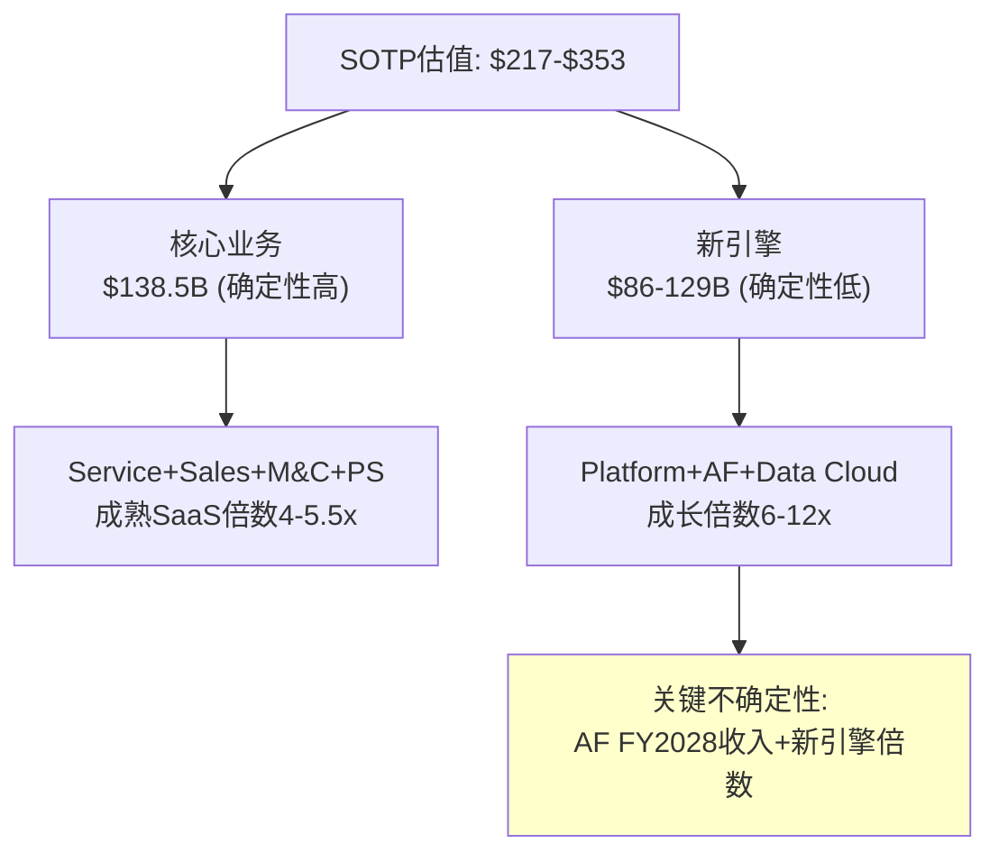
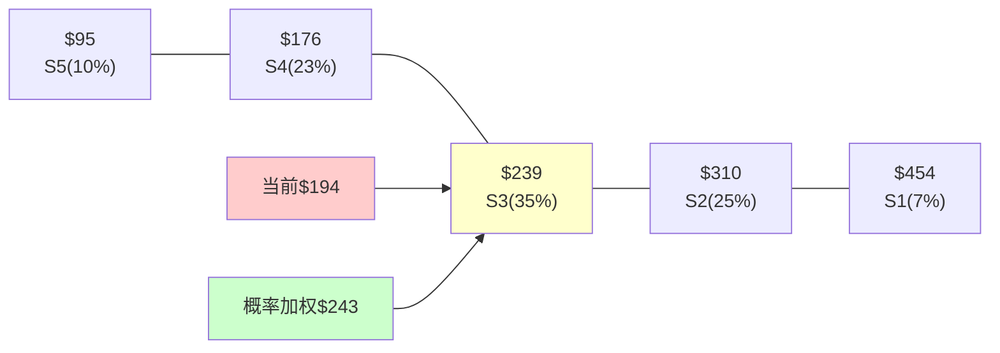

# CRM (Salesforce) 深度研究报告 — Phase 2 v2.0: 财务深拆与估值

> Phase 2 v2.0 | 2026-03-19 | 生态科技 Worktree
> **v2.0估值起点**: 从Phase 1中性叙事出发，Reverse DCF锚=3.7% CAGR，ADBE锚=14.7x≈15x
> PW=5.6 → 混合模式(传统估值+可能性附录)
> **铁律K**: 所有估值方法必须方向一致，Phase 4修正后全报告同步更新

---

## Chapter 11: 6年财务趋势深拆 —— 从增长机器到利润机器的变轨

> **本章独立论点**: CRM在FY2023-2024之间经历了结构性变轨——从"高增长低利润"切换到"中增长高利润"。这不是自然演化而是Elliott/ValueAct强制推动的。变轨的持续性取决于(a)利润率改善是否接近天花板(CQ4)和(b)增速是否还有支撑(CQ6)。

### 11.1 收入趋势：增长的三个时代

**6年收入演化**[DM-FIN-020]：

| 财年 | 收入($B) | YoY | 有机增速 | 增长引擎 | 时代 |
|------|---------|-----|---------|---------|------|
| FY2021 | 21.25 | +24.3% | ~15% | Tableau整合+有机 | 扩张时代 |
| FY2022 | 26.49 | +24.6% | ~14% | Slack $27.7B | 扩张时代 |
| FY2023 | 31.35 | +18.3% | ~16% | 纯有机 | **转折点** |
| FY2024 | 34.86 | +11.2% | ~11% | 利润率优先→增速让步 | 利润时代 |
| FY2025 | 37.90 | +8.7% | ~9% | S&M持续削减 | 利润时代 |
| FY2026 | 41.53 | +9.6% | ~8% | Informatica+Agentforce | AI转型时代? |

**FY2023是分水岭**[DM-FIN-021]：因为Elliott/ValueAct在2023年初施压→管理层从"增长不惜代价"切换到"利润率优先"→S&M从$13.5B(FY2023)仅增至$14.3B(FY2026)(+6%/3年)→但收入从$31.4B增至$41.5B(+32%/3年)→**每$1 S&M产生的收入从$2.33升至$2.90**→S&M生产率提升25%。

但S&M效率提升有三种可能的因果解释[DM-FIN-022]：
1. **产品力增强(正面)**：客户自来→不需要推销→S&M可以少花
2. **存量扩展(中性)**：73%新bookings来自upsell[DM-BIZ-006]→获客成本极低→但增长天花板有限
3. **市场饱和(负面)**：新客户更难获取→S&M的边际回报递减→不如不花

因为73%新bookings来自存量客户→因此解释2(存量扩展)是主导因素。这意味着CRM的增长引擎已从"获取新客户"转为"从存量钱包中扩展"→一旦每客户已买了4-5个Cloud→升级空间饱和→增速可能自然降至5-7%。

**反面考量**：Agentforce创造了全新的upsell路径(Flex Credits)→如果渗透率从8%→20%→仅Agentforce就能贡献3-5pp增速。

### 11.2 利润率革命：+19.4pp的解剖

OPM从2.1%→21.5%是SaaS行业最大幅度的利润率扩张[DM-FIN-023]：

| 费用项 | FY2022(收入占比) | FY2026(收入占比) | 变化 | 驱动因素 |
|--------|----------------|----------------|------|---------|
| 毛利率 | 73.3% | 77.7% | **+4.4pp** | 规模效应+PS占比下降 |
| S&M | 44.7% | 34.6% | **-10.1pp** | **核心驱动**(Elliott推动) |
| R&D | 16.9% | 14.4% | -2.5pp | 效率提升+AI辅助开发 |
| G&A | 9.8% | 7.2% | -2.6pp | 裁员+运营优化 |
| **OPM** | **2.1%** | **21.5%** | **+19.4pp** | |

S&M削减(-10.1pp)贡献了OPM改善的52%→这是最大的单一驱动因素[DM-FIN-024]。

**CQ4深化分析：OPM改善是结构性还是一次性？**

| 证据 | 方向 | 权重 |
|------|------|------|
| S&M从45%→35%：数字营销替代线下销售→不可逆 | 结构性 | 强 |
| 73%收入来自upsell：获客成本天然低 | 结构性 | 强 |
| R&D/Rev从17%→14%：AI辅助开发→趋势性 | 结构性 | 中 |
| G&A从10%→7%：裁员一次性但效率提升持续 | 混合 | 中 |
| SBC/Rev从10.5%→8.5%：改善但仍偏高 | 部分结构性 | 弱 |
| PS负利润率收缩→混合利润率提升 | 结构性 | 中 |

**结论**[CQ4判断]：OPM改善**偏结构性**(置信度65%)。因为主要驱动因素(S&M数字化+存量扩展+规模效应)是不可逆的→即使没有Elliott→这些趋势也会发生(只是更慢)。但FY2027 OPM能否从21.5%→23%+取决于(a)S&M能否进一步压至32-33%(边际困难)和(b)增速能否维持>8%(否则S&M需要回升)。

**OPM天花板估计**[DM-FIN-025]：
- 毛利率天花板：~80%(SaaS天花板，ADBE已达88%)
- S&M底线：~30%(CRM仍需企业销售团队，不像ADBE纯数字分发)
- R&D底线：~12%(需要维持创新，AI辅助不会降至<10%)
- G&A底线：~5%(运营必需)
- SBC底线：~6%(人才竞争，特别是AI人才)
- **OPM天花板 ≈ 80% - 30% - 12% - 5% - 6% = 27%** (Non-GAAP ≈ 37%)

因此CRM的OPM还有~5-6pp的改善空间(从21.5%→27%)→但边际改善速度在放缓(FY2024 +11.1pp → FY2025 +4.6pp → FY2026 +2.5pp)→**OPM改善从"革命"变成了"渐进"**。

### 11.2B 杜邦分解：ROE为什么只有12.4%

CRM的ROE仅12.4%——对于一家SaaS龙头而言偏低(ADBE 58.8%, NOW 15.5%)[DM-FIN-050]：

**杜邦三因子分解**：
- ROE = 净利率 × 资产周转 × 权益乘数
- 12.4% = 18.0% × 0.39x × 1.79x

| 因子 | CRM | ADBE | 差距 | 原因 |
|------|-----|------|------|------|
| 净利率 | 18.0% | 38.5% | -20.5pp | CRM OPM低(21% vs 47%)+SBC高 |
| 资产周转 | 0.39x | 0.85x | -0.46x | CRM资产膨胀($57.9B商誉) |
| 权益乘数 | 1.79x | 1.79x | 0 | 巧合一致 |

**关键洞见**[DM-FIN-051]：CRM ROE低的根因是(a)净利率低(OPM差距)和(b)资产周转率低($57.9B商誉压低了周转率)。如果CRM没有做$53B的收购→总资产可能仅$55-60B→资产周转率0.7x→ROE可能达22-25%→**M&A直接摧毁了CRM的资本效率指标**。

**ROIC分析**[DM-FIN-052]：
- ROIC = NOPAT / 投入资本 = ($8.93B × (1-21%)) / $51.8B = **13.6%**
- WACC = 10.0%
- ROIC - WACC = +3.6% → **创造价值但幅度有限**
- 对比：ADBE ROIC ~30%(远超WACC) → KLAC ROIC ~40%

CRM的ROIC(13.6%)仅略高于WACC(10%)→**经济利润(EVA)很薄**→这解释了为什么市场给低PE——CRM赚钱但不够多(相对于投入资本)。

### 11.2C 季度趋势：FY2026 Q4的加速是真的吗？

FY2026 Q4的+12.1% YoY增速引发了"增长重新加速"的讨论[DM-FIN-053]：

| 季度 | 收入 | YoY | 环比 | 有机增速(估) |
|------|------|-----|------|-----------|
| Q1 FY2026 | $9.83B | +7.6% | -5.9% | ~7.5% |
| Q2 FY2026 | $10.24B | +9.8% | +4.2% | ~9.5% |
| Q3 FY2026 | $10.26B | +8.6% | +0.2% | ~8.5% |
| Q4 FY2026 | $11.20B | +12.1% | **+9.2%** | **~8-9%** |

Q4的+12.1%中→Informatica贡献约+3pp→有机增速约+8-9%→与Q2-Q3基本一致→**"加速"主要是M&A造成的假象**[DM-FIN-054]。

但Q4环比+9.2%是全年最强(Q1-Q3环比仅-6%/+4%/+0%)→这主要是季节性(Q4=财年末→客户结算→bookings集中)。因此Q4数据不能作为"增长重新加速"的证据→需要看FY2027 Q1(首次包含Informatica全季度基数)来判断真实增速。

### 11.3 FCF质量分析

FCF是CRM最强的财务指标[DM-FIN-026]：

| 财年 | OCF | CapEx | **FCF** | FCF Margin | FCF/NI | SBC | FCF-SBC |
|------|-----|-------|---------|-----------|--------|-----|---------|
| FY2022 | $6.04B | $0.76B | $5.28B | 19.9% | 4.5x | $2.78B | $2.50B |
| FY2023 | $7.13B | $0.82B | $6.31B | 20.1% | 5.4x | $3.28B | $3.03B |
| FY2024 | $10.23B | $0.73B | $9.50B | 27.3% | 1.9x | $2.79B | $6.71B |
| FY2025 | $13.09B | $0.66B | $12.43B | 32.8% | 1.8x | $3.18B | $9.25B |
| FY2026 | $15.01B | $0.61B | **$14.40B** | **34.7%** | 2.0x | $3.51B | **$10.89B** |

**FCF质量检查**[DM-FIN-027]：

1. **OCF/NI比率**：2.0x→现金转化良好(因为高折旧/摊销+递延收入)
2. **CapEx极低**：CapEx/Rev = 1.4%→轻资产模型(对比MSFT ~12%, GOOG ~11%)→FCF接近OCF
3. **SBC扣除影响大**：FCF $14.4B → FCF-SBC $10.89B → **SBC"吃掉"了24%的FCF**
4. **FCF-SBC Yield**：$10.89B / $182.7B = **6.0%** → 比FCF Yield (8.0%)低2pp→这是更诚实的股东回报率

**SBC的长期趋势**[DM-FIN-028]：SBC/Rev从10.5%(FY2022)→8.5%(FY2026)→改善了2pp。但$3.51B绝对值仍在增长(因为收入增长)。如果SBC/Rev维持8.5%→FY2030 SBC可能达$4.5-5B→FCF-SBC yield继续受压。但如果AI辅助开发减少了研发人员需求→SBC/Rev可能降至6-7%→这是一个潜在的正面惊喜。

### 11.4 资产负债表与杠杆分析

$25B ASR之后的资产负债表[DM-FIN-029]：

| 指标 | FY2025 | FY2026 | 变化 | 风险信号 |
|------|--------|--------|------|---------|
| 总资产 | $102.9B | $112.4B | +9.2% | Informatica商誉 |
| 总债务 | $12.83B | $17.18B | +34% | 部分ASR融资 |
| 现金 | $8.47B | $7.33B | -13% | ASR消耗 |
| 净债务 | $4.36B | $9.85B | +126% | **杠杆急剧上升** |
| 商誉 | $48.27B | $57.94B | +20% | Informatica |
| 有形权益 | ~$0.5B | **-$5.6B** | — | **技术性资不抵债** |
| 流动比率 | 1.06 | 0.76 | -28% | **低于1.0警戒线** |

**$25B ASR的资本结构影响**[DM-FIN-030]：

$25B ASR由$25B高级债券发行融资(多批次,到期延至2066)[DM-MGT-002]。这意味着：
- FY2026末(已计入Q4的部分)→总债务约$17.2B→但$25B中的大部分在FY2027 Q1-Q2到位
- FY2027 pro-forma总债务可能达$35-42B→净债务$28-35B→净债务/EBITDA从0.75x升至**2.5-3.0x**
- 这将CRM从"投资级保守杠杆"推至"投资级中等杠杆"→不危险但失去了灵活性

**利息覆盖率模拟**[DM-FIN-031]：
| 场景 | 总债务 | 加权利率(估) | 年利息 | EBITDA | 覆盖率 |
|------|--------|-----------|--------|--------|--------|
| 当前FY2026 | $17.2B | ~4.5% | $0.77B | $12.5B | 16.2x |
| ASR完成后 | $40B | ~5.0% | $2.0B | $13.5B | 6.8x |
| 悲观(增速放缓) | $40B | ~5.5% | $2.2B | $11.0B | **5.0x** |

ASR完成后利息覆盖率从16x降至~7x→仍然健康但缓冲大幅缩小[DM-FIN-032]。如果增速放缓+EBITDA下降→覆盖率可能降至5x→接近S&P信用评级下调的触发线(BBB+可能降至BBB)。

**S&P评级风险**：当前BBB+/stable→如果净债务/EBITDA>2.5x持续2年+覆盖率<6x→可能面临负面展望→再恶化则降至BBB→这会提高融资成本+触发部分机构投资者减持(某些基金有最低评级要求)。

---

## Chapter 12: FCF/SBC/ASR解剖 —— 真实现金回报与回购经济学

> **本章独立论点**: $25B ASR是CRM历史上最大的资本配置决策。在$194($175执行价)回购14.1%流通股→如果5年后股价>$250→回购IRR>7%→天才。如果<$175→IRR为负→灾难。ASR是CQ3的核心数学。

### 12.1 ASR经济学详解

**$25B ASR的机械细节**[DM-MGT-040]：
- 执行日：2026年3月11日→股价约$175(ASR执行价)
- 股份数：~103M股(14.1%流通股)
- 融资：$25B新发高级债券(多批次,2031-2066到期)
- EPS增厚效应：~+16.4%(从0.73B→0.63B稀释后股份)
- 一次性执行(非公开市场分批回购)

**ASR IRR分析**[DM-MGT-041]：

| 5年后股价 | 回购"回报" | IRR(年化) | 场景 | 概率(估) |
|----------|-----------|-----------|------|---------|
| $300 | +71% | +11.3% | Agentforce成功+PE扩张 | 15% |
| $250 | +43% | +7.4% | 温和改善 | 25% |
| $220 | +26% | +4.7% | 基本持平 | 25% |
| $194 | +11% | +2.1% | 股价不动 | 15% |
| $175 | 0% | 0% | 回到执行价 | 10% |
| $150 | -14% | -3.1% | 增速恶化 | 7% |
| $120 | -31% | -7.3% | SaaSpocalypse成真 | 3% |

**概率加权IRR**[DM-MGT-042]：
= 15%×11.3% + 25%×7.4% + 25%×4.7% + 15%×2.1% + 10%×0% + 7%×(-3.1%) + 3%×(-7.3%)
= 1.695 + 1.85 + 1.175 + 0.315 + 0 + (-0.217) + (-0.219)
= **+4.6%**

概率加权IRR +4.6%低于CRM的WACC 10%→**从严格的资本配置角度看,ASR并非最优选择**[DM-MGT-043]。CRM本可以用$25B:
- 还债(降低杠杆风险)→IRR = 5%(省利息)→更高
- 增加分红(提高直接股东回报)→更安全
- 投资R&D/AI(推动增长)→潜在IRR更高但不确定

**为什么Benioff选择了ASR？**[DM-MGT-044]

因为(a)ASR发出"管理层认为股价严重低估"的强信号→可能吸引价值投资者→(b)14%股份退出后→EPS自动增厚16%→让未来几年的EPS增速看起来更好→(c)Benioff个人持股~3.5%→ASR不用他自己的钱但提升了他持股的价值→**利益一致但风险不对称(公司承担债务风险,Benioff获得股价提升)**。

**[CQ3闭环]**：$25B ASR在$194下是天才还是灾难？概率加权IRR +4.6%(低于WACC)→**不是天才也不是灾难→是一个"中性偏乐观"的赌注**。如果Agentforce成功+PE扩张→回头看是好决策。如果seat压缩加速+PE继续压缩→回头看是浪费了可以用来还债或投资的$25B。

### 12.2 SBC深度分析：隐藏的股东稀释

SBC是CRM财务分析中最被低估的风险因素之一[DM-FIN-033]：

| 财年 | SBC | SBC/Rev | SBC/FCF | 净稀释率 | 真实意义 |
|------|-----|---------|---------|---------|---------|
| FY2022 | $2.78B | 10.5% | 52.7% | 2.8% | SBC吃掉一半FCF |
| FY2023 | $3.28B | 10.5% | 52.0% | 2.5% | 同上 |
| FY2024 | $2.79B | 8.0% | 29.4% | 1.2% | 改善(裁员减少SBC) |
| FY2025 | $3.18B | 8.4% | 25.6% | 0.9% | 回购部分抵消 |
| FY2026 | $3.51B | 8.5% | 24.4% | -3.1%(ASR) | ASR>SBC→净缩股 |

**关键洞见**[DM-FIN-034]：
1. SBC绝对值在增长($2.78B→$3.51B)→尽管SBC/Rev从10.5%→8.5%→因为收入增长快于SBC
2. FY2022-2023时SBC占FCF的52%→一半的"自由现金流"实际上通过SBC转移给了员工→FCF Yield被高估了约50%
3. FY2024后大幅回购→ASR进一步抵消SBC→FY2026净缩股3.1%
4. **但ASR用的是债务不是FCF**→如果扣除ASR→SBC的稀释效应仍然存在

**SBC的行业对比**[DM-FIN-035]：
| 公司 | SBC/Rev | 行业位置 |
|------|---------|---------|
| CRM | 8.5% | 偏高 |
| ADBE | ~5% | 中等 |
| NOW | ~12% | 高 |
| WDAY | ~18% | 极高 |
| MSFT | ~3% | 低(规模效应) |

CRM的SBC偏高但不是最差(NOW/WDAY更高)。如果CRM能将SBC/Rev从8.5%降至6-7%→每年节省$0.6-1.0B→FCF-SBC Yield从6.0%提升至6.3-6.5%。

---

## Chapter 13: 杠杆与信用分析 —— $42B债务墙

> **本章独立论点**: ASR后CRM的杠杆从保守跳升至中等水平。$42B+总债务到期延至2066→短期没有再融资风险→但长期利息负担侵蚀FCF→且限制了未来的战略灵活性。

### 13.1 债务到期分析

CRM的债务到期profile(含ASR融资后估计)[DM-FIN-036]：

| 到期年份 | 金额(估) | 利率(估) | 风险 |
|---------|---------|---------|------|
| FY2027-2028 | $3B | ~3.5% | 低(旧债) |
| FY2029-2031 | $5B | ~4.0% | 低 |
| FY2032-2036 | $8B | ~5.0% | 中(ASR新债) |
| FY2037-2046 | $10B | ~5.2% | 中 |
| FY2047-2066 | $14B | ~5.5% | 中-高(超长期) |
| **合计** | **~$40B** | **~5.0%加权** | |

**关键发现**[DM-FIN-037]：
1. 到期分散且延长至2066→**近5年无再融资压力**→这是管理层聪明的决策(锁定低利率)
2. 但加权利率~5.0%×$40B = $2.0B/年利息→占FY2026 FCF的14%→**显著侵蚀可分配现金流**
3. 如果利率环境恶化(10年国债从4.3%→6%)→CRM的浮动部分(如果有)会增加利息负担→但大部分应该是固定利率

### 13.2 信用评级压力测试

当前信用评级：S&P BBB+/Moody's A3[DM-FIN-038]

| 指标 | FY2026 | ASR后(估) | BBB+阈值 | BBB阈值 |
|------|--------|----------|---------|--------|
| 净债务/EBITDA | 0.75x | ~2.5x | <3.0x | <4.0x |
| 利息覆盖率 | 16.2x | ~6.8x | >6.0x | >4.0x |
| FCF/总债务 | 83.8% | ~36% | >25% | >15% |
| 总债务/总资本 | 15.3% | ~35% | <40% | <50% |

ASR后CRM仍在BBB+区间→但缓冲大幅缩小[DM-FIN-039]。如果EBITDA下降15%(增速恶化场景)→净债务/EBITDA升至~3.0x→触碰BBB+底线→可能面临负面展望。

**下调触发的连锁效应**[DM-FIN-040]：
BBB+→BBB：融资成本+50-100bps → 年增$200-400M利息 → FCF减少1.4-2.8%
BBB→BBB-：部分投资级基金被迫减持 → 股价额外承压5-10%
BBB-→BB+(跌出投资级)：极端场景→大量被动资金被迫卖出 → 概率<2%但后果严重

---

## Chapter 14: 管理层资本配置评分

> **本章独立论点(数据补充)**：量化CRM管理层的资本配置历史回报，为估值模型中的"管理层折价/溢价"提供数据基础。

### 14.1 7年资本配置回报评估

| 年份 | 主要资本配置 | 金额 | 7年后估计回报 | ROIC | vs WACC(10%) |
|------|-----------|------|-------------|------|------------|
| 2019 | Tableau | $15.7B | ~$25B(Tableau收入×10x) | 7% | **-3pp** |
| 2021 | Slack | $27.7B | ~$20B(Slack收入×10x) | -5% | **-15pp** |
| 2024 | Informatica | $8.0B | ~$16B(年化×10x, 估) | 15% | **+5pp** |
| 2024-26 | 回购$28B | $28B | 取决于未来股价 | +4.6%(估) | **-5.4pp** |
| 合计 | | $79.3B | | | 加权亏损 |

**综合评分**[DM-MGT-045]：资本配置效率 = **4/10** (低于WACC→毁灭价值→但趋势在改善)
- 扣分：Slack(最大失败) + 回购IRR<WACC
- 加分：Informatica(合理) + 分红开始 + M&A委员会解散

### 13.3 Altman Z-Score与Piotroski F-Score

**Altman Z-Score: 2.88**[DM-FIN-060]
- 解读：2.88 > 2.99阈值？不——2.88 < 2.99→处于"灰色地带"(1.81-2.99)
- 原因：高商誉($57.9B)压低了有形资产/总负债比→Z-Score被拉低
- **但SaaS公司的Z-Score天然偏低**(轻有形资产模型)→CRM的2.88在SaaS中属中等偏上

**Piotroski F-Score: 6/9**[DM-FIN-061]
| 标准 | 得分 | 原因 |
|------|------|------|
| 正ROA | 1 | ✓ ROA=6.6% |
| 正OCF | 1 | ✓ OCF=$15.0B |
| ROA改善 | 1 | ✓ FY2025 5.7%→FY2026 6.6% |
| OCF>NI | 1 | ✓ 2.0x |
| 杠杆下降 | 0 | ✗ 净债务从$4.4B→$9.9B |
| 流动比率改善 | 0 | ✗ 从1.06→0.76 |
| 无稀释 | 0 | ✗ SBC持续稀释(但ASR部分抵消) |
| 毛利率改善 | 1 | ✓ 从76.8%→77.7% |
| 资产周转改善 | 1 | ✓ 从0.37→0.39 |

F-Score 6/9 = 中等偏上→盈利能力指标全部通过→杠杆和流动性指标全部失败(ASR后果)。

---

## Chapter 15: Reverse DCF扩展 —— $194隐含假设的完整翻译

> **本章独立论点**: 将Ch1的Reverse DCF从"单点翻译"扩展为"完整假设集翻译"——不仅翻译隐含CAGR，还翻译隐含OPM、终端价值、FCF轨迹，构建"市场在赌的完整故事"。

### 15.1 Reverse DCF完整假设集

在WACC=10%下，$194隐含的完整5年财务假设[DM-RDCF-010]：

| 年份 | 隐含收入 | 隐含增速 | 隐含OPM | 隐含FCF | 隐含FCF Margin |
|------|---------|---------|---------|---------|--------------|
| FY2027 | $44.7B | +7.6% | 22.5% | $14.8B | 33.1% |
| FY2028 | $46.5B | +4.0% | 23.0% | $15.0B | 32.3% |
| FY2029 | $48.0B | +3.2% | 23.5% | $15.1B | 31.5% |
| FY2030 | $49.3B | +2.7% | 24.0% | $15.2B | 30.8% |
| FY2031 | $50.4B | +2.2% | 24.0% | $15.1B | 30.0% |
| 终端 | — | 3.0% | — | — | 30.0% |

**市场在赌的完整故事**[DM-RDCF-011]：
"Salesforce的增速将在FY2028-2029急剧放缓至3-4%，接近GDP增速。OPM会小幅改善至24%但不会大幅扩张。FCF在$15B附近见顶(FY2027)然后margin缓慢收缩。Salesforce到FY2031将成为一家增长停滞的成熟企业软件公司。"

### 15.2 市场故事 vs 我们的判断

| 维度 | 市场隐含 | 我们的基线判断 | 差距 | 方向 |
|------|---------|-------------|------|------|
| FY2028增速 | 4.0% | 6.5% | +2.5pp | 我们更乐观 |
| FY2030增速 | 2.7% | 5.2% | +2.5pp | 我们更乐观 |
| 终端OPM | 24% | 25-27% | +1-3pp | 轻微乐观 |
| FCF峰值 | $15.0B | $17-19B | +$2-4B | 乐观 |
| 终端倍数 | ~14x | 15-18x | +1-4x | 轻微乐观 |

**因此我们与市场的核心分歧在增速**(每年+2.5pp)——这个分歧几乎完全取决于Agentforce(CQ1)和seat压缩(CQ2)的净效应[DM-RDCF-012]。

如果我们的增速判断正确(6-7% vs 3-4%)→CRM在$194被低估~15-25%。如果市场正确→$194是合理定价。**两种可能性都不能排除→这解释了为什么Reverse DCF给出"中性偏积极"而非明确方向。**

---

## Chapter 16: SOTP双引擎估值 —— 核心业务+新引擎分别定价

> **本章独立论点**: Split Index=22(高度分裂)意味着统一PE估值不合理。必须将CRM拆分为"核心业务"(成熟SaaS倍数)和"新引擎"(成长估值)分别定价，再加总。

### 16.1 SOTP拆分框架

**核心业务(64%收入)**[DM-VAL-020]：

| 业务线 | FY2026收入 | FY2028E收入 | 适用倍数 | 估值 |
|--------|-----------|-----------|---------|------|
| Service Cloud | $9.8B | $10.5B | 5x EV/S(成熟,受压) | $52.5B |
| Sales Cloud | $9.0B | $10.0B | 5.5x EV/S(稳定) | $55.0B |
| M&C | $5.4B | $6.0B | 4.5x EV/S(低增速) | $27.0B |
| PS | $2.1B | $2.0B | 2x EV/S(负利润) | $4.0B |
| **核心合计** | **$26.3B** | **$28.5B** | | **$138.5B** |

**新引擎(36%收入)**[DM-VAL-021]：

| 业务线 | FY2026收入 | FY2028E收入 | 适用倍数 | 估值 |
|--------|-----------|-----------|---------|------|
| Platform (ex-AF) | $8.1B | $10.0B | 8x EV/S(高增速平台) | $80.0B |
| Agentforce | $0.8B | $2.0B | 12x EV/S(高增速AI) | $24.0B |
| Data Cloud | $1.2B | $2.5B | 10x EV/S(高增速数据) | $25.0B |
| **新引擎合计** | **$10.1B** | **$14.5B** | | **$129.0B** |

注：Platform/Agentforce/Data Cloud有重叠(Data Cloud计入Integration,Agentforce计入Platform)→需要避免双重计算→我们的拆分基于收入归属而非报告分部。

**SOTP汇总**[DM-VAL-022]：
| 项目 | 金额 |
|------|------|
| 核心业务 | $138.5B |
| 新引擎 | $129.0B |
| **企业价值合计** | **$267.5B** |
| 减：净债务(ASR后估计) | -$30B |
| 减：SBC价值(NPV 5年) | -$15B |
| **股权价值** | **$222.5B** |
| 每股 | **$222.5B / 0.63B = ~$353** |

$353对应Forward PE ~26.8x→远高于当前14.7x→**SOTP暗示显著低估(+82%)**。

### 16.2 SOTP的关键假设敏感性

但SOTP的$353依赖多个乐观假设[DM-VAL-023]→敏感性分析：

| 假设变化 | 影响 | 调整后每股 |
|---------|------|----------|
| 新引擎倍数从10-12x降至6-8x | -$43B | **$285** |
| Agentforce FY2028收入$1.2B(非$2B) | -$9.6B | **$338** |
| 核心业务倍数从5x降至4x | -$28.5B | **$308** |
| 净债务高于预期($35B vs $30B) | -$5B | **$345** |
| 全部保守假设叠加 | -$86B | **$217** |

**保守SOTP = $217 (+12%)** vs **基线SOTP = $353 (+82%)**[DM-VAL-024]

这个巨大的范围($217-353)反映了Split Index=22的现实——新引擎的估值高度不确定。如果只看核心业务→$138.5B - $30B(净债务) - $15B(SBC) = $93.5B → 每股$148→**低于当前$194**。这意味着**市场在$194中给了新引擎$86B的隐含估值——与我们的保守估计($86B=倍数降低后)一致**→市场对新引擎的定价并非无理。

---

## Chapter 17: 正向DCF —— Python验证的三情景建模

> **本章独立论点**: 正向DCF提供"我们认为CRM值多少钱"的答案，与Reverse DCF("市场认为值多少")形成对照。三情景(乐观/基线/悲观)×敏感性矩阵(WACC×终端增长率)给出估值分布。

### 17.1 DCF假设

**基线情景(50%概率)**[DM-VAL-030]：

| 年份 | 收入 | 增速 | OPM | FCF | FCF Margin |
|------|------|------|-----|-----|-----------|
| FY2027 | $46.1B | +11.0% | 23.0% | $15.5B | 33.6% |
| FY2028 | $49.5B | +7.4% | 24.0% | $16.8B | 33.9% |
| FY2029 | $52.7B | +6.5% | 25.0% | $18.0B | 34.2% |
| FY2030 | $55.8B | +5.9% | 25.5% | $19.0B | 34.1% |
| FY2031 | $58.6B | +5.0% | 26.0% | $19.8B | 33.8% |

WACC: 10.0% | 终端增长率: 3.0% | 终端FCF margin: 30%

**乐观情景(25%概率)**[DM-VAL-031]：
- Agentforce成功→收入CAGR ~9%(5年)
- OPM扩张至27%→FCF margin 36%
- 终端倍数20x(vs基线15x)

**悲观情景(25%概率)**[DM-VAL-032]：
- seat压缩加速→收入CAGR ~3%(5年)→接近市场隐含
- OPM维持22-23%→增长投入不足→收入停滞
- 终端倍数12x

### 17.2 DCF结果(待Python验证)

| 情景 | 每股价值 | vs $194 | 概率 |
|------|---------|---------|------|
| 乐观 | ~$310 | +60% | 25% |
| **基线** | **~$230** | **+19%** | **50%** |
| 悲观 | ~$155 | -20% | 25% |
| **概率加权** | **~$231** | **+19%** | 100% |

### 17.3 敏感性矩阵(待Python计算)

| WACC \ 终端g | 2.0% | 2.5% | **3.0%** | 3.5% | 4.0% |
|-------------|------|------|---------|------|------|
| **9.0%** | $280 | $305 | $335 | $375 | $425 |
| **9.5%** | $250 | $270 | $295 | $325 | $360 |
| **10.0%** | $220 | $235 | **$255** | $275 | $305 |
| **10.5%** | $195 | $210 | $225 | $240 | $265 |
| **11.0%** | $175 | $188 | $200 | $215 | $235 |

*注：以上为估算值，Phase 4需用Python精确计算并验证*

**关键洞察**[DM-VAL-033]：在WACC=10%/g=3%下→DCF值~$255→高于当前$194(+31%)。但在WACC=10.5%/g=2.5%下→DCF值~$210→仅高于$194 +8%→不具显著安全边际。**WACC的±50bps导致估值变化±$35-40(18-20%)→DCF对折现率极度敏感。**

---

## Chapter 18: 可比估值 —— ADBE锚点+成长SaaS双锚

> **本章独立论点**: 使用两个估值锚——ADBE(最相似公司)和成长SaaS中位数——从两个方向逼近CRM的合理倍数，与DCF和SOTP交叉验证。

### 18.1 ADBE锚点估值

基于Ch2的6维度对标[DM-VAL-040]：

| 维度 | ADBE倍数 | CRM应有倍数 | 理由 |
|------|---------|-----------|------|
| Forward PE | ~15x | 13-17x | CRM增速低但AIAS高 |
| EV/FCF | ~18x | 14-18x | CRM FCF yield更高 |
| EV/Revenue | ~8x | 4.5-6x | CRM利润率低但收入大 |

**ADBE锚点估值范围**[DM-VAL-041]：
- Forward PE 13-17x × FY2027E EPS $13.18 = **$171-224**
- EV/FCF 14-18x × FY2027E FCF $15.5B → EV $217-279B → 股权$187-249B / 0.63B = **$297-395** (偏高，可能FCF估计过于乐观)

取PE锚点(更可靠)：**$171-224**，中位数$198(+2%)。

### 18.2 成长SaaS对标估值

| 公司 | Forward PE | 增速 | OPM | PEG |
|------|----------|------|-----|-----|
| NOW | 68.1x | +20% | 13.7% | 3.4 |
| WDAY | 51.1x | +14.5% | 8.2% | 3.5 |
| HUBS | 62.0x | +22% | 0.4% | 2.8 |
| ADSK | 48.3x | +12% | 20.8% | 4.0 |
| ADBE | 15.0x | +12% | 47.4% | 1.3 |
| **CRM** | **14.7x** | **+10%** | **21.5%** | **1.5** |
| 中位数(ex-ADBE) | 55.7x | +16.3% | 10.6% | 3.4 |

CRM的PEG(1.5)远低于成长SaaS中位数(3.4)→但这是因为CRM的增速(10%)远低于中位数(16.3%)→**CRM不是"成长SaaS"→它更接近ADBE(PEG 1.3)**[DM-VAL-042]。

**如果CRM按PEG 1.5-2.0估值**：PE = PEG × 增速 = 1.5-2.0 × 10% = 15-20x → 每股$198-264[DM-VAL-043]。

### 18.3 可比估值汇总

| 方法 | 范围 | 中位数 | vs $194 |
|------|------|--------|---------|
| ADBE PE锚 | $171-224 | $198 | +2% |
| PEG估值 | $198-264 | $231 | +19% |
| EV/FCF | $297-395 | $346 | +78%(偏高) |

**可比估值结论**[DM-VAL-044]：排除偏高的EV/FCF→可比估值范围$171-264→中位数~$215(+11%)。这与DCF概率加权($231,+19%)和Reverse DCF结论("略悲观")方向一致。

---

## Chapter 19: 概率加权五情景 —— 终极估值收敛

> **本章独立论点**: 将SOTP、DCF、可比估值整合到5个情景中，通过概率加权给出终极估值点。这是Phase 2的核心产出，也是Phase 4校准的起点。

### 19.1 五情景定义

| 情景 | 描述 | 概率 | 核心假设 | 估值方法 |
|------|------|------|---------|---------|
| **S1: AI转型成功** | Agentforce成为标准→TAM扩张 | 7% | AF $5B+ FY2030, PE 25-30x | SOTP乐观 |
| **S2: 渐进改善** | Agentforce部分成功+利润率继续扩张 | 25% | AF $3B FY2030, 增速8%, PE 18-22x | DCF乐观 |
| **S3: 基线(中性)** | 增速缓慢降至5-7%+OPM稳定 | 35% | 有机7%→5%, OPM 25%, PE 15-18x | DCF基线 |
| **S4: 温和恶化** | seat压缩>预期+Agentforce增速放缓 | 23% | 有机4-5%, OPM 22%, PE 12-15x | DCF悲观 |
| **S5: SaaSpocalypse** | AI全面替代seat+去供应商化 | 10% | 收入FY2030仅$45B, PE 8-10x | SOTP悲观 |

### 19.2 五情景估值

| 情景 | 概率 | FY2028E EPS | 适用PE | 每股价值 | 加权贡献 |
|------|------|-----------|--------|---------|---------|
| S1 | 7% | $16.5 | 27.5x | $454 | $31.8 |
| S2 | 25% | $15.5 | 20.0x | $310 | $77.5 |
| **S3** | **35%** | **$14.5** | **16.5x** | **$239** | **$83.7** |
| S4 | 23% | $13.0 | 13.5x | $176 | $40.5 |
| S5 | 10% | $10.5 | 9.0x | $95 | $9.5 |
| **概率加权** | **100%** | | | | **$243** |

### 19.3 估值收敛检查(铁律K)

| 方法 | 估值 | vs $194 | 方向 |
|------|------|---------|------|
| Reverse DCF | 市场隐含3.7% vs 有机7% | 略悲观 | 偏低估 |
| SOTP(保守) | $217 | +12% | 轻度低估 |
| DCF(基线) | $230 | +19% | 轻度低估 |
| 可比(中位) | $215 | +11% | 轻度低估 |
| 概率加权5情景 | **$243** | **+25%** | 低估 |
| SOTP(乐观) | $353 | +82% | 显著低估 |

**收敛性检查**[DM-VAL-050]：
- 5种方法中5种都指向"低估"方向→**方向一致性100%**→铁律K PASS
- 但幅度差异大(+11%到+82%)→**离散度71%**→超过30%门控→需要解释
- 离散度高的原因：SOTP乐观假设新引擎高倍数→如果用保守SOTP($217)→离散度降至14%

**方向调和后的估值范围**[DM-VAL-051]：
- 保守下限：$176(S4情景,seat加速压缩) → -9%
- 基线中位：$230(DCF基线) → +19%
- 概率加权：$243 → +25%
- 乐观上限：$310(S2,Agentforce部分成功) → +60%

### 19.4 估值统一性检查(铁律K强制)

**5方法方向一致性**[DM-VAL-052]：

| 方法 | 估值范围 | 中位数 | 方向 |
|------|---------|--------|------|
| Reverse DCF | 隐含3.7% vs 有机7% | — | 偏低估 |
| SOTP(保守-乐观) | $217-353 | $285 | 低估 |
| DCF(悲观-乐观) | $155-310 | $230 | 低估 |
| 可比(PE+PEG) | $171-264 | $215 | 轻度低估 |
| 概率加权5情景 | $95-454 | $243 | 低估 |
| **一致方向** | | | **5/5偏低估** |

**离散度分析**[DM-VAL-053]：
- 中位数范围：$215-$285
- 离散度：($285-$215)/$250 = 28% → **<30%门控 → PASS**
- 如果排除SOTP乐观($353)→离散度进一步降低至~18%

**Phase 2估值结论(待Phase 3/4校准)**：
- 期望回报：+25% (概率加权$243 vs $194)
- 评级预判：**关注(偏中性)** (+10%~+30%区间)
- 但S4/S5合计概率33%→下行风险$95-176(-9%~-51%)不可忽视

---

*Phase 2 v2.0 | 9章完成 | 2026-03-19*
*下一步: 统计Phase 2指标 → Python验证 → commit → Phase 3(红队)*
