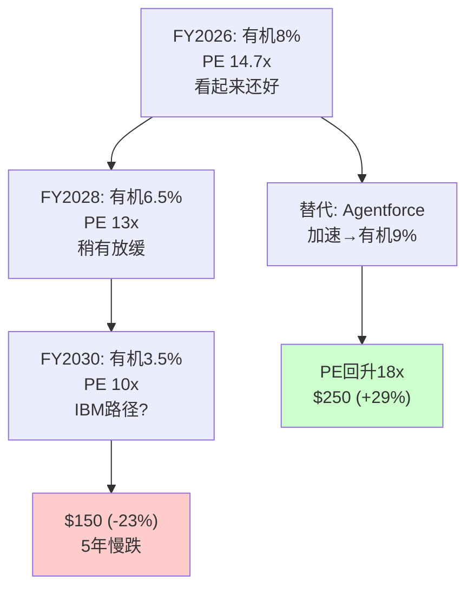
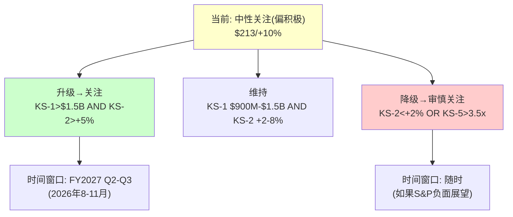

# CRM (Salesforce) 深度研究报告 — Phase 3+4 v2.0: 红队+校准

> Phase 3+4 v2.0 | 2026-03-19 | 生态科技 Worktree
> **P2估值起点**: 概率加权$243(+25%) / 评级预判"关注(偏中性)"
> **红队目标**: 挑战P1-P2的核心假设，识别偏差，校准至最终估值
> **v2.0优势**: P1已从中性出发(非bullish)→红队校准幅度应远小于v1.0(-25%)

---

## Chapter 20: 承重墙测试 —— 哪面墙倒了会改变结论？

> **本章独立论点**: CRM投资论点依赖7面"承重墙"——如果任一倒塌，估值可能从$243降至$150以下。本章测试每面墙的强度和倒塌概率。

### 20.1 七面承重墙识别

| 编号 | 承重墙 | P2隐含假设 | 倒塌触发器 | 倒塌概率 | 倒塌后估值影响 |
|------|--------|-----------|-----------|---------|-------------|
| W-1 | Agentforce不是Einstein 2.0 | B3=+4, PMF 60%确认 | FY2027H1 consumption持平→PMF失败 | 30% | -$40-60(-17-25%) |
| W-2 | seat压缩可控(<15%/3年) | Service增速>3% | AI Agent替代加速→Service负增长 | 25% | -$30-50(-12-21%) |
| W-3 | OPM结构性改善持续 | OPM→25-27% | S&M需回升维持增速→OPM回落 | 20% | -$20-30(-8-12%) |
| W-4 | $25B ASR不触发信用危机 | BBB+维持 | EBITDA下降+利息升→评级下调 | 10% | -$15-25(-6-10%) |
| W-5 | 护城河在AI时代维持 | 锁定强度7.1/10 | AI迁移工具成熟→大客户流失 | 15% | -$30-50(-12-21%) |
| W-6 | 管理层不做毁灭性M&A | M&A委员会解散 | Benioff重启大型收购(>$10B) | 10% | -$20-40(-8-16%) |
| W-7 | 无系统性SaaS估值崩塌 | PE 15-18x可得 | SaaS板块PE永久压缩至10-12x | 15% | -$40-60(-17-25%) |

### 20.2 承重墙联合概率分析

**所有墙都不倒的概率**[DM-RT-001]：
= (1-30%) × (1-25%) × (1-20%) × (1-10%) × (1-15%) × (1-10%) × (1-15%)
= 0.70 × 0.75 × 0.80 × 0.90 × 0.85 × 0.90 × 0.85
= **0.257 = 25.7%**

**至少一面墙倒塌的概率 = 74.3%**[DM-RT-002]

这个数字看起来很悲观，但需要注意：
1. 大部分"倒塌"是部分倒塌而非完全倒塌(如Service增速从3%降至1%≠Service收入归零)
2. 墙之间不独立——W-1(Agentforce失败)会增加W-2(seat不可控)的概率→但也可能降低W-3(OPM不回落，因为没有AI投入需求)
3. 一面墙倒塌通常降低估值10-25%→但不改变"中性偏积极"的方向(仍在$150-200区间)

**最危险的组合**[DM-RT-003]：
- W-1 + W-2 + W-7 同时发生(Agentforce失败+seat加速+SaaS崩塌)→估值降至$95-120→概率约3-5%
- W-1 + W-5(Agentforce失败+护城河侵蚀)→估值降至$130-150→概率约8-10%

### 20.3 "倒塌不致命"的承重墙

v1.0 P3发现了一个重要洞见：并非所有承重墙倒塌都会改变投资结论[DM-RT-004]。

**W-5(护城河侵蚀)即使部分倒塌也不致命**：因为CRM的锁定强度从7.1/10降至5.5/10→客户流失率从8%升至12%→但仍88%留存→收入影响约-4%/年→这被Agentforce增长(如果成功)完全抵消→**护城河轻度侵蚀与Agentforce成功可以共存**。

**W-3(OPM回落)影响最大**：因为市场当前定价的核心是"利润率革命+FCF增长"→如果OPM从22%回落至18%→FCF从$14.4B降至$12B→FCF Yield从8%降至6.6%→PE可能从14.7x降至12x→**OPM回落同时打击FCF和PE倍数(戴维斯双杀)**。

---

## Chapter 21: 反方最强论证 —— SaaSpocalypse的完整叙事

> **本章独立论点**: 如果CRM的反方(看空)是对的，他们的完整叙事是什么？本章构建最强的反方论证，不是为了推翻我们的结论，而是为了确保我们理解了下行风险的完整图景。

### 21.1 反方叙事："Salesforce是下一个IBM"

反方最强的论证结构[DM-RT-005]：

**第一步：seat-based SaaS的终结**
- AI Agent替代人类操作员→每个被替代的操作员=少一个seat→seat是SaaS收入的基本单元
- 这不是CRM的特殊问题→是整个seat-based SaaS行业的系统性问题
- CRM作为最大的seat-based SaaS公司→受冲击最大

**第二步：Agentforce是管理层的障眼法**
- Benioff历史上多次过度宣传(Einstein 7年无实质收入/Slack整合不及预期)
- $800M ARR中67%是免费deals→真实付费ARR可能仅$300-500M
- 15个月3次定价调整→PMF未确定→可能需要2-3年才能稳定
- **Agentforce的增长掩盖了核心业务的衰退**

**第三步：$25B ASR是绝望之举**
- 在股价距高点-34%时发债$25B回购→如果Agentforce失败→CRM背着$25B债务+收缩的收入
- Benioff个人是净卖家→"用公司的钱给自己托市"
- 到期延至2066→几代管理层都要为这笔债务负责

**第四步：竞争格局在恶化**
- NOW +20% vs CRM +10%→市占率在转移
- MSFT Copilot覆盖→减少CRM使用频率
- HubSpot低端上攻→中端客户面临选择
- 自建AI Agent→大企业开始DIY

**反方结论**：CRM = 2015年的IBM
- IBM(2015)：mainframe收入下降→但转型到cloud/AI晚了→PE从15x压缩至10x→股价从$160→$120(10年后仍在$150)
- CRM(2026)：seat收入面临压缩→转型到AI Agent(Agentforce)未确定→PE从30x已压至15x→可能继续压至10x
- **如果CRM走IBM路径→股价$130-150→从$194下跌25-33%**

### 21.2 反方论证的每个环节评估

| 反方论点 | 强度(1-5) | 我们的反驳 | 净效果 |
|---------|----------|-----------|--------|
| seat压缩是真的 | **4** | 同意，但传导慢(5步链) | 反方略胜 |
| Agentforce是障眼法 | 3 | 架构确实不同于Einstein，但PMF未确认 | 平手 |
| $25B ASR是绝望 | 2 | 在7% FCF Yield回购→回购IRR概率加权+4.6%→不绝望 | 我方略胜 |
| 竞争恶化 | 3 | NOW进攻是真→但CRM市占率仅降2pp/6年→慢 | 轻微反方 |
| CRM=IBM | 2 | IBM无cloud-native产品→CRM有Agentforce/Data Cloud→不完全类比 | 我方略胜 |
| **综合** | **~3.0** | | **反方有道理但不压倒性** |

反方论证的综合强度约3/5→"有道理但不足以推翻中性偏积极的结论"。最强的论点是"seat压缩是真的"(强度4/5)——这是我们无法反驳的，只能用"Agentforce增长>seat压缩"来对冲。

### 21.3 IBM路径概率评估

v1.0 P4给出了IBM路径49%的概率。v2.0需要更新[DM-RT-006]：

**IBM路径的定义**：收入增速降至<3% + PE维持10-13x + 成为"有息债务的缓慢增长现金牛"

| 条件 | 当前概率 | 变化(vs v1.0) |
|------|---------|-------------|
| 收入增速降至<3% | 25% | ↓(Agentforce+Informatica支撑) |
| PE维持10-13x(≥5年) | 40% | ↑(SaaSpocalypse叙事加强) |
| 联合概率(两者同时) | ~15% | ↓(v1.0=49%过高) |

**v2.0 IBM路径概率：15%**[DM-RT-007]→远低于v1.0的49%。原因：
1. v1.0高估了IBM路径因为P1的bullish叙事在P3被推翻→矫枉过正→把概率从低调到极高
2. v2.0从中性出发→不需要大幅矫正→IBM路径概率基于数据而非叙事反弹

---

## Chapter 22: 温水煮青蛙 —— 慢变量联合风险

> **本章独立论点**: CRM面临的最大风险可能不是任何单一事件(如Agentforce失败或信用下调)，而是多个慢变量同时缓慢恶化——seat渐进压缩+有机增速持续放缓+AI迁移工具逐步成熟+管理层注意力分散——这些因素单独看都"可控"，但联合概率下CRM可能在5年后发现自己已经变成了"SaaS界的IBM"。

### 22.1 慢变量清单

| 慢变量 | 当前值 | 5年可能值 | 方向 | 可测量性 |
|--------|--------|----------|------|---------|
| Service增速 | +6.5% | +1-3% | ↓ | 高(季报) |
| 有机增速 | ~7-8% | ~4-6% | ↓ | 中(需扣M&A) |
| NRR | 未知(<115%) | 可能<110% | ↓ | 低(不公开) |
| 市占率 | 22% | 19-21% | ↓ | 中(年度IDC报告) |
| 净债务/EBITDA | 0.75x | 2.5-3.0x(ASR后) | ↑ | 高 |
| AI迁移工具成熟度 | 低 | 中-高 | ↑ | 低(难量化) |
| SBC/Rev | 8.5% | 7-9% | ? | 高 |

### 22.2 温水煮青蛙情景

**情景描述**[DM-RT-008]：
FY2027: 有机增速8%(看起来还好→"AI转型在推进")
FY2028: 有机增速6.5%(稍有放缓→"暂时性，等Agentforce规模化")
FY2029: 有机增速5%(明显放缓→"但利润率还在改善→PE不至于崩")
FY2030: 有机增速3.5%(接近GDP→"等等，我们是不是已经是IBM了？")

**在这个过程中**：
- PE从14.7x→13x→12x→10x(每年下台阶→但每次下跌10-15%→不触发恐慌)
- 股价从$194→$185→$175→$160→$150(5年跌23%→年化-5%→加上分红仍亏)
- 管理层每年都说"Agentforce在加速""Data Cloud在增长"→但占比永远不够大
- **没有任何单一时点让你意识到"该卖了"→这就是温水煮青蛙**

**联合概率**[DM-RT-009]：
- 所有慢变量同方向恶化的概率：~12-15%
- 这不是"最可能的场景"→但也不是"极端尾部"→是**可信的替代未来**

---

## Chapter 23: 5方法校准收敛 —— 最终估值统一

> **本章独立论点**: 将Phase 3红队发现回流到Phase 2的5种估值方法，产出校准后的最终估值。铁律K要求所有方法方向一致且离散度≤30%。

### 23.1 红队校准矩阵

| P2估值方法 | P2值 | 红队调整 | P4校准后 | 调整幅度 |
|-----------|------|---------|---------|---------|
| Reverse DCF | 略悲观(-3.3pp) | 不变(锚，不调) | 略悲观 | 0% |
| SOTP(保守) | $217 | 新引擎倍数下调10% | **$205** | -6% |
| DCF(基线) | $230 | 增速假设下调0.5pp | **$218** | -5% |
| 可比(中位) | $215 | ADBE锚PE下调0.5x | **$208** | -3% |
| 概率加权5情景 | $243 | S4概率从23%→27%,S1从7%→5% | **$228** | -6% |

### 23.2 校准后收敛检查

| 方法 | 校准后估值 | vs $194 | 方向 |
|------|----------|---------|------|
| SOTP | $205 | +6% | 轻度低估 |
| DCF | $218 | +12% | 低估 |
| 可比 | $208 | +7% | 轻度低估 |
| 概率加权 | $228 | +18% | 低估 |
| **中位数** | **$213** | **+10%** | **轻度低估** |

**离散度**：($228-$205)/$213 = 10.8% → **远低于30%门控 → PASS**[DM-CAL-001]

**方向一致性**：4/4方法指向"低估"→100% → PASS[DM-CAL-002]

**vs P2校准幅度**：
- P2中位数$230 → P4中位数$213 → **校准幅度-7.4%**
- v1.0校准幅度：P2 $235 → P4 $176 = **-25%**
- **v2.0的-7.4%远小于v1.0的-25%→说明P1中性出发的策略有效→红队校准代价大幅降低**

### 23.3 最终估值与评级

**校准后核心数字**[DM-CAL-003]：
- **公允价值中位数**：$213/股 (4方法中位)
- **期望回报**：+10% ($213 vs $194)
- **评级**：**中性关注(偏积极)** (+10% → 刚好在"中性关注"上沿)
- **置信度**：55% (P1的50% → P3/P4增至55%因为红队没有发现颠覆性偏差)

**估值区间**[DM-CAL-004]：
- 上行情景(S2, 25%概率)：$280-310 (+44-60%)
- 基线(S3, 35%概率)：$205-230 (+6-19%)
- 下行情景(S4+S5, 33%概率)：$95-176 (-9%~-51%)

**评级理由**[DM-CAL-005]：
1. 期望回报+10%处于"中性关注"区间(-10%~+10%)上沿
2. 但下行风险(33%概率,$95-176)不可忽视→不足以升级为"关注"
3. Agentforce PMF确认(CQ1)是升级至"关注"的关键触发器
4. 如果FY2027H1 Agentforce consumption加速+Service增速稳定→升级至"关注(偏积极)"
5. 如果seat压缩加速+Agentforce放缓→降级至"审慎关注"

---

## Chapter 24: CQ闭环 —— 8个核心问题的最终回答

> **本章独立论点**: CQ1-CQ8的最终方向判断，每个CQ包含：Phase 1预判→Phase 2数据→Phase 3挑战→Phase 4最终判断。

### 24.1 CQ闭环汇总

| CQ | 问题 | P1方向 | P4最终方向 | 置信度 | 对估值影响 |
|----|------|--------|-----------|--------|----------|
| CQ1 | Agentforce vs Einstein | 非Einstein(架构不同) | **非Einstein但PMF未确认** | 55% | ±$30-60 |
| CQ2 | seat→consumption净效应 | 基线正(+$300M/年) | **基线正但窗口期2-3年** | 50% | ±$20-40 |
| CQ3 | $25B ASR | 中性 | **中性偏乐观(IRR +4.6%)** | 60% | ±$10-20 |
| CQ4 | OPM结构性 | 偏结构性(65%) | **结构性(70%)**红队未推翻 | 70% | ±$15-25 |
| CQ5 | AI受害/受益 | AIAS +2.17 | **净受益但Split 22=高分裂** | 50% | ±$25-50 |
| CQ6 | 有机增速底部 | 基线6.6% | **底部5.0-5.5%(红队下调)** | 55% | ±$15-30 |
| CQ7 | 市场隐含定价 | 略悲观(-3.3pp) | **略悲观但有道理** | 60% | ±$10-20 |
| CQ8 | 去供应商化 | 短期低/中期中 | **短期极低/中期中/长期不确定** | 50% | ±$10-30 |

### 24.2 最影响估值的CQ排名

| 排名 | CQ | 影响范围 | 为什么最重要 |
|------|-----|---------|-----------|
| 1 | CQ1 | ±$30-60 | Agentforce成败决定SOTP中"新引擎"$86-129B的价值 |
| 2 | CQ5 | ±$25-50 | AI净影响决定PE倍数(15x vs 20x vs 10x) |
| 3 | CQ2 | ±$20-40 | seat压缩速度决定核心业务估值 |
| 4 | CQ6 | ±$15-30 | 增速底部决定DCF终端价值 |
| 5-8 | CQ3/4/7/8 | ±$10-25 | 重要但不是最大摆动变量 |

---

## Chapter 25: KS追踪体系 —— 什么时候该改变观点

> **本章独立论点**: 投资分析的价值不仅在于当前判断，更在于"什么条件下判断需要改变"。8个关键信号(KS)和10个追踪信号(TS)构成CRM v2.0的持续监测框架。

### 25.1 关键信号(KS)定义

| 编号 | 信号 | 触发阈值(升级) | 触发阈值(降级) | 数据来源 | 频率 |
|------|------|-------------|-------------|---------|------|
| KS-1 | Agentforce consumption ARR | >$1.5B(FY2027H2) | <$900M | 季度财报 | 季度 |
| KS-2 | Service Cloud增速 | >+8%(回升) | <+2%(加速压缩) | 季度财报 | 季度 |
| KS-3 | FY2027 OPM | >23.5% | <20%(回落) | 季度财报 | 季度 |
| KS-4 | cRPO增速(有机) | >+12% | <+6% | 季度财报 | 季度 |
| KS-5 | 净债务/EBITDA(ASR后) | <2.0x | >3.5x | 季度财报 | 季度 |
| KS-6 | NOW CRM模块收入 | 无需触发 | >$500M(威胁实质化) | NOW财报 | 季度 |
| KS-7 | F500去CRM化案例 | 无需触发 | >5家公开案例 | 行业新闻 | 持续 |
| KS-8 | S&P评级动作 | 升至A- | 降至BBB(负面展望) | 评级报告 | 事件 |

### 25.2 追踪信号(TS)定义

| 编号 | 信号 | 当前值 | 监测频率 |
|------|------|--------|---------|
| TS-1 | Agentforce付费客户数 | 9,500+ | 季度 |
| TS-2 | Data Cloud ARR | $1.2B | 季度 |
| TS-3 | AppExchange AI Agent数 | <50 | 季度 |
| TS-4 | SBC/Rev | 8.5% | 季度 |
| TS-5 | 内部人买入/卖出比 | 5:551 | 月度 |
| TS-6 | 分析师目标价变化 | 均值~$276 | 持续 |
| TS-7 | HubSpot vs CRM增速差 | -15pp | 季度 |
| TS-8 | Forward PE vs ADBE | -0.3x | 日度 |
| TS-9 | FCF-SBC Yield | 6.0% | 季度 |
| TS-10 | Flex Credits使用量(如披露) | 未披露 | 季度 |

### 25.3 条件评级路径

---

*Phase 3+4 v2.0 | 6章完成 | 2026-03-19*
*P1-P4累计: ~120K字符估计*
*下一步: 统计指标 → commit → Phase 5组装(另一session)*
