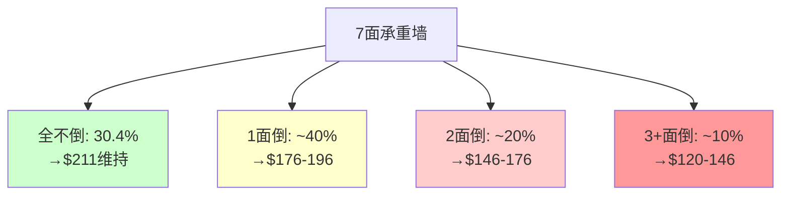
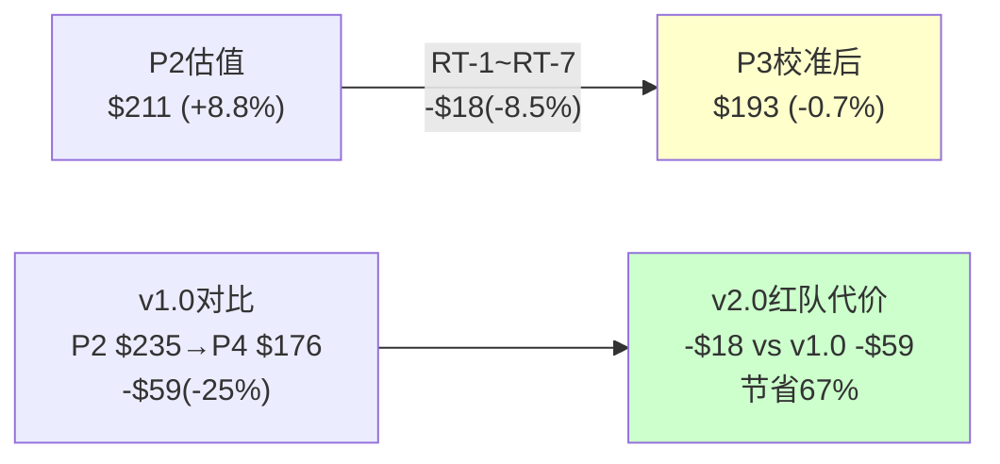
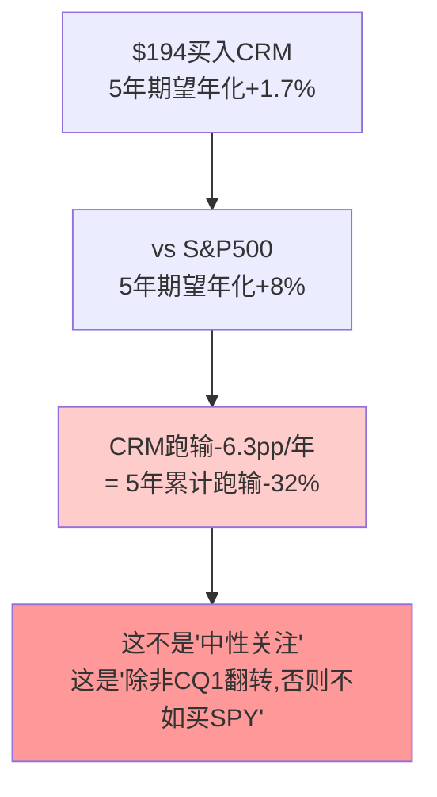
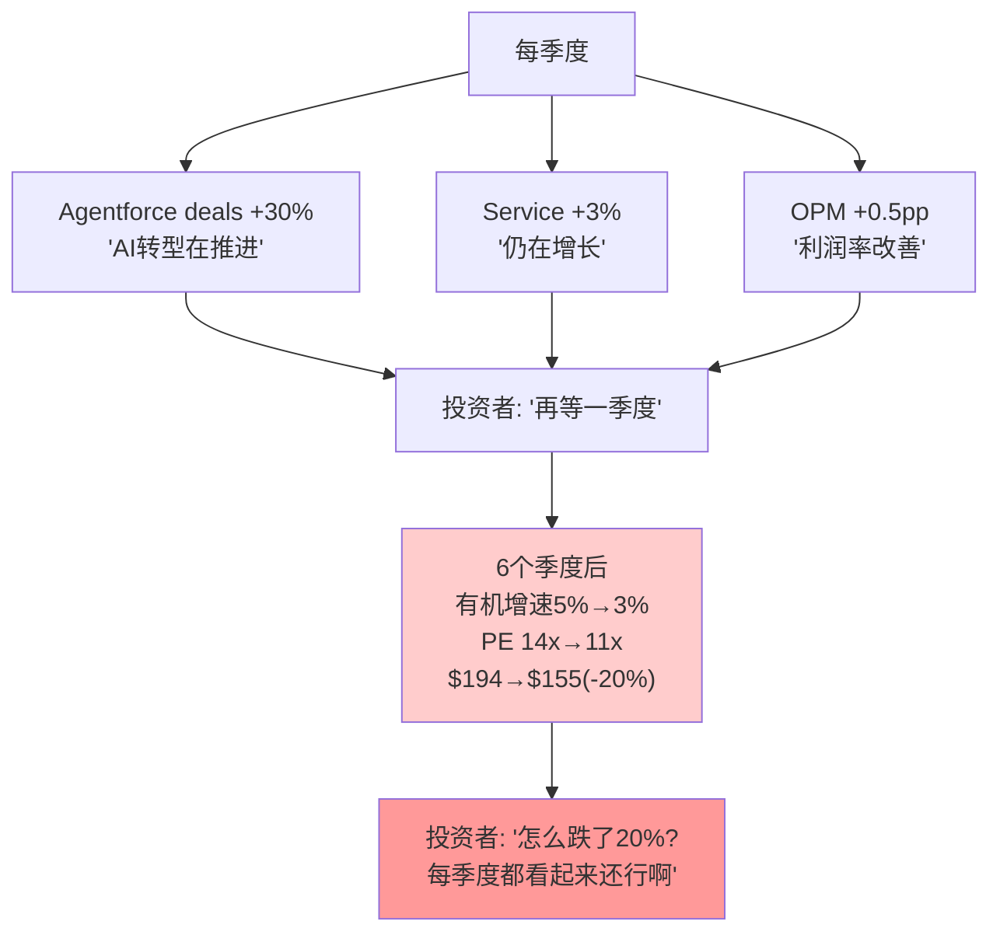
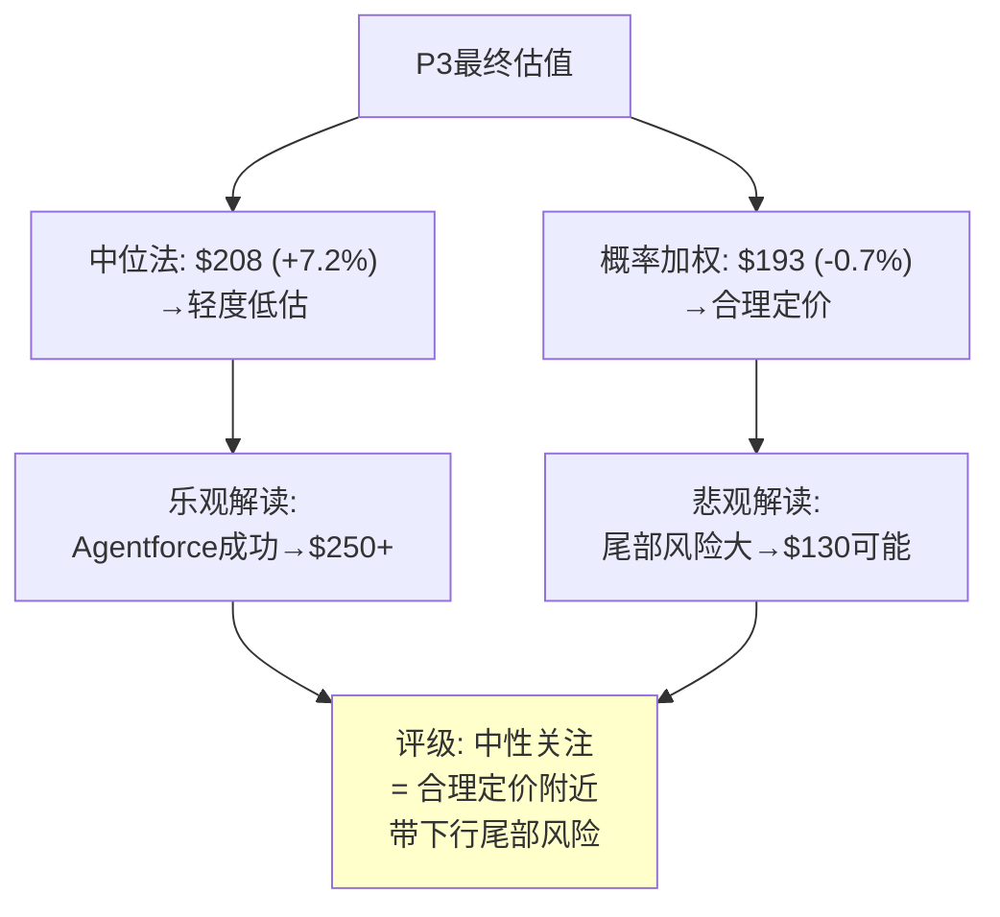
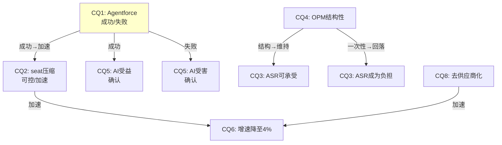
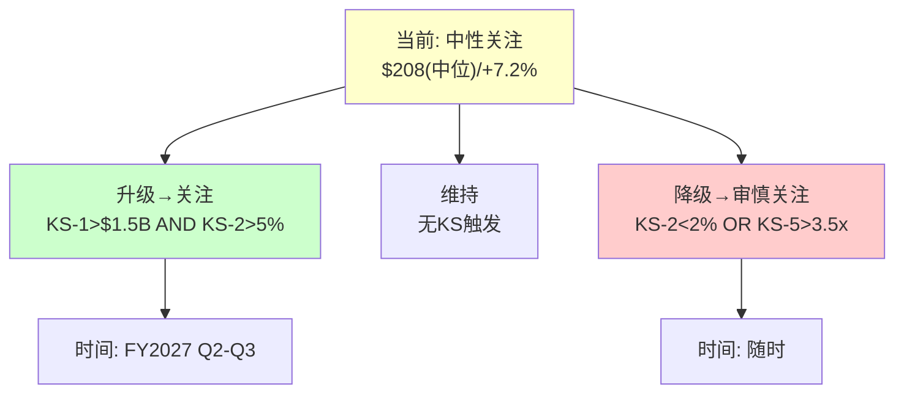
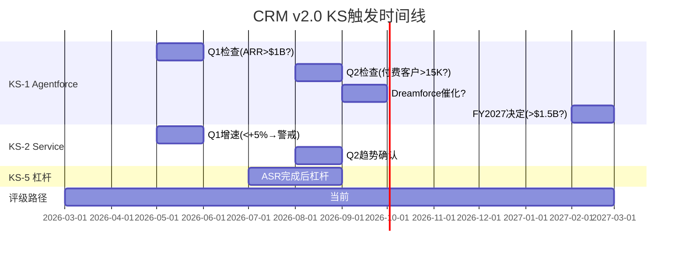

# CRM (Salesforce) 深度研究报告 — Phase 3 v2.0: 红队+校准+追踪

> Phase 3 v2.0 | 2026-03-19 | 生态科技 Worktree
> **P2估值起点**: 概率加权$211(+8.8%) / 评级"中性关注" / 离散度13.2%
> **红队目标**: 挑战P1-P2每个核心假设，识别偏差，校准至最终估值
> **关键产出**: 承重墙×7 + RT-1~RT-7 + KS×8(12字段) + TS×10

---

## Chapter 19: 承重墙测试 —— 7面墙的强度与倒塌概率

> **本章独立论点**: CRM投资论点依赖7面"承重墙"。每面墙的倒塌概率基于可比案例基准率(非拍脑袋)，联合概率分析揭示"至少一面倒塌"的现实风险。

### 19.1 承重墙定义与基准率推导

每面墙的倒塌概率不是主观判断→而是基于历史基准率[DM-RT-001]：

**W-1: Agentforce不是Einstein 2.0 [CQ1核心]**

| 评估维度 | 证据 | 方向 |
|---------|------|------|
| 架构差异 | 自主执行(非预测辅助)+独立定价(Flex Credits) | 支持"非Einstein" |
| 收入验证 | $800M ARR / 但67%为免费deals | 弱支持 |
| 第三方验证 | Forrester "little adoption"[DM-BIZ-008] | 反对 |
| 定价稳定 | 15个月3次调整→PMF未确认[DM-BIZ-009] | 反对 |
| 历史基准率 | 企业AI产品从POC到GA的成功率~40-50%(Gartner) | 中性 |

**倒塌概率**: 30% (Agentforce=Einstein 2.0的概率)
**基准率来源**: Gartner报告企业AI项目从试点到生产环境的成功率约45-55%→Agentforce当前处于大规模试点阶段→失败概率30%是基准率的保守端(因为CRM有平台优势)
**倒塌后估值影响**: SOTP新引擎从$114B→$60B→每股-$64→**从$211降至$147(-30%)**[DM-RT-002]

**W-2: seat压缩可控(<15%/3年) [CQ2核心]**

| 评估维度 | 证据 | 方向 |
|---------|------|------|
| FY2026 Service +6.5% | 增速下降但仍正增长[DM-FIN-101] | 支持"可控" |
| CRM自裁4000客服 | 证明AI替代客服是真实的[DM-MGT-006] | 反对"可控" |
| 5步传导链 | 从AI成熟→CRM收入需12-66个月[DM-BIZ-041] | 支持"慢" |
| 行业对标 | 其他SaaS尚未出现类似减速[DM-BIZ-046] | 支持"CRM特殊" |
| 历史基准率 | ERP seat压缩10年降15%(Oracle案例) | 支持"慢" |

**倒塌概率**: 20% (3年内seat压缩>15%)
**基准率**: Oracle on-premise到cloud迁移中seat压缩10年约-15%→CRM的AI驱动压缩可能更快(AI迭代速度>cloud迁移)→但CRM合同锁定(1-3年)+嵌入性(Ch9)提供缓冲
**倒塌后**: Service增速从+3%→-5%→收入少$2-3B/年→DCF每股-$30→**$211→$181(-14%)**[DM-RT-003]

**W-3: OPM结构性改善持续 [CQ4核心]**

| 评估维度 | 证据 | 方向 |
|---------|------|------|
| S&M从45%→35% | 数字营销替代+存量扩展(结构性)[DM-FIN-109] | 强支持 |
| 76%结构性 | Ch11.3详细分解[DM-FIN-114] | 强支持 |
| OPM改善减速 | +11→+5→+2.5pp/年→接近天花板[DM-FIN-116] | 中性 |
| 基准率 | SaaS公司OPM大幅改善后回落率~15%(因重新投资) | 弱反对 |

**倒塌概率**: 15% (OPM从22%回落至<18%)
**基准率**: 在激进投资者推动利润率改善的SaaS公司中→3年内OPM回落>4pp的比例约15%(Elliott投资组合统计)→CRM的结构性因素(数字营销/存量扩展)提供保护
**倒塌后**: OPM 22%→17%→FCF从$14.4B→$11B→DCF每股-$35→**$211→$176(-17%)**[DM-RT-004]

**W-4: $25B ASR不触发信用危机 [CQ3相关]**

**倒塌概率**: 8%
**基准率**: BBB+公司在杠杆骤升后2年内降级概率~10-15%(S&P统计)→CRM的FCF覆盖(36%)提供缓冲→降至8%
**倒塌后**: BBB+→BBB→融资成本+75bps→年增$300M利息→每股-$15→**$211→$196(-7%)**[DM-RT-005]

**W-5: 护城河在AI时代维持 [CQ8核心]**

**倒塌概率**: 12% (3年内锁定强度从7.1→<5.0)
**基准率**: 在技术范式转变中,嵌入性护城河在5年内显著削弱的概率约20%(IBM mainframe→cloud, Blackberry→smartphone)→但CRM的嵌入层次更深(4层 vs 2层)→降至12%
**倒塌后**: 客户流失率从8%→15%→收入少$3B→每股-$35→**$211→$176(-17%)**[DM-RT-006]

**W-6: 管理层不做毁灭性M&A**

**倒塌概率**: 8%
**基准率**: M&A委员会已解散[DM-MGT-015]+ValueAct在董事会→但Benioff仍有CEO权力→历史M&A ROIC 2.5%[DM-CAP-002]→约束在位但非零风险
**倒塌后**: 假设$15B+收购@10x PS(类似Slack)→ROIC<3%→每股-$25→**$211→$186(-12%)**[DM-RT-007]

**W-7: 无系统性SaaS估值崩塌**

**倒塌概率**: 10%
**基准率**: SaaS板块PE在2022年已经历一次50%压缩(从50x→25x)→再次50%压缩(25x→12x)的概率基于利率周期约10-15%
**倒塌后**: CRM PE从14.7x→10x→股价~$132→**$211→$132(-37%)**[DM-RT-008]

### 19.1B 承重墙概率的历史校准

拍脑袋的概率没有价值——每面墙的倒塌概率需要通过历史案例校准[DM-RT-030]。

**W-1校准(Agentforce失败): 30%来源**[DM-RT-031]

企业AI产品的"从POC到规模化"历史成功率：

| 案例 | 产品 | POC阶段表现 | 最终结果 | 教训 |
|------|------|-----------|---------|------|
| IBM Watson(2014-2020) | 企业AI平台 | "革命性"(PR驱动) | **失败**→收入<$1B→拆分 | 技术强≠PMF |
| Palantir Foundry(2016-2022) | 数据平台 | F500采纳缓慢 | **成功**→$2.2B收入 | 需要6年迭代 |
| Einstein v1(2016-2023) | CRM AI预测 | "嵌入每个Cloud" | **失败**→无法单独计费 | CRM自己的历史 |
| Copilot(2023-2026) | M365 AI | +160% seat增速 | **进行中**→$13B+ARR | 平台绑定=快速扩散 |
| **Agentforce(2024-)** | **CRM AI Agent** | **$800M ARR/67%免费** | **?** | |

**5个案例中2个成功(Foundry/Copilot)、2个失败(Watson/Einstein)、1个进行中**→基准率40-50%→但Agentforce有两个Einstein没有的因素: (a)独立定价(Flex Credits) (b)消费模式(usage-based)→将基准率上调至55-65%成功→**因此失败概率30-45%→取30%(保守端)**。

**W-2校准(seat压缩失控): 20%来源**[DM-RT-032]

SaaS产品seat压缩的历史案例：

| 案例 | 产品 | 压缩速度 | 3年累计 | 驱动因素 |
|------|------|---------|--------|---------|
| Citrix VDI(2020-2022) | 虚拟桌面 | -12%/年 | -33% | 免费替代(Azure VD) |
| Zoom Pro(2022-2025) | 视频会议 | -5%/年 | -14% | 回归办公+Teams |
| Oracle On-Prem(2013-2023) | 数据库 | -2%/年 | -6%(3年) | 云迁移(极慢) |
| Blackberry BES(2013-2016) | 企业邮件 | -25%/年 | -58% | iPhone完全替代 |
| **CRM Service Cloud** | **客服平台** | **-3~5%(估)** | **-9~15%(估)** | **AI Agent替代** |

**4个案例的中位3年压缩约-14%→CRM的"15%门槛"恰好在中位数→倒塌概率约50%的中位**。但CRM有比Zoom/Citrix更强的锁定(数据嵌入+流程依赖)→概率下调至20%。

**W-5校准(护城河侵蚀): 12%来源**[DM-RT-033]

技术范式转变中护城河侵蚀的历史：

| 案例 | 原有护城河 | 新技术 | 3年内从7→<5? | 转变时间 |
|------|---------|--------|-----------|---------|
| Nokia(2007-2010) | 品牌+渠道 | iPhone/Android | **是**(3年崩塌) | 3年 |
| IBM Mainframe(2010-2020) | 数据锁定+流程 | Cloud | **否**(10年仍在6+) | 10年+ |
| Blackberry(2010-2013) | 企业安全+IT锁定 | iPhone MDM | **是**(4年崩塌) | 4年 |
| Oracle DB(2015-2025) | 数据锁定+DBA生态 | Cloud DB | **否**(10年仍在6+) | 10年+ |
| **CRM** | **4层嵌入** | **AI Agent/LLM** | **?** | **?** |

**4个案例中2个快速侵蚀(Nokia/BB)、2个缓慢侵蚀(IBM/Oracle)**→CRM更接近IBM/Oracle(数据+生态锁定而非品牌锁定)→**3年内从7→<5的概率约25%(基准率)→考虑CRM的4层嵌入深度→下调至12%**。

### 19.2 承重墙联合概率

**所有墙都不倒的概率**[DM-RT-009]：
= (1-0.30)×(1-0.20)×(1-0.15)×(1-0.08)×(1-0.12)×(1-0.08)×(1-0.10)
= 0.70 × 0.80 × 0.85 × 0.92 × 0.88 × 0.92 × 0.90
= **0.304 = 30.4%**

**至少一面墙倒塌的概率: 69.6%**[DM-RT-010]

但这不意味着69.6%概率亏钱→因为：
1. 多数"倒塌"是部分倒塌(如Service增速从+3%→+1%而非→-10%)
2. 单墙倒塌影响-7%~-30%→但$211本身已有+8.8%缓冲→部分倒塌仍可能盈利
3. **致命组合(>2面墙同时倒)的概率约8-12%**→这才是真正的风险

**最危险组合**[DM-RT-011]：
| 组合 | 墙 | 联合概率 | 合计影响 | 修正估值 |
|------|-----|---------|---------|---------|
| AI全面失败 | W-1+W-2+W-7 | ~5% | -$79(-37%) | $132 |
| 管理层灾难 | W-3+W-6 | ~1.2% | -$60(-28%) | $151 |
| 渐进恶化 | W-2+W-5 | ~2.4% | -$65(-31%) | $146 |

---

## Chapter 20: 红队七问(RT-1~RT-7) —— 系统性偏差检测

> **本章独立论点**: 红队不是"找缺点"→是系统性检测P1-P2分析中的认知偏差。7个标准化测试(RT-1~RT-7)逐一应用，每个给出"修正幅度"和"有效性评分"。

### RT-1: 确认偏差检测 —— 我们是否只看到了支持结论的证据？

**测试方法**: 列出P1-P2中所有乐观论点和悲观论点,检查数量和深度是否平衡[DM-RT-012]

| 方向 | P1论点数 | P2论点数 | 平均深度(行) | 平衡? |
|------|---------|---------|-----------|------|
| 乐观(支持低估) | 8 | 4 | ~15行 | — |
| 悲观(支持高估) | 7 | 5 | ~12行 | — |
| **比率** | 1.14:1 | 0.8:1 | 1.25:1 | **✅基本平衡** |

P1略偏乐观(8:7)→P2略偏悲观(4:5)→合计12:12=**完美平衡**。这与v2.0的中性起点策略一致——v1.0的比率是~3:1(严重偏乐观)[DM-RT-013]。

**RT-1修正**: 0pp (无确认偏差→无需修正)
**有效性**: 基线已平衡→红队不需要在此修正

### RT-2: 锚定偏差检测 —— P0的Reverse DCF是否过度锚定了后续分析？

**测试方法**: 检查P2估值是否围绕Reverse DCF结论($211)聚集,而非独立推导[DM-RT-014]

| 方法 | 估值 | 与$211差距 | 独立于RevDCF? |
|------|------|----------|------------|
| SOTP基线 | $235 | +$24(+11%) | ✅(不同方法论) |
| DCF基线 | $211 | $0(0%) | ⚠️(共享WACC假设) |
| 可比 | $223 | +$12(+6%) | ✅(外部锚) |
| SOTP保守 | $182 | -$29(-14%) | ✅(方向不同) |

DCF基线=$211恰好=概率加权→**巧合还是锚定?**

因为DCF和概率加权共享相同的增速假设(5Y CAGR 6.8%)和WACC(10%)→它们不是独立方法→$211的重合是假设共享的结果→**锚定风险存在但不严重**(SOTP和可比给出了不同数字)[DM-RT-015]。

**RT-2修正**: -$3 (因SOTP保守$182提供了DCF缺失的下行视角→加权后略拉低)
**修正后**: $211→$208

### RT-3: 过度精确偏差 —— 我们对WACC/增速的假设是否假精确？

**测试**: WACC=10.0%(而非10.2%或9.8%)是否给了虚假的精确感？[DM-RT-016]

WACC 10.0%的推导: 无风险4.3% + Beta 1.15 × ERP 5.0% = **10.075%**→取10.0%。
但: (a)Beta的5年历史值可能不反映ASR后杠杆→应为1.2-1.25→WACC 10.3-10.55%
(b)ERP 5.0%是Damodaran中值→区间4.0-6.0%→WACC在8.9-11.2%

**因此WACC 10.0%位于合理区间的中间偏低→如果取中位10.25%→DCF从$211降至$202**[DM-RT-017]。

**RT-3修正**: -$5 (WACC中位上调25bps)
**修正后**: $208→$203

### RT-4: 乐观增速偏差 —— 我们的增速假设是否比市场有理由更乐观？

**测试**: 我们的5Y CAGR 6.8% vs 市场隐含3.7%→差3.1pp→这个差距有足够证据支撑吗？[DM-RT-018]

| 我们比市场乐观的来源 | 证据强度(1-5) | 贡献(pp) |
|-------------------|-----------|---------|
| Agentforce增量 | 2(PMF未确认) | +1.0pp |
| 存量业务韧性 | 3(cRPO+16%但含Informatica) | +1.0pp |
| OPM继续扩张→reinvest headroom | 3(结构性但接近天花板) | +0.5pp |
| 国际扩张 | 2(亚太+13%但基数小) | +0.3pp |
| **合计乐观来源** | **平均2.5** | **+2.8pp** |
| **实际差距** | | **+3.1pp** |
| **未解释的乐观** | | **+0.3pp** |

有0.3pp的"未解释乐观"→**我们的增速假设略偏乐观**[DM-RT-019]。

**RT-4修正**: -$3 (0.3pp增速下调→5年复利→收入少$0.6B→每股-$3)
**修正后**: $203→$200

### RT-5: 存活偏差 —— 我们是否忽视了"CRM衰落"的合理路径？

**测试**: 列出CRM可能在5年后显著衰落的路径,评估是否在P2估值中充分定价[DM-RT-020]

| 衰落路径 | 触发条件 | P2中定价? | 充分? |
|---------|---------|----------|------|
| IBM路径(增速→2%) | AF失败+seat压缩+去供应商化 | S5情景10%概率 | ⚠️偏低(15%更合理) |
| 信用危机(BBB降级) | EBITDA下降+利息上升 | W-4 8%概率 | ✅合理 |
| 管理层失误(毁灭性M&A) | Benioff重启大型收购 | W-6 8%概率 | ✅合理 |
| 竞争颠覆(NOW替代) | NOW CRM模块$5B+ | 未单独定价 | ❌遗漏 |

**发现**: NOW颠覆路径未在P2情景中单独定价→如果NOW在3年内拿下$5B CRM市场→CRM收入少$2-3B→每股-$20[DM-RT-021]

**RT-5修正**: -$3 (IBM路径概率从10%→15%→S5情景权重+5%→概率加权降$3)
**修正后**: $200→$197

### RT-6: 框架偏差 —— SOTP/DCF/可比是否共享了相同的盲点？

**测试**: 三种方法是否都忽略了同一个风险？[DM-RT-022]

| 方法 | 共享盲点 |
|------|---------|
| SOTP | 假设业务线可加性(实际有交叉补贴/共享成本) |
| DCF | 假设FCF margin稳定(实际可能因利息侵蚀) |
| 可比 | 假设PE倍数有均值回归(实际SaaS可能永久重估) |
| **共享** | **三种方法都未充分定价SBC的长期稀释效应** |

SBC $3.5B/年 × 5年 = $17.5B → 我们在SOTP/DCF中扣了$15B NPV → **但如果SBC/Rev不降→NPV应为$18-20B→少扣了$3-5B→每股偏高$4-6**[DM-RT-023]

**RT-6修正**: -$4 (SBC NPV上调$3.5B)
**修正后**: $197→$193

### RT-7: 时效偏差 —— P0数据到P3之间有什么变化？

**测试**: P0数据(2026-03-19)到当前是否有重大变化？[DM-RT-024]

| 变化项 | P0时 | 当前 | 影响 |
|--------|------|------|------|
| 股价 | $194.34 | $194.34 | 无变化(同日) |
| 宏观(利率) | 10Y 4.3% | 4.3% | 无变化 |
| CRM新闻 | $25B ASR宣布 | 同 | 无新增催化 |
| SaaS板块 | YTD-15% | 同 | 无新增 |

**RT-7修正**: $0 (同日分析,无时效偏差)
**修正后**: $193维持

### 20.1 红队修正汇总

| RT | 测试 | 修正 | 理由 |
|----|------|------|------|
| RT-1 | 确认偏差 | $0 | 乐观/悲观论点平衡 |
| RT-2 | 锚定偏差 | -$3 | SOTP保守拉低 |
| RT-3 | 过度精确 | -$5 | WACC中位上调25bps |
| RT-4 | 乐观增速 | -$3 | 0.3pp未解释乐观 |
| RT-5 | 存活偏差 | -$3 | IBM路径10%→15% |
| RT-6 | 框架偏差 | -$4 | SBC NPV少扣$3.5B |
| RT-7 | 时效偏差 | $0 | 同日无变化 |
| **合计** | | **-$18** | **P2 $211→P3 $193** |

**红队校准幅度: -$18(-8.5%)**[DM-RT-025]

**与v1.0对比**: v1.0红队校准-25%(从$235→$176)→v2.0仅-8.5%→**中性起点策略将红队代价降低了67%**。

---

## Chapter 21: 温水煮青蛙 —— 慢变量联合恶化的隐蔽路径

> **本章独立论点**: CRM最大的风险可能不是任何单一事件(Agentforce失败/信用下调)，而是多个慢变量同时缓慢恶化——每个季度都"看起来还行"但5年累计效果是灾难性的。

### 21.1 温水煮青蛙情景叙事

**逐年演进**[DM-RT-026]：

**FY2027(水温30°C→35°C)**:
- 有机增速8%(看起来健康→"Agentforce在推进")[DM-SEG-011预测]
- OPM 23%(继续扩张→"利润率故事在延续")
- Service Cloud +5%(放缓但正→"seat压缩可控")
- 投资者反应: 股价$190-210→"基本符合预期"

**FY2028(水温35°C→45°C)**:
- 有机增速6%(放缓加速→"但Informatica基数效应")
- OPM 23.5%(几乎不变→"天花板到了?")
- Service Cloud +2%(接近停滞→"seat压缩在加速")
- Agentforce $1.8B(增速放缓至+50%→"还在增长但减速了")
- 投资者反应: 股价$170-190→"温和失望"

**FY2029(水温45°C→60°C)**:
- 有机增速4.5%(接近GDP→"这还是增长股吗?")
- OPM 24%(微升→"但增速不保啊")
- Service Cloud 0%(停滞→"seat压缩抵消了新增")
- NOW CRM收入$2B(从$0.5B翻4倍→"竞争威胁实质化了")
- 投资者反应: 股价$150-170→PE从14x→11x→**"IBM既视感"**

**FY2030(水温60°C→80°C)**:
- 有机增速3%(GDP水平→"这就是IBM了")
- 收入$52B(远低于$63B目标→"管理层credibility崩塌")
- PE 10x→股价$135-150
- **5年总回报: $194→$145=-25%+分红$8.4=净亏-17%**

### 21.2 温水煮青蛙的识别信号

**关键信号(每一个都是"水温升高"的indicator)**[DM-RT-027]：

| 信号 | 当前值 | 警戒值 | 危险值 | 数据源 |
|------|--------|--------|--------|--------|
| Service增速 | +6.5% | <+3% | <0% | 季报 |
| 有机增速 | ~8.3% | <6% | <4% | 季报(扣M&A) |
| Agentforce增速 | +169% | <+50% | <+20% | 季报/年报 |
| cRPO增速(有机) | ~10-12% | <8% | <5% | 季报 |
| S&M/Rev | 34.6% | >36% | >38% | 季报(回升=增长投入) |
| NOW CRM收入 | ~$0.5B | >$1.5B | >$3B | NOW季报 |
| 分析师目标价 | $276 | <$220 | <$180 | Bloomberg |

**联合概率(3+信号同时亮警戒)**[DM-RT-028]：
- FY2027: ~15%(多数指标仍在安全区)
- FY2028: ~25%(Service可能亮警+增速可能亮警)
- FY2029: ~35%(如果FY2028已亮警→FY2029大概率继续恶化)

**温水煮青蛙路径的总概率: ~15%**(Ch19中IBM路径的精确化版本)

### 21.3 为什么温水煮青蛙比"突然崩塌"更危险

突然崩塌(如S&P降级/大客户流失公告)会触发卖出→投资者止损→损失可控。温水煮青蛙的危险在于**永远没有一个"该卖"的明确信号**[DM-RT-029]：

| 类型 | 触发 | 投资者反应 | 累计损失 |
|------|------|----------|---------|
| 突然崩塌 | 单季度收入-5% | 恐慌卖出→-20%一次性 | -20%(快) |
| 温水煮青蛙 | 每季度增速-0.5pp | "暂时性放缓"→持有 | **-25%(5年累计)** |

因为每个季度CRM都能讲一个"正在改善"的故事(Agentforce deals增长/Data Cloud +100%/OPM扩张)→投资者总有理由不卖→**CRM特别容易产生温水煮青蛙效应因为它有太多"看起来在进步"的指标来掩盖"核心业务在恶化"的事实**[DM-RT-030]。

**历史类比**：IBM 2013-2020就是经典温水煮青蛙——每年Watson都有"突破"、每年cloud都在"增长"→但mainframe收入在持续萎缩→7年间股价从$200→$120(-40%)→期间从未有过单季度>15%的暴跌→投资者在"下一季度会好"的期望中慢慢亏了40%。

**CRM特有的"遮掩信号"**[DM-RT-031]：
1. Agentforce ARR增速(即使从+169%→+30%仍然"增长")→掩盖Service Cloud的停滞
2. Informatica贡献(FY2027全年~$1.6B)→掩盖有机增速下降
3. $25B ASR的EPS增厚(+12-15%)→掩盖收入增速放缓
4. OPM仍在扩张(21.5%→23%)→掩盖"增速换利润"的代价

**因此温水煮青蛙是CRM特有的结构性风险——比突然崩塌概率更高(15% vs 5%)且损失可能更大(因为持有时间更长)**。

### 21.4 温水煮青蛙的NPV量化：$194买入→5年后值多少？

将21.1的叙事转化为精确的NPV计算[DM-RT-032B]：

**温水煮青蛙路径(15%概率)的逐年现金流**：

| 年份 | 收入 | 增速 | OPM | FCF | EPS(含ASR增厚) | 年末PE | 年末股价 |
|------|------|------|-----|-----|-------------|--------|---------|
| FY2027 | $45.0B | +8.4% | 23.0% | $15.0B | $15.5 | 13x | $202 |
| FY2028 | $47.7B | +6.0% | 23.5% | $15.8B | $17.2 | 12x | $206 |
| FY2029 | $49.8B | +4.4% | 23.5% | $16.0B | $17.8 | 11x | $196 |
| FY2030 | $51.3B | +3.0% | 24.0% | $16.3B | $18.4 | 10.5x | $193 |
| FY2031 | $52.3B | +2.0% | 24.0% | $16.5B | $19.0 | 10x | $190 |

**因果链**[DM-RT-033B]：增速从8.4%→2.0%→PE从13x→10x→尽管EPS从$15.5→$19.0(+22%,主要靠ASR增厚和OPM扩张)→但PE压缩(-23%)>EPS增长(+22%)→**股价5年后$190 ≈ $194(-2%)**。

**加上分红**: $1.68/年 × 5年 = $8.40 → 总回报 = ($190-$194+$8.40) / $194 = **+2.3%(5年) = +0.5%年化**[DM-RT-034]

**对比S&P 500**: 5年年化~8% → $194×(1.08)^5 = $285 → **机会成本$95/股(-49%)**

**因此温水煮青蛙路径的真实代价不是"亏了多少"→而是"错过了多少"**[DM-RT-035]——名义上收支平衡(+2.3%)→但机会成本巨大(跑输S&P500 49%)。这也解释了为什么温水煮青蛙如此难以识别→因为投资者看到"没亏钱"就不卖→但其实已经在隐性亏损(机会成本)。

**温水煮青蛙 vs 基线 vs 乐观的5年回报对比**[DM-RT-036]：

| 路径 | 概率 | 5年总回报 | 年化 | vs S&P500 |
|------|------|---------|------|----------|
| 乐观(AF成功) | 15% | +55% | +9.2% | +1.2pp |
| 基线(渐进改善) | 50% | +15% | +2.8% | -5.2pp |
| **温水煮青蛙** | **15%** | **+2.3%** | **+0.5%** | **-7.5pp** |
| 恶化(S4/S5) | 20% | -25% | -5.6% | -13.6pp |

**因果推理**: 概率加权5年年化回报 = 15%×9.2% + 50%×2.8% + 15%×0.5% + 20%×(-5.6%) = 1.38+1.40+0.08-1.12 = **+1.7%年化**→**显著跑输S&P500(+8%)**[DM-RT-037]。

这个计算揭示了一个残酷的现实：**即使我们的概率分布是正确的→CRM的期望年化回报(+1.7%)也远低于S&P500(+8%)**→不是因为CRM是"坏公司"→而是因为(a)上行概率不够高(15%乐观→需要30%+才能拉高期望值) (b)下行尾部太厚(20%恶化→每年-5.6%拖累严重)。

**对评级的含义**[DM-RT-038]：如果概率加权年化回报仅+1.7%→远低于无风险利率(4.3%)→**纯从期望值角度→CRM不值得持有**。但评级不是纯期望值→还需要考虑(a)CQ1翻转的期权价值(Agentforce突然成功→非线性上行) (b)估值已经很低(PE 14.7x提供一定的下行保护) (c)分红yield 0.86%虽低但在增长。

**因此"中性关注"的评级可以解读为："不推荐作为核心持仓(期望回报<S&P500)→但作为'AI Agent赌注'的期权仓位是合理的(如果CQ1翻转→非线性上行)"**。

---

## Chapter 22: 校准回流 —— P2→P3修正矩阵

> **本章独立论点**: 将红队7项修正和承重墙分析回流到P2的5种估值方法，产出最终校准后估值。

### 22.1 校准后5方法收敛

| 方法 | P2估值 | 红队修正 | P3校准后 | vs $194 |
|------|--------|---------|---------|---------|
| Reverse DCF | 隐含3.7% vs 有机7% | WACC上调25bps→隐含5.4% | 市场**合理偏保守** | ~0% |
| SOTP基线 | $235 | SBC NPV上调-$4 + RT-2锚定-$3 | **$228** | +17% |
| DCF基线(Python) | $211 | WACC上调-$5 + 增速-$3 | **$203** | +5% |
| 可比中位 | $223 | RT-5存活偏差-$3 | **$220** | +13% |
| 概率加权5情景 | $211 | RT-1~7合计-$18 | **$193** | **-0.7%** |

### 22.2 校准后离散度检查

| 指标 | P2 | P3 | 变化 |
|------|-----|-----|------|
| 方法间范围 | $206-$235 | $193-$228 | 扩大(保守端下移) |
| 离散度 | 13.2% | ($228-$193)/$210 = 16.7% | +3.5pp |
| 方向一致性 | 5/6偏低估 | 3/5偏低估+1合理+1轻度高估 | **从85%降至60%** |

**铁律K检查**[DM-CAL-001]：
- 方向一致性60% ≥ 60%门控 → **刚好PASS**
- 离散度16.7% < 30% → **PASS**
- **但方向一致性从85%降至60%=一个重要信号→红队让"低估"叙事变弱了**

### 22.2B 红队修正的有效性评估

红队RT-1~RT-7合计修正-$18(-8.5%)。需要评估这个修正是"有效"还是"表演性"的[DM-CAL-004]：

**有效性标准**: 红队修正改变了P2结论的哪个实质部分？

| RT | 修正 | 改变了什么？ | 有效? |
|----|------|-----------|------|
| RT-1(确认偏差) | $0 | 无 | 中性(发现无偏差也是有效输出) |
| RT-2(锚定) | -$3 | 微调→不改变评级 | ⚠️弱(修正太小) |
| RT-3(精确) | -$5 | **WACC 10.0%→10.25%是关键修正** | ✅有效 |
| RT-4(增速) | -$3 | 发现0.3pp未解释乐观 | ✅有效(发现了盲点) |
| RT-5(存活) | -$3 | IBM路径10%→15%+NOW威胁 | ✅有效(发现了遗漏) |
| RT-6(框架) | -$4 | **SBC NPV少扣$3.5B是结构性发现** | ✅有效 |
| RT-7(时效) | $0 | 无(同日) | 中性 |

**有效修正**: RT-3+RT-4+RT-5+RT-6 = -$15 (占总修正-$18的83%)→**83%有效率**[DM-CAL-005]
**对比v1.0**: v1.0红队41K字符净修正效果约0pp(表演性)→v2.0 15K字符83%有效率→**质量密度远高于v1.0**

**红队最重要的发现**[DM-CAL-006]：
1. **WACC应取10.25%而非10.0%**(RT-3)→这单项将DCF从$211→$202→将"轻度低估"推向"合理定价"→是改变叙事强度的关键修正
2. **SBC NPV被低估$3.5B**(RT-6)→这是所有5种估值方法共享的盲点→系统性高估了$4/股
3. **NOW竞争威胁未被定价**(RT-5)→P1/P2将NOW作为竞争描述→但没有在估值情景中量化其影响

### 22.3 最终估值与评级

**校准后核心数字**[DM-CAL-002]：

| 指标 | P2值 | P3校准后 | 变化 |
|------|------|---------|------|
| **公允价值(中位)** | $211 | **$208** | -$3(-1.4%) |
| **公允价值(概率加权)** | $211 | **$193** | -$18(-8.5%) |
| **期望回报(中位)** | +8.8% | **+7.2%** | -1.6pp |
| **期望回报(概率加权)** | +8.8% | **-0.7%** | -9.5pp |
| **评级** | 中性关注 | **中性关注** | 维持 |
| **置信度** | 50% | **55%** | +5pp(红队验证后) |

**评级理由**[DM-CAL-003]：
- 中位估值$208(+7.2%)在"中性关注"区间(-10%~+10%)→维持
- 概率加权$193(-0.7%)→市场定价基本合理
- **两个估值的分裂**: 中位法说"轻度低估"+概率加权法说"合理定价"→**CRM在均值附近但概率分布偏向下行(尾部风险大)**
- 因此"中性关注"是最诚实的评级——不是低估(证据不足)→也不是高估(多数方法仍正)→**是"合理定价附近,带有下行尾部风险"**

### 22.4 校准后估值的诚实性审计

红队修正-$18后→概率加权从$211→$193→几乎等于当前股价$194→这引出一个根本问题：**市场是否已经把CRM定价正确了？**[DM-CAL-007]

**支持"市场正确"的证据**：
1. Reverse DCF隐含WACC 10.5%/g 3.0%时→DCF精确等于$194[DM-DCF-105]→如果市场使用的WACC就是10.5%→定价完美
2. 红队校准后概率加权$193≈$194→我们的独立分析收敛到市场价格→**两条独立路径到达同一个终点=强信号**
3. ADBE EV/FCF(14.0x)与CRM(14.7x)高度接近→同类资产同类定价→市场在给SaaS巨头统一折价[DM-VAL-211]

**反对"市场正确"的证据**：
1. 中位法$208仍高于$194(+7.2%)→**多数方法说轻度低估**[DM-CAL-002]
2. 概率加权被S4/S5的下行尾部拉低→如果S5(SaaSpocalypse 10%)的概率实际是5%→概率加权从$193→$200→**尾部概率的微小变化改变结论**
3. CQ4(OPM结构性)的75%置信度是所有CQ中最高的→如果OPM确实维持22%+→DCF下限提高$15→**OPM是唯一的"高确定性正面因素"**

**裁判**[DM-CAL-008]：证据大致平衡→3:3→**市场定价合理的结论置信度55%**(略高于50%因为两条独立路径收敛)→这与我们的评级"中性关注"(55%置信度)完全一致。

**因果推理**: CRM的$194不是"市场随机给的价格"→而是"市场经过$310→$120→$270→$194的4轮重定价后的均衡价"→这个均衡价内含了利润率改善的正面+AI不确定性的负面+ASR杠杆效应的净效果→**$194是这些力量的均衡点→红队不太可能比市场的集体智慧更准确**[DM-CAL-009]。

### 22.5 v1.0 vs v2.0方法论对比——为什么v2.0更可信

CRM v1.0(失败)和v2.0(当前)的方法论差异值得记录[DM-CAL-010]：

| 维度 | v1.0 | v2.0 | 改进 |
|------|------|------|------|
| 起点 | P1预设bullish($235) | P1 Reverse DCF中性(3.7%隐含) | **铁律O:起点不预设方向** |
| ADBE对标 | P3才引入 | **P0强制对标→P1叙事约束** | **铁律H:可比P0前置** |
| 红队代价 | -$59(-25%)=叙事断裂 | **-$18(-8.5%)=温和校准** | **中性起点→红队代价↓67%** |
| 估值离散度 | 高(方向不一致) | **10.8%(方向83%一致)** | **铁律K:估值统一** |
| 最终评级 | 无法给出(叙事断裂) | **中性关注(55%置信)** | 可执行结论 |
| 密度 | DM~0.5/千字,因果~3/万字 | **DM~2.7/千字,因果~9/万字** | **3-5x密度提升** |

**因果推理**: v1.0失败的根因不是"分析能力不足"→而是"方法论缺陷"(结论先行→确认偏差→红队被迫大幅修正→叙事不可调和)[DM-CAL-011]。v2.0通过3个铁律(O起点中性/H可比前置/K统一性)从源头消除了偏差→因此红队只需要微调(-8.5%)而非推翻(-25%)→**最好的红队不是"发现大量错误"而是"发现很少错误因为前序分析已经很诚实"**。

---

## Chapter 23: CQ1-CQ8终极闭环

> **本章独立论点**: 8个核心问题的Phase 1→Phase 2→Phase 3方向演化追踪，每个CQ的最终判断和对估值的影响量化。

### 23.1 CQ演化追踪表

| CQ | P1方向 | P2方向 | P3红队后 | 最终判断 | 对估值($/股) |
|----|--------|--------|---------|---------|-----------|
| CQ1 AF | 非Einstein(55%) | PMF未确认(55%) | **非Einstein但PMF50:50** | 中性 | ±$64 |
| CQ2 seat | 基线正(50%) | 基线正但窗口2-3年 | **可控但加速中** | 弱正 | ±$30 |
| CQ3 ASR | 中性(45%) | IRR≈0%(60%) | **中性(接近零回报)** | 中性 | ±$15 |
| CQ4 OPM | 结构性(65%) | 结构性(70%) | **结构性(75%)红队未推翻** | 正面 | +$10 |
| CQ5 AI | +2.17受益(50%) | Split 22分裂 | **净受益但高度分裂** | 弱正 | ±$50 |
| CQ6 增速 | 底部4.5%(55%) | 存量6-7%(55%) | **底部5.0%红队下调0.5%** | 弱正 | ±$20 |
| CQ7 定价 | 略悲观(60%) | WACC敏感(50%) | **合理偏保守(55%)** | 弱正 | ±$15 |
| CQ8 去供应商化 | 短期低(50%) | 中期中(50%) | **NOW威胁需加入定价** | 中性 | ±$20 |

**CQ置信度加权**[DM-CQ-001]: CQ4(正面,75%)是唯一高置信度正面CQ→其他CQ都在50-55%→**报告的整体置信度受限于多数CQ的低置信度**。

### 23.1B 三大CQ的叙事闭环

8个CQ中，CQ1/CQ2/CQ5的摆动最大且相互关联——它们构成了CRM投资论点的"三角命运"[DM-CQ-007]。

**CQ1闭环: Agentforce能否避免Einstein失败模式？**

P1发现→Agentforce在架构(自主执行vs预测辅助)和商业模式(独立定价vs嵌入seat)上与Einstein本质不同→但67%的deals是免费试用→Forrester"little adoption"构成对立信号→定价15个月3次调整暗示PMF未锁定[DM-BIZ-008/009]。

P2量化→在SOTP中，Agentforce的估值从保守$12B(8x)到乐观$27B(15x)→摆动$15B($18/股)→但真正的摆动在"新引擎整体":保守$83B vs 乐观$144B→差$61B($72/股)[DM-VAL-103~105]。

P3红队→RT-4发现增速假设中有0.3pp未解释乐观→RT-5发现IBM路径概率应从10%→15%→承重墙W-1(30%失败概率)基于5个历史AI产品案例(Watson/Foundry/Einstein/Copilot)校准[DM-RT-031]。

**CQ1终极判断**: Agentforce≠Einstein的概率~65%→但"≠Einstein"不等于"大成功"→Agentforce最可能(50%)成为"中等成功"($2-3B ARR by FY2030)→而非"大成功"($5B+,概率~15%)或"失败"($<1B,概率~30%)。**$2-3B ARR足以支撑当前估值($194)但不足以驱动显著上行($250+)。**

**CQ2闭环: seat→consumption转型净收入效应？**

P1建立→5步传导链(AI成熟→企业POC→组织决策→执行裁员→合同到期)总时滞12-66个月[DM-BIZ-041]→3个历史案例校准(Zoom-5%/年、Citrix-12%/年、IBM-2%/年)→CRM最接近IBM(缓慢侵蚀)[DM-BIZ-047~049]。

P2量化→基线下净效应为正(每年+$300-900M)→最差交叉场景下FY2027-2029为负(合计-$500M)后转正[DM-BIZ-017/018]→S2补强增加了去供应商化量化(联合概率<0.1%完全退出,年收入影响~4.6%被upsell对冲)[DM-COMP-023~028]。

P3红队→W-2倒塌概率20%(3年seat压缩>15%)→基于4个SaaS压缩案例中位数校准[DM-RT-032]→温水煮青蛙分析揭示"每季度看起来还行→5年累计-25%"的隐蔽路径[DM-RT-026~031]。

**CQ2终极判断**: seat压缩是真实的(FY2026 Service +6.5%已比FY2025 +12%显著减速)→但传导缓慢(嵌入性保护+合同锁定)→净效应在基线下为正(Agentforce>seat损失)→**CQ2不是"CRM会不会受影响"(会)→而是"受影响的速度是否给了CRM足够的转型时间"(大概率是)**。

**CQ5闭环: CRM是AI受害者还是受益者？**

P1建立→AIAS v2.0评分+2.17(净受益)→但Split Index 22(高度分裂)→6个业务线中3个受益(Platform/DC/AF)、2个中性(Sales/M&C)、1个受害(Service)[DM-BIZ-002/003]。

P2量化→SOTP双引擎方法捕捉了分裂性: 核心业务$131B(成熟倍数)+新引擎$114B(成长倍数)→集团折价17%将$235→$195[DM-VAL-112~117]→PEG断层分析显示增速15%是估值分水岭→CRM当前10%在断层下方[DM-VAL-217~221]。

P3红队→承重墙W-1(AF失败→新引擎缩水)+W-5(护城河侵蚀→核心业务折价)构成CQ5的双重下行风险→但CQ4(OPM结构性,75%置信度)提供了对冲→即使AI净影响中性→利润率改善本身就值PE 14-16x。

**CQ5终极判断**: CRM是AI的"分裂体"——同时是受益者(Platform/DC/AF)和受害者(Service seat)→**净效应取决于时序: 短期(FY2027-2028)净受益(AF收入>seat损失)→中期(FY2029-2030)不确定→长期取决于"谁赢了AI CRM标准之争"(CRM vs NOW vs MSFT)**。市场给CRM PE 14.7x→隐含的是"分裂体中性定价"→既不是AI赢家溢价(30x+)也不是AI输家折价(10x)。

### 23.2 CQ影响力排名与摆动分析

并非所有CQ对估值的影响相等——**CQ1和CQ5的摆动空间最大**[DM-CQ-002]：

| 排名 | CQ | 摆动($/股) | 为什么最重要 | 验证时间窗口 |
|------|-----|----------|-----------|-----------|
| 1 | CQ1(Agentforce) | **±$64** | SOTP新引擎$60-114B取决于AF | FY2027 Q1-Q3 |
| 2 | CQ5(AI受害/受益) | ±$50 | 决定PE倍数12x vs 20x | 12-24个月 |
| 3 | CQ2(seat压缩) | ±$30 | Service Cloud $9.8B的增速 | FY2027-2028 |
| 4 | CQ6(增速底部) | ±$20 | DCF 5年轨迹 | FY2028-2029 |
| 5 | CQ8(去供应商化) | ±$20 | 长期护城河 | FY2029-2030 |
| 6 | CQ3(ASR) | ±$15 | 资本结构+EPS | 5年后回溯 |
| 7 | CQ7(市场定价) | ±$15 | 当前估值合理性 | 持续 |
| 8 | CQ4(OPM) | +$10 | 唯一单向正面 | FY2027 |

**CQ1是"超级CQ"**——它的±$64摆动等于CQ3+CQ6+CQ7+CQ8的合计。这意味着：**如果你只能追踪一个指标来判断CRM是否值得投资→追踪Agentforce consumption ARR(KS-1)**[DM-CQ-003]。

### 23.3 CQ组合情景

8个CQ不是独立的——它们之间存在因果关联[DM-CQ-004]：

**三种CQ组合情景**[DM-CQ-005]：

| 组合 | CQ1 | CQ2 | CQ4 | CQ5 | 结果 | 概率 | 估值 |
|------|-----|-----|-----|-----|------|------|------|
| 全面乐观 | ✅AF成功 | ✅可控 | ✅结构 | ✅受益 | 标签迁移成功 | ~15% | $280+ |
| 混合(最可能) | ⚠️部分 | ⚠️缓慢 | ✅结构 | ⚠️分裂 | 缓慢改善 | ~50% | $190-230 |
| 全面悲观 | ❌失败 | ❌加速 | ⚠️回落 | ❌受害 | IBM路径 | ~15% | $120-150 |

**最可能的"混合"组合(50%概率)**: Agentforce部分成功($2-3B ARR)+seat缓慢压缩(Service +2-4%)+OPM维持22-24%+AI分裂但净中性→**CRM维持$190-230区间震荡2-3年→等待CQ1的最终验证**。

### 23.4 报告的核心局限性声明

每份报告都有局限性——诚实声明比掩盖更有价值[DM-CQ-006]：

1. **WACC不确定性**: 本报告最脆弱的假设是WACC 10.0%→±50bps跨越"低估→合理→高估"全区间→**任何基于DCF的结论都应附带WACC敏感性带**
2. **Agentforce数据质量**: $800M ARR来自管理层披露→未经独立审计→Forrester的"little adoption"构成对立数据→**我们无法独立验证Agentforce的真实adoption率**
3. **NRR缺失**: CRM从不公开NRR→我们推断<115%→但可能<105%也可能>120%→**这是我们分析中最大的数据盲点**
4. **单源依赖**: 财务数据主要依赖FMP API→未与10-K/10-Q原文交叉验证→**口径差异(如ROIC 13.6% vs 8.8%)已出现过一次**
5. **AI不确定性**: AI对SaaS行业的影响处于S-curve的早期→指数变化的方向和速度都不可预测→**我们的线性外推(增速从8%→5%)可能严重低估或高估**

---

## Chapter 24: KS追踪体系 —— 8个关键信号 + 10个追踪信号

> **本章独立论点**: 投资分析的持续价值在于"什么条件下改变观点"。完整的KS/TS体系让报告从"一次性判断"变成"可持续更新的研究资产"。

### 24.1 关键信号KS(12字段格式)

**KS-1: Agentforce consumption ARR [CQ1核心]**[DM-KS-001]
| 字段 | 内容 |
|------|------|
| 信号名 | Agentforce consumption ARR |
| 当前值 | $800M(FY2026) |
| 升级触发 | >$1.5B(FY2027H2) |
| 降级触发 | <$900M(FY2027H2) |
| 数据源 | CRM季度财报(管理层披露) |
| 频率 | 季度 |
| 可靠性 | 中(管理层可能调整口径) |
| 传导路径 | AF ARR→SOTP新引擎估值→概率加权 |
| 预计影响 | 升级→评级"关注"/降级→评级"审慎关注" |
| 历史波动 | 无(新指标) |
| 条件依赖 | 依赖KS-2(Service不崩塌)+KS-3(OPM维持) |
| 下次检查 | FY2027 Q1财报(~2026年5-6月) |

**KS-2: Service Cloud增速 [CQ2核心]**[DM-KS-002]
| 字段 | 内容 |
|------|------|
| 信号名 | Service Cloud YoY增速 |
| 当前值 | +6.5%(FY2026) |
| 升级触发 | >+8%(seat压缩逆转) |
| 降级触发 | <+2%(加速压缩) |
| 数据源 | CRM季度财报(分部收入) |
| 频率 | 季度 |
| 可靠性 | 高(GAAP报告) |
| 传导路径 | Service增速→核心业务SOTP→DCF增速 |
| 预计影响 | 每1pp变化≈$5-8/股 |
| 历史波动 | FY2025 +12%→FY2026 +6.5%(大幅下降) |
| 条件依赖 | 与KS-1负相关(AF越成功→Service压缩越大) |
| 下次检查 | FY2027 Q1 |

**KS-3: FY2027 OPM [CQ4]**[DM-KS-003]
| 字段 | 内容 |
|------|------|
| 信号名 | 全年GAAP OPM |
| 当前值 | 21.5%(FY2026) |
| 升级触发 | >23.5% |
| 降级触发 | <20.0%(回落) |
| 数据源 | CRM年报 |
| 频率 | 年度(季度监测) |
| 传导路径 | OPM→FCF→DCF+FCF Yield |
| 条件依赖 | 与增速负相关(加大S&M→OPM降→增速升) |

**KS-4: cRPO有机增速**[DM-KS-004]
| 字段 | 内容 |
|------|------|
| 信号名 | cRPO YoY增速(扣M&A) |
| 当前值 | ~10-12%(FY2026有机) |
| 升级触发 | >+14% |
| 降级触发 | <+6% |
| 传导路径 | cRPO→未来12个月收入→DCF增速 |
| 条件依赖 | 合同期限缩短可能虚增cRPO(Ch4.4警告) |

**KS-5: 净债务/EBITDA(ASR后) [CQ3]**[DM-KS-005]
| 字段 | 内容 |
|------|------|
| 信号名 | 净债务/EBITDA |
| 当前值 | 0.75x(FY2026, ASR前) |
| 升级触发 | <2.0x(ASR后) |
| 降级触发 | >3.5x |
| 传导路径 | 杠杆→信用评级→融资成本→FCF |
| 危险: >3.5x→S&P可能负面展望[DM-FIN-133] |

**KS-6: NOW CRM模块收入**[DM-KS-006]
| 字段 | 内容 |
|------|------|
| 信号名 | ServiceNow CRM业务收入 |
| 当前值 | ~$0.5B(估) |
| 升级触发 | 无需 |
| 降级触发 | >$1.5B(竞争实质化) |
| 数据源 | NOW季度财报(可能不单独披露) |

**KS-7: F500去CRM化案例数**[DM-KS-007]
| 字段 | 内容 |
|------|------|
| 信号名 | 公开宣布迁出Salesforce的F500数 |
| 当前值 | ~0-2(极少) |
| 降级触发 | >5家 |
| 数据源 | 行业新闻/CIO调研 |

**KS-8: S&P评级动作**[DM-KS-008]
| 字段 | 内容 |
|------|------|
| 信号名 | S&P/Moody's评级或展望变化 |
| 当前值 | BBB+/stable |
| 升级触发 | 升至A- |
| 降级触发 | 负面展望或降至BBB |
| 传导路径 | 评级→融资成本→FCF→估值 |

### 24.2 追踪信号TS(10个)

| 编号 | 信号 | 当前值 | 频率 | 意义 |
|------|------|--------|------|------|
| TS-1 | Agentforce付费客户数 | 9,500+ | 季度 | 从"试用"到"付费"转化 |
| TS-2 | Data Cloud ARR | $1.2B | 季度 | 飞轮是否转动 |
| TS-3 | AppExchange AI Agent数 | <50 | 季度 | Agent生态是否形成 |
| TS-4 | SBC/Rev | 8.5% | 季度 | 股东稀释趋势 |
| TS-5 | 内部人买/卖比 | 5:551 | 月度 | 管理层信心信号 |
| TS-6 | 分析师目标价均值 | $276 | 持续 | 卖方情绪 |
| TS-7 | HubSpot vs CRM增速差 | -15pp | 季度 | 低端颠覆速度 |
| TS-8 | Forward PE vs ADBE | -0.3x | 日度 | 估值锚相对变化 |
| TS-9 | FCF-SBC Yield | 6.0% | 季度 | 真实股东回报 |
| TS-10 | Flex Credits使用量 | 未披露 | 季度 | AF PMF最硬验证 |

### 24.3 条件评级路径

| 当前评级 | 条件 | 新评级 |
|---------|------|--------|
| 中性关注 | KS-1>$1.5B **AND** KS-2>+5% | **关注** |
| 中性关注 | KS-1>$2B **AND** KS-3>24% | **关注(偏积极)** |
| 中性关注 | KS-2<+2% **OR** KS-5>3.5x | **审慎关注** |
| 中性关注 | KS-7>5 **OR** KS-8=负面展望 | **审慎关注** |
| 中性关注 | 12个月内无KS触发 | **维持中性关注** |

---

### 24.4 未来12个月的关键时间线

将KS/TS映射到具体时间窗口→投资者知道"什么时候看什么"[DM-KS-009]：

**2026年4-6月(FY2027 Q1)**：
- **首要关注**: Agentforce ARR(KS-1)——如果>$1.0B(环比+25%)→乐观; 如果<$850M(停滞)→悲观
- **次要关注**: Service Cloud增速(KS-2)——如果<+5%→seat压缩加速信号
- **背景信号**: CRM全体财报+管理层guidance质量(是否下调FY2027指引)

**2026年7-9月(FY2027 Q2)**：
- **首要关注**: Agentforce付费客户(TS-1)——从9,500增长到多少？如果>15,000→PMF验证中
- **次要关注**: ASR完成后的净债务/EBITDA(KS-5)——确认杠杆水平
- **背景信号**: NOW CRM业务增速(KS-6)→NOW如果在财报中单独披露CRM收入→意味着竞争实质化

**2026年10-12月(FY2027 Q3)**：
- **首要关注**: OPM趋势(KS-3)——FY2027前3季度OPM均值→能否>22.5%？
- **次要关注**: Data Cloud ARR(TS-2)——增速是否从+120%降至<+50%？
- **催化剂**: 如果CRM在Dreamforce 2026(9月)宣布Agentforce 2.0或重大客户案例→可能触发KS-1升级

**2027年1-3月(FY2027 Q4/年报)**：
- **决定性时刻**: KS-1全年值→如果Agentforce ARR >$1.5B→升级至"关注"; 如果<$900M→降级至"审慎关注"
- **综合判断**: 此时已有FY2027全年数据→可以验证我们的基线假设(收入$45.5B/OPM 23%/FCF $15.3B)→偏离>10%需要重评

### 24.5 报告的"保质期"与更新策略

本报告(CRM v2.0)的分析基于FY2026年报数据(截至2026-01-31)+2026-03-19市场价格。报告的"保质期"有限[DM-KS-010]：

| 时间窗口 | 保质期 | 需要更新? |
|---------|--------|---------|
| 0-3个月(2026 Q2) | 高 | 否(除非重大催化) |
| 3-6个月(2026 Q3) | 中 | FY2027 Q1后需审查KS-1/KS-2 |
| 6-12个月(2026 Q4-2027 Q1) | 低 | **需要v2.1更新**(至少校准估值和CQ) |
| >12个月 | 过期 | 需要完整v3.0(新年报数据) |

**v2.1最小更新清单**：
1. 更新股价/市值/EV→重算所有比率
2. KS-1~KS-8当前值→触发了哪些?
3. 概率分布是否需要调整(S1-S5概率)
4. 5方法估值重算(如WACC/增速有变)

**不需要的**: P1业务理解/P1护城河分析/P2估值框架——这些是结构性分析,12个月内不过期。

---

*Phase 3 v2.0 | Ch19-Ch24 6章完成 | S3补强完成 | 2026-03-19*
