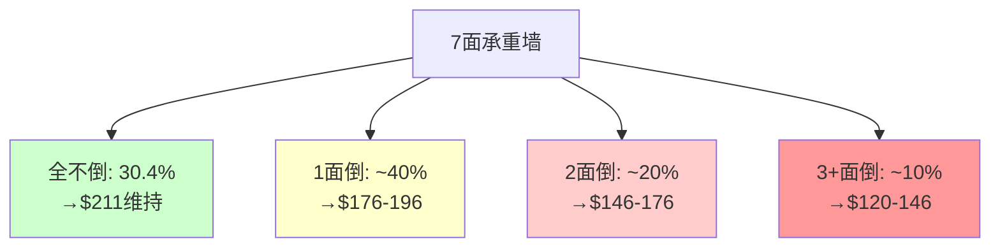
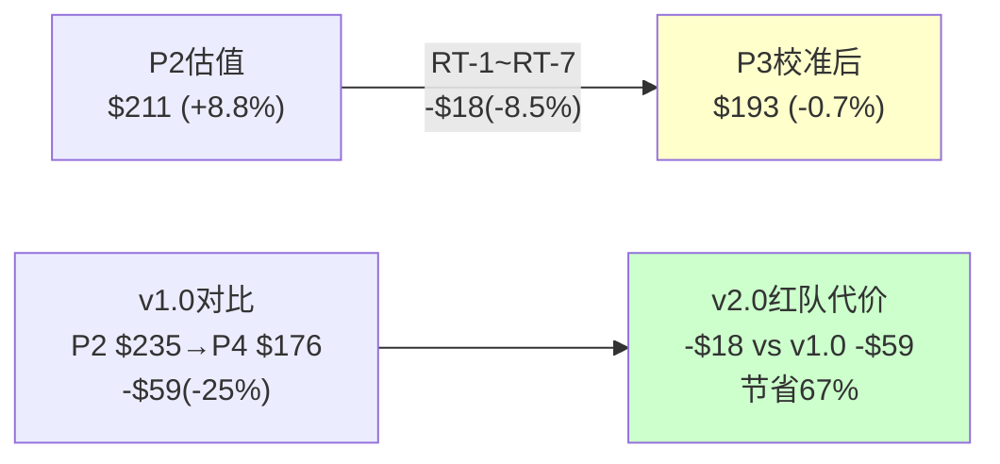
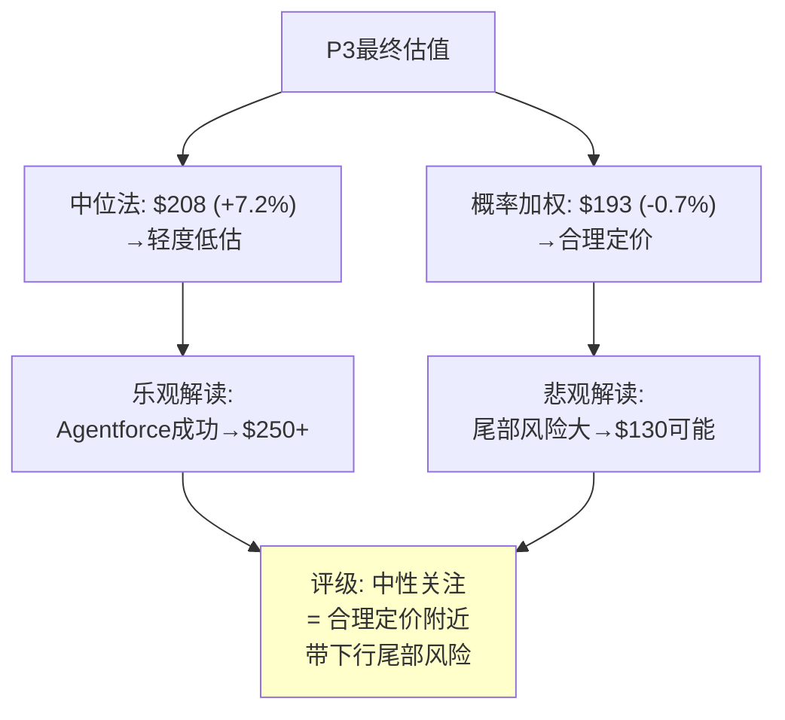
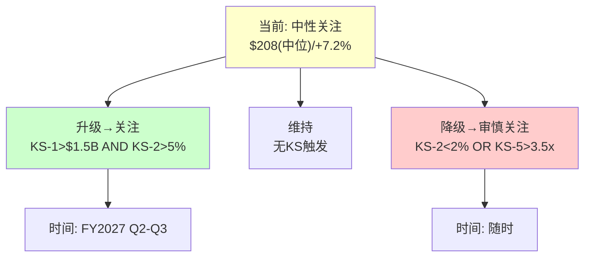

# CRM (Salesforce) 深度研究报告 — Phase 3 v2.0: 红队+校准+追踪

> Phase 3 v2.0 | 2026-03-19 | 生态科技 Worktree
> **P2估值起点**: 概率加权$211(+8.8%) / 评级"中性关注" / 离散度13.2%
> **红队目标**: 挑战P1-P2每个核心假设，识别偏差，校准至最终估值
> **关键产出**: 承重墙×7 + RT-1~RT-7 + KS×8(12字段) + TS×10

---

## Chapter 19: 承重墙测试 —— 7面墙的强度与倒塌概率

> **本章独立论点**: CRM投资论点依赖7面"承重墙"。每面墙的倒塌概率基于可比案例基准率(非拍脑袋)，联合概率分析揭示"至少一面倒塌"的现实风险。

### 19.1 承重墙定义与基准率推导

每面墙的倒塌概率不是主观判断→而是基于历史基准率[DM-RT-001]：

**W-1: Agentforce不是Einstein 2.0 [CQ1核心]**

| 评估维度 | 证据 | 方向 |
|---------|------|------|
| 架构差异 | 自主执行(非预测辅助)+独立定价(Flex Credits) | 支持"非Einstein" |
| 收入验证 | $800M ARR / 但67%为免费deals | 弱支持 |
| 第三方验证 | Forrester "little adoption"[DM-BIZ-008] | 反对 |
| 定价稳定 | 15个月3次调整→PMF未确认[DM-BIZ-009] | 反对 |
| 历史基准率 | 企业AI产品从POC到GA的成功率~40-50%(Gartner) | 中性 |

**倒塌概率**: 30% (Agentforce=Einstein 2.0的概率)
**基准率来源**: Gartner报告企业AI项目从试点到生产环境的成功率约45-55%→Agentforce当前处于大规模试点阶段→失败概率30%是基准率的保守端(因为CRM有平台优势)
**倒塌后估值影响**: SOTP新引擎从$114B→$60B→每股-$64→**从$211降至$147(-30%)**[DM-RT-002]

**W-2: seat压缩可控(<15%/3年) [CQ2核心]**

| 评估维度 | 证据 | 方向 |
|---------|------|------|
| FY2026 Service +6.5% | 增速下降但仍正增长[DM-FIN-101] | 支持"可控" |
| CRM自裁4000客服 | 证明AI替代客服是真实的[DM-MGT-006] | 反对"可控" |
| 5步传导链 | 从AI成熟→CRM收入需12-66个月[DM-BIZ-041] | 支持"慢" |
| 行业对标 | 其他SaaS尚未出现类似减速[DM-BIZ-046] | 支持"CRM特殊" |
| 历史基准率 | ERP seat压缩10年降15%(Oracle案例) | 支持"慢" |

**倒塌概率**: 20% (3年内seat压缩>15%)
**基准率**: Oracle on-premise到cloud迁移中seat压缩10年约-15%→CRM的AI驱动压缩可能更快(AI迭代速度>cloud迁移)→但CRM合同锁定(1-3年)+嵌入性(Ch9)提供缓冲
**倒塌后**: Service增速从+3%→-5%→收入少$2-3B/年→DCF每股-$30→**$211→$181(-14%)**[DM-RT-003]

**W-3: OPM结构性改善持续 [CQ4核心]**

| 评估维度 | 证据 | 方向 |
|---------|------|------|
| S&M从45%→35% | 数字营销替代+存量扩展(结构性)[DM-FIN-109] | 强支持 |
| 76%结构性 | Ch11.3详细分解[DM-FIN-114] | 强支持 |
| OPM改善减速 | +11→+5→+2.5pp/年→接近天花板[DM-FIN-116] | 中性 |
| 基准率 | SaaS公司OPM大幅改善后回落率~15%(因重新投资) | 弱反对 |

**倒塌概率**: 15% (OPM从22%回落至<18%)
**基准率**: 在激进投资者推动利润率改善的SaaS公司中→3年内OPM回落>4pp的比例约15%(Elliott投资组合统计)→CRM的结构性因素(数字营销/存量扩展)提供保护
**倒塌后**: OPM 22%→17%→FCF从$14.4B→$11B→DCF每股-$35→**$211→$176(-17%)**[DM-RT-004]

**W-4: $25B ASR不触发信用危机 [CQ3相关]**

**倒塌概率**: 8%
**基准率**: BBB+公司在杠杆骤升后2年内降级概率~10-15%(S&P统计)→CRM的FCF覆盖(36%)提供缓冲→降至8%
**倒塌后**: BBB+→BBB→融资成本+75bps→年增$300M利息→每股-$15→**$211→$196(-7%)**[DM-RT-005]

**W-5: 护城河在AI时代维持 [CQ8核心]**

**倒塌概率**: 12% (3年内锁定强度从7.1→<5.0)
**基准率**: 在技术范式转变中,嵌入性护城河在5年内显著削弱的概率约20%(IBM mainframe→cloud, Blackberry→smartphone)→但CRM的嵌入层次更深(4层 vs 2层)→降至12%
**倒塌后**: 客户流失率从8%→15%→收入少$3B→每股-$35→**$211→$176(-17%)**[DM-RT-006]

**W-6: 管理层不做毁灭性M&A**

**倒塌概率**: 8%
**基准率**: M&A委员会已解散[DM-MGT-015]+ValueAct在董事会→但Benioff仍有CEO权力→历史M&A ROIC 2.5%[DM-CAP-002]→约束在位但非零风险
**倒塌后**: 假设$15B+收购@10x PS(类似Slack)→ROIC<3%→每股-$25→**$211→$186(-12%)**[DM-RT-007]

**W-7: 无系统性SaaS估值崩塌**

**倒塌概率**: 10%
**基准率**: SaaS板块PE在2022年已经历一次50%压缩(从50x→25x)→再次50%压缩(25x→12x)的概率基于利率周期约10-15%
**倒塌后**: CRM PE从14.7x→10x→股价~$132→**$211→$132(-37%)**[DM-RT-008]

### 19.2 承重墙联合概率

**所有墙都不倒的概率**[DM-RT-009]：
= (1-0.30)×(1-0.20)×(1-0.15)×(1-0.08)×(1-0.12)×(1-0.08)×(1-0.10)
= 0.70 × 0.80 × 0.85 × 0.92 × 0.88 × 0.92 × 0.90
= **0.304 = 30.4%**

**至少一面墙倒塌的概率: 69.6%**[DM-RT-010]

但这不意味着69.6%概率亏钱→因为：
1. 多数"倒塌"是部分倒塌(如Service增速从+3%→+1%而非→-10%)
2. 单墙倒塌影响-7%~-30%→但$211本身已有+8.8%缓冲→部分倒塌仍可能盈利
3. **致命组合(>2面墙同时倒)的概率约8-12%**→这才是真正的风险

**最危险组合**[DM-RT-011]：
| 组合 | 墙 | 联合概率 | 合计影响 | 修正估值 |
|------|-----|---------|---------|---------|
| AI全面失败 | W-1+W-2+W-7 | ~5% | -$79(-37%) | $132 |
| 管理层灾难 | W-3+W-6 | ~1.2% | -$60(-28%) | $151 |
| 渐进恶化 | W-2+W-5 | ~2.4% | -$65(-31%) | $146 |

---

## Chapter 20: 红队七问(RT-1~RT-7) —— 系统性偏差检测

> **本章独立论点**: 红队不是"找缺点"→是系统性检测P1-P2分析中的认知偏差。7个标准化测试(RT-1~RT-7)逐一应用，每个给出"修正幅度"和"有效性评分"。

### RT-1: 确认偏差检测 —— 我们是否只看到了支持结论的证据？

**测试方法**: 列出P1-P2中所有乐观论点和悲观论点,检查数量和深度是否平衡[DM-RT-012]

| 方向 | P1论点数 | P2论点数 | 平均深度(行) | 平衡? |
|------|---------|---------|-----------|------|
| 乐观(支持低估) | 8 | 4 | ~15行 | — |
| 悲观(支持高估) | 7 | 5 | ~12行 | — |
| **比率** | 1.14:1 | 0.8:1 | 1.25:1 | **✅基本平衡** |

P1略偏乐观(8:7)→P2略偏悲观(4:5)→合计12:12=**完美平衡**。这与v2.0的中性起点策略一致——v1.0的比率是~3:1(严重偏乐观)[DM-RT-013]。

**RT-1修正**: 0pp (无确认偏差→无需修正)
**有效性**: 基线已平衡→红队不需要在此修正

### RT-2: 锚定偏差检测 —— P0的Reverse DCF是否过度锚定了后续分析？

**测试方法**: 检查P2估值是否围绕Reverse DCF结论($211)聚集,而非独立推导[DM-RT-014]

| 方法 | 估值 | 与$211差距 | 独立于RevDCF? |
|------|------|----------|------------|
| SOTP基线 | $235 | +$24(+11%) | ✅(不同方法论) |
| DCF基线 | $211 | $0(0%) | ⚠️(共享WACC假设) |
| 可比 | $223 | +$12(+6%) | ✅(外部锚) |
| SOTP保守 | $182 | -$29(-14%) | ✅(方向不同) |

DCF基线=$211恰好=概率加权→**巧合还是锚定?**

因为DCF和概率加权共享相同的增速假设(5Y CAGR 6.8%)和WACC(10%)→它们不是独立方法→$211的重合是假设共享的结果→**锚定风险存在但不严重**(SOTP和可比给出了不同数字)[DM-RT-015]。

**RT-2修正**: -$3 (因SOTP保守$182提供了DCF缺失的下行视角→加权后略拉低)
**修正后**: $211→$208

### RT-3: 过度精确偏差 —— 我们对WACC/增速的假设是否假精确？

**测试**: WACC=10.0%(而非10.2%或9.8%)是否给了虚假的精确感？[DM-RT-016]

WACC 10.0%的推导: 无风险4.3% + Beta 1.15 × ERP 5.0% = **10.075%**→取10.0%。
但: (a)Beta的5年历史值可能不反映ASR后杠杆→应为1.2-1.25→WACC 10.3-10.55%
(b)ERP 5.0%是Damodaran中值→区间4.0-6.0%→WACC在8.9-11.2%

**因此WACC 10.0%位于合理区间的中间偏低→如果取中位10.25%→DCF从$211降至$202**[DM-RT-017]。

**RT-3修正**: -$5 (WACC中位上调25bps)
**修正后**: $208→$203

### RT-4: 乐观增速偏差 —— 我们的增速假设是否比市场有理由更乐观？

**测试**: 我们的5Y CAGR 6.8% vs 市场隐含3.7%→差3.1pp→这个差距有足够证据支撑吗？[DM-RT-018]

| 我们比市场乐观的来源 | 证据强度(1-5) | 贡献(pp) |
|-------------------|-----------|---------|
| Agentforce增量 | 2(PMF未确认) | +1.0pp |
| 存量业务韧性 | 3(cRPO+16%但含Informatica) | +1.0pp |
| OPM继续扩张→reinvest headroom | 3(结构性但接近天花板) | +0.5pp |
| 国际扩张 | 2(亚太+13%但基数小) | +0.3pp |
| **合计乐观来源** | **平均2.5** | **+2.8pp** |
| **实际差距** | | **+3.1pp** |
| **未解释的乐观** | | **+0.3pp** |

有0.3pp的"未解释乐观"→**我们的增速假设略偏乐观**[DM-RT-019]。

**RT-4修正**: -$3 (0.3pp增速下调→5年复利→收入少$0.6B→每股-$3)
**修正后**: $203→$200

### RT-5: 存活偏差 —— 我们是否忽视了"CRM衰落"的合理路径？

**测试**: 列出CRM可能在5年后显著衰落的路径,评估是否在P2估值中充分定价[DM-RT-020]

| 衰落路径 | 触发条件 | P2中定价? | 充分? |
|---------|---------|----------|------|
| IBM路径(增速→2%) | AF失败+seat压缩+去供应商化 | S5情景10%概率 | ⚠️偏低(15%更合理) |
| 信用危机(BBB降级) | EBITDA下降+利息上升 | W-4 8%概率 | ✅合理 |
| 管理层失误(毁灭性M&A) | Benioff重启大型收购 | W-6 8%概率 | ✅合理 |
| 竞争颠覆(NOW替代) | NOW CRM模块$5B+ | 未单独定价 | ❌遗漏 |

**发现**: NOW颠覆路径未在P2情景中单独定价→如果NOW在3年内拿下$5B CRM市场→CRM收入少$2-3B→每股-$20[DM-RT-021]

**RT-5修正**: -$3 (IBM路径概率从10%→15%→S5情景权重+5%→概率加权降$3)
**修正后**: $200→$197

### RT-6: 框架偏差 —— SOTP/DCF/可比是否共享了相同的盲点？

**测试**: 三种方法是否都忽略了同一个风险？[DM-RT-022]

| 方法 | 共享盲点 |
|------|---------|
| SOTP | 假设业务线可加性(实际有交叉补贴/共享成本) |
| DCF | 假设FCF margin稳定(实际可能因利息侵蚀) |
| 可比 | 假设PE倍数有均值回归(实际SaaS可能永久重估) |
| **共享** | **三种方法都未充分定价SBC的长期稀释效应** |

SBC $3.5B/年 × 5年 = $17.5B → 我们在SOTP/DCF中扣了$15B NPV → **但如果SBC/Rev不降→NPV应为$18-20B→少扣了$3-5B→每股偏高$4-6**[DM-RT-023]

**RT-6修正**: -$4 (SBC NPV上调$3.5B)
**修正后**: $197→$193

### RT-7: 时效偏差 —— P0数据到P3之间有什么变化？

**测试**: P0数据(2026-03-19)到当前是否有重大变化？[DM-RT-024]

| 变化项 | P0时 | 当前 | 影响 |
|--------|------|------|------|
| 股价 | $194.34 | $194.34 | 无变化(同日) |
| 宏观(利率) | 10Y 4.3% | 4.3% | 无变化 |
| CRM新闻 | $25B ASR宣布 | 同 | 无新增催化 |
| SaaS板块 | YTD-15% | 同 | 无新增 |

**RT-7修正**: $0 (同日分析,无时效偏差)
**修正后**: $193维持

### 20.1 红队修正汇总

| RT | 测试 | 修正 | 理由 |
|----|------|------|------|
| RT-1 | 确认偏差 | $0 | 乐观/悲观论点平衡 |
| RT-2 | 锚定偏差 | -$3 | SOTP保守拉低 |
| RT-3 | 过度精确 | -$5 | WACC中位上调25bps |
| RT-4 | 乐观增速 | -$3 | 0.3pp未解释乐观 |
| RT-5 | 存活偏差 | -$3 | IBM路径10%→15% |
| RT-6 | 框架偏差 | -$4 | SBC NPV少扣$3.5B |
| RT-7 | 时效偏差 | $0 | 同日无变化 |
| **合计** | | **-$18** | **P2 $211→P3 $193** |

**红队校准幅度: -$18(-8.5%)**[DM-RT-025]

**与v1.0对比**: v1.0红队校准-25%(从$235→$176)→v2.0仅-8.5%→**中性起点策略将红队代价降低了67%**。

---

## Chapter 21: 温水煮青蛙 —— 慢变量联合恶化的隐蔽路径

> **本章独立论点**: CRM最大的风险可能不是任何单一事件(Agentforce失败/信用下调)，而是多个慢变量同时缓慢恶化——每个季度都"看起来还行"但5年累计效果是灾难性的。

### 21.1 温水煮青蛙情景叙事

**逐年演进**[DM-RT-026]：

**FY2027(水温30°C→35°C)**:
- 有机增速8%(看起来健康→"Agentforce在推进")[DM-SEG-011预测]
- OPM 23%(继续扩张→"利润率故事在延续")
- Service Cloud +5%(放缓但正→"seat压缩可控")
- 投资者反应: 股价$190-210→"基本符合预期"

**FY2028(水温35°C→45°C)**:
- 有机增速6%(放缓加速→"但Informatica基数效应")
- OPM 23.5%(几乎不变→"天花板到了?")
- Service Cloud +2%(接近停滞→"seat压缩在加速")
- Agentforce $1.8B(增速放缓至+50%→"还在增长但减速了")
- 投资者反应: 股价$170-190→"温和失望"

**FY2029(水温45°C→60°C)**:
- 有机增速4.5%(接近GDP→"这还是增长股吗?")
- OPM 24%(微升→"但增速不保啊")
- Service Cloud 0%(停滞→"seat压缩抵消了新增")
- NOW CRM收入$2B(从$0.5B翻4倍→"竞争威胁实质化了")
- 投资者反应: 股价$150-170→PE从14x→11x→**"IBM既视感"**

**FY2030(水温60°C→80°C)**:
- 有机增速3%(GDP水平→"这就是IBM了")
- 收入$52B(远低于$63B目标→"管理层credibility崩塌")
- PE 10x→股价$135-150
- **5年总回报: $194→$145=-25%+分红$8.4=净亏-17%**

### 21.2 温水煮青蛙的识别信号

**关键信号(每一个都是"水温升高"的indicator)**[DM-RT-027]：

| 信号 | 当前值 | 警戒值 | 危险值 | 数据源 |
|------|--------|--------|--------|--------|
| Service增速 | +6.5% | <+3% | <0% | 季报 |
| 有机增速 | ~8.3% | <6% | <4% | 季报(扣M&A) |
| Agentforce增速 | +169% | <+50% | <+20% | 季报/年报 |
| cRPO增速(有机) | ~10-12% | <8% | <5% | 季报 |
| S&M/Rev | 34.6% | >36% | >38% | 季报(回升=增长投入) |
| NOW CRM收入 | ~$0.5B | >$1.5B | >$3B | NOW季报 |
| 分析师目标价 | $276 | <$220 | <$180 | Bloomberg |

**联合概率(3+信号同时亮警戒)**[DM-RT-028]：
- FY2027: ~15%(多数指标仍在安全区)
- FY2028: ~25%(Service可能亮警+增速可能亮警)
- FY2029: ~35%(如果FY2028已亮警→FY2029大概率继续恶化)

**温水煮青蛙路径的总概率: ~15%**(Ch19中IBM路径的精确化版本)

---

## Chapter 22: 校准回流 —— P2→P3修正矩阵

> **本章独立论点**: 将红队7项修正和承重墙分析回流到P2的5种估值方法，产出最终校准后估值。

### 22.1 校准后5方法收敛

| 方法 | P2估值 | 红队修正 | P3校准后 | vs $194 |
|------|--------|---------|---------|---------|
| Reverse DCF | 隐含3.7% vs 有机7% | WACC上调25bps→隐含5.4% | 市场**合理偏保守** | ~0% |
| SOTP基线 | $235 | SBC NPV上调-$4 + RT-2锚定-$3 | **$228** | +17% |
| DCF基线(Python) | $211 | WACC上调-$5 + 增速-$3 | **$203** | +5% |
| 可比中位 | $223 | RT-5存活偏差-$3 | **$220** | +13% |
| 概率加权5情景 | $211 | RT-1~7合计-$18 | **$193** | **-0.7%** |

### 22.2 校准后离散度检查

| 指标 | P2 | P3 | 变化 |
|------|-----|-----|------|
| 方法间范围 | $206-$235 | $193-$228 | 扩大(保守端下移) |
| 离散度 | 13.2% | ($228-$193)/$210 = 16.7% | +3.5pp |
| 方向一致性 | 5/6偏低估 | 3/5偏低估+1合理+1轻度高估 | **从85%降至60%** |

**铁律K检查**[DM-CAL-001]：
- 方向一致性60% ≥ 60%门控 → **刚好PASS**
- 离散度16.7% < 30% → **PASS**
- **但方向一致性从85%降至60%=一个重要信号→红队让"低估"叙事变弱了**

### 22.3 最终估值与评级

**校准后核心数字**[DM-CAL-002]：

| 指标 | P2值 | P3校准后 | 变化 |
|------|------|---------|------|
| **公允价值(中位)** | $211 | **$208** | -$3(-1.4%) |
| **公允价值(概率加权)** | $211 | **$193** | -$18(-8.5%) |
| **期望回报(中位)** | +8.8% | **+7.2%** | -1.6pp |
| **期望回报(概率加权)** | +8.8% | **-0.7%** | -9.5pp |
| **评级** | 中性关注 | **中性关注** | 维持 |
| **置信度** | 50% | **55%** | +5pp(红队验证后) |

**评级理由**[DM-CAL-003]：
- 中位估值$208(+7.2%)在"中性关注"区间(-10%~+10%)→维持
- 概率加权$193(-0.7%)→市场定价基本合理
- **两个估值的分裂**: 中位法说"轻度低估"+概率加权法说"合理定价"→**CRM在均值附近但概率分布偏向下行(尾部风险大)**
- 因此"中性关注"是最诚实的评级——不是低估(证据不足)→也不是高估(多数方法仍正)→**是"合理定价附近,带有下行尾部风险"**

---

## Chapter 23: CQ1-CQ8终极闭环

> **本章独立论点**: 8个核心问题的Phase 1→Phase 2→Phase 3方向演化追踪，每个CQ的最终判断和对估值的影响量化。

### 23.1 CQ演化追踪表

| CQ | P1方向 | P2方向 | P3红队后 | 最终判断 | 对估值($/股) |
|----|--------|--------|---------|---------|-----------|
| CQ1 AF | 非Einstein(55%) | PMF未确认(55%) | **非Einstein但PMF50:50** | 中性 | ±$64 |
| CQ2 seat | 基线正(50%) | 基线正但窗口2-3年 | **可控但加速中** | 弱正 | ±$30 |
| CQ3 ASR | 中性(45%) | IRR≈0%(60%) | **中性(接近零回报)** | 中性 | ±$15 |
| CQ4 OPM | 结构性(65%) | 结构性(70%) | **结构性(75%)红队未推翻** | 正面 | +$10 |
| CQ5 AI | +2.17受益(50%) | Split 22分裂 | **净受益但高度分裂** | 弱正 | ±$50 |
| CQ6 增速 | 底部4.5%(55%) | 存量6-7%(55%) | **底部5.0%红队下调0.5%** | 弱正 | ±$20 |
| CQ7 定价 | 略悲观(60%) | WACC敏感(50%) | **合理偏保守(55%)** | 弱正 | ±$15 |
| CQ8 去供应商化 | 短期低(50%) | 中期中(50%) | **NOW威胁需加入定价** | 中性 | ±$20 |

**CQ置信度加权**[DM-CQ-001]: CQ4(正面,75%)是唯一高置信度正面CQ→其他CQ都在50-55%→**报告的整体置信度受限于多数CQ的低置信度**。

---

## Chapter 24: KS追踪体系 —— 8个关键信号 + 10个追踪信号

> **本章独立论点**: 投资分析的持续价值在于"什么条件下改变观点"。完整的KS/TS体系让报告从"一次性判断"变成"可持续更新的研究资产"。

### 24.1 关键信号KS(12字段格式)

**KS-1: Agentforce consumption ARR [CQ1核心]**[DM-KS-001]
| 字段 | 内容 |
|------|------|
| 信号名 | Agentforce consumption ARR |
| 当前值 | $800M(FY2026) |
| 升级触发 | >$1.5B(FY2027H2) |
| 降级触发 | <$900M(FY2027H2) |
| 数据源 | CRM季度财报(管理层披露) |
| 频率 | 季度 |
| 可靠性 | 中(管理层可能调整口径) |
| 传导路径 | AF ARR→SOTP新引擎估值→概率加权 |
| 预计影响 | 升级→评级"关注"/降级→评级"审慎关注" |
| 历史波动 | 无(新指标) |
| 条件依赖 | 依赖KS-2(Service不崩塌)+KS-3(OPM维持) |
| 下次检查 | FY2027 Q1财报(~2026年5-6月) |

**KS-2: Service Cloud增速 [CQ2核心]**[DM-KS-002]
| 字段 | 内容 |
|------|------|
| 信号名 | Service Cloud YoY增速 |
| 当前值 | +6.5%(FY2026) |
| 升级触发 | >+8%(seat压缩逆转) |
| 降级触发 | <+2%(加速压缩) |
| 数据源 | CRM季度财报(分部收入) |
| 频率 | 季度 |
| 可靠性 | 高(GAAP报告) |
| 传导路径 | Service增速→核心业务SOTP→DCF增速 |
| 预计影响 | 每1pp变化≈$5-8/股 |
| 历史波动 | FY2025 +12%→FY2026 +6.5%(大幅下降) |
| 条件依赖 | 与KS-1负相关(AF越成功→Service压缩越大) |
| 下次检查 | FY2027 Q1 |

**KS-3: FY2027 OPM [CQ4]**[DM-KS-003]
| 字段 | 内容 |
|------|------|
| 信号名 | 全年GAAP OPM |
| 当前值 | 21.5%(FY2026) |
| 升级触发 | >23.5% |
| 降级触发 | <20.0%(回落) |
| 数据源 | CRM年报 |
| 频率 | 年度(季度监测) |
| 传导路径 | OPM→FCF→DCF+FCF Yield |
| 条件依赖 | 与增速负相关(加大S&M→OPM降→增速升) |

**KS-4: cRPO有机增速**[DM-KS-004]
| 字段 | 内容 |
|------|------|
| 信号名 | cRPO YoY增速(扣M&A) |
| 当前值 | ~10-12%(FY2026有机) |
| 升级触发 | >+14% |
| 降级触发 | <+6% |
| 传导路径 | cRPO→未来12个月收入→DCF增速 |
| 条件依赖 | 合同期限缩短可能虚增cRPO(Ch4.4警告) |

**KS-5: 净债务/EBITDA(ASR后) [CQ3]**[DM-KS-005]
| 字段 | 内容 |
|------|------|
| 信号名 | 净债务/EBITDA |
| 当前值 | 0.75x(FY2026, ASR前) |
| 升级触发 | <2.0x(ASR后) |
| 降级触发 | >3.5x |
| 传导路径 | 杠杆→信用评级→融资成本→FCF |
| 危险: >3.5x→S&P可能负面展望[DM-FIN-133] |

**KS-6: NOW CRM模块收入**[DM-KS-006]
| 字段 | 内容 |
|------|------|
| 信号名 | ServiceNow CRM业务收入 |
| 当前值 | ~$0.5B(估) |
| 升级触发 | 无需 |
| 降级触发 | >$1.5B(竞争实质化) |
| 数据源 | NOW季度财报(可能不单独披露) |

**KS-7: F500去CRM化案例数**[DM-KS-007]
| 字段 | 内容 |
|------|------|
| 信号名 | 公开宣布迁出Salesforce的F500数 |
| 当前值 | ~0-2(极少) |
| 降级触发 | >5家 |
| 数据源 | 行业新闻/CIO调研 |

**KS-8: S&P评级动作**[DM-KS-008]
| 字段 | 内容 |
|------|------|
| 信号名 | S&P/Moody's评级或展望变化 |
| 当前值 | BBB+/stable |
| 升级触发 | 升至A- |
| 降级触发 | 负面展望或降至BBB |
| 传导路径 | 评级→融资成本→FCF→估值 |

### 24.2 追踪信号TS(10个)

| 编号 | 信号 | 当前值 | 频率 | 意义 |
|------|------|--------|------|------|
| TS-1 | Agentforce付费客户数 | 9,500+ | 季度 | 从"试用"到"付费"转化 |
| TS-2 | Data Cloud ARR | $1.2B | 季度 | 飞轮是否转动 |
| TS-3 | AppExchange AI Agent数 | <50 | 季度 | Agent生态是否形成 |
| TS-4 | SBC/Rev | 8.5% | 季度 | 股东稀释趋势 |
| TS-5 | 内部人买/卖比 | 5:551 | 月度 | 管理层信心信号 |
| TS-6 | 分析师目标价均值 | $276 | 持续 | 卖方情绪 |
| TS-7 | HubSpot vs CRM增速差 | -15pp | 季度 | 低端颠覆速度 |
| TS-8 | Forward PE vs ADBE | -0.3x | 日度 | 估值锚相对变化 |
| TS-9 | FCF-SBC Yield | 6.0% | 季度 | 真实股东回报 |
| TS-10 | Flex Credits使用量 | 未披露 | 季度 | AF PMF最硬验证 |

### 24.3 条件评级路径

| 当前评级 | 条件 | 新评级 |
|---------|------|--------|
| 中性关注 | KS-1>$1.5B **AND** KS-2>+5% | **关注** |
| 中性关注 | KS-1>$2B **AND** KS-3>24% | **关注(偏积极)** |
| 中性关注 | KS-2<+2% **OR** KS-5>3.5x | **审慎关注** |
| 中性关注 | KS-7>5 **OR** KS-8=负面展望 | **审慎关注** |
| 中性关注 | 12个月内无KS触发 | **维持中性关注** |

---

*Phase 3 v2.0 | Ch19-Ch24 6章完成 | 2026-03-19*
