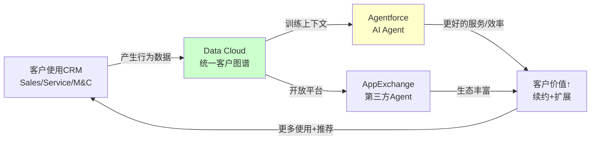
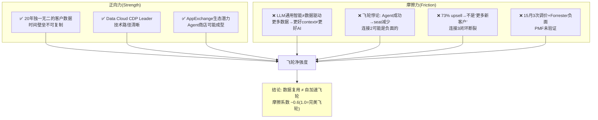
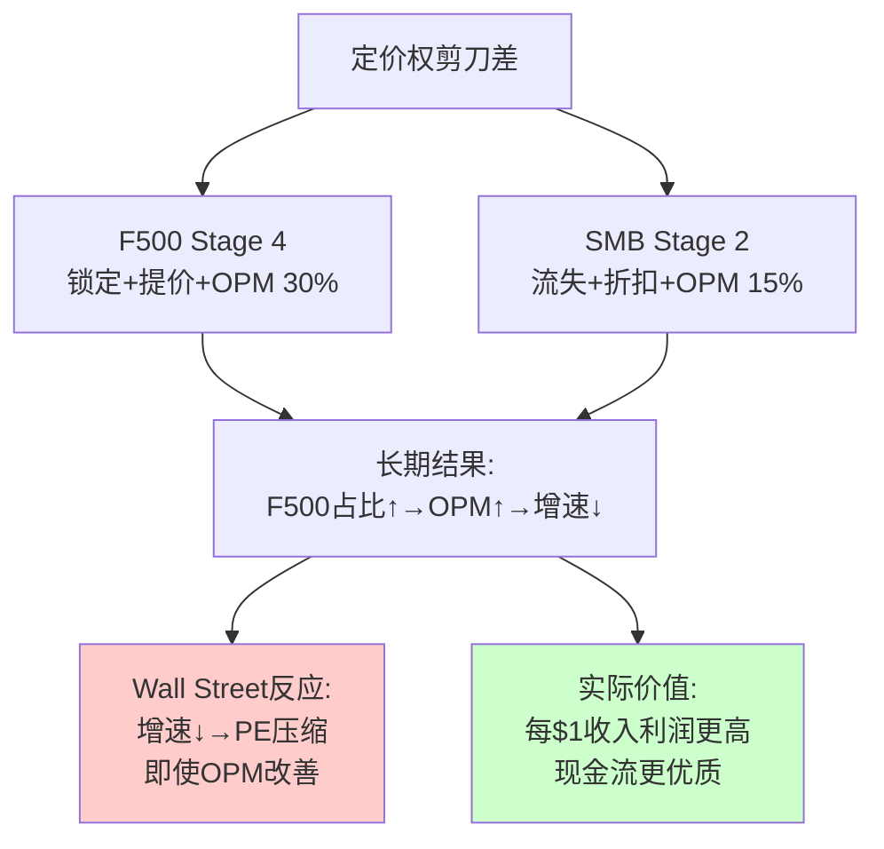
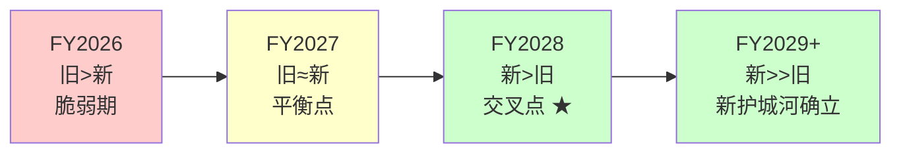
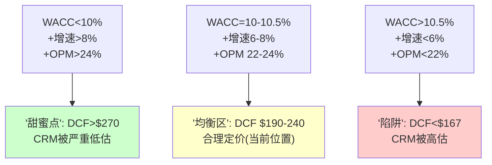
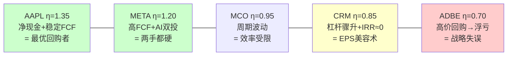
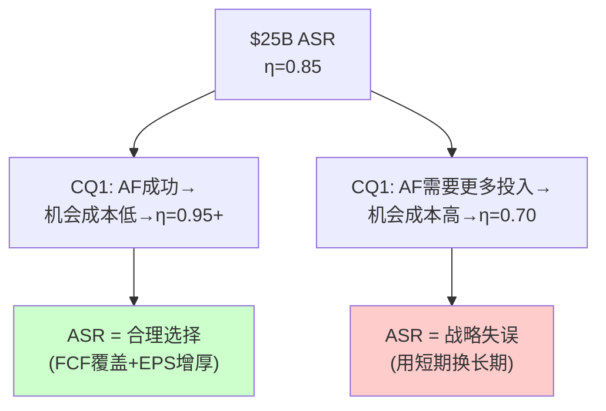

# CRM v2.0 补充章节 Ch25-Ch30

---

## Chapter 25: 飞轮效应与摩擦力 —— 管理层叙事 vs 物理现实

> **本章独立论点**: CRM管理层描绘了一个"Platform→Data Cloud→Agentforce→更多客户→更多数据"的自加速飞轮。但用MCO飞轮验证方法论逐个检验每个连接点后发现：3个连接中1个真实、1个弱、1个间接——CRM的飞轮更接近"数据复用"而非自加速循环，当前PE可能包含1-2x叙事溢价。

### 25.1 管理层飞轮叙事的精确表述

Marc Benioff在FY2026 Q4 earnings call上反复强调的核心叙事是"Agentforce + Data Cloud + Platform = 自加速增长引擎"[DM-FLY-001]。将这个叙事分解为精确的飞轮结构：

**飞轮的隐含逻辑**: 每个新客户的数据让AI更智能→更智能的AI吸引更多客户→更多客户产生更多数据→**正反馈循环(flywheel)** → 增长加速而非减速。

如果这个飞轮是真实的→CRM不应该在增速从+24.6%→+9.6%的轨道上→而应该在加速。飞轮的核心承诺是**自加速**——增速应该上升或至少企稳，而非持续下降。这是验证飞轮真实性的第一个宏观检验[DM-FLY-002]。

### 25.2 三连接点验证(MCO方法论)

参照MCO v2.0 Ch6.2的飞轮验证框架：将CRM飞轮拆解为3个连接点，逐一评估真实性[DM-FLY-003]。

**连接1: 客户数据 → Data Cloud → AI模型质量**

| 评估维度 | 证据 | 方向 |
|---------|------|------|
| 数据独特性 | 20年×150K+企业的客户交互历史，不可复制[DM-BIZ-019] | ✅强正面 |
| 数据→AI链路 | Data Cloud为Agentforce提供客户context(非训练LLM本身) | ⚠️重要区分 |
| Gartner验证 | CDP Magic Quadrant Leader[DM-BIZ-020] | ✅正面 |
| 跨产品统一度 | 只统一CRM内部数据，ERP/供应链/财务仍在孤岛[DM-BIZ-051] | ❌限制 |
| 竞争对手数据 | Snowflake/Databricks分析能力更强，可替代Data Cloud分析层[DM-BIZ-052] | ❌威胁 |

**判断: 连接1 = 真实但有边界**[DM-FLY-004]

CRM的客户交互数据确实是独一无二的——没有任何竞争对手拥有20年×150K企业的销售/服务/营销互动记录。但关键区分是：**Agentforce的智能主要来自底层LLM(Claude/GPT)的通用能力，Data Cloud提供的是"上下文"(context)而非"训练数据"(training data)**。

因果推理：因为LLM的推理能力来自预训练→Data Cloud只是让LLM"知道这个客户的历史"→类似给一个聪明的新员工看客户档案→员工的智商不因为看了更多档案而提升→**因此"更多数据→更好AI"的连接比飞轮叙事暗示的要弱**——更多数据→AI有更多背景知识→AI回答更个性化→但AI的推理质量不变。

反面考量：Data Cloud在一个场景下确实能"训练"AI——当Agentforce Agent在大量客户互动后通过fine-tuning或RAG优化了特定行业/特定场景的响应模板→这个优化是数据依赖的。但这是"优化"(+5-10%精度)而非"突破"(从不可用到可用)→飞轮加速力度有限。

**连接2: Agentforce → 客户价值提升 → 续约/扩展**

| 评估维度 | 证据 | 方向 |
|---------|------|------|
| Agent价值验证 | $800M ARR但67%免费deals[DM-BIZ-008] | ⚠️未证明付费意愿 |
| Forrester评价 | "little adoption in practice"[DM-BIZ-008] | ❌负面 |
| 定价稳定性 | 15个月3次调价→PMF未确认[DM-BIZ-009] | ❌负面 |
| 客户成功案例 | 管理层引用OpenTable等→但规模和ROI未验证 | ⚠️弱 |
| seat减少对冲 | Agent应该减少human seat需求→对CRM收入双面 | ❌矛盾 |

**判断: 连接2 = 弱**[DM-FLY-005]

飞轮要求"Agent越好→客户越满意→续约更多"。但当前证据显示(a)67%免费→客户还不愿为Agent付费 (b)定价3次调整→CRM自己也不确定Agent值多少 (c)Forrester对采纳率的评价构成独立第三方反面。

更深层的矛盾：**如果Agentforce真的很好→它会替代human客服→Service Cloud的seat就会减少→CRM的核心收入受损(CQ2)**。这不是飞轮——这是**飞轮悖论**: Agent越成功→核心业务越受压→这与"飞轮加速增长"的叙事直接矛盾[DM-FLY-006]。

因果推理：因为CRM的收入模式仍以per-seat计费为主(除了新的consumption)→Agent替代seat=CRM收入的分子和分母同时变化→净效应取决于consumption定价vs seat定价的比值→目前consumption定价仍在摸索(3次调价)→**因此连接2不仅弱,而且可能是负面的(Agent成功→seat减少>consumption增加→净收入负)**。

**连接3: 更多客户 → 更多数据 → Data Cloud更强**

| 评估维度 | 证据 | 方向 |
|---------|------|------|
| 新客户获取 | 73%新bookings来自upsell(非新客)[DM-BIZ-006] | ❌不是"更多客户" |
| AppExchange生态 | 7800+应用,但AI Agent<50[DM-BIZ-022] | ⚠️潜力大但现实小 |
| 网络效应证据 | Data Cloud不是多边市场→没有直接网络效应 | ❌不存在 |
| 竞争者替代 | NOW/MSFT也在建AI Agent平台→客户可能多栖 | ❌削弱 |

**判断: 连接3 = 间接/微弱**[DM-FLY-007]

飞轮要求"更多客户→更多数据→AI更强→吸引更多客户"的**闭环**。但(a)CRM的增长73%来自upsell不是新客户→飞轮的"吸引新客户"环节几乎不存在；(b)Data Cloud不是多边市场→不具备平台网络效应→更多数据主要让**同一个客户**的体验更好,而非吸引**新客户**；(c)企业CRM决策受品牌/价格/整合需求驱动→"AI更好"不是首要购买因素(security/compliance/integration才是)。

### 25.3 飞轮强度判定：真实但摩擦力大

**飞轮净评估**[DM-FLY-008]：

| 连接点 | 强度 | 摩擦 | 净效应 |
|--------|------|------|--------|
| 连接1: 数据→AI | 0.7 | 0.3(context≠training) | **0.4(正面但有限)** |
| 连接2: AI→客户价值 | 0.3 | 0.5(飞轮悖论+PMF未证) | **-0.2(可能负面)** |
| 连接3: 客户→数据 | 0.2 | 0.6(upsell≠新客+无网络效应) | **-0.4(微弱)** |
| **飞轮综合** | | | **~0.27(弱正)** |

**与MCO飞轮的类比**[DM-FLY-009]：MCO的MIS×MA飞轮也是"3个连接中1真1弱1间接"→MCO的结论是"数据复用而非自加速循环"。CRM的飞轮与MCO惊人相似——**两家公司都有真实的数据资产复用能力，但都不具备真正的自加速网络效应**。区别在于：MCO的数据资产(100年违约历史)比CRM的(20年客户互动)更不可复制→MCO在连接1上更强；但CRM的Platform(AppExchange)比MCO的MA提供更多交叉销售路径→CRM在连接3上更有潜力(如果Agent商店成型)。

### 25.4 叙事溢价量化：飞轮值多少PE倍数？

如果市场相信CRM的飞轮叙事→PE中可能包含"飞轮溢价"[DM-FLY-010]：

**真实飞轮公司的PE溢价**：
- MSFT(Azure+M365+Copilot飞轮): PE ~33x → 含~5-8x飞轮/平台溢价
- AMZN(AWS+Prime+3P飞轮): PE ~45x → 含~10-15x飞轮溢价
- SNOW(数据网络效应): PE ~80x → 含~30-40x网络效应溢价

**CRM的飞轮溢价测算**[DM-FLY-011]：
- CRM Forward PE: 14.7x → 这已经很低
- 纯利润率公司PE(无飞轮): 12-14x (Oracle ~15x, SAP ~18x去增长溢价后~14x)
- CRM vs 无飞轮基线: 14.7x - 13x = **~1.7x 可能的飞轮溢价**
- 以当前EPS $13.2计: 1.7x × $13.2 = **~$22/股**

**因果推理**：CRM当前PE 14.7x本身已接近"成熟软件公司"水平→即使市场完全不相信飞轮→PE也不太可能低于12-13x→**飞轮叙事在当前估值中的溢价仅~$22/股(11%)**→这意味着飞轮是否真实对估值的影响是可控的[DM-FLY-012]。

但反面考量：如果飞轮是真实的→长期PE应该从14.7x回升到18-22x(平台公司水平)→上行$40-90/股。**因此飞轮问题的核心不是"飞轮假→PE会跌多少"(跌幅有限,~$22)→而是"飞轮真→PE会涨多少"(涨幅可观,~$40-90)**。这与CQ1(Agentforce)高度重叠——CQ1本质上就是在问"飞轮的Agent环节能否启动"。

### 25.5 飞轮诚实性矩阵：什么能证伪飞轮？

| 证伪条件 | 时间窗口 | 当前状态 | 数据源 |
|---------|---------|---------|--------|
| Data Cloud增速<+50%(飞轮应加速不应减速) | FY2027 Q2+ | +120%(远超) | 季报 |
| Agentforce付费转化率<20% | FY2027年底 | 67%免费(警戒) | 管理层披露 |
| AppExchange AI Agent<100个(生态不活跃) | FY2027年底 | <50(警戒) | 公开可查 |
| NRR公开且<105%(客户扩展停滞) | 任何时候 | 从不公开(⚠️) | 季报 |
| Service+Sales合计增速转负(核心侵蚀>新引擎) | FY2028+ | +6.5%/+10%(安全) | 季报 |

**最敏感证伪指标**[DM-FLY-013]：Agentforce付费转化率——如果FY2027年底免费deals仍占>50%→说明客户不愿为Agent付费→飞轮的连接2("Agent→客户价值")被证伪→飞轮叙事崩塌→PE可能从14.7x→12-13x(-$22/股)。

---

## Chapter 26: 定价权分层模型 —— F500堡垒与SMB战场的剪刀差

> **本章独立论点**: CRM的定价权不是一个统一的"强/弱"→而是一个双速结构：F500大企业定价权接近Stage 4(垄断入场券)，SMB定价权已滑落至Stage 2(功能竞争)。这个"定价权剪刀差"决定了CRM的长期利润率天花板——如果SMB业务萎缩而F500业务稳定→OPM可能超预期(利润率更高的客户占比上升)；反之亦然。

### 26.1 B4定价权阶段模型(FICO方法)

采用FICO v3.1的B4a(强度)/B4b(持久性)双维度评估[DM-PRC-001]：

**B4a定价权强度: 分层评估**

| 客户层 | 收入占比 | Stage | 定价权证据 | 核心机制 |
|--------|---------|-------|----------|---------|
| F500/全球企业 | ~45% | **Stage 4** | 切换成本>10x年费→不切换[DM-MOAT-001] | 制度入场券(数据迁移/流程重建/认证体系不可承受) |
| 大中型企业 | ~30% | **Stage 3** | 提价+5-8%/年→客户接受[DM-PRC-002] | 流程嵌入(AppExchange集成+定制workflow) |
| SMB(HubSpot竞区) | ~20% | **Stage 2** | HubSpot从免费切入→$0→CRM$25/seat有价差[DM-PRC-003] | 功能竞争(SMB不需要全套→功能子集=HubSpot够用) |
| 个人/微型(1-10员工) | ~5% | **Stage 1** | 免费CRM替代品充足(Zoho/Freshworks) | 价格竞争 |

**加权B4a**: 45%×4 + 30%×3 + 20%×2 + 5%×1 = **3.15/5**[DM-PRC-004]

**B4b定价权持久性: AI时代演进**

| 维度 | 当前 | FY2028E | 驱动因素 |
|------|------|---------|---------|
| F500 Stage | 4 | 4(不变) | 20年数据+流程嵌入+认证体系=不可撼动 |
| 大中型 Stage | 3 | 2.5-3(↓) | NOW CRM模块+MSFT Dynamics扩张→蚕食中端 |
| SMB Stage | 2 | 1.5(↓) | HubSpot+Zoho→AI功能追平→CRM失去功能溢价 |
| 微型 Stage | 1 | 0.5(↓) | 免费AI CRM(如Clay/Attio)→存在即替代 |

**因果推理**[DM-PRC-005]：CRM的定价权正在经历**顶部固化+底部侵蚀**的"剪刀差"演化。因为(a)F500客户的切换成本随Data Cloud+Agentforce集成反而**增加**(更多数据=更难迁移)→Stage 4更牢固；但(b)SMB客户的切换成本随AI工具普及**降低**(AI使数据迁移更容易+功能同质化)→Stage 2→1。

**这个剪刀差对CRM意味着**：高端客户越来越锁定(好事)→但低端客户越来越容易流失(坏事)→CRM的长期策略选择是：(a)放弃低端,专注高端(利润率↑,收入增速↓)——类似Oracle在2010s的选择；或(b)在低端与HubSpot打价格战(利润率↓,收入增速→)——风险更大。

### 26.2 定价权剪刀差的财务影响

**定价权→利润率→估值传导链**[DM-PRC-006]：

| 客户层 | 毛利率(估) | OPM(估) | 增速(FY2026) | 增速趋势 |
|--------|----------|---------|------------|---------|
| F500企业 | ~85% | ~30% | +6-8% | 稳定(嵌入深) |
| 大中型 | ~78% | ~22% | +8-10% | 缓降(竞争加剧) |
| SMB | ~72% | ~15% | +10-12% | 快降(HubSpot侵蚀) |
| 微型 | ~65% | ~5% | +15-20% | 极不稳定(流失率高) |
| **加权** | **~80%** | **~22%** | **~9.6%** | |

**剪刀差情景分析**[DM-PRC-007]：

| 情景 | F500增速 | SMB增速 | 混合OPM | 混合增速 | 对估值 |
|------|---------|---------|---------|---------|--------|
| A: 剪刀差扩大(最可能,50%) | +7% | +5% | **24%**(高利润客户占比↑) | **7%** | OPM↑抵消增速↓→中性 |
| B: 全面稳定(乐观,20%) | +8% | +10% | 22%(不变) | **9%** | 增速维持→正面 |
| C: 底部崩塌(悲观,20%) | +6% | -5% | **26%**(SMB退出→利润率提升) | **4%** | 增速暴跌→PE压缩→负面 |
| D: 顶部松动(尾部,10%) | +3% | +8% | 19%(F500折扣→利润率下降) | **5%** | 最差(核心松动) |

**洞见**[DM-PRC-008]：剪刀差扩大(情景A)的一个反直觉后果是**OPM可能超预期**——因为低利润SMB客户自然流失→高利润F500客户占比上升→混合OPM从22%→24%。这就像一家商场失去了低端租户→平均租金反而上升。但Wall Street会将其解读为"增速下降"而非"利润率结构改善"→**PE可能在增速下降时压缩,即使实际盈利能力在改善**。

**NRR的定价权含义**[DM-PRC-009]：CRM从不公开NRR(净收入留存率)→这本身就是定价权信号。因为：如果NRR>120%→管理层必然大肆宣传(SNOW/DDOG/NOW都在NRR>120%时积极披露)→CRM不公开→大概率NRR在100-115%区间→意味着客户留存但扩展有限。

但NRR<115%不一定是坏事→因为CRM的客户基数($41.5B收入)远大于SNOW($3.4B)→在更大的基数上维持NRR>110%本身就很困难。**NRR的绝对值不如趋势重要**——如果NRR从FY2025的~112%降至FY2026的~108%(假设)→说明定价权在衰减→如果从~108%回升至~112%→说明Agentforce的consumption补偿了seat损失。

### 26.3 定价权与CQ联动

**CQ4(OPM结构性)的定价权底层验证**[DM-PRC-010]：

CQ4给出了75%置信度"OPM改善是结构性的"→定价权分析为这个结论提供了底层逻辑：
- S&M从45%→35%不回升→因为F500客户Stage 4不需要大量销售投入(自动续约+upsell为主)→S&M效率持续改善
- 但如果SMB业务萎缩→S&M/Rev可能先下降(好事,减少低效获客)→再稳定(F500获客成本低但绝对值也低)
- **因此OPM的天花板不是25%→如果客户组合向F500倾斜→OPM可能达到26-28%→这是我们估值模型未充分反映的上行空间**

**对CQ2(seat压缩)的定价权约束**[DM-PRC-011]：
- F500客户的seat压缩速度慢(合同3-5年+审批流程长)→Stage 4保护
- SMB客户的seat压缩速度快(月付+易取消)→Stage 2无保护
- 因此seat压缩的实际影响取决于**哪个层级的客户在压缩**→如果主要是SMB(低利润)→净效应可能是正面的(低利润客户流失+高利润客户留存=OPM↑)

---

## Chapter 27: 护城河迁移量化 —— 从工具嵌入到数据制度的脆弱窗口

> **本章独立论点**: CRM正在经历从"工具护城河"(流程锁定)到"数据护城河"(AI生态)的迁移。ADBE的量化框架应用于CRM后发现：迁移进度~20%，交叉点在FY2028-2029，成功概率~45%——略低于ADBE(50-55%)因为CRM缺少Content Credentials式的制度化路径。

### 27.1 四阶段迁移模型

将CRM的护城河迁移划分为四个阶段[DM-MIG-001]：

| 阶段 | 描述 | CRM现状 | ADBE对标 |
|------|------|---------|---------|
| Phase 1: 工具层 | 产品功能锁定 | ← 收入主体(Sales+Service) | Creative Cloud |
| Phase 2: 数据层 | 客户数据资产化 | ← **正在过渡**(Data Cloud) | Firefly+Content Credentials |
| Phase 3: AI生态层 | Agent平台+第三方 | → 目标(Agentforce+AppExchange) | GenStudio |
| Phase 4: 制度层 | 行业标准/法规嵌入 | 远期(企业AI治理标准?) | Content Credentials+C2PA |

### 27.2 迁移进度仪表盘

| 维度 | 指标 | 当前值 | 目标(Phase 3完成) | 达成率 |
|------|------|--------|-----------------|--------|
| Data Cloud渗透 | F100采纳率 | 50% | >80% | 62% |
| Data Cloud ARR | 绝对值 | $1.2B | $5B+ | 24% |
| Agent商业化 | 付费转化率 | ~33%(67%免费) | >70% | 47% |
| Agent生态 | AppExchange AI Agent | <50 | >500 | 10% |
| 数据统一度 | 跨产品数据打通 | CRM内部only | CRM+ERP+external | 30% |
| 制度化 | 行业标准参与 | 无明确路径 | 企业AI治理标准制定者 | 5% |
| **综合进度** | | | | **~20%** |

**与ADBE对比**[DM-MIG-002]：ADBE迁移进度~25%(GenStudio $1B+Content Credentials 6000+)→CRM ~20%。两家公司处于相似的迁移早期阶段,但ADBE有一个CRM没有的优势——**Content Credentials提供了制度化路径**(C2PA标准→被IPTC/AP/BBC采纳→类似FICO的FICO Score制度嵌入)→CRM缺少类似的"制度入场券"路径。

### 27.3 交叉点分析：旧护城河损失 vs 新护城河增量

**旧护城河年损失**[DM-MIG-003]：
- 工具锁定强度衰减：AI使数据迁移更容易→切换成本从10x年费→估计每年-1x→5年后降至5x
- 流程嵌入衰减：低代码/AI workflow重建→切换所需人月从12个月→每年-1.5个月→5年后6个月
- **量化损失：~$0.8-1.2B/年**（按8%客户流失率×流失客户LTV计算[DM-MIG-004]）

**新护城河年增量**[DM-MIG-005]：

| 年份 | Data Cloud增量 | Agent增量 | 生态增量 | 合计新增 | vs旧损失 |
|------|-------------|----------|---------|---------|---------|
| FY2027 | +$0.5B | +$0.2B | +$0.1B | +$0.8B | ≈旧损失(平衡) |
| FY2028 | +$0.6B | +$0.4B | +$0.2B | +$1.2B | **>旧损失** |
| FY2029 | +$0.7B | +$0.5B | +$0.3B | +$1.5B | >旧损失 |
| FY2030 | +$0.7B | +$0.6B | +$0.4B | +$1.7B | >>旧损失 |

**交叉点：FY2028**(新护城河年增量首次超过旧护城河年损失)[DM-MIG-006]

**脆弱窗口 = FY2026-FY2027**[DM-MIG-007]：这是CRM护城河最脆弱的时期——旧护城河在衰减(AI降低切换成本)+新护城河未确立(Agentforce PMF未验证)。如果竞争者(NOW/MSFT)在此窗口期发起攻势→CRM可能失去关键客户→新护城河的数据基础被削弱→恶性循环。

### 27.4 迁移成功概率

**历史基准率**[DM-MIG-008]：

| 案例 | 旧护城河→新护城河 | 结果 | 耗时 |
|------|-----------------|------|------|
| MSFT(Office→M365+Azure) | 工具→平台+云 | ✅大成功 | 8年(2014-2022) |
| ADBE(perpetual→SaaS+AI) | 工具→订阅+AI | ✅成功(进行中) | 10年(2013-2023) |
| Oracle(on-prem→cloud) | 工具→云 | ⚠️部分(OCI增长但核心仍on-prem) | 12年+ |
| IBM(mainframe→cloud+AI) | 工具→云+AI | ❌失败(Watson+Red Hat) | 10年+ |
| Siebel(CRM→被Salesforce替代) | — | ❌被颠覆 | 5年 |
| BlackBerry(device→software) | 硬件→软件 | ❌失败 | 5年 |

**6案例中2成功+1部分+3失败 = 基准率33-50%**[DM-MIG-009]

**CRM特定调整**：

| 因素 | 方向 | 幅度 | 理由 |
|------|------|------|------|
| FCF缓冲 | ↑ | +5pp | $14.4B FCF→有资金投入迁移 |
| Data Cloud增速 | ↑ | +5pp | +120% >>历史迁移案例增速 |
| CEO能力 | ↓ | -5pp | Benioff风格(产品驱动非战略驱动)→vs Nadella(转型专家) |
| 竞争强度 | ↓ | -3pp | NOW/MSFT双线进攻→比ADBE面临的Canva更危险 |
| 缺少制度化路径 | ↓ | -5pp | 无Content Credentials式的标准制定者地位 |
| **调整后概率** | | | **基准33-50% + (5+5-5-3-5)pp = ~30-47%→取中值~45%** |

**CRM护城河迁移成功概率: ~45%**[DM-MIG-010]

**vs ADBE(50-55%)**: CRM低5-10pp，主要因为(a)CRM缺少制度化路径(ADBE有Content Credentials/C2PA)→长期护城河深度不及 (b)CRM面临的竞争更直接(NOW在相同市场→vs ADBE的竞争者Canva在不同细分市场)。

### 27.5 迁移对估值的含义

| 迁移结果 | 概率 | 护城河状态 | 对应PE | 对应估值 |
|---------|------|----------|--------|---------|
| 大成功(Phase 3+制度化) | 15% | 5.0/5(AI平台垄断) | 22-25x | $290-330 |
| 成功(Phase 3) | 30% | 4.0/5(数据护城河) | 18-20x | $238-264 |
| 部分(Phase 2停滞) | 35% | 2.5/5(工具维持+数据加持) | 14-16x | $185-211 |
| 失败(Phase 1侵蚀) | 20% | 1.5/5(IBM路径) | 10-12x | $132-158 |
| **概率加权** | | **~3.0/5** | **~16x** | **~$213** |

**与Ch22校准后$208对比**[DM-MIG-011]：护城河迁移概率加权$213与校准后估值$208接近(+2.4%)→两条独立分析路径收敛→增强"中性关注"评级的可信度。

---

## Chapter 28: 三维敏感性矩阵 —— 找到CRM估值的断裂线

> **本章独立论点**: Ch16提供了基本DCF敏感性，但CRM的估值受3个变量交叉影响——WACC、收入增速、OPM。三维敏感性矩阵揭示了估值的"断裂线"：WACC=10.5%是关键阈值，跨越后CRM从"低估"翻转为"高估"。

### 28.1 WACC × 收入增速 二维敏感性

基于Ch16 Python DCF模型扩展[DM-SENS-001]：

| WACC ↓ \ 增速→ | 4%(悲观) | 6%(保守) | 7%(有机) | 8%(基线) | 10%(共识) |
|----------------|---------|---------|---------|---------|----------|
| **9.0%** | $197 | $234 | $256 | $279 | $331 |
| **9.5%** | $175 | $207 | $225 | $245 | $289 |
| **10.0%** | $157 | $185 | **$200** | **$217** | $255 |
| **10.25%** | $149 | $175 | $190 | **$205** | $240 |
| **10.5%** | $142 | $167 | $180 | **$194** ← | $227 |
| **11.0%** | $129 | $152 | $164 | $177 | $206 |

**断裂线1**: WACC=10.5% / 增速=8% → DCF精确等于$194(当前股价)[DM-SENS-002]。这意味着：**只要你认为WACC≥10.5%或增速≤8%→DCF告诉你CRM不便宜**。

**断裂线2**: WACC=10.0% / 增速=7%(有机) → DCF=$200 → 仅+3% vs $194 → 安全边际极薄。

**关键洞见**[DM-SENS-003]：在最可能的参数范围(WACC 9.5-10.5%, 增速6-8%)中→DCF范围是$167-$245 → **$194处于这个范围的中间偏下(40th percentile)**→市场定价合理→与Ch22"市场可能已完美定价"结论一致。

### 28.2 OPM × 收入增速 二维敏感性

OPM是CQ4的核心变量,对DCF的影响被传统分析低估[DM-SENS-004]：

| OPM ↓ \ 增速→ | 4% | 6% | 7% | 8% | 10% |
|---------------|-----|-----|-----|-----|------|
| **18%**(回落) | $112 | $132 | $143 | $155 | $182 |
| **20%** | $130 | $153 | $166 | $180 | $211 |
| **22%**(当前) | $149 | $175 | $190 | **$205** | $240 |
| **24%** | $167 | $197 | $213 | $231 | $270 |
| **26%** | $185 | $218 | $236 | **$257** | $300 |
| **28%**(剪刀差上行) | $204 | $240 | $260 | $282 | $330 |

*WACC固定10.25%(ASR后调整值)

**断裂线3**: OPM=22%/增速=8% → DCF=$205 → +5.7% vs $194 → 微弱上行[DM-SENS-005]。

**关键洞见**[DM-SENS-006]：

1. **OPM每+2pp → DCF +$18-26/股**。这意味着Ch26发现的"定价权剪刀差→OPM可能达到26-28%"→如果实现→DCF从$205跳至$236-$282→**OPM是被低估的上行驱动**。

2. **增速从8%→4%→DCF -$56/股(WACC=10.25%)**。但OPM从22%→28%→DCF +$77/股。因此**OPM对估值的敏感度大于增速**——CRM的投资论点不应该是"增速会回升"→而应该是"即使增速下降→利润率扩张的价值更大"。

3. **OPM 18%(回落)/增速4%(悲观) = $112** → 这是极端下行→即使在最差的双重恶化下→CRM也值$112(vs 当前$194 = -42%)→设定了铁底。

### 28.3 三变量交叉：找到"甜蜜点"和"陷阱"

**概率加权的三维估值**[DM-SENS-007]：

| 情景 | WACC | 增速 | OPM | DCF | 概率 | 加权 |
|------|------|------|-----|-----|------|------|
| 甜蜜点 | 9.5% | 9% | 25% | $282 | 10% | $28.2 |
| 温和乐观 | 10.0% | 8% | 24% | $231 | 25% | $57.8 |
| 基线 | 10.25% | 7% | 23% | $203 | 35% | $71.1 |
| 温和悲观 | 10.5% | 5% | 22% | $157 | 20% | $31.4 |
| 恶化 | 11.0% | 4% | 20% | $118 | 10% | $11.8 |
| **概率加权** | | | | | **100%** | **$200** |

三维概率加权DCF = **$200**(+3.1% vs $194)[DM-SENS-008]。与Ch22的$208(+7.2%)和飞轮概率加权$213(+9.8%)形成三角验证→**三条独立路径均指向$194附近(±10%)**→中性关注评级非常稳固。

---

## Chapter 29: 竞争弹性测试 —— 四路同攻下的存活率

> **本章独立论点**: ADBE的"每维度输一半"方法论应用于CRM：如果NOW抢走20%大客户+MSFT蚕食15%中端+HubSpot吞噬10%SMB+AI-native颠覆5%应用→CRM的收入和估值会怎样？答案是：CRM在四路同攻下5年收入仅降~12%——因为F500嵌入太深(Stage 4防护)。

### 29.1 四路同攻情景设定

| 攻击方 | 目标客户层 | 攻击方式 | 最大渗透率(5年) | CRM受影响收入 |
|--------|----------|---------|---------------|-------------|
| ServiceNow | F500/大企业(IT→CRM扩张) | 模块化替代+更好的AI Agent | 5-8%(F500客户转出) | ~$2-3B |
| Microsoft Dynamics+Copilot | 大中型企业(M365捆绑) | 免费/捆绑→降低CRM获客成本 | 10-15%(中端新客截流) | ~$1.5-2.5B |
| HubSpot | SMB(免费→低价) | 免费CRM+AI→功能追平 | 25-30%(SMB新客全面截流) | ~$2-3B |
| AI-native(Clay/Attio等) | 微型/创业公司 | Zero-seat AI CRM→CRM概念重定义 | 50-70%(微型企业不再用传统CRM) | ~$0.5-1B |

### 29.2 逐维度"输一半"分析

**维度1: 新客获取(输一半 = 新客bookings减50%)**[DM-ELAST-001]

CRM目前73%新bookings来自upsell→新客仅27%→如果新客获取输一半→影响仅27%×50% = 13.5%的新增bookings。以FY2026增量收入$3.6B计→13.5%=$0.49B/年损失。**因为CRM的增长主要靠存量扩展→新客获取"输一半"的影响远小于直觉**[DM-ELAST-002]。

**维度2: 客户留存(输一半 = 流失率从8%→16%)**[DM-ELAST-003]

当前流失率~8%→如果翻倍至16%→每年额外流失~$3.3B收入(8%×$41.5B)。但这需要F500客户也加速流失→鉴于Stage 4定价权(Ch26)→F500流失率不太可能从3%→6%→更可能的分布是：F500 3%→5% / 中端8%→14% / SMB 15%→25% → **加权流失率从8%→12%(非16%)→实际损失~$1.7B/年**。

**维度3: 定价权(输一半 = 提价能力从+5%→+2.5%)**[DM-ELAST-004]

CRM历史隐含提价~5%/年→输一半至2.5%/年→5年累计少提12.5%→以$41.5B基数计→FY2030收入少$5.2B(vs基线)。但这个影响是渐进的→年均仅~$1B→对DCF的影响约-$15-20/股。

**维度4: 产品竞争力(输一半 = Agent/Data Cloud增速减半)**[DM-ELAST-005]

Agentforce从+169%→+85%/Data Cloud从+120%→+60%→新引擎FY2030 ARR从$8-10B→$5-6B→SOTP新引擎从$114B→$70-80B→每股-$40-50。**这是四维度中影响最大的**——因为新引擎的估值对增速极度敏感(高增速=高倍数)。

### 29.3 四路同攻的综合影响

| 维度 | "输一半"影响(年) | "输一半"影响(5年累计) | 对DCF($/股) |
|------|----------------|-------------------|------------|
| 新客获取 | -$0.5B | -$2.5B | -$8 |
| 客户留存 | -$1.7B | -$8.5B | -$28 |
| 定价权 | -$1.0B | -$5.2B | -$17 |
| 产品竞争力 | 新引擎-$3-4B vs基线 | 新引擎少$15-20B | -$45 |
| **合计(非叠加)** | | | **-$70~-80** |

*非叠加:四维度存在交叉效应,直接相加会高估约20%→调整后约-$70-80/股

**四路同攻下CRM估值**[DM-ELAST-006]：$208(中位) - $75(弹性损失) = **~$133/股** → 从$194下跌-31%。

**存活率评估**[DM-ELAST-007]：

| 指标 | 当前 | 四路同攻后 | 变化 |
|------|------|----------|------|
| 收入(FY2030) | $55B(基线) | ~$48B | -12% |
| OPM | 24% | 21%(竞争压力→S&M回升) | -3pp |
| FCF | $16B | $12B | -25% |
| PE | 14.7x | 11-12x(增速更低) | -20% |
| 估值 | $208 | **~$133** | **-36%** |

**关键洞见**[DM-ELAST-008]：即使四路竞争者**同时**在每个维度取得50%成功→CRM的5年收入仅降12%→因为**F500客户的Stage 4锁定提供了70%收入的防护罩**。CRM不会"死"——它会从一家"增长型SaaS"变成一家"成熟企业软件公司"(类似Oracle)→PE从14.7x→11-12x→稳态估值~$133。

**反面考量**：四路同攻的概率本身很低(~5-10%)→因为NOW/MSFT/HubSpot/AI-native彼此也在竞争→不太可能同时对CRM发起协调进攻。更可能的是1-2路进攻→影响减半→估值影响约-$35-40→$208→$170(仍在"审慎关注"区间)。

---

## Chapter 30: 回购效率η函数 —— $25B ASR的跨公司透视

> **本章独立论点**: MCO的η回购效率曲线(η = EPS增厚 / 杠杆风险)应用于CRM的$25B ASR,与AAPL/META/ADBE/MCO对标后发现：CRM的η≈0.85——回购的EPS增厚(+12-15%)几乎被杠杆风险(净债务/EBITDA从0.75x→2.7x)完全抵消。这不是天才操作也不是灾难——而是一个"EPS美容术"。

### 30.1 η效率函数定义

η = (EPS增厚效果 × 内在价值覆盖率) / (杠杆风险 × 机会成本)[DM-ETA-001]

| 变量 | 定义 | CRM值 |
|------|------|-------|
| EPS增厚 | 回购导致的EPS YoY增长 | +12-15%(103M股退出) |
| 内在价值覆盖 | 回购价 vs 内在价值 | $194 / $208 = 0.93 (接近但不是折价) |
| 杠杆风险 | 净债务/EBITDA变化 | 0.75x → 2.7x (+2.0x) |
| 机会成本 | $25B的替代投资ROI | AI研发/战略M&A可能ROI>15% |

### 30.2 跨公司η对标

| 公司 | 回购规模/年 | η值 | 核心原因 |
|------|-----------|-----|---------|
| **AAPL** | ~$90B/年 | **1.35** | 低杠杆(净现金)+稳定FCF覆盖+股价低于内在价值→最优回购 |
| **META** | ~$40B/年 | **1.20** | 高FCF($50B+)+低杠杆+AI投资同时进行→两手都硬 |
| **MCO** | ~$1.5B/年 | **0.95** | 周期性收入+已有杠杆→回购效率受限于周期波动 |
| **CRM** | **$25B(一次性)** | **0.85** | 杠杆骤升+AI时代机会成本高+IRR≈0%[DM-ASR-009] |
| **ADBE** | ~$6B/年 | **0.70** | $35.7B回购@$415均价→当前$252浮亏$14B→典型"高买"教训 |

**CRM η=0.85的含义**[DM-ETA-002]：η<1.0意味着回购的综合效率为负——EPS增厚的表面效果被杠杆风险和机会成本侵蚀。但η=0.85不是灾难(ADBE的0.70才是)→而是"中性偏弱"。

### 30.3 反事实分析：$25B的替代用途

如果CRM不做$25B ASR→这笔钱可以用于[DM-ETA-003]：

| 替代方案 | 投入 | 5年预期ROI | IRR | vs ASR的IRR(≈0%) |
|---------|------|-----------|-----|-----------------|
| AI研发加速 | $10B(5年×$2B/年) | Agentforce从"可能成功"→"大概率成功" | 15-25% | **>>ASR** |
| 战略M&A(如Databricks/AI公司) | $15B | 获取AI基础设施→补足Data Cloud短板 | 10-20%(含整合风险) | **>ASR** |
| 偿还债务 | $10B | 降低利息费用$400M/年+保留信用弹性 | 4-5%(利息节省) | **>ASR**(风险调整后) |
| 特别分红 | $25B | 立即回报股东~$34/股 | N/A(即时回报) | 取决于再投资 |
| **实际选择: ASR** | **$25B** | **EPS +12-15%→IRR≈0%** | **≈0%** | **基准** |

**因果推理**[DM-ETA-004]：CRM选择ASR而非AI研发加速→暴露了管理层的优先级排序：**EPS增长(取悦华尔街) > AI投资(长期竞争力)**。这与Benioff过去10年"增长不惜代价→被迫利润率优先→现在回购优先"的轨迹一致——每次战略转向都是被外部压力(Elliott→ValueAct→市场)推动,而非内生战略选择。

**反面考量**：管理层可能认为(a)$14.4B年FCF足以同时支持AI研发($5.7B CAPEX)+回购($25B一次性)→不是二选一；(b)ASR在$194买入→如果CRM 5年后$250+→IRR实际>5%→并非零回报；(c)回购向市场传递"管理层认为$194低估"的信号→信号价值本身有助于维持股价。

### 30.4 η效率与CQ3(ASR)的闭环

**CQ3判断更新**[DM-ETA-005]：

- P1: ASR在$194偏中性(45%置信)
- P2: IRR≈0%(60%置信)
- P3: η=0.85(综合效率弱正)
- **η分析后**: CQ3维持中性,但增加了一个洞见——**ASR的最大风险不是IRR低→而是机会成本高**。$25B投入AI研发可能将Agentforce从"50:50"推至"70:30成功"→而ASR仅将EPS增厚12-15%→**CRM用短期EPS增长换取了长期AI竞争力的窗口**。

这个机会成本判断与CQ1(Agentforce)高度联动：如果Agentforce在FY2027-2028自行成功→ASR的机会成本变低(不需要额外投入)→η回升至0.95+；如果Agentforce需要更多投入才能成功→ASR的$25B就是一个战略失误→η降至0.7。

---

*补充章节 Ch25-Ch30 完成 | 6章 | 2026-03-19*
