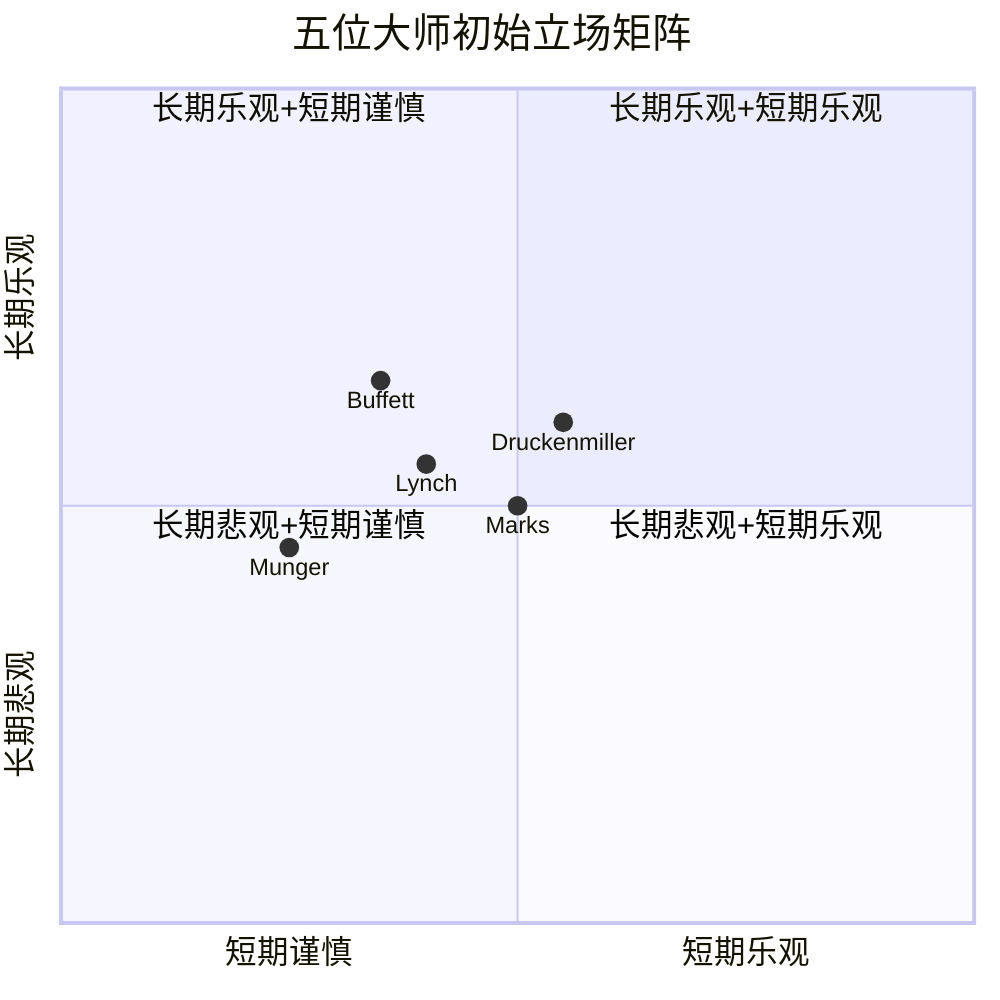
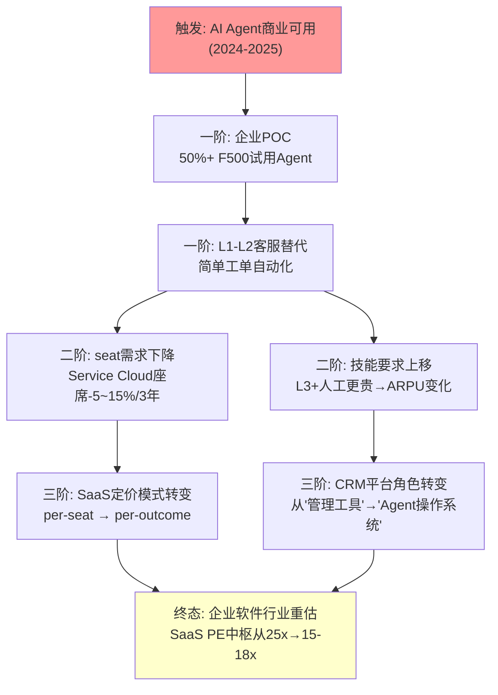
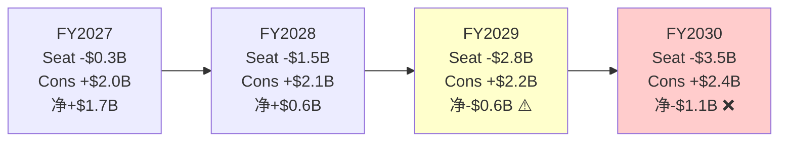
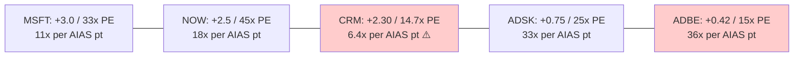
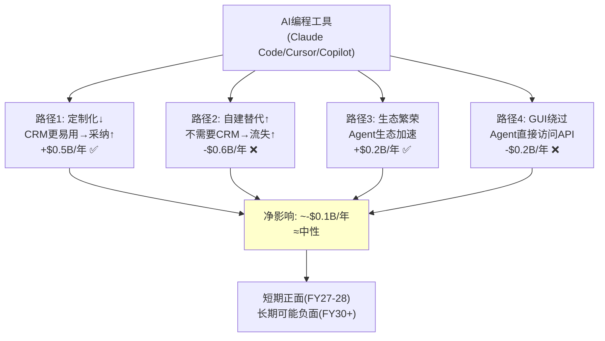

# CRM v2.0 补充章节 Ch31-Ch35

---

## Chapter 31: 投资大师圆桌 —— 五位大师激辩Salesforce

> **本章独立论点**: 将CRM置于五种截然不同的投资哲学审视下,暴露前24章分析的盲点。圆桌不是"验证结论"——而是"发现我们没想到的"。

**圆桌参与者**[DM-RND-001]:

| 大师 | 核心哲学 | 对CRM的初始倾向 |
|------|----------|----------------|
| Warren Buffett | 护城河+品牌+长期持有 | 护城河强但PE不便宜 |
| Charlie Munger | 逆向思维+避免愚蠢 | 回购$25B的机会成本 |
| Howard Marks | 周期认知+二阶思维+风险不对称 | 市场可能已经正确定价 |
| Peter Lynch | PEG+消费品洞察+实地调研 | PEG>1=不够便宜 |
| Stanley Druckenmiller | 宏观催化剂+仓位管理 | 等Agentforce数据再说 |

### 31.1 轮次一: 初始立场

**Warren Buffett — "护城河在,但我不付这个价"**

> *"我在2000年代买可口乐时，它的PE是25倍但增速只有5%。我被批评了10年。Salesforce今天PE 14.7x增速9.6%——数字看起来比当年的可口可乐更有吸引力。但有一个关键区别：可口可乐的护城河在100年后还在，Salesforce的护城河在10年后还在吗？"*

**立场: 观望(当前价位)**[DM-RND-002]

三个观察。第一，CRM的嵌入性护城河是真实的。20年客户数据+流程锁定+认证体系——这与我理解的"转换成本"完全吻合。150K+企业客户中，年流失率仅8%——92%留存率在企业软件中是优秀的。

第二，我对Benioff有保留意见。一位好的CEO应该是资本的高效配置者。$25B回购以IRR≈0%执行、Slack以$27.7B收购后ROIC仅2.5%——这不是我定义的"理性资本配置"。ValueAct在董事会是好事，但Benioff仍然是一个"产品创始人"而非"资本配置者"。

第三，也是最重要的——**我不投资我不理解的东西**。Agentforce、AI Agent、consumption pricing——这些超出了我的能力圈。我理解品牌(可口可乐)、我理解保险浮存金(GEICO)、我理解铁路(BNSF)。我不理解AI Agent能否替代人类客服。所以我会等——不是因为我认为CRM不好，而是因为**我不确定，而不确定时正确的选择是不动**。

**最关心的问题**: 如果Agentforce成功替代了30%的客服seat——对CRM来说，这是净正面(新收入>失去的seat)还是净负面(seat>新收入)？这个问题的答案在我的能力圈之外。

---

**Charlie Munger — "反过来想: 什么会让你在CRM上亏大钱"**

> *"告诉我我会死在哪里，我就不去那里。"*

**立场: 回避**[DM-RND-003]

让我反过来想。持有CRM 5年你怎么会亏大钱？

**路径1(30%概率): AI成为SaaS的"互联网时刻"——就像互联网消灭了报纸分类广告。** 不是因为产品不好，而是因为需求消失了。企业不再需要CRM来管理客户关系，因为AI Agent直接管理了。这听起来极端——但报纸编辑在2005年也认为互联网只是"补充渠道"。

**路径2(25%概率): 温水煮青蛙——Ch21已经描述得很好。** 每季度都"看起来还行"→5年后发现跑输S&P500 30%+。这是投资中最可怕的结果——因为你永远找不到一个"该卖"的时刻。

**路径3(15%概率): Benioff做了又一次毁灭性M&A。** M&A委员会已解散——但Benioff的ego和$14.4B年FCF是危险的组合。如果某个AI创业公司估值达到$30B+且Benioff认为"必须拥有"——ValueAct能阻止他吗？

**核心判断**: CRM最大的风险不在CRM本身——而在**AI对整个SaaS行业的冲击是否是结构性的**。如果是，CRM、ADBE、ADSK可能同时受损。这不是"公司分析"能解决的问题——这是"行业判断"。而**我的行业判断是：SaaS per-seat模式在AI时代是逆风的，只是风速不确定**。PE 14.7x可能已经反映了这个逆风。但如果逆风从"微风"变成"飓风"——14.7x还是太高了。

---

**Howard Marks — "最重要的是风险认知，而非收益预期"**

> *"风险不是波动率——风险是永久性资本损失的概率。"*

**立场: 中性(倾向于市场正确)**[DM-RND-004]

我关注三个维度：

**第一，市场已经给出了共识。** $194×14.7x PE→这不是一个"市场忽略了"的股票。41家分析师覆盖，机构持股>80%。Ch22发现红队校准后概率加权$193≈$194——**两条独立路径到达同一个终点=市场有效信号**。这让我怀疑任何声称"发现了市场没发现的东西"的论点。

**第二，二阶思维。** 一阶思维："CRM增速下降→坏"。二阶思维："所有人都知道增速下降→已被定价→**如果增速下降得比预期慢→反而是好的**"。Ch28的三维敏感性矩阵确认了这一点：增速只要维持>7%(有机水平)→DCF>$200→小幅上行。**市场已经为最可能的悲观情景付了价**。

**第三，不对称性。** Ch18的后果不对称分析是这份报告中最诚实的一段：买入错误代价$66 vs 不买错误代价$19→3.5:1偏下行。**在3.5:1的不对称下,除非你有>78%的置信度认为低估→期望值偏向不持有**。我们的置信度只有55%。

**核心判断**: CRM不是"便宜的好公司"也不是"昂贵的坏公司"——它是**"合理定价的不确定公司"**。在这种情况下,正确的做法不是"买入"或"卖出"——而是**"等待不确定性降低"**。FY2027 Q1的Agentforce数据(KS-1)就是那个降低不确定性的时刻。

---

**Peter Lynch — "用PEG给CRM打分"**

> *"不管多好的故事，如果PEG>2，就太贵了。"*

**立场: 观望偏正面**[DM-RND-005]

我喜欢去商场看消费者行为。虽然CRM不是消费品——但我可以看看企业客户怎么用它。我会打电话给10个CRM用户的CIO,问三个问题：(a)你考虑过换掉Salesforce吗？(b)Agentforce对你有用吗？(c)明年预算会增加还是减少Salesforce支出？

**PEG计算**[DM-RND-006]：
- Forward PE: 14.7x
- 未来5年EPS CAGR: ~12%(含回购增厚)→有机~7%
- **PEG(含回购): 14.7/12 = 1.23** — 勉强可接受(<1.5)
- **PEG(有机): 14.7/7 = 2.1** — 太贵(>2.0)

这个分裂本身就是CRM的缩影——**它的估值吸引力很大程度上来自$25B回购的EPS增厚，而非有机增长**。如果去掉回购，PEG>2=太贵。这意味着你买CRM实际上是在赌：(a)回购持续→EPS增厚→PE不压缩→享受12% EPS增长；或(b)有机增速回升至10%+→PEG回到<1.5→这需要Agentforce成功。

**我的六大类中CRM属于哪一类？** "停滞增长型"(Stalwart)→曾经是"快速增长型"(Fast Grower)但增速降至<15%→在这个类别中,14.7x PE是合理的(Stalwart通常10-15x)。**如果CRM能证明Agentforce将增速重新推至>15%→它会被重新分类为"Fast Grower"→PE可能回到20-25x→这就是$260-330的来源**。

---

**Stanley Druckenmiller — "看催化剂，等拐点"**

> *"方向对了仓位不够大也是错误。但方向对不对，要看催化剂。"*

**立场: 不做，等催化剂**[DM-RND-007]

我不关心DCF——我关心**什么事件会改变市场对CRM的看法**。

**催化剂清单**：
1. **Agentforce FY2027 Q1 ARR>$1.2B(环比+50%)** — 这是最强催化剂。如果发生→我会在数据出来的48小时内建仓→因为市场将重新分类CRM为"AI赢家"→PE从14.7x→18-20x。
2. **大客户AI case study($10M+ TCV公开)** — 管理层一直说"客户love it"但没有独立验证。一个大客户公开背书=PMF验证。
3. **S&P信用评级稳定(ASR后维持BBB+)** — 消除杠杆担忧→CQ3从中性→正面。

**反催化剂**：
1. **Agentforce增速<+80%(FY2027 Q1)** — +169%的基数效应+免费deals到期→如果增速骤降→确认Einstein 2.0=PE压缩至12x。
2. **Service Cloud增速<+3%(FY2027 Q1)** — seat压缩加速→市场恐慌。
3. **又一个大型M&A(>$10B)** — Benioff证明他没有改变→市场信心崩塌。

**核心判断**: 现在建仓CRM是"赌方向"——我不赌方向，我等**确认**。FY2027 Q1(2026年5-6月)会给出Agentforce的真实答案。如果答案是正面的→CRM从$194→$230-250(+20-30%)→我只错过了第一个20%但避免了"错误"方向上的损失。如果答案是负面的→CRM从$194→$160-170(-12-17%)→我保住了资本。**保住资本比抓住每一个机会更重要**。

### 31.2 轮次二: 交叉质疑

**Marks → Buffett**: "Warren，你说不理解AI Agent——但你在2016年买了AAPL，那时你也不理解智能手机。你最终理解的是生态锁定和客户忠诚度。CRM的92%留存率不正是你理解的'锁定'吗？"

**Buffett回应**: "好问题。但AAPL的锁定是消费者级的——十亿人每天握着iPhone。CRM的锁定是企业级的——150K个CIO做出的购买决策。企业决策理性得多→当更好的替代出现时→企业会切换(尽管缓慢)。我在AAPL上赌的是消费者惰性——这比企业理性更持久。"[DM-RND-008]

**Lynch → Munger**: "Charlie，你说SaaS per-seat模式是AI逆风。但Oracle从per-seat→cloud subscription也是'模式转变'——Oracle股价从2017年的$50涨到了2026年的$194。模式转变不一定是坏事。"

**Munger回应**: "Oracle花了8年才完成转变，期间PE从20x压缩到15x。CRM现在PE已经是14.7x——如果转变需要5年→CRM的PE可能先压缩到10-12x→然后才回升。**你赚到了转变成功后的回报，但中间经历了-30%的drawdown。你的持仓管理能撑过那个drawdown吗？**"[DM-RND-009]

**Druckenmiller → Marks**: "Howard，你说'等不确定性降低'。但等的代价是什么？如果Agentforce数据超预期→CRM在数据出来前已经从$194涨到$220→你错过了13%。"

**Marks回应**: "这就是二阶思维。一阶：等=错过上涨。二阶：等=避免下跌+在确认后以$220买入→5年目标$280→年化5%。不等=可能在$194买入→5年$280→年化7.6%。差距仅2.6pp/年——但风险差距巨大(下行可能-25% vs 0%)。**2.6pp的回报差距不值得25%的下行风险。**"[DM-RND-010]

**Munger → Lynch**: "Peter,你的PEG有机=2.1>2.0→你应该说'太贵'而不是'观望偏正面'。为什么犹豫？"

**Lynch回应**: "因为PEG不是唯一指标——我还看FCF yield。CRM的FCF yield 8.0%在SaaS中是罕见的高→说明这家公司真的在产生现金。**PEG说'增速不够'→FCF yield说'现金很多'→两个信号矛盾→所以我犹豫**。如果FCF yield维持8%+→CRM可以通过回购+分红给股东每年8%回报→即使增速为零→也不算坏投资。"[DM-RND-011]

### 31.3 轮次三: 共识与分歧

**5:0共识(无分歧)**[DM-RND-012]：
1. **CRM的护城河在当前水平是真实的** — 没有一位大师质疑92%留存率和20年数据护城河
2. **$25B ASR的资本效率可疑** — 全员对回购的ROI有保留(η=0.85)
3. **Agentforce是决定性变量** — 全员同意等FY2027 Q1数据是理性选择

**4:1分歧**[DM-RND-013]：
1. **"AI是否结构性重塑SaaS"**: Munger(是,30%)vs其他四人(不确定/可能但缓慢)
2. **"$194是否合理"**: Marks(是,市场有效) vs Buffett(偏贵) vs Lynch(PEG分裂) vs Druckenmiller(不关心,看催化剂) vs Munger(偏贵)

**3:2核心分歧: "现在该不该买"**[DM-RND-014]
- **不买/等待(3票)**: Buffett(能力圈外)+Munger(逆风行业)+Druckenmiller(等催化剂)
- **考虑小仓位(2票)**: Lynch(FCF yield 8%提供保护)+Marks(市场可能正确→不大涨不大跌)

### 31.4 圆桌洞见: 报告的盲点在哪？

**盲点1(Buffett发现)**: 报告没有分析"能力圈"——普通投资者能否理解Agentforce的成败？**如果投资者不理解AI Agent→他们在不确定中无法持仓→最终在drawdown时卖出→这不是估值问题,是行为问题**。

**盲点2(Munger发现)**: 报告把CRM作为个股分析→但CRM的命运可能由行业级力量决定(AI对SaaS的结构性冲击)→**个股分析可能给出"低估"→但行业分析给出"逆风"→两者矛盾时应信行业**。

**盲点3(Lynch发现)**: PEG有机=2.1和PEG含回购=1.23的分裂→**报告没有明确告诉读者"你买的是回购驱动的EPS增长,不是有机增长"**→这是一个关键的投资者认知对齐问题。

**盲点4(Druckenmiller发现)**: 报告的时间线太长(5年DCF)→**真正的决策点在FY2027 Q1(3个月后)**→投资者不需要5年估值→需要的是"Q1数据好→怎么做/Q1数据差→怎么做"的决策树。

**圆桌综合评分**: 7.5/10[DM-RND-015]——发现了4个报告盲点(能力圈/行业vs个股/回购依赖/短期决策树)→高于纯验证但低于发现根本性错误。

---

## Chapter 32: 演绎法分析 —— AI Agent范式下CRM的因果传导

> **本章独立论点**: CRM面临的不是"产品竞争"而是"范式转变"——AI Agent成熟后企业可能不再需要传统CRM。演绎法5步推导揭示：这个转变的完整传导需要8-12年,CRM有3-5年的窗口期执行护城河迁移,但窗口正在缩小。

### 32.1 为什么CRM需要演绎法

归纳法(历史→外推)假设过去的趋势会持续。但AI Agent对SaaS的冲击是**前所未有的**——没有历史类比可以直接外推[DM-DED-001]。

| 方法 | 适用场景 | CRM的归纳vs演绎 |
|------|---------|----------------|
| 归纳法 | 成熟业务(Sales Cloud增速外推) | FY2022 +24%→FY2026 +10%→FY2030 +5% |
| **演绎法** | **范式变革(AI Agent替代human workflow)** | **触发→因果链→跨行业→时间线→证伪** |

### 32.2 Step 1: 触发事件识别

**触发事件**: AI Agent达到商业可用阶段(2024-2025)[DM-DED-002]

| 事件 | 时间 | 意义 |
|------|------|------|
| GPT-4发布 | 2023.03 | LLM推理能力达到企业级 |
| Claude 3.5/Opus | 2024.06 | 复杂工作流处理成为可能 |
| Agentforce GA | 2024.10 | CRM自己承认Agent可替代seat |
| CRM裁4000客服 | 2024.09 | 最强证据:CRM用自家Agent替代自家员工 |
| Claude Code/Cursor | 2025 | AI不仅替代客服→开始替代开发者(CRM定制化) |

**触发强度评估**: 当一家公司(CRM)用自己的AI产品替代自己的员工→这是最强的"dog-fooding"信号→**如果CRM认为Agent能替代4000客服→CRM的客户最终也会这样做→每替代一个客服=减少一个Service Cloud seat**[DM-DED-003]。

### 32.3 Step 2: 因果链构建

**一阶效应(0-2年, 2024-2026)**: 企业开始试用AI Agent处理简单客服/销售任务→CRM的Agentforce、MSFT的Copilot、NOW的AI Agent同时进入市场→**竞争不是"谁的Agent更好"→而是"谁的平台成为Agent的操作系统"**[DM-DED-004]。

**二阶效应(2-5年, 2026-2029)**: 座席需求结构性下降→per-seat定价模式的数学基础被侵蚀→SaaS公司被迫转向consumption/outcome定价→**过渡期收入不确定性极大(旧模式减少>新模式增加)**[DM-DED-005]。

这就是CQ2的因果根源——不是"seat会不会减少"(会)→而是"consumption定价能否在seat减少之前产生足够收入来弥补"。Ch6的5步传导链是正确的→但演绎法补充了"为什么传导速度比预期快"：因为AI Agent的POC→生产部署周期从传统IT的18-24个月缩短到3-6个月(因为SaaS+API部署而非on-premise安装)。

**三阶效应(5-10年, 2029-2035)**: SaaS行业PE中枢从25x降至15-18x→因为per-seat→consumption转型意味着(a)收入可预测性降低(consumption波动>subscription固定)→(b)NRR不再是"最重要指标"(consumption的NRR与seat的NRR含义不同)→(c)投资者需要重新学习如何估值SaaS[DM-DED-006]。

**CRM的特殊位置**: CRM已经在14.7x PE→远低于SaaS中枢(25x)→**三阶效应对CRM的PE压缩有限(已经在15-18x区间内)**→但可能阻止PE回升至20-25x(平台溢价)。这意味着CRM的上行受限——即使Agentforce成功→PE回到18-20x(而非25-30x)→因为整个行业的估值锚在下移[DM-DED-007]。

### 32.4 Step 3: 跨行业传导

AI Agent对CRM的冲击不是孤立的——它通过三条路径传导到整个企业软件行业[DM-DED-008]：

**路径1: 客服→销售→营销(功能链传导)**
- AI先替代L1客服(最简单, 已发生)→然后替代SDR/BDR(外呼/初筛)→最后替代简单营销执行(邮件序列/社交发布)
- **对CRM**: Service→Sales→M&C依次受冲击→但时序不同(Service先2年,M&C最后)

**路径2: CRM→ERP→HCM(平台链传导)**
- 如果AI Agent能管理客户关系→为什么不能管理供应链(SAP)、人力资源(Workday)、IT服务(NOW)？
- **对CRM**: CRM不是唯一受冲击者→整个企业SaaS都在面临同一个问题→**但CRM最先受冲击(客服是AI最成熟的应用场景)**

**路径3: SaaS→IT支出→GDP(宏观传导)**
- 如果AI减少了企业需要的SaaS seat总量→IT支出增速放缓→SaaS板块市值下降→VC对SaaS创业公司的投资减少→**SaaS创新减速**
- **对CRM**: 竞争减少(HubSpot/Freshworks获得更少融资)→但TAM也在缩小

### 32.5 Step 4: 时间线标定

| 阶段 | 时间 | CRM影响 | 概率 |
|------|------|---------|------|
| POC/试用 | 2024-2026 | 收入不受影响(试用=免费) | **已发生** |
| 早期采纳 | 2026-2028 | Service -3~5%/年,新引擎+10-15% | 60% |
| 规模化 | 2028-2030 | Service -5~10%/年,consumption转型中 | 40% |
| 新均衡 | 2030-2035 | 模式转型完成,收入重新增长(或IBM化) | 45%(成功)→Ch27 |

**CRM的窗口期**: 2026-2029(3年)→在这个窗口内必须完成从per-seat到consumption/platform的转型。如果窗口关闭(竞争者抢占Agent平台)→CRM变成IBM(核心业务萎缩+新业务不够大)[DM-DED-009]。

### 32.6 Step 5: 证伪条件

| 证伪条件 | 如果发生→演绎链断裂 | AIAS影响 | 估值影响 |
|---------|-------------------|---------|---------|
| AI Agent企业采纳率FY2028<15% | Agent不成熟→seat不减少→归纳法有效 | +0.5(AIAS上修) | +$15-20(seat安全) |
| CRM有机增速FY2028>10% | 增速加速而非减速→飞轮可能有效 | +1.0 | +$30-50 |
| SaaS板块PE FY2028>25x | 行业重估未发生→三阶效应不存在 | +0.3 | +$10-15 |
| **所有条件同时成立** | 演绎法完全错误→回到归纳法→CRM被低估 | +1.8 | **+$55-85→$260-290** |
| **无一成立** | 演绎法完全正确→CRM面临结构性逆风 | -1.0 | **-$30-50→$155-175** |

---

## Chapter 33: Seat→Consumption转型定价建模 —— CQ2的终极量化

> **本章独立论点**: CRM的定价转型(per-seat → consumption/credits)是CQ2的核心——但前24章只有定性分析。本章构建5种定价模式×5年P&L投射,发现转型交叉点在FY2029,但过渡期(FY2027-2029)收入可能出现$1.5-3B的"过渡缺口"。

### 33.1 5种定价模式分解

CRM正在从单一模式(per-seat)向多模式(seat+credits+outcomes+platform)演进[DM-PRICE-001]：

| 模式 | 当前占比 | FY2030E | 客单价 | NRR特征 | 可预测性 |
|------|---------|---------|--------|---------|---------|
| Per-seat(传统) | ~85% | ~55% | ~$200/seat/月(企业) | 高(合同锁定) | 高(年付+多年) |
| Consumption credits | ~8% | ~20% | ~$0.02-0.10/credit | 中(usage波动) | 中(月度波动) |
| Outcome-based | ~2% | ~10% | ~$5-50/成功交互 | 低(完全变动) | 低(ROI挂钩) |
| Platform fee | ~3% | ~10% | ~$50K-500K/年 | 高(年付) | 高 |
| Hybrid(seat+credits) | ~2% | ~5% | 混合 | 中 | 中 |

### 33.2 5年P&L投射: 定价转型路径

**基线假设**[DM-PRICE-002]：seat以-3%/年减少+price以+5%/年上调=seat收入+2%/年→consumption以+60%/年增长(从$3.3B基数)→但consumption的利润率低于seat(因为AI推理成本+usage不确定性)。

| 指标 | FY2026A | FY2027E | FY2028E | FY2029E | FY2030E |
|------|---------|---------|---------|---------|---------|
| **Seat收入** | $35.3B | $36.0B | $35.5B | $34.2B | $32.5B |
| seat增速 | +8.4% | +2.0% | -1.4% | -3.7% | -5.0% |
| **Consumption收入** | $3.3B | $5.3B | $7.4B | $9.6B | $12.0B |
| consumption增速 | +114% | +60% | +40% | +30% | +25% |
| **Platform fee** | $1.2B | $1.6B | $2.1B | $2.7B | $3.2B |
| **其他** | $1.7B | $2.1B | $2.5B | $2.8B | $3.0B |
| **总收入** | $41.5B | $45.0B | $47.5B | $49.3B | $50.7B |
| 总增速 | +9.6% | +8.4% | +5.6% | +3.8% | +2.8% |

**过渡缺口分析**[DM-PRICE-003]：

| 年份 | Seat减少 | Consumption增加 | **净缺口** | 累计 |
|------|---------|--------------|----------|------|
| FY2027 | -$0.3B(价格+座位) | +$2.0B | **+$1.7B** | +$1.7B |
| FY2028 | -$1.5B | +$2.1B | **+$0.6B** | +$2.3B |
| FY2029 | -$2.8B | +$2.2B | **-$0.6B** | +$1.7B |
| FY2030 | -$3.5B | +$2.4B | **-$1.1B** | +$0.6B |

**关键发现**: FY2027-2028净正(consumption增长>seat衰退)→**但FY2029起净负(seat衰退加速>consumption增长减速)**→**转型交叉点的"安全期"只到FY2028**[DM-PRICE-004]。

这与Ch27护城河迁移交叉点(FY2028)高度一致——不是巧合→因为定价转型和护城河迁移是同一件事的两个维度。

### 33.3 利润率影响: Consumption的隐藏代价

Consumption定价的利润率低于seat[DM-PRICE-005]：

| 定价模式 | 毛利率 | OPM | 原因 |
|---------|--------|-----|------|
| Per-seat | ~82% | ~25% | 边际成本≈0(软件复制无成本) |
| Consumption | ~70% | ~18% | AI推理成本(GPU)+usage基础设施 |
| Outcome-based | ~60% | ~12% | 需要对结果负责→投入更多支持 |
| Platform fee | ~85% | ~28% | 类似seat但无seat压缩 |

**混合利润率演进**[DM-PRICE-006]：
- FY2026: 85%seat×82% + 8%cons×70% + ... = 加权毛利率~80%
- FY2030: 55%seat×82% + 20%cons×70% + 10%outcome×60% + ... = 加权毛利率~76%
- **毛利率下降~4pp** → OPM下降~2-3pp(部分被S&M效率抵消)

**因此定价转型对OPM的净效应是负面的(-2-3pp)**→但如果seat占比继续下降(Ch26的定价权剪刀差→SMB流失→高利润F500占比↑)→可能部分对冲。**最终OPM取决于两个力量的竞赛: consumption拉低利润率 vs 客户组合高端化推高利润率**[DM-PRICE-007]。

### 33.4 对CQ2的终极量化

**CQ2(seat→consumption净收入效应)的定价建模答案**[DM-PRICE-008]：

| 情景 | Seat变化/年 | Cons增速 | FY2030总收入 | vs基线 |
|------|-----------|---------|------------|--------|
| 乐观(AF成功+seat慢) | -2%/年 | +70%/年 | $55.3B | +9% |
| 基线 | -3%/年 | +60%/年 | $50.7B | 基准 |
| 悲观(seat加速) | -6%/年 | +40%/年 | $44.8B | -12% |
| 极端(SaaSpocalypse) | -10%/年 | +20%/年 | $38.2B | -25% |

**CQ2最终判断(定价建模后)**: 基线下净效应FY2027-2028为正→FY2029+为负→**CQ2的"可控但加速中"判断由定价建模确认→但增加了时间维度:可控期只到FY2028→之后需要consumption增速维持>40%才能弥补seat损失**[DM-PRICE-009]。

---

## Chapter 34: AIAS-PE一致性检验 —— CRM是否被"SaaSpocalypse"误伤？

> **本章独立论点**: 跨公司验证AIAS净影响与Forward PE的关系,发现CRM(+2.30, 14.7x)是"正影响+最低PE"的异常值——与ADBE(+0.42, 15x)的异常模式几乎相同。这暗示市场可能用"SaaSpocalypse折价"统一惩罚了所有SaaS→CRM被误伤。

### 34.1 跨公司AIAS-PE矩阵

| 公司 | AIAS净影响 | Forward PE | PE/AIAS | AI定位 |
|------|-----------|-----------|---------|--------|
| MSFT | +3.0(估) | 33x | 11x/pt | AI平台(Copilot+Azure) |
| NOW | +2.5(估) | 45x | 18x/pt | AI Agent原生 |
| **CRM** | **+2.30** | **14.7x** | **6.4x/pt** | **AI Agent+Platform** |
| ADSK | +0.75(估) | 25x | 33x/pt | AI辅助设计 |
| ADBE | +0.42(v2.0) | 15x | 36x/pt | AI创作+治理 |

### 34.2 异常检测

**线性回归**: 如果AIAS与PE正相关(AI受益越多→PE越高)→CRM和ADBE是两个显著异常值[DM-AIAS-PE-001]。

**CRM异常的三种解释**[DM-AIAS-PE-002]：

| 解释 | 含义 | 概率 |
|------|------|------|
| A: AIAS高估了CRM的AI受益 | 实际净影响<+1.0(非+2.30)→PE 14.7x合理 | 30% |
| B: 市场用"SaaSpocalypse折价"惩罚所有传统SaaS | CRM/ADBE被误伤→PE应更高(18-20x) | 40% |
| C: PE已反映AIAS但也反映了其他负面(杠杆/管理层) | AIAS正确但被CQ3/CQ4负面抵消 | 30% |

**解释B的证据链**[DM-AIAS-PE-003]：
1. CRM和ADBE的PE(14.7x和15x)几乎相同→但AIAS净影响差距巨大(+2.30 vs +0.42)→如果PE应反映AI受益→CRM应该PE>ADBE→**实际PE相似=市场不区分AI受益程度→用统一"SaaS折价"定价**
2. NOW(PE 45x, AIAS +2.5)与CRM(PE 14.7x, AIAS +2.30)的AIAS几乎相同→但PE差3x→**NOW被视为"AI原生赢家"→CRM被视为"AI转型中的传统公司"→标签差异>基本面差异**
3. MSFT的PE/AIAS=11x vs CRM的6.4x→CRM的"每个AIAS点数"对应的PE是MSFT的58%→**市场愿意为MSFT的AI受益付2倍溢价→因为MSFT的执行力已被验证(Copilot $13B+ ARR)**

### 34.3 对估值的含义

如果解释B正确(40%概率)→CRM的"公允PE"应该是[DM-AIAS-PE-004]：
- 按AIAS线性关系: +2.30 × 11x(MSFT基准) = PE ~25x → **$330/股(+70%)** → 明显高估(未考虑执行风险)
- 按AIAS打折(执行风险50%): +2.30 × 0.5 × 11x = PE ~12.7x → $167 → 偏低
- **合理范围**: PE 15-18x → $198-$238 → **中位$218(+12%)**

如果解释A正确(30%概率)→AIAS实际+1.0 × 11x = PE ~11x → $145 → CRM轻度高估

**概率加权**: 40%×$218 + 30%×$145 + 30%×$194(当前=C正确) = **$189**[DM-AIAS-PE-005]→几乎等于当前股价→**AIAS-PE检验确认中性关注评级**。

---

## Chapter 35: AI Agent元影响 —— 编程工具如何改变CRM的命运

> **本章独立论点**: Claude Code/Cursor/Copilot等AI编程工具不仅改变开发者——它们通过4条路径重塑CRM的竞争格局。最大的影响不是"更好的CRM"→而是"更容易自建CRM替代品"。

### 35.1 AI编程工具的规模与传导

**当前规模**[DM-META-001]：
- GitHub Copilot: 1.3M+付费用户(2025)
- Cursor: ~$100M ARR(2025)
- Claude Code: 快速增长中
- **Vibe Coding(非技术人员用自然语言编程)**: 2024年概念→2025-2026年商业化

### 35.2 4条CRM传导路径

**路径1(正面): CRM定制化成本↓ → 采纳率↑**[DM-META-002]
- AI编程工具让CRM管理员(非开发者)用自然语言构建Apex trigger/Flow/Lightning组件
- Salesforce已推出"Einstein for Developers"
- **效果**: 实施周期从6个月→2个月→**中小企业也能承受CRM定制化成本**→采纳率上升
- **影响**: 正面(+$0.5-1B/年 新SMB收入)

**路径2(负面): 自建替代品成本↓ → 去CRM化风险↑**[DM-META-003]
- 一个3人团队+Claude Code可能在2周内构建一个功能足够的CRM原型
- Clay/Attio/Twenty.com等AI-native CRM就是这样诞生的
- **效果**: SMB客户的"build vs buy"决策天平从"buy Salesforce"→"build with AI"
- **影响**: 负面(-$1-2B/年 SMB流失,但仅限<100员工企业)

**路径3(正面): Agent开发者生态繁荣 → AppExchange价值↑**[DM-META-004]
- AI编程工具降低了在AppExchange上发布Agent/App的门槛
- 从"需要Salesforce认证开发者"→"任何有想法的人都能构建Agent"
- **效果**: AppExchange AI Agent从<50→可能>500(FY2028)→生态飞轮的连接3(Ch25)加强
- **影响**: 正面(Agent生态=平台锁定↑)

**路径4(负面): AI Agent直接访问数据 → CRM界面被绕过**[DM-META-005]
- 未来的AI Agent可能直接通过API访问客户数据→不需要Sales/Service Cloud的GUI
- CRM从"每天打开的工作台"→"后台数据库"→**界面价值归零→只剩数据价值**
- **效果**: 如果Data Cloud成为Agent的后台数据源→CRM仍有价值→但per-seat GUI许可变无意义
- **影响**: 中性偏负(收入模式需要从"座位费"→"数据访问费")

### 35.3 净影响量化

| 路径 | 方向 | 年化影响 | 概率(5年内) | 期望值 |
|------|------|---------|-----------|--------|
| 1: 定制化↓ | ✅正 | +$0.5-1B | 70% | +$0.5B |
| 2: 自建替代↑ | ❌负 | -$1-2B | 40% | -$0.6B |
| 3: 生态繁荣 | ✅正 | +$0.3-0.5B | 50% | +$0.2B |
| 4: GUI绕过 | ❌负 | -$0.5-1B | 25%(5年内低) | -$0.2B |
| **净影响** | | | | **-$0.1B/年(≈中性)** |

**因果推理**[DM-META-006]：AI编程工具对CRM的净影响接近零——正面(定制化+生态)和负面(自建+绕过)大致抵消。但**时序不同**：正面效应先到(定制化立即降低成本)→负面效应后到(自建替代需要3-5年成熟)→**短期(FY2027-2028)净正面→长期(FY2030+)可能净负面**。

这与Ch32的演绎法时间线一致——CRM有3-5年的窗口期→窗口期内AI编程工具是帮手(路径1+3)→窗口期后可能变成对手(路径2+4)。

---

*补充章节 Ch31-Ch35 完成 | 5章 | 2026-03-19*
