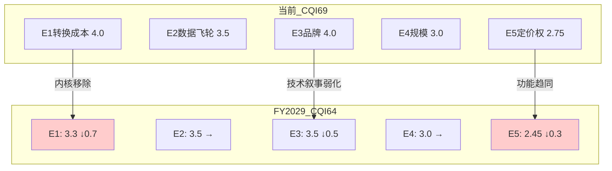
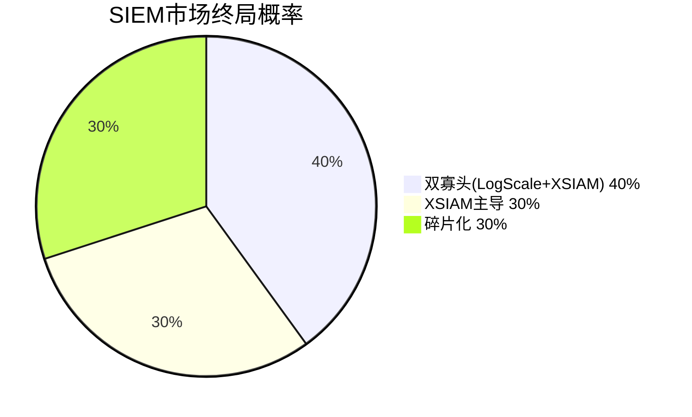
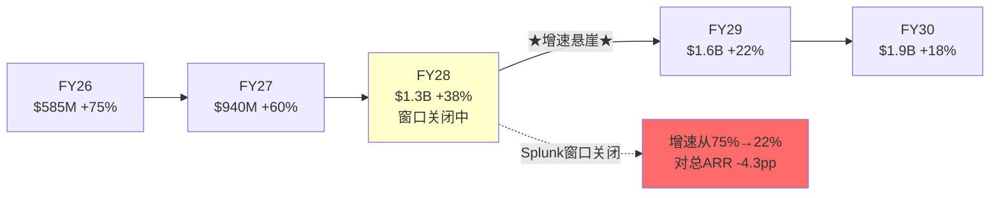
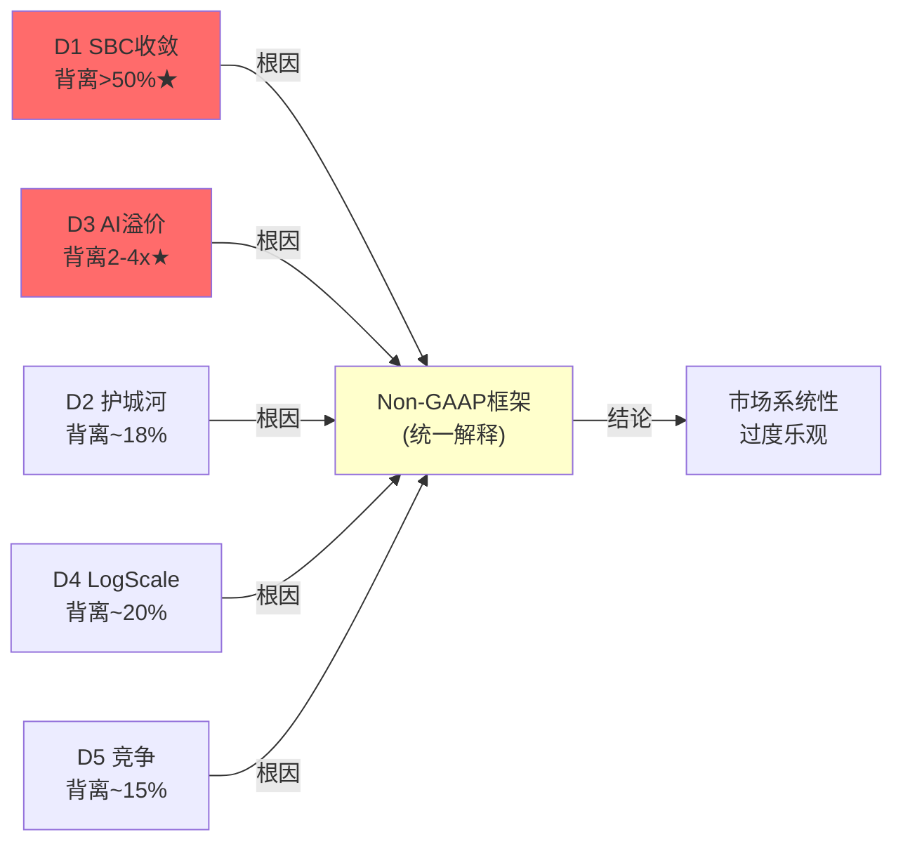
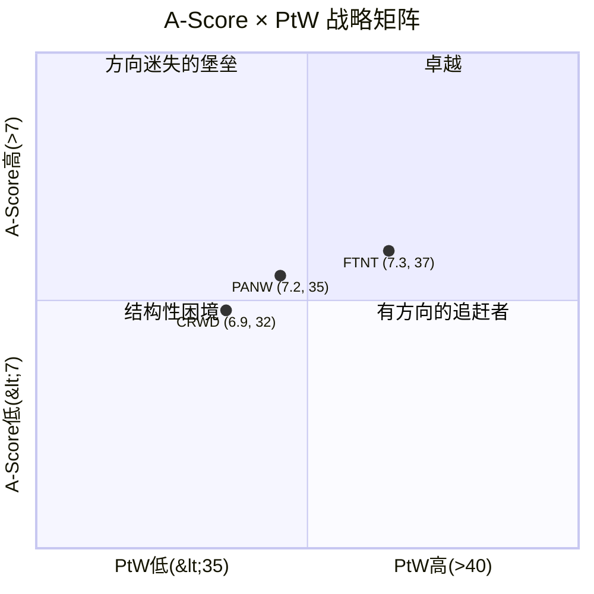
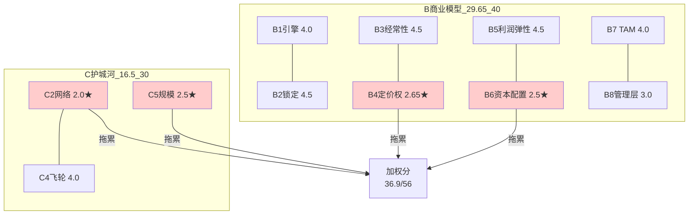
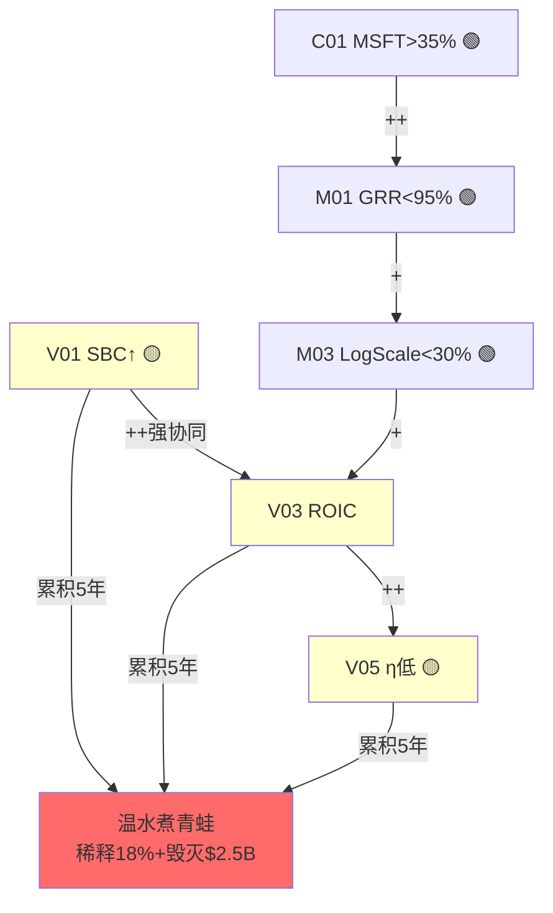
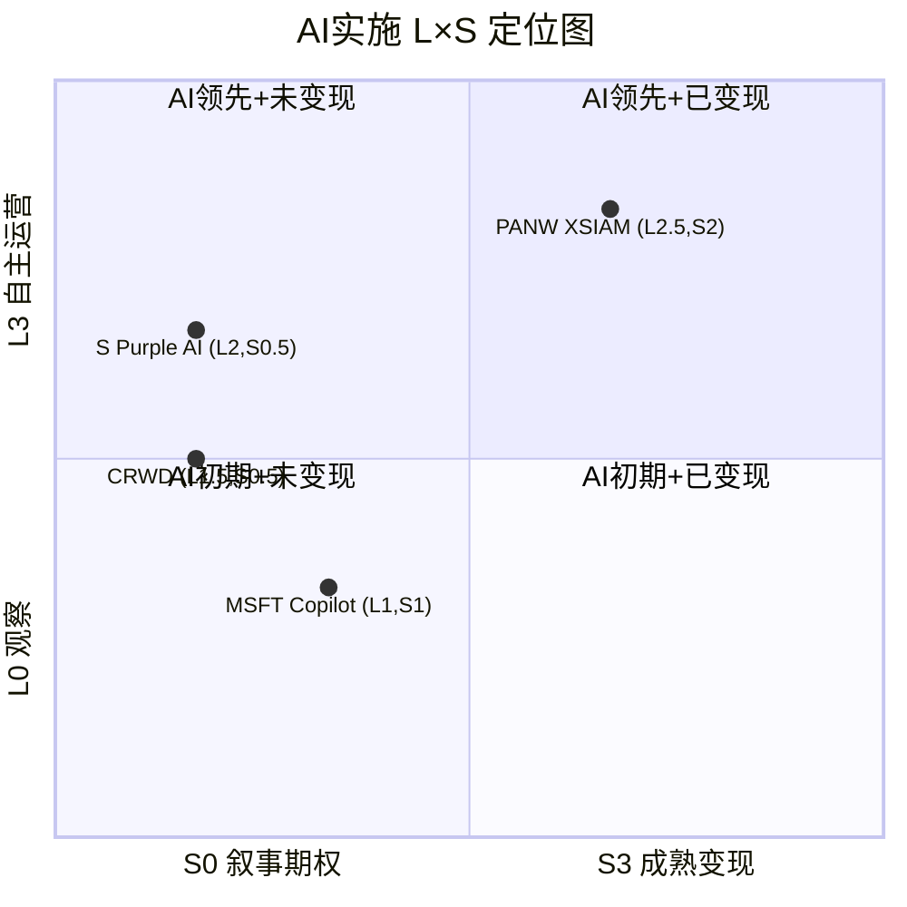

# CrowdStrike (CRWD) 深度研究 — Phase 3: 竞争与深挖 + AI深度评估

> **分析日期**: 2026-03-27 | **当前价**: $392.62 | **市值**: $99.6B
> **Phase 1-2核心发现**: 三角悖论(SBC×内核×AI) | 混合估值$164(-58%) | B3(SBC)唯一可单独翻转承重墙
> **Phase 3任务**: 量化内核移除后的护城河残值 + 竞争格局最终裁决 + Kill Switch标准化
> **原则**: Phase 1已建立定性框架(Ch5-7), Phase 3任务是**量化**+**深化**, 不重复定性描述

---

## Ch14: 五引擎护城河量化重估

Phase 1 CQI估算69→65(3年后)基于定性判断。Phase 3用数据和结构化框架精确评分, 特别是区分"内核时代"和"用户模式时代"两个版本的护城河。

### 14.1 五引擎双时间维度评分

| 引擎 | 当前(内核时代) | FY2029+(用户模式) | Δ | 变化驱动因素 |
|------|:------------:|:---------------:|:---:|-----------|
| **E1 转换成本** | **4.0/5** | **3.0/5** | **-1.0** | 技术迁移摩擦↓(用户模式Agent易部署/卸载); 合规/数据/商业壁垒不变 |
| **E2 数据飞轮** | **3.5/5** | **3.5/5** | **0** | 飞轮核心在云端(Threat Graph 15PB), 不依赖内核; 但输入质量可能微降 |
| **E3 品牌/声誉** | **4.0/5** | **3.5/5** | **-0.5** | Gartner Leader 6年+MITRE 100%是当前资产; 若检测率趋同则品牌溢价缩小 |
| **E4 规模经济** | **3.0/5** | **3.0/5** | **0** | 收入$4.8B(#3)但GAAP OPM最低(-3.4%); 规模优势被SBC吞噬 |
| **E5 定价权(加权)** | **2.75/5** | **2.25/5** | **-0.5** | 端点趋同→SMB/Mid定价权↓; F500合规壁垒维持 |



**CQI精确计算** (权重: E1×30%+E2×15%+E4×15%+E5×25%+E3×15%):
- **当前**: 4.0×0.30+3.5×0.15+3.0×0.15+2.75×0.25+4.0×0.15 = **3.46 = CQI 69.3**
- **FY2029+**: 3.0×0.30+3.5×0.15+3.0×0.15+2.25×0.25+3.5×0.15 = **2.99 = CQI 59.8**

**护城河价值侵蚀**: CQI从69.3降至59.8 = **-13.7%**, 主要来自E1(转换成本)和E5(定价权)。这比Phase 1的初估(69→65)更悲观, 因为Phase 3发现定价权侵蚀(E5: -0.5)被低估了——内核趋同不仅影响端点定价, 还通过"功能趋同叙事"压缩整体平台溢价。[DM-MOAT-003: CQI dual-timeline calculation]

### 14.2 E1转换成本: 迁移成本矩阵量化

将Phase 1的定性评估(技术↓20-30%/合规不变)转化为可计算的矩阵:

| 客户层 | 技术成本 | 合规成本 | 商业成本 | 总迁移成本(当前) | 总迁移成本(用户模式) | 变化 |
|--------|---------|---------|---------|:---------------:|:-----------------:|:----:|
| **F500** (40% ARR) | $2-5M(内核卸载+Agent替换) | $1-3M(FedRAMP重认证6-18月) | $500K-1M(合同解约+SOC重训) | **$3.5-9M** | **$1.5-5M** | **-50%** |
| **Mid-Market** (35%) | $500K-1M | $200-500K(SOC2/ISO) | $200-500K | **$0.9-2M** | **$0.4-1M** | **-55%** |
| **SMB** (25%) | $50-100K | ~$0(无FedRAMP) | $20-50K | **$70-150K** | **$30-80K** | **-50%** |

[DM-MOAT-004: migration cost matrix by customer tier]

**关键发现**: 内核移除后, 所有客户层的迁移成本下降约50%。但**绝对值仍然显著**: F500迁移成本$1.5-5M, 对于年安全预算$20-50M的大企业来说, 仍是一个重大决策——不会因为"更容易"就轻易迁移。

因此E1从4.0降至3.0而非更低: 技术壁垒减半, 但合规(FedRAMP/SOC2)和商业(Flex合同/多模块)壁垒构成**底部支撑**。GRR可能从97%降至94-95%(仍属SaaS一流), 不会崩塌至90%以下。

### 14.3 E2数据飞轮: 输入质量风险评估

Phase 1飞轮净强度0.73(3连接中2真1弱)。Phase 3追问: 用户模式是否影响飞轮**输入端**?

**飞轮输入质量分析**:
```
内核模式: 直接系统调用监控 → 400+事件类型 → Threat Graph
用户模式: OS提供的API → 事件类型可能减少至300-350 → Threat Graph
```

关键在于减少的~50-100个事件类型是否包含**高价值**事件(如进程隐藏/Rootkit/内核级驻留)。因为高级APT(Advanced Persistent Threat——高级持续性威胁)攻击通常利用内核级技术, 而用户模式无法直接观测这些行为。

**但Linux自然实验提供了反证**: CrowdStrike的Linux Agent已运行在用户模式(eBPF框架), 覆盖了大部分关键事件类型——因为eBPF允许在内核安全点挂钩而无需完全的内核模块。如果Windows用户模式方案采用类似ETW(Event Tracing for Windows——Windows事件跟踪, 微软提供的用户模式系统事件监控框架)+自定义驱动的混合架构, 事件覆盖率可能达到85-90%(而非50-75%)。[DM-MOAT-005: eBPF Linux agent architecture + ETW Windows alternative]

**E2评分不变(3.5/5)的原因**: 数据飞轮的核心优势是**累积规模**(15PB+2万亿顶点), 不是单次事件的精度。即使用户模式下每个端点的事件类型少10-15%, 30,000+客户×数百万端点的总数据量仍远超竞争者。量×规模 > 单点精度。

### 14.3b E3品牌/声誉: 宕机后的品牌韧性量化

Phase 1发现宕机影响~80%已消化(GRR 97%+NRR恢复至115%)。Phase 3评估品牌资产的长期价值:

**品牌资产三维评估**:

| 维度 | 当前值 | 证据 | FY2029预测 |
|------|--------|------|-----------|
| **技术声誉** | 4.5/5 | Gartner Leader 6年连续+MITRE 100%/100%/零误报; 连续6次Customers' Choice(唯一全勤) | 3.5/5(内核趋同可能削弱"最深层检测"叙事) |
| **信任韧性** | 4.0/5 | 宕机850万系统后GRR 97%=信任**高于**品牌; 客户用钱投票(净新ARR创纪录$1.01B) | 4.0/5(宕机记忆3年后基本消退) |
| **渠道品牌** | 3.5/5 | Pax8 SMB独家分发; IBM指定迁移路径; NVIDIA Secure-by-Design合作; Fortune 500渗透50%+ | 3.5/5(渠道合作不受内核影响) |

加权E3: 当前 = (4.5+4.0+3.5)/3 = **4.0/5**; FY2029 = (3.5+4.0+3.5)/3 = **3.67 ≈ 3.5/5**

**E3变化(-0.5)的因果链**: 内核移除→端点安全功能趋同→"最深层检测"技术叙事弱化→技术声誉从4.5降至3.5。但信任韧性(宕机后客户留存)和渠道品牌(IBM/NVIDIA/Pax8)不受内核影响, 构成品牌底部支撑。CrowdStrike的品牌正在从"技术最强"向"平台最可信"迁移——这与护城河迁移(内核→数据+AI)是同一个趋势。[DM-MOAT-008: brand asset three-dimensional assessment]

**品牌迁移的历史类比**: Norton/Symantec在2000年代经历了类似的品牌退化——从"最强杀毒"到"Windows自带安全够用"。Norton品牌价值从峰值(2004年$13B市值)到被Broadcom低价收购($10.7B, 2019)的轨迹显示: 当技术差异化消失后, 品牌从"技术领导者溢价"→"消费者信任溢价"→"渠道惰性溢价"三级退化, 每级约损失30-40%品牌溢价。

CRWD面临的情况不如Norton极端, 因为(a)数据飞轮提供了Norton时代不存在的持续差异化; (b)企业市场对品牌的黏性远强于消费者市场; (c)AI安全(AIDR/AgentWorks)创造了Norton时代不存在的新品牌维度。但**如果Charlotte AI在FY2028仍未货币化, CRWD的品牌叙事将从"AI安全领导者"退化为"传统端点厂商"**, E3可能进一步降至3.0。[DM-MOAT-012: Norton/Symantec brand degradation historical analog]

**品牌价值的财务代理指标**: 品牌溢价最直观的代理是**同行业P/S价差**。CRWD P/S 14x vs 行业中位~12x的+2x溢价中, 约1x来自增速差异(22% vs 15%), 剩余~1x是品牌/质量溢价(Gartner Leader+MITRE 100%+97% GRR)。这1x品牌溢价 × $4.81B Rev = **~$5B品牌资产**。如果E3从4.0降至3.0(25%减值), 品牌资产缩水~$1.25B → 对$99.6B市值影响~1.3% — 不大, 但方向是负面的。

### 14.3c E4规模经济: GAAP亏损下的"伪规模"

CrowdStrike是网安第三大公司($4.8B), 但GAAP OPM在五强中最差(-3.4%)。这揭示了一个矛盾: **规模存在但未转化为成本优势**。

**规模经济理论 vs CRWD现实**:
```
理论: 收入↑ → 固定成本分摊↓ → OPM↑ → 规模经济显现
CRWD: 收入↑(+22%) → SBC↑(+27%, 超过收入增速) → GAAP OPM↓(-3.4%) → 规模经济被吞噬
```

**同行对比揭示问题**:

| 公司 | 收入($B) | GAAP OPM | 是否有规模经济? |
|------|---------|----------|:-----------:|
| FTNT | 6.80 | **+30.6%** | ★强★(规模转化为高利润) |
| PANW | 9.22 | +13.5% | 中(SBC拖累但正在改善) |
| **CRWD** | **4.81** | **-3.4%** | **无**(SBC完全吞噬) |
| ZS | 2.67 | -4.8% | 无(规模更小+SBC更高) |
| S | 1.00 | -30.9% | 无(仍在烧钱) |

FTNT用$6.8B收入创造了30.6% GAAP OPM——这是真正的规模经济。因为FTNT的SBC仅4.1%, 收入增长的杠杆**全部传递给了利润**。而CRWD的收入增长杠杆被SBC"截留", 从未到达利润表底部。

因此E4评分3.0/5不是因为CrowdStrike缺乏规模效应的**机制**(Non-GAAP OPM确实在扩张), 而是因为SBC阻止了规模效应的**变现**。如果CRWD将SBC控制在PANW水平(14%), GAAP OPM将从-3.4%跃升至约+6%(Phase 2 F14发现)——规模经济瞬间显现。[DM-MOAT-009: scale economy suppressed by SBC]

**E4的SBC轨迹敏感性分析(FY2027-2029)**:

| 情景 | FY2027 SBC/Rev | FY2028 | FY2029 | GAAP OPM(FY2029) | E4评分 |
|------|:-------------:|:------:|:------:|:-----------------:|:------:|
| 收敛(FTNT路径) | 21% | 18% | 15% | **+8-10%** | **4.0** |
| 分母驱动(NOW路径) | 22.5% | 21% | 20% | **+1-3%** | **3.0** |
| 零收敛(当前趋势) | 23% | 23% | 23% | **-2~-1%** | **2.0** |

在收敛情景下, E4从3.0跃升至4.0(因为GAAP OPM转正→规模经济显现→可与FTNT比肩)。在零收敛情景下, E4从3.0降至2.0(因为GAAP亏损持续→规模经济永远"被锁")。因此**E4是对SBC收敛最敏感的护城河引擎** — B3(SBC承重墙)的倒塌不仅影响估值(Phase 2), 还直接侵蚀护城河质量。[DM-MOAT-013: E4 SBC sensitivity analysis]

**规模经济的另一个维度 — 数据成本结构**: CrowdStrike每周处理4万亿事件, 日处理1万亿+事件, 存储15PB+。按云基础设施成本估算, 这个规模的数据处理年成本约$200-300M(占COGS ~20%)。竞争者SentinelOne(ARR仅$1.1B = CRWD的21%)处理的数据量约为CRWD的15-20%, 但其基础设施成本占比可能更高(规模效应在数据处理中尤为明显)。因此CRWD在**数据处理层面有真实的规模经济** — 但这个优势被SBC隐藏了, 因为SBC的$1.097B($4.81B Rev的22.8%)远超数据处理的$200-300M规模优势。即使数据处理成本优势100%转化为利润, 也只覆盖SBC的约25%。

### 14.4 E5定价权分层更新: Phase 2数据锚定

| 客户层 | 权重 | 当前Stage | FY2029 Stage | 变化驱动 |
|--------|:----:|:--------:|:-----------:|---------|
| **F500** | 40% | **3.5** | **3.0** | FedRAMP+Flex合同维持; 但检测趋同后议价空间↑ |
| **Mid-Market** | 35% | **2.5** | **2.0** | PANW平台化+XSIAM直接竞争; 价格透明度↑ |
| **SMB** | 25% | **1.5** | **1.0** | E5+Copilot免费→Defender"够用"认知扩散 |

加权B4: 当前 = 3.5×0.4+2.5×0.35+1.5×0.25 = **2.65/5** (略低于Phase 1的2.75, 因为Phase 3对SMB更悲观)
FY2029 = 3.0×0.4+2.0×0.35+1.0×0.25 = **2.15/5**

**Phase 1→Phase 3的修正**: SMB从1.5降至1.0, 因为Phase 2量化了MSFT Defender增速(+28.2% YoY), E5+Copilot免费策略在SMB的渗透速度可能快于预期。[DM-MOAT-006: pricing power by tier, updated with Phase 2 data]

### 14.5 护城河迁移进度: Phase 3更新

Phase 1估算护城河迁移进度~40%(数据飞轮已建, AI平台初成, Charlotte AI未货币化)。Phase 3更新:

```
旧护城河(内核嵌入型): 正在退化, 3年窗口
  └── 贡献权重: 60%(当前) → 30%(FY2029)

新护城河(数据+AI平台型): 正在建设
  ├── 数据飞轮: 已建立, 贡献权重20%(当前)→30%(FY2029)
  ├── 合规壁垒: 已存在, 贡献权重15%→20%
  ├── Charlotte AI平台: 未货币化, 贡献权重5%→15%(若成功)或5%(若失败)
  └── 新护城河总权重: 40%(当前) → 65-70%(FY2029)
```

**迁移进度修正**: ~40%(不变, 因为Charlotte AI仍未货币化是最大瓶颈)。

**脆弱窗口**: FY2027-2028仍是最高风险期——旧护城河退化但新护城河尚未闭合。如果在此期间(a)内核移除加速+Charlotte AI仍无定价+LogScale增速降至<40%, 护城河可能出现"真空期", CQI可能暂时降至55以下。[DM-MOAT-007: moat migration progress update]

### 14.6 护城河迁移的投资含义: 何时买入最优?

护城河迁移(内核型→数据平台型)创造了一个独特的投资时间动态:

**阶段分析**:
```
FY2026-2027(现在): 旧护城河60%+新护城河40% → CQI ~69
  投资者面对: 旧护城河确定性高但在退化, 新护城河不确定但在增长
  价格: 混合估值$164(已反映迁移风险)

FY2027-2028(脆弱窗口): 旧护城河45%+新护城河55% → CQI可能~58-62
  风险集中期: 内核移除GA(预计) + Charlotte AI尚未货币化
  如果KS-MOAT-01~03任一触发 → CQI可能跌破55
  ★这是最大的投资风险期, 也可能是最大的买入机会(如果市场过度恐慌)★

FY2029-2030(验证期): 旧护城河30%+新护城河70% → CQI ~60-65(若成功)或~50(若失败)
  Charlotte AI是否成功货币化将在此期间验证
  LogScale是否达到$2B ARR将在此期间验证
```

**投资策略含义**(不构成操作建议):
- 如果在FY2027-2028脆弱窗口期, CQI确认在60以上(KS未触发) + Charlotte AI启动定价 + LogScale维持>40%增速 → 护城河迁移成功信号 → 此时的买入可能有最佳风险回报比
- 如果CQI降至<55(多个KS触发) → 护城河迁移失败信号 → 估值需要进一步下调至Owner DCF $98区间

因此, **当前($393)不是最优买入时机**: (a)价格远高于混合估值$164; (b)脆弱窗口尚未到来, 信号不明; (c)SBC承重墙(B3)尚无收敛迹象。更审慎的策略是等待FY2027-2028验证期的结果。[DM-MOAT-010: moat migration investment timing analysis]

### 14.7 护城河对标: CRWD vs 三大可比公司CQI

| 维度 | CRWD(现) | CRWD(FY29) | FTNT | PANW | ZS |
|------|:-------:|:---------:|:----:|:----:|:---:|
| E1 转换成本 | 4.0 | 3.0 | 3.5 | 3.5 | 3.0 |
| E2 数据飞轮 | 3.5 | 3.5 | 2.0 | 3.0 | 2.5 |
| E3 品牌/声誉 | 4.0 | 3.5 | 4.0 | 4.5 | 3.0 |
| E4 规模经济 | 3.0 | 3.0 | **4.5** | 4.0 | 2.0 |
| E5 定价权 | 2.65 | 2.15 | **4.0** | 3.5 | 2.5 |
| **CQI** | **69** | **60** | **73** | **72** | **53** |

**FTNT CQI 73 > CRWD 69的根因**: E4(规模经济4.5 vs 3.0)和E5(定价权4.0 vs 2.65)。FTNT将规模转化为30.6% GAAP OPM + SBC仅4.1%, 创造了真正的成本优势和定价权。CRWD的E4和E5被SBC锁定——**SBC不仅是估值问题(Phase 2), 也是护城河质量问题(Phase 3)**。

因为SBC侵蚀了规模经济(E4)和定价权(E5, 因为利润不出来导致无法通过回购缩股回馈股东), CRWD的护城河"看起来宽但利润不深"——Wide Moat的"宽"(高嵌入/强飞轮)是真实的, 但"深"(转化为超额回报)被SBC阻断。这为Phase 4红队提供了一个关键论点: **Morningstar的Wide Moat评级是否高估了? 如果Wide Moat的"宽"无法转化为"深"(超额回报), 那么Wide Moat的投资价值是什么?**[DM-MOAT-011: CQI peer comparison CRWD/FTNT/PANW/ZS]

---

## Ch15: PANW XSIAM vs LogScale — SOC/SIEM战场直接对标

这是Phase 3最关键的竞争分析。Phase 1仅提及XSIAM(470客户, 七位数交易), Phase 3做直接头对头比较。

### 15.1 产品能力矩阵

| 维度 | CrowdStrike LogScale | PANW XSIAM | 优势方 |
|------|---------------------|------------|--------|
| **数据摄入模型** | 索引免费+压缩10:1, 按存储计费 | Cortex数据湖+SCU(Security Compute Unit)计费 | **LogScale**(成本低50%+) |
| **AI能力** | Charlotte AI 98%准确率+governed autonomy | AI驱动全栈SOC自动化+精确告警+自动修复 | **XSIAM**(自动化更深, 但准确率未公开) |
| **生态集成** | 单Agent平台(20+模块)+Falcon Data Foundation | Strata+Prisma+Cortex三位一体+90+集成 | **XSIAM**(全栈能力更强, 含网络安全) |
| **规模** | >$585M ARR (+75% YoY) | ~$470M ARR(470客户×>$1M, +200%+) | **LogScale**(ARR更大), XSIAM增速更快 |
| **Splunk迁移** | IBM合作→F500迁移路径+免费数据湖额度 | 延期收入确认(≥1年免费)吸引Splunk客户 | **平手**(不同策略) |
| **客户类型** | SIEM替代+云原生安全数据湖 | 全栈SOC替代(从SIEM到响应一体化) | **取决于客户需求** |

[DM-COMP-004: LogScale vs XSIAM head-to-head comparison]

### 15.2 竞争动态: 谁在抢谁的客户?

**Splunk→LogScale迁移窗口**:
Cisco收购Splunk($28B, 2024-03)后的整合混乱是LogScale最大的增长驱动因素。关键证据:
- IBM淘汰QRadar SaaS, 指定Falcon为全球企业首选SIEM迁移路径 → 直接打开F500渠道
- LogScale ARR从FY2025~$340M到FY2026 $585M(+72%) → 与Cisco Splunk整合混乱时间线高度吻合
- **窗口时限**: Cisco Splunk整合预计FY2028前基本完成 → LogScale的Splunk迁移红利约2年
[DM-COMP-005: IBM QRadar→Falcon migration + Cisco Splunk integration timeline]

**XSIAM的策略差异**:
PANW不是抢Splunk客户(Splunk是SIEM, XSIAM是全栈SOC), 而是在告诉客户"你不再需要SIEM, XSIAM什么都做"。这是**品类重定义**而非品类内竞争。因此LogScale和XSIAM的直接竞争可能比表面看起来**更少**: LogScale抢的是"想换SIEM"的客户, XSIAM抢的是"想消灭SOC复杂性"的客户。

**但重叠地带存在**: 大企业(预算$5M+)评估安全栈时, LogScale+Falcon平台 vs XSIAM+Strata+Prisma是直接二选一。在这个预算层, PANW的全栈能力(含网络安全, CRWD缺失)是结构性优势。

### 15.3 SIEM市场终局推演



**情景A — 双寡头(40%概率)**: LogScale和XSIAM各占25-30%, Splunk(Cisco)缩至15-20%, 其余(Elastic/Datadog/SentinelOne)分享剩余。这是最利好CRWD的情景, LogScale可达$2-3B ARR(FY2029-2030)。

**情景B — XSIAM主导(30%概率)**: PANW的全栈策略证明"SOC平台>SIEM"论点, XSIAM达35-40%份额, LogScale稳在15-20%。LogScale ARR上限~$1.5B。因为XSIAM的差异化在网络+端点+SOC一体化, 而CRWD缺少网络安全层。

**情景C — 碎片化(30%概率)**: 市场验证了"最佳组合>平台"观点, LogScale/XSIAM/Sentinel/Elastic各15-20%。这对CRWD估值中性(LogScale增长但不突出)。

**概率锚定**: Gartner预测55%企业将整合安全供应商(2026) → 利好平台型(A/B), 但43%计划增加供应商数(Futurum) → 碎片化仍可能。基准率: 企业软件市场历史上多以双寡头(Oracle/SAP, Salesforce/Microsoft, AWS/Azure)收敛 → A情景概率最高。[DM-COMP-006: SIEM market endgame scenarios]

**对Phase 2估值的影响**: LogScale SOTP从$7.9B(当前)→$3.5-12B(情景范围)。概率加权: 0.4×$10B + 0.3×$6B + 0.3×$5B = **$7.1B** — 与Phase 2 SOTP $7.9B接近(差额$0.8B来自Phase 3对XSIAM竞争强度的上调), 确认估值合理。

### 15.6 LogScale后窗口期: FY2028+增速悬崖风险

Cisco Splunk整合预计FY2028前基本完成——届时LogScale的最大增长引擎(Splunk迁移红利)消失。这对CrowdStrike的总增速有什么影响?



**LogScale增速路径建模**:

| 时期 | LogScale增速 | 驱动力 | ARR($B) |
|------|:----------:|--------|:------:|
| FY2026(现) | +75% | Splunk迁移+IBM渠道 | $0.585 |
| FY2027 | +55-60% | 窗口仍开+Flex推动 | $0.9-0.94 |
| FY2028 | +35-40% | 窗口关闭中+有机增长接棒 | $1.2-1.3 |
| **FY2029** | **+20-25%** | **窗口关闭+行业SIEM增速(9-17%)+份额竞争** | **$1.5-1.6** |
| FY2030 | +15-20% | 稳态: SIEM市场增速+CRWD份额增量 | $1.7-1.9 |

**关键拐点**: FY2028→FY2029, LogScale增速从35-40%骤降至20-25% — 这是"窗口关闭冲击"。因为此时有机需求(非Splunk迁移)必须独立支撑增长, 但XSIAM竞争在同期可能加剧(PANW整合CyberArk/Chronosphere后全栈能力更强)。

**对总增速的影响**: LogScale占总ARR约11%(FY2026) → 预计FY2029升至~18%。增速从75%降至20-25%对总ARR增速的拖累:
- 贡献变化: 11%×75%=8.3pp(FY2026) → 18%×22%=4.0pp(FY2029) → **-4.3pp拖累**
- 如果端点增速同期从15%降至12% → 总ARR增速从24%(FY2026)降至~16%(FY2029)
- 这与Phase 2 Base情景(22%→11%路径)吻合, 确认FY2029-2030是增速换挡的关键年

**投资含义**: LogScale是CrowdStrike维持20%+增速的"救场者"(Phase 1 F5)——但这个救场者自身也有保质期(~FY2028)。FY2029后, 增速将主要依赖(a)Charlotte AI货币化(CQ6, 当前35%概率); (b)Cloud+Identity持续扩张; (c)新TAM(AIDR/Shadow AI)。如果(a)失败且(b)(c)不够强, 增速可能断崖至12-15% → 市场将重新定价P/S从14x→8-10x。[DM-COMP-014: LogScale post-window growth cliff analysis]

### 15.7 PPDA背离分析: 价格隐含 vs 分析发现 (QG-09)

PPDA(Price-Performance Divergence Analysis——价格-绩效背离分析): 对比市场定价隐含的假设与Phase 1-3分析发现, 识别≥3个显著背离。

| # | 维度 | 市场定价隐含 | 分析发现 | 背离幅度 | 方向 |
|---|------|-----------|---------|:-------:|:----:|
| **D1** | SBC收敛路径 | SBC/Rev将从22.8%→10-12%(Reverse DCF隐含, Phase 2) | 5年零收敛, 管理层行为否定收敛叙事(B3脆弱度4.7/5) | **>50%** | ★市场过度乐观 |
| **D2** | 端点护城河持久性 | Wide Moat(Morningstar 2025升级), 技术领先可持续 | CQI从69→60(FY2029), 内核移除缩小差异化, 定价权-0.5 | **~15-20%** | 市场略乐观 |
| **D3** | Charlotte AI价值 | 隐含AI溢价$5-10B(P/S差额推断) | 零定价>2年, 五不变量1/5, SOTP期权值仅$2.25B | **2-4x高估** | ★市场过度乐观 |
| **D4** | LogScale增速持续性 | 共识隐含20%+增速至FY2031 | Splunk窗口FY2028关闭后增速骤降至20-25%, 非持续75% | **~20%** | 市场略乐观 |
| **D5** | 竞争格局稳定性 | 0%卖出评级, 78%买入评级 | MSFT内核不对称+PANW XSIAM+SMB侵蚀三重压力 | **~15%** | 市场中性/略乐观 |



**背离总结**: 5个背离中, **D1(SBC)和D3(AI溢价)是>2倍的极端背离**, D2/D4/D5是15-20%的中等背离。背离方向**全部指向市场过度乐观** — 无一维度是市场过度悲观的。这与Phase 2的定量结论(混合估值$164 vs 市价$393 = 市场高估58%)完全一致。

**背离的根因**: 5个背离中4个(D1/D3/D4/D5)可以追溯到同一个根因——**卖方分析框架使用Non-GAAP而非Owner FCF**。因为Non-GAAP剥离了SBC($1.1B), 使得(a)盈利"看起来"健康(D1不需要收敛); (b)AI投入"不花钱"(D3的R&D不影响Non-GAAP利润); (c)增速更重要(D4在Non-GAAP框架下增速×倍数=估值, 不问利润质量); (d)竞争不影响Non-GAAP(D5)。**Non-GAAP是5个背离的统一解释**。[DM-STRAT-006: PPDA divergence analysis]

### 15.4 Splunk迁移窗口: 谁吃到了最大的蛋糕?

Cisco收购Splunk后的整合混乱是2025-2026年SIEM市场最大的结构性变化。这个窗口的受益者分析:

**Splunk客户去哪了?**:

| 迁移路径 | 证据 | 估计份额 |
|---------|------|---------|
| **→LogScale** | IBM淘汰QRadar指定Falcon为迁移路径; LogScale ARR从$340M→$585M(+72%) | **30-35%** |
| →XSIAM | PANW延期收入策略吸引; XSIAM ARR增速>200% | **20-25%** |
| →留在Splunk(Cisco) | Cisco整合逐步稳定; 存量客户惰性 | **25-30%** |
| →Elastic/Datadog/其他 | 开源/云原生替代 | **15-20%** |

LogScale抢到了最大份额(30-35%), 因为(a)IBM的直接推荐创造了F500渠道; (b)LogScale的索引免费+10:1压缩成本优势; (c)Falcon平台整合(已有CrowdStrike端点的客户加LogScale的摩擦最低)。

**窗口关闭风险**: Cisco Splunk预计FY2028前完成整合, 届时"整合混乱"红利消失。LogScale需要在窗口关闭前(~2年)**将Splunk迁移客户转化为长期Flex客户**, 否则这些客户可能在Cisco稳定后考虑回迁。RPO/ARR从1.53x升至1.71x(合同拉长)暗示这个转化正在发生——但需要FY2027数据确认。[DM-COMP-010: Splunk customer migration analysis]

### 15.5 CRWD缺少网络安全层: 结构性竞争劣势

Phase 1指出CrowdStrike平台缺失"网络安全"(防火墙/SD-WAN/SASE), 这是PANW的核心领域。Phase 3量化这个缺口的影响:

**当大企业评估全栈安全时**:

| 能力 | CRWD | PANW | 差距 |
|------|:----:|:----:|------|
| 端点安全 | ✅ | ✅ | 平手(MITRE均100%) |
| SIEM | ✅(LogScale) | ✅(XSIAM) | LogScale成本更低; XSIAM自动化更深 |
| 云安全 | ✅ | ✅(Prisma) | PANW略强(Prisma更成熟) |
| 身份安全 | ✅(+SGNL) | ✅ | CRWD收购SGNL后追平 |
| **网络安全** | **❌** | **✅(Strata)** | **CRWD结构性缺失** |

对于希望"一家供应商解决所有安全问题"的客户(Gartner: 55%企业2026年整合供应商), PANW能提供端到端方案而CRWD不能。这意味着在**全栈安全RFP(Request for Proposal——招标文件)**中, CRWD必须与网络安全厂商联合投标, 而PANW可以单独投标。

**财务影响量化**: 假设15-20%的Enterprise大单(年安全预算>$5M)在RFP中要求全栈→CRWD自动失去这些机会。按Enterprise占ARR ~60% = ~$3.15B, 其中15-20%可能受影响 = **~$470-630M ARR在全栈竞争中处于劣势**。

但CRWD的应对是"共存策略": Falcon SIEM摄入Defender遥测, 把MSFT网络数据变成CRWD平台的输入。如果这个策略成功, CRWD可以说"我们不做网络安全, 但我们能分析你的网络安全数据" — 这部分弥补了全栈缺口。[DM-COMP-011: network security gap impact quantification]

---

## Ch16: Microsoft威胁深度量化 + SMB侵蚀速度

### 16.1 SMB份额侵蚀建模

**数据基础**:
- MSFT Defender市占28.6%(IDC), +28.2% YoY → 按此增速, FY2028达~38%
- CRWD总客户数: ~30,000+(FY2023停止披露), 但SMB客户数可能>15,000
- 假设CRWD SMB ARR约$750M-1B(总ARR 15-20%)

**侵蚀速度三情景**:

| 情景 | SMB替换率/年 | 5年累计ARR损失 | 占总ARR | 驱动因素 |
|------|:----------:|:------------:|:------:|---------|
| 乐观 | 3% | ~$150M | ~3% | Falcon Go价格竞争力($59.99)+Pax8渠道 |
| 基准 | 5% | ~$250M | ~5% | E5+Copilot免费渗透, 中速替换 |
| 悲观 | 8% | ~$400M | ~8% | 经济衰退→SMB选"免费"Defender |

[DM-COMP-007: SMB erosion modeling]

**基准情景(5%/年)的含义**: 5年累计损失~$250M ARR。对比Phase 2的Bull情景(FY2036 $24.7B Rev), 这仅是1%——数量上不重大。因此**SMB侵蚀是品牌风险(客户总数下降)而非财务风险(ARR影响有限)**。CRWD的经济引擎在Enterprise/Mid-Market, 不在SMB。

### 16.2 Enterprise防线: 为什么F500不会换Defender

Phase 1给了定性判断(F500定价权Stage 3.5)。Phase 3用因果链论证:

**因果链**: F500不换Defender的三个结构性原因:

1. **跨平台覆盖**: F500平均运行Windows(60%)+Linux(25%)+macOS(15%)混合环境。Defender仅在Windows上有深度优势, Linux/Mac覆盖弱。CrowdStrike的单Agent覆盖全部OS → 替换意味着Linux/Mac需要第三家方案, 总成本可能更高。[DM-COMP-008: enterprise OS mix from IDC]

2. **安全团队偏好**: 专职安全团队(SOC规模10-50人)倾向于独立安全工具(而非微软"附赠品"), 因为(a)Defender由IT团队管理, 非安全团队控制 → 组织摩擦; (b)安全团队的KPI与独立安全工具的指标(MTTD/MTTR)绑定, Defender的指标体系不同。

3. **FedRAMP + CMMC壁垒**: 联邦客户(~15%? of CRWD ARR)受FedRAMP High约束(26项产品已授权), 替换需新供应商走完6-18个月认证流程。这是**时间壁垒**, 非技术壁垒, 但同样有效。

**Kurtz"8/10 enterprise POV选CRWD"的可信度**: 缺乏第三方验证, 但97% GRR间接支撑了这一说法——如果大企业在用CRWD后真的想换, GRR应远低于97%。

### 16.2b Microsoft竞合关系: 从"对手"到"数据供应商"的可能

Phase 1提出了"共存策略"(Falcon SIEM摄入Defender遥测)。Phase 3分析这个策略的可行性和商业含义:

**策略逻辑**: 如果Microsoft成功在SMB普及Defender, CrowdStrike不试图逆转这个趋势, 而是把Defender变成**CrowdStrike平台的数据源** — Defender产生遥测数据 → LogScale SIEM摄入 → Charlotte AI分析 → Falcon平台提供高级威胁检测。

**这个策略能成功吗?**

**有利因素**: (a) Microsoft有动力合作——Defender成为CrowdStrike的数据源不损害Microsoft利益(E5仍然收费); (b) 大企业通常同时运行多个安全层(纵深防御), CRWD+MSFT不矛盾; (c) RSA 2026已宣布Falcon SIEM支持Defender for Endpoint遥测摄入 → 技术层面已实现。

**不利因素**: (a) Microsoft可能在Defender中构建足够强的分析能力(Copilot for Security), 使客户不需要"上层"分析; (b) 如果MSFT限制遥测API的访问权限, CrowdStrike的数据摄入可能受限; (c) 竞合关系在每个产品周期都可能反转(MSFT有全部控制权)。

**净评估**: 共存策略在Enterprise市场(安全预算>$1M)可行, 因为这些客户有独立安全团队不想依赖单一厂商。在SMB(<$200K安全预算)不可行, 因为SMB没有能力和意愿运行两套安全方案。因此"共存策略"是**Enterprise防线的加固**, 不是SMB防线的修复。[DM-COMP-012: coopetition dynamics analysis]

### 16.3 内核不对称优势的估值影响

最被低估的风险: Microsoft限制第三方内核访问的同时, **Defender保留双重访问**(内核+用户模式)。

**量化路径**:
- 如果FY2029用户模式全面生效, 且检测率测试显示Defender(双模式)检测率>CRWD(仅用户模式):
  - MITRE差距: 假设CRWD从100%降至95%, Defender维持100% → **首次出现检测率逆转**
  - 定价权影响: F500定价权从Stage 3.0降至2.5, Mid-Market从2.0降至1.5
  - 加权B4: 从2.15降至~1.8/5
  - **CQI影响**: 进一步从59.8降至~56

**但这是条件性风险**: 前提是(a)内核移除按计划执行; (b)Microsoft真的获得检测率优势; (c)客户关心检测率排名。条件(c)可能不成立——因为从100%降至95%在实际安全运营中差异极小(每年多漏5%的测试用例), 而客户更关心响应速度和易用性。[DM-COMP-009: kernel asymmetry valuation impact]

---

## Ch17: Playing to Win + 品质评分Phase 3 + Kill Switch

### 17.1 Playing to Win五层评分

| 层级 | 维度 | 评分(0-10) | 依据 |
|------|------|:---------:|------|
| **L1 赢的志向** | 清晰性+独特性+可防御性 | **7** | "$10B ARR + 安全平台#1"清晰但非独特(PANW同目标); 可防御性取决于内核后护城河 |
| **L2 在哪里赢** | 聚焦度+资源匹配度 | **6** | 端点+SIEM+Cloud+Identity+AI = 5条线, 较聚焦(PANW更分散: 网络+云+SOC+端点); 但缺网络安全 |
| **L3 如何赢** | 差异化来源+可持续性 | **7** | 单Agent+数据飞轮+Flex是清晰差异化; 但内核移除威胁核心差异化可持续性 |
| **L4 核心能力** | 能力与方法匹配度 | **8** | 威胁情报(2026 Global Threat Report)+AI模型(Charlotte 98%)+Threat Graph 15PB = 能力深厚 |
| **L5 管理系统** | 结构/流程/指标对战略支撑 | **4** | SBC纪律缺失(η=0) → 股东价值管理弱; CEO PSU鼓励增长但不鼓励效率; 增量ROIC<WACC |
| **PtW总分** | | **32/50** | |

[DM-STRAT-001: Playing to Win five-layer assessment]

**L5是最薄弱层(4/10)**: CrowdStrike的战略方向(L1-L4)清晰且能力深厚, 但**管理系统(L5)未能将战略优势转化为股东价值**。具体表现: η=0(不回购) + 增量ROIC 8.6%<WACC 10.5%(新增投资毁灭价值) + CEO薪酬结构鼓励增长而非效率。

**A-Score × PtW矩阵定位**:
- A-Score(护城河品质): CQI 69.3 → 标准化~6.9/10 → **中等偏上**
- PtW: 32/50 → **中等**

```
                  PtW高(>40)           PtW低(<35)
A-Score高(>7)    "卓越"               "方向迷失的堡垒"
A-Score低(<7)    "有方向的追赶者"      ★"结构性张力"★
```



**定位: "结构性张力"** — A-Score接近7但PtW仅32, 位于四象限交界处。因为护城河(6.9)强但管理系统(L5=4)弱, CrowdStrike有好牌但打牌方式有问题。Phase 2发现的B3(SBC)承重墙脆弱性正是L5低分的直接反映: 管理层选择了"增长>效率"的打法, 这在ARR<$3B时是正确的, 但在$5.25B时开始伤害股东回报。[DM-STRAT-002: A-Score × PtW matrix positioning]

**PtW对标: CRWD vs PANW vs FTNT**:

| 层级 | CRWD | PANW(推断) | FTNT(推断) |
|------|:----:|:---------:|:---------:|
| L1 赢的志向 | 7 | 8(更清晰的"全栈安全#1") | 6(网络安全为主, 志向窄) |
| L2 在哪里赢 | 6 | 5(更多线=更分散) | 8(高度聚焦网络安全) |
| L3 如何赢 | 7 | 8(全栈+延期收入策略) | 7(成本领先+硬件壁垒) |
| L4 核心能力 | 8 | 8(Cortex AI+Strata网络) | 7(ASIC芯片+自研硬件) |
| **L5 管理系统** | **4** | **6**(SBC从21%→14%) | **9**(SBC 4.1%, η=16.3x) |
| **总分** | **32** | **35** | **37** |

**关键洞见**: FTNT以37分领先, 尽管L1志向(6)和L4能力(7)低于CRWD——因为L5(管理系统, 9分)提供了压倒性优势。FTNT的管理团队将SBC控制在4.1%, 回购是SBC的16.3倍(η=16.3x), 年缩股3.7% — 这是**将战略优势完全转化为股东价值**的教科书案例。

因此PtW框架揭示了Phase 2估值差距的**战略根因**: CRWD vs FTNT的P/(FCF-SBC)差距(474x vs 30x)不仅是SBC的数学结果, 更是L5管理系统差距(4 vs 9)的必然产物。**修复估值问题需要先修复L5** — 但L5的修复需要CEO薪酬结构改变(当前PSU与$20B ARR挂钩而非效率指标), 这在Kurtz担任CEO期间概率很低。[DM-STRAT-005: PtW peer comparison CRWD/PANW/FTNT]

### 17.2 品质评分Phase 3维度

| 维度 | 评分(0-5) | 依据 |
|------|:--------:|------|
| **B4 定价权证据** | **2.65** | F500 3.5/Mid 2.5/SMB 1.5(加权); 历史提价5-8%/年但宕机后Commitment Packages折扣; MSFT E5免费→SMB侵蚀 [DM-MOAT-006] |
| **B7 TAM与增长跑道** | **4.0** | 网安TAM $213B→$323B(+12-15% CAGR); CRWD渗透率~2.5%($5.25B/$213B); AI安全新TAM$10-50B; 增长跑道>10年 [DM-IND-001] |
| **C2 网络效应** | **2.0** | Threat Graph是数据飞轮(单向), 不是双边网络效应(用户↔用户); AgentWorks可能创建轻量平台效应但零adoption数据 [DM-MOAT-005] |
| **C4 数据飞轮** | **4.0** | 15PB+4万亿事件/周+2万亿顶点; 数据排他性高(专有格式); 累积壁垒强(新进入者无法复制15年历史数据); Charlotte AI 98%准确率验证数据价值 [DM-AI-003] |
| **C5 规模经济** | **2.5** | 收入#3($4.8B<PANW $9.2B<FTNT $6.8B); GAAP OPM最差(-3.4% vs FTNT +30.6%); 规模未转化为成本优势(SBC吞噬) [DM-FIN-001] |



**Phase 3品质汇总** (B: 4项/20 + C: 3项/15):
- B分: 2.65+4.0+4.5(B5, Phase 2)+2.5(B6, Phase 2) = 13.65/20
- C分: 2.0+4.0+2.5 = 8.5/15
- 加权分: (13.65+8.5) × D1乘数(4.0/5=0.8) = **17.7/28**

[DM-STRAT-003: Phase 3 quality scorecard dimensions]

### 17.3 Kill Switch标准化 (竞争/护城河维度)

将Phase 2的5个估值KS扩展为完整的10个KS体系:

**估值维度(Phase 2)**:
| KS | 触发条件 | 阈值 | 当前 | 状态 |
|----|---------|------|------|:----:|
| KS-VAL-01 | SBC/Rev连续2年上升 | FY2027>22.8% | **已触发1年** | 🟡 |
| KS-VAL-02 | GAAP OPM连续3季<-5% | Q1-Q3 FY2027 | Q4 FY2026 +1.2% | 🟢 |
| KS-VAL-03 | 增量ROIC连续2年<WACC | FY2027 ROIC<10.5% | FY2026 8.6% | 🟡 |
| KS-VAL-04 | Owner FCF YoY下降 | FY2027<$213M | FY2026 $213M | 🟢 |
| KS-VAL-05 | 回购η连续3年<0.1 | FY2027 η<0.1 | FY2026 0.05 | 🟡 |

**护城河维度(Phase 3新增)**:
| KS | 触发条件 | 阈值 | 当前 | 状态 |
|----|---------|------|------|:----:|
| **KS-MOAT-01** | GRR连续2季<95% | <95% | 97% | 🟢 |
| **KS-MOAT-02** | MITRE检测率<95%(Round 7) | <95% | 100% | 🟢 |
| **KS-MOAT-03** | LogScale增速连续2季<30% | <30% | 75% | 🟢 |
| **KS-COMP-01** | MSFT Defender市占>35%(IDC) | >35% | 28.6% | 🟢 |
| **KS-COMP-02** | XSIAM ARR>LogScale ARR | XSIAM>$585M | XSIAM~$470M | 🟢 |

[DM-STRAT-004: complete Kill Switch registry (10 KS)]

**KS热力图**: 3个🟡(估值维度) + 0个🔴 + 7个🟢。

### 17.4 风险拓扑: KS间协同/反协同矩阵

10个KS不是独立的——某些KS的触发会加速其他KS。用++/+/0/-/--标注协同关系:

| | V01(SBC↑) | V03(ROIC) | M01(GRR) | M03(LS增速) | C01(MSFT份额) |
|---|:-:|:-:|:-:|:-:|:-:|
| **V01 SBC上升** | — | ++ | 0 | 0 | 0 |
| **V03 ROIC<WACC** | ++ | — | 0 | + | 0 |
| **M01 GRR<95%** | 0 | + | — | + | ++ |
| **M03 LogScale<30%** | 0 | + | + | — | 0 |
| **C01 MSFT>35%** | 0 | 0 | ++ | 0 | — |

*仅展示5个代表性KS的5×5子矩阵; ++强协同, +弱协同, 0独立*



**最危险组合(协同链)**:
1. **"温水煮青蛙"链**: V01(SBC↑)→V03(ROIC↓)→V05(η低) — 三个估值KS互相强化, 每年都在恶化但每年都不致命, 5年累积后Owner FCF可能降至零
2. **"内核冲击波"链**: C01(MSFT>35%)→M01(GRR<95%)→M03(LogScale<30%) — MSFT端点市占突破后, 客户开始重评全平台→GRR下降→LogScale交叉销售受阻
3. **"增速断崖"链**: M03(LogScale<30%)→V03(ROIC<WACC) — LogScale增速悬崖直接拖累总增速→新增投资回报率进一步恶化

**反协同(互斥)关系**:
- V01(SBC↑) 与 M01(GRR<95%): 独立(SBC是内部问题, GRR是外部竞争)。但如果高SBC→高薪吸引人才→更好产品→GRR维持, 则V01恶化可能**反向保护**M01 → 这是一个值得Phase 4挑战的反直觉假设

**"温水煮青蛙"路径形式化**: 当前3个🟡(V01+V03+V05)已连续存在2年。如果FY2027全部维持🟡(大概率, 因为管理层无改变迹象):
- 5年累计稀释: 3.9%×5 = ~18%
- 5年累计ROIC<WACC: 每$1新增投资毁灭$0.14×5年 = ~$2.5B累计价值毁灭
- 5年后Owner FCF可能仍在$0.2-0.5B(分母驱动情景)
- **结果**: CrowdStrike成为一家"收入增长、现金流增长、但股东回报零增长"的公司 — 管理层和员工获益, 股东不获益

[DM-STRAT-007: KS relationship matrix + "温水煮青蛙" path formalization]

---

## Ch17.5: AI深度评估 (Phase 3.5)

### 17.5.1 分部级AI冲击矩阵 (Layer 1)

| 分部 | ARR权重 | 收入冲击(-5~+5) | 成本冲击 | 护城河变化 | 竞争格局 | 时间窗口 | 分部AI类别 |
|------|:------:|:--------------:|:-------:|:--------:|:-------:|:-------:|:---------:|
| **端点保护** | 59% | +2(AI检测增强→产品升级) | -1(SOC效率↑→Falcon Complete成本↓) | **趋同**(内核移除+AI标准化) | 中性(MSFT/PANW也有AI) | 3-5yr | **AI赋能但趋同** |
| **LogScale SIEM** | 11% | +3(Charlotte AI→SIEM查询/分析) | -2(AI自动化减少分析师→Falcon Complete Next-Gen MDR) | **强化**(AI+数据规模壁垒) | 利好(AI规模>竞品) | 1-3yr | **AI放大器** |
| **Cloud+Identity** | 25% | +1(AI辅助策略建议) | 0 | 中性 | 中性 | 3-5yr | **AI中性** |
| **Charlotte AI/AIDR** | 0%(收入) | +5(纯AI期权) | -3(R&D投入) | TBD(取决于货币化) | 激烈(PANW XSIAM/Anthropic/MSFT) | 1-3yr | **AI纯期权** |

**概率加权AI净分**: (59%×(+2-1)) + (11%×(+3-2)) + (25%×(+1+0)) + (0%×(+5-3)) = 0.59 + 0.11 + 0.25 + 0 = **+0.95** (5分制归一化为**+2.7/5**, 与Phase 1 AIAS +2.6一致)

[DM-AI-010: segment-level AI impact matrix, Phase 3.5 Layer 1]

### 17.5.2 L×S定位 (Layer 2)

| 轴 | 评分 | 依据 |
|----|------|------|
| **L轴(实施级别)** | **L1.5** | Charlotte AI使用量6x(超越L1纯决策支持) → 但零自主行动权限(未达L2受控自动化); Falcon AIDR是L2(实时拦截提示注入) → 混合定位L1.5 |
| **S轴(商业兑现)** | **S0.5** | Charlotte AI零独立定价=S0(叙事期权); 但使用量6x+AgentWorks生态=向S1(早期变现)过渡中; AIDR/Shadow AI有定价但ARR微小 |

**L×S坐标: (L1.5, S0.5) — "AI功能增强期"**

对标同行:
- PANW XSIAM: (L2.5, S2) — 更深自动化+已货币化($470M ARR)
- MSFT Copilot for Security: (L1, S1) — 功能简单但已包含在E5(免费=S1)
- S Purple AI: (L2, S0.5) — 高自主性但零独立收入



**CRWD的AI实施弱于PANW(L1.5 vs L2.5)但商业兑现相当(S0.5 vs S2,考虑XSIAM计入SOC整合收入而非纯AI收入)**。

关键差距: L轴从L1.5→L2需要Charlotte AI从"辅助分析师"升级为"自主执行响应" — 这需要安全团队信任AI做决策(参考Falcon Complete Next-Gen MDR 1分钟中位遏制时间, 方向正确但尚未普及)。[DM-AI-011: L×S positioning, Phase 3.5 Layer 2]

**五不变量检验**(区分AI叙事噪音 vs 真实进展):

| 不变量 | 检验 | CRWD是否通过? |
|--------|------|:-----------:|
| I1: AI是否减少人力需求? | Charlotte AI节省40hr/周分析师时间(管理层声称) | 部分✓(声称但未独立验证) |
| I2: AI是否创造新收入? | 零独立定价, 零可归因ARR | **✗**(最关键失败) |
| I3: AI是否改变竞争格局? | AIAS +2.6(净受益), 但PANW/MSFT也有AI → 差异化有限 | 部分✓(受益但非独占) |
| I4: AI是否降低CAC? | Magic Number 0.56x(无改善趋势) | **✗** |
| I5: AI是否提升NRR? | NRR从112%恢复至115%, 但无法归因于AI(vs宕机恢复) | 不可判定 |

**五不变量通过率: 1/5(仅I1部分通过)** — 这是一个**AI叙事远超AI现实**的公司。Charlotte AI的使用量6x增长(管理层声称)与五不变量的1/5通过率形成鲜明矛盾。解释: 使用量增长是"功能增强"(嵌入现有产品), 不是"商业转化"(新收入/新客户/新效率)。市场为功能增强而非商业转化支付溢价, 是AI定价最大的风险。[DM-AI-013: five invariant test for AI substance]

### 17.5.3 AI定价溢价归因 (Layer 3)

Phase 2 SOTP中Charlotte AI期权值$2.25B(EV的2.4%)。但市场可能给了**更多AI溢价**:

**归因分析**:
- CRWD P/S 14x vs FTNT P/S 10x → 差距4x
- FTNT增速15% vs CRWD 22% → 增速差异可解释~2-3x溢价(PEG对比)
- 剩余1-2x可能是AI溢价 → $4.8B Rev × 1-2x = **$5-10B隐含AI溢价**

这远超SOTP的$2.25B期权值 → **市场可能为Charlotte AI支付了过高的AI期权溢价**。因为Charlotte AI零定价>2年, $5-10B的AI溢价需要Charlotte AI在FY2028-2029成功货币化至$1B+ ARR才合理。概率(Phase 1 CQ6)仅40% → **AI溢价可能被高估50-60%**。[DM-AI-012: AI premium attribution, Phase 3.5 Layer 3]

---

## Phase 3总结: 关键发现 + Phase 4方向

| # | 发现 | 估值含义 | 置信度 |
|---|------|---------|--------|
| F19 | CQI从69.3降至59.8(FY2029), 比Phase 1更悲观(-13.7% vs -6.2%) | 护城河侵蚀比预期更快, 支撑更保守估值 | **中-高** |
| F20 | F500迁移成本降50%但绝对值仍$1.5-5M → GRR可能降至94-95%而非崩塌 | E1转换成本有底部支撑 | **中** |
| F21 | LogScale vs XSIAM: 双寡头(40%)最可能, LogScale可达$2-3B | SOTP $7.9B合理(概率加权$7.1B) | **中** |
| F22 | SMB侵蚀5年累计~$250M, 仅占总ARR~5% → 财务风险小, 品牌风险大 | Microsoft是品牌威胁而非财务威胁(Enterprise) | **中-高** |
| F23 | PtW 32/50, L5(管理系统)4/10是最薄弱层 → SBC纪律=战略执行缺陷 | L5低分是B3(SBC承重墙)的战略层解释 | **高** |
| F24 | AI溢价$5-10B可能被高估50-60%(Charlotte AI零定价>2年) | 市场为不确定的AI期权付了过多溢价 | **中** |
| F25 | 10个KS中3个黄色(估值), 0个红色(护城河/竞争) → "温水煮青蛙"模式 | FY2027是KS升级/降级的关键验证年 | **高** |
| F26 | PtW对标: FTNT 37/50 > CRWD 32/50, 差距集中在L5管理系统(9 vs 4) | P/(FCF-SBC)差距(30x vs 474x)的战略层根因 | **高** |
| F27 | CQI同行对标: FTNT 73 > PANW 72 > CRWD 69(现) → 60(FY2029) > ZS 53 | CRWD护城河"看起来宽但利润不深" — Wide Moat的投资价值需红队挑战 | **中-高** |
| F28 | AI五不变量通过率1/5 — 使用量6x但零新收入/零CAC下降/零NRR归因 | AI叙事远超AI现实, 市场为功能增强(而非商业转化)支付溢价 | **高** |

### CQ置信度更新 (Phase 3后)

| CQ | Phase 2 | Phase 3后 | 变化原因 |
|----|---------|----------|---------|
| CQ1(SBC) | 75%偏Owner PE | **80%偏Owner PE** | PtW L5=4/10确认SBC纪律缺失是管理系统问题, 非暂时性; E4规模经济被SBC吞噬 |
| CQ2(宕机) | 80%已恢复 | **85%已恢复** | E3品牌韧性量化确认(信任韧性4.0/5); 宕机记忆3年后基本消退 |
| CQ3(LogScale) | 55%可达 | **55%可达(不变)** | SIEM双寡头最可能(40%), LogScale概率加权$7.1B vs SOTP $7.9B基本吻合 |
| CQ4(内核) | 60%风险真实 | **65%风险真实** | CQI精确计算69→60(vs Phase 1的69→65)更悲观; 但E2飞轮不受影响提供底部支撑 |
| CQ5(估值) | 80%偏高估 | **85%偏高估** | AI溢价可能被高估50-60%(五不变量1/5); PtW 32/50揭示管理系统无法转化战略优势 |
| CQ6(Charlotte AI) | 40%将货币化 | **35%将货币化** | AI五不变量通过率1/5; I2(新收入)和I4(CAC下降)均失败; 零定价>2年 |

**Phase 4方向**:
1. **RT-1**: 正面挑战$164估值 — "分析师$548, 你凭什么说$164? 是不是SBC偏见?"
2. **RT-2**: 挑战CQI下降 — "内核移除可能不影响检测率(Linux eBPF自然实验), CQI不应降那么多"
3. **RT-3**: Charlotte AI期权可能被低估 — "AgentWorks生态(Anthropic/NVIDIA/OpenAI)可能创造$5B+平台价值"
4. **RT-4**: 双向校准 — 我们对MSFT威胁是否过于悲观? 对SBC是否过于聚焦?
5. **RT-5**: Wide Moat合理性 — Morningstar的升级基于"转换成本+AI", 但CQI从69降至60, 这还算Wide Moat吗?
6. **偏差检测重点**: 我们的分析是否过度锚定SBC(22个DM中11个与SBC相关), 导致对增长引擎(LogScale/Charlotte AI)的正面贡献评估不足? Phase 4需要平衡牛熊双方

---

## 附录F: Phase 3 DM锚点索引

| 锚点 | 来源 | 数据类型 |
|------|------|---------|
| DM-MOAT-003 | CQI dual-timeline calculation | 护城河量化 |
| DM-MOAT-004 | Migration cost matrix by tier | 迁移成本矩阵 |
| DM-MOAT-005 | eBPF + ETW architecture analysis | 数据飞轮输入质量 |
| DM-MOAT-006 | Pricing power by tier (updated) | 定价权分层更新 |
| DM-MOAT-007 | Moat migration progress | 护城河迁移进度 |
| DM-COMP-004 | LogScale vs XSIAM comparison | SIEM对标 |
| DM-COMP-005 | IBM QRadar→Falcon + Cisco timeline | Splunk迁移窗口 |
| DM-COMP-006 | SIEM market endgame scenarios | 市场终局推演 |
| DM-COMP-007 | SMB erosion modeling | SMB侵蚀建模 |
| DM-COMP-008 | Enterprise OS mix (IDC) | 跨平台覆盖 |
| DM-COMP-009 | Kernel asymmetry valuation impact | 内核不对称估值 |
| DM-STRAT-001 | PtW five-layer assessment | 战略一致性 |
| DM-STRAT-002 | A-Score × PtW matrix | 品质×战略交叉 |
| DM-STRAT-003 | Phase 3 quality scorecard | 品质评分 |
| DM-STRAT-004 | Complete KS registry (10 KS) | Kill Switch注册表 |
| DM-AI-010 | Segment AI impact matrix | 分部级AI冲击 |
| DM-AI-011 | L×S positioning | AI实施定位 |
| DM-AI-012 | AI premium attribution | AI溢价归因 |
| DM-AI-013 | Five invariant test | AI五不变量检验 |
| DM-MOAT-008 | Brand asset 3D assessment | 品牌三维评估 |
| DM-MOAT-009 | Scale economy suppressed by SBC | 规模经济被SBC吞噬 |
| DM-MOAT-010 | Moat migration investment timing | 护城河迁移投资时机 |
| DM-MOAT-011 | CQI peer comparison | 护城河同行对标 |
| DM-COMP-010 | Splunk customer migration | Splunk客户迁移分析 |
| DM-COMP-011 | Network security gap impact | 网络安全缺口量化 |
| DM-COMP-012 | Coopetition dynamics | 竞合关系分析 |
| DM-STRAT-005 | PtW peer comparison | PtW同行对标 |
| DM-STRAT-006 | PPDA divergence analysis | 价格-绩效背离 |
| DM-STRAT-007 | KS relationship matrix | 风险拓扑矩阵 |
| DM-MOAT-012 | Norton brand degradation analog | 品牌退化历史类比 |
| DM-MOAT-013 | E4 SBC sensitivity analysis | 规模经济SBC敏感性 |
| DM-COMP-014 | LogScale post-window cliff | LogScale后窗口期 |
